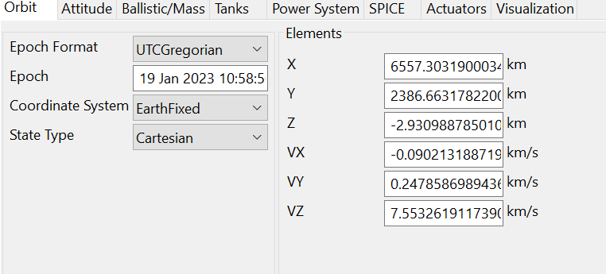

A.19 NR standalone tests for ATG
================================

A.19.1 RRC\_IDLE state mobility
-------------------------------

#### A.19.1.1 Cell reselection to FR1 intra-frequency NR case 

##### A.19.1.1.1 Test Purpose and Environment

This test is to verify the requirement for the intra frequency NR cell
reselection requirements for ATG specified in clause 4.2D.2.3.

##### A.19.1.1.2 Test Parameters

The test scenario comprises of 1 NR carrier and 2 cells, supported test
configurations are shown in table A.19.1.1.2-1. The test parameters from
table A.6.1.1.1.2-2 and table A.6.1.1.1.2-3 are used except those
described in the tables A.19.1.1.2-2 and A.19.1.1.2-3. The test consists
of three successive time periods, with time duration of T1, T2, and T3
respectively. Only Cell 1 is already identified by the UE prior to the
start of the test. Cell 1 and Cell 2 belong to different tracking areas.
Furthermore, UE has not registered with network for the tracking area
containing Cell 2.

UE positioning and UE speed are set by AT command. UE speed is 0km/h, UE
specific positioning is emulated by test system.

The specific gNB reference location is emulated by test system.

Table A.19.1.1.2-1: Supported test configurations

  Configuration                                                                               Description
  ------------------------------------------------------------------------------------------- ---------------------------------------------------
  1                                                                                           15 kHz SSB SCS, 10 MHz bandwidth, FDD duplex mode
  2                                                                                           15 kHz SSB SCS, 10 MHz bandwidth, TDD duplex mode
  3                                                                                           30 kHz SSB SCS, 40 MHz bandwidth, TDD duplex mode
  NOTE 1: The UE is only required to be tested in one of the supported test configurations.   

Table A.19.1.1.2-2: General test parameters for intra frequency NR cell
re-selection test case

+---------------+------+---------------+------------+---------------+
| Parameter     | Unit | Test          | Value      | Comment       |
|               |      | configuration |            |               |
+===============+======+===============+============+===============+
|               |      |               |            |               |
+---------------+------+---------------+------------+---------------+
| Access        | \-   | 1, 2, 3       | not barred | No additional |
| Barring       |      |               |            | delays in     |
| Information   |      |               |            | random access |
|               |      |               |            | procedure.    |
+---------------+------+---------------+------------+---------------+
| T2            | s    | 1, 2, 3       | 40         | T2 needs to   |
|               |      |               |            | be defined so |
|               |      |               |            | that cell     |
|               |      |               |            | re-selection  |
|               |      |               |            | reaction time |
|               |      |               |            | is taken into |
|               |      |               |            | account.      |
|               |      |               |            |               |
|               |      |               |            | The value     |
|               |      |               |            | applies for   |
|               |      |               |            | UEs that      |
|               |      |               |            | don't support |
|               |      |               |            | *antennaA     |
|               |      |               |            | rrayType-r18* |
|               |      |               |            | and UEs that  |
|               |      |               |            | support       |
|               |      |               |            | *antenna      |
|               |      |               |            | ArrayType-18* |
+---------------+------+---------------+------------+---------------+
| T3            | s    | 1, 2, 3       | 15         | T3 needs to   |
|               |      |               |            | be defined so |
|               |      |               |            | that cell     |
|               |      |               |            | re-selection  |
|               |      |               |            | reaction time |
|               |      |               |            | is taken into |
|               |      |               |            | account.      |
|               |      |               |            |               |
|               |      |               |            | The value     |
|               |      |               |            | applies for   |
|               |      |               |            | UEs that      |
|               |      |               |            | don't support |
|               |      |               |            | *antennaA     |
|               |      |               |            | rrayType-r18* |
|               |      |               |            | and UEs that  |
|               |      |               |            | support       |
|               |      |               |            | *antenna      |
|               |      |               |            | ArrayType-18* |
+---------------+------+---------------+------------+---------------+

Table A.19.1.1.2-3: Cell specific test parameters for intra frequency NR
cell re-selection test case

  Parameter               Unit   Test configuration   Cell 1        Cell 2                  
  ----------------------- ------ -------------------- ------------- -------- ---- ---- ---- ----
                                                      T1            T2       T3   T1   T2   T3
  Propagation Condition          1, 2                 AWGN+220 Hz                           
                                 3                    AWGN+500 Hz                           

##### A.19.1.1.3 Test Requirements

For UEs that don't support *antennaArrayType-r18* and UEs that support
*antennaArrayType-18*:

The cell reselection delay to a newly detectable cell is defined as the
time from the beginning of time period T2, to the moment when the UE
camps on Cell 2, and starts to send preambles on the PRACH for sending
the *RRCSetupRequest* message to perform a Registration procedure for
mobility and periodic registration update on Cell 2.

The cell re-selection delay to a newly detectable cell shall be less
than 34 s.

The cell reselection delay to an already detected cell is defined as the
time from the beginning of time period T3, to the moment when the UE
camps on Cell 1, and starts to send preambles on the PRACH for sending
the *RRCSetupRequest* message to perform a Registration procedure for
mobility and periodic registration update on Cell 1.

The cell re-selection delay to an already detected cell shall be less
than 8 s.

The rate of correct cell reselections observed during repeated tests
shall be at least 90 %.

NOTE: The cell re-selection delay to a newly detectable cell can be
expressed as: T~detect,\ NR\_Intra~ + T~SI-NR~, and to an already
detected cell can be expressed as: T~evaluate,\ NR\_\ intra~ + T~SI-NR~,

Where:

T~detect,\ NR\_Intra~ See Table 4.2D.2.3-1 in clause 4.2D.2.3

T~evaluate,\ NR\_\ intra~ See Table 4.2D.2.3-1 in clause 4.2D.2.3

T~SI-NR~ Maximum repetition period of relevant system info blocks that
needs to be received by the UE to camp on a cell; 1280 ms is assumed in
this test case provided that SIB1 and SIB22 are scheduled with 20 ms
period and 80 ms period, respectively.

For the cell re-selection delay to a newly detectable cell,
T~detect,\ NR\_\ intra~ + T~SI-NR~ = 33.28 s, allow 34 s.

For the cell re-selection delay to an already detected cell in the test
case, T~evaluate,\ NR\_Intra~ + T~SI-NR~ = 7.68 s, allow 8 s.

#### A.19.1.2 Cell reselection to FR1 inter-frequency NR case

##### A.19.1.2.1 Test Purpose and Environment

This test is to verify the requirement for the inter frequency NR cell
reselection requirements for ATG specified in clause 4.2D.2.4.

##### A.19.1.2.2 Test Parameters

The test scenario comprises of 2 cells on 2 different NR carriers
respectively as given in tables A.19.1.2.2-1, A.19.1.2.2-2 and
A.19.1.2.2-3. The test consists of three successive time periods, with
time duration of T1, T2, and T3 respectively. Only Cell 1 is already
identified by the UE prior to the start of the test. Cell 1 and Cell 2
belong to different tracking areas. Furthermore, UE has not registered
with network for the tracking area containing Cell 2.

UE positioning and UE speed are set by AT command. UE speed is 0km/h, UE
specific positioning is emulated by test system.

The specific gNB reference location is emulated by test system.

Table A.19.1.2.2-1: Supported test configurations

  Configuration                                                                               Description
  ------------------------------------------------------------------------------------------- ---------------------------------------------------
  1                                                                                           15 kHz SSB SCS, 10 MHz bandwidth, FDD duplex mode
  2                                                                                           15 kHz SSB SCS, 10 MHz bandwidth, TDD duplex mode
  3                                                                                           30 kHz SSB SCS, 40 MHz bandwidth, TDD duplex mode
  NOTE 1: The UE is only required to be tested in one of the supported test configurations.   

Table A.19.1.2.2-2: General test parameters for FR1 inter frequency NR
cell re-selection test case

+-----------+-----------+-----------+-----------+-----------+---+
| Parameter | Unit      | Test      | Value     | Comment   |   |
|           |           | conf      |           |           |   |
|           |           | iguration |           |           |   |
+===========+===========+===========+===========+===========+===+
| Initial   | Active    |           | 1, 2, 3   | Cell 1    |   |
| condition | cell      |           |           |           |   |
+-----------+-----------+-----------+-----------+-----------+---+
| T2 end    | Active    |           | 1, 2, 3   | Cell 2    |   |
| condition | cell      |           |           |           |   |
+-----------+-----------+-----------+-----------+-----------+---+
|           | Neighbour |           | 1, 2, 3   | Cell 1    |   |
|           | cells     |           |           |           |   |
+-----------+-----------+-----------+-----------+-----------+---+
| T3 end    | Active    |           | 1, 2, 3   | Cell 1    |   |
| condition | cell      |           |           |           |   |
+-----------+-----------+-----------+-----------+-----------+---+
|           | Neighbour |           | 1, 2, 3   | Cell 2    |   |
|           | cell      |           |           |           |   |
+-----------+-----------+-----------+-----------+-----------+---+
| Time      |           | 1         | 3 ms      | Asy       |   |
| offset    |           |           |           | nchronous |   |
| between   |           |           |           | cells     |   |
| cells     |           |           |           |           |   |
+-----------+-----------+-----------+-----------+-----------+---+
|           |           | 2         | 3 μs      | Sy        |   |
|           |           |           |           | nchronous |   |
|           |           |           |           | cells     |   |
+-----------+-----------+-----------+-----------+-----------+---+
|           |           | 3         | 3 μs      | Sy        |   |
|           |           |           |           | nchronous |   |
|           |           |           |           | cells     |   |
+-----------+-----------+-----------+-----------+-----------+---+
| Access    | \-        | 1, 2, 3   | not       | No        |   |
| Barring   |           |           | barred    | a         |   |
| In        |           |           |           | dditional |   |
| formation |           |           |           | delays in |   |
|           |           |           |           | random    |   |
|           |           |           |           | access    |   |
|           |           |           |           | p         |   |
|           |           |           |           | rocedure. |   |
+-----------+-----------+-----------+-----------+-----------+---+
| SSB       |           | 1         | **SSB.1   |           |   |
| conf      |           |           | FR1**     |           |   |
| iguration |           |           |           |           |   |
+-----------+-----------+-----------+-----------+-----------+---+
|           |           | 2         | **SSB.1   |           |   |
|           |           |           | FR1**     |           |   |
+-----------+-----------+-----------+-----------+-----------+---+
|           |           | 3         | **SSB.2   |           |   |
|           |           |           | FR1**     |           |   |
+-----------+-----------+-----------+-----------+-----------+---+
| SMTC      |           | **1**     | *         | **C       |   |
| conf      |           |           | *SMTC.2** | onfigured |   |
| iguration |           |           |           | in SIB4   |   |
|           |           |           |           | of Cell   |   |
|           |           |           |           | 1**       |   |
+-----------+-----------+-----------+-----------+-----------+---+
|           |           |           | *         | **C       |   |
|           |           |           | *SMTC.6** | onfigured |   |
|           |           |           |           | in SIB4   |   |
|           |           |           |           | of Cell   |   |
|           |           |           |           | 2**       |   |
+-----------+-----------+-----------+-----------+-----------+---+
|           |           | **2**     | *         |           |   |
|           |           |           | *SMTC.1** |           |   |
+-----------+-----------+-----------+-----------+-----------+---+
|           |           | **3**     | *         |           |   |
|           |           |           | *SMTC.1** |           |   |
+-----------+-----------+-----------+-----------+-----------+---+
| DRX cycle | s         | 1, 2, 3   | 1.28      | The value |   |
| length    |           |           |           | shall be  |   |
|           |           |           |           | used for  |   |
|           |           |           |           | all cells |   |
|           |           |           |           | in the    |   |
|           |           |           |           | test.     |   |
+-----------+-----------+-----------+-----------+-----------+---+
| PRACH     |           | 1, 2, 3   | 102       | The       |   |
| conf      |           |           |           | detailed  |   |
| iguration |           |           |           | conf      |   |
| index     |           |           |           | iguration |   |
|           |           |           |           | is        |   |
|           |           |           |           | specified |   |
|           |           |           |           | in TS     |   |
|           |           |           |           | 38.211    |   |
|           |           |           |           | clause    |   |
|           |           |           |           | 6.3.3.2   |   |
+-----------+-----------+-----------+-----------+-----------+---+
| rangeT    |           | 1, 2, 3   | Not       |           |   |
| oBestCell |           |           | c         |           |   |
|           |           |           | onfigured |           |   |
+-----------+-----------+-----------+-----------+-----------+---+
| T1        | s         | 1, 2, 3   | \>7       | During    |   |
|           |           |           |           | T1, Cell  |   |
|           |           |           |           | 2 shall   |   |
|           |           |           |           | be        |   |
|           |           |           |           | powered   |   |
|           |           |           |           | off, and  |   |
|           |           |           |           | during    |   |
|           |           |           |           | the off   |   |
|           |           |           |           | time the  |   |
|           |           |           |           | physical  |   |
|           |           |           |           | cell      |   |
|           |           |           |           | identity  |   |
|           |           |           |           | shall be  |   |
|           |           |           |           | changed,  |   |
|           |           |           |           | The       |   |
|           |           |           |           | intention |   |
|           |           |           |           | is to     |   |
|           |           |           |           | ensure    |   |
|           |           |           |           | that Cell |   |
|           |           |           |           | 2 has not |   |
|           |           |           |           | been      |   |
|           |           |           |           | detected  |   |
|           |           |           |           | by the UE |   |
|           |           |           |           | prior to  |   |
|           |           |           |           | the start |   |
|           |           |           |           | of period |   |
|           |           |           |           | T2        |   |
+-----------+-----------+-----------+-----------+-----------+---+
| T2        | s         | 1, 2, 3   | 40        | T2 needs  |   |
|           |           |           |           | to be     |   |
|           |           |           |           | defined   |   |
|           |           |           |           | so that   |   |
|           |           |           |           | cell      |   |
|           |           |           |           | re-       |   |
|           |           |           |           | selection |   |
|           |           |           |           | reaction  |   |
|           |           |           |           | time is   |   |
|           |           |           |           | taken     |   |
|           |           |           |           | into      |   |
|           |           |           |           | account.  |   |
|           |           |           |           |           |   |
|           |           |           |           | The value |   |
|           |           |           |           | applies   |   |
|           |           |           |           | for UEs   |   |
|           |           |           |           | that      |   |
|           |           |           |           | don't     |   |
|           |           |           |           | support   |   |
|           |           |           |           | an        |   |
|           |           |           |           | tennaArra |   |
|           |           |           |           | yType-r18 |   |
|           |           |           |           | and UEs   |   |
|           |           |           |           | that      |   |
|           |           |           |           | support   |   |
|           |           |           |           | a         |   |
|           |           |           |           | ntennaArr |   |
|           |           |           |           | ayType-18 |   |
+-----------+-----------+-----------+-----------+-----------+---+
| T3        | s         | 1, 2, 3   | 15        | T3 needs  |   |
|           |           |           |           | to be     |   |
|           |           |           |           | defined   |   |
|           |           |           |           | so that   |   |
|           |           |           |           | cell      |   |
|           |           |           |           | re-       |   |
|           |           |           |           | selection |   |
|           |           |           |           | reaction  |   |
|           |           |           |           | time is   |   |
|           |           |           |           | taken     |   |
|           |           |           |           | into      |   |
|           |           |           |           | account.  |   |
|           |           |           |           |           |   |
|           |           |           |           | The value |   |
|           |           |           |           | applies   |   |
|           |           |           |           | for UEs   |   |
|           |           |           |           | that      |   |
|           |           |           |           | don't     |   |
|           |           |           |           | support   |   |
|           |           |           |           | an        |   |
|           |           |           |           | tennaArra |   |
|           |           |           |           | yType-r18 |   |
|           |           |           |           | and UEs   |   |
|           |           |           |           | that      |   |
|           |           |           |           | support   |   |
|           |           |           |           | a         |   |
|           |           |           |           | ntennaArr |   |
|           |           |           |           | ayType-18 |   |
+-----------+-----------+-----------+-----------+-----------+---+

Table A.19.1.2.2-3: Cell specific test parameters for FR1 inter
frequency NR cell re-selection test case

+-------+-------+-------+-------+-------+-------+-------+------+-------+
| Para  | Unit  | Test  | Cell  | Cell  |       |       |      |       |
| meter |       | con   | 1     | 2     |       |       |      |       |
|       |       | figur |       |       |       |       |      |       |
|       |       | ation |       |       |       |       |      |       |
+=======+=======+=======+=======+=======+=======+=======+======+=======+
|       |       |       | T1    | T2    | T3    | T1    | T2   | T3    |
+-------+-------+-------+-------+-------+-------+-------+------+-------+
| **RF  |       | 1, 2, | 1     | 2     |       |       |      |       |
| Ch    |       | 3     |       |       |       |       |      |       |
| annel |       |       |       |       |       |       |      |       |
| Num   |       |       |       |       |       |       |      |       |
| ber** |       |       |       |       |       |       |      |       |
+-------+-------+-------+-------+-------+-------+-------+------+-------+
| TDD   |       | 1     | N/A   | N/A   |       |       |      |       |
| con   |       |       |       |       |       |       |      |       |
| figur |       |       |       |       |       |       |      |       |
| ation |       |       |       |       |       |       |      |       |
+-------+-------+-------+-------+-------+-------+-------+------+-------+
|       |       | 2     | T     | T     |       |       |      |       |
|       |       |       | DDCon | DDCon |       |       |      |       |
|       |       |       | f.1.1 | f.1.1 |       |       |      |       |
+-------+-------+-------+-------+-------+-------+-------+------+-------+
|       |       | 3     | T     | T     |       |       |      |       |
|       |       |       | DDCon | DDCon |       |       |      |       |
|       |       |       | f.2.1 | f.2.1 |       |       |      |       |
+-------+-------+-------+-------+-------+-------+-------+------+-------+
| PDSCH |       | 1     | S     | S     |       |       |      |       |
| RMC   |       |       | R.1.1 | R.1.1 |       |       |      |       |
|       |       |       | FDD   | FDD   |       |       |      |       |
+-------+-------+-------+-------+-------+-------+-------+------+-------+
|       |       | 2     | S     | S     |       |       |      |       |
|       |       |       | R.1.1 | R.1.1 |       |       |      |       |
|       |       |       | TDD   | TDD   |       |       |      |       |
+-------+-------+-------+-------+-------+-------+-------+------+-------+
|       |       | 3     | S     | S     |       |       |      |       |
|       |       |       | R.2.1 | R.2.1 |       |       |      |       |
|       |       |       | TDD   | TDD   |       |       |      |       |
+-------+-------+-------+-------+-------+-------+-------+------+-------+
| RMSI  |       | 1     | C     | C     |       |       |      |       |
| CO    |       |       | R.1.1 | R.1.1 |       |       |      |       |
| RESET |       |       | FDD   | FDD   |       |       |      |       |
+-------+-------+-------+-------+-------+-------+-------+------+-------+
|       |       | 2     | C     | C     |       |       |      |       |
|       |       |       | R.1.1 | R.1.1 |       |       |      |       |
|       |       |       | TDD   | TDD   |       |       |      |       |
+-------+-------+-------+-------+-------+-------+-------+------+-------+
|       |       | 3     | C     | C     |       |       |      |       |
|       |       |       | R.2.1 | R.2.1 |       |       |      |       |
|       |       |       | TDD   | TDD   |       |       |      |       |
+-------+-------+-------+-------+-------+-------+-------+------+-------+
| Dedi  |       | 1     | CC    | CC    |       |       |      |       |
| cated |       |       | R.1.1 | R.1.1 |       |       |      |       |
| CO    |       |       | FDD   | FDD   |       |       |      |       |
| RESET |       |       |       |       |       |       |      |       |
+-------+-------+-------+-------+-------+-------+-------+------+-------+
|       |       | 2     | CC    | CC    |       |       |      |       |
|       |       |       | R.1.1 | R.1.1 |       |       |      |       |
|       |       |       | TDD   | TDD   |       |       |      |       |
+-------+-------+-------+-------+-------+-------+-------+------+-------+
|       |       | 3     | CC    | CC    |       |       |      |       |
|       |       |       | R.2.1 | R.2.1 |       |       |      |       |
|       |       |       | TDD   | TDD   |       |       |      |       |
+-------+-------+-------+-------+-------+-------+-------+------+-------+
| OCNG  |       | 1, 2, | OP.1  | OP.1  |       |       |      |       |
| Pa    |       | 3     | de    | de    |       |       |      |       |
| ttern |       |       | fined | fined |       |       |      |       |
|       |       |       | in    | in    |       |       |      |       |
|       |       |       | A.    | A.    |       |       |      |       |
|       |       |       | 3.2.1 | 3.2.1 |       |       |      |       |
+-------+-------+-------+-------+-------+-------+-------+------+-------+
| In    |       | 1, 2, | DLBW  | DLBW  |       |       |      |       |
| itial |       | 3     | P.0.1 | P.0.1 |       |       |      |       |
| DL    |       |       |       |       |       |       |      |       |
| BWP   |       |       |       |       |       |       |      |       |
| con   |       |       |       |       |       |       |      |       |
| figur |       |       |       |       |       |       |      |       |
| ation |       |       |       |       |       |       |      |       |
+-------+-------+-------+-------+-------+-------+-------+------+-------+
| In    |       | 1, 2, | ULBW  | ULBW  |       |       |      |       |
| itial |       | 3     | P.0.1 | P.0.1 |       |       |      |       |
| UL    |       |       |       |       |       |       |      |       |
| BWP   |       |       |       |       |       |       |      |       |
| con   |       |       |       |       |       |       |      |       |
| figur |       |       |       |       |       |       |      |       |
| ation |       |       |       |       |       |       |      |       |
+-------+-------+-------+-------+-------+-------+-------+------+-------+
| R     |       | 1, 2, | SSB   | SSB   |       |       |      |       |
| LM-RS |       | 3     |       |       |       |       |      |       |
+-------+-------+-------+-------+-------+-------+-------+------+-------+
| Qrxl  | dB    | 1, 2  | -140  | -140  |       |       |      |       |
| evmin | m/SCS |       |       |       |       |       |      |       |
+-------+-------+-------+-------+-------+-------+-------+------+-------+
|       |       | 3     | -137  | -137  |       |       |      |       |
+-------+-------+-------+-------+-------+-------+-------+------+-------+
| Pco   | dB    | 1, 2, | 0     | 0     |       |       |      |       |
| mpens |       | 3     |       |       |       |       |      |       |
| ation |       |       |       |       |       |       |      |       |
+-------+-------+-------+-------+-------+-------+-------+------+-------+
| Ce    |       | 1, 2, | SS    | SS    |       |       |      |       |
| ll\_s |       | 3     | -RSRP | -RSRP |       |       |      |       |
| elect |       |       |       |       |       |       |      |       |
| ion\_ |       |       |       |       |       |       |      |       |
| and\_ |       |       |       |       |       |       |      |       |
|       |       |       |       |       |       |       |      |       |
| res   |       |       |       |       |       |       |      |       |
| elect |       |       |       |       |       |       |      |       |
| ion\_ |       |       |       |       |       |       |      |       |
| quali |       |       |       |       |       |       |      |       |
| ty\_m |       |       |       |       |       |       |      |       |
| easur |       |       |       |       |       |       |      |       |
| ement |       |       |       |       |       |       |      |       |
+-------+-------+-------+-------+-------+-------+-------+------+-------+
|       | dB    | 1     | 16    | -3.11 | 2.79  | -inf  | 2.79 | -3.11 |
|       |       |       |       |       |       | inity |      |       |
+-------+-------+-------+-------+-------+-------+-------+------+-------+
|       |       | 2     |       |       |       |       |      |       |
+-------+-------+-------+-------+-------+-------+-------+------+-------+
|       |       | 3     |       |       |       |       |      |       |
+-------+-------+-------+-------+-------+-------+-------+------+-------+
| ^N    | dB    | 1     | -98   |       |       |       |      |       |
| ote2^ | m/SCS |       |       |       |       |       |      |       |
+-------+-------+-------+-------+-------+-------+-------+------+-------+
|       |       | 2     | -98   |       |       |       |      |       |
+-------+-------+-------+-------+-------+-------+-------+------+-------+
|       |       | 3     | -95   |       |       |       |      |       |
+-------+-------+-------+-------+-------+-------+-------+------+-------+
| ^N    | d     | 1     | -98   |       |       |       |      |       |
| ote2^ | Bm/15 |       |       |       |       |       |      |       |
|       | kHz   |       |       |       |       |       |      |       |
+-------+-------+-------+-------+-------+-------+-------+------+-------+
|       |       | 2     |       |       |       |       |      |       |
+-------+-------+-------+-------+-------+-------+-------+------+-------+
|       |       | 3     |       |       |       |       |      |       |
+-------+-------+-------+-------+-------+-------+-------+------+-------+
|       | dB    | 1     | 16    | 13    | 16    | -inf  | 16   | 13    |
|       |       |       |       |       |       | inity |      |       |
+-------+-------+-------+-------+-------+-------+-------+------+-------+
|       |       | 2     |       |       |       |       |      |       |
+-------+-------+-------+-------+-------+-------+-------+------+-------+
|       |       | 3     |       |       |       |       |      |       |
+-------+-------+-------+-------+-------+-------+-------+------+-------+
| SS    | dB    | 1, 2  | -82   | -85   | -82   | -inf  | -82  | -85   |
| -RSRP | m/SCS |       |       |       |       | inity |      |       |
| ^N    |       |       |       |       |       |       |      |       |
| ote3^ |       |       |       |       |       |       |      |       |
+-------+-------+-------+-------+-------+-------+-------+------+-------+
|       |       | 3     | -79   | -82   | -79   | -inf  | -79  | -82   |
|       |       |       |       |       |       | inity |      |       |
+-------+-------+-------+-------+-------+-------+-------+------+-------+
| Io    | dBm   | 1, 2  | -     | -     | -     | Same  |      |       |
|       | /9.36 |       | 53.94 | 52.21 | 52.21 | as    |      |       |
|       | MHz   |       |       |       |       | param |      |       |
|       |       |       |       |       |       | eters |      |       |
|       |       |       |       |       |       | spec  |      |       |
|       |       |       |       |       |       | ified |      |       |
|       |       |       |       |       |       | in    |      |       |
|       |       |       |       |       |       | Cell  |      |       |
|       |       |       |       |       |       | 1     |      |       |
|       |       |       |       |       |       | col   |      |       |
|       |       |       |       |       |       | umns- |      |       |
+-------+-------+-------+-------+-------+-------+-------+------+-------+
|       | dBm/  | 3     | -     | -     | -     |       |      |       |
|       | 38.16 |       | 47.85 | 46.12 | 46.12 |       |      |       |
|       | MHz   |       |       |       |       |       |      |       |
+-------+-------+-------+-------+-------+-------+-------+------+-------+
| Tr    | s     | 1, 2, | 0     | 0     | 0     | 0     | 0    | 0     |
| esele |       | 3     |       |       |       |       |      |       |
| ction |       |       |       |       |       |       |      |       |
+-------+-------+-------+-------+-------+-------+-------+------+-------+
| S     | dB    | 1, 2, | 60    | 60    |       |       |      |       |
| nonin |       | 3     |       |       |       |       |      |       |
| trase |       |       |       |       |       |       |      |       |
| archP |       |       |       |       |       |       |      |       |
+-------+-------+-------+-------+-------+-------+-------+------+-------+
| P     |       | 1, 2  | AWG   |       |       |       |      |       |
| ropag |       |       | N+220 |       |       |       |      |       |
| ation |       |       | Hz    |       |       |       |      |       |
| Cond  |       |       |       |       |       |       |      |       |
| ition |       |       |       |       |       |       |      |       |
+-------+-------+-------+-------+-------+-------+-------+------+-------+
|       |       | 3     | AWG   |       |       |       |      |       |
|       |       |       | N+500 |       |       |       |      |       |
|       |       |       | Hz    |       |       |       |      |       |
+-------+-------+-------+-------+-------+-------+-------+------+-------+
| NOTE  |       |       |       |       |       |       |      |       |
| 1:    |       |       |       |       |       |       |      |       |
| OCNG  |       |       |       |       |       |       |      |       |
| shall |       |       |       |       |       |       |      |       |
| be    |       |       |       |       |       |       |      |       |
| used  |       |       |       |       |       |       |      |       |
| such  |       |       |       |       |       |       |      |       |
| that  |       |       |       |       |       |       |      |       |
| both  |       |       |       |       |       |       |      |       |
| cells |       |       |       |       |       |       |      |       |
| are   |       |       |       |       |       |       |      |       |
| fully |       |       |       |       |       |       |      |       |
| allo  |       |       |       |       |       |       |      |       |
| cated |       |       |       |       |       |       |      |       |
| and a |       |       |       |       |       |       |      |       |
| con   |       |       |       |       |       |       |      |       |
| stant |       |       |       |       |       |       |      |       |
| total |       |       |       |       |       |       |      |       |
| t     |       |       |       |       |       |       |      |       |
| ransm |       |       |       |       |       |       |      |       |
| itted |       |       |       |       |       |       |      |       |
| power |       |       |       |       |       |       |      |       |
| spe   |       |       |       |       |       |       |      |       |
| ctral |       |       |       |       |       |       |      |       |
| de    |       |       |       |       |       |       |      |       |
| nsity |       |       |       |       |       |       |      |       |
| is    |       |       |       |       |       |       |      |       |
| ach   |       |       |       |       |       |       |      |       |
| ieved |       |       |       |       |       |       |      |       |
| for   |       |       |       |       |       |       |      |       |
| all   |       |       |       |       |       |       |      |       |
| OFDM  |       |       |       |       |       |       |      |       |
| sym   |       |       |       |       |       |       |      |       |
| bols. |       |       |       |       |       |       |      |       |
|       |       |       |       |       |       |       |      |       |
| NOTE  |       |       |       |       |       |       |      |       |
| 2:    |       |       |       |       |       |       |      |       |
| In    |       |       |       |       |       |       |      |       |
| terfe |       |       |       |       |       |       |      |       |
| rence |       |       |       |       |       |       |      |       |
| from  |       |       |       |       |       |       |      |       |
| other |       |       |       |       |       |       |      |       |
| cells |       |       |       |       |       |       |      |       |
| and   |       |       |       |       |       |       |      |       |
| noise |       |       |       |       |       |       |      |       |
| so    |       |       |       |       |       |       |      |       |
| urces |       |       |       |       |       |       |      |       |
| not   |       |       |       |       |       |       |      |       |
| spec  |       |       |       |       |       |       |      |       |
| ified |       |       |       |       |       |       |      |       |
| in    |       |       |       |       |       |       |      |       |
| the   |       |       |       |       |       |       |      |       |
| test  |       |       |       |       |       |       |      |       |
| is    |       |       |       |       |       |       |      |       |
| as    |       |       |       |       |       |       |      |       |
| sumed |       |       |       |       |       |       |      |       |
| to be |       |       |       |       |       |       |      |       |
| con   |       |       |       |       |       |       |      |       |
| stant |       |       |       |       |       |       |      |       |
| over  |       |       |       |       |       |       |      |       |
| s     |       |       |       |       |       |       |      |       |
| ubcar |       |       |       |       |       |       |      |       |
| riers |       |       |       |       |       |       |      |       |
| and   |       |       |       |       |       |       |      |       |
| time  |       |       |       |       |       |       |      |       |
| and   |       |       |       |       |       |       |      |       |
| shall |       |       |       |       |       |       |      |       |
| be    |       |       |       |       |       |       |      |       |
| mod   |       |       |       |       |       |       |      |       |
| elled |       |       |       |       |       |       |      |       |
| as    |       |       |       |       |       |       |      |       |
| AWGN  |       |       |       |       |       |       |      |       |
| of    |       |       |       |       |       |       |      |       |
| a     |       |       |       |       |       |       |      |       |
| pprop |       |       |       |       |       |       |      |       |
| riate |       |       |       |       |       |       |      |       |
| power |       |       |       |       |       |       |      |       |
| for   |       |       |       |       |       |       |      |       |
| to be |       |       |       |       |       |       |      |       |
| fulfi |       |       |       |       |       |       |      |       |
| lled. |       |       |       |       |       |       |      |       |
|       |       |       |       |       |       |       |      |       |
| NOTE  |       |       |       |       |       |       |      |       |
| 3:    |       |       |       |       |       |       |      |       |
| SS    |       |       |       |       |       |       |      |       |
| -RSRP |       |       |       |       |       |       |      |       |
| l     |       |       |       |       |       |       |      |       |
| evels |       |       |       |       |       |       |      |       |
| have  |       |       |       |       |       |       |      |       |
| been  |       |       |       |       |       |       |      |       |
| de    |       |       |       |       |       |       |      |       |
| rived |       |       |       |       |       |       |      |       |
| from  |       |       |       |       |       |       |      |       |
| other |       |       |       |       |       |       |      |       |
| param |       |       |       |       |       |       |      |       |
| eters |       |       |       |       |       |       |      |       |
| for   |       |       |       |       |       |       |      |       |
| i     |       |       |       |       |       |       |      |       |
| nform |       |       |       |       |       |       |      |       |
| ation |       |       |       |       |       |       |      |       |
| purp  |       |       |       |       |       |       |      |       |
| oses. |       |       |       |       |       |       |      |       |
| They  |       |       |       |       |       |       |      |       |
| are   |       |       |       |       |       |       |      |       |
| not   |       |       |       |       |       |       |      |       |
| set   |       |       |       |       |       |       |      |       |
| table |       |       |       |       |       |       |      |       |
| param |       |       |       |       |       |       |      |       |
| eters |       |       |       |       |       |       |      |       |
| t     |       |       |       |       |       |       |      |       |
| hemse |       |       |       |       |       |       |      |       |
| lves. |       |       |       |       |       |       |      |       |
+-------+-------+-------+-------+-------+-------+-------+------+-------+

##### A.19.1.2.3 Test Requirements

For UEs that don't support antennaArrayType-r18 and UEs that support
antennaArrayType-18:

The cell reselection delay to a newly detectable cell is defined as the
time from the beginning of time period T2, to the moment when the UE
camps on Cell 2, and starts to send preambles on the PRACH for sending
the *RRCSetupRequest* message to perform a Registration procedure for
mobility and periodic registration update on Cell 2.

The cell re-selection delay to a newly detectable cell shall be less
than 34 s.

The cell reselection delay to an already detected cell is defined as the
time from the beginning of time period T3, to the moment when the UE
camps on Cell 1, and starts to send preambles on the PRACH for sending
the *RRCSetupRequest* message to perform a Registration procedure for
mobility and periodic registration update on Cell 1.

The cell re-selection delay to an already detected cell shall be less
than 8 s.

The rate of correct cell reselections observed during repeated tests
shall be at least 90 %.

NOTE: The cell re-selection delay to a newly detectable cell can be
expressed as: T~detect,\ NR\_Inter~ + T~SI-NR~, and to an already
detected cell can be expressed as: T~evaluate,\ NR\_\ intrer~+ T~SI-NR~,

Where:

T~detect,\ NR\_Inter~ See Table 4.2D.2.4-1 in clause 4.2D.2.4

T~evaluate,\ NR\_\ inter~ See Table 4.2D.2.4-1 in clause 4.2D.2.4

T~SI-NR~ Maximum repetition period of relevant system info blocks that
needs to be received by the UE to camp on a cell; 1280 ms is assumed in
this test case provided that SIB1 and SIB22 are scheduled with 20 ms
period and 80 ms period, respectively.

For the cell re-selection delay to a newly detectable cell,
T~detect,\ NR\_\ inter~ + T~SI-NR~ = 33.28 s, allow 34 s.

For the cell re-selection delay to an already detected cell in the test
case, T~evaluate,\ NR\_Inter~ + T~SI-NR~ = 7.68 s, allow 8 s.

#### A.19.1.3 Cell reselection to FR1 inter-frequency NR case for UE configured with *hs-ATG-cellReselectionSet-r18*

##### A.19.1.3.1 Test Purpose and Environment

This test is to verify the requirement for the inter frequency NR cell
reselection requirements for ATG UE configured with
*hs-ATG-cellReselectionSet-r18* and for ATG UE supporting the feature
for enhanced RRM requirements *(Enhanced RRM requirements for
measurements in IDLE and INACTIVE modes for ATG)* specified in
clause 4.2D.2.4.

##### A.19.1.3.2 Test Parameters

The test scenario comprises of 2 cells on 2 different NR carriers
respectively as given in tables A.19.1.3.2-1, A.19.1.3.2-2 and
A.19.1.3.2-3. The test consists of two successive time periods, with
time duration of T1 and T2. Only Cell 1 is already identified by the UE
prior to the start of the test. Cell 1 and Cell 2 belong to different
tracking areas. Furthermore, UE has not registered with network for the
tracking area containing Cell 2.

UE positioning and UE speed are set by AT command. UE speed is 0km/h, UE
specific positioning is emulated by test system.

The specific gNB reference location is emulated by test system.

Table A.19.1.3.2-1: Supported test configurations

  Configuration                                                                               Description
  ------------------------------------------------------------------------------------------- ---------------------------------------------------
  1                                                                                           15 kHz SSB SCS, 10 MHz bandwidth, FDD duplex mode
  2                                                                                           15 kHz SSB SCS, 10 MHz bandwidth, TDD duplex mode
  3                                                                                           30 kHz SSB SCS, 40 MHz bandwidth, TDD duplex mode
  NOTE 1: The UE is only required to be tested in one of the supported test configurations.   

Table A.19.1.3.2-2: General test parameters for FR1 inter frequency NR
cell re-selection test case

+-----------+-----------+-----------+-----------+-----------+---+
| Parameter | Unit      | Test      | Value     | Comment   |   |
|           |           | conf      |           |           |   |
|           |           | iguration |           |           |   |
+===========+===========+===========+===========+===========+===+
| Initial   | Active    |           | 1, 2, 3   | Cell 1    |   |
| condition | cell      |           |           |           |   |
+-----------+-----------+-----------+-----------+-----------+---+
| T2 end    | Active    |           | 1, 2, 3   | Cell 2    |   |
| condition | cell      |           |           |           |   |
+-----------+-----------+-----------+-----------+-----------+---+
|           | Neighbour |           | 1, 2, 3   | Cell 1    |   |
|           | cells     |           |           |           |   |
+-----------+-----------+-----------+-----------+-----------+---+
| Time      |           | 1         | 3 ms      | Asy       |   |
| offset    |           |           |           | nchronous |   |
| between   |           |           |           | cells     |   |
| cells     |           |           |           |           |   |
+-----------+-----------+-----------+-----------+-----------+---+
|           |           | 2         | 3 μs      | Sy        |   |
|           |           |           |           | nchronous |   |
|           |           |           |           | cells     |   |
+-----------+-----------+-----------+-----------+-----------+---+
|           |           | 3         | 3 μs      | Sy        |   |
|           |           |           |           | nchronous |   |
|           |           |           |           | cells     |   |
+-----------+-----------+-----------+-----------+-----------+---+
| Access    | \-        | 1, 2, 3   | not       | No        |   |
| Barring   |           |           | barred    | a         |   |
| In        |           |           |           | dditional |   |
| formation |           |           |           | delays in |   |
|           |           |           |           | random    |   |
|           |           |           |           | access    |   |
|           |           |           |           | p         |   |
|           |           |           |           | rocedure. |   |
+-----------+-----------+-----------+-----------+-----------+---+
| SSB       |           | 1         | **SSB.1   |           |   |
| conf      |           |           | FR1**     |           |   |
| iguration |           |           |           |           |   |
+-----------+-----------+-----------+-----------+-----------+---+
|           |           | 2         | **SSB.1   |           |   |
|           |           |           | FR1**     |           |   |
+-----------+-----------+-----------+-----------+-----------+---+
|           |           | 3         | **SSB.2   |           |   |
|           |           |           | FR1**     |           |   |
+-----------+-----------+-----------+-----------+-----------+---+
| SMTC      |           | **1**     | *         | **C       |   |
| conf      |           |           | *SMTC.2** | onfigured |   |
| iguration |           |           |           | in SIB4   |   |
|           |           |           |           | of Cell   |   |
|           |           |           |           | 1**       |   |
+-----------+-----------+-----------+-----------+-----------+---+
|           |           |           | *         | **C       |   |
|           |           |           | *SMTC.6** | onfigured |   |
|           |           |           |           | in SIB4   |   |
|           |           |           |           | of Cell   |   |
|           |           |           |           | 2**       |   |
+-----------+-----------+-----------+-----------+-----------+---+
|           |           | **2**     | *         |           |   |
|           |           |           | *SMTC.1** |           |   |
+-----------+-----------+-----------+-----------+-----------+---+
|           |           | **3**     | *         |           |   |
|           |           |           | *SMTC.1** |           |   |
+-----------+-----------+-----------+-----------+-----------+---+
| DRX cycle | s         | 1, 2, 3   | 1.28      | The value |   |
| length    |           |           |           | shall be  |   |
|           |           |           |           | used for  |   |
|           |           |           |           | all cells |   |
|           |           |           |           | in the    |   |
|           |           |           |           | test.     |   |
+-----------+-----------+-----------+-----------+-----------+---+
| PRACH     |           | 1, 2, 3   | 102       | The       |   |
| conf      |           |           |           | detailed  |   |
| iguration |           |           |           | conf      |   |
| index     |           |           |           | iguration |   |
|           |           |           |           | is        |   |
|           |           |           |           | specified |   |
|           |           |           |           | in TS     |   |
|           |           |           |           | 38.211    |   |
|           |           |           |           | clause    |   |
|           |           |           |           | 6.3.3.2   |   |
+-----------+-----------+-----------+-----------+-----------+---+
| rangeT    |           | 1, 2, 3   | Not       |           |   |
| oBestCell |           |           | c         |           |   |
|           |           |           | onfigured |           |   |
+-----------+-----------+-----------+-----------+-----------+---+
| T1        | s         | 1, 2, 3   | \>7       | During    |   |
|           |           |           |           | T1, Cell  |   |
|           |           |           |           | 2 shall   |   |
|           |           |           |           | be        |   |
|           |           |           |           | powered   |   |
|           |           |           |           | off, and  |   |
|           |           |           |           | during    |   |
|           |           |           |           | the off   |   |
|           |           |           |           | time the  |   |
|           |           |           |           | physical  |   |
|           |           |           |           | cell      |   |
|           |           |           |           | identity  |   |
|           |           |           |           | shall be  |   |
|           |           |           |           | changed,  |   |
|           |           |           |           | The       |   |
|           |           |           |           | intention |   |
|           |           |           |           | is to     |   |
|           |           |           |           | ensure    |   |
|           |           |           |           | that Cell |   |
|           |           |           |           | 2 has not |   |
|           |           |           |           | been      |   |
|           |           |           |           | detected  |   |
|           |           |           |           | by the UE |   |
|           |           |           |           | prior to  |   |
|           |           |           |           | the start |   |
|           |           |           |           | of period |   |
|           |           |           |           | T2        |   |
+-----------+-----------+-----------+-----------+-----------+---+
| T2        | s         | 1, 2, 3   | 20        | T2 needs  |   |
|           |           |           |           | to be     |   |
|           |           |           |           | defined   |   |
|           |           |           |           | so that   |   |
|           |           |           |           | cell      |   |
|           |           |           |           | re-       |   |
|           |           |           |           | selection |   |
|           |           |           |           | reaction  |   |
|           |           |           |           | time is   |   |
|           |           |           |           | taken     |   |
|           |           |           |           | into      |   |
|           |           |           |           | account.  |   |
|           |           |           |           |           |   |
|           |           |           |           | The value |   |
|           |           |           |           | applies   |   |
|           |           |           |           | for UEs   |   |
|           |           |           |           | that      |   |
|           |           |           |           | don't     |   |
|           |           |           |           | support   |   |
|           |           |           |           | an        |   |
|           |           |           |           | tennaArra |   |
|           |           |           |           | yType-r18 |   |
|           |           |           |           | and UEs   |   |
|           |           |           |           | that      |   |
|           |           |           |           | support   |   |
|           |           |           |           | a         |   |
|           |           |           |           | ntennaArr |   |
|           |           |           |           | ayType-18 |   |
+-----------+-----------+-----------+-----------+-----------+---+

Table A.19.1.3.2-3: Cell specific test parameters for FR1 inter
frequency NR cell re-selection test case

+---------+---------+---------+---------+---------+---------+------+
| Pa      | Unit    | Test    | Cell 1  | Cell 2  |         |      |
| rameter |         | config  |         |         |         |      |
|         |         | uration |         |         |         |      |
+=========+=========+=========+=========+=========+=========+======+
|         |         |         | T1      | T2      | T1      | T2   |
+---------+---------+---------+---------+---------+---------+------+
| **RF    |         | 1, 2, 3 | 1       | 2       |         |      |
| Channel |         |         |         |         |         |      |
| N       |         |         |         |         |         |      |
| umber** |         |         |         |         |         |      |
+---------+---------+---------+---------+---------+---------+------+
| TDD     |         | 1       | N/A     | N/A     |         |      |
| config  |         |         |         |         |         |      |
| uration |         |         |         |         |         |      |
+---------+---------+---------+---------+---------+---------+------+
|         |         | 2       | TDDC    | TDDC    |         |      |
|         |         |         | onf.1.1 | onf.1.1 |         |      |
+---------+---------+---------+---------+---------+---------+------+
|         |         | 3       | TDDC    | TDDC    |         |      |
|         |         |         | onf.2.1 | onf.2.1 |         |      |
+---------+---------+---------+---------+---------+---------+------+
| PDSCH   |         | 1       | SR.1.1  | SR.1.1  |         |      |
| RMC     |         |         | FDD     | FDD     |         |      |
+---------+---------+---------+---------+---------+---------+------+
|         |         | 2       | SR.1.1  | SR.1.1  |         |      |
|         |         |         | TDD     | TDD     |         |      |
+---------+---------+---------+---------+---------+---------+------+
|         |         | 3       | SR.2.1  | SR.2.1  |         |      |
|         |         |         | TDD     | TDD     |         |      |
+---------+---------+---------+---------+---------+---------+------+
| RMSI    |         | 1       | CR.1.1  | CR.1.1  |         |      |
| CORESET |         |         | FDD     | FDD     |         |      |
+---------+---------+---------+---------+---------+---------+------+
|         |         | 2       | CR.1.1  | CR.1.1  |         |      |
|         |         |         | TDD     | TDD     |         |      |
+---------+---------+---------+---------+---------+---------+------+
|         |         | 3       | CR.2.1  | CR.2.1  |         |      |
|         |         |         | TDD     | TDD     |         |      |
+---------+---------+---------+---------+---------+---------+------+
| De      |         | 1       | CCR.1.1 | CCR.1.1 |         |      |
| dicated |         |         | FDD     | FDD     |         |      |
| CORESET |         |         |         |         |         |      |
+---------+---------+---------+---------+---------+---------+------+
|         |         | 2       | CCR.1.1 | CCR.1.1 |         |      |
|         |         |         | TDD     | TDD     |         |      |
+---------+---------+---------+---------+---------+---------+------+
|         |         | 3       | CCR.2.1 | CCR.2.1 |         |      |
|         |         |         | TDD     | TDD     |         |      |
+---------+---------+---------+---------+---------+---------+------+
| OCNG    |         | 1, 2, 3 | OP.1    | OP.1    |         |      |
| Pattern |         |         | defined | defined |         |      |
|         |         |         | in      | in      |         |      |
|         |         |         | A.3.2.1 | A.3.2.1 |         |      |
+---------+---------+---------+---------+---------+---------+------+
| Initial |         | 1, 2, 3 | DL      | DL      |         |      |
| DL BWP  |         |         | BWP.0.1 | BWP.0.1 |         |      |
| config  |         |         |         |         |         |      |
| uration |         |         |         |         |         |      |
+---------+---------+---------+---------+---------+---------+------+
| Initial |         | 1, 2, 3 | UL      | UL      |         |      |
| UL BWP  |         |         | BWP.0.1 | BWP.0.1 |         |      |
| config  |         |         |         |         |         |      |
| uration |         |         |         |         |         |      |
+---------+---------+---------+---------+---------+---------+------+
| RLM-RS  |         | 1, 2, 3 | SSB     | SSB     |         |      |
+---------+---------+---------+---------+---------+---------+------+
| Qr      | dBm/SCS | 1, 2    | -140    | -140    |         |      |
| xlevmin |         |         |         |         |         |      |
+---------+---------+---------+---------+---------+---------+------+
|         |         | 3       | -137    | -137    |         |      |
+---------+---------+---------+---------+---------+---------+------+
| Pcompe  | dB      | 1, 2, 3 | 0       | 0       |         |      |
| nsation |         |         |         |         |         |      |
+---------+---------+---------+---------+---------+---------+------+
| C       |         | 1, 2, 3 | SS-RSRP | SS-RSRP |         |      |
| ell\_se |         |         |         |         |         |      |
| lection |         |         |         |         |         |      |
| \_and\_ |         |         |         |         |         |      |
|         |         |         |         |         |         |      |
| resel   |         |         |         |         |         |      |
| ection\ |         |         |         |         |         |      |
| _qualit |         |         |         |         |         |      |
| y\_meas |         |         |         |         |         |      |
| urement |         |         |         |         |         |      |
+---------+---------+---------+---------+---------+---------+------+
|         | dB      | 1       | 16      | -3.11   | -i      | 2.79 |
|         |         |         |         |         | nfinity |      |
+---------+---------+---------+---------+---------+---------+------+
|         |         | 2       |         |         |         |      |
+---------+---------+---------+---------+---------+---------+------+
|         |         | 3       |         |         |         |      |
+---------+---------+---------+---------+---------+---------+------+
| ^Note2^ | dBm/SCS | 1, 2    | -98     |         |         |      |
+---------+---------+---------+---------+---------+---------+------+
|         |         | 2       | -95     |         |         |      |
+---------+---------+---------+---------+---------+---------+------+
| ^Note2^ | dBm/15  | 1       | -98     |         |         |      |
|         | kHz     |         |         |         |         |      |
+---------+---------+---------+---------+---------+---------+------+
|         |         | 2       |         |         |         |      |
+---------+---------+---------+---------+---------+---------+------+
|         |         | 3       |         |         |         |      |
+---------+---------+---------+---------+---------+---------+------+
|         | dB      | 1       | 16      | 13      | -i      | 16   |
|         |         |         |         |         | nfinity |      |
+---------+---------+---------+---------+---------+---------+------+
|         |         | 2       |         |         |         |      |
+---------+---------+---------+---------+---------+---------+------+
|         |         | 3       |         |         |         |      |
+---------+---------+---------+---------+---------+---------+------+
| SS-RSRP | dBm/SCS | 1, 2    | -82     | -85     | -i      | -82  |
| ^Note3^ |         |         |         |         | nfinity |      |
+---------+---------+---------+---------+---------+---------+------+
|         |         | 3       | -79     | -82     | -i      | -79  |
|         |         |         |         |         | nfinity |      |
+---------+---------+---------+---------+---------+---------+------+
| Io      | d       | 1, 2    | -53.94  | -52.21  | Same as |      |
|         | Bm/9.36 |         |         |         | par     |      |
|         | MHz     |         |         |         | ameters |      |
|         |         |         |         |         | sp      |      |
|         |         |         |         |         | ecified |      |
|         |         |         |         |         | in Cell |      |
|         |         |         |         |         | 1       |      |
|         |         |         |         |         | c       |      |
|         |         |         |         |         | olumns- |      |
+---------+---------+---------+---------+---------+---------+------+
|         | dB      | 3       | -47.85  | -46.12  |         |      |
|         | m/38.16 |         |         |         |         |      |
|         | MHz     |         |         |         |         |      |
+---------+---------+---------+---------+---------+---------+------+
| Trese   | s       | 1, 2, 3 | 0       | 0       | 0       | 0    |
| lection |         |         |         |         |         |      |
+---------+---------+---------+---------+---------+---------+------+
| Sn      | dB      | 1, 2, 3 | 60      | 60      |         |      |
| onintra |         |         |         |         |         |      |
| searchP |         |         |         |         |         |      |
+---------+---------+---------+---------+---------+---------+------+
| Prop    |         | 1, 2    | A       |         |         |      |
| agation |         |         | WGN+220 |         |         |      |
| Co      |         |         | Hz      |         |         |      |
| ndition |         |         |         |         |         |      |
+---------+---------+---------+---------+---------+---------+------+
|         |         | 3       | A       |         |         |      |
|         |         |         | WGN+500 |         |         |      |
|         |         |         | Hz      |         |         |      |
+---------+---------+---------+---------+---------+---------+------+
| NOTE 1: |         |         |         |         |         |      |
| OCNG    |         |         |         |         |         |      |
| shall   |         |         |         |         |         |      |
| be used |         |         |         |         |         |      |
| such    |         |         |         |         |         |      |
| that    |         |         |         |         |         |      |
| both    |         |         |         |         |         |      |
| cells   |         |         |         |         |         |      |
| are     |         |         |         |         |         |      |
| fully   |         |         |         |         |         |      |
| al      |         |         |         |         |         |      |
| located |         |         |         |         |         |      |
| and a   |         |         |         |         |         |      |
| c       |         |         |         |         |         |      |
| onstant |         |         |         |         |         |      |
| total   |         |         |         |         |         |      |
| tran    |         |         |         |         |         |      |
| smitted |         |         |         |         |         |      |
| power   |         |         |         |         |         |      |
| s       |         |         |         |         |         |      |
| pectral |         |         |         |         |         |      |
| density |         |         |         |         |         |      |
| is      |         |         |         |         |         |      |
| a       |         |         |         |         |         |      |
| chieved |         |         |         |         |         |      |
| for all |         |         |         |         |         |      |
| OFDM    |         |         |         |         |         |      |
| s       |         |         |         |         |         |      |
| ymbols. |         |         |         |         |         |      |
|         |         |         |         |         |         |      |
| NOTE 2: |         |         |         |         |         |      |
| Inter   |         |         |         |         |         |      |
| ference |         |         |         |         |         |      |
| from    |         |         |         |         |         |      |
| other   |         |         |         |         |         |      |
| cells   |         |         |         |         |         |      |
| and     |         |         |         |         |         |      |
| noise   |         |         |         |         |         |      |
| sources |         |         |         |         |         |      |
| not     |         |         |         |         |         |      |
| sp      |         |         |         |         |         |      |
| ecified |         |         |         |         |         |      |
| in the  |         |         |         |         |         |      |
| test is |         |         |         |         |         |      |
| assumed |         |         |         |         |         |      |
| to be   |         |         |         |         |         |      |
| c       |         |         |         |         |         |      |
| onstant |         |         |         |         |         |      |
| over    |         |         |         |         |         |      |
| subc    |         |         |         |         |         |      |
| arriers |         |         |         |         |         |      |
| and     |         |         |         |         |         |      |
| time    |         |         |         |         |         |      |
| and     |         |         |         |         |         |      |
| shall   |         |         |         |         |         |      |
| be      |         |         |         |         |         |      |
| m       |         |         |         |         |         |      |
| odelled |         |         |         |         |         |      |
| as AWGN |         |         |         |         |         |      |
| of      |         |         |         |         |         |      |
| appr    |         |         |         |         |         |      |
| opriate |         |         |         |         |         |      |
| power   |         |         |         |         |         |      |
| for to  |         |         |         |         |         |      |
| be      |         |         |         |         |         |      |
| ful     |         |         |         |         |         |      |
| filled. |         |         |         |         |         |      |
|         |         |         |         |         |         |      |
| NOTE 3: |         |         |         |         |         |      |
| SS-RSRP |         |         |         |         |         |      |
| levels  |         |         |         |         |         |      |
| have    |         |         |         |         |         |      |
| been    |         |         |         |         |         |      |
| derived |         |         |         |         |         |      |
| from    |         |         |         |         |         |      |
| other   |         |         |         |         |         |      |
| par     |         |         |         |         |         |      |
| ameters |         |         |         |         |         |      |
| for     |         |         |         |         |         |      |
| info    |         |         |         |         |         |      |
| rmation |         |         |         |         |         |      |
| pu      |         |         |         |         |         |      |
| rposes. |         |         |         |         |         |      |
| They    |         |         |         |         |         |      |
| are not |         |         |         |         |         |      |
| s       |         |         |         |         |         |      |
| ettable |         |         |         |         |         |      |
| par     |         |         |         |         |         |      |
| ameters |         |         |         |         |         |      |
| them    |         |         |         |         |         |      |
| selves. |         |         |         |         |         |      |
+---------+---------+---------+---------+---------+---------+------+

##### A.19.1.3.3 Test Requirements

For UEs that don't support antennaArrayType-r18 and UEs that support
antennaArrayType-18:

The cell reselection delay to a newly detectable cell is defined as the
time from the beginning of time period T2, to the moment when the UE
camps on Cell 2, and starts to send preambles on the PRACH for sending
the *RRCSetupRequest* message to perform a Registration procedure for
mobility and periodic registration update on Cell 2.

The cell re-selection delay to a newly detectable cell shall be less
than 12 s.

The rate of correct cell reselections observed during repeated tests
shall be at least 90 %.

NOTE: The cell re-selection delay to a newly detectable cell can be
expressed as: T~detect,\ NR\_Inter\_enh~ + T~SI-NR~

Where:

T~detect,\ NR\_Inter\_enh~ See Table 4.2D.2.4-2 in clause 4.2D.2.4

T~SI-NR~ Maximum repetition period of relevant system info blocks that
needs to be received by the UE to camp on a cell; 1280 ms is assumed in
this test case provided that SIB1 and SIB22 are scheduled with 20 ms
period and 80 ms period, respectively.

For the cell re-selection delay to a newly detectable cell,
T~detect,\ NR\_\ inter\_enh~ + T~SI-NR~ = 11.52 s, allow 12 s.

A.19.2 RRC\_CONNECTED state mobility
------------------------------------

### A.19.2.1 Handover

#### A.19.2.1.1 Intra-frequency handover from FR1 to FR1; known target cell

##### A19.2.1.1.1 Test Purpose and Environment

This test is to verify the requirement for the NR FR1-NR FR1 intra
frequency handover requirements for ATG specified in clause 6.1E.1.2.

##### A.19.2.1.1.2 Test Parameters

Supported test configurations are shown in table A.19.2.1.1.2-1. Both
handover delay and interruption length are tested by using the
parameters in table A.6.3.1.1.2-2 and table A.6.3.1.1.2-3 except those
described in the table A.19.2.1.1.2-2 and A.19.2.1.1.2-3.

The test consists of three successive time periods, with time duration
of T1, T2 and T3 respectively. At the start of time duration T1, the UE
may not have any timing information of Cell 2.

NR shall send a RRC message implying handover to Cell 2. The RRC message
implying handover shall be sent to the UE during period T2, after the UE
has reported Event A3. T3 is defined as the end of the last TTI
containing the RRC message implying handover.

UE positioning and UE speed are set by AT command. UE speed is 0km/h, UE
specific positioning is emulated by test system.

The specific gNB reference location is emulated by test system.

Table A.19.2.1.1.2-1: Intra-frequency handover from FR1 to FR1 test
configurations

+----------------------------------+----------------------------------+
| **Config**                       | **Description**                  |
+==================================+==================================+
| 1                                | Source cell: NR 15 kHz SSB SCS,  |
|                                  | 10 MHz bandwidth, FDD duplex     |
|                                  | mode                             |
|                                  |                                  |
|                                  | Target cell: NR 15 kHz SSB SCS,  |
|                                  | 10 MHz bandwidth, FDD duplex     |
|                                  | mode                             |
+----------------------------------+----------------------------------+
| 2                                | Source cell: NR 15 kHz SSB SCS,  |
|                                  | 10 MHz bandwidth, TDD duplex     |
|                                  | mode                             |
|                                  |                                  |
|                                  | Target cell: NR 15 kHz SSB SCS,  |
|                                  | 10 MHz bandwidth, TDD duplex     |
|                                  | mode                             |
+----------------------------------+----------------------------------+
| 3                                | Source cell: NR 30 kHz SSB SCS,  |
|                                  | 40 MHz bandwidth, TDD duplex     |
|                                  | mode                             |
|                                  |                                  |
|                                  | Target cell: NR 30 kHz SSB SCS,  |
|                                  | 40 MHz bandwidth, TDD duplex     |
|                                  | mode                             |
+----------------------------------+----------------------------------+
| NOTE 1: The UE is only required  |                                  |
| to be tested in one of the       |                                  |
| supported test configurations.   |                                  |
+----------------------------------+----------------------------------+

Table A.19.2.1.1.2-2: General test parameters Intra-frequency handover
from FR1 to FR1

  Parameter                    Unit   Value        Comment
  ---------------------------- ------ ------------ --------------------------------------------------
  Access Barring Information   \-     not barred   No additional delays in random access procedure.

Table A.19.2.1.1.2-3: Cell specific test parameters for NR FR1-FR1 Intra
frequency handover test case

  Parameter               Unit          Cell 1   Cell 2                                
  ----------------------- ------------- -------- ------------- ------------- ---- ---- ----
                                        T1       T2            T3            T1   T2   T3
  Propagation condition   Config 1, 2   \-       AWGN+220 Hz   AWGN+220 Hz             
                          Config 3               AWGN+500 Hz   AWGN+500 Hz             

##### A.19.2.1.2.3 Test Requirements

For UEs that don't support antennaArrayType-r18 and UEs that support
antennaArrayType-18:

The UE shall start to transmit the PRACH to Cell 2 less than 72 ms from
the beginning of time period T2.

The rate of correct handovers observed during repeated tests shall be at
least 90 %.

NOTE: The handover delay can be expressed as: RRC procedure delay +
**T~interrupt~**, where:

RRC procedure delay = 10 ms and is specified in clause 12 in
TS 38.331 \[2\].

**T~interrupt\ ~**= 62 ms in the test. T~interrupt~ is defined in
clause 6.1E.1.2.2.

#### A.19.2.1.2 Inter-frequency handover from FR1 to FR1; unknown target cell

##### A.19.2.1.2.1 Test Purpose and Environment

This test is to verify the requirement for the NR FR1-NR FR1 inter
frequency handover requirements for ATG specified in clause 6.1E.1.2.

##### A.19.2.1.2.2 Test Parameters

Supported test configurations are shown in table A.19.2.1.2.2-1. Both
handover delay and interruption length are tested by using the
parameters in table A.6.3.1.3.2-2 and table A.6.3.1.3.2-3 except those
described in the table A.19.2.1.2.2-2 and A.19.2.1.2.2-3.

The test scenario comprises of two carriers and one cell on each
carrier. No gap patterns are configured in the test case. The test
consists of two successive time periods, with time durations of T1, T2
respectively. At the start of time duration T1, the UE does not have any
timing information of Cell 2. Starting T2, Cell 2 becomes detectable and
the UE receives a RRC handover command from the network. The start of T2
is the instant when the last TTI containing the RRC message implying
handover is sent to the UE.

UE positioning and UE speed are set by AT command. UE speed is 0km/h, UE
specific positioning is emulated by test system.

The specific gNB reference location is emulated by test system.

Table A.19.2.1.2.2-1: Inter-frequency handover from FR1 to FR1 test
configurations

+----------------------------------+----------------------------------+
| Config                           | Description                      |
+==================================+==================================+
| 1                                | Source cell: NR 15 kHz SSB SCS,  |
|                                  | 10 MHz bandwidth, FDD duplex     |
|                                  | mode                             |
|                                  |                                  |
|                                  | Target cell: NR 15 kHz SSB SCS,  |
|                                  | 10 MHz bandwidth, FDD duplex     |
|                                  | mode                             |
+----------------------------------+----------------------------------+
| 2                                | Source cell: NR 15 kHz SSB SCS,  |
|                                  | 10 MHz bandwidth, TDD duplex     |
|                                  | mode                             |
|                                  |                                  |
|                                  | Target cell: NR 15 kHz SSB SCS,  |
|                                  | 10 MHz bandwidth, TDD duplex     |
|                                  | mode                             |
+----------------------------------+----------------------------------+
| 3                                | Source cell: NR 30 kHz SSB SCS,  |
|                                  | 40 MHz bandwidth, TDD duplex     |
|                                  | mode                             |
|                                  |                                  |
|                                  | Target cell: NR 30 kHz SSB SCS,  |
|                                  | 40 MHz bandwidth, TDD duplex     |
|                                  | mode                             |
+----------------------------------+----------------------------------+
| NOTE 1: The UE is only required  |                                  |
| to be tested in one of the       |                                  |
| supported test configurations.   |                                  |
+----------------------------------+----------------------------------+

Table A.19.2.1.2.2-2: General test parameters Inter-frequency handover
from FR1 to FR1

  Parameter                    Unit   Value        Comment
  ---------------------------- ------ ------------ --------------------------------------------------
  Access Barring Information   \-     not barred   No additional delays in random access procedure.
  Time offset between cells           3 μs         Synchronous cells

Table A.19.2.1.2.2-3: Cell specific test parameters for NR FR1-FR1 Inter
frequency handover test case

  Parameter               Unit          Cell 1   Cell 2                          
  ----------------------- ------------- -------- --------------- --------------- ----
                                        T1       T2              T1              T2
  Propagation condition   Config 1, 2   \-       AWGN + 220 Hz   AWGN + 220 Hz   
                          Config 3               AWGN + 500 Hz   AWGN + 500 Hz   

##### A.19.2.1.2.3 Test Requirements

For UEs that don't support antennaArrayType-r18 and UEs that support
antennaArrayType-18:

The UE shall start to transmit the PRACH to Cell 2 less than 132 ms from
the beginning of time period T2.

The rate of correct handovers observed during repeated tests shall be at
least 90 %.

NOTE: The handover delay can be expressed as: RRC procedure delay +
**T~interrupt~**, where:

RRC procedure delay = 10 ms and is specified in clause 12 in
TS 38.331 \[2\].

**T~interrupt~** = 122 ms in the test. **T~interrupt~** is defined in
clause 6.1E.1.2.2.

This gives a total of 132 ms.

### A.19.2.2 Conditional Handover

#### A.19.2.2.1 Intra-frequency distance-based conditional Handover from FR1 to FR1

##### A.19.2.2.1.1 Test Purpose and Environment

This test is to verify the requirement for intra-frequency
distance-based conditional handover from FR1 to FR1 for ATG specified in
clause 6.1E.2.

##### A.19.2.2.1.2 Test Parameters

The test scenario comprises of 1 NR carrier and 2 cells as given in
table A.19.2.2.1.2-1, and A.19.2.2.1.2-2. Both handover delay and
interruption length are tested.

The test consists of two successive time periods, with time durations of
T1 and T2 respectively. At the start of time duration T1, the UE may not
have any timing information of Cell 2. During T1, the UE is configured
to measure intra-frequency neighbour cell. The RRC message implying
distance-based handover to Cell 2 with Event D1 shall be sent to UE, at
a time earlier than **T~RRC~ (10 ms) before** the beginning of T2.

Starting T2, Cell 2 becomes detectable and offset better than Cell 1 and
location condition event condEventD1-r17 is fulfilled.

The specific gNB reference location is emulated by test system.

Table A.19.2.2.1.2-1: Supported test configurations

+----------------------------------+----------------------------------+
| Configuration                    | Description                      |
+==================================+==================================+
| 1                                | Source cell: NR 15 kHz SSB SCS,  |
|                                  | 10 MHz bandwidth, FDD duplex     |
|                                  | mode                             |
|                                  |                                  |
|                                  | Target cell: NR 15 kHz SSB SCS,  |
|                                  | 10 MHz bandwidth, FDD duplex     |
|                                  | mode                             |
+----------------------------------+----------------------------------+
| 2                                | Source cell: NR 15 kHz SSB SCS,  |
|                                  | 10 MHz bandwidth, TDD duplex     |
|                                  | mode                             |
|                                  |                                  |
|                                  | Target cell: NR 15 kHz SSB SCS,  |
|                                  | 10 MHz bandwidth, TDD duplex     |
|                                  | mode                             |
+----------------------------------+----------------------------------+
| 3                                | Source cell: NR 30 kHz SSB SCS,  |
|                                  | 40 MHz bandwidth, TDD duplex     |
|                                  | mode                             |
|                                  |                                  |
|                                  | Target cell: NR 30 kHz SSB SCS,  |
|                                  | 40 MHz bandwidth, TDD duplex     |
|                                  | mode                             |
+----------------------------------+----------------------------------+
| NOTE 1: The UE is only required  |                                  |
| to be tested in one of the       |                                  |
| supported test configurations.   |                                  |
+----------------------------------+----------------------------------+

Table A.19.2.2.1.2-2: General test parameters for Intra-frequency
distance-based conditional handover from FR1 to FR1

  **Parameter**                                      **Unit**            **Value**       **Comment**                                        
  -------------------------------------------------- ------------------- --------------- -------------------------------------------------- --
  RF Channel Number                                                      1                                                                  
  Initial conditions                                 Active cell                         Cell 1                                             
                                                     Neighbouring cell                   Cell 2                                             
  Final condition                                    Active cell                         Cell 2                                             
  UE position (N,S, H) at T1 start                                       (0, 0, 3000)    Set by AT command                                  
  UE moving speed                                    km/h                (1200, 0, 0)    Set by AT command                                  
  referenceLocation1-r17.condEventD1-r17             m                   (-4600, 0, 0)   Reference location for serving cell                
  referenceLocation2-r17.condEventD1-r17             m                   (14479, 0, 0)   Reference location for target cell                 
  distanceThreshFromReference1-r17.condEventD1-r17   50m                 200             D1-1 Location condition is fulfilled at T2         
  distanceThreshFromReference2-r17.condEventD1-r17   50m                 200             D1-2 Location condition is fulfilled at T2         
  hysteresis-r17.condEventD1-r17                     10m                 0                                                                  
  timeToTrigger-r17.condEventD1-r17                  s                   0                                                                  
  A3-Offset in condition                             dB                  0                                                                  
  Hysteresis                                         dB                  0                                                                  
  Time To Trigger                                    s                   0                                                                  
  Filter coefficient                                                     0               L3 filtering is not used                           
  Access Barring Information                         \-                  not barred      No additional delays in random access procedure.   
  Time offset between cells                                              3 μs            Synchronous cells                                  
  T1                                                 s                   15                                                                 
  T2                                                 s                   ≤ 6                                                                

Table A.19.2.2.1.2-3: Cell specific test parameters for Intra-frequency
distance-based conditional handover from FR1 to FR1

+---------+---------+---------+---------+---------+---------+--------+
| Pa      | Test    | Unit    | Cell 1  | Cell 2  |         |        |
| rameter | config  |         |         |         |         |        |
|         | uration |         |         |         |         |        |
+=========+=========+=========+=========+=========+=========+========+
|         |         |         | T1      | T2      | T1      | T2     |
+---------+---------+---------+---------+---------+---------+--------+
| Duplex  | Config  |         | FDD     |         |         |        |
| mode    | 1       |         |         |         |         |        |
+---------+---------+---------+---------+---------+---------+--------+
|         | Config  |         | TDD     |         |         |        |
|         | 2, 3    |         |         |         |         |        |
+---------+---------+---------+---------+---------+---------+--------+
| TDD     | Config  |         | Not     |         |         |        |
| config  | 1       |         | App     |         |         |        |
| uration |         |         | licable |         |         |        |
+---------+---------+---------+---------+---------+---------+--------+
|         | Config  |         | TDDC    |         |         |        |
|         | 2       |         | onf.1.1 |         |         |        |
+---------+---------+---------+---------+---------+---------+--------+
|         | Config  |         | TDDC    |         |         |        |
|         | 3       |         | onf.2.1 |         |         |        |
+---------+---------+---------+---------+---------+---------+--------+
| BW~c    | Config  | MHz     | 10:     |         |         |        |
| hannel~ | 1, 2    |         | N       |         |         |        |
|         |         |         | ~PRB,c~ |         |         |        |
|         |         |         | = 52    |         |         |        |
+---------+---------+---------+---------+---------+---------+--------+
|         | Config  |         | 40:     |         |         |        |
|         | 3       |         | N       |         |         |        |
|         |         |         | ~PRB,c~ |         |         |        |
|         |         |         | = 106   |         |         |        |
+---------+---------+---------+---------+---------+---------+--------+
| BWP BW  | Config  | MHz     | 10:     |         |         |        |
|         | 1, 2    |         | N       |         |         |        |
|         |         |         | ~PRB,c~ |         |         |        |
|         |         |         | = 52    |         |         |        |
+---------+---------+---------+---------+---------+---------+--------+
|         | Config  |         | 40:     |         |         |        |
|         | 3       |         | N       |         |         |        |
|         |         |         | ~PRB,c~ |         |         |        |
|         |         |         | = 106   |         |         |        |
+---------+---------+---------+---------+---------+---------+--------+
| DRX     | Config  | ms      | Not     |         |         |        |
| Cycle   | 1, 2, 3 |         | App     |         |         |        |
|         |         |         | licable |         |         |        |
+---------+---------+---------+---------+---------+---------+--------+
| PDSCH   | Config  |         | SR.1.1  |         |         |        |
| Re      | 1       |         | FDD     |         |         |        |
| ference |         |         |         |         |         |        |
| meas    |         |         |         |         |         |        |
| urement |         |         |         |         |         |        |
| channel |         |         |         |         |         |        |
+---------+---------+---------+---------+---------+---------+--------+
|         | Config  |         | SR.1.1  |         |         |        |
|         | 2       |         | TDD     |         |         |        |
+---------+---------+---------+---------+---------+---------+--------+
|         | Config  |         | SR.2.1  |         |         |        |
|         | 3       |         | TDD     |         |         |        |
+---------+---------+---------+---------+---------+---------+--------+
| CORESET | Config  |         | CR.1.1  |         |         |        |
| Re      | 1       |         | FDD     |         |         |        |
| ference |         |         |         |         |         |        |
| Channel |         |         |         |         |         |        |
+---------+---------+---------+---------+---------+---------+--------+
|         | Config  |         | CR.1.1  |         |         |        |
|         | 2       |         | TDD     |         |         |        |
+---------+---------+---------+---------+---------+---------+--------+
|         | Config  |         | CR.2.1  |         |         |        |
|         | 3       |         | TDD     |         |         |        |
+---------+---------+---------+---------+---------+---------+--------+
| TRS     | Config  |         | TRS.1.1 |         |         |        |
| config  | 1       |         | FDD     |         |         |        |
| uration |         |         |         |         |         |        |
+---------+---------+---------+---------+---------+---------+--------+
|         | Config  |         | TRS.1.1 |         |         |        |
|         | 2       |         | TDD     |         |         |        |
+---------+---------+---------+---------+---------+---------+--------+
|         | Config  |         | TRS.1.2 |         |         |        |
|         | 3       |         | TDD     |         |         |        |
+---------+---------+---------+---------+---------+---------+--------+
| OCNG    | Config  |         | OP.1    |         |         |        |
| P       | 1, 2, 3 |         |         |         |         |        |
| atterns |         |         |         |         |         |        |
+---------+---------+---------+---------+---------+---------+--------+
| SMTC    | Config  |         | SMTC.1  |         |         |        |
| Config  | 1, 2, 3 |         |         |         |         |        |
| uration |         |         |         |         |         |        |
+---------+---------+---------+---------+---------+---------+--------+
| SSB     | Config  |         | SSB.1   |         |         |        |
| Config  | 1, 2    |         | FR1     |         |         |        |
| uration |         |         |         |         |         |        |
+---------+---------+---------+---------+---------+---------+--------+
|         | Config  |         | SSB.2   |         |         |        |
|         | 3       |         | FR1     |         |         |        |
+---------+---------+---------+---------+---------+---------+--------+
| PDSC    | Config  | kHz     | 15 kHz  |         |         |        |
| H/PDCCH | 1, 2    |         |         |         |         |        |
| sub     |         |         |         |         |         |        |
| carrier |         |         |         |         |         |        |
| spacing |         |         |         |         |         |        |
+---------+---------+---------+---------+---------+---------+--------+
|         | Config  |         | 30 kHz  |         |         |        |
|         | 3       |         |         |         |         |        |
+---------+---------+---------+---------+---------+---------+--------+
| PUCC    | Config  | kHz     | 15 kHz  |         |         |        |
| H/PUSCH | 1, 2    |         |         |         |         |        |
| sub     |         |         |         |         |         |        |
| carrier |         |         |         |         |         |        |
| spacing |         |         |         |         |         |        |
+---------+---------+---------+---------+---------+---------+--------+
|         | Config  |         | 30 kHz  |         |         |        |
|         | 3       |         |         |         |         |        |
+---------+---------+---------+---------+---------+---------+--------+
| PRACH   | Config  |         | FR1     |         |         |        |
| config  | 1, 2, 3 |         | PRACH   |         |         |        |
| uration |         |         | config  |         |         |        |
|         |         |         | uration |         |         |        |
|         |         |         | 1       |         |         |        |
+---------+---------+---------+---------+---------+---------+--------+
| BWP     | Initial | Config  |         | DL      |         |        |
| config  | DL BWP  | 1, 2, 3 |         | BWP.0.1 |         |        |
| uration |         |         |         |         |         |        |
+---------+---------+---------+---------+---------+---------+--------+
|         | De      |         |         | DL      |         |        |
|         | dicated |         |         | BWP.1.1 |         |        |
|         | DL BWP  |         |         |         |         |        |
+---------+---------+---------+---------+---------+---------+--------+
|         | Initial |         |         | UL      |         |        |
|         | UL BWP  |         |         | BWP.0.1 |         |        |
+---------+---------+---------+---------+---------+---------+--------+
|         | De      |         |         | UL      |         |        |
|         | dicated |         |         | BWP.1.1 |         |        |
|         | UL BWP  |         |         |         |         |        |
+---------+---------+---------+---------+---------+---------+--------+
| EPRE    | Config  | dB      | 0       |         |         |        |
| ratio   | 1, 2, 3 |         |         |         |         |        |
| of PSS  |         |         |         |         |         |        |
| to SSS  |         |         |         |         |         |        |
+---------+---------+---------+---------+---------+---------+--------+
| EPRE    |         |         |         |         |         |        |
| ratio   |         |         |         |         |         |        |
| of PBCH |         |         |         |         |         |        |
| DMRS to |         |         |         |         |         |        |
| SSS     |         |         |         |         |         |        |
+---------+---------+---------+---------+---------+---------+--------+
| EPRE    |         |         |         |         |         |        |
| ratio   |         |         |         |         |         |        |
| of PBCH |         |         |         |         |         |        |
| to PBCH |         |         |         |         |         |        |
| DMRS    |         |         |         |         |         |        |
+---------+---------+---------+---------+---------+---------+--------+
| EPRE    |         |         |         |         |         |        |
| ratio   |         |         |         |         |         |        |
| of      |         |         |         |         |         |        |
| PDCCH   |         |         |         |         |         |        |
| DMRS to |         |         |         |         |         |        |
| SSS     |         |         |         |         |         |        |
+---------+---------+---------+---------+---------+---------+--------+
| EPRE    |         |         |         |         |         |        |
| ratio   |         |         |         |         |         |        |
| of      |         |         |         |         |         |        |
| PDCCH   |         |         |         |         |         |        |
| to      |         |         |         |         |         |        |
| PDCCH   |         |         |         |         |         |        |
| DMRS    |         |         |         |         |         |        |
+---------+---------+---------+---------+---------+---------+--------+
| EPRE    |         |         |         |         |         |        |
| ratio   |         |         |         |         |         |        |
| of      |         |         |         |         |         |        |
| PDSCH   |         |         |         |         |         |        |
| DMRS to |         |         |         |         |         |        |
| SSS     |         |         |         |         |         |        |
+---------+---------+---------+---------+---------+---------+--------+
| EPRE    |         |         |         |         |         |        |
| ratio   |         |         |         |         |         |        |
| of      |         |         |         |         |         |        |
| PDSCH   |         |         |         |         |         |        |
| to      |         |         |         |         |         |        |
| PDSCH   |         |         |         |         |         |        |
| DMRS    |         |         |         |         |         |        |
+---------+---------+---------+---------+---------+---------+--------+
| EPRE    |         |         |         |         |         |        |
| ratio   |         |         |         |         |         |        |
| of OCNG |         |         |         |         |         |        |
| DMRS to |         |         |         |         |         |        |
| S       |         |         |         |         |         |        |
| SS(Note |         |         |         |         |         |        |
| 1)      |         |         |         |         |         |        |
+---------+---------+---------+---------+---------+---------+--------+
| EPRE    |         |         |         |         |         |        |
| ratio   |         |         |         |         |         |        |
| of OCNG |         |         |         |         |         |        |
| to OCNG |         |         |         |         |         |        |
| DMRS    |         |         |         |         |         |        |
| (Note   |         |         |         |         |         |        |
| 1)      |         |         |         |         |         |        |
+---------+---------+---------+---------+---------+---------+--------+
| ^Note2^ | Config  | dBm/\   | -98     |         |         |        |
|         | 1, 2    | SCS     |         |         |         |        |
+---------+---------+---------+---------+---------+---------+--------+
|         | Config  |         | -95     |         |         |        |
|         | 3       |         |         |         |         |        |
+---------+---------+---------+---------+---------+---------+--------+
|         | Config  | dB      | 8       | -3.3    | -I      | 2.36   |
|         | 1, 2, 3 |         |         |         | nfinity |        |
+---------+---------+---------+---------+---------+---------+--------+
|         | Config  | dB      | 8       | 8       | -I      | 11     |
|         | 1, 2, 3 |         |         |         | nfinity |        |
+---------+---------+---------+---------+---------+---------+--------+
| SSB\_RP | Config  | dBm/\   | -90     | -90     | -I      | -87    |
|         | 1, 2    | SCS     |         |         | nfinity |        |
+---------+---------+---------+---------+---------+---------+--------+
|         | Config  |         | -87     | -87     | -I      | -84    |
|         | 3       |         |         |         | nfinity |        |
+---------+---------+---------+---------+---------+---------+--------+
| Io      | Config  | dBm/\   | -61.41  | -57.06  | -61.41  | -57.06 |
| ^Note3^ | 1, 2    | 9.36    |         |         |         |        |
|         |         | MHz     |         |         |         |        |
+---------+---------+---------+---------+---------+---------+--------+
|         | Config  | dBm/    | -55.31  | -50.96  | -55.31  | -50.96 |
|         | 3       |         |         |         |         |        |
|         |         | 38.16   |         |         |         |        |
|         |         | MHz     |         |         |         |        |
+---------+---------+---------+---------+---------+---------+--------+
| Prop    | Config  | \-      | AWGN +  |         |         |        |
| agation | 1, 2    |         | 2412    |         |         |        |
| co      |         |         | Hz      |         |         |        |
| ndition |         |         | ^Note4^ |         |         |        |
+---------+---------+---------+---------+---------+---------+--------+
|         | Config  |         | AWGN +  |         |         |        |
|         | 3       |         | 5556    |         |         |        |
|         |         |         | Hz      |         |         |        |
|         |         |         | ^Note5^ |         |         |        |
+---------+---------+---------+---------+---------+---------+--------+
| NOTE 1: |         |         |         |         |         |        |
| OCNG    |         |         |         |         |         |        |
| shall   |         |         |         |         |         |        |
| be used |         |         |         |         |         |        |
| such    |         |         |         |         |         |        |
| that    |         |         |         |         |         |        |
| both    |         |         |         |         |         |        |
| cells   |         |         |         |         |         |        |
| are     |         |         |         |         |         |        |
| fully   |         |         |         |         |         |        |
| al      |         |         |         |         |         |        |
| located |         |         |         |         |         |        |
| and a   |         |         |         |         |         |        |
| c       |         |         |         |         |         |        |
| onstant |         |         |         |         |         |        |
| total   |         |         |         |         |         |        |
| tran    |         |         |         |         |         |        |
| smitted |         |         |         |         |         |        |
| power   |         |         |         |         |         |        |
| s       |         |         |         |         |         |        |
| pectral |         |         |         |         |         |        |
| density |         |         |         |         |         |        |
| is      |         |         |         |         |         |        |
| a       |         |         |         |         |         |        |
| chieved |         |         |         |         |         |        |
| for all |         |         |         |         |         |        |
| OFDM    |         |         |         |         |         |        |
| s       |         |         |         |         |         |        |
| ymbols. |         |         |         |         |         |        |
|         |         |         |         |         |         |        |
| NOTE 2: |         |         |         |         |         |        |
| Inter   |         |         |         |         |         |        |
| ference |         |         |         |         |         |        |
| from    |         |         |         |         |         |        |
| other   |         |         |         |         |         |        |
| cells   |         |         |         |         |         |        |
| and     |         |         |         |         |         |        |
| noise   |         |         |         |         |         |        |
| sources |         |         |         |         |         |        |
| not     |         |         |         |         |         |        |
| sp      |         |         |         |         |         |        |
| ecified |         |         |         |         |         |        |
| in the  |         |         |         |         |         |        |
| test is |         |         |         |         |         |        |
| assumed |         |         |         |         |         |        |
| to be   |         |         |         |         |         |        |
| c       |         |         |         |         |         |        |
| onstant |         |         |         |         |         |        |
| over    |         |         |         |         |         |        |
| subc    |         |         |         |         |         |        |
| arriers |         |         |         |         |         |        |
| and     |         |         |         |         |         |        |
| time    |         |         |         |         |         |        |
| and     |         |         |         |         |         |        |
| shall   |         |         |         |         |         |        |
| be      |         |         |         |         |         |        |
| m       |         |         |         |         |         |        |
| odelled |         |         |         |         |         |        |
| as AWGN |         |         |         |         |         |        |
| of      |         |         |         |         |         |        |
| appr    |         |         |         |         |         |        |
| opriate |         |         |         |         |         |        |
| power   |         |         |         |         |         |        |
| for to  |         |         |         |         |         |        |
| be      |         |         |         |         |         |        |
| ful     |         |         |         |         |         |        |
| filled. |         |         |         |         |         |        |
|         |         |         |         |         |         |        |
| NOTE 3: |         |         |         |         |         |        |
| Io      |         |         |         |         |         |        |
| levels  |         |         |         |         |         |        |
| have    |         |         |         |         |         |        |
| been    |         |         |         |         |         |        |
| derived |         |         |         |         |         |        |
| from    |         |         |         |         |         |        |
| other   |         |         |         |         |         |        |
| par     |         |         |         |         |         |        |
| ameters |         |         |         |         |         |        |
| for     |         |         |         |         |         |        |
| info    |         |         |         |         |         |        |
| rmation |         |         |         |         |         |        |
| pu      |         |         |         |         |         |        |
| rposes. |         |         |         |         |         |        |
| They    |         |         |         |         |         |        |
| are not |         |         |         |         |         |        |
| s       |         |         |         |         |         |        |
| ettable |         |         |         |         |         |        |
| par     |         |         |         |         |         |        |
| ameters |         |         |         |         |         |        |
| them    |         |         |         |         |         |        |
| selves. |         |         |         |         |         |        |
|         |         |         |         |         |         |        |
| NOTE 4: |         |         |         |         |         |        |
| 2412 Hz |         |         |         |         |         |        |
| is the  |         |         |         |         |         |        |
| maximum |         |         |         |         |         |        |
| value   |         |         |         |         |         |        |
| of      |         |         |         |         |         |        |
| doppler |         |         |         |         |         |        |
| with    |         |         |         |         |         |        |
| carrier |         |         |         |         |         |        |
| fr      |         |         |         |         |         |        |
| equency |         |         |         |         |         |        |
| of 2170 |         |         |         |         |         |        |
| MHz.    |         |         |         |         |         |        |
| The     |         |         |         |         |         |        |
| s       |         |         |         |         |         |        |
| pecific |         |         |         |         |         |        |
| doppler |         |         |         |         |         |        |
| shift   |         |         |         |         |         |        |
| tra     |         |         |         |         |         |        |
| jectory |         |         |         |         |         |        |
| is up   |         |         |         |         |         |        |
| to test |         |         |         |         |         |        |
| s       |         |         |         |         |         |        |
| ystem's |         |         |         |         |         |        |
| design  |         |         |         |         |         |        |
| cons    |         |         |         |         |         |        |
| idering |         |         |         |         |         |        |
| of BS   |         |         |         |         |         |        |
| l       |         |         |         |         |         |        |
| ocation |         |         |         |         |         |        |
| and UE  |         |         |         |         |         |        |
| GNSS    |         |         |         |         |         |        |
| emu     |         |         |         |         |         |        |
| lation. |         |         |         |         |         |        |
|         |         |         |         |         |         |        |
| NOTE 5: |         |         |         |         |         |        |
| 5556 Hz |         |         |         |         |         |        |
| is the  |         |         |         |         |         |        |
| maximum |         |         |         |         |         |        |
| value   |         |         |         |         |         |        |
| of      |         |         |         |         |         |        |
| doppler |         |         |         |         |         |        |
| with    |         |         |         |         |         |        |
| carrier |         |         |         |         |         |        |
| fr      |         |         |         |         |         |        |
| equency |         |         |         |         |         |        |
| of 5    |         |         |         |         |         |        |
| GHz.    |         |         |         |         |         |        |
| The     |         |         |         |         |         |        |
| s       |         |         |         |         |         |        |
| pecific |         |         |         |         |         |        |
| doppler |         |         |         |         |         |        |
| shift   |         |         |         |         |         |        |
| tra     |         |         |         |         |         |        |
| jectory |         |         |         |         |         |        |
| is up   |         |         |         |         |         |        |
| to test |         |         |         |         |         |        |
| s       |         |         |         |         |         |        |
| ystem's |         |         |         |         |         |        |
| design  |         |         |         |         |         |        |
| cons    |         |         |         |         |         |        |
| idering |         |         |         |         |         |        |
| of BS   |         |         |         |         |         |        |
| l       |         |         |         |         |         |        |
| ocation |         |         |         |         |         |        |
| and UE  |         |         |         |         |         |        |
| GNSS    |         |         |         |         |         |        |
| emu     |         |         |         |         |         |        |
| lation. |         |         |         |         |         |        |
+---------+---------+---------+---------+---------+---------+--------+

##### A.19.2.2.1.3 Test Requirements

The UE shall start to transmit the PRACH to Cell 2 less than 872 ms from
the beginning of time period T2.

The rate of correct handovers observed during repeated tests shall be at
least 90 %.

NOTE: The handover delay is defined in clause 6.1E.2, can be expressed
as:

D~CHO~ = T~RRC~ + *T~Event\_DU~ +* T~measure~ + T~interrupt~ +
T~CHO\_execution~

where:

RRC procedure delay T~RRC~ = 10 ms and is specified in clause 12 in
TS 38.331 \[2\].

*T~Event\_DU~* = start of T2

At start of T2,

distance to source cell reference location is
$\sqrt{{(3000)}^{2} + {(1200*1000/3600*15 - ( - 4600))}^{2}}$ =
10057.8m, and D1-1 = 10000m

distance to target cell reference location is
$\sqrt{{(3000)}^{2} + {(1200*1000/3600*15 - (14479))}^{2}}$ = 9942.4m,
and D1-2 = 10000m

i.e. D1-1 and D1-2 conditions are fulfilled at start of T2 with \>=50m
location margin.

T~measure~ = max(600 + 200 ms, 0) = 800 ms;

T~interrupt~ = 62 ms; T~CHO\_execution~ = 10 ms.

This gives a total of 800 ms + 62 ms + 10 ms = 872 ms.

#### A.19.2.2.2 Inter-frequency distance-based conditional Handover from FR1 to FR1

##### A.19.2.2.2.1 Test Purpose and Environment

This test is to verify the requirement for inter-frequency
distance-based conditional handover from FR1 to FR1 for ATG specified in
clause 6.1E.2.

##### A.19.2.2.2.2 Test Parameters

The test scenario comprises of 2 NR carrier and one cell on each carrier
as given in table A.19.2.2.2.2-1, and A.19.2.2.2.2-2. Both handover
delay and interruption length are tested.

The test consists of two successive time periods, with time durations of
T1 and T2 respectively. At the start of time duration T1, the UE may not
have any timing information of Cell 2. During T1, the UE is configured
to measure inter-frequency neighbour cell and Gap pattern ID gp0. The
RRC message implying distance-based handover to Cell 2 with Event D1
shall be sent to UE, at a time earlier than **T~RRC~ (10 ms) before**
the beginning of T2.

Starting T2, Cell 2 becomes detectable and offset better than Cell 1 and
after 9976 ms of T2, location condition event condEventD1-r17 is
fulfilled.

The specific gNB reference location is emulated by test system.

Table A.19.2.2.2.2-1: Supported test configurations

+----------------------------------+----------------------------------+
| Configuration                    | Description                      |
+==================================+==================================+
| 1                                | Source cell: NR 15 kHz SSB SCS,  |
|                                  | 10 MHz bandwidth, FDD duplex     |
|                                  | mode                             |
|                                  |                                  |
|                                  | Target cell: NR 15 kHz SSB SCS,  |
|                                  | 10 MHz bandwidth, FDD duplex     |
|                                  | mode                             |
+----------------------------------+----------------------------------+
| 2                                | Source cell: NR 15 kHz SSB SCS,  |
|                                  | 10 MHz bandwidth, TDD duplex     |
|                                  | mode                             |
|                                  |                                  |
|                                  | Target cell: NR 15 kHz SSB SCS,  |
|                                  | 10 MHz bandwidth, TDD duplex     |
|                                  | mode                             |
+----------------------------------+----------------------------------+
| 3                                | Source cell: NR 30 kHz SSB SCS,  |
|                                  | 40 MHz bandwidth, TDD duplex     |
|                                  | mode                             |
|                                  |                                  |
|                                  | Target cell: NR 30 kHz SSB SCS,  |
|                                  | 40 MHz bandwidth, TDD duplex     |
|                                  | mode                             |
+----------------------------------+----------------------------------+
| NOTE 1: The UE is only required  |                                  |
| to be tested in one of the       |                                  |
| supported test configurations.   |                                  |
+----------------------------------+----------------------------------+

Table A.19.2.2.2.2-2: General test parameters for Inter-frequency
distance-based conditional handover from FR1 to FR1

  Parameter                                          Unit                Value           Comment                                            
  -------------------------------------------------- ------------------- --------------- -------------------------------------------------- --
  Initial conditions                                 Active cell                         Cell 1                                             
                                                     Neighbouring cell                   Cell 2                                             
  Final condition                                    Active cell                         Cell 2                                             
  UE position (N,S, H) at T1 start                                       (0, 0, 3000)    Set by AT command                                  
  UE moving speed                                    km/h                (1200, 0, 0)    Set by AT command                                  
  referenceLocation1-r17.condEventD1-r17             m                   (-4600, 0, 0)   Reference location for serving cell                
  referenceLocation2-r17.condEventD1-r17             m                   (14479, 0, 0)   Reference location for target cell                 
  distanceThreshFromReference1-r17.condEventD1-r17   50m                 200             D1-1 Location condition is fulfilled at T2         
  distanceThreshFromReference2-r17.condEventD1-r17   50m                 200             D1-2 Location condition is fulfilled at T2         
  hysteresis-r17.condEventD1-r17                     10m                 0                                                                  
  timeToTrigger-r17.condEventD1-r17                  s                   0                                                                  
  A3-Offset in condition                             dB                  -4                                                                 
  Hysteresis                                         dB                  0                                                                  
  Time To Trigger                                    s                   0                                                                  
  Filter coefficient                                                     0               L3 filtering is not used                           
  Access Barring Information                         \-                  not barred      No additional delays in random access procedure.   
  Time offset between cells                                              3 μs            Synchronous cells                                  
  T1                                                 s                   5                                                                  
  T2                                                 s                   ≤ 16                                                               

Table A.19.2.2.2.2-3: Cell specific test parameters for Inter-frequency
distance-based conditional handover from FR1 to FR1

+---------+---------+---------+---------+---------+---------+--------+
| Pa      | Test    | Unit    | Cell 1  | Cell 2  |         |        |
| rameter | config  |         |         |         |         |        |
|         | uration |         |         |         |         |        |
+=========+=========+=========+=========+=========+=========+========+
|         |         |         | T1      | T2      | T1      | T2     |
+---------+---------+---------+---------+---------+---------+--------+
| RF      | Config  |         | 1       | 2       |         |        |
| channel | 1, 2, 3 |         |         |         |         |        |
| number  |         |         |         |         |         |        |
+---------+---------+---------+---------+---------+---------+--------+
| Duplex  | Config  |         | FDD     |         |         |        |
| mode    | 1       |         |         |         |         |        |
+---------+---------+---------+---------+---------+---------+--------+
|         | Config  |         | TDD     |         |         |        |
|         | 2, 3    |         |         |         |         |        |
+---------+---------+---------+---------+---------+---------+--------+
| TDD     | Config  |         | Not     |         |         |        |
| config  | 1       |         | App     |         |         |        |
| uration |         |         | licable |         |         |        |
+---------+---------+---------+---------+---------+---------+--------+
|         | Config  |         | TDDC    |         |         |        |
|         | 2       |         | onf.1.1 |         |         |        |
+---------+---------+---------+---------+---------+---------+--------+
|         | Config  |         | TDDC    |         |         |        |
|         | 3       |         | onf.2.1 |         |         |        |
+---------+---------+---------+---------+---------+---------+--------+
| BW~c    | Config  | MHz     | 10:     |         |         |        |
| hannel~ | 1, 2    |         | N       |         |         |        |
|         |         |         | ~PRB,c~ |         |         |        |
|         |         |         | = 52    |         |         |        |
+---------+---------+---------+---------+---------+---------+--------+
|         | Config  |         | 40:     |         |         |        |
|         | 3       |         | N       |         |         |        |
|         |         |         | ~PRB,c~ |         |         |        |
|         |         |         | = 106   |         |         |        |
+---------+---------+---------+---------+---------+---------+--------+
| BWP BW  | Config  | MHz     | 10:     |         |         |        |
|         | 1, 2    |         | N       |         |         |        |
|         |         |         | ~PRB,c~ |         |         |        |
|         |         |         | = 52    |         |         |        |
+---------+---------+---------+---------+---------+---------+--------+
|         | Config  |         | 40:     |         |         |        |
|         | 3       |         | N       |         |         |        |
|         |         |         | ~PRB,c~ |         |         |        |
|         |         |         | = 106   |         |         |        |
+---------+---------+---------+---------+---------+---------+--------+
| DRX     | Config  | ms      | Not     |         |         |        |
| Cycle   | 1, 2, 3 |         | App     |         |         |        |
|         |         |         | licable |         |         |        |
+---------+---------+---------+---------+---------+---------+--------+
| Gap     |         |         | gp0     |         |         |        |
| pattern |         |         |         |         |         |        |
| ID      |         |         |         |         |         |        |
+---------+---------+---------+---------+---------+---------+--------+
| PDSCH   | Config  |         | SR.1.1  |         |         |        |
| Re      | 1       |         | FDD     |         |         |        |
| ference |         |         |         |         |         |        |
| meas    |         |         |         |         |         |        |
| urement |         |         |         |         |         |        |
| channel |         |         |         |         |         |        |
+---------+---------+---------+---------+---------+---------+--------+
|         | Config  |         | SR.1.1  |         |         |        |
|         | 2       |         | TDD     |         |         |        |
+---------+---------+---------+---------+---------+---------+--------+
|         | Config  |         | SR.2.1  |         |         |        |
|         | 3       |         | TDD     |         |         |        |
+---------+---------+---------+---------+---------+---------+--------+
| CORESET | Config  |         | CR.1.1  |         |         |        |
| Re      | 1       |         | FDD     |         |         |        |
| ference |         |         |         |         |         |        |
| Channel |         |         |         |         |         |        |
+---------+---------+---------+---------+---------+---------+--------+
|         | Config  |         | CR.1.1  |         |         |        |
|         | 2       |         | TDD     |         |         |        |
+---------+---------+---------+---------+---------+---------+--------+
|         | Config  |         | CR.2.1  |         |         |        |
|         | 3       |         | TDD     |         |         |        |
+---------+---------+---------+---------+---------+---------+--------+
| TRS     | Config  |         | TRS.1.1 |         |         |        |
| config  | 1       |         | FDD     |         |         |        |
| uration |         |         |         |         |         |        |
+---------+---------+---------+---------+---------+---------+--------+
|         | Config  |         | TRS.1.1 |         |         |        |
|         | 2       |         | TDD     |         |         |        |
+---------+---------+---------+---------+---------+---------+--------+
|         | Config  |         | TRS.1.2 |         |         |        |
|         | 3       |         | TDD     |         |         |        |
+---------+---------+---------+---------+---------+---------+--------+
| OCNG    | Config  |         | OP.1    |         |         |        |
| P       | 1, 2, 3 |         |         |         |         |        |
| atterns |         |         |         |         |         |        |
+---------+---------+---------+---------+---------+---------+--------+
| SMTC    | Config  |         | SMTC.1  |         |         |        |
| Config  | 1, 2, 3 |         |         |         |         |        |
| uration |         |         |         |         |         |        |
+---------+---------+---------+---------+---------+---------+--------+
| SSB     | Config  |         | SSB.1   |         |         |        |
| Config  | 1, 2    |         | FR1     |         |         |        |
| uration |         |         |         |         |         |        |
+---------+---------+---------+---------+---------+---------+--------+
|         | Config  |         | SSB.2   |         |         |        |
|         | 3       |         | FR1     |         |         |        |
+---------+---------+---------+---------+---------+---------+--------+
| PDSC    | Config  | kHz     | 15 kHz  |         |         |        |
| H/PDCCH | 1, 2    |         |         |         |         |        |
| sub     |         |         |         |         |         |        |
| carrier |         |         |         |         |         |        |
| spacing |         |         |         |         |         |        |
+---------+---------+---------+---------+---------+---------+--------+
|         | Config  |         | 30 kHz  |         |         |        |
|         | 3       |         |         |         |         |        |
+---------+---------+---------+---------+---------+---------+--------+
| PUCC    | Config  | kHz     | 15 kHz  |         |         |        |
| H/PUSCH | 1, 2    |         |         |         |         |        |
| sub     |         |         |         |         |         |        |
| carrier |         |         |         |         |         |        |
| spacing |         |         |         |         |         |        |
+---------+---------+---------+---------+---------+---------+--------+
|         | Config  |         | 30 kHz  |         |         |        |
|         | 3       |         |         |         |         |        |
+---------+---------+---------+---------+---------+---------+--------+
| PRACH   | Config  |         | FR1     |         |         |        |
| config  | 1, 2, 3 |         | PRACH   |         |         |        |
| uration |         |         | config  |         |         |        |
|         |         |         | uration |         |         |        |
|         |         |         | 1       |         |         |        |
+---------+---------+---------+---------+---------+---------+--------+
| BWP     | Initial | Config  |         | DL      |         |        |
| config  | DL BWP  | 1, 2, 3 |         | BWP.0.1 |         |        |
| uration |         |         |         |         |         |        |
+---------+---------+---------+---------+---------+---------+--------+
|         | De      |         |         | DL      |         |        |
|         | dicated |         |         | BWP.1.1 |         |        |
|         | DL BWP  |         |         |         |         |        |
+---------+---------+---------+---------+---------+---------+--------+
|         | Initial |         |         | UL      |         |        |
|         | UL BWP  |         |         | BWP.0.1 |         |        |
+---------+---------+---------+---------+---------+---------+--------+
|         | De      |         |         | UL      |         |        |
|         | dicated |         |         | BWP.1.1 |         |        |
|         | UL BWP  |         |         |         |         |        |
+---------+---------+---------+---------+---------+---------+--------+
| EPRE    | Config  | dB      | 0       |         |         |        |
| ratio   | 1, 2, 3 |         |         |         |         |        |
| of PSS  |         |         |         |         |         |        |
| to SSS  |         |         |         |         |         |        |
+---------+---------+---------+---------+---------+---------+--------+
| EPRE    |         |         |         |         |         |        |
| ratio   |         |         |         |         |         |        |
| of PBCH |         |         |         |         |         |        |
| DMRS to |         |         |         |         |         |        |
| SSS     |         |         |         |         |         |        |
+---------+---------+---------+---------+---------+---------+--------+
| EPRE    |         |         |         |         |         |        |
| ratio   |         |         |         |         |         |        |
| of PBCH |         |         |         |         |         |        |
| to PBCH |         |         |         |         |         |        |
| DMRS    |         |         |         |         |         |        |
+---------+---------+---------+---------+---------+---------+--------+
| EPRE    |         |         |         |         |         |        |
| ratio   |         |         |         |         |         |        |
| of      |         |         |         |         |         |        |
| PDCCH   |         |         |         |         |         |        |
| DMRS to |         |         |         |         |         |        |
| SSS     |         |         |         |         |         |        |
+---------+---------+---------+---------+---------+---------+--------+
| EPRE    |         |         |         |         |         |        |
| ratio   |         |         |         |         |         |        |
| of      |         |         |         |         |         |        |
| PDCCH   |         |         |         |         |         |        |
| to      |         |         |         |         |         |        |
| PDCCH   |         |         |         |         |         |        |
| DMRS    |         |         |         |         |         |        |
+---------+---------+---------+---------+---------+---------+--------+
| EPRE    |         |         |         |         |         |        |
| ratio   |         |         |         |         |         |        |
| of      |         |         |         |         |         |        |
| PDSCH   |         |         |         |         |         |        |
| DMRS to |         |         |         |         |         |        |
| SSS     |         |         |         |         |         |        |
+---------+---------+---------+---------+---------+---------+--------+
| EPRE    |         |         |         |         |         |        |
| ratio   |         |         |         |         |         |        |
| of      |         |         |         |         |         |        |
| PDSCH   |         |         |         |         |         |        |
| to      |         |         |         |         |         |        |
| PDSCH   |         |         |         |         |         |        |
| DMRS    |         |         |         |         |         |        |
+---------+---------+---------+---------+---------+---------+--------+
| EPRE    |         |         |         |         |         |        |
| ratio   |         |         |         |         |         |        |
| of OCNG |         |         |         |         |         |        |
| DMRS to |         |         |         |         |         |        |
| S       |         |         |         |         |         |        |
| SS(Note |         |         |         |         |         |        |
| 1)      |         |         |         |         |         |        |
+---------+---------+---------+---------+---------+---------+--------+
| EPRE    |         |         |         |         |         |        |
| ratio   |         |         |         |         |         |        |
| of OCNG |         |         |         |         |         |        |
| to OCNG |         |         |         |         |         |        |
| DMRS    |         |         |         |         |         |        |
| (Note   |         |         |         |         |         |        |
| 1)      |         |         |         |         |         |        |
+---------+---------+---------+---------+---------+---------+--------+
| ^Note2^ | Config  | dBm/\   | -98     |         |         |        |
|         | 1, 2    | SCS     |         |         |         |        |
+---------+---------+---------+---------+---------+---------+--------+
|         | Config  |         | -95     |         |         |        |
|         | 3       |         |         |         |         |        |
+---------+---------+---------+---------+---------+---------+--------+
|         | Config  | dB      | 4       | 4       | -I      | 5      |
|         | 1, 2, 3 |         |         |         | nfinity |        |
+---------+---------+---------+---------+---------+---------+--------+
|         | Config  | dB      | 4       | 4       | -I      | 5      |
|         | 1, 2, 3 |         |         |         | nfinity |        |
+---------+---------+---------+---------+---------+---------+--------+
| SSB\_RP | Config  | dBm/\   | -94     | -94     | -I      | -93    |
|         | 1, 2    | SCS     |         |         | nfinity |        |
+---------+---------+---------+---------+---------+---------+--------+
|         | Config  |         | -91     | -91     | -I      | -90    |
|         | 3       |         |         |         | nfinity |        |
+---------+---------+---------+---------+---------+---------+--------+
| Io      | Config  | dBm/\   | -64.59  | -64.59  | -70.05  | -63.85 |
| ^Note3^ | 1, 2    | 9.36    |         |         |         |        |
|         |         | MHz     |         |         |         |        |
+---------+---------+---------+---------+---------+---------+--------+
|         | Config  | dBm/    | -58.49  | -58.49  | -63.94  | -57.75 |
|         | 3       |         |         |         |         |        |
|         |         | 38.16   |         |         |         |        |
|         |         | MHz     |         |         |         |        |
+---------+---------+---------+---------+---------+---------+--------+
| Prop    | Config  | \-      | AWGN +  |         |         |        |
| agation | 1, 2    |         | 2412    |         |         |        |
| co      |         |         | Hz      |         |         |        |
| ndition |         |         | ^Note4^ |         |         |        |
+---------+---------+---------+---------+---------+---------+--------+
|         | Config  |         | AWGN +  |         |         |        |
|         | 3       |         | 5556    |         |         |        |
|         |         |         | Hz      |         |         |        |
|         |         |         | ^Note5^ |         |         |        |
+---------+---------+---------+---------+---------+---------+--------+
| NOTE 1: |         |         |         |         |         |        |
| OCNG    |         |         |         |         |         |        |
| shall   |         |         |         |         |         |        |
| be used |         |         |         |         |         |        |
| such    |         |         |         |         |         |        |
| that    |         |         |         |         |         |        |
| both    |         |         |         |         |         |        |
| cells   |         |         |         |         |         |        |
| are     |         |         |         |         |         |        |
| fully   |         |         |         |         |         |        |
| al      |         |         |         |         |         |        |
| located |         |         |         |         |         |        |
| and a   |         |         |         |         |         |        |
| c       |         |         |         |         |         |        |
| onstant |         |         |         |         |         |        |
| total   |         |         |         |         |         |        |
| tran    |         |         |         |         |         |        |
| smitted |         |         |         |         |         |        |
| power   |         |         |         |         |         |        |
| s       |         |         |         |         |         |        |
| pectral |         |         |         |         |         |        |
| density |         |         |         |         |         |        |
| is      |         |         |         |         |         |        |
| a       |         |         |         |         |         |        |
| chieved |         |         |         |         |         |        |
| for all |         |         |         |         |         |        |
| OFDM    |         |         |         |         |         |        |
| s       |         |         |         |         |         |        |
| ymbols. |         |         |         |         |         |        |
|         |         |         |         |         |         |        |
| NOTE 2: |         |         |         |         |         |        |
| Inter   |         |         |         |         |         |        |
| ference |         |         |         |         |         |        |
| from    |         |         |         |         |         |        |
| other   |         |         |         |         |         |        |
| cells   |         |         |         |         |         |        |
| and     |         |         |         |         |         |        |
| noise   |         |         |         |         |         |        |
| sources |         |         |         |         |         |        |
| not     |         |         |         |         |         |        |
| sp      |         |         |         |         |         |        |
| ecified |         |         |         |         |         |        |
| in the  |         |         |         |         |         |        |
| test is |         |         |         |         |         |        |
| assumed |         |         |         |         |         |        |
| to be   |         |         |         |         |         |        |
| c       |         |         |         |         |         |        |
| onstant |         |         |         |         |         |        |
| over    |         |         |         |         |         |        |
| subc    |         |         |         |         |         |        |
| arriers |         |         |         |         |         |        |
| and     |         |         |         |         |         |        |
| time    |         |         |         |         |         |        |
| and     |         |         |         |         |         |        |
| shall   |         |         |         |         |         |        |
| be      |         |         |         |         |         |        |
| m       |         |         |         |         |         |        |
| odelled |         |         |         |         |         |        |
| as AWGN |         |         |         |         |         |        |
| of      |         |         |         |         |         |        |
| appr    |         |         |         |         |         |        |
| opriate |         |         |         |         |         |        |
| power   |         |         |         |         |         |        |
| for to  |         |         |         |         |         |        |
| be      |         |         |         |         |         |        |
| ful     |         |         |         |         |         |        |
| filled. |         |         |         |         |         |        |
|         |         |         |         |         |         |        |
| NOTE 3: |         |         |         |         |         |        |
| Io      |         |         |         |         |         |        |
| levels  |         |         |         |         |         |        |
| have    |         |         |         |         |         |        |
| been    |         |         |         |         |         |        |
| derived |         |         |         |         |         |        |
| from    |         |         |         |         |         |        |
| other   |         |         |         |         |         |        |
| par     |         |         |         |         |         |        |
| ameters |         |         |         |         |         |        |
| for     |         |         |         |         |         |        |
| info    |         |         |         |         |         |        |
| rmation |         |         |         |         |         |        |
| pu      |         |         |         |         |         |        |
| rposes. |         |         |         |         |         |        |
| They    |         |         |         |         |         |        |
| are not |         |         |         |         |         |        |
| s       |         |         |         |         |         |        |
| ettable |         |         |         |         |         |        |
| par     |         |         |         |         |         |        |
| ameters |         |         |         |         |         |        |
| them    |         |         |         |         |         |        |
| selves. |         |         |         |         |         |        |
|         |         |         |         |         |         |        |
| NOTE 4: |         |         |         |         |         |        |
| 2412 Hz |         |         |         |         |         |        |
| is the  |         |         |         |         |         |        |
| maximum |         |         |         |         |         |        |
| value   |         |         |         |         |         |        |
| of      |         |         |         |         |         |        |
| doppler |         |         |         |         |         |        |
| with    |         |         |         |         |         |        |
| carrier |         |         |         |         |         |        |
| fr      |         |         |         |         |         |        |
| equency |         |         |         |         |         |        |
| of 2170 |         |         |         |         |         |        |
| MHz.    |         |         |         |         |         |        |
| The     |         |         |         |         |         |        |
| s       |         |         |         |         |         |        |
| pecific |         |         |         |         |         |        |
| doppler |         |         |         |         |         |        |
| shift   |         |         |         |         |         |        |
| tra     |         |         |         |         |         |        |
| jectory |         |         |         |         |         |        |
| is up   |         |         |         |         |         |        |
| to test |         |         |         |         |         |        |
| s       |         |         |         |         |         |        |
| ystem's |         |         |         |         |         |        |
| design  |         |         |         |         |         |        |
| cons    |         |         |         |         |         |        |
| idering |         |         |         |         |         |        |
| of BS   |         |         |         |         |         |        |
| l       |         |         |         |         |         |        |
| ocation |         |         |         |         |         |        |
| and UE  |         |         |         |         |         |        |
| GNSS    |         |         |         |         |         |        |
| emu     |         |         |         |         |         |        |
| lation. |         |         |         |         |         |        |
|         |         |         |         |         |         |        |
| NOTE 5: |         |         |         |         |         |        |
| 5556 Hz |         |         |         |         |         |        |
| is the  |         |         |         |         |         |        |
| maximum |         |         |         |         |         |        |
| value   |         |         |         |         |         |        |
| of      |         |         |         |         |         |        |
| doppler |         |         |         |         |         |        |
| with    |         |         |         |         |         |        |
| carrier |         |         |         |         |         |        |
| fr      |         |         |         |         |         |        |
| equency |         |         |         |         |         |        |
| of 5    |         |         |         |         |         |        |
| GHz.    |         |         |         |         |         |        |
| The     |         |         |         |         |         |        |
| s       |         |         |         |         |         |        |
| pecific |         |         |         |         |         |        |
| doppler |         |         |         |         |         |        |
| shift   |         |         |         |         |         |        |
| tra     |         |         |         |         |         |        |
| jectory |         |         |         |         |         |        |
| is up   |         |         |         |         |         |        |
| to test |         |         |         |         |         |        |
| s       |         |         |         |         |         |        |
| ystem's |         |         |         |         |         |        |
| design  |         |         |         |         |         |        |
| cons    |         |         |         |         |         |        |
| idering |         |         |         |         |         |        |
| of BS   |         |         |         |         |         |        |
| l       |         |         |         |         |         |        |
| ocation |         |         |         |         |         |        |
| and UE  |         |         |         |         |         |        |
| GNSS    |         |         |         |         |         |        |
| emu     |         |         |         |         |         |        |
| lation. |         |         |         |         |         |        |
+---------+---------+---------+---------+---------+---------+--------+

##### A.19.2.2.2.3 Test Requirements

The UE shall start to transmit the PRACH to Cell 2 later than 9976 ms
and less than 10048 ms from the beginning of time period T2.

The rate of correct handovers observed during repeated tests shall be at
least 90 %.

NOTE: The handover delay is defined in clause 6.1E.2, can be expressed
as:

D~CHO~ = T~RRC~ + *T~Event\_DU~ +* T~measure~ + T~interrupt~ +
T~CHO\_execution~

where:

RRC procedure delay T~RRC~ = 10 ms and is specified in clause 12 in
TS 38.331 \[2\].

*T~Event\_DU~* = start of T2

At 9976 ms after start of T2,

distance to source cell reference location is
$\sqrt{{(3000)}^{2} + {(1200*1000/3600*14.976 - ( - 4600))}^{2}}$ =
10050.2m, and D1-1 = 10000m

distance to target cell reference location is
$\sqrt{{(3000)}^{2} + {(1200*1000/3600*14.976 - (14479))}^{2}}$ =
9949.08m, and D1-2 = 10000m

i.e. D1-1 and D1-2 conditions are fulfilled at start of T2 with \>=50m
location margin.

T~measure~ = max(600 + 200 ms, 9976 ms) = 9976 ms;

T~interrupt~ = 62 ms; T~CHO\_execution~ = 10 ms.

This gives a total of 9976 ms + 62 ms + 10 ms = 10048 ms.

### A.19.2.3 RRC Connection Mobility Control {#a.19.2.3-rrc-connection-mobility-control .list-paragraph}

#### A.19.2.3.1 SA: RRC Re-establishment

##### A.19.2.3.1.1 Intra-frequency RRC Re-establishment in FR1 for ATG

###### A.19.2.3.1.1.1 Test Purpose and Environment

The purpose is to verify that the NR intra-frequency RRC
re-establishment delay in FR1 with known target cell is within the
specified limits for ATG. These tests will verify the requirements in
clause 6.2D.1.

The test configurations are given in table A.19.2.3.1.1.1-1, and the
test parameters are given in table A.6.3.2.1.1.1-2 and table
A.6.3.2.1.1.1-3, except those described in the table A.19.2.3.1.1.1-2.
The test consists of 3 successive time periods, with time duration of
T1, T2 and T3 respectively. At the start of time period T2, Cell 1,
which is the active cell, is deactivated. The time period T3 starts
after the occurrence of the radio link failure.

UE positioning and UE speed are set by AT command. UE speed is 0km/h, UE
specific positioning is emulated by test system.

The specific gNB reference location is emulated by test system.

Table A.19.2.3.1.1.1-1: Supported test configurations for ATG

  Config                                                                                     Description
  ------------------------------------------------------------------------------------------ ------------------------------------------------------
  1                                                                                          NR 15 kHz SSB SCS, 10 MHz bandwidth, FDD duplex mode
  2                                                                                          NR 15 kHz SSB SCS, 10 MHz bandwidth, TDD duplex mode
  3                                                                                          NR 30 kHz SSB SCS, 40 MHz bandwidth, TDD duplex mode
  NOTE 1: The UE is only required to be tested in one of the supported test configurations   

> Table A.19.2.3.1.1.1-2: Modified test parameters for ATG for UE with
> omnidirectional antenna

  Parameter               Config   Unit   Value             Comment
  ----------------------- -------- ------ ----------------- ----------------------------------------------------------------------------------------------------------------
  Propagation condition   1,2             AWGN \[220 Hz\]   
                          3               AWGN \[500 Hz\]   
  DRX                     1,2,3           OFF               Only non-DRX tests apply
  T2                      1,2,3    ms     240               The value applies for UEs that don't support *antennaArrayType-r18* and UEs that support *antennaArrayType-18*
  T3                      1,2,3    s      2                 The value applies for UEs that don't support *antennaArrayType-r18* and UEs that support *antennaArrayType-18*

###### A.19.2.3.1.1.2 Test Requirements

For ATG UEs that don't support antennaArrayType-r18 and UEs that support
antennaArrayType-18:

The test requirements of this test case are the same as those defined in
clause A.6.3.2.1.1.2.

##### A.19.2.3.1.2 Inter-frequency RRC Re-establishment in FR1 with unknown target cell without serving cell timing for ATG 

###### A.19.2.3.1.2.1 Test Purpose and Environment

The purpose is to verify that the NR inter-frequency RRC
re-establishment delay in FR1 with unknown target cell and without
serving cell timing are within the specified limits. These tests will
verify the requirements in clause 6.2D.1.

The test parameters are given in table A.19.2.3.1.2.1-1, table
A.19.2.3.1.2.1-2 and table A.19.2.3.1.2.1-3 below. The test consists of
3 successive time periods, with time duration of T1, T2 and T3
respectively. At the start of time period T2, Cell 1, which is the
active cell, is deactivated. The time period T3 starts after the
occurrence of the radio link failure. During T1, the UE shall be
configured with the carrier frequency of Cell 2 (with RF Channel Number
\#2) to ensure that the UE has the context of the carrier frequency of
Cell 2 by the end of T1.

UE positioning and UE speed are set by AT command. UE speed is 0km/h, UE
specific positioning is emulated by test system.

The specific gNB reference location is emulated by test system.

Table A.19.2.3.1.2.1-1: Supported test configurations

  Config                                                                                     Description
  ------------------------------------------------------------------------------------------ ------------------------------------------------------
  1                                                                                          NR 15 kHz SSB SCS, 10 MHz bandwidth, FDD duplex mode
  2                                                                                          NR 15 kHz SSB SCS, 10 MHz bandwidth, TDD duplex mode
  3                                                                                          NR 30 kHz SSB SCS, 40 MHz bandwidth, TDD duplex mode
  NOTE 1: The UE is only required to be tested in one of the supported test configurations   

Table A.19.2.3.1.2.1-2: General test parameters for NR inter-frequency
RRC Re-establishment test case in FR1

+-----------+-----------+-----------+-----------+-----------+---+
| Parameter | Unit      | Test      | Value     | Comment   |   |
|           |           | conf      |           |           |   |
|           |           | iguration |           |           |   |
+===========+===========+===========+===========+===========+===+
| Initial   | Active    |           | 1, 2, 3   | Cell 1    |   |
| condition | cell      |           |           |           |   |
+-----------+-----------+-----------+-----------+-----------+---+
|           | Neighbour |           | 1, 2, 3   | Cell 2    |   |
|           | cells     |           |           |           |   |
+-----------+-----------+-----------+-----------+-----------+---+
| Final     | Active    |           | 1, 2, 3   | Cell 2    |   |
| condition | cell      |           |           |           |   |
+-----------+-----------+-----------+-----------+-----------+---+
| **RF      |           | 1, 2, 3   | **1, 2**  |           |   |
| Channel   |           |           |           |           |   |
| Number**  |           |           |           |           |   |
+-----------+-----------+-----------+-----------+-----------+---+
| Time      |           | 1         | 3 ms      | Asy       |   |
| offset    |           |           |           | nchronous |   |
| between   |           |           |           | cells     |   |
| cells     |           |           |           |           |   |
+-----------+-----------+-----------+-----------+-----------+---+
|           |           | 2, 3      | 3 μs      | Sy        |   |
|           |           |           |           | nchronous |   |
|           |           |           |           | cells     |   |
+-----------+-----------+-----------+-----------+-----------+---+
| N310      | \-        | 1, 2, 3   | 1         | Maximum   |   |
|           |           |           |           | co        |   |
|           |           |           |           | nsecutive |   |
|           |           |           |           | ou        |   |
|           |           |           |           | t-of-sync |   |
|           |           |           |           | in        |   |
|           |           |           |           | dications |   |
|           |           |           |           | from      |   |
|           |           |           |           | lower     |   |
|           |           |           |           | layers    |   |
+-----------+-----------+-----------+-----------+-----------+---+
| N311      | \-        | 1, 2, 3   | 1         | Minimum   |   |
|           |           |           |           | co        |   |
|           |           |           |           | nsecutive |   |
|           |           |           |           | in-sync   |   |
|           |           |           |           | in        |   |
|           |           |           |           | dications |   |
|           |           |           |           | from      |   |
|           |           |           |           | lower     |   |
|           |           |           |           | layers    |   |
+-----------+-----------+-----------+-----------+-----------+---+
| T310      | ms        | 1, 2, 3   | 0         | Radio     |   |
|           |           |           |           | link      |   |
|           |           |           |           | failure   |   |
|           |           |           |           | timer;    |   |
+-----------+-----------+-----------+-----------+-----------+---+
| T311      | ms        | 1, 2, 3   | 5000      | RRC       |   |
|           |           |           |           | re-esta   |   |
|           |           |           |           | blishment |   |
|           |           |           |           | timer     |   |
+-----------+-----------+-----------+-----------+-----------+---+
| Access    | \-        | 1, 2, 3   | Not Sent  | No        |   |
| Barring   |           |           |           | a         |   |
| In        |           |           |           | dditional |   |
| formation |           |           |           | delays in |   |
|           |           |           |           | random    |   |
|           |           |           |           | access    |   |
|           |           |           |           | p         |   |
|           |           |           |           | rocedure. |   |
+-----------+-----------+-----------+-----------+-----------+---+
| SSB       |           | 1         | **SSB.1   |           |   |
| conf      |           |           | FR1**     |           |   |
| iguration |           |           |           |           |   |
+-----------+-----------+-----------+-----------+-----------+---+
|           |           | 2         | **SSB.1   |           |   |
|           |           |           | FR1**     |           |   |
+-----------+-----------+-----------+-----------+-----------+---+
|           |           | 3         | **SSB.2   |           |   |
|           |           |           | FR1**     |           |   |
+-----------+-----------+-----------+-----------+-----------+---+
| SMTC      |           | **1**     | *         |           |   |
| conf      |           |           | *SMTC.2** |           |   |
| iguration |           |           |           |           |   |
+-----------+-----------+-----------+-----------+-----------+---+
|           |           | **2**     | *         |           |   |
|           |           |           | *SMTC.1** |           |   |
+-----------+-----------+-----------+-----------+-----------+---+
|           |           | **3**     | *         |           |   |
|           |           |           | *SMTC.1** |           |   |
+-----------+-----------+-----------+-----------+-----------+---+
| DRX cycle | s         | 1, 2, 3   | OFF       |           |   |
| length    |           |           |           |           |   |
+-----------+-----------+-----------+-----------+-----------+---+
| PRACH     |           | 1, 2, 3   | FR1 PRACH | Table     |   |
| conf      |           |           | conf      | A.        |   |
| iguration |           |           | iguration | 3.8.2.1-1 |   |
|           |           |           | 1         |           |   |
+-----------+-----------+-----------+-----------+-----------+---+
| T1        | s         | 1, 2, 3   | 5         |           |   |
+-----------+-----------+-----------+-----------+-----------+---+
| T2        | ms        | 1, 2, 3   | 240       | Time for  |   |
|           |           |           |           | the UE to |   |
|           |           |           |           | detect    |   |
|           |           |           |           | RLF       |   |
|           |           |           |           |           |   |
|           |           |           |           | (         |   |
|           |           |           |           | Summation |   |
|           |           |           |           | of        |   |
|           |           |           |           | T~E       |   |
|           |           |           |           | valuate\_ |   |
|           |           |           |           | out\_SSB~ |   |
|           |           |           |           | defined   |   |
|           |           |           |           | in clause |   |
|           |           |           |           | 8.1 in TS |   |
|           |           |           |           | 38.133,   |   |
|           |           |           |           | T310 and  |   |
|           |           |           |           | the       |   |
|           |           |           |           | period    |   |
|           |           |           |           | for UE    |   |
|           |           |           |           | turns off |   |
|           |           |           |           | tr        |   |
|           |           |           |           | ansmitter |   |
|           |           |           |           | defined   |   |
|           |           |           |           | in clause |   |
|           |           |           |           | 8.1.5 in  |   |
|           |           |           |           | TS 38.133 |   |
|           |           |           |           | )         |   |
|           |           |           |           |           |   |
|           |           |           |           | The value |   |
|           |           |           |           | applies   |   |
|           |           |           |           | for UEs   |   |
|           |           |           |           | that      |   |
|           |           |           |           | don't     |   |
|           |           |           |           | support   |   |
|           |           |           |           | *ant      |   |
|           |           |           |           | ennaArray |   |
|           |           |           |           | Type-r18* |   |
|           |           |           |           | and UEs   |   |
|           |           |           |           | that      |   |
|           |           |           |           | support   |   |
|           |           |           |           | *an       |   |
|           |           |           |           | tennaArra |   |
|           |           |           |           | yType-18* |   |
+-----------+-----------+-----------+-----------+-----------+---+
| T3        | s         | 1, 2, 3   | 5         | The value |   |
|           |           |           |           | applies   |   |
|           |           |           |           | for UEs   |   |
|           |           |           |           | that      |   |
|           |           |           |           | don't     |   |
|           |           |           |           | support   |   |
|           |           |           |           | *ant      |   |
|           |           |           |           | ennaArray |   |
|           |           |           |           | Type-r18* |   |
|           |           |           |           | and UEs   |   |
|           |           |           |           | that      |   |
|           |           |           |           | support   |   |
|           |           |           |           | *an       |   |
|           |           |           |           | tennaArra |   |
|           |           |           |           | yType-18* |   |
+-----------+-----------+-----------+-----------+-----------+---+

Table A.19.2.3.1.2.1-3: Cell specific test parameters for NR
inter-frequency RRC Re-establishment test case in FR1

+-------+-------+-------+-------+-------+-------+-------+-------+-------+
| Para  | Unit  | Test  | Cell  | Cell  |       |       |       |       |
| meter |       | con   | 1     | 2     |       |       |       |       |
|       |       | figur |       |       |       |       |       |       |
|       |       | ation |       |       |       |       |       |       |
+=======+=======+=======+=======+=======+=======+=======+=======+=======+
|       |       |       | T1    | T2    | T3    | T1    | T2    | T3    |
+-------+-------+-------+-------+-------+-------+-------+-------+-------+
| RF    |       | 1, 2, | 1     | 2     |       |       |       |       |
| Ch    |       | 3     |       |       |       |       |       |       |
| annel |       |       |       |       |       |       |       |       |
| N     |       |       |       |       |       |       |       |       |
| umber |       |       |       |       |       |       |       |       |
+-------+-------+-------+-------+-------+-------+-------+-------+-------+
| TDD   |       | 1     | N/A   | N/A   |       |       |       |       |
| con   |       |       |       |       |       |       |       |       |
| figur |       |       |       |       |       |       |       |       |
| ation |       |       |       |       |       |       |       |       |
+-------+-------+-------+-------+-------+-------+-------+-------+-------+
|       |       | 2     | T     | T     |       |       |       |       |
|       |       |       | DDCon | DDCon |       |       |       |       |
|       |       |       | f.1.1 | f.1.1 |       |       |       |       |
+-------+-------+-------+-------+-------+-------+-------+-------+-------+
|       |       | 3     | T     | T     |       |       |       |       |
|       |       |       | DDCon | DDCon |       |       |       |       |
|       |       |       | f.2.1 | f.2.1 |       |       |       |       |
+-------+-------+-------+-------+-------+-------+-------+-------+-------+
| PDSCH |       | 1     | S     | S     |       |       |       |       |
| RMC   |       |       | R.1.1 | R.1.1 |       |       |       |       |
| con   |       |       | FDD   | FDD   |       |       |       |       |
| figur |       |       |       |       |       |       |       |       |
| ation |       |       |       |       |       |       |       |       |
+-------+-------+-------+-------+-------+-------+-------+-------+-------+
|       |       | 2     | S     | S     |       |       |       |       |
|       |       |       | R.1.1 | R.1.1 |       |       |       |       |
|       |       |       | TDD   | TDD   |       |       |       |       |
+-------+-------+-------+-------+-------+-------+-------+-------+-------+
|       |       | 3     | S     | S     |       |       |       |       |
|       |       |       | R.2.1 | R.2.1 |       |       |       |       |
|       |       |       | TDD   | TDD   |       |       |       |       |
+-------+-------+-------+-------+-------+-------+-------+-------+-------+
| RMSI  |       | 1     | C     | C     |       |       |       |       |
| CO    |       |       | R.1.1 | R.1.1 |       |       |       |       |
| RESET |       |       | FDD   | FDD   |       |       |       |       |
| RMC   |       |       |       |       |       |       |       |       |
| con   |       |       |       |       |       |       |       |       |
| figur |       |       |       |       |       |       |       |       |
| ation |       |       |       |       |       |       |       |       |
+-------+-------+-------+-------+-------+-------+-------+-------+-------+
|       |       | 2     | C     | C     |       |       |       |       |
|       |       |       | R.1.1 | R.1.1 |       |       |       |       |
|       |       |       | TDD   | TDD   |       |       |       |       |
+-------+-------+-------+-------+-------+-------+-------+-------+-------+
|       |       | 3     | C     | C     |       |       |       |       |
|       |       |       | R.2.1 | R.2.1 |       |       |       |       |
|       |       |       | TDD   | TDD   |       |       |       |       |
+-------+-------+-------+-------+-------+-------+-------+-------+-------+
| Dedi  |       | 1     | CC    | CC    |       |       |       |       |
| cated |       |       | R.1.1 | R.1.1 |       |       |       |       |
| CO    |       |       | FDD   | FDD   |       |       |       |       |
| RESET |       |       |       |       |       |       |       |       |
| RMC   |       |       |       |       |       |       |       |       |
| con   |       |       |       |       |       |       |       |       |
| figur |       |       |       |       |       |       |       |       |
| ation |       |       |       |       |       |       |       |       |
+-------+-------+-------+-------+-------+-------+-------+-------+-------+
|       |       | 2     | CC    | CC    |       |       |       |       |
|       |       |       | R.1.1 | R.1.1 |       |       |       |       |
|       |       |       | TDD   | TDD   |       |       |       |       |
+-------+-------+-------+-------+-------+-------+-------+-------+-------+
|       |       | 3     | CC    | CC    |       |       |       |       |
|       |       |       | R.2.1 | R.2.1 |       |       |       |       |
|       |       |       | TDD   | TDD   |       |       |       |       |
+-------+-------+-------+-------+-------+-------+-------+-------+-------+
| OCNG  |       | 1, 2, | OP.1  | OP.1  |       |       |       |       |
| Pa    |       | 3     | de    | de    |       |       |       |       |
| ttern |       |       | fined | fined |       |       |       |       |
|       |       |       | in    | in    |       |       |       |       |
|       |       |       | A.    | A.    |       |       |       |       |
|       |       |       | 3.2.1 | 3.2.1 |       |       |       |       |
+-------+-------+-------+-------+-------+-------+-------+-------+-------+
| TRS   |       | 1     | TR    | TR    |       |       |       |       |
| con   |       |       | S.1.1 | S.1.1 |       |       |       |       |
| figur |       |       | FDD   | FDD   |       |       |       |       |
| ation |       |       |       |       |       |       |       |       |
+-------+-------+-------+-------+-------+-------+-------+-------+-------+
|       |       | 2     | TR    | TR    |       |       |       |       |
|       |       |       | S.1.1 | S.1.1 |       |       |       |       |
|       |       |       | TDD   | TDD   |       |       |       |       |
+-------+-------+-------+-------+-------+-------+-------+-------+-------+
|       |       | 3     | TR    | TR    |       |       |       |       |
|       |       |       | S.2.1 | S.2.1 |       |       |       |       |
|       |       |       | TDD   | TDD   |       |       |       |       |
+-------+-------+-------+-------+-------+-------+-------+-------+-------+
| In    |       | 1, 2, | DLBW  | DLBW  |       |       |       |       |
| itial |       | 3     | P.0.1 | P.0.1 |       |       |       |       |
| DL    |       |       |       |       |       |       |       |       |
| BWP   |       |       |       |       |       |       |       |       |
| con   |       |       |       |       |       |       |       |       |
| figur |       |       |       |       |       |       |       |       |
| ation |       |       |       |       |       |       |       |       |
+-------+-------+-------+-------+-------+-------+-------+-------+-------+
| In    |       | 1, 2, | ULBW  | ULBW  |       |       |       |       |
| itial |       | 3     | P.0.1 | P.0.1 |       |       |       |       |
| UL    |       |       |       |       |       |       |       |       |
| BWP   |       |       |       |       |       |       |       |       |
| con   |       |       |       |       |       |       |       |       |
| figur |       |       |       |       |       |       |       |       |
| ation |       |       |       |       |       |       |       |       |
+-------+-------+-------+-------+-------+-------+-------+-------+-------+
| A     |       | 1, 2, | DLBW  | N/A   | N/A   | N/A   | N/A   | DLBW  |
| ctive |       | 3     | P.1.1 |       |       |       |       | P.1.1 |
| DL    |       |       |       |       |       |       |       |       |
| BWP   |       |       |       |       |       |       |       |       |
| con   |       |       |       |       |       |       |       |       |
| fgiur |       |       |       |       |       |       |       |       |
| ation |       |       |       |       |       |       |       |       |
+-------+-------+-------+-------+-------+-------+-------+-------+-------+
| A     |       | 1, 2, | ULBW  | N/A   | N/A   | N/A   | N/A   | ULBW  |
| ctive |       | 3     | P.1.1 |       |       |       |       | P.1.1 |
| UL    |       |       |       |       |       |       |       |       |
| BWP   |       |       |       |       |       |       |       |       |
| con   |       |       |       |       |       |       |       |       |
| figur |       |       |       |       |       |       |       |       |
| ation |       |       |       |       |       |       |       |       |
+-------+-------+-------+-------+-------+-------+-------+-------+-------+
| R     |       | 1, 2, | SSB   | SSB   |       |       |       |       |
| LM-RS |       | 3     |       |       |       |       |       |       |
+-------+-------+-------+-------+-------+-------+-------+-------+-------+
|       | dB    | 1     | 4     | -inf  | -inf  | -inf  | -inf  | 7     |
|       |       |       |       | inity | inity | inity | inity |       |
+-------+-------+-------+-------+-------+-------+-------+-------+-------+
|       |       | 2     |       |       |       |       |       |       |
+-------+-------+-------+-------+-------+-------+-------+-------+-------+
|       |       | 3     |       |       |       |       |       |       |
+-------+-------+-------+-------+-------+-------+-------+-------+-------+
| ^N    | dB    | 1     | -98   |       |       |       |       |       |
| ote2^ | m/SCS |       |       |       |       |       |       |       |
+-------+-------+-------+-------+-------+-------+-------+-------+-------+
|       |       | 2     | -98   |       |       |       |       |       |
+-------+-------+-------+-------+-------+-------+-------+-------+-------+
|       |       | 3     | -95   |       |       |       |       |       |
+-------+-------+-------+-------+-------+-------+-------+-------+-------+
|       | dB    | 1     | 4     | -inf  | -inf  | -inf  | -inf  | 7     |
|       |       |       |       | inity | inity | inity | inity |       |
+-------+-------+-------+-------+-------+-------+-------+-------+-------+
|       |       | 2     |       |       |       |       |       |       |
+-------+-------+-------+-------+-------+-------+-------+-------+-------+
|       |       | 3     |       |       |       |       |       |       |
+-------+-------+-------+-------+-------+-------+-------+-------+-------+
| SS    | dB    | 1, 2  | -94   | -inf  | -inf  | -inf  | -inf  | -91   |
| -RSRP | m/SCS |       |       | inity | inity | inity | inity |       |
| ^N    |       |       |       |       |       |       |       |       |
| ote3^ |       |       |       |       |       |       |       |       |
+-------+-------+-------+-------+-------+-------+-------+-------+-------+
|       |       | 3     | -91   | -inf  | -inf  | -inf  | -inf  | -88   |
|       |       |       |       | inity | inity | inity | inity |       |
+-------+-------+-------+-------+-------+-------+-------+-------+-------+
| Io    | dBm   | 1     | -     | -70.  | -70.  | -70.  | -70.  | -     |
|       | /9.36 |       | 64.59 | 05    | 05    | 05    | 05    | 62.26 |
|       | MHz   |       |       |       |       |       |       |       |
+-------+-------+-------+-------+-------+-------+-------+-------+-------+
|       | dBm   | 2     | -     | -70.  | -70.  | -70.  | -     | -     |
|       | /9.36 |       | 64.59 | 05    | 05    | 05    | 70.05 | 62.26 |
|       | MHz   |       |       |       |       |       |       |       |
+-------+-------+-------+-------+-------+-------+-------+-------+-------+
|       | dBm/  | 3     | -     | -     | -     | -     | -     | -     |
|       | 38.16 |       | 58.50 | 63.94 | 63.94 | 63.94 | 63.94 | 56.15 |
|       | MHz   |       |       |       |       |       |       |       |
+-------+-------+-------+-------+-------+-------+-------+-------+-------+
| P     |       | 1, 2  | AWGN  |       |       |       |       |       |
| ropag |       |       | \[220 |       |       |       |       |       |
| ation |       |       | Hz\]  |       |       |       |       |       |
| Cond  |       |       |       |       |       |       |       |       |
| ition |       |       |       |       |       |       |       |       |
+-------+-------+-------+-------+-------+-------+-------+-------+-------+
|       |       | 3     | AWGN  |       |       |       |       |       |
|       |       |       | \[500 |       |       |       |       |       |
|       |       |       | Hz\]  |       |       |       |       |       |
+-------+-------+-------+-------+-------+-------+-------+-------+-------+
| NOTE  |       |       |       |       |       |       |       |       |
| 1:    |       |       |       |       |       |       |       |       |
| OCNG  |       |       |       |       |       |       |       |       |
| shall |       |       |       |       |       |       |       |       |
| be    |       |       |       |       |       |       |       |       |
| used  |       |       |       |       |       |       |       |       |
| such  |       |       |       |       |       |       |       |       |
| that  |       |       |       |       |       |       |       |       |
| both  |       |       |       |       |       |       |       |       |
| cells |       |       |       |       |       |       |       |       |
| are   |       |       |       |       |       |       |       |       |
| fully |       |       |       |       |       |       |       |       |
| allo  |       |       |       |       |       |       |       |       |
| cated |       |       |       |       |       |       |       |       |
| and a |       |       |       |       |       |       |       |       |
| con   |       |       |       |       |       |       |       |       |
| stant |       |       |       |       |       |       |       |       |
| total |       |       |       |       |       |       |       |       |
| t     |       |       |       |       |       |       |       |       |
| ransm |       |       |       |       |       |       |       |       |
| itted |       |       |       |       |       |       |       |       |
| power |       |       |       |       |       |       |       |       |
| spe   |       |       |       |       |       |       |       |       |
| ctral |       |       |       |       |       |       |       |       |
| de    |       |       |       |       |       |       |       |       |
| nsity |       |       |       |       |       |       |       |       |
| is    |       |       |       |       |       |       |       |       |
| ach   |       |       |       |       |       |       |       |       |
| ieved |       |       |       |       |       |       |       |       |
| for   |       |       |       |       |       |       |       |       |
| all   |       |       |       |       |       |       |       |       |
| OFDM  |       |       |       |       |       |       |       |       |
| sym   |       |       |       |       |       |       |       |       |
| bols. |       |       |       |       |       |       |       |       |
|       |       |       |       |       |       |       |       |       |
| NOTE  |       |       |       |       |       |       |       |       |
| 2:    |       |       |       |       |       |       |       |       |
| In    |       |       |       |       |       |       |       |       |
| terfe |       |       |       |       |       |       |       |       |
| rence |       |       |       |       |       |       |       |       |
| from  |       |       |       |       |       |       |       |       |
| other |       |       |       |       |       |       |       |       |
| cells |       |       |       |       |       |       |       |       |
| and   |       |       |       |       |       |       |       |       |
| noise |       |       |       |       |       |       |       |       |
| so    |       |       |       |       |       |       |       |       |
| urces |       |       |       |       |       |       |       |       |
| not   |       |       |       |       |       |       |       |       |
| spec  |       |       |       |       |       |       |       |       |
| ified |       |       |       |       |       |       |       |       |
| in    |       |       |       |       |       |       |       |       |
| the   |       |       |       |       |       |       |       |       |
| test  |       |       |       |       |       |       |       |       |
| is    |       |       |       |       |       |       |       |       |
| as    |       |       |       |       |       |       |       |       |
| sumed |       |       |       |       |       |       |       |       |
| to be |       |       |       |       |       |       |       |       |
| con   |       |       |       |       |       |       |       |       |
| stant |       |       |       |       |       |       |       |       |
| over  |       |       |       |       |       |       |       |       |
| s     |       |       |       |       |       |       |       |       |
| ubcar |       |       |       |       |       |       |       |       |
| riers |       |       |       |       |       |       |       |       |
| and   |       |       |       |       |       |       |       |       |
| time  |       |       |       |       |       |       |       |       |
| and   |       |       |       |       |       |       |       |       |
| shall |       |       |       |       |       |       |       |       |
| be    |       |       |       |       |       |       |       |       |
| mod   |       |       |       |       |       |       |       |       |
| elled |       |       |       |       |       |       |       |       |
| as    |       |       |       |       |       |       |       |       |
| AWGN  |       |       |       |       |       |       |       |       |
| of    |       |       |       |       |       |       |       |       |
| a     |       |       |       |       |       |       |       |       |
| pprop |       |       |       |       |       |       |       |       |
| riate |       |       |       |       |       |       |       |       |
| power |       |       |       |       |       |       |       |       |
| for   |       |       |       |       |       |       |       |       |
| to be |       |       |       |       |       |       |       |       |
| fulfi |       |       |       |       |       |       |       |       |
| lled. |       |       |       |       |       |       |       |       |
|       |       |       |       |       |       |       |       |       |
| NOTE  |       |       |       |       |       |       |       |       |
| 3:    |       |       |       |       |       |       |       |       |
| SS    |       |       |       |       |       |       |       |       |
| -RSRP |       |       |       |       |       |       |       |       |
| l     |       |       |       |       |       |       |       |       |
| evels |       |       |       |       |       |       |       |       |
| have  |       |       |       |       |       |       |       |       |
| been  |       |       |       |       |       |       |       |       |
| de    |       |       |       |       |       |       |       |       |
| rived |       |       |       |       |       |       |       |       |
| from  |       |       |       |       |       |       |       |       |
| other |       |       |       |       |       |       |       |       |
| param |       |       |       |       |       |       |       |       |
| eters |       |       |       |       |       |       |       |       |
| for   |       |       |       |       |       |       |       |       |
| i     |       |       |       |       |       |       |       |       |
| nform |       |       |       |       |       |       |       |       |
| ation |       |       |       |       |       |       |       |       |
| purp  |       |       |       |       |       |       |       |       |
| oses. |       |       |       |       |       |       |       |       |
| They  |       |       |       |       |       |       |       |       |
| are   |       |       |       |       |       |       |       |       |
| not   |       |       |       |       |       |       |       |       |
| set   |       |       |       |       |       |       |       |       |
| table |       |       |       |       |       |       |       |       |
| param |       |       |       |       |       |       |       |       |
| eters |       |       |       |       |       |       |       |       |
| t     |       |       |       |       |       |       |       |       |
| hemse |       |       |       |       |       |       |       |       |
| lves. |       |       |       |       |       |       |       |       |
+-------+-------+-------+-------+-------+-------+-------+-------+-------+

###### A.19.2.3.1.2.2 Test Requirements

For UEs that don't support *antennaArrayType-r18* and UEs that support
*antennaArrayType-18*:

The RRC re-establishment delay is defined as the time from the start of
time period T3, to the moment when the UE starts to send PRACH preambles
to Cell 2 for sending the *RRCReestablishmentRequest* message to Cell 2.

The RRC re-establishment delay to an unknown NR inter frequency cell
without serving cell timing shall be less than 3 s.

The rate of correct RRC re-establishments observed during repeated tests
shall be at least 90 %.

NOTE: The RRC re-establishment delay in the test is derived from the
following expression:

T~re-establish\_delay~= T~UL\_grant~ + T~UE\_re-establish\_delay~.

Where:

T~UL\_grant~ = It is the time required to acquire and process uplink
grant from the target cell. The PRACH reception at the system simulator
is used as a trigger for the completion of the test; hence T~UL\_grant~
is not used.

$T_{\text{UE}\_\text{re} - \text{establish}\_\text{delay}} = 50\ \text{ms} + T_{\text{identify}\_\text{intra}\_\text{NR}} + \sum_{i = 1}^{\text{Nfreq} - 1}T_{\text{identify}\_\text{inter}\_\text{NR},i} + T_{\text{SI} - \text{NR}} + T_{\text{PRACH}}$

N~freq~ = 2

*T~identify\_intra\_NR~* = 800 ms

*T~identify\_inter\_NR~* = 800 ms

T~SI~ *= 1280 ms; it is the* time required for receiving all the
relevant system information as defined in TS 38.331 for the target
inter-frequency NR cell.

T~PRACH~ = 15 ms; it is the additional delay caused by the random access
procedure.

This gives a total of 2945 ms, allow 3 s in the test case.

#### A.19.2.3.2 Random Access for ATG UE

A.19.2.3.2.1 4-step RA type contention based random access test in FR1
for NR standalone

###### A.19.2.3.2.1.1 Test Purpose and Environment

The purpose of this test is to verify that the behavior of the random
access procedure is according to the requirements and that the PRACH
power settings and timing are within specified limits. This test will
verify the requirements in clause 6.2D.2.2 and clause 7.1D.2 in an AWGN
with constant residual doppler model.

For this test one cell is used and configured as PCell in FR1. Supported
test configurations are shown in table A.19.2.3.2.1.1-1. UE capable of
SA with PCell in FR1 needs to be tested by using the parameters in table
A.6.3.2.2.1.1-2, except those described in the Table A.19.2.3.2.1.1-2.

UE positioning and UE speed are set by AT command. UE speed is 0km/h, UE
specific positioning is emulated by test system.

The specific gNB reference location is emulated by test system.

Table A.19.2.3.2.1.1-1: Supported test configurations for contention
based random access test in FR1 for NR standalone

  Config                                                                                                              Description
  ------------------------------------------------------------------------------------------------------------------- -------------------------------------------------------
  1                                                                                                                   NR 15 kHz SSB SCS, 10 MHz bandwidth, FDD duplex mode,
  2                                                                                                                   NR 30 kHz SSB SCS, 40 MHz bandwidth, TDD duplex mode
  NOTE: The UE is only required to be tested in one of the supported test configurations depending on UE capability   

Table A.19.2.3.2.1.1-2: General test parameters for contention based
random access test in FR1 for NR Standalone

  Parameter               Test configuration   Unit   Test 1        Comments
  ----------------------- -------------------- ------ ------------- ----------
  Propagation Condition   Config 1             \-     AWGN+220 Hz   
                          Config 2             \-     AWGN+500 Hz   

###### A.19.2.3.2.1.2 Test Requirements

The test requirements defined in clause A.6.3.2.2.1.2 shall apply for
ATG.

A.19.2.3.2.2 4-step RA type non-contention based random access test in
FR1 for NR standalone

###### A.19.2.3.2.2.1 Test Purpose and Environment

The purpose of this test is to verify that the behavior of the random
access procedure is according to the requirements and that the PRACH
power settings and timing are within specified limits. This test will
verify the requirements in clause 6.2D.2.2 and clause 7.1D.2 in an AWGN
with constant residual doppler model.

For this test one cell is used and configured as PCell in FR1. Supported
test configurations are shown in table A.19.2.3.2.2.1-1. UE capable of
SA with PCell in FR1 needs to be tested by using the parameters in table
A.6.3.2.2.2.1-2 for SSB-based non-contention based random access test
(Test 1) and CSI-RS-based non-contention based random access test (Test
2), except those described in the Table A.19.2.3.2.2.1-2. Test 2 is only
applicable to UE which supports csi-RSRP-AndRSRQ-MeasWithSSB or
csi-RSRP-AndRSRQ-MeasWithoutSSB.

UE positioning and UE speed are set by AT command. UE speed is 0km/h, UE
specific positioning is emulated by test system.

The specific gNB reference location is emulated by test system.

Table A.19.2.3.2.2.1-1: Supported test configurations for non-contention
based random access test in FR1 for NR standalone

  Config                                                                                                              Description
  ------------------------------------------------------------------------------------------------------------------- ------------------------------------------------------
  1                                                                                                                   NR 15 kHz SSB SCS, 10 MHz bandwidth, FDD duplex mode
  2                                                                                                                   NR 30 kHz SSB SCS, 40 MHz bandwidth, TDD duplex mode
  NOTE: The UE is only required to be tested in one of the supported test configurations depending on UE capability   

Table A.19.2.3.2.2.1-2: General test parameters for non-contention based
random access test in FR1 for NR Standalone

  Parameter               Test configuration   Unit   Test 1        Test 2        Comments
  ----------------------- -------------------- ------ ------------- ------------- ----------
  Propagation Condition   Config 1             \-     AWGN+220 Hz   AWGN+220 Hz   
                          Config 2             \-     AWGN+500 Hz   AWGN+500 Hz   

###### A.19.2.3.2.2.2 Test Requirements

The test requirements defined in clause A.6.3.2.2.2.2 shall apply for
ATG.

##### A.19.2.3.2.3 2-step RA type contention based random access test in FR1 for NR standalone

###### A.19.2.3.2.3.1 Test Purpose and Environment

The purpose of this test is to verify that the behavior of the 2-step RA
type random access procedure is according to the requirements and that
the MsgA PRACH, MsgA PUSCH power settings and timing are within
specified limits. This test will verify the requirements in
clause 6.2D.2.3 and clause 7.1D.2 in an AWGN with constant residual
doppler model.

For this test one cell is used and configured as PCell in FR1. Supported
test configurations are shown in table A.19.2.3.2.3.1-1. UE capable of
SA with PCell in FR1 needs to be tested by using the parameters in table
A.6.3.2.2.3.1-2, except those described in the Table A.19.2.3.2.3.1-2.

UE positioning and UE speed are set by AT command. UE speed is 0km/h, UE
specific positioning is emulated by test system.

The specific gNB reference location is emulated by test system.

Table A.19.2.3.2.3.1-1: Supported test configurations for 2-step RA type
contention based random access with successRAR test in FR1 for NR
standalone

  Config                                                                                                              Description
  ------------------------------------------------------------------------------------------------------------------- ------------------------------------------------------
  1                                                                                                                   NR 15 kHz SSB SCS, 10 MHz bandwidth, FDD duplex mode
  2                                                                                                                   NR 30 kHz SSB SCS, 40 MHz bandwidth, TDD duplex mode
  NOTE: The UE is only required to be tested in one of the supported test configurations depending on UE capability   

Table A.19.2.3.2.3.1-2: General test parameters for 2-step RA type
contention based random access with successRAR test in FR1 for NR
standalone

  Parameter               Test configuration   Unit   Test 1        Comments
  ----------------------- -------------------- ------ ------------- ----------
  Propagation Condition   Config 1             \-     AWGN+220 Hz   
                          Config 2             \-     AWGN+500 Hz   

###### A.19.2.3.2.3.2 Test Requirements

The test requirements defined in clause A.6.3.2.2.3.2 shall apply for
ATG.

##### A.19.2.3.2.4 2-step RA type non-contention based test in FR1 for NR standalone

###### A.19.2.3.2.4.1 Test Purpose and Environment

The purpose of this test is to verify that the behavior of the random
access procedure is according to the requirements and that the MsgA
PRACH, MsgA PUSCH power settings and timing are within specified limits.
This test will verify the requirements in clause 6.2D.2.3 and
clause 7.1D.2 in an AWGN with constant residual doppler model.

For this test one cell is used and configured as PCell in FR1. Supported
test configurations are shown in table A.19.2.3.2.4.1-1. UE capable of
SA with PCell in FR1 needs to be tested by using the parameters in table
A.6.3.2.2.4.1-2, except those described in the Table A.19.2.3.2.4.1-2.

UE positioning and UE speed are set by AT command. UE speed is 0km/h, UE
specific positioning is emulated by test system.

The specific gNB reference location is emulated by test system.

Table A.19.2.3.2.4.1-1: Supported test configurations for non-contention
based random access test in FR1 for NR standalone

  Config                                                                                                              Description
  ------------------------------------------------------------------------------------------------------------------- ------------------------------------------------------
  1                                                                                                                   NR 30 kHz SSB SCS, 40 MHz bandwidth, TDD duplex mode
  NOTE: The UE is only required to be tested in one of the supported test configurations depending on UE capability   

Table A.19.2.3.2.4.1-2: General test parameters for non-contention based
random access test in FR1 for NR Standalone

  Parameter               Test configuration   Unit   Test 1        Comments
  ----------------------- -------------------- ------ ------------- ----------
  Propagation Condition   Config 1             \-     AWGN+220 Hz   
                          Config 2             \-     AWGN+500 Hz   

###### A.19.2.3.2.4.2 Test Requirements

The test requirements defined in clause A.6.3.2.2.4.2 shall apply for
ATG.

A.19.2.3.3 SA: RRC Connection Release with Redirection for ATG UE

A.19.2.3.3.1 Redirection from NR in FR1 to NR in FR1

###### A.19.2.3.3.1.1 Test Purpose and Environment

This test is to verify RRC connection release with redirection from NR
to NR requirements specified in clause 6.2D.3.2.1.

###### A.19.2.3.3.1.2 Test Parameters

Supported test configurations are shown in table A.19.2.3.3.1.2-1. The
time delay is tested by using the parameters in table A.6.3.2.3.1.2-2
and table A.6.3.2.3.1.2-3, except those described in the Table
A.19.2.3.3.1.2-2 and table A.19.2.3.3.1.2-3.

UE positioning and UE speed are set by AT command. UE speed is 0km/h, UE
specific positioning is emulated by test system.

The specific gNB reference location is emulated by test system.

The test consists of two successive time periods, with time duration of
T1, and T2 respectively. The *RRCRelease* message shall be sent to the
UE during period T1 and the start of T2 is the instant when the last TTI
containing the RRC message is sent to the UE. Prior to time duration T2,
the UE shall not have any timing information of Cell 2. Cell 2 is
powered up at the beginning of the T2. Cell 1 and Cell 2 belong to
different tracking areas.

Table A.19.2.3.3.1.2-1: Redirection from NR to NR test configurations

+----------------------------------+----------------------------------+
| Config                           | Description                      |
+==================================+==================================+
| 1                                | Source cell: NR 15 kHz SSB SCS,  |
|                                  | 10 MHz bandwidth, FDD duplex     |
|                                  | mode                             |
|                                  |                                  |
|                                  | Target cell: NR 15 kHz SSB SCS,  |
|                                  | 10 MHz bandwidth, FDD duplex     |
|                                  | mode                             |
+----------------------------------+----------------------------------+
| 2                                | Source cell: NR 15 kHz SSB SCS,  |
|                                  | 10 MHz bandwidth, TDD duplex     |
|                                  | mode                             |
|                                  |                                  |
|                                  | Target cell: NR 15 kHz SSB SCS,  |
|                                  | 10 MHz bandwidth, TDD duplex     |
|                                  | mode                             |
+----------------------------------+----------------------------------+
| 3                                | Source cell: NR 30 kHz SSB SCS,  |
|                                  | 40 MHz bandwidth, TDD duplex     |
|                                  | mode                             |
|                                  |                                  |
|                                  | Target cell: NR 30 kHz SSB SCS,  |
|                                  | 40 MHz bandwidth, TDD duplex     |
|                                  | mode                             |
+----------------------------------+----------------------------------+
| NOTE: The UE is only required to |                                  |
| be tested in one of the          |                                  |
| supported test configurations    |                                  |
+----------------------------------+----------------------------------+

Table A.19.2.3.3.1.2-2: General test parameters for Redirection from NR
to NR test case

  Parameter                    Unit   Value        Comment
  ---------------------------- ------ ------------ ------------------------------------------------------------------------------------------------------------
  Access Barring Information   \-     not barred   No additional delays in random access procedure.
  T2                           s      2.3          The value applies for UEs that don't support antennaArrayType-r18 and UEs that support antennaArrayType-18

Table A.19.2.3.3.1.2-3: Cell specific test parameters for Redirection
from NR to NR test case

  Parameter               Unit          Cell 1   Cell 2                          
  ----------------------- ------------- -------- --------------- --------------- ----
                                        T1       T2              T1              T2
  Propagation condition   Config 1, 2   \-       AWGN + 220 Hz   AWGN + 220 Hz   
                          Config 3               AWGN + 500 Hz   AWGN + 500 Hz   

###### A.19.2.3.3.1.3 Test Requirements

For UEs that don't support *antennaArrayType-r1*8 and UEs that support
antennaArrayType-18:

The UE shall start to transmit the PRACH to Cell 2 less than 2240 ms
from the beginning of time period T2.

The rate of correct RRC connection release redirection to NR observed
during repeated tests shall be at least 90 %.

NOTE: The redirection delay can be expressed as:

T~connection\_release\_redirect\_NR~ = T~RRC\_procedure\_delay~ +
T~identify-NR~ + T~SI-NR~ + T~RACH~,

where:

T~RRC\_procedure\_delay~ = 110 ms in the test.

T~identify-NR~ = 680 ms in the test.

T~SI-NR~ = 1280 ms, it is the time required for receiving all the
relevant system information as defined in TS 38.331 for the target NR
cell.

T~RACH~ = 170 ms in the test.

A.19.3 Timing
-------------

### A.19.3.1 UE transmit timing

#### A.19.3.1.1 ATG UE Transmit Timing Test for FR1

##### A.19.3.1.1.1 Test Purpose and environment

The purpose of this test is to verify that the UE can follow frame
timing change of the connected gNodeb and that the UE initial transmit
timing accuracy, maximum amount of timing change in one adjustment,
minimum and maximum adjustment rate are within the specified limits.
This test will verify the requirements in clause 7.1D.2.

Supported test configurations refer to Table A.6.4.1.1.1-1.

A single NR cell is used during the test. Table A.19.3.1.1.1-1 defines
the parameters to be configured and strength of the transmitted signals.
The transmit timing is verified by the UE transmitting SRS using the
configuration SRSconfig.1 defined in table A.6.4.1.1.1-3.

Changed UE location with the mobility assumption of 1200km/h, the
specific UE location should be emulated by test system and provided to
UE by AT command or GNSS simulator.

The specific gNB reference location is emulated by test system.

Table A.19.3.1.1.1-1: Cell Specific Test Parameters for UL Transmit
Timing test

+---------------------+--------------+--------+---------------------+
| Parameter           | Unit         | Config | Test1               |
+=====================+==============+========+=====================+
| SSB ARFCN           |              | 1,2,3  | 1                   |
+---------------------+--------------+--------+---------------------+
| TDD configuration   |              | 1      | Not Applicable      |
+---------------------+--------------+--------+---------------------+
|                     |              | 2      | TDDConf.1.1         |
+---------------------+--------------+--------+---------------------+
|                     |              | 3      | TDDConf.2.1         |
+---------------------+--------------+--------+---------------------+
| BW~channel~         | MHz          | 1      | 10: N~PRB,c~ = 52   |
+---------------------+--------------+--------+---------------------+
|                     |              | 2      | 10: N~PRB,c~ = 52   |
+---------------------+--------------+--------+---------------------+
|                     |              | 3      | 40: N~PRB,c~ = 106  |
+---------------------+--------------+--------+---------------------+
| Initial BWP         |              | 1,2,3  | DLBWP.0.1           |
| Configuration       |              |        |                     |
|                     |              |        | ULBWP.0.1           |
+---------------------+--------------+--------+---------------------+
| Dedicated BWP       |              | 1,2,3  | DLBWP.1.1           |
| Configuration       |              |        |                     |
|                     |              |        | ULBWP.1.1           |
+---------------------+--------------+--------+---------------------+
| DRx Cycle           | ms           | 1,2,3  | N/A                 |
+---------------------+--------------+--------+---------------------+
| PDSCH Reference     |              | 1      | SR.1.1 FDD          |
| measurement channel |              |        |                     |
+---------------------+--------------+--------+---------------------+
|                     |              | 2      | SR.1.1 TDD          |
+---------------------+--------------+--------+---------------------+
|                     |              | 3      | SR.2.1 TDD          |
+---------------------+--------------+--------+---------------------+
| RMSI CORESET        |              | 1      | CR.1.1 FDD          |
| Reference Channel   |              |        |                     |
+---------------------+--------------+--------+---------------------+
|                     |              | 2      | CR.1.1 TDD          |
+---------------------+--------------+--------+---------------------+
|                     |              | 3      | CR.2.1 TDD          |
+---------------------+--------------+--------+---------------------+
| Dedicated CORESET   |              | 1      | CCR.1.1 FDD         |
| Reference Channel   |              |        |                     |
+---------------------+--------------+--------+---------------------+
|                     |              | 2      | CCR.1.1 TDD         |
+---------------------+--------------+--------+---------------------+
|                     |              | 3      | CCR.2.1 TDD         |
+---------------------+--------------+--------+---------------------+
| OCNG Patterns       |              | 1,2,3  | OP.1                |
+---------------------+--------------+--------+---------------------+
|                     |              |        |                     |
+---------------------+--------------+--------+---------------------+
| SSB configuration   |              | 1,2    | SSB.1 FR1           |
+---------------------+--------------+--------+---------------------+
|                     |              | 3      | SSB.2 FR1           |
+---------------------+--------------+--------+---------------------+
| SMTC Configuration  |              | 1,2    | SMTC.1              |
+---------------------+--------------+--------+---------------------+
|                     |              | 3      | SMTC.2              |
+---------------------+--------------+--------+---------------------+
| TRS configuration   |              | 1      | TRS.1.1 FDD         |
+---------------------+--------------+--------+---------------------+
|                     |              | 2      | TRS.1.1 TDD         |
+---------------------+--------------+--------+---------------------+
|                     |              | 3      | TRS.1.2 TDD         |
+---------------------+--------------+--------+---------------------+
| EPRE ratio of PSS   | dB           | 1,2,3  | 0                   |
| to SSS              |              |        |                     |
+---------------------+--------------+--------+---------------------+
| EPRE ratio of PBCH  |              |        |                     |
| DMRS to SSS         |              |        |                     |
+---------------------+--------------+--------+---------------------+
| EPRE ratio of PBCH  |              |        |                     |
| to PBCH DMRS        |              |        |                     |
+---------------------+--------------+--------+---------------------+
| EPRE ratio of PDCCH |              |        |                     |
| DMRS to SSS         |              |        |                     |
+---------------------+--------------+--------+---------------------+
| EPRE ratio of PDCCH |              |        |                     |
| to PDCCH DMRS       |              |        |                     |
+---------------------+--------------+--------+---------------------+
| EPRE ratio of PDSCH |              |        |                     |
| DMRS to SSS         |              |        |                     |
+---------------------+--------------+--------+---------------------+
| EPRE ratio of PDSCH |              |        |                     |
| to PDSCH DMRS       |              |        |                     |
+---------------------+--------------+--------+---------------------+
| EPRE ratio of OCNG  |              |        |                     |
| DMRS to SSS(Note 1) |              |        |                     |
+---------------------+--------------+--------+---------------------+
| EPRE ratio of OCNG  |              |        |                     |
| to OCNG DMRS (Note  |              |        |                     |
| 1)                  |              |        |                     |
+---------------------+--------------+--------+---------------------+
| ^Note2^             | dBm/15 kHz   | 1,2,3  | -98                 |
+---------------------+--------------+--------+---------------------+
| ^Note2^             | dBm/SCS      | 1,2    | -98                 |
+---------------------+--------------+--------+---------------------+
|                     |              | 3      | -95                 |
+---------------------+--------------+--------+---------------------+
|                     |              | 1,2,3  | 3                   |
+---------------------+--------------+--------+---------------------+
|                     |              | 1,2,3  | 3                   |
+---------------------+--------------+--------+---------------------+
| SS-RSRP^Note3^      | dBm/SCS      | 1,2    | -95                 |
+---------------------+--------------+--------+---------------------+
|                     |              | 3      | -92                 |
+---------------------+--------------+--------+---------------------+
| Io^Note3^           | dBm/9.36 MHz | 1,2    | -65.2               |
+---------------------+--------------+--------+---------------------+
|                     | dBm/38.1 MHz | 3      | -59.2               |
+---------------------+--------------+--------+---------------------+
| Propagation         |              | 1,2    | AWGN + 2412         |
| condition           |              |        | Hz^Note6^           |
+---------------------+--------------+--------+---------------------+
|                     |              | 3      | AWGN + 5556         |
|                     |              |        | Hz^Note7^           |
+---------------------+--------------+--------+---------------------+
| SRS Config          |              | 1,2    | SRSConf.1^Note5^    |
+---------------------+--------------+--------+---------------------+
|                     |              | 3      | SRSConf.1^Note5^    |
+---------------------+--------------+--------+---------------------+
| NOTE 1: OCNG shall  |              |        |                     |
| be used such that   |              |        |                     |
| both cells are      |              |        |                     |
| fully allocated and |              |        |                     |
| a constant total    |              |        |                     |
| transmitted power   |              |        |                     |
| spectral density is |              |        |                     |
| achieved for all    |              |        |                     |
| OFDM symbols.       |              |        |                     |
|                     |              |        |                     |
| NOTE 2:             |              |        |                     |
| Interference from   |              |        |                     |
| other cells and     |              |        |                     |
| noise sources not   |              |        |                     |
| specified in the    |              |        |                     |
| test is assumed to  |              |        |                     |
| be constant over    |              |        |                     |
| subcarriers and     |              |        |                     |
| time and shall be   |              |        |                     |
| modelled as AWGN of |              |        |                     |
| appropriate power   |              |        |                     |
| for to be           |              |        |                     |
| fulfilled.          |              |        |                     |
|                     |              |        |                     |
| NOTE 3: SS-RSRP and |              |        |                     |
| Io levels have been |              |        |                     |
| derived from other  |              |        |                     |
| parameters for      |              |        |                     |
| information         |              |        |                     |
| purposes. They are  |              |        |                     |
| not settable        |              |        |                     |
| parameters          |              |        |                     |
| themselves.         |              |        |                     |
|                     |              |        |                     |
| NOTE 4: SS-RSRP     |              |        |                     |
| minimum             |              |        |                     |
| requirements are    |              |        |                     |
| specified assuming  |              |        |                     |
| independent         |              |        |                     |
| interference and    |              |        |                     |
| noise at each       |              |        |                     |
| receiver antenna    |              |        |                     |
| port.               |              |        |                     |
|                     |              |        |                     |
| NOTE 5: SRS configs |              |        |                     |
| are given in table  |              |        |                     |
| A.6.4.1.1.1-3       |              |        |                     |
|                     |              |        |                     |
| NOTE 6: 2412 Hz is  |              |        |                     |
| the maximum value   |              |        |                     |
| of doppler with     |              |        |                     |
| carrier frequency   |              |        |                     |
| of 2170 MHz. The    |              |        |                     |
| specific doppler    |              |        |                     |
| shift trajectory is |              |        |                     |
| up to test system's |              |        |                     |
| design considering  |              |        |                     |
| of BS location and  |              |        |                     |
| UE GNSS emulation.  |              |        |                     |
|                     |              |        |                     |
| NOTE 7: 5556 Hz is  |              |        |                     |
| the maximum value   |              |        |                     |
| of doppler with     |              |        |                     |
| carrier frequency   |              |        |                     |
| of 5 GHz. The       |              |        |                     |
| specific doppler    |              |        |                     |
| shift trajectory is |              |        |                     |
| up to test system's |              |        |                     |
| design considering  |              |        |                     |
| of BS location and  |              |        |                     |
| UE GNSS emulation.  |              |        |                     |
+---------------------+--------------+--------+---------------------+

##### A.19.3.1.1.2 Test requirements

The test sequence shall be carried out in RRC\_CONNECTED for every test
case.

Following will be the test sequence for this test

1\) Setup NR PCell according to parameters given in table
A.19.3.1.1.1-1.

2\) After connection set up with the cell, the test equipment will
verify that the timing of the NR cell is within (N~TA~ +
N~TA\_offset~+$N_{\text{TA,adj}}^{\text{UE}}$) ×T~c~ ± T~e\_ATG~ of the
first detected path of DL SSB.

a\. The N~TA~ offset value (in T~c~ units) is 25600

b\. The T~e\_ATG~ values depend on the DL and UL SCS for which the test
is being run and are given in table 7.1D.2-1

c\. The $N_{\text{TA,adj}}^{\text{UE}}$ value is computed by the UE
based on UE position and BS location.

3\) The test system shall adjust the timing of the DL path by values
given in table A.19.3.1.1.2-1

Table A.19.3.1.1.2-1: Adjustment Value for DL Timing

  SCS of SSB signals (KHz)   Adjustment Value   
  -------------------------- ------------------ -------------
                             Test1              Test2
  15                         +64\*64T~c~        +32\*64T~c~
  30                         +32\*64T~c~        +16\*64T~c~

4\) The test system shall verify that the adjustment step size and the
adjustment rate shall be according to requirements specified in clause
7.1D.2 Table 7.1D.2.1-1 until the UE transmit timing offset is within
(N~TA~ + N~TA\_offset~+$N_{\text{TA,adj}}^{\text{UE}}$) ×T~c~ ±
T~e\_ATG~ respective to the first path (in time) of DL SSB used by the
UE to determine downlink timing is received from the reference cell at
the UE antenna.

5\) The test system shall verify that the UE transmit timing offset
stays within (N~TA~ + N~TA\_offset~+$N_{\text{TA,adj}}^{\text{UE}}$)
×T~c~ ± T~e\_ATG~ of the first path (in time) of DL SSB used by the UE
to determine downlink timing is received from the reference cell at the
UE antenna.

### A.19.3.2 UE timer accuracy

### A.19.3.3 Timing advance

#### A.19.3.3.1 SA FR1 timing advance adjustment accuracy

##### A.19.3.3.1.1 Test Purpose and Environment

The purpose of the test is to verify UE Timing Advance adjustment delay
and accuracy requirement defined in clause 7.3D.

##### A.19.3.3.1.2 Test Parameters

Supported test configurations refer to table A.6.4.3.1.2-1. Both timing
advance adjustment delay and accuracy are tested by using the parameters
in table A.6.4.3.1.2-2, A.6.4.3.1.2-3 and A.6.4.3.1.2-4, except those
defined in table A.19.3.3.1.2-1.

In all test cases, single cell is used. Each test consists of two
successive time periods, with time duration of T1 and T2 respectively.
In each time period, timing advance commands are sent to the UE and
Sounding Reference Signals (SRS), as specified in table A.6.4.3.1.2-3,
are sent from the UE and received by the test equipment. By measuring
the reception of the SRS, the transmit timing, and hence the timing
advance adjustment accuracy, can be measured.

During time period T1, the test equipment shall send one message with a
Timing Advance Command MAC Control Element, as specified in
clause 6.1.3.4 in TS 38.321 \[7\]. The Timing Advance Command value
shall be set to 31, which according to clause 4.2 in TS 38.213 \[3\]
results in zero adjustment of the Timing Advance. In this way, a
reference value for the timing advance used by the UE is established.

During time period T2, the test equipment shall send a sequence of
messages with Timing Advance Command MAC Control Elements, with Timing
Advance Command value specified in table A.6.4.3.1.2-2. This value shall
result in changes of the timing advance used by the UE, and the accuracy
of the change shall then be measured, using the SRS sent from the UE.

As specified in clause 7.3D.2.1, the UE adjusts its uplink timing at
slot n+k*+2^µ^* ${\bullet K}_{\text{offset}}$ for a timing advance
command received in slot n. This delay must be taken into account when
measuring the timing advance adjustment accuracy, via the SRS sent from
the UE.

The UE Time Alignment Timer, described in clause 5.2 in TS 38.321 \[7\],
shall be configured so that it does not expire in the duration of the
test.

Changed UE location with the mobility assumption of 1200km/h, the
specific UE location should be emulated by test system and provided to
UE by AT command or GNSS simulator.

The specific gNB reference location is emulated by test system.

Table A.19.3.3.1.2-1 Cell specific test parameters for timing advance

  Parameter                 Unit           Test1   
  ------------------------- -------------- ------- -------------------
                                           T1      T2
  Propagation condition     Config 1 , 2   \-      AWGN + \[220 Hz\]
                            Config 3               AWGN + \[500 Hz\]
  Cell specific k~offset~                          3

##### A.19.3.3.1.3 Test Requirements

The UE shall apply the signalled Timing Advance value to the
transmission timing at the designated activation time i.e. *k+1+2^µ^*
${\bullet K}_{\text{offset}}$ slots after the reception of the timing
advance command, where k=5.

The Timing Advance adjustment accuracy shall be within the limits
specified in clause 7.3D.2.2.

The rate of correct Timing Advance adjustments observed during repeated
tests shall be at least 90 %.

A.19.4 Signalling characteristics
---------------------------------

### A.19.4.1 Radio link Monitoring

In the following clause, any uplink signal transmitted by the UE is used
for detecting the In-/Out-of-Sync state of the UE. In terms of
measurement, the uplink signal is verified on the basis of the UE output
power:

For UE with multiple transmit antennas, transmit OFF power is measured
as the mean power at each transmit connector.

\- UE output power higher than Transmit OFF power -50 dBm (as defined in
TS 38.101-1 \[18\]) means uplink signal

\- UE output power equal to or less than Transmit OFF power -50 dBm (as
defined in TS 38.101-1 \[18\]) means no uplink signal.

#### A.19.4.1.1 Radio Link Monitoring Out-of-sync Test for FR1 PCell configured with SSB-based RLM RS in non-DRX mode

##### A.19.4.1.1.1 Test Purpose and Environment

The purpose of this test is to verify that the UE properly detects the
out of sync and in sync for the purpose of monitoring downlink radio
link quality of the PCell. This test will partly verify the FR1 radio
link monitoring requirements in clause 8.1D.

In the test, UE is configured to perform RLM on SSB, with
*detectionResource* included in *RadioLinkMonitoringRS* set to SSB\#0,
and *purpose* set to '*rlf*'. Supported test configurations are shown in
table A.19.4.1.1.1-1. The test parameters are given in tables
A.19.4.1.1.1-2, A.19.4.1.1.1-3, and A.19.4.1.1.1-4 below. There is one
cell (Cell 1), which is the active NR cell, in the test. The test
consists of three successive time periods, with time duration of T1, T2
and T3 respectively. Figure A.19.4.1.1.1-1 shows the variation of the
downlink SNR in the active cell to emulate out-of-sync and in-sync
states. Prior to the start of the time duration T1, the UE shall be
fully synchronized to Cell 1. The UE shall be configured for periodic
CSI reporting with a reporting periodicity of 5 ms. The UE is configured
to perform inter-frequency measurements using Gap Pattern ID \#0 (40 ms)
in test 1.

UE positioning and UE speed are set by AT command. UE speed is 0km/h, UE
specific positioning is emulated by test system.

The specific gNB reference location is emulated by test system.

Table A.19.4.1.1.1-1: Supported test configurations for FR1 PCell

  Configuration                                                                              Description
  ------------------------------------------------------------------------------------------ -------------------------------------------------
  1                                                                                          FDD, SSB SCS 15 kHz, data SCS 15 kHz, BW 10 MHz
  2                                                                                          TDD, SSB SCS 15 kHz, data SCS 15 kHz, BW 10 MHz
  3                                                                                          TDD, SSB SCS 30 kHz, data SCS 30 kHz, BW 40 MHz
  NOTE: The UE is only required to pass in one of the supported test configurations in FR1   

Table A.19.4.1.1.1-2: General test parameters for FR1 out-of-sync
testing in non-DRX mode

+-----------------+-----------------+-----------+-----------------+
| Parameter       | Unit            | Value     |                 |
+=================+=================+===========+=================+
|                 |                 | Test 1    |                 |
+-----------------+-----------------+-----------+-----------------+
| Active PCell    |                 | Cell 1    |                 |
+-----------------+-----------------+-----------+-----------------+
| RF Channel      |                 | 1         |                 |
| Number          |                 |           |                 |
+-----------------+-----------------+-----------+-----------------+
| Duplex mode     | Config 1        |           | FDD             |
+-----------------+-----------------+-----------+-----------------+
|                 | Config 2, 3     |           | TDD             |
+-----------------+-----------------+-----------+-----------------+
| BW~channel~     | Config 1        | MHz       | 10: N~PRB,c~ =  |
|                 |                 |           | 52              |
+-----------------+-----------------+-----------+-----------------+
|                 | Config 2        |           | 10: N~PRB,c~ =  |
|                 |                 |           | 52              |
+-----------------+-----------------+-----------+-----------------+
|                 | Config 3        |           | 40: N~PRB,c~ =  |
|                 |                 |           | 106             |
+-----------------+-----------------+-----------+-----------------+
| **DL initial    | Config 1, 2, 3  |           | DLBWP.0.1       |
| BWP             |                 |           |                 |
| configuration** |                 |           |                 |
+-----------------+-----------------+-----------+-----------------+
| **DL dedicated  | Config 1, 2, 3  |           | DLBWP.1.1       |
| BWP             |                 |           |                 |
| configuration** |                 |           |                 |
+-----------------+-----------------+-----------+-----------------+
| **UL initial    | Config 1, 2, 3  |           | ULBWP.0.1       |
| BWP             |                 |           |                 |
| configuration** |                 |           |                 |
+-----------------+-----------------+-----------+-----------------+
| **UL dedicated  | Config 1, 2, 3  |           | ULBWP.1.1       |
| BWP             |                 |           |                 |
| configuration** |                 |           |                 |
+-----------------+-----------------+-----------+-----------------+
| TDD             | Config 1        |           | Not Applicable  |
| Configuration   |                 |           |                 |
+-----------------+-----------------+-----------+-----------------+
|                 | Config 2        |           | TDDConf.1.1     |
+-----------------+-----------------+-----------+-----------------+
|                 | Config 3        |           | TDDConf.2.1     |
+-----------------+-----------------+-----------+-----------------+
| RMSI CORESET    | Config 1        |           | CR.1.1 FDD      |
| Reference       |                 |           |                 |
| Channel         |                 |           |                 |
+-----------------+-----------------+-----------+-----------------+
|                 | Config 2        |           | CR.1.1 TDD      |
+-----------------+-----------------+-----------+-----------------+
|                 | Config 3        |           | CR.2.1 TDD      |
+-----------------+-----------------+-----------+-----------------+
| Dedicated       | Config 1        |           | CCR.1.3 FDD     |
| CORESET         |                 |           |                 |
| Reference       |                 |           |                 |
| Channel         |                 |           |                 |
+-----------------+-----------------+-----------+-----------------+
|                 | Config 2        |           | CCR.1.3 TDD     |
+-----------------+-----------------+-----------+-----------------+
|                 | Config 3        |           | CCR.2.2 TDD     |
+-----------------+-----------------+-----------+-----------------+
| SSB             | Config 1        |           | SSB.1 FR1       |
| Configuration   |                 |           |                 |
+-----------------+-----------------+-----------+-----------------+
|                 | Config 2        |           | SSB.1 FR1       |
+-----------------+-----------------+-----------+-----------------+
|                 | Config 3        |           | SSB.2 FR1       |
+-----------------+-----------------+-----------+-----------------+
| SMTC            | Config 1, 2     |           | SMTC.1          |
| Configuration   |                 |           |                 |
+-----------------+-----------------+-----------+-----------------+
|                 | Config 3        |           | SMTC.1          |
+-----------------+-----------------+-----------+-----------------+
| PDSCH/PDCCH     | Config 1, 2     |           | 15 kHz          |
| subcarrier      |                 |           |                 |
| spacing         |                 |           |                 |
+-----------------+-----------------+-----------+-----------------+
|                 | Config 3        |           | 30 kHz          |
+-----------------+-----------------+-----------+-----------------+
| PRACH           | Config 1, 2     |           | Table           |
| Configuration   |                 |           | A.3.8.2.1-1     |
+-----------------+-----------------+-----------+-----------------+
|                 | Config 3        |           | Table           |
|                 |                 |           | A.3.8.2.1-1     |
+-----------------+-----------------+-----------+-----------------+
| SSB index       |                 | 0         |                 |
| assigned as RLM |                 |           |                 |
| RS              |                 |           |                 |
+-----------------+-----------------+-----------+-----------------+
| OCNG parameters |                 | OP.1      |                 |
+-----------------+-----------------+-----------+-----------------+
| CP length       |                 | Normal    |                 |
+-----------------+-----------------+-----------+-----------------+
| Correlation     |                 | 2x2 Low   |                 |
| Matrix and      |                 |           |                 |
| Antenna         |                 |           |                 |
| Configuration   |                 |           |                 |
+-----------------+-----------------+-----------+-----------------+
| Out of sync     | DCI format      |           | 1-0             |
| transmission    |                 |           |                 |
| parameters      |                 |           |                 |
+-----------------+-----------------+-----------+-----------------+
|                 | Number of       |           | 2               |
|                 | Control OFDM    |           |                 |
|                 | symbols         |           |                 |
+-----------------+-----------------+-----------+-----------------+
|                 | Aggregation     | CCE       | 8               |
|                 | level           |           |                 |
+-----------------+-----------------+-----------+-----------------+
|                 | Ratio of        | dB        | 4               |
|                 | hypothetical    |           |                 |
|                 | PDCCH RE energy |           |                 |
|                 | to average SSS  |           |                 |
|                 | RE energy       |           |                 |
+-----------------+-----------------+-----------+-----------------+
|                 | Ratio of        | dB        | 4               |
|                 | hypothetical    |           |                 |
|                 | PDCCH DMRS      |           |                 |
|                 | energy to       |           |                 |
|                 | average SSS RE  |           |                 |
|                 | energy          |           |                 |
+-----------------+-----------------+-----------+-----------------+
|                 | DMRS precoder   |           | REG bundle size |
|                 | granularity     |           |                 |
+-----------------+-----------------+-----------+-----------------+
|                 | REG bundle size |           | 6               |
+-----------------+-----------------+-----------+-----------------+
| DRX             |                 | *OFF*     |                 |
+-----------------+-----------------+-----------+-----------------+
| Gap pattern ID  |                 | *gp0*     |                 |
+-----------------+-----------------+-----------+-----------------+
| Layer 3         |                 | *Enabled* |                 |
| filtering       |                 |           |                 |
+-----------------+-----------------+-----------+-----------------+
| T310 timer      | *ms*            | *0*       |                 |
+-----------------+-----------------+-----------+-----------------+
| T311 timer      | ms              | 1000      |                 |
+-----------------+-----------------+-----------+-----------------+
| N310            |                 | 1         |                 |
+-----------------+-----------------+-----------+-----------------+
| N311            |                 | 1         |                 |
+-----------------+-----------------+-----------+-----------------+
| CSI-RS          | Config 1        |           | CSI-RS.1.1 FDD  |
| configuration   |                 |           |                 |
| for CSI         |                 |           |                 |
| reporting       |                 |           |                 |
+-----------------+-----------------+-----------+-----------------+
|                 | Config 2        |           | CSI-RS.1.1 TDD  |
+-----------------+-----------------+-----------+-----------------+
|                 | Config 3        |           | CSI-RS.2.1 TDD  |
+-----------------+-----------------+-----------+-----------------+
| CSI-RS for      | Config 1        |           | TRS.1.1 FDD     |
| tracking        |                 |           |                 |
+-----------------+-----------------+-----------+-----------------+
|                 | Config 2        |           | TRS.1.1 TDD     |
+-----------------+-----------------+-----------+-----------------+
|                 | Config 3        |           | TRS.1.2 TDD     |
+-----------------+-----------------+-----------+-----------------+
| T1              | s               | 0.2       |                 |
+-----------------+-----------------+-----------+-----------------+
| T2              | s               | 0.48      |                 |
+-----------------+-----------------+-----------+-----------------+
| T3              | s               | 0.48      |                 |
+-----------------+-----------------+-----------+-----------------+
| D1              | s               | 0.44      |                 |
+-----------------+-----------------+-----------+-----------------+
| NOTE 1: All     |                 |           |                 |
| configurations  |                 |           |                 |
| are assigned to |                 |           |                 |
| the UE prior to |                 |           |                 |
| the start of    |                 |           |                 |
| time period T1. |                 |           |                 |
|                 |                 |           |                 |
| NOTE 2:         |                 |           |                 |
| UE-specific     |                 |           |                 |
| PDCCH is not    |                 |           |                 |
| transmitted     |                 |           |                 |
| after T1        |                 |           |                 |
| starts.         |                 |           |                 |
+-----------------+-----------------+-----------+-----------------+

Table A.19.4.1.1.1-3: Cell specific test parameters for FR1 (Cell 1) for
out-of-sync radio link monitoring tests in non-DRX mode

+------------+------------+------------+------------+----+-----+
| Parameter  | Unit       | Test 1     |            |    |     |
+============+============+============+============+====+=====+
|            |            | T1         | T2         | T3 |     |
+------------+------------+------------+------------+----+-----+
| EPRE ratio | dB         | 4          |            |    |     |
| of PDCCH   |            |            |            |    |     |
| DMRS to    |            |            |            |    |     |
| SSS        |            |            |            |    |     |
+------------+------------+------------+------------+----+-----+
| EPRE ratio | dB         | 0          |            |    |     |
| of PDCCH   |            |            |            |    |     |
| to PDCCH   |            |            |            |    |     |
| DMRS       |            |            |            |    |     |
+------------+------------+------------+------------+----+-----+
| EPRE ratio | dB         | 0          |            |    |     |
| of PBCH    |            |            |            |    |     |
| DMRS to    |            |            |            |    |     |
| SSS        |            |            |            |    |     |
+------------+------------+------------+------------+----+-----+
| EPRE ratio | dB         |            |            |    |     |
| of PBCH to |            |            |            |    |     |
| PBCH DMRS  |            |            |            |    |     |
+------------+------------+------------+------------+----+-----+
| EPRE ratio | dB         |            |            |    |     |
| of PSS to  |            |            |            |    |     |
| SSS        |            |            |            |    |     |
+------------+------------+------------+------------+----+-----+
| EPRE ratio | dB         |            |            |    |     |
| of PDSCH   |            |            |            |    |     |
| DMRS to    |            |            |            |    |     |
| SSS        |            |            |            |    |     |
+------------+------------+------------+------------+----+-----+
| EPRE ratio | dB         |            |            |    |     |
| of PDSCH   |            |            |            |    |     |
| to PDSCH   |            |            |            |    |     |
| DMRS       |            |            |            |    |     |
+------------+------------+------------+------------+----+-----+
| EPRE ratio | dB         |            |            |    |     |
| of OCNG    |            |            |            |    |     |
| DMRS to    |            |            |            |    |     |
| SSS        |            |            |            |    |     |
+------------+------------+------------+------------+----+-----+
| EPRE ratio | dB         |            |            |    |     |
| of OCNG to |            |            |            |    |     |
| OCNG DMRS  |            |            |            |    |     |
+------------+------------+------------+------------+----+-----+
| SNR on     | Config 1   | dB         | 1          | -7 | -15 |
| RLM-RS     |            |            |            |    |     |
+------------+------------+------------+------------+----+-----+
|            | Config 2   |            | 1          | -7 | -15 |
+------------+------------+------------+------------+----+-----+
|            | Config 3   |            | 1          | -7 | -15 |
+------------+------------+------------+------------+----+-----+
|            | Config 1   | dBm/15 kHz | -98        |    |     |
+------------+------------+------------+------------+----+-----+
|            | Config 2   |            | -98        |    |     |
+------------+------------+------------+------------+----+-----+
|            | Config 3   |            | -98        |    |     |
+------------+------------+------------+------------+----+-----+
|            | Config 1   | dBm/SCS    | -98        |    |     |
+------------+------------+------------+------------+----+-----+
|            | Config 2   |            | -98        |    |     |
+------------+------------+------------+------------+----+-----+
|            | Config 3   |            | -95        |    |     |
+------------+------------+------------+------------+----+-----+
| P          | Config 1,  |            | AWGN+220   |    |     |
| ropagation | 2          |            | Hz         |    |     |
| condition  |            |            |            |    |     |
+------------+------------+------------+------------+----+-----+
|            | Config 3   |            | AWGN+500   |    |     |
|            |            |            | Hz         |    |     |
+------------+------------+------------+------------+----+-----+
| NOTE 1:    |            |            |            |    |     |
| OCNG shall |            |            |            |    |     |
| be used    |            |            |            |    |     |
| such that  |            |            |            |    |     |
| the        |            |            |            |    |     |
| resources  |            |            |            |    |     |
| in Cell 1  |            |            |            |    |     |
| are fully  |            |            |            |    |     |
| allocated  |            |            |            |    |     |
| and a      |            |            |            |    |     |
| constant   |            |            |            |    |     |
| total      |            |            |            |    |     |
| t          |            |            |            |    |     |
| ransmitted |            |            |            |    |     |
| power      |            |            |            |    |     |
| spectral   |            |            |            |    |     |
| density is |            |            |            |    |     |
| achieved   |            |            |            |    |     |
| for all    |            |            |            |    |     |
| OFDM       |            |            |            |    |     |
| symbols.   |            |            |            |    |     |
|            |            |            |            |    |     |
| NOTE 2:    |            |            |            |    |     |
| The signal |            |            |            |    |     |
| contains   |            |            |            |    |     |
| PDCCH for  |            |            |            |    |     |
| UEs other  |            |            |            |    |     |
| than the   |            |            |            |    |     |
| device     |            |            |            |    |     |
| under test |            |            |            |    |     |
| as part of |            |            |            |    |     |
| OCNG.      |            |            |            |    |     |
|            |            |            |            |    |     |
| NOTE 3:    |            |            |            |    |     |
| SNR levels |            |            |            |    |     |
| correspond |            |            |            |    |     |
| to the     |            |            |            |    |     |
| signal to  |            |            |            |    |     |
| noise      |            |            |            |    |     |
| ratio over |            |            |            |    |     |
| the SSS    |            |            |            |    |     |
| REs.       |            |            |            |    |     |
|            |            |            |            |    |     |
| NOTE 4:    |            |            |            |    |     |
| The SNR in |            |            |            |    |     |
| time       |            |            |            |    |     |
| periods    |            |            |            |    |     |
| T1, T2 and |            |            |            |    |     |
| T3 is      |            |            |            |    |     |
| denoted as |            |            |            |    |     |
| SNR1, SNR2 |            |            |            |    |     |
| and SNR3   |            |            |            |    |     |
| re         |            |            |            |    |     |
| spectively |            |            |            |    |     |
| in Figure  |            |            |            |    |     |
| A.19.      |            |            |            |    |     |
| 4.1.1.1-1. |            |            |            |    |     |
|            |            |            |            |    |     |
| NOTE 5:    |            |            |            |    |     |
| The SNR    |            |            |            |    |     |
| values are |            |            |            |    |     |
| specified  |            |            |            |    |     |
| for        |            |            |            |    |     |
| testing a  |            |            |            |    |     |
| UE which   |            |            |            |    |     |
| supports   |            |            |            |    |     |
| 2RX on at  |            |            |            |    |     |
| least one  |            |            |            |    |     |
| band. For  |            |            |            |    |     |
| testing of |            |            |            |    |     |
| a UE which |            |            |            |    |     |
| supports   |            |            |            |    |     |
| 4RX on all |            |            |            |    |     |
| bands, the |            |            |            |    |     |
| SNR during |            |            |            |    |     |
| T3 is      |            |            |            |    |     |
| A.3.6.     |            |            |            |    |     |
+------------+------------+------------+------------+----+-----+

Table A.19.4.1.1.1-4: Measurement gap configuration for out-of-sync
tests in non-DRX mode

  Field                                                                   Test 1
  ----------------------------------------------------------------------- --------
                                                                          Value
  gapOffset                                                               0
  NOTE: Ensure that RLM RS is partially overlapped with measurement gap   

{width="4.416666666666667in"
height="2.674102143482065in"}

Figure A.19.4.1.1.1-1: SNR variation for out-of-sync testing

##### A.19.4.1.1.2 Test Requirements

The UE behaviour in each test during time durations T1, T2 and T3 shall
be as follows:

During the period from time point A to time point B the UE shall
transmit uplink signal at least in all uplink slots configured for CSI
transmission according to the configured periodic CSI reporting.

The UE shall stop transmitting uplink signal no later than time point C
(D1 second after the start of the time duration T3).

The rate of correct events observed during repeated tests shall be at
least 90 %.

#### A.19.4.1.2 Radio Link Monitoring In-sync Test for FR1 PCell configured with SSB-based RLM RS in non-DRX mode

##### A.19.4.1.2.1 Test Purpose and Environment

The purpose of this test is to verify that the UE properly detects the
out of sync and in sync for the purpose of monitoring downlink radio
link quality of the PCell. This test will partly verify the FR1 radio
link monitoring requirements in clause 8.1D.

In the test, UE is configured to perform RLM on SSB, with
*detectionResource* included in *RadioLinkMonitoringRS* set to SSB\#0,
and *purpose* set to '*rlf*'. Supported test configurations are shown in
table A.19.4.1.2.1-1. The test parameters are given in tables
A.19.4.1.2.1-2, and A.19.4.1.2.1-3 below. There is one cell (Cell 1),
which is the active cell, in the test. The test consists of five
successive time periods, with time duration of T1, T2, T3, T4 and T5
respectively. Figure A.19.4.1.2.1-1 shows the variation of the downlink
SNR in the active cell to emulate out-of-sync and in-sync states. Prior
to the start of the time duration T1, the UE shall be fully synchronized
to Cell 1. Prior to the start of the time duration T1, the UE shall be
fully synchronized to Cell 1. The UE shall be configured for periodic
CSI reporting with a reporting periodicity of 5 ms.

UE positioning and UE speed are set by AT command. UE speed is 0km/h, UE
specific positioning is emulated by test system.

The specific gNB reference location is emulated by test system.

Table A.19.4.1.2.1-1: Supported test configurations for FR1 PCell

  Configuration                                                                              Description
  ------------------------------------------------------------------------------------------ -------------------------------------------------
  1                                                                                          FDD, SSB SCS 15 kHz, data SCS 15 kHz, BW 10 MHz
  2                                                                                          TDD, SSB SCS 15 kHz, data SCS 15 kHz, BW 10 MHz
  3                                                                                          TDD, SSB SCS 30 kHz, data SCS 30 kHz, BW 40 MHz
  NOTE: The UE is only required to pass in one of the supported test configurations in FR1   

Table A.19.4.1.2.1-2: General test parameters for FR1 in-sync testing in
non-DRX mode

+-----------------+-----------------+-----------+-----------------+
| Parameter       | Unit            | Value     |                 |
+=================+=================+===========+=================+
|                 |                 | Test 1    |                 |
+-----------------+-----------------+-----------+-----------------+
| Active PCell    |                 | Cell 1    |                 |
+-----------------+-----------------+-----------+-----------------+
| RF Channel      |                 | 1         |                 |
| Number          |                 |           |                 |
+-----------------+-----------------+-----------+-----------------+
| Duplex mode     | Config 1        |           | FDD             |
+-----------------+-----------------+-----------+-----------------+
|                 | Config 2, 3     |           | TDD             |
+-----------------+-----------------+-----------+-----------------+
| BW~channel~     | Config 1        | MHz       | 10: N~PRB,c~ =  |
|                 |                 |           | 52              |
+-----------------+-----------------+-----------+-----------------+
|                 | Config 2        |           | 10: N~PRB,c~ =  |
|                 |                 |           | 52              |
+-----------------+-----------------+-----------+-----------------+
|                 | Config 3        |           | 40: N~PRB,c~ =  |
|                 |                 |           | 106             |
+-----------------+-----------------+-----------+-----------------+
| **DL initial    | Config 1, 2, 3  |           | DLBWP.0.1       |
| BWP             |                 |           |                 |
| configuration** |                 |           |                 |
+-----------------+-----------------+-----------+-----------------+
| **DL dedicated  | Config 1, 2, 3  |           | DLBWP.1.1       |
| BWP             |                 |           |                 |
| configuration** |                 |           |                 |
+-----------------+-----------------+-----------+-----------------+
| **UL initial    | Config 1, 2, 3  |           | ULBWP.0.1       |
| BWP             |                 |           |                 |
| configuration** |                 |           |                 |
+-----------------+-----------------+-----------+-----------------+
| **UL dedicated  | Config 1, 2, 3  |           | ULBWP.1.1       |
| BWP             |                 |           |                 |
| configuration** |                 |           |                 |
+-----------------+-----------------+-----------+-----------------+
| TDD             | Config 1        |           | Not Applicable  |
| Configuration   |                 |           |                 |
+-----------------+-----------------+-----------+-----------------+
|                 | Config 2        |           | TDDConf.1.1     |
+-----------------+-----------------+-----------+-----------------+
|                 | Config 3        |           | TDDConf.2.1     |
+-----------------+-----------------+-----------+-----------------+
| RMSI CORESET    | Config 1        |           | CR.1.1 FDD      |
| Reference       |                 |           |                 |
| Channel         |                 |           |                 |
+-----------------+-----------------+-----------+-----------------+
|                 | Config 2        |           | CR.1.1 TDD      |
+-----------------+-----------------+-----------+-----------------+
|                 | Config 3        |           | CR.2.1 TDD      |
+-----------------+-----------------+-----------+-----------------+
| Dedicated       | Config 1        |           | CCR.1.1 FDD     |
| CORESET         |                 |           |                 |
| Reference       |                 |           |                 |
| Channel         |                 |           |                 |
+-----------------+-----------------+-----------+-----------------+
|                 | Config 2        |           | CCR.1.1 TDD     |
+-----------------+-----------------+-----------+-----------------+
|                 | Config 3        |           | CCR.2.1 TDD     |
+-----------------+-----------------+-----------+-----------------+
| SSB             | Config 1        |           | SSB.1 FR1       |
| Configuration   |                 |           |                 |
+-----------------+-----------------+-----------+-----------------+
|                 | Config 2        |           | SSB.1 FR1       |
+-----------------+-----------------+-----------+-----------------+
|                 | Config 3        |           | SSB.2 FR1       |
+-----------------+-----------------+-----------+-----------------+
| SMTC            | Config 1, 2     |           | SMTC.1          |
| Configuration   |                 |           |                 |
+-----------------+-----------------+-----------+-----------------+
|                 | Config 3        |           | SMTC.1          |
+-----------------+-----------------+-----------+-----------------+
| PDSCH/PDCCH     | Config 1, 2     |           | 15 kHz          |
| subcarrier      |                 |           |                 |
| spacing         |                 |           |                 |
+-----------------+-----------------+-----------+-----------------+
|                 | Config 3        |           | 30 kHz          |
+-----------------+-----------------+-----------+-----------------+
| PRACH           | Config 1, 2     |           | Table           |
| Configuration   |                 |           | A.3.8.2.1-1     |
+-----------------+-----------------+-----------+-----------------+
|                 | Config 3        |           | Table           |
|                 |                 |           | A.3.8.2.1-1     |
+-----------------+-----------------+-----------+-----------------+
| SSB index       |                 | 0         |                 |
| assigned as RLM |                 |           |                 |
| RS              |                 |           |                 |
+-----------------+-----------------+-----------+-----------------+
| OCNG parameters |                 | OP.1      |                 |
+-----------------+-----------------+-----------+-----------------+
| CP length       |                 | Normal    |                 |
+-----------------+-----------------+-----------+-----------------+
| Correlation     |                 | 2x2 Low   |                 |
| Matrix and      |                 |           |                 |
| Antenna         |                 |           |                 |
| Configuration   |                 |           |                 |
+-----------------+-----------------+-----------+-----------------+
| In sync         | DCI format      |           | 1-0             |
| transmission    |                 |           |                 |
| parameters      |                 |           |                 |
+-----------------+-----------------+-----------+-----------------+
|                 | Number of       |           | 2               |
|                 | Control OFDM    |           |                 |
|                 | symbols         |           |                 |
+-----------------+-----------------+-----------+-----------------+
|                 | Aggregation     | CCE       | 4               |
|                 | level           |           |                 |
+-----------------+-----------------+-----------+-----------------+
|                 | Ratio of        | dB        | 0               |
|                 | hypothetical    |           |                 |
|                 | PDCCH RE energy |           |                 |
|                 | to average SSS  |           |                 |
|                 | RE energy       |           |                 |
+-----------------+-----------------+-----------+-----------------+
|                 | Ratio of        | dB        | 0               |
|                 | hypothetical    |           |                 |
|                 | PDCCH DMRS      |           |                 |
|                 | energy to       |           |                 |
|                 | average SSS RE  |           |                 |
|                 | energy          |           |                 |
+-----------------+-----------------+-----------+-----------------+
|                 | DMRS precoder   |           | REG bundle size |
|                 | granularity     |           |                 |
+-----------------+-----------------+-----------+-----------------+
|                 | REG bundle size |           | 6               |
+-----------------+-----------------+-----------+-----------------+
| Out of sync     | DCI format      |           | 1-0             |
| transmission    |                 |           |                 |
| parameters      |                 |           |                 |
+-----------------+-----------------+-----------+-----------------+
|                 | Number of       |           | 2               |
|                 | Control OFDM    |           |                 |
|                 | symbols         |           |                 |
+-----------------+-----------------+-----------+-----------------+
|                 | Aggregation     | CCE       | 8               |
|                 | level           |           |                 |
+-----------------+-----------------+-----------+-----------------+
|                 | Ratio of        | dB        | 4               |
|                 | hypothetical    |           |                 |
|                 | PDCCH RE energy |           |                 |
|                 | to average SSS  |           |                 |
|                 | RE energy       |           |                 |
+-----------------+-----------------+-----------+-----------------+
|                 | Ratio of        | dB        | 4               |
|                 | hypothetical    |           |                 |
|                 | PDCCH DMRS      |           |                 |
|                 | energy to       |           |                 |
|                 | average SSS RE  |           |                 |
|                 | energy          |           |                 |
+-----------------+-----------------+-----------+-----------------+
|                 | DMRS precoder   |           | REG bundle size |
|                 | granularity     |           |                 |
+-----------------+-----------------+-----------+-----------------+
|                 | REG bundle size |           | 6               |
+-----------------+-----------------+-----------+-----------------+
| DRX             |                 | *OFF*     |                 |
+-----------------+-----------------+-----------+-----------------+
| Gap pattern ID  |                 | *N.A.*    |                 |
+-----------------+-----------------+-----------+-----------------+
| Layer 3         |                 | *Enabled* |                 |
| filtering       |                 |           |                 |
+-----------------+-----------------+-----------+-----------------+
| T310 timer      | *ms*            | *1000*    |                 |
+-----------------+-----------------+-----------+-----------------+
| T311 timer      | ms              | 1000      |                 |
+-----------------+-----------------+-----------+-----------------+
| N310            |                 | 1         |                 |
+-----------------+-----------------+-----------+-----------------+
| N311            |                 | 1         |                 |
+-----------------+-----------------+-----------+-----------------+
| CSI-RS          | Config 1        |           | CSI-RS.1.1 FDD  |
| configuration   |                 |           |                 |
| for CSI         |                 |           |                 |
| reporting       |                 |           |                 |
+-----------------+-----------------+-----------+-----------------+
|                 | Config 2        |           | CSI-RS.1.1 TDD  |
+-----------------+-----------------+-----------+-----------------+
|                 | Config 3        |           | CSI-RS.2.1 TDD  |
+-----------------+-----------------+-----------+-----------------+
| CSI-RS for      | Config 1, 4     |           | TRS.1.1 FDD     |
| tracking        |                 |           |                 |
+-----------------+-----------------+-----------+-----------------+
|                 | Config 2, 5     |           | TRS.1.1 TDD     |
+-----------------+-----------------+-----------+-----------------+
|                 | Config 3, 6     |           | TRS.1.2 TDD     |
+-----------------+-----------------+-----------+-----------------+
| T1              | s               | 0.2       |                 |
+-----------------+-----------------+-----------+-----------------+
| T2              | s               | 0.2       |                 |
+-----------------+-----------------+-----------+-----------------+
| T3              | s               | 0.24      |                 |
+-----------------+-----------------+-----------+-----------------+
| T4              | s               | 0.2       |                 |
+-----------------+-----------------+-----------+-----------------+
| T5              | s               | 0.88      |                 |
+-----------------+-----------------+-----------+-----------------+
| D1              | s               | 0.84      |                 |
+-----------------+-----------------+-----------+-----------------+
| NOTE 1: All     |                 |           |                 |
| configurations  |                 |           |                 |
| are assigned to |                 |           |                 |
| the UE prior to |                 |           |                 |
| the start of    |                 |           |                 |
| time period T1. |                 |           |                 |
|                 |                 |           |                 |
| NOTE 2:         |                 |           |                 |
| UE-specific     |                 |           |                 |
| PDCCH is not    |                 |           |                 |
| transmitted     |                 |           |                 |
| after T1        |                 |           |                 |
| starts.         |                 |           |                 |
+-----------------+-----------------+-----------+-----------------+

Table A.19.4.1.2.1-3: Cell specific test parameters for FR1 (Cell 1) for
in-sync radio link monitoring tests in non-DRX mode

+---------+---------+---------+---------+----+-----+------+---+
| Pa      | Unit    | Test 1  |         |    |     |      |   |
| rameter |         |         |         |    |     |      |   |
+=========+=========+=========+=========+====+=====+======+===+
|         |         | T1      | T2      | T3 | T4  | T5   |   |
+---------+---------+---------+---------+----+-----+------+---+
| EPRE    | dB      | 0       |         |    |     |      |   |
| ratio   |         |         |         |    |     |      |   |
| of      |         |         |         |    |     |      |   |
| PDCCH   |         |         |         |    |     |      |   |
| DMRS to |         |         |         |    |     |      |   |
| SSS     |         |         |         |    |     |      |   |
+---------+---------+---------+---------+----+-----+------+---+
| EPRE    | dB      | 0       |         |    |     |      |   |
| ratio   |         |         |         |    |     |      |   |
| of      |         |         |         |    |     |      |   |
| PDCCH   |         |         |         |    |     |      |   |
| to      |         |         |         |    |     |      |   |
| PDCCH   |         |         |         |    |     |      |   |
| DMRS    |         |         |         |    |     |      |   |
+---------+---------+---------+---------+----+-----+------+---+
| EPRE    | dB      | 0       |         |    |     |      |   |
| ratio   |         |         |         |    |     |      |   |
| of PBCH |         |         |         |    |     |      |   |
| DMRS to |         |         |         |    |     |      |   |
| SSS     |         |         |         |    |     |      |   |
+---------+---------+---------+---------+----+-----+------+---+
| EPRE    | dB      |         |         |    |     |      |   |
| ratio   |         |         |         |    |     |      |   |
| of PBCH |         |         |         |    |     |      |   |
| to PBCH |         |         |         |    |     |      |   |
| DMRS    |         |         |         |    |     |      |   |
+---------+---------+---------+---------+----+-----+------+---+
| EPRE    | dB      |         |         |    |     |      |   |
| ratio   |         |         |         |    |     |      |   |
| of PSS  |         |         |         |    |     |      |   |
| to SSS  |         |         |         |    |     |      |   |
+---------+---------+---------+---------+----+-----+------+---+
| EPRE    | dB      |         |         |    |     |      |   |
| ratio   |         |         |         |    |     |      |   |
| of      |         |         |         |    |     |      |   |
| PDSCH   |         |         |         |    |     |      |   |
| DMRS to |         |         |         |    |     |      |   |
| SSS     |         |         |         |    |     |      |   |
+---------+---------+---------+---------+----+-----+------+---+
| EPRE    | dB      |         |         |    |     |      |   |
| ratio   |         |         |         |    |     |      |   |
| of      |         |         |         |    |     |      |   |
| PDSCH   |         |         |         |    |     |      |   |
| to      |         |         |         |    |     |      |   |
| PDSCH   |         |         |         |    |     |      |   |
| DMRS    |         |         |         |    |     |      |   |
+---------+---------+---------+---------+----+-----+------+---+
| EPRE    | dB      |         |         |    |     |      |   |
| ratio   |         |         |         |    |     |      |   |
| of OCNG |         |         |         |    |     |      |   |
| DMRS to |         |         |         |    |     |      |   |
| SSS     |         |         |         |    |     |      |   |
+---------+---------+---------+---------+----+-----+------+---+
| EPRE    | dB      |         |         |    |     |      |   |
| ratio   |         |         |         |    |     |      |   |
| of OCNG |         |         |         |    |     |      |   |
| to OCNG |         |         |         |    |     |      |   |
| DMRS    |         |         |         |    |     |      |   |
+---------+---------+---------+---------+----+-----+------+---+
| SNR on  | Config  | dB      | 1       | -7 | -15 | -4.5 | 1 |
| RLM-RS  | 1       |         |         |    |     |      |   |
+---------+---------+---------+---------+----+-----+------+---+
|         | Config  |         | 1       | -7 | -15 | -4.5 | 1 |
|         | 2       |         |         |    |     |      |   |
+---------+---------+---------+---------+----+-----+------+---+
|         | Config  |         | 1       | -7 | -15 | -4.5 | 1 |
|         | 3       |         |         |    |     |      |   |
+---------+---------+---------+---------+----+-----+------+---+
|         | Config  | dBm/15  | -98     |    |     |      |   |
|         | 1       | kHz     |         |    |     |      |   |
+---------+---------+---------+---------+----+-----+------+---+
|         | Config  |         | -98     |    |     |      |   |
|         | 2       |         |         |    |     |      |   |
+---------+---------+---------+---------+----+-----+------+---+
|         | Config  |         | -98     |    |     |      |   |
|         | 3       |         |         |    |     |      |   |
+---------+---------+---------+---------+----+-----+------+---+
|         | Config  | dBm/SCS | -98     |    |     |      |   |
|         | 1       |         |         |    |     |      |   |
+---------+---------+---------+---------+----+-----+------+---+
|         | Config  |         | -98     |    |     |      |   |
|         | 2       |         |         |    |     |      |   |
+---------+---------+---------+---------+----+-----+------+---+
|         | Config  |         | -95     |    |     |      |   |
|         | 3       |         |         |    |     |      |   |
+---------+---------+---------+---------+----+-----+------+---+
| Prop    | Config  |         | AWGN    |    |     |      |   |
| agation | 1, 2    |         | +220 Hz |    |     |      |   |
| co      |         |         |         |    |     |      |   |
| ndition |         |         |         |    |     |      |   |
+---------+---------+---------+---------+----+-----+------+---+
|         | Config  |         | AWGN    |    |     |      |   |
|         | 3       |         | +500 Hz |    |     |      |   |
+---------+---------+---------+---------+----+-----+------+---+
| NOTE 1: |         |         |         |    |     |      |   |
| OCNG    |         |         |         |    |     |      |   |
| shall   |         |         |         |    |     |      |   |
| be used |         |         |         |    |     |      |   |
| such    |         |         |         |    |     |      |   |
| that    |         |         |         |    |     |      |   |
| the     |         |         |         |    |     |      |   |
| re      |         |         |         |    |     |      |   |
| sources |         |         |         |    |     |      |   |
| in Cell |         |         |         |    |     |      |   |
| 1 are   |         |         |         |    |     |      |   |
| fully   |         |         |         |    |     |      |   |
| al      |         |         |         |    |     |      |   |
| located |         |         |         |    |     |      |   |
| and a   |         |         |         |    |     |      |   |
| c       |         |         |         |    |     |      |   |
| onstant |         |         |         |    |     |      |   |
| total   |         |         |         |    |     |      |   |
| tran    |         |         |         |    |     |      |   |
| smitted |         |         |         |    |     |      |   |
| power   |         |         |         |    |     |      |   |
| s       |         |         |         |    |     |      |   |
| pectral |         |         |         |    |     |      |   |
| density |         |         |         |    |     |      |   |
| is      |         |         |         |    |     |      |   |
| a       |         |         |         |    |     |      |   |
| chieved |         |         |         |    |     |      |   |
| for all |         |         |         |    |     |      |   |
| OFDM    |         |         |         |    |     |      |   |
| s       |         |         |         |    |     |      |   |
| ymbols. |         |         |         |    |     |      |   |
|         |         |         |         |    |     |      |   |
| NOTE 2: |         |         |         |    |     |      |   |
| The     |         |         |         |    |     |      |   |
| signal  |         |         |         |    |     |      |   |
| c       |         |         |         |    |     |      |   |
| ontains |         |         |         |    |     |      |   |
| PDCCH   |         |         |         |    |     |      |   |
| for UEs |         |         |         |    |     |      |   |
| other   |         |         |         |    |     |      |   |
| than    |         |         |         |    |     |      |   |
| the     |         |         |         |    |     |      |   |
| device  |         |         |         |    |     |      |   |
| under   |         |         |         |    |     |      |   |
| test as |         |         |         |    |     |      |   |
| part of |         |         |         |    |     |      |   |
| OCNG.   |         |         |         |    |     |      |   |
|         |         |         |         |    |     |      |   |
| NOTE 3: |         |         |         |    |     |      |   |
| SNR     |         |         |         |    |     |      |   |
| levels  |         |         |         |    |     |      |   |
| cor     |         |         |         |    |     |      |   |
| respond |         |         |         |    |     |      |   |
| to the  |         |         |         |    |     |      |   |
| signal  |         |         |         |    |     |      |   |
| to      |         |         |         |    |     |      |   |
| noise   |         |         |         |    |     |      |   |
| ratio   |         |         |         |    |     |      |   |
| over    |         |         |         |    |     |      |   |
| the SSS |         |         |         |    |     |      |   |
| REs.    |         |         |         |    |     |      |   |
|         |         |         |         |    |     |      |   |
| NOTE 4: |         |         |         |    |     |      |   |
| The SNR |         |         |         |    |     |      |   |
| in time |         |         |         |    |     |      |   |
| periods |         |         |         |    |     |      |   |
| T1, T2, |         |         |         |    |     |      |   |
| T3, T4  |         |         |         |    |     |      |   |
| and T5  |         |         |         |    |     |      |   |
| is      |         |         |         |    |     |      |   |
| denoted |         |         |         |    |     |      |   |
| as      |         |         |         |    |     |      |   |
| SNR1,   |         |         |         |    |     |      |   |
| SNR2,   |         |         |         |    |     |      |   |
| SNR3,   |         |         |         |    |     |      |   |
| SNR4    |         |         |         |    |     |      |   |
| and     |         |         |         |    |     |      |   |
| SNR5    |         |         |         |    |     |      |   |
| respe   |         |         |         |    |     |      |   |
| ctively |         |         |         |    |     |      |   |
| in      |         |         |         |    |     |      |   |
| Figure  |         |         |         |    |     |      |   |
| A       |         |         |         |    |     |      |   |
| .19.4.1 |         |         |         |    |     |      |   |
| .2.1-1. |         |         |         |    |     |      |   |
|         |         |         |         |    |     |      |   |
| NOTE 5: |         |         |         |    |     |      |   |
| The SNR |         |         |         |    |     |      |   |
| values  |         |         |         |    |     |      |   |
| are     |         |         |         |    |     |      |   |
| sp      |         |         |         |    |     |      |   |
| ecified |         |         |         |    |     |      |   |
| for     |         |         |         |    |     |      |   |
| testing |         |         |         |    |     |      |   |
| a UE    |         |         |         |    |     |      |   |
| which   |         |         |         |    |     |      |   |
| s       |         |         |         |    |     |      |   |
| upports |         |         |         |    |     |      |   |
| 2RX on  |         |         |         |    |     |      |   |
| at      |         |         |         |    |     |      |   |
| least   |         |         |         |    |     |      |   |
| one     |         |         |         |    |     |      |   |
| band.   |         |         |         |    |     |      |   |
| For     |         |         |         |    |     |      |   |
| testing |         |         |         |    |     |      |   |
| of a UE |         |         |         |    |     |      |   |
| which   |         |         |         |    |     |      |   |
| s       |         |         |         |    |     |      |   |
| upports |         |         |         |    |     |      |   |
| 4RX on  |         |         |         |    |     |      |   |
| all     |         |         |         |    |     |      |   |
| bands,  |         |         |         |    |     |      |   |
| the SNR |         |         |         |    |     |      |   |
| during  |         |         |         |    |     |      |   |
| T3 and  |         |         |         |    |     |      |   |
| T4 is   |         |         |         |    |     |      |   |
| m       |         |         |         |    |     |      |   |
| odified |         |         |         |    |     |      |   |
| as      |         |         |         |    |     |      |   |
| sp      |         |         |         |    |     |      |   |
| ecified |         |         |         |    |     |      |   |
| in      |         |         |         |    |     |      |   |
| clause  |         |         |         |    |     |      |   |
| A.3.6.  |         |         |         |    |     |      |   |
+---------+---------+---------+---------+----+-----+------+---+

Table A.19.4.1.2.1-4: Void

{width="4.923611111111111in"
height="2.5080325896762905in"}

Figure A.19.4.1.2.1-1: SNR variation for in-sync testing

##### A.19.4.1.2.2 Test Requirements

The UE behaviour in each test during time durations T1, T2, T3, T4 and
T5 shall be as follows:

During the period from time point A to time point F (D1 second after the
start of time duration T5) the UE shall transmit uplink signal at least
in all uplink slots configured for CSI transmission according to the
configured periodic CSI reporting.

The rate of correct events observed during repeated tests shall be at
least 90 %.

#### A.19.4.1.3 Radio Link Monitoring Out-of-sync Test for FR1 PCell configured with CSI-RS-based RLM in non-DRX mode

##### A.19.4.1.3.1 Test Purpose and Environment

The purpose of this test is to verify that the UE properly detects the
out of sync for the purpose of monitoring downlink CSI-RS based radio
link quality of the PCell when no DRX is used. This test will partly
verify the FR1 PCell CSI-RS Out-of-sync radio link monitoring
requirements in clause 8.1D.

The test parameters are given in tables A.19.4.1.3.1-1, A.19.4.1.3.1-2,
A.19.4.1.3.1-3, and A.19.4.1.3.1-3A below. There is one cell, Cell 1
which is the PCell, in the test. The test consists of three successive
time periods, with time duration of T1, T2 and T3 respectively. Figure
A.19.4.1.3.1-1 shows the variation of the downlink SNR in the PCell to
emulate out-of-sync and in-sync states. Prior to the start of the time
duration T1, the UE shall be fully synchronized to Cell 1. The UE shall
be configured for periodic CSI reporting of 5 ms. In the test, DRX
configuration is not enabled. The UE is configured to perform
inter-frequency measurements using GP ID \#0 (40 ms) in test. In the
test, SSB0 is configured as the BFD-RS.

UE positioning and UE speed are set by AT command. UE speed is 0km/h, UE
specific positioning is emulated by test system.

The specific gNB reference location is emulated by test system.

Table A.19.4.1.3.1-1: Supported test configurations for FR1 PCell

  Configuration                                                                              Description
  ------------------------------------------------------------------------------------------ ---------------------------------------------------
  1                                                                                          FDD duplex mode, 15 kHz SSB SCS, 10 MHz bandwidth
  2                                                                                          TDD duplex mode, 15 kHz SSB SCS, 10 MHz bandwidth
  3                                                                                          TDD duplex mode, 30 kHz SSB SCS, 40 MHz bandwidth
  NOTE: The UE is only required to pass in one of the supported test configurations in FR1   

Table A.19.4.1.3.1-2: General test parameters for FR1 PCell for CSI-RS
out-of-sync testing in non-DRX mode

  Parameter                                                       Unit                                                                  Value          
  --------------------------------------------------------------- --------------------------------------------------------------------- -------------- -----------------------------
                                                                                                                                        Test 1         
  Active PCell                                                                                                                          Cell 1         
  RF Channel Number                                                                                                                     1              
  Duplex mode                                                     Config 1                                                                             FDD
                                                                  Config 2, 3                                                                          TDD
  TDD Configuration                                               Config 1                                                                             Not Applicable
                                                                  Config 2                                                                             TDDConf.1.1
                                                                  Config 3                                                                             TDDConf.2.1
  DL initial BWP configuration                                    Config 1, 2, 3                                                                       DLBWP.0.1
  DL dedicated BWP configuration                                  Config 1, 2, 3                                                                       DLBWP.1.1
  UL initial BWP configuration                                    Config 1, 2, 3                                                                       ULBWP.0.1
  UL dedicated BWP configuration                                  Config 1, 2, 3                                                                       ULBWP.1.1
  RMSI CORESET Reference Channel                                  Config 1                                                                             CR.1.1 FDD
                                                                  Config 2                                                                             CR.1.1 TDD
                                                                  Config 3                                                                             CR.2.1 TDD
  Dedicated CORESET Reference Channel                             Config 1                                                                             CCR.1.3 FDD
                                                                  Config 2                                                                             CCR.1.3 TDD
                                                                  Config 3                                                                             CCR.2.2 TDD
  SSB Configuration                                               Config 1                                                                             SSB.1 FR1
                                                                  Config 2                                                                             SSB.1 FR1
                                                                  Config 3                                                                             SSB.2 FR1
  SMTC Configuration                                              Config 1, 2                                                                          SMTC.1
                                                                  Config 3                                                                             SMTC.1
  PDSCH/PDCCH subcarrier spacing                                  Config 1, 2                                                                          15 kHz
                                                                  Config 3                                                                             30 kHz
  TRS configuration                                               Config 1                                                                             TRS.1.1 FDD
                                                                  Config 2                                                                             TRS.1.1 TDD
                                                                  Config 3                                                                             TRS.1.2 TDD
  CSI-RS for RLM                                                  Config 1                                                                             Resource \#4 in TRS.1.1 FDD
                                                                  Config 2                                                                             Resource \#4 in TRS.1.1 TDD
                                                                  Config 3                                                                             Resource \#4 in TRS.1.2 TDD
  TCI configuration for PDCCH/PDSCH                                                                                                     TCI.State. 2   
  OCNG parameters                                                                                                                       OP.1           
  CP length                                                                                                                             Normal         
  Correlation Matrix and Antenna Configuration                                                                                          2x2 Low        
  Out of sync transmission parameters                             DCI format                                                                           1-0
                                                                  Number of Control OFDM symbols                                                       2
                                                                  Aggregation level                                                     CCE            8
                                                                  Ratio of hypothetical PDCCH RE energy to average CSI-RS RE energy     dB             4
                                                                  Ratio of hypothetical PDCCH DMRS energy to average CSI-RS RE energy   dB             4
                                                                  DMRS precoder granularity                                                            REG bundle size
                                                                  REG bundle size                                                                      6
  DRX                                                                                                                                   *OFF*          
  Gap pattern ID                                                                                                                        *gp0*          
  Layer 3 filtering                                                                                                                     *Enabled*      
  T310 timer                                                      *ms*                                                                  *0*            
  T311 timer                                                      ms                                                                    1000           
  N310                                                                                                                                  1              
  N311                                                                                                                                  1              
  CSI-RS configuration for CSI reporting                          Config 1                                                                             CSI-RS.1.1 FDD
                                                                  Config 2                                                                             CSI-RS.1.1 TDD
                                                                  Config 3                                                                             CSI-RS.2.1 TDD
  T1                                                              s                                                                     0.2            
  T2                                                              s                                                                     0.48           
  T3                                                              s                                                                     0.48           
  D1                                                              s                                                                     0.44           
  NOTE 1: UE-specific PDCCH is not transmitted after T1 starts.                                                                                        

Table A.19.4.1.3.1-3: Cell specific test parameters for FR1 for CSI-RS
out-of-sync radio link monitoring in non-DRX mode

+------------+------------+------------+------------+----+-----+
| Parameter  | Unit       | Test 1     |            |    |     |
+============+============+============+============+====+=====+
|            |            | T1         | T2         | T3 |     |
+------------+------------+------------+------------+----+-----+
| EPRE ratio | dB         | 4          |            |    |     |
| of PDCCH   |            |            |            |    |     |
| DMRS to    |            |            |            |    |     |
| SSSP       |            |            |            |    |     |
| DCCH\_beta |            |            |            |    |     |
+------------+------------+------------+------------+----+-----+
| EPRE ratio | dB         |            |            |    |     |
| of PDCCH   |            |            |            |    |     |
| to PDCCH   |            |            |            |    |     |
| D          |            |            |            |    |     |
| MRSPDCCH\_ |            |            |            |    |     |
| DMRS\_beta |            |            |            |    |     |
+------------+------------+------------+------------+----+-----+
| EPRE ratio | dB         | 0          |            |    |     |
| of PBCH    |            |            |            |    |     |
| DMRS to    |            |            |            |    |     |
| SSS        |            |            |            |    |     |
| PBCH\_beta |            |            |            |    |     |
+------------+------------+------------+------------+----+-----+
| EPRE ratio | dB         |            |            |    |     |
| of PBCH to |            |            |            |    |     |
| PBCH       |            |            |            |    |     |
| DMR        |            |            |            |    |     |
| SPSS\_beta |            |            |            |    |     |
+------------+------------+------------+------------+----+-----+
| EPRE ratio | dB         |            |            |    |     |
| of PSS to  |            |            |            |    |     |
| SS         |            |            |            |    |     |
| SSSS\_beta |            |            |            |    |     |
+------------+------------+------------+------------+----+-----+
| EPRE ratio | dB         |            |            |    |     |
| of PDSCH   |            |            |            |    |     |
| DMRS to    |            |            |            |    |     |
| SSS        |            |            |            |    |     |
| P          |            |            |            |    |     |
| DSCH\_beta |            |            |            |    |     |
+------------+------------+------------+------------+----+-----+
| EPRE ratio | dB         |            |            |    |     |
| of PDSCH   |            |            |            |    |     |
| to PDSCH   |            |            |            |    |     |
| DMRS       |            |            |            |    |     |
+------------+------------+------------+------------+----+-----+
| EPRE ratio | dB         |            |            |    |     |
| of OCNG    |            |            |            |    |     |
| DMRS to    |            |            |            |    |     |
| SSS        |            |            |            |    |     |
+------------+------------+------------+------------+----+-----+
| EPRE ratio | dB         |            |            |    |     |
| of OCNG to |            |            |            |    |     |
| OCNG DMRS  |            |            |            |    |     |
+------------+------------+------------+------------+----+-----+
| SNR on     | Config 1   | dB         | 1          | -7 | -15 |
| RLM-RS     |            |            |            |    |     |
+------------+------------+------------+------------+----+-----+
|            | Config 2   |            | 1          | -7 | -15 |
+------------+------------+------------+------------+----+-----+
|            | Config 3   |            | 1          | -7 | -15 |
+------------+------------+------------+------------+----+-----+
|            | Config 1   | dBm/15 kHz | -98        |    |     |
+------------+------------+------------+------------+----+-----+
|            | Config 2   |            | -98        |    |     |
+------------+------------+------------+------------+----+-----+
|            | Config 3   |            | -98        |    |     |
+------------+------------+------------+------------+----+-----+
| P          | Config 1,  |            | AWGN +220  |    |     |
| ropagation | 2          |            | Hz         |    |     |
| condition  |            |            |            |    |     |
+------------+------------+------------+------------+----+-----+
|            | Config 3   |            | AWGN +500  |    |     |
|            |            |            | Hz         |    |     |
+------------+------------+------------+------------+----+-----+
| NOTE 1:    |            |            |            |    |     |
| OCNG shall |            |            |            |    |     |
| be used    |            |            |            |    |     |
| such that  |            |            |            |    |     |
| the        |            |            |            |    |     |
| resources  |            |            |            |    |     |
| in Cell 1  |            |            |            |    |     |
| are fully  |            |            |            |    |     |
| allocated  |            |            |            |    |     |
| and a      |            |            |            |    |     |
| constant   |            |            |            |    |     |
| total      |            |            |            |    |     |
| t          |            |            |            |    |     |
| ransmitted |            |            |            |    |     |
| power      |            |            |            |    |     |
| spectral   |            |            |            |    |     |
| density is |            |            |            |    |     |
| achieved   |            |            |            |    |     |
| for all    |            |            |            |    |     |
| OFDM       |            |            |            |    |     |
| symbols.   |            |            |            |    |     |
|            |            |            |            |    |     |
| NOTE 2:    |            |            |            |    |     |
| The uplink |            |            |            |    |     |
| resources  |            |            |            |    |     |
| for CSI    |            |            |            |    |     |
| reporting  |            |            |            |    |     |
| are        |            |            |            |    |     |
| assigned   |            |            |            |    |     |
| to the UE  |            |            |            |    |     |
| prior to   |            |            |            |    |     |
| the start  |            |            |            |    |     |
| of time    |            |            |            |    |     |
| period T1. |            |            |            |    |     |
|            |            |            |            |    |     |
| NOTE 3:    |            |            |            |    |     |
| NZP CSI-RS |            |            |            |    |     |
| resource   |            |            |            |    |     |
| set        |            |            |            |    |     |
| con        |            |            |            |    |     |
| figuration |            |            |            |    |     |
| for CSI    |            |            |            |    |     |
| reporting  |            |            |            |    |     |
| are        |            |            |            |    |     |
| assigned   |            |            |            |    |     |
| to the UE  |            |            |            |    |     |
| prior to   |            |            |            |    |     |
| the start  |            |            |            |    |     |
| of time    |            |            |            |    |     |
| period T1. |            |            |            |    |     |
|            |            |            |            |    |     |
| NOTE 4:    |            |            |            |    |     |
| M          |            |            |            |    |     |
| easurement |            |            |            |    |     |
| gap        |            |            |            |    |     |
| con        |            |            |            |    |     |
| figuration |            |            |            |    |     |
| is         |            |            |            |    |     |
| assigned   |            |            |            |    |     |
| to the UE  |            |            |            |    |     |
| prior to   |            |            |            |    |     |
| the start  |            |            |            |    |     |
| of time    |            |            |            |    |     |
| period T1. |            |            |            |    |     |
|            |            |            |            |    |     |
| NOTE 5:    |            |            |            |    |     |
| The timers |            |            |            |    |     |
| and layer  |            |            |            |    |     |
| 3          |            |            |            |    |     |
| filtering  |            |            |            |    |     |
| related    |            |            |            |    |     |
| parameters |            |            |            |    |     |
| are        |            |            |            |    |     |
| configured |            |            |            |    |     |
| prior to   |            |            |            |    |     |
| the start  |            |            |            |    |     |
| of time    |            |            |            |    |     |
| period T1. |            |            |            |    |     |
|            |            |            |            |    |     |
| NOTE 6:    |            |            |            |    |     |
| The signal |            |            |            |    |     |
| contains   |            |            |            |    |     |
| PDCCH for  |            |            |            |    |     |
| UEs other  |            |            |            |    |     |
| than the   |            |            |            |    |     |
| device     |            |            |            |    |     |
| under test |            |            |            |    |     |
| as part of |            |            |            |    |     |
| OCNG.      |            |            |            |    |     |
|            |            |            |            |    |     |
| NOTE 7:    |            |            |            |    |     |
| SNR levels |            |            |            |    |     |
| correspond |            |            |            |    |     |
| to the     |            |            |            |    |     |
| signal to  |            |            |            |    |     |
| noise      |            |            |            |    |     |
| ratio over |            |            |            |    |     |
| the SSS    |            |            |            |    |     |
| REs.       |            |            |            |    |     |
|            |            |            |            |    |     |
| NOTE 8:    |            |            |            |    |     |
| The SNR in |            |            |            |    |     |
| time       |            |            |            |    |     |
| periods    |            |            |            |    |     |
| T1, T2 and |            |            |            |    |     |
| T3 is      |            |            |            |    |     |
| denoted as |            |            |            |    |     |
| SNR1, SNR2 |            |            |            |    |     |
| and SNR3   |            |            |            |    |     |
| re         |            |            |            |    |     |
| spectively |            |            |            |    |     |
| in figure  |            |            |            |    |     |
| A.19.      |            |            |            |    |     |
| 4.1.3.1-1. |            |            |            |    |     |
|            |            |            |            |    |     |
| NOTE 9:    |            |            |            |    |     |
| The SNR    |            |            |            |    |     |
| values are |            |            |            |    |     |
| specified  |            |            |            |    |     |
| for        |            |            |            |    |     |
| testing a  |            |            |            |    |     |
| UE which   |            |            |            |    |     |
| supports   |            |            |            |    |     |
| 2RX on at  |            |            |            |    |     |
| least one  |            |            |            |    |     |
| band. For  |            |            |            |    |     |
| testing of |            |            |            |    |     |
| a UE which |            |            |            |    |     |
| supports   |            |            |            |    |     |
| 4RX on all |            |            |            |    |     |
| bands, the |            |            |            |    |     |
| SNR during |            |            |            |    |     |
| T3 is      |            |            |            |    |     |
| \[A.3.6\]. |            |            |            |    |     |
+------------+------------+------------+------------+----+-----+

Table A.19.4.1.3.1-3A: Measurement gap configuration for FR1 CSI-RS
out-of-sync radio link monitoring in non-DRX mode

  Field          Test 1
  -------------- --------
                 Value
  gapOffset      0
  NOTE 1: Void   

Table A.19.4.1.3.1-4: Void

Figure A.19.4.1.3.1-1: SNR variation for CSI-RS out-of-sync testing

##### A.19.4.1.3.2 Test Requirements

The UE behaviour during time durations T1, T2, and T3 shall be as
follows:

During the period from time point A to time point B the UE shall
transmit uplink signal in Cell 1 at least in all uplink slots configured
for CSI transmission according to the configured periodic CSI reporting
for Cell 1.

The UE shall stop transmitting uplink signal in Cell 1 no later than
time point C (D~1~ ms after the start of the time duration T3) on the
PCell.

The rate of correct events observed during repeated tests shall be at
least 90 %.

#### A.19.4.1.4 Radio Link Monitoring In-sync Test for FR1 PCell configured with CSI-RS-based RLM in non-DRX mode

##### A.19.4.1.4.1 Test Purpose and Environment

The purpose of this test is to verify that the UE properly detects the
in sync for the purpose of monitoring downlink CSI-RS based radio link
quality of the PCell when no DRX is used. This test will partly verify
the FR1 PCell CSI-RS In-sync radio link monitoring requirements in
clause 8.1D.

The test parameters are given in tables A.19.4.1.4.1-1, A.19.4.1.4.1-2,
and A.19.4.1.4.1-3 below. There is one cell (Cell 1), which is the PCell
in the test. The test consists of five successive time periods, with
time duration of T1, T2, T3, T4 and T5 respectively. Figure
A.19.4.1.4.1-1 shows the variation of the downlink SNR in the PCell to
emulate out-of-sync and in-sync states. Prior to the start of the time
duration T1, the UE shall be fully synchronized to Cell 1. The UE shall
be configured for periodic CSI reporting with a reporting periodicity of
5 ms. In the test, DRX configuration is not enabled. In the test, SSB0
is configured as the BFD-RS.

UE positioning and UE speed are set by AT command. UE speed is 0km/h, UE
specific positioning is emulated by test system.

The specific gNB reference location is emulated by test system.

Table A.19.4.1.4.1-1: Supported test configurations for FR1 PCell

  Configuration                                                                              Description
  ------------------------------------------------------------------------------------------ ---------------------------------------------------
  1                                                                                          FDD duplex mode, 15 kHz SSB SCS, 10 MHz bandwidth
  2                                                                                          TDD duplex mode, 15 kHz SSB SCS, 10 MHz bandwidth
  3                                                                                          TDD duplex mode, 30 kHz SSB SCS, 40 MHz bandwidth
  NOTE: The UE is only required to pass in one of the supported test configurations in FR1   

Table A.19.4.1.4.1-2: General test parameters for FR1 PCell for CSI-RS
in-sync testing in non-DRX mode

  Parameter                                                       Unit                                                                  Value          
  --------------------------------------------------------------- --------------------------------------------------------------------- -------------- -----------------------------
                                                                                                                                        Test 1         
  Active PCell                                                                                                                          Cell 1         
  RF Channel Number                                                                                                                     1              
  Duplex mode                                                     Config 1                                                                             FDD
                                                                  Config 2, 3                                                                          TDD
  TDD Configuration                                               Config 1                                                                             Not Applicable
                                                                  Config 2                                                                             TDDConf.1.1
                                                                  Config 3                                                                             TDDConf.2.1
  DL initial BWP configuration                                    Config 1, 2, 3                                                                       DLBWP.0.1
  DL dedicated BWP configuration                                  Config 1, 2, 3                                                                       DLBWP.1.1
  UL initial BWP configuration                                    Config 1, 2, 3                                                                       ULBWP.0.1
  UL dedicated BWP configuration                                  Config 1, 2, 3                                                                       ULBWP.1.1
  RMSI CORESET Reference Channel                                  Config 1                                                                             CR.1.1 FDD
                                                                  Config 2                                                                             CR.1.1 TDD
                                                                  Config 3                                                                             CR.2.1 TDD
  Dedicated CORESET Reference Channel                             Config 1                                                                             CCR.1.1 FDD
                                                                  Config 2                                                                             CCR.1.1 TDD
                                                                  Config 3                                                                             CCR.2.1 TDD
  SSB Configuration                                               Config 1                                                                             SSB.1 FR1
                                                                  Config 2                                                                             SSB.1 FR1
                                                                  Config 3                                                                             SSB.2 FR1
  SMTC Configuration                                              Config 1, 2                                                                          SMTC.1
                                                                  Config 3                                                                             SMTC.1
  PDSCH/PDCCH subcarrier spacing                                  Config 1, 2                                                                          15 kHz
                                                                  Config 3                                                                             30 kHz
  TRS configuration                                               Config 1                                                                             TRS.1.1 FDD
                                                                  Config 2                                                                             TRS.1.1 TDD
                                                                  Config 3                                                                             TRS.1.2 TDD
  CSI-RS for RLM                                                  Config 1                                                                             Resource \#4 in TRS.1.1 FDD
                                                                  Config 2                                                                             Resource \#4 in TRS.1.1 TDD
                                                                  Config 3                                                                             Resource \#4 in TRS.1.2 TDD
  TCI configuration for PDCCH/PDSCH                                                                                                     TCI.State. 2   
  OCNG parameters                                                                                                                       OP.1           
  CP length                                                                                                                             Normal         
  Correlation Matrix and Antenna Configuration                                                                                          2x2 Low        
  Out of sync transmission parameters                             DCI format                                                                           1-0
                                                                  Number of Control OFDM symbols                                                       2
                                                                  Aggregation level                                                     CCE            8
                                                                  Ratio of hypothetical PDCCH RE energy to average CSI-RS RE energy     dB             4
                                                                  Ratio of hypothetical PDCCH DMRS energy to average CSI-RS RE energy   dB             4
                                                                  DMRS precoder granularity                                                            REG bundle size
                                                                  REG bundle size                                                                      6
  In sync transmission parameters                                 DCI format                                                                           1-0
                                                                  Number of Control OFDM symbols                                                       2
                                                                  Aggregation level                                                     CCE            4
                                                                  Ratio of hypothetical PDCCH RE energy to average CSI-RS RE energy     dB             0
                                                                  Ratio of hypothetical PDCCH DMRS energy to average CSI-RS RE energy   dB             0
                                                                  DMRS precoder granularity                                                            REG bundle size
                                                                  REG bundle size                                                                      6
  DRX                                                                                                                                   *OFF*          
  Gap pattern ID                                                                                                                        *N.A.*         
  Layer 3 filtering                                                                                                                     *Enabled*      
  T310 timer                                                      *ms*                                                                  *1000*         
  T311 timer                                                      ms                                                                    1000           
  N310                                                                                                                                  1              
  N311                                                                                                                                  1              
  CSI-RS configuration for CSI reporting                          Config 1                                                                             CSI-RS.1.1 FDD
                                                                  Config 2                                                                             CSI-RS.1.1 TDD
                                                                  Config 3                                                                             CSI-RS.2.1 TDD
  T1                                                              s                                                                     0.2            
  T2                                                              s                                                                     0.2            
  T3                                                              s                                                                     0.44           
  T4                                                              s                                                                     0.2            
  T5                                                              s                                                                     0.88           
  T6                                                              s                                                                     0.84           
  NOTE 1: UE-specific PDCCH is not transmitted after T1 starts.                                                                                        

Table A.19.4.1.4.1-3: Cell specific test parameters for FR1 for CSI-RS
in-sync radio link monitoring in non-DRX mode

+---------+---------+---------+---------+----+-----+------+---+
| Pa      | Unit    | Test 1  |         |    |     |      |   |
| rameter |         |         |         |    |     |      |   |
+=========+=========+=========+=========+====+=====+======+===+
|         |         | T1      | T2      | T3 | T4  | T5   |   |
+---------+---------+---------+---------+----+-----+------+---+
| EPRE    | dB      | 4       |         |    |     |      |   |
| ratio   |         |         |         |    |     |      |   |
| of      |         |         |         |    |     |      |   |
| PDCCH   |         |         |         |    |     |      |   |
| DMRS to |         |         |         |    |     |      |   |
| SSSPDCC |         |         |         |    |     |      |   |
| H\_beta |         |         |         |    |     |      |   |
+---------+---------+---------+---------+----+-----+------+---+
| EPRE    | dB      |         |         |    |     |      |   |
| ratio   |         |         |         |    |     |      |   |
| of      |         |         |         |    |     |      |   |
| PDCCH   |         |         |         |    |     |      |   |
| to      |         |         |         |    |     |      |   |
| PDCCH   |         |         |         |    |     |      |   |
| DMRSPDC |         |         |         |    |     |      |   |
| CH\_DMR |         |         |         |    |     |      |   |
| S\_beta |         |         |         |    |     |      |   |
+---------+---------+---------+---------+----+-----+------+---+
| EPRE    | dB      | 0       |         |    |     |      |   |
| ratio   |         |         |         |    |     |      |   |
| of PBCH |         |         |         |    |     |      |   |
| DMRS to |         |         |         |    |     |      |   |
| SSSPBC  |         |         |         |    |     |      |   |
| H\_beta |         |         |         |    |     |      |   |
+---------+---------+---------+---------+----+-----+------+---+
| EPRE    | dB      |         |         |    |     |      |   |
| ratio   |         |         |         |    |     |      |   |
| of PBCH |         |         |         |    |     |      |   |
| to PBCH |         |         |         |    |     |      |   |
| DMRSPS  |         |         |         |    |     |      |   |
| S\_beta |         |         |         |    |     |      |   |
+---------+---------+---------+---------+----+-----+------+---+
| EPRE    | dB      |         |         |    |     |      |   |
| ratio   |         |         |         |    |     |      |   |
| of PSS  |         |         |         |    |     |      |   |
| to      |         |         |         |    |     |      |   |
| SSSSS   |         |         |         |    |     |      |   |
| S\_beta |         |         |         |    |     |      |   |
+---------+---------+---------+---------+----+-----+------+---+
| EPRE    | dB      |         |         |    |     |      |   |
| ratio   |         |         |         |    |     |      |   |
| of      |         |         |         |    |     |      |   |
| PDSCH   |         |         |         |    |     |      |   |
| DMRS to |         |         |         |    |     |      |   |
| SSS     |         |         |         |    |     |      |   |
| PDSC    |         |         |         |    |     |      |   |
| H\_beta |         |         |         |    |     |      |   |
+---------+---------+---------+---------+----+-----+------+---+
| EPRE    | dB      |         |         |    |     |      |   |
| ratio   |         |         |         |    |     |      |   |
| of      |         |         |         |    |     |      |   |
| PDSCH   |         |         |         |    |     |      |   |
| to      |         |         |         |    |     |      |   |
| PDSCH   |         |         |         |    |     |      |   |
| DMRS    |         |         |         |    |     |      |   |
+---------+---------+---------+---------+----+-----+------+---+
| EPRE    | dB      |         |         |    |     |      |   |
| ratio   |         |         |         |    |     |      |   |
| of OCNG |         |         |         |    |     |      |   |
| DMRS to |         |         |         |    |     |      |   |
| SSS     |         |         |         |    |     |      |   |
+---------+---------+---------+---------+----+-----+------+---+
| EPRE    | dB      |         |         |    |     |      |   |
| ratio   |         |         |         |    |     |      |   |
| of OCNG |         |         |         |    |     |      |   |
| to OCNG |         |         |         |    |     |      |   |
| DMRS    |         |         |         |    |     |      |   |
+---------+---------+---------+---------+----+-----+------+---+
| SNR on  | Config  | dB      | 1       | -7 | -15 | -4.5 | 1 |
| RLM-RS  | 1       |         |         |    |     |      |   |
+---------+---------+---------+---------+----+-----+------+---+
|         | Config  |         | 1       | -7 | -15 | -4.5 | 1 |
|         | 2       |         |         |    |     |      |   |
+---------+---------+---------+---------+----+-----+------+---+
|         | Config  |         | 1       | -7 | -15 | -4.5 | 1 |
|         | 3       |         |         |    |     |      |   |
+---------+---------+---------+---------+----+-----+------+---+
|         | Config  | dBm/15  | -98     |    |     |      |   |
|         | 1       | kHz     |         |    |     |      |   |
+---------+---------+---------+---------+----+-----+------+---+
|         | Config  |         | -98     |    |     |      |   |
|         | 2       |         |         |    |     |      |   |
+---------+---------+---------+---------+----+-----+------+---+
|         | Config  |         | -98     |    |     |      |   |
|         | 3       |         |         |    |     |      |   |
+---------+---------+---------+---------+----+-----+------+---+
| Prop    | Config  |         | AWGN    |    |     |      |   |
| agation | 1, 2    |         | +220 Hz |    |     |      |   |
| co      |         |         |         |    |     |      |   |
| ndition |         |         |         |    |     |      |   |
+---------+---------+---------+---------+----+-----+------+---+
|         | Config  |         | AWGN    |    |     |      |   |
|         | 3       |         | +500 Hz |    |     |      |   |
+---------+---------+---------+---------+----+-----+------+---+
| NOTE 1: |         |         |         |    |     |      |   |
| OCNG    |         |         |         |    |     |      |   |
| shall   |         |         |         |    |     |      |   |
| be used |         |         |         |    |     |      |   |
| such    |         |         |         |    |     |      |   |
| that    |         |         |         |    |     |      |   |
| the     |         |         |         |    |     |      |   |
| re      |         |         |         |    |     |      |   |
| sources |         |         |         |    |     |      |   |
| in Cell |         |         |         |    |     |      |   |
| 1 are   |         |         |         |    |     |      |   |
| fully   |         |         |         |    |     |      |   |
| al      |         |         |         |    |     |      |   |
| located |         |         |         |    |     |      |   |
| and a   |         |         |         |    |     |      |   |
| c       |         |         |         |    |     |      |   |
| onstant |         |         |         |    |     |      |   |
| total   |         |         |         |    |     |      |   |
| tran    |         |         |         |    |     |      |   |
| smitted |         |         |         |    |     |      |   |
| power   |         |         |         |    |     |      |   |
| s       |         |         |         |    |     |      |   |
| pectral |         |         |         |    |     |      |   |
| density |         |         |         |    |     |      |   |
| is      |         |         |         |    |     |      |   |
| a       |         |         |         |    |     |      |   |
| chieved |         |         |         |    |     |      |   |
| for all |         |         |         |    |     |      |   |
| OFDM    |         |         |         |    |     |      |   |
| s       |         |         |         |    |     |      |   |
| ymbols. |         |         |         |    |     |      |   |
|         |         |         |         |    |     |      |   |
| NOTE 2: |         |         |         |    |     |      |   |
| The     |         |         |         |    |     |      |   |
| uplink  |         |         |         |    |     |      |   |
| re      |         |         |         |    |     |      |   |
| sources |         |         |         |    |     |      |   |
| for CSI |         |         |         |    |     |      |   |
| re      |         |         |         |    |     |      |   |
| porting |         |         |         |    |     |      |   |
| are     |         |         |         |    |     |      |   |
| a       |         |         |         |    |     |      |   |
| ssigned |         |         |         |    |     |      |   |
| to the  |         |         |         |    |     |      |   |
| UE      |         |         |         |    |     |      |   |
| prior   |         |         |         |    |     |      |   |
| to the  |         |         |         |    |     |      |   |
| start   |         |         |         |    |     |      |   |
| of time |         |         |         |    |     |      |   |
| period  |         |         |         |    |     |      |   |
| T1.     |         |         |         |    |     |      |   |
|         |         |         |         |    |     |      |   |
| NOTE 3: |         |         |         |    |     |      |   |
| NZP     |         |         |         |    |     |      |   |
| CSI-RS  |         |         |         |    |     |      |   |
| r       |         |         |         |    |     |      |   |
| esource |         |         |         |    |     |      |   |
| set     |         |         |         |    |     |      |   |
| config  |         |         |         |    |     |      |   |
| uration |         |         |         |    |     |      |   |
| for CSI |         |         |         |    |     |      |   |
| re      |         |         |         |    |     |      |   |
| porting |         |         |         |    |     |      |   |
| are     |         |         |         |    |     |      |   |
| a       |         |         |         |    |     |      |   |
| ssigned |         |         |         |    |     |      |   |
| to the  |         |         |         |    |     |      |   |
| UE      |         |         |         |    |     |      |   |
| prior   |         |         |         |    |     |      |   |
| to the  |         |         |         |    |     |      |   |
| start   |         |         |         |    |     |      |   |
| of time |         |         |         |    |     |      |   |
| period  |         |         |         |    |     |      |   |
| T1.     |         |         |         |    |     |      |   |
|         |         |         |         |    |     |      |   |
| NOTE 4: |         |         |         |    |     |      |   |
| Meas    |         |         |         |    |     |      |   |
| urement |         |         |         |    |     |      |   |
| gap     |         |         |         |    |     |      |   |
| config  |         |         |         |    |     |      |   |
| uration |         |         |         |    |     |      |   |
| is      |         |         |         |    |     |      |   |
| a       |         |         |         |    |     |      |   |
| ssigned |         |         |         |    |     |      |   |
| to the  |         |         |         |    |     |      |   |
| UE      |         |         |         |    |     |      |   |
| prior   |         |         |         |    |     |      |   |
| to the  |         |         |         |    |     |      |   |
| start   |         |         |         |    |     |      |   |
| of time |         |         |         |    |     |      |   |
| period  |         |         |         |    |     |      |   |
| T1.     |         |         |         |    |     |      |   |
|         |         |         |         |    |     |      |   |
| NOTE 5: |         |         |         |    |     |      |   |
| The     |         |         |         |    |     |      |   |
| timers  |         |         |         |    |     |      |   |
| and     |         |         |         |    |     |      |   |
| layer 3 |         |         |         |    |     |      |   |
| fi      |         |         |         |    |     |      |   |
| ltering |         |         |         |    |     |      |   |
| related |         |         |         |    |     |      |   |
| par     |         |         |         |    |     |      |   |
| ameters |         |         |         |    |     |      |   |
| are     |         |         |         |    |     |      |   |
| con     |         |         |         |    |     |      |   |
| figured |         |         |         |    |     |      |   |
| prior   |         |         |         |    |     |      |   |
| to the  |         |         |         |    |     |      |   |
| start   |         |         |         |    |     |      |   |
| of time |         |         |         |    |     |      |   |
| period  |         |         |         |    |     |      |   |
| T1.     |         |         |         |    |     |      |   |
|         |         |         |         |    |     |      |   |
| NOTE 6: |         |         |         |    |     |      |   |
| The     |         |         |         |    |     |      |   |
| signal  |         |         |         |    |     |      |   |
| c       |         |         |         |    |     |      |   |
| ontains |         |         |         |    |     |      |   |
| PDCCH   |         |         |         |    |     |      |   |
| for UEs |         |         |         |    |     |      |   |
| other   |         |         |         |    |     |      |   |
| than    |         |         |         |    |     |      |   |
| the     |         |         |         |    |     |      |   |
| device  |         |         |         |    |     |      |   |
| under   |         |         |         |    |     |      |   |
| test as |         |         |         |    |     |      |   |
| part of |         |         |         |    |     |      |   |
| OCNG.   |         |         |         |    |     |      |   |
|         |         |         |         |    |     |      |   |
| NOTE 7: |         |         |         |    |     |      |   |
| SNR     |         |         |         |    |     |      |   |
| levels  |         |         |         |    |     |      |   |
| cor     |         |         |         |    |     |      |   |
| respond |         |         |         |    |     |      |   |
| to the  |         |         |         |    |     |      |   |
| signal  |         |         |         |    |     |      |   |
| to      |         |         |         |    |     |      |   |
| noise   |         |         |         |    |     |      |   |
| ratio   |         |         |         |    |     |      |   |
| over    |         |         |         |    |     |      |   |
| the SSS |         |         |         |    |     |      |   |
| REs.    |         |         |         |    |     |      |   |
|         |         |         |         |    |     |      |   |
| NOTE 8: |         |         |         |    |     |      |   |
| The SNR |         |         |         |    |     |      |   |
| in time |         |         |         |    |     |      |   |
| periods |         |         |         |    |     |      |   |
| T1, T2, |         |         |         |    |     |      |   |
| T3, T4  |         |         |         |    |     |      |   |
| and T5  |         |         |         |    |     |      |   |
| is      |         |         |         |    |     |      |   |
| denoted |         |         |         |    |     |      |   |
| as      |         |         |         |    |     |      |   |
| SNR1,   |         |         |         |    |     |      |   |
| SNR2,   |         |         |         |    |     |      |   |
| SNR3,   |         |         |         |    |     |      |   |
| SNR4    |         |         |         |    |     |      |   |
| and     |         |         |         |    |     |      |   |
| SNR5    |         |         |         |    |     |      |   |
| respe   |         |         |         |    |     |      |   |
| ctively |         |         |         |    |     |      |   |
| in      |         |         |         |    |     |      |   |
| figure  |         |         |         |    |     |      |   |
| A       |         |         |         |    |     |      |   |
| .19.4.1 |         |         |         |    |     |      |   |
| .4.1-1. |         |         |         |    |     |      |   |
|         |         |         |         |    |     |      |   |
| NOTE 9: |         |         |         |    |     |      |   |
| The SNR |         |         |         |    |     |      |   |
| values  |         |         |         |    |     |      |   |
| are     |         |         |         |    |     |      |   |
| sp      |         |         |         |    |     |      |   |
| ecified |         |         |         |    |     |      |   |
| for     |         |         |         |    |     |      |   |
| testing |         |         |         |    |     |      |   |
| a UE    |         |         |         |    |     |      |   |
| which   |         |         |         |    |     |      |   |
| s       |         |         |         |    |     |      |   |
| upports |         |         |         |    |     |      |   |
| 2RX on  |         |         |         |    |     |      |   |
| at      |         |         |         |    |     |      |   |
| least   |         |         |         |    |     |      |   |
| one     |         |         |         |    |     |      |   |
| band.   |         |         |         |    |     |      |   |
| For     |         |         |         |    |     |      |   |
| testing |         |         |         |    |     |      |   |
| of a UE |         |         |         |    |     |      |   |
| which   |         |         |         |    |     |      |   |
| s       |         |         |         |    |     |      |   |
| upports |         |         |         |    |     |      |   |
| 4RX on  |         |         |         |    |     |      |   |
| all     |         |         |         |    |     |      |   |
| bands,  |         |         |         |    |     |      |   |
| the SNR |         |         |         |    |     |      |   |
| during  |         |         |         |    |     |      |   |
| T3 is   |         |         |         |    |     |      |   |
| sp      |         |         |         |    |     |      |   |
| ecified |         |         |         |    |     |      |   |
| in      |         |         |         |    |     |      |   |
| clause  |         |         |         |    |     |      |   |
| A.3     |         |         |         |    |     |      |   |
| .6.1.1. |         |         |         |    |     |      |   |
+---------+---------+---------+---------+----+-----+------+---+

Table A.19.4.1.4.1-4: Void

{width="4.888888888888889in"
height="2.3256167979002624in"}

Figure A.19.4.1.4.1-1: SNR variation for CSI-RS in-sync testing

##### A.19.4.1.4.2 Test Requirements

The UE behaviour in each test during time durations T1, T2, T3, T4 and
T5 shall be as follows:

During the period from time point A to time point F (T6 second after the
start of time duration T5) the UE shall transmit uplink signal at least
in all uplink slots configured for CSI transmission according to the
configured periodic CSI reporting on the PCell.

The rate of correct events observed during repeated tests shall be at
least 90 %.

### A.19.4.2 Beam Failure Detection and Link recovery procedures

#### A.19.4.2.1 Beam Failure Detection and Link Recovery Test for FR1 PCell configured with SSB-based BFD and LR in non-DRX mode

##### A.19.4.2.1.1 Test Purpose and Environment

The purpose of this test is to verify that the UE properly detects
SSB-based beam failure in the set q~0~ configured for a serving cell and
that the UE performs correct SSB-based link recovery based on beam
candidate set q~1~. The purpose is to test the downlink monitoring for
beam failure detection within the UEs active DL BWP, during the
evaluation period, and link recovery, when no DRX is used. This test
will partly verify the SSB based beam failure detection and link
recovery for an FR1 serving cell requirements in clause 8.5D.

The test parameters are given in tables A.19.4.2.1.1-1, A.19.4.2.1.1-2,
A.19.4.2.1.1-3 and A.19.4.2.1.1-4 below. There is one cell, Cell 1 which
is the active cell, in the test. The test consists of five successive
time periods, with time duration of T1, T2, T3, T4 and T5 respectively.
Figure A.19.4.2.1.1-1 shows the variation of the downlink SNR of the SSB
in set q~0~ in the active cell to emulate SSB based beam failure. Figure
A.19.4.2.1.1-2 shows the variation of the downlink L1-RSRP of the SSB in
set q~1~ of the candidate beam used for link recovery. Prior to the
start of the time duration T1, the UE shall be fully synchronized to
Cell 1. The UE shall be configured for periodic CSI reporting with a
reporting periodicity of 5 ms. In the test, DRX configuration is not
enabled. The UE is configured to perform inter-frequency measurements
using GP ID \#0 (40 ms) in test 1.

UE positioning and UE speed are set by AT command. UE speed is 0km/h, UE
specific positioning is emulated by test system.

The specific gNB reference location is emulated by test system.

Table A.19.4.2.1.1-1: Supported test configurations for FR1 PCell

  Configuration                                                                              Description
  ------------------------------------------------------------------------------------------ ---------------------------------------------------
  1                                                                                          FDD duplex mode, 15 kHz SSB SCS, 10 MHz bandwidth
  2                                                                                          TDD duplex mode, 15 kHz SSB SCS, 10 MHz bandwidth
  3                                                                                          TDD duplex mode, 30 kHz SSB SCS, 40 MHz bandwidth
  NOTE: The UE is only required to pass in one of the supported test configurations in FR1   

Table A.19.4.2.1.1-2: General test parameters for FR1 PCell for
SSB-based beam failure detection and link recovery testing in non-DRX
mode

+-------------+-------------+-------------+-------------+-------------+
| Parameter   | Unit        | Value       | Comment     |             |
+=============+=============+=============+=============+=============+
|             |             | Test 1      |             |             |
+-------------+-------------+-------------+-------------+-------------+
| Active      |             | Cell 1      |             |             |
| PSCell      |             |             |             |             |
+-------------+-------------+-------------+-------------+-------------+
| RF Channel  |             | 1           |             |             |
| Number      |             |             |             |             |
+-------------+-------------+-------------+-------------+-------------+
| Duplex mode | Config 1    |             | FDD         |             |
+-------------+-------------+-------------+-------------+-------------+
|             | Config 2, 3 |             | TDD         |             |
+-------------+-------------+-------------+-------------+-------------+
| BWchannel   | Config 1    | MHz         | 10:         |             |
|             |             |             | N~PRB,c~ =  |             |
|             |             |             | 52          |             |
+-------------+-------------+-------------+-------------+-------------+
|             | Config 2    |             | 10:         |             |
|             |             |             | N~PRB,c~ =  |             |
|             |             |             | 52          |             |
+-------------+-------------+-------------+-------------+-------------+
|             | Config 3    |             | 40:         |             |
|             |             |             | N~PRB,c~ =  |             |
|             |             |             | 106         |             |
+-------------+-------------+-------------+-------------+-------------+
| DL initial  | Config 1,   |             | DLBWP.0.1   |             |
| BWP         | 2, 3        |             |             |             |
| co          |             |             |             |             |
| nfiguration |             |             |             |             |
+-------------+-------------+-------------+-------------+-------------+
| DL          | Config 1,   |             | DLBWP.1.1   |             |
| dedicated   | 2, 3        |             |             |             |
| BWP         |             |             |             |             |
| co          |             |             |             |             |
| nfiguration |             |             |             |             |
+-------------+-------------+-------------+-------------+-------------+
| UL initial  | Config 1,   |             | ULBWP.0.1   |             |
| BWP         | 2, 3        |             |             |             |
| co          |             |             |             |             |
| nfiguration |             |             |             |             |
+-------------+-------------+-------------+-------------+-------------+
| UL          | Config 1,   |             | ULBWP.1.1   |             |
| dedicated   | 2, 3        |             |             |             |
| BWP         |             |             |             |             |
| co          |             |             |             |             |
| nfiguration |             |             |             |             |
+-------------+-------------+-------------+-------------+-------------+
| TDD         | Config 1    |             | Not         |             |
| Co          |             |             | Applicable  |             |
| nfiguration |             |             |             |             |
+-------------+-------------+-------------+-------------+-------------+
|             | Config 2    |             | TDDConf.1.1 |             |
+-------------+-------------+-------------+-------------+-------------+
|             | Config 3    |             | TDDConf.2.1 |             |
+-------------+-------------+-------------+-------------+-------------+
| RMSI        | Config 1    |             | CR.1.1 FDD  |             |
| CORESET     |             |             |             |             |
| Reference   |             |             |             |             |
| Channel     |             |             |             |             |
+-------------+-------------+-------------+-------------+-------------+
|             | Config 2    |             | CR.1.1 TDD  |             |
+-------------+-------------+-------------+-------------+-------------+
|             | Config 3    |             | CR.2.1 TDD  |             |
+-------------+-------------+-------------+-------------+-------------+
| Dedicated   | Config 1    |             | CCR.1.1 FDD |             |
| CORESET     |             |             |             |             |
| Reference   |             |             |             |             |
| Channel     |             |             |             |             |
+-------------+-------------+-------------+-------------+-------------+
|             | Config 2    |             | CCR.1.1 TDD |             |
+-------------+-------------+-------------+-------------+-------------+
|             | Config 3    |             | CCR.2.1 TDD |             |
+-------------+-------------+-------------+-------------+-------------+
| SSB         | Config 1    |             | SSB.3 FR1   |             |
| Co          |             |             |             |             |
| nfiguration |             |             |             |             |
+-------------+-------------+-------------+-------------+-------------+
|             | Config 2    |             | SSB.3 FR1   |             |
+-------------+-------------+-------------+-------------+-------------+
|             | Config 3    |             | SSB.4 FR1   |             |
+-------------+-------------+-------------+-------------+-------------+
| SMTC        | Config 1, 2 |             | SMTC.1      |             |
| Co          |             |             |             |             |
| nfiguration |             |             |             |             |
+-------------+-------------+-------------+-------------+-------------+
|             | Config 3    |             | SMTC.1      |             |
+-------------+-------------+-------------+-------------+-------------+
| PDSCH/PDCCH | Config 1, 2 |             | 15 KHz      |             |
| subcarrier  |             |             |             |             |
| spacing     |             |             |             |             |
+-------------+-------------+-------------+-------------+-------------+
|             | Config 3    |             | 30 KHz      |             |
+-------------+-------------+-------------+-------------+-------------+
| PRACH       | Config 1, 2 |             | Table       |             |
| Co          |             |             | A.3.8.2.2-1 |             |
| nfiguration |             |             |             |             |
+-------------+-------------+-------------+-------------+-------------+
|             | Config 3    |             | Table       |             |
|             |             |             | A.3.8.2.2-1 |             |
+-------------+-------------+-------------+-------------+-------------+
| SSB Index   |             | 0           |             |             |
| assigned as |             |             |             |             |
| BFD RS      |             |             |             |             |
| (q~0~)      |             |             |             |             |
+-------------+-------------+-------------+-------------+-------------+
| SSB Index   |             | 1           |             |             |
| assigned as |             |             |             |             |
| CBD RS      |             |             |             |             |
| (q~1~)      |             |             |             |             |
+-------------+-------------+-------------+-------------+-------------+
| OCNG        |             | OP.1        |             |             |
| parameters  |             |             |             |             |
+-------------+-------------+-------------+-------------+-------------+
| CP length   |             | Normal      |             |             |
+-------------+-------------+-------------+-------------+-------------+
| Correlation |             | 2x2 Low     |             |             |
| Matrix and  |             |             |             |             |
| Antenna     |             |             |             |             |
| Co          |             |             |             |             |
| nfiguration |             |             |             |             |
+-------------+-------------+-------------+-------------+-------------+
| Beam        | DCI format  |             | 1-0         |             |
| failure     |             |             |             |             |
| detection   |             |             |             |             |
| t           |             |             |             |             |
| ransmission |             |             |             |             |
| parameters  |             |             |             |             |
+-------------+-------------+-------------+-------------+-------------+
|             | Number of   |             | 2           |             |
|             | Control     |             |             |             |
|             | OFDM        |             |             |             |
|             | symbols     |             |             |             |
+-------------+-------------+-------------+-------------+-------------+
|             | Aggregation | CCE         | 8           |             |
|             | level       |             |             |             |
+-------------+-------------+-------------+-------------+-------------+
|             | Ratio of    | dB          | 0           |             |
|             | h           |             |             |             |
|             | ypothetical |             |             |             |
|             | PDCCH RE    |             |             |             |
|             | energy to   |             |             |             |
|             | average SSS |             |             |             |
|             | RE energy   |             |             |             |
+-------------+-------------+-------------+-------------+-------------+
|             | Ratio of    | dB          | 0           |             |
|             | h           |             |             |             |
|             | ypothetical |             |             |             |
|             | PDCCH DMRS  |             |             |             |
|             | energy to   |             |             |             |
|             | average SSS |             |             |             |
|             | RE energy   |             |             |             |
+-------------+-------------+-------------+-------------+-------------+
|             | DMRS        |             | REG bundle  |             |
|             | precoder    |             | size        |             |
|             | granularity |             |             |             |
+-------------+-------------+-------------+-------------+-------------+
|             | REG bundle  |             | 6           |             |
|             | size        |             |             |             |
+-------------+-------------+-------------+-------------+-------------+
| DRX         |             | *OFF*       |             |             |
+-------------+-------------+-------------+-------------+-------------+
| Gap pattern |             | *gp0*       |             |             |
| ID          |             |             |             |             |
+-------------+-------------+-------------+-------------+-------------+
| gapOffset   |             | *0*         |             |             |
+-------------+-------------+-------------+-------------+-------------+
| rlmIn       |             | *absent*    | *When the   |             |
| SyncOutOfSy |             |             | field is    |             |
| ncThreshold |             |             | absent, the |             |
|             |             |             | UE applies  |             |
|             |             |             | the value   |             |
|             |             |             | 0. (Table   |             |
|             |             |             | 8.1.1-1).*  |             |
+-------------+-------------+-------------+-------------+-------------+
| rsrp-T      | Config 1, 2 | dBm/SCS kHz | *-98*       | Threshold   |
| hresholdSSB |             |             |             | used for    |
|             |             |             |             | Q~i         |
|             |             |             |             | n\_LR\_SSB~ |
+-------------+-------------+-------------+-------------+-------------+
|             | Config 3    |             | *-95*       |             |
+-------------+-------------+-------------+-------------+-------------+
| powerCont   |             | *db0*       | Used for    |             |
| rolOffsetSS |             |             | deriving    |             |
|             |             |             | rsrp-Thre   |             |
|             |             |             | sholdCSI-RS |             |
+-------------+-------------+-------------+-------------+-------------+
| beamF       |             | *n1*        | *see clause |             |
| ailureInsta |             |             | 5.17 of TS  |             |
| nceMaxCount |             |             | 38.321      |             |
|             |             |             | \[7\]*      |             |
+-------------+-------------+-------------+-------------+-------------+
| bea         |             | pbfd4       | *see clause |             |
| mFailureDet |             |             | 5.17 of TS  |             |
| ectionTimer |             |             | 38.321      |             |
|             |             |             | \[7\]*      |             |
+-------------+-------------+-------------+-------------+-------------+
| CSI-RS      | Config 1    |             | CSI-RS.1.1  |             |
| co          |             |             | FDD         |             |
| nfiguration |             |             |             |             |
| for CSI     |             |             |             |             |
| reporting   |             |             |             |             |
+-------------+-------------+-------------+-------------+-------------+
|             | Config 2    |             | CSI-RS.1.1  |             |
|             |             |             | TDD         |             |
+-------------+-------------+-------------+-------------+-------------+
|             | Config 3    |             | CSI-RS.2.1  |             |
|             |             |             | TDD         |             |
+-------------+-------------+-------------+-------------+-------------+
| CSI-RS for  | Config 1    |             | TRS.1.1 FDD |             |
| tracking    |             |             |             |             |
+-------------+-------------+-------------+-------------+-------------+
|             | Config 2    |             | TRS.1.1 TDD |             |
+-------------+-------------+-------------+-------------+-------------+
|             | Config 3    |             | TRS.1.2 TDD |             |
+-------------+-------------+-------------+-------------+-------------+
| SSB Index   |             |             | 0, 1        |             |
| assigned as |             |             |             |             |
| RLM RS      |             |             |             |             |
+-------------+-------------+-------------+-------------+-------------+
| T310 Timer  |             | ms          | 1000        |             |
+-------------+-------------+-------------+-------------+-------------+
| N310        |             |             | 2           |             |
+-------------+-------------+-------------+-------------+-------------+
| T1          | s           | 0.2         | During this |             |
|             |             |             | time the    |             |
|             |             |             | the UE      |             |
|             |             |             | shall be    |             |
|             |             |             | fully       |             |
|             |             |             | s           |             |
|             |             |             | ynchronized |             |
|             |             |             | to Cell 1   |             |
+-------------+-------------+-------------+-------------+-------------+
| T2          | s           | 0.37        |             |             |
+-------------+-------------+-------------+-------------+-------------+
| T3          | s           | 0.24        |             |             |
+-------------+-------------+-------------+-------------+-------------+
| T4          | s           | 0           |             |             |
+-------------+-------------+-------------+-------------+-------------+
| T5          | s           | 0.17        |             |             |
+-------------+-------------+-------------+-------------+-------------+
| D1          | s           | 0.13        |             |             |
+-------------+-------------+-------------+-------------+-------------+
| NOTE 1: All |             |             |             |             |
| con         |             |             |             |             |
| figurations |             |             |             |             |
| are         |             |             |             |             |
| assigned to |             |             |             |             |
| the UE      |             |             |             |             |
| prior to    |             |             |             |             |
| the start   |             |             |             |             |
| of time     |             |             |             |             |
| period T1.  |             |             |             |             |
|             |             |             |             |             |
| NOTE 2:     |             |             |             |             |
| UE-specific |             |             |             |             |
| PDCCH is    |             |             |             |             |
| not         |             |             |             |             |
| transmitted |             |             |             |             |
| after T1    |             |             |             |             |
| starts.     |             |             |             |             |
+-------------+-------------+-------------+-------------+-------------+

Table A.19.4.2.1.1-3: Cell specific test parameters for FR1 PCell for
SSB-based beam failure detection and link recovery testing in non-DRX
mode

+--------+--------+--------+--------+------+-----+-----+-----+
| Par    | Unit   | Test 1 |        |      |     |     |     |
| ameter |        |        |        |      |     |     |     |
+========+========+========+========+======+=====+=====+=====+
|        |        | T1     | T2     | T3   | T4  | T5  |     |
+--------+--------+--------+--------+------+-----+-----+-----+
| EPRE   | dB     | 0      |        |      |     |     |     |
| ratio  |        |        |        |      |     |     |     |
| of     |        |        |        |      |     |     |     |
| PDCCH  |        |        |        |      |     |     |     |
| DMRS   |        |        |        |      |     |     |     |
| to SSS |        |        |        |      |     |     |     |
+--------+--------+--------+--------+------+-----+-----+-----+
| EPRE   | dB     |        |        |      |     |     |     |
| ratio  |        |        |        |      |     |     |     |
| of     |        |        |        |      |     |     |     |
| PDCCH  |        |        |        |      |     |     |     |
| to     |        |        |        |      |     |     |     |
| PDCCH  |        |        |        |      |     |     |     |
| DMRS   |        |        |        |      |     |     |     |
+--------+--------+--------+--------+------+-----+-----+-----+
| EPRE   | dB     |        |        |      |     |     |     |
| ratio  |        |        |        |      |     |     |     |
| of     |        |        |        |      |     |     |     |
| PBCH   |        |        |        |      |     |     |     |
| DMRS   |        |        |        |      |     |     |     |
| to SSS |        |        |        |      |     |     |     |
+--------+--------+--------+--------+------+-----+-----+-----+
| EPRE   | dB     |        |        |      |     |     |     |
| ratio  |        |        |        |      |     |     |     |
| of     |        |        |        |      |     |     |     |
| PBCH   |        |        |        |      |     |     |     |
| to     |        |        |        |      |     |     |     |
| PBCH   |        |        |        |      |     |     |     |
| DMRS   |        |        |        |      |     |     |     |
+--------+--------+--------+--------+------+-----+-----+-----+
| EPRE   | dB     |        |        |      |     |     |     |
| ratio  |        |        |        |      |     |     |     |
| of PSS |        |        |        |      |     |     |     |
| to SSS |        |        |        |      |     |     |     |
+--------+--------+--------+--------+------+-----+-----+-----+
| EPRE   | dB     |        |        |      |     |     |     |
| ratio  |        |        |        |      |     |     |     |
| of     |        |        |        |      |     |     |     |
| PDSCH  |        |        |        |      |     |     |     |
| DMRS   |        |        |        |      |     |     |     |
| to SSS |        |        |        |      |     |     |     |
+--------+--------+--------+--------+------+-----+-----+-----+
| EPRE   | dB     |        |        |      |     |     |     |
| ratio  |        |        |        |      |     |     |     |
| of     |        |        |        |      |     |     |     |
| PDSCH  |        |        |        |      |     |     |     |
| to     |        |        |        |      |     |     |     |
| PDSCH  |        |        |        |      |     |     |     |
| DMRS   |        |        |        |      |     |     |     |
+--------+--------+--------+--------+------+-----+-----+-----+
| EPRE   | dB     |        |        |      |     |     |     |
| ratio  |        |        |        |      |     |     |     |
| of     |        |        |        |      |     |     |     |
| OCNG   |        |        |        |      |     |     |     |
| DMRS   |        |        |        |      |     |     |     |
| to SSS |        |        |        |      |     |     |     |
+--------+--------+--------+--------+------+-----+-----+-----+
| EPRE   | dB     |        |        |      |     |     |     |
| ratio  |        |        |        |      |     |     |     |
| of     |        |        |        |      |     |     |     |
| OCNG   |        |        |        |      |     |     |     |
| to     |        |        |        |      |     |     |     |
| OCNG   |        |        |        |      |     |     |     |
| DMRS   |        |        |        |      |     |     |     |
+--------+--------+--------+--------+------+-----+-----+-----+
| SN     | Config | dB     | 5      | -3   | -12 | -12 | -12 |
| R\_SSB | 1      |        |        |      |     |     |     |
| of set |        |        |        |      |     |     |     |
| q~0~   |        |        |        |      |     |     |     |
+--------+--------+--------+--------+------+-----+-----+-----+
|        | Config |        | 5      | -3   | -12 | -12 | -12 |
|        | 2      |        |        |      |     |     |     |
+--------+--------+--------+--------+------+-----+-----+-----+
|        | Config |        | 5      | -3   | -12 | -12 | -12 |
|        | 3      |        |        |      |     |     |     |
+--------+--------+--------+--------+------+-----+-----+-----+
| SN     | Config | dB     | -10    | -10  | 10  | 10  | 10  |
| R\_SSB | 1      |        |        |      |     |     |     |
| of set |        |        |        |      |     |     |     |
| q~1~   |        |        |        |      |     |     |     |
+--------+--------+--------+--------+------+-----+-----+-----+
|        | Config |        | -10    | -10  | 10  | 10  | 10  |
|        | 2      |        |        |      |     |     |     |
+--------+--------+--------+--------+------+-----+-----+-----+
|        | Config |        | -10    | -10  | 10  | 10  | 10  |
|        | 3      |        |        |      |     |     |     |
+--------+--------+--------+--------+------+-----+-----+-----+
| S      | Config | d      | -108   | -108 | -88 | -88 | -88 |
| SB\_RP | 1      | Bm/SCS |        |      |     |     |     |
| of set |        | kHz    |        |      |     |     |     |
| q~1~   |        |        |        |      |     |     |     |
+--------+--------+--------+--------+------+-----+-----+-----+
|        | Config |        | -108   | -108 | -88 | -88 | -88 |
|        | 2      |        |        |      |     |     |     |
+--------+--------+--------+--------+------+-----+-----+-----+
|        | Config |        | -105   | -105 | -85 | -85 | -85 |
|        | 3      |        |        |      |     |     |     |
+--------+--------+--------+--------+------+-----+-----+-----+
|        | Config | dBm/15 | -98    |      |     |     |     |
|        | 1      | KHz    |        |      |     |     |     |
+--------+--------+--------+--------+------+-----+-----+-----+
|        | Config |        | -98    |      |     |     |     |
|        | 2      |        |        |      |     |     |     |
+--------+--------+--------+--------+------+-----+-----+-----+
|        | Config |        | -98    |      |     |     |     |
|        | 3      |        |        |      |     |     |     |
+--------+--------+--------+--------+------+-----+-----+-----+
| Propa  | Config |        | AWGN   |      |     |     |     |
| gation | 1, 2   |        | +220   |      |     |     |     |
| con    |        |        | Hz     |      |     |     |     |
| dition |        |        |        |      |     |     |     |
+--------+--------+--------+--------+------+-----+-----+-----+
|        | Config |        | AWGN   |      |     |     |     |
|        | 3      |        | +500   |      |     |     |     |
|        |        |        | Hz     |      |     |     |     |
+--------+--------+--------+--------+------+-----+-----+-----+
| NOTE   |        |        |        |      |     |     |     |
| 1:     |        |        |        |      |     |     |     |
| OCNG   |        |        |        |      |     |     |     |
| shall  |        |        |        |      |     |     |     |
| be     |        |        |        |      |     |     |     |
| used   |        |        |        |      |     |     |     |
| such   |        |        |        |      |     |     |     |
| that   |        |        |        |      |     |     |     |
| the    |        |        |        |      |     |     |     |
| res    |        |        |        |      |     |     |     |
| ources |        |        |        |      |     |     |     |
| in     |        |        |        |      |     |     |     |
| Cell 1 |        |        |        |      |     |     |     |
| are    |        |        |        |      |     |     |     |
| fully  |        |        |        |      |     |     |     |
| all    |        |        |        |      |     |     |     |
| ocated |        |        |        |      |     |     |     |
| and a  |        |        |        |      |     |     |     |
| co     |        |        |        |      |     |     |     |
| nstant |        |        |        |      |     |     |     |
| total  |        |        |        |      |     |     |     |
| trans  |        |        |        |      |     |     |     |
| mitted |        |        |        |      |     |     |     |
| power  |        |        |        |      |     |     |     |
| sp     |        |        |        |      |     |     |     |
| ectral |        |        |        |      |     |     |     |
| d      |        |        |        |      |     |     |     |
| ensity |        |        |        |      |     |     |     |
| is     |        |        |        |      |     |     |     |
| ac     |        |        |        |      |     |     |     |
| hieved |        |        |        |      |     |     |     |
| for    |        |        |        |      |     |     |     |
| all    |        |        |        |      |     |     |     |
| OFDM   |        |        |        |      |     |     |     |
| sy     |        |        |        |      |     |     |     |
| mbols. |        |        |        |      |     |     |     |
|        |        |        |        |      |     |     |     |
| NOTE   |        |        |        |      |     |     |     |
| 2: The |        |        |        |      |     |     |     |
| uplink |        |        |        |      |     |     |     |
| res    |        |        |        |      |     |     |     |
| ources |        |        |        |      |     |     |     |
| for    |        |        |        |      |     |     |     |
| CSI    |        |        |        |      |     |     |     |
| rep    |        |        |        |      |     |     |     |
| orting |        |        |        |      |     |     |     |
| are    |        |        |        |      |     |     |     |
| as     |        |        |        |      |     |     |     |
| signed |        |        |        |      |     |     |     |
| to the |        |        |        |      |     |     |     |
| UE     |        |        |        |      |     |     |     |
| prior  |        |        |        |      |     |     |     |
| to the |        |        |        |      |     |     |     |
| start  |        |        |        |      |     |     |     |
| of     |        |        |        |      |     |     |     |
| time   |        |        |        |      |     |     |     |
| period |        |        |        |      |     |     |     |
| T1.    |        |        |        |      |     |     |     |
|        |        |        |        |      |     |     |     |
| NOTE   |        |        |        |      |     |     |     |
| 3: NZP |        |        |        |      |     |     |     |
| CSI-RS |        |        |        |      |     |     |     |
| re     |        |        |        |      |     |     |     |
| source |        |        |        |      |     |     |     |
| set    |        |        |        |      |     |     |     |
| c      |        |        |        |      |     |     |     |
| onfigu |        |        |        |      |     |     |     |
| ration |        |        |        |      |     |     |     |
| for    |        |        |        |      |     |     |     |
| CSI    |        |        |        |      |     |     |     |
| rep    |        |        |        |      |     |     |     |
| orting |        |        |        |      |     |     |     |
| are    |        |        |        |      |     |     |     |
| as     |        |        |        |      |     |     |     |
| signed |        |        |        |      |     |     |     |
| to the |        |        |        |      |     |     |     |
| UE     |        |        |        |      |     |     |     |
| prior  |        |        |        |      |     |     |     |
| to the |        |        |        |      |     |     |     |
| start  |        |        |        |      |     |     |     |
| of     |        |        |        |      |     |     |     |
| time   |        |        |        |      |     |     |     |
| period |        |        |        |      |     |     |     |
| T1.    |        |        |        |      |     |     |     |
|        |        |        |        |      |     |     |     |
| NOTE   |        |        |        |      |     |     |     |
| 4:     |        |        |        |      |     |     |     |
| Measu  |        |        |        |      |     |     |     |
| rement |        |        |        |      |     |     |     |
| gap    |        |        |        |      |     |     |     |
| c      |        |        |        |      |     |     |     |
| onfigu |        |        |        |      |     |     |     |
| ration |        |        |        |      |     |     |     |
| is     |        |        |        |      |     |     |     |
| as     |        |        |        |      |     |     |     |
| signed |        |        |        |      |     |     |     |
| to the |        |        |        |      |     |     |     |
| UE     |        |        |        |      |     |     |     |
| prior  |        |        |        |      |     |     |     |
| to the |        |        |        |      |     |     |     |
| start  |        |        |        |      |     |     |     |
| of     |        |        |        |      |     |     |     |
| time   |        |        |        |      |     |     |     |
| period |        |        |        |      |     |     |     |
| T1.    |        |        |        |      |     |     |     |
|        |        |        |        |      |     |     |     |
| NOTE   |        |        |        |      |     |     |     |
| 5: The |        |        |        |      |     |     |     |
| timers |        |        |        |      |     |     |     |
| and    |        |        |        |      |     |     |     |
| layer  |        |        |        |      |     |     |     |
| 3      |        |        |        |      |     |     |     |
| fil    |        |        |        |      |     |     |     |
| tering |        |        |        |      |     |     |     |
| r      |        |        |        |      |     |     |     |
| elated |        |        |        |      |     |     |     |
| para   |        |        |        |      |     |     |     |
| meters |        |        |        |      |     |     |     |
| are    |        |        |        |      |     |     |     |
| conf   |        |        |        |      |     |     |     |
| igured |        |        |        |      |     |     |     |
| prior  |        |        |        |      |     |     |     |
| to the |        |        |        |      |     |     |     |
| start  |        |        |        |      |     |     |     |
| of     |        |        |        |      |     |     |     |
| time   |        |        |        |      |     |     |     |
| period |        |        |        |      |     |     |     |
| T1.    |        |        |        |      |     |     |     |
|        |        |        |        |      |     |     |     |
| NOTE   |        |        |        |      |     |     |     |
| 6: The |        |        |        |      |     |     |     |
| signal |        |        |        |      |     |     |     |
| co     |        |        |        |      |     |     |     |
| ntains |        |        |        |      |     |     |     |
| PDCCH  |        |        |        |      |     |     |     |
| for    |        |        |        |      |     |     |     |
| UEs    |        |        |        |      |     |     |     |
| other  |        |        |        |      |     |     |     |
| than   |        |        |        |      |     |     |     |
| the    |        |        |        |      |     |     |     |
| device |        |        |        |      |     |     |     |
| under  |        |        |        |      |     |     |     |
| test   |        |        |        |      |     |     |     |
| as     |        |        |        |      |     |     |     |
| part   |        |        |        |      |     |     |     |
| of     |        |        |        |      |     |     |     |
| OCNG.  |        |        |        |      |     |     |     |
|        |        |        |        |      |     |     |     |
| NOTE   |        |        |        |      |     |     |     |
| 7: SNR |        |        |        |      |     |     |     |
| levels |        |        |        |      |     |     |     |
| corr   |        |        |        |      |     |     |     |
| espond |        |        |        |      |     |     |     |
| to the |        |        |        |      |     |     |     |
| signal |        |        |        |      |     |     |     |
| to     |        |        |        |      |     |     |     |
| noise  |        |        |        |      |     |     |     |
| ratio  |        |        |        |      |     |     |     |
| over   |        |        |        |      |     |     |     |
| the    |        |        |        |      |     |     |     |
| SSS    |        |        |        |      |     |     |     |
| REs.   |        |        |        |      |     |     |     |
|        |        |        |        |      |     |     |     |
| NOTE   |        |        |        |      |     |     |     |
| 8: The |        |        |        |      |     |     |     |
| SNR in |        |        |        |      |     |     |     |
| time   |        |        |        |      |     |     |     |
| p      |        |        |        |      |     |     |     |
| eriods |        |        |        |      |     |     |     |
| T1,    |        |        |        |      |     |     |     |
| T2,    |        |        |        |      |     |     |     |
| T3, T4 |        |        |        |      |     |     |     |
| and T5 |        |        |        |      |     |     |     |
| is     |        |        |        |      |     |     |     |
| d      |        |        |        |      |     |     |     |
| enoted |        |        |        |      |     |     |     |
| as     |        |        |        |      |     |     |     |
| SNR1,  |        |        |        |      |     |     |     |
| SNR2   |        |        |        |      |     |     |     |
| and    |        |        |        |      |     |     |     |
| SNR3   |        |        |        |      |     |     |     |
| respec |        |        |        |      |     |     |     |
| tively |        |        |        |      |     |     |     |
| in     |        |        |        |      |     |     |     |
| figure |        |        |        |      |     |     |     |
| A.     |        |        |        |      |     |     |     |
| 4.5.5. |        |        |        |      |     |     |     |
| 1.1-1. |        |        |        |      |     |     |     |
|        |        |        |        |      |     |     |     |
| NOTE   |        |        |        |      |     |     |     |
| 9: The |        |        |        |      |     |     |     |
| SNR    |        |        |        |      |     |     |     |
| values |        |        |        |      |     |     |     |
| are    |        |        |        |      |     |     |     |
| spe    |        |        |        |      |     |     |     |
| cified |        |        |        |      |     |     |     |
| for    |        |        |        |      |     |     |     |
| t      |        |        |        |      |     |     |     |
| esting |        |        |        |      |     |     |     |
| a UE   |        |        |        |      |     |     |     |
| which  |        |        |        |      |     |     |     |
| su     |        |        |        |      |     |     |     |
| pports |        |        |        |      |     |     |     |
| 2RX on |        |        |        |      |     |     |     |
| at     |        |        |        |      |     |     |     |
| least  |        |        |        |      |     |     |     |
| one    |        |        |        |      |     |     |     |
| band.  |        |        |        |      |     |     |     |
| For    |        |        |        |      |     |     |     |
| t      |        |        |        |      |     |     |     |
| esting |        |        |        |      |     |     |     |
| of a   |        |        |        |      |     |     |     |
| UE     |        |        |        |      |     |     |     |
| which  |        |        |        |      |     |     |     |
| su     |        |        |        |      |     |     |     |
| pports |        |        |        |      |     |     |     |
| 4RX on |        |        |        |      |     |     |     |
| all    |        |        |        |      |     |     |     |
| bands, |        |        |        |      |     |     |     |
| the    |        |        |        |      |     |     |     |
| SNR    |        |        |        |      |     |     |     |
| during |        |        |        |      |     |     |     |
| T3 is  |        |        |        |      |     |     |     |
| mo     |        |        |        |      |     |     |     |
| dified |        |        |        |      |     |     |     |
| as     |        |        |        |      |     |     |     |
| spe    |        |        |        |      |     |     |     |
| cified |        |        |        |      |     |     |     |
| in     |        |        |        |      |     |     |     |
| clause |        |        |        |      |     |     |     |
| A.3.6. |        |        |        |      |     |     |     |
+--------+--------+--------+--------+------+-----+-----+-----+

**Table A.19.4.2.1.1-4: Void**

{width="5.291666666666667in"
height="2.0416666666666665in"}

Figure A.19.4.2.1.1-1: SNR variation for SSB-based beam failure
detection and link recovery testing in non-DRX mode

{width="5.604166666666667in"
height="2.125in"}

Figure A.19.4.2.1.1-2: L1-RSRP level variation for SSB-based beam
failure detection and link recovery testing in non-DRX mode

##### A.19.4.2.1.2 Test Requirements

The UE behaviour during time durations T1, T2, T3, T4 and T5 shall be as
follows:

During the time duration T1 and T2, the UE shall transmit uplink signal
at least in all subframes configured for CSI transmission on Cell 1.

During the period from time point A to time point B the UE shall
transmit uplink signal in Cell 1 in all uplink slots configured for CSI
transmission according to the configured periodic CSI reporting for Cell
1.

During T3 the UE shall detect beam failure and initiate link recovery.
During T4 and T5 the UE measures and evaluate beam candidate from beam
candidate set q~1~.

No later than time point F occurring no later than D1 = 120+10 ms after
the start of T5, the UE shall transmit preamble on a beam associated
with the candidate beam set q~1~. The UE shall not transmit preamble on
a beam associated with the candidate beam set q~1~ earlier than time
point B.

Test is concluded once the test equipment has received the initial
preamble transmission from the UE. The rate of correct events observed
during repeated tests shall be at least 90 %.

#### A.19.4.2.2 Beam Failure Detection and Link Recovery Test for FR1 PCell configured with CSI-RS-based BFD and LR in non-DRX mode

##### A.19.4.2.2.1 Test Purpose and Environment

The purpose of this test is to verify that the UE properly detects
CSI-RS-based beam failure in the set q~0~ configured for a serving cell
and that the UE performs correct CSI-RS-based link recovery based on
beam candicate set q~1~. The purpose is to test the downlink monitoring
for beam failure detection within the UEs active DL BWP, during the
evaluation period, and link recovery, when no DRX is used. This test
will partly verify the CSI-RS based beam failure detection and link
recovery for an FR1 serving cell requirements in clause 8.5D.

The test parameters are given in tables A.19.4.2.2.1-1, A.19.4.2.2.1-2,
and below. There is one cell, Cell 1 which is the active cell, in the
test. The test consists of five successive time periods, with time
duration of T1, T2, T3, T4 and T5 respectively. Figure A.19.4.2.2.1-1
shows the variation of the downlink SNR of the CSI-RS in set q~0~ in the
active cell to emulate CSI-RS based beam failure. Figure A.19.4.2.2.1-2
shows the variation of the downlink L1-RSRP of the CSI-RS in set q~1~ of
the candidate beam used for link recovery. Prior to the start of the
time duration T1, the UE shall be fully synchronized to Cell 1. The UE
shall be configured for periodic CSI reporting with a reporting
periodicity of 5 ms. In the test, DRX configuration is not enabled.

UE positioning and UE speed are set by AT command. UE speed is 0km/h, UE
specific positioning is emulated by test system.

The specific gNB reference location is emulated by test system.

Table A.19.4.2.2.1-1: Supported test configurations for FR1 PCell

  Configuration                                                                              Description
  ------------------------------------------------------------------------------------------ ---------------------------------------------------
  1                                                                                          FDD duplex mode, 15 kHz SSB SCS, 10 MHz bandwidth
  2                                                                                          TDD duplex mode, 15 kHz SSB SCS, 10 MHz bandwidth
  3                                                                                          TDD duplex mode, 30 kHz SSB SCS, 40 MHz bandwidth
  NOTE: The UE is only required to pass in one of the supported test configurations in FR1   

Table A.19.4.2.2.1-2: General test parameters for FR1 PCell for
CSI-RS-based beam failure detection and link recovery testing in non-DRX
mode

+-------------+-------------+-------------+-------------+-------------+
| Parameter   | Unit        | Value       | Comment     |             |
+=============+=============+=============+=============+=============+
|             |             | Test 1      |             |             |
+-------------+-------------+-------------+-------------+-------------+
| Active      |             | Cell 1      |             |             |
| PCell       |             |             |             |             |
+-------------+-------------+-------------+-------------+-------------+
| RF Channel  |             | 1           |             |             |
| Number      |             |             |             |             |
+-------------+-------------+-------------+-------------+-------------+
| Duplex mode | Config 1    |             | FDD         |             |
+-------------+-------------+-------------+-------------+-------------+
|             | Config 2, 3 |             | TDD         |             |
+-------------+-------------+-------------+-------------+-------------+
| TDD         | Config 1    |             | Not         |             |
| Co          |             |             | Applicable  |             |
| nfiguration |             |             |             |             |
+-------------+-------------+-------------+-------------+-------------+
|             | Config 2    |             | TDDConf.1.1 |             |
+-------------+-------------+-------------+-------------+-------------+
|             | Config 3    |             | TDDConf.2.1 |             |
+-------------+-------------+-------------+-------------+-------------+
| RMSI        | Config 1    |             | CR.1.1 FDD  | A.3.1.2     |
| CORESET     |             |             |             |             |
| Reference   |             |             |             |             |
| Channel     |             |             |             |             |
+-------------+-------------+-------------+-------------+-------------+
|             | Config 2    |             | CR.1.1 TDD  |             |
+-------------+-------------+-------------+-------------+-------------+
|             | Config 3    |             | CR.2.1 TDD  |             |
+-------------+-------------+-------------+-------------+-------------+
| Dedicated   | Config 1    |             | CCR.1.1 FDD | A.3.1.3     |
| CORESET     |             |             |             |             |
| Reference   |             |             |             |             |
| Channel     |             |             |             |             |
+-------------+-------------+-------------+-------------+-------------+
|             | Config 2    |             | CCR.1.1 TDD |             |
+-------------+-------------+-------------+-------------+-------------+
|             | Config 3    |             | CCR.2.1 TDD |             |
+-------------+-------------+-------------+-------------+-------------+
| SSB         | Config 1    |             | **SSB.3     | A.3.10      |
| Co          |             |             | FR1**       |             |
| nfiguration |             |             |             |             |
+-------------+-------------+-------------+-------------+-------------+
|             | Config 2    |             | **SSB.3     |             |
|             |             |             | FR1**       |             |
+-------------+-------------+-------------+-------------+-------------+
|             | Config 3    |             | **SSB.4     |             |
|             |             |             | FR1**       |             |
+-------------+-------------+-------------+-------------+-------------+
| SSB         | Config 1    |             | **SSB. 3    | A.3.10      |
| Co          |             |             | FR1**       |             |
| nfiguration |             |             |             |             |
+-------------+-------------+-------------+-------------+-------------+
|             | Config 2    |             | **SSB. 3    |             |
|             |             |             | FR1**       |             |
+-------------+-------------+-------------+-------------+-------------+
|             | Config 3    |             | **SSB. 4    |             |
|             |             |             | FR1**       |             |
+-------------+-------------+-------------+-------------+-------------+
| SMTC        | Config 1, 2 |             | SMTC.1      | A.3.11      |
| Co          |             |             |             |             |
| nfiguration |             |             |             |             |
+-------------+-------------+-------------+-------------+-------------+
|             | Config 3    |             | SMTC.1      |             |
+-------------+-------------+-------------+-------------+-------------+
| PDSCH/PDCCH | Config 1, 2 |             | 15 KHz      |             |
| subcarrier  |             |             |             |             |
| spacing     |             |             |             |             |
+-------------+-------------+-------------+-------------+-------------+
|             | Config 3    |             | 30 KHz      |             |
+-------------+-------------+-------------+-------------+-------------+
| PRACH       | Config 1, 2 |             | FR1 PRACH   | A.3.8.2     |
|             |             |             | co          |             |
| Co          |             |             | nfiguration |             |
| nfiguration |             |             | 4           |             |
+-------------+-------------+-------------+-------------+-------------+
|             | Config 3    |             | FR1 PRACH   | A.3.8.2     |
|             |             |             | co          |             |
|             |             |             | nfiguration |             |
|             |             |             | 4           |             |
+-------------+-------------+-------------+-------------+-------------+
| c           |             | 0           |             |             |
| si-RS-Index |             |             |             |             |
| assigned as |             |             |             |             |
| beam        |             |             |             |             |
| failure     |             |             |             |             |
| detection   |             |             |             |             |
| RS in set   |             |             |             |             |
| q~0~        |             |             |             |             |
+-------------+-------------+-------------+-------------+-------------+
| OCNG        |             | OP.1        | A.3.2.1     |             |
| parameters  |             |             |             |             |
+-------------+-------------+-------------+-------------+-------------+
| CP length   |             | Normal      |             |             |
+-------------+-------------+-------------+-------------+-------------+
| Correlation |             | 2x2 Low     |             |             |
| Matrix and  |             |             |             |             |
| Antenna     |             |             |             |             |
| Co          |             |             |             |             |
| nfiguration |             |             |             |             |
+-------------+-------------+-------------+-------------+-------------+
| Beam        | DCI format  |             | 1-0         |             |
| failure     |             |             |             |             |
| detection   |             |             |             |             |
| t           |             |             |             |             |
| ransmission |             |             |             |             |
| parameters  |             |             |             |             |
+-------------+-------------+-------------+-------------+-------------+
|             | Number of   |             | 2           |             |
|             | Control     |             |             |             |
|             | OFDM        |             |             |             |
|             | symbols     |             |             |             |
+-------------+-------------+-------------+-------------+-------------+
|             | Aggregation | CCE         | 8           |             |
|             | level       |             |             |             |
+-------------+-------------+-------------+-------------+-------------+
|             | Ratio of    | dB          | 0           |             |
|             | h           |             |             |             |
|             | ypothetical |             |             |             |
|             | PDCCH RE    |             |             |             |
|             | energy to   |             |             |             |
|             | average     |             |             |             |
|             | CSI-RS RE   |             |             |             |
|             | energy      |             |             |             |
+-------------+-------------+-------------+-------------+-------------+
|             | Ratio of    | dB          | 0           |             |
|             | h           |             |             |             |
|             | ypothetical |             |             |             |
|             | PDCCH DMRS  |             |             |             |
|             | energy to   |             |             |             |
|             | average     |             |             |             |
|             | CSI-RS RE   |             |             |             |
|             | energy      |             |             |             |
+-------------+-------------+-------------+-------------+-------------+
|             | DMRS        |             | REG bundle  |             |
|             | precoder    |             | size        |             |
|             | granularity |             |             |             |
+-------------+-------------+-------------+-------------+-------------+
|             | REG bundle  |             | 6           |             |
|             | size        |             |             |             |
+-------------+-------------+-------------+-------------+-------------+
| DRX         |             | *OFF*       |             |             |
+-------------+-------------+-------------+-------------+-------------+
| Gap pattern |             | *N.A.*      |             |             |
| ID          |             |             |             |             |
+-------------+-------------+-------------+-------------+-------------+
| c           |             | *1*         | *N*         |             |
| si-RS-Index |             |             |             |             |
| assigned as |             |             |             |             |
| candidate   |             |             |             |             |
| beam        |             |             |             |             |
| detection   |             |             |             |             |
| RS in set   |             |             |             |             |
| q~1~        |             |             |             |             |
+-------------+-------------+-------------+-------------+-------------+
| rlmIn       |             | *absent*    | *When the   |             |
| SyncOutOfSy |             |             | field is    |             |
| ncThreshold |             |             | absent, the |             |
|             |             |             | UE applies  |             |
|             |             |             | the value   |             |
|             |             |             | 0. (Table   |             |
|             |             |             | 8.1.1-1).*  |             |
+-------------+-------------+-------------+-------------+-------------+
| rsrp-Thre   | Config 1, 2 | dBm/SCS kHz | *-98*       | Threshold   |
| sholdCSI-RS |             |             |             | used for    |
|             |             |             |             | Q~in\_      |
|             |             |             |             | LR\_CSI-RS~ |
+-------------+-------------+-------------+-------------+-------------+
|             | Config 3    |             | *-95*       |             |
+-------------+-------------+-------------+-------------+-------------+
| powerCont   |             | db0         | Used for    |             |
| rolOffsetSS |             |             | deriving    |             |
|             |             |             | rsrp-Thre   |             |
|             |             |             | sholdCSI-RS |             |
+-------------+-------------+-------------+-------------+-------------+
| beamF       |             | *n1*        | *see clause |             |
| ailureInsta |             |             | 5.17 of TS  |             |
| nceMaxCount |             |             | 38.321      |             |
|             |             |             | \[7\]*      |             |
+-------------+-------------+-------------+-------------+-------------+
| bea         |             | pbfd4       | *see clause |             |
| mFailureDet |             |             | 5.17 of TS  |             |
| ectionTimer |             |             | 38.321      |             |
|             |             |             | \[7\]*      |             |
+-------------+-------------+-------------+-------------+-------------+
| CSI-RS      | Config 1    |             | CSI-RS.1.2  | A.3.14      |
| co          |             |             | FDD         |             |
| nfiguration |             |             |             |             |
| for q~0~    |             |             |             |             |
| and q~1~    |             |             |             |             |
+-------------+-------------+-------------+-------------+-------------+
|             | Config 2    |             | CSI-RS.1.2  |             |
|             |             |             | TDD         |             |
+-------------+-------------+-------------+-------------+-------------+
|             | Config 3    |             | CSI-RS.2.2  |             |
|             |             |             | TDD         |             |
+-------------+-------------+-------------+-------------+-------------+
| CSI-RS      | Config 1    |             | CSI-RS.1.1  | A.3.14      |
| co          |             |             | FDD         |             |
| nfiguration |             |             |             |             |
| for CSI     |             |             |             |             |
| reporting   |             |             |             |             |
+-------------+-------------+-------------+-------------+-------------+
|             | Config 2    |             | CSI-RS.1.1  |             |
|             |             |             | TDD         |             |
+-------------+-------------+-------------+-------------+-------------+
|             | Config 3    |             | CSI-RS.2.1  |             |
|             |             |             | TDD         |             |
+-------------+-------------+-------------+-------------+-------------+
| TRS         | Config 1    |             | TRS.1.1 FDD |             |
| co          |             |             |             |             |
| nfiguration |             |             |             |             |
+-------------+-------------+-------------+-------------+-------------+
|             | Config 2    |             | TRS.1.1 TDD |             |
+-------------+-------------+-------------+-------------+-------------+
|             | Config 3    |             | TRS.1.2 TDD |             |
+-------------+-------------+-------------+-------------+-------------+
| C           | Config 1    |             | CSI-RS.1.2  | A.3.14      |
| SI-RS-Index |             |             | FDD         |             |
| assigned as |             |             |             |             |
| RLM RS      |             |             |             |             |
+-------------+-------------+-------------+-------------+-------------+
|             | Config 2    |             | CSI-RS.1.2  |             |
|             |             |             | TDD         |             |
+-------------+-------------+-------------+-------------+-------------+
|             | Config 3    |             | CSI-RS.2.2  |             |
|             |             |             | TDD         |             |
+-------------+-------------+-------------+-------------+-------------+
| T310 Timer  | ms          | 1000        |             |             |
+-------------+-------------+-------------+-------------+-------------+
| N310        |             | 2           |             |             |
+-------------+-------------+-------------+-------------+-------------+
| T1          | s           | 0.2         | During this |             |
|             |             |             | time the    |             |
|             |             |             | the UE      |             |
|             |             |             | shall be    |             |
|             |             |             | fully       |             |
|             |             |             | s           |             |
|             |             |             | ynchronized |             |
|             |             |             | to Cell 1   |             |
+-------------+-------------+-------------+-------------+-------------+
| T2          | s           | 0.18        |             |             |
+-------------+-------------+-------------+-------------+-------------+
| T3          | s           | 0.14        |             |             |
+-------------+-------------+-------------+-------------+-------------+
| T4          | s           | 0           |             |             |
+-------------+-------------+-------------+-------------+-------------+
| T5          | s           | 0.08        |             |             |
+-------------+-------------+-------------+-------------+-------------+
| D1          | s           | 0.04        |             |             |
+-------------+-------------+-------------+-------------+-------------+
| NOTE 1:     |             |             |             |             |
| UE-specific |             |             |             |             |
| PDCCH is    |             |             |             |             |
| not         |             |             |             |             |
| transmitted |             |             |             |             |
| after T1    |             |             |             |             |
| starts.     |             |             |             |             |
+-------------+-------------+-------------+-------------+-------------+

Table A.19.4.2.2.1-3: Cell specific test parameters for FR1 PCell for
CSI-RS-based beam failure detection and link recovery testing in non-DRX
mode

+--------+--------+--------+--------+------+-----+-----+-----+
| Par    | Unit   | Test 1 |        |      |     |     |     |
| ameter |        |        |        |      |     |     |     |
+========+========+========+========+======+=====+=====+=====+
|        |        | T1     | T2     | T3   | T4  | T5  |     |
+--------+--------+--------+--------+------+-----+-----+-----+
| EPRE   | dB     | 0      |        |      |     |     |     |
| ratio  |        |        |        |      |     |     |     |
| of     |        |        |        |      |     |     |     |
| PDCCH  |        |        |        |      |     |     |     |
| DMRS   |        |        |        |      |     |     |     |
| to SSS |        |        |        |      |     |     |     |
+--------+--------+--------+--------+------+-----+-----+-----+
| EPRE   | dB     |        |        |      |     |     |     |
| ratio  |        |        |        |      |     |     |     |
| of     |        |        |        |      |     |     |     |
| PDCCH  |        |        |        |      |     |     |     |
| to     |        |        |        |      |     |     |     |
| PDCCH  |        |        |        |      |     |     |     |
| DMRS   |        |        |        |      |     |     |     |
+--------+--------+--------+--------+------+-----+-----+-----+
| EPRE   | dB     |        |        |      |     |     |     |
| ratio  |        |        |        |      |     |     |     |
| of     |        |        |        |      |     |     |     |
| PBCH   |        |        |        |      |     |     |     |
| DMRS   |        |        |        |      |     |     |     |
| to SSS |        |        |        |      |     |     |     |
+--------+--------+--------+--------+------+-----+-----+-----+
| EPRE   | dB     |        |        |      |     |     |     |
| ratio  |        |        |        |      |     |     |     |
| of     |        |        |        |      |     |     |     |
| PBCH   |        |        |        |      |     |     |     |
| to     |        |        |        |      |     |     |     |
| PBCH   |        |        |        |      |     |     |     |
| DMRS   |        |        |        |      |     |     |     |
+--------+--------+--------+--------+------+-----+-----+-----+
| EPRE   | dB     |        |        |      |     |     |     |
| ratio  |        |        |        |      |     |     |     |
| of PSS |        |        |        |      |     |     |     |
| to SSS |        |        |        |      |     |     |     |
+--------+--------+--------+--------+------+-----+-----+-----+
| EPRE   | dB     |        |        |      |     |     |     |
| ratio  |        |        |        |      |     |     |     |
| of     |        |        |        |      |     |     |     |
| PDSCH  |        |        |        |      |     |     |     |
| DMRS   |        |        |        |      |     |     |     |
| to SSS |        |        |        |      |     |     |     |
+--------+--------+--------+--------+------+-----+-----+-----+
| EPRE   | dB     |        |        |      |     |     |     |
| ratio  |        |        |        |      |     |     |     |
| of     |        |        |        |      |     |     |     |
| PDSCH  |        |        |        |      |     |     |     |
| to     |        |        |        |      |     |     |     |
| PDSCH  |        |        |        |      |     |     |     |
| DMRS   |        |        |        |      |     |     |     |
+--------+--------+--------+--------+------+-----+-----+-----+
| EPRE   | dB     |        |        |      |     |     |     |
| ratio  |        |        |        |      |     |     |     |
| of     |        |        |        |      |     |     |     |
| OCNG   |        |        |        |      |     |     |     |
| DMRS   |        |        |        |      |     |     |     |
| to SSS |        |        |        |      |     |     |     |
+--------+--------+--------+--------+------+-----+-----+-----+
| EPRE   | dB     |        |        |      |     |     |     |
| ratio  |        |        |        |      |     |     |     |
| of     |        |        |        |      |     |     |     |
| OCNG   |        |        |        |      |     |     |     |
| to     |        |        |        |      |     |     |     |
| OCNG   |        |        |        |      |     |     |     |
| DMRS   |        |        |        |      |     |     |     |
+--------+--------+--------+--------+------+-----+-----+-----+
| SNR\_  | Config | dB     | 5      | -3   | -12 | -12 | -12 |
| CSI-RS | 1      |        |        |      |     |     |     |
| of set |        |        |        |      |     |     |     |
| q~0~   |        |        |        |      |     |     |     |
+--------+--------+--------+--------+------+-----+-----+-----+
|        | Config |        | 5      | -3   | -12 | -12 | -12 |
|        | 2      |        |        |      |     |     |     |
+--------+--------+--------+--------+------+-----+-----+-----+
|        | Config |        | 5      | -3   | -12 | -12 | -12 |
|        | 3      |        |        |      |     |     |     |
+--------+--------+--------+--------+------+-----+-----+-----+
| SNR\_  | Config | dB     | -10    | -10  | 10  | 10  | 10  |
| CSI-RS | 1      |        |        |      |     |     |     |
| of set |        |        |        |      |     |     |     |
| q~1~   |        |        |        |      |     |     |     |
+--------+--------+--------+--------+------+-----+-----+-----+
|        | Config |        | -10    | -10  | 10  | 10  | 10  |
|        | 2      |        |        |      |     |     |     |
+--------+--------+--------+--------+------+-----+-----+-----+
|        | Config |        | -10    | -10  | 10  | 10  | 10  |
|        | 3      |        |        |      |     |     |     |
+--------+--------+--------+--------+------+-----+-----+-----+
| CSI-   | Config | d      | -108   | -108 | -88 | -88 | -88 |
| RS\_RP | 1      | Bm/SCS |        |      |     |     |     |
| of set |        | kHz    |        |      |     |     |     |
| q~1~   |        |        |        |      |     |     |     |
+--------+--------+--------+--------+------+-----+-----+-----+
|        | Config |        | -108   | -108 | -88 | -88 | -88 |
|        | 2      |        |        |      |     |     |     |
+--------+--------+--------+--------+------+-----+-----+-----+
|        | Config |        | -105   | -105 | -85 | -85 | -85 |
|        | 3      |        |        |      |     |     |     |
+--------+--------+--------+--------+------+-----+-----+-----+
|        | Config | dBm/15 | -98    |      |     |     |     |
|        | 1      | KHz    |        |      |     |     |     |
+--------+--------+--------+--------+------+-----+-----+-----+
|        | Config |        | -98    |      |     |     |     |
|        | 2      |        |        |      |     |     |     |
+--------+--------+--------+--------+------+-----+-----+-----+
|        | Config |        | -98    |      |     |     |     |
|        | 3      |        |        |      |     |     |     |
+--------+--------+--------+--------+------+-----+-----+-----+
| Propa  | Config |        | AWGN   |      |     |     |     |
| gation | 1, 2   |        | +220   |      |     |     |     |
| con    |        |        | Hz     |      |     |     |     |
| dition |        |        |        |      |     |     |     |
+--------+--------+--------+--------+------+-----+-----+-----+
|        | Config |        | AWGN   |      |     |     |     |
|        | 3      |        | +500   |      |     |     |     |
|        |        |        | Hz     |      |     |     |     |
+--------+--------+--------+--------+------+-----+-----+-----+
| NOTE   |        |        |        |      |     |     |     |
| 1:     |        |        |        |      |     |     |     |
| OCNG   |        |        |        |      |     |     |     |
| shall  |        |        |        |      |     |     |     |
| be     |        |        |        |      |     |     |     |
| used   |        |        |        |      |     |     |     |
| such   |        |        |        |      |     |     |     |
| that   |        |        |        |      |     |     |     |
| the    |        |        |        |      |     |     |     |
| res    |        |        |        |      |     |     |     |
| ources |        |        |        |      |     |     |     |
| in     |        |        |        |      |     |     |     |
| Cell 1 |        |        |        |      |     |     |     |
| are    |        |        |        |      |     |     |     |
| fully  |        |        |        |      |     |     |     |
| all    |        |        |        |      |     |     |     |
| ocated |        |        |        |      |     |     |     |
| and a  |        |        |        |      |     |     |     |
| co     |        |        |        |      |     |     |     |
| nstant |        |        |        |      |     |     |     |
| total  |        |        |        |      |     |     |     |
| trans  |        |        |        |      |     |     |     |
| mitted |        |        |        |      |     |     |     |
| power  |        |        |        |      |     |     |     |
| sp     |        |        |        |      |     |     |     |
| ectral |        |        |        |      |     |     |     |
| d      |        |        |        |      |     |     |     |
| ensity |        |        |        |      |     |     |     |
| is     |        |        |        |      |     |     |     |
| ac     |        |        |        |      |     |     |     |
| hieved |        |        |        |      |     |     |     |
| for    |        |        |        |      |     |     |     |
| all    |        |        |        |      |     |     |     |
| OFDM   |        |        |        |      |     |     |     |
| sy     |        |        |        |      |     |     |     |
| mbols. |        |        |        |      |     |     |     |
|        |        |        |        |      |     |     |     |
| NOTE   |        |        |        |      |     |     |     |
| 2: The |        |        |        |      |     |     |     |
| uplink |        |        |        |      |     |     |     |
| res    |        |        |        |      |     |     |     |
| ources |        |        |        |      |     |     |     |
| for    |        |        |        |      |     |     |     |
| CSI    |        |        |        |      |     |     |     |
| rep    |        |        |        |      |     |     |     |
| orting |        |        |        |      |     |     |     |
| are    |        |        |        |      |     |     |     |
| as     |        |        |        |      |     |     |     |
| signed |        |        |        |      |     |     |     |
| to the |        |        |        |      |     |     |     |
| UE     |        |        |        |      |     |     |     |
| prior  |        |        |        |      |     |     |     |
| to the |        |        |        |      |     |     |     |
| start  |        |        |        |      |     |     |     |
| of     |        |        |        |      |     |     |     |
| time   |        |        |        |      |     |     |     |
| period |        |        |        |      |     |     |     |
| T1.    |        |        |        |      |     |     |     |
|        |        |        |        |      |     |     |     |
| NOTE   |        |        |        |      |     |     |     |
| 3: NZP |        |        |        |      |     |     |     |
| CSI-RS |        |        |        |      |     |     |     |
| re     |        |        |        |      |     |     |     |
| source |        |        |        |      |     |     |     |
| set    |        |        |        |      |     |     |     |
| c      |        |        |        |      |     |     |     |
| onfigu |        |        |        |      |     |     |     |
| ration |        |        |        |      |     |     |     |
| for    |        |        |        |      |     |     |     |
| CSI    |        |        |        |      |     |     |     |
| rep    |        |        |        |      |     |     |     |
| orting |        |        |        |      |     |     |     |
| are    |        |        |        |      |     |     |     |
| as     |        |        |        |      |     |     |     |
| signed |        |        |        |      |     |     |     |
| to the |        |        |        |      |     |     |     |
| UE     |        |        |        |      |     |     |     |
| prior  |        |        |        |      |     |     |     |
| to the |        |        |        |      |     |     |     |
| start  |        |        |        |      |     |     |     |
| of     |        |        |        |      |     |     |     |
| time   |        |        |        |      |     |     |     |
| period |        |        |        |      |     |     |     |
| T1.    |        |        |        |      |     |     |     |
|        |        |        |        |      |     |     |     |
| NOTE   |        |        |        |      |     |     |     |
| 4:     |        |        |        |      |     |     |     |
| Void   |        |        |        |      |     |     |     |
|        |        |        |        |      |     |     |     |
| NOTE   |        |        |        |      |     |     |     |
| 5: The |        |        |        |      |     |     |     |
| timers |        |        |        |      |     |     |     |
| and    |        |        |        |      |     |     |     |
| layer  |        |        |        |      |     |     |     |
| 3      |        |        |        |      |     |     |     |
| fil    |        |        |        |      |     |     |     |
| tering |        |        |        |      |     |     |     |
| r      |        |        |        |      |     |     |     |
| elated |        |        |        |      |     |     |     |
| para   |        |        |        |      |     |     |     |
| meters |        |        |        |      |     |     |     |
| are    |        |        |        |      |     |     |     |
| conf   |        |        |        |      |     |     |     |
| igured |        |        |        |      |     |     |     |
| prior  |        |        |        |      |     |     |     |
| to the |        |        |        |      |     |     |     |
| start  |        |        |        |      |     |     |     |
| of     |        |        |        |      |     |     |     |
| time   |        |        |        |      |     |     |     |
| period |        |        |        |      |     |     |     |
| T1.    |        |        |        |      |     |     |     |
|        |        |        |        |      |     |     |     |
| NOTE   |        |        |        |      |     |     |     |
| 6: The |        |        |        |      |     |     |     |
| signal |        |        |        |      |     |     |     |
| co     |        |        |        |      |     |     |     |
| ntains |        |        |        |      |     |     |     |
| PDCCH  |        |        |        |      |     |     |     |
| for    |        |        |        |      |     |     |     |
| UEs    |        |        |        |      |     |     |     |
| other  |        |        |        |      |     |     |     |
| than   |        |        |        |      |     |     |     |
| the    |        |        |        |      |     |     |     |
| device |        |        |        |      |     |     |     |
| under  |        |        |        |      |     |     |     |
| test   |        |        |        |      |     |     |     |
| as     |        |        |        |      |     |     |     |
| part   |        |        |        |      |     |     |     |
| of     |        |        |        |      |     |     |     |
| OCNG.  |        |        |        |      |     |     |     |
|        |        |        |        |      |     |     |     |
| NOTE   |        |        |        |      |     |     |     |
| 7: SNR |        |        |        |      |     |     |     |
| levels |        |        |        |      |     |     |     |
| corr   |        |        |        |      |     |     |     |
| espond |        |        |        |      |     |     |     |
| to the |        |        |        |      |     |     |     |
| signal |        |        |        |      |     |     |     |
| to     |        |        |        |      |     |     |     |
| noise  |        |        |        |      |     |     |     |
| ratio  |        |        |        |      |     |     |     |
| over   |        |        |        |      |     |     |     |
| the    |        |        |        |      |     |     |     |
| REs    |        |        |        |      |     |     |     |
| ca     |        |        |        |      |     |     |     |
| rrying |        |        |        |      |     |     |     |
| C      |        |        |        |      |     |     |     |
| SI-RS. |        |        |        |      |     |     |     |
|        |        |        |        |      |     |     |     |
| NOTE   |        |        |        |      |     |     |     |
| 8: The |        |        |        |      |     |     |     |
| SNR in |        |        |        |      |     |     |     |
| time   |        |        |        |      |     |     |     |
| p      |        |        |        |      |     |     |     |
| eriods |        |        |        |      |     |     |     |
| T1,    |        |        |        |      |     |     |     |
| T2,    |        |        |        |      |     |     |     |
| T3, T4 |        |        |        |      |     |     |     |
| and T5 |        |        |        |      |     |     |     |
| is     |        |        |        |      |     |     |     |
| d      |        |        |        |      |     |     |     |
| enoted |        |        |        |      |     |     |     |
| as     |        |        |        |      |     |     |     |
| SNR1,  |        |        |        |      |     |     |     |
| SNR2   |        |        |        |      |     |     |     |
| and    |        |        |        |      |     |     |     |
| SNR3   |        |        |        |      |     |     |     |
| respec |        |        |        |      |     |     |     |
| tively |        |        |        |      |     |     |     |
| in     |        |        |        |      |     |     |     |
| figure |        |        |        |      |     |     |     |
| A.     |        |        |        |      |     |     |     |
| 4.5.5. |        |        |        |      |     |     |     |
| 1.1-1. |        |        |        |      |     |     |     |
|        |        |        |        |      |     |     |     |
| NOTE   |        |        |        |      |     |     |     |
| 9: The |        |        |        |      |     |     |     |
| SNR    |        |        |        |      |     |     |     |
| values |        |        |        |      |     |     |     |
| are    |        |        |        |      |     |     |     |
| spe    |        |        |        |      |     |     |     |
| cified |        |        |        |      |     |     |     |
| for    |        |        |        |      |     |     |     |
| t      |        |        |        |      |     |     |     |
| esting |        |        |        |      |     |     |     |
| a UE   |        |        |        |      |     |     |     |
| which  |        |        |        |      |     |     |     |
| su     |        |        |        |      |     |     |     |
| pports |        |        |        |      |     |     |     |
| 2RX on |        |        |        |      |     |     |     |
| at     |        |        |        |      |     |     |     |
| least  |        |        |        |      |     |     |     |
| one    |        |        |        |      |     |     |     |
| band.  |        |        |        |      |     |     |     |
| For    |        |        |        |      |     |     |     |
| t      |        |        |        |      |     |     |     |
| esting |        |        |        |      |     |     |     |
| of a   |        |        |        |      |     |     |     |
| UE     |        |        |        |      |     |     |     |
| which  |        |        |        |      |     |     |     |
| su     |        |        |        |      |     |     |     |
| pports |        |        |        |      |     |     |     |
| 4RX on |        |        |        |      |     |     |     |
| all    |        |        |        |      |     |     |     |
| bands, |        |        |        |      |     |     |     |
| the    |        |        |        |      |     |     |     |
| SNR    |        |        |        |      |     |     |     |
| during |        |        |        |      |     |     |     |
| T3 is  |        |        |        |      |     |     |     |
| mo     |        |        |        |      |     |     |     |
| dified |        |        |        |      |     |     |     |
| as     |        |        |        |      |     |     |     |
| spe    |        |        |        |      |     |     |     |
| cified |        |        |        |      |     |     |     |
| in     |        |        |        |      |     |     |     |
| clause |        |        |        |      |     |     |     |
| A.3.6. |        |        |        |      |     |     |     |
+--------+--------+--------+--------+------+-----+-----+-----+

Table A.19.4.2.2.1-4: Void

Table A.19.4.2.2.1-5: Void

{width="5.291666666666667in"
height="2.0in"}

Figure A.19.4.2.2.1-1: SNR variation for CSI-RS-based beam failure
detection and link recovery testing in non-DRX mode

{width="5.875in"
height="2.0520833333333335in"}

Figure A.19.4.2.2.1-2: L1-RSRP level variation for CSI-RS based beam
failure detection and link recovery testing in non-DRX mode

##### A.19.4.2.2.2 Test Requirements

The UE behaviour during time durations T1, T2, T3, T4 and T5 shall be as
follows:

During the time duration T1 and T2, the UE shall transmit uplink signal
at least in all subframes configured for CSI transmission on Cell 1.

During the period from time point A to time point B the UE shall
transmit uplink signal in Cell 1 in all uplink slots configured for CSI
transmission according to the configured periodic CSI reporting for Cell
1.

During T3 the shall detect beam failure and initiat link recovery.
During T4 and T5 the UE measures and evaluate beam candidate from beam
candidate set q~1~.

No later than time point F occurring no later than D1 = 30+10 ms after
the start of T5, the UE shall transmit preamble on a beam associated
with the candidate beam set q~1~. The UE shall not transmit preamble on
a beam associated with the candidate beam set q~1~ earlier than time
point B.

Test is concluded once the test equipment has received the initial
preamble transmission from the UE. The rate of correct events observed
during repeated tests shall be at least 90 %.

### A.19.4.3 Active BWP switch

#### A.19.4.3.1 DCI-based and Timer-based Active BWP Switch

##### A.19.4.3.1.1 NR FR1 DL active BWP switch with non-DRX in SA

##### A.19.4.3.1.1.1 Test Purpose and Environment {#a.19.4.3.1.1.1-test-purpose-and-environment .H6}

The purpose of this test is to verify the DL BWP switch delay
requirement defined in clause 8.6D.

The supported test configurations are shown in table A.19.4.3.1.1.1-1.
The test scenario comprises of one cell (Cell 1) as given in table
A.19.4.3.1.1.1-2. Cell-specific parameters of the cell are specified in
table A.19.4.3.1.1.1-3 below.

PDCCHs indicating new transmissions shall be sent continuously on Cell 1
to ensure that the UE will have ACK/NACK sending.

Before the test starts,

\- UE is connected to Cell 1 on radio channel 1.

\- UE is configured with 2 different UE-specific downlink bandwidth
parts, BWP-1 and BWP-2 before starting the test. BWP-1 and BWP-2 always
include bandwidth of the initial DL BWP and SSB.

\- UE is indicated in *firstActiveDownlinkBWP-Id* that the active DL BWP
is BWP-1.

\- UE is configured with a *bwp-InactivityTimer* timer value for Cell 1.

The cell has constant signal levels throughout the test.

The test consists of 3 successive time periods, with durations of T1,
T2, and T3, respectively.

During T1,

Time period T1 starts when a DCI format 1\_1 command for DL BWP switch,
sent from the test equipment to the UE, is received at the UE side in
Cell 1's slot \# denoted *i*. The UE shall switch its bandwidth part
from BWP-1 to BWP-2.

The UE shall be able to receive PDSCH on the first DL slot that occurs
after the beginning of Cell 1's DL slot (*i+T~BWPswitchDelay~*) as
defined in clause 8.6 and starts to report valid ACK/NACK for the Cell 1
no later than the first UL slot that occurs after the beginning of slot
(*i+T~BWPswitchDelay~+k1*). The UE shall be continuously scheduled on
Cell 1's BWP-2 starting from the first DL slot that occurs after the
beginning of slot (*i+T~BWPswitchDelay~*).

During T2, the test equipment won't transmit DCI format for PDSCH
reception on Cell 1.

During T3,

The time period T3 starts from the slot \#*j*, where j is the first slot
of the subframe immediately after *bwp-InactivityTimer* timer expires.
The UE shall switch its bandwidth part from BWP-2 back to the default
bandwidth part -- BWP-1.

The UE shall be able to receive PDSCH on the first DL slot that occurs
after the beginning of Cell 1's slot (*j+T~BWPswitchDelay~*) as defined
in clause 8.6 and starts to report valid ACK/NACK for the Cell 1 at
latest on the first UL slot that occurs after the beginning of slot
(*j+T~BWPswitchDelay~+k1*). The UE shall be continuously scheduled on
Cell 1's BWP-1 starting from the first DL slot that occurs after the
beginning of slot (*j+T~BWPswitchDelay~*).

The test equipment verifies the DL BWP switch time by counting the slots
from the time when the BWP switch command is received or
*bwp-InactivityTimer* timer expires till an ACK/NACK is received.

UE positioning and UE speed are set by AT command. UE speed is 0km/h, UE
specific positioning is emulated by test system.

The specific gNB reference location is emulated by test system.

Table A.19.4.3.1.1.1-1: DL BWP switch supported test configurations

+----------------------------------+----------------------------------+
| Config                           | Description                      |
+==================================+==================================+
| 1                                | NR 15 kHz SSB SCS, 10 MHz        |
|                                  | bandwidth, FDD duplex mode       |
+----------------------------------+----------------------------------+
| 2                                | NR 15 kHz SSB SCS, 10 MHz        |
|                                  | bandwidth, TDD duplex mode       |
+----------------------------------+----------------------------------+
| 3                                | NR 30 kHz SSB SCS, 40 MHz        |
|                                  | bandwidth, TDD duplex mode       |
+----------------------------------+----------------------------------+
| NOTE 1: The UE is only required  |                                  |
| to be tested in one of the       |                                  |
| supported test configurations.   |                                  |
|                                  |                                  |
| NOTE 2: A UE which fulfils the   |                                  |
| requirements in test case        |                                  |
| A.19.4.3.1.1 can skip the test   |                                  |
| cases in A.19.4.3.1.1.           |                                  |
+----------------------------------+----------------------------------+

Table A.19.4.3.1.1**.1**-2: General test parameters for DL BWP switch in
SA

  Parameter                                             Unit   Value    Comment
  ----------------------------------------------------- ------ -------- --------------------------------------------
  NR RF Channel Number                                         1        One NR radio channel is used for this test
  Active Cell                                                  Cell 1   Cell 1 on RF channel number 1.
  CP length                                                    Normal   
  DRX                                                          OFF      
  *bwp-InactivityTimer*                                 ms     200      
  PDCCH and PDSCH maximum number of HARQ transmission          1        
  T1                                                    s      0.2      
  T2                                                    s      0.2      
  T3                                                    s      0.2      

Table A.19.4.3.1.1.1-3: NR Cell specific test parameters for DL BWP
switch in SA

+-------------------+--------------+-----------+-------------------+
| Parameter         | Unit         | Cell 1    |                   |
+===================+==============+===========+===================+
| Frequency Range   |              | FR1       |                   |
+-------------------+--------------+-----------+-------------------+
| Duplex mode       | Config 1     |           | FDD               |
+-------------------+--------------+-----------+-------------------+
|                   | Config 2,3   |           | TDD               |
+-------------------+--------------+-----------+-------------------+
| TDD configuration | Config 1     |           | Not Applicable    |
+-------------------+--------------+-----------+-------------------+
|                   | Config 2     |           | TDDConf.1.1       |
+-------------------+--------------+-----------+-------------------+
|                   | Config 3     |           | TDDConf.2.1       |
+-------------------+--------------+-----------+-------------------+
| BW~channel~       | Config 1     |           | 10 MHz: N~PRB,c~  |
|                   |              |           | = 52              |
+-------------------+--------------+-----------+-------------------+
|                   | Config 2     |           | 10 MHz: N~PRB,c~  |
|                   |              |           | = 52              |
+-------------------+--------------+-----------+-------------------+
|                   | Config 3     |           | 40 MHz: N~PRB,c~  |
|                   |              |           | = 106             |
+-------------------+--------------+-----------+-------------------+
| Active BWP ID     |              | 1, 2      |                   |
+-------------------+--------------+-----------+-------------------+
| Initial DL BWP    | Config 1,2,3 |           | DLBWP.0.2         |
| Configuration     |              |           | ^Note\ 4^         |
+-------------------+--------------+-----------+-------------------+
| Active DL BWP-1   | Config 1,2,3 |           | DLBWP.1.1         |
| Configuration     |              |           | ^Note\ 4^         |
+-------------------+--------------+-----------+-------------------+
| Active DL BWP-2   | Config 1,2,3 |           | DLBWP.1.3         |
| Configuration     |              |           | ^Note\ 4^         |
+-------------------+--------------+-----------+-------------------+
| Initial UL BWP    | Config 1,2,3 |           | ULBWP.0.2         |
| Configuration     |              |           | ^Note\ 4^         |
+-------------------+--------------+-----------+-------------------+
| Active UL BWP-1   | Config 1,2,3 |           | ULBWP.1.1         |
| Configuration     |              |           | ^Note\ 4^         |
+-------------------+--------------+-----------+-------------------+
| Active UL BWP-2   | Config 1     |           | N/A               |
| Configuration     |              |           |                   |
+-------------------+--------------+-----------+-------------------+
|                   | Config 2,3   |           | ULBWP.1.3         |
|                   |              |           | ^Note\ 4^         |
+-------------------+--------------+-----------+-------------------+
| PDSCH Reference   | Config 1     |           | SR.1.1 FDD        |
| measurement       |              |           |                   |
| channel           |              |           |                   |
+-------------------+--------------+-----------+-------------------+
|                   | Config 2     |           | SR.1.1 TDD        |
+-------------------+--------------+-----------+-------------------+
|                   | Config 3     |           | SR.2.1 TDD        |
+-------------------+--------------+-----------+-------------------+
| RMSI CORESET      | Config 1     |           | CR.1.1 FDD        |
| parameters        |              |           |                   |
+-------------------+--------------+-----------+-------------------+
|                   | Config 2     |           | CR.1.1 TDD        |
+-------------------+--------------+-----------+-------------------+
|                   | Config 3     |           | CR.2.1 TDD        |
+-------------------+--------------+-----------+-------------------+
| Dedicated CORESET | Config 1     |           | CCR.1.2 FDD       |
| parameters        |              |           |                   |
+-------------------+--------------+-----------+-------------------+
|                   | Config 2     |           | CCR.1.2 TDD       |
+-------------------+--------------+-----------+-------------------+
|                   | Config 3     |           | CCR.2.4 TDD       |
+-------------------+--------------+-----------+-------------------+
| **OCNG Patterns** |              | OP.1      |                   |
+-------------------+--------------+-----------+-------------------+
| **SSB             | Config 1,2   |           | SSB.1 FR1         |
| Configuration**   |              |           |                   |
+-------------------+--------------+-----------+-------------------+
|                   | Config 3     |           | SSB.2 FR1         |
+-------------------+--------------+-----------+-------------------+
| **SMTC            |              |           | SMTC.1            |
| Configuration**   |              |           |                   |
+-------------------+--------------+-----------+-------------------+
| **Correlation     |              | 1x2 Low   |                   |
| Matrix and        |              |           |                   |
| Antenna           |              |           |                   |
| Configuration**   |              |           |                   |
+-------------------+--------------+-----------+-------------------+
| **TRS             | Config 1,4   |           | TRS.1.1 FDD       |
| Configuration**   |              |           |                   |
+-------------------+--------------+-----------+-------------------+
|                   | Config 2,5   |           | TRS.1.1 TDD       |
+-------------------+--------------+-----------+-------------------+
|                   | Config 3,6   |           | TRS.1.2 TDD       |
+-------------------+--------------+-----------+-------------------+
| EPRE ratio of PSS | dB           | 0         |                   |
| to SSS            |              |           |                   |
+-------------------+--------------+-----------+-------------------+
| EPRE ratio of     |              |           |                   |
| PBCH DMRS to SSS  |              |           |                   |
+-------------------+--------------+-----------+-------------------+
| EPRE ratio of     |              |           |                   |
| PBCH to PBCH DMRS |              |           |                   |
+-------------------+--------------+-----------+-------------------+
| EPRE ratio of     |              |           |                   |
| PDCCH DMRS to SSS |              |           |                   |
+-------------------+--------------+-----------+-------------------+
| EPRE ratio of     |              |           |                   |
| PDCCH to PDCCH    |              |           |                   |
| DMRS              |              |           |                   |
+-------------------+--------------+-----------+-------------------+
| EPRE ratio of     |              |           |                   |
| PDSCH DMRS to SSS |              |           |                   |
+-------------------+--------------+-----------+-------------------+
| EPRE ratio of     |              |           |                   |
| PDSCH to PDSCH    |              |           |                   |
| DMRS              |              |           |                   |
+-------------------+--------------+-----------+-------------------+
| EPRE ratio of     |              |           |                   |
| OCNG DMRS to      |              |           |                   |
| SSS(Note 1)       |              |           |                   |
+-------------------+--------------+-----------+-------------------+
| EPRE ratio of     |              |           |                   |
| OCNG to OCNG DMRS |              |           |                   |
| (Note 1)          |              |           |                   |
+-------------------+--------------+-----------+-------------------+
| N~oc~^Note\ 2^    | Config 1,2   | dBm/SCS   | -104              |
+-------------------+--------------+-----------+-------------------+
|                   | Config 3     |           | -101              |
+-------------------+--------------+-----------+-------------------+
| N~oc~^Note\ 2^    | dBm/15 kHz   | -104      |                   |
+-------------------+--------------+-----------+-------------------+
| SS-RSRP ^Note\ 3^ | Config 1,2   | dBm/SCS   | -87               |
+-------------------+--------------+-----------+-------------------+
|                   | Config 3     |           | -84               |
+-------------------+--------------+-----------+-------------------+
| Ê~s~/I~ot~        | dB           | 17        |                   |
+-------------------+--------------+-----------+-------------------+
| Ê~s~/N~oc~        | dB           | 17        |                   |
+-------------------+--------------+-----------+-------------------+
| Io^Note3^         | Config 1,2   | dBm/      | -58.96            |
|                   |              |           |                   |
|                   |              | 9.36 MHz  |                   |
+-------------------+--------------+-----------+-------------------+
|                   | Config 3     | dBm/      | -52.86            |
|                   |              |           |                   |
|                   |              | 38.16 MHz |                   |
+-------------------+--------------+-----------+-------------------+
| Propagation       | Config 1, 2  |           | AWGN +220 Hz      |
| condition         |              |           |                   |
+-------------------+--------------+-----------+-------------------+
|                   | Config 3     |           | AWGN +500 Hz      |
+-------------------+--------------+-----------+-------------------+
| NOTE 1: OCNG      |              |           |                   |
| shall be used     |              |           |                   |
| such that the     |              |           |                   |
| resources in Cell |              |           |                   |
| 1 are fully       |              |           |                   |
| allocated and a   |              |           |                   |
| constant total    |              |           |                   |
| transmitted power |              |           |                   |
| spectral density  |              |           |                   |
| is achieved for   |              |           |                   |
| all OFDM symbols. |              |           |                   |
|                   |              |           |                   |
| NOTE 2:           |              |           |                   |
| Interference from |              |           |                   |
| other cells and   |              |           |                   |
| noise sources not |              |           |                   |
| specified in the  |              |           |                   |
| test is assumed   |              |           |                   |
| to be constant    |              |           |                   |
| over subcarriers  |              |           |                   |
| and time and      |              |           |                   |
| shall be modelled |              |           |                   |
| as AWGN of        |              |           |                   |
| appropriate power |              |           |                   |
| for N~oc~ to be   |              |           |                   |
| fulfilled.        |              |           |                   |
|                   |              |           |                   |
| NOTE 3: SS-RSRP   |              |           |                   |
| and Io levels     |              |           |                   |
| have been derived |              |           |                   |
| from other        |              |           |                   |
| parameters for    |              |           |                   |
| information       |              |           |                   |
| purposes. They    |              |           |                   |
| are not settable  |              |           |                   |
| parameters        |              |           |                   |
| themselves.       |              |           |                   |
|                   |              |           |                   |
| NOTE 4: For       |              |           |                   |
| unpaired          |              |           |                   |
| spectrum, a DL    |              |           |                   |
| BWP is linked     |              |           |                   |
| with an UL BWP.   |              |           |                   |
| DLBWP.0.2 is      |              |           |                   |
| linked with       |              |           |                   |
| ULBWP.0.2;        |              |           |                   |
| DLBWP.1.1 is      |              |           |                   |
| linked with       |              |           |                   |
| ULBWP.1.1;        |              |           |                   |
| DLBWP.1.3 is      |              |           |                   |
| linked with       |              |           |                   |
| ULBWP.1.3 defined |              |           |                   |
| in clause 12 of   |              |           |                   |
| TS 38.213 \[3\].  |              |           |                   |
+-------------------+--------------+-----------+-------------------+

##### A.19.4.3.1.1**.**2 Test Requirements {#a.19.4.3.1.1.2-test-requirements .H6}

During T1, the UE shall start to send the ACK/NACK for PCell from the
first UL slot that occurs after the beginning of DL slot
(*i+T~BWPswitchDelay~*+*k1*).

During T3, the UE shall start to send the ACK/NACK for PCell from the
first UL slot that occurs after the beginning of DL slot
(*j+T~BWPswitchDelay~*+*k1*).

Where, *k1* is the timing between DL data receiving and acknowledgement
as specified in \[7\].

Depending on UE capability *bwp-SwitchingDelay* \[2\], UE shall finish
BWP switch within the time duration *T~BWPswitchDelay~* defined in table
8.6.2-1.

All of the above test requirements shall be fulfilled in order for the
observed Cell 1 active BWP switch delay to be counted as correct.

The rate of correct events observed during repeated tests shall be at
least 90 %.

UE positioning and UE speed are set by AT command. UE speed is 0km/h, UE
specific positioning is emulated by test system.

The specific gNB reference location is emulated by test system.

NOTE: During T1, T3 if there are no uplink resources for reporting the
ACK/NACK in the first UL slot that occurs after beginning of DL slot
(*i+T~BWPswitchDelay~*+*k1*), (*j+T~BWPswitchDelay~*+*k1*), then the UE
shall use the next available uplink resource for reporting the
corresponding ACK/NACK.

#### A.19.4.3.2 RRC-based Active BWP Switch

##### A.19.4.3.2.1 NR FR1 DL active BWP switch of Cell with non-DRX in SA

##### A.19.4.3.2.1.1 Test Purpose and Environment {#a.19.4.3.2.1.1-test-purpose-and-environment .H6}

The purpose of this test is to verify the DL BWP switch delay
requirement for RRC-based BWP switch defined in clause 8.6D.

The supported test configurations are shown in table A.19.4.3.2.1.1-1.
The test scenario comprises of one Cell (Cell 1) as given in table
A.19.4.3.2.1.1-2. Cell-specific parameters of Cell are specified in
table A.19.4.3.2.1.1-3 below.

PDCCHs indicating new transmissions shall be sent continuously on Cell 1
to ensure that the UE will have ACK/NACK sending.

Before the test starts,

\- UE is connected to Cell 1 on radio channel 1.

\- UE has bandwidth part BWP-1 in its RRC-configuration for Cell 1.

\- UE is indicated in *firstActiveDownlinkBWP-Id* that the active DL BWP
is BWP-1 of initial condition in Cell 1.

All cells have constant signal levels throughout the test.

The test consists of 1 time period, with duration of T1.

During T1,

Time period T1 starts when a *RRCReconfiguration* with updated bandwidth
part configuration, sent from the test equipment to the UE, is
completely received at the UE side in PCell's slot \# denoted *i*. The
UE shall reconfigure its bandwidth part with the updated bandwidth part
BWP-1 of final condition.

The UE shall be able to receive PDSCH on PCell from the first DL slot
that occurs after the beginning of DL
slot$\ i + \frac{{T_{\text{RRCprocessingDelay}} + T}_{\text{BWPswitchDelayRRC}}}{\text{NR\ Slot\ length}}$
as defined in clause 8.6.3 and starts to report valid ACK/NACK for the
PCell from the first UL slot that occurs after the beginning of DL
slot$\ i + \frac{{T_{\text{RRCprocessingDelay}} + T}_{\text{BWPswitchDelayRRC}}}{\text{NR\ Slot\ length}} + k1$
on BWP-1 of final condition. The UE shall be continuously scheduled on
PCell's BWP-1 of final condition starting from the first DL slot right
after slot
$i + \frac{{T_{\text{RRCprocessingDelay}} + T}_{\text{BWPswitchDelayRRC}}}{\text{NR\ Slot\ length}}$.

T~RRCprocessingDelay~ and T~BWPswitchDelayRRC~ are defined in clause
8.6.3.

The test equipment verifies the DL BWP switch time in Cell by counting
the time from the time when the RRC Reconfiguration message including
updated BWP configuration is sent till the time when a vaild ACK/NACK is
received is received.

UE positioning and UE speed are set by AT command. UE speed is 0km/h, UE
specific positioning is emulated by test system.

The specific gNB reference location is emulated by test system.

Table A.19.4.3.2.1.1-1: DL BWP switch supported test configurations in
SA scenario

  Config                                                                                     Description
  ------------------------------------------------------------------------------------------ ------------------------------------------------------
  1                                                                                          NR 15 kHz SSB SCS, 10 MHz bandwidth, FDD duplex mode
  2                                                                                          NR 15 kHz SSB SCS, 10 MHz bandwidth, TDD duplex mode
  3                                                                                          NR 30 kHz SSB SCS, 40 MHz bandwidth, TDD duplex mode
  NOTE 1: The UE is only required to be tested in one of the supported test configurations   

Table A.19.4.3.2.1.1-2: General test parameters for DL BWP switch in SA
scenario

  Parameter                                             Unit   Value    Comment
  ----------------------------------------------------- ------ -------- --------------------------------------------
  NR RF Channel Number                                         1        One NR radio channel is used for this test
  Active Cell                                                  Cell 1   Cell on RF channel number 1.
  CP length                                                    Normal   
  DRX                                                          OFF      
  PDCCH and PDSCH maximum number of HARQ transmission          1        
  T1                                                    s      0.2      

Table A.19.4.3.2.1.1-3: NR Cell specific test parameters for DL BWP
switch in SA scenario

+-------------+-------------+-------------+-------------+-----------+
| Parameter   | Unit        | Cell 1      |             |           |
+=============+=============+=============+=============+===========+
| Frequency   |             | FR1         |             |           |
| Range       |             |             |             |           |
+-------------+-------------+-------------+-------------+-----------+
| Duplex mode | Config 1    |             | FDD         |           |
+-------------+-------------+-------------+-------------+-----------+
|             | Config 2,3  |             | TDD         |           |
+-------------+-------------+-------------+-------------+-----------+
| TDD         | Config 1    |             | Not         |           |
| co          |             |             | Applicable  |           |
| nfiguration |             |             |             |           |
+-------------+-------------+-------------+-------------+-----------+
|             | Config 2    |             | TDDConf.1.1 |           |
+-------------+-------------+-------------+-------------+-----------+
|             | Config 3    |             | TDDConf.2.1 |           |
+-------------+-------------+-------------+-------------+-----------+
| BW~channel~ | Config 1    |             | 10 MHz:     |           |
|             |             |             | N~PRB,c~ =  |           |
|             |             |             | 52          |           |
+-------------+-------------+-------------+-------------+-----------+
|             | Config 2    |             | 10 MHz:     |           |
|             |             |             | N~PRB,c~ =  |           |
|             |             |             | 52          |           |
+-------------+-------------+-------------+-------------+-----------+
|             | Config 3    |             | 40 MHz:     |           |
|             |             |             | N~PRB,c~ =  |           |
|             |             |             | 106         |           |
+-------------+-------------+-------------+-------------+-----------+
| Active BWP  |             | 1           |             |           |
| ID          |             |             |             |           |
+-------------+-------------+-------------+-------------+-----------+
| Initial DL  | Config 1,2, |             | DLBWP.0.2   |           |
| BWP         | 3           |             |             |           |
| Co          |             |             |             |           |
| nfiguration |             |             |             |           |
+-------------+-------------+-------------+-------------+-----------+
| Initial UL  | Config 1,2, |             | ULBWP.0.2   |           |
| BWP         | 3           |             |             |           |
| Co          |             |             |             |           |
| nfiguration |             |             |             |           |
+-------------+-------------+-------------+-------------+-----------+
| Initial     | Active DL   | Config 1,   |             | DLBWP.1.3 |
| Condition   | BWP-1       | 2, 3        |             |           |
|             | Co          |             |             |           |
|             | nfiguration |             |             |           |
+-------------+-------------+-------------+-------------+-----------+
|             | Active UL   | Config 1,   |             | ULBWP.1.3 |
|             | BWP-1       | 2, 3        |             |           |
|             | Co          |             |             |           |
|             | nfiguration |             |             |           |
+-------------+-------------+-------------+-------------+-----------+
| Final       | Active DL   | Config 1,   |             | DLBWP.1.1 |
|             | BWP-1       | 2, 3        |             |           |
| Condition   | Co          |             |             |           |
|             | nfiguration |             |             |           |
+-------------+-------------+-------------+-------------+-----------+
|             | Active UL   | Config 1,   |             | ULBWP.1.1 |
|             | BWP-1       | 2, 3        |             |           |
|             | Co          |             |             |           |
|             | nfiguration |             |             |           |
+-------------+-------------+-------------+-------------+-----------+
| PDSCH       | Config 1    |             | SR.1.1 FDD  |           |
| Reference   |             |             |             |           |
| measurement |             |             |             |           |
| channel     |             |             |             |           |
+-------------+-------------+-------------+-------------+-----------+
|             | Config 2    |             | SR.1.1 TDD  |           |
+-------------+-------------+-------------+-------------+-----------+
|             | Config 3    |             | SR2.1 TDD   |           |
+-------------+-------------+-------------+-------------+-----------+
| RMSI        | Config 1    |             | CR.1.1 FDD  |           |
| CORESET     |             |             |             |           |
| parameters  |             |             |             |           |
+-------------+-------------+-------------+-------------+-----------+
|             | Config 2    |             | CR.1.1 TDD  |           |
+-------------+-------------+-------------+-------------+-----------+
|             | Config 3    |             | CR2.1 TDD   |           |
+-------------+-------------+-------------+-------------+-----------+
| Dedicated   | Config 1    |             | CCR.1.2 FDD |           |
| CORESET     |             |             |             |           |
| parameters  |             |             |             |           |
+-------------+-------------+-------------+-------------+-----------+
|             | Config 2    |             | CCR.1.2 TDD |           |
+-------------+-------------+-------------+-------------+-----------+
|             | Config 3    |             | CCR.2.4 TDD |           |
+-------------+-------------+-------------+-------------+-----------+
| **OCNG      |             | OP.1        |             |           |
| Patterns**  |             |             |             |           |
+-------------+-------------+-------------+-------------+-----------+
| **SSB       | Config 1,2  |             | SSB.1 FR1   |           |
| Conf        |             |             |             |           |
| iguration** |             |             |             |           |
+-------------+-------------+-------------+-------------+-----------+
|             | Config 3    |             | SSB.2 FR1   |           |
+-------------+-------------+-------------+-------------+-----------+
| **SMTC      |             | SMTC.1      |             |           |
| Conf        |             |             |             |           |
| iguration** |             |             |             |           |
+-------------+-------------+-------------+-------------+-----------+
| **TRS       | Config 1    |             | TRS.1.1 FDD |           |
| Conf        |             |             |             |           |
| iguration** |             |             |             |           |
+-------------+-------------+-------------+-------------+-----------+
|             | Config 2    |             | TRS.1.1 TDD |           |
+-------------+-------------+-------------+-------------+-----------+
|             | Config 3    |             | TRS.1.2 TDD |           |
+-------------+-------------+-------------+-------------+-----------+
| Propagation | Config 1, 2 |             | AWGN +220   |           |
| condition   |             |             | Hz          |           |
+-------------+-------------+-------------+-------------+-----------+
|             | Config 3    |             | AWGN +500   |           |
|             |             |             | Hz          |           |
+-------------+-------------+-------------+-------------+-----------+
| **Antenna   |             | 1x2 Low     |             |           |
| Conf        |             |             |             |           |
| iguration** |             |             |             |           |
+-------------+-------------+-------------+-------------+-----------+
| EPRE ratio  | dB          | 0           |             |           |
| of PSS to   |             |             |             |           |
| SSS         |             |             |             |           |
+-------------+-------------+-------------+-------------+-----------+
| EPRE ratio  |             |             |             |           |
| of PBCH     |             |             |             |           |
| DMRS to SSS |             |             |             |           |
+-------------+-------------+-------------+-------------+-----------+
| EPRE ratio  |             |             |             |           |
| of PBCH to  |             |             |             |           |
| PBCH DMRS   |             |             |             |           |
+-------------+-------------+-------------+-------------+-----------+
| EPRE ratio  |             |             |             |           |
| of PDCCH    |             |             |             |           |
| DMRS to SSS |             |             |             |           |
+-------------+-------------+-------------+-------------+-----------+
| EPRE ratio  |             |             |             |           |
| of PDCCH to |             |             |             |           |
| PDCCH DMRS  |             |             |             |           |
+-------------+-------------+-------------+-------------+-----------+
| EPRE ratio  |             |             |             |           |
| of PDSCH    |             |             |             |           |
| DMRS to SSS |             |             |             |           |
+-------------+-------------+-------------+-------------+-----------+
| EPRE ratio  |             |             |             |           |
| of PDSCH to |             |             |             |           |
| PDSCH DMRS  |             |             |             |           |
+-------------+-------------+-------------+-------------+-----------+
| EPRE ratio  |             |             |             |           |
| of OCNG     |             |             |             |           |
| DMRS to     |             |             |             |           |
| SSS         |             |             |             |           |
| ^(Note\ 1)^ |             |             |             |           |
+-------------+-------------+-------------+-------------+-----------+
| EPRE ratio  |             |             |             |           |
| of OCNG to  |             |             |             |           |
| OCNG        |             |             |             |           |
| DMRS        |             |             |             |           |
| ^(Note\ 1)^ |             |             |             |           |
+-------------+-------------+-------------+-------------+-----------+
| N~o         | Config 1,2  | dBm/SCS     | -104        |           |
| c~^Note\ 2^ |             |             |             |           |
+-------------+-------------+-------------+-------------+-----------+
|             | Config 3    |             | -101        |           |
+-------------+-------------+-------------+-------------+-----------+
| SS-RSRP     | Config 1,2  | dBm/SCS     | -87         |           |
| ^Note\ 3^   |             |             |             |           |
+-------------+-------------+-------------+-------------+-----------+
|             | Config 3    |             | -84         |           |
+-------------+-------------+-------------+-------------+-----------+
| Ê~s~/I~ot~  | dB          | 17          |             |           |
+-------------+-------------+-------------+-------------+-----------+
| Ê~s~/N~oc~  | dB          | 17          |             |           |
+-------------+-------------+-------------+-------------+-----------+
| Io^Note3^   | Config 1,2  | dBm/        | -58.96      |           |
|             |             |             |             |           |
|             |             | 9.36 MHz    |             |           |
+-------------+-------------+-------------+-------------+-----------+
|             | Config 3    | dBm/        | -52.86      |           |
|             |             |             |             |           |
|             |             | 38.16 MHz   |             |           |
+-------------+-------------+-------------+-------------+-----------+
| NOTE 1:     |             |             |             |           |
| OCNG shall  |             |             |             |           |
| be used     |             |             |             |           |
| such that   |             |             |             |           |
| both cells  |             |             |             |           |
| are fully   |             |             |             |           |
| allocated   |             |             |             |           |
| and a       |             |             |             |           |
| constant    |             |             |             |           |
| total       |             |             |             |           |
| transmitted |             |             |             |           |
| power       |             |             |             |           |
| spectral    |             |             |             |           |
| density is  |             |             |             |           |
| achieved    |             |             |             |           |
| for all     |             |             |             |           |
| OFDM        |             |             |             |           |
| symbols.    |             |             |             |           |
|             |             |             |             |           |
| NOTE 2:     |             |             |             |           |
| I           |             |             |             |           |
| nterference |             |             |             |           |
| from other  |             |             |             |           |
| cells and   |             |             |             |           |
| noise       |             |             |             |           |
| sources not |             |             |             |           |
| specified   |             |             |             |           |
| in the test |             |             |             |           |
| is assumed  |             |             |             |           |
| to be       |             |             |             |           |
| constant    |             |             |             |           |
| over        |             |             |             |           |
| subcarriers |             |             |             |           |
| and time    |             |             |             |           |
| and shall   |             |             |             |           |
| be modelled |             |             |             |           |
| as AWGN of  |             |             |             |           |
| appropriate |             |             |             |           |
| power for   |             |             |             |           |
| N~oc~ to be |             |             |             |           |
| fulfilled.  |             |             |             |           |
|             |             |             |             |           |
| NOTE 3:     |             |             |             |           |
| SS-RSRP and |             |             |             |           |
| Io levels   |             |             |             |           |
| have been   |             |             |             |           |
| derived     |             |             |             |           |
| from other  |             |             |             |           |
| parameters  |             |             |             |           |
| for         |             |             |             |           |
| information |             |             |             |           |
| purposes.   |             |             |             |           |
| They are    |             |             |             |           |
| not         |             |             |             |           |
| settable    |             |             |             |           |
| parameters  |             |             |             |           |
| themselves. |             |             |             |           |
|             |             |             |             |           |
| NOTE 4: For |             |             |             |           |
| unpaired    |             |             |             |           |
| spectrum, a |             |             |             |           |
| DL BWP is   |             |             |             |           |
| linked with |             |             |             |           |
| an UL BWP.  |             |             |             |           |
| DLBWP.0.2   |             |             |             |           |
| is linked   |             |             |             |           |
| with        |             |             |             |           |
| ULBWP.0.2;  |             |             |             |           |
| DLBWP.1.1   |             |             |             |           |
| is linked   |             |             |             |           |
| with        |             |             |             |           |
| ULBWP.1.1;  |             |             |             |           |
| DLBWP.1.3   |             |             |             |           |
| is linked   |             |             |             |           |
| with        |             |             |             |           |
| ULBWP.1.3   |             |             |             |           |
| defined in  |             |             |             |           |
| clause 12   |             |             |             |           |
| of TS       |             |             |             |           |
| 38.213      |             |             |             |           |
| \[3\].      |             |             |             |           |
+-------------+-------------+-------------+-------------+-----------+

##### A.19.4.3.2.1.2 Test Requirements {#a.19.4.3.2.1.2-test-requirements .H6}

During T1, the UE shall be ready for the reception of uplink grant for
the Cell from the first DL slot that occurs right after the begining of
slot
$i + \frac{{T_{\text{RRCprocessingDelay}} + T}_{\text{BWPswitchDelayRRC}}}{\text{NR\ Slot\ length}}$
and starts to report valid ACK/NACK for PCell from the first UL slot
that occurs after the beginning of DL
slot$\ i + \frac{{T_{\text{RRCprocessingDelay}} + T}_{\text{BWPswitchDelayRRC}}}{\text{NR\ Slot\ length}} + k1$.

Where, *k1* is the timing between DL data receiving and acknowledgement
as specified in \[7\].

All of the above test requirements shall be fulfilled in order for the
observed Cell active BWP switch delay to be counted as correct.

The rate of correct events observed during repeated tests shall be at
least 90 %.

### A.19.4.4 UE specific CBW change

#### A19.4.4.1 UE specific CBW change on PCell in FR1 in non-DRX 

##### A19.4.4.1.1 Test Purpose and Environment

The purpose of this test is to verify the UE specific CBW change delay
requirement defined in clause 8.13D.

The supported test configurations are shown in table A.19.4.4.1.1-1. The
test scenario comprises of one Cell (Cell 1), which is PCell as given in
table A.19.4.4.1.1-2. Cell-specific parameters are specified in table
A.19.4.4.1.1-3.

PDCCHs indicating new transmissions shall be sent continuously on Cell 1
to ensure that the UE sends ACK/NACK during the test.

Before the test starts:

\- UE is connected to Cell 1 (PCell) on radio channel 1.

\- UE has bandwidth part BWP-1 in its RRC-configuration for Cell 1
(PCell).

\- UE is indicated in *firstActiveDownlinkBWP-Id* that the active DL BWP
is BWP-1 of initial condition in PCell.

\- UE has been configured with UE specific CBW (CBW-1).

\- UE is indicated in *SCS-SpecificCarrier* \[2\] that the UE specific
CBW is CBW-1 as the initial condition in Cell 1 (PCell).

Cell 1 (PCell) has constant signal levels throughout the test.

The test consists of 1 time period, with duration of T1.

During T1,

> Time period T1 starts when a *RRCReconfiguration* containing
> *SCS-SpecificCarrier* with updated UE specific CBW, sent from the test
> equipment to the UE, is completely received at the UE side in PCell's
> slot \# denoted *i*. The UE shall reconfigure its UE specific CBW with
> the updated CBW-2 for the final condition.
>
> The UE shall be able to receive PDSCH on PCell from the first DL slot
> that occurs after the beginning of DL
> slot$\ i + \frac{{T_{\text{RRCprocessingDelay}} + T}_{\text{CBWchangeDelayRRC}}}{\text{NR\ Slot\ length}}$
> as defined in clause 8.13 and starts to report valid ACK/NACK for
> PCell from the first UL slot that occurs after the beginning of DL
> slot$\ i + \frac{{T_{\text{RRCprocessingDelay}} + T}_{\text{CBWchangeDelayRRC}}}{\text{NR\ Slot\ length}} + k1$
> on the PCell's BWP-1 on CBW-2 for the final condition. The UE shall be
> continuously scheduled on the PCell's BWP-1 on CBW-2 for the final
> condition starting from the first DL slot right after slot
> $i + \frac{{T_{\text{RRCprocessingDelay}} + T}_{\text{CBWchangeDelayRRC}}}{\text{NR\ Slot\ length}}$.
>
> $T_{\text{RRCprocessingDelay}}$ and $T_{\text{CBWchangeDelayRRC}}$ are
> defined in clause 8.13.

The test equipment verifies the UE specific CBW switching delay in PCell
by estimating the time from the moment the RRC Reconfiguration message
including updated UE specific CBW configuration is sent until the moment
a vaild ACK/NACK is received.

UE positioning and UE speed are set by AT command. UE speed is 0km/h, UE
specific positioning is emulated by test system.

The specific gNB reference location is emulated by test system.

Table A.19.4.4.1.1-1: Supported test configurations for UE specific CBW
change in SA scenario

  Configuration                                                                              Description
  ------------------------------------------------------------------------------------------ ------------------------------------------------------
  1                                                                                          NR 15 kHz SSB SCS, 10 MHz bandwidth, FDD duplex mode
  2                                                                                          NR 15 kHz SSB SCS, 10 MHz bandwidth, TDD duplex mode
  3                                                                                          NR 30 kHz SSB SCS, 40 MHz bandwidth, TDD duplex mode
  NOTE 1: The UE is only required to be tested in one of the supported test configurations   

Table A.19.4.4.1.1-2: General test parameters for UE specific CBW change
in SA scenario

  Parameter              Unit   Value    Comment
  ---------------------- ------ -------- --------------------------------------------
  NR RF Channel Number          1        One NR radio channel is used for this test
  Active Cell                   Cell 1   Cell on RF channel number 1.
  CP length                     Normal   
  DRX                           OFF      
  T1                     s      0.2      

Table A.19.4.4.1.1-3: NR Cell specific test parameters for UE specific
CBW change in SA scenario

+-------------+-------------+-------------+-------------+-----------+
| Parameter   | Unit        | Cell 1      |             |           |
+=============+=============+=============+=============+===========+
| Frequency   |             | FR1         |             |           |
| Range       |             |             |             |           |
+-------------+-------------+-------------+-------------+-----------+
| Duplex mode | Config 1    |             | FDD         |           |
+-------------+-------------+-------------+-------------+-----------+
|             | Config 2,3  |             | TDD         |           |
+-------------+-------------+-------------+-------------+-----------+
| TDD         | Config 1    |             | Not         |           |
| co          |             |             | Applicable  |           |
| nfiguration |             |             |             |           |
+-------------+-------------+-------------+-------------+-----------+
|             | Config 2    |             | TDDConf.1.1 |           |
+-------------+-------------+-------------+-------------+-----------+
|             | Config 3    |             | TDDConf.2.1 |           |
+-------------+-------------+-------------+-------------+-----------+
| BW~channel~ | Config 1    |             | 10 MHz:     |           |
|             |             |             | N~PRB,c~ =  |           |
|             |             |             | 52          |           |
+-------------+-------------+-------------+-------------+-----------+
|             | Config 2    |             | 10 MHz:     |           |
|             |             |             | N~PRB,c~ =  |           |
|             |             |             | 52          |           |
+-------------+-------------+-------------+-------------+-----------+
|             | Config 3    |             | 40 MHz:     |           |
|             |             |             | N~PRB,c~ =  |           |
|             |             |             | 106         |           |
+-------------+-------------+-------------+-------------+-----------+
| Active DL   | Config 1,2, |             | 1           |           |
| BWP ID      | 3           |             |             |           |
+-------------+-------------+-------------+-------------+-----------+
| Initial DL  | Config 1,2, |             | DLBWP.0.2   |           |
| BWP         | 3           |             |             |           |
| Co          |             |             |             |           |
| nfiguration |             |             |             |           |
| (BWP-1)     |             |             |             |           |
+-------------+-------------+-------------+-------------+-----------+
| Initial UL  | Config 1,2, |             | ULBWP.0.2   |           |
| BWP         | 3           |             |             |           |
| Co          |             |             |             |           |
| nfiguration |             |             |             |           |
+-------------+-------------+-------------+-------------+-----------+
| Initial     | Active      | Config 1,   |             | DLCBW.1.1 |
| Condition   | DLCBW-1     | 2, 3        |             |           |
|             | Con         |             |             |           |
|             | figureation |             |             |           |
+-------------+-------------+-------------+-------------+-----------+
|             | Active UL   | Config 1,   |             | ULCBW.1.1 |
|             |             | 2, 3        |             |           |
|             | CBW-1       |             |             |           |
|             |             |             |             |           |
|             | Co          |             |             |           |
|             | nfiguration |             |             |           |
+-------------+-------------+-------------+-------------+-----------+
| Final       | Active      | Config 1,   |             | DLCBW.1.2 |
| Condition   | DLCBW-1     | 2, 3        |             |           |
|             | Con         |             |             |           |
|             | figureation |             |             |           |
+-------------+-------------+-------------+-------------+-----------+
|             | Active UL   | Config 1,   |             | ULCBW.1.2 |
|             |             | 2, 3        |             |           |
|             | CBW-1       |             |             |           |
|             |             |             |             |           |
|             | Co          |             |             |           |
|             | nfiguration |             |             |           |
+-------------+-------------+-------------+-------------+-----------+
| PDSCH       | Config 1    |             | SR.1.1 FDD  |           |
| Reference   |             |             |             |           |
| measurement |             |             |             |           |
| channel     |             |             |             |           |
+-------------+-------------+-------------+-------------+-----------+
|             | Config 2    |             | SR.1.1 TDD  |           |
+-------------+-------------+-------------+-------------+-----------+
|             | Config 3    |             | SR2.1 TDD   |           |
+-------------+-------------+-------------+-------------+-----------+
| RMSI        | Config 1    |             | CR.1.1 FDD  |           |
| CORESET     |             |             |             |           |
| parameters  |             |             |             |           |
+-------------+-------------+-------------+-------------+-----------+
|             | Config 2    |             | CR.1.1 TDD  |           |
+-------------+-------------+-------------+-------------+-----------+
|             | Config 3    |             | CR2.1 TDD   |           |
+-------------+-------------+-------------+-------------+-----------+
| Dedicated   | Config 1    |             | CCR.1.1 FDD |           |
| CORESET     |             |             |             |           |
| parameters  |             |             |             |           |
+-------------+-------------+-------------+-------------+-----------+
|             | Config 2    |             | CCR.1.1 TDD |           |
+-------------+-------------+-------------+-------------+-----------+
|             | Config 3    |             | CCR.2.1 TDD |           |
+-------------+-------------+-------------+-------------+-----------+
| **OCNG      |             | OP.1        |             |           |
| Patterns**  |             |             |             |           |
+-------------+-------------+-------------+-------------+-----------+
| **SSB       | Config 1,2  |             | SSB.1 FR1   |           |
| Conf        |             |             |             |           |
| iguration** |             |             |             |           |
+-------------+-------------+-------------+-------------+-----------+
|             | Config 3    |             | SSB.2 FR1   |           |
+-------------+-------------+-------------+-------------+-----------+
| **SMTC      |             | SMTC.1      |             |           |
| Conf        |             |             |             |           |
| iguration** |             |             |             |           |
+-------------+-------------+-------------+-------------+-----------+
| **TRS       | Config 1    |             | TRS.1.1 FDD |           |
| Conf        |             |             |             |           |
| iguration** |             |             |             |           |
+-------------+-------------+-------------+-------------+-----------+
|             | Config 2    |             | TRS.1.1 TDD |           |
+-------------+-------------+-------------+-------------+-----------+
|             | Config 3    |             | TRS.1.2 TDD |           |
+-------------+-------------+-------------+-------------+-----------+
| Propagation | Config 1, 2 |             | AWGN +220   |           |
| condition   |             |             | Hz          |           |
+-------------+-------------+-------------+-------------+-----------+
|             | Config 3    |             | AWGN +500   |           |
|             |             |             | Hz          |           |
+-------------+-------------+-------------+-------------+-----------+
| **Antenna   |             | 1x2 Low     |             |           |
| Conf        |             |             |             |           |
| iguration** |             |             |             |           |
+-------------+-------------+-------------+-------------+-----------+
| EPRE ratio  | dB          | 0           |             |           |
| of PSS to   |             |             |             |           |
| SSS         |             |             |             |           |
+-------------+-------------+-------------+-------------+-----------+
| EPRE ratio  |             |             |             |           |
| of PBCH     |             |             |             |           |
| DMRS to SSS |             |             |             |           |
+-------------+-------------+-------------+-------------+-----------+
| EPRE ratio  |             |             |             |           |
| of PBCH to  |             |             |             |           |
| PBCH DMRS   |             |             |             |           |
+-------------+-------------+-------------+-------------+-----------+
| EPRE ratio  |             |             |             |           |
| of PDCCH    |             |             |             |           |
| DMRS to SSS |             |             |             |           |
+-------------+-------------+-------------+-------------+-----------+
| EPRE ratio  |             |             |             |           |
| of PDCCH to |             |             |             |           |
| PDCCH DMRS  |             |             |             |           |
+-------------+-------------+-------------+-------------+-----------+
| EPRE ratio  |             |             |             |           |
| of PDSCH    |             |             |             |           |
| DMRS to SSS |             |             |             |           |
+-------------+-------------+-------------+-------------+-----------+
| EPRE ratio  |             |             |             |           |
| of PDSCH to |             |             |             |           |
| PDSCH DMRS  |             |             |             |           |
+-------------+-------------+-------------+-------------+-----------+
| EPRE ratio  |             |             |             |           |
| of OCNG     |             |             |             |           |
| DMRS to     |             |             |             |           |
| SSS         |             |             |             |           |
| ^(Note\ 1)^ |             |             |             |           |
+-------------+-------------+-------------+-------------+-----------+
| EPRE ratio  |             |             |             |           |
| of OCNG to  |             |             |             |           |
| OCNG        |             |             |             |           |
| DMRS        |             |             |             |           |
| ^(Note\ 1)^ |             |             |             |           |
+-------------+-------------+-------------+-------------+-----------+
| N~o         | Config 1,2  | dBm/SCS     | -104        |           |
| c~^Note\ 2^ |             |             |             |           |
+-------------+-------------+-------------+-------------+-----------+
|             | Config 3    |             | -101        |           |
+-------------+-------------+-------------+-------------+-----------+
| SS-RSRP     | Config 1,2  | dBm/SCS     | -87         |           |
| ^Note\ 3^   |             |             |             |           |
+-------------+-------------+-------------+-------------+-----------+
|             | Config 3    |             | -84         |           |
+-------------+-------------+-------------+-------------+-----------+
| Ê~s~/I~ot~  | dB          | 17          |             |           |
+-------------+-------------+-------------+-------------+-----------+
| Ê~s~/N~oc~  | dB          | 17          |             |           |
+-------------+-------------+-------------+-------------+-----------+
| Io^Note3^   | Config 1,2  | dBm/        | -58.96      |           |
|             |             |             |             |           |
|             |             | 9.36 MHz    |             |           |
+-------------+-------------+-------------+-------------+-----------+
|             | Config 3    | dBm/        | -52.86      |           |
|             |             |             |             |           |
|             |             | 38.16 MHz   |             |           |
+-------------+-------------+-------------+-------------+-----------+
| NOTE 1:     |             |             |             |           |
| OCNG shall  |             |             |             |           |
| be used     |             |             |             |           |
| such that   |             |             |             |           |
| both cells  |             |             |             |           |
| are fully   |             |             |             |           |
| allocated   |             |             |             |           |
| and a       |             |             |             |           |
| constant    |             |             |             |           |
| total       |             |             |             |           |
| transmitted |             |             |             |           |
| power       |             |             |             |           |
| spectral    |             |             |             |           |
| density is  |             |             |             |           |
| achieved    |             |             |             |           |
| for all     |             |             |             |           |
| OFDM        |             |             |             |           |
| symbols.    |             |             |             |           |
|             |             |             |             |           |
| NOTE 2:     |             |             |             |           |
| I           |             |             |             |           |
| nterference |             |             |             |           |
| from other  |             |             |             |           |
| cells and   |             |             |             |           |
| noise       |             |             |             |           |
| sources not |             |             |             |           |
| specified   |             |             |             |           |
| in the test |             |             |             |           |
| is assumed  |             |             |             |           |
| to be       |             |             |             |           |
| constant    |             |             |             |           |
| over        |             |             |             |           |
| subcarriers |             |             |             |           |
| and time    |             |             |             |           |
| and shall   |             |             |             |           |
| be modelled |             |             |             |           |
| as AWGN of  |             |             |             |           |
| appropriate |             |             |             |           |
| power for   |             |             |             |           |
| N~oc~ to be |             |             |             |           |
| fulfilled.  |             |             |             |           |
|             |             |             |             |           |
| NOTE 3:     |             |             |             |           |
| SS-RSRP and |             |             |             |           |
| Io levels   |             |             |             |           |
| have been   |             |             |             |           |
| derived     |             |             |             |           |
| from other  |             |             |             |           |
| parameters  |             |             |             |           |
| for         |             |             |             |           |
| information |             |             |             |           |
| purposes.   |             |             |             |           |
| They are    |             |             |             |           |
| not         |             |             |             |           |
| settable    |             |             |             |           |
| parameters  |             |             |             |           |
| themselves. |             |             |             |           |
|             |             |             |             |           |
| NOTE 4: For |             |             |             |           |
| unpaired    |             |             |             |           |
| spectrum, a |             |             |             |           |
| DL BWP is   |             |             |             |           |
| linked with |             |             |             |           |
| an UL BWP.  |             |             |             |           |
| DLBWP.0.1   |             |             |             |           |
| is linked   |             |             |             |           |
| with        |             |             |             |           |
| ULBWP.0.1;  |             |             |             |           |
| DLBWP.1.1   |             |             |             |           |
| is linked   |             |             |             |           |
| with        |             |             |             |           |
| ULBWP.1.1;  |             |             |             |           |
| as defined  |             |             |             |           |
| in clause   |             |             |             |           |
| 12 of TS    |             |             |             |           |
| 38.213      |             |             |             |           |
| \[3\].      |             |             |             |           |
+-------------+-------------+-------------+-------------+-----------+

##### A.19.4.4.1.2 Test Requirements

During T1, the UE shall be ready for the reception of uplink grant for
the PCell from the first DL slot that occurs right after the begining of
slot
$i + \frac{{T_{\text{RRCprocessingDelay}} + T}_{\text{CBWchangeDelayRRC}}}{\text{NR\ Slot\ length}}$
and starts to report valid ACK/NACK for PCell from the first UL slot
that occurs after the beginning of DL
slot$\ i + \frac{{T_{\text{RRCprocessingDelay}} + T}_{\text{CBWchangeDelayRRC}}}{\text{NR\ Slot\ length}} + k1$.

Where, *k1* is the timing between DL data receiving and acknowledgement
as specified in \[7\].

All of the above test requirements shall be fulfilled in order for the
observed UE specific CBW change delay on the PCell to be counted as
correct.

The rate of correct events observed during repeated tests shall be at
least 90 %.

### A.19.4.5 Pathloss reference signal switching delay

#### A.19.4.5.1 MAC-CE based pathloss reference signal switch delay

##### A.19.4.5.1.1 Test Purpose and Environment

The purpose of this test is to verify the MAC-CE based pathloss
reference signal switch delay requirement defined in clause 8.14D.

The supported test configurations are shown in table A.19.4.5**.1.**1-1.
The test scenario comprises of one cell (Cell 1) as given in table
A.19.4.5**.1.1**-2. Cell-specific parameters of the cell are specified
in table A.19.4.5**.1**.1-3 below.

The test consists of 3 successive time periods, with duration of T1, T2
and T3, respectively.

Prior to the start of the time duration T1,

\- UE is connected to Cell 1 on radio channel 1.

\- UE shall be fully synchronized to SSB \#0.

During T1,

\- The UE shall track SSB \#1 so that SSB \#1 as a pathloss reference
signal is known to the UE.

Time period T2 starts when the UE is configured of the power headroom
reporting functionality by upper layers by the test equipment and the UE
shall transmit a PHR during T2.

During T2,

\- UE is configured with a *phr-ProhibitTimer* timer value for Cell 1.

\- UE is configured with a *phr-Tx-PowerFactorChange* value for Cell 1.

During T3,

Time period T3 starts when a PDSCH carrying MAC-CE activation for
pathloss reference signal switch, sent from the test equipment to the UE
to swicth the pathloss reference signal from SSB 0 to SSB 1, is received
at the UE side in Cell 1's slot \# denoted *i*. The UE shall switch its
pathloss reference signal to the target one and send PHR.

The UE shall be able to apply the target pathloss reference signal of
the serving cell on which pathloss reference signal switch occurs no
later than the slot *i* + $T_{\text{HARQ}}$+
$\left\lceil \frac{3\ ms\  + \ 5*T_{\text{target}\_\text{PL} - \text{RS}}\  + \ 2\ ms}{\text{NR}\ \text{slot}\ \text{length}} \right\rceil$
as defined in clause 8.14. The UE shall be able to apply old pathloss
reference signals until the slot *i* + $T_{\text{HARQ}}$+
$3N_{\text{slot}}^{subframe,µ}$ as defined in clause 8.14.

The test equipment verifies the pathloss RS switch time by counting the
slots from the time when the pathloss RS switch command is transmitted
till a PHR is received during T3.

UE positioning and UE speed are set by AT command. UE speed is 0km/h, UE
specific positioning is emulated by test system.

The specific gNB reference location is emulated by test system.

Table A.19.4.5.1.1-1: MAC-CE based pathloss reference signal switch
supported test configurations

  Config                                                                                      Description
  ------------------------------------------------------------------------------------------- ------------------------------------------------------
  1                                                                                           NR 15 kHz SSB SCS, 10 MHz bandwidth, FDD duplex mode
  2                                                                                           NR 15 kHz SSB SCS, 10 MHz bandwidth, TDD duplex mode
  3                                                                                           NR 30 kHz SSB SCS, 40 MHz bandwidth, TDD duplex mode
  NOTE 1: The UE is only required to be tested in one of the supported test configurations.   

Table A.19.4.5.1.1-2: General test parameters for MAC-CE based pathloss
reference signal switch in SA

  Parameter                                      Unit             Value                       Comment                    
  ---------------------------------------------- ---------------- --------------------------- -------------------------- --
  Active PCell                                                    Cell 1                                                 
  RF Channel Number                                               1                                                      
  Duplex mode                                    Config 1                                     FDD                        
                                                 Config 2, 3                                  TDD                        
  **DL initial BWP configuration**               Config 1, 2, 3                               DLBWP.0.1                  
  **DL dedicated BWP configuration**             Config 1, 2, 3                               DLBWP.1.1                  
  **UL initial BWP configuration**               Config 1, 2, 3                               ULBWP.0.1                  
  **UL dedicated BWP configuration**             Config 1, 2, 3                               ULBWP.1.1                  
  TDD Configuration                              Config 1                                     Not Applicable             
                                                 Config 2                                     TDDConf.1.1                
                                                 Config 3                                     TDDConf.2.1                
  CORESET Reference Channel                      Config 1                                     CR.1.1 FDD                 
                                                 Config 2                                     CR.1.1 TDD                 
                                                 Config 3                                     CR.2.1 TDD                 
  SSB Configuration                              Config 1                                     SSB.1 FR1                  
                                                 Config 2                                     SSB.1 FR1                  
                                                 Config 3                                     SSB.2 FR1                  
  SMTC Configuration                             Config 1, 2                                  SMTC.1                     
                                                 Config 3                                     SMTC.1                     
  PDSCH/PDCCH subcarrier spacing                 Config 1, 2                                  15 kHz                     
                                                 Config 3                                     30 kHz                     
  SSB index assigned as pathloss RS                               0 in T1, 0 in T2, 1 in T3                              
  OCNG parameters                                                 OP.1                                                   
  CP length                                                       Normal                                                 
  Correlation Matrix and Antenna Configuration                    1x2 Low                                                
  DRX                                                             OFF                                                    
  Gap pattern ID                                                  gp0                                                    
  *phr-ProhibitTimer*                            sub frame        0                                                      
  *phr-Tx-PowerFactorChange*                     dB               5                                                      
  *phr-PeriodicTimer*                            sub frame        infinity                                               
  Filter coefficient                                              0                           L3 filtering is not used   
  T1                                             s                \[2\]                                                  
  T2                                             s                \[2\]                                                  
  T3                                             s                0.2                                                    

Table A.19.4.5.1.1-3: NR Cell specific test parameters for MAC-CE based
pathloss reference signal switch in SA

+-------------+-------------+-------------+-------------+----------+
| Parameter   | Unit        | Test 1      |             |          |
+=============+=============+=============+=============+==========+
|             |             | T1          | T2          | T3       |
+-------------+-------------+-------------+-------------+----------+
| EPRE ratio  | dB          | 4           |             |          |
| of PDCCH    |             |             |             |          |
| DMRS to SSS |             |             |             |          |
+-------------+-------------+-------------+-------------+----------+
| EPRE ratio  | dB          | 0           |             |          |
| of PDCCH to |             |             |             |          |
| PDCCH DMRS  |             |             |             |          |
+-------------+-------------+-------------+-------------+----------+
| EPRE ratio  | dB          | 0           |             |          |
| of PBCH     |             |             |             |          |
| DMRS to SSS |             |             |             |          |
+-------------+-------------+-------------+-------------+----------+
| EPRE ratio  | dB          |             |             |          |
| of PBCH to  |             |             |             |          |
| PBCH DMRS   |             |             |             |          |
+-------------+-------------+-------------+-------------+----------+
| EPRE ratio  | dB          |             |             |          |
| of PSS to   |             |             |             |          |
| SSS         |             |             |             |          |
+-------------+-------------+-------------+-------------+----------+
| EPRE ratio  | dB          |             |             |          |
| of PDSCH    |             |             |             |          |
| DMRS to SSS |             |             |             |          |
+-------------+-------------+-------------+-------------+----------+
| EPRE ratio  | dB          |             |             |          |
| of PDSCH to |             |             |             |          |
| PDSCH DMRS  |             |             |             |          |
+-------------+-------------+-------------+-------------+----------+
| EPRE ratio  | dB          |             |             |          |
| of OCNG     |             |             |             |          |
| DMRS to SSS |             |             |             |          |
+-------------+-------------+-------------+-------------+----------+
| EPRE ratio  | dB          |             |             |          |
| of OCNG to  |             |             |             |          |
| OCNG DMRS   |             |             |             |          |
+-------------+-------------+-------------+-------------+----------+
| SSB with    |             | dB          | \[7\]       |          |
| index 0     |             |             |             |          |
+-------------+-------------+-------------+-------------+----------+
|             |             | Config 1,   | dBm/15 kHz  | \[-101\] |
|             |             | 2, 3        |             |          |
+-------------+-------------+-------------+-------------+----------+
|             |             | dB          | \[7\]       |          |
+-------------+-------------+-------------+-------------+----------+
|             | SS-RSRP     | Config 1, 2 | dBm/ SCS    | \[-94\]  |
|             | ^Note\ 4^   |             |             |          |
+-------------+-------------+-------------+-------------+----------+
|             |             | Config 3    |             | \[-91\]  |
+-------------+-------------+-------------+-------------+----------+
| SSB with    |             | dB          | **\[-3\]**  |          |
| index 1     |             |             |             |          |
+-------------+-------------+-------------+-------------+----------+
|             |             | Config 1,   | dBm/15 kHz  | \[-101\] |
|             |             | 2, 3        |             |          |
+-------------+-------------+-------------+-------------+----------+
|             |             | dB          | \[-3\]      |          |
+-------------+-------------+-------------+-------------+----------+
|             | SS-RSRP     | Config 1, 2 | dBm/ SCS    | \[-104\] |
|             | ^Note\ 4^   |             |             |          |
+-------------+-------------+-------------+-------------+----------+
|             |             | Config 3    |             | \[-101\] |
+-------------+-------------+-------------+-------------+----------+
| Io          | Config 1, 2 | dBm         | *           |          |
| ^Note\ 5^   |             |             | *-65.3/9.36 |          |
|             |             |             | MHz**       |          |
+-------------+-------------+-------------+-------------+----------+
|             | Config 3    |             | -59.2/38.16 |          |
|             |             |             | MHz         |          |
+-------------+-------------+-------------+-------------+----------+
| Propagation | Config 1, 2 |             | AWGN +220   |          |
| condition   |             |             | Hz          |          |
+-------------+-------------+-------------+-------------+----------+
|             | Config 3    |             | AWGN +500   |          |
|             |             |             | Hz          |          |
+-------------+-------------+-------------+-------------+----------+
| NOTE 1:     |             |             |             |          |
| OCNG shall  |             |             |             |          |
| be used     |             |             |             |          |
| such that   |             |             |             |          |
| the         |             |             |             |          |
| resources   |             |             |             |          |
| in Cell 1   |             |             |             |          |
| are fully   |             |             |             |          |
| allocated   |             |             |             |          |
| and a       |             |             |             |          |
| constant    |             |             |             |          |
| total       |             |             |             |          |
| transmitted |             |             |             |          |
| power       |             |             |             |          |
| spectral    |             |             |             |          |
| density is  |             |             |             |          |
| achieved    |             |             |             |          |
| for all     |             |             |             |          |
| OFDM        |             |             |             |          |
| symbols.    |             |             |             |          |
|             |             |             |             |          |
| NOTE 2: The |             |             |             |          |
| signal      |             |             |             |          |
| contains    |             |             |             |          |
| PDCCH for   |             |             |             |          |
| UEs other   |             |             |             |          |
| than the    |             |             |             |          |
| device      |             |             |             |          |
| under test  |             |             |             |          |
| as part of  |             |             |             |          |
| OCNG.       |             |             |             |          |
|             |             |             |             |          |
| NOTE 3: SNR |             |             |             |          |
| levels      |             |             |             |          |
| correspond  |             |             |             |          |
| to the      |             |             |             |          |
| signal to   |             |             |             |          |
| noise ratio |             |             |             |          |
| over the    |             |             |             |          |
| SSS REs.    |             |             |             |          |
|             |             |             |             |          |
| NOTE 4: The |             |             |             |          |
| DL PDSCH    |             |             |             |          |
| reference   |             |             |             |          |
| measurement |             |             |             |          |
| channel is  |             |             |             |          |
| used in the |             |             |             |          |
| test only   |             |             |             |          |
| when a      |             |             |             |          |
| downlink    |             |             |             |          |
| t           |             |             |             |          |
| ransmission |             |             |             |          |
| dedicated   |             |             |             |          |
| to the UE   |             |             |             |          |
| under test  |             |             |             |          |
| is          |             |             |             |          |
| required.   |             |             |             |          |
|             |             |             |             |          |
| NOTE 5:     |             |             |             |          |
| SS-RSRP,    |             |             |             |          |
| Es/Iot and  |             |             |             |          |
| Io levels   |             |             |             |          |
| have been   |             |             |             |          |
| derived     |             |             |             |          |
| from other  |             |             |             |          |
| parameters  |             |             |             |          |
| for         |             |             |             |          |
| information |             |             |             |          |
| purpose.    |             |             |             |          |
| They are    |             |             |             |          |
| not         |             |             |             |          |
| settable    |             |             |             |          |
| parameters. |             |             |             |          |
+-------------+-------------+-------------+-------------+----------+

##### A.19.4.5.1.2 Test Requirements

During T3, the UE shall start to send the PHR for PCell no later than
the slot *i* + $T_{\text{HARQ}}$+
$\left\lceil \frac{3\ ms\  + \ 5*T_{\text{target}\_\text{PL} - \text{RS}}\  + \ 2\ ms}{\text{NR}\ \text{slot}\ \text{length}} \right\rceil$.

During T3, the UE shall start to send the PHR for PCell no earlier than
the slot *i* + $T_{\text{HARQ}}$+ $3N_{\text{slot}}^{subframe,µ}$.

Where, $T_{\text{HARQ}}$ is the timing between pathloss reference MAC-CE
activation command and acknowledgement as specified in \[7\],
$T_{target\_ PL - RS}$ is the periodicity of the target pathloss
reference signal which is SSB in this test.

During T3, UE shall send L1-RSRP report with measurement results for
both SSB0 and SSB1.

All of the above test requirements shall be fulfilled in order for the
observed pathloss RS switch delay to be counted as correct.

The rate of correct events observed during repeated tests shall be at
least 90 %.

NOTE: The UE shall be given proper uplink transmission grant during T2
and T3.

A.19.5 Measurement procedure
----------------------------

### A.19.5.1 Intra-frequency Measurements

#### A.19.5.1.1 SA event triggered reporting tests without gap without SSB index reading under non-DRX

##### A.19.5.1.1.1 Test purpose and Environment

The purpose of this test is to verify that the UE makes correct
reporting of an event. This test will partly verify the intra-frequency
cell search requirements in clauses 9.2D.5.1 and 9.2D.5.2.

##### A.19.5.1.1.2 Test parameters

Two cells are deployed in the test, which are FR1 PCell (Cell 1) and a
FR1 neighbour cell (Cell 2) on the same frequency as the PCell. The test
configurations are given in the Table A.19.5.1.1.2-1, the test
parameters for PCell and neighbour cell refer to Table A.6.6.1.1.1.2-2
and A.6.6.1.1.1.2-3 except those described in the table A.19.5.1.1.2-2.
In the measurement control information, a measurement object is
configured for the frequency of the PCell, and it is indicated to the UE
that event-triggered reporting with Event A3 is used. The test consists
of two successive time periods, with time duration of T1, and T2
respectively. During time duration T1, the UE shall not have any timing
information of Cell 2.

UE positioning and UE speed are set by AT command. UE speed is 0km/h, UE
specific positioning is emulated by test system.

The specific gNB reference location is emulated by test system.

Table A.19.5.1.1.2-1: Supported test configurations

  Configuration                                                                             Description
  ----------------------------------------------------------------------------------------- ---------------------------------------------------
  1                                                                                         15 kHz SSB SCS, 10 MHz bandwidth, FDD duplex mode
  2                                                                                         15 kHz SSB SCS, 10 MHz bandwidth, TDD duplex mode
  3                                                                                         30 kHz SSB SCS, 40 MHz bandwidth, TDD duplex mode
  NOTE: The UE is only required to be tested in one of the supported test configurations.   

Table A.19.5.1.1.2-2: NR Cell specific test parameters for SA
intra-frequency event triggered reporting without gap for FR1

  Parameter               Unit   Test configuration   Cell 1            Cell 2        
  ----------------------- ------ -------------------- ----------------- -------- ---- ----
                                                      T1                T2       T1   T2
  Propagation Condition          1, 2                 AWGN+\[220 Hz\]                 
                                 3                    AWGN+\[500 Hz\]                 

##### A.19.5.1.1.3 Test Requirements

The UE shall send one Event A3 triggered measurement report, with a
measurement reporting delay less than 800 ms from the beginning of time
period T2. The UE is not required to read the neighbour cell SSB index
in this test.

The UE shall not send event triggered measurement reports, as long as
the reporting criteria are not fulfilled.

The rate of correct events observed during repeated tests shall be at
least 90 %.

NOTE: The actual overall delays measured in the test may be up to
2xTTI~DCCH~ higher than the measurement reporting delays above because
of TTI insertion uncertainty of the measurement report in DCCH.

#### A.19.5.1.2 SA event triggered reporting tests with per-UE gaps under non-DRX

##### A.19.5.1.2.1 Test purpose and Environment

The purpose of this test is to verify that the UE makes correct
reporting of an event. This test will partly verify the intra-frequency
cell search requirements in clause 9.2D.6.2 and 9.2D.6.3.

##### A.19.5.1.2.2 Test parameters

Two cells are deployed in the test, which are FR1 PCell (Cell 1) and a
FR1 neighbour cell (Cell 2) on the same frequency as the PCell. The test
configuration refer to Table A.6.6.1.3.2-1, the test parameters refer to
Table A.6.6.1.3.2-2 and A.6.6.1.3.2-3, except those described in the
table A.19.5.1.2.2-1. In the measurement control information, a
measurement object is configured for the frequency of the PCell, and it
is indicated to the UE that event-triggered reporting with Event A3 is
used. The test consists of two successive time periods, with time
duration of T1, and T2 respectively. During time duration T1, the UE
shall not have any timing information of Cell 2.

There are two BWPs configured in Cell 1, BWP1 which contains the cell
defining SSB, and BWP2 which does not contain any SSB of Cell 1. During
the whole test, BWP2 is always scheduled as the active BWP for the UE.

UE positioning and UE speed are set by AT command. UE speed is 0km/h, UE
specific positioning is emulated by test system.

The specific gNB reference location is emulated by test system.

Table A.19.5.1.2.2-1: NR Cell specific test parameters for SA
intra-frequency event triggered reporting with per-UE gaps for PCell in
FR

  Parameter               Unit   Test configuration   Cell 1            Cell 2        
  ----------------------- ------ -------------------- ----------------- -------- ---- ----
                                                      T1                T2       T1   T2
  Propagation Condition          1, 2                 AWGN+\[220 Hz\]                 
                                 3                    AWGN+\[500 Hz\]                 

##### A.19.5.1.2.3 Test Requirements

The UE shall send one Event A3 triggered measurement report, with a
measurement reporting delay less than 800 ms from the beginning of time
period T2. The UE is not required to read the neighbour cell SSB index
in this test.

The UE shall not send event triggered measurement reports, as long as
the reporting criteria are not fulfilled.

The rate of correct events observed during repeated tests shall be at
least 90 %.

NOTE: The actual overall delays measured in the test may be up to
2xTTI~DCCH~ higher than the measurement reporting delays above because
of TTI insertion uncertainty of the measurement report in DCCH.

#### A.19.5.1.3 SA event triggered reporting tests without gap under non-DRX with SSB index reading

##### A.19.5.1.3.1 Test purpose and Environment

The purpose of this test is to verify that the UE makes correct
reporting of an event. This test will partly verify the FDD
intra-frequency cell search requirements in clause 9.2D.5.1 and
9.2D.5.2.

##### A.19.5.1.3.2 Test parameters

Two cells are deployed in the test, which are FR1 PCell (Cell 1) and a
FR1 neighbour cell (Cell 2) on the same frequency as the PCell. The test
configuration refer to Table A.6.6.1.5.2-1, the test parameters for FDD
PCell and neighbour cell refer to Table A.6.6.1.5.2-2 and A.6.6.1.5.2-3
except those described in the table A.19.5.1.3.2-1. In the measurement
control information, a measurement object is configured for the
frequency of the PCell, and it is indicated to the UE that
event-triggered reporting with Event A3 is used. The test consists of
two successive time periods, with time duration of T1, and T2
respectively. During time duration T1, the UE shall not have any timing
information of Cell 2.

UE positioning and UE speed are set by AT command. UE speed is 0km/h, UE
specific positioning is emulated by test system.

The specific gNB reference location is emulated by test system.

Table A.19.5.1.3.2-1: NR Cell specific test parameters for SA
intra-frequency event triggered reporting without gap for FR1

  Parameter               Unit   Test configuration   Cell 1            Cell 2        
  ----------------------- ------ -------------------- ----------------- -------- ---- ----
                                                      T1                T2       T1   T2
  Propagation Condition          1                    AWGN+\[220 Hz\]                 

##### A.19.5.1.3.3 Test Requirements

The UE shall send one Event A3 triggered measurement report, with a
measurement reporting delay less than 920 ms from the beginning of time
period T2. The UE is not required to read the neighbour cell SSB index
in this test.

The UE shall not send event triggered measurement reports, as long as
the reporting criteria are not fulfilled.

The rate of correct events observed during repeated tests shall be at
least 90 %.

NOTE: The actual overall delays measured in the test may be up to
2xTTI~DCCH~ higher than the measurement reporting delays above because
of TTI insertion uncertainty of the measurement report in DCCH.

#### A.19.5.1.4 SA event triggered reporting tests with per-UE gaps under non-DRX with SSB index reading

##### A.19.5.1.4.1 Test purpose and Environment

The purpose of this test is to verify that the UE makes correct
reporting of an event. This test will partly verify the intra-frequency
cell search requirements in clause 9.2D.6.2 and 9.2D.6.3.

##### A.19.5.1.4.2 Test parameters

Two cells are deployed in the test, which are FR1 PCell (Cell 1) and a
FR1 neighbour cell (Cell 2) on the same frequency as the PCell. The test
configuration refer to Table A.6.6.1.6.2-1, the test parameters refer to
Table A.6.6.1.6.2-2 and A.6.6.1.6.2-3 except those described in the
table A.19.5.1.4.2-1. In the measurement control information, a
measurement object is configured for the frequency of the PCell, and it
is indicated to the UE that event-triggered reporting with Event A3 is
used. The test consists of two successive time periods, with time
duration of T1, and T2 respectively. During time duration T1, the UE
shall not have any timing information of Cell 2.

There are two BWPs configured in Cell 1, BWP1 which contains the cell
defining SSB, and BWP2 which does not contain any SSB of Cell 1. During
the whole test, BWP2 is always scheduled as the active BWP for the UE.

UE positioning and UE speed are set by AT command. UE speed is 0km/h, UE
specific positioning is emulated by test system.

The specific gNB reference location is emulated by test system.

Table A.19.5.1.4.2-1: NR Cell specific test parameters for SA
intra-frequency event triggered reporting with gap for FDD PCell in FR1
with SSB index reading

  Parameter               Unit   Test configuration   Cell 1            Cell 2        
  ----------------------- ------ -------------------- ----------------- -------- ---- ----
                                                      T1                T2       T1   T2
  Propagation Condition          1                    AWGN+\[220 Hz\]                 

##### A.19.5.1.4.3 Test Requirements

The UE shall send one Event A3 triggered measurement report, with a
measurement reporting delay less than 920 ms from the beginning of time
period T2. The UE is not required to read the neighbour cell SSB index
in this test.

The UE shall not send event triggered measurement reports, as long as
the reporting criteria are not fulfilled.

The rate of correct events observed during repeated tests shall be at
least 90 %.

NOTE: The actual overall delays measured in the test may be up to
2xTTI~DCCH~ higher than the measurement reporting delays above because
of TTI insertion uncertainty of the measurement report in DCCH.

### A.19.5.2 Inter-frequency Measurements

A.19.5.2.1 SA event triggered reporting tests for FR1 without SSB time
index detection when DRX is used

A.19.5.2.1.1 Test Purpose and Environment

The purpose of this test is to verify that the UE makes correct
reporting of an event. This test will partly verify the SA
inter-frequency NR cell search requirements in clause 9.3D.4.

##### A.19.5.2.1.2 Test parameters

In this test, there are two cells: NR Cell 1 as PCell in FR1 on NR RF
channel 1 and NR Cell 2 as neighbour cell in FR1 on NR RF channel 2. The
test configuration refer to Table A.6.6.1.3.2-1. The general test
parameters are given in table A.19.5.2.1.2-1. The cell specific test
parameters refer to A.6.6.2.2.1-3, except those described in the table
A.19.5.2.1.2-2.The DRX configuration is given in table A.19.5.2.1.2-3.
The *TimeAlignmentTimer* configuration refers to Table A.6.6.2.2.1-5.

Measurement gap pattern configuration defined in table A.19.5.2.1.2-1 is
per-UE gap.

In the measurement control information, it is indicated to the UE that
event-triggered reporting with Event A3 is used. The test consists of
two successive time periods, with time duration of T1, and T2
respectively. During time duration T1, the UE shall not have any timing
information of NR Cell 2.

UE needs to be provided with new Timing Advance Command MAC control
element at least once during each time alignment timer period to
maintain uplink time alignment. Furthermore, UE is allocated with PUSCH
resource at every DRX cycle.

UE positioning and UE speed are set by AT command. UE speed is 0km/h, UE
specific positioning is emulated by test system.

The specific gNB reference location is emulated by test system.

Table A.19.5.2.1.2-1: General test parameters for SA inter-frequency
event triggered reporting for FR1 without SSB time index detection

+----------+------+----------+----------+----------+----------+
| P        | Unit | Test     | Value    | Comment  |          |
| arameter |      | confi    |          |          |          |
|          |      | guration |          |          |          |
+==========+======+==========+==========+==========+==========+
|          |      |          | Test 1   | Test 2   |          |
+----------+------+----------+----------+----------+----------+
| NR RF    |      | Config   | **1, 2** | **Two    |          |
| Channel  |      | 1,2,3    |          | FR1 NR   |          |
| Number   |      |          |          | carrier  |          |
|          |      |          |          | fre      |          |
|          |      |          |          | quencies |          |
|          |      |          |          | is       |          |
|          |      |          |          | used.**  |          |
+----------+------+----------+----------+----------+----------+
| Active   |      | Config   | NR Cell  | NR Cell  |          |
| cell     |      | 1,2,3    | 1        | 1 is on  |          |
|          |      |          | (Pcell)  | NR RF    |          |
|          |      |          |          | channel  |          |
|          |      |          |          | number   |          |
|          |      |          |          | 1.       |          |
+----------+------+----------+----------+----------+----------+
| N        |      | Config   | NR cell2 | NR Cell  |          |
| eighbour |      | 1,2,3    |          | 2 is on  |          |
| cell     |      |          |          | NR RF    |          |
|          |      |          |          | channel  |          |
|          |      |          |          | number   |          |
|          |      |          |          | 2.       |          |
+----------+------+----------+----------+----------+----------+
| Gap      |      | Config   | 0        | As       |          |
| Pattern  |      | 1,2,3    |          | s        |          |
| Id       |      |          |          | pecified |          |
|          |      |          |          | in       |          |
|          |      |          |          | clause   |          |
|          |      |          |          | 9.1.2-1. |          |
+----------+------+----------+----------+----------+----------+
| Mea      |      | Config   | 9        |          |          |
| surement |      | 1,2,3    |          |          |          |
| gap      |      |          |          |          |          |
| offset   |      |          |          |          |          |
+----------+------+----------+----------+----------+----------+
| A        | dB   | Config   | -6       |          |          |
| 3-Offset |      | 1,2,3    |          |          |          |
+----------+------+----------+----------+----------+----------+
| Hy       | dB   | Config   | 0        |          |          |
| steresis |      | 1,2,3    |          |          |          |
+----------+------+----------+----------+----------+----------+
| CP       |      | Config   | Normal   |          |          |
| length   |      | 1,2,3    |          |          |          |
+----------+------+----------+----------+----------+----------+
| TimeT    | s    | Config   | 0        |          |          |
| oTrigger |      | 1,2,3    |          |          |          |
+----------+------+----------+----------+----------+----------+
| Filter   |      | Config   | 0        | L3       |          |
| coe      |      | 1,2,3    |          | f        |          |
| fficient |      |          |          | iltering |          |
|          |      |          |          | is not   |          |
|          |      |          |          | used     |          |
+----------+------+----------+----------+----------+----------+
| DRX      |      | Config   | DRX.1    | DRX. 7   | As       |
|          |      | 1,2,3    |          |          | s        |
|          |      |          |          |          | pecified |
|          |      |          |          |          | in       |
|          |      |          |          |          | clause   |
|          |      |          |          |          | A.3.3    |
+----------+------+----------+----------+----------+----------+
| Time     |      | Config 1 | 3 ms     | Asyn     |          |
| offset   |      |          |          | chronous |          |
| between  |      |          |          | cells.   |          |
| serving  |      |          |          |          |          |
| and      |      |          |          | The      |          |
| n        |      |          |          | timing   |          |
| eighbour |      |          |          | of Cell  |          |
| cells    |      |          |          | 2 is 3   |          |
|          |      |          |          | ms later |          |
|          |      |          |          | than the |          |
|          |      |          |          | timing   |          |
|          |      |          |          | of Cell  |          |
|          |      |          |          | 1.       |          |
+----------+------+----------+----------+----------+----------+
|          |      | Config   | 3μs      | Syn      |          |
|          |      | 2,3      |          | chronous |          |
|          |      |          |          | cells.   |          |
+----------+------+----------+----------+----------+----------+
| T1       | s    | Config   | 5        |          |          |
|          |      | 1,2,3    |          |          |          |
+----------+------+----------+----------+----------+----------+
| T2       | s    | Config   | 1.1      | 11       |          |
|          |      | 1,2,3    |          |          |          |
+----------+------+----------+----------+----------+----------+

Table A.19.5.2.1.2-2: Cell specific test parameters for SA
inter-frequency event triggered reporting for FR1 without SSB time index
detection

  Parameter               Unit   Test configuration   Cell 1            Cell 2        
  ----------------------- ------ -------------------- ----------------- -------- ---- ----
                                                      T1                T2       T1   T2
  Propagation Condition          1, 2                 AWGN+\[220 Hz\]                 
                                 3                    AWGN+\[500 Hz\]                 

Table A.19.5.2.1.2-3: DRX-Configuration for SA inter-frequency event
triggered reporting without SSB time index detection

  Field                       Test1     Test2     Comment
  --------------------------- --------- --------- -------------------------------------------------
                              Value     Value     
  drx-onDurationTimer         ms1       ms1       As specified in clause 6.3.2 in TS 38.331 \[2\]
  drx-InactivityTimer         ms1       ms1       
  drx-RetransmissionTimerDL   sl1       sl1       
  drx-RetransmissionTimerUL   sl1       sl1       
  drx-LongCycleStartOffset    ms40      Ms640     
  shortDRX                    disable   disable   

##### A.19.5.2.1.3 Test Requirements

In test 1, the UE shall send one Event A3 triggered measurement report,
with a measurement reporting delay less than 1080 ms from the beginning
of time period T2. The UE is not required to read the neighbour cell SSB
index in this test.

In test 2, the UE shall send one Event A3 triggered measurement report,
with a measurement reporting delay less than 10240 ms from the beginning
of time period T2. The UE is not required to read the neighbour cell SSB
index in this test.

The UE shall not send event triggered measurement reports, as long as
the reporting criteria are not fulfilled.

The rate of correct events observed during repeated tests shall be at
least 90 %.

NOTE: The actual overall delays measured in the test may be up to
2xTTI~DCCH~ higher than the measurement reporting delays above because
of TTI insertion uncertainty of the measurement report in DCCH.

A.19.5.2.2 SA event triggered reporting tests for FR1 with SSB time
index detection when DRX is not used

A.19.5.2.2.1 Test Purpose and Environment

The purpose of this test is to verify that the UE makes correct
reporting of an event. This test will partly verify the SA
inter-frequency NR cell search requirements in clause 9.3D.4 and 9.3D.5.

##### A.19.5.2.2.2 Test parameters

In this test, there are two cells: NR Cell 1 as PCell in FR1 on NR RF
channel 1 and NR Cell 2 as neighbour cell in FR1 on NR RF channel 2. The
test configurations refer to Tables A.6.6.2.5.1-1. The test parameters
refer to Table A.6.6.2.5.1-2 and A.6.6.2.5.1-3 except those described in
table A.19.5.2.2.2-1.

Measurement gap pattern configuration defined in table A.6.6.2.5.1-2 is
per-UE gap.

In the measurement control information, it is indicated to the UE that
event-triggered reporting with Event A3 is used. The test consists of
two successive time periods, with time duration of T1, and T2
respectively. During time duration T1, the UE shall not have any timing
information of NR Cell 2.

UE positioning and UE speed are set by AT command. UE speed is 0km/h, UE
specific positioning is emulated by test system.

The specific gNB reference location is emulated by test system.

Table A.19.5.2.2.2-1: Cell specific test parameters for SA
inter-frequency event triggered reporting for FR1 with SSB time index
detection

  Parameter               Unit   Test configuration   Cell 1            Cell 2        
  ----------------------- ------ -------------------- ----------------- -------- ---- ----
                                                      T1                T2       T1   T2
  Propagation Condition          1, 2                 AWGN+\[220 Hz\]                 
                                 3                    AWGN+\[500 Hz\]                 

A.19.5.2.2.3 Test Requirements

The UE shall send one Event A3 triggered measurement report, with a
measurement reporting delay less than 1040 ms from the beginning of time
period T2. The UE is not required to read the neighbour cell SSB index
in this test.

The UE shall not send event triggered measurement reports, as long as
the reporting criteria are not fulfilled.

The rate of correct events observed during repeated tests shall be at
least 90 %.

NOTE: The actual overall delays measured in the test may be up to
2xTTI~DCCH~ higher than the measurement reporting delays above because
of TTI insertion uncertainty of the measurement report in DCCH.

A.19.5.2.3 SA event triggered reporting tests for FR1 without gap when
DRX is not used

A.19.5.2.3.1 Test Purpose and Environment

The purpose of this test is to verify that the UE makes correct
reporting of an event. This test will partly verify the SA
inter-frequency NR cell search requirements in clause 9.3D.9.

##### A.19.5.2.3.2 Test parameters

In this test, there are two cells: NR Cell 1 as PCell in FR1 on NR RF
channel 1 and NR Cell 2 as neighbour cell in FR1 on NR RF channel 2. The
SSB of Cell 2 is completely within UE's active BWP BW. The RBs
containing SSB from Cell 1 and Cell 2 should be different in frequency
location within the cell bandwidth. The test configuration refer to
Table A.6.6.2.11.1-1. The test parameters refer to Tables A.6.6.2.11.1-2
and A.6.6.2.11.1-3 except those described in table A.19.5.2.3.2-1.

In the measurement control information, it is indicated to the UE that
event-triggered reporting with Event A3 is used. The test consists of
two successive time periods, with time duration of T1, and T2
respectively. During time duration T1, the UE shall not have any timing
information of NR Cell 2.

UE positioning and UE speed are set by AT command. UE speed is 0km/h, UE
specific positioning is emulated by test system.

The specific gNB reference location is emulated by test system.

Table A.19.5.2.3.2-1: Cell specific test parameters for SA
inter-frequency event triggered reporting for FR1 without gap

  Parameter               Unit   Test configuration   Cell 1            Cell 2        
  ----------------------- ------ -------------------- ----------------- -------- ---- ----
                                                      T1                T2       T1   T2
  Propagation Condition          1, 2                 AWGN+\[220 Hz\]                 
                                 3                    AWGN+\[500 Hz\]                 

##### A.19.5.2.3.3 Test Requirements

The UE shall send one Event A3 triggered measurement report, with a
measurement reporting delay less than 800 ms from the beginning of time
period T2. The UE is not required to read the neighbour cell SSB index
in this test.

The UE shall not send event triggered measurement reports, as long as
the reporting criteria are not fulfilled.

The rate of correct events observed during repeated tests shall be at
least 90 %.

NOTE: The actual overall delays measured in the test may be up to
2xTTI~DCCH~ higher than the measurement reporting delays above because
of TTI insertion uncertainty of the measurement report in DCCH.

### A.19.5.3 L1-RSRP measurement for beam reporting for ATG

#### A.19.5.3.1 SSB based L1-RSRP measurement when DRX is not used

##### A.19.5.3.1.1 Test Purpose and Environment

The purpose of this test is to verify that the UE makes correct
reporting of L1-RSRP measurement. This test will partly verify the
L1-RSRP measurement requirements in clause 9.5D.4.1, with the testing
configurations for NR ATG cells in table A.19.5.3.1.1-1.

Table A.19.5.3.1.1-1: Applicable NR configurations for FR1 SSB based
L1-RSRP test for ATG

  Config                                                                                     Description
  ------------------------------------------------------------------------------------------ ------------------------------------------------------
  1                                                                                          NR 15 kHz SSB SCS, 10 MHz bandwidth, FDD duplex mode
  2                                                                                          NR 15 kHz SSB SCS, 10 MHz bandwidth, TDD duplex mode
  3                                                                                          NR 30 kHz SSB SCS, 40 MHz bandwidth, TDD duplex mode
  NOTE 1: The UE is only required to be tested in one of the supported test configurations   

##### A.19.5.3.1.2 Test parameters

There is one cell in the test, the FR1 PCell (Cell 1). The test
parameters from Table A.6.6.4.1.2-1 and table A.6.6.4.1.2-2 are used
except those described in table A.19.5.3.1.2-1.

In CSI measurement configuration, UE is indicated to perform L1-RSRP
measurement on the SSBs and report periodically. The test consists of
two successive time periods, with time duration of T1 and T2
respectively. The test has higher layer parameter
*timeRestrictionForChannelMeasurements* configured*.*

There is no measurement gap configured in the test. Before the test, UE
is configured to perform RLM, BFD and L1-RSRP measurement based on the
SSBs.

Table A.19.5.3.1.2-1: General test parameters

  Parameter               Config   Unit   Value
  ----------------------- -------- ------ -------------
  Propagation condition   1,2             AWGN+220 Hz
                          3               AWGN+500 Hz

##### A.19.5.3.1.3 Test Requirements

The test requirements of this test case are the same as those defined in
clause A.6.6.4.1.3.

#### A.19.5.3.2 CSI-RS based L1-RSRP measurement when DRX is not used

##### A.19.5.3.2.1 Test Purpose and Environment

The purpose of this test is to verify that the UE makes correct
reporting of L1-RSRP measurement. This test will partly verify the
L1-RSRP measurement requirements in clause 9.5D.4.2, with the testing
configurations for NR ATG cells in table A.19.5.3.2.1-1.

Table A.19.5.3.2.1-1: Applicable NR configurations for FR1 CSI-RS based
L1-RSRP test for ATG

  Config                                                                                     Description
  ------------------------------------------------------------------------------------------ ---------------------------------------------------------
  1                                                                                          NR 15 kHz CSI-RS SCS, 10 MHz bandwidth, FDD duplex mode
  2                                                                                          NR 15 kHz CSI-RS SCS, 10 MHz bandwidth, TDD duplex mode
  3                                                                                          NR 30 kHz CSI-RS SCS, 40 MHz bandwidth, TDD duplex mode
  NOTE 1: The UE is only required to be tested in one of the supported test configurations   

##### A.19.5.3.2.2 Test parameters

There is one cell in the test, the FR1 PCell (Cell 1). The test
parameters from Table A.6.6.4.3.2-1 and table A.6.6.4.3.2-2 are used
except those described in table A.19.5.3.2.2-1.

In CSI measurement configuration, UE is indicated to perform L1-RSRP
measurement on the CSI-RS and report aperiodically. The test consists of
a single time period T1, during which the UE is triggered via DCI to
report L1-RSRP on aperiodic CSI-RS resources. UE is also configured to
measure L1-RSRP based on SSB. After 80 ms from the beginning of the
test, the DCI trigger comes in slot n (0 for Config 1,2 and 8 for Config
3) of a frame and UE provides the report back based on the reporting
configuration as defined in table A.6.6.4.3.2-1.

There is no measurement gap configured in the test. Before the test, UE
is configured to perform RLM and BFD based on the SSBs.

Table A.19.5.3.2.2-1: General test parameters

  Parameter               Config   Unit   Value
  ----------------------- -------- ------ -------------
  Propagation condition   1,2             AWGN+220 Hz
                          3               AWGN+500 Hz

##### A.19.5.3.2.3 Test Requirements

The test requirements of this test case are the same as those defined in
clause A.6.6.4.3.3.

### A.19.5.4 L1-SINR measurement for beam reporting for ATG

#### A.19.5.4.1 L1-SINR measurement with CSI-RS based CMR and no dedicated IMR configured when DRX is not used

A.19.5.4.1.1 Test Purpose and Environment

The purpose of this test is to verify that the UE makes correct
reporting of L1-SINR measurement. This test will partly verify the
L1-SINR measurement requirements in clause 9.8D.4.1, with the testing
configurations for NR ATG cells in table A.19.5.4.1.1-1.

Table A.19.5.4.1.1-1: Applicable NR configurations for FR1 CSI-RS based
L1-SINR test for ATG

  Config                                                                                     Description
  ------------------------------------------------------------------------------------------ ---------------------------------------------------------
  1                                                                                          NR 15 kHz CSI-RS SCS, 10 MHz bandwidth, FDD duplex mode
  2                                                                                          NR 15 kHz CSI-RS SCS, 10 MHz bandwidth, TDD duplex mode
  3                                                                                          NR 30 kHz CSI-RS SCS, 40 MHz bandwidth, TDD duplex mode
  NOTE 1: The UE is only required to be tested in one of the supported test configurations   

A.19.5.4.1.2 Test parameters

There is one cell in the test, the FR1 PCell (Cell 1). The test
parameters from Table A.6.6.8.1.2-1 and table A.6.6.8.1.2-2 are used
except those described in table A.19.5.4.1.2-1.

In the CSI-RS measurement configuration, UE is indicated to perform
L1-SINR measurement on the CSI-RS and report aperiodically. The test
consists of a single time period T1, during which the UE is triggered
via DCI to report L1-SINR on aperiodic CSI-RS resources. After 80 ms
from the beginning of the test, the DCI trigger comes in slot n (1
Config 1,2 and 8 for Config 3) of a frame and UE provides the report
back based on the reporting configuration as defined in table
A.6.6.8.1.2-1.

There is no measurement gap configured in the test. Before the test, UE
is configured to perform RLM and BFD based on the SSBs.

Table A.19.5.4.1.2-1: General test parameters

  Parameter               Config   Unit   Value
  ----------------------- -------- ------ -------------
  DRX configuration       1\~3            Off
  Propagation condition   1,2             AWGN+220 Hz
                          3               AWGN+500 Hz

##### A.19.5.4.1.3 Test Requirements

The test requirements of this test case are the same as those defined in
clause A.6.6.8.1.3.

#### A.19.5.4.2 L1-SINR measurement with SSB based CMR and dedicated IMR when DRX is not used

##### A.19.5.4.2.1 Test Purpose and Environment

The purpose of this test is to verify that the UE makes correct
reporting of L1-SINR measurement. This test will partly verify the
L1-SINR measurement requirements in clause 9.8D.4.2, with the testing
configurations for NR ATG cells in table A.19.5.4.2.1-1.

Table A.19.5.4.2.1-1: Applicable NR configurations for FR1 L1-SINR
measurement test with SSB based CMR and CSI-RS based IMR for ATG

  Config                                                                                     Description
  ------------------------------------------------------------------------------------------ ------------------------------------------------------
  1                                                                                          NR 15 kHz SSB SCS, 10 MHz bandwidth, FDD duplex mode
  2                                                                                          NR 15 kHz SSB SCS, 10 MHz bandwidth, TDD duplex mode
  3                                                                                          NR 30 kHz SSB SCS, 40 MHz bandwidth, TDD duplex mode
  NOTE 1: The UE is only required to be tested in one of the supported test configurations   

##### A.19.5.4.2.2 Test parameters

There is one cell in the test, the FR1 PCell (Cell 1). The test
parameters from Table A.6.6.8.2.2-1, table A.6.6.8.2.2-2, and table
A.6.6.8.2.2-3 are used except those described in table A.19.5.4.2.2-1.

In CSI measurement configuration, UE is indicated to perform L1-SINR
measurement on the SSBs and the associated CSI-RS resources, and report
periodically. The test consists of two successive time periods, with
time duration of T1 and T2 respectively. The test has higher layer
parameter *timeRestrictionForChannelMeasurements* configured*.*

There is no measurement gap configured in the test. Before the test, UE
is configured to perform RLM and BFD measurements based on the SSBs, and
UE is configured to perform L1-SINR measurement based on the SSBs as CMR
and the CSI-RS resources as IMR.

Table A.19.5.4.2.2-1: General test parameters

  Parameter               Config   Unit   Value
  ----------------------- -------- ------ -------------
  Propagation condition   1,2             AWGN+220 Hz
                          3               AWGN+500 Hz

##### A.19.5.4.2.3 Test Requirements

The test requirements of this test case are the same as those defined in
clause A.6.6.8.2.3.

#### A.19.5.4.3 L1-SINR measurement with CSI-RS based CMR and dedicated IMR configured when DRX is not used

##### A.19.5.4.3.1 Test Purpose and Environment

The purpose of this test is to verify that the UE makes correct
reporting of L1-SINR measurement. This test will partly verify the
L1-SINR measurement requirements with CSI-RS based CMR and dedicated IMR
configured in clause 9.8D.4.3, with the testing configurations for NR
ATG cells in table A.19.5.4.3.1-1.

Table A.19.5.4.3.1-1: Applicable NR configurations for FR1 L1-SINR test
with CMR and dedicated IMR for ATG

  Config                                                                                     Description
  ------------------------------------------------------------------------------------------ ---------------------------------------------------------
  1                                                                                          NR 15 kHz CSI-RS SCS, 10 MHz bandwidth, FDD duplex mode
  2                                                                                          NR 15 kHz CSI-RS SCS, 10 MHz bandwidth, TDD duplex mode
  3                                                                                          NR 30 kHz CSI-RS SCS, 40 MHz bandwidth, TDD duplex mode
  NOTE 1: The UE is only required to be tested in one of the supported test configurations   

##### A.19.5.4.3.2 Test parameters

There is one cell in the test, the FR1 PCell (Cell 1). The test
parameters from Table A.6.6.8.3.2-1 and table A.6.6.8.3.2-2 are used
except those described in table A.19.5.4.3.2-1.

In CSI measurement configuration, UE is indicated to perform L1-SINR
measurement on the configured CSI-RS as CMR and an associated CSI-IM as
IMR, and report aperiodically. The test consists of a single time period
T1, during which the UE is triggered via DCI to report L1-SINR on
aperiodic CSI-RS resources. UE is also configured to measure L1-SINR
based on SSB. After 80 ms from the beginning of the test, the DCI
trigger comes in slot n (1 Config 1,2 and 8 for Config 3) of a frame and
UE provides the report back based on the reporting configuration as
defined in table A.6.6.8.3.2-1.

There is no measurement gap configured in the test. Before the test, UE
is configured to perform RLM and BFD based on the SSBs, and UE is
configured to perform L1-SINR measurement based on the CSI-RS as CMR and
the CSI-IM as IMR.

Table A.19.5.4.3.2-1: General test parameters

  **Parameter**           **Config**   **Unit**   **Value**
  ----------------------- ------------ ---------- -------------
  Propagation condition   1,2                     AWGN+220 Hz
                          3                       AWGN+500 Hz

##### A.19.5.4.3.3 Test Requirements

The test requirements of this test case are the same as those defined in
clause A.6.6.8.3.3

### A.19.5.5 NR measurements with autonomous gaps for ATG

#### A.19.5.5.1 SA intra-frequency CGI identification of NR neighbor cell in FR1

##### A.19.5.5.1.1 Test Purpose and Environment

The purpose of this test is to verify that the UE makes correct
reporting of intra-frequency CGI identification of an NR neighbour ATG
cell in FR1 with autonomous gaps. This test shall partly verify the
measurement requirements in clause 9.11D, with the testing
configurations for NR ATG cells in table A.19.5.5.1.1-1

Table A.19.5.5.1.1-1: Supported test configurations for ATG

  Configuration                                                                              Description
  ------------------------------------------------------------------------------------------ ------------------------------------------------------
  1                                                                                          NR 15 kHz SSB SCS, 10 MHz bandwidth, FDD duplex mode
  2                                                                                          NR 15 kHz SSB SCS, 10 MHz bandwidth, TDD duplex mode
  3                                                                                          NR 30 kHz SSB SCS, 40 MHz bandwidth, TDD duplex mode
  NOTE 1: The UE is only required to be tested in one of the supported test configurations   

##### A.19.5.5.1.2 Test Parameters

In each test there are two cells: Cell 1 and Cell 2. Cell 1 is the FR1
PCell and Cell 2 is an FR1 neighbour cell on the same frequency as the
PCell. The test parameters from Table A.6.6.7.1.2-2 and table
A.6.6.7.1.2-3 are used except those described in A.19.5.5.1.2-1.

The test consists of three successive time periods, with time durations
of T1, T2 and T3 respectively. At the start of time duration T1, the UE
does not have any timing information of Cell 2. Starting T2, Cell 2
becomes detectable. A measurement object is configured for the frequency
of the PCell and it is indicated to the UE that event-triggered
reporting with Event A3 is used. The UE is expected to detect and send a
measurement report with Event A3.

A new RRC message triggering CGI identification shall be sent to the UE
during period T2, after the UE has reported Event A3. The RRC message
shall create a measurement report configuration with purpose *reportCGI
and* *useAutonomousGaps* set to TRUE. The start of T3 is the instant
when the last TTI containing the RRC message implying CGI identification
is sent to the UE.

The test equipment verifies that potential interruption is carried out
correctly by monitoring ACK/NACK sent in PCell during T3 until a
measurement report with CGI is sent.

Table A.19.5.5.1.2-1: NR Cell specific test parameters for SA
intra-frequency CGI identification of NR neighbor cell in FR1

  Parameter               Unit   Test configuration   Cell 1        Cell 2        
  ----------------------- ------ -------------------- ------------- -------- ---- ----
                                                      T1            T2       T1   T2
  Propagation Condition          1,2                  AWGN+220 Hz                 
                                 3                    AWGN+500 Hz                 

##### A.19.5.5.1.3 Test Requirements

The test requirements of this test case are the same as those defined in
clause A.6.6.7.1.3

A.19.6 Measurement Performance requirements
-------------------------------------------

Unless explicitly stated otherwise:

\- Reported measurements shall be within defined range of accuracy
limits defined in clause 10 for at least 90 % of the reported cases. If
multiple measurement performance requirements are verified in the same
test, the reported measurements for each requirement shall be within
defined range of accuracy limits of the corresponding requirement
defined in clause 10 for at least 90 % of the reported cases.

\- Measurements are performed in RRC\_CONNECTED state.

\- The reference channels assume transmission of PDSCH with a maximum
number of 5 HARQ transmissions unless otherwise specified.

### A.19.6.1 SS-RSRP for ATG UE

#### A.19.6.1.1 SA: intra-frequency case measurement accuracy with FR1 serving cell and FR1 target cell

##### A.19.6.1.1.1 Test Purpose and Environment

The purpose of this test is to verify that the SS-RSRP measurement
accuracy is within the specified limits. This test will verify the
requirements in clauses 10.1.2.1.1 and 10.1.2.1.2 for intra-frequency
measurements.

##### A.19.6.1.1.2 Test parameters

In this set of test cases all cells are on the same carrier frequency.
Supported test configurations are shown in table A.19.6.1.1.2-1. Both
absolute and relative accuracy of SS-RSRP intra-frequency measurements
are tested by using the parameters in table A.6.7.1.1.2-2, except those
described in the Table A.19.6.1.1.2-2. In all test cases, Cell 1 is the
PCell, and Cell 2 is the target cell.

UE positioning and UE speed are set by AT command. UE speed is 0km/h, UE
specific positioning is emulated by test system.

The specific gNB reference location is emulated by test system.

Table A.19.6.1.1.2-1: SS-RSRP Intra frequency SS-RSRP supported test
configurations

  **Config**                                                                                                      **Description**
  --------------------------------------------------------------------------------------------------------------- ------------------------------------------------------
  1                                                                                                               NR 15 kHz SSB SCS, 10 MHz bandwidth, FDD duplex mode
  2                                                                                                               NR 15 kHz SSB SCS, 10 MHz bandwidth, TDD duplex mode
  3                                                                                                               NR 30 kHz SSB SCS, 40 MHz bandwidth, TDD duplex mode
  NOTE: The UE is only required to be tested in one of the supported test configurations in each supported band   

Table A.19.6.1.1.2-2: SS-RSRP Intra frequency test parameters

  Parameter               Test configuration   Unit   Test 1        Test 2        Test 3                          
  ----------------------- -------------------- ------ ------------- ------------- ------------- -------- -------- --------
                                                      Cell 1        Cell 2        Cell 1        Cell 2   Cell 1   Cell 2
  Propagation Condition   Config 1,2           \-     AWGN+220 Hz   AWGN+220 Hz   AWGN+220 Hz                     
                          Config 3             \-     AWGN+500 Hz   AWGN+500 Hz   AWGN+500 Hz                     

##### A.19.6.1.1.3 Test Requirements

The SS-RSRP measurement accuracy for Cell 1 and Cell 2 shall fulfil
absolute requirement in clause 10.1.2.1.1 and relative requirement in
clause 10.1.2.1.2.

#### A.19.6.1.2 SA inter-frequency case measurement accuracy with FR1 serving cell and FR1 target cell

##### A.19.6.1.2.1 Test Purpose and Environment

The purpose of this test is to verify that the SS-RSRP measurement
accuracy is within the specified limits. This test will verify the
requirements in clauses 10.1.4.1.1 and 10.1.4.1.2 for inter-frequency
measurements with the testing configurations for NR cells in table
A.19.6.1.2.1-1.

UE positioning and UE speed are set by AT command. UE speed is 0km/h, UE
specific positioning is emulated by test system.

The specific gNB reference location is emulated by test system.

Table A.19.6.1.2.1-1: Applicable NR configurations for FR1
inter-frequency SS-RSRP accuracy test

  Config                                                                                                          Description
  --------------------------------------------------------------------------------------------------------------- ------------------------------------------------------
  1                                                                                                               NR 15 kHz SSB SCS, 10 MHz bandwidth, FDD duplex mode
  2                                                                                                               NR 15 kHz SSB SCS, 10 MHz bandwidth, TDD duplex mode
  3                                                                                                               NR 30 kHz SSB SCS, 40 MHz bandwidth, TDD duplex mode
  NOTE: The UE is only required to be tested in one of the supported test configurations in each supported band   

##### A.19.6.1.2.2 Test parameters

In this set of test cases there are two cells in the test, PCell (Cell
1) and a FR1 neighbour cell (Cell 2) on a different frequency than the
PCell. The test parameters for the Cell 1 and Cell 2 are given in table
A.19.6.1.2.2-1 below. Both absolute and relative accuracy of RSRP
inter-frequency measurements are tested by using the parameters in table
A.6.7.1.2.2-1, except those described in the Table A.19.6.1.2.2-1. The
inter-frequency measurements are supported by a measurement gap.

Table A.19.6.1.2.2-1: SS-RSRP inter-frequency test parameters

  Parameter               Test configuration   Unit   Test 1        Test 2                 
  ----------------------- -------------------- ------ ------------- ------------- -------- --------
                                                      Cell 1        Cell 2        Cell 1   Cell 2
  Propagation Condition   Config 1,2           \-     AWGN+220 Hz   AWGN+220 Hz            
                          Config 3             \-     AWGN+500 Hz   AWGN+500 Hz            

##### A.19.6.1.2.3 Test Requirements

The SS-RSRP measurement accuracy for Cell 1 and Cell 2 shall fulfil the
absolute requirement in clause 10.1.4.1.1 and relative requirement in
clause 10.1.4.1.2.

### A.19.6.2 SS-RSRQ for ATG UE

#### A.19.6.2.1 SA: Intra-frequency measurement accuracy with FR1 serving cell and FR1 target cell

##### A.19.6.2.1.1 Test Purpose and Environment

The purpose of this test is to verify that the SS-RSRQ measurement
accuracy is within the specified limits. This test will verify the
requirements in clause 10.1.7.1.1.

##### A.19.6.2.1.2 Test Parameters

In this test case all cells are on the same carrier frequency. Supported
test configuration are shown in table A.19.6.2.1.2-1. The absolute
accuracy of SS-RSRQ intra-frequency measurement is tested by using the
parameters in table A.6.7.2.1.2-2, except those described in the given
in table A.19.6.2.1.2-2. In all test cases, Cell 1 is the PCell and Cell
2 is the target cell.

UE positioning and UE speed are set by AT command. UE speed is 0km/h, UE
specific positioning is emulated by test system.

The specific gNB reference location is emulated by test system.

Table A.19.6.2.1.2-1: SS-RSRQ Intra frequency SS-RSRQ supported test
configurations

  Config                                                                                   Description
  ---------------------------------------------------------------------------------------- ------------------------------------------------------
  1                                                                                        NR 15 kHz SSB SCS, 10 MHz bandwidth, FDD duplex mode
  2                                                                                        NR 15 kHz SSB SCS, 10 MHz bandwidth, TDD duplex mode
  3                                                                                        NR 30 kHz SSB SCS, 40 MHz bandwidth, TDD duplex mode
  NOTE: The UE is only required to be tested in one of the supported test configurations   

Table A.19.6.2.1.2-2: SS-RSRQ Intra frequency test parameters

  Parameter               Test configuration   Unit   Test 1        Test 2        Test 3                          
  ----------------------- -------------------- ------ ------------- ------------- ------------- -------- -------- --------
                                                      Cell 1        Cell 2        Cell 1        Cell 2   Cell 1   Cell 2
  Propagation Condition   Config 1,2           \-     AWGN+220 Hz   AWGN+220 Hz   AWGN+220 Hz                     
                          Config 3             \-     AWGN+500 Hz   AWGN+500 Hz   AWGN+500 Hz                     

##### A.19.6.2.1.3 Test Requirements

The SS-RSRQ measurement accuracy shall fulfil the requirements in clause
10.1.7.1.1.

#### A.19.6.2.2 SA Inter-frequency measurement accuracy with FR1 serving cell and FR1 target cell

##### A.19.6.2.2.1 Test Purpose and Environment

The purpose of this test is to verify that the SS-RSRQ measurement
accuracy is within the specified limits. This test will verify the
requirements in clause 10.1.9.1.1 and 10.1.9.1.2.

##### A.19.6.2.2.2 Test Parameters

In this test case the two cells (i.e., Cell 1 and Cell 2) are on
different carrier frequencies and measurement gaps are provided.
Supported test configurations are shown in table A.19.6.2.2.2-1. Both
absolute accuracy and relative accuracy requirements of SS-RSRQ
inter-frequency measurement are tested by using test parameters in table
A.6.7.2.2.2-2 except those described in the Table A.19.6.2.2.2-2. In all
test cases, Cell 1 is the PCell and Cell 2 is target cell.

UE positioning and UE speed are set by AT command. UE speed is 0km/h, UE
specific positioning is emulated by test system.

The specific gNB reference location is emulated by test system.

Table A.19.6.2.2.2-1: SS-RSRQ Inter frequency SS-RSRQ supported test
configurations

  Config                                                                                   Description
  ---------------------------------------------------------------------------------------- ------------------------------------------------------
  1                                                                                        NR 15 kHz SSB SCS, 10 MHz bandwidth, FDD duplex mode
  2                                                                                        NR 15 kHz SSB SCS, 10 MHz bandwidth, TDD duplex mode
  3                                                                                        NR 30 kHz SSB SCS, 40 MHz bandwidth, TDD duplex mode
  NOTE: The UE is only required to be tested in one of the supported test configurations   

Table A.19.6.2.2.2-2: SS-RSRQ Inter frequency test parameters

  Parameter               Test configuration   Unit   Test 1        Test 2        Test 3                          
  ----------------------- -------------------- ------ ------------- ------------- ------------- -------- -------- --------
                                                      Cell 1        Cell 2        Cell 1        Cell 2   Cell 1   Cell 2
  Propagation Condition   Config 1,2           \-     AWGN+220 Hz   AWGN+220 Hz   AWGN+220 Hz                     
                          Config 3             \-     AWGN+500 Hz   AWGN+500 Hz   AWGN+500 Hz                     

##### A.19.6.2.2.3 Test Requirements

The SS-RSRQ measurement accuracy shall fulfil the requirements in clause
10.1.9.1.1 and 10.1.9.1.2.

### A.19.6.3 SS-SINR for ATG UE

#### A.19.6.3.1 SA intra-frequency measurement accuracy with FR1 serving cell and FR1 target cell

##### A.19.6.3.1.1 Test Purpose and Environment

The purpose of this test is to verify that the SS-SINR measurement
accuracy is within the specified limits. This test will verify the
requirements in clause 10.1.12.1.1.

##### A.19.6.3.1.2 Test Parameters

In this test case all cells are on the same carrier frequency. Supported
test configurations are shown in table A.19.6.3.1.2-1. The absolute
accuracy of SS-SINR intra-frequency measurement is tested by using the
parameters in table A.6.7.3.1.2-2, except those described in the Table
A.19.6.3.1.2-2. In all test cases, Cell 1 is the PCell and Cell 2 is the
target cell.

UE positioning and UE speed are set by AT command. UE speed is 0km/h, UE
specific positioning is emulated by test system.

The specific gNB reference location is emulated by test system.

Table A.19.6.3.1.2-1: SS-SINR Intra frequency SS-SINR supported test
configurations

  Config                                                                                   Description
  ---------------------------------------------------------------------------------------- ------------------------------------------------------
  1                                                                                        NR 15 kHz SSB SCS, 10 MHz bandwidth, FDD duplex mode
  2                                                                                        NR 15 kHz SSB SCS, 10 MHz bandwidth, TDD duplex mode
  3                                                                                        NR 30 kHz SSB SCS, 40 MHz bandwidth, TDD duplex mode
  NOTE: The UE is only required to be tested in one of the supported test configurations   

Table A.19.6.3.1.2-2: SS-SINR Intra frequency test parameters

  Parameter               Test configuration   Unit   Test 1        Test 2                 
  ----------------------- -------------------- ------ ------------- ------------- -------- --------
                                                      Cell 1        Cell 2        Cell 1   Cell 2
  Propagation Condition   Config 1,2           \-     AWGN+220 Hz   AWGN+220 Hz            
                          Config 3             \-     AWGN+500 Hz   AWGN+500 Hz            

##### A.19.6.3.1.3 Test Requirements

The SS-SINR measurement accuracy shall fulfil the requirements in clause
10.1.12.1.1.

#### A.19.6.3.2 SA Inter-frequency measurement accuracy with FR1 serving cell and FR1 target cell

##### A.19.6.3.2.1 Test Purpose and Environment

The purpose of this test is to verify that the SS-SINR measurement
accuracy is within the specified limits. This test will verify the
requirements in clauses 10.1.14.1.1 and 10.1.14.1.2.

##### A.19.6.3.2.2 Test Parameters

In this test case the two cells (i.e., Cell 1 and Cell 2) are on
different carrier frequencies and measurement gaps are provided.
Supported test configurations are shown in table A.19.6.3.2.2-1. Both
absolute accuracy and relative accuracy requirements of SS-SINR
inter-frequency measurement are tested by using test parameters in table
A.6.7.3.2.2-2, except those described in the Table A.19.6.3.2.2-2. In
all test cases, Cell 1 is the PCell and Cell 2 is target cell.

UE positioning and UE speed are set by AT command. UE speed is 0km/h, UE
specific positioning is emulated by test system.

The specific gNB reference location is emulated by test system.

Table A.19.6.3.2.2-1: SS-SINR Inter frequency SS-SINR supported test
configurations

  Config                                                                                   Description
  ---------------------------------------------------------------------------------------- ------------------------------------------------------
  1                                                                                        NR 15 kHz SSB SCS, 10 MHz bandwidth, FDD duplex mode
  2                                                                                        NR 15 kHz SSB SCS, 10 MHz bandwidth, TDD duplex mode
  3                                                                                        NR 30 kHz SSB SCS, 40 MHz bandwidth, TDD duplex mode
  NOTE: The UE is only required to be tested in one of the supported test configurations   

Table A.19.6.3.2.2-2: SS-SINR Inter frequency test parameters

  Parameter               Test configuration   Unit   Test 1        Test 2        Test 3                          
  ----------------------- -------------------- ------ ------------- ------------- ------------- -------- -------- --------
                                                      Cell 1        Cell 2        Cell 1        Cell 2   Cell 1   Cell 2
  Propagation Condition   Config 1,2           \-     AWGN+220 Hz   AWGN+220 Hz   AWGN+220 Hz                     
                          Config 3             \-     AWGN+500 Hz   AWGN+500 Hz   AWGN+500 Hz                     

##### A.19.6.3.2.3 Test Requirements

The SS-SINR measurement accuracy shall fulfil the requirements in clause
10.1.14.1.1 and 10.1.14.1.2.

### A.19.6.4 L1-RSRP measurement for beam reporting for ATG UE

#### A.19.6.4.1 SSB based L1-RSRP measurement

##### A.19.6.4.1.1 Test Purpose and Environment

The purpose of this test is to verify that the L1-RSRP measurement
accuracy is within the specified limits. This test will verify the
requirements in clause 9.5D.2 and clause 10.1.19.1 for L1-RSRP
measurements based on SSB with the testing configurations for NR cells
in table A.19.6.4.1.1-1.

UE positioning and UE speed are set by AT command. UE speed is 0km/h, UE
specific positioning is emulated by test system.

The specific gNB reference location is emulated by test system.

Table A.19.6.4.1.1-1: Applicable NR configurations for FR1 SSB based
L1-RSRP test

  Config                                                                                                          Description
  --------------------------------------------------------------------------------------------------------------- ------------------------------------------------------
  1                                                                                                               NR 15 kHz SSB SCS, 10 MHz bandwidth, FDD duplex mode
  2                                                                                                               NR 15 kHz SSB SCS, 10 MHz bandwidth, TDD duplex mode
  3                                                                                                               NR 30 kHz SSB SCS, 40 MHz bandwidth, TDD duplex mode
  NOTE: The UE is only required to be tested in one of the supported test configurations in each supported band   

##### A.19.6.4.1.2 Test parameters

In this set of test cases there one cell in the test, PCell (Cell 1)..
The absolute and relative accuracy of L1-RSRP measurements are tested by
using the parameters in table A.6.7.4.1.2-1, except those described in
the Table A.19.6.4.1.2-1.

There is no measurement gap configured in the test. Before the test, UE
is configured one SSB resource set with two SSB resources. UE is
configured to perform RLM, BFD and L1-RSRP measurement based on the SSB
resources 0 and 1.

Table A.19.6.4.1.2-1: FR1 SSB based L1-RSRP test parameters

  Parameter               Test configuration   Unit   Test 1        Test 2
  ----------------------- -------------------- ------ ------------- -------------
  Propagation Condition   Config 1,2           \-     AWGN+220 Hz   AWGN+220 Hz
                          Config 3             \-     AWGN+500 Hz   AWGN+500 Hz

##### A.19.6.4.1.3 Test Requirements

The L1-RSRP measurement accuracy for SSB resource reported by UE in
L1-RSRP report (SSB\#0 or SSB\#1) of Cell 2 shall fulfil the
requirements in clauses 10.1.19.1.

#### A.19.6.4.2 CSI-RS based L1-RSRP measurement on resource set with repetition off

##### A.19.6.4.2.1 Test Purpose and Environment

The purpose of this test is to verify that the L1-RSRP measurement
accuracy is within the specified limits. This test will verify the
requirements in clause 9.5D.3 and clause 10.1.19.2 for L1-RSRP
measurements based on CSI-RS with the testing configurations for NR
cells in table A.19.6.4.2.1-1.

UE positioning and UE speed are set by AT command. UE speed is 0km/h, UE
specific positioning is emulated by test system.

The specific gNB reference location is emulated by test system.

Table A.19.6.4.2.1-1: Applicable NR configurations for FR1 CSI-RS based
L1-RSRP test

  Config                                                                                                          Description
  --------------------------------------------------------------------------------------------------------------- ---------------------------------------------------------
  1                                                                                                               NR 15 kHz CSI-RS SCS, 10 MHz bandwidth, FDD duplex mode
  2                                                                                                               NR 15 kHz CSI-RS SCS, 10 MHz bandwidth, TDD duplex mode
  3                                                                                                               NR 30 kHz CSI-RS SCS, 40 MHz bandwidth, TDD duplex mode
  NOTE: The UE is only required to be tested in one of the supported test configurations in each supported band   

##### A.19.6.4.2.2 Test parameters

In this set of test cases there are one cell in the test, PCell (Cell
1). The absolute and relative accuracy of L1-RSRP measurements are
tested by using the parameters in table A.6.7.4.2.2-2 is used except
those described in the Table A.19.6.4.2.2-1.

There is no measurement gap configured in the test. Before the test, UE
is configured one CSI-RS resource set with two CSI-RS resources. UE is
configured to perform RLM and BFD based on SSB 0 and 1. CSI-RS is not
transmitted in the same OFDM symbols as SSB.

**Table A.19.6.4.2.2-1: FR1 CSI-RS based L1-RSRP test parameters**

  Parameter               Test configuration   Unit   Test 1        Test 2
  ----------------------- -------------------- ------ ------------- -------------
  Propagation Condition   Config 1,2           \-     AWGN+220 Hz   AWGN+220 Hz
                          Config 3             \-     AWGN+500 Hz   AWGN+500 Hz

##### A.19.6.4.2.3 Test Requirements

The L1-RSRP measurement accuracy for CSI-RS resource reported by UE in
L1-RSRP report (CSI-RS\#0 or CSI-RS\#1) of Cell 1 shall fulfil the
requirements in clause 10.1.19.2.

### A.19.6.5 L1-SINR measurement for beam reporting based CMR for ATG UE

#### A.19.6.5.1 L1-SINR measurement with CSI-RS based CMR and no dedicated IMR configured and CSI-RS resource set with repetition off

##### A.19.6.5.1.1 Test Purpose and Environment

The purpose of this test is to verify that the L1-SINR measurement
accuracy is within the specified limits. This test will verify the
requirements in clause 9.8D.4.1 and clause 10.1.27.1 for L1-SINR
measurements based on CSI-RS with the testing configurations for NR
cells in table A.19.6.5.1.1-1.

UE positioning and UE speed are set by AT command. UE speed is 0km/h, UE
specific positioning is emulated by test system.

The specific gNB reference location is emulated by test system.

Table A.19.6.5.1.1-1: Applicable NR configurations for FR1 L1-SINR test
with CSI-RS based CMR and no dedicated IMR configured

  Config                                                                                                          Description
  --------------------------------------------------------------------------------------------------------------- ---------------------------------------------------------
  1                                                                                                               NR 15 kHz CSI-RS SCS, 10 MHz bandwidth, FDD duplex mode
  2                                                                                                               NR 15 kHz CSI-RS SCS, 10 MHz bandwidth, TDD duplex mode
  3                                                                                                               NR 30 kHz CSI-RS SCS, 40 MHz bandwidth, TDD duplex mode
  NOTE: The UE is only required to be tested in one of the supported test configurations in each supported band   

##### A.19.6.5.1.2 Test parameters

In this set of test cases there are one cell in the test, PCell (Cell
1).The absolute and relative accuracy of L1-SINR measurements are tested
by using the parameters in table A.6.7.9.1.2-1 except those described in
table A.19.6.5.1.2-1.

There is no measurement gap configured in the test. Before the test, UE
is configured one CSI-RS resource set with two CSI-RS resources. UE is
configured to perform RLM and BFD based on SSB 0 and 1. CSI-RS is not
transmitted in the same OFDM symbols as SSB.

**Table A.19.6.5.1.2-1: FR1 CSI-RS based L1-SINR test parameters**

  Parameter               Config   Unit   Test 1        Test 2
  ----------------------- -------- ------ ------------- -------------
  Propagation condition   1, 2            AWGN+220 Hz   AWGN+220 Hz
                          3               AWGN+500 Hz   AWGN+500 Hz

##### A.19.6.5.1.3 Test Requirements

The L1-SINR measurement accuracy for CSI-RS\#0 and CSI-RS\#1 of Cell 1
shall fulfil the requirements in clause 10.1.27.1.

#### A.19.6.5.2 L1-SINR measurement with SSB based CMR and dedicated IMR

##### A.19.6.5.2.1 Test Purpose and Environment

The purpose of this test is to verify that the L1-SINR measurement
accuracy is within the specified limits. This test will verify the
requirements in clause 9.8D.4.2 and clause 10.1.27.2 for L1-SINR
measurements with SSB based CMR and dedicated CSI-RS based IMR, with the
testing configurations for NR cells in table A.19.6.5.2.1-1.

UE positioning and UE speed are set by AT command. UE speed is 0km/h, UE
specific positioning is emulated by test system.

The specific gNB reference location is emulated by test system.

Table A.19.6.5.2.1-1: Applicable NR configurations for FR1 L1-SINR
measurement test with SSB based CMR and CSI-RS based IMR

  Config                                                                                                          Description
  --------------------------------------------------------------------------------------------------------------- ------------------------------------------------------
  1                                                                                                               NR 15 kHz SSB SCS, 10 MHz bandwidth, FDD duplex mode
  2                                                                                                               NR 15 kHz SSB SCS, 10 MHz bandwidth, TDD duplex mode
  3                                                                                                               NR 30 kHz SSB SCS, 40 MHz bandwidth, TDD duplex mode
  NOTE: The UE is only required to be tested in one of the supported test configurations in each supported band   

##### A.19.6.5.2.2 Test parameters

In this set of test cases there one cell in the test, PCell (Cell 1).
The absolute accuracy of L1-SINR measurements are tested by using the
parameters in table A.6.7.9.2.2-1 except those described in the Table
A.19.6.5.2.2-1.

There is no measurement gap configured in the test. Before the test, UE
is configured one SSB resource set with two SSB resources and one CSI-RS
resource set with two CSI-RS resource. UE is configured to perform RLM
and BFD measurement based on the SSB resources 0 and 1. UE is configured
to perform L1-SINR measurement based on the SSBs as CMR and the CSI-RS
resources as IMR.

Table A.19.6.5.2.2-1: FR1 SSB based L1-SINR test parameters

  Parameter               Config   Unit   Test 1        Test 2
  ----------------------- -------- ------ ------------- -------------
  Propagation condition   1, 2            AWGN+220 Hz   AWGN+220 Hz
                          3               AWGN+500 Hz   AWGN+500 Hz

##### A.19.6.5.2.3 Test Requirements

The L1-SINR measurement accuracy for SSB\#0+CSI-RS\#0 and
SSB\#1+CSI-RS\#1 of Cell 1 shall fulfil the requirements in clauses
10.1.27.2.

#### A.19.6.5.3 L1-SINR measurement with CSI-RS based CMR and dedicated IMR

##### A.19.6.5.3.1 Test Purpose and Environment

The purpose of this test is to verify that the L1-SINR measurement
accuracy is within the specified limits. This test will partly verify
the requirements in clauses 9.8D.4.3 and clause 10.1.27.3 for L1-SINR
measurements based on CSI-RS as CMR and CSI-IM as IMR with the testing
configurations for NR cells in table A.19.6.5.3.1-1.

UE positioning and UE speed are set by AT command. UE speed is 0km/h, UE
specific positioning is emulated by test system.

The specific gNB reference location is emulated by test system.

Table A.19.6.5.3.1-1: Applicable NR configurations for FR1 L1-SINR
measurement test with CSI-RS based CMR and CSI-IM based IMR

  Config                                                                                                          Description
  --------------------------------------------------------------------------------------------------------------- ---------------------------------------------------------
  1                                                                                                               NR 15 kHz CSI-RS SCS, 10 MHz bandwidth, FDD duplex mode
  2                                                                                                               NR 15 kHz CSI-RS SCS, 10 MHz bandwidth, TDD duplex mode
  3                                                                                                               NR 30 kHz CSI-RS SCS, 40 MHz bandwidth, TDD duplex mode
  NOTE: The UE is only required to be tested in one of the supported test configurations in each supported band   

##### A.19.6.5.3.2 Test parameters

In this set of test cases there are one cell in the test, PCell (Cell
1). The absolute and relative accuracy of L1-SINR measurements are
tested by using the parameters in table A.6.7.9.3.2-1 except those
described in table A.19.6.5.3.2-1.

There is no measurement gap configured in the test. Before the test, UE
is configured one CSI-RS resource set with two CSI-RS resources and one
CSI-IM resource set with two CSI-IM resources. UE is configured to
perform RLM and BFD based on SSB 0 and 1. CSI-RS is not transmitted in
the same OFDM symbols as SSB. UE is configured to perform L1-SINR
measurement based on the configured CSI-RS as CMR and CSI-IM as IMR.

**Table A.19.6.5.3.2-1: FR1 L1-SINR measurement test with CSI-RS based
CMR and CSI-IM based IMR**

  Parameter               Config   Unit   Test 1        Test 2
  ----------------------- -------- ------ ------------- -------------
  Propagation condition   1, 2            AWGN+220 Hz   AWGN+220 Hz
                          3               AWGN+500 Hz   AWGN+500 Hz

##### A.19.6.5.3.3 Test Requirements

The L1-SINR measurement accuracy for CSI-RS\#0+CSI-IM\#0 and
CSI-RS\#1+CSI-IM\# of Cell 1 shall fulfil the requirements in
clause 10.1.27.3.

### A.19.6.6 CSI-RSRP for ATG UE

#### A.19.6.6.1 SA: intra-frequency case measurement accuracy with FR1 serving cell and FR1 target cell

##### A.19.6.6.1.1 Test Purpose and Environment

The purpose of this test is to verify that the CSI-RSRP measurement
accuracy is within the specified limits. This test will verify the
requirements in clauses 10.1.2.3.1 and 10.1.2.3.2 for CSI-RS
intra-frequency measurements.

##### A.19.6.6.1.2 Test parameters

In this set of test cases all cells are on the same carrier frequency.
Supported test configurations are shown in table A.19.6.6.1.2-1. Both
absolute and relative accuracy of CSI-RSRP intra-frequency measurements
are tested by using the parameters in table A.6.7.10.1.2-2, except those
described in the Table A.19.6.6.1.2-2. In all test cases, Cell 1 is the
PCell, and Cell 2 is the target cell.

UE positioning and UE speed are set by AT command. UE speed is 0km/h, UE
specific positioning is emulated by test system.

The specific gNB reference location is emulated by test system.

Table A.19.6.6.1.2-1: CSI-RSRP intra frequency supported test
configurations

  Config                                                                                                          Description
  --------------------------------------------------------------------------------------------------------------- -----------------------------------------------------------------
  1                                                                                                               NR 15 kHz SSB and CSI-RS SCS, 10 MHz bandwidth, FDD duplex mode
  2                                                                                                               NR 15 kHz SSB and CSI-RS SCS, 10 MHz bandwidth, TDD duplex mode
  3                                                                                                               NR 30 kHz SSB and CSI-RS SCS, 40 MHz bandwidth, TDD duplex mode
  NOTE: The UE is only required to be tested in one of the supported test configurations in each supported band   

Table A.19.6.6.1.2-2: CSI-RSRP intra frequency test parameters

  Parameter               Test configuration   Unit   Test 1        Test 2        Test 3                          
  ----------------------- -------------------- ------ ------------- ------------- ------------- -------- -------- --------
                                                      Cell 1        Cell 2        Cell 1        Cell 2   Cell 1   Cell 2
  Propagation Condition   Config 1,2           \-     AWGN+220 Hz   AWGN+220 Hz   AWGN+220 Hz                     
                          Config 3             \-     AWGN+500 Hz   AWGN+500 Hz   AWGN+500 Hz                     

##### A.19.6.6.1.3 Test Requirements

The CSI-RSRP measurement accuracy for Cell 1 and Cell 2 shall fulfil
absolute requirement in clause 10.1.2.3.1 and relative requirement in
clause 10.1.2.3.2.

#### A.19.6.6.2 SA inter-frequency case measurement accuracy with FR1 serving cell and FR1 target cell

##### A.19.6.6.2.1 Test Purpose and Environment

The purpose of this test is to verify that the CSI-RSRP measurement
accuracy is within the specified limits. This test will verify the
requirements in clauses 10.1.4.3.1 and 10.1.4.3.2 for CSI-RS
inter-frequency measurements with the testing configurations for NR
cells in table A.19.6.6.2.1-1.

UE positioning and UE speed are set by AT command. UE speed is 0km/h, UE
specific positioning is emulated by test system.

The specific gNB reference location is emulated by test system.

Table A.19.6.6.2.1-1: Applicable NR configurations for FR1
inter-frequency CSI-RSRP accuracy test

  Config                                                                                                          Description
  --------------------------------------------------------------------------------------------------------------- -----------------------------------------------------------------
  1                                                                                                               NR 15 kHz SSB and CSI-RS SCS, 10 MHz bandwidth, FDD duplex mode
  2                                                                                                               NR 15 kHz SSB and CSI-RS SCS, 10 MHz bandwidth, TDD duplex mode
  3                                                                                                               NR 30 kHz SSB and CSI-RS SCS, 40 MHz bandwidth, TDD duplex mode
  NOTE: The UE is only required to be tested in one of the supported test configurations in each supported band   

##### A.19.6.6.2.2 Test parameters

In this set of test cases there are two cells in the test, PCell (Cell
1) and a FR1 neighbour cell (Cell 2) on a different frequency than the
PCell. Both absolute and relative accuracy of CSI-RSRP inter-frequency
measurements are tested by using the parameters in table A.6.7.10.2.2-1,
except those described in the Table A.19.6.6.2.2-1. The inter-frequency
measurements are supported by a measurement gap.

Table A.19.6.6.2.2-1: CSI-RSRP inter-frequency test parameters

  Parameter               Test configuration   Unit   Test 1        Test 2                 
  ----------------------- -------------------- ------ ------------- ------------- -------- --------
                                                      Cell 1        Cell 2        Cell 1   Cell 2
  Propagation Condition   Config 1,2           \-     AWGN+220 Hz   AWGN+220 Hz            
                          Config 3             \-     AWGN+500 Hz   AWGN+500 Hz            

##### A.19.6.6.2.3 Test Requirements

The CSI-RSRP measurement accuracy for Cell 1 and Cell 2 shall fulfil the
absolute requirement in clause 10.1.4.3.1 and relative requirement in
clause 10.1.4.3.2.

### A.19.6.7 CSI-RSRQ for ATG UE

#### A.19.6.7.1 SA: Intra-frequency measurement accuracy with FR1 serving cell and FR1 target cell

##### A.19.6.7.1.1 Test Purpose and Environment

The purpose of this test is to verify that the CSI-RSRQ measurement
accuracy is within the specified limits. This test will verify the
requirements in clause 10.1.7.2.

##### A.19.6.7.1.2 Test Parameters

In this test case all cells are on the same carrier frequency. Supported
test configurations are shown in table A.19.6.7.1.2-1. The absolute
accuracy of CSI-RSRQ intra-frequency measurement is tested by using the
parameters in table A.6.7.11.1.2-2, except those described in the Table
A.19.6.7.1.2-2. In all test cases, Cell 1 is the PCell and Cell 2 is the
target cell.

UE positioning and UE speed are set by AT command. UE speed is 0km/h, UE
specific positioning is emulated by test system.

The specific gNB reference location is emulated by test system.

Table A.19.6.7.1.2-1: Intra frequency CSI-RSRQ supported test
configurations

  Config                                                                                   Description
  ---------------------------------------------------------------------------------------- -----------------------------------------------------------------
  1                                                                                        NR 15 kHz SSB and CSI-RS SCS, 10 MHz bandwidth, FDD duplex mode
  2                                                                                        NR 15 kHz SSB and CSI-RS SCS, 10 MHz bandwidth, TDD duplex mode
  3                                                                                        NR 30 kHz SSB and CSI-RS SCS, 40 MHz bandwidth, TDD duplex mode
  NOTE: The UE is only required to be tested in one of the supported test configurations   

Table A.19.6.7.1.2-2: CSI-RSRQ Intra frequency test parameters

  Parameter               Test configuration   Unit   Test 1        Test 2        Test 3                          
  ----------------------- -------------------- ------ ------------- ------------- ------------- -------- -------- --------
                                                      Cell 1        Cell 2        Cell 1        Cell 2   Cell 1   Cell 2
  Propagation Condition   Config 1,2           \-     AWGN+220 Hz   AWGN+220 Hz   AWGN+220 Hz                     
                          Config 3             \-     AWGN+500 Hz   AWGN+500 Hz   AWGN+500 Hz                     

##### A.19.6.7.1.3 Test Requirements

The CSI-RSRQ measurement accuracy shall fulfil the requirements in
clause 10.1.7.2.

#### A.19.6.7.2 SA Inter-frequency measurement accuracy with FR1 serving cell and FR1 target cell

##### A.19.6.7.2.1 Test Purpose and Environment

The purpose of this test is to verify that the CSI-RSRQ measurement
accuracy is within the specified limits. This test will verify the
requirements in clause 10.1.9.2.1 and 10.1.9.2.2.

##### A.19.6.7.2.2 Test Parameters

In this test case the two cells (i.e., Cell 1 and Cell 2) are on
different carrier frequencies and measurement gaps are provided.
Supported test configurations are shown in table A.19.6.7.2.2-1. Both
absolute accuracy and relative accuracy requirements of CSI-RSRQ
inter-frequency measurement are tested by using test parameters in table
A.7.11.2.2-2, except those described in the Table A.19.6.7.2.2-2. In all
test cases, Cell 1 is the PCell and Cell 2 is target cell.

UE positioning and UE speed are set by AT command. UE speed is 0km/h, UE
specific positioning is emulated by test system.

The specific gNB reference location is emulated by test system.

Table A.19.6.7.2.2-1: CSI-RSRQ Inter frequency CSI-RSRQ supported test
configurations

  Config                                                                                   Description
  ---------------------------------------------------------------------------------------- ---------------------------------------------------------
  1                                                                                        NR 15 kHz CSI-RS SCS, 10 MHz bandwidth, FDD duplex mode
  2                                                                                        NR 15 kHz CSI-RS SCS, 10 MHz bandwidth, TDD duplex mode
  3                                                                                        NR 30 kHz CSI-RS SCS, 40 MHz bandwidth, TDD duplex mode
  NOTE: The UE is only required to be tested in one of the supported test configurations   

Table A.19.6.7.2.2-2: CSI-RSRQ Inter frequency test parameters

  Parameter               Test configuration   Unit   Test 1        Test 2        Test 3                          
  ----------------------- -------------------- ------ ------------- ------------- ------------- -------- -------- --------
                                                      Cell 1        Cell 2        Cell 1        Cell 2   Cell 1   Cell 2
  Propagation Condition   Config 1,2           \-     AWGN+220 Hz   AWGN+220 Hz   AWGN+220 Hz                     
                          Config 3             \-     AWGN+500 Hz   AWGN+500 Hz   AWGN+500 Hz                     

##### A.19.6.7.2.3 Test Requirements

The CSI-RSRQ measurement accuracy shall fulfil the requirements in
clause 10.1.9.2.1 and 10.1.9.2.2.

### A.19.6.8 CSI-SINR for ATG UE

#### A.19.6.8.1 SA intra-frequency measurement accuracy with FR1 serving cell and FR1 target cell

##### A.19.6.8.1.1 Test Purpose and Environment

The purpose of this test is to verify that the CSI-SINR measurement
accuracy is within the specified limits. This test will verify the
requirements in clause 10.1.12.2.1.

##### A.19.6.8.1.2 Test Parameters

In this test case all cells are on the same carrier frequency. Supported
test configurations are shown in table A.19.6.8.1.2-1. The absolute
accuracy of CSI-SINR intra-frequency measurement is tested by using the
parameters in table A.6.7.12.1.2-2, except those described in the Table
A.19.6.8.1.2-2. In all test cases, Cell 1 is the PCell and Cell 2 is the
target cell.

UE positioning and UE speed are set by AT command. UE speed is 0km/h, UE
specific positioning is emulated by test system.

The specific gNB reference location is emulated by test system.

Table A.19.6.8.1.2-1: CSI-SINR Intra frequency CSI-SINR supported test
configurations

  Config                                                                                   Description
  ---------------------------------------------------------------------------------------- -----------------------------------------------------------------
  1                                                                                        NR 15 kHz SSB and CSI-RS SCS, 10 MHz bandwidth, FDD duplex mode
  2                                                                                        NR 15 kHz SSB and CSI-RS SCS, 10 MHz bandwidth, TDD duplex mode
  3                                                                                        NR 30 kHz SSB and CSI-RS SCS, 40 MHz bandwidth, TDD duplex mode
  NOTE: The UE is only required to be tested in one of the supported test configurations   

Table A.19.6.8.1.2-2: CSI-SINR Intra frequency test parameters

  Parameter               Test configuration   Unit   Test 1        Test 2                 
  ----------------------- -------------------- ------ ------------- ------------- -------- --------
                                                      Cell 1        Cell 2        Cell 1   Cell 2
  Propagation Condition   Config 1,2           \-     AWGN+220 Hz   AWGN+220 Hz            
                          Config 3             \-     AWGN+500 Hz   AWGN+500 Hz            

##### A.19.6.8.1.3 Test Requirements

The CSI-SINR measurement accuracy shall fulfil the requirements in
clause 10.1.12.2.1.

#### A.19.6.8.2 SA Inter-frequency measurement accuracy with FR1 serving cell and FR1 target cell

##### A.19.6.8.2.1 Test Purpose and Environment

The purpose of this test is to verify that the CSI-SINR measurement
accuracy is within the specified limits. This test will verify the
requirements in clauses 10.1.14.2.1 and 10.1.14.2.2.

##### A.19.6.8.2.2 Test Parameters

In this test case the two cells (i.e., Cell 1 and Cell 2) are on
different carrier frequencies and measurement gaps are provided.
Supported test configurations are shown in table A.19.6.8.2.2-1. Both
absolute accuracy and relative accuracy requirements of CSI-SINR
inter-frequency measurement are tested by using test parameters in table
A.6.7.12.2.2-2, except those described in the Table A.19.6.8.2.2-2. In
all test cases, Cell 1 is the PCell and Cell 2 is target cell.

UE positioning and UE speed are set by AT command. UE speed is 0km/h, UE
specific positioning is emulated by test system.

The specific gNB reference location is emulated by test system.

Table A.19.6.8.2.2-1: CSI-SINR Inter frequency CSI-SINR supported test
configurations

  Config                                                                                   Description
  ---------------------------------------------------------------------------------------- -----------------------------------------------------------------
  1                                                                                        NR 15 kHz SSB and CSI-RS SCS, 10 MHz bandwidth, FDD duplex mode
  2                                                                                        NR 15 kHz SSB and CSI-RS SCS, 10 MHz bandwidth, TDD duplex mode
  3                                                                                        NR 30 kHz SSB and CSI-RS SCS, 40 MHz bandwidth, TDD duplex mode
  NOTE: The UE is only required to be tested in one of the supported test configurations   

Table A.19.6.8.2.2-2: CSI-SINR Inter frequency test parameters

  Parameter               Test configuration   Unit   Test 1        Test 2        Test 3                          
  ----------------------- -------------------- ------ ------------- ------------- ------------- -------- -------- --------
                                                      Cell 1        Cell 2        Cell 1        Cell 2   Cell 1   Cell 2
  Propagation Condition   Config 1,2           \-     AWGN+220 Hz   AWGN+220 Hz   AWGN+220 Hz                     
                          Config 3             \-     AWGN+500 Hz   AWGN+500 Hz   AWGN+500 Hz                     

##### A.19.6.8.2.3 Test Requirements

The CSI-SINR measurement accuracy shall fulfil the requirements in
clause 10.1.14.2.1 and 10.1.14.2.2.
