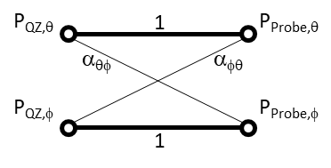
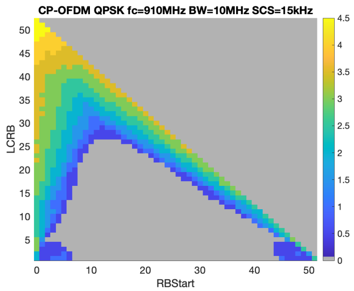

A.7.5 Signaling characteristics
-------------------------------

### A.7.5.1 Radio link Monitoring

In the following clause, any uplink signal transmitted by the UE is used
for detecting the In-/Out-of-Sync state of the UE. In terms of
measurement, the uplink signal is verified on the basis of the UE output
power:

*Editor note: The metric for the detection of the UE UL transmitted
signal by the TE is FFS.*

#### A.7.5.1.1 Radio Link Monitoring Out-of-sync Test for FR2 PCell configured with SSB-based RLM RS in non-DRX mode

##### A.7.5.1.1.1 Test Purpose and Environment

The purpose of this test is to verify that the UE properly detects the
out of sync and in sync for the purpose of monitoring downlink radio
link quality of the PCell. This test will partly verify the FR2 radio
link monitoring requirements in clause 8.1.

In the test, UE is configured to perform RLM on SSB, with
*detectionResource* included in *RadioLinkMonitoringRS* set to SSB\#0
and SSB\#1, and *purpose* set to '*rlf*'. Supported test configurations
are shown in table A.7.5.1.1.1-1. The test parameters are given in
Tables A.7.5.1.1.1-2, A.7.5.1.1.1-3, and A.7.5.1.1.1-4 below. There is
one cell (Cell 1), which is the active NR cell, in the test. The test
consists of three successive time periods, with time duration of T1, T2
and T3 respectively. Figure A.7.5.1.1.1-1 shows the variation of the
downlink SNR in the active cell to emulate out-of-sync and in-sync
states, and Figure A.7.5.1.1.1-2 shows the Time multiplexed downlink
transmissions from each Angle of Arrival. Prior to the start of the time
duration T1, the UE shall be fully synchronized to Cell 1. The UE shall
be configured for periodic CSI reporting with a reporting periodicity of
5 ms. In addition to RLM-RS radio link monitoring using SSB index 0 and
SSB index 1, the UE is configured to perform inter-frequency
measurements using Gap Pattern ID \#0 (40 ms) in test 1.

Table A.7.5.1.1.1-1: Supported test configurations for FR2 PCell

  Configuration   Description
  --------------- ---------------------------------------------------
  1               TDD, SSB SCS 120 KHz, data SCS 120KHz, BW 100 MHz

Table A.7.5.1.1.1-2: General test parameters for FR2 out-of-sync testing
in non-DRX mode

+----------------+----------------+----------------+----------------+
| **Parameter**  | **Unit**       | **Value**      |                |
+================+================+================+================+
|                |                | **Test 1**     |                |
+----------------+----------------+----------------+----------------+
| Active PCell   |                | Cell 1         |                |
+----------------+----------------+----------------+----------------+
| RF Channel     |                | 1              |                |
| Number         |                |                |                |
+----------------+----------------+----------------+----------------+
| Duplex mode    | Config 1       |                | TDD            |
+----------------+----------------+----------------+----------------+
| BW~channel~    | Config 1       |                | 100: N~PRB,c~  |
|                |                |                | = 66           |
+----------------+----------------+----------------+----------------+
| **Data PRBs    | Config 1       |                | 24             |
| allocated**    |                |                |                |
+----------------+----------------+----------------+----------------+
| **DL initial   | Config 1       |                | DLBWP.0.1      |
| BWP            |                |                |                |
| c              |                |                |                |
| onfiguration** |                |                |                |
+----------------+----------------+----------------+----------------+
| **DL dedicated | Config 1       |                | DLBWP.1.1      |
| BWP            |                |                |                |
| c              |                |                |                |
| onfiguration** |                |                |                |
+----------------+----------------+----------------+----------------+
| **UL initial   | Config 1       |                | ULBWP.0.1      |
| BWP            |                |                |                |
| c              |                |                |                |
| onfiguration** |                |                |                |
+----------------+----------------+----------------+----------------+
| **UL dedicated | Config 1       |                | ULBWP.1.1      |
| BWP            |                |                |                |
| c              |                |                |                |
| onfiguration** |                |                |                |
+----------------+----------------+----------------+----------------+
| TDD            | Config 1       |                | TDDConf.3.1    |
| Configuration  |                |                |                |
+----------------+----------------+----------------+----------------+
| RMSI CORESET   | Config 1       |                | CR.3.1 TDD     |
| Reference      |                |                |                |
| Channel        |                |                |                |
+----------------+----------------+----------------+----------------+
| Dedicated      | Config 1       |                | CCR.3.4 TDD    |
| CORESET        |                |                |                |
| Reference      |                |                |                |
| Channel        |                |                |                |
+----------------+----------------+----------------+----------------+
| SSB            | Config 1       |                | SSB.1 FR2      |
| Configuration  |                |                |                |
+----------------+----------------+----------------+----------------+
| SMTC           | Config 1       |                | SMTC.1         |
| Configuration  |                |                |                |
+----------------+----------------+----------------+----------------+
| PDSCH/PDCCH    | Config 1       |                | 120 KHz        |
| subcarrier     |                |                |                |
| spacing        |                |                |                |
+----------------+----------------+----------------+----------------+
| PRACH          | Config 1       |                | Table          |
| Configuration  |                |                | A.3.8.3.1      |
+----------------+----------------+----------------+----------------+
| SSB index      | Config 1       |                | 0,1            |
| assigned as    |                |                |                |
| RLM RS         |                |                |                |
+----------------+----------------+----------------+----------------+
| OCNG           |                | OP.5           |                |
| parameters     |                |                |                |
+----------------+----------------+----------------+----------------+
| CP length      |                | Normal         |                |
+----------------+----------------+----------------+----------------+
| Out of sync    | DCI format     |                | 1-0            |
| transmission   |                |                |                |
| parameters     |                |                |                |
+----------------+----------------+----------------+----------------+
|                | Number of      |                | 2              |
|                | Control OFDM   |                |                |
|                | symbols        |                |                |
+----------------+----------------+----------------+----------------+
|                | Aggregation    | CCE            | 8              |
|                | level          |                |                |
+----------------+----------------+----------------+----------------+
|                | Ratio of       | dB             | 4              |
|                | hypothetical   |                |                |
|                | PDCCH RE       |                |                |
|                | energy to      |                |                |
|                | average SSS RE |                |                |
|                | energy         |                |                |
+----------------+----------------+----------------+----------------+
|                | Ratio of       | dB             | 4              |
|                | hypothetical   |                |                |
|                | PDCCH DMRS     |                |                |
|                | energy to      |                |                |
|                | average SSS RE |                |                |
|                | energy         |                |                |
+----------------+----------------+----------------+----------------+
|                | DMRS precoder  |                | REG bundle     |
|                | granularity    |                | size           |
+----------------+----------------+----------------+----------------+
|                | REG bundle     |                | 6              |
|                | size           |                |                |
+----------------+----------------+----------------+----------------+
| DRX            |                | *OFF*          |                |
+----------------+----------------+----------------+----------------+
| Gap pattern ID |                | *gp0*          |                |
+----------------+----------------+----------------+----------------+
| Layer 3        |                | *Enabled*      |                |
| filtering      |                |                |                |
+----------------+----------------+----------------+----------------+
| T310 timer     | *ms*           | *0*            |                |
+----------------+----------------+----------------+----------------+
| T311 timer     | ms             | 1000           |                |
+----------------+----------------+----------------+----------------+
| N310           |                | 1              |                |
+----------------+----------------+----------------+----------------+
| N311           |                | 1              |                |
+----------------+----------------+----------------+----------------+
| CSI-RS for CSI | Config 1       |                | CSI-RS.3.1 TDD |
| reporting      |                |                |                |
+----------------+----------------+----------------+----------------+
| re             |                | periodic       |                |
| portConfigType |                |                |                |
+----------------+----------------+----------------+----------------+
| reportQuantity |                | cri-RI-PMI-CQI |                |
+----------------+----------------+----------------+----------------+
| CSI reporting  | slot           | 40             |                |
| periodicity    |                |                |                |
+----------------+----------------+----------------+----------------+
| CSI reporting  | slot           | 4              |                |
| offset         |                |                |                |
+----------------+----------------+----------------+----------------+
| TCI states for |                | TCI.State.2    |                |
| PDCCH/PDSCH    |                |                |                |
+----------------+----------------+----------------+----------------+
| CSI-RS for     | Config 1       |                | TRS.2.1 TDD    |
| tracking       |                |                |                |
+----------------+----------------+----------------+----------------+
| T1             | s              | 0.2            |                |
+----------------+----------------+----------------+----------------+
| T2             | s              | 9.68           |                |
+----------------+----------------+----------------+----------------+
| T3             | s              | 9.68           |                |
+----------------+----------------+----------------+----------------+
| D1             | s              | 9.64           |                |
+----------------+----------------+----------------+----------------+
| NOTE 1: All    |                |                |                |
| configurations |                |                |                |
| are assigned   |                |                |                |
| to the UE      |                |                |                |
| prior to the   |                |                |                |
| start of time  |                |                |                |
| period T1.     |                |                |                |
|                |                |                |                |
| NOTE 2:        |                |                |                |
| UE-specific    |                |                |                |
| PDCCH is not   |                |                |                |
| transmitted    |                |                |                |
| after T1       |                |                |                |
| starts.        |                |                |                |
+----------------+----------------+----------------+----------------+

Table A.7.5.1.1.1-3: OTA related cell specific test parameters for FR2
(Cell 1) for out-of-sync radio link monitoring tests in non-DRX mode

+--------+--------+--------+--------+--------+-----+-----+----+
| Par    | Unit   | Test 1 |        |        |     |     |    |
| ameter |        |        |        |        |     |     |    |
+--------+--------+--------+--------+--------+-----+-----+----+
|        |        | T1     | T2     | T3     | T1  | T2  | T3 |
+--------+--------+--------+--------+--------+-----+-----+----+
| AoA    |        | Setup  |        |        |     |     |    |
| setup  |        | 3      |        |        |     |     |    |
|        |        | d      |        |        |     |     |    |
|        |        | efined |        |        |     |     |    |
|        |        | in     |        |        |     |     |    |
|        |        | A.3.15 |        |        |     |     |    |
+--------+--------+--------+--------+--------+-----+-----+----+
|        |        | **     | **     |        |     |     |    |
|        |        | AoA1** | AoA2** |        |     |     |    |
+--------+--------+--------+--------+--------+-----+-----+----+
| Assu   |        | Rough  | Rough  |        |     |     |    |
| mption |        |        |        |        |     |     |    |
| for UE |        |        |        |        |     |     |    |
| beams  |        |        |        |        |     |     |    |
| ^No    |        |        |        |        |     |     |    |
| te\ 5^ |        |        |        |        |     |     |    |
+--------+--------+--------+--------+--------+-----+-----+----+
| EPRE   | dB     | 4      | Not    |        |     |     |    |
| ratio  |        |        | sent   |        |     |     |    |
| of     |        |        |        |        |     |     |    |
| PDCCH  |        |        |        |        |     |     |    |
| DMRS   |        |        |        |        |     |     |    |
| to SSS |        |        |        |        |     |     |    |
+--------+--------+--------+--------+--------+-----+-----+----+
| EPRE   | dB     | 0      |        |        |     |     |    |
| ratio  |        |        |        |        |     |     |    |
| of     |        |        |        |        |     |     |    |
| PDCCH  |        |        |        |        |     |     |    |
| to     |        |        |        |        |     |     |    |
| PDCCH  |        |        |        |        |     |     |    |
| DMRS   |        |        |        |        |     |     |    |
+--------+--------+--------+--------+--------+-----+-----+----+
| EPRE   | dB     |        |        |        |     |     |    |
| ratio  |        |        |        |        |     |     |    |
| of     |        |        |        |        |     |     |    |
| PBCH   |        |        |        |        |     |     |    |
| DMRS   |        |        |        |        |     |     |    |
| to SSS |        |        |        |        |     |     |    |
+--------+--------+--------+--------+--------+-----+-----+----+
| EPRE   | dB     |        |        |        |     |     |    |
| ratio  |        |        |        |        |     |     |    |
| of     |        |        |        |        |     |     |    |
| PBCH   |        |        |        |        |     |     |    |
| to     |        |        |        |        |     |     |    |
| PBCH   |        |        |        |        |     |     |    |
| DMRS   |        |        |        |        |     |     |    |
+--------+--------+--------+--------+--------+-----+-----+----+
| EPRE   | dB     |        |        |        |     |     |    |
| ratio  |        |        |        |        |     |     |    |
| of PSS |        |        |        |        |     |     |    |
| to SSS |        |        |        |        |     |     |    |
+--------+--------+--------+--------+--------+-----+-----+----+
| EPRE   | dB     |        |        |        |     |     |    |
| ratio  |        |        |        |        |     |     |    |
| of     |        |        |        |        |     |     |    |
| PDSCH  |        |        |        |        |     |     |    |
| DMRS   |        |        |        |        |     |     |    |
| to SSS |        |        |        |        |     |     |    |
+--------+--------+--------+--------+--------+-----+-----+----+
| EPRE   | dB     |        |        |        |     |     |    |
| ratio  |        |        |        |        |     |     |    |
| of     |        |        |        |        |     |     |    |
| PDSCH  |        |        |        |        |     |     |    |
| to     |        |        |        |        |     |     |    |
| PDSCH  |        |        |        |        |     |     |    |
| DMRS   |        |        |        |        |     |     |    |
+--------+--------+--------+--------+--------+-----+-----+----+
| EPRE   | dB     |        |        |        |     |     |    |
| ratio  |        |        |        |        |     |     |    |
| of     |        |        |        |        |     |     |    |
| OCNG   |        |        |        |        |     |     |    |
| DMRS   |        |        |        |        |     |     |    |
| to SSS |        |        |        |        |     |     |    |
+--------+--------+--------+--------+--------+-----+-----+----+
| EPRE   | dB     |        |        |        |     |     |    |
| ratio  |        |        |        |        |     |     |    |
| of     |        |        |        |        |     |     |    |
| OCNG   |        |        |        |        |     |     |    |
| to     |        |        |        |        |     |     |    |
| OCNG   |        |        |        |        |     |     |    |
| DMRS   |        |        |        |        |     |     |    |
+--------+--------+--------+--------+--------+-----+-----+----+
| ssb    | Config | dB     | 2^No   | -6^No  | -15 |     |    |
| -Index | 1      |        | te\ 6^ | te\ 6^ |     |     |    |
| 0 SNR  |        |        |        |        |     |     |    |
+--------+--------+--------+--------+--------+-----+-----+----+
| ssb    | Config |        | Not    | 2^No   | -15 | -15 |    |
| -Index | 1      |        | sent   | te\ 6^ |     |     |    |
| 1 SNR  |        |        |        |        |     |     |    |
+--------+--------+--------+--------+--------+-----+-----+----+
|        | Config | dBm/\  | -92.1  | -92.1  |     |     |    |
|        | 1      | 15kHz  |        |        |     |     |    |
+--------+--------+--------+--------+--------+-----+-----+----+
| Time   |        | D      |        |        |     |     |    |
| multip |        | efined |        |        |     |     |    |
| lexing |        | in     |        |        |     |     |    |
| of the |        | Figure |        |        |     |     |    |
| do     |        | A      |        |        |     |     |    |
| wnlink |        | .7.5.1 |        |        |     |     |    |
| t      |        | .1.1-2 |        |        |     |     |    |
| ransmi |        |        |        |        |     |     |    |
| ssions |        |        |        |        |     |     |    |
| from   |        |        |        |        |     |     |    |
| each   |        |        |        |        |     |     |    |
| AoA    |        |        |        |        |     |     |    |
+--------+--------+--------+--------+--------+-----+-----+----+
| Propa  |        | TDL-A  | TDL-A  |        |     |     |    |
| gation |        | 30 ns  | 30 ns  |        |     |     |    |
| con    |        | 75 Hz  | 75 Hz  |        |     |     |    |
| dition |        |        |        |        |     |     |    |
+--------+--------+--------+--------+--------+-----+-----+----+
| NOTE   |        |        |        |        |     |     |    |
| 1:     |        |        |        |        |     |     |    |
| OCNG   |        |        |        |        |     |     |    |
| shall  |        |        |        |        |     |     |    |
| be     |        |        |        |        |     |     |    |
| used   |        |        |        |        |     |     |    |
| such a |        |        |        |        |     |     |    |
| co     |        |        |        |        |     |     |    |
| nstant |        |        |        |        |     |     |    |
| total  |        |        |        |        |     |     |    |
| trans  |        |        |        |        |     |     |    |
| mitted |        |        |        |        |     |     |    |
| power  |        |        |        |        |     |     |    |
| sp     |        |        |        |        |     |     |    |
| ectral |        |        |        |        |     |     |    |
| d      |        |        |        |        |     |     |    |
| ensity |        |        |        |        |     |     |    |
| is     |        |        |        |        |     |     |    |
| ac     |        |        |        |        |     |     |    |
| hieved |        |        |        |        |     |     |    |
| for    |        |        |        |        |     |     |    |
| all    |        |        |        |        |     |     |    |
| OFDM   |        |        |        |        |     |     |    |
| sy     |        |        |        |        |     |     |    |
| mbols. |        |        |        |        |     |     |    |
|        |        |        |        |        |     |     |    |
| NOTE   |        |        |        |        |     |     |    |
| 2: The |        |        |        |        |     |     |    |
| signal |        |        |        |        |     |     |    |
| co     |        |        |        |        |     |     |    |
| ntains |        |        |        |        |     |     |    |
| PDCCH  |        |        |        |        |     |     |    |
| for    |        |        |        |        |     |     |    |
| UEs    |        |        |        |        |     |     |    |
| other  |        |        |        |        |     |     |    |
| than   |        |        |        |        |     |     |    |
| the    |        |        |        |        |     |     |    |
| device |        |        |        |        |     |     |    |
| under  |        |        |        |        |     |     |    |
| test   |        |        |        |        |     |     |    |
| as     |        |        |        |        |     |     |    |
| part   |        |        |        |        |     |     |    |
| of     |        |        |        |        |     |     |    |
| OCNG.  |        |        |        |        |     |     |    |
|        |        |        |        |        |     |     |    |
| NOTE   |        |        |        |        |     |     |    |
| 3: SNR |        |        |        |        |     |     |    |
| levels |        |        |        |        |     |     |    |
| corr   |        |        |        |        |     |     |    |
| espond |        |        |        |        |     |     |    |
| to the |        |        |        |        |     |     |    |
| signal |        |        |        |        |     |     |    |
| to     |        |        |        |        |     |     |    |
| noise  |        |        |        |        |     |     |    |
| ratio  |        |        |        |        |     |     |    |
| over   |        |        |        |        |     |     |    |
| the    |        |        |        |        |     |     |    |
| SSS    |        |        |        |        |     |     |    |
| REs.   |        |        |        |        |     |     |    |
|        |        |        |        |        |     |     |    |
| NOTE   |        |        |        |        |     |     |    |
| 4: The |        |        |        |        |     |     |    |
| SNR    |        |        |        |        |     |     |    |
| values |        |        |        |        |     |     |    |
| are    |        |        |        |        |     |     |    |
| spe    |        |        |        |        |     |     |    |
| cified |        |        |        |        |     |     |    |
| for    |        |        |        |        |     |     |    |
| t      |        |        |        |        |     |     |    |
| esting |        |        |        |        |     |     |    |
| a UE   |        |        |        |        |     |     |    |
| which  |        |        |        |        |     |     |    |
| su     |        |        |        |        |     |     |    |
| pports |        |        |        |        |     |     |    |
| 2RX on |        |        |        |        |     |     |    |
| at     |        |        |        |        |     |     |    |
| least  |        |        |        |        |     |     |    |
| one    |        |        |        |        |     |     |    |
| band.  |        |        |        |        |     |     |    |
| For    |        |        |        |        |     |     |    |
| t      |        |        |        |        |     |     |    |
| esting |        |        |        |        |     |     |    |
| of a   |        |        |        |        |     |     |    |
| UE     |        |        |        |        |     |     |    |
| which  |        |        |        |        |     |     |    |
| su     |        |        |        |        |     |     |    |
| pports |        |        |        |        |     |     |    |
| 4RX on |        |        |        |        |     |     |    |
| all    |        |        |        |        |     |     |    |
| bands, |        |        |        |        |     |     |    |
| the    |        |        |        |        |     |     |    |
| SNR    |        |        |        |        |     |     |    |
| during |        |        |        |        |     |     |    |
| T3 is  |        |        |        |        |     |     |    |
| A.3.6. |        |        |        |        |     |     |    |
|        |        |        |        |        |     |     |    |
| NOTE   |        |        |        |        |     |     |    |
| 5:     |        |        |        |        |     |     |    |
| Infor  |        |        |        |        |     |     |    |
| mation |        |        |        |        |     |     |    |
| about  |        |        |        |        |     |     |    |
| types  |        |        |        |        |     |     |    |
| of UE  |        |        |        |        |     |     |    |
| beam   |        |        |        |        |     |     |    |
| is     |        |        |        |        |     |     |    |
| given  |        |        |        |        |     |     |    |
| in     |        |        |        |        |     |     |    |
| clause |        |        |        |        |     |     |    |
| B      |        |        |        |        |     |     |    |
| .2.1.3 |        |        |        |        |     |     |    |
| and    |        |        |        |        |     |     |    |
| does   |        |        |        |        |     |     |    |
| not    |        |        |        |        |     |     |    |
| limit  |        |        |        |        |     |     |    |
| UE     |        |        |        |        |     |     |    |
| im     |        |        |        |        |     |     |    |
| plemen |        |        |        |        |     |     |    |
| tation |        |        |        |        |     |     |    |
| or     |        |        |        |        |     |     |    |
| test   |        |        |        |        |     |     |    |
| system |        |        |        |        |     |     |    |
| imp    |        |        |        |        |     |     |    |
| lement |        |        |        |        |     |     |    |
| ation. |        |        |        |        |     |     |    |
|        |        |        |        |        |     |     |    |
| NOTE   |        |        |        |        |     |     |    |
| 6:     |        |        |        |        |     |     |    |
| This   |        |        |        |        |     |     |    |
| value  |        |        |        |        |     |     |    |
| allows |        |        |        |        |     |     |    |
| up to  |        |        |        |        |     |     |    |
| 1 dB   |        |        |        |        |     |     |    |
| degra  |        |        |        |        |     |     |    |
| dation |        |        |        |        |     |     |    |
| from   |        |        |        |        |     |     |    |
| a      |        |        |        |        |     |     |    |
| pplied |        |        |        |        |     |     |    |
| SNR to |        |        |        |        |     |     |    |
| UE     |        |        |        |        |     |     |    |
| ba     |        |        |        |        |     |     |    |
| seband |        |        |        |        |     |     |    |
+--------+--------+--------+--------+--------+-----+-----+----+

Table A.7.5.1.1.1-4: Measurement gap configuration for out-of-sync tests
in non-DRX mode

  ----------- --------
  Field       Test 1
              Value
  gapOffset   0
  ----------- --------

{width="5.041666666666667in"
height="2.862195975503062in"}

Figure A.7.5.1.1.1-1: SNR variation for out-of-sync testing

Figure A.7.5.1.1.1-2: Time multiplexed downlink transmissions

##### A.7.5.1.1.2 Test Requirements

The UE behavior in each test during time durations T1, T2 and T3 shall
be as follows:

During the period from time point A to time point B the UE shall
transmit uplink signal at least in all uplink slots configured for CSI
transmission according to the configured periodic CSI reporting.

The UE shall stop transmitting uplink signal no later than time point C
(D1 second after the start of the time duration T3).

The rate of correct events observed during repeated tests shall be at
least 90 %.

#### A.7.5.1.2 Radio Link Monitoring In-sync Test for FR2 PCell configured with SSB-based RLM RS in non-DRX mode

##### A.7.5.1.2.1 Test Purpose and Environment

The purpose of this test is to verify that the UE properly detects the
out of sync and in sync for the purpose of monitoring downlink radio
link quality of the PCell. This test will partly verify the FR2 radio
link monitoring requirements in clause 8.1.

In the test, UE is configured to perform RLM on SSB, with
*detectionResource* included in *RadioLinkMonitoringRS* set to SSB\#0
and SSB\#1, and *purpose* set to '*rlf*'. Supported test configurations
are shown in table A.7.5.1.2.1-1.The test parameters are given in Tables
A.7.5.1.2.1-2, and A.7.5.1.2.1-3 below. There is one cell (Cell 1),
which is the active cell, in the test. The test consists of five
successive time periods, with time duration of T1, T2, T3, T4 and T5
respectively. Figure A.7.5.1.2.1-1 shows the variation of the downlink
SNR in the active cell to emulate out-of-sync and in-sync states, and
Figure A.7.5.1.2.1-2 shows the Time multiplexed downlink transmissions
from each Angle of Arrival. Prior to the start of the time duration T1,
the UE shall be fully synchronized to Cell 1. Prior to the start of the
time duration T1, the UE shall be fully synchronized to Cell 1. The UE
shall be configured for periodic CSI reporting with a reporting
periodicity of 5 ms.

Table A.7.5.1.2.1-1: Supported test configurations for FR2 PCell

  Configuration   Description
  --------------- ---------------------------------------------------
  1               TDD, SSB SCS 120 KHz, data SCS 120KHz, BW 100 MHz

Table A.7.5.1.2.1-2: General test parameters for FR2 in-sync testing in
non-DRX mode

+----------------+----------------+----------------+----------------+
| **Parameter**  | **Unit**       | **Value**      |                |
+================+================+================+================+
|                |                | **Test 1**     |                |
+----------------+----------------+----------------+----------------+
| Active PCell   |                | Cell 1         |                |
+----------------+----------------+----------------+----------------+
| RF Channel     |                | 1              |                |
| Number         |                |                |                |
+----------------+----------------+----------------+----------------+
| Duplex mode    | Config 1       |                | TDD            |
+----------------+----------------+----------------+----------------+
| BW~channel~    | Config 1       |                | 100: N~PRB,c~  |
|                |                |                | = 66           |
+----------------+----------------+----------------+----------------+
| **Data PRBs    | Config 1       |                | 24             |
| allocated**    |                |                |                |
+----------------+----------------+----------------+----------------+
| **DL initial   | Config 1       |                | DLBWP.0.1      |
| BWP            |                |                |                |
| c              |                |                |                |
| onfiguration** |                |                |                |
+----------------+----------------+----------------+----------------+
| **DL dedicated | Config 1       |                | DLBWP.1.1      |
| BWP            |                |                |                |
| c              |                |                |                |
| onfiguration** |                |                |                |
+----------------+----------------+----------------+----------------+
| **UL initial   | Config 1       |                | ULBWP.0.1      |
| BWP            |                |                |                |
| c              |                |                |                |
| onfiguration** |                |                |                |
+----------------+----------------+----------------+----------------+
| **UL dedicated | Config 1       |                | ULBWP.1.1      |
| BWP            |                |                |                |
| c              |                |                |                |
| onfiguration** |                |                |                |
+----------------+----------------+----------------+----------------+
| TDD            | Config 1       |                | TDDConf.3.1    |
| Configuration  |                |                |                |
+----------------+----------------+----------------+----------------+
| RMSI CORESET   | Config 1       |                | CR.3.1 TDD     |
| Reference      |                |                |                |
| Channel        |                |                |                |
+----------------+----------------+----------------+----------------+
| Dedicated      | Config 1       |                | CCR.3.1 TDD    |
| CORESET        |                |                |                |
| Reference      |                |                |                |
| Channel        |                |                |                |
+----------------+----------------+----------------+----------------+
| SSB            | Config 1       |                | SSB.1 FR2      |
| Configuration  |                |                |                |
+----------------+----------------+----------------+----------------+
| SMTC           | Config 1       |                | SMTC.3         |
| Configuration  |                |                |                |
+----------------+----------------+----------------+----------------+
| PDSCH/PDCCH    | Config 1       |                | 120 KHz        |
| subcarrier     |                |                |                |
| spacing        |                |                |                |
+----------------+----------------+----------------+----------------+
| PRACH          | Config 1       |                | Table          |
| Configuration  |                |                | A.3.8.3.1      |
+----------------+----------------+----------------+----------------+
| SSB index      | Config 1       |                | 0,1            |
| assigned as    |                |                |                |
| RLM RS         |                |                |                |
+----------------+----------------+----------------+----------------+
| OCNG           |                | OP.5           |                |
| parameters     |                |                |                |
+----------------+----------------+----------------+----------------+
| CP length      |                | Normal         |                |
+----------------+----------------+----------------+----------------+
| In sync        | DCI format     |                | 1-0            |
| transmission   |                |                |                |
| parameters     |                |                |                |
+----------------+----------------+----------------+----------------+
|                | Number of      |                | 2              |
|                | Control OFDM   |                |                |
|                | symbols        |                |                |
+----------------+----------------+----------------+----------------+
|                | Aggregation    | CCE            | 4              |
|                | level          |                |                |
+----------------+----------------+----------------+----------------+
|                | Ratio of       | dB             | 0              |
|                | hypothetical   |                |                |
|                | PDCCH RE       |                |                |
|                | energy to      |                |                |
|                | average SSS RE |                |                |
|                | energy         |                |                |
+----------------+----------------+----------------+----------------+
|                | Ratio of       | dB             | 0              |
|                | hypothetical   |                |                |
|                | PDCCH DMRS     |                |                |
|                | energy to      |                |                |
|                | average SSS RE |                |                |
|                | energy         |                |                |
+----------------+----------------+----------------+----------------+
|                | DMRS precoder  |                | REG bundle     |
|                | granularity    |                | size           |
+----------------+----------------+----------------+----------------+
|                | REG bundle     |                | 6              |
|                | size           |                |                |
+----------------+----------------+----------------+----------------+
| Out of sync    | DCI format     |                | 1-0            |
| transmission   |                |                |                |
| parameters     |                |                |                |
+----------------+----------------+----------------+----------------+
|                | Number of      |                | 2              |
|                | Control OFDM   |                |                |
|                | symbols        |                |                |
+----------------+----------------+----------------+----------------+
|                | Aggregation    | CCE            | 8              |
|                | level          |                |                |
+----------------+----------------+----------------+----------------+
|                | Ratio of       | dB             | 4              |
|                | hypothetical   |                |                |
|                | PDCCH RE       |                |                |
|                | energy to      |                |                |
|                | average SSS RE |                |                |
|                | energy         |                |                |
+----------------+----------------+----------------+----------------+
|                | Ratio of       | dB             | 4              |
|                | hypothetical   |                |                |
|                | PDCCH DMRS     |                |                |
|                | energy to      |                |                |
|                | average SSS RE |                |                |
|                | energy         |                |                |
+----------------+----------------+----------------+----------------+
|                | DMRS precoder  |                | REG bundle     |
|                | granularity    |                | size           |
+----------------+----------------+----------------+----------------+
|                | REG bundle     |                | 6              |
|                | size           |                |                |
+----------------+----------------+----------------+----------------+
| DRX            |                | *OFF*          |                |
+----------------+----------------+----------------+----------------+
| Gap pattern ID |                | *N/A*          |                |
+----------------+----------------+----------------+----------------+
| Layer 3        |                | *Enabled*      |                |
| filtering      |                |                |                |
+----------------+----------------+----------------+----------------+
| T310 timer     | *ms*           | *4000*         |                |
+----------------+----------------+----------------+----------------+
| T311 timer     | ms             | 1000           |                |
+----------------+----------------+----------------+----------------+
| N310           |                | 1              |                |
+----------------+----------------+----------------+----------------+
| N311           |                | 1              |                |
+----------------+----------------+----------------+----------------+
| CSI-RS for CSI | Config 1       |                | CSI-RS.3.1 TDD |
| reporting      |                |                |                |
+----------------+----------------+----------------+----------------+
| re             |                | periodic       |                |
| portConfigType |                |                |                |
+----------------+----------------+----------------+----------------+
| reportQuantity |                | cri-RI-PMI-CQI |                |
+----------------+----------------+----------------+----------------+
| CSI reporting  | slot           | 40             |                |
| periodicity    |                |                |                |
+----------------+----------------+----------------+----------------+
| CSI reporting  | slot           | 4              |                |
| offset         |                |                |                |
+----------------+----------------+----------------+----------------+
| TCI states for |                | TCI.State.2    |                |
| PDCCH/PDSCH    |                |                |                |
+----------------+----------------+----------------+----------------+
| CSI-RS for     | Config 1       |                | TRS.2.1 TDD    |
| tracking       |                |                |                |
+----------------+----------------+----------------+----------------+
| T1             | s              | 0.2            |                |
+----------------+----------------+----------------+----------------+
| T2             | s              | 0.2            |                |
+----------------+----------------+----------------+----------------+
| T3             | s              | 1.88           |                |
+----------------+----------------+----------------+----------------+
| T4             | s              | 0.2            |                |
+----------------+----------------+----------------+----------------+
| T5             | s              | 3.84           |                |
+----------------+----------------+----------------+----------------+
| D1             | s              | 3.8            |                |
+----------------+----------------+----------------+----------------+
| NOTE 1: All    |                |                |                |
| configurations |                |                |                |
| are assigned   |                |                |                |
| to the UE      |                |                |                |
| prior to the   |                |                |                |
| start of time  |                |                |                |
| period T1.     |                |                |                |
|                |                |                |                |
| NOTE 2:        |                |                |                |
| UE-specific    |                |                |                |
| PDCCH is not   |                |                |                |
| transmitted    |                |                |                |
| after T1       |                |                |                |
| starts.        |                |                |                |
+----------------+----------------+----------------+----------------+

Table A.7.5.1.2.1-3: OTA related cell specific test parameters for FR2
(Cell 1) for in-sync radio link monitoring tests in non-DRX mode

<table>
<tbody>
<tr class="odd">
<td>Parameter</td>
<td>Unit</td>
<td>Test 1</td>
<td></td>
<td></td>
<td></td>
<td></td>
<td></td>
<td></td>
<td></td>
<td></td>
<td></td>
</tr>
<tr class="even">
<td></td>
<td></td>
<td>T1</td>
<td>T2</td>
<td>T3</td>
<td>T4</td>
<td>T5</td>
<td>T1</td>
<td>T2</td>
<td>T3</td>
<td>T4</td>
<td>T5</td>
</tr>
<tr class="odd">
<td>AoA setup</td>
<td></td>
<td>Setup 3 defined in A.3.15</td>
<td></td>
<td></td>
<td></td>
<td></td>
<td></td>
<td></td>
<td></td>
<td></td>
<td></td>
</tr>
<tr class="even">
<td></td>
<td></td>
<td><strong>AoA1</strong></td>
<td><strong>AoA2</strong></td>
<td></td>
<td></td>
<td></td>
<td></td>
<td></td>
<td></td>
<td></td>
<td></td>
</tr>
<tr class="odd">
<td>Assumption for UE beams Note 5</td>
<td></td>
<td>Rough</td>
<td>Rough</td>
<td></td>
<td></td>
<td></td>
<td></td>
<td></td>
<td></td>
<td></td>
<td></td>
</tr>
<tr class="even">
<td>EPRE ratio of PDCCH DMRS to SSS</td>
<td>dB</td>
<td>0</td>
<td>Not sent</td>
<td></td>
<td></td>
<td></td>
<td></td>
<td></td>
<td></td>
<td></td>
<td></td>
</tr>
<tr class="odd">
<td>EPRE ratio of PDCCH to PDCCH DMRS</td>
<td>dB</td>
<td>0</td>
<td></td>
<td></td>
<td></td>
<td></td>
<td></td>
<td></td>
<td></td>
<td></td>
<td></td>
</tr>
<tr class="even">
<td>EPRE ratio of PBCH DMRS to SSS</td>
<td>dB</td>
<td></td>
<td></td>
<td></td>
<td></td>
<td></td>
<td></td>
<td></td>
<td></td>
<td></td>
<td></td>
</tr>
<tr class="odd">
<td>EPRE ratio of PBCH to PBCH DMRS</td>
<td>dB</td>
<td></td>
<td></td>
<td></td>
<td></td>
<td></td>
<td></td>
<td></td>
<td></td>
<td></td>
<td></td>
</tr>
<tr class="even">
<td>EPRE ratio of PSS to SSS</td>
<td>dB</td>
<td></td>
<td></td>
<td></td>
<td></td>
<td></td>
<td></td>
<td></td>
<td></td>
<td></td>
<td></td>
</tr>
<tr class="odd">
<td>EPRE ratio of PDSCH DMRS to SSS</td>
<td>dB</td>
<td></td>
<td></td>
<td></td>
<td></td>
<td></td>
<td></td>
<td></td>
<td></td>
<td></td>
<td></td>
</tr>
<tr class="even">
<td>EPRE ratio of PDSCH to PDSCH DMRS</td>
<td>dB</td>
<td></td>
<td></td>
<td></td>
<td></td>
<td></td>
<td></td>
<td></td>
<td></td>
<td></td>
<td></td>
</tr>
<tr class="odd">
<td>EPRE ratio of OCNG DMRS to SSS</td>
<td>dB</td>
<td></td>
<td></td>
<td></td>
<td></td>
<td></td>
<td></td>
<td></td>
<td></td>
<td></td>
<td></td>
</tr>
<tr class="even">
<td>EPRE ratio of OCNG to OCNG DMRS</td>
<td>dB</td>
<td></td>
<td></td>
<td></td>
<td></td>
<td></td>
<td></td>
<td></td>
<td></td>
<td></td>
<td></td>
</tr>
<tr class="odd">
<td>ssb-Index 0 SNR</td>
<td>Config 1</td>
<td>dB</td>
<td>2Note 6</td>
<td>-6Note 6</td>
<td>-15</td>
<td>-15</td>
<td>-15</td>
<td></td>
<td></td>
<td></td>
<td></td>
</tr>
<tr class="even">
<td>ssb-Index 1 SNR</td>
<td>Config 1</td>
<td></td>
<td>Not sent</td>
<td>2Note 6</td>
<td>-15</td>
<td>-15</td>
<td>-4.5</td>
<td>2Note 6</td>
<td></td>
<td></td>
<td></td>
</tr>
<tr class="odd">
<td></td>
<td>Config 1</td>
<td>dBm/ 
15kHz</td>
<td>-92.1</td>
<td>-92.1</td>
<td></td>
<td></td>
<td></td>
<td></td>
<td></td>
<td></td>
<td></td>
</tr>
<tr class="even">
<td>Time multiplexing of the downlink transmissions from each AoA</td>
<td></td>
<td>Defined in Figure A.7.5.1.2.1-2</td>
<td></td>
<td></td>
<td></td>
<td></td>
<td></td>
<td></td>
<td></td>
<td></td>
<td></td>
</tr>
<tr class="odd">
<td>Propagation condition</td>
<td></td>
<td>TDL-A 30 ns 75 Hz</td>
<td>TDL-A 30 ns 75 Hz</td>
<td></td>
<td></td>
<td></td>
<td></td>
<td></td>
<td></td>
<td></td>
<td></td>
</tr>
<tr class="even">
<td>
NOTE 1: OCNG shall be used such that a constant total transmitted power spectral density is achieved for all OFDM symbols.

NOTE 2: The signal contains PDCCH for UEs other than the device under test as part of OCNG.

NOTE 3: SNR levels correspond to the signal to noise ratio over the SSS REs.

NOTE 4: The SNR values are specified for testing a UE which supports 2RX on at least one band. For testing of a UE which supports 4RX on all bands, the SNR during T3 is A.3.6.

NOTE 5: Information about types of UE beam is given in clause B.2.1.3 and does not limit UE implementation or test system implementation.

NOTE 6: This value allows up to 1 dB degradation from applied SNR to UE baseband
</td>
<td></td>
<td></td>
<td></td>
<td></td>
<td></td>
<td></td>
<td></td>
<td></td>
<td></td>
<td></td>
<td></td>
</tr>
</tbody>
</table>

Table A.7.5.1.2.1-4: Void

{width="5.513888888888889in"
height="2.9097222222222223in"}

Figure A.7.5.1.2.1-1: SNR variation for in-sync testing

Figure A.7.5.1.2.1-2: Time multiplexed downlink transmissions

##### A.7.5.1.2.2 Test Requirements

The UE behaviour in each test during time durations T1, T2, T3, T4 and
T5 shall be as follows:

During the period from time point A to time point F (D1 second after the
start of time duration T5) the UE shall transmit uplink signal at least
in all uplink slots configured for CSI transmission according to the
configured periodic CSI reporting.

The rate of correct events observed during repeated tests shall be at
least 90 %.

#### A.7.5.1.3 Radio Link Monitoring Out-of-sync Test for FR2 PCell configured with SSB-based RLM RS in DRX mode

##### A.7.5.1.3.1 Test Purpose and Environment

The purpose of this test is to verify that the UE properly detects the
out of sync and in sync for the purpose of monitoring downlink radio
link quality of the PCell when DRX is used. This test will partly verify
the FR2 radio link monitoring requirements in clause 8.1.

In the test, UE is configured to perform RLM on SSB, with
*detectionResource* included in *RadioLinkMonitoringRS* set to SSB\#0
and SSB\#1, and *purpose* set to '*rlf*'. Supported test configurations
are shown in table A.7.5.1.3.1-1. The test parameters are given in
Tables A.7.5.1.3.1-2, and A.7.5.1.3.1-3. There is one cell (Cell 1),
which is the active NR cell, in the test. The test consists of three
successive time periods, with time duration of T1, T2 and T3
respectively. Figure A.7.5.1.3.1-1 shows the variation of the downlink
SNR in the active cell to emulate out-of-sync and in-sync states. Prior
to the start of the time duration T1, the UE shall be fully synchronized
to Cell 1. The UE shall be configured for periodic CSI reporting with a
reporting periodicity of 5 ms. In the test, DRX configuration is enabled
and DRX inactivity timer has already been expired, i.e. UE tries to
decode PDCCH and to send periodic CSI during the period when On-duration
timer is running. Time alignment timers shall be set to "infinity" so
that UL timing alignment is maintained during the test.

Table A.7.5.1.3.1-1: Supported test configurations for FR2 PCell

  Configuration   Description
  --------------- ---------------------------------------------------
  1               TDD, SSB SCS 120 KHz, data SCS 120KHz, BW 100 MHz

Table A.7.5.1.3.1-2: General test parameters for FR2 out-of-sync testing
in DRX mode

+----------------+----------------+----------------+----------------+
| Parameter      | Unit           | Value          |                |
+================+================+================+================+
|                |                | Test 1         |                |
+----------------+----------------+----------------+----------------+
| Active PCell   |                | Cell 1         |                |
+----------------+----------------+----------------+----------------+
| RF Channel     |                | 1              |                |
| Number         |                |                |                |
+----------------+----------------+----------------+----------------+
| Duplex mode    | Config 1       |                | TDD            |
+----------------+----------------+----------------+----------------+
| BW~channel~    | Config 1       |                | 100: N~PRB,c~  |
|                |                |                | = 66           |
+----------------+----------------+----------------+----------------+
| **Data PRBs    | Config 1       |                | 66             |
| allocated**    |                |                |                |
+----------------+----------------+----------------+----------------+
| **DL initial   | Config 1       |                | DLBWP.0.1      |
| BWP            |                |                |                |
| c              |                |                |                |
| onfiguration** |                |                |                |
+----------------+----------------+----------------+----------------+
| **DL dedicated | Config 1       |                | DLBWP.1.1      |
| BWP            |                |                |                |
| c              |                |                |                |
| onfiguration** |                |                |                |
+----------------+----------------+----------------+----------------+
| **UL initial   | Config 1       |                | ULBWP.0.1      |
| BWP            |                |                |                |
| c              |                |                |                |
| onfiguration** |                |                |                |
+----------------+----------------+----------------+----------------+
| **UL dedicated | Config 1       |                | ULBWP.1.1      |
| BWP            |                |                |                |
| c              |                |                |                |
| onfiguration** |                |                |                |
+----------------+----------------+----------------+----------------+
| TDD            | Config 1       |                | TDDConf.3.1    |
| Configuration  |                |                |                |
+----------------+----------------+----------------+----------------+
| RMSI CORESET   | Config 1       |                | CR.3.1 TDD     |
| Reference      |                |                |                |
| Channel        |                |                |                |
+----------------+----------------+----------------+----------------+
| Dedicated      | Config 1       |                | CCR.3.4 TDD    |
| CORESET        |                |                |                |
| Reference      |                |                |                |
| Channel        |                |                |                |
+----------------+----------------+----------------+----------------+
| SSB            | Config 1       |                | SSB.1 FR2      |
| Configuration  |                |                |                |
+----------------+----------------+----------------+----------------+
| SMTC           | Config 1       |                | SMTC.1         |
| Configuration  |                |                |                |
+----------------+----------------+----------------+----------------+
| PDSCH/PDCCH    | Config 1       |                | 120 KHz        |
| subcarrier     |                |                |                |
| spacing        |                |                |                |
+----------------+----------------+----------------+----------------+
| PRACH          | Config 1       |                | Table          |
| Configuration  |                |                | A.3.8.3.1      |
+----------------+----------------+----------------+----------------+
| SSB index      | Config 1       |                | 0,1            |
| assigned as    |                |                |                |
| RLM RS         |                |                |                |
+----------------+----------------+----------------+----------------+
| OCNG           |                | OP.1           |                |
| parameters     |                |                |                |
+----------------+----------------+----------------+----------------+
| CP length      |                | Normal         |                |
+----------------+----------------+----------------+----------------+
| Out of sync    | DCI format     |                | 1-0            |
| transmission   |                |                |                |
| parameters     |                |                |                |
+----------------+----------------+----------------+----------------+
|                | Number of      |                | 2              |
|                | Control OFDM   |                |                |
|                | symbols        |                |                |
+----------------+----------------+----------------+----------------+
|                | Aggregation    | CCE            | 8              |
|                | level          |                |                |
+----------------+----------------+----------------+----------------+
|                | Ratio of       | dB             | 4              |
|                | hypothetical   |                |                |
|                | PDCCH RE       |                |                |
|                | energy to      |                |                |
|                | average SSS RE |                |                |
|                | energy         |                |                |
+----------------+----------------+----------------+----------------+
|                | Ratio of       | dB             | 4              |
|                | hypothetical   |                |                |
|                | PDCCH DMRS     |                |                |
|                | energy to      |                |                |
|                | average SSS RE |                |                |
|                | energy         |                |                |
+----------------+----------------+----------------+----------------+
|                | DMRS precoder  |                | REG bundle     |
|                | granularity    |                | size           |
+----------------+----------------+----------------+----------------+
|                | REG bundle     |                | 6              |
|                | size           |                |                |
+----------------+----------------+----------------+----------------+
| DRX            |                | DRX.3          |                |
| Configuration  |                |                |                |
+----------------+----------------+----------------+----------------+
| Gap pattern ID |                | *N/A*          |                |
+----------------+----------------+----------------+----------------+
| Layer 3        |                | *Enabled*      |                |
| filtering      |                |                |                |
+----------------+----------------+----------------+----------------+
| T310 timer     | *ms*           | *0*            |                |
+----------------+----------------+----------------+----------------+
| T311 timer     | ms             | 1000           |                |
+----------------+----------------+----------------+----------------+
| N310           |                | 1              |                |
+----------------+----------------+----------------+----------------+
| N311           |                | 1              |                |
+----------------+----------------+----------------+----------------+
| CSI-RS for CSI | Config 1       |                | CSI-RS.3.1 TDD |
| reporting      |                |                |                |
+----------------+----------------+----------------+----------------+
| re             |                | periodic       |                |
| portConfigType |                |                |                |
+----------------+----------------+----------------+----------------+
| reportQuantity |                | cri-RI-PMI-CQI |                |
+----------------+----------------+----------------+----------------+
| CSI reporting  | slot           | 40             |                |
| periodicity    |                |                |                |
+----------------+----------------+----------------+----------------+
| CSI reporting  | slot           | 4              |                |
| offset         |                |                |                |
+----------------+----------------+----------------+----------------+
| TCI states for |                | TCI.State.2    |                |
| PDCCH/PDSCH    |                |                |                |
+----------------+----------------+----------------+----------------+
| CSI-RS for     | Config 1       |                | TRS.2.1 TDD    |
| tracking       |                |                |                |
+----------------+----------------+----------------+----------------+
| T1             | s              | 0.2            |                |
+----------------+----------------+----------------+----------------+
| T2             | s              | 14.48          |                |
+----------------+----------------+----------------+----------------+
| T3             | s              | 14.48          |                |
+----------------+----------------+----------------+----------------+
| D1             | s              | 14.44          |                |
+----------------+----------------+----------------+----------------+
| NOTE 1: All    |                |                |                |
| configurations |                |                |                |
| are assigned   |                |                |                |
| to the UE      |                |                |                |
| prior to the   |                |                |                |
| start of time  |                |                |                |
| period T1.     |                |                |                |
|                |                |                |                |
| NOTE 2:        |                |                |                |
| UE-specific    |                |                |                |
| PDCCH is not   |                |                |                |
| transmitted    |                |                |                |
| after T1       |                |                |                |
| starts.        |                |                |                |
+----------------+----------------+----------------+----------------+

Table A.7.5.1.3.1-3: OTA related cell specific test parameters for FR2
(Cell 1) for out-of-sync radio link monitoring tests in DRX mode

+-----------+----------+-----------+-----------+-----------+-----+
| Parameter | Unit     | Test 1    |           |           |     |
+-----------+----------+-----------+-----------+-----------+-----+
|           |          | T1        | T2        | T3        |     |
+-----------+----------+-----------+-----------+-----------+-----+
| AoA setup |          | Setup 1   |           |           |     |
|           |          | defined   |           |           |     |
|           |          | in A.3.15 |           |           |     |
+-----------+----------+-----------+-----------+-----------+-----+
| A         |          | Rough     |           |           |     |
| ssumption |          |           |           |           |     |
| for UE    |          |           |           |           |     |
| beams     |          |           |           |           |     |
| ^Note\ 5^ |          |           |           |           |     |
+-----------+----------+-----------+-----------+-----------+-----+
| EPRE      | dB       | 4         |           |           |     |
| ratio of  |          |           |           |           |     |
| PDCCH     |          |           |           |           |     |
| DMRS to   |          |           |           |           |     |
| SSS       |          |           |           |           |     |
+-----------+----------+-----------+-----------+-----------+-----+
| EPRE      | dB       | 0         |           |           |     |
| ratio of  |          |           |           |           |     |
| PDCCH to  |          |           |           |           |     |
| PDCCH     |          |           |           |           |     |
| DMRS      |          |           |           |           |     |
+-----------+----------+-----------+-----------+-----------+-----+
| EPRE      | dB       | 0         |           |           |     |
| ratio of  |          |           |           |           |     |
| PBCH DMRS |          |           |           |           |     |
| to SSS    |          |           |           |           |     |
+-----------+----------+-----------+-----------+-----------+-----+
| EPRE      | dB       |           |           |           |     |
| ratio of  |          |           |           |           |     |
| PBCH to   |          |           |           |           |     |
| PBCH DMRS |          |           |           |           |     |
+-----------+----------+-----------+-----------+-----------+-----+
| EPRE      | dB       |           |           |           |     |
| ratio of  |          |           |           |           |     |
| PSS to    |          |           |           |           |     |
| SSS       |          |           |           |           |     |
+-----------+----------+-----------+-----------+-----------+-----+
| EPRE      | dB       |           |           |           |     |
| ratio of  |          |           |           |           |     |
| PDSCH     |          |           |           |           |     |
| DMRS to   |          |           |           |           |     |
| SSS       |          |           |           |           |     |
+-----------+----------+-----------+-----------+-----------+-----+
| EPRE      | dB       |           |           |           |     |
| ratio of  |          |           |           |           |     |
| PDSCH to  |          |           |           |           |     |
| PDSCH     |          |           |           |           |     |
| DMRS      |          |           |           |           |     |
+-----------+----------+-----------+-----------+-----------+-----+
| EPRE      | dB       |           |           |           |     |
| ratio of  |          |           |           |           |     |
| OCNG DMRS |          |           |           |           |     |
| to SSS    |          |           |           |           |     |
+-----------+----------+-----------+-----------+-----------+-----+
| EPRE      | dB       |           |           |           |     |
| ratio of  |          |           |           |           |     |
| OCNG to   |          |           |           |           |     |
| OCNG DMRS |          |           |           |           |     |
+-----------+----------+-----------+-----------+-----------+-----+
| ssb-Index | Config 1 | dB        | 2         | -6        | -15 |
| 0 SNR     |          |           | ^Note\ 6^ | ^Note\ 6^ |     |
+-----------+----------+-----------+-----------+-----------+-----+
| ssb-Index | Config 1 |           | 2         | -15       | -15 |
| 1 SNR     |          |           | ^Note\ 6^ |           |     |
+-----------+----------+-----------+-----------+-----------+-----+
|           | Config 1 | dBm/15KHz | -104.7    |           |     |
|           |          |           | dBm       |           |     |
+-----------+----------+-----------+-----------+-----------+-----+
| Pr        |          | TDL-A 30  |           |           |     |
| opagation |          | ns 75 Hz  |           |           |     |
| condition |          |           |           |           |     |
+-----------+----------+-----------+-----------+-----------+-----+
| NOTE 1:   |          |           |           |           |     |
| OCNG      |          |           |           |           |     |
| shall be  |          |           |           |           |     |
| used such |          |           |           |           |     |
| that the  |          |           |           |           |     |
| resources |          |           |           |           |     |
| in Cell 1 |          |           |           |           |     |
| are fully |          |           |           |           |     |
| allocated |          |           |           |           |     |
| and a     |          |           |           |           |     |
| constant  |          |           |           |           |     |
| total     |          |           |           |           |     |
| tr        |          |           |           |           |     |
| ansmitted |          |           |           |           |     |
| power     |          |           |           |           |     |
| spectral  |          |           |           |           |     |
| density   |          |           |           |           |     |
| is        |          |           |           |           |     |
| achieved  |          |           |           |           |     |
| for all   |          |           |           |           |     |
| OFDM      |          |           |           |           |     |
| symbols.  |          |           |           |           |     |
|           |          |           |           |           |     |
| NOTE 2:   |          |           |           |           |     |
| The       |          |           |           |           |     |
| signal    |          |           |           |           |     |
| contains  |          |           |           |           |     |
| PDCCH for |          |           |           |           |     |
| UEs other |          |           |           |           |     |
| than the  |          |           |           |           |     |
| device    |          |           |           |           |     |
| under     |          |           |           |           |     |
| test as   |          |           |           |           |     |
| part of   |          |           |           |           |     |
| OCNG.     |          |           |           |           |     |
|           |          |           |           |           |     |
| NOTE 3:   |          |           |           |           |     |
| SNR       |          |           |           |           |     |
| levels    |          |           |           |           |     |
| c         |          |           |           |           |     |
| orrespond |          |           |           |           |     |
| to the    |          |           |           |           |     |
| signal to |          |           |           |           |     |
| noise     |          |           |           |           |     |
| ratio     |          |           |           |           |     |
| over the  |          |           |           |           |     |
| SSS REs.  |          |           |           |           |     |
|           |          |           |           |           |     |
| NOTE 4:   |          |           |           |           |     |
| The SNR   |          |           |           |           |     |
| values    |          |           |           |           |     |
| are       |          |           |           |           |     |
| specified |          |           |           |           |     |
| for       |          |           |           |           |     |
| testing a |          |           |           |           |     |
| UE which  |          |           |           |           |     |
| supports  |          |           |           |           |     |
| 2RX on at |          |           |           |           |     |
| least one |          |           |           |           |     |
| band. For |          |           |           |           |     |
| testing   |          |           |           |           |     |
| of a UE   |          |           |           |           |     |
| which     |          |           |           |           |     |
| supports  |          |           |           |           |     |
| 4RX on    |          |           |           |           |     |
| all       |          |           |           |           |     |
| bands,    |          |           |           |           |     |
| the SNR   |          |           |           |           |     |
| during T3 |          |           |           |           |     |
| is A.3.6. |          |           |           |           |     |
|           |          |           |           |           |     |
| NOTE 5:   |          |           |           |           |     |
| In        |          |           |           |           |     |
| formation |          |           |           |           |     |
| about     |          |           |           |           |     |
| types of  |          |           |           |           |     |
| UE beam   |          |           |           |           |     |
| is given  |          |           |           |           |     |
| in clause |          |           |           |           |     |
| B.2.1.3   |          |           |           |           |     |
| and does  |          |           |           |           |     |
| not limit |          |           |           |           |     |
| UE        |          |           |           |           |     |
| imple     |          |           |           |           |     |
| mentation |          |           |           |           |     |
| or test   |          |           |           |           |     |
| system    |          |           |           |           |     |
| implem    |          |           |           |           |     |
| entation. |          |           |           |           |     |
|           |          |           |           |           |     |
| NOTE 6:   |          |           |           |           |     |
| This      |          |           |           |           |     |
| value     |          |           |           |           |     |
| allows up |          |           |           |           |     |
| to 1 dB   |          |           |           |           |     |
| de        |          |           |           |           |     |
| gradation |          |           |           |           |     |
| from      |          |           |           |           |     |
| applied   |          |           |           |           |     |
| SNR to UE |          |           |           |           |     |
| baseband. |          |           |           |           |     |
+-----------+----------+-----------+-----------+-----------+-----+

Table A.7.5.1.3.1-4: Void

Table A.7.5.1.3.1-5: Void

{width="4.513888888888889in"
height="2.5625721784776903in"}

Figure A.7.5.1.3.1-1: SNR variation for out-of-sync testing

##### A.7.5.1.3.2 Test Requirements

The UE behavior in each test during time durations T1, T2 and T3 shall
be as follows:

During the period from time point A to time point B the UE shall
transmit uplink signal at least in all uplink slots configured for CSI
transmission according to the configured periodic CSI reporting.

The UE shall stop transmitting uplink signal no later than time point C
(D1 second after the start of the time duration T3).

The rate of correct events observed during repeated tests shall be at
least 90 %.

#### A.7.5.1.4 Radio Link Monitoring In-sync Test for FR2 PCell configured with SSB-based RLM RS in DRX mode

##### A.7.5.1.4.1 Test Purpose and Environment

The purpose of this test is to verify that the UE properly detects the
out of sync and in sync for the purpose of monitoring downlink radio
link quality of the PCell when DRX is used. This test will partly verify
the FR2 radio link monitoring requirements in clause 8.1.

In the test, UE is configured to perform RLM on SSB, with
*detectionResource* included in *RadioLinkMonitoringRS* set to SSB\#0
and SSB\#1, and *purpose* set to '*rlf*'. Supported test configurations
are shown in table A.7.5.1.4.1-1. The test parameters are given in
Tables A.7.5.1.4.1-2, and A.7.5.1.4.1-3. There is one cell (Cell 1),
which is the active NR cell, in the test. The test consists of five
successive time periods, with time duration of T1, T2, T3, T4 and T5
respectively. Figure A.7.5.1.4.1-1 shows the variation of the downlink
SNR in the active cell to emulate out-of-sync and in-sync states. Prior
to the start of the time duration T1, the UE shall be fully synchronized
to Cell 1. The UE shall be configured for periodic CSI reporting with a
reporting periodicity of 5 ms. In the test, DRX configuration is enabled
and DRX inactivity timer has already been expired, i.e. UE tries to
decode PDCCH and to send periodic CSI during the period when On-duration
timer is running. Time alignment timers shall be set to "infinity" so
that UL timing alignment is maintained during the test.

Table A.7.5.1.4.1-1: Supported test configurations for FR2 PCell

  Configuration   Description
  --------------- ---------------------------------------------------
  1               TDD, SSB SCS 120 KHz, data SCS 120KHz, BW 100 MHz

Table A.7.5.1.4.1-2: General test parameters for FR2 in-sync testing in
DRX mode

+----------------+----------------+----------------+----------------+
| Parameter      | Unit           | Value          |                |
+================+================+================+================+
|                |                | Test 1         |                |
+----------------+----------------+----------------+----------------+
| Active PCell   |                | Cell 1         |                |
+----------------+----------------+----------------+----------------+
| RF Channel     |                | 1              |                |
| Number         |                |                |                |
+----------------+----------------+----------------+----------------+
| Duplex mode    | Config 1       |                | TDD            |
+----------------+----------------+----------------+----------------+
| BW~channel~    | Config 1       |                | 100: N~PRB,c~  |
|                |                |                | = 66           |
+----------------+----------------+----------------+----------------+
| **Data PRBs    | Config 1       |                | 66             |
| allocated**    |                |                |                |
+----------------+----------------+----------------+----------------+
| **DL initial   | Config 1       |                | DLBWP.0.1      |
| BWP            |                |                |                |
| c              |                |                |                |
| onfiguration** |                |                |                |
+----------------+----------------+----------------+----------------+
| **DL dedicated | Config 1       |                | DLBWP.1.1      |
| BWP            |                |                |                |
| c              |                |                |                |
| onfiguration** |                |                |                |
+----------------+----------------+----------------+----------------+
| **UL initial   | Config 1       |                | ULBWP.0.1      |
| BWP            |                |                |                |
| c              |                |                |                |
| onfiguration** |                |                |                |
+----------------+----------------+----------------+----------------+
| **UL dedicated | Config 1       |                | ULBWP.1.1      |
| BWP            |                |                |                |
| c              |                |                |                |
| onfiguration** |                |                |                |
+----------------+----------------+----------------+----------------+
| TDD            | Config 1       |                | TDDConf.3.1    |
| Configuration  |                |                |                |
+----------------+----------------+----------------+----------------+
| RMSI CORESET   | Config 1       |                | CR.3.1 TDD     |
| Reference      |                |                |                |
| Channel        |                |                |                |
+----------------+----------------+----------------+----------------+
| Dedicated      | Config 1       |                | CCR.3.1 TDD    |
| CORESET        |                |                |                |
| Reference      |                |                |                |
| Channel        |                |                |                |
+----------------+----------------+----------------+----------------+
| SSB            | Config 1       |                | SSB.1 FR2      |
| Configuration  |                |                |                |
+----------------+----------------+----------------+----------------+
| SMTC           | Config 1       |                | SMTC.3         |
| Configuration  |                |                |                |
+----------------+----------------+----------------+----------------+
| PDSCH/PDCCH    | Config 1       |                | 120 KHz        |
| subcarrier     |                |                |                |
| spacing        |                |                |                |
+----------------+----------------+----------------+----------------+
| PRACH          | Config 1       |                | Table          |
| Configuration  |                |                | A.3.8.3.1      |
+----------------+----------------+----------------+----------------+
| SSB index      | Config 1       |                | 0,1            |
| assigned as    |                |                |                |
| RLM RS         |                |                |                |
+----------------+----------------+----------------+----------------+
| OCNG           |                | OP.1           |                |
| parameters     |                |                |                |
+----------------+----------------+----------------+----------------+
| CP length      |                | Normal         |                |
+----------------+----------------+----------------+----------------+
| In sync        | DCI format     |                | 1-0            |
| transmission   |                |                |                |
| parameters     |                |                |                |
+----------------+----------------+----------------+----------------+
|                | Number of      |                | 2              |
|                | Control OFDM   |                |                |
|                | symbols        |                |                |
+----------------+----------------+----------------+----------------+
|                | Aggregation    | CCE            | 4              |
|                | level          |                |                |
+----------------+----------------+----------------+----------------+
|                | Ratio of       | dB             | 0              |
|                | hypothetical   |                |                |
|                | PDCCH RE       |                |                |
|                | energy to      |                |                |
|                | average SSS RE |                |                |
|                | energy         |                |                |
+----------------+----------------+----------------+----------------+
|                | Ratio of       | dB             | 0              |
|                | hypothetical   |                |                |
|                | PDCCH DMRS     |                |                |
|                | energy to      |                |                |
|                | average SSS RE |                |                |
|                | energy         |                |                |
+----------------+----------------+----------------+----------------+
|                | DMRS precoder  |                | REG bundle     |
|                | granularity    |                | size           |
+----------------+----------------+----------------+----------------+
|                | REG bundle     |                | 6              |
|                | size           |                |                |
+----------------+----------------+----------------+----------------+
| Out of sync    | DCI format     |                | 1-0            |
| transmission   |                |                |                |
| parameters     |                |                |                |
+----------------+----------------+----------------+----------------+
|                | Number of      |                | 2              |
|                | Control OFDM   |                |                |
|                | symbols        |                |                |
+----------------+----------------+----------------+----------------+
|                | Aggregation    | CCE            | 8              |
|                | level          |                |                |
+----------------+----------------+----------------+----------------+
|                | Ratio of       | dB             | 4              |
|                | hypothetical   |                |                |
|                | PDCCH RE       |                |                |
|                | energy to      |                |                |
|                | average SSS RE |                |                |
|                | energy         |                |                |
+----------------+----------------+----------------+----------------+
|                | Ratio of       | dB             | 4              |
|                | hypothetical   |                |                |
|                | PDCCH DMRS     |                |                |
|                | energy to      |                |                |
|                | average SSS RE |                |                |
|                | energy         |                |                |
+----------------+----------------+----------------+----------------+
|                | DMRS precoder  |                | REG bundle     |
|                | granularity    |                | size           |
+----------------+----------------+----------------+----------------+
|                | REG bundle     |                | 6              |
|                | size           |                |                |
+----------------+----------------+----------------+----------------+
| DRX            |                | DRX.11         |                |
| Configuration  |                |                |                |
+----------------+----------------+----------------+----------------+
| Gap pattern ID |                | *N/A*          |                |
+----------------+----------------+----------------+----------------+
| Layer 3        |                | *Enabled*      |                |
| filtering      |                |                |                |
+----------------+----------------+----------------+----------------+
| T310 timer     | *ms*           | *4000*         |                |
+----------------+----------------+----------------+----------------+
| T311 timer     | ms             | 1000           |                |
+----------------+----------------+----------------+----------------+
| N310           |                | 1              |                |
+----------------+----------------+----------------+----------------+
| N311           |                | 1              |                |
+----------------+----------------+----------------+----------------+
| CSI-RS for CSI | Config 1       |                | CSI-RS.3.1 TDD |
| reporting      |                |                |                |
+----------------+----------------+----------------+----------------+
| re             |                | periodic       |                |
| portConfigType |                |                |                |
+----------------+----------------+----------------+----------------+
| reportQuantity |                | cri-RI-PMI-CQI |                |
+----------------+----------------+----------------+----------------+
| CSI reporting  | slot           | 40             |                |
| periodicity    |                |                |                |
+----------------+----------------+----------------+----------------+
| CSI reporting  | slot           | 4              |                |
| offset         |                |                |                |
+----------------+----------------+----------------+----------------+
| TCI states for |                | TCI.State.2    |                |
| PDCCH/PDSCH    |                |                |                |
+----------------+----------------+----------------+----------------+
| CSI-RS for     | Config 1       |                | TRS.2.1 TDD    |
| tracking       |                |                |                |
+----------------+----------------+----------------+----------------+
| T1             | s              | 0.2            |                |
+----------------+----------------+----------------+----------------+
| T2             | s              | 0.2            |                |
+----------------+----------------+----------------+----------------+
| T3             | s              | 2.8            |                |
+----------------+----------------+----------------+----------------+
| T4             | s              | 0.2            |                |
+----------------+----------------+----------------+----------------+
| T5             | s              | 3.88           |                |
+----------------+----------------+----------------+----------------+
| D1             | s              | 3.84           |                |
+----------------+----------------+----------------+----------------+
| NOTE 1: All    |                |                |                |
| configurations |                |                |                |
| are assigned   |                |                |                |
| to the UE      |                |                |                |
| prior to the   |                |                |                |
| start of time  |                |                |                |
| period T1.     |                |                |                |
|                |                |                |                |
| NOTE 2:        |                |                |                |
| UE-specific    |                |                |                |
| PDCCH is not   |                |                |                |
| transmitted    |                |                |                |
| after T1       |                |                |                |
| starts.        |                |                |                |
+----------------+----------------+----------------+----------------+

Table A.7.5.1.4.1-3: OTA related cell specific test parameters for FR2
(Cell 1) for in-sync radio link monitoring test in DRX mode

+-------+-------+-------+-------+-------+-----+------+-------+
| Para  | Unit  | Test  |       |       |     |      |       |
| meter |       | 1     |       |       |     |      |       |
+-------+-------+-------+-------+-------+-----+------+-------+
|       |       | T1    | T2    | T3    | T4  | T5   |       |
+-------+-------+-------+-------+-------+-----+------+-------+
| AoA   |       | Setup |       |       |     |      |       |
| setup |       | 1     |       |       |     |      |       |
|       |       | de    |       |       |     |      |       |
|       |       | fined |       |       |     |      |       |
|       |       | in    |       |       |     |      |       |
|       |       | A     |       |       |     |      |       |
|       |       | .3.15 |       |       |     |      |       |
+-------+-------+-------+-------+-------+-----+------+-------+
| Assum |       | Rough |       |       |     |      |       |
| ption |       |       |       |       |     |      |       |
| for   |       |       |       |       |     |      |       |
| UE    |       |       |       |       |     |      |       |
| beams |       |       |       |       |     |      |       |
| ^Not  |       |       |       |       |     |      |       |
| e\ 5^ |       |       |       |       |     |      |       |
+-------+-------+-------+-------+-------+-----+------+-------+
| EPRE  | dB    | 0     |       |       |     |      |       |
| ratio |       |       |       |       |     |      |       |
| of    |       |       |       |       |     |      |       |
| PDCCH |       |       |       |       |     |      |       |
| DMRS  |       |       |       |       |     |      |       |
| to    |       |       |       |       |     |      |       |
| SSS   |       |       |       |       |     |      |       |
+-------+-------+-------+-------+-------+-----+------+-------+
| EPRE  | dB    | 0     |       |       |     |      |       |
| ratio |       |       |       |       |     |      |       |
| of    |       |       |       |       |     |      |       |
| PDCCH |       |       |       |       |     |      |       |
| to    |       |       |       |       |     |      |       |
| PDCCH |       |       |       |       |     |      |       |
| DMRS  |       |       |       |       |     |      |       |
+-------+-------+-------+-------+-------+-----+------+-------+
| EPRE  | dB    | 0     |       |       |     |      |       |
| ratio |       |       |       |       |     |      |       |
| of    |       |       |       |       |     |      |       |
| PBCH  |       |       |       |       |     |      |       |
| DMRS  |       |       |       |       |     |      |       |
| to    |       |       |       |       |     |      |       |
| SSS   |       |       |       |       |     |      |       |
+-------+-------+-------+-------+-------+-----+------+-------+
| EPRE  | dB    |       |       |       |     |      |       |
| ratio |       |       |       |       |     |      |       |
| of    |       |       |       |       |     |      |       |
| PBCH  |       |       |       |       |     |      |       |
| to    |       |       |       |       |     |      |       |
| PBCH  |       |       |       |       |     |      |       |
| DMRS  |       |       |       |       |     |      |       |
+-------+-------+-------+-------+-------+-----+------+-------+
| EPRE  | dB    |       |       |       |     |      |       |
| ratio |       |       |       |       |     |      |       |
| of    |       |       |       |       |     |      |       |
| PSS   |       |       |       |       |     |      |       |
| to    |       |       |       |       |     |      |       |
| SSS   |       |       |       |       |     |      |       |
+-------+-------+-------+-------+-------+-----+------+-------+
| EPRE  | dB    |       |       |       |     |      |       |
| ratio |       |       |       |       |     |      |       |
| of    |       |       |       |       |     |      |       |
| PDSCH |       |       |       |       |     |      |       |
| DMRS  |       |       |       |       |     |      |       |
| to    |       |       |       |       |     |      |       |
| SSS   |       |       |       |       |     |      |       |
+-------+-------+-------+-------+-------+-----+------+-------+
| EPRE  | dB    |       |       |       |     |      |       |
| ratio |       |       |       |       |     |      |       |
| of    |       |       |       |       |     |      |       |
| PDSCH |       |       |       |       |     |      |       |
| to    |       |       |       |       |     |      |       |
| PDSCH |       |       |       |       |     |      |       |
| DMRS  |       |       |       |       |     |      |       |
+-------+-------+-------+-------+-------+-----+------+-------+
| EPRE  | dB    |       |       |       |     |      |       |
| ratio |       |       |       |       |     |      |       |
| of    |       |       |       |       |     |      |       |
| OCNG  |       |       |       |       |     |      |       |
| DMRS  |       |       |       |       |     |      |       |
| to    |       |       |       |       |     |      |       |
| SSS   |       |       |       |       |     |      |       |
+-------+-------+-------+-------+-------+-----+------+-------+
| EPRE  | dB    |       |       |       |     |      |       |
| ratio |       |       |       |       |     |      |       |
| of    |       |       |       |       |     |      |       |
| OCNG  |       |       |       |       |     |      |       |
| to    |       |       |       |       |     |      |       |
| OCNG  |       |       |       |       |     |      |       |
| DMRS  |       |       |       |       |     |      |       |
+-------+-------+-------+-------+-------+-----+------+-------+
| ssb-  | C     | dB    | 2^Not | -     | -15 | -4.5 | 2^Not |
| Index | onfig |       | e\ 6^ | 6^Not |     |      | e\ 6^ |
| 0 SNR | 1     |       |       | e\ 6^ |     |      |       |
+-------+-------+-------+-------+-------+-----+------+-------+
| ssb-  | C     |       | 2^Not | -15   | -15 | -15  | -15   |
| Index | onfig |       | e\ 6^ |       |     |      |       |
| 1 SNR | 1     |       |       |       |     |      |       |
+-------+-------+-------+-------+-------+-----+------+-------+
|       | C     | dBm/  | -     |       |     |      |       |
|       | onfig | 15KHz | 104.7 |       |     |      |       |
|       | 1     |       | dBm   |       |     |      |       |
+-------+-------+-------+-------+-------+-----+------+-------+
| P     |       | TDL-A |       |       |     |      |       |
| ropag |       | 30 ns |       |       |     |      |       |
| ation |       | 75 Hz |       |       |     |      |       |
| cond  |       |       |       |       |     |      |       |
| ition |       |       |       |       |     |      |       |
+-------+-------+-------+-------+-------+-----+------+-------+
| NOTE  |       |       |       |       |     |      |       |
| 1:    |       |       |       |       |     |      |       |
| OCNG  |       |       |       |       |     |      |       |
| shall |       |       |       |       |     |      |       |
| be    |       |       |       |       |     |      |       |
| used  |       |       |       |       |     |      |       |
| such  |       |       |       |       |     |      |       |
| that  |       |       |       |       |     |      |       |
| the   |       |       |       |       |     |      |       |
| reso  |       |       |       |       |     |      |       |
| urces |       |       |       |       |     |      |       |
| in    |       |       |       |       |     |      |       |
| Cell  |       |       |       |       |     |      |       |
| 1 are |       |       |       |       |     |      |       |
| fully |       |       |       |       |     |      |       |
| allo  |       |       |       |       |     |      |       |
| cated |       |       |       |       |     |      |       |
| and a |       |       |       |       |     |      |       |
| con   |       |       |       |       |     |      |       |
| stant |       |       |       |       |     |      |       |
| total |       |       |       |       |     |      |       |
| t     |       |       |       |       |     |      |       |
| ransm |       |       |       |       |     |      |       |
| itted |       |       |       |       |     |      |       |
| power |       |       |       |       |     |      |       |
| spe   |       |       |       |       |     |      |       |
| ctral |       |       |       |       |     |      |       |
| de    |       |       |       |       |     |      |       |
| nsity |       |       |       |       |     |      |       |
| is    |       |       |       |       |     |      |       |
| ach   |       |       |       |       |     |      |       |
| ieved |       |       |       |       |     |      |       |
| for   |       |       |       |       |     |      |       |
| all   |       |       |       |       |     |      |       |
| OFDM  |       |       |       |       |     |      |       |
| sym   |       |       |       |       |     |      |       |
| bols. |       |       |       |       |     |      |       |
|       |       |       |       |       |     |      |       |
| NOTE  |       |       |       |       |     |      |       |
| 2:    |       |       |       |       |     |      |       |
| The   |       |       |       |       |     |      |       |
| s     |       |       |       |       |     |      |       |
| ignal |       |       |       |       |     |      |       |
| con   |       |       |       |       |     |      |       |
| tains |       |       |       |       |     |      |       |
| PDCCH |       |       |       |       |     |      |       |
| for   |       |       |       |       |     |      |       |
| UEs   |       |       |       |       |     |      |       |
| other |       |       |       |       |     |      |       |
| than  |       |       |       |       |     |      |       |
| the   |       |       |       |       |     |      |       |
| d     |       |       |       |       |     |      |       |
| evice |       |       |       |       |     |      |       |
| under |       |       |       |       |     |      |       |
| test  |       |       |       |       |     |      |       |
| as    |       |       |       |       |     |      |       |
| part  |       |       |       |       |     |      |       |
| of    |       |       |       |       |     |      |       |
| O     |       |       |       |       |     |      |       |
| CNG.3 |       |       |       |       |     |      |       |
|       |       |       |       |       |     |      |       |
| NOTE  |       |       |       |       |     |      |       |
| 3:    |       |       |       |       |     |      |       |
| SNR   |       |       |       |       |     |      |       |
| l     |       |       |       |       |     |      |       |
| evels |       |       |       |       |     |      |       |
| corre |       |       |       |       |     |      |       |
| spond |       |       |       |       |     |      |       |
| to    |       |       |       |       |     |      |       |
| the   |       |       |       |       |     |      |       |
| s     |       |       |       |       |     |      |       |
| ignal |       |       |       |       |     |      |       |
| to    |       |       |       |       |     |      |       |
| noise |       |       |       |       |     |      |       |
| ratio |       |       |       |       |     |      |       |
| over  |       |       |       |       |     |      |       |
| the   |       |       |       |       |     |      |       |
| SSS   |       |       |       |       |     |      |       |
| REs.  |       |       |       |       |     |      |       |
|       |       |       |       |       |     |      |       |
| NOTE  |       |       |       |       |     |      |       |
| 4:    |       |       |       |       |     |      |       |
| The   |       |       |       |       |     |      |       |
| SNR   |       |       |       |       |     |      |       |
| v     |       |       |       |       |     |      |       |
| alues |       |       |       |       |     |      |       |
| are   |       |       |       |       |     |      |       |
| spec  |       |       |       |       |     |      |       |
| ified |       |       |       |       |     |      |       |
| for   |       |       |       |       |     |      |       |
| te    |       |       |       |       |     |      |       |
| sting |       |       |       |       |     |      |       |
| a UE  |       |       |       |       |     |      |       |
| which |       |       |       |       |     |      |       |
| sup   |       |       |       |       |     |      |       |
| ports |       |       |       |       |     |      |       |
| 2RX   |       |       |       |       |     |      |       |
| on at |       |       |       |       |     |      |       |
| least |       |       |       |       |     |      |       |
| one   |       |       |       |       |     |      |       |
| band. |       |       |       |       |     |      |       |
| For   |       |       |       |       |     |      |       |
| te    |       |       |       |       |     |      |       |
| sting |       |       |       |       |     |      |       |
| of a  |       |       |       |       |     |      |       |
| UE    |       |       |       |       |     |      |       |
| which |       |       |       |       |     |      |       |
| sup   |       |       |       |       |     |      |       |
| ports |       |       |       |       |     |      |       |
| 4RX   |       |       |       |       |     |      |       |
| on    |       |       |       |       |     |      |       |
| all   |       |       |       |       |     |      |       |
| b     |       |       |       |       |     |      |       |
| ands, |       |       |       |       |     |      |       |
| the   |       |       |       |       |     |      |       |
| SNR   |       |       |       |       |     |      |       |
| d     |       |       |       |       |     |      |       |
| uring |       |       |       |       |     |      |       |
| T3 is |       |       |       |       |     |      |       |
| A     |       |       |       |       |     |      |       |
| .3.6. |       |       |       |       |     |      |       |
|       |       |       |       |       |     |      |       |
| NOTE  |       |       |       |       |     |      |       |
| 5:    |       |       |       |       |     |      |       |
| I     |       |       |       |       |     |      |       |
| nform |       |       |       |       |     |      |       |
| ation |       |       |       |       |     |      |       |
| about |       |       |       |       |     |      |       |
| types |       |       |       |       |     |      |       |
| of UE |       |       |       |       |     |      |       |
| beam  |       |       |       |       |     |      |       |
| is    |       |       |       |       |     |      |       |
| given |       |       |       |       |     |      |       |
| in    |       |       |       |       |     |      |       |
| c     |       |       |       |       |     |      |       |
| lause |       |       |       |       |     |      |       |
| B.    |       |       |       |       |     |      |       |
| 2.1.3 |       |       |       |       |     |      |       |
| and   |       |       |       |       |     |      |       |
| does  |       |       |       |       |     |      |       |
| not   |       |       |       |       |     |      |       |
| limit |       |       |       |       |     |      |       |
| UE    |       |       |       |       |     |      |       |
| impl  |       |       |       |       |     |      |       |
| ement |       |       |       |       |     |      |       |
| ation |       |       |       |       |     |      |       |
| or    |       |       |       |       |     |      |       |
| test  |       |       |       |       |     |      |       |
| s     |       |       |       |       |     |      |       |
| ystem |       |       |       |       |     |      |       |
| imple |       |       |       |       |     |      |       |
| menta |       |       |       |       |     |      |       |
| tion. |       |       |       |       |     |      |       |
|       |       |       |       |       |     |      |       |
| NOTE  |       |       |       |       |     |      |       |
| 6:    |       |       |       |       |     |      |       |
| This  |       |       |       |       |     |      |       |
| value |       |       |       |       |     |      |       |
| a     |       |       |       |       |     |      |       |
| llows |       |       |       |       |     |      |       |
| up to |       |       |       |       |     |      |       |
| 1 dB  |       |       |       |       |     |      |       |
| d     |       |       |       |       |     |      |       |
| egrad |       |       |       |       |     |      |       |
| ation |       |       |       |       |     |      |       |
| from  |       |       |       |       |     |      |       |
| ap    |       |       |       |       |     |      |       |
| plied |       |       |       |       |     |      |       |
| SNR   |       |       |       |       |     |      |       |
| to UE |       |       |       |       |     |      |       |
| base  |       |       |       |       |     |      |       |
| band. |       |       |       |       |     |      |       |
+-------+-------+-------+-------+-------+-----+------+-------+

Table A.7.5.1.4.1-4: Void

Table A.7.5.1.4.1-5: Void

{width="6.0in" height="3.2111111111111112in"}

Figure A.7.5.1.4.1-1: SNR variation for in-sync testing

##### A.7.5.1.4.2 Test Requirements

The UE behaviour in each test during time durations T1, T2, T3, T4 and
T5 shall be as follows:

During the period from time point A to time point F (D1 second after the
start of time duration T5) the UE shall transmit uplink signal at least
in all uplink slots configured for CSI transmission according to the
configured periodic CSI reporting.

The rate of correct events observed during repeated tests shall be at
least 90 %.

#### A.7.5.1.5 Radio Link Monitoring Out-of-sync Test for FR2 PCell configured with CSI-RS-based RLM in non-DRX mode

##### A.7.5.1.5.1 Test Purpose and Environment

The purpose of this test is to verify that the UE properly detects the
out of sync for the purpose of monitoring downlink CSI-RS based radio
link quality of the PCell when no DRX is used. This test will partly
verify the FR2 PCell CSI-RS Out-of-sync radio link monitoring
requirements in clause 8.1.

The test parameters are given in Tables A.7.5.1.5.1-1, A.7.5.1.5.1-2,
A.7.5.1.5.1-3 and A.7.5.1.5.1-4 below. There is one cell, cell 1 which
is the PCell, in the test. The test consists of three successive time
periods, with time duration of T1, T2 and T3 respectively. Figure
A.7.5.1.5.1-1 shows the variation of the downlink SNR in the PCell to
emulate out-of-sync and in-sync states. Prior to the start of the time
duration T1, the UE shall be fully synchronized to cell 1. The UE shall
be configured for periodic CSI reporting with a reporting periodicity of
10 ms. In the test, DRX configuration is not enabled. The UE is
configured to perform inter-frequency measurements using GP ID \#0 (40
ms) in test. In the test, SSB0 and SSB1 are configured as BFD-RS.

Table A.7.5.1.5.1-1: Supported test configurations for FR2 PCell

  Configuration   Description
  --------------- -----------------------------------------------------
  1               TDD duplex mode, 120 kHz SSB SCS, 100 MHz bandwidth

Table A.7.5.1.5.1-2: General test parameters for FR2 PCell for CSI-RS
out-of-sync testing in non-DRX mode

+----------------+----------------+----------------+----------------+
| **Parameter**  | **Unit**       | **Value**      |                |
+================+================+================+================+
|                |                | **Test 1**     |                |
+----------------+----------------+----------------+----------------+
| Active PCell   |                | Cell 1         |                |
+----------------+----------------+----------------+----------------+
| RF Channel     |                | 1              |                |
| Number         |                |                |                |
+----------------+----------------+----------------+----------------+
| Duplex mode    | Config 1       |                | TDD            |
+----------------+----------------+----------------+----------------+
| BW~channel~    | Config 1       |                | 100: N~PRB,c~  |
|                |                |                | = 66           |
+----------------+----------------+----------------+----------------+
| Data PRBs      | Config 1       |                | 24             |
| allocated      |                |                |                |
+----------------+----------------+----------------+----------------+
| BW~occupied~   | Config 1       |                | 24             |
+----------------+----------------+----------------+----------------+
| TDD            | Config 1       |                | TDDConf.3.1    |
| Configuration  |                |                |                |
+----------------+----------------+----------------+----------------+
| DL initial BWP | Config 1       |                | DLBWP.0.1      |
| configuration  |                |                |                |
+----------------+----------------+----------------+----------------+
| DL dedicated   | Config 1       |                | DLBWP.1.4      |
| BWP            |                |                |                |
| configuration  |                |                |                |
+----------------+----------------+----------------+----------------+
| UL initial BWP | Config 1       |                | ULBWP.0.1      |
| configuration  |                |                |                |
+----------------+----------------+----------------+----------------+
| UL dedicated   | Config 1       |                | ULBWP.1.4      |
| BWP            |                |                |                |
| configuration  |                |                |                |
+----------------+----------------+----------------+----------------+
| RMSI CORESET   | Config 1       |                | CR.3.1 TDD     |
| Reference      |                |                |                |
| Channel        |                |                |                |
+----------------+----------------+----------------+----------------+
| Dedicated      | Config 1       |                | CCR.3.4 TDD    |
| CORESET        |                |                |                |
| Reference      |                |                | CCR.3.6 TDD    |
| Channel        |                |                |                |
+----------------+----------------+----------------+----------------+
| SSB            | Config 1       |                | SSB.1 FR2      |
| Configuration  |                |                |                |
+----------------+----------------+----------------+----------------+
| SMTC           | Config 1       |                | SMTC.1         |
| Configuration  |                |                |                |
+----------------+----------------+----------------+----------------+
| PDSCH/PDCCH    | Config 1       |                | 120 KHz        |
| subcarrier     |                |                |                |
| spacing        |                |                |                |
+----------------+----------------+----------------+----------------+
| CSI-RS for RLM | Config 1       |                | Resource \#4   |
|                |                |                | in TRS.2.1 TDD |
|                |                |                |                |
|                |                |                | Resource \#4   |
|                |                |                | in TRS.2.2 TDD |
+----------------+----------------+----------------+----------------+
| TRS            |                | TRS.2.1 TDD    |                |
| configuration  |                |                |                |
|                |                | TRS.2.2 TDD    |                |
+----------------+----------------+----------------+----------------+
| TCI            |                | TCI.State.2    |                |
| configuration  |                |                |                |
| for            |                |                |                |
| PDCCH\#1/PDSCH |                |                |                |
+----------------+----------------+----------------+----------------+
| TCI            |                | TCI.State.3    |                |
| configuration  |                |                |                |
| for PDCCH\#2   |                |                |                |
+----------------+----------------+----------------+----------------+
| OCNG           |                | OP.5           |                |
| parameters     |                |                |                |
+----------------+----------------+----------------+----------------+
| CP length      |                | Normal         |                |
+----------------+----------------+----------------+----------------+
| Out of sync    | DCI format     |                | 1-0            |
| transmission   |                |                |                |
| parameters     |                |                |                |
+----------------+----------------+----------------+----------------+
|                | Number of      |                | 2              |
|                | Control OFDM   |                |                |
|                | symbols        |                |                |
+----------------+----------------+----------------+----------------+
|                | Aggregation    | CCE            | 8              |
|                | level          |                |                |
+----------------+----------------+----------------+----------------+
|                | Ratio of       | dB             | 4              |
|                | hypothetical   |                |                |
|                | PDCCH RE       |                |                |
|                | energy to      |                |                |
|                | average CSI-RS |                |                |
|                | RE energy      |                |                |
+----------------+----------------+----------------+----------------+
|                | Ratio of       | dB             | 4              |
|                | hypothetical   |                |                |
|                | PDCCH DMRS     |                |                |
|                | energy to      |                |                |
|                | average CSI-RS |                |                |
|                | RE energy      |                |                |
+----------------+----------------+----------------+----------------+
|                | DMRS precoder  |                | REG bundle     |
|                | granularity    |                | size           |
+----------------+----------------+----------------+----------------+
|                | REG bundle     |                | 6              |
|                | size           |                |                |
+----------------+----------------+----------------+----------------+
| DRX            |                | *OFF*          |                |
+----------------+----------------+----------------+----------------+
| Gap pattern ID |                | *\*gp0*        |                |
+----------------+----------------+----------------+----------------+
| Layer 3        |                | *Enabled*      |                |
| filtering      |                |                |                |
+----------------+----------------+----------------+----------------+
| T310 timer     | *ms*           | *0*            |                |
+----------------+----------------+----------------+----------------+
| T311 timer     | ms             | 1000           |                |
+----------------+----------------+----------------+----------------+
| N310           |                | 1              |                |
+----------------+----------------+----------------+----------------+
| N311           |                | 1              |                |
+----------------+----------------+----------------+----------------+
| CSI-RS for CSI | Config 1       |                | CSI-RS.3.1 TDD |
| reporting      |                |                |                |
+----------------+----------------+----------------+----------------+
| re             |                | periodic       |                |
| portConfigType |                |                |                |
+----------------+----------------+----------------+----------------+
| reportQuantity |                | cri-RI-PMI-CQI |                |
+----------------+----------------+----------------+----------------+
| CSI reporting  | slot           | 40             |                |
| periodicity    |                |                |                |
+----------------+----------------+----------------+----------------+
| CSI reporting  | slot           | 4              |                |
| offset         |                |                |                |
+----------------+----------------+----------------+----------------+
| T1             | s              | 0.2            |                |
+----------------+----------------+----------------+----------------+
| T2             | s              | 0.35           |                |
+----------------+----------------+----------------+----------------+
| T3             | s              | 0.35           |                |
+----------------+----------------+----------------+----------------+
| D1             | s              | 0.31           |                |
+----------------+----------------+----------------+----------------+
| NOTE 1:        |                |                |                |
| UE-specific    |                |                |                |
| PDCCH is not   |                |                |                |
| transmitted    |                |                |                |
| after T1       |                |                |                |
| starts.        |                |                |                |
+----------------+----------------+----------------+----------------+

Table A.7.5.1.5.1-3: Cell specific test parameters for FR2 for CSI-RS
out-of-sync radio link monitoring in non-DRX mode

+--------+--------+--------+--------+--------+-----+-----+----+
| Par    | Unit   | Test 1 |        |        |     |     |    |
| ameter |        |        |        |        |     |     |    |
+--------+--------+--------+--------+--------+-----+-----+----+
|        |        | T1     | T2     | T3     | T1  | T2  | T3 |
+--------+--------+--------+--------+--------+-----+-----+----+
| AoA    |        | Setup  |        |        |     |     |    |
| setup  |        | 3      |        |        |     |     |    |
|        |        | d      |        |        |     |     |    |
|        |        | efined |        |        |     |     |    |
|        |        | in     |        |        |     |     |    |
|        |        | A.3.15 |        |        |     |     |    |
+--------+--------+--------+--------+--------+-----+-----+----+
|        |        | **     | **     |        |     |     |    |
|        |        | AoA1** | AoA2** |        |     |     |    |
+--------+--------+--------+--------+--------+-----+-----+----+
| Assu   |        | Rough  | Rough  |        |     |     |    |
| mption |        |        |        |        |     |     |    |
| for UE |        |        |        |        |     |     |    |
| beams  |        |        |        |        |     |     |    |
| ^Not   |        |        |        |        |     |     |    |
| e\ 10^ |        |        |        |        |     |     |    |
+--------+--------+--------+--------+--------+-----+-----+----+
| EPRE   | dB     | 4      | Not    |        |     |     |    |
| ratio  |        |        | sent   |        |     |     |    |
| of     |        |        |        |        |     |     |    |
| PDCCH  |        |        |        |        |     |     |    |
| DMRS   |        |        |        |        |     |     |    |
| to SSS |        |        |        |        |     |     |    |
+--------+--------+--------+--------+--------+-----+-----+----+
| EPRE   | dB     |        |        |        |     |     |    |
| ratio  |        |        |        |        |     |     |    |
| of     |        |        |        |        |     |     |    |
| PDCCH  |        |        |        |        |     |     |    |
| to     |        |        |        |        |     |     |    |
| PDCCH  |        |        |        |        |     |     |    |
| DMRS   |        |        |        |        |     |     |    |
+--------+--------+--------+--------+--------+-----+-----+----+
| EPRE   | dB     | 0      |        |        |     |     |    |
| ratio  |        |        |        |        |     |     |    |
| of     |        |        |        |        |     |     |    |
| PBCH   |        |        |        |        |     |     |    |
| DMRS   |        |        |        |        |     |     |    |
| to SSS |        |        |        |        |     |     |    |
+--------+--------+--------+--------+--------+-----+-----+----+
| EPRE   | dB     |        |        |        |     |     |    |
| ratio  |        |        |        |        |     |     |    |
| of     |        |        |        |        |     |     |    |
| PBCH   |        |        |        |        |     |     |    |
| to     |        |        |        |        |     |     |    |
| PBCH   |        |        |        |        |     |     |    |
| DMRS   |        |        |        |        |     |     |    |
+--------+--------+--------+--------+--------+-----+-----+----+
| EPRE   | dB     |        |        |        |     |     |    |
| ratio  |        |        |        |        |     |     |    |
| of PSS |        |        |        |        |     |     |    |
| to SSS |        |        |        |        |     |     |    |
+--------+--------+--------+--------+--------+-----+-----+----+
| EPRE   | dB     |        |        |        |     |     |    |
| ratio  |        |        |        |        |     |     |    |
| of     |        |        |        |        |     |     |    |
| PDSCH  |        |        |        |        |     |     |    |
| DMRS   |        |        |        |        |     |     |    |
| to SSS |        |        |        |        |     |     |    |
+--------+--------+--------+--------+--------+-----+-----+----+
| EPRE   | dB     |        |        |        |     |     |    |
| ratio  |        |        |        |        |     |     |    |
| of     |        |        |        |        |     |     |    |
| PDSCH  |        |        |        |        |     |     |    |
| to     |        |        |        |        |     |     |    |
| PDSCH  |        |        |        |        |     |     |    |
| DMRS   |        |        |        |        |     |     |    |
+--------+--------+--------+--------+--------+-----+-----+----+
| EPRE   | dB     |        |        |        |     |     |    |
| ratio  |        |        |        |        |     |     |    |
| of     |        |        |        |        |     |     |    |
| OCNG   |        |        |        |        |     |     |    |
| DMRS   |        |        |        |        |     |     |    |
| to SSS |        |        |        |        |     |     |    |
+--------+--------+--------+--------+--------+-----+-----+----+
| EPRE   | dB     |        |        |        |     |     |    |
| ratio  |        |        |        |        |     |     |    |
| of     |        |        |        |        |     |     |    |
| OCNG   |        |        |        |        |     |     |    |
| to     |        |        |        |        |     |     |    |
| OCNG   |        |        |        |        |     |     |    |
| DMRS   |        |        |        |        |     |     |    |
+--------+--------+--------+--------+--------+-----+-----+----+
| SNR on | Config | dB     | 2^Not  | -6^Not | -15 |     |    |
| R      | 1      |        | e\ 11^ | e\ 11^ |     |     |    |
| LM-RS1 |        |        |        |        |     |     |    |
+--------+--------+--------+--------+--------+-----+-----+----+
| SNR on | Config | dB     | Not    | 2^Not  | -15 | -15 |    |
| R      | 1      |        | sent   | e\ 11^ |     |     |    |
| LM-RS2 |        |        |        |        |     |     |    |
+--------+--------+--------+--------+--------+-----+-----+----+
|        | Config | dBm/\  | -92.1  | -92.1  |     |     |    |
|        | 1      | 15kHz  |        |        |     |     |    |
+--------+--------+--------+--------+--------+-----+-----+----+
| Propa  |        | TDL-A  | TDL-A  |        |     |     |    |
| gation |        | 30ns   | 30ns   |        |     |     |    |
| con    |        | 75Hz   | 75Hz   |        |     |     |    |
| dition |        |        |        |        |     |     |    |
+--------+--------+--------+--------+--------+-----+-----+----+
| NOTE   |        |        |        |        |     |     |    |
| 1:     |        |        |        |        |     |     |    |
| OCNG   |        |        |        |        |     |     |    |
| shall  |        |        |        |        |     |     |    |
| be     |        |        |        |        |     |     |    |
| used   |        |        |        |        |     |     |    |
| such   |        |        |        |        |     |     |    |
| that   |        |        |        |        |     |     |    |
| the    |        |        |        |        |     |     |    |
| res    |        |        |        |        |     |     |    |
| ources |        |        |        |        |     |     |    |
| in     |        |        |        |        |     |     |    |
| Cell 1 |        |        |        |        |     |     |    |
| are    |        |        |        |        |     |     |    |
| fully  |        |        |        |        |     |     |    |
| all    |        |        |        |        |     |     |    |
| ocated |        |        |        |        |     |     |    |
| and a  |        |        |        |        |     |     |    |
| co     |        |        |        |        |     |     |    |
| nstant |        |        |        |        |     |     |    |
| total  |        |        |        |        |     |     |    |
| trans  |        |        |        |        |     |     |    |
| mitted |        |        |        |        |     |     |    |
| power  |        |        |        |        |     |     |    |
| sp     |        |        |        |        |     |     |    |
| ectral |        |        |        |        |     |     |    |
| d      |        |        |        |        |     |     |    |
| ensity |        |        |        |        |     |     |    |
| is     |        |        |        |        |     |     |    |
| ac     |        |        |        |        |     |     |    |
| hieved |        |        |        |        |     |     |    |
| for    |        |        |        |        |     |     |    |
| all    |        |        |        |        |     |     |    |
| OFDM   |        |        |        |        |     |     |    |
| sy     |        |        |        |        |     |     |    |
| mbols. |        |        |        |        |     |     |    |
|        |        |        |        |        |     |     |    |
| NOTE   |        |        |        |        |     |     |    |
| 2: The |        |        |        |        |     |     |    |
| uplink |        |        |        |        |     |     |    |
| res    |        |        |        |        |     |     |    |
| ources |        |        |        |        |     |     |    |
| for    |        |        |        |        |     |     |    |
| CSI    |        |        |        |        |     |     |    |
| rep    |        |        |        |        |     |     |    |
| orting |        |        |        |        |     |     |    |
| are    |        |        |        |        |     |     |    |
| as     |        |        |        |        |     |     |    |
| signed |        |        |        |        |     |     |    |
| to the |        |        |        |        |     |     |    |
| UE     |        |        |        |        |     |     |    |
| prior  |        |        |        |        |     |     |    |
| to the |        |        |        |        |     |     |    |
| start  |        |        |        |        |     |     |    |
| of     |        |        |        |        |     |     |    |
| time   |        |        |        |        |     |     |    |
| period |        |        |        |        |     |     |    |
| T1.    |        |        |        |        |     |     |    |
|        |        |        |        |        |     |     |    |
| NOTE   |        |        |        |        |     |     |    |
| 3: NZP |        |        |        |        |     |     |    |
| CSI-RS |        |        |        |        |     |     |    |
| re     |        |        |        |        |     |     |    |
| source |        |        |        |        |     |     |    |
| set    |        |        |        |        |     |     |    |
| c      |        |        |        |        |     |     |    |
| onfigu |        |        |        |        |     |     |    |
| ration |        |        |        |        |     |     |    |
| for    |        |        |        |        |     |     |    |
| CSI    |        |        |        |        |     |     |    |
| rep    |        |        |        |        |     |     |    |
| orting |        |        |        |        |     |     |    |
| are    |        |        |        |        |     |     |    |
| as     |        |        |        |        |     |     |    |
| signed |        |        |        |        |     |     |    |
| to the |        |        |        |        |     |     |    |
| UE     |        |        |        |        |     |     |    |
| prior  |        |        |        |        |     |     |    |
| to the |        |        |        |        |     |     |    |
| start  |        |        |        |        |     |     |    |
| of     |        |        |        |        |     |     |    |
| time   |        |        |        |        |     |     |    |
| period |        |        |        |        |     |     |    |
| T1.    |        |        |        |        |     |     |    |
|        |        |        |        |        |     |     |    |
| NOTE   |        |        |        |        |     |     |    |
| 4:     |        |        |        |        |     |     |    |
| Measu  |        |        |        |        |     |     |    |
| rement |        |        |        |        |     |     |    |
| gap    |        |        |        |        |     |     |    |
| c      |        |        |        |        |     |     |    |
| onfigu |        |        |        |        |     |     |    |
| ration |        |        |        |        |     |     |    |
| is     |        |        |        |        |     |     |    |
| as     |        |        |        |        |     |     |    |
| signed |        |        |        |        |     |     |    |
| to the |        |        |        |        |     |     |    |
| UE     |        |        |        |        |     |     |    |
| prior  |        |        |        |        |     |     |    |
| to the |        |        |        |        |     |     |    |
| start  |        |        |        |        |     |     |    |
| of     |        |        |        |        |     |     |    |
| time   |        |        |        |        |     |     |    |
| period |        |        |        |        |     |     |    |
| T1.    |        |        |        |        |     |     |    |
|        |        |        |        |        |     |     |    |
| NOTE   |        |        |        |        |     |     |    |
| 5: The |        |        |        |        |     |     |    |
| timers |        |        |        |        |     |     |    |
| and    |        |        |        |        |     |     |    |
| layer  |        |        |        |        |     |     |    |
| 3      |        |        |        |        |     |     |    |
| fil    |        |        |        |        |     |     |    |
| tering |        |        |        |        |     |     |    |
| r      |        |        |        |        |     |     |    |
| elated |        |        |        |        |     |     |    |
| para   |        |        |        |        |     |     |    |
| meters |        |        |        |        |     |     |    |
| are    |        |        |        |        |     |     |    |
| conf   |        |        |        |        |     |     |    |
| igured |        |        |        |        |     |     |    |
| prior  |        |        |        |        |     |     |    |
| to the |        |        |        |        |     |     |    |
| start  |        |        |        |        |     |     |    |
| of     |        |        |        |        |     |     |    |
| time   |        |        |        |        |     |     |    |
| period |        |        |        |        |     |     |    |
| T1.    |        |        |        |        |     |     |    |
|        |        |        |        |        |     |     |    |
| NOTE   |        |        |        |        |     |     |    |
| 6: The |        |        |        |        |     |     |    |
| signal |        |        |        |        |     |     |    |
| co     |        |        |        |        |     |     |    |
| ntains |        |        |        |        |     |     |    |
| PDCCH  |        |        |        |        |     |     |    |
| for    |        |        |        |        |     |     |    |
| UEs    |        |        |        |        |     |     |    |
| other  |        |        |        |        |     |     |    |
| than   |        |        |        |        |     |     |    |
| the    |        |        |        |        |     |     |    |
| device |        |        |        |        |     |     |    |
| under  |        |        |        |        |     |     |    |
| test   |        |        |        |        |     |     |    |
| as     |        |        |        |        |     |     |    |
| part   |        |        |        |        |     |     |    |
| of     |        |        |        |        |     |     |    |
| OCNG.  |        |        |        |        |     |     |    |
|        |        |        |        |        |     |     |    |
| NOTE   |        |        |        |        |     |     |    |
| 7: SNR |        |        |        |        |     |     |    |
| levels |        |        |        |        |     |     |    |
| corr   |        |        |        |        |     |     |    |
| espond |        |        |        |        |     |     |    |
| to the |        |        |        |        |     |     |    |
| signal |        |        |        |        |     |     |    |
| to     |        |        |        |        |     |     |    |
| noise  |        |        |        |        |     |     |    |
| ratio  |        |        |        |        |     |     |    |
| over   |        |        |        |        |     |     |    |
| the    |        |        |        |        |     |     |    |
| SSS    |        |        |        |        |     |     |    |
| REs.   |        |        |        |        |     |     |    |
|        |        |        |        |        |     |     |    |
| NOTE   |        |        |        |        |     |     |    |
| 8: The |        |        |        |        |     |     |    |
| SNR in |        |        |        |        |     |     |    |
| time   |        |        |        |        |     |     |    |
| p      |        |        |        |        |     |     |    |
| eriods |        |        |        |        |     |     |    |
| T1, T2 |        |        |        |        |     |     |    |
| and T3 |        |        |        |        |     |     |    |
| is     |        |        |        |        |     |     |    |
| d      |        |        |        |        |     |     |    |
| enoted |        |        |        |        |     |     |    |
| as     |        |        |        |        |     |     |    |
| SNR1,  |        |        |        |        |     |     |    |
| SNR2   |        |        |        |        |     |     |    |
| and    |        |        |        |        |     |     |    |
| SNR3   |        |        |        |        |     |     |    |
| respec |        |        |        |        |     |     |    |
| tively |        |        |        |        |     |     |    |
| in     |        |        |        |        |     |     |    |
| figure |        |        |        |        |     |     |    |
| A.     |        |        |        |        |     |     |    |
| 7.5.1. |        |        |        |        |     |     |    |
| 5.1-1. |        |        |        |        |     |     |    |
|        |        |        |        |        |     |     |    |
| NOTE   |        |        |        |        |     |     |    |
| 9: The |        |        |        |        |     |     |    |
| SNR    |        |        |        |        |     |     |    |
| values |        |        |        |        |     |     |    |
| are    |        |        |        |        |     |     |    |
| spe    |        |        |        |        |     |     |    |
| cified |        |        |        |        |     |     |    |
| for    |        |        |        |        |     |     |    |
| t      |        |        |        |        |     |     |    |
| esting |        |        |        |        |     |     |    |
| a UE   |        |        |        |        |     |     |    |
| which  |        |        |        |        |     |     |    |
| su     |        |        |        |        |     |     |    |
| pports |        |        |        |        |     |     |    |
| 2RX on |        |        |        |        |     |     |    |
| at     |        |        |        |        |     |     |    |
| least  |        |        |        |        |     |     |    |
| one    |        |        |        |        |     |     |    |
| band.  |        |        |        |        |     |     |    |
| For    |        |        |        |        |     |     |    |
| t      |        |        |        |        |     |     |    |
| esting |        |        |        |        |     |     |    |
| of a   |        |        |        |        |     |     |    |
| UE     |        |        |        |        |     |     |    |
| which  |        |        |        |        |     |     |    |
| su     |        |        |        |        |     |     |    |
| pports |        |        |        |        |     |     |    |
| 4RX on |        |        |        |        |     |     |    |
| all    |        |        |        |        |     |     |    |
| bands, |        |        |        |        |     |     |    |
| the    |        |        |        |        |     |     |    |
| SNR    |        |        |        |        |     |     |    |
| during |        |        |        |        |     |     |    |
| T3 is  |        |        |        |        |     |     |    |
| A.3.6. |        |        |        |        |     |     |    |
|        |        |        |        |        |     |     |    |
| NOTE   |        |        |        |        |     |     |    |
| 10:    |        |        |        |        |     |     |    |
| Infor  |        |        |        |        |     |     |    |
| mation |        |        |        |        |     |     |    |
| about  |        |        |        |        |     |     |    |
| types  |        |        |        |        |     |     |    |
| of UE  |        |        |        |        |     |     |    |
| beam   |        |        |        |        |     |     |    |
| is     |        |        |        |        |     |     |    |
| given  |        |        |        |        |     |     |    |
| in     |        |        |        |        |     |     |    |
| clause |        |        |        |        |     |     |    |
| B      |        |        |        |        |     |     |    |
| .2.1.3 |        |        |        |        |     |     |    |
| and    |        |        |        |        |     |     |    |
| does   |        |        |        |        |     |     |    |
| not    |        |        |        |        |     |     |    |
| limit  |        |        |        |        |     |     |    |
| UE     |        |        |        |        |     |     |    |
| im     |        |        |        |        |     |     |    |
| plemen |        |        |        |        |     |     |    |
| tation |        |        |        |        |     |     |    |
| or     |        |        |        |        |     |     |    |
| test   |        |        |        |        |     |     |    |
| system |        |        |        |        |     |     |    |
| imp    |        |        |        |        |     |     |    |
| lement |        |        |        |        |     |     |    |
| ation. |        |        |        |        |     |     |    |
|        |        |        |        |        |     |     |    |
| NOTE   |        |        |        |        |     |     |    |
| 11:    |        |        |        |        |     |     |    |
| This   |        |        |        |        |     |     |    |
| value  |        |        |        |        |     |     |    |
| allows |        |        |        |        |     |     |    |
| up to  |        |        |        |        |     |     |    |
| 1 dB   |        |        |        |        |     |     |    |
| degra  |        |        |        |        |     |     |    |
| dation |        |        |        |        |     |     |    |
| from   |        |        |        |        |     |     |    |
| a      |        |        |        |        |     |     |    |
| pplied |        |        |        |        |     |     |    |
| SNR to |        |        |        |        |     |     |    |
| UE     |        |        |        |        |     |     |    |
| ba     |        |        |        |        |     |     |    |
| seband |        |        |        |        |     |     |    |
+--------+--------+--------+--------+--------+-----+-----+----+

Table A.7.5.1.5.1-4: Measurement gap configuration for FR2 CSI-RS
out-of-sync radio link monitoring in non-DRX mode

  ------------------------------------------------------------- --------
  Field                                                         Test 1
                                                                Value
  gapOffset                                                     0
  NOTE 1: RLM RS is partially overlapped with measurement gap   
  ------------------------------------------------------------- --------

{width="3.423611111111111in"
height="2.1054352580927382in"}

Figure A.7.5.1.5.1-1: SNR variation for CSI-RS out-of-sync testing

##### A.7.5.1.5.2 Test Requirements

The UE behaviour during time durations T1, T2, and T3 shall be as
follows:

During the period from time point A to time point B the UE shall
transmit uplink signal in Cell 1 at least in all uplink slots configured
for CSI transmission according to the configured periodic CSI reporting
for Cell 1.

The UE shall stop transmitting uplink signal in Cell 1 no later than
time point C (D~1~ second after the start of the time duration T3) on
the PCell.

The rate of correct events observed during repeated tests shall be at
least 90 %.

#### A.7.5.1.6 Radio Link Monitoring In-sync Test for FR2 PCell configured with CSI-RS-based RLM in non-DRX mode

##### A.7.5.1.6.1 Test Purpose and Environment

The purpose of this test is to verify that the UE properly detects the
in sync for the purpose of monitoring downlink CSI-RS based radio link
quality of the PCell when no DRX is used. This test will partly verify
the FR2 PCell CSI-RS In-sync radio link monitoring requirements in
clause 8.1.

The test parameters are given in Tables A.7.5.1.6.1-1, A.7.5.1.6.1-2 and
A.7.5.1.6.1-3 below. There is one cells, cell 1which is the PCell, in
the test. The test consists of five successive time periods, with time
duration of T1, T2, T3, T4 and T5 respectively. Figure A.7.5.1.6.1-1
shows the variation of the downlink SNR in the PCell to emulate
out-of-sync and in-sync states. Prior to the start of the time duration
T1, the UE shall be fully synchronized to cell 1. The UE shall be
configured for periodic CSI reporting with a reporting periodicity of 10
ms. In the test, DRX configuration is not enabled. In the test, SSB0 and
SSB1 are configured as BFD-RS.

Table A.7.5.1.6.1-1: Supported test configurations for FR2 PCell

  Configuration   Description
  --------------- -----------------------------------------------------
  1               TDD duplex mode, 120 kHz SSB SCS, 100 MHz bandwidth

Table A.7.5.1.6.1-2: General test parameters for FR2 PCell for CSI-RS
in-sync testing in non-DRX mode

+----------------+----------------+----------------+----------------+
| **Parameter**  | **Unit**       | **Value**      |                |
+================+================+================+================+
|                |                | **Test 1**     |                |
+----------------+----------------+----------------+----------------+
| Active PCell   |                | Cell 1         |                |
+----------------+----------------+----------------+----------------+
| RF Channel     |                | 1              |                |
| Number         |                |                |                |
+----------------+----------------+----------------+----------------+
| Duplex mode    | Config 1       |                | TDD            |
+----------------+----------------+----------------+----------------+
| BW~channel~    | Config 1       |                | 100: N~PRB,c~  |
|                |                |                | = 66           |
+----------------+----------------+----------------+----------------+
| Data PRBs      | Config 1       |                | 24             |
| allocated      |                |                |                |
+----------------+----------------+----------------+----------------+
| BW~occupied~   | Config 1       |                | 24             |
+----------------+----------------+----------------+----------------+
| TDD            | Config 1       |                | TDDConf.3.1    |
| Configuration  |                |                |                |
+----------------+----------------+----------------+----------------+
| DL initial BWP | Config 1       |                | DLBWP.0.1      |
| configuration  |                |                |                |
+----------------+----------------+----------------+----------------+
| DL dedicated   | Config 1       |                | DLBWP.1.4      |
| BWP            |                |                |                |
| configuration  |                |                |                |
+----------------+----------------+----------------+----------------+
| UL initial BWP | Config 1       |                | ULBWP.0.1      |
| configuration  |                |                |                |
+----------------+----------------+----------------+----------------+
| UL dedicated   | Config 1       |                | ULBWP.1.4      |
| BWP            |                |                |                |
| configuration  |                |                |                |
+----------------+----------------+----------------+----------------+
| RMSI CORESET   | Config 1       |                | CR.3.1 TDD     |
| Reference      |                |                |                |
| Channel        |                |                |                |
+----------------+----------------+----------------+----------------+
| Dedicated      | Config 1       |                | CCR.3.1 TDD    |
| CORESET        |                |                |                |
| Reference      |                |                | CCR.3.3 TDD    |
| Channel        |                |                |                |
+----------------+----------------+----------------+----------------+
| SSB            | Config 1       |                | SSB.1 FR2      |
| Configuration  |                |                |                |
+----------------+----------------+----------------+----------------+
| SMTC           | Config 1       |                | SMTC.1         |
| Configuration  |                |                |                |
+----------------+----------------+----------------+----------------+
| PDSCH/PDCCH    | Config 1       |                | 120 KHz        |
| subcarrier     |                |                |                |
| spacing        |                |                |                |
+----------------+----------------+----------------+----------------+
| CSI-RS for RLM | Config 1       |                | Resource \#4   |
|                |                |                | in TRS.2.1 TDD |
|                |                |                |                |
|                |                |                | Resource \#4   |
|                |                |                | in TRS.2.2 TDD |
+----------------+----------------+----------------+----------------+
| TRS            |                | TRS.2.1 TDD    |                |
| configuration  |                |                |                |
|                |                | TRS.2.2 TDD    |                |
+----------------+----------------+----------------+----------------+
| TCI            |                | TCI.State.2    |                |
| configuration  |                |                |                |
| for            |                |                |                |
| PDCCH\#1/PDSCH |                |                |                |
+----------------+----------------+----------------+----------------+
| TCI            |                | TCI.State.3    |                |
| configuration  |                |                |                |
| for PDCCH\#2   |                |                |                |
+----------------+----------------+----------------+----------------+
| OCNG           |                | OP.5           |                |
| parameters     |                |                |                |
+----------------+----------------+----------------+----------------+
| CP length      |                | Normal         |                |
+----------------+----------------+----------------+----------------+
| Out of sync    | DCI format     |                | 1-0            |
| transmission   |                |                |                |
| parameters     |                |                |                |
+----------------+----------------+----------------+----------------+
|                | Number of      |                | 2              |
|                | Control OFDM   |                |                |
|                | symbols        |                |                |
+----------------+----------------+----------------+----------------+
|                | Aggregation    | CCE            | 8              |
|                | level          |                |                |
+----------------+----------------+----------------+----------------+
|                | Ratio of       | dB             | 4              |
|                | hypothetical   |                |                |
|                | PDCCH RE       |                |                |
|                | energy to      |                |                |
|                | average CSI-RS |                |                |
|                | RE energy      |                |                |
+----------------+----------------+----------------+----------------+
|                | Ratio of       | dB             | 4              |
|                | hypothetical   |                |                |
|                | PDCCH DMRS     |                |                |
|                | energy to      |                |                |
|                | average CSI-RS |                |                |
|                | RE energy      |                |                |
+----------------+----------------+----------------+----------------+
|                | DMRS precoder  |                | REG bundle     |
|                | granularity    |                | size           |
+----------------+----------------+----------------+----------------+
|                | REG bundle     |                | 6              |
|                | size           |                |                |
+----------------+----------------+----------------+----------------+
| In sync        | DCI format     |                | 1-0            |
| transmission   |                |                |                |
| parameters     |                |                |                |
+----------------+----------------+----------------+----------------+
|                | Number of      |                | 2              |
|                | Control OFDM   |                |                |
|                | symbols        |                |                |
+----------------+----------------+----------------+----------------+
|                | Aggregation    | CCE            | 4              |
|                | level          |                |                |
+----------------+----------------+----------------+----------------+
|                | Ratio of       | dB             | 0              |
|                | hypothetical   |                |                |
|                | PDCCH RE       |                |                |
|                | energy to      |                |                |
|                | average CSI-RS |                |                |
|                | RE energy      |                |                |
+----------------+----------------+----------------+----------------+
|                | Ratio of       | dB             | 0              |
|                | hypothetical   |                |                |
|                | PDCCH DMRS     |                |                |
|                | energy to      |                |                |
|                | average CSI-RS |                |                |
|                | RE energy      |                |                |
+----------------+----------------+----------------+----------------+
|                | DMRS precoder  |                | REG bundle     |
|                | granularity    |                | size           |
+----------------+----------------+----------------+----------------+
|                | REG bundle     |                | 6              |
|                | size           |                |                |
+----------------+----------------+----------------+----------------+
| DRX            |                | *OFF*          |                |
+----------------+----------------+----------------+----------------+
| Gap pattern ID |                | *N/A*          |                |
+----------------+----------------+----------------+----------------+
| Layer 3        |                | *Enabled*      |                |
| filtering      |                |                |                |
+----------------+----------------+----------------+----------------+
| T310 timer     | *ms*           | *1000*         |                |
+----------------+----------------+----------------+----------------+
| T311 timer     | ms             | 1000           |                |
+----------------+----------------+----------------+----------------+
| N310           |                | 1              |                |
+----------------+----------------+----------------+----------------+
| N311           |                | 1              |                |
+----------------+----------------+----------------+----------------+
| CSI-RS for CSI | Config 1       |                | CSI-RS.3.1 TDD |
| reporting      |                |                |                |
+----------------+----------------+----------------+----------------+
| re             |                | periodic       |                |
| portConfigType |                |                |                |
+----------------+----------------+----------------+----------------+
| reportQuantity |                | cri-RI-PMI-CQI |                |
+----------------+----------------+----------------+----------------+
| CSI reporting  | slot           | 40             |                |
| periodicity    |                |                |                |
+----------------+----------------+----------------+----------------+
| CSI reporting  | slot           | 4              |                |
| offset         |                |                |                |
+----------------+----------------+----------------+----------------+
| T1             | s              | 0.2            |                |
+----------------+----------------+----------------+----------------+
| T2             | s              | 0.2            |                |
+----------------+----------------+----------------+----------------+
| T3             | s              | 0.24           |                |
+----------------+----------------+----------------+----------------+
| T4             | s              | 0.2            |                |
+----------------+----------------+----------------+----------------+
| T5             | s              | 0.88           |                |
+----------------+----------------+----------------+----------------+
| D1             | s              | 0.84           |                |
+----------------+----------------+----------------+----------------+
| NOTE 1:        |                |                |                |
| UE-specific    |                |                |                |
| PDCCH is not   |                |                |                |
| transmitted    |                |                |                |
| after T1       |                |                |                |
| starts.        |                |                |                |
+----------------+----------------+----------------+----------------+

Table A.7.5.1.6.1-3: Cell specific test parameters for FR2 for CSI-RS
in-sync radio link monitoring in non-DRX mode

<table>
<tbody>
<tr class="odd">
<td>Parameter</td>
<td>Unit</td>
<td>Test 1</td>
<td></td>
<td></td>
<td></td>
<td></td>
<td></td>
<td></td>
<td></td>
<td></td>
<td></td>
</tr>
<tr class="even">
<td></td>
<td></td>
<td>T1</td>
<td>T2</td>
<td>T3</td>
<td>T4</td>
<td>T5</td>
<td>T1</td>
<td>T2</td>
<td>T3</td>
<td>T4</td>
<td>T5</td>
</tr>
<tr class="odd">
<td>AoA setup</td>
<td></td>
<td>Setup 3 defined in A.3.15</td>
<td></td>
<td></td>
<td></td>
<td></td>
<td></td>
<td></td>
<td></td>
<td></td>
<td></td>
</tr>
<tr class="even">
<td></td>
<td></td>
<td><strong>AoA1</strong></td>
<td><strong>AoA2</strong></td>
<td></td>
<td></td>
<td></td>
<td></td>
<td></td>
<td></td>
<td></td>
<td></td>
</tr>
<tr class="odd">
<td>Assumption for UE beams Note 10</td>
<td></td>
<td>Rough</td>
<td>Rough</td>
<td></td>
<td></td>
<td></td>
<td></td>
<td></td>
<td></td>
<td></td>
<td></td>
</tr>
<tr class="even">
<td>EPRE ratio of PDCCH DMRS to SSS</td>
<td>dB</td>
<td>4</td>
<td>Not sent</td>
<td></td>
<td></td>
<td></td>
<td></td>
<td></td>
<td></td>
<td></td>
<td></td>
</tr>
<tr class="odd">
<td>EPRE ratio of PDCCH to PDCCH DMRS</td>
<td>dB</td>
<td></td>
<td></td>
<td></td>
<td></td>
<td></td>
<td></td>
<td></td>
<td></td>
<td></td>
<td></td>
</tr>
<tr class="even">
<td>EPRE ratio of PBCH DMRS to SSS</td>
<td>dB</td>
<td>0</td>
<td></td>
<td></td>
<td></td>
<td></td>
<td></td>
<td></td>
<td></td>
<td></td>
<td></td>
</tr>
<tr class="odd">
<td>EPRE ratio of PBCH to PBCH DMRS</td>
<td>dB</td>
<td></td>
<td></td>
<td></td>
<td></td>
<td></td>
<td></td>
<td></td>
<td></td>
<td></td>
<td></td>
</tr>
<tr class="even">
<td>EPRE ratio of PSS to SSS</td>
<td>dB</td>
<td></td>
<td></td>
<td></td>
<td></td>
<td></td>
<td></td>
<td></td>
<td></td>
<td></td>
<td></td>
</tr>
<tr class="odd">
<td>EPRE ratio of PDSCH DMRS to SSS</td>
<td>dB</td>
<td></td>
<td></td>
<td></td>
<td></td>
<td></td>
<td></td>
<td></td>
<td></td>
<td></td>
<td></td>
</tr>
<tr class="even">
<td>EPRE ratio of PDSCH to PDSCH DMRS</td>
<td>dB</td>
<td></td>
<td></td>
<td></td>
<td></td>
<td></td>
<td></td>
<td></td>
<td></td>
<td></td>
<td></td>
</tr>
<tr class="odd">
<td>EPRE ratio of OCNG DMRS to SSS</td>
<td>dB</td>
<td></td>
<td></td>
<td></td>
<td></td>
<td></td>
<td></td>
<td></td>
<td></td>
<td></td>
<td></td>
</tr>
<tr class="even">
<td>EPRE ratio of OCNG to OCNG DMRS</td>
<td>dB</td>
<td></td>
<td></td>
<td></td>
<td></td>
<td></td>
<td></td>
<td></td>
<td></td>
<td></td>
<td></td>
</tr>
<tr class="odd">
<td>SNR on RLM-RS1</td>
<td>Config 1</td>
<td>dB</td>
<td>2Note 11</td>
<td>-6Note 11</td>
<td>-15</td>
<td>-15</td>
<td>-15</td>
<td></td>
<td></td>
<td></td>
<td></td>
</tr>
<tr class="even">
<td>SNR on RLM-RS2</td>
<td>Config 1</td>
<td>dB</td>
<td>Not sent</td>
<td>2Note 11</td>
<td>-15</td>
<td>-15</td>
<td>-4.5</td>
<td>2Note 11</td>
<td></td>
<td></td>
<td></td>
</tr>
<tr class="odd">
<td></td>
<td>Config 1</td>
<td>dBm/ 
15KHz</td>
<td>-92.1</td>
<td>-92.1</td>
<td></td>
<td></td>
<td></td>
<td></td>
<td></td>
<td></td>
<td></td>
</tr>
<tr class="even">
<td>Propagation condition</td>
<td></td>
<td>TDL-A 30ns 75Hz</td>
<td>TDL-A 30ns 75Hz</td>
<td></td>
<td></td>
<td></td>
<td></td>
<td></td>
<td></td>
<td></td>
<td></td>
</tr>
<tr class="odd">
<td>
NOTE 1: OCNG shall be used such that the resources in Cell 1 are fully allocated and a constant total transmitted power spectral density is achieved for all OFDM symbols.

NOTE 2: The uplink resources for CSI reporting are assigned to the UE prior to the start of time period T1.

NOTE 3: NZP CSI-RS resource set configuration for CSI reporting are assigned to the UE prior to the start of time period T1.

NOTE 4: Measurement gap configuration is assigned to the UE prior to the start of time period T1.

NOTE 5: The timers and layer 3 filtering related parameters are configured prior to the start of time period T1.

NOTE 6: The signal contains PDCCH for UEs other than the device under test as part of OCNG.

NOTE 7: SNR levels correspond to the signal to noise ratio over the SSS REs.

NOTE 8: The SNR in time periods T1, T2, T3, T4 and T5 is denoted as SNR1, SNR2, SNR3, SNR4 and SNR5 respectively in figure A.7.5.1.6.1-1.

NOTE 9: The SNR values are specified for testing a UE which supports 2RX on at least one band. For testing of a UE which supports 4RX on all bands, the SNR during T3 is A.3.6.

NOTE 10: Information about types of UE beam is given in clause B.2.1.3 and does not limit UE implementation or test system implementation.

NOTE 11: This value allows up to 1 dB degradation from applied SNR to UE baseband.
</td>
<td></td>
<td></td>
<td></td>
<td></td>
<td></td>
<td></td>
<td></td>
<td></td>
<td></td>
<td></td>
<td></td>
</tr>
</tbody>
</table>

{width="4.770833333333333in"
height="2.5069444444444446in"}

Figure A.7.5.1.6.1-1: SNR variation for CSI-RS in-sync testing

##### A.7.5.1.6.2 Test Requirements

The UE behaviour in each test during time durations T1, T2, T3, T4 and
T5 shall be as follows:

During the period from time point A to time point F (D1 second after the
start of time duration T5) the UE shall transmit uplink signal at least
in all uplink slots configured for CSI transmission according to the
configured periodic CSI reporting on the PCell.

The rate of correct events observed during repeated tests shall be at
least 90 %.

#### A.7.5.1.7 Radio Link Monitoring Out-of-sync Test for FR2 PCell configured with CSI-RS-based RLM in DRX mode

##### A.7.5.1.7.1 Test Purpose and Environment

The purpose of this test is to verify that the UE properly detects the
out of sync for the purpose of monitoring downlink CSI-RS based radio
link quality of the PCell when DRX is used. This test will partly verify
the FR2 PCell CSI-RS Out-of-sync radio link monitoring requirements in
clause 8.1.

The test parameters are given in Tables A.7.5.1.7.1-1, A.7.5.1.7.1-2,
and A.7.5.1.7.1-3 below. There is one cell, cell 1 is the PCell, in the
test. The test consists of three successive time periods, with time
duration of T1, T2 and T3 respectively. Figure A.7.5.1.7.1-1 shows the
variation of the downlink SNR in the PCell to emulate out-of-sync and
in-sync states. Prior to the start of the time duration T1, the UE shall
be fully synchronized to cell 1. The UE shall be configured for periodic
CSI reporting with a reporting periodicity of 10 ms. In the test, DRX
configuration is enabled in PCell and DRX inactivity timer has already
been expired, i.e. UE tries to decode PDCCH and to send periodic CQI
during the period when On-duration timer is running. Time alignment
timers shall be set to "infinity" so that UL timing alignment is
maintained during the test. In the test, SSB0 and SSB1 are configured as
BFD-RS.

Table A.7.5.1.7.1-1: Supported test configurations for FR2 PCell

  **Configuration**   **Description**
  ------------------- -----------------------------------------------------
  1                   TDD duplex mode, 120 kHz SSB SCS, 100 MHz bandwidth

Table A.7.5.1.7.1-2: General test parameters for FR2 PCell for CSI-RS
out-of-sync testing in DRX mode

+----------------+----------------+----------------+----------------+
| **Parameter**  | **Unit**       | **Value**      |                |
+================+================+================+================+
|                |                | **Test 1**     |                |
+----------------+----------------+----------------+----------------+
| Active PCell   |                | Cell 1         |                |
+----------------+----------------+----------------+----------------+
| RF Channel     |                | 1              |                |
| Number         |                |                |                |
+----------------+----------------+----------------+----------------+
| Duplex mode    | Config 1       |                | TDD            |
+----------------+----------------+----------------+----------------+
| TDD            | Config 1       |                | TDDConf.3.1    |
| Configuration  |                |                |                |
+----------------+----------------+----------------+----------------+
| DL initial BWP | Config 1       |                | DLBWP.0.1      |
| configuration  |                |                |                |
+----------------+----------------+----------------+----------------+
| DL dedicated   | Config 1       |                | DLBWP.1.1      |
| BWP            |                |                |                |
| configuration  |                |                |                |
+----------------+----------------+----------------+----------------+
| UL initial BWP | Config 1       |                | ULBWP.0.1      |
| configuration  |                |                |                |
+----------------+----------------+----------------+----------------+
| UL dedicated   | Config 1       |                | ULBWP.1.1      |
| BWP            |                |                |                |
| configuration  |                |                |                |
+----------------+----------------+----------------+----------------+
| RMSI CORESET   | Config 1       |                | CR.3.1 TDD     |
| Reference      |                |                |                |
| Channel        |                |                |                |
+----------------+----------------+----------------+----------------+
| Dedicated      | Config 1       |                | CCR.3.4 TDD    |
| CORESET        |                |                |                |
| Reference      |                |                | CCR.3.6 TDD    |
| Channel        |                |                |                |
+----------------+----------------+----------------+----------------+
| SSB            | Config 1       |                | SSB.1 FR2      |
| Configuration  |                |                |                |
+----------------+----------------+----------------+----------------+
| SMTC           | Config 1       |                | SMTC.1         |
| Configuration  |                |                |                |
+----------------+----------------+----------------+----------------+
| PDSCH/PDCCH    | Config 1       |                | 120 KHz        |
| subcarrier     |                |                |                |
| spacing        |                |                |                |
+----------------+----------------+----------------+----------------+
| CSI-RS for RLM | Config 1       |                | Resource \#4   |
|                |                |                | in TRS.2.1 TDD |
|                |                |                |                |
|                |                |                | Resource \#4   |
|                |                |                | in TRS.2.2 TDD |
+----------------+----------------+----------------+----------------+
| TRS            |                | TRS.2.1 TDD    |                |
| configuration  |                |                |                |
|                |                | TRS.2.2 TDD    |                |
+----------------+----------------+----------------+----------------+
| TCI            |                | TCI.State.2    |                |
| configuration  |                |                |                |
| for            |                |                |                |
| PDCCH\#1/PDSCH |                |                |                |
+----------------+----------------+----------------+----------------+
| TCI            |                | TCI.State.3    |                |
| configuration  |                |                |                |
| for PDCCH\#2   |                |                |                |
+----------------+----------------+----------------+----------------+
| OCNG           |                | OP.1           |                |
| parameters     |                |                |                |
+----------------+----------------+----------------+----------------+
| CP length      |                | Normal         |                |
+----------------+----------------+----------------+----------------+
| Out of sync    | DCI format     |                | 1-0            |
| transmission   |                |                |                |
| parameters     |                |                |                |
+----------------+----------------+----------------+----------------+
|                | Number of      |                | 2              |
|                | Control OFDM   |                |                |
|                | symbols        |                |                |
+----------------+----------------+----------------+----------------+
|                | Aggregation    | CCE            | 8              |
|                | level          |                |                |
+----------------+----------------+----------------+----------------+
|                | Ratio of       | dB             | 4              |
|                | hypothetical   |                |                |
|                | PDCCH RE       |                |                |
|                | energy to      |                |                |
|                | average CSI-RS |                |                |
|                | RE energy      |                |                |
+----------------+----------------+----------------+----------------+
|                | Ratio of       | dB             | 4              |
|                | hypothetical   |                |                |
|                | PDCCH DMRS     |                |                |
|                | energy to      |                |                |
|                | average CSI-RS |                |                |
|                | RE energy      |                |                |
+----------------+----------------+----------------+----------------+
|                | DMRS precoder  |                | REG bundle     |
|                | granularity    |                | size           |
+----------------+----------------+----------------+----------------+
|                | REG bundle     |                | 6              |
|                | size           |                |                |
+----------------+----------------+----------------+----------------+
| DRX            |                | *DRX.3*        |                |
+----------------+----------------+----------------+----------------+
| Gap pattern ID |                | *N/A*          |                |
+----------------+----------------+----------------+----------------+
| Layer 3        |                | *Enabled*      |                |
| filtering      |                |                |                |
+----------------+----------------+----------------+----------------+
| T310 timer     | *ms*           | *0*            |                |
+----------------+----------------+----------------+----------------+
| T311 timer     | ms             | 1000           |                |
+----------------+----------------+----------------+----------------+
| N310           |                | 1              |                |
+----------------+----------------+----------------+----------------+
| N311           |                | 1              |                |
+----------------+----------------+----------------+----------------+
| CSI-RS for CSI | Config 1       |                | CSI-RS.3.1 TDD |
| reporting      |                |                |                |
+----------------+----------------+----------------+----------------+
| re             |                | periodic       |                |
| portConfigType |                |                |                |
+----------------+----------------+----------------+----------------+
| reportQuantity |                | cri-RI-PMI-CQI |                |
+----------------+----------------+----------------+----------------+
| CSI reporting  | slot           | 40             |                |
| periodicity    |                |                |                |
+----------------+----------------+----------------+----------------+
| CSI reporting  | slot           | 4              |                |
| offset         |                |                |                |
+----------------+----------------+----------------+----------------+
| T1             | s              | 0.2            |                |
+----------------+----------------+----------------+----------------+
| T2             | s              | 1.28           |                |
+----------------+----------------+----------------+----------------+
| T3             | s              | 1.28           |                |
+----------------+----------------+----------------+----------------+
| D1             | s              | 1.24           |                |
+----------------+----------------+----------------+----------------+
| NOTE 1:        |                |                |                |
| UE-specific    |                |                |                |
| PDCCH is not   |                |                |                |
| transmitted    |                |                |                |
| after T1       |                |                |                |
| starts.        |                |                |                |
+----------------+----------------+----------------+----------------+

**Table A.7.5.1.7.1-3: Cell specific test parameters for FR2 for CSI-RS
out-of-sync radio link monitoring in DRX mode**

+-----------+----------+-----------+-----------+-----------+-----+
| Parameter | Unit     | Test 1    |           |           |     |
+-----------+----------+-----------+-----------+-----------+-----+
|           |          | T1        | T2        | T3        |     |
+-----------+----------+-----------+-----------+-----------+-----+
| AoA setup | dB       | Setup 1   |           |           |     |
|           |          | defined   |           |           |     |
|           |          | in A.3.15 |           |           |     |
+-----------+----------+-----------+-----------+-----------+-----+
| A         |          | Rough     |           |           |     |
| ssumption |          |           |           |           |     |
| for UE    |          |           |           |           |     |
| beams     |          |           |           |           |     |
| ^         |          |           |           |           |     |
| Note\ 10^ |          |           |           |           |     |
+-----------+----------+-----------+-----------+-----------+-----+
| EPRE      | dB       | 4         |           |           |     |
| ratio of  |          |           |           |           |     |
| PDCCH     |          |           |           |           |     |
| DMRS to   |          |           |           |           |     |
| SSS       |          |           |           |           |     |
+-----------+----------+-----------+-----------+-----------+-----+
| EPRE      | dB       |           |           |           |     |
| ratio of  |          |           |           |           |     |
| PDCCH to  |          |           |           |           |     |
| PDCCH     |          |           |           |           |     |
| DMRS      |          |           |           |           |     |
+-----------+----------+-----------+-----------+-----------+-----+
| EPRE      | dB       | 0         |           |           |     |
| ratio of  |          |           |           |           |     |
| PBCH DMRS |          |           |           |           |     |
| to SSS    |          |           |           |           |     |
+-----------+----------+-----------+-----------+-----------+-----+
| EPRE      | dB       |           |           |           |     |
| ratio of  |          |           |           |           |     |
| PBCH to   |          |           |           |           |     |
| PBCH DMRS |          |           |           |           |     |
+-----------+----------+-----------+-----------+-----------+-----+
| EPRE      | dB       |           |           |           |     |
| ratio of  |          |           |           |           |     |
| PSS to    |          |           |           |           |     |
| SSS       |          |           |           |           |     |
+-----------+----------+-----------+-----------+-----------+-----+
| EPRE      | dB       |           |           |           |     |
| ratio of  |          |           |           |           |     |
| PDSCH     |          |           |           |           |     |
| DMRS to   |          |           |           |           |     |
| SSS       |          |           |           |           |     |
+-----------+----------+-----------+-----------+-----------+-----+
| EPRE      | dB       |           |           |           |     |
| ratio of  |          |           |           |           |     |
| PDSCH to  |          |           |           |           |     |
| PDSCH     |          |           |           |           |     |
| DMRS      |          |           |           |           |     |
+-----------+----------+-----------+-----------+-----------+-----+
| EPRE      | dB       |           |           |           |     |
| ratio of  |          |           |           |           |     |
| OCNG DMRS |          |           |           |           |     |
| to SSS    |          |           |           |           |     |
+-----------+----------+-----------+-----------+-----------+-----+
| EPRE      | dB       |           |           |           |     |
| ratio of  |          |           |           |           |     |
| OCNG to   |          |           |           |           |     |
| OCNG DMRS |          |           |           |           |     |
+-----------+----------+-----------+-----------+-----------+-----+
| SNR on    | Config 1 | dB        | 2^        | -6^       | -15 |
| RLM-RS1   |          |           | Note\ 11^ | Note\ 11^ |     |
+-----------+----------+-----------+-----------+-----------+-----+
| SNR on    | Config 1 | dB        | 2^        | -15       | -15 |
| RLM-RS2   |          |           | Note\ 11^ |           |     |
+-----------+----------+-----------+-----------+-----------+-----+
|           | Config 1 | dBm/15KHz | -104.7    |           |     |
+-----------+----------+-----------+-----------+-----------+-----+
| Pr        |          | TDL-A     |           |           |     |
| opagation |          | 30ns 75Hz |           |           |     |
| condition |          |           |           |           |     |
+-----------+----------+-----------+-----------+-----------+-----+
| NOTE 1:   |          |           |           |           |     |
| OCNG      |          |           |           |           |     |
| shall be  |          |           |           |           |     |
| used such |          |           |           |           |     |
| that the  |          |           |           |           |     |
| resources |          |           |           |           |     |
| in Cell 1 |          |           |           |           |     |
| are fully |          |           |           |           |     |
| allocated |          |           |           |           |     |
| and a     |          |           |           |           |     |
| constant  |          |           |           |           |     |
| total     |          |           |           |           |     |
| tr        |          |           |           |           |     |
| ansmitted |          |           |           |           |     |
| power     |          |           |           |           |     |
| spectral  |          |           |           |           |     |
| density   |          |           |           |           |     |
| is        |          |           |           |           |     |
| achieved  |          |           |           |           |     |
| for all   |          |           |           |           |     |
| OFDM      |          |           |           |           |     |
| symbols.  |          |           |           |           |     |
|           |          |           |           |           |     |
| NOTE 2:   |          |           |           |           |     |
| The       |          |           |           |           |     |
| uplink    |          |           |           |           |     |
| resources |          |           |           |           |     |
| for CSI   |          |           |           |           |     |
| reporting |          |           |           |           |     |
| are       |          |           |           |           |     |
| assigned  |          |           |           |           |     |
| to the UE |          |           |           |           |     |
| prior to  |          |           |           |           |     |
| the start |          |           |           |           |     |
| of time   |          |           |           |           |     |
| period    |          |           |           |           |     |
| T1.       |          |           |           |           |     |
|           |          |           |           |           |     |
| NOTE 3:   |          |           |           |           |     |
| NZP       |          |           |           |           |     |
| CSI-RS    |          |           |           |           |     |
| resource  |          |           |           |           |     |
| set       |          |           |           |           |     |
| conf      |          |           |           |           |     |
| iguration |          |           |           |           |     |
| for CSI   |          |           |           |           |     |
| reporting |          |           |           |           |     |
| are       |          |           |           |           |     |
| assigned  |          |           |           |           |     |
| to the UE |          |           |           |           |     |
| prior to  |          |           |           |           |     |
| the start |          |           |           |           |     |
| of time   |          |           |           |           |     |
| period    |          |           |           |           |     |
| T1.       |          |           |           |           |     |
|           |          |           |           |           |     |
| NOTE 4:   |          |           |           |           |     |
| Me        |          |           |           |           |     |
| asurement |          |           |           |           |     |
| gap       |          |           |           |           |     |
| conf      |          |           |           |           |     |
| iguration |          |           |           |           |     |
| is        |          |           |           |           |     |
| assigned  |          |           |           |           |     |
| to the UE |          |           |           |           |     |
| prior to  |          |           |           |           |     |
| the start |          |           |           |           |     |
| of time   |          |           |           |           |     |
| period    |          |           |           |           |     |
| T1.       |          |           |           |           |     |
|           |          |           |           |           |     |
| NOTE 5:   |          |           |           |           |     |
| The       |          |           |           |           |     |
| timers    |          |           |           |           |     |
| and layer |          |           |           |           |     |
| 3         |          |           |           |           |     |
| filtering |          |           |           |           |     |
| related   |          |           |           |           |     |
| p         |          |           |           |           |     |
| arameters |          |           |           |           |     |
| are       |          |           |           |           |     |
| c         |          |           |           |           |     |
| onfigured |          |           |           |           |     |
| prior to  |          |           |           |           |     |
| the start |          |           |           |           |     |
| of time   |          |           |           |           |     |
| period    |          |           |           |           |     |
| T1.       |          |           |           |           |     |
|           |          |           |           |           |     |
| NOTE 6:   |          |           |           |           |     |
| The       |          |           |           |           |     |
| signal    |          |           |           |           |     |
| contains  |          |           |           |           |     |
| PDCCH for |          |           |           |           |     |
| UEs other |          |           |           |           |     |
| than the  |          |           |           |           |     |
| device    |          |           |           |           |     |
| under     |          |           |           |           |     |
| test as   |          |           |           |           |     |
| part of   |          |           |           |           |     |
| OCNG.     |          |           |           |           |     |
|           |          |           |           |           |     |
| NOTE 7:   |          |           |           |           |     |
| SNR       |          |           |           |           |     |
| levels    |          |           |           |           |     |
| c         |          |           |           |           |     |
| orrespond |          |           |           |           |     |
| to the    |          |           |           |           |     |
| signal to |          |           |           |           |     |
| noise     |          |           |           |           |     |
| ratio     |          |           |           |           |     |
| over the  |          |           |           |           |     |
| SSS REs.  |          |           |           |           |     |
|           |          |           |           |           |     |
| NOTE 8:   |          |           |           |           |     |
| The SNR   |          |           |           |           |     |
| in time   |          |           |           |           |     |
| periods   |          |           |           |           |     |
| T1, T2    |          |           |           |           |     |
| and T3 is |          |           |           |           |     |
| denoted   |          |           |           |           |     |
| as SNR1,  |          |           |           |           |     |
| SNR2 and  |          |           |           |           |     |
| SNR3      |          |           |           |           |     |
| res       |          |           |           |           |     |
| pectively |          |           |           |           |     |
| in figure |          |           |           |           |     |
| A.7.5     |          |           |           |           |     |
| .1.7.1-1. |          |           |           |           |     |
|           |          |           |           |           |     |
| NOTE 9:   |          |           |           |           |     |
| The SNR   |          |           |           |           |     |
| values    |          |           |           |           |     |
| are       |          |           |           |           |     |
| specified |          |           |           |           |     |
| for       |          |           |           |           |     |
| testing a |          |           |           |           |     |
| UE which  |          |           |           |           |     |
| supports  |          |           |           |           |     |
| 2RX on at |          |           |           |           |     |
| least one |          |           |           |           |     |
| band. For |          |           |           |           |     |
| testing   |          |           |           |           |     |
| of a UE   |          |           |           |           |     |
| which     |          |           |           |           |     |
| supports  |          |           |           |           |     |
| 4RX on    |          |           |           |           |     |
| all       |          |           |           |           |     |
| bands,    |          |           |           |           |     |
| the SNR   |          |           |           |           |     |
| during T3 |          |           |           |           |     |
| is        |          |           |           |           |     |
| specified |          |           |           |           |     |
| in clause |          |           |           |           |     |
| A.3.6.    |          |           |           |           |     |
|           |          |           |           |           |     |
| NOTE 10:  |          |           |           |           |     |
| In        |          |           |           |           |     |
| formation |          |           |           |           |     |
| about     |          |           |           |           |     |
| types of  |          |           |           |           |     |
| UE beam   |          |           |           |           |     |
| is given  |          |           |           |           |     |
| in clause |          |           |           |           |     |
| B.2.1.3   |          |           |           |           |     |
| and does  |          |           |           |           |     |
| not limit |          |           |           |           |     |
| UE        |          |           |           |           |     |
| imple     |          |           |           |           |     |
| mentation |          |           |           |           |     |
| or test   |          |           |           |           |     |
| system    |          |           |           |           |     |
| implem    |          |           |           |           |     |
| entation. |          |           |           |           |     |
|           |          |           |           |           |     |
| NOTE 11:  |          |           |           |           |     |
| This      |          |           |           |           |     |
| value     |          |           |           |           |     |
| allows up |          |           |           |           |     |
| to 1 dB   |          |           |           |           |     |
| de        |          |           |           |           |     |
| gradation |          |           |           |           |     |
| from      |          |           |           |           |     |
| applied   |          |           |           |           |     |
| SNR to UE |          |           |           |           |     |
| baseband. |          |           |           |           |     |
+-----------+----------+-----------+-----------+-----------+-----+

{width="4.027083333333334in"
height="2.4805555555555556in"}

Figure A.7.5.1.7.1-1: SNR variation for CSI-RS out-of-sync testing

##### A.7.5.1.7.2 Test Requirements

The UE behaviour during time durations T1, T2, and T3 shall be as
follows:

During the period from time point A to time point B the UE shall
transmit uplink signal in Cell 1 (PCell) at least in all uplink slots
configured for CSI transmission according to the configured periodic CSI
reporting for Cell 1.

The UE shall stop transmitting uplink signal in Cell 1 (PCell) no later
than time point C (D~1~ secondafter the start of the time duration T3)
on the PCell.

The rate of correct events observed during repeated tests shall be at
least 90 %.

#### A.7.5.1.8 Radio Link Monitoring In-sync Test for FR2 PCell configured with CSI-RS-based RLM in DRX mode

##### A.7.5.1.8.1 Test Purpose and Environment

The purpose of this test is to verify that the UE properly detects the
in sync for the purpose of monitoring downlink CSI-RS based radio link
quality of the PCell when DRX is used. This test will partly verify the
FR2 PCell CSI-RS In-sync radio link monitoring requirements in
clause 8.1.

The test parameters are given in Tables A.7.5.1.8.1-1, A.7.5.1.8.1-2,
A.7.5.1.8.1-3 and A.7.5.1.8.1-4 below. There is one cells, cell 1which
is the PCell, in the test. The test consists of five successive time
periods, with time duration of T1, T2, T3, T4 and T5 respectively.
Figure A.7.5.1.8.1-1 shows the variation of the downlink SNR in the
PCell to emulate out-of-sync and in-sync states. Prior to the start of
the time duration T1, the UE shall be fully synchronized to cell 1. The
UE shall be configured for periodic CSI reporting with a reporting
periodicity of 10 ms. The UE is configured to perform inter-frequency
measurements using GP ID \#0 (40 ms) in test. In the test, SSB0 and SSB1
are configured as BFD-RS.

Table A.7.5.1.8.1-1: Supported test configurations for FR2 PSCell

  Configuration   Description
  --------------- -----------------------------------------------------
  1               TDD duplex mode, 120 kHz SSB SCS, 100 MHz bandwidth

Table A.7.5.1.8.1-2: General test parameters for FR2 PCell for CSI-RS
in-sync testing in non-DRX mode

+----------------+----------------+----------------+----------------+
| **Parameter**  | **Unit**       | **Value**      |                |
+================+================+================+================+
|                |                | **Test 1**     |                |
+----------------+----------------+----------------+----------------+
| Active PCell   |                | Cell 1         |                |
+----------------+----------------+----------------+----------------+
| RF Channel     |                | 1              |                |
| Number         |                |                |                |
+----------------+----------------+----------------+----------------+
| Duplex mode    | Config 1       |                | TDD            |
+----------------+----------------+----------------+----------------+
| TDD            | Config 1       |                | TDDConf.3.1    |
| Configuration  |                |                |                |
+----------------+----------------+----------------+----------------+
| DL initial BWP | Config 1       |                | DLBWP.0.1      |
| configuration  |                |                |                |
+----------------+----------------+----------------+----------------+
| DL dedicated   | Config 1       |                | DLBWP.1.1      |
| BWP            |                |                |                |
| configuration  |                |                |                |
+----------------+----------------+----------------+----------------+
| UL initial BWP | Config 1       |                | ULBWP.0.1      |
| configuration  |                |                |                |
+----------------+----------------+----------------+----------------+
| UL dedicated   | Config 1       |                | ULBWP.1.1      |
| BWP            |                |                |                |
| configuration  |                |                |                |
+----------------+----------------+----------------+----------------+
| RMSI CORESET   | Config 1       |                | CR.3.1 TDD     |
| Reference      |                |                |                |
| Channel        |                |                |                |
+----------------+----------------+----------------+----------------+
| Dedicated      | Config 1       |                | CCR.3.1 TDD    |
| CORESET        |                |                |                |
| Reference      |                |                | CCR.3.3 TDD    |
| Channel        |                |                |                |
+----------------+----------------+----------------+----------------+
| SSB            | Config 1       |                | SSB.1 FR2      |
| Configuration  |                |                |                |
+----------------+----------------+----------------+----------------+
| SMTC           | Config 1       |                | SMTC.1         |
| Configuration  |                |                |                |
+----------------+----------------+----------------+----------------+
| PDSCH/PDCCH    | Config 1       |                | 120 KHz        |
| subcarrier     |                |                |                |
| spacing        |                |                |                |
+----------------+----------------+----------------+----------------+
| CSI-RS for RLM | Config 1       |                | Resource \#4   |
|                |                |                | in TRS.2.1 TDD |
|                |                |                |                |
|                |                |                | Resource \#4   |
|                |                |                | in TRS.2.2 TDD |
+----------------+----------------+----------------+----------------+
| TRS            |                | TRS.2.1 TDD    |                |
| configuration  |                |                |                |
|                |                | TRS.2.2 TDD    |                |
+----------------+----------------+----------------+----------------+
| TCI            |                | TCI.State.2    |                |
| configuration  |                |                |                |
| for            |                |                |                |
| PDCCH\#1/PDSCH |                |                |                |
+----------------+----------------+----------------+----------------+
| TCI            |                | TCI.State.3    |                |
| configuration  |                |                |                |
| for PDCCH\#2   |                |                |                |
+----------------+----------------+----------------+----------------+
| OCNG           |                | OP.1           |                |
| parameters     |                |                |                |
+----------------+----------------+----------------+----------------+
| CP length      |                | Normal         |                |
+----------------+----------------+----------------+----------------+
| Out of sync    | DCI format     |                | 1-0            |
| transmission   |                |                |                |
| parameters     |                |                |                |
+----------------+----------------+----------------+----------------+
|                | Number of      |                | 2              |
|                | Control OFDM   |                |                |
|                | symbols        |                |                |
+----------------+----------------+----------------+----------------+
|                | Aggregation    | CCE            | 8              |
|                | level          |                |                |
+----------------+----------------+----------------+----------------+
|                | Ratio of       | dB             | 4              |
|                | hypothetical   |                |                |
|                | PDCCH RE       |                |                |
|                | energy to      |                |                |
|                | average CSI-RS |                |                |
|                | RE energy      |                |                |
+----------------+----------------+----------------+----------------+
|                | Ratio of       | dB             | 4              |
|                | hypothetical   |                |                |
|                | PDCCH DMRS     |                |                |
|                | energy to      |                |                |
|                | average CSI-RS |                |                |
|                | RE energy      |                |                |
+----------------+----------------+----------------+----------------+
|                | DMRS precoder  |                | REG bundle     |
|                | granularity    |                | size           |
+----------------+----------------+----------------+----------------+
|                | REG bundle     |                | 6              |
|                | size           |                |                |
+----------------+----------------+----------------+----------------+
| In sync        | DCI format     |                | 1-0            |
| transmission   |                |                |                |
| parameters     |                |                |                |
+----------------+----------------+----------------+----------------+
|                | Number of      |                | 2              |
|                | Control OFDM   |                |                |
|                | symbols        |                |                |
+----------------+----------------+----------------+----------------+
|                | Aggregation    | CCE            | 4              |
|                | level          |                |                |
+----------------+----------------+----------------+----------------+
|                | Ratio of       | dB             | 0              |
|                | hypothetical   |                |                |
|                | PDCCH RE       |                |                |
|                | energy to      |                |                |
|                | average CSI-RS |                |                |
|                | RE energy      |                |                |
+----------------+----------------+----------------+----------------+
|                | Ratio of       | dB             | 0              |
|                | hypothetical   |                |                |
|                | PDCCH DMRS     |                |                |
|                | energy to      |                |                |
|                | average CSI-RS |                |                |
|                | RE energy      |                |                |
+----------------+----------------+----------------+----------------+
|                | DMRS precoder  |                | REG bundle     |
|                | granularity    |                | size           |
+----------------+----------------+----------------+----------------+
|                | REG bundle     |                | 6              |
|                | size           |                |                |
+----------------+----------------+----------------+----------------+
| DRX            |                | *DRX.3*        |                |
+----------------+----------------+----------------+----------------+
| Gap pattern ID |                | *\*gp0*        |                |
+----------------+----------------+----------------+----------------+
| Layer 3        |                | *Enabled*      |                |
| filtering      |                |                |                |
+----------------+----------------+----------------+----------------+
| T310 timer     | *ms*           | *2000*         |                |
+----------------+----------------+----------------+----------------+
| T311 timer     | ms             | 1000           |                |
+----------------+----------------+----------------+----------------+
| N310           |                | 1              |                |
+----------------+----------------+----------------+----------------+
| N311           |                | 1              |                |
+----------------+----------------+----------------+----------------+
| CSI-RS for CSI | Config 1       |                | CSI-RS.3.1 TDD |
| reporting      |                |                |                |
+----------------+----------------+----------------+----------------+
| re             |                | periodic       |                |
| portConfigType |                |                |                |
+----------------+----------------+----------------+----------------+
| reportQuantity |                | cri-RI-PMI-CQI |                |
+----------------+----------------+----------------+----------------+
| CSI reporting  | slot           | 40             |                |
| periodicity    |                |                |                |
+----------------+----------------+----------------+----------------+
| CSI reporting  | slot           | 4              |                |
| offset         |                |                |                |
+----------------+----------------+----------------+----------------+
| T1             | s              | 0.2            |                |
+----------------+----------------+----------------+----------------+
| T2             | s              | 0.2            |                |
+----------------+----------------+----------------+----------------+
| T3             | s              | 1.64           |                |
+----------------+----------------+----------------+----------------+
| T4             | s              | 0.2            |                |
+----------------+----------------+----------------+----------------+
| T5             | s              | 1.88           |                |
+----------------+----------------+----------------+----------------+
| D1             | s              | 1.84           |                |
+----------------+----------------+----------------+----------------+
| NOTE 1:        |                |                |                |
| UE-specific    |                |                |                |
| PDCCH is not   |                |                |                |
| transmitted    |                |                |                |
| after T1       |                |                |                |
| starts.        |                |                |                |
+----------------+----------------+----------------+----------------+

Table A.7.5.1.8.1-3: Cell specific test parameters for FR2 for CSI-RS
in-sync radio link monitoring in non-DRX mode

+-------+-------+-------+-------+-------+-----+------+-------+
| Para  | Unit  | Test  |       |       |     |      |       |
| meter |       | 1     |       |       |     |      |       |
+-------+-------+-------+-------+-------+-----+------+-------+
|       |       | T1    | T2    | T3    | T4  | T5   |       |
+-------+-------+-------+-------+-------+-----+------+-------+
| AoA   | dB    | Setup |       |       |     |      |       |
| setup |       | 1     |       |       |     |      |       |
|       |       | de    |       |       |     |      |       |
|       |       | fined |       |       |     |      |       |
|       |       | in    |       |       |     |      |       |
|       |       | A     |       |       |     |      |       |
|       |       | .3.15 |       |       |     |      |       |
+-------+-------+-------+-------+-------+-----+------+-------+
| Assum |       | Rough |       |       |     |      |       |
| ption |       |       |       |       |     |      |       |
| for   |       |       |       |       |     |      |       |
| UE    |       |       |       |       |     |      |       |
| beams |       |       |       |       |     |      |       |
| ^Note |       |       |       |       |     |      |       |
| \ 10^ |       |       |       |       |     |      |       |
+-------+-------+-------+-------+-------+-----+------+-------+
| EPRE  | dB    | 4     |       |       |     |      |       |
| ratio |       |       |       |       |     |      |       |
| of    |       |       |       |       |     |      |       |
| PDCCH |       |       |       |       |     |      |       |
| DMRS  |       |       |       |       |     |      |       |
| to    |       |       |       |       |     |      |       |
| SSS   |       |       |       |       |     |      |       |
+-------+-------+-------+-------+-------+-----+------+-------+
| EPRE  | dB    |       |       |       |     |      |       |
| ratio |       |       |       |       |     |      |       |
| of    |       |       |       |       |     |      |       |
| PDCCH |       |       |       |       |     |      |       |
| to    |       |       |       |       |     |      |       |
| PDCCH |       |       |       |       |     |      |       |
| DMRS  |       |       |       |       |     |      |       |
+-------+-------+-------+-------+-------+-----+------+-------+
| EPRE  | dB    | 0     |       |       |     |      |       |
| ratio |       |       |       |       |     |      |       |
| of    |       |       |       |       |     |      |       |
| PBCH  |       |       |       |       |     |      |       |
| DMRS  |       |       |       |       |     |      |       |
| to    |       |       |       |       |     |      |       |
| SSS   |       |       |       |       |     |      |       |
+-------+-------+-------+-------+-------+-----+------+-------+
| EPRE  | dB    |       |       |       |     |      |       |
| ratio |       |       |       |       |     |      |       |
| of    |       |       |       |       |     |      |       |
| PBCH  |       |       |       |       |     |      |       |
| to    |       |       |       |       |     |      |       |
| PBCH  |       |       |       |       |     |      |       |
| DMRS  |       |       |       |       |     |      |       |
+-------+-------+-------+-------+-------+-----+------+-------+
| EPRE  | dB    |       |       |       |     |      |       |
| ratio |       |       |       |       |     |      |       |
| of    |       |       |       |       |     |      |       |
| PSS   |       |       |       |       |     |      |       |
| to    |       |       |       |       |     |      |       |
| SSS   |       |       |       |       |     |      |       |
+-------+-------+-------+-------+-------+-----+------+-------+
| EPRE  | dB    |       |       |       |     |      |       |
| ratio |       |       |       |       |     |      |       |
| of    |       |       |       |       |     |      |       |
| PDSCH |       |       |       |       |     |      |       |
| DMRS  |       |       |       |       |     |      |       |
| to    |       |       |       |       |     |      |       |
| SSS   |       |       |       |       |     |      |       |
+-------+-------+-------+-------+-------+-----+------+-------+
| EPRE  |       |       |       |       |     |      |       |
| ratio |       |       |       |       |     |      |       |
| of    |       |       |       |       |     |      |       |
| PDSCH |       |       |       |       |     |      |       |
| to    |       |       |       |       |     |      |       |
| PDSCH |       |       |       |       |     |      |       |
| DMRS  |       |       |       |       |     |      |       |
+-------+-------+-------+-------+-------+-----+------+-------+
| EPRE  |       |       |       |       |     |      |       |
| ratio |       |       |       |       |     |      |       |
| of    |       |       |       |       |     |      |       |
| OCNG  |       |       |       |       |     |      |       |
| DMRS  |       |       |       |       |     |      |       |
| to    |       |       |       |       |     |      |       |
| SSS   |       |       |       |       |     |      |       |
+-------+-------+-------+-------+-------+-----+------+-------+
| EPRE  | dB    |       |       |       |     |      |       |
| ratio |       |       |       |       |     |      |       |
| of    |       |       |       |       |     |      |       |
| OCNG  |       |       |       |       |     |      |       |
| to    |       |       |       |       |     |      |       |
| OCNG  |       |       |       |       |     |      |       |
| DMRS  |       |       |       |       |     |      |       |
+-------+-------+-------+-------+-------+-----+------+-------+
| SNR   | C     | dB    | 2     | -6    | -15 | -4.5 | 2     |
| on    | onfig |       | ^Note | ^Note |     |      | ^Note |
| RL    | 1     |       | \ 11^ | \ 11^ |     |      | \ 11^ |
| M-RS1 |       |       |       |       |     |      |       |
+-------+-------+-------+-------+-------+-----+------+-------+
| SNR   | C     | dB    | 2     | -15   | -15 | -15  | -15   |
| on    | onfig |       | ^Note |       |     |      |       |
| RL    | 1     |       | \ 11^ |       |     |      |       |
| M-RS2 |       |       |       |       |     |      |       |
+-------+-------+-------+-------+-------+-----+------+-------+
|       | C     | dBm/  | -     |       |     |      |       |
|       | onfig | 15KHz | 104.7 |       |     |      |       |
|       | 1     |       |       |       |     |      |       |
+-------+-------+-------+-------+-------+-----+------+-------+
| P     |       | TDL-A |       |       |     |      |       |
| ropag |       | 30ns  |       |       |     |      |       |
| ation |       | 75Hz  |       |       |     |      |       |
| cond  |       |       |       |       |     |      |       |
| ition |       |       |       |       |     |      |       |
+-------+-------+-------+-------+-------+-----+------+-------+
| NOTE  |       |       |       |       |     |      |       |
| 1:    |       |       |       |       |     |      |       |
| OCNG  |       |       |       |       |     |      |       |
| shall |       |       |       |       |     |      |       |
| be    |       |       |       |       |     |      |       |
| used  |       |       |       |       |     |      |       |
| such  |       |       |       |       |     |      |       |
| that  |       |       |       |       |     |      |       |
| the   |       |       |       |       |     |      |       |
| reso  |       |       |       |       |     |      |       |
| urces |       |       |       |       |     |      |       |
| in    |       |       |       |       |     |      |       |
| Cell  |       |       |       |       |     |      |       |
| 1 are |       |       |       |       |     |      |       |
| fully |       |       |       |       |     |      |       |
| allo  |       |       |       |       |     |      |       |
| cated |       |       |       |       |     |      |       |
| and a |       |       |       |       |     |      |       |
| con   |       |       |       |       |     |      |       |
| stant |       |       |       |       |     |      |       |
| total |       |       |       |       |     |      |       |
| t     |       |       |       |       |     |      |       |
| ransm |       |       |       |       |     |      |       |
| itted |       |       |       |       |     |      |       |
| power |       |       |       |       |     |      |       |
| spe   |       |       |       |       |     |      |       |
| ctral |       |       |       |       |     |      |       |
| de    |       |       |       |       |     |      |       |
| nsity |       |       |       |       |     |      |       |
| is    |       |       |       |       |     |      |       |
| ach   |       |       |       |       |     |      |       |
| ieved |       |       |       |       |     |      |       |
| for   |       |       |       |       |     |      |       |
| all   |       |       |       |       |     |      |       |
| OFDM  |       |       |       |       |     |      |       |
| sym   |       |       |       |       |     |      |       |
| bols. |       |       |       |       |     |      |       |
|       |       |       |       |       |     |      |       |
| NOTE  |       |       |       |       |     |      |       |
| 2:    |       |       |       |       |     |      |       |
| The   |       |       |       |       |     |      |       |
| u     |       |       |       |       |     |      |       |
| plink |       |       |       |       |     |      |       |
| reso  |       |       |       |       |     |      |       |
| urces |       |       |       |       |     |      |       |
| for   |       |       |       |       |     |      |       |
| CSI   |       |       |       |       |     |      |       |
| repo  |       |       |       |       |     |      |       |
| rting |       |       |       |       |     |      |       |
| are   |       |       |       |       |     |      |       |
| ass   |       |       |       |       |     |      |       |
| igned |       |       |       |       |     |      |       |
| to    |       |       |       |       |     |      |       |
| the   |       |       |       |       |     |      |       |
| UE    |       |       |       |       |     |      |       |
| prior |       |       |       |       |     |      |       |
| to    |       |       |       |       |     |      |       |
| the   |       |       |       |       |     |      |       |
| start |       |       |       |       |     |      |       |
| of    |       |       |       |       |     |      |       |
| time  |       |       |       |       |     |      |       |
| p     |       |       |       |       |     |      |       |
| eriod |       |       |       |       |     |      |       |
| T1.   |       |       |       |       |     |      |       |
|       |       |       |       |       |     |      |       |
| NOTE  |       |       |       |       |     |      |       |
| 3:    |       |       |       |       |     |      |       |
| NZP   |       |       |       |       |     |      |       |
| C     |       |       |       |       |     |      |       |
| SI-RS |       |       |       |       |     |      |       |
| res   |       |       |       |       |     |      |       |
| ource |       |       |       |       |     |      |       |
| set   |       |       |       |       |     |      |       |
| con   |       |       |       |       |     |      |       |
| figur |       |       |       |       |     |      |       |
| ation |       |       |       |       |     |      |       |
| for   |       |       |       |       |     |      |       |
| CSI   |       |       |       |       |     |      |       |
| repo  |       |       |       |       |     |      |       |
| rting |       |       |       |       |     |      |       |
| are   |       |       |       |       |     |      |       |
| ass   |       |       |       |       |     |      |       |
| igned |       |       |       |       |     |      |       |
| to    |       |       |       |       |     |      |       |
| the   |       |       |       |       |     |      |       |
| UE    |       |       |       |       |     |      |       |
| prior |       |       |       |       |     |      |       |
| to    |       |       |       |       |     |      |       |
| the   |       |       |       |       |     |      |       |
| start |       |       |       |       |     |      |       |
| of    |       |       |       |       |     |      |       |
| time  |       |       |       |       |     |      |       |
| p     |       |       |       |       |     |      |       |
| eriod |       |       |       |       |     |      |       |
| T1.   |       |       |       |       |     |      |       |
|       |       |       |       |       |     |      |       |
| NOTE  |       |       |       |       |     |      |       |
| 4:    |       |       |       |       |     |      |       |
| M     |       |       |       |       |     |      |       |
| easur |       |       |       |       |     |      |       |
| ement |       |       |       |       |     |      |       |
| gap   |       |       |       |       |     |      |       |
| con   |       |       |       |       |     |      |       |
| figur |       |       |       |       |     |      |       |
| ation |       |       |       |       |     |      |       |
| is    |       |       |       |       |     |      |       |
| ass   |       |       |       |       |     |      |       |
| igned |       |       |       |       |     |      |       |
| to    |       |       |       |       |     |      |       |
| the   |       |       |       |       |     |      |       |
| UE    |       |       |       |       |     |      |       |
| prior |       |       |       |       |     |      |       |
| to    |       |       |       |       |     |      |       |
| the   |       |       |       |       |     |      |       |
| start |       |       |       |       |     |      |       |
| of    |       |       |       |       |     |      |       |
| time  |       |       |       |       |     |      |       |
| p     |       |       |       |       |     |      |       |
| eriod |       |       |       |       |     |      |       |
| T1.   |       |       |       |       |     |      |       |
|       |       |       |       |       |     |      |       |
| NOTE  |       |       |       |       |     |      |       |
| 5:    |       |       |       |       |     |      |       |
| The   |       |       |       |       |     |      |       |
| t     |       |       |       |       |     |      |       |
| imers |       |       |       |       |     |      |       |
| and   |       |       |       |       |     |      |       |
| layer |       |       |       |       |     |      |       |
| 3     |       |       |       |       |     |      |       |
| filt  |       |       |       |       |     |      |       |
| ering |       |       |       |       |     |      |       |
| re    |       |       |       |       |     |      |       |
| lated |       |       |       |       |     |      |       |
| param |       |       |       |       |     |      |       |
| eters |       |       |       |       |     |      |       |
| are   |       |       |       |       |     |      |       |
| confi |       |       |       |       |     |      |       |
| gured |       |       |       |       |     |      |       |
| prior |       |       |       |       |     |      |       |
| to    |       |       |       |       |     |      |       |
| the   |       |       |       |       |     |      |       |
| start |       |       |       |       |     |      |       |
| of    |       |       |       |       |     |      |       |
| time  |       |       |       |       |     |      |       |
| p     |       |       |       |       |     |      |       |
| eriod |       |       |       |       |     |      |       |
| T1.   |       |       |       |       |     |      |       |
|       |       |       |       |       |     |      |       |
| NOTE  |       |       |       |       |     |      |       |
| 6:    |       |       |       |       |     |      |       |
| The   |       |       |       |       |     |      |       |
| s     |       |       |       |       |     |      |       |
| ignal |       |       |       |       |     |      |       |
| con   |       |       |       |       |     |      |       |
| tains |       |       |       |       |     |      |       |
| PDCCH |       |       |       |       |     |      |       |
| for   |       |       |       |       |     |      |       |
| UEs   |       |       |       |       |     |      |       |
| other |       |       |       |       |     |      |       |
| than  |       |       |       |       |     |      |       |
| the   |       |       |       |       |     |      |       |
| d     |       |       |       |       |     |      |       |
| evice |       |       |       |       |     |      |       |
| under |       |       |       |       |     |      |       |
| test  |       |       |       |       |     |      |       |
| as    |       |       |       |       |     |      |       |
| part  |       |       |       |       |     |      |       |
| of    |       |       |       |       |     |      |       |
| OCNG. |       |       |       |       |     |      |       |
|       |       |       |       |       |     |      |       |
| NOTE  |       |       |       |       |     |      |       |
| 7:    |       |       |       |       |     |      |       |
| SNR   |       |       |       |       |     |      |       |
| l     |       |       |       |       |     |      |       |
| evels |       |       |       |       |     |      |       |
| corre |       |       |       |       |     |      |       |
| spond |       |       |       |       |     |      |       |
| to    |       |       |       |       |     |      |       |
| the   |       |       |       |       |     |      |       |
| s     |       |       |       |       |     |      |       |
| ignal |       |       |       |       |     |      |       |
| to    |       |       |       |       |     |      |       |
| noise |       |       |       |       |     |      |       |
| ratio |       |       |       |       |     |      |       |
| over  |       |       |       |       |     |      |       |
| the   |       |       |       |       |     |      |       |
| SSS   |       |       |       |       |     |      |       |
| REs.  |       |       |       |       |     |      |       |
|       |       |       |       |       |     |      |       |
| NOTE  |       |       |       |       |     |      |       |
| 8:    |       |       |       |       |     |      |       |
| The   |       |       |       |       |     |      |       |
| SNR   |       |       |       |       |     |      |       |
| in    |       |       |       |       |     |      |       |
| time  |       |       |       |       |     |      |       |
| pe    |       |       |       |       |     |      |       |
| riods |       |       |       |       |     |      |       |
| T1,   |       |       |       |       |     |      |       |
| T2,   |       |       |       |       |     |      |       |
| T3,   |       |       |       |       |     |      |       |
| T4    |       |       |       |       |     |      |       |
| and   |       |       |       |       |     |      |       |
| T5 is |       |       |       |       |     |      |       |
| de    |       |       |       |       |     |      |       |
| noted |       |       |       |       |     |      |       |
| as    |       |       |       |       |     |      |       |
| SNR1, |       |       |       |       |     |      |       |
| SNR2, |       |       |       |       |     |      |       |
| SNR3, |       |       |       |       |     |      |       |
| SNR4  |       |       |       |       |     |      |       |
| and   |       |       |       |       |     |      |       |
| SNR5  |       |       |       |       |     |      |       |
| re    |       |       |       |       |     |      |       |
| spect |       |       |       |       |     |      |       |
| ively |       |       |       |       |     |      |       |
| in    |       |       |       |       |     |      |       |
| f     |       |       |       |       |     |      |       |
| igure |       |       |       |       |     |      |       |
| A.7.  |       |       |       |       |     |      |       |
| 5.1.8 |       |       |       |       |     |      |       |
| .1-1. |       |       |       |       |     |      |       |
|       |       |       |       |       |     |      |       |
| NOTE  |       |       |       |       |     |      |       |
| 9:    |       |       |       |       |     |      |       |
| The   |       |       |       |       |     |      |       |
| SNR   |       |       |       |       |     |      |       |
| v     |       |       |       |       |     |      |       |
| alues |       |       |       |       |     |      |       |
| are   |       |       |       |       |     |      |       |
| spec  |       |       |       |       |     |      |       |
| ified |       |       |       |       |     |      |       |
| for   |       |       |       |       |     |      |       |
| te    |       |       |       |       |     |      |       |
| sting |       |       |       |       |     |      |       |
| a UE  |       |       |       |       |     |      |       |
| which |       |       |       |       |     |      |       |
| sup   |       |       |       |       |     |      |       |
| ports |       |       |       |       |     |      |       |
| 2RX   |       |       |       |       |     |      |       |
| on at |       |       |       |       |     |      |       |
| least |       |       |       |       |     |      |       |
| one   |       |       |       |       |     |      |       |
| band. |       |       |       |       |     |      |       |
| For   |       |       |       |       |     |      |       |
| te    |       |       |       |       |     |      |       |
| sting |       |       |       |       |     |      |       |
| of a  |       |       |       |       |     |      |       |
| UE    |       |       |       |       |     |      |       |
| which |       |       |       |       |     |      |       |
| sup   |       |       |       |       |     |      |       |
| ports |       |       |       |       |     |      |       |
| 4RX   |       |       |       |       |     |      |       |
| on    |       |       |       |       |     |      |       |
| all   |       |       |       |       |     |      |       |
| b     |       |       |       |       |     |      |       |
| ands, |       |       |       |       |     |      |       |
| the   |       |       |       |       |     |      |       |
| SNR   |       |       |       |       |     |      |       |
| d     |       |       |       |       |     |      |       |
| uring |       |       |       |       |     |      |       |
| T3 is |       |       |       |       |     |      |       |
| A     |       |       |       |       |     |      |       |
| .3.6. |       |       |       |       |     |      |       |
|       |       |       |       |       |     |      |       |
| NOTE  |       |       |       |       |     |      |       |
| 10:   |       |       |       |       |     |      |       |
| I     |       |       |       |       |     |      |       |
| nform |       |       |       |       |     |      |       |
| ation |       |       |       |       |     |      |       |
| about |       |       |       |       |     |      |       |
| types |       |       |       |       |     |      |       |
| of UE |       |       |       |       |     |      |       |
| beam  |       |       |       |       |     |      |       |
| is    |       |       |       |       |     |      |       |
| given |       |       |       |       |     |      |       |
| in    |       |       |       |       |     |      |       |
| c     |       |       |       |       |     |      |       |
| lause |       |       |       |       |     |      |       |
| B.    |       |       |       |       |     |      |       |
| 2.1.3 |       |       |       |       |     |      |       |
| and   |       |       |       |       |     |      |       |
| does  |       |       |       |       |     |      |       |
| not   |       |       |       |       |     |      |       |
| limit |       |       |       |       |     |      |       |
| UE    |       |       |       |       |     |      |       |
| impl  |       |       |       |       |     |      |       |
| ement |       |       |       |       |     |      |       |
| ation |       |       |       |       |     |      |       |
| or    |       |       |       |       |     |      |       |
| test  |       |       |       |       |     |      |       |
| s     |       |       |       |       |     |      |       |
| ystem |       |       |       |       |     |      |       |
| imple |       |       |       |       |     |      |       |
| menta |       |       |       |       |     |      |       |
| tion. |       |       |       |       |     |      |       |
|       |       |       |       |       |     |      |       |
| NOTE  |       |       |       |       |     |      |       |
| 11:   |       |       |       |       |     |      |       |
| This  |       |       |       |       |     |      |       |
| value |       |       |       |       |     |      |       |
| a     |       |       |       |       |     |      |       |
| llows |       |       |       |       |     |      |       |
| up to |       |       |       |       |     |      |       |
| 1 dB  |       |       |       |       |     |      |       |
| d     |       |       |       |       |     |      |       |
| egrad |       |       |       |       |     |      |       |
| ation |       |       |       |       |     |      |       |
| from  |       |       |       |       |     |      |       |
| ap    |       |       |       |       |     |      |       |
| plied |       |       |       |       |     |      |       |
| SNR   |       |       |       |       |     |      |       |
| to UE |       |       |       |       |     |      |       |
| base  |       |       |       |       |     |      |       |
| band. |       |       |       |       |     |      |       |
+-------+-------+-------+-------+-------+-----+------+-------+

Table A.7.5.1.8.1-4: Measurement gap configuration for FR2 CSI-RS
in-sync radio link monitoring in non-DRX mode

  ------------------------------------------------------------- --------
  Field                                                         Test 1
                                                                Value
  gapOffset                                                     0
  NOTE 1: RLM RS is partially overlapped with measurement gap   
  ------------------------------------------------------------- --------

{width="4.913888888888889in"
height="2.527083333333333in"}

Figure A.7.5.1.8.1-1: SNR variation for CSI-RS in-sync testing

##### A.7.5.1.8.2 Test Requirements

The UE behaviour in each test during time durations T1, T2, T3, T4 and
T5 shall be as follows:

During the period from time point A to time point F (D1 second after the
start of time duration T5) the UE shall transmit uplink signal at least
in all uplink slots configured for CSI transmission according to the
configured periodic CSI reporting on the PCell.

The rate of correct events observed during repeated tests shall be at
least 90 %.

#### A.7.5.1.9 UE Radio Link Monitoring Scheduling Restrictions on FR2

##### A.7.5.1.9.1 Test Purpose and Environment

The purpose is to verify that the NR UE correctly follows the RLM
scheduling restrictions requirements defined in clause 8.1.7. This test
verifies that the UE correctly receive the PDCCH scheduled on the
symbols right before the RLM SSB symbols without overlap so that it
sends ACK/NACK correctly. The test case is only applicable to UE which
supports pdcch-MonitoringAnyOccasions or
pdcch-MonitoringAnyOccasionsWithSpanGap.

The test parameters are given in table A.7.5.1.9.1-1, table
A.7.5.1.9.1-2 and table A.7.5.1.9.1-3 below. The UE is required during
time period T1 to transmit ACK/NACK correctly upon scheduling of PDSCH.

Table A.7.5.1.9.1-1: Supported test configurations

  Configuration   Description
  --------------- ----------------------------------------------------------------------
  1               120 kHz SSB SCS, 120 kHz RMC SCS, 100 MHz bandwidth, TDD duplex mode

Table A.7.5.1.9.1-2: General test parameters for NR RLM scheduling
restriction test case in FR2

  **Parameter**        **Unit**   **Test configuration**   **Value**       **Comment**
  -------------------- ---------- ------------------------ --------------- -------------------------------------------------------------
  RF Channel Number               1                        **1**           
  SSB configuration               1                        **SSB.1 FR2**   
  SMTC configuration              **1**                    **SMTC.3**      
  DRX cycle length     s          1                        OFF             
  T1                   s          1                        5               During T1 the UE is required to correctly transmit ACK/NACK

Table A.7.5.1.9.1-3: Cell specific test parameters for NR RLM scheduling
restriction test case in FR2

+-------------+-------------+-------------+-------------+-------------+
| Parameter   | Unit        | Test        | Cell 1      |             |
|             |             | co          |             |             |
|             |             | nfiguration |             |             |
+=============+=============+=============+=============+=============+
| AoA setup   |             | 1           | Setup 3     |             |
|             |             |             | defined in  |             |
|             |             |             | A.3.15.3    |             |
+-------------+-------------+-------------+-------------+-------------+
|             |             |             | AoA1        | AoA2        |
+-------------+-------------+-------------+-------------+-------------+
| Assumption  |             |             | Rough       | Rough       |
| for UE      |             |             |             |             |
| beams       |             |             |             |             |
| ^Note\ 1^   |             |             |             |             |
+-------------+-------------+-------------+-------------+-------------+
| TDD         |             | 1           | TDDConf.3.1 |             |
| co          |             |             |             |             |
| nfiguration |             |             |             |             |
+-------------+-------------+-------------+-------------+-------------+
| BW~channel~ | MHz         | 1           | 100:        |             |
|             |             |             | N~PRB,c~ =  |             |
|             |             |             | 66          |             |
+-------------+-------------+-------------+-------------+-------------+
| Data PRBs   |             | 1           | 24          |             |
| allocated   |             |             |             |             |
+-------------+-------------+-------------+-------------+-------------+
| PDSCH       |             | 1           | SR.3.2 TDD  | Not sent    |
| Reference   |             |             |             |             |
| measurement |             |             |             |             |
| channel     |             |             |             |             |
+-------------+-------------+-------------+-------------+-------------+
| RMSI        |             | 1           | CR.3.1 TDD  | Not sent    |
| CORESET RMC |             |             |             |             |
| co          |             |             |             |             |
| nfiguration |             |             |             |             |
+-------------+-------------+-------------+-------------+-------------+
| Dedicated   |             | 1           | CCR.3.2 TDD | Not sent    |
| CORESET RMC |             |             |             |             |
| co          |             |             |             |             |
| nfiguration |             |             |             |             |
+-------------+-------------+-------------+-------------+-------------+
| TRS         |             | 1           | TRS.2.1 TDD | TRS.2.2 TDD |
| co          |             |             |             |             |
| nfiguration |             |             |             |             |
+-------------+-------------+-------------+-------------+-------------+
| PDCCH/PDSCH |             | 1           | TCI.State.2 | N/A         |
| TCI state   |             |             |             |             |
+-------------+-------------+-------------+-------------+-------------+
| OCNG        |             | 1           | OP.5        | Not sent    |
| Pattern     |             |             | defined in  |             |
|             |             |             | A.3.2.1     |             |
+-------------+-------------+-------------+-------------+-------------+
| Initial DL  |             | 1           | DLBWP.0.1   |             |
| BWP         |             |             |             |             |
| co          |             |             |             |             |
| nfiguration |             |             |             |             |
+-------------+-------------+-------------+-------------+-------------+
| Initial UL  |             | 1           | ULBWP.0.1   |             |
| BWP         |             |             |             |             |
| co          |             |             |             |             |
| nfiguration |             |             |             |             |
+-------------+-------------+-------------+-------------+-------------+
| RLM-RS      |             | 1           | SSB with    | SSB with    |
|             |             |             | index 0     | index 1     |
+-------------+-------------+-------------+-------------+-------------+
|             | dBm/15kHz   | 1           | -92.1       | -92.1       |
+-------------+-------------+-------------+-------------+-------------+
| ^Note2^     | dBm/SCS     | 1           | -83.1       | -83.1       |
+-------------+-------------+-------------+-------------+-------------+
|             | dB          | 1           | 2           | 2           |
+-------------+-------------+-------------+-------------+-------------+
| ~BB~        | dB          | 1           | 1           | 1           |
| ^Note\ 4^   |             |             |             |             |
+-------------+-------------+-------------+-------------+-------------+
| SSB\_RP     | dBm/SCS     | 1           | -81.1       | -81.1       |
| ^Note3^     |             |             |             |             |
+-------------+-------------+-------------+-------------+-------------+
| Io          | dBm/95.04   | 1           | -54.35      | -54.35      |
|             | MHz         |             |             |             |
+-------------+-------------+-------------+-------------+-------------+
| Time        | 1           | Defined in  |             |             |
| m           |             | Figure      |             |             |
| ultiplexing |             | A.          |             |             |
| of the      |             | 7.5.1.9.1-1 |             |             |
| downlink    |             |             |             |             |
| tr          |             |             |             |             |
| ansmissions |             |             |             |             |
| from each   |             |             |             |             |
| AoA         |             |             |             |             |
+-------------+-------------+-------------+-------------+-------------+
| Propagation |             | 1           | AWGN        | AWGN        |
| Condition   |             |             |             |             |
+-------------+-------------+-------------+-------------+-------------+
| NOTE 1:     |             |             |             |             |
| Information |             |             |             |             |
| about types |             |             |             |             |
| of UE beam  |             |             |             |             |
| is given in |             |             |             |             |
| clause      |             |             |             |             |
| B.2.1.3 and |             |             |             |             |
| does not    |             |             |             |             |
| limit UE    |             |             |             |             |
| imp         |             |             |             |             |
| lementation |             |             |             |             |
| or test     |             |             |             |             |
| system      |             |             |             |             |
| impl        |             |             |             |             |
| ementation. |             |             |             |             |
|             |             |             |             |             |
| NOTE 2:     |             |             |             |             |
| I           |             |             |             |             |
| nterference |             |             |             |             |
| from other  |             |             |             |             |
| cells and   |             |             |             |             |
| noise       |             |             |             |             |
| sources not |             |             |             |             |
| specified   |             |             |             |             |
| in the test |             |             |             |             |
| is assumed  |             |             |             |             |
| to be       |             |             |             |             |
| constant    |             |             |             |             |
| over        |             |             |             |             |
| subcarriers |             |             |             |             |
| and time    |             |             |             |             |
| and shall   |             |             |             |             |
| be modelled |             |             |             |             |
| as AWGN of  |             |             |             |             |
| appropriate |             |             |             |             |
| power for   |             |             |             |             |
| to be       |             |             |             |             |
| fulfilled.  |             |             |             |             |
|             |             |             |             |             |
| NOTE 3:     |             |             |             |             |
| Es/Iot,     |             |             |             |             |
| SSB\_RP and |             |             |             |             |
| Io levels   |             |             |             |             |
| have been   |             |             |             |             |
| derived     |             |             |             |             |
| from other  |             |             |             |             |
| parameters  |             |             |             |             |
| for         |             |             |             |             |
| information |             |             |             |             |
| purposes.   |             |             |             |             |
| They are    |             |             |             |             |
| not         |             |             |             |             |
| settable    |             |             |             |             |
| parameters  |             |             |             |             |
| themselves. |             |             |             |             |
|             |             |             |             |             |
| NOTE 4:     |             |             |             |             |
| Calculation |             |             |             |             |
| of          |             |             |             |             |
| Es/Iot~BB~  |             |             |             |             |
| includes    |             |             |             |             |
| the effect  |             |             |             |             |
| of UE       |             |             |             |             |
| internal    |             |             |             |             |
| noise up to |             |             |             |             |
| the value   |             |             |             |             |
| assumed for |             |             |             |             |
| the         |             |             |             |             |
| associated  |             |             |             |             |
| Refsens     |             |             |             |             |
| requirement |             |             |             |             |
| in clause   |             |             |             |             |
| 7.3.2 of TS |             |             |             |             |
| 38.101-2    |             |             |             |             |
| \[19\], and |             |             |             |             |
| an          |             |             |             |             |
| allowance   |             |             |             |             |
| of 1 dB for |             |             |             |             |
| UE          |             |             |             |             |
| multi-band  |             |             |             |             |
| relaxation  |             |             |             |             |
| factor      |             |             |             |             |
| ΔMB~S~ from |             |             |             |             |
| TS 38.101-2 |             |             |             |             |
| \[19\]      |             |             |             |             |
| Table       |             |             |             |             |
| 6.2.1.3-4.  |             |             |             |             |
+-------------+-------------+-------------+-------------+-------------+

Figure A.7.5.1.9.1-1: Time multiplexed downlink transmissions

##### A.7.5.1.9.2 Test Requirements

The UE behaviour follows the requirements defined in clause 8.1.7.3.

The UE shall be continuously scheduled by PDCCH on the symbols right
before each SSB which is not covered by SMTC during the entire length of
T1. The UE shall transmit ACK/NACK for every scheduled PDCCH during the
time duration T1.

#### A.7.5.1.10 Radio Link Monitoring Out-of-sync Test for FR2 PCell configured with SSB-based RLM RS in non-DRX mode for UE supporting fast beam sweeping in multi-Rx

##### A.7.5.1.10.1 Test Purpose and Environment

The purpose of this test is to verify that the UE properly detects the
out of sync and in sync for the purpose of monitoring downlink radio
link quality of the PCell. This test will partly verify the FR2 radio
link monitoring requirements in clause 8.1.

In the test, UE is configured to perform RLM on SSB, with
*detectionResource* included in *RadioLinkMonitoringRS* set to SSB\#0
and SSB\#1, and *purpose* set to '*rlf*'. Supported test configurations
are shown in table A.7.5.1.10.1-1. The test parameters are given in
Tables A.7.5.1.10.1-2, and A.7.5.1.10.1-3below. There is one cell (Cell
1), which is the active NR cell, in the test. The test consists of three
successive time periods, with time duration of T1, T2 and T3
respectively. Figure A.7.5.1.10.1-1 shows the variation of the downlink
SNR in the active cell to emulate out-of-sync and in-sync states, and
Figure A.7.5.1.10.1-2 shows the Time multiplexed downlink transmissions
from each Angle of Arrival. Prior to the start of the time duration T1,
the UE shall be fully synchronized to Cell 1. The UE shall be configured
for periodic CSI reporting with a reporting periodicity of 5 ms. In
addition to RLM-RS radio link monitoring using SSB index 0 and SSB index
1.

Table A.7.5.1.10.1-1: Supported test configurations for FR2 PCell

  Configuration   Description
  --------------- ---------------------------------------------------
  1               TDD, SSB SCS 120 KHz, data SCS 120KHz, BW 100 MHz

Table A.7.5.1.10.1-2: General test parameters for FR2 out-of-sync
testing in non-DRX mode

+----------------+----------------+----------------+----------------+
| **Parameter**  | **Unit**       | **Value**      |                |
+================+================+================+================+
|                |                | **Test 1**     |                |
+----------------+----------------+----------------+----------------+
| Active PCell   |                | Cell 1         |                |
+----------------+----------------+----------------+----------------+
| RF Channel     |                | 1              |                |
| Number         |                |                |                |
+----------------+----------------+----------------+----------------+
| Duplex mode    | Config 1       |                | TDD            |
+----------------+----------------+----------------+----------------+
| BW~channel~    | Config 1       |                | 100: N~PRB,c~  |
|                |                |                | = 66           |
+----------------+----------------+----------------+----------------+
| **Data PRBs    | Config 1       |                | 24             |
| allocated**    |                |                |                |
+----------------+----------------+----------------+----------------+
| **DL initial   | Config 1       |                | DLBWP.0.1      |
| BWP            |                |                |                |
| c              |                |                |                |
| onfiguration** |                |                |                |
+----------------+----------------+----------------+----------------+
| **DL dedicated | Config 1       |                | DLBWP.1.1      |
| BWP            |                |                |                |
| c              |                |                |                |
| onfiguration** |                |                |                |
+----------------+----------------+----------------+----------------+
| **UL initial   | Config 1       |                | ULBWP.0.1      |
| BWP            |                |                |                |
| c              |                |                |                |
| onfiguration** |                |                |                |
+----------------+----------------+----------------+----------------+
| **UL dedicated | Config 1       |                | ULBWP.1.1      |
| BWP            |                |                |                |
| c              |                |                |                |
| onfiguration** |                |                |                |
+----------------+----------------+----------------+----------------+
| TDD            | Config 1       |                | TDDConf.3.1    |
| Configuration  |                |                |                |
+----------------+----------------+----------------+----------------+
| RMSI CORESET   | Config 1       |                | CR.3.1 TDD     |
| Reference      |                |                |                |
| Channel        |                |                |                |
+----------------+----------------+----------------+----------------+
| Dedicated      | Config 1       |                | CCR.3.4 TDD    |
| CORESET        |                |                |                |
| Reference      |                |                |                |
| Channel        |                |                |                |
+----------------+----------------+----------------+----------------+
| SSB            | Config 1       |                | SSB.1 FR2      |
| Configuration  |                |                |                |
+----------------+----------------+----------------+----------------+
| SMTC           | Config 1       |                | SMTC.1         |
| Configuration  |                |                |                |
+----------------+----------------+----------------+----------------+
| PDSCH/PDCCH    | Config 1       |                | 120 KHz        |
| subcarrier     |                |                |                |
| spacing        |                |                |                |
+----------------+----------------+----------------+----------------+
| PRACH          | Config 1       |                | Table          |
| Configuration  |                |                | A.3.8.3.1      |
+----------------+----------------+----------------+----------------+
| SSB index      | Config 1       |                | 0,1            |
| assigned as    |                |                |                |
| RLM RS         |                |                |                |
+----------------+----------------+----------------+----------------+
| OCNG           |                | OP.5           |                |
| parameters     |                |                |                |
+----------------+----------------+----------------+----------------+
| CP length      |                | Normal         |                |
+----------------+----------------+----------------+----------------+
| Out of sync    | DCI format     |                | 1-0            |
| transmission   |                |                |                |
| parameters     |                |                |                |
+----------------+----------------+----------------+----------------+
|                | Number of      |                | 2              |
|                | Control OFDM   |                |                |
|                | symbols        |                |                |
+----------------+----------------+----------------+----------------+
|                | Aggregation    | CCE            | 8              |
|                | level          |                |                |
+----------------+----------------+----------------+----------------+
|                | Ratio of       | dB             | 4              |
|                | hypothetical   |                |                |
|                | PDCCH RE       |                |                |
|                | energy to      |                |                |
|                | average SSS RE |                |                |
|                | energy         |                |                |
+----------------+----------------+----------------+----------------+
|                | Ratio of       | dB             | 4              |
|                | hypothetical   |                |                |
|                | PDCCH DMRS     |                |                |
|                | energy to      |                |                |
|                | average SSS RE |                |                |
|                | energy         |                |                |
+----------------+----------------+----------------+----------------+
|                | DMRS precoder  |                | REG bundle     |
|                | granularity    |                | size           |
+----------------+----------------+----------------+----------------+
|                | REG bundle     |                | 6              |
|                | size           |                |                |
+----------------+----------------+----------------+----------------+
| DRX            |                | *OFF*          |                |
+----------------+----------------+----------------+----------------+
| Gap pattern ID |                | *NA*           |                |
+----------------+----------------+----------------+----------------+
| Layer 3        |                | *Enabled*      |                |
| filtering      |                |                |                |
+----------------+----------------+----------------+----------------+
| T310 timer     | *ms*           | *0*            |                |
+----------------+----------------+----------------+----------------+
| T311 timer     | ms             | 1000           |                |
+----------------+----------------+----------------+----------------+
| N310           |                | 1              |                |
+----------------+----------------+----------------+----------------+
| N311           |                | 1              |                |
+----------------+----------------+----------------+----------------+
| CSI-RS for CSI | Config 1       |                | CSI-RS.3.1 TDD |
| reporting      |                |                |                |
+----------------+----------------+----------------+----------------+
| re             |                | periodic       |                |
| portConfigType |                |                |                |
+----------------+----------------+----------------+----------------+
| reportQuantity |                | cri-RI-PMI-CQI |                |
+----------------+----------------+----------------+----------------+
| CSI reporting  | slot           | 40             |                |
| periodicity    |                |                |                |
+----------------+----------------+----------------+----------------+
| CSI reporting  | slot           | 4              |                |
| offset         |                |                |                |
+----------------+----------------+----------------+----------------+
| TCI states for |                | TCI.State.2    |                |
| PDCCH/PDSCH    |                |                |                |
+----------------+----------------+----------------+----------------+
| CSI-RS for     | Config 1       |                | TRS.2.1 TDD    |
| tracking       |                |                |                |
+----------------+----------------+----------------+----------------+
| T1             | s              | 0.2            |                |
+----------------+----------------+----------------+----------------+
| T2             | s              | 1.2\*N +0.08   |                |
|                |                | ^Note\ 3^      |                |
+----------------+----------------+----------------+----------------+
| T3             | s              | 1.2\*N +0.08   |                |
|                |                | ^Note\ 3^      |                |
+----------------+----------------+----------------+----------------+
| D1             | s              | 1.2\*N +0.04   |                |
|                |                | ^Note\ 3^      |                |
+----------------+----------------+----------------+----------------+
| NOTE 1: All    |                |                |                |
| configurations |                |                |                |
| are assigned   |                |                |                |
| to the UE      |                |                |                |
| prior to the   |                |                |                |
| start of time  |                |                |                |
| period T1.     |                |                |                |
|                |                |                |                |
| NOTE 2:        |                |                |                |
| UE-specific    |                |                |                |
| PDCCH is not   |                |                |                |
| transmitted    |                |                |                |
| after T1       |                |                |                |
| starts.        |                |                |                |
|                |                |                |                |
| **NOTE 3:**    |                |                |                |
| **N is the     |                |                |                |
| value          |                |                |                |
| indicated by   |                |                |                |
| UE for         |                |                |                |
| *fas           |                |                |                |
| tBeamSweepingM |                |                |                |
| ultiRx-r18*.** |                |                |                |
+----------------+----------------+----------------+----------------+

Table A.7.5.1.10.1-3: OTA related cell specific test parameters for FR2
(Cell 1) for out-of-sync radio link monitoring tests in non-DRX mode

+--------+--------+--------+--------+--------+-----+-----+----+
| Par    | Unit   | Test 1 |        |        |     |     |    |
| ameter |        |        |        |        |     |     |    |
+--------+--------+--------+--------+--------+-----+-----+----+
|        |        | T1     | T2     | T3     | T1  | T2  | T3 |
+--------+--------+--------+--------+--------+-----+-----+----+
| AoA    |        | Setup  |        |        |     |     |    |
| setup  |        | 5      |        |        |     |     |    |
|        |        | d      |        |        |     |     |    |
|        |        | efined |        |        |     |     |    |
|        |        | in     |        |        |     |     |    |
|        |        | A.3.15 |        |        |     |     |    |
+--------+--------+--------+--------+--------+-----+-----+----+
|        |        | **     | **     |        |     |     |    |
|        |        | AoA1** | AoA2** |        |     |     |    |
+--------+--------+--------+--------+--------+-----+-----+----+
| Assu   |        | Rough  | Rough  |        |     |     |    |
| mption |        |        |        |        |     |     |    |
| for UE |        |        |        |        |     |     |    |
| beams  |        |        |        |        |     |     |    |
| ^No    |        |        |        |        |     |     |    |
| te\ 5^ |        |        |        |        |     |     |    |
+--------+--------+--------+--------+--------+-----+-----+----+
| EPRE   | dB     | 4      | Not    |        |     |     |    |
| ratio  |        |        | sent   |        |     |     |    |
| of     |        |        |        |        |     |     |    |
| PDCCH  |        |        |        |        |     |     |    |
| DMRS   |        |        |        |        |     |     |    |
| to SSS |        |        |        |        |     |     |    |
+--------+--------+--------+--------+--------+-----+-----+----+
| EPRE   | dB     | 0      |        |        |     |     |    |
| ratio  |        |        |        |        |     |     |    |
| of     |        |        |        |        |     |     |    |
| PDCCH  |        |        |        |        |     |     |    |
| to     |        |        |        |        |     |     |    |
| PDCCH  |        |        |        |        |     |     |    |
| DMRS   |        |        |        |        |     |     |    |
+--------+--------+--------+--------+--------+-----+-----+----+
| EPRE   | dB     |        |        |        |     |     |    |
| ratio  |        |        |        |        |     |     |    |
| of     |        |        |        |        |     |     |    |
| PBCH   |        |        |        |        |     |     |    |
| DMRS   |        |        |        |        |     |     |    |
| to SSS |        |        |        |        |     |     |    |
+--------+--------+--------+--------+--------+-----+-----+----+
| EPRE   | dB     |        |        |        |     |     |    |
| ratio  |        |        |        |        |     |     |    |
| of     |        |        |        |        |     |     |    |
| PBCH   |        |        |        |        |     |     |    |
| to     |        |        |        |        |     |     |    |
| PBCH   |        |        |        |        |     |     |    |
| DMRS   |        |        |        |        |     |     |    |
+--------+--------+--------+--------+--------+-----+-----+----+
| EPRE   | dB     |        |        |        |     |     |    |
| ratio  |        |        |        |        |     |     |    |
| of PSS |        |        |        |        |     |     |    |
| to SSS |        |        |        |        |     |     |    |
+--------+--------+--------+--------+--------+-----+-----+----+
| EPRE   | dB     |        |        |        |     |     |    |
| ratio  |        |        |        |        |     |     |    |
| of     |        |        |        |        |     |     |    |
| PDSCH  |        |        |        |        |     |     |    |
| DMRS   |        |        |        |        |     |     |    |
| to SSS |        |        |        |        |     |     |    |
+--------+--------+--------+--------+--------+-----+-----+----+
| EPRE   | dB     |        |        |        |     |     |    |
| ratio  |        |        |        |        |     |     |    |
| of     |        |        |        |        |     |     |    |
| PDSCH  |        |        |        |        |     |     |    |
| to     |        |        |        |        |     |     |    |
| PDSCH  |        |        |        |        |     |     |    |
| DMRS   |        |        |        |        |     |     |    |
+--------+--------+--------+--------+--------+-----+-----+----+
| EPRE   | dB     |        |        |        |     |     |    |
| ratio  |        |        |        |        |     |     |    |
| of     |        |        |        |        |     |     |    |
| OCNG   |        |        |        |        |     |     |    |
| DMRS   |        |        |        |        |     |     |    |
| to SSS |        |        |        |        |     |     |    |
+--------+--------+--------+--------+--------+-----+-----+----+
| EPRE   | dB     |        |        |        |     |     |    |
| ratio  |        |        |        |        |     |     |    |
| of     |        |        |        |        |     |     |    |
| OCNG   |        |        |        |        |     |     |    |
| to     |        |        |        |        |     |     |    |
| OCNG   |        |        |        |        |     |     |    |
| DMRS   |        |        |        |        |     |     |    |
+--------+--------+--------+--------+--------+-----+-----+----+
| ssb    | Config | dB     | 2^No   | -6^No  | -15 |     |    |
| -Index | 1      |        | te\ 6^ | te\ 6^ |     |     |    |
| 0 SNR  |        |        |        |        |     |     |    |
+--------+--------+--------+--------+--------+-----+-----+----+
| ssb    | Config |        | Not    | 2^No   | -15 | -15 |    |
| -Index | 1      |        | sent   | te\ 6^ |     |     |    |
| 1 SNR  |        |        |        |        |     |     |    |
+--------+--------+--------+--------+--------+-----+-----+----+
|        | Config | dBm/\  | -92.1  | -92.1  |     |     |    |
|        | 1      | 15kHz  |        |        |     |     |    |
+--------+--------+--------+--------+--------+-----+-----+----+
| Time   |        | D      |        |        |     |     |    |
| multip |        | efined |        |        |     |     |    |
| lexing |        | in     |        |        |     |     |    |
| of the |        | Figure |        |        |     |     |    |
| do     |        | A.     |        |        |     |     |    |
| wnlink |        | 7.5.1. |        |        |     |     |    |
| t      |        | 10.1-2 |        |        |     |     |    |
| ransmi |        |        |        |        |     |     |    |
| ssions |        |        |        |        |     |     |    |
| from   |        |        |        |        |     |     |    |
| each   |        |        |        |        |     |     |    |
| AoA    |        |        |        |        |     |     |    |
+--------+--------+--------+--------+--------+-----+-----+----+
| Propa  |        | TDL-A  | TDL-A  |        |     |     |    |
| gation |        | 30 ns  | 30 ns  |        |     |     |    |
| con    |        | 75 Hz  | 75 Hz  |        |     |     |    |
| dition |        |        |        |        |     |     |    |
+--------+--------+--------+--------+--------+-----+-----+----+
| NOTE   |        |        |        |        |     |     |    |
| 1:     |        |        |        |        |     |     |    |
| OCNG   |        |        |        |        |     |     |    |
| shall  |        |        |        |        |     |     |    |
| be     |        |        |        |        |     |     |    |
| used   |        |        |        |        |     |     |    |
| such a |        |        |        |        |     |     |    |
| co     |        |        |        |        |     |     |    |
| nstant |        |        |        |        |     |     |    |
| total  |        |        |        |        |     |     |    |
| trans  |        |        |        |        |     |     |    |
| mitted |        |        |        |        |     |     |    |
| power  |        |        |        |        |     |     |    |
| sp     |        |        |        |        |     |     |    |
| ectral |        |        |        |        |     |     |    |
| d      |        |        |        |        |     |     |    |
| ensity |        |        |        |        |     |     |    |
| is     |        |        |        |        |     |     |    |
| ac     |        |        |        |        |     |     |    |
| hieved |        |        |        |        |     |     |    |
| for    |        |        |        |        |     |     |    |
| all    |        |        |        |        |     |     |    |
| OFDM   |        |        |        |        |     |     |    |
| sy     |        |        |        |        |     |     |    |
| mbols. |        |        |        |        |     |     |    |
|        |        |        |        |        |     |     |    |
| NOTE   |        |        |        |        |     |     |    |
| 2: The |        |        |        |        |     |     |    |
| signal |        |        |        |        |     |     |    |
| co     |        |        |        |        |     |     |    |
| ntains |        |        |        |        |     |     |    |
| PDCCH  |        |        |        |        |     |     |    |
| for    |        |        |        |        |     |     |    |
| UEs    |        |        |        |        |     |     |    |
| other  |        |        |        |        |     |     |    |
| than   |        |        |        |        |     |     |    |
| the    |        |        |        |        |     |     |    |
| device |        |        |        |        |     |     |    |
| under  |        |        |        |        |     |     |    |
| test   |        |        |        |        |     |     |    |
| as     |        |        |        |        |     |     |    |
| part   |        |        |        |        |     |     |    |
| of     |        |        |        |        |     |     |    |
| OCNG.  |        |        |        |        |     |     |    |
|        |        |        |        |        |     |     |    |
| NOTE   |        |        |        |        |     |     |    |
| 3: SNR |        |        |        |        |     |     |    |
| levels |        |        |        |        |     |     |    |
| corr   |        |        |        |        |     |     |    |
| espond |        |        |        |        |     |     |    |
| to the |        |        |        |        |     |     |    |
| signal |        |        |        |        |     |     |    |
| to     |        |        |        |        |     |     |    |
| noise  |        |        |        |        |     |     |    |
| ratio  |        |        |        |        |     |     |    |
| over   |        |        |        |        |     |     |    |
| the    |        |        |        |        |     |     |    |
| SSS    |        |        |        |        |     |     |    |
| REs.   |        |        |        |        |     |     |    |
|        |        |        |        |        |     |     |    |
| NOTE   |        |        |        |        |     |     |    |
| 4: The |        |        |        |        |     |     |    |
| SNR    |        |        |        |        |     |     |    |
| values |        |        |        |        |     |     |    |
| are    |        |        |        |        |     |     |    |
| spe    |        |        |        |        |     |     |    |
| cified |        |        |        |        |     |     |    |
| for    |        |        |        |        |     |     |    |
| t      |        |        |        |        |     |     |    |
| esting |        |        |        |        |     |     |    |
| a UE   |        |        |        |        |     |     |    |
| which  |        |        |        |        |     |     |    |
| su     |        |        |        |        |     |     |    |
| pports |        |        |        |        |     |     |    |
| 2RX on |        |        |        |        |     |     |    |
| at     |        |        |        |        |     |     |    |
| least  |        |        |        |        |     |     |    |
| one    |        |        |        |        |     |     |    |
| band.  |        |        |        |        |     |     |    |
| For    |        |        |        |        |     |     |    |
| t      |        |        |        |        |     |     |    |
| esting |        |        |        |        |     |     |    |
| of a   |        |        |        |        |     |     |    |
| UE     |        |        |        |        |     |     |    |
| which  |        |        |        |        |     |     |    |
| su     |        |        |        |        |     |     |    |
| pports |        |        |        |        |     |     |    |
| 4RX on |        |        |        |        |     |     |    |
| all    |        |        |        |        |     |     |    |
| bands, |        |        |        |        |     |     |    |
| the    |        |        |        |        |     |     |    |
| SNR    |        |        |        |        |     |     |    |
| during |        |        |        |        |     |     |    |
| T3 is  |        |        |        |        |     |     |    |
| A.3.6. |        |        |        |        |     |     |    |
|        |        |        |        |        |     |     |    |
| NOTE   |        |        |        |        |     |     |    |
| 5:     |        |        |        |        |     |     |    |
| Infor  |        |        |        |        |     |     |    |
| mation |        |        |        |        |     |     |    |
| about  |        |        |        |        |     |     |    |
| types  |        |        |        |        |     |     |    |
| of UE  |        |        |        |        |     |     |    |
| beam   |        |        |        |        |     |     |    |
| is     |        |        |        |        |     |     |    |
| given  |        |        |        |        |     |     |    |
| in     |        |        |        |        |     |     |    |
| clause |        |        |        |        |     |     |    |
| B      |        |        |        |        |     |     |    |
| .2.1.3 |        |        |        |        |     |     |    |
| and    |        |        |        |        |     |     |    |
| does   |        |        |        |        |     |     |    |
| not    |        |        |        |        |     |     |    |
| limit  |        |        |        |        |     |     |    |
| UE     |        |        |        |        |     |     |    |
| im     |        |        |        |        |     |     |    |
| plemen |        |        |        |        |     |     |    |
| tation |        |        |        |        |     |     |    |
| or     |        |        |        |        |     |     |    |
| test   |        |        |        |        |     |     |    |
| system |        |        |        |        |     |     |    |
| imp    |        |        |        |        |     |     |    |
| lement |        |        |        |        |     |     |    |
| ation. |        |        |        |        |     |     |    |
|        |        |        |        |        |     |     |    |
| NOTE   |        |        |        |        |     |     |    |
| 6:     |        |        |        |        |     |     |    |
| This   |        |        |        |        |     |     |    |
| value  |        |        |        |        |     |     |    |
| allows |        |        |        |        |     |     |    |
| up to  |        |        |        |        |     |     |    |
| 1 dB   |        |        |        |        |     |     |    |
| degra  |        |        |        |        |     |     |    |
| dation |        |        |        |        |     |     |    |
| from   |        |        |        |        |     |     |    |
| a      |        |        |        |        |     |     |    |
| pplied |        |        |        |        |     |     |    |
| SNR to |        |        |        |        |     |     |    |
| UE     |        |        |        |        |     |     |    |
| ba     |        |        |        |        |     |     |    |
| seband |        |        |        |        |     |     |    |
+--------+--------+--------+--------+--------+-----+-----+----+

Table A.7.5.1.10.1-4: Measurement gap configuration for out-of-sync
tests in non-DRX mode

  ----------- --------
  Field       Test 1
              Value
  gapOffset   0
  ----------- --------

{width="5.041666666666667in"
height="2.862195975503062in"}

Figure A.7.5.1.10.1-1: SNR variation for out-of-sync testing

Figure A.7.5.1.10.1-2: Time multiplexed downlink transmissions

##### A.7.5.1.10.2 Test Requirements

The UE behavior in each test during time durations T1, T2 and T3 shall
be as follows:

During the period from time point A to time point B the UE shall
transmit uplink signal at least in all uplink slots configured for CSI
transmission according to the configured periodic CSI reporting.

The UE shall stop transmitting uplink signal no later than time point C
(D1 second after the start of the time duration T3).

The rate of correct events observed during repeated tests shall be at
least 90 %.

#### A.7.5.1.11 Radio Link Monitoring Out-of-sync Test for FR2 PCell configured with CSI-RS-based RLM in non-DRX mode when CD-SSB is outside active BWP

##### A.7.5.1.11.1 Test Purpose and Environment

The purpose of this test is to verify that the UE properly detects the
out of sync for the purpose of monitoring downlink CSI-RS based radio
link quality of the PCell when no DRX is used and when CD-SSB is outside
active BWP. This test will partly verify the FR2 PCell CSI-RS
Out-of-sync radio link monitoring requirements in clause 8.1.

The test is for UE supporting *rlm-BM-BFD-CSI-RS-OutsideActiveBWP-r18*
and the UE is not required past legacy test in A.7.5.1.5.

The test environment is the same as in A.7.5.1.5.

NOTE: The starting PRB index of the SSB can be any possible PRB index of
the RF channel BW occurring after the last PRB of the DL active BWP.

The test requirements are the same as in A.7.5.1.5.2.

#### A.7.5.1.12 Radio Link Monitoring Out-of-sync Test for FR2 PCell configured with SSB-based RLM RS in non-DRX mode when CD-SSB is outside active BWP

##### A.7.5.1.12.1 Test Purpose and Environment

The purpose of this test is to verify that the UE supporting
*bwpOperationMeasWithoutInterrupt-r18* properly detects the out of sync
and in sync for the purpose of monitoring downlink radio link quality of
the PCell when CD-SSB is outside active BWP. This test will partly
verify the FR2 radio link monitoring requirements in clause 8.1.

The test environment is the same as in A.7.5.1.1 with following
exceptions in Table A.7.5.1.1.1-2.

  Parameter                        Unit       Value    
  -------------------------------- ---------- -------- -----------
                                              Test 1   
  DL dedicated BWP configuration   Config 1            DLBWP.1.5
  UL dedicated BWP configuration   Config 1            ULBWP.1.5

##### A.7.5.1.12.2 Test Requirements

The test requirements are the same as in A.7.5.1.1.2.

#### A.7.5.1.13 Radio Link Monitoring Out-of-sync Test for FR2 PCell configured with SSB-based RLM RS in non-DRX mode for UE supporting NCD-SSB based measurement outside active BWP

##### A.7.5.1.13.1 Test Purpose and Environment

The purpose of this test is to verify that the UE properly detects the
out of sync and in sync for the purpose of monitoring downlink radio
link quality of the PCell. This test will partly verify the FR2 radio
link monitoring requirements in clause 8.1.

In the test, UE is configured to perform RLM on SSB, with
*detectionResource* included in *RadioLinkMonitoringRS* set to SSB\#0
and SSB\#1, and *purpose* set to '*rlf*'. Supported test configurations
are shown in table A.7.5.1.13 .1-1. The test parameters are given in
Tables A.7.5.1.13 .1-2, A.7.5.1.13 .1-3, and A.7.5.1.13 .1-4 below.
There is one cell (Cell 1), which is the active NR cell, in the test.
The test consists of three successive time periods, with time duration
of T1, T2 and T3 respectively. Figure A.7.5.1.13 .1-1 shows the
variation of the downlink SNR in the active cell to emulate out-of-sync
and in-sync states, and Figure A.7.5.1.13 .1-2 shows the Time
multiplexed downlink transmissions from each Angle of Arrival. Prior to
the start of the time duration T1, the UE shall be fully synchronized to
Cell 1. The UE shall be configured for periodic CSI reporting with a
reporting periodicity of 5 ms. In addition to RLM-RS radio link
monitoring using SSB index 0 and SSB index 1, the UE is configured to
perform inter-frequency measurements using Gap Pattern ID \#0 (40 ms) in
test 1.

Table A.7.5.1.13 .1-1: Supported test configurations for FR2 PCell

  Configuration   Description
  --------------- ---------------------------------------------------
  1               TDD, SSB SCS 120 KHz, data SCS 120KHz, BW 100 MHz

Table A.7.5.1.13 .1-2: General test parameters for FR2 out-of-sync
testing in non-DRX mode

+----------------+----------------+----------------+----------------+
| **Parameter**  | **Unit**       | **Value**      |                |
+================+================+================+================+
|                |                | **Test 1**     |                |
+----------------+----------------+----------------+----------------+
| Active PCell   |                | Cell 1         |                |
+----------------+----------------+----------------+----------------+
| RF Channel     |                | 1              |                |
| Number         |                |                |                |
+----------------+----------------+----------------+----------------+
| Duplex mode    | Config 1       |                | TDD            |
+----------------+----------------+----------------+----------------+
| BW~channel~    | Config 1       |                | 100: N~PRB,c~  |
|                |                |                | = 66           |
+----------------+----------------+----------------+----------------+
| **Data PRBs    | Config 1       |                | 24             |
| allocated**    |                |                |                |
+----------------+----------------+----------------+----------------+
| **DL initial   | Config 1       |                | DLBWP.0.1      |
| BWP            |                |                |                |
| c              |                |                |                |
| onfiguration** |                |                |                |
+----------------+----------------+----------------+----------------+
| **DL dedicated | Config 1       |                | DLBWP.1.1      |
| BWP            |                |                |                |
| c              |                |                |                |
| onfiguration** |                |                |                |
+----------------+----------------+----------------+----------------+
| **UL initial   | Config 1       |                | ULBWP.0.1      |
| BWP            |                |                |                |
| c              |                |                |                |
| onfiguration** |                |                |                |
+----------------+----------------+----------------+----------------+
| **UL dedicated | Config 1       |                | ULBWP.1.1      |
| BWP            |                |                |                |
| c              |                |                |                |
| onfiguration** |                |                |                |
+----------------+----------------+----------------+----------------+
| TDD            | Config 1       |                | TDDConf.3.1    |
| Configuration  |                |                |                |
+----------------+----------------+----------------+----------------+
| RMSI CORESET   | Config 1       |                | CR.3.1 TDD     |
| Reference      |                |                |                |
| Channel        |                |                |                |
+----------------+----------------+----------------+----------------+
| Dedicated      | Config 1       |                | CCR.3.4 TDD    |
| CORESET        |                |                |                |
| Reference      |                |                |                |
| Channel        |                |                |                |
+----------------+----------------+----------------+----------------+
| CD-SSB         | Config 1       |                | SSB.1 FR2      |
| Configuration  |                |                |                |
+----------------+----------------+----------------+----------------+
| NCD-SSB        | Config 1       |                | SSB.19 FR2     |
| Configuration  |                |                |                |
+----------------+----------------+----------------+----------------+
| SMTC           | Config 1       |                | SMTC pattern 1 |
| Configuration  |                |                | for RedCap     |
+----------------+----------------+----------------+----------------+
| PDSCH/PDCCH    | Config 1       |                | 120 KHz        |
| subcarrier     |                |                |                |
| spacing        |                |                |                |
+----------------+----------------+----------------+----------------+
| PRACH          | Config 1       |                | Table          |
| Configuration  |                |                | A.3.8.3.4      |
+----------------+----------------+----------------+----------------+
| SSB index      | Config 1       |                | 0,1            |
| assigned as    |                |                |                |
| RLM RS         |                |                |                |
+----------------+----------------+----------------+----------------+
| OCNG           |                | OP.5           |                |
| parameters     |                |                |                |
+----------------+----------------+----------------+----------------+
| CP length      |                | Normal         |                |
+----------------+----------------+----------------+----------------+
| Out of sync    | DCI format     |                | 1-0            |
| transmission   |                |                |                |
| parameters     |                |                |                |
+----------------+----------------+----------------+----------------+
|                | Number of      |                | 2              |
|                | Control OFDM   |                |                |
|                | symbols        |                |                |
+----------------+----------------+----------------+----------------+
|                | Aggregation    | CCE            | 8              |
|                | level          |                |                |
+----------------+----------------+----------------+----------------+
|                | Ratio of       | dB             | 4              |
|                | hypothetical   |                |                |
|                | PDCCH RE       |                |                |
|                | energy to      |                |                |
|                | average SSS RE |                |                |
|                | energy         |                |                |
+----------------+----------------+----------------+----------------+
|                | Ratio of       | dB             | 4              |
|                | hypothetical   |                |                |
|                | PDCCH DMRS     |                |                |
|                | energy to      |                |                |
|                | average SSS RE |                |                |
|                | energy         |                |                |
+----------------+----------------+----------------+----------------+
|                | DMRS precoder  |                | REG bundle     |
|                | granularity    |                | size           |
+----------------+----------------+----------------+----------------+
|                | REG bundle     |                | 6              |
|                | size           |                |                |
+----------------+----------------+----------------+----------------+
| DRX            |                | *OFF*          |                |
+----------------+----------------+----------------+----------------+
| Gap pattern ID |                | *gp0*          |                |
+----------------+----------------+----------------+----------------+
| Layer 3        |                | *Enabled*      |                |
| filtering      |                |                |                |
+----------------+----------------+----------------+----------------+
| T310 timer     | *ms*           | *0*            |                |
+----------------+----------------+----------------+----------------+
| T311 timer     | ms             | 1000           |                |
+----------------+----------------+----------------+----------------+
| N310           |                | 1              |                |
+----------------+----------------+----------------+----------------+
| N311           |                | 1              |                |
+----------------+----------------+----------------+----------------+
| CSI-RS for CSI | Config 1       |                | CSI-RS.3.1 TDD |
| reporting      |                |                |                |
+----------------+----------------+----------------+----------------+
| re             |                | periodic       |                |
| portConfigType |                |                |                |
+----------------+----------------+----------------+----------------+
| reportQuantity |                | cri-RI-PMI-CQI |                |
+----------------+----------------+----------------+----------------+
| CSI reporting  | slot           | 40             |                |
| periodicity    |                |                |                |
+----------------+----------------+----------------+----------------+
| CSI reporting  | slot           | 4              |                |
| offset         |                |                |                |
+----------------+----------------+----------------+----------------+
| TCI states for |                | TCI.State.2    |                |
| PDCCH/PDSCH    |                |                |                |
+----------------+----------------+----------------+----------------+
| CSI-RS for     | Config 1       |                | TRS.2.1 TDD    |
| tracking       |                |                |                |
+----------------+----------------+----------------+----------------+
| T1             | s              | 0.2            |                |
+----------------+----------------+----------------+----------------+
| T2             | s              | 9.68           |                |
+----------------+----------------+----------------+----------------+
| T3             | s              | 9.68           |                |
+----------------+----------------+----------------+----------------+
| D1             | s              | 9.64           |                |
+----------------+----------------+----------------+----------------+
| NOTE 1: All    |                |                |                |
| configurations |                |                |                |
| are assigned   |                |                |                |
| to the UE      |                |                |                |
| prior to the   |                |                |                |
| start of time  |                |                |                |
| period T1.     |                |                |                |
|                |                |                |                |
| NOTE 2:        |                |                |                |
| UE-specific    |                |                |                |
| PDCCH is not   |                |                |                |
| transmitted    |                |                |                |
| after T1       |                |                |                |
| starts.        |                |                |                |
+----------------+----------------+----------------+----------------+

Table A.7.5.1.13 .1-3: OTA related cell specific test parameters for FR2
(Cell 1) for out-of-sync radio link monitoring tests in non-DRX mode

+--------+--------+--------+--------+--------+-----+-----+----+
| Par    | Unit   | Test 1 |        |        |     |     |    |
| ameter |        |        |        |        |     |     |    |
+========+========+========+========+========+=====+=====+====+
|        |        | T1     | T2     | T3     | T1  | T2  | T3 |
+--------+--------+--------+--------+--------+-----+-----+----+
| AoA    |        | Setup  |        |        |     |     |    |
| setup  |        | 3      |        |        |     |     |    |
|        |        | d      |        |        |     |     |    |
|        |        | efined |        |        |     |     |    |
|        |        | in     |        |        |     |     |    |
|        |        | A.3.15 |        |        |     |     |    |
+--------+--------+--------+--------+--------+-----+-----+----+
|        |        | **     | **     |        |     |     |    |
|        |        | AoA1** | AoA2** |        |     |     |    |
+--------+--------+--------+--------+--------+-----+-----+----+
| Assu   |        | Rough  | Rough  |        |     |     |    |
| mption |        |        |        |        |     |     |    |
| for UE |        |        |        |        |     |     |    |
| beams  |        |        |        |        |     |     |    |
| ^No    |        |        |        |        |     |     |    |
| te\ 5^ |        |        |        |        |     |     |    |
+--------+--------+--------+--------+--------+-----+-----+----+
| EPRE   | dB     | 4      | Not    |        |     |     |    |
| ratio  |        |        | sent   |        |     |     |    |
| of     |        |        |        |        |     |     |    |
| PDCCH  |        |        |        |        |     |     |    |
| DMRS   |        |        |        |        |     |     |    |
| to SSS |        |        |        |        |     |     |    |
+--------+--------+--------+--------+--------+-----+-----+----+
| EPRE   | dB     | 0      |        |        |     |     |    |
| ratio  |        |        |        |        |     |     |    |
| of     |        |        |        |        |     |     |    |
| PDCCH  |        |        |        |        |     |     |    |
| to     |        |        |        |        |     |     |    |
| PDCCH  |        |        |        |        |     |     |    |
| DMRS   |        |        |        |        |     |     |    |
+--------+--------+--------+--------+--------+-----+-----+----+
| EPRE   | dB     |        |        |        |     |     |    |
| ratio  |        |        |        |        |     |     |    |
| of     |        |        |        |        |     |     |    |
| PBCH   |        |        |        |        |     |     |    |
| DMRS   |        |        |        |        |     |     |    |
| to SSS |        |        |        |        |     |     |    |
+--------+--------+--------+--------+--------+-----+-----+----+
| EPRE   | dB     |        |        |        |     |     |    |
| ratio  |        |        |        |        |     |     |    |
| of     |        |        |        |        |     |     |    |
| PBCH   |        |        |        |        |     |     |    |
| to     |        |        |        |        |     |     |    |
| PBCH   |        |        |        |        |     |     |    |
| DMRS   |        |        |        |        |     |     |    |
+--------+--------+--------+--------+--------+-----+-----+----+
| EPRE   | dB     |        |        |        |     |     |    |
| ratio  |        |        |        |        |     |     |    |
| of PSS |        |        |        |        |     |     |    |
| to SSS |        |        |        |        |     |     |    |
+--------+--------+--------+--------+--------+-----+-----+----+
| EPRE   | dB     |        |        |        |     |     |    |
| ratio  |        |        |        |        |     |     |    |
| of     |        |        |        |        |     |     |    |
| PDSCH  |        |        |        |        |     |     |    |
| DMRS   |        |        |        |        |     |     |    |
| to SSS |        |        |        |        |     |     |    |
+--------+--------+--------+--------+--------+-----+-----+----+
| EPRE   | dB     |        |        |        |     |     |    |
| ratio  |        |        |        |        |     |     |    |
| of     |        |        |        |        |     |     |    |
| PDSCH  |        |        |        |        |     |     |    |
| to     |        |        |        |        |     |     |    |
| PDSCH  |        |        |        |        |     |     |    |
| DMRS   |        |        |        |        |     |     |    |
+--------+--------+--------+--------+--------+-----+-----+----+
| EPRE   | dB     |        |        |        |     |     |    |
| ratio  |        |        |        |        |     |     |    |
| of     |        |        |        |        |     |     |    |
| OCNG   |        |        |        |        |     |     |    |
| DMRS   |        |        |        |        |     |     |    |
| to SSS |        |        |        |        |     |     |    |
+--------+--------+--------+--------+--------+-----+-----+----+
| EPRE   | dB     |        |        |        |     |     |    |
| ratio  |        |        |        |        |     |     |    |
| of     |        |        |        |        |     |     |    |
| OCNG   |        |        |        |        |     |     |    |
| to     |        |        |        |        |     |     |    |
| OCNG   |        |        |        |        |     |     |    |
| DMRS   |        |        |        |        |     |     |    |
+--------+--------+--------+--------+--------+-----+-----+----+
| ssb    | Config | dB     | 2^No   | -6^No  | -15 |     |    |
| -Index | 1      |        | te\ 6^ | te\ 6^ |     |     |    |
| 0 SNR  |        |        |        |        |     |     |    |
+--------+--------+--------+--------+--------+-----+-----+----+
| ssb    | Config |        | Not    | 2^No   | -15 | -15 |    |
| -Index | 1      |        | sent   | te\ 6^ |     |     |    |
| 1 SNR  |        |        |        |        |     |     |    |
+--------+--------+--------+--------+--------+-----+-----+----+
|        | Config | dBm/\  | -92.1  | -92.1  |     |     |    |
|        | 1      | 15kHz  |        |        |     |     |    |
+--------+--------+--------+--------+--------+-----+-----+----+
| Time   |        | D      |        |        |     |     |    |
| multip |        | efined |        |        |     |     |    |
| lexing |        | in     |        |        |     |     |    |
| of the |        | Figure |        |        |     |     |    |
| do     |        | A.7.   |        |        |     |     |    |
| wnlink |        | 5.1.13 |        |        |     |     |    |
| t      |        | .1-2   |        |        |     |     |    |
| ransmi |        |        |        |        |     |     |    |
| ssions |        |        |        |        |     |     |    |
| from   |        |        |        |        |     |     |    |
| each   |        |        |        |        |     |     |    |
| AoA    |        |        |        |        |     |     |    |
+--------+--------+--------+--------+--------+-----+-----+----+
| Propa  |        | TDL-A  | TDL-A  |        |     |     |    |
| gation |        | 30 ns  | 30 ns  |        |     |     |    |
| con    |        | 75 Hz  | 75 Hz  |        |     |     |    |
| dition |        |        |        |        |     |     |    |
+--------+--------+--------+--------+--------+-----+-----+----+
| NOTE   |        |        |        |        |     |     |    |
| 1:     |        |        |        |        |     |     |    |
| OCNG   |        |        |        |        |     |     |    |
| shall  |        |        |        |        |     |     |    |
| be     |        |        |        |        |     |     |    |
| used   |        |        |        |        |     |     |    |
| such a |        |        |        |        |     |     |    |
| co     |        |        |        |        |     |     |    |
| nstant |        |        |        |        |     |     |    |
| total  |        |        |        |        |     |     |    |
| trans  |        |        |        |        |     |     |    |
| mitted |        |        |        |        |     |     |    |
| power  |        |        |        |        |     |     |    |
| sp     |        |        |        |        |     |     |    |
| ectral |        |        |        |        |     |     |    |
| d      |        |        |        |        |     |     |    |
| ensity |        |        |        |        |     |     |    |
| is     |        |        |        |        |     |     |    |
| ac     |        |        |        |        |     |     |    |
| hieved |        |        |        |        |     |     |    |
| for    |        |        |        |        |     |     |    |
| all    |        |        |        |        |     |     |    |
| OFDM   |        |        |        |        |     |     |    |
| sy     |        |        |        |        |     |     |    |
| mbols. |        |        |        |        |     |     |    |
|        |        |        |        |        |     |     |    |
| NOTE   |        |        |        |        |     |     |    |
| 2: The |        |        |        |        |     |     |    |
| signal |        |        |        |        |     |     |    |
| co     |        |        |        |        |     |     |    |
| ntains |        |        |        |        |     |     |    |
| PDCCH  |        |        |        |        |     |     |    |
| for    |        |        |        |        |     |     |    |
| UEs    |        |        |        |        |     |     |    |
| other  |        |        |        |        |     |     |    |
| than   |        |        |        |        |     |     |    |
| the    |        |        |        |        |     |     |    |
| device |        |        |        |        |     |     |    |
| under  |        |        |        |        |     |     |    |
| test   |        |        |        |        |     |     |    |
| as     |        |        |        |        |     |     |    |
| part   |        |        |        |        |     |     |    |
| of     |        |        |        |        |     |     |    |
| OCNG.  |        |        |        |        |     |     |    |
|        |        |        |        |        |     |     |    |
| NOTE   |        |        |        |        |     |     |    |
| 3: SNR |        |        |        |        |     |     |    |
| levels |        |        |        |        |     |     |    |
| corr   |        |        |        |        |     |     |    |
| espond |        |        |        |        |     |     |    |
| to the |        |        |        |        |     |     |    |
| signal |        |        |        |        |     |     |    |
| to     |        |        |        |        |     |     |    |
| noise  |        |        |        |        |     |     |    |
| ratio  |        |        |        |        |     |     |    |
| over   |        |        |        |        |     |     |    |
| the    |        |        |        |        |     |     |    |
| SSS    |        |        |        |        |     |     |    |
| REs.   |        |        |        |        |     |     |    |
|        |        |        |        |        |     |     |    |
| NOTE   |        |        |        |        |     |     |    |
| 4: The |        |        |        |        |     |     |    |
| SNR    |        |        |        |        |     |     |    |
| values |        |        |        |        |     |     |    |
| are    |        |        |        |        |     |     |    |
| spe    |        |        |        |        |     |     |    |
| cified |        |        |        |        |     |     |    |
| for    |        |        |        |        |     |     |    |
| t      |        |        |        |        |     |     |    |
| esting |        |        |        |        |     |     |    |
| a UE   |        |        |        |        |     |     |    |
| which  |        |        |        |        |     |     |    |
| su     |        |        |        |        |     |     |    |
| pports |        |        |        |        |     |     |    |
| 2RX on |        |        |        |        |     |     |    |
| at     |        |        |        |        |     |     |    |
| least  |        |        |        |        |     |     |    |
| one    |        |        |        |        |     |     |    |
| band.. |        |        |        |        |     |     |    |
|        |        |        |        |        |     |     |    |
| NOTE   |        |        |        |        |     |     |    |
| 5:     |        |        |        |        |     |     |    |
| Infor  |        |        |        |        |     |     |    |
| mation |        |        |        |        |     |     |    |
| about  |        |        |        |        |     |     |    |
| types  |        |        |        |        |     |     |    |
| of UE  |        |        |        |        |     |     |    |
| beam   |        |        |        |        |     |     |    |
| is     |        |        |        |        |     |     |    |
| given  |        |        |        |        |     |     |    |
| in     |        |        |        |        |     |     |    |
| clause |        |        |        |        |     |     |    |
| B      |        |        |        |        |     |     |    |
| .2.1.3 |        |        |        |        |     |     |    |
| and    |        |        |        |        |     |     |    |
| does   |        |        |        |        |     |     |    |
| not    |        |        |        |        |     |     |    |
| limit  |        |        |        |        |     |     |    |
| UE     |        |        |        |        |     |     |    |
| im     |        |        |        |        |     |     |    |
| plemen |        |        |        |        |     |     |    |
| tation |        |        |        |        |     |     |    |
| or     |        |        |        |        |     |     |    |
| test   |        |        |        |        |     |     |    |
| system |        |        |        |        |     |     |    |
| imp    |        |        |        |        |     |     |    |
| lement |        |        |        |        |     |     |    |
| ation. |        |        |        |        |     |     |    |
|        |        |        |        |        |     |     |    |
| NOTE   |        |        |        |        |     |     |    |
| 6:     |        |        |        |        |     |     |    |
| This   |        |        |        |        |     |     |    |
| value  |        |        |        |        |     |     |    |
| allows |        |        |        |        |     |     |    |
| up to  |        |        |        |        |     |     |    |
| 1 dB   |        |        |        |        |     |     |    |
| degra  |        |        |        |        |     |     |    |
| dation |        |        |        |        |     |     |    |
| from   |        |        |        |        |     |     |    |
| a      |        |        |        |        |     |     |    |
| pplied |        |        |        |        |     |     |    |
| SNR to |        |        |        |        |     |     |    |
| UE     |        |        |        |        |     |     |    |
| ba     |        |        |        |        |     |     |    |
| seband |        |        |        |        |     |     |    |
+--------+--------+--------+--------+--------+-----+-----+----+

Table A.7.5.1.13 .1-4: Measurement gap configuration for out-of-sync
tests in non-DRX mode

  Field       Test 1
  ----------- --------
              Value
  gapOffset   0

{width="5.041666666666667in"
height="2.8541666666666665in"}

Figure A.7.5.1.13 .1-1: SNR variation for out-of-sync testing

Figure A.7.5.1.13 .1-2: Time multiplexed downlink transmissions

##### A.7.5.1.13.2 Test Requirements

The UE behavior in each test during time durations T1, T2 and T3 shall
be as follows:

During the period from time point A to time point B the UE shall
transmit uplink signal at least in all uplink slots configured for CSI
transmission according to the configured periodic CSI reporting.

The UE shall stop transmitting uplink signal no later than time point C
(D1 second after the start of the time duration T3).

The rate of correct events observed during repeated tests shall be at
least 90 %.

### A.7.5.2 Interruption

#### **A.7.5.2.1** Interruptions during measurements on deactivated NR SCC in FR2

##### A.7.5.2.1.1 Test Purpose and Environment

The purpose of this test is to verify that the UE missed ACK/NACK rate
does not exceed the limits at NR PSCell interruptions during the
measurement on the deactivated NR SCC. This test will verify the missed
ACK/NACK rate for PCell in standalone NR specified in clause 8.2.2.2.
Supported test configurations are shown in table A.7.5.2.1**.1**-1.

The general test parameters and NR cell specific test parameters are
given in Table A.7.5.2.1**.1**-2 and A.7.5.2.1**.1**-3 below. In the
test there are two cells: Cell 1 and Cell 2. Cell 1 is PCell, Cell 2 is
an NR deactivated SCell. Cell 1 shall be configured as PCell and Cell 2
shall be configured as SCell.

The test consists of one time period, with duration of T1. Prior to the
start of the time duration T1, the UE is connected to Cell 1 and Cell 2.
The point in time at which the RRC message including *measCycleSCell* or
*allowInterruptions* for the deactivated NR SCells is received at the UE
antenna connector, defines the start of time period T1. During T1, PCell
is continuously scheduled in DL.

Table A.7.5.2.1**.1**-1: Interruptions during measurements on
deactivated NR SCC supported test configurations

  Config   Description
  -------- ---------------------------------------------------------------
  1        NR 120 kHz SSB SCS, 100 MHz bandwidth, TDD -- TDD duplex mode

**Table A.7.5.2.1.1-2: General test parameters for interruptions during
measurements on deactivated NR SCC in standalone NR**

  ------------------------------------------ ------ -------- ----------------------------------------------
  Parameter                                  Unit   Value    Comment
  RF Channel Number                                 1, 2     Two NR RF channels
  Active PCell                                      Cell 1   PCell on NR RF channel number 1.
  Configured deactivated SCell                      Cell 2   Deactivated SCell on NR RF channel number 2.
  CP length                                         Normal   Applicable to Cell 1 and Cell 2
  DRX                                               OFF      
  Measurement gap pattern Id                        OFF      
  SCell measurement cycle (measCycleSCell)   ms     640      
  T1                                         s      10       
  ------------------------------------------ ------ -------- ----------------------------------------------

Table **A.**7**.5.2.1.1**-3: NR cell specific test parameters for
interruptions during measurements on deactivated NR SCC in standalone NR

+-----------------------+--------+---------+-----------------------+
| Parameter             | Unit   | Cell 1  | Cell 2                |
+=======================+========+=========+=======================+
| Frequency Range       |        | FR2     |                       |
+-----------------------+--------+---------+-----------------------+
| Duplex mode           |        |         | TDD                   |
+-----------------------+--------+---------+-----------------------+
| TDD configuration     |        |         | TDDConf.3.1           |
+-----------------------+--------+---------+-----------------------+
| BW~channel~           |        |         | 100 MHz: N~PRB,c~ =   |
|                       |        |         | 66                    |
+-----------------------+--------+---------+-----------------------+
| Data PRBs allocated   |        |         | 66                    |
+-----------------------+--------+---------+-----------------------+
| Initial DL BWP        |        |         | DLBWP.0.2^Note4^      |
| Configuration         |        |         |                       |
+-----------------------+--------+---------+-----------------------+
| Initial UL BWP        |        |         | ULBWP.0.2 ^Note6^     |
| Configuration         |        |         |                       |
+-----------------------+--------+---------+-----------------------+
| Downlink dedicated    |        |         | DLBWP.1.1             |
| BWP Configuration     |        |         |                       |
+-----------------------+--------+---------+-----------------------+
| Uplink dedicated BWP  |        |         | ULBWP.1.1             |
| configuration         |        |         |                       |
+-----------------------+--------+---------+-----------------------+
| PDSCH Reference       |        |         | SR.3.1 TDD            |
| measurement channel   |        |         |                       |
+-----------------------+--------+---------+-----------------------+
| RMSI CORESET          |        |         | CR.3.1 TDD            |
| parameters            |        |         |                       |
+-----------------------+--------+---------+-----------------------+
| Dedicated CORESET     |        |         | CCR.3.1 TDD           |
| parameters            |        |         |                       |
+-----------------------+--------+---------+-----------------------+
| **OCNG Patterns**     |        | OP.1    |                       |
+-----------------------+--------+---------+-----------------------+
| **SMTC                |        | SMTC.1  |                       |
| Configuration**       |        |         |                       |
+-----------------------+--------+---------+-----------------------+
| **SSB Configuration** |        |         | SSB.1 FR2             |
+-----------------------+--------+---------+-----------------------+
| **TCI State**         |        |         | TCI.State.0           |
+-----------------------+--------+---------+-----------------------+
| **TRS Configuration** |        |         | TRS.2.1 TDD           |
+-----------------------+--------+---------+-----------------------+
| **Correlation Matrix  |        | 1x2 Low |                       |
| and Antenna           |        |         |                       |
| Configuration**       |        |         |                       |
+-----------------------+--------+---------+-----------------------+
| EPRE ratio of PSS to  | dB     | 0       | 0                     |
| SSS                   |        |         |                       |
+-----------------------+--------+---------+-----------------------+
| EPRE ratio of PBCH    |        |         |                       |
| DMRS to SSS           |        |         |                       |
+-----------------------+--------+---------+-----------------------+
| EPRE ratio of PBCH to |        |         |                       |
| PBCH DMRS             |        |         |                       |
+-----------------------+--------+---------+-----------------------+
| EPRE ratio of PDCCH   |        |         |                       |
| DMRS to SSS           |        |         |                       |
+-----------------------+--------+---------+-----------------------+
| EPRE ratio of PDCCH   |        |         |                       |
| to PDCCH DMRS         |        |         |                       |
+-----------------------+--------+---------+-----------------------+
| EPRE ratio of PDSCH   |        |         |                       |
| DMRS to SSS           |        |         |                       |
+-----------------------+--------+---------+-----------------------+
| EPRE ratio of PDSCH   |        |         |                       |
| to PDSCH              |        |         |                       |
+-----------------------+--------+---------+-----------------------+
| EPRE ratio of OCNG    |        |         |                       |
| DMRS to SSS(Note 1)   |        |         |                       |
+-----------------------+--------+---------+-----------------------+
| EPRE ratio of OCNG to |        |         |                       |
| OCNG DMRS (Note 1)    |        |         |                       |
+-----------------------+--------+---------+-----------------------+
| Time offset to Cell 1 | **μs** | \-      | 3                     |
| ^Note\ 3^             |        |         |                       |
+-----------------------+--------+---------+-----------------------+
| Propagation Condition |        | AWGN    |                       |
+-----------------------+--------+---------+-----------------------+
| NOTE 1: OCNG shall be |        |         |                       |
| used such that both   |        |         |                       |
| cells are fully       |        |         |                       |
| allocated and a       |        |         |                       |
| constant total        |        |         |                       |
| transmitted power     |        |         |                       |
| spectral density is   |        |         |                       |
| achieved for all OFDM |        |         |                       |
| symbols.              |        |         |                       |
|                       |        |         |                       |
| NOTE 2: Void          |        |         |                       |
|                       |        |         |                       |
| NOTE 3: Receive time  |        |         |                       |
| difference between    |        |         |                       |
| slot boundaries of    |        |         |                       |
| signals received from |        |         |                       |
| the two cells at the  |        |         |                       |
| UE antenna connector  |        |         |                       |
| including time        |        |         |                       |
| alignment error       |        |         |                       |
| between the two       |        |         |                       |
| cells.                |        |         |                       |
|                       |        |         |                       |
| NOTE 4: For unpaired  |        |         |                       |
| spectrum, a DL BWP is |        |         |                       |
| linked with an UL     |        |         |                       |
| BWP. DLBWP.0.2 is     |        |         |                       |
| linked with ULBWP.0.2 |        |         |                       |
| defined in clause 12  |        |         |                       |
| of of TS 38.213       |        |         |                       |
| \[3\].                |        |         |                       |
+-----------------------+--------+---------+-----------------------+

Table A.7**.5.2.1**.1-4: OTA related test parameters for interruptions
during measurements on deactivated NR SCC in standalone NR

+--------------+--------------+--------------+--------------+--------+
| Parameter    | Unit         | Cell 1       | Cell 2       |        |
+==============+==============+==============+==============+========+
| Angle of     |              | Setup1       | Setup        |        |
| arrival      |              | according to | 1according   |        |
| c            |              | table        | to table     |        |
| onfiguration |              | A.3.15.1     | A.3.15.1     |        |
+--------------+--------------+--------------+--------------+--------+
| Assumption   |              | Rough        | Rough        |        |
| for UE beams |              |              |              |        |
| ^Note\ 6^    |              |              |              |        |
+--------------+--------------+--------------+--------------+--------+
| ^Note1^      | NR\          | dBm/15kHz    | -104.7       | -104.7 |
|              | _TDD\_FR2\_A |              |              |        |
+--------------+--------------+--------------+--------------+--------+
|              | NR\          |              |              |        |
|              | _TDD\_FR2\_B |              |              |        |
+--------------+--------------+--------------+--------------+--------+
|              | NR\          |              |              |        |
|              | _TDD\_FR2\_F |              |              |        |
+--------------+--------------+--------------+--------------+--------+
|              | NR\          |              |              |        |
|              | _TDD\_FR2\_G |              |              |        |
+--------------+--------------+--------------+--------------+--------+
|              | NR\          |              |              |        |
|              | _TDD\_FR2\_T |              |              |        |
+--------------+--------------+--------------+--------------+--------+
|              | NR\          |              |              |        |
|              | _TDD\_FR2\_Y |              |              |        |
+--------------+--------------+--------------+--------------+--------+
| ^Note1^      | NR\          | dBm/SCS      | -95.7        | -95.7  |
|              | _TDD\_FR2\_A |              |              |        |
+--------------+--------------+--------------+--------------+--------+
|              | NR\          |              |              |        |
|              | _TDD\_FR2\_B |              |              |        |
+--------------+--------------+--------------+--------------+--------+
|              | NR\          |              |              |        |
|              | _TDD\_FR2\_F |              |              |        |
+--------------+--------------+--------------+--------------+--------+
|              | NR\          |              |              |        |
|              | _TDD\_FR2\_G |              |              |        |
+--------------+--------------+--------------+--------------+--------+
|              | NR\          |              |              |        |
|              | _TDD\_FR2\_T |              |              |        |
+--------------+--------------+--------------+--------------+--------+
|              | NR\          |              |              |        |
|              | _TDD\_FR2\_Y |              |              |        |
+--------------+--------------+--------------+--------------+--------+
| SS           | NR\          | dBm/120KHz   | -88.7        | -88.7  |
| B\_RP^Note2^ | _TDD\_FR2\_A | ^Note3^      |              |        |
+--------------+--------------+--------------+--------------+--------+
|              | NR\          |              |              |        |
|              | _TDD\_FR2\_B |              |              |        |
+--------------+--------------+--------------+--------------+--------+
|              | NR\          |              |              |        |
|              | _TDD\_FR2\_F |              |              |        |
+--------------+--------------+--------------+--------------+--------+
|              | NR\          |              |              |        |
|              | _TDD\_FR2\_G |              |              |        |
+--------------+--------------+--------------+--------------+--------+
|              | NR\          |              |              |        |
|              | _TDD\_FR2\_T |              |              |        |
+--------------+--------------+--------------+--------------+--------+
|              | NR\          |              |              |        |
|              | _TDD\_FR2\_Y |              |              |        |
+--------------+--------------+--------------+--------------+--------+
|              |              | dB           | 7            | 7      |
+--------------+--------------+--------------+--------------+--------+
|              | dB           | 7            | 7            |        |
+--------------+--------------+--------------+--------------+--------+
| Io^Note2^    | NR\          | dBm/95.04    | -58.92       | -58.92 |
|              | _TDD\_FR2\_A | MHz ^Note4^  |              |        |
+--------------+--------------+--------------+--------------+--------+
|              | NR\          |              |              |        |
|              | _TDD\_FR2\_B |              |              |        |
+--------------+--------------+--------------+--------------+--------+
|              | NR\          |              |              |        |
|              | _TDD\_FR2\_F |              |              |        |
+--------------+--------------+--------------+--------------+--------+
|              | NR\          |              |              |        |
|              | _TDD\_FR2\_G |              |              |        |
+--------------+--------------+--------------+--------------+--------+
|              | NR\          |              |              |        |
|              | _TDD\_FR2\_T |              |              |        |
+--------------+--------------+--------------+--------------+--------+
|              | NR\          |              |              |        |
|              | _TDD\_FR2\_Y |              |              |        |
+--------------+--------------+--------------+--------------+--------+
| NOTE 1:      |              |              |              |        |
| Interference |              |              |              |        |
| from other   |              |              |              |        |
| cells and    |              |              |              |        |
| noise        |              |              |              |        |
| sources not  |              |              |              |        |
| specified in |              |              |              |        |
| the test is  |              |              |              |        |
| assumed to   |              |              |              |        |
| be constant  |              |              |              |        |
| over         |              |              |              |        |
| subcarriers  |              |              |              |        |
| and time and |              |              |              |        |
| shall be     |              |              |              |        |
| modelled as  |              |              |              |        |
| AWGN of      |              |              |              |        |
| appropriate  |              |              |              |        |
| power for to |              |              |              |        |
| be           |              |              |              |        |
| fulfilled.   |              |              |              |        |
|              |              |              |              |        |
| NOTE 2:      |              |              |              |        |
| SSB\_RP and  |              |              |              |        |
| Io levels    |              |              |              |        |
| have been    |              |              |              |        |
| derived from |              |              |              |        |
| other        |              |              |              |        |
| parameters   |              |              |              |        |
| for          |              |              |              |        |
| information  |              |              |              |        |
| purposes.    |              |              |              |        |
| They are not |              |              |              |        |
| settable     |              |              |              |        |
| parameters   |              |              |              |        |
| themselves.  |              |              |              |        |
|              |              |              |              |        |
| NOTE 3:      |              |              |              |        |
| SSB\_RP      |              |              |              |        |
| minimum      |              |              |              |        |
| requirements |              |              |              |        |
| are          |              |              |              |        |
| specified    |              |              |              |        |
| assuming     |              |              |              |        |
| independent  |              |              |              |        |
| interference |              |              |              |        |
| and noise at |              |              |              |        |
| each         |              |              |              |        |
| receiver     |              |              |              |        |
| antenna      |              |              |              |        |
| port.        |              |              |              |        |
|              |              |              |              |        |
| NOTE 4:      |              |              |              |        |
| Equivalent   |              |              |              |        |
| power        |              |              |              |        |
| received by  |              |              |              |        |
| an antenna   |              |              |              |        |
| with 0 dBi   |              |              |              |        |
| gain at the  |              |              |              |        |
| centre of    |              |              |              |        |
| the quiet    |              |              |              |        |
| zone         |              |              |              |        |
|              |              |              |              |        |
| NOTE 5: As   |              |              |              |        |
| observed     |              |              |              |        |
| with 0 dBi   |              |              |              |        |
| gain antenna |              |              |              |        |
| at the       |              |              |              |        |
| centre of    |              |              |              |        |
| the quiet    |              |              |              |        |
| zone         |              |              |              |        |
|              |              |              |              |        |
| NOTE 6:      |              |              |              |        |
| Information  |              |              |              |        |
| about types  |              |              |              |        |
| of UE beam   |              |              |              |        |
| is given in  |              |              |              |        |
| clause       |              |              |              |        |
| B.2.1.3 and  |              |              |              |        |
| does not     |              |              |              |        |
| limit UE     |              |              |              |        |
| im           |              |              |              |        |
| plementation |              |              |              |        |
| or test      |              |              |              |        |
| system       |              |              |              |        |
| imp          |              |              |              |        |
| lementation. |              |              |              |        |
+--------------+--------------+--------------+--------------+--------+

##### **A.7.5.2.1**.2 Test Requirements

The UE shall be continuously scheduled on PCell during the entire length
of T1. During the time duration T1 the UE shall transmit at least 99.5 %
of ACK/NACK on PCell.

If the NR PCell is not in the same band as the deactivated SCell, the UE
is only allowed to cause interruptions on NR PCell immediately before
and immediately after an SMTC. Each interruption on NR PCell shall not
exceed the value defined in Table **A.7.5.2.1**.2-1.

If the NR PCell is in the same band as the deactivated SCell, the UE is
only allowed to cause an interruption on PCell no earlier than 4 slots
before an SMTC and no later than 4 slots after the SMTC. the
interruption on NR PCell shall not exceed the value defined in Table
**A.7.5.2.1**.2-2.

Table A.7.5.2.1.2-1: Interruption duration if the PCell is not in the
same band as the deactivated SCell

+-----------------------------+----------------+---------------------+
| {wi | NR Slot length | Interruption length |
| dth="0.15833333333333333in" |                |                     |
| heig                        | (ms)           | (slot)              |
| ht="0.18333333333333332in"} |                |                     |
+=============================+================+=====================+
| 3                           | 0.125          | 4                   |
+-----------------------------+----------------+---------------------+

Table A.7.5.2.1.2-2: Interruption duration if the PCell is in the same
band as the deactivated SCell

+-----------------------------+----------------+---------------------+
| {wi | NR Slot length | Interruption length |
| dth="0.15833333333333333in" |                |                     |
| height="0.175in"}           | (ms)           | (slot)              |
+=============================+================+=====================+
| 3                           | 0.125          | 8 + SMTC duration   |
+-----------------------------+----------------+---------------------+

The rate of correct events observed during repeated tests shall be at
least 90 %.

#### A.7.5.2.2 SA interruptions at NR SRS carrier-based switching

##### A.7.5.2.2.1 Test Purpose and Environment

The purpose of this test is to verify that when a UE needs to transmit
aperiodic SRS, the UE can perform SRS carrier-based switching to a
carrier not configured for PUCCH/PUSCH transmission from a carrier with
PUCCH/PUSCH transmission. The test will partly verify the interruption
requirements on PCell in clause 8.2.2.2.9.

##### A.7.5.2.2.2 Test Parameters

In each test there are two cells: Cell 1 and Cell 2. Cell 1 is the FR2
PCell. Cell 2 is an activated FR2 SCell on the TDD SCC which operats in
downlink without PUCCH/PUSCH. The UE is configured with the SRS
switching between PCell and SCell.The test parameters for PCell and
SCell are given in Tables A.7.5.2.2.2-2, A.7.5.2.2.2-3, and
A.7.5.2.2.2-4 below. The test consists of two successive time periods,
with duration of T1 and T2, respectively. Immediately at the beginning
of T2, the UE is triggered for SRS switching by DCI 2\_3 scheduling.
After T2, the UE is expected to transmit aperiodic SRS on a special slot
in the configured TDD UL/DL configuration, as scheduled by DCI 2\_3. The
UE shall be scheduled on PCell continuously throughout the test.

The test equipment verifies that potential interruption is carried out
correctly by monitoring ACK/NACK sent in PCell.

Table A.7.5.2.2.2-1: Supported test configurations

  Configuration                                                                             Description
  ----------------------------------------------------------------------------------------- -----------------------------------------------------
  1                                                                                         120 kHz SSB SCS, 100 MHz bandwidth, TDD duplex mode
  NOTE: The UE is only required to be tested in one of the supported test configurations.   

Table A.7.5.2.2.2-2: General test parameters for SA interruptions at NR
SRS carrier-based switching

  Parameter           Unit   Value    Comment
  ------------------- ------ -------- ----------------------------------------------------
  RF Channel Number          1, 2     Two NR radio channel (1, 2) are used for this test
  Active PCell               Cell 1   Primary cell on NR RF channel number 1
  Configured SCell           Cell 2   Activated secondary cell on NR RF channel number 2
  CP length                  Normal   
  DRX                        OFF      Continuous monitoring of PCell
  T1                  s      5        
  T2                  ms     100      UE shall perform SRS switching during T2

Table A.7.5.2.2.2-3: Cell-specific test parameters for SA interruptions
at NR SRS carrier-based switching

  Parameter                                                                                                                                                        Unit       Cell 1      Cell 2
  ---------------------------------------------------------------------------------------------------------------------------------------------------------------- ---------- ----------- --------------------
  Frequency Range                                                                                                                                                             FR2         
  Duplex mode                                                                                                                                                      Config 1               TDD
  TDD configuration                                                                                                                                                Config 1               TDDConf.3.1
  BW~channel~                                                                                                                                                      Config 1   MHz         100: N~PRB,c~ = 66
  Downlink initial BWP Configuration                                                                                                                               Config 1               DLBWP.0.1
  Downlink dedicated BWP Configuration                                                                                                                             Config 1               DLBWP.1.1
  Uplink initial BWP configuration                                                                                                                                 Config 1               ULBWP.0.1
  Uplink dedicated BWP configuration                                                                                                                               Config 1               ULBWP.1.1
  SRS configuration                                                                                                                                                Config 1               SRS.6 TDD
  TRS configuration                                                                                                                                                Config 1               TRS.2.1 TDD
  TCI state                                                                                                                                                        Config 1               TCI.State.0
  PDSCH Reference measurement channel                                                                                                                              Config 1               SR.3.1 TDD
  RMSI CORESET Reference Channel                                                                                                                                   Config 1               CR.3.1 TDD
  RMC CORESET Reference Channel                                                                                                                                    Config 1               CCR.3.1 TDD
  **OCNG Patterns**                                                                                                                                                           OP.1        
  **SSB Configuration**                                                                                                                                                       SSB.1 FR2   
  **SMTC Configuration**                                                                                                                                           Config 1               SMTC.1
  EPRE ratio of PSS to SSS                                                                                                                                         dB         0           
  EPRE ratio of PBCH DMRS to SSS                                                                                                                                                          
  EPRE ratio of PBCH to PBCH DMRS                                                                                                                                                         
  EPRE ratio of PDCCH DMRS to SSS                                                                                                                                                         
  EPRE ratio of PDCCH to PDCCH DMRS                                                                                                                                                       
  EPRE ratio of PDSCH DMRS to SSS                                                                                                                                                         
  EPRE ratio of PDSCH to PDSCH                                                                                                                                                            
  EPRE ratio of OCNG DMRS to SSS ^Note\ 1^                                                                                                                                                
  EPRE ratio of OCNG to OCNG DMRS ^Note\ 1^                                                                                                                                               
  Ê~s~/N~oc~                                                                                                                                                       dB         17          
  Propagation Condition                                                                                                                                                       AWGN        
  NOTE 1: OCNG shall be used such that both cells are fully allocated, and a constant total transmitted power spectral density is achieved for all OFDM symbols.                          

Table A.7.5.2.2.2-4: OTA related test parameters

+--------------------+--------------------+--------------------+----+
| Parameter          | Unit               | Test 1             |    |
+====================+====================+====================+====+
|                    |                    | T1                 | T2 |
+--------------------+--------------------+--------------------+----+
| Angle of arrival   |                    | Setup 1 according  |    |
| configuration      |                    | to clause A.3.15.1 |    |
+--------------------+--------------------+--------------------+----+
| Assumption for UE  |                    | Fine               |    |
| beams ^Note\ 6^    |                    |                    |    |
+--------------------+--------------------+--------------------+----+
| ^Note\ 1^          | dBm/15kHz^Note\ 4^ | -112               |    |
+--------------------+--------------------+--------------------+----+
| ^Note\ 1^          | dBm/SCS^Note\ 3^   | -103               |    |
+--------------------+--------------------+--------------------+----+
|                    | dB                 | 4                  |    |
+--------------------+--------------------+--------------------+----+
| SS-RSRP ^Note\ 2^  | dBm/SCS ^Note\ 4^  | -99                |    |
+--------------------+--------------------+--------------------+----+
|                    | dB                 | 4                  |    |
+--------------------+--------------------+--------------------+----+
| Io^Note2^          | dBm/95.04 MHz      | -68.5              |    |
|                    | ^Note\ 4^          |                    |    |
+--------------------+--------------------+--------------------+----+
| NOTE 1:            |                    |                    |    |
| Interference from  |                    |                    |    |
| other cells and    |                    |                    |    |
| noise sources not  |                    |                    |    |
| specified in the   |                    |                    |    |
| test is assumed to |                    |                    |    |
| be constant over   |                    |                    |    |
| subcarriers and    |                    |                    |    |
| time and shall be  |                    |                    |    |
| modelled as AWGN   |                    |                    |    |
| of appropriate     |                    |                    |    |
| power for to be    |                    |                    |    |
| fulfilled.         |                    |                    |    |
|                    |                    |                    |    |
| NOTE 2: SS-RSRP    |                    |                    |    |
| and Io levels have |                    |                    |    |
| been derived from  |                    |                    |    |
| other parameters   |                    |                    |    |
| for information    |                    |                    |    |
| purposes. They are |                    |                    |    |
| not settable       |                    |                    |    |
| parameters         |                    |                    |    |
| themselves.        |                    |                    |    |
|                    |                    |                    |    |
| NOTE 3: SS-RSRP    |                    |                    |    |
| minimum            |                    |                    |    |
| requirements are   |                    |                    |    |
| specified assuming |                    |                    |    |
| independent        |                    |                    |    |
| interference and   |                    |                    |    |
| noise at each      |                    |                    |    |
| receiver antenna   |                    |                    |    |
| port.              |                    |                    |    |
|                    |                    |                    |    |
| NOTE 4: Equivalent |                    |                    |    |
| power received by  |                    |                    |    |
| an antenna with 0  |                    |                    |    |
| dBi gain at the    |                    |                    |    |
| centre of the      |                    |                    |    |
| quiet zone.        |                    |                    |    |
|                    |                    |                    |    |
| NOTE 5: As         |                    |                    |    |
| observed with 0    |                    |                    |    |
| dBi gain antenna   |                    |                    |    |
| at the centre of   |                    |                    |    |
| the quiet zone.    |                    |                    |    |
|                    |                    |                    |    |
| NOTE 6:            |                    |                    |    |
| Information about  |                    |                    |    |
| types of UE beam   |                    |                    |    |
| is given in clause |                    |                    |    |
| B.2.1.3 and does   |                    |                    |    |
| not limit UE       |                    |                    |    |
| implementation or  |                    |                    |    |
| test system        |                    |                    |    |
| implementation.    |                    |                    |    |
+--------------------+--------------------+--------------------+----+

##### A.7.5.2.2.3 Test Requirements

During T2, interruption on PCell due to SRS carrier-based switching
between Cell 1 and Cell 2 shall not exceed the required values specified
in clause 8.2.2.2.9.

The rate of correct events observed during repeated tests shall be at
least 90 %.

### A.7.5.3 SCell Activation and Deactivation Delay

#### A.7.5.3.1 SCell Activation and deactivation for SCell in FR2 intra-band in non-DRX

##### A.7.5.3.1.1 Test Purpose and Environment

The purpose of this test case is the same as for the test defined in
clause A.6.5.3.1.1 except the PCell and SCell are in FR2 intra-band.

The supported test configurations are shown in table A.7.5.3.1.1-1
below. The general test parameters are the same as defined in Table
A.6.5.3.1.1-2 except those described in Tables A.7.5.3.1.1-2, and cell
specific test parameters are described in Tables A.7.5.3.1.1-3. OTA
related test parameters are shown in table A.7.5.3.1.1-4 below.

Table A.7.5.3.1.1-1: Supported test configurations for FR2 SCell
activation case

  Configuration   Description
  --------------- --------------------------------------------------------
  1               NR 120 kHz SSB SCS, 100 MHz bandwidth, TDD duplex mode

Table A.7.5.3.1.1-2: General test parameters for FR2 SCell activation
case

  Parameter           Unit   Value   Comment
  ------------------- ------ ------- ------------------------------------------------------------------------------------------------------
  RF Channel Number          1,2     Two NR radio channels are used for this test, cell 1 and cell2 use RF channel 1 and 2, respectively.

Table A.7.5.3.1.1-3: Cell specific test parameters for FR2 SCell
activation case

+-----------+------+-----------+--------+----+----+----+----+
| Parameter | Unit | Cell 1    | Cell 2 |    |    |    |    |
| ^Note\ 5^ |      |           |        |    |    |    |    |
+===========+======+===========+========+====+====+====+====+
|           |      | T1        | T2     | T3 | T1 | T2 | T3 |
+-----------+------+-----------+--------+----+----+----+----+
| SSB ARFCN |      | freq1     | freq2  |    |    |    |    |
+-----------+------+-----------+--------+----+----+----+----+
| Duplex    |      | TDD       |        |    |    |    |    |
| mode      |      |           |        |    |    |    |    |
+-----------+------+-----------+--------+----+----+----+----+
| TDD       |      | TD        |        |    |    |    |    |
| conf      |      | DConf.3.1 |        |    |    |    |    |
| iguration |      |           |        |    |    |    |    |
+-----------+------+-----------+--------+----+----+----+----+
| Downlink  |      | DLBWP.0.1 |        |    |    |    |    |
| initial   |      |           |        |    |    |    |    |
| BWP       |      |           |        |    |    |    |    |
| Conf      |      |           |        |    |    |    |    |
| iguration |      |           |        |    |    |    |    |
+-----------+------+-----------+--------+----+----+----+----+
| Downlink  |      | DLBWP.1.1 |        |    |    |    |    |
| dedicated |      |           |        |    |    |    |    |
| BWP       |      |           |        |    |    |    |    |
| Conf      |      |           |        |    |    |    |    |
| iguration |      |           |        |    |    |    |    |
+-----------+------+-----------+--------+----+----+----+----+
| Uplink    |      | ULBWP.0.1 |        |    |    |    |    |
| initial   |      |           |        |    |    |    |    |
| BWP       |      |           |        |    |    |    |    |
| conf      |      |           |        |    |    |    |    |
| iguration |      |           |        |    |    |    |    |
+-----------+------+-----------+--------+----+----+----+----+
| Uplink    |      | ULBWP.1.1 |        |    |    |    |    |
| dedicated |      |           |        |    |    |    |    |
| BWP       |      |           |        |    |    |    |    |
| conf      |      |           |        |    |    |    |    |
| iguration |      |           |        |    |    |    |    |
+-----------+------+-----------+--------+----+----+----+----+
| TRS       |      | TRS.2.1   |        |    |    |    |    |
| conf      |      | TDD       |        |    |    |    |    |
| iguration |      |           |        |    |    |    |    |
+-----------+------+-----------+--------+----+----+----+----+
| TCI state |      | TC        |        |    |    |    |    |
|           |      | I.State.0 |        |    |    |    |    |
+-----------+------+-----------+--------+----+----+----+----+
| BW        | MHz  | 100:      |        |    |    |    |    |
| ~channel~ |      | N~PRB,c~  |        |    |    |    |    |
|           |      | = 66      |        |    |    |    |    |
+-----------+------+-----------+--------+----+----+----+----+
| Data PRBs |      | 66        | 66     | 66 |    |    |    |
| allocated |      |           |        |    |    |    |    |
+-----------+------+-----------+--------+----+----+----+----+
| PDSCH     |      | SR.3.1    | \-     |    |    |    |    |
| Reference |      | TDD       |        |    |    |    |    |
| me        |      |           |        |    |    |    |    |
| asurement |      |           |        |    |    |    |    |
| channel   |      |           |        |    |    |    |    |
+-----------+------+-----------+--------+----+----+----+----+
| RMSI      |      | CR.3.1    | \-     |    |    |    |    |
| CORESET   |      | TDD       |        |    |    |    |    |
| P         |      |           |        |    |    |    |    |
| arameters |      |           |        |    |    |    |    |
+-----------+------+-----------+--------+----+----+----+----+
| Dedicated |      | CCR.3.1   | \-     |    |    |    |    |
| CORESET   |      | TDD       |        |    |    |    |    |
| P         |      |           |        |    |    |    |    |
| arameters |      |           |        |    |    |    |    |
+-----------+------+-----------+--------+----+----+----+----+
| OCNG      |      | OP.1      |        |    |    |    |    |
| Patterns  |      |           |        |    |    |    |    |
+-----------+------+-----------+--------+----+----+----+----+
| SSB       |      | SSB.1 FR2 |        |    |    |    |    |
| Conf      |      |           |        |    |    |    |    |
| iguration |      |           |        |    |    |    |    |
+-----------+------+-----------+--------+----+----+----+----+
| SMTC      |      | SMTC.1    |        |    |    |    |    |
| Conf      |      |           |        |    |    |    |    |
| iguration |      |           |        |    |    |    |    |
+-----------+------+-----------+--------+----+----+----+----+
| CSI-RS    |      | C         |        |    |    |    |    |
| conf      |      | SI-RS.3.1 |        |    |    |    |    |
| iguration |      | TDD       |        |    |    |    |    |
| for CSI   |      |           |        |    |    |    |    |
| reporting |      |           |        |    |    |    |    |
+-----------+------+-----------+--------+----+----+----+----+
| reportC   |      | periodic  | N/A    |    |    |    |    |
| onfigType |      |           |        |    |    |    |    |
+-----------+------+-----------+--------+----+----+----+----+
| repor     |      | cri-R     | N/A    |    |    |    |    |
| tQuantity |      | I-PMI-CQI |        |    |    |    |    |
+-----------+------+-----------+--------+----+----+----+----+
| CSI       | slot | 40        | N/A    |    |    |    |    |
| reporting |      |           |        |    |    |    |    |
| pe        |      |           |        |    |    |    |    |
| riodicity |      |           |        |    |    |    |    |
+-----------+------+-----------+--------+----+----+----+----+
| CSI       | slot | 4         | N/A    |    |    |    |    |
| reporting |      |           |        |    |    |    |    |
| offset    |      |           |        |    |    |    |    |
+-----------+------+-----------+--------+----+----+----+----+
| EPRE      | dB   | 0         |        |    |    |    |    |
| ratio of  |      |           |        |    |    |    |    |
| PSS to    |      |           |        |    |    |    |    |
| SSS       |      |           |        |    |    |    |    |
+-----------+------+-----------+--------+----+----+----+----+
| EPRE      |      |           |        |    |    |    |    |
| ratio of  |      |           |        |    |    |    |    |
| P         |      |           |        |    |    |    |    |
| BCH\_DMRS |      |           |        |    |    |    |    |
| to SSS    |      |           |        |    |    |    |    |
+-----------+------+-----------+--------+----+----+----+----+
| EPRE      |      |           |        |    |    |    |    |
| ratio of  |      |           |        |    |    |    |    |
| PBCH to   |      |           |        |    |    |    |    |
| P         |      |           |        |    |    |    |    |
| BCH\_DMRS |      |           |        |    |    |    |    |
+-----------+------+-----------+--------+----+----+----+----+
| EPRE      |      |           |        |    |    |    |    |
| ratio of  |      |           |        |    |    |    |    |
| PD        |      |           |        |    |    |    |    |
| CCH\_DMRS |      |           |        |    |    |    |    |
| to SSS    |      |           |        |    |    |    |    |
+-----------+------+-----------+--------+----+----+----+----+
| EPRE      |      |           |        |    |    |    |    |
| ratio of  |      |           |        |    |    |    |    |
| PDCCH to  |      |           |        |    |    |    |    |
| PD        |      |           |        |    |    |    |    |
| CCH\_DMRS |      |           |        |    |    |    |    |
+-----------+------+-----------+--------+----+----+----+----+
| EPRE      |      |           |        |    |    |    |    |
| ratio of  |      |           |        |    |    |    |    |
| PD        |      |           |        |    |    |    |    |
| SCH\_DMRS |      |           |        |    |    |    |    |
| to SSS    |      |           |        |    |    |    |    |
+-----------+------+-----------+--------+----+----+----+----+
| EPRE      |      |           |        |    |    |    |    |
| ratio of  |      |           |        |    |    |    |    |
| PDSCH to  |      |           |        |    |    |    |    |
| PD        |      |           |        |    |    |    |    |
| SCH\_DMRS |      |           |        |    |    |    |    |
+-----------+------+-----------+--------+----+----+----+----+
| EPRE      |      |           |        |    |    |    |    |
| ratio of  |      |           |        |    |    |    |    |
| OCNG DMRS |      |           |        |    |    |    |    |
| to        |      |           |        |    |    |    |    |
| SSS       |      |           |        |    |    |    |    |
| ^Note\ 1^ |      |           |        |    |    |    |    |
+-----------+------+-----------+--------+----+----+----+----+
| EPRE      |      |           |        |    |    |    |    |
| ratio of  |      |           |        |    |    |    |    |
| OCNG to   |      |           |        |    |    |    |    |
| OCNG DMRS |      |           |        |    |    |    |    |
| ^Note\ 1^ |      |           |        |    |    |    |    |
+-----------+------+-----------+--------+----+----+----+----+
| Pr        |      | AWGN      |        |    |    |    |    |
| opagation |      |           |        |    |    |    |    |
| c         |      |           |        |    |    |    |    |
| onditions |      |           |        |    |    |    |    |
+-----------+------+-----------+--------+----+----+----+----+
| NOTE 1:   |      |           |        |    |    |    |    |
| OCNG      |      |           |        |    |    |    |    |
| shall be  |      |           |        |    |    |    |    |
| used such |      |           |        |    |    |    |    |
| that both |      |           |        |    |    |    |    |
| cells are |      |           |        |    |    |    |    |
| fully     |      |           |        |    |    |    |    |
| allocated |      |           |        |    |    |    |    |
| and a     |      |           |        |    |    |    |    |
| constant  |      |           |        |    |    |    |    |
| total     |      |           |        |    |    |    |    |
| tr        |      |           |        |    |    |    |    |
| ansmitted |      |           |        |    |    |    |    |
| power     |      |           |        |    |    |    |    |
| spectral  |      |           |        |    |    |    |    |
| density   |      |           |        |    |    |    |    |
| is        |      |           |        |    |    |    |    |
| achieved  |      |           |        |    |    |    |    |
| for all   |      |           |        |    |    |    |    |
| OFDM      |      |           |        |    |    |    |    |
| symbols.  |      |           |        |    |    |    |    |
|           |      |           |        |    |    |    |    |
| NOTE 2:   |      |           |        |    |    |    |    |
| Void      |      |           |        |    |    |    |    |
|           |      |           |        |    |    |    |    |
| NOTE 3:   |      |           |        |    |    |    |    |
| Void      |      |           |        |    |    |    |    |
|           |      |           |        |    |    |    |    |
| NOTE 4:   |      |           |        |    |    |    |    |
| Void      |      |           |        |    |    |    |    |
|           |      |           |        |    |    |    |    |
| NOTE 5:   |      |           |        |    |    |    |    |
| Void      |      |           |        |    |    |    |    |
+-----------+------+-----------+--------+----+----+----+----+

Table A.7.5.3.1.1-4: OTA related test parameters for FR2 SCell
activation case

+----------+----------+----------+----------+----+----+----+----+
| P        | Unit     | Cell 1   | Cell 2   |    |    |    |    |
| arameter |          |          |          |    |    |    |    |
+==========+==========+==========+==========+====+====+====+====+
|          |          | T1       | T2       | T3 | T1 | T2 | T3 |
+----------+----------+----------+----------+----+----+----+----+
| Angle of |          | Setup 1  | Setup 1  |    |    |    |    |
| arrival  |          | a        | a        |    |    |    |    |
| confi    |          | ccording | ccording |    |    |    |    |
| guration |          | to table | to table |    |    |    |    |
|          |          | A.3.15.1 | A.3.15.1 |    |    |    |    |
+----------+----------+----------+----------+----+----+----+----+
| As       |          | Rough    | Rough    |    |    |    |    |
| sumption |          |          |          |    |    |    |    |
| for UE   |          |          |          |    |    |    |    |
| beams    |          |          |          |    |    |    |    |
| ^        |          |          |          |    |    |    |    |
| Note\ 7^ |          |          |          |    |    |    |    |
+----------+----------+----------+----------+----+----+----+----+
| ^Note1^  | dBm/15kH | -104.7   | -104.7   |    |    |    |    |
|          | z^Note4^ |          |          |    |    |    |    |
+----------+----------+----------+----------+----+----+----+----+
| ^Note1^  | dBm/SC   | -95.7    | -95.7    |    |    |    |    |
|          | S^Note3^ |          |          |    |    |    |    |
+----------+----------+----------+----------+----+----+----+----+
|          | dB       | 7        | 7        |    |    |    |    |
+----------+----------+----------+----------+----+----+----+----+
| SSB\_R   | dBm/SCS  | -88.7    | -88.7    |    |    |    |    |
| P^Note2^ | ^Note4^  |          |          |    |    |    |    |
+----------+----------+----------+----------+----+----+----+----+
|          | dB       | 7        | 7        |    |    |    |    |
+----------+----------+----------+----------+----+----+----+----+
| I        | d        | -58.92   | -58.92   |    |    |    |    |
| o^Note2^ | Bm/95.04 |          |          |    |    |    |    |
|          | MHz      |          |          |    |    |    |    |
|          | ^Note4^  |          |          |    |    |    |    |
+----------+----------+----------+----------+----+----+----+----+
| NOTE 1:  |          |          |          |    |    |    |    |
| Inte     |          |          |          |    |    |    |    |
| rference |          |          |          |    |    |    |    |
| from     |          |          |          |    |    |    |    |
| other    |          |          |          |    |    |    |    |
| cells    |          |          |          |    |    |    |    |
| and      |          |          |          |    |    |    |    |
| noise    |          |          |          |    |    |    |    |
| sources  |          |          |          |    |    |    |    |
| not      |          |          |          |    |    |    |    |
| s        |          |          |          |    |    |    |    |
| pecified |          |          |          |    |    |    |    |
| in the   |          |          |          |    |    |    |    |
| test is  |          |          |          |    |    |    |    |
| assumed  |          |          |          |    |    |    |    |
| to be    |          |          |          |    |    |    |    |
| constant |          |          |          |    |    |    |    |
| over     |          |          |          |    |    |    |    |
| sub      |          |          |          |    |    |    |    |
| carriers |          |          |          |    |    |    |    |
| and time |          |          |          |    |    |    |    |
| and      |          |          |          |    |    |    |    |
| shall be |          |          |          |    |    |    |    |
| modelled |          |          |          |    |    |    |    |
| as AWGN  |          |          |          |    |    |    |    |
| of       |          |          |          |    |    |    |    |
| app      |          |          |          |    |    |    |    |
| ropriate |          |          |          |    |    |    |    |
| power    |          |          |          |    |    |    |    |
| for to   |          |          |          |    |    |    |    |
| be       |          |          |          |    |    |    |    |
| fu       |          |          |          |    |    |    |    |
| lfilled. |          |          |          |    |    |    |    |
|          |          |          |          |    |    |    |    |
| NOTE 2:  |          |          |          |    |    |    |    |
| Es/Iot,  |          |          |          |    |    |    |    |
| SSB\_RP  |          |          |          |    |    |    |    |
| and Io   |          |          |          |    |    |    |    |
| levels   |          |          |          |    |    |    |    |
| have     |          |          |          |    |    |    |    |
| been     |          |          |          |    |    |    |    |
| derived  |          |          |          |    |    |    |    |
| from     |          |          |          |    |    |    |    |
| other    |          |          |          |    |    |    |    |
| pa       |          |          |          |    |    |    |    |
| rameters |          |          |          |    |    |    |    |
| for      |          |          |          |    |    |    |    |
| inf      |          |          |          |    |    |    |    |
| ormation |          |          |          |    |    |    |    |
| p        |          |          |          |    |    |    |    |
| urposes. |          |          |          |    |    |    |    |
| They are |          |          |          |    |    |    |    |
| not      |          |          |          |    |    |    |    |
| settable |          |          |          |    |    |    |    |
| pa       |          |          |          |    |    |    |    |
| rameters |          |          |          |    |    |    |    |
| the      |          |          |          |    |    |    |    |
| mselves. |          |          |          |    |    |    |    |
|          |          |          |          |    |    |    |    |
| NOTE 3:  |          |          |          |    |    |    |    |
| Void     |          |          |          |    |    |    |    |
|          |          |          |          |    |    |    |    |
| NOTE 4:  |          |          |          |    |    |    |    |
| Eq       |          |          |          |    |    |    |    |
| uivalent |          |          |          |    |    |    |    |
| power    |          |          |          |    |    |    |    |
| received |          |          |          |    |    |    |    |
| by an    |          |          |          |    |    |    |    |
| antenna  |          |          |          |    |    |    |    |
| with 0   |          |          |          |    |    |    |    |
| dBi gain |          |          |          |    |    |    |    |
| at the   |          |          |          |    |    |    |    |
| centre   |          |          |          |    |    |    |    |
| of the   |          |          |          |    |    |    |    |
| quiet    |          |          |          |    |    |    |    |
| zone     |          |          |          |    |    |    |    |
|          |          |          |          |    |    |    |    |
| NOTE 5:  |          |          |          |    |    |    |    |
| Void     |          |          |          |    |    |    |    |
|          |          |          |          |    |    |    |    |
| NOTE 6:  |          |          |          |    |    |    |    |
| Void     |          |          |          |    |    |    |    |
|          |          |          |          |    |    |    |    |
| NOTE 7:  |          |          |          |    |    |    |    |
| Inf      |          |          |          |    |    |    |    |
| ormation |          |          |          |    |    |    |    |
| about    |          |          |          |    |    |    |    |
| types of |          |          |          |    |    |    |    |
| UE beam  |          |          |          |    |    |    |    |
| is given |          |          |          |    |    |    |    |
| in       |          |          |          |    |    |    |    |
| clause   |          |          |          |    |    |    |    |
| B.2.1.3  |          |          |          |    |    |    |    |
| and does |          |          |          |    |    |    |    |
| not      |          |          |          |    |    |    |    |
| limit UE |          |          |          |    |    |    |    |
| implem   |          |          |          |    |    |    |    |
| entation |          |          |          |    |    |    |    |
| or test  |          |          |          |    |    |    |    |
| system   |          |          |          |    |    |    |    |
| impleme  |          |          |          |    |    |    |    |
| ntation. |          |          |          |    |    |    |    |
+----------+----------+----------+----------+----+----+----+----+

##### A.7.5.3.1.2 Test Requirements

The test requirements defined in clause A.6.5.3.1.2 shall apply to this
test case, except T~activation\_time~ will be replaced with the value
T~FirstSSB~ + 5 ms as defined in clause 8.3.

#### A.7.5.3.2 SCell Activation and deactivation for FR1+FR2 inter-band with target SCell in FR2

##### A.7.5.3.2.1 Test Purpose and Environment

The purpose of this test case is the same as for the test defined in
clause A.7.5.3.1.1 except the PCell is in FR1 and SCell is in FR2.

The supported test configurations are defined in Table A.7.5.3.2.1-1.
The general test parameters are the same as defined in Table
A.6.5.3.1.1-2 except that the length of T2 is 2 s. And cell specific
test parameters are described in Tables A.7.5.3.2.1-2. OTA related test
parameters are defined in Table A.7.5.3.2.1-3.

At the beginning of T1 the UE receives an RRC message by which the SCell
(Cell 2) becomes configured on NR. During T1 the SCell is powered off
and UE is not aware of SCell.

A MAC message for activation of SCell is sent by the test equipment 100
ms after the RRC message, in a slot \# denoted m. The point in time at
which the MAC message for activation of SCell is received at the UE
antenna connector defines the start of time period T2.

During T2, the test equipment monitors the L1-RSRP measurement reporting
for the SCell. The time when test equipment receives a valid L1-RSRP
report is denoted as slot m+T~L1-RSRP~. In the next DL slot after slot
m+T~L1-RSRP~, the test equipment sends a MAC message for the activation
of the TCI state of the RMC CORESET of the SCell. In the same slot, the
test equipment also sends an RRC message to configure the CSI-RS
resources for SCell.

Time period T3 starts when a MAC message for deactivation of the SCell,
sent from the test equipment to the UE in a slot \# denoted n, is
received at the UE antenna connector.

The test equipment verifies that potential interruption is carried out
in the correct time span by monitoring ACK/NACK sent in PCell and PCell
during activation of SCell, respectively.

The test equipment verifies the activation time by counting the slots
from the time when the SCell activation command is sent until a CSI
report with other than CQI index 0 is received.

The test equipment verifies the deactivation time by counting the slots
from the time when the SCell 1 deactivation command is sent until CSI
reporting for SCell 1 is discontinued.

Table A.7.5.3.2.1-1: Supported test configurations for FR2 SCell
activation case

+----------------------------------+----------------------------------+
| Configuration                    | Description                      |
+==================================+==================================+
| 1                                | PCell: 15 kHz SSB SCS, 10 MHz    |
|                                  | bandwidth, FDD duplex mode       |
|                                  |                                  |
|                                  | Target SCell: 120 kHz SSB SCS,   |
|                                  | 100 MHz bandwidth, TDD duplex    |
|                                  | mode                             |
+----------------------------------+----------------------------------+
| 2                                | PCell: 15 kHz SSB SCS, 10 MHz    |
|                                  | bandwidth, TDD duplex mode       |
|                                  |                                  |
|                                  | Target SCell: 120 kHz SSB SCS,   |
|                                  | 100 MHz bandwidth, TDD duplex    |
|                                  | mode                             |
+----------------------------------+----------------------------------+
| 3                                | PCell: 30kHz SSB SCS, 40 MHz     |
|                                  | bandwidth, TDD duplex mode       |
|                                  |                                  |
|                                  | Target SCell: 120 kHz SSB SCS,   |
|                                  | 100 MHz bandwidth, TDD duplex    |
|                                  | mode                             |
+----------------------------------+----------------------------------+
| NOTE: The UE is only required to |                                  |
| pass in one of the supported     |                                  |
| test configurations              |                                  |
+----------------------------------+----------------------------------+

Table A.7.5.3.2.1-2: Cell specific test parameters for FR2 SCell
activation case

+-------+-------+-------+-------+-------+-------+-------+-----+----+
| Par   | Unit  | Cell  | Cell  |       |       |       |     |    |
| amete |       | 1     | 2     |       |       |       |     |    |
| r^Not |       |       |       |       |       |       |     |    |
| e\ 5^ |       |       |       |       |       |       |     |    |
+=======+=======+=======+=======+=======+=======+=======+=====+====+
|       |       | T1    | T2    |       |       | T1    | T2  |    |
+-------+-------+-------+-------+-------+-------+-------+-----+----+
| SSB   |       | Freq1 | Freq2 |       |       |       |     |    |
| ARFCN |       |       |       |       |       |       |     |    |
+-------+-------+-------+-------+-------+-------+-------+-----+----+
| D     | C     |       | FDD   | TDD   |       |       |     |    |
| uplex | onfig |       |       |       |       |       |     |    |
| mode  | 1     |       |       |       |       |       |     |    |
+-------+-------+-------+-------+-------+-------+-------+-----+----+
|       | C     |       | TDD   |       |       |       |     |    |
|       | onfig |       |       |       |       |       |     |    |
|       | 2,3   |       |       |       |       |       |     |    |
+-------+-------+-------+-------+-------+-------+-------+-----+----+
| TDD   | C     |       | Not   | T     |       |       |     |    |
| con   | onfig |       | Appli | DDCon |       |       |     |    |
| figur | 1     |       | cable | f.3.1 |       |       |     |    |
| ation |       |       |       |       |       |       |     |    |
+-------+-------+-------+-------+-------+-------+-------+-----+----+
|       | C     |       | T     |       |       |       |     |    |
|       | onfig |       | DDCon |       |       |       |     |    |
|       | 2     |       | f.1.1 |       |       |       |     |    |
+-------+-------+-------+-------+-------+-------+-------+-----+----+
|       | C     |       | T     |       |       |       |     |    |
|       | onfig |       | DDCon |       |       |       |     |    |
|       | 3     |       | f.2.1 |       |       |       |     |    |
+-------+-------+-------+-------+-------+-------+-------+-----+----+
| Dow   | C     |       | DLBW  |       |       |       |     |    |
| nlink | onfig |       | P.0.1 |       |       |       |     |    |
| in    | 1,2,3 |       |       |       |       |       |     |    |
| itial |       |       |       |       |       |       |     |    |
| BWP   |       |       |       |       |       |       |     |    |
| Con   |       |       |       |       |       |       |     |    |
| figur |       |       |       |       |       |       |     |    |
| ation |       |       |       |       |       |       |     |    |
+-------+-------+-------+-------+-------+-------+-------+-----+----+
| Dow   | C     |       | DLBW  |       |       |       |     |    |
| nlink | onfig |       | P.1.1 |       |       |       |     |    |
| dedi  | 1,2,3 |       |       |       |       |       |     |    |
| cated |       |       |       |       |       |       |     |    |
| BWP   |       |       |       |       |       |       |     |    |
| Con   |       |       |       |       |       |       |     |    |
| figur |       |       |       |       |       |       |     |    |
| ation |       |       |       |       |       |       |     |    |
+-------+-------+-------+-------+-------+-------+-------+-----+----+
| U     | C     |       | ULBW  |       |       |       |     |    |
| plink | onfig |       | P.0.1 |       |       |       |     |    |
| in    | 1,2,3 |       |       |       |       |       |     |    |
| itial |       |       |       |       |       |       |     |    |
| BWP   |       |       |       |       |       |       |     |    |
| con   |       |       |       |       |       |       |     |    |
| figur |       |       |       |       |       |       |     |    |
| ation |       |       |       |       |       |       |     |    |
+-------+-------+-------+-------+-------+-------+-------+-----+----+
| U     | C     |       | ULBW  |       |       |       |     |    |
| plink | onfig |       | P.1.1 |       |       |       |     |    |
| dedi  | 1,2,3 |       |       |       |       |       |     |    |
| cated |       |       |       |       |       |       |     |    |
| BWP   |       |       |       |       |       |       |     |    |
| con   |       |       |       |       |       |       |     |    |
| figur |       |       |       |       |       |       |     |    |
| ation |       |       |       |       |       |       |     |    |
+-------+-------+-------+-------+-------+-------+-------+-----+----+
| TRS   | C     |       | N/A   | TR    |       |       |     |    |
| con   | onfig |       |       | S.2.1 |       |       |     |    |
| figur | 1,2,3 |       |       | TDD   |       |       |     |    |
| ation |       |       |       |       |       |       |     |    |
+-------+-------+-------+-------+-------+-------+-------+-----+----+
| TCI   | C     |       | T     |       |       |       |     |    |
| state | onfig |       | CI.St |       |       |       |     |    |
|       | 1,2,3 |       | ate.0 |       |       |       |     |    |
+-------+-------+-------+-------+-------+-------+-------+-----+----+
| B     | C     | MHz   | 10:   | 100:  |       |       |     |    |
| W~cha | onfig |       | N~P   | N~P   |       |       |     |    |
| nnel~ | 1,2   |       | RB,c~ | RB,c~ |       |       |     |    |
|       |       |       | = 52  | = 66  |       |       |     |    |
+-------+-------+-------+-------+-------+-------+-------+-----+----+
|       | C     |       | 40:   |       |       |       |     |    |
|       | onfig |       | N~P   |       |       |       |     |    |
|       | 3     |       | RB,c~ |       |       |       |     |    |
|       |       |       | = 106 |       |       |       |     |    |
+-------+-------+-------+-------+-------+-------+-------+-----+----+
| Data  | C     |       | 52    | 66    | 52    | 66    | 52  | 66 |
| PRBs  | onfig |       |       |       |       |       |     |    |
| allo  | 1,2   |       |       |       |       |       |     |    |
| cated |       |       |       |       |       |       |     |    |
+-------+-------+-------+-------+-------+-------+-------+-----+----+
|       | C     |       | 106   |       | 106   |       | 106 |    |
|       | onfig |       |       |       |       |       |     |    |
|       | 3     |       |       |       |       |       |     |    |
+-------+-------+-------+-------+-------+-------+-------+-----+----+
| PDSCH | C     |       | S     | \-    |       |       |     |    |
| Refe  | onfig |       | R.1.1 |       |       |       |     |    |
| rence | 1     |       | FDD   |       |       |       |     |    |
| m     |       |       |       |       |       |       |     |    |
| easur |       |       |       |       |       |       |     |    |
| ement |       |       |       |       |       |       |     |    |
| ch    |       |       |       |       |       |       |     |    |
| annel |       |       |       |       |       |       |     |    |
+-------+-------+-------+-------+-------+-------+-------+-----+----+
|       | C     |       | S     |       |       |       |     |    |
|       | onfig |       | R.1.1 |       |       |       |     |    |
|       | 2     |       | TDD   |       |       |       |     |    |
+-------+-------+-------+-------+-------+-------+-------+-----+----+
|       | C     |       | S     |       |       |       |     |    |
|       | onfig |       | R.2.1 |       |       |       |     |    |
|       | 3     |       | TDD   |       |       |       |     |    |
+-------+-------+-------+-------+-------+-------+-------+-----+----+
| RMSI  | C     |       | C     | \-    |       |       |     |    |
| CO    | onfig |       | R.1.1 |       |       |       |     |    |
| RESET | 1     |       | FDD   |       |       |       |     |    |
| Param |       |       |       |       |       |       |     |    |
| eters |       |       |       |       |       |       |     |    |
+-------+-------+-------+-------+-------+-------+-------+-----+----+
|       | C     |       | C     |       |       |       |     |    |
|       | onfig |       | R.1.1 |       |       |       |     |    |
|       | 2     |       | TDD   |       |       |       |     |    |
+-------+-------+-------+-------+-------+-------+-------+-----+----+
|       | C     |       | C     |       |       |       |     |    |
|       | onfig |       | R.2.1 |       |       |       |     |    |
|       | 3     |       | TDD   |       |       |       |     |    |
+-------+-------+-------+-------+-------+-------+-------+-----+----+
| Dedi  | C     |       | CC    | \-    |       |       |     |    |
| cated | onfig |       | R.1.1 |       |       |       |     |    |
| CO    | 1     |       | FDD   |       |       |       |     |    |
| RESET |       |       |       |       |       |       |     |    |
| Param |       |       |       |       |       |       |     |    |
| eters |       |       |       |       |       |       |     |    |
+-------+-------+-------+-------+-------+-------+-------+-----+----+
|       | C     |       | CC    |       |       |       |     |    |
|       | onfig |       | R.1.1 |       |       |       |     |    |
|       | 2     |       | TDD   |       |       |       |     |    |
+-------+-------+-------+-------+-------+-------+-------+-----+----+
|       | C     |       | CC    |       |       |       |     |    |
|       | onfig |       | R.2.1 |       |       |       |     |    |
|       | 3     |       | TDD   |       |       |       |     |    |
+-------+-------+-------+-------+-------+-------+-------+-----+----+
| OCNG  |       | OP.1  |       |       |       |       |     |    |
| Pat   |       |       |       |       |       |       |     |    |
| terns |       |       |       |       |       |       |     |    |
+-------+-------+-------+-------+-------+-------+-------+-----+----+
| SSB   | C     |       | SSB.1 | SSB.3 |       |       |     |    |
| con   | onfig |       | FR1   | FR2   |       |       |     |    |
| figur | 1,2   |       |       |       |       |       |     |    |
| ation |       |       |       |       |       |       |     |    |
+-------+-------+-------+-------+-------+-------+-------+-----+----+
|       | C     |       | SSB.2 |       |       |       |     |    |
|       | onfig |       | FR1   |       |       |       |     |    |
|       | 3     |       |       |       |       |       |     |    |
+-------+-------+-------+-------+-------+-------+-------+-----+----+
| C     | C     |       | N/A   | N/A   | CSI-R | CSI-R |     |    |
| SI-RS | onfig |       |       |       | S.3.1 | S.3.1 |     |    |
| con   | 1\~3  |       |       |       | TDD   | TDD   |     |    |
| figur |       |       |       |       | ^Not  |       |     |    |
| ation |       |       |       |       | e\ 6^ |       |     |    |
| for   |       |       |       |       |       |       |     |    |
| CSI   |       |       |       |       |       |       |     |    |
| repo  |       |       |       |       |       |       |     |    |
| rting |       |       |       |       |       |       |     |    |
+-------+-------+-------+-------+-------+-------+-------+-----+----+
| r     |       |       | per   | N/A   |       |       |     |    |
| eport |       |       | iodic |       |       |       |     |    |
| Confi |       |       |       |       |       |       |     |    |
| gType |       |       |       |       |       |       |     |    |
| for   |       |       |       |       |       |       |     |    |
| CSI   |       |       |       |       |       |       |     |    |
| repo  |       |       |       |       |       |       |     |    |
| rting |       |       |       |       |       |       |     |    |
+-------+-------+-------+-------+-------+-------+-------+-----+----+
| r     |       |       | per   | N/A   |       |       |     |    |
| eport |       |       | iodic |       |       |       |     |    |
| Confi |       |       |       |       |       |       |     |    |
| gType |       |       |       |       |       |       |     |    |
| for   |       |       |       |       |       |       |     |    |
| L1    |       |       |       |       |       |       |     |    |
| -RSRP |       |       |       |       |       |       |     |    |
+-------+-------+-------+-------+-------+-------+-------+-----+----+
| repo  |       |       | cri-  | N/A   |       |       |     |    |
| rtQua |       |       | RI-PM |       |       |       |     |    |
| ntity |       |       | I-CQI |       |       |       |     |    |
| for   |       |       |       |       |       |       |     |    |
| CSI   |       |       |       |       |       |       |     |    |
| repo  |       |       |       |       |       |       |     |    |
| rting |       |       |       |       |       |       |     |    |
+-------+-------+-------+-------+-------+-------+-------+-----+----+
| repo  |       |       | ssb-  | N/A   |       |       |     |    |
| rtQua |       |       | Index |       |       |       |     |    |
| ntity |       |       | -RSRP |       |       |       |     |    |
| for   |       |       |       |       |       |       |     |    |
| L1    |       |       |       |       |       |       |     |    |
| -RSRP |       |       |       |       |       |       |     |    |
+-------+-------+-------+-------+-------+-------+-------+-----+----+
| CSI   | C     | slot  | 5     | N/A   |       |       |     |    |
| repo  | onfig |       |       |       |       |       |     |    |
| rting | 1,2   |       |       |       |       |       |     |    |
| p     |       |       |       |       |       |       |     |    |
| eriod |       |       |       |       |       |       |     |    |
| icity |       |       |       |       |       |       |     |    |
+-------+-------+-------+-------+-------+-------+-------+-----+----+
|       | C     |       | 10    |       |       |       |     |    |
|       | onfig |       |       |       |       |       |     |    |
|       | 3     |       |       |       |       |       |     |    |
+-------+-------+-------+-------+-------+-------+-------+-----+----+
| L1    | C     | slot  | 5     | N/A   |       |       |     |    |
| -RSRP | onfig |       |       |       |       |       |     |    |
| repo  | 1,2   |       |       |       |       |       |     |    |
| rting |       |       |       |       |       |       |     |    |
| p     |       |       |       |       |       |       |     |    |
| eriod |       |       |       |       |       |       |     |    |
| icity |       |       |       |       |       |       |     |    |
| ^Not  |       |       |       |       |       |       |     |    |
| e\ 7^ |       |       |       |       |       |       |     |    |
+-------+-------+-------+-------+-------+-------+-------+-----+----+
|       | C     |       | 10    |       |       |       |     |    |
|       | onfig |       |       |       |       |       |     |    |
|       | 3     |       |       |       |       |       |     |    |
+-------+-------+-------+-------+-------+-------+-------+-----+----+
| CSI   | C     | slot  | 2     | N/A   |       |       |     |    |
| repo  | onfig |       |       |       |       |       |     |    |
| rting | 1,2   |       |       |       |       |       |     |    |
| o     |       |       |       |       |       |       |     |    |
| ffset |       |       |       |       |       |       |     |    |
+-------+-------+-------+-------+-------+-------+-------+-----+----+
|       | C     |       | 4     |       |       |       |     |    |
|       | onfig |       |       |       |       |       |     |    |
|       | 3     |       |       |       |       |       |     |    |
+-------+-------+-------+-------+-------+-------+-------+-----+----+
| L1    | C     | slot  | 2     | N/A   |       |       |     |    |
| -RSRP | onfig |       |       |       |       |       |     |    |
| repo  | 1,2   |       |       |       |       |       |     |    |
| rting |       |       |       |       |       |       |     |    |
| o     |       |       |       |       |       |       |     |    |
| ffset |       |       |       |       |       |       |     |    |
+-------+-------+-------+-------+-------+-------+-------+-----+----+
|       | C     |       | 4     |       |       |       |     |    |
|       | onfig |       |       |       |       |       |     |    |
|       | 3     |       |       |       |       |       |     |    |
+-------+-------+-------+-------+-------+-------+-------+-----+----+
| SMTC  |       | S     |       |       |       |       |     |    |
| con   |       | MTC.1 |       |       |       |       |     |    |
| figur |       |       |       |       |       |       |     |    |
| ation |       |       |       |       |       |       |     |    |
+-------+-------+-------+-------+-------+-------+-------+-----+----+
| EPRE  | dB    | 0     |       |       |       |       |     |    |
| ratio |       |       |       |       |       |       |     |    |
| of    |       |       |       |       |       |       |     |    |
| PSS   |       |       |       |       |       |       |     |    |
| to    |       |       |       |       |       |       |     |    |
| SSS   |       |       |       |       |       |       |     |    |
+-------+-------+-------+-------+-------+-------+-------+-----+----+
| EPRE  |       |       |       |       |       |       |     |    |
| ratio |       |       |       |       |       |       |     |    |
| of    |       |       |       |       |       |       |     |    |
| PBCH\ |       |       |       |       |       |       |     |    |
| _DMRS |       |       |       |       |       |       |     |    |
| to    |       |       |       |       |       |       |     |    |
| SSS   |       |       |       |       |       |       |     |    |
+-------+-------+-------+-------+-------+-------+-------+-----+----+
| EPRE  |       |       |       |       |       |       |     |    |
| ratio |       |       |       |       |       |       |     |    |
| of    |       |       |       |       |       |       |     |    |
| PBCH  |       |       |       |       |       |       |     |    |
| to    |       |       |       |       |       |       |     |    |
| PBCH\ |       |       |       |       |       |       |     |    |
| _DMRS |       |       |       |       |       |       |     |    |
+-------+-------+-------+-------+-------+-------+-------+-----+----+
| EPRE  |       |       |       |       |       |       |     |    |
| ratio |       |       |       |       |       |       |     |    |
| of    |       |       |       |       |       |       |     |    |
| P     |       |       |       |       |       |       |     |    |
| DCCH\ |       |       |       |       |       |       |     |    |
| _DMRS |       |       |       |       |       |       |     |    |
| to    |       |       |       |       |       |       |     |    |
| SSS   |       |       |       |       |       |       |     |    |
+-------+-------+-------+-------+-------+-------+-------+-----+----+
| EPRE  |       |       |       |       |       |       |     |    |
| ratio |       |       |       |       |       |       |     |    |
| of    |       |       |       |       |       |       |     |    |
| PDCCH |       |       |       |       |       |       |     |    |
| to    |       |       |       |       |       |       |     |    |
| P     |       |       |       |       |       |       |     |    |
| DCCH\ |       |       |       |       |       |       |     |    |
| _DMRS |       |       |       |       |       |       |     |    |
+-------+-------+-------+-------+-------+-------+-------+-----+----+
| EPRE  |       |       |       |       |       |       |     |    |
| ratio |       |       |       |       |       |       |     |    |
| of    |       |       |       |       |       |       |     |    |
| P     |       |       |       |       |       |       |     |    |
| DSCH\ |       |       |       |       |       |       |     |    |
| _DMRS |       |       |       |       |       |       |     |    |
| to    |       |       |       |       |       |       |     |    |
| SSS   |       |       |       |       |       |       |     |    |
+-------+-------+-------+-------+-------+-------+-------+-----+----+
| EPRE  |       |       |       |       |       |       |     |    |
| ratio |       |       |       |       |       |       |     |    |
| of    |       |       |       |       |       |       |     |    |
| PDSCH |       |       |       |       |       |       |     |    |
| to    |       |       |       |       |       |       |     |    |
| P     |       |       |       |       |       |       |     |    |
| DSCH\ |       |       |       |       |       |       |     |    |
| _DMRS |       |       |       |       |       |       |     |    |
+-------+-------+-------+-------+-------+-------+-------+-----+----+
| EPRE  |       |       |       |       |       |       |     |    |
| ratio |       |       |       |       |       |       |     |    |
| of    |       |       |       |       |       |       |     |    |
| OCNG  |       |       |       |       |       |       |     |    |
| DMRS  |       |       |       |       |       |       |     |    |
| to    |       |       |       |       |       |       |     |    |
| SS    |       |       |       |       |       |       |     |    |
| S^Not |       |       |       |       |       |       |     |    |
| e\ 1^ |       |       |       |       |       |       |     |    |
+-------+-------+-------+-------+-------+-------+-------+-----+----+
| EPRE  |       |       |       |       |       |       |     |    |
| ratio |       |       |       |       |       |       |     |    |
| of    |       |       |       |       |       |       |     |    |
| OCNG  |       |       |       |       |       |       |     |    |
| to    |       |       |       |       |       |       |     |    |
| OCNG  |       |       |       |       |       |       |     |    |
| DMRS  |       |       |       |       |       |       |     |    |
| ^Not  |       |       |       |       |       |       |     |    |
| e\ 1^ |       |       |       |       |       |       |     |    |
+-------+-------+-------+-------+-------+-------+-------+-----+----+
| P     |       | N/A   | AWGN  |       |       |       |     |    |
| ropag |       |       |       |       |       |       |     |    |
| ation |       | Link  |       |       |       |       |     |    |
| condi |       | only, |       |       |       |       |     |    |
| tions |       | see   |       |       |       |       |     |    |
|       |       | c     |       |       |       |       |     |    |
|       |       | lause |       |       |       |       |     |    |
|       |       | A     |       |       |       |       |     |    |
|       |       | .3.7A |       |       |       |       |     |    |
+-------+-------+-------+-------+-------+-------+-------+-----+----+
| NOTE  |       |       |       |       |       |       |     |    |
| 1:    |       |       |       |       |       |       |     |    |
| OCNG  |       |       |       |       |       |       |     |    |
| shall |       |       |       |       |       |       |     |    |
| be    |       |       |       |       |       |       |     |    |
| used  |       |       |       |       |       |       |     |    |
| such  |       |       |       |       |       |       |     |    |
| that  |       |       |       |       |       |       |     |    |
| both  |       |       |       |       |       |       |     |    |
| cells |       |       |       |       |       |       |     |    |
| are   |       |       |       |       |       |       |     |    |
| fully |       |       |       |       |       |       |     |    |
| allo  |       |       |       |       |       |       |     |    |
| cated |       |       |       |       |       |       |     |    |
| and a |       |       |       |       |       |       |     |    |
| con   |       |       |       |       |       |       |     |    |
| stant |       |       |       |       |       |       |     |    |
| total |       |       |       |       |       |       |     |    |
| t     |       |       |       |       |       |       |     |    |
| ransm |       |       |       |       |       |       |     |    |
| itted |       |       |       |       |       |       |     |    |
| power |       |       |       |       |       |       |     |    |
| spe   |       |       |       |       |       |       |     |    |
| ctral |       |       |       |       |       |       |     |    |
| de    |       |       |       |       |       |       |     |    |
| nsity |       |       |       |       |       |       |     |    |
| is    |       |       |       |       |       |       |     |    |
| ach   |       |       |       |       |       |       |     |    |
| ieved |       |       |       |       |       |       |     |    |
| for   |       |       |       |       |       |       |     |    |
| all   |       |       |       |       |       |       |     |    |
| OFDM  |       |       |       |       |       |       |     |    |
| sym   |       |       |       |       |       |       |     |    |
| bols. |       |       |       |       |       |       |     |    |
|       |       |       |       |       |       |       |     |    |
| NOTE  |       |       |       |       |       |       |     |    |
| 2:    |       |       |       |       |       |       |     |    |
| Void  |       |       |       |       |       |       |     |    |
|       |       |       |       |       |       |       |     |    |
| NOTE  |       |       |       |       |       |       |     |    |
| 3:    |       |       |       |       |       |       |     |    |
| Void  |       |       |       |       |       |       |     |    |
|       |       |       |       |       |       |       |     |    |
| NOTE  |       |       |       |       |       |       |     |    |
| 4:    |       |       |       |       |       |       |     |    |
| Void  |       |       |       |       |       |       |     |    |
|       |       |       |       |       |       |       |     |    |
| NOTE  |       |       |       |       |       |       |     |    |
| 5:    |       |       |       |       |       |       |     |    |
| All   |       |       |       |       |       |       |     |    |
| param |       |       |       |       |       |       |     |    |
| eters |       |       |       |       |       |       |     |    |
| apply |       |       |       |       |       |       |     |    |
| for   |       |       |       |       |       |       |     |    |
| con   |       |       |       |       |       |       |     |    |
| figur |       |       |       |       |       |       |     |    |
| ation |       |       |       |       |       |       |     |    |
| 1, 2  |       |       |       |       |       |       |     |    |
| and 3 |       |       |       |       |       |       |     |    |
|       |       |       |       |       |       |       |     |    |
| NOTE  |       |       |       |       |       |       |     |    |
| 6:    |       |       |       |       |       |       |     |    |
| C     |       |       |       |       |       |       |     |    |
| SI-RS |       |       |       |       |       |       |     |    |
| for   |       |       |       |       |       |       |     |    |
| CSI   |       |       |       |       |       |       |     |    |
| m     |       |       |       |       |       |       |     |    |
| easur |       |       |       |       |       |       |     |    |
| ement |       |       |       |       |       |       |     |    |
| is    |       |       |       |       |       |       |     |    |
| (re)  |       |       |       |       |       |       |     |    |
| confi |       |       |       |       |       |       |     |    |
| gured |       |       |       |       |       |       |     |    |
| in    |       |       |       |       |       |       |     |    |
| the   |       |       |       |       |       |       |     |    |
| next  |       |       |       |       |       |       |     |    |
| DL    |       |       |       |       |       |       |     |    |
| slot  |       |       |       |       |       |       |     |    |
| after |       |       |       |       |       |       |     |    |
| slot  |       |       |       |       |       |       |     |    |
| m+    |       |       |       |       |       |       |     |    |
| T~L1- |       |       |       |       |       |       |     |    |
| RSRP~ |       |       |       |       |       |       |     |    |
| d     |       |       |       |       |       |       |     |    |
| uring |       |       |       |       |       |       |     |    |
| T2.   |       |       |       |       |       |       |     |    |
|       |       |       |       |       |       |       |     |    |
| NOTE  |       |       |       |       |       |       |     |    |
| 7:    |       |       |       |       |       |       |     |    |
| L1    |       |       |       |       |       |       |     |    |
| -RSRP |       |       |       |       |       |       |     |    |
| m     |       |       |       |       |       |       |     |    |
| easur |       |       |       |       |       |       |     |    |
| ement |       |       |       |       |       |       |     |    |
| and   |       |       |       |       |       |       |     |    |
| repo  |       |       |       |       |       |       |     |    |
| rting |       |       |       |       |       |       |     |    |
| are   |       |       |       |       |       |       |     |    |
| confi |       |       |       |       |       |       |     |    |
| gured |       |       |       |       |       |       |     |    |
| to    |       |       |       |       |       |       |     |    |
| the   |       |       |       |       |       |       |     |    |
| the   |       |       |       |       |       |       |     |    |
| UE    |       |       |       |       |       |       |     |    |
| prior |       |       |       |       |       |       |     |    |
| to    |       |       |       |       |       |       |     |    |
| the   |       |       |       |       |       |       |     |    |
| start |       |       |       |       |       |       |     |    |
| of    |       |       |       |       |       |       |     |    |
| time  |       |       |       |       |       |       |     |    |
| p     |       |       |       |       |       |       |     |    |
| eriod |       |       |       |       |       |       |     |    |
| T1.   |       |       |       |       |       |       |     |    |
+-------+-------+-------+-------+-------+-------+-------+-----+----+

Table A.7.5.3.2.1-3: OTA related test parameters for FR1 PCell
activation case with FR2 SCell

+-------+-------+-------+-------+-------+-------+-------+----+
| Para  | Unit  | Cell  | Cell  |       |       |       |    |
| meter |       | 1     | 2     |       |       |       |    |
+=======+=======+=======+=======+=======+=======+=======+====+
|       |       | T1    | T2    | T3    | T1    | T2    | T3 |
+-------+-------+-------+-------+-------+-------+-------+----+
| Angle |       | N/A   | Acco  |       |       |       |    |
| of    |       |       | rding |       |       |       |    |
| ar    |       |       | to    |       |       |       |    |
| rival |       |       | c     |       |       |       |    |
| con   |       |       | lause |       |       |       |    |
| figur |       |       | A.3   |       |       |       |    |
| ation |       |       | .15.1 |       |       |       |    |
+-------+-------+-------+-------+-------+-------+-------+----+
| Assum |       | N/A   | Rough |       |       |       |    |
| ption |       |       |       |       |       |       |    |
| for   |       |       |       |       |       |       |    |
| UE    |       |       |       |       |       |       |    |
| beams |       |       |       |       |       |       |    |
| ^Not  |       |       |       |       |       |       |    |
| e\ 7^ |       |       |       |       |       |       |    |
+-------+-------+-------+-------+-------+-------+-------+----+
| ^Not  | C     | dBm/  | Link  | -     |       |       |    |
| e\ 1^ | onfig | 15kHz | only, | 104.7 |       |       |    |
|       | 1,2,3 |       | see   |       |       |       |    |
|       |       |       | c     |       |       |       |    |
|       |       |       | lause |       |       |       |    |
|       |       |       | A     |       |       |       |    |
|       |       |       | .3.7A |       |       |       |    |
+-------+-------+-------+-------+-------+-------+-------+----+
| ^Not  | C     | dB    |       | -95.7 |       |       |    |
| e\ 1^ | onfig | m/SCS |       |       |       |       |    |
|       | 1,2,3 |       |       |       |       |       |    |
+-------+-------+-------+-------+-------+-------+-------+----+
|       | C     | dB    |       | -∞    | 7     | 7     |    |
|       | onfig |       |       |       |       |       |    |
|       | 1,2,3 |       |       |       |       |       |    |
+-------+-------+-------+-------+-------+-------+-------+----+
|       | C     | dB    |       | -∞    | 7     | 7     |    |
|       | onfig |       |       |       |       |       |    |
|       | 1,2,3 |       |       |       |       |       |    |
+-------+-------+-------+-------+-------+-------+-------+----+
| S     | C     | dB    |       | -∞    | -88.7 | -88.7 |    |
| SB\_R | onfig | m/SCS |       |       |       |       |    |
| P^Not | 1,2,3 |       |       |       |       |       |    |
| e\ 2, |       |       |       |       |       |       |    |
| \ Not |       |       |       |       |       |       |    |
| e\ 4^ |       |       |       |       |       |       |    |
+-------+-------+-------+-------+-------+-------+-------+----+
| I     | C     | dBm/  |       | -     | -     | -     |    |
| o^Not | onfig | 95.04 |       | 66.68 | 58.92 | 58.92 |    |
| e\ 2, | 1,2,3 | MHz   |       |       |       |       |    |
| \ Not |       |       |       |       |       |       |    |
| e\ 4^ |       |       |       |       |       |       |    |
+-------+-------+-------+-------+-------+-------+-------+----+
| NOTE  |       |       |       |       |       |       |    |
| 1:    |       |       |       |       |       |       |    |
| In    |       |       |       |       |       |       |    |
| terfe |       |       |       |       |       |       |    |
| rence |       |       |       |       |       |       |    |
| from  |       |       |       |       |       |       |    |
| other |       |       |       |       |       |       |    |
| cells |       |       |       |       |       |       |    |
| and   |       |       |       |       |       |       |    |
| noise |       |       |       |       |       |       |    |
| so    |       |       |       |       |       |       |    |
| urces |       |       |       |       |       |       |    |
| not   |       |       |       |       |       |       |    |
| spec  |       |       |       |       |       |       |    |
| ified |       |       |       |       |       |       |    |
| in    |       |       |       |       |       |       |    |
| the   |       |       |       |       |       |       |    |
| test  |       |       |       |       |       |       |    |
| is    |       |       |       |       |       |       |    |
| as    |       |       |       |       |       |       |    |
| sumed |       |       |       |       |       |       |    |
| to be |       |       |       |       |       |       |    |
| con   |       |       |       |       |       |       |    |
| stant |       |       |       |       |       |       |    |
| over  |       |       |       |       |       |       |    |
| s     |       |       |       |       |       |       |    |
| ubcar |       |       |       |       |       |       |    |
| riers |       |       |       |       |       |       |    |
| and   |       |       |       |       |       |       |    |
| time  |       |       |       |       |       |       |    |
| and   |       |       |       |       |       |       |    |
| shall |       |       |       |       |       |       |    |
| be    |       |       |       |       |       |       |    |
| mod   |       |       |       |       |       |       |    |
| elled |       |       |       |       |       |       |    |
| as    |       |       |       |       |       |       |    |
| AWGN  |       |       |       |       |       |       |    |
| of    |       |       |       |       |       |       |    |
| a     |       |       |       |       |       |       |    |
| pprop |       |       |       |       |       |       |    |
| riate |       |       |       |       |       |       |    |
| power |       |       |       |       |       |       |    |
| for   |       |       |       |       |       |       |    |
| to be |       |       |       |       |       |       |    |
| fulfi |       |       |       |       |       |       |    |
| lled. |       |       |       |       |       |       |    |
|       |       |       |       |       |       |       |    |
| NOTE  |       |       |       |       |       |       |    |
| 2:    |       |       |       |       |       |       |    |
| Es    |       |       |       |       |       |       |    |
| /Iot, |       |       |       |       |       |       |    |
| SS    |       |       |       |       |       |       |    |
| B\_RP |       |       |       |       |       |       |    |
| and   |       |       |       |       |       |       |    |
| Io    |       |       |       |       |       |       |    |
| l     |       |       |       |       |       |       |    |
| evels |       |       |       |       |       |       |    |
| have  |       |       |       |       |       |       |    |
| been  |       |       |       |       |       |       |    |
| de    |       |       |       |       |       |       |    |
| rived |       |       |       |       |       |       |    |
| from  |       |       |       |       |       |       |    |
| other |       |       |       |       |       |       |    |
| param |       |       |       |       |       |       |    |
| eters |       |       |       |       |       |       |    |
| for   |       |       |       |       |       |       |    |
| i     |       |       |       |       |       |       |    |
| nform |       |       |       |       |       |       |    |
| ation |       |       |       |       |       |       |    |
| purp  |       |       |       |       |       |       |    |
| oses. |       |       |       |       |       |       |    |
| They  |       |       |       |       |       |       |    |
| are   |       |       |       |       |       |       |    |
| not   |       |       |       |       |       |       |    |
| set   |       |       |       |       |       |       |    |
| table |       |       |       |       |       |       |    |
| param |       |       |       |       |       |       |    |
| eters |       |       |       |       |       |       |    |
| t     |       |       |       |       |       |       |    |
| hemse |       |       |       |       |       |       |    |
| lves. |       |       |       |       |       |       |    |
|       |       |       |       |       |       |       |    |
| NOTE  |       |       |       |       |       |       |    |
| 3:    |       |       |       |       |       |       |    |
| Void  |       |       |       |       |       |       |    |
|       |       |       |       |       |       |       |    |
| NOTE  |       |       |       |       |       |       |    |
| 4:    |       |       |       |       |       |       |    |
| Equiv |       |       |       |       |       |       |    |
| alent |       |       |       |       |       |       |    |
| power |       |       |       |       |       |       |    |
| rec   |       |       |       |       |       |       |    |
| eived |       |       |       |       |       |       |    |
| by an |       |       |       |       |       |       |    |
| an    |       |       |       |       |       |       |    |
| tenna |       |       |       |       |       |       |    |
| with  |       |       |       |       |       |       |    |
| 0 dBi |       |       |       |       |       |       |    |
| gain  |       |       |       |       |       |       |    |
| at    |       |       |       |       |       |       |    |
| the   |       |       |       |       |       |       |    |
| c     |       |       |       |       |       |       |    |
| entre |       |       |       |       |       |       |    |
| of    |       |       |       |       |       |       |    |
| the   |       |       |       |       |       |       |    |
| quiet |       |       |       |       |       |       |    |
| zone  |       |       |       |       |       |       |    |
|       |       |       |       |       |       |       |    |
| NOTE  |       |       |       |       |       |       |    |
| 5:    |       |       |       |       |       |       |    |
| Void  |       |       |       |       |       |       |    |
|       |       |       |       |       |       |       |    |
| NOTE  |       |       |       |       |       |       |    |
| 6:    |       |       |       |       |       |       |    |
| Void  |       |       |       |       |       |       |    |
|       |       |       |       |       |       |       |    |
| NOTE  |       |       |       |       |       |       |    |
| 7:    |       |       |       |       |       |       |    |
| I     |       |       |       |       |       |       |    |
| nform |       |       |       |       |       |       |    |
| ation |       |       |       |       |       |       |    |
| about |       |       |       |       |       |       |    |
| types |       |       |       |       |       |       |    |
| of UE |       |       |       |       |       |       |    |
| beam  |       |       |       |       |       |       |    |
| is    |       |       |       |       |       |       |    |
| given |       |       |       |       |       |       |    |
| in    |       |       |       |       |       |       |    |
| c     |       |       |       |       |       |       |    |
| lause |       |       |       |       |       |       |    |
| B.    |       |       |       |       |       |       |    |
| 2.1.3 |       |       |       |       |       |       |    |
| and   |       |       |       |       |       |       |    |
| does  |       |       |       |       |       |       |    |
| not   |       |       |       |       |       |       |    |
| imit  |       |       |       |       |       |       |    |
| UE    |       |       |       |       |       |       |    |
| impl  |       |       |       |       |       |       |    |
| ement |       |       |       |       |       |       |    |
| ation |       |       |       |       |       |       |    |
| or    |       |       |       |       |       |       |    |
| test  |       |       |       |       |       |       |    |
| s     |       |       |       |       |       |       |    |
| ystem |       |       |       |       |       |       |    |
| imple |       |       |       |       |       |       |    |
| menta |       |       |       |       |       |       |    |
| tion. |       |       |       |       |       |       |    |
+-------+-------+-------+-------+-------+-------+-------+----+

##### A.7.5.3.2.2 Test Requirements

During T2 the UE shall send the first CSI report for SCell in the first
available uplink resource after at least one CSI-RS transmission
occasion for channel measurement plus *n~CSI\_ref~* slots, as defined in
5.2.2.5 in \[26\], and reporting after slot (m+k). UE is allowed to
postpone CSI report to next available UL resource if an available uplink
resource is subject to interruption. Whether CSI report in a slot was
interrupted is checked by monitoring ACK/NACK sent in PCell in the slot.

During T2 the UE shall start sending valid L1-RSRP report for the SCell
in the configured slots for CSI reporting after slot (m+T~L1-RSRP~),
where T~L1-RSRP~ is no larger than

3 ms + T~FirstSSB\_MAX~ + 15\*T~SMTC\_MAX~ + 8\*T~rs~ +
T~L1-RSRP,\ measure~ + T~L1-RSRP,\ report~

as defined in clause 8.3.2. For this test case,
T~FirstSSB\_MAX~=T~SMTC\_MAX~=T~rs~=20 ms; T~L1-RSRP,\ measure~=160 ms
and T~L1-RSRP,\ report~=5 ms, which allows T~L1-RSRP~ 680 ms.

During T2 the UE shall start sending CSI reports for the SCell with
non-zero CQI index in the configured slots for CSI reporting no later
than slot
$m + \frac{T_{\text{HARQ}} + T_{activtion\_ time} + T_{CSI\_ Reporting}}{\text{NR\ slot\ length}}$,
where

\- T~HARQ~ is defined in Table A.5.5.3.1.1-2

\- T~activation\_time~ = 3 ms + T~FirstSSB\_MAX~ + 15\*T~SMTC\_MAX~ +
8\*T~rs~ + T~L1-RSRP,\ measure~ + T~L1-RSRP,\ report~ + max {(T~HARQ~ +
T~uncertainty\_MAC~ + 5 ms + T~FineTiming~), (T~uncertainty\_RRC~ +
T~RRC\_delay~)}, which allows 710 ms

\- T~CSI\_Reporting~ = 10 ms

\- NR slot length is 0.125 ms for this test case.

During T3 the UE shall stop sending CSI reports for both SCells no later
than slot $n + \frac{T_{\text{HARQ}} + 3\ ms}{\text{NR\ slot\ length}}$,
as defined in clause 8.3.

During T2 interruption of PCell during SCell activation shall not happen
outside the slot
$m + 1 + \frac{T_{\text{HARQ}}}{\text{NR\ slot\ length}}$ to
$m + 1 + \frac{T_{\text{HARQ}} + 3\ ms + T_{X}}{\text{NR\ slot\ length}}$,
as defined in clause 8.3, *where* T~X~ =20 ms.

During T3 the starting point of interruption of PCell during SCell
deactivation shall not happen outside the slot
$n + 1 + \frac{T_{\text{HARQ}}}{\text{NR\ slot\ length}}$ to
$n + 1 + \frac{T_{\text{HARQ}} + 3\ ms}{\text{NR\ slot\ length}}$, as
defined in clause 8.3.

The interruption of PCell due to activation of SCell shall not be more
than the values specified for SA in Clause 8.2.2.2.7.

#### A.7.5.3.3 SCell Activation and deactivation for SCell in FR2 inter-band in non-DRX

##### A.7.5.3.3.1 Test Purpose and Environment

The purpose of this test case is the same as for the test defined in
clause A.7.5.3.1.1 except the PCell and SCell are in FR2 inter-band.

The supported test configurations are shown in table A.7.5.3.3.1-1
below. The general test parameters are described in Tables
A.7.5.3.3.1-2, and cell specific test parameters are described in Tables
A.7.5.3.3.1-3. OTA related test parameters are shown in table
A.7.5.3.3.1-4 below.

At the beginning of T1 the UE receives an RRC message by which the SCell
(Cell 2) becomes configured on NR. During T1 the SCell is powered off
and UE is not aware of SCell. A MAC message for activation of SCell is
sent by the test equipment 100 ms after the RRC message, in a slot \#
denoted m.

The point in time at which the MAC message for activation of SCell is
received at the UE antenna connector defines the start of time period
T2. Immediately at beginning of T2 the transmission power of Cell 2 is
increased to same level as for PCell. During T2, the test equipment
monitors the L1-RSRP measurement reporting for the SCell. The time when
test equipment receives a valid L1-RSRP report is denoted as slot
m+T~L1-RSRP~. In the next DL slot after slot m+T~L1-RSRP~, the test
equipment sends a MAC message for the activation of the TCI state of the
RMC CORESET of the SCell. In the same slot, the test equipment also
sends an RRC message to configure the CSI-RS resources for SCell.

Time period T3 starts when a MAC message for deactivation of the SCell,
sent from the test equipment to the UE in a slot \# denoted n, is
received at the UE antenna connector.

The test equipment verifies that potential interruption is carried out
in the correct time span by monitoring ACK/NACK sent in PCell during
activation of SCell, respectively.

The test equipment verifies the activation time by counting the slots
from the time when the SCell activation command is sent until a CSI
report with other than CQI index 0 is received.

The test equipment verifies the deactivation time by counting the slots
from the time when the SCell 1 deactivation command is sent until CSI
reporting for SCell is discontinued.

Table A.7.5.3.3.1-1: Supported test configurations for FR2 SCell
activation in FR2 inter-band

  Configuration   Description
  --------------- --------------------------------------------------------
  1               NR 120 kHz SSB SCS, 100 MHz bandwidth, TDD duplex mode

Table A.7.5.3.3.1-2: General test parameters for FR2 SCell activation in
FR2 inter-band

  Parameter                                               Unit     Value                        Comment
  ------------------------------------------------------- -------- ---------------------------- ----------------------------------------------------------------------------------------------------------------------------------------------------------------------------------------------------------------------------------------------------------
  RF Channel Number                                                1,2                          Two NR radio channels are used for this test. RF channel number 1 is in band 1 and RF channel number 2 is in band 2, where bands 1 and 2 are inter-band CA operating bands in FR2 as specified in Table 5.2A.2-1 in TS 38.101-2 \[19\].
  Active PCell                                                     Cell 1                       Primary cell on NR RF channel number 1.
  Configured deactivated SCell                                     Cell 2                       Configured deactivated secondary cell on NR RF channel number 2.
  CP length                                                        Normal                       
  DRX                                                              OFF                          Continuous monitoring of primary cell
  CQI/PMI periodicity and offset configuration index               0                            CQI reporting for SCell every second subframe
  Cell-individual offset for cells on NR channel number   dB       0                            Individual offset for cells on primary component carrier.
  SCell measurement cycle (measCycleSCell)                ms       160                          
  Cell 2 timing offset to cell1                           **μs**   ≤8                           A random value from 0**μs** to 8**μs**
  T1                                                      s        7                            During this time the PCell shall be known and the SCell configured and detected.
  T2                                                      s        2                            During this time the UE shall activate the SCell.
  T3                                                      s        1                            During this time the UE shall deactivate the SCell.
  T~HARQ~                                                 ms       k~1~$\times$NR slot length   k~1~ is a number of slots and is indicated by the PDSCH-to-HARQ-timing-indicator field in the DCI format, if present, or provided by *dl-DataToUL-ACK*, the value of k should be the minimum value defined in TS 38.213 \[3\] depends on UE's capability
  T~CSI\_Reporting~                                       ms       2                            the delay uncertainty in acquiring the first available CSI reporting resources as specified in TS 38.331 \[2\]

Table A.7.5.3.3.1-3: Cell specific test parameters for FR2 SCell
activation in FR2 inter-band

+-------+------+-------+-------+-------+-------+-------+-------+
| Par   | Unit | T1    | T2    | T3    |       |       |       |
| amete |      |       |       |       |       |       |       |
| r^Not |      |       |       |       |       |       |       |
| e\ 5^ |      |       |       |       |       |       |       |
+=======+======+=======+=======+=======+=======+=======+=======+
|       |      | Cell  | Cell  | Cell  | Cell  | Cell  | Cell  |
|       |      | 1     | 2     | 1     | 2     | 1     | 2     |
+-------+------+-------+-------+-------+-------+-------+-------+
| SSB   |      | freq1 | freq2 | freq1 | freq2 | freq1 | freq2 |
| ARFCN |      |       |       |       |       |       |       |
+-------+------+-------+-------+-------+-------+-------+-------+
| D     |      | TDD   | TDD   | TDD   |       |       |       |
| uplex |      |       |       |       |       |       |       |
| mode  |      |       |       |       |       |       |       |
+-------+------+-------+-------+-------+-------+-------+-------+
| TDD   |      | T     | T     | T     |       |       |       |
| con   |      | DDCon | DDCon | DDCon |       |       |       |
| figur |      | f.3.1 | f.3.1 | f.3.1 |       |       |       |
| ation |      |       |       |       |       |       |       |
+-------+------+-------+-------+-------+-------+-------+-------+
| Dow   |      | DLBW  | DLBW  | DLBW  |       |       |       |
| nlink |      | P.0.1 | P.0.1 | P.0.1 |       |       |       |
| in    |      |       |       |       |       |       |       |
| itial |      |       |       |       |       |       |       |
| BWP   |      |       |       |       |       |       |       |
| Con   |      |       |       |       |       |       |       |
| figur |      |       |       |       |       |       |       |
| ation |      |       |       |       |       |       |       |
+-------+------+-------+-------+-------+-------+-------+-------+
| Dow   |      | DLBW  | DLBW  | DLBW  |       |       |       |
| nlink |      | P.1.1 | P.1.1 | P.1.1 |       |       |       |
| dedi  |      |       |       |       |       |       |       |
| cated |      |       |       |       |       |       |       |
| BWP   |      |       |       |       |       |       |       |
| Con   |      |       |       |       |       |       |       |
| figur |      |       |       |       |       |       |       |
| ation |      |       |       |       |       |       |       |
+-------+------+-------+-------+-------+-------+-------+-------+
| U     |      | ULBW  | ULBW  | ULBW  |       |       |       |
| plink |      | P.0.1 | P.0.1 | P.0.1 |       |       |       |
| in    |      |       |       |       |       |       |       |
| itial |      |       |       |       |       |       |       |
| BWP   |      |       |       |       |       |       |       |
| con   |      |       |       |       |       |       |       |
| figur |      |       |       |       |       |       |       |
| ation |      |       |       |       |       |       |       |
+-------+------+-------+-------+-------+-------+-------+-------+
| U     |      | ULBW  | ULBW  | ULBW  |       |       |       |
| plink |      | P.1.1 | P.1.1 | P.1.1 |       |       |       |
| dedi  |      |       |       |       |       |       |       |
| cated |      |       |       |       |       |       |       |
| BWP   |      |       |       |       |       |       |       |
| con   |      |       |       |       |       |       |       |
| figur |      |       |       |       |       |       |       |
| ation |      |       |       |       |       |       |       |
+-------+------+-------+-------+-------+-------+-------+-------+
| TRS   |      | TR    | TR    | TR    |       |       |       |
| con   |      | S.2.1 | S.2.1 | S.2.1 |       |       |       |
| figur |      | TDD   | TDD   | TDD   |       |       |       |
| ation |      |       |       |       |       |       |       |
+-------+------+-------+-------+-------+-------+-------+-------+
| TCI   |      | T     | T     | T     |       |       |       |
| state |      | CI.St | CI.St | CI.St |       |       |       |
|       |      | ate.0 | ate.0 | ate.0 |       |       |       |
+-------+------+-------+-------+-------+-------+-------+-------+
| B     | MHz  | 100:  | 100:  | 100:  |       |       |       |
| W~cha |      | N~P   | N~P   | N~P   |       |       |       |
| nnel~ |      | RB,c~ | RB,c~ | RB,c~ |       |       |       |
|       |      | = 66  | = 66  | = 66  |       |       |       |
+-------+------+-------+-------+-------+-------+-------+-------+
| PDSCH |      | S     | \-    | S     | \-    | S     | \-    |
| Refe  |      | R.3.1 |       | R.3.1 |       | R.3.1 |       |
| rence |      | TDD   |       | TDD   |       | TDD   |       |
| m     |      |       |       |       |       |       |       |
| easur |      |       |       |       |       |       |       |
| ement |      |       |       |       |       |       |       |
| ch    |      |       |       |       |       |       |       |
| annel |      |       |       |       |       |       |       |
+-------+------+-------+-------+-------+-------+-------+-------+
| RMSI  |      | C     | \-    | C     | \-    | C     | \-    |
| CO    |      | R.3.1 |       | R.3.1 |       | R.3.1 |       |
| RESET |      | TDD   |       | TDD   |       | TDD   |       |
| Param |      |       |       |       |       |       |       |
| eters |      |       |       |       |       |       |       |
+-------+------+-------+-------+-------+-------+-------+-------+
| Dedi  |      | CC    | \-    | CC    | \-    | CC    | \-    |
| cated |      | R.3.1 |       | R.3.1 |       | R.3.1 |       |
| CO    |      | TDD   |       | TDD   |       | TDD   |       |
| RESET |      |       |       |       |       |       |       |
| Param |      |       |       |       |       |       |       |
| eters |      |       |       |       |       |       |       |
+-------+------+-------+-------+-------+-------+-------+-------+
| C     |      | NA    | NA    | NA    | CSI-R | NA    | CSI-R |
| SI-RS |      |       |       |       | S.3.1 |       | S.3.1 |
| con   |      |       |       |       | TDD   |       | TDD   |
| figur |      |       |       |       | ^Not  |       |       |
| ation |      |       |       |       | e\ 2^ |       |       |
+-------+------+-------+-------+-------+-------+-------+-------+
| CSI   |      | NA    | 5     | NA    | 5     | NA    | 5     |
| repo  |      |       |       |       |       |       |       |
| rting |      |       |       |       |       |       |       |
| p     |      |       |       |       |       |       |       |
| eriod |      |       |       |       |       |       |       |
| icity |      |       |       |       |       |       |       |
| ^Not  |      |       |       |       |       |       |       |
| e\ 3^ |      |       |       |       |       |       |       |
+-------+------+-------+-------+-------+-------+-------+-------+
| OCNG  |      | OP.1  |       |       |       |       |       |
| Pat   |      |       |       |       |       |       |       |
| terns |      |       |       |       |       |       |       |
+-------+------+-------+-------+-------+-------+-------+-------+
| SSB   |      | SSB.1 |       |       |       |       |       |
| Con   |      | FR2   |       |       |       |       |       |
| figur |      |       |       |       |       |       |       |
| ation |      |       |       |       |       |       |       |
+-------+------+-------+-------+-------+-------+-------+-------+
| SMTC  |      | S     |       |       |       |       |       |
| Con   |      | MTC.1 |       |       |       |       |       |
| figur |      |       |       |       |       |       |       |
| ation |      |       |       |       |       |       |       |
+-------+------+-------+-------+-------+-------+-------+-------+
| EPRE  | dB   | 0     |       |       |       |       |       |
| ratio |      |       |       |       |       |       |       |
| of    |      |       |       |       |       |       |       |
| PSS   |      |       |       |       |       |       |       |
| to    |      |       |       |       |       |       |       |
| SSS   |      |       |       |       |       |       |       |
+-------+------+-------+-------+-------+-------+-------+-------+
| EPRE  |      |       |       |       |       |       |       |
| ratio |      |       |       |       |       |       |       |
| of    |      |       |       |       |       |       |       |
| PBCH\ |      |       |       |       |       |       |       |
| _DMRS |      |       |       |       |       |       |       |
| to    |      |       |       |       |       |       |       |
| SSS   |      |       |       |       |       |       |       |
+-------+------+-------+-------+-------+-------+-------+-------+
| EPRE  |      |       |       |       |       |       |       |
| ratio |      |       |       |       |       |       |       |
| of    |      |       |       |       |       |       |       |
| PBCH  |      |       |       |       |       |       |       |
| to    |      |       |       |       |       |       |       |
| PBCH\ |      |       |       |       |       |       |       |
| _DMRS |      |       |       |       |       |       |       |
+-------+------+-------+-------+-------+-------+-------+-------+
| EPRE  |      |       |       |       |       |       |       |
| ratio |      |       |       |       |       |       |       |
| of    |      |       |       |       |       |       |       |
| P     |      |       |       |       |       |       |       |
| DCCH\ |      |       |       |       |       |       |       |
| _DMRS |      |       |       |       |       |       |       |
| to    |      |       |       |       |       |       |       |
| SSS   |      |       |       |       |       |       |       |
+-------+------+-------+-------+-------+-------+-------+-------+
| EPRE  |      |       |       |       |       |       |       |
| ratio |      |       |       |       |       |       |       |
| of    |      |       |       |       |       |       |       |
| PDCCH |      |       |       |       |       |       |       |
| to    |      |       |       |       |       |       |       |
| P     |      |       |       |       |       |       |       |
| DCCH\ |      |       |       |       |       |       |       |
| _DMRS |      |       |       |       |       |       |       |
+-------+------+-------+-------+-------+-------+-------+-------+
| EPRE  |      |       |       |       |       |       |       |
| ratio |      |       |       |       |       |       |       |
| of    |      |       |       |       |       |       |       |
| P     |      |       |       |       |       |       |       |
| DSCH\ |      |       |       |       |       |       |       |
| _DMRS |      |       |       |       |       |       |       |
| to    |      |       |       |       |       |       |       |
| SSS   |      |       |       |       |       |       |       |
+-------+------+-------+-------+-------+-------+-------+-------+
| EPRE  |      |       |       |       |       |       |       |
| ratio |      |       |       |       |       |       |       |
| of    |      |       |       |       |       |       |       |
| PDSCH |      |       |       |       |       |       |       |
| to    |      |       |       |       |       |       |       |
| P     |      |       |       |       |       |       |       |
| DSCH\ |      |       |       |       |       |       |       |
| _DMRS |      |       |       |       |       |       |       |
+-------+------+-------+-------+-------+-------+-------+-------+
| EPRE  |      |       |       |       |       |       |       |
| ratio |      |       |       |       |       |       |       |
| of    |      |       |       |       |       |       |       |
| OCNG  |      |       |       |       |       |       |       |
| DMRS  |      |       |       |       |       |       |       |
| to    |      |       |       |       |       |       |       |
| SS    |      |       |       |       |       |       |       |
| S^Not |      |       |       |       |       |       |       |
| e\ 1^ |      |       |       |       |       |       |       |
+-------+------+-------+-------+-------+-------+-------+-------+
| EPRE  |      |       |       |       |       |       |       |
| ratio |      |       |       |       |       |       |       |
| of    |      |       |       |       |       |       |       |
| OCNG  |      |       |       |       |       |       |       |
| to    |      |       |       |       |       |       |       |
| OCNG  |      |       |       |       |       |       |       |
| DMRS  |      |       |       |       |       |       |       |
| ^Not  |      |       |       |       |       |       |       |
| e\ 1^ |      |       |       |       |       |       |       |
+-------+------+-------+-------+-------+-------+-------+-------+
| P     |      | AWGN  |       |       |       |       |       |
| ropag |      |       |       |       |       |       |       |
| ation |      |       |       |       |       |       |       |
| condi |      |       |       |       |       |       |       |
| tions |      |       |       |       |       |       |       |
+-------+------+-------+-------+-------+-------+-------+-------+
| NOTE  |      |       |       |       |       |       |       |
| 1:    |      |       |       |       |       |       |       |
| OCNG  |      |       |       |       |       |       |       |
| shall |      |       |       |       |       |       |       |
| be    |      |       |       |       |       |       |       |
| used  |      |       |       |       |       |       |       |
| such  |      |       |       |       |       |       |       |
| that  |      |       |       |       |       |       |       |
| both  |      |       |       |       |       |       |       |
| cells |      |       |       |       |       |       |       |
| are   |      |       |       |       |       |       |       |
| fully |      |       |       |       |       |       |       |
| allo  |      |       |       |       |       |       |       |
| cated |      |       |       |       |       |       |       |
| and a |      |       |       |       |       |       |       |
| con   |      |       |       |       |       |       |       |
| stant |      |       |       |       |       |       |       |
| total |      |       |       |       |       |       |       |
| t     |      |       |       |       |       |       |       |
| ransm |      |       |       |       |       |       |       |
| itted |      |       |       |       |       |       |       |
| power |      |       |       |       |       |       |       |
| spe   |      |       |       |       |       |       |       |
| ctral |      |       |       |       |       |       |       |
| de    |      |       |       |       |       |       |       |
| nsity |      |       |       |       |       |       |       |
| is    |      |       |       |       |       |       |       |
| ach   |      |       |       |       |       |       |       |
| ieved |      |       |       |       |       |       |       |
| for   |      |       |       |       |       |       |       |
| all   |      |       |       |       |       |       |       |
| OFDM  |      |       |       |       |       |       |       |
| sym   |      |       |       |       |       |       |       |
| bols. |      |       |       |       |       |       |       |
|       |      |       |       |       |       |       |       |
| NOTE  |      |       |       |       |       |       |       |
| 2:    |      |       |       |       |       |       |       |
| C     |      |       |       |       |       |       |       |
| SI-RS |      |       |       |       |       |       |       |
| for   |      |       |       |       |       |       |       |
| CSI   |      |       |       |       |       |       |       |
| m     |      |       |       |       |       |       |       |
| easur |      |       |       |       |       |       |       |
| ement |      |       |       |       |       |       |       |
| is    |      |       |       |       |       |       |       |
| (re)  |      |       |       |       |       |       |       |
| confi |      |       |       |       |       |       |       |
| gured |      |       |       |       |       |       |       |
| in    |      |       |       |       |       |       |       |
| the   |      |       |       |       |       |       |       |
| next  |      |       |       |       |       |       |       |
| DL    |      |       |       |       |       |       |       |
| slot  |      |       |       |       |       |       |       |
| after |      |       |       |       |       |       |       |
| slot  |      |       |       |       |       |       |       |
| m+    |      |       |       |       |       |       |       |
| T~L1- |      |       |       |       |       |       |       |
| RSRP~ |      |       |       |       |       |       |       |
| d     |      |       |       |       |       |       |       |
| uring |      |       |       |       |       |       |       |
| T2.   |      |       |       |       |       |       |       |
|       |      |       |       |       |       |       |       |
| NOTE  |      |       |       |       |       |       |       |
| 3:    |      |       |       |       |       |       |       |
| L1    |      |       |       |       |       |       |       |
| -RSRP |      |       |       |       |       |       |       |
| m     |      |       |       |       |       |       |       |
| easur |      |       |       |       |       |       |       |
| ement |      |       |       |       |       |       |       |
| and   |      |       |       |       |       |       |       |
| repo  |      |       |       |       |       |       |       |
| rting |      |       |       |       |       |       |       |
| are   |      |       |       |       |       |       |       |
| confi |      |       |       |       |       |       |       |
| gured |      |       |       |       |       |       |       |
| to    |      |       |       |       |       |       |       |
| the   |      |       |       |       |       |       |       |
| the   |      |       |       |       |       |       |       |
| UE    |      |       |       |       |       |       |       |
| prior |      |       |       |       |       |       |       |
| to    |      |       |       |       |       |       |       |
| the   |      |       |       |       |       |       |       |
| start |      |       |       |       |       |       |       |
| of    |      |       |       |       |       |       |       |
| time  |      |       |       |       |       |       |       |
| p     |      |       |       |       |       |       |       |
| eriod |      |       |       |       |       |       |       |
| T1.   |      |       |       |       |       |       |       |
+-------+------+-------+-------+-------+-------+-------+-------+

Table A.7.5.3.3.1-4: OTA related test parameters for FR2 SCell
activation in FR2 inter-band

+----------+----------+----------+----------+----+----+----+----+
| Pa       | Unit     | Cell 1   | Cell 2   |    |    |    |    |
| rameter^ |          |          |          |    |    |    |    |
| Note\ 6^ |          |          |          |    |    |    |    |
+==========+==========+==========+==========+====+====+====+====+
|          |          | T1       | T2       | T3 | T1 | T2 | T3 |
+----------+----------+----------+----------+----+----+----+----+
| AoA      |          | Setup 3  |          |    |    |    |    |
| setup    |          | as       |          |    |    |    |    |
|          |          | s        |          |    |    |    |    |
|          |          | pecified |          |    |    |    |    |
|          |          | in       |          |    |    |    |    |
|          |          | clause   |          |    |    |    |    |
|          |          | A.3.15   |          |    |    |    |    |
+----------+----------+----------+----------+----+----+----+----+
|          |          | **AoA1** | **AoA2** |    |    |    |    |
+----------+----------+----------+----------+----+----+----+----+
| As       |          | Rough    | Rough    |    |    |    |    |
| sumption |          |          |          |    |    |    |    |
| for UE   |          |          |          |    |    |    |    |
| beams    |          |          |          |    |    |    |    |
| ^        |          |          |          |    |    |    |    |
| Note\ 7^ |          |          |          |    |    |    |    |
+----------+----------+----------+----------+----+----+----+----+
| ^Note1^  | dBm/15kH | -92.1    | -92.1    |    |    |    |    |
|          | z^Note4^ |          |          |    |    |    |    |
+----------+----------+----------+----------+----+----+----+----+
| ^Note1^  | dBm/SC   | -83.1    | -83.1    |    |    |    |    |
|          | S^Note3^ |          |          |    |    |    |    |
+----------+----------+----------+----------+----+----+----+----+
|          | dB       | 0        | 0        |    |    |    |    |
+----------+----------+----------+----------+----+----+----+----+
| SS-RSR   | dBm/SCS  | -83.1    | -83.1    |    |    |    |    |
| P^Note2^ | ^Note4^  |          |          |    |    |    |    |
+----------+----------+----------+----------+----+----+----+----+
|          | dB       | 0        | 0        |    |    |    |    |
+----------+----------+----------+----------+----+----+----+----+
| I        | d        | -51.1    | -51.1    |    |    |    |    |
| o^Note2^ | Bm/95.04 |          |          |    |    |    |    |
|          | MHz      |          |          |    |    |    |    |
|          | ^Note4^  |          |          |    |    |    |    |
+----------+----------+----------+----------+----+----+----+----+
| NOTE 1:  |          |          |          |    |    |    |    |
| Inte     |          |          |          |    |    |    |    |
| rference |          |          |          |    |    |    |    |
| from     |          |          |          |    |    |    |    |
| other    |          |          |          |    |    |    |    |
| cells    |          |          |          |    |    |    |    |
| and      |          |          |          |    |    |    |    |
| noise    |          |          |          |    |    |    |    |
| sources  |          |          |          |    |    |    |    |
| not      |          |          |          |    |    |    |    |
| s        |          |          |          |    |    |    |    |
| pecified |          |          |          |    |    |    |    |
| in the   |          |          |          |    |    |    |    |
| test is  |          |          |          |    |    |    |    |
| assumed  |          |          |          |    |    |    |    |
| to be    |          |          |          |    |    |    |    |
| constant |          |          |          |    |    |    |    |
| over     |          |          |          |    |    |    |    |
| sub      |          |          |          |    |    |    |    |
| carriers |          |          |          |    |    |    |    |
| and time |          |          |          |    |    |    |    |
| and      |          |          |          |    |    |    |    |
| shall be |          |          |          |    |    |    |    |
| modelled |          |          |          |    |    |    |    |
| as AWGN  |          |          |          |    |    |    |    |
| of       |          |          |          |    |    |    |    |
| app      |          |          |          |    |    |    |    |
| ropriate |          |          |          |    |    |    |    |
| power    |          |          |          |    |    |    |    |
| for to   |          |          |          |    |    |    |    |
| be       |          |          |          |    |    |    |    |
| fu       |          |          |          |    |    |    |    |
| lfilled. |          |          |          |    |    |    |    |
|          |          |          |          |    |    |    |    |
| NOTE 2:  |          |          |          |    |    |    |    |
| SS-RSRP  |          |          |          |    |    |    |    |
| and Io   |          |          |          |    |    |    |    |
| levels   |          |          |          |    |    |    |    |
| have     |          |          |          |    |    |    |    |
| been     |          |          |          |    |    |    |    |
| derived  |          |          |          |    |    |    |    |
| from     |          |          |          |    |    |    |    |
| other    |          |          |          |    |    |    |    |
| pa       |          |          |          |    |    |    |    |
| rameters |          |          |          |    |    |    |    |
| for      |          |          |          |    |    |    |    |
| inf      |          |          |          |    |    |    |    |
| ormation |          |          |          |    |    |    |    |
| p        |          |          |          |    |    |    |    |
| urposes. |          |          |          |    |    |    |    |
| They are |          |          |          |    |    |    |    |
| not      |          |          |          |    |    |    |    |
| settable |          |          |          |    |    |    |    |
| pa       |          |          |          |    |    |    |    |
| rameters |          |          |          |    |    |    |    |
| the      |          |          |          |    |    |    |    |
| mselves. |          |          |          |    |    |    |    |
|          |          |          |          |    |    |    |    |
| NOTE 3:  |          |          |          |    |    |    |    |
| SS-RSRP  |          |          |          |    |    |    |    |
| minimum  |          |          |          |    |    |    |    |
| requ     |          |          |          |    |    |    |    |
| irements |          |          |          |    |    |    |    |
| are      |          |          |          |    |    |    |    |
| s        |          |          |          |    |    |    |    |
| pecified |          |          |          |    |    |    |    |
| assuming |          |          |          |    |    |    |    |
| ind      |          |          |          |    |    |    |    |
| ependent |          |          |          |    |    |    |    |
| inte     |          |          |          |    |    |    |    |
| rference |          |          |          |    |    |    |    |
| and      |          |          |          |    |    |    |    |
| noise at |          |          |          |    |    |    |    |
| each     |          |          |          |    |    |    |    |
| receiver |          |          |          |    |    |    |    |
| antenna  |          |          |          |    |    |    |    |
| port.    |          |          |          |    |    |    |    |
|          |          |          |          |    |    |    |    |
| NOTE 4:  |          |          |          |    |    |    |    |
| Eq       |          |          |          |    |    |    |    |
| uivalent |          |          |          |    |    |    |    |
| power    |          |          |          |    |    |    |    |
| received |          |          |          |    |    |    |    |
| by an    |          |          |          |    |    |    |    |
| antenna  |          |          |          |    |    |    |    |
| with 0   |          |          |          |    |    |    |    |
| dBi gain |          |          |          |    |    |    |    |
| at the   |          |          |          |    |    |    |    |
| centre   |          |          |          |    |    |    |    |
| of the   |          |          |          |    |    |    |    |
| quiet    |          |          |          |    |    |    |    |
| zone     |          |          |          |    |    |    |    |
|          |          |          |          |    |    |    |    |
| NOTE 5:  |          |          |          |    |    |    |    |
| As       |          |          |          |    |    |    |    |
| observed |          |          |          |    |    |    |    |
| with 0   |          |          |          |    |    |    |    |
| dBi gain |          |          |          |    |    |    |    |
| antenna  |          |          |          |    |    |    |    |
| at the   |          |          |          |    |    |    |    |
| centre   |          |          |          |    |    |    |    |
| of the   |          |          |          |    |    |    |    |
| quiet    |          |          |          |    |    |    |    |
| zone     |          |          |          |    |    |    |    |
|          |          |          |          |    |    |    |    |
| NOTE 6:  |          |          |          |    |    |    |    |
| All      |          |          |          |    |    |    |    |
| pa       |          |          |          |    |    |    |    |
| rameters |          |          |          |    |    |    |    |
| apply    |          |          |          |    |    |    |    |
| for      |          |          |          |    |    |    |    |
| confi    |          |          |          |    |    |    |    |
| guration |          |          |          |    |    |    |    |
| 1        |          |          |          |    |    |    |    |
|          |          |          |          |    |    |    |    |
| NOTE 7:  |          |          |          |    |    |    |    |
| Inf      |          |          |          |    |    |    |    |
| ormation |          |          |          |    |    |    |    |
| about    |          |          |          |    |    |    |    |
| types of |          |          |          |    |    |    |    |
| UE beam  |          |          |          |    |    |    |    |
| is given |          |          |          |    |    |    |    |
| in       |          |          |          |    |    |    |    |
| clause   |          |          |          |    |    |    |    |
| B.2.1.3  |          |          |          |    |    |    |    |
| and does |          |          |          |    |    |    |    |
| not      |          |          |          |    |    |    |    |
| limit UE |          |          |          |    |    |    |    |
| implem   |          |          |          |    |    |    |    |
| entation |          |          |          |    |    |    |    |
| or test  |          |          |          |    |    |    |    |
| system   |          |          |          |    |    |    |    |
| impleme  |          |          |          |    |    |    |    |
| ntation. |          |          |          |    |    |    |    |
+----------+----------+----------+----------+----+----+----+----+

##### A.7.5.3.3.2 Test Requirements

During T2 the UE shall start sending CSI report for the SCell in the
configured slots for CSI reporting after at least one CSI-RS
transmission occasion for channel measurement and reporting after slot
(m+k). UE shall send the first CSI report for SCell after receiving at
least one CSI-RS transmission occasion for channel measurement and
reporting after slot (m+k), or in the next available uplink resource for
CSI reporting if the slot was subject to interruption. Whether CSI
report in a slot was interrupted is checked by monitoring ACK/NACK sent
in PCell in the slot.

During T2, the UE shall start sending valid L1-RSRP report for the SCell
in the configured slots for CSI reporting after slot (m+T~L1-RSRP~),
where T~L1-RSRP~ is no larger than 3 ms + T~FirstSSB\_MAX~ +
15\*T~SMTC\_MAX~ + 8\*T~rs~ + T~L1-RSRP,\ measure~ + T~L1-RSRP,\ report~
as defined in clause 8.3.2. For this test case,
T~FirstSSB\_MAX~=T~SMTC\_MAX~=T~rs~=20 ms; T~L1-RSRP,\ measure~=480 ms
and T~L1-RSRP,\ report~=5 ms, which allows T~L1-RSRP~ =1000 ms.

During T2, the UE shall start sending CSI reports for the SCell with
non-zero CQI index in the configured slots for CSI reporting no later
than slot
$m + \frac{T_{\text{HARQ}} + T_{activtion\_ time} + T_{CSI\_ Reporting}}{\text{NR\ slot\ length}}$,
where

> \- T~HARQ~ is defined in Table A.7.5.3.3.1-2
>
> \- T~activation\_time~ = 3 ms + T~FirstSSB\_MAX~ + 15\*T~SMTC\_MAX~ +
> 8\*T~rs~ + T~L1-RSRP,\ measure~ + T~L1-RSRP,\ report~ + max {(T~HARQ~
> + T~uncertainty\_MAC~ + 5 ms + T~FineTiming~), (T~uncertainty\_RRC~ +
> T~RRC\_delay~)}, which allows 1030 ms
>
> \- T~CSI\_Reporting~ = 10 ms
>
> \- NR slot length is 0.125 ms for this test case.

During T2, the interruption of PCell during SCell activation shall not
happen outside the slot
$m + 1 + \frac{T_{\text{HARQ}}}{\text{NR\ slot\ length}}$ to
$m + 1 + \frac{T_{\text{HARQ}} + 3\ ms + T_{X}}{\text{NR\ slot\ length}}$,
*where* T~X~ =20 ms.

During T3, the UE shall stop sending CSI reports for SCell no later than
slot $n + \frac{T_{\text{HARQ}} + 3\ ms}{\text{NR\ slot\ length}}$, as
defined in clause 8.3.

During T3, the starting point of interruption of PCell during SCell
deactivation shall not happen outside the slot
$n + 1 + \frac{T_{\text{HARQ}}}{\text{NR\ slot\ length}}$ to
$n + 1 + \frac{T_{\text{HARQ}} + 3\ ms}{\text{NR\ slot\ length}}$ as
defined in clause 8.3.

#### A.7.5.3.4 Direct SCell activation at SCell addition of known SCell in FR2

##### A.7.5.3.4.1 Test Purpose and Environment

The purpose of this test is to verify that the delay and interruption
for direct SCell activation delay at SCell addition are within the
requirements stated in clause 8.3.4.

The supported test configurations are shown in Table A.7.5.3.4.1-1
below. The general test parameters are given in Table A.7.5.3.4.1-2 and
cell-specific test parameters in Table A.7.5.3.4.1-3. OTA related test
parameters are shown in Table A.7.5.3.4.1-4.

The test consists of three successive time periods, with duration of T1,
T2 and T3, respectively. There are two FR2 carriers and two NR cells.
Before the test starts the UE is connected to Cell 1 (PCell) on carrier
\#1, but is not aware of Cell 2 on NR carrier \#2. Cell 1 and Cell 2
have constant signal levels throughout the test. The UE is monitoring
the PCell. The UE shall be continuously scheduled in the PCell
throughout the whole test.

At the beginning of T1 the UE receives an RRC message by which the Cell
2 is monitored by the UE. During T1, Cell 2 should be detected and
measured by the UE such that it meets the condition for known cell
defined in clause 8.3.4 for direct SCell activation.

Time period T2 starts when the *RRCReconfiguration* message for the
configuration and activation of Cell 2 (the SCell), which is sent from
the test equipment, is received at the UE antenna connector in a slot \#
denoted m. The test equipment shall set the parameter *sCellState* to
*activated* for the SCell, which causes Cell 2 to become configured and
activated.

Time period T3 starts at (m + N~direct~), at which point UE shall be
reporting a valid CQI for both PCell and SCell.

The test equipment verifies that potential interruption is carried out
in the correct time span by monitoring ACK/NACK sent in PCell during the
activation of SCell. The test equipment verifies the activation time by
counting the slots from the time when the SCell activation message is
sent until a CQI report with other than CQI index 0 is received.

Table A.7.5.3.4.1-1: Supported test configurations

  Configuration                                                                            Description
  ---------------------------------------------------------------------------------------- --------------------------------------------------------
  1                                                                                        NR 120 kHz SSB SCS, 100 MHz bandwidth, TDD duplex mode
  NOTE: The UE is only required to be tested in one of the supported test configurations   

Table A.7.5.3.4.1-2: General test parameters

  Parameter                                  Unit   Value                        Comment
  ------------------------------------------ ------ ---------------------------- ----------------------------------------------------------------------------------------------------------------------------------------------------------------------------------------------------------------------------------------------------------------------------
  RF Channel Number                                 1,2                          Two NR radio channels (1,2) in FR2 are used for this test
  Active PCell                                      Cell 1                       Primary cell on NR RF channel number 1.
  Configured and activated SCell                    Cell 2                       Configured and activated SCell on NR RF channel number 2.
  CP length                                         Normal                       
  DRX                                               OFF                          Continuous monitoring of primary cell
  SCell measurement cycle (measCycleSCell)   ms     160                          
  T1                                         s      7                            During this time the measurement for Cell 2 is configured, and Cell 2 is detected.
  T2                                         s      N~direct~                    During this time the UE shall configure and activate Cell 2 as SCell.
  T3                                         ms     100                          During this time the UE shall report valid CQI for both PCell and SCell.
  A3-offset                                  dB     -15                          
  T~HARQ~                                    ms     k~1~$\times$NR slot length   k~1~ is a number of slots indicated by the PDSCH-to-HARQ\_feedback timing indicator field in a corresponding DCI format or provided by *dl-DataToUL-ACK* if the PDSCH-to-HARQ feedback timing field is not present in the DCI format, the value is defined in 38.213 \[3\]
  k                                          slot                                As specified in clause 4.3 of TS 38.213 \[3\]

Table A.7.5.3.4.1-3: Cell specific test parameters

  Parameter                                                                                                                                                       Unit       Cell 1           Cell 2                                          
  --------------------------------------------------------------------------------------------------------------------------------------------------------------- ---------- ---------------- -------------------- ---------------- ---- ---- ----
                                                                                                                                                                             T1               T2                   T3               T1   T2   T3
  SSB ARFCN                                                                                                                                                                  freq1            freq2                                           
  Duplex mode                                                                                                                                                     Config 1                    TDD                                             
  TDD configuration                                                                                                                                               Config 1                    TDDConf.3.1                                     
  BW~channel~                                                                                                                                                     Config 1   MHz              100: N~PRB,c~ = 66                              
  DL initial BWP configuration                                                                                                                                    Config 1                    DLBWP.0.1                                       
  DL dedicated BWP configuration                                                                                                                                  Config 1                    DLBWP.1.1                                       
  UL initial BWP configuration                                                                                                                                    Config 1                    ULBWP.0.1                                       
  UL dedicated BWP configuration                                                                                                                                  Config 1                    ULBWP.1.1                                       
  Timing offset to Cell 1                                                                                                                                         ms         Not Applicable   0                                               
  PDSCH Reference measurement channel                                                                                                                             Config 1                    SR.3.1 TDD           SR.3.1 TDD                 
  RMSI CORESET Reference Channel                                                                                                                                  Config 1                    CR.3.1 TDD           CR.3.1 TDD                 
  RMC CORESET Reference Channel                                                                                                                                   Config 1                    CCR.3.1 TDD          CCR.3.1 TDD                
  TRS configuration                                                                                                                                               Config 1                    TRS.2.1 TDD          TRS.2.1 TDD                
  CSI-RS configuration                                                                                                                                            Config 1                    CSI-RS.3.1 TDD       CSI-RS.3.1 TDD             
  CSI reporting periodicity                                                                                                                                       Config 1   ms               5                    5                          
  OCNG Patterns                                                                                                                                                              OP.1                                                             
  SMTC configuration                                                                                                                                                         SMTC.1                                                           
  SSB configuration                                                                                                                                               Config 1                    SSB.1 FR2            SSB.1 FR2                  
  EPRE ratio of PSS to SSS                                                                                                                                        dB         0                                                                
  EPRE ratio of PBCH DMRS to SSS                                                                                                                                                                                                              
  EPRE ratio of PBCH to PBCH DMRS                                                                                                                                                                                                             
  EPRE ratio of PDCCH DMRS to SSS                                                                                                                                                                                                             
  EPRE ratio of PDCCH to PDCCH DMRS                                                                                                                                                                                                           
  EPRE ratio of PDSCH DMRS to SSS                                                                                                                                                                                                             
  EPRE ratio of PDSCH to PDSCH                                                                                                                                                                                                                
  EPRE ratio of OCNG DMRS to SSS(Note 1)                                                                                                                                                                                                      
  EPRE ratio of OCNG to OCNG DMRS (Note 1)                                                                                                                                                                                                    
  Propagation condition                                                                                                                                           \-         AWGN                                                             
  NOTE 1: OCNG shall be used such that both cells are fully allocated and a constant total transmitted power spectral density is achieved for all OFDM symbols.                                                                               

Table A.7.5.3.4.1-4: OTA related test parameters

+----------+----------+----------+---------+----+----+----+----+
| Pa       | Unit     | Cell 1   | Cell 2  |    |    |    |    |
| rameter^ |          |          |         |    |    |    |    |
| Note\ 6^ |          |          |         |    |    |    |    |
+==========+==========+==========+=========+====+====+====+====+
|          |          | T1       | T2      | T3 | T1 | T2 | T3 |
+----------+----------+----------+---------+----+----+----+----+
| Angle of |          | Setup 1  |         |    |    |    |    |
| arrival  |          | a        |         |    |    |    |    |
| confi    |          | ccording |         |    |    |    |    |
| guration |          | to       |         |    |    |    |    |
|          |          | A.3.15.1 |         |    |    |    |    |
+----------+----------+----------+---------+----+----+----+----+
| As       |          | Rough    | Rough   |    |    |    |    |
| sumption |          |          |         |    |    |    |    |
| for UE   |          |          |         |    |    |    |    |
| beams^   |          |          |         |    |    |    |    |
| Note\ 7^ |          |          |         |    |    |    |    |
+----------+----------+----------+---------+----+----+----+----+
| ^Note1^  | dBm/15kH | -112     | -112    |    |    |    |    |
|          | z^Note4^ |          |         |    |    |    |    |
+----------+----------+----------+---------+----+----+----+----+
| ^Note1^  | dBm/SC   | -102.97  | -102.97 |    |    |    |    |
|          | S^Note3^ |          |         |    |    |    |    |
+----------+----------+----------+---------+----+----+----+----+
|          | dB       | 14       | 14      |    |    |    |    |
+----------+----------+----------+---------+----+----+----+----+
| SS-RSR   | dBm/SCS  | -88.97   | -88.97  |    |    |    |    |
| P^Note2^ | ^Note4^  |          |         |    |    |    |    |
+----------+----------+----------+---------+----+----+----+----+
|          | dB       | 14       | 14      |    |    |    |    |
+----------+----------+----------+---------+----+----+----+----+
| I        | d        | -59.81   | -59.81  |    |    |    |    |
| o^Note2^ | Bm/95.04 |          |         |    |    |    |    |
|          | MHz      |          |         |    |    |    |    |
|          | ^Note4^  |          |         |    |    |    |    |
+----------+----------+----------+---------+----+----+----+----+
| NOTE 1:  |          |          |         |    |    |    |    |
| Inte     |          |          |         |    |    |    |    |
| rference |          |          |         |    |    |    |    |
| from     |          |          |         |    |    |    |    |
| other    |          |          |         |    |    |    |    |
| cells    |          |          |         |    |    |    |    |
| and      |          |          |         |    |    |    |    |
| noise    |          |          |         |    |    |    |    |
| sources  |          |          |         |    |    |    |    |
| not      |          |          |         |    |    |    |    |
| s        |          |          |         |    |    |    |    |
| pecified |          |          |         |    |    |    |    |
| in the   |          |          |         |    |    |    |    |
| test is  |          |          |         |    |    |    |    |
| assumed  |          |          |         |    |    |    |    |
| to be    |          |          |         |    |    |    |    |
| constant |          |          |         |    |    |    |    |
| over     |          |          |         |    |    |    |    |
| sub      |          |          |         |    |    |    |    |
| carriers |          |          |         |    |    |    |    |
| and time |          |          |         |    |    |    |    |
| and      |          |          |         |    |    |    |    |
| shall be |          |          |         |    |    |    |    |
| modelled |          |          |         |    |    |    |    |
| as AWGN  |          |          |         |    |    |    |    |
| of       |          |          |         |    |    |    |    |
| app      |          |          |         |    |    |    |    |
| ropriate |          |          |         |    |    |    |    |
| power    |          |          |         |    |    |    |    |
| for to   |          |          |         |    |    |    |    |
| be       |          |          |         |    |    |    |    |
| fu       |          |          |         |    |    |    |    |
| lfilled. |          |          |         |    |    |    |    |
|          |          |          |         |    |    |    |    |
| NOTE 2:  |          |          |         |    |    |    |    |
| SS-RSRP  |          |          |         |    |    |    |    |
| and Io   |          |          |         |    |    |    |    |
| levels   |          |          |         |    |    |    |    |
| have     |          |          |         |    |    |    |    |
| been     |          |          |         |    |    |    |    |
| derived  |          |          |         |    |    |    |    |
| from     |          |          |         |    |    |    |    |
| other    |          |          |         |    |    |    |    |
| pa       |          |          |         |    |    |    |    |
| rameters |          |          |         |    |    |    |    |
| for      |          |          |         |    |    |    |    |
| inf      |          |          |         |    |    |    |    |
| ormation |          |          |         |    |    |    |    |
| p        |          |          |         |    |    |    |    |
| urposes. |          |          |         |    |    |    |    |
| They are |          |          |         |    |    |    |    |
| not      |          |          |         |    |    |    |    |
| settable |          |          |         |    |    |    |    |
| pa       |          |          |         |    |    |    |    |
| rameters |          |          |         |    |    |    |    |
| the      |          |          |         |    |    |    |    |
| mselves. |          |          |         |    |    |    |    |
|          |          |          |         |    |    |    |    |
| NOTE 3:  |          |          |         |    |    |    |    |
| SS-RSRP  |          |          |         |    |    |    |    |
| minimum  |          |          |         |    |    |    |    |
| requ     |          |          |         |    |    |    |    |
| irements |          |          |         |    |    |    |    |
| are      |          |          |         |    |    |    |    |
| s        |          |          |         |    |    |    |    |
| pecified |          |          |         |    |    |    |    |
| assuming |          |          |         |    |    |    |    |
| ind      |          |          |         |    |    |    |    |
| ependent |          |          |         |    |    |    |    |
| inte     |          |          |         |    |    |    |    |
| rference |          |          |         |    |    |    |    |
| and      |          |          |         |    |    |    |    |
| noise at |          |          |         |    |    |    |    |
| each     |          |          |         |    |    |    |    |
| receiver |          |          |         |    |    |    |    |
| antenna  |          |          |         |    |    |    |    |
| port.    |          |          |         |    |    |    |    |
|          |          |          |         |    |    |    |    |
| NOTE 4:  |          |          |         |    |    |    |    |
| Eq       |          |          |         |    |    |    |    |
| uivalent |          |          |         |    |    |    |    |
| power    |          |          |         |    |    |    |    |
| received |          |          |         |    |    |    |    |
| by an    |          |          |         |    |    |    |    |
| antenna  |          |          |         |    |    |    |    |
| with 0   |          |          |         |    |    |    |    |
| dBi gain |          |          |         |    |    |    |    |
| at the   |          |          |         |    |    |    |    |
| centre   |          |          |         |    |    |    |    |
| of the   |          |          |         |    |    |    |    |
| quiet    |          |          |         |    |    |    |    |
| zone     |          |          |         |    |    |    |    |
|          |          |          |         |    |    |    |    |
| NOTE 5:  |          |          |         |    |    |    |    |
| As       |          |          |         |    |    |    |    |
| observed |          |          |         |    |    |    |    |
| with 0   |          |          |         |    |    |    |    |
| dBi gain |          |          |         |    |    |    |    |
| antenna  |          |          |         |    |    |    |    |
| at the   |          |          |         |    |    |    |    |
| centre   |          |          |         |    |    |    |    |
| of the   |          |          |         |    |    |    |    |
| quiet    |          |          |         |    |    |    |    |
| zone     |          |          |         |    |    |    |    |
|          |          |          |         |    |    |    |    |
| NOTE 6:  |          |          |         |    |    |    |    |
| All      |          |          |         |    |    |    |    |
| pa       |          |          |         |    |    |    |    |
| rameters |          |          |         |    |    |    |    |
| apply    |          |          |         |    |    |    |    |
| for      |          |          |         |    |    |    |    |
| confi    |          |          |         |    |    |    |    |
| guration |          |          |         |    |    |    |    |
| 1        |          |          |         |    |    |    |    |
|          |          |          |         |    |    |    |    |
| NOTE 7:  |          |          |         |    |    |    |    |
| Inf      |          |          |         |    |    |    |    |
| ormation |          |          |         |    |    |    |    |
| about    |          |          |         |    |    |    |    |
| types of |          |          |         |    |    |    |    |
| UE beam  |          |          |         |    |    |    |    |
| is given |          |          |         |    |    |    |    |
| in       |          |          |         |    |    |    |    |
| clause   |          |          |         |    |    |    |    |
| B.2.1.3, |          |          |         |    |    |    |    |
| and does |          |          |         |    |    |    |    |
| not      |          |          |         |    |    |    |    |
| limit UE |          |          |         |    |    |    |    |
| implem   |          |          |         |    |    |    |    |
| entation |          |          |         |    |    |    |    |
| or test  |          |          |         |    |    |    |    |
| system   |          |          |         |    |    |    |    |
| implem   |          |          |         |    |    |    |    |
| entation |          |          |         |    |    |    |    |
+----------+----------+----------+---------+----+----+----+----+

##### A.7.5.3.4.2 Test Requirements

During T2 the UE shall send the first CSI report for SCell in the first
available uplink resource after slot (m+k). UE is allowed to postpone
CSI report to next available UL resource if an available uplink resource
is subject to interruption. Whether CSI report in a slot was interrupted
is checked by monitoring ACK/NACK sent in PCell in the slot.

During T2 the UE shall start sending CSI reports for SCell with non-zero
CQI index in the configured slots for CSI reporting no later than slot
$m + \frac{N_{\text{direct}}}{\text{NR\ slot\ length}}$ , where

N~direct~ = T~RRC\_Process~ + T~1~ + T~activation\_time~ +
T~CSI\_Reporting~ - *3 ms,*

\- T~RRC\_Process~ **=** 16 ms, which is the RRC procedure delay defined
for SCell addition in clause 12 of TS 38.331 \[2\],

\- T~1~ is the delay from slot m + T~RRC\_Process~ until the
transmission of *RRCReconfigurationComplete* message,

\- T~activation\_time~ = T~FirstSSB~+ 5 ms = 25 ms,

\- T~CSI\_Reporting~ = 10 ms

This gives a total of N~direct~ = 16 + T~1~ + 25 + 10 - 3 = (48 + T~1~)
ms, and NR slot length is 0.125 ms.

During T3 the UE shall send CSI reports for SCell with non-zero CQI
index and continue to send CSI reports for SCell with non-zero CQI index
until the end of T3.

During T2 interruption of PSCell during SCell activation shall not
happen outside the window from slot *m*+1 to slot
*m+*1+$\frac{T_{RRC\_ Process} + T_{1} + T_{X}}{\text{NR\ slot\ length}}$
as defined in clause 8.3.4, *where* T~X~ =20 ms.

The interruption of PCell due to activation of SCell shall not be more
than the values specified for NR SA in clause 8.2.2.2.11.

All of the above test requirements shall be fulfilled in order for the
observed SCell activation delay to be counted as correct. The rate of
correct observed SCell activation delay and SCell deactivation delay
during repeated tests shall be at least 90 %.

NOTE: During T2 if there are no uplink resources for reporting the valid
CSI in a slot $m + \frac{N_{\text{direct}}}{\text{NR\ slot\ length}}$ as
defined in clause 8.3.4 then the UE shall use the next available uplink
resource for reporting the corresponding valid CSI.

#### A.7.5.3.5 Direct SCell activation at handover with known SCell in FR2

##### A.7.5.3.5.1 Test Purpose and Environment

This test is to verify the requirements specified in sub clause 8.3.5
for the FR2 intra-frequency handover with direct SCell activation.

The test scenario comprises of three FR2 cells, one source PCell (Cell
1), one target PCell (Cell 2) and one SCell (Cell 3). The test consists
of three successive time periods, with time durations of T1, T2, and T3
respectively.

At the start of time duration T1, the UE is in connected mode with PCell
(Cell 1). Both Cell 2 and Cell 3 are known to UE and UE is reporting CQI
for all Cell 1.

Time period T2 starts when UE receives a handover command that initiate
handover of UE to Cell 2 and also activates Cell 3. This is done using
an *RRCConnectionReconfiguration* message with parameter *sCellState*
set to *activated* for the Cell 3. The message is sent from the test
equipment to the UE and is received in a slot number n at the UE antenna
connector. The UE shall accomplish the handover, addition and activation
of the SCell no later than slot (n
+$\frac{N_{\text{direct}}}{\text{NR\ slot\ length}}$).

Time period T3 starts at (n
+$\frac{N_{\text{direct}}}{\text{NR\ slot\ length}}$), at which point UE
shall be reporting a valid CSI for both Cell 2 and Cell 3 as given in
tables A.7.5.3.5.1-1 and A.7.5.3.5.1-2.

Table A.7.5.3.5.1-1: Supported test configurations for FR2 handover with
direct SCell activation case

+---------------+-----------------------------------------------------+
| Configuration | Description                                         |
+===============+=====================================================+
| 1             | SCell: NR 120 kHz SSB SCS, 100 MHz bandwidth, TDD   |
|               | duplex mode                                         |
|               |                                                     |
|               | Source cell: NR 120 kHz SSB SCS, 100 MHz bandwidth, |
|               | TDD duplex mode                                     |
|               |                                                     |
|               | Target cell: NR 120 kHz SSB SCS, 100 MHz bandwidth, |
|               | TDD duplex mode                                     |
+---------------+-----------------------------------------------------+

Table A.7.5.3.5.1-2: General test parameters for FR2 handover with
direct SCell activation case

  --------------------------- ---------------- ------- ---------------------------------------------------------------------------------------------------------------------------- --------------------------------------
  Parameter                   Unit             Value   Comment                                                                                                                      
  RF Channel Number                            1, 2    Two NR radio channels are used for this test, Cell 1 and Cell 2 use RF channel 1 and Cell 3 use RF channel 2 respectively.   
  A4-Offset                   dB               -15                                                                                                                                  
  Time offset between cells                    3 μs    Synchronous cells                                                                                                            
  Initial conditions          Source cell              Cell 1                                                                                                                       Source Cell
                              Target cell              Cell 2                                                                                                                       Neighbour cell
                              SCell                    Cell 3                                                                                                                       SCell is not added and activated
  Final condition             Source cell              Cell 2                                                                                                                       Cell 2 is Source cell after handover
                              Neighbour cell           Cell 1                                                                                                                       Neighbour cell
                              SCell                    Cell 3                                                                                                                       SCell is added and activated
  --------------------------- ---------------- ------- ---------------------------------------------------------------------------------------------------------------------------- --------------------------------------

Table A.7.5.3.5.1-3: Cell specific test parameters for FR2 SCell
activation case

<table>
<thead>
<tr class="header">
<th>ParameterNote 5</th>
<th>Unit</th>
<th>T1</th>
<th>T2</th>
<th>T3</th>
<th></th>
<th></th>
<th></th>
<th></th>
<th></th>
<th></th>
</tr>
</thead>
<tbody>
<tr class="odd">
<td></td>
<td></td>
<td>Cell 1</td>
<td>Cell 2</td>
<td>Cell 3</td>
<td>Cell 1</td>
<td>Cell 2</td>
<td>Cell 3</td>
<td>Cell 1</td>
<td>Cell 2</td>
<td>Cell 3</td>
</tr>
<tr class="even">
<td>SSB ARFCN</td>
<td></td>
<td>freq1</td>
<td>freq1</td>
<td>freq 2</td>
<td>freq1</td>
<td>freq1</td>
<td>freq 2</td>
<td>freq1</td>
<td>freq1</td>
<td>freq2</td>
</tr>
<tr class="odd">
<td>Duplex mode</td>
<td></td>
<td>TDD</td>
<td>TDD</td>
<td>TDD</td>
<td></td>
<td></td>
<td></td>
<td></td>
<td></td>
<td></td>
</tr>
<tr class="even">
<td>TDD configuration</td>
<td></td>
<td>TDDConf.3.1</td>
<td>TDDConf.3.1</td>
<td>TDDConf.3.1</td>
<td></td>
<td></td>
<td></td>
<td></td>
<td></td>
<td></td>
</tr>
<tr class="odd">
<td>Downlink initial BWP Configuration</td>
<td></td>
<td>DLBWP.0.1</td>
<td>DLBWP.0.1</td>
<td>DLBWP.0.1</td>
<td></td>
<td></td>
<td></td>
<td></td>
<td></td>
<td></td>
</tr>
<tr class="even">
<td>Downlink dedicated BWP Configuration</td>
<td></td>
<td>DLBWP.1.1</td>
<td>DLBWP.1.1</td>
<td>DLBWP.1.1</td>
<td></td>
<td></td>
<td></td>
<td></td>
<td></td>
<td></td>
</tr>
<tr class="odd">
<td>Uplink initial BWP configuration</td>
<td></td>
<td>ULBWP.0.1</td>
<td>ULBWP.0.1</td>
<td>ULBWP.0.1</td>
<td></td>
<td></td>
<td></td>
<td></td>
<td></td>
<td></td>
</tr>
<tr class="even">
<td>Uplink dedicated BWP configuration</td>
<td></td>
<td>ULBWP.1.1</td>
<td>ULBWP.1.1</td>
<td>ULBWP.1.1</td>
<td></td>
<td></td>
<td></td>
<td></td>
<td></td>
<td></td>
</tr>
<tr class="odd">
<td>TRS configuration</td>
<td></td>
<td>TRS.2.1 TDD</td>
<td>TRS.2.1 TDD</td>
<td>TRS.2.1 TDD</td>
<td></td>
<td></td>
<td></td>
<td></td>
<td></td>
<td></td>
</tr>
<tr class="even">
<td>TCI state</td>
<td></td>
<td>TCI.State.0</td>
<td>TCI.State.0</td>
<td>TCI.State.0</td>
<td></td>
<td></td>
<td></td>
<td></td>
<td></td>
<td></td>
</tr>
<tr class="odd">
<td>BWchannel</td>
<td>MHz</td>
<td>100: NPRB,c = 66</td>
<td>100: NPRB,c = 66</td>
<td>100: NPRB,c = 66</td>
<td></td>
<td></td>
<td></td>
<td></td>
<td></td>
<td></td>
</tr>
<tr class="even">
<td>PDSCH Reference measurement channel</td>
<td></td>
<td>SR.3.1 TDD</td>
<td>-</td>
<td>SR.3.1 TDD</td>
<td>-</td>
<td>SR.3.1 TDD</td>
<td></td>
<td></td>
<td></td>
<td></td>
</tr>
<tr class="odd">
<td>RMSI CORESET Parameters</td>
<td></td>
<td>CR.3.1 TDD</td>
<td>-</td>
<td>CR.3.1 TDD</td>
<td>-</td>
<td>CR.3.1 TDD</td>
<td></td>
<td></td>
<td></td>
<td></td>
</tr>
<tr class="even">
<td>Dedicated CORESET Parameters</td>
<td></td>
<td>CCR.3.1 TDD</td>
<td>-</td>
<td>CCR.3.1 TDD</td>
<td>-</td>
<td>CCR.3.1 TDD</td>
<td></td>
<td></td>
<td></td>
<td></td>
</tr>
<tr class="odd">
<td>OCNG Patterns</td>
<td></td>
<td>OP.1</td>
<td></td>
<td></td>
<td></td>
<td></td>
<td></td>
<td></td>
<td></td>
<td></td>
</tr>
<tr class="even">
<td>SSB Configuration</td>
<td></td>
<td>SSB.1 FR2</td>
<td></td>
<td></td>
<td></td>
<td></td>
<td></td>
<td></td>
<td></td>
<td></td>
</tr>
<tr class="odd">
<td>SMTC Configuration</td>
<td></td>
<td>SMTC.1</td>
<td></td>
<td></td>
<td></td>
<td></td>
<td></td>
<td></td>
<td></td>
<td></td>
</tr>
<tr class="even">
<td>PRACH configuration</td>
<td></td>
<td>FR2 PRACH configuration 1</td>
<td></td>
<td></td>
<td></td>
<td></td>
<td></td>
<td></td>
<td></td>
<td></td>
</tr>
<tr class="odd">
<td>CSI-RS configuration for CSI reporting</td>
<td></td>
<td>CSI-RS.3.1 TDD</td>
<td></td>
<td></td>
<td></td>
<td></td>
<td></td>
<td></td>
<td></td>
<td></td>
</tr>
<tr class="even">
<td>reportConfigType</td>
<td></td>
<td>periodic</td>
<td>-</td>
<td>periodic</td>
<td>-</td>
<td>periodic</td>
<td>-</td>
<td></td>
<td></td>
<td></td>
</tr>
<tr class="odd">
<td>reportQuantity</td>
<td></td>
<td>cri-RI-PMI-CQI</td>
<td>-</td>
<td>cri-RI-PMI-CQI</td>
<td>-</td>
<td>cri-RI-PMI-CQI</td>
<td>-</td>
<td></td>
<td></td>
<td></td>
</tr>
<tr class="even">
<td>CSI reporting periodicity</td>
<td>slot</td>
<td>40</td>
<td>-</td>
<td>40</td>
<td>-</td>
<td>40</td>
<td>-</td>
<td></td>
<td></td>
<td></td>
</tr>
<tr class="odd">
<td>CSI reporting offset</td>
<td>slot</td>
<td>4</td>
<td>-</td>
<td>4</td>
<td>-</td>
<td>4</td>
<td>-</td>
<td></td>
<td></td>
<td></td>
</tr>
<tr class="even">
<td>EPRE ratio of PSS to SSS</td>
<td>dB</td>
<td>0</td>
<td></td>
<td></td>
<td></td>
<td></td>
<td></td>
<td></td>
<td></td>
<td></td>
</tr>
<tr class="odd">
<td>EPRE ratio of PBCH_DMRS to SSS</td>
<td></td>
<td></td>
<td></td>
<td></td>
<td></td>
<td></td>
<td></td>
<td></td>
<td></td>
<td></td>
</tr>
<tr class="even">
<td>EPRE ratio of PBCH to PBCH_DMRS</td>
<td></td>
<td></td>
<td></td>
<td></td>
<td></td>
<td></td>
<td></td>
<td></td>
<td></td>
<td></td>
</tr>
<tr class="odd">
<td>EPRE ratio of PDCCH_DMRS to SSS</td>
<td></td>
<td></td>
<td></td>
<td></td>
<td></td>
<td></td>
<td></td>
<td></td>
<td></td>
<td></td>
</tr>
<tr class="even">
<td>EPRE ratio of PDCCH to PDCCH_DMRS</td>
<td></td>
<td></td>
<td></td>
<td></td>
<td></td>
<td></td>
<td></td>
<td></td>
<td></td>
<td></td>
</tr>
<tr class="odd">
<td>EPRE ratio of PDSCH_DMRS to SSS</td>
<td></td>
<td></td>
<td></td>
<td></td>
<td></td>
<td></td>
<td></td>
<td></td>
<td></td>
<td></td>
</tr>
<tr class="even">
<td>EPRE ratio of PDSCH to PDSCH_DMRS</td>
<td></td>
<td></td>
<td></td>
<td></td>
<td></td>
<td></td>
<td></td>
<td></td>
<td></td>
<td></td>
</tr>
<tr class="odd">
<td>EPRE ratio of OCNG DMRS to SSSNote 1</td>
<td></td>
<td></td>
<td></td>
<td></td>
<td></td>
<td></td>
<td></td>
<td></td>
<td></td>
<td></td>
</tr>
<tr class="even">
<td>EPRE ratio of OCNG to OCNG DMRS Note 1</td>
<td></td>
<td></td>
<td></td>
<td></td>
<td></td>
<td></td>
<td></td>
<td></td>
<td></td>
<td></td>
</tr>
<tr class="odd">
<td>Propagation conditions</td>
<td></td>
<td>AWGN</td>
<td></td>
<td></td>
<td></td>
<td></td>
<td></td>
<td></td>
<td></td>
<td></td>
</tr>
<tr class="even">
<td>
NOTE 1: OCNG shall be used such that both cells are fully allocated and a constant total transmitted power spectral density is achieved for all OFDM symbols.

NOTE 2: Interference from other cells and noise sources not specified in the test is assumed to be constant over subcarriers and time and shall be modelled as AWGN of appropriate power for to be fulfilled.

NOTE 3: SS-RSRP and Io levels have been derived from other parameters for information purposes. They are not settable parameters themselves.

NOTE 4: SS-RSRP minimum requirements are specified assuming independent interference and noise at each receiver antenna port.

NOTE 5: Void
</td>
<td></td>
<td></td>
<td></td>
<td></td>
<td></td>
<td></td>
<td></td>
<td></td>
<td></td>
<td></td>
</tr>
</tbody>
</table>

Table A.7.5.3.5.1-4: OTA related test parameters for FR2 SCell
activation case

<table>
<thead>
<tr class="header">
<th>ParameterNote 6</th>
<th>Unit</th>
<th>Cell 1</th>
<th>Cell 2</th>
<th>Cell 3</th>
<th></th>
<th></th>
<th></th>
<th></th>
<th></th>
<th></th>
</tr>
</thead>
<tbody>
<tr class="odd">
<td></td>
<td></td>
<td>T1</td>
<td>T2</td>
<td>T3</td>
<td>T1</td>
<td>T2</td>
<td>T3</td>
<td>T1</td>
<td>T2</td>
<td>T3</td>
</tr>
<tr class="even">
<td>Angle of arrival configuration</td>
<td></td>
<td>Setup 1 according to table A.3.15.1</td>
<td>Setup 1 according to table A.3.15.1</td>
<td>Setup 1 according to table A.3.15.1</td>
<td></td>
<td></td>
<td></td>
<td></td>
<td></td>
<td></td>
</tr>
<tr class="odd">
<td>Assumption for UE beams Note 7</td>
<td></td>
<td>Rough</td>
<td>Rough</td>
<td>Rough</td>
<td></td>
<td></td>
<td></td>
<td></td>
<td></td>
<td></td>
</tr>
<tr class="even">
<td>Note1</td>
<td>dBm/15kHzNote4</td>
<td>-112</td>
<td>-112</td>
<td>-112</td>
<td></td>
<td></td>
<td></td>
<td></td>
<td></td>
<td></td>
</tr>
<tr class="odd">
<td>Note1</td>
<td>dBm/SCSNote3</td>
<td>-102.97</td>
<td>-102.97</td>
<td>-102.97</td>
<td></td>
<td></td>
<td></td>
<td></td>
<td></td>
<td></td>
</tr>
<tr class="even">
<td></td>
<td>dB</td>
<td>14</td>
<td>14</td>
<td>14</td>
<td></td>
<td></td>
<td></td>
<td></td>
<td></td>
<td></td>
</tr>
<tr class="odd">
<td>SS-RSRPNote2</td>
<td>dBm/SCS Note4</td>
<td>-88.97</td>
<td>-88.97</td>
<td>-88.97</td>
<td></td>
<td></td>
<td></td>
<td></td>
<td></td>
<td></td>
</tr>
<tr class="even">
<td></td>
<td>dB</td>
<td>14</td>
<td>14</td>
<td>14</td>
<td></td>
<td></td>
<td></td>
<td></td>
<td></td>
<td></td>
</tr>
<tr class="odd">
<td>IoNote2</td>
<td>dBm/95.04 MHz Note4</td>
<td>-56.89</td>
<td>-56.89</td>
<td>-59.81</td>
<td></td>
<td></td>
<td></td>
<td></td>
<td></td>
<td></td>
</tr>
<tr class="even">
<td>
NOTE 1: Interference from other cells and noise sources not specified in the test is assumed to be constant over subcarriers and time and shall be modelled as AWGN of appropriate power for to be fulfilled.

NOTE 2: SS-RSRP and Io levels have been derived from other parameters for information purposes. They are not settable parameters themselves.

NOTE 3: SS-RSRP minimum requirements are specified assuming independent interference and noise at each receiver antenna port.

NOTE 4: Equivalent power received by an antenna with 0 dBi gain at the centre of the quiet zone

NOTE 5: As observed with 0 dBi gain antenna at the centre of the quiet zone

NOTE 6: Void

NOTE 7: Information about types of UE beam is given in clause B.2.1.3 and does not limit UE implementation or test system implementation.
</td>
<td></td>
<td></td>
<td></td>
<td></td>
<td></td>
<td></td>
<td></td>
<td></td>
<td></td>
<td></td>
</tr>
</tbody>
</table>

##### A.7.5.3.5.2 Test Requirements

The UE shall be capable to transmit valid CSI report for PCell (Cell 2)
and to the directly activated SCell 1 no later than in slot n+
*N~direct~*.

The SCell activation delay, N~direct~, can be expressed as: N~direct~ =
T~RRC\_process~ + T~interrupt~ + T~2~ + T~3~ + T~activation\_time~ +
T~CSI\_Reporting~ *- 3 ms; W*here:

\- T~RRC\_Process~: RRC procedure delay defined in clause 12 of TS
38.331 and it is equal to 16 ms,

\- T~interrupt~: Interruption time during handover as specified in
clause 6.1.1. The value to be verified in the test is 52 ms
(T~interrupt~ = 0 ms for T~search~ + 10 ms for T~IU~ + 20 ms for
T~processing~ ~+~ 20 ms for T~∆~ + 2 ms for T~margin~ ms) by assuming
known SCell and SMTC.1 configuration.

\- T~2~: Delay from slot
$n + \frac{TRRC\_ Process + T\text{interrupt}}{\text{NR\ slot\ length\ }}$
until UE has obtained a valid TA command for the target PCell*,*

\- T~3~: Delay for applying the received TA for uplink transmission in
the target PCell, and greater than or equal to k+1 slot, where k is
defined in clause 4.2 in TS 38.213*,*

\- Tactivation\_time and TCSI\_Reporting are specified in clause 8.3.2,
where the following definitions of *TFirstSSB* and *TFirstSSB\_MAX* as
defined in clause 8.3.5 shall apply:

During time period T2 of the test, the UE shall start sending CSI
reports for SCell with non-zero CQI index at latest in a slot
$n + \frac{T_{\text{HARQ}} + T_{activtion\_ time} + T_{CSI\_ Reporting}}{\text{NR\ slot\ length}}$,
T~activation\_time~ = T~SMTC\_SCell~ + 5 ms, as defined in clause 8.3.

During time period T3 of the test, the UE shall stop sending CSI reports
for SCell at latest in a slot
$m + \frac{T_{\text{HARQ}} + 3\ ms}{\text{NR\ slot\ length}}$, as
defined in clause 8.3.

During time period T2 of the test, interruption of PCell / PSCell during
SCell activation shall not happen outside the slot
$n + 1 + \frac{T_{\text{HARQ}}}{\text{NR\ slot\ length}}$ to
$n + 1 + \frac{T_{\text{HARQ}} + 3\ ms + T_{X}}{\text{NR\ slot\ length}} + N_{\text{interruption}}$,
as defined in clause 8.3.

During time period T3 of the test, the starting point of interruption of
PCell during SCell deactivation shall not happen outside the slot
$m + 1 + \frac{T_{\text{HARQ}}}{\text{NR\ slot\ length}}$ to
$m + 1 + \frac{T_{\text{HARQ}} + 3\ ms}{\text{NR\ slot\ length}}$, as
defined in clause 8.3.

The interruption on any activated serving cell shall not be more than
the values specified for SA in clause 8.2.2.2.2.

All of the above test requirements shall be fulfilled in order for the
observed SCell activation delay and SCell deactivation delay to be
counted as correct. The rate of correct observed SCell activation delay
and SCell deactivation delay during repeated tests shall be at least 90
%.

NOTE: During time period T2 of the test, if there are no uplink
resources for reporting the valid CSI in a slot
$\frac{T_{\text{HARQ}} + T_{activtion\_ time} + T_{CSI\_ Reporting}}{\text{NR\ slot\ length}}$
as defined in clause 8.3 then the UE shall use the next available uplink
resource for reporting the corresponding valid CSI.

#### A.7.5.3.6 PUCCH SCell activation and deactivation for FR1+FR2 inter-band with target SCell in FR2 and known

##### A.7.5.3.6.1 Test Purpose and Environment

The purpose of this test is to verify that the PUCCH SCell activation
and deactivation times are within the requirements stated in clause
8.3.12 and 8.3.14, when the PUCCH SCell in FR2 is known by the UE at the
time of activation.

The supported test configurations are shown in table A.7.5.3.6.1-1
below. The test parameters are given in Tables A.7.5.3.6.1-2 and
cell-specific parameters in A.7.5.3.6.1-3 below. The test consists of
four successive time periods, with duration of T1, T2 T3, and T4
respectively. There are two NR carriers, each with one cell. Both cells
have constant signal levels throughout the test. Before the test starts
the UE is connected to Cell 1 but is not aware of Cell 2. The UE is only
monitoring the PCC. The UE shall be continuously scheduled in the PCell
throughout the whole test.

At the beginning of T1 the UE receives an RRC message by which the PUCCH
SCell (Cell 2) becomes configured on radio channel 2. The UE now starts
monitoring the SCC. The test equipment sends a MAC message for
activation of the PUCCH SCell.

The point in time at which the MAC message is received at the UE antenna
connector, in slot \# denoted n, defines the start of time period T2.
The UE shall be able to report valid CSI for the activated PUCCH SCell
at latest in slot$\ $*n*+
$\frac{T_{\text{HARQ}} + T_{\text{delay}\_ multiple\_\text{SCells}\_\text{PUCCH}\_\text{SCell}}}{\text{NR}\ \text{slot}\ \text{length}}$,
and report valid CSI for the activated DL SCell at latest in
slot$\ $*n*+$\frac{T_{\text{HARQ}} + T_{\text{delay}\_ multiple\_\text{SCells}\_\text{other}\_\text{SCell}}}{\text{NR}\ \text{slot}\ \text{length}}$,
as defined in clause 8.3.13. In this test case, both valid TA and
invalid TA cases shall be tested.

Test for case when UE has valid TA: the *TimeAlignmentTimer* \[2\]
associated with the TAG containing the PUCCH SCell is running, and
T~delay\_multiple\_SCells\_PUCCH\_SCell~ =
T~activation\_time\_multiple\_scells~ + \[X\]\*T~target\_PL\_RS~ +
T~CSI\_Reporting~.

Test for case when UE do not have valid TA:
T~delay\_multiple\_SCells\_PUCCH\_SCell~ =
T~activation\_time\_multiple\_scells~ + max ((T~First\_available\_CSI~ +
T~CSI\_processing~), \[X\]\*T~target\_PL\_RS~, (T1+T2+T3)) +
T~CSI\_reporting\_after~

T~activation\_time\_multiple\_scells~ is the target SCell activation
delay in millisecond in multiple SCell activation scenario as specified
in clause 8.3.7

Any PCell interruption due to activation of PUCCH SCell shall occur in
the slot $n + 1 + \frac{T_{\text{HARQ}}}{\text{NR\ slot\ length}}$ to
$n + 1 + \frac{T_{\text{HARQ}} + 3\ ms + T_{X}}{\text{NR\ slot\ length}} + N_{\text{interruption}}$,
as defined in clause 8.3, where $N_{\text{interruption}}$ *is the
interruption length given in clause 8.2*

Time period T3 starts when a MAC message for deactivation of PUCCH SCell
abd DL SCell, sent from the test equipment to the UE in a slot \#
denoted m, is received at the UE antenna connector. The UE shall carry
out deactivation of the SCell in a slot
$m + \frac{T_{\text{HARQ}} + 3ms}{\text{NR\ slot\ length}}$, as defined
in clause 8.3.14and the starting point of any PCell interruption due to
the deactivation shall occur in the slot
$m + 1 + \frac{T_{\text{HARQ}}}{\text{NR\ slot\ length}}$ to
$m + 1 + \frac{T_{\text{HARQ}} + 3\ ms}{\text{NR\ slot\ length}}$, as
defined in clause 8.3.14.

The test equipment verifies that potential interruption is carried out
in the correct time span by monitoring ACK/NACK sent in PCell during
activation and deactivation of PUCCH SCell, respectively.

The test equipment verifies the activation time by counting the slots
from the time when the SCell activation command is sent until a CSI
report is received.

The test equipment verifies the deactivation time by counting the slots
from the time when the SCell deactivation command is sent until CQI
reporting for SCell is discontinued.

Table A.7.5.3.6.1-1: Supported test configurations for FR2 SCell
activation case

+----------------------------------+----------------------------------+
| **Configuration**                | **Description**                  |
+==================================+==================================+
| 1                                | PCell: 15 kHz SSB SCS, 10 MHz    |
|                                  | bandwidth, FDD duplex mode       |
|                                  |                                  |
|                                  | Target SCell: 120 kHz SSB SCS,   |
|                                  | 100 MHz bandwidth, TDD duplex    |
|                                  | mode                             |
+----------------------------------+----------------------------------+
| 2                                | PCell: 15 kHz SSB SCS, 10 MHz    |
|                                  | bandwidth, TDD duplex mode       |
|                                  |                                  |
|                                  | Target SCell: 120 kHz SSB SCS,   |
|                                  | 100 MHz bandwidth, TDD duplex    |
|                                  | mode                             |
+----------------------------------+----------------------------------+
| 3                                | PCell: 30kHz SSB SCS, 40 MHz     |
|                                  | bandwidth, TDD duplex mode       |
|                                  |                                  |
|                                  | Target SCell: 120 kHz SSB SCS,   |
|                                  | 100 MHz bandwidth, TDD duplex    |
|                                  | mode                             |
+----------------------------------+----------------------------------+
| NOTE: The UE is only required to |                                  |
| pass in one of the supported     |                                  |
| test configurations              |                                  |
+----------------------------------+----------------------------------+

Table A.7.5.3.6.1-2: Cell specific test parameters for FR2 SCell
activation case

<table>
<thead>
<tr class="header">
<th><strong>Parameter Note 5</strong></th>
<th><strong>Unit</strong></th>
<th><strong>Cell 1</strong></th>
<th><strong>Cell 2</strong></th>
<th></th>
<th></th>
<th></th>
<th></th>
<th></th>
<th></th>
</tr>
</thead>
<tbody>
<tr class="odd">
<td></td>
<td></td>
<td><strong>T1</strong></td>
<td><strong>T2</strong></td>
<td><strong>T3</strong></td>
<td><strong>T4</strong></td>
<td><strong>T1</strong></td>
<td><strong>T2</strong></td>
<td><strong>T3</strong></td>
<td><strong>T4</strong></td>
</tr>
<tr class="even">
<td>SSB ARFCN</td>
<td></td>
<td>Freq1</td>
<td>Freq2</td>
<td></td>
<td></td>
<td></td>
<td></td>
<td></td>
<td></td>
</tr>
<tr class="odd">
<td>Duplex mode</td>
<td>Config 1</td>
<td></td>
<td>FDD</td>
<td>TDD</td>
<td></td>
<td></td>
<td></td>
<td></td>
<td></td>
</tr>
<tr class="even">
<td></td>
<td>Config 2,3</td>
<td></td>
<td>TDD</td>
<td></td>
<td></td>
<td></td>
<td></td>
<td></td>
<td></td>
</tr>
<tr class="odd">
<td>TDD configuration</td>
<td>Config 1</td>
<td></td>
<td>Not Applicable</td>
<td>TDDConf.3.1</td>
<td></td>
<td></td>
<td></td>
<td></td>
<td></td>
</tr>
<tr class="even">
<td></td>
<td>Config 2</td>
<td></td>
<td>TDDConf.1.1</td>
<td></td>
<td></td>
<td></td>
<td></td>
<td></td>
<td></td>
</tr>
<tr class="odd">
<td></td>
<td>Config 3</td>
<td></td>
<td>TDDConf.2.1</td>
<td></td>
<td></td>
<td></td>
<td></td>
<td></td>
<td></td>
</tr>
<tr class="even">
<td>Downlink initial BWP Configuration</td>
<td>Config 1,2,3</td>
<td></td>
<td>DLBWP.0.1</td>
<td></td>
<td></td>
<td></td>
<td></td>
<td></td>
<td></td>
</tr>
<tr class="odd">
<td>Downlink dedicated BWP Configuration</td>
<td>Config 1,2,3</td>
<td></td>
<td>DLBWP.1.1</td>
<td></td>
<td></td>
<td></td>
<td></td>
<td></td>
<td></td>
</tr>
<tr class="even">
<td>Uplink initial BWP configuration</td>
<td>Config 1,2,3</td>
<td></td>
<td>ULBWP.0.1</td>
<td></td>
<td></td>
<td></td>
<td></td>
<td></td>
<td></td>
</tr>
<tr class="odd">
<td>Uplink dedicated BWP configuration</td>
<td>Config 1,2,3</td>
<td></td>
<td>ULBWP.1.1</td>
<td></td>
<td></td>
<td></td>
<td></td>
<td></td>
<td></td>
</tr>
<tr class="even">
<td>TRS configuration</td>
<td>Config 1,2,3</td>
<td></td>
<td>N/A</td>
<td>TRS.2.1 TDD</td>
<td></td>
<td></td>
<td></td>
<td></td>
<td></td>
</tr>
<tr class="odd">
<td>TCI state</td>
<td>Config 1,2,3</td>
<td></td>
<td>TCI.State.0</td>
<td></td>
<td></td>
<td></td>
<td></td>
<td></td>
<td></td>
</tr>
<tr class="even">
<td>BWchannel</td>
<td>Config 1,2</td>
<td>MHz</td>
<td>10: NPRB,c = 52</td>
<td>100: NPRB,c = 66</td>
<td></td>
<td></td>
<td></td>
<td></td>
<td></td>
</tr>
<tr class="odd">
<td></td>
<td>Config 3</td>
<td></td>
<td>40: NPRB,c = 106</td>
<td></td>
<td></td>
<td></td>
<td></td>
<td></td>
<td></td>
</tr>
<tr class="even">
<td>Data PRBs allocated</td>
<td>Config 1,2</td>
<td></td>
<td>52</td>
<td>66</td>
<td>52</td>
<td>66</td>
<td>52</td>
<td>66</td>
<td></td>
</tr>
<tr class="odd">
<td></td>
<td>Config 3</td>
<td></td>
<td>106</td>
<td></td>
<td>106</td>
<td></td>
<td>106</td>
<td></td>
<td></td>
</tr>
<tr class="even">
<td>PDSCH Reference measurement channel</td>
<td>Config 1</td>
<td></td>
<td>SR.1.1 FDD</td>
<td>-</td>
<td></td>
<td></td>
<td></td>
<td></td>
<td></td>
</tr>
<tr class="odd">
<td></td>
<td>Config 2</td>
<td></td>
<td>SR.1.1 TDD</td>
<td></td>
<td></td>
<td></td>
<td></td>
<td></td>
<td></td>
</tr>
<tr class="even">
<td></td>
<td>Config 3</td>
<td></td>
<td>SR.2.1 TDD</td>
<td></td>
<td></td>
<td></td>
<td></td>
<td></td>
<td></td>
</tr>
<tr class="odd">
<td>RMSI CORESET Parameters</td>
<td>Config 1</td>
<td></td>
<td>CR.1.1 FDD</td>
<td>-</td>
<td></td>
<td></td>
<td></td>
<td></td>
<td></td>
</tr>
<tr class="even">
<td></td>
<td>Config 2</td>
<td></td>
<td>CR.1.1 TDD</td>
<td></td>
<td></td>
<td></td>
<td></td>
<td></td>
<td></td>
</tr>
<tr class="odd">
<td></td>
<td>Config 3</td>
<td></td>
<td>CR.2.1 TDD</td>
<td></td>
<td></td>
<td></td>
<td></td>
<td></td>
<td></td>
</tr>
<tr class="even">
<td>Dedicated CORESET Parameters</td>
<td>Config 1</td>
<td></td>
<td>CCR.1.1 FDD</td>
<td>-</td>
<td></td>
<td></td>
<td></td>
<td></td>
<td></td>
</tr>
<tr class="odd">
<td></td>
<td>Config 2</td>
<td></td>
<td>CCR.1.1 TDD</td>
<td></td>
<td></td>
<td></td>
<td></td>
<td></td>
<td></td>
</tr>
<tr class="even">
<td></td>
<td>Config 3</td>
<td></td>
<td>CCR.2.1 TDD</td>
<td></td>
<td></td>
<td></td>
<td></td>
<td></td>
<td></td>
</tr>
<tr class="odd">
<td>OCNG Patterns</td>
<td></td>
<td>OP.1</td>
<td></td>
<td></td>
<td></td>
<td></td>
<td></td>
<td></td>
<td></td>
</tr>
<tr class="even">
<td>SSB configuration</td>
<td>Config 1,2</td>
<td></td>
<td>SSB.1 FR1</td>
<td>SSB.3 FR2</td>
<td></td>
<td></td>
<td></td>
<td></td>
<td></td>
</tr>
<tr class="odd">
<td></td>
<td>Config 3</td>
<td></td>
<td>SSB.2 FR1</td>
<td></td>
<td></td>
<td></td>
<td></td>
<td></td>
<td></td>
</tr>
<tr class="even">
<td>CSI-RS configuration for CSI reporting</td>
<td>Config 3</td>
<td></td>
<td>N/A</td>
<td>CSI-RS.3.1 TDD</td>
<td></td>
<td></td>
<td></td>
<td></td>
<td></td>
</tr>
<tr class="odd">
<td>reportConfigType for CSI reporting</td>
<td></td>
<td></td>
<td></td>
<td>periodic</td>
<td></td>
<td></td>
<td></td>
<td></td>
<td></td>
</tr>
<tr class="even">
<td>reportQuantity for CSI reporting</td>
<td></td>
<td></td>
<td></td>
<td>cri-RI-PMI-CQI</td>
<td></td>
<td></td>
<td></td>
<td></td>
<td></td>
</tr>
<tr class="odd">
<td>CSI reporting periodicity</td>
<td>Config 3</td>
<td>slot</td>
<td></td>
<td>40</td>
<td></td>
<td></td>
<td></td>
<td></td>
<td></td>
</tr>
<tr class="even">
<td>CSI reporting offset</td>
<td>Config 3</td>
<td>slot</td>
<td></td>
<td>8</td>
<td></td>
<td></td>
<td></td>
<td></td>
<td></td>
</tr>
<tr class="odd">
<td>SMTC configuration</td>
<td></td>
<td>SMTC.1</td>
<td></td>
<td></td>
<td></td>
<td></td>
<td></td>
<td></td>
<td></td>
</tr>
<tr class="even">
<td>EPRE ratio of PSS to SSS</td>
<td>dB</td>
<td>0</td>
<td></td>
<td></td>
<td></td>
<td></td>
<td></td>
<td></td>
<td></td>
</tr>
<tr class="odd">
<td>EPRE ratio of PBCH_DMRS to SSS</td>
<td></td>
<td></td>
<td></td>
<td></td>
<td></td>
<td></td>
<td></td>
<td></td>
<td></td>
</tr>
<tr class="even">
<td>EPRE ratio of PBCH to PBCH_DMRS</td>
<td></td>
<td></td>
<td></td>
<td></td>
<td></td>
<td></td>
<td></td>
<td></td>
<td></td>
</tr>
<tr class="odd">
<td>EPRE ratio of PDCCH_DMRS to SSS</td>
<td></td>
<td></td>
<td></td>
<td></td>
<td></td>
<td></td>
<td></td>
<td></td>
<td></td>
</tr>
<tr class="even">
<td>EPRE ratio of PDCCH to PDCCH_DMRS</td>
<td></td>
<td></td>
<td></td>
<td></td>
<td></td>
<td></td>
<td></td>
<td></td>
<td></td>
</tr>
<tr class="odd">
<td>EPRE ratio of PDSCH_DMRS to SSS</td>
<td></td>
<td></td>
<td></td>
<td></td>
<td></td>
<td></td>
<td></td>
<td></td>
<td></td>
</tr>
<tr class="even">
<td>EPRE ratio of PDSCH to PDSCH_DMRS</td>
<td></td>
<td></td>
<td></td>
<td></td>
<td></td>
<td></td>
<td></td>
<td></td>
<td></td>
</tr>
<tr class="odd">
<td>EPRE ratio of OCNG DMRS to SSSNote 1</td>
<td></td>
<td></td>
<td></td>
<td></td>
<td></td>
<td></td>
<td></td>
<td></td>
<td></td>
</tr>
<tr class="even">
<td>EPRE ratio of OCNG to OCNG DMRS Note 1</td>
<td></td>
<td></td>
<td></td>
<td></td>
<td></td>
<td></td>
<td></td>
<td></td>
<td></td>
</tr>
<tr class="odd">
<td>Propagation conditions</td>
<td></td>
<td>
N/A

Link only, see clause A.3.7A
</td>
<td>AWGN</td>
<td></td>
<td></td>
<td></td>
<td></td>
<td></td>
<td></td>
</tr>
<tr class="even">
<td>
NOTE 1: OCNG shall be used such that both cells are fully allocated and a constant total transmitted power spectral density is achieved for all OFDM symbols.

NOTE 2: Void

NOTE 3: Void

NOTE 4: Void

NOTE 5: All parameters apply for configuration 1, 2 and 3
</td>
<td></td>
<td></td>
<td></td>
<td></td>
<td></td>
<td></td>
<td></td>
<td></td>
<td></td>
</tr>
</tbody>
</table>

Table A.7.5.3.6.1-3: OTA related test parameters for FR2 SCell with FR1
PCell

+-------+-------+-------+-------+-------+-------+-------+-------+
| **P   | **U   | *     | *     |       |       |       |       |
| arame | nit** | *Cell | *Cell |       |       |       |       |
| ter** |       | 1**   | 2**   |       |       |       |       |
+=======+=======+=======+=======+=======+=======+=======+=======+
|       |       | *     | *     | *     | *     | *     | *     |
|       |       | *T1** | *T2** | *T3** | *T1** | *T2** | *T3** |
+-------+-------+-------+-------+-------+-------+-------+-------+
| Angle |       | N/A   | Acco  |       |       |       |       |
| of    |       |       | rding |       |       |       |       |
| ar    |       |       | to    |       |       |       |       |
| rival |       |       | c     |       |       |       |       |
| con   |       |       | lause |       |       |       |       |
| figur |       |       | A.3   |       |       |       |       |
| ation |       |       | .15.1 |       |       |       |       |
+-------+-------+-------+-------+-------+-------+-------+-------+
| Assum |       | N/A   | Rough |       |       |       |       |
| ption |       |       |       |       |       |       |       |
| for   |       |       |       |       |       |       |       |
| UE    |       |       |       |       |       |       |       |
| beams |       |       |       |       |       |       |       |
| ^Not  |       |       |       |       |       |       |       |
| e\ 7^ |       |       |       |       |       |       |       |
+-------+-------+-------+-------+-------+-------+-------+-------+
| ^Not  | C     | dBm/  | Link  | -     |       |       |       |
| e\ 1^ | onfig | 15kHz | only, | 104.7 |       |       |       |
|       | 1,2,3 |       | see   |       |       |       |       |
|       |       |       | c     |       |       |       |       |
|       |       |       | lause |       |       |       |       |
|       |       |       | A     |       |       |       |       |
|       |       |       | .3.7A |       |       |       |       |
+-------+-------+-------+-------+-------+-------+-------+-------+
| ^Not  | C     | dB    |       | -95.7 |       |       |       |
| e\ 1^ | onfig | m/SCS |       |       |       |       |       |
|       | 1,2,3 |       |       |       |       |       |       |
+-------+-------+-------+-------+-------+-------+-------+-------+
|       | C     | dB    |       | -∞    | 7     | 7     |       |
|       | onfig |       |       |       |       |       |       |
|       | 1,2,3 |       |       |       |       |       |       |
+-------+-------+-------+-------+-------+-------+-------+-------+
|       | C     | dB    |       | -∞    | 7     | 7     |       |
|       | onfig |       |       |       |       |       |       |
|       | 1,2,3 |       |       |       |       |       |       |
+-------+-------+-------+-------+-------+-------+-------+-------+
| S     | C     | dB    |       | -∞    | -88.7 | -88.7 |       |
| SB\_R | onfig | m/SCS |       |       |       |       |       |
| P^Not | 1,2,3 |       |       |       |       |       |       |
| e\ 2, |       |       |       |       |       |       |       |
| \ Not |       |       |       |       |       |       |       |
| e\ 4^ |       |       |       |       |       |       |       |
+-------+-------+-------+-------+-------+-------+-------+-------+
| I     | C     | dBm/  |       | -     | -     | -     |       |
| o^Not | onfig | 95.04 |       | 66.68 | 58.92 | 58.92 |       |
| e\ 2, | 1,2,3 | MHz   |       |       |       |       |       |
| \ Not |       |       |       |       |       |       |       |
| e\ 4^ |       |       |       |       |       |       |       |
+-------+-------+-------+-------+-------+-------+-------+-------+
| NOTE  |       |       |       |       |       |       |       |
| 1:    |       |       |       |       |       |       |       |
| In    |       |       |       |       |       |       |       |
| terfe |       |       |       |       |       |       |       |
| rence |       |       |       |       |       |       |       |
| from  |       |       |       |       |       |       |       |
| other |       |       |       |       |       |       |       |
| cells |       |       |       |       |       |       |       |
| and   |       |       |       |       |       |       |       |
| noise |       |       |       |       |       |       |       |
| so    |       |       |       |       |       |       |       |
| urces |       |       |       |       |       |       |       |
| not   |       |       |       |       |       |       |       |
| spec  |       |       |       |       |       |       |       |
| ified |       |       |       |       |       |       |       |
| in    |       |       |       |       |       |       |       |
| the   |       |       |       |       |       |       |       |
| test  |       |       |       |       |       |       |       |
| is    |       |       |       |       |       |       |       |
| as    |       |       |       |       |       |       |       |
| sumed |       |       |       |       |       |       |       |
| to be |       |       |       |       |       |       |       |
| con   |       |       |       |       |       |       |       |
| stant |       |       |       |       |       |       |       |
| over  |       |       |       |       |       |       |       |
| s     |       |       |       |       |       |       |       |
| ubcar |       |       |       |       |       |       |       |
| riers |       |       |       |       |       |       |       |
| and   |       |       |       |       |       |       |       |
| time  |       |       |       |       |       |       |       |
| and   |       |       |       |       |       |       |       |
| shall |       |       |       |       |       |       |       |
| be    |       |       |       |       |       |       |       |
| mod   |       |       |       |       |       |       |       |
| elled |       |       |       |       |       |       |       |
| as    |       |       |       |       |       |       |       |
| AWGN  |       |       |       |       |       |       |       |
| of    |       |       |       |       |       |       |       |
| a     |       |       |       |       |       |       |       |
| pprop |       |       |       |       |       |       |       |
| riate |       |       |       |       |       |       |       |
| power |       |       |       |       |       |       |       |
| for   |       |       |       |       |       |       |       |
| to be |       |       |       |       |       |       |       |
| fulfi |       |       |       |       |       |       |       |
| lled. |       |       |       |       |       |       |       |
|       |       |       |       |       |       |       |       |
| NOTE  |       |       |       |       |       |       |       |
| 2:    |       |       |       |       |       |       |       |
| Es    |       |       |       |       |       |       |       |
| /Iot, |       |       |       |       |       |       |       |
| SS    |       |       |       |       |       |       |       |
| B\_RP |       |       |       |       |       |       |       |
| and   |       |       |       |       |       |       |       |
| Io    |       |       |       |       |       |       |       |
| l     |       |       |       |       |       |       |       |
| evels |       |       |       |       |       |       |       |
| have  |       |       |       |       |       |       |       |
| been  |       |       |       |       |       |       |       |
| de    |       |       |       |       |       |       |       |
| rived |       |       |       |       |       |       |       |
| from  |       |       |       |       |       |       |       |
| other |       |       |       |       |       |       |       |
| param |       |       |       |       |       |       |       |
| eters |       |       |       |       |       |       |       |
| for   |       |       |       |       |       |       |       |
| i     |       |       |       |       |       |       |       |
| nform |       |       |       |       |       |       |       |
| ation |       |       |       |       |       |       |       |
| purp  |       |       |       |       |       |       |       |
| oses. |       |       |       |       |       |       |       |
| They  |       |       |       |       |       |       |       |
| are   |       |       |       |       |       |       |       |
| not   |       |       |       |       |       |       |       |
| set   |       |       |       |       |       |       |       |
| table |       |       |       |       |       |       |       |
| param |       |       |       |       |       |       |       |
| eters |       |       |       |       |       |       |       |
| t     |       |       |       |       |       |       |       |
| hemse |       |       |       |       |       |       |       |
| lves. |       |       |       |       |       |       |       |
|       |       |       |       |       |       |       |       |
| NOTE  |       |       |       |       |       |       |       |
| 3:    |       |       |       |       |       |       |       |
| Void  |       |       |       |       |       |       |       |
|       |       |       |       |       |       |       |       |
| NOTE  |       |       |       |       |       |       |       |
| 4:    |       |       |       |       |       |       |       |
| Equiv |       |       |       |       |       |       |       |
| alent |       |       |       |       |       |       |       |
| power |       |       |       |       |       |       |       |
| rec   |       |       |       |       |       |       |       |
| eived |       |       |       |       |       |       |       |
| by an |       |       |       |       |       |       |       |
| an    |       |       |       |       |       |       |       |
| tenna |       |       |       |       |       |       |       |
| with  |       |       |       |       |       |       |       |
| 0 dBi |       |       |       |       |       |       |       |
| gain  |       |       |       |       |       |       |       |
| at    |       |       |       |       |       |       |       |
| the   |       |       |       |       |       |       |       |
| c     |       |       |       |       |       |       |       |
| entre |       |       |       |       |       |       |       |
| of    |       |       |       |       |       |       |       |
| the   |       |       |       |       |       |       |       |
| quiet |       |       |       |       |       |       |       |
| zone  |       |       |       |       |       |       |       |
|       |       |       |       |       |       |       |       |
| NOTE  |       |       |       |       |       |       |       |
| 5:    |       |       |       |       |       |       |       |
| Void  |       |       |       |       |       |       |       |
|       |       |       |       |       |       |       |       |
| NOTE  |       |       |       |       |       |       |       |
| 6:    |       |       |       |       |       |       |       |
| Void  |       |       |       |       |       |       |       |
|       |       |       |       |       |       |       |       |
| NOTE  |       |       |       |       |       |       |       |
| 7:    |       |       |       |       |       |       |       |
| I     |       |       |       |       |       |       |       |
| nform |       |       |       |       |       |       |       |
| ation |       |       |       |       |       |       |       |
| about |       |       |       |       |       |       |       |
| types |       |       |       |       |       |       |       |
| of UE |       |       |       |       |       |       |       |
| beam  |       |       |       |       |       |       |       |
| is    |       |       |       |       |       |       |       |
| given |       |       |       |       |       |       |       |
| in    |       |       |       |       |       |       |       |
| c     |       |       |       |       |       |       |       |
| lause |       |       |       |       |       |       |       |
| B.    |       |       |       |       |       |       |       |
| 2.1.3 |       |       |       |       |       |       |       |
| and   |       |       |       |       |       |       |       |
| does  |       |       |       |       |       |       |       |
| not   |       |       |       |       |       |       |       |
| imit  |       |       |       |       |       |       |       |
| UE    |       |       |       |       |       |       |       |
| impl  |       |       |       |       |       |       |       |
| ement |       |       |       |       |       |       |       |
| ation |       |       |       |       |       |       |       |
| or    |       |       |       |       |       |       |       |
| test  |       |       |       |       |       |       |       |
| s     |       |       |       |       |       |       |       |
| ystem |       |       |       |       |       |       |       |
| imple |       |       |       |       |       |       |       |
| menta |       |       |       |       |       |       |       |
| tion. |       |       |       |       |       |       |       |
+-------+-------+-------+-------+-------+-------+-------+-------+

##### A.7.5.3.6.2 Test Requirements

By end of T2 the UE shall finish the DL activation for the PUCCH SCell.
Assuming the periodic CSI reporting is used and assuming periodic CSI
activation and TCI state is sent along with SCell activation MAC CE, UE
shall finish the DL activation by slot n+ 10 ms + T~HARQ~ +
T~FineTiming~

With SSB periodicity of 20 ms, UE shall complete DL activation of PUCCH
SCell with in 30 ms after transmitting HARQ message for SCell activation
command.

During T2 the UE shall start sending PRACH preamble to TE and shall
obtain the TA command from TA and shall be ready to send valid CSI
report to the TE. CSI report shall be transmitted within 30 ms + \[X=0\]
+ max ((T~First\_available\_CSI~ + T~CSI\_processing~), (T1+T2+T3)) +
T~CSI\_reporting\_after~ from the transmission of HARQ feedback of SCell
activation command as specified in the 8.3.12.

During T3 the UE shall stop sending CSI reports for both SCells no later
than slot $n + \frac{T_{\text{HARQ}} + 3\ ms}{\text{NR\ slot\ length}}$,
as defined in clause 8.3.

During T2 interruption of PCell during SCell activation shall not happen
outside the slot
$m + 1 + \frac{T_{\text{HARQ}}}{\text{NR\ slot\ length}}$ to
$m + 1 + \frac{T_{\text{HARQ}} + 3\ ms + T_{X}}{\text{NR\ slot\ length}}$,
as defined in clause 8.3, *where* T~X~ =20 ms.

During T3 the starting point of interruption of PCell during SCell
deactivation shall not happen outside the slot
$n + 1 + \frac{T_{\text{HARQ}}}{\text{NR\ slot\ length}}$ to
$n + 1 + \frac{T_{\text{HARQ}} + 3\ ms}{\text{NR\ slot\ length}}$, as
defined in clause 8.3.

The interruption of PCell due to activation of SCell shall not be more
than the values specified for SA in Clause 8.2.2.2.7.

#### A.7.5.3.7 PUCCH SCell activation and deactivation delay requirements of FR2 unknown cell with FR1 PCell

##### A.7.5.3.7.1 Test Purpose and Environment

The purpose of this test case is the same as for the test defined in
clause A.7.5.3.7.1 except the PUCCH SCell in FR2 is unknown.

The supported test configurations and the general test parameters are
defined in Table A.7.5.3.7.1-1 and Table A.7.5.3.7.1-2, respectively.
And cell specific test parameters are described in Tables A.7.5.3.7.1-3.
OTA related test parameters are defined in Table A.7.5.3.7.1-4. In all
test cases, two cells are used. Cell 1 is the FR1 PCell in the primary
Timing Advance Group (pTAG) and cell 2 is the FR2 PUCCH SCell in the
secondary Timing Advance Group (sTAG).

At the beginning of T1 the UE receives an RRC message by which the SCell
(Cell 2) becomes configured on NR. During T1 the SCell is powered off
and UE is not aware of SCell.

A MAC message for activation of SCell is sent by the test equipment T1
after the RRC message, in a slot \# denoted m. The point in time at
which the MAC message for activation of SCell is received at the UE
antenna connector defines the start of time period T2. At the time of
T2, the UE does not have a valid TA for the SCell in sTAG. Immediately
at the beginning of T2 the transmission power of Cell 2 is increased to
same level as for cell 2

During T2, the test equipment monitors the L1-RSRP measurement result
for the SCell reported on the PCell. The time when test equipment
receives a valid L1-RSRP report is denoted as slot m+T~L1-RSRP~. In the
next DL slot after slot m+T~L1-RSRP~, the test equipment sends a MAC
message for the activation of the TCI state of the RMC CORESET of the
SCell and PUCCH-SpatialRelation of the SCell. In the same slot, the test
equipment also sends an RRC message to configure the CSI-RS resources
for SCell. T~HARQ~ + T~activation\_time~ after slot m, the UE shall be
able to monitor PDCCH on the SCell that triggers PDCCH order-based
contention-free PRACH. The test equipment receives the PRACH and sends
random access response with Timing Advance Command MAC Control Elements
for sTAG, with Timing Advance Command value estimated from the PRACH.
The UE shall start reporting CSI of the SCell with non-zero CQI index
via PUCCH on the SCell no later than slot m + (T~HARQ~ +
T~delay\_PUCCH\_SCell~)/NR slot length. Here, T~activation\_time~ is the
SCell activation delay defined in 8.3.2 for FR2 unknown SCell with
periodic CSI-RS used for CSI reporting, and T~delay\_PUCCH\_SCell~ is
the PUCCH SCell activation delay defined in 8.3.12 for an invalid TA
scenario.

Time period T3 starts when a MAC message for deactivation of the SCell,
sent from the test equipment to the UE in a slot \# denoted n, is
received at the UE antenna connector.

The test equipment verifies that potential interruption is carried out
in the correct time span by monitoring ACK/NACK sent in PCell during the
activation of the SCell.

The test equipment verifies the activation time by counting the slots
from the time when the SCell activation command is sent until a CSI
report with other than CQI index 0 is received.

The test equipment verifies the deactivation time by counting the slots
from the time when the SCell deactivation command is sent until CSI
reporting on the SCell is discontinued.

Table A.7.5.3.7.11: Supported test configurations for FR2 SCell
activation case

+----------------------------------+----------------------------------+
| Configuration                    | Description                      |
+==================================+==================================+
| 1                                | PCell: 15 kHz SSB SCS, 10 MHz    |
|                                  | bandwidth, FDD duplex mode       |
|                                  |                                  |
|                                  | Target SCell: 120 kHz SSB SCS,   |
|                                  | 100 MHz bandwidth, TDD duplex    |
|                                  | mode                             |
+----------------------------------+----------------------------------+
| 2                                | PCell: 15 kHz SSB SCS, 10 MHz    |
|                                  | bandwidth, TDD duplex mode       |
|                                  |                                  |
|                                  | Target SCell: 120 kHz SSB SCS,   |
|                                  | 100 MHz bandwidth, TDD duplex    |
|                                  | mode                             |
+----------------------------------+----------------------------------+
| 3                                | PCell: 30kHz SSB SCS, 40 MHz     |
|                                  | bandwidth, TDD duplex mode       |
|                                  |                                  |
|                                  | Target SCell: 120 kHz SSB SCS,   |
|                                  | 100 MHz bandwidth, TDD duplex    |
|                                  | mode                             |
+----------------------------------+----------------------------------+
| NOTE: The UE is only required to |                                  |
| pass in one of the supported     |                                  |
| test configurations              |                                  |
+----------------------------------+----------------------------------+

Table A.7.5.3.7.1-2: General test parameters for unknown FR2 PUCCH SCell
activation case

+--------------------+--------+---------------+--------------------+
| Parameter          | Unit   | Value         | Comment            |
+====================+========+===============+====================+
| RF Channel Number  |        | 1,2           | Two NR radio       |
|                    |        |               | channel (1, 2) are |
|                    |        |               | used for this test |
+--------------------+--------+---------------+--------------------+
| Active PCell       |        | Cell 1        | Primary cell on NR |
|                    |        |               | RF channel number  |
|                    |        |               | 1.                 |
+--------------------+--------+---------------+--------------------+
| Configured         |        | Cell 2        | Configured         |
| deactivated PUCCH  |        |               | deactivated        |
| SCell              |        |               | secondary cell on  |
|                    |        |               | NR RF channel      |
|                    |        |               | number 2           |
+--------------------+--------+---------------+--------------------+
| CP length          |        | Normal        |                    |
+--------------------+--------+---------------+--------------------+
| DRX                |        | OFF           | Continuous         |
|                    |        |               | monitoring of      |
|                    |        |               | primary cell       |
+--------------------+--------+---------------+--------------------+
| Cell-individual    | dB     | 0             | Individual offset  |
| offset for cells   |        |               | for cells on       |
| on NR channel      |        |               | primary component  |
| number             |        |               | carrier.           |
+--------------------+--------+---------------+--------------------+
| SCell measurement  | ms     | 160           |                    |
| cycle              |        |               |                    |
| (measCycleSCell)   |        |               |                    |
+--------------------+--------+---------------+--------------------+
| Cell 2 timing      | **μs** | ≤25           | A random value     |
| offset to cell1    |        |               | from 0**μs** to    |
|                    |        |               | 25**μs**           |
+--------------------+--------+---------------+--------------------+
| T1                 | s      | 7             | During this time   |
|                    |        |               | the PCell shall be |
|                    |        |               | known and the      |
|                    |        |               | SCell configured   |
|                    |        |               | and detected.      |
+--------------------+--------+---------------+--------------------+
| T2                 | s      | 2             | During this time   |
|                    |        |               | the UE shall       |
|                    |        |               | activate the       |
|                    |        |               | SCell.             |
+--------------------+--------+---------------+--------------------+
| T3                 | s      | 1             | During this time   |
|                    |        |               | the UE shall       |
|                    |        |               | deactivate the     |
|                    |        |               | SCell.             |
+--------------------+--------+---------------+--------------------+
| T~HARQ~            | ms     | Config 1: 2   | k~1~$\times$NR     |
|                    |        |               | slot length        |
|                    |        | Config 2: 3   |                    |
|                    |        |               | k~1~ is a number   |
|                    |        | Config 3: 2.5 | of slots and is    |
|                    |        |               | indicated by the   |
|                    |        |               | PDSCH-to-HAR       |
|                    |        |               | Q-timing-indicator |
|                    |        |               | field in the DCI   |
|                    |        |               | format, if         |
|                    |        |               | present, or        |
|                    |        |               | provided by        |
|                    |        |               | *dl-DataToUL-ACK*, |
|                    |        |               | the value of k     |
|                    |        |               | should be the      |
|                    |        |               | minimum value      |
|                    |        |               | defined in TS      |
|                    |        |               | 38.213 \[3\] that  |
|                    |        |               | will meet the      |
|                    |        |               | timing constraints |
|                    |        |               | of this test case. |
+--------------------+--------+---------------+--------------------+
| T~CSI\_Reporting~  | ms     | 15            | the delay (in ms)  |
|                    |        |               | including          |
|                    |        |               | uncertainty in     |
|                    |        |               | acquiring the      |
|                    |        |               | first available    |
|                    |        |               | downlink CSI       |
|                    |        |               | reference          |
|                    |        |               | resource, UE       |
|                    |        |               | processing time    |
|                    |        |               | for CSI reporting  |
|                    |        |               | (clause 5.2.2.5 in |
|                    |        |               | TS 38.214) and     |
|                    |        |               | uncertainty in     |
|                    |        |               | acquiring the      |
|                    |        |               | first available    |
|                    |        |               | CSI reporting      |
|                    |        |               | resources as       |
|                    |        |               | specified in TS    |
|                    |        |               | 38.331 \[2\] and   |
|                    |        |               | TS 38.213 \[3\].   |
+--------------------+--------+---------------+--------------------+

Table A.7.5.3.7.1-3: Cell specific test parameters for FR2 PUCCH SCell
activation case

+-------+-------+-------+-------+-------+-------+-------+----+
| Par   | Unit  | Cell  | Cell  |       |       |       |    |
| amete |       | 1     | 2     |       |       |       |    |
| r^Not |       |       |       |       |       |       |    |
| e\ 5^ |       |       |       |       |       |       |    |
+=======+=======+=======+=======+=======+=======+=======+====+
|       |       | T1    | T2    |       |       | T1    | T2 |
+-------+-------+-------+-------+-------+-------+-------+----+
| SSB   |       | Freq1 | Freq2 |       |       |       |    |
| ARFCN |       |       |       |       |       |       |    |
+-------+-------+-------+-------+-------+-------+-------+----+
| D     | C     |       | FDD   | TDD   |       |       |    |
| uplex | onfig |       |       |       |       |       |    |
| mode  | 1     |       |       |       |       |       |    |
+-------+-------+-------+-------+-------+-------+-------+----+
|       | C     |       | TDD   |       |       |       |    |
|       | onfig |       |       |       |       |       |    |
|       | 2,3   |       |       |       |       |       |    |
+-------+-------+-------+-------+-------+-------+-------+----+
| TDD   | C     |       | Not   | T     |       |       |    |
| con   | onfig |       | Appli | DDCon |       |       |    |
| figur | 1     |       | cable | f.3.1 |       |       |    |
| ation |       |       |       |       |       |       |    |
+-------+-------+-------+-------+-------+-------+-------+----+
|       | C     |       | T     |       |       |       |    |
|       | onfig |       | DDCon |       |       |       |    |
|       | 2     |       | f.1.1 |       |       |       |    |
+-------+-------+-------+-------+-------+-------+-------+----+
|       | C     |       | T     |       |       |       |    |
|       | onfig |       | DDCon |       |       |       |    |
|       | 3     |       | f.2.1 |       |       |       |    |
+-------+-------+-------+-------+-------+-------+-------+----+
| Dow   | C     |       | DLBW  |       |       |       |    |
| nlink | onfig |       | P.0.1 |       |       |       |    |
| in    | 1,2,3 |       |       |       |       |       |    |
| itial |       |       |       |       |       |       |    |
| BWP   |       |       |       |       |       |       |    |
| Con   |       |       |       |       |       |       |    |
| figur |       |       |       |       |       |       |    |
| ation |       |       |       |       |       |       |    |
+-------+-------+-------+-------+-------+-------+-------+----+
| Dow   | C     |       | DLBW  |       |       |       |    |
| nlink | onfig |       | P.1.1 |       |       |       |    |
| dedi  | 1,2,3 |       |       |       |       |       |    |
| cated |       |       |       |       |       |       |    |
| BWP   |       |       |       |       |       |       |    |
| Con   |       |       |       |       |       |       |    |
| figur |       |       |       |       |       |       |    |
| ation |       |       |       |       |       |       |    |
+-------+-------+-------+-------+-------+-------+-------+----+
| U     | C     |       | ULBW  |       |       |       |    |
| plink | onfig |       | P.0.1 |       |       |       |    |
| in    | 1,2,3 |       |       |       |       |       |    |
| itial |       |       |       |       |       |       |    |
| BWP   |       |       |       |       |       |       |    |
| con   |       |       |       |       |       |       |    |
| figur |       |       |       |       |       |       |    |
| ation |       |       |       |       |       |       |    |
+-------+-------+-------+-------+-------+-------+-------+----+
| U     | C     |       | ULBW  |       |       |       |    |
| plink | onfig |       | P.1.1 |       |       |       |    |
| dedi  | 1,2,3 |       |       |       |       |       |    |
| cated |       |       |       |       |       |       |    |
| BWP   |       |       |       |       |       |       |    |
| con   |       |       |       |       |       |       |    |
| figur |       |       |       |       |       |       |    |
| ation |       |       |       |       |       |       |    |
+-------+-------+-------+-------+-------+-------+-------+----+
| TRS   | C     |       | N/A   | TR    |       |       |    |
| con   | onfig |       |       | S.2.1 |       |       |    |
| figur | 1,2,3 |       |       | TDD   |       |       |    |
| ation |       |       |       |       |       |       |    |
+-------+-------+-------+-------+-------+-------+-------+----+
| TCI   | C     |       | T     |       |       |       |    |
| state | onfig |       | CI.St |       |       |       |    |
|       | 1,2,3 |       | ate.0 |       |       |       |    |
+-------+-------+-------+-------+-------+-------+-------+----+
| PUCCH | C     |       | N/A   | P     |       |       |    |
| Sp    | onfig |       |       | UCCH. |       |       |    |
| atial | 1,2,3 |       |       | SRI.0 |       |       |    |
| Rel   |       |       |       |       |       |       |    |
| ation |       |       |       |       |       |       |    |
+-------+-------+-------+-------+-------+-------+-------+----+
| B     | C     | MHz   | 10:   | 100:  |       |       |    |
| W~cha | onfig |       | N~P   | N~P   |       |       |    |
| nnel~ | 1,2   |       | RB,c~ | RB,c~ |       |       |    |
|       |       |       | = 52  | = 66  |       |       |    |
+-------+-------+-------+-------+-------+-------+-------+----+
|       | C     |       | 40:   |       |       |       |    |
|       | onfig |       | N~P   |       |       |       |    |
|       | 3     |       | RB,c~ |       |       |       |    |
|       |       |       | = 106 |       |       |       |    |
+-------+-------+-------+-------+-------+-------+-------+----+
| PDSCH | C     |       | S     | S     |       |       |    |
| Refe  | onfig |       | R.1.1 | R.3.1 |       |       |    |
| rence | 1     |       | FDD   | TDD   |       |       |    |
| m     |       |       |       |       |       |       |    |
| easur |       |       |       |       |       |       |    |
| ement |       |       |       |       |       |       |    |
| ch    |       |       |       |       |       |       |    |
| annel |       |       |       |       |       |       |    |
+-------+-------+-------+-------+-------+-------+-------+----+
|       | C     |       | S     |       |       |       |    |
|       | onfig |       | R.1.1 |       |       |       |    |
|       | 2     |       | TDD   |       |       |       |    |
+-------+-------+-------+-------+-------+-------+-------+----+
|       | C     |       | S     |       |       |       |    |
|       | onfig |       | R.2.1 |       |       |       |    |
|       | 3     |       | TDD   |       |       |       |    |
+-------+-------+-------+-------+-------+-------+-------+----+
| RMSI  | C     |       | C     | \-    |       |       |    |
| CO    | onfig |       | R.1.1 |       |       |       |    |
| RESET | 1     |       | FDD   |       |       |       |    |
| Param |       |       |       |       |       |       |    |
| eters |       |       |       |       |       |       |    |
+-------+-------+-------+-------+-------+-------+-------+----+
|       | C     |       | C     |       |       |       |    |
|       | onfig |       | R.1.1 |       |       |       |    |
|       | 2     |       | TDD   |       |       |       |    |
+-------+-------+-------+-------+-------+-------+-------+----+
|       | C     |       | C     |       |       |       |    |
|       | onfig |       | R.2.1 |       |       |       |    |
|       | 3     |       | TDD   |       |       |       |    |
+-------+-------+-------+-------+-------+-------+-------+----+
| Dedi  | C     |       | CC    | CC    |       |       |    |
| cated | onfig |       | R.1.1 | R.3.1 |       |       |    |
| CO    | 1     |       | FDD   | TDD   |       |       |    |
| RESET |       |       |       |       |       |       |    |
| Param |       |       |       |       |       |       |    |
| eters |       |       |       |       |       |       |    |
+-------+-------+-------+-------+-------+-------+-------+----+
|       | C     |       | CC    |       |       |       |    |
|       | onfig |       | R.1.1 |       |       |       |    |
|       | 2     |       | TDD   |       |       |       |    |
+-------+-------+-------+-------+-------+-------+-------+----+
|       | C     |       | CC    |       |       |       |    |
|       | onfig |       | R.2.1 |       |       |       |    |
|       | 3     |       | TDD   |       |       |       |    |
+-------+-------+-------+-------+-------+-------+-------+----+
| OCNG  |       | OP.1  |       |       |       |       |    |
| Pat   |       |       |       |       |       |       |    |
| terns |       |       |       |       |       |       |    |
+-------+-------+-------+-------+-------+-------+-------+----+
| SSB   | C     |       | SSB.1 | SSB.3 |       |       |    |
| con   | onfig |       | FR1   | FR2   |       |       |    |
| figur | 1,2   |       |       |       |       |       |    |
| ation |       |       |       |       |       |       |    |
+-------+-------+-------+-------+-------+-------+-------+----+
|       | C     |       | SSB.2 |       |       |       |    |
|       | onfig |       | FR1   |       |       |       |    |
|       | 3     |       |       |       |       |       |    |
+-------+-------+-------+-------+-------+-------+-------+----+
| C     | C     |       | N/A   | N/A   | CSI-R | CSI-R |    |
| SI-RS | onfig |       |       |       | S.3.1 | S.3.1 |    |
| con   | 1,2,3 |       |       |       | TDD   | TDD   |    |
| figur |       |       |       |       | ^Not  |       |    |
| ation |       |       |       |       | e\ 6^ |       |    |
| for   |       |       |       |       |       |       |    |
| CSI   |       |       |       |       |       |       |    |
| repo  |       |       |       |       |       |       |    |
| rting |       |       |       |       |       |       |    |
+-------+-------+-------+-------+-------+-------+-------+----+
| Tim   | C     |       | ms500 | N/A   |       |       |    |
| eAlig | onfig |       |       |       |       |       |    |
| nment | 1,2,3 |       |       |       |       |       |    |
| Timer |       |       |       |       |       |       |    |
| for   |       |       |       |       |       |       |    |
| pTAG  |       |       |       |       |       |       |    |
+-------+-------+-------+-------+-------+-------+-------+----+
| Tim   | C     |       | N/A   | ms500 |       |       |    |
| eAlig | onfig |       |       |       |       |       |    |
| nment | 1,2,3 |       |       |       |       |       |    |
| Timer |       |       |       |       |       |       |    |
| for   |       |       |       |       |       |       |    |
| sTAG  |       |       |       |       |       |       |    |
+-------+-------+-------+-------+-------+-------+-------+----+
| r     |       |       | \-    | Per   |       |       |    |
| eport |       |       |       | iodic |       |       |    |
| Confi |       |       |       |       |       |       |    |
| gType |       |       |       |       |       |       |    |
| for   |       |       |       |       |       |       |    |
| CSI   |       |       |       |       |       |       |    |
| repo  |       |       |       |       |       |       |    |
| rting |       |       |       |       |       |       |    |
+-------+-------+-------+-------+-------+-------+-------+----+
| r     |       |       | per   | \-    |       |       |    |
| eport |       |       | iodic |       |       |       |    |
| Confi |       |       |       |       |       |       |    |
| gType |       |       |       |       |       |       |    |
| for   |       |       |       |       |       |       |    |
| L1    |       |       |       |       |       |       |    |
| -RSRP |       |       |       |       |       |       |    |
+-------+-------+-------+-------+-------+-------+-------+----+
| repo  |       |       | \-    | cri-  |       |       |    |
| rtQua |       |       |       | RI-PM |       |       |    |
| ntity |       |       |       | I-CQI |       |       |    |
| for   |       |       |       |       |       |       |    |
| CSI   |       |       |       |       |       |       |    |
| repo  |       |       |       |       |       |       |    |
| rting |       |       |       |       |       |       |    |
+-------+-------+-------+-------+-------+-------+-------+----+
| repo  |       |       | ssb-  | \-    |       |       |    |
| rtQua |       |       | Index |       |       |       |    |
| ntity |       |       | -RSRP |       |       |       |    |
| for   |       |       |       |       |       |       |    |
| L1    |       |       |       |       |       |       |    |
| -RSRP |       |       |       |       |       |       |    |
+-------+-------+-------+-------+-------+-------+-------+----+
| CSI   | C     | slot  | \-    | 40    |       |       |    |
| repo  | onfig |       |       |       |       |       |    |
| rting | 1,2   |       |       |       |       |       |    |
| p     |       |       |       |       |       |       |    |
| eriod |       |       |       |       |       |       |    |
| icity |       |       |       |       |       |       |    |
+-------+-------+-------+-------+-------+-------+-------+----+
|       | C     |       | \-    |       |       |       |    |
|       | onfig |       |       |       |       |       |    |
|       | 3     |       |       |       |       |       |    |
+-------+-------+-------+-------+-------+-------+-------+----+
| L1    | C     | slot  | 5     | \-    |       |       |    |
| -RSRP | onfig |       |       |       |       |       |    |
| repo  | 1,2   |       |       |       |       |       |    |
| rting |       |       |       |       |       |       |    |
| p     |       |       |       |       |       |       |    |
| eriod |       |       |       |       |       |       |    |
| icity |       |       |       |       |       |       |    |
| ^Not  |       |       |       |       |       |       |    |
| e\ 7^ |       |       |       |       |       |       |    |
+-------+-------+-------+-------+-------+-------+-------+----+
|       | C     |       | 10    |       |       |       |    |
|       | onfig |       |       |       |       |       |    |
|       | 3     |       |       |       |       |       |    |
+-------+-------+-------+-------+-------+-------+-------+----+
| CSI   | C     | slot  | \-    | 4     |       |       |    |
| repo  | onfig |       |       |       |       |       |    |
| rting | 1,2   |       |       |       |       |       |    |
| o     |       |       |       |       |       |       |    |
| ffset |       |       |       |       |       |       |    |
+-------+-------+-------+-------+-------+-------+-------+----+
|       | C     |       | \-    |       |       |       |    |
|       | onfig |       |       |       |       |       |    |
|       | 3     |       |       |       |       |       |    |
+-------+-------+-------+-------+-------+-------+-------+----+
| L1    | C     | slot  | 2     | \-    |       |       |    |
| -RSRP | onfig |       |       |       |       |       |    |
| repo  | 1,2   |       |       |       |       |       |    |
| rting |       |       |       |       |       |       |    |
| o     |       |       |       |       |       |       |    |
| ffset |       |       |       |       |       |       |    |
+-------+-------+-------+-------+-------+-------+-------+----+
|       | C     |       | 4     |       |       |       |    |
|       | onfig |       |       |       |       |       |    |
|       | 3     |       |       |       |       |       |    |
+-------+-------+-------+-------+-------+-------+-------+----+
| SMTC  |       | S     |       |       |       |       |    |
| con   |       | MTC.1 |       |       |       |       |    |
| figur |       |       |       |       |       |       |    |
| ation |       |       |       |       |       |       |    |
+-------+-------+-------+-------+-------+-------+-------+----+
| EPRE  | dB    | 0     |       |       |       |       |    |
| ratio |       |       |       |       |       |       |    |
| of    |       |       |       |       |       |       |    |
| PSS   |       |       |       |       |       |       |    |
| to    |       |       |       |       |       |       |    |
| SSS   |       |       |       |       |       |       |    |
+-------+-------+-------+-------+-------+-------+-------+----+
| EPRE  |       |       |       |       |       |       |    |
| ratio |       |       |       |       |       |       |    |
| of    |       |       |       |       |       |       |    |
| PBCH\ |       |       |       |       |       |       |    |
| _DMRS |       |       |       |       |       |       |    |
| to    |       |       |       |       |       |       |    |
| SSS   |       |       |       |       |       |       |    |
+-------+-------+-------+-------+-------+-------+-------+----+
| EPRE  |       |       |       |       |       |       |    |
| ratio |       |       |       |       |       |       |    |
| of    |       |       |       |       |       |       |    |
| PBCH  |       |       |       |       |       |       |    |
| to    |       |       |       |       |       |       |    |
| PBCH\ |       |       |       |       |       |       |    |
| _DMRS |       |       |       |       |       |       |    |
+-------+-------+-------+-------+-------+-------+-------+----+
| EPRE  |       |       |       |       |       |       |    |
| ratio |       |       |       |       |       |       |    |
| of    |       |       |       |       |       |       |    |
| P     |       |       |       |       |       |       |    |
| DCCH\ |       |       |       |       |       |       |    |
| _DMRS |       |       |       |       |       |       |    |
| to    |       |       |       |       |       |       |    |
| SSS   |       |       |       |       |       |       |    |
+-------+-------+-------+-------+-------+-------+-------+----+
| EPRE  |       |       |       |       |       |       |    |
| ratio |       |       |       |       |       |       |    |
| of    |       |       |       |       |       |       |    |
| PDCCH |       |       |       |       |       |       |    |
| to    |       |       |       |       |       |       |    |
| P     |       |       |       |       |       |       |    |
| DCCH\ |       |       |       |       |       |       |    |
| _DMRS |       |       |       |       |       |       |    |
+-------+-------+-------+-------+-------+-------+-------+----+
| EPRE  |       |       |       |       |       |       |    |
| ratio |       |       |       |       |       |       |    |
| of    |       |       |       |       |       |       |    |
| P     |       |       |       |       |       |       |    |
| DSCH\ |       |       |       |       |       |       |    |
| _DMRS |       |       |       |       |       |       |    |
| to    |       |       |       |       |       |       |    |
| SSS   |       |       |       |       |       |       |    |
+-------+-------+-------+-------+-------+-------+-------+----+
| EPRE  |       |       |       |       |       |       |    |
| ratio |       |       |       |       |       |       |    |
| of    |       |       |       |       |       |       |    |
| PDSCH |       |       |       |       |       |       |    |
| to    |       |       |       |       |       |       |    |
| P     |       |       |       |       |       |       |    |
| DSCH\ |       |       |       |       |       |       |    |
| _DMRS |       |       |       |       |       |       |    |
+-------+-------+-------+-------+-------+-------+-------+----+
| EPRE  |       |       |       |       |       |       |    |
| ratio |       |       |       |       |       |       |    |
| of    |       |       |       |       |       |       |    |
| OCNG  |       |       |       |       |       |       |    |
| DMRS  |       |       |       |       |       |       |    |
| to    |       |       |       |       |       |       |    |
| SS    |       |       |       |       |       |       |    |
| S^Not |       |       |       |       |       |       |    |
| e\ 1^ |       |       |       |       |       |       |    |
+-------+-------+-------+-------+-------+-------+-------+----+
| EPRE  |       |       |       |       |       |       |    |
| ratio |       |       |       |       |       |       |    |
| of    |       |       |       |       |       |       |    |
| OCNG  |       |       |       |       |       |       |    |
| to    |       |       |       |       |       |       |    |
| OCNG  |       |       |       |       |       |       |    |
| DMRS  |       |       |       |       |       |       |    |
| ^Not  |       |       |       |       |       |       |    |
| e\ 1^ |       |       |       |       |       |       |    |
+-------+-------+-------+-------+-------+-------+-------+----+
| P     |       | N/A   | AWGN  |       |       |       |    |
| ropag |       |       |       |       |       |       |    |
| ation |       | Link  |       |       |       |       |    |
| condi |       | only, |       |       |       |       |    |
| tions |       | see   |       |       |       |       |    |
|       |       | c     |       |       |       |       |    |
|       |       | lause |       |       |       |       |    |
|       |       | A     |       |       |       |       |    |
|       |       | .3.7A |       |       |       |       |    |
+-------+-------+-------+-------+-------+-------+-------+----+
| NOTE  |       |       |       |       |       |       |    |
| 1:    |       |       |       |       |       |       |    |
| OCNG  |       |       |       |       |       |       |    |
| shall |       |       |       |       |       |       |    |
| be    |       |       |       |       |       |       |    |
| used  |       |       |       |       |       |       |    |
| such  |       |       |       |       |       |       |    |
| that  |       |       |       |       |       |       |    |
| both  |       |       |       |       |       |       |    |
| cells |       |       |       |       |       |       |    |
| are   |       |       |       |       |       |       |    |
| fully |       |       |       |       |       |       |    |
| allo  |       |       |       |       |       |       |    |
| cated |       |       |       |       |       |       |    |
| and a |       |       |       |       |       |       |    |
| con   |       |       |       |       |       |       |    |
| stant |       |       |       |       |       |       |    |
| total |       |       |       |       |       |       |    |
| t     |       |       |       |       |       |       |    |
| ransm |       |       |       |       |       |       |    |
| itted |       |       |       |       |       |       |    |
| power |       |       |       |       |       |       |    |
| spe   |       |       |       |       |       |       |    |
| ctral |       |       |       |       |       |       |    |
| de    |       |       |       |       |       |       |    |
| nsity |       |       |       |       |       |       |    |
| is    |       |       |       |       |       |       |    |
| ach   |       |       |       |       |       |       |    |
| ieved |       |       |       |       |       |       |    |
| for   |       |       |       |       |       |       |    |
| all   |       |       |       |       |       |       |    |
| OFDM  |       |       |       |       |       |       |    |
| sym   |       |       |       |       |       |       |    |
| bols. |       |       |       |       |       |       |    |
|       |       |       |       |       |       |       |    |
| NOTE  |       |       |       |       |       |       |    |
| 2:    |       |       |       |       |       |       |    |
| Void  |       |       |       |       |       |       |    |
|       |       |       |       |       |       |       |    |
| NOTE  |       |       |       |       |       |       |    |
| 3:    |       |       |       |       |       |       |    |
| Void  |       |       |       |       |       |       |    |
|       |       |       |       |       |       |       |    |
| NOTE  |       |       |       |       |       |       |    |
| 4:    |       |       |       |       |       |       |    |
| Void  |       |       |       |       |       |       |    |
|       |       |       |       |       |       |       |    |
| NOTE  |       |       |       |       |       |       |    |
| 5:    |       |       |       |       |       |       |    |
| Void  |       |       |       |       |       |       |    |
|       |       |       |       |       |       |       |    |
| NOTE  |       |       |       |       |       |       |    |
| 6:    |       |       |       |       |       |       |    |
| C     |       |       |       |       |       |       |    |
| SI-RS |       |       |       |       |       |       |    |
| for   |       |       |       |       |       |       |    |
| CSI   |       |       |       |       |       |       |    |
| m     |       |       |       |       |       |       |    |
| easur |       |       |       |       |       |       |    |
| ement |       |       |       |       |       |       |    |
| is    |       |       |       |       |       |       |    |
| (re)  |       |       |       |       |       |       |    |
| confi |       |       |       |       |       |       |    |
| gured |       |       |       |       |       |       |    |
| in    |       |       |       |       |       |       |    |
| the   |       |       |       |       |       |       |    |
| next  |       |       |       |       |       |       |    |
| DL    |       |       |       |       |       |       |    |
| slot  |       |       |       |       |       |       |    |
| after |       |       |       |       |       |       |    |
| slot  |       |       |       |       |       |       |    |
| m+    |       |       |       |       |       |       |    |
| T~L1- |       |       |       |       |       |       |    |
| RSRP~ |       |       |       |       |       |       |    |
| d     |       |       |       |       |       |       |    |
| uring |       |       |       |       |       |       |    |
| T2.   |       |       |       |       |       |       |    |
|       |       |       |       |       |       |       |    |
| NOTE  |       |       |       |       |       |       |    |
| 7:    |       |       |       |       |       |       |    |
| L1    |       |       |       |       |       |       |    |
| -RSRP |       |       |       |       |       |       |    |
| m     |       |       |       |       |       |       |    |
| easur |       |       |       |       |       |       |    |
| ement |       |       |       |       |       |       |    |
| and   |       |       |       |       |       |       |    |
| repo  |       |       |       |       |       |       |    |
| rting |       |       |       |       |       |       |    |
| are   |       |       |       |       |       |       |    |
| confi |       |       |       |       |       |       |    |
| gured |       |       |       |       |       |       |    |
| to    |       |       |       |       |       |       |    |
| the   |       |       |       |       |       |       |    |
| the   |       |       |       |       |       |       |    |
| UE    |       |       |       |       |       |       |    |
| prior |       |       |       |       |       |       |    |
| to    |       |       |       |       |       |       |    |
| the   |       |       |       |       |       |       |    |
| start |       |       |       |       |       |       |    |
| of    |       |       |       |       |       |       |    |
| time  |       |       |       |       |       |       |    |
| p     |       |       |       |       |       |       |    |
| eriod |       |       |       |       |       |       |    |
| T1.   |       |       |       |       |       |       |    |
+-------+-------+-------+-------+-------+-------+-------+----+

Table A.7.5.3.7.1-4: OTA related test parameters for FR2 PUCCH SCell
activation

+-------+-------+-------+-------+-------+-------+-------+----+
| Para  | Unit  | Cell  | Cell  |       |       |       |    |
| meter |       | 1     | 2     |       |       |       |    |
+=======+=======+=======+=======+=======+=======+=======+====+
|       |       | T1    | T2    | T3    | T1    | T2    | T3 |
+-------+-------+-------+-------+-------+-------+-------+----+
| Angle |       | N/A   | Acco  |       |       |       |    |
| of    |       |       | rding |       |       |       |    |
| ar    |       |       | to    |       |       |       |    |
| rival |       |       | c     |       |       |       |    |
| con   |       |       | lause |       |       |       |    |
| figur |       |       | A.3   |       |       |       |    |
| ation |       |       | .15.1 |       |       |       |    |
+-------+-------+-------+-------+-------+-------+-------+----+
| Assum |       | N/A   | Rough |       |       |       |    |
| ption |       |       |       |       |       |       |    |
| for   |       |       |       |       |       |       |    |
| UE    |       |       |       |       |       |       |    |
| beams |       |       |       |       |       |       |    |
| ^Not  |       |       |       |       |       |       |    |
| e\ 7^ |       |       |       |       |       |       |    |
+-------+-------+-------+-------+-------+-------+-------+----+
| ^Not  | C     | dBm/  | Link  | -     |       |       |    |
| e\ 1^ | onfig | 15kHz | only, | 104.7 |       |       |    |
|       | 1,2,3 |       | see   |       |       |       |    |
|       |       |       | c     |       |       |       |    |
|       |       |       | lause |       |       |       |    |
|       |       |       | A     |       |       |       |    |
|       |       |       | .3.7A |       |       |       |    |
+-------+-------+-------+-------+-------+-------+-------+----+
| ^Not  | C     | dB    |       | -95.7 |       |       |    |
| e\ 1^ | onfig | m/SCS |       |       |       |       |    |
|       | 1,2,3 |       |       |       |       |       |    |
+-------+-------+-------+-------+-------+-------+-------+----+
|       | C     | dB    |       | -∞    | 7     | 7     |    |
|       | onfig |       |       |       |       |       |    |
|       | 1,2,3 |       |       |       |       |       |    |
+-------+-------+-------+-------+-------+-------+-------+----+
|       | C     | dB    |       | -∞    | 7     | 7     |    |
|       | onfig |       |       |       |       |       |    |
|       | 1,2,3 |       |       |       |       |       |    |
+-------+-------+-------+-------+-------+-------+-------+----+
| S     | C     | dB    |       | -∞    | -88.7 | -88.7 |    |
| SB\_R | onfig | m/SCS |       |       |       |       |    |
| P^Not | 1,2,3 |       |       |       |       |       |    |
| e\ 2, |       |       |       |       |       |       |    |
| \ Not |       |       |       |       |       |       |    |
| e\ 4^ |       |       |       |       |       |       |    |
+-------+-------+-------+-------+-------+-------+-------+----+
| I     | C     | dBm/  |       | -     | -     | -     |    |
| o^Not | onfig | 95.04 |       | 66.68 | 58.92 | 58.92 |    |
| e\ 2, | 1,2,3 | MHz   |       |       |       |       |    |
| \ Not |       |       |       |       |       |       |    |
| e\ 4^ |       |       |       |       |       |       |    |
+-------+-------+-------+-------+-------+-------+-------+----+
| NOTE  |       |       |       |       |       |       |    |
| 1:    |       |       |       |       |       |       |    |
| In    |       |       |       |       |       |       |    |
| terfe |       |       |       |       |       |       |    |
| rence |       |       |       |       |       |       |    |
| from  |       |       |       |       |       |       |    |
| other |       |       |       |       |       |       |    |
| cells |       |       |       |       |       |       |    |
| and   |       |       |       |       |       |       |    |
| noise |       |       |       |       |       |       |    |
| so    |       |       |       |       |       |       |    |
| urces |       |       |       |       |       |       |    |
| not   |       |       |       |       |       |       |    |
| spec  |       |       |       |       |       |       |    |
| ified |       |       |       |       |       |       |    |
| in    |       |       |       |       |       |       |    |
| the   |       |       |       |       |       |       |    |
| test  |       |       |       |       |       |       |    |
| is    |       |       |       |       |       |       |    |
| as    |       |       |       |       |       |       |    |
| sumed |       |       |       |       |       |       |    |
| to be |       |       |       |       |       |       |    |
| con   |       |       |       |       |       |       |    |
| stant |       |       |       |       |       |       |    |
| over  |       |       |       |       |       |       |    |
| s     |       |       |       |       |       |       |    |
| ubcar |       |       |       |       |       |       |    |
| riers |       |       |       |       |       |       |    |
| and   |       |       |       |       |       |       |    |
| time  |       |       |       |       |       |       |    |
| and   |       |       |       |       |       |       |    |
| shall |       |       |       |       |       |       |    |
| be    |       |       |       |       |       |       |    |
| mod   |       |       |       |       |       |       |    |
| elled |       |       |       |       |       |       |    |
| as    |       |       |       |       |       |       |    |
| AWGN  |       |       |       |       |       |       |    |
| of    |       |       |       |       |       |       |    |
| a     |       |       |       |       |       |       |    |
| pprop |       |       |       |       |       |       |    |
| riate |       |       |       |       |       |       |    |
| power |       |       |       |       |       |       |    |
| for   |       |       |       |       |       |       |    |
| to be |       |       |       |       |       |       |    |
| fulfi |       |       |       |       |       |       |    |
| lled. |       |       |       |       |       |       |    |
|       |       |       |       |       |       |       |    |
| NOTE  |       |       |       |       |       |       |    |
| 2:    |       |       |       |       |       |       |    |
| Es    |       |       |       |       |       |       |    |
| /Iot, |       |       |       |       |       |       |    |
| SS    |       |       |       |       |       |       |    |
| B\_RP |       |       |       |       |       |       |    |
| and   |       |       |       |       |       |       |    |
| Io    |       |       |       |       |       |       |    |
| l     |       |       |       |       |       |       |    |
| evels |       |       |       |       |       |       |    |
| have  |       |       |       |       |       |       |    |
| been  |       |       |       |       |       |       |    |
| de    |       |       |       |       |       |       |    |
| rived |       |       |       |       |       |       |    |
| from  |       |       |       |       |       |       |    |
| other |       |       |       |       |       |       |    |
| param |       |       |       |       |       |       |    |
| eters |       |       |       |       |       |       |    |
| for   |       |       |       |       |       |       |    |
| i     |       |       |       |       |       |       |    |
| nform |       |       |       |       |       |       |    |
| ation |       |       |       |       |       |       |    |
| purp  |       |       |       |       |       |       |    |
| oses. |       |       |       |       |       |       |    |
| They  |       |       |       |       |       |       |    |
| are   |       |       |       |       |       |       |    |
| not   |       |       |       |       |       |       |    |
| set   |       |       |       |       |       |       |    |
| table |       |       |       |       |       |       |    |
| param |       |       |       |       |       |       |    |
| eters |       |       |       |       |       |       |    |
| t     |       |       |       |       |       |       |    |
| hemse |       |       |       |       |       |       |    |
| lves. |       |       |       |       |       |       |    |
|       |       |       |       |       |       |       |    |
| NOTE  |       |       |       |       |       |       |    |
| 3:    |       |       |       |       |       |       |    |
| Void  |       |       |       |       |       |       |    |
|       |       |       |       |       |       |       |    |
| NOTE  |       |       |       |       |       |       |    |
| 4:    |       |       |       |       |       |       |    |
| Equiv |       |       |       |       |       |       |    |
| alent |       |       |       |       |       |       |    |
| power |       |       |       |       |       |       |    |
| rec   |       |       |       |       |       |       |    |
| eived |       |       |       |       |       |       |    |
| by an |       |       |       |       |       |       |    |
| an    |       |       |       |       |       |       |    |
| tenna |       |       |       |       |       |       |    |
| with  |       |       |       |       |       |       |    |
| 0 dBi |       |       |       |       |       |       |    |
| gain  |       |       |       |       |       |       |    |
| at    |       |       |       |       |       |       |    |
| the   |       |       |       |       |       |       |    |
| c     |       |       |       |       |       |       |    |
| entre |       |       |       |       |       |       |    |
| of    |       |       |       |       |       |       |    |
| the   |       |       |       |       |       |       |    |
| quiet |       |       |       |       |       |       |    |
| zone  |       |       |       |       |       |       |    |
|       |       |       |       |       |       |       |    |
| NOTE  |       |       |       |       |       |       |    |
| 5:    |       |       |       |       |       |       |    |
| Void  |       |       |       |       |       |       |    |
|       |       |       |       |       |       |       |    |
| NOTE  |       |       |       |       |       |       |    |
| 6:    |       |       |       |       |       |       |    |
| Void  |       |       |       |       |       |       |    |
|       |       |       |       |       |       |       |    |
| NOTE  |       |       |       |       |       |       |    |
| 7:    |       |       |       |       |       |       |    |
| I     |       |       |       |       |       |       |    |
| nform |       |       |       |       |       |       |    |
| ation |       |       |       |       |       |       |    |
| about |       |       |       |       |       |       |    |
| types |       |       |       |       |       |       |    |
| of UE |       |       |       |       |       |       |    |
| beam  |       |       |       |       |       |       |    |
| is    |       |       |       |       |       |       |    |
| given |       |       |       |       |       |       |    |
| in    |       |       |       |       |       |       |    |
| c     |       |       |       |       |       |       |    |
| lause |       |       |       |       |       |       |    |
| B.    |       |       |       |       |       |       |    |
| 2.1.3 |       |       |       |       |       |       |    |
| and   |       |       |       |       |       |       |    |
| does  |       |       |       |       |       |       |    |
| not   |       |       |       |       |       |       |    |
| imit  |       |       |       |       |       |       |    |
| UE    |       |       |       |       |       |       |    |
| impl  |       |       |       |       |       |       |    |
| ement |       |       |       |       |       |       |    |
| ation |       |       |       |       |       |       |    |
| or    |       |       |       |       |       |       |    |
| test  |       |       |       |       |       |       |    |
| s     |       |       |       |       |       |       |    |
| ystem |       |       |       |       |       |       |    |
| imple |       |       |       |       |       |       |    |
| menta |       |       |       |       |       |       |    |
| tion. |       |       |       |       |       |       |    |
+-------+-------+-------+-------+-------+-------+-------+----+

##### A.7.5.3.7.2 Test Requirements

During T2 the UE shall start sending a valid L1-RSRP report of the SCell
to the PCell in the configured slots for CSI reporting after slot
(m+T~L1-RSRP~), where T~L1-RSRP~ is no larger than 3 ms +
T~FirstSSB\_MAX~ + 15\*T~SMTC\_MAX~ + 8\*T~rs~ + T~L1-RSRP,\ measure~ +
T~L1-RSRP,\ report~ as defined in clause 8.3.2.

During T2 the UE shall start sending CSI reports of the SCell with
non-zero CQI index via PUCCH on the SCell in the configured slots for
CSI reporting no later than slot
$m + \frac{T_{\text{HARQ}} + T_{delay\_ PUCCH\_ SCell}}{\text{NR\ slot\ length}}$
as defined in clause 8.3.12.

During T3 the UE shall stop sending CSI reports on the SCell no later
than slot $n + \frac{T_{\text{HARQ}} + 3\ ms}{\text{NR\ slot\ length}}$,
as defined in clause 8.3.14.

During T2 interruption of PCell during the SCell activation shall not
happen outside the slot
$m + 1 + \frac{T_{\text{HARQ}}}{\text{NR\ slot\ length}}$ to
$m + 1 + \frac{T_{\text{HARQ}} + 3\ ms + T_{X}}{\text{NR\ slot\ length}}$,
as defined in clause 8.3, *where* T~X~ =20 ms. If the UE is not capable
of parallelTxPRACH-SRS-PUCCH-PUSCH additional interruption can be
allowed as defined in Clause 8.2.2.2.18.

During T3 the starting point of interruption of PCell during SCell
deactivation shall not happen outside the slot
$n + 1 + \frac{T_{\text{HARQ}}}{\text{NR\ slot\ length}}$ to
$n + 1 + \frac{T_{\text{HARQ}} + 3\ ms}{\text{NR\ slot\ length}}$, as
defined in clause 8.3.14.

The interruption of PCell due to activation of SCell shall not be more
than the values specified for SA in Clause 8.2.2.2.18.

#### A.7.5.3.8 SCell Activation and deactivation for known PUCCH SCell in FR2 inter-band in non-DRX

##### A.7.5.3.8.1 Test Purpose and Environment

The purpose of this test is to verify that the SCell activation and
deactivation times are within the requirements specified in clause 8.3,
when PUCCH for a being activated SCell is configured on the SCell. The
PCell and SCell are inter-band in FR2 and the SCell is known by a UE.
The test shall be performed for the cases respectively where UE has
valid TA and where UE does not have valid TA for an sTAG which the SCell
belongs to at the time of activation.

The supported test configurations are shown in table A.7.5.3.8.11-1
below. The general test parameters are described in Tables
A.7.5.3.8.1-2, and cell specific test parameters are described in Tables
A.7.5.3.8.1-3. OTA related test parameters are shown in table
A.7.5.3.8.1-4 below.

The test consists of three successive time periods, with duration of T1,
T2 and T3, respectively. There are two NR carriers, each with one cell.
Both cells have constant signal levels throughout the test. The UE shall
be continuously scheduled in the PCell (Cell 1) throughout the whole
test.

Before the test starts, the UE is connected to the Cell 1 (PCell) on
radio channel 1 but is not aware of Cell 2 (SCell) on radio channel 2.
The PCell is in the pTAG and the SCell is in an sTAG. The UE is only
monitoring the PCell.

At the beginning of T1 the UE receives an RRC message by which the SCell
(Cell 2) becomes configured with PUCCH on radio channel 2. The UE now
starts monitoring the Cell 2. During T1, Cell 2 should be detected and
measured by the UE such that it meets the condition for known cell
defined in clause 8.3.2 for SCell activation.

A MAC message for activation of SCell is sent by the test equipment in a
slot \# denoted m. The point in time at which the MAC message for
activation of SCell is received at the UE antenna connector defines the
start of time period T2.

During T2,

\- When the UE has a valid TA, the UE shall be able to report valid CSI
for the activated SCell no later than in slot
n+$\frac{T_{\text{HARQ}} + T_{\text{activation}\_\text{time}}{+ \left\lbrack X \right\rbrack*T_{\text{target}\_\text{PL} - \text{RS}} + T}_{\text{CSI}\_\text{Reporting}}}{\text{NR}\ \text{slot}\ \text{length}}$,
as defined in clause 8.3.12.

\- When the UE does not have a valid TA, the test equipment should send
a PDCCH order to the UE to initiate RA procedure on the PUCCH SCell no
later than in slot
n+$\frac{T_{\text{HARQ}} + T_{\text{activatio}n\_\text{time}}}{\text{NR}\ \text{slot}\ \text{length}}$,
and the UE shall be able to report valid CSI for the activated SCell no
later than in slot
$n + \frac{T_{\text{HARQ}} + T_{\text{delay}\_\text{PUCCH}\_\text{SCell}}}{\text{NR}\ \text{slot}\ \text{length}}$,
as defined in clause 8.3.12.

Time period T3 starts when a MAC message for deactivation of SCell, sent
from the test equipment to the UE in a slot \# denoted n, is received at
the UE antenna connector. The UE shall carry out deactivation of the
SCell in a slot
$n + \frac{T_{\text{HARQ}} + 3ms}{\text{NR\ slot\ length}}$, as defined
in clause 8.3, and the starting point of any PCell interruption due to
the deactivation shall occur in the slot
$m + 1 + \frac{T_{\text{HARQ}}}{\text{NR\ slot\ length}}$ to
$m + 1 + \frac{T_{\text{HARQ}} + 3\ ms}{\text{NR\ slot\ length}}$, as
defined in clause 8.3.

The test equipment verifies that potential interruption is carried out
in the correct time span by monitoring ACK/NACK sent in PCell during
activation and the deactivation of SCell, respectively.

The test equipment verifies the activation time by counting the slots
from the time when the SCell activation command is sent until a CSI
report with other than CQI index 0 is received from the PUCCH SCell.

The test equipment verifies the deactivation time by counting the slots
from the time when the SCell deactivation command is sent until CQI
reporting from the PUCCH SCell is discontinued.

Table A.7.5.3.8.1-1: Supported test configurations for FR2 PUCCH SCell
activation in FR2 inter-band

  Configuration   Description
  --------------- --------------------------------------------------------
  1               NR 120 kHz SSB SCS, 100 MHz bandwidth, TDD duplex mode

Table A.7.5.3.8.1-2: General test parameters for known PUCCH SCell
activation in FR2 inter-band

  Parameter                                               Unit     Value                        Comment
  ------------------------------------------------------- -------- ---------------------------- ----------------------------------------------------------------------------------------------------------------------------------------------------------------------------------------------------------------------------------------------------------
  RF Channel Number                                                1, 2                         Two NR radio channels are used for this test. RF channel number 1 is in band 1 and RF channel number 2 is in band 2, where bands 1 and 2 are inter-band CA operating bands in FR2 as specified in Table 5.2A.2-1 in TS 38.101-2 \[19\].
  Active PCell                                                     Cell 1                       PCell on NR RF channel number 1.
  Configured PUCCH SCell                                           Cell 2                       Configured PUCCH SCell on NR RF channel number 2.
  CP length                                                        Normal                       
  DRX                                                              OFF                          Continuous monitoring of primary cell
  CQI/PMI periodicity and offset configuration index               0                            CQI reporting for SCell every second subframe
  Cell-individual offset for cells on NR channel number   dB       0                            Individual offset for cells on primary component carrier.
  SCell measurement cycle (measCycleSCell)                ms       160                          
  Cell 2 timing offset to cell1                           **μs**   ≤8                           A random value from 0**μs** to 8**μs**
  Filter coefficient                                               0                            L3 filtering is not used
  T~HARQ~                                                 ms       k~1~$\times$NR slot length   k~1~ is a number of slots and is indicated by the PDSCH-to-HARQ-timing-indicator field in the DCI format, if present, or provided by *dl-DataToUL-ACK*, the value of k should be the minimum value defined in TS 38.213 \[3\] depends on UE's capability
  T~CSI\_Reporting~                                       ms       2                            the delay uncertainty in acquiring the first available CSI reporting resources as specified in TS 38.331 \[2\]
  T1                                                      s        7                            During this time the PUCCH SCell shall be configured and detected.
  T2                                                      s        2                            During this time the UE shall activate the PUCCH SCell.
  T3                                                      s        1                            During this time the UE shall deactivate the PUCCH SCell.
  TimeAlignmentTimer                                      ms       1280                         Cell 1 in pTAG.
  TimeAlignmentTimerSTAG                                  ms       \[1280\]                     Cell 2 in sTAG.

Table A.7.5.3.8.1-3: Cell specific test parameters for FR2 PUCCH SCell
activation in FR2 inter-band

+-------+------+-------+-------+-------+-------+-------+-------+
| Par   | Unit | T1    | T2    | T3    |       |       |       |
| amete |      |       |       |       |       |       |       |
| r^Not |      |       |       |       |       |       |       |
| e\ 5^ |      |       |       |       |       |       |       |
+=======+======+=======+=======+=======+=======+=======+=======+
|       |      | Cell  | Cell  | Cell  | Cell  | Cell  | Cell  |
|       |      | 1     | 2     | 1     | 2     | 1     | 2     |
+-------+------+-------+-------+-------+-------+-------+-------+
| SSB   |      | freq1 | freq2 | freq1 | freq2 | freq1 | freq2 |
| ARFCN |      |       |       |       |       |       |       |
+-------+------+-------+-------+-------+-------+-------+-------+
| D     |      | TDD   | TDD   | TDD   |       |       |       |
| uplex |      |       |       |       |       |       |       |
| mode  |      |       |       |       |       |       |       |
+-------+------+-------+-------+-------+-------+-------+-------+
| TDD   |      | T     | T     | T     |       |       |       |
| con   |      | DDCon | DDCon | DDCon |       |       |       |
| figur |      | f.3.1 | f.3.1 | f.3.1 |       |       |       |
| ation |      |       |       |       |       |       |       |
+-------+------+-------+-------+-------+-------+-------+-------+
| Dow   |      | DLBW  | DLBW  | DLBW  |       |       |       |
| nlink |      | P.0.1 | P.0.1 | P.0.1 |       |       |       |
| in    |      |       |       |       |       |       |       |
| itial |      |       |       |       |       |       |       |
| BWP   |      |       |       |       |       |       |       |
| Con   |      |       |       |       |       |       |       |
| figur |      |       |       |       |       |       |       |
| ation |      |       |       |       |       |       |       |
+-------+------+-------+-------+-------+-------+-------+-------+
| Dow   |      | DLBW  | DLBW  | DLBW  |       |       |       |
| nlink |      | P.1.1 | P.1.1 | P.1.1 |       |       |       |
| dedi  |      |       |       |       |       |       |       |
| cated |      |       |       |       |       |       |       |
| BWP   |      |       |       |       |       |       |       |
| Con   |      |       |       |       |       |       |       |
| figur |      |       |       |       |       |       |       |
| ation |      |       |       |       |       |       |       |
+-------+------+-------+-------+-------+-------+-------+-------+
| U     |      | ULBW  | ULBW  | ULBW  |       |       |       |
| plink |      | P.0.1 | P.0.1 | P.0.1 |       |       |       |
| in    |      |       |       |       |       |       |       |
| itial |      |       |       |       |       |       |       |
| BWP   |      |       |       |       |       |       |       |
| con   |      |       |       |       |       |       |       |
| figur |      |       |       |       |       |       |       |
| ation |      |       |       |       |       |       |       |
+-------+------+-------+-------+-------+-------+-------+-------+
| U     |      | ULBW  | ULBW  | ULBW  |       |       |       |
| plink |      | P.1.1 | P.1.1 | P.1.1 |       |       |       |
| dedi  |      |       |       |       |       |       |       |
| cated |      |       |       |       |       |       |       |
| BWP   |      |       |       |       |       |       |       |
| con   |      |       |       |       |       |       |       |
| figur |      |       |       |       |       |       |       |
| ation |      |       |       |       |       |       |       |
+-------+------+-------+-------+-------+-------+-------+-------+
| TRS   |      | TR    | TR    | TR    |       |       |       |
| con   |      | S.2.1 | S.2.1 | S.2.1 |       |       |       |
| figur |      | TDD   | TDD   | TDD   |       |       |       |
| ation |      |       |       |       |       |       |       |
+-------+------+-------+-------+-------+-------+-------+-------+
| TCI   |      | T     | T     | T     |       |       |       |
| state |      | CI.St | CI.St | CI.St |       |       |       |
|       |      | ate.0 | ate.0 | ate.0 |       |       |       |
+-------+------+-------+-------+-------+-------+-------+-------+
| **Sp  |      | P     | P     | P     |       |       |       |
| atial |      | UCCH. | UCCH. | UCCH. |       |       |       |
| Rel   |      | SRI.0 | SRI.0 | SRI.0 |       |       |       |
| ation |      |       |       |       |       |       |       |
| Confi |      |       |       |       |       |       |       |
| gurat |      |       |       |       |       |       |       |
| ion** |      |       |       |       |       |       |       |
+-------+------+-------+-------+-------+-------+-------+-------+
| B     | MHz  | 100:  | 100:  | 100:  |       |       |       |
| W~cha |      | N~P   | N~P   | N~P   |       |       |       |
| nnel~ |      | RB,c~ | RB,c~ | RB,c~ |       |       |       |
|       |      | = 66  | = 66  | = 66  |       |       |       |
+-------+------+-------+-------+-------+-------+-------+-------+
| PDSCH |      | S     | \-    | S     | \-    | S     | \-    |
| Refe  |      | R.3.1 |       | R.3.1 |       | R.3.1 |       |
| rence |      | TDD   |       | TDD   |       | TDD   |       |
| m     |      |       |       |       |       |       |       |
| easur |      |       |       |       |       |       |       |
| ement |      |       |       |       |       |       |       |
| ch    |      |       |       |       |       |       |       |
| annel |      |       |       |       |       |       |       |
+-------+------+-------+-------+-------+-------+-------+-------+
| RMSI  |      | C     | \-    | C     | \-    | C     | \-    |
| CO    |      | R.3.1 |       | R.3.1 |       | R.3.1 |       |
| RESET |      | TDD   |       | TDD   |       | TDD   |       |
| Param |      |       |       |       |       |       |       |
| eters |      |       |       |       |       |       |       |
+-------+------+-------+-------+-------+-------+-------+-------+
| Dedi  |      | CC    | \-    | CC    | \-    | CC    | \-    |
| cated |      | R.3.1 |       | R.3.1 |       | R.3.1 |       |
| CO    |      | TDD   |       | TDD   |       | TDD   |       |
| RESET |      |       |       |       |       |       |       |
| Param |      |       |       |       |       |       |       |
| eters |      |       |       |       |       |       |       |
+-------+------+-------+-------+-------+-------+-------+-------+
| C     |      | NA    | NA    | NA    | CSI-R | NA    | CSI-R |
| SI-RS |      |       |       |       | S.3.1 |       | S.3.1 |
| con   |      |       |       |       | TDD   |       | TDD   |
| figur |      |       |       |       | ^Not  |       |       |
| ation |      |       |       |       | e\ 2^ |       |       |
+-------+------+-------+-------+-------+-------+-------+-------+
| CSI   |      | NA    | 5     | NA    | 5     | NA    | 5     |
| repo  |      |       |       |       |       |       |       |
| rting |      |       |       |       |       |       |       |
| p     |      |       |       |       |       |       |       |
| eriod |      |       |       |       |       |       |       |
| icity |      |       |       |       |       |       |       |
| ^Not  |      |       |       |       |       |       |       |
| e\ 3^ |      |       |       |       |       |       |       |
+-------+------+-------+-------+-------+-------+-------+-------+
| PRACH |      | \-    | \-    | \-    | FR2   | \-    | FR2   |
| con   |      |       |       |       | PRACH |       | PRACH |
| figur |      |       |       |       | con   |       | con   |
| ation |      |       |       |       | figur |       | figur |
|       |      |       |       |       | ation |       | ation |
|       |      |       |       |       | 2     |       | 2     |
+-------+------+-------+-------+-------+-------+-------+-------+
| OCNG  |      | OP.1  |       |       |       |       |       |
| Pat   |      |       |       |       |       |       |       |
| terns |      |       |       |       |       |       |       |
+-------+------+-------+-------+-------+-------+-------+-------+
| SSB   |      | SSB.1 |       |       |       |       |       |
| Con   |      | FR2   |       |       |       |       |       |
| figur |      |       |       |       |       |       |       |
| ation |      |       |       |       |       |       |       |
+-------+------+-------+-------+-------+-------+-------+-------+
| SMTC  |      | S     |       |       |       |       |       |
| Con   |      | MTC.1 |       |       |       |       |       |
| figur |      |       |       |       |       |       |       |
| ation |      |       |       |       |       |       |       |
+-------+------+-------+-------+-------+-------+-------+-------+
| EPRE  | dB   | 0     |       |       |       |       |       |
| ratio |      |       |       |       |       |       |       |
| of    |      |       |       |       |       |       |       |
| PSS   |      |       |       |       |       |       |       |
| to    |      |       |       |       |       |       |       |
| SSS   |      |       |       |       |       |       |       |
+-------+------+-------+-------+-------+-------+-------+-------+
| EPRE  |      |       |       |       |       |       |       |
| ratio |      |       |       |       |       |       |       |
| of    |      |       |       |       |       |       |       |
| PBCH\ |      |       |       |       |       |       |       |
| _DMRS |      |       |       |       |       |       |       |
| to    |      |       |       |       |       |       |       |
| SSS   |      |       |       |       |       |       |       |
+-------+------+-------+-------+-------+-------+-------+-------+
| EPRE  |      |       |       |       |       |       |       |
| ratio |      |       |       |       |       |       |       |
| of    |      |       |       |       |       |       |       |
| PBCH  |      |       |       |       |       |       |       |
| to    |      |       |       |       |       |       |       |
| PBCH\ |      |       |       |       |       |       |       |
| _DMRS |      |       |       |       |       |       |       |
+-------+------+-------+-------+-------+-------+-------+-------+
| EPRE  |      |       |       |       |       |       |       |
| ratio |      |       |       |       |       |       |       |
| of    |      |       |       |       |       |       |       |
| P     |      |       |       |       |       |       |       |
| DCCH\ |      |       |       |       |       |       |       |
| _DMRS |      |       |       |       |       |       |       |
| to    |      |       |       |       |       |       |       |
| SSS   |      |       |       |       |       |       |       |
+-------+------+-------+-------+-------+-------+-------+-------+
| EPRE  |      |       |       |       |       |       |       |
| ratio |      |       |       |       |       |       |       |
| of    |      |       |       |       |       |       |       |
| PDCCH |      |       |       |       |       |       |       |
| to    |      |       |       |       |       |       |       |
| P     |      |       |       |       |       |       |       |
| DCCH\ |      |       |       |       |       |       |       |
| _DMRS |      |       |       |       |       |       |       |
+-------+------+-------+-------+-------+-------+-------+-------+
| EPRE  |      |       |       |       |       |       |       |
| ratio |      |       |       |       |       |       |       |
| of    |      |       |       |       |       |       |       |
| P     |      |       |       |       |       |       |       |
| DSCH\ |      |       |       |       |       |       |       |
| _DMRS |      |       |       |       |       |       |       |
| to    |      |       |       |       |       |       |       |
| SSS   |      |       |       |       |       |       |       |
+-------+------+-------+-------+-------+-------+-------+-------+
| EPRE  |      |       |       |       |       |       |       |
| ratio |      |       |       |       |       |       |       |
| of    |      |       |       |       |       |       |       |
| PDSCH |      |       |       |       |       |       |       |
| to    |      |       |       |       |       |       |       |
| P     |      |       |       |       |       |       |       |
| DSCH\ |      |       |       |       |       |       |       |
| _DMRS |      |       |       |       |       |       |       |
+-------+------+-------+-------+-------+-------+-------+-------+
| EPRE  |      |       |       |       |       |       |       |
| ratio |      |       |       |       |       |       |       |
| of    |      |       |       |       |       |       |       |
| OCNG  |      |       |       |       |       |       |       |
| DMRS  |      |       |       |       |       |       |       |
| to    |      |       |       |       |       |       |       |
| SS    |      |       |       |       |       |       |       |
| S^Not |      |       |       |       |       |       |       |
| e\ 1^ |      |       |       |       |       |       |       |
+-------+------+-------+-------+-------+-------+-------+-------+
| EPRE  |      |       |       |       |       |       |       |
| ratio |      |       |       |       |       |       |       |
| of    |      |       |       |       |       |       |       |
| OCNG  |      |       |       |       |       |       |       |
| to    |      |       |       |       |       |       |       |
| OCNG  |      |       |       |       |       |       |       |
| DMRS  |      |       |       |       |       |       |       |
| ^Not  |      |       |       |       |       |       |       |
| e\ 1^ |      |       |       |       |       |       |       |
+-------+------+-------+-------+-------+-------+-------+-------+
| P     |      | AWGN  |       |       |       |       |       |
| ropag |      |       |       |       |       |       |       |
| ation |      |       |       |       |       |       |       |
| condi |      |       |       |       |       |       |       |
| tions |      |       |       |       |       |       |       |
+-------+------+-------+-------+-------+-------+-------+-------+
| NOTE  |      |       |       |       |       |       |       |
| 1:    |      |       |       |       |       |       |       |
| OCNG  |      |       |       |       |       |       |       |
| shall |      |       |       |       |       |       |       |
| be    |      |       |       |       |       |       |       |
| used  |      |       |       |       |       |       |       |
| such  |      |       |       |       |       |       |       |
| that  |      |       |       |       |       |       |       |
| both  |      |       |       |       |       |       |       |
| cells |      |       |       |       |       |       |       |
| are   |      |       |       |       |       |       |       |
| fully |      |       |       |       |       |       |       |
| allo  |      |       |       |       |       |       |       |
| cated |      |       |       |       |       |       |       |
| and a |      |       |       |       |       |       |       |
| con   |      |       |       |       |       |       |       |
| stant |      |       |       |       |       |       |       |
| total |      |       |       |       |       |       |       |
| t     |      |       |       |       |       |       |       |
| ransm |      |       |       |       |       |       |       |
| itted |      |       |       |       |       |       |       |
| power |      |       |       |       |       |       |       |
| spe   |      |       |       |       |       |       |       |
| ctral |      |       |       |       |       |       |       |
| de    |      |       |       |       |       |       |       |
| nsity |      |       |       |       |       |       |       |
| is    |      |       |       |       |       |       |       |
| ach   |      |       |       |       |       |       |       |
| ieved |      |       |       |       |       |       |       |
| for   |      |       |       |       |       |       |       |
| all   |      |       |       |       |       |       |       |
| OFDM  |      |       |       |       |       |       |       |
| sym   |      |       |       |       |       |       |       |
| bols. |      |       |       |       |       |       |       |
|       |      |       |       |       |       |       |       |
| NOTE  |      |       |       |       |       |       |       |
| 2:    |      |       |       |       |       |       |       |
| C     |      |       |       |       |       |       |       |
| SI-RS |      |       |       |       |       |       |       |
| for   |      |       |       |       |       |       |       |
| CSI   |      |       |       |       |       |       |       |
| m     |      |       |       |       |       |       |       |
| easur |      |       |       |       |       |       |       |
| ement |      |       |       |       |       |       |       |
| is    |      |       |       |       |       |       |       |
| (re)  |      |       |       |       |       |       |       |
| confi |      |       |       |       |       |       |       |
| gured |      |       |       |       |       |       |       |
| in    |      |       |       |       |       |       |       |
| the   |      |       |       |       |       |       |       |
| next  |      |       |       |       |       |       |       |
| DL    |      |       |       |       |       |       |       |
| slot  |      |       |       |       |       |       |       |
| after |      |       |       |       |       |       |       |
| slot  |      |       |       |       |       |       |       |
| m+    |      |       |       |       |       |       |       |
| T~L1- |      |       |       |       |       |       |       |
| RSRP~ |      |       |       |       |       |       |       |
| d     |      |       |       |       |       |       |       |
| uring |      |       |       |       |       |       |       |
| T2.   |      |       |       |       |       |       |       |
|       |      |       |       |       |       |       |       |
| NOTE  |      |       |       |       |       |       |       |
| 3:    |      |       |       |       |       |       |       |
| L1    |      |       |       |       |       |       |       |
| -RSRP |      |       |       |       |       |       |       |
| m     |      |       |       |       |       |       |       |
| easur |      |       |       |       |       |       |       |
| ement |      |       |       |       |       |       |       |
| and   |      |       |       |       |       |       |       |
| repo  |      |       |       |       |       |       |       |
| rting |      |       |       |       |       |       |       |
| are   |      |       |       |       |       |       |       |
| confi |      |       |       |       |       |       |       |
| gured |      |       |       |       |       |       |       |
| to    |      |       |       |       |       |       |       |
| the   |      |       |       |       |       |       |       |
| the   |      |       |       |       |       |       |       |
| UE    |      |       |       |       |       |       |       |
| prior |      |       |       |       |       |       |       |
| to    |      |       |       |       |       |       |       |
| the   |      |       |       |       |       |       |       |
| start |      |       |       |       |       |       |       |
| of    |      |       |       |       |       |       |       |
| time  |      |       |       |       |       |       |       |
| p     |      |       |       |       |       |       |       |
| eriod |      |       |       |       |       |       |       |
| T1.   |      |       |       |       |       |       |       |
+-------+------+-------+-------+-------+-------+-------+-------+

Table A.7.5.3.8.1-4: OTA related test parameters for FR2 SCell
activation in FR2 inter-band

+----------+----------+----------+----------+----+----+----+----+
| Pa       | Unit     | Cell 1   | Cell 2   |    |    |    |    |
| rameter^ |          |          |          |    |    |    |    |
| Note\ 6^ |          |          |          |    |    |    |    |
+==========+==========+==========+==========+====+====+====+====+
|          |          | T1       | T2       | T3 | T1 | T2 | T3 |
+----------+----------+----------+----------+----+----+----+----+
| AoA      |          | Setup 3  |          |    |    |    |    |
| setup    |          | as       |          |    |    |    |    |
|          |          | s        |          |    |    |    |    |
|          |          | pecified |          |    |    |    |    |
|          |          | in       |          |    |    |    |    |
|          |          | clause   |          |    |    |    |    |
|          |          | A.3.15   |          |    |    |    |    |
+----------+----------+----------+----------+----+----+----+----+
|          |          | **AoA1** | **AoA2** |    |    |    |    |
+----------+----------+----------+----------+----+----+----+----+
| As       |          | Rough    | Rough    |    |    |    |    |
| sumption |          |          |          |    |    |    |    |
| for UE   |          |          |          |    |    |    |    |
| beams    |          |          |          |    |    |    |    |
| ^        |          |          |          |    |    |    |    |
| Note\ 7^ |          |          |          |    |    |    |    |
+----------+----------+----------+----------+----+----+----+----+
| ^Note1^  | dBm/15kH | -92.1    | -92.1    |    |    |    |    |
|          | z^Note4^ |          |          |    |    |    |    |
+----------+----------+----------+----------+----+----+----+----+
| ^Note1^  | dBm/SC   | -83.1    | -83.1    |    |    |    |    |
|          | S^Note3^ |          |          |    |    |    |    |
+----------+----------+----------+----------+----+----+----+----+
|          | dB       | 0        | 0        |    |    |    |    |
+----------+----------+----------+----------+----+----+----+----+
| SS-RSR   | dBm/SCS  | -83.1    | -83.1    |    |    |    |    |
| P^Note2^ | ^Note4^  |          |          |    |    |    |    |
+----------+----------+----------+----------+----+----+----+----+
|          | dB       | 0        | 0        |    |    |    |    |
+----------+----------+----------+----------+----+----+----+----+
| I        | d        | -51.1    | -51.1    |    |    |    |    |
| o^Note2^ | Bm/95.04 |          |          |    |    |    |    |
|          | MHz      |          |          |    |    |    |    |
|          | ^Note4^  |          |          |    |    |    |    |
+----------+----------+----------+----------+----+----+----+----+
| NOTE 1:  |          |          |          |    |    |    |    |
| Inte     |          |          |          |    |    |    |    |
| rference |          |          |          |    |    |    |    |
| from     |          |          |          |    |    |    |    |
| other    |          |          |          |    |    |    |    |
| cells    |          |          |          |    |    |    |    |
| and      |          |          |          |    |    |    |    |
| noise    |          |          |          |    |    |    |    |
| sources  |          |          |          |    |    |    |    |
| not      |          |          |          |    |    |    |    |
| s        |          |          |          |    |    |    |    |
| pecified |          |          |          |    |    |    |    |
| in the   |          |          |          |    |    |    |    |
| test is  |          |          |          |    |    |    |    |
| assumed  |          |          |          |    |    |    |    |
| to be    |          |          |          |    |    |    |    |
| constant |          |          |          |    |    |    |    |
| over     |          |          |          |    |    |    |    |
| sub      |          |          |          |    |    |    |    |
| carriers |          |          |          |    |    |    |    |
| and time |          |          |          |    |    |    |    |
| and      |          |          |          |    |    |    |    |
| shall be |          |          |          |    |    |    |    |
| modelled |          |          |          |    |    |    |    |
| as AWGN  |          |          |          |    |    |    |    |
| of       |          |          |          |    |    |    |    |
| app      |          |          |          |    |    |    |    |
| ropriate |          |          |          |    |    |    |    |
| power    |          |          |          |    |    |    |    |
| for to   |          |          |          |    |    |    |    |
| be       |          |          |          |    |    |    |    |
| fu       |          |          |          |    |    |    |    |
| lfilled. |          |          |          |    |    |    |    |
|          |          |          |          |    |    |    |    |
| NOTE 2:  |          |          |          |    |    |    |    |
| SS-RSRP  |          |          |          |    |    |    |    |
| and Io   |          |          |          |    |    |    |    |
| levels   |          |          |          |    |    |    |    |
| have     |          |          |          |    |    |    |    |
| been     |          |          |          |    |    |    |    |
| derived  |          |          |          |    |    |    |    |
| from     |          |          |          |    |    |    |    |
| other    |          |          |          |    |    |    |    |
| pa       |          |          |          |    |    |    |    |
| rameters |          |          |          |    |    |    |    |
| for      |          |          |          |    |    |    |    |
| inf      |          |          |          |    |    |    |    |
| ormation |          |          |          |    |    |    |    |
| p        |          |          |          |    |    |    |    |
| urposes. |          |          |          |    |    |    |    |
| They are |          |          |          |    |    |    |    |
| not      |          |          |          |    |    |    |    |
| settable |          |          |          |    |    |    |    |
| pa       |          |          |          |    |    |    |    |
| rameters |          |          |          |    |    |    |    |
| the      |          |          |          |    |    |    |    |
| mselves. |          |          |          |    |    |    |    |
|          |          |          |          |    |    |    |    |
| NOTE 3:  |          |          |          |    |    |    |    |
| SS-RSRP  |          |          |          |    |    |    |    |
| minimum  |          |          |          |    |    |    |    |
| requ     |          |          |          |    |    |    |    |
| irements |          |          |          |    |    |    |    |
| are      |          |          |          |    |    |    |    |
| s        |          |          |          |    |    |    |    |
| pecified |          |          |          |    |    |    |    |
| assuming |          |          |          |    |    |    |    |
| ind      |          |          |          |    |    |    |    |
| ependent |          |          |          |    |    |    |    |
| inte     |          |          |          |    |    |    |    |
| rference |          |          |          |    |    |    |    |
| and      |          |          |          |    |    |    |    |
| noise at |          |          |          |    |    |    |    |
| each     |          |          |          |    |    |    |    |
| receiver |          |          |          |    |    |    |    |
| antenna  |          |          |          |    |    |    |    |
| port.    |          |          |          |    |    |    |    |
|          |          |          |          |    |    |    |    |
| NOTE 4:  |          |          |          |    |    |    |    |
| Eq       |          |          |          |    |    |    |    |
| uivalent |          |          |          |    |    |    |    |
| power    |          |          |          |    |    |    |    |
| received |          |          |          |    |    |    |    |
| by an    |          |          |          |    |    |    |    |
| antenna  |          |          |          |    |    |    |    |
| with 0   |          |          |          |    |    |    |    |
| dBi gain |          |          |          |    |    |    |    |
| at the   |          |          |          |    |    |    |    |
| centre   |          |          |          |    |    |    |    |
| of the   |          |          |          |    |    |    |    |
| quiet    |          |          |          |    |    |    |    |
| zone     |          |          |          |    |    |    |    |
|          |          |          |          |    |    |    |    |
| NOTE 5:  |          |          |          |    |    |    |    |
| As       |          |          |          |    |    |    |    |
| observed |          |          |          |    |    |    |    |
| with 0   |          |          |          |    |    |    |    |
| dBi gain |          |          |          |    |    |    |    |
| antenna  |          |          |          |    |    |    |    |
| at the   |          |          |          |    |    |    |    |
| centre   |          |          |          |    |    |    |    |
| of the   |          |          |          |    |    |    |    |
| quiet    |          |          |          |    |    |    |    |
| zone     |          |          |          |    |    |    |    |
|          |          |          |          |    |    |    |    |
| NOTE 6:  |          |          |          |    |    |    |    |
| All      |          |          |          |    |    |    |    |
| pa       |          |          |          |    |    |    |    |
| rameters |          |          |          |    |    |    |    |
| apply    |          |          |          |    |    |    |    |
| for      |          |          |          |    |    |    |    |
| confi    |          |          |          |    |    |    |    |
| guration |          |          |          |    |    |    |    |
| 1        |          |          |          |    |    |    |    |
|          |          |          |          |    |    |    |    |
| NOTE 7:  |          |          |          |    |    |    |    |
| Inf      |          |          |          |    |    |    |    |
| ormation |          |          |          |    |    |    |    |
| about    |          |          |          |    |    |    |    |
| types of |          |          |          |    |    |    |    |
| UE beam  |          |          |          |    |    |    |    |
| is given |          |          |          |    |    |    |    |
| in       |          |          |          |    |    |    |    |
| clause   |          |          |          |    |    |    |    |
| B.2.1.3  |          |          |          |    |    |    |    |
| and does |          |          |          |    |    |    |    |
| not      |          |          |          |    |    |    |    |
| limit UE |          |          |          |    |    |    |    |
| implem   |          |          |          |    |    |    |    |
| entation |          |          |          |    |    |    |    |
| or test  |          |          |          |    |    |    |    |
| system   |          |          |          |    |    |    |    |
| impleme  |          |          |          |    |    |    |    |
| ntation. |          |          |          |    |    |    |    |
+----------+----------+----------+----------+----+----+----+----+

##### A.7.5.3.8.2 Test Requirements

During T2, when the UE has valid TA, the UE shall start sending CSI
report for the SCell with non-zero CQI index on the PUCCH SCell no later
than in slot
n+$\frac{T_{\text{HARQ}} + T_{activation\_ time}{+ \left\lbrack X \right\rbrack*T_{target\_ PL - RS} + T}_{CSI\_ Reporting}}{\text{NR\ slot\ length}}$,
where T~activation\_time~ is max(T~uncertainty\_MAC~ + 5 ms +
T~FineTiming~, T~uncertainty\_RRC~ + T~RRC\_delay~-T~HARQ~) as defined
in clause 8.3.2, which allows 5 ms.

If the UE has a valid TA for transmitting on the SCell, during T2, the
UE shall start sending CSI reports for the SCell with non-zero CQI index
in the configured slots for CSI reporting on PUCCH SCell no later than
slot
$m + \frac{T_{\text{HARQ}} + T_{activtion\_ time} + \left\lbrack X \right\rbrack*T_{target\_ PL - RS} + T_{CSI\_ Reporting}}{\text{NR\ slot\ length}}$,
where

\- T~HARQ~ is defined in Table A.4.5.3.1.1-2

\- T~activation\_time~ = max(T~uncertainty\_MAC~ + 5 ms + T~FineTiming~,
T~uncertainty\_RRC~ + T~RRC\_delay~-T~HARQ~), which allows 5 ms

\- T~CSI\_Reporting~ = 10 ms

\- NR slot length is 0.125 ms for this test case.

If the UE does not have a valid TA for transmitting on the SCell, during
T2, the UE shall start sending CSI reports for the SCell with non-zero
CQI index in the configured slots for CSI reporting no later than slot
$m + \frac{T_{\text{HARQ}} + T_{delay\_ PUCCH\_ SCell}}{\text{NR\ slot\ length}}$,
where

\- T~HARQ~ is defined in Table A.4.5.3.1.1-2

\- T~delay\_PUCCH\_SCell~ = T~activation\_time~ + max
((T~First\_available\_CSI~ + T~CSI\_processing~), (T1+T2+T3),
\[X\]\*T~target\_PL-RS~) + T~CSI\_reporting\_after~

\- FFS the value of T1+T2+T3 and T~CSI\_reporting\_after~

\- NR slot length is 0.125 ms for this test case.

During T2 interruption of PCell / PSCell during SCell activation shall
not happen outside the slot
$m + 1 + \frac{T_{\text{HARQ}}}{\text{NR\ slot\ length}}$ to
$m + 1 + \frac{T_{\text{HARQ}} + 3\ ms + T_{X}}{\text{NR\ slot\ length}} + N_{\text{interruption}}$,
as defined in clause 8.3.

During T3 the UE shall stop sending CSI reports for SCell at latest in a
slot n$+ \frac{T_{\text{HARQ}} + 3\ ms}{\text{NR\ slot\ length}}$, as
defined in clause 8.3.

During T3 the starting point of interruption of PCell during SCell
deactivation shall not happen outside the slot
$n + 1 + \frac{T_{\text{HARQ}}}{\text{NR\ slot\ length}}$ to
$n + 1 + \frac{T_{\text{HARQ}} + 3\ ms}{\text{NR\ slot\ length}}$, as
defined in clause 8.3.

#### A.7.5.3.9 PUCCH SCell Activation and deactivation of unknown SCell in FR2

##### A.7.5.3.9.1 Test Purpose and Environment

The purpose of this test is to verify that SCell activation and
deactivation are done within the required time period defined in clause
8.3.12, when PUCCH for a being activated SCell is configured on the NR
FR2 SCell. The PCell and SCell are in different FR2 band. The SCell is
unknown by the UE and the UE does not have valid TA for a sTAG which the
SCell belongs to at the time of activation. Supported test
configurations are shown in table A.7.5.3.9.1-1.

The general test parameters and NR cell specific test parameters are
given in Table A.7.5.3.9.1-2 and A.7.5.3.9.1-3 below. OTA related test
parameters are shown in table A.7.5.3.9.1-4 below.

In the test there are two cells: Cell 1 and Cell 2. Cell 1 is PCell,
Cell 2 is the PUCCH SCell being activated and deactivated. The test
consists of three successive time periods with duration of T1, T2 and
T3, respectively. The UE shall be continuously scheduled in Cell 1
(PCell) throughout the test.

Before the test starts, the UE is connected to the PCell (Cell 1) on NR
radio channel 1 (PCC), but is not aware of SCell (Cell 2) on NR radio
channel 2 (SCC). The PCell is in the pTAGs and the SCell is in a sTAG.
The UE is only monitoring the PCC.

At the beginning of T1 the UE receives an RRC message by which the SCell
(Cell 2) gets configured with PUCCH on NR radio channel 2 (SCC). The UE
now starts monitoring the SCC2 also. Test equipment sends a MAC message
for activation of the SCell. The MAC message for the activation is
received at the UE antenna connector at slot \# denoted m, which is
defined as the start of time period T2.

Immediately at beginning of T2 the transmission power of Cell 2 is
increased to same level as for Cell 1. During T2, the test equipment
monitors the L1-RSRP measurement reporting for the SCell. The time when
test equipment receives a valid L1-RSRP report is denoted as slot
m+T~L1-RSRP~. In the next DL slot after slot m+T~L1-RSRP~, the test
equipment sends a MAC message for the activation of the TCI state of the
RMC CORESET of the SCell. In the same slot, the test equipment also
sends an RRC message to configure the CSI-RS resources for SCell. During
T2, the test equipment should send a PDCCH order to the UE to initiate
RA procedure on the PUCCH SCell at slot
(m+$\frac{T_{\text{HARQ}} + T_{activation\_ time}}{\text{NR\ slot\ length}}$)
after UE report on PCell.

Time period T3 starts when a MAC message for deactivation of the PUCCH
SCell, sent from the test equipment to the UE in a slot \# denoted n, is
received at the UE antenna connector.

The test equipment verifies that potential interruption is carried out
in the correct time span by monitoring ACK/NACK sent in PCell during
activation and deactivation of SCell, respectively.

The test equipment verifies the activation time by counting the slots
from the time when the SCell activation command is sent until a CSI
report with other than CQI index 0 is received.

The test equipment verifies the deactivation time by counting the slots
from the time when the SCell deactivation command is sent until CSI
reporting for SCell is discontinued.

Table A.7.5.3.9.1-1: PUCCH SCell Activation and deactivation test
configurations in FR2 inter-band

  Config   Description
  -------- --------------------------------------------------------
  1        NR 120 kHz SSB SCS, 100 MHz bandwidth, TDD duplex mode

Table A.7.5.3.9.1-2: General test parameters for PUCCH SCell activation
and deactivation in FR2 inter-band

  Parameter                                               Unit     Value                        Comment
  ------------------------------------------------------- -------- ---------------------------- -------------------------------------------------------------------------------------------------------------------------------------------------------------------------------------------------------------------------------------------------------------
  RF Channel Number                                                1, 2                         Two NR radio channels are used for this test. RF channel number 1 is in band 1 and RF channel number 2 is in band 2, where bands 1 and 2 are inter-band CA operating bands in FR2 as specified in Table 5.2A.2-1 in TS 38.101-2 \[19\].
  Active PCell                                                     Cell 1                       PCell on NR RF channel number 1.
  Configured PUCCH SCell                                           Cell 2                       Configured PUCCH SCell on NR RF channel number 2.
  CP length                                                        Normal                       
  DRX                                                              OFF                          Continuous monitoring of primary cell
  CQI/PMI periodicity and offset configuration index               0                            CQI reporting for SCell every second subframe
  Cell-individual offset for cells on NR channel number   dB       0                            Individual offset for cells on primary component carrier.
  *TimeAlignmentTimer* for sTAG                           ms       5120                         Set for UE has not valid TA at start of T2 based on T1 = 7 s.
  SCell measurement cycle (measCycleSCell)                ms       160                          
  Cell 2 timing offset to Cell 1                          **μs**   ≤ 8                          A random value from 0**μs** to 8**μs**
  Filter coefficient                                               0                            L3 filtering is not used
  T~HARQ~                                                 ms       k~1~$\times$NR slot length   k~1~ is a number of slots and is indicated by the PDSCH-to-HARQ-timing-indicator field in the DCI format, if present, or provided by *dl-DataToUL-ACK*, the value of k~1~ should be the minimum value defined in TS 38.213 \[3\] depends on UE's capability
  T~CSI\_Reporting~                                       ms       2                            the delay uncertainty in acquiring the first available CSI reporting resources as specified in TS 38.331 \[2\]
  T1                                                      s        7                            During this time the PUCCH SCell shall be configured and detected.
  T2                                                      s        2                            During this time the UE shall activate the PUCCH SCell.
  T3                                                      s        1                            During this time the UE shall deactivate the PUCCH SCell.

Table A.7.5.3.9.1-3: NR Cell specific test parameters for PUCCH SCell
activation and deactivation in FR2 inter-band

+---------+------+---------+---------+---------+----+----+----+
| Para    | Unit | Cell 1  | Cell 2  |         |    |    |    |
| meter^N |      |         |         |         |    |    |    |
| ote\ 5^ |      |         |         |         |    |    |    |
+=========+======+=========+=========+=========+====+====+====+
|         |      | T1      | T2      | T3      | T1 | T2 | T3 |
+---------+------+---------+---------+---------+----+----+----+
| SSB     |      | freq1   | freq2   |         |    |    |    |
| ARFCN   |      |         |         |         |    |    |    |
+---------+------+---------+---------+---------+----+----+----+
| Duplex  |      | TDD     |         |         |    |    |    |
| mode    |      |         |         |         |    |    |    |
+---------+------+---------+---------+---------+----+----+----+
| TDD     |      | TDDC    |         |         |    |    |    |
| config  |      | onf.3.1 |         |         |    |    |    |
| uration |      |         |         |         |    |    |    |
+---------+------+---------+---------+---------+----+----+----+
| D       |      | DL      |         |         |    |    |    |
| ownlink |      | BWP.0.1 |         |         |    |    |    |
| initial |      |         |         |         |    |    |    |
| BWP     |      |         |         |         |    |    |    |
| Config  |      |         |         |         |    |    |    |
| uration |      |         |         |         |    |    |    |
+---------+------+---------+---------+---------+----+----+----+
| D       |      | DL      |         |         |    |    |    |
| ownlink |      | BWP.1.1 |         |         |    |    |    |
| de      |      |         |         |         |    |    |    |
| dicated |      |         |         |         |    |    |    |
| BWP     |      |         |         |         |    |    |    |
| Config  |      |         |         |         |    |    |    |
| uration |      |         |         |         |    |    |    |
+---------+------+---------+---------+---------+----+----+----+
| Uplink  |      | UL      |         |         |    |    |    |
| initial |      | BWP.0.1 |         |         |    |    |    |
| BWP     |      |         |         |         |    |    |    |
| config  |      |         |         |         |    |    |    |
| uration |      |         |         |         |    |    |    |
+---------+------+---------+---------+---------+----+----+----+
| Uplink  |      | UL      |         |         |    |    |    |
| de      |      | BWP.1.1 |         |         |    |    |    |
| dicated |      |         |         |         |    |    |    |
| BWP     |      |         |         |         |    |    |    |
| config  |      |         |         |         |    |    |    |
| uration |      |         |         |         |    |    |    |
+---------+------+---------+---------+---------+----+----+----+
| TRS     |      | TRS.2.1 |         |         |    |    |    |
| config  |      | TDD     |         |         |    |    |    |
| uration |      |         |         |         |    |    |    |
+---------+------+---------+---------+---------+----+----+----+
| TCI     |      | TCI.    |         |         |    |    |    |
| state   |      | State.0 |         |         |    |    |    |
+---------+------+---------+---------+---------+----+----+----+
| BW~c    | MHz  | 100:    | 100:    |         |    |    |    |
| hannel~ |      | N       | N       |         |    |    |    |
|         |      | ~PRB,c~ | ~PRB,c~ |         |    |    |    |
|         |      | = 66    | = 66    |         |    |    |    |
+---------+------+---------+---------+---------+----+----+----+
| PDSCH   |      | SR.3.1  | \-      |         |    |    |    |
| Re      |      | TDD     |         |         |    |    |    |
| ference |      |         |         |         |    |    |    |
| meas    |      |         |         |         |    |    |    |
| urement |      |         |         |         |    |    |    |
| channel |      |         |         |         |    |    |    |
+---------+------+---------+---------+---------+----+----+----+
| RMSI    |      | CR.3.1  | \-      |         |    |    |    |
| CORESET |      | TDD     |         |         |    |    |    |
| Par     |      |         |         |         |    |    |    |
| ameters |      |         |         |         |    |    |    |
+---------+------+---------+---------+---------+----+----+----+
| De      |      | CCR.3.1 | \-      |         |    |    |    |
| dicated |      | TDD     |         |         |    |    |    |
| CORESET |      |         |         |         |    |    |    |
| Par     |      |         |         |         |    |    |    |
| ameters |      |         |         |         |    |    |    |
+---------+------+---------+---------+---------+----+----+----+
| CSI-RS  |      | NA      | NA      | CSI     |    |    |    |
| config  |      |         |         | -RS.3.1 |    |    |    |
| uration |      |         |         | TDD     |    |    |    |
|         |      |         |         | ^N      |    |    |    |
|         |      |         |         | ote\ 2^ |    |    |    |
+---------+------+---------+---------+---------+----+----+----+
| CSI     |      | NA      | NA      | 5       |    |    |    |
| re      |      |         |         |         |    |    |    |
| porting |      |         |         |         |    |    |    |
| peri    |      |         |         |         |    |    |    |
| odicity |      |         |         |         |    |    |    |
| ^N      |      |         |         |         |    |    |    |
| ote\ 3^ |      |         |         |         |    |    |    |
+---------+------+---------+---------+---------+----+----+----+
| OCNG    |      | OP.1    |         |         |    |    |    |
| P       |      |         |         |         |    |    |    |
| atterns |      |         |         |         |    |    |    |
+---------+------+---------+---------+---------+----+----+----+
| SSB     |      | SSB.1   |         |         |    |    |    |
| Config  |      | FR2     |         |         |    |    |    |
| uration |      |         |         |         |    |    |    |
+---------+------+---------+---------+---------+----+----+----+
| SMTC    |      | SMTC.1  |         |         |    |    |    |
| Config  |      |         |         |         |    |    |    |
| uration |      |         |         |         |    |    |    |
+---------+------+---------+---------+---------+----+----+----+
| EPRE    | dB   | 0       |         |         |    |    |    |
| ratio   |      |         |         |         |    |    |    |
| of PSS  |      |         |         |         |    |    |    |
| to SSS  |      |         |         |         |    |    |    |
+---------+------+---------+---------+---------+----+----+----+
| EPRE    |      |         |         |         |    |    |    |
| ratio   |      |         |         |         |    |    |    |
| of      |      |         |         |         |    |    |    |
| PBC     |      |         |         |         |    |    |    |
| H\_DMRS |      |         |         |         |    |    |    |
| to SSS  |      |         |         |         |    |    |    |
+---------+------+---------+---------+---------+----+----+----+
| EPRE    |      |         |         |         |    |    |    |
| ratio   |      |         |         |         |    |    |    |
| of PBCH |      |         |         |         |    |    |    |
| to      |      |         |         |         |    |    |    |
| PBC     |      |         |         |         |    |    |    |
| H\_DMRS |      |         |         |         |    |    |    |
+---------+------+---------+---------+---------+----+----+----+
| EPRE    |      |         |         |         |    |    |    |
| ratio   |      |         |         |         |    |    |    |
| of      |      |         |         |         |    |    |    |
| PDCC    |      |         |         |         |    |    |    |
| H\_DMRS |      |         |         |         |    |    |    |
| to SSS  |      |         |         |         |    |    |    |
+---------+------+---------+---------+---------+----+----+----+
| EPRE    |      |         |         |         |    |    |    |
| ratio   |      |         |         |         |    |    |    |
| of      |      |         |         |         |    |    |    |
| PDCCH   |      |         |         |         |    |    |    |
| to      |      |         |         |         |    |    |    |
| PDCC    |      |         |         |         |    |    |    |
| H\_DMRS |      |         |         |         |    |    |    |
+---------+------+---------+---------+---------+----+----+----+
| EPRE    |      |         |         |         |    |    |    |
| ratio   |      |         |         |         |    |    |    |
| of      |      |         |         |         |    |    |    |
| PDSC    |      |         |         |         |    |    |    |
| H\_DMRS |      |         |         |         |    |    |    |
| to SSS  |      |         |         |         |    |    |    |
+---------+------+---------+---------+---------+----+----+----+
| EPRE    |      |         |         |         |    |    |    |
| ratio   |      |         |         |         |    |    |    |
| of      |      |         |         |         |    |    |    |
| PDSCH   |      |         |         |         |    |    |    |
| to      |      |         |         |         |    |    |    |
| PDSC    |      |         |         |         |    |    |    |
| H\_DMRS |      |         |         |         |    |    |    |
+---------+------+---------+---------+---------+----+----+----+
| EPRE    |      |         |         |         |    |    |    |
| ratio   |      |         |         |         |    |    |    |
| of OCNG |      |         |         |         |    |    |    |
| DMRS to |      |         |         |         |    |    |    |
| SSS^N   |      |         |         |         |    |    |    |
| ote\ 1^ |      |         |         |         |    |    |    |
+---------+------+---------+---------+---------+----+----+----+
| EPRE    |      |         |         |         |    |    |    |
| ratio   |      |         |         |         |    |    |    |
| of OCNG |      |         |         |         |    |    |    |
| to OCNG |      |         |         |         |    |    |    |
| DMRS    |      |         |         |         |    |    |    |
| ^N      |      |         |         |         |    |    |    |
| ote\ 1^ |      |         |         |         |    |    |    |
+---------+------+---------+---------+---------+----+----+----+
| Prop    |      | AWGN    |         |         |    |    |    |
| agation |      |         |         |         |    |    |    |
| con     |      |         |         |         |    |    |    |
| ditions |      |         |         |         |    |    |    |
+---------+------+---------+---------+---------+----+----+----+
| NOTE 1: |      |         |         |         |    |    |    |
| OCNG    |      |         |         |         |    |    |    |
| shall   |      |         |         |         |    |    |    |
| be used |      |         |         |         |    |    |    |
| such    |      |         |         |         |    |    |    |
| that    |      |         |         |         |    |    |    |
| both    |      |         |         |         |    |    |    |
| cells   |      |         |         |         |    |    |    |
| are     |      |         |         |         |    |    |    |
| fully   |      |         |         |         |    |    |    |
| al      |      |         |         |         |    |    |    |
| located |      |         |         |         |    |    |    |
| and a   |      |         |         |         |    |    |    |
| c       |      |         |         |         |    |    |    |
| onstant |      |         |         |         |    |    |    |
| total   |      |         |         |         |    |    |    |
| tran    |      |         |         |         |    |    |    |
| smitted |      |         |         |         |    |    |    |
| power   |      |         |         |         |    |    |    |
| s       |      |         |         |         |    |    |    |
| pectral |      |         |         |         |    |    |    |
| density |      |         |         |         |    |    |    |
| is      |      |         |         |         |    |    |    |
| a       |      |         |         |         |    |    |    |
| chieved |      |         |         |         |    |    |    |
| for all |      |         |         |         |    |    |    |
| OFDM    |      |         |         |         |    |    |    |
| s       |      |         |         |         |    |    |    |
| ymbols. |      |         |         |         |    |    |    |
|         |      |         |         |         |    |    |    |
| NOTE 2: |      |         |         |         |    |    |    |
| CSI-RS  |      |         |         |         |    |    |    |
| for CSI |      |         |         |         |    |    |    |
| meas    |      |         |         |         |    |    |    |
| urement |      |         |         |         |    |    |    |
| is      |      |         |         |         |    |    |    |
| (re)con |      |         |         |         |    |    |    |
| figured |      |         |         |         |    |    |    |
| in the  |      |         |         |         |    |    |    |
| next DL |      |         |         |         |    |    |    |
| slot    |      |         |         |         |    |    |    |
| after   |      |         |         |         |    |    |    |
| slot    |      |         |         |         |    |    |    |
| m+T~L   |      |         |         |         |    |    |    |
| 1-RSRP~ |      |         |         |         |    |    |    |
| during  |      |         |         |         |    |    |    |
| T2.     |      |         |         |         |    |    |    |
|         |      |         |         |         |    |    |    |
| NOTE 3: |      |         |         |         |    |    |    |
| L1-RSRP |      |         |         |         |    |    |    |
| meas    |      |         |         |         |    |    |    |
| urement |      |         |         |         |    |    |    |
| and     |      |         |         |         |    |    |    |
| re      |      |         |         |         |    |    |    |
| porting |      |         |         |         |    |    |    |
| are     |      |         |         |         |    |    |    |
| con     |      |         |         |         |    |    |    |
| figured |      |         |         |         |    |    |    |
| to the  |      |         |         |         |    |    |    |
| the UE  |      |         |         |         |    |    |    |
| prior   |      |         |         |         |    |    |    |
| to the  |      |         |         |         |    |    |    |
| start   |      |         |         |         |    |    |    |
| of time |      |         |         |         |    |    |    |
| period  |      |         |         |         |    |    |    |
| T1.     |      |         |         |         |    |    |    |
+---------+------+---------+---------+---------+----+----+----+

Table A.7.5.3.9.1-4: OTA related test parameters for PUCCH SCell
activation and deactivation in FR2 inter-band

+--------+--------+--------+--------+-------+----+----+----+
| Parame | Unit   | Cell 1 | Cell 2 |       |    |    |    |
| ter^No |        |        |        |       |    |    |    |
| te\ 6^ |        |        |        |       |    |    |    |
+========+========+========+========+=======+====+====+====+
|        |        | T1     | T2     | T3    | T1 | T2 | T3 |
+--------+--------+--------+--------+-------+----+----+----+
| AoA    |        | Setup  |        |       |    |    |    |
| setup  |        | 3 as   |        |       |    |    |    |
|        |        | spe    |        |       |    |    |    |
|        |        | cified |        |       |    |    |    |
|        |        | in     |        |       |    |    |    |
|        |        | clause |        |       |    |    |    |
|        |        | A.3.15 |        |       |    |    |    |
+--------+--------+--------+--------+-------+----+----+----+
|        |        | **     | **     |       |    |    |    |
|        |        | AoA1** | AoA2** |       |    |    |    |
+--------+--------+--------+--------+-------+----+----+----+
| Assu   |        | Rough  | Rough  |       |    |    |    |
| mption |        |        |        |       |    |    |    |
| for UE |        |        |        |       |    |    |    |
| beams  |        |        |        |       |    |    |    |
| ^No    |        |        |        |       |    |    |    |
| te\ 7^ |        |        |        |       |    |    |    |
+--------+--------+--------+--------+-------+----+----+----+
| ^      | dBm/   | -92.1  | -92.1  |       |    |    |    |
| Note1^ | 15kHz^ |        |        |       |    |    |    |
|        | Note4^ |        |        |       |    |    |    |
+--------+--------+--------+--------+-------+----+----+----+
| ^      | dB     | -83.1  | -83.1  |       |    |    |    |
| Note1^ | m/SCS^ |        |        |       |    |    |    |
|        | Note3^ |        |        |       |    |    |    |
+--------+--------+--------+--------+-------+----+----+----+
|        | dB     | 0      | -in    | 0     |    |    |    |
|        |        |        | finite |       |    |    |    |
+--------+--------+--------+--------+-------+----+----+----+
| SS     | d      | -83.1  | -in    | -83.1 |    |    |    |
| -RSRP^ | Bm/SCS |        | finite |       |    |    |    |
| Note2^ | ^      |        |        |       |    |    |    |
|        | Note4^ |        |        |       |    |    |    |
+--------+--------+--------+--------+-------+----+----+----+
|        | dB     | 0      | -in    | 0     |    |    |    |
|        |        |        | finite |       |    |    |    |
+--------+--------+--------+--------+-------+----+----+----+
| Io^    | dBm/\  | -51.1  | -54.1  | -51.1 |    |    |    |
| Note2^ | 95.04  |        |        |       |    |    |    |
|        | MHz    |        |        |       |    |    |    |
|        | ^      |        |        |       |    |    |    |
|        | Note4^ |        |        |       |    |    |    |
+--------+--------+--------+--------+-------+----+----+----+
| NOTE   |        |        |        |       |    |    |    |
| 1:     |        |        |        |       |    |    |    |
| Interf |        |        |        |       |    |    |    |
| erence |        |        |        |       |    |    |    |
| from   |        |        |        |       |    |    |    |
| other  |        |        |        |       |    |    |    |
| cells  |        |        |        |       |    |    |    |
| and    |        |        |        |       |    |    |    |
| noise  |        |        |        |       |    |    |    |
| s      |        |        |        |       |    |    |    |
| ources |        |        |        |       |    |    |    |
| not    |        |        |        |       |    |    |    |
| spe    |        |        |        |       |    |    |    |
| cified |        |        |        |       |    |    |    |
| in the |        |        |        |       |    |    |    |
| test   |        |        |        |       |    |    |    |
| is     |        |        |        |       |    |    |    |
| a      |        |        |        |       |    |    |    |
| ssumed |        |        |        |       |    |    |    |
| to be  |        |        |        |       |    |    |    |
| co     |        |        |        |       |    |    |    |
| nstant |        |        |        |       |    |    |    |
| over   |        |        |        |       |    |    |    |
| subca  |        |        |        |       |    |    |    |
| rriers |        |        |        |       |    |    |    |
| and    |        |        |        |       |    |    |    |
| time   |        |        |        |       |    |    |    |
| and    |        |        |        |       |    |    |    |
| shall  |        |        |        |       |    |    |    |
| be     |        |        |        |       |    |    |    |
| mo     |        |        |        |       |    |    |    |
| delled |        |        |        |       |    |    |    |
| as     |        |        |        |       |    |    |    |
| AWGN   |        |        |        |       |    |    |    |
| of     |        |        |        |       |    |    |    |
| appro  |        |        |        |       |    |    |    |
| priate |        |        |        |       |    |    |    |
| power  |        |        |        |       |    |    |    |
| for to |        |        |        |       |    |    |    |
| be     |        |        |        |       |    |    |    |
| fulf   |        |        |        |       |    |    |    |
| illed. |        |        |        |       |    |    |    |
|        |        |        |        |       |    |    |    |
| NOTE   |        |        |        |       |    |    |    |
| 2:     |        |        |        |       |    |    |    |
| S      |        |        |        |       |    |    |    |
| S-RSRP |        |        |        |       |    |    |    |
| and Io |        |        |        |       |    |    |    |
| levels |        |        |        |       |    |    |    |
| have   |        |        |        |       |    |    |    |
| been   |        |        |        |       |    |    |    |
| d      |        |        |        |       |    |    |    |
| erived |        |        |        |       |    |    |    |
| from   |        |        |        |       |    |    |    |
| other  |        |        |        |       |    |    |    |
| para   |        |        |        |       |    |    |    |
| meters |        |        |        |       |    |    |    |
| for    |        |        |        |       |    |    |    |
| infor  |        |        |        |       |    |    |    |
| mation |        |        |        |       |    |    |    |
| pur    |        |        |        |       |    |    |    |
| poses. |        |        |        |       |    |    |    |
| They   |        |        |        |       |    |    |    |
| are    |        |        |        |       |    |    |    |
| not    |        |        |        |       |    |    |    |
| se     |        |        |        |       |    |    |    |
| ttable |        |        |        |       |    |    |    |
| para   |        |        |        |       |    |    |    |
| meters |        |        |        |       |    |    |    |
| thems  |        |        |        |       |    |    |    |
| elves. |        |        |        |       |    |    |    |
|        |        |        |        |       |    |    |    |
| NOTE   |        |        |        |       |    |    |    |
| 3:     |        |        |        |       |    |    |    |
| S      |        |        |        |       |    |    |    |
| S-RSRP |        |        |        |       |    |    |    |
| m      |        |        |        |       |    |    |    |
| inimum |        |        |        |       |    |    |    |
| requir |        |        |        |       |    |    |    |
| ements |        |        |        |       |    |    |    |
| are    |        |        |        |       |    |    |    |
| spe    |        |        |        |       |    |    |    |
| cified |        |        |        |       |    |    |    |
| as     |        |        |        |       |    |    |    |
| suming |        |        |        |       |    |    |    |
| indep  |        |        |        |       |    |    |    |
| endent |        |        |        |       |    |    |    |
| interf |        |        |        |       |    |    |    |
| erence |        |        |        |       |    |    |    |
| and    |        |        |        |       |    |    |    |
| noise  |        |        |        |       |    |    |    |
| at     |        |        |        |       |    |    |    |
| each   |        |        |        |       |    |    |    |
| re     |        |        |        |       |    |    |    |
| ceiver |        |        |        |       |    |    |    |
| a      |        |        |        |       |    |    |    |
| ntenna |        |        |        |       |    |    |    |
| port.  |        |        |        |       |    |    |    |
|        |        |        |        |       |    |    |    |
| NOTE   |        |        |        |       |    |    |    |
| 4:     |        |        |        |       |    |    |    |
| Equi   |        |        |        |       |    |    |    |
| valent |        |        |        |       |    |    |    |
| power  |        |        |        |       |    |    |    |
| re     |        |        |        |       |    |    |    |
| ceived |        |        |        |       |    |    |    |
| by an  |        |        |        |       |    |    |    |
| a      |        |        |        |       |    |    |    |
| ntenna |        |        |        |       |    |    |    |
| with 0 |        |        |        |       |    |    |    |
| dBi    |        |        |        |       |    |    |    |
| gain   |        |        |        |       |    |    |    |
| at the |        |        |        |       |    |    |    |
| centre |        |        |        |       |    |    |    |
| of the |        |        |        |       |    |    |    |
| quiet  |        |        |        |       |    |    |    |
| zone   |        |        |        |       |    |    |    |
|        |        |        |        |       |    |    |    |
| NOTE   |        |        |        |       |    |    |    |
| 5: As  |        |        |        |       |    |    |    |
| ob     |        |        |        |       |    |    |    |
| served |        |        |        |       |    |    |    |
| with 0 |        |        |        |       |    |    |    |
| dBi    |        |        |        |       |    |    |    |
| gain   |        |        |        |       |    |    |    |
| a      |        |        |        |       |    |    |    |
| ntenna |        |        |        |       |    |    |    |
| at the |        |        |        |       |    |    |    |
| centre |        |        |        |       |    |    |    |
| of the |        |        |        |       |    |    |    |
| quiet  |        |        |        |       |    |    |    |
| zone   |        |        |        |       |    |    |    |
|        |        |        |        |       |    |    |    |
| NOTE   |        |        |        |       |    |    |    |
| 6: All |        |        |        |       |    |    |    |
| para   |        |        |        |       |    |    |    |
| meters |        |        |        |       |    |    |    |
| apply  |        |        |        |       |    |    |    |
| for    |        |        |        |       |    |    |    |
| c      |        |        |        |       |    |    |    |
| onfigu |        |        |        |       |    |    |    |
| ration |        |        |        |       |    |    |    |
| 1      |        |        |        |       |    |    |    |
|        |        |        |        |       |    |    |    |
| NOTE   |        |        |        |       |    |    |    |
| 7:     |        |        |        |       |    |    |    |
| Infor  |        |        |        |       |    |    |    |
| mation |        |        |        |       |    |    |    |
| about  |        |        |        |       |    |    |    |
| types  |        |        |        |       |    |    |    |
| of UE  |        |        |        |       |    |    |    |
| beam   |        |        |        |       |    |    |    |
| is     |        |        |        |       |    |    |    |
| given  |        |        |        |       |    |    |    |
| in     |        |        |        |       |    |    |    |
| clause |        |        |        |       |    |    |    |
| B      |        |        |        |       |    |    |    |
| .2.1.3 |        |        |        |       |    |    |    |
| and    |        |        |        |       |    |    |    |
| does   |        |        |        |       |    |    |    |
| not    |        |        |        |       |    |    |    |
| limit  |        |        |        |       |    |    |    |
| UE     |        |        |        |       |    |    |    |
| im     |        |        |        |       |    |    |    |
| plemen |        |        |        |       |    |    |    |
| tation |        |        |        |       |    |    |    |
| or     |        |        |        |       |    |    |    |
| test   |        |        |        |       |    |    |    |
| system |        |        |        |       |    |    |    |
| imp    |        |        |        |       |    |    |    |
| lement |        |        |        |       |    |    |    |
| ation. |        |        |        |       |    |    |    |
+--------+--------+--------+--------+-------+----+----+----+

##### A.7.5.3.9.2 Test Requirements

During T2, the UE shall start sending valid L1-RSRP report for the SCell
in the configured slots for CSI reporting after slot (m+T~L1-RSRP~),
where T~L1-RSRP~ is no larger than 3 ms + T~FirstSSB\_MAX~ +
15\*T~SMTC\_MAX~ + 8\*T~rs~ + T~L1-RSRP,\ measure~ + T~L1-RSRP,\ report~
as defined in clause 8.3.12. For this test case,
T~FirstSSB\_MAX~=T~SMTC\_MAX~=T~rs~=20 ms; T~L1-RSRP,\ measure~=480 ms
and T~L1-RSRP,\ report~=5 ms, which allows T~L1-RSRP~ =1000 ms.

During T2, the UE shall start sending CSI reports for the SCell with
non-zero CQI index in the configured slots for CSI reporting no later
than slot
$m + \frac{T_{\text{HARQ}} + T_{delay\_ PUCCH\_ SCell}}{\text{NR\ slot\ length}}$,
where

> \- T~HARQ~ is defined in Table A.7.5.3.3.1-2
>
> \- T~delay\_PUCCH\_SCell~ = T~activation\_time~ + max
> ((T~First\_available\_CSI~ + T~CSI\_processing~), (T1+T2+T3), T~meas~)
> + T~CSI\_reporting\_after~
>
> \- T~activation\_time~ = 3 ms + T~FirstSSB\_MAX~ + 15\*T~SMTC\_MAX~ +
> 8\*T~rs~ + T~L1-RSRP,\ measure~ + T~L1-RSRP,\ report~ + max {(T~HARQ~
> + T~uncertainty\_MAC~ + 5 ms + T~FineTiming~), (T~uncertainty\_RRC~ +
> T~RRC\_delay~)}, which allows 1030 ms
>
> \- T~meas~ = 5\* T~rs~ = 100 ms
>
> \- NR slot length is 0.125 ms for this test case.

During T2, the interruption of PCell during SCell activation shall not
happen outside the slot
$m + 1 + \frac{T_{\text{HARQ}}}{\text{NR\ slot\ length}}$ to
$m + 1 + \frac{T_{\text{HARQ}} + 3\ ms + T_{X}}{\text{NR\ slot\ length}}$,
*where* T~X~ =20 ms.

During T3, the UE shall stop sending CSI reports for SCell no later than
slot $n + \frac{T_{\text{HARQ}} + 3\ ms}{\text{NR\ slot\ length}}$, as
defined in clause 8.3.14.

During T3, the starting point of interruption of PCell during SCell
deactivation shall not happen outside the slot
$n + 1 + \frac{T_{\text{HARQ}}}{\text{NR\ slot\ length}}$ to
$n + 1 + \frac{T_{\text{HARQ}} + 3\ ms}{\text{NR\ slot\ length}}$ as
defined in clause 8.3.14.

#### A.7.5.3.10 SCell Activation and deactivation of FR2 known PUCCH SCell and one FR2 unknown SCell with FR2 PCell

##### A.7.5.3.10.1 Test Purpose and Environment

The purpose of this test is to verify that when a PUCCH SCell and DL
SCell are activated using the same MAC CE command, the PUCCH SCell, and
DL SCell activation and deactivation delays are within the requirements
stated in clause 8.3.13 and 8.3.15. When UE receive the MAC CE
activation command, PUCCH SCell in FR2 is known to UE and DL SCell in
FR2 is unknown to the UE.

The supported test configurations are provided in table A.7.5.3.10.1-1
below. The general test parameters are given in Tables A.7.5.3.10.1-2
and cell-specific test parameters are given in A.7.5.3.10.1-3. OTA
related test parameters are given in A.7.5.3.10.1-4.

The test consists of two sub tests, one with valid timing advance (TA),
and other with invalid TA. The test consists of six successive time
periods, with duration of T1, T2, and T3 respectively. There are two NR
carriers, and PCC has two cell and SCC has one cells. All cells have
constant signal levels throughout the test. Before the test starts the
UE is connected to Cell 1 but is not aware of Cell 2 (PUCCH SCell) and
Cell 3 (DL SCell). Cell 1 and Cell 3 are configured on primary timing
advance group (pTAG). Cell 2 is on different band than Cell 1 and Cell
3. For valid TA case, Cell 1, Cell 2 and Cell 3 are on same TAG. For
invalid TA case Cell 2 is on different TAG than Cell 1 and Cell 3. At
the start of the test, the UE is monitoring PCC and not SCC.

At the beginning of T1, the UE receives an RRC message by which the
PUCCH SCell (Cell 2) and DL SCell (Cell 3) becomes configured on radio
channel 2 and 1 respectively. In T1, the UE starts measuring PUCCH SCell
1 and DL SCell is not detectable. During the duration of T1, the time
alignment timer is running on and pTAG, and the TA is maintained on
PCell. At the end of T1, the test equipment sends a MAC CE message for
activation of the PUCCH SCell and DL SCell simultaneously.

The point in time at which the MAC message is received at the UE antenna
connector, in slot \# denoted n, defines the start of time period T2.
The UE shall be able to report valid CSI for the activated PUCCH SCell
at latest in slot$\ $*n1*+
$\frac{T_{\text{HARQ}} + T_{\text{delay}\_ multiple\_\text{SCells}\_\text{PUCCH}\_\text{SCell}}}{\text{NR}\ \text{slot}\ \text{length}}$,
and report valid CSI for the activated DL SCell at latest in
slot$\ $*n1*+$\frac{T_{\text{HARQ}} + T_{\text{delay}\_ multiple\_\text{SCells}\_\text{other}\_\text{SCell}}}{\text{NR}\ \text{slot}\ \text{length}}$,
as defined in clause 8.3.13. In this test case, both valid TA and
invalid TA cases shall be tested.

Test for case when UE has valid TA (i.e., the *TimeAlignmentTimer* \[2\]
associated with the TAG containing the PUCCH SCell is running),
T~delay\_multiple\_SCells\_PUCCH\_SCell~ =
T~activation\_time\_multiple\_scells~ + \[X\]\*T~target\_PL\_RS~ +
T~CSI\_Reporting~.

Test for case when UE do not have valid TA:
T~delay\_multiple\_SCells\_PUCCH\_SCell~ =
T~activation\_time\_multiple\_scells~ + max ((T~First\_available\_CSI~ +
T~CSI\_processing~), \[X\]\*T~target\_PL\_RS~, (T1+T2+T3)) +
T~CSI\_reporting\_after~

T~activation\_time\_multiple\_scells~ is the target SCell activation
delay in millisecond in multiple SCell activation scenario as specified
in clause 8.3.7

In case of valid TA, for Cell 2 activation, the UE shall start reporting
CSI in PUCCH SCell in slot
$n1 + \frac{T_{\text{HARQ}} + 3\ ms}{\text{NR\ slot\ length}}$ and shall
report CQI index 0 (out-of-range) until the PUCCH SCell activation has
been completed.

For Cell 3 activation, the UE shall start reporting CSI in PCell in slot
$n1 + \frac{T_{\text{HARQ}} + 3\ ms}{\text{NR\ slot\ length}}$ and shall
report CQI index 0 (out-of-range) until the DL SCell activation has been
completed.

Any PCell interruption due to activation of PUCCH SCell or DL SCell
shall occur in the slot
$n1 + 1 + \frac{T_{\text{HARQ}}}{\text{NR\ slot\ length}}$ to
$n1 + 1 + \frac{T_{\text{HARQ}} + 3\ ms + T_{X}}{\text{NR\ slot\ length}} + N_{\text{interruption}}$,
as defined in clause 8.3.13, where $N_{\text{interruption}}$ *is the
interruption length given in* clause 8.2.2.2.7.

Time period T3 starts when a MAC message for deactivation of PUCCH SCell
and DL SCell, sent from the test equipment to the UE in a slot \#
denoted n2, is received at the UE antenna connector. The UE shall carry
out deactivation of the SCell in a slot
$n2 + \frac{T_{\text{HARQ}} + 3ms}{\text{NR\ slot\ length}}$, as defined
in clause 8.3.15, and the starting point of any PCell interruption due
to the deactivation shall occur in the slot
$n2 + 1 + \frac{T_{\text{HARQ}}}{\text{NR\ slot\ length}}$ to
$n2 + 1 + \frac{T_{\text{HARQ}} + 3\ ms}{\text{NR\ slot\ length}}$, as
defined in clause 8.3.15.

The test equipment verifies that potential interruption is carried out
in the correct time span by monitoring ACK/NACK sent in PCell during
activation and deactivation of PUCCH SCell and DL SCell, respectively.

The test equipment verifies the PUCCH SCell activation time by counting
the slots from the time when the PUCCH SCell activation command is sent
until a CSI report with other than CQI index 0 is received. The test
equipment verifies the DL SCell activation time by counting the slots
from the time when the DL SCell activation command is sent until a CSI
report with other than CQI index 0 is received.

The test equipment verifies the PUCCH SCell deactivation time by
counting the slots from the time when the SCell deactivation command is
sent until CQI reporting for PUCCH SCell is discontinued. The test
equipment verifies the DL SCell deactivation time by counting the slots
from the time when the SCell deactivation command is sent until CQI
reporting for DL SCell is discontinued.

Table A.7.5.3.10.1-1: Supported test configurations for FR2 SCell
activation in FR2 inter-band

+---------------+-----------------------------------------------------+
| Configuration | Description                                         |
+===============+=====================================================+
| 1             | NR 120 kHz SSB SCS, 100 MHz bandwidth, TDD duplex   |
|               | mode for PCell                                      |
|               |                                                     |
|               | NR 120 kHz SSB SCS, 100 MHz bandwidth, TDD duplex   |
|               | mode for PUCCH SCell and DL SCell                   |
+---------------+-----------------------------------------------------+

Table A.7.5.3.10.1-2: General test parameters for FR2 SCell activation
in FR2 inter-band

  Parameter                                               Unit     Value                        Comment
  ------------------------------------------------------- -------- ---------------------------- ----------------------------------------------------------------------------------------------------------------------------------------------------------------------------------------------------------------------------------------------------------
  RF Channel Number                                                1,2                          Two NR radio channels are used for this test. RF channel number 1 is in band 1 and RF channel number 2 is in band 2, where bands 1 and 2 are inter-band CA operating bands in FR2 as specified in Table 5.2A.2-1 in TS 38.101-2 \[19\].
  Active PCell                                                     Cell 1                       Primary cell on NR RF channel number 1.
  Configured deactivated PUCCH SCell                               Cell 2                       Configured deactivated secondary cell on NR RF channel number 2.
  Configured deactivated SCell                                     Cell 3                       Configured deactivated secondary cell on NR RF channel number 2.
  CP length                                                        Normal                       
  DRX                                                              OFF                          Continuous monitoring of primary cell
  CQI/PMI periodicity and offset configuration index               0                            CQI reporting for SCell every second subframe
  Cell-individual offset for cells on NR channel number   dB       0                            Individual offset for cells on primary component carrier.
  SCell measurement cycle (measCycleSCell)                ms       160                          
  Cell 2 and Cell 3 timing offset to cell1                **μs**   ≤8                           A random value from 0**μs** to 8**μs**
  T1                                                      s        6                            During this time the PUCCH SCell shall be known and the DL SCell configured and detected.
  T2                                                      s        2                            During this time the UE shall activate the SCell.
  T3                                                      s        1                            During this time the UE shall deactivate the SCell.
  T4                                                      s        6                            During this time the PUCCH SCell shall be known and the DL SCell configured and detected.
  T5                                                      s        2                            During this time the UE shall activate the PUCCH SCell and DL SCell.
  T6                                                      s        1                            During this time the UE shall deactivate the PUCCH SCell and DL SCell.
  T~HARQ~                                                 ms       k~1~$\times$NR slot length   k~1~ is a number of slots and is indicated by the PDSCH-to-HARQ-timing-indicator field in the DCI format, if present, or provided by *dl-DataToUL-ACK*, the value of k should be the minimum value defined in TS 38.213 \[3\] depends on UE's capability
  T~CSI\_Reporting~                                       ms       2                            the delay uncertainty in acquiring the first available CSI reporting resources as specified in TS 38.331 \[2\]

Table A.7.5.3.10.1-3: Cell specific test parameters for FR2 SCell
activation in FR2 inter-band

<table>
<thead>
<tr class="header">
<th>ParameterNote 5</th>
<th>Unit</th>
<th>T1</th>
<th>T2</th>
<th>T3</th>
<th></th>
<th></th>
<th></th>
<th></th>
<th></th>
<th></th>
</tr>
</thead>
<tbody>
<tr class="odd">
<td></td>
<td></td>
<td>Cell 1</td>
<td>Cell 2</td>
<td>Cell 3</td>
<td>Cell 1</td>
<td>Cell 2</td>
<td>Cell 3</td>
<td>Cell 1</td>
<td>Cell 2</td>
<td>Cell 3</td>
</tr>
<tr class="even">
<td>SSB ARFCN</td>
<td></td>
<td>freq1</td>
<td>freq2</td>
<td>freq1</td>
<td>freq2</td>
<td>freq1</td>
<td>freq2</td>
<td></td>
<td></td>
<td></td>
</tr>
<tr class="odd">
<td>Duplex mode</td>
<td></td>
<td>TDD</td>
<td>TDD</td>
<td>TDD</td>
<td></td>
<td></td>
<td></td>
<td></td>
<td></td>
<td></td>
</tr>
<tr class="even">
<td>TDD configuration</td>
<td></td>
<td>TDDConf.3.1</td>
<td>TDDConf.3.1</td>
<td>TDDConf.3.1</td>
<td></td>
<td></td>
<td></td>
<td></td>
<td></td>
<td></td>
</tr>
<tr class="odd">
<td>Downlink initial BWP Configuration</td>
<td></td>
<td>DLBWP.0.1</td>
<td>DLBWP.0.1</td>
<td>DLBWP.0.1</td>
<td></td>
<td></td>
<td></td>
<td></td>
<td></td>
<td></td>
</tr>
<tr class="even">
<td>Downlink dedicated BWP Configuration</td>
<td></td>
<td>DLBWP.1.1</td>
<td>DLBWP.1.1</td>
<td>DLBWP.1.1</td>
<td></td>
<td></td>
<td></td>
<td></td>
<td></td>
<td></td>
</tr>
<tr class="odd">
<td>Uplink initial BWP configuration</td>
<td></td>
<td>ULBWP.0.1</td>
<td>ULBWP.0.1</td>
<td>ULBWP.0.1</td>
<td></td>
<td></td>
<td></td>
<td></td>
<td></td>
<td></td>
</tr>
<tr class="even">
<td>Uplink dedicated BWP configuration</td>
<td></td>
<td>ULBWP.1.1</td>
<td>ULBWP.1.1</td>
<td>ULBWP.1.1</td>
<td></td>
<td></td>
<td></td>
<td></td>
<td></td>
<td></td>
</tr>
<tr class="odd">
<td>TRS configuration</td>
<td></td>
<td>TRS.2.1 TDD</td>
<td>TRS.2.1 TDD</td>
<td>TRS.2.1 TDD</td>
<td></td>
<td></td>
<td></td>
<td></td>
<td></td>
<td></td>
</tr>
<tr class="even">
<td>TCI state</td>
<td></td>
<td>TCI.State.0</td>
<td>TCI.State.0</td>
<td>TCI.State.0</td>
<td></td>
<td></td>
<td></td>
<td></td>
<td></td>
<td></td>
</tr>
<tr class="odd">
<td>BWchannel</td>
<td>MHz</td>
<td>100: NPRB,c = 66</td>
<td>100: NPRB,c = 66</td>
<td>100: NPRB,c = 66</td>
<td></td>
<td></td>
<td></td>
<td></td>
<td></td>
<td></td>
</tr>
<tr class="even">
<td>PDSCH Reference measurement channel</td>
<td></td>
<td>SR.3.1 TDD</td>
<td>-</td>
<td>SR.3.1 TDD</td>
<td>-</td>
<td>SR.3.1 TDD</td>
<td>-</td>
<td></td>
<td></td>
<td></td>
</tr>
<tr class="odd">
<td>RMSI CORESET Parameters</td>
<td></td>
<td>CR.3.1 TDD</td>
<td>-</td>
<td>CR.3.1 TDD</td>
<td>-</td>
<td>CR.3.1 TDD</td>
<td>-</td>
<td></td>
<td></td>
<td></td>
</tr>
<tr class="even">
<td>Dedicated CORESET Parameters</td>
<td></td>
<td>CCR.3.1 TDD</td>
<td>-</td>
<td>CCR.3.1 TDD</td>
<td>-</td>
<td>CCR.3.1 TDD</td>
<td>-</td>
<td></td>
<td></td>
<td></td>
</tr>
<tr class="odd">
<td>CSI-RS configuration</td>
<td></td>
<td>CSI-RS.3.1 TDD</td>
<td>NA</td>
<td>CSI-RS.3.1 TDD</td>
<td>CSI-RS.3.1 TDD Note 2</td>
<td>CSI-RS.3.1 TDD</td>
<td>CSI-RS.3.1 TDD</td>
<td></td>
<td></td>
<td></td>
</tr>
<tr class="even">
<td>CSI reporting periodicity Note 3</td>
<td></td>
<td>NA</td>
<td>5</td>
<td>NA</td>
<td>5</td>
<td>NA</td>
<td>5</td>
<td></td>
<td></td>
<td></td>
</tr>
<tr class="odd">
<td>OCNG Patterns</td>
<td></td>
<td>OP.1</td>
<td></td>
<td></td>
<td></td>
<td></td>
<td></td>
<td></td>
<td></td>
<td></td>
</tr>
<tr class="even">
<td>SSB Configuration</td>
<td></td>
<td>SSB.1 FR2</td>
<td></td>
<td></td>
<td></td>
<td></td>
<td></td>
<td></td>
<td></td>
<td></td>
</tr>
<tr class="odd">
<td>SMTC Configuration</td>
<td></td>
<td>SMTC.1</td>
<td></td>
<td></td>
<td></td>
<td></td>
<td></td>
<td></td>
<td></td>
<td></td>
</tr>
<tr class="even">
<td>EPRE ratio of PSS to SSS</td>
<td>dB</td>
<td>0</td>
<td></td>
<td></td>
<td></td>
<td></td>
<td></td>
<td></td>
<td></td>
<td></td>
</tr>
<tr class="odd">
<td>EPRE ratio of PBCH_DMRS to SSS</td>
<td></td>
<td></td>
<td></td>
<td></td>
<td></td>
<td></td>
<td></td>
<td></td>
<td></td>
<td></td>
</tr>
<tr class="even">
<td>EPRE ratio of PBCH to PBCH_DMRS</td>
<td></td>
<td></td>
<td></td>
<td></td>
<td></td>
<td></td>
<td></td>
<td></td>
<td></td>
<td></td>
</tr>
<tr class="odd">
<td>EPRE ratio of PDCCH_DMRS to SSS</td>
<td></td>
<td></td>
<td></td>
<td></td>
<td></td>
<td></td>
<td></td>
<td></td>
<td></td>
<td></td>
</tr>
<tr class="even">
<td>EPRE ratio of PDCCH to PDCCH_DMRS</td>
<td></td>
<td></td>
<td></td>
<td></td>
<td></td>
<td></td>
<td></td>
<td></td>
<td></td>
<td></td>
</tr>
<tr class="odd">
<td>EPRE ratio of PDSCH_DMRS to SSS</td>
<td></td>
<td></td>
<td></td>
<td></td>
<td></td>
<td></td>
<td></td>
<td></td>
<td></td>
<td></td>
</tr>
<tr class="even">
<td>EPRE ratio of PDSCH to PDSCH_DMRS</td>
<td></td>
<td></td>
<td></td>
<td></td>
<td></td>
<td></td>
<td></td>
<td></td>
<td></td>
<td></td>
</tr>
<tr class="odd">
<td>EPRE ratio of OCNG DMRS to SSSNote 1</td>
<td></td>
<td></td>
<td></td>
<td></td>
<td></td>
<td></td>
<td></td>
<td></td>
<td></td>
<td></td>
</tr>
<tr class="even">
<td>EPRE ratio of OCNG to OCNG DMRS Note 1</td>
<td></td>
<td></td>
<td></td>
<td></td>
<td></td>
<td></td>
<td></td>
<td></td>
<td></td>
<td></td>
</tr>
<tr class="odd">
<td>Propagation conditions</td>
<td></td>
<td>AWGN</td>
<td></td>
<td></td>
<td></td>
<td></td>
<td></td>
<td></td>
<td></td>
<td></td>
</tr>
<tr class="even">
<td>
NOTE 1: OCNG shall be used such that both cells are fully allocated and a constant total transmitted power spectral density is achieved for all OFDM symbols.

NOTE 2: CSI-RS for CSI measurement is (re)configured in the next DL slot after slot m+TL1-RSRP during T2.

NOTE 3: L1-RSRP measurement and reporting are configured to the the UE prior to the start of time period T1.
</td>
<td></td>
<td></td>
<td></td>
<td></td>
<td></td>
<td></td>
<td></td>
<td></td>
<td></td>
<td></td>
</tr>
</tbody>
</table>

Table A.7.5.3.10.1-4: OTA related test parameters for FR2 SCell
activation in FR2 inter-band

+--------+--------+--------+--------+--------+----+----+----+
| Parame | Unit   | Cell 1 | Cell 3 | Cell 2 |    |    |    |
| ter^No |        |        |        |        |    |    |    |
| te\ 6^ |        |        |        |        |    |    |    |
+========+========+========+========+========+====+====+====+
|        |        | T1     | T2     | T3     | T1 | T2 | T3 |
+--------+--------+--------+--------+--------+----+----+----+
| AoA    |        | Setup  |        |        |    |    |    |
| setup  |        | 3 as   |        |        |    |    |    |
|        |        | spe    |        |        |    |    |    |
|        |        | cified |        |        |    |    |    |
|        |        | in     |        |        |    |    |    |
|        |        | clause |        |        |    |    |    |
|        |        | A.3.15 |        |        |    |    |    |
+--------+--------+--------+--------+--------+----+----+----+
|        |        | **     | **     |        |    |    |    |
|        |        | AoA1** | AoA2** |        |    |    |    |
+--------+--------+--------+--------+--------+----+----+----+
| Assu   |        | Rough  | Rough  |        |    |    |    |
| mption |        |        |        |        |    |    |    |
| for UE |        |        |        |        |    |    |    |
| beams  |        |        |        |        |    |    |    |
| ^No    |        |        |        |        |    |    |    |
| te\ 7^ |        |        |        |        |    |    |    |
+--------+--------+--------+--------+--------+----+----+----+
| ^      | dBm/   | -92.1  | -92.1  |        |    |    |    |
| Note1^ | 15kHz^ |        |        |        |    |    |    |
|        | Note4^ |        |        |        |    |    |    |
+--------+--------+--------+--------+--------+----+----+----+
| ^      | dB     | -83.1  | -83.1  |        |    |    |    |
| Note1^ | m/SCS^ |        |        |        |    |    |    |
|        | Note3^ |        |        |        |    |    |    |
+--------+--------+--------+--------+--------+----+----+----+
|        | dB     | 0      | -∞     |        |    |    |    |
+--------+--------+--------+--------+--------+----+----+----+
| SS     | d      | -83.1  | -83.1  |        |    |    |    |
| -RSRP^ | Bm/SCS |        |        |        |    |    |    |
| Note2^ | ^      |        |        |        |    |    |    |
|        | Note4^ |        |        |        |    |    |    |
+--------+--------+--------+--------+--------+----+----+----+
|        | dB     | 0      | 0      |        |    |    |    |
+--------+--------+--------+--------+--------+----+----+----+
| Io^    | dBm    | -51.1  | -51.1  |        |    |    |    |
| Note2^ | /95.04 |        |        |        |    |    |    |
|        | MHz    |        |        |        |    |    |    |
|        | ^      |        |        |        |    |    |    |
|        | Note4^ |        |        |        |    |    |    |
+--------+--------+--------+--------+--------+----+----+----+
| NOTE   |        |        |        |        |    |    |    |
| 1:     |        |        |        |        |    |    |    |
| Interf |        |        |        |        |    |    |    |
| erence |        |        |        |        |    |    |    |
| from   |        |        |        |        |    |    |    |
| other  |        |        |        |        |    |    |    |
| cells  |        |        |        |        |    |    |    |
| and    |        |        |        |        |    |    |    |
| noise  |        |        |        |        |    |    |    |
| s      |        |        |        |        |    |    |    |
| ources |        |        |        |        |    |    |    |
| not    |        |        |        |        |    |    |    |
| spe    |        |        |        |        |    |    |    |
| cified |        |        |        |        |    |    |    |
| in the |        |        |        |        |    |    |    |
| test   |        |        |        |        |    |    |    |
| is     |        |        |        |        |    |    |    |
| a      |        |        |        |        |    |    |    |
| ssumed |        |        |        |        |    |    |    |
| to be  |        |        |        |        |    |    |    |
| co     |        |        |        |        |    |    |    |
| nstant |        |        |        |        |    |    |    |
| over   |        |        |        |        |    |    |    |
| subca  |        |        |        |        |    |    |    |
| rriers |        |        |        |        |    |    |    |
| and    |        |        |        |        |    |    |    |
| time   |        |        |        |        |    |    |    |
| and    |        |        |        |        |    |    |    |
| shall  |        |        |        |        |    |    |    |
| be     |        |        |        |        |    |    |    |
| mo     |        |        |        |        |    |    |    |
| delled |        |        |        |        |    |    |    |
| as     |        |        |        |        |    |    |    |
| AWGN   |        |        |        |        |    |    |    |
| of     |        |        |        |        |    |    |    |
| appro  |        |        |        |        |    |    |    |
| priate |        |        |        |        |    |    |    |
| power  |        |        |        |        |    |    |    |
| for to |        |        |        |        |    |    |    |
| be     |        |        |        |        |    |    |    |
| fulf   |        |        |        |        |    |    |    |
| illed. |        |        |        |        |    |    |    |
|        |        |        |        |        |    |    |    |
| NOTE   |        |        |        |        |    |    |    |
| 2:     |        |        |        |        |    |    |    |
| S      |        |        |        |        |    |    |    |
| S-RSRP |        |        |        |        |    |    |    |
| and Io |        |        |        |        |    |    |    |
| levels |        |        |        |        |    |    |    |
| have   |        |        |        |        |    |    |    |
| been   |        |        |        |        |    |    |    |
| d      |        |        |        |        |    |    |    |
| erived |        |        |        |        |    |    |    |
| from   |        |        |        |        |    |    |    |
| other  |        |        |        |        |    |    |    |
| para   |        |        |        |        |    |    |    |
| meters |        |        |        |        |    |    |    |
| for    |        |        |        |        |    |    |    |
| infor  |        |        |        |        |    |    |    |
| mation |        |        |        |        |    |    |    |
| pur    |        |        |        |        |    |    |    |
| poses. |        |        |        |        |    |    |    |
| They   |        |        |        |        |    |    |    |
| are    |        |        |        |        |    |    |    |
| not    |        |        |        |        |    |    |    |
| se     |        |        |        |        |    |    |    |
| ttable |        |        |        |        |    |    |    |
| para   |        |        |        |        |    |    |    |
| meters |        |        |        |        |    |    |    |
| thems  |        |        |        |        |    |    |    |
| elves. |        |        |        |        |    |    |    |
|        |        |        |        |        |    |    |    |
| NOTE   |        |        |        |        |    |    |    |
| 3:     |        |        |        |        |    |    |    |
| S      |        |        |        |        |    |    |    |
| S-RSRP |        |        |        |        |    |    |    |
| m      |        |        |        |        |    |    |    |
| inimum |        |        |        |        |    |    |    |
| requir |        |        |        |        |    |    |    |
| ements |        |        |        |        |    |    |    |
| are    |        |        |        |        |    |    |    |
| spe    |        |        |        |        |    |    |    |
| cified |        |        |        |        |    |    |    |
| as     |        |        |        |        |    |    |    |
| suming |        |        |        |        |    |    |    |
| indep  |        |        |        |        |    |    |    |
| endent |        |        |        |        |    |    |    |
| interf |        |        |        |        |    |    |    |
| erence |        |        |        |        |    |    |    |
| and    |        |        |        |        |    |    |    |
| noise  |        |        |        |        |    |    |    |
| at     |        |        |        |        |    |    |    |
| each   |        |        |        |        |    |    |    |
| re     |        |        |        |        |    |    |    |
| ceiver |        |        |        |        |    |    |    |
| a      |        |        |        |        |    |    |    |
| ntenna |        |        |        |        |    |    |    |
| port.  |        |        |        |        |    |    |    |
|        |        |        |        |        |    |    |    |
| NOTE   |        |        |        |        |    |    |    |
| 4:     |        |        |        |        |    |    |    |
| Equi   |        |        |        |        |    |    |    |
| valent |        |        |        |        |    |    |    |
| power  |        |        |        |        |    |    |    |
| re     |        |        |        |        |    |    |    |
| ceived |        |        |        |        |    |    |    |
| by an  |        |        |        |        |    |    |    |
| a      |        |        |        |        |    |    |    |
| ntenna |        |        |        |        |    |    |    |
| with 0 |        |        |        |        |    |    |    |
| dBi    |        |        |        |        |    |    |    |
| gain   |        |        |        |        |    |    |    |
| at the |        |        |        |        |    |    |    |
| centre |        |        |        |        |    |    |    |
| of the |        |        |        |        |    |    |    |
| quiet  |        |        |        |        |    |    |    |
| zone   |        |        |        |        |    |    |    |
|        |        |        |        |        |    |    |    |
| NOTE   |        |        |        |        |    |    |    |
| 5: As  |        |        |        |        |    |    |    |
| ob     |        |        |        |        |    |    |    |
| served |        |        |        |        |    |    |    |
| with 0 |        |        |        |        |    |    |    |
| dBi    |        |        |        |        |    |    |    |
| gain   |        |        |        |        |    |    |    |
| a      |        |        |        |        |    |    |    |
| ntenna |        |        |        |        |    |    |    |
| at the |        |        |        |        |    |    |    |
| centre |        |        |        |        |    |    |    |
| of the |        |        |        |        |    |    |    |
| quiet  |        |        |        |        |    |    |    |
| zone   |        |        |        |        |    |    |    |
|        |        |        |        |        |    |    |    |
| NOTE   |        |        |        |        |    |    |    |
| 6: All |        |        |        |        |    |    |    |
| para   |        |        |        |        |    |    |    |
| meters |        |        |        |        |    |    |    |
| apply  |        |        |        |        |    |    |    |
| for    |        |        |        |        |    |    |    |
| c      |        |        |        |        |    |    |    |
| onfigu |        |        |        |        |    |    |    |
| ration |        |        |        |        |    |    |    |
| 1      |        |        |        |        |    |    |    |
|        |        |        |        |        |    |    |    |
| NOTE   |        |        |        |        |    |    |    |
| 7:     |        |        |        |        |    |    |    |
| Infor  |        |        |        |        |    |    |    |
| mation |        |        |        |        |    |    |    |
| about  |        |        |        |        |    |    |    |
| types  |        |        |        |        |    |    |    |
| of UE  |        |        |        |        |    |    |    |
| beam   |        |        |        |        |    |    |    |
| is     |        |        |        |        |    |    |    |
| given  |        |        |        |        |    |    |    |
| in     |        |        |        |        |    |    |    |
| clause |        |        |        |        |    |    |    |
| B      |        |        |        |        |    |    |    |
| .2.1.3 |        |        |        |        |    |    |    |
| and    |        |        |        |        |    |    |    |
| does   |        |        |        |        |    |    |    |
| not    |        |        |        |        |    |    |    |
| limit  |        |        |        |        |    |    |    |
| UE     |        |        |        |        |    |    |    |
| im     |        |        |        |        |    |    |    |
| plemen |        |        |        |        |    |    |    |
| tation |        |        |        |        |    |    |    |
| or     |        |        |        |        |    |    |    |
| test   |        |        |        |        |    |    |    |
| system |        |        |        |        |    |    |    |
| imp    |        |        |        |        |    |    |    |
| lement |        |        |        |        |    |    |    |
| ation. |        |        |        |        |    |    |    |
+--------+--------+--------+--------+--------+----+----+----+

##### A.7.5.3.10.2 Test Requirements

When UE receive SCell activation command at slot n1, during T2 the UE
shall start sending CSI reports for SCell 2 with non-zero CQI index in
the configured slots for CSI reporting no later than slot
$n1 + \frac{T_{\text{HARQ}} + T_{\text{delay}\_ multiple\_\text{SCells}\_\text{PUCCH}\_\text{SCell}}}{\text{NR}\ \text{slot}\ \text{length}}$,
where

\- T~HARQ~ is defined in Table A.5.5.3.x6.1-2

\- T~delay\_multiple\_SCells\_PUCCH\_SCell~ is defined in clause
8.13.13.1. In this test case, both valid TA and invalid TA cases shall
be tested.

> \- Test for case when UE has valid TA: the *TimeAlignmentTimer* \[2\]
> associated with the TAG containing the PUCCH SCell is running, and
> T~delay\_multiple\_SCells\_PUCCH\_SCell~ =
> T~activation\_time\_multiple\_scells~ + \[X\]\*T~target\_PL\_RS~ +
> T~CSI\_Reporting~.
>
> \- Test for case when UE do not have valid TA:
> T~delay\_multiple\_SCells\_PUCCH\_SCell~ =
> T~activation\_time\_multiple\_scells~ + max ((T~First\_available\_CSI~
> + T~CSI\_processing~), \[X\]\*T~target\_PL\_RS~, (T1+T2+T3)) +
> T~CSI\_reporting\_after.~
>
> \- T~activation\_time\_multiple\_scells~ is the target SCell
> activation delay in millisecond in multiple SCell activation scenario
> as specified in clause 8.3.7.

\- T~CSI\_Reporting~ = 10 ms

\- NR slot length is 0.125 ms.

During T2 the UE shall start sending CSI reports for SCell 3 with
non-zero CQI index in the configured slots for CSI reporting no later
than slot
$n1 + \frac{T_{\text{HARQ}} + T_{\text{delay}\_ multiple\_\text{SCells}\_\text{other}\_\text{SCell}}}{\text{NR}\ \text{slot}\ \text{length}}$where

\- T~HARQ~ is defined in Table A.5.5.3.x6.1-2

\- T~delay\_multiple\_SCells\_other\_SCell~ =
T~activation\_time\_multiple\_scells~ +T~CSI\_Reporting~.

> \- T~activation\_time\_multiple\_scells~ is the target SCell
> activation delay in millisecond in multiple SCell activation scenario
> as specified in clause 8.3.7

\- T~CSI\_Reporting~ = 10 ms

\- NR slot length is 0.125 ms.

Any PCell interruption due to activation of PUCCH SCell or DL SCell
shall occur in the slot
$n1 + 1 + \frac{T_{\text{HARQ}}}{\text{NR\ slot\ length}}$ to
$n1 + 1 + \frac{T_{\text{HARQ}} + 3\ ms + T_{X}}{\text{NR\ slot\ length}} + N_{\text{interruption}}$,
as defined in clause 8.3.13, where $N_{\text{interruption}}$ *is the
interruption length given in* clause 8.2.2.2.7.

During T3, when UE receives deactivation MAC CE at n2 slot, the UE shall
stop sending CSI reports for both PUCCH SCell and DL SCell no later than
slot $n2 + \frac{T_{\text{HARQ}} + 3\ ms}{\text{NR\ slot\ length}}$, as
defined in clause 8.3. The starting point of any PCell interruption due
to the deactivation shall occur in the slot
$n2 + 1 + \frac{T_{\text{HARQ}}}{\text{NR\ slot\ length}}$ to
$n2 + 1 + \frac{T_{\text{HARQ}} + 3\ ms}{\text{NR\ slot\ length}}$, as
defined in clause 8.3.15.

All of the above test requirements shall be fulfilled in order for the
observed SCell activation delay to be counted as correct. The rate of
correct observed SCell activation delay and SCell deactivation delay
during repeated tests shall be at least 90 %.

NOTE: During T2 if there are no uplink resources for reporting the valid
CSI in a slot
$n1 + \frac{T_{\text{HARQ}} + T_{\text{delay}\_ multiple\_\text{SCells}\_\text{PUCCH}\_\text{SCell}}}{\text{NR}\ \text{slot}\ \text{length}}$,
as defined in clause 8.3.13 then the UE shall use the next available
uplink resource for reporting the corresponding valid CSI.

#### A.7.5.3.11 PUCCH SCell activation and deactivation delay requirements of FR2 unknown cell with FR2 PCell

##### A.7.5.3.11.1 PUCCH SCell activation with non-PUCCH SCell in a secondary PUCCH Group

###### A.7.5.3.11.1.1 Test Purpose and Environment

The purpose of this test case is the same as for the test defined in
clause A.7.5.3.11 except the PUCCH SCell in FR2 is unknown and another
to-be-activated FR2 non-PUCCH SCell in parallel with the PUCCH SCell
belongs to the secondary PUCCH group.

The supported test configurations and the general test parameters are
defined in Table A.7.5.3.11.1.1-1 and Table A.7.5.3.11.1.1-2,
respectively. And cell specific test parameters are described in Tables
A.7.5.3.11.1.1-3. OTA related test parameters are defined in Table
A.7.5.3.11.1.1-4. In all test cases, three cells are used. Cell 1 is the
FR2 PCell, and Cell 2 and Cell 3 are SCells in a different band from
Cell 1. Cell 2 is PUCCH SCell and Cell 3 is non-PUCCH SCell belonging to
the secondary PUCCH group.

In the test configuration 1, the UE is configured with a single Timingi
Advance Group (TAG) for all cells, whereas UE is configured with a
primary TAG (pTAG) for Cell 1 and a secondary TAG (sTAG) for Cell 2 and
Cell 3 in the test configuration 2. The test configuration 1 and 2 are
to verify the UE performance for the case where the UE has a valid TA
for the PUCCH SCell and the case where the UE does not have a valid TA
for the PUCCH SCell, respectively.

At the beginning of T1 the UE receives an RRC message by which the PUCCH
SCell (Cell) and the non-PUCCH SCell (Cell 3) become configured on NR.
During T1 the SCells are powered off and UE is not aware of the SCells.

A MAC message for activation of SCells is sent by the test equipment T1
after the RRC message, in a slot \# denoted m. The point in time at
which the MAC message for activation of SCells is received at the UE
antenna connector defines the start of time period T2. Immediately at
the beginning of T2 the transmission power of Cell 2 is increased to
same level as for cell 2 At the time of T2, the UE has a valid TA in the
test configuration 1 while the UE does not have a valid TA for the SCell
in sTAG in the test configuration 2. During the test for the test
configuration 1, the UE needs to be provided with a new Timing Advance
Command MAC control element at least once during each time alignment
timer period.

During T2, the test equipment monitors the L1-RSRP measurement result
for the PUCCH SCell reported on the PCell. The time when test equipment
receives a valid L1-RSRP report is denoted as slot m+T~L1-RSRP~. In the
next DL slot after slot m+T~L1-RSRP~, the test equipment sends a MAC
message for the activation of the TCI state of the RMC CORESET of the
SCells and PUCCH-SpatialRelation of the PUCCH SCell. In the same slot,
the test equipment also sends an RRC message to configure the CSI-RS
resources for the SCells.

During the test for the test configuration 1, the UE shall start
reporting CSI of the PUCCH SCell (Cell 2) and the non-PUCCH SCell (Cell
3) with non-zero CQI index via PUCCH on the SCell no later than slot m +
(T~HARQ~ + T~delay\_multiple\_SCells\_PUCCH\_SCell~)/NR slot length and
slot m + (T~HARQ~ + T~delay\_multiple\_SCells\_other\_SCell~)/NR slot
length, respectively. Here, T~delay\_multiple\_SCells\_PUCCH\_SCell~ and
T~delay\_multiple\_SCells\_other\_SCell~ are the PUCCH SCell activation
delay and other SCell activation delay defined in 8.3.13 for a valid TA
scenario.

During the test for the test configuration 2, T~HARQ~ +
T~activation\_time~ after slot m, the UE shall be able to monitor PDCCH
on the PUCCH SCell that triggers PDCCH order-based contention-free
PRACH. The test equipment receives the PRACH and sends random access
response with Timing Advance Command MAC Control Elements for sTAG, with
Timing Advance Command value estimated from the PRACH. The UE shall
start reporting CSI of the PUCCH SCell (Cell 2) and the non-PUCCH SCell
(Cell 3) with non-zero CQI index via PUCCH on the SCell no later than
slot m + (T~HARQ~ + T~delay\_multiple\_SCells\_PUCCH\_SCell~)/NR slot
length and slot m + (T~HARQ~ +
T~delay\_multiple\_SCells\_other\_SCell~)/NR slot length, respectively.
Here, T~activation\_time~ is the SCell activation delay defined in 8.3.2
for FR2 unknown SCell with periodic CSI-RS used for CSI reporting, and
T~delay\_multiple\_SCells\_PUCCH\_SCell~ and
T~delay\_multiple\_SCells\_other\_SCell~ are the PUCCH SCell activation
delay and other SCell activation delay defined in 8.3.13 for an invalid
TA scenario.

Time period T3 starts when a MAC message for deactivation of the SCells,
sent from the test equipment to the UE in a slot \# denoted n, is
received at the UE antenna connector.

The test equipment verifies that potential interruption is carried out
in the correct time span by monitoring ACK/NACK sent in PCell during the
activation of the SCells.

The test equipment verifies the activation time by counting the slots
from the time when the SCell activation command is sent until a CSI
report with other than CQI index 0 is received.

The test equipment verifies the deactivation time by counting the slots
from the time when the SCell deactivation command is sent until CSI
reporting on the PUCCH SCell is discontinued.

Table A.7.5.3.11.1.1-1: Supported test configurations for FR2 SCell
activation case

+----------------------------------+----------------------------------+
| Configuration                    | Description                      |
+==================================+==================================+
| 1                                | PCell: 120 kHz SSB SCS, 100 MHz  |
|                                  | bandwidth, TDD duplex mode       |
|                                  |                                  |
|                                  | Target SCells: 120 kHz SSB SCS,  |
|                                  | 100 MHz bandwidth, TDD duplex    |
|                                  | mode                             |
+----------------------------------+----------------------------------+
| 2                                | PCell: 120 kHz SSB SCS, 100 MHz  |
|                                  | bandwidth, TDD duplex mode       |
|                                  |                                  |
|                                  | Target SCells: 120 kHz SSB SCS,  |
|                                  | 100 MHz bandwidth, TDD duplex    |
|                                  | mode                             |
+----------------------------------+----------------------------------+
| NOTE: The UE is required to pass |                                  |
| both of the supported test       |                                  |
| configurations. The UE will be   |                                  |
| configured with a single Timing  |                                  |
| Advance Group (TAG) in the test  |                                  |
| configuration 1 whearas two TAGs |                                  |
| are used in the test             |                                  |
| configuration 2.                 |                                  |
+----------------------------------+----------------------------------+

Table A.7.5.3.11.1.1-2: General test parameters for unknown FR2 PUCCH
SCell activation case

+--------------------+--------+---------------+--------------------+
| Parameter          | Unit   | Value         | Comment            |
+====================+========+===============+====================+
| RF Channel Number  |        | 1,2,3         | Three NR radio     |
|                    |        |               | channel (1, 2, 3)  |
|                    |        |               | are used for this  |
|                    |        |               | test               |
+--------------------+--------+---------------+--------------------+
| Active PCell       |        | Cell 1        | Primary cell on NR |
|                    |        |               | RF channel number  |
|                    |        |               | 1.                 |
+--------------------+--------+---------------+--------------------+
| Configured         |        | Cell 2        | Configured         |
| deactivated PUCCH  |        |               | deactivated        |
| SCell              |        |               | secondary cell on  |
|                    |        |               | NR RF channel      |
|                    |        |               | number 2. The cell |
|                    |        |               | is in a different  |
|                    |        |               | FR2 band from Cell |
|                    |        |               | 1.                 |
+--------------------+--------+---------------+--------------------+
| Configured         |        | Cell 3        | Configured         |
| deactivated        |        |               | deactivated        |
| non-PUCCH SCell    |        |               | secondary cell on  |
|                    |        |               | NR RF channel      |
|                    |        |               | number 3. The cell |
|                    |        |               | is intra-band      |
|                    |        |               | contiguous to Cell |
|                    |        |               | 2.                 |
+--------------------+--------+---------------+--------------------+
| CP length          |        | Normal        |                    |
+--------------------+--------+---------------+--------------------+
| DRX                |        | OFF           | Continuous         |
|                    |        |               | monitoring of      |
|                    |        |               | primary cell       |
+--------------------+--------+---------------+--------------------+
| Cell-individual    | dB     | 0             | Individual offset  |
| offset for cells   |        |               | for cells on       |
| on NR channel      |        |               | primary component  |
| number             |        |               | carrier.           |
+--------------------+--------+---------------+--------------------+
| SCell measurement  | ms     | 160           |                    |
| cycle              |        |               |                    |
| (measCycleSCell)   |        |               |                    |
+--------------------+--------+---------------+--------------------+
| Cell 2 timing      | **μs** | ≤25           | A random value     |
| offset to cell1    |        |               | from 0**μs** to    |
|                    |        |               | 25**μs**           |
+--------------------+--------+---------------+--------------------+
| Cell 3 timing      | **μs** | ≤25           | A random value     |
| offset to cell1    |        |               | from 0**μs** to    |
|                    |        |               | 25**μs**           |
+--------------------+--------+---------------+--------------------+
| Cell 3 timing      | **μs** | 0             |                    |
| offset to cell2    |        |               |                    |
+--------------------+--------+---------------+--------------------+
| T1                 | s      | 7             | During this time   |
|                    |        |               | the PCell (Cell 1) |
|                    |        |               | shall be known and |
|                    |        |               | the SCells (Cell 2 |
|                    |        |               | and Cell 3)        |
|                    |        |               | configured and     |
|                    |        |               | detected.          |
+--------------------+--------+---------------+--------------------+
| T2                 | s      | 2             | During this time   |
|                    |        |               | the UE shall       |
|                    |        |               | activate the       |
|                    |        |               | SCells.            |
+--------------------+--------+---------------+--------------------+
| T3                 | s      | 1             | During this time   |
|                    |        |               | the UE shall       |
|                    |        |               | deactivate the     |
|                    |        |               | SCells.            |
+--------------------+--------+---------------+--------------------+
| T~HARQ~            | ms     | Config 1: 2   | k~1~$\times$NR     |
|                    |        |               | slot length        |
|                    |        | Config 2: 3   |                    |
|                    |        |               | k~1~ is a number   |
|                    |        | Config 3: 2.5 | of slots and is    |
|                    |        |               | indicated by the   |
|                    |        |               | PDSCH-to-HAR       |
|                    |        |               | Q-timing-indicator |
|                    |        |               | field in the DCI   |
|                    |        |               | format, if         |
|                    |        |               | present, or        |
|                    |        |               | provided by        |
|                    |        |               | *dl-DataToUL-ACK*, |
|                    |        |               | the value of k     |
|                    |        |               | should be the      |
|                    |        |               | minimum value      |
|                    |        |               | defined in TS      |
|                    |        |               | 38.213 \[3\] that  |
|                    |        |               | will meet the      |
|                    |        |               | timing constraints |
|                    |        |               | of this test case. |
+--------------------+--------+---------------+--------------------+
| T~CSI\_Reporting~  | ms     | 15            | the delay (in ms)  |
|                    |        |               | including          |
|                    |        |               | uncertainty in     |
|                    |        |               | acquiring the      |
|                    |        |               | first available    |
|                    |        |               | downlink CSI       |
|                    |        |               | reference          |
|                    |        |               | resource, UE       |
|                    |        |               | processing time    |
|                    |        |               | for CSI reporting  |
|                    |        |               | (clause 5.2.2.5 in |
|                    |        |               | TS 38.214) and     |
|                    |        |               | uncertainty in     |
|                    |        |               | acquiring the      |
|                    |        |               | first available    |
|                    |        |               | CSI reporting      |
|                    |        |               | resources as       |
|                    |        |               | specified in TS    |
|                    |        |               | 38.331 \[2\] and   |
|                    |        |               | TS 38.213 \[3\].   |
+--------------------+--------+---------------+--------------------+

Table A.7.5.3.11.1.1-3: Cell specific test parameters for FR2 PUCCH
SCell activation case

<table>
<thead>
<tr class="header">
<th>Parameter</th>
<th>Unit</th>
<th>Cell 1</th>
<th>Cell 2</th>
<th>Cell 3</th>
<th></th>
<th></th>
<th></th>
<th></th>
<th></th>
<th></th>
</tr>
</thead>
<tbody>
<tr class="odd">
<td></td>
<td></td>
<td>T1</td>
<td>T2</td>
<td>T3</td>
<td>T1</td>
<td>T2</td>
<td>T3</td>
<td>T1</td>
<td>T2</td>
<td>T3</td>
</tr>
<tr class="even">
<td>SSB ARFCN</td>
<td></td>
<td>freq1</td>
<td>freq2</td>
<td>freq3</td>
<td></td>
<td></td>
<td></td>
<td></td>
<td></td>
<td></td>
</tr>
<tr class="odd">
<td>Duplex mode</td>
<td>Config 1,2</td>
<td></td>
<td>TDD</td>
<td></td>
<td></td>
<td></td>
<td></td>
<td></td>
<td></td>
<td></td>
</tr>
<tr class="even">
<td>TDD configuration</td>
<td>Config 1,2</td>
<td></td>
<td>TDDConf.3.1</td>
<td></td>
<td></td>
<td></td>
<td></td>
<td></td>
<td></td>
<td></td>
</tr>
<tr class="odd">
<td>Downlink initial BWP Configuration</td>
<td>Config 1,2</td>
<td></td>
<td>DLBWP.0.1</td>
<td></td>
<td></td>
<td></td>
<td></td>
<td></td>
<td></td>
<td></td>
</tr>
<tr class="even">
<td>Downlink dedicated BWP Configuration</td>
<td>Config 1,2</td>
<td></td>
<td>DLBWP.1.1</td>
<td></td>
<td></td>
<td></td>
<td></td>
<td></td>
<td></td>
<td></td>
</tr>
<tr class="odd">
<td>Uplink initial BWP configuration</td>
<td>Config 1,2</td>
<td></td>
<td>ULBWP.0.1</td>
<td></td>
<td></td>
<td></td>
<td></td>
<td></td>
<td></td>
<td></td>
</tr>
<tr class="even">
<td>Uplink dedicated BWP configuration</td>
<td>Config 1,2</td>
<td></td>
<td>ULBWP.1.1</td>
<td></td>
<td></td>
<td></td>
<td></td>
<td></td>
<td></td>
<td></td>
</tr>
<tr class="odd">
<td>TRS configuration</td>
<td>Config 1,2</td>
<td></td>
<td>TRS.2.1 TDD</td>
<td></td>
<td></td>
<td></td>
<td></td>
<td></td>
<td></td>
<td></td>
</tr>
<tr class="even">
<td>TCI state</td>
<td>Config 1,2</td>
<td></td>
<td>TCI.State.0</td>
<td></td>
<td></td>
<td></td>
<td></td>
<td></td>
<td></td>
<td></td>
</tr>
<tr class="odd">
<td>PUCCH Spatial Relation</td>
<td>Config 1,2</td>
<td></td>
<td>PUCCH.SRI.0</td>
<td>PUCCH.SRI.0</td>
<td>N/A</td>
<td></td>
<td></td>
<td></td>
<td></td>
<td></td>
</tr>
<tr class="even">
<td>BWchannel</td>
<td>Config 1,2</td>
<td>MHz</td>
<td>100: NPRB,c = 66</td>
<td></td>
<td></td>
<td></td>
<td></td>
<td></td>
<td></td>
<td></td>
</tr>
<tr class="odd">
<td>PDSCH Reference measurement channel</td>
<td>Config 1,2</td>
<td></td>
<td>SR.3.1 TDD</td>
<td>SR.3.1 TDD</td>
<td>-</td>
<td></td>
<td></td>
<td></td>
<td></td>
<td></td>
</tr>
<tr class="even">
<td>RMSI CORESET Reference Channel</td>
<td>Config 1,2</td>
<td></td>
<td>CR.3.1 TDD</td>
<td>-</td>
<td>-</td>
<td></td>
<td></td>
<td></td>
<td></td>
<td></td>
</tr>
<tr class="odd">
<td>Dedicated CORESET Parameters</td>
<td>Config 1,2</td>
<td></td>
<td>CCR.3.1 TDD</td>
<td>CCR.3.1 TDD</td>
<td>-</td>
<td></td>
<td></td>
<td></td>
<td></td>
<td></td>
</tr>
<tr class="even">
<td>TimeAlignmentTimer for pTAG</td>
<td>Config 1,2</td>
<td></td>
<td>ms500</td>
<td>N/A</td>
<td>N/A</td>
<td></td>
<td></td>
<td></td>
<td></td>
<td></td>
</tr>
<tr class="odd">
<td>TimeAlignmentTimer for sTAG</td>
<td>Config 1</td>
<td></td>
<td>N/A</td>
<td>N/A</td>
<td>N/A</td>
<td></td>
<td></td>
<td></td>
<td></td>
<td></td>
</tr>
<tr class="even">
<td></td>
<td>Config 2</td>
<td></td>
<td>N/A</td>
<td>ms500</td>
<td>N/A</td>
<td></td>
<td></td>
<td></td>
<td></td>
<td></td>
</tr>
<tr class="odd">
<td>CSI-RS configuration for CSI reporting</td>
<td>Config 1,2</td>
<td></td>
<td>-</td>
<td>N/A</td>
<td>
CSI-RS.3.1 TDD

Note 6
</td>
<td>N/A</td>
<td>
CSI-RS.3.1 TDD

Note 6
</td>
<td></td>
<td></td>
<td></td>
</tr>
<tr class="even">
<td>SSB configuration</td>
<td>Config 1,2</td>
<td></td>
<td>SSB.3 FR2</td>
<td>N/A</td>
<td>SSB.3 FR2</td>
<td>N/A</td>
<td>SSB.3 FR2</td>
<td></td>
<td></td>
<td></td>
</tr>
<tr class="odd">
<td>CSI reporting periodicity</td>
<td>Config 1,2</td>
<td>ms</td>
<td>5</td>
<td>5</td>
<td>N/A</td>
<td></td>
<td></td>
<td></td>
<td></td>
<td></td>
</tr>
<tr class="even">
<td>reportConfigType for CSI reporting</td>
<td>Config 1,2</td>
<td></td>
<td>-</td>
<td>Periodic</td>
<td>N/A</td>
<td></td>
<td></td>
<td></td>
<td></td>
<td></td>
</tr>
<tr class="odd">
<td>reportConfigType for L1-RSRP</td>
<td>Config 1,2</td>
<td></td>
<td>periodic</td>
<td>-</td>
<td>N/A</td>
<td></td>
<td></td>
<td></td>
<td></td>
<td></td>
</tr>
<tr class="even">
<td>reportQuantity for CSI reporting</td>
<td>Config 1,2</td>
<td></td>
<td>-</td>
<td>cri-RI-PMI-CQI</td>
<td>-</td>
<td></td>
<td></td>
<td></td>
<td></td>
<td></td>
</tr>
<tr class="odd">
<td>reportQuantity for L1-RSRP</td>
<td>Config 1,2</td>
<td></td>
<td>ssb-Index-RSRP</td>
<td>-</td>
<td>N/A</td>
<td></td>
<td></td>
<td></td>
<td></td>
<td></td>
</tr>
<tr class="even">
<td>CSI reporting periodicity</td>
<td>Config 1,2</td>
<td></td>
<td>-</td>
<td>40</td>
<td>40</td>
<td></td>
<td></td>
<td></td>
<td></td>
<td></td>
</tr>
<tr class="odd">
<td>L1-RSRP reporting periodicity Note 7</td>
<td>Config 1,2</td>
<td></td>
<td>40</td>
<td>-</td>
<td>N/A</td>
<td></td>
<td></td>
<td></td>
<td></td>
<td></td>
</tr>
<tr class="even">
<td>CSI reporting offset</td>
<td>Config 1,2</td>
<td></td>
<td>-</td>
<td>4</td>
<td>4</td>
<td></td>
<td></td>
<td></td>
<td></td>
<td></td>
</tr>
<tr class="odd">
<td>L1-RSRP reporting offset</td>
<td>Config 1,2</td>
<td></td>
<td>4</td>
<td>-</td>
<td>N/A</td>
<td></td>
<td></td>
<td></td>
<td></td>
<td></td>
</tr>
<tr class="even">
<td>OCNG Patterns</td>
<td></td>
<td>OP.1</td>
<td></td>
<td></td>
<td></td>
<td></td>
<td></td>
<td></td>
<td></td>
<td></td>
</tr>
<tr class="odd">
<td>SMTC configuration</td>
<td></td>
<td>SMTC.1</td>
<td></td>
<td></td>
<td></td>
<td></td>
<td></td>
<td></td>
<td></td>
<td></td>
</tr>
<tr class="even">
<td>EPRE ratio of PSS to SSS</td>
<td>dB</td>
<td>0</td>
<td></td>
<td></td>
<td></td>
<td></td>
<td></td>
<td></td>
<td></td>
<td></td>
</tr>
<tr class="odd">
<td>EPRE ratio of PBCH DMRS to SSS</td>
<td></td>
<td></td>
<td></td>
<td></td>
<td></td>
<td></td>
<td></td>
<td></td>
<td></td>
<td></td>
</tr>
<tr class="even">
<td>EPRE ratio of PBCH to PBCH DMRS</td>
<td></td>
<td></td>
<td></td>
<td></td>
<td></td>
<td></td>
<td></td>
<td></td>
<td></td>
<td></td>
</tr>
<tr class="odd">
<td>EPRE ratio of PDCCH DMRS to SSS</td>
<td></td>
<td></td>
<td></td>
<td></td>
<td></td>
<td></td>
<td></td>
<td></td>
<td></td>
<td></td>
</tr>
<tr class="even">
<td>EPRE ratio of PDCCH to PDCCH DMRS</td>
<td></td>
<td></td>
<td></td>
<td></td>
<td></td>
<td></td>
<td></td>
<td></td>
<td></td>
<td></td>
</tr>
<tr class="odd">
<td>EPRE ratio of PDSCH DMRS to SSS</td>
<td></td>
<td></td>
<td></td>
<td></td>
<td></td>
<td></td>
<td></td>
<td></td>
<td></td>
<td></td>
</tr>
<tr class="even">
<td>EPRE ratio of PDSCH to PDSCH</td>
<td></td>
<td></td>
<td></td>
<td></td>
<td></td>
<td></td>
<td></td>
<td></td>
<td></td>
<td></td>
</tr>
<tr class="odd">
<td>EPRE ratio of OCNG DMRS to SSS(Note 1)</td>
<td></td>
<td></td>
<td></td>
<td></td>
<td></td>
<td></td>
<td></td>
<td></td>
<td></td>
<td></td>
</tr>
<tr class="even">
<td>EPRE ratio of OCNG to OCNG DMRS (Note 1)</td>
<td></td>
<td></td>
<td></td>
<td></td>
<td></td>
<td></td>
<td></td>
<td></td>
<td></td>
<td></td>
</tr>
<tr class="odd">
<td>Propagation condition</td>
<td>-</td>
<td>AWGN</td>
<td></td>
<td></td>
<td></td>
<td></td>
<td></td>
<td></td>
<td></td>
<td></td>
</tr>
<tr class="even">
<td>
NOTE 1: OCNG shall be used such that both cells are fully allocated and a constant total transmitted power spectral density is achieved for all OFDM symbols.

NOTE 2: Void

NOTE 3: Void

NOTE 4: Void

NOTE 5: Void

NOTE 6: CSI-RS for CSI measurement is (re)configured in the next DL slot after slot m+TL1-RSRP during T2.

NOTE 7: L1-RSRP measurement and reporting are configured to the the UE prior to the start of time period T1.
</td>
<td></td>
<td></td>
<td></td>
<td></td>
<td></td>
<td></td>
<td></td>
<td></td>
<td></td>
<td></td>
</tr>
</tbody>
</table>

Table A.7.5.3.11.1.1-4: OTA related test parameters for FR2 PUCCH SCell
activation

+-------+-------+-------+-------+-------+-------+-------+-------+
| Par   | Unit  | Cell  | Cell  |       |       |       |       |
| amete |       | 2     | 3     |       |       |       |       |
| r^Not |       |       |       |       |       |       |       |
| e\ 6^ |       |       |       |       |       |       |       |
+=======+=======+=======+=======+=======+=======+=======+=======+
|       |       | T1    | T2    | T3    | T1    | T2    | T3    |
+-------+-------+-------+-------+-------+-------+-------+-------+
| Angle |       | Setup |       |       |       |       |       |
| of    |       | 1     |       |       |       |       |       |
| ar    |       | acco  |       |       |       |       |       |
| rival |       | rding |       |       |       |       |       |
| con   |       | to    |       |       |       |       |       |
| figur |       | A.3   |       |       |       |       |       |
| ation |       | .15.1 |       |       |       |       |       |
+-------+-------+-------+-------+-------+-------+-------+-------+
| Assum |       | Rough | Rough |       |       |       |       |
| ption |       |       |       |       |       |       |       |
| for   |       |       |       |       |       |       |       |
| UE    |       |       |       |       |       |       |       |
| beam  |       |       |       |       |       |       |       |
| s^Not |       |       |       |       |       |       |       |
| e\ 7^ |       |       |       |       |       |       |       |
+-------+-------+-------+-------+-------+-------+-------+-------+
| ^N    | d     | -112  | -112  |       |       |       |       |
| ote1^ | Bm/15 |       |       |       |       |       |       |
|       | kHz^N |       |       |       |       |       |       |
|       | ote4^ |       |       |       |       |       |       |
+-------+-------+-------+-------+-------+-------+-------+-------+
| ^N    | dBm/  | -1    | -1    |       |       |       |       |
| ote1^ | SCS^N | 02.97 | 02.97 |       |       |       |       |
|       | ote3^ |       |       |       |       |       |       |
+-------+-------+-------+-------+-------+-------+-------+-------+
|       | dB    | -∞    | 14    | 14    | -∞    | 14    | 14    |
+-------+-------+-------+-------+-------+-------+-------+-------+
| SS-R  | dB    | -∞    | -     | -     | -∞    | -     | -     |
| SRP^N | m/SCS |       | 88.97 | 88.97 |       | 88.97 | 88.97 |
| ote2^ | ^N    |       |       |       |       |       |       |
|       | ote4^ |       |       |       |       |       |       |
+-------+-------+-------+-------+-------+-------+-------+-------+
|       | dB    | -∞    | 14    | 14    | -∞    | 14    | 14    |
+-------+-------+-------+-------+-------+-------+-------+-------+
| Io^N  | dBm/  | -     | -     | -     | -     | -     | -     |
| ote2^ | 95.04 | 73.98 | 59.81 | 59.81 | 73.98 | 59.81 | 59.81 |
|       | MHz   |       |       |       |       |       |       |
|       | ^N    |       |       |       |       |       |       |
|       | ote4^ |       |       |       |       |       |       |
+-------+-------+-------+-------+-------+-------+-------+-------+
| NOTE  |       |       |       |       |       |       |       |
| 1:    |       |       |       |       |       |       |       |
| In    |       |       |       |       |       |       |       |
| terfe |       |       |       |       |       |       |       |
| rence |       |       |       |       |       |       |       |
| from  |       |       |       |       |       |       |       |
| other |       |       |       |       |       |       |       |
| cells |       |       |       |       |       |       |       |
| and   |       |       |       |       |       |       |       |
| noise |       |       |       |       |       |       |       |
| so    |       |       |       |       |       |       |       |
| urces |       |       |       |       |       |       |       |
| not   |       |       |       |       |       |       |       |
| spec  |       |       |       |       |       |       |       |
| ified |       |       |       |       |       |       |       |
| in    |       |       |       |       |       |       |       |
| the   |       |       |       |       |       |       |       |
| test  |       |       |       |       |       |       |       |
| is    |       |       |       |       |       |       |       |
| as    |       |       |       |       |       |       |       |
| sumed |       |       |       |       |       |       |       |
| to be |       |       |       |       |       |       |       |
| con   |       |       |       |       |       |       |       |
| stant |       |       |       |       |       |       |       |
| over  |       |       |       |       |       |       |       |
| s     |       |       |       |       |       |       |       |
| ubcar |       |       |       |       |       |       |       |
| riers |       |       |       |       |       |       |       |
| and   |       |       |       |       |       |       |       |
| time  |       |       |       |       |       |       |       |
| and   |       |       |       |       |       |       |       |
| shall |       |       |       |       |       |       |       |
| be    |       |       |       |       |       |       |       |
| mod   |       |       |       |       |       |       |       |
| elled |       |       |       |       |       |       |       |
| as    |       |       |       |       |       |       |       |
| AWGN  |       |       |       |       |       |       |       |
| of    |       |       |       |       |       |       |       |
| a     |       |       |       |       |       |       |       |
| pprop |       |       |       |       |       |       |       |
| riate |       |       |       |       |       |       |       |
| power |       |       |       |       |       |       |       |
| for   |       |       |       |       |       |       |       |
| to be |       |       |       |       |       |       |       |
| fulfi |       |       |       |       |       |       |       |
| lled. |       |       |       |       |       |       |       |
|       |       |       |       |       |       |       |       |
| NOTE  |       |       |       |       |       |       |       |
| 2:    |       |       |       |       |       |       |       |
| SS    |       |       |       |       |       |       |       |
| -RSRP |       |       |       |       |       |       |       |
| and   |       |       |       |       |       |       |       |
| Io    |       |       |       |       |       |       |       |
| l     |       |       |       |       |       |       |       |
| evels |       |       |       |       |       |       |       |
| have  |       |       |       |       |       |       |       |
| been  |       |       |       |       |       |       |       |
| de    |       |       |       |       |       |       |       |
| rived |       |       |       |       |       |       |       |
| from  |       |       |       |       |       |       |       |
| other |       |       |       |       |       |       |       |
| param |       |       |       |       |       |       |       |
| eters |       |       |       |       |       |       |       |
| for   |       |       |       |       |       |       |       |
| i     |       |       |       |       |       |       |       |
| nform |       |       |       |       |       |       |       |
| ation |       |       |       |       |       |       |       |
| purp  |       |       |       |       |       |       |       |
| oses. |       |       |       |       |       |       |       |
| They  |       |       |       |       |       |       |       |
| are   |       |       |       |       |       |       |       |
| not   |       |       |       |       |       |       |       |
| set   |       |       |       |       |       |       |       |
| table |       |       |       |       |       |       |       |
| param |       |       |       |       |       |       |       |
| eters |       |       |       |       |       |       |       |
| t     |       |       |       |       |       |       |       |
| hemse |       |       |       |       |       |       |       |
| lves. |       |       |       |       |       |       |       |
|       |       |       |       |       |       |       |       |
| NOTE  |       |       |       |       |       |       |       |
| 3:    |       |       |       |       |       |       |       |
| SS    |       |       |       |       |       |       |       |
| -RSRP |       |       |       |       |       |       |       |
| mi    |       |       |       |       |       |       |       |
| nimum |       |       |       |       |       |       |       |
| re    |       |       |       |       |       |       |       |
| quire |       |       |       |       |       |       |       |
| ments |       |       |       |       |       |       |       |
| are   |       |       |       |       |       |       |       |
| spec  |       |       |       |       |       |       |       |
| ified |       |       |       |       |       |       |       |
| ass   |       |       |       |       |       |       |       |
| uming |       |       |       |       |       |       |       |
| i     |       |       |       |       |       |       |       |
| ndepe |       |       |       |       |       |       |       |
| ndent |       |       |       |       |       |       |       |
| in    |       |       |       |       |       |       |       |
| terfe |       |       |       |       |       |       |       |
| rence |       |       |       |       |       |       |       |
| and   |       |       |       |       |       |       |       |
| noise |       |       |       |       |       |       |       |
| at    |       |       |       |       |       |       |       |
| each  |       |       |       |       |       |       |       |
| rec   |       |       |       |       |       |       |       |
| eiver |       |       |       |       |       |       |       |
| an    |       |       |       |       |       |       |       |
| tenna |       |       |       |       |       |       |       |
| port. |       |       |       |       |       |       |       |
|       |       |       |       |       |       |       |       |
| NOTE  |       |       |       |       |       |       |       |
| 4:    |       |       |       |       |       |       |       |
| Equiv |       |       |       |       |       |       |       |
| alent |       |       |       |       |       |       |       |
| power |       |       |       |       |       |       |       |
| rec   |       |       |       |       |       |       |       |
| eived |       |       |       |       |       |       |       |
| by an |       |       |       |       |       |       |       |
| an    |       |       |       |       |       |       |       |
| tenna |       |       |       |       |       |       |       |
| with  |       |       |       |       |       |       |       |
| 0 dBi |       |       |       |       |       |       |       |
| gain  |       |       |       |       |       |       |       |
| at    |       |       |       |       |       |       |       |
| the   |       |       |       |       |       |       |       |
| c     |       |       |       |       |       |       |       |
| entre |       |       |       |       |       |       |       |
| of    |       |       |       |       |       |       |       |
| the   |       |       |       |       |       |       |       |
| quiet |       |       |       |       |       |       |       |
| zone  |       |       |       |       |       |       |       |
|       |       |       |       |       |       |       |       |
| NOTE  |       |       |       |       |       |       |       |
| 5: As |       |       |       |       |       |       |       |
| obs   |       |       |       |       |       |       |       |
| erved |       |       |       |       |       |       |       |
| with  |       |       |       |       |       |       |       |
| 0 dBi |       |       |       |       |       |       |       |
| gain  |       |       |       |       |       |       |       |
| an    |       |       |       |       |       |       |       |
| tenna |       |       |       |       |       |       |       |
| at    |       |       |       |       |       |       |       |
| the   |       |       |       |       |       |       |       |
| c     |       |       |       |       |       |       |       |
| entre |       |       |       |       |       |       |       |
| of    |       |       |       |       |       |       |       |
| the   |       |       |       |       |       |       |       |
| quiet |       |       |       |       |       |       |       |
| zone  |       |       |       |       |       |       |       |
|       |       |       |       |       |       |       |       |
| NOTE  |       |       |       |       |       |       |       |
| 6:    |       |       |       |       |       |       |       |
| All   |       |       |       |       |       |       |       |
| param |       |       |       |       |       |       |       |
| eters |       |       |       |       |       |       |       |
| apply |       |       |       |       |       |       |       |
| for   |       |       |       |       |       |       |       |
| con   |       |       |       |       |       |       |       |
| figur |       |       |       |       |       |       |       |
| ation |       |       |       |       |       |       |       |
| 1 and |       |       |       |       |       |       |       |
| 2     |       |       |       |       |       |       |       |
|       |       |       |       |       |       |       |       |
| NOTE  |       |       |       |       |       |       |       |
| 7:    |       |       |       |       |       |       |       |
| I     |       |       |       |       |       |       |       |
| nform |       |       |       |       |       |       |       |
| ation |       |       |       |       |       |       |       |
| about |       |       |       |       |       |       |       |
| types |       |       |       |       |       |       |       |
| of UE |       |       |       |       |       |       |       |
| beam  |       |       |       |       |       |       |       |
| is    |       |       |       |       |       |       |       |
| given |       |       |       |       |       |       |       |
| in    |       |       |       |       |       |       |       |
| c     |       |       |       |       |       |       |       |
| lause |       |       |       |       |       |       |       |
| B.2   |       |       |       |       |       |       |       |
| .1.3, |       |       |       |       |       |       |       |
| and   |       |       |       |       |       |       |       |
| does  |       |       |       |       |       |       |       |
| not   |       |       |       |       |       |       |       |
| limit |       |       |       |       |       |       |       |
| UE    |       |       |       |       |       |       |       |
| impl  |       |       |       |       |       |       |       |
| ement |       |       |       |       |       |       |       |
| ation |       |       |       |       |       |       |       |
| or    |       |       |       |       |       |       |       |
| test  |       |       |       |       |       |       |       |
| s     |       |       |       |       |       |       |       |
| ystem |       |       |       |       |       |       |       |
| impl  |       |       |       |       |       |       |       |
| ement |       |       |       |       |       |       |       |
| ation |       |       |       |       |       |       |       |
+-------+-------+-------+-------+-------+-------+-------+-------+

###### A.7.5.3.11.1.2 Test Requirements

During T2 the UE shall start sending a valid L1-RSRP report of the SCell
to the PCell in the configured slots for CSI reporting after slot
(m+T~L1-RSRP~), where T~L1-RSRP~ is no larger than 3 ms +
T~FirstSSB\_MAX~ + 15\*T~SMTC\_MAX~ + 8\*T~rs~ + T~L1-RSRP,\ measure~ +
T~L1-RSRP,\ report~ as defined in clause 8.3.2.

During T2, if the test is based on the test configuration 1, the UE
shall start sending CSI reports of the PUCCH SCell (Cell 2) and the
non-PUCCH SCell (Cell 3) with non-zero CQI index via PUCCH on the SCell
no later than slot m + (T~HARQ~ +
T~delay\_multiple\_SCells\_PUCCH\_SCell~)/NR slot length and slot m +
(T~HARQ~ + T~delay\_multiple\_SCells\_other\_SCell~)/NR slot length,
respectively. Here, T~delay\_multiple\_SCells\_PUCCH\_SCell~ and
T~delay\_multiple\_SCells\_other\_SCell~ are the PUCCH SCell activation
delay and other SCell activation delay defined in 8.3.13 for a valid TA
scenario.

During T2, if the test is based on the test configuration 2, the UE
shall start sending CSI reports of the PUCCH SCell (Cell 2) and the
non-PUCCH SCell (Cell 3) with non-zero CQI index via PUCCH on the SCell
(Cell 2) no later than slot m + (T~HARQ~ +
T~delay\_multiple\_SCells\_PUCCH\_SCell~)/NR slot length and slot m +
(T~HARQ~ + T~delay\_multiple\_SCells\_other\_SCell~)/NR slot length,
respectively. Here, T~delay\_multiple\_SCells\_PUCCH\_SCell~ and
T~delay\_multiple\_SCells\_other\_SCell~ are the PUCCH SCell activation
delay and other SCell activation delay defined in 8.3.13 for an invalid
TA scenario.

During T3 the UE shall stop sending CSI reports on the PUCCH SCell no
later than slot
$n + \frac{T_{\text{HARQ}} + 3\ ms}{\text{NR\ slot\ length}}$, as
defined in clause 8.3.15.

During T2 interruption of PCell during the SCell activation shall not
happen outside the slot
$m + 1 + \frac{T_{\text{HARQ}}}{\text{NR\ slot\ length}}$ to
$m + 1 + \frac{T_{\text{HARQ}} + 3\ ms + T_{X}}{\text{NR\ slot\ length}}$,
as defined in clause 8.3, *where* T~X~ =20 ms. If the UE is not capable
of parallelTxPRACH-SRS-PUCCH-PUSCH additional interruption can be
allowed as defined in Clause 8.2.2.2.18.

During T3 the starting point of interruption of PCell during SCell
deactivation shall not happen outside the slot
$n + 1 + \frac{T_{\text{HARQ}}}{\text{NR\ slot\ length}}$ to
$n + 1 + \frac{T_{\text{HARQ}} + 3\ ms}{\text{NR\ slot\ length}}$, as
defined in clause 8.3.15.

The interruption of PCell due to activation of SCells shall not be more
than the values specified for SA in Clause 8.2.2.2.18.

##### A.7.5.3.11.2 PUCCH SCell activation with non-PUCCH SCell in a primary PUCCH Group

###### A.7.5.3.11.2.1 Test Purpose and Environment

The purpose of this test case is the same as for the test defined in
clause A.7.5.3.11 except the PUCCH SCell in FR2 is unknown and another
to-be-activated FR2 non-PUCCH SCell in parallel with the PUCCH SCell
belongs to the primary PUCCH group.

The supported test configurations and the general test parameters are
defined in Table A.7.5.3.11.2.1-1 and Table A.7.5.3.11.2.1-2,
respectively. And cell specific test parameters are described in Tables
A.7.5.3.11.2.1-3. OTA related test parameters are defined in Table
A.7.5.3.11.2.1-4. In all test cases, three cells are used. Cell 1 and
Cell 3 are FR2 PCell and FR2 non-PUCCH SCell in the same band,
respectively, and Cell 2 is PUCCH SCells in a different band from Cell 1
and Cell 3. Cell 3 belongs to the primary PUCCH group.

In the test configuration 1, the UE is configured with a single Timingi
Advance Group (TAG) for all cells, whereas UE is configured with a
primary TAG (pTAG) for Cell 1 and a secondary TAG (sTAG) for Cell 2 and
Cell 3 in the test configuration 2. The test configuration 1 and 2 are
to verify the UE performance for the case where the UE has a valid TA
for the PUCCH SCell and the case where the UE does not have a valid TA
for the PUCCH SCell, respectively.

At the beginning of T1 the UE receives an RRC message by which the PUCCH
SCell (Cell) and the non-PUCCH SCell (Cell 3) become configured on NR.
During T1 the SCells are powered off and UE is not aware of the SCells.

A MAC message for activation of SCells is sent by the test equipment T1
after the RRC message, in a slot \# denoted m. The point in time at
which the MAC message for activation of SCells is received at the UE
antenna connector defines the start of time period T2. Immediately at
the beginning of T2 the transmission power of Cell 2 is increased to
same level as for cell 2 At the time of T2, the UE has a valid TA in the
test configuration 1 while the UE does not have a valid TA for the SCell
in sTAG in the test configuration 2. During the test for the test
configuration 1, the UE needs to be provided with a new Timing Advance
Command MAC control element at least once during each time alignment
timer period.

During T2, the test equipment monitors the L1-RSRP measurement result
for the PUCCH SCell reported on the PCell. The time when test equipment
receives a valid L1-RSRP report is denoted as slot m+T~L1-RSRP~. In the
next DL slot after slot m+T~L1-RSRP~, the test equipment sends a MAC
message for the activation of the TCI state of the RMC CORESET of the
SCells and PUCCH-SpatialRelation of the PUCCH SCell. In the same slot,
the test equipment also sends an RRC message to configure the CSI-RS
resources for the SCells.

During the test for the test configuration 1, the UE shall start
reporting CSI of the PUCCH SCell (Cell 2) and the non-PUCCH SCell (Cell
3) with non-zero CQI index via PUCCH on the PUCCH SCell (Cell 2) and
PCell (Cell 1), respectively, no later than slot m + (T~HARQ~ +
T~delay\_multiple\_SCells\_PUCCH\_SCell~)/NR slot length and slot m +
(T~HARQ~ + T~delay\_multiple\_SCells\_other\_SCell~)/NR slot length,
respectively. Here, T~delay\_multiple\_SCells\_PUCCH\_SCell~ and
T~delay\_multiple\_SCells\_other\_SCell~ are the PUCCH SCell activation
delay and other SCell activation delay defined in 8.3.13 for a valid TA
scenario.

During the test for the test configuration 2, T~HARQ~ +
T~activation\_time~ after slot m, the UE shall be able to monitor PDCCH
on the PUCCH SCell that triggers PDCCH order-based contention-free
PRACH. The test equipment receives the PRACH and sends random access
response with Timing Advance Command MAC Control Elements for sTAG, with
Timing Advance Command value estimated from the PRACH. The UE shall
start reporting CSI of the PUCCH SCell (Cell 2) and the non-PUCCH SCell
(Cell 3) with non-zero CQI index via PUCCH on the PUCCH SCell (Cell 2)
and PCell (Cell 1), respectively, no later than slot m + (T~HARQ~ +
T~delay\_multiple\_SCells\_PUCCH\_SCell~)/NR slot length and slot m +
(T~HARQ~ + T~delay\_multiple\_SCells\_other\_SCell~)/NR slot length,
respectively. Here, T~activation\_time~ is the SCell activation delay
defined in 8.3.2 for FR2 unknown SCell with periodic CSI-RS used for CSI
reporting, and T~delay\_multiple\_SCells\_PUCCH\_SCell~ and
T~delay\_multiple\_SCells\_other\_SCell~ are the PUCCH SCell activation
delay and other SCell activation delay defined in 8.3.13 for an invalid
TA scenario.

Time period T3 starts when a MAC message for deactivation of the SCells,
sent from the test equipment to the UE in a slot \# denoted n, is
received at the UE antenna connector.

The test equipment verifies that potential interruption is carried out
in the correct time span by monitoring ACK/NACK sent in PCell during the
activation of the SCells.

The test equipment verifies the activation time by counting the slots
from the time when the SCell activation command is sent until a CSI
report with other than CQI index 0 is received.

The test equipment verifies the deactivation time by counting the slots
from the time when the SCell deactivation command is sent until CSI
reporting on the PUCCH SCell is discontinued.

Table A.7.5.3.11.2.1-1: Supported test configurations for FR2 SCell
activation case

+----------------------------------+----------------------------------+
| Configuration                    | Description                      |
+==================================+==================================+
| 1                                | PCell: 120 kHz SSB SCS, 100 MHz  |
|                                  | bandwidth, TDD duplex mode       |
|                                  |                                  |
|                                  | Target SCells: 120 kHz SSB SCS,  |
|                                  | 100 MHz bandwidth, TDD duplex    |
|                                  | mode                             |
+----------------------------------+----------------------------------+
| 2                                | PCell: 120 kHz SSB SCS, 100 MHz  |
|                                  | bandwidth, TDD duplex mode       |
|                                  |                                  |
|                                  | Target SCells: 120 kHz SSB SCS,  |
|                                  | 100 MHz bandwidth, TDD duplex    |
|                                  | mode                             |
+----------------------------------+----------------------------------+
| NOTE: The UE is required to pass |                                  |
| both of the supported test       |                                  |
| configurations. The UE will be   |                                  |
| configured with a single Timing  |                                  |
| Advance Group (TAG) in the test  |                                  |
| configuration 1 whearas two TAGs |                                  |
| are used in the test             |                                  |
| configuration 2.                 |                                  |
+----------------------------------+----------------------------------+

Table A.7.5.3.11.2.1-2: General test parameters for unknown FR2 PUCCH
SCell activation case

+--------------------+--------+---------------+--------------------+
| Parameter          | Unit   | Value         | Comment            |
+====================+========+===============+====================+
| RF Channel Number  |        | 1,2,3         | Three NR radio     |
|                    |        |               | channel (1, 2, 3)  |
|                    |        |               | are used for this  |
|                    |        |               | test               |
+--------------------+--------+---------------+--------------------+
| Active PCell       |        | Cell 1        | Primary cell on NR |
|                    |        |               | RF channel number  |
|                    |        |               | 1.                 |
+--------------------+--------+---------------+--------------------+
| Configured         |        | Cell 2        | Configured         |
| deactivated PUCCH  |        |               | deactivated        |
| SCell              |        |               | secondary cell on  |
|                    |        |               | NR RF channel      |
|                    |        |               | number 2. The cell |
|                    |        |               | is in a different  |
|                    |        |               | FR2 band from Cell |
|                    |        |               | 1.                 |
+--------------------+--------+---------------+--------------------+
| Configured         |        | Cell 3        | Configured         |
| deactivated        |        |               | deactivated        |
| non-PUCCH SCell    |        |               | secondary cell on  |
|                    |        |               | NR RF channel      |
|                    |        |               | number 3. The cell |
|                    |        |               | is intra-band      |
|                    |        |               | contiguous to Cell |
|                    |        |               | 1.                 |
+--------------------+--------+---------------+--------------------+
| CP length          |        | Normal        |                    |
+--------------------+--------+---------------+--------------------+
| DRX                |        | OFF           | Continuous         |
|                    |        |               | monitoring of      |
|                    |        |               | primary cell       |
+--------------------+--------+---------------+--------------------+
| Cell-individual    | dB     | 0             | Individual offset  |
| offset for cells   |        |               | for cells on       |
| on NR channel      |        |               | primary component  |
| number             |        |               | carrier.           |
+--------------------+--------+---------------+--------------------+
| SCell measurement  | ms     | 160           |                    |
| cycle              |        |               |                    |
| (measCycleSCell)   |        |               |                    |
+--------------------+--------+---------------+--------------------+
| Cell 2 timing      | **μs** | ≤25           | A random value     |
| offset to cell1    |        |               | from 0**μs** to    |
|                    |        |               | 25**μs**           |
+--------------------+--------+---------------+--------------------+
| Cell 3 timing      | **μs** | ≤25           | A random value     |
| offset to cell1    |        |               | from 0**μs** to    |
|                    |        |               | 25**μs**           |
+--------------------+--------+---------------+--------------------+
| Cell 3 timing      | **μs** | 0             |                    |
| offset to cell2    |        |               |                    |
+--------------------+--------+---------------+--------------------+
| T1                 | s      | 7             | During this time   |
|                    |        |               | the PCell (Cell 1) |
|                    |        |               | shall be known and |
|                    |        |               | the SCells (Cell 2 |
|                    |        |               | and Cell 3)        |
|                    |        |               | configured and     |
|                    |        |               | detected.          |
+--------------------+--------+---------------+--------------------+
| T2                 | s      | 2             | During this time   |
|                    |        |               | the UE shall       |
|                    |        |               | activate the       |
|                    |        |               | SCells.            |
+--------------------+--------+---------------+--------------------+
| T3                 | s      | 1             | During this time   |
|                    |        |               | the UE shall       |
|                    |        |               | deactivate the     |
|                    |        |               | SCells.            |
+--------------------+--------+---------------+--------------------+
| T~HARQ~            | ms     | Config 1: 2   | k~1~$\times$NR     |
|                    |        |               | slot length        |
|                    |        | Config 2: 3   |                    |
|                    |        |               | k~1~ is a number   |
|                    |        | Config 3: 2.5 | of slots and is    |
|                    |        |               | indicated by the   |
|                    |        |               | PDSCH-to-HAR       |
|                    |        |               | Q-timing-indicator |
|                    |        |               | field in the DCI   |
|                    |        |               | format, if         |
|                    |        |               | present, or        |
|                    |        |               | provided by        |
|                    |        |               | *dl-DataToUL-ACK*, |
|                    |        |               | the value of k     |
|                    |        |               | should be the      |
|                    |        |               | minimum value      |
|                    |        |               | defined in TS      |
|                    |        |               | 38.213 \[3\] that  |
|                    |        |               | will meet the      |
|                    |        |               | timing constraints |
|                    |        |               | of this test case. |
+--------------------+--------+---------------+--------------------+
| T~CSI\_Reporting~  | ms     | 15            | the delay (in ms)  |
|                    |        |               | including          |
|                    |        |               | uncertainty in     |
|                    |        |               | acquiring the      |
|                    |        |               | first available    |
|                    |        |               | downlink CSI       |
|                    |        |               | reference          |
|                    |        |               | resource, UE       |
|                    |        |               | processing time    |
|                    |        |               | for CSI reporting  |
|                    |        |               | (clause 5.2.2.5 in |
|                    |        |               | TS 38.214) and     |
|                    |        |               | uncertainty in     |
|                    |        |               | acquiring the      |
|                    |        |               | first available    |
|                    |        |               | CSI reporting      |
|                    |        |               | resources as       |
|                    |        |               | specified in TS    |
|                    |        |               | 38.331 \[2\] and   |
|                    |        |               | TS 38.213 \[3\].   |
+--------------------+--------+---------------+--------------------+

Table A.7.5.3.11.2.1-3: Cell specific test parameters for FR2 PUCCH
SCell activation case

<table>
<thead>
<tr class="header">
<th>Parameter</th>
<th>Unit</th>
<th>Cell 1</th>
<th>Cell 2</th>
<th>Cell 3</th>
<th></th>
<th></th>
<th></th>
<th></th>
<th></th>
<th></th>
</tr>
</thead>
<tbody>
<tr class="odd">
<td></td>
<td></td>
<td>T1</td>
<td>T2</td>
<td>T3</td>
<td>T1</td>
<td>T2</td>
<td>T3</td>
<td>T1</td>
<td>T2</td>
<td>T3</td>
</tr>
<tr class="even">
<td>SSB ARFCN</td>
<td></td>
<td>freq1</td>
<td>freq2</td>
<td>freq3</td>
<td></td>
<td></td>
<td></td>
<td></td>
<td></td>
<td></td>
</tr>
<tr class="odd">
<td>Duplex mode</td>
<td>Config 1,2</td>
<td></td>
<td>TDD</td>
<td></td>
<td></td>
<td></td>
<td></td>
<td></td>
<td></td>
<td></td>
</tr>
<tr class="even">
<td>TDD configuration</td>
<td>Config 1,2</td>
<td></td>
<td>TDDConf.3.1</td>
<td></td>
<td></td>
<td></td>
<td></td>
<td></td>
<td></td>
<td></td>
</tr>
<tr class="odd">
<td>Downlink initial BWP Configuration</td>
<td>Config 1,2</td>
<td></td>
<td>DLBWP.0.1</td>
<td></td>
<td></td>
<td></td>
<td></td>
<td></td>
<td></td>
<td></td>
</tr>
<tr class="even">
<td>Downlink dedicated BWP Configuration</td>
<td>Config 1,2</td>
<td></td>
<td>DLBWP.1.1</td>
<td></td>
<td></td>
<td></td>
<td></td>
<td></td>
<td></td>
<td></td>
</tr>
<tr class="odd">
<td>Uplink initial BWP configuration</td>
<td>Config 1,2</td>
<td></td>
<td>ULBWP.0.1</td>
<td></td>
<td></td>
<td></td>
<td></td>
<td></td>
<td></td>
<td></td>
</tr>
<tr class="even">
<td>Uplink dedicated BWP configuration</td>
<td>Config 1,2</td>
<td></td>
<td>ULBWP.1.1</td>
<td></td>
<td></td>
<td></td>
<td></td>
<td></td>
<td></td>
<td></td>
</tr>
<tr class="odd">
<td>TRS configuration</td>
<td>Config 1,2</td>
<td></td>
<td>TRS.2.1 TDD</td>
<td></td>
<td></td>
<td></td>
<td></td>
<td></td>
<td></td>
<td></td>
</tr>
<tr class="even">
<td>TCI state</td>
<td>Config 1,2</td>
<td></td>
<td>TCI.State.0</td>
<td></td>
<td></td>
<td></td>
<td></td>
<td></td>
<td></td>
<td></td>
</tr>
<tr class="odd">
<td>PUCCH Spatial Relation</td>
<td>Config 1,2</td>
<td></td>
<td>PUCCH.SRI.0</td>
<td>PUCCH.SRI.0</td>
<td>N/A</td>
<td></td>
<td></td>
<td></td>
<td></td>
<td></td>
</tr>
<tr class="even">
<td>BWchannel</td>
<td>Config 1,2</td>
<td>MHz</td>
<td>100: NPRB,c = 66</td>
<td></td>
<td></td>
<td></td>
<td></td>
<td></td>
<td></td>
<td></td>
</tr>
<tr class="odd">
<td>PDSCH Reference measurement channel</td>
<td>Config 1,2</td>
<td></td>
<td>SR.3.1 TDD</td>
<td>SR.3.1 TDD</td>
<td>-</td>
<td></td>
<td></td>
<td></td>
<td></td>
<td></td>
</tr>
<tr class="even">
<td>RMSI CORESET Reference Channel</td>
<td>Config 1,2</td>
<td></td>
<td>CR.3.1 TDD</td>
<td>-</td>
<td>-</td>
<td></td>
<td></td>
<td></td>
<td></td>
<td></td>
</tr>
<tr class="odd">
<td>Dedicated CORESET Parameters</td>
<td>Config 1,2</td>
<td></td>
<td>CCR.3.1 TDD</td>
<td>CCR.3.1 TDD</td>
<td>-</td>
<td></td>
<td></td>
<td></td>
<td></td>
<td></td>
</tr>
<tr class="even">
<td>TimeAlignmentTimer for pTAG</td>
<td>Config 1,2</td>
<td></td>
<td>ms500</td>
<td>N/A</td>
<td>N/A</td>
<td></td>
<td></td>
<td></td>
<td></td>
<td></td>
</tr>
<tr class="odd">
<td>TimeAlignmentTimer for sTAG</td>
<td>Config 1</td>
<td></td>
<td>N/A</td>
<td>N/A</td>
<td>N/A</td>
<td></td>
<td></td>
<td></td>
<td></td>
<td></td>
</tr>
<tr class="even">
<td></td>
<td>Config 2</td>
<td></td>
<td>N/A</td>
<td>ms500</td>
<td>N/A</td>
<td></td>
<td></td>
<td></td>
<td></td>
<td></td>
</tr>
<tr class="odd">
<td>CSI-RS configuration for CSI reporting</td>
<td>Config 1,2</td>
<td></td>
<td>-</td>
<td>N/A</td>
<td>
CSI-RS.3.1 TDD

Note 6
</td>
<td>N/A</td>
<td>
CSI-RS.3.1 TDD

Note 6
</td>
<td></td>
<td></td>
<td></td>
</tr>
<tr class="even">
<td>SSB configuration</td>
<td>Config 1,2</td>
<td></td>
<td>SSB.3 FR2</td>
<td>N/A</td>
<td>SSB.3 FR2</td>
<td>N/A</td>
<td>SSB.3 FR2</td>
<td></td>
<td></td>
<td></td>
</tr>
<tr class="odd">
<td>CSI reporting periodicity</td>
<td>Config 1,2</td>
<td>ms</td>
<td>5</td>
<td>5</td>
<td>N/A</td>
<td></td>
<td></td>
<td></td>
<td></td>
<td></td>
</tr>
<tr class="even">
<td>reportConfigType for CSI reporting</td>
<td>Config 1,2</td>
<td></td>
<td>-</td>
<td>Periodic</td>
<td>N/A</td>
<td></td>
<td></td>
<td></td>
<td></td>
<td></td>
</tr>
<tr class="odd">
<td>reportConfigType for L1-RSRP</td>
<td>Config 1,2</td>
<td></td>
<td>periodic</td>
<td>-</td>
<td>N/A</td>
<td></td>
<td></td>
<td></td>
<td></td>
<td></td>
</tr>
<tr class="even">
<td>reportQuantity for CSI reporting</td>
<td>Config 1,2</td>
<td></td>
<td>-</td>
<td>cri-RI-PMI-CQI</td>
<td>-</td>
<td></td>
<td></td>
<td></td>
<td></td>
<td></td>
</tr>
<tr class="odd">
<td>reportQuantity for L1-RSRP</td>
<td>Config 1,2</td>
<td></td>
<td>ssb-Index-RSRP</td>
<td>-</td>
<td>N/A</td>
<td></td>
<td></td>
<td></td>
<td></td>
<td></td>
</tr>
<tr class="even">
<td>CSI reporting periodicity</td>
<td>Config 1,2</td>
<td></td>
<td>-</td>
<td>40</td>
<td>40</td>
<td></td>
<td></td>
<td></td>
<td></td>
<td></td>
</tr>
<tr class="odd">
<td>L1-RSRP reporting periodicity Note 7</td>
<td>Config 1,2</td>
<td></td>
<td>40</td>
<td>-</td>
<td>N/A</td>
<td></td>
<td></td>
<td></td>
<td></td>
<td></td>
</tr>
<tr class="even">
<td>CSI reporting offset</td>
<td>Config 1,2</td>
<td></td>
<td>-</td>
<td>4</td>
<td>4</td>
<td></td>
<td></td>
<td></td>
<td></td>
<td></td>
</tr>
<tr class="odd">
<td>L1-RSRP reporting offset</td>
<td>Config 1,2</td>
<td></td>
<td>4</td>
<td>-</td>
<td>N/A</td>
<td></td>
<td></td>
<td></td>
<td></td>
<td></td>
</tr>
<tr class="even">
<td>OCNG Patterns</td>
<td></td>
<td>OP.1</td>
<td></td>
<td></td>
<td></td>
<td></td>
<td></td>
<td></td>
<td></td>
<td></td>
</tr>
<tr class="odd">
<td>SMTC configuration</td>
<td></td>
<td>SMTC.1</td>
<td></td>
<td></td>
<td></td>
<td></td>
<td></td>
<td></td>
<td></td>
<td></td>
</tr>
<tr class="even">
<td>EPRE ratio of PSS to SSS</td>
<td>dB</td>
<td>0</td>
<td></td>
<td></td>
<td></td>
<td></td>
<td></td>
<td></td>
<td></td>
<td></td>
</tr>
<tr class="odd">
<td>EPRE ratio of PBCH DMRS to SSS</td>
<td></td>
<td></td>
<td></td>
<td></td>
<td></td>
<td></td>
<td></td>
<td></td>
<td></td>
<td></td>
</tr>
<tr class="even">
<td>EPRE ratio of PBCH to PBCH DMRS</td>
<td></td>
<td></td>
<td></td>
<td></td>
<td></td>
<td></td>
<td></td>
<td></td>
<td></td>
<td></td>
</tr>
<tr class="odd">
<td>EPRE ratio of PDCCH DMRS to SSS</td>
<td></td>
<td></td>
<td></td>
<td></td>
<td></td>
<td></td>
<td></td>
<td></td>
<td></td>
<td></td>
</tr>
<tr class="even">
<td>EPRE ratio of PDCCH to PDCCH DMRS</td>
<td></td>
<td></td>
<td></td>
<td></td>
<td></td>
<td></td>
<td></td>
<td></td>
<td></td>
<td></td>
</tr>
<tr class="odd">
<td>EPRE ratio of PDSCH DMRS to SSS</td>
<td></td>
<td></td>
<td></td>
<td></td>
<td></td>
<td></td>
<td></td>
<td></td>
<td></td>
<td></td>
</tr>
<tr class="even">
<td>EPRE ratio of PDSCH to PDSCH</td>
<td></td>
<td></td>
<td></td>
<td></td>
<td></td>
<td></td>
<td></td>
<td></td>
<td></td>
<td></td>
</tr>
<tr class="odd">
<td>EPRE ratio of OCNG DMRS to SSS(Note 1)</td>
<td></td>
<td></td>
<td></td>
<td></td>
<td></td>
<td></td>
<td></td>
<td></td>
<td></td>
<td></td>
</tr>
<tr class="even">
<td>EPRE ratio of OCNG to OCNG DMRS (Note 1)</td>
<td></td>
<td></td>
<td></td>
<td></td>
<td></td>
<td></td>
<td></td>
<td></td>
<td></td>
<td></td>
</tr>
<tr class="odd">
<td>Propagation condition</td>
<td>-</td>
<td>AWGN</td>
<td></td>
<td></td>
<td></td>
<td></td>
<td></td>
<td></td>
<td></td>
<td></td>
</tr>
<tr class="even">
<td>
NOTE 1: OCNG shall be used such that both cells are fully allocated and a constant total transmitted power spectral density is achieved for all OFDM symbols.

NOTE 2: Void

NOTE 3: Void

NOTE 4: Void

NOTE 5: Void

NOTE 6: CSI-RS for CSI measurement is (re)configured in the next DL slot after slot m+TL1-RSRP during T2.

NOTE 7: L1-RSRP measurement and reporting are configured to the the UE prior to the start of time period T1.
</td>
<td></td>
<td></td>
<td></td>
<td></td>
<td></td>
<td></td>
<td></td>
<td></td>
<td></td>
<td></td>
</tr>
</tbody>
</table>

Table A.7.5.3.11.2.1-4: OTA related test parameters for FR2 PUCCH SCell
activation

+-------+-------+-------+-------+-------+-------+-------+-------+
| Par   | Unit  | Cell  | Cell  |       |       |       |       |
| amete |       | 2     | 3     |       |       |       |       |
| r^Not |       |       |       |       |       |       |       |
| e\ 6^ |       |       |       |       |       |       |       |
+=======+=======+=======+=======+=======+=======+=======+=======+
|       |       | T1    | T2    | T3    | T1    | T2    | T3    |
+-------+-------+-------+-------+-------+-------+-------+-------+
| Angle |       | Setup |       |       |       |       |       |
| of    |       | 1     |       |       |       |       |       |
| ar    |       | acco  |       |       |       |       |       |
| rival |       | rding |       |       |       |       |       |
| con   |       | to    |       |       |       |       |       |
| figur |       | A.3   |       |       |       |       |       |
| ation |       | .15.1 |       |       |       |       |       |
+-------+-------+-------+-------+-------+-------+-------+-------+
| Assum |       | Rough | Rough |       |       |       |       |
| ption |       |       |       |       |       |       |       |
| for   |       |       |       |       |       |       |       |
| UE    |       |       |       |       |       |       |       |
| beam  |       |       |       |       |       |       |       |
| s^Not |       |       |       |       |       |       |       |
| e\ 7^ |       |       |       |       |       |       |       |
+-------+-------+-------+-------+-------+-------+-------+-------+
| ^N    | d     | -112  | -112  |       |       |       |       |
| ote1^ | Bm/15 |       |       |       |       |       |       |
|       | kHz^N |       |       |       |       |       |       |
|       | ote4^ |       |       |       |       |       |       |
+-------+-------+-------+-------+-------+-------+-------+-------+
| ^N    | dBm/  | -1    | -1    |       |       |       |       |
| ote1^ | SCS^N | 02.97 | 02.97 |       |       |       |       |
|       | ote3^ |       |       |       |       |       |       |
+-------+-------+-------+-------+-------+-------+-------+-------+
|       | dB    | -∞    | 14    | 14    | -∞    | 14    | 14    |
+-------+-------+-------+-------+-------+-------+-------+-------+
| SS-R  | dB    | -∞    | -     | -     | -∞    | -     | -     |
| SRP^N | m/SCS |       | 88.97 | 88.97 |       | 88.97 | 88.97 |
| ote2^ | ^N    |       |       |       |       |       |       |
|       | ote4^ |       |       |       |       |       |       |
+-------+-------+-------+-------+-------+-------+-------+-------+
|       | dB    | -∞    | 14    | 14    | -∞    | 14    | 14    |
+-------+-------+-------+-------+-------+-------+-------+-------+
| Io^N  | dBm/  | -     | -     | -     | -     | -     | -     |
| ote2^ | 95.04 | 73.98 | 59.81 | 59.81 | 73.98 | 59.81 | 59.81 |
|       | MHz   |       |       |       |       |       |       |
|       | ^N    |       |       |       |       |       |       |
|       | ote4^ |       |       |       |       |       |       |
+-------+-------+-------+-------+-------+-------+-------+-------+
| NOTE  |       |       |       |       |       |       |       |
| 1:    |       |       |       |       |       |       |       |
| In    |       |       |       |       |       |       |       |
| terfe |       |       |       |       |       |       |       |
| rence |       |       |       |       |       |       |       |
| from  |       |       |       |       |       |       |       |
| other |       |       |       |       |       |       |       |
| cells |       |       |       |       |       |       |       |
| and   |       |       |       |       |       |       |       |
| noise |       |       |       |       |       |       |       |
| so    |       |       |       |       |       |       |       |
| urces |       |       |       |       |       |       |       |
| not   |       |       |       |       |       |       |       |
| spec  |       |       |       |       |       |       |       |
| ified |       |       |       |       |       |       |       |
| in    |       |       |       |       |       |       |       |
| the   |       |       |       |       |       |       |       |
| test  |       |       |       |       |       |       |       |
| is    |       |       |       |       |       |       |       |
| as    |       |       |       |       |       |       |       |
| sumed |       |       |       |       |       |       |       |
| to be |       |       |       |       |       |       |       |
| con   |       |       |       |       |       |       |       |
| stant |       |       |       |       |       |       |       |
| over  |       |       |       |       |       |       |       |
| s     |       |       |       |       |       |       |       |
| ubcar |       |       |       |       |       |       |       |
| riers |       |       |       |       |       |       |       |
| and   |       |       |       |       |       |       |       |
| time  |       |       |       |       |       |       |       |
| and   |       |       |       |       |       |       |       |
| shall |       |       |       |       |       |       |       |
| be    |       |       |       |       |       |       |       |
| mod   |       |       |       |       |       |       |       |
| elled |       |       |       |       |       |       |       |
| as    |       |       |       |       |       |       |       |
| AWGN  |       |       |       |       |       |       |       |
| of    |       |       |       |       |       |       |       |
| a     |       |       |       |       |       |       |       |
| pprop |       |       |       |       |       |       |       |
| riate |       |       |       |       |       |       |       |
| power |       |       |       |       |       |       |       |
| for   |       |       |       |       |       |       |       |
| to be |       |       |       |       |       |       |       |
| fulfi |       |       |       |       |       |       |       |
| lled. |       |       |       |       |       |       |       |
|       |       |       |       |       |       |       |       |
| NOTE  |       |       |       |       |       |       |       |
| 2:    |       |       |       |       |       |       |       |
| SS    |       |       |       |       |       |       |       |
| -RSRP |       |       |       |       |       |       |       |
| and   |       |       |       |       |       |       |       |
| Io    |       |       |       |       |       |       |       |
| l     |       |       |       |       |       |       |       |
| evels |       |       |       |       |       |       |       |
| have  |       |       |       |       |       |       |       |
| been  |       |       |       |       |       |       |       |
| de    |       |       |       |       |       |       |       |
| rived |       |       |       |       |       |       |       |
| from  |       |       |       |       |       |       |       |
| other |       |       |       |       |       |       |       |
| param |       |       |       |       |       |       |       |
| eters |       |       |       |       |       |       |       |
| for   |       |       |       |       |       |       |       |
| i     |       |       |       |       |       |       |       |
| nform |       |       |       |       |       |       |       |
| ation |       |       |       |       |       |       |       |
| purp  |       |       |       |       |       |       |       |
| oses. |       |       |       |       |       |       |       |
| They  |       |       |       |       |       |       |       |
| are   |       |       |       |       |       |       |       |
| not   |       |       |       |       |       |       |       |
| set   |       |       |       |       |       |       |       |
| table |       |       |       |       |       |       |       |
| param |       |       |       |       |       |       |       |
| eters |       |       |       |       |       |       |       |
| t     |       |       |       |       |       |       |       |
| hemse |       |       |       |       |       |       |       |
| lves. |       |       |       |       |       |       |       |
|       |       |       |       |       |       |       |       |
| NOTE  |       |       |       |       |       |       |       |
| 3:    |       |       |       |       |       |       |       |
| SS    |       |       |       |       |       |       |       |
| -RSRP |       |       |       |       |       |       |       |
| mi    |       |       |       |       |       |       |       |
| nimum |       |       |       |       |       |       |       |
| re    |       |       |       |       |       |       |       |
| quire |       |       |       |       |       |       |       |
| ments |       |       |       |       |       |       |       |
| are   |       |       |       |       |       |       |       |
| spec  |       |       |       |       |       |       |       |
| ified |       |       |       |       |       |       |       |
| ass   |       |       |       |       |       |       |       |
| uming |       |       |       |       |       |       |       |
| i     |       |       |       |       |       |       |       |
| ndepe |       |       |       |       |       |       |       |
| ndent |       |       |       |       |       |       |       |
| in    |       |       |       |       |       |       |       |
| terfe |       |       |       |       |       |       |       |
| rence |       |       |       |       |       |       |       |
| and   |       |       |       |       |       |       |       |
| noise |       |       |       |       |       |       |       |
| at    |       |       |       |       |       |       |       |
| each  |       |       |       |       |       |       |       |
| rec   |       |       |       |       |       |       |       |
| eiver |       |       |       |       |       |       |       |
| an    |       |       |       |       |       |       |       |
| tenna |       |       |       |       |       |       |       |
| port. |       |       |       |       |       |       |       |
|       |       |       |       |       |       |       |       |
| NOTE  |       |       |       |       |       |       |       |
| 4:    |       |       |       |       |       |       |       |
| Equiv |       |       |       |       |       |       |       |
| alent |       |       |       |       |       |       |       |
| power |       |       |       |       |       |       |       |
| rec   |       |       |       |       |       |       |       |
| eived |       |       |       |       |       |       |       |
| by an |       |       |       |       |       |       |       |
| an    |       |       |       |       |       |       |       |
| tenna |       |       |       |       |       |       |       |
| with  |       |       |       |       |       |       |       |
| 0 dBi |       |       |       |       |       |       |       |
| gain  |       |       |       |       |       |       |       |
| at    |       |       |       |       |       |       |       |
| the   |       |       |       |       |       |       |       |
| c     |       |       |       |       |       |       |       |
| entre |       |       |       |       |       |       |       |
| of    |       |       |       |       |       |       |       |
| the   |       |       |       |       |       |       |       |
| quiet |       |       |       |       |       |       |       |
| zone  |       |       |       |       |       |       |       |
|       |       |       |       |       |       |       |       |
| NOTE  |       |       |       |       |       |       |       |
| 5: As |       |       |       |       |       |       |       |
| obs   |       |       |       |       |       |       |       |
| erved |       |       |       |       |       |       |       |
| with  |       |       |       |       |       |       |       |
| 0 dBi |       |       |       |       |       |       |       |
| gain  |       |       |       |       |       |       |       |
| an    |       |       |       |       |       |       |       |
| tenna |       |       |       |       |       |       |       |
| at    |       |       |       |       |       |       |       |
| the   |       |       |       |       |       |       |       |
| c     |       |       |       |       |       |       |       |
| entre |       |       |       |       |       |       |       |
| of    |       |       |       |       |       |       |       |
| the   |       |       |       |       |       |       |       |
| quiet |       |       |       |       |       |       |       |
| zone  |       |       |       |       |       |       |       |
|       |       |       |       |       |       |       |       |
| NOTE  |       |       |       |       |       |       |       |
| 6:    |       |       |       |       |       |       |       |
| All   |       |       |       |       |       |       |       |
| param |       |       |       |       |       |       |       |
| eters |       |       |       |       |       |       |       |
| apply |       |       |       |       |       |       |       |
| for   |       |       |       |       |       |       |       |
| con   |       |       |       |       |       |       |       |
| figur |       |       |       |       |       |       |       |
| ation |       |       |       |       |       |       |       |
| 1 and |       |       |       |       |       |       |       |
| 2     |       |       |       |       |       |       |       |
|       |       |       |       |       |       |       |       |
| NOTE  |       |       |       |       |       |       |       |
| 7:    |       |       |       |       |       |       |       |
| I     |       |       |       |       |       |       |       |
| nform |       |       |       |       |       |       |       |
| ation |       |       |       |       |       |       |       |
| about |       |       |       |       |       |       |       |
| types |       |       |       |       |       |       |       |
| of UE |       |       |       |       |       |       |       |
| beam  |       |       |       |       |       |       |       |
| is    |       |       |       |       |       |       |       |
| given |       |       |       |       |       |       |       |
| in    |       |       |       |       |       |       |       |
| c     |       |       |       |       |       |       |       |
| lause |       |       |       |       |       |       |       |
| B.2   |       |       |       |       |       |       |       |
| .1.3, |       |       |       |       |       |       |       |
| and   |       |       |       |       |       |       |       |
| does  |       |       |       |       |       |       |       |
| not   |       |       |       |       |       |       |       |
| limit |       |       |       |       |       |       |       |
| UE    |       |       |       |       |       |       |       |
| impl  |       |       |       |       |       |       |       |
| ement |       |       |       |       |       |       |       |
| ation |       |       |       |       |       |       |       |
| or    |       |       |       |       |       |       |       |
| test  |       |       |       |       |       |       |       |
| s     |       |       |       |       |       |       |       |
| ystem |       |       |       |       |       |       |       |
| impl  |       |       |       |       |       |       |       |
| ement |       |       |       |       |       |       |       |
| ation |       |       |       |       |       |       |       |
+-------+-------+-------+-------+-------+-------+-------+-------+

###### A.7.5.3.11.2.2 Test Requirements

During T2 the UE shall start sending a valid L1-RSRP report of the SCell
to the PCell in the configured slots for CSI reporting after slot
(m+T~L1-RSRP~), where T~L1-RSRP~ is no larger than 3 ms +
T~FirstSSB\_MAX~ + 15\*T~SMTC\_MAX~ + 8\*T~rs~ + T~L1-RSRP,\ measure~ +
T~L1-RSRP,\ report~ as defined in clause 8.3.2.

During T2, if the test is based on the test configuration 1, the UE
shall start sending CSI reports of the PUCCH SCell (Cell 2) and the
non-PUCCH SCell (Cell 3) with non-zero CQI index via PUCCH on the PUCCH
SCell (Cell 2) and PCell (Cell 1), respectively, no later than slot m +
(T~HARQ~ + T~delay\_multiple\_SCells\_PUCCH\_SCell~)/NR slot length and
slot m + (T~HARQ~ + T~delay\_multiple\_SCells\_other\_SCell~)/NR slot
length, respectively. Here, T~delay\_multiple\_SCells\_PUCCH\_SCell~ and
T~delay\_multiple\_SCells\_other\_SCell~ are the PUCCH SCell activation
delay and other SCell activation delay defined in 8.3.13 for a valid TA
scenario.

During T2, if the test is based on the test configuration 2, the UE
shall start sending CSI reports of the PUCCH SCell (Cell 2) and the
non-PUCCH SCell (Cell 3) with non-zero CQI index via PUCCH on the PUCCH
SCell (Cell 2) and PCell (Cell 1), respectively, no later than slot m +
(T~HARQ~ + T~delay\_multiple\_SCells\_PUCCH\_SCell~)/NR slot length and
slot m + (T~HARQ~ + T~delay\_multiple\_SCells\_other\_SCell~)/NR slot
length, respectively. Here, T~delay\_multiple\_SCells\_PUCCH\_SCell~ and
T~delay\_multiple\_SCells\_other\_SCell~ are the PUCCH SCell activation
delay and other SCell activation delay defined in 8.3.13 for an invalid
TA scenario.

During T3 the UE shall stop sending CSI reports on the PUCCH SCell no
later than slot
$n + \frac{T_{\text{HARQ}} + 3\ ms}{\text{NR\ slot\ length}}$, as
defined in clause 8.3.15.

During T2 interruption of PCell during the SCell activation shall not
happen outside the slot
$m + 1 + \frac{T_{\text{HARQ}}}{\text{NR\ slot\ length}}$ to
$m + 1 + \frac{T_{\text{HARQ}} + 3\ ms + T_{X}}{\text{NR\ slot\ length}}$,
as defined in clause 8.3, *where* T~X~ =20 ms. If the UE is not capable
of parallelTxPRACH-SRS-PUCCH-PUSCH additional interruption can be
allowed as defined in Clause 8.2.2.2.18.

During T3 the starting point of interruption of PCell during SCell
deactivation shall not happen outside the slot
$n + 1 + \frac{T_{\text{HARQ}}}{\text{NR\ slot\ length}}$ to
$n + 1 + \frac{T_{\text{HARQ}} + 3\ ms}{\text{NR\ slot\ length}}$, as
defined in clause 8.3.15.

The interruption of PCell due to activation of SCells shall not be more
than the values specified for SA in Clause 8.2.2.2.18.

#### A.7.5.3.12 Void

#### A.7.5.3.13 SCell Activation for SCell in FR2 intra-band in non-DRX

##### A.7.5.3.13.1 Test Purpose and Environment

The purpose of this test case is the same as for the test defined in
clause A.5.5.3.8.1, PCell and SCell are in FR2 intra-band.

The supported test configurations are shown in table A.5.5.3.8.1-1
below. The general test parameters are the same as defined in Table
A.5.5.3.8.1-2 except those described in Tables A.7.5.3.13.1-2, and cell
specific test parameters are described in Tables A.7.5.3.13.1-3. OTA
related test parameters are shown in table A.7.5.3.13.1-4 below.

Table A.7.5.3.13.1-1: Supported test configurations for FR2 SCell
activation case

  Configuration   Description
  --------------- --------------------------------------------------------
  1               NR 120 kHz SSB SCS, 100 MHz bandwidth, TDD duplex mode

Table A.7.5.3.13.1-2: General test parameters for FR2 SCell activation
case

  Parameter           Unit   Value   Comment
  ------------------- ------ ------- ------------------------------------------------------------------------------------------------------
  RF Channel Number          1,2     Two NR radio channels are used for this test, cell 1 and cell2 use RF channel 1 and 2, respectively.

Table A.7.5.3.13.1-3: Cell specific test parameters for FR2 SCell
activation case

+-------------------+------+-------------------+--------+----+----+
| P                 | Unit | Cell 1            | Cell 2 |    |    |
| arameter^Note\ 5^ |      |                   |        |    |    |
+===================+======+===================+========+====+====+
|                   |      | T1                | T2     | T1 | T2 |
+-------------------+------+-------------------+--------+----+----+
| SSB ARFCN         |      | freq1             | freq2  |    |    |
+-------------------+------+-------------------+--------+----+----+
| Duplex mode       |      | TDD               |        |    |    |
+-------------------+------+-------------------+--------+----+----+
| TDD configuration |      | TDDConf.3.1       |        |    |    |
+-------------------+------+-------------------+--------+----+----+
| Downlink initial  |      | DLBWP.0.1         |        |    |    |
| BWP Configuration |      |                   |        |    |    |
+-------------------+------+-------------------+--------+----+----+
| Downlink          |      | DLBWP.1.1         |        |    |    |
| dedicated BWP     |      |                   |        |    |    |
| Configuration     |      |                   |        |    |    |
+-------------------+------+-------------------+--------+----+----+
| Uplink initial    |      | ULBWP.0.1         |        |    |    |
| BWP configuration |      |                   |        |    |    |
+-------------------+------+-------------------+--------+----+----+
| Uplink dedicated  |      | ULBWP.1.1         |        |    |    |
| BWP configuration |      |                   |        |    |    |
+-------------------+------+-------------------+--------+----+----+
| TRS configuration |      | TRS.2.1 TDD       |        |    |    |
+-------------------+------+-------------------+--------+----+----+
| TCI state         |      | TCI.State.0       |        |    |    |
+-------------------+------+-------------------+--------+----+----+
| BW~channel~       | MHz  | 100: N~PRB,c~ =   |        |    |    |
|                   |      | 66                |        |    |    |
+-------------------+------+-------------------+--------+----+----+
| Data PRBs         |      | 66                | 66     | 66 |    |
| allocated         |      |                   |        |    |    |
+-------------------+------+-------------------+--------+----+----+
| PDSCH Reference   |      | SR.3.1 TDD        | \-     |    |    |
| measurement       |      |                   |        |    |    |
| channel           |      |                   |        |    |    |
+-------------------+------+-------------------+--------+----+----+
| RMSI CORESET      |      | CR.3.1 TDD        | \-     |    |    |
| Parameters        |      |                   |        |    |    |
+-------------------+------+-------------------+--------+----+----+
| Dedicated CORESET |      | CCR.3.1 TDD       | \-     |    |    |
| Parameters        |      |                   |        |    |    |
+-------------------+------+-------------------+--------+----+----+
| OCNG Patterns     |      | OP.1              |        |    |    |
+-------------------+------+-------------------+--------+----+----+
| SSB Configuration |      | SSB.1 FR2         |        |    |    |
+-------------------+------+-------------------+--------+----+----+
| Aperiodic CSI-RS  |      | TRS.2.3 TDD       |        |    |    |
| for SCell         |      |                   |        |    |    |
| activation        |      |                   |        |    |    |
+-------------------+------+-------------------+--------+----+----+
| gapBetweenBursts  | Slot | N/A               |        |    |    |
+-------------------+------+-------------------+--------+----+----+
| SMTC              |      | SMTC.1            |        |    |    |
| Configuration     |      |                   |        |    |    |
+-------------------+------+-------------------+--------+----+----+
| CSI-RS            |      | CSI-RS.3.1 TDD    |        |    |    |
| configuration for |      |                   |        |    |    |
| CSI reporting     |      |                   |        |    |    |
+-------------------+------+-------------------+--------+----+----+
| reportConfigType  |      | periodic          | N/A    |    |    |
+-------------------+------+-------------------+--------+----+----+
| reportQuantity    |      | cri-RI-PMI-CQI    | N/A    |    |    |
+-------------------+------+-------------------+--------+----+----+
| CSI reporting     | slot | 40                | N/A    |    |    |
| periodicity       |      |                   |        |    |    |
+-------------------+------+-------------------+--------+----+----+
| CSI reporting     | slot | 4                 | N/A    |    |    |
| offset            |      |                   |        |    |    |
+-------------------+------+-------------------+--------+----+----+
| EPRE ratio of PSS | dB   | 0                 |        |    |    |
| to SSS            |      |                   |        |    |    |
+-------------------+------+-------------------+--------+----+----+
| EPRE ratio of     |      |                   |        |    |    |
| PBCH\_DMRS to SSS |      |                   |        |    |    |
+-------------------+------+-------------------+--------+----+----+
| EPRE ratio of     |      |                   |        |    |    |
| PBCH to           |      |                   |        |    |    |
| PBCH\_DMRS        |      |                   |        |    |    |
+-------------------+------+-------------------+--------+----+----+
| EPRE ratio of     |      |                   |        |    |    |
| PDCCH\_DMRS to    |      |                   |        |    |    |
| SSS               |      |                   |        |    |    |
+-------------------+------+-------------------+--------+----+----+
| EPRE ratio of     |      |                   |        |    |    |
| PDCCH to          |      |                   |        |    |    |
| PDCCH\_DMRS       |      |                   |        |    |    |
+-------------------+------+-------------------+--------+----+----+
| EPRE ratio of     |      |                   |        |    |    |
| PDSCH\_DMRS to    |      |                   |        |    |    |
| SSS               |      |                   |        |    |    |
+-------------------+------+-------------------+--------+----+----+
| EPRE ratio of     |      |                   |        |    |    |
| PDSCH to          |      |                   |        |    |    |
| PDSCH\_DMRS       |      |                   |        |    |    |
+-------------------+------+-------------------+--------+----+----+
| EPRE ratio of     |      |                   |        |    |    |
| OCNG DMRS to      |      |                   |        |    |    |
| SSS^Note\ 1^      |      |                   |        |    |    |
+-------------------+------+-------------------+--------+----+----+
| EPRE ratio of     |      |                   |        |    |    |
| OCNG to OCNG DMRS |      |                   |        |    |    |
| ^Note\ 1^         |      |                   |        |    |    |
+-------------------+------+-------------------+--------+----+----+
| Propagation       |      | AWGN              |        |    |    |
| conditions        |      |                   |        |    |    |
+-------------------+------+-------------------+--------+----+----+
| NOTE 1: OCNG      |      |                   |        |    |    |
| shall be used     |      |                   |        |    |    |
| such that both    |      |                   |        |    |    |
| cells are fully   |      |                   |        |    |    |
| allocated and a   |      |                   |        |    |    |
| constant total    |      |                   |        |    |    |
| transmitted power |      |                   |        |    |    |
| spectral density  |      |                   |        |    |    |
| is achieved for   |      |                   |        |    |    |
| all OFDM symbols. |      |                   |        |    |    |
|                   |      |                   |        |    |    |
| NOTE 2: Void      |      |                   |        |    |    |
|                   |      |                   |        |    |    |
| NOTE 3: Void      |      |                   |        |    |    |
|                   |      |                   |        |    |    |
| NOTE 4: Void      |      |                   |        |    |    |
|                   |      |                   |        |    |    |
| NOTE 5: Void      |      |                   |        |    |    |
+-------------------+------+-------------------+--------+----+----+

Table A.7.5.3.13.1-4: OTA related test parameters for FR2 SCell
activation case

+-------------+-------------+-------------+-------------+----+----+
| Parameter   | Unit        | Cell 1      | Cell 2      |    |    |
+=============+=============+=============+=============+====+====+
|             |             | T1          | T2          | T1 | T2 |
+-------------+-------------+-------------+-------------+----+----+
| Angle of    |             | Setup 1     | Setup 1     |    |    |
| arrival     |             | according   | according   |    |    |
| co          |             | to table    | to table    |    |    |
| nfiguration |             | A.3.15.1    | A.3.15.1    |    |    |
+-------------+-------------+-------------+-------------+----+----+
| Assumption  |             | Rough       | Rough       |    |    |
| for UE      |             |             |             |    |    |
| beams       |             |             |             |    |    |
| ^Note\ 7^   |             |             |             |    |    |
+-------------+-------------+-------------+-------------+----+----+
| ^Note1^     | dBm/1       | -104.7      | -104.7      |    |    |
|             | 5kHz^Note4^ |             |             |    |    |
+-------------+-------------+-------------+-------------+----+----+
| ^Note1^     | dBm         | -95.7       | -95.7       |    |    |
|             | /SCS^Note3^ |             |             |    |    |
+-------------+-------------+-------------+-------------+----+----+
|             | dB          | 7           | 7           |    |    |
+-------------+-------------+-------------+-------------+----+----+
| SSB         | dBm/SCS     | -88.7       | N/A         |    |    |
| \_RP^Note2^ | ^Note4^     |             |             |    |    |
+-------------+-------------+-------------+-------------+----+----+
| CSI         | dBm/SCS     | N/A         | -88.7       |    |    |
| \_RP^Note2^ | ^Note4^     |             |             |    |    |
+-------------+-------------+-------------+-------------+----+----+
|             | dB          | 7           | 7           |    |    |
+-------------+-------------+-------------+-------------+----+----+
| Io^Note2^   | dBm/95.04   | -58.92      | -58.92      |    |    |
|             | MHz ^Note4^ |             |             |    |    |
+-------------+-------------+-------------+-------------+----+----+
| NOTE 1:     |             |             |             |    |    |
| I           |             |             |             |    |    |
| nterference |             |             |             |    |    |
| from other  |             |             |             |    |    |
| cells and   |             |             |             |    |    |
| noise       |             |             |             |    |    |
| sources not |             |             |             |    |    |
| specified   |             |             |             |    |    |
| in the test |             |             |             |    |    |
| is assumed  |             |             |             |    |    |
| to be       |             |             |             |    |    |
| constant    |             |             |             |    |    |
| over        |             |             |             |    |    |
| subcarriers |             |             |             |    |    |
| and time    |             |             |             |    |    |
| and shall   |             |             |             |    |    |
| be modelled |             |             |             |    |    |
| as AWGN of  |             |             |             |    |    |
| appropriate |             |             |             |    |    |
| power for   |             |             |             |    |    |
| to be       |             |             |             |    |    |
| fulfilled.  |             |             |             |    |    |
|             |             |             |             |    |    |
| NOTE 2:     |             |             |             |    |    |
| Es/Iot,     |             |             |             |    |    |
| SSB\_RP,    |             |             |             |    |    |
| CSI\_RP and |             |             |             |    |    |
| Io levels   |             |             |             |    |    |
| have been   |             |             |             |    |    |
| derived     |             |             |             |    |    |
| from other  |             |             |             |    |    |
| parameters  |             |             |             |    |    |
| for         |             |             |             |    |    |
| information |             |             |             |    |    |
| purposes.   |             |             |             |    |    |
| They are    |             |             |             |    |    |
| not         |             |             |             |    |    |
| settable    |             |             |             |    |    |
| parameters  |             |             |             |    |    |
| themselves. |             |             |             |    |    |
|             |             |             |             |    |    |
| NOTE 3:     |             |             |             |    |    |
| Void        |             |             |             |    |    |
|             |             |             |             |    |    |
| NOTE 4:     |             |             |             |    |    |
| Equivalent  |             |             |             |    |    |
| power       |             |             |             |    |    |
| received by |             |             |             |    |    |
| an antenna  |             |             |             |    |    |
| with 0 dBi  |             |             |             |    |    |
| gain at the |             |             |             |    |    |
| centre of   |             |             |             |    |    |
| the quiet   |             |             |             |    |    |
| zone        |             |             |             |    |    |
|             |             |             |             |    |    |
| NOTE 5:     |             |             |             |    |    |
| Void        |             |             |             |    |    |
|             |             |             |             |    |    |
| NOTE 6:     |             |             |             |    |    |
| Void        |             |             |             |    |    |
|             |             |             |             |    |    |
| NOTE 7:     |             |             |             |    |    |
| Information |             |             |             |    |    |
| about types |             |             |             |    |    |
| of UE beam  |             |             |             |    |    |
| is given in |             |             |             |    |    |
| clause      |             |             |             |    |    |
| B.2.1.3 and |             |             |             |    |    |
| does not    |             |             |             |    |    |
| limit UE    |             |             |             |    |    |
| imp         |             |             |             |    |    |
| lementation |             |             |             |    |    |
| or test     |             |             |             |    |    |
| system      |             |             |             |    |    |
| impl        |             |             |             |    |    |
| ementation. |             |             |             |    |    |
+-------------+-------------+-------------+-------------+----+----+

##### A.7.5.3.13.2 Test Requirements

During T2 the UE shall send the first CSI report for SCell in the first
available uplink resource after at least one CSI-RS transmission
occasion for channel measurement and reporting after slot
($n + 1 + \frac{T_{\text{HARQ}} + 3\ ms}{\text{NR\ slot\ length}}$). UE
is allowed to postpone CSI report to next available UL resource if an
available uplink resource is subject to interruption. During T2 the UE
shall start sending CSI reports for SCell with non-zero CQI index at
latest in a slot
$n + \frac{T_{\text{HARQ}} + T_{activtion\_ time} + T_{CSI\_ Reporting}}{\text{NR\ slot\ length}}$,
T~activation\_time~ = T~FirstATRS~ + 5 ms, as defined in TS 38.133 \[6\]
clause 8.3.16.

During T2 interruption of PCell / PSCell during SCell activation shall
not happen outside the slot
$n + 1 + \frac{T_{\text{HARQ}}}{\text{NR\ slot\ length}}$ to
$n + 1 + \frac{T_{\text{HARQ}} + 3\ ms + T_{X}}{\text{NR\ slot\ length}} + N_{\text{interruption}}$,
as defined in TS 38.133 \[6\] clause 8.3.16.

The interruption on any activated serving cell shall not be more than
the values specified for SA in TS 38.133 \[6\] clause 8.2.2.2.2.

All of the above test requirements shall be fulfilled in order for the
observed SCell activation delay and SCell deactivation delay to be
counted as correct. The rate of correct observed SCell activation delay
during repeated tests shall be at least 90 %.

NOTE: During T2 if there are no uplink resources for reporting the valid
CSI in a slot
$\frac{T_{\text{HARQ}} + T_{activtion\_ time} + T_{CSI\_ Reporting}}{\text{NR\ slot\ length}}$
as defined in TS 38.133 \[6\] clause 8.3 then the UE shall use the next
available uplink resource for reporting the corresponding valid CSI.

#### A.7.5.3.14 SCell Activation for known SCell in FR2 inter-band 

##### A.7.5.3.14.1 Test Purpose and Environment

The purpose of this test case is the same as for the test defined in
clause A.7.5.3.13.1 except the PCell and SCell are in FR2 inter-band,
when the SCell in FR2 is known by the UE at the time of activation.

The supported test configurations are shown in table A.7.5.3.14.1-1
below. The general test parameters are described in Tables
A.7.5.3.14.1-2, and cell specific test parameters are described in
Tables A.7.5.3.14.1-3. OTA related test parameters A.7.5.3.14.1 are
shown in table A.7.5.3.14.1-4 below.

At the beginning of T1 the UE receives an RRC message by which the SCell
(Cell 2) becomes configured on NR. The UE now starts monitoring the
SCell. The test equipment sends a MAC message for activation of the
SCell triggering the aperiodic CSI-RS for fast SCell activation.

The point in time at which the MAC message is received at the UE antenna
connector, in a slot \# denoted m (where m mode 20=1), defines the start
of time period T2. The UE shall be able to report valid CSI in PSCell
for the activated SCell at latest in slot
$m + \frac{T_{\text{HARQ}} + T_{\text{activation}\_ time} + T_{CSI\_ Reporting}}{\text{NR\ slot\ length}}$,
as defined in clause 8.3.6. The UE shall start reporting CSI in PSCell
after at least one CSI-RS transmission occasion for channel measurement
and reporting after slot (m+k) and shall report CQI index 0
(out-of-range) until the SCell activation has been completed. Any PSCell
interruption due to activation of SCell shall occur in the slot
$m + 1 + \frac{T_{\text{HARQ}}}{\text{NR\ slot\ length}}$ to slot
$m + 1 + \frac{T_{\text{HARQ}} + 3\ ms + T_{X}}{\text{NR\ slot\ length}} + N_{\text{interruption}}$,
as defined in clause 8.3, where $N_{\text{interruption}}$ *is the
interruption length given in clause 8.2*

The test equipment verifies that potential interruption is carried out
in the correct time span by monitoring ACK/NACK sent in PCell and PSCell
during activation of SCell, respectively.

The test equipment verifies the activation time by counting the slots
from the time when the SCell activation command is sent until a CSI
report with other than CQI index 0 is received.

Table A.7.5.3.14.1-1: Supported test configurations for FR2 SCell
activation in FR2 inter-band

  Configuration   Description
  --------------- --------------------------------------------------------
  1               NR 120 kHz SSB SCS, 100 MHz bandwidth, TDD duplex mode

Table A.7.5.3.14.1-2: General test parameters for FR2 SCell activation
in FR2 inter-band

  Parameter                                               Unit     Value                        Comment
  ------------------------------------------------------- -------- ---------------------------- ----------------------------------------------------------------------------------------------------------------------------------------------------------------------------------------------------------------------------------------------------------
  RF Channel Number                                                1,2                          Two NR radio channels are used for this test. RF channel number 1 is in band 1 and RF channel number 2 is in band 2, where bands 1 and 2 are inter-band CA operating bands in FR2 as specified in Table 5.2A.2-1 in TS 38.101-2 \[19\].
  Active PCell                                                     Cell 1                       Primary cell on NR RF channel number 1.
  Configured deactivated SCell                                     Cell 2                       Configured deactivated secondary cell on NR RF channel number 2.
  CP length                                                        Normal                       
  DRX                                                              OFF                          Continuous monitoring of primary cell
  CQI/PMI periodicity and offset configuration index               0                            CQI reporting for SCell every second subframe
  Cell-individual offset for cells on NR channel number   dB       0                            Individual offset for cells on primary component carrier.
  SCell measurement cycle (measCycleSCell)                ms       160                          
  Cell 2 timing offset to cell1                           **μs**   ≤8                           A random value from 0**μs** to 8**μs**
  A3-offset                                               **dB**   -15                          
  T1                                                      s        7                            During this time the PCell shall be known and the SCell configured and detected.
  T2                                                      s        2                            During this time the UE shall activate the SCell.
  T~HARQ~                                                 ms       k~1~$\times$NR slot length   k~1~ is a number of slots and is indicated by the PDSCH-to-HARQ-timing-indicator field in the DCI format, if present, or provided by *dl-DataToUL-ACK*, the value of k should be the minimum value defined in TS 38.213 \[3\] depends on UE's capability
  T~CSI\_Reporting~                                       ms       2                            the delay uncertainty in acquiring the first available CSI reporting resources as specified in TS 38.331 \[2\]

Table A.7.5.3.14.1-3: Cell specific test parameters for FR2 SCell
activation in FR2 inter-band

+----------+--------+----------+----------+----------+----------+
| Pa       | Unit   | T1       | T2       |          |          |
| rameter^ |        |          |          |          |          |
| Note\ 5^ |        |          |          |          |          |
+==========+========+==========+==========+==========+==========+
|          |        | Cell 1   | Cell 2   | Cell 1   | Cell 2   |
+----------+--------+----------+----------+----------+----------+
| SSB      |        | freq1    | freq2    | freq1    | freq2    |
| ARFCN    |        |          |          |          |          |
+----------+--------+----------+----------+----------+----------+
| Duplex   |        | TDD      | TDD      |          |          |
| mode     |        |          |          |          |          |
+----------+--------+----------+----------+----------+----------+
| TDD      |        | TDD      | TDD      |          |          |
| confi    |        | Conf.3.1 | Conf.3.1 |          |          |
| guration |        |          |          |          |          |
+----------+--------+----------+----------+----------+----------+
| Downlink |        | D        | D        |          |          |
| initial  |        | LBWP.0.1 | LBWP.0.1 |          |          |
| BWP      |        |          |          |          |          |
| Confi    |        |          |          |          |          |
| guration |        |          |          |          |          |
+----------+--------+----------+----------+----------+----------+
| Downlink |        | D        | D        |          |          |
| d        |        | LBWP.1.1 | LBWP.1.1 |          |          |
| edicated |        |          |          |          |          |
| BWP      |        |          |          |          |          |
| Confi    |        |          |          |          |          |
| guration |        |          |          |          |          |
+----------+--------+----------+----------+----------+----------+
| Uplink   |        | U        | U        |          |          |
| initial  |        | LBWP.0.1 | LBWP.0.1 |          |          |
| BWP      |        |          |          |          |          |
| confi    |        |          |          |          |          |
| guration |        |          |          |          |          |
+----------+--------+----------+----------+----------+----------+
| Uplink   |        | U        | U        |          |          |
| d        |        | LBWP.1.1 | LBWP.1.1 |          |          |
| edicated |        |          |          |          |          |
| BWP      |        |          |          |          |          |
| confi    |        |          |          |          |          |
| guration |        |          |          |          |          |
+----------+--------+----------+----------+----------+----------+
| TRS      |        | TRS.2.1  | TRS.2.1  |          |          |
| confi    |        | TDD      | TDD      |          |          |
| guration |        |          |          |          |          |
+----------+--------+----------+----------+----------+----------+
| TCI      |        | TCI      | TCI      |          |          |
| state    |        | .State.0 | .State.0 |          |          |
+----------+--------+----------+----------+----------+----------+
| BW~      | MHz    | 100:     | 100:     |          |          |
| channel~ |        | N~PRB,c~ | N~PRB,c~ |          |          |
|          |        | = 66     | = 66     |          |          |
+----------+--------+----------+----------+----------+----------+
| PDSCH    |        | SR.3.1   | \-       | SR.3.1   | \-       |
| R        |        | TDD      |          | TDD      |          |
| eference |        |          |          |          |          |
| mea      |        |          |          |          |          |
| surement |        |          |          |          |          |
| channel  |        |          |          |          |          |
+----------+--------+----------+----------+----------+----------+
| RMSI     |        | CR.3.1   | \-       | CR.3.1   | \-       |
| CORESET  |        | TDD      |          | TDD      |          |
| Pa       |        |          |          |          |          |
| rameters |        |          |          |          |          |
+----------+--------+----------+----------+----------+----------+
| D        |        | CCR.3.1  | \-       | CCR.3.1  | \-       |
| edicated |        | TDD      |          | TDD      |          |
| CORESET  |        |          |          |          |          |
| Pa       |        |          |          |          |          |
| rameters |        |          |          |          |          |
+----------+--------+----------+----------+----------+----------+
| CSI-RS   |        | NA       | NA       | NA       | CS       |
| confi    |        |          |          |          | I-RS.3.1 |
| guration |        |          |          |          | TDD      |
|          |        |          |          |          | ^        |
|          |        |          |          |          | Note\ 2^ |
+----------+--------+----------+----------+----------+----------+
| CSI      |        | NA       | 5        | NA       | 5        |
| r        |        |          |          |          |          |
| eporting |        |          |          |          |          |
| per      |        |          |          |          |          |
| iodicity |        |          |          |          |          |
| ^        |        |          |          |          |          |
| Note\ 3^ |        |          |          |          |          |
+----------+--------+----------+----------+----------+----------+
| OCNG     |        | OP.1     |          |          |          |
| Patterns |        |          |          |          |          |
+----------+--------+----------+----------+----------+----------+
| SSB      |        | SSB.1    |          |          |          |
| Confi    |        | FR2      |          |          |          |
| guration |        |          |          |          |          |
+----------+--------+----------+----------+----------+----------+
| SMTC     |        | SMTC.1   |          |          |          |
| Confi    |        |          |          |          |          |
| guration |        |          |          |          |          |
+----------+--------+----------+----------+----------+----------+
| A        |        | \-       | \-       | \-       | TRS.2.3  |
| periodic |        |          |          |          | TDD      |
| CSI-RS   |        |          |          |          |          |
| for      |        |          |          |          |          |
| SCell    |        |          |          |          |          |
| ac       |        |          |          |          |          |
| tivation |        |          |          |          |          |
+----------+--------+----------+----------+----------+----------+
| gapBetwe | Slot   | N/A      | 0        |          |          |
| enBursts |        |          |          |          |          |
+----------+--------+----------+----------+----------+----------+
| **cellIn | **dB** | **N/A**  | **16**   |          |          |
| dividual |        |          |          |          |          |
| Offset** |        |          |          |          |          |
+----------+--------+----------+----------+----------+----------+
| EPRE     | dB     | 0        |          |          |          |
| ratio of |        |          |          |          |          |
| PSS to   |        |          |          |          |          |
| SSS      |        |          |          |          |          |
+----------+--------+----------+----------+----------+----------+
| EPRE     |        |          |          |          |          |
| ratio of |        |          |          |          |          |
| PB       |        |          |          |          |          |
| CH\_DMRS |        |          |          |          |          |
| to SSS   |        |          |          |          |          |
+----------+--------+----------+----------+----------+----------+
| EPRE     |        |          |          |          |          |
| ratio of |        |          |          |          |          |
| PBCH to  |        |          |          |          |          |
| PB       |        |          |          |          |          |
| CH\_DMRS |        |          |          |          |          |
+----------+--------+----------+----------+----------+----------+
| EPRE     |        |          |          |          |          |
| ratio of |        |          |          |          |          |
| PDC      |        |          |          |          |          |
| CH\_DMRS |        |          |          |          |          |
| to SSS   |        |          |          |          |          |
+----------+--------+----------+----------+----------+----------+
| EPRE     |        |          |          |          |          |
| ratio of |        |          |          |          |          |
| PDCCH to |        |          |          |          |          |
| PDC      |        |          |          |          |          |
| CH\_DMRS |        |          |          |          |          |
+----------+--------+----------+----------+----------+----------+
| EPRE     |        |          |          |          |          |
| ratio of |        |          |          |          |          |
| PDS      |        |          |          |          |          |
| CH\_DMRS |        |          |          |          |          |
| to SSS   |        |          |          |          |          |
+----------+--------+----------+----------+----------+----------+
| EPRE     |        |          |          |          |          |
| ratio of |        |          |          |          |          |
| PDSCH to |        |          |          |          |          |
| PDS      |        |          |          |          |          |
| CH\_DMRS |        |          |          |          |          |
+----------+--------+----------+----------+----------+----------+
| EPRE     |        |          |          |          |          |
| ratio of |        |          |          |          |          |
| OCNG     |        |          |          |          |          |
| DMRS to  |        |          |          |          |          |
| SSS^     |        |          |          |          |          |
| Note\ 1^ |        |          |          |          |          |
+----------+--------+----------+----------+----------+----------+
| EPRE     |        |          |          |          |          |
| ratio of |        |          |          |          |          |
| OCNG to  |        |          |          |          |          |
| OCNG     |        |          |          |          |          |
| DMRS     |        |          |          |          |          |
| ^        |        |          |          |          |          |
| Note\ 1^ |        |          |          |          |          |
+----------+--------+----------+----------+----------+----------+
| Pro      |        | AWGN     |          |          |          |
| pagation |        |          |          |          |          |
| co       |        |          |          |          |          |
| nditions |        |          |          |          |          |
+----------+--------+----------+----------+----------+----------+
| NOTE 1:  |        |          |          |          |          |
| OCNG     |        |          |          |          |          |
| shall be |        |          |          |          |          |
| used     |        |          |          |          |          |
| such     |        |          |          |          |          |
| that     |        |          |          |          |          |
| both     |        |          |          |          |          |
| cells    |        |          |          |          |          |
| are      |        |          |          |          |          |
| fully    |        |          |          |          |          |
| a        |        |          |          |          |          |
| llocated |        |          |          |          |          |
| and a    |        |          |          |          |          |
| constant |        |          |          |          |          |
| total    |        |          |          |          |          |
| tra      |        |          |          |          |          |
| nsmitted |        |          |          |          |          |
| power    |        |          |          |          |          |
| spectral |        |          |          |          |          |
| density  |        |          |          |          |          |
| is       |        |          |          |          |          |
| achieved |        |          |          |          |          |
| for all  |        |          |          |          |          |
| OFDM     |        |          |          |          |          |
| symbols. |        |          |          |          |          |
|          |        |          |          |          |          |
| NOTE 2:  |        |          |          |          |          |
| CSI-RS   |        |          |          |          |          |
| for CSI  |        |          |          |          |          |
| mea      |        |          |          |          |          |
| surement |        |          |          |          |          |
| is       |        |          |          |          |          |
| (re)co   |        |          |          |          |          |
| nfigured |        |          |          |          |          |
| in the   |        |          |          |          |          |
| next DL  |        |          |          |          |          |
| slot     |        |          |          |          |          |
| after    |        |          |          |          |          |
| slot     |        |          |          |          |          |
| m+T~     |        |          |          |          |          |
| L1-RSRP~ |        |          |          |          |          |
| during   |        |          |          |          |          |
| T2.      |        |          |          |          |          |
|          |        |          |          |          |          |
| NOTE 3:  |        |          |          |          |          |
| L1-RSRP  |        |          |          |          |          |
| mea      |        |          |          |          |          |
| surement |        |          |          |          |          |
| and      |        |          |          |          |          |
| r        |        |          |          |          |          |
| eporting |        |          |          |          |          |
| are      |        |          |          |          |          |
| co       |        |          |          |          |          |
| nfigured |        |          |          |          |          |
| to the   |        |          |          |          |          |
| the UE   |        |          |          |          |          |
| prior to |        |          |          |          |          |
| the      |        |          |          |          |          |
| start of |        |          |          |          |          |
| time     |        |          |          |          |          |
| period   |        |          |          |          |          |
| T1.      |        |          |          |          |          |
+----------+--------+----------+----------+----------+----------+

Table A.7.5.3.14.1-4: OTA related test parameters for FR2 SCell
activation in FR2 inter-band

+-------------+-------------+-------------+----------+----+----+
| Paramet     | Unit        | Cell 1      | Cell 2   |    |    |
| er^Note\ 6^ |             |             |          |    |    |
+=============+=============+=============+==========+====+====+
|             |             | T1          | T2       | T1 | T2 |
+-------------+-------------+-------------+----------+----+----+
| AoA setup   |             | Setup 3 as  |          |    |    |
|             |             | specified   |          |    |    |
|             |             | in clause   |          |    |    |
|             |             | A.3.15      |          |    |    |
+-------------+-------------+-------------+----------+----+----+
|             |             | **AoA1**    | **AoA2** |    |    |
+-------------+-------------+-------------+----------+----+----+
| Assumption  |             | Rough       | Rough    |    |    |
| for UE      |             |             |          |    |    |
| beams       |             |             |          |    |    |
| ^Note\ 7^   |             |             |          |    |    |
+-------------+-------------+-------------+----------+----+----+
| ^Note1^     | dBm/1       | -92.1       | -92.1    |    |    |
|             | 5kHz^Note4^ |             |          |    |    |
+-------------+-------------+-------------+----------+----+----+
| ^Note1^     | dBm         | -83.1       | -83.1    |    |    |
|             | /SCS^Note3^ |             |          |    |    |
+-------------+-------------+-------------+----------+----+----+
|             | dB          | 0           | 0        |    |    |
+-------------+-------------+-------------+----------+----+----+
| SS-         | dBm/SCS     | -83.1       | N/A      |    |    |
| RSRP^Note2^ | ^Note4^     |             |          |    |    |
+-------------+-------------+-------------+----------+----+----+
| CSI-        | dBm/SCS     | N/A         | -83.1    |    |    |
| RSRP^Note2^ | ^Note4^     |             |          |    |    |
+-------------+-------------+-------------+----------+----+----+
|             | dB          | 0           | 0        |    |    |
+-------------+-------------+-------------+----------+----+----+
| Io^Note2^   | dBm/95.04   | -51.1       | -51.1    |    |    |
|             | MHz ^Note4^ |             |          |    |    |
+-------------+-------------+-------------+----------+----+----+
| NOTE 1:     |             |             |          |    |    |
| I           |             |             |          |    |    |
| nterference |             |             |          |    |    |
| from other  |             |             |          |    |    |
| cells and   |             |             |          |    |    |
| noise       |             |             |          |    |    |
| sources not |             |             |          |    |    |
| specified   |             |             |          |    |    |
| in the test |             |             |          |    |    |
| is assumed  |             |             |          |    |    |
| to be       |             |             |          |    |    |
| constant    |             |             |          |    |    |
| over        |             |             |          |    |    |
| subcarriers |             |             |          |    |    |
| and time    |             |             |          |    |    |
| and shall   |             |             |          |    |    |
| be modelled |             |             |          |    |    |
| as AWGN of  |             |             |          |    |    |
| appropriate |             |             |          |    |    |
| power for   |             |             |          |    |    |
| to be       |             |             |          |    |    |
| fulfilled.  |             |             |          |    |    |
|             |             |             |          |    |    |
| NOTE 2:     |             |             |          |    |    |
| SS-RSRP and |             |             |          |    |    |
| Io levels   |             |             |          |    |    |
| have been   |             |             |          |    |    |
| derived     |             |             |          |    |    |
| from other  |             |             |          |    |    |
| parameters  |             |             |          |    |    |
| for         |             |             |          |    |    |
| information |             |             |          |    |    |
| purposes.   |             |             |          |    |    |
| They are    |             |             |          |    |    |
| not         |             |             |          |    |    |
| settable    |             |             |          |    |    |
| parameters  |             |             |          |    |    |
| themselves. |             |             |          |    |    |
|             |             |             |          |    |    |
| NOTE 3:     |             |             |          |    |    |
| SS-RSRP     |             |             |          |    |    |
| minimum     |             |             |          |    |    |
| r           |             |             |          |    |    |
| equirements |             |             |          |    |    |
| are         |             |             |          |    |    |
| specified   |             |             |          |    |    |
| assuming    |             |             |          |    |    |
| independent |             |             |          |    |    |
| i           |             |             |          |    |    |
| nterference |             |             |          |    |    |
| and noise   |             |             |          |    |    |
| at each     |             |             |          |    |    |
| receiver    |             |             |          |    |    |
| antenna     |             |             |          |    |    |
| port.       |             |             |          |    |    |
|             |             |             |          |    |    |
| NOTE 4:     |             |             |          |    |    |
| Equivalent  |             |             |          |    |    |
| power       |             |             |          |    |    |
| received by |             |             |          |    |    |
| an antenna  |             |             |          |    |    |
| with 0 dBi  |             |             |          |    |    |
| gain at the |             |             |          |    |    |
| centre of   |             |             |          |    |    |
| the quiet   |             |             |          |    |    |
| zone        |             |             |          |    |    |
|             |             |             |          |    |    |
| NOTE 5: As  |             |             |          |    |    |
| observed    |             |             |          |    |    |
| with 0 dBi  |             |             |          |    |    |
| gain        |             |             |          |    |    |
| antenna at  |             |             |          |    |    |
| the centre  |             |             |          |    |    |
| of the      |             |             |          |    |    |
| quiet zone  |             |             |          |    |    |
|             |             |             |          |    |    |
| NOTE 6: All |             |             |          |    |    |
| parameters  |             |             |          |    |    |
| apply for   |             |             |          |    |    |
| co          |             |             |          |    |    |
| nfiguration |             |             |          |    |    |
| 1           |             |             |          |    |    |
|             |             |             |          |    |    |
| NOTE 7:     |             |             |          |    |    |
| Information |             |             |          |    |    |
| about types |             |             |          |    |    |
| of UE beam  |             |             |          |    |    |
| is given in |             |             |          |    |    |
| clause      |             |             |          |    |    |
| B.2.1.3 and |             |             |          |    |    |
| does not    |             |             |          |    |    |
| limit UE    |             |             |          |    |    |
| imp         |             |             |          |    |    |
| lementation |             |             |          |    |    |
| or test     |             |             |          |    |    |
| system      |             |             |          |    |    |
| impl        |             |             |          |    |    |
| ementation. |             |             |          |    |    |
+-------------+-------------+-------------+----------+----+----+

##### A.7.5.3.14.2 Test Requirements

During T2 the UE shall start sending CSI report for the SCell in the
configured slots for CSI reporting after at least one CSI-RS
transmission occasion for channel measurement and reporting after slot
(m+k). UE shall send the first CSI report for SCell after receiving at
least one CSI-RS transmission occasion for channel measurement and
reporting after slot (m+k), or in the next available uplink resource for
CSI reporting if the slot was subject to interruption. Whether CSI
report in a slot was interrupted is checked by monitoring ACK/NACK sent
in PCell in the slot.

During T2, the UE shall start sending CSI reports for the SCell with
non-zero CQI index in the configured slots for CSI reporting no later
than slot
$m + \frac{T_{\text{HARQ}} + T_{activtion\_ time} + T_{CSI\_ Reporting}}{\text{NR\ slot\ length}}$,
where

> \- T~HARQ~ is defined in Table A.7.5.3.14.1-2
>
> \- T~activation\_time~ = max(T~FirstATRS~ + 5 ms, T~uncertainty\_RRC~
> + T~RRC\_delay~-T~HARQ~)
>
> \- T~CSI\_Reporting~ = 10 ms
>
> \- NR slot length is 0.125 ms for this test case.

During T2, the interruption of PCell during SCell activation shall not
happen outside the slot
$m + 1 + \frac{T_{\text{HARQ}}}{\text{NR\ slot\ length}}$ to
$m + 1 + \frac{T_{\text{HARQ}} + 3\ ms + T_{X}}{\text{NR\ slot\ length}}$,
*where* T~X~ =4 ms.

#### A.7.5.3.15 PUCCH SCell activation and deactivation with FR1 PCell based on L3 reporting after SCell activation command

##### A.7.5.3.15.1 Test Purpose and Environment

The purpose of this test is to verify that the PUCCH SCell activation
and deactivation times are within the requirements stated in clause
8.3.12 for UE capable of l3-MeasUnknownSCellActivation-r18.

The supported test configurations are shown in table A.7.5.3.15.1-1
below. The test parameters are given in Tables A.7.5.3.15.1-2 and
cell-specific parameters in A.7.5.3.15.1-3 and A.7.5.3.15.1-4 below. The
test consists of Three successive time periods, with duration of T1, T2
and T3 respectively. There are three NR carriers, each with one cell.
Before the test starts the UE is connected to Cell 1 and Cell 2 but is
not aware of Cell 3, and UE is configured with MeasObjectNR on carriers
of Cell 1 and Cell 2. The UE shall be continuously scheduled in the
PCell throughout the whole test.

At the beginning of T1 the UE receives an RRC message by which the PUCCH
SCell (Cell 3) becomes configured on radio channel 3, and one measID is
associated with *reportOnActivation*. The UE now starts monitoring the
Cell 3. The test equipment sends a MAC message for activation of the
PUCCH SCell.

The point in time at which the MAC message is received at the UE antenna
connector, in slot \# denoted n, defines the start of time period T2.
The UE shall be able to report valid CSI for the activated PUCCH SCell
at latest in slot$\ $*n*+
$\frac{T_{\text{HARQ}} + T_{delay\_ PUCCH\_ SCell}}{\text{NR\ slot\ length}}$,
as defined in clause 8.3.12.

There are two sub-tests in the test. In sub-test 1, TE shall transmit
DCI 0-1 to PSCell at slot
$n + \frac{T_{\text{HARQ}} + 7\ ms\ }{\text{NR\ slot\ length}}$, and the
UE shall be able to send L3 measurements report of the SCell at slot
$n + \frac{T_{\text{HARQ}} + 7\ ms + k2\ }{\text{NR\ slot\ length}}$,
where k2 =1. In sub-test 2, TE shall transmit DCI 0-1 to PSCell at slot
$n + \frac{T_{\text{HARQ}} + 7\ ms + M - k2\ }{\text{NR\ slot\ length}}$,
where k2=1 and M is defined in 8.3.12. The UE shall be able to send L3
measurements report of the SCell
at$+ \frac{T_{\text{HARQ}} + 7\ ms + M\ }{\text{NR\ slot\ length}}$.

Any PCell interruption due to activation of PUCCH SCell shall occur in
the slot $n + 1 + \frac{T_{\text{HARQ}}}{\text{NR\ slot\ length}}$ to
$n + 1 + \frac{T_{\text{HARQ}} + 3\ ms + T_{X}}{\text{NR\ slot\ length}} + N_{\text{interruption}}$,
as defined in clause 8.3, where $N_{\text{interruption}}$ *is the
interruption length given in clause 8.2*

Time period T3 starts when a MAC message for deactivation of PUCCH
SCell, sent from the test equipment to the UE in a slot \# denoted m, is
received at the UE antenna connector. The UE shall carry out
deactivation of the SCell in a slot
$m + \frac{T_{\text{HARQ}} + 3ms}{\text{NR\ slot\ length}}$, as defined
in clause 8.3.14and the starting point of any PCell interruption due to
the deactivation shall occur in the slot
$m + 1 + \frac{T_{\text{HARQ}}}{\text{NR\ slot\ length}}$ to
$m + 1 + \frac{T_{\text{HARQ}} + 3\ ms}{\text{NR\ slot\ length}}$, as
defined in clause 8.3.14.

The test equipment verifies that potential interruption is carried out
in the correct time span by monitoring ACK/NACK sent in PCell during
activation and deactivation of PUCCH SCell, respectively.

The test equipment verifies the activation time by counting the slots
from the time when the SCell activation command is sent until a CSI
report is received.

The test equipment verifies the deactivation time by counting the slots
from the time when the SCell deactivation command is sent until CQI
reporting for SCell is discontinued.

Table A.7.5.3.15.1-1: Supported test configurations for FR2 SCell
activation case

+----------------------------------+----------------------------------+
| Configuration                    | Description                      |
+==================================+==================================+
| 1                                | PCell: 15 kHz SSB SCS, 10 MHz    |
|                                  | bandwidth, FDD duplex mode       |
|                                  |                                  |
|                                  | FR1 SCell: 15 kHz SSB SCS, 10    |
|                                  | MHz bandwidth, FDD duplex mode   |
|                                  |                                  |
|                                  | FR2 Target SCell: 120 kHz SSB    |
|                                  | SCS, 100 MHz bandwidth, TDD      |
|                                  | duplex mode                      |
+----------------------------------+----------------------------------+
| 2                                | PCell: 15 kHz SSB SCS, 10 MHz    |
|                                  | bandwidth, TDD duplex mode       |
|                                  |                                  |
|                                  | FR1 SCell: 15 kHz SSB SCS, 10    |
|                                  | MHz bandwidth, TDD duplex mode   |
|                                  |                                  |
|                                  | FR2 Target SCell: 120 kHz SSB    |
|                                  | SCS, 100 MHz bandwidth, TDD      |
|                                  | duplex mode                      |
+----------------------------------+----------------------------------+
| 3                                | PCell: 30kHz SSB SCS, 40 MHz     |
|                                  | bandwidth, TDD duplex mode       |
|                                  |                                  |
|                                  | FR1 SCell: 30kHz SSB SCS, 40 MHz |
|                                  | bandwidth, TDD duplex mode       |
|                                  |                                  |
|                                  | FR2 Target SCell: 120 kHz SSB    |
|                                  | SCS, 100 MHz bandwidth, TDD      |
|                                  | duplex mode                      |
+----------------------------------+----------------------------------+
| Note 1: The UE is only required  |                                  |
| to pass in one of the supported  |                                  |
| test configurations              |                                  |
|                                  |                                  |
| Note 2: A UE which passes the    |                                  |
| requirements in test case        |                                  |
| A.7.5.3.15 can skip the test     |                                  |
| cases in A.7.5.3.19              |                                  |
+----------------------------------+----------------------------------+

Table A. A.7.5.3.15.1-2: General test parameters for FR2 SCell
activation case

+------------------+--------+------------------+------------------+
| Parameter        | Unit   | Value            | Comment          |
+==================+========+==================+==================+
| RF Channel       |        | 1,2,3            | Three NR radio   |
| Number           |        |                  | channel (1, 2,   |
|                  |        |                  | 3) are used for  |
|                  |        |                  | this test        |
+------------------+--------+------------------+------------------+
| Active PCell     |        | Cell 1           | Primary cell on  |
|                  |        |                  | NR RF channel    |
|                  |        |                  | number 1.        |
+------------------+--------+------------------+------------------+
| Active SCell     |        | Cell 2           | Active Secondary |
|                  |        |                  | cell on NR RF    |
|                  |        |                  | channel number 2 |
+------------------+--------+------------------+------------------+
| Configured       |        | Cell 3           | Configured       |
| deactivated      |        |                  | deactivated      |
| SCell            |        |                  | secondary cell   |
|                  |        |                  | on NR RF channel |
|                  |        |                  | number 3         |
+------------------+--------+------------------+------------------+
| CP length        |        | Normal           |                  |
+------------------+--------+------------------+------------------+
| DRX              |        | OFF              | Continuous       |
|                  |        |                  | monitoring of    |
|                  |        |                  | primary cell     |
+------------------+--------+------------------+------------------+
| Cell-individual  | dB     | 0                | Individual       |
| offset for cells |        |                  | offset for cells |
| on NR channel    |        |                  | on primary       |
| number           |        |                  | component        |
|                  |        |                  | carrier.         |
+------------------+--------+------------------+------------------+
| SCell            | ms     | 160              |                  |
| measurement      |        |                  |                  |
| cycle            |        |                  |                  |
| (measCycleSCell) |        |                  |                  |
+------------------+--------+------------------+------------------+
| Cell 2 timing    | **μs** | 0                |                  |
| offset to cell1  |        |                  |                  |
+------------------+--------+------------------+------------------+
| Time alignment   | **μs** | ≤ Time alignment | The value of     |
| error between    |        | error as         | time alignment   |
| cell3 and cell1  |        | specified in TS  | error depends    |
|                  |        | 38.104 \[13\]    | upon the type of |
|                  |        | clause 6.5.3.1.  | carrier          |
|                  |        |                  | aggregation.     |
+------------------+--------+------------------+------------------+
| T1               | s      | 26               | During this time |
|                  |        |                  | the SCell        |
|                  |        |                  | configured and   |
|                  |        |                  | detected.        |
+------------------+--------+------------------+------------------+
| T2               | s      | 1                | During this time |
|                  |        |                  | the UE shall     |
|                  |        |                  | activate the     |
|                  |        |                  | SCell.           |
|                  |        |                  |                  |
|                  |        |                  | PUSCH for L3     |
|                  |        |                  | reporting is     |
|                  |        |                  | scheduled at the |
|                  |        |                  | first UL slot    |
|                  |        |                  | after slot n +   |
|                  |        |                  | T~HARQ~ + 7 ms   |
+------------------+--------+------------------+------------------+
| T3               | s      | 1                | During this time |
|                  |        |                  | the UE shall     |
|                  |        |                  | deactivate the   |
|                  |        |                  | SCell.           |
+------------------+--------+------------------+------------------+
| A4-offset        | dB     | -15              |                  |
+------------------+--------+------------------+------------------+
| T~HARQ~          | ms     | Config 1: 2      | k~1~$\times$NR   |
|                  |        |                  | slot length      |
|                  |        | Config 2: 3      |                  |
|                  |        |                  | k~1~ is a number |
|                  |        | Config 3: 2.5    | of slots and is  |
|                  |        |                  | indicated by the |
|                  |        |                  | PDSCH-to-HARQ-   |
|                  |        |                  | timing-indicator |
|                  |        |                  | field in the DCI |
|                  |        |                  | format, if       |
|                  |        |                  | present, or      |
|                  |        |                  | provided by      |
|                  |        |                  | *d               |
|                  |        |                  | l-DataToUL-ACK*, |
|                  |        |                  | the value of k   |
|                  |        |                  | should be the    |
|                  |        |                  | minimum value    |
|                  |        |                  | defined in TS    |
|                  |        |                  | 38.213 \[3\]     |
|                  |        |                  | that will meet   |
|                  |        |                  | the timing       |
|                  |        |                  | constraints of   |
|                  |        |                  | this test case.  |
+------------------+--------+------------------+------------------+
| T                | ms     | 15               | the delay (in    |
| ~CSI\_Reporting~ |        |                  | ms) including    |
|                  |        |                  | uncertainty in   |
|                  |        |                  | acquiring the    |
|                  |        |                  | first available  |
|                  |        |                  | downlink CSI     |
|                  |        |                  | reference        |
|                  |        |                  | resource, UE     |
|                  |        |                  | processing time  |
|                  |        |                  | for CSI          |
|                  |        |                  | reporting        |
|                  |        |                  | (clause 5.2.2.5  |
|                  |        |                  | in TS 38.214)    |
|                  |        |                  | and uncertainty  |
|                  |        |                  | in acquiring the |
|                  |        |                  | first available  |
|                  |        |                  | CSI reporting    |
|                  |        |                  | resources as     |
|                  |        |                  | specified in TS  |
|                  |        |                  | 38.331 \[2\]     |
+------------------+--------+------------------+------------------+

Table A.7.5.3.15.1-3: Cell specific test parameters for FR2 SCell
activation case: Cell 1 and Cell 2

+--------+--------+--------+--------+--------+-----+-----+-----+-----+
| Par    | Unit   | Cell 1 | Cell 2 |        |     |     |     |     |
| ameter |        |        |        |        |     |     |     |     |
+========+========+========+========+========+=====+=====+=====+=====+
|        |        | T1     | T2     | T3     | T1  | T2  | T3  |     |
+--------+--------+--------+--------+--------+-----+-----+-----+-----+
| SSB    |        | Freq1  | Freq2  |        |     |     |     |     |
| ARFCN  |        |        |        |        |     |     |     |     |
+--------+--------+--------+--------+--------+-----+-----+-----+-----+
| Duplex | Config |        | FDD    | FDD    |     |     |     |     |
| mode   | 1      |        |        |        |     |     |     |     |
+--------+--------+--------+--------+--------+-----+-----+-----+-----+
|        | Config |        | TDD    |        |     |     |     |     |
|        | 2,3    |        |        |        |     |     |     |     |
+--------+--------+--------+--------+--------+-----+-----+-----+-----+
| TDD    | Config |        | Not    | Not    |     |     |     |     |
| c      | 1      |        | Appl   | Appl   |     |     |     |     |
| onfigu |        |        | icable | icable |     |     |     |     |
| ration |        |        |        |        |     |     |     |     |
+--------+--------+--------+--------+--------+-----+-----+-----+-----+
|        | Config |        | TDDCo  | TDDCo  |     |     |     |     |
|        | 2      |        | nf.1.1 | nf.1.1 |     |     |     |     |
+--------+--------+--------+--------+--------+-----+-----+-----+-----+
|        | Config |        | TDDCo  | TDDCo  |     |     |     |     |
|        | 3      |        | nf.2.1 | nf.2.1 |     |     |     |     |
+--------+--------+--------+--------+--------+-----+-----+-----+-----+
| Do     | Config |        | DLB    |        |     |     |     |     |
| wnlink | 1,2,3  |        | WP.0.1 |        |     |     |     |     |
| i      |        |        |        |        |     |     |     |     |
| nitial |        |        |        |        |     |     |     |     |
| BWP    |        |        |        |        |     |     |     |     |
| C      |        |        |        |        |     |     |     |     |
| onfigu |        |        |        |        |     |     |     |     |
| ration |        |        |        |        |     |     |     |     |
+--------+--------+--------+--------+--------+-----+-----+-----+-----+
| Do     | Config |        | DLB    |        |     |     |     |     |
| wnlink | 1,2,3  |        | WP.1.1 |        |     |     |     |     |
| ded    |        |        |        |        |     |     |     |     |
| icated |        |        |        |        |     |     |     |     |
| BWP    |        |        |        |        |     |     |     |     |
| C      |        |        |        |        |     |     |     |     |
| onfigu |        |        |        |        |     |     |     |     |
| ration |        |        |        |        |     |     |     |     |
+--------+--------+--------+--------+--------+-----+-----+-----+-----+
| Uplink | Config |        | ULB    |        |     |     |     |     |
| i      | 1,2,3  |        | WP.0.1 |        |     |     |     |     |
| nitial |        |        |        |        |     |     |     |     |
| BWP    |        |        |        |        |     |     |     |     |
| c      |        |        |        |        |     |     |     |     |
| onfigu |        |        |        |        |     |     |     |     |
| ration |        |        |        |        |     |     |     |     |
+--------+--------+--------+--------+--------+-----+-----+-----+-----+
| Uplink | Config |        | ULB    |        |     |     |     |     |
| ded    | 1,2,3  |        | WP.1.1 |        |     |     |     |     |
| icated |        |        |        |        |     |     |     |     |
| BWP    |        |        |        |        |     |     |     |     |
| c      |        |        |        |        |     |     |     |     |
| onfigu |        |        |        |        |     |     |     |     |
| ration |        |        |        |        |     |     |     |     |
+--------+--------+--------+--------+--------+-----+-----+-----+-----+
| TRS    | Config |        | N/A    | N/A    |     |     |     |     |
| c      | 1,2,3  |        |        |        |     |     |     |     |
| onfigu |        |        |        |        |     |     |     |     |
| ration |        |        |        |        |     |     |     |     |
+--------+--------+--------+--------+--------+-----+-----+-----+-----+
| TCI    | Config |        | TCI.S  |        |     |     |     |     |
| state  | 1,2,3  |        | tate.0 |        |     |     |     |     |
+--------+--------+--------+--------+--------+-----+-----+-----+-----+
| BW~ch  | Config | MHz    | 10:    | 10:    |     |     |     |     |
| annel~ | 1,2    |        | N~     | N~     |     |     |     |     |
|        |        |        | PRB,c~ | PRB,c~ |     |     |     |     |
|        |        |        | = 52   | = 52   |     |     |     |     |
+--------+--------+--------+--------+--------+-----+-----+-----+-----+
|        | Config |        | 40:    | 40:    |     |     |     |     |
|        | 3      |        | N~     | N~     |     |     |     |     |
|        |        |        | PRB,c~ | PRB,c~ |     |     |     |     |
|        |        |        | = 106  | = 106  |     |     |     |     |
+--------+--------+--------+--------+--------+-----+-----+-----+-----+
| Data   | Config |        | 52     | 52     | 52  | 52  | 52  | 52  |
| PRBs   | 1,2    |        |        |        |     |     |     |     |
| all    |        |        |        |        |     |     |     |     |
| ocated |        |        |        |        |     |     |     |     |
+--------+--------+--------+--------+--------+-----+-----+-----+-----+
|        | Config |        | 106    | 106    | 106 | 106 | 106 | 106 |
|        | 3      |        |        |        |     |     |     |     |
+--------+--------+--------+--------+--------+-----+-----+-----+-----+
| PDSCH  | Config |        | SR.1.1 | SR.1.1 |     |     |     |     |
| Ref    | 1      |        | FDD    | FDD    |     |     |     |     |
| erence |        |        |        |        |     |     |     |     |
| measu  |        |        |        |        |     |     |     |     |
| rement |        |        |        |        |     |     |     |     |
| c      |        |        |        |        |     |     |     |     |
| hannel |        |        |        |        |     |     |     |     |
+--------+--------+--------+--------+--------+-----+-----+-----+-----+
|        | Config |        | SR.1.1 | SR.1.1 |     |     |     |     |
|        | 2      |        | TDD    | TDD    |     |     |     |     |
+--------+--------+--------+--------+--------+-----+-----+-----+-----+
|        | Config |        | SR.2.1 | SR.2.1 |     |     |     |     |
|        | 3      |        | TDD    | TDD    |     |     |     |     |
+--------+--------+--------+--------+--------+-----+-----+-----+-----+
| RMSI   | Config |        | CR.1.1 | CR.1.1 |     |     |     |     |
| C      | 1      |        | FDD    | FDD    |     |     |     |     |
| ORESET |        |        |        |        |     |     |     |     |
| Para   |        |        |        |        |     |     |     |     |
| meters |        |        |        |        |     |     |     |     |
+--------+--------+--------+--------+--------+-----+-----+-----+-----+
|        | Config |        | CR.1.1 | CR.1.1 |     |     |     |     |
|        | 2      |        | TDD    | TDD    |     |     |     |     |
+--------+--------+--------+--------+--------+-----+-----+-----+-----+
|        | Config |        | CR.2.1 | CR.2.1 |     |     |     |     |
|        | 3      |        | TDD    | TDD    |     |     |     |     |
+--------+--------+--------+--------+--------+-----+-----+-----+-----+
| Ded    | Config |        | C      | C      |     |     |     |     |
| icated | 1      |        | CR.1.1 | CR.1.1 |     |     |     |     |
| C      |        |        | FDD    | FDD    |     |     |     |     |
| ORESET |        |        |        |        |     |     |     |     |
| Para   |        |        |        |        |     |     |     |     |
| meters |        |        |        |        |     |     |     |     |
+--------+--------+--------+--------+--------+-----+-----+-----+-----+
|        | Config |        | C      | C      |     |     |     |     |
|        | 2      |        | CR.1.1 | CR.1.1 |     |     |     |     |
|        |        |        | TDD    | TDD    |     |     |     |     |
+--------+--------+--------+--------+--------+-----+-----+-----+-----+
|        | Config |        | C      | C      |     |     |     |     |
|        | 3      |        | CR.2.1 | CR.2.1 |     |     |     |     |
|        |        |        | TDD    | TDD    |     |     |     |     |
+--------+--------+--------+--------+--------+-----+-----+-----+-----+
| OCNG   |        | OP.1   |        |        |     |     |     |     |
| Pa     |        |        |        |        |     |     |     |     |
| tterns |        |        |        |        |     |     |     |     |
+--------+--------+--------+--------+--------+-----+-----+-----+-----+
| SSB    | Config |        | SSB.1  | SSB.1  |     |     |     |     |
| c      | 1,2    |        | FR1    | FR1    |     |     |     |     |
| onfigu |        |        |        |        |     |     |     |     |
| ration |        |        |        |        |     |     |     |     |
+--------+--------+--------+--------+--------+-----+-----+-----+-----+
|        | Config |        | SSB.2  | SSB.2  |     |     |     |     |
|        | 3      |        | FR1    | FR1    |     |     |     |     |
+--------+--------+--------+--------+--------+-----+-----+-----+-----+
| SMTC   |        | SMTC.1 |        |        |     |     |     |     |
| c      |        |        |        |        |     |     |     |     |
| onfigu |        |        |        |        |     |     |     |     |
| ration |        |        |        |        |     |     |     |     |
+--------+--------+--------+--------+--------+-----+-----+-----+-----+
| EPRE   | dB     | 0      |        |        |     |     |     |     |
| ratio  |        |        |        |        |     |     |     |     |
| of PSS |        |        |        |        |     |     |     |     |
| to SSS |        |        |        |        |     |     |     |     |
+--------+--------+--------+--------+--------+-----+-----+-----+-----+
| EPRE   |        |        |        |        |     |     |     |     |
| ratio  |        |        |        |        |     |     |     |     |
| of     |        |        |        |        |     |     |     |     |
| PBCH   |        |        |        |        |     |     |     |     |
| \_DMRS |        |        |        |        |     |     |     |     |
| to SSS |        |        |        |        |     |     |     |     |
+--------+--------+--------+--------+--------+-----+-----+-----+-----+
| EPRE   |        |        |        |        |     |     |     |     |
| ratio  |        |        |        |        |     |     |     |     |
| of     |        |        |        |        |     |     |     |     |
| PBCH   |        |        |        |        |     |     |     |     |
| to     |        |        |        |        |     |     |     |     |
| PBCH   |        |        |        |        |     |     |     |     |
| \_DMRS |        |        |        |        |     |     |     |     |
+--------+--------+--------+--------+--------+-----+-----+-----+-----+
| EPRE   |        |        |        |        |     |     |     |     |
| ratio  |        |        |        |        |     |     |     |     |
| of     |        |        |        |        |     |     |     |     |
| PDCCH  |        |        |        |        |     |     |     |     |
| \_DMRS |        |        |        |        |     |     |     |     |
| to SSS |        |        |        |        |     |     |     |     |
+--------+--------+--------+--------+--------+-----+-----+-----+-----+
| EPRE   |        |        |        |        |     |     |     |     |
| ratio  |        |        |        |        |     |     |     |     |
| of     |        |        |        |        |     |     |     |     |
| PDCCH  |        |        |        |        |     |     |     |     |
| to     |        |        |        |        |     |     |     |     |
| PDCCH  |        |        |        |        |     |     |     |     |
| \_DMRS |        |        |        |        |     |     |     |     |
+--------+--------+--------+--------+--------+-----+-----+-----+-----+
| EPRE   |        |        |        |        |     |     |     |     |
| ratio  |        |        |        |        |     |     |     |     |
| of     |        |        |        |        |     |     |     |     |
| PDSCH  |        |        |        |        |     |     |     |     |
| \_DMRS |        |        |        |        |     |     |     |     |
| to SSS |        |        |        |        |     |     |     |     |
+--------+--------+--------+--------+--------+-----+-----+-----+-----+
| EPRE   |        |        |        |        |     |     |     |     |
| ratio  |        |        |        |        |     |     |     |     |
| of     |        |        |        |        |     |     |     |     |
| PDSCH  |        |        |        |        |     |     |     |     |
| to     |        |        |        |        |     |     |     |     |
| PDSCH  |        |        |        |        |     |     |     |     |
| \_DMRS |        |        |        |        |     |     |     |     |
+--------+--------+--------+--------+--------+-----+-----+-----+-----+
| EPRE   |        |        |        |        |     |     |     |     |
| ratio  |        |        |        |        |     |     |     |     |
| of     |        |        |        |        |     |     |     |     |
| OCNG   |        |        |        |        |     |     |     |     |
| DMRS   |        |        |        |        |     |     |     |     |
| to     |        |        |        |        |     |     |     |     |
| SSS^No |        |        |        |        |     |     |     |     |
| te\ 1^ |        |        |        |        |     |     |     |     |
+--------+--------+--------+--------+--------+-----+-----+-----+-----+
| EPRE   |        |        |        |        |     |     |     |     |
| ratio  |        |        |        |        |     |     |     |     |
| of     |        |        |        |        |     |     |     |     |
| OCNG   |        |        |        |        |     |     |     |     |
| to     |        |        |        |        |     |     |     |     |
| OCNG   |        |        |        |        |     |     |     |     |
| DMRS   |        |        |        |        |     |     |     |     |
| ^No    |        |        |        |        |     |     |     |     |
| te\ 1^ |        |        |        |        |     |     |     |     |
+--------+--------+--------+--------+--------+-----+-----+-----+-----+
| Propa  |        | N/A    | N/A    |        |     |     |     |     |
| gation |        |        |        |        |     |     |     |     |
| cond   |        | Link   | Link   |        |     |     |     |     |
| itions |        | only,  | only,  |        |     |     |     |     |
|        |        | see    | see    |        |     |     |     |     |
|        |        | clause | clause |        |     |     |     |     |
|        |        | A.3.7A | A.3.7A |        |     |     |     |     |
+--------+--------+--------+--------+--------+-----+-----+-----+-----+
| NOTE   |        |        |        |        |     |     |     |     |
| 1:     |        |        |        |        |     |     |     |     |
| OCNG   |        |        |        |        |     |     |     |     |
| shall  |        |        |        |        |     |     |     |     |
| be     |        |        |        |        |     |     |     |     |
| used   |        |        |        |        |     |     |     |     |
| such   |        |        |        |        |     |     |     |     |
| that   |        |        |        |        |     |     |     |     |
| both   |        |        |        |        |     |     |     |     |
| cells  |        |        |        |        |     |     |     |     |
| are    |        |        |        |        |     |     |     |     |
| fully  |        |        |        |        |     |     |     |     |
| all    |        |        |        |        |     |     |     |     |
| ocated |        |        |        |        |     |     |     |     |
| and a  |        |        |        |        |     |     |     |     |
| co     |        |        |        |        |     |     |     |     |
| nstant |        |        |        |        |     |     |     |     |
| total  |        |        |        |        |     |     |     |     |
| trans  |        |        |        |        |     |     |     |     |
| mitted |        |        |        |        |     |     |     |     |
| power  |        |        |        |        |     |     |     |     |
| sp     |        |        |        |        |     |     |     |     |
| ectral |        |        |        |        |     |     |     |     |
| d      |        |        |        |        |     |     |     |     |
| ensity |        |        |        |        |     |     |     |     |
| is     |        |        |        |        |     |     |     |     |
| ac     |        |        |        |        |     |     |     |     |
| hieved |        |        |        |        |     |     |     |     |
| for    |        |        |        |        |     |     |     |     |
| all    |        |        |        |        |     |     |     |     |
| OFDM   |        |        |        |        |     |     |     |     |
| sy     |        |        |        |        |     |     |     |     |
| mbols. |        |        |        |        |     |     |     |     |
+--------+--------+--------+--------+--------+-----+-----+-----+-----+

Table A.7.5.3.15.1-4: Cell specific test parameters for FR2 SCell
activation case: Cell 3

  Parameter ^Note\ 5^                                                                                                                                             Unit           Cell 3                     
  --------------------------------------------------------------------------------------------------------------------------------------------------------------- -------------- -------- ----------------- ----
                                                                                                                                                                                 T1       T2                T3
  SSB ARFCN                                                                                                                                                                      Freq3                      
  Duplex mode                                                                                                                                                     Config 1,2,3            TDD               
  TDD configuration                                                                                                                                               Config 1,2,3            TDDConf.3.1       
  Downlink initial BWP Configuration                                                                                                                              Config 1,2,3            DLBWP.0.1         
  Downlink dedicated BWP Configuration                                                                                                                            Config 1,2,3            DLBWP.1.1         
  Uplink initial BWP configuration                                                                                                                                Config 1,2,3            ULBWP.0.1         
  Uplink dedicated BWP configuration                                                                                                                              Config 1,2,3            ULBWP.1.1         
  TRS configuration                                                                                                                                               Config 1,2,3            TRS.2.1 TDD       
  TCI state                                                                                                                                                       Config 1,2,3            TCI.State.0       
  BW~channel~                                                                                                                                                     Config 1,2,3   MHz      100: NRB,c = 66   
  Data PRBs allocated                                                                                                                                             Config 1,2,3            66                
  PDSCH Reference measurement channel                                                                                                                             Config 1,2,3            SR.3.1 TDD        
  RMSI CORESET Parameters                                                                                                                                         Config 1,2,3            CR.3.1 TDD        
  Dedicated CORESET Parameters                                                                                                                                    Config 1,2,3            CCR.3.1 TDD       
  OCNG Patterns                                                                                                                                                   Config 1,2,3            OP.1              
  SSB configuration                                                                                                                                               Config 1,2,3            SSB.1 FR2         
  CSI-RS configuration for CSI reporting                                                                                                                          Config 1,2,3            CSI-RS.3.1 TDD    
  reportConfigType for CSI reporting                                                                                                                              Config 1,2,3            periodic          
  reportQuantity for CSI reporting                                                                                                                                Config 1,2,3            cri-RI-PMI-CQI    
  CSI reporting periodicity                                                                                                                                       Config 1,2,3   slot     40                
  CSI reporting offset                                                                                                                                            Config 1,2,3   slot     4                 
  SMTC configuration                                                                                                                                              Config 1,2,3            SMTC.1            
  EPRE ratio of PSS to SSS                                                                                                                                        dB             0                          
  EPRE ratio of PBCH\_DMRS to SSS                                                                                                                                                                           
  EPRE ratio of PBCH to PBCH\_DMRS                                                                                                                                                                          
  EPRE ratio of PDCCH\_DMRS to SSS                                                                                                                                                                          
  EPRE ratio of PDCCH to PDCCH\_DMRS                                                                                                                                                                        
  EPRE ratio of PDSCH\_DMRS to SSS                                                                                                                                                                          
  EPRE ratio of PDSCH to PDSCH\_DMRS                                                                                                                                                                        
  EPRE ratio of OCNG DMRS to SSS^Note\ 1^                                                                                                                                                                   
  EPRE ratio of OCNG to OCNG DMRS ^Note\ 1^                                                                                                                                                                 
  Propagation conditions                                                                                                                                                         AWGN                       
  NOTE 1: OCNG shall be used such that both cells are fully allocated and a constant total transmitted power spectral density is achieved for all OFDM symbols.                                             

Table A.7.5.3.15.1-4: OTA related test parameters for FR2 SCell with FR1
PCell

+-------+-------+-------+-------+-------+-------+-------+----+
| Para  | Unit  | Cell  | Cell  |       |       |       |    |
| meter |       | 1 and | 3     |       |       |       |    |
|       |       | Cell  |       |       |       |       |    |
|       |       | 2     |       |       |       |       |    |
+=======+=======+=======+=======+=======+=======+=======+====+
|       |       | T1    | T2    | T3    | T1    | T2    | T3 |
+-------+-------+-------+-------+-------+-------+-------+----+
| Angle |       | N/A   | Acco  |       |       |       |    |
| of    |       |       | rding |       |       |       |    |
| ar    |       |       | to    |       |       |       |    |
| rival |       |       | c     |       |       |       |    |
| con   |       |       | lause |       |       |       |    |
| figur |       |       | A.3   |       |       |       |    |
| ation |       |       | .15.1 |       |       |       |    |
+-------+-------+-------+-------+-------+-------+-------+----+
| Assum |       | N/A   | Rough |       |       |       |    |
| ption |       |       |       |       |       |       |    |
| for   |       |       |       |       |       |       |    |
| UE    |       |       |       |       |       |       |    |
| beams |       |       |       |       |       |       |    |
| ^Not  |       |       |       |       |       |       |    |
| e\ 7^ |       |       |       |       |       |       |    |
+-------+-------+-------+-------+-------+-------+-------+----+
| ^Not  | C     | dBm/  | Link  | -     |       |       |    |
| e\ 1^ | onfig | 15kHz | only, | 104.7 |       |       |    |
|       | 1,2,3 |       | see   |       |       |       |    |
|       |       |       | c     |       |       |       |    |
|       |       |       | lause |       |       |       |    |
|       |       |       | A     |       |       |       |    |
|       |       |       | .3.7A |       |       |       |    |
+-------+-------+-------+-------+-------+-------+-------+----+
| ^Not  | C     | dB    |       | -95.7 |       |       |    |
| e\ 1^ | onfig | m/SCS |       |       |       |       |    |
|       | 1,2,3 |       |       |       |       |       |    |
+-------+-------+-------+-------+-------+-------+-------+----+
|       | C     | dB    |       | -∞    | 7     | 7     |    |
|       | onfig |       |       |       |       |       |    |
|       | 1,2,3 |       |       |       |       |       |    |
+-------+-------+-------+-------+-------+-------+-------+----+
|       | C     | dB    |       | -∞    | 7     | 7     |    |
|       | onfig |       |       |       |       |       |    |
|       | 1,2,3 |       |       |       |       |       |    |
+-------+-------+-------+-------+-------+-------+-------+----+
| S     | C     | dB    |       | -∞    | -88.7 | -88.7 |    |
| SB\_R | onfig | m/SCS |       |       |       |       |    |
| P^Not | 1,2,3 |       |       |       |       |       |    |
| e\ 2, |       |       |       |       |       |       |    |
| \ Not |       |       |       |       |       |       |    |
| e\ 4^ |       |       |       |       |       |       |    |
+-------+-------+-------+-------+-------+-------+-------+----+
| I     | C     | dBm/  |       | -     | -     | -     |    |
| o^Not | onfig | 95.04 |       | 66.68 | 58.92 | 58.92 |    |
| e\ 2, | 1,2,3 | MHz   |       |       |       |       |    |
| \ Not |       |       |       |       |       |       |    |
| e\ 4^ |       |       |       |       |       |       |    |
+-------+-------+-------+-------+-------+-------+-------+----+
| NOTE  |       |       |       |       |       |       |    |
| 1:    |       |       |       |       |       |       |    |
| In    |       |       |       |       |       |       |    |
| terfe |       |       |       |       |       |       |    |
| rence |       |       |       |       |       |       |    |
| from  |       |       |       |       |       |       |    |
| other |       |       |       |       |       |       |    |
| cells |       |       |       |       |       |       |    |
| and   |       |       |       |       |       |       |    |
| noise |       |       |       |       |       |       |    |
| so    |       |       |       |       |       |       |    |
| urces |       |       |       |       |       |       |    |
| not   |       |       |       |       |       |       |    |
| spec  |       |       |       |       |       |       |    |
| ified |       |       |       |       |       |       |    |
| in    |       |       |       |       |       |       |    |
| the   |       |       |       |       |       |       |    |
| test  |       |       |       |       |       |       |    |
| is    |       |       |       |       |       |       |    |
| as    |       |       |       |       |       |       |    |
| sumed |       |       |       |       |       |       |    |
| to be |       |       |       |       |       |       |    |
| con   |       |       |       |       |       |       |    |
| stant |       |       |       |       |       |       |    |
| over  |       |       |       |       |       |       |    |
| s     |       |       |       |       |       |       |    |
| ubcar |       |       |       |       |       |       |    |
| riers |       |       |       |       |       |       |    |
| and   |       |       |       |       |       |       |    |
| time  |       |       |       |       |       |       |    |
| and   |       |       |       |       |       |       |    |
| shall |       |       |       |       |       |       |    |
| be    |       |       |       |       |       |       |    |
| mod   |       |       |       |       |       |       |    |
| elled |       |       |       |       |       |       |    |
| as    |       |       |       |       |       |       |    |
| AWGN  |       |       |       |       |       |       |    |
| of    |       |       |       |       |       |       |    |
| a     |       |       |       |       |       |       |    |
| pprop |       |       |       |       |       |       |    |
| riate |       |       |       |       |       |       |    |
| power |       |       |       |       |       |       |    |
| for   |       |       |       |       |       |       |    |
| to be |       |       |       |       |       |       |    |
| fulfi |       |       |       |       |       |       |    |
| lled. |       |       |       |       |       |       |    |
|       |       |       |       |       |       |       |    |
| NOTE  |       |       |       |       |       |       |    |
| 2:    |       |       |       |       |       |       |    |
| Es    |       |       |       |       |       |       |    |
| /Iot, |       |       |       |       |       |       |    |
| SS    |       |       |       |       |       |       |    |
| B\_RP |       |       |       |       |       |       |    |
| and   |       |       |       |       |       |       |    |
| Io    |       |       |       |       |       |       |    |
| l     |       |       |       |       |       |       |    |
| evels |       |       |       |       |       |       |    |
| have  |       |       |       |       |       |       |    |
| been  |       |       |       |       |       |       |    |
| de    |       |       |       |       |       |       |    |
| rived |       |       |       |       |       |       |    |
| from  |       |       |       |       |       |       |    |
| other |       |       |       |       |       |       |    |
| param |       |       |       |       |       |       |    |
| eters |       |       |       |       |       |       |    |
| for   |       |       |       |       |       |       |    |
| i     |       |       |       |       |       |       |    |
| nform |       |       |       |       |       |       |    |
| ation |       |       |       |       |       |       |    |
| purp  |       |       |       |       |       |       |    |
| oses. |       |       |       |       |       |       |    |
| They  |       |       |       |       |       |       |    |
| are   |       |       |       |       |       |       |    |
| not   |       |       |       |       |       |       |    |
| set   |       |       |       |       |       |       |    |
| table |       |       |       |       |       |       |    |
| param |       |       |       |       |       |       |    |
| eters |       |       |       |       |       |       |    |
| t     |       |       |       |       |       |       |    |
| hemse |       |       |       |       |       |       |    |
| lves. |       |       |       |       |       |       |    |
|       |       |       |       |       |       |       |    |
| NOTE  |       |       |       |       |       |       |    |
| 3:    |       |       |       |       |       |       |    |
| Void  |       |       |       |       |       |       |    |
|       |       |       |       |       |       |       |    |
| NOTE  |       |       |       |       |       |       |    |
| 4:    |       |       |       |       |       |       |    |
| Equiv |       |       |       |       |       |       |    |
| alent |       |       |       |       |       |       |    |
| power |       |       |       |       |       |       |    |
| rec   |       |       |       |       |       |       |    |
| eived |       |       |       |       |       |       |    |
| by an |       |       |       |       |       |       |    |
| an    |       |       |       |       |       |       |    |
| tenna |       |       |       |       |       |       |    |
| with  |       |       |       |       |       |       |    |
| 0 dBi |       |       |       |       |       |       |    |
| gain  |       |       |       |       |       |       |    |
| at    |       |       |       |       |       |       |    |
| the   |       |       |       |       |       |       |    |
| c     |       |       |       |       |       |       |    |
| entre |       |       |       |       |       |       |    |
| of    |       |       |       |       |       |       |    |
| the   |       |       |       |       |       |       |    |
| quiet |       |       |       |       |       |       |    |
| zone  |       |       |       |       |       |       |    |
|       |       |       |       |       |       |       |    |
| NOTE  |       |       |       |       |       |       |    |
| 5:    |       |       |       |       |       |       |    |
| Void  |       |       |       |       |       |       |    |
|       |       |       |       |       |       |       |    |
| NOTE  |       |       |       |       |       |       |    |
| 6:    |       |       |       |       |       |       |    |
| Void  |       |       |       |       |       |       |    |
|       |       |       |       |       |       |       |    |
| NOTE  |       |       |       |       |       |       |    |
| 7:    |       |       |       |       |       |       |    |
| I     |       |       |       |       |       |       |    |
| nform |       |       |       |       |       |       |    |
| ation |       |       |       |       |       |       |    |
| about |       |       |       |       |       |       |    |
| types |       |       |       |       |       |       |    |
| of UE |       |       |       |       |       |       |    |
| beam  |       |       |       |       |       |       |    |
| is    |       |       |       |       |       |       |    |
| given |       |       |       |       |       |       |    |
| in    |       |       |       |       |       |       |    |
| c     |       |       |       |       |       |       |    |
| lause |       |       |       |       |       |       |    |
| B.    |       |       |       |       |       |       |    |
| 2.1.3 |       |       |       |       |       |       |    |
| and   |       |       |       |       |       |       |    |
| does  |       |       |       |       |       |       |    |
| not   |       |       |       |       |       |       |    |
| imit  |       |       |       |       |       |       |    |
| UE    |       |       |       |       |       |       |    |
| impl  |       |       |       |       |       |       |    |
| ement |       |       |       |       |       |       |    |
| ation |       |       |       |       |       |       |    |
| or    |       |       |       |       |       |       |    |
| test  |       |       |       |       |       |       |    |
| s     |       |       |       |       |       |       |    |
| ystem |       |       |       |       |       |       |    |
| imple |       |       |       |       |       |       |    |
| menta |       |       |       |       |       |       |    |
| tion. |       |       |       |       |       |       |    |
+-------+-------+-------+-------+-------+-------+-------+----+

##### A.7.5.3.15.2 Test Requirements

By end of T2 the UE shall finish the DL activation for the PUCCH SCell.
Assuming the periodic CSI reporting is used and assuming periodic CSI
activation and TCI state is sent along with SCell activation MAC CE, UE
shall finish the DL activation by slot n+
$\frac{T_{\text{HARQ}} + T_{activation\_ time}}{\text{NR\ slot\ length}}$
as defined in clause 8.3.12.

During T2 the UE shall start sending PRACH preamble to TE and shall
obtain the TA command from TE and shall be ready to send valid CSI
report to the TE. CSI report shall be transmitted within
T~activation\_time~ + Max ((T~First\_available\_CSI~ +
T~CSI\_processing~), (T1+T2+T3)) + T~CSI\_reporting\_after~ from the
transmission of HARQ feedback of SCell activation command as specified
in the 8.3.12.

In sub-test 1, T~activation\_time~ = 7 ms + max(T~HARQ~ +
T~uncertainty\_MAC~ + 5 ms + T~FineTiming~, T~uncertainty\_RRC~ +
T~RRC\_delay~) as defined in clause 8.3.12.

In sub-test 2, T~activation\_time~ = 7 ms + M+ max(T~HARQ~ +
T~uncertainty\_MAC~ + 5 ms + T~FineTiming~, T~uncertainty\_RRC~ +
T~RRC\_delay~) as defined in clause 8.3.12.

During T3 the UE shall stop sending CSI reports for both SCells no later
than slot $m + \frac{T_{\text{HARQ}} + 3\ ms}{\text{NR\ slot\ length}}$,
as defined in clause 8.3.

During T2 interruption of PCell during SCell activation shall not happen
outside the slot
$n + 1 + \frac{T_{\text{HARQ}}}{\text{NR\ slot\ length}}$ to
$n + 1 + \frac{T_{\text{HARQ}} + 3\ ms + T_{X}}{\text{NR\ slot\ length}}$,
as defined in clause 8.3, *where* T~X~ =20 ms.

During T3 the starting point of interruption of PCell during SCell
deactivation shall not happen outside the slot
$m + 1 + \frac{T_{\text{HARQ}}}{\text{NR\ slot\ length}}$ to
$m + 1 + \frac{T_{\text{HARQ}} + 3\ ms}{\text{NR\ slot\ length}}$, as
defined in clause 8.3.

The interruption of PCell due to activation of SCell shall not be more
than the values specified for SA in Clause 8.2.2.2.7.

#### A.7.5.3.16 PUCCH SCell activation and deactivation with FR2 PCell based on L3 reporting after SCell activation command

##### A.7.5.3.16.1 Test Purpose and Environment

The purpose of this test is to verify that the PUCCH SCell activation
and deactivation times are within the requirements stated in clause
8.3.12 for UE capable of l3-MeasUnknownSCellActivation-r18.

The supported test configurations are shown in table A.7.5.3.16.1-1
below. The test parameters are given in Tables A.7.5.3.16.1-2 and
cell-specific parameters in A.7.5.3.16.1-3 below. The test consists of
Three successive time periods, with duration of T1, T2 and T2
respectively. There are two NR carriers, each with one cell. Before the
test starts the UE is connected to Cell 1 but is not aware of Cell 2,
and UE is configured with MeasObjectNR on carrier of Cell 1 and Cell 2.
The UE shall be continuously scheduled in the PCell throughout the whole
test.

At the beginning of T1 the UE receives an RRC message by which the PUCCH
SCell (Cell 2) becomes configured on radio channel 2, and one measID is
associated with *reportOnActivation*. The UE now starts monitoring the
Cell 2. The test equipment sends a MAC message for activation of the
PUCCH SCell.

The point in time at which the MAC message is received at the UE antenna
connector, in slot \# denoted n, defines the start of time period T2.
The UE shall be able to report valid CSI for the activated PUCCH SCell
at latest in slot$\ $*n*+
$\frac{T_{\text{HARQ}} + T_{delay\_ PUCCH\_ SCell}}{\text{NR\ slot\ length}}$,
as defined in clause 8.3.12.

There are two sub-tests in the test. In sub-test 1, TE shall transmit
DCI 0-1 to PSCell at slot
$n + \frac{T_{\text{HARQ}} + 7\ ms\ }{\text{NR\ slot\ length}}$, and the
UE shall be able to send L3 measurements report of the SCell at slot
$n + \frac{T_{\text{HARQ}} + 7\ ms + k2\ }{\text{NR\ slot\ length}}$,
where k2 =1. In sub-test 2, TE shall transmit DCI 0-1 to PSCell at slot
$n + \frac{T_{\text{HARQ}} + 7\ ms + M - k2\ }{\text{NR\ slot\ length}}$,
where k2=1 and M is defined in 8.3.12. The UE shall be able to send L3
measurements report of the SCell
at$+ \frac{T_{\text{HARQ}} + 7\ ms + M\ }{\text{NR\ slot\ length}}$.

Any PCell interruption due to activation of PUCCH SCell shall occur in
the slot $n + 1 + \frac{T_{\text{HARQ}}}{\text{NR\ slot\ length}}$ to
$n + 1 + \frac{T_{\text{HARQ}} + 3\ ms + T_{X}}{\text{NR\ slot\ length}} + N_{\text{interruption}}$,
as defined in clause 8.3, where $N_{\text{interruption}}$ *is the
interruption length given in clause 8.2*

Time period T3 starts when a MAC message for deactivation of PUCCH
SCell, sent from the test equipment to the UE in a slot \# denoted m, is
received at the UE antenna connector. The UE shall carry out
deactivation of the SCell in a slot
$m + \frac{T_{\text{HARQ}} + 3ms}{\text{NR\ slot\ length}}$, as defined
in clause 8.3.14and the starting point of any PCell interruption due to
the deactivation shall occur in the slot
$m + 1 + \frac{T_{\text{HARQ}}}{\text{NR\ slot\ length}}$ to
$m + 1 + \frac{T_{\text{HARQ}} + 3\ ms}{\text{NR\ slot\ length}}$, as
defined in clause 8.3.14.

The test equipment verifies that potential interruption is carried out
in the correct time span by monitoring ACK/NACK sent in PCell during
activation and deactivation of PUCCH SCell, respectively.

The test equipment verifies the activation time by counting the slots
from the time when the SCell activation command is sent until a CSI
report is received.

The test equipment verifies the deactivation time by counting the slots
from the time when the SCell deactivation command is sent until CQI
reporting for SCell is discontinued.

Table A.7.5.3.16.1-1: Supported test configurations for FR2 SCell
activation case

+----------------------------------+----------------------------------+
| Configuration                    | Description                      |
+==================================+==================================+
| 1                                | PCell: 120 kHz SSB SCS, 100 MHz  |
|                                  | bandwidth, TDD duplex mode       |
|                                  |                                  |
|                                  | Target SCell: 120 kHz SSB SCS,   |
|                                  | 100 MHz bandwidth, TDD duplex    |
|                                  | mode                             |
+----------------------------------+----------------------------------+
| Note: A UE which passes the      |                                  |
| requirements in test case        |                                  |
| A.7.5.3.16 can skip the test     |                                  |
| cases in A.7.5.3.20.             |                                  |
+----------------------------------+----------------------------------+

Table A. A.7.5.3.16.1-2: General test parameters for FR2 SCell
activation case

+------------------+--------+------------------+------------------+
| Parameter        | Unit   | Value            | Comment          |
+==================+========+==================+==================+
| RF Channel       |        | 1,2              | Three NR radio   |
| Number           |        |                  | channel (1, 2)   |
|                  |        |                  | are used for     |
|                  |        |                  | this test        |
+------------------+--------+------------------+------------------+
| Active PCell     |        | Cell 1           | Primary cell on  |
|                  |        |                  | NR RF channel    |
|                  |        |                  | number 1.        |
+------------------+--------+------------------+------------------+
| Configured       |        | Cell 2           | Configured       |
| deactivated      |        |                  | deactivated      |
| SCell            |        |                  | secondary cell   |
|                  |        |                  | on NR RF channel |
|                  |        |                  | number 2         |
+------------------+--------+------------------+------------------+
| CP length        |        | Normal           |                  |
+------------------+--------+------------------+------------------+
| DRX              |        | OFF              | Continuous       |
|                  |        |                  | monitoring of    |
|                  |        |                  | primary cell     |
+------------------+--------+------------------+------------------+
| Cell-individual  | dB     | 0                | Individual       |
| offset for cells |        |                  | offset for cells |
| on NR channel    |        |                  | on primary       |
| number           |        |                  | component        |
|                  |        |                  | carrier.         |
+------------------+--------+------------------+------------------+
| SCell            | ms     | 160              |                  |
| measurement      |        |                  |                  |
| cycle            |        |                  |                  |
| (measCycleSCell) |        |                  |                  |
+------------------+--------+------------------+------------------+
| Cell 2 timing    | **μs** | 0                |                  |
| offset to cell1  |        |                  |                  |
+------------------+--------+------------------+------------------+
| Time alignment   | **μs** | ≤ Time alignment | The value of     |
| error between    |        | error as         | time alignment   |
| cell3 and cell1  |        | specified in TS  | error depends    |
|                  |        | 38.104 \[13\]    | upon the type of |
|                  |        | clause 6.5.3.1.  | carrier          |
|                  |        |                  | aggregation.     |
+------------------+--------+------------------+------------------+
| T1               | s      | 26               | During this time |
|                  |        |                  | the SCell        |
|                  |        |                  | configured and   |
|                  |        |                  | detected.        |
+------------------+--------+------------------+------------------+
| T2               | s      | 1                | During this time |
|                  |        |                  | the UE shall     |
|                  |        |                  | activate the     |
|                  |        |                  | SCell.           |
|                  |        |                  |                  |
|                  |        |                  | PUSCH for L3     |
|                  |        |                  | reporting is     |
|                  |        |                  | scheduled at the |
|                  |        |                  | first UL slot    |
|                  |        |                  | after slot n +   |
|                  |        |                  | T~HARQ~ + 7 ms   |
+------------------+--------+------------------+------------------+
| T3               | s      | 1                | During this time |
|                  |        |                  | the UE shall     |
|                  |        |                  | deactivate the   |
|                  |        |                  | SCell.           |
+------------------+--------+------------------+------------------+
| A4-offset        | dB     | -15              |                  |
+------------------+--------+------------------+------------------+
| T~HARQ~          | ms     | 2                | k~1~$\times$NR   |
|                  |        |                  | slot length      |
|                  |        |                  |                  |
|                  |        |                  | k~1~ is a number |
|                  |        |                  | of slots and is  |
|                  |        |                  | indicated by the |
|                  |        |                  | PDSCH-to-HARQ-   |
|                  |        |                  | timing-indicator |
|                  |        |                  | field in the DCI |
|                  |        |                  | format, if       |
|                  |        |                  | present, or      |
|                  |        |                  | provided by      |
|                  |        |                  | *d               |
|                  |        |                  | l-DataToUL-ACK*, |
|                  |        |                  | the value of k   |
|                  |        |                  | should be the    |
|                  |        |                  | minimum value    |
|                  |        |                  | defined in TS    |
|                  |        |                  | 38.213 \[3\]     |
|                  |        |                  | that will meet   |
|                  |        |                  | the timing       |
|                  |        |                  | constraints of   |
|                  |        |                  | this test case.  |
+------------------+--------+------------------+------------------+
| T                | ms     | 15               | the delay (in    |
| ~CSI\_Reporting~ |        |                  | ms) including    |
|                  |        |                  | uncertainty in   |
|                  |        |                  | acquiring the    |
|                  |        |                  | first available  |
|                  |        |                  | downlink CSI     |
|                  |        |                  | reference        |
|                  |        |                  | resource, UE     |
|                  |        |                  | processing time  |
|                  |        |                  | for CSI          |
|                  |        |                  | reporting        |
|                  |        |                  | (clause 5.2.2.5  |
|                  |        |                  | in TS 38.214)    |
|                  |        |                  | and uncertainty  |
|                  |        |                  | in acquiring the |
|                  |        |                  | first available  |
|                  |        |                  | CSI reporting    |
|                  |        |                  | resources as     |
|                  |        |                  | specified in TS  |
|                  |        |                  | 38.331 \[2\]     |
+------------------+--------+------------------+------------------+

Table A.7.5.3.16.1-2: Cell specific test parameters for FR2 SCell
activation case: Cell 1 and Cell 2

  Parameter ^Note\ 5^                                                                                                                                             Unit       Cell 1   Cell 2                                        
  --------------------------------------------------------------------------------------------------------------------------------------------------------------- ---------- -------- ----------------- ----------------- ---- ---- ----
                                                                                                                                                                             T1       T2                T3                T1   T2   T3
  SSB ARFCN                                                                                                                                                                  Freq1    Freq2                                         
  Duplex mode                                                                                                                                                     Config 1            TDD               TDD                         
  TDD configuration                                                                                                                                               Config 1            TDDConf.3.1       TDDConf.3.1                 
  Downlink initial BWP Configuration                                                                                                                              Config 1            DLBWP.0.1         DLBWP.0.1                   
  Downlink dedicated BWP Configuration                                                                                                                            Config 1            DLBWP.1.1         DLBWP.1.1                   
  Uplink initial BWP configuration                                                                                                                                Config 1            ULBWP.0.1         ULBWP.0.1                   
  Uplink dedicated BWP configuration                                                                                                                              Config 1            ULBWP.1.1         ULBWP.1.1                   
  TRS configuration                                                                                                                                               Config 1            TRS.2.1 TDD       TRS.2.1 TDD                 
  TCI state                                                                                                                                                       Config 1            TCI.State.0       TCI.State.0                 
  BW~channel~                                                                                                                                                     Config 1   MHz      100: NRB,c = 66   100: NRB,c = 66             
  Data PRBs allocated                                                                                                                                             Config 1            66                66                          
  PDSCH Reference measurement channel                                                                                                                             Config 1            SR.3.1 TDD        SR.3.1 TDD                  
  RMSI CORESET Parameters                                                                                                                                         Config 1            CR.3.1 TDD        CR.3.1 TDD                  
  Dedicated CORESET Parameters                                                                                                                                    Config 1            CCR.3.1 TDD       CCR.3.1 TDD                 
  OCNG Patterns                                                                                                                                                   Config 1            OP.1              OP.1                        
  SSB configuration                                                                                                                                               Config 1            SSB.1 FR2         SSB.1 FR2                   
  CSI-RS configuration for CSI reporting                                                                                                                          Config 1            CSI-RS.3.1 TDD    CSI-RS.3.1 TDD              
  reportConfigType for CSI reporting                                                                                                                              Config 1            periodic          periodic                    
  reportQuantity for CSI reporting                                                                                                                                Config 1            cri-RI-PMI-CQI    cri-RI-PMI-CQI              
  CSI reporting periodicity                                                                                                                                       Config 1   slot     40                40                          
  CSI reporting offset                                                                                                                                            Config 1   slot     4                 4                           
  SMTC configuration                                                                                                                                              Config 1            SMTC.1            SMTC.1                      
  EPRE ratio of PSS to SSS                                                                                                                                        dB         0        0                                             
  EPRE ratio of PBCH\_DMRS to SSS                                                                                                                                                                                                   
  EPRE ratio of PBCH to PBCH\_DMRS                                                                                                                                                                                                  
  EPRE ratio of PDCCH\_DMRS to SSS                                                                                                                                                                                                  
  EPRE ratio of PDCCH to PDCCH\_DMRS                                                                                                                                                                                                
  EPRE ratio of PDSCH\_DMRS to SSS                                                                                                                                                                                                  
  EPRE ratio of PDSCH to PDSCH\_DMRS                                                                                                                                                                                                
  EPRE ratio of OCNG DMRS to SSS^Note\ 1^                                                                                                                                                                                           
  EPRE ratio of OCNG to OCNG DMRS ^Note\ 1^                                                                                                                                                                                         
  Propagation conditions                                                                                                                                                     AWGN     WGN                                           
  NOTE 1: OCNG shall be used such that both cells are fully allocated and a constant total transmitted power spectral density is achieved for all OFDM symbols.                                                                     

**Table A.7.5.3.16.1-4: OTA related test parameters for FR2 SCell with
FR2 PCell**

+-------+-------+-------+-------+-------+-------+-------+-------+-------+
| Para  | Unit  | Cell  | Cell  |       |       |       |       |       |
| meter |       | 1     | 2     |       |       |       |       |       |
+=======+=======+=======+=======+=======+=======+=======+=======+=======+
|       |       | T1    | T2    | T3    | T1    | T2    | T3    |       |
+-------+-------+-------+-------+-------+-------+-------+-------+-------+
| Angle |       | Acco  | Acco  |       |       |       |       |       |
| of    |       | rding | rding |       |       |       |       |       |
| ar    |       | to    | to    |       |       |       |       |       |
| rival |       | c     | c     |       |       |       |       |       |
| con   |       | lause | lause |       |       |       |       |       |
| figur |       | A.3   | A.3   |       |       |       |       |       |
| ation |       | .15.1 | .15.1 |       |       |       |       |       |
+-------+-------+-------+-------+-------+-------+-------+-------+-------+
| Assum |       | Rough | Rough |       |       |       |       |       |
| ption |       |       |       |       |       |       |       |       |
| for   |       |       |       |       |       |       |       |       |
| UE    |       |       |       |       |       |       |       |       |
| beams |       |       |       |       |       |       |       |       |
| ^Not  |       |       |       |       |       |       |       |       |
| e\ 7^ |       |       |       |       |       |       |       |       |
+-------+-------+-------+-------+-------+-------+-------+-------+-------+
| ^Not  | C     | dBm/  | -     | -     |       |       |       |       |
| e\ 1^ | onfig | 15kHz | 104.7 | 104.7 |       |       |       |       |
|       | 1     |       |       |       |       |       |       |       |
+-------+-------+-------+-------+-------+-------+-------+-------+-------+
| ^Not  | C     | dB    | -95.7 | -95.7 |       |       |       |       |
| e\ 1^ | onfig | m/SCS |       |       |       |       |       |       |
|       | 1     |       |       |       |       |       |       |       |
+-------+-------+-------+-------+-------+-------+-------+-------+-------+
|       | C     | dB    | 7     | 7     | 7     | -∞    | 7     | 7     |
|       | onfig |       |       |       |       |       |       |       |
|       | 1     |       |       |       |       |       |       |       |
+-------+-------+-------+-------+-------+-------+-------+-------+-------+
|       | C     | dB    | 7     | 7     | 7     | -∞    | 7     | 7     |
|       | onfig |       |       |       |       |       |       |       |
|       | 1     |       |       |       |       |       |       |       |
+-------+-------+-------+-------+-------+-------+-------+-------+-------+
| S     | C     | dB    | -88.7 | -88.7 | -88.7 | -∞    | -88.7 | -88.7 |
| SB\_R | onfig | m/SCS |       |       |       |       |       |       |
| P^Not | 1     |       |       |       |       |       |       |       |
| e\ 2, |       |       |       |       |       |       |       |       |
| \ Not |       |       |       |       |       |       |       |       |
| e\ 4^ |       |       |       |       |       |       |       |       |
+-------+-------+-------+-------+-------+-------+-------+-------+-------+
| I     | C     | dBm/  | -     | -     | -     | -     | -     | -     |
| o^Not | onfig | 95.04 | 58.92 | 58.92 | 58.92 | 66.68 | 58.92 | 58.92 |
| e\ 2, | 1     | MHz   |       |       |       |       |       |       |
| \ Not |       |       |       |       |       |       |       |       |
| e\ 4^ |       |       |       |       |       |       |       |       |
+-------+-------+-------+-------+-------+-------+-------+-------+-------+
| NOTE  |       |       |       |       |       |       |       |       |
| 1:    |       |       |       |       |       |       |       |       |
| In    |       |       |       |       |       |       |       |       |
| terfe |       |       |       |       |       |       |       |       |
| rence |       |       |       |       |       |       |       |       |
| from  |       |       |       |       |       |       |       |       |
| other |       |       |       |       |       |       |       |       |
| cells |       |       |       |       |       |       |       |       |
| and   |       |       |       |       |       |       |       |       |
| noise |       |       |       |       |       |       |       |       |
| so    |       |       |       |       |       |       |       |       |
| urces |       |       |       |       |       |       |       |       |
| not   |       |       |       |       |       |       |       |       |
| spec  |       |       |       |       |       |       |       |       |
| ified |       |       |       |       |       |       |       |       |
| in    |       |       |       |       |       |       |       |       |
| the   |       |       |       |       |       |       |       |       |
| test  |       |       |       |       |       |       |       |       |
| is    |       |       |       |       |       |       |       |       |
| as    |       |       |       |       |       |       |       |       |
| sumed |       |       |       |       |       |       |       |       |
| to be |       |       |       |       |       |       |       |       |
| con   |       |       |       |       |       |       |       |       |
| stant |       |       |       |       |       |       |       |       |
| over  |       |       |       |       |       |       |       |       |
| s     |       |       |       |       |       |       |       |       |
| ubcar |       |       |       |       |       |       |       |       |
| riers |       |       |       |       |       |       |       |       |
| and   |       |       |       |       |       |       |       |       |
| time  |       |       |       |       |       |       |       |       |
| and   |       |       |       |       |       |       |       |       |
| shall |       |       |       |       |       |       |       |       |
| be    |       |       |       |       |       |       |       |       |
| mod   |       |       |       |       |       |       |       |       |
| elled |       |       |       |       |       |       |       |       |
| as    |       |       |       |       |       |       |       |       |
| AWGN  |       |       |       |       |       |       |       |       |
| of    |       |       |       |       |       |       |       |       |
| a     |       |       |       |       |       |       |       |       |
| pprop |       |       |       |       |       |       |       |       |
| riate |       |       |       |       |       |       |       |       |
| power |       |       |       |       |       |       |       |       |
| for   |       |       |       |       |       |       |       |       |
| to be |       |       |       |       |       |       |       |       |
| fulfi |       |       |       |       |       |       |       |       |
| lled. |       |       |       |       |       |       |       |       |
|       |       |       |       |       |       |       |       |       |
| NOTE  |       |       |       |       |       |       |       |       |
| 2:    |       |       |       |       |       |       |       |       |
| Es    |       |       |       |       |       |       |       |       |
| /Iot, |       |       |       |       |       |       |       |       |
| SS    |       |       |       |       |       |       |       |       |
| B\_RP |       |       |       |       |       |       |       |       |
| and   |       |       |       |       |       |       |       |       |
| Io    |       |       |       |       |       |       |       |       |
| l     |       |       |       |       |       |       |       |       |
| evels |       |       |       |       |       |       |       |       |
| have  |       |       |       |       |       |       |       |       |
| been  |       |       |       |       |       |       |       |       |
| de    |       |       |       |       |       |       |       |       |
| rived |       |       |       |       |       |       |       |       |
| from  |       |       |       |       |       |       |       |       |
| other |       |       |       |       |       |       |       |       |
| param |       |       |       |       |       |       |       |       |
| eters |       |       |       |       |       |       |       |       |
| for   |       |       |       |       |       |       |       |       |
| i     |       |       |       |       |       |       |       |       |
| nform |       |       |       |       |       |       |       |       |
| ation |       |       |       |       |       |       |       |       |
| purp  |       |       |       |       |       |       |       |       |
| oses. |       |       |       |       |       |       |       |       |
| They  |       |       |       |       |       |       |       |       |
| are   |       |       |       |       |       |       |       |       |
| not   |       |       |       |       |       |       |       |       |
| set   |       |       |       |       |       |       |       |       |
| table |       |       |       |       |       |       |       |       |
| param |       |       |       |       |       |       |       |       |
| eters |       |       |       |       |       |       |       |       |
| t     |       |       |       |       |       |       |       |       |
| hemse |       |       |       |       |       |       |       |       |
| lves. |       |       |       |       |       |       |       |       |
|       |       |       |       |       |       |       |       |       |
| NOTE  |       |       |       |       |       |       |       |       |
| 3:    |       |       |       |       |       |       |       |       |
| Void  |       |       |       |       |       |       |       |       |
|       |       |       |       |       |       |       |       |       |
| NOTE  |       |       |       |       |       |       |       |       |
| 4:    |       |       |       |       |       |       |       |       |
| Equiv |       |       |       |       |       |       |       |       |
| alent |       |       |       |       |       |       |       |       |
| power |       |       |       |       |       |       |       |       |
| rec   |       |       |       |       |       |       |       |       |
| eived |       |       |       |       |       |       |       |       |
| by an |       |       |       |       |       |       |       |       |
| an    |       |       |       |       |       |       |       |       |
| tenna |       |       |       |       |       |       |       |       |
| with  |       |       |       |       |       |       |       |       |
| 0 dBi |       |       |       |       |       |       |       |       |
| gain  |       |       |       |       |       |       |       |       |
| at    |       |       |       |       |       |       |       |       |
| the   |       |       |       |       |       |       |       |       |
| c     |       |       |       |       |       |       |       |       |
| entre |       |       |       |       |       |       |       |       |
| of    |       |       |       |       |       |       |       |       |
| the   |       |       |       |       |       |       |       |       |
| quiet |       |       |       |       |       |       |       |       |
| zone  |       |       |       |       |       |       |       |       |
|       |       |       |       |       |       |       |       |       |
| NOTE  |       |       |       |       |       |       |       |       |
| 5:    |       |       |       |       |       |       |       |       |
| Void  |       |       |       |       |       |       |       |       |
|       |       |       |       |       |       |       |       |       |
| NOTE  |       |       |       |       |       |       |       |       |
| 6:    |       |       |       |       |       |       |       |       |
| Void  |       |       |       |       |       |       |       |       |
|       |       |       |       |       |       |       |       |       |
| NOTE  |       |       |       |       |       |       |       |       |
| 7:    |       |       |       |       |       |       |       |       |
| I     |       |       |       |       |       |       |       |       |
| nform |       |       |       |       |       |       |       |       |
| ation |       |       |       |       |       |       |       |       |
| about |       |       |       |       |       |       |       |       |
| types |       |       |       |       |       |       |       |       |
| of UE |       |       |       |       |       |       |       |       |
| beam  |       |       |       |       |       |       |       |       |
| is    |       |       |       |       |       |       |       |       |
| given |       |       |       |       |       |       |       |       |
| in    |       |       |       |       |       |       |       |       |
| c     |       |       |       |       |       |       |       |       |
| lause |       |       |       |       |       |       |       |       |
| B.    |       |       |       |       |       |       |       |       |
| 2.1.3 |       |       |       |       |       |       |       |       |
| and   |       |       |       |       |       |       |       |       |
| does  |       |       |       |       |       |       |       |       |
| not   |       |       |       |       |       |       |       |       |
| imit  |       |       |       |       |       |       |       |       |
| UE    |       |       |       |       |       |       |       |       |
| impl  |       |       |       |       |       |       |       |       |
| ement |       |       |       |       |       |       |       |       |
| ation |       |       |       |       |       |       |       |       |
| or    |       |       |       |       |       |       |       |       |
| test  |       |       |       |       |       |       |       |       |
| s     |       |       |       |       |       |       |       |       |
| ystem |       |       |       |       |       |       |       |       |
| imple |       |       |       |       |       |       |       |       |
| menta |       |       |       |       |       |       |       |       |
| tion. |       |       |       |       |       |       |       |       |
+-------+-------+-------+-------+-------+-------+-------+-------+-------+

##### A.7.5.3.16.2 Test Requirements

By end of T2 the UE shall finish the DL activation for the PUCCH SCell.
Assuming the periodic CSI reporting is used and assuming periodic CSI
activation and TCI state is sent along with SCell activation MAC CE, UE
shall finish the DL activation by slot n+
$\frac{T_{\text{HARQ}} + T_{activation\_ time}}{\text{NR\ slot\ length}}$
as defined in clause 8.3.12.

During T2 the UE shall start sending PRACH preamble to TE and shall
obtain the TA command from TE and shall be ready to send valid CSI
report to the TE. CSI report shall be transmitted within
T~activation\_time~ + Max ((T~First\_available\_CSI~ +
T~CSI\_processing~), (T1+T2+T3)) + T~CSI\_reporting\_after~ from the
transmission of HARQ feedback of SCell activation command as specified
in the 8.3.12.

In sub-test 1, T~activation\_time~ = 7 ms + max(T~HARQ~ +
T~uncertainty\_MAC~ + 5 ms + T~FineTiming~, T~uncertainty\_RRC~ +
T~RRC\_delay~) as defined in clause 8.3.12.

In sub-test 2, T~activation\_time~ = 7 ms + M+ max(T~HARQ~ +
T~uncertainty\_MAC~ + 5 ms + T~FineTiming~, T~uncertainty\_RRC~ +
T~RRC\_delay~) as defined in clause 8.3.12.

During T3 the UE shall stop sending CSI reports for both SCells no later
than slot $n + \frac{T_{\text{HARQ}} + 3\ ms}{\text{NR\ slot\ length}}$,
as defined in clause 8.3.

During T2 interruption of PCell during SCell activation shall not happen
outside the slot
$m + 1 + \frac{T_{\text{HARQ}}}{\text{NR\ slot\ length}}$ to
$m + 1 + \frac{T_{\text{HARQ}} + 3\ ms + T_{X}}{\text{NR\ slot\ length}}$,
as defined in clause 8.3, *where* T~X~ =20 ms.

During T3 the starting point of interruption of PCell during SCell
deactivation shall not happen outside the slot
$n + 1 + \frac{T_{\text{HARQ}}}{\text{NR\ slot\ length}}$ to
$n + 1 + \frac{T_{\text{HARQ}} + 3\ ms}{\text{NR\ slot\ length}}$, as
defined in clause 8.3.

The interruption of PCell due to activation of SCell shall not be more
than the values specified for SA in Clause 8.2.2.2.7.

#### A.7.5.3.17 SCell Activation and deactivation for SCell in FR2 inter-band in DRX for UE capable of small beam sweeping factors and/or short measurement interval

##### A.7.5.3.17.1 Test Purpose and Environment

The purpose of this test case is the same as for the test defined in
clause A.7.5.3.1.1 except the PCell (Cell 1) and SCell (Cell 2) are in
FR2 inter-band. The test will also verify that the SSB-based L1-RSRP
measurement accuracy is within the specified limits as stated in clause
10.1.20.1.

The supported test configurations are shown in table A.7.5.3.17.1-1
below. The general test parameters are described in Tables
A.7.5.3.17.1-2, and cell specific test parameters are described in
Tables A.7.5.3.17.1-3. OTA related test parameters are shown in table
A.7.5.3.17.1-4 below.

At the beginning of T1 the UE receives an RRC message by which the SCell
(Cell 2) becomes configured on NR. During T1 the SCell is powered off
and UE is not aware of SCell. A MAC message for activation of SCell is
sent by the test equipment 100 ms after the RRC message, in a slot \#
denoted m. The UE shall be continuously scheduled within on-duration
based on DRX configuration in the PCell throughout the whole test. The
point in time at which the MAC message for activation of SCell is
received at the UE antenna connector defines the start of time period
T2. Immediately at beginning of T2 the transmission power of Cell 2 is
increased to same level as for Cell 1. During T2, the test equipment
monitors the L1-RSRP measurement reporting for the SCell. The time when
test equipment receives a valid L1-RSRP report is denoted as slot
m+T~L1-RSRP~. In the next DL slot after slot m+T~L1-RSRP~, the test
equipment sends a MAC message for the activation of the TCI state of the
RMC CORESET of the SCell. In the same slot, the test equipment also
sends an RRC message to configure the CSI-RS resources for SCell.

Time period T3 starts when a MAC message for deactivation of the SCell,
sent from the test equipment to the UE in a slot \# denoted n, is
received at the UE antenna connector.

The test equipment verifies the activation time by counting the slots
from the time when the SCell activation command is sent until a CSI
report with other than CQI index 0 is received. In this test the allowed
time for SCell activation depends on the UE reported capabilities
regarding small beam sweeping factors (beamSweepingFactorReduction-r18)
and short measurement intervals (shortMeasInterval-r18).

The test equipment verifies the deactivation time by counting the slots
from the time when the SCell deactivation command is sent until CSI
reporting for SCell is discontinued.

The test equipment verifies the absolute accuracy of SSB-based L1-RSRP
measurements during T2 by using the parameters in Table A.7.5.3.17.1-3
and Table A.7.5.3.17.1-4.

Table A.7.5.3.17.1-1: Supported test configurations for FR2 SCell
activation in FR2 inter-band

  Configuration   Description
  --------------- --------------------------------------------------------
  1               NR 120 kHz SSB SCS, 100 MHz bandwidth, TDD duplex mode

Table A.7.5.3.17.1-2: General test parameters for FR2 SCell activation
in FR2 inter-band

  Parameter                                               Unit     Value                         Comment
  ------------------------------------------------------- -------- ----------------------------- ----------------------------------------------------------------------------------------------------------------------------------------------------------------------------------------------------------------------------------------------------------
  RF Channel Number                                                1,2                           Two NR radio channels are used for this test. RF channel number 1 is in band 1 and RF channel number 2 is in band 2, where bands 1 and 2 are inter-band CA operating bands in FR2 as specified in Table 5.2A.2-1 in TS 38.101-2 \[19\].
  Active PCell                                                     Cell 1                        Primary cell on NR RF channel number 1.
  Configured deactivated SCell                                     Cell 2                        Configured deactivated secondary cell on NR RF channel number 2.
  CP length                                                        Normal                        
  DRX                                                              DRX.8                         DRX Configuration 8: DRX cycle = 320 ms and TAT = infinity as specified in A.3.3.8
  CQI/PMI periodicity and offset configuration index               0                             CQI reporting for SCell every second subframe
  Cell-individual offset for cells on NR channel number   dB       0                             Individual offset for cells on primary component carrier.
  SCell measurement cycle (measCycleSCell)                ms       160                           
  Cell 2 timing offset to cell1                           **ms**   ≤8                            A random value from 0 ms to 8 ms
  T1                                                      ms       100                           During this time the PCell shall be known and the SCell is configured but not detected.
  T2                                                      s        2 or 12                       During this time the UE shall activate the SCell. Depends on the UE capability, T2= 2 s for the case where DRX is not applicable. T2= 12 s for the case where DRX is applicable.
  T3                                                      s        1                             During this time the UE shall deactivate the SCell.
  T~HARQ~                                                 ms       k~1~$\times$NR slot length    k~1~ is a number of slots and is indicated by the PDSCH-to-HARQ-timing-indicator field in the DCI format, if present, or provided by *dl-DataToUL-ACK*, the value of k should be the minimum value defined in TS 38.213 \[3\] depends on UE's capability
  X1                                                               1,2,4,6 (Default 8)           Optionally signaled by the UE capabilities as part of beamSweepingFactorReduction-r18:
  X2                                                               0,1,2,3,4,5,6,7 (Default 8)   Optionally signaled by the UE capabilities as part of beamSweepingFactorReduction-r18:

Table A.7.5.3.17.1-3: Cell specific test parameters for FR2 SCell
activation in FR2 inter-band

+-------+------+-------+-------+-------+-------+-------+-------+
| Par   | Unit | T1    | T2    | T3    |       |       |       |
| amete |      |       |       |       |       |       |       |
| r^Not |      |       |       |       |       |       |       |
| e\ 5^ |      |       |       |       |       |       |       |
+=======+======+=======+=======+=======+=======+=======+=======+
|       |      | Cell  | Cell  | Cell  | Cell  | Cell  | Cell  |
|       |      | 1     | 2     | 1     | 2     | 1     | 2     |
+-------+------+-------+-------+-------+-------+-------+-------+
| SSB   |      | freq1 | freq2 | freq1 | freq2 | freq1 | freq2 |
| ARFCN |      |       |       |       |       |       |       |
+-------+------+-------+-------+-------+-------+-------+-------+
| D     |      | TDD   | TDD   | TDD   |       |       |       |
| uplex |      |       |       |       |       |       |       |
| mode  |      |       |       |       |       |       |       |
+-------+------+-------+-------+-------+-------+-------+-------+
| TDD   |      | T     | T     | T     |       |       |       |
| con   |      | DDCon | DDCon | DDCon |       |       |       |
| figur |      | f.3.1 | f.3.1 | f.3.1 |       |       |       |
| ation |      |       |       |       |       |       |       |
+-------+------+-------+-------+-------+-------+-------+-------+
| Dow   |      | DLBW  | DLBW  | DLBW  |       |       |       |
| nlink |      | P.0.1 | P.0.1 | P.0.1 |       |       |       |
| in    |      |       |       |       |       |       |       |
| itial |      |       |       |       |       |       |       |
| BWP   |      |       |       |       |       |       |       |
| Con   |      |       |       |       |       |       |       |
| figur |      |       |       |       |       |       |       |
| ation |      |       |       |       |       |       |       |
+-------+------+-------+-------+-------+-------+-------+-------+
| Dow   |      | DLBW  | DLBW  | DLBW  |       |       |       |
| nlink |      | P.1.1 | P.1.1 | P.1.1 |       |       |       |
| dedi  |      |       |       |       |       |       |       |
| cated |      |       |       |       |       |       |       |
| BWP   |      |       |       |       |       |       |       |
| Con   |      |       |       |       |       |       |       |
| figur |      |       |       |       |       |       |       |
| ation |      |       |       |       |       |       |       |
+-------+------+-------+-------+-------+-------+-------+-------+
| U     |      | ULBW  | ULBW  | ULBW  |       |       |       |
| plink |      | P.0.1 | P.0.1 | P.0.1 |       |       |       |
| in    |      |       |       |       |       |       |       |
| itial |      |       |       |       |       |       |       |
| BWP   |      |       |       |       |       |       |       |
| con   |      |       |       |       |       |       |       |
| figur |      |       |       |       |       |       |       |
| ation |      |       |       |       |       |       |       |
+-------+------+-------+-------+-------+-------+-------+-------+
| U     |      | ULBW  | ULBW  | ULBW  |       |       |       |
| plink |      | P.1.1 | P.1.1 | P.1.1 |       |       |       |
| dedi  |      |       |       |       |       |       |       |
| cated |      |       |       |       |       |       |       |
| BWP   |      |       |       |       |       |       |       |
| con   |      |       |       |       |       |       |       |
| figur |      |       |       |       |       |       |       |
| ation |      |       |       |       |       |       |       |
+-------+------+-------+-------+-------+-------+-------+-------+
| TRS   |      | TR    | TR    | TR    |       |       |       |
| con   |      | S.2.1 | S.2.1 | S.2.1 |       |       |       |
| figur |      | TDD   | TDD   | TDD   |       |       |       |
| ation |      |       |       |       |       |       |       |
+-------+------+-------+-------+-------+-------+-------+-------+
| TCI   |      | T     | T     | T     |       |       |       |
| state |      | CI.St | CI.St | CI.St |       |       |       |
|       |      | ate.0 | ate.0 | ate.0 |       |       |       |
+-------+------+-------+-------+-------+-------+-------+-------+
| B     | MHz  | 100:  | 100:  | 100:  |       |       |       |
| W~cha |      | N~P   | N~P   | N~P   |       |       |       |
| nnel~ |      | RB,c~ | RB,c~ | RB,c~ |       |       |       |
|       |      | = 66  | = 66  | = 66  |       |       |       |
+-------+------+-------+-------+-------+-------+-------+-------+
| PDSCH |      | S     | \-    | S     | \-    | S     | \-    |
| Refe  |      | R.3.1 |       | R.3.1 |       | R.3.1 |       |
| rence |      | TDD   |       | TDD   |       | TDD   |       |
| m     |      |       |       |       |       |       |       |
| easur |      |       |       |       |       |       |       |
| ement |      |       |       |       |       |       |       |
| ch    |      |       |       |       |       |       |       |
| annel |      |       |       |       |       |       |       |
+-------+------+-------+-------+-------+-------+-------+-------+
| RMSI  |      | C     | \-    | C     | \-    | C     | \-    |
| CO    |      | R.3.1 |       | R.3.1 |       | R.3.1 |       |
| RESET |      | TDD   |       | TDD   |       | TDD   |       |
| Param |      |       |       |       |       |       |       |
| eters |      |       |       |       |       |       |       |
+-------+------+-------+-------+-------+-------+-------+-------+
| Dedi  |      | CC    | \-    | CC    | \-    | CC    | \-    |
| cated |      | R.3.1 |       | R.3.1 |       | R.3.1 |       |
| CO    |      | TDD   |       | TDD   |       | TDD   |       |
| RESET |      |       |       |       |       |       |       |
| Param |      |       |       |       |       |       |       |
| eters |      |       |       |       |       |       |       |
+-------+------+-------+-------+-------+-------+-------+-------+
| C     |      | NA    | NA    | NA    | CSI-R | NA    | CSI-R |
| SI-RS |      |       |       |       | S.3.1 |       | S.3.1 |
| con   |      |       |       |       | TDD   |       | TDD   |
| figur |      |       |       |       | ^Not  |       |       |
| ation |      |       |       |       | e\ 2^ |       |       |
+-------+------+-------+-------+-------+-------+-------+-------+
| CSI   |      | NA    | 5     | NA    | 5     | NA    | 5     |
| repo  |      |       |       |       |       |       |       |
| rting |      |       |       |       |       |       |       |
| p     |      |       |       |       |       |       |       |
| eriod |      |       |       |       |       |       |       |
| icity |      |       |       |       |       |       |       |
| ^Not  |      |       |       |       |       |       |       |
| e\ 3^ |      |       |       |       |       |       |       |
+-------+------+-------+-------+-------+-------+-------+-------+
| OCNG  |      | OP.1  |       |       |       |       |       |
| Pat   |      |       |       |       |       |       |       |
| terns |      |       |       |       |       |       |       |
+-------+------+-------+-------+-------+-------+-------+-------+
| SSB   |      | SSB.1 |       |       |       |       |       |
| Con   |      | FR2   |       |       |       |       |       |
| figur |      |       |       |       |       |       |       |
| ation |      |       |       |       |       |       |       |
+-------+------+-------+-------+-------+-------+-------+-------+
| SMTC  |      | S     |       |       |       |       |       |
| Con   |      | MTC.3 |       |       |       |       |       |
| figur |      |       |       |       |       |       |       |
| ation |      |       |       |       |       |       |       |
+-------+------+-------+-------+-------+-------+-------+-------+
| EPRE  | dB   | 0     |       |       |       |       |       |
| ratio |      |       |       |       |       |       |       |
| of    |      |       |       |       |       |       |       |
| PSS   |      |       |       |       |       |       |       |
| to    |      |       |       |       |       |       |       |
| SSS   |      |       |       |       |       |       |       |
+-------+------+-------+-------+-------+-------+-------+-------+
| EPRE  |      |       |       |       |       |       |       |
| ratio |      |       |       |       |       |       |       |
| of    |      |       |       |       |       |       |       |
| PBCH\ |      |       |       |       |       |       |       |
| _DMRS |      |       |       |       |       |       |       |
| to    |      |       |       |       |       |       |       |
| SSS   |      |       |       |       |       |       |       |
+-------+------+-------+-------+-------+-------+-------+-------+
| EPRE  |      |       |       |       |       |       |       |
| ratio |      |       |       |       |       |       |       |
| of    |      |       |       |       |       |       |       |
| PBCH  |      |       |       |       |       |       |       |
| to    |      |       |       |       |       |       |       |
| PBCH\ |      |       |       |       |       |       |       |
| _DMRS |      |       |       |       |       |       |       |
+-------+------+-------+-------+-------+-------+-------+-------+
| EPRE  |      |       |       |       |       |       |       |
| ratio |      |       |       |       |       |       |       |
| of    |      |       |       |       |       |       |       |
| P     |      |       |       |       |       |       |       |
| DCCH\ |      |       |       |       |       |       |       |
| _DMRS |      |       |       |       |       |       |       |
| to    |      |       |       |       |       |       |       |
| SSS   |      |       |       |       |       |       |       |
+-------+------+-------+-------+-------+-------+-------+-------+
| EPRE  |      |       |       |       |       |       |       |
| ratio |      |       |       |       |       |       |       |
| of    |      |       |       |       |       |       |       |
| PDCCH |      |       |       |       |       |       |       |
| to    |      |       |       |       |       |       |       |
| P     |      |       |       |       |       |       |       |
| DCCH\ |      |       |       |       |       |       |       |
| _DMRS |      |       |       |       |       |       |       |
+-------+------+-------+-------+-------+-------+-------+-------+
| EPRE  |      |       |       |       |       |       |       |
| ratio |      |       |       |       |       |       |       |
| of    |      |       |       |       |       |       |       |
| P     |      |       |       |       |       |       |       |
| DSCH\ |      |       |       |       |       |       |       |
| _DMRS |      |       |       |       |       |       |       |
| to    |      |       |       |       |       |       |       |
| SSS   |      |       |       |       |       |       |       |
+-------+------+-------+-------+-------+-------+-------+-------+
| EPRE  |      |       |       |       |       |       |       |
| ratio |      |       |       |       |       |       |       |
| of    |      |       |       |       |       |       |       |
| PDSCH |      |       |       |       |       |       |       |
| to    |      |       |       |       |       |       |       |
| P     |      |       |       |       |       |       |       |
| DSCH\ |      |       |       |       |       |       |       |
| _DMRS |      |       |       |       |       |       |       |
+-------+------+-------+-------+-------+-------+-------+-------+
| EPRE  |      |       |       |       |       |       |       |
| ratio |      |       |       |       |       |       |       |
| of    |      |       |       |       |       |       |       |
| OCNG  |      |       |       |       |       |       |       |
| DMRS  |      |       |       |       |       |       |       |
| to    |      |       |       |       |       |       |       |
| SS    |      |       |       |       |       |       |       |
| S^Not |      |       |       |       |       |       |       |
| e\ 1^ |      |       |       |       |       |       |       |
+-------+------+-------+-------+-------+-------+-------+-------+
| EPRE  |      |       |       |       |       |       |       |
| ratio |      |       |       |       |       |       |       |
| of    |      |       |       |       |       |       |       |
| OCNG  |      |       |       |       |       |       |       |
| to    |      |       |       |       |       |       |       |
| OCNG  |      |       |       |       |       |       |       |
| DMRS  |      |       |       |       |       |       |       |
| ^Not  |      |       |       |       |       |       |       |
| e\ 1^ |      |       |       |       |       |       |       |
+-------+------+-------+-------+-------+-------+-------+-------+
| P     |      | AWGN  |       |       |       |       |       |
| ropag |      |       |       |       |       |       |       |
| ation |      |       |       |       |       |       |       |
| condi |      |       |       |       |       |       |       |
| tions |      |       |       |       |       |       |       |
+-------+------+-------+-------+-------+-------+-------+-------+
| NOTE  |      |       |       |       |       |       |       |
| 1:    |      |       |       |       |       |       |       |
| OCNG  |      |       |       |       |       |       |       |
| shall |      |       |       |       |       |       |       |
| be    |      |       |       |       |       |       |       |
| used  |      |       |       |       |       |       |       |
| such  |      |       |       |       |       |       |       |
| that  |      |       |       |       |       |       |       |
| both  |      |       |       |       |       |       |       |
| cells |      |       |       |       |       |       |       |
| are   |      |       |       |       |       |       |       |
| fully |      |       |       |       |       |       |       |
| allo  |      |       |       |       |       |       |       |
| cated |      |       |       |       |       |       |       |
| and a |      |       |       |       |       |       |       |
| con   |      |       |       |       |       |       |       |
| stant |      |       |       |       |       |       |       |
| total |      |       |       |       |       |       |       |
| t     |      |       |       |       |       |       |       |
| ransm |      |       |       |       |       |       |       |
| itted |      |       |       |       |       |       |       |
| power |      |       |       |       |       |       |       |
| spe   |      |       |       |       |       |       |       |
| ctral |      |       |       |       |       |       |       |
| de    |      |       |       |       |       |       |       |
| nsity |      |       |       |       |       |       |       |
| is    |      |       |       |       |       |       |       |
| ach   |      |       |       |       |       |       |       |
| ieved |      |       |       |       |       |       |       |
| for   |      |       |       |       |       |       |       |
| all   |      |       |       |       |       |       |       |
| OFDM  |      |       |       |       |       |       |       |
| sym   |      |       |       |       |       |       |       |
| bols. |      |       |       |       |       |       |       |
|       |      |       |       |       |       |       |       |
| NOTE  |      |       |       |       |       |       |       |
| 2:    |      |       |       |       |       |       |       |
| C     |      |       |       |       |       |       |       |
| SI-RS |      |       |       |       |       |       |       |
| for   |      |       |       |       |       |       |       |
| CSI   |      |       |       |       |       |       |       |
| m     |      |       |       |       |       |       |       |
| easur |      |       |       |       |       |       |       |
| ement |      |       |       |       |       |       |       |
| is    |      |       |       |       |       |       |       |
| (re)  |      |       |       |       |       |       |       |
| confi |      |       |       |       |       |       |       |
| gured |      |       |       |       |       |       |       |
| in    |      |       |       |       |       |       |       |
| the   |      |       |       |       |       |       |       |
| next  |      |       |       |       |       |       |       |
| DL    |      |       |       |       |       |       |       |
| slot  |      |       |       |       |       |       |       |
| after |      |       |       |       |       |       |       |
| slot  |      |       |       |       |       |       |       |
| m+    |      |       |       |       |       |       |       |
| T~L1- |      |       |       |       |       |       |       |
| RSRP~ |      |       |       |       |       |       |       |
| d     |      |       |       |       |       |       |       |
| uring |      |       |       |       |       |       |       |
| T2.   |      |       |       |       |       |       |       |
|       |      |       |       |       |       |       |       |
| NOTE  |      |       |       |       |       |       |       |
| 3:    |      |       |       |       |       |       |       |
| L1    |      |       |       |       |       |       |       |
| -RSRP |      |       |       |       |       |       |       |
| m     |      |       |       |       |       |       |       |
| easur |      |       |       |       |       |       |       |
| ement |      |       |       |       |       |       |       |
| and   |      |       |       |       |       |       |       |
| repo  |      |       |       |       |       |       |       |
| rting |      |       |       |       |       |       |       |
| are   |      |       |       |       |       |       |       |
| confi |      |       |       |       |       |       |       |
| gured |      |       |       |       |       |       |       |
| to    |      |       |       |       |       |       |       |
| the   |      |       |       |       |       |       |       |
| the   |      |       |       |       |       |       |       |
| UE    |      |       |       |       |       |       |       |
| prior |      |       |       |       |       |       |       |
| to    |      |       |       |       |       |       |       |
| the   |      |       |       |       |       |       |       |
| start |      |       |       |       |       |       |       |
| of    |      |       |       |       |       |       |       |
| time  |      |       |       |       |       |       |       |
| p     |      |       |       |       |       |       |       |
| eriod |      |       |       |       |       |       |       |
| T1.   |      |       |       |       |       |       |       |
+-------+------+-------+-------+-------+-------+-------+-------+

Table A.7.5.3.17.1-4: OTA related test parameters for FR2 SCell
activation in FR2 inter-band

+----------+----------+----------+----------+----+----+----+----+
| Pa       | Unit     | Cell 1   | Cell 2   |    |    |    |    |
| rameter^ |          |          |          |    |    |    |    |
| Note\ 6^ |          |          |          |    |    |    |    |
+==========+==========+==========+==========+====+====+====+====+
|          |          | T1       | T2       | T3 | T1 | T2 | T3 |
+----------+----------+----------+----------+----+----+----+----+
| AoA      |          | Setup 3  |          |    |    |    |    |
| setup    |          | as       |          |    |    |    |    |
|          |          | s        |          |    |    |    |    |
|          |          | pecified |          |    |    |    |    |
|          |          | in       |          |    |    |    |    |
|          |          | clause   |          |    |    |    |    |
|          |          | A.3.15   |          |    |    |    |    |
+----------+----------+----------+----------+----+----+----+----+
|          |          | **AoA1** | **AoA2** |    |    |    |    |
+----------+----------+----------+----------+----+----+----+----+
| As       |          | Rough    | Rough    |    |    |    |    |
| sumption |          |          |          |    |    |    |    |
| for UE   |          |          |          |    |    |    |    |
| beams    |          |          |          |    |    |    |    |
| ^        |          |          |          |    |    |    |    |
| Note\ 7^ |          |          |          |    |    |    |    |
+----------+----------+----------+----------+----+----+----+----+
| ^Note1^  | dBm/15kH | -92.1    | -92.1    |    |    |    |    |
|          | z^Note4^ |          |          |    |    |    |    |
+----------+----------+----------+----------+----+----+----+----+
| ^Note1^  | dBm/SC   | -83.1    | -83.1    |    |    |    |    |
|          | S^Note3^ |          |          |    |    |    |    |
+----------+----------+----------+----------+----+----+----+----+
|          | dB       | 0        | 0        |    |    |    |    |
+----------+----------+----------+----------+----+----+----+----+
| SS-RSR   | dBm/SCS  | -83.1    | -83.1    |    |    |    |    |
| P^Note2^ | ^Note4^  |          |          |    |    |    |    |
+----------+----------+----------+----------+----+----+----+----+
|          | dB       | 0        | 0        |    |    |    |    |
+----------+----------+----------+----------+----+----+----+----+
| I        | d        | -51.1    | -51.1    |    |    |    |    |
| o^Note2^ | Bm/95.04 |          |          |    |    |    |    |
|          | MHz      |          |          |    |    |    |    |
|          | ^Note4^  |          |          |    |    |    |    |
+----------+----------+----------+----------+----+----+----+----+
| NOTE 1:  |          |          |          |    |    |    |    |
| Inte     |          |          |          |    |    |    |    |
| rference |          |          |          |    |    |    |    |
| from     |          |          |          |    |    |    |    |
| other    |          |          |          |    |    |    |    |
| cells    |          |          |          |    |    |    |    |
| and      |          |          |          |    |    |    |    |
| noise    |          |          |          |    |    |    |    |
| sources  |          |          |          |    |    |    |    |
| not      |          |          |          |    |    |    |    |
| s        |          |          |          |    |    |    |    |
| pecified |          |          |          |    |    |    |    |
| in the   |          |          |          |    |    |    |    |
| test is  |          |          |          |    |    |    |    |
| assumed  |          |          |          |    |    |    |    |
| to be    |          |          |          |    |    |    |    |
| constant |          |          |          |    |    |    |    |
| over     |          |          |          |    |    |    |    |
| sub      |          |          |          |    |    |    |    |
| carriers |          |          |          |    |    |    |    |
| and time |          |          |          |    |    |    |    |
| and      |          |          |          |    |    |    |    |
| shall be |          |          |          |    |    |    |    |
| modelled |          |          |          |    |    |    |    |
| as AWGN  |          |          |          |    |    |    |    |
| of       |          |          |          |    |    |    |    |
| app      |          |          |          |    |    |    |    |
| ropriate |          |          |          |    |    |    |    |
| power    |          |          |          |    |    |    |    |
| for to   |          |          |          |    |    |    |    |
| be       |          |          |          |    |    |    |    |
| fu       |          |          |          |    |    |    |    |
| lfilled. |          |          |          |    |    |    |    |
|          |          |          |          |    |    |    |    |
| NOTE 2:  |          |          |          |    |    |    |    |
| SS-RSRP  |          |          |          |    |    |    |    |
| and Io   |          |          |          |    |    |    |    |
| levels   |          |          |          |    |    |    |    |
| have     |          |          |          |    |    |    |    |
| been     |          |          |          |    |    |    |    |
| derived  |          |          |          |    |    |    |    |
| from     |          |          |          |    |    |    |    |
| other    |          |          |          |    |    |    |    |
| pa       |          |          |          |    |    |    |    |
| rameters |          |          |          |    |    |    |    |
| for      |          |          |          |    |    |    |    |
| inf      |          |          |          |    |    |    |    |
| ormation |          |          |          |    |    |    |    |
| p        |          |          |          |    |    |    |    |
| urposes. |          |          |          |    |    |    |    |
| They are |          |          |          |    |    |    |    |
| not      |          |          |          |    |    |    |    |
| settable |          |          |          |    |    |    |    |
| pa       |          |          |          |    |    |    |    |
| rameters |          |          |          |    |    |    |    |
| the      |          |          |          |    |    |    |    |
| mselves. |          |          |          |    |    |    |    |
|          |          |          |          |    |    |    |    |
| NOTE 3:  |          |          |          |    |    |    |    |
| SS-RSRP  |          |          |          |    |    |    |    |
| minimum  |          |          |          |    |    |    |    |
| requ     |          |          |          |    |    |    |    |
| irements |          |          |          |    |    |    |    |
| are      |          |          |          |    |    |    |    |
| s        |          |          |          |    |    |    |    |
| pecified |          |          |          |    |    |    |    |
| assuming |          |          |          |    |    |    |    |
| ind      |          |          |          |    |    |    |    |
| ependent |          |          |          |    |    |    |    |
| inte     |          |          |          |    |    |    |    |
| rference |          |          |          |    |    |    |    |
| and      |          |          |          |    |    |    |    |
| noise at |          |          |          |    |    |    |    |
| each     |          |          |          |    |    |    |    |
| receiver |          |          |          |    |    |    |    |
| antenna  |          |          |          |    |    |    |    |
| port.    |          |          |          |    |    |    |    |
|          |          |          |          |    |    |    |    |
| NOTE 4:  |          |          |          |    |    |    |    |
| Eq       |          |          |          |    |    |    |    |
| uivalent |          |          |          |    |    |    |    |
| power    |          |          |          |    |    |    |    |
| received |          |          |          |    |    |    |    |
| by an    |          |          |          |    |    |    |    |
| antenna  |          |          |          |    |    |    |    |
| with 0   |          |          |          |    |    |    |    |
| dBi gain |          |          |          |    |    |    |    |
| at the   |          |          |          |    |    |    |    |
| centre   |          |          |          |    |    |    |    |
| of the   |          |          |          |    |    |    |    |
| quiet    |          |          |          |    |    |    |    |
| zone     |          |          |          |    |    |    |    |
|          |          |          |          |    |    |    |    |
| NOTE 5:  |          |          |          |    |    |    |    |
| As       |          |          |          |    |    |    |    |
| observed |          |          |          |    |    |    |    |
| with 0   |          |          |          |    |    |    |    |
| dBi gain |          |          |          |    |    |    |    |
| antenna  |          |          |          |    |    |    |    |
| at the   |          |          |          |    |    |    |    |
| centre   |          |          |          |    |    |    |    |
| of the   |          |          |          |    |    |    |    |
| quiet    |          |          |          |    |    |    |    |
| zone     |          |          |          |    |    |    |    |
|          |          |          |          |    |    |    |    |
| NOTE 6:  |          |          |          |    |    |    |    |
| All      |          |          |          |    |    |    |    |
| pa       |          |          |          |    |    |    |    |
| rameters |          |          |          |    |    |    |    |
| apply    |          |          |          |    |    |    |    |
| for      |          |          |          |    |    |    |    |
| confi    |          |          |          |    |    |    |    |
| guration |          |          |          |    |    |    |    |
| 1        |          |          |          |    |    |    |    |
|          |          |          |          |    |    |    |    |
| NOTE 7:  |          |          |          |    |    |    |    |
| Inf      |          |          |          |    |    |    |    |
| ormation |          |          |          |    |    |    |    |
| about    |          |          |          |    |    |    |    |
| types of |          |          |          |    |    |    |    |
| UE beam  |          |          |          |    |    |    |    |
| is given |          |          |          |    |    |    |    |
| in       |          |          |          |    |    |    |    |
| clause   |          |          |          |    |    |    |    |
| B.2.1.3  |          |          |          |    |    |    |    |
| and does |          |          |          |    |    |    |    |
| not      |          |          |          |    |    |    |    |
| limit UE |          |          |          |    |    |    |    |
| implem   |          |          |          |    |    |    |    |
| entation |          |          |          |    |    |    |    |
| or test  |          |          |          |    |    |    |    |
| system   |          |          |          |    |    |    |    |
| impleme  |          |          |          |    |    |    |    |
| ntation. |          |          |          |    |    |    |    |
+----------+----------+----------+----------+----+----+----+----+

##### A.7.5.3.17.2 Test Requirements

During T2 the UE shall start sending CSI report for the SCell in the
configured slots for CSI reporting after at least one CSI-RS
transmission occasion for channel measurement and reporting after slot
(m+k). UE shall send the first CSI report for SCell after receiving at
least one CSI-RS transmission occasion for channel measurement and
reporting after slot (m+k), or in the next available uplink resource for
CSI reporting if the slot was subject to interruption. Whether CSI
report in a slot was interrupted is checked by monitoring ACK/NACK sent
in PCell in the slot.

For UE capable of *beamSweepingFactorReduction-r18* and
*shortMeasInterval-r18* capabilities:

During T2, the UE shall start sending valid L1-RSRP report for the SCell
in the configured slots for CSI reporting after slot (m+T~L1-RSRP~),
where T~L1-RSRP~ is no larger than:

3 ms + T~FirstSSB\_MAX,\ enhanced~ + 15\*T~SMTC\_MAX,\ enhanced~ +
X1\*T~rs,\ enhanced~ + T~L1-RSRP,\ enhanced\_measure~ +
T~L1-RSRP,\ report~

as defined in clause 8.3.2. For this test case, UE supports short
measurement interval hence T~FirstSSB\_MAX,\ enhanced~
=T~SMTC\_MAX,\ enhanced~ =T~rs,\ enhanced~ =T~SSB~=20 ms;
T~L1-RSRP,\ enhanced\ measure~=X2/8 \*480 ms and T~L1-RSRP,\ report~=5
ms, which allows T~L1-RSRP~ according to table A.7.5.17.2-1. T~L1-RSRP~
=968 ms if X1 and X2 use the default value and a minimum of 348 ms for
the case with X1=1, X2=0 (for other values of X1/X2 capability
corresponding value of ~TL1-RSRP~ shall be adopted from table
A.7.5.17.2-1:

Table A.7.5.3.17.2-1: T~L1-RSRP~ for different X1/X2 capabilities (ms)

         X1=1   X1=2   X1=4   X1=6
  ------ ------ ------ ------ ------
  X2=0   348    368    408    448
  X2=1   408    428    468    508
  X2=2   468    488    528    568
  X2=3   528    548    588    628
  X2=4   588    608    648    688
  X2=5   648    668    708    748
  X2=6   708    728    768    808
  X2=7   768    788    828    868

During T2, the UE shall start sending CSI reports for the SCell with
non-zero CQI index in the configured slots for CSI reporting no later
than slot
$m + \frac{T_{\text{HARQ}} + T_{ctivation\_ time} + T_{CSI\_ Reporting}}{\text{NR\ slot\ length}}$,
where

\- T~HARQ~ is defined in table A.7.5.3.3.1-2

\- T~activation\_time~ = 3 ms T~FirstSSB\_MAX,\ enhanced~ +
15\*T~SMTC\_MAX,\ enhanced~ + X1\*T~rs,\ enhanced~ +
T~L1-RSRP,\ enhanced\_measure~ + T~L1-RSRP,\ report~ + max {(T~HARQ~ +
T~uncertainty\_MAC~ + 5 ms + T~FineTiming~), (T~uncertainty\_RRC~ +
T~RRC\_delay~)}, which allows 1000 ms in case of no X1/X2 capability and
a minimum of 380 ms for the case with X1=1, X2=0 (for other values of
X1/X2 capability corresponding value of ~TL1-RSRP~ shall be adopted.

For UE capable of *beamSweepingFactorReduction-r18* but not
*shortMeasInterval-r18* capabilities, the cell specific test parameters
are described in table A.7.5.3.17.1-3 except that SMTC value is SMTC.1:

During T2, the UE shall start sending valid L1-RSRP report for the SCell
in the configured slots for CSI reporting after slot (m+T~L1-RSRP~),
where T~L1-RSRP~ is no larger than:

3 ms + T~FirstSSB\_MAX,\ enhanced~ + 15\*T~SMTC\_MAX,\ enhanced~ +
X1\*T~rs,\ enhanced~ + T~L1-RSRP,\ enhanced\_measure~ +
T~L1-RSRP,\ report~

as defined in clause 8.3.2. For this test case, UE supports short
measurement interval hence T~FirstSSB\_MAX,\ enhanced~
=T~SMTC\_MAX,\ enhanced~ =T~rs,\ enhanced~ =20 ms;
T~L1-RSRP,\ enhanced\ measure~=X2/8 \*11520 ms and T~L1-RSRP,\ report~=5
ms, which allows T~L1-RSRP~ = 12008 ms if X1 and X2 are absent. Value of
T~L1-RSRP~ for various X1/X2 capabilities is obtained from table
A.7.53.17.2-2.

Table A.7.5.3.17.2-2: T~L1-RSRP~ for different X1/X2 capabilities (ms)

         X1=1    X1=2    X1=4    X1=6
  ------ ------- ------- ------- -------
  X2=0   348     368     408     448
  X2=1   1788    1808    1848    1888
  X2=2   3228    3248    3288    3328
  X2=3   4668    4688    4728    4768
  X2=4   6108    6128    6168    6208
  X2=5   7548    7568    7608    7648
  X2=6   8988    9008    9048    9088
  X2=7   10428   10448   10488   10528

> During T2, the UE shall start sending CSI reports for the SCell with
> non-zero CQI index in the configured slots for CSI reporting no later
> than slot
> $m + \frac{T_{\text{HARQ}} + T_{activtion\_ time} + T_{CSI\_ Reporting}}{\text{NR\ slot\ length}}$,
> where

\- T~HARQ~ is defined in table A.7.5.3.3.1-2

\- T~activation\_time~ = 3 ms T~FirstSSB\_MAX,\ enhanced~ +
15\*T~SMTC\_MAX,\ enhanced~ + X1\*T~rs,\ enhanced~ +
T~L1-RSRP,\ enhanced\_measure~ + T~L1-RSRP,\ report~ + max {(T~HARQ~ +
T~uncertainty\_MAC~ + 5 ms + T~FineTiming~), (T~uncertainty\_RRC~ +
T~RRC\_delay~)}, which allows 12040 ms in case of no X1/X2 capability
and a minimum of 380 ms for the case with X1=1, X2=0 (for other values
of X1/X2 capability corresponding value of ~TL1-RSRP~ shall be adopted.

For UE capable of *shortMeasInterval-r18* but not
*beamSweepingFactorReduction-r18* capabilities, the general test
parameters are described in table A.7.5.3.17.1-2, except that the
default value for X1=X2=8 is chosen.

> During T2, the UE shall start sending valid L1-RSRP report for the
> SCell in the configured slots for CSI reporting after slot
> (m+T~L1-RSRP~), where T~L1-RSRP~ is no larger than:
>
> 3 ms + T~FirstSSB\_MAX,\ enhanced~ + 15\*T~SMTC\_MAX,\ enhanced~ +
> 8\*T~rs,\ enhanced~ + T~L1-RSRP,\ enhanced\_measure~ +
> T~L1-RSRP,\ report~
>
> as defined in clause 8.3.2. For this test case, UE supports short
> measurement interval hence T~FirstSSB\_MAX,\ enhanced~
> =T~SMTC\_MAX,\ enhanced~ =T~rs,\ enhanced~ =T~SSB~=20 ms;
> T~L1-RSRP,\ enhanced\ measure~=480 ms and T~L1-RSRP,\ report~=5 ms,
> which allows T~L1-RSRP~ =968 ms.
>
> During T2, the UE shall start sending CSI reports for the SCell with
> non-zero CQI index in the configured slots for CSI reporting no later
> than slot
> $m + \frac{T_{\text{HARQ}} + T_{activtion\_ time} + T_{CSI\_ Reporting}}{\text{NR\ slot\ length}}$,
> where
>
> -T~HARQ~ is defined in table A.7.5.3.3.1-2
>
> -T~activation\_time~ = 3 ms T~FirstSSB\_MAX,\ enhanced~ +
> 15\*T~SMTC\_MAX,\ enhanced~ + 8\*T~rs,\ enhanced~ +
> T~L1-RSRP,\ enhanced\_measure~ + T~L1-RSRP,\ report~ + max {(T~HARQ~ +
> T~uncertainty\_MAC~ + 5 ms + T~FineTiming~), (T~uncertainty\_RRC~ +
> T~RRC\_delay~)}, which allows 1000 ms.

-T~CSI\_Reporting~ = 10 ms

-NR slot length is 0.125 ms for this test case.

The L1-RSRP measurement accuracy for SSB resource reported by UE in
L1-RSRP report (SSB\#0 or SSB\#1) of Cell 3 shall fulfil the accuracy
requirements in clauses 10.1.20.1 provided the side condition is -2 dB
as defined in clause 8.3.2.

During T3, the UE shall stop sending CSI reports for SCell no later than
slot $n + \frac{T_{\text{HARQ}} + 3\ ms}{\text{NR\ slot\ length}}$, as
defined in clause 8.3.

#### A.7.5.3.18 SCell Activation and deactivation for FR1+FR2 inter-band with target SCell in FR2, in DRX, for UE capable of small beam sweeping factors and/or short measurement interval

##### A.7.5.3.18.1 Test Purpose and Environment

The purpose of this test case is the same as for the test defined in
clause A.7.5.3.1.1 except the PCell is in FR1 and SCell is in FR2.

The supported test configurations are defined in table A.7.5.3.18.1-1.
The general test parameters are the same as defined in table
A.7.5.3.18.1-2. And cell specific test parameters are described in
Tables A.7.5.3.18.1-2. OTA related test parameters are defined in table
A.7.5.3.18.1-3. The test will also verify that the SSB-based L1-RSRP
measurement accuracy is within the specified limits as stated in clause
10.1.20.1.

At the beginning of T1 the UE receives an RRC message by which the SCell
(Cell 2) becomes configured on NR. During T1 the SCell is powered off
and UE is not aware of SCell.

A MAC message for activation of SCell is sent by the test equipment 100
ms after the RRC message, in a slot \# denoted m. The UE shall be
continuously scheduled within on-duration based on DRX configuration in
the PCell throughout the whole test. The point in time at which the MAC
message for activation of SCell is received at the UE antenna connector
defines the start of time period T2.

During T2, the test equipment monitors the L1-RSRP measurement reporting
for the SCell. The time when test equipment receives a valid L1-RSRP
report is denoted as slot m+T~L1-RSRP~. In the next DL slot after slot
m+T~L1-RSRP~, the test equipment sends a MAC message for the activation
of the TCI state of the RMC CORESET of the SCell. In the same slot, the
test equipment also sends an RRC message to configure the CSI-RS
resources for SCell.

Time period T3 starts when a MAC message for deactivation of the SCell,
sent from the test equipment to the UE in a slot \# denoted n, is
received at the UE antenna connector.

The test equipment verifies the activation time by counting the slots
from the time when the SCell activation command is sent until a CSI
report with other than CQI index 0 is received.

The test equipment verifies the deactivation time by counting the slots
from the time when the SCell 1 deactivation command is sent until CSI
reporting for SCell 1 is discontinued.

The test equipment verifies the absolute accuracy of SSB-based L1-RSRP
measurements during T2 by using the parameters in table A.7.5.3.18.1-3
and table A.7.5.3.18.1-4.

Table A.7.5.3.18.1-1: Supported test configurations for FR2 SCell
activation case

+----------------------------------+----------------------------------+
| Configuration                    | Description                      |
+==================================+==================================+
| 1                                | PCell: 15 kHz SSB SCS, 10 MHz    |
|                                  | bandwidth, FDD duplex mode       |
|                                  |                                  |
|                                  | Target SCell: 120 kHz SSB SCS,   |
|                                  | 100 MHz bandwidth, TDD duplex    |
|                                  | mode                             |
+----------------------------------+----------------------------------+
| 2                                | PCell: 15 kHz SSB SCS, 10 MHz    |
|                                  | bandwidth, TDD duplex mode       |
|                                  |                                  |
|                                  | Target SCell: 120 kHz SSB SCS,   |
|                                  | 100 MHz bandwidth, TDD duplex    |
|                                  | mode                             |
+----------------------------------+----------------------------------+
| 3                                | PCell: 30kHz SSB SCS, 40 MHz     |
|                                  | bandwidth, TDD duplex mode       |
|                                  |                                  |
|                                  | Target SCell: 120 kHz SSB SCS,   |
|                                  | 100 MHz bandwidth, TDD duplex    |
|                                  | mode                             |
+----------------------------------+----------------------------------+
| NOTE: The UE is only required to |                                  |
| pass in one of the supported     |                                  |
| test configurations              |                                  |
+----------------------------------+----------------------------------+

Table A.7.5.3.18.1-2: General test parameters for FR2 SCell activation
in FR2 inter-band

+------------------+--------+------------------+------------------+
| Parameter        | Unit   | Value            | Comment          |
+==================+========+==================+==================+
| RF Channel       |        | 1,2              | Two NR radio     |
| Number           |        |                  | channel (1, 2)   |
|                  |        |                  | are used for     |
|                  |        |                  | this test        |
+------------------+--------+------------------+------------------+
| Active PCell     |        | Cell 1           | Primary cell on  |
|                  |        |                  | NR RF channel    |
|                  |        |                  | number 1.        |
+------------------+--------+------------------+------------------+
| Configured       |        | Cell 2           | Configured       |
| deactivated      |        |                  | deactivated      |
| SCell            |        |                  | secondary cell   |
|                  |        |                  | on NR RF channel |
|                  |        |                  | number 2         |
+------------------+--------+------------------+------------------+
| CP length        |        | Normal           |                  |
+------------------+--------+------------------+------------------+
| DRX              |        | DRX.8            | DRX              |
|                  |        |                  | Configuration 8: |
|                  |        |                  | DRX cycle = 320  |
|                  |        |                  | ms and TAT =     |
|                  |        |                  | infinity as      |
|                  |        |                  | specified in     |
|                  |        |                  | A.3.3.8          |
+------------------+--------+------------------+------------------+
| Cell-individual  | dB     | 0                | Individual       |
| offset for cells |        |                  | offset for cells |
| on NR channel    |        |                  | on primary       |
| number           |        |                  | component        |
|                  |        |                  | carrier.         |
+------------------+--------+------------------+------------------+
| SCell            | ms     | 160              |                  |
| measurement      |        |                  |                  |
| cycle            |        |                  |                  |
| (measCycleSCell) |        |                  |                  |
+------------------+--------+------------------+------------------+
| Cell 2 timing    | **μs** | 0                |                  |
| offset to cell1  |        |                  |                  |
+------------------+--------+------------------+------------------+
| Time alignment   | **μs** | ≤ Time alignment | The value of     |
| error between    |        | error as         | time alignment   |
| cell2 and cell1  |        | specified in TS  | error depends    |
|                  |        | 38.104 \[13\]    | upon the type of |
|                  |        | clause 6.5.3.1.  | carrier          |
|                  |        |                  | aggregation.     |
+------------------+--------+------------------+------------------+
| T1               | ms     | 100              | During this time |
|                  |        |                  | the PSCell shall |
|                  |        |                  | be known and the |
|                  |        |                  | SCell configured |
|                  |        |                  | and detected.    |
+------------------+--------+------------------+------------------+
| T2               | s      | 5                | During this time |
|                  |        |                  | the UE shall     |
|                  |        |                  | activate the     |
|                  |        |                  | SCell. Depends   |
|                  |        |                  | on the UE        |
|                  |        |                  | capability, T2=  |
|                  |        |                  | 2 s for the case |
|                  |        |                  | where DRX is not |
|                  |        |                  | applicable.      |
+------------------+--------+------------------+------------------+
| T3               | s      | 1                | During this time |
|                  |        |                  | the UE shall     |
|                  |        |                  | deactivate the   |
|                  |        |                  | SCell.           |
+------------------+--------+------------------+------------------+
| A3-offset        | dB     | -15              |                  |
+------------------+--------+------------------+------------------+
| T~HARQ~          | ms     | Config 1: 2      | k~1~$\times$NR   |
|                  |        |                  | slot length      |
|                  |        | Config 2: 3      |                  |
|                  |        |                  | k~1~ is a number |
|                  |        | Config 3: 2.5    | of slots and is  |
|                  |        |                  | indicated by the |
|                  |        |                  | PDSCH-to-HARQ-   |
|                  |        |                  | timing-indicator |
|                  |        |                  | field in the DCI |
|                  |        |                  | format, if       |
|                  |        |                  | present, or      |
|                  |        |                  | provided by      |
|                  |        |                  | *d               |
|                  |        |                  | l-DataToUL-ACK*, |
|                  |        |                  | the value of k   |
|                  |        |                  | should be the    |
|                  |        |                  | minimum value    |
|                  |        |                  | defined in TS    |
|                  |        |                  | 38.213 \[3\]     |
|                  |        |                  | that will meet   |
|                  |        |                  | the timing       |
|                  |        |                  | constraints of   |
|                  |        |                  | this test case.  |
+------------------+--------+------------------+------------------+

Table A.7.5.3.18.1-3: Cell specific test parameters for FR2 SCell
activation case

+-------+-------+-------+-------+-------+-------+-------+-----+----+
| Par   | Unit  | Cell  | Cell  |       |       |       |     |    |
| amete |       | 1     | 2     |       |       |       |     |    |
| r^Not |       |       |       |       |       |       |     |    |
| e\ 5^ |       |       |       |       |       |       |     |    |
+=======+=======+=======+=======+=======+=======+=======+=====+====+
|       |       | T1    | T2    |       |       | T1    | T2  |    |
+-------+-------+-------+-------+-------+-------+-------+-----+----+
| SSB   |       | Freq1 | Freq2 |       |       |       |     |    |
| ARFCN |       |       |       |       |       |       |     |    |
+-------+-------+-------+-------+-------+-------+-------+-----+----+
| D     | C     |       | FDD   | TDD   |       |       |     |    |
| uplex | onfig |       |       |       |       |       |     |    |
| mode  | 1     |       |       |       |       |       |     |    |
+-------+-------+-------+-------+-------+-------+-------+-----+----+
|       | C     |       | TDD   |       |       |       |     |    |
|       | onfig |       |       |       |       |       |     |    |
|       | 2,3   |       |       |       |       |       |     |    |
+-------+-------+-------+-------+-------+-------+-------+-----+----+
| TDD   | C     |       | Not   | T     |       |       |     |    |
| con   | onfig |       | Appli | DDCon |       |       |     |    |
| figur | 1     |       | cable | f.3.1 |       |       |     |    |
| ation |       |       |       |       |       |       |     |    |
+-------+-------+-------+-------+-------+-------+-------+-----+----+
|       | C     |       | T     |       |       |       |     |    |
|       | onfig |       | DDCon |       |       |       |     |    |
|       | 2     |       | f.1.1 |       |       |       |     |    |
+-------+-------+-------+-------+-------+-------+-------+-----+----+
|       | C     |       | T     |       |       |       |     |    |
|       | onfig |       | DDCon |       |       |       |     |    |
|       | 3     |       | f.2.1 |       |       |       |     |    |
+-------+-------+-------+-------+-------+-------+-------+-----+----+
| Dow   | C     |       | DLBW  |       |       |       |     |    |
| nlink | onfig |       | P.0.1 |       |       |       |     |    |
| in    | 1,2,3 |       |       |       |       |       |     |    |
| itial |       |       |       |       |       |       |     |    |
| BWP   |       |       |       |       |       |       |     |    |
| Con   |       |       |       |       |       |       |     |    |
| figur |       |       |       |       |       |       |     |    |
| ation |       |       |       |       |       |       |     |    |
+-------+-------+-------+-------+-------+-------+-------+-----+----+
| Dow   | C     |       | DLBW  |       |       |       |     |    |
| nlink | onfig |       | P.1.1 |       |       |       |     |    |
| dedi  | 1,2,3 |       |       |       |       |       |     |    |
| cated |       |       |       |       |       |       |     |    |
| BWP   |       |       |       |       |       |       |     |    |
| Con   |       |       |       |       |       |       |     |    |
| figur |       |       |       |       |       |       |     |    |
| ation |       |       |       |       |       |       |     |    |
+-------+-------+-------+-------+-------+-------+-------+-----+----+
| U     | C     |       | ULBW  |       |       |       |     |    |
| plink | onfig |       | P.0.1 |       |       |       |     |    |
| in    | 1,2,3 |       |       |       |       |       |     |    |
| itial |       |       |       |       |       |       |     |    |
| BWP   |       |       |       |       |       |       |     |    |
| con   |       |       |       |       |       |       |     |    |
| figur |       |       |       |       |       |       |     |    |
| ation |       |       |       |       |       |       |     |    |
+-------+-------+-------+-------+-------+-------+-------+-----+----+
| U     | C     |       | ULBW  |       |       |       |     |    |
| plink | onfig |       | P.1.1 |       |       |       |     |    |
| dedi  | 1,2,3 |       |       |       |       |       |     |    |
| cated |       |       |       |       |       |       |     |    |
| BWP   |       |       |       |       |       |       |     |    |
| con   |       |       |       |       |       |       |     |    |
| figur |       |       |       |       |       |       |     |    |
| ation |       |       |       |       |       |       |     |    |
+-------+-------+-------+-------+-------+-------+-------+-----+----+
| TRS   | C     |       | N/A   | TR    |       |       |     |    |
| con   | onfig |       |       | S.2.1 |       |       |     |    |
| figur | 1,2,3 |       |       | TDD   |       |       |     |    |
| ation |       |       |       |       |       |       |     |    |
+-------+-------+-------+-------+-------+-------+-------+-----+----+
| TCI   | C     |       | T     |       |       |       |     |    |
| state | onfig |       | CI.St |       |       |       |     |    |
|       | 1,2,3 |       | ate.0 |       |       |       |     |    |
+-------+-------+-------+-------+-------+-------+-------+-----+----+
| B     | C     | MHz   | 10:   | 100:  |       |       |     |    |
| W~cha | onfig |       | N~P   | N~P   |       |       |     |    |
| nnel~ | 1,2   |       | RB,c~ | RB,c~ |       |       |     |    |
|       |       |       | = 52  | = 66  |       |       |     |    |
+-------+-------+-------+-------+-------+-------+-------+-----+----+
|       | C     |       | 40:   |       |       |       |     |    |
|       | onfig |       | N~P   |       |       |       |     |    |
|       | 3     |       | RB,c~ |       |       |       |     |    |
|       |       |       | = 106 |       |       |       |     |    |
+-------+-------+-------+-------+-------+-------+-------+-----+----+
| Data  | C     |       | 52    | 66    | 52    | 66    | 52  | 66 |
| PRBs  | onfig |       |       |       |       |       |     |    |
| allo  | 1,2   |       |       |       |       |       |     |    |
| cated |       |       |       |       |       |       |     |    |
+-------+-------+-------+-------+-------+-------+-------+-----+----+
|       | C     |       | 106   |       | 106   |       | 106 |    |
|       | onfig |       |       |       |       |       |     |    |
|       | 3     |       |       |       |       |       |     |    |
+-------+-------+-------+-------+-------+-------+-------+-----+----+
| PDSCH | C     |       | S     | \-    |       |       |     |    |
| Refe  | onfig |       | R.1.1 |       |       |       |     |    |
| rence | 1     |       | FDD   |       |       |       |     |    |
| m     |       |       |       |       |       |       |     |    |
| easur |       |       |       |       |       |       |     |    |
| ement |       |       |       |       |       |       |     |    |
| ch    |       |       |       |       |       |       |     |    |
| annel |       |       |       |       |       |       |     |    |
+-------+-------+-------+-------+-------+-------+-------+-----+----+
|       | C     |       | S     |       |       |       |     |    |
|       | onfig |       | R.1.1 |       |       |       |     |    |
|       | 2     |       | TDD   |       |       |       |     |    |
+-------+-------+-------+-------+-------+-------+-------+-----+----+
|       | C     |       | S     |       |       |       |     |    |
|       | onfig |       | R.2.1 |       |       |       |     |    |
|       | 3     |       | TDD   |       |       |       |     |    |
+-------+-------+-------+-------+-------+-------+-------+-----+----+
| RMSI  | C     |       | C     | \-    |       |       |     |    |
| CO    | onfig |       | R.1.1 |       |       |       |     |    |
| RESET | 1     |       | FDD   |       |       |       |     |    |
| Param |       |       |       |       |       |       |     |    |
| eters |       |       |       |       |       |       |     |    |
+-------+-------+-------+-------+-------+-------+-------+-----+----+
|       | C     |       | C     |       |       |       |     |    |
|       | onfig |       | R.1.1 |       |       |       |     |    |
|       | 2     |       | TDD   |       |       |       |     |    |
+-------+-------+-------+-------+-------+-------+-------+-----+----+
|       | C     |       | C     |       |       |       |     |    |
|       | onfig |       | R.2.1 |       |       |       |     |    |
|       | 3     |       | TDD   |       |       |       |     |    |
+-------+-------+-------+-------+-------+-------+-------+-----+----+
| Dedi  | C     |       | CC    | \-    |       |       |     |    |
| cated | onfig |       | R.1.1 |       |       |       |     |    |
| CO    | 1     |       | FDD   |       |       |       |     |    |
| RESET |       |       |       |       |       |       |     |    |
| Param |       |       |       |       |       |       |     |    |
| eters |       |       |       |       |       |       |     |    |
+-------+-------+-------+-------+-------+-------+-------+-----+----+
|       | C     |       | CC    |       |       |       |     |    |
|       | onfig |       | R.1.1 |       |       |       |     |    |
|       | 2     |       | TDD   |       |       |       |     |    |
+-------+-------+-------+-------+-------+-------+-------+-----+----+
|       | C     |       | CC    |       |       |       |     |    |
|       | onfig |       | R.2.1 |       |       |       |     |    |
|       | 3     |       | TDD   |       |       |       |     |    |
+-------+-------+-------+-------+-------+-------+-------+-----+----+
| OCNG  |       | OP.1  |       |       |       |       |     |    |
| Pat   |       |       |       |       |       |       |     |    |
| terns |       |       |       |       |       |       |     |    |
+-------+-------+-------+-------+-------+-------+-------+-----+----+
| SSB   | C     |       | SSB.1 | SSB.3 |       |       |     |    |
| con   | onfig |       | FR1   | FR2   |       |       |     |    |
| figur | 1,2   |       |       |       |       |       |     |    |
| ation |       |       |       |       |       |       |     |    |
+-------+-------+-------+-------+-------+-------+-------+-----+----+
|       | C     |       | SSB.2 |       |       |       |     |    |
|       | onfig |       | FR1   |       |       |       |     |    |
|       | 3     |       |       |       |       |       |     |    |
+-------+-------+-------+-------+-------+-------+-------+-----+----+
| C     | C     |       | N/A   | N/A   | CSI-R | CSI-R |     |    |
| SI-RS | onfig |       |       |       | S.3.1 | S.3.1 |     |    |
| con   | 1\~3  |       |       |       | TDD   | TDD   |     |    |
| figur |       |       |       |       | ^Not  |       |     |    |
| ation |       |       |       |       | e\ 6^ |       |     |    |
| for   |       |       |       |       |       |       |     |    |
| CSI   |       |       |       |       |       |       |     |    |
| repo  |       |       |       |       |       |       |     |    |
| rting |       |       |       |       |       |       |     |    |
+-------+-------+-------+-------+-------+-------+-------+-----+----+
| r     |       |       | per   | N/A   |       |       |     |    |
| eport |       |       | iodic |       |       |       |     |    |
| Confi |       |       |       |       |       |       |     |    |
| gType |       |       |       |       |       |       |     |    |
| for   |       |       |       |       |       |       |     |    |
| CSI   |       |       |       |       |       |       |     |    |
| repo  |       |       |       |       |       |       |     |    |
| rting |       |       |       |       |       |       |     |    |
+-------+-------+-------+-------+-------+-------+-------+-----+----+
| r     |       |       | per   | N/A   |       |       |     |    |
| eport |       |       | iodic |       |       |       |     |    |
| Confi |       |       |       |       |       |       |     |    |
| gType |       |       |       |       |       |       |     |    |
| for   |       |       |       |       |       |       |     |    |
| L1    |       |       |       |       |       |       |     |    |
| -RSRP |       |       |       |       |       |       |     |    |
+-------+-------+-------+-------+-------+-------+-------+-----+----+
| repo  |       |       | cri-  | N/A   |       |       |     |    |
| rtQua |       |       | RI-PM |       |       |       |     |    |
| ntity |       |       | I-CQI |       |       |       |     |    |
| for   |       |       |       |       |       |       |     |    |
| CSI   |       |       |       |       |       |       |     |    |
| repo  |       |       |       |       |       |       |     |    |
| rting |       |       |       |       |       |       |     |    |
+-------+-------+-------+-------+-------+-------+-------+-----+----+
| repo  |       |       | ssb-  | N/A   |       |       |     |    |
| rtQua |       |       | Index |       |       |       |     |    |
| ntity |       |       | -RSRP |       |       |       |     |    |
| for   |       |       |       |       |       |       |     |    |
| L1    |       |       |       |       |       |       |     |    |
| -RSRP |       |       |       |       |       |       |     |    |
+-------+-------+-------+-------+-------+-------+-------+-----+----+
| CSI   | C     | slot  | 5     | N/A   |       |       |     |    |
| repo  | onfig |       |       |       |       |       |     |    |
| rting | 1,2   |       |       |       |       |       |     |    |
| p     |       |       |       |       |       |       |     |    |
| eriod |       |       |       |       |       |       |     |    |
| icity |       |       |       |       |       |       |     |    |
+-------+-------+-------+-------+-------+-------+-------+-----+----+
|       | C     |       | 10    |       |       |       |     |    |
|       | onfig |       |       |       |       |       |     |    |
|       | 3     |       |       |       |       |       |     |    |
+-------+-------+-------+-------+-------+-------+-------+-----+----+
| L1    | C     | slot  | 5     | N/A   |       |       |     |    |
| -RSRP | onfig |       |       |       |       |       |     |    |
| repo  | 1,2   |       |       |       |       |       |     |    |
| rting |       |       |       |       |       |       |     |    |
| p     |       |       |       |       |       |       |     |    |
| eriod |       |       |       |       |       |       |     |    |
| icity |       |       |       |       |       |       |     |    |
| ^Not  |       |       |       |       |       |       |     |    |
| e\ 7^ |       |       |       |       |       |       |     |    |
+-------+-------+-------+-------+-------+-------+-------+-----+----+
|       | C     |       | 10    |       |       |       |     |    |
|       | onfig |       |       |       |       |       |     |    |
|       | 3     |       |       |       |       |       |     |    |
+-------+-------+-------+-------+-------+-------+-------+-----+----+
| CSI   | C     | slot  | 2     | N/A   |       |       |     |    |
| repo  | onfig |       |       |       |       |       |     |    |
| rting | 1,2   |       |       |       |       |       |     |    |
| o     |       |       |       |       |       |       |     |    |
| ffset |       |       |       |       |       |       |     |    |
+-------+-------+-------+-------+-------+-------+-------+-----+----+
|       | C     |       | 4     |       |       |       |     |    |
|       | onfig |       |       |       |       |       |     |    |
|       | 3     |       |       |       |       |       |     |    |
+-------+-------+-------+-------+-------+-------+-------+-----+----+
| L1    | C     | slot  | 2     | N/A   |       |       |     |    |
| -RSRP | onfig |       |       |       |       |       |     |    |
| repo  | 1,2   |       |       |       |       |       |     |    |
| rting |       |       |       |       |       |       |     |    |
| o     |       |       |       |       |       |       |     |    |
| ffset |       |       |       |       |       |       |     |    |
+-------+-------+-------+-------+-------+-------+-------+-----+----+
|       | C     |       | 4     |       |       |       |     |    |
|       | onfig |       |       |       |       |       |     |    |
|       | 3     |       |       |       |       |       |     |    |
+-------+-------+-------+-------+-------+-------+-------+-----+----+
| SMTC  |       | S     |       |       |       |       |     |    |
| con   |       | MTC.3 |       |       |       |       |     |    |
| figur |       |       |       |       |       |       |     |    |
| ation |       |       |       |       |       |       |     |    |
+-------+-------+-------+-------+-------+-------+-------+-----+----+
| EPRE  | dB    | 0     |       |       |       |       |     |    |
| ratio |       |       |       |       |       |       |     |    |
| of    |       |       |       |       |       |       |     |    |
| PSS   |       |       |       |       |       |       |     |    |
| to    |       |       |       |       |       |       |     |    |
| SSS   |       |       |       |       |       |       |     |    |
+-------+-------+-------+-------+-------+-------+-------+-----+----+
| EPRE  |       |       |       |       |       |       |     |    |
| ratio |       |       |       |       |       |       |     |    |
| of    |       |       |       |       |       |       |     |    |
| PBCH\ |       |       |       |       |       |       |     |    |
| _DMRS |       |       |       |       |       |       |     |    |
| to    |       |       |       |       |       |       |     |    |
| SSS   |       |       |       |       |       |       |     |    |
+-------+-------+-------+-------+-------+-------+-------+-----+----+
| EPRE  |       |       |       |       |       |       |     |    |
| ratio |       |       |       |       |       |       |     |    |
| of    |       |       |       |       |       |       |     |    |
| PBCH  |       |       |       |       |       |       |     |    |
| to    |       |       |       |       |       |       |     |    |
| PBCH\ |       |       |       |       |       |       |     |    |
| _DMRS |       |       |       |       |       |       |     |    |
+-------+-------+-------+-------+-------+-------+-------+-----+----+
| EPRE  |       |       |       |       |       |       |     |    |
| ratio |       |       |       |       |       |       |     |    |
| of    |       |       |       |       |       |       |     |    |
| P     |       |       |       |       |       |       |     |    |
| DCCH\ |       |       |       |       |       |       |     |    |
| _DMRS |       |       |       |       |       |       |     |    |
| to    |       |       |       |       |       |       |     |    |
| SSS   |       |       |       |       |       |       |     |    |
+-------+-------+-------+-------+-------+-------+-------+-----+----+
| EPRE  |       |       |       |       |       |       |     |    |
| ratio |       |       |       |       |       |       |     |    |
| of    |       |       |       |       |       |       |     |    |
| PDCCH |       |       |       |       |       |       |     |    |
| to    |       |       |       |       |       |       |     |    |
| P     |       |       |       |       |       |       |     |    |
| DCCH\ |       |       |       |       |       |       |     |    |
| _DMRS |       |       |       |       |       |       |     |    |
+-------+-------+-------+-------+-------+-------+-------+-----+----+
| EPRE  |       |       |       |       |       |       |     |    |
| ratio |       |       |       |       |       |       |     |    |
| of    |       |       |       |       |       |       |     |    |
| P     |       |       |       |       |       |       |     |    |
| DSCH\ |       |       |       |       |       |       |     |    |
| _DMRS |       |       |       |       |       |       |     |    |
| to    |       |       |       |       |       |       |     |    |
| SSS   |       |       |       |       |       |       |     |    |
+-------+-------+-------+-------+-------+-------+-------+-----+----+
| EPRE  |       |       |       |       |       |       |     |    |
| ratio |       |       |       |       |       |       |     |    |
| of    |       |       |       |       |       |       |     |    |
| PDSCH |       |       |       |       |       |       |     |    |
| to    |       |       |       |       |       |       |     |    |
| P     |       |       |       |       |       |       |     |    |
| DSCH\ |       |       |       |       |       |       |     |    |
| _DMRS |       |       |       |       |       |       |     |    |
+-------+-------+-------+-------+-------+-------+-------+-----+----+
| EPRE  |       |       |       |       |       |       |     |    |
| ratio |       |       |       |       |       |       |     |    |
| of    |       |       |       |       |       |       |     |    |
| OCNG  |       |       |       |       |       |       |     |    |
| DMRS  |       |       |       |       |       |       |     |    |
| to    |       |       |       |       |       |       |     |    |
| SS    |       |       |       |       |       |       |     |    |
| S^Not |       |       |       |       |       |       |     |    |
| e\ 1^ |       |       |       |       |       |       |     |    |
+-------+-------+-------+-------+-------+-------+-------+-----+----+
| EPRE  |       |       |       |       |       |       |     |    |
| ratio |       |       |       |       |       |       |     |    |
| of    |       |       |       |       |       |       |     |    |
| OCNG  |       |       |       |       |       |       |     |    |
| to    |       |       |       |       |       |       |     |    |
| OCNG  |       |       |       |       |       |       |     |    |
| DMRS  |       |       |       |       |       |       |     |    |
| ^Not  |       |       |       |       |       |       |     |    |
| e\ 1^ |       |       |       |       |       |       |     |    |
+-------+-------+-------+-------+-------+-------+-------+-----+----+
| P     |       | N/A   | AWGN  |       |       |       |     |    |
| ropag |       |       |       |       |       |       |     |    |
| ation |       | Link  |       |       |       |       |     |    |
| condi |       | only, |       |       |       |       |     |    |
| tions |       | see   |       |       |       |       |     |    |
|       |       | c     |       |       |       |       |     |    |
|       |       | lause |       |       |       |       |     |    |
|       |       | A     |       |       |       |       |     |    |
|       |       | .3.7A |       |       |       |       |     |    |
+-------+-------+-------+-------+-------+-------+-------+-----+----+
| NOTE  |       |       |       |       |       |       |     |    |
| 1:    |       |       |       |       |       |       |     |    |
| OCNG  |       |       |       |       |       |       |     |    |
| shall |       |       |       |       |       |       |     |    |
| be    |       |       |       |       |       |       |     |    |
| used  |       |       |       |       |       |       |     |    |
| such  |       |       |       |       |       |       |     |    |
| that  |       |       |       |       |       |       |     |    |
| both  |       |       |       |       |       |       |     |    |
| cells |       |       |       |       |       |       |     |    |
| are   |       |       |       |       |       |       |     |    |
| fully |       |       |       |       |       |       |     |    |
| allo  |       |       |       |       |       |       |     |    |
| cated |       |       |       |       |       |       |     |    |
| and a |       |       |       |       |       |       |     |    |
| con   |       |       |       |       |       |       |     |    |
| stant |       |       |       |       |       |       |     |    |
| total |       |       |       |       |       |       |     |    |
| t     |       |       |       |       |       |       |     |    |
| ransm |       |       |       |       |       |       |     |    |
| itted |       |       |       |       |       |       |     |    |
| power |       |       |       |       |       |       |     |    |
| spe   |       |       |       |       |       |       |     |    |
| ctral |       |       |       |       |       |       |     |    |
| de    |       |       |       |       |       |       |     |    |
| nsity |       |       |       |       |       |       |     |    |
| is    |       |       |       |       |       |       |     |    |
| ach   |       |       |       |       |       |       |     |    |
| ieved |       |       |       |       |       |       |     |    |
| for   |       |       |       |       |       |       |     |    |
| all   |       |       |       |       |       |       |     |    |
| OFDM  |       |       |       |       |       |       |     |    |
| sym   |       |       |       |       |       |       |     |    |
| bols. |       |       |       |       |       |       |     |    |
|       |       |       |       |       |       |       |     |    |
| NOTE  |       |       |       |       |       |       |     |    |
| 2:    |       |       |       |       |       |       |     |    |
| Void  |       |       |       |       |       |       |     |    |
|       |       |       |       |       |       |       |     |    |
| NOTE  |       |       |       |       |       |       |     |    |
| 3:    |       |       |       |       |       |       |     |    |
| Void  |       |       |       |       |       |       |     |    |
|       |       |       |       |       |       |       |     |    |
| NOTE  |       |       |       |       |       |       |     |    |
| 4:    |       |       |       |       |       |       |     |    |
| Void  |       |       |       |       |       |       |     |    |
|       |       |       |       |       |       |       |     |    |
| NOTE  |       |       |       |       |       |       |     |    |
| 5:    |       |       |       |       |       |       |     |    |
| All   |       |       |       |       |       |       |     |    |
| param |       |       |       |       |       |       |     |    |
| eters |       |       |       |       |       |       |     |    |
| apply |       |       |       |       |       |       |     |    |
| for   |       |       |       |       |       |       |     |    |
| con   |       |       |       |       |       |       |     |    |
| figur |       |       |       |       |       |       |     |    |
| ation |       |       |       |       |       |       |     |    |
| 1, 2  |       |       |       |       |       |       |     |    |
| and 3 |       |       |       |       |       |       |     |    |
|       |       |       |       |       |       |       |     |    |
| NOTE  |       |       |       |       |       |       |     |    |
| 6:    |       |       |       |       |       |       |     |    |
| C     |       |       |       |       |       |       |     |    |
| SI-RS |       |       |       |       |       |       |     |    |
| for   |       |       |       |       |       |       |     |    |
| CSI   |       |       |       |       |       |       |     |    |
| m     |       |       |       |       |       |       |     |    |
| easur |       |       |       |       |       |       |     |    |
| ement |       |       |       |       |       |       |     |    |
| is    |       |       |       |       |       |       |     |    |
| (re)  |       |       |       |       |       |       |     |    |
| confi |       |       |       |       |       |       |     |    |
| gured |       |       |       |       |       |       |     |    |
| in    |       |       |       |       |       |       |     |    |
| the   |       |       |       |       |       |       |     |    |
| next  |       |       |       |       |       |       |     |    |
| DL    |       |       |       |       |       |       |     |    |
| slot  |       |       |       |       |       |       |     |    |
| after |       |       |       |       |       |       |     |    |
| slot  |       |       |       |       |       |       |     |    |
| m+    |       |       |       |       |       |       |     |    |
| T~L1- |       |       |       |       |       |       |     |    |
| RSRP~ |       |       |       |       |       |       |     |    |
| d     |       |       |       |       |       |       |     |    |
| uring |       |       |       |       |       |       |     |    |
| T2.   |       |       |       |       |       |       |     |    |
|       |       |       |       |       |       |       |     |    |
| NOTE  |       |       |       |       |       |       |     |    |
| 7:    |       |       |       |       |       |       |     |    |
| L1    |       |       |       |       |       |       |     |    |
| -RSRP |       |       |       |       |       |       |     |    |
| m     |       |       |       |       |       |       |     |    |
| easur |       |       |       |       |       |       |     |    |
| ement |       |       |       |       |       |       |     |    |
| and   |       |       |       |       |       |       |     |    |
| repo  |       |       |       |       |       |       |     |    |
| rting |       |       |       |       |       |       |     |    |
| are   |       |       |       |       |       |       |     |    |
| confi |       |       |       |       |       |       |     |    |
| gured |       |       |       |       |       |       |     |    |
| to    |       |       |       |       |       |       |     |    |
| the   |       |       |       |       |       |       |     |    |
| the   |       |       |       |       |       |       |     |    |
| UE    |       |       |       |       |       |       |     |    |
| prior |       |       |       |       |       |       |     |    |
| to    |       |       |       |       |       |       |     |    |
| the   |       |       |       |       |       |       |     |    |
| start |       |       |       |       |       |       |     |    |
| of    |       |       |       |       |       |       |     |    |
| time  |       |       |       |       |       |       |     |    |
| p     |       |       |       |       |       |       |     |    |
| eriod |       |       |       |       |       |       |     |    |
| T1.   |       |       |       |       |       |       |     |    |
+-------+-------+-------+-------+-------+-------+-------+-----+----+

Table A.7.5.3.18.1-4: OTA related test parameters for FR2 SCell
activation case with FR1 PCell

+-------+-------+-------+-------+-------+-------+-------+----+
| Para  | Unit  | Cell  | Cell  |       |       |       |    |
| meter |       | 1     | 2     |       |       |       |    |
+=======+=======+=======+=======+=======+=======+=======+====+
|       |       | T1    | T2    | T3    | T1    | T2    | T3 |
+-------+-------+-------+-------+-------+-------+-------+----+
| Angle |       | N/A   | Acco  |       |       |       |    |
| of    |       |       | rding |       |       |       |    |
| ar    |       |       | to    |       |       |       |    |
| rival |       |       | c     |       |       |       |    |
| con   |       |       | lause |       |       |       |    |
| figur |       |       | A.3   |       |       |       |    |
| ation |       |       | .15.1 |       |       |       |    |
+-------+-------+-------+-------+-------+-------+-------+----+
| Assum |       | N/A   | Rough |       |       |       |    |
| ption |       |       |       |       |       |       |    |
| for   |       |       |       |       |       |       |    |
| UE    |       |       |       |       |       |       |    |
| beams |       |       |       |       |       |       |    |
| ^Not  |       |       |       |       |       |       |    |
| e\ 7^ |       |       |       |       |       |       |    |
+-------+-------+-------+-------+-------+-------+-------+----+
| ![]   | C     | dBm/  | Link  | -     |       |       |    |
| (./me | onfig | 15kHz | only, | 104.7 |       |       |    |
| dia/i | 1,2,3 |       | see   |       |       |       |    |
| mage1 |       |       | c     |       |       |       |    |
| 9.wmf |       |       | lause |       |       |       |    |
| ){wid |       |       | A     |       |       |       |    |
| th="0 |       |       | .3.7A |       |       |       |    |
| .2881 |       |       |       |       |       |       |    |
| 94444 |       |       |       |       |       |       |    |
| 44444 |       |       |       |       |       |       |    |
| 44in" |       |       |       |       |       |       |    |
| heig  |       |       |       |       |       |       |    |
| ht="0 |       |       |       |       |       |       |    |
| .2881 |       |       |       |       |       |       |    |
| 94444 |       |       |       |       |       |       |    |
| 44444 |       |       |       |       |       |       |    |
| 44in" |       |       |       |       |       |       |    |
| }^Not |       |       |       |       |       |       |    |
| e\ 1^ |       |       |       |       |       |       |    |
+-------+-------+-------+-------+-------+-------+-------+----+
| ![]   | C     | dB    |       | -95.7 |       |       |    |
| (./me | onfig | m/SCS |       |       |       |       |    |
| dia/i | 1,2,3 |       |       |       |       |       |    |
| mage1 |       |       |       |       |       |       |    |
| 9.wmf |       |       |       |       |       |       |    |
| ){wid |       |       |       |       |       |       |    |
| th="0 |       |       |       |       |       |       |    |
| .2881 |       |       |       |       |       |       |    |
| 94444 |       |       |       |       |       |       |    |
| 44444 |       |       |       |       |       |       |    |
| 44in" |       |       |       |       |       |       |    |
| heig  |       |       |       |       |       |       |    |
| ht="0 |       |       |       |       |       |       |    |
| .2881 |       |       |       |       |       |       |    |
| 94444 |       |       |       |       |       |       |    |
| 44444 |       |       |       |       |       |       |    |
| 44in" |       |       |       |       |       |       |    |
| }^Not |       |       |       |       |       |       |    |
| e\ 1^ |       |       |       |       |       |       |    |
+-------+-------+-------+-------+-------+-------+-------+----+
| ![]   | C     | dB    |       | -∞    | 7     | 7     |    |
| (./me | onfig |       |       |       |       |       |    |
| dia/i | 1,2,3 |       |       |       |       |       |    |
| mage2 |       |       |       |       |       |       |    |
| 0.wmf |       |       |       |       |       |       |    |
| ){wid |       |       |       |       |       |       |    |
| th="0 |       |       |       |       |       |       |    |
| .5604 |       |       |       |       |       |       |    |
| 16666 |       |       |       |       |       |       |    |
| 66666 |       |       |       |       |       |       |    |
| 67in" |       |       |       |       |       |       |    |
| heigh |       |       |       |       |       |       |    |
| t="0. |       |       |       |       |       |       |    |
| 28819 |       |       |       |       |       |       |    |
| 44444 |       |       |       |       |       |       |    |
| 44444 |       |       |       |       |       |       |    |
| 4in"} |       |       |       |       |       |       |    |
+-------+-------+-------+-------+-------+-------+-------+----+
| ![]   | C     | dB    |       | -∞    | 7     | 7     |    |
| (./me | onfig |       |       |       |       |       |    |
| dia/i | 1,2,3 |       |       |       |       |       |    |
| mage2 |       |       |       |       |       |       |    |
| 1.wmf |       |       |       |       |       |       |    |
| ){wid |       |       |       |       |       |       |    |
| th="0 |       |       |       |       |       |       |    |
| .4395 |       |       |       |       |       |       |    |
| 83333 |       |       |       |       |       |       |    |
| 33333 |       |       |       |       |       |       |    |
| 33in" |       |       |       |       |       |       |    |
| heigh |       |       |       |       |       |       |    |
| t="0. |       |       |       |       |       |       |    |
| 24236 |       |       |       |       |       |       |    |
| 11111 |       |       |       |       |       |       |    |
| 11111 |       |       |       |       |       |       |    |
| 1in"} |       |       |       |       |       |       |    |
+-------+-------+-------+-------+-------+-------+-------+----+
| S     | C     | dB    |       | -∞    | -88.7 | -88.7 |    |
| SB\_R | onfig | m/SCS |       |       |       |       |    |
| P^Not | 1,2,3 |       |       |       |       |       |    |
| e\ 2, |       |       |       |       |       |       |    |
| \ Not |       |       |       |       |       |       |    |
| e\ 4^ |       |       |       |       |       |       |    |
+-------+-------+-------+-------+-------+-------+-------+----+
| I     | C     | dBm/  |       | -     | -     | -     |    |
| o^Not | onfig | 95.04 |       | 66.68 | 58.92 | 58.92 |    |
| e\ 2, | 1,2,3 | MHz   |       |       |       |       |    |
| \ Not |       |       |       |       |       |       |    |
| e\ 4^ |       |       |       |       |       |       |    |
+-------+-------+-------+-------+-------+-------+-------+----+
| NOTE  |       |       |       |       |       |       |    |
| 1:    |       |       |       |       |       |       |    |
| In    |       |       |       |       |       |       |    |
| terfe |       |       |       |       |       |       |    |
| rence |       |       |       |       |       |       |    |
| from  |       |       |       |       |       |       |    |
| other |       |       |       |       |       |       |    |
| cells |       |       |       |       |       |       |    |
| and   |       |       |       |       |       |       |    |
| noise |       |       |       |       |       |       |    |
| so    |       |       |       |       |       |       |    |
| urces |       |       |       |       |       |       |    |
| not   |       |       |       |       |       |       |    |
| spec  |       |       |       |       |       |       |    |
| ified |       |       |       |       |       |       |    |
| in    |       |       |       |       |       |       |    |
| the   |       |       |       |       |       |       |    |
| test  |       |       |       |       |       |       |    |
| is    |       |       |       |       |       |       |    |
| as    |       |       |       |       |       |       |    |
| sumed |       |       |       |       |       |       |    |
| to be |       |       |       |       |       |       |    |
| con   |       |       |       |       |       |       |    |
| stant |       |       |       |       |       |       |    |
| over  |       |       |       |       |       |       |    |
| s     |       |       |       |       |       |       |    |
| ubcar |       |       |       |       |       |       |    |
| riers |       |       |       |       |       |       |    |
| and   |       |       |       |       |       |       |    |
| time  |       |       |       |       |       |       |    |
| and   |       |       |       |       |       |       |    |
| shall |       |       |       |       |       |       |    |
| be    |       |       |       |       |       |       |    |
| mod   |       |       |       |       |       |       |    |
| elled |       |       |       |       |       |       |    |
| as    |       |       |       |       |       |       |    |
| AWGN  |       |       |       |       |       |       |    |
| of    |       |       |       |       |       |       |    |
| a     |       |       |       |       |       |       |    |
| pprop |       |       |       |       |       |       |    |
| riate |       |       |       |       |       |       |    |
| power |       |       |       |       |       |       |    |
| for   |       |       |       |       |       |       |    |
| ![]   |       |       |       |       |       |       |    |
| (./me |       |       |       |       |       |       |    |
| dia/i |       |       |       |       |       |       |    |
| mage1 |       |       |       |       |       |       |    |
| 9.wmf |       |       |       |       |       |       |    |
| ){wid |       |       |       |       |       |       |    |
| th="0 |       |       |       |       |       |       |    |
| .2881 |       |       |       |       |       |       |    |
| 94444 |       |       |       |       |       |       |    |
| 44444 |       |       |       |       |       |       |    |
| 44in" |       |       |       |       |       |       |    |
| heigh |       |       |       |       |       |       |    |
| t="0. |       |       |       |       |       |       |    |
| 28819 |       |       |       |       |       |       |    |
| 44444 |       |       |       |       |       |       |    |
| 44444 |       |       |       |       |       |       |    |
| 4in"} |       |       |       |       |       |       |    |
| to be |       |       |       |       |       |       |    |
| fulfi |       |       |       |       |       |       |    |
| lled. |       |       |       |       |       |       |    |
|       |       |       |       |       |       |       |    |
| NOTE  |       |       |       |       |       |       |    |
| 2:    |       |       |       |       |       |       |    |
| Es    |       |       |       |       |       |       |    |
| /Iot, |       |       |       |       |       |       |    |
| SS    |       |       |       |       |       |       |    |
| B\_RP |       |       |       |       |       |       |    |
| and   |       |       |       |       |       |       |    |
| Io    |       |       |       |       |       |       |    |
| l     |       |       |       |       |       |       |    |
| evels |       |       |       |       |       |       |    |
| have  |       |       |       |       |       |       |    |
| been  |       |       |       |       |       |       |    |
| de    |       |       |       |       |       |       |    |
| rived |       |       |       |       |       |       |    |
| from  |       |       |       |       |       |       |    |
| other |       |       |       |       |       |       |    |
| param |       |       |       |       |       |       |    |
| eters |       |       |       |       |       |       |    |
| for   |       |       |       |       |       |       |    |
| i     |       |       |       |       |       |       |    |
| nform |       |       |       |       |       |       |    |
| ation |       |       |       |       |       |       |    |
| purp  |       |       |       |       |       |       |    |
| oses. |       |       |       |       |       |       |    |
| They  |       |       |       |       |       |       |    |
| are   |       |       |       |       |       |       |    |
| not   |       |       |       |       |       |       |    |
| set   |       |       |       |       |       |       |    |
| table |       |       |       |       |       |       |    |
| param |       |       |       |       |       |       |    |
| eters |       |       |       |       |       |       |    |
| t     |       |       |       |       |       |       |    |
| hemse |       |       |       |       |       |       |    |
| lves. |       |       |       |       |       |       |    |
|       |       |       |       |       |       |       |    |
| NOTE  |       |       |       |       |       |       |    |
| 3:    |       |       |       |       |       |       |    |
| Void  |       |       |       |       |       |       |    |
|       |       |       |       |       |       |       |    |
| NOTE  |       |       |       |       |       |       |    |
| 4:    |       |       |       |       |       |       |    |
| Equiv |       |       |       |       |       |       |    |
| alent |       |       |       |       |       |       |    |
| power |       |       |       |       |       |       |    |
| rec   |       |       |       |       |       |       |    |
| eived |       |       |       |       |       |       |    |
| by an |       |       |       |       |       |       |    |
| an    |       |       |       |       |       |       |    |
| tenna |       |       |       |       |       |       |    |
| with  |       |       |       |       |       |       |    |
| 0 dBi |       |       |       |       |       |       |    |
| gain  |       |       |       |       |       |       |    |
| at    |       |       |       |       |       |       |    |
| the   |       |       |       |       |       |       |    |
| c     |       |       |       |       |       |       |    |
| entre |       |       |       |       |       |       |    |
| of    |       |       |       |       |       |       |    |
| the   |       |       |       |       |       |       |    |
| quiet |       |       |       |       |       |       |    |
| zone  |       |       |       |       |       |       |    |
|       |       |       |       |       |       |       |    |
| NOTE  |       |       |       |       |       |       |    |
| 5:    |       |       |       |       |       |       |    |
| Void  |       |       |       |       |       |       |    |
|       |       |       |       |       |       |       |    |
| NOTE  |       |       |       |       |       |       |    |
| 6:    |       |       |       |       |       |       |    |
| Void  |       |       |       |       |       |       |    |
|       |       |       |       |       |       |       |    |
| NOTE  |       |       |       |       |       |       |    |
| 7:    |       |       |       |       |       |       |    |
| I     |       |       |       |       |       |       |    |
| nform |       |       |       |       |       |       |    |
| ation |       |       |       |       |       |       |    |
| about |       |       |       |       |       |       |    |
| types |       |       |       |       |       |       |    |
| of UE |       |       |       |       |       |       |    |
| beam  |       |       |       |       |       |       |    |
| is    |       |       |       |       |       |       |    |
| given |       |       |       |       |       |       |    |
| in    |       |       |       |       |       |       |    |
| c     |       |       |       |       |       |       |    |
| lause |       |       |       |       |       |       |    |
| B.    |       |       |       |       |       |       |    |
| 2.1.3 |       |       |       |       |       |       |    |
| and   |       |       |       |       |       |       |    |
| does  |       |       |       |       |       |       |    |
| not   |       |       |       |       |       |       |    |
| imit  |       |       |       |       |       |       |    |
| UE    |       |       |       |       |       |       |    |
| impl  |       |       |       |       |       |       |    |
| ement |       |       |       |       |       |       |    |
| ation |       |       |       |       |       |       |    |
| or    |       |       |       |       |       |       |    |
| test  |       |       |       |       |       |       |    |
| s     |       |       |       |       |       |       |    |
| ystem |       |       |       |       |       |       |    |
| imple |       |       |       |       |       |       |    |
| menta |       |       |       |       |       |       |    |
| tion. |       |       |       |       |       |       |    |
+-------+-------+-------+-------+-------+-------+-------+----+

##### A.7.5.3.18.2 Test Requirements

During T2 the UE shall send the first CSI report for SCell in the first
available uplink resource after at least one CSI-RS transmission
occasion for channel measurement and reporting after slot (m+k). UE is
allowed to postpone CSI report to next available UL resource if an
available uplink resource is subject to interruption. Whether CSI report
in a slot was interrupted is checked by monitoring ACK/NACK sent in
PCell in the slot.

For UE capable of *beamSweepingFactorReduction-r18* and
*shortMeasInterval-r18* capabilities:

> During T2 the UE shall start sending valid L1-RSRP report for the
> SCell in the configured slots for CSI reporting after slot
> (m+T~L1-RSRP~), where T~L1-RSRP~ is no larger than
>
> 3 ms + T~FirstSSB\_MAX,\ enhanced~ + 15\*T~SMTC\_MAX,\ enhanced~ +
> X1\*T~rs,\ enhanced~ + T~L1-RSRP,\ enhanced\_measure~ +
> T~L1-RSRP,\ report~
>
> as defined in clause 8.3.2. For this test case,
> T~FirstSSB\_MAX,\ enhanced~ =T~SMTC\_MAX,\ enhanced~ =T~rs,\ enhanced~
> = T~SSB~=20 ms; T~L1-RSRP,\ enhanced\_measure~= (X2/8)\*160 ms and
> T~L1-RSRP,reprt~=5 ms, which allows T~L1-RSRP~ = 680 ms if X1 and X2
> use the default value. Value of T~L1-RSRP~ for various X1/X2
> capabilities is obtained from table A.7.5.3.18.2-1.
>
> During T2 the UE shall start sending CSI reports for the SCell with
> non-zero CQI index in the configured slots for CSI reporting no later
> than slot
> $m + \frac{T_{\text{HARQ}} + T_{activtion\_ time} + T_{CSI\_ Reporting}}{\text{NR\ slot\ length}}$,
> where
>
> \- T~HARQ~ is defined in table A.7.5.3.18.1-2
>
> \- T~activation\_time~ = 3 ms T~FirstSSB\_MAX,\ enhanced~ +
> 15\*T~SMTC\_MAX,\ enhanced~ + X1\*T~rs,\ enhanced~ +
> T~L1-RSRP,\ enhanced\_measure~ + T~L1-RSRP,\ report~ + max {(T~HARQ~ +
> T~uncertainty\_MAC~ + 5 ms + T~FineTiming~), (T~uncertainty\_RRC~ +
> T~RRC\_delay~)}, which allows 710 ms in case of no X1/X2 capability
> and a minimum of 380 ms for the case with X1=1, X2=0 (for other values
> of X1/X2 capability corresponding value of ~TL1-RSRP~ shall be adopted
> from table A.7.5.3.18.2-1.

Table A.7.5.3.18.2-1: T~L1-RSRP~ for different X1/X2 capabilities (ms)

         X1=1   X1=2   X1=4   X1=6
  ------ ------ ------ ------ ------
  X2=0   348    368    408    448
  X2=1   368    388    428    468
  X2=2   388    408    448    488
  X2=3   408    428    468    508
  X2=4   428    448    488    528
  X2=5   448    468    508    548
  X2=6   468    488    528    568
  X2=7   488    508    548    588

For UE capable of beamSweepingFactorReduction-r18 but not
shortMeasInterval-r18 capabilities, the cell specific test parameters
are described in table A.7.5.3.18.1-3 except that SMTC value is SMTC.1:

> During T2 the UE shall start sending valid L1-RSRP report for the
> SCell in the configured slots for CSI reporting after slot
> (m+T~L1-RSRP~), where T~L1-RSRP~ is no larger than
>
> 3 ms + T~FirstSSB\_MAX,\ enhanced~ + 15\*T~SMTC\_MAX,\ enhanced~ +
> X1\*T~rs,\ enhanced~ + T~L1-RSRP,\ enhanced\_measure~ +
> T~L1-RSRP,\ report~
>
> as defined in clause 8.3.2. For this test case,
> T~FirstSSB\_MAX,\ enhanced~ =T~SMTC\_MAX,\ enhanced~ =T~rs,\ enhanced~
> = T~SSB~=20 ms; T~L1-RSRP,\ enhanced\_measure~= (X2/8)\*3840 ms and
> T~L1-RSRP,ctiva~=5 ms, which allows T~L1-RSRP~ = 4328 ms if X1 and X2
> use the default value. Value of T~L1-RSRP~ for various X1/X2
> capabilities is obtained from table A.7.5.3.18.2-2.
>
> During T2 the UE shall start sending CSI reports for the SCell with
> non-zero CQI index in the configured slots for CSI reporting no later
> than slot
> $m + \frac{T_{\text{HARQ}} + T_{ctivation\_ time} + T_{CSI\_ Reporting}}{\text{NR\ slot\ length}}$,
> where
>
> \- T~HARQ~ is defined in table A.5.5.3.1.1-2
>
> \- T~activation\_time~ = 3 ms T~FirstSSB\_MAX,\ enhanced~ +
> 15\*T~SMTC\_MAX,\ enhanced~ + X1\*T~rs,\ enhanced~ +
> T~L1-RSRP,\ enhanced\_measure~ + T~L1-RSRP,\ report~ + max {(T~HARQ~ +
> T~uncertainty\_MAC~ + 5 ms + T~FineTiming~), (T~uncertainty\_RRC~ +
> T~RRC\_delay~)}, which allows 4360 ms in case of no X1/X2 capability
> and a minimum of 380 ms for the case with X1=1, X2=0 (for other values
> of X1/X2 capability corresponding value of T~L1-RSRP~ shall be adopted
> from table A.7.5.3.18.2-2.

Table A.7.5.3.18.2-2: T~L1-RSRP~ for different X1/X2 capabilities (ms)

         X1=1   X1=2   X1=4   X1=6
  ------ ------ ------ ------ ------
  X2=0   348    368    408    448
  X2=1   828    848    888    928
  X2=2   1308   1328   1368   1408
  X2=3   1788   1808   1848   1888
  X2=4   2268   2288   2328   2368
  X2=5   2748   2768   2808   2848
  X2=6   3228   3248   3288   3328
  X2=7   3708   3728   3768   3808

For UE capable of *shortMeasInterval-r18* but not
*beamSweepingFactorReduction-r18* capabilities, the general test
parameters are described in table A.7.5.3.18.1-2, except that the
default value for X1=X2=8 is chosen.

During T2, the UE shall start sending valid L1-RSRP report for the SCell
in the configured slots for CSI reporting after slot (m+T~L1-RSRP~),
where T~L1-RSRP~ is no larger than:

> 3 ms + T~FirstSSB\_MAX,\ enhanced~ + 15\*T~SMTC\_MAX,\ enhanced~ +
> 8\*T~rs,\ enhanced~ + T~L1-RSRP,\ enhanced\_measure~ +
> T~L1-RSRP,\ report~
>
> as defined in clause 8.3.2. For this test case, UE supports short
> measurement interval hence T~FirstSSB\_MAX,\ enhanced~
> =T~SMTC\_MAX,\ enhanced~ =T~rs,\ enhanced~ =T~SSB~=20 ms;
> T~L1-RSRP,\ enhanced\ measure~=160 ms and T~L1-RSRP,\ report~=5 ms,
> which allows T~L1-RSRP~ =680 ms.
>
> During T2, the UE shall start sending CSI reports for the SCell with
> non-zero CQI index in the configured slots for CSI reporting no later
> than slot
> $m + \frac{T_{\text{HARQ}} + T_{activtion\_ time} + T_{CSI\_ Reporting}}{\text{NR\ slot\ length}}$,
> where
>
> -T~HARQ~ is defined in table A.7.5.3.3.1-2
>
> -T~activation\_time~ = 3 ms T~FirstSSB\_MAX,\ enhanced~ +
> 15\*T~SMTC\_MAX,\ enhanced~ + 8\*T~rs,\ enhanced~ +
> T~L1-RSRP,\ enhanced\_measure~ + T~L1-RSRP,\ report~ + max {(T~HARQ~ +
> T~uncertainty\_MAC~ + 5 ms + T~FineTiming~), (T~uncertainty\_RRC~ +
> T~RRC\_delay~)}, which allows 710 ms.

\- T~CSI\_Reporting~ = 10 ms

\- NR slot length is 0.125 ms for this test case.

The L1-RSRP measurement accuracy for SSB resource reported by UE in
L1-RSRP report (SSB\#0 or SSB\#1) of Cell 3 shall fulfil the accuracy
requirements in clauses 10.1.20.1 provided the side condition is -2 dB
as defined in clause 8.3.2.

During T3 the UE shall stop sending CSI reports for both SCells no later
than slot $n + \frac{T_{\text{HARQ}} + 3\ ms}{\text{NR\ slot\ length}}$,
as defined in clause 8.3.

#### A.7.5.3.19 SCell Activation and deactivation of FR2 unknown SCell with FR1 PCell in non-DRX with L3 reporting during activation

##### A.7.5.3.19.1 Test Purpose and Environment

The purpose of this test is to verify that the SCell activation and
deactivation times are within the requirements stated in clause 8.3.17,
when the SCell is unknown in FR2 by the UE at the time of activation. In
this test, UE shall perform two sub-tests where two different UL
resource locations are configured.

The supported test configurations are shown in table A.7.5.3.19.1-1
below. The test parameters are the same as in clause A.4.5.3.3.1 except
those described in the following clause. The general test parameters are
given in table A.7.5.3.19.1-2 and cell-specific test parameters in table
A.7.5.3.19.1-3 below. In this case, OTA related test parameters are
shown in table A.7.5.3.19.1-4 below.

The test consists of three successive time periods, with duration of T1,
T2 and T3, respectively. There are two carriers, PCell (Cell 1) in FR1
and SCell (Cell 2) in FR2. Cell 1 have constant signal levels throughout
the test. Before the test starts the UE is connected to Cell 1 (PCell)
but is not aware of Cell 2 (SCell). The UE is monitoring the PCell. The
UE shall be continuously scheduled in the PCell throughout the whole
test.

At the beginning of T1 the UE receives an RRC message by which the SCell
(Cell 2) becomes configured on radio channel 2. In the measurement
control information for Cell 2, it is indicated to the UE that
event-triggered reporting with Event A2 and reportOnActivation is used.
The UE now starts monitoring the SCC. The test equipment sends a MAC
message for activation of the SCell activation.

The point in time at which the MAC message is received at the UE antenna
connector, in slot \# denoted n (where n mode 20=1), defines the start
of time period T2. The UE shall be able to report valid CSI in PCell for
the activated SCell at latest in slot
$n + \frac{T_{\text{HARQ}} + T_{activation\_ time} + T_{CSI\_ Reporting}}{\text{NR\ slot\ length}}$,
as defined in clause 8.3.

In sub-test1, TE shall transmit DCI 0-1 to PCell at slot
$n + \frac{T_{\text{HARQ}} + 7\ ms\ }{\text{NR\ slot\ length}}$. The UE
shall be able to send L3 measurements report of the SCell at slot
$n + \frac{T_{\text{HARQ}} + 7\ ms + 0.125\ ms\ }{\text{NR\ slot\ length}}$
for sub-test 1.\
In sub-test2, TE shall transmit DCI 0-1 to PCell at slot
$n + \frac{T_{\text{HARQ}} + 3\ ms + M - 0.125\ ms\ }{\text{NR\ slot\ length}}.$
The UE shall be able to send L3 measurements report of the SCell at slot
$n + \frac{T_{\text{HARQ}} + 7\ ms + \ M\ }{\text{NR\ slot\ length}}$
for sub-test 2. TE will send TCI activation command after receiving L3
measurement report of the SCell.

The UE shall start reporting CSI in PCell after at least one CSI-RS
transmission occasion for channel measurement and reporting after slot
$n + \frac{T_{\text{HARQ}} + 3\ ms}{\text{NR\ slot\ length}}$ and shall
report CQI index 0 (out-of-range) until the SCell activation has been
completed. Any PCell interruption due to activation of SCell shall occur
in the slot $n + 1 + \frac{T_{\text{HARQ}}}{\text{NR\ slot\ length}}$ to
$n + 1 + \frac{T_{\text{HARQ}} + 3\ ms + T_{X}}{\text{NR\ slot\ length}} + N_{\text{interruption}}$,
as defined in clause 8.3, where $N_{\text{interruption}}$ *is the
interruption length given in clause 8.2*.

Time period T3 starts when a MAC message for deactivation of the SCell,
sent from the test equipment to the UE in a slot \# denoted m, is
received at the UE antenna connector.

The test equipment verifies that potential interruption is carried out
in the correct time span by monitoring ACK/NACK sent in PCell and PSCell
during activation and deactivation of SCell, respectively.

The test equipment verifies the activation time by counting the slots
from the time when the SCell activation command is sent until a CSI
report with other than CQI index 0 is received.

The test equipment verifies the deactivation time by counting the slots
from the time when the SCell deactivation command is sent until CSI
reporting for SCell is discontinued.

Table A.7.5.3.19.1-1: Supported test configurations for FR2 SCell
activation case

+----------------------------------+----------------------------------+
| Configuration                    | Description                      |
+==================================+==================================+
| 1                                | PCell: 15 kHz SSB SCS, 10 MHz    |
|                                  | bandwidth, FDD duplex mode       |
|                                  |                                  |
|                                  | Target SCell: 120 kHz SSB SCS,   |
|                                  | 100 MHz bandwidth, TDD duplex    |
|                                  | mode                             |
+----------------------------------+----------------------------------+
| 2                                | PCell: 15 kHz SSB SCS, 10 MHz    |
|                                  | bandwidth, TDD duplex mode       |
|                                  |                                  |
|                                  | Target SCell: 120 kHz SSB SCS,   |
|                                  | 100 MHz bandwidth, TDD duplex    |
|                                  | mode                             |
+----------------------------------+----------------------------------+
| 3                                | PCell: 30kHz SSB SCS, 40 MHz     |
|                                  | bandwidth, TDD duplex mode       |
|                                  |                                  |
|                                  | Target SCell: 120 kHz SSB SCS,   |
|                                  | 100 MHz bandwidth, TDD duplex    |
|                                  | mode                             |
+----------------------------------+----------------------------------+
| NOTE: The UE is only required to |                                  |
| pass in one of the supported     |                                  |
| test configurations              |                                  |
+----------------------------------+----------------------------------+

Table A.7.5.3.19.1-2: General test parameters for FR2 SCell activation
case with FR1 PSCell

  Parameter                      Unit   Value                        Comment
  ------------------------------ ------ ---------------------------- ---------------------------------------------------------------------------------------------------------------------------------------------------------------------------------------------------------------------------------------------------------------------------------------
  Active PCell                          Cell 1                       Primary cell on NR RF channel number 1.
  Configured deactivated SCell          Cell 2                       Configured deactivated secondary cell on NR RF channel number 2
  T1                             s      16                           During this time the PCell shall be known and the SCell configured and detected.
  T2                             s      1                            During this time the UE shall activate the SCell.
  T3                             s      1                            During this time the UE shall deactivate the SCell.
  Hysteresis                     dB     0                            
  a2-Threshold                   dBm    -100                         
  T~HARQ~                        ms     k~1~$\times$NR slot length   k~1~ is a number of slots and is indicated by the PDSCH-to-HARQ-timing-indicator field in the DCI format, if present, or provided by *dl-DataToUL-ACK*, the value of k should be the minimum value defined in TS 38.213 \[3\] depends on UE's capability
  T~CSI\_Reporting~              ms     15                           the delay (in ms) including uncertainty in acquiring the first available downlink CSI reference resource, UE processing time for CSI reporting (clause 5.2.2.5 in TS 38.214) and uncertainty in acquiring the first available CSI reporting resources as specified in TS 38.331 \[2\]

Table A.7.5.3.19.1-3: Cell specific test parameters for FR2 SCell
activation case with FR1 active PCell

+--------+--------+--------+--------+--------+-----+-----+-----+-----+
| Par    | Unit   | Cell 1 | Cell 2 |        |     |     |     |     |
| ameter |        |        |        |        |     |     |     |     |
+========+========+========+========+========+=====+=====+=====+=====+
|        |        | T1     | T2     | T3     | T1  | T2  | T3  |     |
+--------+--------+--------+--------+--------+-----+-----+-----+-----+
| SSB    |        | Freq1  | Freq2  |        |     |     |     |     |
| ARFCN  |        |        |        |        |     |     |     |     |
+--------+--------+--------+--------+--------+-----+-----+-----+-----+
| Duplex | Config |        | FDD    | FDD    |     |     |     |     |
| mode   | 1      |        |        |        |     |     |     |     |
+--------+--------+--------+--------+--------+-----+-----+-----+-----+
|        | Config |        | TDD    |        |     |     |     |     |
|        | 2,3    |        |        |        |     |     |     |     |
+--------+--------+--------+--------+--------+-----+-----+-----+-----+
| TDD    | Config |        | Not    | Not    |     |     |     |     |
| c      | 1      |        | Appl   | Appl   |     |     |     |     |
| onfigu |        |        | icable | icable |     |     |     |     |
| ration |        |        |        |        |     |     |     |     |
+--------+--------+--------+--------+--------+-----+-----+-----+-----+
|        | Config |        | TDDCo  | TDDCo  |     |     |     |     |
|        | 2      |        | nf.1.1 | nf.1.1 |     |     |     |     |
+--------+--------+--------+--------+--------+-----+-----+-----+-----+
|        | Config |        | TDDCo  | TDDCo  |     |     |     |     |
|        | 3      |        | nf.2.1 | nf.2.1 |     |     |     |     |
+--------+--------+--------+--------+--------+-----+-----+-----+-----+
| Do     | Config |        | DLB    |        |     |     |     |     |
| wnlink | 1,2,3  |        | WP.0.1 |        |     |     |     |     |
| i      |        |        |        |        |     |     |     |     |
| nitial |        |        |        |        |     |     |     |     |
| BWP    |        |        |        |        |     |     |     |     |
| C      |        |        |        |        |     |     |     |     |
| onfigu |        |        |        |        |     |     |     |     |
| ration |        |        |        |        |     |     |     |     |
+--------+--------+--------+--------+--------+-----+-----+-----+-----+
| Do     | Config |        | DLB    |        |     |     |     |     |
| wnlink | 1,2,3  |        | WP.1.1 |        |     |     |     |     |
| ded    |        |        |        |        |     |     |     |     |
| icated |        |        |        |        |     |     |     |     |
| BWP    |        |        |        |        |     |     |     |     |
| C      |        |        |        |        |     |     |     |     |
| onfigu |        |        |        |        |     |     |     |     |
| ration |        |        |        |        |     |     |     |     |
+--------+--------+--------+--------+--------+-----+-----+-----+-----+
| Uplink | Config |        | ULB    |        |     |     |     |     |
| i      | 1,2,3  |        | WP.0.1 |        |     |     |     |     |
| nitial |        |        |        |        |     |     |     |     |
| BWP    |        |        |        |        |     |     |     |     |
| c      |        |        |        |        |     |     |     |     |
| onfigu |        |        |        |        |     |     |     |     |
| ration |        |        |        |        |     |     |     |     |
+--------+--------+--------+--------+--------+-----+-----+-----+-----+
| Uplink | Config |        | ULB    |        |     |     |     |     |
| ded    | 1,2,3  |        | WP.1.1 |        |     |     |     |     |
| icated |        |        |        |        |     |     |     |     |
| BWP    |        |        |        |        |     |     |     |     |
| c      |        |        |        |        |     |     |     |     |
| onfigu |        |        |        |        |     |     |     |     |
| ration |        |        |        |        |     |     |     |     |
+--------+--------+--------+--------+--------+-----+-----+-----+-----+
| TRS    | Config |        | N/A    | N/A    |     |     |     |     |
| c      | 1,2,3  |        |        |        |     |     |     |     |
| onfigu |        |        |        |        |     |     |     |     |
| ration |        |        |        |        |     |     |     |     |
+--------+--------+--------+--------+--------+-----+-----+-----+-----+
| TCI    | Config |        | TCI.S  |        |     |     |     |     |
| state  | 1,2,3  |        | tate.0 |        |     |     |     |     |
+--------+--------+--------+--------+--------+-----+-----+-----+-----+
| BW~ch  | Config | MHz    | 10:    | 10:    |     |     |     |     |
| annel~ | 1,2    |        | N~     | N~     |     |     |     |     |
|        |        |        | PRB,c~ | PRB,c~ |     |     |     |     |
|        |        |        | = 52   | = 52   |     |     |     |     |
+--------+--------+--------+--------+--------+-----+-----+-----+-----+
|        | Config |        | 40:    | 40:    |     |     |     |     |
|        | 3      |        | N~     | N~     |     |     |     |     |
|        |        |        | PRB,c~ | PRB,c~ |     |     |     |     |
|        |        |        | = 106  | = 106  |     |     |     |     |
+--------+--------+--------+--------+--------+-----+-----+-----+-----+
| Data   | Config |        | 52     | 52     | 52  | 52  | 52  | 52  |
| PRBs   | 1,2    |        |        |        |     |     |     |     |
| all    |        |        |        |        |     |     |     |     |
| ocated |        |        |        |        |     |     |     |     |
+--------+--------+--------+--------+--------+-----+-----+-----+-----+
|        | Config |        | 106    | 106    | 106 | 106 | 106 | 106 |
|        | 3      |        |        |        |     |     |     |     |
+--------+--------+--------+--------+--------+-----+-----+-----+-----+
| PDSCH  | Config |        | SR.1.1 | SR.1.1 |     |     |     |     |
| Ref    | 1      |        | FDD    | FDD    |     |     |     |     |
| erence |        |        |        |        |     |     |     |     |
| measu  |        |        |        |        |     |     |     |     |
| rement |        |        |        |        |     |     |     |     |
| c      |        |        |        |        |     |     |     |     |
| hannel |        |        |        |        |     |     |     |     |
+--------+--------+--------+--------+--------+-----+-----+-----+-----+
|        | Config |        | SR.1.1 | SR.1.1 |     |     |     |     |
|        | 2      |        | TDD    | TDD    |     |     |     |     |
+--------+--------+--------+--------+--------+-----+-----+-----+-----+
|        | Config |        | SR.2.1 | SR.2.1 |     |     |     |     |
|        | 3      |        | TDD    | TDD    |     |     |     |     |
+--------+--------+--------+--------+--------+-----+-----+-----+-----+
| RMSI   | Config |        | CR.1.1 | CR.1.1 |     |     |     |     |
| C      | 1      |        | FDD    | FDD    |     |     |     |     |
| ORESET |        |        |        |        |     |     |     |     |
| Para   |        |        |        |        |     |     |     |     |
| meters |        |        |        |        |     |     |     |     |
+--------+--------+--------+--------+--------+-----+-----+-----+-----+
|        | Config |        | CR.1.1 | CR.1.1 |     |     |     |     |
|        | 2      |        | TDD    | TDD    |     |     |     |     |
+--------+--------+--------+--------+--------+-----+-----+-----+-----+
|        | Config |        | CR.2.1 | CR.2.1 |     |     |     |     |
|        | 3      |        | TDD    | TDD    |     |     |     |     |
+--------+--------+--------+--------+--------+-----+-----+-----+-----+
| Ded    | Config |        | C      | C      |     |     |     |     |
| icated | 1      |        | CR.1.1 | CR.1.1 |     |     |     |     |
| C      |        |        | FDD    | FDD    |     |     |     |     |
| ORESET |        |        |        |        |     |     |     |     |
| Para   |        |        |        |        |     |     |     |     |
| meters |        |        |        |        |     |     |     |     |
+--------+--------+--------+--------+--------+-----+-----+-----+-----+
|        | Config |        | C      | C      |     |     |     |     |
|        | 2      |        | CR.1.1 | CR.1.1 |     |     |     |     |
|        |        |        | TDD    | TDD    |     |     |     |     |
+--------+--------+--------+--------+--------+-----+-----+-----+-----+
|        | Config |        | C      | C      |     |     |     |     |
|        | 3      |        | CR.2.1 | CR.2.1 |     |     |     |     |
|        |        |        | TDD    | TDD    |     |     |     |     |
+--------+--------+--------+--------+--------+-----+-----+-----+-----+
| OCNG   |        | OP.1   |        |        |     |     |     |     |
| Pa     |        |        |        |        |     |     |     |     |
| tterns |        |        |        |        |     |     |     |     |
+--------+--------+--------+--------+--------+-----+-----+-----+-----+
| SSB    | Config |        | SSB.1  | SSB.1  |     |     |     |     |
| c      | 1,2    |        | FR1    | FR1    |     |     |     |     |
| onfigu |        |        |        |        |     |     |     |     |
| ration |        |        |        |        |     |     |     |     |
+--------+--------+--------+--------+--------+-----+-----+-----+-----+
|        | Config |        | SSB.2  | SSB.2  |     |     |     |     |
|        | 3      |        | FR1    | FR1    |     |     |     |     |
+--------+--------+--------+--------+--------+-----+-----+-----+-----+
| SMTC   |        | SMTC.1 |        |        |     |     |     |     |
| c      |        |        |        |        |     |     |     |     |
| onfigu |        |        |        |        |     |     |     |     |
| ration |        |        |        |        |     |     |     |     |
+--------+--------+--------+--------+--------+-----+-----+-----+-----+
| EPRE   | dB     | 0      |        |        |     |     |     |     |
| ratio  |        |        |        |        |     |     |     |     |
| of PSS |        |        |        |        |     |     |     |     |
| to SSS |        |        |        |        |     |     |     |     |
+--------+--------+--------+--------+--------+-----+-----+-----+-----+
| EPRE   |        |        |        |        |     |     |     |     |
| ratio  |        |        |        |        |     |     |     |     |
| of     |        |        |        |        |     |     |     |     |
| PBCH   |        |        |        |        |     |     |     |     |
| \_DMRS |        |        |        |        |     |     |     |     |
| to SSS |        |        |        |        |     |     |     |     |
+--------+--------+--------+--------+--------+-----+-----+-----+-----+
| EPRE   |        |        |        |        |     |     |     |     |
| ratio  |        |        |        |        |     |     |     |     |
| of     |        |        |        |        |     |     |     |     |
| PBCH   |        |        |        |        |     |     |     |     |
| to     |        |        |        |        |     |     |     |     |
| PBCH   |        |        |        |        |     |     |     |     |
| \_DMRS |        |        |        |        |     |     |     |     |
+--------+--------+--------+--------+--------+-----+-----+-----+-----+
| EPRE   |        |        |        |        |     |     |     |     |
| ratio  |        |        |        |        |     |     |     |     |
| of     |        |        |        |        |     |     |     |     |
| PDCCH  |        |        |        |        |     |     |     |     |
| \_DMRS |        |        |        |        |     |     |     |     |
| to SSS |        |        |        |        |     |     |     |     |
+--------+--------+--------+--------+--------+-----+-----+-----+-----+
| EPRE   |        |        |        |        |     |     |     |     |
| ratio  |        |        |        |        |     |     |     |     |
| of     |        |        |        |        |     |     |     |     |
| PDCCH  |        |        |        |        |     |     |     |     |
| to     |        |        |        |        |     |     |     |     |
| PDCCH  |        |        |        |        |     |     |     |     |
| \_DMRS |        |        |        |        |     |     |     |     |
+--------+--------+--------+--------+--------+-----+-----+-----+-----+
| EPRE   |        |        |        |        |     |     |     |     |
| ratio  |        |        |        |        |     |     |     |     |
| of     |        |        |        |        |     |     |     |     |
| PDSCH  |        |        |        |        |     |     |     |     |
| \_DMRS |        |        |        |        |     |     |     |     |
| to SSS |        |        |        |        |     |     |     |     |
+--------+--------+--------+--------+--------+-----+-----+-----+-----+
| EPRE   |        |        |        |        |     |     |     |     |
| ratio  |        |        |        |        |     |     |     |     |
| of     |        |        |        |        |     |     |     |     |
| PDSCH  |        |        |        |        |     |     |     |     |
| to     |        |        |        |        |     |     |     |     |
| PDSCH  |        |        |        |        |     |     |     |     |
| \_DMRS |        |        |        |        |     |     |     |     |
+--------+--------+--------+--------+--------+-----+-----+-----+-----+
| EPRE   |        |        |        |        |     |     |     |     |
| ratio  |        |        |        |        |     |     |     |     |
| of     |        |        |        |        |     |     |     |     |
| OCNG   |        |        |        |        |     |     |     |     |
| DMRS   |        |        |        |        |     |     |     |     |
| to     |        |        |        |        |     |     |     |     |
| SSS^No |        |        |        |        |     |     |     |     |
| te\ 1^ |        |        |        |        |     |     |     |     |
+--------+--------+--------+--------+--------+-----+-----+-----+-----+
| EPRE   |        |        |        |        |     |     |     |     |
| ratio  |        |        |        |        |     |     |     |     |
| of     |        |        |        |        |     |     |     |     |
| OCNG   |        |        |        |        |     |     |     |     |
| to     |        |        |        |        |     |     |     |     |
| OCNG   |        |        |        |        |     |     |     |     |
| DMRS   |        |        |        |        |     |     |     |     |
| ^No    |        |        |        |        |     |     |     |     |
| te\ 1^ |        |        |        |        |     |     |     |     |
+--------+--------+--------+--------+--------+-----+-----+-----+-----+
| Propa  |        | N/A    | N/A    |        |     |     |     |     |
| gation |        |        |        |        |     |     |     |     |
| cond   |        | Link   | Link   |        |     |     |     |     |
| itions |        | only,  | only,  |        |     |     |     |     |
|        |        | see    | see    |        |     |     |     |     |
|        |        | clause | clause |        |     |     |     |     |
|        |        | A.3.7A | A.3.7A |        |     |     |     |     |
+--------+--------+--------+--------+--------+-----+-----+-----+-----+
| NOTE   |        |        |        |        |     |     |     |     |
| 1:     |        |        |        |        |     |     |     |     |
| OCNG   |        |        |        |        |     |     |     |     |
| shall  |        |        |        |        |     |     |     |     |
| be     |        |        |        |        |     |     |     |     |
| used   |        |        |        |        |     |     |     |     |
| such   |        |        |        |        |     |     |     |     |
| that   |        |        |        |        |     |     |     |     |
| both   |        |        |        |        |     |     |     |     |
| cells  |        |        |        |        |     |     |     |     |
| are    |        |        |        |        |     |     |     |     |
| fully  |        |        |        |        |     |     |     |     |
| all    |        |        |        |        |     |     |     |     |
| ocated |        |        |        |        |     |     |     |     |
| and a  |        |        |        |        |     |     |     |     |
| co     |        |        |        |        |     |     |     |     |
| nstant |        |        |        |        |     |     |     |     |
| total  |        |        |        |        |     |     |     |     |
| trans  |        |        |        |        |     |     |     |     |
| mitted |        |        |        |        |     |     |     |     |
| power  |        |        |        |        |     |     |     |     |
| sp     |        |        |        |        |     |     |     |     |
| ectral |        |        |        |        |     |     |     |     |
| d      |        |        |        |        |     |     |     |     |
| ensity |        |        |        |        |     |     |     |     |
| is     |        |        |        |        |     |     |     |     |
| ac     |        |        |        |        |     |     |     |     |
| hieved |        |        |        |        |     |     |     |     |
| for    |        |        |        |        |     |     |     |     |
| all    |        |        |        |        |     |     |     |     |
| OFDM   |        |        |        |        |     |     |     |     |
| sy     |        |        |        |        |     |     |     |     |
| mbols. |        |        |        |        |     |     |     |     |
+--------+--------+--------+--------+--------+-----+-----+-----+-----+

Table A.7.5.3.19.1-4: OTA related test parameters for FR2 SCell
activation case with FR1 PCell

+-------+-------+-------+-------+-------+-------+-------+----+
| Para  | Unit  | Cell  | Cell  |       |       |       |    |
| meter |       | 1     | 2     |       |       |       |    |
+=======+=======+=======+=======+=======+=======+=======+====+
|       |       | T1    | T2    | T3    | T1    | T2    | T3 |
+-------+-------+-------+-------+-------+-------+-------+----+
| Angle |       | N/A   | Acco  |       |       |       |    |
| of    |       |       | rding |       |       |       |    |
| ar    |       |       | to    |       |       |       |    |
| rival |       |       | c     |       |       |       |    |
| con   |       |       | lause |       |       |       |    |
| figur |       |       | A.3   |       |       |       |    |
| ation |       |       | .15.1 |       |       |       |    |
+-------+-------+-------+-------+-------+-------+-------+----+
| Assum |       | N/A   | Rough |       |       |       |    |
| ption |       |       |       |       |       |       |    |
| for   |       |       |       |       |       |       |    |
| UE    |       |       |       |       |       |       |    |
| beams |       |       |       |       |       |       |    |
| ^Not  |       |       |       |       |       |       |    |
| e\ 7^ |       |       |       |       |       |       |    |
+-------+-------+-------+-------+-------+-------+-------+----+
| ^Not  | C     | dBm/  | Link  | -     |       |       |    |
| e\ 1^ | onfig | 15kHz | only, | 104.7 |       |       |    |
|       | 1,2,3 |       | see   |       |       |       |    |
|       |       |       | c     |       |       |       |    |
|       |       |       | lause |       |       |       |    |
|       |       |       | A     |       |       |       |    |
|       |       |       | .3.7A |       |       |       |    |
+-------+-------+-------+-------+-------+-------+-------+----+
| ^Not  | C     | dB    |       | -95.7 |       |       |    |
| e\ 1^ | onfig | m/SCS |       |       |       |       |    |
|       | 1,2,3 |       |       |       |       |       |    |
+-------+-------+-------+-------+-------+-------+-------+----+
|       | C     | dB    |       | -∞    | 7     | 7     |    |
|       | onfig |       |       |       |       |       |    |
|       | 1,2,3 |       |       |       |       |       |    |
+-------+-------+-------+-------+-------+-------+-------+----+
|       | C     | dB    |       | -∞    | 7     | 7     |    |
|       | onfig |       |       |       |       |       |    |
|       | 1,2,3 |       |       |       |       |       |    |
+-------+-------+-------+-------+-------+-------+-------+----+
| S     | C     | dB    |       | -∞    | -88.7 | -88.7 |    |
| SB\_R | onfig | m/SCS |       |       |       |       |    |
| P^Not | 1,2,3 |       |       |       |       |       |    |
| e\ 2, |       |       |       |       |       |       |    |
| \ Not |       |       |       |       |       |       |    |
| e\ 4^ |       |       |       |       |       |       |    |
+-------+-------+-------+-------+-------+-------+-------+----+
| I     | C     | dBm/  |       | -     | -     | -     |    |
| o^Not | onfig | 95.04 |       | 66.68 | 58.92 | 58.92 |    |
| e\ 2, | 1,2,3 | MHz   |       |       |       |       |    |
| \ Not |       |       |       |       |       |       |    |
| e\ 4^ |       |       |       |       |       |       |    |
+-------+-------+-------+-------+-------+-------+-------+----+
| NOTE  |       |       |       |       |       |       |    |
| 1:    |       |       |       |       |       |       |    |
| In    |       |       |       |       |       |       |    |
| terfe |       |       |       |       |       |       |    |
| rence |       |       |       |       |       |       |    |
| from  |       |       |       |       |       |       |    |
| other |       |       |       |       |       |       |    |
| cells |       |       |       |       |       |       |    |
| and   |       |       |       |       |       |       |    |
| noise |       |       |       |       |       |       |    |
| so    |       |       |       |       |       |       |    |
| urces |       |       |       |       |       |       |    |
| not   |       |       |       |       |       |       |    |
| spec  |       |       |       |       |       |       |    |
| ified |       |       |       |       |       |       |    |
| in    |       |       |       |       |       |       |    |
| the   |       |       |       |       |       |       |    |
| test  |       |       |       |       |       |       |    |
| is    |       |       |       |       |       |       |    |
| as    |       |       |       |       |       |       |    |
| sumed |       |       |       |       |       |       |    |
| to be |       |       |       |       |       |       |    |
| con   |       |       |       |       |       |       |    |
| stant |       |       |       |       |       |       |    |
| over  |       |       |       |       |       |       |    |
| s     |       |       |       |       |       |       |    |
| ubcar |       |       |       |       |       |       |    |
| riers |       |       |       |       |       |       |    |
| and   |       |       |       |       |       |       |    |
| time  |       |       |       |       |       |       |    |
| and   |       |       |       |       |       |       |    |
| shall |       |       |       |       |       |       |    |
| be    |       |       |       |       |       |       |    |
| mod   |       |       |       |       |       |       |    |
| elled |       |       |       |       |       |       |    |
| as    |       |       |       |       |       |       |    |
| AWGN  |       |       |       |       |       |       |    |
| of    |       |       |       |       |       |       |    |
| a     |       |       |       |       |       |       |    |
| pprop |       |       |       |       |       |       |    |
| riate |       |       |       |       |       |       |    |
| power |       |       |       |       |       |       |    |
| for   |       |       |       |       |       |       |    |
| to be |       |       |       |       |       |       |    |
| fulfi |       |       |       |       |       |       |    |
| lled. |       |       |       |       |       |       |    |
|       |       |       |       |       |       |       |    |
| NOTE  |       |       |       |       |       |       |    |
| 2:    |       |       |       |       |       |       |    |
| Es    |       |       |       |       |       |       |    |
| /Iot, |       |       |       |       |       |       |    |
| SS    |       |       |       |       |       |       |    |
| B\_RP |       |       |       |       |       |       |    |
| and   |       |       |       |       |       |       |    |
| Io    |       |       |       |       |       |       |    |
| l     |       |       |       |       |       |       |    |
| evels |       |       |       |       |       |       |    |
| have  |       |       |       |       |       |       |    |
| been  |       |       |       |       |       |       |    |
| de    |       |       |       |       |       |       |    |
| rived |       |       |       |       |       |       |    |
| from  |       |       |       |       |       |       |    |
| other |       |       |       |       |       |       |    |
| param |       |       |       |       |       |       |    |
| eters |       |       |       |       |       |       |    |
| for   |       |       |       |       |       |       |    |
| i     |       |       |       |       |       |       |    |
| nform |       |       |       |       |       |       |    |
| ation |       |       |       |       |       |       |    |
| purp  |       |       |       |       |       |       |    |
| oses. |       |       |       |       |       |       |    |
| They  |       |       |       |       |       |       |    |
| are   |       |       |       |       |       |       |    |
| not   |       |       |       |       |       |       |    |
| set   |       |       |       |       |       |       |    |
| table |       |       |       |       |       |       |    |
| param |       |       |       |       |       |       |    |
| eters |       |       |       |       |       |       |    |
| t     |       |       |       |       |       |       |    |
| hemse |       |       |       |       |       |       |    |
| lves. |       |       |       |       |       |       |    |
|       |       |       |       |       |       |       |    |
| NOTE  |       |       |       |       |       |       |    |
| 3:    |       |       |       |       |       |       |    |
| Void  |       |       |       |       |       |       |    |
|       |       |       |       |       |       |       |    |
| NOTE  |       |       |       |       |       |       |    |
| 4:    |       |       |       |       |       |       |    |
| Equiv |       |       |       |       |       |       |    |
| alent |       |       |       |       |       |       |    |
| power |       |       |       |       |       |       |    |
| rec   |       |       |       |       |       |       |    |
| eived |       |       |       |       |       |       |    |
| by an |       |       |       |       |       |       |    |
| an    |       |       |       |       |       |       |    |
| tenna |       |       |       |       |       |       |    |
| with  |       |       |       |       |       |       |    |
| 0 dBi |       |       |       |       |       |       |    |
| gain  |       |       |       |       |       |       |    |
| at    |       |       |       |       |       |       |    |
| the   |       |       |       |       |       |       |    |
| c     |       |       |       |       |       |       |    |
| entre |       |       |       |       |       |       |    |
| of    |       |       |       |       |       |       |    |
| the   |       |       |       |       |       |       |    |
| quiet |       |       |       |       |       |       |    |
| zone  |       |       |       |       |       |       |    |
|       |       |       |       |       |       |       |    |
| NOTE  |       |       |       |       |       |       |    |
| 5:    |       |       |       |       |       |       |    |
| Void  |       |       |       |       |       |       |    |
|       |       |       |       |       |       |       |    |
| NOTE  |       |       |       |       |       |       |    |
| 6:    |       |       |       |       |       |       |    |
| Void  |       |       |       |       |       |       |    |
|       |       |       |       |       |       |       |    |
| NOTE  |       |       |       |       |       |       |    |
| 7:    |       |       |       |       |       |       |    |
| I     |       |       |       |       |       |       |    |
| nform |       |       |       |       |       |       |    |
| ation |       |       |       |       |       |       |    |
| about |       |       |       |       |       |       |    |
| types |       |       |       |       |       |       |    |
| of UE |       |       |       |       |       |       |    |
| beam  |       |       |       |       |       |       |    |
| is    |       |       |       |       |       |       |    |
| given |       |       |       |       |       |       |    |
| in    |       |       |       |       |       |       |    |
| c     |       |       |       |       |       |       |    |
| lause |       |       |       |       |       |       |    |
| B.    |       |       |       |       |       |       |    |
| 2.1.3 |       |       |       |       |       |       |    |
| and   |       |       |       |       |       |       |    |
| does  |       |       |       |       |       |       |    |
| not   |       |       |       |       |       |       |    |
| imit  |       |       |       |       |       |       |    |
| UE    |       |       |       |       |       |       |    |
| impl  |       |       |       |       |       |       |    |
| ement |       |       |       |       |       |       |    |
| ation |       |       |       |       |       |       |    |
| or    |       |       |       |       |       |       |    |
| test  |       |       |       |       |       |       |    |
| s     |       |       |       |       |       |       |    |
| ystem |       |       |       |       |       |       |    |
| imple |       |       |       |       |       |       |    |
| menta |       |       |       |       |       |       |    |
| tion. |       |       |       |       |       |       |    |
+-------+-------+-------+-------+-------+-------+-------+----+

##### A.7.5.3.19.2 Test Requirements

During T2, the UE shall be able to send a valid L3-RSRP report for the
SCell in the configured slots for CSI reporting at slot
$n + \frac{T_{\text{HARQ}} + 7ms + 0.125ms}{\text{NR\ slot\ length}}$
for sub-test 1. For sub-test2, the UE shall be able to send a valid
L3-RSRP for the SCell at slot
$n + \frac{T_{\text{HARQ}} + 7ms + M}{\text{NR\ slot\ length}}$ . The UE
is not required to send L3-RSRP report after slot
$n + \frac{T_{\text{HARQ}} + 3ms + M}{\text{NR\ slot\ length}}$, where M
is defined in 8.3.17.

During T2, the UE shall start sending CSI reports for the SCell with
non-zero CQI index in the configured slots for CSI reporting no later
than slot
$n + \frac{T_{\text{HARQ}} + T_{activtion\_ time} + T_{CSI\_ Reporting}}{\text{NR\ slot\ length}}$,
where

\- T~HARQ~ and T~CSI\_Reporting~ are defined in table A.7.5.3.16.1-2.

\- In this case, T~SSB~=T~SMTC~ = 20 ms and T~L1-RSRP,report~ = 5 ms.

\- For sub-test1, T~activation\_time~ = 7 ms + 0.125 ms + max(T~HARQ~ +
T~uncertainty\_MAC~ + 5 ms + T~FineTiming~, T~uncertainty\_RRC~ +
T~RRC\_delay~).

\- For sub-test2, T~activation\_time~ = 3 ms + M + max (T~HARQ~ +
T~uncertainty\_MAC~ + 5 ms + T~FineTiming~, T~uncertainty\_RRC~ +
T~RRC\_delay~)

\- NR slot length is 0.125 ms for this test case.

During T3 the UE shall stop sending CSI reports for SCell no later than
slot $n + \frac{T_{\text{HARQ}} + 3\ ms}{\text{NR\ slot\ length}}$, as
defined in clause 8.3.

During T2 interruption of PCell / PSCell during SCell activation shall
not happen outside the slot
$m + 1 + \frac{T_{\text{HARQ}}}{\text{NR\ slot\ length}}$ to
$m + 1 + \frac{T_{\text{HARQ}} + 3\ ms + T_{X}}{\text{NR\ slot\ length}}$,
as defined in clause 8.3, *where* T~X~ =20 ms.

During T3 interruption of PCell / PSCell during SCell activation shall
not happen outside the slot
$n + 1 + \frac{T_{\text{HARQ}}}{\text{NR\ slot\ length}}$ to
$n + 1 + \frac{T_{\text{HARQ}} + 3\ ms}{\text{NR\ slot\ length}}$, as
defined in clause 8.3.

The interruption on any activated serving cell shall not be more than
the values specified for SA in clause 8.2.2.2.2.

All of the above test requirements shall be fulfilled in order for the
observed SCell activation delay and SCell deactivation delay to be
counted as correct. The rate of correct observed SCell activation delay
during repeated tests shall be at least 90 %.

NOTE: During T2 if there are no uplink resources for reporting the valid
CSI in a slot
$\frac{T_{\text{HARQ}} + T_{activtion\_ time} + T_{CSI\_ Reporting}}{\text{NR\ slot\ length}}$
as defined in clause 8.3 then the UE shall use the next available uplink
resource for reporting the corresponding valid CSI.

#### A.7.5.3.20 SCell Activation and Deactivation of FR2 unkown SCell with FR2 PCell in non-DRX with L3 reporting during activation

##### A.7.5.3.20.1 Test Purpose and Environment

The purpose of this test is to verify that the SCell activation and
deactivation times are within the requirements stated in clause 8.3.17,
when the SCell is unknown in FR2 by the UE at the time of activation. In
this test, UE shall perform two sub-tests where two different UL
resource locations are configured.

The supported test configurations are shown in table A.7.5.3.20.1-1
below. The test parameters are the same as in clause A.4.5.3.3.1 except
those described in the following clause. The general test parameters are
given in table A.7.5.3.20.1-2 and cell-specific test parameters in table
A.7.5.3.20.1-3 below. In this case, OTA related test parameters are
shown in table A.7.5.3.20.1-4 below.

The test consists of three successive time periods, with duration of T1,
T2 and T3, respectively. There are two carriers, PCell (Cell 1) in FR2
and SCell (Cell 2) in FR2. Cell 1 has constant signal levels throughout
the test. Before the test starts the UE is connected to Cell 1 (PCell)
but is not aware of Cell 2 (SCell). The UE is monitoring the PCell. The
UE shall be continuously scheduled in the PCell throughout the whole
test.

At the beginning of T1 the UE receives an RRC message by which the SCell
(Cell 2) becomes configured on radio channel 2. In the measurement
control information for Cell 2, it is indicated to the UE that
event-triggered reporting with Event A2 and reportOnActivation is used.
The UE now starts monitoring the SCC. The test equipment sends a MAC
message for activation of the SCell activation.

The point in time at which the MAC message is received at the UE antenna
connector, in slot \# denoted n (where n mode 20=1), defines the start
of time period T2. The UE shall be able to report valid CSI in PCell for
the activated SCell at latest in slot
$n + \frac{T_{\text{HARQ}} + T_{activation\_ time} + T_{CSI\_ Reporting}}{\text{NR\ slot\ length}}$,
as defined in clause 8.3.

In sub-test1, TE shall transmit DCI 0-1 to PCell at slot
$n + \frac{T_{\text{HARQ}} + 7\ ms\ }{\text{NR\ slot\ length}}$. The UE
shall be able to send L3 measurements report of the SCell at slot
$n + \frac{T_{\text{HARQ}} + 7\ ms + 0.125\ ms\ }{\text{NR\ slot\ length}}$
for sub-test 1.\
In sub-test2, TE shall transmit DCI 0-1 to PCell at slot
$n + \frac{T_{\text{HARQ}} + 3\ ms + M - 0.125\ ms\ }{\text{NR\ slot\ length}}.$
The UE shall be able to send L3 measurements report of the SCell at slot
$n + \frac{T_{\text{HARQ}} + 7\ ms + \ M\ }{\text{NR\ slot\ length}}$
for sub-test 2. TE will send TCI activation command after receiving L3
measurement report of the SCell.

The UE shall start reporting CSI in PCell after at least one CSI-RS
transmission occasion for channel measurement and reporting after slot
$n + \frac{T_{\text{HARQ}} + 3\ ms}{\text{NR\ slot\ length}}$ and shall
report CQI index 0 (out-of-range) until the SCell activation has been
completed. Any PCell interruption due to activation of SCell shall occur
in the slot $n + 1 + \frac{T_{\text{HARQ}}}{\text{NR\ slot\ length}}$ to
$n + 1 + \frac{T_{\text{HARQ}} + 3\ ms + T_{X}}{\text{NR\ slot\ length}} + N_{\text{interruption}}$,
as defined in clause 8.3, where $N_{\text{interruption}}$ *is the
interruption length given in clause 8.2*.

Time period T3 starts when a MAC message for deactivation of the SCell,
sent from the test equipment to the UE in a slot \# denoted m, is
received at the UE antenna connector.

The test equipment verifies that potential interruption is carried out
in the correct time span by monitoring ACK/NACK sent in PCell and PSCell
during activation and deactivation of SCell, respectively.

The test equipment verifies the activation time by counting the slots
from the time when the SCell activation command is sent until a CSI
report with other than CQI index 0 is received.

The test equipment verifies the deactivation time by counting the slots
from the time when the SCell deactivation command is sent until CSI
reporting for SCell is discontinued.

Table A.7.5.3.20.1-1: Supported test configurations for FR2 SCell
activation case

+---------------+------------------------------------------------------------+
| Configuration | Description                                                |
+===============+============================================================+
| 1             | PCell: 120 kHz SSB SCS, 100 MHz bandwidth, TDD duplex mode |
|               |                                                            |
|               | SCell: 120 kHz SSB SCS, 100 MHz bandwidth, TDD duplex mode |
+---------------+------------------------------------------------------------+

Table A.7.5.3.20.1-2: General test parameters for FR2 SCell activation
case with FR2 PCell

  Parameter                      Unit   Value                        Comment
  ------------------------------ ------ ---------------------------- ---------------------------------------------------------------------------------------------------------------------------------------------------------------------------------------------------------------------------------------------------------------------------------------
  Active PCell                          Cell 1                       Primary cell on NR RF channel number 1.
  Configured deactivated SCell          Cell 2                       Configured deactivated secondary cell on NR RF channel number 2
  T1                             s      16                           During this time the PCell shall be known and the SCell configured and detected.
  T2                             s      1                            During this time the UE shall activate the SCell.
  T3                             s      1                            During this time the UE shall deactivate the SCell.
  Hysteresis                     dB     0                            
  a2-Threshold                   dBm    -100                         
  T~HARQ~                        ms     k~1~$\times$NR slot length   k~1~ is a number of slots and is indicated by the PDSCH-to-HARQ-timing-indicator field in the DCI format, if present, or provided by *dl-DataToUL-ACK*, the value of k should be the minimum value defined in TS 38.213 \[3\] depends on UE's capability
  T~CSI\_Reporting~              ms     15                           the delay (in ms) including uncertainty in acquiring the first available downlink CSI reference resource, UE processing time for CSI reporting (clause 5.2.2.5 in TS 38.214) and uncertainty in acquiring the first available CSI reporting resources as specified in TS 38.331 \[2\]

Table A.7.5.3.20.1-3: Cell specific test parameters for FR2 SCell
activation case with FR2 active PCell

  Parameter ^Note\ 5^                                                                                                                                             Unit       Cell 1   Cell 2                                        
  --------------------------------------------------------------------------------------------------------------------------------------------------------------- ---------- -------- ----------------- ----------------- ---- ---- ----
                                                                                                                                                                             T1       T2                T3                T1   T2   T3
  SSB ARFCN                                                                                                                                                                  Freq1    Freq2                                         
  Duplex mode                                                                                                                                                     Config 1            TDD               TDD                         
  TDD configuration                                                                                                                                               Config 1            TDDConf.3.1       TDDConf.3.1                 
  Downlink initial BWP Configuration                                                                                                                              Config 1            DLBWP.0.1         DLBWP.0.1                   
  Downlink dedicated BWP Configuration                                                                                                                            Config 1            DLBWP.1.1         DLBWP.1.1                   
  Uplink initial BWP configuration                                                                                                                                Config 1            ULBWP.0.1         ULBWP.0.1                   
  Uplink dedicated BWP configuration                                                                                                                              Config 1            ULBWP.1.1         ULBWP.1.1                   
  TRS configuration                                                                                                                                               Config 1            TRS.2.1 TDD       TRS.2.1 TDD                 
  TCI state                                                                                                                                                       Config 1            TCI.State.0       TCI.State.0                 
  BW~channel~                                                                                                                                                     Config 1   MHz      100: NRB,c = 66   100: NRB,c = 66             
  Data PRBs allocated                                                                                                                                             Config 1            66                66                          
  PDSCH Reference measurement channel                                                                                                                             Config 1            SR.3.1 TDD        SR.3.1 TDD                  
  RMSI CORESET Parameters                                                                                                                                         Config 1            CR.3.1 TDD        CR.3.1 TDD                  
  Dedicated CORESET Parameters                                                                                                                                    Config 1            CCR.3.1 TDD       CCR.3.1 TDD                 
  OCNG Patterns                                                                                                                                                   Config 1            OP.1              OP.1                        
  SSB configuration                                                                                                                                               Config 1            SSB.1 FR2         SSB.1 FR2                   
  CSI-RS configuration for CSI reporting                                                                                                                          Config 1            CSI-RS.3.1 TDD    CSI-RS.3.1 TDD              
  reportConfigType for CSI reporting                                                                                                                              Config 1            periodic          periodic                    
  reportQuantity for CSI reporting                                                                                                                                Config 1            cri-RI-PMI-CQI    cri-RI-PMI-CQI              
  CSI reporting periodicity                                                                                                                                       Config 1   slot     40                40                          
  CSI reporting offset                                                                                                                                            Config 1   slot     4                 4                           
  SMTC configuration                                                                                                                                              Config 1            SMTC.1            SMTC.1                      
  EPRE ratio of PSS to SSS                                                                                                                                        dB         0        0                                             
  EPRE ratio of PBCH\_DMRS to SSS                                                                                                                                                                                                   
  EPRE ratio of PBCH to PBCH\_DMRS                                                                                                                                                                                                  
  EPRE ratio of PDCCH\_DMRS to SSS                                                                                                                                                                                                  
  EPRE ratio of PDCCH to PDCCH\_DMRS                                                                                                                                                                                                
  EPRE ratio of PDSCH\_DMRS to SSS                                                                                                                                                                                                  
  EPRE ratio of PDSCH to PDSCH\_DMRS                                                                                                                                                                                                
  EPRE ratio of OCNG DMRS to SSS^Note\ 1^                                                                                                                                                                                           
  EPRE ratio of OCNG to OCNG DMRS ^Note\ 1^                                                                                                                                                                                         
  Propagation conditions                                                                                                                                                     AWGN     WGN                                           
  NOTE 1: OCNG shall be used such that both cells are fully allocated and a constant total transmitted power spectral density is achieved for all OFDM symbols.                                                                     

Table A.7.5.3.20.1-4: OTA related test parameters for FR2 SCell
activation case with FR2 PCell

+-------+-------+-------+-------+-------+-------+-------+-------+-------+
| **P   | **U   | *     | *     |       |       |       |       |       |
| arame | nit** | *Cell | *Cell |       |       |       |       |       |
| ter** |       | 1**   | 2**   |       |       |       |       |       |
+=======+=======+=======+=======+=======+=======+=======+=======+=======+
|       |       | *     | *     | *     | *     | *     | *     |       |
|       |       | *T1** | *T2** | *T3** | *T1** | *T2** | *T3** |       |
+-------+-------+-------+-------+-------+-------+-------+-------+-------+
| Angle |       | Acco  | Acco  |       |       |       |       |       |
| of    |       | rding | rding |       |       |       |       |       |
| ar    |       | to    | to    |       |       |       |       |       |
| rival |       | c     | c     |       |       |       |       |       |
| con   |       | lause | lause |       |       |       |       |       |
| figur |       | A.3   | A.3   |       |       |       |       |       |
| ation |       | .15.1 | .15.1 |       |       |       |       |       |
+-------+-------+-------+-------+-------+-------+-------+-------+-------+
| Assum |       | Rough | Rough |       |       |       |       |       |
| ption |       |       |       |       |       |       |       |       |
| for   |       |       |       |       |       |       |       |       |
| UE    |       |       |       |       |       |       |       |       |
| beams |       |       |       |       |       |       |       |       |
| ^Not  |       |       |       |       |       |       |       |       |
| e\ 7^ |       |       |       |       |       |       |       |       |
+-------+-------+-------+-------+-------+-------+-------+-------+-------+
| ^Not  | C     | dBm/  | -     | -     |       |       |       |       |
| e\ 1^ | onfig | 15kHz | 104.7 | 104.7 |       |       |       |       |
|       | 1     |       |       |       |       |       |       |       |
+-------+-------+-------+-------+-------+-------+-------+-------+-------+
| ^Not  | C     | dB    | -95.7 | -95.7 |       |       |       |       |
| e\ 1^ | onfig | m/SCS |       |       |       |       |       |       |
|       | 1     |       |       |       |       |       |       |       |
+-------+-------+-------+-------+-------+-------+-------+-------+-------+
|       | C     | dB    | 7     | 7     | 7     | -∞    | 7     | 7     |
|       | onfig |       |       |       |       |       |       |       |
|       | 1     |       |       |       |       |       |       |       |
+-------+-------+-------+-------+-------+-------+-------+-------+-------+
|       | C     | dB    | 7     | 7     | 7     | -∞    | 7     | 7     |
|       | onfig |       |       |       |       |       |       |       |
|       | 1     |       |       |       |       |       |       |       |
+-------+-------+-------+-------+-------+-------+-------+-------+-------+
| S     | C     | dB    | -88.7 | -88.7 | -88.7 | -∞    | -88.7 | -88.7 |
| SB\_R | onfig | m/SCS |       |       |       |       |       |       |
| P^Not | 1     |       |       |       |       |       |       |       |
| e\ 2, |       |       |       |       |       |       |       |       |
| \ Not |       |       |       |       |       |       |       |       |
| e\ 4^ |       |       |       |       |       |       |       |       |
+-------+-------+-------+-------+-------+-------+-------+-------+-------+
| I     | C     | dBm/  | -     | -     | -     | -     | -     | -     |
| o^Not | onfig | 95.04 | 58.92 | 58.92 | 58.92 | 66.68 | 58.92 | 58.92 |
| e\ 2, | 1     | MHz   |       |       |       |       |       |       |
| \ Not |       |       |       |       |       |       |       |       |
| e\ 4^ |       |       |       |       |       |       |       |       |
+-------+-------+-------+-------+-------+-------+-------+-------+-------+
| NOTE  |       |       |       |       |       |       |       |       |
| 1:    |       |       |       |       |       |       |       |       |
| In    |       |       |       |       |       |       |       |       |
| terfe |       |       |       |       |       |       |       |       |
| rence |       |       |       |       |       |       |       |       |
| from  |       |       |       |       |       |       |       |       |
| other |       |       |       |       |       |       |       |       |
| cells |       |       |       |       |       |       |       |       |
| and   |       |       |       |       |       |       |       |       |
| noise |       |       |       |       |       |       |       |       |
| so    |       |       |       |       |       |       |       |       |
| urces |       |       |       |       |       |       |       |       |
| not   |       |       |       |       |       |       |       |       |
| spec  |       |       |       |       |       |       |       |       |
| ified |       |       |       |       |       |       |       |       |
| in    |       |       |       |       |       |       |       |       |
| the   |       |       |       |       |       |       |       |       |
| test  |       |       |       |       |       |       |       |       |
| is    |       |       |       |       |       |       |       |       |
| as    |       |       |       |       |       |       |       |       |
| sumed |       |       |       |       |       |       |       |       |
| to be |       |       |       |       |       |       |       |       |
| con   |       |       |       |       |       |       |       |       |
| stant |       |       |       |       |       |       |       |       |
| over  |       |       |       |       |       |       |       |       |
| s     |       |       |       |       |       |       |       |       |
| ubcar |       |       |       |       |       |       |       |       |
| riers |       |       |       |       |       |       |       |       |
| and   |       |       |       |       |       |       |       |       |
| time  |       |       |       |       |       |       |       |       |
| and   |       |       |       |       |       |       |       |       |
| shall |       |       |       |       |       |       |       |       |
| be    |       |       |       |       |       |       |       |       |
| mod   |       |       |       |       |       |       |       |       |
| elled |       |       |       |       |       |       |       |       |
| as    |       |       |       |       |       |       |       |       |
| AWGN  |       |       |       |       |       |       |       |       |
| of    |       |       |       |       |       |       |       |       |
| a     |       |       |       |       |       |       |       |       |
| pprop |       |       |       |       |       |       |       |       |
| riate |       |       |       |       |       |       |       |       |
| power |       |       |       |       |       |       |       |       |
| for   |       |       |       |       |       |       |       |       |
| to be |       |       |       |       |       |       |       |       |
| fulfi |       |       |       |       |       |       |       |       |
| lled. |       |       |       |       |       |       |       |       |
|       |       |       |       |       |       |       |       |       |
| NOTE  |       |       |       |       |       |       |       |       |
| 2:    |       |       |       |       |       |       |       |       |
| Es    |       |       |       |       |       |       |       |       |
| /Iot, |       |       |       |       |       |       |       |       |
| SS    |       |       |       |       |       |       |       |       |
| B\_RP |       |       |       |       |       |       |       |       |
| and   |       |       |       |       |       |       |       |       |
| Io    |       |       |       |       |       |       |       |       |
| l     |       |       |       |       |       |       |       |       |
| evels |       |       |       |       |       |       |       |       |
| have  |       |       |       |       |       |       |       |       |
| been  |       |       |       |       |       |       |       |       |
| de    |       |       |       |       |       |       |       |       |
| rived |       |       |       |       |       |       |       |       |
| from  |       |       |       |       |       |       |       |       |
| other |       |       |       |       |       |       |       |       |
| param |       |       |       |       |       |       |       |       |
| eters |       |       |       |       |       |       |       |       |
| for   |       |       |       |       |       |       |       |       |
| i     |       |       |       |       |       |       |       |       |
| nform |       |       |       |       |       |       |       |       |
| ation |       |       |       |       |       |       |       |       |
| purp  |       |       |       |       |       |       |       |       |
| oses. |       |       |       |       |       |       |       |       |
| They  |       |       |       |       |       |       |       |       |
| are   |       |       |       |       |       |       |       |       |
| not   |       |       |       |       |       |       |       |       |
| set   |       |       |       |       |       |       |       |       |
| table |       |       |       |       |       |       |       |       |
| param |       |       |       |       |       |       |       |       |
| eters |       |       |       |       |       |       |       |       |
| t     |       |       |       |       |       |       |       |       |
| hemse |       |       |       |       |       |       |       |       |
| lves. |       |       |       |       |       |       |       |       |
|       |       |       |       |       |       |       |       |       |
| NOTE  |       |       |       |       |       |       |       |       |
| 3:    |       |       |       |       |       |       |       |       |
| Void  |       |       |       |       |       |       |       |       |
|       |       |       |       |       |       |       |       |       |
| NOTE  |       |       |       |       |       |       |       |       |
| 4:    |       |       |       |       |       |       |       |       |
| Equiv |       |       |       |       |       |       |       |       |
| alent |       |       |       |       |       |       |       |       |
| power |       |       |       |       |       |       |       |       |
| rec   |       |       |       |       |       |       |       |       |
| eived |       |       |       |       |       |       |       |       |
| by an |       |       |       |       |       |       |       |       |
| an    |       |       |       |       |       |       |       |       |
| tenna |       |       |       |       |       |       |       |       |
| with  |       |       |       |       |       |       |       |       |
| 0 dBi |       |       |       |       |       |       |       |       |
| gain  |       |       |       |       |       |       |       |       |
| at    |       |       |       |       |       |       |       |       |
| the   |       |       |       |       |       |       |       |       |
| c     |       |       |       |       |       |       |       |       |
| entre |       |       |       |       |       |       |       |       |
| of    |       |       |       |       |       |       |       |       |
| the   |       |       |       |       |       |       |       |       |
| quiet |       |       |       |       |       |       |       |       |
| zone  |       |       |       |       |       |       |       |       |
|       |       |       |       |       |       |       |       |       |
| NOTE  |       |       |       |       |       |       |       |       |
| 5:    |       |       |       |       |       |       |       |       |
| Void  |       |       |       |       |       |       |       |       |
|       |       |       |       |       |       |       |       |       |
| NOTE  |       |       |       |       |       |       |       |       |
| 6:    |       |       |       |       |       |       |       |       |
| Void  |       |       |       |       |       |       |       |       |
|       |       |       |       |       |       |       |       |       |
| NOTE  |       |       |       |       |       |       |       |       |
| 7:    |       |       |       |       |       |       |       |       |
| I     |       |       |       |       |       |       |       |       |
| nform |       |       |       |       |       |       |       |       |
| ation |       |       |       |       |       |       |       |       |
| about |       |       |       |       |       |       |       |       |
| types |       |       |       |       |       |       |       |       |
| of UE |       |       |       |       |       |       |       |       |
| beam  |       |       |       |       |       |       |       |       |
| is    |       |       |       |       |       |       |       |       |
| given |       |       |       |       |       |       |       |       |
| in    |       |       |       |       |       |       |       |       |
| c     |       |       |       |       |       |       |       |       |
| lause |       |       |       |       |       |       |       |       |
| B.    |       |       |       |       |       |       |       |       |
| 2.1.3 |       |       |       |       |       |       |       |       |
| and   |       |       |       |       |       |       |       |       |
| does  |       |       |       |       |       |       |       |       |
| not   |       |       |       |       |       |       |       |       |
| imit  |       |       |       |       |       |       |       |       |
| UE    |       |       |       |       |       |       |       |       |
| impl  |       |       |       |       |       |       |       |       |
| ement |       |       |       |       |       |       |       |       |
| ation |       |       |       |       |       |       |       |       |
| or    |       |       |       |       |       |       |       |       |
| test  |       |       |       |       |       |       |       |       |
| s     |       |       |       |       |       |       |       |       |
| ystem |       |       |       |       |       |       |       |       |
| imple |       |       |       |       |       |       |       |       |
| menta |       |       |       |       |       |       |       |       |
| tion. |       |       |       |       |       |       |       |       |
+-------+-------+-------+-------+-------+-------+-------+-------+-------+

##### A.7.5.3.20.2 Test Requirements

During T2, the UE shall be able to send a valid L3-RSRP report for the
SCell in the configured slots for CSI reporting at slot
$n + \frac{T_{\text{HARQ}} + 7ms + 0.125ms}{\text{NR\ slot\ length}}$
for sub-test 1. For sub-test2, the UE shall be able to send a valid
L3-RSRP for the SCell at slot
$n + \frac{T_{\text{HARQ}} + 7ms + M}{\text{NR\ slot\ length}}$ . The UE
is not required to send L3-RSRP report after slot
$n + \frac{T_{\text{HARQ}} + 3ms + M}{\text{NR\ slot\ length}}$, where M
is defined in 8.3.17.

During T2, the UE shall start sending CSI reports for the SCell with
non-zero CQI index in the configured slots for CSI reporting no later
than slot
$n + \frac{T_{\text{HARQ}} + T_{activtion\_ time} + T_{CSI\_ Reporting}}{\text{NR\ slot\ length}}$,
where

\- T~HARQ~ and T~CSI\_Reporting~ are defined in table A.7.5.3.16.1-2.

\- In this case, T~SSB~=T~SMTC~ = 20 ms and T~L1-RSRP,report~ = 5 ms.

\- For sub-test1, T~activation\_time~ = 7 ms + 0.125 ms + max(T~HARQ~ +
T~uncertainty\_MAC~ + 5 ms + T~FineTiming~, T~uncertainty\_RRC~ +
T~RRC\_delay~).

\- For sub-test2, T~activation\_time~ = 3 ms + M + max (T~HARQ~ +
T~uncertainty\_MAC~ + 5 ms + T~FineTiming~, T~uncertainty\_RRC~ +
T~RRC\_delay~)

\- NR slot length is 0.125 ms for this test case.

During T3 the UE shall stop sending CSI reports for SCell no later than
slot $n + \frac{T_{\text{HARQ}} + 3\ ms}{\text{NR\ slot\ length}}$, as
defined in clause 8.3.

During T2 interruption of PCell / PSCell during SCell activation shall
not happen outside the slot
$m + 1 + \frac{T_{\text{HARQ}}}{\text{NR\ slot\ length}}$ to
$m + 1 + \frac{T_{\text{HARQ}} + 3\ ms + T_{X}}{\text{NR\ slot\ length}}$,
as defined in clause 8.3, *where* T~X~ =20 ms.

During T3 interruption of PCell / PSCell during SCell activation shall
not happen outside the slot
$n + 1 + \frac{T_{\text{HARQ}}}{\text{NR\ slot\ length}}$ to
$n + 1 + \frac{T_{\text{HARQ}} + 3\ ms}{\text{NR\ slot\ length}}$, as
defined in clause 8.3.

The interruption on any activated serving cell shall not be more than
the values specified for SA in clause 8.2.2.2.2.

All of the above test requirements shall be fulfilled in order for the
observed SCell activation delay and SCell deactivation delay to be
counted as correct. The rate of correct observed SCell activation delay
during repeated tests shall be at least 90 %.

NOTE: During T2 if there are no uplink resources for reporting the valid
CSI in a slot
$\frac{T_{\text{HARQ}} + T_{activtion\_ time} + T_{CSI\_ Reporting}}{\text{NR\ slot\ length}}$
as defined in clause 8.3 then the UE shall use the next available uplink
resource for reporting the corresponding valid CSI.

### A.7.5.4 Void

### A.7.5.5 Beam Failure Detection and Link recovery procedures

#### A.7.5.5.1 Beam Failure Detection and Link Recovery Test for FR2 PCell configured with SSB-based BFD and LR in non-DRX mode

##### A.7.5.5.1.1 Test Purpose and Environment

The purpose of this test is to verify that the UE properly detects
SSB-based beam failure in the set q~0~ configured for a serving cell and
that the UE performs correct SSB-based link recovery based on beam
candidate set q~1~. The purpose is to test the downlink monitoring for
beam failure detection within the UEs active DL BWP, during the
evaluation period, and link recovery, when no DRX is used. This test
will partly verify the SSB based beam failure detection and link
recovery for an FR2 serving cell requirements in clause 8.5.

The test parameters are given in Tables A.7.5.5.1.1-1, A.7.5.5.1.1-2,
A.7.5.5.1.1-3 and A.7.5.5.1.1-4 below. There is one cell, cell 1 which
is the active cell, in the test. The test consists of five successive
time periods, with time duration of T1, T2, T3, T4 and T5 respectively.
Figure A.7.5.5.1.1-1 shows the variation of the downlink SNR of the SSB
in set q~0~ in the active cell to emulate SSB based beam failure. Figure
A.7.5.5.1.1-2 shows the variation of the downlink L1-RSRP of the SSB in
set q~1~ of the candidate beam used for link recovery. Prior to the
start of the time duration T1, the UE shall be fully synchronized to
cell 1. The UE shall be configured for periodic CSI reporting with a
reporting periodicity of 5 ms. In the test, DRX configuration is not
enabled. The UE is configured to perform inter-frequency measurements
using GP ID \#0 (40 ms) in test 1.

Table A.7.5.5.1.1-1: Supported test configurations for FR2 PCell

  Configuration                                                                              Description
  ------------------------------------------------------------------------------------------ -----------------------------------------------------
  1                                                                                          TDD duplex mode, 120 kHz SSB SCS, 100 MHz bandwidth
  2                                                                                          TDD duplex mode, 240 kHz SSB SCS, 100 MHz bandwidth
  NOTE: The UE is only required to pass in one of the supported test configurations in FR2   

Table A.7.5.5.1.1-2: General test parameters for FR2 PCell for SSB-based
beam failure detection and link recovery testing in non-DRX mode

+-----------+-----------+----------+-----------+-----------+---+
| **Pa      | **Test**  | **Unit** | **Value** | **        |   |
| rameter** |           |          |           | Comment** |   |
|           | **        |          |           |           |   |
|           | Config.** |          |           |           |   |
+===========+===========+==========+===========+===========+===+
|           |           |          | **Test    |           |   |
|           |           |          | 1**       |           |   |
+-----------+-----------+----------+-----------+-----------+---+
| Active    | 1-2       |          | Cell 1    |           |   |
| PCell     |           |          |           |           |   |
+-----------+-----------+----------+-----------+-----------+---+
| RF        | 1-2       |          | 1         |           |   |
| Channel   |           |          |           |           |   |
| Number    |           |          |           |           |   |
+-----------+-----------+----------+-----------+-----------+---+
| Duplex    | 1-2       |          | TDD       |           |   |
| mode      |           |          |           |           |   |
+-----------+-----------+----------+-----------+-----------+---+
| TDD       | 1-2       |          | TD        |           |   |
| Conf      |           |          | DConf.3.1 |           |   |
| iguration |           |          |           |           |   |
+-----------+-----------+----------+-----------+-----------+---+
| BW        | 1-2       |          | 100:      |           |   |
| ~channel~ |           |          | N~PRB,c~  |           |   |
|           |           |          | = 66      |           |   |
+-----------+-----------+----------+-----------+-----------+---+
| Data PRBs | 1-2       |          | 66        |           |   |
| allocated |           |          |           |           |   |
+-----------+-----------+----------+-----------+-----------+---+
| PD        | 1-2       | kHz      | 120       |           |   |
| SCH/PDCCH |           |          |           |           |   |
| s         |           |          |           |           |   |
| ubcarrier |           |          |           |           |   |
| spacing   |           |          |           |           |   |
+-----------+-----------+----------+-----------+-----------+---+
| **DL      | 1-2       |          | DLBWP.0.1 |           |   |
| initial   |           |          |           |           |   |
| BWP       |           |          |           |           |   |
| config    |           |          |           |           |   |
| uration** |           |          |           |           |   |
+-----------+-----------+----------+-----------+-----------+---+
| **DL      | 1-2       |          | DLBWP.1.1 |           |   |
| dedicated |           |          |           |           |   |
| BWP       |           |          |           |           |   |
| config    |           |          |           |           |   |
| uration** |           |          |           |           |   |
+-----------+-----------+----------+-----------+-----------+---+
| **UL      | 1-2       |          | ULBWP.0.1 |           |   |
| initial   |           |          |           |           |   |
| BWP       |           |          |           |           |   |
| config    |           |          |           |           |   |
| uration** |           |          |           |           |   |
+-----------+-----------+----------+-----------+-----------+---+
| **UL      | 1-2       |          | ULBWP.1.1 |           |   |
| dedicated |           |          |           |           |   |
| BWP       |           |          |           |           |   |
| config    |           |          |           |           |   |
| uration** |           |          |           |           |   |
+-----------+-----------+----------+-----------+-----------+---+
| PDSCH     | 1         |          | SR.3.2    |           |   |
| Reference |           |          | TDD       |           |   |
| Channel   |           |          |           |           |   |
+-----------+-----------+----------+-----------+-----------+---+
|           | 2         |          | SR.3.3    |           |   |
|           |           |          | TDD       |           |   |
+-----------+-----------+----------+-----------+-----------+---+
| RMSI      | 1         |          | CR.3.1    |           |   |
| CORESET   |           |          | TDD       |           |   |
| Reference |           |          |           |           |   |
| Channel   |           |          |           |           |   |
+-----------+-----------+----------+-----------+-----------+---+
|           | 2         |          | CR.3.2    |           |   |
|           |           |          | TDD       |           |   |
+-----------+-----------+----------+-----------+-----------+---+
| Dedicated | 1         |          | CCR.3.1   |           |   |
| CORESET   |           |          | TDD       |           |   |
| Reference |           |          |           |           |   |
| Channel   |           |          |           |           |   |
+-----------+-----------+----------+-----------+-----------+---+
|           | 2         |          | CCR.3.7   |           |   |
|           |           |          | TDD       |           |   |
+-----------+-----------+----------+-----------+-----------+---+
| OCNG      | 1-2       |          | OP.1      |           |   |
| p         |           |          |           |           |   |
| arameters |           |          |           |           |   |
+-----------+-----------+----------+-----------+-----------+---+
| CP length | 1-2       |          | Normal    |           |   |
+-----------+-----------+----------+-----------+-----------+---+
| PD        | 1-2       |          | TC        |           |   |
| SCH/PDCCH |           |          | I.State.0 |           |   |
| TCI state |           |          |           |           |   |
+-----------+-----------+----------+-----------+-----------+---+
| CSI-RS    | 1-2       |          | TRS.2.1   |           |   |
| for       |           |          | TDD       |           |   |
| tracking  |           |          |           |           |   |
+-----------+-----------+----------+-----------+-----------+---+
| SSB       | 1         |          | SSB.1 FR2 |           |   |
| Conf      |           |          |           |           |   |
| iguration |           |          |           |           |   |
+-----------+-----------+----------+-----------+-----------+---+
|           | 2         |          | SSB.2 FR2 |           |   |
+-----------+-----------+----------+-----------+-----------+---+
| SMTC      | 1-2       |          | SMTC.3    |           |   |
| Conf      |           |          |           |           |   |
| iguration |           |          |           |           |   |
+-----------+-----------+----------+-----------+-----------+---+
| PRACH     | 1-2       |          | FR2 PRACH | A.3.8.3.2 |   |
| Conf      |           |          | conf      |           |   |
| iguration |           |          | iguration |           |   |
|           |           |          | 2         |           |   |
+-----------+-----------+----------+-----------+-----------+---+
| DRX       | 1-2       |          | *OFF*     |           |   |
| **config  |           |          |           |           |   |
| uration** |           |          |           |           |   |
+-----------+-----------+----------+-----------+-----------+---+
| SSB index | 1-2       |          | 0         |           |   |
| assigned  |           |          |           |           |   |
| as BFD RS |           |          |           |           |   |
| (q~0~)    |           |          |           |           |   |
+-----------+-----------+----------+-----------+-----------+---+
| SSB index | 1-2       |          | 1         |           |   |
| assigned  |           |          |           |           |   |
| as CBD RS |           |          |           |           |   |
| (q~1~)    |           |          |           |           |   |
+-----------+-----------+----------+-----------+-----------+---+
| SSB index | 1-2       |          | 0,1       |           |   |
| assigned  |           |          |           |           |   |
| as RLM RS |           |          |           |           |   |
+-----------+-----------+----------+-----------+-----------+---+
| Beam      | DCI       | 1-2      |           | 1-0       |   |
| failure   | format    |          |           |           |   |
| detection |           |          |           |           |   |
| tra       |           |          |           |           |   |
| nsmission |           |          |           |           |   |
| p         |           |          |           |           |   |
| arameters |           |          |           |           |   |
+-----------+-----------+----------+-----------+-----------+---+
|           | Number of | 1-2      |           | 2         |   |
|           | Control   |          |           |           |   |
|           | OFDM      |          |           |           |   |
|           | symbols   |          |           |           |   |
+-----------+-----------+----------+-----------+-----------+---+
|           | Ag        | 1-2      | CCE       | 8         |   |
|           | gregation |          |           |           |   |
|           | level     |          |           |           |   |
+-----------+-----------+----------+-----------+-----------+---+
|           | Ratio of  | 1-2      | dB        | 0         |   |
|           | hyp       |          |           |           |   |
|           | othetical |          |           |           |   |
|           | PDCCH RE  |          |           |           |   |
|           | energy to |          |           |           |   |
|           | average   |          |           |           |   |
|           | SSS RE    |          |           |           |   |
|           | energy    |          |           |           |   |
+-----------+-----------+----------+-----------+-----------+---+
|           | Ratio of  | 1-2      | dB        | 0         |   |
|           | hyp       |          |           |           |   |
|           | othetical |          |           |           |   |
|           | PDCCH     |          |           |           |   |
|           | DMRS      |          |           |           |   |
|           | energy to |          |           |           |   |
|           | average   |          |           |           |   |
|           | SSS RE    |          |           |           |   |
|           | energy    |          |           |           |   |
+-----------+-----------+----------+-----------+-----------+---+
|           | DMRS      | 1-2      |           | REG       |   |
|           | precoder  |          |           | bundle    |   |
|           | gr        |          |           | size      |   |
|           | anularity |          |           |           |   |
+-----------+-----------+----------+-----------+-----------+---+
|           | REG       | 1-2      |           | 6         |   |
|           | bundle    |          |           |           |   |
|           | size      |          |           |           |   |
+-----------+-----------+----------+-----------+-----------+---+
| Gap       | 1-2       |          | *gp0*     |           |   |
| pattern   |           |          |           |           |   |
| ID        |           |          |           |           |   |
+-----------+-----------+----------+-----------+-----------+---+
| gapOffset | 1-2       | ms       | 0         |           |   |
+-----------+-----------+----------+-----------+-----------+---+
| rlmInSync | 1-2       |          | *absent*  | *Value 0  |   |
| OutOfSync |           |          |           | is        |   |
| Threshold |           |          |           | applied.  |   |
|           |           |          |           | (Table    |   |
|           |           |          |           | 8         |   |
|           |           |          |           | .1.1-1).* |   |
+-----------+-----------+----------+-----------+-----------+---+
| rsrp-Thr  | 1         | dBm/SCS  | *-95*     | Threshold |   |
| esholdSSB |           |          |           | used for  |   |
|           |           |          |           | Q~in\     |   |
|           |           |          |           | _LR\_SSB~ |   |
+-----------+-----------+----------+-----------+-----------+---+
|           | 2         |          | *-92*     |           |   |
+-----------+-----------+----------+-----------+-----------+---+
| po        | 1-2       |          | *db0*     | Used for  |   |
| werContro |           |          |           | deriving  |   |
| lOffsetSS |           |          |           | rs        |   |
|           |           |          |           | rp-Thresh |   |
|           |           |          |           | oldCSI-RS |   |
+-----------+-----------+----------+-----------+-----------+---+
| beamFailu | 1-2       |          | *n1*      | *see TS   |   |
| reInstanc |           |          |           | 38.321    |   |
| eMaxCount |           |          |           | \[7\],    |   |
|           |           |          |           | clause    |   |
|           |           |          |           | 5.17*     |   |
+-----------+-----------+----------+-----------+-----------+---+
| beamFai   | 1-2       |          | pbfd4     | *see TS   |   |
| lureDetec |           |          |           | 38.321    |   |
| tionTimer |           |          |           | \[7\],    |   |
|           |           |          |           | clause    |   |
|           |           |          |           | 5.17*     |   |
+-----------+-----------+----------+-----------+-----------+---+
| CSI-RS    | 1-2       |          | C         |           |   |
| conf      |           |          | SI-RS.3.1 |           |   |
| iguration |           |          | TDD       |           |   |
| for CSI   |           |          |           |           |   |
| reporting |           |          |           |           |   |
+-----------+-----------+----------+-----------+-----------+---+
| reportC   | 1-2       |          | periodic  |           |   |
| onfigType |           |          |           |           |   |
+-----------+-----------+----------+-----------+-----------+---+
| repor     | 1-2       |          | cri-R     |           |   |
| tQuantity |           |          | I-PMI-CQI |           |   |
+-----------+-----------+----------+-----------+-----------+---+
| CSI       | 1-2       | slot     | 40        |           |   |
| reporting |           |          |           |           |   |
| pe        |           |          |           |           |   |
| riodicity |           |          |           |           |   |
+-----------+-----------+----------+-----------+-----------+---+
| CSI       | 1-2       | slot     | 4         |           |   |
| reporting |           |          |           |           |   |
| offset    |           |          |           |           |   |
+-----------+-----------+----------+-----------+-----------+---+
| T310      | 1-2       | ms       | 1000      |           |   |
+-----------+-----------+----------+-----------+-----------+---+
| N310      | 1-2       |          | 2         |           |   |
+-----------+-----------+----------+-----------+-----------+---+
| T1        | 1-2       | s        | 1         | The UE    |   |
|           |           |          |           | shall be  |   |
|           |           |          |           | fully     |   |
|           |           |          |           | syn       |   |
|           |           |          |           | chronized |   |
|           |           |          |           | to cell 1 |   |
|           |           |          |           | during T1 |   |
+-----------+-----------+----------+-----------+-----------+---+
| T2        | 1-2       | s        | 2.61      |           |   |
+-----------+-----------+----------+-----------+-----------+---+
| T3        | 1-2       | s        | 1.64      |           |   |
+-----------+-----------+----------+-----------+-----------+---+
| T4        | 1-2       | s        | 0         |           |   |
+-----------+-----------+----------+-----------+-----------+---+
| T5        | 1-2       | s        | 1.01      |           |   |
+-----------+-----------+----------+-----------+-----------+---+
| D1        | 1-2       | s        | 0.97      |           |   |
+-----------+-----------+----------+-----------+-----------+---+
| NOTE 1:   |           |          |           |           |   |
| All       |           |          |           |           |   |
| confi     |           |          |           |           |   |
| gurations |           |          |           |           |   |
| are       |           |          |           |           |   |
| assigned  |           |          |           |           |   |
| to the UE |           |          |           |           |   |
| prior to  |           |          |           |           |   |
| the start |           |          |           |           |   |
| of time   |           |          |           |           |   |
| period    |           |          |           |           |   |
| T1.       |           |          |           |           |   |
|           |           |          |           |           |   |
| NOTE 2:   |           |          |           |           |   |
| UE        |           |          |           |           |   |
| -specific |           |          |           |           |   |
| PDCCH is  |           |          |           |           |   |
| not       |           |          |           |           |   |
| tr        |           |          |           |           |   |
| ansmitted |           |          |           |           |   |
| after T1  |           |          |           |           |   |
| starts.   |           |          |           |           |   |
+-----------+-----------+----------+-----------+-----------+---+

Table A.7.5.5.1.1-3: Cell specific test parameters for FR2 PCell for
SSB-based beam failure detection and link recovery testing in non-DRX
mode

+-------+-------+-------+-------+-------+-------+-------+-------+
| Para  | Unit  | Test  |       |       |       |       |       |
| meter |       | 1     |       |       |       |       |       |
+=======+=======+=======+=======+=======+=======+=======+=======+
|       |       | T1    | T2    | T3    | T4    | T5    |       |
+-------+-------+-------+-------+-------+-------+-------+-------+
| AoA   |       | Setup |       |       |       |       |       |
| setup |       | 1     |       |       |       |       |       |
|       |       | de    |       |       |       |       |       |
|       |       | fined |       |       |       |       |       |
|       |       | in    |       |       |       |       |       |
|       |       | A     |       |       |       |       |       |
|       |       | .3.15 |       |       |       |       |       |
+-------+-------+-------+-------+-------+-------+-------+-------+
| Assum |       | Rough |       |       |       |       |       |
| ption |       |       |       |       |       |       |       |
| for   |       |       |       |       |       |       |       |
| UE    |       |       |       |       |       |       |       |
| beams |       |       |       |       |       |       |       |
| ^Note |       |       |       |       |       |       |       |
| \ 10^ |       |       |       |       |       |       |       |
+-------+-------+-------+-------+-------+-------+-------+-------+
| EPRE  | dB    | 0     |       |       |       |       |       |
| ratio |       |       |       |       |       |       |       |
| of    |       |       |       |       |       |       |       |
| PDCCH |       |       |       |       |       |       |       |
| DMRS  |       |       |       |       |       |       |       |
| to    |       |       |       |       |       |       |       |
| SSS   |       |       |       |       |       |       |       |
+-------+-------+-------+-------+-------+-------+-------+-------+
| EPRE  | dB    |       |       |       |       |       |       |
| ratio |       |       |       |       |       |       |       |
| of    |       |       |       |       |       |       |       |
| PDCCH |       |       |       |       |       |       |       |
| to    |       |       |       |       |       |       |       |
| PDCCH |       |       |       |       |       |       |       |
| DMRS  |       |       |       |       |       |       |       |
+-------+-------+-------+-------+-------+-------+-------+-------+
| EPRE  | dB    |       |       |       |       |       |       |
| ratio |       |       |       |       |       |       |       |
| of    |       |       |       |       |       |       |       |
| PBCH  |       |       |       |       |       |       |       |
| DMRS  |       |       |       |       |       |       |       |
| to    |       |       |       |       |       |       |       |
| SSS   |       |       |       |       |       |       |       |
+-------+-------+-------+-------+-------+-------+-------+-------+
| EPRE  | dB    |       |       |       |       |       |       |
| ratio |       |       |       |       |       |       |       |
| of    |       |       |       |       |       |       |       |
| PBCH  |       |       |       |       |       |       |       |
| to    |       |       |       |       |       |       |       |
| PBCH  |       |       |       |       |       |       |       |
| DMRS  |       |       |       |       |       |       |       |
+-------+-------+-------+-------+-------+-------+-------+-------+
| EPRE  | dB    |       |       |       |       |       |       |
| ratio |       |       |       |       |       |       |       |
| of    |       |       |       |       |       |       |       |
| PSS   |       |       |       |       |       |       |       |
| to    |       |       |       |       |       |       |       |
| SSS   |       |       |       |       |       |       |       |
+-------+-------+-------+-------+-------+-------+-------+-------+
| EPRE  | dB    |       |       |       |       |       |       |
| ratio |       |       |       |       |       |       |       |
| of    |       |       |       |       |       |       |       |
| PDSCH |       |       |       |       |       |       |       |
| DMRS  |       |       |       |       |       |       |       |
| to    |       |       |       |       |       |       |       |
| SSS   |       |       |       |       |       |       |       |
+-------+-------+-------+-------+-------+-------+-------+-------+
| EPRE  | dB    |       |       |       |       |       |       |
| ratio |       |       |       |       |       |       |       |
| of    |       |       |       |       |       |       |       |
| PDSCH |       |       |       |       |       |       |       |
| to    |       |       |       |       |       |       |       |
| PDSCH |       |       |       |       |       |       |       |
| DMRS  |       |       |       |       |       |       |       |
+-------+-------+-------+-------+-------+-------+-------+-------+
| EPRE  | dB    |       |       |       |       |       |       |
| ratio |       |       |       |       |       |       |       |
| of    |       |       |       |       |       |       |       |
| OCNG  |       |       |       |       |       |       |       |
| DMRS  |       |       |       |       |       |       |       |
| to    |       |       |       |       |       |       |       |
| SSS   |       |       |       |       |       |       |       |
+-------+-------+-------+-------+-------+-------+-------+-------+
| EPRE  | dB    |       |       |       |       |       |       |
| ratio |       |       |       |       |       |       |       |
| of    |       |       |       |       |       |       |       |
| OCNG  |       |       |       |       |       |       |       |
| to    |       |       |       |       |       |       |       |
| OCNG  |       |       |       |       |       |       |       |
| DMRS  |       |       |       |       |       |       |       |
+-------+-------+-------+-------+-------+-------+-------+-------+
| SNR   | C     | dB    | 5     | -3    | -12   | -12   | -12   |
| \_SSB | onfig |       | ^Note | ^Note |       |       |       |
| of    | 1-2   |       | \ 11^ | \ 11^ |       |       |       |
| set   |       |       |       |       |       |       |       |
| q~0~  |       |       |       |       |       |       |       |
+-------+-------+-------+-------+-------+-------+-------+-------+
| SNR   | C     | dB    | 0.2   | 0.2   | 20.2  | 20.2  | 20.2  |
| \_SSB | onfig |       |       |       |       |       |       |
| of    | 1-2   |       |       |       |       |       |       |
| set   |       |       |       |       |       |       |       |
| q~1~  |       |       |       |       |       |       |       |
+-------+-------+-------+-------+-------+-------+-------+-------+
| SS    | C     | dBm/  | -     | -     | -84.5 | -84.5 | -84.5 |
| B\_RP | onfig |       | 104.5 | 104.5 |       |       |       |
| of    | 1     |       |       |       |       |       |       |
| set   |       |       |       |       |       |       |       |
| q~1~  |       |       |       |       |       |       |       |
+-------+-------+-------+-------+-------+-------+-------+-------+
|       | C     | SCS   | -     | -     | -81.5 | -81.5 | -81.5 |
|       | onfig |       | 101.5 | 101.5 |       |       |       |
|       | 2     |       |       |       |       |       |       |
+-------+-------+-------+-------+-------+-------+-------+-------+
|       | C     | dB    | -     |       |       |       |       |
|       | onfig | m/120 | 104.7 |       |       |       |       |
|       | 1,2   | KHz   |       |       |       |       |       |
+-------+-------+-------+-------+-------+-------+-------+-------+
| P     |       | TDL-A |       |       |       |       |       |
| ropag |       | 30 ns |       |       |       |       |       |
| ation |       | 75 Hz |       |       |       |       |       |
| cond  |       |       |       |       |       |       |       |
| ition |       |       |       |       |       |       |       |
+-------+-------+-------+-------+-------+-------+-------+-------+
| NOTE  |       |       |       |       |       |       |       |
| 1:    |       |       |       |       |       |       |       |
| OCNG  |       |       |       |       |       |       |       |
| shall |       |       |       |       |       |       |       |
| be    |       |       |       |       |       |       |       |
| used  |       |       |       |       |       |       |       |
| such  |       |       |       |       |       |       |       |
| that  |       |       |       |       |       |       |       |
| the   |       |       |       |       |       |       |       |
| reso  |       |       |       |       |       |       |       |
| urces |       |       |       |       |       |       |       |
| in    |       |       |       |       |       |       |       |
| Cell  |       |       |       |       |       |       |       |
| 1 are |       |       |       |       |       |       |       |
| fully |       |       |       |       |       |       |       |
| allo  |       |       |       |       |       |       |       |
| cated |       |       |       |       |       |       |       |
| and a |       |       |       |       |       |       |       |
| con   |       |       |       |       |       |       |       |
| stant |       |       |       |       |       |       |       |
| total |       |       |       |       |       |       |       |
| t     |       |       |       |       |       |       |       |
| ransm |       |       |       |       |       |       |       |
| itted |       |       |       |       |       |       |       |
| power |       |       |       |       |       |       |       |
| spe   |       |       |       |       |       |       |       |
| ctral |       |       |       |       |       |       |       |
| de    |       |       |       |       |       |       |       |
| nsity |       |       |       |       |       |       |       |
| is    |       |       |       |       |       |       |       |
| ach   |       |       |       |       |       |       |       |
| ieved |       |       |       |       |       |       |       |
| for   |       |       |       |       |       |       |       |
| all   |       |       |       |       |       |       |       |
| OFDM  |       |       |       |       |       |       |       |
| sym   |       |       |       |       |       |       |       |
| bols. |       |       |       |       |       |       |       |
|       |       |       |       |       |       |       |       |
| NOTE  |       |       |       |       |       |       |       |
| 2:    |       |       |       |       |       |       |       |
| The   |       |       |       |       |       |       |       |
| u     |       |       |       |       |       |       |       |
| plink |       |       |       |       |       |       |       |
| reso  |       |       |       |       |       |       |       |
| urces |       |       |       |       |       |       |       |
| for   |       |       |       |       |       |       |       |
| CSI   |       |       |       |       |       |       |       |
| repo  |       |       |       |       |       |       |       |
| rting |       |       |       |       |       |       |       |
| are   |       |       |       |       |       |       |       |
| ass   |       |       |       |       |       |       |       |
| igned |       |       |       |       |       |       |       |
| to    |       |       |       |       |       |       |       |
| the   |       |       |       |       |       |       |       |
| UE    |       |       |       |       |       |       |       |
| prior |       |       |       |       |       |       |       |
| to    |       |       |       |       |       |       |       |
| the   |       |       |       |       |       |       |       |
| start |       |       |       |       |       |       |       |
| of    |       |       |       |       |       |       |       |
| time  |       |       |       |       |       |       |       |
| p     |       |       |       |       |       |       |       |
| eriod |       |       |       |       |       |       |       |
| T1.   |       |       |       |       |       |       |       |
|       |       |       |       |       |       |       |       |
| NOTE  |       |       |       |       |       |       |       |
| 3:    |       |       |       |       |       |       |       |
| NZP   |       |       |       |       |       |       |       |
| C     |       |       |       |       |       |       |       |
| SI-RS |       |       |       |       |       |       |       |
| res   |       |       |       |       |       |       |       |
| ource |       |       |       |       |       |       |       |
| set   |       |       |       |       |       |       |       |
| con   |       |       |       |       |       |       |       |
| figur |       |       |       |       |       |       |       |
| ation |       |       |       |       |       |       |       |
| for   |       |       |       |       |       |       |       |
| CSI   |       |       |       |       |       |       |       |
| repo  |       |       |       |       |       |       |       |
| rting |       |       |       |       |       |       |       |
| are   |       |       |       |       |       |       |       |
| ass   |       |       |       |       |       |       |       |
| igned |       |       |       |       |       |       |       |
| to    |       |       |       |       |       |       |       |
| the   |       |       |       |       |       |       |       |
| UE    |       |       |       |       |       |       |       |
| prior |       |       |       |       |       |       |       |
| to    |       |       |       |       |       |       |       |
| the   |       |       |       |       |       |       |       |
| start |       |       |       |       |       |       |       |
| of    |       |       |       |       |       |       |       |
| time  |       |       |       |       |       |       |       |
| p     |       |       |       |       |       |       |       |
| eriod |       |       |       |       |       |       |       |
| T1.   |       |       |       |       |       |       |       |
|       |       |       |       |       |       |       |       |
| NOTE  |       |       |       |       |       |       |       |
| 4:    |       |       |       |       |       |       |       |
| M     |       |       |       |       |       |       |       |
| easur |       |       |       |       |       |       |       |
| ement |       |       |       |       |       |       |       |
| gap   |       |       |       |       |       |       |       |
| con   |       |       |       |       |       |       |       |
| figur |       |       |       |       |       |       |       |
| ation |       |       |       |       |       |       |       |
| is    |       |       |       |       |       |       |       |
| ass   |       |       |       |       |       |       |       |
| igned |       |       |       |       |       |       |       |
| to    |       |       |       |       |       |       |       |
| the   |       |       |       |       |       |       |       |
| UE    |       |       |       |       |       |       |       |
| prior |       |       |       |       |       |       |       |
| to    |       |       |       |       |       |       |       |
| the   |       |       |       |       |       |       |       |
| start |       |       |       |       |       |       |       |
| of    |       |       |       |       |       |       |       |
| time  |       |       |       |       |       |       |       |
| p     |       |       |       |       |       |       |       |
| eriod |       |       |       |       |       |       |       |
| T1.   |       |       |       |       |       |       |       |
|       |       |       |       |       |       |       |       |
| NOTE  |       |       |       |       |       |       |       |
| 5:    |       |       |       |       |       |       |       |
| The   |       |       |       |       |       |       |       |
| t     |       |       |       |       |       |       |       |
| imers |       |       |       |       |       |       |       |
| and   |       |       |       |       |       |       |       |
| layer |       |       |       |       |       |       |       |
| 3     |       |       |       |       |       |       |       |
| filt  |       |       |       |       |       |       |       |
| ering |       |       |       |       |       |       |       |
| re    |       |       |       |       |       |       |       |
| lated |       |       |       |       |       |       |       |
| param |       |       |       |       |       |       |       |
| eters |       |       |       |       |       |       |       |
| are   |       |       |       |       |       |       |       |
| confi |       |       |       |       |       |       |       |
| gured |       |       |       |       |       |       |       |
| prior |       |       |       |       |       |       |       |
| to    |       |       |       |       |       |       |       |
| the   |       |       |       |       |       |       |       |
| start |       |       |       |       |       |       |       |
| of    |       |       |       |       |       |       |       |
| time  |       |       |       |       |       |       |       |
| p     |       |       |       |       |       |       |       |
| eriod |       |       |       |       |       |       |       |
| T1.   |       |       |       |       |       |       |       |
|       |       |       |       |       |       |       |       |
| NOTE  |       |       |       |       |       |       |       |
| 6:    |       |       |       |       |       |       |       |
| The   |       |       |       |       |       |       |       |
| s     |       |       |       |       |       |       |       |
| ignal |       |       |       |       |       |       |       |
| con   |       |       |       |       |       |       |       |
| tains |       |       |       |       |       |       |       |
| PDCCH |       |       |       |       |       |       |       |
| for   |       |       |       |       |       |       |       |
| UEs   |       |       |       |       |       |       |       |
| other |       |       |       |       |       |       |       |
| than  |       |       |       |       |       |       |       |
| the   |       |       |       |       |       |       |       |
| d     |       |       |       |       |       |       |       |
| evice |       |       |       |       |       |       |       |
| under |       |       |       |       |       |       |       |
| test  |       |       |       |       |       |       |       |
| as    |       |       |       |       |       |       |       |
| part  |       |       |       |       |       |       |       |
| of    |       |       |       |       |       |       |       |
| OCNG. |       |       |       |       |       |       |       |
|       |       |       |       |       |       |       |       |
| NOTE  |       |       |       |       |       |       |       |
| 7:    |       |       |       |       |       |       |       |
| SNR   |       |       |       |       |       |       |       |
| l     |       |       |       |       |       |       |       |
| evels |       |       |       |       |       |       |       |
| corre |       |       |       |       |       |       |       |
| spond |       |       |       |       |       |       |       |
| to    |       |       |       |       |       |       |       |
| the   |       |       |       |       |       |       |       |
| s     |       |       |       |       |       |       |       |
| ignal |       |       |       |       |       |       |       |
| to    |       |       |       |       |       |       |       |
| noise |       |       |       |       |       |       |       |
| ratio |       |       |       |       |       |       |       |
| over  |       |       |       |       |       |       |       |
| the   |       |       |       |       |       |       |       |
| SSS   |       |       |       |       |       |       |       |
| REs.  |       |       |       |       |       |       |       |
|       |       |       |       |       |       |       |       |
| NOTE  |       |       |       |       |       |       |       |
| 8:    |       |       |       |       |       |       |       |
| The   |       |       |       |       |       |       |       |
| SNR   |       |       |       |       |       |       |       |
| in    |       |       |       |       |       |       |       |
| time  |       |       |       |       |       |       |       |
| pe    |       |       |       |       |       |       |       |
| riods |       |       |       |       |       |       |       |
| T1,   |       |       |       |       |       |       |       |
| T2,   |       |       |       |       |       |       |       |
| T3,   |       |       |       |       |       |       |       |
| T4    |       |       |       |       |       |       |       |
| and   |       |       |       |       |       |       |       |
| T5 is |       |       |       |       |       |       |       |
| de    |       |       |       |       |       |       |       |
| noted |       |       |       |       |       |       |       |
| as    |       |       |       |       |       |       |       |
| SNR1, |       |       |       |       |       |       |       |
| SNR2  |       |       |       |       |       |       |       |
| and   |       |       |       |       |       |       |       |
| SNR3  |       |       |       |       |       |       |       |
| re    |       |       |       |       |       |       |       |
| spect |       |       |       |       |       |       |       |
| ively |       |       |       |       |       |       |       |
| in    |       |       |       |       |       |       |       |
| f     |       |       |       |       |       |       |       |
| igure |       |       |       |       |       |       |       |
| A.7.  |       |       |       |       |       |       |       |
| 5.5.1 |       |       |       |       |       |       |       |
| .1-1. |       |       |       |       |       |       |       |
|       |       |       |       |       |       |       |       |
| NOTE  |       |       |       |       |       |       |       |
| 9:    |       |       |       |       |       |       |       |
| The   |       |       |       |       |       |       |       |
| SNR   |       |       |       |       |       |       |       |
| v     |       |       |       |       |       |       |       |
| alues |       |       |       |       |       |       |       |
| are   |       |       |       |       |       |       |       |
| spec  |       |       |       |       |       |       |       |
| ified |       |       |       |       |       |       |       |
| for   |       |       |       |       |       |       |       |
| te    |       |       |       |       |       |       |       |
| sting |       |       |       |       |       |       |       |
| a UE  |       |       |       |       |       |       |       |
| which |       |       |       |       |       |       |       |
| sup   |       |       |       |       |       |       |       |
| ports |       |       |       |       |       |       |       |
| 2RX   |       |       |       |       |       |       |       |
| on at |       |       |       |       |       |       |       |
| least |       |       |       |       |       |       |       |
| one   |       |       |       |       |       |       |       |
| band. |       |       |       |       |       |       |       |
| For   |       |       |       |       |       |       |       |
| te    |       |       |       |       |       |       |       |
| sting |       |       |       |       |       |       |       |
| of a  |       |       |       |       |       |       |       |
| UE    |       |       |       |       |       |       |       |
| which |       |       |       |       |       |       |       |
| sup   |       |       |       |       |       |       |       |
| ports |       |       |       |       |       |       |       |
| 4RX   |       |       |       |       |       |       |       |
| on    |       |       |       |       |       |       |       |
| all   |       |       |       |       |       |       |       |
| b     |       |       |       |       |       |       |       |
| ands, |       |       |       |       |       |       |       |
| the   |       |       |       |       |       |       |       |
| SNR   |       |       |       |       |       |       |       |
| d     |       |       |       |       |       |       |       |
| uring |       |       |       |       |       |       |       |
| T3 is |       |       |       |       |       |       |       |
| mod   |       |       |       |       |       |       |       |
| ified |       |       |       |       |       |       |       |
| as    |       |       |       |       |       |       |       |
| spec  |       |       |       |       |       |       |       |
| ified |       |       |       |       |       |       |       |
| in    |       |       |       |       |       |       |       |
| c     |       |       |       |       |       |       |       |
| lause |       |       |       |       |       |       |       |
| A     |       |       |       |       |       |       |       |
| .3.6. |       |       |       |       |       |       |       |
|       |       |       |       |       |       |       |       |
| NOTE  |       |       |       |       |       |       |       |
| 10:   |       |       |       |       |       |       |       |
| I     |       |       |       |       |       |       |       |
| nform |       |       |       |       |       |       |       |
| ation |       |       |       |       |       |       |       |
| about |       |       |       |       |       |       |       |
| types |       |       |       |       |       |       |       |
| of UE |       |       |       |       |       |       |       |
| beam  |       |       |       |       |       |       |       |
| is    |       |       |       |       |       |       |       |
| given |       |       |       |       |       |       |       |
| in    |       |       |       |       |       |       |       |
| c     |       |       |       |       |       |       |       |
| lause |       |       |       |       |       |       |       |
| B.    |       |       |       |       |       |       |       |
| 2.1.3 |       |       |       |       |       |       |       |
| and   |       |       |       |       |       |       |       |
| does  |       |       |       |       |       |       |       |
| not   |       |       |       |       |       |       |       |
| limit |       |       |       |       |       |       |       |
| UE    |       |       |       |       |       |       |       |
| impl  |       |       |       |       |       |       |       |
| ement |       |       |       |       |       |       |       |
| ation |       |       |       |       |       |       |       |
| or    |       |       |       |       |       |       |       |
| test  |       |       |       |       |       |       |       |
| s     |       |       |       |       |       |       |       |
| ystem |       |       |       |       |       |       |       |
| imple |       |       |       |       |       |       |       |
| menta |       |       |       |       |       |       |       |
| tion. |       |       |       |       |       |       |       |
|       |       |       |       |       |       |       |       |
| NOTE  |       |       |       |       |       |       |       |
| 11:   |       |       |       |       |       |       |       |
| This  |       |       |       |       |       |       |       |
| value |       |       |       |       |       |       |       |
| a     |       |       |       |       |       |       |       |
| llows |       |       |       |       |       |       |       |
| up to |       |       |       |       |       |       |       |
| 1 dB  |       |       |       |       |       |       |       |
| d     |       |       |       |       |       |       |       |
| egrad |       |       |       |       |       |       |       |
| ation |       |       |       |       |       |       |       |
| from  |       |       |       |       |       |       |       |
| ap    |       |       |       |       |       |       |       |
| plied |       |       |       |       |       |       |       |
| SNR   |       |       |       |       |       |       |       |
| to UE |       |       |       |       |       |       |       |
| bas   |       |       |       |       |       |       |       |
| eband |       |       |       |       |       |       |       |
+-------+-------+-------+-------+-------+-------+-------+-------+

**Table A.7.5.5.1.1-4: Void**

{width="5.418732502187226in"
height="2.043478783902012in"}

**Figure A.7.5.5.1.1-1: SNR variation for SSB-based beam failure
detection and link recovery testing in non-DRX mode**

{width="5.616628390201225in"
height="2.034782370953631in"}

Figure A.7.5.5.1.1-2: SSB\_RP level variation for SSB-based beam failure
detection and link recovery testing in non-DRX mode

##### A.7.5.5.1.2 Test Requirements

The UE behaviour during time durations T1, T2, T3, T4 and T5 shall be as
follows:

During the time duration T1 and T2, the UE shall transmit uplink signal
at least in all subframes configured for CSI transmission on Cell 1.

During the period from time point A to time point B the UE shall
transmit uplink signal in Cell 1 in all uplink slots configured for CSI
transmission according to the configured periodic CSI reporting for Cell
1.

During T3 the UE shall detect beam failure and initiate link recovery.
During T4 and T5 the UE measures and evaluate beam candidate from beam
candidate set q~1~.

No later than time point F occurring no later than D1 = 960+10 ms after
the start of T5, the UE shall transmit preamble on a beam associated
with the candidate beam set q~1~. The UE shall not transmit preamble on
a beam associated with the candidate beam set q~1~ earlier than time
point B.

Test is concluded once the test equipment has received the initial
preamble transmission from the UE. The rate of correct events observed
during repeated tests shall be at least 90 %.

#### A.7.5.5.2 Beam Failure Detection and Link Recovery Test for FR2 PCell configured with SSB-based BFD and LR in DRX mode

##### A.7.5.5.2.1 Test Purpose and Environment

The purpose of this test is to verify that the UE properly detects
SSB-based beam failure in the set q~0~ configured for a serving cell and
that the UE performs correct SSB-based link recovery based on beam
candidate set q~1~. The purpose is to test the downlink monitoring for
beam failure detection within the UEs active DL BWP, during the
evaluation period, and link recovery, when DRX is used. This test will
partly verify the SSB based beam failure detection and link recovery for
an FR2 serving cell requirements in clause 8.5.

The test parameters are given in Tables A.7.5.5.2.1-1, A.7.5.5.2.1-2,
A.7.5.5.2.1-3, A.7.5.5.2.1-4 and A.7.5.5.2.1-5 below. There is one cell,
cell 1 which is the active cell, in the test. The test consists of five
successive time periods, with time duration of T1, T2, T3, T4 and T5
respectively. Figure A.7.5.5.2.1-1 shows the variation of the downlink
SNR of the SSB in set q~0~ in the active cell to emulate SSB based beam
failure. Figure A.7.5.5.2.1-2 shows the variation of the downlink
L1-RSRP of the SSB in set q~1~ of the candidate beam used for link
recovery. Prior to the start of the time duration T1, the UE shall be
fully synchronized to cell 1. The UE shall be configured for periodic
CSI reporting with a reporting periodicity of 5 ms. In the test, DRX
configuration is enabled in PCell and DRX inactivity timer has already
been expired, i.e. UE tries to decode PDCCH and to send periodic CQI
during the period when On-duration timer is running. Time alignment
timers shall be set to "infinity" so that UL timing alignment is
maintained during the test.

Table A.7.5.5.2.1-1: Supported test configurations for FR2 PCell

  Configuration                                                                              Description
  ------------------------------------------------------------------------------------------ -----------------------------------------------------
  1                                                                                          TDD duplex mode, 120 kHz SSB SCS, 100 MHz bandwidth
  2                                                                                          TDD duplex mode, 240 kHz SSB SCS, 100 MHz bandwidth
  NOTE: The UE is only required to pass in one of the supported test configurations in FR2   

Table A.7.5.5.2.1-2: General test parameters for FR2 PCell for SSB-based
beam failure detection and link recovery testing in DRX mode

+-----------+-----------+----------+-----------+-----------+---+
| **Pa      | **Test**  | **Unit** | **Value** | **        |   |
| rameter** |           |          |           | Comment** |   |
|           | **        |          |           |           |   |
|           | Config.** |          |           |           |   |
+===========+===========+==========+===========+===========+===+
|           |           |          | **Test    |           |   |
|           |           |          | 1**       |           |   |
+-----------+-----------+----------+-----------+-----------+---+
| Active    | 1-2       |          | Cell 1    |           |   |
| PCell     |           |          |           |           |   |
+-----------+-----------+----------+-----------+-----------+---+
| RF        | 1-2       |          | 1         |           |   |
| Channel   |           |          |           |           |   |
| Number    |           |          |           |           |   |
+-----------+-----------+----------+-----------+-----------+---+
| Duplex    | 1-2       |          | TDD       |           |   |
| mode      |           |          |           |           |   |
+-----------+-----------+----------+-----------+-----------+---+
| TDD       | 1-2       |          | TD        |           |   |
| Conf      |           |          | DConf.3.1 |           |   |
| iguration |           |          |           |           |   |
+-----------+-----------+----------+-----------+-----------+---+
| BW        | 1-2       |          | 100:      |           |   |
| ~channel~ |           |          | N~PRB,c~  |           |   |
|           |           |          | = 66      |           |   |
+-----------+-----------+----------+-----------+-----------+---+
| Data PRBs | 1-2       |          | 66        |           |   |
| allocated |           |          |           |           |   |
+-----------+-----------+----------+-----------+-----------+---+
| PD        | 1-2       | kHz      | 120       |           |   |
| SCH/PDCCH |           |          |           |           |   |
| s         |           |          |           |           |   |
| ubcarrier |           |          |           |           |   |
| spacing   |           |          |           |           |   |
+-----------+-----------+----------+-----------+-----------+---+
| **DL      | 1-2       |          | DLBWP.0.1 |           |   |
| initial   |           |          |           |           |   |
| BWP       |           |          |           |           |   |
| config    |           |          |           |           |   |
| uration** |           |          |           |           |   |
+-----------+-----------+----------+-----------+-----------+---+
| **DL      | 1-2       |          | DLBWP.1.1 |           |   |
| dedicated |           |          |           |           |   |
| BWP       |           |          |           |           |   |
| config    |           |          |           |           |   |
| uration** |           |          |           |           |   |
+-----------+-----------+----------+-----------+-----------+---+
| **UL      | 1-2       |          | ULBWP.0.1 |           |   |
| initial   |           |          |           |           |   |
| BWP       |           |          |           |           |   |
| config    |           |          |           |           |   |
| uration** |           |          |           |           |   |
+-----------+-----------+----------+-----------+-----------+---+
| **UL      | 1-2       |          | ULBWP.1.1 |           |   |
| dedicated |           |          |           |           |   |
| BWP       |           |          |           |           |   |
| config    |           |          |           |           |   |
| uration** |           |          |           |           |   |
+-----------+-----------+----------+-----------+-----------+---+
| PDSCH     | 1         |          | SR.3.2    |           |   |
| Reference |           |          | TDD       |           |   |
| Channel   |           |          |           |           |   |
+-----------+-----------+----------+-----------+-----------+---+
|           | 2         |          | SR.3.3    |           |   |
|           |           |          | TDD       |           |   |
+-----------+-----------+----------+-----------+-----------+---+
| RMSI      | 1         |          | CR.3.1    |           |   |
| CORESET   |           |          | TDD       |           |   |
| Reference |           |          |           |           |   |
| Channel   |           |          |           |           |   |
+-----------+-----------+----------+-----------+-----------+---+
|           | 2         |          | CR.3.2    |           |   |
|           |           |          | TDD       |           |   |
+-----------+-----------+----------+-----------+-----------+---+
| Dedicated | 1         |          | CCR.3.1   |           |   |
| CORESET   |           |          | TDD       |           |   |
| Reference |           |          |           |           |   |
| Channel   |           |          |           |           |   |
+-----------+-----------+----------+-----------+-----------+---+
|           | 2         |          | CCR.3.7   |           |   |
|           |           |          | TDD       |           |   |
+-----------+-----------+----------+-----------+-----------+---+
| OCNG      | 1-2       |          | OP.1      |           |   |
| p         |           |          |           |           |   |
| arameters |           |          |           |           |   |
+-----------+-----------+----------+-----------+-----------+---+
| CP length | 1-2       |          | Normal    |           |   |
+-----------+-----------+----------+-----------+-----------+---+
| PD        | 1-2       |          | TC        |           |   |
| SCH/PDCCH |           |          | I.State.0 |           |   |
| TCI state |           |          |           |           |   |
+-----------+-----------+----------+-----------+-----------+---+
| CSI-RS    | 1-2       |          | TRS.2.1   |           |   |
| for       |           |          | TDD       |           |   |
| tracking  |           |          |           |           |   |
+-----------+-----------+----------+-----------+-----------+---+
| SSB       | 1         |          | SSB.1 FR2 |           |   |
| Conf      |           |          |           |           |   |
| iguration |           |          |           |           |   |
+-----------+-----------+----------+-----------+-----------+---+
|           | 2         |          | SSB.2 FR2 |           |   |
+-----------+-----------+----------+-----------+-----------+---+
| SMTC      | 1-2       |          | SMTC.3    |           |   |
| Conf      |           |          |           |           |   |
| iguration |           |          |           |           |   |
+-----------+-----------+----------+-----------+-----------+---+
| PRACH     | 1-2       |          | FR2 PRACH | A.3.8.3.2 |   |
| Conf      |           |          | conf      |           |   |
| iguration |           |          | iguration |           |   |
|           |           |          | 2         |           |   |
+-----------+-----------+----------+-----------+-----------+---+
| DRX       | 1-2       |          | *DRX.3*   | *A.3.3.3* |   |
| **config  |           |          |           |           |   |
| uration** |           |          |           |           |   |
+-----------+-----------+----------+-----------+-----------+---+
| SSB index | 1-2       |          | 0         |           |   |
| assigned  |           |          |           |           |   |
| as BFD RS |           |          |           |           |   |
| (q~0~)    |           |          |           |           |   |
+-----------+-----------+----------+-----------+-----------+---+
| SSB index | 1-2       |          | 1         |           |   |
| assigned  |           |          |           |           |   |
| as CBD RS |           |          |           |           |   |
| (q~1~)    |           |          |           |           |   |
+-----------+-----------+----------+-----------+-----------+---+
| SSB index | 1-2       |          | 0,1       |           |   |
| assigned  |           |          |           |           |   |
| as RLM RS |           |          |           |           |   |
+-----------+-----------+----------+-----------+-----------+---+
| Beam      | DCI       | 1-2      |           | 1-0       |   |
| failure   | format    |          |           |           |   |
| detection |           |          |           |           |   |
| tra       |           |          |           |           |   |
| nsmission |           |          |           |           |   |
| p         |           |          |           |           |   |
| arameters |           |          |           |           |   |
+-----------+-----------+----------+-----------+-----------+---+
|           | Number of | 1-2      |           | 2         |   |
|           | Control   |          |           |           |   |
|           | OFDM      |          |           |           |   |
|           | symbols   |          |           |           |   |
+-----------+-----------+----------+-----------+-----------+---+
|           | Ag        | 1-2      | CCE       | 8         |   |
|           | gregation |          |           |           |   |
|           | level     |          |           |           |   |
+-----------+-----------+----------+-----------+-----------+---+
|           | Ratio of  | 1-2      | dB        | 0         |   |
|           | hyp       |          |           |           |   |
|           | othetical |          |           |           |   |
|           | PDCCH RE  |          |           |           |   |
|           | energy to |          |           |           |   |
|           | average   |          |           |           |   |
|           | SSS RE    |          |           |           |   |
|           | energy    |          |           |           |   |
+-----------+-----------+----------+-----------+-----------+---+
|           | Ratio of  | 1-2      | dB        | 0         |   |
|           | hyp       |          |           |           |   |
|           | othetical |          |           |           |   |
|           | PDCCH     |          |           |           |   |
|           | DMRS      |          |           |           |   |
|           | energy to |          |           |           |   |
|           | average   |          |           |           |   |
|           | SSS RE    |          |           |           |   |
|           | energy    |          |           |           |   |
+-----------+-----------+----------+-----------+-----------+---+
|           | DMRS      | 1-2      |           | REG       |   |
|           | precoder  |          |           | bundle    |   |
|           | gr        |          |           | size      |   |
|           | anularity |          |           |           |   |
+-----------+-----------+----------+-----------+-----------+---+
|           | REG       | 1-2      |           | 6         |   |
|           | bundle    |          |           |           |   |
|           | size      |          |           |           |   |
+-----------+-----------+----------+-----------+-----------+---+
| Gap       | 1-2       |          | *N/A*     |           |   |
| pattern   |           |          |           |           |   |
| ID        |           |          |           |           |   |
+-----------+-----------+----------+-----------+-----------+---+
| rlmInSync | 1-2       |          | *absent*  | *Value 0  |   |
| OutOfSync |           |          |           | is        |   |
| Threshold |           |          |           | applied.  |   |
|           |           |          |           | (Table    |   |
|           |           |          |           | 8         |   |
|           |           |          |           | .1.1-1).* |   |
+-----------+-----------+----------+-----------+-----------+---+
| rsrp-Thr  | 1         | dBm/SCS  | *-95*     | Threshold |   |
| esholdSSB |           |          |           | used for  |   |
|           |           |          |           | Q~in\     |   |
|           |           |          |           | _LR\_SSB~ |   |
+-----------+-----------+----------+-----------+-----------+---+
|           | 2         |          | *-92*     |           |   |
+-----------+-----------+----------+-----------+-----------+---+
| po        | 1-2       |          | *db0*     | Used for  |   |
| werContro |           |          |           | deriving  |   |
| lOffsetSS |           |          |           | rs        |   |
|           |           |          |           | rp-Thresh |   |
|           |           |          |           | oldCSI-RS |   |
+-----------+-----------+----------+-----------+-----------+---+
| beamFailu | 1-2       |          | *n1*      | *see TS   |   |
| reInstanc |           |          |           | 38.321    |   |
| eMaxCount |           |          |           | \[7\],    |   |
|           |           |          |           | clause    |   |
|           |           |          |           | 5.17*     |   |
+-----------+-----------+----------+-----------+-----------+---+
| beamFai   | 1-2       |          | pbfd4     | *see TS   |   |
| lureDetec |           |          |           | 38.321    |   |
| tionTimer |           |          |           | \[7\],    |   |
|           |           |          |           | clause    |   |
|           |           |          |           | 5.17*     |   |
+-----------+-----------+----------+-----------+-----------+---+
| CSI-RS    | 1-2       |          | C         |           |   |
| conf      |           |          | SI-RS.3.1 |           |   |
| iguration |           |          | TDD       |           |   |
| for CSI   |           |          |           |           |   |
| reporting |           |          |           |           |   |
+-----------+-----------+----------+-----------+-----------+---+
| reportC   | 1-2       |          | periodic  |           |   |
| onfigType |           |          |           |           |   |
+-----------+-----------+----------+-----------+-----------+---+
| repor     | 1-2       |          | cri-R     |           |   |
| tQuantity |           |          | I-PMI-CQI |           |   |
+-----------+-----------+----------+-----------+-----------+---+
| CSI       | 1-2       | slot     | 40        |           |   |
| reporting |           |          |           |           |   |
| pe        |           |          |           |           |   |
| riodicity |           |          |           |           |   |
+-----------+-----------+----------+-----------+-----------+---+
| CSI       | 1-2       | slot     | 4         |           |   |
| reporting |           |          |           |           |   |
| offset    |           |          |           |           |   |
+-----------+-----------+----------+-----------+-----------+---+
| T310      | 1-2       | ms       | 1000      |           |   |
+-----------+-----------+----------+-----------+-----------+---+
| N310      | 1-2       |          | 2         |           |   |
+-----------+-----------+----------+-----------+-----------+---+
| T1        | 1-2       | s        | 1         | The UE    |   |
|           |           |          |           | shall be  |   |
|           |           |          |           | fully     |   |
|           |           |          |           | syn       |   |
|           |           |          |           | chronized |   |
|           |           |          |           | to cell 1 |   |
|           |           |          |           | during T1 |   |
+-----------+-----------+----------+-----------+-----------+---+
| T2        | 1-2       | s        | 3.37      |           |   |
+-----------+-----------+----------+-----------+-----------+---+
| T3        | 1-2       | s        | 2.8       |           |   |
+-----------+-----------+----------+-----------+-----------+---+
| T4        | 1-2       | s        | 0         |           |   |
+-----------+-----------+----------+-----------+-----------+---+
| T5        | 1-2       | s        | 0.61      |           |   |
+-----------+-----------+----------+-----------+-----------+---+
| D1        | 1-2       | s        | 0.57      |           |   |
+-----------+-----------+----------+-----------+-----------+---+
| NOTE 1:   |           |          |           |           |   |
| All       |           |          |           |           |   |
| confi     |           |          |           |           |   |
| gurations |           |          |           |           |   |
| are       |           |          |           |           |   |
| assigned  |           |          |           |           |   |
| to the UE |           |          |           |           |   |
| prior to  |           |          |           |           |   |
| the start |           |          |           |           |   |
| of time   |           |          |           |           |   |
| period    |           |          |           |           |   |
| T1.       |           |          |           |           |   |
|           |           |          |           |           |   |
| NOTE 2:   |           |          |           |           |   |
| UE        |           |          |           |           |   |
| -specific |           |          |           |           |   |
| PDCCH is  |           |          |           |           |   |
| not       |           |          |           |           |   |
| tr        |           |          |           |           |   |
| ansmitted |           |          |           |           |   |
| after T1  |           |          |           |           |   |
| starts.   |           |          |           |           |   |
+-----------+-----------+----------+-----------+-----------+---+

Table A.7.5.5.2.1-3: Cell specific test parameters for FR2 PCell for
SSB-based beam failure detection and link recovery testing in DRX mode

+-------+-------+-------+-------+-------+-------+-------+-------+
| Para  | Unit  | Test  |       |       |       |       |       |
| meter |       | 1     |       |       |       |       |       |
+=======+=======+=======+=======+=======+=======+=======+=======+
|       |       | T1    | T2    | T3    | T4    | T5    |       |
+-------+-------+-------+-------+-------+-------+-------+-------+
| AoA   |       | Setup |       |       |       |       |       |
| setup |       | 1     |       |       |       |       |       |
|       |       | de    |       |       |       |       |       |
|       |       | fined |       |       |       |       |       |
|       |       | in    |       |       |       |       |       |
|       |       | A     |       |       |       |       |       |
|       |       | .3.15 |       |       |       |       |       |
+-------+-------+-------+-------+-------+-------+-------+-------+
| Assum |       | Rough |       |       |       |       |       |
| ption |       |       |       |       |       |       |       |
| for   |       |       |       |       |       |       |       |
| UE    |       |       |       |       |       |       |       |
| beams |       |       |       |       |       |       |       |
| ^Note |       |       |       |       |       |       |       |
| \ 10^ |       |       |       |       |       |       |       |
+-------+-------+-------+-------+-------+-------+-------+-------+
| EPRE  | dB    | 0     |       |       |       |       |       |
| ratio |       |       |       |       |       |       |       |
| of    |       |       |       |       |       |       |       |
| PDCCH |       |       |       |       |       |       |       |
| DMRS  |       |       |       |       |       |       |       |
| to    |       |       |       |       |       |       |       |
| SSS   |       |       |       |       |       |       |       |
+-------+-------+-------+-------+-------+-------+-------+-------+
| EPRE  | dB    |       |       |       |       |       |       |
| ratio |       |       |       |       |       |       |       |
| of    |       |       |       |       |       |       |       |
| PDCCH |       |       |       |       |       |       |       |
| to    |       |       |       |       |       |       |       |
| PDCCH |       |       |       |       |       |       |       |
| DMRS  |       |       |       |       |       |       |       |
+-------+-------+-------+-------+-------+-------+-------+-------+
| EPRE  | dB    |       |       |       |       |       |       |
| ratio |       |       |       |       |       |       |       |
| of    |       |       |       |       |       |       |       |
| PBCH  |       |       |       |       |       |       |       |
| DMRS  |       |       |       |       |       |       |       |
| to    |       |       |       |       |       |       |       |
| SSS   |       |       |       |       |       |       |       |
+-------+-------+-------+-------+-------+-------+-------+-------+
| EPRE  | dB    |       |       |       |       |       |       |
| ratio |       |       |       |       |       |       |       |
| of    |       |       |       |       |       |       |       |
| PBCH  |       |       |       |       |       |       |       |
| to    |       |       |       |       |       |       |       |
| PBCH  |       |       |       |       |       |       |       |
| DMRS  |       |       |       |       |       |       |       |
+-------+-------+-------+-------+-------+-------+-------+-------+
| EPRE  | dB    |       |       |       |       |       |       |
| ratio |       |       |       |       |       |       |       |
| of    |       |       |       |       |       |       |       |
| PSS   |       |       |       |       |       |       |       |
| to    |       |       |       |       |       |       |       |
| SSS   |       |       |       |       |       |       |       |
+-------+-------+-------+-------+-------+-------+-------+-------+
| EPRE  | dB    |       |       |       |       |       |       |
| ratio |       |       |       |       |       |       |       |
| of    |       |       |       |       |       |       |       |
| PDSCH |       |       |       |       |       |       |       |
| DMRS  |       |       |       |       |       |       |       |
| to    |       |       |       |       |       |       |       |
| SSS   |       |       |       |       |       |       |       |
+-------+-------+-------+-------+-------+-------+-------+-------+
| EPRE  | dB    |       |       |       |       |       |       |
| ratio |       |       |       |       |       |       |       |
| of    |       |       |       |       |       |       |       |
| PDSCH |       |       |       |       |       |       |       |
| to    |       |       |       |       |       |       |       |
| PDSCH |       |       |       |       |       |       |       |
| DMRS  |       |       |       |       |       |       |       |
+-------+-------+-------+-------+-------+-------+-------+-------+
| EPRE  | dB    |       |       |       |       |       |       |
| ratio |       |       |       |       |       |       |       |
| of    |       |       |       |       |       |       |       |
| OCNG  |       |       |       |       |       |       |       |
| DMRS  |       |       |       |       |       |       |       |
| to    |       |       |       |       |       |       |       |
| SSS   |       |       |       |       |       |       |       |
+-------+-------+-------+-------+-------+-------+-------+-------+
| EPRE  | dB    |       |       |       |       |       |       |
| ratio |       |       |       |       |       |       |       |
| of    |       |       |       |       |       |       |       |
| OCNG  |       |       |       |       |       |       |       |
| to    |       |       |       |       |       |       |       |
| OCNG  |       |       |       |       |       |       |       |
| DMRS  |       |       |       |       |       |       |       |
+-------+-------+-------+-------+-------+-------+-------+-------+
| SNR   | C     | dB    | 5     | -3    | -12   | -12   | -12   |
| \_SSB | onfig |       | ^Note | ^Note |       |       |       |
| of    | 1,2   |       | \ 11^ | \ 11^ |       |       |       |
| set   |       |       |       |       |       |       |       |
| q~0~  |       |       |       |       |       |       |       |
+-------+-------+-------+-------+-------+-------+-------+-------+
| SNR   | C     | dB    | 0.2   | 0.2   | 20.2  | 20.2  | 20.2  |
| \_SSB | onfig |       |       |       |       |       |       |
| of    | 1-2   |       |       |       |       |       |       |
| set   |       |       |       |       |       |       |       |
| q~1~  |       |       |       |       |       |       |       |
+-------+-------+-------+-------+-------+-------+-------+-------+
| SS    | C     | dB    | -     | -     | -84.5 | -84.5 | -84.5 |
| B\_RP | onfig | m/SCS | 104.5 | 104.5 |       |       |       |
| of    | 1     |       |       |       |       |       |       |
| set   |       |       |       |       |       |       |       |
| q~1~  |       |       |       |       |       |       |       |
+-------+-------+-------+-------+-------+-------+-------+-------+
|       | C     |       | -     | -     | -81.5 | -81.5 | -81.5 |
|       | onfig |       | 101.5 | 101.5 |       |       |       |
|       | 2     |       |       |       |       |       |       |
+-------+-------+-------+-------+-------+-------+-------+-------+
|       | C     | dB    | -     |       |       |       |       |
|       | onfig | m/120 | 104.7 |       |       |       |       |
|       | 1-2   | KHz   |       |       |       |       |       |
+-------+-------+-------+-------+-------+-------+-------+-------+
| P     |       | TDL-A |       |       |       |       |       |
| ropag |       | 30 ns |       |       |       |       |       |
| ation |       | 75 Hz |       |       |       |       |       |
| cond  |       |       |       |       |       |       |       |
| ition |       |       |       |       |       |       |       |
+-------+-------+-------+-------+-------+-------+-------+-------+
| NOTE  |       |       |       |       |       |       |       |
| 1:    |       |       |       |       |       |       |       |
| OCNG  |       |       |       |       |       |       |       |
| shall |       |       |       |       |       |       |       |
| be    |       |       |       |       |       |       |       |
| used  |       |       |       |       |       |       |       |
| such  |       |       |       |       |       |       |       |
| that  |       |       |       |       |       |       |       |
| the   |       |       |       |       |       |       |       |
| reso  |       |       |       |       |       |       |       |
| urces |       |       |       |       |       |       |       |
| in    |       |       |       |       |       |       |       |
| Cell  |       |       |       |       |       |       |       |
| 1 are |       |       |       |       |       |       |       |
| fully |       |       |       |       |       |       |       |
| allo  |       |       |       |       |       |       |       |
| cated |       |       |       |       |       |       |       |
| and a |       |       |       |       |       |       |       |
| con   |       |       |       |       |       |       |       |
| stant |       |       |       |       |       |       |       |
| total |       |       |       |       |       |       |       |
| t     |       |       |       |       |       |       |       |
| ransm |       |       |       |       |       |       |       |
| itted |       |       |       |       |       |       |       |
| power |       |       |       |       |       |       |       |
| spe   |       |       |       |       |       |       |       |
| ctral |       |       |       |       |       |       |       |
| de    |       |       |       |       |       |       |       |
| nsity |       |       |       |       |       |       |       |
| is    |       |       |       |       |       |       |       |
| ach   |       |       |       |       |       |       |       |
| ieved |       |       |       |       |       |       |       |
| for   |       |       |       |       |       |       |       |
| all   |       |       |       |       |       |       |       |
| OFDM  |       |       |       |       |       |       |       |
| sym   |       |       |       |       |       |       |       |
| bols. |       |       |       |       |       |       |       |
|       |       |       |       |       |       |       |       |
| NOTE  |       |       |       |       |       |       |       |
| 2:    |       |       |       |       |       |       |       |
| The   |       |       |       |       |       |       |       |
| u     |       |       |       |       |       |       |       |
| plink |       |       |       |       |       |       |       |
| reso  |       |       |       |       |       |       |       |
| urces |       |       |       |       |       |       |       |
| for   |       |       |       |       |       |       |       |
| CSI   |       |       |       |       |       |       |       |
| repo  |       |       |       |       |       |       |       |
| rting |       |       |       |       |       |       |       |
| are   |       |       |       |       |       |       |       |
| ass   |       |       |       |       |       |       |       |
| igned |       |       |       |       |       |       |       |
| to    |       |       |       |       |       |       |       |
| the   |       |       |       |       |       |       |       |
| UE    |       |       |       |       |       |       |       |
| prior |       |       |       |       |       |       |       |
| to    |       |       |       |       |       |       |       |
| the   |       |       |       |       |       |       |       |
| start |       |       |       |       |       |       |       |
| of    |       |       |       |       |       |       |       |
| time  |       |       |       |       |       |       |       |
| p     |       |       |       |       |       |       |       |
| eriod |       |       |       |       |       |       |       |
| T1.   |       |       |       |       |       |       |       |
|       |       |       |       |       |       |       |       |
| NOTE  |       |       |       |       |       |       |       |
| 3:    |       |       |       |       |       |       |       |
| NZP   |       |       |       |       |       |       |       |
| C     |       |       |       |       |       |       |       |
| SI-RS |       |       |       |       |       |       |       |
| res   |       |       |       |       |       |       |       |
| ource |       |       |       |       |       |       |       |
| set   |       |       |       |       |       |       |       |
| con   |       |       |       |       |       |       |       |
| figur |       |       |       |       |       |       |       |
| ation |       |       |       |       |       |       |       |
| for   |       |       |       |       |       |       |       |
| CSI   |       |       |       |       |       |       |       |
| repo  |       |       |       |       |       |       |       |
| rting |       |       |       |       |       |       |       |
| are   |       |       |       |       |       |       |       |
| ass   |       |       |       |       |       |       |       |
| igned |       |       |       |       |       |       |       |
| to    |       |       |       |       |       |       |       |
| the   |       |       |       |       |       |       |       |
| UE    |       |       |       |       |       |       |       |
| prior |       |       |       |       |       |       |       |
| to    |       |       |       |       |       |       |       |
| the   |       |       |       |       |       |       |       |
| start |       |       |       |       |       |       |       |
| of    |       |       |       |       |       |       |       |
| time  |       |       |       |       |       |       |       |
| p     |       |       |       |       |       |       |       |
| eriod |       |       |       |       |       |       |       |
| T1.   |       |       |       |       |       |       |       |
|       |       |       |       |       |       |       |       |
| NOTE  |       |       |       |       |       |       |       |
| 4:    |       |       |       |       |       |       |       |
| Void  |       |       |       |       |       |       |       |
|       |       |       |       |       |       |       |       |
| NOTE  |       |       |       |       |       |       |       |
| 5:    |       |       |       |       |       |       |       |
| The   |       |       |       |       |       |       |       |
| t     |       |       |       |       |       |       |       |
| imers |       |       |       |       |       |       |       |
| and   |       |       |       |       |       |       |       |
| layer |       |       |       |       |       |       |       |
| 3     |       |       |       |       |       |       |       |
| filt  |       |       |       |       |       |       |       |
| ering |       |       |       |       |       |       |       |
| re    |       |       |       |       |       |       |       |
| lated |       |       |       |       |       |       |       |
| param |       |       |       |       |       |       |       |
| eters |       |       |       |       |       |       |       |
| are   |       |       |       |       |       |       |       |
| confi |       |       |       |       |       |       |       |
| gured |       |       |       |       |       |       |       |
| prior |       |       |       |       |       |       |       |
| to    |       |       |       |       |       |       |       |
| the   |       |       |       |       |       |       |       |
| start |       |       |       |       |       |       |       |
| of    |       |       |       |       |       |       |       |
| time  |       |       |       |       |       |       |       |
| p     |       |       |       |       |       |       |       |
| eriod |       |       |       |       |       |       |       |
| T1.   |       |       |       |       |       |       |       |
|       |       |       |       |       |       |       |       |
| NOTE  |       |       |       |       |       |       |       |
| 6:    |       |       |       |       |       |       |       |
| The   |       |       |       |       |       |       |       |
| s     |       |       |       |       |       |       |       |
| ignal |       |       |       |       |       |       |       |
| con   |       |       |       |       |       |       |       |
| tains |       |       |       |       |       |       |       |
| PDCCH |       |       |       |       |       |       |       |
| for   |       |       |       |       |       |       |       |
| UEs   |       |       |       |       |       |       |       |
| other |       |       |       |       |       |       |       |
| than  |       |       |       |       |       |       |       |
| the   |       |       |       |       |       |       |       |
| d     |       |       |       |       |       |       |       |
| evice |       |       |       |       |       |       |       |
| under |       |       |       |       |       |       |       |
| test  |       |       |       |       |       |       |       |
| as    |       |       |       |       |       |       |       |
| part  |       |       |       |       |       |       |       |
| of    |       |       |       |       |       |       |       |
| OCNG. |       |       |       |       |       |       |       |
|       |       |       |       |       |       |       |       |
| NOTE  |       |       |       |       |       |       |       |
| 7:    |       |       |       |       |       |       |       |
| SNR   |       |       |       |       |       |       |       |
| l     |       |       |       |       |       |       |       |
| evels |       |       |       |       |       |       |       |
| corre |       |       |       |       |       |       |       |
| spond |       |       |       |       |       |       |       |
| to    |       |       |       |       |       |       |       |
| the   |       |       |       |       |       |       |       |
| s     |       |       |       |       |       |       |       |
| ignal |       |       |       |       |       |       |       |
| to    |       |       |       |       |       |       |       |
| noise |       |       |       |       |       |       |       |
| ratio |       |       |       |       |       |       |       |
| over  |       |       |       |       |       |       |       |
| the   |       |       |       |       |       |       |       |
| SSS   |       |       |       |       |       |       |       |
| REs.  |       |       |       |       |       |       |       |
|       |       |       |       |       |       |       |       |
| NOTE  |       |       |       |       |       |       |       |
| 8:    |       |       |       |       |       |       |       |
| The   |       |       |       |       |       |       |       |
| SNR   |       |       |       |       |       |       |       |
| in    |       |       |       |       |       |       |       |
| time  |       |       |       |       |       |       |       |
| pe    |       |       |       |       |       |       |       |
| riods |       |       |       |       |       |       |       |
| T1,   |       |       |       |       |       |       |       |
| T2,   |       |       |       |       |       |       |       |
| T3,   |       |       |       |       |       |       |       |
| T4    |       |       |       |       |       |       |       |
| and   |       |       |       |       |       |       |       |
| T5 is |       |       |       |       |       |       |       |
| de    |       |       |       |       |       |       |       |
| noted |       |       |       |       |       |       |       |
| as    |       |       |       |       |       |       |       |
| SNR1, |       |       |       |       |       |       |       |
| SNR2  |       |       |       |       |       |       |       |
| and   |       |       |       |       |       |       |       |
| SNR3  |       |       |       |       |       |       |       |
| re    |       |       |       |       |       |       |       |
| spect |       |       |       |       |       |       |       |
| ively |       |       |       |       |       |       |       |
| in    |       |       |       |       |       |       |       |
| f     |       |       |       |       |       |       |       |
| igure |       |       |       |       |       |       |       |
| A.7.  |       |       |       |       |       |       |       |
| 5.5.1 |       |       |       |       |       |       |       |
| .1-1. |       |       |       |       |       |       |       |
|       |       |       |       |       |       |       |       |
| NOTE  |       |       |       |       |       |       |       |
| 9:    |       |       |       |       |       |       |       |
| The   |       |       |       |       |       |       |       |
| SNR   |       |       |       |       |       |       |       |
| v     |       |       |       |       |       |       |       |
| alues |       |       |       |       |       |       |       |
| are   |       |       |       |       |       |       |       |
| spec  |       |       |       |       |       |       |       |
| ified |       |       |       |       |       |       |       |
| for   |       |       |       |       |       |       |       |
| te    |       |       |       |       |       |       |       |
| sting |       |       |       |       |       |       |       |
| a UE  |       |       |       |       |       |       |       |
| which |       |       |       |       |       |       |       |
| sup   |       |       |       |       |       |       |       |
| ports |       |       |       |       |       |       |       |
| 2RX   |       |       |       |       |       |       |       |
| on at |       |       |       |       |       |       |       |
| least |       |       |       |       |       |       |       |
| one   |       |       |       |       |       |       |       |
| band. |       |       |       |       |       |       |       |
| For   |       |       |       |       |       |       |       |
| te    |       |       |       |       |       |       |       |
| sting |       |       |       |       |       |       |       |
| of a  |       |       |       |       |       |       |       |
| UE    |       |       |       |       |       |       |       |
| which |       |       |       |       |       |       |       |
| sup   |       |       |       |       |       |       |       |
| ports |       |       |       |       |       |       |       |
| 4RX   |       |       |       |       |       |       |       |
| on    |       |       |       |       |       |       |       |
| all   |       |       |       |       |       |       |       |
| b     |       |       |       |       |       |       |       |
| ands, |       |       |       |       |       |       |       |
| the   |       |       |       |       |       |       |       |
| SNR   |       |       |       |       |       |       |       |
| d     |       |       |       |       |       |       |       |
| uring |       |       |       |       |       |       |       |
| T3 is |       |       |       |       |       |       |       |
| mod   |       |       |       |       |       |       |       |
| ified |       |       |       |       |       |       |       |
| as    |       |       |       |       |       |       |       |
| spec  |       |       |       |       |       |       |       |
| ified |       |       |       |       |       |       |       |
| in    |       |       |       |       |       |       |       |
| c     |       |       |       |       |       |       |       |
| lause |       |       |       |       |       |       |       |
| A     |       |       |       |       |       |       |       |
| .3.6. |       |       |       |       |       |       |       |
|       |       |       |       |       |       |       |       |
| NOTE  |       |       |       |       |       |       |       |
| 10:   |       |       |       |       |       |       |       |
| I     |       |       |       |       |       |       |       |
| nform |       |       |       |       |       |       |       |
| ation |       |       |       |       |       |       |       |
| about |       |       |       |       |       |       |       |
| types |       |       |       |       |       |       |       |
| of UE |       |       |       |       |       |       |       |
| beam  |       |       |       |       |       |       |       |
| is    |       |       |       |       |       |       |       |
| given |       |       |       |       |       |       |       |
| in    |       |       |       |       |       |       |       |
| c     |       |       |       |       |       |       |       |
| lause |       |       |       |       |       |       |       |
| B.    |       |       |       |       |       |       |       |
| 2.1.3 |       |       |       |       |       |       |       |
| and   |       |       |       |       |       |       |       |
| does  |       |       |       |       |       |       |       |
| not   |       |       |       |       |       |       |       |
| limit |       |       |       |       |       |       |       |
| UE    |       |       |       |       |       |       |       |
| impl  |       |       |       |       |       |       |       |
| ement |       |       |       |       |       |       |       |
| ation |       |       |       |       |       |       |       |
| or    |       |       |       |       |       |       |       |
| test  |       |       |       |       |       |       |       |
| s     |       |       |       |       |       |       |       |
| ystem |       |       |       |       |       |       |       |
| imple |       |       |       |       |       |       |       |
| menta |       |       |       |       |       |       |       |
| tion. |       |       |       |       |       |       |       |
|       |       |       |       |       |       |       |       |
| NOTE  |       |       |       |       |       |       |       |
| 11:   |       |       |       |       |       |       |       |
| This  |       |       |       |       |       |       |       |
| value |       |       |       |       |       |       |       |
| a     |       |       |       |       |       |       |       |
| llows |       |       |       |       |       |       |       |
| up to |       |       |       |       |       |       |       |
| 1 dB  |       |       |       |       |       |       |       |
| d     |       |       |       |       |       |       |       |
| egrad |       |       |       |       |       |       |       |
| ation |       |       |       |       |       |       |       |
| from  |       |       |       |       |       |       |       |
| ap    |       |       |       |       |       |       |       |
| plied |       |       |       |       |       |       |       |
| SNR   |       |       |       |       |       |       |       |
| to UE |       |       |       |       |       |       |       |
| base  |       |       |       |       |       |       |       |
| band. |       |       |       |       |       |       |       |
+-------+-------+-------+-------+-------+-------+-------+-------+

**Table A.7.5.5.2.1-4: Void**

**Table A.7.5.5.2.1-5: Void**

{width="5.418732502187226in"
height="2.043478783902012in"}

**Figure A.7.5.5.2.1-1: SNR variation for SSB-based beam failure
detection and link recovery testing in DRX mode**

{width="5.616628390201225in"
height="2.034782370953631in"}

Figure A.7.5.5.2.1-2: SSB\_RP level variation for SSB-based beam failure
detection and link recovery testing in DRX mode

##### A.7.5.5.2.2 Test Requirements

The UE behaviour during time durations T1, T2, T3, T4 and T5 shall be as
follows:

During the time duration T1 and T2, the UE shall transmit uplink signal
at least in all subframes configured for CSI transmission on Cell 1.

During the period from time point A to time point B the UE shall
transmit uplink signal in Cell 1 in all uplink slots configured for CSI
transmission according to the configured periodic CSI reporting for Cell
1.

During T3 the UE shall detect beam failure and initiate link recovery.
During T4 and T5 the UE measures and evaluate beam candidate from beam
candidate set q~1~.

No later than time point F occurring no later than D1 = 560+10 ms after
the start of T5, the UE shall transmit preamble on a beam associated
with the candidate beam set q~1~. The UE shall not transmit preamble on
a beam associated with the candidate beam set q~1~ earlier than time
point B.

Test is concluded once the test equipment has received the initial
preamble transmission from the UE. The rate of correct events observed
during repeated tests shall be at least 90 %.

#### A.7.5.5.3 Beam Failure Detection and Link Recovery Test for FR2 PCell configured with CSI-RS-based BFD and LR in non-DRX mode

##### A.7.5.5.3.1 Test Purpose and Environment

The purpose of this test is to verify that the UE properly detects
CSI-RS-based beam failure in the set q~0~ configured for a serving cell
and that the UE performs correct CSI-RS-based link recovery based on
beam candicate set q~1~. The purpose is to test the downlink monitoring
for beam failure detection within the UEs active DL BWP, during the
evaluation period, and link recovery, when no DRX is used. This test
will partly verify the CSI-RS based beam failure detection and link
recovery for an FR2 serving cell requirements in clause 8.5.

The test parameters are given in Tables A.7.5.5.3.1-1, A.7.5.5.3.1-2,
and A.7.5.5.3.1-3 below. There is one cell, cell 1 which is the active
cell, in the test. The test consists of five successive time periods,
with time duration of T1, T2, T3, T4 and T5 respectively. Figure
A.7.5.5.3.1-1 shows the variation of the downlink SNR of the CSI-RS in
set q~0~ in the active cell to emulate CSI-RS based beam failure. Figure
A.7.5.5.3.1-2 shows the variation of the downlink L1-RSRP of the CSI-RS
in set q~1~ of the candidate beam used for link recovery. Prior to the
start of the time duration T1, the UE shall be fully synchronized to
cell 1. The UE shall be configured for periodic CSI reporting with a
reporting periodicity of 5 ms. In the test, DRX configuration is not
enabled.

Table A.7.5.5.3.1-1: Supported test configurations for FR2 PCell

  Configuration   Description
  --------------- -----------------------------------------------------
  1               TDD duplex mode, 120 kHz SSB SCS, 100 MHz bandwidth

Table A.7.5.5.3.1-2: General test parameters for FR2 PCell for
CSI-RS-based beam failure detection and link recovery testing in non-DRX
mode

+-----------+-----------+----------+-----------+-----------+---+
| **Pa      | **Test**  | **Unit** | **Value** | **        |   |
| rameter** |           |          |           | Comment** |   |
|           | **        |          |           |           |   |
|           | Config.** |          |           |           |   |
+===========+===========+==========+===========+===========+===+
|           |           |          | **Test    |           |   |
|           |           |          | 1**       |           |   |
+-----------+-----------+----------+-----------+-----------+---+
| Active    | 1         |          | Cell 1    |           |   |
| PCell     |           |          |           |           |   |
+-----------+-----------+----------+-----------+-----------+---+
| RF        | 1         |          | 1         |           |   |
| Channel   |           |          |           |           |   |
| Number    |           |          |           |           |   |
+-----------+-----------+----------+-----------+-----------+---+
| Duplex    | 1         |          | TDD       |           |   |
| mode      |           |          |           |           |   |
+-----------+-----------+----------+-----------+-----------+---+
| TDD       | 1         |          | TD        |           |   |
| Conf      |           |          | DConf.3.1 |           |   |
| iguration |           |          |           |           |   |
+-----------+-----------+----------+-----------+-----------+---+
| BW        | 1         |          | 100:      |           |   |
| ~channel~ |           |          | N~PRB,c~  |           |   |
|           |           |          | = 66      |           |   |
+-----------+-----------+----------+-----------+-----------+---+
| Data PRBs | 1         |          | 66        |           |   |
| allocated |           |          |           |           |   |
+-----------+-----------+----------+-----------+-----------+---+
| PD        | 1         | kHz      | 120       |           |   |
| SCH/PDCCH |           |          |           |           |   |
| s         |           |          |           |           |   |
| ubcarrier |           |          |           |           |   |
| spacing   |           |          |           |           |   |
+-----------+-----------+----------+-----------+-----------+---+
| **DL      | 1         |          | DLBWP.0.1 |           |   |
| initial   |           |          |           |           |   |
| BWP       |           |          |           |           |   |
| config    |           |          |           |           |   |
| uration** |           |          |           |           |   |
+-----------+-----------+----------+-----------+-----------+---+
| **DL      | 1         |          | DLBWP.1.1 |           |   |
| dedicated |           |          |           |           |   |
| BWP       |           |          |           |           |   |
| config    |           |          |           |           |   |
| uration** |           |          |           |           |   |
+-----------+-----------+----------+-----------+-----------+---+
| **UL      | 1         |          | ULBWP.0.1 |           |   |
| initial   |           |          |           |           |   |
| BWP       |           |          |           |           |   |
| config    |           |          |           |           |   |
| uration** |           |          |           |           |   |
+-----------+-----------+----------+-----------+-----------+---+
| **UL      | 1         |          | ULBWP.1.1 |           |   |
| dedicated |           |          |           |           |   |
| BWP       |           |          |           |           |   |
| config    |           |          |           |           |   |
| uration** |           |          |           |           |   |
+-----------+-----------+----------+-----------+-----------+---+
| PDSCH     | 1         |          | SR.3.2    |           |   |
| Reference |           |          | TDD       |           |   |
| Channel   |           |          |           |           |   |
+-----------+-----------+----------+-----------+-----------+---+
| RMSI      | 1         |          | CR.3.1    |           |   |
| CORESET   |           |          | TDD       |           |   |
| Reference |           |          |           |           |   |
| Channel   |           |          |           |           |   |
+-----------+-----------+----------+-----------+-----------+---+
| Dedicated | 1         |          | CCR.3.1   |           |   |
| CORESET   |           |          | TDD       |           |   |
| Reference |           |          |           |           |   |
| Channel   |           |          |           |           |   |
+-----------+-----------+----------+-----------+-----------+---+
| OCNG      | 1         |          | OP.1      |           |   |
| p         |           |          |           |           |   |
| arameters |           |          |           |           |   |
+-----------+-----------+----------+-----------+-----------+---+
| CP length | 1         |          | Normal    |           |   |
+-----------+-----------+----------+-----------+-----------+---+
| PD        | 1         |          | TC        |           |   |
| SCH/PDCCH |           |          | I.State.0 |           |   |
| TCI state |           |          |           |           |   |
+-----------+-----------+----------+-----------+-----------+---+
| CSI-RS    | 1         |          | TRS.2.1   |           |   |
| for       |           |          | TDD       |           |   |
| tracking  |           |          |           |           |   |
+-----------+-----------+----------+-----------+-----------+---+
| SSB       | 1         |          | SSB.1 FR2 |           |   |
| Conf      |           |          |           |           |   |
| iguration |           |          |           |           |   |
+-----------+-----------+----------+-----------+-----------+---+
| SMTC      | 1         |          | SMTC.3    |           |   |
| Conf      |           |          |           |           |   |
| iguration |           |          |           |           |   |
+-----------+-----------+----------+-----------+-----------+---+
| PRACH     | 1         |          | FR2 PRACH | A.3.8.3.4 |   |
| Conf      |           |          | conf      |           |   |
| iguration |           |          | iguration |           |   |
|           |           |          | 4         |           |   |
+-----------+-----------+----------+-----------+-----------+---+
| DRX       | 1         |          | *OFF*     |           |   |
| **config  |           |          |           |           |   |
| uration** |           |          |           |           |   |
+-----------+-----------+----------+-----------+-----------+---+
| CSI-RS    | 1         |          | C         | A.3.14.2  |   |
| conf      |           |          | SI-RS.3.2 |           |   |
| iguration |           |          | TDD       |           |   |
| for       |           |          |           |           |   |
| BF        |           |          |           |           |   |
| D/CBD/RLM |           |          |           |           |   |
+-----------+-----------+----------+-----------+-----------+---+
| CSI-RS    | 1         |          | 0         |           |   |
| index     |           |          |           |           |   |
| assigned  |           |          |           |           |   |
| as BFD RS |           |          |           |           |   |
| (q~0~)    |           |          |           |           |   |
+-----------+-----------+----------+-----------+-----------+---+
| CSI-RS    | 1         |          | 1         |           |   |
| index     |           |          |           |           |   |
| assigned  |           |          |           |           |   |
| as CBD RS |           |          |           |           |   |
| (q~1~)    |           |          |           |           |   |
+-----------+-----------+----------+-----------+-----------+---+
| CSI-RS    | 1         |          | 0,1       |           |   |
| index     |           |          |           |           |   |
| assigned  |           |          |           |           |   |
| as RLM RS |           |          |           |           |   |
+-----------+-----------+----------+-----------+-----------+---+
| Beam      | DCI       | 1        |           | 1-0       |   |
| failure   | format    |          |           |           |   |
| detection |           |          |           |           |   |
| tra       |           |          |           |           |   |
| nsmission |           |          |           |           |   |
| p         |           |          |           |           |   |
| arameters |           |          |           |           |   |
+-----------+-----------+----------+-----------+-----------+---+
|           | Number of | 1        |           | 2         |   |
|           | Control   |          |           |           |   |
|           | OFDM      |          |           |           |   |
|           | symbols   |          |           |           |   |
+-----------+-----------+----------+-----------+-----------+---+
|           | Ag        | 1        | CCE       | 8         |   |
|           | gregation |          |           |           |   |
|           | level     |          |           |           |   |
+-----------+-----------+----------+-----------+-----------+---+
|           | Ratio of  | 1        | dB        | 0         |   |
|           | hyp       |          |           |           |   |
|           | othetical |          |           |           |   |
|           | PDCCH RE  |          |           |           |   |
|           | energy to |          |           |           |   |
|           | average   |          |           |           |   |
|           | SSS RE    |          |           |           |   |
|           | energy    |          |           |           |   |
+-----------+-----------+----------+-----------+-----------+---+
|           | Ratio of  | 1        | dB        | 0         |   |
|           | hyp       |          |           |           |   |
|           | othetical |          |           |           |   |
|           | PDCCH     |          |           |           |   |
|           | DMRS      |          |           |           |   |
|           | energy to |          |           |           |   |
|           | average   |          |           |           |   |
|           | SSS RE    |          |           |           |   |
|           | energy    |          |           |           |   |
+-----------+-----------+----------+-----------+-----------+---+
|           | DMRS      | 1        |           | REG       |   |
|           | precoder  |          |           | bundle    |   |
|           | gr        |          |           | size      |   |
|           | anularity |          |           |           |   |
+-----------+-----------+----------+-----------+-----------+---+
|           | REG       | 1        |           | 6         |   |
|           | bundle    |          |           |           |   |
|           | size      |          |           |           |   |
+-----------+-----------+----------+-----------+-----------+---+
| Gap       | 1         |          | *N/A*     |           |   |
| pattern   |           |          |           |           |   |
| ID        |           |          |           |           |   |
+-----------+-----------+----------+-----------+-----------+---+
| rlmInSync | 1         |          | *absent*  | *Value 0  |   |
| OutOfSync |           |          |           | is        |   |
| Threshold |           |          |           | applied.  |   |
|           |           |          |           | (Table    |   |
|           |           |          |           | 8         |   |
|           |           |          |           | .1.1-1).* |   |
+-----------+-----------+----------+-----------+-----------+---+
| rsrp-Thr  | 1         | dBm/SCS  | *-95*     | Threshold |   |
| esholdSSB |           |          |           | used for  |   |
|           |           |          |           | Q~in\     |   |
|           |           |          |           | _LR\_SSB~ |   |
+-----------+-----------+----------+-----------+-----------+---+
| po        | 1         |          | *db0*     | Used for  |   |
| werContro |           |          |           | deriving  |   |
| lOffsetSS |           |          |           | rs        |   |
|           |           |          |           | rp-Thresh |   |
|           |           |          |           | oldCSI-RS |   |
+-----------+-----------+----------+-----------+-----------+---+
| beamFailu | 1         |          | *n1*      | *see TS   |   |
| reInstanc |           |          |           | 38.321    |   |
| eMaxCount |           |          |           | \[7\],    |   |
|           |           |          |           | clause    |   |
|           |           |          |           | 5.17*     |   |
+-----------+-----------+----------+-----------+-----------+---+
| beamFai   | 1         |          | pbfd4     | *see TS   |   |
| lureDetec |           |          |           | 38.321    |   |
| tionTimer |           |          |           | \[7\],    |   |
|           |           |          |           | clause    |   |
|           |           |          |           | 5.17*     |   |
+-----------+-----------+----------+-----------+-----------+---+
| CSI-RS    | 1         |          | C         | A.3.14.2  |   |
| conf      |           |          | SI-RS.3.1 |           |   |
| iguration |           |          | TDD       |           |   |
| for CSI   |           |          |           |           |   |
| reporting |           |          |           |           |   |
+-----------+-----------+----------+-----------+-----------+---+
| reportC   | 1         |          | periodic  |           |   |
| onfigType |           |          |           |           |   |
+-----------+-----------+----------+-----------+-----------+---+
| repor     | 1         |          | cri-R     |           |   |
| tQuantity |           |          | I-PMI-CQI |           |   |
+-----------+-----------+----------+-----------+-----------+---+
| CSI       | 1         | slot     | 40        |           |   |
| reporting |           |          |           |           |   |
| pe        |           |          |           |           |   |
| riodicity |           |          |           |           |   |
+-----------+-----------+----------+-----------+-----------+---+
| CSI       | 1         | slot     | 4         |           |   |
| reporting |           |          |           |           |   |
| offset    |           |          |           |           |   |
+-----------+-----------+----------+-----------+-----------+---+
| T310      | 1         | ms       | 1000      |           |   |
+-----------+-----------+----------+-----------+-----------+---+
| N310      | 1         |          | 2         |           |   |
+-----------+-----------+----------+-----------+-----------+---+
| T1        | 1         | s        | 1         | The UE    |   |
|           |           |          |           | shall be  |   |
|           |           |          |           | fully     |   |
|           |           |          |           | syn       |   |
|           |           |          |           | chronized |   |
|           |           |          |           | to cell 1 |   |
|           |           |          |           | during T1 |   |
+-----------+-----------+----------+-----------+-----------+---+
| T2        | 1         | s        | 1.17      |           |   |
+-----------+-----------+----------+-----------+-----------+---+
| T3        | 1         | s        | 0.9       |           |   |
+-----------+-----------+----------+-----------+-----------+---+
| T4        | 1         | s        | 0         |           |   |
+-----------+-----------+----------+-----------+-----------+---+
| T5        | 1         | s        | 0.31      |           |   |
+-----------+-----------+----------+-----------+-----------+---+
| D1        | 1         | s        | 0.27      |           |   |
+-----------+-----------+----------+-----------+-----------+---+
| NOTE 1:   |           |          |           |           |   |
| UE        |           |          |           |           |   |
| -specific |           |          |           |           |   |
| PDCCH is  |           |          |           |           |   |
| not       |           |          |           |           |   |
| tr        |           |          |           |           |   |
| ansmitted |           |          |           |           |   |
| after T1  |           |          |           |           |   |
| starts.   |           |          |           |           |   |
+-----------+-----------+----------+-----------+-----------+---+

Table A.7.5.5.3.1-3: Cell specific test parameters for FR2 PCell for
CSI-RS-based beam failure detection and link recovery testing in non-DRX
mode

+-------+-------+-------+-------+-------+-------+-------+-------+
| Para  | Unit  | Test  |       |       |       |       |       |
| meter |       | 1     |       |       |       |       |       |
+=======+=======+=======+=======+=======+=======+=======+=======+
|       |       | T1    | T2    | T3    | T4    | T5    |       |
+-------+-------+-------+-------+-------+-------+-------+-------+
| AoA   |       | Setup |       |       |       |       |       |
| setup |       | 1     |       |       |       |       |       |
|       |       | de    |       |       |       |       |       |
|       |       | fined |       |       |       |       |       |
|       |       | in    |       |       |       |       |       |
|       |       | A     |       |       |       |       |       |
|       |       | .3.15 |       |       |       |       |       |
+-------+-------+-------+-------+-------+-------+-------+-------+
| A     |       | Rough |       |       |       |       |       |
| ssump |       |       |       |       |       |       |       |
| tpion |       |       |       |       |       |       |       |
| for   |       |       |       |       |       |       |       |
| UE    |       |       |       |       |       |       |       |
| beams |       |       |       |       |       |       |       |
| ^Note |       |       |       |       |       |       |       |
| \ 10^ |       |       |       |       |       |       |       |
+-------+-------+-------+-------+-------+-------+-------+-------+
| EPRE  | dB    | 0     |       |       |       |       |       |
| ratio |       |       |       |       |       |       |       |
| of    |       |       |       |       |       |       |       |
| PDCCH |       |       |       |       |       |       |       |
| DMRS  |       |       |       |       |       |       |       |
| to    |       |       |       |       |       |       |       |
| SSS   |       |       |       |       |       |       |       |
+-------+-------+-------+-------+-------+-------+-------+-------+
| EPRE  | dB    |       |       |       |       |       |       |
| ratio |       |       |       |       |       |       |       |
| of    |       |       |       |       |       |       |       |
| PDCCH |       |       |       |       |       |       |       |
| to    |       |       |       |       |       |       |       |
| PDCCH |       |       |       |       |       |       |       |
| DMRS  |       |       |       |       |       |       |       |
+-------+-------+-------+-------+-------+-------+-------+-------+
| EPRE  | dB    |       |       |       |       |       |       |
| ratio |       |       |       |       |       |       |       |
| of    |       |       |       |       |       |       |       |
| PBCH  |       |       |       |       |       |       |       |
| DMRS  |       |       |       |       |       |       |       |
| to    |       |       |       |       |       |       |       |
| SSS   |       |       |       |       |       |       |       |
+-------+-------+-------+-------+-------+-------+-------+-------+
| EPRE  | dB    |       |       |       |       |       |       |
| ratio |       |       |       |       |       |       |       |
| of    |       |       |       |       |       |       |       |
| PBCH  |       |       |       |       |       |       |       |
| to    |       |       |       |       |       |       |       |
| PBCH  |       |       |       |       |       |       |       |
| DMRS  |       |       |       |       |       |       |       |
+-------+-------+-------+-------+-------+-------+-------+-------+
| EPRE  | dB    |       |       |       |       |       |       |
| ratio |       |       |       |       |       |       |       |
| of    |       |       |       |       |       |       |       |
| PSS   |       |       |       |       |       |       |       |
| to    |       |       |       |       |       |       |       |
| SSS   |       |       |       |       |       |       |       |
+-------+-------+-------+-------+-------+-------+-------+-------+
| EPRE  | dB    |       |       |       |       |       |       |
| ratio |       |       |       |       |       |       |       |
| of    |       |       |       |       |       |       |       |
| PDSCH |       |       |       |       |       |       |       |
| DMRS  |       |       |       |       |       |       |       |
| to    |       |       |       |       |       |       |       |
| SSS   |       |       |       |       |       |       |       |
+-------+-------+-------+-------+-------+-------+-------+-------+
| EPRE  | dB    |       |       |       |       |       |       |
| ratio |       |       |       |       |       |       |       |
| of    |       |       |       |       |       |       |       |
| PDSCH |       |       |       |       |       |       |       |
| to    |       |       |       |       |       |       |       |
| PDSCH |       |       |       |       |       |       |       |
| DMRS  |       |       |       |       |       |       |       |
+-------+-------+-------+-------+-------+-------+-------+-------+
| EPRE  | dB    |       |       |       |       |       |       |
| ratio |       |       |       |       |       |       |       |
| of    |       |       |       |       |       |       |       |
| OCNG  |       |       |       |       |       |       |       |
| DMRS  |       |       |       |       |       |       |       |
| to    |       |       |       |       |       |       |       |
| SSS   |       |       |       |       |       |       |       |
+-------+-------+-------+-------+-------+-------+-------+-------+
| EPRE  | dB    |       |       |       |       |       |       |
| ratio |       |       |       |       |       |       |       |
| of    |       |       |       |       |       |       |       |
| OCNG  |       |       |       |       |       |       |       |
| to    |       |       |       |       |       |       |       |
| OCNG  |       |       |       |       |       |       |       |
| DMRS  |       |       |       |       |       |       |       |
+-------+-------+-------+-------+-------+-------+-------+-------+
| S     | C     | dB    | 5     | -3    | -12   | -12   | -12   |
| NR\_C | onfig |       | ^Note | ^Note |       |       |       |
| SI-RS | 1     |       | \ 11^ | \ 11^ |       |       |       |
| of    |       |       |       |       |       |       |       |
| set   |       |       |       |       |       |       |       |
| q~0~  |       |       |       |       |       |       |       |
+-------+-------+-------+-------+-------+-------+-------+-------+
| S     | C     | dB    | 0.2   | 0.2   | 20.2  | 20.2  | 20.2  |
| NR\_C | onfig |       |       |       |       |       |       |
| SI-RS | 1     |       |       |       |       |       |       |
| of    |       |       |       |       |       |       |       |
| set   |       |       |       |       |       |       |       |
| q~1~  |       |       |       |       |       |       |       |
+-------+-------+-------+-------+-------+-------+-------+-------+
| CSI-R | C     | dB    | -     | -     | -84.5 | -84.5 | -84.5 |
| S\_RP | onfig | m/SCS | 104.5 | 104.5 |       |       |       |
| of    | 1     |       |       |       |       |       |       |
| set   |       |       |       |       |       |       |       |
| q~1~  |       |       |       |       |       |       |       |
+-------+-------+-------+-------+-------+-------+-------+-------+
|       | C     | dB    | -     |       |       |       |       |
|       | onfig | m/120 | 104.7 |       |       |       |       |
|       | 1     | KHz   |       |       |       |       |       |
+-------+-------+-------+-------+-------+-------+-------+-------+
| P     |       | TDL-A |       |       |       |       |       |
| ropag |       | 30 ns |       |       |       |       |       |
| ation |       | 75 Hz |       |       |       |       |       |
| cond  |       |       |       |       |       |       |       |
| ition |       |       |       |       |       |       |       |
+-------+-------+-------+-------+-------+-------+-------+-------+
| NOTE  |       |       |       |       |       |       |       |
| 1:    |       |       |       |       |       |       |       |
| OCNG  |       |       |       |       |       |       |       |
| shall |       |       |       |       |       |       |       |
| be    |       |       |       |       |       |       |       |
| used  |       |       |       |       |       |       |       |
| such  |       |       |       |       |       |       |       |
| that  |       |       |       |       |       |       |       |
| the   |       |       |       |       |       |       |       |
| reso  |       |       |       |       |       |       |       |
| urces |       |       |       |       |       |       |       |
| in    |       |       |       |       |       |       |       |
| Cell  |       |       |       |       |       |       |       |
| 1 are |       |       |       |       |       |       |       |
| fully |       |       |       |       |       |       |       |
| allo  |       |       |       |       |       |       |       |
| cated |       |       |       |       |       |       |       |
| and a |       |       |       |       |       |       |       |
| con   |       |       |       |       |       |       |       |
| stant |       |       |       |       |       |       |       |
| total |       |       |       |       |       |       |       |
| t     |       |       |       |       |       |       |       |
| ransm |       |       |       |       |       |       |       |
| itted |       |       |       |       |       |       |       |
| power |       |       |       |       |       |       |       |
| spe   |       |       |       |       |       |       |       |
| ctral |       |       |       |       |       |       |       |
| de    |       |       |       |       |       |       |       |
| nsity |       |       |       |       |       |       |       |
| is    |       |       |       |       |       |       |       |
| ach   |       |       |       |       |       |       |       |
| ieved |       |       |       |       |       |       |       |
| for   |       |       |       |       |       |       |       |
| all   |       |       |       |       |       |       |       |
| OFDM  |       |       |       |       |       |       |       |
| sym   |       |       |       |       |       |       |       |
| bols. |       |       |       |       |       |       |       |
|       |       |       |       |       |       |       |       |
| NOTE  |       |       |       |       |       |       |       |
| 2:    |       |       |       |       |       |       |       |
| The   |       |       |       |       |       |       |       |
| u     |       |       |       |       |       |       |       |
| plink |       |       |       |       |       |       |       |
| reso  |       |       |       |       |       |       |       |
| urces |       |       |       |       |       |       |       |
| for   |       |       |       |       |       |       |       |
| CSI   |       |       |       |       |       |       |       |
| repo  |       |       |       |       |       |       |       |
| rting |       |       |       |       |       |       |       |
| are   |       |       |       |       |       |       |       |
| ass   |       |       |       |       |       |       |       |
| igned |       |       |       |       |       |       |       |
| to    |       |       |       |       |       |       |       |
| the   |       |       |       |       |       |       |       |
| UE    |       |       |       |       |       |       |       |
| prior |       |       |       |       |       |       |       |
| to    |       |       |       |       |       |       |       |
| the   |       |       |       |       |       |       |       |
| start |       |       |       |       |       |       |       |
| of    |       |       |       |       |       |       |       |
| time  |       |       |       |       |       |       |       |
| p     |       |       |       |       |       |       |       |
| eriod |       |       |       |       |       |       |       |
| T1.   |       |       |       |       |       |       |       |
|       |       |       |       |       |       |       |       |
| NOTE  |       |       |       |       |       |       |       |
| 3:    |       |       |       |       |       |       |       |
| NZP   |       |       |       |       |       |       |       |
| C     |       |       |       |       |       |       |       |
| SI-RS |       |       |       |       |       |       |       |
| res   |       |       |       |       |       |       |       |
| ource |       |       |       |       |       |       |       |
| set   |       |       |       |       |       |       |       |
| con   |       |       |       |       |       |       |       |
| figur |       |       |       |       |       |       |       |
| ation |       |       |       |       |       |       |       |
| for   |       |       |       |       |       |       |       |
| CSI   |       |       |       |       |       |       |       |
| repo  |       |       |       |       |       |       |       |
| rting |       |       |       |       |       |       |       |
| are   |       |       |       |       |       |       |       |
| ass   |       |       |       |       |       |       |       |
| igned |       |       |       |       |       |       |       |
| to    |       |       |       |       |       |       |       |
| the   |       |       |       |       |       |       |       |
| UE    |       |       |       |       |       |       |       |
| prior |       |       |       |       |       |       |       |
| to    |       |       |       |       |       |       |       |
| the   |       |       |       |       |       |       |       |
| start |       |       |       |       |       |       |       |
| of    |       |       |       |       |       |       |       |
| time  |       |       |       |       |       |       |       |
| p     |       |       |       |       |       |       |       |
| eriod |       |       |       |       |       |       |       |
| T1.   |       |       |       |       |       |       |       |
|       |       |       |       |       |       |       |       |
| NOTE  |       |       |       |       |       |       |       |
| 4:    |       |       |       |       |       |       |       |
| Void  |       |       |       |       |       |       |       |
|       |       |       |       |       |       |       |       |
| NOTE  |       |       |       |       |       |       |       |
| 5:    |       |       |       |       |       |       |       |
| The   |       |       |       |       |       |       |       |
| t     |       |       |       |       |       |       |       |
| imers |       |       |       |       |       |       |       |
| and   |       |       |       |       |       |       |       |
| layer |       |       |       |       |       |       |       |
| 3     |       |       |       |       |       |       |       |
| filt  |       |       |       |       |       |       |       |
| ering |       |       |       |       |       |       |       |
| re    |       |       |       |       |       |       |       |
| lated |       |       |       |       |       |       |       |
| param |       |       |       |       |       |       |       |
| eters |       |       |       |       |       |       |       |
| are   |       |       |       |       |       |       |       |
| confi |       |       |       |       |       |       |       |
| gured |       |       |       |       |       |       |       |
| prior |       |       |       |       |       |       |       |
| to    |       |       |       |       |       |       |       |
| the   |       |       |       |       |       |       |       |
| start |       |       |       |       |       |       |       |
| of    |       |       |       |       |       |       |       |
| time  |       |       |       |       |       |       |       |
| p     |       |       |       |       |       |       |       |
| eriod |       |       |       |       |       |       |       |
| T1.   |       |       |       |       |       |       |       |
|       |       |       |       |       |       |       |       |
| NOTE  |       |       |       |       |       |       |       |
| 6:    |       |       |       |       |       |       |       |
| The   |       |       |       |       |       |       |       |
| s     |       |       |       |       |       |       |       |
| ignal |       |       |       |       |       |       |       |
| con   |       |       |       |       |       |       |       |
| tains |       |       |       |       |       |       |       |
| PDCCH |       |       |       |       |       |       |       |
| for   |       |       |       |       |       |       |       |
| UEs   |       |       |       |       |       |       |       |
| other |       |       |       |       |       |       |       |
| than  |       |       |       |       |       |       |       |
| the   |       |       |       |       |       |       |       |
| d     |       |       |       |       |       |       |       |
| evice |       |       |       |       |       |       |       |
| under |       |       |       |       |       |       |       |
| test  |       |       |       |       |       |       |       |
| as    |       |       |       |       |       |       |       |
| part  |       |       |       |       |       |       |       |
| of    |       |       |       |       |       |       |       |
| OCNG. |       |       |       |       |       |       |       |
|       |       |       |       |       |       |       |       |
| NOTE  |       |       |       |       |       |       |       |
| 7:    |       |       |       |       |       |       |       |
| SNR   |       |       |       |       |       |       |       |
| l     |       |       |       |       |       |       |       |
| evels |       |       |       |       |       |       |       |
| corre |       |       |       |       |       |       |       |
| spond |       |       |       |       |       |       |       |
| to    |       |       |       |       |       |       |       |
| the   |       |       |       |       |       |       |       |
| s     |       |       |       |       |       |       |       |
| ignal |       |       |       |       |       |       |       |
| to    |       |       |       |       |       |       |       |
| noise |       |       |       |       |       |       |       |
| ratio |       |       |       |       |       |       |       |
| over  |       |       |       |       |       |       |       |
| the   |       |       |       |       |       |       |       |
| REs   |       |       |       |       |       |       |       |
| car   |       |       |       |       |       |       |       |
| rying |       |       |       |       |       |       |       |
| CS    |       |       |       |       |       |       |       |
| I-RS. |       |       |       |       |       |       |       |
|       |       |       |       |       |       |       |       |
| NOTE  |       |       |       |       |       |       |       |
| 8:    |       |       |       |       |       |       |       |
| The   |       |       |       |       |       |       |       |
| SNR   |       |       |       |       |       |       |       |
| in    |       |       |       |       |       |       |       |
| time  |       |       |       |       |       |       |       |
| pe    |       |       |       |       |       |       |       |
| riods |       |       |       |       |       |       |       |
| T1,   |       |       |       |       |       |       |       |
| T2,   |       |       |       |       |       |       |       |
| T3,   |       |       |       |       |       |       |       |
| T4    |       |       |       |       |       |       |       |
| and   |       |       |       |       |       |       |       |
| T5 is |       |       |       |       |       |       |       |
| de    |       |       |       |       |       |       |       |
| noted |       |       |       |       |       |       |       |
| as    |       |       |       |       |       |       |       |
| SNR1, |       |       |       |       |       |       |       |
| SNR2  |       |       |       |       |       |       |       |
| and   |       |       |       |       |       |       |       |
| SNR3  |       |       |       |       |       |       |       |
| re    |       |       |       |       |       |       |       |
| spect |       |       |       |       |       |       |       |
| ively |       |       |       |       |       |       |       |
| in    |       |       |       |       |       |       |       |
| f     |       |       |       |       |       |       |       |
| igure |       |       |       |       |       |       |       |
| A.7.  |       |       |       |       |       |       |       |
| 5.5.3 |       |       |       |       |       |       |       |
| .1-1. |       |       |       |       |       |       |       |
|       |       |       |       |       |       |       |       |
| NOTE  |       |       |       |       |       |       |       |
| 9:    |       |       |       |       |       |       |       |
| The   |       |       |       |       |       |       |       |
| SNR   |       |       |       |       |       |       |       |
| v     |       |       |       |       |       |       |       |
| alues |       |       |       |       |       |       |       |
| are   |       |       |       |       |       |       |       |
| spec  |       |       |       |       |       |       |       |
| ified |       |       |       |       |       |       |       |
| for   |       |       |       |       |       |       |       |
| te    |       |       |       |       |       |       |       |
| sting |       |       |       |       |       |       |       |
| a UE  |       |       |       |       |       |       |       |
| which |       |       |       |       |       |       |       |
| sup   |       |       |       |       |       |       |       |
| ports |       |       |       |       |       |       |       |
| 2RX   |       |       |       |       |       |       |       |
| on at |       |       |       |       |       |       |       |
| least |       |       |       |       |       |       |       |
| one   |       |       |       |       |       |       |       |
| band. |       |       |       |       |       |       |       |
| For   |       |       |       |       |       |       |       |
| te    |       |       |       |       |       |       |       |
| sting |       |       |       |       |       |       |       |
| of a  |       |       |       |       |       |       |       |
| UE    |       |       |       |       |       |       |       |
| which |       |       |       |       |       |       |       |
| sup   |       |       |       |       |       |       |       |
| ports |       |       |       |       |       |       |       |
| 4RX   |       |       |       |       |       |       |       |
| on    |       |       |       |       |       |       |       |
| all   |       |       |       |       |       |       |       |
| b     |       |       |       |       |       |       |       |
| ands, |       |       |       |       |       |       |       |
| the   |       |       |       |       |       |       |       |
| SNR   |       |       |       |       |       |       |       |
| d     |       |       |       |       |       |       |       |
| uring |       |       |       |       |       |       |       |
| T3 is |       |       |       |       |       |       |       |
| mod   |       |       |       |       |       |       |       |
| ified |       |       |       |       |       |       |       |
| as    |       |       |       |       |       |       |       |
| spec  |       |       |       |       |       |       |       |
| ified |       |       |       |       |       |       |       |
| in    |       |       |       |       |       |       |       |
| c     |       |       |       |       |       |       |       |
| lause |       |       |       |       |       |       |       |
| A     |       |       |       |       |       |       |       |
| .3.6. |       |       |       |       |       |       |       |
|       |       |       |       |       |       |       |       |
| NOTE  |       |       |       |       |       |       |       |
| 10:   |       |       |       |       |       |       |       |
| I     |       |       |       |       |       |       |       |
| nform |       |       |       |       |       |       |       |
| ation |       |       |       |       |       |       |       |
| about |       |       |       |       |       |       |       |
| types |       |       |       |       |       |       |       |
| of UE |       |       |       |       |       |       |       |
| beam  |       |       |       |       |       |       |       |
| is    |       |       |       |       |       |       |       |
| given |       |       |       |       |       |       |       |
| in    |       |       |       |       |       |       |       |
| c     |       |       |       |       |       |       |       |
| lause |       |       |       |       |       |       |       |
| B.    |       |       |       |       |       |       |       |
| 2.1.3 |       |       |       |       |       |       |       |
| and   |       |       |       |       |       |       |       |
| does  |       |       |       |       |       |       |       |
| not   |       |       |       |       |       |       |       |
| limit |       |       |       |       |       |       |       |
| UE    |       |       |       |       |       |       |       |
| impl  |       |       |       |       |       |       |       |
| ement |       |       |       |       |       |       |       |
| ation |       |       |       |       |       |       |       |
| or    |       |       |       |       |       |       |       |
| test  |       |       |       |       |       |       |       |
| s     |       |       |       |       |       |       |       |
| ystem |       |       |       |       |       |       |       |
| imple |       |       |       |       |       |       |       |
| menta |       |       |       |       |       |       |       |
| tion. |       |       |       |       |       |       |       |
|       |       |       |       |       |       |       |       |
| NOTE  |       |       |       |       |       |       |       |
| 11:   |       |       |       |       |       |       |       |
| This  |       |       |       |       |       |       |       |
| value |       |       |       |       |       |       |       |
| a     |       |       |       |       |       |       |       |
| llows |       |       |       |       |       |       |       |
| up to |       |       |       |       |       |       |       |
| 1 dB  |       |       |       |       |       |       |       |
| d     |       |       |       |       |       |       |       |
| egrad |       |       |       |       |       |       |       |
| ation |       |       |       |       |       |       |       |
| from  |       |       |       |       |       |       |       |
| ap    |       |       |       |       |       |       |       |
| plied |       |       |       |       |       |       |       |
| SNR   |       |       |       |       |       |       |       |
| to UE |       |       |       |       |       |       |       |
| bas   |       |       |       |       |       |       |       |
| eband |       |       |       |       |       |       |       |
+-------+-------+-------+-------+-------+-------+-------+-------+

Table A.7.5.5.3.1-4: Void

Table A.7.5.5.3.1-5: Void

{width="5.199068241469816in"
height="1.9304352580927384in"}

**Figure A.7.5.5.3.1-1: SNR variation for CSI-RS based beam failure
detection and link recovery testing in non-DRX mode**

{width="5.632880577427821in"
height="2.0728116797900262in"}

Figure A.7.5.5.3.1-2: CSI-RS\_RP level variation for CSI-RS based beam
failure detection and link recovery testing in non-DRX mode

##### A.7.5.5.3.2 Test Requirements

The UE behaviour during time durations T1, T2, T3, T4 and T5 shall be as
follows:

During the time duration T1 and T2, the UE shall transmit uplink signal
at least in all subframes configured for CSI transmission on Cell 1.

During the period from time point A to time point B the UE shall
transmit uplink signal in Cell 1 in all uplink slots configured for CSI
transmission according to the configured periodic CSI reporting for Cell
1.

During T3 the shall detect beam failure and initiat link recovery.
During T4 and T5 the UE measures and evaluate beam candidate from beam
candidate set q~1~.

No later than time point F occurring no later than D1 = 260+10 ms after
the start of T5, the UE shall transmit preamble on a beam associated
with the candidate beam set q~1~. The UE shall not transmit preamble on
a beam associated with the candidate beam set q~1~ earlier than time
point B.

Test is concluded once the test equipment has received the initial
preamble transmission from the UE. The rate of correct events observed
during repeated tests shall be at least 90 %.

#### A.7.5.5.4 Beam Failure Detection and Link Recovery Test for FR2 PCell configured with CSI-RS-based BFD and LR in DRX mode

##### A.7.5.5.4.1 Test Purpose and Environment

The purpose of this test is to verify that the UE properly detects
CSI-RS-based beam failure in the set q~0~ configured for a serving cell
and that the UE performs correct CSI-RS-based link recovery based on
beam candicate set q~1~. The purpose is to test the downlink monitoring
for beam failure detection within the UEs active DL BWP, during the
evaluation period, and link recovery, when DRX is used. This test will
partly verify the CSI-RS based beam failure detection and link recovery
for an FR2 serving cell requirements in clause 8.5.

The test parameters are given in Tables A.7.5.5.4.1-1, A.7.5.5.4.1-2,
A.7.5.5.4.1-3, and A.7.5.5.4.1-4 below. There is one cell, cell 1 which
is the active cell, in the test. The test consists of five successive
time periods, with time duration of T1, T2, T3, T4 and T5 respectively.
Figure A.7.5.5.4.1-1 shows the variation of the downlink SNR of the
CSI-RS in set q~0~ in the active cell to emulate CSI-RS based beam
failure. Figure A.7.5.5.4.1-2 shows the variation of the downlink
L1-RSRP of the CSI-RS in set q~1~ of the candidate beam used for link
recovery. Prior to the start of the time duration T1, the UE shall be
fully synchronized to cell 1. The UE shall be configured for periodic
CSI reporting with a reporting periodicity of 5 ms. In the test, DRX
configuration is enabled in PCell and DRX inactivity timer has already
been expired, i.e. UE tries to decode PDCCH and to send periodic CQI
during the period when On-duration timer is running. Time alignment
timers shall be set to "infinity" so that UL timing alignment is
maintained during the test.

Table A.7.5.5.4.1-1: Supported test configurations for FR2 PCell

  Configuration   Description
  --------------- -----------------------------------------------------
  1               TDD duplex mode, 120 kHz SSB SCS, 100 MHz bandwidth

Table A.7.5.5.4.1-2: General test parameters for FR2 PCell for
CSI-RS-based beam failure detection and link recovery testing in DRX
mode

+-----------+-----------+----------+-----------+-----------+---+
| **Pa      | **Test**  | **Unit** | **Value** | **        |   |
| rameter** |           |          |           | Comment** |   |
|           | **        |          |           |           |   |
|           | Config.** |          |           |           |   |
+===========+===========+==========+===========+===========+===+
|           |           |          | **Test    |           |   |
|           |           |          | 1**       |           |   |
+-----------+-----------+----------+-----------+-----------+---+
| Active    | 1         |          | Cell 1    |           |   |
| PCell     |           |          |           |           |   |
+-----------+-----------+----------+-----------+-----------+---+
| RF        | 1         |          | 1         |           |   |
| Channel   |           |          |           |           |   |
| Number    |           |          |           |           |   |
+-----------+-----------+----------+-----------+-----------+---+
| Duplex    | 1         |          | TDD       |           |   |
| mode      |           |          |           |           |   |
+-----------+-----------+----------+-----------+-----------+---+
| TDD       | 1         |          | TD        |           |   |
| Conf      |           |          | DConf.3.1 |           |   |
| iguration |           |          |           |           |   |
+-----------+-----------+----------+-----------+-----------+---+
| BW        | 1         |          | 100:      |           |   |
| ~channel~ |           |          | N~PRB,c~  |           |   |
|           |           |          | = 66      |           |   |
+-----------+-----------+----------+-----------+-----------+---+
| Data PRBs | 1         |          | 66        |           |   |
| allocated |           |          |           |           |   |
+-----------+-----------+----------+-----------+-----------+---+
| PD        | 1         | kHz      | 120       |           |   |
| SCH/PDCCH |           |          |           |           |   |
| s         |           |          |           |           |   |
| ubcarrier |           |          |           |           |   |
| spacing   |           |          |           |           |   |
+-----------+-----------+----------+-----------+-----------+---+
| **DL      | 1         |          | DLBWP.0.1 |           |   |
| initial   |           |          |           |           |   |
| BWP       |           |          |           |           |   |
| config    |           |          |           |           |   |
| uration** |           |          |           |           |   |
+-----------+-----------+----------+-----------+-----------+---+
| **DL      | 1         |          | DLBWP.1.1 |           |   |
| dedicated |           |          |           |           |   |
| BWP       |           |          |           |           |   |
| config    |           |          |           |           |   |
| uration** |           |          |           |           |   |
+-----------+-----------+----------+-----------+-----------+---+
| **UL      | 1         |          | ULBWP.0.1 |           |   |
| initial   |           |          |           |           |   |
| BWP       |           |          |           |           |   |
| config    |           |          |           |           |   |
| uration** |           |          |           |           |   |
+-----------+-----------+----------+-----------+-----------+---+
| **UL      | 1         |          | ULBWP.1.1 |           |   |
| dedicated |           |          |           |           |   |
| BWP       |           |          |           |           |   |
| config    |           |          |           |           |   |
| uration** |           |          |           |           |   |
+-----------+-----------+----------+-----------+-----------+---+
| PDSCH     | 1         |          | SR.3.2    |           |   |
| Reference |           |          | TDD       |           |   |
| Channel   |           |          |           |           |   |
+-----------+-----------+----------+-----------+-----------+---+
| RMSI      | 1         |          | CR.3.1    |           |   |
| CORESET   |           |          | TDD       |           |   |
| Reference |           |          |           |           |   |
| Channel   |           |          |           |           |   |
+-----------+-----------+----------+-----------+-----------+---+
| Dedicated | 1         |          | CCR.3.1   |           |   |
| CORESET   |           |          | TDD       |           |   |
| Reference |           |          |           |           |   |
| Channel   |           |          |           |           |   |
+-----------+-----------+----------+-----------+-----------+---+
| OCNG      | 1         |          | OP.1      |           |   |
| p         |           |          |           |           |   |
| arameters |           |          |           |           |   |
+-----------+-----------+----------+-----------+-----------+---+
| CP length | 1         |          | Normal    |           |   |
+-----------+-----------+----------+-----------+-----------+---+
| PD        | 1         |          | TC        |           |   |
| SCH/PDCCH |           |          | I.State.0 |           |   |
| TCI state |           |          |           |           |   |
+-----------+-----------+----------+-----------+-----------+---+
| CSI-RS    | 1         |          | TRS.2.1   |           |   |
| for       |           |          | TDD       |           |   |
| tracking  |           |          |           |           |   |
+-----------+-----------+----------+-----------+-----------+---+
| SSB       | 1         |          | SSB.1 FR2 |           |   |
| Conf      |           |          |           |           |   |
| iguration |           |          |           |           |   |
+-----------+-----------+----------+-----------+-----------+---+
| SMTC      | 1         |          | SMTC.3    |           |   |
| Conf      |           |          |           |           |   |
| iguration |           |          |           |           |   |
+-----------+-----------+----------+-----------+-----------+---+
| PRACH     | 1         |          | FR2 PRACH | A.3.8.3.4 |   |
| Conf      |           |          | conf      |           |   |
| iguration |           |          | iguration |           |   |
|           |           |          | 4         |           |   |
+-----------+-----------+----------+-----------+-----------+---+
| DRX       | 1         |          | *DRX.3*   | *A.3.3.3* |   |
| **config  |           |          |           |           |   |
| uration** |           |          |           |           |   |
+-----------+-----------+----------+-----------+-----------+---+
| CSI-RS    | 1         |          | C         | A.3.14.2  |   |
| conf      |           |          | SI-RS.3.2 |           |   |
| iguration |           |          | TDD       |           |   |
| for       |           |          |           |           |   |
| BF        |           |          |           |           |   |
| D/CBD/RLM |           |          |           |           |   |
+-----------+-----------+----------+-----------+-----------+---+
| CSI-RS    | 1         |          | 0         |           |   |
| index     |           |          |           |           |   |
| assigned  |           |          |           |           |   |
| as BFD RS |           |          |           |           |   |
| (q~0~)    |           |          |           |           |   |
+-----------+-----------+----------+-----------+-----------+---+
| CSI-RS    | 1         |          | 1         |           |   |
| index     |           |          |           |           |   |
| assigned  |           |          |           |           |   |
| as CBD RS |           |          |           |           |   |
| (q~1~)    |           |          |           |           |   |
+-----------+-----------+----------+-----------+-----------+---+
| CSI-RS    | 1         |          | 0,1       |           |   |
| index     |           |          |           |           |   |
| assigned  |           |          |           |           |   |
| as RLM RS |           |          |           |           |   |
+-----------+-----------+----------+-----------+-----------+---+
| Beam      | DCI       | 1        |           | 1-0       |   |
| failure   | format    |          |           |           |   |
| detection |           |          |           |           |   |
| tra       |           |          |           |           |   |
| nsmission |           |          |           |           |   |
| p         |           |          |           |           |   |
| arameters |           |          |           |           |   |
+-----------+-----------+----------+-----------+-----------+---+
|           | Number of | 1        |           | 2         |   |
|           | Control   |          |           |           |   |
|           | OFDM      |          |           |           |   |
|           | symbols   |          |           |           |   |
+-----------+-----------+----------+-----------+-----------+---+
|           | Ag        | 1        | CCE       | 8         |   |
|           | gregation |          |           |           |   |
|           | level     |          |           |           |   |
+-----------+-----------+----------+-----------+-----------+---+
|           | Ratio of  | 1        | dB        | 0         |   |
|           | hyp       |          |           |           |   |
|           | othetical |          |           |           |   |
|           | PDCCH RE  |          |           |           |   |
|           | energy to |          |           |           |   |
|           | average   |          |           |           |   |
|           | SSS RE    |          |           |           |   |
|           | energy    |          |           |           |   |
+-----------+-----------+----------+-----------+-----------+---+
|           | Ratio of  | 1        | dB        | 0         |   |
|           | hyp       |          |           |           |   |
|           | othetical |          |           |           |   |
|           | PDCCH     |          |           |           |   |
|           | DMRS      |          |           |           |   |
|           | energy to |          |           |           |   |
|           | average   |          |           |           |   |
|           | SSS RE    |          |           |           |   |
|           | energy    |          |           |           |   |
+-----------+-----------+----------+-----------+-----------+---+
|           | DMRS      | 1        |           | REG       |   |
|           | precoder  |          |           | bundle    |   |
|           | gr        |          |           | size      |   |
|           | anularity |          |           |           |   |
+-----------+-----------+----------+-----------+-----------+---+
|           | REG       | 1        |           | 6         |   |
|           | bundle    |          |           |           |   |
|           | size      |          |           |           |   |
+-----------+-----------+----------+-----------+-----------+---+
| Gap       | 1         |          | *N/A*     |           |   |
| pattern   |           |          |           |           |   |
| ID        |           |          |           |           |   |
+-----------+-----------+----------+-----------+-----------+---+
| rlmInSync | 1         |          | *absent*  | *Value 0  |   |
| OutOfSync |           |          |           | is        |   |
| Threshold |           |          |           | applied.  |   |
|           |           |          |           | (Table    |   |
|           |           |          |           | 8         |   |
|           |           |          |           | .1.1-1).* |   |
+-----------+-----------+----------+-----------+-----------+---+
| rsrp-Thr  | 1         | dBm/SCS  | *-95*     | Threshold |   |
| esholdSSB |           |          |           | used for  |   |
|           |           |          |           | Q~in\     |   |
|           |           |          |           | _LR\_SSB~ |   |
+-----------+-----------+----------+-----------+-----------+---+
| po        | 1         |          | *db0*     | Used for  |   |
| werContro |           |          |           | deriving  |   |
| lOffsetSS |           |          |           | rs        |   |
|           |           |          |           | rp-Thresh |   |
|           |           |          |           | oldCSI-RS |   |
+-----------+-----------+----------+-----------+-----------+---+
| beamFailu | 1         |          | *n1*      | *see TS   |   |
| reInstanc |           |          |           | 38.321    |   |
| eMaxCount |           |          |           | \[7\],    |   |
|           |           |          |           | clause    |   |
|           |           |          |           | 5.17*     |   |
+-----------+-----------+----------+-----------+-----------+---+
| beamFai   | 1         |          | pbfd4     | *see TS   |   |
| lureDetec |           |          |           | 38.321    |   |
| tionTimer |           |          |           | \[7\],    |   |
|           |           |          |           | clause    |   |
|           |           |          |           | 5.17*     |   |
+-----------+-----------+----------+-----------+-----------+---+
| CSI-RS    | 1         |          | C         | A.3.14.2  |   |
| conf      |           |          | SI-RS.3.1 |           |   |
| iguration |           |          | TDD       |           |   |
| for CSI   |           |          |           |           |   |
| reporting |           |          |           |           |   |
+-----------+-----------+----------+-----------+-----------+---+
| reportC   | 1         |          | periodic  |           |   |
| onfigType |           |          |           |           |   |
+-----------+-----------+----------+-----------+-----------+---+
| repor     | 1         |          | cri-R     |           |   |
| tQuantity |           |          | I-PMI-CQI |           |   |
+-----------+-----------+----------+-----------+-----------+---+
| CSI       | 1         | slot     | 40        |           |   |
| reporting |           |          |           |           |   |
| pe        |           |          |           |           |   |
| riodicity |           |          |           |           |   |
+-----------+-----------+----------+-----------+-----------+---+
| CSI       | 1         | slot     | 4         |           |   |
| reporting |           |          |           |           |   |
| offset    |           |          |           |           |   |
+-----------+-----------+----------+-----------+-----------+---+
| T310      | 1         | ms       | 1000      |           |   |
+-----------+-----------+----------+-----------+-----------+---+
| N310      | 1         |          | 2         |           |   |
+-----------+-----------+----------+-----------+-----------+---+
| T1        | 1         | s        | 1         | The UE    |   |
|           |           |          |           | shall be  |   |
|           |           |          |           | fully     |   |
|           |           |          |           | syn       |   |
|           |           |          |           | chronized |   |
|           |           |          |           | to cell 1 |   |
|           |           |          |           | during T1 |   |
+-----------+-----------+----------+-----------+-----------+---+
| T2        | 1         | s        | 5.43      |           |   |
+-----------+-----------+----------+-----------+-----------+---+
| T3        | 1         | s        | 5.16      |           |   |
+-----------+-----------+----------+-----------+-----------+---+
| T4        | 1         | s        | 0         |           |   |
+-----------+-----------+----------+-----------+-----------+---+
| T5        | 1         | s        | 0.31      |           |   |
+-----------+-----------+----------+-----------+-----------+---+
| D1        | 1         | s        | 0.27      |           |   |
+-----------+-----------+----------+-----------+-----------+---+
| NOTE 1:   |           |          |           |           |   |
| UE        |           |          |           |           |   |
| -specific |           |          |           |           |   |
| PDCCH is  |           |          |           |           |   |
| not       |           |          |           |           |   |
| tr        |           |          |           |           |   |
| ansmitted |           |          |           |           |   |
| after T1  |           |          |           |           |   |
| starts.   |           |          |           |           |   |
+-----------+-----------+----------+-----------+-----------+---+

Table A.7.5.5.4.1-3: Cell specific test parameters for FR2 PCell for
CSI-RS-based beam failure detection and link recovery testing in DRX
mode

+-------+-------+-------+-------+-------+-------+-------+-------+
| Para  | Unit  | Test  |       |       |       |       |       |
| meter |       | 1     |       |       |       |       |       |
+=======+=======+=======+=======+=======+=======+=======+=======+
|       |       | T1    | T2    | T3    | T4    | T5    |       |
+-------+-------+-------+-------+-------+-------+-------+-------+
| AoA   |       | Setup |       |       |       |       |       |
| setup |       | 1     |       |       |       |       |       |
|       |       | de    |       |       |       |       |       |
|       |       | fined |       |       |       |       |       |
|       |       | in    |       |       |       |       |       |
|       |       | A     |       |       |       |       |       |
|       |       | .3.15 |       |       |       |       |       |
+-------+-------+-------+-------+-------+-------+-------+-------+
| Assum |       | Rough |       |       |       |       |       |
| ption |       |       |       |       |       |       |       |
| for   |       |       |       |       |       |       |       |
| UE    |       |       |       |       |       |       |       |
| beams |       |       |       |       |       |       |       |
| ^Note |       |       |       |       |       |       |       |
| \ 10^ |       |       |       |       |       |       |       |
+-------+-------+-------+-------+-------+-------+-------+-------+
| EPRE  | dB    | 0     |       |       |       |       |       |
| ratio |       |       |       |       |       |       |       |
| of    |       |       |       |       |       |       |       |
| PDCCH |       |       |       |       |       |       |       |
| DMRS  |       |       |       |       |       |       |       |
| to    |       |       |       |       |       |       |       |
| SSS   |       |       |       |       |       |       |       |
+-------+-------+-------+-------+-------+-------+-------+-------+
| EPRE  | dB    |       |       |       |       |       |       |
| ratio |       |       |       |       |       |       |       |
| of    |       |       |       |       |       |       |       |
| PDCCH |       |       |       |       |       |       |       |
| to    |       |       |       |       |       |       |       |
| PDCCH |       |       |       |       |       |       |       |
| DMRS  |       |       |       |       |       |       |       |
+-------+-------+-------+-------+-------+-------+-------+-------+
| EPRE  | dB    |       |       |       |       |       |       |
| ratio |       |       |       |       |       |       |       |
| of    |       |       |       |       |       |       |       |
| PBCH  |       |       |       |       |       |       |       |
| DMRS  |       |       |       |       |       |       |       |
| to    |       |       |       |       |       |       |       |
| SSS   |       |       |       |       |       |       |       |
+-------+-------+-------+-------+-------+-------+-------+-------+
| EPRE  | dB    |       |       |       |       |       |       |
| ratio |       |       |       |       |       |       |       |
| of    |       |       |       |       |       |       |       |
| PBCH  |       |       |       |       |       |       |       |
| to    |       |       |       |       |       |       |       |
| PBCH  |       |       |       |       |       |       |       |
| DMRS  |       |       |       |       |       |       |       |
+-------+-------+-------+-------+-------+-------+-------+-------+
| EPRE  | dB    |       |       |       |       |       |       |
| ratio |       |       |       |       |       |       |       |
| of    |       |       |       |       |       |       |       |
| PSS   |       |       |       |       |       |       |       |
| to    |       |       |       |       |       |       |       |
| SSS   |       |       |       |       |       |       |       |
+-------+-------+-------+-------+-------+-------+-------+-------+
| EPRE  | dB    |       |       |       |       |       |       |
| ratio |       |       |       |       |       |       |       |
| of    |       |       |       |       |       |       |       |
| PDSCH |       |       |       |       |       |       |       |
| DMRS  |       |       |       |       |       |       |       |
| to    |       |       |       |       |       |       |       |
| SSS   |       |       |       |       |       |       |       |
+-------+-------+-------+-------+-------+-------+-------+-------+
| EPRE  | dB    |       |       |       |       |       |       |
| ratio |       |       |       |       |       |       |       |
| of    |       |       |       |       |       |       |       |
| PDSCH |       |       |       |       |       |       |       |
| to    |       |       |       |       |       |       |       |
| PDSCH |       |       |       |       |       |       |       |
| DMRS  |       |       |       |       |       |       |       |
+-------+-------+-------+-------+-------+-------+-------+-------+
| EPRE  | dB    |       |       |       |       |       |       |
| ratio |       |       |       |       |       |       |       |
| of    |       |       |       |       |       |       |       |
| OCNG  |       |       |       |       |       |       |       |
| DMRS  |       |       |       |       |       |       |       |
| to    |       |       |       |       |       |       |       |
| SSS   |       |       |       |       |       |       |       |
+-------+-------+-------+-------+-------+-------+-------+-------+
| EPRE  | dB    |       |       |       |       |       |       |
| ratio |       |       |       |       |       |       |       |
| of    |       |       |       |       |       |       |       |
| OCNG  |       |       |       |       |       |       |       |
| to    |       |       |       |       |       |       |       |
| OCNG  |       |       |       |       |       |       |       |
| DMRS  |       |       |       |       |       |       |       |
+-------+-------+-------+-------+-------+-------+-------+-------+
| S     | C     | dB    | 5     | -3    | -12   | -12   | -12   |
| NR\_C | onfig |       | ^Note | ^Note |       |       |       |
| SI-RS | 1     |       | \ 11^ | \ 11^ |       |       |       |
| of    |       |       |       |       |       |       |       |
| set   |       |       |       |       |       |       |       |
| q~0~  |       |       |       |       |       |       |       |
+-------+-------+-------+-------+-------+-------+-------+-------+
| S     | C     | dB    | 0.2   | 0.2   | 20.2  | 20.2  | 20.2  |
| NR\_C | onfig |       |       |       |       |       |       |
| SI-RS | 1     |       |       |       |       |       |       |
| of    |       |       |       |       |       |       |       |
| set   |       |       |       |       |       |       |       |
| q~1~  |       |       |       |       |       |       |       |
+-------+-------+-------+-------+-------+-------+-------+-------+
| CSI-R | C     | dB    | -     | -     | -84.5 | -84.5 | -84.5 |
| S\_RP | onfig | m/SCS | 104.5 | 104.5 |       |       |       |
| of    | 1     |       |       |       |       |       |       |
| set   |       |       |       |       |       |       |       |
| q~1~  |       |       |       |       |       |       |       |
+-------+-------+-------+-------+-------+-------+-------+-------+
|       | C     | dB    | -     |       |       |       |       |
|       | onfig | m/120 | 104.7 |       |       |       |       |
|       | 1     | KHz   |       |       |       |       |       |
+-------+-------+-------+-------+-------+-------+-------+-------+
| P     |       | TDL-A |       |       |       |       |       |
| ropag |       | 30 ns |       |       |       |       |       |
| ation |       | 75 Hz |       |       |       |       |       |
| cond  |       |       |       |       |       |       |       |
| ition |       |       |       |       |       |       |       |
+-------+-------+-------+-------+-------+-------+-------+-------+
| NOTE  |       |       |       |       |       |       |       |
| 1:    |       |       |       |       |       |       |       |
| OCNG  |       |       |       |       |       |       |       |
| shall |       |       |       |       |       |       |       |
| be    |       |       |       |       |       |       |       |
| used  |       |       |       |       |       |       |       |
| such  |       |       |       |       |       |       |       |
| that  |       |       |       |       |       |       |       |
| the   |       |       |       |       |       |       |       |
| reso  |       |       |       |       |       |       |       |
| urces |       |       |       |       |       |       |       |
| in    |       |       |       |       |       |       |       |
| Cell  |       |       |       |       |       |       |       |
| 1 are |       |       |       |       |       |       |       |
| fully |       |       |       |       |       |       |       |
| allo  |       |       |       |       |       |       |       |
| cated |       |       |       |       |       |       |       |
| and a |       |       |       |       |       |       |       |
| con   |       |       |       |       |       |       |       |
| stant |       |       |       |       |       |       |       |
| total |       |       |       |       |       |       |       |
| t     |       |       |       |       |       |       |       |
| ransm |       |       |       |       |       |       |       |
| itted |       |       |       |       |       |       |       |
| power |       |       |       |       |       |       |       |
| spe   |       |       |       |       |       |       |       |
| ctral |       |       |       |       |       |       |       |
| de    |       |       |       |       |       |       |       |
| nsity |       |       |       |       |       |       |       |
| is    |       |       |       |       |       |       |       |
| ach   |       |       |       |       |       |       |       |
| ieved |       |       |       |       |       |       |       |
| for   |       |       |       |       |       |       |       |
| all   |       |       |       |       |       |       |       |
| OFDM  |       |       |       |       |       |       |       |
| sym   |       |       |       |       |       |       |       |
| bols. |       |       |       |       |       |       |       |
|       |       |       |       |       |       |       |       |
| NOTE  |       |       |       |       |       |       |       |
| 2:    |       |       |       |       |       |       |       |
| The   |       |       |       |       |       |       |       |
| u     |       |       |       |       |       |       |       |
| plink |       |       |       |       |       |       |       |
| reso  |       |       |       |       |       |       |       |
| urces |       |       |       |       |       |       |       |
| for   |       |       |       |       |       |       |       |
| CSI   |       |       |       |       |       |       |       |
| repo  |       |       |       |       |       |       |       |
| rting |       |       |       |       |       |       |       |
| are   |       |       |       |       |       |       |       |
| ass   |       |       |       |       |       |       |       |
| igned |       |       |       |       |       |       |       |
| to    |       |       |       |       |       |       |       |
| the   |       |       |       |       |       |       |       |
| UE    |       |       |       |       |       |       |       |
| prior |       |       |       |       |       |       |       |
| to    |       |       |       |       |       |       |       |
| the   |       |       |       |       |       |       |       |
| start |       |       |       |       |       |       |       |
| of    |       |       |       |       |       |       |       |
| time  |       |       |       |       |       |       |       |
| p     |       |       |       |       |       |       |       |
| eriod |       |       |       |       |       |       |       |
| T1.   |       |       |       |       |       |       |       |
|       |       |       |       |       |       |       |       |
| NOTE  |       |       |       |       |       |       |       |
| 3:    |       |       |       |       |       |       |       |
| NZP   |       |       |       |       |       |       |       |
| C     |       |       |       |       |       |       |       |
| SI-RS |       |       |       |       |       |       |       |
| res   |       |       |       |       |       |       |       |
| ource |       |       |       |       |       |       |       |
| set   |       |       |       |       |       |       |       |
| con   |       |       |       |       |       |       |       |
| figur |       |       |       |       |       |       |       |
| ation |       |       |       |       |       |       |       |
| for   |       |       |       |       |       |       |       |
| CSI   |       |       |       |       |       |       |       |
| repo  |       |       |       |       |       |       |       |
| rting |       |       |       |       |       |       |       |
| are   |       |       |       |       |       |       |       |
| ass   |       |       |       |       |       |       |       |
| igned |       |       |       |       |       |       |       |
| to    |       |       |       |       |       |       |       |
| the   |       |       |       |       |       |       |       |
| UE    |       |       |       |       |       |       |       |
| prior |       |       |       |       |       |       |       |
| to    |       |       |       |       |       |       |       |
| the   |       |       |       |       |       |       |       |
| start |       |       |       |       |       |       |       |
| of    |       |       |       |       |       |       |       |
| time  |       |       |       |       |       |       |       |
| p     |       |       |       |       |       |       |       |
| eriod |       |       |       |       |       |       |       |
| T1.   |       |       |       |       |       |       |       |
|       |       |       |       |       |       |       |       |
| NOTE  |       |       |       |       |       |       |       |
| 4:    |       |       |       |       |       |       |       |
| Void  |       |       |       |       |       |       |       |
|       |       |       |       |       |       |       |       |
| NOTE  |       |       |       |       |       |       |       |
| 5:    |       |       |       |       |       |       |       |
| The   |       |       |       |       |       |       |       |
| t     |       |       |       |       |       |       |       |
| imers |       |       |       |       |       |       |       |
| and   |       |       |       |       |       |       |       |
| layer |       |       |       |       |       |       |       |
| 3     |       |       |       |       |       |       |       |
| filt  |       |       |       |       |       |       |       |
| ering |       |       |       |       |       |       |       |
| re    |       |       |       |       |       |       |       |
| lated |       |       |       |       |       |       |       |
| param |       |       |       |       |       |       |       |
| eters |       |       |       |       |       |       |       |
| are   |       |       |       |       |       |       |       |
| confi |       |       |       |       |       |       |       |
| gured |       |       |       |       |       |       |       |
| prior |       |       |       |       |       |       |       |
| to    |       |       |       |       |       |       |       |
| the   |       |       |       |       |       |       |       |
| start |       |       |       |       |       |       |       |
| of    |       |       |       |       |       |       |       |
| time  |       |       |       |       |       |       |       |
| p     |       |       |       |       |       |       |       |
| eriod |       |       |       |       |       |       |       |
| T1.   |       |       |       |       |       |       |       |
|       |       |       |       |       |       |       |       |
| NOTE  |       |       |       |       |       |       |       |
| 6:    |       |       |       |       |       |       |       |
| The   |       |       |       |       |       |       |       |
| s     |       |       |       |       |       |       |       |
| ignal |       |       |       |       |       |       |       |
| con   |       |       |       |       |       |       |       |
| tains |       |       |       |       |       |       |       |
| PDCCH |       |       |       |       |       |       |       |
| for   |       |       |       |       |       |       |       |
| UEs   |       |       |       |       |       |       |       |
| other |       |       |       |       |       |       |       |
| than  |       |       |       |       |       |       |       |
| the   |       |       |       |       |       |       |       |
| d     |       |       |       |       |       |       |       |
| evice |       |       |       |       |       |       |       |
| under |       |       |       |       |       |       |       |
| test  |       |       |       |       |       |       |       |
| as    |       |       |       |       |       |       |       |
| part  |       |       |       |       |       |       |       |
| of    |       |       |       |       |       |       |       |
| OCNG. |       |       |       |       |       |       |       |
|       |       |       |       |       |       |       |       |
| NOTE  |       |       |       |       |       |       |       |
| 7:    |       |       |       |       |       |       |       |
| SNR   |       |       |       |       |       |       |       |
| l     |       |       |       |       |       |       |       |
| evels |       |       |       |       |       |       |       |
| corre |       |       |       |       |       |       |       |
| spond |       |       |       |       |       |       |       |
| to    |       |       |       |       |       |       |       |
| the   |       |       |       |       |       |       |       |
| s     |       |       |       |       |       |       |       |
| ignal |       |       |       |       |       |       |       |
| to    |       |       |       |       |       |       |       |
| noise |       |       |       |       |       |       |       |
| ratio |       |       |       |       |       |       |       |
| over  |       |       |       |       |       |       |       |
| the   |       |       |       |       |       |       |       |
| REs   |       |       |       |       |       |       |       |
| car   |       |       |       |       |       |       |       |
| rying |       |       |       |       |       |       |       |
| CS    |       |       |       |       |       |       |       |
| I-RS. |       |       |       |       |       |       |       |
|       |       |       |       |       |       |       |       |
| NOTE  |       |       |       |       |       |       |       |
| 8:    |       |       |       |       |       |       |       |
| The   |       |       |       |       |       |       |       |
| SNR   |       |       |       |       |       |       |       |
| in    |       |       |       |       |       |       |       |
| time  |       |       |       |       |       |       |       |
| pe    |       |       |       |       |       |       |       |
| riods |       |       |       |       |       |       |       |
| T1,   |       |       |       |       |       |       |       |
| T2,   |       |       |       |       |       |       |       |
| T3,   |       |       |       |       |       |       |       |
| T4    |       |       |       |       |       |       |       |
| and   |       |       |       |       |       |       |       |
| T5 is |       |       |       |       |       |       |       |
| de    |       |       |       |       |       |       |       |
| noted |       |       |       |       |       |       |       |
| as    |       |       |       |       |       |       |       |
| SNR1, |       |       |       |       |       |       |       |
| SNR2  |       |       |       |       |       |       |       |
| and   |       |       |       |       |       |       |       |
| SNR3  |       |       |       |       |       |       |       |
| re    |       |       |       |       |       |       |       |
| spect |       |       |       |       |       |       |       |
| ively |       |       |       |       |       |       |       |
| in    |       |       |       |       |       |       |       |
| f     |       |       |       |       |       |       |       |
| igure |       |       |       |       |       |       |       |
| A.7.  |       |       |       |       |       |       |       |
| 5.5.4 |       |       |       |       |       |       |       |
| .1-1. |       |       |       |       |       |       |       |
|       |       |       |       |       |       |       |       |
| NOTE  |       |       |       |       |       |       |       |
| 9:    |       |       |       |       |       |       |       |
| The   |       |       |       |       |       |       |       |
| SNR   |       |       |       |       |       |       |       |
| v     |       |       |       |       |       |       |       |
| alues |       |       |       |       |       |       |       |
| are   |       |       |       |       |       |       |       |
| spec  |       |       |       |       |       |       |       |
| ified |       |       |       |       |       |       |       |
| for   |       |       |       |       |       |       |       |
| te    |       |       |       |       |       |       |       |
| sting |       |       |       |       |       |       |       |
| a UE  |       |       |       |       |       |       |       |
| which |       |       |       |       |       |       |       |
| sup   |       |       |       |       |       |       |       |
| ports |       |       |       |       |       |       |       |
| 2RX   |       |       |       |       |       |       |       |
| on at |       |       |       |       |       |       |       |
| least |       |       |       |       |       |       |       |
| one   |       |       |       |       |       |       |       |
| band. |       |       |       |       |       |       |       |
| For   |       |       |       |       |       |       |       |
| te    |       |       |       |       |       |       |       |
| sting |       |       |       |       |       |       |       |
| of a  |       |       |       |       |       |       |       |
| UE    |       |       |       |       |       |       |       |
| which |       |       |       |       |       |       |       |
| sup   |       |       |       |       |       |       |       |
| ports |       |       |       |       |       |       |       |
| 4RX   |       |       |       |       |       |       |       |
| on    |       |       |       |       |       |       |       |
| all   |       |       |       |       |       |       |       |
| b     |       |       |       |       |       |       |       |
| ands, |       |       |       |       |       |       |       |
| the   |       |       |       |       |       |       |       |
| SNR   |       |       |       |       |       |       |       |
| d     |       |       |       |       |       |       |       |
| uring |       |       |       |       |       |       |       |
| T3 is |       |       |       |       |       |       |       |
| mod   |       |       |       |       |       |       |       |
| ified |       |       |       |       |       |       |       |
| as    |       |       |       |       |       |       |       |
| spec  |       |       |       |       |       |       |       |
| ified |       |       |       |       |       |       |       |
| in    |       |       |       |       |       |       |       |
| c     |       |       |       |       |       |       |       |
| lause |       |       |       |       |       |       |       |
| A     |       |       |       |       |       |       |       |
| .3.6. |       |       |       |       |       |       |       |
|       |       |       |       |       |       |       |       |
| NOTE  |       |       |       |       |       |       |       |
| 10:   |       |       |       |       |       |       |       |
| I     |       |       |       |       |       |       |       |
| nform |       |       |       |       |       |       |       |
| ation |       |       |       |       |       |       |       |
| about |       |       |       |       |       |       |       |
| types |       |       |       |       |       |       |       |
| of UE |       |       |       |       |       |       |       |
| beam  |       |       |       |       |       |       |       |
| is    |       |       |       |       |       |       |       |
| given |       |       |       |       |       |       |       |
| in    |       |       |       |       |       |       |       |
| c     |       |       |       |       |       |       |       |
| lause |       |       |       |       |       |       |       |
| B.    |       |       |       |       |       |       |       |
| 2.1.3 |       |       |       |       |       |       |       |
| and   |       |       |       |       |       |       |       |
| does  |       |       |       |       |       |       |       |
| not   |       |       |       |       |       |       |       |
| limit |       |       |       |       |       |       |       |
| UE    |       |       |       |       |       |       |       |
| impl  |       |       |       |       |       |       |       |
| ement |       |       |       |       |       |       |       |
| ation |       |       |       |       |       |       |       |
| or    |       |       |       |       |       |       |       |
| test  |       |       |       |       |       |       |       |
| s     |       |       |       |       |       |       |       |
| ystem |       |       |       |       |       |       |       |
| imple |       |       |       |       |       |       |       |
| menta |       |       |       |       |       |       |       |
| tion. |       |       |       |       |       |       |       |
|       |       |       |       |       |       |       |       |
| NOTE  |       |       |       |       |       |       |       |
| 11:   |       |       |       |       |       |       |       |
| This  |       |       |       |       |       |       |       |
| value |       |       |       |       |       |       |       |
| a     |       |       |       |       |       |       |       |
| llows |       |       |       |       |       |       |       |
| up to |       |       |       |       |       |       |       |
| 1 dB  |       |       |       |       |       |       |       |
| d     |       |       |       |       |       |       |       |
| egrad |       |       |       |       |       |       |       |
| ation |       |       |       |       |       |       |       |
| from  |       |       |       |       |       |       |       |
| ap    |       |       |       |       |       |       |       |
| plied |       |       |       |       |       |       |       |
| SNR   |       |       |       |       |       |       |       |
| to UE |       |       |       |       |       |       |       |
| bas   |       |       |       |       |       |       |       |
| eband |       |       |       |       |       |       |       |
+-------+-------+-------+-------+-------+-------+-------+-------+

Table A.7.5.5.4.1-4: Void

Table A.7.5.5.4.1-5: Void

Table A.7.5.5.4.1-6: Void

{width="5.199068241469816in"
height="1.9304352580927384in"}

**Figure A.7.5.5.4.1-1: SNR variation for CSI-RS-based beam failure
detection and link recovery testing in DRX mode**

{width="5.632880577427821in"
height="2.0728116797900262in"}

Figure A.7.5.5.4.1-2: CSI-RS\_RP level variation for CSI-RS based beam
failure detection and link recovery testing in DRX mode

##### A.7.5.5.4.2 Test Requirements

The UE behaviour during time durations T1, T2, T3, T4 and T5 shall be as
follows:

During the time duration T1 and T2, the UE shall transmit uplink signal
at least in all subframes configured for CSI transmission on Cell 1.

During the period from time point A to time point B the UE shall
transmit uplink signal in Cell 1 in all uplink slots configured for CSI
transmission according to the configured periodic CSI reporting for Cell
1.

During T3 the UE shall detect beam failure and initiat link recovery.
During T4 and T5 the UE measures and evaluate beam candidate from beam
candidate set q~1~.

No later than time point F occurring no later than D1 = 260+10 ms after
the start of T5, the UE shall transmit preamble on a beam associated
with the candidate beam set q~1~. The UE shall not transmit preamble on
a beam associated with the candidate beam set q~1~ earlier than time
point B.

Test is concluded once the test equipment has received the initial
preamble transmission from the UE. The rate of correct events observed
during repeated tests shall be at least 90 %.

#### A.7.5.5.5 Scheduling availability restriction during Beam Failure Detection and Link Recovery for FR2 PCell configured with SSB-based BFD and LR in non-DRX mode

##### A.7.5.5.5.1 Test Purpose and Environment

The purpose is to test scheduling availability restrictions when the UE
is performing beam failure detection or when the UE is performing
L1-RSRP measurement for candidate beam detection, when no DRX is used.
This test will verify the scheduling availability restriction
requirements in clause 8.5.7 and 8.5.8.

The test parameters are given in Tables A.7.5.5.5.1-1, A.7.5.5.5.1-2 and
A.7.5.5.5.1-3 below. There is one cell, cell 1 which is the active cell,
in the test. The test consists of five successive time periods, with
time duration of T1, T2, T3, T4 and T5 respectively. Figure
A.7.5.5.5.1-1 shows the variation of the downlink SNR of the SSB index 0
in the active cell to emulate SSB based beam failure. Figure
A.7.5.5.5.1-2 shows the variation of the downlink L1-RSRP of the SSB
index 1 used for link recovery. Prior to the start of the time duration
T1, the UE shall be fully synchronized to cell 1. The UE shall be
configured for periodic CSI reporting with a reporting periodicity of 5
ms. This test will focus on the scheduling availability during beam
failure detection) and candidate beam detection. In the test, DRX
configuration is not enabled. Test is to test the scheduling
availability restriction of UE performing beam failure detection and
candidate beam detection when SSB RS configured for Beam failure
detection and candidate beam detection. During the test the UE is
scheduled to transmit continuously in UL.

Table A.7.5.5.5.1-1: Supported test configurations for FR2 PCell

  Configuration                                                                            Description
  ---------------------------------------------------------------------------------------- --------------------------------------------------------
  1                                                                                        NR 120 kHz SSB SCS, 100 MHz bandwidth, TDD duplex mode
  2                                                                                        NR 240 kHz SSB SCS, 100 MHz bandwidth, TDD duplex mode
  NOTE: The UE is only required to be tested in one of the supported test configurations   

Table A.7.5.5.5.1-2: General test parameters for FR2 PCell for SSB-based
beam failure detection and link recovery testing in non-DRX mode

+-----------+-----------+----------+-----------+-----------+---+
| **Pa      | **Test**  | **Unit** | **Value** | **        |   |
| rameter** |           |          |           | Comment** |   |
|           | **        |          |           |           |   |
|           | Config.** |          |           |           |   |
+===========+===========+==========+===========+===========+===+
|           |           |          | **Test    |           |   |
|           |           |          | 1**       |           |   |
+-----------+-----------+----------+-----------+-----------+---+
| Active    | 1-2       |          | Cell 1    |           |   |
| PCell     |           |          |           |           |   |
+-----------+-----------+----------+-----------+-----------+---+
| RF        | 1-2       |          | 1         |           |   |
| Channel   |           |          |           |           |   |
| Number    |           |          |           |           |   |
+-----------+-----------+----------+-----------+-----------+---+
| Duplex    | 1-2       |          | TDD       |           |   |
| mode      |           |          |           |           |   |
+-----------+-----------+----------+-----------+-----------+---+
| TDD       | 1-2       |          | TD        |           |   |
| Conf      |           |          | DConf.3.1 |           |   |
| iguration |           |          |           |           |   |
+-----------+-----------+----------+-----------+-----------+---+
| BW        | 1-2       |          | 100:      |           |   |
| ~channel~ |           |          | N~PRB,c~  |           |   |
|           |           |          | = 66      |           |   |
+-----------+-----------+----------+-----------+-----------+---+
| Data PRBs | 1-2       |          | 66        |           |   |
| allocated |           |          |           |           |   |
+-----------+-----------+----------+-----------+-----------+---+
| PD        | 1-2       | kHz      | 120       |           |   |
| SCH/PDCCH |           |          |           |           |   |
| s         |           |          |           |           |   |
| ubcarrier |           |          |           |           |   |
| spacing   |           |          |           |           |   |
+-----------+-----------+----------+-----------+-----------+---+
| **DL      | 1-2       |          | DLBWP.0.1 |           |   |
| initial   |           |          |           |           |   |
| BWP       |           |          |           |           |   |
| config    |           |          |           |           |   |
| uration** |           |          |           |           |   |
+-----------+-----------+----------+-----------+-----------+---+
| **DL      | 1-2       |          | DLBWP.1.1 |           |   |
| dedicated |           |          |           |           |   |
| BWP       |           |          |           |           |   |
| config    |           |          |           |           |   |
| uration** |           |          |           |           |   |
+-----------+-----------+----------+-----------+-----------+---+
| **UL      | 1-2       |          | ULBWP.0.1 |           |   |
| initial   |           |          |           |           |   |
| BWP       |           |          |           |           |   |
| config    |           |          |           |           |   |
| uration** |           |          |           |           |   |
+-----------+-----------+----------+-----------+-----------+---+
| **UL      | 1-2       |          | ULBWP.1.1 |           |   |
| dedicated |           |          |           |           |   |
| BWP       |           |          |           |           |   |
| config    |           |          |           |           |   |
| uration** |           |          |           |           |   |
+-----------+-----------+----------+-----------+-----------+---+
| PDSCH     | 1         |          | SR.3.2    |           |   |
| Reference |           |          | TDD       |           |   |
| Channel   |           |          |           |           |   |
+-----------+-----------+----------+-----------+-----------+---+
|           | 2         |          | SR.3.3    |           |   |
|           |           |          | TDD       |           |   |
+-----------+-----------+----------+-----------+-----------+---+
| RMSI      | 1         |          | CR.3.1    |           |   |
| CORESET   |           |          | TDD       |           |   |
| Reference |           |          |           |           |   |
| Channel   |           |          |           |           |   |
+-----------+-----------+----------+-----------+-----------+---+
|           | 2         |          | CR.3.2    |           |   |
|           |           |          | TDD       |           |   |
+-----------+-----------+----------+-----------+-----------+---+
| Dedicated | 1         |          | CCR.3.1   |           |   |
| CORESET   |           |          | TDD       |           |   |
| Reference |           |          |           |           |   |
| Channel   |           |          |           |           |   |
+-----------+-----------+----------+-----------+-----------+---+
|           | 2         |          | CCR.3.7   |           |   |
|           |           |          | TDD       |           |   |
+-----------+-----------+----------+-----------+-----------+---+
| OCNG      | 1-2       |          | OP.1      |           |   |
| p         |           |          |           |           |   |
| arameters |           |          |           |           |   |
+-----------+-----------+----------+-----------+-----------+---+
| CP length | 1-2       |          | Normal    |           |   |
+-----------+-----------+----------+-----------+-----------+---+
| PD        | 1-2       |          | TC        |           |   |
| SCH/PDCCH |           |          | I.State.0 |           |   |
| TCI state |           |          |           |           |   |
+-----------+-----------+----------+-----------+-----------+---+
| CSI-RS    | 1-2       |          | TRS.2.1   |           |   |
| for       |           |          | TDD       |           |   |
| tracking  |           |          |           |           |   |
+-----------+-----------+----------+-----------+-----------+---+
| SSB       | 1         |          | SSB.1 FR2 |           |   |
| Conf      |           |          |           |           |   |
| iguration |           |          |           |           |   |
+-----------+-----------+----------+-----------+-----------+---+
|           | 2         |          | SSB.2 FR2 |           |   |
+-----------+-----------+----------+-----------+-----------+---+
| SMTC      | 1-2       |          | SMTC.1    |           |   |
| Conf      |           |          |           |           |   |
| iguration |           |          |           |           |   |
+-----------+-----------+----------+-----------+-----------+---+
| PRACH     | 1-2       |          | FR2 PRACH | A.3.8.3.2 |   |
| Conf      |           |          | conf      |           |   |
| iguration |           |          | iguration |           |   |
|           |           |          | 2         |           |   |
+-----------+-----------+----------+-----------+-----------+---+
| DRX       | 1-2       |          | *OFF*     |           |   |
| **config  |           |          |           |           |   |
| uration** |           |          |           |           |   |
+-----------+-----------+----------+-----------+-----------+---+
| Beam      | DCI       | 1-2      |           | 1-0       |   |
| failure   | format    |          |           |           |   |
| detection |           |          |           |           |   |
| tra       |           |          |           |           |   |
| nsmission |           |          |           |           |   |
| p         |           |          |           |           |   |
| arameters |           |          |           |           |   |
+-----------+-----------+----------+-----------+-----------+---+
|           | Number of | 1-2      |           | 2         |   |
|           | Control   |          |           |           |   |
|           | OFDM      |          |           |           |   |
|           | symbols   |          |           |           |   |
+-----------+-----------+----------+-----------+-----------+---+
|           | Ag        | 1-2      | CCE       | 8         |   |
|           | gregation |          |           |           |   |
|           | level     |          |           |           |   |
+-----------+-----------+----------+-----------+-----------+---+
|           | Ratio of  | 1-2      | dB        | 0         |   |
|           | hyp       |          |           |           |   |
|           | othetical |          |           |           |   |
|           | PDCCH RE  |          |           |           |   |
|           | energy to |          |           |           |   |
|           | average   |          |           |           |   |
|           | SSS RE    |          |           |           |   |
|           | energy    |          |           |           |   |
+-----------+-----------+----------+-----------+-----------+---+
|           | Ratio of  | 1-2      | dB        | 0         |   |
|           | hyp       |          |           |           |   |
|           | othetical |          |           |           |   |
|           | PDCCH     |          |           |           |   |
|           | DMRS      |          |           |           |   |
|           | energy to |          |           |           |   |
|           | average   |          |           |           |   |
|           | SSS RE    |          |           |           |   |
|           | energy    |          |           |           |   |
+-----------+-----------+----------+-----------+-----------+---+
|           | DMRS      | 1-2      |           | REG       |   |
|           | precoder  |          |           | bundle    |   |
|           | gr        |          |           | size      |   |
|           | anularity |          |           |           |   |
+-----------+-----------+----------+-----------+-----------+---+
|           | REG       | 1-2      |           | 6         |   |
|           | bundle    |          |           |           |   |
|           | size      |          |           |           |   |
+-----------+-----------+----------+-----------+-----------+---+
| Gap       | 1-2       |          | *N/A*     |           |   |
| pattern   |           |          |           |           |   |
| ID        |           |          |           |           |   |
+-----------+-----------+----------+-----------+-----------+---+
| rlmInSync | 1-2       |          | *absent*  | *Value 0  |   |
| OutOfSync |           |          |           | is        |   |
| Threshold |           |          |           | applied.  |   |
|           |           |          |           | (Table    |   |
|           |           |          |           | 8         |   |
|           |           |          |           | .1.1-1).* |   |
+-----------+-----------+----------+-----------+-----------+---+
| rsrp-Thr  | 1         | dBm/SCS  | *-95*     | Threshold |   |
| esholdSSB |           |          |           | used for  |   |
|           |           |          |           | Q~in\     |   |
|           |           |          |           | _LR\_SSB~ |   |
+-----------+-----------+----------+-----------+-----------+---+
|           | 2         |          | *-92*     |           |   |
+-----------+-----------+----------+-----------+-----------+---+
| po        | 1-2       |          | *db0*     | Used for  |   |
| werContro |           |          |           | deriving  |   |
| lOffsetSS |           |          |           | rs        |   |
|           |           |          |           | rp-Thresh |   |
|           |           |          |           | oldCSI-RS |   |
+-----------+-----------+----------+-----------+-----------+---+
| beamFailu | 1-2       |          | *n1*      | *see TS   |   |
| reInstanc |           |          |           | 38.321    |   |
| eMaxCount |           |          |           | \[7\],    |   |
|           |           |          |           | clause    |   |
|           |           |          |           | 5.17*     |   |
+-----------+-----------+----------+-----------+-----------+---+
| beamFai   | 1-2       |          | pbfd4     | *see TS   |   |
| lureDetec |           |          |           | 38.321    |   |
| tionTimer |           |          |           | \[7\],    |   |
|           |           |          |           | clause    |   |
|           |           |          |           | 5.17*     |   |
+-----------+-----------+----------+-----------+-----------+---+
| CSI-RS    | 1-2       |          | C         |           |   |
| conf      |           |          | SI-RS.3.1 |           |   |
| iguration |           |          | TDD       |           |   |
| for CSI   |           |          |           |           |   |
| reporting |           |          |           |           |   |
+-----------+-----------+----------+-----------+-----------+---+
| reportC   | 1-2       |          | periodic  |           |   |
| onfigType |           |          |           |           |   |
+-----------+-----------+----------+-----------+-----------+---+
| repor     | 1-2       |          | cri-R     |           |   |
| tQuantity |           |          | I-PMI-CQI |           |   |
+-----------+-----------+----------+-----------+-----------+---+
| CSI       | 1-2       | slot     | 40        |           |   |
| reporting |           |          |           |           |   |
| pe        |           |          |           |           |   |
| riodicity |           |          |           |           |   |
+-----------+-----------+----------+-----------+-----------+---+
| CSI       | 1-2       | slot     | 4         |           |   |
| reporting |           |          |           |           |   |
| offset    |           |          |           |           |   |
+-----------+-----------+----------+-----------+-----------+---+
| T310      | 1-2       | ms       | 1000      |           |   |
+-----------+-----------+----------+-----------+-----------+---+
| N310      | 1-2       |          | 2         |           |   |
+-----------+-----------+----------+-----------+-----------+---+
| T1        | 1-2       | s        | 1         | The UE    |   |
|           |           |          |           | shall be  |   |
|           |           |          |           | fully     |   |
|           |           |          |           | syn       |   |
|           |           |          |           | chronized |   |
|           |           |          |           | to cell 1 |   |
|           |           |          |           | during T1 |   |
+-----------+-----------+----------+-----------+-----------+---+
| T2        | 1-2       | s        | 2.6       |           |   |
+-----------+-----------+----------+-----------+-----------+---+
| T3        | 1-2       | s        | 1.64      |           |   |
+-----------+-----------+----------+-----------+-----------+---+
| T4        | 1-2       | s        | 0         |           |   |
+-----------+-----------+----------+-----------+-----------+---+
| T5        | 1-2       | s        | 1.01      |           |   |
+-----------+-----------+----------+-----------+-----------+---+
| D1        | 1-2       | s        | 0.97      |           |   |
+-----------+-----------+----------+-----------+-----------+---+
| NOTE 1:   |           |          |           |           |   |
| All       |           |          |           |           |   |
| confi     |           |          |           |           |   |
| gurations |           |          |           |           |   |
| are       |           |          |           |           |   |
| assigned  |           |          |           |           |   |
| to the UE |           |          |           |           |   |
| prior to  |           |          |           |           |   |
| the start |           |          |           |           |   |
| of time   |           |          |           |           |   |
| period    |           |          |           |           |   |
| T1.       |           |          |           |           |   |
|           |           |          |           |           |   |
| NOTE 2:   |           |          |           |           |   |
| UE        |           |          |           |           |   |
| -specific |           |          |           |           |   |
| PDCCH is  |           |          |           |           |   |
| not       |           |          |           |           |   |
| tr        |           |          |           |           |   |
| ansmitted |           |          |           |           |   |
| after T1  |           |          |           |           |   |
| starts.   |           |          |           |           |   |
+-----------+-----------+----------+-----------+-----------+---+

Table A.7.5.5.5.1-3: Cell specific test parameters for FR2 PCell for
SSB-based beam failure detection and link recovery testing in non-DRX
mode

+-------+-------+-------+-------+-------+-------+-------+-------+
| Para  | Unit  | Test  |       |       |       |       |       |
| meter |       | 1     |       |       |       |       |       |
+=======+=======+=======+=======+=======+=======+=======+=======+
|       |       | T1    | T2    | T3    | T4    | T5    |       |
+-------+-------+-------+-------+-------+-------+-------+-------+
| AoA   |       | S     |       |       |       |       |       |
| Setup |       | etup1 |       |       |       |       |       |
|       |       | de    |       |       |       |       |       |
|       |       | fined |       |       |       |       |       |
|       |       | in    |       |       |       |       |       |
|       |       | A.3   |       |       |       |       |       |
|       |       | .15.1 |       |       |       |       |       |
+-------+-------+-------+-------+-------+-------+-------+-------+
| Assum |       | Rough |       |       |       |       |       |
| ption |       |       |       |       |       |       |       |
| for   |       |       |       |       |       |       |       |
| UE    |       |       |       |       |       |       |       |
| beams |       |       |       |       |       |       |       |
| ^Note |       |       |       |       |       |       |       |
| \ 10^ |       |       |       |       |       |       |       |
+-------+-------+-------+-------+-------+-------+-------+-------+
| EPRE  | dB    | 0     |       |       |       |       |       |
| ratio |       |       |       |       |       |       |       |
| of    |       |       |       |       |       |       |       |
| PDCCH |       |       |       |       |       |       |       |
| DMRS  |       |       |       |       |       |       |       |
| to    |       |       |       |       |       |       |       |
| SSS   |       |       |       |       |       |       |       |
+-------+-------+-------+-------+-------+-------+-------+-------+
| EPRE  | dB    |       |       |       |       |       |       |
| ratio |       |       |       |       |       |       |       |
| of    |       |       |       |       |       |       |       |
| PDCCH |       |       |       |       |       |       |       |
| to    |       |       |       |       |       |       |       |
| PDCCH |       |       |       |       |       |       |       |
| DMRS  |       |       |       |       |       |       |       |
+-------+-------+-------+-------+-------+-------+-------+-------+
| EPRE  | dB    |       |       |       |       |       |       |
| ratio |       |       |       |       |       |       |       |
| of    |       |       |       |       |       |       |       |
| PBCH  |       |       |       |       |       |       |       |
| DMRS  |       |       |       |       |       |       |       |
| to    |       |       |       |       |       |       |       |
| SSS   |       |       |       |       |       |       |       |
+-------+-------+-------+-------+-------+-------+-------+-------+
| EPRE  | dB    |       |       |       |       |       |       |
| ratio |       |       |       |       |       |       |       |
| of    |       |       |       |       |       |       |       |
| PBCH  |       |       |       |       |       |       |       |
| to    |       |       |       |       |       |       |       |
| PBCH  |       |       |       |       |       |       |       |
| DMRS  |       |       |       |       |       |       |       |
+-------+-------+-------+-------+-------+-------+-------+-------+
| EPRE  | dB    |       |       |       |       |       |       |
| ratio |       |       |       |       |       |       |       |
| of    |       |       |       |       |       |       |       |
| PSS   |       |       |       |       |       |       |       |
| to    |       |       |       |       |       |       |       |
| SSS   |       |       |       |       |       |       |       |
+-------+-------+-------+-------+-------+-------+-------+-------+
| EPRE  | dB    |       |       |       |       |       |       |
| ratio |       |       |       |       |       |       |       |
| of    |       |       |       |       |       |       |       |
| PDSCH |       |       |       |       |       |       |       |
| DMRS  |       |       |       |       |       |       |       |
| to    |       |       |       |       |       |       |       |
| SSS   |       |       |       |       |       |       |       |
+-------+-------+-------+-------+-------+-------+-------+-------+
| EPRE  | dB    |       |       |       |       |       |       |
| ratio |       |       |       |       |       |       |       |
| of    |       |       |       |       |       |       |       |
| PDSCH |       |       |       |       |       |       |       |
| to    |       |       |       |       |       |       |       |
| PDSCH |       |       |       |       |       |       |       |
| DMRS  |       |       |       |       |       |       |       |
+-------+-------+-------+-------+-------+-------+-------+-------+
| EPRE  | dB    |       |       |       |       |       |       |
| ratio |       |       |       |       |       |       |       |
| of    |       |       |       |       |       |       |       |
| OCNG  |       |       |       |       |       |       |       |
| DMRS  |       |       |       |       |       |       |       |
| to    |       |       |       |       |       |       |       |
| SSS   |       |       |       |       |       |       |       |
+-------+-------+-------+-------+-------+-------+-------+-------+
| EPRE  | dB    |       |       |       |       |       |       |
| ratio |       |       |       |       |       |       |       |
| of    |       |       |       |       |       |       |       |
| OCNG  |       |       |       |       |       |       |       |
| to    |       |       |       |       |       |       |       |
| OCNG  |       |       |       |       |       |       |       |
| DMRS  |       |       |       |       |       |       |       |
+-------+-------+-------+-------+-------+-------+-------+-------+
| SSB   | C     |       | 0     | 0     | Note  |       |       |
| index | onfig |       |       |       | 12    |       |       |
| ass   | 1-4   |       |       |       |       |       |       |
| igned |       |       |       |       |       |       |       |
| as    |       |       |       |       |       |       |       |
| BFD   |       |       |       |       |       |       |       |
| RS    |       |       |       |       |       |       |       |
| (     |       |       |       |       |       |       |       |
| q~0~) |       |       |       |       |       |       |       |
+-------+-------+-------+-------+-------+-------+-------+-------+
| SSB   | C     |       | 1     | 1     | 1     | 1     | 1     |
| index | onfig |       |       |       |       |       |       |
| ass   | 1-4   |       |       |       |       |       |       |
| igned |       |       |       |       |       |       |       |
| as    |       |       |       |       |       |       |       |
| CBD   |       |       |       |       |       |       |       |
| RS    |       |       |       |       |       |       |       |
| (     |       |       |       |       |       |       |       |
| q~1~) |       |       |       |       |       |       |       |
+-------+-------+-------+-------+-------+-------+-------+-------+
| SNR   | C     | dB    | 5     | -3    | -12   | -12   | -12   |
| of    | onfig |       | ^Note | ^Note |       |       |       |
| SSB   | 1-2   |       | \ 11^ | \ 11^ |       |       |       |
| index |       |       |       |       |       |       |       |
| 0     |       |       |       |       |       |       |       |
+-------+-------+-------+-------+-------+-------+-------+-------+
| SNR   | C     | dB    | 0.2   | 0.2   | 20.2  | 20.2  | 20.2  |
| of    | onfig |       |       |       |       |       |       |
| SSB   | 1-2   |       |       |       |       |       |       |
| index |       |       |       |       |       |       |       |
| 1     |       |       |       |       |       |       |       |
+-------+-------+-------+-------+-------+-------+-------+-------+
| SS    | C     | dB    | -     | -     | -84.5 | -84.5 | -84.5 |
| B\_RP | onfig | m/SCS | 104.5 | 104.5 |       |       |       |
| of    | 1     |       |       |       |       |       |       |
| SSB   |       |       |       |       |       |       |       |
| index |       |       |       |       |       |       |       |
| 1     |       |       |       |       |       |       |       |
+-------+-------+-------+-------+-------+-------+-------+-------+
|       | C     |       | -     | -     | -81.5 | -81.5 | -81.5 |
|       | onfig |       | 101.5 | 101.5 |       |       |       |
|       | 2     |       |       |       |       |       |       |
+-------+-------+-------+-------+-------+-------+-------+-------+
|       | C     | dB    | -     |       |       |       |       |
|       | onfig | m/120 | 104.7 |       |       |       |       |
|       | 1-2   | kHz   |       |       |       |       |       |
+-------+-------+-------+-------+-------+-------+-------+-------+
| P     |       | TDL-A |       |       |       |       |       |
| ropag |       | 30 ns |       |       |       |       |       |
| ation |       | 75 Hz |       |       |       |       |       |
| cond  |       |       |       |       |       |       |       |
| ition |       |       |       |       |       |       |       |
+-------+-------+-------+-------+-------+-------+-------+-------+
| NOTE  |       |       |       |       |       |       |       |
| 1:    |       |       |       |       |       |       |       |
| OCNG  |       |       |       |       |       |       |       |
| shall |       |       |       |       |       |       |       |
| be    |       |       |       |       |       |       |       |
| used  |       |       |       |       |       |       |       |
| such  |       |       |       |       |       |       |       |
| that  |       |       |       |       |       |       |       |
| the   |       |       |       |       |       |       |       |
| reso  |       |       |       |       |       |       |       |
| urces |       |       |       |       |       |       |       |
| in    |       |       |       |       |       |       |       |
| Cell  |       |       |       |       |       |       |       |
| 1 are |       |       |       |       |       |       |       |
| fully |       |       |       |       |       |       |       |
| allo  |       |       |       |       |       |       |       |
| cated |       |       |       |       |       |       |       |
| and a |       |       |       |       |       |       |       |
| con   |       |       |       |       |       |       |       |
| stant |       |       |       |       |       |       |       |
| total |       |       |       |       |       |       |       |
| t     |       |       |       |       |       |       |       |
| ransm |       |       |       |       |       |       |       |
| itted |       |       |       |       |       |       |       |
| power |       |       |       |       |       |       |       |
| spe   |       |       |       |       |       |       |       |
| ctral |       |       |       |       |       |       |       |
| de    |       |       |       |       |       |       |       |
| nsity |       |       |       |       |       |       |       |
| is    |       |       |       |       |       |       |       |
| ach   |       |       |       |       |       |       |       |
| ieved |       |       |       |       |       |       |       |
| for   |       |       |       |       |       |       |       |
| all   |       |       |       |       |       |       |       |
| OFDM  |       |       |       |       |       |       |       |
| sym   |       |       |       |       |       |       |       |
| bols. |       |       |       |       |       |       |       |
|       |       |       |       |       |       |       |       |
| NOTE  |       |       |       |       |       |       |       |
| 2:    |       |       |       |       |       |       |       |
| The   |       |       |       |       |       |       |       |
| u     |       |       |       |       |       |       |       |
| plink |       |       |       |       |       |       |       |
| reso  |       |       |       |       |       |       |       |
| urces |       |       |       |       |       |       |       |
| for   |       |       |       |       |       |       |       |
| CSI   |       |       |       |       |       |       |       |
| repo  |       |       |       |       |       |       |       |
| rting |       |       |       |       |       |       |       |
| are   |       |       |       |       |       |       |       |
| ass   |       |       |       |       |       |       |       |
| igned |       |       |       |       |       |       |       |
| to    |       |       |       |       |       |       |       |
| the   |       |       |       |       |       |       |       |
| UE    |       |       |       |       |       |       |       |
| prior |       |       |       |       |       |       |       |
| to    |       |       |       |       |       |       |       |
| the   |       |       |       |       |       |       |       |
| start |       |       |       |       |       |       |       |
| of    |       |       |       |       |       |       |       |
| time  |       |       |       |       |       |       |       |
| p     |       |       |       |       |       |       |       |
| eriod |       |       |       |       |       |       |       |
| T1.   |       |       |       |       |       |       |       |
|       |       |       |       |       |       |       |       |
| NOTE  |       |       |       |       |       |       |       |
| 3:    |       |       |       |       |       |       |       |
| NZP   |       |       |       |       |       |       |       |
| C     |       |       |       |       |       |       |       |
| SI-RS |       |       |       |       |       |       |       |
| res   |       |       |       |       |       |       |       |
| ource |       |       |       |       |       |       |       |
| set   |       |       |       |       |       |       |       |
| con   |       |       |       |       |       |       |       |
| figur |       |       |       |       |       |       |       |
| ation |       |       |       |       |       |       |       |
| for   |       |       |       |       |       |       |       |
| CSI   |       |       |       |       |       |       |       |
| repo  |       |       |       |       |       |       |       |
| rting |       |       |       |       |       |       |       |
| are   |       |       |       |       |       |       |       |
| ass   |       |       |       |       |       |       |       |
| igned |       |       |       |       |       |       |       |
| to    |       |       |       |       |       |       |       |
| the   |       |       |       |       |       |       |       |
| UE    |       |       |       |       |       |       |       |
| prior |       |       |       |       |       |       |       |
| to    |       |       |       |       |       |       |       |
| the   |       |       |       |       |       |       |       |
| start |       |       |       |       |       |       |       |
| of    |       |       |       |       |       |       |       |
| time  |       |       |       |       |       |       |       |
| p     |       |       |       |       |       |       |       |
| eriod |       |       |       |       |       |       |       |
| T1.   |       |       |       |       |       |       |       |
|       |       |       |       |       |       |       |       |
| NOTE  |       |       |       |       |       |       |       |
| 4:    |       |       |       |       |       |       |       |
| Void  |       |       |       |       |       |       |       |
|       |       |       |       |       |       |       |       |
| NOTE  |       |       |       |       |       |       |       |
| 5:    |       |       |       |       |       |       |       |
| The   |       |       |       |       |       |       |       |
| t     |       |       |       |       |       |       |       |
| imers |       |       |       |       |       |       |       |
| and   |       |       |       |       |       |       |       |
| layer |       |       |       |       |       |       |       |
| 3     |       |       |       |       |       |       |       |
| filt  |       |       |       |       |       |       |       |
| ering |       |       |       |       |       |       |       |
| re    |       |       |       |       |       |       |       |
| lated |       |       |       |       |       |       |       |
| param |       |       |       |       |       |       |       |
| eters |       |       |       |       |       |       |       |
| are   |       |       |       |       |       |       |       |
| confi |       |       |       |       |       |       |       |
| gured |       |       |       |       |       |       |       |
| prior |       |       |       |       |       |       |       |
| to    |       |       |       |       |       |       |       |
| the   |       |       |       |       |       |       |       |
| start |       |       |       |       |       |       |       |
| of    |       |       |       |       |       |       |       |
| time  |       |       |       |       |       |       |       |
| p     |       |       |       |       |       |       |       |
| eriod |       |       |       |       |       |       |       |
| T1.   |       |       |       |       |       |       |       |
|       |       |       |       |       |       |       |       |
| NOTE  |       |       |       |       |       |       |       |
| 6:    |       |       |       |       |       |       |       |
| The   |       |       |       |       |       |       |       |
| s     |       |       |       |       |       |       |       |
| ignal |       |       |       |       |       |       |       |
| con   |       |       |       |       |       |       |       |
| tains |       |       |       |       |       |       |       |
| PDCCH |       |       |       |       |       |       |       |
| for   |       |       |       |       |       |       |       |
| UEs   |       |       |       |       |       |       |       |
| other |       |       |       |       |       |       |       |
| than  |       |       |       |       |       |       |       |
| the   |       |       |       |       |       |       |       |
| d     |       |       |       |       |       |       |       |
| evice |       |       |       |       |       |       |       |
| under |       |       |       |       |       |       |       |
| test  |       |       |       |       |       |       |       |
| as    |       |       |       |       |       |       |       |
| part  |       |       |       |       |       |       |       |
| of    |       |       |       |       |       |       |       |
| OCNG. |       |       |       |       |       |       |       |
|       |       |       |       |       |       |       |       |
| NOTE  |       |       |       |       |       |       |       |
| 7:    |       |       |       |       |       |       |       |
| SNR   |       |       |       |       |       |       |       |
| l     |       |       |       |       |       |       |       |
| evels |       |       |       |       |       |       |       |
| corre |       |       |       |       |       |       |       |
| spond |       |       |       |       |       |       |       |
| to    |       |       |       |       |       |       |       |
| the   |       |       |       |       |       |       |       |
| s     |       |       |       |       |       |       |       |
| ignal |       |       |       |       |       |       |       |
| to    |       |       |       |       |       |       |       |
| noise |       |       |       |       |       |       |       |
| ratio |       |       |       |       |       |       |       |
| over  |       |       |       |       |       |       |       |
| the   |       |       |       |       |       |       |       |
| SSS   |       |       |       |       |       |       |       |
| REs.  |       |       |       |       |       |       |       |
|       |       |       |       |       |       |       |       |
| NOTE  |       |       |       |       |       |       |       |
| 8:    |       |       |       |       |       |       |       |
| The   |       |       |       |       |       |       |       |
| SNR   |       |       |       |       |       |       |       |
| in    |       |       |       |       |       |       |       |
| time  |       |       |       |       |       |       |       |
| pe    |       |       |       |       |       |       |       |
| riods |       |       |       |       |       |       |       |
| T1,   |       |       |       |       |       |       |       |
| T2,   |       |       |       |       |       |       |       |
| T3,   |       |       |       |       |       |       |       |
| T4    |       |       |       |       |       |       |       |
| and   |       |       |       |       |       |       |       |
| T5 is |       |       |       |       |       |       |       |
| de    |       |       |       |       |       |       |       |
| noted |       |       |       |       |       |       |       |
| as    |       |       |       |       |       |       |       |
| SNR1, |       |       |       |       |       |       |       |
| SNR2  |       |       |       |       |       |       |       |
| and   |       |       |       |       |       |       |       |
| SNR3  |       |       |       |       |       |       |       |
| re    |       |       |       |       |       |       |       |
| spect |       |       |       |       |       |       |       |
| ively |       |       |       |       |       |       |       |
| in    |       |       |       |       |       |       |       |
| f     |       |       |       |       |       |       |       |
| igure |       |       |       |       |       |       |       |
| A.7.  |       |       |       |       |       |       |       |
| 5.5.5 |       |       |       |       |       |       |       |
| .1-1. |       |       |       |       |       |       |       |
|       |       |       |       |       |       |       |       |
| NOTE  |       |       |       |       |       |       |       |
| 9:    |       |       |       |       |       |       |       |
| The   |       |       |       |       |       |       |       |
| SNR   |       |       |       |       |       |       |       |
| v     |       |       |       |       |       |       |       |
| alues |       |       |       |       |       |       |       |
| are   |       |       |       |       |       |       |       |
| spec  |       |       |       |       |       |       |       |
| ified |       |       |       |       |       |       |       |
| for   |       |       |       |       |       |       |       |
| te    |       |       |       |       |       |       |       |
| sting |       |       |       |       |       |       |       |
| a UE  |       |       |       |       |       |       |       |
| which |       |       |       |       |       |       |       |
| sup   |       |       |       |       |       |       |       |
| ports |       |       |       |       |       |       |       |
| 2RX   |       |       |       |       |       |       |       |
| on at |       |       |       |       |       |       |       |
| least |       |       |       |       |       |       |       |
| one   |       |       |       |       |       |       |       |
| band. |       |       |       |       |       |       |       |
| For   |       |       |       |       |       |       |       |
| te    |       |       |       |       |       |       |       |
| sting |       |       |       |       |       |       |       |
| of a  |       |       |       |       |       |       |       |
| UE    |       |       |       |       |       |       |       |
| which |       |       |       |       |       |       |       |
| sup   |       |       |       |       |       |       |       |
| ports |       |       |       |       |       |       |       |
| 4RX   |       |       |       |       |       |       |       |
| on    |       |       |       |       |       |       |       |
| all   |       |       |       |       |       |       |       |
| b     |       |       |       |       |       |       |       |
| ands, |       |       |       |       |       |       |       |
| the   |       |       |       |       |       |       |       |
| SNR   |       |       |       |       |       |       |       |
| d     |       |       |       |       |       |       |       |
| uring |       |       |       |       |       |       |       |
| T3 is |       |       |       |       |       |       |       |
| mod   |       |       |       |       |       |       |       |
| ified |       |       |       |       |       |       |       |
| as    |       |       |       |       |       |       |       |
| spec  |       |       |       |       |       |       |       |
| ified |       |       |       |       |       |       |       |
| in    |       |       |       |       |       |       |       |
| c     |       |       |       |       |       |       |       |
| lause |       |       |       |       |       |       |       |
| A     |       |       |       |       |       |       |       |
| .3.6. |       |       |       |       |       |       |       |
|       |       |       |       |       |       |       |       |
| NOTE  |       |       |       |       |       |       |       |
| 10:   |       |       |       |       |       |       |       |
| I     |       |       |       |       |       |       |       |
| nform |       |       |       |       |       |       |       |
| ation |       |       |       |       |       |       |       |
| about |       |       |       |       |       |       |       |
| types |       |       |       |       |       |       |       |
| of UE |       |       |       |       |       |       |       |
| beam  |       |       |       |       |       |       |       |
| given |       |       |       |       |       |       |       |
| in    |       |       |       |       |       |       |       |
| c     |       |       |       |       |       |       |       |
| lause |       |       |       |       |       |       |       |
| B.    |       |       |       |       |       |       |       |
| 2.1.3 |       |       |       |       |       |       |       |
| and   |       |       |       |       |       |       |       |
| does  |       |       |       |       |       |       |       |
| not   |       |       |       |       |       |       |       |
| limit |       |       |       |       |       |       |       |
| UE    |       |       |       |       |       |       |       |
| impl  |       |       |       |       |       |       |       |
| ement |       |       |       |       |       |       |       |
| ation |       |       |       |       |       |       |       |
| or    |       |       |       |       |       |       |       |
| test  |       |       |       |       |       |       |       |
| s     |       |       |       |       |       |       |       |
| ystem |       |       |       |       |       |       |       |
| impl  |       |       |       |       |       |       |       |
| ement |       |       |       |       |       |       |       |
| ation |       |       |       |       |       |       |       |
|       |       |       |       |       |       |       |       |
| NOTE  |       |       |       |       |       |       |       |
| 11:   |       |       |       |       |       |       |       |
| This  |       |       |       |       |       |       |       |
| value |       |       |       |       |       |       |       |
| a     |       |       |       |       |       |       |       |
| llows |       |       |       |       |       |       |       |
| up to |       |       |       |       |       |       |       |
| 1 dB  |       |       |       |       |       |       |       |
| d     |       |       |       |       |       |       |       |
| egrad |       |       |       |       |       |       |       |
| ation |       |       |       |       |       |       |       |
| from  |       |       |       |       |       |       |       |
| ap    |       |       |       |       |       |       |       |
| plied |       |       |       |       |       |       |       |
| SNR   |       |       |       |       |       |       |       |
| to UE |       |       |       |       |       |       |       |
| base  |       |       |       |       |       |       |       |
| band. |       |       |       |       |       |       |       |
|       |       |       |       |       |       |       |       |
| NOTE  |       |       |       |       |       |       |       |
| 12:   |       |       |       |       |       |       |       |
| BFD   |       |       |       |       |       |       |       |
| RS    |       |       |       |       |       |       |       |
| (     |       |       |       |       |       |       |       |
| q~0~) |       |       |       |       |       |       |       |
| is    |       |       |       |       |       |       |       |
| confi |       |       |       |       |       |       |       |
| gured |       |       |       |       |       |       |       |
| as    |       |       |       |       |       |       |       |
| SSB   |       |       |       |       |       |       |       |
| index |       |       |       |       |       |       |       |
| 0 at  |       |       |       |       |       |       |       |
| the   |       |       |       |       |       |       |       |
| start |       |       |       |       |       |       |       |
| of    |       |       |       |       |       |       |       |
| T3,   |       |       |       |       |       |       |       |
| and   |       |       |       |       |       |       |       |
| it is |       |       |       |       |       |       |       |
| re    |       |       |       |       |       |       |       |
| confi |       |       |       |       |       |       |       |
| gured |       |       |       |       |       |       |       |
| by    |       |       |       |       |       |       |       |
| RRC   |       |       |       |       |       |       |       |
| as    |       |       |       |       |       |       |       |
| SSB   |       |       |       |       |       |       |       |
| index |       |       |       |       |       |       |       |
| 1     |       |       |       |       |       |       |       |
| after |       |       |       |       |       |       |       |
| the   |       |       |       |       |       |       |       |
| UE    |       |       |       |       |       |       |       |
| tran  |       |       |       |       |       |       |       |
| smits |       |       |       |       |       |       |       |
| the   |       |       |       |       |       |       |       |
| pre   |       |       |       |       |       |       |       |
| amble |       |       |       |       |       |       |       |
| on a  |       |       |       |       |       |       |       |
| beam  |       |       |       |       |       |       |       |
| assoc |       |       |       |       |       |       |       |
| iated |       |       |       |       |       |       |       |
| with  |       |       |       |       |       |       |       |
| the   |       |       |       |       |       |       |       |
| cand  |       |       |       |       |       |       |       |
| idate |       |       |       |       |       |       |       |
| beam  |       |       |       |       |       |       |       |
| set   |       |       |       |       |       |       |       |
| q~1~. |       |       |       |       |       |       |       |
+-------+-------+-------+-------+-------+-------+-------+-------+

{width="5.291666666666667in"
height="1.8594553805774279in"}

**Figure A.7.5.5.5.1-1: SNR variation for SSB-based beam failure
detection and link recovery testing in non-DRX mode**

{width="5.090277777777778in"
height="1.9243438320209973in"}

Figure A.7.5.5.5.1-**2: SSB\_RP level variation for** SSB-based beam
failure detection and link recovery testing in non-DRX mode

##### A.7.5.5.5.2 Test Requirements

The UE behaviour during time duration T3 follows the requirements
defined in clause 8.5.7.3:

\- The UE is not expected to transmit PUCCH/PUSCH/SRS or receive
PDCCH/PDSCH/CSI-RS for tracking/CSI-RS for CQI on BFD-RS symbols to be
measured for beam failure detection.

The UE behaviour during time durations T4 and T5 follows the
requirements defined in clause 8.5.8.3:

\- The UE is not expected to transmit PUCCH/PUSCH or receive PDCCH/PDSCH
on reference symbols to be measured for candidate beam detection.

#### A.7.5.5.6 Beam Failure Detection and Link Recovery Test for FR2 SCell configured with CSI-RS-based BFD and LR in non-DRX mode

##### A.7.5.5.6.1 Test Purpose and Environment

The purpose of this test is to verify that the UE properly detects
CSI-RS-based beam failure in the set q~0~ configured for an active SCell
and that the UE performs correct CSI-RS-based link recovery based on
beam candidate set q~1~. The purpose is to test the downlink monitoring
for beam failure detection within the UEs active DL BWP of the SCell
with *schedulingRequestID-BFR-SCell-r16* configuration, during the
evaluation period, and link recovery, when no DRX is used. This test
will partly verify the CSI-RS based beam failure detection and link
recovery for an FR2 SCell requirements in clause 8.5.

The test parameters are given in Tables A.7.5.5.6.1-1, A.7.5.5.6.1-2 and
A.7.5.5.6.1-3. There are two cells, cell 1 is the active PCell and cell
2 is the active SCell, in the test. The test consists of five successive
time periods, with time duration of T1, T2, T3, T4 and T5 respectively.
Figure A.7.5.5.6.1-1 shows the variation of the downlink SNR of the
CSI-RS in set q~0~ in the active SCell to emulate CSI-RS based beam
failure. Figure A.7.5.5.6.1-2 shows the variation of the downlink
L1-RSRP of the CSI-RS in set q~1~ of the candidate beam used for link
recovery. Prior to the start of the time duration T1, the UE shall be
fully synchronized to cell 1 and cell 2. The UE shall be configured for
periodic CSI reporting with a reporting periodicity of 5 ms. In the
test, DRX configuration is not enabled.

Table A.7.5.5.6.1-1: Supported test configurations for FR2 PCell and
SCell

  Configuration   Description
  --------------- -----------------------------------------------------
  1               TDD duplex mode, 120 kHz SSB SCS, 100 MHz bandwidth

Table A.7.5.5.6.1-2: General test parameters for FR2 SCell for beam
failure detection and link recovery testing in non-DRX mode

+-----------+-----------+----------+-----------+-----------+---+
| **Pa      | **Test**  | **Unit** | **Value** | **        |   |
| rameter** |           |          |           | Comment** |   |
|           | **        |          |           |           |   |
|           | Config.** |          |           |           |   |
+===========+===========+==========+===========+===========+===+
|           |           |          | **Test    |           |   |
|           |           |          | 1**       |           |   |
+-----------+-----------+----------+-----------+-----------+---+
| Active    | 1         |          | Cell 1    |           |   |
| PCell     |           |          |           |           |   |
+-----------+-----------+----------+-----------+-----------+---+
| RF        | 1         |          | 1         |           |   |
| Channel   |           |          |           |           |   |
| Number    |           |          |           |           |   |
| for PCell |           |          |           |           |   |
+-----------+-----------+----------+-----------+-----------+---+
| Active    | 1         |          | Cell 2    |           |   |
| SCell     |           |          |           |           |   |
+-----------+-----------+----------+-----------+-----------+---+
| RF        | 1         |          | 2         |           |   |
| Channel   |           |          |           |           |   |
| Number    |           |          |           |           |   |
| for SCell |           |          |           |           |   |
+-----------+-----------+----------+-----------+-----------+---+
| Duplex    | 1         |          | TDD       |           |   |
| mode      |           |          |           |           |   |
+-----------+-----------+----------+-----------+-----------+---+
| TDD       | 1         |          | TD        |           |   |
| Conf      |           |          | DConf.3.1 |           |   |
| iguration |           |          |           |           |   |
+-----------+-----------+----------+-----------+-----------+---+
| BW        | 1         | MHz      | 100:      |           |   |
| ~channel~ |           |          | N~PRB,c~  |           |   |
|           |           |          | = 66      |           |   |
+-----------+-----------+----------+-----------+-----------+---+
| Data PRBs | 1         |          | 66        |           |   |
| allocated |           |          |           |           |   |
+-----------+-----------+----------+-----------+-----------+---+
| PD        | 1         | kHz      | 120       |           |   |
| SCH/PDCCH |           |          |           |           |   |
| s         |           |          |           |           |   |
| ubcarrier |           |          |           |           |   |
| spacing   |           |          |           |           |   |
+-----------+-----------+----------+-----------+-----------+---+
| **DL      | 1         |          | DLBWP.0.1 |           |   |
| initial   |           |          |           |           |   |
| BWP       |           |          |           |           |   |
| config    |           |          |           |           |   |
| uration** |           |          |           |           |   |
+-----------+-----------+----------+-----------+-----------+---+
| **DL      | 1         |          | DLBWP.1.1 |           |   |
| dedicated |           |          |           |           |   |
| BWP       |           |          |           |           |   |
| config    |           |          |           |           |   |
| uration** |           |          |           |           |   |
+-----------+-----------+----------+-----------+-----------+---+
| **UL      | 1         |          | ULBWP.0.1 |           |   |
| initial   |           |          |           |           |   |
| BWP       |           |          |           |           |   |
| config    |           |          |           |           |   |
| uration** |           |          |           |           |   |
+-----------+-----------+----------+-----------+-----------+---+
| **UL      | 1         |          | ULBWP.1.1 |           |   |
| dedicated |           |          |           |           |   |
| BWP       |           |          |           |           |   |
| config    |           |          |           |           |   |
| uration** |           |          |           |           |   |
+-----------+-----------+----------+-----------+-----------+---+
| PDSCH     | 1         |          | SR.3.2    |           |   |
| Reference |           |          | TDD       |           |   |
| Channel   |           |          |           |           |   |
+-----------+-----------+----------+-----------+-----------+---+
| RMSI      | 1         |          | CR.3.1    | A.3.1.2   |   |
| CORESET   |           |          | TDD       |           |   |
| Reference |           |          |           |           |   |
| Channel   |           |          |           |           |   |
+-----------+-----------+----------+-----------+-----------+---+
| Dedicated | 1         |          | CCR.3.1   |           |   |
| CORESET   |           |          | TDD       |           |   |
| Reference |           |          |           |           |   |
| Channel   |           |          |           |           |   |
+-----------+-----------+----------+-----------+-----------+---+
| OCNG      | 1         |          | OP.1      | A.3.2.1   |   |
| p         |           |          |           |           |   |
| arameters |           |          |           |           |   |
+-----------+-----------+----------+-----------+-----------+---+
| CP length | 1         |          | Normal    |           |   |
+-----------+-----------+----------+-----------+-----------+---+
| PD        | 1         |          | TC        |           |   |
| SCH/PDCCH |           |          | I.State.0 |           |   |
| TCI state |           |          |           |           |   |
+-----------+-----------+----------+-----------+-----------+---+
| CSI-RS    | 1         |          | TRS.2.1   |           |   |
| for       |           |          | TDD       |           |   |
| tracking  |           |          |           |           |   |
+-----------+-----------+----------+-----------+-----------+---+
| SSB       | 1         |          | SSB.3 FR2 | A.3.10    |   |
| Conf      |           |          |           |           |   |
| iguration |           |          |           |           |   |
+-----------+-----------+----------+-----------+-----------+---+
| SMTC      | 1         |          | SMTC.3    | A.3.11    |   |
| Conf      |           |          |           |           |   |
| iguration |           |          |           |           |   |
+-----------+-----------+----------+-----------+-----------+---+
| PRACH     | 1         |          | FR2 PRACH | Table     |   |
| Conf      |           |          | conf      | A.        |   |
| iguration |           |          | iguration | 3.8.3.4-1 |   |
|           |           |          | 4         |           |   |
+-----------+-----------+----------+-----------+-----------+---+
| DRX       | 1         |          | *OFF*     |           |   |
| **config  |           |          |           |           |   |
| uration** |           |          |           |           |   |
+-----------+-----------+----------+-----------+-----------+---+
| CSI-RS    | 1         |          | C         | A.3.14.2  |   |
| conf      |           |          | SI-RS.3.2 |           |   |
| iguration |           |          | TDD       |           |   |
| for       |           |          |           |           |   |
| BFD/CBD   |           |          |           |           |   |
| on SCell  |           |          |           |           |   |
+-----------+-----------+----------+-----------+-----------+---+
| CSI-RS    | 1         |          | 0         |           |   |
| index     |           |          |           |           |   |
| assigned  |           |          |           |           |   |
| as BFD RS |           |          |           |           |   |
| (q~0~)    |           |          |           |           |   |
+-----------+-----------+----------+-----------+-----------+---+
| CSI-RS    | 1         |          | 1         |           |   |
| index     |           |          |           |           |   |
| assigned  |           |          |           |           |   |
| as CBD RS |           |          |           |           |   |
| (q~1~)    |           |          |           |           |   |
+-----------+-----------+----------+-----------+-----------+---+
| CSI-RS    | 1         |          | C         | A.3.14.2  |   |
| conf      |           |          | SI-RS.3.2 |           |   |
| iguration |           |          | TDD       |           |   |
| for RLM   |           |          |           |           |   |
| on PCell  |           |          |           |           |   |
+-----------+-----------+----------+-----------+-----------+---+
| Beam      | DCI       | 1        |           | 1-0       |   |
| failure   | format    |          |           |           |   |
| detection |           |          |           |           |   |
| tra       |           |          |           |           |   |
| nsmission |           |          |           |           |   |
| p         |           |          |           |           |   |
| arameters |           |          |           |           |   |
+-----------+-----------+----------+-----------+-----------+---+
|           | Number of | 1        |           | 2         |   |
|           | Control   |          |           |           |   |
|           | OFDM      |          |           |           |   |
|           | symbols   |          |           |           |   |
+-----------+-----------+----------+-----------+-----------+---+
|           | Ag        | 1        | CCE       | 8         |   |
|           | gregation |          |           |           |   |
|           | level     |          |           |           |   |
+-----------+-----------+----------+-----------+-----------+---+
|           | Ratio of  | 1        | dB        | 0         |   |
|           | hyp       |          |           |           |   |
|           | othetical |          |           |           |   |
|           | PDCCH RE  |          |           |           |   |
|           | energy to |          |           |           |   |
|           | average   |          |           |           |   |
|           | SSS RE    |          |           |           |   |
|           | energy    |          |           |           |   |
+-----------+-----------+----------+-----------+-----------+---+
|           | Ratio of  | 1        | dB        | 0         |   |
|           | hyp       |          |           |           |   |
|           | othetical |          |           |           |   |
|           | PDCCH     |          |           |           |   |
|           | DMRS      |          |           |           |   |
|           | energy to |          |           |           |   |
|           | average   |          |           |           |   |
|           | SSS RE    |          |           |           |   |
|           | energy    |          |           |           |   |
+-----------+-----------+----------+-----------+-----------+---+
|           | DMRS      | 1        |           | REG       |   |
|           | precoder  |          |           | bundle    |   |
|           | gr        |          |           | size      |   |
|           | anularity |          |           |           |   |
+-----------+-----------+----------+-----------+-----------+---+
|           | REG       | 1        |           | 6         |   |
|           | bundle    |          |           |           |   |
|           | size      |          |           |           |   |
+-----------+-----------+----------+-----------+-----------+---+
| Gap       | 1         |          | *N/A*     |           |   |
| pattern   |           |          |           |           |   |
| ID        |           |          |           |           |   |
+-----------+-----------+----------+-----------+-----------+---+
| schedu    | 1         |          | *Co       |           |   |
| lingReque |           |          | nfigured* |           |   |
| stID-BFR- |           |          |           |           |   |
| SCell-r16 |           |          |           |           |   |
+-----------+-----------+----------+-----------+-----------+---+
| Pe        | 1         | slot     | *40*      | *5 ms*    |   |
| riodicity |           |          |           |           |   |
| of PUCCH  |           |          |           |           |   |
| for SR    |           |          |           |           |   |
| conf      |           |          |           |           |   |
| iguration |           |          |           |           |   |
| for BFR   |           |          |           |           |   |
| on SCell  |           |          |           |           |   |
+-----------+-----------+----------+-----------+-----------+---+
| Offset of | 1         | slot     | *4*       |           |   |
| PUCCH for |           |          |           |           |   |
| SR        |           |          |           |           |   |
| conf      |           |          |           |           |   |
| iguration |           |          |           |           |   |
| for BFR   |           |          |           |           |   |
| on SCell  |           |          |           |           |   |
+-----------+-----------+----------+-----------+-----------+---+
| PUCCH     | 1         |          | *Table    |           |   |
| p         |           |          | 8.        |           |   |
| arameters |           |          | 3.3.1.2-1 |           |   |
| for SR    |           |          | in        |           |   |
| conf      |           |          | \[13\]*   |           |   |
| iguration |           |          |           |           |   |
| for BFR   |           |          |           |           |   |
| on SCell  |           |          |           |           |   |
+-----------+-----------+----------+-----------+-----------+---+
| rlmInSync | 1         |          | *absent*  | *Value 0  |   |
| OutOfSync |           |          |           | is        |   |
| Threshold |           |          |           | applied.  |   |
|           |           |          |           | (Table    |   |
|           |           |          |           | 8         |   |
|           |           |          |           | .1.1-1).* |   |
+-----------+-----------+----------+-----------+-----------+---+
| rsrp-Thr  | 1         | dBm/SCS  | *-95*     | Threshold |   |
| esholdSSB |           |          |           | used for  |   |
|           |           |          |           | Q~in\     |   |
|           |           |          |           | _LR\_SSB~ |   |
+-----------+-----------+----------+-----------+-----------+---+
| po        | 1         |          | *db0*     | Used for  |   |
| werContro |           |          |           | deriving  |   |
| lOffsetSS |           |          |           | rs        |   |
|           |           |          |           | rp-Thresh |   |
|           |           |          |           | oldCSI-RS |   |
+-----------+-----------+----------+-----------+-----------+---+
| beamFailu | 1         |          | *n1*      | *see TS   |   |
| reInstanc |           |          |           | 38.321    |   |
| eMaxCount |           |          |           | \[7\],    |   |
|           |           |          |           | clause    |   |
|           |           |          |           | 5.17*     |   |
+-----------+-----------+----------+-----------+-----------+---+
| beamFai   | 1         |          | pbfd4     | *see TS   |   |
| lureDetec |           |          |           | 38.321    |   |
| tionTimer |           |          |           | \[7\],    |   |
|           |           |          |           | clause    |   |
|           |           |          |           | 5.17*     |   |
+-----------+-----------+----------+-----------+-----------+---+
| CSI-RS    | 1         |          | C         | A.3.14.2  |   |
| conf      |           |          | SI-RS.3.1 |           |   |
| iguration |           |          | TDD       |           |   |
| for CSI   |           |          |           |           |   |
| reporting |           |          |           |           |   |
+-----------+-----------+----------+-----------+-----------+---+
| reportC   | 1         |          | periodic  |           |   |
| onfigType |           |          |           |           |   |
+-----------+-----------+----------+-----------+-----------+---+
| repor     | 1         |          | cri-R     |           |   |
| tQuantity |           |          | I-PMI-CQI |           |   |
+-----------+-----------+----------+-----------+-----------+---+
| CSI       | 1         | slot     | 40        |           |   |
| reporting |           |          |           |           |   |
| pe        |           |          |           |           |   |
| riodicity |           |          |           |           |   |
+-----------+-----------+----------+-----------+-----------+---+
| CSI       | 1         | slot     | 4         |           |   |
| reporting |           |          |           |           |   |
| offset    |           |          |           |           |   |
+-----------+-----------+----------+-----------+-----------+---+
| T310      | 1         | ms       | 1000      |           |   |
+-----------+-----------+----------+-----------+-----------+---+
| N310      | 1         |          | 2         |           |   |
+-----------+-----------+----------+-----------+-----------+---+
| T1        | 1         | s        | 1         | The UE    |   |
|           |           |          |           | shall be  |   |
|           |           |          |           | fully     |   |
|           |           |          |           | syn       |   |
|           |           |          |           | chronized |   |
|           |           |          |           | to cell 1 |   |
|           |           |          |           | during T1 |   |
+-----------+-----------+----------+-----------+-----------+---+
| T2        | 1         | s        | 1.17      |           |   |
+-----------+-----------+----------+-----------+-----------+---+
| T3        | 1         | s        | 0.9       |           |   |
+-----------+-----------+----------+-----------+-----------+---+
| T4        | 1         | s        | 0         |           |   |
+-----------+-----------+----------+-----------+-----------+---+
| T5        | 1         | s        | 0.31      |           |   |
+-----------+-----------+----------+-----------+-----------+---+
| D1        | 1         | s        | 0.27      |           |   |
+-----------+-----------+----------+-----------+-----------+---+
| NOTE 1:   |           |          |           |           |   |
| UE        |           |          |           |           |   |
| -specific |           |          |           |           |   |
| PDCCH is  |           |          |           |           |   |
| not       |           |          |           |           |   |
| tr        |           |          |           |           |   |
| ansmitted |           |          |           |           |   |
| after T1  |           |          |           |           |   |
| starts.   |           |          |           |           |   |
+-----------+-----------+----------+-----------+-----------+---+

Table A.7.5.5.6.1-3: Cell specific test parameters for FR2 SCell for
beam failure detection and link recovery testing in non-DRX mode

+-------+-------+-------+-------+-------+-------+-------+-------+-------+
| Para  | Unit  | *     | Cell  |       |       |       |       |       |
| meter |       | *Cell | 2     |       |       |       |       |       |
|       |       | 1**   |       |       |       |       |       |       |
|       |       |       | Test  |       |       |       |       |       |
|       |       |       | 1     |       |       |       |       |       |
+=======+=======+=======+=======+=======+=======+=======+=======+=======+
|       |       | **T1  | T1    | T2    | T3    | T4    | T5    |       |
|       |       | to    |       |       |       |       |       |       |
|       |       | T5**  |       |       |       |       |       |       |
+-------+-------+-------+-------+-------+-------+-------+-------+-------+
| AoA   |       | Setup | Setup |       |       |       |       |       |
| setup |       | 1     | 1     |       |       |       |       |       |
|       |       | de    | de    |       |       |       |       |       |
|       |       | fined | fined |       |       |       |       |       |
|       |       | in    | in    |       |       |       |       |       |
|       |       | A     | A     |       |       |       |       |       |
|       |       | .3.15 | .3.15 |       |       |       |       |       |
+-------+-------+-------+-------+-------+-------+-------+-------+-------+
| A     |       | Rough | Rough |       |       |       |       |       |
| ssump |       |       |       |       |       |       |       |       |
| tpion |       |       |       |       |       |       |       |       |
| for   |       |       |       |       |       |       |       |       |
| UE    |       |       |       |       |       |       |       |       |
| beams |       |       |       |       |       |       |       |       |
| ^Note |       |       |       |       |       |       |       |       |
| \ 10^ |       |       |       |       |       |       |       |       |
+-------+-------+-------+-------+-------+-------+-------+-------+-------+
| EPRE  | dB    |       | 0     |       |       |       |       |       |
| ratio |       |       |       |       |       |       |       |       |
| of    |       |       |       |       |       |       |       |       |
| PDCCH |       |       |       |       |       |       |       |       |
| DMRS  |       |       |       |       |       |       |       |       |
| to    |       |       |       |       |       |       |       |       |
| SSS   |       |       |       |       |       |       |       |       |
+-------+-------+-------+-------+-------+-------+-------+-------+-------+
| EPRE  | dB    |       |       |       |       |       |       |       |
| ratio |       |       |       |       |       |       |       |       |
| of    |       |       |       |       |       |       |       |       |
| PDCCH |       |       |       |       |       |       |       |       |
| to    |       |       |       |       |       |       |       |       |
| PDCCH |       |       |       |       |       |       |       |       |
| DMRS  |       |       |       |       |       |       |       |       |
+-------+-------+-------+-------+-------+-------+-------+-------+-------+
| EPRE  | dB    |       |       |       |       |       |       |       |
| ratio |       |       |       |       |       |       |       |       |
| of    |       |       |       |       |       |       |       |       |
| PBCH  |       |       |       |       |       |       |       |       |
| DMRS  |       |       |       |       |       |       |       |       |
| to    |       |       |       |       |       |       |       |       |
| SSS   |       |       |       |       |       |       |       |       |
+-------+-------+-------+-------+-------+-------+-------+-------+-------+
| EPRE  | dB    |       |       |       |       |       |       |       |
| ratio |       |       |       |       |       |       |       |       |
| of    |       |       |       |       |       |       |       |       |
| PBCH  |       |       |       |       |       |       |       |       |
| to    |       |       |       |       |       |       |       |       |
| PBCH  |       |       |       |       |       |       |       |       |
| DMRS  |       |       |       |       |       |       |       |       |
+-------+-------+-------+-------+-------+-------+-------+-------+-------+
| EPRE  | dB    | 0     |       |       |       |       |       |       |
| ratio |       |       |       |       |       |       |       |       |
| of    |       |       |       |       |       |       |       |       |
| PSS   |       |       |       |       |       |       |       |       |
| to    |       |       |       |       |       |       |       |       |
| SSS   |       |       |       |       |       |       |       |       |
+-------+-------+-------+-------+-------+-------+-------+-------+-------+
| EPRE  | dB    |       |       |       |       |       |       |       |
| ratio |       |       |       |       |       |       |       |       |
| of    |       |       |       |       |       |       |       |       |
| PDSCH |       |       |       |       |       |       |       |       |
| DMRS  |       |       |       |       |       |       |       |       |
| to    |       |       |       |       |       |       |       |       |
| SSS   |       |       |       |       |       |       |       |       |
+-------+-------+-------+-------+-------+-------+-------+-------+-------+
| EPRE  | dB    |       |       |       |       |       |       |       |
| ratio |       |       |       |       |       |       |       |       |
| of    |       |       |       |       |       |       |       |       |
| PDSCH |       |       |       |       |       |       |       |       |
| to    |       |       |       |       |       |       |       |       |
| PDSCH |       |       |       |       |       |       |       |       |
| DMRS  |       |       |       |       |       |       |       |       |
+-------+-------+-------+-------+-------+-------+-------+-------+-------+
| EPRE  | dB    |       |       |       |       |       |       |       |
| ratio |       |       |       |       |       |       |       |       |
| of    |       |       |       |       |       |       |       |       |
| OCNG  |       |       |       |       |       |       |       |       |
| DMRS  |       |       |       |       |       |       |       |       |
| to    |       |       |       |       |       |       |       |       |
| SSS   |       |       |       |       |       |       |       |       |
+-------+-------+-------+-------+-------+-------+-------+-------+-------+
| EPRE  | dB    |       |       |       |       |       |       |       |
| ratio |       |       |       |       |       |       |       |       |
| of    |       |       |       |       |       |       |       |       |
| OCNG  |       |       |       |       |       |       |       |       |
| to    |       |       |       |       |       |       |       |       |
| OCNG  |       |       |       |       |       |       |       |       |
| DMRS  |       |       |       |       |       |       |       |       |
+-------+-------+-------+-------+-------+-------+-------+-------+-------+
| S     | C     | dB    | 5     | 5     | -3    | -12   | -12   | -12   |
| NR\_C | onfig |       |       |       |       |       |       |       |
| SI-RS | 1     |       |       |       |       |       |       |       |
| of    |       |       |       |       |       |       |       |       |
| set   |       |       |       |       |       |       |       |       |
| q~0~  |       |       |       |       |       |       |       |       |
+-------+-------+-------+-------+-------+-------+-------+-------+-------+
| S     | C     | dB    | 0.2   | 0.2   | 0.2   | 20.2  | 20.2  | 20.2  |
| NR\_C | onfig |       |       |       |       |       |       |       |
| SI-RS | 1     |       |       |       |       |       |       |       |
| of    |       |       |       |       |       |       |       |       |
| set   |       |       |       |       |       |       |       |       |
| q~1~  |       |       |       |       |       |       |       |       |
+-------+-------+-------+-------+-------+-------+-------+-------+-------+
| CSI-R | C     | dB    | -     | -     | -     | -84.5 | -84.5 | -84.5 |
| S\_RP | onfig | m/SCS | 104.5 | 104.5 | 104.5 |       |       |       |
| of    | 1     |       |       |       |       |       |       |       |
| set   |       | kHz   |       |       |       |       |       |       |
| q~1~  |       |       |       |       |       |       |       |       |
+-------+-------+-------+-------+-------+-------+-------+-------+-------+
| N~oc~ | C     | dBm/  | -     | -     |       |       |       |       |
|       | onfig |       | 104.7 | 104.7 |       |       |       |       |
|       | 1     | 1     |       |       |       |       |       |       |
|       |       | 20kHz |       |       |       |       |       |       |
+-------+-------+-------+-------+-------+-------+-------+-------+-------+
| P     |       | TDL-A | TDL-A |       |       |       |       |       |
| ropag |       | 30 ns | 30 ns |       |       |       |       |       |
| ation |       | 75 Hz | 75 Hz |       |       |       |       |       |
| cond  |       |       |       |       |       |       |       |       |
| ition |       |       |       |       |       |       |       |       |
+-------+-------+-------+-------+-------+-------+-------+-------+-------+
| NOTE  |       |       |       |       |       |       |       |       |
| 1:    |       |       |       |       |       |       |       |       |
| OCNG  |       |       |       |       |       |       |       |       |
| shall |       |       |       |       |       |       |       |       |
| be    |       |       |       |       |       |       |       |       |
| used  |       |       |       |       |       |       |       |       |
| such  |       |       |       |       |       |       |       |       |
| that  |       |       |       |       |       |       |       |       |
| the   |       |       |       |       |       |       |       |       |
| reso  |       |       |       |       |       |       |       |       |
| urces |       |       |       |       |       |       |       |       |
| in    |       |       |       |       |       |       |       |       |
| Cell  |       |       |       |       |       |       |       |       |
| 1 are |       |       |       |       |       |       |       |       |
| fully |       |       |       |       |       |       |       |       |
| allo  |       |       |       |       |       |       |       |       |
| cated |       |       |       |       |       |       |       |       |
| and a |       |       |       |       |       |       |       |       |
| con   |       |       |       |       |       |       |       |       |
| stant |       |       |       |       |       |       |       |       |
| total |       |       |       |       |       |       |       |       |
| t     |       |       |       |       |       |       |       |       |
| ransm |       |       |       |       |       |       |       |       |
| itted |       |       |       |       |       |       |       |       |
| power |       |       |       |       |       |       |       |       |
| spe   |       |       |       |       |       |       |       |       |
| ctral |       |       |       |       |       |       |       |       |
| de    |       |       |       |       |       |       |       |       |
| nsity |       |       |       |       |       |       |       |       |
| is    |       |       |       |       |       |       |       |       |
| ach   |       |       |       |       |       |       |       |       |
| ieved |       |       |       |       |       |       |       |       |
| for   |       |       |       |       |       |       |       |       |
| all   |       |       |       |       |       |       |       |       |
| OFDM  |       |       |       |       |       |       |       |       |
| sym   |       |       |       |       |       |       |       |       |
| bols. |       |       |       |       |       |       |       |       |
|       |       |       |       |       |       |       |       |       |
| NOTE  |       |       |       |       |       |       |       |       |
| 2:    |       |       |       |       |       |       |       |       |
| The   |       |       |       |       |       |       |       |       |
| u     |       |       |       |       |       |       |       |       |
| plink |       |       |       |       |       |       |       |       |
| reso  |       |       |       |       |       |       |       |       |
| urces |       |       |       |       |       |       |       |       |
| for   |       |       |       |       |       |       |       |       |
| CSI   |       |       |       |       |       |       |       |       |
| repo  |       |       |       |       |       |       |       |       |
| rting |       |       |       |       |       |       |       |       |
| are   |       |       |       |       |       |       |       |       |
| ass   |       |       |       |       |       |       |       |       |
| igned |       |       |       |       |       |       |       |       |
| to    |       |       |       |       |       |       |       |       |
| the   |       |       |       |       |       |       |       |       |
| UE    |       |       |       |       |       |       |       |       |
| prior |       |       |       |       |       |       |       |       |
| to    |       |       |       |       |       |       |       |       |
| the   |       |       |       |       |       |       |       |       |
| start |       |       |       |       |       |       |       |       |
| of    |       |       |       |       |       |       |       |       |
| time  |       |       |       |       |       |       |       |       |
| p     |       |       |       |       |       |       |       |       |
| eriod |       |       |       |       |       |       |       |       |
| T1.   |       |       |       |       |       |       |       |       |
|       |       |       |       |       |       |       |       |       |
| NOTE  |       |       |       |       |       |       |       |       |
| 3:    |       |       |       |       |       |       |       |       |
| NZP   |       |       |       |       |       |       |       |       |
| C     |       |       |       |       |       |       |       |       |
| SI-RS |       |       |       |       |       |       |       |       |
| res   |       |       |       |       |       |       |       |       |
| ource |       |       |       |       |       |       |       |       |
| set   |       |       |       |       |       |       |       |       |
| con   |       |       |       |       |       |       |       |       |
| figur |       |       |       |       |       |       |       |       |
| ation |       |       |       |       |       |       |       |       |
| for   |       |       |       |       |       |       |       |       |
| CSI   |       |       |       |       |       |       |       |       |
| repo  |       |       |       |       |       |       |       |       |
| rting |       |       |       |       |       |       |       |       |
| are   |       |       |       |       |       |       |       |       |
| ass   |       |       |       |       |       |       |       |       |
| igned |       |       |       |       |       |       |       |       |
| to    |       |       |       |       |       |       |       |       |
| the   |       |       |       |       |       |       |       |       |
| UE    |       |       |       |       |       |       |       |       |
| prior |       |       |       |       |       |       |       |       |
| to    |       |       |       |       |       |       |       |       |
| the   |       |       |       |       |       |       |       |       |
| start |       |       |       |       |       |       |       |       |
| of    |       |       |       |       |       |       |       |       |
| time  |       |       |       |       |       |       |       |       |
| p     |       |       |       |       |       |       |       |       |
| eriod |       |       |       |       |       |       |       |       |
| T1.   |       |       |       |       |       |       |       |       |
|       |       |       |       |       |       |       |       |       |
| NOTE  |       |       |       |       |       |       |       |       |
| 4:    |       |       |       |       |       |       |       |       |
| Void  |       |       |       |       |       |       |       |       |
|       |       |       |       |       |       |       |       |       |
| NOTE  |       |       |       |       |       |       |       |       |
| 5:    |       |       |       |       |       |       |       |       |
| The   |       |       |       |       |       |       |       |       |
| t     |       |       |       |       |       |       |       |       |
| imers |       |       |       |       |       |       |       |       |
| and   |       |       |       |       |       |       |       |       |
| layer |       |       |       |       |       |       |       |       |
| 3     |       |       |       |       |       |       |       |       |
| filt  |       |       |       |       |       |       |       |       |
| ering |       |       |       |       |       |       |       |       |
| re    |       |       |       |       |       |       |       |       |
| lated |       |       |       |       |       |       |       |       |
| param |       |       |       |       |       |       |       |       |
| eters |       |       |       |       |       |       |       |       |
| are   |       |       |       |       |       |       |       |       |
| confi |       |       |       |       |       |       |       |       |
| gured |       |       |       |       |       |       |       |       |
| prior |       |       |       |       |       |       |       |       |
| to    |       |       |       |       |       |       |       |       |
| the   |       |       |       |       |       |       |       |       |
| start |       |       |       |       |       |       |       |       |
| of    |       |       |       |       |       |       |       |       |
| time  |       |       |       |       |       |       |       |       |
| p     |       |       |       |       |       |       |       |       |
| eriod |       |       |       |       |       |       |       |       |
| T1.   |       |       |       |       |       |       |       |       |
|       |       |       |       |       |       |       |       |       |
| NOTE  |       |       |       |       |       |       |       |       |
| 6:    |       |       |       |       |       |       |       |       |
| The   |       |       |       |       |       |       |       |       |
| s     |       |       |       |       |       |       |       |       |
| ignal |       |       |       |       |       |       |       |       |
| con   |       |       |       |       |       |       |       |       |
| tains |       |       |       |       |       |       |       |       |
| PDCCH |       |       |       |       |       |       |       |       |
| for   |       |       |       |       |       |       |       |       |
| UEs   |       |       |       |       |       |       |       |       |
| other |       |       |       |       |       |       |       |       |
| than  |       |       |       |       |       |       |       |       |
| the   |       |       |       |       |       |       |       |       |
| d     |       |       |       |       |       |       |       |       |
| evice |       |       |       |       |       |       |       |       |
| under |       |       |       |       |       |       |       |       |
| test  |       |       |       |       |       |       |       |       |
| as    |       |       |       |       |       |       |       |       |
| part  |       |       |       |       |       |       |       |       |
| of    |       |       |       |       |       |       |       |       |
| OCNG. |       |       |       |       |       |       |       |       |
|       |       |       |       |       |       |       |       |       |
| NOTE  |       |       |       |       |       |       |       |       |
| 7:    |       |       |       |       |       |       |       |       |
| SNR   |       |       |       |       |       |       |       |       |
| l     |       |       |       |       |       |       |       |       |
| evels |       |       |       |       |       |       |       |       |
| corre |       |       |       |       |       |       |       |       |
| spond |       |       |       |       |       |       |       |       |
| to    |       |       |       |       |       |       |       |       |
| the   |       |       |       |       |       |       |       |       |
| s     |       |       |       |       |       |       |       |       |
| ignal |       |       |       |       |       |       |       |       |
| to    |       |       |       |       |       |       |       |       |
| noise |       |       |       |       |       |       |       |       |
| ratio |       |       |       |       |       |       |       |       |
| over  |       |       |       |       |       |       |       |       |
| the   |       |       |       |       |       |       |       |       |
| REs   |       |       |       |       |       |       |       |       |
| car   |       |       |       |       |       |       |       |       |
| rying |       |       |       |       |       |       |       |       |
| CS    |       |       |       |       |       |       |       |       |
| I-RS. |       |       |       |       |       |       |       |       |
|       |       |       |       |       |       |       |       |       |
| NOTE  |       |       |       |       |       |       |       |       |
| 8:    |       |       |       |       |       |       |       |       |
| The   |       |       |       |       |       |       |       |       |
| SNR   |       |       |       |       |       |       |       |       |
| in    |       |       |       |       |       |       |       |       |
| time  |       |       |       |       |       |       |       |       |
| pe    |       |       |       |       |       |       |       |       |
| riods |       |       |       |       |       |       |       |       |
| T1,   |       |       |       |       |       |       |       |       |
| T2,   |       |       |       |       |       |       |       |       |
| T3,   |       |       |       |       |       |       |       |       |
| T4    |       |       |       |       |       |       |       |       |
| and   |       |       |       |       |       |       |       |       |
| T5 is |       |       |       |       |       |       |       |       |
| de    |       |       |       |       |       |       |       |       |
| noted |       |       |       |       |       |       |       |       |
| as    |       |       |       |       |       |       |       |       |
| SNR1, |       |       |       |       |       |       |       |       |
| SNR2  |       |       |       |       |       |       |       |       |
| and   |       |       |       |       |       |       |       |       |
| SNR3  |       |       |       |       |       |       |       |       |
| re    |       |       |       |       |       |       |       |       |
| spect |       |       |       |       |       |       |       |       |
| ively |       |       |       |       |       |       |       |       |
| in    |       |       |       |       |       |       |       |       |
| f     |       |       |       |       |       |       |       |       |
| igure |       |       |       |       |       |       |       |       |
| A.7.  |       |       |       |       |       |       |       |       |
| 5.5.6 |       |       |       |       |       |       |       |       |
| .1-1. |       |       |       |       |       |       |       |       |
|       |       |       |       |       |       |       |       |       |
| NOTE  |       |       |       |       |       |       |       |       |
| 9:    |       |       |       |       |       |       |       |       |
| The   |       |       |       |       |       |       |       |       |
| SNR   |       |       |       |       |       |       |       |       |
| v     |       |       |       |       |       |       |       |       |
| alues |       |       |       |       |       |       |       |       |
| are   |       |       |       |       |       |       |       |       |
| spec  |       |       |       |       |       |       |       |       |
| ified |       |       |       |       |       |       |       |       |
| for   |       |       |       |       |       |       |       |       |
| te    |       |       |       |       |       |       |       |       |
| sting |       |       |       |       |       |       |       |       |
| a UE  |       |       |       |       |       |       |       |       |
| which |       |       |       |       |       |       |       |       |
| sup   |       |       |       |       |       |       |       |       |
| ports |       |       |       |       |       |       |       |       |
| 2RX   |       |       |       |       |       |       |       |       |
| on at |       |       |       |       |       |       |       |       |
| least |       |       |       |       |       |       |       |       |
| one   |       |       |       |       |       |       |       |       |
| band. |       |       |       |       |       |       |       |       |
| For   |       |       |       |       |       |       |       |       |
| te    |       |       |       |       |       |       |       |       |
| sting |       |       |       |       |       |       |       |       |
| of a  |       |       |       |       |       |       |       |       |
| UE    |       |       |       |       |       |       |       |       |
| which |       |       |       |       |       |       |       |       |
| sup   |       |       |       |       |       |       |       |       |
| ports |       |       |       |       |       |       |       |       |
| 4RX   |       |       |       |       |       |       |       |       |
| on    |       |       |       |       |       |       |       |       |
| all   |       |       |       |       |       |       |       |       |
| b     |       |       |       |       |       |       |       |       |
| ands, |       |       |       |       |       |       |       |       |
| the   |       |       |       |       |       |       |       |       |
| SNR   |       |       |       |       |       |       |       |       |
| d     |       |       |       |       |       |       |       |       |
| uring |       |       |       |       |       |       |       |       |
| T3 is |       |       |       |       |       |       |       |       |
| mod   |       |       |       |       |       |       |       |       |
| ified |       |       |       |       |       |       |       |       |
| as    |       |       |       |       |       |       |       |       |
| spec  |       |       |       |       |       |       |       |       |
| ified |       |       |       |       |       |       |       |       |
| in    |       |       |       |       |       |       |       |       |
| c     |       |       |       |       |       |       |       |       |
| lause |       |       |       |       |       |       |       |       |
| A     |       |       |       |       |       |       |       |       |
| .3.6. |       |       |       |       |       |       |       |       |
|       |       |       |       |       |       |       |       |       |
| NOTE  |       |       |       |       |       |       |       |       |
| 10:   |       |       |       |       |       |       |       |       |
| I     |       |       |       |       |       |       |       |       |
| nform |       |       |       |       |       |       |       |       |
| ation |       |       |       |       |       |       |       |       |
| about |       |       |       |       |       |       |       |       |
| types |       |       |       |       |       |       |       |       |
| of UE |       |       |       |       |       |       |       |       |
| beam  |       |       |       |       |       |       |       |       |
| is    |       |       |       |       |       |       |       |       |
| given |       |       |       |       |       |       |       |       |
| in    |       |       |       |       |       |       |       |       |
| c     |       |       |       |       |       |       |       |       |
| lause |       |       |       |       |       |       |       |       |
| B.    |       |       |       |       |       |       |       |       |
| 2.1.3 |       |       |       |       |       |       |       |       |
| and   |       |       |       |       |       |       |       |       |
| does  |       |       |       |       |       |       |       |       |
| not   |       |       |       |       |       |       |       |       |
| limit |       |       |       |       |       |       |       |       |
| UE    |       |       |       |       |       |       |       |       |
| impl  |       |       |       |       |       |       |       |       |
| ement |       |       |       |       |       |       |       |       |
| ation |       |       |       |       |       |       |       |       |
| or    |       |       |       |       |       |       |       |       |
| test  |       |       |       |       |       |       |       |       |
| s     |       |       |       |       |       |       |       |       |
| ystem |       |       |       |       |       |       |       |       |
| imple |       |       |       |       |       |       |       |       |
| menta |       |       |       |       |       |       |       |       |
| tion. |       |       |       |       |       |       |       |       |
+-------+-------+-------+-------+-------+-------+-------+-------+-------+

{width="5.199068241469816in"
height="1.9304352580927384in"}

**Figure A.7.5.5.6.1-1: SNR variation for beam failure detection and
link recovery testing for SCell in non-DRX mode**

{width="5.632880577427821in"
height="2.0728116797900262in"}

Figure A.7.5.5.6.1-2: CSI-RS\_RP level variation for CSI-RS based beam
failure detection and link recovery testing for SCell in non-DRX mode

##### A.7.5.5.6.2 Test Requirements

The UE behaviour during time durations T1, T2, T3, T4 and T5 in
A.7.5.5.6.1 shall be as follows:

During the time duration T1 and T2, the UE shall transmit uplink signal
at least in all subframes configured for CSI transmission on Cell 1.

During the period from time point A to time point B the UE shall
transmit uplink signal in Cell 1 in all uplink slots configured for CSI
transmission according to the configured periodic CSI reporting for Cell
1.

During T3 the UE shall detect beam failure and initial link recovery.
During T4 and T5 the UE measures and evaluates beam candidate from beam
candidate set q~1~.

No later than time point F occurring no later than D1 = 260+10 ms after
the start of T5, the UE shall transmit PUCCH with LRR, followed by BFR
MAC CE containing a beam associated with the candidate beam set q~1~.
The UE shall not transmit PUCCH with an LRR with the candidate beam set
q~1~ earlier than time point B.

Test is concluded once the test equipment has received the initial
preamble transmission from the UE. The rate of correct events observed
during repeated tests shall be at least 90 %.

#### A.7.5.5.7 Beam Failure Detection and Link Recovery Test for FR2 SCell configured with CSI-RS-based BFD and LR in DRX mode

##### A.7.5.5.7.1 Test Purpose and Environment

The purpose of this test is to verify that the UE properly detects
CSI-RS-based beam failure in the set q~0~ configured for an active SCell
and that the UE performs correct CSI-RS-based link recovery based on
beam candidate set q~1~. The purpose is to test the downlink monitoring
for beam failure detection within the UEs active DL BWP of the SCell
with *schedulingRequestID-BFR-SCell-r16* configuration, during the
evaluation period, and link recovery, when DRX is used. This test will
partly verify the CSI-RS based beam failure detection and link recovery
for an FR2 SCell requirements in clause 8.5.

The test parameters are given in Tables A.7.5.5.7.1-1, A.7.5.5.7.1-2 and
A.7.5.5.7.1-3. There are two cell, cell 1 is the active PCell and cell 2
is the active SCell, in the test. The test consists of five successive
time periods, with time duration of T1, T2, T3, T4 and T5 respectively.
Figure A.7.5.5.7.1-1 shows the variation of the downlink SNR of the
CSI-RS in set q~0~ in the active SCell to emulate CSI-RS based beam
failure. Figure A.7.5.5.7.1-2 shows the variation of the downlink
L1-RSRP of the CSI-RS in set q~1~ of the candidate beam used for link
recovery. Prior to the start of the time duration T1, the UE shall be
fully synchronized to cell 1 and cell 2. The UE shall be configured for
periodic CSI reporting with a reporting periodicity of 5 ms. In the
test, DRX configuration is enabled in PCell and DRX inactivity timer has
already been expired, i.e. UE tries to decode PDCCH and to send periodic
CQI during the period when On-duration timer is running. Time alignment
timers shall be set to "infinity" so that UL timing alignment is
maintained during the test.

Table A.7.5.5.7.1-1: Supported test configurations for FR2 PCell and
SCell

  Configuration   Description
  --------------- -----------------------------------------------------
  1               TDD duplex mode, 120 kHz SSB SCS, 100 MHz bandwidth

Table A.7.5.5.7.1-2: General test parameters for FR2 SCell for beam
failure detection and link recovery testing in DRX mode

+-----------+-----------+----------+-----------+-----------+---+
| **Pa      | **Test**  | **Unit** | **Value** | **        |   |
| rameter** |           |          |           | Comment** |   |
|           | **        |          |           |           |   |
|           | Config.** |          |           |           |   |
+===========+===========+==========+===========+===========+===+
|           |           |          | **Test    |           |   |
|           |           |          | 1**       |           |   |
+-----------+-----------+----------+-----------+-----------+---+
| Active    | 1         |          | Cell 1    |           |   |
| PCell     |           |          |           |           |   |
+-----------+-----------+----------+-----------+-----------+---+
| RF        | 1         |          | 1         |           |   |
| Channel   |           |          |           |           |   |
| Number    |           |          |           |           |   |
| for PCell |           |          |           |           |   |
+-----------+-----------+----------+-----------+-----------+---+
| Active    | 1         |          | Cell 2    |           |   |
| SCell     |           |          |           |           |   |
+-----------+-----------+----------+-----------+-----------+---+
| RF        | 1         |          | 2         |           |   |
| Channel   |           |          |           |           |   |
| Number    |           |          |           |           |   |
| for SCell |           |          |           |           |   |
+-----------+-----------+----------+-----------+-----------+---+
| Duplex    | 1         |          | TDD       |           |   |
| mode      |           |          |           |           |   |
+-----------+-----------+----------+-----------+-----------+---+
| TDD       | 1         |          | TD        |           |   |
| Conf      |           |          | DConf.3.1 |           |   |
| iguration |           |          |           |           |   |
+-----------+-----------+----------+-----------+-----------+---+
| BW        | 1         | MHz      | 100:      |           |   |
| ~channel~ |           |          | N~PRB,c~  |           |   |
|           |           |          | = 66      |           |   |
+-----------+-----------+----------+-----------+-----------+---+
| Data PRBs | 1         |          | 66        |           |   |
| allocated |           |          |           |           |   |
+-----------+-----------+----------+-----------+-----------+---+
| PD        | 1         | kHz      | 120       |           |   |
| SCH/PDCCH |           |          |           |           |   |
| s         |           |          |           |           |   |
| ubcarrier |           |          |           |           |   |
| spacing   |           |          |           |           |   |
+-----------+-----------+----------+-----------+-----------+---+
| **DL      | 1         |          | DLBWP.0.1 |           |   |
| initial   |           |          |           |           |   |
| BWP       |           |          |           |           |   |
| config    |           |          |           |           |   |
| uration** |           |          |           |           |   |
+-----------+-----------+----------+-----------+-----------+---+
| **DL      | 1         |          | DLBWP.1.1 |           |   |
| dedicated |           |          |           |           |   |
| BWP       |           |          |           |           |   |
| config    |           |          |           |           |   |
| uration** |           |          |           |           |   |
+-----------+-----------+----------+-----------+-----------+---+
| **UL      | 1         |          | ULBWP.0.1 |           |   |
| initial   |           |          |           |           |   |
| BWP       |           |          |           |           |   |
| config    |           |          |           |           |   |
| uration** |           |          |           |           |   |
+-----------+-----------+----------+-----------+-----------+---+
| **UL      | 1         |          | ULBWP.1.1 |           |   |
| dedicated |           |          |           |           |   |
| BWP       |           |          |           |           |   |
| config    |           |          |           |           |   |
| uration** |           |          |           |           |   |
+-----------+-----------+----------+-----------+-----------+---+
| PDSCH     | 1         |          | SR.3.2    |           |   |
| Reference |           |          | TDD       |           |   |
| Channel   |           |          |           |           |   |
+-----------+-----------+----------+-----------+-----------+---+
| RMSI      | 1         |          | CR.3.1    | A.3.1.2   |   |
| CORESET   |           |          | TDD       |           |   |
| Reference |           |          |           |           |   |
| Channel   |           |          |           |           |   |
+-----------+-----------+----------+-----------+-----------+---+
| Dedicated | 1         |          | CCR.3.1   |           |   |
| CORESET   |           |          | TDD       |           |   |
| Reference |           |          |           |           |   |
| Channel   |           |          |           |           |   |
+-----------+-----------+----------+-----------+-----------+---+
| OCNG      | 1         |          | OP.1      | A.3.2.1   |   |
| p         |           |          |           |           |   |
| arameters |           |          |           |           |   |
+-----------+-----------+----------+-----------+-----------+---+
| CP length | 1         |          | Normal    |           |   |
+-----------+-----------+----------+-----------+-----------+---+
| PD        | 1         |          | TC        |           |   |
| SCH/PDCCH |           |          | I.State.0 |           |   |
| TCI state |           |          |           |           |   |
+-----------+-----------+----------+-----------+-----------+---+
| CSI-RS    | 1         |          | TRS.2.1   |           |   |
| for       |           |          | TDD       |           |   |
| tracking  |           |          |           |           |   |
+-----------+-----------+----------+-----------+-----------+---+
| SSB       | 1         |          | SSB.3 FR2 | A.3.10    |   |
| Conf      |           |          |           |           |   |
| iguration |           |          |           |           |   |
+-----------+-----------+----------+-----------+-----------+---+
| SMTC      | 1         |          | SMTC.3    | A.3.11    |   |
| Conf      |           |          |           |           |   |
| iguration |           |          |           |           |   |
+-----------+-----------+----------+-----------+-----------+---+
| PRACH     | 1         |          | FR2 PRACH | Table     |   |
| Conf      |           |          | conf      | A.        |   |
| iguration |           |          | iguration | 3.8.3.4-1 |   |
|           |           |          | 4         |           |   |
+-----------+-----------+----------+-----------+-----------+---+
| DRX       | 1         |          | *DRX.3*   | *A.3.3.3* |   |
| **config  |           |          |           |           |   |
| uration** |           |          |           |           |   |
+-----------+-----------+----------+-----------+-----------+---+
| CSI-RS    | 1         |          | C         | A.3.14.2  |   |
| conf      |           |          | SI-RS.3.2 |           |   |
| iguration |           |          | TDD       |           |   |
| for       |           |          |           |           |   |
| BFD/CBD   |           |          |           |           |   |
| on SCell  |           |          |           |           |   |
+-----------+-----------+----------+-----------+-----------+---+
| CSI-RS    | 1         |          | 0         |           |   |
| index     |           |          |           |           |   |
| assigned  |           |          |           |           |   |
| as BFD RS |           |          |           |           |   |
| (q~0~)    |           |          |           |           |   |
+-----------+-----------+----------+-----------+-----------+---+
| CSI-RS    | 1         |          | 1         |           |   |
| index     |           |          |           |           |   |
| assigned  |           |          |           |           |   |
| as CBD RS |           |          |           |           |   |
| (q~1~)    |           |          |           |           |   |
+-----------+-----------+----------+-----------+-----------+---+
| CSI-RS    | 1         |          | C         | A.3.14.2  |   |
| conf      |           |          | SI-RS.3.2 |           |   |
| iguration |           |          | TDD       |           |   |
| for RLM   |           |          |           |           |   |
| on PCell  |           |          |           |           |   |
+-----------+-----------+----------+-----------+-----------+---+
| Beam      | DCI       | 1        |           | 1-0       |   |
| failure   | format    |          |           |           |   |
| detection |           |          |           |           |   |
| tra       |           |          |           |           |   |
| nsmission |           |          |           |           |   |
| p         |           |          |           |           |   |
| arameters |           |          |           |           |   |
+-----------+-----------+----------+-----------+-----------+---+
|           | Number of | 1        |           | 2         |   |
|           | Control   |          |           |           |   |
|           | OFDM      |          |           |           |   |
|           | symbols   |          |           |           |   |
+-----------+-----------+----------+-----------+-----------+---+
|           | Ag        | 1        | CCE       | 8         |   |
|           | gregation |          |           |           |   |
|           | level     |          |           |           |   |
+-----------+-----------+----------+-----------+-----------+---+
|           | Ratio of  | 1        | dB        | 0         |   |
|           | hyp       |          |           |           |   |
|           | othetical |          |           |           |   |
|           | PDCCH RE  |          |           |           |   |
|           | energy to |          |           |           |   |
|           | average   |          |           |           |   |
|           | SSS RE    |          |           |           |   |
|           | energy    |          |           |           |   |
+-----------+-----------+----------+-----------+-----------+---+
|           | Ratio of  | 1        | dB        | 0         |   |
|           | hyp       |          |           |           |   |
|           | othetical |          |           |           |   |
|           | PDCCH     |          |           |           |   |
|           | DMRS      |          |           |           |   |
|           | energy to |          |           |           |   |
|           | average   |          |           |           |   |
|           | SSS RE    |          |           |           |   |
|           | energy    |          |           |           |   |
+-----------+-----------+----------+-----------+-----------+---+
|           | DMRS      | 1        |           | REG       |   |
|           | precoder  |          |           | bundle    |   |
|           | gr        |          |           | size      |   |
|           | anularity |          |           |           |   |
+-----------+-----------+----------+-----------+-----------+---+
|           | REG       | 1        |           | 6         |   |
|           | bundle    |          |           |           |   |
|           | size      |          |           |           |   |
+-----------+-----------+----------+-----------+-----------+---+
| Gap       | 1         |          | *N/A*     |           |   |
| pattern   |           |          |           |           |   |
| ID        |           |          |           |           |   |
+-----------+-----------+----------+-----------+-----------+---+
| schedu    | 1         |          | *Co       |           |   |
| lingReque |           |          | nfigured* |           |   |
| stID-BFR- |           |          |           |           |   |
| SCell-r16 |           |          |           |           |   |
+-----------+-----------+----------+-----------+-----------+---+
| Pe        | 1         | slot     | *40*      | *5 ms*    |   |
| riodicity |           |          |           |           |   |
| of PUCCH  |           |          |           |           |   |
| for SR    |           |          |           |           |   |
| conf      |           |          |           |           |   |
| iguration |           |          |           |           |   |
| for BFR   |           |          |           |           |   |
| on SCell  |           |          |           |           |   |
+-----------+-----------+----------+-----------+-----------+---+
| Offset of | 1         | slot     | *4*       |           |   |
| PUCCH for |           |          |           |           |   |
| SR        |           |          |           |           |   |
| conf      |           |          |           |           |   |
| iguration |           |          |           |           |   |
| for BFR   |           |          |           |           |   |
| on SCell  |           |          |           |           |   |
+-----------+-----------+----------+-----------+-----------+---+
| PUCCH     | 1         |          | *Table    |           |   |
| p         |           |          | 8.        |           |   |
| arameters |           |          | 3.3.1.2-1 |           |   |
| for SR    |           |          | in        |           |   |
| conf      |           |          | \[13\]*   |           |   |
| iguration |           |          |           |           |   |
| for BFR   |           |          |           |           |   |
| on SCell  |           |          |           |           |   |
+-----------+-----------+----------+-----------+-----------+---+
| rlmInSync | 1         |          | *absent*  | *Value 0  |   |
| OutOfSync |           |          |           | is        |   |
| Threshold |           |          |           | applied.  |   |
|           |           |          |           | (Table    |   |
|           |           |          |           | 8         |   |
|           |           |          |           | .1.1-1).* |   |
+-----------+-----------+----------+-----------+-----------+---+
| rsrp-Thr  | 1         | dBm/SCS  | *-95*     | Threshold |   |
| esholdSSB |           |          |           | used for  |   |
|           |           |          |           | Q~in\     |   |
|           |           |          |           | _LR\_SSB~ |   |
+-----------+-----------+----------+-----------+-----------+---+
| po        | 1         |          | *db0*     | Used for  |   |
| werContro |           |          |           | deriving  |   |
| lOffsetSS |           |          |           | rs        |   |
|           |           |          |           | rp-Thresh |   |
|           |           |          |           | oldCSI-RS |   |
+-----------+-----------+----------+-----------+-----------+---+
| beamFailu | 1         |          | *n1*      | *see TS   |   |
| reInstanc |           |          |           | 38.321    |   |
| eMaxCount |           |          |           | \[7\],    |   |
|           |           |          |           | clause    |   |
|           |           |          |           | 5.17*     |   |
+-----------+-----------+----------+-----------+-----------+---+
| beamFai   | 1         |          | pbfd4     | *see TS   |   |
| lureDetec |           |          |           | 38.321    |   |
| tionTimer |           |          |           | \[7\],    |   |
|           |           |          |           | clause    |   |
|           |           |          |           | 5.17*     |   |
+-----------+-----------+----------+-----------+-----------+---+
| CSI-RS    | 1         |          | C         | A.3.14.2  |   |
| conf      |           |          | SI-RS.3.1 |           |   |
| iguration |           |          | TDD       |           |   |
| for CSI   |           |          |           |           |   |
| reporting |           |          |           |           |   |
+-----------+-----------+----------+-----------+-----------+---+
| reportC   | 1         |          | periodic  |           |   |
| onfigType |           |          |           |           |   |
+-----------+-----------+----------+-----------+-----------+---+
| repor     | 1         |          | cri-R     |           |   |
| tQuantity |           |          | I-PMI-CQI |           |   |
+-----------+-----------+----------+-----------+-----------+---+
| CSI       | 1         | slot     | 40        |           |   |
| reporting |           |          |           |           |   |
| pe        |           |          |           |           |   |
| riodicity |           |          |           |           |   |
+-----------+-----------+----------+-----------+-----------+---+
| CSI       | 1         | slot     | 4         |           |   |
| reporting |           |          |           |           |   |
| offset    |           |          |           |           |   |
+-----------+-----------+----------+-----------+-----------+---+
| T310      | 1         | ms       | 1000      |           |   |
+-----------+-----------+----------+-----------+-----------+---+
| N310      | 1         |          | 2         |           |   |
+-----------+-----------+----------+-----------+-----------+---+
| T1        | 1         | s        | 1         | The UE    |   |
|           |           |          |           | shall be  |   |
|           |           |          |           | fully     |   |
|           |           |          |           | syn       |   |
|           |           |          |           | chronized |   |
|           |           |          |           | to cell 1 |   |
|           |           |          |           | during T1 |   |
+-----------+-----------+----------+-----------+-----------+---+
| T2        | 1         | s        | 5.43      |           |   |
+-----------+-----------+----------+-----------+-----------+---+
| T3        | 1         | s        | 5.16      |           |   |
+-----------+-----------+----------+-----------+-----------+---+
| T4        | 1         | s        | 0         |           |   |
+-----------+-----------+----------+-----------+-----------+---+
| T5        | 1         | s        | 0.31      |           |   |
+-----------+-----------+----------+-----------+-----------+---+
| D1        | 1         | s        | 0.27      |           |   |
+-----------+-----------+----------+-----------+-----------+---+
| NOTE 1:   |           |          |           |           |   |
| UE        |           |          |           |           |   |
| -specific |           |          |           |           |   |
| PDCCH is  |           |          |           |           |   |
| not       |           |          |           |           |   |
| tr        |           |          |           |           |   |
| ansmitted |           |          |           |           |   |
| after T1  |           |          |           |           |   |
| starts.   |           |          |           |           |   |
+-----------+-----------+----------+-----------+-----------+---+

Table A.7.5.5.7.1-3: Cell specific test parameters for FR2 SCell for
beam failure detection and link recovery testing in DRX mode

+-------+-------+-------+-------+-------+-------+-------+-------+-------+
| Para  | Unit  | *     | Test  |       |       |       |       |       |
| meter |       | *Cell | 1     |       |       |       |       |       |
|       |       | 1**   | Cell  |       |       |       |       |       |
|       |       |       | 2     |       |       |       |       |       |
+=======+=======+=======+=======+=======+=======+=======+=======+=======+
|       |       | **T1  | T1    | T2    | T3    | T4    | T5    |       |
|       |       | to    |       |       |       |       |       |       |
|       |       | T5**  |       |       |       |       |       |       |
+-------+-------+-------+-------+-------+-------+-------+-------+-------+
| AoA   |       | Setup | Setup |       |       |       |       |       |
| setup |       | 1     | 1     |       |       |       |       |       |
|       |       | de    | de    |       |       |       |       |       |
|       |       | fined | fined |       |       |       |       |       |
|       |       | in    | in    |       |       |       |       |       |
|       |       | A     | A     |       |       |       |       |       |
|       |       | .3.15 | .3.15 |       |       |       |       |       |
+-------+-------+-------+-------+-------+-------+-------+-------+-------+
| Assum |       | Rough | Rough |       |       |       |       |       |
| ption |       |       |       |       |       |       |       |       |
| for   |       |       |       |       |       |       |       |       |
| UE    |       |       |       |       |       |       |       |       |
| beams |       |       |       |       |       |       |       |       |
| ^Note |       |       |       |       |       |       |       |       |
| \ 10^ |       |       |       |       |       |       |       |       |
+-------+-------+-------+-------+-------+-------+-------+-------+-------+
| EPRE  | dB    |       | 0     |       |       |       |       |       |
| ratio |       |       |       |       |       |       |       |       |
| of    |       |       |       |       |       |       |       |       |
| PDCCH |       |       |       |       |       |       |       |       |
| DMRS  |       |       |       |       |       |       |       |       |
| to    |       |       |       |       |       |       |       |       |
| SSS   |       |       |       |       |       |       |       |       |
+-------+-------+-------+-------+-------+-------+-------+-------+-------+
| EPRE  | dB    |       |       |       |       |       |       |       |
| ratio |       |       |       |       |       |       |       |       |
| of    |       |       |       |       |       |       |       |       |
| PDCCH |       |       |       |       |       |       |       |       |
| to    |       |       |       |       |       |       |       |       |
| PDCCH |       |       |       |       |       |       |       |       |
| DMRS  |       |       |       |       |       |       |       |       |
+-------+-------+-------+-------+-------+-------+-------+-------+-------+
| EPRE  | dB    |       |       |       |       |       |       |       |
| ratio |       |       |       |       |       |       |       |       |
| of    |       |       |       |       |       |       |       |       |
| PBCH  |       |       |       |       |       |       |       |       |
| DMRS  |       |       |       |       |       |       |       |       |
| to    |       |       |       |       |       |       |       |       |
| SSS   |       |       |       |       |       |       |       |       |
+-------+-------+-------+-------+-------+-------+-------+-------+-------+
| EPRE  | dB    |       |       |       |       |       |       |       |
| ratio |       |       |       |       |       |       |       |       |
| of    |       |       |       |       |       |       |       |       |
| PBCH  |       |       |       |       |       |       |       |       |
| to    |       |       |       |       |       |       |       |       |
| PBCH  |       |       |       |       |       |       |       |       |
| DMRS  |       |       |       |       |       |       |       |       |
+-------+-------+-------+-------+-------+-------+-------+-------+-------+
| EPRE  | dB    | 0     |       |       |       |       |       |       |
| ratio |       |       |       |       |       |       |       |       |
| of    |       |       |       |       |       |       |       |       |
| PSS   |       |       |       |       |       |       |       |       |
| to    |       |       |       |       |       |       |       |       |
| SSS   |       |       |       |       |       |       |       |       |
+-------+-------+-------+-------+-------+-------+-------+-------+-------+
| EPRE  | dB    |       |       |       |       |       |       |       |
| ratio |       |       |       |       |       |       |       |       |
| of    |       |       |       |       |       |       |       |       |
| PDSCH |       |       |       |       |       |       |       |       |
| DMRS  |       |       |       |       |       |       |       |       |
| to    |       |       |       |       |       |       |       |       |
| SSS   |       |       |       |       |       |       |       |       |
+-------+-------+-------+-------+-------+-------+-------+-------+-------+
| EPRE  | dB    |       |       |       |       |       |       |       |
| ratio |       |       |       |       |       |       |       |       |
| of    |       |       |       |       |       |       |       |       |
| PDSCH |       |       |       |       |       |       |       |       |
| to    |       |       |       |       |       |       |       |       |
| PDSCH |       |       |       |       |       |       |       |       |
| DMRS  |       |       |       |       |       |       |       |       |
+-------+-------+-------+-------+-------+-------+-------+-------+-------+
| EPRE  | dB    |       |       |       |       |       |       |       |
| ratio |       |       |       |       |       |       |       |       |
| of    |       |       |       |       |       |       |       |       |
| OCNG  |       |       |       |       |       |       |       |       |
| DMRS  |       |       |       |       |       |       |       |       |
| to    |       |       |       |       |       |       |       |       |
| SSS   |       |       |       |       |       |       |       |       |
+-------+-------+-------+-------+-------+-------+-------+-------+-------+
| EPRE  | dB    |       |       |       |       |       |       |       |
| ratio |       |       |       |       |       |       |       |       |
| of    |       |       |       |       |       |       |       |       |
| OCNG  |       |       |       |       |       |       |       |       |
| to    |       |       |       |       |       |       |       |       |
| OCNG  |       |       |       |       |       |       |       |       |
| DMRS  |       |       |       |       |       |       |       |       |
+-------+-------+-------+-------+-------+-------+-------+-------+-------+
| S     | C     | dB    | 5     | 5     | -3    | -12   | -12   | -12   |
| NR\_C | onfig |       |       |       |       |       |       |       |
| SI-RS | 1     |       |       |       |       |       |       |       |
| of    |       |       |       |       |       |       |       |       |
| set   |       |       |       |       |       |       |       |       |
| q~0~  |       |       |       |       |       |       |       |       |
+-------+-------+-------+-------+-------+-------+-------+-------+-------+
| S     | C     | dB    | 0.2   | 0.2   | 0.2   | 20.2  | 20.2  | 20.2  |
| NR\_C | onfig |       |       |       |       |       |       |       |
| SI-RS | 1     |       |       |       |       |       |       |       |
| of    |       |       |       |       |       |       |       |       |
| set   |       |       |       |       |       |       |       |       |
| q~1~  |       |       |       |       |       |       |       |       |
+-------+-------+-------+-------+-------+-------+-------+-------+-------+
| CSI-R | C     | dBm/  | -     | -     | -     | -84.5 | -84.5 | -84.5 |
| S\_RP | onfig |       | 104.5 | 104.5 | 104.5 |       |       |       |
| of    | 1     | SCS   |       |       |       |       |       |       |
| set   |       | kHz   |       |       |       |       |       |       |
| q~1~  |       |       |       |       |       |       |       |       |
+-------+-------+-------+-------+-------+-------+-------+-------+-------+
| N~oc~ | C     | dB    | -     | -     |       |       |       |       |
|       | onfig | m/120 | 104.7 | 104.7 |       |       |       |       |
|       | 1     | kHz   |       |       |       |       |       |       |
+-------+-------+-------+-------+-------+-------+-------+-------+-------+
| P     |       | TDL-A | TDL-A |       |       |       |       |       |
| ropag |       | 30 ns | 30 ns |       |       |       |       |       |
| ation |       | 75 Hz | 75 Hz |       |       |       |       |       |
| cond  |       |       |       |       |       |       |       |       |
| ition |       |       |       |       |       |       |       |       |
+-------+-------+-------+-------+-------+-------+-------+-------+-------+
| NOTE  |       |       |       |       |       |       |       |       |
| 1:    |       |       |       |       |       |       |       |       |
| OCNG  |       |       |       |       |       |       |       |       |
| shall |       |       |       |       |       |       |       |       |
| be    |       |       |       |       |       |       |       |       |
| used  |       |       |       |       |       |       |       |       |
| such  |       |       |       |       |       |       |       |       |
| that  |       |       |       |       |       |       |       |       |
| the   |       |       |       |       |       |       |       |       |
| reso  |       |       |       |       |       |       |       |       |
| urces |       |       |       |       |       |       |       |       |
| in    |       |       |       |       |       |       |       |       |
| Cell  |       |       |       |       |       |       |       |       |
| 1 are |       |       |       |       |       |       |       |       |
| fully |       |       |       |       |       |       |       |       |
| allo  |       |       |       |       |       |       |       |       |
| cated |       |       |       |       |       |       |       |       |
| and a |       |       |       |       |       |       |       |       |
| con   |       |       |       |       |       |       |       |       |
| stant |       |       |       |       |       |       |       |       |
| total |       |       |       |       |       |       |       |       |
| t     |       |       |       |       |       |       |       |       |
| ransm |       |       |       |       |       |       |       |       |
| itted |       |       |       |       |       |       |       |       |
| power |       |       |       |       |       |       |       |       |
| spe   |       |       |       |       |       |       |       |       |
| ctral |       |       |       |       |       |       |       |       |
| de    |       |       |       |       |       |       |       |       |
| nsity |       |       |       |       |       |       |       |       |
| is    |       |       |       |       |       |       |       |       |
| ach   |       |       |       |       |       |       |       |       |
| ieved |       |       |       |       |       |       |       |       |
| for   |       |       |       |       |       |       |       |       |
| all   |       |       |       |       |       |       |       |       |
| OFDM  |       |       |       |       |       |       |       |       |
| sym   |       |       |       |       |       |       |       |       |
| bols. |       |       |       |       |       |       |       |       |
|       |       |       |       |       |       |       |       |       |
| NOTE  |       |       |       |       |       |       |       |       |
| 2:    |       |       |       |       |       |       |       |       |
| The   |       |       |       |       |       |       |       |       |
| u     |       |       |       |       |       |       |       |       |
| plink |       |       |       |       |       |       |       |       |
| reso  |       |       |       |       |       |       |       |       |
| urces |       |       |       |       |       |       |       |       |
| for   |       |       |       |       |       |       |       |       |
| CSI   |       |       |       |       |       |       |       |       |
| repo  |       |       |       |       |       |       |       |       |
| rting |       |       |       |       |       |       |       |       |
| are   |       |       |       |       |       |       |       |       |
| ass   |       |       |       |       |       |       |       |       |
| igned |       |       |       |       |       |       |       |       |
| to    |       |       |       |       |       |       |       |       |
| the   |       |       |       |       |       |       |       |       |
| UE    |       |       |       |       |       |       |       |       |
| prior |       |       |       |       |       |       |       |       |
| to    |       |       |       |       |       |       |       |       |
| the   |       |       |       |       |       |       |       |       |
| start |       |       |       |       |       |       |       |       |
| of    |       |       |       |       |       |       |       |       |
| time  |       |       |       |       |       |       |       |       |
| p     |       |       |       |       |       |       |       |       |
| eriod |       |       |       |       |       |       |       |       |
| T1.   |       |       |       |       |       |       |       |       |
|       |       |       |       |       |       |       |       |       |
| NOTE  |       |       |       |       |       |       |       |       |
| 3:    |       |       |       |       |       |       |       |       |
| NZP   |       |       |       |       |       |       |       |       |
| C     |       |       |       |       |       |       |       |       |
| SI-RS |       |       |       |       |       |       |       |       |
| res   |       |       |       |       |       |       |       |       |
| ource |       |       |       |       |       |       |       |       |
| set   |       |       |       |       |       |       |       |       |
| con   |       |       |       |       |       |       |       |       |
| figur |       |       |       |       |       |       |       |       |
| ation |       |       |       |       |       |       |       |       |
| for   |       |       |       |       |       |       |       |       |
| CSI   |       |       |       |       |       |       |       |       |
| repo  |       |       |       |       |       |       |       |       |
| rting |       |       |       |       |       |       |       |       |
| are   |       |       |       |       |       |       |       |       |
| ass   |       |       |       |       |       |       |       |       |
| igned |       |       |       |       |       |       |       |       |
| to    |       |       |       |       |       |       |       |       |
| the   |       |       |       |       |       |       |       |       |
| UE    |       |       |       |       |       |       |       |       |
| prior |       |       |       |       |       |       |       |       |
| to    |       |       |       |       |       |       |       |       |
| the   |       |       |       |       |       |       |       |       |
| start |       |       |       |       |       |       |       |       |
| of    |       |       |       |       |       |       |       |       |
| time  |       |       |       |       |       |       |       |       |
| p     |       |       |       |       |       |       |       |       |
| eriod |       |       |       |       |       |       |       |       |
| T1.   |       |       |       |       |       |       |       |       |
|       |       |       |       |       |       |       |       |       |
| NOTE  |       |       |       |       |       |       |       |       |
| 4:    |       |       |       |       |       |       |       |       |
| Void  |       |       |       |       |       |       |       |       |
|       |       |       |       |       |       |       |       |       |
| NOTE  |       |       |       |       |       |       |       |       |
| 5:    |       |       |       |       |       |       |       |       |
| The   |       |       |       |       |       |       |       |       |
| t     |       |       |       |       |       |       |       |       |
| imers |       |       |       |       |       |       |       |       |
| and   |       |       |       |       |       |       |       |       |
| layer |       |       |       |       |       |       |       |       |
| 3     |       |       |       |       |       |       |       |       |
| filt  |       |       |       |       |       |       |       |       |
| ering |       |       |       |       |       |       |       |       |
| re    |       |       |       |       |       |       |       |       |
| lated |       |       |       |       |       |       |       |       |
| param |       |       |       |       |       |       |       |       |
| eters |       |       |       |       |       |       |       |       |
| are   |       |       |       |       |       |       |       |       |
| confi |       |       |       |       |       |       |       |       |
| gured |       |       |       |       |       |       |       |       |
| prior |       |       |       |       |       |       |       |       |
| to    |       |       |       |       |       |       |       |       |
| the   |       |       |       |       |       |       |       |       |
| start |       |       |       |       |       |       |       |       |
| of    |       |       |       |       |       |       |       |       |
| time  |       |       |       |       |       |       |       |       |
| p     |       |       |       |       |       |       |       |       |
| eriod |       |       |       |       |       |       |       |       |
| T1.   |       |       |       |       |       |       |       |       |
|       |       |       |       |       |       |       |       |       |
| NOTE  |       |       |       |       |       |       |       |       |
| 6:    |       |       |       |       |       |       |       |       |
| The   |       |       |       |       |       |       |       |       |
| s     |       |       |       |       |       |       |       |       |
| ignal |       |       |       |       |       |       |       |       |
| con   |       |       |       |       |       |       |       |       |
| tains |       |       |       |       |       |       |       |       |
| PDCCH |       |       |       |       |       |       |       |       |
| for   |       |       |       |       |       |       |       |       |
| UEs   |       |       |       |       |       |       |       |       |
| other |       |       |       |       |       |       |       |       |
| than  |       |       |       |       |       |       |       |       |
| the   |       |       |       |       |       |       |       |       |
| d     |       |       |       |       |       |       |       |       |
| evice |       |       |       |       |       |       |       |       |
| under |       |       |       |       |       |       |       |       |
| test  |       |       |       |       |       |       |       |       |
| as    |       |       |       |       |       |       |       |       |
| part  |       |       |       |       |       |       |       |       |
| of    |       |       |       |       |       |       |       |       |
| OCNG. |       |       |       |       |       |       |       |       |
|       |       |       |       |       |       |       |       |       |
| NOTE  |       |       |       |       |       |       |       |       |
| 7:    |       |       |       |       |       |       |       |       |
| SNR   |       |       |       |       |       |       |       |       |
| l     |       |       |       |       |       |       |       |       |
| evels |       |       |       |       |       |       |       |       |
| corre |       |       |       |       |       |       |       |       |
| spond |       |       |       |       |       |       |       |       |
| to    |       |       |       |       |       |       |       |       |
| the   |       |       |       |       |       |       |       |       |
| s     |       |       |       |       |       |       |       |       |
| ignal |       |       |       |       |       |       |       |       |
| to    |       |       |       |       |       |       |       |       |
| noise |       |       |       |       |       |       |       |       |
| ratio |       |       |       |       |       |       |       |       |
| over  |       |       |       |       |       |       |       |       |
| the   |       |       |       |       |       |       |       |       |
| REs   |       |       |       |       |       |       |       |       |
| car   |       |       |       |       |       |       |       |       |
| rying |       |       |       |       |       |       |       |       |
| CS    |       |       |       |       |       |       |       |       |
| I-RS. |       |       |       |       |       |       |       |       |
|       |       |       |       |       |       |       |       |       |
| NOTE  |       |       |       |       |       |       |       |       |
| 8:    |       |       |       |       |       |       |       |       |
| The   |       |       |       |       |       |       |       |       |
| SNR   |       |       |       |       |       |       |       |       |
| in    |       |       |       |       |       |       |       |       |
| time  |       |       |       |       |       |       |       |       |
| pe    |       |       |       |       |       |       |       |       |
| riods |       |       |       |       |       |       |       |       |
| T1,   |       |       |       |       |       |       |       |       |
| T2,   |       |       |       |       |       |       |       |       |
| T3,   |       |       |       |       |       |       |       |       |
| T4    |       |       |       |       |       |       |       |       |
| and   |       |       |       |       |       |       |       |       |
| T5 is |       |       |       |       |       |       |       |       |
| de    |       |       |       |       |       |       |       |       |
| noted |       |       |       |       |       |       |       |       |
| as    |       |       |       |       |       |       |       |       |
| SNR1, |       |       |       |       |       |       |       |       |
| SNR2  |       |       |       |       |       |       |       |       |
| and   |       |       |       |       |       |       |       |       |
| SNR3  |       |       |       |       |       |       |       |       |
| re    |       |       |       |       |       |       |       |       |
| spect |       |       |       |       |       |       |       |       |
| ively |       |       |       |       |       |       |       |       |
| in    |       |       |       |       |       |       |       |       |
| f     |       |       |       |       |       |       |       |       |
| igure |       |       |       |       |       |       |       |       |
| A.7.  |       |       |       |       |       |       |       |       |
| 5.5.7 |       |       |       |       |       |       |       |       |
| .1-1. |       |       |       |       |       |       |       |       |
|       |       |       |       |       |       |       |       |       |
| NOTE  |       |       |       |       |       |       |       |       |
| 9:    |       |       |       |       |       |       |       |       |
| The   |       |       |       |       |       |       |       |       |
| SNR   |       |       |       |       |       |       |       |       |
| v     |       |       |       |       |       |       |       |       |
| alues |       |       |       |       |       |       |       |       |
| are   |       |       |       |       |       |       |       |       |
| spec  |       |       |       |       |       |       |       |       |
| ified |       |       |       |       |       |       |       |       |
| for   |       |       |       |       |       |       |       |       |
| te    |       |       |       |       |       |       |       |       |
| sting |       |       |       |       |       |       |       |       |
| a UE  |       |       |       |       |       |       |       |       |
| which |       |       |       |       |       |       |       |       |
| sup   |       |       |       |       |       |       |       |       |
| ports |       |       |       |       |       |       |       |       |
| 2RX   |       |       |       |       |       |       |       |       |
| on at |       |       |       |       |       |       |       |       |
| least |       |       |       |       |       |       |       |       |
| one   |       |       |       |       |       |       |       |       |
| band. |       |       |       |       |       |       |       |       |
| For   |       |       |       |       |       |       |       |       |
| te    |       |       |       |       |       |       |       |       |
| sting |       |       |       |       |       |       |       |       |
| of a  |       |       |       |       |       |       |       |       |
| UE    |       |       |       |       |       |       |       |       |
| which |       |       |       |       |       |       |       |       |
| sup   |       |       |       |       |       |       |       |       |
| ports |       |       |       |       |       |       |       |       |
| 4RX   |       |       |       |       |       |       |       |       |
| on    |       |       |       |       |       |       |       |       |
| all   |       |       |       |       |       |       |       |       |
| b     |       |       |       |       |       |       |       |       |
| ands, |       |       |       |       |       |       |       |       |
| the   |       |       |       |       |       |       |       |       |
| SNR   |       |       |       |       |       |       |       |       |
| d     |       |       |       |       |       |       |       |       |
| uring |       |       |       |       |       |       |       |       |
| T3 is |       |       |       |       |       |       |       |       |
| mod   |       |       |       |       |       |       |       |       |
| ified |       |       |       |       |       |       |       |       |
| as    |       |       |       |       |       |       |       |       |
| spec  |       |       |       |       |       |       |       |       |
| ified |       |       |       |       |       |       |       |       |
| in    |       |       |       |       |       |       |       |       |
| c     |       |       |       |       |       |       |       |       |
| lause |       |       |       |       |       |       |       |       |
| A     |       |       |       |       |       |       |       |       |
| .3.6. |       |       |       |       |       |       |       |       |
|       |       |       |       |       |       |       |       |       |
| NOTE  |       |       |       |       |       |       |       |       |
| 10:   |       |       |       |       |       |       |       |       |
| I     |       |       |       |       |       |       |       |       |
| nform |       |       |       |       |       |       |       |       |
| ation |       |       |       |       |       |       |       |       |
| about |       |       |       |       |       |       |       |       |
| types |       |       |       |       |       |       |       |       |
| of UE |       |       |       |       |       |       |       |       |
| beam  |       |       |       |       |       |       |       |       |
| is    |       |       |       |       |       |       |       |       |
| given |       |       |       |       |       |       |       |       |
| in    |       |       |       |       |       |       |       |       |
| c     |       |       |       |       |       |       |       |       |
| lause |       |       |       |       |       |       |       |       |
| B.    |       |       |       |       |       |       |       |       |
| 2.1.3 |       |       |       |       |       |       |       |       |
| and   |       |       |       |       |       |       |       |       |
| does  |       |       |       |       |       |       |       |       |
| not   |       |       |       |       |       |       |       |       |
| limit |       |       |       |       |       |       |       |       |
| UE    |       |       |       |       |       |       |       |       |
| impl  |       |       |       |       |       |       |       |       |
| ement |       |       |       |       |       |       |       |       |
| ation |       |       |       |       |       |       |       |       |
| or    |       |       |       |       |       |       |       |       |
| test  |       |       |       |       |       |       |       |       |
| s     |       |       |       |       |       |       |       |       |
| ystem |       |       |       |       |       |       |       |       |
| imple |       |       |       |       |       |       |       |       |
| menta |       |       |       |       |       |       |       |       |
| tion. |       |       |       |       |       |       |       |       |
+-------+-------+-------+-------+-------+-------+-------+-------+-------+

{width="5.199068241469816in"
height="1.9304352580927384in"}

**Figure A.7.5.5.7.1-1: SNR variation for beam failure detection and
link recovery testing for SCell in DRX mode**

{width="5.632880577427821in"
height="2.0728116797900262in"}

Figure A.7.5.5.7.1-2: CSI-RS\_RP level variation for CSI-RS based beam
failure detection and link recovery testing for SCell in DRX mode

##### A.7.5.5.7.2 Test Requirements

The UE behaviour during time durations T1, T2, T3, T4 in A.7.5.5.7.1 and
T5 shall be as follows:

During the time duration T1 and T2, the UE shall transmit uplink signal
at least in all subframes configured for CSI transmission on Cell 1.

During the period from time point A to time point B the UE shall
transmit uplink signal in Cell 1 in all uplink slots configured for CSI
transmission according to the configured periodic CSI reporting for Cell
1.

During T3 the UE shall detect beam failure and initial link recovery.
During T4 and T5 the UE measures and evaluates beam candidate from beam
candidate set q~1~.

No later than time point F occurring no later than D1 = 260+10 ms after
the start of T5, the UE shall transmit PUCCH with LRR, followed by BFR
MAC CE containing a beam associated with the candidate beam set q~1~.
The UE shall not transmit PUCCH with an LRR with the candidate beam set
q~1~ earlier than time point B.

Test is concluded once the test equipment has received the initial
preamble transmission from the UE. The rate of correct events observed
during repeated tests shall be at least 90 %.

#### A.7.5.5.8 Beam Failure Detection and Link Recovery Test for FR2 PCell configured with CSI-RS-based BFD and LR in DRX mode for UE fulfilling relaxed measurement criterion

##### A.7.5.5.8.1 Test Purpose and Environment

The purpose of this test is to verify that the UE properly detects
CSI-RS-based beam failure in the set q~0~ configured for a serving cell
and that the UE performs correct CSI-RS-based link recovery based on
beam candicate set q~1~. The purpose is to test the downlink monitoring
for beam failure detection within the UEs active DL BWP, during the
evaluation period, and link recovery, when DRX is used. This test will
partly verify the CSI-RS based beam failure detection and link recovery
for an FR2 serving cell requirements in clause 8.5.3.4 for UE fulfilling
good serving cell quality relaxed measurement criteria. The test
parameters are given in Tables A.7.5.5.8.1-1, A.7.5.5.8.1-2,
A.7.5.5.8.1-3, and A.7.5.5.8.1-4 below. There is one cell, cell 1 which
is the active cell, in the test. The test consists of five successive
time periods, with time duration of T1, T2, T3, T4 and T5 respectively.
Figure A.7.5.5.8.1-1 shows the variation of the downlink SNR of the
CSI-RS in set q~0~ in the active cell to emulate CSI-RS based beam
failure. Figure A.7.5.5.8.1-1 additionally shows the variation of the
downlink L1-RSRP of the CSI-RS in set q~1~ of the candidate beam used
for link recovery. Prior to the start of the time duration T1, the UE
shall be fully synchronized to cell 1. The UE shall be configured for
periodic CSI reporting with a reporting periodicity of 5 ms. In the
test, DRX configuration is enabled in PCell and DRX inactivity timer has
already been expired, i.e. UE tries to decode PDCCH and to send periodic
CQI during the period when On-duration timer is running. Time alignment
timers shall be set to "infinity" so that UL timing alignment is
maintained during the test.

As specified in the Test Purpose, the UE is configured with the relaxed
measurement criterion for both low mobility and good serving cell
quality defined in clause 5.7.13.2 in TS 38.331 \[2\]. At the beginning
of T1, the UE has fulfilled the good serving cell quality relaxation
measurements criterion and is performing relaxed measurements for beam
failure detection.

*- goodServingCellEvaluationBFD* \[2\] criterion is configured according
to the parameters listed in table A.7.5.5.8.1-2;

*- lowMobilityEvalutationcConnected* \[2\] criterion is configured
according to the parameters listed in table A.7.5.5.8.1-2.

Table A.7.5.5.8.1-1: Supported test configurations for FR2 PCell

  Configuration   Description
  --------------- -----------------------------------------------------
  1               TDD duplex mode, 120 kHz SSB SCS, 100 MHz bandwidth

Table A.7.5.5.8.1-2: General test parameters for FR2 PCell for
CSI-RS-based beam failure detection and link recovery testing in DRX
mode

+------------+------------+---------+------------+------------+---+
| Parameter  | Test       | Unit    | Value      | Comment    |   |
|            |            |         |            |            |   |
|            | Config.    |         |            |            |   |
+============+============+=========+============+============+===+
|            |            |         | Test 1     |            |   |
+------------+------------+---------+------------+------------+---+
| Active     | 1          |         | Cell 1     |            |   |
| PCell      |            |         |            |            |   |
+------------+------------+---------+------------+------------+---+
| RF Channel | 1          |         | 1          |            |   |
| Number     |            |         |            |            |   |
+------------+------------+---------+------------+------------+---+
| Duplex     | 1          |         | TDD        |            |   |
| mode       |            |         |            |            |   |
+------------+------------+---------+------------+------------+---+
| TDD        | 1          |         | T          |            |   |
| Con        |            |         | DDConf.3.1 |            |   |
| figuration |            |         |            |            |   |
+------------+------------+---------+------------+------------+---+
| B          | 1          |         | 100:       |            |   |
| W~channel~ |            |         | N~PRB,c~ = |            |   |
|            |            |         | 66         |            |   |
+------------+------------+---------+------------+------------+---+
| Data PRBs  | 1          |         | 66         |            |   |
| allocated  |            |         |            |            |   |
+------------+------------+---------+------------+------------+---+
| P          | 1          | kHz     | 120        |            |   |
| DSCH/PDCCH |            |         |            |            |   |
| subcarrier |            |         |            |            |   |
| spacing    |            |         |            |            |   |
+------------+------------+---------+------------+------------+---+
| **DL       | 1          |         | DLBWP.0.1  |            |   |
| initial    |            |         |            |            |   |
| BWP        |            |         |            |            |   |
| confi      |            |         |            |            |   |
| guration** |            |         |            |            |   |
+------------+------------+---------+------------+------------+---+
| **DL       | 1          |         | DLBWP.1.1  |            |   |
| dedicated  |            |         |            |            |   |
| BWP        |            |         |            |            |   |
| confi      |            |         |            |            |   |
| guration** |            |         |            |            |   |
+------------+------------+---------+------------+------------+---+
| **UL       | 1          |         | ULBWP.0.1  |            |   |
| initial    |            |         |            |            |   |
| BWP        |            |         |            |            |   |
| confi      |            |         |            |            |   |
| guration** |            |         |            |            |   |
+------------+------------+---------+------------+------------+---+
| **UL       | 1          |         | ULBWP.1.1  |            |   |
| dedicated  |            |         |            |            |   |
| BWP        |            |         |            |            |   |
| confi      |            |         |            |            |   |
| guration** |            |         |            |            |   |
+------------+------------+---------+------------+------------+---+
| PDSCH      | 1          |         | SR.3.2 TDD |            |   |
| Reference  |            |         |            |            |   |
| Channel    |            |         |            |            |   |
+------------+------------+---------+------------+------------+---+
| RMSI       | 1          |         | CR.3.1 TDD |            |   |
| CORESET    |            |         |            |            |   |
| Reference  |            |         |            |            |   |
| Channel    |            |         |            |            |   |
+------------+------------+---------+------------+------------+---+
| Dedicated  | 1          |         | CCR.3.1    |            |   |
| CORESET    |            |         | TDD        |            |   |
| Reference  |            |         |            |            |   |
| Channel    |            |         |            |            |   |
+------------+------------+---------+------------+------------+---+
| OCNG       | 1          |         | OP.1       |            |   |
| parameters |            |         |            |            |   |
+------------+------------+---------+------------+------------+---+
| CP length  | 1          |         | Normal     |            |   |
+------------+------------+---------+------------+------------+---+
| P          | 1          |         | T          |            |   |
| DSCH/PDCCH |            |         | CI.State.0 |            |   |
| TCI state  |            |         |            |            |   |
+------------+------------+---------+------------+------------+---+
| CSI-RS for | 1          |         | TRS.2.1    |            |   |
| tracking   |            |         | TDD        |            |   |
+------------+------------+---------+------------+------------+---+
| SSB        | 1          |         | SSB.1 FR2  |            |   |
| Con        |            |         |            |            |   |
| figuration |            |         |            |            |   |
+------------+------------+---------+------------+------------+---+
| SMTC       | 1          |         | SMTC.3     |            |   |
| Con        |            |         |            |            |   |
| figuration |            |         |            |            |   |
+------------+------------+---------+------------+------------+---+
| PRACH      | 1          |         | FR2 PRACH  | A.3.8.3.4  |   |
| Con        |            |         | con        |            |   |
| figuration |            |         | figuration |            |   |
|            |            |         | 4          |            |   |
+------------+------------+---------+------------+------------+---+
| DRX        | 1          |         | *DRX.3*    | *A.3.3.3*  |   |
| **confi    |            |         |            |            |   |
| guration** |            |         |            |            |   |
+------------+------------+---------+------------+------------+---+
| CSI-RS     | 1          |         | CSI-RS.3.2 | A.3.14.2   |   |
| con        |            |         | TDD        |            |   |
| figuration |            |         |            |            |   |
| for        |            |         |            |            |   |
| B          |            |         |            |            |   |
| FD/CBD/RLM |            |         |            |            |   |
+------------+------------+---------+------------+------------+---+
| CSI-RS     | 1          |         | 0          |            |   |
| index      |            |         |            |            |   |
| assigned   |            |         |            |            |   |
| as BFD RS  |            |         |            |            |   |
| (q~0~)     |            |         |            |            |   |
+------------+------------+---------+------------+------------+---+
| CSI-RS     | 1          |         | 1          |            |   |
| index      |            |         |            |            |   |
| assigned   |            |         |            |            |   |
| as CBD RS  |            |         |            |            |   |
| (q~1~)     |            |         |            |            |   |
+------------+------------+---------+------------+------------+---+
| CSI-RS     | 1          |         | 0,1        |            |   |
| index      |            |         |            |            |   |
| assigned   |            |         |            |            |   |
| as RLM RS  |            |         |            |            |   |
+------------+------------+---------+------------+------------+---+
| Beam       | DCI format | 1       |            | 1-0        |   |
| failure    |            |         |            |            |   |
| detection  |            |         |            |            |   |
| tr         |            |         |            |            |   |
| ansmission |            |         |            |            |   |
| parameters |            |         |            |            |   |
+------------+------------+---------+------------+------------+---+
|            | Number of  | 1       |            | 2          |   |
|            | Control    |         |            |            |   |
|            | OFDM       |         |            |            |   |
|            | symbols    |         |            |            |   |
+------------+------------+---------+------------+------------+---+
|            | A          | 1       | CCE        | 8          |   |
|            | ggregation |         |            |            |   |
|            | level      |         |            |            |   |
+------------+------------+---------+------------+------------+---+
|            | Ratio of   | 1       | dB         | 0          |   |
|            | hy         |         |            |            |   |
|            | pothetical |         |            |            |   |
|            | PDCCH RE   |         |            |            |   |
|            | energy to  |         |            |            |   |
|            | average    |         |            |            |   |
|            | SSS RE     |         |            |            |   |
|            | energy     |         |            |            |   |
+------------+------------+---------+------------+------------+---+
|            | Ratio of   | 1       | dB         | 0          |   |
|            | hy         |         |            |            |   |
|            | pothetical |         |            |            |   |
|            | PDCCH DMRS |         |            |            |   |
|            | energy to  |         |            |            |   |
|            | average    |         |            |            |   |
|            | SSS RE     |         |            |            |   |
|            | energy     |         |            |            |   |
+------------+------------+---------+------------+------------+---+
|            | DMRS       | 1       |            | REG bundle |   |
|            | precoder   |         |            | size       |   |
|            | g          |         |            |            |   |
|            | ranularity |         |            |            |   |
+------------+------------+---------+------------+------------+---+
|            | REG bundle | 1       |            | 6          |   |
|            | size       |         |            |            |   |
+------------+------------+---------+------------+------------+---+
| Gap        | 1          |         | *N/A*      |            |   |
| pattern ID |            |         |            |            |   |
+------------+------------+---------+------------+------------+---+
| rlmInSy    | 1          |         | *absent*   | *Value 0   |   |
| ncOutOfSyn |            |         |            | is         |   |
| cThreshold |            |         |            | applied.   |   |
|            |            |         |            | (Table     |   |
|            |            |         |            | 8.1.1-1).* |   |
+------------+------------+---------+------------+------------+---+
| rsrp-Th    | 1          | dBm/SCS | *-95*      | Threshold  |   |
| resholdSSB |            |         |            | used for   |   |
|            |            |         |            | Q~in       |   |
|            |            |         |            | \_LR\_SSB~ |   |
+------------+------------+---------+------------+------------+---+
| powerContr | 1          |         | *db0*      | Used for   |   |
| olOffsetSS |            |         |            | deriving   |   |
|            |            |         |            | rsrp-Thres |   |
|            |            |         |            | holdCSI-RS |   |
+------------+------------+---------+------------+------------+---+
| beamFai    | 1          |         | *n1*       | *see TS    |   |
| lureInstan |            |         |            | 38.321     |   |
| ceMaxCount |            |         |            | \[7\],     |   |
|            |            |         |            | clause     |   |
|            |            |         |            | 5.17*      |   |
+------------+------------+---------+------------+------------+---+
| beamF      | 1          |         | pbfd4      | *see TS    |   |
| ailureDete |            |         |            | 38.321     |   |
| ctionTimer |            |         |            | \[7\],     |   |
|            |            |         |            | clause     |   |
|            |            |         |            | 5.17*      |   |
+------------+------------+---------+------------+------------+---+
| CSI-RS     | 1          |         | CSI-RS.3.1 | A.3.14.2   |   |
| con        |            |         | TDD        |            |   |
| figuration |            |         |            |            |   |
| for CSI    |            |         |            |            |   |
| reporting  |            |         |            |            |   |
+------------+------------+---------+------------+------------+---+
| report     | 1          |         | periodic   |            |   |
| ConfigType |            |         |            |            |   |
+------------+------------+---------+------------+------------+---+
| repo       | 1          |         | cri-       |            |   |
| rtQuantity |            |         | RI-PMI-CQI |            |   |
+------------+------------+---------+------------+------------+---+
| CSI        | 1          | slot    | 40         |            |   |
| reporting  |            |         |            |            |   |
| p          |            |         |            |            |   |
| eriodicity |            |         |            |            |   |
+------------+------------+---------+------------+------------+---+
| CSI        | 1          | slot    | 4          |            |   |
| reporting  |            |         |            |            |   |
| offset     |            |         |            |            |   |
+------------+------------+---------+------------+------------+---+
| T310       | 1          | ms      | 1000       |            |   |
+------------+------------+---------+------------+------------+---+
| N310       | 1          |         | 1          |            |   |
+------------+------------+---------+------------+------------+---+
| offset     | 4          | dB      | N/A        | *offset*   |   |
|            |            |         |            | in         |   |
|            |            |         |            | goodServ   |   |
|            |            |         |            | ingCellEva |   |
|            |            |         |            | luationBFD |   |
+------------+------------+---------+------------+------------+---+
| s-Se       | 1          | dB      | 6          | Used to    |   |
| archDeltaP |            |         |            | determine  |   |
| -Connected |            |         |            | if low     |   |
|            |            |         |            | mobility   |   |
|            |            |         |            | relaxed    |   |
|            |            |         |            | criterion  |   |
|            |            |         |            | is         |   |
|            |            |         |            | fulfilled  |   |
+------------+------------+---------+------------+------------+---+
| t-Se       | 1          | s       | 5          | Used to    |   |
| archDeltaP |            |         |            | determine  |   |
| -Connected |            |         |            | if low     |   |
|            |            |         |            | mobility   |   |
|            |            |         |            | relaxed    |   |
|            |            |         |            | criterion  |   |
|            |            |         |            | is         |   |
|            |            |         |            | fulfilled  |   |
+------------+------------+---------+------------+------------+---+
| T1         | 1          | s       | -6-        | The UE     |   |
|            |            |         |            | shall be   |   |
|            |            |         |            | fully      |   |
|            |            |         |            | sy         |   |
|            |            |         |            | nchronized |   |
|            |            |         |            | to cell 1  |   |
|            |            |         |            | during T1. |   |
|            |            |         |            | UE is      |   |
|            |            |         |            | performing |   |
|            |            |         |            | relaxed    |   |
|            |            |         |            | me         |   |
|            |            |         |            | asurements |   |
|            |            |         |            | for BFD.   |   |
+------------+------------+---------+------------+------------+---+
| T2         | 1          | s       | -3.6-      |            |   |
+------------+------------+---------+------------+------------+---+
| T3         | 1          | s       | -9.64-     |            |   |
+------------+------------+---------+------------+------------+---+
| T4         | 1          | s       | 0          |            |   |
+------------+------------+---------+------------+------------+---+
| T5         | 1          | s       | 0.31       |            |   |
+------------+------------+---------+------------+------------+---+
| D1         | 1          | s       | 0.27       |            |   |
+------------+------------+---------+------------+------------+---+
| NOTE 1:    |            |         |            |            |   |
| U          |            |         |            |            |   |
| E-specific |            |         |            |            |   |
| PDCCH is   |            |         |            |            |   |
| not        |            |         |            |            |   |
| t          |            |         |            |            |   |
| ransmitted |            |         |            |            |   |
| after T1   |            |         |            |            |   |
| starts.    |            |         |            |            |   |
+------------+------------+---------+------------+------------+---+

Table A.7.5.5.8.1-3: Cell specific test parameters for FR2 PCell for
CSI-RS-based beam failure detection and link recovery testing in DRX
mode

+-------+-------+-------+-------+-------+-------+-------+-------+
| Para  | Unit  | Test  |       |       |       |       |       |
| meter |       | 1     |       |       |       |       |       |
+=======+=======+=======+=======+=======+=======+=======+=======+
|       |       | T1    | T2    | T3    | T4    | T5    |       |
+-------+-------+-------+-------+-------+-------+-------+-------+
| AoA   |       | Setup |       |       |       |       |       |
| setup |       | 1     |       |       |       |       |       |
|       |       | de    |       |       |       |       |       |
|       |       | fined |       |       |       |       |       |
|       |       | in    |       |       |       |       |       |
|       |       | A     |       |       |       |       |       |
|       |       | .3.15 |       |       |       |       |       |
+-------+-------+-------+-------+-------+-------+-------+-------+
| Assum |       | Rough |       |       |       |       |       |
| ption |       |       |       |       |       |       |       |
| for   |       |       |       |       |       |       |       |
| UE    |       |       |       |       |       |       |       |
| beams |       |       |       |       |       |       |       |
| ^Note |       |       |       |       |       |       |       |
| \ 10^ |       |       |       |       |       |       |       |
+-------+-------+-------+-------+-------+-------+-------+-------+
| EPRE  | dB    | 0     |       |       |       |       |       |
| ratio |       |       |       |       |       |       |       |
| of    |       |       |       |       |       |       |       |
| PDCCH |       |       |       |       |       |       |       |
| DMRS  |       |       |       |       |       |       |       |
| to    |       |       |       |       |       |       |       |
| SSS   |       |       |       |       |       |       |       |
+-------+-------+-------+-------+-------+-------+-------+-------+
| EPRE  | dB    |       |       |       |       |       |       |
| ratio |       |       |       |       |       |       |       |
| of    |       |       |       |       |       |       |       |
| PDCCH |       |       |       |       |       |       |       |
| to    |       |       |       |       |       |       |       |
| PDCCH |       |       |       |       |       |       |       |
| DMRS  |       |       |       |       |       |       |       |
+-------+-------+-------+-------+-------+-------+-------+-------+
| EPRE  | dB    |       |       |       |       |       |       |
| ratio |       |       |       |       |       |       |       |
| of    |       |       |       |       |       |       |       |
| PBCH  |       |       |       |       |       |       |       |
| DMRS  |       |       |       |       |       |       |       |
| to    |       |       |       |       |       |       |       |
| SSS   |       |       |       |       |       |       |       |
+-------+-------+-------+-------+-------+-------+-------+-------+
| EPRE  | dB    |       |       |       |       |       |       |
| ratio |       |       |       |       |       |       |       |
| of    |       |       |       |       |       |       |       |
| PBCH  |       |       |       |       |       |       |       |
| to    |       |       |       |       |       |       |       |
| PBCH  |       |       |       |       |       |       |       |
| DMRS  |       |       |       |       |       |       |       |
+-------+-------+-------+-------+-------+-------+-------+-------+
| EPRE  | dB    |       |       |       |       |       |       |
| ratio |       |       |       |       |       |       |       |
| of    |       |       |       |       |       |       |       |
| PSS   |       |       |       |       |       |       |       |
| to    |       |       |       |       |       |       |       |
| SSS   |       |       |       |       |       |       |       |
+-------+-------+-------+-------+-------+-------+-------+-------+
| EPRE  | dB    |       |       |       |       |       |       |
| ratio |       |       |       |       |       |       |       |
| of    |       |       |       |       |       |       |       |
| PDSCH |       |       |       |       |       |       |       |
| DMRS  |       |       |       |       |       |       |       |
| to    |       |       |       |       |       |       |       |
| SSS   |       |       |       |       |       |       |       |
+-------+-------+-------+-------+-------+-------+-------+-------+
| EPRE  | dB    |       |       |       |       |       |       |
| ratio |       |       |       |       |       |       |       |
| of    |       |       |       |       |       |       |       |
| PDSCH |       |       |       |       |       |       |       |
| to    |       |       |       |       |       |       |       |
| PDSCH |       |       |       |       |       |       |       |
| DMRS  |       |       |       |       |       |       |       |
+-------+-------+-------+-------+-------+-------+-------+-------+
| EPRE  | dB    |       |       |       |       |       |       |
| ratio |       |       |       |       |       |       |       |
| of    |       |       |       |       |       |       |       |
| OCNG  |       |       |       |       |       |       |       |
| DMRS  |       |       |       |       |       |       |       |
| to    |       |       |       |       |       |       |       |
| SSS   |       |       |       |       |       |       |       |
+-------+-------+-------+-------+-------+-------+-------+-------+
| EPRE  | dB    |       |       |       |       |       |       |
| ratio |       |       |       |       |       |       |       |
| of    |       |       |       |       |       |       |       |
| OCNG  |       |       |       |       |       |       |       |
| to    |       |       |       |       |       |       |       |
| OCNG  |       |       |       |       |       |       |       |
| DMRS  |       |       |       |       |       |       |       |
+-------+-------+-------+-------+-------+-------+-------+-------+
| S     | C     | dB    | 5     | 5     | -12   | -12   | -12   |
| NR\_C | onfig |       | ^Note | ^Note |       |       |       |
| SI-RS | 1     |       | \ 11^ | \ 11^ |       |       |       |
| of    |       |       |       |       |       |       |       |
| set   |       |       |       |       |       |       |       |
| q~0~  |       |       |       |       |       |       |       |
+-------+-------+-------+-------+-------+-------+-------+-------+
| S     | C     | dB    | 0.2   | 0.2   | 20.2  | 20.2  | 20.2  |
| NR\_C | onfig |       |       |       |       |       |       |
| SI-RS | 1     |       |       |       |       |       |       |
| of    |       |       |       |       |       |       |       |
| set   |       |       |       |       |       |       |       |
| q~1~  |       |       |       |       |       |       |       |
+-------+-------+-------+-------+-------+-------+-------+-------+
| CSI-R | C     | dB    | -     | -     | -84.5 | -84.5 | -84.5 |
| S\_RP | onfig | m/SCS | 104.5 | 104.5 |       |       |       |
| of    | 1     |       |       |       |       |       |       |
| set   |       |       |       |       |       |       |       |
| q~1~  |       |       |       |       |       |       |       |
+-------+-------+-------+-------+-------+-------+-------+-------+
|       | C     | dB    | -     |       |       |       |       |
|       | onfig | m/120 | 104.7 |       |       |       |       |
|       | 1     | KHz   |       |       |       |       |       |
+-------+-------+-------+-------+-------+-------+-------+-------+
| P     |       | TDL-A |       |       |       |       |       |
| ropag |       | 30 ns |       |       |       |       |       |
| ation |       | 75 Hz |       |       |       |       |       |
| cond  |       |       |       |       |       |       |       |
| ition |       |       |       |       |       |       |       |
+-------+-------+-------+-------+-------+-------+-------+-------+
| NOTE  |       |       |       |       |       |       |       |
| 1:    |       |       |       |       |       |       |       |
| OCNG  |       |       |       |       |       |       |       |
| shall |       |       |       |       |       |       |       |
| be    |       |       |       |       |       |       |       |
| used  |       |       |       |       |       |       |       |
| such  |       |       |       |       |       |       |       |
| that  |       |       |       |       |       |       |       |
| the   |       |       |       |       |       |       |       |
| reso  |       |       |       |       |       |       |       |
| urces |       |       |       |       |       |       |       |
| in    |       |       |       |       |       |       |       |
| Cell  |       |       |       |       |       |       |       |
| 1 are |       |       |       |       |       |       |       |
| fully |       |       |       |       |       |       |       |
| allo  |       |       |       |       |       |       |       |
| cated |       |       |       |       |       |       |       |
| and a |       |       |       |       |       |       |       |
| con   |       |       |       |       |       |       |       |
| stant |       |       |       |       |       |       |       |
| total |       |       |       |       |       |       |       |
| t     |       |       |       |       |       |       |       |
| ransm |       |       |       |       |       |       |       |
| itted |       |       |       |       |       |       |       |
| power |       |       |       |       |       |       |       |
| spe   |       |       |       |       |       |       |       |
| ctral |       |       |       |       |       |       |       |
| de    |       |       |       |       |       |       |       |
| nsity |       |       |       |       |       |       |       |
| is    |       |       |       |       |       |       |       |
| ach   |       |       |       |       |       |       |       |
| ieved |       |       |       |       |       |       |       |
| for   |       |       |       |       |       |       |       |
| all   |       |       |       |       |       |       |       |
| OFDM  |       |       |       |       |       |       |       |
| sym   |       |       |       |       |       |       |       |
| bols. |       |       |       |       |       |       |       |
|       |       |       |       |       |       |       |       |
| NOTE  |       |       |       |       |       |       |       |
| 2:    |       |       |       |       |       |       |       |
| The   |       |       |       |       |       |       |       |
| u     |       |       |       |       |       |       |       |
| plink |       |       |       |       |       |       |       |
| reso  |       |       |       |       |       |       |       |
| urces |       |       |       |       |       |       |       |
| for   |       |       |       |       |       |       |       |
| CSI   |       |       |       |       |       |       |       |
| repo  |       |       |       |       |       |       |       |
| rting |       |       |       |       |       |       |       |
| are   |       |       |       |       |       |       |       |
| ass   |       |       |       |       |       |       |       |
| igned |       |       |       |       |       |       |       |
| to    |       |       |       |       |       |       |       |
| the   |       |       |       |       |       |       |       |
| UE    |       |       |       |       |       |       |       |
| prior |       |       |       |       |       |       |       |
| to    |       |       |       |       |       |       |       |
| the   |       |       |       |       |       |       |       |
| start |       |       |       |       |       |       |       |
| of    |       |       |       |       |       |       |       |
| time  |       |       |       |       |       |       |       |
| p     |       |       |       |       |       |       |       |
| eriod |       |       |       |       |       |       |       |
| T1.   |       |       |       |       |       |       |       |
|       |       |       |       |       |       |       |       |
| NOTE  |       |       |       |       |       |       |       |
| 3:    |       |       |       |       |       |       |       |
| NZP   |       |       |       |       |       |       |       |
| C     |       |       |       |       |       |       |       |
| SI-RS |       |       |       |       |       |       |       |
| res   |       |       |       |       |       |       |       |
| ource |       |       |       |       |       |       |       |
| set   |       |       |       |       |       |       |       |
| con   |       |       |       |       |       |       |       |
| figur |       |       |       |       |       |       |       |
| ation |       |       |       |       |       |       |       |
| for   |       |       |       |       |       |       |       |
| CSI   |       |       |       |       |       |       |       |
| repo  |       |       |       |       |       |       |       |
| rting |       |       |       |       |       |       |       |
| are   |       |       |       |       |       |       |       |
| ass   |       |       |       |       |       |       |       |
| igned |       |       |       |       |       |       |       |
| to    |       |       |       |       |       |       |       |
| the   |       |       |       |       |       |       |       |
| UE    |       |       |       |       |       |       |       |
| prior |       |       |       |       |       |       |       |
| to    |       |       |       |       |       |       |       |
| the   |       |       |       |       |       |       |       |
| start |       |       |       |       |       |       |       |
| of    |       |       |       |       |       |       |       |
| time  |       |       |       |       |       |       |       |
| p     |       |       |       |       |       |       |       |
| eriod |       |       |       |       |       |       |       |
| T1.   |       |       |       |       |       |       |       |
|       |       |       |       |       |       |       |       |
| NOTE  |       |       |       |       |       |       |       |
| 4:    |       |       |       |       |       |       |       |
| Void  |       |       |       |       |       |       |       |
|       |       |       |       |       |       |       |       |
| NOTE  |       |       |       |       |       |       |       |
| 5:    |       |       |       |       |       |       |       |
| The   |       |       |       |       |       |       |       |
| t     |       |       |       |       |       |       |       |
| imers |       |       |       |       |       |       |       |
| and   |       |       |       |       |       |       |       |
| layer |       |       |       |       |       |       |       |
| 3     |       |       |       |       |       |       |       |
| filt  |       |       |       |       |       |       |       |
| ering |       |       |       |       |       |       |       |
| re    |       |       |       |       |       |       |       |
| lated |       |       |       |       |       |       |       |
| param |       |       |       |       |       |       |       |
| eters |       |       |       |       |       |       |       |
| are   |       |       |       |       |       |       |       |
| confi |       |       |       |       |       |       |       |
| gured |       |       |       |       |       |       |       |
| prior |       |       |       |       |       |       |       |
| to    |       |       |       |       |       |       |       |
| the   |       |       |       |       |       |       |       |
| start |       |       |       |       |       |       |       |
| of    |       |       |       |       |       |       |       |
| time  |       |       |       |       |       |       |       |
| p     |       |       |       |       |       |       |       |
| eriod |       |       |       |       |       |       |       |
| T1.   |       |       |       |       |       |       |       |
|       |       |       |       |       |       |       |       |
| NOTE  |       |       |       |       |       |       |       |
| 6:    |       |       |       |       |       |       |       |
| The   |       |       |       |       |       |       |       |
| s     |       |       |       |       |       |       |       |
| ignal |       |       |       |       |       |       |       |
| con   |       |       |       |       |       |       |       |
| tains |       |       |       |       |       |       |       |
| PDCCH |       |       |       |       |       |       |       |
| for   |       |       |       |       |       |       |       |
| UEs   |       |       |       |       |       |       |       |
| other |       |       |       |       |       |       |       |
| than  |       |       |       |       |       |       |       |
| the   |       |       |       |       |       |       |       |
| d     |       |       |       |       |       |       |       |
| evice |       |       |       |       |       |       |       |
| under |       |       |       |       |       |       |       |
| test  |       |       |       |       |       |       |       |
| as    |       |       |       |       |       |       |       |
| part  |       |       |       |       |       |       |       |
| of    |       |       |       |       |       |       |       |
| OCNG. |       |       |       |       |       |       |       |
|       |       |       |       |       |       |       |       |
| NOTE  |       |       |       |       |       |       |       |
| 7:    |       |       |       |       |       |       |       |
| SNR   |       |       |       |       |       |       |       |
| l     |       |       |       |       |       |       |       |
| evels |       |       |       |       |       |       |       |
| corre |       |       |       |       |       |       |       |
| spond |       |       |       |       |       |       |       |
| to    |       |       |       |       |       |       |       |
| the   |       |       |       |       |       |       |       |
| s     |       |       |       |       |       |       |       |
| ignal |       |       |       |       |       |       |       |
| to    |       |       |       |       |       |       |       |
| noise |       |       |       |       |       |       |       |
| ratio |       |       |       |       |       |       |       |
| over  |       |       |       |       |       |       |       |
| the   |       |       |       |       |       |       |       |
| REs   |       |       |       |       |       |       |       |
| car   |       |       |       |       |       |       |       |
| rying |       |       |       |       |       |       |       |
| CS    |       |       |       |       |       |       |       |
| I-RS. |       |       |       |       |       |       |       |
|       |       |       |       |       |       |       |       |
| NOTE  |       |       |       |       |       |       |       |
| 8:    |       |       |       |       |       |       |       |
| The   |       |       |       |       |       |       |       |
| SNR   |       |       |       |       |       |       |       |
| in    |       |       |       |       |       |       |       |
| time  |       |       |       |       |       |       |       |
| pe    |       |       |       |       |       |       |       |
| riods |       |       |       |       |       |       |       |
| T1,   |       |       |       |       |       |       |       |
| T2,   |       |       |       |       |       |       |       |
| T3,   |       |       |       |       |       |       |       |
| T4    |       |       |       |       |       |       |       |
| and   |       |       |       |       |       |       |       |
| T5 is |       |       |       |       |       |       |       |
| de    |       |       |       |       |       |       |       |
| noted |       |       |       |       |       |       |       |
| as    |       |       |       |       |       |       |       |
| SNR1, |       |       |       |       |       |       |       |
| SNR2  |       |       |       |       |       |       |       |
| and   |       |       |       |       |       |       |       |
| SNR3  |       |       |       |       |       |       |       |
| re    |       |       |       |       |       |       |       |
| spect |       |       |       |       |       |       |       |
| ively |       |       |       |       |       |       |       |
| in    |       |       |       |       |       |       |       |
| f     |       |       |       |       |       |       |       |
| igure |       |       |       |       |       |       |       |
| A.7.  |       |       |       |       |       |       |       |
| 5.5.4 |       |       |       |       |       |       |       |
| .1-1. |       |       |       |       |       |       |       |
|       |       |       |       |       |       |       |       |
| NOTE  |       |       |       |       |       |       |       |
| 9:    |       |       |       |       |       |       |       |
| The   |       |       |       |       |       |       |       |
| SNR   |       |       |       |       |       |       |       |
| v     |       |       |       |       |       |       |       |
| alues |       |       |       |       |       |       |       |
| are   |       |       |       |       |       |       |       |
| spec  |       |       |       |       |       |       |       |
| ified |       |       |       |       |       |       |       |
| for   |       |       |       |       |       |       |       |
| te    |       |       |       |       |       |       |       |
| sting |       |       |       |       |       |       |       |
| a UE  |       |       |       |       |       |       |       |
| which |       |       |       |       |       |       |       |
| sup   |       |       |       |       |       |       |       |
| ports |       |       |       |       |       |       |       |
| 2RX   |       |       |       |       |       |       |       |
| on at |       |       |       |       |       |       |       |
| least |       |       |       |       |       |       |       |
| one   |       |       |       |       |       |       |       |
| band. |       |       |       |       |       |       |       |
| For   |       |       |       |       |       |       |       |
| te    |       |       |       |       |       |       |       |
| sting |       |       |       |       |       |       |       |
| of a  |       |       |       |       |       |       |       |
| UE    |       |       |       |       |       |       |       |
| which |       |       |       |       |       |       |       |
| sup   |       |       |       |       |       |       |       |
| ports |       |       |       |       |       |       |       |
| 4RX   |       |       |       |       |       |       |       |
| on    |       |       |       |       |       |       |       |
| all   |       |       |       |       |       |       |       |
| b     |       |       |       |       |       |       |       |
| ands, |       |       |       |       |       |       |       |
| the   |       |       |       |       |       |       |       |
| SNR   |       |       |       |       |       |       |       |
| d     |       |       |       |       |       |       |       |
| uring |       |       |       |       |       |       |       |
| T3 is |       |       |       |       |       |       |       |
| mod   |       |       |       |       |       |       |       |
| ified |       |       |       |       |       |       |       |
| as    |       |       |       |       |       |       |       |
| spec  |       |       |       |       |       |       |       |
| ified |       |       |       |       |       |       |       |
| in    |       |       |       |       |       |       |       |
| c     |       |       |       |       |       |       |       |
| lause |       |       |       |       |       |       |       |
| A     |       |       |       |       |       |       |       |
| .3.6. |       |       |       |       |       |       |       |
|       |       |       |       |       |       |       |       |
| NOTE  |       |       |       |       |       |       |       |
| 10:   |       |       |       |       |       |       |       |
| I     |       |       |       |       |       |       |       |
| nform |       |       |       |       |       |       |       |
| ation |       |       |       |       |       |       |       |
| about |       |       |       |       |       |       |       |
| types |       |       |       |       |       |       |       |
| of UE |       |       |       |       |       |       |       |
| beam  |       |       |       |       |       |       |       |
| is    |       |       |       |       |       |       |       |
| given |       |       |       |       |       |       |       |
| in    |       |       |       |       |       |       |       |
| c     |       |       |       |       |       |       |       |
| lause |       |       |       |       |       |       |       |
| B.    |       |       |       |       |       |       |       |
| 2.1.3 |       |       |       |       |       |       |       |
| and   |       |       |       |       |       |       |       |
| does  |       |       |       |       |       |       |       |
| not   |       |       |       |       |       |       |       |
| limit |       |       |       |       |       |       |       |
| UE    |       |       |       |       |       |       |       |
| impl  |       |       |       |       |       |       |       |
| ement |       |       |       |       |       |       |       |
| ation |       |       |       |       |       |       |       |
| or    |       |       |       |       |       |       |       |
| test  |       |       |       |       |       |       |       |
| s     |       |       |       |       |       |       |       |
| ystem |       |       |       |       |       |       |       |
| imple |       |       |       |       |       |       |       |
| menta |       |       |       |       |       |       |       |
| tion. |       |       |       |       |       |       |       |
|       |       |       |       |       |       |       |       |
| NOTE  |       |       |       |       |       |       |       |
| 11:   |       |       |       |       |       |       |       |
| This  |       |       |       |       |       |       |       |
| value |       |       |       |       |       |       |       |
| a     |       |       |       |       |       |       |       |
| llows |       |       |       |       |       |       |       |
| up to |       |       |       |       |       |       |       |
| 1 dB  |       |       |       |       |       |       |       |
| d     |       |       |       |       |       |       |       |
| egrad |       |       |       |       |       |       |       |
| ation |       |       |       |       |       |       |       |
| from  |       |       |       |       |       |       |       |
| ap    |       |       |       |       |       |       |       |
| plied |       |       |       |       |       |       |       |
| SNR   |       |       |       |       |       |       |       |
| to UE |       |       |       |       |       |       |       |
| bas   |       |       |       |       |       |       |       |
| eband |       |       |       |       |       |       |       |
+-------+-------+-------+-------+-------+-------+-------+-------+

{width="5.708333333333333in"
height="2.6180555555555554in"}

Figure A.7.5.5.8.1-1: SNR and L1-RSRP variation for CSI-RS-based beam
failure detection and link recovery testing in DRX mode

##### A.7.5.5.8.2 Test Requirements

The UE behaviour during time durations T1, T2, T3, T4 and T5 shall be as
follows:

During the time duration T1 and T2, the UE shall transmit uplink signal
at least in all subframes configured for CSI transmission on Cell 1.

During the period from time point A to time point B the UE shall
transmit uplink signal in Cell 1 in all uplink slots configured for CSI
transmission according to the configured periodic CSI reporting for Cell
1.

During T3 the UE shall detect beam failure and initiat link recovery,
and exit from relaxed measurements. During T4 and T5 the UE measures and
evaluate beam candidate from beam candidate set q~1~.

No later than time point F occurring no later than D1 = 260+10 ms after
the start of T5, the UE shall transmit preamble on a beam associated
with the candidate beam set q~1~. The UE shall not transmit preamble on
a beam associated with the candidate beam set q~1~ earlier than time
point B.

Test is concluded once the test equipment has received the initial
preamble transmission from the UE. The rate of correct events observed
during repeated tests shall be at least 90 %.

#### A.7.5.5.9 TRP specific Beam Failure Detection and Link Recovery Test for FR2 SCell configured with CSI-RS-based BFD and LR in DRX mode

##### A.7.5.5.9.1 Test Purpose and Environment

The purpose of this test is to verify that the UE properly detects TRP
specific CSI-RS-based beam failure and link recovery in the sets
${\overline{q}}_{0,0}$ and ${\overline{q}}_{1,0}$ for TRP0 when DRX is
used for an FR2 active SCell requirements in clause 8.18.

The test parameters are given in Tables A.7.5.5.9.1-1, A.7.5.5.9.1-2 and
A.7.5.5.9.1-3. There are two cell, cell 1 is the active PCell and cell 2
is the active SCell, in the test. SCell is configured with two TRPs. The
test consists of five successive time periods, with time duration of T1,
T2, T3, T4 and T5 respectively. Figure A.7.5.5.9.1-1 shows the variation
of the downlink SNR of the CSI-RS in set ${\overline{q}}_{0,0}$ and
${\overline{q}}_{0,1}$ in the active SCell for TRP0 and TRP1
respectively. Figure A.7.5.5.9.11-1additionally shows the variation of
the downlink L1-RSRP of the CSI-RS in ${\overline{q}}_{1,0}$ for TPR0.
Prior to the start of the time duration T1, the UE shall be fully
synchronized to cell 1 and cell 2. The UE shall be configured for
periodic CSI reporting with a reporting periodicity of 2 ms. In the
test, DRX configuration is enabled in PCell and DRX inactivity timer has
already been expired, i.e. UE tries to decode PDCCH and to send periodic
CQI during the period when On-duration timer is running. Time alignment
timers shall be set to "infinity" so that UL timing alignment is
maintained during the test.

Table A.7.5.5.9.1-1: Supported test configurations for FR2 PCell and
SCell

  Configuration   Description
  --------------- -----------------------------------------------------
  1               TDD duplex mode, 120 kHz SSB SCS, 100 MHz bandwidth

Table A.7.5.5.9.1-2: General test parameters for FR2 SCell for beam
failure detection and link recovery testing in DRX mode

  Parameter                                                       Unit                                                                  Value                           Comment                                                                    
  --------------------------------------------------------------- --------------------------------------------------------------------- ------------------------------- -------------------------------------------------------------------------- --------------------------------------
                                                                                                                                        Test 1                                                                                                     
  Active PCell                                                                                                                          Cell 1                                                                                                     
  RF Channel Number for PCell                                                                                                           1                                                                                                          
  Active SCell                                                                                                                          Cell 2                                                                                                     
  RF Channel Number for SCell                                                                                                           2                                                                                                          
  Duplex mode                                                     Config 1                                                                                              TDD                                                                        
  BW channel                                                      Config 1                                                                                              100: N~PRB,c~ = 66                                                         
  DL initial BWP configuration                                    Config 1                                                                                              DLBWP.0.1                                                                  
  DL dedicated BWP configuration                                  Config 1                                                                                              DLBWP.1.1                                                                  
  UL initial BWP configuration                                    Config 1                                                                                              ULBWP.0.1                                                                  
  UL dedicated BWP configuration                                  Config 1                                                                                              ULBWP.1.1                                                                  
  TDD Configuration                                               Config 1                                                                                              TDDConf.3.1                                                                
  CORESET Reference Channel                                       Config 1                                                                                              CR.3.1 TDD                                                                 A.3.1.2
  SSB Configuration                                               Config 1                                                                                              SSB.3 FR2                                                                  A.3.11
  SMTC Configuration                                              Config 1                                                                                              SMTC.3                                                                     A.3.10
  PDSCH/PDCCH subcarrier spacing                                  Config 1                                                                                              120 KHz                                                                    
  PRACH Configuration                                             Config 1                                                                                              Table A.3.8.3.1-1                                                          
  CSI-RS configuration for TRP0                                   Config 1                                                                                              CSI-RS.3.2 TDD                                                             A.3.14.2
  CSI-RS configuration for TRP1                                   Config 1                                                                                              CSI-RS.3.6 TDD                                                             A.3.14.2
  CSI-RS configuration for CSI reporting                          Config 1                                                                                              CSI-RS.3.1 TDD                                                             A.3.14.2
  TRS configuration                                               Config 1                                                                                              TRS.2.1 TDD                                                                
  TCI configuration                                               Config 1                                                                                              CSI-RS.Config.0                                                            
  OCNG parameters                                                                                                                                                       OP.1                                                                       
  CP length                                                                                                                                                             Normal                                                                     
  Correlation Matrix and Antenna Configuration                                                                                                                          2x2 Low                                                                    
  OCNG parameters                                                                                                                       OP.1                            A.3.2.1                                                                    
  CP length                                                                                                                             Normal                                                                                                     
  Correlation Matrix and Antenna Configuration                                                                                          2x2 Low                                                                                                    
  Beam failure                                                    DCI format                                                                                            1-0                                                                        
  detection transmission parameters                               Number of Control OFDM symbols                                                                        2                                                                          
                                                                  Aggregation level                                                     CCE                             8                                                                          
                                                                  Ratio of hypothetical PDCCH RE energy to average CSI-RS RE energy     dB                              0                                                                          
                                                                  Ratio of hypothetical PDCCH DMRS energy to average CSI-RS RE energy   dB                              0                                                                          
                                                                  DMRS precoder granularity                                                                             REG bundle size                                                            
                                                                  REG bundle size                                                                                       6                                                                          
  DRX                                                                                                                                   DRX.3                                                                                                      
  Gap pattern ID                                                                                                                        *N/A*                                                                                                      
  schedulingRequestID-BFR-SCell-r16                                                                                                     *Configured*                                                                                               
  Periodicity of PUCCH for SR configuration for BFR on SCell      Slot                                                                  *40*                            *5 ms*                                                                     
  Offset of PUCCH for SR configuration for BFR on SCell           Slot                                                                  *5*                                                                                                        
  PUCCH parameters for SR configuration for BFR on SCell                                                                                *Table 8.3.3.1.2-1 in \[13\]*                                                                              
  csi-RS-Index assigned as BFD RS in set (q00)                                                                                          0                                                                                                          
  csi-RS-Index assigned as BFD RS in set (q01)                                                                                          2                                                                                                          
  CSI-RS index assigned as RLM RS                                                                                                       0, 1                                                                                                       
  CSI-RS Index assigned as CBD RS in set (q10)                                                                                          *1*                                                                                                        
  CSI-RS Index assigned as CBD RS in set (q11)                                                                                          *3*                                                                                                        
  SSB index assigned as RLM RS                                                                                                          *0, 1*                                                                                                     
  rlmInSyncOutOfSyncThreshold                                                                                                           *absent*                        *When the field is absent, the UE applies the value 0. (Table 8.1.1-1).*   
  rsrp-ThresholdCSI-RS                                            Config 1                                                              dBm/SCS                         *-95*                                                                      Threshold used for Q~in\_LR\_CSI-RS~
  powerControlOffsetSS                                                                                                                  db0                             Used for deriving rsrp-ThresholdCSI-RS                                     
  beamFailureInstanceMaxCount                                                                                                           *n1*                            *see TS 38.321 \[7\], clause 5.17*                                         
  beamFailureDetectionTimer                                                                                                             pbfd4                           *see TS 38.321 \[7\], clause 5.17*                                         
  T310 Timer                                                      ms                                                                    1000                                                                                                       
  N310                                                                                                                                  2                                                                                                          
  T1                                                              s                                                                     1                               During this time the the UE shall be fully synchronized to cell 1          
  T2                                                              s                                                                     10.81                                                                                                      
  T3                                                              s                                                                     10.28                                                                                                      
  T4                                                              s                                                                     0                                                                                                          
  T5                                                              s                                                                     0.57                                                                                                       
  D1                                                              s                                                                     0.53                                                                                                       
  NOTE 1: UE-specific PDCCH is not transmitted after T1 starts.                                                                                                                                                                                    

Table A.7.5.5.9.1-3: Cell specific test parameters for FR2 SCell for
beam failure detection and link recovery testing in DRX mode

+-------+-------+-------+-------+-------+-------+-------+-------+
| Para  | Unit  | *     | Cell  |       |       |       |       |
| meter |       | *Cell | 2     |       |       |       |       |
|       |       | 1**   |       |       |       |       |       |
+=======+=======+=======+=======+=======+=======+=======+=======+
|       |       | **T1  | T1    | T2    | T3    | T4    | T5    |
|       |       | to    |       |       |       |       |       |
|       |       | T5**  |       |       |       |       |       |
+-------+-------+-------+-------+-------+-------+-------+-------+
| AoA   |       | Setup |       |       |       |       |       |
| setup |       | 3 as  |       |       |       |       |       |
|       |       | spec  |       |       |       |       |       |
|       |       | ified |       |       |       |       |       |
|       |       | in    |       |       |       |       |       |
|       |       | c     |       |       |       |       |       |
|       |       | lause |       |       |       |       |       |
|       |       | A     |       |       |       |       |       |
|       |       | .3.15 |       |       |       |       |       |
|       |       | ^Note |       |       |       |       |       |
|       |       | \ 11^ |       |       |       |       |       |
+-------+-------+-------+-------+-------+-------+-------+-------+
| Assum |       | Rough | Rough |       |       |       |       |
| ption |       |       |       |       |       |       |       |
| for   |       |       |       |       |       |       |       |
| UE    |       |       |       |       |       |       |       |
| beams |       |       |       |       |       |       |       |
| ^Note |       |       |       |       |       |       |       |
| \ 10^ |       |       |       |       |       |       |       |
+-------+-------+-------+-------+-------+-------+-------+-------+
| EPRE  | dB    |       | 0     |       |       |       |       |
| ratio |       |       |       |       |       |       |       |
| of    |       |       |       |       |       |       |       |
| PDCCH |       |       |       |       |       |       |       |
| DMRS  |       |       |       |       |       |       |       |
| to    |       |       |       |       |       |       |       |
| SSS   |       |       |       |       |       |       |       |
+-------+-------+-------+-------+-------+-------+-------+-------+
| EPRE  | dB    |       |       |       |       |       |       |
| ratio |       |       |       |       |       |       |       |
| of    |       |       |       |       |       |       |       |
| PDCCH |       |       |       |       |       |       |       |
| to    |       |       |       |       |       |       |       |
| PDCCH |       |       |       |       |       |       |       |
| DMRS  |       |       |       |       |       |       |       |
+-------+-------+-------+-------+-------+-------+-------+-------+
| EPRE  | dB    |       |       |       |       |       |       |
| ratio |       |       |       |       |       |       |       |
| of    |       |       |       |       |       |       |       |
| PBCH  |       |       |       |       |       |       |       |
| DMRS  |       |       |       |       |       |       |       |
| to    |       |       |       |       |       |       |       |
| SSS   |       |       |       |       |       |       |       |
+-------+-------+-------+-------+-------+-------+-------+-------+
| EPRE  | dB    |       |       |       |       |       |       |
| ratio |       |       |       |       |       |       |       |
| of    |       |       |       |       |       |       |       |
| PBCH  |       |       |       |       |       |       |       |
| to    |       |       |       |       |       |       |       |
| PBCH  |       |       |       |       |       |       |       |
| DMRS  |       |       |       |       |       |       |       |
+-------+-------+-------+-------+-------+-------+-------+-------+
| EPRE  | dB    | 0     |       |       |       |       |       |
| ratio |       |       |       |       |       |       |       |
| of    |       |       |       |       |       |       |       |
| PSS   |       |       |       |       |       |       |       |
| to    |       |       |       |       |       |       |       |
| SSS   |       |       |       |       |       |       |       |
+-------+-------+-------+-------+-------+-------+-------+-------+
| EPRE  | dB    |       |       |       |       |       |       |
| ratio |       |       |       |       |       |       |       |
| of    |       |       |       |       |       |       |       |
| PDSCH |       |       |       |       |       |       |       |
| DMRS  |       |       |       |       |       |       |       |
| to    |       |       |       |       |       |       |       |
| SSS   |       |       |       |       |       |       |       |
+-------+-------+-------+-------+-------+-------+-------+-------+
| EPRE  | dB    |       |       |       |       |       |       |
| ratio |       |       |       |       |       |       |       |
| of    |       |       |       |       |       |       |       |
| PDSCH |       |       |       |       |       |       |       |
| to    |       |       |       |       |       |       |       |
| PDSCH |       |       |       |       |       |       |       |
| DMRS  |       |       |       |       |       |       |       |
+-------+-------+-------+-------+-------+-------+-------+-------+
| EPRE  | dB    |       |       |       |       |       |       |
| ratio |       |       |       |       |       |       |       |
| of    |       |       |       |       |       |       |       |
| OCNG  |       |       |       |       |       |       |       |
| DMRS  |       |       |       |       |       |       |       |
| to    |       |       |       |       |       |       |       |
| SSS   |       |       |       |       |       |       |       |
+-------+-------+-------+-------+-------+-------+-------+-------+
| EPRE  | dB    |       |       |       |       |       |       |
| ratio |       |       |       |       |       |       |       |
| of    |       |       |       |       |       |       |       |
| OCNG  |       |       |       |       |       |       |       |
| to    |       |       |       |       |       |       |       |
| OCNG  |       |       |       |       |       |       |       |
| DMRS  |       |       |       |       |       |       |       |
+-------+-------+-------+-------+-------+-------+-------+-------+
| S     | dB    | 5     | 5     | -3    | -12   | -12   | -12   |
| NR\_C |       |       |       |       |       |       |       |
| SI-RS |       |       |       |       |       |       |       |
| of    |       |       |       |       |       |       |       |
| set   |       |       |       |       |       |       |       |
| q     |       |       |       |       |       |       |       |
| ~0,0~ |       |       |       |       |       |       |       |
+-------+-------+-------+-------+-------+-------+-------+-------+
| S     | dB    | 5     | 5     | 5     | 5     | 5     | 5     |
| NR\_C |       |       |       |       |       |       |       |
| SI-RS |       |       |       |       |       |       |       |
| of    |       |       |       |       |       |       |       |
| set   |       |       |       |       |       |       |       |
| q     |       |       |       |       |       |       |       |
| ~0,1~ |       |       |       |       |       |       |       |
+-------+-------+-------+-------+-------+-------+-------+-------+
| S     | dB    | 0.2   | 0.2   | 0.2   | 20.2  | 20.2  | 20.2  |
| NR\_C |       |       |       |       |       |       |       |
| SI-RS |       |       |       |       |       |       |       |
| of    |       |       |       |       |       |       |       |
| set   |       |       |       |       |       |       |       |
| q     |       |       |       |       |       |       |       |
| ~1,0~ |       |       |       |       |       |       |       |
+-------+-------+-------+-------+-------+-------+-------+-------+
| CSI-R | dBm/  | -     | -     | -     | -84.5 | -84.5 | -84.5 |
| S\_RP |       | 104.5 | 104.5 | 104.5 |       |       |       |
| of    | SCS   |       |       |       |       |       |       |
| set   | kHz   |       |       |       |       |       |       |
| q     |       |       |       |       |       |       |       |
| ~1,0~ |       |       |       |       |       |       |       |
+-------+-------+-------+-------+-------+-------+-------+-------+
| N~oc~ | dB    | -     | -     |       |       |       |       |
|       | m/120 | 104.7 | 104.7 |       |       |       |       |
|       | kHz   |       |       |       |       |       |       |
+-------+-------+-------+-------+-------+-------+-------+-------+
| P     |       | TDL-A | TDL-A |       |       |       |       |
| ropag |       | 30 ns | 30 ns |       |       |       |       |
| ation |       | 75 Hz | 75 Hz |       |       |       |       |
| cond  |       |       |       |       |       |       |       |
| ition |       |       |       |       |       |       |       |
+-------+-------+-------+-------+-------+-------+-------+-------+
| NOTE  |       |       |       |       |       |       |       |
| 1:    |       |       |       |       |       |       |       |
| OCNG  |       |       |       |       |       |       |       |
| shall |       |       |       |       |       |       |       |
| be    |       |       |       |       |       |       |       |
| used  |       |       |       |       |       |       |       |
| such  |       |       |       |       |       |       |       |
| that  |       |       |       |       |       |       |       |
| the   |       |       |       |       |       |       |       |
| reso  |       |       |       |       |       |       |       |
| urces |       |       |       |       |       |       |       |
| in    |       |       |       |       |       |       |       |
| Cell  |       |       |       |       |       |       |       |
| 1 are |       |       |       |       |       |       |       |
| fully |       |       |       |       |       |       |       |
| allo  |       |       |       |       |       |       |       |
| cated |       |       |       |       |       |       |       |
| and a |       |       |       |       |       |       |       |
| con   |       |       |       |       |       |       |       |
| stant |       |       |       |       |       |       |       |
| total |       |       |       |       |       |       |       |
| t     |       |       |       |       |       |       |       |
| ransm |       |       |       |       |       |       |       |
| itted |       |       |       |       |       |       |       |
| power |       |       |       |       |       |       |       |
| spe   |       |       |       |       |       |       |       |
| ctral |       |       |       |       |       |       |       |
| de    |       |       |       |       |       |       |       |
| nsity |       |       |       |       |       |       |       |
| is    |       |       |       |       |       |       |       |
| ach   |       |       |       |       |       |       |       |
| ieved |       |       |       |       |       |       |       |
| for   |       |       |       |       |       |       |       |
| all   |       |       |       |       |       |       |       |
| OFDM  |       |       |       |       |       |       |       |
| sym   |       |       |       |       |       |       |       |
| bols. |       |       |       |       |       |       |       |
|       |       |       |       |       |       |       |       |
| NOTE  |       |       |       |       |       |       |       |
| 2:    |       |       |       |       |       |       |       |
| The   |       |       |       |       |       |       |       |
| u     |       |       |       |       |       |       |       |
| plink |       |       |       |       |       |       |       |
| reso  |       |       |       |       |       |       |       |
| urces |       |       |       |       |       |       |       |
| for   |       |       |       |       |       |       |       |
| CSI   |       |       |       |       |       |       |       |
| repo  |       |       |       |       |       |       |       |
| rting |       |       |       |       |       |       |       |
| are   |       |       |       |       |       |       |       |
| ass   |       |       |       |       |       |       |       |
| igned |       |       |       |       |       |       |       |
| to    |       |       |       |       |       |       |       |
| the   |       |       |       |       |       |       |       |
| UE    |       |       |       |       |       |       |       |
| prior |       |       |       |       |       |       |       |
| to    |       |       |       |       |       |       |       |
| the   |       |       |       |       |       |       |       |
| start |       |       |       |       |       |       |       |
| of    |       |       |       |       |       |       |       |
| time  |       |       |       |       |       |       |       |
| p     |       |       |       |       |       |       |       |
| eriod |       |       |       |       |       |       |       |
| T1.   |       |       |       |       |       |       |       |
|       |       |       |       |       |       |       |       |
| NOTE  |       |       |       |       |       |       |       |
| 3:    |       |       |       |       |       |       |       |
| NZP   |       |       |       |       |       |       |       |
| C     |       |       |       |       |       |       |       |
| SI-RS |       |       |       |       |       |       |       |
| res   |       |       |       |       |       |       |       |
| ource |       |       |       |       |       |       |       |
| set   |       |       |       |       |       |       |       |
| con   |       |       |       |       |       |       |       |
| figur |       |       |       |       |       |       |       |
| ation |       |       |       |       |       |       |       |
| for   |       |       |       |       |       |       |       |
| CSI   |       |       |       |       |       |       |       |
| repo  |       |       |       |       |       |       |       |
| rting |       |       |       |       |       |       |       |
| are   |       |       |       |       |       |       |       |
| ass   |       |       |       |       |       |       |       |
| igned |       |       |       |       |       |       |       |
| to    |       |       |       |       |       |       |       |
| the   |       |       |       |       |       |       |       |
| UE    |       |       |       |       |       |       |       |
| prior |       |       |       |       |       |       |       |
| to    |       |       |       |       |       |       |       |
| the   |       |       |       |       |       |       |       |
| start |       |       |       |       |       |       |       |
| of    |       |       |       |       |       |       |       |
| time  |       |       |       |       |       |       |       |
| p     |       |       |       |       |       |       |       |
| eriod |       |       |       |       |       |       |       |
| T1.   |       |       |       |       |       |       |       |
|       |       |       |       |       |       |       |       |
| NOTE  |       |       |       |       |       |       |       |
| 4:    |       |       |       |       |       |       |       |
| Void  |       |       |       |       |       |       |       |
|       |       |       |       |       |       |       |       |
| NOTE  |       |       |       |       |       |       |       |
| 5:    |       |       |       |       |       |       |       |
| The   |       |       |       |       |       |       |       |
| t     |       |       |       |       |       |       |       |
| imers |       |       |       |       |       |       |       |
| and   |       |       |       |       |       |       |       |
| layer |       |       |       |       |       |       |       |
| 3     |       |       |       |       |       |       |       |
| filt  |       |       |       |       |       |       |       |
| ering |       |       |       |       |       |       |       |
| re    |       |       |       |       |       |       |       |
| lated |       |       |       |       |       |       |       |
| param |       |       |       |       |       |       |       |
| eters |       |       |       |       |       |       |       |
| are   |       |       |       |       |       |       |       |
| confi |       |       |       |       |       |       |       |
| gured |       |       |       |       |       |       |       |
| prior |       |       |       |       |       |       |       |
| to    |       |       |       |       |       |       |       |
| the   |       |       |       |       |       |       |       |
| start |       |       |       |       |       |       |       |
| of    |       |       |       |       |       |       |       |
| time  |       |       |       |       |       |       |       |
| p     |       |       |       |       |       |       |       |
| eriod |       |       |       |       |       |       |       |
| T1.   |       |       |       |       |       |       |       |
|       |       |       |       |       |       |       |       |
| NOTE  |       |       |       |       |       |       |       |
| 6:    |       |       |       |       |       |       |       |
| The   |       |       |       |       |       |       |       |
| s     |       |       |       |       |       |       |       |
| ignal |       |       |       |       |       |       |       |
| con   |       |       |       |       |       |       |       |
| tains |       |       |       |       |       |       |       |
| PDCCH |       |       |       |       |       |       |       |
| for   |       |       |       |       |       |       |       |
| UEs   |       |       |       |       |       |       |       |
| other |       |       |       |       |       |       |       |
| than  |       |       |       |       |       |       |       |
| the   |       |       |       |       |       |       |       |
| d     |       |       |       |       |       |       |       |
| evice |       |       |       |       |       |       |       |
| under |       |       |       |       |       |       |       |
| test  |       |       |       |       |       |       |       |
| as    |       |       |       |       |       |       |       |
| part  |       |       |       |       |       |       |       |
| of    |       |       |       |       |       |       |       |
| OCNG. |       |       |       |       |       |       |       |
|       |       |       |       |       |       |       |       |
| NOTE  |       |       |       |       |       |       |       |
| 7:    |       |       |       |       |       |       |       |
| SNR   |       |       |       |       |       |       |       |
| l     |       |       |       |       |       |       |       |
| evels |       |       |       |       |       |       |       |
| corre |       |       |       |       |       |       |       |
| spond |       |       |       |       |       |       |       |
| to    |       |       |       |       |       |       |       |
| the   |       |       |       |       |       |       |       |
| s     |       |       |       |       |       |       |       |
| ignal |       |       |       |       |       |       |       |
| to    |       |       |       |       |       |       |       |
| noise |       |       |       |       |       |       |       |
| ratio |       |       |       |       |       |       |       |
| over  |       |       |       |       |       |       |       |
| the   |       |       |       |       |       |       |       |
| REs   |       |       |       |       |       |       |       |
| car   |       |       |       |       |       |       |       |
| rying |       |       |       |       |       |       |       |
| CS    |       |       |       |       |       |       |       |
| I-RS. |       |       |       |       |       |       |       |
|       |       |       |       |       |       |       |       |
| NOTE  |       |       |       |       |       |       |       |
| 8:    |       |       |       |       |       |       |       |
| The   |       |       |       |       |       |       |       |
| SNR   |       |       |       |       |       |       |       |
| in    |       |       |       |       |       |       |       |
| time  |       |       |       |       |       |       |       |
| pe    |       |       |       |       |       |       |       |
| riods |       |       |       |       |       |       |       |
| T1,   |       |       |       |       |       |       |       |
| T2,   |       |       |       |       |       |       |       |
| T3,   |       |       |       |       |       |       |       |
| T4    |       |       |       |       |       |       |       |
| and   |       |       |       |       |       |       |       |
| T5 is |       |       |       |       |       |       |       |
| de    |       |       |       |       |       |       |       |
| noted |       |       |       |       |       |       |       |
| as    |       |       |       |       |       |       |       |
| SNR1, |       |       |       |       |       |       |       |
| SNR2  |       |       |       |       |       |       |       |
| and   |       |       |       |       |       |       |       |
| SNR3  |       |       |       |       |       |       |       |
| re    |       |       |       |       |       |       |       |
| spect |       |       |       |       |       |       |       |
| ively |       |       |       |       |       |       |       |
| in    |       |       |       |       |       |       |       |
| f     |       |       |       |       |       |       |       |
| igure |       |       |       |       |       |       |       |
| A.7.  |       |       |       |       |       |       |       |
| 5.5.7 |       |       |       |       |       |       |       |
| .1-1. |       |       |       |       |       |       |       |
|       |       |       |       |       |       |       |       |
| NOTE  |       |       |       |       |       |       |       |
| 9:    |       |       |       |       |       |       |       |
| The   |       |       |       |       |       |       |       |
| SNR   |       |       |       |       |       |       |       |
| v     |       |       |       |       |       |       |       |
| alues |       |       |       |       |       |       |       |
| are   |       |       |       |       |       |       |       |
| spec  |       |       |       |       |       |       |       |
| ified |       |       |       |       |       |       |       |
| for   |       |       |       |       |       |       |       |
| te    |       |       |       |       |       |       |       |
| sting |       |       |       |       |       |       |       |
| a UE  |       |       |       |       |       |       |       |
| which |       |       |       |       |       |       |       |
| sup   |       |       |       |       |       |       |       |
| ports |       |       |       |       |       |       |       |
| 2RX   |       |       |       |       |       |       |       |
| on at |       |       |       |       |       |       |       |
| least |       |       |       |       |       |       |       |
| one   |       |       |       |       |       |       |       |
| band. |       |       |       |       |       |       |       |
| For   |       |       |       |       |       |       |       |
| te    |       |       |       |       |       |       |       |
| sting |       |       |       |       |       |       |       |
| of a  |       |       |       |       |       |       |       |
| UE    |       |       |       |       |       |       |       |
| which |       |       |       |       |       |       |       |
| sup   |       |       |       |       |       |       |       |
| ports |       |       |       |       |       |       |       |
| 4RX   |       |       |       |       |       |       |       |
| on    |       |       |       |       |       |       |       |
| all   |       |       |       |       |       |       |       |
| b     |       |       |       |       |       |       |       |
| ands, |       |       |       |       |       |       |       |
| the   |       |       |       |       |       |       |       |
| SNR   |       |       |       |       |       |       |       |
| d     |       |       |       |       |       |       |       |
| uring |       |       |       |       |       |       |       |
| T3 is |       |       |       |       |       |       |       |
| mod   |       |       |       |       |       |       |       |
| ified |       |       |       |       |       |       |       |
| as    |       |       |       |       |       |       |       |
| spec  |       |       |       |       |       |       |       |
| ified |       |       |       |       |       |       |       |
| in    |       |       |       |       |       |       |       |
| c     |       |       |       |       |       |       |       |
| lause |       |       |       |       |       |       |       |
| A     |       |       |       |       |       |       |       |
| .3.6. |       |       |       |       |       |       |       |
|       |       |       |       |       |       |       |       |
| NOTE  |       |       |       |       |       |       |       |
| 10:   |       |       |       |       |       |       |       |
| I     |       |       |       |       |       |       |       |
| nform |       |       |       |       |       |       |       |
| ation |       |       |       |       |       |       |       |
| about |       |       |       |       |       |       |       |
| types |       |       |       |       |       |       |       |
| of UE |       |       |       |       |       |       |       |
| beam  |       |       |       |       |       |       |       |
| is    |       |       |       |       |       |       |       |
| given |       |       |       |       |       |       |       |
| in    |       |       |       |       |       |       |       |
| c     |       |       |       |       |       |       |       |
| lause |       |       |       |       |       |       |       |
| B.    |       |       |       |       |       |       |       |
| 2.1.3 |       |       |       |       |       |       |       |
| and   |       |       |       |       |       |       |       |
| does  |       |       |       |       |       |       |       |
| not   |       |       |       |       |       |       |       |
| limit |       |       |       |       |       |       |       |
| UE    |       |       |       |       |       |       |       |
| impl  |       |       |       |       |       |       |       |
| ement |       |       |       |       |       |       |       |
| ation |       |       |       |       |       |       |       |
| or    |       |       |       |       |       |       |       |
| test  |       |       |       |       |       |       |       |
| s     |       |       |       |       |       |       |       |
| ystem |       |       |       |       |       |       |       |
| imple |       |       |       |       |       |       |       |
| menta |       |       |       |       |       |       |       |
| tion. |       |       |       |       |       |       |       |
|       |       |       |       |       |       |       |       |
| NOTE  |       |       |       |       |       |       |       |
| 11:   |       |       |       |       |       |       |       |
| AoA1  |       |       |       |       |       |       |       |
| for   |       |       |       |       |       |       |       |
| PCell |       |       |       |       |       |       |       |
| and   |       |       |       |       |       |       |       |
| TRP1  |       |       |       |       |       |       |       |
| of    |       |       |       |       |       |       |       |
| SCell |       |       |       |       |       |       |       |
| ,     |       |       |       |       |       |       |       |
| AoA2  |       |       |       |       |       |       |       |
| for   |       |       |       |       |       |       |       |
| TRP2  |       |       |       |       |       |       |       |
| of    |       |       |       |       |       |       |       |
| SCell |       |       |       |       |       |       |       |
+-------+-------+-------+-------+-------+-------+-------+-------+

{width="5.472222222222222in"
height="2.3236920384951882in"}

Figure A.7.5.5.9.1-1: SNR and L1-RSRP variation for beam failure
detection and link recovery testing for SCell in DRX mode

##### A.7.5.5.9.2 Test Requirements

The UE behaviour during time durations T1, T2, T3, T4 and T5 in
A.7.5.5.9.1 shall be as follows:

During the time duration T1 and T2, the UE shall transmit uplink signal
at least in all subframes configured for CSI transmission on Cell 1 for
TRP1 and TRP2.

During the period from time point A to time point B the UE shall
transmit uplink signal in all uplink slots configured for CSI
transmission according to the configured periodic CSI reporting for Cell
1.

During T3, T4, T5, the UE shall transmit uplink signal at least in all
subframes configured for CSI transmission on Cell 1 for TRP2.

During T3 the UE shall detect beam failure and initiate link recovery
for TRP1. During T4 and T5 the UE measures and evaluate beam candidate
from beam candidate set q~0,1~.

No later than time point F occurring no later than D1 = \[520\]+10 ms
after the start of T5, the UE shall transmit PUCCH with LRR, followed by
BFR MAC CE containing a beam associated with the candidate beam set
q~0,1~. The UE shall not transmit PUCCH with an LRR with the candidate
beam set q~0,1~ earlier than time point B.

Test is concluded once the test equipment has received the initial
preamble transmission from the UE. The rate of correct events observed
during repeated tests shall be at least 90 %.

#### A.7.5.5.10 TRP specific Beam Failure Detection and Link Recovery Test for FR2 PCell configured with SSB-based BFD and LR in non-DRX mode

##### A.7.5.5.10.1 Test Purpose and Environment

The purpose of this test is to verify that the UE properly detects TRP
specific SSB-based beam failure and link recovery in the sets
${\overline{q}}_{0,0}$ and ${\overline{q}}_{0,1}$ for TRP1 with
*schedulingRequestID-BFR-r17* configured, when no DRX is used for an FR2
serving cell requirements in clause 8.18.

The test parameters are given in Tables A.7.5.5.10.1-1, A.7.5.5.10.1-2,
A.7.5.5.10.1-3 and A.7.5.5.10.1-4 below. There is one active serving
cell configured with two TRPs in the test. The test consists of five
successive time periods, with time duration of T1, T2, T3, T4 and T5
respectively. Figure A.7.5.5.10.1-1 shows the variation of the downlink
SNR of the SSB in set ${\overline{q}}_{0,0}$ and ${\overline{q}}_{1,0}$
for TRP1 and TRP2 respectively. Figure A.7.5.5.10.1-1 additionally shows
the variation of the downlink L1-RSRP of the SSB in set
${\overline{q}}_{0,1}$ for TPR1.

Prior to the start of the time duration T1, the UE shall be fully
synchronized to cell 1. The UE shall be configured for periodic CSI
reporting with a reporting periodicity of 5 ms. In the test, DRX
configuration is not enabled. The UE is configured to perform
inter-frequency measurements using GP ID \#0 (40 ms) in test 1.

Table A.7.5.5.10.1-1: Supported test configurations for FR2 PCell

  Configuration                                                                              Description
  ------------------------------------------------------------------------------------------ -----------------------------------------------------
  1                                                                                          TDD duplex mode, 120 kHz SSB SCS, 100 MHz bandwidth
  2                                                                                          TDD duplex mode, 240 kHz SSB SCS, 100 MHz bandwidth
  NOTE: The UE is only required to pass in one of the supported test configurations in FR2   

Table A.7.5.5.10.1-2: General test parameters for FR2 PCell for
SSB-based beam failure detection and link recovery testing in non-DRX
mode

+-------------+-------------+-------------+-------------+-------------+
| Parameter   | Unit        | Value       | Comment     |             |
+=============+=============+=============+=============+=============+
|             |             | Test 1      | Same        |             |
|             |             |             | co          |             |
|             |             |             | nfiguration |             |
|             |             |             | for both    |             |
|             |             |             | TRP         |             |
|             |             |             | whereever   |             |
|             |             |             | applicbale  |             |
+-------------+-------------+-------------+-------------+-------------+
| Active      |             | Cell 1      |             |             |
| PCell       |             |             |             |             |
+-------------+-------------+-------------+-------------+-------------+
| RF Channel  |             | 1           |             |             |
| Number for  |             |             |             |             |
| PCell       |             |             |             |             |
+-------------+-------------+-------------+-------------+-------------+
| Duplex mode | Config 1,2  |             | TDD         |             |
+-------------+-------------+-------------+-------------+-------------+
| TDD         | Config 1,2  |             | TDDConf.3.1 |             |
| Co          |             |             |             |             |
| nfiguration |             |             |             |             |
+-------------+-------------+-------------+-------------+-------------+
| BW channel  | Config 1,2  |             | 100:        |             |
|             |             |             | N~PRB,c~ =  |             |
|             |             |             | 66          |             |
+-------------+-------------+-------------+-------------+-------------+
| Data PRBs   | Config 1,2  |             | 66          |             |
| allocated   |             |             |             |             |
+-------------+-------------+-------------+-------------+-------------+
| PDSCH/PDCCH | Config 1,2  | kHz         | 120         |             |
| subcarrier  |             |             |             |             |
| spacing     |             |             |             |             |
+-------------+-------------+-------------+-------------+-------------+
| DL initial  | Config 1,2  |             | DLBWP.0.1   |             |
| BWP         |             |             |             |             |
| co          |             |             |             |             |
| nfiguration |             |             |             |             |
+-------------+-------------+-------------+-------------+-------------+
| DL          | Config 1,2  |             | DLBWP.1.1   |             |
| dedicated   |             |             |             |             |
| BWP         |             |             |             |             |
| co          |             |             |             |             |
| nfiguration |             |             |             |             |
+-------------+-------------+-------------+-------------+-------------+
| UL initial  | Config 1,2  |             | ULBWP.0.1   |             |
| BWP         |             |             |             |             |
| co          |             |             |             |             |
| nfiguration |             |             |             |             |
+-------------+-------------+-------------+-------------+-------------+
| UL          | Config 1,2  |             | ULBWP.1.1   |             |
| dedicated   |             |             |             |             |
| BWP         |             |             |             |             |
| co          |             |             |             |             |
| nfiguration |             |             |             |             |
+-------------+-------------+-------------+-------------+-------------+
| PDSCH       | Config 1    |             | SR.3.2 TDD  |             |
| Reference   |             |             |             |             |
| Channel     |             |             |             |             |
+-------------+-------------+-------------+-------------+-------------+
|             | Config 2    |             | SR.3.3 TDD  |             |
+-------------+-------------+-------------+-------------+-------------+
| RMSI        | Config 1    |             | CR.3.1 TDD  |             |
| CORESET     |             |             |             |             |
| Reference   |             |             |             |             |
| Channel     |             |             |             |             |
+-------------+-------------+-------------+-------------+-------------+
|             | Config 2    |             | CR.3.2 TDD  |             |
+-------------+-------------+-------------+-------------+-------------+
| Dedicated   | Config 1    |             | CCR.3.1 TDD | A.3.1.2     |
| CORESET     |             |             |             |             |
| Reference   |             |             |             |             |
| Channel     |             |             |             |             |
+-------------+-------------+-------------+-------------+-------------+
|             | Config 2    |             | CCR.3.7 TDD |             |
+-------------+-------------+-------------+-------------+-------------+
| OCNG        | Config 1,2  |             | OP.1        |             |
| parameters  |             |             |             |             |
+-------------+-------------+-------------+-------------+-------------+
| CP length   | Config 1,2  |             | Normal      |             |
+-------------+-------------+-------------+-------------+-------------+
| PDSCH/PDCCH | Config 1,2  |             | TCI.State.0 |             |
| TCI state   |             |             |             |             |
+-------------+-------------+-------------+-------------+-------------+
| CSI-RS for  | Config 1,2  |             | TRS.2.1 TDD |             |
| tracking    |             |             |             |             |
+-------------+-------------+-------------+-------------+-------------+
| CSI-RS      | Config 1,2  |             | CSI-RS.3.1  |             |
| co          |             |             | TDD         |             |
| nfiguration |             |             |             |             |
| for CSI     |             |             |             |             |
| reporting   |             |             |             |             |
+-------------+-------------+-------------+-------------+-------------+
| repor       | Config 1,2  |             | periodic    |             |
| tConfigType |             |             |             |             |
+-------------+-------------+-------------+-------------+-------------+
| rep         | Config 1,2  |             | cri         |             |
| ortQuantity |             |             | -RI-PMI-CQI |             |
+-------------+-------------+-------------+-------------+-------------+
| CSI         | Config 1,2  | slot        | 40          |             |
| reporting   |             |             |             |             |
| periodicity |             |             |             |             |
+-------------+-------------+-------------+-------------+-------------+
| CSI         | Config 1,2  | slot        | 4           |             |
| reporting   |             |             |             |             |
| offset      |             |             |             |             |
+-------------+-------------+-------------+-------------+-------------+
| SSB         | Config 1    |             | SSB.1 FR2   |             |
| Co          |             |             |             |             |
| nfiguration |             |             |             |             |
| for TRP0    |             |             |             |             |
+-------------+-------------+-------------+-------------+-------------+
|             | Config 2    |             | SSB.2 FR2   |             |
+-------------+-------------+-------------+-------------+-------------+
| SSB         | Config 1    |             | SSB.9 FR2   |             |
| Co          |             |             |             |             |
| nfiguration |             |             |             |             |
| for TRP1    |             |             |             |             |
+-------------+-------------+-------------+-------------+-------------+
|             | Config 2    |             | SSB.10 FR2  |             |
+-------------+-------------+-------------+-------------+-------------+
| SMTC        | Config 1,2  |             | SMTC.3      | A.3.10      |
| Co          |             |             |             |             |
| nfiguration |             |             |             |             |
+-------------+-------------+-------------+-------------+-------------+
| PRACH       | Config 1,2  |             | FR2 PRACH   | A.3.8.3.2   |
| Co          |             |             | co          |             |
| nfiguration |             |             | nfiguration |             |
|             |             |             | 2           |             |
+-------------+-------------+-------------+-------------+-------------+
| DRX         | Config 1,2  |             | *OFF*       |             |
| **conf      |             |             |             |             |
| iguration** |             |             |             |             |
+-------------+-------------+-------------+-------------+-------------+
| SSB Index   | Config 1,2  |             | 0           |             |
| assigned as |             |             |             |             |
| BFD RS      |             |             |             |             |
| (q0,0)      |             |             |             |             |
+-------------+-------------+-------------+-------------+-------------+
| SSB Index   | Config 1,2  |             | 1           |             |
| assigned as |             |             |             |             |
| CBD RS      |             |             |             |             |
| (q1,0)      |             |             |             |             |
+-------------+-------------+-------------+-------------+-------------+
| SSB Index   | Config 1,2  |             | 2           |             |
| assigned as |             |             |             |             |
| BFD RS      |             |             |             |             |
| (q0,1)      |             |             |             |             |
+-------------+-------------+-------------+-------------+-------------+
| SSB Index   | Config 1,2  |             | 3           |             |
| assigned as |             |             |             |             |
| CBD RS      |             |             |             |             |
| (q1,1)      |             |             |             |             |
+-------------+-------------+-------------+-------------+-------------+
| SSB Index   | Config 1,2  |             | 0,1,2,3     |             |
| assigned as |             |             |             |             |
| RLM RS      |             |             |             |             |
+-------------+-------------+-------------+-------------+-------------+
| Beam        | DCI format  |             | 1-0         |             |
| failure     |             |             |             |             |
|             |             |             |             |             |
| detection   |             |             |             |             |
| t           |             |             |             |             |
| ransmission |             |             |             |             |
| parameters  |             |             |             |             |
+-------------+-------------+-------------+-------------+-------------+
|             | Number of   |             | 2           |             |
|             | Control     |             |             |             |
|             | OFDM        |             |             |             |
|             | symbols     |             |             |             |
+-------------+-------------+-------------+-------------+-------------+
|             | Aggregation | CCE         | 8           |             |
|             | level       |             |             |             |
+-------------+-------------+-------------+-------------+-------------+
|             | Ratio of    | dB          | 0           |             |
|             | h           |             |             |             |
|             | ypothetical |             |             |             |
|             | PDCCH RE    |             |             |             |
|             | energy to   |             |             |             |
|             | average     |             |             |             |
|             | CSI-RS RE   |             |             |             |
|             | energy      |             |             |             |
+-------------+-------------+-------------+-------------+-------------+
|             | Ratio of    | dB          | 0           |             |
|             | h           |             |             |             |
|             | ypothetical |             |             |             |
|             | PDCCH DMRS  |             |             |             |
|             | energy to   |             |             |             |
|             | average     |             |             |             |
|             | CSI-RS RE   |             |             |             |
|             | energy      |             |             |             |
+-------------+-------------+-------------+-------------+-------------+
|             | DMRS        |             | REG bundle  |             |
|             | precoder    |             | size        |             |
|             | granularity |             |             |             |
+-------------+-------------+-------------+-------------+-------------+
|             | REG bundle  |             | 6           |             |
|             | size        |             |             |             |
+-------------+-------------+-------------+-------------+-------------+
| Gap pattern |             | *gp0*       |             |             |
| ID          |             |             |             |             |
+-------------+-------------+-------------+-------------+-------------+
| gapOffset   |             | 0           |             |             |
+-------------+-------------+-------------+-------------+-------------+
| sc          |             | *           |             |             |
| hedulingReq |             | Configured* |             |             |
| uestID-BFR- |             |             |             |             |
| r17         |             |             |             |             |
+-------------+-------------+-------------+-------------+-------------+
| Periodicity | slot        | *40*        | *5 ms*      |             |
| of PUCCH    |             |             |             |             |
| for SR      |             |             |             |             |
| co          |             |             |             |             |
| nfiguration |             |             |             |             |
| for BFR on  |             |             |             |             |
| PCell       |             |             |             |             |
+-------------+-------------+-------------+-------------+-------------+
| rlmIn       |             | *absent*    | *When the   |             |
| SyncOutOfSy |             |             | field is    |             |
| ncThreshold |             |             | absent, the |             |
|             |             |             | UE applies  |             |
|             |             |             | the value   |             |
|             |             |             | 0. (Table   |             |
|             |             |             | 8.1.1-1).*  |             |
+-------------+-------------+-------------+-------------+-------------+
| rsrp-T      | Config 1    | dBm/SCS     | *-95*       | Threshold   |
| hresholdSSB |             |             |             | used for    |
|             |             |             |             | Q~i         |
|             |             |             |             | n\_LR\_SSB~ |
+-------------+-------------+-------------+-------------+-------------+
|             | Config 2    |             | *-92*       |             |
+-------------+-------------+-------------+-------------+-------------+
| powerCont   |             | db0         | Used for    |             |
| rolOffsetSS |             |             | deriving    |             |
|             |             |             | rsrp-Thre   |             |
|             |             |             | sholdCSI-RS |             |
+-------------+-------------+-------------+-------------+-------------+
| beamF       |             | *n1*        | *see TS     |             |
| ailureInsta |             |             | 38.321      |             |
| nceMaxCount |             |             | \[7\],      |             |
|             |             |             | clause      |             |
|             |             |             | 5.17*       |             |
+-------------+-------------+-------------+-------------+-------------+
| bea         |             | pbfd4       | *see TS     |             |
| mFailureDet |             |             | 38.321      |             |
| ectionTimer |             |             | \[7\],      |             |
|             |             |             | clause      |             |
|             |             |             | 5.17*       |             |
+-------------+-------------+-------------+-------------+-------------+
| T310 Timer  | ms          | 1000        |             |             |
+-------------+-------------+-------------+-------------+-------------+
| N310        |             | 2           |             |             |
+-------------+-------------+-------------+-------------+-------------+
| T1          | s           | 1           | During this |             |
|             |             |             | time the    |             |
|             |             |             | the UE      |             |
|             |             |             | shall be    |             |
|             |             |             | fully       |             |
|             |             |             | s           |             |
|             |             |             | ynchronized |             |
|             |             |             | to cell 1   |             |
+-------------+-------------+-------------+-------------+-------------+
| T2          | s           | 2.61        |             |             |
+-------------+-------------+-------------+-------------+-------------+
| T3          | s           | 1.64        |             |             |
+-------------+-------------+-------------+-------------+-------------+
| T4          | s           | 0           |             |             |
+-------------+-------------+-------------+-------------+-------------+
| T5          | s           | 1.01        |             |             |
+-------------+-------------+-------------+-------------+-------------+
| D1          | s           | 0.97        |             |             |
+-------------+-------------+-------------+-------------+-------------+
| NOTE 1: All |             |             |             |             |
| con         |             |             |             |             |
| figurations |             |             |             |             |
| are         |             |             |             |             |
| assigned to |             |             |             |             |
| the UE      |             |             |             |             |
| prior to    |             |             |             |             |
| the start   |             |             |             |             |
| of time     |             |             |             |             |
| period T1.  |             |             |             |             |
|             |             |             |             |             |
| NOTE 2:     |             |             |             |             |
| UE-specific |             |             |             |             |
| PDCCH is    |             |             |             |             |
| not         |             |             |             |             |
| transmitted |             |             |             |             |
| after T1    |             |             |             |             |
| starts.     |             |             |             |             |
+-------------+-------------+-------------+-------------+-------------+

Table A.7.5.5.10.13: Cell specific test parameters for FR2 PCell for
SSB-based beam failure detection and link recovery testing in non-DRX
mode

+-------+-------+-------+-------+-------+-------+-------+-------+
| Para  | Unit  | Test  |       |       |       |       |       |
| meter |       | 1     |       |       |       |       |       |
+=======+=======+=======+=======+=======+=======+=======+=======+
|       |       | T1    | T2    | T3    | T4    | T5    |       |
+-------+-------+-------+-------+-------+-------+-------+-------+
| AoA   |       | Setup |       |       |       |       |       |
| setup |       | 3 as  |       |       |       |       |       |
|       |       | spec  |       |       |       |       |       |
|       |       | ified |       |       |       |       |       |
|       |       | in    |       |       |       |       |       |
|       |       | c     |       |       |       |       |       |
|       |       | lause |       |       |       |       |       |
|       |       | A     |       |       |       |       |       |
|       |       | .3.15 |       |       |       |       |       |
|       |       | ^Note |       |       |       |       |       |
|       |       | \ 12^ |       |       |       |       |       |
+-------+-------+-------+-------+-------+-------+-------+-------+
| Assum |       | Rough |       |       |       |       |       |
| ption |       |       |       |       |       |       |       |
| for   |       |       |       |       |       |       |       |
| UE    |       |       |       |       |       |       |       |
| beams |       |       |       |       |       |       |       |
| ^Note |       |       |       |       |       |       |       |
| \ 10^ |       |       |       |       |       |       |       |
+-------+-------+-------+-------+-------+-------+-------+-------+
| EPRE  | dB    | 0     |       |       |       |       |       |
| ratio |       |       |       |       |       |       |       |
| of    |       |       |       |       |       |       |       |
| PDCCH |       |       |       |       |       |       |       |
| DMRS  |       |       |       |       |       |       |       |
| to    |       |       |       |       |       |       |       |
| SSS   |       |       |       |       |       |       |       |
+-------+-------+-------+-------+-------+-------+-------+-------+
| EPRE  | dB    |       |       |       |       |       |       |
| ratio |       |       |       |       |       |       |       |
| of    |       |       |       |       |       |       |       |
| PDCCH |       |       |       |       |       |       |       |
| to    |       |       |       |       |       |       |       |
| PDCCH |       |       |       |       |       |       |       |
| DMRS  |       |       |       |       |       |       |       |
+-------+-------+-------+-------+-------+-------+-------+-------+
| EPRE  | dB    |       |       |       |       |       |       |
| ratio |       |       |       |       |       |       |       |
| of    |       |       |       |       |       |       |       |
| PBCH  |       |       |       |       |       |       |       |
| DMRS  |       |       |       |       |       |       |       |
| to    |       |       |       |       |       |       |       |
| SSS   |       |       |       |       |       |       |       |
+-------+-------+-------+-------+-------+-------+-------+-------+
| EPRE  | dB    |       |       |       |       |       |       |
| ratio |       |       |       |       |       |       |       |
| of    |       |       |       |       |       |       |       |
| PBCH  |       |       |       |       |       |       |       |
| to    |       |       |       |       |       |       |       |
| PBCH  |       |       |       |       |       |       |       |
| DMRS  |       |       |       |       |       |       |       |
+-------+-------+-------+-------+-------+-------+-------+-------+
| EPRE  | dB    |       |       |       |       |       |       |
| ratio |       |       |       |       |       |       |       |
| of    |       |       |       |       |       |       |       |
| PSS   |       |       |       |       |       |       |       |
| to    |       |       |       |       |       |       |       |
| SSS   |       |       |       |       |       |       |       |
+-------+-------+-------+-------+-------+-------+-------+-------+
| EPRE  | dB    |       |       |       |       |       |       |
| ratio |       |       |       |       |       |       |       |
| of    |       |       |       |       |       |       |       |
| PDSCH |       |       |       |       |       |       |       |
| DMRS  |       |       |       |       |       |       |       |
| to    |       |       |       |       |       |       |       |
| SSS   |       |       |       |       |       |       |       |
+-------+-------+-------+-------+-------+-------+-------+-------+
| EPRE  | dB    |       |       |       |       |       |       |
| ratio |       |       |       |       |       |       |       |
| of    |       |       |       |       |       |       |       |
| PDSCH |       |       |       |       |       |       |       |
| to    |       |       |       |       |       |       |       |
| PDSCH |       |       |       |       |       |       |       |
| DMRS  |       |       |       |       |       |       |       |
+-------+-------+-------+-------+-------+-------+-------+-------+
| EPRE  | dB    |       |       |       |       |       |       |
| ratio |       |       |       |       |       |       |       |
| of    |       |       |       |       |       |       |       |
| OCNG  |       |       |       |       |       |       |       |
| DMRS  |       |       |       |       |       |       |       |
| to    |       |       |       |       |       |       |       |
| SSS   |       |       |       |       |       |       |       |
+-------+-------+-------+-------+-------+-------+-------+-------+
| EPRE  | dB    |       |       |       |       |       |       |
| ratio |       |       |       |       |       |       |       |
| of    |       |       |       |       |       |       |       |
| OCNG  |       |       |       |       |       |       |       |
| to    |       |       |       |       |       |       |       |
| OCNG  |       |       |       |       |       |       |       |
| DMRS  |       |       |       |       |       |       |       |
+-------+-------+-------+-------+-------+-------+-------+-------+
| SNR   | C     | dB    | 5     | -3    | -12   | -12   | -12   |
| \_SSB | onfig |       | ^Note | ^Note |       |       |       |
| of    | 1-2   |       | \ 11^ | \ 11^ |       |       |       |
| set   |       |       |       |       |       |       |       |
| q     |       |       |       |       |       |       |       |
| ~0,0~ |       |       |       |       |       |       |       |
+-------+-------+-------+-------+-------+-------+-------+-------+
| SNR   | C     | dB    | 5     | 5     | 5     | 5     | 5     |
| \_SSB | onfig |       | ^Note | ^Note | ^Note | ^Note | ^Note |
| of    | 1-2   |       | \ 11^ | \ 11^ | \ 11^ | \ 11^ | \ 11^ |
| set   |       |       |       |       |       |       |       |
| q     |       |       |       |       |       |       |       |
| ~0,1~ |       |       |       |       |       |       |       |
+-------+-------+-------+-------+-------+-------+-------+-------+
| SNR   | C     | dB    | 0.2   | 0.2   | 20.2  | 20.2  | 20.2  |
| \_SSB | onfig |       |       |       |       |       |       |
| of    | 1-2   |       |       |       |       |       |       |
| set   |       |       |       |       |       |       |       |
| q~1   |       |       |       |       |       |       |       |
| ~,~0~ |       |       |       |       |       |       |       |
+-------+-------+-------+-------+-------+-------+-------+-------+
|       | C     | dBm/  | -     | -     | -84.5 | -84.5 | -84.5 |
|       | onfig |       | 104.5 | 104.5 |       |       |       |
|       | 1     | SCS   |       |       |       |       |       |
+-------+-------+-------+-------+-------+-------+-------+-------+
| SS    |       |       |       |       |       |       |       |
| B\_RP |       |       |       |       |       |       |       |
| of    |       |       |       |       |       |       |       |
| set   |       |       |       |       |       |       |       |
| q     |       |       |       |       |       |       |       |
| ~1,0~ |       |       |       |       |       |       |       |
+-------+-------+-------+-------+-------+-------+-------+-------+
|       | C     |       | -     | -     | -81.5 | -81.5 | -81.5 |
|       | onfig |       | 101.5 | 101.5 |       |       |       |
|       | 2     |       |       |       |       |       |       |
+-------+-------+-------+-------+-------+-------+-------+-------+
|       | C     | dB    | -     |       |       |       |       |
|       | onfig | m/120 | 104.7 |       |       |       |       |
|       | 1,2   | KHz   |       |       |       |       |       |
+-------+-------+-------+-------+-------+-------+-------+-------+
| P     |       | TDL-A |       |       |       |       |       |
| ropag |       | 30 ns |       |       |       |       |       |
| ation |       | 75 Hz |       |       |       |       |       |
| cond  |       |       |       |       |       |       |       |
| ition |       |       |       |       |       |       |       |
+-------+-------+-------+-------+-------+-------+-------+-------+
| NOTE  |       |       |       |       |       |       |       |
| 1:    |       |       |       |       |       |       |       |
| OCNG  |       |       |       |       |       |       |       |
| shall |       |       |       |       |       |       |       |
| be    |       |       |       |       |       |       |       |
| used  |       |       |       |       |       |       |       |
| such  |       |       |       |       |       |       |       |
| that  |       |       |       |       |       |       |       |
| the   |       |       |       |       |       |       |       |
| reso  |       |       |       |       |       |       |       |
| urces |       |       |       |       |       |       |       |
| in    |       |       |       |       |       |       |       |
| Cell  |       |       |       |       |       |       |       |
| 1 are |       |       |       |       |       |       |       |
| fully |       |       |       |       |       |       |       |
| allo  |       |       |       |       |       |       |       |
| cated |       |       |       |       |       |       |       |
| and a |       |       |       |       |       |       |       |
| con   |       |       |       |       |       |       |       |
| stant |       |       |       |       |       |       |       |
| total |       |       |       |       |       |       |       |
| t     |       |       |       |       |       |       |       |
| ransm |       |       |       |       |       |       |       |
| itted |       |       |       |       |       |       |       |
| power |       |       |       |       |       |       |       |
| spe   |       |       |       |       |       |       |       |
| ctral |       |       |       |       |       |       |       |
| de    |       |       |       |       |       |       |       |
| nsity |       |       |       |       |       |       |       |
| is    |       |       |       |       |       |       |       |
| ach   |       |       |       |       |       |       |       |
| ieved |       |       |       |       |       |       |       |
| for   |       |       |       |       |       |       |       |
| all   |       |       |       |       |       |       |       |
| OFDM  |       |       |       |       |       |       |       |
| sym   |       |       |       |       |       |       |       |
| bols. |       |       |       |       |       |       |       |
|       |       |       |       |       |       |       |       |
| NOTE  |       |       |       |       |       |       |       |
| 2:    |       |       |       |       |       |       |       |
| The   |       |       |       |       |       |       |       |
| u     |       |       |       |       |       |       |       |
| plink |       |       |       |       |       |       |       |
| reso  |       |       |       |       |       |       |       |
| urces |       |       |       |       |       |       |       |
| for   |       |       |       |       |       |       |       |
| CSI   |       |       |       |       |       |       |       |
| repo  |       |       |       |       |       |       |       |
| rting |       |       |       |       |       |       |       |
| are   |       |       |       |       |       |       |       |
| ass   |       |       |       |       |       |       |       |
| igned |       |       |       |       |       |       |       |
| to    |       |       |       |       |       |       |       |
| the   |       |       |       |       |       |       |       |
| UE    |       |       |       |       |       |       |       |
| prior |       |       |       |       |       |       |       |
| to    |       |       |       |       |       |       |       |
| the   |       |       |       |       |       |       |       |
| start |       |       |       |       |       |       |       |
| of    |       |       |       |       |       |       |       |
| time  |       |       |       |       |       |       |       |
| p     |       |       |       |       |       |       |       |
| eriod |       |       |       |       |       |       |       |
| T1.   |       |       |       |       |       |       |       |
|       |       |       |       |       |       |       |       |
| NOTE  |       |       |       |       |       |       |       |
| 3:    |       |       |       |       |       |       |       |
| NZP   |       |       |       |       |       |       |       |
| C     |       |       |       |       |       |       |       |
| SI-RS |       |       |       |       |       |       |       |
| res   |       |       |       |       |       |       |       |
| ource |       |       |       |       |       |       |       |
| set   |       |       |       |       |       |       |       |
| con   |       |       |       |       |       |       |       |
| figur |       |       |       |       |       |       |       |
| ation |       |       |       |       |       |       |       |
| for   |       |       |       |       |       |       |       |
| CSI   |       |       |       |       |       |       |       |
| repo  |       |       |       |       |       |       |       |
| rting |       |       |       |       |       |       |       |
| are   |       |       |       |       |       |       |       |
| ass   |       |       |       |       |       |       |       |
| igned |       |       |       |       |       |       |       |
| to    |       |       |       |       |       |       |       |
| the   |       |       |       |       |       |       |       |
| UE    |       |       |       |       |       |       |       |
| prior |       |       |       |       |       |       |       |
| to    |       |       |       |       |       |       |       |
| the   |       |       |       |       |       |       |       |
| start |       |       |       |       |       |       |       |
| of    |       |       |       |       |       |       |       |
| time  |       |       |       |       |       |       |       |
| p     |       |       |       |       |       |       |       |
| eriod |       |       |       |       |       |       |       |
| T1.   |       |       |       |       |       |       |       |
|       |       |       |       |       |       |       |       |
| NOTE  |       |       |       |       |       |       |       |
| 4:    |       |       |       |       |       |       |       |
| M     |       |       |       |       |       |       |       |
| easur |       |       |       |       |       |       |       |
| ement |       |       |       |       |       |       |       |
| gap   |       |       |       |       |       |       |       |
| con   |       |       |       |       |       |       |       |
| figur |       |       |       |       |       |       |       |
| ation |       |       |       |       |       |       |       |
| is    |       |       |       |       |       |       |       |
| ass   |       |       |       |       |       |       |       |
| igned |       |       |       |       |       |       |       |
| to    |       |       |       |       |       |       |       |
| the   |       |       |       |       |       |       |       |
| UE    |       |       |       |       |       |       |       |
| prior |       |       |       |       |       |       |       |
| to    |       |       |       |       |       |       |       |
| the   |       |       |       |       |       |       |       |
| start |       |       |       |       |       |       |       |
| of    |       |       |       |       |       |       |       |
| time  |       |       |       |       |       |       |       |
| p     |       |       |       |       |       |       |       |
| eriod |       |       |       |       |       |       |       |
| T1.   |       |       |       |       |       |       |       |
|       |       |       |       |       |       |       |       |
| NOTE  |       |       |       |       |       |       |       |
| 5:    |       |       |       |       |       |       |       |
| The   |       |       |       |       |       |       |       |
| t     |       |       |       |       |       |       |       |
| imers |       |       |       |       |       |       |       |
| and   |       |       |       |       |       |       |       |
| layer |       |       |       |       |       |       |       |
| 3     |       |       |       |       |       |       |       |
| filt  |       |       |       |       |       |       |       |
| ering |       |       |       |       |       |       |       |
| re    |       |       |       |       |       |       |       |
| lated |       |       |       |       |       |       |       |
| param |       |       |       |       |       |       |       |
| eters |       |       |       |       |       |       |       |
| are   |       |       |       |       |       |       |       |
| confi |       |       |       |       |       |       |       |
| gured |       |       |       |       |       |       |       |
| prior |       |       |       |       |       |       |       |
| to    |       |       |       |       |       |       |       |
| the   |       |       |       |       |       |       |       |
| start |       |       |       |       |       |       |       |
| of    |       |       |       |       |       |       |       |
| time  |       |       |       |       |       |       |       |
| p     |       |       |       |       |       |       |       |
| eriod |       |       |       |       |       |       |       |
| T1.   |       |       |       |       |       |       |       |
|       |       |       |       |       |       |       |       |
| NOTE  |       |       |       |       |       |       |       |
| 6:    |       |       |       |       |       |       |       |
| The   |       |       |       |       |       |       |       |
| s     |       |       |       |       |       |       |       |
| ignal |       |       |       |       |       |       |       |
| con   |       |       |       |       |       |       |       |
| tains |       |       |       |       |       |       |       |
| PDCCH |       |       |       |       |       |       |       |
| for   |       |       |       |       |       |       |       |
| UEs   |       |       |       |       |       |       |       |
| other |       |       |       |       |       |       |       |
| than  |       |       |       |       |       |       |       |
| the   |       |       |       |       |       |       |       |
| d     |       |       |       |       |       |       |       |
| evice |       |       |       |       |       |       |       |
| under |       |       |       |       |       |       |       |
| test  |       |       |       |       |       |       |       |
| as    |       |       |       |       |       |       |       |
| part  |       |       |       |       |       |       |       |
| of    |       |       |       |       |       |       |       |
| OCNG. |       |       |       |       |       |       |       |
|       |       |       |       |       |       |       |       |
| NOTE  |       |       |       |       |       |       |       |
| 7:    |       |       |       |       |       |       |       |
| SNR   |       |       |       |       |       |       |       |
| l     |       |       |       |       |       |       |       |
| evels |       |       |       |       |       |       |       |
| corre |       |       |       |       |       |       |       |
| spond |       |       |       |       |       |       |       |
| to    |       |       |       |       |       |       |       |
| the   |       |       |       |       |       |       |       |
| s     |       |       |       |       |       |       |       |
| ignal |       |       |       |       |       |       |       |
| to    |       |       |       |       |       |       |       |
| noise |       |       |       |       |       |       |       |
| ratio |       |       |       |       |       |       |       |
| over  |       |       |       |       |       |       |       |
| the   |       |       |       |       |       |       |       |
| SSS   |       |       |       |       |       |       |       |
| REs.  |       |       |       |       |       |       |       |
|       |       |       |       |       |       |       |       |
| NOTE  |       |       |       |       |       |       |       |
| 8:    |       |       |       |       |       |       |       |
| The   |       |       |       |       |       |       |       |
| SNR   |       |       |       |       |       |       |       |
| in    |       |       |       |       |       |       |       |
| time  |       |       |       |       |       |       |       |
| pe    |       |       |       |       |       |       |       |
| riods |       |       |       |       |       |       |       |
| T1,   |       |       |       |       |       |       |       |
| T2,   |       |       |       |       |       |       |       |
| T3,   |       |       |       |       |       |       |       |
| T4    |       |       |       |       |       |       |       |
| and   |       |       |       |       |       |       |       |
| T5 is |       |       |       |       |       |       |       |
| de    |       |       |       |       |       |       |       |
| noted |       |       |       |       |       |       |       |
| as    |       |       |       |       |       |       |       |
| SNR1, |       |       |       |       |       |       |       |
| SNR2  |       |       |       |       |       |       |       |
| and   |       |       |       |       |       |       |       |
| SNR3  |       |       |       |       |       |       |       |
| re    |       |       |       |       |       |       |       |
| spect |       |       |       |       |       |       |       |
| ively |       |       |       |       |       |       |       |
| in    |       |       |       |       |       |       |       |
| f     |       |       |       |       |       |       |       |
| igure |       |       |       |       |       |       |       |
| A.7.  |       |       |       |       |       |       |       |
| 5.5.1 |       |       |       |       |       |       |       |
| .1-1. |       |       |       |       |       |       |       |
|       |       |       |       |       |       |       |       |
| NOTE  |       |       |       |       |       |       |       |
| 9:    |       |       |       |       |       |       |       |
| The   |       |       |       |       |       |       |       |
| SNR   |       |       |       |       |       |       |       |
| v     |       |       |       |       |       |       |       |
| alues |       |       |       |       |       |       |       |
| are   |       |       |       |       |       |       |       |
| spec  |       |       |       |       |       |       |       |
| ified |       |       |       |       |       |       |       |
| for   |       |       |       |       |       |       |       |
| te    |       |       |       |       |       |       |       |
| sting |       |       |       |       |       |       |       |
| a UE  |       |       |       |       |       |       |       |
| which |       |       |       |       |       |       |       |
| sup   |       |       |       |       |       |       |       |
| ports |       |       |       |       |       |       |       |
| 2RX   |       |       |       |       |       |       |       |
| on at |       |       |       |       |       |       |       |
| least |       |       |       |       |       |       |       |
| one   |       |       |       |       |       |       |       |
| band. |       |       |       |       |       |       |       |
| For   |       |       |       |       |       |       |       |
| te    |       |       |       |       |       |       |       |
| sting |       |       |       |       |       |       |       |
| of a  |       |       |       |       |       |       |       |
| UE    |       |       |       |       |       |       |       |
| which |       |       |       |       |       |       |       |
| sup   |       |       |       |       |       |       |       |
| ports |       |       |       |       |       |       |       |
| 4RX   |       |       |       |       |       |       |       |
| on    |       |       |       |       |       |       |       |
| all   |       |       |       |       |       |       |       |
| b     |       |       |       |       |       |       |       |
| ands, |       |       |       |       |       |       |       |
| the   |       |       |       |       |       |       |       |
| SNR   |       |       |       |       |       |       |       |
| d     |       |       |       |       |       |       |       |
| uring |       |       |       |       |       |       |       |
| T3 is |       |       |       |       |       |       |       |
| mod   |       |       |       |       |       |       |       |
| ified |       |       |       |       |       |       |       |
| as    |       |       |       |       |       |       |       |
| spec  |       |       |       |       |       |       |       |
| ified |       |       |       |       |       |       |       |
| in    |       |       |       |       |       |       |       |
| c     |       |       |       |       |       |       |       |
| lause |       |       |       |       |       |       |       |
| A     |       |       |       |       |       |       |       |
| .3.6. |       |       |       |       |       |       |       |
|       |       |       |       |       |       |       |       |
| NOTE  |       |       |       |       |       |       |       |
| 10:   |       |       |       |       |       |       |       |
| I     |       |       |       |       |       |       |       |
| nform |       |       |       |       |       |       |       |
| ation |       |       |       |       |       |       |       |
| about |       |       |       |       |       |       |       |
| types |       |       |       |       |       |       |       |
| of UE |       |       |       |       |       |       |       |
| beam  |       |       |       |       |       |       |       |
| is    |       |       |       |       |       |       |       |
| given |       |       |       |       |       |       |       |
| in    |       |       |       |       |       |       |       |
| c     |       |       |       |       |       |       |       |
| lause |       |       |       |       |       |       |       |
| B.    |       |       |       |       |       |       |       |
| 2.1.3 |       |       |       |       |       |       |       |
| and   |       |       |       |       |       |       |       |
| does  |       |       |       |       |       |       |       |
| not   |       |       |       |       |       |       |       |
| limit |       |       |       |       |       |       |       |
| UE    |       |       |       |       |       |       |       |
| impl  |       |       |       |       |       |       |       |
| ement |       |       |       |       |       |       |       |
| ation |       |       |       |       |       |       |       |
| or    |       |       |       |       |       |       |       |
| test  |       |       |       |       |       |       |       |
| s     |       |       |       |       |       |       |       |
| ystem |       |       |       |       |       |       |       |
| imple |       |       |       |       |       |       |       |
| menta |       |       |       |       |       |       |       |
| tion. |       |       |       |       |       |       |       |
|       |       |       |       |       |       |       |       |
| NOTE  |       |       |       |       |       |       |       |
| 11:   |       |       |       |       |       |       |       |
| This  |       |       |       |       |       |       |       |
| value |       |       |       |       |       |       |       |
| a     |       |       |       |       |       |       |       |
| llows |       |       |       |       |       |       |       |
| up to |       |       |       |       |       |       |       |
| 1 dB  |       |       |       |       |       |       |       |
| d     |       |       |       |       |       |       |       |
| egrad |       |       |       |       |       |       |       |
| ation |       |       |       |       |       |       |       |
| from  |       |       |       |       |       |       |       |
| ap    |       |       |       |       |       |       |       |
| plied |       |       |       |       |       |       |       |
| SNR   |       |       |       |       |       |       |       |
| to UE |       |       |       |       |       |       |       |
| bas   |       |       |       |       |       |       |       |
| eband |       |       |       |       |       |       |       |
|       |       |       |       |       |       |       |       |
| NOTE  |       |       |       |       |       |       |       |
| 12:   |       |       |       |       |       |       |       |
| AoA1  |       |       |       |       |       |       |       |
| for   |       |       |       |       |       |       |       |
| TRP1  |       |       |       |       |       |       |       |
| and   |       |       |       |       |       |       |       |
| AoA2  |       |       |       |       |       |       |       |
| for   |       |       |       |       |       |       |       |
| TRP2  |       |       |       |       |       |       |       |
+-------+-------+-------+-------+-------+-------+-------+-------+

Table A.7.5.5.10.1-4: Void

{width="6.69375in"
height="2.8472222222222223in"}

Figure A.7.5.5.10.1-1: SNR and L1-RSRP variation SSB for SSB-based beam
failure detection and link recovery testing in non-DRX mode

##### A.7.5.5.10.2 Test Requirements

The UE behaviour during time durations T1, T2, T3, T4 and T5 shall be as
follows:

During the time duration T1 and T2, the UE shall transmit uplink signal
at least in all subframes configured for CSI transmission on Cell 1 for
TRP 0 and TRP1.

During the period from time point A to time point B the UE shall
transmit uplink signal for TRP 0 and TRP1 in all uplink slots configured
for CSI transmission according to the configured periodic CSI reporting
for Cell 1.

During T3, T4, T5, the UE shall transmit uplink signal at least in all
subframes configured for CSI transmission for TRP 1.

During T3 the UE shall detect beam failure and initiate link recovery
for TRP 0. During T4 and T5 the UE measures and evaluate beam candidate
from beam candidate set q~1,0~.

No later than time point F occurring no later than D1 = 960+10 ms after
the start of T5, the UE shall transmit PUCCH with LRR, followed by BFR
MAC CE containing a beam associated with the candidate beam set q~1,0~.
The UE shall not transmit PUCCH with an LRR with the candidate beam set
q~1,0~ earlier than time point B.

Test is concluded once the test equipment has received the initial
preamble transmission from the UE. The rate of correct events observed
during repeated tests shall be at least 90 %.

#### A.7.5.5.11 Beam Failure Detection and Link Recovery Test for FR2-2 PCell configured with CSI-RS-based BFD and LR in non-DRX mode

##### A.7.5.5.11.1 Test Purpose and Environment

The purpose of this test is to verify that the UE properly detects
CSI-RS-based beam failure in the set q~0~ configured for a serving cell
and that the UE performs correct CSI-RS-based link recovery based on
beam candicate set q~1~. The purpose is to test the downlink monitoring
for beam failure detection within the UEs active DL BWP, during the
evaluation period, and link recovery, when no DRX is used. This test
will partly verify the CSI-RS based beam failure detection and link
recovery for an FR2-2 serving cell requirements in clause 8.5.

The test parameters are given in Tables A.7.5.5.11.1-1, A.7.5.5.11.1-2,
and A.7.5.5.11.1-3 below. There is one cell, cell 1 which is the active
cell, in the test. The test consists of five successive time periods,
with time duration of T1, T2, T3, T4 and T5 respectively. Figure
A.7.5.5.11.1-1 shows the variation of the downlink SNR of the CSI-RS in
set q~0~ in the active cell to emulate CSI-RS based beam failure. Figure
A.7.5.5.11.1-1 additionally shows the variation of the downlink L1-RSRP
of the CSI-RS in set q~1~ of the candidate beam used for link recovery.
Prior to the start of the time duration T1, the UE shall be fully
synchronized to cell 1. The UE shall be configured for periodic CSI
reporting with a reporting periodicity of 5 ms. In the test, DRX
configuration is not enabled.

Table A.7.5.5.11.1-1: Supported test configurations for FR2-2 PCell

  Configuration                                                                                Description
  -------------------------------------------------------------------------------------------- -----------------------------------------------------
  1                                                                                            TDD duplex mode, 120 kHz SSB SCS, 100 MHz bandwidth
  2                                                                                            TDD duplex mode, 480 kHz SSB SCS, 400 MHz bandwidth
  3                                                                                            TDD duplex mode, 960 kHz SSB SCS, 400 MHz bandwidth
  NOTE: The UE is only required to pass in one of the supported test configurations in FR2-2   

Table A.7.5.5.11.1-2: General test parameters for FR2-2 PCell for
CSI-RS-based beam failure detection and link recovery testing in non-DRX
mode

+------------+------------+---------+------------+------------+---+
| Parameter  | Test       | Unit    | Value      | Comment    |   |
|            |            |         |            |            |   |
|            | Config.    |         |            |            |   |
+============+============+=========+============+============+===+
|            |            |         | Test 1     |            |   |
+------------+------------+---------+------------+------------+---+
| Active     | 1,2,3      |         | Cell 1     |            |   |
| PCell      |            |         |            |            |   |
+------------+------------+---------+------------+------------+---+
| RF Channel | 1,2,3      |         | 1          |            |   |
| Number     |            |         |            |            |   |
+------------+------------+---------+------------+------------+---+
| Duplex     | 1,2,3      |         | TDD        |            |   |
| mode       |            |         |            |            |   |
+------------+------------+---------+------------+------------+---+
| TDD        | 1,2,3      |         | T          |            |   |
| Con        |            |         | DDConf.3.1 |            |   |
| figuration |            |         |            |            |   |
+------------+------------+---------+------------+------------+---+
| B          | 1          |         | 100:       |            |   |
| W~channel~ |            |         | N~PRB,c~ = |            |   |
|            |            |         | 66         |            |   |
+------------+------------+---------+------------+------------+---+
|            | 2          |         | 400:       |            |   |
|            |            |         | N~PRB,c~ = |            |   |
|            |            |         | 66         |            |   |
+------------+------------+---------+------------+------------+---+
|            | 3          |         | 400:       |            |   |
|            |            |         | N~PRB,c~ = |            |   |
|            |            |         | 33         |            |   |
+------------+------------+---------+------------+------------+---+
| Data PRBs  | 1          |         | 66         |            |   |
| allocated  |            |         |            |            |   |
+------------+------------+---------+------------+------------+---+
|            | 2          |         | 66         |            |   |
+------------+------------+---------+------------+------------+---+
|            | 3          |         | 33         |            |   |
+------------+------------+---------+------------+------------+---+
| P          | 1          | kHz     | 120        |            |   |
| DSCH/PDCCH |            |         |            |            |   |
| subcarrier |            |         |            |            |   |
| spacing    |            |         |            |            |   |
+------------+------------+---------+------------+------------+---+
|            | 2          | kHz     | 480        |            |   |
+------------+------------+---------+------------+------------+---+
|            | 3          | kHz     | 960        |            |   |
+------------+------------+---------+------------+------------+---+
| **DL       | 1,2,3      |         | DLBWP.0.1  |            |   |
| initial    |            |         |            |            |   |
| BWP        |            |         |            |            |   |
| confi      |            |         |            |            |   |
| guration** |            |         |            |            |   |
+------------+------------+---------+------------+------------+---+
| **DL       | 1,2,3      |         | DLBWP.1.1  |            |   |
| dedicated  |            |         |            |            |   |
| BWP        |            |         |            |            |   |
| confi      |            |         |            |            |   |
| guration** |            |         |            |            |   |
+------------+------------+---------+------------+------------+---+
| **UL       | 1,2,3      |         | ULBWP.0.1  |            |   |
| initial    |            |         |            |            |   |
| BWP        |            |         |            |            |   |
| confi      |            |         |            |            |   |
| guration** |            |         |            |            |   |
+------------+------------+---------+------------+------------+---+
| **UL       | 1,2,3      |         | ULBWP.1.1  |            |   |
| dedicated  |            |         |            |            |   |
| BWP        |            |         |            |            |   |
| confi      |            |         |            |            |   |
| guration** |            |         |            |            |   |
+------------+------------+---------+------------+------------+---+
| PDSCH      | 1,2,3      |         | SR.3.2 TDD |            |   |
| Reference  |            |         |            |            |   |
| Channel    |            |         |            |            |   |
+------------+------------+---------+------------+------------+---+
| RMSI       | 1,2,3      |         | CR.3.1 TDD |            |   |
| CORESET    |            |         |            |            |   |
| Reference  |            |         |            |            |   |
| Channel    |            |         |            |            |   |
+------------+------------+---------+------------+------------+---+
| Dedicated  | 1,2,3      |         | CCR.3.1    |            |   |
| CORESET    |            |         | TDD        |            |   |
| Reference  |            |         |            |            |   |
| Channel    |            |         |            |            |   |
+------------+------------+---------+------------+------------+---+
| OCNG       | 1,2,3      |         | OP.1       |            |   |
| parameters |            |         |            |            |   |
+------------+------------+---------+------------+------------+---+
| CP length  | 1,2,3      |         | Normal     |            |   |
+------------+------------+---------+------------+------------+---+
| P          | 1,2,3      |         | T          |            |   |
| DSCH/PDCCH |            |         | CI.State.0 |            |   |
| TCI state  |            |         |            |            |   |
+------------+------------+---------+------------+------------+---+
| CSI-RS for | 1,2,3      |         | TRS.2.1    |            |   |
| tracking   |            |         | TDD        |            |   |
+------------+------------+---------+------------+------------+---+
| SSB        | 1,2,3      |         | SSB.1 FR2  |            |   |
| Con        |            |         |            |            |   |
| figuration |            |         |            |            |   |
+------------+------------+---------+------------+------------+---+
| SMTC       | 1,2,3      |         | SMTC.3     |            |   |
| Con        |            |         |            |            |   |
| figuration |            |         |            |            |   |
+------------+------------+---------+------------+------------+---+
| PRACH      | 1,2,3      |         | FR2 PRACH  | A.3.8.3.4  |   |
| Con        |            |         | con        |            |   |
| figuration |            |         | figuration |            |   |
|            |            |         | 4          |            |   |
+------------+------------+---------+------------+------------+---+
| DRX        | 1,2,3      |         | *OFF*      |            |   |
| **confi    |            |         |            |            |   |
| guration** |            |         |            |            |   |
+------------+------------+---------+------------+------------+---+
| CSI-RS     | 1,2,3      |         | CSI-RS.3.2 | A.3.14.2   |   |
| con        |            |         | TDD        |            |   |
| figuration |            |         |            |            |   |
| for        |            |         |            |            |   |
| B          |            |         |            |            |   |
| FD/CBD/RLM |            |         |            |            |   |
+------------+------------+---------+------------+------------+---+
| CSI-RS     | 1,2,3      |         | 0          |            |   |
| index      |            |         |            |            |   |
| assigned   |            |         |            |            |   |
| as BFD RS  |            |         |            |            |   |
| (q~0~)     |            |         |            |            |   |
+------------+------------+---------+------------+------------+---+
| CSI-RS     | 1,2,3      |         | 1          |            |   |
| index      |            |         |            |            |   |
| assigned   |            |         |            |            |   |
| as CBD RS  |            |         |            |            |   |
| (q~1~)     |            |         |            |            |   |
+------------+------------+---------+------------+------------+---+
| CSI-RS     | 1,2,3      |         | 0,1        |            |   |
| index      |            |         |            |            |   |
| assigned   |            |         |            |            |   |
| as RLM RS  |            |         |            |            |   |
+------------+------------+---------+------------+------------+---+
| Beam       | DCI format | 1,2,3   |            | 1-0        |   |
| failure    |            |         |            |            |   |
| detection  |            |         |            |            |   |
| tr         |            |         |            |            |   |
| ansmission |            |         |            |            |   |
| parameters |            |         |            |            |   |
+------------+------------+---------+------------+------------+---+
|            | Number of  | 1,2,3   |            | 2          |   |
|            | Control    |         |            |            |   |
|            | OFDM       |         |            |            |   |
|            | symbols    |         |            |            |   |
+------------+------------+---------+------------+------------+---+
|            | A          | 1,2,3   | CCE        | 8          |   |
|            | ggregation |         |            |            |   |
|            | level      |         |            |            |   |
+------------+------------+---------+------------+------------+---+
|            | Ratio of   | 1,2,3   | dB         | 0          |   |
|            | hy         |         |            |            |   |
|            | pothetical |         |            |            |   |
|            | PDCCH RE   |         |            |            |   |
|            | energy to  |         |            |            |   |
|            | average    |         |            |            |   |
|            | SSS RE     |         |            |            |   |
|            | energy     |         |            |            |   |
+------------+------------+---------+------------+------------+---+
|            | Ratio of   | 1,2,3   | dB         | 0          |   |
|            | hy         |         |            |            |   |
|            | pothetical |         |            |            |   |
|            | PDCCH DMRS |         |            |            |   |
|            | energy to  |         |            |            |   |
|            | average    |         |            |            |   |
|            | SSS RE     |         |            |            |   |
|            | energy     |         |            |            |   |
+------------+------------+---------+------------+------------+---+
|            | DMRS       | 1,2,3   |            | REG bundle |   |
|            | precoder   |         |            | size       |   |
|            | g          |         |            |            |   |
|            | ranularity |         |            |            |   |
+------------+------------+---------+------------+------------+---+
|            | REG bundle | 1,2,3   |            | 6          |   |
|            | size       |         |            |            |   |
+------------+------------+---------+------------+------------+---+
| Gap        | 1,2,3      |         | *N/A*      |            |   |
| pattern ID |            |         |            |            |   |
+------------+------------+---------+------------+------------+---+
| rlmInSy    | 1,2,3      |         | *absent*   | *Value 0   |   |
| ncOutOfSyn |            |         |            | is         |   |
| cThreshold |            |         |            | applied.   |   |
|            |            |         |            | (Table     |   |
|            |            |         |            | 8.1.1-1).* |   |
+------------+------------+---------+------------+------------+---+
| rsrp-Th    | 1,2,3      | dBm/SCS | *-95*      | Threshold  |   |
| resholdSSB |            |         |            | used for   |   |
|            |            |         |            | Q~in       |   |
|            |            |         |            | \_LR\_SSB~ |   |
+------------+------------+---------+------------+------------+---+
| powerContr | 1,2,3      |         | *db0*      | Used for   |   |
| olOffsetSS |            |         |            | deriving   |   |
|            |            |         |            | rsrp-Thres |   |
|            |            |         |            | holdCSI-RS |   |
+------------+------------+---------+------------+------------+---+
| beamFai    | 1,2,3      |         | *n1*       | *see TS    |   |
| lureInstan |            |         |            | 38.321     |   |
| ceMaxCount |            |         |            | \[7\],     |   |
|            |            |         |            | clause     |   |
|            |            |         |            | 5.17*      |   |
+------------+------------+---------+------------+------------+---+
| beamF      | 1,2,3      |         | pbfd4      | *see TS    |   |
| ailureDete |            |         |            | 38.321     |   |
| ctionTimer |            |         |            | \[7\],     |   |
|            |            |         |            | clause     |   |
|            |            |         |            | 5.17*      |   |
+------------+------------+---------+------------+------------+---+
| CSI-RS     | 1,2,3      |         | CSI-RS.3.1 | A.3.14.2   |   |
| con        |            |         | TDD        |            |   |
| figuration |            |         |            |            |   |
| for CSI    |            |         |            |            |   |
| reporting  |            |         |            |            |   |
+------------+------------+---------+------------+------------+---+
| report     | 1,2,3      |         | periodic   |            |   |
| ConfigType |            |         |            |            |   |
+------------+------------+---------+------------+------------+---+
| repo       | 1,2,3      |         | cri-       |            |   |
| rtQuantity |            |         | RI-PMI-CQI |            |   |
+------------+------------+---------+------------+------------+---+
| CSI        | 1,2,3      | slot    | 40         |            |   |
| reporting  |            |         |            |            |   |
| p          |            |         |            |            |   |
| eriodicity |            |         |            |            |   |
+------------+------------+---------+------------+------------+---+
| CSI        | 1,2,3      | slot    | 4          |            |   |
| reporting  |            |         |            |            |   |
| offset     |            |         |            |            |   |
+------------+------------+---------+------------+------------+---+
| T310       | 1,2,3      | ms      | 1000       |            |   |
+------------+------------+---------+------------+------------+---+
| N310       | 1,2,3      |         | 2          |            |   |
+------------+------------+---------+------------+------------+---+
| T1         | 1,2,3      | s       | 1          | The UE     |   |
|            |            |         |            | shall be   |   |
|            |            |         |            | fully      |   |
|            |            |         |            | sy         |   |
|            |            |         |            | nchronized |   |
|            |            |         |            | to cell 1  |   |
|            |            |         |            | during T1  |   |
+------------+------------+---------+------------+------------+---+
| T2         | 1,2,3      | s       | 1.17       |            |   |
+------------+------------+---------+------------+------------+---+
| T3         | 1,2,3      | s       | 0.9        |            |   |
+------------+------------+---------+------------+------------+---+
| T4         | 1,2,3      | s       | 0          |            |   |
+------------+------------+---------+------------+------------+---+
| T5         | 1,2,3      | s       | 0.31       |            |   |
+------------+------------+---------+------------+------------+---+
| D1         | 1,2,3      | s       | 0.27       |            |   |
+------------+------------+---------+------------+------------+---+
| NOTE 1:    |            |         |            |            |   |
| U          |            |         |            |            |   |
| E-specific |            |         |            |            |   |
| PDCCH is   |            |         |            |            |   |
| not        |            |         |            |            |   |
| t          |            |         |            |            |   |
| ransmitted |            |         |            |            |   |
| after T1   |            |         |            |            |   |
| starts.    |            |         |            |            |   |
+------------+------------+---------+------------+------------+---+

Table A.7.5.5.11.1-3: Cell specific test parameters for FR2-2 PCell for
CSI-RS-based beam failure detection and link recovery testing in non-DRX
mode

+-------+-------+-------+-------+-------+-------+-------+-------+
| Para  | Unit  | Test  |       |       |       |       |       |
| meter |       | 1     |       |       |       |       |       |
+=======+=======+=======+=======+=======+=======+=======+=======+
|       |       | T1    | T2    | T3    | T4    | T5    |       |
+-------+-------+-------+-------+-------+-------+-------+-------+
| AoA   |       | Setup |       |       |       |       |       |
| setup |       | 1     |       |       |       |       |       |
|       |       | de    |       |       |       |       |       |
|       |       | fined |       |       |       |       |       |
|       |       | in    |       |       |       |       |       |
|       |       | A     |       |       |       |       |       |
|       |       | .3.15 |       |       |       |       |       |
+-------+-------+-------+-------+-------+-------+-------+-------+
| A     |       | Rough |       |       |       |       |       |
| ssump |       |       |       |       |       |       |       |
| tpion |       |       |       |       |       |       |       |
| for   |       |       |       |       |       |       |       |
| UE    |       |       |       |       |       |       |       |
| beams |       |       |       |       |       |       |       |
| ^Note |       |       |       |       |       |       |       |
| \ 10^ |       |       |       |       |       |       |       |
+-------+-------+-------+-------+-------+-------+-------+-------+
| EPRE  | dB    | 0     |       |       |       |       |       |
| ratio |       |       |       |       |       |       |       |
| of    |       |       |       |       |       |       |       |
| PDCCH |       |       |       |       |       |       |       |
| DMRS  |       |       |       |       |       |       |       |
| to    |       |       |       |       |       |       |       |
| SSS   |       |       |       |       |       |       |       |
+-------+-------+-------+-------+-------+-------+-------+-------+
| EPRE  | dB    |       |       |       |       |       |       |
| ratio |       |       |       |       |       |       |       |
| of    |       |       |       |       |       |       |       |
| PDCCH |       |       |       |       |       |       |       |
| to    |       |       |       |       |       |       |       |
| PDCCH |       |       |       |       |       |       |       |
| DMRS  |       |       |       |       |       |       |       |
+-------+-------+-------+-------+-------+-------+-------+-------+
| EPRE  | dB    |       |       |       |       |       |       |
| ratio |       |       |       |       |       |       |       |
| of    |       |       |       |       |       |       |       |
| PBCH  |       |       |       |       |       |       |       |
| DMRS  |       |       |       |       |       |       |       |
| to    |       |       |       |       |       |       |       |
| SSS   |       |       |       |       |       |       |       |
+-------+-------+-------+-------+-------+-------+-------+-------+
| EPRE  | dB    |       |       |       |       |       |       |
| ratio |       |       |       |       |       |       |       |
| of    |       |       |       |       |       |       |       |
| PBCH  |       |       |       |       |       |       |       |
| to    |       |       |       |       |       |       |       |
| PBCH  |       |       |       |       |       |       |       |
| DMRS  |       |       |       |       |       |       |       |
+-------+-------+-------+-------+-------+-------+-------+-------+
| EPRE  | dB    |       |       |       |       |       |       |
| ratio |       |       |       |       |       |       |       |
| of    |       |       |       |       |       |       |       |
| PSS   |       |       |       |       |       |       |       |
| to    |       |       |       |       |       |       |       |
| SSS   |       |       |       |       |       |       |       |
+-------+-------+-------+-------+-------+-------+-------+-------+
| EPRE  | dB    |       |       |       |       |       |       |
| ratio |       |       |       |       |       |       |       |
| of    |       |       |       |       |       |       |       |
| PDSCH |       |       |       |       |       |       |       |
| DMRS  |       |       |       |       |       |       |       |
| to    |       |       |       |       |       |       |       |
| SSS   |       |       |       |       |       |       |       |
+-------+-------+-------+-------+-------+-------+-------+-------+
| EPRE  | dB    |       |       |       |       |       |       |
| ratio |       |       |       |       |       |       |       |
| of    |       |       |       |       |       |       |       |
| PDSCH |       |       |       |       |       |       |       |
| to    |       |       |       |       |       |       |       |
| PDSCH |       |       |       |       |       |       |       |
| DMRS  |       |       |       |       |       |       |       |
+-------+-------+-------+-------+-------+-------+-------+-------+
| EPRE  | dB    |       |       |       |       |       |       |
| ratio |       |       |       |       |       |       |       |
| of    |       |       |       |       |       |       |       |
| OCNG  |       |       |       |       |       |       |       |
| DMRS  |       |       |       |       |       |       |       |
| to    |       |       |       |       |       |       |       |
| SSS   |       |       |       |       |       |       |       |
+-------+-------+-------+-------+-------+-------+-------+-------+
| EPRE  | dB    |       |       |       |       |       |       |
| ratio |       |       |       |       |       |       |       |
| of    |       |       |       |       |       |       |       |
| OCNG  |       |       |       |       |       |       |       |
| to    |       |       |       |       |       |       |       |
| OCNG  |       |       |       |       |       |       |       |
| DMRS  |       |       |       |       |       |       |       |
+-------+-------+-------+-------+-------+-------+-------+-------+
| S     | C     | dB    | 5     | -3    | -12   | -12   | -12   |
| NR\_C | onfig |       | ^Note | ^Note |       |       |       |
| SI-RS | 1,2,3 |       | \ 11^ | \ 11^ |       |       |       |
| of    |       |       |       |       |       |       |       |
| set   |       |       |       |       |       |       |       |
| q~0~  |       |       |       |       |       |       |       |
+-------+-------+-------+-------+-------+-------+-------+-------+
| S     | C     | dB    | 0.2   | 0.2   | 20.2  | 20.2  | 20.2  |
| NR\_C | onfig |       |       |       |       |       |       |
| SI-RS | 1,2,3 |       |       |       |       |       |       |
| of    |       |       |       |       |       |       |       |
| set   |       |       |       |       |       |       |       |
| q~1~  |       |       |       |       |       |       |       |
+-------+-------+-------+-------+-------+-------+-------+-------+
| CSI-R | C     | dB    | -     | -     | -84.5 | -84.5 | -84.5 |
| S\_RP | onfig | m/SCS | 104.5 | 104.5 |       |       |       |
| of    | 1,2,3 |       |       |       |       |       |       |
| set   |       |       |       |       |       |       |       |
| q~1~  |       |       |       |       |       |       |       |
+-------+-------+-------+-------+-------+-------+-------+-------+
|       | C     | dB    | -     |       |       |       |       |
|       | onfig | m/120 | 104.7 |       |       |       |       |
|       | 1,2,3 | KHz   |       |       |       |       |       |
+-------+-------+-------+-------+-------+-------+-------+-------+
| P     |       | TDL-A |       |       |       |       |       |
| ropag |       | 30 ns |       |       |       |       |       |
| ation |       | 75 Hz |       |       |       |       |       |
| cond  |       |       |       |       |       |       |       |
| ition |       |       |       |       |       |       |       |
+-------+-------+-------+-------+-------+-------+-------+-------+
| NOTE  |       |       |       |       |       |       |       |
| 1:    |       |       |       |       |       |       |       |
| OCNG  |       |       |       |       |       |       |       |
| shall |       |       |       |       |       |       |       |
| be    |       |       |       |       |       |       |       |
| used  |       |       |       |       |       |       |       |
| such  |       |       |       |       |       |       |       |
| that  |       |       |       |       |       |       |       |
| the   |       |       |       |       |       |       |       |
| reso  |       |       |       |       |       |       |       |
| urces |       |       |       |       |       |       |       |
| in    |       |       |       |       |       |       |       |
| Cell  |       |       |       |       |       |       |       |
| 1 are |       |       |       |       |       |       |       |
| fully |       |       |       |       |       |       |       |
| allo  |       |       |       |       |       |       |       |
| cated |       |       |       |       |       |       |       |
| and a |       |       |       |       |       |       |       |
| con   |       |       |       |       |       |       |       |
| stant |       |       |       |       |       |       |       |
| total |       |       |       |       |       |       |       |
| t     |       |       |       |       |       |       |       |
| ransm |       |       |       |       |       |       |       |
| itted |       |       |       |       |       |       |       |
| power |       |       |       |       |       |       |       |
| spe   |       |       |       |       |       |       |       |
| ctral |       |       |       |       |       |       |       |
| de    |       |       |       |       |       |       |       |
| nsity |       |       |       |       |       |       |       |
| is    |       |       |       |       |       |       |       |
| ach   |       |       |       |       |       |       |       |
| ieved |       |       |       |       |       |       |       |
| for   |       |       |       |       |       |       |       |
| all   |       |       |       |       |       |       |       |
| OFDM  |       |       |       |       |       |       |       |
| sym   |       |       |       |       |       |       |       |
| bols. |       |       |       |       |       |       |       |
|       |       |       |       |       |       |       |       |
| NOTE  |       |       |       |       |       |       |       |
| 2:    |       |       |       |       |       |       |       |
| The   |       |       |       |       |       |       |       |
| u     |       |       |       |       |       |       |       |
| plink |       |       |       |       |       |       |       |
| reso  |       |       |       |       |       |       |       |
| urces |       |       |       |       |       |       |       |
| for   |       |       |       |       |       |       |       |
| CSI   |       |       |       |       |       |       |       |
| repo  |       |       |       |       |       |       |       |
| rting |       |       |       |       |       |       |       |
| are   |       |       |       |       |       |       |       |
| ass   |       |       |       |       |       |       |       |
| igned |       |       |       |       |       |       |       |
| to    |       |       |       |       |       |       |       |
| the   |       |       |       |       |       |       |       |
| UE    |       |       |       |       |       |       |       |
| prior |       |       |       |       |       |       |       |
| to    |       |       |       |       |       |       |       |
| the   |       |       |       |       |       |       |       |
| start |       |       |       |       |       |       |       |
| of    |       |       |       |       |       |       |       |
| time  |       |       |       |       |       |       |       |
| p     |       |       |       |       |       |       |       |
| eriod |       |       |       |       |       |       |       |
| T1.   |       |       |       |       |       |       |       |
|       |       |       |       |       |       |       |       |
| NOTE  |       |       |       |       |       |       |       |
| 3:    |       |       |       |       |       |       |       |
| NZP   |       |       |       |       |       |       |       |
| C     |       |       |       |       |       |       |       |
| SI-RS |       |       |       |       |       |       |       |
| res   |       |       |       |       |       |       |       |
| ource |       |       |       |       |       |       |       |
| set   |       |       |       |       |       |       |       |
| con   |       |       |       |       |       |       |       |
| figur |       |       |       |       |       |       |       |
| ation |       |       |       |       |       |       |       |
| for   |       |       |       |       |       |       |       |
| CSI   |       |       |       |       |       |       |       |
| repo  |       |       |       |       |       |       |       |
| rting |       |       |       |       |       |       |       |
| are   |       |       |       |       |       |       |       |
| ass   |       |       |       |       |       |       |       |
| igned |       |       |       |       |       |       |       |
| to    |       |       |       |       |       |       |       |
| the   |       |       |       |       |       |       |       |
| UE    |       |       |       |       |       |       |       |
| prior |       |       |       |       |       |       |       |
| to    |       |       |       |       |       |       |       |
| the   |       |       |       |       |       |       |       |
| start |       |       |       |       |       |       |       |
| of    |       |       |       |       |       |       |       |
| time  |       |       |       |       |       |       |       |
| p     |       |       |       |       |       |       |       |
| eriod |       |       |       |       |       |       |       |
| T1.   |       |       |       |       |       |       |       |
|       |       |       |       |       |       |       |       |
| NOTE  |       |       |       |       |       |       |       |
| 4:    |       |       |       |       |       |       |       |
| Void  |       |       |       |       |       |       |       |
|       |       |       |       |       |       |       |       |
| NOTE  |       |       |       |       |       |       |       |
| 5:    |       |       |       |       |       |       |       |
| The   |       |       |       |       |       |       |       |
| t     |       |       |       |       |       |       |       |
| imers |       |       |       |       |       |       |       |
| and   |       |       |       |       |       |       |       |
| layer |       |       |       |       |       |       |       |
| 3     |       |       |       |       |       |       |       |
| filt  |       |       |       |       |       |       |       |
| ering |       |       |       |       |       |       |       |
| re    |       |       |       |       |       |       |       |
| lated |       |       |       |       |       |       |       |
| param |       |       |       |       |       |       |       |
| eters |       |       |       |       |       |       |       |
| are   |       |       |       |       |       |       |       |
| confi |       |       |       |       |       |       |       |
| gured |       |       |       |       |       |       |       |
| prior |       |       |       |       |       |       |       |
| to    |       |       |       |       |       |       |       |
| the   |       |       |       |       |       |       |       |
| start |       |       |       |       |       |       |       |
| of    |       |       |       |       |       |       |       |
| time  |       |       |       |       |       |       |       |
| p     |       |       |       |       |       |       |       |
| eriod |       |       |       |       |       |       |       |
| T1.   |       |       |       |       |       |       |       |
|       |       |       |       |       |       |       |       |
| NOTE  |       |       |       |       |       |       |       |
| 6:    |       |       |       |       |       |       |       |
| The   |       |       |       |       |       |       |       |
| s     |       |       |       |       |       |       |       |
| ignal |       |       |       |       |       |       |       |
| con   |       |       |       |       |       |       |       |
| tains |       |       |       |       |       |       |       |
| PDCCH |       |       |       |       |       |       |       |
| for   |       |       |       |       |       |       |       |
| UEs   |       |       |       |       |       |       |       |
| other |       |       |       |       |       |       |       |
| than  |       |       |       |       |       |       |       |
| the   |       |       |       |       |       |       |       |
| d     |       |       |       |       |       |       |       |
| evice |       |       |       |       |       |       |       |
| under |       |       |       |       |       |       |       |
| test  |       |       |       |       |       |       |       |
| as    |       |       |       |       |       |       |       |
| part  |       |       |       |       |       |       |       |
| of    |       |       |       |       |       |       |       |
| OCNG. |       |       |       |       |       |       |       |
|       |       |       |       |       |       |       |       |
| NOTE  |       |       |       |       |       |       |       |
| 7:    |       |       |       |       |       |       |       |
| SNR   |       |       |       |       |       |       |       |
| l     |       |       |       |       |       |       |       |
| evels |       |       |       |       |       |       |       |
| corre |       |       |       |       |       |       |       |
| spond |       |       |       |       |       |       |       |
| to    |       |       |       |       |       |       |       |
| the   |       |       |       |       |       |       |       |
| s     |       |       |       |       |       |       |       |
| ignal |       |       |       |       |       |       |       |
| to    |       |       |       |       |       |       |       |
| noise |       |       |       |       |       |       |       |
| ratio |       |       |       |       |       |       |       |
| over  |       |       |       |       |       |       |       |
| the   |       |       |       |       |       |       |       |
| REs   |       |       |       |       |       |       |       |
| car   |       |       |       |       |       |       |       |
| rying |       |       |       |       |       |       |       |
| CS    |       |       |       |       |       |       |       |
| I-RS. |       |       |       |       |       |       |       |
|       |       |       |       |       |       |       |       |
| NOTE  |       |       |       |       |       |       |       |
| 8:    |       |       |       |       |       |       |       |
| The   |       |       |       |       |       |       |       |
| SNR   |       |       |       |       |       |       |       |
| in    |       |       |       |       |       |       |       |
| time  |       |       |       |       |       |       |       |
| pe    |       |       |       |       |       |       |       |
| riods |       |       |       |       |       |       |       |
| T1,   |       |       |       |       |       |       |       |
| T2,   |       |       |       |       |       |       |       |
| T3,   |       |       |       |       |       |       |       |
| T4    |       |       |       |       |       |       |       |
| and   |       |       |       |       |       |       |       |
| T5 is |       |       |       |       |       |       |       |
| de    |       |       |       |       |       |       |       |
| noted |       |       |       |       |       |       |       |
| as    |       |       |       |       |       |       |       |
| SNR1, |       |       |       |       |       |       |       |
| SNR2  |       |       |       |       |       |       |       |
| and   |       |       |       |       |       |       |       |
| SNR3  |       |       |       |       |       |       |       |
| re    |       |       |       |       |       |       |       |
| spect |       |       |       |       |       |       |       |
| ively |       |       |       |       |       |       |       |
| in    |       |       |       |       |       |       |       |
| f     |       |       |       |       |       |       |       |
| igure |       |       |       |       |       |       |       |
| A.7.5 |       |       |       |       |       |       |       |
| .5.11 |       |       |       |       |       |       |       |
| .1-1. |       |       |       |       |       |       |       |
|       |       |       |       |       |       |       |       |
| NOTE  |       |       |       |       |       |       |       |
| 9:    |       |       |       |       |       |       |       |
| The   |       |       |       |       |       |       |       |
| SNR   |       |       |       |       |       |       |       |
| v     |       |       |       |       |       |       |       |
| alues |       |       |       |       |       |       |       |
| are   |       |       |       |       |       |       |       |
| spec  |       |       |       |       |       |       |       |
| ified |       |       |       |       |       |       |       |
| for   |       |       |       |       |       |       |       |
| te    |       |       |       |       |       |       |       |
| sting |       |       |       |       |       |       |       |
| a UE  |       |       |       |       |       |       |       |
| which |       |       |       |       |       |       |       |
| sup   |       |       |       |       |       |       |       |
| ports |       |       |       |       |       |       |       |
| 2RX   |       |       |       |       |       |       |       |
| on at |       |       |       |       |       |       |       |
| least |       |       |       |       |       |       |       |
| one   |       |       |       |       |       |       |       |
| band. |       |       |       |       |       |       |       |
| For   |       |       |       |       |       |       |       |
| te    |       |       |       |       |       |       |       |
| sting |       |       |       |       |       |       |       |
| of a  |       |       |       |       |       |       |       |
| UE    |       |       |       |       |       |       |       |
| which |       |       |       |       |       |       |       |
| sup   |       |       |       |       |       |       |       |
| ports |       |       |       |       |       |       |       |
| 4RX   |       |       |       |       |       |       |       |
| on    |       |       |       |       |       |       |       |
| all   |       |       |       |       |       |       |       |
| b     |       |       |       |       |       |       |       |
| ands, |       |       |       |       |       |       |       |
| the   |       |       |       |       |       |       |       |
| SNR   |       |       |       |       |       |       |       |
| d     |       |       |       |       |       |       |       |
| uring |       |       |       |       |       |       |       |
| T3 is |       |       |       |       |       |       |       |
| mod   |       |       |       |       |       |       |       |
| ified |       |       |       |       |       |       |       |
| as    |       |       |       |       |       |       |       |
| spec  |       |       |       |       |       |       |       |
| ified |       |       |       |       |       |       |       |
| in    |       |       |       |       |       |       |       |
| c     |       |       |       |       |       |       |       |
| lause |       |       |       |       |       |       |       |
| A     |       |       |       |       |       |       |       |
| .3.6. |       |       |       |       |       |       |       |
|       |       |       |       |       |       |       |       |
| NOTE  |       |       |       |       |       |       |       |
| 10:   |       |       |       |       |       |       |       |
| I     |       |       |       |       |       |       |       |
| nform |       |       |       |       |       |       |       |
| ation |       |       |       |       |       |       |       |
| about |       |       |       |       |       |       |       |
| types |       |       |       |       |       |       |       |
| of UE |       |       |       |       |       |       |       |
| beam  |       |       |       |       |       |       |       |
| is    |       |       |       |       |       |       |       |
| given |       |       |       |       |       |       |       |
| in    |       |       |       |       |       |       |       |
| c     |       |       |       |       |       |       |       |
| lause |       |       |       |       |       |       |       |
| B.    |       |       |       |       |       |       |       |
| 2.1.3 |       |       |       |       |       |       |       |
| and   |       |       |       |       |       |       |       |
| does  |       |       |       |       |       |       |       |
| not   |       |       |       |       |       |       |       |
| limit |       |       |       |       |       |       |       |
| UE    |       |       |       |       |       |       |       |
| impl  |       |       |       |       |       |       |       |
| ement |       |       |       |       |       |       |       |
| ation |       |       |       |       |       |       |       |
| or    |       |       |       |       |       |       |       |
| test  |       |       |       |       |       |       |       |
| s     |       |       |       |       |       |       |       |
| ystem |       |       |       |       |       |       |       |
| imple |       |       |       |       |       |       |       |
| menta |       |       |       |       |       |       |       |
| tion. |       |       |       |       |       |       |       |
|       |       |       |       |       |       |       |       |
| NOTE  |       |       |       |       |       |       |       |
| 11:   |       |       |       |       |       |       |       |
| This  |       |       |       |       |       |       |       |
| value |       |       |       |       |       |       |       |
| a     |       |       |       |       |       |       |       |
| llows |       |       |       |       |       |       |       |
| up to |       |       |       |       |       |       |       |
| 1 dB  |       |       |       |       |       |       |       |
| d     |       |       |       |       |       |       |       |
| egrad |       |       |       |       |       |       |       |
| ation |       |       |       |       |       |       |       |
| from  |       |       |       |       |       |       |       |
| ap    |       |       |       |       |       |       |       |
| plied |       |       |       |       |       |       |       |
| SNR   |       |       |       |       |       |       |       |
| to UE |       |       |       |       |       |       |       |
| bas   |       |       |       |       |       |       |       |
| eband |       |       |       |       |       |       |       |
+-------+-------+-------+-------+-------+-------+-------+-------+

Table A.7.5.5.11.1-4: Void

Table A.7.5.5.11.1-5: Void

{width="5.606791338582677in"
height="2.574384295713036in"}

Figure A.7.5.5.11.1-1: SNR and L1-RSRP variation for CSI-RS based beam
failure detection and link recovery testing in non-DRX mode

##### A.7.5.5.11.2 Test Requirements

The UE behaviour during time durations T1, T2, T3, T4 and T5 shall be as
follows:

During the time duration T1 and T2, the UE shall transmit uplink signal
at least in all subframes configured for CSI transmission on Cell 1.

During the period from time point A to time point B the UE shall
transmit uplink signal in Cell 1 in all uplink slots configured for CSI
transmission according to the configured periodic CSI reporting for Cell
1.

During T3 the shall detect beam failure and initiat link recovery.
During T4 and T5 the UE measures and evaluate beam candidate from beam
candidate set q~1~.

No later than time point F occurring no later than D1 = 260+10 ms after
the start of T5, the UE shall transmit preamble on a beam associated
with the candidate beam set q~1~. The UE shall not transmit preamble on
a beam associated with the candidate beam set q~1~ earlier than time
point B.

Test is concluded once the test equipment has received the initial
preamble transmission from the UE. The rate of correct events observed
during repeated tests shall be at least 90 %.

#### A.7.5.5.12 Beam Failure Detection and Link Recovery Test for FR2-2 PCell configured with CSI-RS-based BFD and LR in DRX mode

##### A.7.5.5.12.1 Test Purpose and Environment

The purpose of this test is to verify that the UE properly detects
CSI-RS-based beam failure in the set q~0~ configured for a serving cell
and that the UE performs correct CSI-RS-based link recovery based on
beam candicate set q~1~. The purpose is to test the downlink monitoring
for beam failure detection within the UEs active DL BWP, during the
evaluation period, and link recovery, when DRX is used. This test will
partly verify the CSI-RS based beam failure detection and link recovery
for an FR2-2 serving cell requirements in clause 8.5.

The test parameters are given in Tables A.7.5.5.12.1-1, A.7.5.5.12.1-2,
A.7.5.5.12.1-3, and A.7.5.5.12.1-4 below. There is one cell, cell 1
which is the active cell, in the test. The test consists of five
successive time periods, with time duration of T1, T2, T3, T4 and T5
respectively. Figure A.7.5.5.12.1-1 shows the variation of the downlink
SNR of the CSI-RS in set q~0~ in the active cell to emulate CSI-RS based
beam failure. Figure A.7.5.5.12.1-1 additionally shows the variation of
the downlink L1-RSRP of the CSI-RS in set q~1~ of the candidate beam
used for link recovery. Prior to the start of the time duration T1, the
UE shall be fully synchronized to cell 1. The UE shall be configured for
periodic CSI reporting with a reporting periodicity of 5 ms. In the
test, DRX configuration is enabled in PCell and DRX inactivity timer has
already been expired, i.e. UE tries to decode PDCCH and to send periodic
CQI during the period when On-duration timer is running. Time alignment
timers shall be set to "infinity" so that UL timing alignment is
maintained during the test.

Table A.7.5.5.12.1-1: Supported test configurations for FR2-2 PCell

  Configuration                                                                                Description
  -------------------------------------------------------------------------------------------- -----------------------------------------------------
  1                                                                                            TDD duplex mode, 120 kHz SSB SCS, 100 MHz bandwidth
  2                                                                                            TDD duplex mode, 480 kHz SSB SCS, 400 MHz bandwidth
  3                                                                                            TDD duplex mode, 960 kHz SSB SCS, 400 MHz bandwidth
  NOTE: The UE is only required to pass in one of the supported test configurations in FR2-2   

Table A.7.5.5.12.1-2: General test parameters for FR2-2 PCell for
CSI-RS-based beam failure detection and link recovery testing in DRX
mode

+------------+------------+---------+------------+------------+---+
| Parameter  | Test       | Unit    | Value      | Comment    |   |
|            |            |         |            |            |   |
|            | Config.    |         |            |            |   |
+============+============+=========+============+============+===+
|            |            |         | Test 1     |            |   |
+------------+------------+---------+------------+------------+---+
| Active     | 1,2,3      |         | Cell 1     |            |   |
| PCell      |            |         |            |            |   |
+------------+------------+---------+------------+------------+---+
| RF Channel | 1,2,3      |         | 1          |            |   |
| Number     |            |         |            |            |   |
+------------+------------+---------+------------+------------+---+
| Duplex     | 1,2,3      |         | TDD        |            |   |
| mode       |            |         |            |            |   |
+------------+------------+---------+------------+------------+---+
| TDD        | 1,2,3      |         | T          |            |   |
| Con        |            |         | DDConf.3.1 |            |   |
| figuration |            |         |            |            |   |
+------------+------------+---------+------------+------------+---+
| B          | 1          |         | 100:       |            |   |
| W~channel~ |            |         | N~PRB,c~ = |            |   |
|            |            |         | 66         |            |   |
+------------+------------+---------+------------+------------+---+
|            | 2          |         | 400:       |            |   |
|            |            |         | N~PRB,c~ = |            |   |
|            |            |         | 66         |            |   |
+------------+------------+---------+------------+------------+---+
|            | 3          |         | 400:       |            |   |
|            |            |         | N~PRB,c~ = |            |   |
|            |            |         | 33         |            |   |
+------------+------------+---------+------------+------------+---+
| Data PRBs  | 1          |         | 66         |            |   |
| allocated  |            |         |            |            |   |
+------------+------------+---------+------------+------------+---+
|            | 2          |         | 66         |            |   |
+------------+------------+---------+------------+------------+---+
|            | 3          |         | 33         |            |   |
+------------+------------+---------+------------+------------+---+
| P          | 1          | kHz     | 120        |            |   |
| DSCH/PDCCH |            |         |            |            |   |
| subcarrier |            |         |            |            |   |
| spacing    |            |         |            |            |   |
+------------+------------+---------+------------+------------+---+
|            | 2          | kHz     | 480        |            |   |
+------------+------------+---------+------------+------------+---+
|            | 3          | kHz     | 960        |            |   |
+------------+------------+---------+------------+------------+---+
| **DL       | 1,2,3      |         | DLBWP.0.1  |            |   |
| initial    |            |         |            |            |   |
| BWP        |            |         |            |            |   |
| confi      |            |         |            |            |   |
| guration** |            |         |            |            |   |
+------------+------------+---------+------------+------------+---+
| **DL       | 1,2,3      |         | DLBWP.1.1  |            |   |
| dedicated  |            |         |            |            |   |
| BWP        |            |         |            |            |   |
| confi      |            |         |            |            |   |
| guration** |            |         |            |            |   |
+------------+------------+---------+------------+------------+---+
| **UL       | 1,2,3      |         | ULBWP.0.1  |            |   |
| initial    |            |         |            |            |   |
| BWP        |            |         |            |            |   |
| confi      |            |         |            |            |   |
| guration** |            |         |            |            |   |
+------------+------------+---------+------------+------------+---+
| **UL       | 1,2,3      |         | ULBWP.1.1  |            |   |
| dedicated  |            |         |            |            |   |
| BWP        |            |         |            |            |   |
| confi      |            |         |            |            |   |
| guration** |            |         |            |            |   |
+------------+------------+---------+------------+------------+---+
| PDSCH      | 1,2,3      |         | SR.3.2 TDD |            |   |
| Reference  |            |         |            |            |   |
| Channel    |            |         |            |            |   |
+------------+------------+---------+------------+------------+---+
| RMSI       | 1,2,3      |         | CR.3.1 TDD |            |   |
| CORESET    |            |         |            |            |   |
| Reference  |            |         |            |            |   |
| Channel    |            |         |            |            |   |
+------------+------------+---------+------------+------------+---+
| Dedicated  | 1,2,3      |         | CCR.3.1    |            |   |
| CORESET    |            |         | TDD        |            |   |
| Reference  |            |         |            |            |   |
| Channel    |            |         |            |            |   |
+------------+------------+---------+------------+------------+---+
| OCNG       | 1,2,3      |         | OP.1       |            |   |
| parameters |            |         |            |            |   |
+------------+------------+---------+------------+------------+---+
| CP length  | 1,2,3      |         | Normal     |            |   |
+------------+------------+---------+------------+------------+---+
| P          | 1,2,3      |         | T          |            |   |
| DSCH/PDCCH |            |         | CI.State.0 |            |   |
| TCI state  |            |         |            |            |   |
+------------+------------+---------+------------+------------+---+
| CSI-RS for | 1,2,3      |         | TRS.2.1    |            |   |
| tracking   |            |         | TDD        |            |   |
+------------+------------+---------+------------+------------+---+
| SSB        | 1,2,3      |         | SSB.1 FR2  |            |   |
| Con        |            |         |            |            |   |
| figuration |            |         |            |            |   |
+------------+------------+---------+------------+------------+---+
| SMTC       | 1,2,3      |         | SMTC.3     |            |   |
| Con        |            |         |            |            |   |
| figuration |            |         |            |            |   |
+------------+------------+---------+------------+------------+---+
| PRACH      | 1,2,3      |         | FR2 PRACH  | A.3.8.3.4  |   |
| Con        |            |         | con        |            |   |
| figuration |            |         | figuration |            |   |
|            |            |         | 4          |            |   |
+------------+------------+---------+------------+------------+---+
| DRX        | 1,2,3      |         | *DRX.3*    | *A.3.3.3*  |   |
| **confi    |            |         |            |            |   |
| guration** |            |         |            |            |   |
+------------+------------+---------+------------+------------+---+
| CSI-RS     | 1,2,3      |         | CSI-RS.3.2 | A.3.14.2   |   |
| con        |            |         | TDD        |            |   |
| figuration |            |         |            |            |   |
| for        |            |         |            |            |   |
| B          |            |         |            |            |   |
| FD/CBD/RLM |            |         |            |            |   |
+------------+------------+---------+------------+------------+---+
| CSI-RS     | 1,2,3      |         | 0          |            |   |
| index      |            |         |            |            |   |
| assigned   |            |         |            |            |   |
| as BFD RS  |            |         |            |            |   |
| (q~0~)     |            |         |            |            |   |
+------------+------------+---------+------------+------------+---+
| CSI-RS     | 1,2,3      |         | 1          |            |   |
| index      |            |         |            |            |   |
| assigned   |            |         |            |            |   |
| as CBD RS  |            |         |            |            |   |
| (q~1~)     |            |         |            |            |   |
+------------+------------+---------+------------+------------+---+
| CSI-RS     | 1,2,3      |         | 0,1        |            |   |
| index      |            |         |            |            |   |
| assigned   |            |         |            |            |   |
| as RLM RS  |            |         |            |            |   |
+------------+------------+---------+------------+------------+---+
| Beam       | DCI format | 1,2,3   |            | 1-0        |   |
| failure    |            |         |            |            |   |
| detection  |            |         |            |            |   |
| tr         |            |         |            |            |   |
| ansmission |            |         |            |            |   |
| parameters |            |         |            |            |   |
+------------+------------+---------+------------+------------+---+
|            | Number of  | 1,2,3   |            | 2          |   |
|            | Control    |         |            |            |   |
|            | OFDM       |         |            |            |   |
|            | symbols    |         |            |            |   |
+------------+------------+---------+------------+------------+---+
|            | A          | 1,2,3   | CCE        | 8          |   |
|            | ggregation |         |            |            |   |
|            | level      |         |            |            |   |
+------------+------------+---------+------------+------------+---+
|            | Ratio of   | 1,2,3   | dB         | 0          |   |
|            | hy         |         |            |            |   |
|            | pothetical |         |            |            |   |
|            | PDCCH RE   |         |            |            |   |
|            | energy to  |         |            |            |   |
|            | average    |         |            |            |   |
|            | SSS RE     |         |            |            |   |
|            | energy     |         |            |            |   |
+------------+------------+---------+------------+------------+---+
|            | Ratio of   | 1,2,3   | dB         | 0          |   |
|            | hy         |         |            |            |   |
|            | pothetical |         |            |            |   |
|            | PDCCH DMRS |         |            |            |   |
|            | energy to  |         |            |            |   |
|            | average    |         |            |            |   |
|            | SSS RE     |         |            |            |   |
|            | energy     |         |            |            |   |
+------------+------------+---------+------------+------------+---+
|            | DMRS       | 1,2,3   |            | REG bundle |   |
|            | precoder   |         |            | size       |   |
|            | g          |         |            |            |   |
|            | ranularity |         |            |            |   |
+------------+------------+---------+------------+------------+---+
|            | REG bundle | 1,2,3   |            | 6          |   |
|            | size       |         |            |            |   |
+------------+------------+---------+------------+------------+---+
| Gap        | 1,2,3      |         | *N/A*      |            |   |
| pattern ID |            |         |            |            |   |
+------------+------------+---------+------------+------------+---+
| rlmInSy    | 1,2,3      |         | *absent*   | *Value 0   |   |
| ncOutOfSyn |            |         |            | is         |   |
| cThreshold |            |         |            | applied.   |   |
|            |            |         |            | (Table     |   |
|            |            |         |            | 8.1.1-1).* |   |
+------------+------------+---------+------------+------------+---+
| rsrp-Th    | 1,2,3      | dBm/SCS | *-95*      | Threshold  |   |
| resholdSSB |            |         |            | used for   |   |
|            |            |         |            | Q~in       |   |
|            |            |         |            | \_LR\_SSB~ |   |
+------------+------------+---------+------------+------------+---+
| powerContr | 1,2,3      |         | *db0*      | Used for   |   |
| olOffsetSS |            |         |            | deriving   |   |
|            |            |         |            | rsrp-Thres |   |
|            |            |         |            | holdCSI-RS |   |
+------------+------------+---------+------------+------------+---+
| beamFai    | 1,2,3      |         | *n1*       | *see TS    |   |
| lureInstan |            |         |            | 38.321     |   |
| ceMaxCount |            |         |            | \[7\],     |   |
|            |            |         |            | clause     |   |
|            |            |         |            | 5.17*      |   |
+------------+------------+---------+------------+------------+---+
| beamF      | 1,2,3      |         | pbfd4      | *see TS    |   |
| ailureDete |            |         |            | 38.321     |   |
| ctionTimer |            |         |            | \[7\],     |   |
|            |            |         |            | clause     |   |
|            |            |         |            | 5.17*      |   |
+------------+------------+---------+------------+------------+---+
| CSI-RS     | 1,2,3      |         | CSI-RS.3.1 | A.3.14.2   |   |
| con        |            |         | TDD        |            |   |
| figuration |            |         |            |            |   |
| for CSI    |            |         |            |            |   |
| reporting  |            |         |            |            |   |
+------------+------------+---------+------------+------------+---+
| report     | 1,2,3      |         | periodic   |            |   |
| ConfigType |            |         |            |            |   |
+------------+------------+---------+------------+------------+---+
| repo       | 1,2,3      |         | cri-       |            |   |
| rtQuantity |            |         | RI-PMI-CQI |            |   |
+------------+------------+---------+------------+------------+---+
| CSI        | 1,2,3      | slot    | 40         |            |   |
| reporting  |            |         |            |            |   |
| p          |            |         |            |            |   |
| eriodicity |            |         |            |            |   |
+------------+------------+---------+------------+------------+---+
| CSI        | 1,2,3      | slot    | 4          |            |   |
| reporting  |            |         |            |            |   |
| offset     |            |         |            |            |   |
+------------+------------+---------+------------+------------+---+
| T310       | 1,2,3      | ms      | 1000       |            |   |
+------------+------------+---------+------------+------------+---+
| N310       | 1,2,3      |         | 2          |            |   |
+------------+------------+---------+------------+------------+---+
| T1         | 1,2,3      | s       | 1          | The UE     |   |
|            |            |         |            | shall be   |   |
|            |            |         |            | fully      |   |
|            |            |         |            | sy         |   |
|            |            |         |            | nchronized |   |
|            |            |         |            | to cell 1  |   |
|            |            |         |            | during T1  |   |
+------------+------------+---------+------------+------------+---+
| T2         | 1,2,3      | s       | 5.43       |            |   |
+------------+------------+---------+------------+------------+---+
| T3         | 1,2,3      | s       | 5.16       |            |   |
+------------+------------+---------+------------+------------+---+
| T4         | 1,2,3      | s       | 0          |            |   |
+------------+------------+---------+------------+------------+---+
| T5         | 1,2,3      | s       | 0.31       |            |   |
+------------+------------+---------+------------+------------+---+
| D1         | 1,2,3      | s       | 0.27       |            |   |
+------------+------------+---------+------------+------------+---+
| NOTE 1:    |            |         |            |            |   |
| U          |            |         |            |            |   |
| E-specific |            |         |            |            |   |
| PDCCH is   |            |         |            |            |   |
| not        |            |         |            |            |   |
| t          |            |         |            |            |   |
| ransmitted |            |         |            |            |   |
| after T1   |            |         |            |            |   |
| starts.    |            |         |            |            |   |
+------------+------------+---------+------------+------------+---+

Table A.7.5.5.12.1-3: Cell specific test parameters for FR2-2 PCell for
CSI-RS-based beam failure detection and link recovery testing in DRX
mode

+-------+-------+-------+-------+-------+-------+-------+-------+
| Para  | Unit  | Test  |       |       |       |       |       |
| meter |       | 1     |       |       |       |       |       |
+=======+=======+=======+=======+=======+=======+=======+=======+
|       |       | T1    | T2    | T3    | T4    | T5    |       |
+-------+-------+-------+-------+-------+-------+-------+-------+
| AoA   |       | Setup |       |       |       |       |       |
| setup |       | 1     |       |       |       |       |       |
|       |       | de    |       |       |       |       |       |
|       |       | fined |       |       |       |       |       |
|       |       | in    |       |       |       |       |       |
|       |       | A     |       |       |       |       |       |
|       |       | .3.15 |       |       |       |       |       |
+-------+-------+-------+-------+-------+-------+-------+-------+
| Assum |       | Rough |       |       |       |       |       |
| ption |       |       |       |       |       |       |       |
| for   |       |       |       |       |       |       |       |
| UE    |       |       |       |       |       |       |       |
| beams |       |       |       |       |       |       |       |
| ^Note |       |       |       |       |       |       |       |
| \ 10^ |       |       |       |       |       |       |       |
+-------+-------+-------+-------+-------+-------+-------+-------+
| EPRE  | dB    | 0     |       |       |       |       |       |
| ratio |       |       |       |       |       |       |       |
| of    |       |       |       |       |       |       |       |
| PDCCH |       |       |       |       |       |       |       |
| DMRS  |       |       |       |       |       |       |       |
| to    |       |       |       |       |       |       |       |
| SSS   |       |       |       |       |       |       |       |
+-------+-------+-------+-------+-------+-------+-------+-------+
| EPRE  | dB    |       |       |       |       |       |       |
| ratio |       |       |       |       |       |       |       |
| of    |       |       |       |       |       |       |       |
| PDCCH |       |       |       |       |       |       |       |
| to    |       |       |       |       |       |       |       |
| PDCCH |       |       |       |       |       |       |       |
| DMRS  |       |       |       |       |       |       |       |
+-------+-------+-------+-------+-------+-------+-------+-------+
| EPRE  | dB    |       |       |       |       |       |       |
| ratio |       |       |       |       |       |       |       |
| of    |       |       |       |       |       |       |       |
| PBCH  |       |       |       |       |       |       |       |
| DMRS  |       |       |       |       |       |       |       |
| to    |       |       |       |       |       |       |       |
| SSS   |       |       |       |       |       |       |       |
+-------+-------+-------+-------+-------+-------+-------+-------+
| EPRE  | dB    |       |       |       |       |       |       |
| ratio |       |       |       |       |       |       |       |
| of    |       |       |       |       |       |       |       |
| PBCH  |       |       |       |       |       |       |       |
| to    |       |       |       |       |       |       |       |
| PBCH  |       |       |       |       |       |       |       |
| DMRS  |       |       |       |       |       |       |       |
+-------+-------+-------+-------+-------+-------+-------+-------+
| EPRE  | dB    |       |       |       |       |       |       |
| ratio |       |       |       |       |       |       |       |
| of    |       |       |       |       |       |       |       |
| PSS   |       |       |       |       |       |       |       |
| to    |       |       |       |       |       |       |       |
| SSS   |       |       |       |       |       |       |       |
+-------+-------+-------+-------+-------+-------+-------+-------+
| EPRE  | dB    |       |       |       |       |       |       |
| ratio |       |       |       |       |       |       |       |
| of    |       |       |       |       |       |       |       |
| PDSCH |       |       |       |       |       |       |       |
| DMRS  |       |       |       |       |       |       |       |
| to    |       |       |       |       |       |       |       |
| SSS   |       |       |       |       |       |       |       |
+-------+-------+-------+-------+-------+-------+-------+-------+
| EPRE  | dB    |       |       |       |       |       |       |
| ratio |       |       |       |       |       |       |       |
| of    |       |       |       |       |       |       |       |
| PDSCH |       |       |       |       |       |       |       |
| to    |       |       |       |       |       |       |       |
| PDSCH |       |       |       |       |       |       |       |
| DMRS  |       |       |       |       |       |       |       |
+-------+-------+-------+-------+-------+-------+-------+-------+
| EPRE  | dB    |       |       |       |       |       |       |
| ratio |       |       |       |       |       |       |       |
| of    |       |       |       |       |       |       |       |
| OCNG  |       |       |       |       |       |       |       |
| DMRS  |       |       |       |       |       |       |       |
| to    |       |       |       |       |       |       |       |
| SSS   |       |       |       |       |       |       |       |
+-------+-------+-------+-------+-------+-------+-------+-------+
| EPRE  | dB    |       |       |       |       |       |       |
| ratio |       |       |       |       |       |       |       |
| of    |       |       |       |       |       |       |       |
| OCNG  |       |       |       |       |       |       |       |
| to    |       |       |       |       |       |       |       |
| OCNG  |       |       |       |       |       |       |       |
| DMRS  |       |       |       |       |       |       |       |
+-------+-------+-------+-------+-------+-------+-------+-------+
| S     | C     | dB    | 5     | -3    | -12   | -12   | -12   |
| NR\_C | onfig |       | ^Note | ^Note |       |       |       |
| SI-RS | 1,2,3 |       | \ 11^ | \ 11^ |       |       |       |
| of    |       |       |       |       |       |       |       |
| set   |       |       |       |       |       |       |       |
| q~0~  |       |       |       |       |       |       |       |
+-------+-------+-------+-------+-------+-------+-------+-------+
| S     | C     | dB    | 0.2   | 0.2   | 20.2  | 20.2  | 20.2  |
| NR\_C | onfig |       |       |       |       |       |       |
| SI-RS | 1,2,3 |       |       |       |       |       |       |
| of    |       |       |       |       |       |       |       |
| set   |       |       |       |       |       |       |       |
| q~1~  |       |       |       |       |       |       |       |
+-------+-------+-------+-------+-------+-------+-------+-------+
| CSI-R | C     | dB    | -     | -     | -84.5 | -84.5 | -84.5 |
| S\_RP | onfig | m/SCS | 104.5 | 104.5 |       |       |       |
| of    | 1,2,3 |       |       |       |       |       |       |
| set   |       |       |       |       |       |       |       |
| q~1~  |       |       |       |       |       |       |       |
+-------+-------+-------+-------+-------+-------+-------+-------+
|       | C     | dB    | -     |       |       |       |       |
|       | onfig | m/120 | 104.7 |       |       |       |       |
|       | 1,2,3 | KHz   |       |       |       |       |       |
+-------+-------+-------+-------+-------+-------+-------+-------+
| P     |       | TDL-A |       |       |       |       |       |
| ropag |       | 30 ns |       |       |       |       |       |
| ation |       | 75 Hz |       |       |       |       |       |
| cond  |       |       |       |       |       |       |       |
| ition |       |       |       |       |       |       |       |
+-------+-------+-------+-------+-------+-------+-------+-------+
| NOTE  |       |       |       |       |       |       |       |
| 1:    |       |       |       |       |       |       |       |
| OCNG  |       |       |       |       |       |       |       |
| shall |       |       |       |       |       |       |       |
| be    |       |       |       |       |       |       |       |
| used  |       |       |       |       |       |       |       |
| such  |       |       |       |       |       |       |       |
| that  |       |       |       |       |       |       |       |
| the   |       |       |       |       |       |       |       |
| reso  |       |       |       |       |       |       |       |
| urces |       |       |       |       |       |       |       |
| in    |       |       |       |       |       |       |       |
| Cell  |       |       |       |       |       |       |       |
| 1 are |       |       |       |       |       |       |       |
| fully |       |       |       |       |       |       |       |
| allo  |       |       |       |       |       |       |       |
| cated |       |       |       |       |       |       |       |
| and a |       |       |       |       |       |       |       |
| con   |       |       |       |       |       |       |       |
| stant |       |       |       |       |       |       |       |
| total |       |       |       |       |       |       |       |
| t     |       |       |       |       |       |       |       |
| ransm |       |       |       |       |       |       |       |
| itted |       |       |       |       |       |       |       |
| power |       |       |       |       |       |       |       |
| spe   |       |       |       |       |       |       |       |
| ctral |       |       |       |       |       |       |       |
| de    |       |       |       |       |       |       |       |
| nsity |       |       |       |       |       |       |       |
| is    |       |       |       |       |       |       |       |
| ach   |       |       |       |       |       |       |       |
| ieved |       |       |       |       |       |       |       |
| for   |       |       |       |       |       |       |       |
| all   |       |       |       |       |       |       |       |
| OFDM  |       |       |       |       |       |       |       |
| sym   |       |       |       |       |       |       |       |
| bols. |       |       |       |       |       |       |       |
|       |       |       |       |       |       |       |       |
| NOTE  |       |       |       |       |       |       |       |
| 2:    |       |       |       |       |       |       |       |
| The   |       |       |       |       |       |       |       |
| u     |       |       |       |       |       |       |       |
| plink |       |       |       |       |       |       |       |
| reso  |       |       |       |       |       |       |       |
| urces |       |       |       |       |       |       |       |
| for   |       |       |       |       |       |       |       |
| CSI   |       |       |       |       |       |       |       |
| repo  |       |       |       |       |       |       |       |
| rting |       |       |       |       |       |       |       |
| are   |       |       |       |       |       |       |       |
| ass   |       |       |       |       |       |       |       |
| igned |       |       |       |       |       |       |       |
| to    |       |       |       |       |       |       |       |
| the   |       |       |       |       |       |       |       |
| UE    |       |       |       |       |       |       |       |
| prior |       |       |       |       |       |       |       |
| to    |       |       |       |       |       |       |       |
| the   |       |       |       |       |       |       |       |
| start |       |       |       |       |       |       |       |
| of    |       |       |       |       |       |       |       |
| time  |       |       |       |       |       |       |       |
| p     |       |       |       |       |       |       |       |
| eriod |       |       |       |       |       |       |       |
| T1.   |       |       |       |       |       |       |       |
|       |       |       |       |       |       |       |       |
| NOTE  |       |       |       |       |       |       |       |
| 3:    |       |       |       |       |       |       |       |
| NZP   |       |       |       |       |       |       |       |
| C     |       |       |       |       |       |       |       |
| SI-RS |       |       |       |       |       |       |       |
| res   |       |       |       |       |       |       |       |
| ource |       |       |       |       |       |       |       |
| set   |       |       |       |       |       |       |       |
| con   |       |       |       |       |       |       |       |
| figur |       |       |       |       |       |       |       |
| ation |       |       |       |       |       |       |       |
| for   |       |       |       |       |       |       |       |
| CSI   |       |       |       |       |       |       |       |
| repo  |       |       |       |       |       |       |       |
| rting |       |       |       |       |       |       |       |
| are   |       |       |       |       |       |       |       |
| ass   |       |       |       |       |       |       |       |
| igned |       |       |       |       |       |       |       |
| to    |       |       |       |       |       |       |       |
| the   |       |       |       |       |       |       |       |
| UE    |       |       |       |       |       |       |       |
| prior |       |       |       |       |       |       |       |
| to    |       |       |       |       |       |       |       |
| the   |       |       |       |       |       |       |       |
| start |       |       |       |       |       |       |       |
| of    |       |       |       |       |       |       |       |
| time  |       |       |       |       |       |       |       |
| p     |       |       |       |       |       |       |       |
| eriod |       |       |       |       |       |       |       |
| T1.   |       |       |       |       |       |       |       |
|       |       |       |       |       |       |       |       |
| NOTE  |       |       |       |       |       |       |       |
| 4:    |       |       |       |       |       |       |       |
| Void  |       |       |       |       |       |       |       |
|       |       |       |       |       |       |       |       |
| NOTE  |       |       |       |       |       |       |       |
| 5:    |       |       |       |       |       |       |       |
| The   |       |       |       |       |       |       |       |
| t     |       |       |       |       |       |       |       |
| imers |       |       |       |       |       |       |       |
| and   |       |       |       |       |       |       |       |
| layer |       |       |       |       |       |       |       |
| 3     |       |       |       |       |       |       |       |
| filt  |       |       |       |       |       |       |       |
| ering |       |       |       |       |       |       |       |
| re    |       |       |       |       |       |       |       |
| lated |       |       |       |       |       |       |       |
| param |       |       |       |       |       |       |       |
| eters |       |       |       |       |       |       |       |
| are   |       |       |       |       |       |       |       |
| confi |       |       |       |       |       |       |       |
| gured |       |       |       |       |       |       |       |
| prior |       |       |       |       |       |       |       |
| to    |       |       |       |       |       |       |       |
| the   |       |       |       |       |       |       |       |
| start |       |       |       |       |       |       |       |
| of    |       |       |       |       |       |       |       |
| time  |       |       |       |       |       |       |       |
| p     |       |       |       |       |       |       |       |
| eriod |       |       |       |       |       |       |       |
| T1.   |       |       |       |       |       |       |       |
|       |       |       |       |       |       |       |       |
| NOTE  |       |       |       |       |       |       |       |
| 6:    |       |       |       |       |       |       |       |
| The   |       |       |       |       |       |       |       |
| s     |       |       |       |       |       |       |       |
| ignal |       |       |       |       |       |       |       |
| con   |       |       |       |       |       |       |       |
| tains |       |       |       |       |       |       |       |
| PDCCH |       |       |       |       |       |       |       |
| for   |       |       |       |       |       |       |       |
| UEs   |       |       |       |       |       |       |       |
| other |       |       |       |       |       |       |       |
| than  |       |       |       |       |       |       |       |
| the   |       |       |       |       |       |       |       |
| d     |       |       |       |       |       |       |       |
| evice |       |       |       |       |       |       |       |
| under |       |       |       |       |       |       |       |
| test  |       |       |       |       |       |       |       |
| as    |       |       |       |       |       |       |       |
| part  |       |       |       |       |       |       |       |
| of    |       |       |       |       |       |       |       |
| OCNG. |       |       |       |       |       |       |       |
|       |       |       |       |       |       |       |       |
| NOTE  |       |       |       |       |       |       |       |
| 7:    |       |       |       |       |       |       |       |
| SNR   |       |       |       |       |       |       |       |
| l     |       |       |       |       |       |       |       |
| evels |       |       |       |       |       |       |       |
| corre |       |       |       |       |       |       |       |
| spond |       |       |       |       |       |       |       |
| to    |       |       |       |       |       |       |       |
| the   |       |       |       |       |       |       |       |
| s     |       |       |       |       |       |       |       |
| ignal |       |       |       |       |       |       |       |
| to    |       |       |       |       |       |       |       |
| noise |       |       |       |       |       |       |       |
| ratio |       |       |       |       |       |       |       |
| over  |       |       |       |       |       |       |       |
| the   |       |       |       |       |       |       |       |
| REs   |       |       |       |       |       |       |       |
| car   |       |       |       |       |       |       |       |
| rying |       |       |       |       |       |       |       |
| CS    |       |       |       |       |       |       |       |
| I-RS. |       |       |       |       |       |       |       |
|       |       |       |       |       |       |       |       |
| NOTE  |       |       |       |       |       |       |       |
| 8:    |       |       |       |       |       |       |       |
| The   |       |       |       |       |       |       |       |
| SNR   |       |       |       |       |       |       |       |
| in    |       |       |       |       |       |       |       |
| time  |       |       |       |       |       |       |       |
| pe    |       |       |       |       |       |       |       |
| riods |       |       |       |       |       |       |       |
| T1,   |       |       |       |       |       |       |       |
| T2,   |       |       |       |       |       |       |       |
| T3,   |       |       |       |       |       |       |       |
| T4    |       |       |       |       |       |       |       |
| and   |       |       |       |       |       |       |       |
| T5 is |       |       |       |       |       |       |       |
| de    |       |       |       |       |       |       |       |
| noted |       |       |       |       |       |       |       |
| as    |       |       |       |       |       |       |       |
| SNR1, |       |       |       |       |       |       |       |
| SNR2  |       |       |       |       |       |       |       |
| and   |       |       |       |       |       |       |       |
| SNR3  |       |       |       |       |       |       |       |
| re    |       |       |       |       |       |       |       |
| spect |       |       |       |       |       |       |       |
| ively |       |       |       |       |       |       |       |
| in    |       |       |       |       |       |       |       |
| f     |       |       |       |       |       |       |       |
| igure |       |       |       |       |       |       |       |
| A.7.5 |       |       |       |       |       |       |       |
| .5.12 |       |       |       |       |       |       |       |
| .1-1. |       |       |       |       |       |       |       |
|       |       |       |       |       |       |       |       |
| NOTE  |       |       |       |       |       |       |       |
| 9:    |       |       |       |       |       |       |       |
| The   |       |       |       |       |       |       |       |
| SNR   |       |       |       |       |       |       |       |
| v     |       |       |       |       |       |       |       |
| alues |       |       |       |       |       |       |       |
| are   |       |       |       |       |       |       |       |
| spec  |       |       |       |       |       |       |       |
| ified |       |       |       |       |       |       |       |
| for   |       |       |       |       |       |       |       |
| te    |       |       |       |       |       |       |       |
| sting |       |       |       |       |       |       |       |
| a UE  |       |       |       |       |       |       |       |
| which |       |       |       |       |       |       |       |
| sup   |       |       |       |       |       |       |       |
| ports |       |       |       |       |       |       |       |
| 2RX   |       |       |       |       |       |       |       |
| on at |       |       |       |       |       |       |       |
| least |       |       |       |       |       |       |       |
| one   |       |       |       |       |       |       |       |
| band. |       |       |       |       |       |       |       |
| For   |       |       |       |       |       |       |       |
| te    |       |       |       |       |       |       |       |
| sting |       |       |       |       |       |       |       |
| of a  |       |       |       |       |       |       |       |
| UE    |       |       |       |       |       |       |       |
| which |       |       |       |       |       |       |       |
| sup   |       |       |       |       |       |       |       |
| ports |       |       |       |       |       |       |       |
| 4RX   |       |       |       |       |       |       |       |
| on    |       |       |       |       |       |       |       |
| all   |       |       |       |       |       |       |       |
| b     |       |       |       |       |       |       |       |
| ands, |       |       |       |       |       |       |       |
| the   |       |       |       |       |       |       |       |
| SNR   |       |       |       |       |       |       |       |
| d     |       |       |       |       |       |       |       |
| uring |       |       |       |       |       |       |       |
| T3 is |       |       |       |       |       |       |       |
| mod   |       |       |       |       |       |       |       |
| ified |       |       |       |       |       |       |       |
| as    |       |       |       |       |       |       |       |
| spec  |       |       |       |       |       |       |       |
| ified |       |       |       |       |       |       |       |
| in    |       |       |       |       |       |       |       |
| c     |       |       |       |       |       |       |       |
| lause |       |       |       |       |       |       |       |
| A     |       |       |       |       |       |       |       |
| .3.6. |       |       |       |       |       |       |       |
|       |       |       |       |       |       |       |       |
| NOTE  |       |       |       |       |       |       |       |
| 10:   |       |       |       |       |       |       |       |
| I     |       |       |       |       |       |       |       |
| nform |       |       |       |       |       |       |       |
| ation |       |       |       |       |       |       |       |
| about |       |       |       |       |       |       |       |
| types |       |       |       |       |       |       |       |
| of UE |       |       |       |       |       |       |       |
| beam  |       |       |       |       |       |       |       |
| is    |       |       |       |       |       |       |       |
| given |       |       |       |       |       |       |       |
| in    |       |       |       |       |       |       |       |
| c     |       |       |       |       |       |       |       |
| lause |       |       |       |       |       |       |       |
| B.    |       |       |       |       |       |       |       |
| 2.1.3 |       |       |       |       |       |       |       |
| and   |       |       |       |       |       |       |       |
| does  |       |       |       |       |       |       |       |
| not   |       |       |       |       |       |       |       |
| limit |       |       |       |       |       |       |       |
| UE    |       |       |       |       |       |       |       |
| impl  |       |       |       |       |       |       |       |
| ement |       |       |       |       |       |       |       |
| ation |       |       |       |       |       |       |       |
| or    |       |       |       |       |       |       |       |
| test  |       |       |       |       |       |       |       |
| s     |       |       |       |       |       |       |       |
| ystem |       |       |       |       |       |       |       |
| imple |       |       |       |       |       |       |       |
| menta |       |       |       |       |       |       |       |
| tion. |       |       |       |       |       |       |       |
|       |       |       |       |       |       |       |       |
| NOTE  |       |       |       |       |       |       |       |
| 11:   |       |       |       |       |       |       |       |
| This  |       |       |       |       |       |       |       |
| value |       |       |       |       |       |       |       |
| a     |       |       |       |       |       |       |       |
| llows |       |       |       |       |       |       |       |
| up to |       |       |       |       |       |       |       |
| 1 dB  |       |       |       |       |       |       |       |
| d     |       |       |       |       |       |       |       |
| egrad |       |       |       |       |       |       |       |
| ation |       |       |       |       |       |       |       |
| from  |       |       |       |       |       |       |       |
| ap    |       |       |       |       |       |       |       |
| plied |       |       |       |       |       |       |       |
| SNR   |       |       |       |       |       |       |       |
| to UE |       |       |       |       |       |       |       |
| bas   |       |       |       |       |       |       |       |
| eband |       |       |       |       |       |       |       |
+-------+-------+-------+-------+-------+-------+-------+-------+

Table A.7.5.5.12.1-4: Void

Table A.7.5.5.12.1-5: Void

Table A.7.5.5.12.1-6: Void

{width="5.728175853018373in"
height="2.629222440944882in"}

Figure A.7.5.5.12.1-1: SNR and L1-RSRP variation for CSI-RS-based beam
failure detection and link recovery testing in DRX mode

##### A.7.5.5.12.2 Test Requirements

The UE behaviour during time durations T1, T2, T3, T4 and T5 shall be as
follows:

During the time duration T1 and T2, the UE shall transmit uplink signal
at least in all subframes configured for CSI transmission on Cell 1.

During the period from time point A to time point B the UE shall
transmit uplink signal in Cell 1 in all uplink slots configured for CSI
transmission according to the configured periodic CSI reporting for Cell
1.

During T3 the UE shall detect beam failure and initiat link recovery.
During T4 and T5 the UE measures and evaluate beam candidate from beam
candidate set q~1~.

No later than time point F occurring no later than D1 = 260+10 ms after
the start of T5, the UE shall transmit preamble on a beam associated
with the candidate beam set q~1~. The UE shall not transmit preamble on
a beam associated with the candidate beam set q~1~ earlier than time
point B.

Test is concluded once the test equipment has received the initial
preamble transmission from the UE. The rate of correct events observed
during repeated tests shall be at least 90 %.

#### A.7.5.5.13 Scheduling availability restriction during Beam Failure Detection and Link Recovery for FR2-2 PCell configured with SSB-based BFD and LR in non-DRX mode

##### A.7.5.5.13.1 Test Purpose and Environment

The purpose is to test scheduling availability restrictions when the UE
is performing beam failure detection or when the UE is performing
L1-RSRP measurement for candidate beam detection, when no DRX is used.
This test will verify the scheduling availability restriction
requirements in clause 8.5.7 and 8.5.8.

The test parameters are given in Tables A.7.5.5.13.1-1, A.7.5.5.13.1-2
and A.7.5.5.13.1-3 below. There is one cell, cell 1 which is the active
cell, in the test. The test consists of five successive time periods,
with time duration of T1, T2, T3, T4 and T5 respectively. Figure
A.7.5.5.13.1-1 shows the variation of the downlink SNR of the SSB in set
q~0~ in the active cell to emulate SSB based beam failure. Figure
A.7.5.5.13.1-1 additionally shows the variation of the downlink L1-RSRP
of the SSB in set q~1~ of the candidate beam used for link recovery.
Prior to the start of the time duration T1, the UE shall be fully
synchronized to cell 1. The UE shall be configured for periodic CSI
reporting with a reporting periodicity of 5 ms. This test will focus on
the scheduling availability during beam failure detection) and candidate
beam detection. In the test, DRX configuration is not enabled. Test is
to test the scheduling availability restriction of UE performing beam
failure detection and candidate beam detection when SSB RS configured
for Beam failure detection and candidate beam detection. During the test
the UE is scheduled to transmit continuously in UL.

Table A.7.5.513.1-1: Supported test configurations for FR2-2 PCell

  Configuration                                                                            Description
  ---------------------------------------------------------------------------------------- --------------------------------------------------------
  1                                                                                        NR 120 kHz SSB SCS, 100 MHz bandwidth, TDD duplex mode
  2                                                                                        NR 240 kHz SSB SCS, 100 MHz bandwidth, TDD duplex mode
  NOTE: The UE is only required to be tested in one of the supported test configurations   

Table A.7.5.5.13.1-2: General test parameters for FR2-2 PCell for
SSB-based beam failure detection and link recovery testing in non-DRX
mode

+------------+------------+---------+------------+------------+---+
| Parameter  | Test       | Unit    | Value      | Comment    |   |
|            |            |         |            |            |   |
|            | Config.    |         |            |            |   |
+============+============+=========+============+============+===+
|            |            |         | Test 1     |            |   |
+------------+------------+---------+------------+------------+---+
| Active     | 1-2        |         | Cell 1     |            |   |
| PCell      |            |         |            |            |   |
+------------+------------+---------+------------+------------+---+
| RF Channel | 1-2        |         | 1          |            |   |
| Number     |            |         |            |            |   |
+------------+------------+---------+------------+------------+---+
| Duplex     | 1-2        |         | TDD        |            |   |
| mode       |            |         |            |            |   |
+------------+------------+---------+------------+------------+---+
| TDD        | 1-2        |         | T          |            |   |
| Con        |            |         | DDConf.3.1 |            |   |
| figuration |            |         |            |            |   |
+------------+------------+---------+------------+------------+---+
| B          | 1-2        |         | 100:       |            |   |
| W~channel~ |            |         | N~PRB,c~ = |            |   |
|            |            |         | 66         |            |   |
+------------+------------+---------+------------+------------+---+
| Data PRBs  | 1-2        |         | 66         |            |   |
| allocated  |            |         |            |            |   |
+------------+------------+---------+------------+------------+---+
| P          | 1-2        | kHz     | 120        |            |   |
| DSCH/PDCCH |            |         |            |            |   |
| subcarrier |            |         |            |            |   |
| spacing    |            |         |            |            |   |
+------------+------------+---------+------------+------------+---+
| **DL       | 1-2        |         | DLBWP.0.1  |            |   |
| initial    |            |         |            |            |   |
| BWP        |            |         |            |            |   |
| confi      |            |         |            |            |   |
| guration** |            |         |            |            |   |
+------------+------------+---------+------------+------------+---+
| **DL       | 1-2        |         | DLBWP.1.1  |            |   |
| dedicated  |            |         |            |            |   |
| BWP        |            |         |            |            |   |
| confi      |            |         |            |            |   |
| guration** |            |         |            |            |   |
+------------+------------+---------+------------+------------+---+
| **UL       | 1-2        |         | ULBWP.0.1  |            |   |
| initial    |            |         |            |            |   |
| BWP        |            |         |            |            |   |
| confi      |            |         |            |            |   |
| guration** |            |         |            |            |   |
+------------+------------+---------+------------+------------+---+
| **UL       | 1-2        |         | ULBWP.1.1  |            |   |
| dedicated  |            |         |            |            |   |
| BWP        |            |         |            |            |   |
| confi      |            |         |            |            |   |
| guration** |            |         |            |            |   |
+------------+------------+---------+------------+------------+---+
| PDSCH      | 1          |         | SR.3.2 TDD |            |   |
| Reference  |            |         |            |            |   |
| Channel    |            |         |            |            |   |
+------------+------------+---------+------------+------------+---+
|            | 2          |         | SR.3.3 TDD |            |   |
+------------+------------+---------+------------+------------+---+
| RMSI       | 1          |         | CR.3.1 TDD |            |   |
| CORESET    |            |         |            |            |   |
| Reference  |            |         |            |            |   |
| Channel    |            |         |            |            |   |
+------------+------------+---------+------------+------------+---+
|            | 2          |         | CR.3.2 TDD |            |   |
+------------+------------+---------+------------+------------+---+
| Dedicated  | 1          |         | CCR.3.1    |            |   |
| CORESET    |            |         | TDD        |            |   |
| Reference  |            |         |            |            |   |
| Channel    |            |         |            |            |   |
+------------+------------+---------+------------+------------+---+
|            | 2          |         | CCR.3.7    |            |   |
|            |            |         | TDD        |            |   |
+------------+------------+---------+------------+------------+---+
| OCNG       | 1-2        |         | OP.1       |            |   |
| parameters |            |         |            |            |   |
+------------+------------+---------+------------+------------+---+
| CP length  | 1-2        |         | Normal     |            |   |
+------------+------------+---------+------------+------------+---+
| P          | 1-2        |         | T          |            |   |
| DSCH/PDCCH |            |         | CI.State.0 |            |   |
| TCI state  |            |         |            |            |   |
+------------+------------+---------+------------+------------+---+
| CSI-RS for | 1-2        |         | TRS.2.1    |            |   |
| tracking   |            |         | TDD        |            |   |
+------------+------------+---------+------------+------------+---+
| SSB        | 1          |         | SSB.1 FR2  |            |   |
| Con        |            |         |            |            |   |
| figuration |            |         |            |            |   |
+------------+------------+---------+------------+------------+---+
|            | 2          |         | SSB.2 FR2  |            |   |
+------------+------------+---------+------------+------------+---+
| SMTC       | 1-2        |         | SMTC.1     |            |   |
| Con        |            |         |            |            |   |
| figuration |            |         |            |            |   |
+------------+------------+---------+------------+------------+---+
| PRACH      | 1-2        |         | FR2 PRACH  | A.3.8.3.2  |   |
| Con        |            |         | con        |            |   |
| figuration |            |         | figuration |            |   |
|            |            |         | 2          |            |   |
+------------+------------+---------+------------+------------+---+
| DRX        | 1-2        |         | *OFF*      |            |   |
| **confi    |            |         |            |            |   |
| guration** |            |         |            |            |   |
+------------+------------+---------+------------+------------+---+
| SSB index  | 1-2        |         | 0          |            |   |
| assigned   |            |         |            |            |   |
| as BFD RS  |            |         |            |            |   |
| (q~0~)     |            |         |            |            |   |
+------------+------------+---------+------------+------------+---+
| SSB index  | 1-2        |         | 1          |            |   |
| assigned   |            |         |            |            |   |
| as CBD RS  |            |         |            |            |   |
| (q~1~)     |            |         |            |            |   |
+------------+------------+---------+------------+------------+---+
| Beam       | DCI format | 1-2     |            | 1-0        |   |
| failure    |            |         |            |            |   |
| detection  |            |         |            |            |   |
| tr         |            |         |            |            |   |
| ansmission |            |         |            |            |   |
| parameters |            |         |            |            |   |
+------------+------------+---------+------------+------------+---+
|            | Number of  | 1-2     |            | 2          |   |
|            | Control    |         |            |            |   |
|            | OFDM       |         |            |            |   |
|            | symbols    |         |            |            |   |
+------------+------------+---------+------------+------------+---+
|            | A          | 1-2     | CCE        | 8          |   |
|            | ggregation |         |            |            |   |
|            | level      |         |            |            |   |
+------------+------------+---------+------------+------------+---+
|            | Ratio of   | 1-2     | dB         | 0          |   |
|            | hy         |         |            |            |   |
|            | pothetical |         |            |            |   |
|            | PDCCH RE   |         |            |            |   |
|            | energy to  |         |            |            |   |
|            | average    |         |            |            |   |
|            | SSS RE     |         |            |            |   |
|            | energy     |         |            |            |   |
+------------+------------+---------+------------+------------+---+
|            | Ratio of   | 1-2     | dB         | 0          |   |
|            | hy         |         |            |            |   |
|            | pothetical |         |            |            |   |
|            | PDCCH DMRS |         |            |            |   |
|            | energy to  |         |            |            |   |
|            | average    |         |            |            |   |
|            | SSS RE     |         |            |            |   |
|            | energy     |         |            |            |   |
+------------+------------+---------+------------+------------+---+
|            | DMRS       | 1-2     |            | REG bundle |   |
|            | precoder   |         |            | size       |   |
|            | g          |         |            |            |   |
|            | ranularity |         |            |            |   |
+------------+------------+---------+------------+------------+---+
|            | REG bundle | 1-2     |            | 6          |   |
|            | size       |         |            |            |   |
+------------+------------+---------+------------+------------+---+
| Gap        | 1-2        |         | *N/A*      |            |   |
| pattern ID |            |         |            |            |   |
+------------+------------+---------+------------+------------+---+
| rlmInSy    | 1-2        |         | *absent*   | *Value 0   |   |
| ncOutOfSyn |            |         |            | is         |   |
| cThreshold |            |         |            | applied.   |   |
|            |            |         |            | (Table     |   |
|            |            |         |            | 8.1.1-1).* |   |
+------------+------------+---------+------------+------------+---+
| rsrp-Th    | 1          | dBm/SCS | *-95*      | Threshold  |   |
| resholdSSB |            |         |            | used for   |   |
|            |            |         |            | Q~in       |   |
|            |            |         |            | \_LR\_SSB~ |   |
+------------+------------+---------+------------+------------+---+
|            | 2          |         | *-92*      |            |   |
+------------+------------+---------+------------+------------+---+
| powerContr | 1-2        |         | *db0*      | Used for   |   |
| olOffsetSS |            |         |            | deriving   |   |
|            |            |         |            | rsrp-Thres |   |
|            |            |         |            | holdCSI-RS |   |
+------------+------------+---------+------------+------------+---+
| beamFai    | 1-2        |         | *n1*       | *see TS    |   |
| lureInstan |            |         |            | 38.321     |   |
| ceMaxCount |            |         |            | \[7\],     |   |
|            |            |         |            | clause     |   |
|            |            |         |            | 5.17*      |   |
+------------+------------+---------+------------+------------+---+
| beamF      | 1-2        |         | pbfd4      | *see TS    |   |
| ailureDete |            |         |            | 38.321     |   |
| ctionTimer |            |         |            | \[7\],     |   |
|            |            |         |            | clause     |   |
|            |            |         |            | 5.17*      |   |
+------------+------------+---------+------------+------------+---+
| CSI-RS     | 1-2        |         | CSI-RS.3.1 |            |   |
| con        |            |         | TDD        |            |   |
| figuration |            |         |            |            |   |
| for CSI    |            |         |            |            |   |
| reporting  |            |         |            |            |   |
+------------+------------+---------+------------+------------+---+
| report     | 1-2        |         | periodic   |            |   |
| ConfigType |            |         |            |            |   |
+------------+------------+---------+------------+------------+---+
| repo       | 1-2        |         | cri-       |            |   |
| rtQuantity |            |         | RI-PMI-CQI |            |   |
+------------+------------+---------+------------+------------+---+
| CSI        | 1-2        | slot    | 40         |            |   |
| reporting  |            |         |            |            |   |
| p          |            |         |            |            |   |
| eriodicity |            |         |            |            |   |
+------------+------------+---------+------------+------------+---+
| CSI        | 1-2        | slot    | 4          |            |   |
| reporting  |            |         |            |            |   |
| offset     |            |         |            |            |   |
+------------+------------+---------+------------+------------+---+
| T310       | 1-2        | ms      | 1000       |            |   |
+------------+------------+---------+------------+------------+---+
| N310       | 1-2        |         | 2          |            |   |
+------------+------------+---------+------------+------------+---+
| T1         | 1-2        | s       | 1          | The UE     |   |
|            |            |         |            | shall be   |   |
|            |            |         |            | fully      |   |
|            |            |         |            | sy         |   |
|            |            |         |            | nchronized |   |
|            |            |         |            | to cell 1  |   |
|            |            |         |            | during T1  |   |
+------------+------------+---------+------------+------------+---+
| T2         | 1-2        | s       | 2.6        |            |   |
+------------+------------+---------+------------+------------+---+
| T3         | 1-2        | s       | 1.64       |            |   |
+------------+------------+---------+------------+------------+---+
| T4         | 1-2        | s       | 0          |            |   |
+------------+------------+---------+------------+------------+---+
| T5         | 1-2        | s       | 1.01       |            |   |
+------------+------------+---------+------------+------------+---+
| D1         | 1-2        | s       | 0.97       |            |   |
+------------+------------+---------+------------+------------+---+
| NOTE 1:    |            |         |            |            |   |
| All        |            |         |            |            |   |
| conf       |            |         |            |            |   |
| igurations |            |         |            |            |   |
| are        |            |         |            |            |   |
| assigned   |            |         |            |            |   |
| to the UE  |            |         |            |            |   |
| prior to   |            |         |            |            |   |
| the start  |            |         |            |            |   |
| of time    |            |         |            |            |   |
| period T1. |            |         |            |            |   |
|            |            |         |            |            |   |
| NOTE 2:    |            |         |            |            |   |
| U          |            |         |            |            |   |
| E-specific |            |         |            |            |   |
| PDCCH is   |            |         |            |            |   |
| not        |            |         |            |            |   |
| t          |            |         |            |            |   |
| ransmitted |            |         |            |            |   |
| after T1   |            |         |            |            |   |
| starts.    |            |         |            |            |   |
+------------+------------+---------+------------+------------+---+

Table A.7.5.5.13.1-3: Cell specific test parameters for FR2-2 PCell for
SSB-based beam failure detection and link recovery testing in non-DRX
mode

+-------+-------+-------+-------+-------+-------+-------+-------+
| Para  | Unit  | Test  |       |       |       |       |       |
| meter |       | 1     |       |       |       |       |       |
+=======+=======+=======+=======+=======+=======+=======+=======+
|       |       | T1    | T2    | T3    | T4    | T5    |       |
+-------+-------+-------+-------+-------+-------+-------+-------+
| AoA   |       | S     |       |       |       |       |       |
| Setup |       | etup1 |       |       |       |       |       |
|       |       | de    |       |       |       |       |       |
|       |       | fined |       |       |       |       |       |
|       |       | in    |       |       |       |       |       |
|       |       | A.3   |       |       |       |       |       |
|       |       | .15.1 |       |       |       |       |       |
+-------+-------+-------+-------+-------+-------+-------+-------+
| Assum |       | Rough |       |       |       |       |       |
| ption |       |       |       |       |       |       |       |
| for   |       |       |       |       |       |       |       |
| UE    |       |       |       |       |       |       |       |
| beams |       |       |       |       |       |       |       |
| ^Note |       |       |       |       |       |       |       |
| \ 10^ |       |       |       |       |       |       |       |
+-------+-------+-------+-------+-------+-------+-------+-------+
| EPRE  | dB    | 0     |       |       |       |       |       |
| ratio |       |       |       |       |       |       |       |
| of    |       |       |       |       |       |       |       |
| PDCCH |       |       |       |       |       |       |       |
| DMRS  |       |       |       |       |       |       |       |
| to    |       |       |       |       |       |       |       |
| SSS   |       |       |       |       |       |       |       |
+-------+-------+-------+-------+-------+-------+-------+-------+
| EPRE  | dB    |       |       |       |       |       |       |
| ratio |       |       |       |       |       |       |       |
| of    |       |       |       |       |       |       |       |
| PDCCH |       |       |       |       |       |       |       |
| to    |       |       |       |       |       |       |       |
| PDCCH |       |       |       |       |       |       |       |
| DMRS  |       |       |       |       |       |       |       |
+-------+-------+-------+-------+-------+-------+-------+-------+
| EPRE  | dB    |       |       |       |       |       |       |
| ratio |       |       |       |       |       |       |       |
| of    |       |       |       |       |       |       |       |
| PBCH  |       |       |       |       |       |       |       |
| DMRS  |       |       |       |       |       |       |       |
| to    |       |       |       |       |       |       |       |
| SSS   |       |       |       |       |       |       |       |
+-------+-------+-------+-------+-------+-------+-------+-------+
| EPRE  | dB    |       |       |       |       |       |       |
| ratio |       |       |       |       |       |       |       |
| of    |       |       |       |       |       |       |       |
| PBCH  |       |       |       |       |       |       |       |
| to    |       |       |       |       |       |       |       |
| PBCH  |       |       |       |       |       |       |       |
| DMRS  |       |       |       |       |       |       |       |
+-------+-------+-------+-------+-------+-------+-------+-------+
| EPRE  | dB    |       |       |       |       |       |       |
| ratio |       |       |       |       |       |       |       |
| of    |       |       |       |       |       |       |       |
| PSS   |       |       |       |       |       |       |       |
| to    |       |       |       |       |       |       |       |
| SSS   |       |       |       |       |       |       |       |
+-------+-------+-------+-------+-------+-------+-------+-------+
| EPRE  | dB    |       |       |       |       |       |       |
| ratio |       |       |       |       |       |       |       |
| of    |       |       |       |       |       |       |       |
| PDSCH |       |       |       |       |       |       |       |
| DMRS  |       |       |       |       |       |       |       |
| to    |       |       |       |       |       |       |       |
| SSS   |       |       |       |       |       |       |       |
+-------+-------+-------+-------+-------+-------+-------+-------+
| EPRE  | dB    |       |       |       |       |       |       |
| ratio |       |       |       |       |       |       |       |
| of    |       |       |       |       |       |       |       |
| PDSCH |       |       |       |       |       |       |       |
| to    |       |       |       |       |       |       |       |
| PDSCH |       |       |       |       |       |       |       |
| DMRS  |       |       |       |       |       |       |       |
+-------+-------+-------+-------+-------+-------+-------+-------+
| EPRE  | dB    |       |       |       |       |       |       |
| ratio |       |       |       |       |       |       |       |
| of    |       |       |       |       |       |       |       |
| OCNG  |       |       |       |       |       |       |       |
| DMRS  |       |       |       |       |       |       |       |
| to    |       |       |       |       |       |       |       |
| SSS   |       |       |       |       |       |       |       |
+-------+-------+-------+-------+-------+-------+-------+-------+
| EPRE  | dB    |       |       |       |       |       |       |
| ratio |       |       |       |       |       |       |       |
| of    |       |       |       |       |       |       |       |
| OCNG  |       |       |       |       |       |       |       |
| to    |       |       |       |       |       |       |       |
| OCNG  |       |       |       |       |       |       |       |
| DMRS  |       |       |       |       |       |       |       |
+-------+-------+-------+-------+-------+-------+-------+-------+
| SNR   | C     | dB    | 5     | -3    | -12   | -12   | -12   |
| \_SSB | onfig |       | ^Note | ^Note |       |       |       |
| of    | 1-2   |       | \ 11^ | \ 11^ |       |       |       |
| set   |       |       |       |       |       |       |       |
| q~0~  |       |       |       |       |       |       |       |
+-------+-------+-------+-------+-------+-------+-------+-------+
| SNR   | C     | dB    | 0.2   | 0.2   | 20.2  | 20.2  | 20.2  |
| \_SSB | onfig |       |       |       |       |       |       |
| of    | 1-2   |       |       |       |       |       |       |
| set   |       |       |       |       |       |       |       |
| q~1~  |       |       |       |       |       |       |       |
+-------+-------+-------+-------+-------+-------+-------+-------+
| SS    | C     | dB    | -     | -     | -84.5 | -84.5 | -84.5 |
| B\_RP | onfig | m/SCS | 104.5 | 104.5 |       |       |       |
| of    | 1     |       |       |       |       |       |       |
| set   |       |       |       |       |       |       |       |
| q~1~  |       |       |       |       |       |       |       |
+-------+-------+-------+-------+-------+-------+-------+-------+
|       | C     |       | -     | -     | -81.5 | -81.5 | -81.5 |
|       | onfig |       | 101.5 | 101.5 |       |       |       |
|       | 2     |       |       |       |       |       |       |
+-------+-------+-------+-------+-------+-------+-------+-------+
|       | C     | dB    | -     |       |       |       |       |
|       | onfig | m/120 | 104.7 |       |       |       |       |
|       | 1-2   | kHz   |       |       |       |       |       |
+-------+-------+-------+-------+-------+-------+-------+-------+
| P     |       | TDL-A |       |       |       |       |       |
| ropag |       | 30 ns |       |       |       |       |       |
| ation |       | 75 Hz |       |       |       |       |       |
| cond  |       |       |       |       |       |       |       |
| ition |       |       |       |       |       |       |       |
+-------+-------+-------+-------+-------+-------+-------+-------+
| NOTE  |       |       |       |       |       |       |       |
| 1:    |       |       |       |       |       |       |       |
| OCNG  |       |       |       |       |       |       |       |
| shall |       |       |       |       |       |       |       |
| be    |       |       |       |       |       |       |       |
| used  |       |       |       |       |       |       |       |
| such  |       |       |       |       |       |       |       |
| that  |       |       |       |       |       |       |       |
| the   |       |       |       |       |       |       |       |
| reso  |       |       |       |       |       |       |       |
| urces |       |       |       |       |       |       |       |
| in    |       |       |       |       |       |       |       |
| Cell  |       |       |       |       |       |       |       |
| 1 are |       |       |       |       |       |       |       |
| fully |       |       |       |       |       |       |       |
| allo  |       |       |       |       |       |       |       |
| cated |       |       |       |       |       |       |       |
| and a |       |       |       |       |       |       |       |
| con   |       |       |       |       |       |       |       |
| stant |       |       |       |       |       |       |       |
| total |       |       |       |       |       |       |       |
| t     |       |       |       |       |       |       |       |
| ransm |       |       |       |       |       |       |       |
| itted |       |       |       |       |       |       |       |
| power |       |       |       |       |       |       |       |
| spe   |       |       |       |       |       |       |       |
| ctral |       |       |       |       |       |       |       |
| de    |       |       |       |       |       |       |       |
| nsity |       |       |       |       |       |       |       |
| is    |       |       |       |       |       |       |       |
| ach   |       |       |       |       |       |       |       |
| ieved |       |       |       |       |       |       |       |
| for   |       |       |       |       |       |       |       |
| all   |       |       |       |       |       |       |       |
| OFDM  |       |       |       |       |       |       |       |
| sym   |       |       |       |       |       |       |       |
| bols. |       |       |       |       |       |       |       |
|       |       |       |       |       |       |       |       |
| NOTE  |       |       |       |       |       |       |       |
| 2:    |       |       |       |       |       |       |       |
| The   |       |       |       |       |       |       |       |
| u     |       |       |       |       |       |       |       |
| plink |       |       |       |       |       |       |       |
| reso  |       |       |       |       |       |       |       |
| urces |       |       |       |       |       |       |       |
| for   |       |       |       |       |       |       |       |
| CSI   |       |       |       |       |       |       |       |
| repo  |       |       |       |       |       |       |       |
| rting |       |       |       |       |       |       |       |
| are   |       |       |       |       |       |       |       |
| ass   |       |       |       |       |       |       |       |
| igned |       |       |       |       |       |       |       |
| to    |       |       |       |       |       |       |       |
| the   |       |       |       |       |       |       |       |
| UE    |       |       |       |       |       |       |       |
| prior |       |       |       |       |       |       |       |
| to    |       |       |       |       |       |       |       |
| the   |       |       |       |       |       |       |       |
| start |       |       |       |       |       |       |       |
| of    |       |       |       |       |       |       |       |
| time  |       |       |       |       |       |       |       |
| p     |       |       |       |       |       |       |       |
| eriod |       |       |       |       |       |       |       |
| T1.   |       |       |       |       |       |       |       |
|       |       |       |       |       |       |       |       |
| NOTE  |       |       |       |       |       |       |       |
| 3:    |       |       |       |       |       |       |       |
| NZP   |       |       |       |       |       |       |       |
| C     |       |       |       |       |       |       |       |
| SI-RS |       |       |       |       |       |       |       |
| res   |       |       |       |       |       |       |       |
| ource |       |       |       |       |       |       |       |
| set   |       |       |       |       |       |       |       |
| con   |       |       |       |       |       |       |       |
| figur |       |       |       |       |       |       |       |
| ation |       |       |       |       |       |       |       |
| for   |       |       |       |       |       |       |       |
| CSI   |       |       |       |       |       |       |       |
| repo  |       |       |       |       |       |       |       |
| rting |       |       |       |       |       |       |       |
| are   |       |       |       |       |       |       |       |
| ass   |       |       |       |       |       |       |       |
| igned |       |       |       |       |       |       |       |
| to    |       |       |       |       |       |       |       |
| the   |       |       |       |       |       |       |       |
| UE    |       |       |       |       |       |       |       |
| prior |       |       |       |       |       |       |       |
| to    |       |       |       |       |       |       |       |
| the   |       |       |       |       |       |       |       |
| start |       |       |       |       |       |       |       |
| of    |       |       |       |       |       |       |       |
| time  |       |       |       |       |       |       |       |
| p     |       |       |       |       |       |       |       |
| eriod |       |       |       |       |       |       |       |
| T1.   |       |       |       |       |       |       |       |
|       |       |       |       |       |       |       |       |
| NOTE  |       |       |       |       |       |       |       |
| 4:    |       |       |       |       |       |       |       |
| Void  |       |       |       |       |       |       |       |
|       |       |       |       |       |       |       |       |
| NOTE  |       |       |       |       |       |       |       |
| 5:    |       |       |       |       |       |       |       |
| The   |       |       |       |       |       |       |       |
| t     |       |       |       |       |       |       |       |
| imers |       |       |       |       |       |       |       |
| and   |       |       |       |       |       |       |       |
| layer |       |       |       |       |       |       |       |
| 3     |       |       |       |       |       |       |       |
| filt  |       |       |       |       |       |       |       |
| ering |       |       |       |       |       |       |       |
| re    |       |       |       |       |       |       |       |
| lated |       |       |       |       |       |       |       |
| param |       |       |       |       |       |       |       |
| eters |       |       |       |       |       |       |       |
| are   |       |       |       |       |       |       |       |
| confi |       |       |       |       |       |       |       |
| gured |       |       |       |       |       |       |       |
| prior |       |       |       |       |       |       |       |
| to    |       |       |       |       |       |       |       |
| the   |       |       |       |       |       |       |       |
| start |       |       |       |       |       |       |       |
| of    |       |       |       |       |       |       |       |
| time  |       |       |       |       |       |       |       |
| p     |       |       |       |       |       |       |       |
| eriod |       |       |       |       |       |       |       |
| T1.   |       |       |       |       |       |       |       |
|       |       |       |       |       |       |       |       |
| NOTE  |       |       |       |       |       |       |       |
| 6:    |       |       |       |       |       |       |       |
| The   |       |       |       |       |       |       |       |
| s     |       |       |       |       |       |       |       |
| ignal |       |       |       |       |       |       |       |
| con   |       |       |       |       |       |       |       |
| tains |       |       |       |       |       |       |       |
| PDCCH |       |       |       |       |       |       |       |
| for   |       |       |       |       |       |       |       |
| UEs   |       |       |       |       |       |       |       |
| other |       |       |       |       |       |       |       |
| than  |       |       |       |       |       |       |       |
| the   |       |       |       |       |       |       |       |
| d     |       |       |       |       |       |       |       |
| evice |       |       |       |       |       |       |       |
| under |       |       |       |       |       |       |       |
| test  |       |       |       |       |       |       |       |
| as    |       |       |       |       |       |       |       |
| part  |       |       |       |       |       |       |       |
| of    |       |       |       |       |       |       |       |
| OCNG. |       |       |       |       |       |       |       |
|       |       |       |       |       |       |       |       |
| NOTE  |       |       |       |       |       |       |       |
| 7:    |       |       |       |       |       |       |       |
| SNR   |       |       |       |       |       |       |       |
| l     |       |       |       |       |       |       |       |
| evels |       |       |       |       |       |       |       |
| corre |       |       |       |       |       |       |       |
| spond |       |       |       |       |       |       |       |
| to    |       |       |       |       |       |       |       |
| the   |       |       |       |       |       |       |       |
| s     |       |       |       |       |       |       |       |
| ignal |       |       |       |       |       |       |       |
| to    |       |       |       |       |       |       |       |
| noise |       |       |       |       |       |       |       |
| ratio |       |       |       |       |       |       |       |
| over  |       |       |       |       |       |       |       |
| the   |       |       |       |       |       |       |       |
| SSS   |       |       |       |       |       |       |       |
| REs.  |       |       |       |       |       |       |       |
|       |       |       |       |       |       |       |       |
| NOTE  |       |       |       |       |       |       |       |
| 8:    |       |       |       |       |       |       |       |
| The   |       |       |       |       |       |       |       |
| SNR   |       |       |       |       |       |       |       |
| in    |       |       |       |       |       |       |       |
| time  |       |       |       |       |       |       |       |
| pe    |       |       |       |       |       |       |       |
| riods |       |       |       |       |       |       |       |
| T1,   |       |       |       |       |       |       |       |
| T2,   |       |       |       |       |       |       |       |
| T3,   |       |       |       |       |       |       |       |
| T4    |       |       |       |       |       |       |       |
| and   |       |       |       |       |       |       |       |
| T5 is |       |       |       |       |       |       |       |
| de    |       |       |       |       |       |       |       |
| noted |       |       |       |       |       |       |       |
| as    |       |       |       |       |       |       |       |
| SNR1, |       |       |       |       |       |       |       |
| SNR2  |       |       |       |       |       |       |       |
| and   |       |       |       |       |       |       |       |
| SNR3  |       |       |       |       |       |       |       |
| re    |       |       |       |       |       |       |       |
| spect |       |       |       |       |       |       |       |
| ively |       |       |       |       |       |       |       |
| in    |       |       |       |       |       |       |       |
| f     |       |       |       |       |       |       |       |
| igure |       |       |       |       |       |       |       |
| A.7.5 |       |       |       |       |       |       |       |
| .5.13 |       |       |       |       |       |       |       |
| .1-1. |       |       |       |       |       |       |       |
|       |       |       |       |       |       |       |       |
| NOTE  |       |       |       |       |       |       |       |
| 9:    |       |       |       |       |       |       |       |
| The   |       |       |       |       |       |       |       |
| SNR   |       |       |       |       |       |       |       |
| v     |       |       |       |       |       |       |       |
| alues |       |       |       |       |       |       |       |
| are   |       |       |       |       |       |       |       |
| spec  |       |       |       |       |       |       |       |
| ified |       |       |       |       |       |       |       |
| for   |       |       |       |       |       |       |       |
| te    |       |       |       |       |       |       |       |
| sting |       |       |       |       |       |       |       |
| a UE  |       |       |       |       |       |       |       |
| which |       |       |       |       |       |       |       |
| sup   |       |       |       |       |       |       |       |
| ports |       |       |       |       |       |       |       |
| 2RX   |       |       |       |       |       |       |       |
| on at |       |       |       |       |       |       |       |
| least |       |       |       |       |       |       |       |
| one   |       |       |       |       |       |       |       |
| band. |       |       |       |       |       |       |       |
| For   |       |       |       |       |       |       |       |
| te    |       |       |       |       |       |       |       |
| sting |       |       |       |       |       |       |       |
| of a  |       |       |       |       |       |       |       |
| UE    |       |       |       |       |       |       |       |
| which |       |       |       |       |       |       |       |
| sup   |       |       |       |       |       |       |       |
| ports |       |       |       |       |       |       |       |
| 4RX   |       |       |       |       |       |       |       |
| on    |       |       |       |       |       |       |       |
| all   |       |       |       |       |       |       |       |
| b     |       |       |       |       |       |       |       |
| ands, |       |       |       |       |       |       |       |
| the   |       |       |       |       |       |       |       |
| SNR   |       |       |       |       |       |       |       |
| d     |       |       |       |       |       |       |       |
| uring |       |       |       |       |       |       |       |
| T3 is |       |       |       |       |       |       |       |
| mod   |       |       |       |       |       |       |       |
| ified |       |       |       |       |       |       |       |
| as    |       |       |       |       |       |       |       |
| spec  |       |       |       |       |       |       |       |
| ified |       |       |       |       |       |       |       |
| in    |       |       |       |       |       |       |       |
| c     |       |       |       |       |       |       |       |
| lause |       |       |       |       |       |       |       |
| A     |       |       |       |       |       |       |       |
| .3.6. |       |       |       |       |       |       |       |
|       |       |       |       |       |       |       |       |
| NOTE  |       |       |       |       |       |       |       |
| 10:   |       |       |       |       |       |       |       |
| I     |       |       |       |       |       |       |       |
| nform |       |       |       |       |       |       |       |
| ation |       |       |       |       |       |       |       |
| about |       |       |       |       |       |       |       |
| types |       |       |       |       |       |       |       |
| of UE |       |       |       |       |       |       |       |
| beam  |       |       |       |       |       |       |       |
| given |       |       |       |       |       |       |       |
| in    |       |       |       |       |       |       |       |
| c     |       |       |       |       |       |       |       |
| lause |       |       |       |       |       |       |       |
| B.    |       |       |       |       |       |       |       |
| 2.1.3 |       |       |       |       |       |       |       |
| and   |       |       |       |       |       |       |       |
| does  |       |       |       |       |       |       |       |
| not   |       |       |       |       |       |       |       |
| limit |       |       |       |       |       |       |       |
| UE    |       |       |       |       |       |       |       |
| impl  |       |       |       |       |       |       |       |
| ement |       |       |       |       |       |       |       |
| ation |       |       |       |       |       |       |       |
| or    |       |       |       |       |       |       |       |
| test  |       |       |       |       |       |       |       |
| s     |       |       |       |       |       |       |       |
| ystem |       |       |       |       |       |       |       |
| impl  |       |       |       |       |       |       |       |
| ement |       |       |       |       |       |       |       |
| ation |       |       |       |       |       |       |       |
|       |       |       |       |       |       |       |       |
| NOTE  |       |       |       |       |       |       |       |
| 11:   |       |       |       |       |       |       |       |
| This  |       |       |       |       |       |       |       |
| value |       |       |       |       |       |       |       |
| a     |       |       |       |       |       |       |       |
| llows |       |       |       |       |       |       |       |
| up to |       |       |       |       |       |       |       |
| 1 dB  |       |       |       |       |       |       |       |
| d     |       |       |       |       |       |       |       |
| egrad |       |       |       |       |       |       |       |
| ation |       |       |       |       |       |       |       |
| from  |       |       |       |       |       |       |       |
| ap    |       |       |       |       |       |       |       |
| plied |       |       |       |       |       |       |       |
| SNR   |       |       |       |       |       |       |       |
| to UE |       |       |       |       |       |       |       |
| base  |       |       |       |       |       |       |       |
| band. |       |       |       |       |       |       |       |
+-------+-------+-------+-------+-------+-------+-------+-------+

{width="4.7183398950131235in"
height="2.2191688538932635in"}

Figure A.7.5.5.13.1-1: SNR and L1-RSRP variation SSB for SSB-based beam
failure detection and link recovery testing in non-DRX mode

##### A.7.5.5.13.2 Test Requirements

The UE behaviour during time duration T3 follows the requirements
defined in clause 8.5.7.3:

\- The UE is not expected to transmit PUCCH/PUSCH/SRS or receive
PDCCH/PDSCH/CSI-RS for tracking/CSI-RS for CQI on BFD-RS symbols to be
measured for beam failure detection.

The UE behaviour during time durations T4 and T5 follows the
requirements defined in clause 8.5.8.3:

\- The UE is not expected to transmit PUCCH/PUSCH or receive PDCCH/PDSCH
on reference symbols to be measured for candidate beam detection.

#### A.7.5.5.14 TRP specific Beam Failure Detection and Link Recovery for FR2 PCell configured with CSI-RS-based BFD and LR and multi-Rx operation in DRX mode

##### A.7.5.5.14.1 Test Purpose and Environment

The purpose of this test is to verify that the UE properly detects TRP
specific CSI-RS-based beam failure and link recovery in the sets
${\overline{q}}_{0,0}$ and ${\overline{q}}_{1,0}$ for TRP0 and sets
${\overline{q}}_{0,1}$ and ${\overline{q}}_{1,1}$ for TRP1 when DRX is
used for an FR2 PCell requirements in clause 8.18.

The test parameters are given in Tables A.7.5.5.14.1-1, A.7.5.5.14.1-2
and A.7.5.5.14.1-3. Cell 1 is the active PCell in the test. PCell is
configured with two TRPs. The test consists of five successive time
periods, with time duration of T1, T2, T3, T4 and T5 respectively.
Figure A.7.5.5.14.1-3 shows the variation of the downlink SNR of the
CSI-RS in set ${\overline{q}}_{0,0}$ and ${\overline{q}}_{0,1}$ in the
PCell for TRP0 and TRP1 respectively. Figure A.7.5.5.14.1-3 additionally
shows the variation of the downlink L1-RSRP of the CSI-RS in
${\overline{q}}_{1,0}$ for TPR0. Prior to the start of the time duration
T1, the UE shall be fully synchronized to cell 1. The UE shall be
configured for periodic CSI reporting with a reporting periodicity of 2
ms.

In the test, UE is capable of multi-Rx operation and configured with
group-based beam reporting (GBBR) on the cell 1. During T1, UE shall be
able to report via beam pair associated with s***ets***
${\overline{q}}_{0,0}$ for TRP0 *and* ${\overline{q}}_{0,1}$ for TRP1.
After T5, UE shall be able to report via new beam pair associated with
sets ${\overline{q}}_{1,0}$ for TRP0 *and* ${\overline{q}}_{0,1}$ for
TRP1

During T2 and T3, for beam failure detection, CSI-RS resources in the
two sets ${\overline{q}}_{0,0}$ for TRP0 and ${\overline{q}}_{0,1}$ for
TRP1 are overlapped on the same OFDM symbol according to CSI-RS
configuration in table A.7.5.5.14.1-2 and A.3.14.2-3, and the conditions
in clause 8.18.3.2 are met, at least including:

\- Both CSI-RSs are not in any CSI-RS resource set with repetition ON

\- The CSI-RS in set ${\overline{q}}_{0,0}$ has same QCL source as the
active TCI state of one PDSCH, and the CSI-RS in set
${\overline{q}}_{0,1}$ has same QCL source as the active TCI state of
the other PDSCH

\- Resources of the active TCI states for the two PDSCHs have been
reported as a resource group in Rel-17 group-based RSRP report.

During T4 and T5, for candidate beam detection, CSI-RS resources in the
two sets ${\overline{q}}_{1,0}$ for TRP0 and ${\overline{q}}_{0,1}$ for
TRP1 are also overlapped according to CSI-RS configuration in table
A.7.5.5.14.1-2 and and A.3.14.2-3.

In addition, DRX configuration is enabled in PCell and DRX inactivity
timer has already been expired, i.e. UE tries to decode PDCCH and to
send periodic CQI during the period when On-duration timer is running.
Time alignment timers shall be set to "infinity" so that UL timing
alignment is maintained during the test.

Table A.7.5.5.14.1-1: Supported test configurations for FR2 PCell

  Configuration   Description
  --------------- -----------------------------------------------------
  1               TDD duplex mode, 120 kHz SSB SCS, 100 MHz bandwidth

Table A.7.5.5.14.1-2: General test parameters for FR2 PCell for beam
failure detection and link recovery testing in DRX mode

  Parameter                                                       Unit                                                                  Value          Comment                                                                    
  --------------------------------------------------------------- --------------------------------------------------------------------- -------------- -------------------------------------------------------------------------- --------------------------------------
                                                                                                                                        Test 1                                                                                    
  Active PCell                                                                                                                          Cell 1                                                                                    
  RF Channel Number for PCell                                                                                                           1                                                                                         
  Duplex mode                                                     Config 1                                                                             TDD                                                                        
  BW channel                                                      Config 1                                                                             100: N~PRB,c~ = 66                                                         
  DL initial BWP configuration                                    Config 1                                                                             DLBWP.0.1                                                                  
  DL dedicated BWP configuration                                  Config 1                                                                             DLBWP.1.1                                                                  
  UL initial BWP configuration                                    Config 1                                                                             ULBWP.0.1                                                                  
  UL dedicated BWP configuration                                  Config 1                                                                             ULBWP.1.1                                                                  
  TDD Configuration                                               Config 1                                                                             TDDConf.3.1                                                                
  CORESET Reference Channel                                       Config 1                                                                             CR.3.1 TDD                                                                 A.3.1.2
  SSB Configuration                                               Config 1                                                                             SSB.3 FR2                                                                  A.3.11
  SMTC Configuration                                              Config 1                                                                             SMTC.3                                                                     A.3.10
  PDSCH/PDCCH subcarrier spacing                                  Config 1                                                                             120 KHz                                                                    
  PRACH Configuration                                             Config 1                                                                             Table A.3.8.3.1-1                                                          
  CSI-RS configuration for TRP0                                   Config 1                                                                             CSI-RS.3.2 TDD                                                             A.3.14.2
  CSI-RS configuration for TRP1                                   Config 1                                                                             CSI-RS.3.6 TDD                                                             A.3.14.2
  CSI-RS configuration for CSI reporting                          Config 1                                                                             CSI-RS.3.1 TDD                                                             A.3.14.2
  TRS configuration                                               Config 1                                                                             TRS.2.1 TDD                                                                
  TCI configuration                                               Config 1                                                                             CSI-RS.Config.0                                                            
  OCNG parameters                                                                                                                                      OP.1                                                                       
  CP length                                                                                                                                            Normal                                                                     
  Correlation Matrix and Antenna Configuration                                                                                                         2x2 Low                                                                    
  OCNG parameters                                                                                                                       OP.1           A.3.2.1                                                                    
  CP length                                                                                                                             Normal                                                                                    
  Correlation Matrix and Antenna Configuration                                                                                          2x2 Low                                                                                   
  Beam failure                                                    DCI format                                                                           1-0                                                                        
  detection transmission parameters                               Number of Control OFDM symbols                                                       2                                                                          
                                                                  Aggregation level                                                     CCE            8                                                                          
                                                                  Ratio of hypothetical PDCCH RE energy to average CSI-RS RE energy     dB             0                                                                          
                                                                  Ratio of hypothetical PDCCH DMRS energy to average CSI-RS RE energy   dB             0                                                                          
                                                                  DMRS precoder granularity                                                            REG bundle size                                                            
                                                                  REG bundle size                                                                      6                                                                          
  DRX                                                                                                                                   DRX.3                                                                                     
  Gap pattern ID                                                                                                                        *N/A*                                                                                     
  schedulingRequestID-BFR-r17                                                                                                           *Configured*                                                                              
  Periodicity of PUCCH for SR configuration for BFR on PCell      Slot                                                                  *40*           *5 ms*                                                                     
  CSI-RS Index assigned as BFD RS in set (q~0,0~)                                                                                       0                                                                                         
  CSI-RS Index assigned as CBD RS in set (q~1,0~)                                                                                       *1*                                                                                       
  CSI-RS Index assigned as BFD RS in set (q~0,1~)                                                                                       2                                                                                         
  CSI-RS Index assigned as CBD RS in set (q~1,1~)                                                                                       *3*                                                                                       
  CSI-RS index assigned as RLM RS                                                                                                       0, 1                                                                                      
  SSB index assigned as RLM RS                                                                                                          *0, 1*                                                                                    
  rlmInSyncOutOfSyncThreshold                                                                                                           *absent*       *When the field is absent, the UE applies the value 0. (Table 8.1.1-1).*   
  rsrp-ThresholdCSI-RS                                            Config 1                                                              dBm/SCS        *-95*                                                                      Threshold used for Q~in\_LR\_CSI-RS~
  powerControlOffsetSS                                                                                                                  db0            Used for deriving rsrp-ThresholdCSI-RS                                     
  beamFailureInstanceMaxCount                                                                                                           *n1*           *see TS 38.321 \[7\], clause 5.17*                                         
  beamFailureDetectionTimer                                                                                                             pbfd4          *see TS 38.321 \[7\], clause 5.17*                                         
  T310 Timer                                                      ms                                                                    1000                                                                                      
  N310                                                                                                                                  2                                                                                         
  T1                                                              s                                                                     1              During this time the the UE shall be fully synchronized to cell 1          
  T2 (BFD time +CBD time +margin)                                 s                                                                     5.69                                                                                      
  T3 (BFD time +margin)                                           s                                                                     5.16                                                                                      
  T4                                                              s                                                                     0                                                                                         
  T5 (CBD time +margin)                                           s                                                                     0.57                                                                                      
  D1 (CBD time +margin)                                           s                                                                     0.53                                                                                      
  NOTE 1: UE-specific PDCCH is not transmitted after T1 starts.                                                                                                                                                                   

Table A.7.5.5.14.1-3: Cell specific test parameters for FR2 PCell for
beam failure detection and link recovery testing in DRX mode

+-----------+-----------+-----------+--------+-------+-------+-------+
| Parameter | Unit      | Cell 1    |        |       |       |       |
+===========+===========+===========+========+=======+=======+=======+
|           |           | T1        | T2     | T3    | T4    | T5    |
+-----------+-----------+-----------+--------+-------+-------+-------+
| AoA setup |           | Setup 6   |        |       |       |       |
|           |           | as        |        |       |       |       |
|           |           | specified |        |       |       |       |
|           |           | in clause |        |       |       |       |
|           |           | A.3.15    |        |       |       |       |
|           |           | ^         |        |       |       |       |
|           |           | Note\ 11^ |        |       |       |       |
+-----------+-----------+-----------+--------+-------+-------+-------+
| A         |           | Rough     |        |       |       |       |
| ssumption |           |           |        |       |       |       |
| for UE    |           |           |        |       |       |       |
| beams     |           |           |        |       |       |       |
| ^         |           |           |        |       |       |       |
| Note\ 10^ |           |           |        |       |       |       |
+-----------+-----------+-----------+--------+-------+-------+-------+
| EPRE      | dB        | 0         |        |       |       |       |
| ratio of  |           |           |        |       |       |       |
| PDCCH     |           |           |        |       |       |       |
| DMRS to   |           |           |        |       |       |       |
| SSS       |           |           |        |       |       |       |
+-----------+-----------+-----------+--------+-------+-------+-------+
| EPRE      | dB        |           |        |       |       |       |
| ratio of  |           |           |        |       |       |       |
| PDCCH to  |           |           |        |       |       |       |
| PDCCH     |           |           |        |       |       |       |
| DMRS      |           |           |        |       |       |       |
+-----------+-----------+-----------+--------+-------+-------+-------+
| EPRE      | dB        |           |        |       |       |       |
| ratio of  |           |           |        |       |       |       |
| PBCH DMRS |           |           |        |       |       |       |
| to SSS    |           |           |        |       |       |       |
+-----------+-----------+-----------+--------+-------+-------+-------+
| EPRE      | dB        |           |        |       |       |       |
| ratio of  |           |           |        |       |       |       |
| PBCH to   |           |           |        |       |       |       |
| PBCH DMRS |           |           |        |       |       |       |
+-----------+-----------+-----------+--------+-------+-------+-------+
| EPRE      | dB        |           |        |       |       |       |
| ratio of  |           |           |        |       |       |       |
| PSS to    |           |           |        |       |       |       |
| SSS       |           |           |        |       |       |       |
+-----------+-----------+-----------+--------+-------+-------+-------+
| EPRE      | dB        |           |        |       |       |       |
| ratio of  |           |           |        |       |       |       |
| PDSCH     |           |           |        |       |       |       |
| DMRS to   |           |           |        |       |       |       |
| SSS       |           |           |        |       |       |       |
+-----------+-----------+-----------+--------+-------+-------+-------+
| EPRE      | dB        |           |        |       |       |       |
| ratio of  |           |           |        |       |       |       |
| PDSCH to  |           |           |        |       |       |       |
| PDSCH     |           |           |        |       |       |       |
| DMRS      |           |           |        |       |       |       |
+-----------+-----------+-----------+--------+-------+-------+-------+
| EPRE      | dB        |           |        |       |       |       |
| ratio of  |           |           |        |       |       |       |
| OCNG DMRS |           |           |        |       |       |       |
| to SSS    |           |           |        |       |       |       |
+-----------+-----------+-----------+--------+-------+-------+-------+
| EPRE      | dB        |           |        |       |       |       |
| ratio of  |           |           |        |       |       |       |
| OCNG to   |           |           |        |       |       |       |
| OCNG DMRS |           |           |        |       |       |       |
+-----------+-----------+-----------+--------+-------+-------+-------+
| SN        | dB        | 5         | -3     | -12   | -12   | -12   |
| R\_CSI-RS |           |           |        |       |       |       |
| of set    |           |           |        |       |       |       |
| q~0,0~    |           |           |        |       |       |       |
+-----------+-----------+-----------+--------+-------+-------+-------+
| SN        | dB        | 5         | 5      | 5     | 5     | 5     |
| R\_CSI-RS |           |           |        |       |       |       |
| of set    |           |           |        |       |       |       |
| q~0,1~    |           |           |        |       |       |       |
+-----------+-----------+-----------+--------+-------+-------+-------+
| SN        | dB        | 0.2       | 0.2    | 20.2  | 20.2  | 20.2  |
| R\_CSI-RS |           |           |        |       |       |       |
| of set    |           |           |        |       |       |       |
| q~1,0~    |           |           |        |       |       |       |
+-----------+-----------+-----------+--------+-------+-------+-------+
| C         | dBm/      | -104.5    | -104.5 | -84.5 | -84.5 | -84.5 |
| SI-RS\_RP |           |           |        |       |       |       |
| of set    | SCS kHz   |           |        |       |       |       |
| q~1,0~    |           |           |        |       |       |       |
+-----------+-----------+-----------+--------+-------+-------+-------+
| N~oc~     | dBm/120   | -104.7    |        |       |       |       |
|           | kHz       |           |        |       |       |       |
+-----------+-----------+-----------+--------+-------+-------+-------+
| Pr        |           | TDL-A 30  |        |       |       |       |
| opagation |           | ns 75 Hz  |        |       |       |       |
| condition |           |           |        |       |       |       |
+-----------+-----------+-----------+--------+-------+-------+-------+
| NOTE 1:   |           |           |        |       |       |       |
| OCNG      |           |           |        |       |       |       |
| shall be  |           |           |        |       |       |       |
| used such |           |           |        |       |       |       |
| that the  |           |           |        |       |       |       |
| resources |           |           |        |       |       |       |
| in Cell 1 |           |           |        |       |       |       |
| are fully |           |           |        |       |       |       |
| allocated |           |           |        |       |       |       |
| and a     |           |           |        |       |       |       |
| constant  |           |           |        |       |       |       |
| total     |           |           |        |       |       |       |
| tr        |           |           |        |       |       |       |
| ansmitted |           |           |        |       |       |       |
| power     |           |           |        |       |       |       |
| spectral  |           |           |        |       |       |       |
| density   |           |           |        |       |       |       |
| is        |           |           |        |       |       |       |
| achieved  |           |           |        |       |       |       |
| for all   |           |           |        |       |       |       |
| OFDM      |           |           |        |       |       |       |
| symbols.  |           |           |        |       |       |       |
|           |           |           |        |       |       |       |
| NOTE 2:   |           |           |        |       |       |       |
| The       |           |           |        |       |       |       |
| uplink    |           |           |        |       |       |       |
| resources |           |           |        |       |       |       |
| for CSI   |           |           |        |       |       |       |
| reporting |           |           |        |       |       |       |
| are       |           |           |        |       |       |       |
| assigned  |           |           |        |       |       |       |
| to the UE |           |           |        |       |       |       |
| prior to  |           |           |        |       |       |       |
| the start |           |           |        |       |       |       |
| of time   |           |           |        |       |       |       |
| period    |           |           |        |       |       |       |
| T1.       |           |           |        |       |       |       |
|           |           |           |        |       |       |       |
| NOTE 3:   |           |           |        |       |       |       |
| NZP       |           |           |        |       |       |       |
| CSI-RS    |           |           |        |       |       |       |
| resource  |           |           |        |       |       |       |
| set       |           |           |        |       |       |       |
| conf      |           |           |        |       |       |       |
| iguration |           |           |        |       |       |       |
| for CSI   |           |           |        |       |       |       |
| reporting |           |           |        |       |       |       |
| are       |           |           |        |       |       |       |
| assigned  |           |           |        |       |       |       |
| to the UE |           |           |        |       |       |       |
| prior to  |           |           |        |       |       |       |
| the start |           |           |        |       |       |       |
| of time   |           |           |        |       |       |       |
| period    |           |           |        |       |       |       |
| T1.       |           |           |        |       |       |       |
|           |           |           |        |       |       |       |
| NOTE 4:   |           |           |        |       |       |       |
| Void      |           |           |        |       |       |       |
|           |           |           |        |       |       |       |
| NOTE 5:   |           |           |        |       |       |       |
| The       |           |           |        |       |       |       |
| timers    |           |           |        |       |       |       |
| and layer |           |           |        |       |       |       |
| 3         |           |           |        |       |       |       |
| filtering |           |           |        |       |       |       |
| related   |           |           |        |       |       |       |
| p         |           |           |        |       |       |       |
| arameters |           |           |        |       |       |       |
| are       |           |           |        |       |       |       |
| c         |           |           |        |       |       |       |
| onfigured |           |           |        |       |       |       |
| prior to  |           |           |        |       |       |       |
| the start |           |           |        |       |       |       |
| of time   |           |           |        |       |       |       |
| period    |           |           |        |       |       |       |
| T1.       |           |           |        |       |       |       |
|           |           |           |        |       |       |       |
| NOTE 6:   |           |           |        |       |       |       |
| The       |           |           |        |       |       |       |
| signal    |           |           |        |       |       |       |
| contains  |           |           |        |       |       |       |
| PDCCH for |           |           |        |       |       |       |
| UEs other |           |           |        |       |       |       |
| than the  |           |           |        |       |       |       |
| device    |           |           |        |       |       |       |
| under     |           |           |        |       |       |       |
| test as   |           |           |        |       |       |       |
| part of   |           |           |        |       |       |       |
| OCNG.     |           |           |        |       |       |       |
|           |           |           |        |       |       |       |
| NOTE 7:   |           |           |        |       |       |       |
| SNR       |           |           |        |       |       |       |
| levels    |           |           |        |       |       |       |
| c         |           |           |        |       |       |       |
| orrespond |           |           |        |       |       |       |
| to the    |           |           |        |       |       |       |
| signal to |           |           |        |       |       |       |
| noise     |           |           |        |       |       |       |
| ratio     |           |           |        |       |       |       |
| over the  |           |           |        |       |       |       |
| REs       |           |           |        |       |       |       |
| carrying  |           |           |        |       |       |       |
| CSI-RS.   |           |           |        |       |       |       |
|           |           |           |        |       |       |       |
| NOTE 8:   |           |           |        |       |       |       |
| The SNR   |           |           |        |       |       |       |
| in time   |           |           |        |       |       |       |
| periods   |           |           |        |       |       |       |
| T1, T2,   |           |           |        |       |       |       |
| T3, T4    |           |           |        |       |       |       |
| and T5 is |           |           |        |       |       |       |
| denoted   |           |           |        |       |       |       |
| as SNR1,  |           |           |        |       |       |       |
| SNR2 and  |           |           |        |       |       |       |
| SNR3      |           |           |        |       |       |       |
| res       |           |           |        |       |       |       |
| pectively |           |           |        |       |       |       |
| in figure |           |           |        |       |       |       |
| A.7.5     |           |           |        |       |       |       |
| .5.7.1-1. |           |           |        |       |       |       |
|           |           |           |        |       |       |       |
| NOTE 9:   |           |           |        |       |       |       |
| The SNR   |           |           |        |       |       |       |
| values    |           |           |        |       |       |       |
| are       |           |           |        |       |       |       |
| specified |           |           |        |       |       |       |
| for       |           |           |        |       |       |       |
| testing a |           |           |        |       |       |       |
| UE which  |           |           |        |       |       |       |
| supports  |           |           |        |       |       |       |
| 2RX on at |           |           |        |       |       |       |
| least one |           |           |        |       |       |       |
| band. For |           |           |        |       |       |       |
| testing   |           |           |        |       |       |       |
| of a UE   |           |           |        |       |       |       |
| which     |           |           |        |       |       |       |
| supports  |           |           |        |       |       |       |
| 4RX on    |           |           |        |       |       |       |
| all       |           |           |        |       |       |       |
| bands,    |           |           |        |       |       |       |
| the SNR   |           |           |        |       |       |       |
| during T3 |           |           |        |       |       |       |
| is        |           |           |        |       |       |       |
| modified  |           |           |        |       |       |       |
| as        |           |           |        |       |       |       |
| specified |           |           |        |       |       |       |
| in clause |           |           |        |       |       |       |
| A.3.6.    |           |           |        |       |       |       |
|           |           |           |        |       |       |       |
| NOTE 10:  |           |           |        |       |       |       |
| In        |           |           |        |       |       |       |
| formation |           |           |        |       |       |       |
| about     |           |           |        |       |       |       |
| types of  |           |           |        |       |       |       |
| UE beam   |           |           |        |       |       |       |
| is given  |           |           |        |       |       |       |
| in clause |           |           |        |       |       |       |
| B.2.1.3   |           |           |        |       |       |       |
| and does  |           |           |        |       |       |       |
| not limit |           |           |        |       |       |       |
| UE        |           |           |        |       |       |       |
| imple     |           |           |        |       |       |       |
| mentation |           |           |        |       |       |       |
| or test   |           |           |        |       |       |       |
| system    |           |           |        |       |       |       |
| implem    |           |           |        |       |       |       |
| entation. |           |           |        |       |       |       |
|           |           |           |        |       |       |       |
| NOTE 11:  |           |           |        |       |       |       |
| AoA1 and  |           |           |        |       |       |       |
| AoA3 are  |           |           |        |       |       |       |
| for TRP0  |           |           |        |       |       |       |
| of PCell, |           |           |        |       |       |       |
| AoA2 is   |           |           |        |       |       |       |
| for TRP1  |           |           |        |       |       |       |
| of PCell. |           |           |        |       |       |       |
| AoA1 and  |           |           |        |       |       |       |
| A0A2 are  |           |           |        |       |       |       |
| from the  |           |           |        |       |       |       |
| set of    |           |           |        |       |       |       |
| qualified |           |           |        |       |       |       |
| AoA pairs |           |           |        |       |       |       |
| according |           |           |        |       |       |       |
| to        |           |           |        |       |       |       |
| A.3.15.6. |           |           |        |       |       |       |
+-----------+-----------+-----------+--------+-------+-------+-------+

Figure A.7.5.5.14.1-1: SNR and L1-RSRP variation for beam failure
detection and link recovery testing for PCell in DRX mode

##### A.7.5.5.14.2 Test Requirements

The UE behaviour during time durations T1, T2, T3, T4 and T5 in
A.7.5.5.14.1 shall be as follows:

During the time duration T1 and T2, the UE shall transmit uplink signal
at least in all subframes configured for CSI transmission on Cell 1 with
sets ${\overline{q}}_{0,0}$ for TRP0 and sets ${\overline{q}}_{0,1}$ for
TRP1. During T1, UE reports via beam pair assoiated with s***ets***
${\overline{q}}_{0,0}$ for TRP0 *and* ${\overline{q}}_{0,1}$ for TRP1.

During the period from time point A to time point B the UE shall
transmit uplink signal in all uplink slots configured for CSI
transmission according to the configured periodic CSI reporting for Cell
1.

During T3, T4, T5, the UE shall transmit uplink signal at least in all
subframes configured for CSI transmission on Cell 1 with sets
${\overline{q}}_{0,1}$ for TRP1.

During T3 the UE shall detect beam failure and initiate link recovery
for TRP0. During T4 and T5 the UE measures and evaluate beam candidate
from beam candidate sets ${\overline{q}}_{1,0}$ for TRP0 *and*
${\overline{q}}_{0,1}$ for TRP1.

No later than time point F occurring no later than D1 after the start of
T5, the UE shall transmit PUCCH with LRR, followed by BFR MAC CE
containing beam associated with the candidate beam with sets
${\overline{q}}_{1,0}$ for TRP0. The UE shall not transmit PUCCH with an
LRR with candidate beam set ${\overline{q}}_{1,0}$ for TRP0 earlier than
time point B.

After T5, UE shall be able to report via new beam pair associated with
sets ${\overline{q}}_{1,0}$ for TRP0 *and* ${\overline{q}}_{0,1}$ for
TRP1.

Test is concluded once the test equipment has received the initial
preamble transmission from the UE. The rate of correct events observed
during repeated tests shall be at least 90 %.

### A.7.5.6 Active BWP switch

#### A.7.5.6.1 DCI-based and Timer-based Active BWP Switch

##### A.7.5.6.1.1 NR FR2- NR FR2 DL active BWP switch of SCell with non-DRX in SA

##### A.7.5.6.1.1.1 Test Purpose and Environment {#a.7.5.6.1.1.1-test-purpose-and-environment .H6}

The purpose of this test is to verify the DL BWP switch delay
requirement defined in clause 8.6, and interruption requirement on other
active serving cell defined in clause 8.2.2.2.5.

The supported test configurations are shown in table A.**7.5.6.1.1**.1-1
below. The test scenario comprises of one PCell (Cell 1) and one SCell
(Cell 2) as given in table A.**7.5.6.1.1**.1-2. NR Cell-specific
parameters are specified in table A.**7.5.6.1.1**.1-3 below. OTA related
test parameters are shown in table A.**7.5.6.1.1**.1-4 below.

PDCCHs indicating new transmissions shall be sent continuously on SCell
(Cell 2) to ensure that the UE would have ACK/NACK sending except for
the time duration when BWP is switching on Cell 2 and the time duration
of T2.

PDCCHs indicating new transmissions shall be sent continuously on PCell
(Cell 1) to ensure that the UE will have ACK/NACK sending.

Before the test starts,

UE is connected to Cell 1 (PCell) on radio channel 1 (PCC), and Cell 2
(SCell) on radio channel 2 (SCC).

UE is configured with 2 different UE-specific downlink bandwidth parts
for SCell, BWP-1 and BWP-2, in Cell 2 before starting the test. BWP-1
and BWP-2 always include bandwidth of the initial DL BWP and SSB.

UE is configured with 1 UE-specific downlink bandwidth parts the same as
initial BWP for PSCell, BWP-0 in Cell 1 before starting the test.

UE is indicated in firstActiveDownlinkBWP-Id that the active DL BWP is
BWP-1 in SCell.

UE is indicated in *firstActiveDownlinkBWP-Id* that the active DL BWP is
BWP-0 in PCell.

UE is configured with a bwp-InactivityTimer timer value for SCell.

All cells have constant signal levels throughout the test.

The test consists of 3 successive time periods, with durations of T1,
T2, and T3, respectively.

During T1,

Time period T1 starts when a DCI format 1\_1 command for SCell DL BWP
switch, sent from the test equipment to the UE, is received at the UE
side in SCell's slot \# denoted *i*. The UE shall switch its bandwidth
part from BWP-1 to BWP-2.

The UE shall be able to receive PDSCH no later than the first DL slot
that occurs after the beginning of SCell's DL slot
(*i+T~BWPswitchDelay~*) as defined in clause 8.6 and starts to report
valid ACK/NACK for the SCell on PCell no later than the first UL slot
that occurs after the beginning of slot (*i+T~BWPswitchDelay~+k1*). The
UE shall be continuously scheduled on SCell's BWP-2 no later than the
first DL slot that occurs after the beginning of slot
(*i+T~BWPswitchDelay~*).

The starting time of PCell (Cell 1) interruption due to BWP switch on
SCell shall occur within the BWP switch delay.

During T2, the test equipment won't transmit DCI format for PDSCH
reception on SCell(Cell 2).

During T3,

The time period T3 starts from the slot \#*j*, where j is the first slot
of the half subframe immediately after *bwp-InactivityTimer* timer
expires. The UE should switch its bandwidth part from BWP-2 back to the
default bandwidth part -- BWP-1.

The UE shall be able to receive PDSCH no later than the first DL slot
that occurs after the beginning of SCell's DL slot
(*j+T~BWPswitchDelay~*) as defined in clause 8.6 and starts to report
valid ACK/NACK for the SCell on PCell at latest on the first UL slot
that occurs after the beginning of slot (*j+T~BWPswitchDelay~+k1*). The
UE shall be continuously scheduled on SCell's BWP-1 no later than the
first DL slot that occurs after the beginning of slot
(*j+T~BWPswitchDelay~*).

The starting time of PCell (Cell 1) interruption due to BWP switch of
SCell shall occur within the BWP switch delay.

The test equipment verifies the DL BWP switch time in SCell by counting
the slots from the time when the BWP switch command is received or
*bwp-InactivityTimer* timer expires till an ACK/NACK is received.

The test equipment verifies that potential interruption to PCell is
carried out in the correct time span by monitoring ACK/NACK sent in
PCell during BWP switch of SCell, respectively.

Table A.7.5.6.1.1.1-1: DL BWP switch supported test configurations

  Config         Description
  -------------- -------------------------------------------------------------
  1              NR 120 kHz SSB SCS, 100 MHz bandwidth, TDD -TDD duplex mode
  NOTE 1: Void   

**Table A.7.5.6.1.1.1-2: General test parameters for DL BWP switch in
SA**

  Parameter                                                 Unit     Value    Comment
  --------------------------------------------------------- -------- -------- -----------------------------------------------------------------------
  NR RF Channel Number                                               1, 2     Two NR radio channels are used for this test
  Active PCell                                                       Cell 1   PCell on RF channel number 1.
  Active SCell                                                       Cell 2   SCell on RF channel number 2.
  CP length                                                          Normal   
  DRX                                                                OFF      For both PCell and SCell
  *bwp-InactivityTimer*                                     ms       200      
  Cell-individual offset for cells on RF channel number 1   dB       0        Individual offset for cells on PCC.
  Cell-individual offset for cells on RF channel number 2   dB       0        Individual offset for cells on PSCC.
  Cell 2 timing offset to cell1                             **μs**   3        Time alignment error as specified in TS 38.104 \[13\] clause 6.5.3.1.
  T1                                                        s        0.2      
  T2                                                        s        0.2      
  T3                                                        s        0.2      

Table A.**7.5.6.1.1**.1-3: NR Cell specific test parameters for DL BWP
switch in SA

  **Parameter**                                                                                                                                                   **Unit**   **Cell 1**               **Cell 2**
  --------------------------------------------------------------------------------------------------------------------------------------------------------------- ---------- ------------------------ ------------
  Frequency Range                                                                                                                                                            FR2                      FR2
  Duplex mode                                                                                                                                                                TDD                      
  TDD configuration                                                                                                                                                          TDDConf.3.1              
  BW~channel~                                                                                                                                                                100 MHz: N~PRB,c~ = 66   
  Active BWP ID                                                                                                                                                              0                        0
  Downlink initial BWP Configuration                                                                                                                                         DLBWP.0.2                
  Uplink initial BWP Configuration                                                                                                                                           ULBWP.0.2                N/A
  Downlink active BWP-0 Configuration                                                                                                                                        DLBWP.0.2                N/A
  Downlink active BWP-1 Configuration                                                                                                                                        N/A                      DLBWP.1.1
  Downlink active BWP-2 Configuration                                                                                                                                        N/A                      DLBWP.1.3
  Uplink active BWP-0 Configuration                                                                                                                                          ULBWP.0.2                N/A
  Uplink active BWP-1 Configuration                                                                                                                                          N/A                      N/A
  Uplink active BWP-2 Configuration                                                                                                                                          N/A                      N/A
  PDSCH Reference measurement channel                                                                                                                                        SR.3.1 TDD               
  TRS configuration                                                                                                                                                          TRS.2.1 TDD              
  TCI state                                                                                                                                                                  TCI.State.0              
  RMSI CORESET parameters                                                                                                                                                    CR.3.1 TDD               
  Dedicated CORESET parameters                                                                                                                                               CCR.3.1 TDD              
  **OCNG Patterns**                                                                                                                                                          OP.1                     
  **SSB Configuration**                                                                                                                                                      SSB.1 FR2                
  **SMTC Configuration**                                                                                                                                                     SMTC.1                   
  **Correlation Matrix and Antenna Configuration**                                                                                                                           1x2 Low                  
  EPRE ratio of PSS to SSS                                                                                                                                        dB         0                        0
  EPRE ratio of PBCH DMRS to SSS                                                                                                                                                                      
  EPRE ratio of PBCH to PBCH DMRS                                                                                                                                                                     
  EPRE ratio of PDCCH DMRS to SSS                                                                                                                                                                     
  EPRE ratio of PDCCH to PDCCH DMRS                                                                                                                                                                   
  EPRE ratio of PDSCH DMRS to SSS                                                                                                                                                                     
  EPRE ratio of PDSCH to PDSCH                                                                                                                                                                        
  EPRE ratio of OCNG DMRS to SSS(Note 1)                                                                                                                                                              
  EPRE ratio of OCNG to OCNG DMRS (Note 1)                                                                                                                                                            
  Propagation Condition                                                                                                                                                      AWGN                     AWGN
  NOTE 1: OCNG shall be used such that both cells are fully allocated and a constant total transmitted power spectral density is achieved for all OFDM symbols.                                       

Table A.7.5.6.1.1.1-4: OTA related test parameters for BWP switching
test case

+----------------+----------------+----------------+----------------+
| Parameter      | Unit           | Cell 1         | Cell 2         |
+================+================+================+================+
| Angle of       |                | Setup 1        | Setup 1        |
| arrival        |                | defined in     | defined in     |
| configuration  |                | clause         | clause         |
|                |                | A.3.15.1       | A.3.15.1       |
+----------------+----------------+----------------+----------------+
| Assumtion for  |                | Fine           | Fine           |
| UE beams       |                |                |                |
| ^Note\ 6^      |                |                |                |
+----------------+----------------+----------------+----------------+
| ^Note1^        | dBm/15kHz      | -112           | -112           |
+----------------+----------------+----------------+----------------+
| ^Note1^        | dBm/SCS        | -103           | -103           |
+----------------+----------------+----------------+----------------+
| SS-RSRP^Note2^ | dBm/SCS        | -85            | -85            |
|                | ^Note3^        |                |                |
+----------------+----------------+----------------+----------------+
|                | dB             | 18             | 18             |
+----------------+----------------+----------------+----------------+
| Io^Note4^      | dBm/95.04 MHz  | -56            | -56            |
|                | ^Note4^        |                |                |
+----------------+----------------+----------------+----------------+
| NOTE 1:        |                |                |                |
| Interference   |                |                |                |
| from other     |                |                |                |
| cells and      |                |                |                |
| noise sources  |                |                |                |
| not specified  |                |                |                |
| in the test is |                |                |                |
| assumed to be  |                |                |                |
| constant over  |                |                |                |
| subcarriers    |                |                |                |
| and time and   |                |                |                |
| shall be       |                |                |                |
| modelled as    |                |                |                |
| AWGN of        |                |                |                |
| appropriate    |                |                |                |
| power for      |                |                |                |
| N~oc~ to be    |                |                |                |
| fulfilled.     |                |                |                |
|                |                |                |                |
| NOTE 2:        |                |                |                |
| SS-RSRP and Io |                |                |                |
| levels have    |                |                |                |
| been derived   |                |                |                |
| from other     |                |                |                |
| parameters for |                |                |                |
| information    |                |                |                |
| purposes. They |                |                |                |
| are not        |                |                |                |
| settable       |                |                |                |
| parameters     |                |                |                |
| themselves.    |                |                |                |
|                |                |                |                |
| NOTE 3:        |                |                |                |
| SS-RSRP        |                |                |                |
| minimum        |                |                |                |
| requirements   |                |                |                |
| are specified  |                |                |                |
| assuming       |                |                |                |
| independent    |                |                |                |
| interference   |                |                |                |
| and noise at   |                |                |                |
| each receiver  |                |                |                |
| antenna port.  |                |                |                |
|                |                |                |                |
| NOTE 4:        |                |                |                |
| Equivalent     |                |                |                |
| power received |                |                |                |
| by an antenna  |                |                |                |
| with 0 dBi     |                |                |                |
| gain at the    |                |                |                |
| centre of the  |                |                |                |
| quiet zone     |                |                |                |
|                |                |                |                |
| NOTE 5: As     |                |                |                |
| observed with  |                |                |                |
| 0 dBi gain     |                |                |                |
| antenna at the |                |                |                |
| centre of the  |                |                |                |
| quiet zone.    |                |                |                |
|                |                |                |                |
| NOTE 6:        |                |                |                |
| Information    |                |                |                |
| about types of |                |                |                |
| UE beam is     |                |                |                |
| given in       |                |                |                |
| clause B.2.1.3 |                |                |                |
| and does not   |                |                |                |
| limit UE       |                |                |                |
| implementation |                |                |                |
| or test system |                |                |                |
| i              |                |                |                |
| mplementation. |                |                |                |
+----------------+----------------+----------------+----------------+

##### A.7.5.6.1.1.2 Test Requirements {#a.7.5.6.1.1.2-test-requirements .H6}

During T1, the UE shall start to send the ACK/NACK for SCell on PCell
from the first UL slot that occurs after the beginning of DL slot
(*i+T~BWPswitchDelay~*+*k1*).

During T3, the UE shall start to send the ACK/NACK for SCell on PCell
from the first UL slot that occurs after the beginning of DL slot
(*j+T~BWPswitchDelay~*+*k1*).

Where, *k1* is the timing between DL data receiving and acknowledgement
as specified in \[7\].

Depending on UE capability *bwp-SwitchingDelay* \[2\], UE shall finish
BWP switch within the time duration *T~BWPswitchDelay~* defined in table
8.6.2-1.

All of the above test requirements shall be fulfilled in order for the
observed SCell active BWP switch delay to be counted as correct.

The rate of correct events observed during repeated tests shall be at
least 90 %.

During T1 and T3, the start time of PCell interruption during SCell
active BWP switch shall not happen outside the BWP switch delay.

The interruption of PCell shall not be longer than the interruption
duration specified for active BWP switch in clause 8.2.2.2.5.

All of the above test requirements shall be fulfilled in order for the
observed PCell active BWP switch interruption to be counted as correct.

The rate of correct events observed during repeated tests shall be at
least 90 %.

NOTE: During T1, T3 if there are no uplink resources for reporting the
ACK in the first UL slot that occurs after the beginning of DL slot (*i+
T~BWPswitchDelay~*+*k1*), (*j+ T~BWPswitchDelay~*+*k1*), then the UE
shall use the next available uplink resource for reporting the
corresponding ACK.

##### A.7.5.6.1.2 NR FR1- NR FR2 DL active BWP switch of SCell with non-DRX in SA

##### A.7.5.6.1.2.1 Test Purpose and Environment {#a.7.5.6.1.2.1-test-purpose-and-environment .H6}

The purpose of this test is to verify the DL BWP switch delay
requirement defined in clause 8.6, and interruption requirement on other
active serving cell defined in clause 8.2.2.2.5.

The supported test configurations are shown in table A.**7.5.6.1.2**.1-1
below. The test scenario comprises of one NR PCell (Cell 1) and one NR
SCell (Cell 2). The general parameters are given in table
A.**7.5.6.1.2**.1-2. NR Cell-specific parameters are specified in table
A.**7.5.6.1.2**.1-3 below. OTA related test parameters are shown in
table A.**7.5.6.1.2**.1-4 below.

PDCCHs indicating new transmissions shall be sent continuously on SCell
(Cell 2) to ensure that the UE would have ACK/NACK sending except for
the time duration when BWP is switching on Cell 2 and the time duration
of T2.

PDCCHs indicating new transmissions shall be sent continuously on PCell
(Cell 1) to ensure that the UE will have ACK/NACK sending.

Before the test starts,

UE is connected to Cell 1 (PCell) on radio channel 1 (PCC), and Cell 2
(SCell) on radio channel 2 (SCC).

UE is configured with 2 different UE-specific downlink bandwidth parts
for SCell, BWP-1 and BWP-2, in Cell 2 before starting the test. BWP-1
and BWP-2 always include bandwidth of the initial DL BWP and SSB.

UE is configured with 1 UE-specific downlink bandwidth parts the same as
initial BWP for PCell, BWP-0 in Cell 1 before starting the test.

UE is indicated in firstActiveDownlinkBWP-Id that the active DL BWP is
BWP-1 in SCell.

UE is indicated in firstActiveDownlinkBWP-Id that the active DL BWP is
BWP-0 in PCell.

UE is configured with a bwp-InactivityTimer timer value for SCell.

All cells have constant signal levels throughout the test.

The test consists of 3 successive time periods, with durations of T1,
T2, and T3, respectively.

During T1,

Time period T1 starts when a DCI format 1\_1 command for SCell DL BWP
switch, sent from the test equipment to the UE, is received at the UE
side in SCell's slot \# denoted *i*. The UE shall switch its bandwidth
part from BWP-1 to BWP-2.

The UE shall be able to receive PDSCH no later than the first DL slot
that occurs after the beginning of SCell's DL slot
(*i+T~BWPswitchDelay~*) as defined in clause 8.6 and starts to report
valid ACK/NACK for the SCell on PCell no later than the first UL slot
that occurs after the begining of slot (*i+T~BWPswitchDelay~+k1*). The
UE shall be continuously scheduled on SCell's BWP-2 no later than the
first DL slot that occurs after the beginning of slot
(*i+T~BWPswitchDelay~*).

The starting time of PCell (Cell 1) interruption due to BWP switch on
SCell shall occur within the BWP switch delay if the UE doesn't support
per-FR gap, otherwise no interruption due to BWP switch on PCell is
allowed.

During T2, the test equipment won't transmit DCI format for PDSCH
reception on SCell (Cell 2).

During T3,

The time period T3 starts from the slot \#*j*, where j is the first slot
of the half subframe immediately after *bwp-InactivityTimer* timer
expires. The UE should switch its bandwidth part from BWP-2 back to the
default bandwidth part -- BWP-1.

The UE shall be able to receive PDSCH no later than the first DL slot
that occurs after the beginning of SCell's DL slot
(*j+T~BWPswitchDelay~*) as defined in clause 8.6 and starts to report
valid ACK/NACK for the SCell on PCell at latest on the first UL slot
that occurs after the beginning of slot (*j+T~BWPswitchDelay~+k1*). The
UE shall be continuously scheduled on SCell's BWP-1 no later than the
first DL slot that occurs after the beginning of slot
(*j+T~BWPswitchDelay~*).

The starting time of PCell (Cell 1) interruption due to BWP switch of
SCell shall occur within the BWP switch delay if the UE doesn't support
per-FR gap, otherwise no interruption due to BWP switch on PCell is
allowed.

The test equipment verifies the DL BWP switch time in SCell by counting
the slots from the time when the BWP switch command is received or
*bwp-InactivityTimer* timer expires till an ACK/NACK is received.

The test equipment verifies that potential interruption to PCell is
carried out in the correct time span by monitoring ACK/NACK sent in
PCell during BWP switch of SCell, respectively.

Table A.7.5.6.1.2.1-1: DL BWP switch supported test configurations

+----------------------------------+----------------------------------+
| Config                           | Description                      |
+==================================+==================================+
| 1                                | PCell: NR 15 kHz SSB SCS, 10 MHz |
|                                  | bandwidth, FDD duplex mode       |
|                                  |                                  |
|                                  | SCell: NR 120 kHz SSB SCS, 100   |
|                                  | MHz bandwidth, TDD duplex mode   |
+----------------------------------+----------------------------------+
| 2                                | PCell: NR 15 kHz SSB SCS, 10 MHz |
|                                  | bandwidth, TDD duplex mode       |
|                                  |                                  |
|                                  | SCell: NR 120 kHz SSB SCS, 100   |
|                                  | MHz bandwidth, TDD duplex mode   |
+----------------------------------+----------------------------------+
| 3                                | PCell: NR 30 kHz SSB SCS, 10 MHz |
|                                  | bandwidth, TDD duplex mode       |
|                                  |                                  |
|                                  | SCell: NR 120 kHz SSB SCS, 100   |
|                                  | MHz bandwidth, TDD duplex mode   |
+----------------------------------+----------------------------------+
| NOTE 1: The UE is only required  |                                  |
| to be tested in one of the       |                                  |
| supported test configurations    |                                  |
+----------------------------------+----------------------------------+

Table A.**7.5.6.1.2.1**-2: General test parameters for DL BWP switch in
SA

  Parameter                                                 Unit     Value    Comment
  --------------------------------------------------------- -------- -------- -----------------------------------------------------------------------
  NR RF Channel Number                                               2        Two NR radio channel is used for this test
  Active PCell                                                       Cell 1   PCell on RF channel number 1.
  Active SCell                                                       Cell 2   SCell on RF channel number 2.
  CP length                                                          Normal   
  DRX                                                                OFF      For both PCell and SCell
  *bwp-InactivityTimer*                                     ms       200      
  Cell-individual offset for cells on RF channel number 1   dB       0        Individual offset for cells on PCC.
  Cell-individual offset for cells on RF channel number 2   dB       0        Individual offset for cells on SCC.
  Cell 2 timing offset to cell1                             **μs**   3        Time alignment error as specified in TS 38.104 \[13\] clause 6.5.3.1.
  T1                                                        s        0.2      
  T2                                                        s        0.2      
  T3                                                        s        0.2      

Table A.7**.5.6.1.2**.1-3: NR Cell specific test parameters for DL BWP
switch in SA

+-------------+-------------+-------------+-------------+-------------+
| Parameter   | Unit        | Cell 1      | Cell 2      |             |
+=============+=============+=============+=============+=============+
| Frequency   |             | FR1         | FR2         |             |
| Range       |             |             |             |             |
+-------------+-------------+-------------+-------------+-------------+
| Duplex mode | Config 1    |             | FDD         | TDD         |
+-------------+-------------+-------------+-------------+-------------+
|             | Config 2,3  |             | TDD         |             |
+-------------+-------------+-------------+-------------+-------------+
| TDD         | Config 1    |             | Not         | TDDConf.3.1 |
| co          |             |             | Applicable  |             |
| nfiguration |             |             |             |             |
+-------------+-------------+-------------+-------------+-------------+
|             | Config 2    |             | TDDConf.1.1 |             |
+-------------+-------------+-------------+-------------+-------------+
|             | Config 3    |             | TDDConf.2.1 |             |
+-------------+-------------+-------------+-------------+-------------+
| BW~channel~ | Config 1,2  | MHz         | 10 MHz:     | 100 MHz:    |
|             |             |             | N~PRB,c~ =  | N~PRB,c~ =  |
|             |             |             | 52          | 66          |
+-------------+-------------+-------------+-------------+-------------+
|             | Config 3    |             | 40 MHz:     |             |
|             |             |             | N~PRB,c~ =  |             |
|             |             |             | 106         |             |
+-------------+-------------+-------------+-------------+-------------+
| Active BWP  |             | 0           | 1, 2        |             |
| ID          |             |             |             |             |
+-------------+-------------+-------------+-------------+-------------+
| Downlink    |             | DLBWP.0.2   |             |             |
| initial BWP |             |             |             |             |
| Co          |             |             |             |             |
| nfiguration |             |             |             |             |
+-------------+-------------+-------------+-------------+-------------+
| Uplink      |             | ULBWP.0.2   | N/A         |             |
| initial BWP |             |             |             |             |
| Co          |             |             |             |             |
| nfiguration |             |             |             |             |
+-------------+-------------+-------------+-------------+-------------+
| Downlink    |             | DLBWP.0.2   | N/A         |             |
| active      |             |             |             |             |
| BWP-0       |             |             |             |             |
| Co          |             |             |             |             |
| nfiguration |             |             |             |             |
+-------------+-------------+-------------+-------------+-------------+
| Downlink    |             | N/A         | DLBWP.1.1   |             |
| active      |             |             |             |             |
| BWP-1       |             |             |             |             |
| Co          |             |             |             |             |
| nfiguration |             |             |             |             |
+-------------+-------------+-------------+-------------+-------------+
| Downlink    |             | N/A         | DLBWP.1.3   |             |
| active      |             |             |             |             |
| BWP-2       |             |             |             |             |
| Co          |             |             |             |             |
| nfiguration |             |             |             |             |
+-------------+-------------+-------------+-------------+-------------+
| Uplink      |             | ULBWP.0.2   | N/A         |             |
| active      |             |             |             |             |
| BWP-0       |             |             |             |             |
| Co          |             |             |             |             |
| nfiguration |             |             |             |             |
+-------------+-------------+-------------+-------------+-------------+
| Uplink      |             | N/A         | N/A         |             |
| active      |             |             |             |             |
| BWP-1       |             |             |             |             |
| Co          |             |             |             |             |
| nfiguration |             |             |             |             |
+-------------+-------------+-------------+-------------+-------------+
| Uplink      |             | N/A         | N/A         |             |
| active      |             |             |             |             |
| BWP-2       |             |             |             |             |
| Co          |             |             |             |             |
| nfiguration |             |             |             |             |
+-------------+-------------+-------------+-------------+-------------+
| PDSCH       | Config 1    |             | SR.1.1 FDD  | SR.3.1 TDD  |
| Reference   |             |             |             |             |
| measurement |             |             |             |             |
| channel     |             |             |             |             |
+-------------+-------------+-------------+-------------+-------------+
|             | Config 2    |             | SR.1.1 TDD  |             |
+-------------+-------------+-------------+-------------+-------------+
|             | Config 3    |             | SR.2.1 TDD  |             |
+-------------+-------------+-------------+-------------+-------------+
| RMSI        | Config 1    |             | CR.1.1 FDD  | CR.3.1 TDD  |
| CORESET     |             |             |             |             |
| parameters  |             |             |             |             |
+-------------+-------------+-------------+-------------+-------------+
|             | Config 2    |             | CR.1.1 TDD  |             |
+-------------+-------------+-------------+-------------+-------------+
|             | Config 3    |             | CR.2.1 TDD  |             |
+-------------+-------------+-------------+-------------+-------------+
| Dedicated   | Config 1    |             | CCR.1.1 FDD | CCR.3.1 TDD |
| CORESET     |             |             |             |             |
| parameters  |             |             |             |             |
+-------------+-------------+-------------+-------------+-------------+
|             | Config 2    |             | CCR.1.1 TDD |             |
+-------------+-------------+-------------+-------------+-------------+
|             | Config 3    |             | CCR.2.1 TDD |             |
+-------------+-------------+-------------+-------------+-------------+
| **OCNG      |             | OP.1        |             |             |
| Patterns**  |             |             |             |             |
+-------------+-------------+-------------+-------------+-------------+
| **SSB       | Config 1,2  |             | SSB.1 FR1   | SSB.1 FR2   |
| Conf        |             |             |             |             |
| iguration** |             |             |             |             |
+-------------+-------------+-------------+-------------+-------------+
|             | Config 3    |             | SSB.2 FR1   |             |
+-------------+-------------+-------------+-------------+-------------+
| TRS         | Config      |             | \-          | TRS.2.1 TDD |
| co          | 1,2,3       |             |             |             |
| nfiguration |             |             |             |             |
+-------------+-------------+-------------+-------------+-------------+
| TCI state   | Config      |             | TCI.State.0 | TCI.State.0 |
|             | 1,2,3       |             |             |             |
+-------------+-------------+-------------+-------------+-------------+
| **SMTC      |             | SMTC.1      |             |             |
| Conf        |             |             |             |             |
| iguration** |             |             |             |             |
+-------------+-------------+-------------+-------------+-------------+
| **          |             | NA          | 1x2 Low     |             |
| Correlation |             |             |             |             |
| Matrix and  |             | Link only,  |             |             |
| Antenna     |             | see clause  |             |             |
| Conf        |             | A.3.7A      |             |             |
| iguration** |             |             |             |             |
+-------------+-------------+-------------+-------------+-------------+
| EPRE ratio  | dB          | 0           | 0           |             |
| of PSS to   |             |             |             |             |
| SSS         |             |             |             |             |
+-------------+-------------+-------------+-------------+-------------+
| EPRE ratio  |             |             |             |             |
| of PBCH     |             |             |             |             |
| DMRS to SSS |             |             |             |             |
+-------------+-------------+-------------+-------------+-------------+
| EPRE ratio  |             |             |             |             |
| of PBCH to  |             |             |             |             |
| PBCH DMRS   |             |             |             |             |
+-------------+-------------+-------------+-------------+-------------+
| EPRE ratio  |             |             |             |             |
| of PDCCH    |             |             |             |             |
| DMRS to SSS |             |             |             |             |
+-------------+-------------+-------------+-------------+-------------+
| EPRE ratio  |             |             |             |             |
| of PDCCH to |             |             |             |             |
| PDCCH DMRS  |             |             |             |             |
+-------------+-------------+-------------+-------------+-------------+
| EPRE ratio  |             |             |             |             |
| of PDSCH    |             |             |             |             |
| DMRS to SSS |             |             |             |             |
+-------------+-------------+-------------+-------------+-------------+
| EPRE ratio  |             |             |             |             |
| of PDSCH to |             |             |             |             |
| PDSCH       |             |             |             |             |
+-------------+-------------+-------------+-------------+-------------+
| EPRE ratio  |             |             |             |             |
| of OCNG     |             |             |             |             |
| DMRS to     |             |             |             |             |
| SSS(Note 1) |             |             |             |             |
+-------------+-------------+-------------+-------------+-------------+
| EPRE ratio  |             |             |             |             |
| of OCNG to  |             |             |             |             |
| OCNG DMRS   |             |             |             |             |
| (Note 1)    |             |             |             |             |
+-------------+-------------+-------------+-------------+-------------+
| Propagation |             | NA          | AWGN        |             |
| Condition   |             |             |             |             |
|             |             | Link only,  |             |             |
|             |             | see clause  |             |             |
|             |             | A.3.7A      |             |             |
+-------------+-------------+-------------+-------------+-------------+
| NOTE 1:     |             |             |             |             |
| OCNG shall  |             |             |             |             |
| be used     |             |             |             |             |
| such that   |             |             |             |             |
| both cells  |             |             |             |             |
| are fully   |             |             |             |             |
| allocated   |             |             |             |             |
| and a       |             |             |             |             |
| constant    |             |             |             |             |
| total       |             |             |             |             |
| transmitted |             |             |             |             |
| power       |             |             |             |             |
| spectral    |             |             |             |             |
| density is  |             |             |             |             |
| achieved    |             |             |             |             |
| for all     |             |             |             |             |
| OFDM        |             |             |             |             |
| symbols.    |             |             |             |             |
|             |             |             |             |             |
| NOTE 2:     |             |             |             |             |
| I           |             |             |             |             |
| nterference |             |             |             |             |
| from other  |             |             |             |             |
| cells and   |             |             |             |             |
| noise       |             |             |             |             |
| sources not |             |             |             |             |
| specified   |             |             |             |             |
| in the test |             |             |             |             |
| is assumed  |             |             |             |             |
| to be       |             |             |             |             |
| constant    |             |             |             |             |
| over        |             |             |             |             |
| subcarriers |             |             |             |             |
| and time    |             |             |             |             |
| and shall   |             |             |             |             |
| be modelled |             |             |             |             |
| as AWGN of  |             |             |             |             |
| appropriate |             |             |             |             |
| power for   |             |             |             |             |
| to be       |             |             |             |             |
| fulfilled.  |             |             |             |             |
|             |             |             |             |             |
| NOTE 3:     |             |             |             |             |
| SS-RSRP and |             |             |             |             |
| SCH\_RP     |             |             |             |             |
| levels have |             |             |             |             |
| been        |             |             |             |             |
| derived     |             |             |             |             |
| from other  |             |             |             |             |
| parameters  |             |             |             |             |
| for         |             |             |             |             |
| information |             |             |             |             |
| purposes.   |             |             |             |             |
| They are    |             |             |             |             |
| not         |             |             |             |             |
| settable    |             |             |             |             |
| parameters  |             |             |             |             |
| themselves. |             |             |             |             |
+-------------+-------------+-------------+-------------+-------------+

Table A.7.5.6.1.2.1-4: OTA related test parameters for BWP switching
test case

+----------------+----------------+----------------+----------------+
| Parameter      | Unit           | Cell 1         | Cell 2         |
+================+================+================+================+
| Angle of       |                | -NA            | Setup 1        |
| arrival        |                |                | defined in     |
| configuration  |                | Link only, see | clause         |
|                |                | clause A.3.7A  | A.3.15.1       |
+----------------+----------------+----------------+----------------+
| Assumption for |                |                | Fine           |
| UE beams       |                |                |                |
| ^Note\ 6^      |                |                |                |
+----------------+----------------+----------------+----------------+
| ^Note1^        | dBm/15kHz      |                | -112           |
+----------------+----------------+----------------+----------------+
| ^Note1^        | dBm/SCS        |                | -103           |
+----------------+----------------+----------------+----------------+
| SS-RSRP^Note2^ | dBm/SCS        |                | -85            |
|                | ^Note3^        |                |                |
+----------------+----------------+----------------+----------------+
|                | dB             |                | 18             |
+----------------+----------------+----------------+----------------+
| Io^Note4^      | dBm/95.04 MHz  |                | -56            |
|                | ^Note4^        |                |                |
+----------------+----------------+----------------+----------------+
| NOTE 1:        |                |                |                |
| Interference   |                |                |                |
| from other     |                |                |                |
| cells and      |                |                |                |
| noise sources  |                |                |                |
| not specified  |                |                |                |
| in the test is |                |                |                |
| assumed to be  |                |                |                |
| constant over  |                |                |                |
| subcarriers    |                |                |                |
| and time and   |                |                |                |
| shall be       |                |                |                |
| modelled as    |                |                |                |
| AWGN of        |                |                |                |
| appropriate    |                |                |                |
| power for      |                |                |                |
| N~oc~ to be    |                |                |                |
| fulfilled.     |                |                |                |
|                |                |                |                |
| NOTE 2:        |                |                |                |
| SS-RSRP and Io |                |                |                |
| levels have    |                |                |                |
| been derived   |                |                |                |
| from other     |                |                |                |
| parameters for |                |                |                |
| information    |                |                |                |
| purposes. They |                |                |                |
| are not        |                |                |                |
| settable       |                |                |                |
| parameters     |                |                |                |
| themselves.    |                |                |                |
|                |                |                |                |
| NOTE 3:        |                |                |                |
| SS-RSRP        |                |                |                |
| minimum        |                |                |                |
| requirements   |                |                |                |
| are specified  |                |                |                |
| assuming       |                |                |                |
| independent    |                |                |                |
| interference   |                |                |                |
| and noise at   |                |                |                |
| each receiver  |                |                |                |
| antenna port.  |                |                |                |
|                |                |                |                |
| NOTE 4:        |                |                |                |
| Equivalent     |                |                |                |
| power received |                |                |                |
| by an antenna  |                |                |                |
| with 0 dBi     |                |                |                |
| gain at the    |                |                |                |
| centre of the  |                |                |                |
| quiet zone     |                |                |                |
|                |                |                |                |
| NOTE 5: As     |                |                |                |
| observed with  |                |                |                |
| 0 dBi gain     |                |                |                |
| antenna at the |                |                |                |
| centre of the  |                |                |                |
| quiet zone.    |                |                |                |
|                |                |                |                |
| NOTE 6:        |                |                |                |
| Information    |                |                |                |
| about types of |                |                |                |
| UE beam is     |                |                |                |
| given in       |                |                |                |
| clause B.2.1.3 |                |                |                |
| and does not   |                |                |                |
| limit UE       |                |                |                |
| implementation |                |                |                |
| or test system |                |                |                |
| i              |                |                |                |
| mplementation. |                |                |                |
+----------------+----------------+----------------+----------------+

##### A.7.5.6.1.2.2 Test Requirements {#a.7.5.6.1.2.2-test-requirements .H6}

During T1, the UE shall start to send the ACK/NACK for PCell from the
first UL slot that occurs after the beginning of DL slot
(*i+T~BWPswitchDelay~*+*k1*).

During T3, the UE shall start to send the ACK/NACK for PCell from the
first UL slot that occurs after the beginning of DL slot
(*j+T~BWPswitchDelay~*+*k1*).

Where, *k1* is the timing between DL data receiving and acknowledgement
as specified in \[7\].

Depending on UE capability *bwp-SwitchingDelay* \[2\], UE shall finish
BWP switch within the time duration *T~BWPswitchDelay~* defined in table
8.6.2-1.

All of the above test requirements shall be fulfilled in order for the
observed PCell active BWP switch delay to be counted as correct.

The rate of correct events observed during repeated tests shall be at
least 90 %.

If the UE doesn't support per-FR gap,

\- During T1 and T3, the start time of SCell interruption during PCell
active BWP switch shall not happen outside the BWP switch delay.

\- The interruption of SCell shall not be longer than the interruption
duration specified for active BWP switch in clause 8.2.2.2.5.

Otherwise no interruption due to BWP switch on SCell is allowed.

All of the above test requirements shall be fulfilled in order for the
observed PCell active BWP switch interruption to be counted as correct.

The rate of correct events observed during repeated tests shall be at
least 90 %.

NOTE: During T1, T3 if there are no uplink resources for reporting the
ACK/NACK in the first UL slot that occurs after the beginning of DL slot
(*i+ T~BWPswitchDelay~*+*k1*), (*j+ T~BWPswitchDelay~*+*k1*), then the
UE shall use the next available uplink resource for reporting the
corresponding ACK/NACK.

##### A.7.5.6.1.3 NR FR2 DL active BWP switch with non-DRX in SA

###### A.7.5.6.1.3.1 Test Purpose and Environment

The purpose of this test is to verify the DL BWP switch delay
requirement defined in clause 8.6. Supported test configurations are
shown in table A.**7.5.6.1.3**.1-1.

The test scenario comprises of one cell (Cell 1) as given in table
A.**7.5.6.1.3**.1-2. Cell-specific parameters of NR PCell is specified
in table A.**7.5.6.1.3**.1-3 below. The OTA related test parameters for
FR2 is shown in table A.**7.5.6.1.3**.1-4.

PDCCHs indicating new transmissions shall be sent continuously on PCell
(Cell 1) to ensure that the UE will have ACK/NACK sending.

Before the test starts,

\- UE is connected to Cell 1 on radio channel 1.

\- UE is configured with 2 different UE-specific downlink bandwidth
parts, BWP-1 and BWP-2 before starting the test. BWP-1 and BWP-2 always
include bandwidth of the initial DL BWP and SSB.

\- UE is indicated in *firstActiveDownlinkBWP-Id* that the active DL BWP
is BWP-1.

\- UE is configured with a *bwp-InactivityTimer* timer value for Cell 1.

All cells have constant signal levels throughout the test.

The test consists of 3 successive time periods, with durations of T1,
T2, and T3, respectively.

During T1,

Time period T1 starts when a DCI format 1\_1 command for DL BWP switch,
sent from the test equipment to the UE, is received at the UE side in
Cell 1's slot \# denoted *i*. The UE should switch its bandwidth part
from BWP-1 to BWP-2.

The UE shall be able to receive PDSCH on the first DL slot that occurs
after the beginning of Cell 1's DL slot (*i+T~BWPswitchDelay~*) as
defined in clause 8.6 and starts to report valid ACK/NACK for the Cell 1
no later than the first UL slot that occurs after the beginning of slot
(*i+T~BWPswitchDelay~+k1*). The UE shall be continuously scheduled on
Cell 1's BWP-2 starting from the first DL slot that occurs after the
beginning of slot (*i+T~BWPswitchDelay~*).

During T2, the test equipment won't transmit DCI format for PDSCH
reception on Cell 1.

During T3,

The time period T3 starts from the slot \#*j*, where j is the first slot
of the half subframe immediately after *bwp-InactivityTimer* timer
expires. The UE should switch its bandwidth part from BWP-2 back to the
default bandwidth part -- BWP-1.

The UE shall be able to receive PDSCH on the first DL slot that occurs
after the beginning of Cell 1's DL slot (*j+T~BWPswitchDelay~*) as
defined in clause 8.6 and starts to report valid ACK/NACK for the Cell 1
at latest on the first UL slot that occurs after the beginning of slot
(*j+T~BWPswitchDelay~+k1*). The UE shall be continuously scheduled on
Cell 1's BWP-1 starting from the first DL slot that occurs after the
beginning of slot (*j+T~BWPswitchDelay~*).

The test equipment verifies the DL BWP switch time by counting the slots
from the time when the BWP switch command is received or
*bwp-InactivityTimer* timer expires till an ACK is received.

Table A.7.5.6.1.3.1-1: DL BWP switch supported test configurations

+----------------------------------+----------------------------------+
| Config                           | Description                      |
+==================================+==================================+
| 1                                | NR 120 kHz SSB SCS, 100 MHz      |
|                                  | bandwidth, TDD duplex mode       |
+----------------------------------+----------------------------------+
| NOTE 1: Void.                    |                                  |
|                                  |                                  |
| NOTE 2: A UE which fulfils the   |                                  |
| requirements in test case        |                                  |
| A.7.5.6.1.1 or A.7.5.6.1.2 can   |                                  |
| skip the test cases in           |                                  |
| A.7.5.6.1.3.                     |                                  |
+----------------------------------+----------------------------------+

Table A.**7.5.6.1.3.1**-2: General test parameters for DL BWP switch in
SA

  Parameter               Unit   Value    Comment
  ----------------------- ------ -------- --------------------------------------------
  NR RF Channel Number           1        One NR radio channel is used for this test
  Active Cell                    Cell 1   Cell on RF channel number 1.
  CP length                      Normal   
  DRX                            OFF      For both PCell and PSCell
  *bwp-InactivityTimer*   ms     -200-    
  T1                      s      -0.2-    
  T2                      s      -0.2-    
  T3                      s      -0.2-    

Table A.**7.5.6.1.3**.1-3: NR Cell specific test parameters for DL BWP
switch in SA

+------------------------------+------+------------------------+
| Parameter                    | Unit | Cell 1                 |
+==============================+======+========================+
| Frequency Range              |      | FR2                    |
+------------------------------+------+------------------------+
| Duplex mode                  |      | TDD                    |
+------------------------------+------+------------------------+
| TDD configuration            |      | TDDConf.3.1            |
+------------------------------+------+------------------------+
| BW~channel~                  |      | 100 MHz: N~PRB,c~ = 66 |
+------------------------------+------+------------------------+
| Active BWP ID                |      | 1, 2                   |
+------------------------------+------+------------------------+
| Initial DL BWP Configuration |      | DLBWP.0.2 ^Note\ 2^    |
+------------------------------+------+------------------------+
| Active DL BWP-1              |      | DLBWP.1.1 ^Note\ 2^    |
| Configuration                |      |                        |
+------------------------------+------+------------------------+
| Active DL BWP-2              |      | DLBWP.1.3 ^Note\ 2^    |
| Configuration                |      |                        |
+------------------------------+------+------------------------+
| Initial UL BWP Configuration |      | ULBWP.0.2 ^Note\ 2^    |
+------------------------------+------+------------------------+
| Active UL BWP-1              |      | ULBWP.1.1 ^Note\ 2^    |
| Configuration                |      |                        |
+------------------------------+------+------------------------+
| Active UL BWP-2              |      | ULBWP.1.3 ^Note\ 2^    |
| Configuration                |      |                        |
+------------------------------+------+------------------------+
| PDSCH Reference measurement  |      | SR.3.1 TDD             |
| channel                      |      |                        |
+------------------------------+------+------------------------+
| RMSI CORESET parameters      |      | CR.3.1 TDD             |
+------------------------------+------+------------------------+
| Dedicated CORESET parameters |      | CCR.3.1 TDD            |
+------------------------------+------+------------------------+
| **OCNG Patterns**            |      | OP.1                   |
+------------------------------+------+------------------------+
| **SSB Configuration**        |      | SSB.1 FR2              |
+------------------------------+------+------------------------+
| **SMTC Configuration**       |      | SMTC.1                 |
+------------------------------+------+------------------------+
| **TCI State**                |      | TCI.State.0            |
+------------------------------+------+------------------------+
| **TRS Configuration**        |      | TRS.2.1 TDD            |
+------------------------------+------+------------------------+
| **Correlation Matrix and     |      | 1x2 Low                |
| Antenna Configuration**      |      |                        |
+------------------------------+------+------------------------+
| EPRE ratio of PSS to SSS     | dB   | 0                      |
+------------------------------+------+------------------------+
| EPRE ratio of PBCH DMRS to   |      |                        |
| SSS                          |      |                        |
+------------------------------+------+------------------------+
| EPRE ratio of PBCH to PBCH   |      |                        |
| DMRS                         |      |                        |
+------------------------------+------+------------------------+
| EPRE ratio of PDCCH DMRS to  |      |                        |
| SSS                          |      |                        |
+------------------------------+------+------------------------+
| EPRE ratio of PDCCH to PDCCH |      |                        |
| DMRS                         |      |                        |
+------------------------------+------+------------------------+
| EPRE ratio of PDSCH DMRS to  |      |                        |
| SSS                          |      |                        |
+------------------------------+------+------------------------+
| EPRE ratio of PDSCH to PDSCH |      |                        |
+------------------------------+------+------------------------+
| EPRE ratio of OCNG DMRS to   |      |                        |
| SSS(Note 1)                  |      |                        |
+------------------------------+------+------------------------+
| EPRE ratio of OCNG to OCNG   |      |                        |
| DMRS (Note 1)                |      |                        |
+------------------------------+------+------------------------+
| Propagation Condition        |      | AWGN                   |
+------------------------------+------+------------------------+
| NOTE 1: OCNG shall be used   |      |                        |
| such that the cell is fully  |      |                        |
| allocated and a constant     |      |                        |
| total transmitted power      |      |                        |
| spectral density is achieved |      |                        |
| for all OFDM symbols.        |      |                        |
|                              |      |                        |
| NOTE 2: For unpaired         |      |                        |
| spectrum, a DL BWP is linked |      |                        |
| with an UL BWP. DLBWP.0.2 is |      |                        |
| linked with ULBWP.0.2;       |      |                        |
| DLBWP.1.1 is linked with     |      |                        |
| ULBWP.1.1; DLBWP.1.3 is      |      |                        |
| linked with ULBWP.1.3        |      |                        |
| defined in clause 12 of TS   |      |                        |
| 38.213 \[3\].                |      |                        |
+------------------------------+------+------------------------+

Table A.**7.5.6.1.3**.1-4: OTA related test parameters for DL BWP switch
in SA

+----------------------+----------------------+----------------------+
| Parameter            | Unit                 | Cell 2               |
+======================+======================+======================+
| Angle of arrival     |                      | Setup 1 defined in   |
| configuration        |                      | clause A.3.15.1      |
+----------------------+----------------------+----------------------+
| Assumption for UE    |                      | Fine                 |
| beams ^Note\ 6^      |                      |                      |
+----------------------+----------------------+----------------------+
| N~oc~^Note\ 1^       | dBm/15 kHz           | -112                 |
+----------------------+----------------------+----------------------+
| N~oc~^Note\ 1^       | dBm/SCS              | -103                 |
+----------------------+----------------------+----------------------+
| SS-RSRP ^Note\ 2^    | dBm/120 kHz ^Note3^  | -85                  |
+----------------------+----------------------+----------------------+
| Ê~s~/I~ot~           | dB                   | 18                   |
+----------------------+----------------------+----------------------+
| Ê~s~/N~oc~ ^Note\ 5^ | dB                   | 18                   |
+----------------------+----------------------+----------------------+
| Io^Note2^            | dBm/95.04 MHz        | -56                  |
|                      | ^Note4^              |                      |
+----------------------+----------------------+----------------------+
| NOTE 1: Interference |                      |                      |
| from other cells and |                      |                      |
| noise sources not    |                      |                      |
| specified in the     |                      |                      |
| test is assumed to   |                      |                      |
| be constant over     |                      |                      |
| subcarriers and time |                      |                      |
| and shall be         |                      |                      |
| modelled as AWGN of  |                      |                      |
| appropriate power    |                      |                      |
| for N~oc~ to be      |                      |                      |
| fulfilled.           |                      |                      |
|                      |                      |                      |
| NOTE 2: SS-RSRP and  |                      |                      |
| Io levels have been  |                      |                      |
| derived from other   |                      |                      |
| parameters for       |                      |                      |
| information          |                      |                      |
| purposes. They are   |                      |                      |
| not settable         |                      |                      |
| parameters           |                      |                      |
| themselves.          |                      |                      |
|                      |                      |                      |
| NOTE 3: SS-RSRP      |                      |                      |
| minimum requirements |                      |                      |
| are specified        |                      |                      |
| assuming independent |                      |                      |
| interference and     |                      |                      |
| noise at each        |                      |                      |
| receiver antenna     |                      |                      |
| port.                |                      |                      |
|                      |                      |                      |
| NOTE 4: Equivalent   |                      |                      |
| power received by an |                      |                      |
| antenna with 0 dBi   |                      |                      |
| gain at the centre   |                      |                      |
| of the quiet zone    |                      |                      |
|                      |                      |                      |
| NOTE 5: As observed  |                      |                      |
| with 0 dBi gain      |                      |                      |
| antenna at the       |                      |                      |
| centre of the quiet  |                      |                      |
| zone.                |                      |                      |
|                      |                      |                      |
| NOTE 6: Information  |                      |                      |
| about types of UE    |                      |                      |
| beam is given in     |                      |                      |
| clause B.2.1.3 and   |                      |                      |
| does not limit UE    |                      |                      |
| implementation or    |                      |                      |
| test system          |                      |                      |
| implementation.      |                      |                      |
+----------------------+----------------------+----------------------+

###### A.7.5.6.1.3.2 Test Requirements

During T1, the UE shall start to send the ACK/NACK for PCell from the
first UL slot that occurs after the beginning of DL slot
(*i+T~BWPswitchDelay~*+*k1*).

During T3, the UE shall start to send the ACK/NACK for PCell from the
first UL slot that occurs after the beginning of DL slot
(*j+T~BWPswitchDelay~*+*k1*).

Where, *k1* is the timing between DL data receiving and acknowledgement
as specified in \[7\].

Depending on UE capability *bwp-SwitchingDelay* \[2\], UE shall finish
BWP switch within the time duration *T~BWPswitchDelay~* defined in table
8.6.2-1.

All of the above test requirements shall be fulfilled in order for the
observed PCell active BWP switch delay to be counted as correct.

The rate of correct events observed during repeated tests shall be at
least 90 %.

NOTE: During T1, T3 if there are no uplink resources for reporting the
ACK/NACK in the first UL slot that occurs after the beginning of DL slot
(*i+ T~BWPswitchDelay~*+*k1*), (*j+ T~BWPswitchDelay~*+*k1*), then the
UE shall use the next available uplink resource for reporting the
corresponding ACK/NACK.

##### A.7.5.6.1.4 NR FR2-2- NR FR2-2 DL active BWP switch of SCell with non-DRX in SA

###### A.7.5.6.1.4.1 Test Purpose and Environment

The purpose of this test is to verify the DL BWP switch delay
requirement defined in clause 8.6, and interruption requirement on other
active serving cell defined in clause 8.2.2.2.5.

The supported test configurations are shown in table A.7.5.6.1.4.1-1
below. The test scenario comprises of one PCell (Cell 1) and one SCell
(Cell 2) as given in table A.7.5.6.1.4.1-2. NR Cell-specific parameters
are specified in table A.7.5.6.1.4.1-3 below. OTA related test
parameters are shown in table A.7.5.6.1.4.1-4 below.

PDCCHs indicating new transmissions shall be sent continuously on SCell
(Cell 2) to ensure that the UE would have ACK/NACK sending except for
the time duration when BWP is switching on Cell 2 and the time duration
of T2.

PDCCHs indicating new transmissions shall be sent continuously on PCell
(Cell 1) to ensure that the UE will have ACK/NACK sending.

Before the test starts,

UE is connected to Cell 1 (PCell) on radio channel 1 (PCC), and Cell 2
(SCell) on radio channel 2 (SCC).

UE is configured with 2 different UE-specific downlink bandwidth parts
for SCell, BWP-1 and BWP-2, in Cell 2 before starting the test. BWP-1
and BWP-2 always include bandwidth of the initial DL BWP and SSB.

UE is configured with 1 UE-specific downlink bandwidth parts the same as
initial BWP for PSCell, BWP-0 in Cell 1 before starting the test.

UE is indicated in firstActiveDownlinkBWP-Id that the active DL BWP is
BWP-1 in SCell.

UE is indicated in *firstActiveDownlinkBWP-Id* that the active DL BWP is
BWP-0 in PCell.

UE is configured with a bwp-InactivityTimer timer value for SCell.

All cells have constant signal levels throughout the test.

The test consists of 3 successive time periods, with durations of T1,
T2, and T3, respectively.

During T1,

Time period T1 starts when a DCI format 1\_1 command for SCell DL BWP
switch, sent from the test equipment to the UE, is received at the UE
side in SCell's slot \# denoted *i*. The UE shall switch its bandwidth
part from BWP-1 to BWP-2.

The UE shall be able to receive PDSCH no later than the first DL slot
that occurs after the beginning of SCell's DL slot
(*i+T~BWPswitchDelay~*) as defined in clause 8.6 and starts to report
valid ACK/NACK for the SCell on PCell no later than the first UL slot
that occurs after the beginning of slot (*i+T~BWPswitchDelay~+k1*). The
UE shall be continuously scheduled on SCell's BWP-2 no later than the
first DL slot that occurs after the beginning of slot
(*i+T~BWPswitchDelay~*).

The starting time of PCell (Cell 1) interruption due to BWP switch on
SCell shall occur within the BWP switch delay.

During T2, the test equipment won't transmit DCI format for PDSCH
reception on SCell(Cell 2).

During T3,

The time period T3 starts from the slot \#*j*, where j is the first slot
of the half subframe immediately after *bwp-InactivityTimer* timer
expires. The UE should switch its bandwidth part from BWP-2 back to the
default bandwidth part -- BWP-1.

The UE shall be able to receive PDSCH no later than the first DL slot
that occurs after the beginning of SCell's DL slot
(*j+T~BWPswitchDelay~*) as defined in clause 8.6 and starts to report
valid ACK/NACK for the SCell on PCell at latest on the first UL slot
that occurs after the beginning of slot (*j+T~BWPswitchDelay~+k1*). The
UE shall be continuously scheduled on SCell's BWP-1 no later than the
first DL slot that occurs after the beginning of slot
(*j+T~BWPswitchDelay~*).

The starting time of PCell (Cell 1) interruption due to BWP switch of
SCell shall occur within the BWP switch delay.

The test equipment verifies the DL BWP switch time in SCell by counting
the slots from the time when the BWP switch command is received or
*bwp-InactivityTimer* timer expires till an ACK/NACK is received.

The test equipment verifies that potential interruption to PCell is
carried out in the correct time span by monitoring ACK/NACK sent in
PCell during BWP switch of SCell, respectively.

Table A.7.5.6.1.4.1-1: DL BWP switch supported test configurations

  **Configuration**                                                                        **Description**
  ---------------------------------------------------------------------------------------- -------------------------------------------------------
  1                                                                                        NR TDD, SSB SCS 120 kHz, data SCS 120 kHz, BW 100 MHz
  2                                                                                        NR TDD, SSB SCS 480 kHz, data SCS 480 kHz, BW 400 MHz
  3                                                                                        NR TDD, SSB SCS 960 kHz, data SCS 960 kHz, BW 400 MHz
  NOTE: The UE is only required to be tested in one of the supported test configurations   

Table A.7.5.6.1.4.1-2: General test parameters for DL BWP switch in SA

  Parameter                                                 Unit     Value    Comment
  --------------------------------------------------------- -------- -------- -----------------------------------------------------------------------
  NR RF Channel Number                                               1, 2     Two NR radio channels are used for this test
  Active PCell                                                       Cell 1   PCell on RF channel number 1.
  Active SCell                                                       Cell 2   SCell on RF channel number 2.
  CP length                                                          Normal   
  DRX                                                                OFF      For both PCell and SCell
  *bwp-InactivityTimer*                                     ms       200      
  Cell-individual offset for cells on RF channel number 1   dB       0        Individual offset for cells on PCC.
  Cell-individual offset for cells on RF channel number 2   dB       0        Individual offset for cells on PSCC.
  Cell 2 timing offset to cell1                             **μs**   3        Time alignment error as specified in TS 38.104 \[13\] clause 6.5.3.1.
  T1                                                        s        0.2      
  T2                                                        s        0.2      
  T3                                                        s        0.2      

Table A.7.5.6.1.4.1-3: NR Cell specific test parameters for DL BWP
switch in SA

  **Parameter**                                                                                                                                                   **Unit**   **Config**   **Cell 1**               **Cell 2**
  --------------------------------------------------------------------------------------------------------------------------------------------------------------- ---------- ------------ ------------------------ ------------
  Frequency Range                                                                                                                                                            1,2,3        FR2-2                    FR2-2
  Duplex mode                                                                                                                                                                1,2,3        TDD                      
  TDD configuration                                                                                                                                                          1            TDDConf.3.1              
                                                                                                                                                                             2            TBD                      
                                                                                                                                                                             3            TBD                      
  BW~channel~                                                                                                                                                                1            100 MHz: N~PRB,c~ = 66   
                                                                                                                                                                             2            400 MHz: N~PRB,c~ = 66   
                                                                                                                                                                             3            400 MHz: N~PRB,c~ = 33   
  Active BWP ID                                                                                                                                                              1,2,3        0                        0
  Downlink initial BWP Configuration                                                                                                                                         1,2,3        DLBWP.0.2                
  Uplink initial BWP Configuration                                                                                                                                           1,2,3        ULBWP.0.2                N/A
  Downlink active BWP-0 Configuration                                                                                                                                        1,2,3        DLBWP.0.2                N/A
  Downlink active BWP-1 Configuration                                                                                                                                        1,2,3        N/A                      DLBWP.1.1
  Downlink active BWP-2 Configuration                                                                                                                                        1,2,3        N/A                      DLBWP.1.3
  Uplink active BWP-0 Configuration                                                                                                                                          1,2,3        ULBWP.0.2                N/A
  Uplink active BWP-1 Configuration                                                                                                                                          1,2,3        N/A                      N/A
  Uplink active BWP-2 Configuration                                                                                                                                          1,2,3        N/A                      N/A
  PDSCH Reference measurement channel                                                                                                                                        1            SR.3.1 TDD               
                                                                                                                                                                             2            TBD                      
                                                                                                                                                                             3            TBD                      
  TRS configuration                                                                                                                                                          1            TRS.2.1 TDD              
                                                                                                                                                                             2            TBD                      
                                                                                                                                                                             3            TBD                      
  TCI state                                                                                                                                                                  1,2,3        TCI.State.0              
  RMSI CORESET parameters                                                                                                                                                    1            CR.3.1 TDD               
                                                                                                                                                                             2            TBD                      
                                                                                                                                                                             3            TBD                      
  Dedicated CORESET parameters                                                                                                                                               1            CCR.3.1 TDD              
                                                                                                                                                                             2            TBD                      
                                                                                                                                                                             3            TBD                      
  **OCNG Patterns**                                                                                                                                                          1,2,3        OP.1                     
  **SSB Configuration**                                                                                                                                                      1            SSB.1 FR2                
                                                                                                                                                                             2            TBD                      
                                                                                                                                                                             3            TBD                      
  **SMTC Configuration**                                                                                                                                                     1,2,3        SMTC.1                   
  **Correlation Matrix and Antenna Configuration**                                                                                                                                        1x2 Low                  
  EPRE ratio of PSS to SSS                                                                                                                                        dB                      0                        0
  EPRE ratio of PBCH DMRS to SSS                                                                                                                                                                                   
  EPRE ratio of PBCH to PBCH DMRS                                                                                                                                                                                  
  EPRE ratio of PDCCH DMRS to SSS                                                                                                                                                                                  
  EPRE ratio of PDCCH to PDCCH DMRS                                                                                                                                                                                
  EPRE ratio of PDSCH DMRS to SSS                                                                                                                                                                                  
  EPRE ratio of PDSCH to PDSCH                                                                                                                                                                                     
  EPRE ratio of OCNG DMRS to SSS(Note 1)                                                                                                                                                                           
  EPRE ratio of OCNG to OCNG DMRS (Note 1)                                                                                                                                                                         
  Propagation Condition                                                                                                                                                                   AWGN                     AWGN
  NOTE 1: OCNG shall be used such that both cells are fully allocated and a constant total transmitted power spectral density is achieved for all OFDM symbols.                                                    

Table A.7.5.6.1.4.1-4: OTA related test parameters for BWP switching
test case

+--------------+--------------+--------+--------------+--------------+
| Parameter    | Unit         | Config | Cell 1       | Cell 2       |
+==============+==============+========+==============+==============+
| Angle of     |              | 1,2,3  | Setup 1      | Setup 1      |
| arrival      |              |        | defined in   | defined in   |
| c            |              |        | clause       | clause       |
| onfiguration |              |        | A.3.15.1     | A.3.15.1     |
+--------------+--------------+--------+--------------+--------------+
| Assumtion    |              | 1,2,3  | Fine         | Fine         |
| for UE beams |              |        |              |              |
| ^Note\ 6^    |              |        |              |              |
+--------------+--------------+--------+--------------+--------------+
| ^Note1^      | dBm/15kHz    |        | -112         | -112         |
+--------------+--------------+--------+--------------+--------------+
| ^Note1^      | dBm/SCS      | 1      | -103         | -103         |
+--------------+--------------+--------+--------------+--------------+
|              |              | 2      | -97          | -97          |
+--------------+--------------+--------+--------------+--------------+
|              |              | 3      | -94          | -94          |
+--------------+--------------+--------+--------------+--------------+
| SS           | dBm/SCS      | 1      | -85          | -85          |
| -RSRP^Note2^ | ^Note3^      |        |              |              |
+--------------+--------------+--------+--------------+--------------+
|              |              | 2      | -79          | -79          |
+--------------+--------------+--------+--------------+--------------+
|              |              | 3      | -76          | -76          |
+--------------+--------------+--------+--------------+--------------+
|              | dB           |        | 18           | 18           |
+--------------+--------------+--------+--------------+--------------+
| Io^Note4^    | dBm/95.04    | 1      | -56          | -56          |
|              | MHz ^Note4^  |        |              |              |
+--------------+--------------+--------+--------------+--------------+
|              | dBm/380.16   | 2,3    | -50.0        | -50.0        |
|              | MHz ^Note4^  |        |              |              |
+--------------+--------------+--------+--------------+--------------+
| NOTE 1:      |              |        |              |              |
| Interference |              |        |              |              |
| from other   |              |        |              |              |
| cells and    |              |        |              |              |
| noise        |              |        |              |              |
| sources not  |              |        |              |              |
| specified in |              |        |              |              |
| the test is  |              |        |              |              |
| assumed to   |              |        |              |              |
| be constant  |              |        |              |              |
| over         |              |        |              |              |
| subcarriers  |              |        |              |              |
| and time and |              |        |              |              |
| shall be     |              |        |              |              |
| modelled as  |              |        |              |              |
| AWGN of      |              |        |              |              |
| appropriate  |              |        |              |              |
| power for    |              |        |              |              |
| N~oc~ to be  |              |        |              |              |
| fulfilled.   |              |        |              |              |
|              |              |        |              |              |
| NOTE 2:      |              |        |              |              |
| SS-RSRP and  |              |        |              |              |
| Io levels    |              |        |              |              |
| have been    |              |        |              |              |
| derived from |              |        |              |              |
| other        |              |        |              |              |
| parameters   |              |        |              |              |
| for          |              |        |              |              |
| information  |              |        |              |              |
| purposes.    |              |        |              |              |
| They are not |              |        |              |              |
| settable     |              |        |              |              |
| parameters   |              |        |              |              |
| themselves.  |              |        |              |              |
|              |              |        |              |              |
| NOTE 3:      |              |        |              |              |
| SS-RSRP      |              |        |              |              |
| minimum      |              |        |              |              |
| requirements |              |        |              |              |
| are          |              |        |              |              |
| specified    |              |        |              |              |
| assuming     |              |        |              |              |
| independent  |              |        |              |              |
| interference |              |        |              |              |
| and noise at |              |        |              |              |
| each         |              |        |              |              |
| receiver     |              |        |              |              |
| antenna      |              |        |              |              |
| port.        |              |        |              |              |
|              |              |        |              |              |
| NOTE 4:      |              |        |              |              |
| Equivalent   |              |        |              |              |
| power        |              |        |              |              |
| received by  |              |        |              |              |
| an antenna   |              |        |              |              |
| with 0 dBi   |              |        |              |              |
| gain at the  |              |        |              |              |
| centre of    |              |        |              |              |
| the quiet    |              |        |              |              |
| zone         |              |        |              |              |
|              |              |        |              |              |
| NOTE 5: As   |              |        |              |              |
| observed     |              |        |              |              |
| with 0 dBi   |              |        |              |              |
| gain antenna |              |        |              |              |
| at the       |              |        |              |              |
| centre of    |              |        |              |              |
| the quiet    |              |        |              |              |
| zone.        |              |        |              |              |
|              |              |        |              |              |
| NOTE 6:      |              |        |              |              |
| Information  |              |        |              |              |
| about types  |              |        |              |              |
| of UE beam   |              |        |              |              |
| is given in  |              |        |              |              |
| clause       |              |        |              |              |
| B.2.1.3 and  |              |        |              |              |
| does not     |              |        |              |              |
| limit UE     |              |        |              |              |
| im           |              |        |              |              |
| plementation |              |        |              |              |
| or test      |              |        |              |              |
| system       |              |        |              |              |
| imp          |              |        |              |              |
| lementation. |              |        |              |              |
+--------------+--------------+--------+--------------+--------------+

###### A.7.5.6.1.4.2 Test Requirements

During T1, the UE shall start to send the ACK/NACK for SCell on PCell
from the first UL slot that occurs after the beginning of DL slot
(*i+T~BWPswitchDelay~*+*k1*).

During T3, the UE shall start to send the ACK/NACK for SCell on PCell
from the first UL slot that occurs after the beginning of DL slot
(*j+T~BWPswitchDelay~*+*k1*).

Where, *k1* is the timing between DL data receiving and acknowledgement
as specified in \[7\].

Depending on UE capability *bwp-SwitchingDelay* \[2\], UE shall finish
BWP switch within the time duration *T~BWPswitchDelay~* defined in table
8.6.2-1.

All of the above test requirements shall be fulfilled in order for the
observed SCell active BWP switch delay to be counted as correct.

The rate of correct events observed during repeated tests shall be at
least 90 %.

During T1 and T3, the start time of PCell interruption during SCell
active BWP switch shall not happen outside the BWP switch delay.

The interruption of PCell shall not be longer than the interruption
duration specified for active BWP switch in clause 8.2.2.2.5.

All of the above test requirements shall be fulfilled in order for the
observed PCell active BWP switch interruption to be counted as correct.

The rate of correct events observed during repeated tests shall be at
least 90 %.

NOTE: During T1, T3 if there are no uplink resources for reporting the
ACK in the first UL slot that occurs after the beginning of DL slot (*i+
T~BWPswitchDelay~*+*k1*), (*j+ T~BWPswitchDelay~*+*k1*), then the UE
shall use the next available uplink resource for reporting the
corresponding ACK.

#### A.7.5.6.2 RRC-based Active BWP Switch

A.7.5.6.2.1 NR FR2 DL active BWP switch of PCell with non-DRX in SA

###### A.7.5.6.2.1.1 Test Purpose and Environment

The purpose of this test is to verify the DL BWP switch delay
requirement for RRC-based BWP switch defined in clause 8.6.3. Supported
test configurations are shown in table A.7.5.6.2.1.1-1.

The test scenario comprises of one PCell (Cell 1) as given in table
A.7.5.6.2.1.1-2. Cell-specific parameters of PCell are specified in
table A.7.5.6.2.1.1-3 below.

PDCCHs indicating new transmissions shall be sent continuously on PCell
(Cell 1) to ensure that the UE will have ACK/NACK sending.

Before the test starts,

> \- UE is connected to Cell 1 (PCell) on radio channel 1 (PCC).
>
> \- UE has bandwidth part BWP-1 in its RRC-configuration for Cell 1
> (PCell).
>
> \- UE is indicated in *firstActiveDownlinkBWP-Id* that the active DL
> BWP is BWP-1 of initial condition in PCell.

All cells have constant signal levels throughout the test.

The test consists of 1 time period, with duration of T1.

During T1,

Time period T1 starts when a *RRCReconfiguration* with updated bandwidth
part configuration, sent from the test equipment to the UE, is received
at the UE side in PCell's slot \# denoted *i*. The UE shall reconfigure
its bandwidth part with the updated bandwidth part BWP-1 of final
condition.

The UE shall be able to completely receive PDSCH on PCell from the first
DL slot that occurs after the beginning of DL slot
$i + \frac{{T_{\text{RRCprocessingDelay}} + T}_{\text{BWPswitchDelayRRC}}}{\text{NR\ Slot\ length}}$
as defined in clause 8.6.3 and starts to report valid ACK/NACK for the
PCell from the first UL slot that occurs after the beginning of DL
slot$\ i + \frac{{T_{\text{RRCprocessingDelay}} + T}_{\text{BWPswitchDelayRRC}}}{\text{NR\ Slot\ length}} + k1$.
The UE shall be continuously scheduled on PCell's BWP-1 starting from
the first DL slot that occurs after the beginning of DL slot
$i + \frac{{T_{\text{RRCprocessingDelay}} + T}_{\text{BWPswitchDelayRRC}}}{\text{NR\ Slot\ length}}$.

*T~RRCprocessingDelay\ ~*and *T~BWPswitchDelayRRC~* are defined in
clause 8.6.3.

The test equipment verifies the DL BWP switch time in PCell by counting
the time from the time when the RRC Reconfiguration message including
updated BWP configurationis sent till the time when RRC Reconfiguration
Complete message is received.

Table A.7.5.6.2.1.1-1: DL BWP switch supported test configurations

  Config   Description
  -------- --------------------------------------------------------
  1        NR 120 kHz SSB SCS, 100 MHz bandwidth, TDD duplex mode

**Table A.7.5.6.2.1.1-2: General test parameters for DL BWP switch in
SA**

  Parameter                                                 Unit   Value    Comment
  --------------------------------------------------------- ------ -------- --------------------------------------------
  NR RF Channel Number                                             1        One NR radio channel is used for this test
  Active PCell                                                     Cell 1   PCell on RF channel number 1.
  CP length                                                        Normal   
  DRX                                                              OFF      
  Cell-individual offset for cells on RF channel number 1   dB     0        Individual offset for cells on PCC.
  T1                                                        s      0.2      

**Table A.7.5.6.2.1.1-3: NR Cell specific test parameters for DL BWP
switch in SA**

+-----------------+-----------------+-----------------+-----------+
| Parameter       | Unit            | Cell 1          |           |
+=================+=================+=================+===========+
| Frequency Range |                 | FR2             |           |
+-----------------+-----------------+-----------------+-----------+
| Duplex mode     |                 | TDD             |           |
+-----------------+-----------------+-----------------+-----------+
| TDD             |                 | TDDConf.3.1     |           |
| configuration   |                 |                 |           |
+-----------------+-----------------+-----------------+-----------+
| BW~channel~     |                 | 100 MHz:        |           |
|                 |                 | N~PRB,c~ = 66   |           |
+-----------------+-----------------+-----------------+-----------+
| Active BWP ID   |                 | 1               |           |
+-----------------+-----------------+-----------------+-----------+
| Initial DL BWP  |                 | DLBWP.0.2       |           |
| Configuration   |                 |                 |           |
+-----------------+-----------------+-----------------+-----------+
| Initial UL BWP  |                 | ULBWP.0.2       |           |
| Configuration   |                 |                 |           |
+-----------------+-----------------+-----------------+-----------+
| Initial         | Active DL BWP-1 |                 | DLBWP.1.3 |
| Condition       | Configuration   |                 |           |
+-----------------+-----------------+-----------------+-----------+
|                 | Active UL BWP-1 |                 | ULBWP.1.3 |
|                 | Configuration   |                 |           |
+-----------------+-----------------+-----------------+-----------+
| Final Condition | Active DL BWP-1 |                 | DLBWP.1.1 |
|                 | Configuration   |                 |           |
+-----------------+-----------------+-----------------+-----------+
|                 | Active UL BWP-1 |                 | ULBWP.1.1 |
|                 | Configuration   |                 |           |
+-----------------+-----------------+-----------------+-----------+
| \'PDSCH         |                 | SR.3.1 TDD      |           |
| Reference       |                 |                 |           |
| measurement     |                 |                 |           |
| channel         |                 |                 |           |
+-----------------+-----------------+-----------------+-----------+
| RMSI CORESET    |                 | CR.3.1 TDD      |           |
| parameters      |                 |                 |           |
+-----------------+-----------------+-----------------+-----------+
| Dedicated       |                 | CCR.3.1 TDD     |           |
| CORESET         |                 |                 |           |
| parameters      |                 |                 |           |
+-----------------+-----------------+-----------------+-----------+
| **OCNG          |                 | OP.1            |           |
| Patterns**      |                 |                 |           |
+-----------------+-----------------+-----------------+-----------+
| **SSB           |                 | SSB.1 FR2       |           |
| Configuration** |                 |                 |           |
+-----------------+-----------------+-----------------+-----------+
| **SMTC          |                 | SMTC.1          |           |
| Configuration** |                 |                 |           |
+-----------------+-----------------+-----------------+-----------+
| **TCI State**   |                 | TCI.State.0     |           |
+-----------------+-----------------+-----------------+-----------+
| **TRS           |                 | TRS.2.1 TDD     |           |
| Configuration** |                 |                 |           |
+-----------------+-----------------+-----------------+-----------+
| **Antenna       |                 | 1x2             |           |
| Configuration** |                 |                 |           |
+-----------------+-----------------+-----------------+-----------+
| **Propagation   |                 | AWGN            |           |
| Condition**     |                 |                 |           |
+-----------------+-----------------+-----------------+-----------+
| EPRE ratio of   | dB              | 0               |           |
| PSS to SSS      |                 |                 |           |
+-----------------+-----------------+-----------------+-----------+
| EPRE ratio of   |                 |                 |           |
| PBCH DMRS to    |                 |                 |           |
| SSS             |                 |                 |           |
+-----------------+-----------------+-----------------+-----------+
| EPRE ratio of   |                 |                 |           |
| PBCH to PBCH    |                 |                 |           |
| DMRS            |                 |                 |           |
+-----------------+-----------------+-----------------+-----------+
| EPRE ratio of   |                 |                 |           |
| PDCCH DMRS to   |                 |                 |           |
| SSS             |                 |                 |           |
+-----------------+-----------------+-----------------+-----------+
| EPRE ratio of   |                 |                 |           |
| PDCCH to PDCCH  |                 |                 |           |
| DMRS            |                 |                 |           |
+-----------------+-----------------+-----------------+-----------+
| EPRE ratio of   |                 |                 |           |
| PDSCH DMRS to   |                 |                 |           |
| SSS             |                 |                 |           |
+-----------------+-----------------+-----------------+-----------+
| EPRE ratio of   |                 |                 |           |
| PDSCH to PDSCH  |                 |                 |           |
+-----------------+-----------------+-----------------+-----------+
| EPRE ratio of   |                 |                 |           |
| OCNG DMRS to    |                 |                 |           |
| SSS(Note 1)     |                 |                 |           |
+-----------------+-----------------+-----------------+-----------+
| EPRE ratio of   |                 |                 |           |
| OCNG to OCNG    |                 |                 |           |
| DMRS (Note 1)   |                 |                 |           |
+-----------------+-----------------+-----------------+-----------+
| NOTE 1: OCNG    |                 |                 |           |
| shall be used   |                 |                 |           |
| such that both  |                 |                 |           |
| cells are fully |                 |                 |           |
| allocated and a |                 |                 |           |
| constant total  |                 |                 |           |
| transmitted     |                 |                 |           |
| power spectral  |                 |                 |           |
| density is      |                 |                 |           |
| achieved for    |                 |                 |           |
| all OFDM        |                 |                 |           |
| symbols.        |                 |                 |           |
|                 |                 |                 |           |
| NOTE 2:         |                 |                 |           |
| Interference    |                 |                 |           |
| from other      |                 |                 |           |
| cells and noise |                 |                 |           |
| sources not     |                 |                 |           |
| specified in    |                 |                 |           |
| the test is     |                 |                 |           |
| assumed to be   |                 |                 |           |
| constant over   |                 |                 |           |
| subcarriers and |                 |                 |           |
| time and shall  |                 |                 |           |
| be modelled as  |                 |                 |           |
| AWGN of         |                 |                 |           |
| appropriate     |                 |                 |           |
| power for N~oc~ |                 |                 |           |
| to be           |                 |                 |           |
| fulfilled.      |                 |                 |           |
|                 |                 |                 |           |
| NOTE 3: SS-RSRP |                 |                 |           |
| and Io levels   |                 |                 |           |
| have been       |                 |                 |           |
| derived from    |                 |                 |           |
| other           |                 |                 |           |
| parameters for  |                 |                 |           |
| information     |                 |                 |           |
| purposes. They  |                 |                 |           |
| are not         |                 |                 |           |
| settable        |                 |                 |           |
| parameters      |                 |                 |           |
| themselves.     |                 |                 |           |
|                 |                 |                 |           |
| NOTE 4: For     |                 |                 |           |
| unpaired        |                 |                 |           |
| spectrum, a DL  |                 |                 |           |
| BWP is linked   |                 |                 |           |
| with an UL BWP. |                 |                 |           |
| DLBWP.0.2 is    |                 |                 |           |
| linked with     |                 |                 |           |
| ULBWP.0.2;      |                 |                 |           |
| DLBWP.1.1 is    |                 |                 |           |
| linked with     |                 |                 |           |
| ULBWP.1.1;      |                 |                 |           |
| DLBWP.1.3 is    |                 |                 |           |
| linked with     |                 |                 |           |
| ULBWP.1.3       |                 |                 |           |
| defined in      |                 |                 |           |
| clause 12 of TS |                 |                 |           |
| 38.213 \[3\].   |                 |                 |           |
+-----------------+-----------------+-----------------+-----------+

Table A.7.5.6.2.1.1-4: OTA related test parameters for BWP switching
test case

+-------------------+-----------------+-------------------+------+
| Parameter         | Unit            | Cell 1            |      |
+===================+=================+===================+======+
| Angle of arrival  |                 | Setup 1 according |      |
| configuration     |                 | to table A.3.15   |      |
+-------------------+-----------------+-------------------+------+
| Assumption for UE |                 | Fine              |      |
| beams ^Note\ 5^   |                 |                   |      |
+-------------------+-----------------+-------------------+------+
| ^Note1^           | NR\_TDD\_FR2\_A | dBm/15kHz         | -112 |
+-------------------+-----------------+-------------------+------+
|                   | NR\_TDD\_FR2\_B |                   |      |
+-------------------+-----------------+-------------------+------+
|                   | NR\_TDD\_FR2\_F |                   |      |
+-------------------+-----------------+-------------------+------+
|                   | NR\_TDD\_FR2\_G |                   |      |
+-------------------+-----------------+-------------------+------+
|                   | NR\_TDD\_FR2\_T |                   |      |
+-------------------+-----------------+-------------------+------+
|                   | NR\_TDD\_FR2\_Y |                   |      |
+-------------------+-----------------+-------------------+------+
| ^Note1^           | NR\_TDD\_FR2\_A | dBm/SCS           | -103 |
+-------------------+-----------------+-------------------+------+
|                   | NR\_TDD\_FR2\_B |                   |      |
+-------------------+-----------------+-------------------+------+
|                   | NR\_TDD\_FR2\_F |                   |      |
+-------------------+-----------------+-------------------+------+
|                   | NR\_TDD\_FR2\_G |                   |      |
+-------------------+-----------------+-------------------+------+
|                   | NR\_TDD\_FR2\_T |                   |      |
+-------------------+-----------------+-------------------+------+
|                   | NR\_TDD\_FR2\_Y |                   |      |
+-------------------+-----------------+-------------------+------+
| SS-RSRP^Note2^    | NR\_TDD\_FR2\_A | dBm/SCS ^Note3^   | -85  |
+-------------------+-----------------+-------------------+------+
|                   | NR\_TDD\_FR2\_B |                   |      |
+-------------------+-----------------+-------------------+------+
|                   | NR\_TDD\_FR2\_F |                   |      |
+-------------------+-----------------+-------------------+------+
|                   | NR\_TDD\_FR2\_G |                   |      |
+-------------------+-----------------+-------------------+------+
|                   | NR\_TDD\_FR2\_T |                   |      |
+-------------------+-----------------+-------------------+------+
|                   | NR\_TDD\_FR2\_Y |                   |      |
+-------------------+-----------------+-------------------+------+
|                   | dB              | 18                |      |
+-------------------+-----------------+-------------------+------+
| Io^Note2^         | NR\_TDD\_FR2\_A | dBm/95.04 MHz     | -56  |
|                   |                 | ^Note4^           |      |
+-------------------+-----------------+-------------------+------+
|                   | NR\_TDD\_FR2\_B |                   |      |
+-------------------+-----------------+-------------------+------+
|                   | NR\_TDD\_FR2\_F |                   |      |
+-------------------+-----------------+-------------------+------+
|                   | NR\_TDD\_FR2\_G |                   |      |
+-------------------+-----------------+-------------------+------+
|                   | NR\_TDD\_FR2\_T |                   |      |
+-------------------+-----------------+-------------------+------+
|                   | NR\_TDD\_FR2\_Y |                   |      |
+-------------------+-----------------+-------------------+------+
| NOTE 1:           |                 |                   |      |
| Interference from |                 |                   |      |
| other cells and   |                 |                   |      |
| noise sources not |                 |                   |      |
| specified in the  |                 |                   |      |
| test is assumed   |                 |                   |      |
| to be constant    |                 |                   |      |
| over subcarriers  |                 |                   |      |
| and time and      |                 |                   |      |
| shall be modelled |                 |                   |      |
| as AWGN of        |                 |                   |      |
| appropriate power |                 |                   |      |
| for to be         |                 |                   |      |
| fulfilled.        |                 |                   |      |
|                   |                 |                   |      |
| NOTE 2: SS-RSRP   |                 |                   |      |
| and Io levels     |                 |                   |      |
| have been derived |                 |                   |      |
| from other        |                 |                   |      |
| parameters for    |                 |                   |      |
| information       |                 |                   |      |
| purposes. They    |                 |                   |      |
| are not settable  |                 |                   |      |
| parameters        |                 |                   |      |
| themselves.       |                 |                   |      |
|                   |                 |                   |      |
| NOTE 3: SS-RSRP   |                 |                   |      |
| minimum           |                 |                   |      |
| requirements are  |                 |                   |      |
| specified         |                 |                   |      |
| assuming          |                 |                   |      |
| independent       |                 |                   |      |
| interference and  |                 |                   |      |
| noise at each     |                 |                   |      |
| receiver antenna  |                 |                   |      |
| port.             |                 |                   |      |
|                   |                 |                   |      |
| NOTE 4:           |                 |                   |      |
| Equivalent power  |                 |                   |      |
| received by an    |                 |                   |      |
| antenna with 0    |                 |                   |      |
| dBi gain at the   |                 |                   |      |
| centre of the     |                 |                   |      |
| quiet zone        |                 |                   |      |
|                   |                 |                   |      |
| NOTE 5:           |                 |                   |      |
| Information about |                 |                   |      |
| types of UE beam  |                 |                   |      |
| is given in       |                 |                   |      |
| clause B.2.1.3    |                 |                   |      |
| and does not      |                 |                   |      |
| limit UE          |                 |                   |      |
| implementation or |                 |                   |      |
| test system       |                 |                   |      |
| implementation.   |                 |                   |      |
+-------------------+-----------------+-------------------+------+

###### A.7.5.6.2.1.2 Test Requirements

During T1, the UE shall be ready for the reception of uplink grant for
PCell from the first DL slot that occurs after the beginning of slot
$i + \frac{{T_{\text{RRCprocessingDelay}} + T}_{\text{BWPswitchDelayRRC}}}{\text{NR\ Slot\ length}}$
and starts to report valid ACK/NACK for the PCell from the first UL slot
that occurs after the beginning of DL
slot$\ i + \frac{{T_{\text{RRCprocessingDelay}} + T}_{\text{BWPswitchDelayRRC}}}{\text{NR\ Slot\ length}} + k1$.

Where, *k1* is the timing between DL data receiving and acknowledgement
as specified in \[7\].

All of the above test requirements shall be fulfilled in order for the
observed PCell active BWP switch delay to be counted as correct.

The rate of correct events observed during repeated tests shall be at
least 90 %.

##### A.7.5.6.2.2 NR FR2-2 DL active BWP switch of PCell with non-DRX in SA

###### A.7.5.6.2.2.1 Test Purpose and Environment

The purpose of this test is to verify the DL BWP switch delay
requirement for RRC-based BWP switch defined in clause 8.6.3. Supported
test configurations are shown in table A.7.5.6.2.2.1-1.

The test scenario comprises of one PCell (Cell 1) as given in table
A.7.5.6.2.2.1-2. Cell-specific parameters of PCell are specified in
table A.7.5.6.2.2.1-3 below.

PDCCHs indicating new transmissions shall be sent continuously on PCell
(Cell 1) to ensure that the UE will have ACK/NACK sending.

Before the test starts,

> \- UE is connected to Cell 1 (PCell) on radio channel 1 (PCC).
>
> \- UE has bandwidth part BWP-1 in its RRC-configuration for Cell 1
> (PCell).
>
> \- UE is indicated in *firstActiveDownlinkBWP-Id* that the active DL
> BWP is BWP-1 of initial condition in PCell.

All cells have constant signal levels throughout the test.

The test consists of 1 time period, with duration of T1.

During T1,

Time period T1 starts when a *RRCReconfiguration* with updated bandwidth
part configuration, sent from the test equipment to the UE, is received
at the UE side in PSCell's slot \# denoted *i*. The UE shall reconfigure
its bandwidth part with the updated bandwidth part BWP-1 of final
condition.

The UE shall be able to completely receive PDSCH on PCell from the first
DL slot that occurs after the beginning of DL slot
$i + \frac{{T_{\text{RRCprocessingDelay}} + T}_{\text{BWPswitchDelayRRC}}}{\text{NR\ Slot\ length}}$
as defined in clause 8.6.3 and starts to report valid ACK/NACK for the
PCell from the first UL slot that occurs after the beginning of DL
slot$\ i + \frac{{T_{\text{RRCprocessingDelay}} + T}_{\text{BWPswitchDelayRRC}}}{\text{NR\ Slot\ length}} + k1$.
The UE shall be continuously scheduled on PSCell's BWP-1 starting from
the first DL slot that occurs after the beginning of DL slot
$i + \frac{{T_{\text{RRCprocessingDelay}} + T}_{\text{BWPswitchDelayRRC}}}{\text{NR\ Slot\ length}}$.

*T~RRCprocessingDelay\ ~*and *T~BWPswitchDelayRRC~* are defined in
clause 8.6.3.

The test equipment verifies the DL BWP switch time in PSCell by counting
the time from the time when the RRC Reconfiguration message including
updated BWP configurationis sent till the time when RRC Reconfiguration
Complete message is received.

Table A.7.5.6.2.2.1-1: DL BWP switch supported test configurations

  **Configuration**                                                                        **Description**
  ---------------------------------------------------------------------------------------- -------------------------------------------------------
  1                                                                                        NR TDD, SSB SCS 120 kHz, data SCS 120 kHz, BW 100 MHz
  2                                                                                        NR TDD, SSB SCS 480 kHz, data SCS 480 kHz, BW 400 MHz
  3                                                                                        NR TDD, SSB SCS 960 kHz, data SCS 960 kHz, BW 400 MHz
  NOTE: The UE is only required to be tested in one of the supported test configurations   

Table A.7.5.6.2.2.1-2: General test parameters for DL BWP switch in SA

  Parameter                                                 Unit   Value     Comment
  --------------------------------------------------------- ------ --------- --------------------------------------------
  NR RF Channel Number                                             1         One NR radio channel is used for this test
  Active PCell                                                     Cell 1    PCell on RF channel number 1.
  CP length                                                        Normal    
  DRX                                                              OFF       
  Cell-individual offset for cells on RF channel number 1   dB     0         Individual offset for cells on PCC.
  T1                                                        s      \[0.2\]   

Table A.7.5.6.2.2.1-3: NR Cell specific test parameters for DL BWP
switch in SA

  **Parameter**                                                                                                                                                   **Unit**   **Config**   **Cell 1**               **Cell 2**
  --------------------------------------------------------------------------------------------------------------------------------------------------------------- ---------- ------------ ------------------------ ------------
  Frequency Range                                                                                                                                                            1,2,3        FR2-2                    FR2-2
  Duplex mode                                                                                                                                                                1,2,3        TDD                      
  TDD configuration                                                                                                                                                          1            TDDConf.3.1              
                                                                                                                                                                             2            TBD                      
                                                                                                                                                                             3            TBD                      
  BW~channel~                                                                                                                                                                1            100 MHz: N~PRB,c~ = 66   
                                                                                                                                                                             2            400 MHz: N~PRB,c~ = 66   
                                                                                                                                                                             3            400 MHz: N~PRB,c~ = 33   
  Active BWP ID                                                                                                                                                              1,2,3        0                        0
  Downlink initial BWP Configuration                                                                                                                                         1,2,3        DLBWP.0.2                
  Uplink initial BWP Configuration                                                                                                                                           1,2,3        ULBWP.0.2                N/A
  Downlink active BWP-0 Configuration                                                                                                                                        1,2,3        DLBWP.0.2                N/A
  Downlink active BWP-1 Configuration                                                                                                                                        1,2,3        N/A                      DLBWP.1.1
  Downlink active BWP-2 Configuration                                                                                                                                        1,2,3        N/A                      DLBWP.1.3
  Uplink active BWP-0 Configuration                                                                                                                                          1,2,3        ULBWP.0.2                N/A
  Uplink active BWP-1 Configuration                                                                                                                                          1,2,3        N/A                      N/A
  Uplink active BWP-2 Configuration                                                                                                                                          1,2,3        N/A                      N/A
  PDSCH Reference measurement channel                                                                                                                                        1            SR.3.1 TDD               
                                                                                                                                                                             2            TBD                      
                                                                                                                                                                             3            TBD                      
  TRS configuration                                                                                                                                                          1            TRS.2.1 TDD              
                                                                                                                                                                             2            TBD                      
                                                                                                                                                                             3            TBD                      
  TCI state                                                                                                                                                                  1,2,3        TCI.State.0              
  RMSI CORESET parameters                                                                                                                                                    1            CR.3.1 TDD               
                                                                                                                                                                             2            TBD                      
                                                                                                                                                                             3            TBD                      
  Dedicated CORESET parameters                                                                                                                                               1            CCR.3.1 TDD              
                                                                                                                                                                             2            TBD                      
                                                                                                                                                                             3            TBD                      
  **OCNG Patterns**                                                                                                                                                          1,2,3        OP.1                     
  **SSB Configuration**                                                                                                                                                      1            SSB.1 FR2                
                                                                                                                                                                             2            TBD                      
                                                                                                                                                                             3            TBD                      
  **SMTC Configuration**                                                                                                                                                     1,2,3        SMTC.1                   
  **Correlation Matrix and Antenna Configuration**                                                                                                                                        1x2 Low                  
  EPRE ratio of PSS to SSS                                                                                                                                        dB                      0                        0
  EPRE ratio of PBCH DMRS to SSS                                                                                                                                                                                   
  EPRE ratio of PBCH to PBCH DMRS                                                                                                                                                                                  
  EPRE ratio of PDCCH DMRS to SSS                                                                                                                                                                                  
  EPRE ratio of PDCCH to PDCCH DMRS                                                                                                                                                                                
  EPRE ratio of PDSCH DMRS to SSS                                                                                                                                                                                  
  EPRE ratio of PDSCH to PDSCH                                                                                                                                                                                     
  EPRE ratio of OCNG DMRS to SSS(Note 1)                                                                                                                                                                           
  EPRE ratio of OCNG to OCNG DMRS (Note 1)                                                                                                                                                                         
  Propagation Condition                                                                                                                                                                   AWGN                     AWGN
  NOTE 1: OCNG shall be used such that both cells are fully allocated and a constant total transmitted power spectral density is achieved for all OFDM symbols.                                                    

Table A.7.5.6.2.2.1-4: OTA related test parameters for BWP switching
test case

+--------------+--------------+--------+--------------+--------------+
| Parameter    | Unit         | Config | Cell 1       | Cell 2       |
+==============+==============+========+==============+==============+
| Angle of     |              | 1,2,3  | Setup 1      | Setup 1      |
| arrival      |              |        | defined in   | defined in   |
| c            |              |        | clause       | clause       |
| onfiguration |              |        | A.3.15.1     | A.3.15.1     |
+--------------+--------------+--------+--------------+--------------+
| Assumtion    |              | 1,2,3  | Fine         | Fine         |
| for UE beams |              |        |              |              |
| ^Note\ 6^    |              |        |              |              |
+--------------+--------------+--------+--------------+--------------+
| ^Note1^      | dBm/15kHz    |        | -112         | -112         |
+--------------+--------------+--------+--------------+--------------+
| ^Note1^      | dBm/SCS      | 1      | -103         | -103         |
+--------------+--------------+--------+--------------+--------------+
|              |              | 2      | -97          | -97          |
+--------------+--------------+--------+--------------+--------------+
|              |              | 3      | -94          | -94          |
+--------------+--------------+--------+--------------+--------------+
| SS           | dBm/SCS      | 1      | -85          | -85          |
| -RSRP^Note2^ | ^Note3^      |        |              |              |
+--------------+--------------+--------+--------------+--------------+
|              |              | 2      | -79          | -79          |
+--------------+--------------+--------+--------------+--------------+
|              |              | 3      | -76          | -76          |
+--------------+--------------+--------+--------------+--------------+
|              | dB           |        | 18           | 18           |
+--------------+--------------+--------+--------------+--------------+
| Io^Note4^    | dBm/95.04    | 1      | -56          | -56          |
|              | MHz ^Note4^  |        |              |              |
+--------------+--------------+--------+--------------+--------------+
|              | dBm/380.16   | 2,3    | -50.0        | -50.0        |
|              | MHz ^Note4^  |        |              |              |
+--------------+--------------+--------+--------------+--------------+
| NOTE 1:      |              |        |              |              |
| Interference |              |        |              |              |
| from other   |              |        |              |              |
| cells and    |              |        |              |              |
| noise        |              |        |              |              |
| sources not  |              |        |              |              |
| specified in |              |        |              |              |
| the test is  |              |        |              |              |
| assumed to   |              |        |              |              |
| be constant  |              |        |              |              |
| over         |              |        |              |              |
| subcarriers  |              |        |              |              |
| and time and |              |        |              |              |
| shall be     |              |        |              |              |
| modelled as  |              |        |              |              |
| AWGN of      |              |        |              |              |
| appropriate  |              |        |              |              |
| power for    |              |        |              |              |
| N~oc~ to be  |              |        |              |              |
| fulfilled.   |              |        |              |              |
|              |              |        |              |              |
| NOTE 2:      |              |        |              |              |
| SS-RSRP and  |              |        |              |              |
| Io levels    |              |        |              |              |
| have been    |              |        |              |              |
| derived from |              |        |              |              |
| other        |              |        |              |              |
| parameters   |              |        |              |              |
| for          |              |        |              |              |
| information  |              |        |              |              |
| purposes.    |              |        |              |              |
| They are not |              |        |              |              |
| settable     |              |        |              |              |
| parameters   |              |        |              |              |
| themselves.  |              |        |              |              |
|              |              |        |              |              |
| NOTE 3:      |              |        |              |              |
| SS-RSRP      |              |        |              |              |
| minimum      |              |        |              |              |
| requirements |              |        |              |              |
| are          |              |        |              |              |
| specified    |              |        |              |              |
| assuming     |              |        |              |              |
| independent  |              |        |              |              |
| interference |              |        |              |              |
| and noise at |              |        |              |              |
| each         |              |        |              |              |
| receiver     |              |        |              |              |
| antenna      |              |        |              |              |
| port.        |              |        |              |              |
|              |              |        |              |              |
| NOTE 4:      |              |        |              |              |
| Equivalent   |              |        |              |              |
| power        |              |        |              |              |
| received by  |              |        |              |              |
| an antenna   |              |        |              |              |
| with 0 dBi   |              |        |              |              |
| gain at the  |              |        |              |              |
| centre of    |              |        |              |              |
| the quiet    |              |        |              |              |
| zone         |              |        |              |              |
|              |              |        |              |              |
| NOTE 5: As   |              |        |              |              |
| observed     |              |        |              |              |
| with 0 dBi   |              |        |              |              |
| gain antenna |              |        |              |              |
| at the       |              |        |              |              |
| centre of    |              |        |              |              |
| the quiet    |              |        |              |              |
| zone.        |              |        |              |              |
|              |              |        |              |              |
| NOTE 6:      |              |        |              |              |
| Information  |              |        |              |              |
| about types  |              |        |              |              |
| of UE beam   |              |        |              |              |
| is given in  |              |        |              |              |
| clause       |              |        |              |              |
| B.2.1.3 and  |              |        |              |              |
| does not     |              |        |              |              |
| limit UE     |              |        |              |              |
| im           |              |        |              |              |
| plementation |              |        |              |              |
| or test      |              |        |              |              |
| system       |              |        |              |              |
| imp          |              |        |              |              |
| lementation. |              |        |              |              |
+--------------+--------------+--------+--------------+--------------+

###### A.7.5.6.2.2.2 Test Requirements

During T1, the UE shall be ready for the reception of uplink grant for
PCell from the first DL slot that occurs after the beginning of slot
$i + \frac{{T_{\text{RRCprocessingDelay}} + T}_{\text{BWPswitchDelayRRC}}}{\text{NR\ Slot\ length}}$
and starts to report valid ACK/NACK for the PCell from the first UL slot
that occurs after the beginning of DL
slot$\ i + \frac{{T_{\text{RRCprocessingDelay}} + T}_{\text{BWPswitchDelayRRC}}}{\text{NR\ Slot\ length}} + k1$.

Where, *k1* is the timing between DL data receiving and acknowledgement
as specified in \[7\].

All of the above test requirements shall be fulfilled in order for the
observed PCell active BWP switch delay to be counted as correct.

The rate of correct events observed during repeated tests shall be at
least 90 %.

#### A.7.5.6.3 Simultaneous DCI-based and Timer-based Active BWP Switch on multiple CCs

A.7.5.6.3.1 Active BWP switch on multiple SCells with non-DRX in SA

###### A.7.5.6.3.1.1 Test Purpose and Environment

The purpose of this test is to verify fulfillment of DL BWP switch delay
requirement defined in clauses 8.6.2A.1 and 8.6.2B.1, and interruption
requirement on other active serving cell defined in clause 8.2.2.2.5.

The supported test configurations are shown in table A.7.5.6.3.1.1-1
below. The test scenario comprises one PCell (Cell 1) and two SCells
(Cell 2 and Cell 3) as given in table A.7.5.6.3.1.1-2. NR cell-specific
parameters are provided in table A.7.5.6.3.1.1-3, and OTA related test
parameters in table A.7.5.6.3.1.1-4 below.

The test consists of three consecutive time periods with durations T1,
T2 and T3, respectively.

PDCCHs indicating new transmissions shall be transmitted in PCell, SCell
1 and SCell 2 throughout time periods T1 and T3 to ensure that UE sends
ACK/NACKs for PDSCH reception in PCell, SCell 1 and SCell 2. During T2,
there shall be scheduling on PDSCH in PCell only.

Before the test starts,

> UE is connected to Cell 1 (PCell) on radio channel 1 (PCC), Cell 2
> (SCell 1) on radio channel 2 (SCC1), and Cell 3 (SCell 2) on radio
> channel 3 (SCC2).
>
> UE is configured with a single UE-specific downlink bandwidth part,
> BWP-0, for Cell 1 (PCell). BWP-0 includes the bandwidth of the initial
> DL BWP and SSB.
>
> UE is configured with two different UE-specific downlink bandwidth
> parts, BWP-1 and BWP-2, for Cell 2 (SCell 1). BWP-1 and BWP-2 include
> the bandwidth of the initial DL BWP and SSB.
>
> UE is configured with two different UE-specific downlink bandwidth
> parts, BWP-3 and BWP-4, for Cell 3 (SCell 2). BWP-3 and BWP-4 include
> the bandwidth of the initial DL BWP and SSB.
>
> UE is indicated in *firstActiveDownlinkBWP-Id* that the active DL BWP
> is BWP-0 in PCell.
>
> UE is indicated in *firstActiveDownlinkBWP-Id* that the active DL BWP
> is BWP-1 in SCell 1.
>
> UE is indicated in *firstActiveDownlinkBWP-Id* that the active DL BWP
> is BWP-3 in SCell 2.
>
> UE is configured with a *bwp-InactivityTimer* timer value for SCell 1
> and SCell 2, respectively.

All cells have constant signal levels throughout the test.

Time period T1 starts when the UE simultaneously receives DCI format
1\_1 commands for DL BWP switch in SCell 1 and SCell 2, respectively, in
a slot \# denoted *m*. The UE shall switch its SCell 1 bandwidth part
from BWP-1 to BWP-2, and its SCell 2 bandwidth part from BWP-3 to BWP-4.
The UE shall be able to receive PDSCH in SCell 1 and SCell 2 starting
from the first DL slot that occurs after slot
(*m+T~MultipleBWPswitchDelay~*) as defined in clause 8.6.2A.1, and to
transmit ACK/NACKs in SCell 1 and SCell 2 from the first UL slot that
occurs after (*m+T~BWPswitchDelay~+k1*) where *k1* is specified in
\[7\]. The UE shall be continuously scheduled in SCell 1 BWP-2 and SCell
2 BWP-4 no later than in the first DL slot that occurs after slot
(*m+T~MultipleBWPswitchDelay~*). The starting time of any interruption
on PCell due to DL BWP switching of SCell 1 and SCell 2 shall occur
within the BWP switching delay. The length of any interruption on PCell
due to DL BWP switching of SCell 1 and SCell 2 shall fulfill
requirements in clause 8.2.2.2.5.

Time period T2 starts when the test equipment ceases to schedule the UE
on PDSCH in SCell 1 and SCell 2, thereby causing the
*bwp-InactivityTimer* timers for SCell 1 and SCell 2 to be running until
expiry.

Time period T3 starts at the beginning of the first DL half-subframe
immediately after the earliest of the *bwp-InactivityTimer* timers
expires, in a slot \# denoted *n.* The UE shall switch its SCell 1
bandwidth part from BWP-2 to BWP-1, and its SCell 2 bandwidth part from
BWP-4 to BWP-3. The UE shall be able to receive PDSCH in SCell 1 and
SCell 2 starting from the first DL slot that occurs after slot
(*n+T~MultipleBWPswitchDelay~*) as defined in clause 8.6.2B.1, and to
transmit ACK/NACKs in SCell 1 and SCell 2 from the first UL slot that
occurs after slot (*n+T~MultipleBWPswitchDelay~+k1*). The UE shall be
continuously scheduled in SCell 1 BWP-1 and SCell 2 BWP-3 no later than
in the first DL slot that occurs after slot
(*n+T~MultipleBWPswitchDelay~*). The starting time of any interruption
on PCell due to DL BWP switching of SCell 1 and SCell 2 shall occur
within the BWP switching delay. The length of any interruption on PCell
due to DL BWP switching of SCell 1 and SCell 2 shall fulfill
requirements in clause 8.2.2.2.5.

The test equipment verifies the DL BWP switch time by counting the slots
from the time when the BWP switch commands are received or
*bwp-InactivityTimer* timers expire until ACK/NACKs are sent in SCell 1
and SCell 2, respectively.

The test equipment verifies that potential interruptions of PCell due to
DL BWP switching on SCell 1 and SCell 2 are carried out within the
correct time span, and are within the correct length, by monitoring
ACK/NACKs sent in PCell for PCell.

**Table A.7.5.6.3.1.1-1: DL BWP switch supported test configurations**

  **Config**   **Description**
  ------------ -------------------------------------------------------------
  1            NR 120 kHz SSB SCS, 100 MHz bandwidth, TDD -TDD duplex mode

**Table A.7.5.6.3.1.1-2: General test parameters for DL BWP switch in
SA**

  **Parameter**                    **Unit**   **Value**   **Comment**
  -------------------------------- ---------- ----------- ------------------------------------------------------------------------------------------
  NR RF Channel Number                        1, 2, 3     Three NR radio channels are used for this test
  Active PCell                                Cell 1      PCell on RF channel number 1.
  Active SCell 1                              Cell 2      SCell 1 on RF channel number 2.
  Active SCell 2                              Cell 3      SCell 2 on RF channel number 3.
  CP length                                   Normal      
  DRX                                         OFF         
  *sCellDeactivationTimer*         ms         \-\--       Same value applies for SCell 1 and SCell 2. The value infinity is applied.
  *bwp-InactivityTimer*            ms         200         Same value applies for SCell 1 and SCell 2.
  Cell 2 timing offset to Cell 1   **μs**     0           Time alignment error as specified in TS 38.104 \[13\] clause 6.5.3.1.
  Cell 3 timing offset to Cell 1   **μs**     0           
  T1                               s          0.2         During T1, DCI-based simultaneous BWP switching of SCell 1 and SCell 2 is carried out.
  T2                               s          0.2         During T2 bwp-InactivityTimer timers shall run to expiry.
  T3                               s          0.2         During T3, timer-based simultaneous BWP switching of SCell 1 and SCell 2 is carried out.

**Table A.7.5.6.3.1.1-3: NR Cell specific test parameters for DL BWP
switch in SA**

  **Parameter**                                                                                                                                                  **Unit**   **Cell 1**           **Cell 2**   **Cell 3**
  -------------------------------------------------------------------------------------------------------------------------------------------------------------- ---------- -------------------- ------------ ------------
  Frequency Range                                                                                                                                                           FR2                               
  NR RF channel                                                                                                                                                             1                    2            3
  Duplex mode                                                                                                                                                               TDD                               
  TDD configuration                                                                                                                                                         TDDConf.3.1                       
  BW~channel~                                                                                                                                                    MHz        100: N~PRB,c~ = 66                
  Active Downlink BWP ID                                                                                                                                                    0                    1, 2         3, 4
  Downlink initial BWP Configuration                                                                                                                                        DLBWP.0.2            DLBWP.0.2    DLBWP.0.2
  Uplink initial BWP Configuration                                                                                                                                          ULBWP.0.2            ULBWP.0.2    ULBWP.0.2
  Downlink active BWP-0 Configuration                                                                                                                                       DLBWP.1.1            \-\--        \-\--
  Downlink active BWP-1 Configuration                                                                                                                                       \-\--                DLBWP.1.1    \-\--
  Downlink active BWP-2 Configuration                                                                                                                                       \-\--                DLBWP.1.3    \-\--
  Downlink active BWP-3 Configuration                                                                                                                                       \-\--                \-\--        DLBWP.1.1
  Downlink active BWP-4 Configuration                                                                                                                                       \-\--                \-\--        DLBWP.1.3
  Uplink active BWP-0 Configuration                                                                                                                                         ULBWP.1.1            ULBWP.1.1    ULBWP.1.1
  PDSCH Reference measurement channel                                                                                                                                       SR.3.1 TDD                        
  TRS configuration                                                                                                                                                         TRS.2.1 TDD                       
  TCI state                                                                                                                                                                 TCI.State.0                       
  RMSI CORESET parameters                                                                                                                                                   CR.3.1 TDD                        
  Dedicated CORESET parameters                                                                                                                                              CCR.3.1 TDD                       
  **OCNG Patterns**                                                                                                                                                         OP.1                              
  **SSB Configuration**                                                                                                                                                     SSB.3 FR2                         
  **SMTC Configuration**                                                                                                                                                    SMTC.1                            
  EPRE ratio of PSS to SSS                                                                                                                                       dB         0                    0            0
  EPRE ratio of PBCH DMRS to SSS                                                                                                                                                                              
  EPRE ratio of PBCH to PBCH DMRS                                                                                                                                                                             
  EPRE ratio of PDCCH DMRS to SSS                                                                                                                                                                             
  EPRE ratio of PDCCH to PDCCH DMRS                                                                                                                                                                           
  EPRE ratio of PDSCH DMRS to SSS                                                                                                                                                                             
  EPRE ratio of PDSCH to PDSCH                                                                                                                                                                                
  EPRE ratio of OCNG DMRS to SSS ^Note1^                                                                                                                                                                      
  EPRE ratio of OCNG to OCNG DMRS ^Note1^                                                                                                                                                                     
  Propagation Condition                                                                                                                                                     AWGN                 AWGN         AWGN
  **Correlation Matrix and Antenna Configuration**                                                                                                                          1x2 Low              1x2 Low      1x2 Low
  NOTE 1: OCNG shall be used such that all cells are fully allocated and a constant total transmitted power spectral density is achieved for all OFDM symbols.                                                

**Table A.7.5.6.3.1.1-4: OTA related test parameters for BWP switching
test case**

+-------------+-------------+-------------+------------+------------+
| **          | **Unit**    | **Cell 1**  | **Cell 2** | **Cell 3** |
| Parameter** |             |             |            |            |
+=============+=============+=============+============+============+
| Angle of    |             | Setup 1     |            |            |
| arrival     |             | defined in  |            |            |
| co          |             | clause      |            |            |
| nfiguration |             | A.3.15.1    |            |            |
+-------------+-------------+-------------+------------+------------+
| Assumtion   |             | Fine        | Fine       | Fine       |
| for UE      |             |             |            |            |
| beams       |             |             |            |            |
| ^Note4^     |             |             |            |            |
+-------------+-------------+-------------+------------+------------+
| *Noc*       | dBm/15kHz   | -111.7      | -111.7     | -111.7     |
| ^Note1^     |             |             |            |            |
+-------------+-------------+-------------+------------+------------+
| *Noc*       | dBm/SCS     | -102.7      | -102.7     | -102.7     |
| ^Note1^     |             |             |            |            |
+-------------+-------------+-------------+------------+------------+
| *Ês/Noc*    | dB          | 7           | 7          | 7          |
+-------------+-------------+-------------+------------+------------+
| SS          | dBm/SCS     | -95.7       | -95.7      | -95.7      |
| B-RP^Note2^ |             |             |            |            |
+-------------+-------------+-------------+------------+------------+
| *Ês/Iot*    | dB          | 7           | 7          | 7          |
+-------------+-------------+-------------+------------+------------+
| Io^Note3^   | dBm/95.04   | -65.9       | \[65.9     | -65.9      |
|             | MHz         |             |            |            |
+-------------+-------------+-------------+------------+------------+
| NOTE 1:     |             |             |            |            |
| I           |             |             |            |            |
| nterference |             |             |            |            |
| from other  |             |             |            |            |
| cells and   |             |             |            |            |
| noise       |             |             |            |            |
| sources not |             |             |            |            |
| specified   |             |             |            |            |
| in the test |             |             |            |            |
| is assumed  |             |             |            |            |
| to be       |             |             |            |            |
| constant    |             |             |            |            |
| over        |             |             |            |            |
| subcarriers |             |             |            |            |
| and time    |             |             |            |            |
| and shall   |             |             |            |            |
| be modelled |             |             |            |            |
| as AWGN of  |             |             |            |            |
| appropriate |             |             |            |            |
| power for   |             |             |            |            |
| N~oc~ to be |             |             |            |            |
| fulfilled.  |             |             |            |            |
|             |             |             |            |            |
| NOTE 2:     |             |             |            |            |
| SSB-RP and  |             |             |            |            |
| Io levels   |             |             |            |            |
| have been   |             |             |            |            |
| derived     |             |             |            |            |
| from other  |             |             |            |            |
| parameters  |             |             |            |            |
| for         |             |             |            |            |
| information |             |             |            |            |
| purposes.   |             |             |            |            |
| They are    |             |             |            |            |
| not         |             |             |            |            |
| settable    |             |             |            |            |
| parameters  |             |             |            |            |
| themselves. |             |             |            |            |
|             |             |             |            |            |
| NOTE 3:     |             |             |            |            |
| Equivalent  |             |             |            |            |
| power       |             |             |            |            |
| received by |             |             |            |            |
| an antenna  |             |             |            |            |
| with 0 dBi  |             |             |            |            |
| gain at the |             |             |            |            |
| centre of   |             |             |            |            |
| the quiet   |             |             |            |            |
| zone        |             |             |            |            |
|             |             |             |            |            |
| NOTE 4:     |             |             |            |            |
| Information |             |             |            |            |
| about types |             |             |            |            |
| of UE beam  |             |             |            |            |
| is given in |             |             |            |            |
| clause      |             |             |            |            |
| B.2.1.3 and |             |             |            |            |
| does not    |             |             |            |            |
| limit UE    |             |             |            |            |
| imp         |             |             |            |            |
| lementation |             |             |            |            |
| or test     |             |             |            |            |
| system      |             |             |            |            |
| impl        |             |             |            |            |
| ementation. |             |             |            |            |
+-------------+-------------+-------------+------------+------------+

###### A.7.5.6.3.1.2 Test Requirements

During T1, the UE shall start to send ACK/NACKs in SCell 1 and SCell 2
from the first UL slot that occurs after the beginning of DL slot
(*m+T~MultipleBWPswitchDelay~*+*k1*).

During T3, the UE shall start to send ACK/NACKs in SCell 1 and SCell 2
from the first UL slot that occurs after the beginning of DL slot
(*n+T~MultipleBWPswitchDelay~*+*k1*).

During T1 and T3, the start of any interruption on PCell due to active
BWP switching on SCell 1 and SCell 2 shall not happen outside the BWP
switching delay *T~MultipleBWPswitchDelay~*, and the length of any
interruption shall not exceed the length specified in clause 8.2.2.2.5.

All of the above test requirements shall be fulfilled in order for the
observed active BWP switch delays in SCell 1 and SCell 2 to be
considered correct.

The rate of correct events observed during repeated tests shall be at
least 90 %.

#### A.7.5.6.4 SCell dormancy switch

##### A.7.5.6.4.1 NR FR2 PCell SCell dormancy switch of single FR2 SCell inside active time

###### A.7.5.6.4.1.1 Test Purpose and Environment

The purpose of this test is to verify that the Dormant SCell BWP switch
delay requirements are within the requirements stated in clause 8.6 for
UE configured with a single downlink SCell, when the dormancy indication
is received in any of the first 3 OFDM symbols or is received after the
first 3 OFDM symbols.

The Supported test configurations are given in table A.7.5.6.4.1.1-1.
The test parameters are given in Tables A.7.5.6.4.1.1-2 and
cell-specific parameters in A.7.5.6.4.1.1-3 below. In the measurement
control information, a measurement object is configured for the
frequency of the PCell, and it is indicated to the UE that
event-triggered reporting with Event A6 is used The test consists of
four successive time periods, with duration of T1, T2, T3 and T4,
respectively. There are two carriers both in FR2, with one cell on the
PCC and 2 cells on SCC. Cell 1, Cell 2 and Cell 3 operate in either FDD
or TDD duplex mode according to test configuration. All cells have
constant signal levels throughout the test. Before the test starts the
UE is connected to Cell 1 (PCell) on radio channel 1 (PCC) with
configured and activated SCell (SCell 1) on radio channel 2 (SCC1). The
UE is not aware of Cell 3 on radio channel 2 (SCC1). The UE is reporting
CSI and shall not report CQI index 0 (out-of-range) in the available
uplink resources to report CQI for the SCell. The UE shall be
continuously scheduled in the PCell throughout the whole test.

The UE receives a DCI-based BWP switch command by which the SCell 1
(Cell 2) is requested to switch the active BWP to the dormant BWP.

The point in time at which the DCI message is received at the UE antenna
connector, in a subframe \# denoted n, defines the start of time period
T1. The UE shall accomplish the BWP switch to the dormant BWP latest in
subframe (n + TBWPswitchDelay + X). The UE shall continue to shall
report valid CQI if the UE has available uplink resources to report CQI
for the dormant SCell. The UE shall continue to shall report L1-RSRP if
the UE has available uplink resources to report L1-RSRP for the Dormant
SCell. Any PCell interruption due to BWP switch on the SCell shall occur
in the subframes n to (n+ TBWPswitchDelay + X).

Time T2 start at T1 + (TBWPswitchDelay + X). During T2 the UE shall
continue to measure and report CQI and L1-RSRP in the available uplink
resources to report CQI and L1-RSRP for the SCell.

Time T3 starts at T2 + 500 ms. During T3 the UE shall continue to
measure and report CQI and L1-RSRP in the available uplink resources to
report CQI and L1-RSRP for the SCell.

Starting at T4 = T3 + 500 ms, Cell 3 becomes detectable. During T3 the
UE shall continue to measure and report CQI and L1-RSRP in the available
uplink resources to report CQI and L1-RSRP for the SCell. The UE shall
send one Event A6 triggered measurement report, with a measurement
reporting delay less than 1000 ms from the beginning of time period T4.
The UE is not required to read the neighbour cell SSB index in this
test.

At time T5 starting at T4 + 1500 ms a a DCI-based BWP switch command by
which the SCell 1 (Cell 2) is requested to switch the active BWP to the
non-dormant BWP.

The point in time at which the DCI message is received at the UE antenna
connector, in a subframe \# denoted n, defines the start of time period
T6. The UE shall accomplish the BWP switch to the non-dormant BWP latest
in subframe (n + TBWPswitchDelay + X). The UE shall continue to shall
report valid CQI if the UE has available uplink resources to report CQI
for the non-dormant SCell. The UE shall continue to shall report L1-RSRP
if the UE has available uplink resources to report L1-RSRP for the
non-dormant SCell. Any PCell interruption due to BWP switch on the SCell
shall occur in the subframes n to (n+ TBWPswitchDelay + X).

During T2, T3 and T4 the total rate of ACK/NACK feedback loss on any
non-dormant serving cell resulting from CQI measurements and RRM
measurements, clause 8.2.2.2.12.3, on dormant SCells, shall not exceed
\[0.5\]%.

During T2, T3 and T4 the total rate of ACK/NACK feedback loss on any
non-dormant serving cell resulting from L1-RSRP measurements and RRM
measurements, clause 8.2.2.2.12.3, on dormant SCells, shall not exceed
\[0.5\]%.

During T2, T3 and T4 the total rate of ACK/NACK feedback loss on any
non-dormant serving cell resulting from RRM measurements and RRM
measurements, clause 8.2.2.2.12.3, on dormant SCells, shall not exceed
\[0.5\]%

During T1, T2, T3, T4, T5 and T6, the UE shall be continuously scheduled
in the SCell 1.

Table A.7.5.6.4.1.1-1: Supported test configurations

  Configuration   Description
  --------------- -----------------------------------------------------
  1               120 kHz SSB SCS, 100 MHz bandwidth, TDD duplex mode

Table A.7.5.6.4.1.1-2: General test parameters for dormancy SCell in NR
SA with PCell and SCell in FR2

  Parameter                                                                    Unit   Test configuration   Value                Comment                                                                                                                                                                                                                                                                       
  ---------------------------------------------------------------------------- ------ -------------------- -------------------- ------------------------------------ ------------------------------------------------------------------------------------------------------------------------------------------------------------------------------------------------------------------------------- -------- ---------------------------
                                                                                                           Test 1               Test 2                               Test 3                                                                                                                                                                                                                          Test 4   
  PCell                                                                               1                    Cell 1                                                                                                                                                                                                                                                                                             
  **SCell**                                                                           1                    **Cell 2**                                                                                                                                                                                                                                                                                         
  **Neighbour cell**                                                                  1                    **Cell 3**           **Cell to be identified.**                                                                                                                                                                                                                                                    
  RF Channel Number                                                                   1                    **1**                **cell 1**                                                                                                                                                                                                                                                                    
  RF Channel Number                                                                   1                    **2**                **Cell 2 and Cell 3**                                                                                                                                                                                                                                                         
  Measurement gap type                                                                1                                         **No measurement gaps configured**                                                                                                                                                                                                                                            
  SSB configuration                                                                   1                    **SSB.1 FR2**        **for all cells**                                                                                                                                                                                                                                                             
  SMTC configuration                                                                  1                    **SMTC.1**           **all cells**                                                                                                                                                                                                                                                                 
  CSI-RS parameters                                                                   1                    **CSI-RS.3.2 FDD**                                                                                                                                                                                                                                                                                 
  CSI reporting periodicity, Non-dormant BWP                                   ms                          **2**                                                                                                                                                                                                                                                                                              
  CSI reporting periodicity, Dormant BWP                                       ms                          **40**                                                                                                                                                                                                                                                                                             
  Timing offset between the cells                                              ms                          **0**                                                                                                                                                                                                                                                                                              
  Triggering DCI format                                                                                    1\_1                 0\_1                                 1\_1                                                                                                                                                                                                                            0\_1     **Triggering DCI format**
  OFDM symbol range in slot for transmission of DCI with dormancy indication                               0 -- 2               3 -- 11                              **Test1 and Test3 are based on that triggering DCI is received within the first three OFDM symbols of a slot. Test2 and Test4 are based on that the triggering DCI is received after the first three OFDM symbols of a slot**            
  A3-Offset                                                                    dB     1                    -4.5                                                                                                                                                                                                                                                                                               
  CP length                                                                           1                    Normal                                                                                                                                                                                                                                                                                             
  Hysteresis                                                                   dB     1                    0                                                                                                                                                                                                                                                                                                  
  Time To Trigger                                                              s      1                    0                                                                                                                                                                                                                                                                                                  
  Filter coefficient                                                                  1                    0                    L3 filtering is not used                                                                                                                                                                                                                                                      
  DRX                                                                                 1                    OFF                                                                                                                                                                                                                                                                                                
  T1                                                                           s      1                    5                                                                                                                                                                                                                                                                                                  
  T2                                                                           s      1                    5                                                                                                                                                                                                                                                                                                  

Table A.7.5.6.4.1.1-3: NR Cell specific test parameters for dormancy
SCell in NR SA with PCell and SCell in FR2

+---------+---------+---------+---------+---------+---------+--------+
| Pa      | Unit    | Test    | Cell 1, | Cell 3  |         |        |
| rameter |         | config  | Cell 2  |         |         |        |
|         |         | uration |         |         |         |        |
+=========+=========+=========+=========+=========+=========+========+
|         |         |         | T1      | T2      | T1      | T2     |
+---------+---------+---------+---------+---------+---------+--------+
| TDD     |         | 1       | TDDC    | TDDC    |         |        |
| config  |         |         | onf.3.1 | onf.3.1 |         |        |
| uration |         |         |         |         |         |        |
+---------+---------+---------+---------+---------+---------+--------+
| PDSCH   |         | 1       | SR.3.1  | SR.3.1  |         |        |
| RMC     |         |         | TDD     | TDD     |         |        |
| config  |         |         |         |         |         |        |
| uration |         |         |         |         |         |        |
+---------+---------+---------+---------+---------+---------+--------+
| RMSI    |         | 1       | CR.3.1  | CR.3.1  |         |        |
| CORESET |         |         | TDD     | TDD     |         |        |
| RMC     |         |         |         |         |         |        |
| config  |         |         |         |         |         |        |
| uration |         |         |         |         |         |        |
+---------+---------+---------+---------+---------+---------+--------+
| De      |         | 1       | CCR.3.1 | CCR.3.1 |         |        |
| dicated |         |         | TDD     | TDD     |         |        |
| CORESET |         |         |         |         |         |        |
| RMC     |         |         |         |         |         |        |
| configu |         |         |         |         |         |        |
| ration, |         |         |         |         |         |        |
| Test    |         |         |         |         |         |        |
| 1,2     |         |         |         |         |         |        |
+---------+---------+---------+---------+---------+---------+--------+
| De      |         |         | CCR.3.2 | CCR.3.1 |         |        |
| dicated |         |         | TDD     | TDD     |         |        |
| CORESET |         |         |         |         |         |        |
| RMC     |         |         |         |         |         |        |
| configu |         |         |         |         |         |        |
| ration, |         |         |         |         |         |        |
| Test    |         |         |         |         |         |        |
| 3,4     |         |         |         |         |         |        |
+---------+---------+---------+---------+---------+---------+--------+
| **OCNG  |         | 1       | OP.1    | OP.1    |         |        |
| Pat     |         |         |         |         |         |        |
| terns** |         |         |         |         |         |        |
+---------+---------+---------+---------+---------+---------+--------+
| TRS     |         | 1       | TRS.2.1 | N/A     |         |        |
| config  |         |         | TDD     |         |         |        |
| uration |         |         |         |         |         |        |
+---------+---------+---------+---------+---------+---------+--------+
| **D     |         | 1       | DL      | N/A     |         |        |
| ownlink |         |         | BWP.0.1 |         |         |        |
| initial |         |         |         |         |         |        |
| BWP     |         |         |         |         |         |        |
| c       |         |         |         |         |         |        |
| onfigur |         |         |         |         |         |        |
| ation** |         |         |         |         |         |        |
+---------+---------+---------+---------+---------+---------+--------+
| *       |         | 1       | UL      | N/A     | N/A     |        |
| *Uplink |         |         | BWP.0.1 |         |         |        |
| initial |         |         |         |         |         |        |
| BWP     |         |         |         |         |         |        |
| c       |         |         |         |         |         |        |
| onfigur |         |         |         |         |         |        |
| ation** |         |         |         |         |         |        |
+---------+---------+---------+---------+---------+---------+--------+
| **D     |         | 1       | N/A     | DL      | N/A     |        |
| ownlink |         |         |         | BWP.1.2 |         |        |
| active  |         |         |         |         |         |        |
| non-    |         |         |         |         |         |        |
| dormant |         |         |         |         |         |        |
| BWP     |         |         |         |         |         |        |
| c       |         |         |         |         |         |        |
| onfigur |         |         |         |         |         |        |
| ation** |         |         |         |         |         |        |
+---------+---------+---------+---------+---------+---------+--------+
| **D     |         | 1       | DL      | N/A     |         |        |
| ownlink |         |         | BWP.1.2 |         |         |        |
| active  |         |         |         |         |         |        |
| dormant |         |         |         |         |         |        |
| BWP     |         |         |         |         |         |        |
| c       |         |         |         |         |         |        |
| onfigur |         |         |         |         |         |        |
| ation** |         |         |         |         |         |        |
+---------+---------+---------+---------+---------+---------+--------+
| *       |         | 1       | UL      | N/A     | N/A     |        |
| *Active |         |         | BWP.1.1 |         |         |        |
| UL BWP  |         |         |         |         |         |        |
| c       |         |         |         |         |         |        |
| onfigur |         |         |         |         |         |        |
| ation** |         |         |         |         |         |        |
+---------+---------+---------+---------+---------+---------+--------+
| **R     |         | 1       | CSI-RS  | N/A     |         |        |
| LM-RS** |         |         |         |         |         |        |
+---------+---------+---------+---------+---------+---------+--------+
| **EPRE  | dB      |         | 0       |         |         |        |
| ratio   |         |         |         |         |         |        |
| of PSS  |         |         |         |         |         |        |
| to      |         |         |         |         |         |        |
| SSS**   |         |         |         |         |         |        |
+---------+---------+---------+---------+---------+---------+--------+
| **EPRE  |         |         |         |         |         |        |
| ratio   |         |         |         |         |         |        |
| of PBCH |         |         |         |         |         |        |
| DMRS to |         |         |         |         |         |        |
| SSS**   |         |         |         |         |         |        |
+---------+---------+---------+---------+---------+---------+--------+
| **EPRE  |         |         |         |         |         |        |
| ratio   |         |         |         |         |         |        |
| of PBCH |         |         |         |         |         |        |
| to PBCH |         |         |         |         |         |        |
| DMRS**  |         |         |         |         |         |        |
+---------+---------+---------+---------+---------+---------+--------+
| **EPRE  |         |         |         |         |         |        |
| ratio   |         |         |         |         |         |        |
| of      |         |         |         |         |         |        |
| PDCCH   |         |         |         |         |         |        |
| DMRS to |         |         |         |         |         |        |
| SSS**   |         |         |         |         |         |        |
+---------+---------+---------+---------+---------+---------+--------+
| **EPRE  |         |         |         |         |         |        |
| ratio   |         |         |         |         |         |        |
| of      |         |         |         |         |         |        |
| PDCCH   |         |         |         |         |         |        |
| to      |         |         |         |         |         |        |
| PDCCH   |         |         |         |         |         |        |
| DMRS**  |         |         |         |         |         |        |
+---------+---------+---------+---------+---------+---------+--------+
| **EPRE  |         |         |         |         |         |        |
| ratio   |         |         |         |         |         |        |
| of      |         |         |         |         |         |        |
| PDSCH   |         |         |         |         |         |        |
| DMRS to |         |         |         |         |         |        |
| SSS**   |         |         |         |         |         |        |
+---------+---------+---------+---------+---------+---------+--------+
| **EPRE  |         |         |         |         |         |        |
| ratio   |         |         |         |         |         |        |
| of      |         |         |         |         |         |        |
| PDSCH   |         |         |         |         |         |        |
| to      |         |         |         |         |         |        |
| PDSCH** |         |         |         |         |         |        |
+---------+---------+---------+---------+---------+---------+--------+
| **EPRE  |         |         |         |         |         |        |
| ratio   |         |         |         |         |         |        |
| of OCNG |         |         |         |         |         |        |
| DMRS to |         |         |         |         |         |        |
| SSS^Not |         |         |         |         |         |        |
| e\ 4^** |         |         |         |         |         |        |
+---------+---------+---------+---------+---------+---------+--------+
| **EPRE  |         |         |         |         |         |        |
| ratio   |         |         |         |         |         |        |
| of OCNG |         |         |         |         |         |        |
| to OCNG |         |         |         |         |         |        |
| D       |         |         |         |         |         |        |
| MRS^Not |         |         |         |         |         |        |
| e\ 4^** |         |         |         |         |         |        |
+---------+---------+---------+---------+---------+---------+--------+
| { |         |         |         |         |         |        |
| width=" |         |         |         |         |         |        |
| 0.28333 |         |         |         |         |         |        |
| 3333333 |         |         |         |         |         |        |
| 3333in" |         |         |         |         |         |        |
| he      |         |         |         |         |         |        |
| ight="0 |         |         |         |         |         |        |
| .260416 |         |         |         |         |         |        |
| 6666666 |         |         |         |         |         |        |
| 667in"} |         |         |         |         |         |        |
| ^N      |         |         |         |         |         |        |
| ote\ 2^ |         |         |         |         |         |        |
+---------+---------+---------+---------+---------+---------+--------+
| { |         |         |         |         |         |        |
| width=" |         |         |         |         |         |        |
| 0.28333 |         |         |         |         |         |        |
| 3333333 |         |         |         |         |         |        |
| 3333in" |         |         |         |         |         |        |
| he      |         |         |         |         |         |        |
| ight="0 |         |         |         |         |         |        |
| .260416 |         |         |         |         |         |        |
| 6666666 |         |         |         |         |         |        |
| 667in"} |         |         |         |         |         |        |
| ^N      |         |         |         |         |         |        |
| ote\ 2^ |         |         |         |         |         |        |
+---------+---------+---------+---------+---------+---------+--------+
| { |         |         |         |         |         |        |
| width=" |         |         |         |         |         |        |
| 0.43958 |         |         |         |         |         |        |
| 3333333 |         |         |         |         |         |        |
| 3333in" |         |         |         |         |         |        |
| hei     |         |         |         |         |         |        |
| ght="0. |         |         |         |         |         |        |
| 2715277 |         |         |         |         |         |        |
| 7777777 |         |         |         |         |         |        |
| 776in"} |         |         |         |         |         |        |
+---------+---------+---------+---------+---------+---------+--------+
| { |         |         |         |         |         |        |
| width=" |         |         |         |         |         |        |
| 0.56041 |         |         |         |         |         |        |
| 6666666 |         |         |         |         |         |        |
| 6667in" |         |         |         |         |         |        |
| hei     |         |         |         |         |         |        |
| ght="0. |         |         |         |         |         |        |
| 2715277 |         |         |         |         |         |        |
| 7777777 |         |         |         |         |         |        |
| 776in"} |         |         |         |         |         |        |
+---------+---------+---------+---------+---------+---------+--------+
| SS-RSRP | dBm/SCS | 1       | -94     | -94     | -I      | -94    |
| ^N      | kHz     |         |         |         | nfinity |        |
| ote\ 3^ |         |         |         |         |         |        |
+---------+---------+---------+---------+---------+---------+--------+
| Io      | d       | 1       | -64.60  | -62.25  | \       | -62.25 |
|         | Bm/9.36 |         |         |         | --64.60 |        |
|         | MHz     |         |         |         |         |        |
+---------+---------+---------+---------+---------+---------+--------+
| Prop    |         | 1       | AWGN    |         |         |        |
| agation |         |         |         |         |         |        |
| Co      |         |         |         |         |         |        |
| ndition |         |         |         |         |         |        |
+---------+---------+---------+---------+---------+---------+--------+
| NOTE 1: |         |         |         |         |         |        |
| The     |         |         |         |         |         |        |
| re      |         |         |         |         |         |        |
| sources |         |         |         |         |         |        |
| for     |         |         |         |         |         |        |
| uplink  |         |         |         |         |         |        |
| trans   |         |         |         |         |         |        |
| mission |         |         |         |         |         |        |
| are     |         |         |         |         |         |        |
| a       |         |         |         |         |         |        |
| ssigned |         |         |         |         |         |        |
| to the  |         |         |         |         |         |        |
| UE      |         |         |         |         |         |        |
| prior   |         |         |         |         |         |        |
| to the  |         |         |         |         |         |        |
| start   |         |         |         |         |         |        |
| of time |         |         |         |         |         |        |
| period  |         |         |         |         |         |        |
| T2.     |         |         |         |         |         |        |
|         |         |         |         |         |         |        |
| NOTE 2: |         |         |         |         |         |        |
| Inter   |         |         |         |         |         |        |
| ference |         |         |         |         |         |        |
| from    |         |         |         |         |         |        |
| other   |         |         |         |         |         |        |
| cells   |         |         |         |         |         |        |
| and     |         |         |         |         |         |        |
| noise   |         |         |         |         |         |        |
| sources |         |         |         |         |         |        |
| not     |         |         |         |         |         |        |
| sp      |         |         |         |         |         |        |
| ecified |         |         |         |         |         |        |
| in the  |         |         |         |         |         |        |
| test is |         |         |         |         |         |        |
| assumed |         |         |         |         |         |        |
| to be   |         |         |         |         |         |        |
| c       |         |         |         |         |         |        |
| onstant |         |         |         |         |         |        |
| over    |         |         |         |         |         |        |
| subc    |         |         |         |         |         |        |
| arriers |         |         |         |         |         |        |
| and     |         |         |         |         |         |        |
| time    |         |         |         |         |         |        |
| and     |         |         |         |         |         |        |
| shall   |         |         |         |         |         |        |
| be      |         |         |         |         |         |        |
| m       |         |         |         |         |         |        |
| odelled |         |         |         |         |         |        |
| as AWGN |         |         |         |         |         |        |
| of      |         |         |         |         |         |        |
| appr    |         |         |         |         |         |        |
| opriate |         |         |         |         |         |        |
| power   |         |         |         |         |         |        |
| for     |         |         |         |         |         |        |
| { |         |         |         |         |         |        |
| width=" |         |         |         |         |         |        |
| 0.28333 |         |         |         |         |         |        |
| 3333333 |         |         |         |         |         |        |
| 3333in" |         |         |         |         |         |        |
| he      |         |         |         |         |         |        |
| ight="0 |         |         |         |         |         |        |
| .260416 |         |         |         |         |         |        |
| 6666666 |         |         |         |         |         |        |
| 667in"} |         |         |         |         |         |        |
| to be   |         |         |         |         |         |        |
| ful     |         |         |         |         |         |        |
| filled. |         |         |         |         |         |        |
|         |         |         |         |         |         |        |
| NOTE 3: |         |         |         |         |         |        |
| SS-RSRP |         |         |         |         |         |        |
| levels  |         |         |         |         |         |        |
| have    |         |         |         |         |         |        |
| been    |         |         |         |         |         |        |
| derived |         |         |         |         |         |        |
| from    |         |         |         |         |         |        |
| other   |         |         |         |         |         |        |
| par     |         |         |         |         |         |        |
| ameters |         |         |         |         |         |        |
| for     |         |         |         |         |         |        |
| info    |         |         |         |         |         |        |
| rmation |         |         |         |         |         |        |
| pu      |         |         |         |         |         |        |
| rposes. |         |         |         |         |         |        |
| They    |         |         |         |         |         |        |
| are not |         |         |         |         |         |        |
| s       |         |         |         |         |         |        |
| ettable |         |         |         |         |         |        |
| par     |         |         |         |         |         |        |
| ameters |         |         |         |         |         |        |
| them    |         |         |         |         |         |        |
| selves. |         |         |         |         |         |        |
|         |         |         |         |         |         |        |
| NOTE 4: |         |         |         |         |         |        |
| OCNG    |         |         |         |         |         |        |
| shall   |         |         |         |         |         |        |
| be used |         |         |         |         |         |        |
| such    |         |         |         |         |         |        |
| that    |         |         |         |         |         |        |
| the     |         |         |         |         |         |        |
| cells   |         |         |         |         |         |        |
| are     |         |         |         |         |         |        |
| fully   |         |         |         |         |         |        |
| al      |         |         |         |         |         |        |
| located |         |         |         |         |         |        |
| and a   |         |         |         |         |         |        |
| c       |         |         |         |         |         |        |
| onstant |         |         |         |         |         |        |
| total   |         |         |         |         |         |        |
| tran    |         |         |         |         |         |        |
| smitted |         |         |         |         |         |        |
| power   |         |         |         |         |         |        |
| s       |         |         |         |         |         |        |
| pectral |         |         |         |         |         |        |
| density |         |         |         |         |         |        |
| is      |         |         |         |         |         |        |
| a       |         |         |         |         |         |        |
| chieved |         |         |         |         |         |        |
| for all |         |         |         |         |         |        |
| OFDM    |         |         |         |         |         |        |
| symbols |         |         |         |         |         |        |
+---------+---------+---------+---------+---------+---------+--------+

###### A.7.5.6.4.1.2 Test Requirements

During T1 the UE shall switch to the dormant BWP.

During T2, T3, T4 and T5 the UE shall not send ACK/NACK for the PDSCH
data scheduled on the SCell.

During T2, T3, T4 and T5 the UE shall continue to send CSI reports for
SCell 1 with non-zero CQI index.

During T2, T3, T4 and T5 the UE shall continue to send L1-RSRP reports
for SCell.

During T4 the UE shall send one Event A6 triggered measurement report,
with a measurement reporting delay less than 1000 ms from the beginning
of time period T4.

During T2, T3, T4 and T5, the missing ACK/NACK sent in PCell shall be
less than 1.5 % of the total number of the expected ACK/NACK.

During T6, the UE shall send ACK/NACK for the PDSCH data scheduled after
subframe (n+ TBWPswitchDelay + X) for the SCell 1.

All of the above test requirements shall be fulfilled in order for the
observed SCell 1 BWP switch delays, PCell interruption rate, correct CSI
and L1-RSRP reporting and event triggeres reporting. The rate of correct
observed SCell 1 hibernation delay, activation delay and SCell 1
deactivation delay during repeated tests shall be at least 90 %.

##### A.7.5.6.4.2 NR FR1 PCell SCell dormancy switch of two FR2 SCells outside active time

###### A.7.5.6.4.2.1 Test Purpose and Environment

The purpose of this test is to verify fulfillment of SCell dormancy
switching delay requirements in clause 8.6.2A when the UE is triggered
to switch between non-dormancy and dormancy outside DRX active time. In
the tested scenario, the UE is connected to PCell in FR1and two SCells
in FR2, and the SCells are switched from non-dormancy to dormancy, and
vice versa, at a point in time before start of *onDuration*. The UE is
configured to monitor PDCCH for DCI format 2\_6 at *ps-Offset* before
the start of *onDuration*. Two tests are specified, where a UE that only
supports triggering within the first three OFDM symbols of a slot shall
undergo Test1 only, and a UE that supports triggering also in remaining
OFDM symbols of a slot shall undergo both Test1 and Test2. In the tested
scenario, *ps-Offset* is selected to correspond to the dormancy
switching time specified in clause 8.6.2A.

The supported test configurations are provided in table A.7.5.6.4.2.1-1
below. General test parameters are provided in table A.7.5.6.4.2.1-2,
and cell-specific parameters are provided in table A.7.5.6.4.2.1-3
below. OTA-related test parameters are provided in table
A.7.5.6.4.2.1-4.

The tests consist of four consecutive time periods, T1, T2, T3 and T4,
respectively.

Three carriers are used in the test. Cell 1 (PCell) is on RF channel 1
(PCC) in FR1, and Cell 2 (SCell 1) and Cell 3 (SCell 2) are on RF
channels 2 (SCC1) and 3 (SCC2) in FR2, respectively. All three cells
have constant signal levels throughout the test.

Before the test starts,

\- UE is connected to Cell 1 (PCell), Cell 2 (SCell 1) and Cell 3 (SCell
2).

\- UE is configured with a single UE-specific downlink bandwidth part,
BWP-0, for Cell 1. BWP-0 includes the bandwidth of the initial DL BWP
and SSB.

\- UE is configured with one non-dormant and one dormant UE-specific
downlink bandwidth part, BWP-0 and BWP-1, respectively, for Cell 2 and
Cell 3. BWP-0 includes the bandwidth of the initial DL BWP and SSB.

\- UE is indicated in *firstActiveDownlinkBWP-Id* that the active DL BWP
in Cell 1 is BWP-0.

\- UE is indicated in *firstActiveDownlinkBWP-Id* that the active DL BWP
in Cell 2 is BWP-0.

\- UE is indicated in *firstActiveDownlinkBWP-Id* that the active DL BWP
in Cell 3 is BWP-0.

\- UE is configured with DRX.

\- UE is configured to monitor DCI format 2\_6, and to be active during
*onDuration* even when no DCI format 2\_6 is detected (*ps-WakeUp*).

Time period T1 starts when the UE at *ps-Offset* before *onDuration*
detects a DCI format 2\_6 carrying dormancy indication that indicates
that SCell 1 and SCell 2 are to be switched from non-dormancy to
dormancy. The UE shall switch active bandwidth parts for SCell 1 and
SCell 2, respectively, from non-dormant BWP-0 to dormant BWP-1. The UE
shall complete the switching before the start of *onDuration*. The test
equipment schedules the UE continuously with new data indications in
PCell starting from beginning of *onDuration*. The test equipment
verifies that the UE is transmitting HARQ feedback for PCell from the
beginning of *onDuration* and thus verifies that the UE has completed
interruptions due to dormancy switching before the start of
*onDuration.*

Time period T2 starts when T1 is completed. The test equipment continues
to schedule the UE continuously in PCell. The UE shall carry out CSI and
RRM measurements on the dormant SCells. The UE shall report ACK/NACK in
PCell in response to scheduled PDSCH, with the maximum loss of
transmitted ACK/NACKs fulfilling the requirement in clause 8.2.2.2.12.
The test equipment verifies that the loss of ACK/NACKs is no larger than
1.5 %.

Time period T3 starts when T2 is completed. During T3, the test
equipment does not schedule the UE, by which the inactivity timer
expires and the UE stops monitoring PDCCH except for signalling using
DCI format 2\_6 at wake-up signalling occasions.

Time period T4 starts when the UE at *ps-Offset* before *onDuration*
detects a DCI format 2\_6 carrying dormancy indication that indicates
that SCell 1 and SCell 2 are to be switched from dormancy to
non-dormancy. The UE shall switch active bandwidth parts for SCell 1 and
SCell 2, respectively, from dormant BWP-1 to non-dormant BWP-0. The UE
shall complete the switching before the start of *onDuration*. The test
equipment schedules the UE with new data indication in PCell, SCell 1
and SCell 2 during *onDuration*. The UE shall receive in PCell, SCell 1
and SCell 2 and send HARQ feedback for PCell, SCell 1 and SCell 2 via
PCell. The test equipment verifies that the UE is transmitting HARQ
feedback for PCell, SCell 1 and SCell 2 from the beginning of
*onDuration*, and thus verifies that the UE has completed interruptions
due to dormancy switching before the start of *onDuration*.

Table A.7.5.6.4.2.1-1: Supported test configurations

+----------------------------------+----------------------------------+
| Config                           | Description                      |
+==================================+==================================+
| 1                                | PCell: 15kHz SSB SCS, 10 MHz     |
|                                  | bandwidth, FDD duplex mode       |
|                                  |                                  |
|                                  | SCells: NR 120 kHz SSB SCS, 100  |
|                                  | MHz bandwidth, TDD duplex mode   |
+----------------------------------+----------------------------------+
| 2                                | PCell: 15kHz SSB SCS, 10 MHz     |
|                                  | bandwidth, TDD duplex mode       |
|                                  |                                  |
|                                  | SCells: NR 120 kHz SSB SCS, 100  |
|                                  | MHz bandwidth, TDD duplex mode   |
+----------------------------------+----------------------------------+
| 3                                | PCell: 30kHz SSB SCS, 40 MHz     |
|                                  | bandwidth, TDD duplex mode       |
|                                  |                                  |
|                                  | SCells: NR 120 kHz SSB SCS, 100  |
|                                  | MHz bandwidth, TDD duplex mode   |
+----------------------------------+----------------------------------+
| NOTE: The UE is only required to |                                  |
| undergo test for one of the      |                                  |
| supported test configurations.   |                                  |
+----------------------------------+----------------------------------+

Table A.**7.5.6.4.2.1**-2: General test parameters

  Parameter                                                                    Unit   Value                        Comment                                                                                                                                                                                                                                            
  ---------------------------------------------------------------------------- ------ ---------------------------- -------------------------------------------------------------------------------------------------------------------------------------------------------------------------------------------------------------------------------------------------- -----------------------------------------------------------------------------------------------------------------------------------------------------------------------------------------------------------------
                                                                                      **Test1**                    **Test2**                                                                                                                                                                                                                                          
  NR RF Channel Number                                                                1, 2, 3                      Three NR radio channels are used for this test                                                                                                                                                                                                     
  Active PCell                                                                        Cell 1                       PCell on RF channel number 1 in FR1                                                                                                                                                                                                                
  Active SCell 1                                                                      Cell 2                       SCell 1 on RF channel number 2 in FR2                                                                                                                                                                                                              
  Active SCell 2                                                                      Cell 3                       SCell 2 on RF channel number 3 in FR2                                                                                                                                                                                                              
  CSI reporting periodicity, Non-dormant BWP                                   ms     2                            CSI reporting periodicity for periodic reporting of CQI for PCell and non-dormant SCells                                                                                                                                                           
  CSI reporting periodicity, Dormant BWP                                       ms     40                           CSI reporting periodicity for periodic reporting of CQI for dormant SCells                                                                                                                                                                         
  CP length                                                                           Normal                                                                                                                                                                                                                                                                          
  DRX                                                                                 DRX.8                        For both PCell and SCells. See clause A.3.3.8.                                                                                                                                                                                                     
  ps-Offset                                                                           Depending on UE capability   Monitoring of DCI 2\_6 ahead of start of drx-onDurationTimer. Value of ps-Offset shall correspond to SCell dormancy switching time for switching of two SCells, as specified in clause 8.6.2A. Actual value depends on reported UE capabilities.   
  ps-WakeUp                                                                           true                         Wake up for onDuration in case DCI format 2\_6 is not detected.                                                                                                                                                                                    
  Cell 2 timing offset to Cell 1                                               µs     \<24                         Timing offset shall be less than MRTD for FR1-FR2 CA, and leave margin for timing difference between Cell 2 and Cell 3.                                                                                                                            
  Cell 3 timing offset to Cell 2                                               ns     \<260                        Timing offset shall be less than MRTD for FR2 intra-band non-contiguous CA.                                                                                                                                                                        
  OFDM symbol range in slot for transmission of DCI with dormancy indication          0 -- 2                       3 -- 11                                                                                                                                                                                                                                            Test1 is based on that triggering DCI is received within the first three OFDM symbols of a slot.Test2 is based on that the triggering DCI is received later than within the first three OFDM symbols of a slot.
  T1                                                                           s      0.2                          During this time the SCells are switched from non-dormancy to dormancy.                                                                                                                                                                            
  T2                                                                           s      10                           During this time the SCells are dormant.                                                                                                                                                                                                           
  T3                                                                           s      0.2                          During this time the UE is not scheduled in PCell.                                                                                                                                                                                                 
  T4                                                                           s      0.2                          During this time the SCells are switched from dormancy to non-dormancy.                                                                                                                                                                            

Table A.**7.5.6.4.2.1**-3: Cell specific test parameters

+----------+----------+----------+----------+----------+----------+
| P        | Unit     | Cell 1   | Cell 2   | Cell 3   |          |
| arameter |          |          |          |          |          |
+==========+==========+==========+==========+==========+==========+
| F        |          | FR1      | FR2      | FR2      |          |
| requency |          |          |          |          |          |
| Range    |          |          |          |          |          |
+----------+----------+----------+----------+----------+----------+
| NR RF    |          | 1        | 2        | 3        |          |
| channel  |          |          |          |          |          |
+----------+----------+----------+----------+----------+----------+
| Duplex   | Config 1 |          | FDD      | TDD      | TDD      |
| mode     |          |          |          |          |          |
+----------+----------+----------+----------+----------+----------+
|          | Config   |          | TDD      |          |          |
|          | 2,3      |          |          |          |          |
+----------+----------+----------+----------+----------+----------+
| TDD      | Config 1 |          | \-\--    | TDD      | TDD      |
| confi    |          |          |          | Conf.3.1 | Conf.3.1 |
| guration |          |          |          |          |          |
+----------+----------+----------+----------+----------+----------+
|          | Config 2 |          | TDD      |          |          |
|          |          |          | Conf.1.1 |          |          |
+----------+----------+----------+----------+----------+----------+
|          | Config 3 |          | TDD      |          |          |
|          |          |          | Conf.2.1 |          |          |
+----------+----------+----------+----------+----------+----------+
| BW~      | Config   | MHz      | 10:      | 100:     | 100:     |
| channel~ | 1,2      |          | N~PRB,c~ | N~PRB,c~ | N~PRB,c~ |
|          |          |          | = 52     | = 66     | = 66     |
+----------+----------+----------+----------+----------+----------+
|          | Config 3 |          | 40:      |          |          |
|          |          |          | N~PRB,c~ |          |          |
|          |          |          | = 106    |          |          |
+----------+----------+----------+----------+----------+----------+
| Downlink |          | D        | D        | D        |          |
| initial  |          | LBWP.0.2 | LBWP.0.2 | LBWP.0.2 |          |
| BWP      |          |          |          |          |          |
| Confi    |          |          |          |          |          |
| guration |          |          |          |          |          |
+----------+----------+----------+----------+----------+----------+
| Uplink   |          | U        | \-\--    | \-\--    |          |
| initial  |          | LBWP.0.2 |          |          |          |
| BWP      |          |          |          |          |          |
| Confi    |          |          |          |          |          |
| guration |          |          |          |          |          |
+----------+----------+----------+----------+----------+----------+
| Downlink |          | D        | D        | D        |          |
| active   |          | LBWP.1.1 | LBWP.1.1 | LBWP.1.1 |          |
| non      |          |          |          |          |          |
| -dormant |          |          |          |          |          |
| BWP-0    |          |          |          |          |          |
| Confi    |          |          |          |          |          |
| guration |          |          |          |          |          |
+----------+----------+----------+----------+----------+----------+
| Downlink |          | \-\--    | D        | D        |          |
| active   |          |          | LBWP.1.1 | LBWP.1.1 |          |
| dormant  |          |          |          |          |          |
| BWP-1    |          |          |          |          |          |
| Confi    |          |          |          |          |          |
| guration |          |          |          |          |          |
+----------+----------+----------+----------+----------+----------+
| Uplink   |          | U        | \-\--    | \-\--    |          |
| active   |          | LBWP.0.2 |          |          |          |
| BWP-0    |          |          |          |          |          |
| Confi    |          |          |          |          |          |
| guration |          |          |          |          |          |
+----------+----------+----------+----------+----------+----------+
| PDSCH    | Config 1 |          | SR.1.1   | SR.3.1   | SR.3.1   |
| R        |          |          | FDD      | TDD      | TDD      |
| eference |          |          |          |          |          |
| mea      |          |          |          |          |          |
| surement |          |          |          |          |          |
| channel  |          |          |          |          |          |
+----------+----------+----------+----------+----------+----------+
|          | Config 2 |          | SR.1.1   |          |          |
|          |          |          | TDD      |          |          |
+----------+----------+----------+----------+----------+----------+
|          | Config 3 |          | SR.2.1   |          |          |
|          |          |          | TDD      |          |          |
+----------+----------+----------+----------+----------+----------+
| CSI-RS   | Config 1 |          | **CS     | **CS     | **CS     |
| confi    |          |          | I-RS.1.1 | I-RS.3.1 | I-RS.3.1 |
| guration |          |          | FDD**    | TDD**    | TDD**    |
| for CSI  |          |          |          |          |          |
| re       |          |          |          |          |          |
| porting, |          |          |          |          |          |
| Non      |          |          |          |          |          |
| -dormant |          |          |          |          |          |
| BWP      |          |          |          |          |          |
+----------+----------+----------+----------+----------+----------+
|          | Config 2 |          | **CS     |          |          |
|          |          |          | I-RS.1.1 |          |          |
|          |          |          | TDD**    |          |          |
+----------+----------+----------+----------+----------+----------+
|          | Config 3 |          | **CS     |          |          |
|          |          |          | I-RS.2.1 |          |          |
|          |          |          | TDD**    |          |          |
+----------+----------+----------+----------+----------+----------+
| CSI-RS   |          | \-\--    | **CS     | **CS     |          |
| confi    |          |          | I-RS.3.5 | I-RS.3.5 |          |
| guration |          |          | TDD**    | TDD**    |          |
| for CSI  |          |          |          |          |          |
| re       |          |          |          |          |          |
| porting, |          |          |          |          |          |
| Dormant  |          |          |          |          |          |
| BWP      |          |          |          |          |          |
+----------+----------+----------+----------+----------+----------+
| TRS      | Config 1 |          | TRS.1.1  | TRS.2.1  | TRS.2.1  |
| confi    |          |          | FDD      | TDD      | TDD      |
| guration |          |          |          |          |          |
+----------+----------+----------+----------+----------+----------+
|          | Config 2 |          | TRS.1.1  |          |          |
|          |          |          | TDD      |          |          |
+----------+----------+----------+----------+----------+----------+
|          | Config 3 |          | TRS.1.2  |          |          |
|          |          |          | TDD      |          |          |
+----------+----------+----------+----------+----------+----------+
| TCI      |          | TCI      | TCI      | TCI      |          |
| state    |          | .State.0 | .State.0 | .State.0 |          |
+----------+----------+----------+----------+----------+----------+
| RMSI     | Config 1 |          | CR.1.1   | \-\--    | \-\--    |
| CORESET  |          |          | FDD      |          |          |
| pa       |          |          |          |          |          |
| rameters |          |          |          |          |          |
+----------+----------+----------+----------+----------+----------+
|          | Config 2 |          | CR.1.1   |          |          |
|          |          |          | TDD      |          |          |
+----------+----------+----------+----------+----------+----------+
|          | Config 3 |          | CR.2.1   |          |          |
|          |          |          | TDD      |          |          |
+----------+----------+----------+----------+----------+----------+
| D        | Config 1 |          | CCR.1.1  | CCR.3.1  | CCR.3.1  |
| edicated |          |          | FDD      | TDD      | TDD      |
| CORESET  |          |          |          |          |          |
| par      |          |          |          |          |          |
| ameters, |          |          |          |          |          |
| Test 1,2 |          |          |          |          |          |
+----------+----------+----------+----------+----------+----------+
|          | Config 2 |          | CCR.1.1  |          |          |
|          |          |          | TDD      |          |          |
+----------+----------+----------+----------+----------+----------+
|          | Config 3 |          | CCR.2.1  |          |          |
|          |          |          | TDD      |          |          |
+----------+----------+----------+----------+----------+----------+
| D        | Config 1 |          | CCR.1.5  | CCR.3.1  | CCR.3.1  |
| edicated |          |          | FDD      | TDD      | TDD      |
| CORESET  |          |          |          |          |          |
| par      |          |          |          |          |          |
| ameters, |          |          |          |          |          |
| Test 3,4 |          |          |          |          |          |
+----------+----------+----------+----------+----------+----------+
|          | Config 2 |          | CCR.1.5  |          |          |
|          |          |          | TDD      |          |          |
+----------+----------+----------+----------+----------+----------+
|          | Config 3 |          | CCR.2.3  |          |          |
|          |          |          | TDD      |          |          |
+----------+----------+----------+----------+----------+----------+
| **OCNG   |          | OP.1     | OP.1     | OP.1     |          |
| Pa       |          |          |          |          |          |
| tterns** |          |          |          |          |          |
+----------+----------+----------+----------+----------+----------+
| **SSB    | **Config |          | SSB.1    | SSB.1    | SSB.1    |
| Configu  | 1,2**    |          | FR1      | FR2      | FR2      |
| ration** |          |          |          |          |          |
+----------+----------+----------+----------+----------+----------+
|          | **Config |          | SSB.2    |          |          |
|          | 3**      |          | FR1      |          |          |
+----------+----------+----------+----------+----------+----------+
| **SMTC   |          | SMTC.1   | SMTC.1   | SMTC.1   |          |
| Configu  |          |          |          |          |          |
| ration** |          |          |          |          |          |
+----------+----------+----------+----------+----------+----------+
| **Cor    |          | 1x2 Low  |          |          |          |
| relation |          |          |          |          |          |
| Matrix   |          |          |          |          |          |
| and      |          |          |          |          |          |
| Antenna  |          |          |          |          |          |
| Configu  |          |          |          |          |          |
| ration** |          |          |          |          |          |
+----------+----------+----------+----------+----------+----------+
| EPRE     | dB       | 0        | 0        | 0        |          |
| ratio of |          |          |          |          |          |
| PSS to   |          |          |          |          |          |
| SSS      |          |          |          |          |          |
+----------+----------+----------+----------+----------+----------+
| EPRE     |          |          |          |          |          |
| ratio of |          |          |          |          |          |
| PBCH     |          |          |          |          |          |
| DMRS to  |          |          |          |          |          |
| SSS      |          |          |          |          |          |
+----------+----------+----------+----------+----------+----------+
| EPRE     |          |          |          |          |          |
| ratio of |          |          |          |          |          |
| PBCH to  |          |          |          |          |          |
| PBCH     |          |          |          |          |          |
| DMRS     |          |          |          |          |          |
+----------+----------+----------+----------+----------+----------+
| EPRE     |          |          |          |          |          |
| ratio of |          |          |          |          |          |
| PDCCH    |          |          |          |          |          |
| DMRS to  |          |          |          |          |          |
| SSS      |          |          |          |          |          |
+----------+----------+----------+----------+----------+----------+
| EPRE     |          |          |          |          |          |
| ratio of |          |          |          |          |          |
| PDCCH to |          |          |          |          |          |
| PDCCH    |          |          |          |          |          |
| DMRS     |          |          |          |          |          |
+----------+----------+----------+----------+----------+----------+
| EPRE     |          |          |          |          |          |
| ratio of |          |          |          |          |          |
| PDSCH    |          |          |          |          |          |
| DMRS to  |          |          |          |          |          |
| SSS      |          |          |          |          |          |
+----------+----------+----------+----------+----------+----------+
| EPRE     |          |          |          |          |          |
| ratio of |          |          |          |          |          |
| PDSCH to |          |          |          |          |          |
| PDSCH    |          |          |          |          |          |
+----------+----------+----------+----------+----------+----------+
| EPRE     |          |          |          |          |          |
| ratio of |          |          |          |          |          |
| OCNG     |          |          |          |          |          |
| DMRS to  |          |          |          |          |          |
| SS       |          |          |          |          |          |
| S^Note1^ |          |          |          |          |          |
+----------+----------+----------+----------+----------+----------+
| EPRE     |          |          |          |          |          |
| ratio of |          |          |          |          |          |
| OCNG to  |          |          |          |          |          |
| OCNG     |          |          |          |          |          |
| DMR      |          |          |          |          |          |
| S^Note1^ |          |          |          |          |          |
+----------+----------+----------+----------+----------+----------+
| Pro      |          | N/A      | AWGN     | AWGN     |          |
| pagation |          |          |          |          |          |
| C        |          | Link     |          |          |          |
| ondition |          | only,    |          |          |          |
|          |          | see      |          |          |          |
|          |          | clause   |          |          |          |
|          |          | A.3.7A   |          |          |          |
+----------+----------+----------+----------+----------+----------+
| NOTE 1:  |          |          |          |          |          |
| OCNG     |          |          |          |          |          |
| shall be |          |          |          |          |          |
| used     |          |          |          |          |          |
| such     |          |          |          |          |          |
| that the |          |          |          |          |          |
| cells    |          |          |          |          |          |
| are      |          |          |          |          |          |
| fully    |          |          |          |          |          |
| a        |          |          |          |          |          |
| llocated |          |          |          |          |          |
| and a    |          |          |          |          |          |
| constant |          |          |          |          |          |
| total    |          |          |          |          |          |
| tra      |          |          |          |          |          |
| nsmitted |          |          |          |          |          |
| power    |          |          |          |          |          |
| spectral |          |          |          |          |          |
| density  |          |          |          |          |          |
| is       |          |          |          |          |          |
| achieved |          |          |          |          |          |
| for all  |          |          |          |          |          |
| OFDM     |          |          |          |          |          |
| symbols. |          |          |          |          |          |
+----------+----------+----------+----------+----------+----------+

Table A.7.5.6.4.2.1: OTA related test parameters

+--------------+--------------+--------------+--------------+--------+
| Parameter    | Unit         | Cell 1       | Cell 2       | Cell 3 |
+==============+==============+==============+==============+========+
| Angle of     |              | N/A          | Setup 1      |        |
| arrival      |              |              | defined in   |        |
| c            |              | Link only,   | clause       |        |
| onfiguration |              | see clause   | A.3.15.1     |        |
|              |              | A.3.7A       |              |        |
+--------------+--------------+--------------+--------------+--------+
| Assumtion    |              |              | Fine         | Fine   |
| for UE beams |              |              |              |        |
| ^Note6^      |              |              |              |        |
+--------------+--------------+--------------+--------------+--------+
| *N~oc~*      | dBm/15kHz    |              | -112         | -112   |
| ^Note1^      |              |              |              |        |
+--------------+--------------+--------------+--------------+--------+
| *N~oc~*      | dBm/SCS      |              | -103         | -103   |
| ^Note1^      |              |              |              |        |
+--------------+--------------+--------------+--------------+--------+
| SS           | dBm/SCS      |              | -85          | -85    |
| -RSRP^Note2^ | ^Note3^      |              |              |        |
+--------------+--------------+--------------+--------------+--------+
| *Ês/Iot*     | dB           |              | 18           | 18     |
+--------------+--------------+--------------+--------------+--------+
| Io^Note4^    | dBm/95.04    |              | -56          | -56    |
|              | MHz ^Note4^  |              |              |        |
+--------------+--------------+--------------+--------------+--------+
| NOTE 1:      |              |              |              |        |
| Interference |              |              |              |        |
| from other   |              |              |              |        |
| cells and    |              |              |              |        |
| noise        |              |              |              |        |
| sources not  |              |              |              |        |
| specified in |              |              |              |        |
| the test is  |              |              |              |        |
| assumed to   |              |              |              |        |
| be constant  |              |              |              |        |
| over         |              |              |              |        |
| subcarriers  |              |              |              |        |
| and time and |              |              |              |        |
| shall be     |              |              |              |        |
| modelled as  |              |              |              |        |
| AWGN of      |              |              |              |        |
| appropriate  |              |              |              |        |
| power for    |              |              |              |        |
| N~oc~ to be  |              |              |              |        |
| fulfilled.   |              |              |              |        |
|              |              |              |              |        |
| NOTE 2:      |              |              |              |        |
| SS-RSRP and  |              |              |              |        |
| Io levels    |              |              |              |        |
| have been    |              |              |              |        |
| derived from |              |              |              |        |
| other        |              |              |              |        |
| parameters   |              |              |              |        |
| for          |              |              |              |        |
| information  |              |              |              |        |
| purposes.    |              |              |              |        |
| They are not |              |              |              |        |
| settable     |              |              |              |        |
| parameters   |              |              |              |        |
| themselves.  |              |              |              |        |
|              |              |              |              |        |
| NOTE 3:      |              |              |              |        |
| SS-RSRP      |              |              |              |        |
| minimum      |              |              |              |        |
| requirements |              |              |              |        |
| are          |              |              |              |        |
| specified    |              |              |              |        |
| assuming     |              |              |              |        |
| independent  |              |              |              |        |
| interference |              |              |              |        |
| and noise at |              |              |              |        |
| each         |              |              |              |        |
| receiver     |              |              |              |        |
| antenna      |              |              |              |        |
| port.        |              |              |              |        |
|              |              |              |              |        |
| NOTE 4:      |              |              |              |        |
| Equivalent   |              |              |              |        |
| power        |              |              |              |        |
| received by  |              |              |              |        |
| an antenna   |              |              |              |        |
| with 0 dBi   |              |              |              |        |
| gain at the  |              |              |              |        |
| centre of    |              |              |              |        |
| the quiet    |              |              |              |        |
| zone         |              |              |              |        |
|              |              |              |              |        |
| NOTE 6:      |              |              |              |        |
| Information  |              |              |              |        |
| about types  |              |              |              |        |
| of UE beam   |              |              |              |        |
| is given in  |              |              |              |        |
| clause       |              |              |              |        |
| B.2.1.3 and  |              |              |              |        |
| does not     |              |              |              |        |
| limit UE     |              |              |              |        |
| im           |              |              |              |        |
| plementation |              |              |              |        |
| or test      |              |              |              |        |
| system       |              |              |              |        |
| imp          |              |              |              |        |
| lementation. |              |              |              |        |
+--------------+--------------+--------------+--------------+--------+

###### A.7.5.6.4.2.2 Test Requirements

Starting from *onDuration* in time period T1, the UE shall transmit
ACK/NACK in response to scheduling in PCell. There shall be no loss of
ACK/NACK.

During time period T2, the UE shall transmit ACK/NACKs in response to
scheduling in PCell and the rate of missed ACK/NACKs shall be no more
than 1.5 %.

Starting from *onDuration* in time period T4, the UE shall transmit
ACK/NACK in response to scheduling in PCell, SCell 1 and SCell 2. There
shall be no loss of ACK/NACK.

The rate of correct events observed during repeated tests shall be at
least 90 %.

#### A.7.5.6.5 Simultaneous RRC-based Active BWP Switch on multiple CCs

##### A.7.5.6.5.1 Active BWP switch on multiple SCells with non-DRX in SA

##### A.7.5.6.5.1.1 Test Purpose and Environment {#a.7.5.6.5.1.1-test-purpose-and-environment .H6}

The purpose of this test is to verify the DL BWP switch delay
requirement for simultaneous RRC-based BWP switch on multiple CCs
defined in clause 8.6.3A.

The supported test configurations are shown in table A.7.5.6.5.1.1-1.
The test scenario comprises one PCell (Cell 1) and one SCell (Cell 2) as
given in table A.7.5.6.5.1.1-2. NR cell-specific parameters are provided
in table A.7.5.6.5.1.1-3, and OTA related test parameters in table
A.7.5.6.5.1.1-4.

PDCCHs indicating new transmissions shall be transmitted in PCell and
SCell throughout to ensure that UE sends ACK/NACKs for PDSCH reception
in PCell, SCell.

Before the test starts,

> \- UE is connected to Cell 1 (PCell) on radio channel 1 (PCC), to Cell
> 2 (SCell) on radio channel 2 (SCC).
>
> \- UE has bandwidth part BWP-1 in its RRC-configuration for Cell 1
> (PCell), Cell 2 (SCell).
>
> \- UE is indicated in *firstActiveDownlinkBWP-Id* that the active DL
> BWP is BWP-1 of initial condition on Cell 1 (PCell), Cell 2 (SCell).

All cells have constant signal levels throughout the test.

The test consists of 1 time period, with duration of T1.

During T1,

Time period T1 starts when a *RRCReconfiguration* with updated bandwidth
part configuration in Cell 1 and Cell 2, sent from the test equipment to
the UE, is received at the UE side in PCell's slot \# denoted *i*. The
UE shall reconfigure its bandwidth part with the updated bandwidth part
BWP-1 of final condition in Cell 1 and Cell 2.

The UE shall be able to receive PDSCH on Cell 1 and Cell 2 at the
beginning of the DL slot right after PCell's DL slot
(*i+*$\frac{{T_{\text{RRCprocessingDelay}} + T}_{\text{BWPswitchDelayRRC}} + D_{\text{RRC}}}{\text{NR\ slot\ length}}$)
as defined in clause 8.6.3A and be ready for the reception of uplink
grant for the PCell no later than at the beginning of the DL slot right
after slot
(*i+*$\frac{{T_{\text{RRCprocessingDelay}} + T}_{\text{BWPswitchDelayRRC}} + D_{\text{RRC}}}{\text{NR\ slot\ length}}$).
The UE shall be continuously scheduled on Cell 1's BWP-1and Cell 2's
BWP-1 starting from the beginning of the DL slot right after slot
(*i+*$\frac{{T_{\text{RRCprocessingDelay}} + T}_{\text{BWPswitchDelayRRC}} + D_{\text{RRC}}}{\text{NR\ slot\ length}}$).

*T~RRCprocessingDelay\ ~*, *T~BWPswitchDelayRRC~* and *D~RRC~* are
defined in clause 8.6.3A.

The test equipment verifies the DL BWP switch time in Cell 1 and Cell 2
by counting the time from the time when the RRC Reconfiguration message
including updated BWP configuration is sent till the time when RRC
Reconfiguration Complete message is received.

Table A.7.5.6.5.1.1-1: DL BWP switch supported test configurations

  **Config**   **Description**
  ------------ -------------------------------------------------------------
  1            NR 120 kHz SSB SCS, 100 MHz bandwidth, TDD -TDD duplex mode

Table A.7.5.6.5.1**.1**-2: General test parameters for DL BWP switch in
SA

  **Parameter**                    **Unit**   **Value**   **Comment**
  -------------------------------- ---------- ----------- ------------------------------------------------------------------------------------
  NR RF Channel Number                        1, 2, 3     Three NR radio channels are used for this test
  Active PCell                                Cell 1      PCell on RF channel number 1.
  Active SCell                                Cell 2      SCell on RF channel number 2.
  CP length                                   Normal      
  DRX                                         OFF         
  Cell 2 timing offset to Cell 1   **μs**     0           Time alignment error as specified in TS 38.104 \[13\] clause 6.5.3.1.
  T1                               s          0.2         During T1, RRC-based simultaneous BWP switching of PCell and SCell is carried out.

Table A.7.5.6.5.1.1-3: NR Cell specific test parameters for DL BWP
switch in SA

+--------------+--------------+--------------+------------+-----------+
| *            | **Unit**     | **Cell 1**   | **Cell 2** |           |
| *Parameter** |              |              |            |           |
+==============+==============+==============+============+===========+
| Frequency    |              | FR2          |            |           |
| Range        |              |              |            |           |
+--------------+--------------+--------------+------------+-----------+
| NR RF        |              | 1            | 2          |           |
| channel      |              |              |            |           |
+--------------+--------------+--------------+------------+-----------+
| Duplex mode  |              | TDD          |            |           |
+--------------+--------------+--------------+------------+-----------+
| TDD          |              | TDDConf.3.1  |            |           |
| c            |              |              |            |           |
| onfiguration |              |              |            |           |
+--------------+--------------+--------------+------------+-----------+
| BW~channel~  | MHz          | 100:         |            |           |
|              |              | N~PRB,c~ =   |            |           |
|              |              | 66           |            |           |
+--------------+--------------+--------------+------------+-----------+
| Active       |              | 0            | 1          |           |
| Downlink BWP |              |              |            |           |
| ID           |              |              |            |           |
+--------------+--------------+--------------+------------+-----------+
| Downlink     |              | DLBWP.0.2    | DLBWP.0.2  |           |
| initial BWP  |              |              |            |           |
| C            |              |              |            |           |
| onfiguration |              |              |            |           |
+--------------+--------------+--------------+------------+-----------+
| Uplink       |              | ULBWP.0.2    | ULBWP.0.2  |           |
| initial BWP  |              |              |            |           |
| C            |              |              |            |           |
| onfiguration |              |              |            |           |
+--------------+--------------+--------------+------------+-----------+
| Initial      | Active DL    |              | DLBWP.1.3  | DLBWP.1.3 |
| Condition    | BWP-1        |              |            |           |
|              | C            |              |            |           |
|              | onfiguration |              |            |           |
+--------------+--------------+--------------+------------+-----------+
|              | Active UL    |              | ULBWP.1.3  | ULBWP.1.3 |
|              | BWP-1        |              |            |           |
|              | C            |              |            |           |
|              | onfiguration |              |            |           |
+--------------+--------------+--------------+------------+-----------+
| Final        | Active DL    |              | DLBWP.1.1  | DLBWP.1.1 |
| Condition    | BWP-1        |              |            |           |
|              | C            |              |            |           |
|              | onfiguration |              |            |           |
+--------------+--------------+--------------+------------+-----------+
|              | Active UL    |              | ULBWP.1.1  | ULBWP.1.1 |
|              | BWP-1        |              |            |           |
|              | C            |              |            |           |
|              | onfiguration |              |            |           |
+--------------+--------------+--------------+------------+-----------+
| PDSCH        |              | SR.3.1 TDD   |            |           |
| Reference    |              |              |            |           |
| measurement  |              |              |            |           |
| channel      |              |              |            |           |
+--------------+--------------+--------------+------------+-----------+
| TRS          |              | TRS.2.1 TDD  |            |           |
| c            |              |              |            |           |
| onfiguration |              |              |            |           |
+--------------+--------------+--------------+------------+-----------+
| TCI state    |              | TCI.State.0  |            |           |
+--------------+--------------+--------------+------------+-----------+
| RMSI CORESET |              | CR.3.1 TDD   |            |           |
| parameters   |              |              |            |           |
+--------------+--------------+--------------+------------+-----------+
| Dedicated    |              | CCR.3.1 TDD  |            |           |
| CORESET      |              |              |            |           |
| parameters   |              |              |            |           |
+--------------+--------------+--------------+------------+-----------+
| **OCNG       |              | OP.1         |            |           |
| Patterns**   |              |              |            |           |
+--------------+--------------+--------------+------------+-----------+
| **SSB        |              | SSB.3 FR2    |            |           |
| Con          |              |              |            |           |
| figuration** |              |              |            |           |
+--------------+--------------+--------------+------------+-----------+
| **SMTC       |              | SMTC.1       |            |           |
| Con          |              |              |            |           |
| figuration** |              |              |            |           |
+--------------+--------------+--------------+------------+-----------+
| EPRE ratio   | dB           | 0            | 0          |           |
| of PSS to    |              |              |            |           |
| SSS          |              |              |            |           |
+--------------+--------------+--------------+------------+-----------+
| EPRE ratio   |              |              |            |           |
| of PBCH DMRS |              |              |            |           |
| to SSS       |              |              |            |           |
+--------------+--------------+--------------+------------+-----------+
| EPRE ratio   |              |              |            |           |
| of PBCH to   |              |              |            |           |
| PBCH DMRS    |              |              |            |           |
+--------------+--------------+--------------+------------+-----------+
| EPRE ratio   |              |              |            |           |
| of PDCCH     |              |              |            |           |
| DMRS to SSS  |              |              |            |           |
+--------------+--------------+--------------+------------+-----------+
| EPRE ratio   |              |              |            |           |
| of PDCCH to  |              |              |            |           |
| PDCCH DMRS   |              |              |            |           |
+--------------+--------------+--------------+------------+-----------+
| EPRE ratio   |              |              |            |           |
| of PDSCH     |              |              |            |           |
| DMRS to SSS  |              |              |            |           |
+--------------+--------------+--------------+------------+-----------+
| EPRE ratio   |              |              |            |           |
| of PDSCH to  |              |              |            |           |
| PDSCH        |              |              |            |           |
+--------------+--------------+--------------+------------+-----------+
| EPRE ratio   |              |              |            |           |
| of OCNG DMRS |              |              |            |           |
| to SSS       |              |              |            |           |
| ^Note1^      |              |              |            |           |
+--------------+--------------+--------------+------------+-----------+
| EPRE ratio   |              |              |            |           |
| of OCNG to   |              |              |            |           |
| OCNG DMRS    |              |              |            |           |
| ^Note1^      |              |              |            |           |
+--------------+--------------+--------------+------------+-----------+
| Propagation  |              | AWGN         | AWGN       |           |
| Condition    |              |              |            |           |
+--------------+--------------+--------------+------------+-----------+
| *            |              | 1x2 Low      | 1x2 Low    |           |
| *Correlation |              |              |            |           |
| Matrix and   |              |              |            |           |
| Antenna      |              |              |            |           |
| Con          |              |              |            |           |
| figuration** |              |              |            |           |
+--------------+--------------+--------------+------------+-----------+
| NOTE 1: OCNG |              |              |            |           |
| shall be     |              |              |            |           |
| used such    |              |              |            |           |
| that all     |              |              |            |           |
| cells are    |              |              |            |           |
| fully        |              |              |            |           |
| allocated    |              |              |            |           |
| and a        |              |              |            |           |
| constant     |              |              |            |           |
| total        |              |              |            |           |
| transmitted  |              |              |            |           |
| power        |              |              |            |           |
| spectral     |              |              |            |           |
| density is   |              |              |            |           |
| achieved for |              |              |            |           |
| all OFDM     |              |              |            |           |
| symbols.     |              |              |            |           |
|              |              |              |            |           |
| NOTE 2:      |              |              |            |           |
| Interference |              |              |            |           |
| from other   |              |              |            |           |
| cells and    |              |              |            |           |
| noise        |              |              |            |           |
| sources not  |              |              |            |           |
| specified in |              |              |            |           |
| the test is  |              |              |            |           |
| assumed to   |              |              |            |           |
| be constant  |              |              |            |           |
| over         |              |              |            |           |
| subcarriers  |              |              |            |           |
| and time and |              |              |            |           |
| shall be     |              |              |            |           |
| modelled as  |              |              |            |           |
| AWGN of      |              |              |            |           |
| appropriate  |              |              |            |           |
| power for    |              |              |            |           |
| N~oc~ to be  |              |              |            |           |
| fulfilled.   |              |              |            |           |
|              |              |              |            |           |
| NOTE 3:      |              |              |            |           |
| SS-RSRP and  |              |              |            |           |
| Io levels    |              |              |            |           |
| have been    |              |              |            |           |
| derived from |              |              |            |           |
| other        |              |              |            |           |
| parameters   |              |              |            |           |
| for          |              |              |            |           |
| information  |              |              |            |           |
| purposes.    |              |              |            |           |
| They are not |              |              |            |           |
| settable     |              |              |            |           |
| parameters   |              |              |            |           |
| themselves.  |              |              |            |           |
|              |              |              |            |           |
| NOTE 4: For  |              |              |            |           |
| unpaired     |              |              |            |           |
| spectrum, a  |              |              |            |           |
| DL BWP is    |              |              |            |           |
| linked with  |              |              |            |           |
| an UL BWP.   |              |              |            |           |
| DLBWP.0.2 is |              |              |            |           |
| linked with  |              |              |            |           |
| ULBWP.0.2;   |              |              |            |           |
| DLBWP.1.1 is |              |              |            |           |
| linked with  |              |              |            |           |
| ULBWP.1.1;   |              |              |            |           |
| DLBWP.1.3 is |              |              |            |           |
| linked with  |              |              |            |           |
| ULBWP.1.3    |              |              |            |           |
| defined in   |              |              |            |           |
| clause 12 of |              |              |            |           |
| TS 38.213    |              |              |            |           |
| \[3\].       |              |              |            |           |
+--------------+--------------+--------------+------------+-----------+

Table A.7.5.6.5.1.1-4: OTA related test parameters for BWP switching
test case

+------------------+---------------+------------------+------------+
| **Parameter**    | **Unit**      | **Cell 1**       | **Cell 2** |
+==================+===============+==================+============+
| Angle of arrival |               | Setup 1 defined  |            |
| configuration    |               | in clause        |            |
|                  |               | A.3.15.1         |            |
+------------------+---------------+------------------+------------+
| Assumtion for UE |               | Fine             | Fine       |
| beams ^Note4^    |               |                  |            |
+------------------+---------------+------------------+------------+
| *Noc* ^Note1^    | dBm/15kHz     | -111.7-          | -111.7     |
+------------------+---------------+------------------+------------+
| *Noc* ^Note1^    | dBm/SCS       | -102.7-          | -102.7     |
+------------------+---------------+------------------+------------+
| *Ês/Noc*         | dB            | 7-               | 7          |
+------------------+---------------+------------------+------------+
| SSB-RP^Note2^    | dBm/SCS       | -85-             | -85        |
+------------------+---------------+------------------+------------+
| *Ês/Iot*         | dB            | -18-             | 18         |
+------------------+---------------+------------------+------------+
| Io^Note3^        | dBm/95.04 MHz | -56              | -56        |
+------------------+---------------+------------------+------------+
| NOTE 1:          |               |                  |            |
| Interference     |               |                  |            |
| from other cells |               |                  |            |
| and noise        |               |                  |            |
| sources not      |               |                  |            |
| specified in the |               |                  |            |
| test is assumed  |               |                  |            |
| to be constant   |               |                  |            |
| over subcarriers |               |                  |            |
| and time and     |               |                  |            |
| shall be         |               |                  |            |
| modelled as AWGN |               |                  |            |
| of appropriate   |               |                  |            |
| power for N~oc~  |               |                  |            |
| to be fulfilled. |               |                  |            |
|                  |               |                  |            |
| NOTE 2: SSB-RP   |               |                  |            |
| and Io levels    |               |                  |            |
| have been        |               |                  |            |
| derived from     |               |                  |            |
| other parameters |               |                  |            |
| for information  |               |                  |            |
| purposes. They   |               |                  |            |
| are not settable |               |                  |            |
| parameters       |               |                  |            |
| themselves.      |               |                  |            |
|                  |               |                  |            |
| NOTE 3:          |               |                  |            |
| Equivalent power |               |                  |            |
| received by an   |               |                  |            |
| antenna with 0   |               |                  |            |
| dBi gain at the  |               |                  |            |
| center of the    |               |                  |            |
| quiet zone       |               |                  |            |
|                  |               |                  |            |
| NOTE 4:          |               |                  |            |
| Information      |               |                  |            |
| about types of   |               |                  |            |
| UE beam is given |               |                  |            |
| in clause        |               |                  |            |
| B.2.1.3 and does |               |                  |            |
| not limit UE     |               |                  |            |
| implementation   |               |                  |            |
| or test system   |               |                  |            |
| implementation.  |               |                  |            |
+------------------+---------------+------------------+------------+

##### A.7.5.6.5**.1.**2 Test Requirements {#a.7.5.6.5.1.2-test-requirements .H6}

During T1, the UE shall be ready for the reception of uplink grant for
PCell and SCell in the beginning of the DL slot right after slot
(*i+*$\frac{{T_{\text{RRCprocessingDelay}} + T}_{\text{BWPswitchDelayRRC}} + D_{\text{RRC}}}{\text{NR\ slot\ length}}$).

All of the above test requirements shall be fulfilled in order for the
observed PCell and SCell active BWP switch delay to be counted as
correct.

The rate of correct events observed during repeated tests shall be at
least 90 %.

##### A.7.5.6.5.2 NR FR2-2 Active BWP switch on multiple SCells with non-DRX in SA

###### A.7.5.6.5.2.1 Test Purpose and Environment

The purpose of this test is to verify the DL BWP switch delay
requirement for simultaneous RRC-based BWP switch on multiple CCs
defined in clause 8.6.3A.

The supported test configurations are shown in table A.7.5.6.5.2.1-1.
The test scenario comprises one PCell (Cell 1) and one SCell (Cell 2) as
given in table A.7.5.6.5.2.1-2. NR cell-specific parameters are provided
in table A.7.5.6.5.2.1-3, and OTA related test parameters in table
A.7.5.6.5.2.1-4.

PDCCHs indicating new transmissions shall be transmitted in PCell and
SCell throughout to ensure that UE sends ACK/NACKs for PDSCH reception
in PCell, SCell.

Before the test starts,

\- UE is connected to Cell 1 (PCell) on radio channel 1 (PCC), to Cell 2
(SCell) on radio channel 2 (SCC).

\- UE has bandwidth part BWP-1 in its RRC-configuration for Cell 1
(PCell), Cell 2 (SCell).

\- UE is indicated in *firstActiveDownlinkBWP-Id* that the active DL BWP
is BWP-1 of initial condition on Cell 1 (PCell), Cell 2 (SCell).

All cells have constant signal levels throughout the test.

The test consists of 1 time period, with duration of T1.

During T1,

Time period T1 starts when a *RRCReconfiguration* with updated bandwidth
part configuration in Cell 1 and Cell 2, sent from the test equipment to
the UE, is received at the UE side in PCell's slot \# denoted *i*. The
UE shall reconfigure its bandwidth part with the updated bandwidth part
BWP-1 of final condition in Cell 1 and Cell 2.

The UE shall be able to receive PDSCH on Cell 1 and Cell 2 at the
beginning of the DL slot right after PCell's DL slot
(*i+*$\frac{{T_{\text{RRCprocessingDelay}} + T}_{\text{BWPswitchDelayRRC}} + D_{\text{RRC}}}{\text{NR\ slot\ length}}$)
as defined in clause 8.6.3A and be ready for the reception of uplink
grant for the PCell no later than at the beginning of the DL slot right
after slot
(*i+*$\frac{{T_{\text{RRCprocessingDelay}} + T}_{\text{BWPswitchDelayRRC}} + D_{\text{RRC}}}{\text{NR\ slot\ length}}$).
The UE shall be continuously scheduled on Cell 1's BWP-1and Cell 2's
BWP-1 starting from the beginning of the DL slot right after slot
(*i+*$\frac{{T_{\text{RRCprocessingDelay}} + T}_{\text{BWPswitchDelayRRC}} + D_{\text{RRC}}}{\text{NR\ slot\ length}}$).

*T~RRCprocessingDelay\ ~*, *T~BWPswitchDelayRRC~* and *D~RRC~* are
defined in clause 8.6.3A.

The test equipment verifies the DL BWP switch time in Cell 1 and Cell 2
by counting the time from the time when the RRC Reconfiguration message
including updated BWP configuration is sent till the time when RRC
Reconfiguration Complete message is received.

Table A.7.5.6.5.2.1-1: DL BWP switch supported test configurations

  **Configuration**                                                                         **Description**
  ----------------------------------------------------------------------------------------- -------------------------------------------------------
  1                                                                                         NR TDD, SSB SCS 120 kHz, data SCS 120 kHz, BW 100 MHz
  2                                                                                         NR TDD, SSB SCS 480 kHz, data SCS 480 kHz, BW 400 MHz
  3                                                                                         NR TDD, SSB SCS 960 kHz, data SCS 960 kHz, BW 400 MHz
  NOTE: The UE is only required to be tested in one of the supported test configurations.   

Table A.7.5.6.5.2**.1**-2: General test parameters for DL BWP switch in
SA

  **Parameter**                    **Unit**   **Value**   **Comment**
  -------------------------------- ---------- ----------- ------------------------------------------------------------------------------------
  NR RF Channel Number                        1, 2        Two NR radio channels are used for this test
  Active PCell                                Cell 1      PCell on RF channel number 1.
  Active SCell                                Cell 2      SCell on RF channel number 2.
  CP length                                   Normal      
  DRX                                         OFF         
  Cell 2 timing offset to Cell 1   **μs**     0           Time alignment error as specified in TS 38.104 \[13\] clause 6.5.3.1.
  T1                               s          0.2         During T1, RRC-based simultaneous BWP switching of PCell and SCell is carried out.

Table A.7.5.6.5.2.1-3: NR Cell specific test parameters for DL BWP
switch in SA

  **Parameter**                                                                                                                                                   **Unit**   **Config**   **Cell 1**               **Cell 2**
  --------------------------------------------------------------------------------------------------------------------------------------------------------------- ---------- ------------ ------------------------ ------------
  Frequency Range                                                                                                                                                            1,2,3        FR2-2                    FR2-2
  Duplex mode                                                                                                                                                                1,2,3        TDD                      
  TDD configuration                                                                                                                                                          1            TDDConf.3.1              
                                                                                                                                                                             2            TBD                      
                                                                                                                                                                             3            TBD                      
  BW~channel~                                                                                                                                                                1            100 MHz: N~PRB,c~ = 66   
                                                                                                                                                                             2            400 MHz: N~PRB,c~ = 66   
                                                                                                                                                                             3            400 MHz: N~PRB,c~ = 33   
  Active BWP ID                                                                                                                                                              1,2,3        0                        0
  Downlink initial BWP Configuration                                                                                                                                         1,2,3        DLBWP.0.2                
  Uplink initial BWP Configuration                                                                                                                                           1,2,3        ULBWP.0.2                N/A
  Downlink active BWP-0 Configuration                                                                                                                                        1,2,3        DLBWP.0.2                N/A
  Downlink active BWP-1 Configuration                                                                                                                                        1,2,3        N/A                      DLBWP.1.1
  Downlink active BWP-2 Configuration                                                                                                                                        1,2,3        N/A                      DLBWP.1.3
  Uplink active BWP-0 Configuration                                                                                                                                          1,2,3        ULBWP.0.2                N/A
  Uplink active BWP-1 Configuration                                                                                                                                          1,2,3        N/A                      N/A
  Uplink active BWP-2 Configuration                                                                                                                                          1,2,3        N/A                      N/A
  PDSCH Reference measurement channel                                                                                                                                        1            SR.3.1 TDD               
                                                                                                                                                                             2            TBD                      
                                                                                                                                                                             3            TBD                      
  TRS configuration                                                                                                                                                          1            TRS.2.1 TDD              
                                                                                                                                                                             2            TBD                      
                                                                                                                                                                             3            TBD                      
  TCI state                                                                                                                                                                  1,2,3        TCI.State.0              
  RMSI CORESET parameters                                                                                                                                                    1            CR.3.1 TDD               
                                                                                                                                                                             2            TBD                      
                                                                                                                                                                             3            TBD                      
  Dedicated CORESET parameters                                                                                                                                               1            CCR.3.1 TDD              
                                                                                                                                                                             2            TBD                      
                                                                                                                                                                             3            TBD                      
  **OCNG Patterns**                                                                                                                                                          1,2,3        OP.1                     
  **SSB Configuration**                                                                                                                                                      1            SSB.1 FR2                
                                                                                                                                                                             2            TBD                      
                                                                                                                                                                             3            TBD                      
  **SMTC Configuration**                                                                                                                                                     1,2,3        SMTC.1                   
  **Correlation Matrix and Antenna Configuration**                                                                                                                                        1x2 Low                  
  EPRE ratio of PSS to SSS                                                                                                                                        dB                      0                        0
  EPRE ratio of PBCH DMRS to SSS                                                                                                                                                                                   
  EPRE ratio of PBCH to PBCH DMRS                                                                                                                                                                                  
  EPRE ratio of PDCCH DMRS to SSS                                                                                                                                                                                  
  EPRE ratio of PDCCH to PDCCH DMRS                                                                                                                                                                                
  EPRE ratio of PDSCH DMRS to SSS                                                                                                                                                                                  
  EPRE ratio of PDSCH to PDSCH                                                                                                                                                                                     
  EPRE ratio of OCNG DMRS to SSS(Note 1)                                                                                                                                                                           
  EPRE ratio of OCNG to OCNG DMRS (Note 1)                                                                                                                                                                         
  Propagation Condition                                                                                                                                                                   AWGN                     AWGN
  NOTE 1: OCNG shall be used such that both cells are fully allocated and a constant total transmitted power spectral density is achieved for all OFDM symbols.                                                    

Table A.7.5.6.5.2.1-4: OTA related test parameters for BWP switching
test case

+--------------+--------------+--------+--------------+--------------+
| Parameter    | Unit         | Config | Cell 1       | Cell 2       |
+==============+==============+========+==============+==============+
| Angle of     |              | 1,2,3  | Setup 1      | Setup 1      |
| arrival      |              |        | defined in   | defined in   |
| c            |              |        | clause       | clause       |
| onfiguration |              |        | A.3.15.1     | A.3.15.1     |
+--------------+--------------+--------+--------------+--------------+
| Assumtion    |              | 1,2,3  | Fine         | Fine         |
| for UE beams |              |        |              |              |
| ^Note\ 6^    |              |        |              |              |
+--------------+--------------+--------+--------------+--------------+
| ^Note1^      | dBm/15kHz    |        | -112         | -112         |
+--------------+--------------+--------+--------------+--------------+
| ^Note1^      | dBm/SCS      | 1      | -103         | -103         |
+--------------+--------------+--------+--------------+--------------+
|              |              | 2      | -97          | -97          |
+--------------+--------------+--------+--------------+--------------+
|              |              | 3      | -94          | -94          |
+--------------+--------------+--------+--------------+--------------+
| SS           | dBm/SCS      | 1      | -85          | -85          |
| -RSRP^Note2^ | ^Note3^      |        |              |              |
+--------------+--------------+--------+--------------+--------------+
|              |              | 2      | -79          | -79          |
+--------------+--------------+--------+--------------+--------------+
|              |              | 3      | -76          | -76          |
+--------------+--------------+--------+--------------+--------------+
|              | dB           |        | 18           | 18           |
+--------------+--------------+--------+--------------+--------------+
| Io^Note4^    | dBm/95.04    | 1      | -56          | -56          |
|              | MHz ^Note4^  |        |              |              |
+--------------+--------------+--------+--------------+--------------+
|              | dBm/380.16   | 2,3    | -50.0        | -50.0        |
|              | MHz ^Note4^  |        |              |              |
+--------------+--------------+--------+--------------+--------------+
| NOTE 1:      |              |        |              |              |
| Interference |              |        |              |              |
| from other   |              |        |              |              |
| cells and    |              |        |              |              |
| noise        |              |        |              |              |
| sources not  |              |        |              |              |
| specified in |              |        |              |              |
| the test is  |              |        |              |              |
| assumed to   |              |        |              |              |
| be constant  |              |        |              |              |
| over         |              |        |              |              |
| subcarriers  |              |        |              |              |
| and time and |              |        |              |              |
| shall be     |              |        |              |              |
| modelled as  |              |        |              |              |
| AWGN of      |              |        |              |              |
| appropriate  |              |        |              |              |
| power for    |              |        |              |              |
| N~oc~ to be  |              |        |              |              |
| fulfilled.   |              |        |              |              |
|              |              |        |              |              |
| NOTE 2:      |              |        |              |              |
| SS-RSRP and  |              |        |              |              |
| Io levels    |              |        |              |              |
| have been    |              |        |              |              |
| derived from |              |        |              |              |
| other        |              |        |              |              |
| parameters   |              |        |              |              |
| for          |              |        |              |              |
| information  |              |        |              |              |
| purposes.    |              |        |              |              |
| They are not |              |        |              |              |
| settable     |              |        |              |              |
| parameters   |              |        |              |              |
| themselves.  |              |        |              |              |
|              |              |        |              |              |
| NOTE 3:      |              |        |              |              |
| SS-RSRP      |              |        |              |              |
| minimum      |              |        |              |              |
| requirements |              |        |              |              |
| are          |              |        |              |              |
| specified    |              |        |              |              |
| assuming     |              |        |              |              |
| independent  |              |        |              |              |
| interference |              |        |              |              |
| and noise at |              |        |              |              |
| each         |              |        |              |              |
| receiver     |              |        |              |              |
| antenna      |              |        |              |              |
| port.        |              |        |              |              |
|              |              |        |              |              |
| NOTE 4:      |              |        |              |              |
| Equivalent   |              |        |              |              |
| power        |              |        |              |              |
| received by  |              |        |              |              |
| an antenna   |              |        |              |              |
| with 0 dBi   |              |        |              |              |
| gain at the  |              |        |              |              |
| centre of    |              |        |              |              |
| the quiet    |              |        |              |              |
| zone         |              |        |              |              |
|              |              |        |              |              |
| NOTE 5: As   |              |        |              |              |
| observed     |              |        |              |              |
| with 0 dBi   |              |        |              |              |
| gain antenna |              |        |              |              |
| at the       |              |        |              |              |
| centre of    |              |        |              |              |
| the quiet    |              |        |              |              |
| zone.        |              |        |              |              |
|              |              |        |              |              |
| NOTE 6:      |              |        |              |              |
| Information  |              |        |              |              |
| about types  |              |        |              |              |
| of UE beam   |              |        |              |              |
| is given in  |              |        |              |              |
| clause       |              |        |              |              |
| B.2.1.3 and  |              |        |              |              |
| does not     |              |        |              |              |
| limit UE     |              |        |              |              |
| im           |              |        |              |              |
| plementation |              |        |              |              |
| or test      |              |        |              |              |
| system       |              |        |              |              |
| imp          |              |        |              |              |
| lementation. |              |        |              |              |
+--------------+--------------+--------+--------------+--------------+

###### A.7.5.6.5.2**.**2 Test Requirements

During T1, the UE shall be ready for the reception of uplink grant for
PCell and SCell in the beginning of the DL slot right after slot
(*i+*$\frac{{T_{\text{RRCprocessingDelay}} + T}_{\text{BWPswitchDelayRRC}} + D_{\text{RRC}}}{\text{NR\ slot\ length}}$).

All of the above test requirements shall be fulfilled in order for the
observed PCell and SCell active BWP switch delay to be counted as
correct.

The rate of correct events observed during repeated tests shall be at
least 90 %.

### A.7.5.7 PSCell addition and release delay

#### A.7.5.7.1 Addition and Release Delay of known NR PSCell 

##### A.7.5.7.1.1 Test Purpose and Environment

The purpose of this test is to verify the PSCell addition and release
delay requirements defined in clauses 8.9.2 and 8.9.3, respectively, for
the case where the PSCell is known to the UE at the time of addition.

The supported test configurations are given in table A.**7.5.7.1.1**-1.
The test scenario comprises two NR cells, Cell 1 and Cell 2, on radio
channel 1 in FR1 and radio channel 2 in FR2, respectively. Test
parameters are given in Tables A.7.5.7.1.1-2, A.7.5.7.1.1-3 and
A.7.5.7.1.1-4 below. The test consists of six time periods with
durations T1, T2, T3, T4, T5 and T6, respectively.

At the start of T1, the UE shall be connected to Cell 1 (PCell) on radio
channel 1 (PCC) and shall only monitor PCC and hence be unaware of Cell
2 (PSCell-to-be) on radio channel 2. Before the start of T2, the test
system shall send measurement control information including measurement
gap configuration and event-triggered reporting configuration for
measurements on radio channel 2.

During T2, the Cell 2 becomes known to the UE. Therefore, during T2 the
UE shall report Event triggered report.

The point in time at which the RRC message to release measurement gap is
transmitted from the test system defines the start of period T3. During
T3, after measurement gap is released, the test system transmits the RRC
message to the UE to add PSCell on radio channel 2. The RRC message (to
add PSCell) also includes a request for the UE to start periodic CSI
reporting for the PSCell after the PSCell has been successfully added.

The point in time at which the RRC message to add PSCell (Cell 2) is
received at the UE antenna connector defines the start of period T4.

During T4, the UE shall carry out random access towards the PSCell.
Reception by the test system of the PRACH preamble defines the start of
T5.

During T5, the UE shall send periodic CSI reports in PSCell. After
having received at least one such report, the test system shall send a
RRC message instructing the UE to release the PSCell. Reception by the
UE of the RRC message defines the start of T6.

During T6, the UE shall release the PSCell.

Table A.7.5.7.1.1-1: Supported test configurations for FR2 PSCell

  Config                                                                                     Description
  ------------------------------------------------------------------------------------------ ----------------------------------------------------------------------
  1                                                                                          FR1 FDD SSB SCS 15kHz BW 10 MHz -- FR2 TDD SSB SCS 240kHz BW 100 MHz
  2                                                                                          FR1 TDD SSB SCS 15kHz BW 10 MHz -- FR2 TDD SSB SCS 240kHz BW 100 MHz
  3                                                                                          FR1 TDD SSB SCS 30kHz BW 40 MHz -- FR2 TDD SSB SCS 240kHz BW 100 MHz
  NOTE 1: The UE is only required to be tested in one of the supported test configurations   

Table A.**7.5.7.1.1**-2: General test parameters for PSCell addition and
release delay

  Parameter                                                       Unit              Value                       Comment                                                                                                  
  --------------------------------------------------------------- ----------------- --------------------------- -------------------------------------------------------------------------------------------------------- ------------------------------
  RF Channel Number                                                                 1, 2                        Two radio channels are used for this test                                                                
  Active PCell                                                                      Cell 1                      PCell on RF channel number 1 in FR1                                                                      
  Neighbour cell                                                                    Cell 2                      Neighbour cell (PSCell-to-be) on RF channel number 2 in FR2                                              
  A4                                                              Hysteresis        dB                          0                                                                                                        Hysteresis for event A4
                                                                  Threshold RSRP    dBm                         -118                                                                                                     Threshold for event A4
                                                                  Time to Trigger   s                           0                                                                                                        Time to trigger for event A4
  DRX                                                                               OFF                         For both PCell and PSCell once activated                                                                 
  Measurement gap pattern ID                                                        0                           Gaps are configured before T2 and released before T3.                                                    
  PRACH configuration in Cell 2                                                     FR2 PRACH configuration 2   PRACH configuration as specified in Clause A.3.8.3.2.                                                    
  CSI reporting periodicity and offset configuration for Cell 2   ms                2                                                                                                                                    
  T1                                                              s                 5                           During this time the PCell is known and Cell 2 is unknown.                                               
  T2                                                              s                 1                           During this time the UE shall identify neighbour cell 2 and report event B1.                             
  T3                                                              s                 3.5                         During this time the test system transmits the RRC messages to release measurement gap and add PSCell.   
  T4                                                              s                 1                           During this time the UE adds the PSCell.                                                                 
  T5                                                              s                 1                           During this time the UE sends CSI reports for PSCell.                                                    
  T6                                                              s                 1                           During this time the UE releases the PSCell.                                                             

Table A.**7.5.7.1.1**-3: NR Cell specific test parameters for PSCell
addition and release delay

<table>
<thead>
<tr class="header">
<th>Parameter</th>
<th>Unit</th>
<th>Config</th>
<th>Cell 1</th>
<th>Cell 2</th>
<th></th>
<th></th>
<th></th>
<th></th>
<th></th>
</tr>
</thead>
<tbody>
<tr class="odd">
<td></td>
<td></td>
<td></td>
<td></td>
<td>T1</td>
<td>T2</td>
<td>T3</td>
<td>T4</td>
<td>T5</td>
<td>T6</td>
</tr>
<tr class="even">
<td>Frequency Range</td>
<td></td>
<td>1,2,3</td>
<td>FR1</td>
<td>FR2</td>
<td></td>
<td></td>
<td></td>
<td></td>
<td></td>
</tr>
<tr class="odd">
<td>Duplex mode</td>
<td></td>
<td>1</td>
<td>FDD</td>
<td>TDD</td>
<td></td>
<td></td>
<td></td>
<td></td>
<td></td>
</tr>
<tr class="even">
<td></td>
<td></td>
<td>2,3</td>
<td>TDD</td>
<td></td>
<td></td>
<td></td>
<td></td>
<td></td>
<td></td>
</tr>
<tr class="odd">
<td>TDD configuration</td>
<td></td>
<td>1</td>
<td>–</td>
<td>TDDConf.3.1</td>
<td></td>
<td></td>
<td></td>
<td></td>
<td></td>
</tr>
<tr class="even">
<td></td>
<td></td>
<td>2</td>
<td>TDDConf.1.1</td>
<td></td>
<td></td>
<td></td>
<td></td>
<td></td>
<td></td>
</tr>
<tr class="odd">
<td></td>
<td></td>
<td>3</td>
<td>TDDConf.2.1</td>
<td></td>
<td></td>
<td></td>
<td></td>
<td></td>
<td></td>
</tr>
<tr class="even">
<td>BWchannel</td>
<td>MHz</td>
<td>1,2</td>
<td>10: NPRB,c = 52</td>
<td>100: NPRB,c = 66</td>
<td></td>
<td></td>
<td></td>
<td></td>
<td></td>
</tr>
<tr class="odd">
<td></td>
<td></td>
<td>3</td>
<td>40: NPRB,c = 106</td>
<td></td>
<td></td>
<td></td>
<td></td>
<td></td>
<td></td>
</tr>
<tr class="even">
<td>Data PRBs allocated</td>
<td></td>
<td>1,2</td>
<td>52</td>
<td>48</td>
<td></td>
<td></td>
<td></td>
<td></td>
<td></td>
</tr>
<tr class="odd">
<td></td>
<td></td>
<td>3</td>
<td>106</td>
<td></td>
<td></td>
<td></td>
<td></td>
<td></td>
<td></td>
</tr>
<tr class="even">
<td>Initial Downlink BWP configuration</td>
<td></td>
<td>1,2,3</td>
<td>DLBWP.0.1</td>
<td>DLBWP.0.1</td>
<td></td>
<td></td>
<td></td>
<td></td>
<td></td>
</tr>
<tr class="odd">
<td>Initial Uplink BWP configuration</td>
<td></td>
<td>1,2,3</td>
<td>ULBWP.0.1</td>
<td>ULBWP.0.1</td>
<td></td>
<td></td>
<td></td>
<td></td>
<td></td>
</tr>
<tr class="even">
<td>Dedicated Downlink BWP configuration</td>
<td></td>
<td>1,2,3</td>
<td>DLBWP.1.1</td>
<td>DLBWP.1.1</td>
<td></td>
<td></td>
<td></td>
<td></td>
<td></td>
</tr>
<tr class="odd">
<td>Dedicated Uplink BWP configuration</td>
<td></td>
<td>1,2,3</td>
<td>ULBWP.1.1</td>
<td>ULBWP.1.1</td>
<td></td>
<td></td>
<td></td>
<td></td>
<td></td>
</tr>
<tr class="even">
<td>PDSCH Reference Measurement Channel</td>
<td></td>
<td>1</td>
<td>SR.1.1 FDD</td>
<td>SR.3.3 TDD</td>
<td></td>
<td></td>
<td></td>
<td></td>
<td></td>
</tr>
<tr class="odd">
<td></td>
<td></td>
<td>2</td>
<td>SR.1.1 TDD</td>
<td></td>
<td></td>
<td></td>
<td></td>
<td></td>
<td></td>
</tr>
<tr class="even">
<td></td>
<td></td>
<td>3</td>
<td>SR.2.1 TDD</td>
<td></td>
<td></td>
<td></td>
<td></td>
<td></td>
<td></td>
</tr>
<tr class="odd">
<td>TRS configuration</td>
<td></td>
<td>1,2,3</td>
<td>–</td>
<td>TRS.2.1 TDD</td>
<td></td>
<td></td>
<td></td>
<td></td>
<td></td>
</tr>
<tr class="even">
<td>TCI state</td>
<td></td>
<td>1,2,3</td>
<td>–</td>
<td>TCI.State.0</td>
<td></td>
<td></td>
<td></td>
<td></td>
<td></td>
</tr>
<tr class="odd">
<td>RMSI CORESET parameters</td>
<td></td>
<td>1</td>
<td>CR.1.1 FDD</td>
<td>CR.3.2 TDD</td>
<td></td>
<td></td>
<td></td>
<td></td>
<td></td>
</tr>
<tr class="even">
<td></td>
<td></td>
<td>2</td>
<td>CR.1.1 TDD</td>
<td></td>
<td></td>
<td></td>
<td></td>
<td></td>
<td></td>
</tr>
<tr class="odd">
<td></td>
<td></td>
<td>3</td>
<td>CR.2.1 TDD</td>
<td></td>
<td></td>
<td></td>
<td></td>
<td></td>
<td></td>
</tr>
<tr class="even">
<td>Dedicated CORESET parameters</td>
<td></td>
<td>1</td>
<td>CCR.1.1 FDD</td>
<td>CCR.3.7 TDD</td>
<td></td>
<td></td>
<td></td>
<td></td>
<td></td>
</tr>
<tr class="odd">
<td></td>
<td></td>
<td>2</td>
<td>CCR.1.1 TDD</td>
<td></td>
<td></td>
<td></td>
<td></td>
<td></td>
<td></td>
</tr>
<tr class="even">
<td></td>
<td></td>
<td>3</td>
<td>CCR.2.1 TDD</td>
<td></td>
<td></td>
<td></td>
<td></td>
<td></td>
<td></td>
</tr>
<tr class="odd">
<td><strong>OCNG PatternsNote1</strong></td>
<td></td>
<td>1,2,3</td>
<td>OP.1</td>
<td>OP.3</td>
<td></td>
<td></td>
<td></td>
<td></td>
<td></td>
</tr>
<tr class="even">
<td><strong>SSB configuration</strong></td>
<td></td>
<td>1,2</td>
<td>SSB.1 FR1</td>
<td>SSB.2 FR2</td>
<td></td>
<td></td>
<td></td>
<td></td>
<td></td>
</tr>
<tr class="odd">
<td></td>
<td></td>
<td>3</td>
<td>SSB.2 FR1</td>
<td></td>
<td></td>
<td></td>
<td></td>
<td></td>
<td></td>
</tr>
<tr class="even">
<td><strong>SMTC configuration</strong></td>
<td></td>
<td>1,2,3</td>
<td>SMTC.2</td>
<td>SMTC.1</td>
<td></td>
<td></td>
<td></td>
<td></td>
<td></td>
</tr>
<tr class="odd">
<td><strong>PDSCH/PDCCH subcarrier spacing</strong></td>
<td>kHz</td>
<td>1,2</td>
<td>15</td>
<td>120</td>
<td></td>
<td></td>
<td></td>
<td></td>
<td></td>
</tr>
<tr class="even">
<td></td>
<td></td>
<td>3</td>
<td>30</td>
<td></td>
<td></td>
<td></td>
<td></td>
<td></td>
<td></td>
</tr>
<tr class="odd">
<td>EPRE ratio of PSS to SSS</td>
<td>dB</td>
<td>1,2,3</td>
<td>0</td>
<td>0</td>
<td></td>
<td></td>
<td></td>
<td></td>
<td></td>
</tr>
<tr class="even">
<td>EPRE ratio of PBCH DMRS to SSS</td>
<td></td>
<td></td>
<td></td>
<td></td>
<td></td>
<td></td>
<td></td>
<td></td>
<td></td>
</tr>
<tr class="odd">
<td>EPRE ratio of PBCH to PBCH DMRS</td>
<td></td>
<td></td>
<td></td>
<td></td>
<td></td>
<td></td>
<td></td>
<td></td>
<td></td>
</tr>
<tr class="even">
<td>EPRE ratio of PDCCH DMRS to SSS</td>
<td></td>
<td></td>
<td></td>
<td></td>
<td></td>
<td></td>
<td></td>
<td></td>
<td></td>
</tr>
<tr class="odd">
<td>EPRE ratio of PDCCH to PDCCH DMRS</td>
<td></td>
<td></td>
<td></td>
<td></td>
<td></td>
<td></td>
<td></td>
<td></td>
<td></td>
</tr>
<tr class="even">
<td>EPRE ratio of PDSCH DMRS to SSS</td>
<td></td>
<td></td>
<td></td>
<td></td>
<td></td>
<td></td>
<td></td>
<td></td>
<td></td>
</tr>
<tr class="odd">
<td>EPRE ratio of PDSCH to PDSCH</td>
<td></td>
<td></td>
<td></td>
<td></td>
<td></td>
<td></td>
<td></td>
<td></td>
<td></td>
</tr>
<tr class="even">
<td>EPRE ratio of OCNG DMRS to SSS</td>
<td></td>
<td></td>
<td></td>
<td></td>
<td></td>
<td></td>
<td></td>
<td></td>
<td></td>
</tr>
<tr class="odd">
<td>EPRE ratio of OCNG to OCNG DMRS</td>
<td></td>
<td></td>
<td></td>
<td></td>
<td></td>
<td></td>
<td></td>
<td></td>
<td></td>
</tr>
<tr class="even">
<td>Propagation Condition</td>
<td></td>
<td>1,2,3</td>
<td>N/A</td>
<td>No external noise (Note 6)</td>
<td></td>
<td></td>
<td></td>
<td></td>
<td></td>
</tr>
<tr class="odd">
<td>
NOTE 1: OCNG shall be used such that a constant total transmitted power spectral density is achieved for all OFDM symbols.

NOTE 2: Void

NOTE 3: Void

NOTE 4: Void

NOTE 5: Void

NOTE 6: The downlink connection between the System Simulator and the UE is without Additive White Gaussian Noise, and has no fading or multipath effects as specified in TS 38.521-2 B.0 [40].
</td>
<td></td>
<td></td>
<td></td>
<td></td>
<td></td>
<td></td>
<td></td>
<td></td>
<td></td>
</tr>
</tbody>
</table>

Table A.7.5.7.1.1-4: OTA related test parameters for PSCell addition and
release delay

<table>
<thead>
<tr class="header">
<th>Parameter</th>
<th>Unit</th>
<th>Config</th>
<th>Cell 1</th>
<th>Cell 2</th>
<th></th>
<th></th>
<th></th>
<th></th>
<th></th>
</tr>
</thead>
<tbody>
<tr class="odd">
<td></td>
<td></td>
<td></td>
<td></td>
<td>T1</td>
<td>T2</td>
<td>T3</td>
<td>T4</td>
<td>T5</td>
<td>T6</td>
</tr>
<tr class="even">
<td>Angle of arrival configuration</td>
<td></td>
<td>1,2,3</td>
<td>Link only, see clause A.3.7A</td>
<td>Setup 2a according to clause A.3.15.2.1</td>
<td></td>
<td></td>
<td></td>
<td></td>
<td></td>
</tr>
<tr class="odd">
<td>Assumption for UE beams Note 3</td>
<td></td>
<td></td>
<td></td>
<td>Rough</td>
<td></td>
<td></td>
<td></td>
<td></td>
<td></td>
</tr>
<tr class="even">
<td>Ês</td>
<td>dBm/SCS</td>
<td>1,2,3</td>
<td></td>
<td>-∞</td>
<td>-81</td>
<td></td>
<td></td>
<td></td>
<td></td>
</tr>
<tr class="odd">
<td>SSB_RP Note1, Note2</td>
<td>dBm/SCS</td>
<td>1,2,3</td>
<td></td>
<td>-∞</td>
<td>-81</td>
<td></td>
<td></td>
<td></td>
<td></td>
</tr>
<tr class="even">
<td>BB Note1, Note 4</td>
<td>dB</td>
<td>1,2,3</td>
<td></td>
<td>-∞</td>
<td>4.88</td>
<td></td>
<td></td>
<td></td>
<td></td>
</tr>
<tr class="odd">
<td>Io Note 1, Note2</td>
<td>dBm/95.04 MHz</td>
<td>1,2,3</td>
<td></td>
<td>N/A</td>
<td>-56.41</td>
<td></td>
<td></td>
<td></td>
<td></td>
</tr>
<tr class="even">
<td>
NOTE 1: Es/Iot, SSB_RP and Io levels have been derived from other parameters for information purposes. They are not settable parameters themselves.

NOTE 2: Equivalent power received by an antenna with 0 dBi gain at the centre of the quiet zone.

NOTE 3: Information about types of UE beam is given in clause B.2.1.3 and does not limit UE implementation or test system implementation.

NOTE 4: Calculation of Es/IotBB includes the effect of UE internal noise up to the value assumed for the associated Refsens requirement in clause 7.3.2 of TS 38.101-2 [19], and an allowance of 1 dB for UE multi-band relaxation factor ΔMBS from TS 38.101-2 [19] Table 6.2.1.3-4.
</td>
<td></td>
<td></td>
<td></td>
<td></td>
<td></td>
<td></td>
<td></td>
<td></td>
<td></td>
</tr>
</tbody>
</table>

##### A.7.5.7.1.2 Test Requirements

The UE shall transmit the PRACH preamble to PSCell at latest 112 ms into
T4.

The UE shall transmit at least one periodic CSI report for PSCell during
T5.

The UE shall stop transmitting CSI reports for PSCell at latest 20 ms
into T6.

All of the above test requirements shall be fulfilled in order for the
observed PSCell addition and release delay to be counted as correct. The
rate of correct events observed during repeated tests shall be at least
90 %.

#### A.7.5.7.2 Addition and Release Delay of unknown NR PSCell in 

##### A.7.5.7.2.1 Test Purpose and Environment

The purpose of this test is to verify the PSCell addition and release
delay requirements defined in clauses 8.9.2 and 8.9.3, respectively, for
the case where the PSCell is unknown to the UE at the time of addition.

The supported test configurations are given in table A.**7.5.7.2.1**-1.
The test scenario comprises two NR cells, Cell 1 and Cell 2, on radio
channel 1 in FR1 and radio channel 2 in FR2, respectively. Test
parameters are given in Tables A.7.5.7.2.1-2, A.7.5.7.2.1-3 and
A.7.5.7.2.1-4 below. The test consists of four time periods with
durations T1, T2, T3 and T4, respectively.

At the start of T1, the UE shall be connected to Cell 1 (PCell) on radio
channel 1 (PCC) and shall only monitor PCC and hence be unaware of Cell
2 (PSCell-to-be) on radio channel 2. At the end of T1, the test system
shall send a RRC message instructing the UE to add PSCell (Cell 2), and
further instructing the UE to report CSI periodically in the PSCell once
it has been added. Reception by the UE of this RRC message defines the
start of T2.

During T2, the UE shall identify PSCell and carry out random access
towards the PSCell. Reception by the test system of the PRACH preamble
defines the start of T3.

During T3, the UE shall send periodic CSI reports in PSCell. After
having received at least one such report, the test system shall send a
RRC message instructing the UE to release the PSCell. Reception by the
UE of the RRC message defines the start of T4.

During T4, the UE shall release the PSCell.

Table A.7.5.7.2.1-1: Supported test configurations for FR2 PSCell

  Config                                                                                     Description
  ------------------------------------------------------------------------------------------ ----------------------------------------------------------------------
  1                                                                                          FR1 FDD SSB SCS 15kHz BW 10 MHz -- FR2 TDD SSB SCS 240kHz BW 100 MHz
  2                                                                                          FR1 TDD SSB SCS 15kHz BW 10 MHz -- FR2 TDD SSB SCS 240kHz BW 100 MHz
  3                                                                                          FR1 TDD SSB SCS 30kHz BW 40 MHz -- FR2 TDD SSB SCS 240kHz BW 100 MHz
  NOTE 1: The UE is only required to be tested in one of the supported test configurations   

Table A.**7.5.7.2.1**-2: General test parameters for PSCell addition and
release delay

  Parameter                                                       Unit   Value                       Comment
  --------------------------------------------------------------- ------ --------------------------- -------------------------------------------------------------
  RF Channel Number                                                      1, 2                        Two radio channels are used for this test
  Active PCell                                                           Cell 1                      PCell on RF channel number 1 in FR1
  Neighbour cell                                                         Cell 2                      Neighbour cell (PSCell-to-be) on RF channel number 2 in FR2
  DRX                                                                    OFF                         For both PCell and PSCell once activated
  PRACH configuration in Cell 2                                          FR2 PRACH configuration 2   PRACH configuration as specified in Clause A.3.8.3.2.
  CSI reporting periodicity and offset configuration for Cell 2   ms     2                           
  T1                                                              s      5                           During this time the PCell is known and Cell 2 is unknown.
  T2                                                              s      1                           During this time the UE adds the PSCell.
  T3                                                              s      1                           During this time the UE sends CSI reports for PSCell.
  T4                                                              s      1                           During this time the UE releases the PSCell.

Table A.**7.5.7.2.1**-3: NR Cell specific test parameters for PSCell
addition and release delay

+---------+------+--------+---------+---------+----+----+----+
| Pa      | Unit | Config | Cell 1  | Cell 2  |    |    |    |
| rameter |      |        |         |         |    |    |    |
+=========+======+========+=========+=========+====+====+====+
|         |      |        |         | T1      | T2 | T3 | T4 |
+---------+------+--------+---------+---------+----+----+----+
| Fr      |      | 1,2,3  | FR1     | FR2     |    |    |    |
| equency |      |        |         |         |    |    |    |
| Range   |      |        |         |         |    |    |    |
+---------+------+--------+---------+---------+----+----+----+
| Duplex  |      | 1      | FDD     | TDD     |    |    |    |
| mode    |      |        |         |         |    |    |    |
+---------+------+--------+---------+---------+----+----+----+
|         |      | 2,3    | TDD     |         |    |    |    |
+---------+------+--------+---------+---------+----+----+----+
| TDD     |      | 1      | --      | TDDC    |    |    |    |
| config  |      |        |         | onf.3.1 |    |    |    |
| uration |      |        |         |         |    |    |    |
+---------+------+--------+---------+---------+----+----+----+
|         |      | 2      | TDDC    |         |    |    |    |
|         |      |        | onf.1.1 |         |    |    |    |
+---------+------+--------+---------+---------+----+----+----+
|         |      | 3      | TDDC    |         |    |    |    |
|         |      |        | onf.2.1 |         |    |    |    |
+---------+------+--------+---------+---------+----+----+----+
| BW~c    | MHz  | 1,2    | 10:     | 100:    |    |    |    |
| hannel~ |      |        | N       | N       |    |    |    |
|         |      |        | ~PRB,c~ | ~PRB,c~ |    |    |    |
|         |      |        | = 52    | = 66    |    |    |    |
+---------+------+--------+---------+---------+----+----+----+
|         |      | 3      | 40:     |         |    |    |    |
|         |      |        | N       |         |    |    |    |
|         |      |        | ~PRB,c~ |         |    |    |    |
|         |      |        | = 106   |         |    |    |    |
+---------+------+--------+---------+---------+----+----+----+
| Data    |      | 1,2    | 52      | 48      |    |    |    |
| PRBs    |      |        |         |         |    |    |    |
| al      |      |        |         |         |    |    |    |
| located |      |        |         |         |    |    |    |
+---------+------+--------+---------+---------+----+----+----+
|         |      | 3      | 106     |         |    |    |    |
+---------+------+--------+---------+---------+----+----+----+
| Initial |      | 1,2,3  | DL      | DL      |    |    |    |
| D       |      |        | BWP.0.1 | BWP.0.1 |    |    |    |
| ownlink |      |        |         |         |    |    |    |
| BWP     |      |        |         |         |    |    |    |
| config  |      |        |         |         |    |    |    |
| uration |      |        |         |         |    |    |    |
+---------+------+--------+---------+---------+----+----+----+
| Initial |      | 1,2,3  | UL      | UL      |    |    |    |
| Uplink  |      |        | BWP.0.1 | BWP.0.1 |    |    |    |
| BWP     |      |        |         |         |    |    |    |
| config  |      |        |         |         |    |    |    |
| uration |      |        |         |         |    |    |    |
+---------+------+--------+---------+---------+----+----+----+
| De      |      | 1,2,3  | DL      | DL      |    |    |    |
| dicated |      |        | BWP.1.1 | BWP.1.1 |    |    |    |
| D       |      |        |         |         |    |    |    |
| ownlink |      |        |         |         |    |    |    |
| BWP     |      |        |         |         |    |    |    |
| config  |      |        |         |         |    |    |    |
| uration |      |        |         |         |    |    |    |
+---------+------+--------+---------+---------+----+----+----+
| De      |      | 1,2,3  | UL      | UL      |    |    |    |
| dicated |      |        | BWP.1.1 | BWP.1.1 |    |    |    |
| Uplink  |      |        |         |         |    |    |    |
| BWP     |      |        |         |         |    |    |    |
| config  |      |        |         |         |    |    |    |
| uration |      |        |         |         |    |    |    |
+---------+------+--------+---------+---------+----+----+----+
| PDSCH   |      | 1      | SR.1.1  | SR.3.3  |    |    |    |
| Re      |      |        | FDD     | TDD     |    |    |    |
| ference |      |        |         |         |    |    |    |
| Meas    |      |        |         |         |    |    |    |
| urement |      |        |         |         |    |    |    |
| Channel |      |        |         |         |    |    |    |
+---------+------+--------+---------+---------+----+----+----+
|         |      | 2      | SR.1.1  |         |    |    |    |
|         |      |        | TDD     |         |    |    |    |
+---------+------+--------+---------+---------+----+----+----+
|         |      | 3      | SR.2.1  |         |    |    |    |
|         |      |        | TDD     |         |    |    |    |
+---------+------+--------+---------+---------+----+----+----+
| TRS     |      | 1,2,3  | --      | TRS.2.1 |    |    |    |
| config  |      |        |         | TDD     |    |    |    |
| uration |      |        |         |         |    |    |    |
+---------+------+--------+---------+---------+----+----+----+
| TCI     |      | 1,2,3  | --      | TCI.    |    |    |    |
| state   |      |        |         | State.0 |    |    |    |
+---------+------+--------+---------+---------+----+----+----+
| RMSI    |      | 1      | CR.1.1  | CR.3.2  |    |    |    |
| CORESET |      |        | FDD     | TDD     |    |    |    |
| par     |      |        |         |         |    |    |    |
| ameters |      |        |         |         |    |    |    |
+---------+------+--------+---------+---------+----+----+----+
|         |      | 2      | CR.1.1  |         |    |    |    |
|         |      |        | TDD     |         |    |    |    |
+---------+------+--------+---------+---------+----+----+----+
|         |      | 3      | CR.2.1  |         |    |    |    |
|         |      |        | TDD     |         |    |    |    |
+---------+------+--------+---------+---------+----+----+----+
| De      |      | 1      | CCR.1.1 | CCR.3.7 |    |    |    |
| dicated |      |        | FDD     | TDD     |    |    |    |
| CORESET |      |        |         |         |    |    |    |
| par     |      |        |         |         |    |    |    |
| ameters |      |        |         |         |    |    |    |
+---------+------+--------+---------+---------+----+----+----+
|         |      | 2      | CCR.1.1 |         |    |    |    |
|         |      |        | TDD     |         |    |    |    |
+---------+------+--------+---------+---------+----+----+----+
|         |      | 3      | CCR.2.1 |         |    |    |    |
|         |      |        | TDD     |         |    |    |    |
+---------+------+--------+---------+---------+----+----+----+
| **OCNG  |      | 1,2,3  | OP.1    | OP.3    |    |    |    |
| Pat     |      |        |         |         |    |    |    |
| terns^N |      |        |         |         |    |    |    |
| ote1^** |      |        |         |         |    |    |    |
+---------+------+--------+---------+---------+----+----+----+
| **SSB   |      | 1,2    | SSB.1   | SSB.2   |    |    |    |
| c       |      |        | FR1     | FR2     |    |    |    |
| onfigur |      |        |         |         |    |    |    |
| ation** |      |        |         |         |    |    |    |
+---------+------+--------+---------+---------+----+----+----+
|         |      | 3      | SSB.2   |         |    |    |    |
|         |      |        | FR1     |         |    |    |    |
+---------+------+--------+---------+---------+----+----+----+
| **SMTC  |      | 1,2,3  | SMTC.2  | SMTC.1  |    |    |    |
| c       |      |        |         |         |    |    |    |
| onfigur |      |        |         |         |    |    |    |
| ation** |      |        |         |         |    |    |    |
+---------+------+--------+---------+---------+----+----+----+
| **PDSC  | kHz  | 1,2    | 15      | 120     |    |    |    |
| H/PDCCH |      |        |         |         |    |    |    |
| sub     |      |        |         |         |    |    |    |
| carrier |      |        |         |         |    |    |    |
| sp      |      |        |         |         |    |    |    |
| acing** |      |        |         |         |    |    |    |
+---------+------+--------+---------+---------+----+----+----+
|         |      | 3      | 30      |         |    |    |    |
+---------+------+--------+---------+---------+----+----+----+
| EPRE    | dB   | 1,2,3  | 0       | 0       |    |    |    |
| ratio   |      |        |         |         |    |    |    |
| of PSS  |      |        |         |         |    |    |    |
| to SSS  |      |        |         |         |    |    |    |
+---------+------+--------+---------+---------+----+----+----+
| EPRE    |      |        |         |         |    |    |    |
| ratio   |      |        |         |         |    |    |    |
| of PBCH |      |        |         |         |    |    |    |
| DMRS to |      |        |         |         |    |    |    |
| SSS     |      |        |         |         |    |    |    |
+---------+------+--------+---------+---------+----+----+----+
| EPRE    |      |        |         |         |    |    |    |
| ratio   |      |        |         |         |    |    |    |
| of PBCH |      |        |         |         |    |    |    |
| to PBCH |      |        |         |         |    |    |    |
| DMRS    |      |        |         |         |    |    |    |
+---------+------+--------+---------+---------+----+----+----+
| EPRE    |      |        |         |         |    |    |    |
| ratio   |      |        |         |         |    |    |    |
| of      |      |        |         |         |    |    |    |
| PDCCH   |      |        |         |         |    |    |    |
| DMRS to |      |        |         |         |    |    |    |
| SSS     |      |        |         |         |    |    |    |
+---------+------+--------+---------+---------+----+----+----+
| EPRE    |      |        |         |         |    |    |    |
| ratio   |      |        |         |         |    |    |    |
| of      |      |        |         |         |    |    |    |
| PDCCH   |      |        |         |         |    |    |    |
| to      |      |        |         |         |    |    |    |
| PDCCH   |      |        |         |         |    |    |    |
| DMRS    |      |        |         |         |    |    |    |
+---------+------+--------+---------+---------+----+----+----+
| EPRE    |      |        |         |         |    |    |    |
| ratio   |      |        |         |         |    |    |    |
| of      |      |        |         |         |    |    |    |
| PDSCH   |      |        |         |         |    |    |    |
| DMRS to |      |        |         |         |    |    |    |
| SSS     |      |        |         |         |    |    |    |
+---------+------+--------+---------+---------+----+----+----+
| EPRE    |      |        |         |         |    |    |    |
| ratio   |      |        |         |         |    |    |    |
| of      |      |        |         |         |    |    |    |
| PDSCH   |      |        |         |         |    |    |    |
| to      |      |        |         |         |    |    |    |
| PDSCH   |      |        |         |         |    |    |    |
+---------+------+--------+---------+---------+----+----+----+
| EPRE    |      |        |         |         |    |    |    |
| ratio   |      |        |         |         |    |    |    |
| of OCNG |      |        |         |         |    |    |    |
| DMRS to |      |        |         |         |    |    |    |
| SSS     |      |        |         |         |    |    |    |
+---------+------+--------+---------+---------+----+----+----+
| EPRE    |      |        |         |         |    |    |    |
| ratio   |      |        |         |         |    |    |    |
| of OCNG |      |        |         |         |    |    |    |
| to OCNG |      |        |         |         |    |    |    |
| DMRS    |      |        |         |         |    |    |    |
+---------+------+--------+---------+---------+----+----+----+
| Prop    |      | 1,2,3  | AWGN    | No      |    |    |    |
| agation |      |        |         | e       |    |    |    |
| Co      |      |        |         | xternal |    |    |    |
| ndition |      |        |         | noise   |    |    |    |
|         |      |        |         | (Note   |    |    |    |
|         |      |        |         | 6)      |    |    |    |
+---------+------+--------+---------+---------+----+----+----+
| NOTE 1: |      |        |         |         |    |    |    |
| OCNG    |      |        |         |         |    |    |    |
| shall   |      |        |         |         |    |    |    |
| be used |      |        |         |         |    |    |    |
| such    |      |        |         |         |    |    |    |
| that a  |      |        |         |         |    |    |    |
| c       |      |        |         |         |    |    |    |
| onstant |      |        |         |         |    |    |    |
| total   |      |        |         |         |    |    |    |
| tran    |      |        |         |         |    |    |    |
| smitted |      |        |         |         |    |    |    |
| power   |      |        |         |         |    |    |    |
| s       |      |        |         |         |    |    |    |
| pectral |      |        |         |         |    |    |    |
| density |      |        |         |         |    |    |    |
| is      |      |        |         |         |    |    |    |
| a       |      |        |         |         |    |    |    |
| chieved |      |        |         |         |    |    |    |
| for all |      |        |         |         |    |    |    |
| OFDM    |      |        |         |         |    |    |    |
| s       |      |        |         |         |    |    |    |
| ymbols. |      |        |         |         |    |    |    |
|         |      |        |         |         |    |    |    |
| NOTE 2: |      |        |         |         |    |    |    |
| Void    |      |        |         |         |    |    |    |
|         |      |        |         |         |    |    |    |
| NOTE 3: |      |        |         |         |    |    |    |
| Void    |      |        |         |         |    |    |    |
|         |      |        |         |         |    |    |    |
| NOTE 4: |      |        |         |         |    |    |    |
| Void    |      |        |         |         |    |    |    |
|         |      |        |         |         |    |    |    |
| NOTE 5: |      |        |         |         |    |    |    |
| Void    |      |        |         |         |    |    |    |
|         |      |        |         |         |    |    |    |
| NOTE 6: |      |        |         |         |    |    |    |
| The     |      |        |         |         |    |    |    |
| d       |      |        |         |         |    |    |    |
| ownlink |      |        |         |         |    |    |    |
| con     |      |        |         |         |    |    |    |
| nection |      |        |         |         |    |    |    |
| between |      |        |         |         |    |    |    |
| the     |      |        |         |         |    |    |    |
| System  |      |        |         |         |    |    |    |
| Si      |      |        |         |         |    |    |    |
| mulator |      |        |         |         |    |    |    |
| and the |      |        |         |         |    |    |    |
| UE is   |      |        |         |         |    |    |    |
| without |      |        |         |         |    |    |    |
| A       |      |        |         |         |    |    |    |
| dditive |      |        |         |         |    |    |    |
| White   |      |        |         |         |    |    |    |
| G       |      |        |         |         |    |    |    |
| aussian |      |        |         |         |    |    |    |
| Noise,  |      |        |         |         |    |    |    |
| and has |      |        |         |         |    |    |    |
| no      |      |        |         |         |    |    |    |
| fading  |      |        |         |         |    |    |    |
| or      |      |        |         |         |    |    |    |
| mu      |      |        |         |         |    |    |    |
| ltipath |      |        |         |         |    |    |    |
| effects |      |        |         |         |    |    |    |
| as      |      |        |         |         |    |    |    |
| sp      |      |        |         |         |    |    |    |
| ecified |      |        |         |         |    |    |    |
| in TS   |      |        |         |         |    |    |    |
| 3       |      |        |         |         |    |    |    |
| 8.521-2 |      |        |         |         |    |    |    |
| B.0     |      |        |         |         |    |    |    |
| \[40\]. |      |        |         |         |    |    |    |
+---------+------+--------+---------+---------+----+----+----+

Table A.7.5.7.2.1-4: OTA related test parameters for PSCell addition and
release delay

+--------+--------+--------+--------+--------+--------+----+----+
| Par    | Unit   | Config | Cell 1 | Cell 2 |        |    |    |
| ameter |        |        |        |        |        |    |    |
+========+========+========+========+========+========+====+====+
|        |        |        |        | T1     | T2     | T3 | T4 |
+--------+--------+--------+--------+--------+--------+----+----+
| Angle  |        | 1,2,3  | Link   | Setup  |        |    |    |
| of     |        |        | only,  | 2a     |        |    |    |
| a      |        |        | see    | acc    |        |    |    |
| rrival |        |        | clause | ording |        |    |    |
| c      |        |        | A.3.7A | to     |        |    |    |
| onfigu |        |        |        | clause |        |    |    |
| ration |        |        |        | A.3.   |        |    |    |
|        |        |        |        | 15.2.1 |        |    |    |
+--------+--------+--------+--------+--------+--------+----+----+
| Assu   |        |        |        | Rough  |        |    |    |
| mption |        |        |        |        |        |    |    |
| for UE |        |        |        |        |        |    |    |
| beams  |        |        |        |        |        |    |    |
| ^No    |        |        |        |        |        |    |    |
| te\ 3^ |        |        |        |        |        |    |    |
+--------+--------+--------+--------+--------+--------+----+----+
| Ês     | d      | 1,2,3  |        | -∞     | -81    |    |    |
|        | Bm/SCS |        |        |        |        |    |    |
+--------+--------+--------+--------+--------+--------+----+----+
| S      | d      | 1,2,3  |        | -∞     | -81    |    |    |
| SB\_RP | Bm/SCS |        |        |        |        |    |    |
| ^Note  |        |        |        |        |        |    |    |
| 1,\ No |        |        |        |        |        |    |    |
| te\ 2^ |        |        |        |        |        |    |    |
+--------+--------+--------+--------+--------+--------+----+----+
| ~BB~   | dB     | 1,2,3  |        | -∞     | 4.88   |    |    |
| ^Note  |        |        |        |        |        |    |    |
| 1,\ No |        |        |        |        |        |    |    |
| te\ 4^ |        |        |        |        |        |    |    |
+--------+--------+--------+--------+--------+--------+----+----+
| Io     | dBm    | 1,2,3  |        | N/A    | -56.41 |    |    |
| ^      | /95.04 |        |        |        |        |    |    |
| Note\  | MHz    |        |        |        |        |    |    |
| 1,\ No |        |        |        |        |        |    |    |
| te\ 2^ |        |        |        |        |        |    |    |
+--------+--------+--------+--------+--------+--------+----+----+
| NOTE   |        |        |        |        |        |    |    |
| 1:     |        |        |        |        |        |    |    |
| E      |        |        |        |        |        |    |    |
| s/Iot, |        |        |        |        |        |    |    |
| S      |        |        |        |        |        |    |    |
| SB\_RP |        |        |        |        |        |    |    |
| and Io |        |        |        |        |        |    |    |
| levels |        |        |        |        |        |    |    |
| have   |        |        |        |        |        |    |    |
| been   |        |        |        |        |        |    |    |
| d      |        |        |        |        |        |    |    |
| erived |        |        |        |        |        |    |    |
| from   |        |        |        |        |        |    |    |
| other  |        |        |        |        |        |    |    |
| para   |        |        |        |        |        |    |    |
| meters |        |        |        |        |        |    |    |
| for    |        |        |        |        |        |    |    |
| infor  |        |        |        |        |        |    |    |
| mation |        |        |        |        |        |    |    |
| pur    |        |        |        |        |        |    |    |
| poses. |        |        |        |        |        |    |    |
| They   |        |        |        |        |        |    |    |
| are    |        |        |        |        |        |    |    |
| not    |        |        |        |        |        |    |    |
| se     |        |        |        |        |        |    |    |
| ttable |        |        |        |        |        |    |    |
| para   |        |        |        |        |        |    |    |
| meters |        |        |        |        |        |    |    |
| thems  |        |        |        |        |        |    |    |
| elves. |        |        |        |        |        |    |    |
|        |        |        |        |        |        |    |    |
| NOTE   |        |        |        |        |        |    |    |
| 2:     |        |        |        |        |        |    |    |
| Equi   |        |        |        |        |        |    |    |
| valent |        |        |        |        |        |    |    |
| power  |        |        |        |        |        |    |    |
| re     |        |        |        |        |        |    |    |
| ceived |        |        |        |        |        |    |    |
| by an  |        |        |        |        |        |    |    |
| a      |        |        |        |        |        |    |    |
| ntenna |        |        |        |        |        |    |    |
| with 0 |        |        |        |        |        |    |    |
| dBi    |        |        |        |        |        |    |    |
| gain   |        |        |        |        |        |    |    |
| at the |        |        |        |        |        |    |    |
| centre |        |        |        |        |        |    |    |
| of the |        |        |        |        |        |    |    |
| quiet  |        |        |        |        |        |    |    |
| zone.  |        |        |        |        |        |    |    |
|        |        |        |        |        |        |    |    |
| NOTE   |        |        |        |        |        |    |    |
| 3:     |        |        |        |        |        |    |    |
| Infor  |        |        |        |        |        |    |    |
| mation |        |        |        |        |        |    |    |
| about  |        |        |        |        |        |    |    |
| types  |        |        |        |        |        |    |    |
| of UE  |        |        |        |        |        |    |    |
| beam   |        |        |        |        |        |    |    |
| is     |        |        |        |        |        |    |    |
| given  |        |        |        |        |        |    |    |
| in     |        |        |        |        |        |    |    |
| clause |        |        |        |        |        |    |    |
| B      |        |        |        |        |        |    |    |
| .2.1.3 |        |        |        |        |        |    |    |
| and    |        |        |        |        |        |    |    |
| does   |        |        |        |        |        |    |    |
| not    |        |        |        |        |        |    |    |
| limit  |        |        |        |        |        |    |    |
| UE     |        |        |        |        |        |    |    |
| im     |        |        |        |        |        |    |    |
| plemen |        |        |        |        |        |    |    |
| tation |        |        |        |        |        |    |    |
| or     |        |        |        |        |        |    |    |
| test   |        |        |        |        |        |    |    |
| system |        |        |        |        |        |    |    |
| imp    |        |        |        |        |        |    |    |
| lement |        |        |        |        |        |    |    |
| ation. |        |        |        |        |        |    |    |
|        |        |        |        |        |        |    |    |
| NOTE   |        |        |        |        |        |    |    |
| 4:     |        |        |        |        |        |    |    |
| Calcu  |        |        |        |        |        |    |    |
| lation |        |        |        |        |        |    |    |
| of     |        |        |        |        |        |    |    |
| Es/I   |        |        |        |        |        |    |    |
| ot~BB~ |        |        |        |        |        |    |    |
| in     |        |        |        |        |        |    |    |
| cludes |        |        |        |        |        |    |    |
| the    |        |        |        |        |        |    |    |
| effect |        |        |        |        |        |    |    |
| of UE  |        |        |        |        |        |    |    |
| in     |        |        |        |        |        |    |    |
| ternal |        |        |        |        |        |    |    |
| noise  |        |        |        |        |        |    |    |
| up to  |        |        |        |        |        |    |    |
| the    |        |        |        |        |        |    |    |
| value  |        |        |        |        |        |    |    |
| a      |        |        |        |        |        |    |    |
| ssumed |        |        |        |        |        |    |    |
| for    |        |        |        |        |        |    |    |
| the    |        |        |        |        |        |    |    |
| asso   |        |        |        |        |        |    |    |
| ciated |        |        |        |        |        |    |    |
| R      |        |        |        |        |        |    |    |
| efsens |        |        |        |        |        |    |    |
| requi  |        |        |        |        |        |    |    |
| rement |        |        |        |        |        |    |    |
| in     |        |        |        |        |        |    |    |
| clause |        |        |        |        |        |    |    |
| 7.3.2  |        |        |        |        |        |    |    |
| of TS  |        |        |        |        |        |    |    |
| 38     |        |        |        |        |        |    |    |
| .101-2 |        |        |        |        |        |    |    |
| \      |        |        |        |        |        |    |    |
| [19\], |        |        |        |        |        |    |    |
| and an |        |        |        |        |        |    |    |
| all    |        |        |        |        |        |    |    |
| owance |        |        |        |        |        |    |    |
| of 1   |        |        |        |        |        |    |    |
| dB for |        |        |        |        |        |    |    |
| UE     |        |        |        |        |        |    |    |
| mult   |        |        |        |        |        |    |    |
| i-band |        |        |        |        |        |    |    |
| rela   |        |        |        |        |        |    |    |
| xation |        |        |        |        |        |    |    |
| factor |        |        |        |        |        |    |    |
| ΔMB~S~ |        |        |        |        |        |    |    |
| from   |        |        |        |        |        |    |    |
| TS     |        |        |        |        |        |    |    |
| 38     |        |        |        |        |        |    |    |
| .101-2 |        |        |        |        |        |    |    |
| \[19\] |        |        |        |        |        |    |    |
| Table  |        |        |        |        |        |    |    |
| 6.2.   |        |        |        |        |        |    |    |
| 1.3-4. |        |        |        |        |        |    |    |
+--------+--------+--------+--------+--------+--------+----+----+

##### A.7.5.7.2.2 Test Requirements

The UE shall transmit the PRACH preamble to PSCell at latest 572 ms into
T2.

The UE shall transmit at least one periodic CSI report for PSCell during
T3.

The UE shall stop transmitting CSI reports for PSCell at latest 20 ms
into T4.

All of the above test requirements shall be fulfilled in order for the
observed PSCell addition and release delay to be counted as correct. The
rate of correct events observed during repeated tests shall be at least
90 %.

#### A.7.5.7.3 Addition and Release Delay of known NR PSCell in FR2-2

##### A.7.5.7.3.1 Test Purpose and Environment

The purpose of this test is to verify the PSCell addition and release
delay requirements defined in clauses 8.9.2 and 8.9.3, respectively, for
the case where the PSCell is known to the UE at the time of addition.

The supported test configurations are given in table A.7.5.7.3**.1**-1.
The test scenario comprises two NR cells, Cell 1 and Cell 2, on radio
channel 1 in FR1 and radio channel 2 in FR2-2, respectively. Test
parameters are given in Tables A.7.5.7.3.1-2, A.7.5.7.3.1-3 and
A.7.5.7.3.1-4 below. The test consists of five time periods with
durations T1, T2, T3, T4 and T5, respectively.

At the start of T1, the UE shall be connected to Cell 1 (PCell) on radio
channel 1 (PCC) and shall only monitor PCC and hence be unaware of Cell
2 (PSCell-to-be) on radio channel 2. Before the start of T2, the test
system shall send measurement control information including measurement
gap configuration and event-triggered reporting configuration for
measurements on radio channel 2.

During T2, the Cell 2 becomes known to the UE. Therefore, during T2 the
UE shall report Event triggered report.

The point in time at which the RRC message to release measurement gap is
transmitted from the test system defines the start of period T3. During
T3, after measurement gap is released, the test system transmits the RRC
message to the UE to add PSCell on radio channel 2. The RRC message (to
add PSCell) also includes a request for the UE to start periodic CSI
reporting for the PSCell after the PSCell has been successfully added.

The point in time at which the RRC message to add PSCell (Cell 2) is
received at the UE antenna connector defines the start of period T4.

During T4, the UE shall carry out random access towards the PSCell.
Reception by the test system of the PRACH preamble defines the start of
T4.

During T5, the UE shall send periodic CSI reports in PSCell. After
having received at least one such report, the test system shall send a
RRC message instructing the UE to release the PSCell. Reception by the
UE of the RRC message defines the start of T6

During T6, the UE shall release the PSCell.

Table A.7.5.7.3.1-1: Supported test configurations for FR2-2 PSCell

  Config                                                                                     Description
  ------------------------------------------------------------------------------------------ ------------------------------------------------------------------------
  1                                                                                          FR1 FDD SSB SCS 15kHz BW 10 MHz -- FR2-2 TDD SSB SCS 120kHz BW 100 MHz
  2                                                                                          FR1 TDD SSB SCS 15kHz BW 10 MHz -- FR2-2 TDD SSB SCS 120kHz BW 100 MHz
  3                                                                                          FR1 TDD SSB SCS 30kHz BW 40 MHz -- FR2-2 TDD SSB SCS 120kHz BW 100 MHz
  NOTE 1: The UE is only required to be tested in one of the supported test configurations   

Table A.7.5.7.3**.1**-2: General test parameters for PSCell addition and
release delay

  Parameter                                                       Unit              Value                       Comment                                                                                                  
  --------------------------------------------------------------- ----------------- --------------------------- -------------------------------------------------------------------------------------------------------- ------------------------------
  RF Channel Number                                                                 1, 2                        Two radio channels are used for this test                                                                
  Active PCell                                                                      Cell 1                      PCell on RF channel number 1 in FR1                                                                      
  Neighbour cell                                                                    Cell 2                      Neighbour cell (PSCell-to-be) on RF channel number 2 in FR2-2                                            
  A4                                                              Hysteresis        dB                          0                                                                                                        Hysteresis for event A4
                                                                  Threshold RSRP    dBm                         -118                                                                                                     Threshold for event A4
                                                                  Time to Trigger   s                           0                                                                                                        Time to trigger for event A4
  DRX                                                                               OFF                         For both PCell and PSCell once activated                                                                 
  Measurement gap pattern ID                                                        0                           Gaps are configured before T2 and released before T3.                                                    
  PRACH configuration in Cell 2                                                     FR2 PRACH configuration 2   PRACH configuration as specified in Clause A.3.8.3.2.                                                    
  CSI reporting periodicity and offset configuration for Cell 2   ms                2                                                                                                                                    
  T1                                                              s                 5                           During this time the PCell is known and Cell 2 is unknown.                                               
  T2                                                              s                 1                           During this time the UE shall identify neighbour cell 2 and report event B1.                             
  T3                                                              s                 3.5                         During this time the test system transmits the RRC messages to release measurement gap and add PSCell.   
  T4                                                                                1                           During this time the UE adds the PSCell.                                                                 
  T5                                                              s                 1                           During this time the UE sends CSI reports for PSCell.                                                    
  T6                                                              s                 1                           During this time the UE releases the PSCell.                                                             

Table A.7.5.7.3**.1**-3: NR Cell specific test parameters for PSCell
addition and release delay

+----------+------+--------+----------+----------+----+----+----+----+
| P        | Unit | Config | Cell 1   | Cell 2   |    |    |    |    |
| arameter |      |        |          |          |    |    |    |    |
+==========+======+========+==========+==========+====+====+====+====+
|          |      |        |          | T1       | T2 | T3 | T4 | T5 |
+----------+------+--------+----------+----------+----+----+----+----+
| F        |      | 1,2,3  | FR1      | FR2-2    |    |    |    |    |
| requency |      |        |          |          |    |    |    |    |
| Range    |      |        |          |          |    |    |    |    |
+----------+------+--------+----------+----------+----+----+----+----+
| Duplex   |      | 1      | FDD      | TDD      |    |    |    |    |
| mode     |      |        |          |          |    |    |    |    |
+----------+------+--------+----------+----------+----+----+----+----+
|          |      | 2,3    | TDD      |          |    |    |    |    |
+----------+------+--------+----------+----------+----+----+----+----+
| TDD      |      | 1      | --       | TDD      |    |    |    |    |
| confi    |      |        |          | Conf.3.1 |    |    |    |    |
| guration |      |        |          |          |    |    |    |    |
+----------+------+--------+----------+----------+----+----+----+----+
|          |      | 2      | TDD      |          |    |    |    |    |
|          |      |        | Conf.1.1 |          |    |    |    |    |
+----------+------+--------+----------+----------+----+----+----+----+
|          |      | 3      | TDD      |          |    |    |    |    |
|          |      |        | Conf.2.1 |          |    |    |    |    |
+----------+------+--------+----------+----------+----+----+----+----+
| BW~      | MHz  | 1,2    | 10:      | 100:     |    |    |    |    |
| channel~ |      |        | N~PRB,c~ | N~PRB,c~ |    |    |    |    |
|          |      |        | = 52     | = 66     |    |    |    |    |
+----------+------+--------+----------+----------+----+----+----+----+
|          |      | 3      | 40:      |          |    |    |    |    |
|          |      |        | N~PRB,c~ |          |    |    |    |    |
|          |      |        | = 106    |          |    |    |    |    |
+----------+------+--------+----------+----------+----+----+----+----+
| Data     |      | 1,2    | 52       | 48       |    |    |    |    |
| PRBs     |      |        |          |          |    |    |    |    |
| a        |      |        |          |          |    |    |    |    |
| llocated |      |        |          |          |    |    |    |    |
+----------+------+--------+----------+----------+----+----+----+----+
|          |      | 3      | 106      |          |    |    |    |    |
+----------+------+--------+----------+----------+----+----+----+----+
| Initial  |      | 1,2,3  | D        | D        |    |    |    |    |
| Downlink |      |        | LBWP.0.1 | LBWP.0.1 |    |    |    |    |
| BWP      |      |        |          |          |    |    |    |    |
| confi    |      |        |          |          |    |    |    |    |
| guration |      |        |          |          |    |    |    |    |
+----------+------+--------+----------+----------+----+----+----+----+
| Initial  |      | 1,2,3  | U        | U        |    |    |    |    |
| Uplink   |      |        | LBWP.0.1 | LBWP.0.1 |    |    |    |    |
| BWP      |      |        |          |          |    |    |    |    |
| confi    |      |        |          |          |    |    |    |    |
| guration |      |        |          |          |    |    |    |    |
+----------+------+--------+----------+----------+----+----+----+----+
| D        |      | 1,2,3  | D        | D        |    |    |    |    |
| edicated |      |        | LBWP.1.1 | LBWP.1.1 |    |    |    |    |
| Downlink |      |        |          |          |    |    |    |    |
| BWP      |      |        |          |          |    |    |    |    |
| confi    |      |        |          |          |    |    |    |    |
| guration |      |        |          |          |    |    |    |    |
+----------+------+--------+----------+----------+----+----+----+----+
| D        |      | 1,2,3  | U        | U        |    |    |    |    |
| edicated |      |        | LBWP.1.1 | LBWP.1.1 |    |    |    |    |
| Uplink   |      |        |          |          |    |    |    |    |
| BWP      |      |        |          |          |    |    |    |    |
| confi    |      |        |          |          |    |    |    |    |
| guration |      |        |          |          |    |    |    |    |
+----------+------+--------+----------+----------+----+----+----+----+
| PDSCH    |      | 1      | SR.1.1   | SR.3.3   |    |    |    |    |
| R        |      |        | FDD      | TDD      |    |    |    |    |
| eference |      |        |          |          |    |    |    |    |
| Mea      |      |        |          |          |    |    |    |    |
| surement |      |        |          |          |    |    |    |    |
| Channel  |      |        |          |          |    |    |    |    |
+----------+------+--------+----------+----------+----+----+----+----+
|          |      | 2      | SR.1.1   |          |    |    |    |    |
|          |      |        | TDD      |          |    |    |    |    |
+----------+------+--------+----------+----------+----+----+----+----+
|          |      | 3      | SR.2.1   |          |    |    |    |    |
|          |      |        | TDD      |          |    |    |    |    |
+----------+------+--------+----------+----------+----+----+----+----+
| TRS      |      | 1,2,3  | --       | TRS.2.1  |    |    |    |    |
| confi    |      |        |          | TDD      |    |    |    |    |
| guration |      |        |          |          |    |    |    |    |
+----------+------+--------+----------+----------+----+----+----+----+
| TCI      |      | 1,2,3  | --       | TCI      |    |    |    |    |
| state    |      |        |          | .State.0 |    |    |    |    |
+----------+------+--------+----------+----------+----+----+----+----+
| RMSI     |      | 1      | CR.1.1   | CR.3.2   |    |    |    |    |
| CORESET  |      |        | FDD      | TDD      |    |    |    |    |
| pa       |      |        |          |          |    |    |    |    |
| rameters |      |        |          |          |    |    |    |    |
+----------+------+--------+----------+----------+----+----+----+----+
|          |      | 2      | CR.1.1   |          |    |    |    |    |
|          |      |        | TDD      |          |    |    |    |    |
+----------+------+--------+----------+----------+----+----+----+----+
|          |      | 3      | CR.2.1   |          |    |    |    |    |
|          |      |        | TDD      |          |    |    |    |    |
+----------+------+--------+----------+----------+----+----+----+----+
| D        |      | 1      | CCR.1.1  | CCR.3.7  |    |    |    |    |
| edicated |      |        | FDD      | TDD      |    |    |    |    |
| CORESET  |      |        |          |          |    |    |    |    |
| pa       |      |        |          |          |    |    |    |    |
| rameters |      |        |          |          |    |    |    |    |
+----------+------+--------+----------+----------+----+----+----+----+
|          |      | 2      | CCR.1.1  |          |    |    |    |    |
|          |      |        | TDD      |          |    |    |    |    |
+----------+------+--------+----------+----------+----+----+----+----+
|          |      | 3      | CCR.2.1  |          |    |    |    |    |
|          |      |        | TDD      |          |    |    |    |    |
+----------+------+--------+----------+----------+----+----+----+----+
| **OCNG   |      | 1,2,3  | OP.1     | OP.3     |    |    |    |    |
| P        |      |        |          |          |    |    |    |    |
| atterns^ |      |        |          |          |    |    |    |    |
| Note1^** |      |        |          |          |    |    |    |    |
+----------+------+--------+----------+----------+----+----+----+----+
| **SSB    |      | 1,2    | SSB.1    | SSB.2    |    |    |    |    |
| configu  |      |        | FR1      | FR2      |    |    |    |    |
| ration** |      |        |          |          |    |    |    |    |
+----------+------+--------+----------+----------+----+----+----+----+
|          |      | 3      | SSB.2    |          |    |    |    |    |
|          |      |        | FR1      |          |    |    |    |    |
+----------+------+--------+----------+----------+----+----+----+----+
| **SMTC   |      | 1,2,3  | SMTC.2   | SMTC.1   |    |    |    |    |
| configu  |      |        |          |          |    |    |    |    |
| ration** |      |        |          |          |    |    |    |    |
+----------+------+--------+----------+----------+----+----+----+----+
| **PDS    | kHz  | 1,2    | 15       | 120      |    |    |    |    |
| CH/PDCCH |      |        |          |          |    |    |    |    |
| su       |      |        |          |          |    |    |    |    |
| bcarrier |      |        |          |          |    |    |    |    |
| s        |      |        |          |          |    |    |    |    |
| pacing** |      |        |          |          |    |    |    |    |
+----------+------+--------+----------+----------+----+----+----+----+
|          |      | 3      | 30       |          |    |    |    |    |
+----------+------+--------+----------+----------+----+----+----+----+
| EPRE     | dB   | 1,2,3  | 0        | 0        |    |    |    |    |
| ratio of |      |        |          |          |    |    |    |    |
| PSS to   |      |        |          |          |    |    |    |    |
| SSS      |      |        |          |          |    |    |    |    |
+----------+------+--------+----------+----------+----+----+----+----+
| EPRE     |      |        |          |          |    |    |    |    |
| ratio of |      |        |          |          |    |    |    |    |
| PBCH     |      |        |          |          |    |    |    |    |
| DMRS to  |      |        |          |          |    |    |    |    |
| SSS      |      |        |          |          |    |    |    |    |
+----------+------+--------+----------+----------+----+----+----+----+
| EPRE     |      |        |          |          |    |    |    |    |
| ratio of |      |        |          |          |    |    |    |    |
| PBCH to  |      |        |          |          |    |    |    |    |
| PBCH     |      |        |          |          |    |    |    |    |
| DMRS     |      |        |          |          |    |    |    |    |
+----------+------+--------+----------+----------+----+----+----+----+
| EPRE     |      |        |          |          |    |    |    |    |
| ratio of |      |        |          |          |    |    |    |    |
| PDCCH    |      |        |          |          |    |    |    |    |
| DMRS to  |      |        |          |          |    |    |    |    |
| SSS      |      |        |          |          |    |    |    |    |
+----------+------+--------+----------+----------+----+----+----+----+
| EPRE     |      |        |          |          |    |    |    |    |
| ratio of |      |        |          |          |    |    |    |    |
| PDCCH to |      |        |          |          |    |    |    |    |
| PDCCH    |      |        |          |          |    |    |    |    |
| DMRS     |      |        |          |          |    |    |    |    |
+----------+------+--------+----------+----------+----+----+----+----+
| EPRE     |      |        |          |          |    |    |    |    |
| ratio of |      |        |          |          |    |    |    |    |
| PDSCH    |      |        |          |          |    |    |    |    |
| DMRS to  |      |        |          |          |    |    |    |    |
| SSS      |      |        |          |          |    |    |    |    |
+----------+------+--------+----------+----------+----+----+----+----+
| EPRE     |      |        |          |          |    |    |    |    |
| ratio of |      |        |          |          |    |    |    |    |
| PDSCH to |      |        |          |          |    |    |    |    |
| PDSCH    |      |        |          |          |    |    |    |    |
+----------+------+--------+----------+----------+----+----+----+----+
| EPRE     |      |        |          |          |    |    |    |    |
| ratio of |      |        |          |          |    |    |    |    |
| OCNG     |      |        |          |          |    |    |    |    |
| DMRS to  |      |        |          |          |    |    |    |    |
| SSS      |      |        |          |          |    |    |    |    |
+----------+------+--------+----------+----------+----+----+----+----+
| EPRE     |      |        |          |          |    |    |    |    |
| ratio of |      |        |          |          |    |    |    |    |
| OCNG to  |      |        |          |          |    |    |    |    |
| OCNG     |      |        |          |          |    |    |    |    |
| DMRS     |      |        |          |          |    |    |    |    |
+----------+------+--------+----------+----------+----+----+----+----+
| Pro      |      | 1,2,3  | N/A      | No       |    |    |    |    |
| pagation |      |        |          | external |    |    |    |    |
| C        |      |        |          | noise    |    |    |    |    |
| ondition |      |        |          | (Note 2) |    |    |    |    |
+----------+------+--------+----------+----------+----+----+----+----+
| NOTE 1:  |      |        |          |          |    |    |    |    |
| OCNG     |      |        |          |          |    |    |    |    |
| shall be |      |        |          |          |    |    |    |    |
| used     |      |        |          |          |    |    |    |    |
| such     |      |        |          |          |    |    |    |    |
| that a   |      |        |          |          |    |    |    |    |
| constant |      |        |          |          |    |    |    |    |
| total    |      |        |          |          |    |    |    |    |
| tra      |      |        |          |          |    |    |    |    |
| nsmitted |      |        |          |          |    |    |    |    |
| power    |      |        |          |          |    |    |    |    |
| spectral |      |        |          |          |    |    |    |    |
| density  |      |        |          |          |    |    |    |    |
| is       |      |        |          |          |    |    |    |    |
| achieved |      |        |          |          |    |    |    |    |
| for all  |      |        |          |          |    |    |    |    |
| OFDM     |      |        |          |          |    |    |    |    |
| symbols. |      |        |          |          |    |    |    |    |
|          |      |        |          |          |    |    |    |    |
| NOTE 2:  |      |        |          |          |    |    |    |    |
| The      |      |        |          |          |    |    |    |    |
| downlink |      |        |          |          |    |    |    |    |
| co       |      |        |          |          |    |    |    |    |
| nnection |      |        |          |          |    |    |    |    |
| between  |      |        |          |          |    |    |    |    |
| the      |      |        |          |          |    |    |    |    |
| System   |      |        |          |          |    |    |    |    |
| S        |      |        |          |          |    |    |    |    |
| imulator |      |        |          |          |    |    |    |    |
| and the  |      |        |          |          |    |    |    |    |
| UE is    |      |        |          |          |    |    |    |    |
| without  |      |        |          |          |    |    |    |    |
| Additive |      |        |          |          |    |    |    |    |
| White    |      |        |          |          |    |    |    |    |
| Gaussian |      |        |          |          |    |    |    |    |
| Noise,   |      |        |          |          |    |    |    |    |
| and has  |      |        |          |          |    |    |    |    |
| no       |      |        |          |          |    |    |    |    |
| fading   |      |        |          |          |    |    |    |    |
| or       |      |        |          |          |    |    |    |    |
| m        |      |        |          |          |    |    |    |    |
| ultipath |      |        |          |          |    |    |    |    |
| effects  |      |        |          |          |    |    |    |    |
| as       |      |        |          |          |    |    |    |    |
| s        |      |        |          |          |    |    |    |    |
| pecified |      |        |          |          |    |    |    |    |
| in TS    |      |        |          |          |    |    |    |    |
| 38.521-2 |      |        |          |          |    |    |    |    |
| B.0      |      |        |          |          |    |    |    |    |
| \[40\].  |      |        |          |          |    |    |    |    |
+----------+------+--------+----------+----------+----+----+----+----+

Table A.7.5.7.3.1-4: OTA related test parameters for PSCell addition and
release delay

+--------+--------+--------+--------+--------+--------+----+----+----+
| Par    | Unit   | Config | Cell 1 | Cell 2 |        |    |    |    |
| ameter |        |        |        |        |        |    |    |    |
+========+========+========+========+========+========+====+====+====+
|        |        |        |        | T1     | T2     | T3 | T4 | T5 |
+--------+--------+--------+--------+--------+--------+----+----+----+
| Angle  |        | 1,2,3  | Link   | Setup  |        |    |    |    |
| of     |        |        | only,  | 2a     |        |    |    |    |
| a      |        |        | see    | acc    |        |    |    |    |
| rrival |        |        | clause | ording |        |    |    |    |
| c      |        |        | A.3.7A | to     |        |    |    |    |
| onfigu |        |        |        | clause |        |    |    |    |
| ration |        |        |        | A.3.   |        |    |    |    |
|        |        |        |        | 15.2.1 |        |    |    |    |
+--------+--------+--------+--------+--------+--------+----+----+----+
| Assu   |        |        |        | Rough  |        |    |    |    |
| mption |        |        |        |        |        |    |    |    |
| for UE |        |        |        |        |        |    |    |    |
| beams  |        |        |        |        |        |    |    |    |
| ^No    |        |        |        |        |        |    |    |    |
| te\ 3^ |        |        |        |        |        |    |    |    |
+--------+--------+--------+--------+--------+--------+----+----+----+
| Ês     | d      | 1,2,3  |        | -∞     | -81    |    |    |    |
|        | Bm/SCS |        |        |        |        |    |    |    |
+--------+--------+--------+--------+--------+--------+----+----+----+
| S      | d      | 1,2,3  |        | -∞     | -81    |    |    |    |
| SB\_RP | Bm/SCS |        |        |        |        |    |    |    |
| ^No    |        |        |        |        |        |    |    |    |
| te1,\  |        |        |        |        |        |    |    |    |
| Note2^ |        |        |        |        |        |    |    |    |
+--------+--------+--------+--------+--------+--------+----+----+----+
| ~BB~   | dB     | 1,2,3  |        | -∞     | 4.88   |    |    |    |
| ^Note  |        |        |        |        |        |    |    |    |
| 1,\ No |        |        |        |        |        |    |    |    |
| te\ 4^ |        |        |        |        |        |    |    |    |
+--------+--------+--------+--------+--------+--------+----+----+----+
| Io     | dBm    | 1,2,3  |        | N/A    | -56.41 |    |    |    |
| ^Note  | /95.04 |        |        |        |        |    |    |    |
| \ 1,\  | MHz    |        |        |        |        |    |    |    |
| Note2^ |        |        |        |        |        |    |    |    |
+--------+--------+--------+--------+--------+--------+----+----+----+
| NOTE   |        |        |        |        |        |    |    |    |
| 1:     |        |        |        |        |        |    |    |    |
| E      |        |        |        |        |        |    |    |    |
| s/Iot, |        |        |        |        |        |    |    |    |
| S      |        |        |        |        |        |    |    |    |
| SB\_RP |        |        |        |        |        |    |    |    |
| and Io |        |        |        |        |        |    |    |    |
| levels |        |        |        |        |        |    |    |    |
| have   |        |        |        |        |        |    |    |    |
| been   |        |        |        |        |        |    |    |    |
| d      |        |        |        |        |        |    |    |    |
| erived |        |        |        |        |        |    |    |    |
| from   |        |        |        |        |        |    |    |    |
| other  |        |        |        |        |        |    |    |    |
| para   |        |        |        |        |        |    |    |    |
| meters |        |        |        |        |        |    |    |    |
| for    |        |        |        |        |        |    |    |    |
| infor  |        |        |        |        |        |    |    |    |
| mation |        |        |        |        |        |    |    |    |
| pur    |        |        |        |        |        |    |    |    |
| poses. |        |        |        |        |        |    |    |    |
| They   |        |        |        |        |        |    |    |    |
| are    |        |        |        |        |        |    |    |    |
| not    |        |        |        |        |        |    |    |    |
| se     |        |        |        |        |        |    |    |    |
| ttable |        |        |        |        |        |    |    |    |
| para   |        |        |        |        |        |    |    |    |
| meters |        |        |        |        |        |    |    |    |
| thems  |        |        |        |        |        |    |    |    |
| elves. |        |        |        |        |        |    |    |    |
|        |        |        |        |        |        |    |    |    |
| NOTE   |        |        |        |        |        |    |    |    |
| 2:     |        |        |        |        |        |    |    |    |
| Equi   |        |        |        |        |        |    |    |    |
| valent |        |        |        |        |        |    |    |    |
| power  |        |        |        |        |        |    |    |    |
| re     |        |        |        |        |        |    |    |    |
| ceived |        |        |        |        |        |    |    |    |
| by an  |        |        |        |        |        |    |    |    |
| a      |        |        |        |        |        |    |    |    |
| ntenna |        |        |        |        |        |    |    |    |
| with 0 |        |        |        |        |        |    |    |    |
| dBi    |        |        |        |        |        |    |    |    |
| gain   |        |        |        |        |        |    |    |    |
| at the |        |        |        |        |        |    |    |    |
| centre |        |        |        |        |        |    |    |    |
| of the |        |        |        |        |        |    |    |    |
| quiet  |        |        |        |        |        |    |    |    |
| zone.  |        |        |        |        |        |    |    |    |
|        |        |        |        |        |        |    |    |    |
| NOTE   |        |        |        |        |        |    |    |    |
| 3:     |        |        |        |        |        |    |    |    |
| Infor  |        |        |        |        |        |    |    |    |
| mation |        |        |        |        |        |    |    |    |
| about  |        |        |        |        |        |    |    |    |
| types  |        |        |        |        |        |    |    |    |
| of UE  |        |        |        |        |        |    |    |    |
| beam   |        |        |        |        |        |    |    |    |
| is     |        |        |        |        |        |    |    |    |
| given  |        |        |        |        |        |    |    |    |
| in     |        |        |        |        |        |    |    |    |
| clause |        |        |        |        |        |    |    |    |
| B      |        |        |        |        |        |    |    |    |
| .2.1.3 |        |        |        |        |        |    |    |    |
| and    |        |        |        |        |        |    |    |    |
| does   |        |        |        |        |        |    |    |    |
| not    |        |        |        |        |        |    |    |    |
| limit  |        |        |        |        |        |    |    |    |
| UE     |        |        |        |        |        |    |    |    |
| im     |        |        |        |        |        |    |    |    |
| plemen |        |        |        |        |        |    |    |    |
| tation |        |        |        |        |        |    |    |    |
| or     |        |        |        |        |        |    |    |    |
| test   |        |        |        |        |        |    |    |    |
| system |        |        |        |        |        |    |    |    |
| imp    |        |        |        |        |        |    |    |    |
| lement |        |        |        |        |        |    |    |    |
| ation. |        |        |        |        |        |    |    |    |
|        |        |        |        |        |        |    |    |    |
| NOTE   |        |        |        |        |        |    |    |    |
| 4:     |        |        |        |        |        |    |    |    |
| Calcu  |        |        |        |        |        |    |    |    |
| lation |        |        |        |        |        |    |    |    |
| of     |        |        |        |        |        |    |    |    |
| Es/I   |        |        |        |        |        |    |    |    |
| ot~BB~ |        |        |        |        |        |    |    |    |
| in     |        |        |        |        |        |    |    |    |
| cludes |        |        |        |        |        |    |    |    |
| the    |        |        |        |        |        |    |    |    |
| effect |        |        |        |        |        |    |    |    |
| of UE  |        |        |        |        |        |    |    |    |
| in     |        |        |        |        |        |    |    |    |
| ternal |        |        |        |        |        |    |    |    |
| noise  |        |        |        |        |        |    |    |    |
| up to  |        |        |        |        |        |    |    |    |
| the    |        |        |        |        |        |    |    |    |
| value  |        |        |        |        |        |    |    |    |
| a      |        |        |        |        |        |    |    |    |
| ssumed |        |        |        |        |        |    |    |    |
| for    |        |        |        |        |        |    |    |    |
| the    |        |        |        |        |        |    |    |    |
| asso   |        |        |        |        |        |    |    |    |
| ciated |        |        |        |        |        |    |    |    |
| R      |        |        |        |        |        |    |    |    |
| efsens |        |        |        |        |        |    |    |    |
| requi  |        |        |        |        |        |    |    |    |
| rement |        |        |        |        |        |    |    |    |
| in     |        |        |        |        |        |    |    |    |
| clause |        |        |        |        |        |    |    |    |
| 7.3.2  |        |        |        |        |        |    |    |    |
| of TS  |        |        |        |        |        |    |    |    |
| 38     |        |        |        |        |        |    |    |    |
| .101-2 |        |        |        |        |        |    |    |    |
| \      |        |        |        |        |        |    |    |    |
| [19\], |        |        |        |        |        |    |    |    |
| and an |        |        |        |        |        |    |    |    |
| all    |        |        |        |        |        |    |    |    |
| owance |        |        |        |        |        |    |    |    |
| of 1   |        |        |        |        |        |    |    |    |
| dB for |        |        |        |        |        |    |    |    |
| UE     |        |        |        |        |        |    |    |    |
| mult   |        |        |        |        |        |    |    |    |
| i-band |        |        |        |        |        |    |    |    |
| rela   |        |        |        |        |        |    |    |    |
| xation |        |        |        |        |        |    |    |    |
| factor |        |        |        |        |        |    |    |    |
| ΔMB~S~ |        |        |        |        |        |    |    |    |
| from   |        |        |        |        |        |    |    |    |
| TS     |        |        |        |        |        |    |    |    |
| 38     |        |        |        |        |        |    |    |    |
| .101-2 |        |        |        |        |        |    |    |    |
| \[19\] |        |        |        |        |        |    |    |    |
| Table  |        |        |        |        |        |    |    |    |
| 6.2.   |        |        |        |        |        |    |    |    |
| 1.3-4. |        |        |        |        |        |    |    |    |
+--------+--------+--------+--------+--------+--------+----+----+----+

##### A.7.5.7.3.2 Test Requirements

The UE shall transmit the PRACH preamble to PSCell at latest TBD ms into
T3.

The UE shall transmit at least one periodic CSI report for PSCell during
T4.

The UE shall stop transmitting CSI reports for PSCell at latest 20 ms
into T5.

All of the above test requirements shall be fulfilled in order for the
observed PSCell addition and release delay to be counted as correct. The
rate of correct events observed during repeated tests shall be at least
90 %.

#### A.7.5.7.4 Addition and Release Delay of unknown NR PSCell in FR2-2

##### A.7.5.7.4.1 Test Purpose and Environment

The purpose of this test is to verify the PSCell addition and release
delay requirements defined in clauses 8.9.2 and 8.9.3, respectively, for
the case where the PSCell is unknown to the UE at the time of addition.

The supported test configurations are given in table A.7.5.7.4**.1**-1.
The test scenario comprises two NR cells, Cell 1 and Cell 2, on radio
channel 1 in FR1 and radio channel 2 in FR2-2, respectively. Test
parameters are given in Tables A.7.5.7.4.1-2, A.7.5.7.4.1-3 and
A.7.5.7.4.1-4 below. The test consists of four time periods with
durations T1, T2, T3 and T4, respectively.

At the start of T1, the UE shall be connected to Cell 1 (PCell) on radio
channel 1 (PCC) and shall only monitor PCC and hence be unaware of Cell
2 (PSCell-to-be) on radio channel 2. At the end of T1, the test system
shall send a RRC message instructing the UE to add PSCell (Cell 2), and
further instructing the UE to report CSI periodically in the PSCell once
it has been added. Reception by the UE of this RRC message defines the
start of T2.

During T2, the UE shall identify PSCell and carry out random access
towards the PSCell. Reception by the test system of the PRACH preamble
defines the start of T3.

During T3, the UE shall send periodic CSI reports in PSCell. After
having received at least one such report, the test system shall send a
RRC message instructing the UE to release the PSCell. Reception by the
UE of the RRC message defines the start of T4.

During T4, the UE shall release the PSCell.

Table A.7.5.7.4.1-1: Supported test configurations for FR2-2 PSCell

  Config                                                                                     Description
  ------------------------------------------------------------------------------------------ ------------------------------------------------------------------------
  1                                                                                          FR1 FDD SSB SCS 15kHz BW 10 MHz -- FR2-2 TDD SSB SCS 120kHz BW 100 MHz
  2                                                                                          FR1 TDD SSB SCS 15kHz BW 10 MHz -- FR2-2 TDD SSB SCS 120kHz BW 100 MHz
  3                                                                                          FR1 TDD SSB SCS 30kHz BW 40 MHz -- FR2-2 TDD SSB SCS 120kHz BW 100 MHz
  NOTE 1: The UE is only required to be tested in one of the supported test configurations   

Table A.7.5.7.4**.1**-2: General test parameters for PSCell addition and
release delay

  Parameter                                                       Unit   Value                       Comment
  --------------------------------------------------------------- ------ --------------------------- ---------------------------------------------------------------
  RF Channel Number                                                      1, 2                        Two radio channels are used for this test
  Active PCell                                                           Cell 1                      PCell on RF channel number 1 in FR1
  Neighbour cell                                                         Cell 2                      Neighbour cell (PSCell-to-be) on RF channel number 2 in FR2-2
  DRX                                                                    OFF                         For both PCell and PSCell once activated
  PRACH configuration in Cell 2                                          FR2 PRACH configuration 2   PRACH configuration as specified in Clause A.3.8.3.2.
  CSI reporting periodicity and offset configuration for Cell 2   ms     2                           
  T1                                                              s      5                           During this time the PCell is known and Cell 2 is unknown.
  T2                                                              s      1                           During this time the UE adds the PSCell.
  T3                                                              s      1                           During this time the UE sends CSI reports for PSCell.
  T4                                                              s      1                           During this time the UE releases the PSCell.

Table A.7.5.7.4**.1**-3: NR Cell specific test parameters for PSCell
addition and release delay

+---------+------+--------+---------+---------+----+----+----+
| Pa      | Unit | Config | Cell 1  | Cell 2  |    |    |    |
| rameter |      |        |         |         |    |    |    |
+=========+======+========+=========+=========+====+====+====+
|         |      |        |         | T1      | T2 | T3 | T4 |
+---------+------+--------+---------+---------+----+----+----+
| Fr      |      | 1,2,3  | FR1     | FR2-2   |    |    |    |
| equency |      |        |         |         |    |    |    |
| Range   |      |        |         |         |    |    |    |
+---------+------+--------+---------+---------+----+----+----+
| Duplex  |      | 1      | FDD     | TDD     |    |    |    |
| mode    |      |        |         |         |    |    |    |
+---------+------+--------+---------+---------+----+----+----+
|         |      | 2,3    | TDD     |         |    |    |    |
+---------+------+--------+---------+---------+----+----+----+
| TDD     |      | 1      | --      | TDDC    |    |    |    |
| config  |      |        |         | onf.3.1 |    |    |    |
| uration |      |        |         |         |    |    |    |
+---------+------+--------+---------+---------+----+----+----+
|         |      | 2      | TDDC    |         |    |    |    |
|         |      |        | onf.1.1 |         |    |    |    |
+---------+------+--------+---------+---------+----+----+----+
|         |      | 3      | TDDC    |         |    |    |    |
|         |      |        | onf.2.1 |         |    |    |    |
+---------+------+--------+---------+---------+----+----+----+
| BW~c    | MHz  | 1,2    | 10:     | 100:    |    |    |    |
| hannel~ |      |        | N       | N       |    |    |    |
|         |      |        | ~PRB,c~ | ~PRB,c~ |    |    |    |
|         |      |        | = 52    | = 66    |    |    |    |
+---------+------+--------+---------+---------+----+----+----+
|         |      | 3      | 40:     |         |    |    |    |
|         |      |        | N       |         |    |    |    |
|         |      |        | ~PRB,c~ |         |    |    |    |
|         |      |        | = 106   |         |    |    |    |
+---------+------+--------+---------+---------+----+----+----+
| Data    |      | 1,2    | 52      | 48      |    |    |    |
| PRBs    |      |        |         |         |    |    |    |
| al      |      |        |         |         |    |    |    |
| located |      |        |         |         |    |    |    |
+---------+------+--------+---------+---------+----+----+----+
|         |      | 3      | 106     |         |    |    |    |
+---------+------+--------+---------+---------+----+----+----+
| Initial |      | 1,2,3  | DL      | DL      |    |    |    |
| D       |      |        | BWP.0.1 | BWP.0.1 |    |    |    |
| ownlink |      |        |         |         |    |    |    |
| BWP     |      |        |         |         |    |    |    |
| config  |      |        |         |         |    |    |    |
| uration |      |        |         |         |    |    |    |
+---------+------+--------+---------+---------+----+----+----+
| Initial |      | 1,2,3  | UL      | UL      |    |    |    |
| Uplink  |      |        | BWP.0.1 | BWP.0.1 |    |    |    |
| BWP     |      |        |         |         |    |    |    |
| config  |      |        |         |         |    |    |    |
| uration |      |        |         |         |    |    |    |
+---------+------+--------+---------+---------+----+----+----+
| De      |      | 1,2,3  | DL      | DL      |    |    |    |
| dicated |      |        | BWP.1.1 | BWP.1.1 |    |    |    |
| D       |      |        |         |         |    |    |    |
| ownlink |      |        |         |         |    |    |    |
| BWP     |      |        |         |         |    |    |    |
| config  |      |        |         |         |    |    |    |
| uration |      |        |         |         |    |    |    |
+---------+------+--------+---------+---------+----+----+----+
| De      |      | 1,2,3  | UL      | UL      |    |    |    |
| dicated |      |        | BWP.1.1 | BWP.1.1 |    |    |    |
| Uplink  |      |        |         |         |    |    |    |
| BWP     |      |        |         |         |    |    |    |
| config  |      |        |         |         |    |    |    |
| uration |      |        |         |         |    |    |    |
+---------+------+--------+---------+---------+----+----+----+
| PDSCH   |      | 1      | SR.1.1  | SR.3.3  |    |    |    |
| Re      |      |        | FDD     | TDD     |    |    |    |
| ference |      |        |         |         |    |    |    |
| Meas    |      |        |         |         |    |    |    |
| urement |      |        |         |         |    |    |    |
| Channel |      |        |         |         |    |    |    |
+---------+------+--------+---------+---------+----+----+----+
|         |      | 2      | SR.1.1  |         |    |    |    |
|         |      |        | TDD     |         |    |    |    |
+---------+------+--------+---------+---------+----+----+----+
|         |      | 3      | SR.2.1  |         |    |    |    |
|         |      |        | TDD     |         |    |    |    |
+---------+------+--------+---------+---------+----+----+----+
| TRS     |      | 1,2,3  | --      | TRS.2.1 |    |    |    |
| config  |      |        |         | TDD     |    |    |    |
| uration |      |        |         |         |    |    |    |
+---------+------+--------+---------+---------+----+----+----+
| TCI     |      | 1,2,3  | --      | TCI.    |    |    |    |
| state   |      |        |         | State.0 |    |    |    |
+---------+------+--------+---------+---------+----+----+----+
| RMSI    |      | 1      | CR.1.1  | CR.3.2  |    |    |    |
| CORESET |      |        | FDD     | TDD     |    |    |    |
| par     |      |        |         |         |    |    |    |
| ameters |      |        |         |         |    |    |    |
+---------+------+--------+---------+---------+----+----+----+
|         |      | 2      | CR.1.1  |         |    |    |    |
|         |      |        | TDD     |         |    |    |    |
+---------+------+--------+---------+---------+----+----+----+
|         |      | 3      | CR.2.1  |         |    |    |    |
|         |      |        | TDD     |         |    |    |    |
+---------+------+--------+---------+---------+----+----+----+
| De      |      | 1      | CCR.1.1 | CCR.3.7 |    |    |    |
| dicated |      |        | FDD     | TDD     |    |    |    |
| CORESET |      |        |         |         |    |    |    |
| par     |      |        |         |         |    |    |    |
| ameters |      |        |         |         |    |    |    |
+---------+------+--------+---------+---------+----+----+----+
|         |      | 2      | CCR.1.1 |         |    |    |    |
|         |      |        | TDD     |         |    |    |    |
+---------+------+--------+---------+---------+----+----+----+
|         |      | 3      | CCR.2.1 |         |    |    |    |
|         |      |        | TDD     |         |    |    |    |
+---------+------+--------+---------+---------+----+----+----+
| **OCNG  |      | 1,2,3  | OP.1    | OP.3    |    |    |    |
| Pat     |      |        |         |         |    |    |    |
| terns^N |      |        |         |         |    |    |    |
| ote1^** |      |        |         |         |    |    |    |
+---------+------+--------+---------+---------+----+----+----+
| **SSB   |      | 1,2    | SSB.1   | SSB.2   |    |    |    |
| c       |      |        | FR1     | FR2     |    |    |    |
| onfigur |      |        |         |         |    |    |    |
| ation** |      |        |         |         |    |    |    |
+---------+------+--------+---------+---------+----+----+----+
|         |      | 3      | SSB.2   |         |    |    |    |
|         |      |        | FR1     |         |    |    |    |
+---------+------+--------+---------+---------+----+----+----+
| **SMTC  |      | 1,2,3  | SMTC.2  | SMTC.1  |    |    |    |
| c       |      |        |         |         |    |    |    |
| onfigur |      |        |         |         |    |    |    |
| ation** |      |        |         |         |    |    |    |
+---------+------+--------+---------+---------+----+----+----+
| **PDSC  | kHz  | 1,2    | 15      | 120     |    |    |    |
| H/PDCCH |      |        |         |         |    |    |    |
| sub     |      |        |         |         |    |    |    |
| carrier |      |        |         |         |    |    |    |
| sp      |      |        |         |         |    |    |    |
| acing** |      |        |         |         |    |    |    |
+---------+------+--------+---------+---------+----+----+----+
|         |      | 3      | 30      |         |    |    |    |
+---------+------+--------+---------+---------+----+----+----+
| EPRE    | dB   | 1,2,3  | 0       | 0       |    |    |    |
| ratio   |      |        |         |         |    |    |    |
| of PSS  |      |        |         |         |    |    |    |
| to SSS  |      |        |         |         |    |    |    |
+---------+------+--------+---------+---------+----+----+----+
| EPRE    |      |        |         |         |    |    |    |
| ratio   |      |        |         |         |    |    |    |
| of PBCH |      |        |         |         |    |    |    |
| DMRS to |      |        |         |         |    |    |    |
| SSS     |      |        |         |         |    |    |    |
+---------+------+--------+---------+---------+----+----+----+
| EPRE    |      |        |         |         |    |    |    |
| ratio   |      |        |         |         |    |    |    |
| of PBCH |      |        |         |         |    |    |    |
| to PBCH |      |        |         |         |    |    |    |
| DMRS    |      |        |         |         |    |    |    |
+---------+------+--------+---------+---------+----+----+----+
| EPRE    |      |        |         |         |    |    |    |
| ratio   |      |        |         |         |    |    |    |
| of      |      |        |         |         |    |    |    |
| PDCCH   |      |        |         |         |    |    |    |
| DMRS to |      |        |         |         |    |    |    |
| SSS     |      |        |         |         |    |    |    |
+---------+------+--------+---------+---------+----+----+----+
| EPRE    |      |        |         |         |    |    |    |
| ratio   |      |        |         |         |    |    |    |
| of      |      |        |         |         |    |    |    |
| PDCCH   |      |        |         |         |    |    |    |
| to      |      |        |         |         |    |    |    |
| PDCCH   |      |        |         |         |    |    |    |
| DMRS    |      |        |         |         |    |    |    |
+---------+------+--------+---------+---------+----+----+----+
| EPRE    |      |        |         |         |    |    |    |
| ratio   |      |        |         |         |    |    |    |
| of      |      |        |         |         |    |    |    |
| PDSCH   |      |        |         |         |    |    |    |
| DMRS to |      |        |         |         |    |    |    |
| SSS     |      |        |         |         |    |    |    |
+---------+------+--------+---------+---------+----+----+----+
| EPRE    |      |        |         |         |    |    |    |
| ratio   |      |        |         |         |    |    |    |
| of      |      |        |         |         |    |    |    |
| PDSCH   |      |        |         |         |    |    |    |
| to      |      |        |         |         |    |    |    |
| PDSCH   |      |        |         |         |    |    |    |
+---------+------+--------+---------+---------+----+----+----+
| EPRE    |      |        |         |         |    |    |    |
| ratio   |      |        |         |         |    |    |    |
| of OCNG |      |        |         |         |    |    |    |
| DMRS to |      |        |         |         |    |    |    |
| SSS     |      |        |         |         |    |    |    |
+---------+------+--------+---------+---------+----+----+----+
| EPRE    |      |        |         |         |    |    |    |
| ratio   |      |        |         |         |    |    |    |
| of OCNG |      |        |         |         |    |    |    |
| to OCNG |      |        |         |         |    |    |    |
| DMRS    |      |        |         |         |    |    |    |
+---------+------+--------+---------+---------+----+----+----+
| Prop    |      | 1,2,3  | No      | No      |    |    |    |
| agation |      |        | e       | e       |    |    |    |
| Co      |      |        | xternal | xternal |    |    |    |
| ndition |      |        | noise   | noise   |    |    |    |
|         |      |        | (Note   | (Note   |    |    |    |
|         |      |        | 2)      | 2)      |    |    |    |
+---------+------+--------+---------+---------+----+----+----+
| NOTE 1: |      |        |         |         |    |    |    |
| OCNG    |      |        |         |         |    |    |    |
| shall   |      |        |         |         |    |    |    |
| be used |      |        |         |         |    |    |    |
| such    |      |        |         |         |    |    |    |
| that a  |      |        |         |         |    |    |    |
| c       |      |        |         |         |    |    |    |
| onstant |      |        |         |         |    |    |    |
| total   |      |        |         |         |    |    |    |
| tran    |      |        |         |         |    |    |    |
| smitted |      |        |         |         |    |    |    |
| power   |      |        |         |         |    |    |    |
| s       |      |        |         |         |    |    |    |
| pectral |      |        |         |         |    |    |    |
| density |      |        |         |         |    |    |    |
| is      |      |        |         |         |    |    |    |
| a       |      |        |         |         |    |    |    |
| chieved |      |        |         |         |    |    |    |
| for all |      |        |         |         |    |    |    |
| OFDM    |      |        |         |         |    |    |    |
| s       |      |        |         |         |    |    |    |
| ymbols. |      |        |         |         |    |    |    |
|         |      |        |         |         |    |    |    |
| NOTE 2: |      |        |         |         |    |    |    |
| The     |      |        |         |         |    |    |    |
| d       |      |        |         |         |    |    |    |
| ownlink |      |        |         |         |    |    |    |
| con     |      |        |         |         |    |    |    |
| nection |      |        |         |         |    |    |    |
| between |      |        |         |         |    |    |    |
| the     |      |        |         |         |    |    |    |
| System  |      |        |         |         |    |    |    |
| Si      |      |        |         |         |    |    |    |
| mulator |      |        |         |         |    |    |    |
| and the |      |        |         |         |    |    |    |
| UE is   |      |        |         |         |    |    |    |
| without |      |        |         |         |    |    |    |
| A       |      |        |         |         |    |    |    |
| dditive |      |        |         |         |    |    |    |
| White   |      |        |         |         |    |    |    |
| G       |      |        |         |         |    |    |    |
| aussian |      |        |         |         |    |    |    |
| Noise,  |      |        |         |         |    |    |    |
| and has |      |        |         |         |    |    |    |
| no      |      |        |         |         |    |    |    |
| fading  |      |        |         |         |    |    |    |
| or      |      |        |         |         |    |    |    |
| mu      |      |        |         |         |    |    |    |
| ltipath |      |        |         |         |    |    |    |
| effects |      |        |         |         |    |    |    |
| as      |      |        |         |         |    |    |    |
| sp      |      |        |         |         |    |    |    |
| ecified |      |        |         |         |    |    |    |
| in TS   |      |        |         |         |    |    |    |
| 3       |      |        |         |         |    |    |    |
| 8.521-2 |      |        |         |         |    |    |    |
| B.0     |      |        |         |         |    |    |    |
| \[40\]. |      |        |         |         |    |    |    |
+---------+------+--------+---------+---------+----+----+----+

Table A.7.5.7.4.1-4: OTA related test parameters for PSCell addition and
release delay

+--------+--------+--------+--------+--------+--------+----+----+
| Par    | Unit   | Config | Cell 1 | Cell 2 |        |    |    |
| ameter |        |        |        |        |        |    |    |
+========+========+========+========+========+========+====+====+
|        |        |        |        | T1     | T2     | T3 | T4 |
+--------+--------+--------+--------+--------+--------+----+----+
| Angle  |        | 1,2,3  | Link   | Setup  |        |    |    |
| of     |        |        | only,  | 2a     |        |    |    |
| a      |        |        | see    | acc    |        |    |    |
| rrival |        |        | clause | ording |        |    |    |
| c      |        |        | A.3.7A | to     |        |    |    |
| onfigu |        |        |        | clause |        |    |    |
| ration |        |        |        | A.3.   |        |    |    |
|        |        |        |        | 15.2.1 |        |    |    |
+--------+--------+--------+--------+--------+--------+----+----+
| Assu   |        |        |        | Rough  |        |    |    |
| mption |        |        |        |        |        |    |    |
| for UE |        |        |        |        |        |    |    |
| beams  |        |        |        |        |        |    |    |
| ^No    |        |        |        |        |        |    |    |
| te\ 3^ |        |        |        |        |        |    |    |
+--------+--------+--------+--------+--------+--------+----+----+
| Ês     | d      | 1,2,3  |        | -∞     | -81    |    |    |
|        | Bm/SCS |        |        |        |        |    |    |
+--------+--------+--------+--------+--------+--------+----+----+
| S      | d      | 1,2,3  |        | -∞     | -81    |    |    |
| SB\_RP | Bm/SCS |        |        |        |        |    |    |
| ^Note  |        |        |        |        |        |    |    |
| 1,\ No |        |        |        |        |        |    |    |
| te\ 2^ |        |        |        |        |        |    |    |
+--------+--------+--------+--------+--------+--------+----+----+
| ~BB~   | dB     | 1,2,3  |        | -∞     | 4.88   |    |    |
| ^Note  |        |        |        |        |        |    |    |
| 1,\ No |        |        |        |        |        |    |    |
| te\ 4^ |        |        |        |        |        |    |    |
+--------+--------+--------+--------+--------+--------+----+----+
| Io     | dBm    | 1,2,3  |        | N/A    | -56.41 |    |    |
| ^      | /95.04 |        |        |        |        |    |    |
| Note\  | MHz    |        |        |        |        |    |    |
| 1,\ No |        |        |        |        |        |    |    |
| te\ 2^ |        |        |        |        |        |    |    |
+--------+--------+--------+--------+--------+--------+----+----+
| NOTE   |        |        |        |        |        |    |    |
| 1:     |        |        |        |        |        |    |    |
| E      |        |        |        |        |        |    |    |
| s/Iot, |        |        |        |        |        |    |    |
| S      |        |        |        |        |        |    |    |
| SB\_RP |        |        |        |        |        |    |    |
| and Io |        |        |        |        |        |    |    |
| levels |        |        |        |        |        |    |    |
| have   |        |        |        |        |        |    |    |
| been   |        |        |        |        |        |    |    |
| d      |        |        |        |        |        |    |    |
| erived |        |        |        |        |        |    |    |
| from   |        |        |        |        |        |    |    |
| other  |        |        |        |        |        |    |    |
| para   |        |        |        |        |        |    |    |
| meters |        |        |        |        |        |    |    |
| for    |        |        |        |        |        |    |    |
| infor  |        |        |        |        |        |    |    |
| mation |        |        |        |        |        |    |    |
| pur    |        |        |        |        |        |    |    |
| poses. |        |        |        |        |        |    |    |
| They   |        |        |        |        |        |    |    |
| are    |        |        |        |        |        |    |    |
| not    |        |        |        |        |        |    |    |
| se     |        |        |        |        |        |    |    |
| ttable |        |        |        |        |        |    |    |
| para   |        |        |        |        |        |    |    |
| meters |        |        |        |        |        |    |    |
| thems  |        |        |        |        |        |    |    |
| elves. |        |        |        |        |        |    |    |
|        |        |        |        |        |        |    |    |
| NOTE   |        |        |        |        |        |    |    |
| 2:     |        |        |        |        |        |    |    |
| Equi   |        |        |        |        |        |    |    |
| valent |        |        |        |        |        |    |    |
| power  |        |        |        |        |        |    |    |
| re     |        |        |        |        |        |    |    |
| ceived |        |        |        |        |        |    |    |
| by an  |        |        |        |        |        |    |    |
| a      |        |        |        |        |        |    |    |
| ntenna |        |        |        |        |        |    |    |
| with 0 |        |        |        |        |        |    |    |
| dBi    |        |        |        |        |        |    |    |
| gain   |        |        |        |        |        |    |    |
| at the |        |        |        |        |        |    |    |
| centre |        |        |        |        |        |    |    |
| of the |        |        |        |        |        |    |    |
| quiet  |        |        |        |        |        |    |    |
| zone.  |        |        |        |        |        |    |    |
|        |        |        |        |        |        |    |    |
| NOTE   |        |        |        |        |        |    |    |
| 3:     |        |        |        |        |        |    |    |
| Infor  |        |        |        |        |        |    |    |
| mation |        |        |        |        |        |    |    |
| about  |        |        |        |        |        |    |    |
| types  |        |        |        |        |        |    |    |
| of UE  |        |        |        |        |        |    |    |
| beam   |        |        |        |        |        |    |    |
| is     |        |        |        |        |        |    |    |
| given  |        |        |        |        |        |    |    |
| in     |        |        |        |        |        |    |    |
| clause |        |        |        |        |        |    |    |
| B      |        |        |        |        |        |    |    |
| .2.1.3 |        |        |        |        |        |    |    |
| and    |        |        |        |        |        |    |    |
| does   |        |        |        |        |        |    |    |
| not    |        |        |        |        |        |    |    |
| limit  |        |        |        |        |        |    |    |
| UE     |        |        |        |        |        |    |    |
| im     |        |        |        |        |        |    |    |
| plemen |        |        |        |        |        |    |    |
| tation |        |        |        |        |        |    |    |
| or     |        |        |        |        |        |    |    |
| test   |        |        |        |        |        |    |    |
| system |        |        |        |        |        |    |    |
| imp    |        |        |        |        |        |    |    |
| lement |        |        |        |        |        |    |    |
| ation. |        |        |        |        |        |    |    |
|        |        |        |        |        |        |    |    |
| NOTE   |        |        |        |        |        |    |    |
| 4:     |        |        |        |        |        |    |    |
| Calcu  |        |        |        |        |        |    |    |
| lation |        |        |        |        |        |    |    |
| of     |        |        |        |        |        |    |    |
| Es/I   |        |        |        |        |        |    |    |
| ot~BB~ |        |        |        |        |        |    |    |
| in     |        |        |        |        |        |    |    |
| cludes |        |        |        |        |        |    |    |
| the    |        |        |        |        |        |    |    |
| effect |        |        |        |        |        |    |    |
| of UE  |        |        |        |        |        |    |    |
| in     |        |        |        |        |        |    |    |
| ternal |        |        |        |        |        |    |    |
| noise  |        |        |        |        |        |    |    |
| up to  |        |        |        |        |        |    |    |
| the    |        |        |        |        |        |    |    |
| value  |        |        |        |        |        |    |    |
| a      |        |        |        |        |        |    |    |
| ssumed |        |        |        |        |        |    |    |
| for    |        |        |        |        |        |    |    |
| the    |        |        |        |        |        |    |    |
| asso   |        |        |        |        |        |    |    |
| ciated |        |        |        |        |        |    |    |
| R      |        |        |        |        |        |    |    |
| efsens |        |        |        |        |        |    |    |
| requi  |        |        |        |        |        |    |    |
| rement |        |        |        |        |        |    |    |
| in     |        |        |        |        |        |    |    |
| clause |        |        |        |        |        |    |    |
| 7.3.2  |        |        |        |        |        |    |    |
| of TS  |        |        |        |        |        |    |    |
| 38     |        |        |        |        |        |    |    |
| .101-2 |        |        |        |        |        |    |    |
| \      |        |        |        |        |        |    |    |
| [19\], |        |        |        |        |        |    |    |
| and an |        |        |        |        |        |    |    |
| all    |        |        |        |        |        |    |    |
| owance |        |        |        |        |        |    |    |
| of 1   |        |        |        |        |        |    |    |
| dB for |        |        |        |        |        |    |    |
| UE     |        |        |        |        |        |    |    |
| mult   |        |        |        |        |        |    |    |
| i-band |        |        |        |        |        |    |    |
| rela   |        |        |        |        |        |    |    |
| xation |        |        |        |        |        |    |    |
| factor |        |        |        |        |        |    |    |
| ΔMB~S~ |        |        |        |        |        |    |    |
| from   |        |        |        |        |        |    |    |
| TS     |        |        |        |        |        |    |    |
| 38     |        |        |        |        |        |    |    |
| .101-2 |        |        |        |        |        |    |    |
| \[19\] |        |        |        |        |        |    |    |
| Table  |        |        |        |        |        |    |    |
| 6.2.   |        |        |        |        |        |    |    |
| 1.3-4. |        |        |        |        |        |    |    |
+--------+--------+--------+--------+--------+--------+----+----+

##### A.7.5.7.4.2 Test Requirements

The UE shall transmit the PRACH preamble to PSCell at latest TBD ms into
T2.

The UE shall transmit at least one periodic CSI report for PSCell during
T3.

The UE shall stop transmitting CSI reports for PSCell at latest 20 ms
into T4.

All of the above test requirements shall be fulfilled in order for the
observed PSCell addition and release delay to be counted as correct. The
rate of correct events observed during repeated tests shall be at least
90 %.

### A.7.5.8 Active TCI state switch delay

#### A.7.5.8.1 MAC-CE based active TCI state switch

A.7.5.8.1.1 NR PCell FR2 active TCI state switch for a known TCI state

##### A.7.5.8.1.1.1 Test Purpose and Environment {#a.7.5.8.1.1.1-test-purpose-and-environment .H6}

The purpose of this test is to verify the active TCI state switch delay
requirement defined in clause 8.10.3. Supported test configuration is
shown in table A.**7.5.8.1.1**.1-1.

The test scenario comprises of one NR PCell (Cell 1) as given in table
A.7.5.8**.1.1**.1-2. Cell-specific parameters of NR PCell are specified
in table A.7.5.8**.1.1**.1-3 below. The OTA related test parameters for
FR2 are shown in table A.7.5.8**.1.1**.1-4.

PDCCHs indicating new transmissions shall be sent continuously on PCell
to ensure that the UE would have ACK/NACK sending.

Before the test starts,

\- UE is connected to Cell 1 (PCell) on radio channel 1 (PCC).

\- UE is configured with 2 different TCI states for PCell, PDCCH TCI
state 0 (QCL'd to SSB0) and TCIstate 1 (QCL'd to SSB1), in Cell 1 before
starting the test.

\- UE is indicated in TCI state 0 as the active PDCCH TCI state

\- Target TCI state is not in the active TCI state list.

The test consists of two time periods, T1 and T2. Figure A.7.5.8.1.1.1-1
and Figure A.7.5.8.1.1.1-2 show the Time multiplexed (allocation in
Frequency is symbolic) downlink transmissions from each Angle of
Arrival. During T1 only SSB to which PDCCH-TCI-state0 is QCL'd is
transmitted. At the beginning of T2, the SSB corresponding to TCI state
1 starts transmitting. The UE is configured to provide periodic L1-RSRP
reports. In slot n which is within 1280 ms of UE providing L1-RSRP
report with results for both SSB0 and SSB1, UE receives a MAC-CE command
indicating a switch to TCI state 1. *tci-PresentInDCI* is not configured
in the PDSCH configuration, i.e. TCI state for the PDSCH is identical to
the PDCCH TCI state.

The test equipment verifies that UE can be scheduled on PCell on TCI
state 0 till slot n+ T~HARQ~ +${3N}_{\text{slot}}^{subframe,µ}$. The
test equipment also verifies the TCI state switch time in PCell by
scheduling the UE on TCI state 1 after slot n+ T~HARQ~
+${3N}_{\text{slot}}^{subframe,µ}$ + (T~first-SSB~ + T~SSB-proc~)/*NR
slot length*.

Table A.7.5.8.1.1.1-1: Supported test configurations

  Config   Description
  -------- --------------------------------------------------------
  1        NR 120 kHz SSB SCS, 100 MHz bandwidth, TDD duplex mode

Table A.7.5.8**.1.1.1**-2: General test parameters for TCI state switch

  Parameter              Unit   Value    Comment
  ---------------------- ------ -------- --------------------------------------------
  NR RF Channel Number          1        One NR radio channel is used for this test
  Active PCell                  Cell 1   PCell on RF channel number 1.
  CP length                     Normal   
  DRX                           OFF      
  T1                     s      0.2      
  T2                     s      0.2      

Table A.7.5.8**.1.1**.1-3: NR Cell specific test parameters for TCI
state switch

+------------------------------+------+----------------------------+
| Parameter                    | Unit | Cell 1                     |
+==============================+======+============================+
| Frequency Range              |      | FR2                        |
+------------------------------+------+----------------------------+
| Duplex mode                  |      | TDD                        |
+------------------------------+------+----------------------------+
| TDD configuration            |      | TDDConf.3.1                |
+------------------------------+------+----------------------------+
| BW~channel~                  |      | 100 MHz: N~PRB,c~ = 66     |
+------------------------------+------+----------------------------+
| Data PRBs allocated          |      | 24                         |
+------------------------------+------+----------------------------+
| Initial DL BWP Configuration |      | DLBWP.0.2                  |
+------------------------------+------+----------------------------+
| Dedicated DL BWP             |      | DLBWP.1.1                  |
| Configuration                |      |                            |
+------------------------------+------+----------------------------+
| Initial UL BWP Configuration |      | ULBWP.0.2                  |
+------------------------------+------+----------------------------+
| Dedicated UL BWP             |      | ULBWP.1.1                  |
| Configuration                |      |                            |
+------------------------------+------+----------------------------+
| PDSCH Reference measurement  |      | SR.3. 2 TDD                |
| channel                      |      |                            |
+------------------------------+------+----------------------------+
| RMSI CORESET parameters      |      | CR.3.1 TDD                 |
+------------------------------+------+----------------------------+
| Dedicated CORESET parameters |      | CCR.3.1 TDD                |
+------------------------------+------+----------------------------+
| **OCNG Patterns**            |      | OP. 5                      |
+------------------------------+------+----------------------------+
| **SSB Configuration**        |      | SSB.1 FR2                  |
+------------------------------+------+----------------------------+
| **SMTC Configuration**       |      | SMTC.1                     |
+------------------------------+------+----------------------------+
| **TCI State 0**              |      | TC. State.2                |
+------------------------------+------+----------------------------+
| **TCI State 1**              |      | TCI.State.3                |
+------------------------------+------+----------------------------+
| **TRS Configuration**        |      | TRS.2.1 TDD                |
|                              |      |                            |
|                              |      | TRS.2.2 TDD                |
+------------------------------+------+----------------------------+
| **Correlation Matrix and     |      | 1x2 Low                    |
| Antenna Configuration**      |      |                            |
+------------------------------+------+----------------------------+
| EPRE ratio of PSS to SSS     | dB   | 0                          |
+------------------------------+------+----------------------------+
| EPRE ratio of PBCH DMRS to   |      |                            |
| SSS                          |      |                            |
+------------------------------+------+----------------------------+
| EPRE ratio of PBCH to PBCH   |      |                            |
| DMRS                         |      |                            |
+------------------------------+------+----------------------------+
| EPRE ratio of PDCCH DMRS to  |      |                            |
| SSS                          |      |                            |
+------------------------------+------+----------------------------+
| EPRE ratio of PDCCH to PDCCH |      |                            |
| DMRS                         |      |                            |
+------------------------------+------+----------------------------+
| EPRE ratio of PDSCH DMRS to  |      |                            |
| SSS                          |      |                            |
+------------------------------+------+----------------------------+
| EPRE ratio of PDSCH to PDSCH |      |                            |
+------------------------------+------+----------------------------+
| EPRE ratio of OCNG DMRS to   |      |                            |
| SSS(Note 1)                  |      |                            |
+------------------------------+------+----------------------------+
| EPRE ratio of OCNG to OCNG   |      |                            |
| DMRS (Note 1)                |      |                            |
+------------------------------+------+----------------------------+
| Propagation Condition        |      | No external noise (Note 2) |
+------------------------------+------+----------------------------+
| NOTE 1: OCNG shall be used   |      |                            |
| such that a constant total   |      |                            |
| transmitted power spectral   |      |                            |
| density is achieved for all  |      |                            |
| OFDM symbols.                |      |                            |
|                              |      |                            |
| NOTE 2: The downlink         |      |                            |
| connection between the       |      |                            |
| System Simulator and the UE  |      |                            |
| is without Additive White    |      |                            |
| Gaussian Noise, and has no   |      |                            |
| fading or multipath effects  |      |                            |
| as specified in TS 38.521-2  |      |                            |
| B.0 \[40\].                  |      |                            |
+------------------------------+------+----------------------------+

Table A.7.5.8**.1.1**.1-4: OTA related test parameters for TCI state
switch

+-----------+-----------+-----------+--------+-----------+--------+
| Parameter | Unit      | Cell 1    |        |           |        |
+===========+===========+===========+========+===========+========+
|           |           | SSB0      | SSB1   |           |        |
+-----------+-----------+-----------+--------+-----------+--------+
|           |           | T1        | T2     | T1        | T2     |
+-----------+-----------+-----------+--------+-----------+--------+
| Angle of  |           | Setup 3   |        |           |        |
| arrival   |           | according |        |           |        |
| conf      |           | to clause |        |           |        |
| iguration |           | A.3.15.3  |        |           |        |
+-----------+-----------+-----------+--------+-----------+--------+
|           |           | AoA1      | AoA2   |           |        |
+-----------+-----------+-----------+--------+-----------+--------+
| A         |           | Rough     |        |           |        |
| ssumption |           |           |        |           |        |
| for UE    |           |           |        |           |        |
| beams     |           |           |        |           |        |
| ^Note\ 6^ |           |           |        |           |        |
+-----------+-----------+-----------+--------+-----------+--------+
| Ê~s~      | dBm/SCS   | -80.6     | -80.6  | -Infinity | -80.6  |
+-----------+-----------+-----------+--------+-----------+--------+
| SS B\_RP  | dBm/ SCS  | -80.6     | -80.6  | -Infinity | -80.6  |
| ^Note\ 2^ |           |           |        |           |        |
+-----------+-----------+-----------+--------+-----------+--------+
| ~BB~      | dB        | 8.3       | 8.3    | -Infinity | 8.3    |
| ^Note\ 7^ |           |           |        |           |        |
+-----------+-----------+-----------+--------+-----------+--------+
| Io^Note2^ | dBm/95.04 | -55.41    | -55.41 | \-        | -55.41 |
|           | MHz       |           |        | Infinity  |        |
|           | ^Note4^   |           |        |           |        |
+-----------+-----------+-----------+--------+-----------+--------+
| NOTE 1:   |           |           |        |           |        |
| Void      |           |           |        |           |        |
|           |           |           |        |           |        |
| NOTE 2:   |           |           |        |           |        |
| SS B\_RP  |           |           |        |           |        |
| and Io    |           |           |        |           |        |
| levels    |           |           |        |           |        |
| have been |           |           |        |           |        |
| derived   |           |           |        |           |        |
| from      |           |           |        |           |        |
| other     |           |           |        |           |        |
| p         |           |           |        |           |        |
| arameters |           |           |        |           |        |
| for       |           |           |        |           |        |
| in        |           |           |        |           |        |
| formation |           |           |        |           |        |
| purposes. |           |           |        |           |        |
| They are  |           |           |        |           |        |
| not       |           |           |        |           |        |
| settable  |           |           |        |           |        |
| p         |           |           |        |           |        |
| arameters |           |           |        |           |        |
| th        |           |           |        |           |        |
| emselves. |           |           |        |           |        |
|           |           |           |        |           |        |
| NOTE 3:   |           |           |        |           |        |
| Void      |           |           |        |           |        |
|           |           |           |        |           |        |
| NOTE 4:   |           |           |        |           |        |
| E         |           |           |        |           |        |
| quivalent |           |           |        |           |        |
| power     |           |           |        |           |        |
| received  |           |           |        |           |        |
| by an     |           |           |        |           |        |
| antenna   |           |           |        |           |        |
| with 0    |           |           |        |           |        |
| dBi gain  |           |           |        |           |        |
| at the    |           |           |        |           |        |
| centre of |           |           |        |           |        |
| the quiet |           |           |        |           |        |
| zone      |           |           |        |           |        |
|           |           |           |        |           |        |
| NOTE 5:   |           |           |        |           |        |
| As        |           |           |        |           |        |
| observed  |           |           |        |           |        |
| with 0    |           |           |        |           |        |
| dBi gain  |           |           |        |           |        |
| antenna   |           |           |        |           |        |
| at the    |           |           |        |           |        |
| center of |           |           |        |           |        |
| the quiet |           |           |        |           |        |
| zone.     |           |           |        |           |        |
|           |           |           |        |           |        |
| NOTE 6:   |           |           |        |           |        |
| In        |           |           |        |           |        |
| formation |           |           |        |           |        |
| about     |           |           |        |           |        |
| types of  |           |           |        |           |        |
| UE beam   |           |           |        |           |        |
| is given  |           |           |        |           |        |
| in clause |           |           |        |           |        |
| B.2.1.3   |           |           |        |           |        |
| and does  |           |           |        |           |        |
| not limit |           |           |        |           |        |
| UE        |           |           |        |           |        |
| imple     |           |           |        |           |        |
| mentation |           |           |        |           |        |
| or test   |           |           |        |           |        |
| system    |           |           |        |           |        |
| implem    |           |           |        |           |        |
| entation. |           |           |        |           |        |
|           |           |           |        |           |        |
| NOTE 7:   |           |           |        |           |        |
| Ca        |           |           |        |           |        |
| lculation |           |           |        |           |        |
| of        |           |           |        |           |        |
| E         |           |           |        |           |        |
| s/Iot~BB~ |           |           |        |           |        |
| includes  |           |           |        |           |        |
| the       |           |           |        |           |        |
| effect of |           |           |        |           |        |
| UE        |           |           |        |           |        |
| internal  |           |           |        |           |        |
| noise up  |           |           |        |           |        |
| to the    |           |           |        |           |        |
| value     |           |           |        |           |        |
| assumed   |           |           |        |           |        |
| for the   |           |           |        |           |        |
| a         |           |           |        |           |        |
| ssociated |           |           |        |           |        |
| Refsens   |           |           |        |           |        |
| re        |           |           |        |           |        |
| quirement |           |           |        |           |        |
| in clause |           |           |        |           |        |
| 7.3.2 of  |           |           |        |           |        |
| TS        |           |           |        |           |        |
| 38.101-2  |           |           |        |           |        |
| \[19\],   |           |           |        |           |        |
| and an    |           |           |        |           |        |
| allowance |           |           |        |           |        |
| of 1 dB   |           |           |        |           |        |
| for UE    |           |           |        |           |        |
| m         |           |           |        |           |        |
| ulti-band |           |           |        |           |        |
| r         |           |           |        |           |        |
| elaxation |           |           |        |           |        |
| factor    |           |           |        |           |        |
| ΔMB~P~    |           |           |        |           |        |
| from TS   |           |           |        |           |        |
| 38.101-2  |           |           |        |           |        |
| \[19\]    |           |           |        |           |        |
| Table     |           |           |        |           |        |
| 6         |           |           |        |           |        |
| .2.1.3-4. |           |           |        |           |        |
+-----------+-----------+-----------+--------+-----------+--------+

Figure A.7.5.8.1.1.1-1: Time multiplexed downlink transmissions during
T1

Figure A.7.5.8.1.1.1-2: Time multiplexed downlink transmissions during
T2

##### A.7.5.8**.1.1**.2 Test Requirements {#a.7.5.8.1.1.2-test-requirements .H6}

During T2, UE shall send L1-RSRP report with results for both SSB0 and
SSB1.

After receiving MAC-CE command in slot n, UE shall:

\- be able to continue to receive on TCI state 0 till slot n+ T~HARQ~
+${3N}_{\text{slot}}^{subframe,µ}$

\- be able to start receiving on TCI state 1 after slot n+ T~HARQ~
+${5N}_{\text{slot}}^{subframe,µ}$ + T~first-SSB~/*NR slot length*

The rate of correct events observed during repeated tests shall be at
least 90 %.

#### A.7.5.8.2 RRC based active TCI state switch

A.7.5.8.2.1 NR PCell FR2 active TCI state switch for a known TCI state

##### A.7.5.8.2.1.1 Test Purpose and Environment {#a.7.5.8.2.1.1-test-purpose-and-environment .H6}

The purpose of this test is to verify the active TCI state switch delay
requirement defined in clause 8.10.3. Supported test configuration is
shown in table A.**7.5.8.2.1**.1-1.

The test scenario comprises of one NR PCell as given in table
A.7.5.8.2**.1**.1-2. Cell-specific parameters of NR PCell is specified
in table A.7.5.8.2**.1**.1-3 below. The OTA related test parameters for
FR2 is shown in table A.7.5.8.2**.1**.1-4.

PDCCHs indicating new transmissions shall be sent continuously on PCell
to ensure that the UE would have ACK/NACK sending.

Before the test starts,

> \- UE is connected to Cell 1 (PCell) on radio channel 1 (PCC).
>
> \- UE is configured with 1 TCI state for PCell, PDCCH-TCI-state0
> (QCL'd to SSB0)
>
> \- UE is indicated in TCI state0 as the active TCI state

The test consists of two time periods, T1 and T2. Figure A.7.5.8.2.1.1-1
and Figure A.7.5.8.2.1.1-2 show the Time multiplexed (allocation in
Frequency is symbolic) downlink transmissions from each Angle of
Arrival. During T1 only SSB to which TCI-state0 is QCL'd is transmitted.
At the beginning of T2, the SSB corresponding to TCI-state1 starts
transmitting. The UE is configured to provide periodic L1-RSRP reports.
In slot n which is within 1280 ms of UE providing L1-RSRP report with
results for both SSB0 and SSB1, UE receives a RRC command indicating a
switch to TCI-state1.

The test equipment verifies the TCI state switch time in PCell by
scheduling the UE on TCI state 1 after slot n+ (T~RRC\_processing~ +
T~first-SSB~)/*NR slot length* + ${2N}_{\text{slot}}^{subframe,µ}$.

Table A.7.5.8.2.1.1-1: Supported test configurations

  Config   Description
  -------- --------------------------------------------------------
  1        NR 120 kHz SSB SCS, 100 MHz bandwidth, TDD duplex mode

Table A.7.5.8.2**.1.1**-2: General test parameters for TCI state switch

  Parameter              Unit   Value    Comment
  ---------------------- ------ -------- --------------------------------------------
  NR RF Channel Number          1        One NR radio channel is used for this test
  Active PCell                  Cell 1   PCell on RF channel number 1.
  CP length                     Normal   
  DRX                           OFF      
  T1                     s      0.2      
  T2                     s      2        

Table A.7.5.8.2**.1**.1-3: NR Cell specific test parameters for TCI
state switch

+------------------------------+------+----------------------------+
| Parameter                    | Unit | Cell 1                     |
+==============================+======+============================+
| Frequency Range              |      | FR2                        |
+------------------------------+------+----------------------------+
| Duplex mode                  |      | TDD                        |
+------------------------------+------+----------------------------+
| TDD configuration            |      | TDDConf.3.1                |
+------------------------------+------+----------------------------+
| BW~channel~                  |      | 100 MHz: N~PRB,c~ = 66     |
+------------------------------+------+----------------------------+
| Data PRBs allocated          |      | 24                         |
+------------------------------+------+----------------------------+
| Initial DL BWP Configuration |      | DLBWP.0.2                  |
+------------------------------+------+----------------------------+
| Dedicated DL BWP             |      | DLBWP.1.1                  |
| Configuration                |      |                            |
+------------------------------+------+----------------------------+
| Initial UL BWP Configuration |      | ULBWP.0.2                  |
+------------------------------+------+----------------------------+
| Dedicated UL BWP             |      | ULBWP.1.1                  |
| Configuration                |      |                            |
+------------------------------+------+----------------------------+
| PDSCH Reference measurement  |      | SR.3. 2 TDD                |
| channel                      |      |                            |
+------------------------------+------+----------------------------+
| RMSI CORESET parameters      |      | CR.3.1 TDD                 |
+------------------------------+------+----------------------------+
| Dedicated CORESET parameters |      | CCR.3.1 TDD                |
+------------------------------+------+----------------------------+
| **OCNG Patterns**            |      | OP. 5                      |
+------------------------------+------+----------------------------+
| **SSB Configuration**        |      | SSB.1 FR2                  |
+------------------------------+------+----------------------------+
| **SMTC Configuration**       |      | SMTC.1                     |
+------------------------------+------+----------------------------+
| **TCI State 0**              |      | TC. State.2                |
+------------------------------+------+----------------------------+
| **TCI State 1**              |      | TCI.State.3                |
+------------------------------+------+----------------------------+
| reportConfigType             |      | ssb-Index-RSRP             |
+------------------------------+------+----------------------------+
| reportConfigType             |      | periodic                   |
+------------------------------+------+----------------------------+
| Number of reported RS        |      | 2                          |
+------------------------------+------+----------------------------+
| L1-RSRP reporting period     | slot | 640                        |
+------------------------------+------+----------------------------+
| timeRestr                    |      | configured                 |
| ictionForChannelMeasurements |      |                            |
+------------------------------+------+----------------------------+
| **TRS Configuration**        |      | TRS.2.1 TDD                |
|                              |      |                            |
|                              |      | TRS.2.2 TDD                |
+------------------------------+------+----------------------------+
| **Correlation Matrix and     |      | 1x2 Low                    |
| Antenna Configuration**      |      |                            |
+------------------------------+------+----------------------------+
| EPRE ratio of PSS to SSS     | dB   | 0                          |
+------------------------------+------+----------------------------+
| EPRE ratio of PBCH DMRS to   |      |                            |
| SSS                          |      |                            |
+------------------------------+------+----------------------------+
| EPRE ratio of PBCH to PBCH   |      |                            |
| DMRS                         |      |                            |
+------------------------------+------+----------------------------+
| EPRE ratio of PDCCH DMRS to  |      |                            |
| SSS                          |      |                            |
+------------------------------+------+----------------------------+
| EPRE ratio of PDCCH to PDCCH |      |                            |
| DMRS                         |      |                            |
+------------------------------+------+----------------------------+
| EPRE ratio of PDSCH DMRS to  |      |                            |
| SSS                          |      |                            |
+------------------------------+------+----------------------------+
| EPRE ratio of PDSCH to PDSCH |      |                            |
+------------------------------+------+----------------------------+
| EPRE ratio of OCNG DMRS to   |      |                            |
| SSS(Note 1)                  |      |                            |
+------------------------------+------+----------------------------+
| EPRE ratio of OCNG to OCNG   |      |                            |
| DMRS (Note 1)                |      |                            |
+------------------------------+------+----------------------------+
| Propagation Condition        |      | No external noise (Note 2) |
+------------------------------+------+----------------------------+
| NOTE 1: OCNG shall be used   |      |                            |
| such that a constant total   |      |                            |
| transmitted power spectral   |      |                            |
| density is achieved for all  |      |                            |
| OFDM symbols.                |      |                            |
|                              |      |                            |
| NOTE 2: The downlink         |      |                            |
| connection between the       |      |                            |
| System Simulator and the UE  |      |                            |
| is without Additive White    |      |                            |
| Gaussian Noise, and has no   |      |                            |
| fading or multipath effects  |      |                            |
| as specified in TS 38.521-2  |      |                            |
| B.0 \[40\].                  |      |                            |
+------------------------------+------+----------------------------+

Table A.7.5.8.2**.1**.1-4: OTA related test parameters for TCI state
switch

+-----------+-----------+-----------+--------+-----------+--------+
| Parameter | Unit      | Cell 1    |        |           |        |
+===========+===========+===========+========+===========+========+
|           |           | SSB0      | SSB1   |           |        |
+-----------+-----------+-----------+--------+-----------+--------+
|           |           | T1        | T2     | T1        | T2     |
+-----------+-----------+-----------+--------+-----------+--------+
| Angle of  |           | Setup 3   |        |           |        |
| arrival   |           | according |        |           |        |
| conf      |           | to clause |        |           |        |
| iguration |           | A.3.15.3  |        |           |        |
+-----------+-----------+-----------+--------+-----------+--------+
|           |           | AoA1      | AoA2   |           |        |
+-----------+-----------+-----------+--------+-----------+--------+
| A         |           | Rough     |        |           |        |
| ssumption |           |           |        |           |        |
| for UE    |           |           |        |           |        |
| beams     |           |           |        |           |        |
| ^Note\ 6^ |           |           |        |           |        |
+-----------+-----------+-----------+--------+-----------+--------+
| Ê~s~      | dBm/SCS   | -80.6     | -80.6  | -Infinity | -80.6  |
+-----------+-----------+-----------+--------+-----------+--------+
| SS B\_RP  | dBm/ SCS  | -80.6     | -80.6  | -Infinity | -80.6  |
| ^Note\ 2^ |           |           |        |           |        |
+-----------+-----------+-----------+--------+-----------+--------+
| ~BB~      | dB        | 8.3       | 8.3    | -Infinity | 8.3    |
| ^Note\ 7^ |           |           |        |           |        |
+-----------+-----------+-----------+--------+-----------+--------+
| Io^Note2^ | dBm/95.04 | -55.41    | -55.41 | \-        | -55.41 |
|           | MHz       |           |        | Infinity  |        |
|           | ^Note4^   |           |        |           |        |
+-----------+-----------+-----------+--------+-----------+--------+
| NOTE 1:   |           |           |        |           |        |
| Void      |           |           |        |           |        |
|           |           |           |        |           |        |
| NOTE 2:   |           |           |        |           |        |
| SS B\_RP  |           |           |        |           |        |
| and Io    |           |           |        |           |        |
| levels    |           |           |        |           |        |
| have been |           |           |        |           |        |
| derived   |           |           |        |           |        |
| from      |           |           |        |           |        |
| other     |           |           |        |           |        |
| p         |           |           |        |           |        |
| arameters |           |           |        |           |        |
| for       |           |           |        |           |        |
| in        |           |           |        |           |        |
| formation |           |           |        |           |        |
| purposes. |           |           |        |           |        |
| They are  |           |           |        |           |        |
| not       |           |           |        |           |        |
| settable  |           |           |        |           |        |
| p         |           |           |        |           |        |
| arameters |           |           |        |           |        |
| th        |           |           |        |           |        |
| emselves. |           |           |        |           |        |
|           |           |           |        |           |        |
| NOTE 3:   |           |           |        |           |        |
| Void      |           |           |        |           |        |
|           |           |           |        |           |        |
| NOTE 4:   |           |           |        |           |        |
| E         |           |           |        |           |        |
| quivalent |           |           |        |           |        |
| power     |           |           |        |           |        |
| received  |           |           |        |           |        |
| by an     |           |           |        |           |        |
| antenna   |           |           |        |           |        |
| with 0    |           |           |        |           |        |
| dBi gain  |           |           |        |           |        |
| at the    |           |           |        |           |        |
| centre of |           |           |        |           |        |
| the quiet |           |           |        |           |        |
| zone      |           |           |        |           |        |
|           |           |           |        |           |        |
| NOTE 5:   |           |           |        |           |        |
| As        |           |           |        |           |        |
| observed  |           |           |        |           |        |
| with 0    |           |           |        |           |        |
| dBi gain  |           |           |        |           |        |
| antenna   |           |           |        |           |        |
| at the    |           |           |        |           |        |
| center of |           |           |        |           |        |
| the quiet |           |           |        |           |        |
| zone.     |           |           |        |           |        |
|           |           |           |        |           |        |
| NOTE 6:   |           |           |        |           |        |
| In        |           |           |        |           |        |
| formation |           |           |        |           |        |
| about     |           |           |        |           |        |
| types of  |           |           |        |           |        |
| UE beam   |           |           |        |           |        |
| is given  |           |           |        |           |        |
| in clause |           |           |        |           |        |
| B.2.1.3   |           |           |        |           |        |
| and does  |           |           |        |           |        |
| not limit |           |           |        |           |        |
| UE        |           |           |        |           |        |
| imple     |           |           |        |           |        |
| mentation |           |           |        |           |        |
| or test   |           |           |        |           |        |
| system    |           |           |        |           |        |
| implem    |           |           |        |           |        |
| entation. |           |           |        |           |        |
|           |           |           |        |           |        |
| NOTE 7:   |           |           |        |           |        |
| Ca        |           |           |        |           |        |
| lculation |           |           |        |           |        |
| of        |           |           |        |           |        |
| E         |           |           |        |           |        |
| s/Iot~BB~ |           |           |        |           |        |
| includes  |           |           |        |           |        |
| the       |           |           |        |           |        |
| effect of |           |           |        |           |        |
| UE        |           |           |        |           |        |
| internal  |           |           |        |           |        |
| noise up  |           |           |        |           |        |
| to the    |           |           |        |           |        |
| value     |           |           |        |           |        |
| assumed   |           |           |        |           |        |
| for the   |           |           |        |           |        |
| a         |           |           |        |           |        |
| ssociated |           |           |        |           |        |
| Refsens   |           |           |        |           |        |
| re        |           |           |        |           |        |
| quirement |           |           |        |           |        |
| in clause |           |           |        |           |        |
| 7.3.2 of  |           |           |        |           |        |
| TS        |           |           |        |           |        |
| 38.101-2  |           |           |        |           |        |
| \[19\],   |           |           |        |           |        |
| and an    |           |           |        |           |        |
| allowance |           |           |        |           |        |
| of 1 dB   |           |           |        |           |        |
| for UE    |           |           |        |           |        |
| m         |           |           |        |           |        |
| ulti-band |           |           |        |           |        |
| r         |           |           |        |           |        |
| elaxation |           |           |        |           |        |
| factor    |           |           |        |           |        |
| ΔMB~P~    |           |           |        |           |        |
| from TS   |           |           |        |           |        |
| 38.101-2  |           |           |        |           |        |
| \[19\]    |           |           |        |           |        |
| Table     |           |           |        |           |        |
| 6         |           |           |        |           |        |
| .2.1.3-4. |           |           |        |           |        |
+-----------+-----------+-----------+--------+-----------+--------+

Figure A.7.5.8.2.1.1-1: Time multiplexed downlink transmissions during
T1

Figure A.7.5.8.2.1.1-2: Time multiplexed downlink transmissions during
T2

##### A.7.5.8.2.**1**.2 Test Requirements {#a.7.5.8.2.1.2-test-requirements .H6}

During T2, UE shall send L1-RSRP report with both SSB0 and SSB1.

After receiving RRC command in slot n, UE shall be able to start
receiving on TCI state 1 after slot n+ (T~RRC\_processing~ +
T~first-SSB~) / *NR slot length* + ${2N}_{\text{slot}}^{subframe,µ}$.

The rate of correct events observed during repeated tests shall be at
least 90 %.

#### A.7.5.8.3 *MAC-CE based active TCI state switch for HST FR2 scenario*

##### A.7.5.8.3.1 NR PCell FR2 HST active TCI state switch for a known TCI state

###### A.7.5.8.3.1.1 Test Purpose and Environment

The purpose of this test is to verify the active TCI state switch delay
requirement defined in clause 8.10.3A for FR2 power class 6 UE.
Supported test configuration is shown in table A.**7.5.8.3.1**.1-1.
Furthermore, the purpose of this test is also to verify the one shot
large timing adjustment requirement specified in clause 7.1.2.3 provided
*highSpeedMeasFlagFR2-r17* is configured and
*highSpeedLargeOneStepUL-TimingFR2-r17* is enabled for UE supporting FR2
power class 6 and *largeOneStepUL-timingFR2-r17* capability.

The test scenario comprises of one NR PCell (Cell 1) as given in table
A.7.5.8**.3.1**.1-2. Cell-specific parameters of NR PCell are specified
in table A.7.5.8**.3.1**.1-3 below. The OTA related test parameters for
FR2 are shown in table A.7.5.8**.3.1**.1-4. During the test,
*highSpeedMeasFlagFR2-r17* is configured to be *set2* and broadcast to
UE.

PDCCHs indicating new transmissions shall be sent continuously on PCell
to ensure that the UE would have ACK/NACK sending.

Before the test starts,

\- UE is connected to Cell 1 (PCell) on radio channel 1 (PCC).

\- UE is configured with 2 different TCI states for PCell, PDCCH TCI
state 0 (QCL'd to SSB0) and TCI state 1 (QCL'd to SSB1), in Cell 1
before starting the test.

\- UE is indicated in TCI state 0 as the active PDCCH TCI state

The test consists of two time periods, T1 and T2. Figure A.7.5.8.3.1.1-1
and Figure A.7.5.8.3.1.1-2 show the Time multiplexed (allocation in
Frequency is symbolic) downlink transmissions from each Angle of
Arrival. During T1 only SSB to which PDCCH-TCI-state0 is QCL'd is
transmitted. At the beginning of T2, the SSB corresponding to TCI state
1 starts transmitting, which has the relative timing delay compared to
TCI state 0 by the absolute value of the one-way differential
propagation time
$\left| T_{\text{old}} - T_{\text{new}} \right| = 2.33\ \mu s$. The UE
is configured to provide periodic L1-RSRP reports. In slot n which is
within 1280 ms of UE providing L1-RSRP report with results for both SSB0
and SSB1, UE receives a MAC-CE command indicating a switch to TCI state
1. *tci-PresentInDCI* is not configured in the PDSCH configuration, i.e.
TCI state for the PDSCH is identical to the PDCCH TCI state. After the
TCI state switch, the UE transmit timing accuracy shall be measured by
the test equipment by using the SRS defined in table A.7.5.8.3.1-5.

The test equipment verifies that

\- UE can be scheduled on PCell on TCI state 0 till n+ T~HARQ~ +3 ms.

\- the TCI state switch time in PCell by scheduling the UE on TCI state
1 after slot n + T~HARQ~ + 3 ms + T~first-SSB~ + T~SSB-proc~ + T~rs~ +
T~rs-proc~.

\- the UE transmission timing immediately after TCI state switch shall
follow the requirements as specified in clause 7.1.2.3.

Table A.7.5.8.3.1.1-1: Supported test configurations

  Config   Description
  -------- --------------------------------------------------------
  1        NR 120 kHz SSB SCS, 100 MHz bandwidth, TDD duplex mode

Table A.7.5.8**.3.1.1**-2: General test parameters for TCI state switch

  Parameter              Unit   Value    Comment
  ---------------------- ------ -------- --------------------------------------------
  NR RF Channel Number          1        One NR radio channel is used for this test
  Active PCell                  Cell 1   PCell on RF channel number 1.
  CP length                     Normal   
  DRX                           OFF      
  T1                     s      0.2      
  T2                     s      0.2      

Table A.7.5.8**.3.1**.1-3: NR Cell specific test parameters for TCI
state switch

+------------------------------+------+------------------------------+
| Parameter                    | Unit | Cell 1                       |
+==============================+======+==============================+
| Frequency Range              |      | FR2                          |
+------------------------------+------+------------------------------+
| Duplex mode                  |      | TDD                          |
+------------------------------+------+------------------------------+
| TDD configuration            |      | TDDConf.3.1                  |
+------------------------------+------+------------------------------+
| BW~channel~                  |      | 100 MHz: N~PRB,c~ = 66       |
+------------------------------+------+------------------------------+
| Data PRBs allocated          |      | 24                           |
+------------------------------+------+------------------------------+
| Initial DL BWP Configuration |      | DLBWP.0.2                    |
+------------------------------+------+------------------------------+
| Dedicated DL BWP             |      | DLBWP.1.1                    |
| Configuration                |      |                              |
+------------------------------+------+------------------------------+
| Initial UL BWP Configuration |      | ULBWP.0.2                    |
+------------------------------+------+------------------------------+
| Dedicated UL BWP             |      | ULBWP.1.1                    |
| Configuration                |      |                              |
+------------------------------+------+------------------------------+
| PDSCH Reference measurement  |      | SR.3. 2 TDD                  |
| channel                      |      |                              |
+------------------------------+------+------------------------------+
| RMSI CORESET parameters      |      | CR.3.1 TDD                   |
+------------------------------+------+------------------------------+
| Dedicated CORESET parameters |      | CCR.3.1 TDD                  |
+------------------------------+------+------------------------------+
| **OCNG Patterns**            |      | OP. 5                        |
+------------------------------+------+------------------------------+
| **SSB Configuration**        |      | SSB.1 FR2                    |
+------------------------------+------+------------------------------+
| **SMTC Configuration**       |      | SMTC.1                       |
+------------------------------+------+------------------------------+
| **TCI State 0**              |      | TCI.State.0                  |
+------------------------------+------+------------------------------+
| **TCI State 1**              |      | TCI.State.1                  |
+------------------------------+------+------------------------------+
| **TRS Configuration**        |      | TRS.2.1 TDD                  |
+------------------------------+------+------------------------------+
| **Correlation Matrix and     |      | 1x2                          |
| Antenna Configuration**      |      |                              |
+------------------------------+------+------------------------------+
| EPRE ratio of PSS to SSS     | dB   | 0                            |
+------------------------------+------+------------------------------+
| EPRE ratio of PBCH DMRS to   |      |                              |
| SSS                          |      |                              |
+------------------------------+------+------------------------------+
| EPRE ratio of PBCH to PBCH   |      |                              |
| DMRS                         |      |                              |
+------------------------------+------+------------------------------+
| EPRE ratio of PDCCH DMRS to  |      |                              |
| SSS                          |      |                              |
+------------------------------+------+------------------------------+
| EPRE ratio of PDCCH to PDCCH |      |                              |
| DMRS                         |      |                              |
+------------------------------+------+------------------------------+
| EPRE ratio of PDSCH DMRS to  |      |                              |
| SSS                          |      |                              |
+------------------------------+------+------------------------------+
| EPRE ratio of PDSCH to PDSCH |      |                              |
+------------------------------+------+------------------------------+
| EPRE ratio of OCNG DMRS to   |      |                              |
| SSS(Note 1)                  |      |                              |
+------------------------------+------+------------------------------+
| EPRE ratio of OCNG to OCNG   |      |                              |
| DMRS (Note 1)                |      |                              |
+------------------------------+------+------------------------------+
| Propagation Condition        |      | AOA1: No external noise      |
|                              |      | (Note 2)                     |
|                              |      |                              |
|                              |      | AOA2: No external noise      |
|                              |      | (Note 2) *with 9722 Hz       |
|                              |      | frequency offset*            |
+------------------------------+------+------------------------------+
| NOTE 1: OCNG shall be used   |      |                              |
| such that a constant total   |      |                              |
| transmitted power spectral   |      |                              |
| density is achieved for all  |      |                              |
| OFDM symbols.                |      |                              |
|                              |      |                              |
| NOTE 2: The downlink         |      |                              |
| connection between the       |      |                              |
| System Simulator and the UE  |      |                              |
| is without Additive White    |      |                              |
| Gaussian Noise, and has no   |      |                              |
| fading or multipath effects  |      |                              |
| as specified in TS 38.521-2  |      |                              |
| B.0 \[40\].                  |      |                              |
+------------------------------+------+------------------------------+

Table A.7.5.8**.3.1**.1-4: OTA related test parameters for TCI state
switch

+-----------+-----------+-----------+--------+-----------+--------+
| Parameter | Unit      | Cell 1    |        |           |        |
+===========+===========+===========+========+===========+========+
|           |           | SSB0      | SSB1   |           |        |
+-----------+-----------+-----------+--------+-----------+--------+
|           |           | T1        | T2     | T1        | T2     |
+-----------+-----------+-----------+--------+-----------+--------+
| Angle of  |           | Setup 3   |        |           |        |
| arrival   |           | according |        |           |        |
| conf      |           | to clause |        |           |        |
| iguration |           | A.3.15.3  |        |           |        |
+-----------+-----------+-----------+--------+-----------+--------+
|           |           | AoA1      | AoA2   |           |        |
+-----------+-----------+-----------+--------+-----------+--------+
| A         |           | Rough     |        |           |        |
| ssumption |           |           |        |           |        |
| for UE    |           |           |        |           |        |
| beams     |           |           |        |           |        |
| ^Note\ 6^ |           |           |        |           |        |
+-----------+-----------+-----------+--------+-----------+--------+
| Ê~s~      | dBm/SCS   | -80.6     | -80.6  | -Infinity | -80.6  |
+-----------+-----------+-----------+--------+-----------+--------+
| SS B\_RP  | dBm/ SCS  | -80.6     | -80.6  | -Infinity | -80.6  |
| ^Note\ 2^ |           |           |        |           |        |
+-----------+-----------+-----------+--------+-----------+--------+
| ~BB~      | dB        | 8.3       | 8.3    | -Infinity | 8.3    |
| ^Note\ 7^ |           |           |        |           |        |
+-----------+-----------+-----------+--------+-----------+--------+
| Io^Note2^ | dBm/95.04 | -55.41    | -55.41 | \-        | -55.41 |
|           | MHz       |           |        | Infinity  |        |
|           | ^Note4^   |           |        |           |        |
+-----------+-----------+-----------+--------+-----------+--------+
| NOTE 1:   |           |           |        |           |        |
| Void      |           |           |        |           |        |
|           |           |           |        |           |        |
| NOTE 2:   |           |           |        |           |        |
| SS B\_RP  |           |           |        |           |        |
| and Io    |           |           |        |           |        |
| levels    |           |           |        |           |        |
| have been |           |           |        |           |        |
| derived   |           |           |        |           |        |
| from      |           |           |        |           |        |
| other     |           |           |        |           |        |
| p         |           |           |        |           |        |
| arameters |           |           |        |           |        |
| for       |           |           |        |           |        |
| in        |           |           |        |           |        |
| formation |           |           |        |           |        |
| purposes. |           |           |        |           |        |
| They are  |           |           |        |           |        |
| not       |           |           |        |           |        |
| settable  |           |           |        |           |        |
| p         |           |           |        |           |        |
| arameters |           |           |        |           |        |
| th        |           |           |        |           |        |
| emselves. |           |           |        |           |        |
|           |           |           |        |           |        |
| NOTE 3:   |           |           |        |           |        |
| Void      |           |           |        |           |        |
|           |           |           |        |           |        |
| NOTE 4:   |           |           |        |           |        |
| E         |           |           |        |           |        |
| quivalent |           |           |        |           |        |
| power     |           |           |        |           |        |
| received  |           |           |        |           |        |
| by an     |           |           |        |           |        |
| antenna   |           |           |        |           |        |
| with 0    |           |           |        |           |        |
| dBi gain  |           |           |        |           |        |
| at the    |           |           |        |           |        |
| centre of |           |           |        |           |        |
| the quiet |           |           |        |           |        |
| zone      |           |           |        |           |        |
|           |           |           |        |           |        |
| NOTE 5:   |           |           |        |           |        |
| As        |           |           |        |           |        |
| observed  |           |           |        |           |        |
| with 0    |           |           |        |           |        |
| dBi gain  |           |           |        |           |        |
| antenna   |           |           |        |           |        |
| at the    |           |           |        |           |        |
| center of |           |           |        |           |        |
| the quiet |           |           |        |           |        |
| zone.     |           |           |        |           |        |
|           |           |           |        |           |        |
| NOTE 6:   |           |           |        |           |        |
| In        |           |           |        |           |        |
| formation |           |           |        |           |        |
| about     |           |           |        |           |        |
| types of  |           |           |        |           |        |
| UE beam   |           |           |        |           |        |
| is given  |           |           |        |           |        |
| in clause |           |           |        |           |        |
| B.2.1.3   |           |           |        |           |        |
| and does  |           |           |        |           |        |
| not limit |           |           |        |           |        |
| UE        |           |           |        |           |        |
| imple     |           |           |        |           |        |
| mentation |           |           |        |           |        |
| or test   |           |           |        |           |        |
| system    |           |           |        |           |        |
| implem    |           |           |        |           |        |
| entation. |           |           |        |           |        |
|           |           |           |        |           |        |
| NOTE 7:   |           |           |        |           |        |
| Ca        |           |           |        |           |        |
| lculation |           |           |        |           |        |
| of        |           |           |        |           |        |
| E         |           |           |        |           |        |
| s/Iot~BB~ |           |           |        |           |        |
| includes  |           |           |        |           |        |
| the       |           |           |        |           |        |
| effect of |           |           |        |           |        |
| UE        |           |           |        |           |        |
| internal  |           |           |        |           |        |
| noise up  |           |           |        |           |        |
| to the    |           |           |        |           |        |
| value     |           |           |        |           |        |
| assumed   |           |           |        |           |        |
| for the   |           |           |        |           |        |
| a         |           |           |        |           |        |
| ssociated |           |           |        |           |        |
| Refsens   |           |           |        |           |        |
| re        |           |           |        |           |        |
| quirement |           |           |        |           |        |
| in clause |           |           |        |           |        |
| 7.3.2 of  |           |           |        |           |        |
| TS        |           |           |        |           |        |
| 38.101-2  |           |           |        |           |        |
| \[19\],   |           |           |        |           |        |
| and an    |           |           |        |           |        |
| allowance |           |           |        |           |        |
| of 1 dB   |           |           |        |           |        |
| for UE    |           |           |        |           |        |
| m         |           |           |        |           |        |
| ulti-band |           |           |        |           |        |
| r         |           |           |        |           |        |
| elaxation |           |           |        |           |        |
| factor    |           |           |        |           |        |
| ΔMB~P~    |           |           |        |           |        |
| from TS   |           |           |        |           |        |
| 38.101-2  |           |           |        |           |        |
| \[19\]    |           |           |        |           |        |
| Table     |           |           |        |           |        |
| 6         |           |           |        |           |        |
| .2.1.6-4. |           |           |        |           |        |
+-----------+-----------+-----------+--------+-----------+--------+

Table A.7.5.8.3.1.1-5: Sounding Reference Symbol Configuration

  Field                                                                Value         Comment
  -------------------------------------------------------------------- ------------- ------------------------------------------------------------------------------------------------
  c-SRS                                                                16            Frequency hopping is disabled
  b-SRS                                                                0             
  b-hop                                                                0             
  freqDomainPosition                                                   0             Frequency domain position of SRS
  freqDomainShift                                                      0             
  groupOrSequenceHopping                                               neither       No group or sequence hopping
  SRS-PeriodicityAndOffset                                             sl5=0         Once every 5 slots
  pathlossReferenceRS                                                  ssb-Index=0   SSB \#0 is used for SRS path loss estimation
  usage                                                                Codebook      Codebook based UL transmission
  startPosition                                                        0             resourceMapping setting. SRS on last symbol of slot, and 1 symbols for SRS without repetition.
  nrofSymbols                                                          n1            
  repetitionFactor                                                     n1            
  combOffset-n2                                                        0             transmissionComb setting
  cyclicShift-n2                                                       0             
  nrofSRS-Ports                                                        port1         Number of antenna ports used for SRS transmission
  NOTE: For further information see clause 6.3.2 in TS 38.331 \[2\].                 

Figure A.7.5.8.3.1.1-1: Time multiplexed downlink transmissions during
T1

Figure A.7.5.8.3.1.1-2: Time multiplexed downlink transmissions during
T2

###### A.7.5.8**.3.1**.2 Test Requirements

During T2, UE shall send L1-RSRP report with results for both SSB0 and
SSB1.

After the TCI state switch, the UE transmission timing immediately after
TCI state switch shall follow the requirements as specified in clause
7.1.2.3.

After receiving MAC-CE command in slot n, UE shall:

\- be able to continue to receive on TCI state 0 till n + T~HARQ~ + 3 ms

\- be able to start receiving on TCI state 1 after n + T~HARQ~ + 7 ms +
T~first-SSB~ + T~rs~

##### A.7.5.8.3.2 NR PCell FR2 HST active TCI state switch for PC6 UE supporting *tci‑StateSwitchInd‑r18* for a known TCI state

###### A.7.5.8.3.2.1 Test Purpose and Environment

The purpose of this test is to verify the active TCI state switch delay
requirement defined in clause 8.10.3 applicable for FR2 power class 6
UE. Supported test configuration is shown in table A.7.5.8.3.2.1-1.
Furthermore, the purpose of this test is also to verify the timing
adjustment requirement specified in clause 7.1.2.3. In the test,
*highSpeedMeasFlagFR2-r17* is configured and cross-RRH TCI state
indicator for UE-specific PDCCH MAC *CE* as specified in Clause 6.1.3.77
of TS 38.321 \[7\] is set to '0' for the TCI state switch for FR2 power
class 6 UE supporting *tci‑StateSwitchInd‑r18* capability.

The test scenario comprises of one NR PCell (Cell 1) and the general
test parameters are specified in table A.7.5.8.3.2.1-2. Cell-specific
parameters of NR PCell are specified in table A.7.5.8.3.2.1-3 below. The
OTA related test parameters for FR2 are specified in table
A.7.5.8.3.2.1-4. During the test, *highSpeedMeasFlagFR2-r17* is
configured to be *set2*.

PDCCHs indicating new transmissions shall be sent continuously on PCell
to ensure that the UE would have ACK/NACK sending.

Before the test starts,

\- UE is connected to Cell 1 (PCell) on radio channel 1 (PCC).

\- UE is configured with 2 different TCI states for PCell: PDCCH TCI
state 0 (QCL'd to SSB0) and TCI state 1 (QCL'd to SSB1), and TCI state 0
is indicated as the active PDCCH TCI state.

The test consists of two time periods: T1 and T2. Figure A.7.5.8.3.2.1-1
and A.7.5.8.3.2.1-2 show the time multiplexed (allocation in frequency
is symbolic) downlink transmissions from each Angle of Arrival. During
T1 only SSB to which PDCCH-TCI-state0 is QCL'd is transmitted. From the
beginning of T2, the SSB corresponding to TCI state 1 is transmitted.
The UE is configured to provide periodic L1-RSRP reports. In slot n
which is within 1280 ms of UE providing L1-RSRP report with results for
both SSB0 and SSB1, UE receives a MAC-CE command indicating a switch to
TCI state 1 with cross-RRH TCI state indicator for UE-specific PDCCH
*MAC* *CE* set as '0'. *tci-PresentInDCI* is not configured in the PDSCH
configuration, i.e. TCI state for the PDSCH is identical to the PDCCH
TCI state. After the TCI state switch, the UE transmit timing accuracy
shall be measured by the test equipment by using the SRS defined in
table A.7.5.8.3.2-5. TCI state 1 has relative timing delay of 4\*64\*Tc
compared to TCI state 0.

The test equipment verifies that

\- UE can be scheduled on PCell on TCI state 0 till n+ T~HARQ~ +3 ms.

\- the TCI state switch time in PCell by scheduling the UE on TCI state
1 after slot n + T~HARQ~ + 3 ms + T~first-SSB~ + T~SSB-proc~.

\- the UE transmission timing immediately after TCI state switch shall
follow the requirements as specified in clause 7.1.2.3.

Table A.7.5.8.3.1.1-1: Supported test configurations

  Config   Description
  -------- --------------------------------------------------------
  1        NR 120 kHz SSB SCS, 100 MHz bandwidth, TDD duplex mode

Table A.7.5.8.3.2**.1**-2: General test parameters for TCI state switch

  Parameter              Unit   Value    Comment
  ---------------------- ------ -------- --------------------------------------------
  NR RF Channel Number          1        One NR radio channel is used for this test
  Active PCell                  Cell 1   PCell on RF channel number 1.
  CP length                     Normal   
  DRX                           OFF      
  T1                     s      0.2      
  T2                     s      0.2      

Table A.7.5.8.3.2.1-3: NR Cell specific test parameters for TCI state
switch

  Parameter                                                                                                                    Unit   Cell 1
  ---------------------------------------------------------------------------------------------------------------------------- ------ ------------------------
  Frequency Range                                                                                                                     FR2
  Duplex mode                                                                                                                         TDD
  TDD configuration                                                                                                                   TDDConf.3.1
  BW~channel~                                                                                                                         100 MHz: N~PRB,c~ = 66
  Data PRBs allocated                                                                                                                 66
  Initial DL BWP Configuration                                                                                                        DLBWP.0.2
  Dedicated DL BWP Configuration                                                                                                      DLBWP.1.1
  Initial UL BWP Configuration                                                                                                        ULBWP.0.2
  Dedicated UL BWP Configuration                                                                                                      ULBWP.1.1
  PDSCH Reference measurement channel                                                                                                 SR.3. 2 TDD
  RMSI CORESET parameters                                                                                                             CR.3.1 TDD
  Dedicated CORESET parameters                                                                                                        CCR.3.1 TDD
  **OCNG Patterns**                                                                                                                   OP. 5
  **SSB Configuration**                                                                                                               SSB.1 FR2
  **SMTC Configuration**                                                                                                              SMTC.1
  **TCI State 0**                                                                                                                     TCI.State.0
  **TCI State 1**                                                                                                                     TCI.State.1
  **TRS Configuration**                                                                                                               TRS.2.1 TDD
  **Correlation Matrix and Antenna Configuration**                                                                                    1x2
  EPRE ratio of PSS to SSS                                                                                                     dB     0
  EPRE ratio of PBCH DMRS to SSS                                                                                                      
  EPRE ratio of PBCH to PBCH DMRS                                                                                                     
  EPRE ratio of PDCCH DMRS to SSS                                                                                                     
  EPRE ratio of PDCCH to PDCCH DMRS                                                                                                   
  EPRE ratio of PDSCH DMRS to SSS                                                                                                     
  EPRE ratio of PDSCH to PDSCH                                                                                                        
  EPRE ratio of OCNG DMRS to SSS(Note 1)                                                                                              
  EPRE ratio of OCNG to OCNG DMRS (Note 1)                                                                                            
  Propagation Condition                                                                                                               AWGN
  NOTE 1: OCNG shall be used such that a constant total transmitted power spectral density is achieved for all OFDM symbols.          

Table A.7.5.8.3.2.1-4: OTA related test parameters for TCI state switch

+-----------+-----------+-----------+-------+-----------+-------+
| Parameter | Unit      | Cell 1    |       |           |       |
+===========+===========+===========+=======+===========+=======+
|           |           | SSB0      | SSB1  |           |       |
+-----------+-----------+-----------+-------+-----------+-------+
|           |           | T1        | T2    | T1        | T2    |
+-----------+-----------+-----------+-------+-----------+-------+
| Angle of  |           | Setup 1   |       |           |       |
| arrival   |           | according |       |           |       |
| conf      |           | to clause |       |           |       |
| iguration |           | A.3.15.1  |       |           |       |
+-----------+-----------+-----------+-------+-----------+-------+
| A         |           | Rough     |       |           |       |
| ssumption |           |           |       |           |       |
| for UE    |           |           |       |           |       |
| beams     |           |           |       |           |       |
| ^Note\ 4^ |           |           |       |           |       |
+-----------+-----------+-----------+-------+-----------+-------+
| Ê~s~      | dBm/SCS   | -80.6     | -80.6 | -Infinity | -80.6 |
+-----------+-----------+-----------+-------+-----------+-------+
| SS B\_RP  | dBm/ SCS  | -80.6     | -80.6 | -Infinity | -80.6 |
| ^Note\ 1^ |           |           |       |           |       |
+-----------+-----------+-----------+-------+-----------+-------+
| ~BB~      | dB        | 8.3       | 8.3   | -Infinity | 8.3   |
| ^Note\ 5^ |           |           |       |           |       |
+-----------+-----------+-----------+-------+-----------+-------+
| Io^Note1^ | dBm/95.04 | -56.0     | -56.0 | \-        | -56.0 |
|           | MHz       |           |       | Infinity  |       |
|           | ^Note4^   |           |       |           |       |
+-----------+-----------+-----------+-------+-----------+-------+
| NOTE 1:   |           |           |       |           |       |
| SS B\_RP  |           |           |       |           |       |
| and Io    |           |           |       |           |       |
| levels    |           |           |       |           |       |
| have been |           |           |       |           |       |
| derived   |           |           |       |           |       |
| from      |           |           |       |           |       |
| other     |           |           |       |           |       |
| p         |           |           |       |           |       |
| arameters |           |           |       |           |       |
| for       |           |           |       |           |       |
| in        |           |           |       |           |       |
| formation |           |           |       |           |       |
| purposes. |           |           |       |           |       |
| They are  |           |           |       |           |       |
| not       |           |           |       |           |       |
| settable  |           |           |       |           |       |
| p         |           |           |       |           |       |
| arameters |           |           |       |           |       |
| th        |           |           |       |           |       |
| emselves. |           |           |       |           |       |
|           |           |           |       |           |       |
| NOTE 2:   |           |           |       |           |       |
| E         |           |           |       |           |       |
| quivalent |           |           |       |           |       |
| power     |           |           |       |           |       |
| received  |           |           |       |           |       |
| by an     |           |           |       |           |       |
| antenna   |           |           |       |           |       |
| with 0    |           |           |       |           |       |
| dBi gain  |           |           |       |           |       |
| at the    |           |           |       |           |       |
| centre of |           |           |       |           |       |
| the quiet |           |           |       |           |       |
| zone      |           |           |       |           |       |
|           |           |           |       |           |       |
| NOTE 3:   |           |           |       |           |       |
| As        |           |           |       |           |       |
| observed  |           |           |       |           |       |
| with 0    |           |           |       |           |       |
| dBi gain  |           |           |       |           |       |
| antenna   |           |           |       |           |       |
| at the    |           |           |       |           |       |
| center of |           |           |       |           |       |
| the quiet |           |           |       |           |       |
| zone.     |           |           |       |           |       |
|           |           |           |       |           |       |
| NOTE 4:   |           |           |       |           |       |
| In        |           |           |       |           |       |
| formation |           |           |       |           |       |
| about     |           |           |       |           |       |
| types of  |           |           |       |           |       |
| UE beam   |           |           |       |           |       |
| is given  |           |           |       |           |       |
| in clause |           |           |       |           |       |
| B.2.1.3   |           |           |       |           |       |
| and does  |           |           |       |           |       |
| not limit |           |           |       |           |       |
| UE        |           |           |       |           |       |
| imple     |           |           |       |           |       |
| mentation |           |           |       |           |       |
| or test   |           |           |       |           |       |
| system    |           |           |       |           |       |
| implem    |           |           |       |           |       |
| entation. |           |           |       |           |       |
|           |           |           |       |           |       |
| NOTE 5:   |           |           |       |           |       |
| Ca        |           |           |       |           |       |
| lculation |           |           |       |           |       |
| of        |           |           |       |           |       |
| E         |           |           |       |           |       |
| s/Iot~BB~ |           |           |       |           |       |
| includes  |           |           |       |           |       |
| the       |           |           |       |           |       |
| effect of |           |           |       |           |       |
| UE        |           |           |       |           |       |
| internal  |           |           |       |           |       |
| noise up  |           |           |       |           |       |
| to the    |           |           |       |           |       |
| value     |           |           |       |           |       |
| assumed   |           |           |       |           |       |
| for the   |           |           |       |           |       |
| a         |           |           |       |           |       |
| ssociated |           |           |       |           |       |
| Refsens   |           |           |       |           |       |
| re        |           |           |       |           |       |
| quirement |           |           |       |           |       |
| in clause |           |           |       |           |       |
| 7.3.2 of  |           |           |       |           |       |
| TS        |           |           |       |           |       |
| 38.101-2  |           |           |       |           |       |
| \[19\],   |           |           |       |           |       |
| and an    |           |           |       |           |       |
| allowance |           |           |       |           |       |
| of 1 dB   |           |           |       |           |       |
| for UE    |           |           |       |           |       |
| m         |           |           |       |           |       |
| ulti-band |           |           |       |           |       |
| r         |           |           |       |           |       |
| elaxation |           |           |       |           |       |
| factor    |           |           |       |           |       |
| ΔMB~P~    |           |           |       |           |       |
| from TS   |           |           |       |           |       |
| 38.101-2  |           |           |       |           |       |
| \[19\]    |           |           |       |           |       |
| Table     |           |           |       |           |       |
| 6         |           |           |       |           |       |
| .2.1.6-4. |           |           |       |           |       |
+-----------+-----------+-----------+-------+-----------+-------+

Table A.7.5.8.3.2.1-5: Sounding Reference Symbol Configuration

  Field                                                                Value         Comment
  -------------------------------------------------------------------- ------------- ------------------------------------------------------------------------------------------------
  c-SRS                                                                16            Frequency hopping is disabled
  b-SRS                                                                0             
  b-hop                                                                0             
  freqDomainPosition                                                   0             Frequency domain position of SRS
  freqDomainShift                                                      0             
  groupOrSequenceHopping                                               neither       No group or sequence hopping
  SRS-PeriodicityAndOffset                                             sl5=0         Once every 5 slots
  pathlossReferenceRS                                                  ssb-Index=0   SSB \#0 is used for SRS path loss estimation
  usage                                                                Codebook      Codebook based UL transmission
  startPosition                                                        0             resourceMapping setting. SRS on last symbol of slot, and 1 symbols for SRS without repetition.
  nrofSymbols                                                          n1            
  repetitionFactor                                                     n1            
  combOffset-n2                                                        0             transmissionComb setting
  cyclicShift-n2                                                       0             
  nrofSRS-Ports                                                        port1         Number of antenna ports used for SRS transmission
  NOTE: For further information see clause 6.3.2 in TS 38.331 \[2\].                 

Figure A.7.5.8.3.2.1-1: Time multiplexed downlink transmissions during
T1

Figure A.7.5.8.3.2.1-2: Time multiplexed downlink transmissions during
T2

###### A.7.5.8.3.2.2 Test Requirements

During T2, UE shall send L1-RSRP report with results for both SSB0 and
SSB1.

After the TCI state switch, the UE transmission timing immediately after
TCI state switch shall follow the requirements as specified in clause
7.1.2.3.

After receiving TCI state switch command with cross-RRH TCI state
indicator for UE-specific PDCCH MAC CE set to '0' in slot n, UE shall:

\- be able to continue to receive on TCI state 0 till n+ T~HARQ~ +3 ms

\- be able to start receiving on TCI state 1 after n+ T~HARQ~ +5 ms +
T~first-SSB.~

The rate of correct events observed during repeated tests shall be at
least 90 %.

#### A.7.5.8.4 DCI based active TCI state switch with m-DCI for simultaneous reception

##### A.7.5.8.4.1 Test Purpose and Environment

The purpose of this test is to verify the active TCI state switch delay
requirement defined in clause 8.10E.4.2. Supported test configuration is
shown in table A.7.5.8.4.**1**-1.

The test scenario comprises of one NR PCell (Cell 1) as given in table
A.7.5.8.4.**1**-2. Cell-specific parameters of NR PCell are specified in
table A.7.5.8.4.**1**-3 below. The OTA related test parameters for FR2
are shown in table A.7.5.8.4.**1**-4.

PDCCHs indicating new transmissions shall be sent continuously on PCell
to ensure that the UE would have ACK/NACK sending.

Before the test starts,

> \- UE is connected to Cell 1 (PCell) on radio channel 1 (PCC).

\- The UE is configured with the following TCI states: TCI state 0
(QCL'd to SSB0), TCI state 1 (QCL'd to SSB1), TCI state 2 (QCL'd to
SSB2) and TCI state 3 (QCL'd to SSB3).

> \- UE is indicated with the following TCI states for Cell 1 (PCell):

\- PDCCH TCI state 0 (QCL'd to SSB0), PDSCH TCI state 0 (QCL'd to SSB0)
for CORESETPoolIndex 0, and

\- PDCCH TCIstate 1 (QCL'd to SSB1), PDSCH TCI state 1 (QCL'd to SSB1)
for CORESETPoolIndex 1.

\- UE is configured with groupBasedBeamReporting-r17 for SSB index 2 and
SSB index 3.

\- tci-PresentInDCI is configured in the PDSCH configuration.

The test consists of two time periods, T1 and T2. During T1, the time
multiplexed (allocation in Frequency is symbolic) downlink transmissions
are scheduled from each Angle of Arrival (AoA1, AoA2 and AoA3) as shown
in Figure A.7.5.8.4.1-1. UE is configured to transmit periodic L1-RSRP
group-based beam reports on SSB index 2 and SSB index 3. After UE
transmits the first L1-RSRP group-based beam report with SSB index 2 and
SSB index 3 as a beam pair, TE sends TCI state activation MAC-CEs to
activate TCI state 2 and TCI state 3 for PDSCHs.

T2 starts at a time that is not earlier than active TCI state list
update delay (as defined in section 8.10E.6.2) from the time UE has
received the TCI state activation MAC-CEs. At the beginning of T2, at
slot n, UE receives DCI to switch PDSCH TCI state on CORESETPoolIndex 0
for indicating the TCI state switch of PDSCH to TCI state 3. At slot
n+1, UE receives DCI to switch PDSCH TCI state on CORESETPoolIndex 1 for
indicating the TCI state switch of PDSCH to TCI state 2. During T2, the
time multiplexed (allocation in Frequency is symbolic) downlink
transmissions from each Angle of Arrival is shown in Figure
A.7.5.8.4.1-2.

The test equipment verifies the TCI state switch time in PCell by
scheduling the UE on TCI state 2 and TCI state 3 simultaneously after
slot n + 1 + timeDurationForQCL

Table A.7.5.8.4.1-1: Supported test configurations

  Config   Description
  -------- --------------------------------------------------------
  1        NR 120 kHz SSB SCS, 100 MHz bandwidth, TDD duplex mode

Table A.7.5.8.4.**1**-2: General test parameters for TCI state switch

  Parameter              Unit   Value    Comment
  ---------------------- ------ -------- --------------------------------------------
  NR RF Channel Number          1        One NR radio channel is used for this test
  Active PCell                  Cell 1   PCell on RF channel number 1.
  CP length                     Normal   
  DRX                           OFF      
  T1                     s      0.8      
  T2                     s      0.2      

Table A.7.5.8.4.**1**-3: NR Cell specific test parameters for TCI state
switch

+------------------------------+------+----------------------------+
| Parameter                    | Unit | Cell 1                     |
+==============================+======+============================+
| Frequency Range              |      | FR2                        |
+------------------------------+------+----------------------------+
| Duplex mode                  |      | TDD                        |
+------------------------------+------+----------------------------+
| TDD configuration            |      | TDDConf.3.1                |
+------------------------------+------+----------------------------+
| BW~channel~                  |      | 100 MHz: N~PRB,c~ = 66     |
+------------------------------+------+----------------------------+
| Data PRBs allocated          |      | 24                         |
+------------------------------+------+----------------------------+
| Initial DL BWP Configuration |      | DLBWP.0.2                  |
+------------------------------+------+----------------------------+
| Dedicated DL BWP             |      | DLBWP.1.1                  |
| Configuration                |      |                            |
+------------------------------+------+----------------------------+
| Initial UL BWP Configuration |      | ULBWP.0.2                  |
+------------------------------+------+----------------------------+
| Dedicated UL BWP             |      | ULBWP.1.1                  |
| Configuration                |      |                            |
+------------------------------+------+----------------------------+
| PDSCH Reference measurement  |      | SR.3. 2 TDD                |
| channel                      |      |                            |
+------------------------------+------+----------------------------+
| RMSI CORESET parameters      |      | CR.3.1 TDD                 |
+------------------------------+------+----------------------------+
| Dedicated CORESET parameters |      | CCR.3.1 TDD                |
+------------------------------+------+----------------------------+
| **OCNG Patterns**            |      | OP. 5                      |
+------------------------------+------+----------------------------+
| **SSB Configuration**        |      | SSB.25 FR2                 |
+------------------------------+------+----------------------------+
| **SMTC Configuration**       |      | SMTC.1                     |
+------------------------------+------+----------------------------+
| **TCI State 0**              |      | TCI. State.2               |
+------------------------------+------+----------------------------+
| **TCI State 1**              |      | TCI.State.3                |
+------------------------------+------+----------------------------+
| **TCI State 2**              |      | TCI. State.2               |
+------------------------------+------+----------------------------+
| **TCI State 3**              |      | TCI.State.3                |
+------------------------------+------+----------------------------+
| **TRS Configuration**        |      | TRS.2.1 TDD                |
|                              |      |                            |
|                              |      | TRS.2.2 TDD                |
+------------------------------+------+----------------------------+
| **Correlation Matrix and     |      | 1x2 Low                    |
| Antenna Configuration**      |      |                            |
+------------------------------+------+----------------------------+
| EPRE ratio of PSS to SSS     | dB   | 0                          |
+------------------------------+------+----------------------------+
| EPRE ratio of PBCH DMRS to   |      |                            |
| SSS                          |      |                            |
+------------------------------+------+----------------------------+
| EPRE ratio of PBCH to PBCH   |      |                            |
| DMRS                         |      |                            |
+------------------------------+------+----------------------------+
| EPRE ratio of PDCCH DMRS to  |      |                            |
| SSS                          |      |                            |
+------------------------------+------+----------------------------+
| EPRE ratio of PDCCH to PDCCH |      |                            |
| DMRS                         |      |                            |
+------------------------------+------+----------------------------+
| EPRE ratio of PDSCH DMRS to  |      |                            |
| SSS                          |      |                            |
+------------------------------+------+----------------------------+
| EPRE ratio of PDSCH to PDSCH |      |                            |
+------------------------------+------+----------------------------+
| EPRE ratio of OCNG DMRS to   |      |                            |
| SSS(Note 1)                  |      |                            |
+------------------------------+------+----------------------------+
| EPRE ratio of OCNG to OCNG   |      |                            |
| DMRS (Note 1)                |      |                            |
+------------------------------+------+----------------------------+
| Propagation Condition        |      | No external noise (Note 2) |
+------------------------------+------+----------------------------+
| NOTE 1: OCNG shall be used   |      |                            |
| such that a constant total   |      |                            |
| transmitted power spectral   |      |                            |
| density is achieved for all  |      |                            |
| OFDM symbols.                |      |                            |
|                              |      |                            |
| NOTE 2: The downlink         |      |                            |
| connection between the       |      |                            |
| System Simulator and the UE  |      |                            |
| is without Additive White    |      |                            |
| Gaussian Noise, and has no   |      |                            |
| fading or multipath effects  |      |                            |
| as specified in TS 38.521-2  |      |                            |
| B.0 \[40\].                  |      |                            |
+------------------------------+------+----------------------------+

Table A.7.5.8.4.1-4: OTA related test parameters for TCI state switch

<table>
<thead>
<tr class="header">
<th>Parameter</th>
<th>Unit</th>
<th>Cell 1</th>
<th></th>
<th></th>
<th></th>
<th></th>
<th></th>
<th></th>
<th></th>
</tr>
</thead>
<tbody>
<tr class="odd">
<td></td>
<td></td>
<td>SSB0</td>
<td>SSB1</td>
<td>SSB2</td>
<td>SSB3</td>
<td></td>
<td></td>
<td></td>
<td></td>
</tr>
<tr class="even">
<td></td>
<td></td>
<td>T1</td>
<td>T2</td>
<td>T1</td>
<td>T2</td>
<td>T1</td>
<td>T2</td>
<td>T1</td>
<td>T2</td>
</tr>
<tr class="odd">
<td>Angle of arrival configuration</td>
<td></td>
<td>Setup 6 according to clause A.3.15.3</td>
<td></td>
<td></td>
<td></td>
<td></td>
<td></td>
<td></td>
<td></td>
</tr>
<tr class="even">
<td></td>
<td></td>
<td>AoA1</td>
<td>AoA2</td>
<td>AoA3</td>
<td>AoA1</td>
<td></td>
<td></td>
<td></td>
<td></td>
</tr>
<tr class="odd">
<td>Assumption for UE beams Note 6</td>
<td></td>
<td>Rough</td>
<td></td>
<td></td>
<td></td>
<td></td>
<td></td>
<td></td>
<td></td>
</tr>
<tr class="even">
<td>Ês</td>
<td>dBm/SCS</td>
<td>-80.6</td>
<td>-80.6</td>
<td>-80.6</td>
<td>-80.6</td>
<td>-80.6</td>
<td>-80.6</td>
<td>-85.60</td>
<td>-85.60</td>
</tr>
<tr class="odd">
<td>SS B_RP Note 2</td>
<td>dBm/ SCS</td>
<td>-80.6</td>
<td>-80.6</td>
<td>-80.6</td>
<td>-80.6</td>
<td>-80.6</td>
<td>-80.6</td>
<td>-85.60</td>
<td>-85.60</td>
</tr>
<tr class="even">
<td>BB Note 7</td>
<td>dB</td>
<td>8.3</td>
<td>8.3</td>
<td>8.3</td>
<td>8.3</td>
<td>8.3</td>
<td>8.3</td>
<td>8.3</td>
<td>8.3</td>
</tr>
<tr class="odd">
<td>IoNote2</td>
<td>dBm/95.04 MHz Note4</td>
<td>-55.41</td>
<td>-55.41</td>
<td>-55.41</td>
<td>-55.41</td>
<td>-55.41</td>
<td>-55.41</td>
<td>-60.41</td>
<td>-60.41</td>
</tr>
<tr class="even">
<td>Time offset (t)</td>
<td><strong>μs</strong></td>
<td>0</td>
<td>0</td>
<td>0</td>
<td>0</td>
<td>0</td>
<td>0</td>
<td>0.35</td>
<td>0.35</td>
</tr>
<tr class="odd">
<td>
NOTE 1: Void

NOTE 2: SS B_RP and Io levels have been derived from other parameters for information purposes. They are not settable parameters themselves.

NOTE 3: Void

NOTE 4: Equivalent power received by an antenna with 0 dBi gain at the centre of the quiet zone

NOTE 5: As observed with 0 dBi gain antenna at the center of the quiet zone.

NOTE 6: Information about types of UE beam is given in clause B.2.1.3 and does not limit UE implementation or test system implementation.

NOTE 7: Calculation of Es/IotBB includes the effect of UE internal noise up to the value assumed for the associated Refsens requirement in clause 7.3.2 of TS 38.101-2 [19], and an allowance of 1 dB for UE multi-band relaxation factor ΔMBP from TS 38.101-2 [19] Table 6.2.1.3-4.

NOTE 8: Three probes are used to test dual to dual TCI state switch. One probe shall be used to emulate two different SSBs i.e SSB0 and SSB3. SSB3 is transmitted with same AoA as SSB0 with a time offset (x) and a different power from SSB0.
</td>
<td></td>
<td></td>
<td></td>
<td></td>
<td></td>
<td></td>
<td></td>
<td></td>
<td></td>
</tr>
</tbody>
</table>

Figure A.7.5.8.4.1-1: Time multiplexed downlink transmissions during T1

Figure A.7.5.8.4.1-2: Time multiplexed downlink transmissions during T2

##### A.7.5.8.4.2 Test Requirements

After receiving two DCIs in slot n and slot n+1 during T2, UE shall:

\- be able to start receiving on TCI state 2 and TCI state 3
simultaneously after slot n + *timeDurationForQCL*

The rate of correct events observed during repeated tests shall be at
least 90 %.

#### A.7.5.8.5 Single-DCI FR2 DCI based active TCI state switch with known target TCI states for simultaneous reception

##### A.7.5.8.5.1 Test Purpose and Environment

The purpose of this test is to verify the DCI based active TCI state
switch delay requirement defined for sDCI in clause 8.10E.4.1 for
simultaneous reception in DL, while also verifying that the UE can
complete active TCI state list update within the delay requirement
defined in 8.10E.6.1. Supported test configuration is shown in table
A.7.5.8.5**.1**-1.

The test scenario comprises of one NR PCell (Cell 1) in FR2-1 as given
in table A.7.5.8.5**.1**-2. Cell-specific parameters of NR PCell are
specified in table A.7.5.8.5**.1**-3 below. The OTA related test
parameters for FR2 are shown in table A.7.5.8.5**.1**-4.

PDCCH indicating new transmissions shall be sent continuously on PCell
to ensure that the UE will have ACK/NACK sending.

Before the test starts,

\- UE is connected to Cell 1 (PCell) on radio channel 1 (PCC).

\- UE is configured with *groupBasedBeamReporting-r17* for SSB index 0
and SSB index 1

\- UE is configured with 3 different TCI states for PCell in Cell 1
before starting the test:

\- PDCCH TCI state 0 (QCL'd to SSB0),

\- PDSCH TCI state 0 (QCL'd to SSB0),

\- PDSCH TCI state 1 (QCL'd to SSB1)

\- UE is indicated TCI state 0 as the active PDCCH and PDSCH TCI state
at the beginning of the test.

\- TCI state 1, which is one of the target TCI states, is not in the
active TCI state list.

The test consists of two time periods, T1 and T2.

During T1, only SSBs to which PDCCH TCI state 0 and PDSCH TCI state 0
are QCL'd is transmitted (SSB0). During T1, SSB0 is transmitted on AoA1.

At the beginning of T2, the SSB corresponding to PDSCH TCI state 1
starts transmitting on AoA2. The UE is configured with
*groupBasedBeamReporting-r17* to provide periodic group-based L1-RSRP
reports for SSB0 and SSB1. In slot n, which is within 1280 ms of UE
providing group-based L1-RSRP report with results for SSB0 and SSB1 as a
beam pair, UE receives a MAC-CE command indicating activation of TCI
state 0 and TCI state 1 in a single codepoint. *Tci-PresentInDCI* is
configured as enabled in the PDSCH configuration.

After a time that equals to the active TCI state list update delay
defined in section 8.10F.6.1 for sDCI, UE receives a DCI indicating TCI
state 0 and TCI state 1 for PDSCH scheduling. The TE verifies that the
UE can start receiving PDSCH with TCI state 0 (in AoA1) and TCI state 1
(in AoA2) simultaneously after *timeDurationForQCL* from receiving the
DCI.

Table A.7.5.8.5.1-1: Supported test configurations

  Config   Description
  -------- --------------------------------------------------------
  1        NR 120 kHz SSB SCS, 100 MHz bandwidth, TDD duplex mode

Table A.7.5.8.5**.1**-2: General test parameters for TCI state switch

  Parameter              Unit   Value    Comment
  ---------------------- ------ -------- --------------------------------------------
  NR RF Channel Number          1        One NR radio channel is used for this test
  Active PCell                  Cell 1   PCell on RF channel number 1.
  CP length                     Normal   
  DRX                           OFF      
  T1                     s      0.2      
  T2                     s      2        

Table A.7.5.8.5**.1**-3: NR Cell specific test parameters for TCI state
switch

+------------------------------+------+------------------------+
| Parameter                    | Unit | Cell 1                 |
+==============================+======+========================+
| Frequency Range              |      | FR2                    |
+------------------------------+------+------------------------+
| Duplex mode                  |      | TDD                    |
+------------------------------+------+------------------------+
| TDD configuration            |      | TDDConf.3.1            |
+------------------------------+------+------------------------+
| BW~channel~                  |      | 100 MHz: N~PRB,c~ = 66 |
+------------------------------+------+------------------------+
| Data PRBs allocated          |      | 24                     |
+------------------------------+------+------------------------+
| Initial DL BWP Configuration |      | DLBWP.0.2              |
+------------------------------+------+------------------------+
| Dedicated DL BWP             |      | DLBWP.1.1              |
| Configuration                |      |                        |
+------------------------------+------+------------------------+
| Initial UL BWP Configuration |      | ULBWP.0.2              |
+------------------------------+------+------------------------+
| Dedicated UL BWP             |      | ULBWP.1.1              |
| Configuration                |      |                        |
+------------------------------+------+------------------------+
| PDSCH Reference measurement  |      | SR.3. 2 TDD            |
| channel                      |      |                        |
+------------------------------+------+------------------------+
| RMSI CORESET parameters      |      | CR.3.1 TDD             |
+------------------------------+------+------------------------+
| Dedicated CORESET parameters |      | CCR.3.1 TDD            |
+------------------------------+------+------------------------+
| **OCNG Patterns**            |      | OP. 5                  |
+------------------------------+------+------------------------+
| **SSB Configuration**        |      | SSB.1 FR2              |
+------------------------------+------+------------------------+
| **SMTC Configuration**       |      | SMTC.1                 |
+------------------------------+------+------------------------+
| **TCI State 0**              |      | TCI. State.2           |
+------------------------------+------+------------------------+
| **TCI State 1**              |      | TCI.State.3            |
+------------------------------+------+------------------------+
| **TRS Configuration**        |      | TRS.2.1 TDD            |
|                              |      |                        |
|                              |      | TRS.2.2 TDD            |
+------------------------------+------+------------------------+
| **Correlation Matrix and     |      | 1x2 Low                |
| Antenna Configuration**      |      |                        |
+------------------------------+------+------------------------+
| EPRE ratio of PSS to SSS     | dB   | 0                      |
+------------------------------+------+------------------------+
| EPRE ratio of PBCH DMRS to   |      |                        |
| SSS                          |      |                        |
+------------------------------+------+------------------------+
| EPRE ratio of PBCH to PBCH   |      |                        |
| DMRS                         |      |                        |
+------------------------------+------+------------------------+
| EPRE ratio of PDCCH DMRS to  |      |                        |
| SSS                          |      |                        |
+------------------------------+------+------------------------+
| EPRE ratio of PDCCH to PDCCH |      |                        |
| DMRS                         |      |                        |
+------------------------------+------+------------------------+
| EPRE ratio of PDSCH DMRS to  |      |                        |
| SSS                          |      |                        |
+------------------------------+------+------------------------+
| EPRE ratio of PDSCH to PDSCH |      |                        |
+------------------------------+------+------------------------+
| EPRE ratio of OCNG DMRS to   |      |                        |
| SSS(Note 1)                  |      |                        |
+------------------------------+------+------------------------+
| EPRE ratio of OCNG to OCNG   |      |                        |
| DMRS (Note 1)                |      |                        |
+------------------------------+------+------------------------+
| Propagation Condition        |      | AWGN                   |
+------------------------------+------+------------------------+
| NOTE 1: OCNG shall be used   |      |                        |
| such that a constant total   |      |                        |
| transmitted power spectral   |      |                        |
| density is achieved for all  |      |                        |
| OFDM symbols.                |      |                        |
+------------------------------+------+------------------------+

Table A.7.5.8.5**.1**-4: OTA related test parameters for TCI state
switch

+-----------+-----------+-----------+--------+-----------+--------+
| Parameter | Unit      | Cell 1    |        |           |        |
+===========+===========+===========+========+===========+========+
|           |           | SSB0      | SSB1   |           |        |
+-----------+-----------+-----------+--------+-----------+--------+
|           |           | T1        | T2     | T1        | T2     |
+-----------+-----------+-----------+--------+-----------+--------+
| Angle of  |           | Setup TBD |        |           |        |
| arrival   |           | according |        |           |        |
| conf      |           | to clause |        |           |        |
| iguration |           | A.3.15.3  |        |           |        |
+-----------+-----------+-----------+--------+-----------+--------+
|           |           | AoA1      | AoA2   |           |        |
+-----------+-----------+-----------+--------+-----------+--------+
| A         |           | Rough     |        |           |        |
| ssumption |           |           |        |           |        |
| for UE    |           |           |        |           |        |
| beams     |           |           |        |           |        |
| ^Note\ 6^ |           |           |        |           |        |
+-----------+-----------+-----------+--------+-----------+--------+
| Ê~s~      | dBm/SCS   | -80.6     | -80.6  | -Infinity | -80.6  |
+-----------+-----------+-----------+--------+-----------+--------+
| SS B\_RP  | dBm/ SCS  | -80.6     | -80.6  | -Infinity | -80.6  |
| ^Note\ 2^ |           |           |        |           |        |
+-----------+-----------+-----------+--------+-----------+--------+
| ~BB~      | dB        | 8.3       | 8.3    | -Infinity | 8.3    |
| ^Note\ 7^ |           |           |        |           |        |
+-----------+-----------+-----------+--------+-----------+--------+
| Io^Note2^ | dBm/95.04 | -55.41    | -55.41 | \-        | -55.41 |
|           | MHz       |           |        | Infinity  |        |
|           | ^Note4^   |           |        |           |        |
+-----------+-----------+-----------+--------+-----------+--------+
| NOTE 1:   |           |           |        |           |        |
| Void      |           |           |        |           |        |
|           |           |           |        |           |        |
| NOTE 2:   |           |           |        |           |        |
| SS B\_RP  |           |           |        |           |        |
| and Io    |           |           |        |           |        |
| levels    |           |           |        |           |        |
| have been |           |           |        |           |        |
| derived   |           |           |        |           |        |
| from      |           |           |        |           |        |
| other     |           |           |        |           |        |
| p         |           |           |        |           |        |
| arameters |           |           |        |           |        |
| for       |           |           |        |           |        |
| in        |           |           |        |           |        |
| formation |           |           |        |           |        |
| purposes. |           |           |        |           |        |
| They are  |           |           |        |           |        |
| not       |           |           |        |           |        |
| settable  |           |           |        |           |        |
| p         |           |           |        |           |        |
| arameters |           |           |        |           |        |
| th        |           |           |        |           |        |
| emselves. |           |           |        |           |        |
|           |           |           |        |           |        |
| NOTE 3:   |           |           |        |           |        |
| Void      |           |           |        |           |        |
|           |           |           |        |           |        |
| NOTE 4:   |           |           |        |           |        |
| E         |           |           |        |           |        |
| quivalent |           |           |        |           |        |
| power     |           |           |        |           |        |
| received  |           |           |        |           |        |
| by an     |           |           |        |           |        |
| antenna   |           |           |        |           |        |
| with 0    |           |           |        |           |        |
| dBi gain  |           |           |        |           |        |
| at the    |           |           |        |           |        |
| centre of |           |           |        |           |        |
| the quiet |           |           |        |           |        |
| zone      |           |           |        |           |        |
|           |           |           |        |           |        |
| NOTE 5:   |           |           |        |           |        |
| As        |           |           |        |           |        |
| observed  |           |           |        |           |        |
| with 0    |           |           |        |           |        |
| dBi gain  |           |           |        |           |        |
| antenna   |           |           |        |           |        |
| at the    |           |           |        |           |        |
| center of |           |           |        |           |        |
| the quiet |           |           |        |           |        |
| zone.     |           |           |        |           |        |
|           |           |           |        |           |        |
| NOTE 6:   |           |           |        |           |        |
| In        |           |           |        |           |        |
| formation |           |           |        |           |        |
| about     |           |           |        |           |        |
| types of  |           |           |        |           |        |
| UE beam   |           |           |        |           |        |
| is given  |           |           |        |           |        |
| in clause |           |           |        |           |        |
| B.2.1.3   |           |           |        |           |        |
| and does  |           |           |        |           |        |
| not limit |           |           |        |           |        |
| UE        |           |           |        |           |        |
| imple     |           |           |        |           |        |
| mentation |           |           |        |           |        |
| or test   |           |           |        |           |        |
| system    |           |           |        |           |        |
| implem    |           |           |        |           |        |
| entation. |           |           |        |           |        |
|           |           |           |        |           |        |
| NOTE 7:   |           |           |        |           |        |
| Ca        |           |           |        |           |        |
| lculation |           |           |        |           |        |
| of        |           |           |        |           |        |
| E         |           |           |        |           |        |
| s/Iot~BB~ |           |           |        |           |        |
| includes  |           |           |        |           |        |
| the       |           |           |        |           |        |
| effect of |           |           |        |           |        |
| UE        |           |           |        |           |        |
| internal  |           |           |        |           |        |
| noise up  |           |           |        |           |        |
| to the    |           |           |        |           |        |
| value     |           |           |        |           |        |
| assumed   |           |           |        |           |        |
| for the   |           |           |        |           |        |
| a         |           |           |        |           |        |
| ssociated |           |           |        |           |        |
| Refsens   |           |           |        |           |        |
| re        |           |           |        |           |        |
| quirement |           |           |        |           |        |
| in clause |           |           |        |           |        |
| 7.3.2 of  |           |           |        |           |        |
| TS        |           |           |        |           |        |
| 38.101-2  |           |           |        |           |        |
| \[19\],   |           |           |        |           |        |
| and an    |           |           |        |           |        |
| allowance |           |           |        |           |        |
| of 1 dB   |           |           |        |           |        |
| for UE    |           |           |        |           |        |
| m         |           |           |        |           |        |
| ulti-band |           |           |        |           |        |
| r         |           |           |        |           |        |
| elaxation |           |           |        |           |        |
| factor    |           |           |        |           |        |
| ΔMB~P~    |           |           |        |           |        |
| from TS   |           |           |        |           |        |
| 38.101-2  |           |           |        |           |        |
| \[19\]    |           |           |        |           |        |
| Table     |           |           |        |           |        |
| 6         |           |           |        |           |        |
| .2.1.3-4. |           |           |        |           |        |
+-----------+-----------+-----------+--------+-----------+--------+

##### A.7.5.8.5**.1**.2 Test Requirements

During T2, UE shall send group-based L1-RSRP report with results for
SSB0 and SSB1.

After receiving DCI indicating TCI state 0 and TCI state 1 for PDSCH in
slot n, UE shall be able to start receiving TCI state 0 and TCI state 1
simultaneously after n + *timeDurationForQCL.*

The rate of correct events observed during repeated tests shall be at
least 90 %.

### A.7.5.9 Uplink spatial relation switch delay

A.7.5.9.1 MAC-CE based Spatial Relation switch

A.7.5.9.1.1 NR PCell FR2 spatial relation associated with known DL-RS

###### A.7.5.9.1.1.1 Test Purpose and Environment

The purpose of this test is to verify fulfillment of the uplink spatial
relation switch delay requirement defined in clause 8.12.3 by a UE
capable of beam correspondence without the need for UL beam sweeping.
The supported test configurations are shown in table A.7.5.9.1.1.1-1.

The test scenario comprises one PCell (Cell 1) as outlined in table
A.7.5.9.1.1.1-2. Cell-specific parameters are provided in table
A.7.5.9.1.1.1-3. OTA-related test parameters are provided in table
A.7.5.9.1.1.1-4.

Throughout the test, PDCCH indicating new transmissions shall ge sent
continuously on PCell to ensure that the UE will send ACK/NACKs on
PUCCH.

Before the test starts,

\- UE is connected to Cell 1 on radio channel 1.

\- UE is configured with a single TCI state, TCI State-0, which is QCLed
with SSB0.

\- UE is configured with two spatial relation information configurations
Spatial Relation Info-0 and Spatial Relation Info-1 for PUCCH, each
associated with SSB0 and SSB1, respectively.

\- UE is indicated via MAC-CE activation of
*PUCCH-SpatialRelationInfoId* corresponding to Spatial Relation Info-0

\- UE is configured with a CSI measurement configuration indicating
L1-RSRP measurements on SSB0 and SSB1 with periodic reporting. The
L1-RSRP measurement period is influenced by the following: the higher
layer parameter *timeRestrictionForChannelMeasurement is configured,
measured SSBs are fully overlapping with SMTC window, and there are no
conflicts with measurement gaps.*

The test consists of two time periods, T1 and T2. During T1 only the SSB
associated with PDCCH TCI state-0 and PUCCH Spatial Relation Info-0 is
transmitted. At the beginning of T2, transmission of the SSB associated
with PUCCH Spatial Relation Info-1 starts. The UE conducts periodic
L1-RSRP measurements and *SSB-Index-RSRP* reporting for SSB0 and SSB1.
In slot *n*, which is within 1280 ms after UE receiving both SSB0 and
SSB1, and after reporting valid results for both the SSB0 and the SSB1,
the UE receives a MAC-CE indicating a switch of spatial relation to
PUCCH Spatial Relation Info 1.

The test equipment verifies that the UE transmits according to PUCCH
Spatial Relation Info 0 up until slot *n* + T~HARQ~/NR slot length +
${3N}_{\text{slot}}^{subframe,µ}$, and according to PUCCH Spatial
Relation Info 1 from slot *n* + T~HARQ~/NR slot length +
${3N}_{\text{slot}}^{subframe,µ}$ + 1 and onwards.

**Table A.7.5.9.1.1.1-1: Supported test configurations**

  **Config**   **Description**
  ------------ --------------------------------------------------------
  1            NR 120 kHz SSB SCS, 100 MHz bandwidth, TDD duplex mode

**Table A.7.5.9.1.1.1-2: General test parameters**

  **Parameter**              **Unit**   **Value**    **Comment**
  -------------------------- ---------- ------------ -----------------------------------------------------
  NR RF Channel Number                  1            One NR radio channel is used for this test
  Active PCell                          Cell 1       PCell on RF channel number 1.
  CP length                             Normal       
  DRX                                   OFF          
  L1-RSRP reporting period   slot       160          Periodic L1-RSRP reporting configured
  L1-RSRP measured RS                   SSB0, SSB1   L1-RSRP measurements of SSB0 and SSB1.
  Number of reported RS                 2            L1-RSRP reporting of measurements on SSB0 and SSB1.
  T1                         s          \[0.2\]      
  T2                         s          \[2\]        

**Table A.7.5.9.1.1.1-3: NR Cell specific test parameters**

  **Parameter**                                                                                                                                                **Unit**   **Cell 1**
  ------------------------------------------------------------------------------------------------------------------------------------------------------------ ---------- ------------------------
  Frequency Range                                                                                                                                                         FR2
  Duplex mode                                                                                                                                                             TDD
  TDD configuration                                                                                                                                                       TDDConf.3.1
  BW~channel~                                                                                                                                                             100 MHz: N~PRB,c~ = 66
  Initial DL BWP Configuration                                                                                                                                            DLBWP.0.2
  Dedicated DL BWP Configuration                                                                                                                                          DLBWP.1.1
  Initial UL BWP Configuration                                                                                                                                            ULBWP.0.2
  Dedicated UL BWP Configuration                                                                                                                                          ULBWP.1.1
  PDSCH Reference measurement channel                                                                                                                                     SR.3.1 TDD
  RMSI CORESET parameters                                                                                                                                                 CR.3.1 TDD
  Dedicated CORESET parameters                                                                                                                                            CCR.3.1 TDD
  **OCNG Patterns**                                                                                                                                                       OP.1
  **SSB Configuration**                                                                                                                                                   SSB.1 FR2
  **SMTC Configuration**                                                                                                                                                  SMTC.1
  **TCI State-0 Configuration**                                                                                                                                           TCI.State.0
  **reportConfigType**                                                                                                                                                    **ssb-Index-RSRP**
  **reportConfigType**                                                                                                                                                    **periodic**
  **timeRestrictionForChannelMeasurements**                                                                                                                               **configured**
  **TRS Configuration**                                                                                                                                                   TRS.2.1 TDD
  **Spatial Relation Info-0 Configuration**                                                                                                                               PUCCH.SRI.0
  **Spatial Relation Info-1 Configuration**                                                                                                                               PUCCH.SRI.1
  **Correlation Matrix and Antenna Configuration**                                                                                                                        1x2 Low
  EPRE ratio of PSS to SSS                                                                                                                                     dB         0
  EPRE ratio of PBCH DMRS to SSS                                                                                                                                          
  EPRE ratio of PBCH to PBCH DMRS                                                                                                                                         
  EPRE ratio of PDCCH DMRS to SSS                                                                                                                                         
  EPRE ratio of PDCCH to PDCCH DMRS                                                                                                                                       
  EPRE ratio of PDSCH DMRS to SSS                                                                                                                                         
  EPRE ratio of PDSCH to PDSCH                                                                                                                                            
  EPRE ratio of OCNG DMRS to SSS^Note\ 1^                                                                                                                                 
  EPRE ratio of OCNG to OCNG DMRS^Note\ 1^                                                                                                                                
  Propagation Condition                                                                                                                                                   AWGN
  NOTE 1: OCNG shall be used such that the cell is fully allocated and a constant total transmitted power spectral density is achieved for all OFDM symbols.              

**Table A.7.5.9.1.1.1-4: OTA related test parameters**

+-----------+-----------+-----------+-----------+--------+--------+
| **Pa      | **Unit**  | **Cell    |           |        |        |
| rameter** |           | 1**       |           |        |        |
+===========+===========+===========+===========+========+========+
|           |           | **SSB0**  | **SSB1**  |        |        |
+-----------+-----------+-----------+-----------+--------+--------+
|           |           | **T1**    | **T2**    | **T1** | **T2** |
+-----------+-----------+-----------+-----------+--------+--------+
| Angle of  |           | Setup 3   |           |        |        |
| arrival   |           | according |           |        |        |
| conf      |           | to clause |           |        |        |
| iguration |           | A.3.15.3  |           |        |        |
+-----------+-----------+-----------+-----------+--------+--------+
|           |           | AoA1      | AoA2      |        |        |
+-----------+-----------+-----------+-----------+--------+--------+
| A         |           | Rough     |           |        |        |
| ssumption |           |           |           |        |        |
| for UE    |           |           |           |        |        |
| beams     |           |           |           |        |        |
| ^Note\ 6^ |           |           |           |        |        |
+-----------+-----------+-----------+-----------+--------+--------+
| N~oc~     | dBm/15    | -92.1     |           |        |        |
| ^Note\ 1^ | kHz       |           |           |        |        |
+-----------+-----------+-----------+-----------+--------+--------+
| N~oc~     | dBm/SCS   | -83.1     |           |        |        |
| ^Note\ 1^ |           |           |           |        |        |
+-----------+-----------+-----------+-----------+--------+--------+
| Ê         | dB        | 1         | -infinity | 1      |        |
| ~s~/N~oc~ |           |           |           |        |        |
+-----------+-----------+-----------+-----------+--------+--------+
| SS-RSRP   | dBm/120   | -82.1     | -infinity | -82.1  |        |
| ^Note\ 2^ | kHz       |           |           |        |        |
|           | ^Note3^   |           |           |        |        |
+-----------+-----------+-----------+-----------+--------+--------+
| Io^Note2^ | dBm/95.04 | -50.6     | -54.1     | -50.6  |        |
|           | MHz       |           |           |        |        |
|           | ^Note4^   |           |           |        |        |
+-----------+-----------+-----------+-----------+--------+--------+
| NOTE 1:   |           |           |           |        |        |
| Int       |           |           |           |        |        |
| erference |           |           |           |        |        |
| from      |           |           |           |        |        |
| other     |           |           |           |        |        |
| cells and |           |           |           |        |        |
| noise     |           |           |           |        |        |
| sources   |           |           |           |        |        |
| not       |           |           |           |        |        |
| specified |           |           |           |        |        |
| in the    |           |           |           |        |        |
| test is   |           |           |           |        |        |
| assumed   |           |           |           |        |        |
| to be     |           |           |           |        |        |
| constant  |           |           |           |        |        |
| over      |           |           |           |        |        |
| su        |           |           |           |        |        |
| bcarriers |           |           |           |        |        |
| and time  |           |           |           |        |        |
| and shall |           |           |           |        |        |
| be        |           |           |           |        |        |
| modelled  |           |           |           |        |        |
| as AWGN   |           |           |           |        |        |
| of        |           |           |           |        |        |
| ap        |           |           |           |        |        |
| propriate |           |           |           |        |        |
| power for |           |           |           |        |        |
| N~oc~ to  |           |           |           |        |        |
| be        |           |           |           |        |        |
| f         |           |           |           |        |        |
| ulfilled. |           |           |           |        |        |
|           |           |           |           |        |        |
| NOTE 2:   |           |           |           |        |        |
| SS-RSRP   |           |           |           |        |        |
| and Io    |           |           |           |        |        |
| levels    |           |           |           |        |        |
| have been |           |           |           |        |        |
| derived   |           |           |           |        |        |
| from      |           |           |           |        |        |
| other     |           |           |           |        |        |
| p         |           |           |           |        |        |
| arameters |           |           |           |        |        |
| for       |           |           |           |        |        |
| in        |           |           |           |        |        |
| formation |           |           |           |        |        |
| purposes. |           |           |           |        |        |
| They are  |           |           |           |        |        |
| not       |           |           |           |        |        |
| settable  |           |           |           |        |        |
| p         |           |           |           |        |        |
| arameters |           |           |           |        |        |
| th        |           |           |           |        |        |
| emselves. |           |           |           |        |        |
|           |           |           |           |        |        |
| NOTE 3:   |           |           |           |        |        |
| SS-RSRP   |           |           |           |        |        |
| minimum   |           |           |           |        |        |
| req       |           |           |           |        |        |
| uirements |           |           |           |        |        |
| are       |           |           |           |        |        |
| specified |           |           |           |        |        |
| assuming  |           |           |           |        |        |
| in        |           |           |           |        |        |
| dependent |           |           |           |        |        |
| int       |           |           |           |        |        |
| erference |           |           |           |        |        |
| and noise |           |           |           |        |        |
| at each   |           |           |           |        |        |
| receiver  |           |           |           |        |        |
| antenna   |           |           |           |        |        |
| port.     |           |           |           |        |        |
|           |           |           |           |        |        |
| NOTE 4:   |           |           |           |        |        |
| E         |           |           |           |        |        |
| quivalent |           |           |           |        |        |
| power     |           |           |           |        |        |
| received  |           |           |           |        |        |
| by an     |           |           |           |        |        |
| antenna   |           |           |           |        |        |
| with 0    |           |           |           |        |        |
| dBi gain  |           |           |           |        |        |
| at the    |           |           |           |        |        |
| centre of |           |           |           |        |        |
| the quiet |           |           |           |        |        |
| zone      |           |           |           |        |        |
|           |           |           |           |        |        |
| NOTE 5:   |           |           |           |        |        |
| As        |           |           |           |        |        |
| observed  |           |           |           |        |        |
| with 0    |           |           |           |        |        |
| dBi gain  |           |           |           |        |        |
| antenna   |           |           |           |        |        |
| at the    |           |           |           |        |        |
| center of |           |           |           |        |        |
| the quiet |           |           |           |        |        |
| zone.     |           |           |           |        |        |
|           |           |           |           |        |        |
| NOTE 6:   |           |           |           |        |        |
| In        |           |           |           |        |        |
| formation |           |           |           |        |        |
| about     |           |           |           |        |        |
| types of  |           |           |           |        |        |
| UE beam   |           |           |           |        |        |
| is given  |           |           |           |        |        |
| in clause |           |           |           |        |        |
| B.2.1.3   |           |           |           |        |        |
| and does  |           |           |           |        |        |
| not limit |           |           |           |        |        |
| UE        |           |           |           |        |        |
| imple     |           |           |           |        |        |
| mentation |           |           |           |        |        |
| or test   |           |           |           |        |        |
| system    |           |           |           |        |        |
| implem    |           |           |           |        |        |
| entation. |           |           |           |        |        |
+-----------+-----------+-----------+-----------+--------+--------+

###### A.7.5.9.1.1.2 Test Requirements

During T2, the UE shall send L1-RSRP report with results for SSB0 and
SSB1.

After receiving MAC-CE command in slot *n*, the UE shall:

\- Continue transmitting using PUCCH spatial relation associated with
SSB0 up to and including slot *n* + T~HARQ~/NR slot length +
${3N}_{\text{slot}}^{subframe,µ}$

\- Start transmitting using PUCCH spatial relation associated with SSB1
from slot *n* + T~HARQ~/NR slot length +
${3N}_{\text{slot}}^{subframe,µ}$ + 1 and onwards.

The rate of correct events observed during repeated tests shall be at
least 90 %.

#### A.7.5.9.2 RRC based spatial relation switch

##### A.7.5.9.2.1 NR PCell FR2 spatial relation switch associated with a known DL-RS

###### A.7.5.9.2.1.1 Test Purpose and Environment

The purpose of this test is to verify the RRC based spatial relation
switch delay requirement defined in clause 8.12.5 by a UE capable of
beam correspondence without the need for UL beam sweeping. In the test
the higher layer parameter *timeRestrictionForChannelMeasurements is*
configured. Supported test configuration is shown in table
A.7.5.9.2**.1**.1-1.

The test scenario comprises of one PCell (Cell 1) as given in table
A.7.5.9.2**.1**.1-2. Cell-specific parameters of PCell is specified in
table A.7.5.9.2**.1**.1-3 below. The OTA related test parameters for FR2
is shown in table A.7.5.9.2**.1**.1-4.

Periodic SRS is transmitted on PCell (Cell 1), and the SRS configuration
is SRSConf.1 given in table A.5.4.1.1.1-3.

Before the test starts,

\- UE is connected to Cell 1 (PCell) on radio channel 1 (PCC).

\- UE is configured with 1 SRS-SpatialRelation0 associated with SSB0.

\- UE is indicated SRS-SpatialRelation0 as the active SRS spatial
relation.

The test consists of two time periods, T1 and T2. During T1 only SSB0 to
which SRS-SpatialRelation0 associated is transmitted. UE shall transmit
periodic SRS with SRS-SpatialRelation0 on the UL of the PCell.

T2 start when the tester initiates transmission of SSB1 corresponding to
SRS-SpatialRelation1. The UE is configured to transmit periodic L1-RSRP
reports.

In slot n, which is within 1280ms of UE providing the L1-RSRP report
with results for both SSB0 and SSB1, the UE receives an RRC command
indicating a switch to transmit periodic SRS with target
SRS-SpatialRelation1. The UE shall be able to transmit periodic SRS with
target spatial relation (SRS-SpatialRelation1) on PCell in slot n +
T~RRC\_processing~/NR slot length +1.

Table A.7.5.9.2.1.1-1: Supported test configurations

  Config   Description
  -------- -----------------------------------------------------
  1        120 kHz SSB SCS, 100 MHz bandwidth, TDD duplex mode

Table A.7.5.9.2**.1.1**-2: General test parameters for spatial relation
switch associated with a known DL-RS

  Parameter                                                 Unit   Value        Comment
  --------------------------------------------------------- ------ ------------ ------------------------------------------------------------------------------------------------------------------
  NR RF Channel Number                                             1            One NR radio channel is used for this test
  Active PCell                                                     Cell 1       PCell on RF channel number 1.
  CP length                                                        Normal       
  DRX                                                              OFF          
  Cell-individual offset for cells on RF channel number 1   dB     0            Individual offset for cells on PCC.
  timeRestrictionForChannelMeasurements                            configured   Time domain measurement restriction for the channel (signal) measurements (see TS 38.214 \[19\], clause 5.2.1.1)
  T1                                                        s      0.5          
  T2                                                        s      1.5          

Table A.7.5.9.2**.1**.1-3: NR Cell specific test parameters for spatial
relation switch associated with a known DL-RS

  Parameter                                                                                                                                                       Unit   Cell 1
  --------------------------------------------------------------------------------------------------------------------------------------------------------------- ------ ------------------------
  Frequency Range                                                                                                                                                        FR2
  Duplex mode                                                                                                                                                            TDD
  TDD configuration                                                                                                                                                      TDDConf.3.1
  BW~channel~                                                                                                                                                            100 MHz: N~PRB,c~ = 66
  Initial DL BWP Configuration                                                                                                                                           DLBWP.0.2
  Dedicated DL BWP Configuration                                                                                                                                         DLBWP.1.1
  Initial UL BWP Configuration                                                                                                                                           ULBWP.0.2
  Dedicated UL BWP Configuration                                                                                                                                         ULBWP.1.1
  PDSCH Reference measurement channel                                                                                                                                    SR.3.1 TDD
  RMSI CORESET parameters                                                                                                                                                CR.3.1 TDD
  Dedicated CORESET parameters                                                                                                                                           CCR.3.1 TDD
  **OCNG Patterns**                                                                                                                                                      OP.1
  **SSB Configuration**                                                                                                                                                  SSB.1 FR2
  **SMTC Configuration**                                                                                                                                                 SMTC.1
  SRS-SpatialRelation0                                                                                                                                                   SRS.SRI0
  SRS-SpatialRelation1                                                                                                                                                   SRS.SRI1
  reportConfigType                                                                                                                                                       ssb-Index-RSRP
  reportConfigType                                                                                                                                                       periodic
  Number of reported RS                                                                                                                                                  2
  L1-RSRP reporting period                                                                                                                                        slot   160
  **TRS Configuration**                                                                                                                                                  TRS.2.1 TDD
  **Correlation Matrix and Antenna Configuration**                                                                                                                       1x2 Low
  EPRE ratio of PSS to SSS                                                                                                                                        dB     0
  EPRE ratio of PBCH DMRS to SSS                                                                                                                                         
  EPRE ratio of PBCH to PBCH DMRS                                                                                                                                        
  EPRE ratio of PDCCH DMRS to SSS                                                                                                                                        
  EPRE ratio of PDCCH to PDCCH DMRS                                                                                                                                      
  EPRE ratio of PDSCH DMRS to SSS                                                                                                                                        
  EPRE ratio of PDSCH to PDSCH                                                                                                                                           
  EPRE ratio of OCNG DMRS to SSS (Note 1)                                                                                                                                
  EPRE ratio of OCNG to OCNG DMRS (Note 1)                                                                                                                               
  Propagation Condition                                                                                                                                                  AWGN
  NOTE 1: OCNG shall be used such that both cells are fully allocated and a constant total transmitted power spectral density is achieved for all OFDM symbols.          

Table A.7.5.9.2**.1**.1-4: OTA related test parameters for spatial
relation switch associated with a known DL-RS

+----------+----------+----------+----------+----------+-------+
| P        | Unit     | Cell 1   |          |          |       |
| arameter |          |          |          |          |       |
+==========+==========+==========+==========+==========+=======+
|          |          | SSB0     | SSB1     |          |       |
+----------+----------+----------+----------+----------+-------+
|          |          | T1       | T2       | T1       | T2    |
+----------+----------+----------+----------+----------+-------+
| Angle of |          | Setup 3  |          |          |       |
| arrival  |          | a        |          |          |       |
|          |          | ccording |          |          |       |
|          |          | to       |          |          |       |
|          |          | clause   |          |          |       |
|          |          | A.3.15.3 |          |          |       |
+----------+----------+----------+----------+----------+-------+
| confi    |          | **AoA1** | **AoA2** |          |       |
| guration |          |          |          |          |       |
+----------+----------+----------+----------+----------+-------+
| As       |          | Rough    | Rough    |          |       |
| sumption |          |          |          |          |       |
| for UE   |          |          |          |          |       |
| beams^   |          |          |          |          |       |
| Note\ 6^ |          |          |          |          |       |
+----------+----------+----------+----------+----------+-------+
| N~oc~^   | dBm/15   | -92.1    |          |          |       |
| Note\ 1^ | kHz      |          |          |          |       |
+----------+----------+----------+----------+----------+-------+
| N~oc~^   | dBm/SCS  | -83.1    |          |          |       |
| Note\ 1^ |          |          |          |          |       |
+----------+----------+----------+----------+----------+-------+
| Ê~       | dB       | 1        | 1        | -        | 1     |
| s~/N~oc~ |          |          |          | Infinity |       |
+----------+----------+----------+----------+----------+-------+
| SS-RSRP  | dBm/120  | -82.1    | -82.1    | -        | -82.1 |
| ^        | kHz      |          |          | Infinity |       |
| Note\ 2^ | ^Note3^  |          |          |          |       |
+----------+----------+----------+----------+----------+-------+
| Io^Note  | d        | -50.6    | -50.6    | -54.1    | -50.6 |
| 2,Note6^ | Bm/95.04 |          |          |          |       |
|          | MHz      |          |          |          |       |
|          | ^Note4^  |          |          |          |       |
+----------+----------+----------+----------+----------+-------+
| NOTE 1:  |          |          |          |          |       |
| Inte     |          |          |          |          |       |
| rference |          |          |          |          |       |
| from     |          |          |          |          |       |
| other    |          |          |          |          |       |
| cells    |          |          |          |          |       |
| and      |          |          |          |          |       |
| noise    |          |          |          |          |       |
| sources  |          |          |          |          |       |
| not      |          |          |          |          |       |
| s        |          |          |          |          |       |
| pecified |          |          |          |          |       |
| in the   |          |          |          |          |       |
| test is  |          |          |          |          |       |
| assumed  |          |          |          |          |       |
| to be    |          |          |          |          |       |
| constant |          |          |          |          |       |
| over     |          |          |          |          |       |
| sub      |          |          |          |          |       |
| carriers |          |          |          |          |       |
| and time |          |          |          |          |       |
| and      |          |          |          |          |       |
| shall be |          |          |          |          |       |
| modelled |          |          |          |          |       |
| as AWGN  |          |          |          |          |       |
| of       |          |          |          |          |       |
| app      |          |          |          |          |       |
| ropriate |          |          |          |          |       |
| power    |          |          |          |          |       |
| for      |          |          |          |          |       |
| N~oc~ to |          |          |          |          |       |
| be       |          |          |          |          |       |
| fu       |          |          |          |          |       |
| lfilled. |          |          |          |          |       |
|          |          |          |          |          |       |
| NOTE 2:  |          |          |          |          |       |
| SS-RSRP  |          |          |          |          |       |
| and Io   |          |          |          |          |       |
| levels   |          |          |          |          |       |
| have     |          |          |          |          |       |
| been     |          |          |          |          |       |
| derived  |          |          |          |          |       |
| from     |          |          |          |          |       |
| other    |          |          |          |          |       |
| pa       |          |          |          |          |       |
| rameters |          |          |          |          |       |
| for      |          |          |          |          |       |
| inf      |          |          |          |          |       |
| ormation |          |          |          |          |       |
| p        |          |          |          |          |       |
| urposes. |          |          |          |          |       |
| They are |          |          |          |          |       |
| not      |          |          |          |          |       |
| settable |          |          |          |          |       |
| pa       |          |          |          |          |       |
| rameters |          |          |          |          |       |
| the      |          |          |          |          |       |
| mselves. |          |          |          |          |       |
|          |          |          |          |          |       |
| NOTE 3:  |          |          |          |          |       |
| SS-RSRP  |          |          |          |          |       |
| minimum  |          |          |          |          |       |
| requ     |          |          |          |          |       |
| irements |          |          |          |          |       |
| are      |          |          |          |          |       |
| s        |          |          |          |          |       |
| pecified |          |          |          |          |       |
| assuming |          |          |          |          |       |
| ind      |          |          |          |          |       |
| ependent |          |          |          |          |       |
| inte     |          |          |          |          |       |
| rference |          |          |          |          |       |
| and      |          |          |          |          |       |
| noise at |          |          |          |          |       |
| each     |          |          |          |          |       |
| receiver |          |          |          |          |       |
| antenna  |          |          |          |          |       |
| port.    |          |          |          |          |       |
|          |          |          |          |          |       |
| NOTE 4:  |          |          |          |          |       |
| Eq       |          |          |          |          |       |
| uivalent |          |          |          |          |       |
| power    |          |          |          |          |       |
| received |          |          |          |          |       |
| by an    |          |          |          |          |       |
| antenna  |          |          |          |          |       |
| with 0   |          |          |          |          |       |
| dBi gain |          |          |          |          |       |
| at the   |          |          |          |          |       |
| centre   |          |          |          |          |       |
| of the   |          |          |          |          |       |
| quiet    |          |          |          |          |       |
| zone     |          |          |          |          |       |
|          |          |          |          |          |       |
| NOTE 5:  |          |          |          |          |       |
| As       |          |          |          |          |       |
| observed |          |          |          |          |       |
| with 0   |          |          |          |          |       |
| dBi gain |          |          |          |          |       |
| antenna  |          |          |          |          |       |
| at the   |          |          |          |          |       |
| center   |          |          |          |          |       |
| of the   |          |          |          |          |       |
| quiet    |          |          |          |          |       |
| zone.    |          |          |          |          |       |
|          |          |          |          |          |       |
| NOTE 6:  |          |          |          |          |       |
| Inf      |          |          |          |          |       |
| ormation |          |          |          |          |       |
| about    |          |          |          |          |       |
| types of |          |          |          |          |       |
| UE beam  |          |          |          |          |       |
| is given |          |          |          |          |       |
| in       |          |          |          |          |       |
| clause   |          |          |          |          |       |
| B.2.1.3, |          |          |          |          |       |
| and does |          |          |          |          |       |
| not      |          |          |          |          |       |
| limit UE |          |          |          |          |       |
| implem   |          |          |          |          |       |
| entation |          |          |          |          |       |
| or test  |          |          |          |          |       |
| system   |          |          |          |          |       |
| implem   |          |          |          |          |       |
| entation |          |          |          |          |       |
+----------+----------+----------+----------+----------+-------+

###### A.7.5.9.2**.1**.2 Test Requirements

During T1 UE shall send L1-RSRP report with SSB0 to which
SRS-SpatialRelation0 is associated. During T2, UE shall send L1-RSRP
report with SSB1 to which SRS-SpatialRelation1 is associated.

After receiving RRC command in slot n, UE shall be able to transmit
target periodic SRS with SRS-SpatialRelation1 on the PCell in the slot n
+ T~RRC\_processing~/*NR slot length* + 1.

The rate of correct events observed during repeated tests shall be at
least 90 %.

### A.7.5.10 UE specific CBW change

#### A.7.5.10.1 NR FR2 UE specific CBW change of PCell with non-DRX in SA

##### A.7.5.10.1.1 Test Purpose and Environment

The purpose of this test is to verify the UE specific CBW change delay
requirement defined in clause 8.13. Supported test configurations are
shown in table A.7.5.10.1.1-1.

The test scenario comprises of one PCell (Cell 1) as given in table
A.7.5.10.1.1-2. Cell-specific parameters of PCell are specified in table
A.7.5.10.1.1-3 below.

PDCCHs indicating new transmissions shall be sent continuously on PCell
(Cell 1) to ensure that the UE will have ACK/NACK transmission.

Before the test starts,

> \- UE is connected to Cell 1 (PCell) on radio channel 1 (PCC).
>
> \- UE has bandwidth part BWP-1 in its RRC-configuration for Cell 1
> (PCell).
>
> \- UE is indicated in firstActiveDownlinkBWP-Id that the active DL BWP
> is BWP-1 of initial condition in PCell.
>
> \- UE has been configured with UE-specific CBW (CBW-1)
>
> \- UE is indicated in SCS-SpecificCarrier \[2\] that the UE-specific
> CBW is CBW-1 as the initial condition in Cell 1 (PCell).

All cells have constant signal levels throughout the test.

The test consists of 1 time period, with duration of T1.

During T1,

> Time period T1 starts when a *RRCReconfiguration* with updated CBW
> configuration, sent from the test equipment to the UE, is received at
> the UE side in PCell's slot \# denoted *i*. The UE shall reconfigure
> its CBW with the updated CBW of final condition (CBW-2).
>
> The UE shall be able to completely receive PDSCH on PCell from the
> first DL slot that occurs after the beginning of DL slot
> $i + \frac{{T_{\text{RRCprocessingDelay}} + T}_{\text{CBWchangeDelayRRC}}}{\text{NR\ Slot\ length}}$
> as defined in clause 8.13.2 and starts to report valid ACK/NACK for
> the PCell from the first UL slot that occurs after the beginning of DL
> slot$\ i + \frac{{T_{\text{RRCprocessingDelay}} + T}_{\text{CBWchangeDelayRRC}}}{\text{NR\ Slot\ length}} + k1$.
> The UE shall be continuously scheduled on PCell's BWP-1 on CBW-2
> starting from the first DL slot that occurs after the beginning of DL
> slot
> $i + \frac{{T_{\text{RRCprocessingDelay}} + T}_{\text{CBWchangeDelayRRC}}}{\text{NR\ Slot\ length}}$.
>
> *T~RRCprocessingDelay\ ~*and *T~CBWchangeDelayRRC~* are defined in
> clause 8.13.

The test equipment verifies the UE specific CBW switch time in PCell by
counting the time from the time when the RRC Reconfiguration message
including updated CBW configurations sent till the time when RRC
Reconfiguration Complete message is received.

**Table A.7.5.10.1.1-1: UE specific CBW change supported test
configurations**

  **Config**                                                                                 **Description**
  ------------------------------------------------------------------------------------------ --------------------------------------------------------
  1                                                                                          NR 120 kHz SSB SCS, 100 MHz bandwidth, TDD duplex mode
  2                                                                                          NR 120 kHz SSB SCS, 100 MHz bandwidth, TDD duplex mode
  NOTE 1: The UE is only required to be tested in one of the supported test configurations   

**Table A.7.5.10.1.1-2: General test parameters for UE specific CBW
change in NR SA**

  **Parameter**                                             **Unit**   **Value**   **Comment**
  --------------------------------------------------------- ---------- ----------- --------------------------------------------
  NR RF Channel Number                                                 1           One NR radio channel is used for this test
  Active PCell                                                         Cell 1      PCell on RF channel number 1.
  CP length                                                            Normal      
  DRX                                                                  OFF         
  Cell-individual offset for cells on RF channel number 1   dB         0           Individual offset for cells on PCC.
  T1                                                        s          0.2         

**Table A.7.5.10.1.1-3: NR Cell specific test parameters for UE specific
CBW change in NR SA**

+-----------------+-----------------+-----------------+-----------+
| **Parameter**   | **Unit**        | **Cell 1**      |           |
+=================+=================+=================+===========+
| Frequency Range |                 | FR2             |           |
+-----------------+-----------------+-----------------+-----------+
| Duplex mode     |                 | TDD             |           |
+-----------------+-----------------+-----------------+-----------+
| TDD             |                 | TDDConf.3.1     |           |
| configuration   |                 |                 |           |
+-----------------+-----------------+-----------------+-----------+
| BW~channel~     |                 | 100 MHz:        |           |
|                 |                 | N~PRB,c~ = 66   |           |
+-----------------+-----------------+-----------------+-----------+
| Active DL BWP   |                 | 0               |           |
| ID              |                 |                 |           |
+-----------------+-----------------+-----------------+-----------+
| Initial DL BWP  |                 | DLBWP.0.2       |           |
| Configuration   |                 |                 |           |
| (BWP-1)         |                 |                 |           |
+-----------------+-----------------+-----------------+-----------+
| Initial UL BWP  |                 | ULBWP.0.2       |           |
| Configuration   |                 |                 |           |
| (BWP-1)         |                 |                 |           |
+-----------------+-----------------+-----------------+-----------+
| Initial         | Active DL CBW   |                 | DLCBW.1.1 |
| Condition       | Configuration   |                 |           |
|                 | (CBW-1)         |                 |           |
+-----------------+-----------------+-----------------+-----------+
|                 | Active UL CBW   |                 | ULCBW.1.1 |
|                 | Configuration   |                 |           |
|                 | (CBW-1)         |                 |           |
+-----------------+-----------------+-----------------+-----------+
| Final Condition | Active DL CBW   |                 | DLCBW.1.2 |
|                 | Configuration   |                 |           |
|                 | (CBW-2)         |                 |           |
+-----------------+-----------------+-----------------+-----------+
|                 | Active UL CBW   |                 | ULCBW.1.2 |
|                 | Configuration   |                 |           |
|                 | (CBW-2)         |                 |           |
+-----------------+-----------------+-----------------+-----------+
| \'PDSCH         |                 | SR.3.1 TDD      |           |
| Reference       |                 |                 |           |
| measurement     |                 |                 |           |
| channel         |                 |                 |           |
+-----------------+-----------------+-----------------+-----------+
| RMSI CORESET    |                 | CR.3.1 TDD      |           |
| parameters      |                 |                 |           |
+-----------------+-----------------+-----------------+-----------+
| Dedicated       |                 | CCR.3.1 TDD     |           |
| CORESET         |                 |                 |           |
| parameters      |                 |                 |           |
+-----------------+-----------------+-----------------+-----------+
| **OCNG          |                 | OP.1            |           |
| Patterns**      |                 |                 |           |
+-----------------+-----------------+-----------------+-----------+
| **SSB           |                 | SSB.1 FR2       |           |
| Configuration** |                 |                 |           |
+-----------------+-----------------+-----------------+-----------+
| **SMTC          |                 | SMTC.1          |           |
| Configuration** |                 |                 |           |
+-----------------+-----------------+-----------------+-----------+
| **TCI State**   |                 | TCI.State.0     |           |
+-----------------+-----------------+-----------------+-----------+
| **TRS           |                 | TRS.2.1 TDD     |           |
| Configuration** |                 |                 |           |
+-----------------+-----------------+-----------------+-----------+
| **Antenna       |                 | 1x2             |           |
| Configuration** |                 |                 |           |
+-----------------+-----------------+-----------------+-----------+
| **Propagation   |                 | AWGN            |           |
| Condition**     |                 |                 |           |
+-----------------+-----------------+-----------------+-----------+
| EPRE ratio of   | dB              | 0               |           |
| PSS to SSS      |                 |                 |           |
+-----------------+-----------------+-----------------+-----------+
| EPRE ratio of   |                 |                 |           |
| PBCH DMRS to    |                 |                 |           |
| SSS             |                 |                 |           |
+-----------------+-----------------+-----------------+-----------+
| EPRE ratio of   |                 |                 |           |
| PBCH to PBCH    |                 |                 |           |
| DMRS            |                 |                 |           |
+-----------------+-----------------+-----------------+-----------+
| EPRE ratio of   |                 |                 |           |
| PDCCH DMRS to   |                 |                 |           |
| SSS             |                 |                 |           |
+-----------------+-----------------+-----------------+-----------+
| EPRE ratio of   |                 |                 |           |
| PDCCH to PDCCH  |                 |                 |           |
| DMRS            |                 |                 |           |
+-----------------+-----------------+-----------------+-----------+
| EPRE ratio of   |                 |                 |           |
| PDSCH DMRS to   |                 |                 |           |
| SSS             |                 |                 |           |
+-----------------+-----------------+-----------------+-----------+
| EPRE ratio of   |                 |                 |           |
| PDSCH to PDSCH  |                 |                 |           |
+-----------------+-----------------+-----------------+-----------+
| EPRE ratio of   |                 |                 |           |
| OCNG DMRS to    |                 |                 |           |
| SSS(Note 1)     |                 |                 |           |
+-----------------+-----------------+-----------------+-----------+
| EPRE ratio of   |                 |                 |           |
| OCNG to OCNG    |                 |                 |           |
| DMRS (Note 1)   |                 |                 |           |
+-----------------+-----------------+-----------------+-----------+
| NOTE 1: OCNG    |                 |                 |           |
| shall be used   |                 |                 |           |
| such that both  |                 |                 |           |
| cells are fully |                 |                 |           |
| allocated and a |                 |                 |           |
| constant total  |                 |                 |           |
| transmitted     |                 |                 |           |
| power spectral  |                 |                 |           |
| density is      |                 |                 |           |
| achieved for    |                 |                 |           |
| all OFDM        |                 |                 |           |
| symbols.        |                 |                 |           |
|                 |                 |                 |           |
| NOTE 2:         |                 |                 |           |
| Interference    |                 |                 |           |
| from other      |                 |                 |           |
| cells and noise |                 |                 |           |
| sources not     |                 |                 |           |
| specified in    |                 |                 |           |
| the test is     |                 |                 |           |
| assumed to be   |                 |                 |           |
| constant over   |                 |                 |           |
| subcarriers and |                 |                 |           |
| time and shall  |                 |                 |           |
| be modelled as  |                 |                 |           |
| AWGN of         |                 |                 |           |
| appropriate     |                 |                 |           |
| power for N~oc~ |                 |                 |           |
| to be           |                 |                 |           |
| fulfilled.      |                 |                 |           |
|                 |                 |                 |           |
| NOTE 3: SS-RSRP |                 |                 |           |
| and Io levels   |                 |                 |           |
| have been       |                 |                 |           |
| derived from    |                 |                 |           |
| other           |                 |                 |           |
| parameters for  |                 |                 |           |
| information     |                 |                 |           |
| purposes. They  |                 |                 |           |
| are not         |                 |                 |           |
| settable        |                 |                 |           |
| parameters      |                 |                 |           |
| themselves.     |                 |                 |           |
+-----------------+-----------------+-----------------+-----------+

**Table A.7.5.10.1.1-4: OTA related test parameters for UE specific CBW
change test case**

+-------------------+-----------------+-------------------+------+
| **Parameter**     | **Unit**        | **Cell 2**        |      |
+===================+=================+===================+======+
| Angle of arrival  |                 | Setup 1 according |      |
| configuration     |                 | to table A.3.15   |      |
+-------------------+-----------------+-------------------+------+
| Assumption for UE |                 | Fine              |      |
| beams ^Note\ 5^   |                 |                   |      |
+-------------------+-----------------+-------------------+------+
| ^Note1^           | NR\_TDD\_FR2\_A | dBm/15kHz         | -112 |
+-------------------+-----------------+-------------------+------+
|                   | NR\_TDD\_FR2\_B |                   |      |
+-------------------+-----------------+-------------------+------+
|                   | NR\_TDD\_FR2\_F |                   |      |
+-------------------+-----------------+-------------------+------+
|                   | NR\_TDD\_FR2\_G |                   |      |
+-------------------+-----------------+-------------------+------+
|                   | NR\_TDD\_FR2\_T |                   |      |
+-------------------+-----------------+-------------------+------+
|                   | NR\_TDD\_FR2\_Y |                   |      |
+-------------------+-----------------+-------------------+------+
| ^Note1^           | NR\_TDD\_FR2\_A | dBm/SCS           | -103 |
+-------------------+-----------------+-------------------+------+
|                   | NR\_TDD\_FR2\_B |                   |      |
+-------------------+-----------------+-------------------+------+
|                   | NR\_TDD\_FR2\_F |                   |      |
+-------------------+-----------------+-------------------+------+
|                   | NR\_TDD\_FR2\_G |                   |      |
+-------------------+-----------------+-------------------+------+
|                   | NR\_TDD\_FR2\_T |                   |      |
+-------------------+-----------------+-------------------+------+
|                   | NR\_TDD\_FR2\_Y |                   |      |
+-------------------+-----------------+-------------------+------+
| SS-RSRP^Note2^    | NR\_TDD\_FR2\_A | dBm/SCS ^Note3^   | -85  |
+-------------------+-----------------+-------------------+------+
|                   | NR\_TDD\_FR2\_B |                   |      |
+-------------------+-----------------+-------------------+------+
|                   | NR\_TDD\_FR2\_F |                   |      |
+-------------------+-----------------+-------------------+------+
|                   | NR\_TDD\_FR2\_G |                   |      |
+-------------------+-----------------+-------------------+------+
|                   | NR\_TDD\_FR2\_T |                   |      |
+-------------------+-----------------+-------------------+------+
|                   | NR\_TDD\_FR2\_Y |                   |      |
+-------------------+-----------------+-------------------+------+
|                   | dB              | 18                |      |
+-------------------+-----------------+-------------------+------+
| Io^Note2^         | NR\_TDD\_FR2\_A | dBm/95.04 MHz     | -56  |
|                   |                 | ^Note4^           |      |
+-------------------+-----------------+-------------------+------+
|                   | NR\_TDD\_FR2\_B |                   |      |
+-------------------+-----------------+-------------------+------+
|                   | NR\_TDD\_FR2\_F |                   |      |
+-------------------+-----------------+-------------------+------+
|                   | NR\_TDD\_FR2\_G |                   |      |
+-------------------+-----------------+-------------------+------+
|                   | NR\_TDD\_FR2\_T |                   |      |
+-------------------+-----------------+-------------------+------+
|                   | NR\_TDD\_FR2\_Y |                   |      |
+-------------------+-----------------+-------------------+------+
| NOTE 1:           |                 |                   |      |
| Interference from |                 |                   |      |
| other cells and   |                 |                   |      |
| noise sources not |                 |                   |      |
| specified in the  |                 |                   |      |
| test is assumed   |                 |                   |      |
| to be constant    |                 |                   |      |
| over subcarriers  |                 |                   |      |
| and time and      |                 |                   |      |
| shall be modelled |                 |                   |      |
| as AWGN of        |                 |                   |      |
| appropriate power |                 |                   |      |
| for to be         |                 |                   |      |
| fulfilled.        |                 |                   |      |
|                   |                 |                   |      |
| NOTE 2: SS-RSRP   |                 |                   |      |
| and Io levels     |                 |                   |      |
| have been derived |                 |                   |      |
| from other        |                 |                   |      |
| parameters for    |                 |                   |      |
| information       |                 |                   |      |
| purposes. They    |                 |                   |      |
| are not settable  |                 |                   |      |
| parameters        |                 |                   |      |
| themselves.       |                 |                   |      |
|                   |                 |                   |      |
| NOTE 3: SS-RSRP   |                 |                   |      |
| minimum           |                 |                   |      |
| requirements are  |                 |                   |      |
| specified         |                 |                   |      |
| assuming          |                 |                   |      |
| independent       |                 |                   |      |
| interference and  |                 |                   |      |
| noise at each     |                 |                   |      |
| receiver antenna  |                 |                   |      |
| port.             |                 |                   |      |
|                   |                 |                   |      |
| NOTE 4:           |                 |                   |      |
| Equivalent power  |                 |                   |      |
| received by an    |                 |                   |      |
| antenna with 0    |                 |                   |      |
| dBi gain at the   |                 |                   |      |
| centre of the     |                 |                   |      |
| quiet zone        |                 |                   |      |
|                   |                 |                   |      |
| NOTE 5:           |                 |                   |      |
| Information about |                 |                   |      |
| types of UE beam  |                 |                   |      |
| is given in       |                 |                   |      |
| clause B.2.1.3    |                 |                   |      |
| and does not      |                 |                   |      |
| limit UE          |                 |                   |      |
| implementation or |                 |                   |      |
| test system       |                 |                   |      |
| implementation.   |                 |                   |      |
+-------------------+-----------------+-------------------+------+

##### A.7.5.10.1.2 Test Requirements

During T1, the UE shall be ready for the reception of uplink grant for
PCell from the first DL slot that occurs after the beginning of slot
$i + \frac{{T_{\text{RRCprocessingDelay}} + T}_{\text{CBWchangeDelayRRC}}}{\text{NR\ Slot\ length}}$
and starts to report valid ACK/NACK for the PCell from the first UL slot
that occurs after the beginning of DL
slot$\ i + \frac{{T_{\text{RRCprocessingDelay}} + T}_{\text{CBWchangeDelayRRC}}}{\text{NR\ Slot\ length}} + k1$.

Where, *k1* is the timing between DL data receiving and acknowledgement
as specified in \[7\].

All of the above test requirements shall be fulfilled in order for the
observed PCell UE specific CBW change delay to be counted as correct.

The rate of correct events observed during repeated tests shall be at
least 90 %.

### A.7.5.11 UE UL carrier RRC reconfiguration Delay

#### A.7.5.11.1 UE UL carrier RRC reconfiguration Delay

##### A.7.5.11.1.1 Test Purpose and Environment

The purpose of this test is to verify that when the UE receives a RRC
message implying NR UL carrier configuration, the UE shall be ready to
start transmission on the newly configured carrier within the time
limits specified in clause 8.4.2 and 8.4.3 for configuring and
deconfiguring, respectively. The test will also verify the interruption
at UL carrier configuration requirements on PCell in clause 8.2.2.2.4.

There are two cells: FR2 PCell (Cell 1) on NR RF channel 1 and FR2 SCell
(Cell 2) on NR RF channel 2. NR uplink is broadcast by
*ServingCellConfigCommonSIB.* The test parameters for PCell and SCell
are given in table A.7.5.11.1.1-1, table A.7.5.11.1.1-2 and table
A.7.5.11.1.1-3 below. The test consists of three time periods, with
duration of T1, T2 and T3 respectively. During time duration T1, NR
uplink of Cell 2 is not configured to UE*.* At the start of T2, a NR
uplink of Cell 2 is configured to UE through *RRCReconfiguration*, then
UE shall start transmission on the NR uplink of Cell 2. At the start of
T3, the NR uplink is released through *RRCReconfiguration*.

The test equipment also verifies that potential interruption of PCell
due to UL carrier configuration on SCell is carried out within the
correct time span and within the correct length by monitoring ACK/NACK
sent in PCell.

**Table A.7.5.11.1.1-1: Supported test configurations**

  **Configuration**   **PCell (Cell 1)**                                    **SCell (Cell 2)**
  ------------------- ----------------------------------------------------- ----------------------------------------------------------------
  1                   120 kHz SSB SCS, 100 MHz bandwidth, TDD duplex mode   DL and UL: 120 kHz SSB SCS, 100 MHz bandwidth, TDD duplex mode

**Table A.7.5.11.1.1-2: General test parameters for SA UE UL carrier RRC
reconfiguration Delay for FR2**

+-------------+----------+-------------+-------------+-------------+
| **          | **Unit** | **Test      | **Value**   | **Comment** |
| Parameter** |          | conf        |             |             |
|             |          | iguration** |             |             |
+=============+==========+=============+=============+=============+
| RF Channel  |          | Config 1    | 1, 2        | Two NR RF   |
| Number      |          |             |             | channels    |
+-------------+----------+-------------+-------------+-------------+
| Active cell |          | Config 1    | Cell 1: FR2 | PCell on RF |
|             |          |             | PCell       | channel     |
|             |          |             |             | number 1    |
|             |          |             | Cell 2: FR2 |             |
|             |          |             | SCell       | FR2 SCell   |
|             |          |             |             | on RF       |
|             |          |             |             | channel     |
|             |          |             |             | number 2    |
+-------------+----------+-------------+-------------+-------------+
| CP length   |          | Config 1    | Normal      |             |
+-------------+----------+-------------+-------------+-------------+
| DRX         |          | Config 1    | OFF         |             |
+-------------+----------+-------------+-------------+-------------+
| Measurement |          | Config 1    | OFF         |             |
| gap pattern |          |             |             |             |
| ID          |          |             |             |             |
+-------------+----------+-------------+-------------+-------------+
| Filter      |          | Config 1    | 0           | L3          |
| coefficient |          |             |             | filtering   |
|             |          |             |             | is not used |
+-------------+----------+-------------+-------------+-------------+
| Cell 2      | μs       | Config 1    | 3           | Synchronous |
| timing      |          |             |             | cells.      |
| offset to   |          |             |             |             |
| Cell 1      |          |             |             |             |
+-------------+----------+-------------+-------------+-------------+
| T1          | s        | Config 1    | 5           |             |
+-------------+----------+-------------+-------------+-------------+
| T2          | s        | Config 1    | 5           |             |
+-------------+----------+-------------+-------------+-------------+
| T3          | s        | Config 1    | 5           |             |
+-------------+----------+-------------+-------------+-------------+

**Table A.7.5.11.1.1-3: NR Cell specific test parameters for SA UE UL
carrier RRC reconfiguration Delay for FR2**

+--------+--------+--------+--------+--------+--------+-----+----+----+
| Par    | Unit   | Test   | Cell 1 | Cell 2 |        |     |    |    |
| ameter |        | c      |        |        |        |     |    |    |
|        |        | onfigu |        |        |        |     |    |    |
|        |        | ration |        |        |        |     |    |    |
+--------+--------+--------+--------+--------+--------+-----+----+----+
|        |        |        | T1     | T2     | T3     | T1  | T2 | T3 |
+--------+--------+--------+--------+--------+--------+-----+----+----+
| AoA    |        | Config | Setup  |        |        |     |    |    |
| setup  |        | 1      | 1 as   |        |        |     |    |    |
|        |        |        | spe    |        |        |     |    |    |
|        |        |        | cified |        |        |     |    |    |
|        |        |        | in     |        |        |     |    |    |
|        |        |        | clause |        |        |     |    |    |
|        |        |        | A.3.15 |        |        |     |    |    |
+--------+--------+--------+--------+--------+--------+-----+----+----+
| Beam   |        | Config | Rough  | Rough  |        |     |    |    |
| A      |        | 1      |        |        |        |     |    |    |
| ssumpt |        |        |        |        |        |     |    |    |
| ion^No |        |        |        |        |        |     |    |    |
| te\ 7^ |        |        |        |        |        |     |    |    |
+--------+--------+--------+--------+--------+--------+-----+----+----+
| Fre    |        | Config | FR2    | FR2    |        |     |    |    |
| quency |        | 1      |        |        |        |     |    |    |
| Range  |        |        |        |        |        |     |    |    |
+--------+--------+--------+--------+--------+--------+-----+----+----+
| NR RF  |        | Config | 1      | 2      |        |     |    |    |
| C      |        | 1      |        |        |        |     |    |    |
| hannel |        |        |        |        |        |     |    |    |
| Number |        |        |        |        |        |     |    |    |
+--------+--------+--------+--------+--------+--------+-----+----+----+
| Duplex |        | Config | TDD    | TDD    |        |     |    |    |
| mode   |        | 1      |        |        |        |     |    |    |
+--------+--------+--------+--------+--------+--------+-----+----+----+
| **TDD  |        | Config | TDDCo  | TDDCo  |        |     |    |    |
| con    |        | 1      | nf.3.1 | nf.3.1 |        |     |    |    |
| figura |        |        |        |        |        |     |    |    |
| tion** |        |        |        |        |        |     |    |    |
+--------+--------+--------+--------+--------+--------+-----+----+----+
| **B    | MHz    | Config | 100:   | 100:   |        |     |    |    |
| W**~ch |        | 1      | N~     | N~     |        |     |    |    |
| annel~ |        |        | PRB,c~ | PRB,c~ |        |     |    |    |
|        |        |        | = 66   | = 66   |        |     |    |    |
+--------+--------+--------+--------+--------+--------+-----+----+----+
| Data   |        | Config | 66     | 66     |        |     |    |    |
| PRBs   |        | 1      |        |        |        |     |    |    |
| all    |        |        |        |        |        |     |    |    |
| ocated |        |        |        |        |        |     |    |    |
+--------+--------+--------+--------+--------+--------+-----+----+----+
| BWP    | I      |        | Config | DLB    | DLB    |     |    |    |
| c      | nitial |        | 1      | WP.0.1 | WP.0.1 |     |    |    |
| onfigu | DL BWP |        |        |        |        |     |    |    |
| ration |        |        |        |        |        |     |    |    |
+--------+--------+--------+--------+--------+--------+-----+----+----+
|        | I      |        |        | ULB    | ULB    |     |    |    |
|        | nitial |        |        | WP.0.1 | WP.0.1 |     |    |    |
|        | UL BWP |        |        |        |        |     |    |    |
+--------+--------+--------+--------+--------+--------+-----+----+----+
|        | Ded    |        |        | DLB    | DLB    |     |    |    |
|        | icated |        |        | WP.1.1 | WP.1.1 |     |    |    |
|        | DL BWP |        |        |        |        |     |    |    |
+--------+--------+--------+--------+--------+--------+-----+----+----+
|        | **Ded  |        |        | ULB    | ULB    |     |    |    |
|        | icated |        |        | WP.1.1 | WP.1.1 |     |    |    |
|        | UL     |        |        |        |        |     |    |    |
|        | BWP**  |        |        |        |        |     |    |    |
+--------+--------+--------+--------+--------+--------+-----+----+----+
| **OCNG |        | Config | OP.1   | OP.1   |        |     |    |    |
| Patt   |        | 1      |        |        |        |     |    |    |
| erns** |        |        |        |        |        |     |    |    |
+--------+--------+--------+--------+--------+--------+-----+----+----+
| PDSCH  |        | Config | SR.3.1 | SR.3.1 |        |     |    |    |
| Ref    |        | 1      | TDD    | TDD    |        |     |    |    |
| erence |        |        |        |        |        |     |    |    |
| measu  |        |        |        |        |        |     |    |    |
| rement |        |        |        |        |        |     |    |    |
| c      |        |        |        |        |        |     |    |    |
| hannel |        |        |        |        |        |     |    |    |
+--------+--------+--------+--------+--------+--------+-----+----+----+
| C      |        | Config | CR.3.1 | CR.3.1 |        |     |    |    |
| ORESET |        | 1      | TDD    | TDD    |        |     |    |    |
| Ref    |        |        |        |        |        |     |    |    |
| erence |        |        |        |        |        |     |    |    |
| C      |        |        |        |        |        |     |    |    |
| hannel |        |        |        |        |        |     |    |    |
+--------+--------+--------+--------+--------+--------+-----+----+----+
| SSB    |        | Config | SSB.1  | SSB.1  |        |     |    |    |
| c      |        | 1      | FR2    | FR2    |        |     |    |    |
| onfigu |        |        |        |        |        |     |    |    |
| ration |        |        |        |        |        |     |    |    |
+--------+--------+--------+--------+--------+--------+-----+----+----+
| SMTC   |        | Config | SMTC.1 | SMTC.1 |        |     |    |    |
| c      |        | 1      |        |        |        |     |    |    |
| onfigu |        |        |        |        |        |     |    |    |
| ration |        |        |        |        |        |     |    |    |
+--------+--------+--------+--------+--------+--------+-----+----+----+
| TRS    |        | Config | T      | T      |        |     |    |    |
| c      |        | 1      | RS.2.1 | RS.2.1 |        |     |    |    |
| onfigu |        |        | TDD    | TDD    |        |     |    |    |
| ration |        |        |        |        |        |     |    |    |
+--------+--------+--------+--------+--------+--------+-----+----+----+
| TCI    |        | Config | TCI.S  | TCI.S  |        |     |    |    |
| state  |        | 1      | tate.0 | tate.0 |        |     |    |    |
+--------+--------+--------+--------+--------+--------+-----+----+----+
| PUSCH  |        | Config | N/A    | N/A    | G-FR   | N/A |    |    |
| para   |        | 1      |        |        | 2-A3-4 |     |    |    |
| meters |        |        |        |        | in     |     |    |    |
| for NR |        |        |        |        | \[13\] |     |    |    |
| UL     |        |        |        |        |        |     |    |    |
| c      |        |        |        |        |        |     |    |    |
| arrier |        |        |        |        |        |     |    |    |
+--------+--------+--------+--------+--------+--------+-----+----+----+
| PUCCH  |        | Config | N/A    | N/A    | Table  | N/A |    |    |
| para   |        | 1      |        |        | 11     |     |    |    |
| meters |        |        |        |        | .3.2.3 |     |    |    |
| for NR |        |        |        |        | .1.2-2 |     |    |    |
| UL     |        |        |        |        | in     |     |    |    |
| ca     |        |        |        |        | \[13\] |     |    |    |
| rriers |        |        |        |        |        |     |    |    |
+--------+--------+--------+--------+--------+--------+-----+----+----+
| EPRE   |        | Config | 0      | 0      |        |     |    |    |
| ratio  |        | 1      |        |        |        |     |    |    |
| of PSS |        |        |        |        |        |     |    |    |
| to SSS |        |        |        |        |        |     |    |    |
+--------+--------+--------+--------+--------+--------+-----+----+----+
| EPRE   |        |        |        |        |        |     |    |    |
| ratio  |        |        |        |        |        |     |    |    |
| of     |        |        |        |        |        |     |    |    |
| PBCH   |        |        |        |        |        |     |    |    |
| DMRS   |        |        |        |        |        |     |    |    |
| to SSS |        |        |        |        |        |     |    |    |
+--------+--------+--------+--------+--------+--------+-----+----+----+
| EPRE   |        |        |        |        |        |     |    |    |
| ratio  |        |        |        |        |        |     |    |    |
| of     |        |        |        |        |        |     |    |    |
| PBCH   |        |        |        |        |        |     |    |    |
| to     |        |        |        |        |        |     |    |    |
| PBCH   |        |        |        |        |        |     |    |    |
| DMRS   |        |        |        |        |        |     |    |    |
+--------+--------+--------+--------+--------+--------+-----+----+----+
| EPRE   |        |        |        |        |        |     |    |    |
| ratio  |        |        |        |        |        |     |    |    |
| of     |        |        |        |        |        |     |    |    |
| PDCCH  |        |        |        |        |        |     |    |    |
| DMRS   |        |        |        |        |        |     |    |    |
| to SSS |        |        |        |        |        |     |    |    |
+--------+--------+--------+--------+--------+--------+-----+----+----+
| EPRE   |        |        |        |        |        |     |    |    |
| ratio  |        |        |        |        |        |     |    |    |
| of     |        |        |        |        |        |     |    |    |
| PDCCH  |        |        |        |        |        |     |    |    |
| to     |        |        |        |        |        |     |    |    |
| PDCCH  |        |        |        |        |        |     |    |    |
| DMRS   |        |        |        |        |        |     |    |    |
+--------+--------+--------+--------+--------+--------+-----+----+----+
| EPRE   |        |        |        |        |        |     |    |    |
| ratio  |        |        |        |        |        |     |    |    |
| of     |        |        |        |        |        |     |    |    |
| PDSCH  |        |        |        |        |        |     |    |    |
| DMRS   |        |        |        |        |        |     |    |    |
| to SSS |        |        |        |        |        |     |    |    |
+--------+--------+--------+--------+--------+--------+-----+----+----+
| EPRE   |        |        |        |        |        |     |    |    |
| ratio  |        |        |        |        |        |     |    |    |
| of     |        |        |        |        |        |     |    |    |
| PDSCH  |        |        |        |        |        |     |    |    |
| to     |        |        |        |        |        |     |    |    |
| PDSCH  |        |        |        |        |        |     |    |    |
+--------+--------+--------+--------+--------+--------+-----+----+----+
| EPRE   |        |        |        |        |        |     |    |    |
| ratio  |        |        |        |        |        |     |    |    |
| of     |        |        |        |        |        |     |    |    |
| OCNG   |        |        |        |        |        |     |    |    |
| DMRS   |        |        |        |        |        |     |    |    |
| to     |        |        |        |        |        |     |    |    |
| SS     |        |        |        |        |        |     |    |    |
| S(Note |        |        |        |        |        |     |    |    |
| 1)     |        |        |        |        |        |     |    |    |
+--------+--------+--------+--------+--------+--------+-----+----+----+
| **EPRE |        |        |        |        |        |     |    |    |
| ratio  |        |        |        |        |        |     |    |    |
| of     |        |        |        |        |        |     |    |    |
| OCNG   |        |        |        |        |        |     |    |    |
| to     |        |        |        |        |        |     |    |    |
| OCNG   |        |        |        |        |        |     |    |    |
| DMRS   |        |        |        |        |        |     |    |    |
| (Note  |        |        |        |        |        |     |    |    |
| 1)**   |        |        |        |        |        |     |    |    |
+--------+--------+--------+--------+--------+--------+-----+----+----+
| ^      | dBm    | Config | -104.7 | -104.7 |        |     |    |    |
| Note2^ | /15kHz | 1      |        |        |        |     |    |    |
|        | ^      |        |        |        |        |     |    |    |
|        | Note5^ |        |        |        |        |     |    |    |
+--------+--------+--------+--------+--------+--------+-----+----+----+
| ^      | d      | Config | -95.7  | -95.7  |        |     |    |    |
| Note2^ | Bm/SCS | 1      |        |        |        |     |    |    |
|        | ^      |        |        |        |        |     |    |    |
|        | Note4^ |        |        |        |        |     |    |    |
+--------+--------+--------+--------+--------+--------+-----+----+----+
| S      | d      | Config | -88.7  | -88.7  |        |     |    |    |
| S-RSRP | Bm/SCS | 1      |        |        |        |     |    |    |
| ^No    | ^      |        |        |        |        |     |    |    |
| te\ 3^ | Note5^ |        |        |        |        |     |    |    |
+--------+--------+--------+--------+--------+--------+-----+----+----+
|        | dB     | Config | 7      | 7      |        |     |    |    |
|        |        | 1      |        |        |        |     |    |    |
+--------+--------+--------+--------+--------+--------+-----+----+----+
|        | dB     | Config | 7      | 7      |        |     |    |    |
|        |        | 1      |        |        |        |     |    |    |
+--------+--------+--------+--------+--------+--------+-----+----+----+
| Io^    | dBm    | Config | -58.92 | -58.92 |        |     |    |    |
| Note3^ | /95.04 | 1      |        |        |        |     |    |    |
|        | MHz    |        |        |        |        |     |    |    |
|        | ^      |        |        |        |        |     |    |    |
|        | Note5^ |        |        |        |        |     |    |    |
+--------+--------+--------+--------+--------+--------+-----+----+----+
| Propa  |        | Config | AWGN   | AWGN   |        |     |    |    |
| gation |        | 1      |        |        |        |     |    |    |
| Con    |        |        |        |        |        |     |    |    |
| dition |        |        |        |        |        |     |    |    |
+--------+--------+--------+--------+--------+--------+-----+----+----+
| NOTE   |        |        |        |        |        |     |    |    |
| 1:     |        |        |        |        |        |     |    |    |
| OCNG   |        |        |        |        |        |     |    |    |
| shall  |        |        |        |        |        |     |    |    |
| be     |        |        |        |        |        |     |    |    |
| used   |        |        |        |        |        |     |    |    |
| such   |        |        |        |        |        |     |    |    |
| that   |        |        |        |        |        |     |    |    |
| both   |        |        |        |        |        |     |    |    |
| cells  |        |        |        |        |        |     |    |    |
| are    |        |        |        |        |        |     |    |    |
| fully  |        |        |        |        |        |     |    |    |
| all    |        |        |        |        |        |     |    |    |
| ocated |        |        |        |        |        |     |    |    |
| and a  |        |        |        |        |        |     |    |    |
| co     |        |        |        |        |        |     |    |    |
| nstant |        |        |        |        |        |     |    |    |
| total  |        |        |        |        |        |     |    |    |
| trans  |        |        |        |        |        |     |    |    |
| mitted |        |        |        |        |        |     |    |    |
| power  |        |        |        |        |        |     |    |    |
| sp     |        |        |        |        |        |     |    |    |
| ectral |        |        |        |        |        |     |    |    |
| d      |        |        |        |        |        |     |    |    |
| ensity |        |        |        |        |        |     |    |    |
| is     |        |        |        |        |        |     |    |    |
| ac     |        |        |        |        |        |     |    |    |
| hieved |        |        |        |        |        |     |    |    |
| for    |        |        |        |        |        |     |    |    |
| all    |        |        |        |        |        |     |    |    |
| OFDM   |        |        |        |        |        |     |    |    |
| sy     |        |        |        |        |        |     |    |    |
| mbols. |        |        |        |        |        |     |    |    |
|        |        |        |        |        |        |     |    |    |
| NOTE   |        |        |        |        |        |     |    |    |
| 2:     |        |        |        |        |        |     |    |    |
| Interf |        |        |        |        |        |     |    |    |
| erence |        |        |        |        |        |     |    |    |
| from   |        |        |        |        |        |     |    |    |
| other  |        |        |        |        |        |     |    |    |
| cells  |        |        |        |        |        |     |    |    |
| and    |        |        |        |        |        |     |    |    |
| noise  |        |        |        |        |        |     |    |    |
| s      |        |        |        |        |        |     |    |    |
| ources |        |        |        |        |        |     |    |    |
| not    |        |        |        |        |        |     |    |    |
| spe    |        |        |        |        |        |     |    |    |
| cified |        |        |        |        |        |     |    |    |
| in the |        |        |        |        |        |     |    |    |
| test   |        |        |        |        |        |     |    |    |
| is     |        |        |        |        |        |     |    |    |
| a      |        |        |        |        |        |     |    |    |
| ssumed |        |        |        |        |        |     |    |    |
| to be  |        |        |        |        |        |     |    |    |
| co     |        |        |        |        |        |     |    |    |
| nstant |        |        |        |        |        |     |    |    |
| over   |        |        |        |        |        |     |    |    |
| subca  |        |        |        |        |        |     |    |    |
| rriers |        |        |        |        |        |     |    |    |
| and    |        |        |        |        |        |     |    |    |
| time   |        |        |        |        |        |     |    |    |
| and    |        |        |        |        |        |     |    |    |
| shall  |        |        |        |        |        |     |    |    |
| be     |        |        |        |        |        |     |    |    |
| mo     |        |        |        |        |        |     |    |    |
| delled |        |        |        |        |        |     |    |    |
| as     |        |        |        |        |        |     |    |    |
| AWGN   |        |        |        |        |        |     |    |    |
| of     |        |        |        |        |        |     |    |    |
| appro  |        |        |        |        |        |     |    |    |
| priate |        |        |        |        |        |     |    |    |
| power  |        |        |        |        |        |     |    |    |
| for to |        |        |        |        |        |     |    |    |
| be     |        |        |        |        |        |     |    |    |
| fulf   |        |        |        |        |        |     |    |    |
| illed. |        |        |        |        |        |     |    |    |
|        |        |        |        |        |        |     |    |    |
| NOTE   |        |        |        |        |        |     |    |    |
| 3:     |        |        |        |        |        |     |    |    |
| S      |        |        |        |        |        |     |    |    |
| SB\_RP |        |        |        |        |        |     |    |    |
| and Io |        |        |        |        |        |     |    |    |
| levels |        |        |        |        |        |     |    |    |
| have   |        |        |        |        |        |     |    |    |
| been   |        |        |        |        |        |     |    |    |
| d      |        |        |        |        |        |     |    |    |
| erived |        |        |        |        |        |     |    |    |
| from   |        |        |        |        |        |     |    |    |
| other  |        |        |        |        |        |     |    |    |
| para   |        |        |        |        |        |     |    |    |
| meters |        |        |        |        |        |     |    |    |
| for    |        |        |        |        |        |     |    |    |
| infor  |        |        |        |        |        |     |    |    |
| mation |        |        |        |        |        |     |    |    |
| pur    |        |        |        |        |        |     |    |    |
| poses. |        |        |        |        |        |     |    |    |
| They   |        |        |        |        |        |     |    |    |
| are    |        |        |        |        |        |     |    |    |
| not    |        |        |        |        |        |     |    |    |
| se     |        |        |        |        |        |     |    |    |
| ttable |        |        |        |        |        |     |    |    |
| para   |        |        |        |        |        |     |    |    |
| meters |        |        |        |        |        |     |    |    |
| thems  |        |        |        |        |        |     |    |    |
| elves. |        |        |        |        |        |     |    |    |
|        |        |        |        |        |        |     |    |    |
| NOTE   |        |        |        |        |        |     |    |    |
| 4:     |        |        |        |        |        |     |    |    |
| Void   |        |        |        |        |        |     |    |    |
|        |        |        |        |        |        |     |    |    |
| NOTE   |        |        |        |        |        |     |    |    |
| 5:     |        |        |        |        |        |     |    |    |
| Equi   |        |        |        |        |        |     |    |    |
| valent |        |        |        |        |        |     |    |    |
| power  |        |        |        |        |        |     |    |    |
| re     |        |        |        |        |        |     |    |    |
| ceived |        |        |        |        |        |     |    |    |
| by an  |        |        |        |        |        |     |    |    |
| a      |        |        |        |        |        |     |    |    |
| ntenna |        |        |        |        |        |     |    |    |
| with 0 |        |        |        |        |        |     |    |    |
| dBi    |        |        |        |        |        |     |    |    |
| gain   |        |        |        |        |        |     |    |    |
| at the |        |        |        |        |        |     |    |    |
| centre |        |        |        |        |        |     |    |    |
| of the |        |        |        |        |        |     |    |    |
| quiet  |        |        |        |        |        |     |    |    |
| zone   |        |        |        |        |        |     |    |    |
|        |        |        |        |        |        |     |    |    |
| NOTE   |        |        |        |        |        |     |    |    |
| 6: As  |        |        |        |        |        |     |    |    |
| ob     |        |        |        |        |        |     |    |    |
| served |        |        |        |        |        |     |    |    |
| with 0 |        |        |        |        |        |     |    |    |
| dBi    |        |        |        |        |        |     |    |    |
| gain   |        |        |        |        |        |     |    |    |
| a      |        |        |        |        |        |     |    |    |
| ntenna |        |        |        |        |        |     |    |    |
| at the |        |        |        |        |        |     |    |    |
| centre |        |        |        |        |        |     |    |    |
| of the |        |        |        |        |        |     |    |    |
| quiet  |        |        |        |        |        |     |    |    |
| zone   |        |        |        |        |        |     |    |    |
|        |        |        |        |        |        |     |    |    |
| NOTE   |        |        |        |        |        |     |    |    |
| 7:     |        |        |        |        |        |     |    |    |
| Infor  |        |        |        |        |        |     |    |    |
| mation |        |        |        |        |        |     |    |    |
| about  |        |        |        |        |        |     |    |    |
| types  |        |        |        |        |        |     |    |    |
| of UE  |        |        |        |        |        |     |    |    |
| beam   |        |        |        |        |        |     |    |    |
| is     |        |        |        |        |        |     |    |    |
| given  |        |        |        |        |        |     |    |    |
| in     |        |        |        |        |        |     |    |    |
| clause |        |        |        |        |        |     |    |    |
| B.     |        |        |        |        |        |     |    |    |
| 2.1.3, |        |        |        |        |        |     |    |    |
| and    |        |        |        |        |        |     |    |    |
| does   |        |        |        |        |        |     |    |    |
| not    |        |        |        |        |        |     |    |    |
| limit  |        |        |        |        |        |     |    |    |
| UE     |        |        |        |        |        |     |    |    |
| im     |        |        |        |        |        |     |    |    |
| plemen |        |        |        |        |        |     |    |    |
| tation |        |        |        |        |        |     |    |    |
| or     |        |        |        |        |        |     |    |    |
| test   |        |        |        |        |        |     |    |    |
| system |        |        |        |        |        |     |    |    |
| im     |        |        |        |        |        |     |    |    |
| plemen |        |        |        |        |        |     |    |    |
| tation |        |        |        |        |        |     |    |    |
+--------+--------+--------+--------+--------+--------+-----+----+----+

##### A.7.5.11.1.2 Test Requirements

The UE shall be ready to start transmission on the NR uplink carrier on
SCell within 20 ms from the start of T2.

The UE shall stop the transmission on the NR uplink carrier on SCell
within 20 ms from the start of T3.

During T2 and T3, the start of interruption of PCell due to UL carrier
configuration or de-configuration on SCell shall not happen outside the
UL carrier configuration delay which is 20 ms in this test, and the
length of interruption shall not exceed the length specified in clause
8.2.2.2.4.

All of the above test requirements shall be fulfilled in order for the
observed UE UL carrier configuration delay and UE UL carrier release
delay to be counted as correct. The rate of correct observed UE UL
carrier configuration delay and UE UL carrier release delay during
repeated tests shall be at least 90 %.

### A.7.5.12 Conditional PSCell addition and release delay (FR2 SA)

#### A.7.5.12.1 Addition and Release Delay of PSCell

##### A.7.5.12.1.1 Test purpose and environment

The purpose of this test is to verify that the conditional PSCell
addition and release delays under SA are within the requirements stated
in clause 8.9A.2.

##### A.7.5.12.1.2 Test Parameters

The supported test configurations are given in table A.**7.5.12.1.2**-1.
The test scenario comprises two NR cells, Cell 1 and Cell 2, on radio
channel 1 in FR1 and radio channel 2 in FR2, respectively. Test
parameters are given in Tables A.7.5.12.1.2-2 and A.7.5.12.1.2-3 below.
The test consists of four successive time periods, with time durations
of T1, T2, T3, T4, respectively.

At the start of time duration T1, the UE does not have any timing
information of cell 2. NR shall configure a condition implying addition
to cell 2 during T1, at a time earlier than **T~RRC~ before** the
beginning of T2.

At the start of T2, cell 2 becomes detectable and meets the addition
condition. Reception by the test system of the PRACH preamble defines
the start of T3.

During T3, the UE shall send periodic CSI reports in PSCell. After
having received at least one such report, the test system shall send an
RRC message instructing the UE to release the PSCell. Reception by the
UE of the RRC message defines the start of T4.

During T4, the UE shall release the PSCell.

Table A.7.5.12.1.2-1: Supported test configurations for FR2 PSCell

  Config                                                                                     Description
  ------------------------------------------------------------------------------------------ ----------------------------------------------------------------------
  1                                                                                          FR1 FDD SSB SCS 15kHz BW 10 MHz -- FR2 TDD SSB SCS 240kHz BW 100 MHz
  2                                                                                          FR1 TDD SSB SCS 15kHz BW 10 MHz -- FR2 TDD SSB SCS 240kHz BW 100 MHz
  3                                                                                          FR1 TDD SSB SCS 30kHz BW 40 MHz -- FR2 TDD SSB SCS 240kHz BW 100 MHz
  NOTE 1: The UE is only required to be tested in one of the supported test configurations   

Table A.7.5.12.1.2-2: General test parameters for conditional PSCell
addition and release delay

  Parameter                                                       Unit              Value                       Comment                                                                         
  --------------------------------------------------------------- ----------------- --------------------------- ------------------------------------------------------------------------------- ------------------------------
  RF Channel Number                                                                 1, 2                        Two radio channels are used for this test                                       
  Active PCell                                                                      Cell 1                      PCell on RF channel number 1 in FR1                                             
  Neighbour cell                                                                    Cell 2                      Neighbour cell (PSCell-to-be) on RF channel number 2 in FR2                     
  A4                                                              Hysteresis        dB                          0                                                                               Hysteresis for event A4
                                                                  Threshold RSRP    dBm                         -118                                                                            Threshold for event A4
                                                                  Time to Trigger   s                           0                                                                               Time to trigger for event A4
  DRX                                                                               OFF                         For both PCell and PSCell once activated                                        
  Measurement gap pattern ID                                                        0                           Gaps are configured before T2 and released before T3.                           
  PRACH configuration in Cell 2                                                     FR2 PRACH configuration 2   PRACH configuration as specified in Clause A.3.8.3.2.                           
  CSI reporting periodicity and offset configuration for Cell 2   ms                2                                                                                                           
  T1                                                              s                 5                           During this time the PCell is known and Cell 2 is unknown.                      
  T2                                                              s                 ≤7                          During this time Cell 2 meets the addition condition and UE adds this PSCell.   
  T3                                                              s                 1                           During this time the UE sends CSI reports for Cell 2.                           
  T4                                                              s                 1                           During this time the UE releases the Cell 2.                                    

Table A.7.5.12.1.2-3: NR Cell specific test parameters for conditional
PSCell addition and release delay

+---------+------+--------+---------+---------+----+----+----+
| Pa      | Unit | Config | Cell 1  | Cell 2  |    |    |    |
| rameter |      |        |         |         |    |    |    |
+=========+======+========+=========+=========+====+====+====+
|         |      |        |         | T1      | T2 | T3 | T4 |
+---------+------+--------+---------+---------+----+----+----+
| Fr      |      | 1,2,3  | FR1     | FR2     |    |    |    |
| equency |      |        |         |         |    |    |    |
| Range   |      |        |         |         |    |    |    |
+---------+------+--------+---------+---------+----+----+----+
| Duplex  |      | 1      | FDD     | TDD     |    |    |    |
| mode    |      |        |         |         |    |    |    |
+---------+------+--------+---------+---------+----+----+----+
|         |      | 2,3    | TDD     |         |    |    |    |
+---------+------+--------+---------+---------+----+----+----+
| TDD     |      | 1      | --      | TDDC    |    |    |    |
| config  |      |        |         | onf.3.1 |    |    |    |
| uration |      |        |         |         |    |    |    |
+---------+------+--------+---------+---------+----+----+----+
|         |      | 2      | TDDC    |         |    |    |    |
|         |      |        | onf.1.1 |         |    |    |    |
+---------+------+--------+---------+---------+----+----+----+
|         |      | 3      | TDDC    |         |    |    |    |
|         |      |        | onf.2.1 |         |    |    |    |
+---------+------+--------+---------+---------+----+----+----+
| BW~c    | MHz  | 1,2    | 10:     | 100:    |    |    |    |
| hannel~ |      |        | N       | N       |    |    |    |
|         |      |        | ~PRB,c~ | ~PRB,c~ |    |    |    |
|         |      |        | = 52    | = 66    |    |    |    |
+---------+------+--------+---------+---------+----+----+----+
|         |      | 3      | 40:     |         |    |    |    |
|         |      |        | N       |         |    |    |    |
|         |      |        | ~PRB,c~ |         |    |    |    |
|         |      |        | = 106   |         |    |    |    |
+---------+------+--------+---------+---------+----+----+----+
| Data    |      | 1,2    | 52      | 48      |    |    |    |
| PRBs    |      |        |         |         |    |    |    |
| al      |      |        |         |         |    |    |    |
| located |      |        |         |         |    |    |    |
+---------+------+--------+---------+---------+----+----+----+
|         |      | 3      | 106     |         |    |    |    |
+---------+------+--------+---------+---------+----+----+----+
| Initial |      | 1,2,3  | DL      | DL      |    |    |    |
| D       |      |        | BWP.0.1 | BWP.0.1 |    |    |    |
| ownlink |      |        |         |         |    |    |    |
| BWP     |      |        |         |         |    |    |    |
| config  |      |        |         |         |    |    |    |
| uration |      |        |         |         |    |    |    |
+---------+------+--------+---------+---------+----+----+----+
| Initial |      | 1,2,3  | UL      | UL      |    |    |    |
| Uplink  |      |        | BWP.0.1 | BWP.0.1 |    |    |    |
| BWP     |      |        |         |         |    |    |    |
| config  |      |        |         |         |    |    |    |
| uration |      |        |         |         |    |    |    |
+---------+------+--------+---------+---------+----+----+----+
| De      |      | 1,2,3  | DL      | DL      |    |    |    |
| dicated |      |        | BWP.1.1 | BWP.1.1 |    |    |    |
| D       |      |        |         |         |    |    |    |
| ownlink |      |        |         |         |    |    |    |
| BWP     |      |        |         |         |    |    |    |
| config  |      |        |         |         |    |    |    |
| uration |      |        |         |         |    |    |    |
+---------+------+--------+---------+---------+----+----+----+
| De      |      | 1,2,3  | UL      | UL      |    |    |    |
| dicated |      |        | BWP.1.1 | BWP.1.1 |    |    |    |
| Uplink  |      |        |         |         |    |    |    |
| BWP     |      |        |         |         |    |    |    |
| config  |      |        |         |         |    |    |    |
| uration |      |        |         |         |    |    |    |
+---------+------+--------+---------+---------+----+----+----+
| PDSCH   |      | 1      | SR.1.1  | SR.3.3  |    |    |    |
| Re      |      |        | FDD     | TDD     |    |    |    |
| ference |      |        |         |         |    |    |    |
| Meas    |      |        |         |         |    |    |    |
| urement |      |        |         |         |    |    |    |
| Channel |      |        |         |         |    |    |    |
+---------+------+--------+---------+---------+----+----+----+
|         |      | 2      | SR.1.1  |         |    |    |    |
|         |      |        | TDD     |         |    |    |    |
+---------+------+--------+---------+---------+----+----+----+
|         |      | 3      | SR.2.1  |         |    |    |    |
|         |      |        | TDD     |         |    |    |    |
+---------+------+--------+---------+---------+----+----+----+
| TRS     |      | 1,2,3  | --      | TRS.2.1 |    |    |    |
| config  |      |        |         | TDD     |    |    |    |
| uration |      |        |         |         |    |    |    |
+---------+------+--------+---------+---------+----+----+----+
| TCI     |      | 1,2,3  | --      | TCI.    |    |    |    |
| state   |      |        |         | State.0 |    |    |    |
+---------+------+--------+---------+---------+----+----+----+
| RMSI    |      | 1      | CR.1.1  | CR.3.2  |    |    |    |
| CORESET |      |        | FDD     | TDD     |    |    |    |
| par     |      |        |         |         |    |    |    |
| ameters |      |        |         |         |    |    |    |
+---------+------+--------+---------+---------+----+----+----+
|         |      | 2      | CR.1.1  |         |    |    |    |
|         |      |        | TDD     |         |    |    |    |
+---------+------+--------+---------+---------+----+----+----+
|         |      | 3      | CR.2.1  |         |    |    |    |
|         |      |        | TDD     |         |    |    |    |
+---------+------+--------+---------+---------+----+----+----+
| De      |      | 1      | CCR.1.1 | CCR.3.7 |    |    |    |
| dicated |      |        | FDD     | TDD     |    |    |    |
| CORESET |      |        |         |         |    |    |    |
| par     |      |        |         |         |    |    |    |
| ameters |      |        |         |         |    |    |    |
+---------+------+--------+---------+---------+----+----+----+
|         |      | 2      | CCR.1.1 |         |    |    |    |
|         |      |        | TDD     |         |    |    |    |
+---------+------+--------+---------+---------+----+----+----+
|         |      | 3      | CCR.2.1 |         |    |    |    |
|         |      |        | TDD     |         |    |    |    |
+---------+------+--------+---------+---------+----+----+----+
| **OCNG  |      | 1,2,3  | OP.1    | OP.3    |    |    |    |
| Pat     |      |        |         |         |    |    |    |
| terns^N |      |        |         |         |    |    |    |
| ote1^** |      |        |         |         |    |    |    |
+---------+------+--------+---------+---------+----+----+----+
| **SSB   |      | 1,2    | SSB.1   | SSB.2   |    |    |    |
| c       |      |        | FR1     | FR2     |    |    |    |
| onfigur |      |        |         |         |    |    |    |
| ation** |      |        |         |         |    |    |    |
+---------+------+--------+---------+---------+----+----+----+
|         |      | 3      | SSB.2   |         |    |    |    |
|         |      |        | FR1     |         |    |    |    |
+---------+------+--------+---------+---------+----+----+----+
| **SMTC  |      | 1,2,3  | SMTC.2  | SMTC.1  |    |    |    |
| c       |      |        |         |         |    |    |    |
| onfigur |      |        |         |         |    |    |    |
| ation** |      |        |         |         |    |    |    |
+---------+------+--------+---------+---------+----+----+----+
| **PDSC  | kHz  | 1,2    | 15      | 120     |    |    |    |
| H/PDCCH |      |        |         |         |    |    |    |
| sub     |      |        |         |         |    |    |    |
| carrier |      |        |         |         |    |    |    |
| sp      |      |        |         |         |    |    |    |
| acing** |      |        |         |         |    |    |    |
+---------+------+--------+---------+---------+----+----+----+
|         |      | 3      | 30      |         |    |    |    |
+---------+------+--------+---------+---------+----+----+----+
| EPRE    | dB   | 1,2,3  | 0       | 0       |    |    |    |
| ratio   |      |        |         |         |    |    |    |
| of PSS  |      |        |         |         |    |    |    |
| to SSS  |      |        |         |         |    |    |    |
+---------+------+--------+---------+---------+----+----+----+
| EPRE    |      |        |         |         |    |    |    |
| ratio   |      |        |         |         |    |    |    |
| of PBCH |      |        |         |         |    |    |    |
| DMRS to |      |        |         |         |    |    |    |
| SSS     |      |        |         |         |    |    |    |
+---------+------+--------+---------+---------+----+----+----+
| EPRE    |      |        |         |         |    |    |    |
| ratio   |      |        |         |         |    |    |    |
| of PBCH |      |        |         |         |    |    |    |
| to PBCH |      |        |         |         |    |    |    |
| DMRS    |      |        |         |         |    |    |    |
+---------+------+--------+---------+---------+----+----+----+
| EPRE    |      |        |         |         |    |    |    |
| ratio   |      |        |         |         |    |    |    |
| of      |      |        |         |         |    |    |    |
| PDCCH   |      |        |         |         |    |    |    |
| DMRS to |      |        |         |         |    |    |    |
| SSS     |      |        |         |         |    |    |    |
+---------+------+--------+---------+---------+----+----+----+
| EPRE    |      |        |         |         |    |    |    |
| ratio   |      |        |         |         |    |    |    |
| of      |      |        |         |         |    |    |    |
| PDCCH   |      |        |         |         |    |    |    |
| to      |      |        |         |         |    |    |    |
| PDCCH   |      |        |         |         |    |    |    |
| DMRS    |      |        |         |         |    |    |    |
+---------+------+--------+---------+---------+----+----+----+
| EPRE    |      |        |         |         |    |    |    |
| ratio   |      |        |         |         |    |    |    |
| of      |      |        |         |         |    |    |    |
| PDSCH   |      |        |         |         |    |    |    |
| DMRS to |      |        |         |         |    |    |    |
| SSS     |      |        |         |         |    |    |    |
+---------+------+--------+---------+---------+----+----+----+
| EPRE    |      |        |         |         |    |    |    |
| ratio   |      |        |         |         |    |    |    |
| of      |      |        |         |         |    |    |    |
| PDSCH   |      |        |         |         |    |    |    |
| to      |      |        |         |         |    |    |    |
| PDSCH   |      |        |         |         |    |    |    |
+---------+------+--------+---------+---------+----+----+----+
| EPRE    |      |        |         |         |    |    |    |
| ratio   |      |        |         |         |    |    |    |
| of OCNG |      |        |         |         |    |    |    |
| DMRS to |      |        |         |         |    |    |    |
| SSS     |      |        |         |         |    |    |    |
+---------+------+--------+---------+---------+----+----+----+
| EPRE    |      |        |         |         |    |    |    |
| ratio   |      |        |         |         |    |    |    |
| of OCNG |      |        |         |         |    |    |    |
| to OCNG |      |        |         |         |    |    |    |
| DMRS    |      |        |         |         |    |    |    |
+---------+------+--------+---------+---------+----+----+----+
| Prop    |      | 1,2,3  | N/A     | No      |    |    |    |
| agation |      |        |         | e       |    |    |    |
| Co      |      |        |         | xternal |    |    |    |
| ndition |      |        |         | noise   |    |    |    |
|         |      |        |         | (Note   |    |    |    |
|         |      |        |         | 2)      |    |    |    |
+---------+------+--------+---------+---------+----+----+----+
| NOTE 1: |      |        |         |         |    |    |    |
| OCNG    |      |        |         |         |    |    |    |
| shall   |      |        |         |         |    |    |    |
| be used |      |        |         |         |    |    |    |
| such    |      |        |         |         |    |    |    |
| that a  |      |        |         |         |    |    |    |
| c       |      |        |         |         |    |    |    |
| onstant |      |        |         |         |    |    |    |
| total   |      |        |         |         |    |    |    |
| tran    |      |        |         |         |    |    |    |
| smitted |      |        |         |         |    |    |    |
| power   |      |        |         |         |    |    |    |
| s       |      |        |         |         |    |    |    |
| pectral |      |        |         |         |    |    |    |
| density |      |        |         |         |    |    |    |
| is      |      |        |         |         |    |    |    |
| a       |      |        |         |         |    |    |    |
| chieved |      |        |         |         |    |    |    |
| for all |      |        |         |         |    |    |    |
| OFDM    |      |        |         |         |    |    |    |
| s       |      |        |         |         |    |    |    |
| ymbols. |      |        |         |         |    |    |    |
|         |      |        |         |         |    |    |    |
| NOTE 2: |      |        |         |         |    |    |    |
| The     |      |        |         |         |    |    |    |
| d       |      |        |         |         |    |    |    |
| ownlink |      |        |         |         |    |    |    |
| con     |      |        |         |         |    |    |    |
| nection |      |        |         |         |    |    |    |
| between |      |        |         |         |    |    |    |
| the     |      |        |         |         |    |    |    |
| System  |      |        |         |         |    |    |    |
| Si      |      |        |         |         |    |    |    |
| mulator |      |        |         |         |    |    |    |
| and the |      |        |         |         |    |    |    |
| UE is   |      |        |         |         |    |    |    |
| without |      |        |         |         |    |    |    |
| A       |      |        |         |         |    |    |    |
| dditive |      |        |         |         |    |    |    |
| White   |      |        |         |         |    |    |    |
| G       |      |        |         |         |    |    |    |
| aussian |      |        |         |         |    |    |    |
| Noise,  |      |        |         |         |    |    |    |
| and has |      |        |         |         |    |    |    |
| no      |      |        |         |         |    |    |    |
| fading  |      |        |         |         |    |    |    |
| or      |      |        |         |         |    |    |    |
| mu      |      |        |         |         |    |    |    |
| ltipath |      |        |         |         |    |    |    |
| effects |      |        |         |         |    |    |    |
| as      |      |        |         |         |    |    |    |
| sp      |      |        |         |         |    |    |    |
| ecified |      |        |         |         |    |    |    |
| in TS   |      |        |         |         |    |    |    |
| 3       |      |        |         |         |    |    |    |
| 8.521-2 |      |        |         |         |    |    |    |
| B.0     |      |        |         |         |    |    |    |
| \[40\]. |      |        |         |         |    |    |    |
+---------+------+--------+---------+---------+----+----+----+

Table A.7.5.12.1.2-4: OTA related test parameters for conditional PSCell
addition and release delay

+--------+--------+--------+--------+--------+--------+----+----+
| Par    | Unit   | Config | Cell 1 | Cell 2 |        |    |    |
| ameter |        |        |        |        |        |    |    |
+========+========+========+========+========+========+====+====+
|        |        |        |        | T1     | T2     | T3 | T4 |
+--------+--------+--------+--------+--------+--------+----+----+
| Angle  |        | 1,2,3  | Link   | Setup  |        |    |    |
| of     |        |        | only,  | 2a     |        |    |    |
| a      |        |        | see    | acc    |        |    |    |
| rrival |        |        | clause | ording |        |    |    |
| c      |        |        | A.3.7A | to     |        |    |    |
| onfigu |        |        |        | clause |        |    |    |
| ration |        |        |        | A.3.   |        |    |    |
|        |        |        |        | 15.2.1 |        |    |    |
+--------+--------+--------+--------+--------+--------+----+----+
| Assu   |        |        |        | Rough  |        |    |    |
| mption |        |        |        |        |        |    |    |
| for UE |        |        |        |        |        |    |    |
| beams  |        |        |        |        |        |    |    |
| ^No    |        |        |        |        |        |    |    |
| te\ 3^ |        |        |        |        |        |    |    |
+--------+--------+--------+--------+--------+--------+----+----+
| Ês     | d      | 1,2,3  |        | -∞     | -81    |    |    |
|        | Bm/SCS |        |        |        |        |    |    |
+--------+--------+--------+--------+--------+--------+----+----+
| S      | d      | 1,2,3  |        | -∞     | -81    |    |    |
| SB\_RP | Bm/SCS |        |        |        |        |    |    |
| ^No    |        |        |        |        |        |    |    |
| te1,\  |        |        |        |        |        |    |    |
| Note2^ |        |        |        |        |        |    |    |
+--------+--------+--------+--------+--------+--------+----+----+
| ~BB~   | dB     | 1,2,3  |        | -∞     | 4.88   |    |    |
| ^Note  |        |        |        |        |        |    |    |
| 1,\ No |        |        |        |        |        |    |    |
| te\ 4^ |        |        |        |        |        |    |    |
+--------+--------+--------+--------+--------+--------+----+----+
| Io     | dBm    | 1,2,3  |        | N/A    | -56.41 |    |    |
| ^Note  | /95.04 |        |        |        |        |    |    |
| \ 1,\  | MHz    |        |        |        |        |    |    |
| Note2^ |        |        |        |        |        |    |    |
+--------+--------+--------+--------+--------+--------+----+----+
| NOTE   |        |        |        |        |        |    |    |
| 1:     |        |        |        |        |        |    |    |
| E      |        |        |        |        |        |    |    |
| s/Iot, |        |        |        |        |        |    |    |
| S      |        |        |        |        |        |    |    |
| SB\_RP |        |        |        |        |        |    |    |
| and Io |        |        |        |        |        |    |    |
| levels |        |        |        |        |        |    |    |
| have   |        |        |        |        |        |    |    |
| been   |        |        |        |        |        |    |    |
| d      |        |        |        |        |        |    |    |
| erived |        |        |        |        |        |    |    |
| from   |        |        |        |        |        |    |    |
| other  |        |        |        |        |        |    |    |
| para   |        |        |        |        |        |    |    |
| meters |        |        |        |        |        |    |    |
| for    |        |        |        |        |        |    |    |
| infor  |        |        |        |        |        |    |    |
| mation |        |        |        |        |        |    |    |
| pur    |        |        |        |        |        |    |    |
| poses. |        |        |        |        |        |    |    |
| They   |        |        |        |        |        |    |    |
| are    |        |        |        |        |        |    |    |
| not    |        |        |        |        |        |    |    |
| se     |        |        |        |        |        |    |    |
| ttable |        |        |        |        |        |    |    |
| para   |        |        |        |        |        |    |    |
| meters |        |        |        |        |        |    |    |
| thems  |        |        |        |        |        |    |    |
| elves. |        |        |        |        |        |    |    |
|        |        |        |        |        |        |    |    |
| NOTE   |        |        |        |        |        |    |    |
| 2:     |        |        |        |        |        |    |    |
| Equi   |        |        |        |        |        |    |    |
| valent |        |        |        |        |        |    |    |
| power  |        |        |        |        |        |    |    |
| re     |        |        |        |        |        |    |    |
| ceived |        |        |        |        |        |    |    |
| by an  |        |        |        |        |        |    |    |
| a      |        |        |        |        |        |    |    |
| ntenna |        |        |        |        |        |    |    |
| with 0 |        |        |        |        |        |    |    |
| dBi    |        |        |        |        |        |    |    |
| gain   |        |        |        |        |        |    |    |
| at the |        |        |        |        |        |    |    |
| centre |        |        |        |        |        |    |    |
| of the |        |        |        |        |        |    |    |
| quiet  |        |        |        |        |        |    |    |
| zone.  |        |        |        |        |        |    |    |
|        |        |        |        |        |        |    |    |
| NOTE   |        |        |        |        |        |    |    |
| 3:     |        |        |        |        |        |    |    |
| Infor  |        |        |        |        |        |    |    |
| mation |        |        |        |        |        |    |    |
| about  |        |        |        |        |        |    |    |
| types  |        |        |        |        |        |    |    |
| of UE  |        |        |        |        |        |    |    |
| beam   |        |        |        |        |        |    |    |
| is     |        |        |        |        |        |    |    |
| given  |        |        |        |        |        |    |    |
| in     |        |        |        |        |        |    |    |
| clause |        |        |        |        |        |    |    |
| B      |        |        |        |        |        |    |    |
| .2.1.3 |        |        |        |        |        |    |    |
| and    |        |        |        |        |        |    |    |
| does   |        |        |        |        |        |    |    |
| not    |        |        |        |        |        |    |    |
| limit  |        |        |        |        |        |    |    |
| UE     |        |        |        |        |        |    |    |
| im     |        |        |        |        |        |    |    |
| plemen |        |        |        |        |        |    |    |
| tation |        |        |        |        |        |    |    |
| or     |        |        |        |        |        |    |    |
| test   |        |        |        |        |        |    |    |
| system |        |        |        |        |        |    |    |
| imp    |        |        |        |        |        |    |    |
| lement |        |        |        |        |        |    |    |
| ation. |        |        |        |        |        |    |    |
|        |        |        |        |        |        |    |    |
| NOTE   |        |        |        |        |        |    |    |
| 4:     |        |        |        |        |        |    |    |
| Calcu  |        |        |        |        |        |    |    |
| lation |        |        |        |        |        |    |    |
| of     |        |        |        |        |        |    |    |
| Es/I   |        |        |        |        |        |    |    |
| ot~BB~ |        |        |        |        |        |    |    |
| in     |        |        |        |        |        |    |    |
| cludes |        |        |        |        |        |    |    |
| the    |        |        |        |        |        |    |    |
| effect |        |        |        |        |        |    |    |
| of UE  |        |        |        |        |        |    |    |
| in     |        |        |        |        |        |    |    |
| ternal |        |        |        |        |        |    |    |
| noise  |        |        |        |        |        |    |    |
| up to  |        |        |        |        |        |    |    |
| the    |        |        |        |        |        |    |    |
| value  |        |        |        |        |        |    |    |
| a      |        |        |        |        |        |    |    |
| ssumed |        |        |        |        |        |    |    |
| for    |        |        |        |        |        |    |    |
| the    |        |        |        |        |        |    |    |
| asso   |        |        |        |        |        |    |    |
| ciated |        |        |        |        |        |    |    |
| R      |        |        |        |        |        |    |    |
| efsens |        |        |        |        |        |    |    |
| requi  |        |        |        |        |        |    |    |
| rement |        |        |        |        |        |    |    |
| in     |        |        |        |        |        |    |    |
| clause |        |        |        |        |        |    |    |
| 7.3.2  |        |        |        |        |        |    |    |
| of TS  |        |        |        |        |        |    |    |
| 38     |        |        |        |        |        |    |    |
| .101-2 |        |        |        |        |        |    |    |
| \      |        |        |        |        |        |    |    |
| [19\], |        |        |        |        |        |    |    |
| and an |        |        |        |        |        |    |    |
| all    |        |        |        |        |        |    |    |
| owance |        |        |        |        |        |    |    |
| of 1   |        |        |        |        |        |    |    |
| dB for |        |        |        |        |        |    |    |
| UE     |        |        |        |        |        |    |    |
| mult   |        |        |        |        |        |    |    |
| i-band |        |        |        |        |        |    |    |
| rela   |        |        |        |        |        |    |    |
| xation |        |        |        |        |        |    |    |
| factor |        |        |        |        |        |    |    |
| ΔMB~S~ |        |        |        |        |        |    |    |
| from   |        |        |        |        |        |    |    |
| TS     |        |        |        |        |        |    |    |
| 38     |        |        |        |        |        |    |    |
| .101-2 |        |        |        |        |        |    |    |
| \[19\] |        |        |        |        |        |    |    |
| Table  |        |        |        |        |        |    |    |
| 6.2.   |        |        |        |        |        |    |    |
| 1.3-4. |        |        |        |        |        |    |    |
+--------+--------+--------+--------+--------+--------+----+----+

##### A.7.5.12.1.3 Test Requirements

**T~RRC\_delay~ +** T~Event\_DU~ occurs during T1 as the addition
condition becomes satisfied at the start of T2. The test shall verify
that there are no interruptions during T1.

The UE shall start to transmit the PRACH to Cell 2 less than T~measure~
+ T~UE\_preparation~ + T~processing~ + T~∆~ + T~PSCell\_\ DU~ + 2 ms =
6720+10+62 ms=6792 ms (power class 1) or 4160+10+62 ms =4232 ms (power
classes 2,3 and 4) from the start of T2.

The UE shall transmit at least one periodic CSI report for PSCell during
T3.

The UE shall stop transmitting CSI reports for PSCell at latest 20 ms
into T4.

All of the above test requirements shall be fulfilled in order for the
observed conditional PSCell addition and release delay to be counted as
correct. The rate of correct events observed during repeated tests shall
be at least 90 %.

### A.7.5.13 Unified TCI state switching delay

#### A.7.5.13.1 MAC-CE based active joint TCI state switching

##### A.7.5.13.1.1 NR PCell FR2 active joint TCI state switch for a known TCI state

###### A.7.5.13.1.1.1 Test Purpose and Environment

The purpose of this test is to verify both active downlink and uplinke
TCI state switch delay requirement defined in clause 8.15 and 8.16,
respectively, by using joint TCI state of unified TCI state switch
framework. In this test, the target TCI state is not in the active TCI
state list for PDSCH/PDCCH, and UE is capable of beam correspondence
without the need for UL beam sweeping, i.e.
*beamCorrespondenceWithoutUL-BeamSweeping* is set to 1. Supported test
configuration is shown in table A.7.5.13.1.1.1-1.

The test scenario comprises of one NR PCell (Cell 1) as given in table
A.7.5.13.1.1.1-2. Cell-specific parameters of NR PCell are specified in
table A.7.5.13.1.1.1-1 below. The OTA related test parameters for FR2
are shown in table A.7.5.13.1.1.1-2.

Table A.7.5.13.1.1.1-1: Supported test configurations

  Config   Description
  -------- --------------------------------------------------------
  1        NR 120 kHz SSB SCS, 100 MHz bandwidth, TDD duplex mode

Table A.7.5.13.1.1.1-2: General test parameters for TCI state switch

  Parameter                            Unit   Value    Comment
  ------------------------------------ ------ -------- --------------------------------------------
  NR RF Channel Number                        1        One NR radio channel is used for this test
  Active PCell                                Cell 1   PCell on RF channel number 1.
  CP length                                   Normal   
  DRX                                         OFF      
  L1-RSRP reporting period             slot   160      Periodic L1-RSRP reporting configured
  Number of RS for L1-RSRP reporting          2        Two source RSs in TCI state 0 and 1.
  T1                                   s      0.2      
  T2                                   s      2        

###### A.7.5.13.1.1.2 Test parameters

Before the test starts,

\- UE is connected to Cell 1 (PCell) on radio channel 1 (PCC).

\- PDCCHs indicating new transmissions shall be sent continuously on
PCell to ensure that the UE would have ACK/NACK sending.

\- UE is provided with *dl-OrJoint-TCIStateList-r17* and UE's higher
layer signalling *unifiedTCI-StateType-r17* in IE *MIMOParam-r17* is set
to *joint*;

\- UE is configured with 2 different joint TCI states for PCell, TCI
state 0 (QCL'd to SSB0) and TCI state 1 (QCL'd to SSB1), and the TCI
state 1 is not in the active TCI state list for PDSCH/PDCCH.

\- UE is indicated TCI state 0 as the active PDCCH TCI state

The test consists of two time periods, T1 and T2. During T1 only source
RS in TCI state 0 is transmitted. At the beginning of T2, source RS in
TCI state 1 start transmitting. The UE is configured to provide periodic
L1-RSRP reports. In slot n which is within 1280 ms after the slot in
which UE provides L1-RSRP report with results for both source RSs in TCI
state 0 and 1, UE receives a MAC-CE command indicating a switch to TCI
state 1. *tci-PresentInDCI* is not configured in the PDSCH
configuration, i.e. TCI state for the PDSCH is identical to the PDCCH
TCI state.

The test equipment verifies the following UE behavior for joint TCI
state switch:

\- UE shall be able to receive and transmit with TCI state 0 until slot
slot *n* + T~HARQ~ + ${3N}_{\text{slot}}^{subframe,µ}$, and

\- receive and transmit with TCI state 1 from slot n+***T~HARQ~ +***
${3N}_{\text{slot}}^{subframe,µ}$ ***+ (T~first\_target-PL-RS~ +
4\*T~target\_PL-RS~ + 2 ms)*** / *NR slot length*

Table A.7.5.13.1.1.2-1: NR Cell specific test parameters for TCI state
switch

+------------------------------+------+------------------------------+
| Parameter                    | Unit | Cell 1                       |
+==============================+======+==============================+
| Frequency Range              |      | FR2                          |
+------------------------------+------+------------------------------+
| Duplex mode                  |      | TDD                          |
+------------------------------+------+------------------------------+
| TDD configuration            |      | TDDConf.3.1                  |
+------------------------------+------+------------------------------+
| BW~channel~                  |      | 100 MHz: N~PRB,c~ = 66       |
+------------------------------+------+------------------------------+
| Data PRBs allocated          |      | 24                           |
+------------------------------+------+------------------------------+
| Initial DL BWP Configuration |      | DLBWP.0.2                    |
+------------------------------+------+------------------------------+
| Dedicated DL BWP             |      | DLBWP.1.1                    |
| Configuration                |      |                              |
+------------------------------+------+------------------------------+
| Initial UL BWP Configuration |      | ULBWP.0.2                    |
+------------------------------+------+------------------------------+
| Dedicated UL BWP             |      | ULBWP.1.1                    |
| Configuration                |      |                              |
+------------------------------+------+------------------------------+
| PDSCH Reference measurement  |      | SR.3. 2 TDD                  |
| channel                      |      |                              |
+------------------------------+------+------------------------------+
| RMSI CORESET parameters      |      | CR.3.1 TDD                   |
+------------------------------+------+------------------------------+
| Dedicated CORESET parameters |      | CCR.3.1 TDD                  |
+------------------------------+------+------------------------------+
| **OCNG Patterns**            |      | OP. 5                        |
+------------------------------+------+------------------------------+
| **SSB Configuration**        |      | SSB.1 FR2                    |
+------------------------------+------+------------------------------+
| **SMTC Configuration**       |      | SMTC.1                       |
+------------------------------+------+------------------------------+
| **PL-RS Configuration**      |      | Resource \#4 in TRS.2.1 TDD  |
|                              |      | for DLorJoint TCI.State.2    |
| **(CSI-RS\#1)**              |      | and DLorJoint TCI.State.3    |
+------------------------------+------+------------------------------+
| **TCI State 0**              |      | DLorJoint TCI.State.2        |
+------------------------------+------+------------------------------+
| **TCI State 1**              |      | DLorJoint TCI.State.3        |
+------------------------------+------+------------------------------+
| **TRS Configuration**        |      | TRS.2.1 TDD for DLorJoint    |
|                              |      | TCI.State.2                  |
|                              |      |                              |
|                              |      | TRS 2.2 TDD for DLorJoint    |
|                              |      | TCI.State.3                  |
+------------------------------+------+------------------------------+
| **Correlation Matrix and     |      | 1x2 Low                      |
| Antenna Configuration**      |      |                              |
+------------------------------+------+------------------------------+
| EPRE ratio of PSS to SSS     | dB   | 0                            |
+------------------------------+------+------------------------------+
| EPRE ratio of PBCH DMRS to   |      |                              |
| SSS                          |      |                              |
+------------------------------+------+------------------------------+
| EPRE ratio of PBCH to PBCH   |      |                              |
| DMRS                         |      |                              |
+------------------------------+------+------------------------------+
| EPRE ratio of PDCCH DMRS to  |      |                              |
| SSS                          |      |                              |
+------------------------------+------+------------------------------+
| EPRE ratio of PDCCH to PDCCH |      |                              |
| DMRS                         |      |                              |
+------------------------------+------+------------------------------+
| EPRE ratio of PDSCH DMRS to  |      |                              |
| SSS                          |      |                              |
+------------------------------+------+------------------------------+
| EPRE ratio of PDSCH to PDSCH |      |                              |
+------------------------------+------+------------------------------+
| EPRE ratio of OCNG DMRS to   |      |                              |
| SSS(Note 1)                  |      |                              |
+------------------------------+------+------------------------------+
| EPRE ratio of OCNG to OCNG   |      |                              |
| DMRS (Note 1)                |      |                              |
+------------------------------+------+------------------------------+
| Propagation Condition        |      | No external noise (Note 2)   |
+------------------------------+------+------------------------------+
| NOTE 1: OCNG shall be used   |      |                              |
| such that a constant total   |      |                              |
| transmitted power spectral   |      |                              |
| density is achieved for all  |      |                              |
| OFDM symbols.                |      |                              |
|                              |      |                              |
| NOTE 2: The downlink         |      |                              |
| connection between the       |      |                              |
| System Simulator and the UE  |      |                              |
| is without Additive White    |      |                              |
| Gaussian Noise, and has no   |      |                              |
| fading or multipath effects  |      |                              |
| as specified in TS 38.521-2  |      |                              |
| B.0 \[40\].                  |      |                              |
+------------------------------+------+------------------------------+

Table A.7.5.13.1.1.2-2: OTA related test parameters for TCI state switch

+----------+----------+----------+----------+----------+-------+
| P        | Unit     | Cell 1   |          |          |       |
| arameter |          |          |          |          |       |
+==========+==========+==========+==========+==========+=======+
|          |          | Source   | Source   |          |       |
|          |          | RS in    | RS in    |          |       |
|          |          | TCI      | TCI      |          |       |
|          |          | state 0  | state 1  |          |       |
+----------+----------+----------+----------+----------+-------+
|          |          | T1       | T2       | T1       | T2    |
+----------+----------+----------+----------+----------+-------+
| Angle of |          | Setup 3  |          |          |       |
| arrival  |          | a        |          |          |       |
| confi    |          | ccording |          |          |       |
| guration |          | to       |          |          |       |
|          |          | clause   |          |          |       |
|          |          | A.3.15.3 |          |          |       |
+----------+----------+----------+----------+----------+-------+
|          |          | AoA1     | AoA2     |          |       |
+----------+----------+----------+----------+----------+-------+
| As       |          | Rough    |          |          |       |
| sumption |          |          |          |          |       |
| for UE   |          |          |          |          |       |
| beams    |          |          |          |          |       |
| ^        |          |          |          |          |       |
| Note\ 6^ |          |          |          |          |       |
+----------+----------+----------+----------+----------+-------+
| Ê~s~     | dBm/SCS  | -80.6    | -80.6    | -        | -80.6 |
|          |          |          |          | Infinity |       |
+----------+----------+----------+----------+----------+-------+
| SS B\_RP | dBm/ SCS | -80.6    | -80.6    | -        | -80.6 |
| ^        |          |          |          | Infinity |       |
| Note\ 2^ |          |          |          |          |       |
+----------+----------+----------+----------+----------+-------+
| ~BB~     | dB       | 8.3      | 8.3      | -        | 8.3   |
| ^        |          |          |          | Infinity |       |
| Note\ 7^ |          |          |          |          |       |
+----------+----------+----------+----------+----------+-------+
| I        | d        | -56.0    | -56.0    | \-       | -56.0 |
| o^Note2^ | Bm/95.04 |          |          | Infinity |       |
|          | MHz      |          |          |          |       |
|          | ^Note4^  |          |          |          |       |
+----------+----------+----------+----------+----------+-------+
| NOTE 1:  |          |          |          |          |       |
| Void     |          |          |          |          |       |
|          |          |          |          |          |       |
| NOTE 2:  |          |          |          |          |       |
| SS B\_RP |          |          |          |          |       |
| and Io   |          |          |          |          |       |
| levels   |          |          |          |          |       |
| have     |          |          |          |          |       |
| been     |          |          |          |          |       |
| derived  |          |          |          |          |       |
| from     |          |          |          |          |       |
| other    |          |          |          |          |       |
| pa       |          |          |          |          |       |
| rameters |          |          |          |          |       |
| for      |          |          |          |          |       |
| inf      |          |          |          |          |       |
| ormation |          |          |          |          |       |
| p        |          |          |          |          |       |
| urposes. |          |          |          |          |       |
| They are |          |          |          |          |       |
| not      |          |          |          |          |       |
| settable |          |          |          |          |       |
| pa       |          |          |          |          |       |
| rameters |          |          |          |          |       |
| the      |          |          |          |          |       |
| mselves. |          |          |          |          |       |
|          |          |          |          |          |       |
| NOTE 3:  |          |          |          |          |       |
| Void     |          |          |          |          |       |
|          |          |          |          |          |       |
| NOTE 4:  |          |          |          |          |       |
| Eq       |          |          |          |          |       |
| uivalent |          |          |          |          |       |
| power    |          |          |          |          |       |
| received |          |          |          |          |       |
| by an    |          |          |          |          |       |
| antenna  |          |          |          |          |       |
| with 0   |          |          |          |          |       |
| dBi gain |          |          |          |          |       |
| at the   |          |          |          |          |       |
| centre   |          |          |          |          |       |
| of the   |          |          |          |          |       |
| quiet    |          |          |          |          |       |
| zone     |          |          |          |          |       |
|          |          |          |          |          |       |
| NOTE 5:  |          |          |          |          |       |
| As       |          |          |          |          |       |
| observed |          |          |          |          |       |
| with 0   |          |          |          |          |       |
| dBi gain |          |          |          |          |       |
| antenna  |          |          |          |          |       |
| at the   |          |          |          |          |       |
| center   |          |          |          |          |       |
| of the   |          |          |          |          |       |
| quiet    |          |          |          |          |       |
| zone.    |          |          |          |          |       |
|          |          |          |          |          |       |
| NOTE 6:  |          |          |          |          |       |
| Inf      |          |          |          |          |       |
| ormation |          |          |          |          |       |
| about    |          |          |          |          |       |
| types of |          |          |          |          |       |
| UE beam  |          |          |          |          |       |
| is given |          |          |          |          |       |
| in       |          |          |          |          |       |
| clause   |          |          |          |          |       |
| B.2.1.3  |          |          |          |          |       |
| and does |          |          |          |          |       |
| not      |          |          |          |          |       |
| limit UE |          |          |          |          |       |
| implem   |          |          |          |          |       |
| entation |          |          |          |          |       |
| or test  |          |          |          |          |       |
| system   |          |          |          |          |       |
| impleme  |          |          |          |          |       |
| ntation. |          |          |          |          |       |
|          |          |          |          |          |       |
| NOTE 7:  |          |          |          |          |       |
| Cal      |          |          |          |          |       |
| culation |          |          |          |          |       |
| of       |          |          |          |          |       |
| Es       |          |          |          |          |       |
| /Iot~BB~ |          |          |          |          |       |
| includes |          |          |          |          |       |
| the      |          |          |          |          |       |
| effect   |          |          |          |          |       |
| of UE    |          |          |          |          |       |
| internal |          |          |          |          |       |
| noise up |          |          |          |          |       |
| to the   |          |          |          |          |       |
| value    |          |          |          |          |       |
| assumed  |          |          |          |          |       |
| for the  |          |          |          |          |       |
| as       |          |          |          |          |       |
| sociated |          |          |          |          |       |
| Refsens  |          |          |          |          |       |
| req      |          |          |          |          |       |
| uirement |          |          |          |          |       |
| in       |          |          |          |          |       |
| clause   |          |          |          |          |       |
| 7.3.2 of |          |          |          |          |       |
| TS       |          |          |          |          |       |
| 38.101-2 |          |          |          |          |       |
| \[19\],  |          |          |          |          |       |
| and an   |          |          |          |          |       |
| a        |          |          |          |          |       |
| llowance |          |          |          |          |       |
| of 1 dB  |          |          |          |          |       |
| for UE   |          |          |          |          |       |
| mu       |          |          |          |          |       |
| lti-band |          |          |          |          |       |
| re       |          |          |          |          |       |
| laxation |          |          |          |          |       |
| factor   |          |          |          |          |       |
| ΔMB~P~   |          |          |          |          |       |
| from TS  |          |          |          |          |       |
| 38.101-2 |          |          |          |          |       |
| \[19\]   |          |          |          |          |       |
| Table    |          |          |          |          |       |
| 6.       |          |          |          |          |       |
| 2.1.3-4. |          |          |          |          |       |
+----------+----------+----------+----------+----------+-------+

###### A.7.5.13**.1.1**.3 Test Requirements

The test verifies that UE can be scheduled by PCell on TCI state 0 and
TCI state 1.

During T2, UE shall send L1-RSRP report with results for source RSs in
both TCI state 0 and 1.

After receiving MAC-CE command in slot n, UE shall:

\- be able to receive and transmit with TCI state 0 until slot n +
T~HARQ~ + ${3N}_{\text{slot}}^{subframe,µ}$

\- be able to start receiving and transmitting with TCI state 1 after
slot n + ***T~HARQ~ + 3***$N_{\text{slot}}^{subframe,µ}$ ***+
(T~first\_target-PL-RS~ + 4\*T~target\_PL-RS~ + 2 ms)*** / *NR slot
length*

The rate of correct events observed during repeated tests shall be at
least 90 %.

#### A.7.5.13.2 MAC-CE based active uplink TCI state switch 

##### A.7.5.13.2.1 NR FR2 PCell uplink TCI state switch for a known TCI state 

###### A.7.5.13.2.1.1 Test Purpose and Environment

The purpose of this test is to verify fulfillment of the uplink TCI
switch delay requirement defined in clause 8.16.3 by a UE capable of
beam correspondence without the need for UL beam sweeping. The test
scenario comprises one PCell (Cell 1).

Throughout the test, PDCCH indicating new transmissions shall be sent
continuously on PCell to ensure that the UE will send ACK/NACKs on
PUCCH.

Before the test starts,

\- UE is connected to Cell 1 on radio channel 1.

\- UE is configured with a unified DL TCI state, TCI State-0, and SSB0
is configured as QCL source for the TCI state. At the start of test UE
is connected to DL TCI state 0.

\- UE is configured with 2 UL TCI states, UL TCI state 0 and UL TCI
state 1. QCL info to UL TCI state 0 and 1 is provided by SSB0 and SSB1,
respectively. Initially only UL TCI 0 is in the active TCI states.

\- PL-RS is configured for each of the UL TCI states. CSI-RS 0 and
CSI-RS 1 are associated with UL TCI state 0 and 1 respectively as PL-RS.

\- AT the start of the test UE connected to DL TCI state 0 and UL TCI
state 0.

Index of CSI-RS\#1 is configured for UE as
PUSCH-PathlossReferenceRS-Id-r17 which is indicated in TCI-UL-State-r17
of uplink TCI state 1. CSI-RS\#1 is QCLed typeD with SSB\#1. UE does not
maintain CSI-RS\#1 as pathloss RS before the uplink TCI state switching.

The test consists of two time periods, T1 and T2. During T1, only the
SSB associated with DL TCI state-0 and UL TCI state 0 is transmitted. At
the beginning of T2, transmission of the SSB 1 associated with UL TCI
state 1 starts. The UE conducts periodic L1-RSRP (i.e.,
*SSB-Index-RSRP)* reporting for SSB0 and SSB1. In slot *n*, which is
within 1280 ms after UE receiving both SSB0 and SSB1, and after
reporting valid results for both the SSB0 and the SSB1, the UE receives
a MAC-CE indicating a TCI state switch to UL TCI state 1.

The test equipment verifies that the UE transmits according to UL TCI
state 0 up until slot *n* + T~HARQ~ + ${3N}_{\text{slot}}^{subframe,µ}$,
and according to UL TCI state 1 from slot *n* + T~HARQ~ +
${3N}_{\text{slot}}^{subframe,µ}$ + ***NM\* (T~first\_target-PL-RS~ +
4\*T~target\_PL-RS~ + 2 ms)*** / *NR slot length* and onwards. NM is
equal to 1. Where, T~HARQ~ (in slot) is the timing between DL data
transmission and acknowledgement as specified in TS 38.213 \[3\].

###### A.7.5.13.2.1.2 Test parameters 

The supported test configurations are provided in table
A.7.5.13.2.1.2-1.

General test parameters are provided in table A.7.5.13.2.1.2-2.

Cell-specific parameters are provided in table A.7.5.13.2.1.2-3.

OTA-related test parameters are provided in table A.7.5.13.2.1.2-4.

Table A.7.5.13.2.1.2-1: Supported test configurations

  **Config**   **Description**
  ------------ --------------------------------------------------------
  1            NR 120 kHz SSB SCS, 100 MHz bandwidth, TDD duplex mode

Table A.7.5.13.2.1.2-2: General test parameters

  **Parameter**              **Unit**   **Value**    **Comment**
  -------------------------- ---------- ------------ -----------------------------------------------------
  NR RF Channel Number                  1            One NR radio channel is used for this test
  Active PCell                          Cell 1       PCell on RF channel number 1.
  CP length                             Normal       
  DRX                                   OFF          
  L1-RSRP reporting period   slot       160          Periodic L1-RSRP reporting configured
  L1-RSRP measured RS                   SSB0, SSB1   L1-RSRP measurements of SSB0 and SSB1.
  Number of reported RS                 2            L1-RSRP reporting of measurements on SSB0 and SSB1.
  T1                         s          0.2          
  T2                         s          2            

Table A.7.5.13.2.1.2-3: NR Cell specific test parameters

  **Parameter**                                                                                                                                                **Unit**   **Cell 1**
  ------------------------------------------------------------------------------------------------------------------------------------------------------------ ---------- ------------------------------------------------
  Frequency Range                                                                                                                                                         FR2
  Duplex mode                                                                                                                                                             TDD
  TDD configuration                                                                                                                                                       TDDConf.3.1
  BW~channel~                                                                                                                                                             100 MHz: N~PRB,c~ = 66
  Data PRBs allocated                                                                                                                                                     24
  Initial DL BWP Configuration                                                                                                                                            DLBWP.0.2
  Dedicated DL BWP Configuration                                                                                                                                          DLBWP.1.1
  Initial UL BWP Configuration                                                                                                                                            ULBWP.0.2
  Dedicated UL BWP Configuration                                                                                                                                          ULBWP.1.1
  PDSCH Reference measurement channel                                                                                                                                     SR.3.1 TDD
  RMSI CORESET parameters                                                                                                                                                 CR.3.1 TDD
  Dedicated CORESET parameters                                                                                                                                            CCR.3.1 TDD
  **OCNG Patterns**                                                                                                                                                       OP.5
  **SSB Configuration**                                                                                                                                                   SSB.1 FR2
  **SMTC Configuration**                                                                                                                                                  SMTC.1
  **DL TCI State**                                                                                                                                                        DLorJoint TCI.State.0
  **PL-RS Configuration for CSI-RS\#0**                                                                                                                                   Resource \#4 in TRS.2.1 TDD for UL TCI.State.2
  **PL-RS Configuration for CSI-RS\#1**                                                                                                                                   Resource \#4 in TRS.2.2 TDD for UL TCI.State.3
  **UL TCI State-0 Configuration**                                                                                                                                        UL TCI.State.2
  **UL TCI State-1 Configuration**                                                                                                                                        UL TCI.State.3
  **reportConfigType**                                                                                                                                                    **ssb-Index-RSRP**
  **reportConfigType**                                                                                                                                                    **periodic**
  **timeRestrictionForChannelMeasurements**                                                                                                                               **configured**
  **TRS Configuration**                                                                                                                                                   TRS.2.1 TDD
  **Correlation Matrix and Antenna Configuration**                                                                                                                        1x2 Low
  EPRE ratio of PSS to SSS                                                                                                                                     dB         0
  EPRE ratio of PBCH DMRS to SSS                                                                                                                                          
  EPRE ratio of PBCH to PBCH DMRS                                                                                                                                         
  EPRE ratio of PDCCH DMRS to SSS                                                                                                                                         
  EPRE ratio of PDCCH to PDCCH DMRS                                                                                                                                       
  EPRE ratio of PDSCH DMRS to SSS                                                                                                                                         
  EPRE ratio of PDSCH to PDSCH                                                                                                                                            
  EPRE ratio of OCNG DMRS to SSS^Note\ 1^                                                                                                                                 
  EPRE ratio of OCNG to OCNG DMRS^Note\ 1^                                                                                                                                
  Propagation Condition                                                                                                                                                   AWGN
  NOTE 1: OCNG shall be used such that the cell is fully allocated and a constant total transmitted power spectral density is achieved for all OFDM symbols.              

Table A.7.5.13.2.1.2-4: OTA related test parameters

+-----------+-----------+-----------+-----------+--------+--------+
| **Pa      | **Unit**  | **Cell    |           |        |        |
| rameter** |           | 1**       |           |        |        |
+===========+===========+===========+===========+========+========+
|           |           | **SSB0**  | **SSB1**  |        |        |
+-----------+-----------+-----------+-----------+--------+--------+
|           |           | **T1**    | **T2**    | **T1** | **T2** |
+-----------+-----------+-----------+-----------+--------+--------+
| Angle of  |           | Setup 3   |           |        |        |
| arrival   |           | according |           |        |        |
| conf      |           | to clause |           |        |        |
| iguration |           | A.3.15.3  |           |        |        |
+-----------+-----------+-----------+-----------+--------+--------+
|           |           | AoA1      | AoA2      |        |        |
+-----------+-----------+-----------+-----------+--------+--------+
| A         |           | Rough     |           |        |        |
| ssumption |           |           |           |        |        |
| for UE    |           |           |           |        |        |
| beams     |           |           |           |        |        |
| ^Note\ 6^ |           |           |           |        |        |
+-----------+-----------+-----------+-----------+--------+--------+
| N~oc~     | dBm/15    | -92.1     |           |        |        |
| ^Note\ 1^ | kHz       |           |           |        |        |
+-----------+-----------+-----------+-----------+--------+--------+
| N~oc~     | dBm/SCS   | -83.1     |           |        |        |
| ^Note\ 1^ |           |           |           |        |        |
+-----------+-----------+-----------+-----------+--------+--------+
| Ê         | dB        | 1         | -infinity | 1      |        |
| ~s~/N~oc~ |           |           |           |        |        |
+-----------+-----------+-----------+-----------+--------+--------+
| SS-RSRP   | dBm/120   | -82.1     | -infinity | -82.1  |        |
| ^Note\ 2^ | kHz       |           |           |        |        |
|           | ^Note3^   |           |           |        |        |
+-----------+-----------+-----------+-----------+--------+--------+
| Io^Note2^ | dBm/95.04 | -55.0     | -58.5     | -55.0  |        |
|           | MHz       |           |           |        |        |
|           | ^Note4^   |           |           |        |        |
+-----------+-----------+-----------+-----------+--------+--------+
| NOTE 1:   |           |           |           |        |        |
| Int       |           |           |           |        |        |
| erference |           |           |           |        |        |
| from      |           |           |           |        |        |
| other     |           |           |           |        |        |
| cells and |           |           |           |        |        |
| noise     |           |           |           |        |        |
| sources   |           |           |           |        |        |
| not       |           |           |           |        |        |
| specified |           |           |           |        |        |
| in the    |           |           |           |        |        |
| test is   |           |           |           |        |        |
| assumed   |           |           |           |        |        |
| to be     |           |           |           |        |        |
| constant  |           |           |           |        |        |
| over      |           |           |           |        |        |
| su        |           |           |           |        |        |
| bcarriers |           |           |           |        |        |
| and time  |           |           |           |        |        |
| and shall |           |           |           |        |        |
| be        |           |           |           |        |        |
| modelled  |           |           |           |        |        |
| as AWGN   |           |           |           |        |        |
| of        |           |           |           |        |        |
| ap        |           |           |           |        |        |
| propriate |           |           |           |        |        |
| power for |           |           |           |        |        |
| N~oc~ to  |           |           |           |        |        |
| be        |           |           |           |        |        |
| f         |           |           |           |        |        |
| ulfilled. |           |           |           |        |        |
|           |           |           |           |        |        |
| NOTE 2:   |           |           |           |        |        |
| SS-RSRP   |           |           |           |        |        |
| and Io    |           |           |           |        |        |
| levels    |           |           |           |        |        |
| have been |           |           |           |        |        |
| derived   |           |           |           |        |        |
| from      |           |           |           |        |        |
| other     |           |           |           |        |        |
| p         |           |           |           |        |        |
| arameters |           |           |           |        |        |
| for       |           |           |           |        |        |
| in        |           |           |           |        |        |
| formation |           |           |           |        |        |
| purposes. |           |           |           |        |        |
| They are  |           |           |           |        |        |
| not       |           |           |           |        |        |
| settable  |           |           |           |        |        |
| p         |           |           |           |        |        |
| arameters |           |           |           |        |        |
| th        |           |           |           |        |        |
| emselves. |           |           |           |        |        |
|           |           |           |           |        |        |
| NOTE 3:   |           |           |           |        |        |
| SS-RSRP   |           |           |           |        |        |
| minimum   |           |           |           |        |        |
| req       |           |           |           |        |        |
| uirements |           |           |           |        |        |
| are       |           |           |           |        |        |
| specified |           |           |           |        |        |
| assuming  |           |           |           |        |        |
| in        |           |           |           |        |        |
| dependent |           |           |           |        |        |
| int       |           |           |           |        |        |
| erference |           |           |           |        |        |
| and noise |           |           |           |        |        |
| at each   |           |           |           |        |        |
| receiver  |           |           |           |        |        |
| antenna   |           |           |           |        |        |
| port.     |           |           |           |        |        |
|           |           |           |           |        |        |
| NOTE 4:   |           |           |           |        |        |
| E         |           |           |           |        |        |
| quivalent |           |           |           |        |        |
| power     |           |           |           |        |        |
| received  |           |           |           |        |        |
| by an     |           |           |           |        |        |
| antenna   |           |           |           |        |        |
| with 0    |           |           |           |        |        |
| dBi gain  |           |           |           |        |        |
| at the    |           |           |           |        |        |
| centre of |           |           |           |        |        |
| the quiet |           |           |           |        |        |
| zone      |           |           |           |        |        |
|           |           |           |           |        |        |
| NOTE 5:   |           |           |           |        |        |
| As        |           |           |           |        |        |
| observed  |           |           |           |        |        |
| with 0    |           |           |           |        |        |
| dBi gain  |           |           |           |        |        |
| antenna   |           |           |           |        |        |
| at the    |           |           |           |        |        |
| center of |           |           |           |        |        |
| the quiet |           |           |           |        |        |
| zone.     |           |           |           |        |        |
|           |           |           |           |        |        |
| NOTE 6:   |           |           |           |        |        |
| In        |           |           |           |        |        |
| formation |           |           |           |        |        |
| about     |           |           |           |        |        |
| types of  |           |           |           |        |        |
| UE beam   |           |           |           |        |        |
| is given  |           |           |           |        |        |
| in clause |           |           |           |        |        |
| B.2.1.3   |           |           |           |        |        |
| and does  |           |           |           |        |        |
| not limit |           |           |           |        |        |
| UE        |           |           |           |        |        |
| imple     |           |           |           |        |        |
| mentation |           |           |           |        |        |
| or test   |           |           |           |        |        |
| system    |           |           |           |        |        |
| implem    |           |           |           |        |        |
| entation. |           |           |           |        |        |
+-----------+-----------+-----------+-----------+--------+--------+

###### A.7.5.13.2.1.3 Test Requirements

During T2, the UE shall send L1-RSRP report with results for SSB0 and
SSB1.

After receiving MAC-CE command in slot *n*, the UE shall:

\- Continue transmitting using UL TCI state 0 up to and including slot
*n* + T~HARQ~ + ${3N}_{\text{slot}}^{subframe,µ}$

\- Start transmitting using UL TCI state 1, from slot *n* + T~HARQ~ +
${3N}_{\text{slot}}^{subframe,µ}$ + (***T~first\_target-PL-RS~ +
4\*T~target\_PL-RS~ + 2 ms)*** / *NR slot length* and onwards.

The rate of correct events observed during repeated tests shall be at
least 90 %

#### A.7.5.13.3 MAC-CE based active downlink TCI state switch

##### A.7.5.13.3.1 NR PCell FR2 active downlink TCI state switch to cell with additional PCI for a known TCI state 

###### A.7.5.13.3.1.1 Test Purpose and Environment

The purpose of this test is to verify the MAC-CE based active downlink
TCI state switch delay requirement defined in clause 8.15.3. Supported
test configuration is shown in table A.7.5.13.3.1.1-1.

Table A.7.5.13.3.1.1-1: Supported test configurations

  Config   Description
  -------- --------------------------------------------------------
  1        NR 120 kHz SSB SCS, 100 MHz bandwidth, TDD duplex mode

###### A.7.5.13.3.1.2 Test Parameters

The test scenario comprises of one NR PCell (Cell 1) and one NR cell as
the cell with additional PCI (Cell 2), as given in table
A.7.5.13.3.1.2-1. Cell-specific parameters of NR PCell and the cell with
additional PCI are specified in table A.7.5.13.3.1.2-2 below. The OTA
related test parameters for FR2 are shown in table A.7.5.13.3.1.2-3.

PDCCHs indicating new transmissions shall be sent continuously on PCell
to ensure that the UE would have ACK/NACK sending.

Before the test starts,

\- UE is connected to Cell 1 (PCell) on radio channel 1 (PCC).

> \- UE is provided with *dl-OrJoint-TCIStateList-r17* and UE's higher
> layer signalling *unifiedTCI-StateType-r17* in IE *MIMOParam-r17* is
> set to *separate.*
>
> \- UE is configured with SSB-based L1-RSRP measurements on cell with
> additional PCI (Cell 2)

\- UE is configured with 2 different TCI states for PCell, TCI state 0
(QCL'd to TRS resource set 1, TCI state of which is QCLed to SSB0 of
Cell 1) and TCI state 1 (QCL'd to TRS resource set 2, TCI state of which
is QCLed to SSB1 of Cell 2), in Cell 1 before starting the test.

\- UE is indicated in TCI state 0 as the active TCI state

The test consists of two time periods, T1 and T2. Figure
A.7.5.13.3.1.2-1 and Figure A.7.5.13.3.1.2-2 show the Time multiplexed
(allocation in Frequency is symbolic) downlink transmissions from each
Angle of Arrival. During T1 only SSB to which TCI-state0 is QCL'd is
transmitted. At the beginning of T2, the SSB corresponding to TCI state
1 starts transmitting. The UE is configured to provide periodic L1-RSRP
reports. In slot n which is within 1280 ms of UE providing L1-RSRP
report with results for both SSB0 of Cell 1 and SSB1 of Cell 2, UE
receives a MAC-CE command indicating a switch to TCI state 1.
*tci-PresentInDCI* is not configured in the PDSCH configuration, i.e.
TCI state for the PDSCH is identical to the PDCCH TCI state.

The test equipment verifies that UE can be scheduled on PCell on TCI
state 0 till slot n+ T~HARQ~ +${3N}_{\text{slot}}^{subframe,µ}$. The
test equipment also verifies the TCI state switch time in PCell by
scheduling the UE on TCI state 1 after slot n+ T~HARQ~
+${3N}_{\text{slot}}^{subframe,µ}$ + (T~first-SSB~ + T~SSB-proc~)/*NR
slot length*.

Table A.7.5.13.3.1.2-1: General test parameters for TCI state switch

  Parameter                            Unit   Value                            Comment
  ------------------------------------ ------ -------------------------------- --------------------------------------------
  NR RF Channel Number                        1                                One NR radio channel is used for this test
  Active PCell                                Cell 1                           PCell on RF channel number 1.
  Cell with additional PCI                    Cell 2                           Neighbour cell on RF channel number 1.
  CP length                                   Normal                           
  DRX                                         OFF                              
  L1-RSRP reporting period             slot   160                              Periodic L1-RSRP reporting configured
  L1-RSRP measured RS                         SSB0 of Cell 1, SSB1 of Cell 2   L1-RSRP measurements of SSB0 and SSB1.
  Number of RS for L1-RSRP reporting          2                                Two source RSs in TCI state 0 and 1.
  Cell 2 timing offset to cell1        us     \<CP                             
  T1                                   s      0.2                              
  T2                                   s      2                                

Table A.7.5.13.3.1.2-2: NR Cell specific test parameters for TCI state
switch to a cell with additional PCI

+------------------------------+------+------------------------------+
| Parameter                    | Unit | Cell 1                       |
+==============================+======+==============================+
| Frequency Range              |      | FR2                          |
+------------------------------+------+------------------------------+
| Duplex mode                  |      | TDD                          |
+------------------------------+------+------------------------------+
| TDD configuration            |      | TDDConf.3.1                  |
+------------------------------+------+------------------------------+
| BW~channel~                  |      | 100 MHz: N~PRB,c~ = 66       |
+------------------------------+------+------------------------------+
| Data PRBs allocated          |      | 24                           |
+------------------------------+------+------------------------------+
| Initial DL BWP Configuration |      | DLBWP.0.2                    |
+------------------------------+------+------------------------------+
| Dedicated DL BWP             |      | DLBWP.1.1                    |
| Configuration                |      |                              |
+------------------------------+------+------------------------------+
| Initial UL BWP Configuration |      | ULBWP.0.2                    |
+------------------------------+------+------------------------------+
| Dedicated UL BWP             |      | ULBWP.1.1                    |
| Configuration                |      |                              |
+------------------------------+------+------------------------------+
| PDSCH Reference measurement  |      | SR.3. 2 TDD                  |
| channel                      |      |                              |
+------------------------------+------+------------------------------+
| RMSI CORESET parameters      |      | CR.3.1 TDD                   |
+------------------------------+------+------------------------------+
| Dedicated CORESET parameters |      | CCR.3.1 TDD                  |
+------------------------------+------+------------------------------+
| **OCNG Patterns**            |      | OP. 5                        |
+------------------------------+------+------------------------------+
| **SSB Configuration**        |      | SSB.1 FR2 for SSB0 of Cell 1 |
|                              |      | and SSB1 of Cell 2           |
+------------------------------+------+------------------------------+
| **SMTC Configuration**       |      | SMTC.1                       |
+------------------------------+------+------------------------------+
| **DL TCI State 0**           |      | DLorJoint TCI.State.0        |
+------------------------------+------+------------------------------+
| **DL TCI State 1**           |      | DLorJoint TCI.State.1        |
+------------------------------+------+------------------------------+
| **TRS Configuration**        |      | TRS.2.1 TDD for DLorJoint    |
|                              |      | TCI.State.0                  |
|                              |      |                              |
|                              |      | TRS.2.2 TDD for DLorJoint    |
|                              |      | TCI.State.1                  |
+------------------------------+------+------------------------------+
| **Pathloss RS                |      | Resource \#4 in TRS.2.1 TDD  |
| Configuration**              |      |                              |
+------------------------------+------+------------------------------+
| reportQuantity for SSB       |      | ssb-Index-RSRP-Index-r17     |
+------------------------------+------+------------------------------+
| reportConfigType **for SSB** |      | periodic                     |
+------------------------------+------+------------------------------+
| **Correlation Matrix and     |      | 1x2 Low                      |
| Antenna Configuration**      |      |                              |
+------------------------------+------+------------------------------+
| EPRE ratio of PSS to SSS     | dB   | 0                            |
+------------------------------+------+------------------------------+
| EPRE ratio of PBCH DMRS to   |      |                              |
| SSS                          |      |                              |
+------------------------------+------+------------------------------+
| EPRE ratio of PBCH to PBCH   |      |                              |
| DMRS                         |      |                              |
+------------------------------+------+------------------------------+
| EPRE ratio of PDCCH DMRS to  |      |                              |
| SSS                          |      |                              |
+------------------------------+------+------------------------------+
| EPRE ratio of PDCCH to PDCCH |      |                              |
| DMRS                         |      |                              |
+------------------------------+------+------------------------------+
| EPRE ratio of PDSCH DMRS to  |      |                              |
| SSS                          |      |                              |
+------------------------------+------+------------------------------+
| EPRE ratio of PDSCH to PDSCH |      |                              |
+------------------------------+------+------------------------------+
| EPRE ratio of OCNG DMRS to   |      |                              |
| SSS(Note 1)                  |      |                              |
+------------------------------+------+------------------------------+
| EPRE ratio of OCNG to OCNG   |      |                              |
| DMRS (Note 1)                |      |                              |
+------------------------------+------+------------------------------+
| Propagation Condition        |      | No external noise (Note 2)   |
+------------------------------+------+------------------------------+
| NOTE 1: OCNG shall be used   |      |                              |
| such that a constant total   |      |                              |
| transmitted power spectral   |      |                              |
| density is achieved for all  |      |                              |
| OFDM symbols.                |      |                              |
|                              |      |                              |
| NOTE 2: The downlink         |      |                              |
| connection between the       |      |                              |
| System Simulator and the UE  |      |                              |
| is without Additive White    |      |                              |
| Gaussian Noise, and has no   |      |                              |
| fading or multipath effects  |      |                              |
| as specified in TS 38.521-2  |      |                              |
| B.0 \[38\].                  |      |                              |
+------------------------------+------+------------------------------+

Table A.7.5.13.3.1.2-3: OTA related test parameters for TCI state switch
to a cell with additional PCI

+-----------+-----------+-----------+--------+-----------+-------+
| Parameter | Unit      | Cell 1    | Cell 2 |           |       |
+===========+===========+===========+========+===========+=======+
|           |           | SSB0      | SSB1   |           |       |
+-----------+-----------+-----------+--------+-----------+-------+
|           |           | T1        | T2     | T1        | T2    |
+-----------+-----------+-----------+--------+-----------+-------+
| Angle of  |           | Setup 3   |        |           |       |
| arrival   |           | according |        |           |       |
| conf      |           | to clause |        |           |       |
| iguration |           | A.3.15.3  |        |           |       |
+-----------+-----------+-----------+--------+-----------+-------+
|           |           | AoA1      | AoA2   |           |       |
+-----------+-----------+-----------+--------+-----------+-------+
| A         |           | Rough     |        |           |       |
| ssumption |           |           |        |           |       |
| for UE    |           |           |        |           |       |
| beams     |           |           |        |           |       |
| ^Note\ 6^ |           |           |        |           |       |
+-----------+-----------+-----------+--------+-----------+-------+
| Ê~s~      | dBm/SCS   | -80.6     | -80.6  | -Infinity | -80.6 |
+-----------+-----------+-----------+--------+-----------+-------+
| SS B\_RP  | dBm/ SCS  | -80.6     | -80.6  | -Infinity | -80.6 |
| ^Note\ 2^ |           |           |        |           |       |
+-----------+-----------+-----------+--------+-----------+-------+
| ~BB~      | dB        | 8.3       | 8.3    | -Infinity | 8.3   |
| ^Note\ 7^ |           |           |        |           |       |
+-----------+-----------+-----------+--------+-----------+-------+
| Io^Note2^ | dBm/95.04 | -56.0     | -56.0  | \-        | -56.0 |
|           | MHz       |           |        | Infinity  |       |
|           | ^Note4^   |           |        |           |       |
+-----------+-----------+-----------+--------+-----------+-------+
| NOTE 1:   |           |           |        |           |       |
| Void      |           |           |        |           |       |
|           |           |           |        |           |       |
| NOTE 2:   |           |           |        |           |       |
| SS B\_RP  |           |           |        |           |       |
| and Io    |           |           |        |           |       |
| levels    |           |           |        |           |       |
| have been |           |           |        |           |       |
| derived   |           |           |        |           |       |
| from      |           |           |        |           |       |
| other     |           |           |        |           |       |
| p         |           |           |        |           |       |
| arameters |           |           |        |           |       |
| for       |           |           |        |           |       |
| in        |           |           |        |           |       |
| formation |           |           |        |           |       |
| purposes. |           |           |        |           |       |
| They are  |           |           |        |           |       |
| not       |           |           |        |           |       |
| settable  |           |           |        |           |       |
| p         |           |           |        |           |       |
| arameters |           |           |        |           |       |
| th        |           |           |        |           |       |
| emselves. |           |           |        |           |       |
|           |           |           |        |           |       |
| NOTE 3:   |           |           |        |           |       |
| Void      |           |           |        |           |       |
|           |           |           |        |           |       |
| NOTE 4:   |           |           |        |           |       |
| E         |           |           |        |           |       |
| quivalent |           |           |        |           |       |
| power     |           |           |        |           |       |
| received  |           |           |        |           |       |
| by an     |           |           |        |           |       |
| antenna   |           |           |        |           |       |
| with 0    |           |           |        |           |       |
| dBi gain  |           |           |        |           |       |
| at the    |           |           |        |           |       |
| centre of |           |           |        |           |       |
| the quiet |           |           |        |           |       |
| zone      |           |           |        |           |       |
|           |           |           |        |           |       |
| NOTE 5:   |           |           |        |           |       |
| As        |           |           |        |           |       |
| observed  |           |           |        |           |       |
| with 0    |           |           |        |           |       |
| dBi gain  |           |           |        |           |       |
| antenna   |           |           |        |           |       |
| at the    |           |           |        |           |       |
| center of |           |           |        |           |       |
| the quiet |           |           |        |           |       |
| zone.     |           |           |        |           |       |
|           |           |           |        |           |       |
| NOTE 6:   |           |           |        |           |       |
| In        |           |           |        |           |       |
| formation |           |           |        |           |       |
| about     |           |           |        |           |       |
| types of  |           |           |        |           |       |
| UE beam   |           |           |        |           |       |
| is given  |           |           |        |           |       |
| in clause |           |           |        |           |       |
| B.2.1.3   |           |           |        |           |       |
| and does  |           |           |        |           |       |
| not limit |           |           |        |           |       |
| UE        |           |           |        |           |       |
| imple     |           |           |        |           |       |
| mentation |           |           |        |           |       |
| or test   |           |           |        |           |       |
| system    |           |           |        |           |       |
| implem    |           |           |        |           |       |
| entation. |           |           |        |           |       |
|           |           |           |        |           |       |
| NOTE 7:   |           |           |        |           |       |
| Ca        |           |           |        |           |       |
| lculation |           |           |        |           |       |
| of        |           |           |        |           |       |
| E         |           |           |        |           |       |
| s/Iot~BB~ |           |           |        |           |       |
| includes  |           |           |        |           |       |
| the       |           |           |        |           |       |
| effect of |           |           |        |           |       |
| UE        |           |           |        |           |       |
| internal  |           |           |        |           |       |
| noise up  |           |           |        |           |       |
| to the    |           |           |        |           |       |
| value     |           |           |        |           |       |
| assumed   |           |           |        |           |       |
| for the   |           |           |        |           |       |
| a         |           |           |        |           |       |
| ssociated |           |           |        |           |       |
| Refsens   |           |           |        |           |       |
| re        |           |           |        |           |       |
| quirement |           |           |        |           |       |
| in clause |           |           |        |           |       |
| 7.3.2 of  |           |           |        |           |       |
| TS        |           |           |        |           |       |
| 38.101-2  |           |           |        |           |       |
| \[19\],   |           |           |        |           |       |
| and an    |           |           |        |           |       |
| allowance |           |           |        |           |       |
| of 1 dB   |           |           |        |           |       |
| for UE    |           |           |        |           |       |
| m         |           |           |        |           |       |
| ulti-band |           |           |        |           |       |
| r         |           |           |        |           |       |
| elaxation |           |           |        |           |       |
| factor    |           |           |        |           |       |
| ΔMB~P~    |           |           |        |           |       |
| from TS   |           |           |        |           |       |
| 38.101-2  |           |           |        |           |       |
| \[19\]    |           |           |        |           |       |
| Table     |           |           |        |           |       |
| 6         |           |           |        |           |       |
| .2.1.3-4. |           |           |        |           |       |
+-----------+-----------+-----------+--------+-----------+-------+

Figure A.7.5.13.3.1.2-1: Time multiplexed downlink transmissions during
T1

Figure A.7.5.13.3.1.2-2: Time multiplexed downlink transmissions during
T2

###### A.7.5.13.3.1.3 Test Requirements

During T2, UE shall send L1-RSRP report with results for both SSB0 of
Cell 1 and SSB1 of Cell 2.

After receiving MAC-CE command in slot n, UE shall:

\- be able to continue to receive on DL TCI state 0 till slot n+ T~HARQ~
+3$N_{\text{slot}}^{subframe,µ}$

\- be able to start receiving on DL TCI state 1 after slot n+ T~HARQ~ +
***(***5 ms + T~first-SSB~) / *NR slot length*

The rate of correct events observed during repeated tests shall be at
least 90 %.

#### A.7.5.13.4 sDCI MAC-CE based joint TCI state switching

##### A.7.5.13.4.1 NR PCell FR2 dual downlink and uplink TCI state switch in sDCI for known case

###### A.7.5.13.4.1.1 Test Purpose and Environment

The purpose of this test is to verify both active downlink and uplink
TCI state switch delay requirement defined in clause 8.21 and 8.23,
respectively, by using joint TCI state of unified TCI state switch
framework when *tci-JointTCI-UpdateSingleActiveTCI-PerCC-r18* is
supported and when *tci-SeparateTCI-UpdateSingleActiveTCI-PerCC-r18* is
not supported. Supported test configuration is shown in table
A.7.5.13.4.1.1-1.

Table A.7.5.13.4.1.1-1: Supported test configurations

  Config   Description
  -------- --------------------------------------------------------
  1        NR 120 kHz SSB SCS, 100 MHz bandwidth, TDD duplex mode

Table A.7.5.13.4.1.1-2: General test parameters for dual TCI state
switch

  Parameter                            Unit   Value                                          Comment
  ------------------------------------ ------ ---------------------------------------------- ---------------------------------------------------------------------------------
  NR RF Channel Number                        1                                              One NR radio channel is used for this test
  Active PCell                                Cell 1                                         PCell on RF channel number 1.
  CP length                                   Normal                                         
  DRX                                         OFF                                            
  L1-RSRP reporting period             slot   320                                            Periodic L1-RSRP reporting configured
  L1-RSRP measured RS                         SSB0 and SSB2 of TRP0, SSB1 and SSB3 of TRP1   L1-RSRP measurements of SSB0, SSB1 SSB2 and SSB3.
  Number of RS for L1-RSRP reporting          4                                              SSB0, SSB1, SSB2 and SSB3 in Joint TCI state 0, 1, 2, and 3.
  Cell 2 timing offset to cell1        us     \<CP                                           
  T1                                   s      0.2                                            
  T2                                   s      1                                              UE is required to activate dual joint TCI states (TCI state 2 and TCI state 3).

###### A.7.5.13.4.1.2 Test parameters

The test scenario comprises of one NR PCell (Cell 1) as given in table
A.7.5.13.4.1.2-1. Cell-specific parameters of NR PCell are specified in
table A.7.5.13.4.1.2-2 below. The OTA related test parameters for FR2
are shown in table A.7.5.13.4.1.2-3.

Before the test starts,

\- UE is connected to Cell 1 (PCell) on radio channel 1 (PCC).

\- PDCCHs indicating new transmissions shall be sent continuously on
Pcell to ensure that the UE would have ACK/NACK sending.

\- UE is provided with *dl-OrJoint-TCIStateList-r17* and UE's higher
layer signalling *unifiedTCI-StateType-r17* in IE *MIMOParam-r17* is set
to *joint*.

\- applyIndicatedTCI-State-r18 is set as {first} for TRP0 (CORESET index
p associated with Joint TCI state 0 and Joint TCI state 2) and as
{second} for TRP1 (CORESET index q associated with Joint TCI state 1 and
Joint TCI state 3).

\- tci-SelectionPresentInDCI-r18 is configured in the BWP configuration,
i.e. TCI state for the PDSCH is indicated by DCI format 1\_1 and PDSCHs
on two TRPs are scheduled in TDM manner.

\- UE is configured with two joint TCI states (TCI state 0 and TCI state
2) for TRP0 and two joint TCI states (TCI state 1 and TCI state 3) for
TRP1. QCL info to Joint TCI state 0,1,2 and 3 are provided by SSB0,
SSB1, SSB2 and SSB3, respectively.

\- UE is indicated in TCI state 0 and TCI state 1 as the active TCI
state for TRP0 and TRP1.

The test consists of two time periods, T1 and T2. During T1, SSB0 in
joint TCI state 0 and SSB1 in joint TCI state 1 are transmitted.

At the beginning of T2, SSB2 in joint TCI state 2 and SSB3 in joint TCI
state 3 start transmitting. The UE is configured to provide periodic
L1-RSRP reports. In slot n which is within 1280 ms after the slot in
which UE provides L1-RSRP report with results for SSB2 and SSB3 in joint
TCI state 2 and joint TCI state 3, UE receives a MAC-CE command
indicating a switch to dual joint TCI state 2 and TCI state 3 for two
TRPs.

The test equipment verifies that UE can be scheduled by two TRPs on
joint TCI state 0 and joint TCI state 1 till slot n+ T~HARQ~
+${3N}_{\text{slot}}^{subframe,µ}$. The test equipment also verifies the
TCI state switch time for two TRPs by scheduling the UE on joint TCI
state 2 and joint TCI state 3 after slot n+***T~HARQ~ +***
${3N}_{\text{slot}}^{subframe,µ}$ ***+* max{NM1\*
(T~first\_target-PL-RS1~ + 4\*T~target\_PL-RS1~ + 2 ms), NM2\*
(T~first\_target-PL-RS2~ + 4\*T~target\_PL-RS\ 2~+ 2 ms) }**/ *NR slot
length*.

Table A.7.5.13.4.1.2-1: General test parameters for dual TCI state
switch

  Parameter                            Unit   Value                                          Comment
  ------------------------------------ ------ ---------------------------------------------- ---------------------------------------------------------------------------------
  NR RF Channel Number                        1                                              One NR radio channel is used for this test
  Active PCell                                Cell 1                                         PCell on RF channel number 1.
  CP length                                   Normal                                         
  DRX                                         OFF                                            
  L1-RSRP reporting period             slot   320                                            Periodic L1-RSRP reporting configured
  L1-RSRP measured RS                         SSB0 and SSB2 of TRP0, SSB1 and SSB3 of TRP1   L1-RSRP measurements of SSB0, SSB1 SSB2 and SSB3.
  Number of RS for L1-RSRP reporting          4                                              SSB0, SSB1, SSB2 and SSB3 in Joint TCI state 0, 1, 2, and 3.
  Cell 2 timing offset to cell1        us     \<CP                                           
  T1                                   s      0.2                                            
  T2                                   s      1                                              UE is required to activate dual joint TCI states (TCI state 2 and TCI state 3).

Table A.7.5.13.4.1.2-2: NR Cell specific test parameters for dual TCI
state switch

+------------------------------+------+------------------------------+
| Parameter                    | Unit | Cell 1                       |
+==============================+======+==============================+
| Frequency Range              |      | FR2                          |
+------------------------------+------+------------------------------+
| Duplex mode                  |      | TDD                          |
+------------------------------+------+------------------------------+
| TDD configuration            |      | TDDConf.3.1                  |
+------------------------------+------+------------------------------+
| BW~channel~                  |      | 100 MHz: N~PRB,c~ = 66       |
+------------------------------+------+------------------------------+
| Data PRBs allocated          |      | 66                           |
+------------------------------+------+------------------------------+
| Initial BWP Configuration    |      | DLBWP.0.2                    |
|                              |      |                              |
|                              |      | ULBWP.0.2                    |
+------------------------------+------+------------------------------+
| Dedicated BWP Configuration  |      | DLBWP.1.1                    |
|                              |      |                              |
|                              |      | ULBWP.1.1                    |
+------------------------------+------+------------------------------+
| PDSCH Reference measurement  |      | SR.3. 2 TDD                  |
| channel                      |      |                              |
+------------------------------+------+------------------------------+
| RMSI CORESET parameters      |      | CR.3.1 TDD                   |
+------------------------------+------+------------------------------+
| Dedicated CORESET parameters |      | CCR.3.1 TDD                  |
| (CORESET index p)            |      |                              |
+------------------------------+------+------------------------------+
| Dedicated CORESET parameters |      | CCR.3.2 TDD                  |
| (CORESET index q)            |      |                              |
+------------------------------+------+------------------------------+
| **OCNG Patterns**            |      | OP.5 defined in A.3.2.1      |
+------------------------------+------+------------------------------+
| **SSB Configuration**        |      | SSB.17 FR2                   |
+------------------------------+------+------------------------------+
| SMTC Configuration           |      | SMTC.1                       |
+------------------------------+------+------------------------------+
| Joint TCI State 0            |      | DLorJoint TCI.State.2        |
+------------------------------+------+------------------------------+
| Joint TCI State 1            |      | DLorJoint TCI.State.6        |
+------------------------------+------+------------------------------+
| Joint TCI State 2            |      | DLorJoint TCI.State.7        |
+------------------------------+------+------------------------------+
| Joint TCI State 3            |      | DLorJoint TCI.State.8        |
+------------------------------+------+------------------------------+
| TRS Configuration            |      | TRS.2.1 TDD for DLorJoint    |
|                              |      | TCI.State.2                  |
|                              |      |                              |
|                              |      | TRS.2.4 TDD for DLorJoint    |
|                              |      | TCI.State.6                  |
|                              |      |                              |
|                              |      | TRS.2.5 TDD for DLorJoint    |
|                              |      | TCI.State.7                  |
|                              |      |                              |
|                              |      | TRS.2.6 TDD for DLorJoint    |
|                              |      | TCI.State.8                  |
+------------------------------+------+------------------------------+
| **Correlation Matrix and     |      | 1x2 Low                      |
| Antenna Configuration**      |      |                              |
+------------------------------+------+------------------------------+
| EPRE ratio of PSS to SSS     | dB   | 0                            |
+------------------------------+------+------------------------------+
| EPRE ratio of PBCH DMRS to   |      |                              |
| SSS                          |      |                              |
+------------------------------+------+------------------------------+
| EPRE ratio of PBCH to PBCH   |      |                              |
| DMRS                         |      |                              |
+------------------------------+------+------------------------------+
| EPRE ratio of PDCCH DMRS to  |      |                              |
| SSS                          |      |                              |
+------------------------------+------+------------------------------+
| EPRE ratio of PDCCH to PDCCH |      |                              |
| DMRS                         |      |                              |
+------------------------------+------+------------------------------+
| EPRE ratio of PDSCH DMRS to  |      |                              |
| SSS                          |      |                              |
+------------------------------+------+------------------------------+
| EPRE ratio of PDSCH to PDSCH |      |                              |
+------------------------------+------+------------------------------+
| EPRE ratio of OCNG DMRS to   |      |                              |
| SSS(Note 1)                  |      |                              |
+------------------------------+------+------------------------------+
| EPRE ratio of OCNG to OCNG   |      |                              |
| DMRS (Note 1)                |      |                              |
+------------------------------+------+------------------------------+
| Propagation Condition        |      | AWGN                         |
+------------------------------+------+------------------------------+
| NOTE 1: OCNG shall be used   |      |                              |
| such that a constant total   |      |                              |
| transmitted power spectral   |      |                              |
| density is achieved for all  |      |                              |
| OFDM symbols.                |      |                              |
+------------------------------+------+------------------------------+

Table A.7.5.13.4.1.2-3: OTA related test parameters for dual TCI state
switch

<table>
<thead>
<tr class="header">
<th>Parameter</th>
<th>Units</th>
<th>TRP0</th>
<th>TRP1</th>
<th></th>
<th></th>
<th></th>
<th></th>
<th></th>
<th></th>
</tr>
</thead>
<tbody>
<tr class="odd">
<td></td>
<td></td>
<td>SSB0</td>
<td>SSB2</td>
<td>SSB1</td>
<td>SSB3</td>
<td></td>
<td></td>
<td></td>
<td></td>
</tr>
<tr class="even">
<td></td>
<td></td>
<td>T1</td>
<td>T2</td>
<td>T1</td>
<td>T2</td>
<td>T1</td>
<td>T2</td>
<td>T1</td>
<td>T2</td>
</tr>
<tr class="odd">
<td>Angle of arrival configuration</td>
<td></td>
<td>Setup [TBD] according to clause A.3.XX</td>
<td></td>
<td></td>
<td></td>
<td></td>
<td></td>
<td></td>
<td></td>
</tr>
<tr class="even">
<td></td>
<td></td>
<td>AoA1</td>
<td>AoA2</td>
<td>AoA2</td>
<td>AoA3</td>
<td></td>
<td></td>
<td></td>
<td></td>
</tr>
<tr class="odd">
<td>Assumption for UE beams Note 6</td>
<td></td>
<td>Rough</td>
<td></td>
<td></td>
<td></td>
<td></td>
<td></td>
<td></td>
<td></td>
</tr>
<tr class="even">
<td>Ês</td>
<td>dBm/SCS</td>
<td>-80.6</td>
<td>-80.6</td>
<td>-Infinity</td>
<td>-80.6</td>
<td>-80.6</td>
<td>-80.6</td>
<td>-Infinity</td>
<td>-80.6</td>
</tr>
<tr class="odd">
<td>SS B_RP Note 2</td>
<td>dBm/ SCS</td>
<td>-80.6</td>
<td>-80.6</td>
<td>-Infinity</td>
<td>-80.6</td>
<td>-80.6</td>
<td>-80.6</td>
<td>-Infinity</td>
<td>-80.6</td>
</tr>
<tr class="even">
<td>BB Note 7</td>
<td>dB</td>
<td>8.3</td>
<td>8.3</td>
<td>-Infinity</td>
<td>8.3</td>
<td>8.3</td>
<td>8.3</td>
<td>-Infinity</td>
<td>8.3</td>
</tr>
<tr class="odd">
<td>IoNote2</td>
<td>dBm/95.04 MHz Note4</td>
<td>-56.0</td>
<td>-56.0</td>
<td>- Infinity</td>
<td>-56.0</td>
<td>-56.0</td>
<td>-56.0</td>
<td>- Infinity</td>
<td>-56.0</td>
</tr>
<tr class="even">
<td>
NOTE 1: SS B_RP and Io levels have been derived from other parameters for information purposes. They are not settable parameters themselves.

NOTE 2: Equivalent power received by an antenna with 0 dBi gain at the centre of the quiet zone

NOTE 3: As observed with 0 dBi gain antenna at the center of the quiet zone.

NOTE 4: Information about types of UE beam is given in clause B.2.1.3 and does not limit UE implementation or test system implementation.

NOTE 5: Calculation of Es/IotBB includes the effect of UE internal noise up to the value assumed for the associated Refsens requirement in clause 7.3.2 of TS 38.101-2 [19], and an allowance of 1 dB for UE multi-band relaxation factor ΔMBP from TS 38.101-2 [19] Table 6.2.1.3-4.
</td>
<td></td>
<td></td>
<td></td>
<td></td>
<td></td>
<td></td>
<td></td>
<td></td>
<td></td>
</tr>
</tbody>
</table>

###### A.7.5.13.4.1.3 Test Requirements

During T2, the test verifies that UE can be scheduled by two TRPs on
joint TCI state 2 and joint TCI state 3.

After receiving MAC-CE command in slot n, UE shall:

\- be able to continue to receive and transmit with joint TCI state 0
and joint TCI state 1 till slot n+ T~HARQ~
+3$N_{\text{slot}}^{subframe,µ}$

\- be able to start receiving and transmitting with joint TCI state 2
and joint TCI state 3 after slot n+***T~HARQ~ +***
${3N}_{\text{slot}}^{subframe,µ}$ ***+* max{NM1\*
(T~first\_target-PL-RS1~ + 4\*T~target\_PL-RS1~ + 2 ms), NM2\*
(T~first\_target-PL-RS2~ + 4\*T~target\_PL-RS\ 2~+ 2 ms) }**/ *NR slot
length*.

\- where NM1=1, NM2=1.

The rate of correct events observed during repeated tests shall be at
least 90 %.

#### A.7.5.13.5 MAC-CE based dual downlink TCI state switching delay for unified TCI for single-DCI mTRP

##### A.7.5.13.5.1 NR PCell FR2 dual downlink TCI state switch in sDCI for known case 

###### A.7.5.13.5.1.1 Test Purpose and Environment

The purpose of this test is to verify the MAC-CE based dual downlink TCI
state switch delay requirement defined in clause 8.21.3 when
*tci-SeparateTCI-UpdateSingleActiveTCI-PerCC-r18* is supported.
Supported test configuration is shown in table A.7.5.13.5.1.1-1.

Table A.7.5.13.5.1.1-1: Supported test configurations

  Config   Description
  -------- --------------------------------------------------------
  1        NR 120 kHz SSB SCS, 100 MHz bandwidth, TDD duplex mode

###### A.7.5.13.5.1.2 Test Parameters

There is one active serving cell (Cell 1) configured with two TRPs in
the test. Cell-specific parameters of Cell 1 are specified in table
A.7.5.13.5.1.2-2 below. The OTA related test parameters for FR2 are
shown in table A.7.5.13.5.1.2-3.

PDCCHs indicating new transmissions shall be sent continuously on TRP0
to ensure that the UE would have ACK/NACK sending.

Before the test starts,

\- UE is connected to Cell 1 on radio channel 1 (PCC).

> \- UE is provided with *dl-OrJoint-TCIStateList-r17* and UE's higher
> layer signalling *unifiedTCI-StateType-r17* in IE *MIMOParam-r17* is
> set to *separate.*
>
> \- UE is configured with SSB-based L1-RSRP measurements on Cell 1

\- UE is configured with two TCI states (TCI state 0 and TCI state 2)
for TRP0 and two TCI states(TCI state 1 and TCI state 3) for TRP1. QCL
info to DL TCI state 0, 1 , 2 and 3 are provided by SSB0, SSB1, SSB2 and
SSB3, respectively.

\- UE is indicated in TCI state 0 and TCI state 1 as the active TCI
state for TRP0 and TRP1

The test consists of two time periods, T1 and T2. During T1, source RS
in TCI state 0 and TCI state 1 are transmitted. At the beginning of T2,
source RS in TCI state 2 and source RS in TCI state 3 start
transmitting. The UE is configured to provide periodic L1-RSRP reports.
In slot n which is within 1280 ms after the slot in which UE provides
L1-RSRP report with results for source RSs in TCI state 2 and 3, UE
receives a MAC-CE command indicating a switch to TCI state 2 and 3 for
two TRPs. *tci-PresentInDCI* is not configured in the PDSCH
configuration, i.e. TCI state for the PDSCH is identical to the PDCCH
TCI state.

The test equipment verifies that UE can be scheduled by two TRPs on TCI
state 0 and TCI state 1 till slot n+ T~HARQ~
+${3N}_{\text{slot}}^{subframe,µ}$. The test equipment also verifies the
TCI state switch time for two TRPs by scheduling the UE on TCI state 2
and TCI state 3 after slot after slot n+ T~HARQ~ +
${3N}_{\text{slot}}^{subframe,µ}$+ **max{TO~k1~\*(T~first-SSB1~ +**
AD~1~\*T~SSB1~ **+ T~SSB-proc~), TO~k2~\*(T~first-SSB2~ +**
AD~2~\*T~SSB2~ **+ T~SSB-proc~)} / NR slot length.**

Table A.7.5.13.5.1.2-1: General test parameters for TCI state switch

  Parameter                            Unit   Value                                          Comment
  ------------------------------------ ------ ---------------------------------------------- ---------------------------------------------------
  NR RF Channel Number                        1                                              One NR radio channel is used for this test
  Active PCell                                Cell 1                                         PCell on RF channel number 1.
  CP length                                   Normal                                         
  DRX                                         OFF                                            
  L1-RSRP reporting period             slot   160                                            Periodic L1-RSRP reporting configured
  L1-RSRP measured RS                         SSB0 and SSB2 of TRP0, SSB1 and SSB3 of TRP1   L1-RSRP measurements of SSB0, SSB1 SSB2 and SSB3.
  Number of RS for L1-RSRP reporting          4                                              four source RSs in TCI state 0,1, 2,3.
  Cell 2 timing offset to cell1        us     \<CP                                           
  T1                                   s      0.2                                            
  T2                                   s      1                                              

Table A.7.5.13.5.1.2-2: NR Cell specific test parameters

+------------------------------+------+------------------------------+
| Parameter                    | Unit | Cell 1                       |
+==============================+======+==============================+
| Frequency Range              |      | FR2                          |
+------------------------------+------+------------------------------+
| Duplex mode                  |      | TDD                          |
+------------------------------+------+------------------------------+
| TDD configuration            |      | TDDConf.3.1                  |
+------------------------------+------+------------------------------+
| BW~channel~                  |      | 100 MHz: N~PRB,c~ = 66       |
+------------------------------+------+------------------------------+
| Data PRBs allocated          |      | 24                           |
+------------------------------+------+------------------------------+
| Initial DL BWP Configuration |      | DLBWP.0.2                    |
+------------------------------+------+------------------------------+
| Dedicated DL BWP             |      | DLBWP.1.1                    |
| Configuration                |      |                              |
+------------------------------+------+------------------------------+
| Initial UL BWP Configuration |      | ULBWP.0.2                    |
+------------------------------+------+------------------------------+
| Dedicated UL BWP             |      | ULBWP.1.1                    |
| Configuration                |      |                              |
+------------------------------+------+------------------------------+
| PDSCH Reference measurement  |      | SR.3. 2 TDD                  |
| channel                      |      |                              |
+------------------------------+------+------------------------------+
| RMSI CORESET parameters      |      | CR.3.1 TDD                   |
+------------------------------+------+------------------------------+
| Dedicated CORESET parameters |      | CCR.3.1 TDD                  |
+------------------------------+------+------------------------------+
| **OCNG Patterns**            |      | OP. 5                        |
+------------------------------+------+------------------------------+
| **SSB Configuration**        |      | SSB.17 FR2                   |
+------------------------------+------+------------------------------+
| **SMTC Configuration**       |      | SMTC.1                       |
+------------------------------+------+------------------------------+
| **DL TCI State 0**           |      | DLorJoint TCI.State.0        |
+------------------------------+------+------------------------------+
| **DL TCI State 1**           |      | DLorJoint TCI.State.1        |
+------------------------------+------+------------------------------+
| **DL TCI State 2**           |      | DLorJoint TCI.State.6        |
+------------------------------+------+------------------------------+
| **DL TCI State 3**           |      | DLorJoint TCI.State.7        |
+------------------------------+------+------------------------------+
| **TRS Configuration**        |      | TRS.2.1 TDD for DLorJoint    |
|                              |      | TCI.State.0                  |
|                              |      |                              |
|                              |      | TRS.2.2 TDD for DLorJoint    |
|                              |      | TCI.State.1                  |
|                              |      |                              |
|                              |      | TRS.2.4 TDD for DLorJoint    |
|                              |      | TCI.State.6                  |
|                              |      |                              |
|                              |      | TRS.2.5 TDD for DLorJoint    |
|                              |      | TCI.State.7                  |
+------------------------------+------+------------------------------+
| **Pathloss RS                |      | Resource \#4 in TRS.2.1 TDD  |
| Configuration**              |      |                              |
+------------------------------+------+------------------------------+
| reportQuantity for SSB       |      | ssb-Index-RSRP-Index-r17     |
+------------------------------+------+------------------------------+
| reportConfigType **for SSB** |      | periodic                     |
+------------------------------+------+------------------------------+
| **Correlation Matrix and     |      | 1x2 Low                      |
| Antenna Configuration**      |      |                              |
+------------------------------+------+------------------------------+
| EPRE ratio of PSS to SSS     | dB   | 0                            |
+------------------------------+------+------------------------------+
| EPRE ratio of PBCH DMRS to   |      |                              |
| SSS                          |      |                              |
+------------------------------+------+------------------------------+
| EPRE ratio of PBCH to PBCH   |      |                              |
| DMRS                         |      |                              |
+------------------------------+------+------------------------------+
| EPRE ratio of PDCCH DMRS to  |      |                              |
| SSS                          |      |                              |
+------------------------------+------+------------------------------+
| EPRE ratio of PDCCH to PDCCH |      |                              |
| DMRS                         |      |                              |
+------------------------------+------+------------------------------+
| EPRE ratio of PDSCH DMRS to  |      |                              |
| SSS                          |      |                              |
+------------------------------+------+------------------------------+
| EPRE ratio of PDSCH to PDSCH |      |                              |
+------------------------------+------+------------------------------+
| EPRE ratio of OCNG DMRS to   |      |                              |
| SSS(Note 1)                  |      |                              |
+------------------------------+------+------------------------------+
| EPRE ratio of OCNG to OCNG   |      |                              |
| DMRS (Note 1)                |      |                              |
+------------------------------+------+------------------------------+
| Propagation Condition        |      | AWGN                         |
+------------------------------+------+------------------------------+
| NOTE 1: OCNG shall be used   |      |                              |
| such that a constant total   |      |                              |
| transmitted power spectral   |      |                              |
| density is achieved for all  |      |                              |
| OFDM symbols.                |      |                              |
+------------------------------+------+------------------------------+

Table A.7.5.13.5.1.2-3: OTA related test parameters for TCI state switch

<table>
<thead>
<tr class="header">
<th>Parameter</th>
<th>Units</th>
<th>TRP0</th>
<th>TRP1</th>
<th></th>
<th></th>
<th></th>
<th></th>
<th></th>
<th></th>
</tr>
</thead>
<tbody>
<tr class="odd">
<td></td>
<td></td>
<td>SSB0</td>
<td>SSB2</td>
<td>SSB1</td>
<td>SSB3</td>
<td></td>
<td></td>
<td></td>
<td></td>
</tr>
<tr class="even">
<td></td>
<td></td>
<td>T1</td>
<td>T2</td>
<td>T1</td>
<td>T2</td>
<td>T1</td>
<td>T2</td>
<td>T1</td>
<td>T2</td>
</tr>
<tr class="odd">
<td>Angle of arrival configuration</td>
<td></td>
<td>Setup [TBD] according to clause A.3.XX</td>
<td></td>
<td></td>
<td></td>
<td></td>
<td></td>
<td></td>
<td></td>
</tr>
<tr class="even">
<td></td>
<td></td>
<td>AoA1</td>
<td>AoA2</td>
<td>AoA2</td>
<td>AoA3</td>
<td></td>
<td></td>
<td></td>
<td></td>
</tr>
<tr class="odd">
<td>Assumption for UE beams Note 6</td>
<td></td>
<td>Rough</td>
<td></td>
<td></td>
<td></td>
<td></td>
<td></td>
<td></td>
<td></td>
</tr>
<tr class="even">
<td>Ês</td>
<td>dBm/SCS</td>
<td>-80.6</td>
<td>-80.6</td>
<td>-Infinity</td>
<td>-80.6</td>
<td>-80.6</td>
<td>-80.6</td>
<td>-Infinity</td>
<td>-80.6</td>
</tr>
<tr class="odd">
<td>SS B_RP Note 2</td>
<td>dBm/ SCS</td>
<td>-80.6</td>
<td>-80.6</td>
<td>-Infinity</td>
<td>-80.6</td>
<td>-80.6</td>
<td>-80.6</td>
<td>-Infinity</td>
<td>-80.6</td>
</tr>
<tr class="even">
<td>BB Note 7</td>
<td>dB</td>
<td>8.3</td>
<td>8.3</td>
<td>-Infinity</td>
<td>8.3</td>
<td>8.3</td>
<td>8.3</td>
<td>-Infinity</td>
<td>8.3</td>
</tr>
<tr class="odd">
<td>IoNote2</td>
<td>dBm/95.04 MHz Note4</td>
<td>-56.0</td>
<td>-56.0</td>
<td>- Infinity</td>
<td>-56.0</td>
<td>-56.0</td>
<td>-56.0</td>
<td>- Infinity</td>
<td>-56.0</td>
</tr>
<tr class="even">
<td>
NOTE 1: Void

NOTE 2: SS B_RP and Io levels have been derived from other parameters for information purposes. They are not settable parameters themselves.

NOTE 3: Void

NOTE 4: Equivalent power received by an antenna with 0 dBi gain at the centre of the quiet zone

NOTE 5: As observed with 0 dBi gain antenna at the center of the quiet zone.

NOTE 6: Information about types of UE beam is given in clause B.2.1.3 and does not limit UE implementation or test system implementation.

NOTE 7: Calculation of Es/IotBB includes the effect of UE internal noise up to the value assumed for the associated Refsens requirement in clause 7.3.2 of TS 38.101-2 [19], and an allowance of 1 dB for UE multi-band relaxation factor ΔMBP from TS 38.101-2 [19] Table 6.2.1.3-4.
</td>
<td></td>
<td></td>
<td></td>
<td></td>
<td></td>
<td></td>
<td></td>
<td></td>
<td></td>
</tr>
</tbody>
</table>

###### A.7.5.13.5.1.3 Test Requirements

During T2, the test verifies that UE can be scheduled by two TRPs on TCI
state 2 and TCI state 3.

After receiving MAC-CE command in slot n, UE shall:

\- be able to continue to receive on DL TCI state 0 and DL TCI state 1
till slot n+ T~HARQ~ +3$N_{\text{slot}}^{subframe,µ}$

\- be able to start receiving on DL TCI state 2 and DL TCI state 3 after
slot n+ T~HARQ~ + ${3N}_{\text{slot}}^{subframe,µ}$+
**max{TO~k1~\*(T~first-SSB1~ +** AD~1~\*T~SSB1~ **+ T~SSB-proc~),
TO~k2~\*(T~first-SSB2~ +** AD~2~\*T~SSB2~ **+ T~SSB-proc~)} / NR slot
length**

The rate of correct events observed during repeated tests shall be at
least 90 %.

#### A.7.5.13.6 MAC-CE based active uplink TCI state switch for single-DCI mTRP

##### A.7.5.13.6.1 NR FR2 PCell uplink TCI state switch for two known TCI states 

###### A.7.5.13.6.1.1 Test Purpose and Environment

The purpose of this test is to verify fulfillment of the uplink TCI
switch delay requirement defined in clause 8.23.3 by a UE capable of
beam correspondence without the need for UL beam sweeping when
*tci-SeparateTCI-UpdateSingleActiveTCI-PerCC-r18* is supported. The test
scenario comprises one PCell (Cell 1) with two TRPs.

Throughout the test, PDCCH indicating new transmissions shall be sent
continuously on PCell to ensure that the UE will send ACK/NACKs on
PUCCH.

Before the test starts,

\- UE is connected to Cell 1 on radio channel 1.

\- UE is configured with a unified DL TCI state, TCI State-0, and SSB0
is configured as QCL source for the TCI state. At the start of test UE
is connected to DL TCI state 0.

\- UE is configured with 4 UL TCI states, UL TCI state 0, UL TCI state
1, UL TCI state 2, and UL TCI state 3. QCL info to UL TCI state 0, 1, 2,
and 3 is provided by SSB0, SSB1, SSB2, and SSB3, respectively. Initially
only UL TCI 0 is in the active TCI state list.

\- PL-RS is configured for each of the UL TCI states. CSI-RS 0, CSI-RS
1, CSI-RS 2, and CSI-RS 3 are associated with UL TCI state 0, 1, 2, and
3 respectively as PL-RS.

\- At the start of the test UE is connected to DL TCI state 0, UL TCI
state 0, and UL TCI state 1.

Index of CSI-RS\#1 is configured for UE as
PUSCH-PathlossReferenceRS-Id-r17 which is indicated in TCI-UL-State-r17
of uplink TCI state 1. CSI-RS\#1 is QCLed typeD with SSB\#1. UE does not
maintain CSI-RS\#1 as pathloss RS before the uplink TCI state switching.

Index of CSI-RS\#2 is configured for UE as
PUSCH-PathlossReferenceRS-Id-r17 which is indicated in TCI-UL-State-r17
of uplink TCI state 2. CSI-RS\#2 is QCLed typeD with SSB\#2. UE does not
maintain CSI-RS\#2 as pathloss RS before the uplink TCI state switching.

The test consists of two time periods, T1 and T2. During T1, only the
SSBs associated with DL TCI state-0, UL TCI state 0, and UL TCI state 1
are transmitted. At the beginning of T2, transmission of the SSB 2
associated with UL TCI state 2 and transmission of the SSB 3 associated
with UL TCI state 3 start. The UE conducts periodic L1-RSRP (i.e.,
*SSB-Index-RSRP)* reporting for SSB0, SSB1, SSB2, and SSB3. In slot *n*,
which is within 1280 ms after UE receiving SSB0, SSB1, SSB2, and SSB3,
and after reporting valid results for the SSB0, the SSB1, the SSB2 and
the SSB3, the UE receives a MAC-CE indicating a TCI state switch to UL
TCI state 2 and to UL TCI state 3.

The test equipment verifies that the UE transmits according to UL TCI
state 0 and UL TCI state 1 up until slot *n* + T~HARQ~ +
${3N}_{\text{slot}}^{subframe,µ}$, and according to UL TCI state 2 and
to UL TCI state 3 from slot *n* + T~HARQ~ +
${3N}_{\text{slot}}^{subframe,µ}$ + max{***NM1\*
(T~first\_target-PL-RS1~ + 4\*T~target\_PL-RS1~ + 2 ms), NM2\*
(T~first\_target-PL-RS2~ + 4\*T~target\_PL-RS2~ + 2 ms)}*** / *NR slot
length* and onwards. NM1 is equal to 1. NM2 is equal to 1. Where,
T~HARQ~ (in slot) is the timing between DL data transmission and
acknowledgement as specified in TS 38.213 \[3\].

###### A.7.5.13.6.1.2 Test parameters 

The supported test configurations are provided in table
A.7.5.13.6.1.2-1.

General test parameters are provided in table A.7.5.13.6.1.2-2.

Cell-specific parameters are provided in table A.7.5.13.6.1.2-3.

OTA-related test parameters are provided in table A.7.5.13.6.1.2-4.

Table A.7.5.13.6.1.2-1: Supported test configurations

  Config   Description
  -------- --------------------------------------------------------
  1        NR 120 kHz SSB SCS, 100 MHz bandwidth, TDD duplex mode

Table A.7.5.13.6.1.2-2: General test parameters

  Parameter                  Unit   Value                    Comment
  -------------------------- ------ ------------------------ ------------------------------------------------------------------
  NR RF Channel Number              1                        One NR radio channel is used for this test
  Active PCell                      Cell 1                   PCell on RF channel number 1.
  CP length                         Normal                   
  DRX                               OFF                      
  L1-RSRP reporting period   slot   160                      Periodic L1-RSRP reporting configured
  L1-RSRP measured RS               SSB0, SSB1, SSB2, SSB3   L1-RSRP measurements of SSB0, SSB1, SSB2 and SSB3.
  Number of reported RS             3                        L1-RSRP reporting of measurements on SSB0, SSB1, SSB2, and SSB3.
  T1                         s      0.2                      
  T2                         s      2                        

Table A.7.5.13.6.1.2-3: NR Cell specific test parameters

  Parameter                                                                                                                                                    Unit   Cell 1
  ------------------------------------------------------------------------------------------------------------------------------------------------------------ ------ ------------------------------------------------
  Frequency Range                                                                                                                                                     FR2
  Duplex mode                                                                                                                                                         TDD
  TDD configuration                                                                                                                                                   TDDConf.3.1
  BW~channel~                                                                                                                                                         100 MHz: N~PRB,c~ = 66
  Data PRBs allocated                                                                                                                                                 24
  Initial DL BWP Configuration                                                                                                                                        DLBWP.0.2
  Dedicated DL BWP Configuration                                                                                                                                      DLBWP.1.1
  Initial UL BWP Configuration                                                                                                                                        ULBWP.0.2
  Dedicated UL BWP Configuration                                                                                                                                      ULBWP.1.1
  PDSCH Reference measurement channel                                                                                                                                 SR.3.1 TDD
  RMSI CORESET parameters                                                                                                                                             CR.3.1 TDD
  Dedicated CORESET parameters                                                                                                                                        CCR.3.1 TDD
  **OCNG Patterns**                                                                                                                                                   OP.5
  **SSB Configuration**                                                                                                                                               SSB.1 FR2
  **SMTC Configuration**                                                                                                                                              SMTC.1
  **DL TCI State**                                                                                                                                                    DLorJoint TCI.State.0
  **PL-RS Configuration for CSI-RS\#0**                                                                                                                               Resource \#4 in TRS.2.1 TDD for UL TCI.State.2
  **PL-RS Configuration for CSI-RS\#1**                                                                                                                               Resource \#4 in TRS.2.2 TDD for UL TCI.State.3
  PL-RS Configuration for CSI-RS\#2                                                                                                                                   Resource \#4 in TRS.2.4 TDD for UL TCI.State.4
  PL-RS Configuration for CSI-RS\#3                                                                                                                                   Resource \#4 in TRS.2.5 TDD for UL TCI.State.5
  **UL TCI State-0 Configuration**                                                                                                                                    UL TCI.State.2
  **UL TCI State-1 Configuration**                                                                                                                                    UL TCI.State.3
  UL TCI State-2 Configuration                                                                                                                                        UL TCI.State.4
  UL TCI State-3 Configuration                                                                                                                                        UL TCI.State.5
  **reportConfigType**                                                                                                                                                **ssb-Index-RSRP**
  **reportConfigType**                                                                                                                                                **periodic**
  **timeRestrictionForChannelMeasurements**                                                                                                                           **configured**
  **TRS Configuration**                                                                                                                                               TRS.2.1 TDD
  **Correlation Matrix and Antenna Configuration**                                                                                                                    1x2 Low
  EPRE ratio of PSS to SSS                                                                                                                                     dB     0
  EPRE ratio of PBCH DMRS to SSS                                                                                                                                      
  EPRE ratio of PBCH to PBCH DMRS                                                                                                                                     
  EPRE ratio of PDCCH DMRS to SSS                                                                                                                                     
  EPRE ratio of PDCCH to PDCCH DMRS                                                                                                                                   
  EPRE ratio of PDSCH DMRS to SSS                                                                                                                                     
  EPRE ratio of PDSCH to PDSCH                                                                                                                                        
  EPRE ratio of OCNG DMRS to SSS^Note\ 1^                                                                                                                             
  EPRE ratio of OCNG to OCNG DMRS^Note\ 1^                                                                                                                            
  Propagation Condition                                                                                                                                               AWGN
  NOTE 1: OCNG shall be used such that the cell is fully allocated and a constant total transmitted power spectral density is achieved for all OFDM symbols.          

Table A.7.5.13.6.1.2-4: OTA related test parameters

<table>
<thead>
<tr class="header">
<th>Parameter</th>
<th>Unit</th>
<th>Cell 1</th>
<th></th>
<th></th>
<th></th>
<th></th>
<th></th>
<th></th>
<th></th>
</tr>
</thead>
<tbody>
<tr class="odd">
<td></td>
<td></td>
<td>SSB0</td>
<td>SSB1</td>
<td>SSB2</td>
<td>SSB3</td>
<td></td>
<td></td>
<td></td>
<td></td>
</tr>
<tr class="even">
<td></td>
<td></td>
<td>T1</td>
<td>T2</td>
<td>T1</td>
<td>T2</td>
<td>T1</td>
<td>T2</td>
<td>T1</td>
<td>T2</td>
</tr>
<tr class="odd">
<td>Angle of arrival configuration</td>
<td></td>
<td>Setup 7 according to clause A.3.15.7</td>
<td></td>
<td></td>
<td></td>
<td></td>
<td></td>
<td></td>
<td></td>
</tr>
<tr class="even">
<td></td>
<td></td>
<td>AoA1</td>
<td>AoA2</td>
<td>AoA1</td>
<td>AoA3</td>
<td></td>
<td></td>
<td></td>
<td></td>
</tr>
<tr class="odd">
<td>Assumption for UE beams Note 6</td>
<td></td>
<td>Rough</td>
<td></td>
<td></td>
<td></td>
<td></td>
<td></td>
<td></td>
<td></td>
</tr>
<tr class="even">
<td>NocNote 1</td>
<td>dBm/15 kHz</td>
<td>-92.1</td>
<td></td>
<td></td>
<td></td>
<td></td>
<td></td>
<td></td>
<td></td>
</tr>
<tr class="odd">
<td>NocNote 1</td>
<td>dBm/SCS</td>
<td>-83.1</td>
<td></td>
<td></td>
<td></td>
<td></td>
<td></td>
<td></td>
<td></td>
</tr>
<tr class="even">
<td>Ês/Noc</td>
<td>dB</td>
<td>1</td>
<td>-infinity</td>
<td>1</td>
<td>-infinity</td>
<td>1</td>
<td>-infinity</td>
<td>1</td>
<td></td>
</tr>
<tr class="odd">
<td>SS-RSRP Note 2</td>
<td>dBm/120 kHz Note3</td>
<td>-82.1</td>
<td>-infinity</td>
<td>-82.1</td>
<td>-infinity</td>
<td>-82.1</td>
<td>-infinity</td>
<td>-82.1</td>
<td></td>
</tr>
<tr class="even">
<td>IoNote2</td>
<td>dBm/95.04 MHz Note4</td>
<td>-55.0</td>
<td>-58.5</td>
<td>-55.0</td>
<td>-58.5</td>
<td>-55.0</td>
<td>-58.5</td>
<td>-55.0</td>
<td></td>
</tr>
<tr class="odd">
<td>
NOTE 1: Interference from other cells and noise sources not specified in the test is assumed to be constant over subcarriers and time and shall be modelled as AWGN of appropriate power for Noc to be fulfilled.

NOTE 2: SS-RSRP and Io levels have been derived from other parameters for information purposes. They are not settable parameters themselves.

NOTE 3: SS-RSRP minimum requirements are specified assuming independent interference and noise at each receiver antenna port.

NOTE 4: Equivalent power received by an antenna with 0 dBi gain at the centre of the quiet zone.

NOTE 5: As observed with 0 dBi gain antenna at the center of the quiet zone.

NOTE 6: Information about types of UE beam is given in clause B.2.1.3 and does not limit UE implementation or test system implementation.
</td>
<td></td>
<td></td>
<td></td>
<td></td>
<td></td>
<td></td>
<td></td>
<td></td>
<td></td>
</tr>
</tbody>
</table>

###### A.7.5.13.6.1.3 Test Requirements

During T2, the UE shall send L1-RSRP report with results for SSB0 and
SSB1.

After receiving MAC-CE command in slot *n*, the UE shall:

\- Continue transmitting using UL TCI state 0 and UL TCI state 1 up to
and including slot *n* + T~HARQ~ + ${3N}_{\text{slot}}^{subframe,µ}$

\- Start transmitting using UL TCI state 2 and UL TCI state 3, from slot
*n* + T~HARQ~ + ${3N}_{\text{slot}}^{subframe,µ}$ +
max{***T~first\_target-PL-RS1~ + 4\*T~target\_PL-RS1~ + 2 ms,
T~first\_target-PL-RS2~ + 4\*T~target\_PL-RS2~ + 2 ms}*** / *NR slot
length* and onwards.

The rate of correct events observed during repeated tests shall be at
least 90 %.

### A.7.5.14 PSCell RACH-less based Activation and deactivation for FR1+FR2 inter-band with target PSCell in FR2

#### A.7.5.14.1 Test Purpose and Environment

The purpose of this test case is to test the activation PSCell delay for
a UE configured with one deactivated SCG in NR-DC and when PSCell in one
SCG is being activated. The test also tests the deactivation delay. The
test case tests the requirements within which the UE shall be able to
activate the deactivated SCG in clause 8.17.2 for RACH-less based
conditions when PSCell and TCI state are known. The PCell is in NR FR1
and the PSCell is in NR FR2.

The supported test configurations are defined in table A.7.5.14.1-1. The
test parameters for NR cell are given in Tables A.7.5.14.1-2. And cell
specific test parameters are described in Tables A.7.5.14.1-3. OTA
related test parameters are defined in table A.7.5.14.1-4.

At the beginning of T1 the UE is configured with a PSCell which is
activated. At T1 the PSCell is deactivated. PSCell is configured with
*bfd-and-RLM* with value *true*.

An RRC message for activation of PSCell is sent by the test equipment 1
s after the RRC message deactivating the PSCell, in a slot \# denoted m.
The point in time at which the RRC message for activation of PSCell is
received at the UE defines the start of time period T2.

During T2, the test equipment monitors for SR from the UE on the PSCell.
The time when test equipment receives a scheduling request from the UE
is denoted as slot T3.

Time period T4 starts when a RRC message for deactivation of the PSCell,
sent from the test equipment to the UE in a slot \# denoted n, is
received at the UE.

The test equipment verifies that potential interruption is carried out
in the correct time span by monitoring ACK/NACK sent in PCell during
activation and deactivation of the PSCell, respectively.

The test equipment verifies the activation time by when the SR from the
UE is received in the activated PSCell.

The test equipment verifies the deactivation time by counting the slots
from the time when the PSCell deactivation command is sent until UL
transmission from the PSCell is discontinued.

**Table A.7.5.14.1-1: Supported test configurations for FR2 PSCell
activation case**

+----------------------------------+----------------------------------+
| **Configuration**                | **Description**                  |
+==================================+==================================+
| 1                                | PCell: 15 kHz SSB SCS, 10 MHz    |
|                                  | bandwidth, FDD duplex mode       |
|                                  |                                  |
|                                  | Target PSCell: 120 kHz SSB SCS,  |
|                                  | 100 MHz bandwidth, TDD duplex    |
|                                  | mode                             |
+----------------------------------+----------------------------------+
| 2                                | PCell: 15 kHz SSB SCS, 10 MHz    |
|                                  | bandwidth, TDD duplex mode       |
|                                  |                                  |
|                                  | Target PSCell: 120 kHz SSB SCS,  |
|                                  | 100 MHz bandwidth, TDD duplex    |
|                                  | mode                             |
+----------------------------------+----------------------------------+
| 3                                | PCell: 30kHz SSB SCS, 40 MHz     |
|                                  | bandwidth, TDD duplex mode       |
|                                  |                                  |
|                                  | Target PSCell: 120 kHz SSB SCS,  |
|                                  | 100 MHz bandwidth, TDD duplex    |
|                                  | mode                             |
+----------------------------------+----------------------------------+
| NOTE: The UE is only required to |                                  |
| pass in one of the supported     |                                  |
| test configurations              |                                  |
+----------------------------------+----------------------------------+

Table A.7.5.14.1-2: General Test Parameters for FR2 PSCell activation
and deactivation

TBD

Table A.7.5.14.1-3: Cell specific test parameters for FR2 PSCell
activation case

<table>
<thead>
<tr class="header">
<th>ParameterNote 5</th>
<th>Unit</th>
<th>Cell 1</th>
<th>Cell 2</th>
<th></th>
<th></th>
<th></th>
<th></th>
<th></th>
<th></th>
<th></th>
</tr>
</thead>
<tbody>
<tr class="odd">
<td></td>
<td></td>
<td>T1</td>
<td>T2</td>
<td>T3</td>
<td>T4</td>
<td>T1</td>
<td>T2</td>
<td>T3</td>
<td>T4</td>
<td></td>
</tr>
<tr class="even">
<td>SSB ARFCN</td>
<td></td>
<td>Freq1</td>
<td>Freq2</td>
<td></td>
<td></td>
<td></td>
<td></td>
<td></td>
<td></td>
<td></td>
</tr>
<tr class="odd">
<td>Duplex mode</td>
<td>Config 1</td>
<td></td>
<td>FDD</td>
<td>TDD</td>
<td></td>
<td></td>
<td></td>
<td></td>
<td></td>
<td></td>
</tr>
<tr class="even">
<td></td>
<td>Config 2,3</td>
<td></td>
<td>TDD</td>
<td></td>
<td></td>
<td></td>
<td></td>
<td></td>
<td></td>
<td></td>
</tr>
<tr class="odd">
<td>TDD configuration</td>
<td>Config 1</td>
<td></td>
<td>Not Applicable</td>
<td>TDDConf.3.1</td>
<td></td>
<td></td>
<td></td>
<td></td>
<td></td>
<td></td>
</tr>
<tr class="even">
<td></td>
<td>Config 2</td>
<td></td>
<td>TDDConf.1.1</td>
<td></td>
<td></td>
<td></td>
<td></td>
<td></td>
<td></td>
<td></td>
</tr>
<tr class="odd">
<td></td>
<td>Config 3</td>
<td></td>
<td>TDDConf.2.1</td>
<td></td>
<td></td>
<td></td>
<td></td>
<td></td>
<td></td>
<td></td>
</tr>
<tr class="even">
<td>Downlink initial BWP Configuration</td>
<td>Config 1,2,3</td>
<td></td>
<td>DLBWP.0.1</td>
<td></td>
<td></td>
<td></td>
<td></td>
<td></td>
<td></td>
<td></td>
</tr>
<tr class="odd">
<td>Downlink dedicated BWP Configuration</td>
<td>Config 1,2,3</td>
<td></td>
<td>DLBWP.1.1</td>
<td></td>
<td></td>
<td></td>
<td></td>
<td></td>
<td></td>
<td></td>
</tr>
<tr class="even">
<td>Uplink initial BWP configuration</td>
<td>Config 1,2,3</td>
<td></td>
<td>ULBWP.0.1</td>
<td></td>
<td></td>
<td></td>
<td></td>
<td></td>
<td></td>
<td></td>
</tr>
<tr class="odd">
<td>Uplink dedicated BWP configuration</td>
<td>Config 1,2,3</td>
<td></td>
<td>ULBWP.1.1</td>
<td></td>
<td></td>
<td></td>
<td></td>
<td></td>
<td></td>
<td></td>
</tr>
<tr class="even">
<td>TRS configuration</td>
<td>Config 1,2,3</td>
<td></td>
<td>N/A</td>
<td>TRS.2.1 TDD</td>
<td></td>
<td></td>
<td></td>
<td></td>
<td></td>
<td></td>
</tr>
<tr class="odd">
<td>TCI state</td>
<td>Config 1,2,3</td>
<td></td>
<td>TCI.State.0</td>
<td></td>
<td></td>
<td></td>
<td></td>
<td></td>
<td></td>
<td></td>
</tr>
<tr class="even">
<td>BWchannel</td>
<td>Config 1,2</td>
<td>MHz</td>
<td>10: NPRB,c = 52</td>
<td>100: NPRB,c = 66</td>
<td></td>
<td></td>
<td></td>
<td></td>
<td></td>
<td></td>
</tr>
<tr class="odd">
<td></td>
<td>Config 3</td>
<td></td>
<td>40: NPRB,c = 106</td>
<td></td>
<td></td>
<td></td>
<td></td>
<td></td>
<td></td>
<td></td>
</tr>
<tr class="even">
<td>Data PRBs allocated</td>
<td>Config 1,2</td>
<td></td>
<td>52</td>
<td>66</td>
<td>66</td>
<td>52</td>
<td>66</td>
<td>52</td>
<td>52</td>
<td>66</td>
</tr>
<tr class="odd">
<td></td>
<td>Config 3</td>
<td></td>
<td>106</td>
<td></td>
<td></td>
<td>106</td>
<td></td>
<td>106</td>
<td>106</td>
<td></td>
</tr>
<tr class="even">
<td>PDSCH Reference measurement channel</td>
<td>Config 1</td>
<td></td>
<td>SR.1.1 FDD</td>
<td>-</td>
<td></td>
<td></td>
<td></td>
<td></td>
<td></td>
<td></td>
</tr>
<tr class="odd">
<td></td>
<td>Config 2</td>
<td></td>
<td>SR.1.1 TDD</td>
<td></td>
<td></td>
<td></td>
<td></td>
<td></td>
<td></td>
<td></td>
</tr>
<tr class="even">
<td></td>
<td>Config 3</td>
<td></td>
<td>SR.2.1 TDD</td>
<td></td>
<td></td>
<td></td>
<td></td>
<td></td>
<td></td>
<td></td>
</tr>
<tr class="odd">
<td>RMSI CORESET Parameters</td>
<td>Config 1</td>
<td></td>
<td>CR.1.1 FDD</td>
<td>-</td>
<td></td>
<td></td>
<td></td>
<td></td>
<td></td>
<td></td>
</tr>
<tr class="even">
<td></td>
<td>Config 2</td>
<td></td>
<td>CR.1.1 TDD</td>
<td></td>
<td></td>
<td></td>
<td></td>
<td></td>
<td></td>
<td></td>
</tr>
<tr class="odd">
<td></td>
<td>Config 3</td>
<td></td>
<td>CR.2.1 TDD</td>
<td></td>
<td></td>
<td></td>
<td></td>
<td></td>
<td></td>
<td></td>
</tr>
<tr class="even">
<td>Dedicated CORESET Parameters</td>
<td>Config 1</td>
<td></td>
<td>CCR.1.1 FDD</td>
<td>-</td>
<td></td>
<td></td>
<td></td>
<td></td>
<td></td>
<td></td>
</tr>
<tr class="odd">
<td></td>
<td>Config 2</td>
<td></td>
<td>CCR.1.1 TDD</td>
<td></td>
<td></td>
<td></td>
<td></td>
<td></td>
<td></td>
<td></td>
</tr>
<tr class="even">
<td></td>
<td>Config 3</td>
<td></td>
<td>CCR.2.1 TDD</td>
<td></td>
<td></td>
<td></td>
<td></td>
<td></td>
<td></td>
<td></td>
</tr>
<tr class="odd">
<td>OCNG Patterns</td>
<td></td>
<td>OP.1</td>
<td></td>
<td></td>
<td></td>
<td></td>
<td></td>
<td></td>
<td></td>
<td></td>
</tr>
<tr class="even">
<td>SSB configuration</td>
<td>Config 1,2</td>
<td></td>
<td>SSB.1 FR1</td>
<td>SSB.3 FR2</td>
<td></td>
<td></td>
<td></td>
<td></td>
<td></td>
<td></td>
</tr>
<tr class="odd">
<td></td>
<td>Config 3</td>
<td></td>
<td>SSB.2 FR1</td>
<td></td>
<td></td>
<td></td>
<td></td>
<td></td>
<td></td>
<td></td>
</tr>
<tr class="even">
<td>CSI-RS configuration for CSI reporting</td>
<td>Config 1~3</td>
<td></td>
<td>N/A</td>
<td>CSI-RS.3.1 TDD</td>
<td></td>
<td></td>
<td></td>
<td></td>
<td></td>
<td></td>
</tr>
<tr class="odd">
<td>reportConfigType for CSI reporting</td>
<td></td>
<td></td>
<td>periodic</td>
<td>N/A</td>
<td></td>
<td></td>
<td></td>
<td></td>
<td></td>
<td></td>
</tr>
<tr class="even">
<td>reportConfigType for L1-RSRP</td>
<td></td>
<td></td>
<td>periodic</td>
<td>N/A</td>
<td></td>
<td></td>
<td></td>
<td></td>
<td></td>
<td></td>
</tr>
<tr class="odd">
<td>reportQuantity for CSI reporting</td>
<td></td>
<td></td>
<td>cri-RI-PMI-CQI</td>
<td>N/A</td>
<td></td>
<td></td>
<td></td>
<td></td>
<td></td>
<td></td>
</tr>
<tr class="even">
<td>reportQuantity for L1-RSRP</td>
<td></td>
<td></td>
<td>ssb-Index-RSRP</td>
<td>N/A</td>
<td></td>
<td></td>
<td></td>
<td></td>
<td></td>
<td></td>
</tr>
<tr class="odd">
<td>CSI reporting periodicity</td>
<td>Config 1,2</td>
<td>slot</td>
<td>5</td>
<td>N/A</td>
<td></td>
<td></td>
<td></td>
<td></td>
<td></td>
<td></td>
</tr>
<tr class="even">
<td></td>
<td>Config 3</td>
<td></td>
<td>10</td>
<td></td>
<td></td>
<td></td>
<td></td>
<td></td>
<td></td>
<td></td>
</tr>
<tr class="odd">
<td>L1-RSRP reporting periodicity Note 7</td>
<td>Config 1,2</td>
<td>slot</td>
<td>5</td>
<td>N/A</td>
<td></td>
<td></td>
<td></td>
<td></td>
<td></td>
<td></td>
</tr>
<tr class="even">
<td></td>
<td>Config 3</td>
<td></td>
<td>10</td>
<td></td>
<td></td>
<td></td>
<td></td>
<td></td>
<td></td>
<td></td>
</tr>
<tr class="odd">
<td>CSI reporting offset</td>
<td>Config 1,2</td>
<td>slot</td>
<td>2</td>
<td>N/A</td>
<td></td>
<td></td>
<td></td>
<td></td>
<td></td>
<td></td>
</tr>
<tr class="even">
<td></td>
<td>Config 3</td>
<td></td>
<td>4</td>
<td></td>
<td></td>
<td></td>
<td></td>
<td></td>
<td></td>
<td></td>
</tr>
<tr class="odd">
<td>L1-RSRP reporting offset</td>
<td>Config 1,2</td>
<td>slot</td>
<td>2</td>
<td>N/A</td>
<td></td>
<td></td>
<td></td>
<td></td>
<td></td>
<td></td>
</tr>
<tr class="even">
<td></td>
<td>Config 3</td>
<td></td>
<td>4</td>
<td></td>
<td></td>
<td></td>
<td></td>
<td></td>
<td></td>
<td></td>
</tr>
<tr class="odd">
<td>SMTC configuration</td>
<td></td>
<td>SMTC.1</td>
<td></td>
<td></td>
<td></td>
<td></td>
<td></td>
<td></td>
<td></td>
<td></td>
</tr>
<tr class="even">
<td>EPRE ratio of PSS to SSS</td>
<td>dB</td>
<td>0</td>
<td></td>
<td></td>
<td></td>
<td></td>
<td></td>
<td></td>
<td></td>
<td></td>
</tr>
<tr class="odd">
<td>EPRE ratio of PBCH_DMRS to SSS</td>
<td></td>
<td></td>
<td></td>
<td></td>
<td></td>
<td></td>
<td></td>
<td></td>
<td></td>
<td></td>
</tr>
<tr class="even">
<td>EPRE ratio of PBCH to PBCH_DMRS</td>
<td></td>
<td></td>
<td></td>
<td></td>
<td></td>
<td></td>
<td></td>
<td></td>
<td></td>
<td></td>
</tr>
<tr class="odd">
<td>EPRE ratio of PDCCH_DMRS to SSS</td>
<td></td>
<td></td>
<td></td>
<td></td>
<td></td>
<td></td>
<td></td>
<td></td>
<td></td>
<td></td>
</tr>
<tr class="even">
<td>EPRE ratio of PDCCH to PDCCH_DMRS</td>
<td></td>
<td></td>
<td></td>
<td></td>
<td></td>
<td></td>
<td></td>
<td></td>
<td></td>
<td></td>
</tr>
<tr class="odd">
<td>EPRE ratio of PDSCH_DMRS to SSS</td>
<td></td>
<td></td>
<td></td>
<td></td>
<td></td>
<td></td>
<td></td>
<td></td>
<td></td>
<td></td>
</tr>
<tr class="even">
<td>EPRE ratio of PDSCH to PDSCH_DMRS</td>
<td></td>
<td></td>
<td></td>
<td></td>
<td></td>
<td></td>
<td></td>
<td></td>
<td></td>
<td></td>
</tr>
<tr class="odd">
<td>EPRE ratio of OCNG DMRS to SSSNote 1</td>
<td></td>
<td></td>
<td></td>
<td></td>
<td></td>
<td></td>
<td></td>
<td></td>
<td></td>
<td></td>
</tr>
<tr class="even">
<td>EPRE ratio of OCNG to OCNG DMRS Note 1</td>
<td></td>
<td></td>
<td></td>
<td></td>
<td></td>
<td></td>
<td></td>
<td></td>
<td></td>
<td></td>
</tr>
<tr class="odd">
<td>Propagation conditions</td>
<td></td>
<td>
N/A

Link only, see clause A.3.7A
</td>
<td>AWGN</td>
<td></td>
<td></td>
<td></td>
<td></td>
<td></td>
<td></td>
<td></td>
</tr>
<tr class="even">
<td>Scheduling request resource priodicity</td>
<td>ms</td>
<td>N/A</td>
<td>20</td>
<td></td>
<td></td>
<td></td>
<td></td>
<td></td>
<td></td>
<td></td>
</tr>
<tr class="odd">
<td>
NOTE 1: OCNG shall be used such that both cells are fully allocated and a constant total transmitted power spectral density is achieved for all OFDM symbols.

NOTE 2: Void

NOTE 3: Void

NOTE 4: Void

NOTE 5: All parameters apply for configuration 1, 2 and 3

NOTE 6: Void.

NOTE 7: L1-RSRP measurement and reporting are configured to the the UE prior to the start of time period T1.
</td>
<td></td>
<td></td>
<td></td>
<td></td>
<td></td>
<td></td>
<td></td>
<td></td>
<td></td>
<td></td>
</tr>
</tbody>
</table>

Table A.7.5.14.1-4: OTA related test parameters for FR1 PCell with FR2
PSCell activation case

<table>
<thead>
<tr class="header">
<th>Parameter</th>
<th>Unit</th>
<th>Cell 1</th>
<th>Cell 2</th>
<th></th>
<th></th>
<th></th>
<th></th>
<th></th>
<th></th>
</tr>
</thead>
<tbody>
<tr class="odd">
<td></td>
<td></td>
<td>T1</td>
<td>T2</td>
<td>T3</td>
<td>T4</td>
<td>T1</td>
<td>T2</td>
<td>T3</td>
<td>T4</td>
</tr>
<tr class="even">
<td>Angle of arrival configuration</td>
<td></td>
<td>N/A</td>
<td>According to clause A.3.15.1</td>
<td></td>
<td></td>
<td></td>
<td></td>
<td></td>
<td></td>
</tr>
<tr class="odd">
<td>Assumption for UE beams Note 7</td>
<td></td>
<td>N/A</td>
<td>Rough</td>
<td></td>
<td></td>
<td></td>
<td></td>
<td></td>
<td></td>
</tr>
<tr class="even">
<td>Note 1</td>
<td>Config 1,2,3</td>
<td>dBm/15kHz</td>
<td>Link only, see clause A.3.7A</td>
<td>-104.7</td>
<td></td>
<td></td>
<td></td>
<td></td>
<td></td>
</tr>
<tr class="odd">
<td>Note 1</td>
<td>Config 1,2,3</td>
<td>dBm/SCS</td>
<td></td>
<td>-95.7</td>
<td></td>
<td></td>
<td></td>
<td></td>
<td></td>
</tr>
<tr class="even">
<td></td>
<td>Config 1,2,3</td>
<td>dB</td>
<td></td>
<td>7</td>
<td></td>
<td></td>
<td></td>
<td></td>
<td></td>
</tr>
<tr class="odd">
<td></td>
<td>Config 1,2,3</td>
<td>dB</td>
<td></td>
<td>7</td>
<td></td>
<td></td>
<td></td>
<td></td>
<td></td>
</tr>
<tr class="even">
<td>SSB_RPNote 2, Note 4</td>
<td>Config 1,2,3</td>
<td>dBm/SCS</td>
<td></td>
<td>-88.7</td>
<td></td>
<td></td>
<td></td>
<td></td>
<td></td>
</tr>
<tr class="odd">
<td>IoNote 2, Note 4</td>
<td>Config 1,2,3</td>
<td>dBm/95.04 MHz</td>
<td></td>
<td>-58.92</td>
<td></td>
<td></td>
<td></td>
<td></td>
<td></td>
</tr>
<tr class="even">
<td>
NOTE 1: Interference from other cells and noise sources not specified in the test is assumed to be constant over subcarriers and time and shall be modelled as AWGN of appropriate power for to be fulfilled.

NOTE 2: Es/Iot, SSB_RP and Io levels have been derived from other parameters for information purposes. They are not settable parameters themselves.

NOTE 3: Void

NOTE 4: Equivalent power received by an antenna with 0 dBi gain at the centre of the quiet zone

NOTE 5: Void

NOTE 6: Void

NOTE 7: Information about types of UE beam is given in clause B.2.1.3 and does not imit UE implementation or test system implementation.
</td>
<td></td>
<td></td>
<td></td>
<td></td>
<td></td>
<td></td>
<td></td>
<td></td>
<td></td>
</tr>
</tbody>
</table>

#### A.7.5.14.2 Test Requirements

During T2 the UE shall send the first SR on PSCell in the first
available uplink SR resource no later than T3 which is:

T~RRC\_delay~ + T~processing~ + T~search~ + T~∆~ + T~IU~ + 2 ms

as defined on clause 8.17.2. In this test case:

T~processing~ = 5 ms (no RRC parameter has been modified),

T~search~ = 0 ms (RACH-less based PSCell activation, with RLM and BFD
are configured, PSCell and TCI state are known), and

T~∆~ = 20 ms.

This allows T3 of \[T~RRC\_delay~ + T~IU~ + 27\]ms

During T4 the UE shall stop all transmissions on the PSCell no later
than in slot $n + \frac{T_{RRC\_ delay}}{\text{NR\ slot\ length}}$ as
defined in 8.17.3.

During T2 the interruption of PCell during PSCell activation shall not
happen outside the slot *m + T~RRC\_delay~*.

During T4 the interruption of PCell during PSCell deactivation shall not
happen outside the slot *n + T~RRC\_delay~*.

The interruption duration on PCell due to activation and deactivation of
PSCell shall not be more than the values specified for in Clause 8.17.2
and 8.17.3.

### A.7.5.15 Void

### A.7.5.16 UE L1-RSRP Scheduling and Measurement Restrictions on FR2-1

#### A.7.5.16.1 Test Purpose and Environment

The purpose of this test is to verify that the NR UE correctly follows
the L1-RSRP scheduling restrictions requirements defined in clause
9.5.6.3 and measurement restrictions defined in clause 9.5.5.2.

There is no measurement gap and no DRX configured in the test. The test
has higher layer parameter *timeRestrictionForChannelMeasurements*
configured*. The test is for sDCI based sceneriao and* consists of two
time periods, T1 and T2.

Before the test starts,

\- UE is connected to Cell 1 (PCell) on radio channel 1 (PCC).

\- UE is configured with *groupBasedBeamReporting-r17* for SSB index 0
and SSB index 1.

\- UE is configured with 2 different TCI states for PCell, PDCCH TCI
state 0 (QCL-ed to SSB0) and TCI state 1 (QCL-ed to SSB1).

\- *tci-PresentInDCI* is not configured in the PDSCH configuration, i.e.
TCI state for the PDSCH is identical to the PDCCH TCI state.During T1,
the time multiplexed (allocation in Frequency is symbolic) downlink
transmissions from each Angle of Arrival (AoA1 and AoA2) is shown in
Figure A.7.5.16.1-1. UE transmits periodic L1-RSRP group-based beam
reports for SSB index 0 and SSB index 1. After UE transmits first valid
L1-RSRP group-based beam report, TCI state 0 and TCI state 1 are
activated for COR[E]{.underline}SET index p and CORSET index q which
indicates for 2 PDSCH reception.

During T2, the time multiplexed (allocation in Frequency is symbolic)
downlink transmissions from each Angle of Arrival is shown in Figure
A.7.5.16.1-2. At the beginning of T2, the CSI-RS resource index 0 and
CSI-RS resource index 1 are configured for measurement resources for
L1-RSRP. CSI-RS resource 0 is QCL-ed to SSB index 0, and CSI-RS resource
1 is QCL-ed to SSB index 1. During T2, CSI-RS resource 0 is transmitted
on AoA1 and CSI-RS resource 1 is transmitted on AoA2. During T2, after
the CSI-RS configuration, PDSCH is always scheduled on the symbols
overlapping with CSI-RS resource symbols.

For scheduling restriction relaxation, the UE is required to receive
both PDSCHs on the symbols overlapped with CSI-RS configured for L1-RSRP
and sends ACK correctly.

For measurement restriction relaxation, the UE is required to measure
both CSI-RS resource index 0 and CSI-RS resource index 1 at the same
time from the beginning of T2.

The test parameters are given in table A.7.5.16.1-1, table A.7.5.16.1-2,
table A.7.5.16.1-3 and table A.7.5.16.1-4 below.

Table A.7.5.16.1-1: Supported test configurations

  Configuration   Description
  --------------- -----------------------------------------------------
  1               120 kHz SSB SCS, 100 MHz bandwidth, TDD duplex mode

Table A.7.5.16.1-2: General test parameters for NR L1-RSRP scheduling
and measurement restriction test case in FR2

  Parameter                                Unit   Value                Comment           
  ---------------------------------------- ------ -------------------- ----------------- -----------------------------------
  RF Channel Number                               **1**                                  
  SSB configuration                               **SSB.1 FR2**                          
  SMTC configuration                              **SMTC pattern 1**                     
  CSI-RS configuration for CSI reporting          CSI-RS.3.4A TDD      CSI-RS.3.5A TDD   **2 CSI-RS resources configured**
  CSI-RS resource index                           0                    1                 
  reportConfigType                                periodic             periodic          
  reportQuantity                                  cri-RSRP             cri-RSRP          
  CSI reporting periodicity                slot   80                   80                
  DRX cycle length                         s      OFF                                    
  T1                                       s      \[0.8\]                                
  T2                                       s      \[0.5\]                                

Table A.7.5.16.1-3: Cell specific test parameters for NR L1-RSRP
scheduling and measurement restriction test case in FR2

+------------------------------+------+-------------------------+
| Parameter                    | Unit | Cell 1                  |
+==============================+======+=========================+
| Duplex mode                  |      | **TDD**                 |
+------------------------------+------+-------------------------+
| TDD configuration            |      | TDDConf.3.1             |
+------------------------------+------+-------------------------+
| BW~channel~                  | MHz  | 100: N~PRB,c~ = 66      |
+------------------------------+------+-------------------------+
| Data PRBs allocated          |      | 24                      |
+------------------------------+------+-------------------------+
| PDSCH/PDCCH subcarrier       | KHz  | 120                     |
| spacing                      |      |                         |
+------------------------------+------+-------------------------+
| PDSCH Reference measurement  |      | SR.3.2 TDD              |
| channel QCL-ed to SSB index  |      |                         |
| 0                            |      |                         |
+------------------------------+------+-------------------------+
| PDSCH Reference measurement  |      | SR.3.2 TDD              |
| channel QCL-ed to SSB index  |      |                         |
| 1                            |      |                         |
+------------------------------+------+-------------------------+
| RMSI CORESET RMC             |      | CR.3.1 TDD              |
| configuration                |      |                         |
+------------------------------+------+-------------------------+
| Dedicated CORESET            |      | CCR.3.1 TDD             |
| (COR[E]{.underline}SET index |      |                         |
| p) RMC configuration QCL-ed  |      |                         |
| to SSB index 0               |      |                         |
+------------------------------+------+-------------------------+
| Dedicated CORESET            |      | CCR.3.1 TDD             |
| (COR[E]{.underline}SET index |      |                         |
| q) RMC configuration QCL-ed  |      |                         |
| to SSB index 1               |      |                         |
+------------------------------+------+-------------------------+
| PDSCH TCI state QCL-ed to    |      | TCI.State.0             |
| SSB index 0                  |      |                         |
+------------------------------+------+-------------------------+
| PDSCH TCI state QCL-ed to    |      | TCI.State.1             |
| SSB index 1                  |      |                         |
+------------------------------+------+-------------------------+
| OCNG Pattern                 |      | OP.4 defined in A.3.2.1 |
+------------------------------+------+-------------------------+
| Initial BWP configuration    |      | DLBWP.0.1               |
|                              |      |                         |
|                              |      | ULBWP.0.1               |
+------------------------------+------+-------------------------+
| Dedicated UL BWP             |      | DLBWP.1.3               |
| configuration                |      |                         |
|                              |      | ULBWP.1.3               |
+------------------------------+------+-------------------------+
| TRS Configuration QCL-ed to  |      | TRS.2.1 TDD             |
| SSB index 0                  |      |                         |
+------------------------------+------+-------------------------+
| TRS Configuration QCL-ed to  |      | TBD                     |
| SSB index 1                  |      |                         |
+------------------------------+------+-------------------------+
| EPRE ratio of PSS to SSS     | dB   | 0                       |
+------------------------------+------+-------------------------+
| EPRE ratio of PBCH DMRS to   |      |                         |
| SSS                          |      |                         |
+------------------------------+------+-------------------------+
| EPRE ratio of PBCH to PBCH   |      |                         |
| DMRS                         |      |                         |
+------------------------------+------+-------------------------+
| EPRE ratio of PDCCH DMRS to  |      |                         |
| SSS                          |      |                         |
+------------------------------+------+-------------------------+
| EPRE ratio of PDCCH to PDCCH |      |                         |
| DMRS                         |      |                         |
+------------------------------+------+-------------------------+
| EPRE ratio of PDSCH DMRS to  |      |                         |
| SSS                          |      |                         |
+------------------------------+------+-------------------------+
| EPRE ratio of PDSCH to PDSCH |      |                         |
| DMRS                         |      |                         |
+------------------------------+------+-------------------------+
| EPRE ratio of OCNG DMRS to   |      |                         |
| SSS^Note\ 1^                 |      |                         |
+------------------------------+------+-------------------------+
| EPRE ratio of OCNG to OCNG   |      |                         |
| DMRS ^Note\ 1^               |      |                         |
+------------------------------+------+-------------------------+
| Propagation condition        |      | AWGN                    |
+------------------------------+------+-------------------------+
| NOTE 1: OCNG shall be used   |      |                         |
| such that both cells are     |      |                         |
| fully allocated, and a       |      |                         |
| constant total transmitted   |      |                         |
| power spectral density is    |      |                         |
| achieved for all OFDM        |      |                         |
| symbols                      |      |                         |
+------------------------------+------+-------------------------+

Table A.7.5.16.1-4: NR OTA test parameters for NR L1-RSRP scheduling and
measurement restriction test case in FR2

+------------+------------+------------+------------+-----+-----+
| Parameter  | Unit       | SSB index  | SSB index  |     |     |
|            |            | 0          | 1          |     |     |
+============+============+============+============+=====+=====+
|            |            | T1         | T2         | T1  | T2  |
+------------+------------+------------+------------+-----+-----+
| Angle of   |            | Setup 5    |            |     |     |
| arrival    |            | according  |            |     |     |
| con        |            | to         |            |     |     |
| figuration |            | A.3.15.1   |            |     |     |
+------------+------------+------------+------------+-----+-----+
|            |            | AoA1       | AoA2       |     |     |
+------------+------------+------------+------------+-----+-----+
| Beam       |            | Rough      | Rough      |     |     |
| Assumptio  |            |            |            |     |     |
| n^Note\ 2^ |            |            |            |     |     |
+------------+------------+------------+------------+-----+-----+
| SSB        | dB         | -2.1       | -2.1       |     |     |
| ![]        |            |            |            |     |     |
| (./media/i |            |            |            |     |     |
| mage21.wmf |            |            |            |     |     |
| ){width="0 |            |            |            |     |     |
| .415277777 |            |            |            |     |     |
| 7777778in" |            |            |            |     |     |
| height="0. |            |            |            |     |     |
| 2534722222 |            |            |            |     |     |
| 222222in"} |            |            |            |     |     |
| ^          |            |            |            |     |     |
| Note1,\ 3^ |            |            |            |     |     |
+------------+------------+------------+------------+-----+-----+
| SSB\_RP    | dBm/ SCS   | -91        | -91        |     |     |
| ^Note1^    |            |            |            |     |     |
+------------+------------+------------+------------+-----+-----+
| C          | dBm/ SCS   | N/A        | -85        | N/A | -85 |
| SI\_RS\_RP |            |            |            |     |     |
+------------+------------+------------+------------+-----+-----+
| Io         | dBm/95.04  | -66.41     | -66.41     |     |     |
| ^Note\ 4^  | MHz        |            |            |     |     |
+------------+------------+------------+------------+-----+-----+
| Time       |            | Defined in |            |     |     |
| mu         |            | Figure     |            |     |     |
| ltiplexing |            | A.         |            |     |     |
| of the     |            | 7.5.16.1-1 |            |     |     |
| downlink   |            | for T1 and |            |     |     |
| tra        |            | Figure     |            |     |     |
| nsmissions |            | A.         |            |     |     |
| from each  |            | 7.5.16.1-2 |            |     |     |
| AoA        |            | for T2     |            |     |     |
+------------+------------+------------+------------+-----+-----+
| NOTE 1:    |            |            |            |     |     |
| SSB        |            |            |            |     |     |
| Es/Iot,    |            |            |            |     |     |
| SSB\_RP    |            |            |            |     |     |
| and Io     |            |            |            |     |     |
| levels     |            |            |            |     |     |
| have been  |            |            |            |     |     |
| derived    |            |            |            |     |     |
| from other |            |            |            |     |     |
| parameters |            |            |            |     |     |
| for        |            |            |            |     |     |
| i          |            |            |            |     |     |
| nformation |            |            |            |     |     |
| purposes.  |            |            |            |     |     |
| They are   |            |            |            |     |     |
| not        |            |            |            |     |     |
| settable   |            |            |            |     |     |
| parameters |            |            |            |     |     |
| t          |            |            |            |     |     |
| hemselves. |            |            |            |     |     |
|            |            |            |            |     |     |
| NOTE 2:    |            |            |            |     |     |
| I          |            |            |            |     |     |
| nformation |            |            |            |     |     |
| about      |            |            |            |     |     |
| types of   |            |            |            |     |     |
| UE beam is |            |            |            |     |     |
| given in   |            |            |            |     |     |
| clause     |            |            |            |     |     |
| B.2.1.3,   |            |            |            |     |     |
| and does   |            |            |            |     |     |
| not limit  |            |            |            |     |     |
| UE         |            |            |            |     |     |
| impl       |            |            |            |     |     |
| ementation |            |            |            |     |     |
| or test    |            |            |            |     |     |
| system     |            |            |            |     |     |
| impl       |            |            |            |     |     |
| ementation |            |            |            |     |     |
|            |            |            |            |     |     |
| NOTE 3:    |            |            |            |     |     |
| C          |            |            |            |     |     |
| alculation |            |            |            |     |     |
| of         |            |            |            |     |     |
| Es/IotBB   |            |            |            |     |     |
| includes   |            |            |            |     |     |
| the effect |            |            |            |     |     |
| of UE      |            |            |            |     |     |
| internal   |            |            |            |     |     |
| noise up   |            |            |            |     |     |
| to the     |            |            |            |     |     |
| value      |            |            |            |     |     |
| assumed    |            |            |            |     |     |
| for the    |            |            |            |     |     |
| associated |            |            |            |     |     |
| Refsens    |            |            |            |     |     |
| r          |            |            |            |     |     |
| equirement |            |            |            |     |     |
| in clause  |            |            |            |     |     |
| 7.3.2 of   |            |            |            |     |     |
| TS         |            |            |            |     |     |
| 38.101-2   |            |            |            |     |     |
| \[19\],    |            |            |            |     |     |
| and an     |            |            |            |     |     |
| allowance  |            |            |            |     |     |
| of 1 dB    |            |            |            |     |     |
| for UE     |            |            |            |     |     |
| multi-band |            |            |            |     |     |
| relaxation |            |            |            |     |     |
| factor     |            |            |            |     |     |
| ΔMBP from  |            |            |            |     |     |
| TS         |            |            |            |     |     |
| 38.101-2   |            |            |            |     |     |
| \[19\]     |            |            |            |     |     |
| Table      |            |            |            |     |     |
| 6.2.1.3-4. |            |            |            |     |     |
|            |            |            |            |     |     |
| NOTE 4:    |            |            |            |     |     |
| C          |            |            |            |     |     |
| alculation |            |            |            |     |     |
| of Io does |            |            |            |     |     |
| not        |            |            |            |     |     |
| consider   |            |            |            |     |     |
| the        |            |            |            |     |     |
| different  |            |            |            |     |     |
| power      |            |            |            |     |     |
| level      |            |            |            |     |     |
| between    |            |            |            |     |     |
| CSI-RS and |            |            |            |     |     |
| SSB        |            |            |            |     |     |
+------------+------------+------------+------------+-----+-----+

{width="5.805555555555555in"
height="2.857869641294838in"}

Figure A.7.5.16.1-1: Time multiplexed downlink transmissions during T1

{width="5.993055555555555in"
height="2.7145636482939635in"}

Figure A.7.5.16.1-2: Time multiplexed downlink transmissions during T2

#### A.7.5.16.2 Test Requirements

The UE behaviour follows the requirements defined in clause 9.5.6.3 and
9.5.5.2.

During T2,

\- UE is required to receive both PDSCHs and send ACK correctly.

\- No later than Y + 80 slot from the beginning of time period T2, UE
shall send L1-RSRP report including the valid results for both CSI-RS
resource 0 and CSI-RS resource 1 while meeting the accuracy requirements
defined in clause 10.1.X.

\- Y is the RRC processing delay, which is 10 ms

### A.7.5.17 SCG Activation and deactivation for FR1+FR1 inter-band with target PSCell in FR1

#### A.7.5.17.1 Test Purpose and Environment

The purpose of this test case is to test the PSCell activation delay for
a UE configured with one deactivated SCG in NR-DC and when PSCell in one
SCG is being activated. The test also tests the deactivation delay. The
test case tests the requirements within which the UE shall be able to
activate the deactivated SCG in clause 8.17.2 for when PSCell is known
and TCI state is known. The PCell is in NR FR1 and the PSCell is in NR
FR1.

The supported test configurations are defined in table A.7.5.17.1-1. The
test parameters for NR cell are given in Tables A.7.5.17.1-2. And cell
specific test parameters are described in Tables A.7.5.17.1-3.

During T1 the PSCell is configured in deactivated state. The TE ensures
that the deactivated PSCell remain known until the PSCell is activated.

At T2 an RRC message for activation of PSCell is sent by the test
equipment.The point in time at which the RRC message, for activating of
the PSCell , is received at the UE in slot n defines as the starting
point of T2

During T2, the test equipment monitors for PRACH preamble from the UE on
the PSCell. The time when TE receives a preamble from the UE is denoted
as starting point of T3.

During T3 the TE monitoris the msg3,and after sending the msg4, the TE
sends the RRC deactivation command to the UE. The point in time at which
the RRC message for deactivating the PSCell is received at the UE in
slot n defines the starting time of T4.

During the time period T4, the UE is configured with measCyclePscell ,
*bfd-and-RLM* with value true . And the TE sends the 2^nd^ RRC
activation command.

The time when UE receives the 2^nd^ RRC activation command in slot n ,
defines as the starting time of T5.

During T5, the test equipment monitors for SR from the UE on the PSCell.
The time when test equipment receives a scheduling request from the UE
is denoted as the ending point of the test.

The test equipment verifies that potential interruption is carried out
in the correct time span by monitoring ACK/NACK sent in PCell during
activation and deactivation of the PSCell, respectively.

For 1 s^t^ time activation during T2, the test equipment verifies the
activation time by when the Random Access preamble from the UE is
received in the activated PSCell.

During T4 and T5 the TE ensures that that TCI state is known.

For the 2^nd^ time activation during T5, the test equipment verifies the
activation time by when the SR from the UE is received in the activated
PSCell. The TE verifies the deactivation time by counting the slots from
the time when the PSCell deactivation command is sent until UL
transmission from the PSCell is discontinued.

Table A.7.5.17.1-1: Supported test configurations for FR1 PSCell
activation case

+----------------------------------+----------------------------------+
| **Configuration**                | **Description**                  |
+==================================+==================================+
| 1                                | PCell: 15 kHz SSB SCS, 10 MHz    |
|                                  | bandwidth, FDD duplex mode       |
|                                  |                                  |
|                                  | Target PSCell: 120 kHz SSB SCS,  |
|                                  | 100 MHz bandwidth, TDD duplex    |
|                                  | mode                             |
+----------------------------------+----------------------------------+
| 2                                | PCell: 15 kHz SSB SCS, 10 MHz    |
|                                  | bandwidth, TDD duplex mode       |
|                                  |                                  |
|                                  | Target PSCell: 120 kHz SSB SCS,  |
|                                  | 100 MHz bandwidth, TDD duplex    |
|                                  | mode                             |
+----------------------------------+----------------------------------+
| 3                                | PCell: 30kHz SSB SCS, 40 MHz     |
|                                  | bandwidth, TDD duplex mode       |
|                                  |                                  |
|                                  | Target PSCell: 120 kHz SSB SCS,  |
|                                  | 100 MHz bandwidth, TDD duplex    |
|                                  | mode                             |
+----------------------------------+----------------------------------+
| NOTE: The UE is only required to |                                  |
| pass in one of the supported     |                                  |
| test configurations              |                                  |
+----------------------------------+----------------------------------+

Table A.7.5.17.1-2: General Test Parameters for FR1FR1 PSCell activation
and deactivation

  Parameter                                Unit                 Value   Comment                                                                                                
  ---------------------------------------- -------------------- ------- ------------------------------------------------------------------------------------------------------ ------------------------------------------------
  RF Channel Number                                             1, 2    Two NR radio channels are used for this test, cell 1 and cell2 use RF channel 1 and 2, respectively.   
  Initial                                  Active PCell                 Cell 1                                                                                                 PCell on RF channel number 1.
  Condition                                Deactivated PSCell           Cell 2                                                                                                 To be activated PSCell on RF channel number 2.
  Final                                    Active PCell                 Cell 1                                                                                                 PCell on RF channel number 1.
  Condition                                Activated PSCell             Cell 2                                                                                                 PSCell activated on RF channel number 2.
  DRX                                                           OFF     Continuous monitoring of primary cell                                                                  
  Scheduling request resource priodicity                        20 ms   At the starting of period T6, UE sends a SR on PUCCH for PSCell                                        
  T1                                       s                    1       During this time the PSCell is deactivated                                                             
  T2                                       s                    1       During this time the TE activated the PSCell                                                           
  T3                                       s                    0.5     During this time the PSCell is activated                                                               
  T4                                       s                    0.5     During this time the TE deactivate the PSCell                                                          
  T5                                       s                    1       During this time, PSCell and TCI state shall be known the TE activate the Pscell                       

Table A.7.5.17.1-3: Cell specific test parameters for FR1-FR1 PSCell
activation case

<table>
<thead>
<tr class="header">
<th>ParameterNote 5</th>
<th>Unit</th>
<th>Cell 1</th>
<th>Cell 2</th>
<th></th>
<th></th>
<th></th>
<th></th>
<th></th>
<th></th>
<th></th>
<th></th>
<th></th>
<th></th>
</tr>
</thead>
<tbody>
<tr class="odd">
<td></td>
<td></td>
<td>T1</td>
<td>T2</td>
<td>T3</td>
<td>T4</td>
<td>T5</td>
<td>T6</td>
<td>T1</td>
<td>T2</td>
<td>T3</td>
<td>T4</td>
<td>T5</td>
<td>T6</td>
</tr>
<tr class="even">
<td>SSB ARFCN</td>
<td></td>
<td>Freq1</td>
<td>Freq2</td>
<td></td>
<td></td>
<td></td>
<td></td>
<td></td>
<td></td>
<td></td>
<td></td>
<td></td>
<td></td>
</tr>
<tr class="odd">
<td>Duplex mode</td>
<td>Config 1</td>
<td></td>
<td>FDD</td>
<td>TDD</td>
<td></td>
<td></td>
<td></td>
<td></td>
<td></td>
<td></td>
<td></td>
<td></td>
<td></td>
</tr>
<tr class="even">
<td></td>
<td>Config 2,3</td>
<td></td>
<td>TDD</td>
<td></td>
<td></td>
<td></td>
<td></td>
<td></td>
<td></td>
<td></td>
<td></td>
<td></td>
<td></td>
</tr>
<tr class="odd">
<td>TDD configuration</td>
<td>Config 1</td>
<td></td>
<td>Not Applicable</td>
<td>TDDConf.3.1</td>
<td></td>
<td></td>
<td></td>
<td></td>
<td></td>
<td></td>
<td></td>
<td></td>
<td></td>
</tr>
<tr class="even">
<td></td>
<td>Config 2</td>
<td></td>
<td>TDDConf.1.1</td>
<td></td>
<td></td>
<td></td>
<td></td>
<td></td>
<td></td>
<td></td>
<td></td>
<td></td>
<td></td>
</tr>
<tr class="odd">
<td></td>
<td>Config 3</td>
<td></td>
<td>TDDConf.2.1</td>
<td></td>
<td></td>
<td></td>
<td></td>
<td></td>
<td></td>
<td></td>
<td></td>
<td></td>
<td></td>
</tr>
<tr class="even">
<td>Downlink initial BWP Configuration</td>
<td>Config 1,2,3</td>
<td></td>
<td>DLBWP.0.1</td>
<td></td>
<td></td>
<td></td>
<td></td>
<td></td>
<td></td>
<td></td>
<td></td>
<td></td>
<td></td>
</tr>
<tr class="odd">
<td>Downlink dedicated BWP Configuration</td>
<td>Config 1,2,3</td>
<td></td>
<td>DLBWP.1.1</td>
<td></td>
<td></td>
<td></td>
<td></td>
<td></td>
<td></td>
<td></td>
<td></td>
<td></td>
<td></td>
</tr>
<tr class="even">
<td>Uplink initial BWP configuration</td>
<td>Config 1,2,3</td>
<td></td>
<td>ULBWP.0.1</td>
<td></td>
<td></td>
<td></td>
<td></td>
<td></td>
<td></td>
<td></td>
<td></td>
<td></td>
<td></td>
</tr>
<tr class="odd">
<td>Uplink dedicated BWP configuration</td>
<td>Config 1,2,3</td>
<td></td>
<td>ULBWP.1.1</td>
<td></td>
<td></td>
<td></td>
<td></td>
<td></td>
<td></td>
<td></td>
<td></td>
<td></td>
<td></td>
</tr>
<tr class="even">
<td>TRS configuration</td>
<td>Config 1,2,3</td>
<td></td>
<td>N/A</td>
<td>TRS.2.1 TDD</td>
<td></td>
<td></td>
<td></td>
<td></td>
<td></td>
<td></td>
<td></td>
<td></td>
<td></td>
</tr>
<tr class="odd">
<td>TCI state</td>
<td>Config 1,2,3</td>
<td></td>
<td>TCI.State.0</td>
<td></td>
<td></td>
<td></td>
<td></td>
<td></td>
<td></td>
<td></td>
<td></td>
<td></td>
<td></td>
</tr>
<tr class="even">
<td>BWchannel</td>
<td>Config 1,2</td>
<td>MHz</td>
<td>10: NPRB,c = 52</td>
<td>100: NPRB,c = 66</td>
<td></td>
<td></td>
<td></td>
<td></td>
<td></td>
<td></td>
<td></td>
<td></td>
<td></td>
</tr>
<tr class="odd">
<td></td>
<td>Config 3</td>
<td></td>
<td>40: NPRB,c = 106</td>
<td></td>
<td></td>
<td></td>
<td></td>
<td></td>
<td></td>
<td></td>
<td></td>
<td></td>
<td></td>
</tr>
<tr class="even">
<td>PDSCH Reference measurement channel</td>
<td>Config 1</td>
<td></td>
<td>SR.1.1 FDD</td>
<td>-</td>
<td></td>
<td></td>
<td></td>
<td></td>
<td></td>
<td></td>
<td></td>
<td></td>
<td></td>
</tr>
<tr class="odd">
<td></td>
<td>Config 2</td>
<td></td>
<td>SR.1.1 TDD</td>
<td></td>
<td></td>
<td></td>
<td></td>
<td></td>
<td></td>
<td></td>
<td></td>
<td></td>
<td></td>
</tr>
<tr class="even">
<td></td>
<td>Config 3</td>
<td></td>
<td>SR.2.1 TDD</td>
<td></td>
<td></td>
<td></td>
<td></td>
<td></td>
<td></td>
<td></td>
<td></td>
<td></td>
<td></td>
</tr>
<tr class="odd">
<td>RMSI CORESET Parameters</td>
<td>Config 1</td>
<td></td>
<td>CR.1.1 FDD</td>
<td>-</td>
<td></td>
<td></td>
<td></td>
<td></td>
<td></td>
<td></td>
<td></td>
<td></td>
<td></td>
</tr>
<tr class="even">
<td></td>
<td>Config 2</td>
<td></td>
<td>CR.1.1 TDD</td>
<td></td>
<td></td>
<td></td>
<td></td>
<td></td>
<td></td>
<td></td>
<td></td>
<td></td>
<td></td>
</tr>
<tr class="odd">
<td></td>
<td>Config 3</td>
<td></td>
<td>CR.2.1 TDD</td>
<td></td>
<td></td>
<td></td>
<td></td>
<td></td>
<td></td>
<td></td>
<td></td>
<td></td>
<td></td>
</tr>
<tr class="even">
<td>Dedicated CORESET Parameters</td>
<td>Config 1</td>
<td></td>
<td>CCR.1.1 FDD</td>
<td>-</td>
<td></td>
<td></td>
<td></td>
<td></td>
<td></td>
<td></td>
<td></td>
<td></td>
<td></td>
</tr>
<tr class="odd">
<td></td>
<td>Config 2</td>
<td></td>
<td>CCR.1.1 TDD</td>
<td></td>
<td></td>
<td></td>
<td></td>
<td></td>
<td></td>
<td></td>
<td></td>
<td></td>
<td></td>
</tr>
<tr class="even">
<td></td>
<td>Config 3</td>
<td></td>
<td>CCR.2.1 TDD</td>
<td></td>
<td></td>
<td></td>
<td></td>
<td></td>
<td></td>
<td></td>
<td></td>
<td></td>
<td></td>
</tr>
<tr class="odd">
<td>OCNG Patterns</td>
<td></td>
<td>OP.1</td>
<td></td>
<td></td>
<td></td>
<td></td>
<td></td>
<td></td>
<td></td>
<td></td>
<td></td>
<td></td>
<td></td>
</tr>
<tr class="even">
<td>SSB configuration</td>
<td>Config 1,2</td>
<td></td>
<td>SSB.1 FR1</td>
<td>SSB.3 FR1</td>
<td></td>
<td></td>
<td></td>
<td></td>
<td></td>
<td></td>
<td></td>
<td></td>
<td></td>
</tr>
<tr class="odd">
<td></td>
<td>Config 3</td>
<td></td>
<td>SSB.2 FR1</td>
<td></td>
<td></td>
<td></td>
<td></td>
<td></td>
<td></td>
<td></td>
<td></td>
<td></td>
<td></td>
</tr>
<tr class="even">
<td>CSI-RS configuration for CSI reporting</td>
<td>Config 1~3</td>
<td></td>
<td>N/A</td>
<td>CSI-RS.3.1 TDD</td>
<td></td>
<td></td>
<td></td>
<td></td>
<td></td>
<td></td>
<td></td>
<td></td>
<td></td>
</tr>
<tr class="odd">
<td>reportConfigType for CSI reporting</td>
<td></td>
<td></td>
<td>periodic</td>
<td>N/A</td>
<td></td>
<td></td>
<td></td>
<td></td>
<td></td>
<td></td>
<td></td>
<td></td>
<td></td>
</tr>
<tr class="even">
<td>reportConfigType for L1-RSRP</td>
<td></td>
<td></td>
<td>periodic</td>
<td>N/A</td>
<td></td>
<td></td>
<td></td>
<td></td>
<td></td>
<td></td>
<td></td>
<td></td>
<td></td>
</tr>
<tr class="odd">
<td>reportQuantity for CSI reporting</td>
<td></td>
<td></td>
<td>cri-RI-PMI-CQI</td>
<td>N/A</td>
<td></td>
<td></td>
<td></td>
<td></td>
<td></td>
<td></td>
<td></td>
<td></td>
<td></td>
</tr>
<tr class="even">
<td>reportQuantity for L1-RSRP</td>
<td></td>
<td></td>
<td>ssb-Index-RSRP</td>
<td>N/A</td>
<td></td>
<td></td>
<td></td>
<td></td>
<td></td>
<td></td>
<td></td>
<td></td>
<td></td>
</tr>
<tr class="odd">
<td>CSI reporting periodicity</td>
<td>Config 1,2</td>
<td>slot</td>
<td>5</td>
<td>N/A</td>
<td></td>
<td></td>
<td></td>
<td></td>
<td></td>
<td></td>
<td></td>
<td></td>
<td></td>
</tr>
<tr class="even">
<td></td>
<td>Config 3</td>
<td></td>
<td>10</td>
<td></td>
<td></td>
<td></td>
<td></td>
<td></td>
<td></td>
<td></td>
<td></td>
<td></td>
<td></td>
</tr>
<tr class="odd">
<td>L1-RSRP reporting periodicity Note 7</td>
<td>Config 1,2</td>
<td>slot</td>
<td>5</td>
<td>N/A</td>
<td></td>
<td></td>
<td></td>
<td></td>
<td></td>
<td></td>
<td></td>
<td></td>
<td></td>
</tr>
<tr class="even">
<td></td>
<td>Config 3</td>
<td></td>
<td>10</td>
<td></td>
<td></td>
<td></td>
<td></td>
<td></td>
<td></td>
<td></td>
<td></td>
<td></td>
<td></td>
</tr>
<tr class="odd">
<td>CSI reporting offset</td>
<td>Config 1,2</td>
<td>slot</td>
<td>2</td>
<td>N/A</td>
<td></td>
<td></td>
<td></td>
<td></td>
<td></td>
<td></td>
<td></td>
<td></td>
<td></td>
</tr>
<tr class="even">
<td></td>
<td>Config 3</td>
<td></td>
<td>4</td>
<td></td>
<td></td>
<td></td>
<td></td>
<td></td>
<td></td>
<td></td>
<td></td>
<td></td>
<td></td>
</tr>
<tr class="odd">
<td>L1-RSRP reporting offset</td>
<td>Config 1,2</td>
<td>slot</td>
<td>2</td>
<td>N/A</td>
<td></td>
<td></td>
<td></td>
<td></td>
<td></td>
<td></td>
<td></td>
<td></td>
<td></td>
</tr>
<tr class="even">
<td></td>
<td>Config 3</td>
<td></td>
<td>4</td>
<td></td>
<td></td>
<td></td>
<td></td>
<td></td>
<td></td>
<td></td>
<td></td>
<td></td>
<td></td>
</tr>
<tr class="odd">
<td>SMTC configuration</td>
<td></td>
<td>SMTC.1</td>
<td></td>
<td></td>
<td></td>
<td></td>
<td></td>
<td></td>
<td></td>
<td></td>
<td></td>
<td></td>
<td></td>
</tr>
<tr class="even">
<td>TimeAlignmentTimer</td>
<td></td>
<td>Infinity</td>
<td></td>
<td></td>
<td></td>
<td></td>
<td></td>
<td></td>
<td></td>
<td></td>
<td></td>
<td></td>
<td></td>
</tr>
<tr class="odd">
<td>EPRE ratio of PSS to SSS</td>
<td>dB</td>
<td>0</td>
<td></td>
<td></td>
<td></td>
<td></td>
<td></td>
<td></td>
<td></td>
<td></td>
<td></td>
<td></td>
<td></td>
</tr>
<tr class="even">
<td>EPRE ratio of PBCH_DMRS to SSS</td>
<td></td>
<td></td>
<td></td>
<td></td>
<td></td>
<td></td>
<td></td>
<td></td>
<td></td>
<td></td>
<td></td>
<td></td>
<td></td>
</tr>
<tr class="odd">
<td>EPRE ratio of PBCH to PBCH_DMRS</td>
<td></td>
<td></td>
<td></td>
<td></td>
<td></td>
<td></td>
<td></td>
<td></td>
<td></td>
<td></td>
<td></td>
<td></td>
<td></td>
</tr>
<tr class="even">
<td>EPRE ratio of PDCCH_DMRS to SSS</td>
<td></td>
<td></td>
<td></td>
<td></td>
<td></td>
<td></td>
<td></td>
<td></td>
<td></td>
<td></td>
<td></td>
<td></td>
<td></td>
</tr>
<tr class="odd">
<td>EPRE ratio of PDCCH to PDCCH_DMRS</td>
<td></td>
<td></td>
<td></td>
<td></td>
<td></td>
<td></td>
<td></td>
<td></td>
<td></td>
<td></td>
<td></td>
<td></td>
<td></td>
</tr>
<tr class="even">
<td>EPRE ratio of PDSCH_DMRS to SSS</td>
<td></td>
<td></td>
<td></td>
<td></td>
<td></td>
<td></td>
<td></td>
<td></td>
<td></td>
<td></td>
<td></td>
<td></td>
<td></td>
</tr>
<tr class="odd">
<td>EPRE ratio of PDSCH to PDSCH_DMRS</td>
<td></td>
<td></td>
<td></td>
<td></td>
<td></td>
<td></td>
<td></td>
<td></td>
<td></td>
<td></td>
<td></td>
<td></td>
<td></td>
</tr>
<tr class="even">
<td>EPRE ratio of OCNG DMRS to SSSNote 1</td>
<td></td>
<td></td>
<td></td>
<td></td>
<td></td>
<td></td>
<td></td>
<td></td>
<td></td>
<td></td>
<td></td>
<td></td>
<td></td>
</tr>
<tr class="odd">
<td>EPRE ratio of OCNG to OCNG DMRS Note 1</td>
<td></td>
<td></td>
<td></td>
<td></td>
<td></td>
<td></td>
<td></td>
<td></td>
<td></td>
<td></td>
<td></td>
<td></td>
<td></td>
</tr>
<tr class="even">
<td>Propagation conditions</td>
<td></td>
<td>AWGN</td>
<td>AWGN</td>
<td></td>
<td></td>
<td></td>
<td></td>
<td></td>
<td></td>
<td></td>
<td></td>
<td></td>
<td></td>
</tr>
<tr class="odd">
<td>Scheduling request resource priodicity</td>
<td>ms</td>
<td>N/A</td>
<td>20</td>
<td></td>
<td></td>
<td></td>
<td></td>
<td></td>
<td></td>
<td></td>
<td></td>
<td></td>
<td></td>
</tr>
<tr class="even">
<td>Note2</td>
<td>dBm/15kHz</td>
<td>-98</td>
<td>-98</td>
<td></td>
<td></td>
<td></td>
<td></td>
<td></td>
<td></td>
<td></td>
<td></td>
<td></td>
<td></td>
</tr>
<tr class="odd">
<td>Note2</td>
<td>Config 1,2</td>
<td>dBm/SCS</td>
<td>-98</td>
<td>-98</td>
<td></td>
<td></td>
<td></td>
<td></td>
<td></td>
<td></td>
<td></td>
<td></td>
<td></td>
</tr>
<tr class="even">
<td></td>
<td>Config 3</td>
<td></td>
<td>-95</td>
<td>-95</td>
<td></td>
<td></td>
<td></td>
<td></td>
<td></td>
<td></td>
<td></td>
<td></td>
<td></td>
</tr>
<tr class="odd">
<td></td>
<td>dB</td>
<td>4</td>
<td>4</td>
<td>-Infinity</td>
<td>5</td>
<td></td>
<td></td>
<td></td>
<td></td>
<td></td>
<td></td>
<td></td>
<td></td>
</tr>
<tr class="even">
<td></td>
<td>dB</td>
<td>4</td>
<td>4</td>
<td>-Infinity</td>
<td>5</td>
<td></td>
<td></td>
<td></td>
<td></td>
<td></td>
<td></td>
<td></td>
<td></td>
</tr>
<tr class="odd">
<td>SSB_RP</td>
<td>Config 1,2</td>
<td>dBm/SCS</td>
<td>-94</td>
<td>-94</td>
<td>-Infinity</td>
<td>-90</td>
<td></td>
<td></td>
<td></td>
<td></td>
<td></td>
<td></td>
<td></td>
</tr>
<tr class="even">
<td></td>
<td>Config 3</td>
<td>dBm/SCS</td>
<td>-91</td>
<td>-91</td>
<td>-Infinity</td>
<td>-63.85</td>
<td></td>
<td></td>
<td></td>
<td></td>
<td></td>
<td></td>
<td></td>
</tr>
<tr class="odd">
<td>IoNote3</td>
<td>Config 1,2</td>
<td>
dBm/

9.36 MHz
</td>
<td>-64.59</td>
<td>-64.59</td>
<td>-70.05</td>
<td>-57.75</td>
<td></td>
<td></td>
<td></td>
<td></td>
<td></td>
<td></td>
<td></td>
</tr>
<tr class="even">
<td></td>
<td>Config 3</td>
<td>
dBm/

38.16 MHz
</td>
<td>-58.49</td>
<td>-58.49</td>
<td>-63.94</td>
<td>-57.75</td>
<td></td>
<td></td>
<td></td>
<td></td>
<td></td>
<td></td>
<td></td>
</tr>
<tr class="odd">
<td>Propagation condition</td>
<td>-</td>
<td>AWGN</td>
<td>AWGN</td>
<td></td>
<td></td>
<td></td>
<td></td>
<td></td>
<td></td>
<td></td>
<td></td>
<td></td>
<td></td>
</tr>
</tbody>
</table>

##### A.7.5.17.2 Test Requirements

RRC message for activation of the PSCell is received in slot *n* at the
UE and denotes the starting point of T2. During T2 the UE shall send the
first preamble on PSCell in the first available PRACH occation no later
than:

T~activation\_time~ = T~RRC\_delay~ + T~processing~ + T~search~ + T~∆~ +
T~IU~ + 2 ms

After T2 as defined on clause 8.17.2.

In this test case:

T~processing~ = 5 ms

T~search~ = 0 ms PSCell and TCI state are known, and

T~∆~ = 20 ms.

Tiu = 10 ms.

This allows T2 of T~activation\_time~ = T~RRC\_delay~ + 37 ms

The UE shall stop all transmissions on the PSCell no later than in slot
n + $\frac{T_{RRC\_ delay}}{\text{NR\ slot\ length}}$ after T4, as
defined in 8.17.3.

The 2^nd^ RRC activation command is received in slot *n* at the UE as
the starting time of T5. During T5 the UE shall send the first SR on
PSCell in the first available uplink SR resource no later than T5 which
is :

T~activation\_time~ = T~RRC\_delay~ + T~processing~ + T~search~ + T~∆~ +
T~IU~ + 2 ms

as defined on clause 8.17.2. In this test case:

T~processing~ = 5 ms (no RRC parameter has been modified)

T~search~ = 0 ms (RACH-less activation PSCell and TCI state are known),
and

T~∆~ = 20 ms.

Tiu = 10 ms.

This allows T5 PSCell activation time of T~activation\_time~ =
T~RRC\_delay~ + 37 ms

During T2 and T5 the interruption of PCell during PSCell activation
shall not happen outside the slot *m + T~RRC\_delay~*.

During T4 the interruption of PCell during PSCell deactivation shall not
happen outside the slot *n + T~RRC\_delay~*.

The interruption duration on PCell due to activation and deactivation of
PSCell shall not be more than the values specified for in Clause 8.17.2
and 8.17.3.

### A.7.5.18 Subsequent conditional PSCell addition/change

#### A.7.5.18.1 Intra-frequency subsequent CPC from FR1-FR2 NR-DC to FR1-FR2 NR-DC

##### A.7.5.18.1.1 Test purpose and environment

The purpose of this test is to verify that the subsequent conditional NR
PSCell change under **NR-DC** is within the requirements stated in
clause 8.11E.2.

For UE supporting subsequent conditional PSCell addition/change, UE only
needs to pass either **intra-frequency CPC from FR1-FR1 NR-DC to FR1-FR1
NR-DC defined in** clause or **intra-frequency CPC from FR1-FR2 NR-DC to
FR1-FR2 NR-DC defined in clause A.6.5.12.1.**

**For UE which can pass this test, test of conditional PSCell addition
and release delay defined in A.7.5.12 can be skipped.**

Supported test configurations are shown in A.7.5.18.1.1-1. The test
scenario comprises three NR cells, Cell 1, Cell 2 and Cell 3. Cell 1 is
on radio channel 1 in FR1. Cell 2 and Cell 3 are on radio channel 2 in
FR2. The test parameters for the NR Cell 1 are given in table A.3.7A.
The NR Cell 1 once set up is not changed across time. The test
parameters for NR Cell 2 and Cell 3 are given in Tables A.7.5.18.1.1-2,
cell-specific parameters in A.7.5.18.1.1-3 and OTA parameters in
A.7.5.18.1.1-4 below.

The test consists of three successive time periods with duration of T1,
T2, and T3 respectively. There are two carriers each with one cell.
Before the test starts the UE is connected to Cell 1 (NR PCell) on radio
channel 1 (PCC) but is not aware of Cell 2 (NR PSCell 1) and Cell 3 (NR
PSCell 2) on radio channel 2. The UE is only monitoring the PCC. During
T1 only Cell 1 is known to the UE.

At the start of time duration T1, the UE does not have any timing
information of Cell 2. The TE shall configure subsequent conditional
PSCell addition/change with Cell 2 and Cell 3 as target PSCells during
T1, at a time earlier than **T~RRC\_delay~ before** the beginning of T2.

At the start of T2, Cell 2 becomes detectable and meets the PSCell
addition condition. UE shall be able to measure and detect that the
condition is fulfilled, after which it will transmit the PRACH preamble
to Cell 2 during T2.

Upon PSCell addition complete (UE transmits SN
RRCReconfigurationcomplete message), T3 starts. At the start of T3, Cell
3 becomes detectable and meets the PSCell change condition. UE shall be
able to measure and detect that the condition is fulfilled, after which
it will transmit the PRACH preamble to Cell 3 during T3.

Table A.7.5.18.1.1-1: Supported test configurations for Intra-frequency
Subsequent CPC from FR1-FR2 NR-DC to FR1-FR2 NR-DC

+----------------------------------+----------------------------------+
| **Configuration**                | **Description**                  |
+==================================+==================================+
| 1                                | PCell (Cell 1): NR FDD, 15 kHz   |
|                                  | SSB SCS, 10 MHz bandwidth        |
|                                  |                                  |
|                                  | PSCell (Cell 2 and Cell 3):      |
|                                  |                                  |
|                                  | NR TDD, SSB SCS 240 kHz, data    |
|                                  | SCS 120 kHz, BW 100 MHz          |
|                                  | bandwidth                        |
+----------------------------------+----------------------------------+
| 2                                | PCell (Cell 1): NR TDD, 15 kHz   |
|                                  | SSB SCS, 10 MHz bandwidth        |
|                                  |                                  |
|                                  | PSCell (Cell 2 and Cell 3):      |
|                                  |                                  |
|                                  | NR TDD, SSB SCS 240 kHz, data    |
|                                  | SCS 120 kHz, BW 100 MHz          |
|                                  | bandwidth                        |
+----------------------------------+----------------------------------+
| 3                                | PCell (Cell 1): NR TDD, 30 kHz   |
|                                  | SSB SCS, 40 MHz bandwidth        |
|                                  |                                  |
|                                  | PSCell (Cell 2 and Cell 3):      |
|                                  |                                  |
|                                  | NR TDD, SSB SCS 240 kHz, data    |
|                                  | SCS 120 kHz, BW 100 MHz          |
|                                  | bandwidth                        |
+----------------------------------+----------------------------------+
| NOTE: The UE is only required to |                                  |
| be tested in one of the          |                                  |
| supported test configurations    |                                  |
+----------------------------------+----------------------------------+

Table A.7.5.18.1.1-2: General Test Parameters for subsequent CPC from
FR1-FR2 NR-DC to FR1-FR2 NR-DC

+-------------+-------------+-------------+-------------+-------------+
| **          | **Unit**    | **Value**   | **Comment** |             |
| Parameter** |             |             |             |             |
+=============+=============+=============+=============+=============+
| RF Channel  |             | 1, 2        | Three radio |             |
| Number      |             |             | channels    |             |
|             |             |             | are used    |             |
|             |             |             | for this    |             |
|             |             |             | test. One   |             |
|             |             |             | for NR Cell |             |
|             |             |             | 1, second   |             |
|             |             |             | for NR Cell |             |
|             |             |             | 2 and Cell  |             |
|             |             |             | 3           |             |
+-------------+-------------+-------------+-------------+-------------+
| Initial     | Active      |             | Cell 1,     | Cell 1: NR  |
|             | PCell       |             |             | PCell on RF |
|             |             |             | Cell 2      | channel     |
|             |             |             |             | number 1.   |
|             |             |             |             |             |
|             |             |             |             | Cell 2: NR  |
|             |             |             |             | PSCell on   |
|             |             |             |             | RF channel  |
|             |             |             |             | number 2    |
+-------------+-------------+-------------+-------------+-------------+
| Condition   | Neighbour   |             | Cell 3      | Neighbour   |
|             | cell        |             |             | cell on RF  |
|             |             |             |             | channel     |
|             |             |             |             | number 2.   |
+-------------+-------------+-------------+-------------+-------------+
| Final       | Active      |             | Cell 1,     | Cell 1:     |
|             | PCell       |             |             | PCell on RF |
|             |             |             | Cell 3      | channel     |
|             |             |             |             | number 1.   |
|             |             |             |             |             |
|             |             |             |             | Cell 3:NR   |
|             |             |             |             | PSCell on   |
|             |             |             |             | RF channel  |
|             |             |             |             | number 2    |
+-------------+-------------+-------------+-------------+-------------+
| Condition   | Neighbour   |             | Cell 2      | PSCell      |
|             | Cell        |             |             | changed on  |
|             |             |             |             | RF channel  |
|             |             |             |             | number 2.   |
+-------------+-------------+-------------+-------------+-------------+
| A4          | Hysteresis  | dB          | 0           | Used to     |
|             |             |             |             | trigger     |
|             |             |             |             | conditional |
|             |             |             |             | PSCell      |
|             |             |             |             | addition of |
|             |             |             |             | Cell 2      |
+-------------+-------------+-------------+-------------+-------------+
|             | Threshold   | dBm         | -118        |             |
|             | RSRP        |             |             |             |
+-------------+-------------+-------------+-------------+-------------+
|             | Time to     | s           | 0           |             |
|             | Trigger     |             |             |             |
+-------------+-------------+-------------+-------------+-------------+
| A3          | dB          | 0           | Used to     |             |
|             |             |             | trigger     |             |
|             |             |             | conditional |             |
|             |             |             | PSCell      |             |
|             |             |             | change from |             |
|             |             |             | Cell 2 to   |             |
|             |             |             | Cell 3      |             |
+-------------+-------------+-------------+-------------+-------------+
| DRX         |             | OFF         | Continuous  |             |
|             |             |             | monitoring  |             |
|             |             |             | of primary  |             |
|             |             |             | cell        |             |
+-------------+-------------+-------------+-------------+-------------+
| Gap pattern |             | gp0         | Gaps are    |             |
| ID          |             |             | configured  |             |
|             |             |             | during T1,  |             |
|             |             |             | T2 and      |             |
|             |             |             | released    |             |
|             |             |             | upon T3     |             |
|             |             |             | starts.     |             |
+-------------+-------------+-------------+-------------+-------------+
| PRACH       |             | FR2         | Captured in |             |
| co          |             | co          | A.3.8.3.2   |             |
| nfiguration |             | nfiguration |             |             |
| on cell2    |             | 2           |             |             |
+-------------+-------------+-------------+-------------+-------------+
| Cell        | dB          | 0           | Individual  |             |
| -individual |             |             | offset for  |             |
| offset for  |             |             | cells on    |             |
| cells on RF |             |             | primary     |             |
| channel     |             |             | component   |             |
| number 1    |             |             | carrier.    |             |
+-------------+-------------+-------------+-------------+-------------+
| Cell        | dB          | 0           | Individual  |             |
| -individual |             |             | offset for  |             |
| offset for  |             |             | cells on    |             |
| cells on RF |             |             | carrier     |             |
| channel     |             |             | frequency   |             |
| number 2    |             |             | of cell2.   |             |
+-------------+-------------+-------------+-------------+-------------+
| Cell        | dB          | 0           | Individual  |             |
| -individual |             |             | offset for  |             |
| offset for  |             |             | cells on    |             |
| cells on RF |             |             | carrier     |             |
| channel     |             |             | frequency   |             |
| number 3    |             |             | of cell3.   |             |
+-------------+-------------+-------------+-------------+-------------+
| T1          | s           | 1           | During this |             |
|             |             |             | time the    |             |
|             |             |             | PCell is    |             |
|             |             |             | known and   |             |
|             |             |             | Cell 2 is   |             |
|             |             |             | unknown.    |             |
+-------------+-------------+-------------+-------------+-------------+
| T2          | s           | ≤5          | During this |             |
|             |             |             | time Cell 2 |             |
|             |             |             | meets the   |             |
|             |             |             | PSCell      |             |
|             |             |             | addition    |             |
|             |             |             | condition   |             |
|             |             |             | and UE adds |             |
|             |             |             | this        |             |
|             |             |             | PSCell.     |             |
+-------------+-------------+-------------+-------------+-------------+
| T3          | s           | ≤5          | During this |             |
|             |             |             | time Cell 3 |             |
|             |             |             | meets the   |             |
|             |             |             | PSCell      |             |
|             |             |             | change      |             |
|             |             |             | condition   |             |
|             |             |             | and UE      |             |
|             |             |             | sends PRACH |             |
|             |             |             | to Cell 3.  |             |
+-------------+-------------+-------------+-------------+-------------+

Table A.7.5.18.1.1-3: Cell Specific Parameters for subsequent CPC from
FR1-FR2 NR-DC to FR1-FR2 NR-DC (Cell 2, Cell 3)

+-----------+----------+-----------+-----------+--------+--------+
| **Pa      | **Unit** | *         | **Test**  |        |        |
| rameter** |          | *Config** |           |        |        |
+===========+==========+===========+===========+========+========+
|           |          |           | **T1**    | **T2** | **T3** |
+-----------+----------+-----------+-----------+--------+--------+
| NR        |          | 1,2,3     | 1 for     |        |        |
| Channel   |          |           | Cell 1    |        |        |
| Number    |          |           |           |        |        |
+-----------+----------+-----------+-----------+--------+--------+
| NR        |          | 1,2,3     | 2 for     |        |        |
| Channel   |          |           | Cell 2    |        |        |
| Number    |          |           | and Cell  |        |        |
|           |          |           | 3         |        |        |
+-----------+----------+-----------+-----------+--------+--------+
| Duplex    |          | 1,2,3     | TDD       |        |        |
| Mode      |          |           |           |        |        |
+-----------+----------+-----------+-----------+--------+--------+
| TDD       |          | 1,2,3     | TD        |        |        |
| conf      |          |           | DConf.3.1 |        |        |
| iguration |          |           |           |        |        |
+-----------+----------+-----------+-----------+--------+--------+
| BW        | MHz      | 1,2,3     | 100:      |        |        |
| ~channel~ |          |           | N~PRB,c~  |        |        |
|           |          |           | = 66      |        |        |
+-----------+----------+-----------+-----------+--------+--------+
| Data PRBs |          | 1,2,3     | 48        |        |        |
| allocated |          |           |           |        |        |
+-----------+----------+-----------+-----------+--------+--------+
| Initial   |          | 1,2,3     | DLBWP.0.1 |        |        |
| BWP       |          |           |           |        |        |
| Conf      |          |           | ULBWP.0.1 |        |        |
| iguration |          |           |           |        |        |
+-----------+----------+-----------+-----------+--------+--------+
| Dedicated |          | 1,2,3     | DLBWP.1.1 |        |        |
| BWP       |          |           |           |        |        |
| Conf      |          |           | ULBWP.1.1 |        |        |
| iguration |          |           |           |        |        |
+-----------+----------+-----------+-----------+--------+--------+
| TRS       |          | 1,2,3     | TRS.2.1   |        |        |
| Conf      |          |           | TDD       |        |        |
| iguration |          |           |           |        |        |
+-----------+----------+-----------+-----------+--------+--------+
| PD        |          | 1,2,3     | TC        |        |        |
| SCH/PDCCH |          |           | I.State.2 |        |        |
| TCI state |          |           |           |        |        |
+-----------+----------+-----------+-----------+--------+--------+
| PDSCH     |          | 1,2,3     | SR.3.3    |        |        |
| Reference |          |           | TDD       |        |        |
| me        |          |           |           |        |        |
| asurement |          |           |           |        |        |
| channel   |          |           |           |        |        |
+-----------+----------+-----------+-----------+--------+--------+
| RMSI      |          | 1,2,3     | CR.3.2    |        |        |
| CORESET   |          |           | TDD       |        |        |
| Reference |          |           |           |        |        |
| Channel   |          |           |           |        |        |
+-----------+----------+-----------+-----------+--------+--------+
| Dedicated |          | 1,2,3     | CCR.3.7   |        |        |
| CORESET   |          |           | TDD       |        |        |
| Reference |          |           |           |        |        |
| Channel   |          |           |           |        |        |
+-----------+----------+-----------+-----------+--------+--------+
| OCNG      |          | 1,2,3     | OP.3      |        |        |
| Patterns  |          |           |           |        |        |
+-----------+----------+-----------+-----------+--------+--------+
| SSB       |          | 1,2,3     | SSB.2 FR2 |        |        |
| conf      |          |           |           |        |        |
| iguration |          |           |           |        |        |
+-----------+----------+-----------+-----------+--------+--------+
| SMTC      |          | 1,2,3     | SMTC.2    |        |        |
| conf      |          |           |           |        |        |
| iguration |          |           |           |        |        |
+-----------+----------+-----------+-----------+--------+--------+
| **PD      | kHz      | 1,2,3     | 120       |        |        |
| SCH/PDCCH |          |           |           |        |        |
| s         |          |           |           |        |        |
| ubcarrier |          |           |           |        |        |
| spacing** |          |           |           |        |        |
+-----------+----------+-----------+-----------+--------+--------+
| TRS       |          | 1,2,3     | TRS.2.1   |        |        |
| Conf      |          |           | TDD       |        |        |
| iguration |          |           |           |        |        |
+-----------+----------+-----------+-----------+--------+--------+
| CSI-RS    |          | 1,2,3     | C         |        |        |
| conf      |          |           | SI-RS.3.1 |        |        |
| iguration |          |           | TDD       |        |        |
| for CSI   |          |           |           |        |        |
| reporting |          |           |           |        |        |
+-----------+----------+-----------+-----------+--------+--------+
| reportC   |          | 1,2,3     | periodic  |        |        |
| onfigType |          |           |           |        |        |
+-----------+----------+-----------+-----------+--------+--------+
| repor     |          | 1,2,3     | cri-R     |        |        |
| tQuantity |          |           | I-PMI-CQI |        |        |
+-----------+----------+-----------+-----------+--------+--------+
| CSI       | slot     | 1,2,3     | 40        |        |        |
| reporting |          |           |           |        |        |
| pe        |          |           |           |        |        |
| riodicity |          |           |           |        |        |
+-----------+----------+-----------+-----------+--------+--------+
| CSI       | slot     | 1,2,3     | 4         |        |        |
| reporting |          |           |           |        |        |
| offset    |          |           |           |        |        |
+-----------+----------+-----------+-----------+--------+--------+
| EPRE      | dB       | 1,2,3     | 0         |        |        |
| ratio of  |          |           |           |        |        |
| PSS to    |          |           |           |        |        |
| SSS       |          |           |           |        |        |
+-----------+----------+-----------+-----------+--------+--------+
| EPRE      |          |           |           |        |        |
| ratio of  |          |           |           |        |        |
| PBCH DMRS |          |           |           |        |        |
| to SSS    |          |           |           |        |        |
+-----------+----------+-----------+-----------+--------+--------+
| EPRE      |          |           |           |        |        |
| ratio of  |          |           |           |        |        |
| PBCH to   |          |           |           |        |        |
| PBCH DMRS |          |           |           |        |        |
+-----------+----------+-----------+-----------+--------+--------+
| EPRE      |          |           |           |        |        |
| ratio of  |          |           |           |        |        |
| PDCCH     |          |           |           |        |        |
| DMRS to   |          |           |           |        |        |
| SSS       |          |           |           |        |        |
+-----------+----------+-----------+-----------+--------+--------+
| EPRE      |          |           |           |        |        |
| ratio of  |          |           |           |        |        |
| PDCCH to  |          |           |           |        |        |
| PDCCH     |          |           |           |        |        |
| DMRS      |          |           |           |        |        |
+-----------+----------+-----------+-----------+--------+--------+
| EPRE      |          |           |           |        |        |
| ratio of  |          |           |           |        |        |
| PDSCH     |          |           |           |        |        |
| DMRS to   |          |           |           |        |        |
| SSS       |          |           |           |        |        |
+-----------+----------+-----------+-----------+--------+--------+
| EPRE      |          |           |           |        |        |
| ratio of  |          |           |           |        |        |
| PDSCH to  |          |           |           |        |        |
| PDSCH     |          |           |           |        |        |
+-----------+----------+-----------+-----------+--------+--------+
| EPRE      |          |           |           |        |        |
| ratio of  |          |           |           |        |        |
| OCNG DMRS |          |           |           |        |        |
| to        |          |           |           |        |        |
| SSS(Note  |          |           |           |        |        |
| 1)        |          |           |           |        |        |
+-----------+----------+-----------+-----------+--------+--------+
| EPRE      |          |           |           |        |        |
| ratio of  |          |           |           |        |        |
| OCNG to   |          |           |           |        |        |
| OCNG DMRS |          |           |           |        |        |
| (Note 1)  |          |           |           |        |        |
+-----------+----------+-----------+-----------+--------+--------+
| Pr        |          | 1,2,3     | AWGN      |        |        |
| opagation |          |           |           |        |        |
| condition |          |           |           |        |        |
+-----------+----------+-----------+-----------+--------+--------+

Table A.7.5.18.1.1-4: OTA related test parameters for subsequent CPC
from FR1-FR2 NR-DC to FR1-FR2 NR-DC (Cell 2, Cell 3)

+-------+-------+-------+-------+-------+-------+-------+-------+
| **P   | **U   | *     | *     |       |       |       |       |
| arame | nit** | *Cell | *Cell |       |       |       |       |
| ter** |       | 2**   | 3**   |       |       |       |       |
+=======+=======+=======+=======+=======+=======+=======+=======+
|       |       | *     | *     | *     | *     | *     | *     |
|       |       | *T1** | *T2** | *T3** | *T1** | *T2** | *T3** |
+-------+-------+-------+-------+-------+-------+-------+-------+
| Angle |       | Setup | Setup |       |       |       |       |
| of    |       | 2a    | 2a    |       |       |       |       |
| ar    |       | acco  | acco  |       |       |       |       |
| rival |       | rding | rding |       |       |       |       |
| con   |       | to    | to    |       |       |       |       |
| figur |       | c     | c     |       |       |       |       |
| ation |       | lause | lause |       |       |       |       |
|       |       | A.3.1 | A.3.1 |       |       |       |       |
|       |       | 5.2.1 | 5.2.1 |       |       |       |       |
+-------+-------+-------+-------+-------+-------+-------+-------+
| Assum |       | Rough | Rough |       |       |       |       |
| ption |       |       |       |       |       |       |       |
| for   |       |       |       |       |       |       |       |
| UE    |       |       |       |       |       |       |       |
| beam  |       |       |       |       |       |       |       |
| s^Not |       |       |       |       |       |       |       |
| e\ 6^ |       |       |       |       |       |       |       |
+-------+-------+-------+-------+-------+-------+-------+-------+
| Ês    | dB    | -∞    | -81   | -81   | -∞    | -∞    | -78   |
| ^N    | m/SCS |       |       |       |       |       |       |
| ote2^ |       |       |       |       |       |       |       |
+-------+-------+-------+-------+-------+-------+-------+-------+
| SSB\  | dB    | -∞    | -81   | -81   | -∞    | -∞    | -78   |
| _RP^N | m/SCS |       |       |       |       |       |       |
| ote2, |       |       |       |       |       |       |       |
| \ Not |       |       |       |       |       |       |       |
| e\ 4^ |       |       |       |       |       |       |       |
+-------+-------+-------+-------+-------+-------+-------+-------+
| ~BB~  | dB    | -∞    | 4.88  | 4.88  | -∞    | -∞    | 4.88  |
| ^Not  |       |       |       |       |       |       |       |
| e\ 2, |       |       |       |       |       |       |       |
| \ Not |       |       |       |       |       |       |       |
| e\ 7^ |       |       |       |       |       |       |       |
+-------+-------+-------+-------+-------+-------+-------+-------+
| I     | dBm/  | N/A   | -     | -     | N/A   | N/A   | -     |
| o^Not | 95.04 |       | 56.41 | 56.41 |       |       | 56.41 |
| e\ 2, | MHz   |       |       |       |       |       |       |
| \ Not |       |       |       |       |       |       |       |
| e\ 4^ |       |       |       |       |       |       |       |
+-------+-------+-------+-------+-------+-------+-------+-------+
| NOTE  |       |       |       |       |       |       |       |
| 1:    |       |       |       |       |       |       |       |
| Void  |       |       |       |       |       |       |       |
|       |       |       |       |       |       |       |       |
| NOTE  |       |       |       |       |       |       |       |
| 2:    |       |       |       |       |       |       |       |
| Es    |       |       |       |       |       |       |       |
| /Iot, |       |       |       |       |       |       |       |
| SS    |       |       |       |       |       |       |       |
| B\_RP |       |       |       |       |       |       |       |
| and   |       |       |       |       |       |       |       |
| Io    |       |       |       |       |       |       |       |
| l     |       |       |       |       |       |       |       |
| evels |       |       |       |       |       |       |       |
| have  |       |       |       |       |       |       |       |
| been  |       |       |       |       |       |       |       |
| de    |       |       |       |       |       |       |       |
| rived |       |       |       |       |       |       |       |
| from  |       |       |       |       |       |       |       |
| other |       |       |       |       |       |       |       |
| param |       |       |       |       |       |       |       |
| eters |       |       |       |       |       |       |       |
| for   |       |       |       |       |       |       |       |
| i     |       |       |       |       |       |       |       |
| nform |       |       |       |       |       |       |       |
| ation |       |       |       |       |       |       |       |
| purp  |       |       |       |       |       |       |       |
| oses. |       |       |       |       |       |       |       |
| They  |       |       |       |       |       |       |       |
| are   |       |       |       |       |       |       |       |
| not   |       |       |       |       |       |       |       |
| set   |       |       |       |       |       |       |       |
| table |       |       |       |       |       |       |       |
| param |       |       |       |       |       |       |       |
| eters |       |       |       |       |       |       |       |
| t     |       |       |       |       |       |       |       |
| hemse |       |       |       |       |       |       |       |
| lves. |       |       |       |       |       |       |       |
|       |       |       |       |       |       |       |       |
| NOTE  |       |       |       |       |       |       |       |
| 3:    |       |       |       |       |       |       |       |
| Void  |       |       |       |       |       |       |       |
|       |       |       |       |       |       |       |       |
| NOTE  |       |       |       |       |       |       |       |
| 4:    |       |       |       |       |       |       |       |
| Equiv |       |       |       |       |       |       |       |
| alent |       |       |       |       |       |       |       |
| power |       |       |       |       |       |       |       |
| rec   |       |       |       |       |       |       |       |
| eived |       |       |       |       |       |       |       |
| by an |       |       |       |       |       |       |       |
| an    |       |       |       |       |       |       |       |
| tenna |       |       |       |       |       |       |       |
| with  |       |       |       |       |       |       |       |
| 0 dBi |       |       |       |       |       |       |       |
| gain  |       |       |       |       |       |       |       |
| at    |       |       |       |       |       |       |       |
| the   |       |       |       |       |       |       |       |
| c     |       |       |       |       |       |       |       |
| entre |       |       |       |       |       |       |       |
| of    |       |       |       |       |       |       |       |
| the   |       |       |       |       |       |       |       |
| quiet |       |       |       |       |       |       |       |
| zone  |       |       |       |       |       |       |       |
|       |       |       |       |       |       |       |       |
| NOTE  |       |       |       |       |       |       |       |
| 5:    |       |       |       |       |       |       |       |
| Void  |       |       |       |       |       |       |       |
|       |       |       |       |       |       |       |       |
| NOTE  |       |       |       |       |       |       |       |
| 6:    |       |       |       |       |       |       |       |
| I     |       |       |       |       |       |       |       |
| nform |       |       |       |       |       |       |       |
| ation |       |       |       |       |       |       |       |
| about |       |       |       |       |       |       |       |
| types |       |       |       |       |       |       |       |
| of UE |       |       |       |       |       |       |       |
| beam  |       |       |       |       |       |       |       |
| is    |       |       |       |       |       |       |       |
| given |       |       |       |       |       |       |       |
| in    |       |       |       |       |       |       |       |
| c     |       |       |       |       |       |       |       |
| lause |       |       |       |       |       |       |       |
| B.2   |       |       |       |       |       |       |       |
| .1.3, |       |       |       |       |       |       |       |
| and   |       |       |       |       |       |       |       |
| does  |       |       |       |       |       |       |       |
| not   |       |       |       |       |       |       |       |
| limit |       |       |       |       |       |       |       |
| UE    |       |       |       |       |       |       |       |
| impl  |       |       |       |       |       |       |       |
| ement |       |       |       |       |       |       |       |
| ation |       |       |       |       |       |       |       |
| or    |       |       |       |       |       |       |       |
| test  |       |       |       |       |       |       |       |
| s     |       |       |       |       |       |       |       |
| ystem |       |       |       |       |       |       |       |
| impl  |       |       |       |       |       |       |       |
| ement |       |       |       |       |       |       |       |
| ation |       |       |       |       |       |       |       |
|       |       |       |       |       |       |       |       |
| NOTE  |       |       |       |       |       |       |       |
| 7:    |       |       |       |       |       |       |       |
| C     |       |       |       |       |       |       |       |
| alcul |       |       |       |       |       |       |       |
| ation |       |       |       |       |       |       |       |
| of    |       |       |       |       |       |       |       |
| Es/Io |       |       |       |       |       |       |       |
| t~BB~ |       |       |       |       |       |       |       |
| inc   |       |       |       |       |       |       |       |
| ludes |       |       |       |       |       |       |       |
| the   |       |       |       |       |       |       |       |
| e     |       |       |       |       |       |       |       |
| ffect |       |       |       |       |       |       |       |
| of UE |       |       |       |       |       |       |       |
| int   |       |       |       |       |       |       |       |
| ernal |       |       |       |       |       |       |       |
| noise |       |       |       |       |       |       |       |
| up to |       |       |       |       |       |       |       |
| the   |       |       |       |       |       |       |       |
| value |       |       |       |       |       |       |       |
| as    |       |       |       |       |       |       |       |
| sumed |       |       |       |       |       |       |       |
| for   |       |       |       |       |       |       |       |
| the   |       |       |       |       |       |       |       |
| assoc |       |       |       |       |       |       |       |
| iated |       |       |       |       |       |       |       |
| Re    |       |       |       |       |       |       |       |
| fsens |       |       |       |       |       |       |       |
| r     |       |       |       |       |       |       |       |
| equir |       |       |       |       |       |       |       |
| ement |       |       |       |       |       |       |       |
| in    |       |       |       |       |       |       |       |
| c     |       |       |       |       |       |       |       |
| lause |       |       |       |       |       |       |       |
| 7.3.2 |       |       |       |       |       |       |       |
| of TS |       |       |       |       |       |       |       |
| 38.   |       |       |       |       |       |       |       |
| 101-2 |       |       |       |       |       |       |       |
| \[    |       |       |       |       |       |       |       |
| 19\], |       |       |       |       |       |       |       |
| and   |       |       |       |       |       |       |       |
| an    |       |       |       |       |       |       |       |
| allo  |       |       |       |       |       |       |       |
| wance |       |       |       |       |       |       |       |
| of 1  |       |       |       |       |       |       |       |
| dB    |       |       |       |       |       |       |       |
| for   |       |       |       |       |       |       |       |
| UE    |       |       |       |       |       |       |       |
| multi |       |       |       |       |       |       |       |
| -band |       |       |       |       |       |       |       |
| relax |       |       |       |       |       |       |       |
| ation |       |       |       |       |       |       |       |
| f     |       |       |       |       |       |       |       |
| actor |       |       |       |       |       |       |       |
| Δ     |       |       |       |       |       |       |       |
| MB~S~ |       |       |       |       |       |       |       |
| from  |       |       |       |       |       |       |       |
| TS    |       |       |       |       |       |       |       |
| 38.   |       |       |       |       |       |       |       |
| 101-2 |       |       |       |       |       |       |       |
| \     |       |       |       |       |       |       |       |
| [19\] |       |       |       |       |       |       |       |
| Table |       |       |       |       |       |       |       |
| 6.2.1 |       |       |       |       |       |       |       |
| .3-4. |       |       |       |       |       |       |       |
+-------+-------+-------+-------+-------+-------+-------+-------+

##### A.7.5.18.1.2 Test Requirements

**T~RRC\_delay~ +***T~Event\_DU~ for PSCell addition (Cell 2) occurs
during T1 as the* PSCell *addition* *condition becomes satisfied at the
start of T2. The test shall verify that there are no interruptions
during T1.*

*The UE shall start* to transmit the PRACH to Cell 2 less than
T~measure~ + T~UE\_preparation~ + T~processing~ + T~∆~ + T~PSCell\_\ DU~
+ 2 ms from the start of T2.

The UE shall transmit the PRACH to Cell 3 less than
**T~config\_PSCell\_Subsequent\_Change\_Conditional~** ^Note1^ from the
start of T3.

All the above test requirements shall be fulfilled for the observed
PSCell change delay to be counted as correct. The rate of correct
observed PSCell change delay during repeated tests shall be at least 90
%.

NOTE 1: The subsequent Conditional PSCell change delay during T3 can be
expressed as **follows**:

**T~config\_PSCell\_Subsequent\_Change\_Conditional~ =** *T~Event\_DU~*
+**T~measure~ + T~UE\_preparation~ + T~processing~ + T~∆~ +
T~PSCell\_\ DU~ + 2 ms**

Where:

> *T~Event\_DU\ ~* = 0 ms
>
> T~measure~ = 6720 ms for power class 1 or 4160 for power class 2/3/4
>
> T~UE\_preparation~ = 10 ms
>
> T~processing~ = 40 ms
>
> T~∆~ = 20 ms

T~PSCell\_\ DU~ = 1\*10+10 = 20 ms

#### A.7.5.18.2 Inter-frequency subsequent CPA from FR1-FR2 NR-DC to FR1-FR2 NR-DC

##### A.7.5.18.2.1 Test Purpose and Environment

The purpose of this test is to verify that the subsequent conditional NR
PSCell addition under NR-DC is within the requirements stated in clause
8.9C.2.

For UE supporting subsequent conditional PSCell addition/change, UE only
needs to pass either **inter-frequency CPA from FR1-FR1 NR-DC to FR1-FR1
NR-DC defined in** clause or **inter-frequency CPA from FR1-FR2 NR-DC to
FR1-FR2 NR-DC defined in clause A.6.5.12.2.**

**For UE which can pass this test, test of conditional PSCell addition
and release delay defined in A.7.5.12 can be skipped.**

Supported test configurations are shown in A.7.5.18.2.1-1. The test
parameters for the NR cell 1 are given in table A.3.7A. The NR cell 1
once set up is not changed across time.

The test parameters for NR cell 2, NR cell 3 are given in Tables
A.7.5.18.2.1-2, cell-specific parameters in A.7.5.18.2.1-3 and OTA
parameters in A.7.5.18.2.1-4 below. The test comprises of three NR
carrier. There are three cells and one cell on each carrier. Before the
test starts the UE is connected to Cell 1 (NR PCell) on radio channel 1,
but is not aware of Cell 2 (NR candidate NR PSCell 1) on radio channel 2
and Cell 3 (NR candidate PSCell 2) on radio channel 3. The test consists
of four successive time periods with duration of T1, T2, T3, T4.

During T1, the UE does not have any timing information of Cell 2 and
Cell 3. The TE shall configure subsequent conditional PSCell
addition/change with Cell 2 and Cell 3 as target PSCells during T1, at a
time earlier than **T~RRC\_delay~ before** the beginning of T2.

At the start of T2, Cell 2 becomes detectable and meets the PSCell
addition condition. UE shall be able to measure and detect that the
condition is fulfilled, after which the UE shall transmit the PRACH
preamble to Cell 2. Upon PSCell addition complete (UE transmits SN
RRCReconfigurationcomplete message), T3 starts.

During T3, the TE shall send a RRCRconfiguration message to the UE to
release PSCell (Cell 2) on radio channel 2. Upon PSCell release complete
(UE transmits SN RRCReconfigurationcomplete message), T4 starts.

At the start of T4, Cell 3 becomes detectable and meets the addition
condition. UE shall be able to measure and detect that the condition is
fulfilled, after which UE shall send PRACH to the PSCell (Cell 3).

Table A.7.5.18.2.1-1: Supported test configurations for Inter-frequency
Subsequent CPA from FR1-FR2 NR-DC to FR1-FR2 NR-DC

+----------------------------------+----------------------------------+
| **Configuration**                | **Description**                  |
+==================================+==================================+
| 1                                | Cell 1: FDD15 kHz SSB SCS, 10    |
|                                  | MHz bandwidth,                   |
|                                  |                                  |
|                                  | Cell 2: TDD 120kHz SSB SCS, 100  |
|                                  | MHz bandwidth                    |
|                                  |                                  |
|                                  | Cell 3: TDD 120kHz SSB SCS, 100  |
|                                  | MHz bandwidth                    |
+----------------------------------+----------------------------------+
| 2                                | Cell 1: TDD 15 kHz SSB SCS, 10   |
|                                  | MHz bandwidth,                   |
|                                  |                                  |
|                                  | Cell 2: TDD 120kHz SSB SCS, 100  |
|                                  | MHz bandwidth                    |
|                                  |                                  |
|                                  | Cell 3: TDD 120kHz SSB SCS, 100  |
|                                  | MHz bandwidth                    |
+----------------------------------+----------------------------------+
| 3                                | Cell 1: TDD 30 kHz SSB SCS, 40   |
|                                  | MHz bandwidth,                   |
|                                  |                                  |
|                                  | Cell 2: TDD 120kHz SSB SCS, 100  |
|                                  | MHz bandwidth                    |
|                                  |                                  |
|                                  | Cell 3: TDD 120kHz SSB SCS, 100  |
|                                  | MHz bandwidth                    |
+----------------------------------+----------------------------------+
| NOTE: The UE is only required to |                                  |
| be tested in one of the          |                                  |
| supported test configurations    |                                  |
+----------------------------------+----------------------------------+

Table A.7.5.18.2.1-2: General Test Parameters for subsequent CPA

+-------------+-------------+-------------+-------------+-------------+
| **          | **Unit**    | **Value**   | **Comment** |             |
| Parameter** |             |             |             |             |
+=============+=============+=============+=============+=============+
| RF Channel  |             | 1, 2, 3     | Three NR    |             |
| Number      |             |             | radio       |             |
|             |             |             | channels    |             |
|             |             |             | are used    |             |
|             |             |             | for this    |             |
|             |             |             | test.       |             |
+-------------+-------------+-------------+-------------+-------------+
| Initial     | Active      |             | Cell 1      | Cell 1: NR  |
|             | serving     |             |             | PCell on RF |
|             | cells       |             |             | channel     |
|             |             |             |             | number 1    |
+-------------+-------------+-------------+-------------+-------------+
| Condition   | Neighbour   |             | Cell 2,     | Cell 2:NR   |
|             | cell        |             |             | PSCell on   |
|             |             |             | Cell 3      | RF channel  |
|             |             |             |             | number 2    |
|             |             |             |             |             |
|             |             |             |             | Neighbour   |
|             |             |             |             | cell on RF  |
|             |             |             |             | channel     |
|             |             |             |             | number 3    |
+-------------+-------------+-------------+-------------+-------------+
| Final       | Active      |             | Cell 1,     | Cell 1:     |
|             | serving     |             | Cell 3      | PCell on RF |
|             | cells       |             |             | channel     |
|             |             |             |             | number 1    |
|             |             |             |             |             |
|             |             |             |             | Cell 3:NR   |
|             |             |             |             | PSCell on   |
|             |             |             |             | RF channel  |
|             |             |             |             | number 3    |
+-------------+-------------+-------------+-------------+-------------+
| Condition   | Neighbour   |             | Cell 2      | Neighbour   |
|             | Cell        |             |             | cell on RF  |
|             |             |             |             | channel     |
|             |             |             |             | number 2.   |
+-------------+-------------+-------------+-------------+-------------+
| A4          | Hysteresis  | dB          | 0           | *           |
|             |             |             |             | *Hysteresis |
|             |             |             |             | for         |
|             |             |             |             | evaluation  |
|             |             |             |             | of event    |
|             |             |             |             | A1.**       |
+-------------+-------------+-------------+-------------+-------------+
|             | Threshold   | dBm         | -118        | **A4 event  |
|             | RSRP        |             |             | is used to  |
|             |             |             |             | trigger     |
|             |             |             |             | conditional |
|             |             |             |             | PSCell      |
|             |             |             |             | addition of |
|             |             |             |             | Cell 2**    |
+-------------+-------------+-------------+-------------+-------------+
|             | Time to     | s           | 0           |             |
|             | Trigger     |             |             |             |
+-------------+-------------+-------------+-------------+-------------+
| DRX         |             | OFF         | Continuous  |             |
|             |             |             | monitoring  |             |
|             |             |             | of primary  |             |
|             |             |             | cell        |             |
+-------------+-------------+-------------+-------------+-------------+
| Gap pattern |             | gp0         |             |             |
| ID          |             |             |             |             |
+-------------+-------------+-------------+-------------+-------------+
| PRACH       |             | FR2         | Captured in |             |
| co          |             | co          | A.3.8.3.2   |             |
| nfiguration |             | nfiguration |             |             |
| on cell3    |             | 2           |             |             |
+-------------+-------------+-------------+-------------+-------------+
| Cell        | dB          | 0           | Individual  |             |
| -individual |             |             | offset for  |             |
| offset for  |             |             | cells on    |             |
| cells on RF |             |             | primary     |             |
| channel     |             |             | component   |             |
| number 1    |             |             | carrier.    |             |
+-------------+-------------+-------------+-------------+-------------+
| Cell        | dB          | 0           | Individual  |             |
| -individual |             |             | offset for  |             |
| offset for  |             |             | cells on    |             |
| cells on RF |             |             | carrier     |             |
| channel     |             |             | frequency   |             |
| number 2    |             |             | of cell2.   |             |
+-------------+-------------+-------------+-------------+-------------+
| Cell        | dB          | 0           | Individual  |             |
| -individual |             |             | offset for  |             |
| offset for  |             |             | cells on    |             |
| cells on RF |             |             | carrier     |             |
| channel     |             |             | frequency   |             |
| number 3    |             |             | of cell3.   |             |
+-------------+-------------+-------------+-------------+-------------+
| T1          | s           | 1           | UE is       |             |
|             |             |             | connected   |             |
|             |             |             | to Cell 1   |             |
|             |             |             | (NR PCell)  |             |
|             |             |             | on radio    |             |
|             |             |             | channel 1,  |             |
|             |             |             | but is not  |             |
|             |             |             | aware of    |             |
|             |             |             | Cell 2 (NR  |             |
|             |             |             | PSCell 1)   |             |
|             |             |             | on radio    |             |
|             |             |             | channel 2   |             |
|             |             |             | and Cell    |             |
|             |             |             | (NR PSCell  |             |
|             |             |             | 2) on radio |             |
|             |             |             | channel 3   |             |
+-------------+-------------+-------------+-------------+-------------+
| T2          |             | \<7         | During this |             |
|             |             |             | time PSCell |             |
|             |             |             | 1 meets the |             |
|             |             |             | PSCell      |             |
|             |             |             | addition    |             |
|             |             |             | condition   |             |
|             |             |             | and the UE  |             |
|             |             |             | adds the    |             |
|             |             |             | PSCell      |             |
|             |             |             | (cell 2).   |             |
+-------------+-------------+-------------+-------------+-------------+
| T3          | s           | 1           | During this |             |
|             |             |             | time the UE |             |
|             |             |             | releases    |             |
|             |             |             | the PSCell  |             |
|             |             |             | (cell 2).   |             |
+-------------+-------------+-------------+-------------+-------------+
| T4          | s           | \<7         | During this |             |
|             |             |             | time PSCell |             |
|             |             |             | 2 meets the |             |
|             |             |             | PSCell      |             |
|             |             |             | addition    |             |
|             |             |             | condition   |             |
|             |             |             | and the UE  |             |
|             |             |             | adds the    |             |
|             |             |             | PSCell      |             |
|             |             |             | (cell 3).   |             |
+-------------+-------------+-------------+-------------+-------------+

Table A.7.5.18.2.1-3: Cell Specific Parameters for subsequent CPA (cell
2, cell 3)

+---------+---------+---------+---------+--------+--------+--------+
| **Para  | *       | **C     | *       |        |        |        |
| meter** | *Unit** | onfig** | *Test** |        |        |        |
+=========+=========+=========+=========+========+========+========+
|         |         |         | **T1**  | **T2** | **T3** | **T4** |
+---------+---------+---------+---------+--------+--------+--------+
| NR      |         | 1,2,3   | 2 for   |        |        |        |
| Channel |         |         | cell 2, |        |        |        |
| Number  |         |         | 3 for   |        |        |        |
|         |         |         | cell 3  |        |        |        |
+---------+---------+---------+---------+--------+--------+--------+
| Duplex  |         | 1,2,3   | TDD     |        |        |        |
| Mode    |         |         |         |        |        |        |
+---------+---------+---------+---------+--------+--------+--------+
| TDD     |         | 1,2,3   | TDDC    |        |        |        |
| config  |         |         | onf.3.1 |        |        |        |
| uration |         |         |         |        |        |        |
+---------+---------+---------+---------+--------+--------+--------+
| BW~c    | MHz     | 1,2,3   | 100:    |        |        |        |
| hannel~ |         |         | N       |        |        |        |
|         |         |         | ~PRB,c~ |        |        |        |
|         |         |         | = 66    |        |        |        |
+---------+---------+---------+---------+--------+--------+--------+
| Data    |         | 1,2,3   | 48      |        |        |        |
| PRBs    |         |         |         |        |        |        |
| al      |         |         |         |        |        |        |
| located |         |         |         |        |        |        |
+---------+---------+---------+---------+--------+--------+--------+
| Initial |         | 1,2,3   | DL      |        |        |        |
| BWP     |         |         | BWP.0.1 |        |        |        |
| Config  |         |         |         |        |        |        |
| uration |         |         | UL      |        |        |        |
|         |         |         | BWP.0.1 |        |        |        |
+---------+---------+---------+---------+--------+--------+--------+
| De      |         | 1,2,3   | DL      |        |        |        |
| dicated |         |         | BWP.1.1 |        |        |        |
| BWP     |         |         |         |        |        |        |
| Config  |         |         | UL      |        |        |        |
| uration |         |         | BWP.1.1 |        |        |        |
+---------+---------+---------+---------+--------+--------+--------+
| TRS     |         | 1,2,3   | TRS.2.1 |        |        |        |
| Config  |         |         | TDD     |        |        |        |
| uration |         |         |         |        |        |        |
+---------+---------+---------+---------+--------+--------+--------+
| PDSC    |         | 1,2,3   | TCI.    |        |        |        |
| H/PDCCH |         |         | State.2 |        |        |        |
| TCI     |         |         |         |        |        |        |
| state   |         |         |         |        |        |        |
+---------+---------+---------+---------+--------+--------+--------+
| PDSCH   |         | 1,2,3   | SR.3.3  |        |        |        |
| Re      |         |         | TDD     |        |        |        |
| ference |         |         |         |        |        |        |
| meas    |         |         |         |        |        |        |
| urement |         |         |         |        |        |        |
| channel |         |         |         |        |        |        |
+---------+---------+---------+---------+--------+--------+--------+
| RMSI    |         | 1,2,3   | CR.3.2  |        |        |        |
| CORESET |         |         | TDD     |        |        |        |
| Re      |         |         |         |        |        |        |
| ference |         |         |         |        |        |        |
| Channel |         |         |         |        |        |        |
+---------+---------+---------+---------+--------+--------+--------+
| De      |         | 1,2,3   | CCR.3.7 |        |        |        |
| dicated |         |         | TDD     |        |        |        |
| CORESET |         |         |         |        |        |        |
| Re      |         |         |         |        |        |        |
| ference |         |         |         |        |        |        |
| Channel |         |         |         |        |        |        |
+---------+---------+---------+---------+--------+--------+--------+
| OCNG    |         | 1,2,3   | OP.3    |        |        |        |
| P       |         |         |         |        |        |        |
| atterns |         |         |         |        |        |        |
+---------+---------+---------+---------+--------+--------+--------+
| SSB     |         | 1,2,3   | SSB.2   |        |        |        |
| config  |         |         | FR2     |        |        |        |
| uration |         |         |         |        |        |        |
+---------+---------+---------+---------+--------+--------+--------+
| SMTC    |         | 1,2,3   | SMTC.2  |        |        |        |
| config  |         |         |         |        |        |        |
| uration |         |         |         |        |        |        |
+---------+---------+---------+---------+--------+--------+--------+
| **PDSC  | kHz     | 1,2,3   | 120     |        |        |        |
| H/PDCCH |         |         |         |        |        |        |
| sub     |         |         |         |        |        |        |
| carrier |         |         |         |        |        |        |
| sp      |         |         |         |        |        |        |
| acing** |         |         |         |        |        |        |
+---------+---------+---------+---------+--------+--------+--------+
| TRS     |         | 1,2,3   | TRS.2.1 |        |        |        |
| Config  |         |         | TDD     |        |        |        |
| uration |         |         |         |        |        |        |
+---------+---------+---------+---------+--------+--------+--------+
| CSI-RS  |         | 1,2,3   | CSI     |        |        |        |
| config  |         |         | -RS.3.1 |        |        |        |
| uration |         |         | TDD     |        |        |        |
| for CSI |         |         |         |        |        |        |
| re      |         |         |         |        |        |        |
| porting |         |         |         |        |        |        |
+---------+---------+---------+---------+--------+--------+--------+
| re      |         | 1,2,3   | p       |        |        |        |
| portCon |         |         | eriodic |        |        |        |
| figType |         |         |         |        |        |        |
+---------+---------+---------+---------+--------+--------+--------+
| reportQ |         | 1,2,3   | cri-RI- |        |        |        |
| uantity |         |         | PMI-CQI |        |        |        |
+---------+---------+---------+---------+--------+--------+--------+
| CSI     | slot    | 1,2,3   | 40      |        |        |        |
| re      |         |         |         |        |        |        |
| porting |         |         |         |        |        |        |
| peri    |         |         |         |        |        |        |
| odicity |         |         |         |        |        |        |
+---------+---------+---------+---------+--------+--------+--------+
| CSI     | slot    | 1,2,3   | 4       |        |        |        |
| re      |         |         |         |        |        |        |
| porting |         |         |         |        |        |        |
| offset  |         |         |         |        |        |        |
+---------+---------+---------+---------+--------+--------+--------+
| EPRE    | dB      | 1,2,3   | 0       |        |        |        |
| ratio   |         |         |         |        |        |        |
| of PSS  |         |         |         |        |        |        |
| to SSS  |         |         |         |        |        |        |
+---------+---------+---------+---------+--------+--------+--------+
| EPRE    |         |         |         |        |        |        |
| ratio   |         |         |         |        |        |        |
| of PBCH |         |         |         |        |        |        |
| DMRS to |         |         |         |        |        |        |
| SSS     |         |         |         |        |        |        |
+---------+---------+---------+---------+--------+--------+--------+
| EPRE    |         |         |         |        |        |        |
| ratio   |         |         |         |        |        |        |
| of PBCH |         |         |         |        |        |        |
| to PBCH |         |         |         |        |        |        |
| DMRS    |         |         |         |        |        |        |
+---------+---------+---------+---------+--------+--------+--------+
| EPRE    |         |         |         |        |        |        |
| ratio   |         |         |         |        |        |        |
| of      |         |         |         |        |        |        |
| PDCCH   |         |         |         |        |        |        |
| DMRS to |         |         |         |        |        |        |
| SSS     |         |         |         |        |        |        |
+---------+---------+---------+---------+--------+--------+--------+
| EPRE    |         |         |         |        |        |        |
| ratio   |         |         |         |        |        |        |
| of      |         |         |         |        |        |        |
| PDCCH   |         |         |         |        |        |        |
| to      |         |         |         |        |        |        |
| PDCCH   |         |         |         |        |        |        |
| DMRS    |         |         |         |        |        |        |
+---------+---------+---------+---------+--------+--------+--------+
| EPRE    |         |         |         |        |        |        |
| ratio   |         |         |         |        |        |        |
| of      |         |         |         |        |        |        |
| PDSCH   |         |         |         |        |        |        |
| DMRS to |         |         |         |        |        |        |
| SSS     |         |         |         |        |        |        |
+---------+---------+---------+---------+--------+--------+--------+
| EPRE    |         |         |         |        |        |        |
| ratio   |         |         |         |        |        |        |
| of      |         |         |         |        |        |        |
| PDSCH   |         |         |         |        |        |        |
| to      |         |         |         |        |        |        |
| PDSCH   |         |         |         |        |        |        |
+---------+---------+---------+---------+--------+--------+--------+
| EPRE    |         |         |         |        |        |        |
| ratio   |         |         |         |        |        |        |
| of OCNG |         |         |         |        |        |        |
| DMRS to |         |         |         |        |        |        |
| S       |         |         |         |        |        |        |
| SS(Note |         |         |         |        |        |        |
| 1)      |         |         |         |        |        |        |
+---------+---------+---------+---------+--------+--------+--------+
| EPRE    |         |         |         |        |        |        |
| ratio   |         |         |         |        |        |        |
| of OCNG |         |         |         |        |        |        |
| to OCNG |         |         |         |        |        |        |
| DMRS    |         |         |         |        |        |        |
| (Note   |         |         |         |        |        |        |
| 1)      |         |         |         |        |        |        |
+---------+---------+---------+---------+--------+--------+--------+
| Prop    |         | 1,2,3   | AWGN    |        |        |        |
| agation |         |         |         |        |        |        |
| co      |         |         |         |        |        |        |
| ndition |         |         |         |        |        |        |
+---------+---------+---------+---------+--------+--------+--------+

Table A.7.5.18.2.1-4: OTA related test parameters

<table>
<thead>
<tr class="header">
<th>Parameter</th>
<th>Unit</th>
<th>Cell 2</th>
<th>Cell 3</th>
<th></th>
<th></th>
<th></th>
<th></th>
<th></th>
<th></th>
</tr>
</thead>
<tbody>
<tr class="odd">
<td></td>
<td></td>
<td><strong>T1</strong></td>
<td><strong>T2</strong></td>
<td><strong>T3</strong></td>
<td><strong>T4</strong></td>
<td><strong>T1</strong></td>
<td><strong>T2</strong></td>
<td><strong>T3</strong></td>
<td><strong>T4</strong></td>
</tr>
<tr class="even">
<td>Angle of arrival configuration</td>
<td></td>
<td>Setup 2a according to clause A.3.15.2.1</td>
<td>Setup 2a according to clause A.3.15.2.1</td>
<td></td>
<td></td>
<td></td>
<td></td>
<td></td>
<td></td>
</tr>
<tr class="odd">
<td>Assumption for UE beamsNote 6</td>
<td></td>
<td>Rough</td>
<td>Rough</td>
<td></td>
<td></td>
<td></td>
<td></td>
<td></td>
<td></td>
</tr>
<tr class="even">
<td>Ês Note2</td>
<td>dBm/SCS</td>
<td>-∞</td>
<td>-81</td>
<td>-∞</td>
<td>-∞</td>
<td>-81</td>
<td></td>
<td></td>
<td></td>
</tr>
<tr class="odd">
<td>SSB_RPNote2, Note 4</td>
<td>dBm/SCS</td>
<td>-∞</td>
<td>-81</td>
<td>-∞</td>
<td>-∞</td>
<td>-81</td>
<td></td>
<td></td>
<td></td>
</tr>
<tr class="even">
<td>BB Note 2, Note 7</td>
<td>dB</td>
<td>-∞</td>
<td>4.88</td>
<td>-∞</td>
<td>-∞</td>
<td>4.88</td>
<td></td>
<td></td>
<td></td>
</tr>
<tr class="odd">
<td>IoNote 2, Note 4</td>
<td>dBm/95.04 MHz</td>
<td>N/A</td>
<td>-56.41</td>
<td>N/A</td>
<td>N/A</td>
<td>-56.41</td>
<td></td>
<td></td>
<td></td>
</tr>
<tr class="even">
<td>
NOTE 1: Void

NOTE 2: Es/Iot, SSB_RP and Io levels have been derived from other parameters for information purposes. They are not settable parameters themselves.

NOTE 3: Void

NOTE 4: Equivalent power received by an antenna with 0 dBi gain at the centre of the quiet zone

NOTE 5: Void

NOTE 6: Information about types of UE beam is given in clause B.2.1.3, and does not limit UE implementation or test system implementation

NOTE 7: Calculation of Es/IotBB includes the effect of UE internal noise up to the value assumed for the associated Refsens requirement in clause 7.3.2 of TS 38.101-2 [19], and an allowance of 1 dB for UE multi-band relaxation factor ΔMBS from TS 38.101-2 [19] Table 6.2.1.3-4.
</td>
<td></td>
<td></td>
<td></td>
<td></td>
<td></td>
<td></td>
<td></td>
<td></td>
<td></td>
</tr>
</tbody>
</table>

##### A.7.5.18.2.2 Test Requirements

**T~RRC\_delay~ +** *T~Event\_DU~ for PSCell addition (Cell 2) occurs
during T1 as the* PSCell addition *condition becomes satisfied at the
start of T2. The test shall verify that there are no interruptions
during T1.*

The UE shall transmit the PRACH to PSCell (Cell 2) less than T~measure~
+ T~UE\_preparation~ + T~processing~ + T~∆~ + T~PSCell\_\ DU~ + 2 msfrom
the start of T2.

The UE shall transmit the PRACH to PSCell (Cell 3) less than
T~config\_PSCell\_Addition\_Conditional~ ^Note1^ from the start of T4.

All the above test requirements shall be fulfilled for the observed
PSCell addition delay and PSCell release delay to be counted as correct.
The rate of correct observed PSCell addition delay and PSCell release
delay during repeated tests shall be at least 90 %.

NOTE 1: The PSCell addition delay during T2 can be expressed as
**follows**:

T~config\_PSCell\_Addition\_Conditional~ = *T~Event\_DU\ ~*+ T~measure~
+ T~UE\_preparation~ + T~processing~ + T~∆~ + T~PSCell\_\ DU~ + 2 ms

Where:

*T~Event\_DU~ = 0*

> T~measure~ = 6720 ms for power class 1 or 4160 for power class 2/3/4
>
> T~UE\_preparation~ = 10 ms
>
> T~processing~ = 40 ms
>
> T~∆~ = 20 ms
>
> T~PSCell\_\ DU~ = 1\*10+10 = 20 ms
