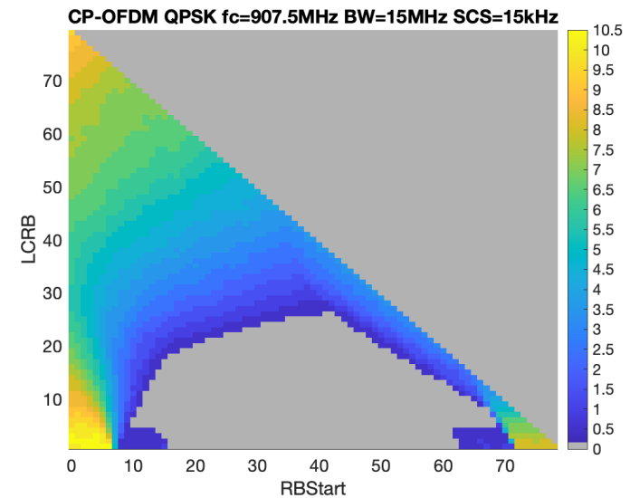

+----------------------------------+----------------------------------+
| 3GPP TS 38.141-2 V18.10.0        |                                  |
| (2025-06)                        |                                  |
+==================================+==================================+
| Technical Specification          |                                  |
+----------------------------------+----------------------------------+
| 3rd Generation Partnership       |                                  |
| Project;                         |                                  |
|                                  |                                  |
| Technical Specification Group    |                                  |
| Radio Access Network;            |                                  |
|                                  |                                  |
| NR;                              |                                  |
|                                  |                                  |
| Base Station (BS) conformance    |                                  |
| testing                          |                                  |
|                                  |                                  |
| Part 2: Radiated conformance     |                                  |
| testing                          |                                  |
|                                  |                                  |
| (Release 18)                     |                                  |
+----------------------------------+----------------------------------+
|                                  |                                  |
+----------------------------------+----------------------------------+
|                                  | {width="1.7708333333333333in" |
|                                  | height="1.0416666666666667in"}   |
+----------------------------------+----------------------------------+
|                                  |                                  |
+----------------------------------+----------------------------------+
| The present document has been    |                                  |
| developed within the 3rd         |                                  |
| Generation Partnership Project   |                                  |
| (3GPP ^TM^) and may be further   |                                  |
| elaborated for the purposes of   |                                  |
| 3GPP.\                           |                                  |
| The present document has not     |                                  |
| been subject to any approval     |                                  |
| process by the 3GPP              |                                  |
| Organizational Partners and      |                                  |
| shall not be implemented.\       |                                  |
| This Specification is provided   |                                  |
| for future development work      |                                  |
| within 3GPP only. The            |                                  |
| Organizational Partners accept   |                                  |
| no liability for any use of this |                                  |
| Specification.\                  |                                  |
| Specifications and Reports for   |                                  |
| implementation of the 3GPP ^TM^  |                                  |
| system should be obtained via    |                                  |
| the 3GPP Organizational          |                                  |
| Partners\' Publications Offices. |                                  |
+----------------------------------+----------------------------------+

+----------------------------------------------------------------------+
|                                                                      |
+======================================================================+
| > ***3GPP***                                                         |
| >                                                                    |
| > Postal address                                                     |
| >                                                                    |
| > 3GPP support office address                                        |
| >                                                                    |
| > 650 Route des Lucioles - Sophia Antipolis                          |
| >                                                                    |
| > Valbonne - FRANCE                                                  |
| >                                                                    |
| > Tel.: +33 4 92 94 42 00 Fax: +33 4 93 65 47 16                     |
| >                                                                    |
| > Internet                                                           |
| >                                                                    |
| > http://www.3gpp.org                                                |
+----------------------------------------------------------------------+
| ***Copyright Notification***                                         |
|                                                                      |
| No part may be reproduced except as authorized by written            |
| permission.\                                                         |
| The copyright and the foregoing restriction extend to reproduction   |
| in all media.                                                        |
|                                                                      |
| © 2025, 3GPP Organizational Partners (ARIB, ATIS, CCSA, ETSI, TSDSI, |
| TTA, TTC).                                                           |
|                                                                      |
| All rights reserved.                                                 |
|                                                                      |
| UMTS™ is a Trade Mark of ETSI registered for the benefit of its      |
| members                                                              |
|                                                                      |
| 3GPP™ is a Trade Mark of ETSI registered for the benefit of its      |
| Members and of the 3GPP Organizational Partners\                     |
| LTE™ is a Trade Mark of ETSI registered for the benefit of its       |
| Members and of the 3GPP Organizational Partners                      |
|                                                                      |
| GSM® and the GSM logo are registered and owned by the GSM            |
| Association                                                          |
+----------------------------------------------------------------------+

 Contents {#contents .TT}
========

Foreword 18

1 Scope 20

2 References 20

3 Definitions, symbols and abbreviations 22

3.1 Definitions 22

3.2 Symbols 25

3.3 Abbreviations 27

4 General radiated test conditions and declarations 29

4.1 Measurement uncertainties and test requirements 29

4.1.1 General 29

4.1.2 Acceptable uncertainty of OTA Test System 31

4.1.2.1 General 31

4.1.2.2 Measurement of transmitter 32

4.1.2.3 Measurement of receiver 34

4.1.2.4 Measurement of performance requirement 38

4.1.3 Interpretation of measurement results 39

4.2 Radiated requirement reference points 39

4.3 Base station classes 41

4.4 Regional requirements 41

4.5 BS configurations 42

4.5.1 Transmit configurations 42

4.5.2 Receive configurations 43

4.5.3 Power supply options 44

4.5.4 BS with integrated Iuant BS modem 45

4.6 Manufacturer\'s declarations 45

4.7 Test configurations 55

4.7.1 General 55

4.7.2 Test signal configurations 56

4.7.2.1 Test signal used to build Test Configurations 56

4.7.2.2 NRTC1: Contiguous spectrum operation 56

4.7.2.2.1 NRTC1 generation 56

4.7.2.2.2 NRTC1 power allocation 56

4.7.2.3 NRTC2: Contiguous CA occupied bandwidth 57

4.7.2.3.1 NRTC2 generation 57

4.7.2.3.2 NRTC2 power allocation 57

4.7.2.4 NRTC3: Non-contiguous spectrum operation 57

4.7.2.4.1 NRTC3 generation 58

4.7.2.4.2 NRTC3 power allocation 58

4.7.2.5 NRTC4: Multi-band test configuration for full carrier allocation
58

4.7.2.5.1 NRTC4 generation 58

4.7.2.5.2 NRTC4 power allocation 59

4.7.2.6 NRTC5: Multi-band test configuration with high PSD per carrier
59

4.7.2.6.1 NRTC5 generation 59

4.7.2.6.2 NRTC5 power allocation 59

4.8 Applicability of requirements 60

4.8.1 Requirement set applicability 60

4.8.2 Applicability of test configurations for *single-band RIB* 60

4.8.3 Applicability of test configurations for *multi-band RIB* 61

4.8.4 Additional conformance 62

4.9 RF channels and test models 63

4.9.1 RF channels 63

4.9.2 Test models 64

4.9.2.1 General 64

4.9.2.2 NR FR2 test models 64

4.9.2.2.1 NR FR2 test model 1.1 (NR-FR2-TM1.1) 65

4.9.2.2.2 NR FR2 test model 2 (NR-FR2-TM2) 66

4.9.2.2.2a NR FR2 test model 2a (NR-FR2-TM2a) 66

4.9.2.2.3 NR FR2 test model 3.1 (NR-FR2-TM3.1) 67

4.9.2.2.4 NR FR2 test model 3.1a (NR-FR2-TM3.1a) 67

4.9.2.3 Data content of physical channels and signals for NR-FR2-TM 67

4.9.2.3.1 PDCCH 68

4.9.2.3.2 PDSCH 68

4.10 Requirements for contiguous and non-contiguous spectrum 69

4.11 Requirements for BS capable of multi-band operation 69

4.12 Co-location requirements 70

4.12.1 General 70

4.12.2 Co-location test antenna 70

4.12.2.1 General 70

4.12.2.2 Co-location test antenna characteristics 70

4.12.2.3 Co-location test antenna alignment 71

4.13 Format and interpretation of tests 72

4.14 Reference coordinate system 73

5 Operating bands and channel arrangement 75

6 Radiated transmitter characteristics 76

6.1 General 76

6.2 Radiated transmit power 76

6.2.1 Definition and applicability 76

6.2.2 Minimum requirement 77

6.2.3 Test purpose 77

6.2.4 Method of test 77

6.2.4.1 Initial conditions 77

6.2.4.2 Procedure 77

6.2.5 Test requirement 78

6.3 OTA base station output power 78

6.3.1 Definition and applicability 78

6.3.2 Minimum requirement 79

6.3.3 Test purpose 79

6.3.4 Method of test 79

6.3.4.1 Initial conditions 79

6.3.4.2 Procedure 79

6.3.5 Test requirement 80

6.3.5.1 *BS type 1-O* 80

6.3.5.2 *BS type 2-O* 80

6.4 OTA output power dynamics 80

6.4.1 General 80

6.4.2 OTA RE power control dynamic range 80

6.4.2.1 Definition and applicability 80

6.4.2.2 Minimum requirement 81

6.4.2.3 Method of test 81

6.4.3 OTA total power dynamic range 81

6.4.3.1 Definition and applicability 81

6.4.3.2 Minimum requirement 81

6.4.3.3 Test purpose 81

6.4.3.4 Method of test 81

6.4.3.4.1 Initial conditions 81

6.4.3.4.2 Procedure 81

6.4.3.5 Test requirement 82

6.4.3.5.1 *BS type 1-O* 82

6.4.3.5.2 *BS type 2-O* 83

6.5 OTA transmit ON/OFF power 83

6.5.1 OTA transmitter OFF power 83

6.5.1.1 Definition and applicability 83

6.5.1.2 Minimum requirement 84

6.5.1.3 Test purpose 84

6.5.1.4 Method of test 84

6.5.1.5 Test requirements 84

6.5.2 OTA transmitter transient period 84

6.5.2.1 Definition and applicability 84

6.5.2.2 Minimum requirement 85

6.5.2.3 Test purpose 85

6.5.2.4 Method of test 85

6.5.2.4.1 Initial conditions 85

6.5.2.4.2 Procedure 86

6.5.2.5 Test requirements 87

6.5.2.5.1 *BS type 1-O* 87

6.5.2.5.2 *BS type 2-O* 87

6.6 OTA transmitted signal quality 87

6.6.1 General 87

6.6.2 OTA frequency error 87

6.6.2.1 Definition and applicability 87

6.6.2.2 Minimum Requirement 87

6.6.2.3 Test purpose 88

6.6.2.4 Method of test 88

6.6.2.4.1 Initial conditions 88

6.6.2.5 Test Requirements 88

6.6.3 OTA modulation quality 88

6.6.3.1 Definition and applicability 88

6.6.3.2 Minimum Requirement 88

6.6.3.3 Test purpose 88

6.6.3.4 Method of test 88

6.6.3.4.1 Initial conditions 88

6.6.3.4.2 Procedure 89

6.6.3.5 Test requirements 90

6.6.3.5.1 *BS type 1-O* 90

6.6.3.5.2 *BS type 2-O* 92

6.6.4 OTA time alignment error 94

6.6.4.1 Definition and applicability 94

6.6.4.2 Minimum requirement 94

6.6.4.3 Test purpose 94

6.6.4.4 Method of test 94

6.6.4.4.1 Initial conditions 94

6.6.4.4.2 Procedure 94

6.6.4.5 Test Requirement 95

6.6.4.5.1 *BS type 1-O* 95

6.6.4.5.2 *BS type 2-O* 95

6.7 OTA unwanted emissions 96

6.7.1 General 96

6.7.2 OTA occupied bandwidth 96

6.7.2.1 Definition and applicability 96

6.7.2.2 Minimum requirement 97

6.7.2.3 Test purpose 97

6.7.2.4 Method of test 97

6.7.2.4.1 Initial conditions 97

6.7.2.4.2 Procedure 97

6.7.2.5 Test requirement 99

6.7.2.5.1 *BS type 1-O* 99

6.7.2.5.2 *BS type 2-O* 99

6.7.3 OTA Adjacent Channel Leakage Power Ratio (ACLR) 99

6.7.3.1 Definition and applicability 99

6.7.3.2 Minimum requirement 99

6.7.3.3 Test purpose 99

6.7.3.4 Method of test 99

6.7.3.4.1 Initial conditions 99

6.7.3.4.2 Procedure 100

6.7.3.5 Test requirements 101

6.7.3.5.1 *BS type 1-O* 101

6.7.3.5.2 *BS type 2-O* 103

6.7.4 OTA operating band unwanted emissions 106

6.7.4.1 Definition and applicability 106

6.7.4.2 Minimum requirement 106

6.7.4.3 Test purpose 106

6.7.4.4 Method of test 106

6.7.4.4.1 Initial conditions 106

6.7.4.4.2 Procedure 107

6.7.4.5 Test requirements 107

6.7.4.5.1 *BS type 1-O* 107

6.7.4.5.2 *BS type 2-O* 121

6.7.5 OTA transmitter spurious emissions 124

6.7.5.1 General 124

6.7.5.2 General OTA transmitter spurious emissions requirements 125

6.7.5.2.1 Definition and applicability 125

6.7.5.2.2 Minimum requirement 125

6.7.5.2.3 Test purpose 125

6.7.5.2.4 Method of test 125

6.7.5.2.5 Test requirement 126

6.7.5.3 Protection of the BS receiver of own or different BS 128

6.7.5.3.1 Definition and applicability 128

6.7.5.3.2 Minimum requirements 128

6.7.5.3.3 Test purpose 129

6.7.5.3.4 Method of test 129

6.7.5.3.5 Test requirements 130

6.7.5.4 Additional spurious emissions requirements 130

6.7.5.4.1 Definition and applicability 130

6.7.5.4.2 Minimum Requirement 130

6.7.5.4.3 Test purpose 131

6.7.5.4.4 Method of test 131

6.7.5.4.5 Test requirement 132

6.7.5.5 Co-location requirements 142

6.7.5.5.1 Definition and applicability 142

6.7.5.5.2 Minimum requirements 143

6.7.5.5.3 Test purpose 143

6.7.5.5.4 Method of test 143

6.7.5.5.5 Test requirements 144

6.8 OTA transmitter intermodulation 149

6.8.1 Definition and applicability 149

6.8.2 Minimum requirement 149

6.8.3 Test purpose 150

6.8.4 Method of test 150

6.8.4.1 Initial conditions 150

6.8.4.2 Procedure 150

6.8.5 Test requirements 151

6.8.5.1 Requirement for BS type 1-O 151

6.8.5.2 Additional requirements (regional) 152

7 Radiated receiver characteristics 153

7.1 General 153

7.2 OTA sensitivity 154

7.2.1 Definition and applicability 154

7.2.2 Minimum requirement 154

7.2.3 Test Purpose 154

7.2.4 Method of test 154

7.2.4.1 Initial conditions 154

7.2.4.2 Procedure 155

7.2.5 Test requirements 155

7.2.5.1 General 155

7.2.5.2 Test requirements for *BS type 1-H* and *BS type 1-O* 155

7.2.5.3 Test requirements for *BS type 2-O* 156

7.3 OTA reference sensitivity level 157

7.3.1 Definition and applicability 157

7.3.2 Minimum requirement 157

7.3.3 Test Purpose 157

7.3.4 Method of test 157

7.3.4.1 Initial conditions 157

7.3.4.2 Procedure 157

7.3.5 Test requirements 158

7.3.5.1 General 158

7.3.5.2 Test requirements for *BS type 1-O* 158

7.3.5.3 Test requirements for *BS type 2-O* 159

7.4 OTA dynamic range 161

7.4.1 Definition and applicability 161

7.4.2 Minimum requirement 161

7.4.3 Test purpose 161

7.4.4 Method of test 161

7.4.4.1 Initial conditions 161

7.4.4.2 Procedure 161

7.4.5 Test requirement 162

7.4.5.1 General 162

7.4.5.2 Test requirements for *BS type 1-O* 162

7.5 OTA in-band selectivity and blocking 175

7.5.1 OTA adjacent channel selectivity 175

7.5.1.1 Definition and applicability 175

7.5.1.2 Minimum requirement 175

7.5.1.3 Test purpose 175

7.5.1.4 Method of test 175

7.5.1.4.1 Initial conditions 175

7.5.1.4.2 Procedure 175

7.5.1.5 Test requirement 176

7.5.1.5.1 General 176

7.5.1.5.2 Test requirements for *BS type 1-O* 176

7.5.1.5.3 Test requirements for *BS type 2-O* 177

7.5.2 OTA in-band blocking 178

7.5.2.1 Definition and applicability 178

7.5.2.2 Minimum requirement 178

7.5.2.3 Test purpose 178

7.5.2.4 Method of test 178

7.5.2.4.1 Initial conditions 178

7.5.2.4.2 Procedure 179

7.5.2.5 Test requirement 180

7.5.2.5.1 General 180

7.5.2.5.2 Test requirements for *BS type 1-O* 180

7.5.2.5.3 Test requirements for *BS type 2-O* 183

7.6 OTA out-of-band blocking 184

7.6.1 Definition and applicability 184

7.6.2 Minimum requirement 184

7.6.3 Test purpose 184

7.6.4 Method of test 185

7.6.4.1 Initial conditions 185

7.6.4.2 Procedure 185

7.6.4.2.1 *BS type 1-O* procedure for out-of-band blocking 185

7.6.4.2.2 *BS type 1-O* procedure for co-location blocking 186

7.6.4.2.3 *BS type 2-O* procedure for out-of-band blocking 186

7.6.5 Test requirements 187

7.6.5.1 Requirement for *BS type 1-O* 187

7.6.5.1.1 General 187

7.6.5.1.2 Co-location requirement 188

7.6.5.2 Requirement for *BS type 2-O* 188

7.6.5.2.1 General requirement 188

7.7 OTA receiver spurious emissions 189

7.7.1 Definition and applicability 189

7.7.2 Minimum requirement 189

7.7.3 Test purpose 190

7.7.4 Method of test 190

7.7.4.1 Initial conditions 190

7.7.4.2 Procedure 190

7.7.5 Test requirement 191

7.7.5.1 Test requirement for *BS type 1-O* 191

7.7.5.2 Test requirement for *BS type 2-O* 192

7.8 OTA receiver intermodulation 193

7.8.1 Definition and applicability 193

7.8.2 Minimum requirement 193

7.8.3 Test purpose 193

7.8.4 Method of test 193

7.8.4.1 Initial conditions 193

7.8.4.2 Procedure 194

7.8.5 Test requirement 194

7.8.5.1 *BS type 1-O* 194

7.8.5.2 *BS type 2-O* 200

7.9 OTA in-channel selectivity 201

7.9.1 Definition and applicability 201

7.9.2 Minimum requirement 201

7.9.3 Test purpose 202

7.9.4 Method of test 202

7.9.4.1 Initial conditions 202

7.9.4.2 Procedure 202

7.9.5 Test requirement 203

7.9.5.1 *BS type 1-O* 203

7.9.5.2 *BS type 2-O* 208

8 Radiated performance requirements 210

8.1 General 210

8.1.0 Scope and definitions 210

8.1.1 OTA demodulation branches 210

8.1.2 Applicability rule 211

8.1.2.0 General 211

8.1.2.1 Applicability of PUSCH performance requirements 211

8.1.2.1.1 Applicability of requirements for different subcarrier
spacings 211

8.1.2.1.2 Applicability of requirements for different channel bandwidths
211

8.1.2.1.3 Applicability of requirements for different configurations 211

8.1.2.1.4 Applicability of requirements for uplink carrier aggregation
211

8.1.2.1.5 Applicability of requirements for TDD with different UL-DL
patterns 211

8.1.2.1.6 Applicability of UL timing adjustment requirements for
different scenarios 212

8.1.2.1.7 Applicability of 2-step RA type requirements for different
subcarrier spacings 212

8.1.2.1.8 Applicability of PUSCH with 0.001% BLER requirements 212

8.1.2.1.9 Applicability of PUSCH repetition type A requirements 212

8.1.2.1.10 Applicability of requirements with 256QAM 212

8.1.2.1.11 Applicability of PUSCH with enhanced DM-RS requirements 212

8.1.2.2 Applicability of PUCCH performance requirements 212

8.1.2.2.1 Applicability of requirements for different formats 212

8.1.2.2.2 Applicability of requirements for different subcarrier
spacings 212

8.1.2.2.3 Applicability of requirements for different channel bandwidths
212

8.1.2.2.4 Applicability of requirements for different configurations 213

8.1.2.2.5 Applicability of requirements for multi-slot PUCCH 213

8.1.2.2.6 Applicability of requirements for PUCCH sub-slot based
repetition 213

8.1.2.3 Applicability of PRACH performance requirements 213

8.1.2.3.1 Applicability of requirements for different formats 213

8.1.2.3.2 Applicability of requirements for different subcarrier
spacings 213

8.1.2.3.3 Applicability of requirements for different channel bandwidths
213

8.1.2.3.4 Applicability of requirements for different restricted set
types of long PRACH format 0 213

8.1.2.4 Applicability of PUSCH for high speed train performance
requirements 214

8.1.2.4.1 Applicability of requirements for different speeds 214

8.1.2.4.2 Applicability of requirements for 1T1R 214

8.1.2.4.3 Applicability of requirements for different channel bandwidths
214

8.1.2.4.4 Appliability of requirements for different DM-RS
configurations 214

8.1.2.5 Applicability of interlaced PUSCH performance requirements 214

8.1.2.5.1 General applicability of interlaced PUSCH performance
requirements 214

8.1.2.5.2 Applicability of requirements for different subcarrier
spacings 214

8.1.2.5.3 Applicability of requirements for different channel bandwidths
215

8.1.2.5.4 Applicability of requirements for different configurations 215

8.1.2.5.5 Applicability of CG-UCI multiplexed on PUSCH requirements 215

8.1.2.6 Applicability of interlaced PUCCH performance requirements 215

8.1.2.6.1 General applicability of interlaced PUCCH performance
requirements 215

8.1.2.6.2 Applicability of requirements for different formats 215

8.1.2.6.3 Applicability of requirements for different subcarrier
spacings 215

8.1.2.6.4 Applicability of requirements for different channel bandwidths
215

8.1.2.7 Applicability of performance requirements for PRACH with L~RA~
=1151 and L~RA~ =571 215

8.1.2.7.1 Applicability of requirements for different formats 215

8.1.2.7.2 Applicability of requirements for different subcarrier
spacings 216

8.1.2.7.3 Applicability of requirements for different channel bandwidths
216

8.1.2.8 Applicability of performance requirements for PUSCH with TB over
Multi-Slots 216

8.1.2.8.1 Applicability of requirements for different UL-DL patterns 216

8.1.2.9 Applicability of performance requirements for PUSCH with DM-RS
bundling 216

8.1.2.9.1 Applicability of requirements for TDD different subcarrier
spacings 216

8.1.2.9.2 Applicability of requirements for TDD with different UL-DL
patterns 216

8.1.2.9.3 Applicability of requirements for different receiver antenna
connectors 216

8.1.2.10 Applicability of performance requirements for PUCCH with DM-RS
bundling 216

8.1.2.10.1 Applicability of requirements for TDD different subcarrier
spacings 216

8.1.2.10.2 Applicability of requirements for TDD with different UL-DL
patterns 216

8.1.2.11 Applicability of ATG PUSCH performance requirements 217

8.1.2.11.1 Applicability of requirements for TDD with different UL-DL
patterns 217

8.1.2.11.2 Applicability of requirements for different MCSs 217

8.1.2.12 Applicability of ATG PUCCH performance requirements 217

8.1.2.13 Applicability of ATG PRACH performance requirements 217

8.1.2.14 Applicability of performance requirements for Multiple PRACH
transmission 217

8.1.2.14.1 Applicability of requirements for different formats 217

8.1.2.14.2 Applicability of requirements for different channel
bandwidths 217

8.2 OTA performance requirements for PUSCH 217

8.2.1 Performance requirements for PUSCH with transform precoding
disabled 217

8.2.1.1 Definition and applicability 217

8.2.1.2 Minimum Requirement 218

8.2.1.3 Test purpose 218

8.2.1.4 Method of test 218

8.2.1.4.1 Initial conditions 218

8.2.1.4.2 Procedure 218

8.2.1.5 Test Requirement 220

8.2.1.5.1 Test requirement for *BS type 1-O* 220

8.2.1.5.2 Test requirement for *BS type 2-O* 225

8.2.2 Performance requirements for PUSCH with transform precoding
enabled 229

8.2.2.1 Definition and applicability 229

8.2.2.2 Minimum Requirement 229

8.2.2.3 Test Purpose 229

8.2.2.4 Method of test 229

8.2.2.4.1 Initial Conditions 229

8.2.2.4.2 Procedure 229

8.2.2.5 Test Requirement 231

8.2.2.5.1 Test requirement for *BS type 1-O* 231

8.2.2.5.2 Test requirement for *BS type 2-O* 232

8.2.3 Performance requirements for UCI multiplexed on PUSCH 233

8.2.3.1 Definition and applicability 233

8.2.3.2 Minimum Requirement 233

8.2.3.3 Test purpose 234

8.2.3.4 Method of test 234

8.2.3.4.1 Initial conditions 234

8.2.3.4.2 Procedure 234

8.2.3.5 Test Requirement 236

8.2.3.5.1 Test requirement for *BS type 1-O* 236

8.2.3.5.2 Test requirement for *BS type 2-O* 237

8.2.4 Performance requirements for PUSCH for high speed train 238

8.2.4.1 Definition and applicability 238

8.2.4.2 Minimum Requirement 238

8.2.4.3 Test Purpose 238

8.2.4.4 Method of test 238

8.2.4.4.1 Initial Conditions 238

8.2.4.4.2 Procedure 239

8.2.4.5 Test Requirement for *BS Type 1-O* 241

8.2.4.6 Test Requirement for *BS Type 2-O* 243

8.2.5 Performance requirements for UL timing adjustment 243

8.2.5.1 Definition and applicability 243

8.2.5.2 Minimum Requirement 244

8.2.5.3 Test Purpose 244

8.2.5.4 Method of test 244

8.2.5.4.1 Initial Conditions 244

8.2.5.4.2 Procedure 244

8.2.5.5 Test Requirement for High Speed Train *for BS type 1-O* 247

8.2.5.5a Test Requirement for High Speed Train *for BS type 2-O* 248

8.2.5.6 Test Requirement for Normal Mode 248

8.2.6 Performance requirements for PUSCH with 0.001% BLER 248

8.2.6.1 Definition and applicability 248

8.2.6.2 Minimum Requirement 249

8.2.6.3 Test Purpose 249

8.2.6.4 Method of test 249

8.2.6.4.1 Initial Conditions 249

8.2.6.4.2 Procedure 249

8.2.6.5 Test requirement 250

8.2.6.5.1 Test requirement for *BS type 1-O* 250

8.2.7 Performance requirements for PUSCH repetition Type A 252

8.2.7.1 Definition and applicability 252

8.2.7.2 Minimum Requirement 252

8.2.7.3 Test purpose 252

8.2.7.4 Method of test 252

8.2.7.4.1 Initial conditions 252

8.2.7.4.2 Procedure 252

8.2.7.5 Test Requirement 254

8.2.7.5.1 Test requirement for *BS type 1-O* 254

8.2.7.5.2 Test requirement for *BS type 2-O* 256

8.2.8.1 Definition and applicability 256

8.2.8.2 Minimum Requirement 257

8.2.8.3 Test purpose 257

8.2.8.4 Method of test 257

8.2.8.4.1 Initial conditions 257

8.2.8.4.2 Procedure 257

8.2.8.5 Test Requirement 259

8.2.8.5.1 Test requirement for *BS type 1-O* 259

8.2.8.5.2 Test requirement for *BS type 2-O* 260

8.2.9 Performance requirements for MsgA PUSCH 261

8.2.9.1 Definition and applicability 261

8.2.9.2 Minimum Requirement 261

8.2.9.3 Test Purpose 261

8.2.9.4 Method of test 261

8.2.9.4.1 Initial Conditions 261

8.2.9.4.2 Procedure 261

8.2.9.5 Test Requirement 264

8.2.9.5.1 Test Requirement for *BS type 1-O* 264

8.2.9.5.2 Test Requirement for *BS type 2-O* 265

8.2.10 Requirements for interlaced PUSCH 266

8.2.10.1 Definition and applicability 266

8.2.10.2 Minimum Requirement 266

8.2.10.3 Test Purpose 266

8.2.10.4 Method of test 266

8.2.10.4.1 Initial Conditions 266

8.2.10.4.2 Procedure 267

8.2.10.5 Test Requirement 268

8.2.10.5.1 Test requirement for *BS type 1-O* 268

8.2.11 Performance requirements for CG-UCI multiplexed on interlaced
PUSCH 269

8.2.11.1 Definition and applicability 269

8.2.11.2 Minimum Requirement 269

8.2.11.3 Test purpose 269

8.2.11.4 Method of test 269

8.2.11.4.1 Initial conditions 269

8.2.11.4.2 Procedure 269

8.2.11.5 Test Requirement 271

8.2.11.5.1 Test requirement for *BS type 1-O* 271

8.2.12 Performance requirements for TB processing over multi-slot PUSCH
(TBoMS) 271

8.2.12.1 Definition and applicability 271

8.2.12.2 Minimum Requirement 271

8.2.12.3 Test Purpose 272

8.2.12.4 Method of test 272

8.2.12.4.1 Initial Conditions 272

8.2.12.4.2 Procedure 272

8.2.12.5 Test Requirement 274

8.2.12.5.1 Test requirement for *BS type 1-O* 274

8.2.12.5.2 Test requirement for *BS type 2-O* 275

8.2.13 Performance requirements for PUSCH with DMRS bundling 275

8.2.13.1 Definition and applicability 275

8.2.13.2 Minimum Requirement 276

8.2.13.3 Test Purpose 276

8.2.13.4 Method of test 276

8.2.13.4.1 Initial Conditions 276

8.2.13.4.2 Procedure 276

8.2.13.5 Test Requirement 278

8.2.13.5.1 Test requirement for *BS type 1-O* 278

8.2.13.5.2 Test requirement for *BS type 2-O* 280

8.2.14 Performance requirements for PUSCH for ATG 280

8.2.14.1 Definition and applicability 280

8.2.14.2 Minimum Requirement 280

8.2.14.3 Test Purpose 280

8.2.14.4 Method of test 281

8.2.14.4.1 Initial conditions 281

8.2.14.4.2 Procedure 281

8.2.14.5 Test requirement 282

8.2.14.5.1 Test requirement for *BS type 1-O* 282

8.2.15 Performance requirements for PUSCH with enhanced DM-RS 283

8.2.15.1 Definition and applicability 283

8.2.15.2 Minimum Requirement 283

8.2.15.3 Test purpose 283

8.2.15.4 Method of test 283

8.2.15.4.1 Initial conditions 283

8.2.15.4.2 Procedure 283

8.2.15.5 Test Requirement 284

8.2.15.5.1 Test requirement for *BS type 1-O* 284

8.3 OTA performance requirements for PUCCH 286

8.3.1 Performance requirements for PUCCH format 0 286

8.3.1.1 Definition and applicability 286

8.3.1.2 Minimum Requirement 286

8.3.1.3 Test purpose 286

8.3.1.4 Method of test 286

8.3.1.4.1 Initial conditions 286

8.3.1.4.2 Procedure 286

8.3.1.5 Test Requirement 288

8.3.1.5.1 Test requirement for *BS type 1-O* 288

8.3.1.5.2 Test requirement for *BS type 2-O* 289

8.3.2 Performance requirements for PUCCH format 1 289

8.3.2.1 NACK to ACK detection 289

8.3.2.1.1 Definition and applicability 289

8.3.2.1.2 Minimum Requirement 290

8.3.2.1.3 Test purpose 290

8.3.2.1.4 Method of test 290

8.3.2.1.5 Test Requirement 292

8.3.2.2 ACK missed detection 293

8.3.2.2.1 Definition and applicability 293

8.3.2.2.2 Minimum Requirement 294

8.3.2.2.3 Test purpose 294

8.3.2.2.4 Method of test 294

8.3.2.2.5 Test Requirement 296

8.3.3 Performance requirements for PUCCH format 2 297

8.3.3.1 ACK missed detection performance requirements 297

8.3.3.1.1 Definition and applicability 297

8.3.3.1.2 Minimum Requirement 297

8.3.3.1.3 Test Purpose 297

8.3.3.1.4 Method of test 297

8.3.3.1.5 Test requirement 299

8.3.3.2 UCI BLER performance requirements 300

8.3.3.2.1 Definition and applicability 300

8.3.3.2.2 Minimum Requirement 301

8.3.3.2.3 Test Purpose 301

8.3.3.2.4 Method of test 301

8.3.3.2.5 Test requirement 302

8.3.4 Performance requirements for PUCCH format 3 303

8.3.4.1 Definition and applicability 303

8.3.4.2 Minimum requirement 304

8.3.4.3 Test purpose 304

8.3.4.4 Method of test 304

8.3.4.4.1 Initial conditions 304

8.3.4.4.2 Procedure 304

8.3.4.5 Test requirement 305

8.3.4.5.1 Test requirement for *BS type 1-O* 305

8.3.4.5.2 Test requirement for *BS type 2-O* 306

8.3.5 Performance requirements for PUCCH format 4 307

8.3.5.1 Definition and applicability 307

8.3.5.2 Minimum requirement 307

8.3.5.3 Test purpose 307

8.3.5.4 Method of test 307

8.3.5.4.1 Initial conditions 307

8.3.5.4.2 Procedure 307

8.3.5.5 Test requirement 309

8.3.5.5.1 Test requirement for *BS type 1-O* 309

8.3.5.5.2 Test requirement for *BS type 2-O* 309

8.3.6 Performance requirements for multi-slot PUCCH format 310

8.3.6.1 Performance requirements for multi-slot PUCCH format 1 310

8.3.6.1.1 NACK to ACK detection 310

8.3.6.1.2 ACK missed detection 312

8.3.7 Performance requirements for interlaced PUCCH format 0 314

8.3.7.1 Definition and applicability 314

8.3.7.2 Minimum Requirement 315

8.3.7.3 Test purpose 315

8.3.7.4 Method of test 315

8.3.7.4.1 Initial conditions 315

8.3.7.4.2 Procedure 315

8.3.7.5 Test Requirement 316

8.3.7.5.1 Test requirement for *BS type 1-O* 316

8.3.8 Performance requirements for interlaced PUCCH format 1 316

8.3.8.1 NACK to ACK detection 316

8.3.8.1.1 Definition and applicability 316

8.3.8.1.2 Minimum Requirement 317

8.3.8.1.3 Test purpose 317

8.3.8.1.4 Method of test 317

8.3.8.1.5 Test Requirement 318

8.3.8.2 ACK missed detection 318

8.3.8.2.1 Definition and applicability 318

8.3.8.2.2 Minimum Requirement 319

8.3.8.2.3 Test purpose 319

8.3.8.2.4 Method of test 319

8.3.8.2.5 Test Requirement 320

8.3.9 Performance requirements for interlaced PUCCH format 2 321

8.3.9.1 Definition and applicability 321

8.3.9.2 Minimum Requirement 321

8.3.9.3 Test Purpose 321

8.3.9.4 Method of test 321

8.3.9.4.1 Initial conditions 321

8.3.9.4.2 Procedure 321

8.3.9.5 Test requirement 322

8.3.10 Performance requirements for interlaced PUCCH format 3 323

8.3.10.1 Definition and applicability 323

8.3.10.2 Minimum Requirement 323

8.3.10.3 Test Purpose 323

8.3.10.4 Method of test 323

8.3.10.4.1 Initial conditions 323

8.3.10.4.2 Procedure 323

8.3.10.5 Test requirement 324

8.3.11 Performance requirements for PUCCH sub-slot based repetition
format 0 325

8.3.11.1 Definition and applicability 325

8.3.11.2 Minimum Requirement 325

8.3.11.3 Test purpose 325

8.3.11.4 Method of test 326

8.3.11.4.1 Initial conditions 326

8.3.11.4.2 Procedure 326

8.3.11.5 Test Requirement 327

8.3.11.5.1 Test requirement for *BS type 1-O* 327

8.3.12 Performance requirements PUCCH format 1 with DM-RS bundling 327

8.3.12.1 NACK to ACK detection 327

8.3.12.1.1 Definition and applicability 327

8.3.12.1.2 Minimum Requirement 328

8.3.12.1.3 Test purpose 328

8.3.12.1.4 Method of test 328

8.3.12.1.4.1 Initial conditions 328

8.3.12.1.4.2 Procedure 328

8.3.12.1.5 Test Requirement 329

8.3.12.1.5.1 Test Requirement for *BS type 1-O* 329

8.3.12.1.5.2 Test Requirement for BS type 2-O 330

8.3.12.2 ACK missed detection 330

8.3.12.2.1 Definition and applicability 330

8.3.12.2.2 Minimum Requirement 331

8.3.12.2.3 Test purpose 331

8.3.12.2.4 Method of test 331

8.3.12.2.4.1 Initial conditions 331

8.3.12.2.4.2 Procedure 331

8.3.12.2.5 Test Requirement 333

8.3.12.2.5.1 Test Requirement for BS type 1-O 333

8.3.12.2.5.2 Test Requirement for BS type 2-O 333

8.3.13 Performance requirements for PUCCH format 3 with DM-RS bundling
334

8.3.13.1 Definition and applicability 334

8.3.13.2 Minimum requirement 334

8.3.13.3 Test purpose 334

8.3.13.4 Method of test 334

8.3.13.4.1 Initial conditions 334

8.3.13.4.2 Procedure 334

8.3.13.5 Test requirement 336

8.3.13.5.1 Test Requirement for BS type 1-O 336

8.3.13.5.2 Test Requirement for BS type 2-O 336

8.4 OTA performance requirements for PRACH 337

8.4.1 PRACH false alarm probability and missed detection 337

8.4.1.1 Definition and applicability 337

8.4.1.2 Minimum requirement 337

8.4.1.3 Test purpose 337

8.4.1.4 Method of test 338

8.4.1.4.1 Initial conditions 338

8.4.1.4.2 Procedure 338

8.4.1.5 Test requirement for Normal Mode 341

8.4.1.5.1 Test requirement for *BS type 1-O* 341

8.4.1.5.2 Test requirement for *BS type 2-O* 342

8.4.1.6 Test requirement for high speed train 342

8.4.1.6.1 Test requirement for *BS type 1-O* 342

8.4.1.6.2 Test requirement for *BS type 2-O* 343

8.4.1.7 Test requirement for PRACH with L~RA~=1151 and L~RA~=571 343

8.4.1.7.1 Test requirement for *BS type 1-O* 343

8.4.1.7.2 Test requirement for *BS type 2-O* 344

8.4.1.8 Test requirement for PRACH with repetition transmission 345

8.4.1.8.1 Test requirement for *BS type 2-O* 345

Annex A (normative): Reference measurement channels 345

A.1 Fixed Reference Channels for OTA sensitivity, OTA reference
sensitivity level, OTA ACS, OTA in-band blocking, OTA out-of-band
blocking, OTA receiver intermodulation and OTA in-channel selectivity
(QPSK, R=1/3) 345

A.2 Fixed Reference Channels for OTA dynamic range (16QAM, R=2/3) 348

A.3 Fixed Reference Channels for performance requirements (QPSK,
R=193/1024) 348

A.3A Fixed Reference Channels for performance requirements (QPSK,
R=99/1024) 356

A.3B Fixed Reference Channels for performance requirements (QPSK,
R=308/1024) 358

A.4 Fixed Reference Channels for performance requirements (16QAM,
R=658/1024) 362

A.5 Fixed Reference Channels for performance requirements (64QAM,
R=567/1024) 367

A.6 PRACH Test preambles 370

A.7 Fixed Reference Channels for performance requirements (16QAM,
R=434/1024) 371

A.8 Fixed Reference Channels for performance requirements (QPSK,
R=157/1024) 373

A.9 Fixed Reference Channels for performance requirements (256QAM,
R=682.5/1024) 374

A.10 Fixed Reference Channels for performance requirements (64QAM,
R=517/1024) 376

A.11 Fixed Reference Channels for performance requirements (64QAM,
R=438/1024) 380

A.12 Void 380

A.13 Fixed Reference Channels for performance requirements (64QAM,
R=948/1024) 380

A.14 Fixed Reference Channels for performance requirements (256QAM,
R=754/1024) 380

Annex B (normative): Environmental requirements for the BS equipment 382

B.1 General 382

B.2 Normal test environment 382

B.3 Extreme test environment 382

B.3.1 Extreme temperature 382

B.4 Vibration 383

B.5 Power supply 383

B.6 Measurement of test environments 383

B.7 OTA extreme test methods 384

B.7.1 Direct far field method 384

B.7.2 Relative method 384

Annex C (informative): Test tolerances and derivation of test
requirements 386

C.1 Measurement of transmitter 387

C.2 Measurement of receiver 393

C.3 Measurement of performance requirements 395

Annex D (normative): Calibration 398

Annex E (informative): OTA measurement system set-up 399

E.1 Transmitter 399

E.1.1 Radiated transmit power, OTA output power dynamics, OTA
transmitted signal quality, OTA occupied bandwidth, and OTA transmit
ON/OFF power (*BS type 2-O*) 399

E.1.2 OTA base station output power, OTA ACLR, OTA operating band
unwanted emissions 400

E.1.3 OTA spurious emissions 400

E.1.4 OTA co-location emissions, OTA transmit ON/OFF power (*BS type
1-O*) 401

E.1.5 OTA transmitter intermodulation 402

E.2 Receiver 403

E.2.1 OTA sensitivity and OTA reference sensitivity level 403

E.2.2 OTA dynamic range 403

E.2.3 OTA adjacent channel selectivity, general OTA blocking, and OTA
narrowband blocking 404

E.2.4 OTA blocking 405

E.2.4.1 General OTA out-of-band blocking 405

E.2.4.2 OTA co-location blocking 405

E.2.5 OTA receiver spurious emissions 406

E.2.6 OTA receiver intermodulation 406

E.2.7 OTA in-channel selectivity 407

E.3 Performance requirements 407

Annex F (normative): Void 408

Annex G (informative): Transmitter spatial emissions declaration 409

G.1 General 409

G.2 Declarations 410

Annex H (normative): Characteristics of the interfering signals 411

Annex I (normative): TRP measurement procedures 412

I.1 General 412

I.2 Spherical equal angle grid 412

I.2.1 General 412

I.2.2 Reference angular step criteria 412

I.3 Spherical equal area grid 414

I.4 Spherical Fibonacci grid 415

I.5 Orthogonal cut grid 415

I.5.1 General 415

I.5.2 Operating band unwanted emissions 416

I.5.3 Spurious unwanted emissions 416

I.6 Wave vector space grid 417

I.7 Void 417

I.8 Void 417

I.9 Full sphere with sparse sampling 417

I.10 Beam-based directions 418

I.11 Peak method 418

I.12 Equal sector with peak average 418

I.13 Pre-scan 419

Annex J (normative): Propagation conditions 420

J.1 Static propagation condition 420

J.2 Multi-path fading propagation conditions 420

J.2.1 Delay profiles 420

J.2.1.1 Delay profiles for FR1 421

J.2.1.2 Delay profiles for FR2 422

J.2.2 Combinations of channel model parameters 423

J.2.3 MIMO channel correlation matrices 424

J.2.3.1 MIMO correlation matrices using Uniform Linear Array 424

J.2.3.1.1 Definition of MIMO correlation matrices 424

J.2.3.1.2 MIMO correlation matrices at high, medium and low level 425

J.2.3.2 Multi-antenna channel models using cross polarized antennas 427

J.2.3.2.1 Definition of MIMO correlation matrices using cross polarized
antennas 428

J.2.3.2.2 Spatial correlation matrices at UE and gNB sides 428

J.2.3.2.2.1 Spatial correlation matrices at UE side 428

J.2.3.2.2.2 Spatial correlation matrices at gNB side 428

J.2.3.2.3 MIMO correlation matrices using cross polarized antennas 429

J.3 High speed train condition 429

J.4 Moving propagation conditions 434

Annex K (informative): Measuring noise close to noise-floor 436

Annex L (normative): In-channel TX tests 437

L.1 General 437

L.2 Basic principles 437

L.2.1 Output signal of the TX under test 437

L.2.2 Ideal signal 437

L.2.3 Measurement results 438

L.2.4 Measurement points 438

L.3 Pre-FFT minimization process 440

L.4 Timing of the FFT window 440

L.5 Resource element TX power 441

L.6 Post-FFT equalisation 442

L.7 EVM 444

L.7.0 General 444

L.7.1 Averaged EVM (FDD) 444

L.7.2 Averaged EVM (TDD) for FR1 and FR2-1 445

L.7.3 Averaged EVM (TDD) for FR2-2 445

Annex M (normative): General rules for statistical testing 446

M.1 Testing methodology of PUSCH performance requirements with 0.001%
BLER 446

M.1.1 General 446

M.1.2 Numerical definition of the pass-fail limits for testing PUSCH
0.001% BLER 447

M.1.3 Theory to derive the early pass/fail limits in M.1.2 (informative)
448

M.1.3.1 Numerical definition of the pass-fail limits for testing PUSCH
0.001% BLER 448

M.1.3.2 Simulation to derive the pass-fail limits for testing PUSCH
0.001% BLER 448

Annex N (informative): Change history 450

 Foreword
========

This Technical Specification has been produced by the 3rd Generation
Partnership Project (3GPP).

The contents of the present document are subject to continuing work
within the TSG and may change following formal TSG approval. Should the
TSG modify the contents of the present document, it will be re-released
by the TSG with an identifying change of release date and an increase in
version number as follows:

Version x.y.z

where:

x the first digit:

1 presented to TSG for information;

2 presented to TSG for approval;

3 or greater indicates TSG approved document under change control.

y the second digit is incremented for all changes of substance, i.e.
technical enhancements, corrections, updates, etc.

z the third digit is incremented when editorial only changes have been
incorporated in the document.

In the present document, modal verbs have the following meanings:

**shall** indicates a mandatory requirement to do something

**shall not** indicates an interdiction (prohibition) to do something

The constructions \"shall\" and \"shall not\" are confined to the
context of normative provisions, and do not appear in Technical Reports.

The constructions \"must\" and \"must not\" are not used as substitutes
for \"shall\" and \"shall not\". Their use is avoided insofar as
possible, and they are not used in a normative context except in a
direct citation from an external, referenced, non-3GPP document, or so
as to maintain continuity of style when extending or modifying the
provisions of such a referenced document.

**should** indicates a recommendation to do something

**should not** indicates a recommendation not to do something

**may** indicates permission to do something

**need not** indicates permission not to do something

The construction \"may not\" is ambiguous and is not used in normative
elements. The unambiguous constructions \"might not\" or \"shall not\"
are used instead, depending upon the meaning intended.

**can** indicates that something is possible

**cannot** indicates that something is impossible

The constructions \"can\" and \"cannot\" are not substitutes for \"may\"
and \"need not\".

**will** indicates that something is certain or expected to happen as a
result of action taken by an agency the behaviour of which is outside
the scope of the present document

**will not** indicates that something is certain or expected not to
happen as a result of action taken by an agency the behaviour of which
is outside the scope of the present document

**might** indicates a likelihood that something will happen as a result
of action taken by some agency the behaviour of which is outside the
scope of the present document

**might not** indicates a likelihood that something will not happen as a
result of action taken by some agency the behaviour of which is outside
the scope of the present document

In addition:

**is** (or any other verb in the indicative mood) indicates a statement
of fact

**is not** (or any other negative verb in the indicative mood) indicates
a statement of fact

The constructions \"is\" and \"is not\" do not indicate requirements.

 1 Scope
=======

The present document specifies the Radio Frequency (RF) test methods and
conformance requirements for NR Base Station (BS) *type 1-H*, *BS type
1-O* and *BS* *type 2-O*. These have been derived from, and are
consistent with the radiated requirements for *BS type 1-H*, *BS type
1-O* and *BS type 2-O* in BS specification defined in TS 38.104 \[2\].

A *BS type 1-C* only has conducted requirements so it does not require
compliance to this specification.

A *BS type 1-H* has both conducted and radiated requirements so it
requires compliance to the applicable requirements of this specification
and TS 38.141-1 \[3\].

*BS type 1-O* and *BS type 2-O* have only radiated requirements so they
require compliance to this specification only.

2 References
============

The following documents contain provisions which, through reference in
this text, constitute provisions of the present document.

\- References are either specific (identified by date of publication,
edition number, version number, etc.) or non‑specific.

\- For a specific reference, subsequent revisions do not apply.

\- For a non-specific reference, the latest version applies. In the case
of a reference to a 3GPP document (including a GSM document), a
non-specific reference implicitly refers to the latest version of that
document *in the same Release as the present document*.

\[1\] 3GPP TR 21.905: \"Vocabulary for 3GPP Specifications\"

\[2\] 3GPP TS 38.104: \"NR Base Station (BS) radio transmission and
reception\"

\[3\] 3GPP TS 38.141-1: \"NR, Base Station (BS) conformance testing,
Part 1: Conducted conformance testing\"

\[4\] Recommendation ITU-R M.1545: \"Measurement uncertainty as it
applies to test limits for the terrestrial component of International
Mobile Telecommunications-2000\"

\[5\] ITU-R Recommendation SM.329: \"Unwanted emissions in the spurious
domain\"

\[6\] Void

\[7\] IEC 60 721-3-3: \"Classification of environmental conditions -
Part 3-3: Classification of groups of environmental parameters and their
severities - Stationary use at weather protected locations\"

\[8\] IEC 60 721-3-4: \"Classification of environmental conditions -
Part 3: Classification of groups of environmental parameters and their
severities - Clause 4: Stationary use at non-weather protected
locations\"

\[9\] IEC 60 721: \"Classification of environmental conditions\"

\[10\] IEC 60 068-2-1 (2007): \"Environmental testing - Part 2: Tests.
Tests A: Cold\"

\[11\] IEC 60 068-2-2: (2007): \"Environmental testing - Part 2: Tests.
Tests B: Dry heat\"

\[12\] IEC 60 068-2-6: (2007): \"Environmental testing - Part 2: Tests -
Test Fc: Vibration (sinusoidal)\"

\[13\] Recommendation ITU-R M.328: \"Spectra and bandwidth of
emissions\"

\[14\] FCC publication number 662911: \"Emissions Testing of
Transmitters with Multiple Outputs in the Same Band\".

\[15\] ECC/DEC/(17)06: \"The harmonised use of the frequency bands
1427-1452 MHz and 1492-1518 MHz for Mobile/Fixed Communications Networks
Supplemental Downlink (MFCN SDL)\"

\[16\] Void

\[17\] Void

\[18\] 3GPP TS 36.104: \"E-UTRA; Base Station (BS) radio transmission
and reception\"

\[19\] 3GPP TS 38.212: \"NR; Multiplexing and channel coding\"

\[20\] 3GPP TS 38.211: \"NR; Physical channels and modulation\"

\[21\] 3GPP TS 38.214: \"NR; Physical layer procedures for data\"

\[22\] 3GPP TS 38.331: \"NR; Radio Resource Control (RRC) protocol
specification\"

\[23\] 3GPP TR 38.901: \"Study on channel model for frequencies from 0.5
to 100 GHz\"

\[24\] 3GPP TS 38.101-1: \"NR; User Equipment (UE) radio transmission
and reception; Part 1: Range 1 Standalone\"

\[25\] 3GPP TS 38.101-2: \"NR; User Equipment (UE) radio transmission
and reception; Part 2: Range 2 Standalone\"

\[26\] ERC Recommendation 74-01: \"Unwanted emissions in the spurious
domain\"

\[27\] 3GPP TR 25.942: \"RF system scenarios\".

\[28\] ITU-T Recommendation O.150, \"Equipment for the measurement of
digital and analogue/digital parameters\"

\[29\] 3GPP TR 37.941: \"Radio Frequency (RF) conformance testing
background for radiated Base Station (BS) requirements\"

\[30\] 3GPP TS 37.145-2: \"Active Antenna System (AAS) Base Station (BS)
conformance testing; Part 2: radiated conformance testing\".

\[31\] Commission Implementing Decision (EU) 2020/590 of 24 April 2020
amending Decision (EU) 2019/784 as regards an update of relevant
technical conditions applicable to the 24,25-27,5 GHz frequency
band** **

3 Definitions, symbols and abbreviations
========================================

3.1 Definitions
---------------

For the purposes of the present document, the terms and definitions
given in TR 21.905 \[1\] and the following apply. A term defined in the
present document takes precedence over the definition of the same term,
if any, in TR 21.905 \[1\].

**aggregated BS channel bandwidth:** the RF bandwidth in which a Base
Station transmits and receives multiple contiguously aggregated
carriers. The *aggregated BS channel bandwidth* is measured in MHz.

**antenna connector:** connector at the conducted interface of the *BS
type 1-C.*

**Base Station RF Bandwidth**: RF bandwidth in which a base station
transmits and/or receives single or multiple carrier(s) within a
supported *operating band.*

NOTE 1: In single carrier operation, the *Base Station RF Bandwidth* is
equal to the channel bandwidth.

**Base Station RF Bandwidth edge:** frequency of one of the edges of the
*Base Station RF Bandwidth.*

**basic limit:** emissions limit relating to the power supplied by a
single transmitter to a single antenna transmission line in ITU-R
SM.329 \[5\] used for the formulation of unwanted emission requirements
for FR1.

**beam:** beam (of the antenna) is the main lobe of the radiation
pattern of an *antenna array.*

NOTE 2: For certain BS *antenna array*, there may be more than one beam.

**beam centre direction:** direction equal to the geometric centre of
the half-power contour of the beam.

**beam direction pair:** data set consisting of the *beam centre
direction* and the related *beam peak direction.*

**beam peak direction:** direction where the maximum EIRP is found.

**beamwidth:** beam which has a half-power contour that is essentially
elliptical, the half-power beamwidths in the two pattern cuts that
respectively contain the major and minor axis of the ellipse.

**BS channel bandwidth**: RF bandwidth supporting a single NR RF carrier
with the transmission bandwidth configured in the uplink or downlink.

NOTE 3: The *BS channel bandwidth* is measured in MHz and is used as a
reference for transmitter and receiver RF requirements.

NOTE 4: It is possible for the BS to transmit to and/or receive from one
or more UE bandwidth parts that are smaller than or equal to the BS
transmission bandwidth configuration, in any part of the BS transmission
bandwidth configuration.

**BS receiver:** composite receiver function of a BS receiving in an
*operating band.*

**BS type 1-C:** NR base station operating at FR1 with requirements set
consisting only of conducted requirements defined at individual *antenna
connectors.*

**BS type 1-H:** NR base station operating at FR1 with a requirement set
consisting of conducted requirements defined at individual *TAB
connectors* and OTA requirements defined at RIB.

**BS type 1-O:** NR base station operating at FR1 with a requirement set
consisting only of OTA requirements defined at the RIB.

**BS type 2-O:** NR base station operating at FR2 with a requirement set
consisting only of OTA requirements defined at the RIB.

**channel edge:** lowest or highest frequency of the NR carrier,
separated by the *BS channel bandwidth.*

**carrier aggregation:** aggregation of two or more component carriers
in order to support wider transmission bandwidths.

**carrier aggregation configuration:** a set of one or more *operating
bands* across which the BS aggregates carriers with a specific set of
technical requirements.

**co-location reference antenna**: a passive antenna used as reference
for base station to base station co-location requirements.

**contiguous carriers:** set of two or more carriers configured in a
spectrum block where there are no RF requirements based on co-existence
for un-coordinated operation within the spectrum block.

**contiguous spectrum:** spectrum consisting of a contiguous block of
spectrum with no *sub-block gap*(s).

**demodulation branch:** single input of the *BS receiver* to the
demodulation algorithms.

**directional requirement:** requirement which is applied in a specific
direction within the OTA coverage range for the Tx and when the AoA of
the incident wave of a received signal is within the *FR1 OTA REFSENS
RoAoA* or *FR2 OTA REFSENS RoAoA* or the minSENS RoAoA as appropriate
for the receiver.

**equivalent isotropic radiated power:** equivalent power radiated from
an isotropic directivity device producing the same field intensity at a
point of observation as the field intensity radiated in the direction of
the same point of observation by the discussed device.

NOTE 5: Isotropic directivity is equal in all directions (0 dBi).

**equivalent isotropic sensitivity:** sensitivity for an isotropic
directivity device equivalent to the sensitivity of the discussed device
exposed to an incoming wave from a defined AoA.

NOTE 6: The sensitivity is the minimum received power level at which
specific requirement is met.

NOTE 7: Isotropic directivity is equal in all directions (0 dBi).

**fractional bandwidth: fractional bandwidth FBW is defined in percent
as**
$\text{FBW} = 200 \bullet \frac{F_{\text{FBWhigh}} - F_{\text{FBWlow}}}{F_{\text{FBWhigh}} + F_{\text{FBWlow}}}\%$.

**highest carrier:** the carrier with the highest carrier frequency
transmitted/received in a specified frequency band.

**inter-band carrier aggregation:** carrier aggregation of component
carriers in different operating bands.

NOTE 8: Carriers aggregated in each band can be contiguous or
non-contiguous.

**intra-band contiguous carrier aggregation:** *contiguous carriers*
aggregated in the same operating band.

**intra-band non-contiguous carrier aggregation:** non-contiguous
carriers aggregated in the same operating band.

**Inter-band gap**: The frequency gap between two supported consecutive
operating bands.

**Inter RF Bandwidth gap:** frequency gap between two consecutive Base
Station RF Bandwidths that are placed within two supported *operating
bands.*

**lowest Carrier:** the carrier with the lowest carrier frequency
transmitted/received in a specified frequency band.

**lower sub-block edge:** frequency at the lower edge of one
*sub-block.*

NOTE 9: It is used as a frequency reference point for both transmitter
and receiver requirements.

**maximum carrier TRP:** mean power level measured per RIB during the
*transmitter ON period* for a specific carrier in a specified reference
condition and corresponding to the declared *rated carrier TRP*
(P~rated,c,TRP~).

**maximum transmitter TRP:** mean power level measured per RIB during
the *transmitter ON period* in a specified reference condition and
corresponding to the declared *rated transmitter TRP* (P~rated,t,TRP~).

**measurement bandwidth**: RF bandwidth in which an emission level is
specified.

**minSENS:** the lowest declared EIS value for the OSDD\'s declared for
OTA sensitivity requirement**.**

**minSENS RoAoA:** The reference RoAoA associated with the OSDD with the
lowest declared EIS.

**multi-band RIB:** *operating band* specific RIB associated with a
transmitter or receiver that is characterized by the ability to process
two or more carriers in common active RF components simultaneously,
where at least one carrier is configured at a different operating band
than the other carrier(s) and where this different operating band is not
a sub-band or superseding-band of another supported operating band.

**multi-carrier transmission configuration:** set of one or more
contiguous or non-contiguous carriers that a BS is able to transmit
simultaneously according to the manufacturer\'s specification.

**non-contiguous spectrum:** spectrum consisting of two or more
sub-blocks separated by *sub-block gap*(s).

**operating band:** frequency range in which NR operates (paired or
unpaired), that is defined with a specific set of technical
requirements.

NOTE 10: The operating band(s) for a BS is declared by the manufacturer
according to the designations in TS 38.104 \[2\].

**OTA coverage range**: a common range of directions within which TX OTA
requirements that are neither specified in the *OTA peak directions
sets* nor as *TRP requirement* are intended to be met.

**OTA peak directions set:** set(s) of *beam peak directions* within
which certain TX OTA requirements are intended to be met, where all *OTA
peak directions set(s)* are subsets of the *OTA coverage range*.

NOTE 11: The *beam peak directions* are related to a corresponding
contiguous range or discrete list of *beam centre directions* by the
*beam direction pairs* included in the set.

**OTA REFSENS RoAoA:** Is the RoAoA determined by the contour defined by
the points at which the achieved EIS is 3dB higher than the achieved EIS
in the reference direction assuming that for any AoA, the receiver gain
is optimized for that AoA.

NOTE 12: This contour will be related to the average element/sub-array
radiation pattern 3dB beam width.

**OTA sensitivity directions declaration:** set of manufacturer
declarations comprising at least one set of declared minimum EIS values
(with *BS channel bandwidth*), and related directions over which the EIS
applies.

NOTE 13: All the directions apply to all the EIS values in an OSDD.

**polarization match:** condition that exists when a plane wave,
incident upon an antenna from a given direction, has a polarization that
is the same as the receiving polarization of the antenna in that
direction.

**radiated interface boundary**: *operating band* specific radiated
requirements reference where the radiated requirements apply.

NOTE 14: For requirements based on EIRP/EIS, the *radiated interface
boundary* is associated to the far-field region

**Radio Bandwidth:** frequency difference between the upper edge of the
highest used carrier and the lower edge of the lowest used carrier.

**rated beam EIRP:** For a declared beam and *beam direction pair*, the
*rated beam EIRP* level is the maximum power that the base station is
declared to radiate at the associated *beam peak direction* during the
*transmitter ON period*.

**rated carrier TRP:** mean power level declared by the manufacturer per
carrier, for BS operating in single carrier, multi-carrier, or carrier
aggregation configurations that the manufacturer has declared to be
available at the RIB during the *transmitter ON period*.

**rated transmitter TRP:** mean power level declared by the
manufacturer, that the manufacturer has declared to be available at the
RIB during the *transmitter ON period*.

**reference beam direction pair:** declared *beam direction pair*,
including reference *beam centre direction* and reference *beam peak
direction* where the reference *beam peak direction* is the direction
for the intended maximum EIRP within the *OTA peak directions set*.

**receiver target:** AoA in which reception is performed by *BS types
1-H*, *BS type 1-O* and *BS types 2-O*.

**receiver target redirection range:** union of all the *sensitivity
RoAoA* achievable through redirecting the *receiver target* related to
particular OSDD.

**receiver target reference direction:** direction inside the *OTA
sensitivity directions declaration* declared by the manufacturer for
conformance testing. For an OSDD without *receiver target redirection
range*, this is a direction inside the *sensitivity RoAoA*.

**reference RoAoA**: the sensitivity RoAoA associated with the receiver
target reference direction for each OSDD.

**requirement set:** one of the NR base station requirement\'s set as
defined for *BS type 1-C*, *BS type 1-H*, *BS type 1-O*, and *BS type
2-O*.

**sensitivity RoAoA:** RoAoA within the *OTA sensitivity directions
declaration*, within which the declared EIS(s) of an OSDD is intended to
be achieved at any instance of time for a specific BS direction setting.

**single-band RIB:** *operating band* specific RIB supporting operation
either in a single *operating band* only, or in multiple *operating
bands* but does not meet the conditions for a *multi-band RIB*.

**sub-band**: A sub-band of an operating band contains a part of the
uplink and downlink frequency range of the operating band.

**sub-block:** one contiguous allocated block of spectrum for
transmission and reception by the same base station.

NOTE 15: There may be multiple instances of sub-blocks within a *Base
Station RF Bandwidth*.

**sub-block gap:** frequency gap between two consecutive sub-blocks
within a *Base Station RF Bandwidth*, where the RF requirements in the
gap are based on co-existence for un-coordinated operation.

**superseding-band**: A superseding-band of an operating band includes
the whole of the uplink and downlink frequency range of the operating
band.

**TAB connector:** *transceiver array boundary* connector.

**total radiated power:** the total power radiated by the antenna.

NOTE 16: The total radiated power is the power radiating in all
direction for two orthogonal polarizations. Total radiated power is
defined in both the near-field region and the far-field region.

**total RF bandwidth**: maximum sum of Base Station RF Bandwidths in all
supported *operating bands*.

**transceiver array boundary:** conducted interface between the
transceiver unit array and the composite antenna.

**transmission bandwidth:** RF Bandwidth of an instantaneous
transmission from a UE or BS, measured in resource block units.

**transmitter OFF period:** time period during which the BS transmitter
is not allowed to transmit.

**transmitter ON period:** time period during which the BS transmitter
is transmitting data and/or reference symbols.

**transmitter transient period:** time period during which the
transmitter is changing from the OFF period to the ON period or vice
versa.

**upper sub-block edge:** frequency at the upper edge of one
*sub-block*.

NOTE 17: It is used as a frequency reference point for both transmitter
and receiver requirements.

3.2 Symbols
-----------

For the purposes of the present document, the following symbols apply:

β Percentage of the mean transmitted power emitted outside the occupied
bandwidth on the assigned channel

BeW~θ~ The beam width in θ

BeW~φ~ The beam width in ϕ

BeW~θ,REFSENS~ The beamwidth equivalent to the OTA REFSENS RoAoA in the
θ-axis in degrees, applicable for FR1 only

BeW~φ,REFSENS~ The beamwidth equivalent to the OTA REFSENS RoAoA in the
φ-axis in degrees, applicable for FR1 only

BW~Channel~ BS channel bandwidth

BW~Channel\_CA~ *Aggregated BS channel bandwidth*, expressed in MHz.
BW~Channel\_CA~ = F~edge\_high~- F~edge\_low~

BW~Config~ Transmission bandwidth configuration, expressed in MHz, where
BW~Config~ = *N*~RB~ x SCS x 12

BW~Contiguous~ Contiguous transmission bandwidth, i.e. *BS channel
bandwidth* for single carrier or a*ggregated BS channel bandwidth* for
contiguously aggregated carriers. For non-contiguous operation within a
band the term is applied per sub-block.

BW~tot~ Total RF bandwidth

∆f Separation between the channel edge frequency and the nominal -3 dB
point of the measuring filter closest to the carrier frequency

∆f~max~ f\_offset~max~ minus half of the bandwidth of the measuring
filter

ΔF~Global~ Global frequency raster granularity

Δf~OBUE~ Maximum offset of the *operating band* unwanted emissions mask
from the downlink *operating band* edge

Δ~FR2\_REFSENS~ Offset applied to the FR2 OTA REFSENS depending on the
AoA

Δf~OOB~ Maximum offset of the out-of-band boundary from the uplink
*operating band* edge

Δ~minSENS~ Difference between conducted reference sensitivity and
EIS~minsens~

Δ~OTAREFSENS~ Difference between conducted reference sensitivity and OTA
REFSENS

ΔF~Raster~ Channel raster granularity

Δ~sample~ The difference between the nominal and extreme power
measurements during extreme EIRP testing, P~max,sample,nom~ -
P~max,sample,ext~

Δ~SUL~ Channel raster offset for SUL

EIS~minsens~ The EIS declared for the *minSENS RoAoA*

EIS~REFSENS~ OTA REFSENS EIS value

EIS~REFSENS\_50M~ Declared OTA reference sensitivity basis level for FR2
based on a reference measurement channel with 50MHz *BS channel
bandwidth*

F~FBWhigh~ Highest supported frequency within supported operating band,
for which *fractional bandwidth* support was declared

F~FBWlow~ Lowest supported frequency within supported operating band,
for which *fractional bandwidth* support was declared

F~C~ *RF reference frequency* on the channel raster

**F~C,block,\ high~** Fc of the highest transmitted/received carrier in
a sub-block

**F~C,block,\ low~** Fc of the lowest transmitted/received carrier in a
sub-block

F~C\_low~ The Fc of the lowest carrier, expressed in MHz

F~C\_high~ The Fc of the highest carrier, expressed in MHz

F~edge\_low~ The lower edge of *Aggregated BS channel bandwidth*,
expressed in MHz. F~edge\_low~ = F~C\_low~ - F~offset\_low~

F~edge\_high~ The upper edge of *Aggregated BS channel bandwidth*,
expressed in MHz. F~edge\_high~ = F~C\_high~ + F~offset\_high~

F~edge,block,low~ The lower sub-block edge, where F~edge,block,low~ =
F~C,block,low~ - F~offset\_low~

F~edge,block,high~ The upper sub-block edge, where F~edge,block,high~ =
F~C,block,high~ + F~offset\_high~

F~offset\_high~ Frequency offset from F~C\_high~ to the upper *Base
Station RF Bandwidth edge*, or from **F ~C,block,\ high\ ~**to the upper
sub-block edge

F~offset\_low~ Frequency offset from F~C\_low~ to the lower *Base
Station RF Bandwidth edge*, or from **F~C,block,\ low\ ~**to the lower
sub-block edge

f\_offset Separation between the channel edge frequency and the centre
of the measuring filter

f\_offset~max~ The offset to the frequency Δf~OBUE~ outside the downlink
*operating band*

F~REF~ RF reference frequency

F~REF,SUL~ RF reference frequency for Supplementary Uplink (SUL) bands

F~step,X~ Frequency steps for the OTA transmitter spurious emissions
(Category B)

F~DL\_low~ The lowest frequency of the downlink *operating band*

F~DL\_high~ The highest frequency of the downlink *operating band*

F~UL\_low~ The lowest frequency of the uplink *operating band*

F~UL\_high~ The highest frequency of the uplink *operating band*

Iuant gNB internal logical interface between the implementation specific
O&M function and the RET antennas and TMAs control unit function of the
gNB

N~cells~ The declared number corresponding to the minimum number of
cells that can be transmitted by an *BS type 1-H* in a particular
*operating band*

N~RB~ Transmission bandwidth configuration, expressed in resource blocks

N~REF~ NR Absolute Radio Frequency Channel Number (NR-ARFCN)

N~RXU,active~ The number of active receiver units. The same as the
number of *demodulation branches* to which compliance is declared for
chapter 8 performance requirements

P~EM,n50,ind~ Declared emission level for Band n50 in the band 1518-1559
MHz; ind = a, b

P~max,c,EIRP~ The maximum carrier EIRP when the BS is configured at the
maximum rated carrier TRP (P~rated,c,TRP~)

P~max,c,EIRP,\ extreme~ The maximum carrier EIRP when the BS is
configured at the maximum rated carrier TRP (P~rated,c,TRP~) under
extreme conditions, either measured directly or calculated

P~max,c**,**TRP~ *Maximum carrier TRP* measured at the RIB(s), and
corresponding to the declared *rated carrier TRP* (**P~rated,c,TRP~**)

P~max,sample,nom~ The measured sample power in extreme conditionals
chamber when the BS is configured at the rated carrier TRP
(P~rated,c,TRP~), under nominal conditions

P~max,sample,ext~ The measured sample power in extreme conditionals
chamber when the BS is configured at the rated carrier TRP
(P~rated,c,TRP~), under extreme conditions

P~rated,c,EIRP~ The rated carrier EIRP when the BS is configured at the
rated carrier TRP (P~rated,c,TRP~)

P~rated,c,FBWhigh~ The rated carrier EIRP for the higher supported
frequency range within supported *operating band,* for which *fractional
bandwidth* support was declared

P~rated,c,FBWlow~ The rated carrier EIRP for the lower supported
frequency range within supported *operating band,* for which *fractional
bandwidth* support was declared

P~rated,c,TRP~ Rated carrier TRP declared per RIB

P~rated,t,TRP~ *Rated transmitter TRP* declared per RIB

P~REFSENS~ Conducted reference Sensitivity power level

SS~REF~ SS block reference frequency position

TRP~Estimate~ Numerically approximated TRP

TT~OTA~ Test tolerance for OTA requirements

W~gap~ Sub-block gap or Inter RF Bandwidth gap size

θ The angle in the reference coordinate system between the projection of
the x/y plane and the radiation vector defined between -90° and 90°. 0°
represents the direction perpendicular to the y/z plane. The angle is
aligned with the down-tilt angle.

φ The angle in the reference coordinate system between the x-axis and
the projection of the radiation vector onto the x/y plane defined
between -180° and 180°.

3.3 Abbreviations
-----------------

For the purposes of the present document, the abbreviations given in
TR 21.905 \[1\] and the following apply. An abbreviation defined in the
present document takes precedence over the definition of the same
abbreviation, if any, in TR 21.905 \[1\].

AA Antenna Array

ACLR Adjacent Channel Leakage Ratio

ACS Adjacent Channel Selectivity

AoA Angle of Arrival

ATG Air-to-Ground

AWGN Additive White Gaussian Noise

BS Base Station

BW Bandwidth

CA Carrier Aggregation

CACLR Cumulative ACLR

CATR Compact Antenna Test Range

CPE Common Phase Error

CP-OFDM Cyclic Prefix-OFDM

CLTA Co-Location Test Antenna

CW Continuous Wave

DFT-s-OFDM Discrete Fourier Transform-spread-OFDM

DM-RS Demodulation Reference Signal

EUT Equipment Under Test

EIRP Equivalent Isotropic Radiated Power

EIS Equivalent Isotropic Sensitivity

FBW Fractional Bandwidth

FR Frequency Range

GSCN Global Synchronization Channel Number

HAPS High Altitude Platform Station

ICS In-Channel Selectivity

ITU‑R Radiocommunication Sector of the International Telecommunication
Union

LA Local Area

LNA Low Noise Amplifier

MR Medium Range

NR New Radio

NR-ARFCN NR Absolute Radio Frequency Channel Number

OBUE Operating Band Unwanted Emissions

OCC Orthogonal Covering Code

OSDD OTA Sensitivity Directions Declaration

OTA Over The Air

PT-RS Phase Tracking Reference Signal

PWS Plane Wave Synthesizer

RB Resource Block

RDN Radio Distribution Network

REFSENS Reference Sensitivity

RIB Radiated Interface Boundary

RMS Root Mean Square (value)

RS Reference Signal

RV Redundancy Version

RX Receiver

RoAoA Range of Angles of Arrival

SCS Sub-Carrier Spacing

SSB Synchronization Signal Block

TAB Transceiver Array Boundary

TAE Time Alignment Error

TDD Time Division Duplex

TDL Tapped Delay Line

TRP Total Radiated Power

TT Test Tolerance

UCI Uplink Control Information

ZF Zero Forcing

4 General radiated test conditions and declarations
===================================================

4.1 Measurement uncertainties and test requirements
---------------------------------------------------

### 4.1.1 General

The requirements of this clause apply to all applicable tests in
TS 38.141-2 (the present document), i.e. to all radiated tests defined
in FR1 for *BS type 1-H*, *BS type 1-O* and radiated tests defined in
FR2 for *BS type 2-O*. The frequency ranges FR1 and FR2 are defined in
clause 5.1 of TS 38.104 \[2\].

The minimum requirements are given in TS 38.104 \[2\]. Test Tolerances
for the radiated test requirements (TT~OTA~) explicitly stated in the
present document are given in annex C.

Test Tolerances are individually calculated for each test. Test
Tolerances are used to relax the minimum requirements to create test
requirements.

When a test requirement differs from the corresponding minimum
requirement, then the Test Tolerance applied for the test is non-zero.
The Test Tolerance for the test and the explanation of how the minimum
requirement has been relaxed by the Test Tolerance are given in annex C.

The requirements are classified according to spatial characteristics as
shown in table 4.1.1-1 and table 4.1.1-2.

Table 4.1.1-1: Overview of radiated Tx requirements

+----------+----------+----------+----------+----------+----------+
| Tx       | Classi   | Coverage | Number   |          |          |
| req      | fication | range    | of       |          |          |
| uirement |          |          |          |          |          |
+==========+==========+==========+==========+==========+==========+
|          |          | FR1      | FR2      | con      |          |
|          |          |          |          | formance |          |
|          |          |          |          | di       |          |
|          |          |          |          | rections |          |
+----------+----------+----------+----------+----------+----------+
| Radiated | Dir      | OTA peak | OTA peak | 5        |          |
| transmit | ectional | di       | di       |          |          |
| power    |          | rections | rections |          |          |
|          |          | set      | set      |          |          |
+----------+----------+----------+----------+----------+----------+
| OTA BS   | TRP      | See      |          |          |          |
| output   |          | annex I  |          |          |          |
| power    |          |          |          |          |          |
+----------+----------+----------+----------+----------+----------+
| OTA      | Dir      | OTA peak | OTA peak | 1        |          |
| output   | ectional | di       | di       |          |          |
| power    |          | rections | rections |          |          |
| dynamics |          | set      | set      |          |          |
+----------+----------+----------+----------+----------+----------+
| OTA      | Co-      | See      | N/A      | See      |          |
| tra      | location | cla      |          | cla      |          |
| nsmitter |          | use 4.12 |          | use 4.12 |          |
| OFF      |          |          |          |          |          |
| power    |          |          |          |          |          |
+----------+----------+----------+----------+----------+----------+
|          | Dir      | N/A      | OTA peak | 1        |          |
|          | ectional |          | di       |          |          |
|          |          |          | rections |          |          |
|          |          |          | set      |          |          |
|          |          |          |          |          |          |
|          |          |          | (Note 2) |          |          |
+----------+----------+----------+----------+----------+----------+
| OTA      | Co-      | See      | N/A      | See      |          |
| t        | location | cla      |          | cla      |          |
| ransient |          | use 4.12 |          | use 4.12 |          |
| period   |          |          |          |          |          |
+----------+----------+----------+----------+----------+----------+
|          | Dir      | N/A      | OTA peak | 1        |          |
|          | ectional |          | di       |          |          |
|          |          |          | rections |          |          |
|          |          |          | set      |          |          |
|          |          |          |          |          |          |
|          |          |          | (Note 2) |          |          |
+----------+----------+----------+----------+----------+----------+
| OTA      | Dir      | OTA      | OTA      | 5        |          |
| mo       | ectional | coverage | coverage |          |          |
| dulation |          | range    | range    |          |          |
| quality  |          |          |          |          |          |
+----------+----------+----------+----------+----------+----------+
| OTA      | Dir      | OTA      | OTA      | 1        |          |
| f        | ectional | coverage | coverage |          |          |
| requency |          | range    | range    |          |          |
| error    |          |          |          |          |          |
+----------+----------+----------+----------+----------+----------+
| OTA time | Dir      | OTA      | OTA      | 1        |          |
| a        | ectional | coverage | coverage |          |          |
| lignment |          | range    | range    |          |          |
| error    |          |          |          |          |          |
+----------+----------+----------+----------+----------+----------+
| OTA      | Dir      | OTA      | OTA      | 1        |          |
| occupied | ectional | coverage | coverage |          |          |
| b        |          | range    | range    |          |          |
| andwidth |          |          |          |          |          |
+----------+----------+----------+----------+----------+----------+
| OTA ACLR | TRP      | N/A      | N/A      | See      |          |
|          |          |          |          | annex I  |          |
+----------+----------+----------+----------+----------+----------+
| OTA      | TRP      | N/A      | N/A      | See      |          |
| o        |          |          |          | annex I  |          |
| perating |          |          |          |          |          |
| band     |          |          |          |          |          |
| unwanted |          |          |          |          |          |
| emission |          |          |          |          |          |
+----------+----------+----------+----------+----------+----------+
| OTA      | General  | TRP      | N/A      | N/A      | See      |
| tra      | req      |          |          |          | annex I  |
| nsmitter | uirement |          |          |          |          |
| spurious |          |          |          |          |          |
| emission |          |          |          |          |          |
+----------+----------+----------+----------+----------+----------+
|          | Pr       | Co-      | See      | N/A      | See      |
|          | otection | location | cla      |          | cla      |
|          | of the   |          | use 4.12 |          | use 4.12 |
|          | BS       |          |          |          |          |
|          | receiver |          |          |          |          |
|          | of own   |          |          |          |          |
|          | or       |          |          |          |          |
|          | d        |          |          |          |          |
|          | ifferent |          |          |          |          |
|          | BS       |          |          |          |          |
+----------+----------+----------+----------+----------+----------+
|          | Ad       | TRP      | N/A      | N/A      | See      |
|          | ditional |          |          |          | annex I  |
|          | spurious |          |          |          |          |
|          | e        |          |          |          |          |
|          | missions |          |          |          |          |
+----------+----------+----------+----------+----------+----------+
|          | Co-      | Co-      | See      | N/A      | See      |
|          | location | location | cla      |          | cla      |
|          | with     |          | use 4.12 |          | use 4.12 |
|          | other    |          |          |          |          |
|          | base     |          |          |          |          |
|          | stations |          |          |          |          |
+----------+----------+----------+----------+----------+----------+
| OTA      | Co-      | See      | N/A      | See      |          |
| tra      | location | cla      |          | cla      |          |
| nsmitter |          | use 4.12 |          | use 4.12 |          |
| intermo  |          |          |          |          |          |
| dulation |          |          |          |          |          |
+----------+----------+----------+----------+----------+----------+
| NOTE 1:  |          |          |          |          |          |
| Dir      |          |          |          |          |          |
| ectional |          |          |          |          |          |
| req      |          |          |          |          |          |
| uirement |          |          |          |          |          |
| does not |          |          |          |          |          |
| imply    |          |          |          |          |          |
| one      |          |          |          |          |          |
| co       |          |          |          |          |          |
| mpliance |          |          |          |          |          |
| d        |          |          |          |          |          |
| irection |          |          |          |          |          |
| only.    |          |          |          |          |          |
| The      |          |          |          |          |          |
| dir      |          |          |          |          |          |
| ectional |          |          |          |          |          |
| req      |          |          |          |          |          |
| uirement |          |          |          |          |          |
| applies  |          |          |          |          |          |
| to a     |          |          |          |          |          |
| single   |          |          |          |          |          |
| d        |          |          |          |          |          |
| irection |          |          |          |          |          |
| at a     |          |          |          |          |          |
| time.    |          |          |          |          |          |
|          |          |          |          |          |          |
| NOTE 2:  |          |          |          |          |          |
| For FR2, |          |          |          |          |          |
| RF Core  |          |          |          |          |          |
| requ     |          |          |          |          |          |
| irements |          |          |          |          |          |
| are      |          |          |          |          |          |
| defined  |          |          |          |          |          |
| on TRP   |          |          |          |          |          |
| levels.  |          |          |          |          |          |
| Con      |          |          |          |          |          |
| formance |          |          |          |          |          |
| requ     |          |          |          |          |          |
| irements |          |          |          |          |          |
| are      |          |          |          |          |          |
| verified |          |          |          |          |          |
| by EIRP  |          |          |          |          |          |
| meas     |          |          |          |          |          |
| urements |          |          |          |          |          |
| in the   |          |          |          |          |          |
| r        |          |          |          |          |          |
| eference |          |          |          |          |          |
| di       |          |          |          |          |          |
| rection. |          |          |          |          |          |
+----------+----------+----------+----------+----------+----------+

Table 4.1.1-2: Overview of radiated Rx requirements

+-------+-------+-------+-------+-------+-------+-------+---+
| Rx    | Clas  | App   | Cov   | N     |       |       |   |
| r     | sific | licab | erage | umber |       |       |   |
| equir | ation | ility | range | of    |       |       |   |
| ement |       | l     |       |       |       |       |   |
|       |       | evels |       |       |       |       |   |
+=======+=======+=======+=======+=======+=======+=======+===+
|       |       | FR1   | FR2   | FR1   | FR2   | c     |   |
|       |       |       |       |       |       | onfor |   |
|       |       |       |       |       |       | mance |   |
|       |       |       |       |       |       | direc |   |
|       |       |       |       |       |       | tions |   |
+-------+-------+-------+-------+-------+-------+-------+---+
| OTA   | D     | Mi    | N/A   | OSDD  | N/A   | 5     |   |
| s     | irect | nimum |       |       |       |       |   |
| ensit | ional | EIS   |       |       |       |       |   |
| ivity |       |       |       |       |       |       |   |
+-------+-------+-------+-------+-------+-------+-------+---+
| OTA   | D     | OTA   | OTA   | OTA   | 5     |       |   |
| refe  | irect | RE    | RE    | RE    |       |       |   |
| rence | ional | FSENS | FSENS | FSENS |       |       |   |
| s     |       |       |       | RoAoA |       |       |   |
| ensit |       |       |       |       |       |       |   |
| ivity |       |       |       |       |       |       |   |
+-------+-------+-------+-------+-------+-------+-------+---+
| OTA   | D     | OTA   | N/A   | OTA   | N/A   | 1     |   |
| Dy    | irect | RE    |       | RE    |       |       |   |
| namic | ional | FSENS |       | FSENS |       |       |   |
| range |       |       |       | RoAoA |       |       |   |
+-------+-------+-------+-------+-------+-------+-------+---+
| OTA   | D     | mi    | OTA   | mi    | OTA   | 1     |   |
| adj   | irect | nSENS | RE    | nSENS | RE    |       |   |
| acent | ional |       | FSENS | RoAoA | FSENS |       |   |
| ch    |       |       |       |       | RoAoA |       |   |
| annel |       |       |       |       |       |       |   |
| s     |       |       |       |       |       |       |   |
| elect |       |       |       |       |       |       |   |
| ivity |       |       |       |       |       |       |   |
+-------+-------+-------+-------+-------+-------+-------+---+
| OTA   | D     | OTA   | OTA   | OTA   | OTA   | 5     |   |
| in    | irect | RE    | RE    | RE    | RE    |       |   |
| -band | ional | FSENS | FSENS | FSENS | FSENS |       |   |
| blo   |       | and   |       | RoAoA | RoAoA |       |   |
| cking |       | mi    |       | and   |       |       |   |
|       |       | nSENS |       | mi    |       |       |   |
|       |       |       |       | nSENS |       |       |   |
|       |       |       |       | RoAoA |       |       |   |
+-------+-------+-------+-------+-------+-------+-------+---+
| OTA   | Ge    | D     | mi    | OTA   | mi    | OTA   | 1 |
| o     | neral | irect | nSENS | RE    | nSENS | RE    |   |
| ut-of | r     | ional |       | FSENS | RoAoA | FSENS |   |
| -band | equir |       |       |       |       | RoAoA |   |
| blo   | ement |       |       |       |       |       |   |
| cking |       |       |       |       |       |       |   |
+-------+-------+-------+-------+-------+-------+-------+---+
|       | C     | C     | mi    | N/A   | mi    | N/A   | 1 |
|       | o-loc | o-loc | nSENS |       | nSENS |       |   |
|       | ation | ation |       |       | RoAoA |       |   |
|       | with  | (Note |       |       |       |       |   |
|       | other | 2)    |       |       |       |       |   |
|       | base  |       |       |       |       |       |   |
|       | sta   |       |       |       |       |       |   |
|       | tions |       |       |       |       |       |   |
+-------+-------+-------+-------+-------+-------+-------+---+
| OTA   | TRP   | See   | See   | N/A   | N/A   | See   |   |
| rec   |       | claus | claus |       |       | annex |   |
| eiver |       | e 7.7 | e 7.7 |       |       | I     |   |
| spu   |       |       |       |       |       |       |   |
| rious |       |       |       |       |       |       |   |
| emis  |       |       |       |       |       |       |   |
| sions |       |       |       |       |       |       |   |
+-------+-------+-------+-------+-------+-------+-------+---+
| OTA   | D     | OTA   | OTA   | OTA   | OTA   | 1     |   |
| rec   | irect | RE    | RE    | RE    | RE    |       |   |
| eiver | ional | FSENS | FSENS | FSENS | FSENS |       |   |
| inter |       | and   |       | RoAoA | RoAoA |       |   |
| modul |       | mi    |       | and   |       |       |   |
| ation |       | nSENS |       | mi    |       |       |   |
|       |       |       |       | nSENS |       |       |   |
|       |       |       |       | RoAoA |       |       |   |
+-------+-------+-------+-------+-------+-------+-------+---+
| OTA   | D     | mi    | OTA   | mi    | OTA   | 1     |   |
| in-ch | irect | nSENS | RE    | nSENS | RE    |       |   |
| annel | ional |       | FSENS | RoAoA | FSENS |       |   |
| s     |       |       |       |       | RoAoA |       |   |
| elect |       |       |       |       |       |       |   |
| ivity |       |       |       |       |       |       |   |
+-------+-------+-------+-------+-------+-------+-------+---+
| NO    |       |       |       |       |       |       |   |
| TE 1: |       |       |       |       |       |       |   |
| D     |       |       |       |       |       |       |   |
| irect |       |       |       |       |       |       |   |
| ional |       |       |       |       |       |       |   |
| r     |       |       |       |       |       |       |   |
| equir |       |       |       |       |       |       |   |
| ement |       |       |       |       |       |       |   |
| does  |       |       |       |       |       |       |   |
| not   |       |       |       |       |       |       |   |
| imply |       |       |       |       |       |       |   |
| one   |       |       |       |       |       |       |   |
| compl |       |       |       |       |       |       |   |
| iance |       |       |       |       |       |       |   |
| dire  |       |       |       |       |       |       |   |
| ction |       |       |       |       |       |       |   |
| only. |       |       |       |       |       |       |   |
| The   |       |       |       |       |       |       |   |
| d     |       |       |       |       |       |       |   |
| irect |       |       |       |       |       |       |   |
| ional |       |       |       |       |       |       |   |
| r     |       |       |       |       |       |       |   |
| equir |       |       |       |       |       |       |   |
| ement |       |       |       |       |       |       |   |
| ap    |       |       |       |       |       |       |   |
| plies |       |       |       |       |       |       |   |
| to a  |       |       |       |       |       |       |   |
| s     |       |       |       |       |       |       |   |
| ingle |       |       |       |       |       |       |   |
| dire  |       |       |       |       |       |       |   |
| ction |       |       |       |       |       |       |   |
| at a  |       |       |       |       |       |       |   |
| time. |       |       |       |       |       |       |   |
|       |       |       |       |       |       |       |   |
| NO    |       |       |       |       |       |       |   |
| TE 2: |       |       |       |       |       |       |   |
| The   |       |       |       |       |       |       |   |
| compl |       |       |       |       |       |       |   |
| iance |       |       |       |       |       |       |   |
| dire  |       |       |       |       |       |       |   |
| ction |       |       |       |       |       |       |   |
| for   |       |       |       |       |       |       |   |
| c     |       |       |       |       |       |       |   |
| o-loc |       |       |       |       |       |       |   |
| ation |       |       |       |       |       |       |   |
| blo   |       |       |       |       |       |       |   |
| cking |       |       |       |       |       |       |   |
| is    |       |       |       |       |       |       |   |
| appli |       |       |       |       |       |       |   |
| cable |       |       |       |       |       |       |   |
| for   |       |       |       |       |       |       |   |
| the   |       |       |       |       |       |       |   |
| w     |       |       |       |       |       |       |   |
| anted |       |       |       |       |       |       |   |
| s     |       |       |       |       |       |       |   |
| ignal |       |       |       |       |       |       |   |
| only  |       |       |       |       |       |       |   |
| but   |       |       |       |       |       |       |   |
| not   |       |       |       |       |       |       |   |
| the   |       |       |       |       |       |       |   |
| i     |       |       |       |       |       |       |   |
| nterf |       |       |       |       |       |       |   |
| ering |       |       |       |       |       |       |   |
| si    |       |       |       |       |       |       |   |
| gnal. |       |       |       |       |       |       |   |
+-------+-------+-------+-------+-------+-------+-------+---+

### 4.1.2 Acceptable uncertainty of OTA Test System

#### 4.1.2.1 General

The maximum acceptable uncertainty of the OTA Test System is specified
below for each radiated test defined explicitly in the present
specification, where appropriate.

The OTA Test System shall enable the stimulus signals in the test case
to be adjusted to within the specified tolerance and the EUT to be
measured with an uncertainty not exceeding the specified values. All
tolerances and uncertainties are absolute values, and are valid for a
confidence level of 95 %, unless otherwise stated.

A confidence level of 95% is the measurement uncertainty tolerance
interval for a specific measurement that contains 95% of the performance
of a population of test equipment.

For details on measurement uncertainty budget calculation, OTA
measurement methodology description (including calibration and
measurement stage for each test range), MU budget format and its
contributions, refer to TR 37.941 \[29\].

#### 4.1.2.2 Measurement of transmitter

The maximum OTA Test System uncertainty for OTA transmitter tests
minimum requirements are given in tables 4.1.2.2-1 and 4.1.2.2-2.
Details for derivation of OTA Test System uncertainty are given in
corresponding clauses in TR 37.941 \[29\].

Table 4.1.2.2-1: Maximum OTA Test System uncertainty for FR1 OTA
transmitter tests

+----------------------------------+----------------------------------+
| Clause                           | Maximum OTA Test System          |
|                                  | uncertainty                      |
+==================================+==================================+
| 6.2 Radiated transmit power      | Normal condition:                |
|                                  |                                  |
|                                  | ±1.1 dB, f ≤ 3 GHz               |
|                                  |                                  |
|                                  | ±1.3 dB, 3 GHz \< f ≤ 7.125 GHz, |
|                                  | except for bands n96 and n102    |
|                                  |                                  |
|                                  | ±1.8 dB, for bands n96 and n102  |
+----------------------------------+----------------------------------+
|                                  | Extreme condition:               |
|                                  |                                  |
|                                  | ±2.5 dB, f ≤ 3 GHz               |
|                                  |                                  |
|                                  | ±2.6 dB, 3 GHz \< f ≤ 7.125 GHz  |
+----------------------------------+----------------------------------+
| 6.3 OTA base station output      | ±1.4 dB, f ≤ 3.0 GHz             |
| power                            |                                  |
|                                  | ±1.5 dB, 3.0 GHz \< f ≤ 4.2 GHz  |
|                                  |                                  |
|                                  | ±1.5 dB, 4.2 GHz \< f ≤ 7.125    |
|                                  | GHz                              |
+----------------------------------+----------------------------------+
| 6.4.2 OTA RE power control       | N/A                              |
| dynamic range                    |                                  |
+----------------------------------+----------------------------------+
| 6.4.3 OTA total power dynamic    | ±0.4 dB                          |
| range                            |                                  |
+----------------------------------+----------------------------------+
| 6.5.1 OTA transmitter OFF power  | ±3.4 dB, f ≤ 3.0 GHz             |
|                                  |                                  |
|                                  | ±3.6 dB, 3.0 GHz \< f ≤ 7.125    |
|                                  | GHz(NOTE 1)                      |
+----------------------------------+----------------------------------+
| 6.5.2 OTA transmitter transient  | N/A                              |
| period                           |                                  |
+----------------------------------+----------------------------------+
| 6.6.2 OTA frequency error        | ±12 Hz                           |
+----------------------------------+----------------------------------+
| 6.6.3 OTA modulation quality     | ±1 %                             |
+----------------------------------+----------------------------------+
| 6.6.4 OTA time alignment error   | ±25 ns                           |
+----------------------------------+----------------------------------+
| 6.7.2 OTA occupied bandwidth     | ±100 kHz, BW~Channel~ 5 MHz, 10  |
|                                  | MHz                              |
|                                  |                                  |
|                                  | ±300 kHz, BW~Channel~ 15 MHz, 20 |
|                                  | MHz, 25 MHz, 30 MHz, 35 MHz, 40  |
|                                  | MHz, 45 MHz, 50 MHz              |
|                                  |                                  |
|                                  | ±600 kHz, BW~Channel~ 60 MHz, 70 |
|                                  | MHz, 80 MHz, 90 MHz, 100 MHz     |
+----------------------------------+----------------------------------+
| 6.7.3 OTA ACLR/CACLR             | f ≤ 3.0 GHz                      |
|                                  |                                  |
|                                  | ±1 dB, BW ≤ 20MHz                |
|                                  |                                  |
|                                  | ±1 dB, BW \> 20MHz               |
|                                  |                                  |
|                                  | 3.0 GHz \< f ≤ 7.125 GHz         |
|                                  |                                  |
|                                  | ±1.2 dB, BW ≤ 20MHz              |
|                                  |                                  |
|                                  | ±1.2 dB, BW \> 20MHz             |
|                                  |                                  |
|                                  | Absolute power ±2.2 dB, f ≤ 3.0  |
|                                  | GHz                              |
|                                  |                                  |
|                                  | Absolute power ±2.7 dB, 3.0 GHz  |
|                                  | \< f ≤ 4.2 GHz                   |
|                                  |                                  |
|                                  | Absolute power ±2.7 dB, 4.2 GHz  |
|                                  | \< f ≤ 7.125 GHz                 |
+----------------------------------+----------------------------------+
| 6.7.4 OTA operating band         | Absolute power ±1.8 dB, f ≤ 3.0  |
| unwanted emissions               | GHz                              |
|                                  |                                  |
|                                  | Absolute power ±2 dB, 3.0 GHz \< |
|                                  | f ≤ 4.2 GHz                      |
|                                  |                                  |
|                                  | Absolute power ±2 dB, 4.2 GHz \< |
|                                  | f ≤ 6.0 GHz                      |
+----------------------------------+----------------------------------+
| 6.7.5.2 OTA transmitter spurious | ±2.3 dB, 30 MHz \< f ≤ 6 GHz     |
| emissions, mandatory             |                                  |
| requirements                     | ±4.2 dB, 6 GHz \< f ≤ 26 GHz     |
+----------------------------------+----------------------------------+
| 6.7.5.3 OTA transmitter spurious | ±3.1 dB, f ≤ 3 GHz               |
| emissions, protection of BS      |                                  |
| receiver                         | ±3.3 dB, 3 GHz \< f ≤ 4.2 GHz    |
|                                  |                                  |
|                                  | ±3.4, 4.2 GHz \< f ≤ 7.125       |
|                                  | GHz(NOTE 1)                      |
+----------------------------------+----------------------------------+
| 6.7.5.4 OTA transmitter spurious | ±2.6 dB, f ≤ 3 GHz               |
| emissions, additional spurious   |                                  |
| emissions requirements           | ±3.0, 3 GHz \< f ≤ 4.2 GHz       |
|                                  |                                  |
|                                  | ±3.5, 4.2 GHz \< f ≤ 6 GHz       |
+----------------------------------+----------------------------------+
| 6.7.5.5 OTA transmitter spurious | ±3.1 dB, f ≤ 3 GHz               |
| emissions, co-location           |                                  |
|                                  | ±3.3 dB, 3 GHz \< f ≤ 4.2 GHz    |
|                                  |                                  |
|                                  | ±3.4, 4.2 GHz \< f ≤ 7.125       |
|                                  | GHz(NOTE 1)                      |
+----------------------------------+----------------------------------+
| 6.8 OTA transmitter              | The value below applies only to  |
| intermodulation                  | the interfering signal and is    |
|                                  | unrelated to the measurement     |
|                                  | uncertainty of the tests in6.7.3 |
|                                  | (ACLR), 6.7.4 (OBUE) and 6.7.5   |
|                                  | (spurious emissions) which have  |
|                                  | to be carried out in the         |
|                                  | presence of the interferer.      |
|                                  |                                  |
|                                  | ±3.2 dB, f ≤ 3.0 GHz             |
|                                  |                                  |
|                                  | ±3.4 dB, 3.0 GHz \< f ≤ 4.2 GHz  |
|                                  |                                  |
|                                  | ±3.5 dB, 4.2 GHz \< f ≤ 6 GHz    |
|                                  |                                  |
|                                  | (NOTE 1)                         |
+----------------------------------+----------------------------------+
| NOTE 1: Fulfilling the criteria  |                                  |
| for CLTA selection and placement |                                  |
| in clause 4.12 is deemed         |                                  |
| sufficient for the test          |                                  |
| purposes. When these criteria    |                                  |
| are met, the measurement         |                                  |
| uncertainty related to the       |                                  |
| selection of the co-location     |                                  |
| test antenna and its alignment   |                                  |
| as specified in the appropriate  |                                  |
| measurement uncertainty budget   |                                  |
| in TR 37.941 \[29\] shall be     |                                  |
| used for evaluating the test     |                                  |
| system uncertainty.              |                                  |
|                                  |                                  |
| NOTE 2: Test system uncertainty  |                                  |
| values are applicable for normal |                                  |
| condition unless otherwise       |                                  |
| stated.                          |                                  |
+----------------------------------+----------------------------------+

Table 4.1.2.2-2: Maximum OTA Test System uncertainty for FR2 OTA
transmitter tests

+----------------------------------+----------------------------------+
| Clause                           | Maximum OTA Test System          |
|                                  | uncertainty                      |
+==================================+==================================+
| 6.2 Radiated transmit power      | Normal condition:                |
|                                  |                                  |
|                                  | ±1.7 dB, 24.25 GHz ≤ f ≤ 29.5    |
|                                  | GHz                              |
|                                  |                                  |
|                                  | ±2.0 dB, 37 GHz ≤ f ≤ 43.5 GHz   |
|                                  |                                  |
|                                  | ±2.2 dB, 43.5 GHz \< f ≤ 48.2    |
|                                  | GHz                              |
|                                  |                                  |
|                                  | ±3.0 dB, 52.6 GHz ≤ f ≤ 71 GHz   |
+----------------------------------+----------------------------------+
|                                  | Extreme condition:               |
|                                  |                                  |
|                                  | ±3.1 dB, 24.25 GHz ≤ f ≤ 29.5    |
|                                  | GHz                              |
|                                  |                                  |
|                                  | ±3.3 dB, 37 GHz ≤ f ≤ 43.5 GHz   |
|                                  |                                  |
|                                  | ±3.5 dB, 43.5 GHz \< f ≤ 48.2    |
|                                  | GHz                              |
|                                  |                                  |
|                                  | ±3.9 dB, 52.6 GHz ≤ f ≤ 71 GHz   |
+----------------------------------+----------------------------------+
| 6.3 OTA base station output      | ±2.1 dB, 24.25 GHz ≤ f ≤ 29.5    |
| power                            | GHz                              |
|                                  |                                  |
|                                  | ±2.4 dB, 37 GHz ≤ f ≤ 43.5 GHz   |
|                                  |                                  |
|                                  | ±2.6 dB, 43.5 GHz \< f ≤ 48.2    |
|                                  | GHz                              |
|                                  |                                  |
|                                  | ±3.2 dB, 52.6 GHz ≤ f ≤ 71 GHz   |
+----------------------------------+----------------------------------+
| 6.4.2 OTA RE power control       | N/A                              |
| dynamic range                    |                                  |
+----------------------------------+----------------------------------+
| 6.4.3 OTA total power dynamic    | ±0.4 dB                          |
| range                            |                                  |
+----------------------------------+----------------------------------+
| 6.5.1 OTA transmitter OFF power  | ±2.9 dB, 24.25 GHz ≤ f ≤ 29.5    |
|                                  | GHz                              |
|                                  |                                  |
|                                  | ±3.3 dB, 37 GHz ≤ f ≤ 43.5 GHz   |
|                                  |                                  |
|                                  | ±3.6 dB, 43.5 GHz \< f ≤ 48.2    |
|                                  | GHz                              |
|                                  |                                  |
|                                  | ±5.6 dB, 52.6 GHz ≤ f ≤ 71 GHz   |
+----------------------------------+----------------------------------+
| 6.5.2 OTA transmitter transient  | N/A                              |
| period                           |                                  |
+----------------------------------+----------------------------------+
| 6.6.2 OTA frequency error        | ±12 Hz                           |
+----------------------------------+----------------------------------+
| 6.6.3 OTA modulation quality     | 1%                               |
+----------------------------------+----------------------------------+
| 6.6.4 OTA time alignment error   | ±25 ns                           |
+----------------------------------+----------------------------------+
| 6.7.2 OTA occupied bandwidth     | 600 kHz                          |
+----------------------------------+----------------------------------+
| 6.7.3 OTA ACLR                   | Relative ACLR:                   |
|                                  |                                  |
|                                  | ±2.3 dB, 24.25 GHz ≤ f ≤ 29.5    |
|                                  | GHz                              |
|                                  |                                  |
|                                  | ±2.6 dB, 37 GHz ≤ f ≤ 43.5 GHz   |
|                                  |                                  |
|                                  | ±2.8 dB, 43.5 GHz \< f ≤ 48.2    |
|                                  | GHz                              |
|                                  |                                  |
|                                  | ±4.6 dB, 52.6 GHz ≤ f ≤ 71 GHz   |
|                                  |                                  |
|                                  | Absolute ACLR:                   |
|                                  |                                  |
|                                  | ±2.7 dB, 24.25 GHz ≤ f ≤ 29.5    |
|                                  | GHz                              |
|                                  |                                  |
|                                  | ±2.7 dB, 37 GHz ≤ f ≤ 43.5 GHz   |
|                                  |                                  |
|                                  | ±2.9 dB, 43.5 GHz \< f ≤ 48.2    |
|                                  | GHz                              |
|                                  |                                  |
|                                  | ±4.7 dB, 52.6 GHz ≤ f ≤ 71 GHz   |
+----------------------------------+----------------------------------+
| 6.7.4 OTA operating band         | ±2.7 dB, 24.25 GHz ≤ f ≤ 29.5    |
| unwanted emissions               | GHz                              |
|                                  |                                  |
|                                  | ±2.7 dB, 37 GHz ≤ f ≤ 43.5 GHz   |
|                                  |                                  |
|                                  | ±2.9 dB, 43.5 GHz \< f ≤ 48.2    |
|                                  | GHz                              |
|                                  |                                  |
|                                  | ±4.7 dB, 52.6 GHz ≤ f ≤ 71 GHz   |
+----------------------------------+----------------------------------+
| 6.7.5.2 OTA transmitter spurious | ±2.3 dB, 30 MHz ≤ f ≤ 6 GHz      |
| emissions, mandatory             |                                  |
| requirements                     | ±2.7 dB, 6 GHz \< f ≤ 40 GHz     |
|                                  |                                  |
|                                  | ±5.0 dB, 40 GHz \< f ≤ 60 GHz    |
|                                  |                                  |
|                                  | ±5.3 dB, 60 GHz \< f ≤ 110 GHz   |
|                                  |                                  |
|                                  | ±5.9 dB, 110 GHz \< f ≤ 142 GHz  |
+----------------------------------+----------------------------------+
| 6.7.5.4 OTA transmitter spurious | ±2.3 dB, 30 MHz ≤ f ≤ 6 GHz      |
| emissions, additional            |                                  |
| requirements                     | ±2.7 dB, 6 GHz \< f ≤ 40 GHz     |
|                                  |                                  |
|                                  | ±5.0 dB, 40 GHz \< f ≤ 60 GHz    |
|                                  |                                  |
|                                  | ±5.3 dB, 60 GHz \< f ≤ 110 GHz   |
|                                  |                                  |
|                                  | ±5.9 dB, 110 GHz \< f ≤ 142 GHz  |
+----------------------------------+----------------------------------+
| NOTE: Test system uncertainty    |                                  |
| values are applicable for normal |                                  |
| condition unless otherwise       |                                  |
| stated.                          |                                  |
+----------------------------------+----------------------------------+

#### 4.1.2.3 Measurement of receiver

The maximum OTA Test System uncertainty for OTA receiver tests minimum
requirements are given in tables 4.1.2.3-1 and 4.1.2.3-2. Details for
derivation of OTA Test System uncertainty are given in corresponding
clauses in TR 37.941 \[29\].

Table 4.1.2.3-1: Maximum OTA Test System uncertainty for FR1 OTA
receiver tests

+----------------------------------+----------------------------------+
| Clause                           | Maximum OTA Test System          |
|                                  | uncertainty                      |
+==================================+==================================+
| 7.2 OTA sensitivity              | ±1.3 dB, f ≤ 3.0 GHz             |
|                                  |                                  |
|                                  | ±1.4 dB, 3.0 GHz \< f ≤ 4.2 GHz  |
|                                  |                                  |
|                                  | ±1.6 dB, 4.2 GHz \< f ≤ 6.0 GHz  |
|                                  |                                  |
|                                  | ±1.9 dB, 6.0 GHz \< f ≤ 7.125    |
|                                  | GHz                              |
|                                  |                                  |
|                                  | ±1.9 dB for band n96             |
+----------------------------------+----------------------------------+
| 7.3 OTA reference sensitivity    | ±1.3 dB, f ≤ 3.0 GHz             |
| level                            |                                  |
|                                  | ±1.4 dB, 3.0 GHz \< f ≤ 4.2 GHz  |
|                                  |                                  |
|                                  | ±1.6 dB, 4.2 GHz \< f ≤ 6.0 GHz  |
|                                  |                                  |
|                                  | ±1.9 dB, 6.0 GHz \< f ≤ 7.125    |
|                                  | GHz                              |
+----------------------------------+----------------------------------+
| 7.4 OTA dynamic range            | ±0.3 dB                          |
+----------------------------------+----------------------------------+
| 7.5.1 OTA adjacent channel       | ±1.7 dB, f ≤ 3.0 GHz             |
| selectivity                      |                                  |
|                                  | ±2.1 dB, 3.0 GHz \< f ≤ 4.2 GHz  |
|                                  |                                  |
|                                  | ±2.4 dB, 4.2 GHz \< f ≤ 6.0 GHz  |
|                                  |                                  |
|                                  | ±2.8 dB, 6.0 GHz \< f ≤ 7.125    |
|                                  | GHz                              |
+----------------------------------+----------------------------------+
| 7.5.2 In-band blocking (General) | ±1.9 dB, f ≤ 3.0 GHz             |
|                                  |                                  |
|                                  | ±2.2 dB, 3.0 GHz \< f ≤ 4.2 GHz  |
|                                  |                                  |
|                                  | ±2.5 dB, 4.2 GHz \< f ≤ 6.0 GHz  |
|                                  |                                  |
|                                  | ±2.9 dB, 6.0 GHz \< f ≤ 7.125    |
|                                  | GHz                              |
+----------------------------------+----------------------------------+
| 7.5.2 In-band blocking           | ±1.7 dB, f ≤ 3.0 GHz             |
| (Narrowband)                     |                                  |
|                                  | ±2.1 dB, 3.0 GHz \< f ≤ 4.2 GHz  |
|                                  |                                  |
|                                  | ±2.4 dB, 4.2 GHz \< f ≤ 6.0 GHz  |
+----------------------------------+----------------------------------+
| 7.6 OTA out-of-band blocking     | f~wanted~ ≤ 3.0 GHz:             |
| (General)                        |                                  |
|                                  | ±2.0 dB, f~interferer~ ≤ 3.0 GHz |
|                                  |                                  |
|                                  | ±2.1 dB, 3.0 GHz \<              |
|                                  | f~interferer~ ≤ 6.0 GHz          |
|                                  |                                  |
|                                  | ±3.5 dB, 6.0 GHz \<              |
|                                  | f~interferer~ ≤ 12.75 GHz        |
|                                  |                                  |
|                                  | 3 GHz \< f~wanted~ ≤ 4.2 GHz:    |
|                                  |                                  |
|                                  | ±2.0 dB, f~interferer~ ≤ 3.0 GHz |
|                                  |                                  |
|                                  | ±2.1 dB, 3.0 GHz \<              |
|                                  | f~interferer~ ≤ 6.0 GHz          |
|                                  |                                  |
|                                  | ±3.6 dB, 6.0 GHz \<              |
|                                  | f~interferer~ ≤ 12.75 GHz        |
|                                  |                                  |
|                                  | 4.2 GHz \< f~wanted~ ≤ 7.125     |
|                                  | GHz:                             |
|                                  |                                  |
|                                  | ±2.2 dB, f~interferer~ ≤ 3.0 GHz |
|                                  |                                  |
|                                  | ±2.3 dB, 3.0 GHz \<              |
|                                  | f~interferer~ ≤ 6.0 GHz          |
|                                  |                                  |
|                                  | ±3.6 dB, 6.0 GHz \<              |
|                                  | f~interferer~ ≤ 12.75 GHz        |
+----------------------------------+----------------------------------+
| 7.6 OTA out-of-band blocking     | f~wanted~ ≤ 3.0 GHz:             |
| (Co-location)                    |                                  |
|                                  | ±3.4 dB, f~interferer~ ≤ 3.0 GHz |
| (NOTE 1)                         |                                  |
|                                  | ±3.5 dB, 3.0 GHz \<              |
|                                  | f~interferer~ ≤ 4.2 GHz          |
|                                  |                                  |
|                                  | ±3.7 dB, 4.2 GHz \<              |
|                                  | f~interferer~ ≤ 6.0 GHz          |
|                                  |                                  |
|                                  | 3 GHz \< f~wanted~ ≤ 4.2 GHz:    |
|                                  |                                  |
|                                  | ±3.5 dB, f~interferer~ ≤ 3.0 GHz |
|                                  |                                  |
|                                  | ±3.6 dB, 3.0 GHz \<              |
|                                  | f~interferer~ ≤ 4.2 GHz          |
|                                  |                                  |
|                                  | ±3.7 dB, 4.2 GHz \<              |
|                                  | f~interferer~ ≤ 6.0 GHz          |
|                                  |                                  |
|                                  | 4.2 GHz \< f~wanted~ ≤ 6.0 GHz:  |
|                                  |                                  |
|                                  | ±3.6 dB, f~interferer~ ≤ 3.0 GHz |
|                                  |                                  |
|                                  | ±3.7 dB, 3.0 GHz \<              |
|                                  | f~interferer~ ≤ 4.2 GHz          |
|                                  |                                  |
|                                  | ±3.8 dB, 4.2 GHz \<              |
|                                  | f~interferer~ ≤ 6.0 GHz          |
|                                  |                                  |
|                                  | 6.0 GHz \< f ≤ 7.125 GHz:        |
|                                  |                                  |
|                                  | ±3.6 dB, f~interferer~ ≤ 3.0 GHz |
|                                  |                                  |
|                                  | ±3.8 dB, 3.0 GHz \<              |
|                                  | f~interferer~ ≤ 4.2 GHz          |
|                                  |                                  |
|                                  | ±3.9 dB, 4.2 GHz \<              |
|                                  | f~interferer~ ≤ 6.0 GHz          |
+----------------------------------+----------------------------------+
| 7.7 OTA receiver spurious        | ±2.5 dB, 30 MHz ≤ f ≤ 6.0 GHz    |
| emissions                        |                                  |
|                                  | ±4.2 dB, 6.0 GHz \< f ≤ 26 GHz   |
+----------------------------------+----------------------------------+
| 7.8 OTA receiver intermodulation | ±2.0 dB, f ≤ 3.0 GHz             |
|                                  |                                  |
|                                  | ±2.6 dB, 3.0 GHz \< f ≤ 4.2 GHz  |
|                                  |                                  |
|                                  | ±3.2 dB, 4.2 GHz \< f ≤ 6.0 GHz  |
|                                  |                                  |
|                                  | ±3.5 dB, 6.0 GHz \< f ≤ 7.125    |
|                                  | GHz                              |
+----------------------------------+----------------------------------+
| 7.9 OTA in-channel selectivity   | ±1.7 dB, f ≤ 3.0 GHz             |
|                                  |                                  |
|                                  | ±2.1 dB, 3.0 GHz \< f ≤ 4.2 GHz  |
|                                  |                                  |
|                                  | ±2.4 dB, 4.2 GHz \< f ≤ 6.0 GHz  |
|                                  |                                  |
|                                  | ±2.8 dB, 6.0 GHz \< f ≤ 7.125    |
|                                  | GHz                              |
+----------------------------------+----------------------------------+
| NOTE 1: Fulfilling the criteria  |                                  |
| for CLTA selection and placement |                                  |
| in clause 4.12 is deemed         |                                  |
| sufficient for the test          |                                  |
| purposes. When these criteria    |                                  |
| are met, the measurement         |                                  |
| uncertainty related to the       |                                  |
| selection of the co-location     |                                  |
| test antenna and its alignment   |                                  |
| as specified in the appropriate  |                                  |
| measurement uncertainty budget   |                                  |
| in TR 37.941 \[29\], shall be    |                                  |
| used for evaluating the test     |                                  |
| system uncertainty.              |                                  |
|                                  |                                  |
| NOTE 2: Test system uncertainty  |                                  |
| values are applicable for normal |                                  |
| condition unless otherwise       |                                  |
| stated.                          |                                  |
+----------------------------------+----------------------------------+

Table 4.1.2.3-2: Maximum OTA Test System uncertainty for FR2 OTA
receiver tests

+----------------------------------+----------------------------------+
| **Clause**                       | **Maximum OTA Test System        |
|                                  | uncertainty**                    |
+==================================+==================================+
| 7.3 OTA reference sensitivity    | ±2.4 dB, 24.25 GHz \< f ≤ 29.5   |
| level                            | GHz                              |
|                                  |                                  |
|                                  | ±2.4 dB, 37 GHz \< f ≤ 43.5 GHz  |
|                                  |                                  |
|                                  | ±3.5 dB, 43.5 GHz \< f ≤ 48.2    |
|                                  | GHz                              |
|                                  |                                  |
|                                  | ±3.0 dB, 52.6 GHz ≤ f ≤ 71 GHz   |
+----------------------------------+----------------------------------+
| 7.5.1 OTA adjacent channel       | ±3.4 dB, 24.25 GHz \< f ≤ 29.5   |
| selectivity                      | GHz                              |
|                                  |                                  |
|                                  | ±3.4 dB, 37 GHz \< f ≤ 43.5 GHz  |
|                                  |                                  |
|                                  | ±5.1 dB, 43.5 GHz \< f ≤ 48.2    |
|                                  | GHz                              |
|                                  |                                  |
|                                  | ±4.0 dB, 52.6 GHz ≤ f ≤ 71 GHz   |
+----------------------------------+----------------------------------+
| 7.5.2 In-band blocking (General) | ±3.4 dB, 24.25 GHz \< f ≤ 29.5   |
|                                  | GHz                              |
|                                  |                                  |
|                                  | ±3.4 dB, 37 GHz \< f ≤ 43.5 GHz  |
|                                  |                                  |
|                                  | ±5.1 dB, 43.5 GHz \< f ≤ 48.2    |
|                                  | GHz                              |
|                                  |                                  |
|                                  | ±4.0 dB, 52.6 GHz ≤ f ≤ 71 GHz   |
+----------------------------------+----------------------------------+
| 7.6 OTA out-of-band blocking     | ±3.6 dB, 24.25 GHz \< f ≤ 43.5   |
|                                  | GHz                              |
|                                  |                                  |
|                                  | ±4.5 dB, 43.5 GHz \< f ≤ 48.2    |
|                                  | GHz                              |
|                                  |                                  |
|                                  | ±4.0 dB, 52.6 GHz ≤ f ≤ 142 GHz  |
+----------------------------------+----------------------------------+
| 7.7 OTA receiver spurious        | ±2.5 dB, 30 MHz ≤ f ≤ 6 GHz      |
| emissions                        |                                  |
|                                  | ±2.7 dB, 6 GHz \< f ≤ 40 GHz     |
|                                  |                                  |
|                                  | ±5.0 dB, 40 GHz \< f ≤ 60 GHz    |
|                                  |                                  |
|                                  | ±5.3 dB, 60 GHz \< f ≤ 110 GHz   |
|                                  |                                  |
|                                  | ±5.9 dB, 110 GHz \< f ≤ 142 GHz  |
+----------------------------------+----------------------------------+
| 7.8 OTA receiver intermodulation | ±3.9 dB, 24.25 GHz \< f ≤ 29.5   |
|                                  | GHz                              |
|                                  |                                  |
|                                  | ±3.9 dB, 37 GHz \< f ≤ 43.5 GHz  |
|                                  |                                  |
|                                  | ±5.4 dB, 43.5 GHz \< f ≤ 48.2    |
|                                  | GHz                              |
|                                  |                                  |
|                                  | ±4.5 dB, 52.6 GHz ≤ f ≤ 71 GHz   |
+----------------------------------+----------------------------------+
| 7.9 OTA in-channel selectivity   | ±3.4 dB, 24.25 GHz \< f ≤ 29.5   |
|                                  | GHz                              |
|                                  |                                  |
|                                  | ±3.4 dB, 37 GHz \< f ≤ 43.5 GHz  |
|                                  |                                  |
|                                  | ±5.1 dB, 43.5 GHz \< f ≤ 48.2    |
|                                  | GHz                              |
|                                  |                                  |
|                                  | ±4.0 dB, 52.6 GHz ≤ f ≤ 71 GHz   |
+----------------------------------+----------------------------------+
| NOTE: Test system uncertainty    |                                  |
| values are applicable for normal |                                  |
| condition unless otherwise       |                                  |
| stated.                          |                                  |
+----------------------------------+----------------------------------+

#### 4.1.2.4 Measurement of performance requirement

Table 4.1.2.4-1: Maximum OTA Test System uncertainty for FR1 OTA
performance requirements

+----------------------+----------------------+----------------------+
| Clause               | Maximum OTA Test     | Derivation of OTA    |
|                      | System uncertainty   | Test System          |
|                      |                      | uncertainty          |
+======================+======================+======================+
| 8 PUSCH, PUCCH,      | ± 0.6 dB             | Overall system       |
| PRACH with single    |                      | uncertainty for      |
| antenna port and     |                      | fading conditions    |
| fading channel       |                      | comprises two        |
|                      |                      | quantities:          |
|                      |                      |                      |
|                      |                      | 1\. Signal-to-noise  |
|                      |                      | ratio uncertainty    |
|                      |                      |                      |
|                      |                      | 2\. Fading profile   |
|                      |                      | power uncertainty    |
|                      |                      |                      |
|                      |                      | Items 1 and 2 are    |
|                      |                      | assumed to be        |
|                      |                      | uncorrelated so can  |
|                      |                      | be root sum squared: |
|                      |                      |                      |
|                      |                      | Test System          |
|                      |                      | uncertainty = SQRT   |
|                      |                      | (Signal-to-noise     |
|                      |                      | ratio uncertainty    |
|                      |                      | ^2^ + Fading profile |
|                      |                      | power uncertainty    |
|                      |                      | ^2^)                 |
|                      |                      |                      |
|                      |                      | Signal-to-noise      |
|                      |                      | ratio uncertainty    |
|                      |                      | ±0.3 dB              |
|                      |                      |                      |
|                      |                      | Fading profile power |
|                      |                      | uncertainty ±0.5 dB  |
+----------------------+----------------------+----------------------+
| 8 PUSCH, PRACH with  | ± 0.3 dB             | Signal-to-noise      |
| single antenna port  |                      | ratio uncertainty    |
| and AWGN             |                      | ±0.3 dB              |
+----------------------+----------------------+----------------------+
| 8 PUSCH with two     | ± 0.8 dB             | Overall system       |
| antenna port and     |                      | uncertainty for      |
| fading channel       |                      | fading conditions    |
|                      |                      | comprises two        |
|                      |                      | quantities:          |
|                      |                      |                      |
|                      |                      | 1\. Signal-to-noise  |
|                      |                      | ratio uncertainty    |
|                      |                      |                      |
|                      |                      | 2\. Fading profile   |
|                      |                      | power uncertainty    |
|                      |                      |                      |
|                      |                      | Items 1 and 2 are    |
|                      |                      | assumed to be        |
|                      |                      | uncorrelated so can  |
|                      |                      | be root sum squared: |
|                      |                      |                      |
|                      |                      | Test System          |
|                      |                      | uncertainty = SQRT   |
|                      |                      | (Signal-to-noise     |
|                      |                      | ratio uncertainty    |
|                      |                      | ^2^ + Fading profile |
|                      |                      | power uncertainty    |
|                      |                      | ^2^)                 |
|                      |                      |                      |
|                      |                      | Signal-to-noise      |
|                      |                      | ratio uncertainty    |
|                      |                      | ±0.3 dB              |
|                      |                      |                      |
|                      |                      | Fading profile power |
|                      |                      | uncertainty ±0.7 dB  |
|                      |                      | for MIMO             |
+----------------------+----------------------+----------------------+
| NOTE: Test system    |                      |                      |
| uncertainty values   |                      |                      |
| are applicable for   |                      |                      |
| normal condition     |                      |                      |
| unless otherwise     |                      |                      |
| stated.              |                      |                      |
+----------------------+----------------------+----------------------+

Table 4.1.2.4-2: Maximum OTA Test System uncertainty for FR2 OTA
performance requirements

+----------------------+----------------------+----------------------+
| Clause               | Maximum OTA Test     | Derivation of OTA    |
|                      | System uncertainty   | Test System          |
|                      |                      | uncertainty          |
+======================+======================+======================+
| 8 PUSCH, PUCCH,      | ± 0.6 dB             | Overall system       |
| PRACH with single    |                      | uncertainty for      |
| antenna port and     |                      | fading conditions    |
| fading channel       |                      | comprises two        |
|                      |                      | quantities:          |
|                      |                      |                      |
|                      |                      | 1\. Signal-to-noise  |
|                      |                      | ratio uncertainty    |
|                      |                      |                      |
|                      |                      | 2\. Fading profile   |
|                      |                      | power uncertainty    |
|                      |                      |                      |
|                      |                      | Items 1 and 2 are    |
|                      |                      | assumed to be        |
|                      |                      | uncorrelated so can  |
|                      |                      | be root sum squared: |
|                      |                      |                      |
|                      |                      | Test System          |
|                      |                      | uncertainty = SQRT   |
|                      |                      | (Signal-to-noise     |
|                      |                      | ratio uncertainty    |
|                      |                      | ^2^ + Fading profile |
|                      |                      | power uncertainty    |
|                      |                      | ^2^)                 |
|                      |                      |                      |
|                      |                      | Signal-to-noise      |
|                      |                      | ratio uncertainty    |
|                      |                      | ±0.3 dB              |
|                      |                      |                      |
|                      |                      | Fading profile power |
|                      |                      | uncertainty ±0.5 dB  |
+----------------------+----------------------+----------------------+
| 8 PRACH with single  | ± 0.3 dB             | Signal-to-noise      |
| antenna port and     |                      | ratio uncertainty    |
| AWGN                 |                      | ±0.3 dB              |
+----------------------+----------------------+----------------------+
| 8 PUSCH with two     | ± 0.8 dB             | Overall system       |
| antenna port and     |                      | uncertainty for      |
| fading channel       |                      | fading conditions    |
|                      |                      | comprises two        |
|                      |                      | quantities:          |
|                      |                      |                      |
|                      |                      | 1\. Signal-to-noise  |
|                      |                      | ratio uncertainty    |
|                      |                      |                      |
|                      |                      | 2\. Fading profile   |
|                      |                      | power uncertainty    |
|                      |                      |                      |
|                      |                      | Items 1 and 2 are    |
|                      |                      | assumed to be        |
|                      |                      | uncorrelated so can  |
|                      |                      | be root sum squared: |
|                      |                      |                      |
|                      |                      | Test System          |
|                      |                      | uncertainty = SQRT   |
|                      |                      | (Signal-to-noise     |
|                      |                      | ratio uncertainty    |
|                      |                      | ^2^ + Fading profile |
|                      |                      | power uncertainty    |
|                      |                      | ^2^)                 |
|                      |                      |                      |
|                      |                      | Signal-to-noise      |
|                      |                      | ratio uncertainty    |
|                      |                      | ±0.3 dB              |
|                      |                      |                      |
|                      |                      | Fading profile power |
|                      |                      | uncertainty ±0.7 dB  |
|                      |                      | for MIMO             |
+----------------------+----------------------+----------------------+
| NOTE: Test system    |                      |                      |
| uncertainty values   |                      |                      |
| are applicable for   |                      |                      |
| normal condition     |                      |                      |
| unless otherwise     |                      |                      |
| stated.              |                      |                      |
+----------------------+----------------------+----------------------+

### 4.1.3 Interpretation of measurement results

The measurement results returned by the OTA Test System are compared -
without any modification - against the test requirements as defined by
the Shared Risk principle in Recommendation ITU-R M.1545 \[4\].

The actual measurement uncertainty of the OTA Test System for the
measurement of each parameter shall be included in the test report.

The recorded value for the OTA Test System uncertainty shall be, for
each OTA measurement, equal to or lower than the appropriate figure in
clause 4.1.2 of this specification.

If the OTA Test System for an OTA test is known to have a measurement
uncertainty greater than that specified in clause 4.1.2, it is still
permitted to use this apparatus provided that an adjustment is made as
follows:

Any additional uncertainty in the OTA Test System over and above that
specified in clause 4.1.2 shall be used to tighten the OTA test
requirement, making the test harder to pass. For some tests e.g.
receiver tests, this may require modification of stimulus signals. This
procedure will ensure that an OTA Test System not compliant with
clause 4.1.2 does not increase the chance of passing a EUT where that
device would otherwise have failed the test if an OTA Test System
compliant with clause 4.1.2 had been used.

4.2 Radiated requirement reference points
-----------------------------------------

Radiated characteristics for *BS type 1-H*, *BS type 1-O* and *BS type
2-O* are defined over the air (OTA) where the operating band specific
radiated interface is referred to as the *Radiated Interface Boundary*
(RIB). Radiated requirements are also referred to as OTA requirements.
The (spatial) characteristics in which the OTA requirements apply are
detailed for each requirement. For *BS type 1-H* the requirements are
defined for two points of reference, signified by radiated requirements
at the RIB and the conducted requirements at *transceiver array
boundary* (TAB). The OTA requirements of *BS type 1-H* are tested in the
far field (Fraunhofer) region.

General architecture and reference points of *BS type 1-H*, *BS type
1-O* and *BS type 2-O* are presented on the following figures 4.2-1 --
4.2-2.

{width="6.695833333333334in"
height="2.7305555555555556in"}

Figure 4.2-1: General architecture of *BS type 1-H*

This specification details only radiated test requirements and hence
only requires the radiated reference points.

{width="5.261111111111111in"
height="2.6694444444444443in"}

Figure 4.2-2: General architecture of *BS type 1-O* and *BS type 2-O*

The transceiver unit array is part of the composite transceiver
functionality generating modulated transmit signal structures and
performing receiver combining and demodulation.

The transceiver unit array contains an implementation specific number of
transmitter units and an implementation specific number of receiver
units. Transmitter units and receiver units may be combined into
transceiver units. The transmitter/receiver units have the ability to
receive/send parallel independent modulated symbol streams.

The composite antenna contains a *radio distribution network* (RDN) and
an antenna array. The RDN is a linear passive network that distributes
the RF power between the *transceiver array boundary* and the antenna
array, in an implementation specific way.

4.3 Base station classes
------------------------

The requirements in this specification apply to Wide Area Base Stations,
Medium Range Base Stations and Local Area Base Stations unless otherwise
stated. The associated deployment scenarios and definitions of BS
classes are exactly the same for BS with and without connectors.

BS classes for *BS type 1-H* are defined as indicated below:

\- Wide Area Base Stations are characterised by requirements derived
from Macro Cell scenarios with a BS to UE minimum coupling loss equal to
70 dB.

\- Medium Range Base Stations are characterised by requirements derived
from Micro Cell scenarios with a BS to UE minimum coupling loss equals
to 53 dB.

\- Local Area Base Stations are characterised by requirements derived
from Pico Cell scenarios with a BS to UE minimum coupling loss equal to
45 dB.

BS classes for BS *type 1-O* and *BS type 2-O* are defined as indicated
below:

\- Wide Area Base Stations are characterised by requirements derived
from Macro Cell scenarios with a BS to UE minimum distance along the
ground equal to 35 m.

\- Medium Range Base Stations are characterised by requirements derived
from Micro Cell scenarios with a BS to UE minimum distance along the
ground equal to 5 m.

\- Local Area Base Stations are characterised by requirements derived
from Pico Cell scenarios with a BS to UE minimum distance along the
ground equal to 2 m.

For BS *type 1-H and 1-O,* HAPS BS class is defined as indicated below:

\- HAPS Base Stations are characterised by requirements derived from
High Altitude Platform scenarios with a BS to ground UE minimum distance
of typically around 20km.

\- Unless otherwise stated, HAPS BS class would refer to Wide Area BS
class, which is specified in clause 4.3.

For *BS type* *1-H* and *1-O,* ATG BS class is defined as indicated
below:

\- ATG Base Stations are characterized by requirements derived from ATG
scenarios with a ground BS to air UE with typical vertical altitude of
around 10,000m and take-off/landing altitudes down to 3000m.

\- Unless otherwise stated, ATG BS class would refer to Wide Area BS
class, which is specified in clause 4.3.

The manufacturer shall declare the intended class of the BS under test.

4.4 Regional requirements
-------------------------

Some requirements in the present document may only apply in certain
regions either as optional requirements, or set by local and regional
regulation as mandatory requirements. It is normally not stated in the
3GPP specifications under what exact circumstances that the requirements
apply, since this is defined by local or regional regulation.

Table 4.4-1 lists all requirements in the present specification that may
be applied differently in different regions.

Table 4.4-1: List of regional requirements

+---------------+-------------------------+-------------------------+
| Clause        | Requirement             | Comments                |
+===============+=========================+=========================+
| 5             | Operating bands         | Some NR operating bands |
|               |                         | may be applied          |
|               |                         | regionally.             |
+---------------+-------------------------+-------------------------+
| 6.3.1         | OTA base station output | Additional output power |
|               | power                   | limits may be applied   |
|               |                         | regionally.             |
+---------------+-------------------------+-------------------------+
| 6.7.2         | OTA occupied bandwidth  | The requirement may be  |
|               |                         | applied regionally.     |
|               |                         | There may also be       |
|               |                         | regional requirements   |
|               |                         | to declare the occupied |
|               |                         | bandwidth according to  |
|               |                         | the definition in       |
|               |                         | present specification.  |
+---------------+-------------------------+-------------------------+
| 6.7.4         | OTA operating band      | Category A or Category  |
|               | unwanted emissions      | B operating band        |
|               |                         | unwanted emission       |
|               |                         | limits may be applied   |
|               |                         | regionally.             |
+---------------+-------------------------+-------------------------+
| 6.7.4.5.1.6.1 | OTA operating band      | The BS may have to      |
|               | unwanted emissions      | comply with the         |
|               | Limits in FCC Title 47  | applicable emission     |
|               |                         | limits established by   |
|               |                         | FCC Title 47, when      |
|               |                         | deployed in regions     |
|               |                         | where those limits are  |
|               |                         | applied, and under the  |
|               |                         | conditions declared by  |
|               |                         | the manufacturer.       |
+---------------+-------------------------+-------------------------+
| 6.7.4.5.1.6.2 | OTA operating band      | The BS operating in     |
|               | unwanted emissions      | Band n20 may have to    |
|               |                         | comply with the         |
|               | Protection of DTT       | additional requirements |
|               |                         | for protection of DTT,  |
|               |                         | when deployed in        |
|               |                         | certain regions.        |
+---------------+-------------------------+-------------------------+
| 6.7.4.5.1.6.3 | Operating band unwanted | The BS operating in     |
|               | emissions               | Band n24 may have to    |
|               |                         | comply with the         |
|               | Additional requirements | additional requirements |
|               | for n24                 | when deployed in        |
|               |                         | regions where FCC       |
|               |                         | regulation applies.     |
+---------------+-------------------------+-------------------------+
| 6.7.5.2       | General OTA transmitter | Category A or Category  |
|               | spurious emissions      | B spurious emission     |
|               |                         | limits, as defined in   |
|               |                         | ITU-R Recommendation    |
|               |                         | SM.329 \[5\], may apply |
|               |                         | regionally.             |
|               |                         |                         |
|               |                         | The emission limits for |
|               |                         | BS type 1-O specified   |
|               |                         | as the *basic limit* +  |
|               |                         | X (dB) are applicable,  |
|               |                         | unless stated           |
|               |                         | differently in regional |
|               |                         | regulation.             |
+---------------+-------------------------+-------------------------+
| 6.7.5.4       | Additional OTA          | These requirements may  |
|               | transmitter spurious    | be applied for the      |
|               | emissions               | protection of system    |
|               |                         | operating in frequency  |
|               |                         | ranges other than the   |
|               |                         | BS operating band.      |
+---------------+-------------------------+-------------------------+
| 6.8.5.1       | OTA transmitter         | Interfering signal      |
|               | intermodulation         | positions that are      |
|               |                         | partially or completely |
|               |                         | outside of any downlink |
|               |                         | *operating band* of the |
|               |                         | base station are not    |
|               |                         | excluded from the       |
|               |                         | requirement in Japan in |
|               |                         | Band n77, n78, n79.     |
+---------------+-------------------------+-------------------------+
| 6.8.5.2       | Additional OTA          | For Band n79 operation  |
|               | transmitter             | in Japan, the BS shall  |
|               | intermodulation         | comply with the         |
|               |                         | additional              |
|               |                         | requirements.           |
+---------------+-------------------------+-------------------------+
| 6.8.5.2       | Additional OTA          | For Band n26 and n28    |
|               | transmitter             | operation in Japan, the |
|               | intermodulation         | BS shall comply with    |
|               |                         | the additional          |
|               |                         | requirements when the   |
|               |                         | narrowest channel       |
|               |                         | bandwidth supported by  |
|               |                         | the BS is 5MHz or       |
|               |                         | wider.                  |
+---------------+-------------------------+-------------------------+
| 7.7.5         | OTA receiver spurious   | The emission limits for |
|               | emissions               | BS type 1-O specified   |
|               |                         | as the *basic limit* +  |
|               |                         | X (dB) are applicable,  |
|               |                         | unless stated           |
|               |                         | differently in regional |
|               |                         | regulation.             |
|               |                         |                         |
|               |                         | Additional limits for   |
|               |                         | *BS type 2-O* may apply |
|               |                         | regionally.             |
+---------------+-------------------------+-------------------------+

4.5 BS configurations
---------------------

### 4.5.1 Transmit configurations

Unless otherwise stated, the radiated transmitter characteristics in
clause 6 are specified at RIB, with a full complement of transceiver
units for the configuration in normal operating conditions.

{width="6.695833333333334in"
height="2.826388888888889in"}

Figure 4.5.1-1: Transmitter test interfaces

{width="6.209027777777778in"
height="4.938888888888889in"}

Figure 4.5.1-2: Transmitter test interfaces for co-location concept

### 4.5.2 Receive configurations

Unless otherwise stated, the radiated receiver characteristics in
clause 7 are specified at RIB, with a full complement of transceiver
units for the configuration in normal operating conditions.

{width="6.686805555555556in"
height="2.609027777777778in"}

Figure 4.5.2-1: Receiver test interfaces

{width="6.147916666666666in" height="4.8in"}

Figure 4.5.2-2: Receiver test interfaces for co-location concept

### 4.5.3 Power supply options

If the BS is supplied with a number of different power supply
configurations, it may not be necessary to test RF parameters for each
of the power supply options, provided that it can be demonstrated that
the range of conditions over which the equipment is tested is at least
as great as the range of conditions due to any of the power supply
configurations.

### 4.5.4 BS with integrated Iuant BS modem

Unless otherwise stated, for the tests in the present document, the
integrated Iuant BS modem shall be switched OFF.

4.6 Manufacturer\'s declarations
--------------------------------

The following BS manufacturer\'s declarations listed in table 4.6-1,
when applicable to the BS under test, are required to be provided by the
manufacturer for radiated requirements testing for *BS type 1-H,* *BS
type 1-O* and *BS type 2-O*.

For the *BS type 1-H* declarations required for the conducted
requirements testing, refer to TS 38.141-1 \[3\], clause 4.6.

Table 4.6-1 Manufacturers declarations for *BS type 1-H, BS type 1-O*
and *BS type 2-O* radiated test requirements

+----------+----------+----------+----------+----------+----------+
| Dec      | Dec      | Des      | Appli    |          |          |
| laration | laration | cription | cability |          |          |
| id       |          |          |          |          |          |
| entifier |          |          | (Note 1) |          |          |
+==========+==========+==========+==========+==========+==========+
|          |          |          | BS type  | BS type  | BS type  |
|          |          |          | 1-H      | 1-O      | 2-O      |
|          |          |          |          |          |          |
|          |          |          | (Note 2) |          |          |
+----------+----------+----------+----------+----------+----------+
| D.1      | Co       | Location | x        | x        | x        |
|          | ordinate | of       |          |          |          |
|          | system   | coo      |          |          |          |
|          | r        | rdinated |          |          |          |
|          | eference | system   |          |          |          |
|          | point    | r        |          |          |          |
|          |          | eference |          |          |          |
|          |          | point in |          |          |          |
|          |          | r        |          |          |          |
|          |          | eference |          |          |          |
|          |          | to an    |          |          |          |
|          |          | iden     |          |          |          |
|          |          | tifiable |          |          |          |
|          |          | physical |          |          |          |
|          |          | feature  |          |          |          |
|          |          | of the   |          |          |          |
|          |          | BS       |          |          |          |
|          |          | en       |          |          |          |
|          |          | closure. |          |          |          |
+----------+----------+----------+----------+----------+----------+
| D.2      | Co       | Ori      | x        | x        | x        |
|          | ordinate | entation |          |          |          |
|          | system   | of the   |          |          |          |
|          | ori      | co       |          |          |          |
|          | entation | ordinate |          |          |          |
|          |          | system   |          |          |          |
|          |          | in       |          |          |          |
|          |          | r        |          |          |          |
|          |          | eference |          |          |          |
|          |          | to an    |          |          |          |
|          |          | iden     |          |          |          |
|          |          | tifiable |          |          |          |
|          |          | physical |          |          |          |
|          |          | feature  |          |          |          |
|          |          | of the   |          |          |          |
|          |          | BS       |          |          |          |
|          |          | en       |          |          |          |
|          |          | closure. |          |          |          |
+----------+----------+----------+----------+----------+----------+
| D.3      | Beam     | A unique | x        | x        | x        |
|          | id       | title to |          |          |          |
|          | entifier | identify |          |          |          |
|          |          | a beam,  |          |          |          |
|          |          | e.g. a,  |          |          |          |
|          |          | b, c or  |          |          |          |
|          |          | 1, 2, 3. |          |          |          |
|          |          | The      |          |          |          |
|          |          | vendor   |          |          |          |
|          |          | may      |          |          |          |
|          |          | declare  |          |          |          |
|          |          | any      |          |          |          |
|          |          | number   |          |          |          |
|          |          | of beams |          |          |          |
|          |          | with     |          |          |          |
|          |          | unique   |          |          |          |
|          |          | iden     |          |          |          |
|          |          | tifiers. |          |          |          |
|          |          | The      |          |          |          |
|          |          | minimum  |          |          |          |
|          |          | set to   |          |          |          |
|          |          | declare  |          |          |          |
|          |          | for      |          |          |          |
|          |          | conf     |          |          |          |
|          |          | ormance, |          |          |          |
|          |          | cor      |          |          |          |
|          |          | responds |          |          |          |
|          |          | to the   |          |          |          |
|          |          | beams at |          |          |          |
|          |          | the      |          |          |          |
|          |          | r        |          |          |          |
|          |          | eference |          |          |          |
|          |          | beam     |          |          |          |
|          |          | d        |          |          |          |
|          |          | irection |          |          |          |
|          |          | with the |          |          |          |
|          |          | highest  |          |          |          |
|          |          | intended |          |          |          |
|          |          | EIRP,    |          |          |          |
|          |          | and      |          |          |          |
|          |          | covering |          |          |          |
|          |          | the      |          |          |          |
|          |          | pr       |          |          |          |
|          |          | operties |          |          |          |
|          |          | listed   |          |          |          |
|          |          | below:   |          |          |          |
|          |          |          |          |          |          |
|          |          | 1\) A    |          |          |          |
|          |          | beam     |          |          |          |
|          |          | with the |          |          |          |
|          |          | n        |          |          |          |
|          |          | arrowest |          |          |          |
|          |          | intended |          |          |          |
|          |          | BeW~θ~   |          |          |          |
|          |          | and      |          |          |          |
|          |          | n        |          |          |          |
|          |          | arrowest |          |          |          |
|          |          | intended |          |          |          |
|          |          | BeW~ϕ~   |          |          |          |
|          |          | possible |          |          |          |
|          |          | when     |          |          |          |
|          |          | n        |          |          |          |
|          |          | arrowest |          |          |          |
|          |          | intended |          |          |          |
|          |          | BeW~θ~   |          |          |          |
|          |          | is used. |          |          |          |
|          |          |          |          |          |          |
|          |          | 2\) A    |          |          |          |
|          |          | beam     |          |          |          |
|          |          | with the |          |          |          |
|          |          | n        |          |          |          |
|          |          | arrowest |          |          |          |
|          |          | intended |          |          |          |
|          |          | BeW~ϕ~   |          |          |          |
|          |          | and      |          |          |          |
|          |          | n        |          |          |          |
|          |          | arrowest |          |          |          |
|          |          | intended |          |          |          |
|          |          | BeW~θ~   |          |          |          |
|          |          | possible |          |          |          |
|          |          | when     |          |          |          |
|          |          | n        |          |          |          |
|          |          | arrowest |          |          |          |
|          |          | intended |          |          |          |
|          |          | BeW~ϕ~   |          |          |          |
|          |          | is used. |          |          |          |
|          |          |          |          |          |          |
|          |          | 3\) A    |          |          |          |
|          |          | beam     |          |          |          |
|          |          | with the |          |          |          |
|          |          | widest   |          |          |          |
|          |          | intended |          |          |          |
|          |          | BeW~θ~   |          |          |          |
|          |          | and      |          |          |          |
|          |          | widest   |          |          |          |
|          |          | intended |          |          |          |
|          |          | BeW~ϕ~   |          |          |          |
|          |          | possible |          |          |          |
|          |          | when     |          |          |          |
|          |          | widest   |          |          |          |
|          |          | intended |          |          |          |
|          |          | BeW~θ~   |          |          |          |
|          |          | is used. |          |          |          |
|          |          |          |          |          |          |
|          |          | 4\) A    |          |          |          |
|          |          | beam     |          |          |          |
|          |          | with the |          |          |          |
|          |          | widest   |          |          |          |
|          |          | intended |          |          |          |
|          |          | BeW~ϕ~   |          |          |          |
|          |          | and      |          |          |          |
|          |          | widest   |          |          |          |
|          |          | intended |          |          |          |
|          |          | BeW~θ~   |          |          |          |
|          |          | possible |          |          |          |
|          |          | when     |          |          |          |
|          |          | widest   |          |          |          |
|          |          | intended |          |          |          |
|          |          | BeW~ϕ~   |          |          |          |
|          |          | is used. |          |          |          |
|          |          |          |          |          |          |
|          |          | 5\) A    |          |          |          |
|          |          | beam     |          |          |          |
|          |          | which    |          |          |          |
|          |          | provides |          |          |          |
|          |          | the      |          |          |          |
|          |          | highest  |          |          |          |
|          |          | intended |          |          |          |
|          |          | EIRP of  |          |          |          |
|          |          | all      |          |          |          |
|          |          | possible |          |          |          |
|          |          | beams.   |          |          |          |
|          |          |          |          |          |          |
|          |          | When     |          |          |          |
|          |          | s        |          |          |          |
|          |          | electing |          |          |          |
|          |          | the      |          |          |          |
|          |          | above    |          |          |          |
|          |          | five     |          |          |          |
|          |          | beam     |          |          |          |
|          |          | widths   |          |          |          |
|          |          | for      |          |          |          |
|          |          | decl     |          |          |          |
|          |          | aration, |          |          |          |
|          |          | all      |          |          |          |
|          |          | beams    |          |          |          |
|          |          | that the |          |          |          |
|          |          | BS is    |          |          |          |
|          |          | intended |          |          |          |
|          |          | to       |          |          |          |
|          |          | produce  |          |          |          |
|          |          | shall be |          |          |          |
|          |          | con      |          |          |          |
|          |          | sidered, |          |          |          |
|          |          | i        |          |          |          |
|          |          | ncluding |          |          |          |
|          |          | beams    |          |          |          |
|          |          | that     |          |          |          |
|          |          | during   |          |          |          |
|          |          | o        |          |          |          |
|          |          | peration |          |          |          |
|          |          | may be   |          |          |          |
|          |          | id       |          |          |          |
|          |          | entified |          |          |          |
|          |          | by any   |          |          |          |
|          |          | kind of  |          |          |          |
|          |          | cell or  |          |          |          |
|          |          | UE       |          |          |          |
|          |          | specific |          |          |          |
|          |          | r        |          |          |          |
|          |          | eference |          |          |          |
|          |          | signals, |          |          |          |
|          |          | with the |          |          |          |
|          |          | e        |          |          |          |
|          |          | xception |          |          |          |
|          |          | of any   |          |          |          |
|          |          | type of  |          |          |          |
|          |          | beam     |          |          |          |
|          |          | that is  |          |          |          |
|          |          | created  |          |          |          |
|          |          | from a   |          |          |          |
|          |          | group of |          |          |          |
|          |          | tran     |          |          |          |
|          |          | smitters |          |          |          |
|          |          | that are |          |          |          |
|          |          | not all  |          |          |          |
|          |          | phase    |          |          |          |
|          |          | synch    |          |          |          |
|          |          | ronised. |          |          |          |
|          |          |          |          |          |          |
|          |          | (Note 3) |          |          |          |
+----------+----------+----------+----------+----------+----------+
| D.4      | *O       | List of  | c        | x        | x        |
|          | perating | NR       |          |          |          |
|          | bands*   | *o       |          |          |          |
|          | and      | perating |          |          |          |
|          | f        | band(s)* |          |          |          |
|          | requency | s        |          |          |          |
|          | ranges   | upported |          |          |          |
|          |          | by the   |          |          |          |
|          |          | BS and   |          |          |          |
|          |          | if       |          |          |          |
|          |          | app      |          |          |          |
|          |          | licable, |          |          |          |
|          |          | f        |          |          |          |
|          |          | requency |          |          |          |
|          |          | range(s) |          |          |          |
|          |          | within   |          |          |          |
|          |          | the      |          |          |          |
|          |          | *o       |          |          |          |
|          |          | perating |          |          |          |
|          |          | band(s)* |          |          |          |
|          |          | that the |          |          |          |
|          |          | BS can   |          |          |          |
|          |          | operate  |          |          |          |
|          |          | in.      |          |          |          |
|          |          |          |          |          |          |
|          |          | S        |          |          |          |
|          |          | upported |          |          |          |
|          |          | bands    |          |          |          |
|          |          | declared |          |          |          |
|          |          | for      |          |          |          |
|          |          | every    |          |          |          |
|          |          | beam     |          |          |          |
|          |          | (D.3).   |          |          |          |
|          |          |          |          |          |          |
|          |          | (Note 4) |          |          |          |
+----------+----------+----------+----------+----------+----------+
| D.5      | BS       | Dec      | c        | x        | x        |
|          | requ     | laration |          |          |          |
|          | irements | of one   |          |          |          |
|          | set      | of the   |          |          |          |
|          |          | NR base  |          |          |          |
|          |          | station  |          |          |          |
|          |          | *        |          |          |          |
|          |          | requirem |          |          |          |
|          |          | ent*\'*s |          |          |          |
|          |          | set* as  |          |          |          |
|          |          | defined  |          |          |          |
|          |          | for *BS  |          |          |          |
|          |          | type     |          |          |          |
|          |          | 1-H*,    |          |          |          |
|          |          | *BS type |          |          |          |
|          |          | 1-O*,    |          |          |          |
|          |          | *or BS   |          |          |          |
|          |          | type     |          |          |          |
|          |          | 2-O*.    |          |          |          |
+----------+----------+----------+----------+----------+----------+
| D.6      | BS class | Declared | c        | x        | x        |
|          |          | as Wide  |          |          |          |
|          |          | Area BS, |          |          |          |
|          |          | Medium   |          |          |          |
|          |          | Range    |          |          |          |
|          |          | BS, or   |          |          |          |
|          |          | Local    |          |          |          |
|          |          | Area BS. |          |          |          |
+----------+----------+----------+----------+----------+----------+
| D.7      | BS       | BS       | c        | x        | x        |
|          | channel  | s        |          |          |          |
|          | band     | upported |          |          |          |
|          | width    | SCS and  |          |          |          |
|          | and SCS  | channel  |          |          |          |
|          | support  | b        |          |          |          |
|          |          | andwidth |          |          |          |
|          |          | per      |          |          |          |
|          |          | s        |          |          |          |
|          |          | upported |          |          |          |
|          |          | SCS.     |          |          |          |
|          |          | Declared |          |          |          |
|          |          | for each |          |          |          |
|          |          | beam     |          |          |          |
|          |          | (D.3)    |          |          |          |
|          |          | and each |          |          |          |
|          |          | *o       |          |          |          |
|          |          | perating |          |          |          |
|          |          | band*    |          |          |          |
|          |          | (D.4).   |          |          |          |
+----------+----------+----------+----------+----------+----------+
| D.8      | *OTA     | The beam | x        | x        | x        |
|          | peak     | d        |          |          |          |
|          | di       | irection |          |          |          |
|          | rections | pair,    |          |          |          |
|          | set*     | de       |          |          |          |
|          | r        | scribing |          |          |          |
|          | eference | the      |          |          |          |
|          | beam     | r        |          |          |          |
|          | d        | eference |          |          |          |
|          | irection | beam     |          |          |          |
|          | pair     | peak     |          |          |          |
|          |          | d        |          |          |          |
|          |          | irection |          |          |          |
|          |          | and the  |          |          |          |
|          |          | r        |          |          |          |
|          |          | eference |          |          |          |
|          |          | beam     |          |          |          |
|          |          | centre   |          |          |          |
|          |          | di       |          |          |          |
|          |          | rection. |          |          |          |
|          |          | Declared |          |          |          |
|          |          | for      |          |          |          |
|          |          | every    |          |          |          |
|          |          | beam     |          |          |          |
|          |          | (D.3).   |          |          |          |
+----------+----------+----------+----------+----------+----------+
| D.9      | OTA peak | The OTA  | x        | x        | x        |
|          | di       | peak     |          |          |          |
|          | rections | di       |          |          |          |
|          | set      | rections |          |          |          |
|          |          | set for  |          |          |          |
|          |          | each     |          |          |          |
|          |          | beam.    |          |          |          |
|          |          | Declared |          |          |          |
|          |          | for      |          |          |          |
|          |          | every    |          |          |          |
|          |          | beam     |          |          |          |
|          |          | (D.3).   |          |          |          |
+----------+----------+----------+----------+----------+----------+
| D.10     | *OTA     | The      | x        | x        | x        |
|          | peak     | *beam    |          |          |          |
|          | di       | d        |          |          |          |
|          | rections | irection |          |          |          |
|          | set*     | pair(s)* |          |          |          |
|          | maximum  | corre    |          |          |          |
|          | steering | sponding |          |          |          |
|          | dire     | to the   |          |          |          |
|          | ction(s) | f        |          |          |          |
|          |          | ollowing |          |          |          |
|          |          | points:  |          |          |          |
|          |          |          |          |          |          |
|          |          | 1\) The  |          |          |          |
|          |          | beam     |          |          |          |
|          |          | peak     |          |          |          |
|          |          | d        |          |          |          |
|          |          | irection |          |          |          |
|          |          | corre    |          |          |          |
|          |          | sponding |          |          |          |
|          |          | to the   |          |          |          |
|          |          | maximum  |          |          |          |
|          |          | steering |          |          |          |
|          |          | from the |          |          |          |
|          |          | r        |          |          |          |
|          |          | eference |          |          |          |
|          |          | beam     |          |          |          |
|          |          | centre   |          |          |          |
|          |          | d        |          |          |          |
|          |          | irection |          |          |          |
|          |          | in the   |          |          |          |
|          |          | positive |          |          |          |
|          |          | Φ        |          |          |          |
|          |          | di       |          |          |          |
|          |          | rection, |          |          |          |
|          |          | while    |          |          |          |
|          |          | the θ    |          |          |          |
|          |          | value    |          |          |          |
|          |          | being    |          |          |          |
|          |          | the      |          |          |          |
|          |          | closest  |          |          |          |
|          |          | possible |          |          |          |
|          |          | to the   |          |          |          |
|          |          | r        |          |          |          |
|          |          | eference |          |          |          |
|          |          | beam     |          |          |          |
|          |          | centre   |          |          |          |
|          |          | di       |          |          |          |
|          |          | rection. |          |          |          |
|          |          |          |          |          |          |
|          |          | 2\) The  |          |          |          |
|          |          | beam     |          |          |          |
|          |          | peak     |          |          |          |
|          |          | d        |          |          |          |
|          |          | irection |          |          |          |
|          |          | corre    |          |          |          |
|          |          | sponding |          |          |          |
|          |          | to the   |          |          |          |
|          |          | maximum  |          |          |          |
|          |          | steering |          |          |          |
|          |          | from the |          |          |          |
|          |          | r        |          |          |          |
|          |          | eference |          |          |          |
|          |          | beam     |          |          |          |
|          |          | centre   |          |          |          |
|          |          | d        |          |          |          |
|          |          | irection |          |          |          |
|          |          | in the   |          |          |          |
|          |          | negative |          |          |          |
|          |          | *Φ*      |          |          |          |
|          |          | di       |          |          |          |
|          |          | rection, |          |          |          |
|          |          | while    |          |          |          |
|          |          | the *θ   |          |          |          |
|          |          | value    |          |          |          |
|          |          | being    |          |          |          |
|          |          | the      |          |          |          |
|          |          | closest  |          |          |          |
|          |          | possible |          |          |          |
|          |          | to the*  |          |          |          |
|          |          | r        |          |          |          |
|          |          | eference |          |          |          |
|          |          | beam     |          |          |          |
|          |          | centre   |          |          |          |
|          |          | dire     |          |          |          |
|          |          | ction*.* |          |          |          |
|          |          |          |          |          |          |
|          |          | 3\) The  |          |          |          |
|          |          | beam     |          |          |          |
|          |          | peak     |          |          |          |
|          |          | d        |          |          |          |
|          |          | irection |          |          |          |
|          |          | corre    |          |          |          |
|          |          | sponding |          |          |          |
|          |          | to the   |          |          |          |
|          |          | maximum  |          |          |          |
|          |          | steering |          |          |          |
|          |          | from the |          |          |          |
|          |          | r        |          |          |          |
|          |          | eference |          |          |          |
|          |          | beam     |          |          |          |
|          |          | centre   |          |          |          |
|          |          | d        |          |          |          |
|          |          | irection |          |          |          |
|          |          | in the   |          |          |          |
|          |          | positive |          |          |          |
|          |          | *θ*      |          |          |          |
|          |          | di       |          |          |          |
|          |          | rection, |          |          |          |
|          |          | while    |          |          |          |
|          |          | the *Φ   |          |          |          |
|          |          | value    |          |          |          |
|          |          | being    |          |          |          |
|          |          | the      |          |          |          |
|          |          | closest  |          |          |          |
|          |          | possible |          |          |          |
|          |          | to the*  |          |          |          |
|          |          | r        |          |          |          |
|          |          | eference |          |          |          |
|          |          | beam     |          |          |          |
|          |          | centre   |          |          |          |
|          |          | di       |          |          |          |
|          |          | rection. |          |          |          |
|          |          |          |          |          |          |
|          |          | 4\) The  |          |          |          |
|          |          | beam     |          |          |          |
|          |          | peak     |          |          |          |
|          |          | d        |          |          |          |
|          |          | irection |          |          |          |
|          |          | corre    |          |          |          |
|          |          | sponding |          |          |          |
|          |          | to the   |          |          |          |
|          |          | maximum  |          |          |          |
|          |          | steering |          |          |          |
|          |          | from the |          |          |          |
|          |          | r        |          |          |          |
|          |          | eference |          |          |          |
|          |          | beam     |          |          |          |
|          |          | centre   |          |          |          |
|          |          | d        |          |          |          |
|          |          | irection |          |          |          |
|          |          | in the   |          |          |          |
|          |          | negative |          |          |          |
|          |          | *θ*      |          |          |          |
|          |          | di       |          |          |          |
|          |          | rection, |          |          |          |
|          |          | while    |          |          |          |
|          |          | the *Φ   |          |          |          |
|          |          | value    |          |          |          |
|          |          | being    |          |          |          |
|          |          | the      |          |          |          |
|          |          | closest  |          |          |          |
|          |          | possible |          |          |          |
|          |          | to the*  |          |          |          |
|          |          | r        |          |          |          |
|          |          | eference |          |          |          |
|          |          | beam     |          |          |          |
|          |          | centre   |          |          |          |
|          |          | dire     |          |          |          |
|          |          | ction*.* |          |          |          |
|          |          |          |          |          |          |
|          |          | The      |          |          |          |
|          |          | maximum  |          |          |          |
|          |          | steering |          |          |          |
|          |          | dire     |          |          |          |
|          |          | ction(s) |          |          |          |
|          |          | may      |          |          |          |
|          |          | coincide |          |          |          |
|          |          | with     |          |          |          |
|          |          | *the     |          |          |          |
|          |          | r        |          |          |          |
|          |          | eference |          |          |          |
|          |          | beam     |          |          |          |
|          |          | centre   |          |          |          |
|          |          | dir      |          |          |          |
|          |          | ection*. |          |          |          |
|          |          |          |          |          |          |
|          |          | Declared |          |          |          |
|          |          | for      |          |          |          |
|          |          | every    |          |          |          |
|          |          | beam     |          |          |          |
|          |          | (D.3).   |          |          |          |
+----------+----------+----------+----------+----------+----------+
| D.11     | Rated    | The      | x        | x        | x        |
|          | beam     | rated    |          |          |          |
|          | EIRP     | EIRP     |          |          |          |
|          |          | level    |          |          |          |
|          |          | per      |          |          |          |
|          |          | carrier  |          |          |          |
|          |          | (        |          |          |          |
|          |          | P~rated, |          |          |          |
|          |          | c,EIRP~) |          |          |          |
|          |          | at the   |          |          |          |
|          |          | *beam    |          |          |          |
|          |          | peak     |          |          |          |
|          |          | di       |          |          |          |
|          |          | rection* |          |          |          |
|          |          | as       |          |          |          |
|          |          | sociated |          |          |          |
|          |          | with a   |          |          |          |
|          |          | pa       |          |          |          |
|          |          | rticular |          |          |          |
|          |          | *beam    |          |          |          |
|          |          | d        |          |          |          |
|          |          | irection |          |          |          |
|          |          | pair*    |          |          |          |
|          |          | for each |          |          |          |
|          |          | of the   |          |          |          |
|          |          | declared |          |          |          |
|          |          | maximum  |          |          |          |
|          |          | steering |          |          |          |
|          |          | di       |          |          |          |
|          |          | rections |          |          |          |
|          |          | (D.10),  |          |          |          |
|          |          | as well  |          |          |          |
|          |          | as the   |          |          |          |
|          |          | r        |          |          |          |
|          |          | eference |          |          |          |
|          |          | *beam    |          |          |          |
|          |          | d        |          |          |          |
|          |          | irection |          |          |          |
|          |          | pair*    |          |          |          |
|          |          | (D.8).   |          |          |          |
|          |          | Declared |          |          |          |
|          |          | for      |          |          |          |
|          |          | every    |          |          |          |
|          |          | beam     |          |          |          |
|          |          | (D.3).   |          |          |          |
|          |          |          |          |          |          |
|          |          | (Note    |          |          |          |
|          |          | 12, 14,  |          |          |          |
|          |          | 18, 20)  |          |          |          |
+----------+----------+----------+----------+----------+----------+
| D.12     | B        | The      | x        | x        | x        |
|          | eamwidth | *be      |          |          |          |
|          |          | amwidth* |          |          |          |
|          |          | for the  |          |          |          |
|          |          | r        |          |          |          |
|          |          | eference |          |          |          |
|          |          | *beam    |          |          |          |
|          |          | d        |          |          |          |
|          |          | irection |          |          |          |
|          |          | pair*    |          |          |          |
|          |          | and the  |          |          |          |
|          |          | four     |          |          |          |
|          |          | maximum  |          |          |          |
|          |          | steering |          |          |          |
|          |          | dir      |          |          |          |
|          |          | ections. |          |          |          |
|          |          | Declared |          |          |          |
|          |          | for      |          |          |          |
|          |          | every    |          |          |          |
|          |          | beam     |          |          |          |
|          |          | (D.3).   |          |          |          |
+----------+----------+----------+----------+----------+----------+
| D.13     | Eq       | List of  | x        | x        | x        |
|          | uivalent | beams    |          |          |          |
|          | beams    | which    |          |          |          |
|          |          | are      |          |          |          |
|          |          | declared |          |          |          |
|          |          | to be    |          |          |          |
|          |          | equ      |          |          |          |
|          |          | ivalent. |          |          |          |
|          |          |          |          |          |          |
|          |          | Eq       |          |          |          |
|          |          | uivalent |          |          |          |
|          |          | beams    |          |          |          |
|          |          | imply    |          |          |          |
|          |          | that the |          |          |          |
|          |          | beams    |          |          |          |
|          |          | are      |          |          |          |
|          |          | expected |          |          |          |
|          |          | to have  |          |          |          |
|          |          | i        |          |          |          |
|          |          | dentical |          |          |          |
|          |          | *OTA     |          |          |          |
|          |          | peak     |          |          |          |
|          |          | di       |          |          |          |
|          |          | rections |          |          |          |
|          |          | sets*    |          |          |          |
|          |          | and      |          |          |          |
|          |          | intended |          |          |          |
|          |          | to have  |          |          |          |
|          |          | i        |          |          |          |
|          |          | dentical |          |          |          |
|          |          | spatial  |          |          |          |
|          |          | pr       |          |          |          |
|          |          | operties |          |          |          |
|          |          | at all   |          |          |          |
|          |          | steering |          |          |          |
|          |          | di       |          |          |          |
|          |          | rections |          |          |          |
|          |          | within   |          |          |          |
|          |          | the *OTA |          |          |          |
|          |          | peak     |          |          |          |
|          |          | di       |          |          |          |
|          |          | rections |          |          |          |
|          |          | set*     |          |          |          |
|          |          | when     |          |          |          |
|          |          | p        |          |          |          |
|          |          | resented |          |          |          |
|          |          | with     |          |          |          |
|          |          | i        |          |          |          |
|          |          | dentical |          |          |          |
|          |          | signals. |          |          |          |
|          |          | All      |          |          |          |
|          |          | decl     |          |          |          |
|          |          | arations |          |          |          |
|          |          | (D.4 --  |          |          |          |
|          |          | D.12)    |          |          |          |
|          |          | made for |          |          |          |
|          |          | the      |          |          |          |
|          |          | beams    |          |          |          |
|          |          | are      |          |          |          |
|          |          | i        |          |          |          |
|          |          | dentical |          |          |          |
|          |          | and the  |          |          |          |
|          |          | tra      |          |          |          |
|          |          | nsmitter |          |          |          |
|          |          | unit*,*  |          |          |          |
|          |          | RDN and  |          |          |          |
|          |          | antenna  |          |          |          |
|          |          | array    |          |          |          |
|          |          | res      |          |          |          |
|          |          | ponsible |          |          |          |
|          |          | for      |          |          |          |
|          |          | ge       |          |          |          |
|          |          | nerating |          |          |          |
|          |          | the beam |          |          |          |
|          |          | are of   |          |          |          |
|          |          | i        |          |          |          |
|          |          | dentical |          |          |          |
|          |          | design.  |          |          |          |
+----------+----------+----------+----------+----------+----------+
| D.14     | Parallel | List of  | x        | x        | x        |
|          | beams    | beams    |          |          |          |
|          |          | which    |          |          |          |
|          |          | have     |          |          |          |
|          |          | been     |          |          |          |
|          |          | declared |          |          |          |
|          |          | eq       |          |          |          |
|          |          | uivalent |          |          |          |
|          |          | (D.13)   |          |          |          |
|          |          | and can  |          |          |          |
|          |          | be       |          |          |          |
|          |          | g        |          |          |          |
|          |          | enerated |          |          |          |
|          |          | in       |          |          |          |
|          |          | parallel |          |          |          |
|          |          | using    |          |          |          |
|          |          | ind      |          |          |          |
|          |          | ependent |          |          |          |
|          |          | RF power |          |          |          |
|          |          | re       |          |          |          |
|          |          | sources. |          |          |          |
|          |          |          |          |          |          |
|          |          | Ind      |          |          |          |
|          |          | ependent |          |          |          |
|          |          | power    |          |          |          |
|          |          | r        |          |          |          |
|          |          | esources |          |          |          |
|          |          | mean     |          |          |          |
|          |          | that the |          |          |          |
|          |          | beams    |          |          |          |
|          |          | are      |          |          |          |
|          |          | tra      |          |          |          |
|          |          | nsmitted |          |          |          |
|          |          | from     |          |          |          |
|          |          | mutually |          |          |          |
|          |          | e        |          |          |          |
|          |          | xclusive |          |          |          |
|          |          | tra      |          |          |          |
|          |          | nsmitter |          |          |          |
|          |          | units.   |          |          |          |
+----------+----------+----------+----------+----------+----------+
| D.15     | Number   | The      | n/a      | x        | x        |
|          | of       | number   |          |          |          |
|          | carriers | of       |          |          |          |
|          | at       | carriers |          |          |          |
|          | maximum  | per      |          |          |          |
|          | TRP      | o        |          |          |          |
|          |          | perating |          |          |          |
|          |          | band the |          |          |          |
|          |          | BS is    |          |          |          |
|          |          | capable  |          |          |          |
|          |          | of       |          |          |          |
|          |          | ge       |          |          |          |
|          |          | nerating |          |          |          |
|          |          | at       |          |          |          |
|          |          | maximum  |          |          |          |
|          |          | TRP      |          |          |          |
|          |          | declared |          |          |          |
|          |          | for      |          |          |          |
|          |          | every    |          |          |          |
|          |          | beam     |          |          |          |
|          |          | (D.3).   |          |          |          |
+----------+----------+----------+----------+----------+----------+
| D.16     | O        | List of  | c        | x        | n/a      |
|          | perating | *o       |          |          |          |
|          | bands    | perating |          |          |          |
|          | with     | bands*   |          |          |          |
|          | mu       | which    |          |          |          |
|          | lti-band | are      |          |          |          |
|          | depe     | g        |          |          |          |
|          | ndencies | enerated |          |          |          |
|          |          | using    |          |          |          |
|          |          | tra      |          |          |          |
|          |          | nsceiver |          |          |          |
|          |          | units    |          |          |          |
|          |          | su       |          |          |          |
|          |          | pporting |          |          |          |
|          |          | o        |          |          |          |
|          |          | peration |          |          |          |
|          |          | in       |          |          |          |
|          |          | multiple |          |          |          |
|          |          | *o       |          |          |          |
|          |          | perating |          |          |          |
|          |          | bands*   |          |          |          |
|          |          | through  |          |          |          |
|          |          | common   |          |          |          |
|          |          | active   |          |          |          |
|          |          | RF       |          |          |          |
|          |          | com      |          |          |          |
|          |          | ponents. |          |          |          |
|          |          | Declared |          |          |          |
|          |          | for each |          |          |          |
|          |          | *o       |          |          |          |
|          |          | perating |          |          |          |
|          |          | band*    |          |          |          |
|          |          | for      |          |          |          |
|          |          | which    |          |          |          |
|          |          | mu       |          |          |          |
|          |          | lti-band |          |          |          |
|          |          | tra      |          |          |          |
|          |          | nsceiver |          |          |          |
|          |          | is used. |          |          |          |
+----------+----------+----------+----------+----------+----------+
| D.17     | Maximum  | Maximum  | c        | x        | x        |
|          | radiated | *Base    |          |          |          |
|          | Base     | Station  |          |          |          |
|          | Station  | RF       |          |          |          |
|          | RF       | Ba       |          |          |          |
|          | B        | ndwidth* |          |          |          |
|          | andwidth | in the   |          |          |          |
|          |          | *o       |          |          |          |
|          |          | perating |          |          |          |
|          |          | band*,   |          |          |          |
|          |          | declared |          |          |          |
|          |          | for each |          |          |          |
|          |          | s        |          |          |          |
|          |          | upported |          |          |          |
|          |          | o        |          |          |          |
|          |          | perating |          |          |          |
|          |          | band     |          |          |          |
|          |          | (D.4).   |          |          |          |
|          |          |          |          |          |          |
|          |          | (Note    |          |          |          |
|          |          | 15)      |          |          |          |
+----------+----------+----------+----------+----------+----------+
| D.18     | Maximum  | Largest  | c        | x        | n/a      |
|          | *Radio   | *Radio   |          |          |          |
|          | Ba       | Ba       |          |          |          |
|          | ndwidth* | ndwidth* |          |          |          |
|          | of the   | that can |          |          |          |
|          | *o       | be       |          |          |          |
|          | perating | s        |          |          |          |
|          | band*    | upported |          |          |          |
|          | with     | by the   |          |          |          |
|          | mu       | *o       |          |          |          |
|          | lti-band | perating |          |          |          |
|          | depe     | bands*   |          |          |          |
|          | ndencies | with     |          |          |          |
|          |          | mu       |          |          |          |
|          |          | lti-band |          |          |          |
|          |          | depen    |          |          |          |
|          |          | dencies. |          |          |          |
|          |          |          |          |          |          |
|          |          | Declared |          |          |          |
|          |          | for each |          |          |          |
|          |          | s        |          |          |          |
|          |          | upported |          |          |          |
|          |          | *o       |          |          |          |
|          |          | perating |          |          |          |
|          |          | band*    |          |          |          |
|          |          | which    |          |          |          |
|          |          | has      |          |          |          |
|          |          | mu       |          |          |          |
|          |          | lti-band |          |          |          |
|          |          | depe     |          |          |          |
|          |          | ndencies |          |          |          |
|          |          | (D.16).  |          |          |          |
+----------+----------+----------+----------+----------+----------+
| D.19     | Total RF | Total RF | c        | x        | x        |
|          | b        | b        |          |          |          |
|          | andwidth | andwidth |          |          |          |
|          | (        | BW~tot~  |          |          |          |
|          | BW~tot~) | of       |          |          |          |
|          |          | tra      |          |          |          |
|          |          | nsmitter |          |          |          |
|          |          | and      |          |          |          |
|          |          | r        |          |          |          |
|          |          | eceiver, |          |          |          |
|          |          | declared |          |          |          |
|          |          | per the  |          |          |          |
|          |          | band     |          |          |          |
|          |          | comb     |          |          |          |
|          |          | inations |          |          |          |
|          |          | (D.52).  |          |          |          |
+----------+----------+----------+----------+----------+----------+
| D.20     | CA-only  | Declared | c        | x        | x        |
|          | o        | of       |          |          |          |
|          | peration | CA-only  |          |          |          |
|          |          | (with    |          |          |          |
|          |          | equal    |          |          |          |
|          |          | power    |          |          |          |
|          |          | spectral |          |          |          |
|          |          | density  |          |          |          |
|          |          | among    |          |          |          |
|          |          | c        |          |          |          |
|          |          | arriers) |          |          |          |
|          |          | but not  |          |          |          |
|          |          | multiple |          |          |          |
|          |          | carriers |          |          |          |
|          |          | op       |          |          |          |
|          |          | eration, |          |          |          |
|          |          | declared |          |          |          |
|          |          | per      |          |          |          |
|          |          | *o       |          |          |          |
|          |          | perating |          |          |          |
|          |          | band*    |          |          |          |
|          |          | (D.4)    |          |          |          |
|          |          | and per  |          |          |          |
|          |          | beam     |          |          |          |
|          |          | (D.3).   |          |          |          |
+----------+----------+----------+----------+----------+----------+
| D.21     | Maximum  | Maximum  | c        | x        | n/a      |
|          | number   | number   |          |          |          |
|          | of       | of       |          |          |          |
|          | s        | s        |          |          |          |
|          | upported | upported |          |          |          |
|          | carriers | carriers |          |          |          |
|          | per      | per      |          |          |          |
|          | *o       | s        |          |          |          |
|          | perating | upported |          |          |          |
|          | band* in | *o       |          |          |          |
|          | mu       | perating |          |          |          |
|          | lti-band | band*    |          |          |          |
|          | op       | declared |          |          |          |
|          | erations | to have  |          |          |          |
|          |          | mu       |          |          |          |
|          |          | lti-band |          |          |          |
|          |          | depe     |          |          |          |
|          |          | ndencies |          |          |          |
|          |          | (D.16).  |          |          |          |
+----------+----------+----------+----------+----------+----------+
| D.22     | Co       | Ability  | c        | x        | x        |
|          | ntiguous | of BS to |          |          |          |
|          | or       | support  |          |          |          |
|          | non-co   | co       |          |          |          |
|          | ntiguous | ntiguous |          |          |          |
|          | spectrum | or       |          |          |          |
|          | o        | non-co   |          |          |          |
|          | peration | ntiguous |          |          |          |
|          | support  | (or      |          |          |          |
|          |          | both)    |          |          |          |
|          |          | f        |          |          |          |
|          |          | requency |          |          |          |
|          |          | dist     |          |          |          |
|          |          | ribution |          |          |          |
|          |          | of       |          |          |          |
|          |          | carriers |          |          |          |
|          |          | when     |          |          |          |
|          |          | o        |          |          |          |
|          |          | perating |          |          |          |
|          |          | multi    |          |          |          |
|          |          | -carrier |          |          |          |
|          |          | in an    |          |          |          |
|          |          | o        |          |          |          |
|          |          | perating |          |          |          |
|          |          | band.    |          |          |          |
+----------+----------+----------+----------+----------+----------+
| D.23     | OSDD     | A unique | x        | x        | n/a      |
|          | id       | id       |          |          |          |
|          | entifier | entifier |          |          |          |
|          |          | for the  |          |          |          |
|          |          | OSDD.    |          |          |          |
+----------+----------+----------+----------+----------+----------+
| D.24     | OSDD     | O        | x        | x        | n/a      |
|          | o        | perating |          |          |          |
|          | perating | band     |          |          |          |
|          | band     | s        |          |          |          |
|          | support  | upported |          |          |          |
|          |          | by the   |          |          |          |
|          |          | OSDD,    |          |          |          |
|          |          | declared |          |          |          |
|          |          | for      |          |          |          |
|          |          | every    |          |          |          |
|          |          | OSDD     |          |          |          |
|          |          | (D.23).  |          |          |          |
|          |          |          |          |          |          |
|          |          | (Note 5) |          |          |          |
+----------+----------+----------+----------+----------+----------+
| D.25     | OTA      | The *BS* | x        | x        | n/a      |
|          | sen      | s        |          |          |          |
|          | sitivity | upported |          |          |          |
|          | s        | SCS and  |          |          |          |
|          | upported | channel  |          |          |          |
|          | BS       | b        |          |          |          |
|          | channel  | andwidth |          |          |          |
|          | b        | per      |          |          |          |
|          | andwidth | s        |          |          |          |
|          | and SCS  | upported |          |          |          |
|          |          | SCS by   |          |          |          |
|          |          | each     |          |          |          |
|          |          | OSDD.    |          |          |          |
+----------+----------+----------+----------+----------+----------+
| D.26     | Red      | Ability  | x        | x        | n/a      |
|          | irection | to       |          |          |          |
|          | of       | redirect |          |          |          |
|          | receiver | the      |          |          |          |
|          | target   | receiver |          |          |          |
|          | support  | target   |          |          |          |
|          |          | related  |          |          |          |
|          |          | to the   |          |          |          |
|          |          | OSDD.    |          |          |          |
+----------+----------+----------+----------+----------+----------+
| D.27     | Minimum  | The      | x        | x        | n/a      |
|          | EIS for  | minimum  |          |          |          |
|          | FR1      | EIS~     |          |          |          |
|          | (EIS~m   | minSENS~ |          |          |          |
|          | inSENS~) | req      |          |          |          |
|          |          | uirement |          |          |          |
|          |          | (i.e.    |          |          |          |
|          |          | maximum  |          |          |          |
|          |          | a        |          |          |          |
|          |          | llowable |          |          |          |
|          |          | EIS      |          |          |          |
|          |          | value)   |          |          |          |
|          |          | ap       |          |          |          |
|          |          | plicable |          |          |          |
|          |          | to all   |          |          |          |
|          |          | sen      |          |          |          |
|          |          | sitivity |          |          |          |
|          |          | RoAoA    |          |          |          |
|          |          | per      |          |          |          |
|          |          | OSDD.    |          |          |          |
|          |          |          |          |          |          |
|          |          | Declared |          |          |          |
|          |          | per NR   |          |          |          |
|          |          | s        |          |          |          |
|          |          | upported |          |          |          |
|          |          | channel  |          |          |          |
|          |          | BW for   |          |          |          |
|          |          | the OSDD |          |          |          |
|          |          | (D.30).  |          |          |          |
|          |          |          |          |          |          |
|          |          | The      |          |          |          |
|          |          | lowest   |          |          |          |
|          |          | EIS      |          |          |          |
|          |          | value    |          |          |          |
|          |          | for all  |          |          |          |
|          |          | the      |          |          |          |
|          |          | declared |          |          |          |
|          |          | OSDD\'s  |          |          |          |
|          |          | is       |          |          |          |
|          |          | called   |          |          |          |
|          |          | minSENS, |          |          |          |
|          |          | while    |          |          |          |
|          |          | its      |          |          |          |
|          |          | related  |          |          |          |
|          |          | range of |          |          |          |
|          |          | angles   |          |          |          |
|          |          | of       |          |          |          |
|          |          | arrival  |          |          |          |
|          |          | is       |          |          |          |
|          |          | called   |          |          |          |
|          |          | *minSENS |          |          |          |
|          |          | RoAoA*.  |          |          |          |
|          |          |          |          |          |          |
|          |          | (Note 6) |          |          |          |
+----------+----------+----------+----------+----------+----------+
| D.28     | EIS      | The      | n/a      | n/a      | x        |
|          | REFSENS  | E        |          |          |          |
|          | for FR2  | IS~REFSE |          |          |          |
|          | (EI      | NS\_50M~ |          |          |          |
|          | S~REFSEN | level    |          |          |          |
|          | S\_50M~) | ap       |          |          |          |
|          |          | plicable |          |          |          |
|          |          | in the   |          |          |          |
|          |          | OTA      |          |          |          |
|          |          | REFSENS  |          |          |          |
|          |          | RoAoA,   |          |          |          |
|          |          | (used as |          |          |          |
|          |          | a basis  |          |          |          |
|          |          | for the  |          |          |          |
|          |          | de       |          |          |          |
|          |          | rivation |          |          |          |
|          |          | of the   |          |          |          |
|          |          | FR2      |          |          |          |
|          |          | EIS~     |          |          |          |
|          |          | REFSENS~ |          |          |          |
|          |          | for      |          |          |          |
|          |          | other    |          |          |          |
|          |          | channel  |          |          |          |
|          |          | ba       |          |          |          |
|          |          | ndwidths |          |          |          |
|          |          | s        |          |          |          |
|          |          | upported |          |          |          |
|          |          | by BS).  |          |          |          |
|          |          | (Note 7) |          |          |          |
+----------+----------+----------+----------+----------+----------+
| D.29     | Receiver | The      | x        | x        | n/a      |
|          | target   | sen      |          |          |          |
|          | r        | sitivity |          |          |          |
|          | eference | RoAoA    |          |          |          |
|          | d        | as       |          |          |          |
|          | irection | sociated |          |          |          |
|          | Sen      | with the |          |          |          |
|          | sitivity | receiver |          |          |          |
|          | Range of | target   |          |          |          |
|          | Angle of | r        |          |          |          |
|          | Arrival  | eference |          |          |          |
|          |          | d        |          |          |          |
|          |          | irection |          |          |          |
|          |          | (D.31)   |          |          |          |
|          |          | for each |          |          |          |
|          |          | OSDD.    |          |          |          |
+----------+----------+----------+----------+----------+----------+
| D.30     | Receiver | For each | x        | x        | n/a      |
|          | target   | OSDD the |          |          |          |
|          | red      | as       |          |          |          |
|          | irection | sociated |          |          |          |
|          | range    | union of |          |          |          |
|          |          | all the  |          |          |          |
|          |          | sen      |          |          |          |
|          |          | sitivity |          |          |          |
|          |          | RoAoA    |          |          |          |
|          |          | ac       |          |          |          |
|          |          | hievable |          |          |          |
|          |          | through  |          |          |          |
|          |          | red      |          |          |          |
|          |          | irecting |          |          |          |
|          |          | the      |          |          |          |
|          |          | receiver |          |          |          |
|          |          | target   |          |          |          |
|          |          | related  |          |          |          |
|          |          | to the   |          |          |          |
|          |          | OSDD.    |          |          |          |
|          |          |          |          |          |          |
|          |          | (Note 8) |          |          |          |
+----------+----------+----------+----------+----------+----------+
| D.31     | Receiver | For each | x        | x        | n/a      |
|          | target   | OSDD an  |          |          |          |
|          | r        | as       |          |          |          |
|          | eference | sociated |          |          |          |
|          | d        | d        |          |          |          |
|          | irection | irection |          |          |          |
|          |          | inside   |          |          |          |
|          |          | the      |          |          |          |
|          |          | receiver |          |          |          |
|          |          | target   |          |          |          |
|          |          | red      |          |          |          |
|          |          | irection |          |          |          |
|          |          | range    |          |          |          |
|          |          | (D.30).  |          |          |          |
|          |          |          |          |          |          |
|          |          | (Note 9) |          |          |          |
+----------+----------+----------+----------+----------+----------+
| D.32     | Con      | For each | x        | x        | n/a      |
|          | formance | OSDD     |          |          |          |
|          | test     | that     |          |          |          |
|          | di       | includes |          |          |          |
|          | rections | a        |          |          |          |
|          | sen      | receiver |          |          |          |
|          | sitivity | target   |          |          |          |
|          | RoAoA    | red      |          |          |          |
|          |          | irection |          |          |          |
|          |          | range,   |          |          |          |
|          |          | four     |          |          |          |
|          |          | sen      |          |          |          |
|          |          | sitivity |          |          |          |
|          |          | RoAoA    |          |          |          |
|          |          | co       |          |          |          |
|          |          | mprising |          |          |          |
|          |          | the      |          |          |          |
|          |          | con      |          |          |          |
|          |          | formance |          |          |          |
|          |          | test     |          |          |          |
|          |          | di       |          |          |          |
|          |          | rections |          |          |          |
|          |          | (D.33).  |          |          |          |
+----------+----------+----------+----------+----------+----------+
| D.33     | Con      | For each | x        | x        | n/a      |
|          | formance | OSDD     |          |          |          |
|          | test     | four     |          |          |          |
|          | di       | con      |          |          |          |
|          | rections | formance |          |          |          |
|          |          | test     |          |          |          |
|          |          | dir      |          |          |          |
|          |          | ections. |          |          |          |
|          |          |          |          |          |          |
|          |          | If the   |          |          |          |
|          |          | OSDD     |          |          |          |
|          |          | includes |          |          |          |
|          |          | a        |          |          |          |
|          |          | receiver |          |          |          |
|          |          | target   |          |          |          |
|          |          | red      |          |          |          |
|          |          | irection |          |          |          |
|          |          | range    |          |          |          |
|          |          | the      |          |          |          |
|          |          | f        |          |          |          |
|          |          | ollowing |          |          |          |
|          |          | four     |          |          |          |
|          |          | di       |          |          |          |
|          |          | rections |          |          |          |
|          |          | shall be |          |          |          |
|          |          | d        |          |          |          |
|          |          | eclared: |          |          |          |
|          |          |          |          |          |          |
|          |          | 1\) The  |          |          |          |
|          |          | d        |          |          |          |
|          |          | irection |          |          |          |
|          |          | de       |          |          |          |
|          |          | termined |          |          |          |
|          |          | by the   |          |          |          |
|          |          | maximum  |          |          |          |
|          |          | φ value  |          |          |          |
|          |          | ac       |          |          |          |
|          |          | hievable |          |          |          |
|          |          | inside   |          |          |          |
|          |          | the      |          |          |          |
|          |          | receiver |          |          |          |
|          |          | target   |          |          |          |
|          |          | red      |          |          |          |
|          |          | irection |          |          |          |
|          |          | range,   |          |          |          |
|          |          | while θ  |          |          |          |
|          |          | value    |          |          |          |
|          |          | being    |          |          |          |
|          |          | the      |          |          |          |
|          |          | closest  |          |          |          |
|          |          | possible |          |          |          |
|          |          | to the   |          |          |          |
|          |          | receiver |          |          |          |
|          |          | target   |          |          |          |
|          |          | r        |          |          |          |
|          |          | eference |          |          |          |
|          |          | di       |          |          |          |
|          |          | rection. |          |          |          |
|          |          |          |          |          |          |
|          |          | 2\) The  |          |          |          |
|          |          | d        |          |          |          |
|          |          | irection |          |          |          |
|          |          | de       |          |          |          |
|          |          | termined |          |          |          |
|          |          | by the   |          |          |          |
|          |          | minimum  |          |          |          |
|          |          | φ value  |          |          |          |
|          |          | ac       |          |          |          |
|          |          | hievable |          |          |          |
|          |          | inside   |          |          |          |
|          |          | the      |          |          |          |
|          |          | receiver |          |          |          |
|          |          | target   |          |          |          |
|          |          | red      |          |          |          |
|          |          | irection |          |          |          |
|          |          | range,   |          |          |          |
|          |          | while θ  |          |          |          |
|          |          | value    |          |          |          |
|          |          | being    |          |          |          |
|          |          | the      |          |          |          |
|          |          | closest  |          |          |          |
|          |          | possible |          |          |          |
|          |          | to the   |          |          |          |
|          |          | receiver |          |          |          |
|          |          | target   |          |          |          |
|          |          | r        |          |          |          |
|          |          | eference |          |          |          |
|          |          | di       |          |          |          |
|          |          | rection. |          |          |          |
|          |          |          |          |          |          |
|          |          | 3\) The  |          |          |          |
|          |          | d        |          |          |          |
|          |          | irection |          |          |          |
|          |          | de       |          |          |          |
|          |          | termined |          |          |          |
|          |          | by the   |          |          |          |
|          |          | maximum  |          |          |          |
|          |          | θ value  |          |          |          |
|          |          | ac       |          |          |          |
|          |          | hievable |          |          |          |
|          |          | inside   |          |          |          |
|          |          | the      |          |          |          |
|          |          | receiver |          |          |          |
|          |          | target   |          |          |          |
|          |          | red      |          |          |          |
|          |          | irection |          |          |          |
|          |          | range,   |          |          |          |
|          |          | while φ  |          |          |          |
|          |          | value    |          |          |          |
|          |          | being    |          |          |          |
|          |          | the      |          |          |          |
|          |          | closest  |          |          |          |
|          |          | possible |          |          |          |
|          |          | to the   |          |          |          |
|          |          | receiver |          |          |          |
|          |          | target   |          |          |          |
|          |          | r        |          |          |          |
|          |          | eference |          |          |          |
|          |          | di       |          |          |          |
|          |          | rection. |          |          |          |
|          |          |          |          |          |          |
|          |          | 4\) The  |          |          |          |
|          |          | d        |          |          |          |
|          |          | irection |          |          |          |
|          |          | de       |          |          |          |
|          |          | termined |          |          |          |
|          |          | by the   |          |          |          |
|          |          | minimum  |          |          |          |
|          |          | θ value  |          |          |          |
|          |          | ac       |          |          |          |
|          |          | hievable |          |          |          |
|          |          | inside   |          |          |          |
|          |          | the      |          |          |          |
|          |          | receiver |          |          |          |
|          |          | target   |          |          |          |
|          |          | red      |          |          |          |
|          |          | irection |          |          |          |
|          |          | range,   |          |          |          |
|          |          | while φ  |          |          |          |
|          |          | value    |          |          |          |
|          |          | being    |          |          |          |
|          |          | the      |          |          |          |
|          |          | closest  |          |          |          |
|          |          | possible |          |          |          |
|          |          | to the   |          |          |          |
|          |          | receiver |          |          |          |
|          |          | target   |          |          |          |
|          |          | r        |          |          |          |
|          |          | eference |          |          |          |
|          |          | di       |          |          |          |
|          |          | rection. |          |          |          |
|          |          |          |          |          |          |
|          |          | If an    |          |          |          |
|          |          | OSDD     |          |          |          |
|          |          | does not |          |          |          |
|          |          | include  |          |          |          |
|          |          | a        |          |          |          |
|          |          | receiver |          |          |          |
|          |          | target   |          |          |          |
|          |          | red      |          |          |          |
|          |          | irection |          |          |          |
|          |          | range    |          |          |          |
|          |          | the      |          |          |          |
|          |          | f        |          |          |          |
|          |          | ollowing |          |          |          |
|          |          | 4        |          |          |          |
|          |          | di       |          |          |          |
|          |          | rections |          |          |          |
|          |          | shall be |          |          |          |
|          |          | d        |          |          |          |
|          |          | eclared: |          |          |          |
|          |          |          |          |          |          |
|          |          | 1\) The  |          |          |          |
|          |          | d        |          |          |          |
|          |          | irection |          |          |          |
|          |          | de       |          |          |          |
|          |          | termined |          |          |          |
|          |          | by the   |          |          |          |
|          |          | maximum  |          |          |          |
|          |          | φ value  |          |          |          |
|          |          | ac       |          |          |          |
|          |          | hievable |          |          |          |
|          |          | inside   |          |          |          |
|          |          | the      |          |          |          |
|          |          | sen      |          |          |          |
|          |          | sitivity |          |          |          |
|          |          | RoAoA,   |          |          |          |
|          |          | while θ  |          |          |          |
|          |          | value    |          |          |          |
|          |          | being    |          |          |          |
|          |          | the      |          |          |          |
|          |          | closest  |          |          |          |
|          |          | possible |          |          |          |
|          |          | to the   |          |          |          |
|          |          | receiver |          |          |          |
|          |          | target   |          |          |          |
|          |          | r        |          |          |          |
|          |          | eference |          |          |          |
|          |          | di       |          |          |          |
|          |          | rection. |          |          |          |
|          |          |          |          |          |          |
|          |          | 2\) The  |          |          |          |
|          |          | d        |          |          |          |
|          |          | irection |          |          |          |
|          |          | de       |          |          |          |
|          |          | termined |          |          |          |
|          |          | by the   |          |          |          |
|          |          | minimum  |          |          |          |
|          |          | φ value  |          |          |          |
|          |          | ac       |          |          |          |
|          |          | hievable |          |          |          |
|          |          | inside   |          |          |          |
|          |          | the      |          |          |          |
|          |          | sen      |          |          |          |
|          |          | sitivity |          |          |          |
|          |          | RoAoA,   |          |          |          |
|          |          | while θ  |          |          |          |
|          |          | value    |          |          |          |
|          |          | being    |          |          |          |
|          |          | the      |          |          |          |
|          |          | closest  |          |          |          |
|          |          | possible |          |          |          |
|          |          | to the   |          |          |          |
|          |          | receiver |          |          |          |
|          |          | target   |          |          |          |
|          |          | r        |          |          |          |
|          |          | eference |          |          |          |
|          |          | di       |          |          |          |
|          |          | rection. |          |          |          |
|          |          |          |          |          |          |
|          |          | 3\) The  |          |          |          |
|          |          | d        |          |          |          |
|          |          | irection |          |          |          |
|          |          | de       |          |          |          |
|          |          | termined |          |          |          |
|          |          | by the   |          |          |          |
|          |          | maximum  |          |          |          |
|          |          | θ value  |          |          |          |
|          |          | ac       |          |          |          |
|          |          | hievable |          |          |          |
|          |          | inside   |          |          |          |
|          |          | the      |          |          |          |
|          |          | sen      |          |          |          |
|          |          | sitivity |          |          |          |
|          |          | RoAoA,   |          |          |          |
|          |          | while φ  |          |          |          |
|          |          | value    |          |          |          |
|          |          | being    |          |          |          |
|          |          | the      |          |          |          |
|          |          | closest  |          |          |          |
|          |          | possible |          |          |          |
|          |          | to the   |          |          |          |
|          |          | receiver |          |          |          |
|          |          | target   |          |          |          |
|          |          | r        |          |          |          |
|          |          | eference |          |          |          |
|          |          | di       |          |          |          |
|          |          | rection. |          |          |          |
|          |          |          |          |          |          |
|          |          | 4\) The  |          |          |          |
|          |          | d        |          |          |          |
|          |          | irection |          |          |          |
|          |          | de       |          |          |          |
|          |          | termined |          |          |          |
|          |          | by the   |          |          |          |
|          |          | minimum  |          |          |          |
|          |          | θ value  |          |          |          |
|          |          | ac       |          |          |          |
|          |          | hievable |          |          |          |
|          |          | inside   |          |          |          |
|          |          | the      |          |          |          |
|          |          | sen      |          |          |          |
|          |          | sitivity |          |          |          |
|          |          | RoAoA,   |          |          |          |
|          |          | while φ  |          |          |          |
|          |          | value    |          |          |          |
|          |          | being    |          |          |          |
|          |          | the      |          |          |          |
|          |          | closest  |          |          |          |
|          |          | possible |          |          |          |
|          |          | to the   |          |          |          |
|          |          | receiver |          |          |          |
|          |          | target   |          |          |          |
|          |          | r        |          |          |          |
|          |          | eference |          |          |          |
|          |          | di       |          |          |          |
|          |          | rection. |          |          |          |
+----------+----------+----------+----------+----------+----------+
| D.34     | OTA      | Declared | x        | x        | x        |
|          | coverage | as a     |          |          |          |
|          | range    | single   |          |          |          |
|          |          | range of |          |          |          |
|          |          | di       |          |          |          |
|          |          | rections |          |          |          |
|          |          | within   |          |          |          |
|          |          | which    |          |          |          |
|          |          | selected |          |          |          |
|          |          | TX OTA   |          |          |          |
|          |          | requ     |          |          |          |
|          |          | irements |          |          |          |
|          |          | are      |          |          |          |
|          |          | intended |          |          |          |
|          |          | to be    |          |          |          |
|          |          | met.     |          |          |          |
|          |          |          |          |          |          |
|          |          | (Note    |          |          |          |
|          |          | 10)      |          |          |          |
+----------+----------+----------+----------+----------+----------+
| D.35     | *OTA     | The      | x        | x        | x        |
|          | coverage | d        |          |          |          |
|          | range*   | irection |          |          |          |
|          | r        | de       |          |          |          |
|          | eference | scribing |          |          |          |
|          | d        | the      |          |          |          |
|          | irection | r        |          |          |          |
|          |          | eference |          |          |          |
|          |          | d        |          |          |          |
|          |          | irection |          |          |          |
|          |          | of the   |          |          |          |
|          |          | *OTA     |          |          |          |
|          |          | converge |          |          |          |
|          |          | range*   |          |          |          |
|          |          | (D.34).  |          |          |          |
|          |          |          |          |          |          |
|          |          | (Note    |          |          |          |
|          |          | 11)      |          |          |          |
+----------+----------+----------+----------+----------+----------+
| D.36     | OTA      | The      | x        | x        | x        |
|          | coverage | di       |          |          |          |
|          | range    | rections |          |          |          |
|          | maximum  | corre    |          |          |          |
|          | di       | sponding |          |          |          |
|          | rections | to the   |          |          |          |
|          |          | f        |          |          |          |
|          |          | ollowing |          |          |          |
|          |          | points:  |          |          |          |
|          |          |          |          |          |          |
|          |          | 1\) The  |          |          |          |
|          |          | d        |          |          |          |
|          |          | irection |          |          |          |
|          |          | de       |          |          |          |
|          |          | termined |          |          |          |
|          |          | by the   |          |          |          |
|          |          | maximum  |          |          |          |
|          |          | φ value  |          |          |          |
|          |          | ac       |          |          |          |
|          |          | hievable |          |          |          |
|          |          | inside   |          |          |          |
|          |          | the *OTA |          |          |          |
|          |          | coverage |          |          |          |
|          |          | range*,  |          |          |          |
|          |          | while θ  |          |          |          |
|          |          | value    |          |          |          |
|          |          | being    |          |          |          |
|          |          | the      |          |          |          |
|          |          | closest  |          |          |          |
|          |          | possible |          |          |          |
|          |          | to the   |          |          |          |
|          |          | *OTA     |          |          |          |
|          |          | coverage |          |          |          |
|          |          | range*   |          |          |          |
|          |          | r        |          |          |          |
|          |          | eference |          |          |          |
|          |          | di       |          |          |          |
|          |          | rection. |          |          |          |
|          |          |          |          |          |          |
|          |          | 2\) The  |          |          |          |
|          |          | d        |          |          |          |
|          |          | irection |          |          |          |
|          |          | de       |          |          |          |
|          |          | termined |          |          |          |
|          |          | by the   |          |          |          |
|          |          | minimum  |          |          |          |
|          |          | φ value  |          |          |          |
|          |          | ac       |          |          |          |
|          |          | hievable |          |          |          |
|          |          | inside   |          |          |          |
|          |          | the *OTA |          |          |          |
|          |          | coverage |          |          |          |
|          |          | range*,  |          |          |          |
|          |          | while θ  |          |          |          |
|          |          | value    |          |          |          |
|          |          | being    |          |          |          |
|          |          | the      |          |          |          |
|          |          | closest  |          |          |          |
|          |          | possible |          |          |          |
|          |          | to the   |          |          |          |
|          |          | *OTA     |          |          |          |
|          |          | coverage |          |          |          |
|          |          | range*   |          |          |          |
|          |          | r        |          |          |          |
|          |          | eference |          |          |          |
|          |          | di       |          |          |          |
|          |          | rection. |          |          |          |
|          |          |          |          |          |          |
|          |          | 3\) The  |          |          |          |
|          |          | d        |          |          |          |
|          |          | irection |          |          |          |
|          |          | de       |          |          |          |
|          |          | termined |          |          |          |
|          |          | by the   |          |          |          |
|          |          | maximum  |          |          |          |
|          |          | θ value  |          |          |          |
|          |          | ac       |          |          |          |
|          |          | hievable |          |          |          |
|          |          | inside   |          |          |          |
|          |          | the *OTA |          |          |          |
|          |          | coverage |          |          |          |
|          |          | range*,  |          |          |          |
|          |          | while φ  |          |          |          |
|          |          | value    |          |          |          |
|          |          | being    |          |          |          |
|          |          | the      |          |          |          |
|          |          | closest  |          |          |          |
|          |          | possible |          |          |          |
|          |          | to the   |          |          |          |
|          |          | *OTA     |          |          |          |
|          |          | coverage |          |          |          |
|          |          | range*   |          |          |          |
|          |          | r        |          |          |          |
|          |          | eference |          |          |          |
|          |          | di       |          |          |          |
|          |          | rection. |          |          |          |
|          |          |          |          |          |          |
|          |          | 4\) The  |          |          |          |
|          |          | d        |          |          |          |
|          |          | irection |          |          |          |
|          |          | de       |          |          |          |
|          |          | termined |          |          |          |
|          |          | by the   |          |          |          |
|          |          | minimum  |          |          |          |
|          |          | θ value  |          |          |          |
|          |          | ac       |          |          |          |
|          |          | hievable |          |          |          |
|          |          | inside   |          |          |          |
|          |          | the OTA  |          |          |          |
|          |          | coverage |          |          |          |
|          |          | range,   |          |          |          |
|          |          | while φ  |          |          |          |
|          |          | value    |          |          |          |
|          |          | being    |          |          |          |
|          |          | the      |          |          |          |
|          |          | closest  |          |          |          |
|          |          | possible |          |          |          |
|          |          | to the   |          |          |          |
|          |          | OTA      |          |          |          |
|          |          | coverage |          |          |          |
|          |          | range    |          |          |          |
|          |          | r        |          |          |          |
|          |          | eference |          |          |          |
|          |          | di       |          |          |          |
|          |          | rection. |          |          |          |
+----------+----------+----------+----------+----------+----------+
| D.37     | The      | P~rate   | n/a      | x        | x        |
|          | rated    | d,c,TRP~ |          |          |          |
|          | carrier  | is       |          |          |          |
|          | OTA BS   | declared |          |          |          |
|          | power,   | as TRP   |          |          |          |
|          | P~rate   | OTA      |          |          |          |
|          | d,c,TRP~ | power    |          |          |          |
|          |          | per      |          |          |          |
|          |          | carrier, |          |          |          |
|          |          | declared |          |          |          |
|          |          | per      |          |          |          |
|          |          | s        |          |          |          |
|          |          | upported |          |          |          |
|          |          | o        |          |          |          |
|          |          | perating |          |          |          |
|          |          | band.    |          |          |          |
|          |          |          |          |          |          |
|          |          | (Note    |          |          |          |
|          |          | 12, 14,  |          |          |          |
|          |          | 18, 20)  |          |          |          |
+----------+----------+----------+----------+----------+----------+
| D.38     | Rated    | Rated    | n/a      | x        | x        |
|          | tra      | total    |          |          |          |
|          | nsmitter | radiated |          |          |          |
|          | TRP,     | output   |          |          |          |
|          | P~rate   | power*.* |          |          |          |
|          | d,t,TRP~ |          |          |          |          |
|          |          | Declared |          |          |          |
|          |          | per      |          |          |          |
|          |          | s        |          |          |          |
|          |          | upported |          |          |          |
|          |          | *o       |          |          |          |
|          |          | perating |          |          |          |
|          |          | band*.   |          |          |          |
|          |          |          |          |          |          |
|          |          | (Note    |          |          |          |
|          |          | 12,14,   |          |          |          |
|          |          | 18, 20)  |          |          |          |
+----------+----------+----------+----------+----------+----------+
| D.39     | CLTA     | The      | n/a      | x        | n/a      |
|          | p        | manu     |          |          |          |
|          | lacement | facturer |          |          |          |
|          | for      | shall    |          |          |          |
|          | co-      | declare  |          |          |          |
|          | location | the side |          |          |          |
|          | test     | of EUT   |          |          |          |
|          |          | where    |          |          |          |
|          |          | r        |          |          |          |
|          |          | adiating |          |          |          |
|          |          | elements |          |          |          |
|          |          | are      |          |          |          |
|          |          | placed   |          |          |          |
|          |          | closest  |          |          |          |
|          |          | to the   |          |          |          |
|          |          | edge of  |          |          |          |
|          |          | EUT when |          |          |          |
|          |          | app      |          |          |          |
|          |          | licable. |          |          |          |
|          |          | The CLTA |          |          |          |
|          |          | shall be |          |          |          |
|          |          | placed   |          |          |          |
|          |          | at the   |          |          |          |
|          |          | EUT side |          |          |          |
|          |          | where    |          |          |          |
|          |          | r        |          |          |          |
|          |          | adiating |          |          |          |
|          |          | elements |          |          |          |
|          |          | are      |          |          |          |
|          |          | placed   |          |          |          |
|          |          | closest. |          |          |          |
+----------+----------+----------+----------+----------+----------+
| D.40     | Spurious | Declare  | c        | x        | x        |
|          | emission | the BS   |          |          |          |
|          | category | spurious |          |          |          |
|          |          | emission |          |          |          |
|          |          | category |          |          |          |
|          |          | as       |          |          |          |
|          |          | either   |          |          |          |
|          |          | category |          |          |          |
|          |          | A or B   |          |          |          |
|          |          | with     |          |          |          |
|          |          | respect  |          |          |          |
|          |          | to the   |          |          |          |
|          |          | limits   |          |          |          |
|          |          | for      |          |          |          |
|          |          | spurious |          |          |          |
|          |          | em       |          |          |          |
|          |          | issions, |          |          |          |
|          |          | as       |          |          |          |
|          |          | defined  |          |          |          |
|          |          | in       |          |          |          |
|          |          | Recomm   |          |          |          |
|          |          | endation |          |          |          |
|          |          | ITU-R    |          |          |          |
|          |          | SM.32    |          |          |          |
|          |          | 9 \[5\]. |          |          |          |
+----------+----------+----------+----------+----------+----------+
| D.41     | Ad       | The      | c        | x        | x        |
|          | ditional | manu     |          |          |          |
|          | o        | facturer |          |          |          |
|          | perating | shall    |          |          |          |
|          | band     | declare  |          |          |          |
|          | unwanted | whether  |          |          |          |
|          | e        | the BS   |          |          |          |
|          | missions | under    |          |          |          |
|          |          | test is  |          |          |          |
|          |          | intended |          |          |          |
|          |          | to       |          |          |          |
|          |          | operate  |          |          |          |
|          |          | in       |          |          |          |
|          |          | ge       |          |          |          |
|          |          | ographic |          |          |          |
|          |          | areas    |          |          |          |
|          |          | where    |          |          |          |
|          |          | the      |          |          |          |
|          |          | ad       |          |          |          |
|          |          | ditional |          |          |          |
|          |          | o        |          |          |          |
|          |          | perating |          |          |          |
|          |          | band     |          |          |          |
|          |          | unwanted |          |          |          |
|          |          | emission |          |          |          |
|          |          | limits   |          |          |          |
|          |          | defined  |          |          |          |
|          |          | in       |          |          |          |
|          |          | clau     |          |          |          |
|          |          | se 6.7.4 |          |          |          |
|          |          | apply.   |          |          |          |
|          |          |          |          |          |          |
|          |          | (Note    |          |          |          |
|          |          | 16, Note |          |          |          |
|          |          | 19)      |          |          |          |
+----------+----------+----------+----------+----------+----------+
| D.42     | Co-e     | The      | c        | x        | x        |
|          | xistence | manu     |          |          |          |
|          | with     | facturer |          |          |          |
|          | other    | shall    |          |          |          |
|          | systems  | declare  |          |          |          |
|          |          | whether  |          |          |          |
|          |          | the BS   |          |          |          |
|          |          | under    |          |          |          |
|          |          | test is  |          |          |          |
|          |          | intended |          |          |          |
|          |          | to       |          |          |          |
|          |          | operate  |          |          |          |
|          |          | in       |          |          |          |
|          |          | ge       |          |          |          |
|          |          | ographic |          |          |          |
|          |          | areas    |          |          |          |
|          |          | where    |          |          |          |
|          |          | one or   |          |          |          |
|          |          | more of  |          |          |          |
|          |          | the      |          |          |          |
|          |          | systems  |          |          |          |
|          |          | GSM850,  |          |          |          |
|          |          | GSM900,  |          |          |          |
|          |          | DCS1800, |          |          |          |
|          |          | PCS1900, |          |          |          |
|          |          | UTRA     |          |          |          |
|          |          | FDD,     |          |          |          |
|          |          | UTRA     |          |          |          |
|          |          | TDD,     |          |          |          |
|          |          | E-UTRA,  |          |          |          |
|          |          | PHS      |          |          |          |
|          |          | and/or   |          |          |          |
|          |          | NR       |          |          |          |
|          |          | o        |          |          |          |
|          |          | perating |          |          |          |
|          |          | in       |          |          |          |
|          |          | another  |          |          |          |
|          |          | o        |          |          |          |
|          |          | perating |          |          |          |
|          |          | band are |          |          |          |
|          |          | d        |          |          |          |
|          |          | eployed. |          |          |          |
+----------+----------+----------+----------+----------+----------+
| D.43     | Co-      | The      | c        | x        | n/a      |
|          | location | manu     |          |          |          |
|          | with     | facturer |          |          |          |
|          | other    | shall    |          |          |          |
|          | base     | declare  |          |          |          |
|          | stations | whether  |          |          |          |
|          |          | the BS   |          |          |          |
|          |          | under    |          |          |          |
|          |          | test is  |          |          |          |
|          |          | intended |          |          |          |
|          |          | to       |          |          |          |
|          |          | operate  |          |          |          |
|          |          | co       |          |          |          |
|          |          | -located |          |          |          |
|          |          | with     |          |          |          |
|          |          | Base     |          |          |          |
|          |          | Stations |          |          |          |
|          |          | of one   |          |          |          |
|          |          | or more  |          |          |          |
|          |          | of the   |          |          |          |
|          |          | systems  |          |          |          |
|          |          | GSM850,  |          |          |          |
|          |          | GSM900,  |          |          |          |
|          |          | DCS1800, |          |          |          |
|          |          | PCS1900, |          |          |          |
|          |          | UTRA     |          |          |          |
|          |          | FDD,     |          |          |          |
|          |          | UTRA     |          |          |          |
|          |          | TDD,     |          |          |          |
|          |          | E-UTRA   |          |          |          |
|          |          | and/or   |          |          |          |
|          |          | NR       |          |          |          |
|          |          | o        |          |          |          |
|          |          | perating |          |          |          |
|          |          | in       |          |          |          |
|          |          | another  |          |          |          |
|          |          | o        |          |          |          |
|          |          | perating |          |          |          |
|          |          | band.    |          |          |          |
+----------+----------+----------+----------+----------+----------+
| D.44     | Sin      | List of  | c        | x        | n/a      |
|          | gle-band | sin      |          |          |          |
|          | RIB or   | gle-band |          |          |          |
|          | mu       | RIB      |          |          |          |
|          | lti-band | and/or   |          |          |          |
|          | RIB      | mu       |          |          |          |
|          |          | lti-band |          |          |          |
|          |          | RIB for  |          |          |          |
|          |          | the      |          |          |          |
|          |          | s        |          |          |          |
|          |          | upported |          |          |          |
|          |          | o        |          |          |          |
|          |          | perating |          |          |          |
|          |          | bands    |          |          |          |
|          |          | (D.4).   |          |          |          |
+----------+----------+----------+----------+----------+----------+
| D.45     | Single   | BS       | c        | x        | x        |
|          | or       | ca       |          |          |          |
|          | multiple | pability |          |          |          |
|          | carrier  | to       |          |          |          |
|          |          | operate  |          |          |          |
|          |          | with a   |          |          |          |
|          |          | single   |          |          |          |
|          |          | carrier  |          |          |          |
|          |          | (only)   |          |          |          |
|          |          | or       |          |          |          |
|          |          | multiple |          |          |          |
|          |          | c        |          |          |          |
|          |          | arriers. |          |          |          |
|          |          | Declared |          |          |          |
|          |          | per      |          |          |          |
|          |          | s        |          |          |          |
|          |          | upported |          |          |          |
|          |          | o        |          |          |          |
|          |          | perating |          |          |          |
|          |          | band,    |          |          |          |
|          |          | per RIB. |          |          |          |
|          |          |          |          |          |          |
|          |          | (Note    |          |          |          |
|          |          | 17)      |          |          |          |
+----------+----------+----------+----------+----------+----------+
| D.46     | Maximum  | Maximum  | c        | x        | x        |
|          | number   | number   |          |          |          |
|          | of       | of       |          |          |          |
|          | s        | s        |          |          |          |
|          | upported | upported |          |          |          |
|          | carriers | c        |          |          |          |
|          | per      | arriers. |          |          |          |
|          | *o       | Declared |          |          |          |
|          | perating | per      |          |          |          |
|          | band*    | s        |          |          |          |
|          |          | upported |          |          |          |
|          |          | o        |          |          |          |
|          |          | perating |          |          |          |
|          |          | band,    |          |          |          |
|          |          | per RIB. |          |          |          |
|          |          |          |          |          |          |
|          |          | (Note    |          |          |          |
|          |          | 15)      |          |          |          |
+----------+----------+----------+----------+----------+----------+
| D.47     | Total    | Maximum  | c        | x        | x        |
|          | maximum  | number   |          |          |          |
|          | number   | of       |          |          |          |
|          | of       | s        |          |          |          |
|          | s        | upported |          |          |          |
|          | upported | carriers |          |          |          |
|          | carriers | for all  |          |          |          |
|          |          | s        |          |          |          |
|          |          | upported |          |          |          |
|          |          | o        |          |          |          |
|          |          | perating |          |          |          |
|          |          | bands.   |          |          |          |
|          |          | Declared |          |          |          |
|          |          | per RIB. |          |          |          |
+----------+----------+----------+----------+----------+----------+
| D.48     | Other    | Declare  | c        | x        | n/a      |
|          | band     | any      |          |          |          |
|          | com      | other    |          |          |          |
|          | bination | li       |          |          |          |
|          | mu       | mitation |          |          |          |
|          | lti-band | under    |          |          |          |
|          | rest     | simu     |          |          |          |
|          | rictions | ltaneous |          |          |          |
|          |          | o        |          |          |          |
|          |          | peration |          |          |          |
|          |          | in the   |          |          |          |
|          |          | declared |          |          |          |
|          |          | band     |          |          |          |
|          |          | comb     |          |          |          |
|          |          | inations |          |          |          |
|          |          | (D.16),  |          |          |          |
|          |          | which    |          |          |          |
|          |          | have any |          |          |          |
|          |          | impact   |          |          |          |
|          |          | on the   |          |          |          |
|          |          | test     |          |          |          |
|          |          | confi    |          |          |          |
|          |          | guration |          |          |          |
|          |          | gen      |          |          |          |
|          |          | eration. |          |          |          |
+----------+----------+----------+----------+----------+----------+
| D.49     | N~cells~ | Number   | c        | n/a      | n/a      |
|          |          | corre    |          |          |          |
|          |          | sponding |          |          |          |
|          |          | to the   |          |          |          |
|          |          | minimum  |          |          |          |
|          |          | number   |          |          |          |
|          |          | of cells |          |          |          |
|          |          | that can |          |          |          |
|          |          | be       |          |          |          |
|          |          | tra      |          |          |          |
|          |          | nsmitted |          |          |          |
|          |          | by a BS  |          |          |          |
|          |          | in a     |          |          |          |
|          |          | pa       |          |          |          |
|          |          | rticular |          |          |          |
|          |          | *o       |          |          |          |
|          |          | perating |          |          |          |
|          |          | band*.   |          |          |          |
|          |          | Declared |          |          |          |
|          |          | per      |          |          |          |
|          |          | *o       |          |          |          |
|          |          | perating |          |          |          |
|          |          | band*    |          |          |          |
|          |          | (D.4).   |          |          |          |
+----------+----------+----------+----------+----------+----------+
| D.50     | Maximum  | Maximum  | c        | x        | x        |
|          | s        | s        |          |          |          |
|          | upported | upported |          |          |          |
|          | power    | power    |          |          |          |
|          | di       | di       |          |          |          |
|          | fference | fference |          |          |          |
|          | between  | between  |          |          |          |
|          | carriers | carriers |          |          |          |
|          |          | in each  |          |          |          |
|          |          | s        |          |          |          |
|          |          | upported |          |          |          |
|          |          | *o       |          |          |          |
|          |          | perating |          |          |          |
|          |          | band*.   |          |          |          |
|          |          | Declared |          |          |          |
|          |          | per      |          |          |          |
|          |          | *o       |          |          |          |
|          |          | perating |          |          |          |
|          |          | band*    |          |          |          |
|          |          | (D.4).   |          |          |          |
+----------+----------+----------+----------+----------+----------+
| D.51     | Maximum  | Maximum  | c        | x        | n/a      |
|          | s        | s        |          |          |          |
|          | upported | upported |          |          |          |
|          | power    | power    |          |          |          |
|          | di       | di       |          |          |          |
|          | fference | fference |          |          |          |
|          | between  | between  |          |          |          |
|          | carriers | any two  |          |          |          |
|          | is       | carriers |          |          |          |
|          | d        | in any   |          |          |          |
|          | ifferent | two      |          |          |          |
|          | *o       | d        |          |          |          |
|          | perating | ifferent |          |          |          |
|          | bands*   | s        |          |          |          |
|          |          | upported |          |          |          |
|          |          | *o       |          |          |          |
|          |          | perating |          |          |          |
|          |          | bands*.  |          |          |          |
|          |          | Declared |          |          |          |
|          |          | per      |          |          |          |
|          |          | o        |          |          |          |
|          |          | perating |          |          |          |
|          |          | bands    |          |          |          |
|          |          | com      |          |          |          |
|          |          | bination |          |          |          |
|          |          | (D.52).  |          |          |          |
+----------+----------+----------+----------+----------+----------+
| D.52     | O        | List of  | c        | x        | n/a      |
|          | perating | *o       |          |          |          |
|          | band     | perating |          |          |          |
|          | com      | bands*   |          |          |          |
|          | bination | comb     |          |          |          |
|          | support  | inations |          |          |          |
|          |          | s        |          |          |          |
|          |          | upported |          |          |          |
|          |          | by       |          |          |          |
|          |          | *sin     |          |          |          |
|          |          | gle-band |          |          |          |
|          |          | RIB(s)*  |          |          |          |
|          |          | and/or   |          |          |          |
|          |          | *mu      |          |          |          |
|          |          | lti-band |          |          |          |
|          |          | RIB(s)*  |          |          |          |
|          |          | of the   |          |          |          |
|          |          | BS.      |          |          |          |
+----------+----------+----------+----------+----------+----------+
| D.53     | OTA      | Range of | n/a      | x        | x        |
|          | REFSENS  | angles   |          |          |          |
|          | RoAoA    | of       |          |          |          |
|          |          | arrival  |          |          |          |
|          |          | as       |          |          |          |
|          |          | sociated |          |          |          |
|          |          | with the |          |          |          |
|          |          | OTA      |          |          |          |
|          |          | REFSENS. |          |          |          |
+----------+----------+----------+----------+----------+----------+
| D.54     | OTA      | R        | n/a      | x        | x        |
|          | REFSENS  | eference |          |          |          |
|          | receiver | d        |          |          |          |
|          | target   | irection |          |          |          |
|          | r        | inside   |          |          |          |
|          | eference | the OTA  |          |          |          |
|          | d        | REFSENS  |          |          |          |
|          | irection | RoAoA    |          |          |          |
|          |          | (D.53).  |          |          |          |
+----------+----------+----------+----------+----------+----------+
| D.55     | OTA      | The      | n/a      | x        | x        |
|          | REFSENS  | f        |          |          |          |
|          | con      | ollowing |          |          |          |
|          | formance | four OTA |          |          |          |
|          | test     | REFSENS  |          |          |          |
|          | di       | con      |          |          |          |
|          | rections | formance |          |          |          |
|          |          | test     |          |          |          |
|          |          | di       |          |          |          |
|          |          | rections |          |          |          |
|          |          | shall be |          |          |          |
|          |          | d        |          |          |          |
|          |          | eclared: |          |          |          |
|          |          |          |          |          |          |
|          |          | 1\) The  |          |          |          |
|          |          | d        |          |          |          |
|          |          | irection |          |          |          |
|          |          | de       |          |          |          |
|          |          | termined |          |          |          |
|          |          | by the   |          |          |          |
|          |          | maximum  |          |          |          |
|          |          | φ value  |          |          |          |
|          |          | ac       |          |          |          |
|          |          | hievable |          |          |          |
|          |          | inside   |          |          |          |
|          |          | the OTA  |          |          |          |
|          |          | REFSENS  |          |          |          |
|          |          | RoAoA,   |          |          |          |
|          |          | while θ  |          |          |          |
|          |          | value    |          |          |          |
|          |          | being    |          |          |          |
|          |          | the      |          |          |          |
|          |          | closest  |          |          |          |
|          |          | possible |          |          |          |
|          |          | to the   |          |          |          |
|          |          | OTA      |          |          |          |
|          |          | REFSENS  |          |          |          |
|          |          | receiver |          |          |          |
|          |          | target   |          |          |          |
|          |          | r        |          |          |          |
|          |          | eference |          |          |          |
|          |          | di       |          |          |          |
|          |          | rection. |          |          |          |
|          |          |          |          |          |          |
|          |          | 2\) The  |          |          |          |
|          |          | d        |          |          |          |
|          |          | irection |          |          |          |
|          |          | de       |          |          |          |
|          |          | termined |          |          |          |
|          |          | by the   |          |          |          |
|          |          | minimum  |          |          |          |
|          |          | φ value  |          |          |          |
|          |          | ac       |          |          |          |
|          |          | hievable |          |          |          |
|          |          | inside   |          |          |          |
|          |          | the OTA  |          |          |          |
|          |          | REFSENS  |          |          |          |
|          |          | RoAoA,   |          |          |          |
|          |          | while θ  |          |          |          |
|          |          | value    |          |          |          |
|          |          | being    |          |          |          |
|          |          | the      |          |          |          |
|          |          | closest  |          |          |          |
|          |          | possible |          |          |          |
|          |          | to the   |          |          |          |
|          |          | OTA      |          |          |          |
|          |          | REFSENS  |          |          |          |
|          |          | receiver |          |          |          |
|          |          | target   |          |          |          |
|          |          | r        |          |          |          |
|          |          | eference |          |          |          |
|          |          | di       |          |          |          |
|          |          | rection. |          |          |          |
|          |          |          |          |          |          |
|          |          | 3\) The  |          |          |          |
|          |          | d        |          |          |          |
|          |          | irection |          |          |          |
|          |          | de       |          |          |          |
|          |          | termined |          |          |          |
|          |          | by the   |          |          |          |
|          |          | maximum  |          |          |          |
|          |          | θ value  |          |          |          |
|          |          | ac       |          |          |          |
|          |          | hievable |          |          |          |
|          |          | inside   |          |          |          |
|          |          | the OTA  |          |          |          |
|          |          | REFSENS  |          |          |          |
|          |          | RoAoA,   |          |          |          |
|          |          | while φ  |          |          |          |
|          |          | value    |          |          |          |
|          |          | being    |          |          |          |
|          |          | the      |          |          |          |
|          |          | closest  |          |          |          |
|          |          | possible |          |          |          |
|          |          | to the   |          |          |          |
|          |          | OTA      |          |          |          |
|          |          | REFSENS  |          |          |          |
|          |          | receiver |          |          |          |
|          |          | target   |          |          |          |
|          |          | r        |          |          |          |
|          |          | eference |          |          |          |
|          |          | di       |          |          |          |
|          |          | rection. |          |          |          |
|          |          |          |          |          |          |
|          |          | 4\) The  |          |          |          |
|          |          | d        |          |          |          |
|          |          | irection |          |          |          |
|          |          | de       |          |          |          |
|          |          | termined |          |          |          |
|          |          | by the   |          |          |          |
|          |          | minimum  |          |          |          |
|          |          | θ value  |          |          |          |
|          |          | ac       |          |          |          |
|          |          | hievable |          |          |          |
|          |          | inside   |          |          |          |
|          |          | the OTA  |          |          |          |
|          |          | REFSENS  |          |          |          |
|          |          | RoAoA,   |          |          |          |
|          |          | while φ  |          |          |          |
|          |          | value    |          |          |          |
|          |          | being    |          |          |          |
|          |          | the      |          |          |          |
|          |          | closest  |          |          |          |
|          |          | possible |          |          |          |
|          |          | to the   |          |          |          |
|          |          | OTA      |          |          |          |
|          |          | REFSENS  |          |          |          |
|          |          | receiver |          |          |          |
|          |          | target   |          |          |          |
|          |          | r        |          |          |          |
|          |          | eference |          |          |          |
|          |          | di       |          |          |          |
|          |          | rection. |          |          |          |
+----------+----------+----------+----------+----------+----------+
| D.56     | S        | List of  | x        | x        | x        |
|          | upported | s        |          |          |          |
|          | f        | upported |          |          |          |
|          | requency | f        |          |          |          |
|          | range of | requency |          |          |          |
|          | the NR   | ranges   |          |          |          |
|          | *o       | repr     |          |          |          |
|          | perating | esenting |          |          |          |
|          | band*    | *fr      |          |          |          |
|          |          | actional |          |          |          |
|          |          | ban      |          |          |          |
|          |          | dwidths* |          |          |          |
|          |          | (FBW) of |          |          |          |
|          |          | *o       |          |          |          |
|          |          | perating |          |          |          |
|          |          | bands*   |          |          |          |
|          |          | with FBW |          |          |          |
|          |          | larger   |          |          |          |
|          |          | than 6%. |          |          |          |
+----------+----------+----------+----------+----------+----------+
| D.57     | Rated    | The      | x        | x        | x        |
|          | beam     | rated    |          |          |          |
|          | EIRP at  | EIRP     |          |          |          |
|          | lower    | level    |          |          |          |
|          | end of   | per      |          |          |          |
|          | the      | carrier  |          |          |          |
|          | *fr      | at lower |          |          |          |
|          | actional | f        |          |          |          |
|          | ba       | requency |          |          |          |
|          | ndwidth* | range of |          |          |          |
|          | (P~      | the      |          |          |          |
|          | rated,c, | *fr      |          |          |          |
|          | FBWlow~) | actional |          |          |          |
|          |          | ba       |          |          |          |
|          |          | ndwidth* |          |          |          |
|          |          | (P~r     |          |          |          |
|          |          | ated,c,F |          |          |          |
|          |          | BWlow~), |          |          |          |
|          |          | at the   |          |          |          |
|          |          | *beam    |          |          |          |
|          |          | peak     |          |          |          |
|          |          | di       |          |          |          |
|          |          | rection* |          |          |          |
|          |          | as       |          |          |          |
|          |          | sociated |          |          |          |
|          |          | with a   |          |          |          |
|          |          | pa       |          |          |          |
|          |          | rticular |          |          |          |
|          |          | *beam    |          |          |          |
|          |          | d        |          |          |          |
|          |          | irection |          |          |          |
|          |          | pair*    |          |          |          |
|          |          | for each |          |          |          |
|          |          | of the   |          |          |          |
|          |          | declared |          |          |          |
|          |          | maximum  |          |          |          |
|          |          | steering |          |          |          |
|          |          | di       |          |          |          |
|          |          | rections |          |          |          |
|          |          | (D.10),  |          |          |          |
|          |          | as well  |          |          |          |
|          |          | as the   |          |          |          |
|          |          | r        |          |          |          |
|          |          | eference |          |          |          |
|          |          | *beam    |          |          |          |
|          |          | d        |          |          |          |
|          |          | irection |          |          |          |
|          |          | pair*    |          |          |          |
|          |          | (D.8).   |          |          |          |
|          |          |          |          |          |          |
|          |          | Declared |          |          |          |
|          |          | per beam |          |          |          |
|          |          | for all  |          |          |          |
|          |          | s        |          |          |          |
|          |          | upported |          |          |          |
|          |          | f        |          |          |          |
|          |          | requency |          |          |          |
|          |          | ranges   |          |          |          |
|          |          | (D.56).  |          |          |          |
|          |          |          |          |          |          |
|          |          | (Note    |          |          |          |
|          |          | 12, 13,  |          |          |          |
|          |          | 14, 15,  |          |          |          |
|          |          | 18, 20)  |          |          |          |
+----------+----------+----------+----------+----------+----------+
| D.58     | Rated    | The      | x        | x        | x        |
|          | beam     | rated    |          |          |          |
|          | EIRP at  | EIRP     |          |          |          |
|          | higher   | level    |          |          |          |
|          | f        | per      |          |          |          |
|          | requency | carrier  |          |          |          |
|          | range of | at       |          |          |          |
|          | the      | higher   |          |          |          |
|          | *fr      | f        |          |          |          |
|          | actional | requency |          |          |          |
|          | ba       | range of |          |          |          |
|          | ndwidth* | the      |          |          |          |
|          | (P~r     | *fr      |          |          |          |
|          | ated,c,F | actional |          |          |          |
|          | BWhigh~) | ba       |          |          |          |
|          |          | ndwidth* |          |          |          |
|          |          | (P~ra    |          |          |          |
|          |          | ted,c,FB |          |          |          |
|          |          | Whigh~), |          |          |          |
|          |          | at the   |          |          |          |
|          |          | *beam    |          |          |          |
|          |          | peak     |          |          |          |
|          |          | di       |          |          |          |
|          |          | rection* |          |          |          |
|          |          | as       |          |          |          |
|          |          | sociated |          |          |          |
|          |          | with a   |          |          |          |
|          |          | pa       |          |          |          |
|          |          | rticular |          |          |          |
|          |          | *beam    |          |          |          |
|          |          | d        |          |          |          |
|          |          | irection |          |          |          |
|          |          | pair*    |          |          |          |
|          |          | for each |          |          |          |
|          |          | of the   |          |          |          |
|          |          | declared |          |          |          |
|          |          | maximum  |          |          |          |
|          |          | steering |          |          |          |
|          |          | di       |          |          |          |
|          |          | rections |          |          |          |
|          |          | (D.10),  |          |          |          |
|          |          | as well  |          |          |          |
|          |          | as the   |          |          |          |
|          |          | r        |          |          |          |
|          |          | eference |          |          |          |
|          |          | *beam    |          |          |          |
|          |          | d        |          |          |          |
|          |          | irection |          |          |          |
|          |          | pair*    |          |          |          |
|          |          | (D.8).   |          |          |          |
|          |          |          |          |          |          |
|          |          | Declared |          |          |          |
|          |          | per beam |          |          |          |
|          |          | for all  |          |          |          |
|          |          | s        |          |          |          |
|          |          | upported |          |          |          |
|          |          | f        |          |          |          |
|          |          | requency |          |          |          |
|          |          | ranges   |          |          |          |
|          |          | in       |          |          |          |
|          |          | (D.56).  |          |          |          |
|          |          |          |          |          |          |
|          |          | (Note    |          |          |          |
|          |          | 12, 13,  |          |          |          |
|          |          | 14 ,15,  |          |          |          |
|          |          | 18, 20)  |          |          |          |
+----------+----------+----------+----------+----------+----------+
| D.59     | Relation | If the   | n/a      | x        | x        |
|          | between  | rated    |          |          |          |
|          | s        | tra      |          |          |          |
|          | upported | nsmitter |          |          |          |
|          | maximum  | TRP and  |          |          |          |
|          | RF       | total    |          |          |          |
|          | ba       | number   |          |          |          |
|          | ndwidth, | of       |          |          |          |
|          | number   | s        |          |          |          |
|          | of       | upported |          |          |          |
|          | carriers | carriers |          |          |          |
|          | and      | are not  |          |          |          |
|          | Rated    | simult   |          |          |          |
|          | maximum  | aneously |          |          |          |
|          | TRP      | su       |          |          |          |
|          |          | pported, |          |          |          |
|          |          | the      |          |          |          |
|          |          | manu     |          |          |          |
|          |          | facturer |          |          |          |
|          |          | shall    |          |          |          |
|          |          | declare  |          |          |          |
|          |          | the      |          |          |          |
|          |          | f        |          |          |          |
|          |          | ollowing |          |          |          |
|          |          | ad       |          |          |          |
|          |          | ditional |          |          |          |
|          |          | par      |          |          |          |
|          |          | ameters: |          |          |          |
|          |          |          |          |          |          |
|          |          | \- The   |          |          |          |
|          |          | reduced  |          |          |          |
|          |          | number   |          |          |          |
|          |          | of       |          |          |          |
|          |          | s        |          |          |          |
|          |          | upported |          |          |          |
|          |          | carriers |          |          |          |
|          |          | at the   |          |          |          |
|          |          | rated    |          |          |          |
|          |          | tra      |          |          |          |
|          |          | nsmitter |          |          |          |
|          |          | TRP;     |          |          |          |
|          |          |          |          |          |          |
|          |          | \- The   |          |          |          |
|          |          | reduced  |          |          |          |
|          |          | total    |          |          |          |
|          |          | output   |          |          |          |
|          |          | power at |          |          |          |
|          |          | the      |          |          |          |
|          |          | maximum  |          |          |          |
|          |          | number   |          |          |          |
|          |          | of       |          |          |          |
|          |          | s        |          |          |          |
|          |          | upported |          |          |          |
|          |          | c        |          |          |          |
|          |          | arriers. |          |          |          |
+----------+----------+----------+----------+----------+----------+
| D.60     | In       | Dec      | c        | x        | x        |
|          | ter-band | laration |          |          |          |
|          | CA       | of       |          |          |          |
|          |          | o        |          |          |          |
|          |          | perating |          |          |          |
|          |          | band(s)  |          |          |          |
|          |          | comb     |          |          |          |
|          |          | inations |          |          |          |
|          |          | su       |          |          |          |
|          |          | pporting |          |          |          |
|          |          | in       |          |          |          |
|          |          | ter‑band |          |          |          |
|          |          | CA.      |          |          |          |
|          |          | Declared |          |          |          |
|          |          | per      |          |          |          |
|          |          | o        |          |          |          |
|          |          | perating |          |          |          |
|          |          | band     |          |          |          |
|          |          | com      |          |          |          |
|          |          | bination |          |          |          |
|          |          | (D.52).  |          |          |          |
+----------+----------+----------+----------+----------+----------+
| D.61     | In       | Dec      | c        | x        | x        |
|          | tra-band | laration |          |          |          |
|          | co       | of       |          |          |          |
|          | ntiguous | o        |          |          |          |
|          | CA       | perating |          |          |          |
|          |          | band(s)  |          |          |          |
|          |          | su       |          |          |          |
|          |          | pporting |          |          |          |
|          |          | in       |          |          |          |
|          |          | tra-band |          |          |          |
|          |          | co       |          |          |          |
|          |          | ntiguous |          |          |          |
|          |          | CA.      |          |          |          |
|          |          | Declared |          |          |          |
|          |          | per      |          |          |          |
|          |          | *o       |          |          |          |
|          |          | perating |          |          |          |
|          |          | band*    |          |          |          |
|          |          | with CA  |          |          |          |
|          |          | support. |          |          |          |
+----------+----------+----------+----------+----------+----------+
| D.62     | In       | Dec      | c        | x        | x        |
|          | tra-band | laration |          |          |          |
|          | non-co   | of       |          |          |          |
|          | ntiguous | o        |          |          |          |
|          | CA       | perating |          |          |          |
|          |          | band(s)  |          |          |          |
|          |          | su       |          |          |          |
|          |          | pporting |          |          |          |
|          |          | in       |          |          |          |
|          |          | tra-band |          |          |          |
|          |          | non‑co   |          |          |          |
|          |          | ntiguous |          |          |          |
|          |          | CA.      |          |          |          |
|          |          | Declared |          |          |          |
|          |          | per      |          |          |          |
|          |          | o        |          |          |          |
|          |          | perating |          |          |          |
|          |          | band     |          |          |          |
|          |          | with CA  |          |          |          |
|          |          | support. |          |          |          |
+----------+----------+----------+----------+----------+----------+
| D.63     | Total    | Maximum  | c        | x        | n/a      |
|          | maximum  | number   |          |          |          |
|          | number   | of       |          |          |          |
|          | of       | s        |          |          |          |
|          | s        | upported |          |          |          |
|          | upported | carriers |          |          |          |
|          | carriers | for all  |          |          |          |
|          | in       | s        |          |          |          |
|          | mu       | upported |          |          |          |
|          | lti-band | *o       |          |          |          |
|          | o        | perating |          |          |          |
|          | peration | bands*   |          |          |          |
|          |          | declared |          |          |          |
|          |          | to have  |          |          |          |
|          |          | mu       |          |          |          |
|          |          | lti-band |          |          |          |
|          |          | depe     |          |          |          |
|          |          | ndencies |          |          |          |
|          |          | (        |          |          |          |
|          |          | D.16)*.* |          |          |          |
+----------+----------+----------+----------+----------+----------+
| D.100    | PUSCH    | Dec      | c        | x        | n/a      |
|          | mapping  | laration |          |          |          |
|          | type     | of the   |          |          |          |
|          |          | s        |          |          |          |
|          |          | upported |          |          |          |
|          |          | PUSCH    |          |          |          |
|          |          | mapping  |          |          |          |
|          |          | type for |          |          |          |
|          |          | FR1 as   |          |          |          |
|          |          | s        |          |          |          |
|          |          | pecified |          |          |          |
|          |          | in       |          |          |          |
|          |          | T        |          |          |          |
|          |          | S 38.211 |          |          |          |
|          |          |  \[20\], |          |          |          |
|          |          | i.e.,    |          |          |          |
|          |          | type A,  |          |          |          |
|          |          | type B   |          |          |          |
|          |          | or both. |          |          |          |
+----------+----------+----------+----------+----------+----------+
| D.101    | PUSCH    | Dec      | n/a      | n/a      | x        |
|          | ad       | laration |          |          |          |
|          | ditional | of the   |          |          |          |
|          | DM-RS    | s        |          |          |          |
|          | p        | upported |          |          |          |
|          | ositions | ad       |          |          |          |
|          |          | ditional |          |          |          |
|          |          | DM-RS    |          |          |          |
|          |          | pos      |          |          |          |
|          |          | ition(s) |          |          |          |
|          |          | for FR2, |          |          |          |
|          |          | i.e.,    |          |          |          |
|          |          | pos0,    |          |          |          |
|          |          | pos1, or |          |          |          |
|          |          | both.    |          |          |          |
+----------+----------+----------+----------+----------+----------+
| D.102    | PUCCH    | Dec      | c        | x        | x        |
|          | format   | laration |          |          |          |
|          |          | of the   |          |          |          |
|          |          | s        |          |          |          |
|          |          | upported |          |          |          |
|          |          | PUCCH    |          |          |          |
|          |          | f        |          |          |          |
|          |          | ormat(s) |          |          |          |
|          |          | as       |          |          |          |
|          |          | s        |          |          |          |
|          |          | pecified |          |          |          |
|          |          | in       |          |          |          |
|          |          | T        |          |          |          |
|          |          | S 38.211 |          |          |          |
|          |          |  \[20\], |          |          |          |
|          |          | i.e.,    |          |          |          |
|          |          | format   |          |          |          |
|          |          | 0,       |          |          |          |
|          |          | format   |          |          |          |
|          |          | 1,       |          |          |          |
|          |          | format   |          |          |          |
|          |          | 2,       |          |          |          |
|          |          | format   |          |          |          |
|          |          | 3,       |          |          |          |
|          |          | format   |          |          |          |
|          |          | 4.       |          |          |          |
+----------+----------+----------+----------+----------+----------+
| D.103    | PRACH    | Dec      | c        | x        | x        |
|          | format   | laration |          |          |          |
|          | and SCS  | of the   |          |          |          |
|          |          | s        |          |          |          |
|          |          | upported |          |          |          |
|          |          | PRACH    |          |          |          |
|          |          | f        |          |          |          |
|          |          | ormat(s) |          |          |          |
|          |          | as       |          |          |          |
|          |          | s        |          |          |          |
|          |          | pecified |          |          |          |
|          |          | in       |          |          |          |
|          |          | T        |          |          |          |
|          |          | S 38.211 |          |          |          |
|          |          |  \[20\], |          |          |          |
|          |          | i.e.,    |          |          |          |
|          |          | format:  |          |          |          |
|          |          | 0, A1,   |          |          |          |
|          |          | A2, A3,  |          |          |          |
|          |          | B4, C0,  |          |          |          |
|          |          | C2.      |          |          |          |
|          |          |          |          |          |          |
|          |          | Dec      |          |          |          |
|          |          | laration |          |          |          |
|          |          | of the   |          |          |          |
|          |          | s        |          |          |          |
|          |          | upported |          |          |          |
|          |          | SCS(s)   |          |          |          |
|          |          | per      |          |          |          |
|          |          | s        |          |          |          |
|          |          | upported |          |          |          |
|          |          | PRACH    |          |          |          |
|          |          | format   |          |          |          |
|          |          | with     |          |          |          |
|          |          | short    |          |          |          |
|          |          | s        |          |          |          |
|          |          | equence, |          |          |          |
|          |          | as       |          |          |          |
|          |          | s        |          |          |          |
|          |          | pecified |          |          |          |
|          |          | in       |          |          |          |
|          |          | T        |          |          |          |
|          |          | S 38.211 |          |          |          |
|          |          |  \[20\], |          |          |          |
|          |          | i.e.:    |          |          |          |
|          |          |          |          |          |          |
|          |          | \- For   |          |          |          |
|          |          | *BS type |          |          |          |
|          |          | 1-O*: 15 |          |          |          |
|          |          | kHz, 30  |          |          |          |
|          |          | kHz or   |          |          |          |
|          |          | both.    |          |          |          |
|          |          |          |          |          |          |
|          |          | \- For   |          |          |          |
|          |          | *BS type |          |          |          |
|          |          | 2-O*: 60 |          |          |          |
|          |          | kHz, 120 |          |          |          |
|          |          | kHz or   |          |          |          |
|          |          | both.    |          |          |          |
+----------+----------+----------+----------+----------+----------+
| D.104    | Ad       | Dec      | c        | x        | x        |
|          | ditional | laration |          |          |          |
|          | DM-RS    | of the   |          |          |          |
|          | for      | s        |          |          |          |
|          | PUCCH    | upported |          |          |          |
|          | format 3 | ad       |          |          |          |
|          |          | ditional |          |          |          |
|          |          | DM-RS    |          |          |          |
|          |          | for      |          |          |          |
|          |          | PUCCH    |          |          |          |
|          |          | format   |          |          |          |
|          |          | 3:       |          |          |          |
|          |          | without  |          |          |          |
|          |          | ad       |          |          |          |
|          |          | ditional |          |          |          |
|          |          | DM-RS,   |          |          |          |
|          |          | with     |          |          |          |
|          |          | ad       |          |          |          |
|          |          | ditional |          |          |          |
|          |          | DM-RS or |          |          |          |
|          |          | both.    |          |          |          |
+----------+----------+----------+----------+----------+----------+
| D.105    | Ad       | Dec      | c        | x        | x        |
|          | ditional | laration |          |          |          |
|          | DM-RS    | of the   |          |          |          |
|          | for      | s        |          |          |          |
|          | PUCCH    | upported |          |          |          |
|          | format 4 | ad       |          |          |          |
|          |          | ditional |          |          |          |
|          |          | DM-RS    |          |          |          |
|          |          | for      |          |          |          |
|          |          | PUCCH    |          |          |          |
|          |          | format   |          |          |          |
|          |          | 4:       |          |          |          |
|          |          | without  |          |          |          |
|          |          | ad       |          |          |          |
|          |          | ditional |          |          |          |
|          |          | DM-RS,   |          |          |          |
|          |          | with     |          |          |          |
|          |          | ad       |          |          |          |
|          |          | ditional |          |          |          |
|          |          | DM-RS or |          |          |          |
|          |          | both.    |          |          |          |
+----------+----------+----------+----------+----------+----------+
| D.106    | PUSCH    | Dec      | n/a      | n/a      | x        |
|          | PT-RS    | laration |          |          |          |
|          |          | of PT-RS |          |          |          |
|          |          | in PUSCH |          |          |          |
|          |          | support: |          |          |          |
|          |          | without  |          |          |          |
|          |          | PT-RS,   |          |          |          |
|          |          | with     |          |          |          |
|          |          | PT-RS or |          |          |          |
|          |          | both.    |          |          |          |
+----------+----------+----------+----------+----------+----------+
| D.107    | PUCCH    | Dec      | c        | x        | n/a      |
|          | mu       | laration |          |          |          |
|          | lti-slot | of       |          |          |          |
|          |          | mu       |          |          |          |
|          |          | lti-slot |          |          |          |
|          |          | PUCCH    |          |          |          |
|          |          | support. |          |          |          |
+----------+----------+----------+----------+----------+----------+
| D.108    | UL CA    | For the  | c        | x        | x        |
|          |          | highest  |          |          |          |
|          |          | s        |          |          |          |
|          |          | upported |          |          |          |
|          |          | SCS,     |          |          |          |
|          |          | dec      |          |          |          |
|          |          | laration |          |          |          |
|          |          | of the   |          |          |          |
|          |          | carrier  |          |          |          |
|          |          | com      |          |          |          |
|          |          | bination |          |          |          |
|          |          | with the |          |          |          |
|          |          | largest  |          |          |          |
|          |          | ag       |          |          |          |
|          |          | gregated |          |          |          |
|          |          | ba       |          |          |          |
|          |          | ndwidth. |          |          |          |
|          |          | If there |          |          |          |
|          |          | is more  |          |          |          |
|          |          | than one |          |          |          |
|          |          | comb     |          |          |          |
|          |          | ination, |          |          |          |
|          |          | the      |          |          |          |
|          |          | carrier  |          |          |          |
|          |          | com      |          |          |          |
|          |          | bination |          |          |          |
|          |          | with the |          |          |          |
|          |          | largest  |          |          |          |
|          |          | number   |          |          |          |
|          |          | of       |          |          |          |
|          |          | carriers |          |          |          |
|          |          | shall be |          |          |          |
|          |          | d        |          |          |          |
|          |          | eclared. |          |          |          |
+----------+----------+----------+----------+----------+----------+
| D.109    | High     | Dec      | c        | x        | x        |
|          | speed    | laration |          |          |          |
|          | train    | of high  |          |          |          |
|          |          | speed    |          |          |          |
|          |          | train    |          |          |          |
|          |          | scenario |          |          |          |
|          |          | support, |          |          |          |
|          |          | i.e. HST |          |          |          |
|          |          | support  |          |          |          |
|          |          | or no    |          |          |          |
|          |          | HST      |          |          |          |
|          |          | support  |          |          |          |
+----------+----------+----------+----------+----------+----------+
| D.110    | Maximum  | Dec      | c        | x        | n/a      |
|          | speed of | laration |          |          |          |
|          | high     | of       |          |          |          |
|          | speed    | s        |          |          |          |
|          | train    | upported |          |          |          |
|          | for      | maximum  |          |          |          |
|          | PUSCH    | speed    |          |          |          |
|          |          | for high |          |          |          |
|          |          | speed    |          |          |          |
|          |          | train    |          |          |          |
|          |          | s        |          |          |          |
|          |          | cenario, |          |          |          |
|          |          | i.e. 350 |          |          |          |
|          |          | km/h or  |          |          |          |
|          |          | 500      |          |          |          |
|          |          | km/h.    |          |          |          |
|          |          |          |          |          |          |
|          |          | This     |          |          |          |
|          |          | dec      |          |          |          |
|          |          | laration |          |          |          |
|          |          | is       |          |          |          |
|          |          | ap       |          |          |          |
|          |          | plicable |          |          |          |
|          |          | to PUSCH |          |          |          |
|          |          | for high |          |          |          |
|          |          | speed    |          |          |          |
|          |          | train    |          |          |          |
|          |          | and UL   |          |          |          |
|          |          | timing   |          |          |          |
|          |          | ad       |          |          |          |
|          |          | justment |          |          |          |
|          |          | only if  |          |          |          |
|          |          | BS       |          |          |          |
|          |          | declares |          |          |          |
|          |          | to       |          |          |          |
|          |          | support  |          |          |          |
|          |          | high     |          |          |          |
|          |          | speed    |          |          |          |
|          |          | train in |          |          |          |
|          |          | D.109.   |          |          |          |
+----------+----------+----------+----------+----------+----------+
| D.111    | PRACH    | Dec      | c        | x        | x        |
|          | format   | laration |          |          |          |
|          | for high | of       |          |          |          |
|          | speed    | s        |          |          |          |
|          | train    | upported |          |          |          |
|          |          | PRACH    |          |          |          |
|          |          | f        |          |          |          |
|          |          | ormat(s) |          |          |          |
|          |          | for high |          |          |          |
|          |          | speed    |          |          |          |
|          |          | train    |          |          |          |
|          |          | s        |          |          |          |
|          |          | cenario, |          |          |          |
|          |          | i.e.     |          |          |          |
|          |          | format 0 |          |          |          |
|          |          | re       |          |          |          |
|          |          | stricted |          |          |          |
|          |          | set type |          |          |          |
|          |          | A,       |          |          |          |
|          |          | format 0 |          |          |          |
|          |          | re       |          |          |          |
|          |          | stricted |          |          |          |
|          |          | set type |          |          |          |
|          |          | B,       |          |          |          |
|          |          | format   |          |          |          |
|          |          | A2,      |          |          |          |
|          |          | format   |          |          |          |
|          |          | B4,      |          |          |          |
|          |          | format   |          |          |          |
|          |          | C2.      |          |          |          |
|          |          |          |          |          |          |
|          |          | This     |          |          |          |
|          |          | dec      |          |          |          |
|          |          | laration |          |          |          |
|          |          | is       |          |          |          |
|          |          | ap       |          |          |          |
|          |          | plicable |          |          |          |
|          |          | to PRACH |          |          |          |
|          |          | for high |          |          |          |
|          |          | speed    |          |          |          |
|          |          | train    |          |          |          |
|          |          | only if  |          |          |          |
|          |          | BS       |          |          |          |
|          |          | declares |          |          |          |
|          |          | to       |          |          |          |
|          |          | support  |          |          |          |
|          |          | high     |          |          |          |
|          |          | speed    |          |          |          |
|          |          | train in |          |          |          |
|          |          | D.109.   |          |          |          |
+----------+----------+----------+----------+----------+----------+
| D.112    | In       | Dec      | c        | x        | n/a      |
|          | terlaced | laration |          |          |          |
|          | formats  | of       |          |          |          |
|          |          | support  |          |          |          |
|          |          | of       |          |          |          |
|          |          | in       |          |          |          |
|          |          | terlaced |          |          |          |
|          |          | PUSCH    |          |          |          |
|          |          | and      |          |          |          |
|          |          | PUCCH    |          |          |          |
|          |          | formats, |          |          |          |
|          |          | i.e.     |          |          |          |
|          |          | in       |          |          |          |
|          |          | terlaced |          |          |          |
|          |          | format   |          |          |          |
|          |          | support  |          |          |          |
|          |          | or no    |          |          |          |
|          |          | in       |          |          |          |
|          |          | terlaced |          |          |          |
|          |          | format   |          |          |          |
|          |          | support. |          |          |          |
+----------+----------+----------+----------+----------+----------+
| D.113    | PRACH    | Dec      | c        | x        | n/a      |
|          | format   | laration |          |          |          |
|          | with     | of the   |          |          |          |
|          | L~RA~ =  | s        |          |          |          |
|          | 1151 for | upported |          |          |          |
|          | 15 kHz   | PRACH    |          |          |          |
|          | SCS and  | f        |          |          |          |
|          | L~RA~ =  | ormat(s) |          |          |          |
|          | 571 for  | as       |          |          |          |
|          | 30 kHz   | s        |          |          |          |
|          | SCS      | pecified |          |          |          |
|          |          | in       |          |          |          |
|          |          | T        |          |          |          |
|          |          | S 38.211 |          |          |          |
|          |          |  \[17\], |          |          |          |
|          |          | i.e.,    |          |          |          |
|          |          | format:  |          |          |          |
|          |          | A2, B4,  |          |          |          |
|          |          | C2.      |          |          |          |
|          |          |          |          |          |          |
|          |          |          |          |          |          |
|          |          |          |          |          |          |
|          |          | Dec      |          |          |          |
|          |          | laration |          |          |          |
|          |          | of the   |          |          |          |
|          |          | s        |          |          |          |
|          |          | upported |          |          |          |
|          |          | SCS(s)   |          |          |          |
|          |          | per      |          |          |          |
|          |          | s        |          |          |          |
|          |          | upported |          |          |          |
|          |          | PRACH    |          |          |          |
|          |          | format   |          |          |          |
|          |          | as       |          |          |          |
|          |          | s        |          |          |          |
|          |          | pecified |          |          |          |
|          |          | in       |          |          |          |
|          |          | T        |          |          |          |
|          |          | S 38.211 |          |          |          |
|          |          |  \[17\], |          |          |          |
|          |          | i.e., 15 |          |          |          |
|          |          | kHz, 30  |          |          |          |
|          |          | kHz or   |          |          |          |
|          |          | both.    |          |          |          |
+----------+----------+----------+----------+----------+----------+
| D.114    | CG-UCI   | Dec      | c        | x        | n/a      |
|          |          | laration |          |          |          |
|          |          | of       |          |          |          |
|          |          | support  |          |          |          |
|          |          | of       |          |          |          |
|          |          | GC-UCI   |          |          |          |
|          |          | mul      |          |          |          |
|          |          | tiplexed |          |          |          |
|          |          | on PUSCH |          |          |          |
|          |          | as       |          |          |          |
|          |          | s        |          |          |          |
|          |          | pecified |          |          |          |
|          |          | in TS    |          |          |          |
|          |          | 38.211   |          |          |          |
|          |          | \[17\].  |          |          |          |
+----------+----------+----------+----------+----------+----------+
| D.115    | 2-step   | Dec      | c        | x        | x        |
|          | RA       | laration |          |          |          |
|          |          | of       |          |          |          |
|          |          | support  |          |          |          |
|          |          | of       |          |          |          |
|          |          | 2-step   |          |          |          |
|          |          | RA type. |          |          |          |
+----------+----------+----------+----------+----------+----------+
| D.116    | PUSCH    | Dec      | c        | x        | x        |
|          | 256QAM   | laration |          |          |          |
|          |          | of PUSCH |          |          |          |
|          |          | 256QAM   |          |          |          |
|          |          | support  |          |          |          |
+----------+----------+----------+----------+----------+----------+
| D.117    | Ad       | Dec      | n/a      | n/a      | x        |
|          | ditional | laration |          |          |          |
|          | DM-RS    | of       |          |          |          |
|          | for FR2  | s        |          |          |          |
|          | high     | upported |          |          |          |
|          | speed    | ad       |          |          |          |
|          | train    | ditional |          |          |          |
|          |          | DM-RS    |          |          |          |
|          |          | pos      |          |          |          |
|          |          | ition(s) |          |          |          |
|          |          | for FR2  |          |          |          |
|          |          | high     |          |          |          |
|          |          | speed    |          |          |          |
|          |          | train    |          |          |          |
|          |          | scenario |          |          |          |
|          |          | for      |          |          |          |
|          |          | PUSCH    |          |          |          |
|          |          | and UL   |          |          |          |
|          |          | timing   |          |          |          |
|          |          | adj      |          |          |          |
|          |          | ustment, |          |          |          |
|          |          | i.e.,    |          |          |          |
|          |          | pos0,    |          |          |          |
|          |          | pos1,    |          |          |          |
|          |          | pos2, or |          |          |          |
|          |          | any      |          |          |          |
|          |          | com      |          |          |          |
|          |          | bination |          |          |          |
+----------+----------+----------+----------+----------+----------+
| D.118    | PUCCH    | Dec      | c        | x        | n/a      |
|          | sub-slot | laration |          |          |          |
|          | based    | of PUCCH |          |          |          |
|          | re       | sub-slot |          |          |          |
|          | petition | based    |          |          |          |
|          | formats  | re       |          |          |          |
|          |          | petition |          |          |          |
|          |          | formats. |          |          |          |
+----------+----------+----------+----------+----------+----------+
| D.119    | PUSCH TB | BS       | c        | x        | x        |
|          | over     | support  |          |          |          |
|          | mul      | TBoMS    |          |          |          |
|          | ti-slots | over     |          |          |          |
|          |          | physical |          |          |          |
|          |          | con      |          |          |          |
|          |          | secutive |          |          |          |
|          |          | UL slots |          |          |          |
+----------+----------+----------+----------+----------+----------+
| D.120    | PUSCH TB | BS       | c        | x        | x        |
|          | over     | support  |          |          |          |
|          | mul      | TBoMS    |          |          |          |
|          | ti-slots | over     |          |          |          |
|          |          | physical |          |          |          |
|          |          | non-con  |          |          |          |
|          |          | secutive |          |          |          |
|          |          | UL slots |          |          |          |
+----------+----------+----------+----------+----------+----------+
| D.121    | S        | Dec      | c        | x        | x        |
|          | upported | laration |          |          |          |
|          | SCS for  | of       |          |          |          |
|          | TDD      | s        |          |          |          |
|          | PUSCH    | upported |          |          |          |
|          | DM-RS    | SCS for  |          |          |          |
|          | bundling | TDD      |          |          |          |
|          | and      | PUSCH    |          |          |          |
|          | PUCCH    | DM-RS    |          |          |          |
|          | DM-RS    | bundling |          |          |          |
|          | bundling | and and  |          |          |          |
|          |          | PUCCH    |          |          |          |
|          |          | DM-RS    |          |          |          |
|          |          | bundling |          |          |          |
|          |          | and,     |          |          |          |
|          |          | i.e. {15 |          |          |          |
|          |          | kHz, 30  |          |          |          |
|          |          | kHz, 60  |          |          |          |
|          |          | kHz 120  |          |          |          |
|          |          | kHz}     |          |          |          |
+----------+----------+----------+----------+----------+----------+
| D.122    | S        | Dec      | c        | x        | x        |
|          | upported | laration |          |          |          |
|          | FDD      | of       |          |          |          |
|          | PUSCH    | su       |          |          |          |
|          | DM-RS    | pporting |          |          |          |
|          | bundling | FDD      |          |          |          |
|          | and and  | PUSCH    |          |          |          |
|          | PUCCH    | DM-RS    |          |          |          |
|          | DM-RS    | bundling |          |          |          |
|          | bundling | and      |          |          |          |
|          | and      | PUCCH    |          |          |          |
|          |          | DM-RS    |          |          |          |
|          |          | bundling |          |          |          |
+----------+----------+----------+----------+----------+----------+
| D.123    | MCS      | Dec      | c        | x        | n/a      |
|          | index    | laration |          |          |          |
|          | table 3  | of       |          |          |          |
|          |          | support  |          |          |          |
|          |          | MCS      |          |          |          |
|          |          | index    |          |          |          |
|          |          | table 3  |          |          |          |
|          |          | as       |          |          |          |
|          |          | s        |          |          |          |
|          |          | pecified |          |          |          |
|          |          | in TS    |          |          |          |
|          |          | 38.214   |          |          |          |
|          |          | \[18\].  |          |          |          |
+----------+----------+----------+----------+----------+----------+
| D.124    | PUSCH    | Dec      | c        | x        | x        |
|          | re       | laration |          |          |          |
|          | petition | of       |          |          |          |
|          | type A   | support  |          |          |          |
|          |          | PUSCH    |          |          |          |
|          |          | re       |          |          |          |
|          |          | petition |          |          |          |
|          |          | type A   |          |          |          |
+----------+----------+----------+----------+----------+----------+
| D.125    | Air-t    | Dec      | c        | x        | n/a      |
|          | o-ground | laration |          |          |          |
|          | scenario | of       |          |          |          |
|          |          | air-t    |          |          |          |
|          |          | o-ground |          |          |          |
|          |          | scenario |          |          |          |
|          |          | support, |          |          |          |
|          |          | i.e. ATG |          |          |          |
|          |          | support  |          |          |          |
|          |          | or no    |          |          |          |
|          |          | ATG      |          |          |          |
|          |          | support  |          |          |          |
+----------+----------+----------+----------+----------+----------+
| D.126    | PRACH    | Dec      | c        | n/a      | x        |
|          | format   | laration |          |          |          |
|          | and SCS  | of the   |          |          |          |
|          | for      | s        |          |          |          |
|          | Multiple | upported |          |          |          |
|          | PRACH    | PRACH    |          |          |          |
|          | tran     | f        |          |          |          |
|          | smission | ormat(s) |          |          |          |
|          |          | as       |          |          |          |
|          |          | s        |          |          |          |
|          |          | pecified |          |          |          |
|          |          | in TS    |          |          |          |
|          |          | 38.211   |          |          |          |
|          |          | \[20\]   |          |          |          |
|          |          | for      |          |          |          |
|          |          | Multiple |          |          |          |
|          |          | PRACH    |          |          |          |
|          |          | trans    |          |          |          |
|          |          | mission, |          |          |          |
|          |          | i.e.,    |          |          |          |
|          |          | format:  |          |          |          |
|          |          | A2, B4,  |          |          |          |
|          |          | C2.      |          |          |          |
|          |          |          |          |          |          |
|          |          | Dec      |          |          |          |
|          |          | laration |          |          |          |
|          |          | of the   |          |          |          |
|          |          | s        |          |          |          |
|          |          | upported |          |          |          |
|          |          | SCS(s)   |          |          |          |
|          |          | per      |          |          |          |
|          |          | s        |          |          |          |
|          |          | upported |          |          |          |
|          |          | PRACH    |          |          |          |
|          |          | format   |          |          |          |
|          |          | with     |          |          |          |
|          |          | short    |          |          |          |
|          |          | sequence |          |          |          |
|          |          | for      |          |          |          |
|          |          | Multiple |          |          |          |
|          |          | PRACH    |          |          |          |
|          |          | trans    |          |          |          |
|          |          | mission, |          |          |          |
|          |          | as       |          |          |          |
|          |          | s        |          |          |          |
|          |          | pecified |          |          |          |
|          |          | in TS    |          |          |          |
|          |          | 38.211   |          |          |          |
|          |          | \[20\],  |          |          |          |
|          |          | i.e.:    |          |          |          |
|          |          |          |          |          |          |
|          |          | \- For   |          |          |          |
|          |          | BS type  |          |          |          |
|          |          | 2-O: 120 |          |          |          |
|          |          | kHz.     |          |          |          |
+----------+----------+----------+----------+----------+----------+
| D.127    | PUSCH    | Dec      | c        | x        | n/a      |
|          | with     | laration |          |          |          |
|          | enhanced | of       |          |          |          |
|          | DM-RS    | support  |          |          |          |
|          | type     | enhanced |          |          |          |
|          |          | DM-RS    |          |          |          |
|          |          | type as  |          |          |          |
|          |          | s        |          |          |          |
|          |          | pecified |          |          |          |
|          |          | in       |          |          |          |
|          |          | T        |          |          |          |
|          |          | S 38.211 |          |          |          |
|          |          |  \[17\]. |          |          |          |
+----------+----------+----------+----------+----------+----------+
| D.128    | PRACH    | Dec      | c        | x        | n/a      |
|          | format   | laration |          |          |          |
|          | for HAPS | of       |          |          |          |
|          | scenario | s        |          |          |          |
|          |          | upported |          |          |          |
|          |          | PRACH    |          |          |          |
|          |          | f        |          |          |          |
|          |          | ormat(s) |          |          |          |
|          |          | for HAPS |          |          |          |
|          |          | s        |          |          |          |
|          |          | cenario, |          |          |          |
|          |          | i.e.,    |          |          |          |
|          |          | format   |          |          |          |
|          |          | 1.       |          |          |          |
+----------+----------+----------+----------+----------+----------+
| NOTE 1:  |          |          |          |          |          |
| Manu     |          |          |          |          |          |
| facturer |          |          |          |          |          |
| decl     |          |          |          |          |          |
| arations |          |          |          |          |          |
| ap       |          |          |          |          |          |
| plicable |          |          |          |          |          |
| per BS   |          |          |          |          |          |
| *req     |          |          |          |          |          |
| uirement |          |          |          |          |          |
| set*     |          |          |          |          |          |
| were     |          |          |          |          |          |
| marked   |          |          |          |          |          |
| as       |          |          |          |          |          |
| \"x\".   |          |          |          |          |          |
| Manu     |          |          |          |          |          |
| facturer |          |          |          |          |          |
| decl     |          |          |          |          |          |
| arations |          |          |          |          |          |
| not      |          |          |          |          |          |
| ap       |          |          |          |          |          |
| plicable |          |          |          |          |          |
| per BS   |          |          |          |          |          |
| *req     |          |          |          |          |          |
| uirement |          |          |          |          |          |
| set*     |          |          |          |          |          |
| were     |          |          |          |          |          |
| marked   |          |          |          |          |          |
| as       |          |          |          |          |          |
| \"n/a\". |          |          |          |          |          |
|          |          |          |          |          |          |
| NOTE 2:  |          |          |          |          |          |
| For *BS  |          |          |          |          |          |
| type     |          |          |          |          |          |
| 1-H*,    |          |          |          |          |          |
| the only |          |          |          |          |          |
| radiated |          |          |          |          |          |
| decl     |          |          |          |          |          |
| arations |          |          |          |          |          |
| are      |          |          |          |          |          |
| related  |          |          |          |          |          |
| to EIRP  |          |          |          |          |          |
| and EIS  |          |          |          |          |          |
| requi    |          |          |          |          |          |
| rements. |          |          |          |          |          |
| For *BS  |          |          |          |          |          |
| type     |          |          |          |          |          |
| 1-H*     |          |          |          |          |          |
| decl     |          |          |          |          |          |
| arations |          |          |          |          |          |
| required |          |          |          |          |          |
| for the  |          |          |          |          |          |
| c        |          |          |          |          |          |
| onducted |          |          |          |          |          |
| requ     |          |          |          |          |          |
| irements |          |          |          |          |          |
| testing, |          |          |          |          |          |
| refer to |          |          |          |          |          |
| TS       |          |          |          |          |          |
|  38.141- |          |          |          |          |          |
| 1 \[3\]. |          |          |          |          |          |
| For      |          |          |          |          |          |
| decl     |          |          |          |          |          |
| arations |          |          |          |          |          |
| marked   |          |          |          |          |          |
| as       |          |          |          |          |          |
| \'c\',   |          |          |          |          |          |
| related  |          |          |          |          |          |
| c        |          |          |          |          |          |
| onducted |          |          |          |          |          |
| decl     |          |          |          |          |          |
| arations |          |          |          |          |          |
| in       |          |          |          |          |          |
| T        |          |          |          |          |          |
| S 38.141 |          |          |          |          |          |
| -1 \[3\] |          |          |          |          |          |
| apply.   |          |          |          |          |          |
| When     |          |          |          |          |          |
| se       |          |          |          |          |          |
| parately |          |          |          |          |          |
| d        |          |          |          |          |          |
| eclared, |          |          |          |          |          |
| they     |          |          |          |          |          |
| shall    |          |          |          |          |          |
| still    |          |          |          |          |          |
| use the  |          |          |          |          |          |
| same     |          |          |          |          |          |
| dec      |          |          |          |          |          |
| laration |          |          |          |          |          |
| ide      |          |          |          |          |          |
| ntifier. |          |          |          |          |          |
|          |          |          |          |          |          |
| NOTE 3:  |          |          |          |          |          |
| D        |          |          |          |          |          |
| epending |          |          |          |          |          |
| on the   |          |          |          |          |          |
| ca       |          |          |          |          |          |
| pability |          |          |          |          |          |
| of the   |          |          |          |          |          |
| system   |          |          |          |          |          |
| some of  |          |          |          |          |          |
| these    |          |          |          |          |          |
| beams    |          |          |          |          |          |
| may be   |          |          |          |          |          |
| the      |          |          |          |          |          |
| same.    |          |          |          |          |          |
| For      |          |          |          |          |          |
| those    |          |          |          |          |          |
| same     |          |          |          |          |          |
| beams,   |          |          |          |          |          |
| testing  |          |          |          |          |          |
| is not   |          |          |          |          |          |
| r        |          |          |          |          |          |
| epeated. |          |          |          |          |          |
|          |          |          |          |          |          |
| NOTE 4:  |          |          |          |          |          |
| These    |          |          |          |          |          |
| *o       |          |          |          |          |          |
| perating |          |          |          |          |          |
| bands*   |          |          |          |          |          |
| are      |          |          |          |          |          |
| related  |          |          |          |          |          |
| to their |          |          |          |          |          |
| re       |          |          |          |          |          |
| spective |          |          |          |          |          |
| sin      |          |          |          |          |          |
| gle‑band |          |          |          |          |          |
| RIBs.    |          |          |          |          |          |
|          |          |          |          |          |          |
| NOTE 5:  |          |          |          |          |          |
| As each  |          |          |          |          |          |
| id       |          |          |          |          |          |
| entified |          |          |          |          |          |
| OSDD has |          |          |          |          |          |
| a        |          |          |          |          |          |
| declared |          |          |          |          |          |
| minimum  |          |          |          |          |          |
| EIS      |          |          |          |          |          |
| value    |          |          |          |          |          |
| (D.27),  |          |          |          |          |          |
| multiple |          |          |          |          |          |
| o        |          |          |          |          |          |
| perating |          |          |          |          |          |
| band can |          |          |          |          |          |
| only be  |          |          |          |          |          |
| declared |          |          |          |          |          |
| if they  |          |          |          |          |          |
| have the |          |          |          |          |          |
| same     |          |          |          |          |          |
| minimum  |          |          |          |          |          |
| EIS      |          |          |          |          |          |
| decl     |          |          |          |          |          |
| aration. |          |          |          |          |          |
|          |          |          |          |          |          |
| NOTE 6:  |          |          |          |          |          |
| If the   |          |          |          |          |          |
| *BS type |          |          |          |          |          |
| 1-H* or  |          |          |          |          |          |
| *BS type |          |          |          |          |          |
| 1-O* is  |          |          |          |          |          |
| not      |          |          |          |          |          |
| capable  |          |          |          |          |          |
| of       |          |          |          |          |          |
| red      |          |          |          |          |          |
| irecting |          |          |          |          |          |
| the      |          |          |          |          |          |
| receiver |          |          |          |          |          |
| target   |          |          |          |          |          |
| related  |          |          |          |          |          |
| to the   |          |          |          |          |          |
| OSDD     |          |          |          |          |          |
| then     |          |          |          |          |          |
| there is |          |          |          |          |          |
| only one |          |          |          |          |          |
| RoAoA    |          |          |          |          |          |
| ap       |          |          |          |          |          |
| plicable |          |          |          |          |          |
| to the   |          |          |          |          |          |
| OSDD.    |          |          |          |          |          |
|          |          |          |          |          |          |
| NOTE 7:  |          |          |          |          |          |
| Although |          |          |          |          |          |
| E        |          |          |          |          |          |
| IS~REFSE |          |          |          |          |          |
| NS\_50M~ |          |          |          |          |          |
| level is |          |          |          |          |          |
| based on |          |          |          |          |          |
| a        |          |          |          |          |          |
| r        |          |          |          |          |          |
| eference |          |          |          |          |          |
| mea      |          |          |          |          |          |
| surement |          |          |          |          |          |
| channel  |          |          |          |          |          |
| with     |          |          |          |          |          |
| BW~      |          |          |          |          |          |
| Channel~ |          |          |          |          |          |
| = 50     |          |          |          |          |          |
| MHz, it  |          |          |          |          |          |
| does not |          |          |          |          |          |
| imply    |          |          |          |          |          |
| that BS  |          |          |          |          |          |
| has to   |          |          |          |          |          |
| support  |          |          |          |          |          |
| 50 MHz   |          |          |          |          |          |
| channel  |          |          |          |          |          |
| ba       |          |          |          |          |          |
| ndwidth. |          |          |          |          |          |
|          |          |          |          |          |          |
| NOTE 8:  |          |          |          |          |          |
| Not      |          |          |          |          |          |
| ap       |          |          |          |          |          |
| plicable |          |          |          |          |          |
| for *BS  |          |          |          |          |          |
| type     |          |          |          |          |          |
| 2-O*.    |          |          |          |          |          |
|          |          |          |          |          |          |
| NOTE 9:  |          |          |          |          |          |
| For an   |          |          |          |          |          |
| OSDD     |          |          |          |          |          |
| without  |          |          |          |          |          |
| receiver |          |          |          |          |          |
| target   |          |          |          |          |          |
| red      |          |          |          |          |          |
| irection |          |          |          |          |          |
| range,   |          |          |          |          |          |
| this is  |          |          |          |          |          |
| a        |          |          |          |          |          |
| d        |          |          |          |          |          |
| irection |          |          |          |          |          |
| inside   |          |          |          |          |          |
| the      |          |          |          |          |          |
| sen      |          |          |          |          |          |
| sitivity |          |          |          |          |          |
| RoAoA.   |          |          |          |          |          |
|          |          |          |          |          |          |
| NOTE 10: |          |          |          |          |          |
| *OTA     |          |          |          |          |          |
| coverage |          |          |          |          |          |
| range*   |          |          |          |          |          |
| is used  |          |          |          |          |          |
| for      |          |          |          |          |          |
| con      |          |          |          |          |          |
| formance |          |          |          |          |          |
| testing  |          |          |          |          |          |
| of such  |          |          |          |          |          |
| TX OTA   |          |          |          |          |          |
| requ     |          |          |          |          |          |
| irements |          |          |          |          |          |
| as       |          |          |          |          |          |
| occupied |          |          |          |          |          |
| ba       |          |          |          |          |          |
| ndwidth, |          |          |          |          |          |
| f        |          |          |          |          |          |
| requency |          |          |          |          |          |
| error,   |          |          |          |          |          |
| TAE or   |          |          |          |          |          |
| EVM.     |          |          |          |          |          |
|          |          |          |          |          |          |
| NOTE 11: |          |          |          |          |          |
| The *OTA |          |          |          |          |          |
| coverage |          |          |          |          |          |
| re       |          |          |          |          |          |
| ference* |          |          |          |          |          |
| d        |          |          |          |          |          |
| irection |          |          |          |          |          |
| may be   |          |          |          |          |          |
| the same |          |          |          |          |          |
| as the   |          |          |          |          |          |
| R        |          |          |          |          |          |
| eference |          |          |          |          |          |
| beam     |          |          |          |          |          |
| d        |          |          |          |          |          |
| irection |          |          |          |          |          |
| pair     |          |          |          |          |          |
| (D.8)    |          |          |          |          |          |
| but does |          |          |          |          |          |
| not have |          |          |          |          |          |
| to be.   |          |          |          |          |          |
|          |          |          |          |          |          |
| NOTE 12: |          |          |          |          |          |
| If a *BS |          |          |          |          |          |
| type     |          |          |          |          |          |
| 2-O* is  |          |          |          |          |          |
| capable  |          |          |          |          |          |
| of 64QAM |          |          |          |          |          |
| DL       |          |          |          |          |          |
| o        |          |          |          |          |          |
| peration |          |          |          |          |          |
| but not  |          |          |          |          |          |
| capable  |          |          |          |          |          |
| of       |          |          |          |          |          |
| 256QAM   |          |          |          |          |          |
| DL       |          |          |          |          |          |
| op       |          |          |          |          |          |
| eration, |          |          |          |          |          |
| then up  |          |          |          |          |          |
| to two   |          |          |          |          |          |
| rated    |          |          |          |          |          |
| output   |          |          |          |          |          |
| power    |          |          |          |          |          |
| decl     |          |          |          |          |          |
| arations |          |          |          |          |          |
| may be   |          |          |          |          |          |
| made.    |          |          |          |          |          |
| One      |          |          |          |          |          |
| dec      |          |          |          |          |          |
| laration |          |          |          |          |          |
| is       |          |          |          |          |          |
| ap       |          |          |          |          |          |
| plicable |          |          |          |          |          |
| when     |          |          |          |          |          |
| co       |          |          |          |          |          |
| nfigured |          |          |          |          |          |
| for      |          |          |          |          |          |
| 64QAM    |          |          |          |          |          |
| trans    |          |          |          |          |          |
| missions |          |          |          |          |          |
| and the  |          |          |          |          |          |
| other    |          |          |          |          |          |
| dec      |          |          |          |          |          |
| laration |          |          |          |          |          |
| is       |          |          |          |          |          |
| ap       |          |          |          |          |          |
| plicable |          |          |          |          |          |
| when not |          |          |          |          |          |
| co       |          |          |          |          |          |
| nfigured |          |          |          |          |          |
| for      |          |          |          |          |          |
| 64QAM    |          |          |          |          |          |
| transm   |          |          |          |          |          |
| issions. |          |          |          |          |          |
|          |          |          |          |          |          |
| NOTE 13: |          |          |          |          |          |
| If D.57  |          |          |          |          |          |
| and D.58 |          |          |          |          |          |
| are      |          |          |          |          |          |
| declared |          |          |          |          |          |
| for      |          |          |          |          |          |
| certain  |          |          |          |          |          |
| f        |          |          |          |          |          |
| requency |          |          |          |          |          |
| range    |          |          |          |          |          |
| (D.56),  |          |          |          |          |          |
| there    |          |          |          |          |          |
| shall be |          |          |          |          |          |
| no       |          |          |          |          |          |
| \"Rated  |          |          |          |          |          |
| beam     |          |          |          |          |          |
| EIRP\"   |          |          |          |          |          |
| dec      |          |          |          |          |          |
| laration |          |          |          |          |          |
| (D.11)   |          |          |          |          |          |
| for the  |          |          |          |          |          |
| *o       |          |          |          |          |          |
| perating |          |          |          |          |          |
| band*    |          |          |          |          |          |
| co       |          |          |          |          |          |
| ntaining |          |          |          |          |          |
| that     |          |          |          |          |          |
| pa       |          |          |          |          |          |
| rticular |          |          |          |          |          |
| f        |          |          |          |          |          |
| requency |          |          |          |          |          |
| range.   |          |          |          |          |          |
|          |          |          |          |          |          |
| NOTE 14: |          |          |          |          |          |
| If a BS  |          |          |          |          |          |
| is       |          |          |          |          |          |
| capable  |          |          |          |          |          |
| of       |          |          |          |          |          |
| 1024QAM  |          |          |          |          |          |
| DL       |          |          |          |          |          |
| o        |          |          |          |          |          |
| peration |          |          |          |          |          |
| then up  |          |          |          |          |          |
| to three |          |          |          |          |          |
| rated    |          |          |          |          |          |
| output   |          |          |          |          |          |
| power    |          |          |          |          |          |
| decl     |          |          |          |          |          |
| arations |          |          |          |          |          |
| may be   |          |          |          |          |          |
| made.    |          |          |          |          |          |
| One      |          |          |          |          |          |
| dec      |          |          |          |          |          |
| laration |          |          |          |          |          |
| is       |          |          |          |          |          |
| ap       |          |          |          |          |          |
| plicable |          |          |          |          |          |
| when     |          |          |          |          |          |
| co       |          |          |          |          |          |
| nfigured |          |          |          |          |          |
| for      |          |          |          |          |          |
| 1024QAM  |          |          |          |          |          |
| transm   |          |          |          |          |          |
| issions, |          |          |          |          |          |
| a        |          |          |          |          |          |
| d        |          |          |          |          |          |
| ifferent |          |          |          |          |          |
| dec      |          |          |          |          |          |
| laration |          |          |          |          |          |
| is       |          |          |          |          |          |
| ap       |          |          |          |          |          |
| plicable |          |          |          |          |          |
| when     |          |          |          |          |          |
| co       |          |          |          |          |          |
| nfigured |          |          |          |          |          |
| 256QAM   |          |          |          |          |          |
| trans    |          |          |          |          |          |
| missions |          |          |          |          |          |
| and the  |          |          |          |          |          |
| other    |          |          |          |          |          |
| dec      |          |          |          |          |          |
| laration |          |          |          |          |          |
| is       |          |          |          |          |          |
| ap       |          |          |          |          |          |
| plicable |          |          |          |          |          |
| when     |          |          |          |          |          |
| co       |          |          |          |          |          |
| nfigured |          |          |          |          |          |
| neither  |          |          |          |          |          |
| for      |          |          |          |          |          |
| 256QAM   |          |          |          |          |          |
| nor      |          |          |          |          |          |
| 1024QAM  |          |          |          |          |          |
| transm   |          |          |          |          |          |
| issions. |          |          |          |          |          |
|          |          |          |          |          |          |
| NOTE 15: |          |          |          |          |          |
| Pa       |          |          |          |          |          |
| rameters |          |          |          |          |          |
| for      |          |          |          |          |          |
| co       |          |          |          |          |          |
| ntiguous |          |          |          |          |          |
| or       |          |          |          |          |          |
| non-co   |          |          |          |          |          |
| ntiguous |          |          |          |          |          |
| spectrum |          |          |          |          |          |
| o        |          |          |          |          |          |
| peration |          |          |          |          |          |
| in the   |          |          |          |          |          |
| o        |          |          |          |          |          |
| perating |          |          |          |          |          |
| band are |          |          |          |          |          |
| assumed  |          |          |          |          |          |
| to be    |          |          |          |          |          |
| the same |          |          |          |          |          |
| unless   |          |          |          |          |          |
| they are |          |          |          |          |          |
| se       |          |          |          |          |          |
| parately |          |          |          |          |          |
| d        |          |          |          |          |          |
| eclared. |          |          |          |          |          |
|          |          |          |          |          |          |
| NOTE 16: |          |          |          |          |          |
| If BS is |          |          |          |          |          |
| declared |          |          |          |          |          |
| to       |          |          |          |          |          |
| support  |          |          |          |          |          |
| Band n20 |          |          |          |          |          |
| (D.4),   |          |          |          |          |          |
| the      |          |          |          |          |          |
| manu     |          |          |          |          |          |
| facturer |          |          |          |          |          |
| shall    |          |          |          |          |          |
| declare  |          |          |          |          |          |
| if the   |          |          |          |          |          |
| BS may   |          |          |          |          |          |
| operate  |          |          |          |          |          |
| in       |          |          |          |          |          |
| geog     |          |          |          |          |          |
| raphical |          |          |          |          |          |
| areas    |          |          |          |          |          |
| a        |          |          |          |          |          |
| llocated |          |          |          |          |          |
| to       |          |          |          |          |          |
| broa     |          |          |          |          |          |
| dcasting |          |          |          |          |          |
| (DTT).   |          |          |          |          |          |
| Addit    |          |          |          |          |          |
| ionally, |          |          |          |          |          |
| related  |          |          |          |          |          |
| decl     |          |          |          |          |          |
| arations |          |          |          |          |          |
| of the   |          |          |          |          |          |
| emission |          |          |          |          |          |
| levels   |          |          |          |          |          |
| and      |          |          |          |          |          |
| maximum  |          |          |          |          |          |
| output   |          |          |          |          |          |
| power    |          |          |          |          |          |
| shall be |          |          |          |          |          |
| d        |          |          |          |          |          |
| eclared. |          |          |          |          |          |
|          |          |          |          |          |          |
| NOTE 17: |          |          |          |          |          |
| In case  |          |          |          |          |          |
| of BS    |          |          |          |          |          |
| type     |          |          |          |          |          |
| 1-H,     |          |          |          |          |          |
| this     |          |          |          |          |          |
| dec      |          |          |          |          |          |
| laration |          |          |          |          |          |
| applies  |          |          |          |          |          |
| per *TAB |          |          |          |          |          |
| con      |          |          |          |          |          |
| nector*. |          |          |          |          |          |
|          |          |          |          |          |          |
| NOTE 18: |          |          |          |          |          |
| If a *BS |          |          |          |          |          |
| type     |          |          |          |          |          |
| 2-O* is  |          |          |          |          |          |
| capable  |          |          |          |          |          |
| of       |          |          |          |          |          |
| 256QAM   |          |          |          |          |          |
| DL       |          |          |          |          |          |
| op       |          |          |          |          |          |
| eration, |          |          |          |          |          |
| then up  |          |          |          |          |          |
| to three |          |          |          |          |          |
| rated    |          |          |          |          |          |
| output   |          |          |          |          |          |
| power    |          |          |          |          |          |
| decl     |          |          |          |          |          |
| arations |          |          |          |          |          |
| may be   |          |          |          |          |          |
| made.    |          |          |          |          |          |
| One      |          |          |          |          |          |
| dec      |          |          |          |          |          |
| laration |          |          |          |          |          |
| is       |          |          |          |          |          |
| ap       |          |          |          |          |          |
| plicable |          |          |          |          |          |
| when     |          |          |          |          |          |
| co       |          |          |          |          |          |
| nfigured |          |          |          |          |          |
| for      |          |          |          |          |          |
| 256QAM   |          |          |          |          |          |
| transm   |          |          |          |          |          |
| issions, |          |          |          |          |          |
| a        |          |          |          |          |          |
| d        |          |          |          |          |          |
| ifferent |          |          |          |          |          |
| dec      |          |          |          |          |          |
| laration |          |          |          |          |          |
| is       |          |          |          |          |          |
| ap       |          |          |          |          |          |
| plicable |          |          |          |          |          |
| when     |          |          |          |          |          |
| co       |          |          |          |          |          |
| nfigured |          |          |          |          |          |
| for      |          |          |          |          |          |
| 64QAM    |          |          |          |          |          |
| trans    |          |          |          |          |          |
| missions |          |          |          |          |          |
| and the  |          |          |          |          |          |
| other    |          |          |          |          |          |
| dec      |          |          |          |          |          |
| laration |          |          |          |          |          |
| is       |          |          |          |          |          |
| ap       |          |          |          |          |          |
| plicable |          |          |          |          |          |
| when not |          |          |          |          |          |
| co       |          |          |          |          |          |
| nfigured |          |          |          |          |          |
| neither  |          |          |          |          |          |
| for      |          |          |          |          |          |
| 256QAM   |          |          |          |          |          |
| nor      |          |          |          |          |          |
| 64QAM    |          |          |          |          |          |
| transm   |          |          |          |          |          |
| issions. |          |          |          |          |          |
|          |          |          |          |          |          |
| NOTE 19: |          |          |          |          |          |
| If BS is |          |          |          |          |          |
| declared |          |          |          |          |          |
| to       |          |          |          |          |          |
| support  |          |          |          |          |          |
| Band n24 |          |          |          |          |          |
| (D.4),   |          |          |          |          |          |
| the      |          |          |          |          |          |
| manu     |          |          |          |          |          |
| facturer |          |          |          |          |          |
| shall    |          |          |          |          |          |
| declare  |          |          |          |          |          |
| if the   |          |          |          |          |          |
| BS may   |          |          |          |          |          |
| operate  |          |          |          |          |          |
| in       |          |          |          |          |          |
| geog     |          |          |          |          |          |
| raphical |          |          |          |          |          |
| areas    |          |          |          |          |          |
| where    |          |          |          |          |          |
| FCC      |          |          |          |          |          |
| reg      |          |          |          |          |          |
| ulations |          |          |          |          |          |
| apply.   |          |          |          |          |          |
| Addit    |          |          |          |          |          |
| ionally, |          |          |          |          |          |
| related  |          |          |          |          |          |
| decl     |          |          |          |          |          |
| arations |          |          |          |          |          |
| of the   |          |          |          |          |          |
| emission |          |          |          |          |          |
| levels   |          |          |          |          |          |
| and      |          |          |          |          |          |
| maximum  |          |          |          |          |          |
| output   |          |          |          |          |          |
| power    |          |          |          |          |          |
| shall be |          |          |          |          |          |
| d        |          |          |          |          |          |
| eclared. |          |          |          |          |          |
|          |          |          |          |          |          |
| NOTE 20: |          |          |          |          |          |
| If a BS  |          |          |          |          |          |
| is       |          |          |          |          |          |
| capable  |          |          |          |          |          |
| of       |          |          |          |          |          |
| 256QAM   |          |          |          |          |          |
| DL       |          |          |          |          |          |
| o        |          |          |          |          |          |
| peration |          |          |          |          |          |
| but not  |          |          |          |          |          |
| capable  |          |          |          |          |          |
| of       |          |          |          |          |          |
| 1024QAM  |          |          |          |          |          |
| DL       |          |          |          |          |          |
| o        |          |          |          |          |          |
| peration |          |          |          |          |          |
| then up  |          |          |          |          |          |
| to two   |          |          |          |          |          |
| rated    |          |          |          |          |          |
| output   |          |          |          |          |          |
| power    |          |          |          |          |          |
| decl     |          |          |          |          |          |
| arations |          |          |          |          |          |
| may be   |          |          |          |          |          |
| made.    |          |          |          |          |          |
| One      |          |          |          |          |          |
| dec      |          |          |          |          |          |
| laration |          |          |          |          |          |
| is       |          |          |          |          |          |
| ap       |          |          |          |          |          |
| plicable |          |          |          |          |          |
| when     |          |          |          |          |          |
| co       |          |          |          |          |          |
| nfigured |          |          |          |          |          |
| for      |          |          |          |          |          |
| 256QAM   |          |          |          |          |          |
| transm   |          |          |          |          |          |
| issions, |          |          |          |          |          |
| and the  |          |          |          |          |          |
| other    |          |          |          |          |          |
| dec      |          |          |          |          |          |
| laration |          |          |          |          |          |
| is       |          |          |          |          |          |
| ap       |          |          |          |          |          |
| plicable |          |          |          |          |          |
| when not |          |          |          |          |          |
| co       |          |          |          |          |          |
| nfigured |          |          |          |          |          |
| for      |          |          |          |          |          |
| 256QAM   |          |          |          |          |          |
| trans    |          |          |          |          |          |
| missions |          |          |          |          |          |
+----------+----------+----------+----------+----------+----------+

4.7 Test configurations
-----------------------

### 4.7.1 General

The test configurations shall be constructed using the methods defined
below subject to the parameters declared by the manufacturer as listed
in clause 4.6.

The applicable test models for generation of the carrier transmit test
signal are defined in clause 4.9.2.

NOTE: If required, carriers are shifted to align with the channel
raster.

### 4.7.2 Test signal configurations

#### 4.7.2.1 Test signal used to build Test Configurations

The signal\'s *BS channel bandwidth* and subcarrier spacing used to
build NR Test Configurations shall be selected according to tables
4.7.2.1-1 and 4.7.2.1-2.

Table 4.7.2.1-1: Signal to be used to build NR TCs for *BS type 1-H* and
*BS type 1-O*

  *Operating band* characteristics                                                                                                                           F~DL\_high~ -- F~DL\_low~ \< 100 MHz   F~DL\_high~ -- F~DL\_low~ ≥ 100 MHz                                       
  ---------------------------------------------------------------------------------------------------------------------------------------------------------- -------------------------------------- ------------------------------------------------------------------------- ---------------
  TC signal                                                                                                                                                  BW~channel~                            5 MHz (Note)                                                              20 MHz (Note)
  characteristics                                                                                                                                            Subcarrier spacing                     Smallest supported subcarrier spacing declared per operating band (D.7)   
  NOTE: If this *BS channel bandwidth* is not supported, the narrowest supported *BS channel bandwidth* declared per *operating band* (D.7) shall be used.                                                                                                                    

Table 4.7.2.1-2: Signal to be used to build NR TCs for *BS type 2-O*

+----------------+----------------+----------------+----------------+
| *Operating     | F~DL\_high~ -- | 3250 \<        |                |
| band*          | F~DL\_low~ ≤   | F~DL\_high~ -- |                |
| c              | 3250 MHz       | F~DL\_low~ ≤   |                |
| haracteristics |                | 14000 MHz      |                |
+================+================+================+================+
| TC signal      | BW~channel~    | 100 MHz (Note  | 400 MHz (Note  |
|                |                | 1, Note 2)     | 1, Note 2,     |
|                |                |                | Note 3)        |
+----------------+----------------+----------------+----------------+
| c              | Subcarrier     | Smallest       |                |
| haracteristics | spacing        | supported      |                |
|                |                | subcarrier     |                |
|                |                | spacing        |                |
|                |                | declared per   |                |
|                |                | operating band |                |
|                |                | (D.7)          |                |
+----------------+----------------+----------------+----------------+
| NOTE 1: BS     |                |                |                |
| vendor can     |                |                |                |
| decide to test |                |                |                |
| with 50 MHz    |                |                |                |
| *BS channel    |                |                |                |
| bandwidth* and |                |                |                |
| smallest       |                |                |                |
| supported SCS  |                |                |                |
| declared per   |                |                |                |
| *operating     |                |                |                |
| band* (D.7)    |                |                |                |
| instead of 100 |                |                |                |
| MHz *BS        |                |                |                |
| channel        |                |                |                |
| bandwidth* in  |                |                |                |
| certain        |                |                |                |
| regions, where |                |                |                |
| spectrum       |                |                |                |
| allocation and |                |                |                |
| regulation     |                |                |                |
| require        |                |                |                |
| testing with   |                |                |                |
| 50 MHz.        |                |                |                |
|                |                |                |                |
| NOTE 2: If     |                |                |                |
| this *BS       |                |                |                |
| channel        |                |                |                |
| bandwidth* is  |                |                |                |
| not supported, |                |                |                |
| the narrowest  |                |                |                |
| supported *BS  |                |                |                |
| channel        |                |                |                |
| bandwidth*     |                |                |                |
| declared per   |                |                |                |
| *operating     |                |                |                |
| band* (D.7)    |                |                |                |
| shall be used. |                |                |                |
|                |                |                |                |
| NOTE 3: For    |                |                |                |
| FR2-2 only     |                |                |                |
| NRTC1 and      |                |                |                |
| NRTC2 are      |                |                |                |
| applicable.    |                |                |                |
+----------------+----------------+----------------+----------------+

#### 4.7.2.2 NRTC1: Contiguous spectrum operation

The purpose of test configuration NRTC1 is to test all BS requirements
excluding CA occupied bandwidth.

For NRTC1 used in receiver tests only the two outermost carriers within
each supported operating band need to be generated by the test
equipment.

##### 4.7.2.2.1 NRTC1 generation

NRTC1 shall be constructed on a per band basis using the following
method:

\- The *Base Station RF Bandwidth* of each supported operating band
shall be the declared maximum radiated *Base Station RF Bandwidth* for
contiguous operation (D.17).

\- Select the carrier to be tested according to 4.7.2.1 and place it
adjacent to the lower *Base Station RF Bandwidth edge*. Place same
signal adjacent to the upper Base Station RF Bandwidth edge.

\- For transmitter tests, select as many carriers (according to 4.7.2.1)
that the beam supports within a band and that fit in the rest of the
declared maximum *Base Station RF Bandwidth*. Place the carriers
adjacent to each other starting from the upper *Base Station RF
Bandwidth edge*. The nominal carrier spacing defined in TS 38.104 \[2\]
clause 5.4.1 shall apply;

The test configuration should be constructed on a per band basis for all
component carriers of the inter-band CA bands declared to be supported
by the beam (D.60). All configured component carriers are transmitted
simultaneously in the tests where the transmitter should be on.

##### 4.7.2.2.2 NRTC1 power allocation

Set the number of carriers to the number of carriers at maximum TRP
(D.15).

For EIRP accuracy requirements set each beam to rated beam EIRP (D.11)
for the tested *beam direction pair*.

For all other requirements set the power of each carrier to the same
level so that the sum of the carrier powers equals the rated transmitter
TRP P~rated,t,TRP~ (D.38).

*For a beam declared to support CA-only operation (D.20), s*et the power
spectral density of each carrier to the same level so that the sum of
the carrier power equals the same value as above.

#### 4.7.2.3 NRTC2: Contiguous CA occupied bandwidth

NRTC2 in this clause is used to test CA occupied bandwidth.

##### 4.7.2.3.1 NRTC2 generation

NRTC2 shall be constructed on a per band basis using the following
method:

\- Of all component carrier combinations supported by the beam, those
which have smallest or largest sum of channel bandwidths of **component
carrier**, shall be tested. Of all component carrier combinations which
have smallest or largest sum of channel bandwidth of component carriers
supported by the BS, only one combination having largest sum and one
combination having smallest sum shall be tested irrespective of the
number of component carriers.

\- Of all **component carrier** combinations which have same sum of
channel bandwidths of **component carrier**, select those with the
narrowest carrier with the smallest supported subcarrier spacing
declared per *operating band* (D.7) at the lower *Base Station RF
Bandwidth edge*.

\- Of the combinations selected in the previous step, select one with
the narrowest carrier with the smallest supported subcarrier spacing
declared per *operating band* (D.7) at the upper *Base Station RF
Bandwidth edge*.

\- If there are multiple combinations fulfilling previous steps, select
the one with the smallest number of **component carrier**.

\- If there are multiple combinations fulfilling previous steps, select
the one with the widest carrier with the smallest supported subcarrier
spacing declared per *operating band* (D.7) being adjacent to the lowest
carrier.

\- If there are multiple combinations fulfilling previous steps, select
the one with the widest carrier with the smallest supported subcarrier
spacing declared per *operating band* (D.7) being adjacent to the
highest carrier.

\- If there are multiple combinations fulfilling previous steps, select
the one with the widest carrier with the smallest supported subcarrier
spacing declared per *operating band* (D.7) being adjacent to the
carrier which has been selected in the previous step.

\- If there are multiple combinations fulfilling previous steps, repeat
the previous step until there is only one combination left.

\- The nominal channel spacing defined in TS 38.104 \[2\] clause 5.4.1
shall apply.

##### 4.7.2.3.2 NRTC2 power allocation

Set the number of carriers to the number of carriers at maximum TRP
(D.15).

For EIRP accuracy requirements set each beam to rated beam EIRP (D.11)
for the tested *beam direction pair*.

*S*et the power spectral density of each carrier to the same level so
that the sum of the carrier powers equals the rated transmitter TRP
P~rated,t,TRP~ (D.38).

#### 4.7.2.4 NRTC3: Non-contiguous spectrum operation

The purpose of NRTC3 is to test NR multicarrier non-contiguous aspects.

For NRTC3 used in receiver tests, outermost carriers for each sub-block
need to be generated by the test equipment; other supported carriers are
optional to be generated.

##### 4.7.2.4.1 NRTC3 generation

NRTC3 is constructed on a per band basis using the following method:

\- The *Base Station RF Bandwidth* of each supported operating band
shall be the declared maximum radiated *Base Station RF Bandwidth* for
non-contiguous operation (D.17). The *Base Station RF Bandwidth*
consists of one sub-block gap and two sub-blocks located at the edges of
the declared maximum radiated *Base Station RF Bandwidth* for
non-contiguous operation (D.17).

\- Select the carrier to be tested according to 4.7.2.1. Place it
adjacent to the upper *Base Station RF Bandwidth edge* and another
similar carrier adjacent to the lower *Base Station RF Bandwidth edge*.

\- For single-band operation receiver tests, if the remaining gap is at
least 15 MHz (or 60 MHz if channel bandwidth of the carrier to be tested
is 20 MHz) for FR1 or 150 MHz for FR2 plus two times the *channel
bandwidth* used in the previous step and the beam supports at least 4
carriers, place a NR carrier of this *channel bandwidth* adjacent to
each already placed carrier for each sub-block. The nominal channel
spacing defined in TS 38.104 \[2\] clause 5.4.1 shall apply.

\- The sub-block edges adjacent to the sub-block gap shall be determined
using the specified F~offset\_high~ and F~offset\_low~ for the carriers
adjacent to the sub-block gap.

##### 4.7.2.4.2 NRTC3 power allocation

Set the number of carriers to the number of carriers at maximum TRP
(D.15).

For EIRP accuracy requirements set each beam to rated beam EIRP (D.11)
for the tested *beam direction pair*.

For all other requirements set the power of each carrier to the same
level so that the sum of the carrier powers equals the rated transmitter
TRP P~rated,\ t,TRP~ (D.38).

#### 4.7.2.5 NRTC4: Multi-band test configuration for full carrier allocation

The purpose of NRTC4 is to test beams which have been generated using
transceiver units supporting operation in multiple operating bands
through common active RF components, considering maximum supported
number of carriers.

##### 4.7.2.5.1 NRTC4 generation

NRTC4 is based on re-using the existing test configuration applicable
per band on beams generated using Multi-band transceiver units and hence
have declared multi-band dependencies (D.16). It is constructed using
the following method:

\- The *Base Station RF Bandwidth* of each supported operating band
shall be the declared maximum radiated *Base Station RF Bandwidth*
(D.17).

\- The number of carriers of each supported operating band shall be the
declared maximum number of supported carriers per *operating band* in
multi-band operation (D.21). Carriers shall be selected according to
4.7.2.1 and shall first be placed at the outermost edges of the declared
maximum radiated *Radio Bandwidth* (D.18). Additional carriers shall
next be placed at the edges of *Base Station RF Bandwidth*, if possible.

\- The allocated *Base Station RF Bandwidth* of the outermost bands
shall be located at the outermost edges of the declared maximum radiated
*Radio Bandwidth* (D.18).

\- Each concerned band shall be considered as an independent band and
the carrier placement in each band shall be according to NRTC1 where the
declared parameters for multi-band operation shall apply. The mirror
image of the single band test configuration shall be used in the highest
band being tested for the beam.

\- If an operating band with multi-band dependencies supports three
carriers only, two carriers shall be placed in one band according to the
relevant test configuration while the remaining carrier shall be placed
at the edge of the maximum *Radio Bandwidth* in the other band.

\- If the sum of the maximum *base station RF bandwidths* of each of the
supported operating bands is greater than the declared *total RF
bandwidth* BW~tot~ (D.19) of transmitter and receiver for the declared
band combinations of the BS, then repeat the steps above for test
configurations where the *Base Station RF Bandwidth* of one of the
operating band shall be reduced so that the declared *total RF
bandwidth* is not exceeded and vice versa.

\- If the sum of the maximum number of supported carriers per *operating
band* in multi-band operation (D.21) is larger than the declared total
maximum number of supported carriers in multi-band operation (D.63),
repeat the steps above for test configurations where in each test
configuration the number of carriers of one of the operating band shall
be reduced so that the total number of supported carriers is not be
exceeded and vice versa.

##### 4.7.2.5.2 NRTC4 power allocation

Set the number of carriers to the total maximum number of supported
carriers in multi-band operation (D.63).

For EIRP accuracy requirements set each beam to rated beam EIRP (D.11)
for the tested *beam direction pair*.

For all other requirements set the power of each carrier to the same
level so that the sum of the carrier powers equals the rated transmitter
TRP P~rated,\ t,TRP~ (D.38).

If the allocated number of carriers in an operating band exceeds the
declared number of carriers at maximum TRP in an operating band (D.15)
the carriers should if possible be allocated to a different operating
band.

#### 4.7.2.6 NRTC5: Multi-band test configuration with high PSD per carrier

The purpose of NRTC5 is to test multi-band operation aspects considering
higher PSD cases with reduced number of carriers and non-contiguous
operation (if supported) in multi-band mode.

##### 4.7.2.6.1 NRTC5 generation

NRTC5 is based on re-using the existing test configuration applicable
for operating bands using multi-band transceiver units and hence have
declared multi-band dependencies (D.16)*.* It is constructed using the
following method:

\- The *Base Station RF Bandwidth* of each supported operating band
shall be the declared maximum radiated *Base Station RF Bandwidth*
(D.17).

\- The allocated *Radio Bandwidth* of the outermost bands shall be
located at the outermost edges of the declared maximum *Radio Bandwidth*
of the operating band with multi-band dependencies (D.18).

\- The maximum number of carriers is limited to two per band. Carriers
shall be selected according to 4.7.2.1 and shall be placed at the
outermost edges of the declared maximum *Radio Bandwidth* of the
operating band with multi-band dependencies (D.18).

\- Each concerned band shall be considered as an independent band and
the carrier placement in each band shall be according to NRTC3, where
the declared parameters for multi-band operation shall apply. Narrowest
supported *BS channel bandwidth* with the smallest subcarrier spacing
declared per *operating band* (D.7) shall be used in the test
configuration.

\- If an *operating band* with multi-band dependencies supports three
carriers only, two carriers shall be placed in one band according to the
relevant test configuration while the remaining carrier shall be placed
at the edge of the maximum *Radio Bandwidth* in the other band.

\- If the sum of the maximum *base station RF bandwidths* of each of the
supported *operating bands* is greater than the declared *total RF
bandwidth* BW~tot~ (D.19) of transmitter and receiver for the declared
band combinations of the BS, then repeat the steps above for test
configurations where the *Base Station RF Bandwidth* of one of the
*operating band* shall be reduced so that the declared *total RF
bandwidth* BW~tot~ of the *operating band* with multi-band dependencies
(D.18) is not exceeded and vice versa.

##### 4.7.2.6.2 NRTC5 power allocation

Set the number of carriers to the total maximum number of supported
carriers in multi-band operation (D.63).

For EIRP accuracy requirements set each beam to rated beam EIRP (D.11)
for the tested *beam direction pair*.

For all other requirements set the power of each carrier to the same
level so that the sum of the carrier powers equals the rated transmitter
TRP P~rated,\ t,TRP~ (D.38).

If the sum of the TRP for all carriers in an operating band(s) exceeds
the sum of the rated carrier TRP output power P~rated,c,TRP~ (D.37) for
the number of carriers at maximum TRP (D.15) in multi-band operation,
the exceeded part shall, if possible, be reallocated into the other
band(s). If the TRP allocated for a carrier exceeds the declared rated
carrier OTA BS power, P~rated,c,TRP~, the exceeded power shall, if
possible, be reallocated into the other carriers.

4.8 Applicability of requirements
---------------------------------

### 4.8.1 Requirement set applicability

In table 4.8.1-1, the requirement applicability for each requirement set
is defined. For each requirement, the applicable requirement clause in
the specification is identified. Requirements not included in a
requirement set is marked not applicable (NA).

Table 4.8.1-1: Requirement set applicability

  Requirement                            Requirement set                 
  -------------------------------------- ----------------- ------------- -------------
                                         BS type 1-H       BS type 1-O   BS type 2-O
  Radiated transmit power                6.2               6.2           6.2
  OTA base station output power                            6.3           6.3
  OTA output power dynamics                                6.4           6.4
  OTA transmit ON/OFF power                                6.5           6.5
  OTA transmitted signal quality                           6.6           6.6
  OTA occupied bandwidth                 NA                6.7.2         6.7.2
  OTA ACLR                                                 6.7.3         6.7.3
  OTA out-of-band emission                                 6.7.4         6.7.4
  OTA transmitter spurious emission                        6.7.5         6.7.5
  OTA transmitter intermodulation                          6.8           NA
  OTA sensitivity                        7.2               7.2           NA
  OTA reference sensitivity level                          7.3           7.3
  OTA dynamic range                                        7.4           NA
  OTA in-band selectivity and blocking                     7.5           7.5
  OTA out-of-band blocking               NA                7.6           7.6
  OTA receiver spurious emission                           7.7           7.7
  OTA receiver intermodulation                             7.8           7.8
  OTA in-channel selectivity                               7.9           7.9
  Radiated performance requirements                        8             8

### 4.8.2 Applicability of test configurations for *single-band RIB*

The applicable test configurations are specified in the tables below for
each the supported RF configuration, which shall be declared according
to clause 4.6. The generation and power allocation for each test
configuration is defined in clause 4.7. This clause contains the test
configurations for *single-band RIB*.

For a BS declared to be capable of single carrier operation only, a
single carrier (SC) shall be used for testing.

For a *single-band RIB* declared to support multi-carrier and/or CA
operation in contiguous spectrum operation, the test configurations in
the second column of table 4.8.2-1 shall be used for testing.

For a *single-band RIB* declared to support multi-carrier and/or CA
operation in contiguous and non-contiguous spectrum and where the
parameters in the manufacturer\'s declaration according to clause 4.6
are identical for contiguous (C) and non-contiguous (NC) spectrum
operation, the test configurations in the third column of table 4.8.2-1
shall be used for testing.

For a *single-band RIB* declared to support multi-carrier and/or CA in
contiguous and non-contiguous spectrum and where the parameters in the
manufacture\'s declaration according to clause 4.6 are not identical for
contiguous and non-contiguous spectrum operation, the test
configurations in the fourth column of table 4.8.2-1 shall be used for
testing.

Unless otherwise stated, single carrier configuration (SC) tests shall
be performed using signal with narrowest supported *BS channel
bandwidth* with the smallest supported subcarrier spacing declared per
*operating band* (D.7).

Table 4.8.2-1: Test configurations for a *single-band RIB*

+----------------+----------------+----------------+----------------+
| BS test case   | Contiguous     | C and NC       | C and NC       |
|                | spectrum       | capable BS     | capable BS     |
|                | capable BS     | with identical | with different |
|                |                | parameters     | parameters     |
+================+================+================+================+
| Radiated       | NRTC1          | NRTC1          | NRTC1, NRTC3   |
| transmit power |                |                |                |
+----------------+----------------+----------------+----------------+
| OTA base       | NRTC1          | NRTC1          | NRTC1, NRTC3   |
| station        |                |                |                |
| maximum output |                |                |                |
| power          |                |                |                |
+----------------+----------------+----------------+----------------+
| OTA RE Power   | Tested with    | Tested with    | Tested with    |
| control        | Error Vector   | Error Vector   | Error Vector   |
| dynamic range  | Magnitude      | Magnitude      | Magnitude      |
+----------------+----------------+----------------+----------------+
| OTA total      | SC             | SC             | SC             |
| power dynamic  |                |                |                |
| range          |                |                |                |
+----------------+----------------+----------------+----------------+
| OTA transmit   | NRTC1          | NRTC1          | NRTC1, NRTC3   |
| ON/OFF power   |                |                |                |
| (only applied  |                |                |                |
| for NR TDD BS) |                |                |                |
+----------------+----------------+----------------+----------------+
| OTA frequency  | Tested with    | Tested with    | Tested with    |
| error          | Error Vector   | Error Vector   | Error Vector   |
|                | Magnitude      | Magnitude      | Magnitude      |
+----------------+----------------+----------------+----------------+
| OTA error      | NRTC1          | NRTC1          | NRTC1, NRTC3   |
| Vector         |                |                |                |
| Magnitude      |                |                |                |
+----------------+----------------+----------------+----------------+
| OTA time       | NRTC1          | NRTC1          | NRTC1, NRTC3   |
| alignment      |                |                |                |
| error          |                |                |                |
+----------------+----------------+----------------+----------------+
| OTA Occupied   | SC, NRTC2      | SC, NRTC2      | SC, NRTC2      |
| bandwidth      | (Note 1)       | (Note 1)       | (Note 1)       |
+----------------+----------------+----------------+----------------+
| OTA ACLR       | NRTC1          | NRTC1,NRTC3    | NRTC1, NRTC3   |
+----------------+----------------+----------------+----------------+
| OTA CACLR      | \-             | NRTC3          | NRTC3          |
+----------------+----------------+----------------+----------------+
| OTA operating  | NRTC1, SC      | NRTC1, NRTC3,  | NRTC1, NRTC3,  |
| band unwanted  | (Note 2)       | SC (Note 2)    | SC (Note 2)    |
| emissions      |                |                |                |
+----------------+----------------+----------------+----------------+
| OTA            | NRTC1          | NRTC3          | NRTC1, NRTC3   |
| transmitter    |                |                |                |
| spurious       |                |                |                |
| emissions      |                |                |                |
+----------------+----------------+----------------+----------------+
| OTA            | NRTC1          | NRTC1, NRTC3   | NRTC1, NRTC3   |
| transmitter    |                |                |                |
| i              |                |                |                |
| ntermodulation |                |                |                |
+----------------+----------------+----------------+----------------+
| OTA            | SC             | SC             | SC             |
| sensitivity    |                |                |                |
+----------------+----------------+----------------+----------------+
| OTA reference  | SC             | SC             | SC             |
| sensitivity    |                |                |                |
| level          |                |                |                |
+----------------+----------------+----------------+----------------+
| OTA dynamic    | SC             | SC             | SC             |
| range          |                |                |                |
+----------------+----------------+----------------+----------------+
| OTA adjacent   | NRTC1          | NRTC3          | NRTC1, NRTC3   |
| channel        |                |                |                |
| selectivity    |                |                |                |
+----------------+----------------+----------------+----------------+
| In-band        | NRTC1          | NRTC3          | NRTC1, NRTC3   |
| blocking       |                |                |                |
+----------------+----------------+----------------+----------------+
| OTA            | NRTC1          | NRTC3          | NRTC1, NRTC3   |
| out-of-band    |                |                |                |
| blocking       |                |                |                |
+----------------+----------------+----------------+----------------+
| OTA receiver   | NRTC1          | NRTC3          | NRTC1, NRTC3   |
| spurious       |                |                |                |
| emissions      |                |                |                |
+----------------+----------------+----------------+----------------+
| OTA receiver   | NRTC1          | NRTC3          | NRTC1, NRTC3   |
| i              |                |                |                |
| ntermodulation |                |                |                |
+----------------+----------------+----------------+----------------+
| OTA in-channel | SC             | SC             | SC             |
| selectivity    |                |                |                |
+----------------+----------------+----------------+----------------+
| Note 1: NRTC2  |                |                |                |
| is only        |                |                |                |
| applicable     |                |                |                |
| when           |                |                |                |
| contiguous CA  |                |                |                |
| is supported.  |                |                |                |
|                |                |                |                |
| Note 2: OBUE   |                |                |                |
| SC shall be    |                |                |                |
| tested using   |                |                |                |
| the widest     |                |                |                |
| supported      |                |                |                |
| channel        |                |                |                |
| bandwidth and  |                |                |                |
| the highest    |                |                |                |
| supported      |                |                |                |
| subcarrier     |                |                |                |
| spacing.       |                |                |                |
+----------------+----------------+----------------+----------------+

### 4.8.3 Applicability of test configurations for *multi-band RIB*

For a *multi-band RIB*, the test configuration in table 4.8.3-1 shall be
used for testing.

Unless otherwise stated, single carrier configuration (SC) tests shall
be performed using signal with narrowest supported *BS channel
bandwidth* with the smallest supported subcarrier spacing declared per
*operating band* (D.7).

NOTE: The applicability of test configurations in table 4.8.3-1 are not
applicable to *BS type 2-O.*

Table 4.8.3-1: Test configuration for a *multi-band RIB*

+----------------------------------+----------------------------------+
| BS test case                     | Test configuration               |
+==================================+==================================+
| Radiated transmit power          | NRTC1/3 (Note 1), NRTC4          |
+----------------------------------+----------------------------------+
| OTA base station maximum output  | NRTC1/3 (Note 1), NRTC4          |
| power                            |                                  |
+----------------------------------+----------------------------------+
| OTA RE power control dynamic     | Tested with Error Vector         |
| range                            | Magnitude                        |
+----------------------------------+----------------------------------+
| OTA total power dynamic range    | SC                               |
+----------------------------------+----------------------------------+
| OTA transmit ON/OFF power (only  | NRTC4                            |
| applied for NR TDD BS)           |                                  |
+----------------------------------+----------------------------------+
| OTA frequency error              | Tested with Error Vector         |
|                                  | Magnitude                        |
+----------------------------------+----------------------------------+
| OTA Error Vector Magnitude       | NRTC1/3 (Note 1), NRTC4          |
+----------------------------------+----------------------------------+
| OTA time alignment error         | NRTC1/3 (Note 1), NRTC5 (Note 2) |
+----------------------------------+----------------------------------+
| OTA occupied bandwidth           | SC, NRTC2 (Note 3)               |
+----------------------------------+----------------------------------+
| OTA ACLR                         | NRTC1/3 (Note 1), NRTC5 (Note 4) |
+----------------------------------+----------------------------------+
| OTA CACLR                        | NRTC3 (Note 1), NRTC5 (Note 4)   |
+----------------------------------+----------------------------------+
| OTA operating band unwanted      | NRTC1/3 (Note 1), NRTC5,         |
| emissions                        |                                  |
|                                  | SC (Note 5)                      |
+----------------------------------+----------------------------------+
| OTA transmitter spurious         | NRTC1/3 (Note 1), NRTC5          |
| emissions                        |                                  |
+----------------------------------+----------------------------------+
| OTA transmitter intermodulation  | NRTC1/3 (Note 1)                 |
+----------------------------------+----------------------------------+
| OTA sensitivity                  | SC                               |
+----------------------------------+----------------------------------+
| OTA reference sensitivity level  | SC                               |
+----------------------------------+----------------------------------+
| OTA dynamic range                | SC                               |
+----------------------------------+----------------------------------+
| OTA adjacent channel selectivity | NRTC5                            |
+----------------------------------+----------------------------------+
| In-band blocking                 | NRTC5                            |
+----------------------------------+----------------------------------+
| OTA out-of-band blocking         | NRTC5                            |
+----------------------------------+----------------------------------+
| OTA receiver spurious emissions  | NRTC1/3 (Note 1), NRTC5          |
+----------------------------------+----------------------------------+
| OTA receiver intermodulation     | NRTC5                            |
+----------------------------------+----------------------------------+
| OTA in-channel selectivity       | SC                               |
+----------------------------------+----------------------------------+
| Note 1: NRTC1 and/or NRTC3 shall |                                  |
| be applied in each supported     |                                  |
| operating band.                  |                                  |
|                                  |                                  |
| Note 2: NRTC5 is only applicable |                                  |
| when inter-band CA is supported. |                                  |
|                                  |                                  |
| Note 3: NRTC2 is only applicable |                                  |
| when contiguous *CA is           |                                  |
| supported.*                      |                                  |
|                                  |                                  |
| Note 4: NRTC5 may be applied for |                                  |
| Inter RF Bandwidth gap only.     |                                  |
|                                  |                                  |
| Note 5: OBUE SC shall be tested  |                                  |
| using the widest supported       |                                  |
| channel bandwidth and the        |                                  |
| highest supported sub-carrier    |                                  |
| spacing.                         |                                  |
+----------------------------------+----------------------------------+

### 4.8.4 Additional conformance

For a *BS* *type 1-H* additionally conforming to TS 37.145-2 \[30\],
conformance to some of the RF requirements in the present document can
be demonstrated through the corresponding requirements in TS 37.145-2
\[30\] as listed in Table 4.8.4-1.

Table 4.8.4-1: Alternative RF test requirements for a BS additionally
conforming to TS 37.145-2 \[30\] for *BS type 1-H*

  RF requirement            Clause in the present document   Alternative clause in TS 37.145-2 \[30\]
  ------------------------- -------------------------------- ------------------------------------------
  Radiated transmit power   6.2.5                            6.2.5
  OTA sensitivity           7.2.5.2                          7.2.5.5

For a *BS type 1-O* additionally conforming to TS 37.145-2 \[30\],
conformance to some of the RF requirements in the present document can
be demonstrated through the corresponding requirements in TS 37.145-2
\[30\] as listed in Table 4.8.4-2.

Table 4.8.4-2: Alternative RF test requirements for a BS additionally
conforming to TS 37.145-2 \[30\] for *BS type 1-O*

  RF requirement                          Clause in the present document               Alternative clause in TS 37.145-2 \[30\]
  --------------------------------------- -------------------------------------------- --------------------------------------------
  Radiated transmit power                 6.2.5                                        6.2.5
  OTA base station output power           6.3.5.1                                      6.3.2.5
  OTA transmit ON/OFF power               6.5                                          6.5
  OTA Unwanted emissions                                                               
  OTA transmitter spurious emission       6.7.5.2.5, 6.7.5.3.5, 6.7.5.4.5, 6.7.5.5.5   6.7.6.2.5, 6.7.6.3.5, 6.7.6.4.5, 6.7.6.5.5
  OTA Operating band unwanted emissions   6.7.4.5.1                                    6.7.5.5 (except for 6.7.5.5.5)
  OTA Transmitter intermodulation         6.8.5                                        6.8.5.1
  OTA sensitivity                         7.2.5.2                                      7.2.5.5
  OTA reference sensitivity level         7.3.5.2                                      7.3.5.4
  OTA Narrowband blocking                 7.5.2.5.2                                    7.5.5.1.2
  OTA Blocking                            7.5.2.5.2                                    7.5.5.1.1
  OTA Out-of-band blocking                7.6.5.1.1                                    7.6.2.5.1
  Co-location with other base stations    7.6.5.1.2                                    7.6.3.5.1
  OTA Receiver spurious emissions         7.7.5.1                                      7.7.5
  OTA Intermodulation                     7.8.5.1                                      7.8.5.1.1
  OTA Narrowband intermodulation          7.8.5.1                                      7.8.5.1.2

4.9 RF channels and test models
-------------------------------

### 4.9.1 RF channels

For the single carrier testing many tests in this TS are performed with
appropriate frequencies in the bottom, middle and top channels of the
supported frequency range of the BS. These are denoted as RF channels B
(bottom), M (middle) and T (top).

Unless otherwise stated, the test shall be performed with a single
carrier at each of the RF channels B, M and T.

Many tests in this TS are performed with the maximum *Base Station RF
Bandwidth* located at the bottom, middle and top of the supported
frequency range in the operating band. These are denoted as B~RFBW~
(bottom), M~RFBW~ (middle) and T~RFBW~ (top).

Unless otherwise stated, the test shall be performed at B~RFBW~, M~RFBW~
and T~RFBW~ defined as following:

\- B~RFBW~: maximum *Base Station RF Bandwidth* located at the bottom of
the supported frequency range in the operating band.

\- M~RFBW~: maximum *Base Station RF Bandwidth* located in the middle of
the supported frequency range in the operating band.

\- T~RFBW~: maximum *Base Station RF Bandwidth* located at the top of
the supported frequency range in the operating band.

For a BS capable of multi-band operation and capable of dual-band
operation, unless otherwise stated, the test shall be performed at
B~RFBW~\_T\'~RFBW~ and B\'~RFBW~\_T~RFBW~ defined as following:

\- B~RFBW~\_ T\'~RFBW~: the *Base Station RF Bandwidths* located at the
bottom of the supported frequency range in the lower operating band and
at the highest possible simultaneous frequency position, within the
maximum *Radio Bandwidth*, in the upper operating band.

\- B\'~RFBW~\_T~RFBW~: the *Base Station RF Bandwidths* located at the
top of the supported frequency range in the upper operating band and at
the lowest possible simultaneous frequency position, within the maximum
*Radio Bandwidth*, in the lower operating band.

NOTE: B~RFBW~\_T\'~RFBW~ = B\'~RFBW~\_T~RFBW~ = B~RFBW~\_T~RFBW~ when
the declared maximum *Radio Bandwidth* (see clause 4.6) spans both
operating bands. B~RFBW~\_T~RFBW~ means the *Base Station RF Bandwidths*
are located at the bottom of the supported frequency range in the lower
operating band and at the top of the supported frequency range in the
upper operating band.

Occupied bandwidth test in this TS are performed with the *aggregated BS
channel bandwidth* and sub-block bandwidths located at the bottom,
middle and top of the supported frequency range in the operating band.
These are denoted as B~BW\ Channel\ CA~(bottom), M~BW\ Channel\ CA~
(middle) and T~BW\ Channel\ CA~ (top) for contiguous spectrum operation.

Unless otherwise stated, the test for contiguous spectrum operation
shall be performed at B~BW\ Channel\ CA~, M~BW\ Channel\ CA~ and
T~BW\ Channel\ CA~ defined as following:

\- B~BW\ Channel\ CA~: *aggregated BS channel bandwidth* located at the
bottom of the supported frequency range in each operating band;

\- M~BW\ Channel\ CA~: *aggregated BS channel bandwidth* located close
in the middle of the supported frequency range in each operating band;

\- T~BW\ Channel\ CA~: *aggregated BS channel bandwidth* located at the
top of the supported frequency range in each operating band.

When a test is performed by a test laboratory, the position of B, M and
T for single carrier, B~RFBW~, M~RFBW~ and T~RFBW~ for single band
operation, B~BW\ Channel\ CA~, M~BW\ Channel\ CA~ and T~BW\ Channel\ CA~
for contiguous spectrum operation in the operating band, the position of
B~RFBW~\_T\'~RFBW~ and B\'~RFBW~\_T~RFBW~ in the supported operating
band combinations shall be specified by the laboratory. The laboratory
may consult with operators, the manufacturer or other bodies.

### 4.9.2 Test models

#### 4.9.2.1 General

The following clauses will describe the NR test models needed for *BS
type* *2-O*. Note the NR FR1 test models described in TS 38.141-1 \[3\]
are also applicable for *BS type 1-O* conformance testing.

#### 4.9.2.2 NR FR2 test models

The set-up of physical channels for transmitter tests shall be according
to one of the NR test models (NR- FR2-TM) below. A reference to the
applicable test model is made within each test.

The following general parameters are used by all NR test models:

\- For FR2-1, duration is 2 radio frames for TDD (20 ms). For FR2-2,
duration is twice of 80 slots in time length (160 slots time length).

\- The slots are numbered 0 to 10×2^µ^ -- 1 where µ is the numerology
corresponding to the subcarrier spacing

\- N~RB~ is the maximum transmission bandwidth configuration seen in
table 5.3.2-2 and table 5.3.2-3 in TS 38.104 \[2\].

\- Normal CP

\- Virtual resource blocks of localized type

For NR FR2 TDD, test models are derived based on the uplink/downlink
configuration as shown in the table 4.9.2.2-1 using information element
*TDD-UL-DL-ConfigCommon* as defined in TS 38.331 \[22\].

Table 4.9.2.2-1: Configurations of TDD for *BS type 2-O* test models

  Field name                                           Value                 
  ---------------------------------------------------- ------- ------ ------ ------
  referenceSubcarrierSpacing (kHz)                     60      120    480    960
  Periodicity (ms) for dl-UL-TransmissionPeriodicity   1.25    1.25   1.25   1.25
  nrofDownlinkSlots                                    3       7      29     59
  nrofDownlinkSymbols                                  10      6      10     6
  nrofUplinkSlots                                      1       2      9      18
  nrofUplinkSymbols                                    2       4      2      4

Common physical channel parameters for all FR2 test models are specified
in the following tables: table 4.9.2.2-2 for PDCCH, table 4.9.2.2-3 and
table 4.9.2.2-4 for PDSCH. Specific physical channel parameters for FR2
test models are described in clauses 4.9.2.2.1 to 4.9.2.2.3.

Table 4.9.2.2-2: Common physical channel parameters for *BS type 2-O*
PDCCH

  Parameter                                          Value
  -------------------------------------------------- ------------
  \# of symbols used for control channel             2
  Starting symbol number for control channel         0
  \# of CCEs allocated to PDCCH                      1
  Starting RB location for PDCCH                     0
  \# of available REGs                               6
  Aggregation level                                  1
  \# of RBs not allocated for PDCCH in each symbol   N~RB~ -- 3
  Ratio of PDCCH EPRE to DM-RS EPRE                  0 dB
  Boosting level of control channel                  0 dB

Table 4.9.2.2-3: Common physical channel parameters for *BS type 2-O*
PDSCH

+----------------------------------+----------------------------------+
| Parameter                        | Value                            |
+==================================+==================================+
| mapping type                     | PDSCH mapping type A             |
+----------------------------------+----------------------------------+
| *dmrs-TypeA-Position* for the    | \'pos2\'                         |
| first DM-RS symbol               |                                  |
+----------------------------------+----------------------------------+
| *dmrs-AdditionalPosition* for    | 0                                |
| additional DM-RS symbol(s)       |                                  |
+----------------------------------+----------------------------------+
| *dmrs-Type* for comb pattern     | Configuration type 1             |
+----------------------------------+----------------------------------+
| maxLength                        | 1                                |
+----------------------------------+----------------------------------+
| Ratio of PDSCH EPRE to DM-RS     | 0 dB                             |
| EPRE                             |                                  |
+----------------------------------+----------------------------------+
| PTRS configuration and density   | L~PT-RS~ = 4                     |
|                                  |                                  |
|                                  | K~PT-RS~ = 2                     |
|                                  |                                  |
|                                  | $$k                              |
|                                  | _{\text{ref}}^{\text{RE}} = 00$$ |
+----------------------------------+----------------------------------+
| Ratio of PT-RS EPRE to DM-RS     | 0 dB                             |
| EPRE                             |                                  |
+----------------------------------+----------------------------------+

Table 4.9.2.2-4: Common physical channel parameters for PDSCH by RNTI
for *BS type 2-O* test models

  Parameter                           Value
  ----------------------------------- -------
  PDSCH $n_{\text{RNTI}} = 0$         
  Starting symbol                     0
  Ratio of PDSCH EPRE to PDCCH EPRE   0 dB
  PDSCH $n_{\text{RNTI}} = 2$         
  Starting symbol                     2
  Ratio of PDSCH EPRE to PDCCH EPRE   0 dB
  Starting PRB location               0
  Number of PRBs                      3

##### 4.9.2.2.1 NR FR2 test model 1.1 (NR-FR2-TM1.1)

This model shall be used for tests on:

\- Radiated transmit power

\- BS output power

\- Transmit ON/OFF power

\- TAE

\- Unwanted emissions

\- Occupied bandwidth

\- ACLR

\- Operating band unwanted emissions

\- Transmitter spurious emissions

\- Receiver spurious emissions

Common physical channel parameters are defined in clause 4.9.2.2.
Specific physical channel parameters for NR-FR2-TM1.1 are defined in
table 4.9.2.2.1-1.

Table 4.9.2.2.1-1: Specific physical channel parameters of NR-FR2-TM1.1

  Parameter                                             Value
  ----------------------------------------------------- -----------
  \# of PRBs PDSCH $n_{\text{RNTI}} = 0$                N~RB~ - 3
  Modulation PDSCH $n_{\text{RNTI}} = 0$                QPSK
  Starting RB location of PDSCH $n_{\text{RNTI}} = 0$   3
  Modulation of PDSCH $n_{\text{RNTI}} = 2$             QPSK
  Starting RB location of PDSCH $n_{\text{RNTI}} = 2$   0

##### 4.9.2.2.2 NR FR2 test model 2 (NR-FR2-TM2)

This model shall be used for tests on:

\- Total power dynamic range (lower OFDM symbol TX power limit (OSTP) at
min power)

\- EVM of single PRB allocation (at min power)

\- Frequency error (at min power)

Common physical channel parameters are defined in clause 4.9.2.2.
Specific physical channel parameters for NR-FR2-TM2 are defined in table
4.9.2.2.2-1 for 64QAM. For 16QAM and QPSK, specific physical channel
parameters for NR-FR2-TM2 are defined in table 4.9.2.2.2-1 with 64QAM
PDSCH PRB replaced with selected modulation order PDSCH PRB according to
the corresponding test procedure.

Table 4.9.2.2.2-1: Specific physical channel parameters of NR-FR2-TM2

+----------------------------------+----------------------------------+
| Parameter                        | Value                            |
+==================================+==================================+
| \# of 64QAM PDSCH PRBs           | 1                                |
+----------------------------------+----------------------------------+
| Level of boosting (dB)           | 0                                |
+----------------------------------+----------------------------------+
| Location of 64QAM PRB            |   Slo                            |
|                                  | t     RB                         |
|                                  |                                n |
|                                  |   -------- --------              |
|                                  | -------------------------------- |
|                                  | ---------------- --------------- |
|                                  | -------------------------------- |
|                                  | -------------------------------- |
|                                  |   3*n*     0                     |
|                                  |                                  |
|                                  |                        $$n = 0,\ |
|                                  | ldots,\left\lceil \frac{10 \time |
|                                  | s 2^{\mu}}{3} \right\rceil - 1$$ |
|                                  |   3*n*+1   $$\lef                |
|                                  | t\lfloor \frac{N_{\text{RB}}}{2} |
|                                  |  \right\rfloor$$   $$n = 0,\ldot |
|                                  | s,\left\lceil \frac{10 \times 2^ |
|                                  | {\mu} - 1}{3} \right\rceil - 1$$ |
|                                  |   3*n*+2   $$N_{\                |
|                                  | text{RB}} - 1$$                  |
|                                  |                    $$n = 0,\ldot |
|                                  | s,\left\lceil \frac{10 \times 2^ |
|                                  | {\mu} - 2}{3} \right\rceil - 1$$ |
+----------------------------------+----------------------------------+
| \# of PDSCH PRBs which are not   | $$N_{\text{RB}} - 1$$            |
| allocated                        |                                  |
+----------------------------------+----------------------------------+

##### 4.9.2.2.2a NR FR2 test model 2a (NR-FR2-TM2a)

This model shall be used for tests on:

\- Total power dynamic range (lower OFDM symbol power limit at min
power)

\- EVM of single 256QAM PRB allocation (at min power)

\- Frequency error (at min power)

Common physical channel parameters are defined in clause 4.9.2.2.
Specific physical channel parameters for NR-FR2-TM2a are defined in
table 4.9.2.2.2-1 with all 64QAM PDSCH PRBs replaced by 256QAM PDSCH
PRBs.

##### 4.9.2.2.3 NR FR2 test model 3.1 (NR-FR2-TM3.1)

This model shall be used for tests on:

\- Output power dynamics

\- Total power dynamic range (upper OFDM symbol TX power limit (OSTP) at
max power with all PRBs allocated)

\- Transmitted signal quality

\- Frequency error

\- EVM for modulation (at max power)

NOTE: EVM shall be evaluated over PDSCH allocated PRBs with
$n_{\text{RNTI}} = 0$ and $n_{\text{RNTI}} = 2.$

Common physical channel parameters are defined in clause 4.9.2.2.
Specific physical channel parameters for NR-FR2-TM3.1 are defined in
table 4.9.2.2.1-1 with all QPSK PDSCH PRBs replaced with selected
modulation order PDSCH PRBs according to the corresponding test
procedure.

##### 4.9.2.2.4 NR FR2 test model 3.1a (NR-FR2-TM3.1a)

This model shall be used for tests on:

\- Output power dynamics

\- Total power dynamic range (upper OFDM symbol power limit at max power
with all 256QAM PRBs allocated)

\- Transmitted signal quality

\- Frequency error

\- EVM for 256QAM modulation (at max power)

NOTE: EVM shall be evaluated over PDSCH allocated PRBs with
$n_{\text{RNTI}} = 0$ and $n_{\text{RNTI}} = 2.$

Common physical channel parameters are defined in clause 4.9.2.2.
Specific physical channel parameters for NR-FR2-TM3.1a shall be defined
in table 4.9.2.2.1-1 with all QPSK PDSCH PRBs replaced by 256QAM.

#### 4.9.2.3 Data content of physical channels and signals for NR-FR2-TM

Randomisation of the data content is obtained by utilizing a PN sequence
generator and the length-31 Gold sequence scrambling of
TS 38.211 \[20\], clause 5.2.1 which is invoked by all physical channels
prior to modulation and mapping to the RE grid.

Initialization of the scrambler and RE-mappers as defined in
TS 38.211 \[20\] use the following additional parameters:

\- $N_{\text{ID}}^{\text{cell}} = 1$ for the lowest configured carrier,
$N_{\text{ID}}^{\text{cell}} = 2$ for the 2^nd^ lowest configured
carrier, ... $N_{\text{ID}}^{\text{cell}} = n$ for the n^th^ configured
carrier

\- Antenna ports starting with 2000 for PDCCH

\- *q* = 0 (single code word)

\- For NR-FR2-TM1.1 when used for TAE requirement of two-layers MIMO
transmission

\- Rank 2, two layers, no precoding

\- Antenna ports starting with 1000 and 1001 for PDSCH

Otherwise

\- Rank 1, single layer

\- Antenna port starting with 1000 for PDSCH

##### 4.9.2.3.1 PDCCH

\- $N_{\text{symb}}^{\text{CORESET}} = \ 2$

\- PDCCH modulation to be QPSK as described in TS 38.211 \[20\],
clause 5.1.3.

\- For each slot the required amount of bits for all PDCCHs is as
follows: 1(\# of PDCCH) \* 1(\# of CCE per PDCCH) \* 6(REG per CCE) \*
9(data RE per REG) \* 2(bits per RE) with these parameters according to
the NR-FR2-TM definitions in clause 4.4.9.2.2.

\- Generate this amount of bits from the output of the PN23 sequence
generator \[28\]. For FR2-1, the PN sequence generator is initialized
with a starting seed of \"all ones\" in the first allocated slot of each
frame. The PN sequence is continuous over the slot boundaries. For
FR2-2, the PN sequence generator is initialized with a starting seed of
\"all ones\" in the first allocated slot of each 80 slots time period of
test model length, identical payload data sequence repeated in following
80 slot. The PN sequence is continuous over the slot boundaries.

\- 1 CCE shall be according to TS 38.211 \[20\], clause 7.3.2. PDCCH
using non-interleaved CCE-to-REG mapping. PDCCH occupies the first two
symbols for 6 resource-element groups, where a resource element group
equals one resource block during one OFDM symbol.

\- Perform PDCCH scrambling according to TS 38.211 \[20\],
clause 7.3.2.3.

\- $N_{\text{ID}} = N_{\text{ID}}^{\text{cell}}$ in DM-RS sequence
generation in TS 38.211 \[20\], clause 7.4.1.3.

\- $n_{\text{RNTI}} = 0$ in scrambling sequence generation in
TS 38.211 \[20\], clause 7.3.2.3.

\- Perform mapping to REs according to TS 38.211 \[20\], clause 7.3.2.5.

##### 4.9.2.3.2 PDSCH

\- Generate the required amount of bits from the output of the PN23
sequence generator \[28\]. For FR2-1, the PN sequence generator is
initialized with a starting seed of \"all ones\" in the first allocated
slot of each frame. For FR2-2, the PN sequence generator is initialized
with a starting seed of \"all ones\" in the first allocated slot of each
80 slots time period of test model length, identical payload data
sequence repeated in following 80 slot. The PN sequence is continuous
over the slot boundaries. For TDD TMs, the PN sequence can be generated
for all symbols (in the DL, UL or special slots) or only DL symbols (in
the DL or special slots). For TMs with multi-users, the PN sequence can
be generated per user ($n_{\text{RNTI}}$).

\- NR-FR2-TMs utilize 1 or 2 user PDSCH transmissions distinguished by
$n_{\text{RNTI}}$. For each NR-FR2-TM, PRBs are mapped to user
($n_{\text{RNTI}}$) as follows:

Table 4.9.2.3.2-1: Mapping of PRBs to
{width="0.375in" height="0.25in"} for NR-FR2-TM

+---------------+----------------------------------+-----------------+
| Test model    | {width="0.375in" |                 |
|               | height="0.25in"}                 |                 |
+===============+==================================+=================+
| NR-FR2-TM1.1  | 2 for PRBs located in PRB\#0-2   | 2               |
|               |                                  |                 |
|               | 0 for remaining PRBs             |                 |
+---------------+----------------------------------+-----------------+
| NR-FR2-TM2    | 2 for all PRBs                   | 1               |
+---------------+----------------------------------+-----------------+
| NR-FR2-TM2a   | 2 for all PRBs                   | 1               |
+---------------+----------------------------------+-----------------+
| NR-FR2-TM3.1  | 2 for PRBs located in PRB\#0-2   | 2               |
|               |                                  |                 |
|               | 0 for remaining PRBs             |                 |
+---------------+----------------------------------+-----------------+
| NR-FR2-TM3.1a | 2 for PRBs located in PRB\#0-2   | 2               |
|               |                                  |                 |
|               | 0 for remaining PRBs             |                 |
+---------------+----------------------------------+-----------------+

\- Perform user specific scrambling according to TS 38.211 \[20\],
clause 7.3.1.1.

\- $n_{\text{ID}} = N_{\text{ID}}^{\text{cell}}$

\- Perform modulation of the scrambled bits with the modulation scheme
defined for each user according to TS 38.211 \[20\], clause7.3.1.2.

\- Perform mapping of the complex-valued symbols to layer according to
TS 38.211 \[20\], clause 7.3.1.3. Complex-valued modulation symbols for
codeword $q$ shall be mapped onto the layers , where $\upsilon$ is equal
to 1.

\- Perform PDSCH mapping type A according to TS 38.211 \[20\].

\- PDSCH resource allocation according to TS 38.214 \[21\] as following;

\- NR-FR2-TM1.1, NR-FR2-TM3.1, NR-FR2-TM3.1a: type 1 for PDSCH with
*n*~RNTI~ = 0, *n*~RNTI~ = 2

\- NR-FR2-TM2, NR-FR2-TM2a: type 1 for PDSCH with *n*~RNTI~ = 2

\- DM-RS sequence generation according to TS 38.211 \[20\],
clause 7.4.1.1.1 where *l* is the OFDM symbol number within the slot
with symbols indicated by table 4.9.2.2-3.

\- $N_{\text{ID}}^{n_{\text{SCID}}} = N_{\text{ID}}^{\text{cell}}$

\- $n_{\text{SCID}} = 0$

\- DM-RS mapping according to TS 38.211 \[20\], clause 7.4.1.1.2 with
parameters listed in table 4.9.2.2-3.

\- For NR-FR2-TM PT-RS sequence generation according to
TS 38.211 \[20\], clause 7.4.1.2.1, with parameters listed in table
4.9.2.2-3.

\- For NR-FR2-TM PT-RS mapping according to TS 38.211 \[20\],
clause 7.4.1.2.2, with parameters listed in table 4.9.2.2-3.

4.10 Requirements for contiguous and non-contiguous spectrum
------------------------------------------------------------

A spectrum allocation where a BS operates can either be contiguous or
non-contiguous. Unless otherwise stated, the requirements in the present
specification apply for BS configured for both contiguous spectrum
operation and non-contiguous spectrum operation.

For BS operation in non-contiguous spectrum, some requirements apply
both at the *Base Station RF Bandwidth* edges and inside the sub-block
gaps. For each such requirement, it is stated how the limits apply
relative to the Base Station RF Bandwidth edges and the sub-block edges
respectively.

There are no CA requirements for ATG BS in the present specification.

4.11 Requirements for BS capable of multi-band operation
--------------------------------------------------------

For *multi-band* *RIB*, the radiated test requirements in clause 6 and 7
apply separately to each supported *operating band*, unless otherwise
stated. For some radiated test requirements, it is explicitly stated
that specific additions or exclusions to the test requirement apply at
*multi-band RIB(s)* as detailed in the requirement clause.

*BS type 1-O* may be capable of supporting operation in multiple
*operating bands* with one of the following implementations at the
*radiated interface boundary*:

\- All RIBs are single-band RIBs.

\- All RIBs are *multi-band* *RIBs*.

\- A combination of single-band *RIBs* and *multi-band RIBs* provides
support of the *BS type 1-O* capability of operation in multiple
*operating bands*.

For *multi-band RIBs* supporting the bands for TDD, the radiated test
requirements in the present specification assume no simultaneous uplink
and downlink occur between the bands.

NOTE: The radiated test requirements for *multi-band RIBs* supporting
bands for both FDD and TDD are not covered by the present release of
this specification.

There is no multi-band operation requirement for ATG BS.

4.12 Co-location requirements
-----------------------------

### 4.12.1 General

Co-location requirements are requirements which are based on assuming
the *BS type 1-O* is co-located with another BS of the same base station
class. They ensure that both co-located systems can operate with minimal
degradation to each other.

The co-location requirements in table 4.12.1-1 rely on a *co-location
reference antenna* used to mimic a base station to base station
co-location scenario.

Table 4.12.1-1: Co-location requirements

+---------------+----------------+----------------+----------------+
| Clause number | Requirement    | Co-location    | Type           |
|               |                | reference      |                |
|               |                | antenna        |                |
|               |                | operation      |                |
+===============+================+================+================+
| 6.5           | OTA transmit   | Measure        | Mandatory      |
|               | ON/OFF power   | emission       |                |
|               | for FR1        |                |                |
+---------------+----------------+----------------+----------------+
| 6.7.5.3       | OTA spurious   | Measure        | Optional based |
|               | emission:      | emission       | on declaration |
| 6.7.5.5       | Protection of  |                |                |
|               | the BS         |                |                |
|               | receiver of    |                |                |
|               | own or         |                |                |
|               | different BS   |                |                |
+---------------+----------------+----------------+----------------+
|               | OTA spurious   |                |                |
|               | emission:      |                |                |
|               | Co-location    |                |                |
|               | with other     |                |                |
|               | base stations  |                |                |
+---------------+----------------+----------------+----------------+
| 6.8           | OTA            | Inject the     | Mandatory      |
|               | transmitter    | interferer     |                |
|               | i              | signal         |                |
|               | ntermodulation |                |                |
+---------------+----------------+----------------+----------------+
| 7.6.3         | OTA            | Inject the     | Optional based |
|               | out-of-band    | interferer     | on declaration |
|               | blocking:      | signal         |                |
|               | Co-location    |                |                |
|               | with other     |                |                |
|               | base stations  |                |                |
+---------------+----------------+----------------+----------------+

The OTA transmit ON/OFF power requirement and OTA transmitter
intermodulation requirement are mandatory requirements where the test
requirement is derived using the *co-location reference antenna*, which
represents the worst-case scenario.

The *co-location reference antenna* is defined in TS 38.104 \[2\].

### 4.12.2 Co-location test antenna

#### 4.12.2.1 General

Co-location requirements are specified as power levels into or out of
the conducted interface of the *co-location reference antenna*. For
conformance testing the requirements are translated to the input or
output of a *co-location test antenna* (CLTA).

A CLTA is a practical antenna which can be used to test conformance to
the co-location requirements.

#### 4.12.2.2 Co-location test antenna characteristics

A *co-location test antenna* is a practical passive antenna that is used
for conformance testing of the co-location requirements and is based on
the definition of the *co-location reference antenna*. A CLTA shall
comply with the requirements specified in table 4.12.2.2-1.

Translation of the requirements to other test antennas are not precluded
but suitable translations between the co-location reference antenna and
test antenna must be provided to demonstrate that the method is within
the specified MU.

NOTE: The currently defined CLTAs are suitable for testing *BS type 1-O*
implemented with a planar antenna array. The method for testing BS with
other antenna array implementations is not covered by the present
release of this specification.

Table 4.12.2.2-1: CLTA characteristics

+----------------------+----------------------+----------------------+
| Parameter            | In-band CLTA         | Out-of-band CLTAs    |
+======================+======================+======================+
| Vertical radiating   | Test object vertical | Test object vertical |
| dimension (h)        | radiating length     | radiating length     |
|                      | ±30%                 | ±30%                 |
|                      |                      |                      |
|                      |                      | (Note 2)             |
+----------------------+----------------------+----------------------+
| Horizontal beam      | 65° ± 10°            | 65° ± 10°            |
| width                |                      |                      |
+----------------------+----------------------+----------------------+
| Vertical beam width  | N/A                  | The half-power       |
|                      |                      | vertical beam width  |
|                      |                      | of the CLTA equals   |
|                      |                      | the narrowest        |
|                      |                      | declared (D.3)       |
|                      |                      | vertical beamwidth   |
|                      |                      | ±3°                  |
|                      |                      |                      |
|                      |                      | (Note 2)             |
+----------------------+----------------------+----------------------+
| Polarization (Note   | Match (Note4)        | Match to in-band     |
| 3)                   |                      | (Note 4)             |
+----------------------+----------------------+----------------------+
| Conducted interface  | \> 10 dB             | \> 10 dB             |
| return loss          |                      |                      |
+----------------------+----------------------+----------------------+
| NOTE 1: If a         |                      |                      |
| multi-column or      |                      |                      |
| multi-band antenna   |                      |                      |
| is used the column   |                      |                      |
| closest to the NR BS |                      |                      |
| shall be selected    |                      |                      |
| while other columns  |                      |                      |
| are terminated       |                      |                      |
| during testing.      |                      |                      |
|                      |                      |                      |
| NOTE 2: The vertical |                      |                      |
| radiating dimension  |                      |                      |
| definition shall be  |                      |                      |
| used instead of the  |                      |                      |
| vertical beam width  |                      |                      |
| definition when the  |                      |                      |
| test chamber         |                      |                      |
| dimensions limit the |                      |                      |
| use of vertical beam |                      |                      |
| width definition.    |                      |                      |
| Otherwise the        |                      |                      |
| vertical beam width  |                      |                      |
| definition shall be  |                      |                      |
| used.                |                      |                      |
|                      |                      |                      |
| NOTE 3: For *BS type |                      |                      |
| 1-O* with dual       |                      |                      |
| polarization the     |                      |                      |
| CLTA has two         |                      |                      |
| conducted interfaces |                      |                      |
| each representing    |                      |                      |
| one polarization.    |                      |                      |
|                      |                      |                      |
| NOTE 4: Matched to   |                      |                      |
| the polarization of  |                      |                      |
| EUT antenna.         |                      |                      |
+----------------------+----------------------+----------------------+

#### 4.12.2.3 Co-location test antenna alignment

The alignment between the NR BS under test and the *co-location test
antenna* is described in table 4.12.2.3-1 and figure 4.12.2.3-1. The
same physical alignment applies to in-band and out-of-band co-location
requirements.

Table 4.12.2.3-1: CLTA alignment tolerances

  Parameter                                                   
  ----------------------------------------------------------- -----------------------
  Edge-to-edge separation between the NR BS and the CLTA, d   0.1 m ± 0.01 m
  Vertical alignment                                          Centre ± 0.01 m
  Front alignment                                             Radome front ± 0.01 m

{width="6.688888888888889in"
height="4.5569444444444445in"}

Figure 4.12.2.3-1: Alignment of NR BS and CLTA

4.13 Format and interpretation of tests
---------------------------------------

Each test has a standard format:

X Title

All tests are applicable to all equipment within the scope of the
present document, unless otherwise stated.

X.1 Definition and applicability

This clause gives the general definition of the parameter under
consideration and specifies whether the test is applicable to all
equipment or only to a certain subset. Required manufacturer
declarations may be included here.

X.2 Minimum requirement

This clause contains the reference to the clause to the 3GPP reference
(or core) specification which defines the minimum requirement.

X.3 Test purpose

This clause defines the purpose of the test.

X.4 Method of test

X.4.1 General

In some cases there are alternative test procedures or initial
conditions. In such cases, guidance for which initial conditions and
test procedures can be applied are stated here. In the case only one
test procedure is applicable, that is stated here.

X.4.2y First test method

X.4.2y.1 Initial conditions

This clause defines the initial conditions for each test, including the
test environment, the RF channels to be tested and the basic measurement
set-up. The OTA Test System is assumed to be correctly calibrated as
part of the initial conditions. Calibration is not explicitly mentioned.

X.4.2y.2 Procedure

This clause describes the steps necessary to perform the test and
provides further details of the test definition like domain (e.g.
frequency-span), range, weighting (e.g. bandwidth), and algorithms
(e.g. averaging). The procedure may comprise data processing of the
measurement result before comparison with the test requirement (e.g.
average result from several measurement positions).

X.4.3y Alternative test method (if any)

If there are alternative test methods, each is described with its
initial conditions and procedures.

X.5 Test requirement

This clause defines the pass/fail criteria for the equipment under test,
see clause 4.1.3 (Interpretation of measurement results). Test
requirements for every minimum requirement referred in clause X.2 are
listed here. Cases where minimum requirements do not apply need not be
mentioned.

4.14 Reference coordinate system
--------------------------------

Radiated requirements are stated in terms of electromagnetic
characteristics (e.g. EIRP and EIS) at certain angles with respect to
the base station. To be able to declare radiated characteristics part of
radiated requirements a reference coordinate system is required. The
reference coordinate system is should be associated to an identifiable
physical feature on the base station enclosure. The location of the
origin and the orientation of the reference coordinate system are for
the base station manufacturer to declare.

The reference coordinate system is created of a Cartesian coordinate
system with rectangular axis (x***,*** y***,*** z) and spherical angles
(θ, φ) as showed in figure 4.14-1.

{width="3.933333333333333in"
height="4.066666666666666in"}

Figure 4.14-1: Reference coordinate system

φ*** ***is the angle in the x/y plane, between the x-axis and the
projection of the radiating vector onto the x/y plane and is defined
between -180° and +180°, inclusive. θ*** *** is the angle between the
projection of the vector in the x***/***y plane and the radiating vector
and is defined between -90° and +90°, inclusive. Note that θ is defined
as positive along the down-tilt angle.

5 Operating bands and channel arrangement
=========================================

For the NR operating bands specification, their channel bandwidth
configurations, channel spacing and raster, as well as synchronization
raster specification, refer to TS 38.104 \[2\], clause 5 and its
relevant clauses.

For radiated testing purposes in this specification, FR1 and FR2
operating bands are considered.

For ATG BS, their operating bands refer to TS 38.104.

6 Radiated transmitter characteristics
======================================

6.1 General
-----------

General test conditions for transmitter tests are given in clause 4,
including interpretation of measurement results and configurations for
testing. BS configurations for the tests are defined in clause 4.5.

If beams have been declared equivalent and parallel (D.13, D.14), only a
representative beam is necessary to be tested to demonstrate
conformance.

6.2 Radiated transmit power
---------------------------

### 6.2.1 Definition and applicability

Radiated transmit power is defined as the EIRP level for a declared beam
at a specific *beam peak direction*.

For each declared beam, the requirement is based on declarations
captured in clause 4.6 for a beam identifier (D.3), *reference beam
direction pair* (D.8), *rated beam EIRP* (D.11) at the beam\'s reference
direction pair, *OTA peak directions set* (D.9), the *beam direction
pairs* at the maximum steering directions (D.10) and their associated
*rated beam EIRP* and *beamwidth(s)* for reference *beam direction pair*
and maximum steering directions (D.12).

For a declared beam identifier and *beam direction pair*, the *rated
beam EIRP* level is the maximum power that the BS is declared to radiate
at the associated *beam peak direction* during the *transmitter ON
period*.

For each *beam peak direction* associated with a *beam direction pair*
within the *OTA peak directions set*, a specific *rated beam EIRP* level
may be claimed. Any claimed value shall be met within the accuracy
requirement as described below. *Rated beam EIRP* is only required to be
declared for the *beam direction pairs* subject to conformance testing
as detailed in clause 6.2.4.1.

NOTE 1: The *OTA peak directions set* for a beam is the complete
continuous or discrete set of all *beam direction* for which the EIRP
accuracy is intended to be achieved for the beam.

NOTE 2: A beam direction pair consists of a beam centre direction and an
associated beam peak direction.

NOTE 3: A declared EIRP value is a value provided by the manufacturer
for verification according to the conformance specification declaration
requirements, whereas a claimed EIRP value is provided by the
manufacturer to the equipment user for normal operation of the equipment
and is not subject to formal conformance testing.

For *operating bands* where the supported *fractional bandwidth* (FBW)
is larger than 6%, two rated carrier EIRP may be declared by
manufacturer:

\- P~rated,c,FBWlow~ for lower supported frequency range, and

\- P~rated,c,FBWhigh~ for higher supported frequency range.

For frequencies in between F~FBWlow~ and F~FBWhigh~ the rated carrier
EIRP is:

\- P~rated,c,FBWlow,~ for the carrier whose carrier frequency is within
frequency range F~FBWlow~ ≤ f \< (F~FBWlow~ +F~FBWhigh~) / 2,

\- P~rated,c,FBWhigh,~ for the carrier whose carrier frequency is within
frequency range (F~FBWlow~ +F~FBWhigh~) / 2 ≤ f ≤F~FBWhigh~.

Radiated transmit power is directional requirement applicable to BS type
1-H, BS type 1-O and BS type 2-O.

For BS Type 1-H, for operation with shared spectrum channel access
operation, the BS may have to comply with the applicable BS power limits
established regionally, when deployed in regions where those limits
apply and under the conditions declared by the manufacturer.

*For BS type 1-H* there is no requirement specified for band n46, n100,
n101 and n102.

*For BS type 1-O* there is no requirement specified for bands n46, n96,
n100, n101 and n102.

### 6.2.2 Minimum requirement

Radiated transmit power minimum requirement for *BS type 1-H* and *BS
type 1-O* is defined in TS 38.104 \[2\], clause 9.2.2.

Radiated transmit power minimum requirement for *BS type 2-O* is defined
in TS 38.104 \[2\], clause 9.2.3.

### 6.2.3 Test purpose

The test purpose is to verify the ability to accurately generate and
direct radiated power per beam, across the frequency range and under
normal conditions, for all declared beams of the *BS type 1-H*, *BS type
1-O* and *BS type 2-O*.

### 6.2.4 Method of test

#### 6.2.4.1 Initial conditions

Test environments:

\- Normal, see annex B.2.

\- Extreme (*BS type 1-O* and *BS type 2-O* only), see annexes B.3 and
B.5.

RF channels to be tested for single carrier: B, M and T; see
clause 4.9.1.

*Base station RF bandwidth* positions to be tested for multi-carrier
and/or CA:

\- B~RFBW~, M~RFBW~ and T~RFBW~ in single-band operation, see
clause 4.9.1,

\- B~RFBW~\_T\'~RFBW~ and B\'~RFBW~\_T~RFBW~ in multi-band operation,
see clause 4.9.1.

Directions to be tested:

\- OTA peak directions set reference beam direction pair (D.8), and

\- OTA peak directions set maximum steering directions (D.10).

Beams to be tested:

\- The *beam* with the highest *rated beam EIRP* (D.11), or

\- The beams with highest rated beam EIRP, Prated,c,FBWlow (D.57) and
Prated,c,FBWhigh (D.58), if these are provided.

Under extreme test environment, for the *BS type 1-O* and *BS type 2-O*
it is sufficient to test on one NR-ARFCN or one RF bandwidth position,
and with one applicable test configuration defined in clauses 4.7 and
4.8. Direction to be tested is only at *OTA peak directions set
reference beam direction pair* (D.8). Testing shall be performed under
extreme power supply conditions, as defined in annex B.5.

NOTE: Tests under extreme power supply conditions also test extreme
temperatures.

#### 6.2.4.2 Procedure

For normal test environment conditions in OTA domain, the test procedure
is as follows:

1\) Place the BS at the positioner.

2\) Align the manufacturer declared coordinate system orientation (D.2)
of the BS with the test system.

3\) Orient the positioner (and BS) in order that the direction to be
tested aligns with the test antenna.

4\) Configure the *beam peak direction* of the BS according to the
declared *beam direction pair*.

5\) Set the BS to transmit according to the applicable test
configuration in clause 4.8 using the corresponding test model(s) in
clause 4.9.2.

For a BS declared to be capable of multi-carrier and/or CA operation use
the applicable test signal configuration and corresponding power setting
specified in clauses 4.7.2 and 4.8 using the corresponding test model(s)
in clause 4.9.2 on all carriers configured.

6\) Measure EIRP for any two orthogonal polarizations (denoted p1 and
p2) and calculate total radiated transmit power for particular *beam
direction pair* as EIRP = EIRP~p1~ + EIRP~p2~.

7\) Test steps 3 to 6 are repeated for all declared beams (D.3) and
their reference *beam direction pairs* and *maximum steering directions*
(D.8 and D.10).

For multi-band capable BS and single band tests, repeat the steps above
per involved *operating band* where single band test configurations and
test models shall apply with no carriers activated in the other band.

For extreme conditions tests the methods in annex B.7 may be used.

### 6.2.5 Test requirement

For each declared conformance *beam direction pair*, the EIRP
measurement results in clause 6.2.4.2 shall remain within the values
provided in table 6.2.5-1, relative to the manufacturer\'s declared
rated beam EIRP (D.11) value:

Table 6.2.5-1: Test requirement for radiated transmit power

+-------------+--------------------------+--------------------------+
|             | Normal test environment  | Extreme test environment |
+=============+==========================+==========================+
| BS type 1-H | f ≤ 3 GHz: ± 3.3 dB      | N/A                      |
+-------------+--------------------------+--------------------------+
|             | 3 GHz \< f ≤ 7.125 GHz:  |                          |
|             | ± 3.5 dB                 |                          |
|             |                          |                          |
|             | For band n96: ± 4.0 dB   |                          |
+-------------+--------------------------+--------------------------+
| BS type 1-O | f  ≤ 3 GHz: ± 3.3 dB     | f  ≤ 3 GHz: ± 5.2 dB     |
+-------------+--------------------------+--------------------------+
|             | 3 GHz \< f ≤ 7.125 GHz:  | 3 GHz \< f ≤ 4.2 GHz: ±  |
|             | ± 3.5 dB                 | 5.3 dB                   |
+-------------+--------------------------+--------------------------+
|             |                          | 4.2 GHz \< f ≤ 7.125     |
|             |                          | GHz: ± 5.3 dB            |
+-------------+--------------------------+--------------------------+
| BS type 2-O | 24.15 GHz \< f ≤ 29.5    | 24.15 GHz \< f ≤ 29.5    |
|             | GHz: ± 5.1 dB            | GHz: ± 7.6 dB            |
|             |                          |                          |
|             | 37 GHz \< f ≤ 43.5 GHz:  | 37 GHz \< f ≤ 43.5 GHz:  |
|             | ± 5.4 dB                 | ± 7.8 dB                 |
|             |                          |                          |
|             | 43.5 GHz \< f ≤ 48.2     | 43.5 GHz \< f ≤ 48.2     |
|             | GHz: ± 5.6 dB            | GHz: ± 8.0 dB            |
|             |                          |                          |
|             | 52.6 GHz \< f ≤ 71 GHz:  | 52.6 GHz \< f ≤ 71 GHz:  |
|             | ± 6.4 dB                 | ± 8.4 dB                 |
+-------------+--------------------------+--------------------------+

6.3 OTA base station output power
---------------------------------

### 6.3.1 Definition and applicability

OTA BS output power is declared as rated carrier TRP, with the output
power accuracy requirement defined at the RIB during the *transmitter ON
period*.

The BS *rated carrier TRP* for *BS type 1-O* shall be within limits as
specified in table 6.3.1-1.

Table 6.3.1-1: BS rated carrier TRP limits for *BS type 1-O*

  BS class                                                                                  P~rated,c,TRP~
  ----------------------------------------------------------------------------------------- ----------------
  Wide Area BS                                                                              (note)
  Medium Range BS                                                                           ≤ + 47 dBm
  Local Area BS                                                                             ≤ + 33 dBm
  NOTE: There is no upper limit for the **P~rated,c,TRP~** of the Wide Area Base Station.   

For Band n41 and n90 operation in Japan, the rated output power,
P~rated,c,TRP~, declared by the manufacturer shall be equal to or less
than 20 W per 10 MHz bandwidth.

There is no upper limit for the *rated carrier TRP* of *BS type 2-O*.

Despite the general requirements for the BS output power described in
TS 38.104 \[2\] clauses 9.3.2 -- 9.3.3, additional regional requirements
might be applicable.

NOTE: In certain regions, power limits corresponding to BS classes may
apply for *BS type 2-O*.

### 6.3.2 Minimum requirement

The minimum requirement for *BS type 1-O* is in TS 38.104 \[2\],
clause 9.3.2.

The minimum requirement for *BS type 2-O* is in TS 38.104 \[2\],
clause 9.3.3.

### 6.3.3 Test purpose

The test purpose is to verify the accuracy of the *maximum carrier TRP*
(P~max,c,TRP~) across the frequency range for all *RIBs*.

### 6.3.4 Method of test

#### 6.3.4.1 Initial conditions

Test environment: Normal, see annex B.2.

RF channels to be tested for single carrier: B, M, T; see clause 4.9.1.

*Base Station RF Bandwidth* positions to be tested for multi-carrier
and/or CA:

\- B~RFBW~, M~RFBW~ and T~RFBW~ in single band operation; see
clause 4.9.1.

\- B~RFBW~\_T\'~RFBW~ and B\'~RFBW~\_T~RFBW~ in multi-band operation,
see clause 4.9.1.

Beams to be tested:

As the requirement is TRP the beam pattern(s) may be set up to optimise
the TRP measurement procedure (see annex I).

#### 6.3.4.2 Procedure

The following procedure for measuring TRP is based on the directional
power measurements as described in annex I. An alternative method to
measure TRP is to use a characterized and calibrated reverberation
chamber. If so, follow steps 1, 3, 5, and 7. When calibrated and
operated within the guidance of 3GPP TR 37.941 \[29\] the measurement
methods are applicable and selected depending on availability at the
test facility.

1\) Place the BS at the positioner.

2\) Align the manufacturer declared coordinate system orientation (D.2)
of the BS with the test system.

3\) Configure the BS such that the beam peak direction(s) applied during
the power measurement step 6 are consistent with the grid and
measurement approach for the TRP test.

4\) Set the BS to transmit according to the applicable test
configuration in clause 4.8 using the corresponding test model(s) in
clause 4.9.2.

For a BS declared to be capable of multi-carrier and/or CA operation use
the applicable test signal configuration and corresponding power setting
specified in clauses 4.7.2 and 4.8 using the corresponding test model(s)
in clause 4.9.2 on all carriers configured.

5\) Orient the positioner (and BS) in order that the direction to be
tested aligns with the test antenna such that measurements to determine
TRP can be performed (see annex I).

6\) Measure the radiated power for any two orthogonal polarizations
(denoted p1 and p2) and calculate total radiated transmit power for
particular beam direction pair as EIRP = EIRPp1 + EIRPp2.

If the test chamber is a reverberation chamber measure TRP directly.

7\) Repeat step 6-7 for all directions in the appropriated TRP
measurement grid needed for full TRP estimation (see annex I).

8\) Calculate TRP using the EIRP measurements.

For *multi-band RIBs* and single band tests, repeat the steps above per
involved band where single band test configurations and test models
shall apply with no carriers activated in the other band.

### 6.3.5 Test requirement

#### 6.3.5.1 *BS type 1-O*

The final TRP measurement result in clause 6.3.4.2 shall remain:

\- within +3.4 dB and -3.4 dB of the manufacturer\'s declared *rated
carrier TRP* P~rated,c,TRP~ carrier frequency f ≤ 3.0 GHz;

\- within +3.5 dB and --3.5 dB of the manufacturer\'s declared *rated
carrier TRP* P~rated,c,TRP~ for carrier frequency 3.0 GHz \< f ≤ 4.2
GHz.

\- within +3.5 dB and --3.5 dB of the manufacturer\'s declared *rated
carrier TRP* P~rated,c,TRP~ for carrier frequency 4.2 GHz \< f ≤ 7.125
GHz.

#### 6.3.5.2 *BS type 2-O*

The final TRP measurement result in clause 6.3.4.2 shall remain:

\- within +5.1 dB and -5.1 dB of the manufacturer\'s declared *rated
carrier TRP* P~rated,c,TRP~ carrier frequency 24.25 GHz \< f ≤ 29.5 GHz.

\- within +5.4 dB and --5.4 dB of the manufacturer\'s declared *rated
carrier TRP* P~rated,c,TRP~ for carrier frequency 37 GHz \< f ≤ 43.5
GHz.

\- within +5.6 dB and --5.6 dB of the manufacturer\'s declared *rated
carrier TRP* P~rated,c,TRP~ for carrier frequency 43.5 GHz \< f ≤ 48.2
GHz.

\- within +6.2 dB and --6.2 dB of the manufacturer\'s declared *rated
carrier TRP* P~rated,c,TRP~ for carrier frequency 52.6 GHz ≤ f ≤ 71 GHz.

6.4 OTA output power dynamics
-----------------------------

### 6.4.1 General

The requirements in clause 6.4 apply during the *transmitter ON period*.
Transmit signal quality (as specified in clause 6.6) shall be maintained
for the output power dynamics requirements.

The OTA output power requirements are single direction requirements and
apply to the beam peak directions over the OTA peak directions set.

### 6.4.2 OTA RE power control dynamic range

#### 6.4.2.1 Definition and applicability

The OTA RE power control dynamic range is the difference between the
power of an RE and the average RE power for a BS at maximum output power
(P~max,c,EIRP~) for a specified reference condition.

This requirement shall apply at each RIB supporting transmission in the
*operating band*.

#### 6.4.2.2 Minimum requirement

The minimum requirement for *BS type 1-O* is in TS 38.104 \[2\],
clause 9.4.2.2.

#### 6.4.2.3 Method of test

No specific test or test requirements are defined for RE power control
dynamic range. The Error Vector Magnitude test, as described in
clause 6.6 provides sufficient test coverage for this requirement.

### 6.4.3 OTA total power dynamic range

#### 6.4.3.1 Definition and applicability

The OTA total power dynamic range is the difference between the maximum
and the minimum transmit power of an OFDM symbol for a specified
reference condition.

This requirement shall apply at each RIB supporting transmission in the
*operating band*.

NOTE: The upper limit of the OTA total power dynamic range is the BS
maximum carrier EIRP (P~max,c,EIRP~) when transmitting on all RBs. The
lower limit of the OTA total power dynamic range is the average EIRP for
single RB transmission in the same direction using the same beam. The
OFDM symbols shall carry PDSCH and not contain PDCCH, RS or SSB.

#### 6.4.3.2 Minimum requirement

The minimum requirement for *BS type 1-O* is in TS 38.104 \[2\],
clause 9.4.3.2.

The minimum requirement for *BS type 2-O* is in TS 38.104 \[2\],
clause 9.4.3.3.

#### 6.4.3.3 Test purpose

The test purpose is to verify that the total power dynamic range is
within the limits specified by the minimum requirement.

#### 6.4.3.4 Method of test

##### 6.4.3.4.1 Initial conditions

Test environment: Normal, see annex B.2.

RF channels to be tested for single carrier: M; see clause 4.9.1.

Beams to be tested: Declared beam with the highest intended EIRP for the
narrowest intended beam corresponding to the smallest BeWθ, or for the
narrowest intended beam corresponding to the smallest BeWϕ (D.3, D.11).

Directions to be tested: The OTA peak directions set reference beam
direction pair (D.8).

##### 6.4.3.4.2 Procedure

1\) Place the BS at the positioner.

2\) Align the manufacturer declared coordinate system orientation (D.2)
of the BS with the test system.

3\) Orient the positioner (and BS) in order that the direction to be
tested aligns with the test antenna.

4\) Configure the beam peak direction of the BS according to the
declared beam direction pair.

5\) For *BS type 1-O*, set the BS to transmit a signal according to the
applicable test configuration in clause 4.8 using the corresponding test
models:

\- NR-FR1-TM3.1b if 1024QAM is supported by BS without power back off,
or

\- NR-FR1-TM3.1a in TS 38.141-1 \[3\] clause 4.9.2.2.6 if 1024QAM is not
supported by BS without power back off but 256QAM is supported by BS
without power back off, or

\- NR-FR1-TM3.1 in TS 38.141-1 \[3\] clause 4.9.2.2.5 if 1024QAM and
256QAM are both not supported by BS without power back off. For *BS type
2-O*, set the BS to transmit a signal according to the applicable test
configuration in clause 4.8 using the corresponding test model:

\- NR-FR2-TM3.1a if 256QAM is supported by BS without power back off, or

\- NR-FR2-TM3.1 if 256QAM is supported by BS with power back off, or
256QAM is not supported by BS; with 64QAM signals if 64QAM is supported
by BS without power back off, or;

\- NR-FR2-TM3.1 with highest modulation order supported without power
back off if 64QAM is not supported by BS, or;

\- NR-FR2-TM3.1with highest modulation order supported without power
back off if 64QAM is supported by BS with power back off;

6\) Measure the OFDM symbol TX power as defined in annex L by measuring
the EIRP for any two orthogonal polarizations (denoted p1 and p2) and
calculate total radiated transmit power for particular *beam direction
pair* as EIRP = EIRP~p1~ + EIRP~p2~.

7\) For *BS type 1-O*, set the BS to transmit a signal according to the
applicable test configuration in clause 4.8 using the corresponding test
models:

\- NR-FR1-TM2b if 1024QAM is supported by BS, or

\- NR-FR1-TM2a in TS 38.141-1 \[3\] clause 4.9.2.2.4 if 1024QAM is not
supported by BS and 256QAM is supported by BS; or

\- NR-FR1-TM2 in TS 38.141-1 \[3\] clause 4.9.2.2.3 if 1024QAM and
256QAM is not supported by BS;

For *BS type 2-O*, set the BS to transmit a signal according to the
applicable test configuration in clause 4.8 using the corresponding test
models:

\- NR-FR2-TM2a if 256QAM is supported by BS, or;

\- NR-FR2-TM2 with highest modulation order supported if 256QAM is not
supported by BS;

8\) Measure the OFDM symbol TX power (OSTP) as defined in annex L by
measuring the EIRP for any two orthogonal polarizations (denoted p1 and
p2) and calculate total radiated transmit power for particular *beam
direction pair* as EIRP = EIRP~p1~ + EIRP~p2~.

The measured OFDM symbols shall not contain RS or SSB.

In addition, for *multi-band RIB(s)*, the following steps shall apply:

9\) For *multi-band RIBs* and single band tests, repeat the steps above
per involved band where single band test configurations and test models
shall apply with no carrier activated in the other band.

#### 6.4.3.5 Test requirement

##### 6.4.3.5.1 *BS type 1-O*

The downlink (DL) total power dynamic range for each NR carrier shall be
larger than or equal to the level in table 6.4.3.5.1-1.

Table 6.4.3.5.1-1: Total power dynamic range

+----------------------------+---------------------------+------------+------------+
| BS channel bandwidth (MHz) | Total power dynamic range |            |            |
|                            |                           |            |            |
|                            | (dB)                      |            |            |
+----------------------------+---------------------------+------------+------------+
|                            | 15 kHz SCS                | 30 kHz SCS | 60 kHz SCS |
+----------------------------+---------------------------+------------+------------+
| 5                          | 13.5                      | 10         | N/A        |
+----------------------------+---------------------------+------------+------------+
| 10                         | 16.7                      | 13.4       | 10         |
+----------------------------+---------------------------+------------+------------+
| 15                         | 18.5                      | 15.3       | 12.1       |
+----------------------------+---------------------------+------------+------------+
| 20                         | 19.8                      | 16.6       | 13.4       |
+----------------------------+---------------------------+------------+------------+
| 25                         | 20.8                      | 17.7       | 14.5       |
+----------------------------+---------------------------+------------+------------+
| 30                         | 21.6                      | 18.5       | 15.3       |
+----------------------------+---------------------------+------------+------------+
| 35                         | 22.7                      | 19.6       | 16.4       |
+----------------------------+---------------------------+------------+------------+
| 40                         | 22.9                      | 19.8       | 16.6       |
+----------------------------+---------------------------+------------+------------+
| 45                         | 23.8                      | 20.7       | 17.6       |
+----------------------------+---------------------------+------------+------------+
| 50                         | 23.9                      | 20.8       | 17.7       |
+----------------------------+---------------------------+------------+------------+
| 60                         | N/A                       | 21.6       | 18.5       |
+----------------------------+---------------------------+------------+------------+
| 70                         | N/A                       | 22.3       | 19.2       |
+----------------------------+---------------------------+------------+------------+
| 80                         | N/A                       | 22.9       | 19.8       |
+----------------------------+---------------------------+------------+------------+
| 90                         | N/A                       | 23.4       | 20.4       |
+----------------------------+---------------------------+------------+------------+
| 100                        | N/A                       | 23.9       | 20.9       |
+----------------------------+---------------------------+------------+------------+

NOTE: Additional test requirements for the Error Vector Magnitude (EVM)
at the lower limit of the dynamic range are defined in clause 6.6.

##### 6.4.3.5.2 *BS type 2-O*

OTA total power dynamic range minimum requirement for *BS type 2-O* is
specified such as for each NR carrier it shall be larger than or equal
to the levels specified in table 6.4.3.5.2-1 in FR2-1 and table
6.4.3.5.2-2 in FR2-2.

Table 6.4.3.5.2-1: Minimum requirement for *BS type 2-O* total power
dynamic range in FR2-1

  ------- ------------------------------------ --------- --------- ---------
  SCS     50 MHz                               100 MHz   200 MHz   400 MHz
  (kHz)   OTA total power dynamic range (dB)                       
  60      17.7                                 20.8      23.8      N/A
  120     14.6                                 17.7      20.8      23.8
  ------- ------------------------------------ --------- --------- ---------

Table 6.4.3.5.2-2: Minimum requirement for *BS type 2-O* total power
dynamic range in FR2-2

  ------- ------------------------------------ --------- --------- ---------- ----------
  SCS     OTA total power dynamic range (dB)                                  
  (kHz)   100 MHz                              400 MHz   800 MHz   1600 MHz   2000 MHz
  120     17.7                                 23.8      N/A       N/A        N/A
  480     N/A                                  17.7      20.8      23.8       N/A
  960     N/A                                  14.7      17.7      20.8       \[21.5\]
  ------- ------------------------------------ --------- --------- ---------- ----------

NOTE: Additional test requirements for the EVM at the lower limit of the
dynamic range are defined in clause 6.6.

6.5 OTA transmit ON/OFF power
-----------------------------

### 6.5.1 OTA transmitter OFF power

#### 6.5.1.1 Definition and applicability

OTA transmitter OFF power requirements apply only to TDD operation of NR
BS.

OTA transmitter OFF power is defined as the mean power measured over
70/N µs filtered with a square filter of bandwidth equal to the
transmission bandwidth configuration of the BS (BW~Config~) centred on
the assigned channel frequency during the *transmitter OFF period*. N =
SCS/15, where SCS is Sub Carrier Spacing in kHz.

For BS supporting intra-band contiguous CA, the transmitter OFF power is
defined as the mean power measured over 70/N µs filtered with a square
filter of bandwidth equal to the *aggregated BS channel bandwidth*
**BW~Channel\_CA~ centred on (F~edge\_high~+F~edge\_low~)/2 during the
*transmitter OFF period*.** N = SCS/15, where SCS is the smallest
supported Sub Carrier Spacing in kHz in the *aggregated BS channel
bandwidth*.

For *BS type 1-O*, the transmitter OFF power is defined as the output
power at the *co-location test antenna* conducted output(s). For *BS
type 2-O* the transmitter OFF power is defined as TRP.

For *multi-band* *RIBs* or *single band RIBs* supporting transmission in
multiple bands, the requirement is only applicable during the
*transmitter OFF period* in all supported *operating bands*.

#### 6.5.1.2 Minimum requirement

The minimum requirement for *BS type 1-O* is in TS 38.104 \[2\],
clause 9.5.2.2.

The minimum requirement for *BS type 2-O* is in TS 38.104 \[2\],
clause 9.5.2.3.

#### 6.5.1.3 Test purpose

The purpose of this test is to verify the OTA transmitter OFF power is
within the limits of the minimum requirements.

#### 6.5.1.4 Method of test

Requirement is tested together with transmitter transient period, as
described in clause 6.5.2.4.

#### 6.5.1.5 Test requirements

The conformance testing of transmit OFF power is included in the
conformance testing of transmitter transient period; therefore, see
clause 6.5.2.5 for test requirements.

### 6.5.2 OTA transmitter transient period

#### 6.5.2.1 Definition and applicability

The OTA *transmitter transient period* requirements apply only to TDD
operation of BS.

The OTA *transmitter transient period* is the time period during which
the transmitter unit is changing from the OFF period to the ON period or
vice versa. The OTA *transmitter transient period* is illustrated in
figure 6.5.2.1-1.

Figure 6.5.2.1-1: Illustration of the relations of transmitter ON
period, transmitter OFF period and transmitter transient period

For *BS type 1-O,* this requirement applies for RIB supporting
transmission in the *operating band* and is measured at the *co-location
test antenna* conducted outputs. For *BS type 2-O*, the requirement
applies at each RIB supporting transmission in the *operating band*.

#### 6.5.2.2 Minimum requirement

The minimum requirement for *BS type 1-O* is in TS 38.104 \[2\],
clause 9.5.3.2.

The minimum requirement for *BS type 2-O* is in TS 38.104 \[2\],
clause 9.5.3.3.

#### 6.5.2.3 Test purpose

The purpose of this test is to verify the OTA transmitter transient
periods are within the limits of the minimum requirements.

#### 6.5.2.4 Method of test

##### 6.5.2.4.1 Initial conditions

Test environment: Normal; see annex B.2.

RF channels to be tested: M; see clause 4.9.1.

*Base Station RF Bandwidth* positions to be tested for multi-carrier
and/or CA:

\- M~RFBW~ in single band operation, see clause 4.9.1;

\- B~RFBW~\_T\'~RFBW~ and B\'~RFBW~\_T~RFBW~ in multi-band operation;
see clause 4.9.1.

Directions to be tested:

\- The requirement for *BS type 1-O* is specified as co-location
requirement. For general description of co-location requirements, refer
to clause 4.12.

\- The requirement for *BS type 2-O* is verified by an EIRP measurement
at a direction corresponding to the OTA peak directions set reference
beam direction pair (D.8) for the beam identifier (D.3) which provides
the highest intended EIRP.

##### 6.5.2.4.2 Procedure

##### 6.5.2.4.2.1 General procedure {#general-procedure .H6}

1\) Place the BS at the positioner.

2\) Align the manufacturer declared coordinate system orientation (D.2)
of the BS with the test system.

##### 6.5.2.4.2.2 *BS type 1-O* {#bs-type-1-o-2 .H6}

3\) Set the BS in the direction of the declared beam peak direction of
the beam direction pair, for the beam to be tested.

4\) Place the *co-location test antenna* as specified in clause 4.12.

5\) Configure the beam peak direction of the BS according to the
declared beam direction pair.

6\) Set the BS to transmit according to the applicable test
configuration in clause 4.8 using the corresponding test models or set
of physical channels in clause 4.9.2.

For a BS declared to be capable of multi-carrier and/or CA operation,
use the applicable test signal configuration and corresponding power
setting specified in clauses 4.7.2 and 4.8 using the corresponding test
models or set of physical channels in clause 4.9.2 on all carriers
configured.

7\) Measure the mean power spectral density at the output(s) of
co-location test antenna as power sum over two orthogonal polarizations
over 70/N μs filtered with a square filter of bandwidth equal to the RF
bandwidth of the BS centred on the central frequency of the RF
bandwidth. 70/N μs average window centre is set from 35/N μs after end
of one transmitter ON period + 10 μs to 35/N μs before start of next
transmitter ON period - 10 μs. N = SCS/15, where SCS is Sub Carrier
Spacing in kHz.

8\) For an BS supporting contiguous CA, measure the mean power spectral
density at the output(s) of co-location test antenna as power sum over
two orthogonal polarizations over 70/N μs filtered with a square filter
of bandwidth equal to the *aggregated BS channel bandwidth*
BW~Channel\_CA~ centred on (F~edge\_high~+F~edge\_low~)/2. 70/N μs
average window centre is set from 35/N μs after end of one transmitter
ON period + 10 μs to 35/N μs before start of next transmitter ON period
- 10 μs. N = SCS/15, where SCS is the smallest supported Sub Carrier
Spacing in kHz in the *aggregated BS channel bandwidth.*

In addition, for a *multi-band RIB*, the following steps shall apply:

9\) For a *multi-band RIB* and single band tests, repeat the steps above
per involved band where single band test configurations and test models
shall apply with no carrier activated in the other band.

##### 6.5.2.4.2.3 *BS type 2-O* {#bs-type-2-o-2 .H6}

3\) Set the BS in the direction of the declared beam peak direction of
the *beam direction pair*, for the beam to be tested.

4\) Set the BS to transmit according to the applicable test
configuration in clause 4.8 using the corresponding test model
NR-FR2-TM1.1 and set of physical channels in clause 4.9.2.

For a BS declared to be capable of multi-carrier and/or CA operation,
use the applicable test signal configuration and corresponding power
setting specified in clauses 4.7.2 and 4.8 using the corresponding test
model NR-FR2-TM1.1 and set of physical channels in clause 4.9.2 on all
carriers configured.

5\) Measure the mean EIRP spectral density as the power sum over two
orthogonal polarizations over 70/N μs filtered with a square filter of
bandwidth equal to the RF bandwidth of the NR BS centred on the central
frequency of the RF bandwidth. 70/N μs average window centre is set from
35/N μs after end of one transmitter ON period + 3 μs to 35/N μs before
start of next transmitter ON period - 3 μs. N = SCS/15, where SCS is Sub
Carrier Spacing in kHz.

NOTE: Make sure that the measurement receiver is not overloaded.

6\) For an NR BS supporting contiguous CA, measure the mean EIRP
spectral density as the power sum over two orthogonal polarizations over
70/N μs filtered with a square filter of bandwidth equal to the
*aggregated BS channel bandwidth* BW~Channel\_CA~ centred on
(F~edge\_high~+F~edge\_low~)/2. 70/N μs average window centre is set
from 35/N μs after end of one transmitter ON period + 3 μs to 35/N μs
before start of next transmitter ON period -- 3 μs. N = SCS/15, where
SCS is the smallest supported Sub Carrier Spacing in kHz in the
*aggregated BS channel bandwidth.*

#### 6.5.2.5 Test requirements

##### 6.5.2.5.1 *BS type 1-O*

The mean power spectral density measured according to clause 6.5.2.4.2
shall be less than -102.6 dBm/MHz for carrier frequency f ≤ 3.0 GHz.

The mean power spectral density measured according to clause 6.5.2.4.2
shall be less than -102.4 dBm/MHz for carrier frequency 3.0 GHz \< f ≤
7.125 GHz.

For *multi-band RIB*, the requirement is only applicable during the
transmitter OFF period in all supported operating bands.

##### 6.5.2.5.2 *BS type 2-O*

The measured mean EIRP spectral density according to clause 6.5.2.4.2
shall be less than -33.1 + P~rated,c,EIRP ~- P~rated,c,TRP~ dBm/MHz for
carrier frequency 24.15 GHz \< f ≤ 29.5 GHz, where P~rated,c,EIRP~ is
the value declared for the *reference beam direction pair* (D.8) for the
beam identifier (D.3) which provides the highest intended EIRP.

The measured mean EIRP spectral density according to clause 6.5.2.4.2
shall be less than -32.7 + P~rated,c,EIRP ~- P~rated,c,TRP~ dBm/MHz for
carrier frequency 37 GHz \< f ≤ 43.5 GHz, where P~rated,c,EIRP~ is the
value declared for the *reference beam direction pair* (D.8) for the
beam identifier (D.3) which provides the highest intended EIRP.

The measured mean EIRP spectral density according to clause 6.5.2.4.2
shall be less than -32.4 + P~rated,c,EIRP ~- P~rated,c,TRP~ dBm/MHz for
carrier frequency 43.5 GHz \< f ≤ 48.2 GHz, where P~rated,c,EIRP~ is the
value declared for the *reference beam direction pair* (D.8) for the
beam identifier (D.3) which provides the highest intended EIRP.

The measured mean EIRP spectral density according to clause 6.5.2.4.2
shall be less than -30.4 + P~rated,c,EIRP ~- P~rated,c,TRP~ dBm/MHz for
carrier frequency 52.6 GHz ≤ f ≤ 71 GHz, where P~rated,c,EIRP~ is the
value declared for the *reference beam direction pair* (D.8) for the
beam identifier (D.3) which provides the highest intended EIRP.

6.6 OTA transmitted signal quality
----------------------------------

### 6.6.1 General

Unless otherwise stated, the requirements in clause 6.6 apply during the
*transmitter ON period*.

### 6.6.2 OTA frequency error

#### 6.6.2.1 Definition and applicability

OTA frequency error is the measure of the difference between the actual
BS transmit frequency and the assigned frequency. The same source shall
be used for RF frequency and data clock generation.

OTA frequency error requirement is defined as a directional requirement
at the RIB and shall be met within the OTA coverage range.

#### 6.6.2.2 Minimum Requirement

The minimum requirement for *BS type 1-O* is in TS 38.104 \[2\],
clause 9.6.1.2.

The minimum requirement for *BS type 2-O* is in TS 38.104 \[2\],
clause 9.6.1.3.

#### 6.6.2.3 Test purpose

The test purpose is to verify that OTA frequency error is within the
limit specified by the minimum requirement.

#### 6.6.2.4 Method of test

Requirement is tested together with OTA modulation quality test, as
described in clause 6.6.3.

##### 6.6.2.4.1 Initial conditions

Directions to be tested: OTA coverage range reference direction (D.35).

#### 6.6.2.5 Test Requirements

The modulated carrier frequency of each NR carrier configured by the BS
shall be accurate to within the accuracy range given in table 6.6.2.5-1
observed over 1 ms.

Table 6.6.2.5-1: OTA frequency error test requirement for *BS type 1-O*
and *BS type 2-O*

  ----------------- ---------------------
  BS class          Accuracy
  Wide Area BS      ±(0.05 ppm + 12 Hz)
  Medium Range BS   ±(0.1 ppm + 12 Hz)
  Local Area BS     ±(0.1 ppm + 12 Hz)
  ----------------- ---------------------

### 6.6.3 OTA modulation quality

#### 6.6.3.1 Definition and applicability

OTA modulation quality is defined by the difference between the measured
carrier signal and an ideal signal. Modulation quality can e.g. be
expressed as Error Vector Magnitude (EVM). The Error Vector Magnitude is
a measure of the difference between the ideal symbols and the measured
symbols after the equalization. This difference is called the error
vector.

OTA modulation quality requirement is defined as a directional
requirement at the RIB and shall be met within the *OTA coverage range*.

#### 6.6.3.2 Minimum Requirement

The minimum requirement for *BS type 1-O*, is in TS 38.104 \[2\],
clause 9.6.2.2.

The minimum requirement for *BS type 2-O*, is in TS 38.104 \[2\],
clause 9.6.2.3.

#### 6.6.3.3 Test purpose

The test purpose is to verify that OTA modulation quality is within the
limit specified by the minimum requirement.

#### 6.6.3.4 Method of test

##### 6.6.3.4.1 Initial conditions

Test environment: Normal; see annex B.2.

RF channels to be tested for single carrier:

\- B and T; see clause 4.9.1.

*Base station RF bandwidth* positions to be tested for multi-carrier
and/or CA:

\- B~RFBW~ and T~RFBW~ in single-band operation, see clause 4.9.1;

\- B~RFBW~\_T\'~RFBW~ and B\'~RFBW~\_T~RFBW~ in multi-band operation,
see clause 4.9.1.

Directions to be tested:

\- The OTA coverage range reference direction (D.35).

\- The OTA coverage range maximum directions (D.36).

Polarizations to be tested: For dual polarized systems the requirement
shall be tested and met for both polarizations.

##### 6.6.3.4.2 Procedure

1\) Place the BS at the positioner.

2\) Align the manufacturer declared coordinate system orientation (D.2)
of the BS with the test system.

3\) Orient the positioner (and BS) in order that the direction to be
tested aligns with the test antenna.

4\) Configure the beamforming settings of the BS according to the
direction to be tested.

5\) Set the BS to output according to the applicable test configuration
in clause 4.8 using the corresponding test models or set of physical
channels in clause 4.9.2.

For BS type 1-O declared to be capable of single carrier operation only,
set the BS to transmit a signal according to:

\- NR-FR1-TM 3.1b if 1024QAM is supported by BS without power back off,
or

\- NR-FR1-TM 3.1b at manufacturer's declaraed related output power if
1024QAM is supported by BS with power back off, and NR-FR1-TM3.1a if
256QAM is supported by BS without power back off, or

\- NR-FR1-TM 3.1b at manufacturer's declared rated output power if
1024QAM is supported by BS with power back off. and NR-FR1-TM 3.1a at
manufacturer's declared rated output power if 256QAM is supported by BS
with power back off, and NR-FR1-TM3.1 at maximum power, or

\- NR-FR1-TM 3.1a if 1024QAM is not supported by BS and 256 QAM is
supported by BS without power back off, or

\- NR-FR1-TM3.1a if 256QAM is supported by BS with power back off and
1024QAM is not supported, at manufacturer\'s declared rated output power
(P~rated,c,EIRP~) and NR-FR1-TM3.1 at maximum power

\- or NR-FR1-TM3.1 if highest modulation order supported by BS is 64QAM

\- or NR-FR1-TM3.2 if highest modulation order supported by BS is 16QAM

\- or NR-FR1-TM3.3 if highest modulation order supported by BS is QPSK.

For *BS type 1-O* declared to be capable of multi-carrier and/or CA
operation, set the BS to transmit according to the applicable test
signal configuration and corresponding power setting specified in
clauses 4.7.2 and 4.8 using the corresponding test models on all
carriers configured:

\- NR-FR1-TM 3.1b if 1024QAM is supported by BS without power back off,
or,

\- NR-FR1-TM 3.1b at manufacturer's declared rated output power if
1024QAM is supported by BS with power back off, and NR-FR1-TM3.1a if
256QAM is supported by BS without power back off, or

\- NR-FR1-TM 3.1b at manufacturer's declared rated output power if
1024QAM is supported by BS with power back off and NR-FR1-TM3.1a at
manufacturer's declared rated output power if 256QAM is supported by BS
with power back off, and NR-FR1-TM3.1 at maximum power, or

\- NR-FR1-TM 3.1a if 1024QAM is not supported by BS and 256QAM is
supported by BS without power back off, or

\- NR-FR1-TM3.1a if 256QAM is supported by BS with power back off, at
manufacturer\'s declared rated output power (P~rated,c,EIRP~) and
NR-FR1-TM3.1 at maximum power, or

\- NR-FR1-TM3.1 if highest modulation order supported by BS is 64QAM, or

\- NR-FR1-TM3.2 if highest modulation order supported by BS is 16QAM, or

\- NR-FR1-TM3.3 if highest modulation order supported by BS is QPSK.

For *BS type 2-O* declared to be capable of single carrier operation
only, set the BS to transmit a signal according to the applicable test
signal configuration and corresponding power setting specified in
clause 4.7.2 and 4.8 using the corresponding test models on all carriers
configured:

\- NR-FR2-TM3.1a with 256QAM signal if 256QAM is supported by BS without
power back off, or

\- NR-FR2-TM3.1a at manufacturer\'s declared rated output power if
256QAM is supported by BS with power back off, and NR-FR2-TM3.1 with
highest modulation order supported without power back off, or

\- NR-FR2-TM3.1 with 64QAM signal if 64QAM is supported by BS without
power back off, or

\- NR-FR2-TM 3.1 with highest modulation order without power back off if
64QAM is not supported by BS, or

\- if 64 QAM is supported by BS with power back off, NR-FR2-TM 3.1 with
64QAM at manufacturer\'s declared rated output power (P~rated,c,EIRP~)
and NR-FR2-TM3.1 with highest modulation order supported at maximum
power.

For *BS type 2-O* declared to be capable of multi-carrier and/or CA
operation, set the BS to transmit according to:

\- NR-FR2-TM3.1a with 256QAM signal if 256QAM is supported by BS without
power back off, or

\- NR-FR2-TM3.1a at manufacturer\'s declared rated output power if
256QAM is supported by BS with power back off, and NR-FR2-TM3.1 at
maximum power, or

\- NR-FR2-TM3.1 with 64QAM signal if 64QAM is supported by BS without
power back off, or

\- NR-FR2-TM3.1 with highest modulation order supported without power
back off if 64QAM is not supported by BS, or

\- if 64QAM is supported by BS with power back off, NR-FR2-TM3.1 with
64QAM signal at manufacturer\'s declared rated output power
(P~rated,c,EIRP~) and NR-FR2-TM3.1 with highest supported modulation
order at maximum power

For NR-FR1-TM 3.1a and NR-FR2-TM 3.1, power back-off shall be applied if
it is declared.

6\) For each carrier, measure the EVM and frequency error as defined in
annex L.

7\) Repeat steps 5 and 6 for NR-FR1-TM2 if 256QAM and 1024 QAM is not
supported by *BS type 1-O* or for NR-FR1-TM2a if 256QAM is supported by
*BS type 1-O* and 1024 QAM is not supported by BS or for NR-FR1-TM2b if
1024QAM is supported. For NR-FR1-TM2, NR-FR1-TM2a and NR-FR1-TM2b, the
OFDM symbol power (in the conformance direction) shall be at the lower
limit of the dynamic range according to the test procedure in
clause 6.4.3.4.2 and test requirements in clause 6.4.3.5.1.

Repeat steps 5 and 6 for NR-FR2-TM2 if 256QAM is not supported by *BS
type 2-O or for NR-FR2-TM2a if 256QAM is supported by BS type 2-O*. For
NR-FR2-TM2 and NR-FR1-TM2a the OFDM symbol power (in the conformance
direction) shall be at the lower limit of the dynamic range according to
the test procedure in clause 6.4.3.4.2 and test requirements in
clause 6.4.3.5.2.

In addition, for multi-band RIB, the following steps shall apply:

8\) For multi-band RIB and single band tests, repeat the steps above per
involved band where single band test configurations and test models
shall apply with no carrier activated in the other band.

#### 6.6.3.5 Test requirements

##### 6.6.3.5.1 *BS type 1-O*

For *BS type 1-O*, the EVM of each NR carrier for different modulation
schemes on PDSCH shall be less than the limits in table 6.6.3.5.1-1.

Table 6.6.3.5.1-1: EVM requirements for *BS type 1-O*

+--------------------------------------------------+------------------+
| Modulation scheme for PDSCH                      | Required EVM (%) |
+==================================================+==================+
| QPSK                                             | 18.5             |
+--------------------------------------------------+------------------+
| 16QAM                                            | 13.5             |
+--------------------------------------------------+------------------+
| 64QAM                                            | 9                |
+--------------------------------------------------+------------------+
| 256QAM                                           | 4.5              |
+--------------------------------------------------+------------------+
| 1024QAM                                          | 3.5 %^1^         |
|                                                  |                  |
|                                                  | 3.8 %^2^         |
+--------------------------------------------------+------------------+
| NOTE 1: This requirement is applicable for       |                  |
| frequencies equal to or below 4.2 GHz.           |                  |
|                                                  |                  |
| NOTE 2: This requirement is applicable for       |                  |
| frequencies above 4.2 GHz.                       |                  |
+--------------------------------------------------+------------------+

EVM shall be evaluated for each NR carrier over all allocated resource
blocks and downlink slots. Different modulation schemes listed in table
6.6.3.5.1-1 shall be considered for rank 1.

For NR, for all bandwidths, the EVM measurement shall be performed for
each NR carrier over all allocated resource blocks and downlink slots
within 10 ms measurement periods. The boundaries of the EVM measurement
periods need not be aligned with radio frame boundaries.

Table 6.6.3.5.1-2, 6.6.3.5.1-3, 6.6.3.5.1-4 below specify the EVM window
length (*W*) for normal CP for *BS type 1-O*.

Table 6.6.3.5.1-2: EVM window length for normal CP, FR1, 15 kHz SCS

  ---------------------------------------------------------------------------------------------------------------------------------------------------------------------------------------------------------------------------------------------------------------------------------------------------------------------------------------
  Channel\                                                                                                                                                        FFT size   Cyclic prefix length for symbols 1‑6 and 8-13 in FFT samples   EVM window length *W*   Ratio of *W* to total CP length for symbols 1‑6 and 8-13 (Note) (%)
  bandwidth (MHz)                                                                                                                                                                                                                                                   
  --------------------------------------------------------------------------------------------------------------------------------------------------------------- ---------- -------------------------------------------------------------- ----------------------- ---------------------------------------------------------------------
  5                                                                                                                                                               512        36                                                             14                      40

  10                                                                                                                                                              1024       72                                                             28                      40

  15                                                                                                                                                              1536       108                                                            44                      40

  20                                                                                                                                                              2048       144                                                            58                      40

  25                                                                                                                                                              2048       144                                                            72                      50

  30                                                                                                                                                              3072       216                                                            108                     50

  35                                                                                                                                                              3072       216                                                            108                     50

  40                                                                                                                                                              4096       288                                                            144                     50

  45                                                                                                                                                              4096       288                                                            144                     50

  50                                                                                                                                                              4096       288                                                            144                     50

  NOTE: These percentages are informative and apply to a slot\'s symbols 1 to 6 and 8 to 13. Symbols 0 and 7 have a longer CP and therefore a lower percentage.                                                                                                     
  ---------------------------------------------------------------------------------------------------------------------------------------------------------------------------------------------------------------------------------------------------------------------------------------------------------------------------------------

Table 6.6.3.5.1-3: EVM window length for normal CP, FR1, 30 kHz SCS

+-------------+----------+-------------+-------------+-------------+
| Channel\    | FFT size | Cyclic      | EVM window  | Ratio of    |
| bandwidth   |          | prefix      | length *W*  | *W* to      |
| (MHz)       |          | length for  |             | total CP    |
|             |          | symbols     |             | length for  |
|             |          | 1‑13 in FFT |             | symbols     |
|             |          | samples     |             | 1‑13 (Note) |
|             |          |             |             |             |
|             |          |             |             | (%)         |
+=============+==========+=============+=============+=============+
| 5           | 256      | 18          | 8           | 40          |
+-------------+----------+-------------+-------------+-------------+
| 10          | 512      | 36          | 14          | 40          |
+-------------+----------+-------------+-------------+-------------+
| 15          | 768      | 54          | 22          | 40          |
+-------------+----------+-------------+-------------+-------------+
| 20          | 1024     | 72          | 28          | 40          |
+-------------+----------+-------------+-------------+-------------+
| 25          | 1024     | 72          | 36          | 50          |
+-------------+----------+-------------+-------------+-------------+
| 30          | 1536     | 108         | 54          | 50          |
+-------------+----------+-------------+-------------+-------------+
| 35          | 1536     | 108         | 54          | 50          |
+-------------+----------+-------------+-------------+-------------+
| 40          | 2048     | 144         | 72          | 50          |
+-------------+----------+-------------+-------------+-------------+
| 45          | 2048     | 144         | 72          | 50          |
+-------------+----------+-------------+-------------+-------------+
| 50          | 2048     | 144         | 72          | 50          |
+-------------+----------+-------------+-------------+-------------+
| 60          | 3072     | 216         | 130         | 60          |
+-------------+----------+-------------+-------------+-------------+
| 70          | 3072     | 216         | 130         | 60          |
+-------------+----------+-------------+-------------+-------------+
| 80          | 4096     | 288         | 172         | 60          |
+-------------+----------+-------------+-------------+-------------+
| 90          | 4096     | 288         | 172         | 60          |
+-------------+----------+-------------+-------------+-------------+
| 100         | 4096     | 288         | 172         | 60          |
+-------------+----------+-------------+-------------+-------------+
| NOTE: These |          |             |             |             |
| percentages |          |             |             |             |
| are         |          |             |             |             |
| informative |          |             |             |             |
| and apply   |          |             |             |             |
| to a        |          |             |             |             |
| slot\'s     |          |             |             |             |
| symbols 1   |          |             |             |             |
| through 13. |          |             |             |             |
| Symbol 0    |          |             |             |             |
| has a       |          |             |             |             |
| longer CP   |          |             |             |             |
| and         |          |             |             |             |
| therefore a |          |             |             |             |
| lower       |          |             |             |             |
| percentage. |          |             |             |             |
+-------------+----------+-------------+-------------+-------------+

Table 6.6.3.5.1-4: EVM window length for normal CP for NR, FR1, 60 kHz
SCS

  -------------------------------------------------------------------------------------------------------------------------------------------------------------------------------------------------------------------------------------------------------------------------------------------------------------------------------------
  Channel\                                                                                                                                                                                                               FFT size   Cyclic prefix length in FFT samples   EVM window length *W*   Ratio of *W* to total CP (Note) (%)
  bandwidth (MHz)                                                                                                                                                                                                                                                                                 
  ---------------------------------------------------------------------------------------------------------------------------------------------------------------------------------------------------------------------- ---------- ------------------------------------- ----------------------- -------------------------------------
  10                                                                                                                                                                                                                     256        18                                    8                       40

  15                                                                                                                                                                                                                     384        27                                    11                      40

  20                                                                                                                                                                                                                     512        36                                    14                      40

  25                                                                                                                                                                                                                     512        36                                    18                      50

  30                                                                                                                                                                                                                     768        54                                    26                      50

  35                                                                                                                                                                                                                     768        54                                    26                      50

  40                                                                                                                                                                                                                     1024       72                                    36                      50

  45                                                                                                                                                                                                                     1024       72                                    36                      50

  50                                                                                                                                                                                                                     1024       72                                    36                      50

  60                                                                                                                                                                                                                     1536       108                                   64                      60

  70                                                                                                                                                                                                                     1536       108                                   64                      60

  80                                                                                                                                                                                                                     2048       144                                   86                      60

  90                                                                                                                                                                                                                     2048       144                                   86                      60

  100                                                                                                                                                                                                                    2048       144                                   86                      60

  NOTE: These percentages are informative and apply to all OFDM symbols within subframe except for symbol 0 of slot 0 and slot 2. Symbol 0 of slot 0 and slot 2 may have a longer CP and therefore a lower percentage.                                                                            
  -------------------------------------------------------------------------------------------------------------------------------------------------------------------------------------------------------------------------------------------------------------------------------------------------------------------------------------

##### 6.6.3.5.2 *BS type 2-O*

For *BS type 2-O*, the EVM of each NR carrier for different modulation
schemes on PDSCH shall be less than the limits in table 6.6.3.5.2-1 for
FR2-1 and table 6.6.3.5.2-1a for FR2-2.

Table 6.6.3.5.2-1: EVM requirements for *BS type 2-O* for FR2-1

  Modulation scheme for PDSCH   Required EVM (%)
  ----------------------------- ------------------
  QPSK                          18.5
  16QAM                         13.5
  64QAM                         9
  256QAM                        4.5

Table 6.6.3.5.2-1a: EVM requirements for *BS type 2-O for FR2-2*

  Modulation scheme for PDSCH   Required EVM (%)
  ----------------------------- ------------------
  QPSK                          \[18.5\]
  16QAM                         \[13.5\]
  64QAM                         \[9.0\]

EVM requirements shall apply for each NR carrier over all allocated
resource blocks and downlink slots. PT-RS should be configured for
localized setting for every fourth symbol for every second RB. Different
modulation schemes listed in table 6.6.3.5.2-1 and table 6.6.3.5.2-1a
shall be considered for rank 1.

For FR2-1, for all bandwidths, the EVM measurement shall be performed
for each NR carrier over all allocated resource blocks and downlink
slots within 10 ms measurement periods. The boundaries of the EVM
measurement periods need not be aligned with radio frame boundaries.

For FR2-2, for all bandwidths, the EVM measurement shall be performed
for each NR carrier over all allocated resource blocks and downlink
slots within 80 slots measurement periods. The boundaries of the EVM
measurement periods need not be aligned with radio frame boundaries.

Table 6.6.3.5.2-2, 6.6.3.5.2-3, 6.6.3.5.2-4, and 6.6.3.5.2-5 below
specify the EVM window length (*W*) for normal CP for *BS type 2-O*.

Table 6.6.3.5.2-2: EVM window length for normal CP, FR2-1, 60 kHz SCS

+-------------+----------+-------------+-------------+-------------+
| Channel     | FFT size | Cyclic      | EVM window  | Ratio of    |
| bandwidth   |          | prefix      | length *W*  | *W* to      |
| (MHz)       |          | lengthin    |             | total CP    |
|             |          | FFT samples |             | length      |
|             |          |             |             | (Note)      |
|             |          |             |             |             |
|             |          |             |             | (%)         |
+=============+==========+=============+=============+=============+
| 50          | 1024     | 72          | 36          | 50          |
+-------------+----------+-------------+-------------+-------------+
| 100         | 2048     | 144         | 72          | 50          |
+-------------+----------+-------------+-------------+-------------+
| 200         | 4096     | 288         | 144         | 50          |
+-------------+----------+-------------+-------------+-------------+
| NOTE: These |          |             |             |             |
| percentages |          |             |             |             |
| are         |          |             |             |             |
| informative |          |             |             |             |
| and apply   |          |             |             |             |
| to all OFDM |          |             |             |             |
| symbols     |          |             |             |             |
| within      |          |             |             |             |
| subframe    |          |             |             |             |
| except for  |          |             |             |             |
| symbol 0 of |          |             |             |             |
| slot 0 and  |          |             |             |             |
| slot 2.     |          |             |             |             |
| Symbol 0 of |          |             |             |             |
| slot 0 and  |          |             |             |             |
| slot 2 may  |          |             |             |             |
| have a      |          |             |             |             |
| longer CP   |          |             |             |             |
| and         |          |             |             |             |
| therefore a |          |             |             |             |
| lower       |          |             |             |             |
| percentage. |          |             |             |             |
+-------------+----------+-------------+-------------+-------------+

Table 6.6.3.5.2-3: EVM window length for normal CP, FR2, 120 kHz SCS

+-------------+----------+-------------+-------------+-------------+
| Channel     | FFT size | Cyclic      | EVM window  | Ratio of    |
| bandwidth   |          | prefix      | length *W*  | *W* to      |
| (MHz)       |          | length in   |             | total CP    |
|             |          | FFT samples |             | length      |
|             |          |             |             | (Note)      |
|             |          |             |             |             |
|             |          |             |             | (%)         |
+=============+==========+=============+=============+=============+
| 50          | 512      | 36          | 18          | 50          |
+-------------+----------+-------------+-------------+-------------+
| 100         | 1024     | 72          | 36          | 50          |
+-------------+----------+-------------+-------------+-------------+
| 200         | 2048     | 144         | 72          | 50          |
+-------------+----------+-------------+-------------+-------------+
| 400         | 4096     | 288         | 144         | 50          |
+-------------+----------+-------------+-------------+-------------+
| NOTE: These |          |             |             |             |
| percentages |          |             |             |             |
| are         |          |             |             |             |
| informative |          |             |             |             |
| and apply   |          |             |             |             |
| to all OFDM |          |             |             |             |
| symbols     |          |             |             |             |
| within      |          |             |             |             |
| subframe    |          |             |             |             |
| except for  |          |             |             |             |
| symbol 0 of |          |             |             |             |
| slot 0 and  |          |             |             |             |
| slot 4.     |          |             |             |             |
| Symbol 0 of |          |             |             |             |
| slot 0 and  |          |             |             |             |
| slot 4 may  |          |             |             |             |
| have a      |          |             |             |             |
| longer CP   |          |             |             |             |
| and         |          |             |             |             |
| therefore a |          |             |             |             |
| lower       |          |             |             |             |
| percentage. |          |             |             |             |
+-------------+----------+-------------+-------------+-------------+

Table 6.6.3.5.2-4: EVM window length for normal CP, FR2-2, 480 kHz SCS

+-------------+----------+-------------+-------------+-------------+
| Channel     | FFT size | Cyclic      | EVM window  | Ratio of    |
| bandwidth   |          | prefix      | length *W*  | *W* to      |
| (MHz)       |          | length in   |             | total CP    |
|             |          | FFT samples |             | length      |
|             |          |             |             | (Note)      |
|             |          |             |             |             |
|             |          |             |             | (%)         |
+=============+==========+=============+=============+=============+
| 400         | 1024     | 72          | 36          | 50          |
+-------------+----------+-------------+-------------+-------------+
| 800         | 2048     | 144         | 72          | 50          |
+-------------+----------+-------------+-------------+-------------+
| 1600        | 4096     | 288         | 144         | 50          |
+-------------+----------+-------------+-------------+-------------+
| NOTE: These |          |             |             |             |
| percentages |          |             |             |             |
| are         |          |             |             |             |
| informative |          |             |             |             |
| and apply   |          |             |             |             |
| to all OFDM |          |             |             |             |
| symbols     |          |             |             |             |
| within      |          |             |             |             |
| subframe    |          |             |             |             |
| except for  |          |             |             |             |
| symbol 0 of |          |             |             |             |
| slot 0 and  |          |             |             |             |
| slot 16.    |          |             |             |             |
| Symbol 0 of |          |             |             |             |
| slot 0 and  |          |             |             |             |
| slot 16 may |          |             |             |             |
| have a      |          |             |             |             |
| longer CP   |          |             |             |             |
| and         |          |             |             |             |
| therefore a |          |             |             |             |
| lower       |          |             |             |             |
| percentage. |          |             |             |             |
+-------------+----------+-------------+-------------+-------------+

Table 6.6.3.5.2-5: EVM window length for normal CP, FR2-2, 960 kHz SCS

+-------------+----------+-------------+-------------+-------------+
| Channel     | FFT size | Cyclic      | EVM window  | Ratio of    |
| bandwidth   |          | prefix      | length *W*  | *W* to      |
| (MHz)       |          | length in   |             | total CP    |
|             |          | FFT samples |             | length      |
|             |          |             |             | (Note)      |
|             |          |             |             |             |
|             |          |             |             | (%)         |
+=============+==========+=============+=============+=============+
| 400         | 512      | 36          | 18          | 50          |
+-------------+----------+-------------+-------------+-------------+
| 800         | 1024     | 72          | 36          | 50          |
+-------------+----------+-------------+-------------+-------------+
| 1600        | 2048     | 144         | 72          | 50          |
+-------------+----------+-------------+-------------+-------------+
| 2000        | 2048     | 144         | 72          | 50          |
+-------------+----------+-------------+-------------+-------------+
| NOTE: These |          |             |             |             |
| percentages |          |             |             |             |
| are         |          |             |             |             |
| informative |          |             |             |             |
| and apply   |          |             |             |             |
| to all OFDM |          |             |             |             |
| symbols     |          |             |             |             |
| within      |          |             |             |             |
| subframe    |          |             |             |             |
| except for  |          |             |             |             |
| symbol 0 of |          |             |             |             |
| slot 0 and  |          |             |             |             |
| slot 32.    |          |             |             |             |
| Symbol 0 of |          |             |             |             |
| slot 0 and  |          |             |             |             |
| slot 32 may |          |             |             |             |
| have a      |          |             |             |             |
| longer CP   |          |             |             |             |
| and         |          |             |             |             |
| therefore a |          |             |             |             |
| lower       |          |             |             |             |
| percentage. |          |             |             |             |
+-------------+----------+-------------+-------------+-------------+

### 6.6.4 OTA time alignment error

#### 6.6.4.1 Definition and applicability

This requirement shall apply to frame timing in MIMO transmission,
carrier aggregation and their combinations.

Frames of the NR signals present in the radiated domain are not
perfectly aligned in time. In relation to each other, the RF signals
present in the radiated domain may experience certain timing
differences.

For a specific set of signals/transmitter configuration/transmission
mode, the OTA Time Alignment Error (OTA TAE) is defined as the largest
timing difference between any two different NR signals. The OTA time
alignment error requirement is defined as a *directional requirement* at
the RIB and shall be met within the *OTA coverage range.*

#### 6.6.4.2 Minimum requirement

The minimum requirement for *BS type 1-O* is in TS 38.104 \[2\],
clause 9.6.3.2.

The minimum requirement for *BS type 2-O* is in TS 38.104 \[2\],
clause 9.6.3.3.

#### 6.6.4.3 Test purpose

To verify that the OTA time alignment error is within the limit
specified by the minimum requirement.

#### 6.6.4.4 Method of test

##### 6.6.4.4.1 Initial conditions

Test environment: Normal; see annex B.2.

RF channels to be tested for single carrier: M; see clause 4.9.1.

*Base Station RF Bandwidth* positions to be tested for multi-carrier
and/or CA:

\- M~RFBW~ in single-band operation, see clause 4.9.1;

\- B~RFBW~\_T\'~RFBW~ and B\'~RFBW~\_T~RFBW~ in multi-band operation,
see clause 4.9.1.

Directions to be tested: OTA coverage range reference direction (D.35).

Polarizations to be tested: For dual polarized systems the requirement
shall be tested and met considering both polarisations. If the
measurement antenna does not support dual polarization, time alignment
error shall be measured under the condition that measurement antenna is
aligned between the BS polarisations such that it receives half the
power from each polarisation.

##### 6.6.4.4.2 Procedure

1\) Place the BS at the positioner.

2\) Align the manufacturer declared coordinate system orientation (D.2)
of the BS with the test system.

3\) Orient the positioner (and BS) in order that the direction to be
tested aligns with the test antenna.

4\) Configure the beamforming settings of the BS according to the
direction of the testing.

5\) Set the *BS type 1-O* to transmit NR-FR1-TM1.1 or any DL signal
using MIMO transmission or carrier aggregation, using the configuration
with the minimum number of cells and reference signals.

Set the *BS type 2-O* to transmit NR-FR2-TM 1.1 or any DL signal using
MIMO transmission or carrier aggregation, using the configuration with
the minimum number of cells and reference signals.

NOTE: For MIMO transmission, different ports may be configured in
NR-FR1-TM1.1 and NR-FR2-TM 1.1 (using DMRS ports *p* = 1000 and 1001
with CDM).

For a BS declared to be capable of single carrier operation only, set
the BS to transmit according to the applicable test configuration in
clause 4.8 using the corresponding test model at manufacturer\'s
declared rated output power, P~rated,c,TRP~.

If the BS supports intra band contiguous or non-contiguous Carrier
Aggregation set the BS to transmit using the applicable test
configuration and corresponding power setting specified in clauses 4.7.2
and 4.8.

If the BS supports inter band carrier aggregation set the BS to
transmit, for each band, a single carrier or all carriers, using the
applicable test configuration and corresponding power setting specified
in clauses 4.7.2 and 4.8.

For *BS type 1-O* declared to be capable of multi-carrier operation, set
the BS to transmit according to the applicable test signal configuration
and corresponding power setting specified in clauses 4.7.2 and 4.8 using
the corresponding test model on all carriers configured.

For *BS type 2-O* declared to be capable of multi-carrier operation, set
the BS to transmit according to the applicable test signal configuration
and corresponding power setting specified in clauses 4.7.2 and 4.8 using
the corresponding test model on all carriers configured.

6\) Measure the time alignment error between the different reference
symbols on different beams on the carrier(s).

In addition, for a multi-band RIB, the following steps shall apply:

7\) For a multi-band RIB and single band tests, repeat the steps above
per involved band where single band test configurations and test models
shall apply with no carrier activated in the other band.

#### 6.6.4.5 Test Requirement

##### 6.6.4.5.1 *BS type 1-O*

For MIMO transmission, at each carrier frequency, OTA TAE shall not
exceed 90 ns.

For intra-band contiguous carrier aggregation, with or without MIMO, OTA
TAE shall not exceed 285 ns.

For intra-band non-contiguous carrier aggregation, with or without MIMO,
OTA TAE shall not exceed 3.025 µs.

For inter-band carrier aggregation, with or without MIMO, OTA TAE shall
not exceed 3.025 µs.

The TAE requirement does not apply to ATG BS.

##### 6.6.4.5.2 *BS type 2-O*

The minimum requirement for TAE is given in Table 6.6.4.5.2-1.

Table 6.6.4.5.2-1: TAE requirements for *BS type 2-O*

+-------------------+-----------------+-------------+-------------+
| Requirement       | TAE             |             |             |
+===================+=================+=============+=============+
|                   | 60, 120 kHz SCS | 480 kHz SCS | 960 kHz SCS |
|                   |                 |             |             |
|                   | (ns)            | (ns)        | (ns)        |
+-------------------+-----------------+-------------+-------------+
| MIMO transmission | 90              | 57.5        | 57.5        |
+-------------------+-----------------+-------------+-------------+
| *intra-band       | 155             | 57.5        | 57.5        |
| contiguous        |                 |             |             |
| carrier           |                 |             |             |
| aggregation*,     |                 |             |             |
| with or without   |                 |             |             |
| MIMO              |                 |             |             |
+-------------------+-----------------+-------------+-------------+
| *intra-band       | 285             | N/A         | N/A         |
| non-contiguous    |                 |             |             |
| carrier           |                 |             |             |
| aggregation*,     |                 |             |             |
| with or without   |                 |             |             |
| MIMO (Note)       |                 |             |             |
+-------------------+-----------------+-------------+-------------+
| inter-band        | 3025            | 3025        | 3025        |
| *carrier          |                 |             |             |
| aggregation*,     |                 |             |             |
| with or without   |                 |             |             |
| MIMO              |                 |             |             |
+-------------------+-----------------+-------------+-------------+
| NOTE: *Intra-band |                 |             |             |
| non-contiguous    |                 |             |             |
| carrier           |                 |             |             |
| aggregation* is   |                 |             |             |
| not supported for |                 |             |             |
| FR2-2 in this     |                 |             |             |
| release.          |                 |             |             |
+-------------------+-----------------+-------------+-------------+

6.7 OTA unwanted emissions
--------------------------

### 6.7.1 General

OTA unwanted emissions consist of so-called out-of-band emissions and
spurious emissions according to ITU definitions ITU-R SM.329 \[5\]. In
ITU terminology, out of band emissions are unwanted emissions
immediately outside the *BS channel bandwidth* resulting from the
modulation process and non-linearity in the transmitter but excluding
spurious emissions. Spurious emissions are emissions which are caused by
unwanted transmitter effects such as harmonics emission, parasitic
emission, intermodulation products and frequency conversion products,
but exclude out of band emissions.

The OTA out-of-band emissions requirement for the *BS type 1-O* and *BS
type 2-O* transmitter is specified both in terms of Adjacent Channel
Leakage power Ratio (ACLR) and operating band unwanted emissions (OBUE).
The OTA Operating band unwanted emissions define all unwanted emissions
in each supported downlink operating band plus the frequency ranges
Δf~OBUE~ above and Δf~OBUE~ below each band. OTA Unwanted emissions
outside of this frequency range are limited by an OTA spurious emissions
requirement.

The maximum offset of the operating band unwanted emissions mask from
the operating band edge is Δf~OBUE~. The value of Δf~OBUE~ is defined in
table 6.7.1-1 for *BS type 1-O* and *BS type 2-O* for the NR operating
bands.

Table 6.7.1-1: Maximum offset Δf~OBUE~ outside the downlink operating
band

  BS type       Operating band characteristics                  Δf~OBUE~ (MHz)
  ------------- ----------------------------------------------- ----------------
  BS type 1-O   F~DL\_high~ -- F~DL\_low~ \< 100 MHz            10
                100 MHz ≤ F~DL\_high~ -- F~DL\_low~ ≤ 900 MHz   40
                n104                                            100
  BS type 2-O   F~DL\_high~ -- F~DL\_low~ ≤ 4000 MHz            1500
                4000 \< F~DL,high~ -- F~DL,low~ ≤ 14000 MHz     3500

The OTA unwanted emission requirements are applied per cell for all the
configurations. Requirements for OTA unwanted emissions are captured
using TRP, *directional requirements* or co-location requirements as
described per requirement.

There is in addition a requirement for OTA occupied bandwidth.

### 6.7.2 OTA occupied bandwidth

#### 6.7.2.1 Definition and applicability

The OTA occupied bandwidth is the width of a frequency band such that,
below the lower and above the upper frequency limits, the mean powers
emitted are each equal to a specified percentage β/2 of the total mean
transmitted power. See also recommendation ITU-R SM.328 \[13\].

The value of β/2 shall be taken as 0.5%.

The OTA occupied bandwidth requirement applies during the *transmitter
ON period* for a single transmitted carrier. The minimum requirement
below may be applied regionally. There may also be regional requirements
to declare the OTA occupied bandwidth according to the definition in the
present clause.

The OTA occupied bandwidth is defined as a *directional requirement* and
shall be met in the manufacturer\'s declared *OTA coverage range* at the
RIB.

#### 6.7.2.2 Minimum requirement

The minimum requirement for *BS type 1-O* and *BS type 2-O* is in
TS 38.104 \[2\], clause 9.7.2.2.

#### 6.7.2.3 Test purpose

The test purpose is to verify that the emission at the *RIB* does not
occupy an excessive bandwidth for the service to be provided and is,
therefore, not likely to create interference to other users of the
spectrum beyond undue limits.

#### 6.7.2.4 Method of test

##### 6.7.2.4.1 Initial conditions

Test environment: Normal, see annex B.2.

RF channels to be tested for single carrier: M; see clause 4.9.1.

Directions to be tested: OTA coverage range reference direction (D.35).

Beams to be tested: Declared beam with the highest intended EIRP for the
narrowest intended beam corresponding to the smallest BeWθ, or for the
narrowest intended beam corresponding to the smallest BeWϕ (D.3, D.11).

*Aggregated BS channel bandwidth* positions to be tested for contiguous
carrier aggregation: M~BW\ Channel\ CA~; see clause 4.9.1.

For a BS declared to be capable of single carrier operation, start
transmission according to the applicable test configuration in
clause 4.8 using the corresponding test model NR-FR1-TM1.1 for *BS type
1-O* or NR-FR2-TM1.1 for *BS type 2-O* in clause 4.9.2 at manufacturers
declared rated carrier EIRP (P~rated,c,EIRP~, D.11).

For a BS declared to be capable of contiguous carrier aggregation
operation, set the base station to transmit according to NR-FR1-TM1.1
for *BS type 1-O* or NR-FR2-TM1.1 for *BS type 2-O* in clause 4.9.2 on
all carriers configured using the applicable test configuration and
corresponding power setting specified in clauses 4.7.2.3.1 and 4.8.

##### 6.7.2.4.2 Procedure

1\) Place the BS at the positioner.

2\) Align the manufacturer declared coordinate system orientation (D.2)
of the BS with the test system.

3\) Orient the positioner (and BS) in order that the direction to be
tested aligns with the test antenna..

4\) Configure the beam peak direction of the BS according to the
declared beam direction pair.

5\) Set the BS to transmit signal.

6\) Measure the spectrum emission of the transmitted signal using at
least the number of measurement points, and across a span, as listed in
table 6.7.2.4.2-1, table 6.7.2.4.2-2, and table 6.7.2.4.2-3. The
selected resolution bandwidth (RBW) filter of the analyser shall be 30
kHz or less.

NOTE: The detection mode of the spectrum analyzer will not have any
effect on the result if the statistical properties of the out-of-OBW
power are the same as those of the inside-OBW power. Both are expected
to have the Rayleigh distribution of the amplitude of Gaussian noise. In
any case where the statistics are not the same, though, the detection
mode is power responding. There are at least two ways to be power
responding. The spectrum analyser can be set to \"sample\" detection,
with its video bandwidth setting at least three times its RBW setting.
Or the analyser may be set to respond to the average of the power
(root-mean-square of the voltage) across the measurement cell.

Table 6.7.2.4.2-1: Span and number of measurement points for OBW
measurements for FR1

+----------+----------+----------+-----+-----+----------+----------+
| B        | BS       | Ag       |     |     |          |          |
| andwidth | channel  | gregated |     |     |          |          |
|          | b        | BS       |     |     |          |          |
|          | andwidth | channel  |     |     |          |          |
|          |          | b        |     |     |          |          |
|          | BW~      | andwidth |     |     |          |          |
|          | Channel~ | BW~Chan  |     |     |          |          |
|          | (MHz)    | nel\_CA~ |     |     |          |          |
|          |          | (MHz)    |     |     |          |          |
+==========+==========+==========+=====+=====+==========+==========+
|          | 5        | 10       | 15  | 20  | \> 20    | \> 20    |
+----------+----------+----------+-----+-----+----------+----------+
| Span     | 10       | 20       | 30  | 40  | $$2 \ti  |     |          |          |     |     | mes \tex | /media/i |
|          |          |          |     |     | t{BW}_{\ | mage18.w |
|          |          |          |     |     | text{Cha | mf){widt |
|          |          |          |     |     | nnel}}$$ | h="0.973 |
|          |          |          |     |     |          | 61111111 |
|          |          |          |     |     |          | 11111in" |
|          |          |          |     |     |          | height=  |
|          |          |          |     |     |          | "0.23472 |
|          |          |          |     |     |          | 22222222 |
|          |          |          |     |     |          | 2222in"} |
+----------+----------+----------+-----+-----+----------+----------+
| Minimum  | 400      | 400      | 400 | 400 | $$\lef   | {widt |
| surement |          |          |     |     | text{BW} | h="1.234 |
| points   |          |          |     |     | _{\text{ | 72222222 |
|          |          |          |     |     | Channel} | 22223in" |
|          |          |          |     |     | }}{100\t | height=  |
|          |          |          |     |     | ext{kHz} | "0.47847 |
|          |          |          |     |     | } \right | 22222222 |
|          |          |          |     |     | \rceil$$ | 2224in"} |
+----------+----------+----------+-----+-----+----------+----------+

Table 6.7.2.4.2-2: Span and number of measurement points for OBW
measurements for FR2-1

+--------------+--------------+--------------+-----+-----+-------+
| Bandwidth    | BS channel   | Aggregated   |     |     |       |
|              | bandwidth    | BS channel   |     |     |       |
|              |              | bandwidth    |     |     |       |
|              | BW~Channel~  | BW~          |     |     |       |
|              | (MHz)        | Channel\_CA~ |     |     |       |
|              |              | (MHz)        |     |     |       |
+==============+==============+==============+=====+=====+=======+
|              | 50           | 100          | 200 | 400 | \> 50 |
+--------------+--------------+--------------+-----+-----+-------+
| Span (MHz)   |              | {widt |     |     |       |
|              |              | h="0.9736111 |     |     |       |
|              |              | 111111111in" |     |     |       |
|              |              | height=      |     |     |       |
|              |              | "0.234722222 |     |     |       |
|              |              | 22222222in"} |     |     |       |
+--------------+--------------+--------------+-----+-----+-------+
| Minimum      |              |              |     |     |       |
| number of    |              |              |     |     |       |
| measurement  |              |              |     |     |       |
| points       |              |              |     |     |       |
+--------------+--------------+--------------+-----+-----+-------+

Table 6.7.2.4.2-3: Span and number of measurement points for OBW
measurements for FR2-2

+-------+-------+-------+-------+-------+------+-------+-------+
| Band  | BS    | Aggre |       |       |      |       |       |
| width | ch    | gated |       |       |      |       |       |
|       | annel | BS    |       |       |      |       |       |
|       | band  | ch    |       |       |      |       |       |
|       | width | annel |       |       |      |       |       |
|       |       | band  |       |       |      |       |       |
|       | B     | width |       |       |      |       |       |
|       | W~Cha | BW~Ch |       |       |      |       |       |
|       | nnel~ | annel |       |       |      |       |       |
|       | (MHz) | \_CA~ |       |       |      |       |       |
|       |       | (MHz) |       |       |      |       |       |
+=======+=======+=======+=======+=======+======+=======+=======+
|       | 100   | 400   | 800   | 1600  | 2000 | ≦ 400 | \>    |
|       |       |       |       |       |      |       | 400   |
+-------+-------+-------+-------+-------+------+-------+-------+
| Span  | $$2   | $$    |       |       |      |       |       |
| (MHz) | \time | 2 \ti |       |       |      |       |       |
|       | s \te | mes \ |       |       |      |       |       |
|       | xt{BW | text{ |       |       |      |       |       |
|       | }_{\t | BW}_{ |       |       |      |       |       |
|       | ext{C | Chann |       |       |      |       |       |
|       | hanne | el\_  |       |       |      |       |       |
|       | l}}$$ | CA}$$ |       |       |      |       |       |
+-------+-------+-------+-------+-------+------+-------+-------+
| Mi    | $     | $     | $$\l  | $$\l  |      |       |       |
| nimum | $\lef | $\lef | eft\l | eft\l |      |       |       |
| n     | t\lce | t\lce | ceil  | ceil  |      |       |       |
| umber | il \f | il \f | \frac | \frac |      |       |       |
| of    | rac{2 | rac{2 | {2 \t | {2 \t |      |       |       |
| m     |  \tim |  \tim | imes  | imes  |      |       |       |
| easur | es \t | es \t | \text | \text |      |       |       |
| ement | ext{B | ext{B | {BW}_ | {BW}_ |      |       |       |
| p     | W}_{\ | W}_{\ | {Chan | {Chan |      |       |       |
| oints | text{ | text{ | nel\_ | nel\_ |      |       |       |
|       | Chann | Chann |  CA}} |  CA}} |      |       |       |
|       | el}}} | el}}} | {200\ | {800\ |      |       |       |
|       | {200\ | {800\ |  kHz} |  kHz} |      |       |       |
|       |  kHz} |  kHz} |  \rig |  \rig |      |       |       |
|       |  \rig |  \rig | ht\rc | ht\rc |      |       |       |
|       | ht\rc | ht\rc | eil$$ | eil$$ |      |       |       |
|       | eil$$ | eil$$ |       |       |      |       |       |
+-------+-------+-------+-------+-------+------+-------+-------+

7\) Compute the total of the EIRP, P0, (in power units, not decibel
units) of all the measurement cells in the measurement span. Compute P1,
the EIRP outside the occupied bandwidth on each side. P1 is half of the
total EIRP outside the bandwidth. P1 is half of (100 % - (occupied
percentage)) of P0. Measure the EIRP for any two orthogonal
polarizations (denoted p1 and p2) and calculate total radiated transmit
power for particular *beam direction pair* as EIRP = EIRP~p1~ +
EIRP~p2~.

8\) Determine the lowest frequency, f1, for which the sum of all EIRP in
the measurement cells from the beginning of the span to f1 exceeds P1.

9\) Determine the highest frequency, f2, for which the sum of all EIRP
in the measurement cells from the end of the span to f2 exceeds P1.

10\) Compute the OTA occupied bandwidth as f2 - f1.

In addition, for *multi-band RIB(s)*, the following steps shall apply:

11\) For *multi-band RIBs* and single band tests, repeat the steps 6) -
10) above per involved band where single band test configurations and
test models shall apply with no carriers activated in the other band.

#### 6.7.2.5 Test requirement

##### 6.7.2.5.1 *BS type 1-O*

The OTA occupied bandwidth for each NR carrier shall be less than the
channel bandwidth as defined in TS 38.104 \[2\], table 5.3.5-1. For
contiguous CA, t**he occupied bandwidth shall be less than or equal to
the *aggregated BS channel bandwidth* as defined in TS 38.104 \[2\],
clause 5.3A**.

##### 6.7.2.5.2 *BS type 2-O*

The OTA occupied bandwidth for each NR carrier shall be less than the
channel bandwidth as defined in TS 38.104 \[2\], table 5.3.5-2. For
contiguous CA, t**he occupied bandwidth shall be less than or equal to
the *aggregated BS channel bandwidth* as defined in TS 38.104 \[2\],
clause 5.3A**.

### 6.7.3 OTA Adjacent Channel Leakage Power Ratio (ACLR)

#### 6.7.3.1 Definition and applicability

OTA Adjacent Channel Leakage power Ratio (ACLR) is the ratio of the
filtered mean power centred on the assigned channel frequency to the
filtered mean power centred on an adjacent channel frequency. The
measured power is TRP.

For both *BS type 1-O and BS type 2-O*, for a *RIB* operating in
multi-carrier or contiguous CA, the OTA ACLR requirements in
clause 6.7.3.2 apply to *BS channel bandwidths* of the outermost
carrier.

For *BS type 1-O,* for a *RIB* operating in non-contiguous spectrum, the
OTA ACLR requirements in clause 6.7.3.2 shall apply inside sub-block
gaps for the frequency ranges defined in table 6.7.3.5.1-2a, while the
CACLR requirement in clause 6.7.3.2 shall apply in *sub block gaps* for
the frequency ranges defined in table 6.7.3.5.1-3. In addition, for a
*multi-band RIB*, the ACLR requirement in clause 6.7.3.2 shall apply in
*Inter RF Bandwidth gaps* for the frequency ranges defined in table
6.7.3.5.1-2a, while the CACLR requirement in clause 6.7.3.2 shall apply
in *Inter RF Bandwidth gaps* for the frequency ranges defined in table
6.7.3.5.1-3.

For *BS type 2-O,* for a *RIB* operating in non-contiguous spectrum, the
OTA ACLR requirements in clause 6.7.3.2 shall apply inside any sub-block
gap for the frequency ranges defined in table 6.7.3.5.2-3, while the
CACLR requirement in clause 6.6.3.2 shall apply in *sub block gaps* for
the frequency ranges defined in table 6.7.3.5.2-3.

The requirement shall be applied per RIB during the *transmitter ON
period*.

#### 6.7.3.2 Minimum requirement

The minimum requirement for *BS type 1-O* is in TS 38.104 \[2\],
clause 9.7.3.2.

The minimum requirement for *BS type 2-O* is in TS 38.104 \[2\],
clause 9.7.3.3.

#### 6.7.3.3 Test purpose

To verify that the OTA adjacent channel leakage ratio requirement shall
be met as specified by the minimum requirement.

#### 6.7.3.4 Method of test

##### 6.7.3.4.1 Initial conditions

Test environment: normal; see annex B.2.

RF channels to be tested for single carrier: B and T; see clause 4.9.1.

*Base Station RF Bandwidth* positions to be tested for multi-carrier
and/or CA:

\- B~RFBW~ and T~RFBW~ in single-band operation, see clause 4.9.1;

\- B~RFBW~\_T\'~RFBW~ and B\'~RFBW~\_T~RFBW~ in multi-band operaton, see
clause 4.9.1.

Directions to be tested: As the requirement is TRP the beam pattern(s)
may be set up to optimise the TRP measurement procedure (see annex I).

##### 6.7.3.4.2 Procedure

The following procedure for measuring TRP is based on the directional
power measurements as described in annexI. An alternative method to
measure TRP is to use a characterized and calibrated reverberation
chamber. If so, follow steps 1, 3, 4, 6, 8, 9, 10, 11, 12 and 13. When
calibrated and operated within the guidance of 3GPP TR 37.941 \[29\] the
measurement methods are applicable and selected depending on
availability at the test facility.

1\) Place the BS at the positioner.

2\) Align the manufacturer declared coordinate system orientation (D.2)
of the BS with the test system.

3\) The measurement devices characteristics shall be:

measurement filter bandwidth: defined in clause 6.7.3.5.

detection mode: true RMS voltage or true power averaging.

The emission power should be averaged over an appropriate time duration
to ensure the measurement is within the measurement uncertainty in Table
4.1.2.2-1 for FR1 and Table 4.1.2.2-2 for FR2.

4\) For single carrier operation, set the BS to transmit according to
the applicable test configuration in clause 4.8 using the corresponding
test model(s) in clause 4.9.2 at manufacturers declared *rated carrier
output power* (P~rated,c,TRP~).

For a BS declared to be capable of multi-carrier and/or CA operation use
the applicable test signal configuration and corresponding power setting
specified in clauses 4.7.2 and 4.8 using the corresponding test model(s)
in clause 4.9.2 on all carriers configured.

5\) Orient the positioner (and BS) in order that the direction to be
tested aligns with the test antenna such that measurements to determine
TRP can be performed (see annex I).

6\) Measure the absolute power of the assigned channel frequency and the
(adjacent channel frequency).

7\) Repeat step 5-6 for all directions in the appropriated TRP
measurement grid needed for TRP~Estimate~ (see annex I).

8\) Calculate TRP~Estimate~ for the absolute total radiated power of the
wanted channel and the adjacent channel using the measurements made in
Step 7.

9\) Calculate relative ACLR estimate.

NOTE 1: ACLR is calculated by the ratio of the absolute TRP of the
assigned channel frequency and the absolute TRP of the adjacent
frequency channel.

NOTE 2: For FR1 the measurement uncertainty of the reverberation chamber
for the relative ACLR is higher than the measurement uncertainty in
clause 4.1.2 the test requirements in table 6.7.3.5.1-1 shall be
tightened following the procedure in clause 4.1.3.

10\) Measure OTA ACLR for the frequency offsets both side of channel
frequency as specified in table 6.7.3.5.1-1 for *BS type 1-O* or table
6.7.3.5.2-1for *BS type 2-O* respectively. In multiple carrier case only
offset frequencies below the lowest and above the highest carrier
frequency used shall be measured.

11\) For the OTA ACLR requirement applied inside sub-block gap for
non-contiguous spectrum operation or inside *Inter RF Bandwidth gap* for
multi-band operation:

a\) Measure OTA ACLR inside sub-block gap or *Inter RF Bandwidth gap*,
if applicable.

b\) Measure OTA CACLR inside sub-block gap or *Inter RF Bandwidth gap*,
if applicable.

12\) Repeat the test with the channel set-up using NR- FR1-TM1.2 defined
in clause 4.9.2 in TS 38.141-1 \[3\] for *BS type 1-O*.

In addition, for *multi-band RIB*, the following steps shall apply:

13\) For *BS type 1-O* and *multi-band RIB* and single band tests,
repeat the steps above per involved band where single band test
configurations and test models shall apply with no carrier activated in
the other band.

#### 6.7.3.5 Test requirements

##### 6.7.3.5.1 *BS type 1-O*

For the OTA ACLR requirement either the OTA ACLR limits in tables
6.7.3.5.1-1/2a or the OTA ACLR absolute limits in table 6.7.3.5.1-2
shall apply, whichever is less stringent. The OTA CACLR limits in table
6.7.3.5.1-3 or the OTA CACLR absolute limits in table 6.7.3.5.1-3a shall
apply, whichever is less stringent.

The CACLR in a sub-block gap and Inter RF Bandwidth gap is the ratio of:

a\) the sum of the filtered mean power centred on the assigned channel
frequencies for the two carriers adjacent to each side of the sub-block
gap or the Inter RF Bandwidth gap, and

b\) the filtered mean power centred on a frequency channel adjacent to
one of the respective sub-block edges or Base Station RF Bandwidth
edges.

The assumed filter for the adjacent channel frequency is defined in
table 6.7.3.5.1-3 and the filters on the assigned channels are defined
in table 6.7.3.5.1-4.

For operation in paired and unpaired spectrum, the OTA ACLR measurement
result shall not be less than the OTA ACLR limit specified in table
6.7.3.5.1-1.

Table 6.7.3.5.1-1: *BS type 1-O* ACLR limit

+---------+---------+---------+---------+---------+---------+---------+
| *BS     | BS      | Assumed | Filter  | OTA     | OTA     | OTA     |
| channel | a       | a       | on the  | ACLR    | ACLR    | ACLR    |
| ban     | djacent | djacent | a       | limit   | limit   | limit   |
| dwidth* | channel | channel | djacent |         | (3 -- 6 | (6.0 -- |
| of      | centre  | carrier | channel | (0 -- 3 | GHz)    | 7.125   |
| lowest/ | fr      | (infor  | fr      | GHz)    |         | GHz)    |
| highest | equency | mative) | equency |         |         |         |
| NR      | offset  |         | and     |         |         |         |
| carrier | below   |         | corres  |         |         |         |
| tran    | the     |         | ponding |         |         |         |
| smitted | lowest  |         | filter  |         |         |         |
| BW~C    | or      |         | ba      |         |         |         |
| hannel~ | above   |         | ndwidth |         |         |         |
| (MHz)   | the     |         |         |         |         |         |
|         | highest |         |         |         |         |         |
|         | carrier |         |         |         |         |         |
|         | centre  |         |         |         |         |         |
|         | fr      |         |         |         |         |         |
|         | equency |         |         |         |         |         |
|         | tran    |         |         |         |         |         |
|         | smitted |         |         |         |         |         |
+---------+---------+---------+---------+---------+---------+---------+
| 5, 10,  | BW~C    | NR of   | Square  | 44 dB   | 43.8 dB | 36.8 dB |
| 15, 20, | hannel~ | same BW | (BW~C   |         |         |         |
| 25, 30, |         | (Note   | onfig~) |         |         |         |
| 35, 40, |         | 2)      |         |         |         |         |
| 45, 50, |         |         |         |         |         |         |
| 60, 70, |         |         |         |         |         |         |
| 80,     |         |         |         |         |         |         |
| 90,100  |         |         |         |         |         |         |
+---------+---------+---------+---------+---------+---------+---------+
|         | 2 x     | NR of   | Square  | 44 dB   | 43.8 dB | 36.8 dB |
|         | BW~C    | same BW | (BW~C   |         |         |         |
|         | hannel~ | (Note   | onfig~) |         |         |         |
|         |         | 2)      |         |         |         |         |
+---------+---------+---------+---------+---------+---------+---------+
|         | BW~C    | 5 MHz   | Square  | 44 dB   | 43.8 dB | NA      |
|         | hannel~ | E-UTRA  | (4.5    | (Note   | (Note   |         |
|         | /2 +    |         | MHz)    | 3)      | 3)      |         |
|         | 2.5 MHz |         |         |         |         |         |
+---------+---------+---------+---------+---------+---------+---------+
|         | BW~C    | 5 MHz   | Square  | 44 dB   | 43.8 dB | NA      |
|         | hannel~ | E-UTRA  | (4.5    | (Note   | (Note   |         |
|         | /2 +    |         | MHz)    | 3)      | 3)      |         |
|         | 7.5 MHz |         |         |         |         |         |
+---------+---------+---------+---------+---------+---------+---------+
| NOTE 1: |         |         |         |         |         |         |
| BW~C    |         |         |         |         |         |         |
| hannel~ |         |         |         |         |         |         |
| and     |         |         |         |         |         |         |
| BW~     |         |         |         |         |         |         |
| Config~ |         |         |         |         |         |         |
| are the |         |         |         |         |         |         |
| *BS     |         |         |         |         |         |         |
| channel |         |         |         |         |         |         |
| ban     |         |         |         |         |         |         |
| dwidth* |         |         |         |         |         |         |
| and     |         |         |         |         |         |         |
| trans   |         |         |         |         |         |         |
| mission |         |         |         |         |         |         |
| ba      |         |         |         |         |         |         |
| ndwidth |         |         |         |         |         |         |
| config  |         |         |         |         |         |         |
| uration |         |         |         |         |         |         |
| of the  |         |         |         |         |         |         |
| lowest/ |         |         |         |         |         |         |
| highest |         |         |         |         |         |         |
| NR      |         |         |         |         |         |         |
| carrier |         |         |         |         |         |         |
| tran    |         |         |         |         |         |         |
| smitted |         |         |         |         |         |         |
| on the  |         |         |         |         |         |         |
| a       |         |         |         |         |         |         |
| ssigned |         |         |         |         |         |         |
| channel |         |         |         |         |         |         |
| fre     |         |         |         |         |         |         |
| quency. |         |         |         |         |         |         |
|         |         |         |         |         |         |         |
| NOTE 2: |         |         |         |         |         |         |
| With    |         |         |         |         |         |         |
| SCS     |         |         |         |         |         |         |
| that    |         |         |         |         |         |         |
| p       |         |         |         |         |         |         |
| rovides |         |         |         |         |         |         |
| largest |         |         |         |         |         |         |
| trans   |         |         |         |         |         |         |
| mission |         |         |         |         |         |         |
| ba      |         |         |         |         |         |         |
| ndwidth |         |         |         |         |         |         |
| config  |         |         |         |         |         |         |
| uration |         |         |         |         |         |         |
| (BW~Co  |         |         |         |         |         |         |
| nfig~). |         |         |         |         |         |         |
|         |         |         |         |         |         |         |
| NOTE 3: |         |         |         |         |         |         |
| The     |         |         |         |         |         |         |
| requi   |         |         |         |         |         |         |
| rements |         |         |         |         |         |         |
| are     |         |         |         |         |         |         |
| app     |         |         |         |         |         |         |
| licable |         |         |         |         |         |         |
| when    |         |         |         |         |         |         |
| the     |         |         |         |         |         |         |
| band is |         |         |         |         |         |         |
| also    |         |         |         |         |         |         |
| defined |         |         |         |         |         |         |
| for     |         |         |         |         |         |         |
| E-UTRA  |         |         |         |         |         |         |
| or      |         |         |         |         |         |         |
| UTRA.   |         |         |         |         |         |         |
+---------+---------+---------+---------+---------+---------+---------+

The absolute total power measurement shall not exceed the OTA ACLR
absolute limit specified in table 6.7.3.5.1-2.

Table 6.7.3.5.1-2: *BS type 1-O* ACLR absolute limit

+-------------------------------------------+-------------------------+
| BS category / BS class                    | OTA ACLR absolute limit |
+-------------------------------------------+-------------------------+
| Category A Wide Area BS                   | -4 dBm/MHz              |
+-------------------------------------------+-------------------------+
| Category B Wide Area BS                   | -6 dBm/MHz              |
+-------------------------------------------+-------------------------+
| Medium Range BS                           | -16 dBm/MHz             |
+-------------------------------------------+-------------------------+
| Local Area BS                             | -23 dBm/MHz             |
+-------------------------------------------+-------------------------+
| NOTE 1: The test requirement is derived   |                         |
| from the basic limit a scaling factor of  |                         |
| 9 dB and any applicable TT.               |                         |
|                                           |                         |
| NOTE 2: Void                              |                         |
+-------------------------------------------+-------------------------+

For operation in non-contiguous spectrum or multiple bands, the OTA ACLR
measurement result shall not be less than the OTA ACLR limit specified
in table 6.7.3.5.1-2a.

Table 6.7.3.5.1-2a: *BS type 1-O* ACLR limit in non-contiguous spectrum
or multiple bands

+-------+-------+-------+-------+-------+-------+-------+-------+
| *BS   | Sub-  | BS    | As    | F     | OTA   | OTA   | OTA   |
| ch    | block | adj   | sumed | ilter | ACLR  | ACLR  | ACLR  |
| annel | or    | acent | adj   | on    | limit | limit | limit |
| bandw | Inter | ch    | acent | the   |       | (3-   | (6.0  |
| idth* | RF    | annel | ch    | adj   | (0-   | 6GHz) | --    |
| of NR | Band  | c     | annel | acent | 3GHz) |       | 7.125 |
| ca    | width | entre | ca    | ch    |       |       | GHz)  |
| rrier | gap   | freq  | rrier | annel |       |       |       |
| t     | size  | uency |       | freq  |       |       |       |
| ransm | (     | o     |       | uency |       |       |       |
| itted | Wgap) | ffset |       | and   |       |       |       |
| B     | where | below |       | cor   |       |       |       |
| W~Cha | the   | or    |       | respo |       |       |       |
| nnel~ | limit | above |       | nding |       |       |       |
| adj   | ap    | the   |       | f     |       |       |       |
| acent | plies | sub-  |       | ilter |       |       |       |
| to    | (MHz) | block |       | band  |       |       |       |
| s*ub- |       | or    |       | width |       |       |       |
| block |       | Base  |       |       |       |       |       |
| gap*  |       | St    |       |       |       |       |       |
| or    |       | ation |       |       |       |       |       |
| *     |       | RF    |       |       |       |       |       |
| inter |       | Band  |       |       |       |       |       |
| RF    |       | width |       |       |       |       |       |
| Band  |       | edge  |       |       |       |       |       |
| width |       | (i    |       |       |       |       |       |
| gap*  |       | nside |       |       |       |       |       |
| (MHz) |       | the   |       |       |       |       |       |
|       |       | gap)  |       |       |       |       |       |
+=======+=======+=======+=======+=======+=======+=======+=======+
| 5,    | W     | 2.5   | 5 MHz | S     | 44 dB | 43.8  | 36.8  |
| 10,   | ~gap~ | MHz   | NR    | quare |       | dB    | dB    |
| 15,   | ≥ 15  |       | (Note | (B    |       |       |       |
| 20    | (Note |       | 2)    | W~Con |       |       |       |
|       | 3)    |       |       | fig~) |       |       |       |
|       |       |       |       |       |       |       |       |
|       | W     |       |       |       |       |       |       |
|       | ~gap~ |       |       |       |       |       |       |
|       | ≥ 45  |       |       |       |       |       |       |
|       | (Note |       |       |       |       |       |       |
|       | 4)    |       |       |       |       |       |       |
+-------+-------+-------+-------+-------+-------+-------+-------+
|       | Wgap  | 7.5   | 5 MHz | S     | 44 dB | 43.8  | 36.8  |
|       | ≥ 20  | MHz   | NR    | quare |       | dB    | dB    |
|       | (Note |       | (Note | (B    |       |       |       |
|       | 3)    |       | 2)    | W~Con |       |       |       |
|       |       |       |       | fig~) |       |       |       |
|       | Wgap  |       |       |       |       |       |       |
|       | ≥ 50  |       |       |       |       |       |       |
|       | (Note |       |       |       |       |       |       |
|       | 4)    |       |       |       |       |       |       |
+-------+-------+-------+-------+-------+-------+-------+-------+
| 25,   | Wgap  | 10    | 20    | S     | 44 dB | 43.8  | 36.8  |
| 30,   | ≥ 60  | MHz   | MHz   | quare |       | dB    | dB    |
| 35,   | (Note |       | NR    | (B    |       |       |       |
| 40,   | 4)    |       | (Note | W~Con |       |       |       |
| 45,   |       |       | 2)    | fig~) |       |       |       |
| 50,   | Wgap  |       |       |       |       |       |       |
| 60,   | ≥ 30  |       |       |       |       |       |       |
| 70,   | (Note |       |       |       |       |       |       |
| 80,   | 3)    |       |       |       |       |       |       |
| 90,   |       |       |       |       |       |       |       |
| 100   |       |       |       |       |       |       |       |
+-------+-------+-------+-------+-------+-------+-------+-------+
|       | Wgap  | 30    | 20    | S     | 44 dB | 43.8  | 36.8  |
|       | ≥ 80  | MHz   | MHz   | quare |       | dB    | dB    |
|       | (Note |       | NR    | (B    |       |       |       |
|       | 4)    |       | (Note | W~Con |       |       |       |
|       |       |       | 2)    | fig~) |       |       |       |
|       | Wgap  |       |       |       |       |       |       |
|       | ≥ 50  |       |       |       |       |       |       |
|       | (Note |       |       |       |       |       |       |
|       | 3)    |       |       |       |       |       |       |
+-------+-------+-------+-------+-------+-------+-------+-------+
| NO    |       |       |       |       |       |       |       |
| TE 1: |       |       |       |       |       |       |       |
| BW~Co |       |       |       |       |       |       |       |
| nfig~ |       |       |       |       |       |       |       |
| is    |       |       |       |       |       |       |       |
| the   |       |       |       |       |       |       |       |
| tr    |       |       |       |       |       |       |       |
| ansmi |       |       |       |       |       |       |       |
| ssion |       |       |       |       |       |       |       |
| band  |       |       |       |       |       |       |       |
| width |       |       |       |       |       |       |       |
| con   |       |       |       |       |       |       |       |
| figur |       |       |       |       |       |       |       |
| ation |       |       |       |       |       |       |       |
| of    |       |       |       |       |       |       |       |
| the   |       |       |       |       |       |       |       |
| as    |       |       |       |       |       |       |       |
| sumed |       |       |       |       |       |       |       |
| adj   |       |       |       |       |       |       |       |
| acent |       |       |       |       |       |       |       |
| ch    |       |       |       |       |       |       |       |
| annel |       |       |       |       |       |       |       |
| car   |       |       |       |       |       |       |       |
| rier. |       |       |       |       |       |       |       |
|       |       |       |       |       |       |       |       |
| NO    |       |       |       |       |       |       |       |
| TE 2: |       |       |       |       |       |       |       |
| With  |       |       |       |       |       |       |       |
| SCS   |       |       |       |       |       |       |       |
| that  |       |       |       |       |       |       |       |
| pro   |       |       |       |       |       |       |       |
| vides |       |       |       |       |       |       |       |
| la    |       |       |       |       |       |       |       |
| rgest |       |       |       |       |       |       |       |
| tr    |       |       |       |       |       |       |       |
| ansmi |       |       |       |       |       |       |       |
| ssion |       |       |       |       |       |       |       |
| band  |       |       |       |       |       |       |       |
| width |       |       |       |       |       |       |       |
| con   |       |       |       |       |       |       |       |
| figur |       |       |       |       |       |       |       |
| ation |       |       |       |       |       |       |       |
| (BW   |       |       |       |       |       |       |       |
| ~Conf |       |       |       |       |       |       |       |
| ig~). |       |       |       |       |       |       |       |
|       |       |       |       |       |       |       |       |
| NO    |       |       |       |       |       |       |       |
| TE 3: |       |       |       |       |       |       |       |
| Appli |       |       |       |       |       |       |       |
| cable |       |       |       |       |       |       |       |
| in    |       |       |       |       |       |       |       |
| case  |       |       |       |       |       |       |       |
| the   |       |       |       |       |       |       |       |
| *BS   |       |       |       |       |       |       |       |
| ch    |       |       |       |       |       |       |       |
| annel |       |       |       |       |       |       |       |
| bandw |       |       |       |       |       |       |       |
| idth* |       |       |       |       |       |       |       |
| of    |       |       |       |       |       |       |       |
| the   |       |       |       |       |       |       |       |
| NR    |       |       |       |       |       |       |       |
| ca    |       |       |       |       |       |       |       |
| rrier |       |       |       |       |       |       |       |
| t     |       |       |       |       |       |       |       |
| ransm |       |       |       |       |       |       |       |
| itted |       |       |       |       |       |       |       |
| at    |       |       |       |       |       |       |       |
| the   |       |       |       |       |       |       |       |
| other |       |       |       |       |       |       |       |
| edge  |       |       |       |       |       |       |       |
| of    |       |       |       |       |       |       |       |
| the   |       |       |       |       |       |       |       |
| gap   |       |       |       |       |       |       |       |
| is 5, |       |       |       |       |       |       |       |
| 10,   |       |       |       |       |       |       |       |
| 15,   |       |       |       |       |       |       |       |
| 20    |       |       |       |       |       |       |       |
| MHz.  |       |       |       |       |       |       |       |
|       |       |       |       |       |       |       |       |
| NO    |       |       |       |       |       |       |       |
| TE 4: |       |       |       |       |       |       |       |
| Appli |       |       |       |       |       |       |       |
| cable |       |       |       |       |       |       |       |
| in    |       |       |       |       |       |       |       |
| case  |       |       |       |       |       |       |       |
| the   |       |       |       |       |       |       |       |
| *BS   |       |       |       |       |       |       |       |
| ch    |       |       |       |       |       |       |       |
| annel |       |       |       |       |       |       |       |
| bandw |       |       |       |       |       |       |       |
| idth* |       |       |       |       |       |       |       |
| of    |       |       |       |       |       |       |       |
| the   |       |       |       |       |       |       |       |
| NR    |       |       |       |       |       |       |       |
| ca    |       |       |       |       |       |       |       |
| rrier |       |       |       |       |       |       |       |
| t     |       |       |       |       |       |       |       |
| ransm |       |       |       |       |       |       |       |
| itted |       |       |       |       |       |       |       |
| at    |       |       |       |       |       |       |       |
| the   |       |       |       |       |       |       |       |
| other |       |       |       |       |       |       |       |
| edge  |       |       |       |       |       |       |       |
| of    |       |       |       |       |       |       |       |
| the   |       |       |       |       |       |       |       |
| gap   |       |       |       |       |       |       |       |
| is    |       |       |       |       |       |       |       |
| 25,   |       |       |       |       |       |       |       |
| 30,   |       |       |       |       |       |       |       |
| 35,   |       |       |       |       |       |       |       |
| 40,   |       |       |       |       |       |       |       |
| 45,   |       |       |       |       |       |       |       |
| 50,   |       |       |       |       |       |       |       |
| 60,   |       |       |       |       |       |       |       |
| 70,   |       |       |       |       |       |       |       |
| 80,   |       |       |       |       |       |       |       |
| 90,   |       |       |       |       |       |       |       |
| 100   |       |       |       |       |       |       |       |
| MHz.  |       |       |       |       |       |       |       |
+-------+-------+-------+-------+-------+-------+-------+-------+

The OTA CACLR measurement result shall not less than the OTA CACLR limit
specified in table 6.7.3.5.1-3.

Table 6.7.3.5.1-3: *BS type 1-O* CACLR limit

+-------+-------+-------+-------+-------+-------+-------+-------+
| *BS   | Sub-  | BS    | As    | F     | OTA   | OTA   | OTA   |
| ch    | block | adj   | sumed | ilter | CACLR | CACLR | CACLR |
| annel | or    | acent | adj   | on    | limit | limit | limit |
| bandw | Inter | ch    | acent | the   |       | (3-6  | (6.0  |
| idth* | RF    | annel | ch    | adj   | (0-3  | GHz)  | --    |
| of NR | Band  | c     | annel | acent | GHz)  |       | 7.125 |
| ca    | width | entre | ca    | ch    |       |       | GHz)  |
| rrier | gap   | freq  | rrier | annel |       |       |       |
| t     | size  | uency |       | freq  |       |       |       |
| ransm | (     | o     |       | uency |       |       |       |
| itted | Wgap) | ffset |       | and   |       |       |       |
| B     | where | below |       | cor   |       |       |       |
| W~Cha | the   | or    |       | respo |       |       |       |
| nnel~ | limit | above |       | nding |       |       |       |
| adj   | ap    | the   |       | f     |       |       |       |
| acent | plies | sub-  |       | ilter |       |       |       |
| to    | (MHz) | block |       | band  |       |       |       |
| s*ub- |       | or    |       | width |       |       |       |
| block |       | Base  |       |       |       |       |       |
| gap*  |       | St    |       |       |       |       |       |
| or    |       | ation |       |       |       |       |       |
| *     |       | RF    |       |       |       |       |       |
| inter |       | Band  |       |       |       |       |       |
| RF    |       | width |       |       |       |       |       |
| Band  |       | edge  |       |       |       |       |       |
| width |       | (i    |       |       |       |       |       |
| gap*  |       | nside |       |       |       |       |       |
| (MHz) |       | the   |       |       |       |       |       |
|       |       | gap)  |       |       |       |       |       |
+=======+=======+=======+=======+=======+=======+=======+=======+
| 5,    | 5 ≤   | 2.5   | 5 MHz | S     | 44 dB | 43.8  | 3     |
| 10,   | Wgap  | MHz   | NR    | quare |       | dB    | 6.8dB |
| 15,   | \< 15 |       | (Note | (B    |       |       |       |
| 20    | (Note |       | 2)    | W~Con |       |       |       |
|       | 3)    |       |       | fig~) |       |       |       |
|       |       |       |       |       |       |       |       |
|       | 5 ≤   |       |       |       |       |       |       |
|       | Wgap  |       |       |       |       |       |       |
|       | \< 45 |       |       |       |       |       |       |
|       | (Note |       |       |       |       |       |       |
|       | 4)    |       |       |       |       |       |       |
+-------+-------+-------+-------+-------+-------+-------+-------+
|       | 10 \< | 7.5   | 5 MHz | S     | 44 dB | 43.8  | 3     |
|       | Wgap  | MHz   | NR    | quare |       | dB    | 6.8dB |
|       | \< 20 |       | (Note | (B    |       |       |       |
|       | (Note |       | 2)    | W~Con |       |       |       |
|       | 3)    |       |       | fig~) |       |       |       |
|       |       |       |       |       |       |       |       |
|       | 10 ≤  |       |       |       |       |       |       |
|       | Wgap  |       |       |       |       |       |       |
|       | \< 50 |       |       |       |       |       |       |
|       | (Note |       |       |       |       |       |       |
|       | 4)    |       |       |       |       |       |       |
+-------+-------+-------+-------+-------+-------+-------+-------+
| 25,   | 20 ≤  | 10    | 20    | S     | 44 dB | 43.8  | 3     |
| 30,   | Wgap  | MHz   | MHz   | quare |       | dB    | 6.8dB |
| 35,   | \< 60 |       | NR    | (B    |       |       |       |
| 40,   | (Note |       | (Note | W~Con |       |       |       |
| 45,   | 4)    |       | 2)    | fig~) |       |       |       |
| 50,   |       |       |       |       |       |       |       |
| 60,   | 20 ≤  |       |       |       |       |       |       |
| 70,   | Wgap  |       |       |       |       |       |       |
| 8     | \< 30 |       |       |       |       |       |       |
| 0,90, | (Note |       |       |       |       |       |       |
| 100   | 3)    |       |       |       |       |       |       |
+-------+-------+-------+-------+-------+-------+-------+-------+
|       | 40 \< | 30    | 20    | S     | 44 dB | 43.8  | 3     |
|       | Wgap  | MHz   | MHz   | quare |       | dB    | 6.8dB |
|       | \< 80 |       | NR    | (B    |       |       |       |
|       | (Note |       | (Note | W~Con |       |       |       |
|       | 4)    |       | 2)    | fig~) |       |       |       |
|       |       |       |       |       |       |       |       |
|       | 40 ≤  |       |       |       |       |       |       |
|       | Wgap  |       |       |       |       |       |       |
|       | \< 50 |       |       |       |       |       |       |
|       | (Note |       |       |       |       |       |       |
|       | 3)    |       |       |       |       |       |       |
+-------+-------+-------+-------+-------+-------+-------+-------+
| NO    |       |       |       |       |       |       |       |
| TE 1: |       |       |       |       |       |       |       |
| BW~Co |       |       |       |       |       |       |       |
| nfig~ |       |       |       |       |       |       |       |
| is    |       |       |       |       |       |       |       |
| the   |       |       |       |       |       |       |       |
| tr    |       |       |       |       |       |       |       |
| ansmi |       |       |       |       |       |       |       |
| ssion |       |       |       |       |       |       |       |
| band  |       |       |       |       |       |       |       |
| width |       |       |       |       |       |       |       |
| con   |       |       |       |       |       |       |       |
| figur |       |       |       |       |       |       |       |
| ation |       |       |       |       |       |       |       |
| of    |       |       |       |       |       |       |       |
| the   |       |       |       |       |       |       |       |
| as    |       |       |       |       |       |       |       |
| sumed |       |       |       |       |       |       |       |
| adj   |       |       |       |       |       |       |       |
| acent |       |       |       |       |       |       |       |
| ch    |       |       |       |       |       |       |       |
| annel |       |       |       |       |       |       |       |
| car   |       |       |       |       |       |       |       |
| rier. |       |       |       |       |       |       |       |
|       |       |       |       |       |       |       |       |
| NO    |       |       |       |       |       |       |       |
| TE 2: |       |       |       |       |       |       |       |
| With  |       |       |       |       |       |       |       |
| SCS   |       |       |       |       |       |       |       |
| that  |       |       |       |       |       |       |       |
| pro   |       |       |       |       |       |       |       |
| vides |       |       |       |       |       |       |       |
| la    |       |       |       |       |       |       |       |
| rgest |       |       |       |       |       |       |       |
| tr    |       |       |       |       |       |       |       |
| ansmi |       |       |       |       |       |       |       |
| ssion |       |       |       |       |       |       |       |
| band  |       |       |       |       |       |       |       |
| width |       |       |       |       |       |       |       |
| con   |       |       |       |       |       |       |       |
| figur |       |       |       |       |       |       |       |
| ation |       |       |       |       |       |       |       |
| (BW   |       |       |       |       |       |       |       |
| ~Conf |       |       |       |       |       |       |       |
| ig~). |       |       |       |       |       |       |       |
|       |       |       |       |       |       |       |       |
| NO    |       |       |       |       |       |       |       |
| TE 3: |       |       |       |       |       |       |       |
| Appli |       |       |       |       |       |       |       |
| cable |       |       |       |       |       |       |       |
| in    |       |       |       |       |       |       |       |
| case  |       |       |       |       |       |       |       |
| the   |       |       |       |       |       |       |       |
| *BS   |       |       |       |       |       |       |       |
| ch    |       |       |       |       |       |       |       |
| annel |       |       |       |       |       |       |       |
| bandw |       |       |       |       |       |       |       |
| idth* |       |       |       |       |       |       |       |
| of    |       |       |       |       |       |       |       |
| the   |       |       |       |       |       |       |       |
| NR    |       |       |       |       |       |       |       |
| ca    |       |       |       |       |       |       |       |
| rrier |       |       |       |       |       |       |       |
| t     |       |       |       |       |       |       |       |
| ransm |       |       |       |       |       |       |       |
| itted |       |       |       |       |       |       |       |
| at    |       |       |       |       |       |       |       |
| the   |       |       |       |       |       |       |       |
| other |       |       |       |       |       |       |       |
| edge  |       |       |       |       |       |       |       |
| of    |       |       |       |       |       |       |       |
| the   |       |       |       |       |       |       |       |
| gap   |       |       |       |       |       |       |       |
| is 5, |       |       |       |       |       |       |       |
| 10,   |       |       |       |       |       |       |       |
| 15,   |       |       |       |       |       |       |       |
| 20    |       |       |       |       |       |       |       |
| MHz.  |       |       |       |       |       |       |       |
|       |       |       |       |       |       |       |       |
| NO    |       |       |       |       |       |       |       |
| TE 4: |       |       |       |       |       |       |       |
| Appli |       |       |       |       |       |       |       |
| cable |       |       |       |       |       |       |       |
| in    |       |       |       |       |       |       |       |
| case  |       |       |       |       |       |       |       |
| the   |       |       |       |       |       |       |       |
| *BS   |       |       |       |       |       |       |       |
| ch    |       |       |       |       |       |       |       |
| annel |       |       |       |       |       |       |       |
| bandw |       |       |       |       |       |       |       |
| idth* |       |       |       |       |       |       |       |
| of    |       |       |       |       |       |       |       |
| the   |       |       |       |       |       |       |       |
| NR    |       |       |       |       |       |       |       |
| ca    |       |       |       |       |       |       |       |
| rrier |       |       |       |       |       |       |       |
| t     |       |       |       |       |       |       |       |
| ransm |       |       |       |       |       |       |       |
| itted |       |       |       |       |       |       |       |
| at    |       |       |       |       |       |       |       |
| the   |       |       |       |       |       |       |       |
| other |       |       |       |       |       |       |       |
| edge  |       |       |       |       |       |       |       |
| of    |       |       |       |       |       |       |       |
| the   |       |       |       |       |       |       |       |
| gap   |       |       |       |       |       |       |       |
| is    |       |       |       |       |       |       |       |
| 25,   |       |       |       |       |       |       |       |
| 30,   |       |       |       |       |       |       |       |
| 35,   |       |       |       |       |       |       |       |
| 40,   |       |       |       |       |       |       |       |
| 45,   |       |       |       |       |       |       |       |
| 50,   |       |       |       |       |       |       |       |
| 60,   |       |       |       |       |       |       |       |
| 70,   |       |       |       |       |       |       |       |
| 80,   |       |       |       |       |       |       |       |
| 90,   |       |       |       |       |       |       |       |
| 100   |       |       |       |       |       |       |       |
| MHz.  |       |       |       |       |       |       |       |
+-------+-------+-------+-------+-------+-------+-------+-------+

The absolute total power measurement shall not exceed the OTA CACLR
absolute limit specified in table 6.7.3.5.1-3a.

Table 6.7.3.5.1-3a: *BS type 1-O* CACLR absolute *limit*

+----------------------------------------+----------------------------+
| BS category / BS class                 | OTA CACLR absolute *limit* |
+----------------------------------------+----------------------------+
| Category A Wide Area BS                | -4 dBm/MHz                 |
+----------------------------------------+----------------------------+
| Category B Wide Area BS                | -6 dBm/MHz                 |
+----------------------------------------+----------------------------+
| Medium Range BS                        | -16 dBm/MHz                |
+----------------------------------------+----------------------------+
| Local Area BS                          | -23 dBm/MHz                |
+----------------------------------------+----------------------------+
| NOTE 1: The test requirement is        |                            |
| derived from the basic limit a scaling |                            |
| factor of 9 dB and any applicable TT.  |                            |
|                                        |                            |
| NOTE 2: Void                           |                            |
+----------------------------------------+----------------------------+

Table 6.7.3.5.1-4: Filter parameters for the assigned channel

  RAT of the carrier adjacent to the sub-block or Inter RF Bandwidth gap   Filter on the assigned channel frequency and corresponding filter bandwidth
  ------------------------------------------------------------------------ -----------------------------------------------------------------------------------
  NR                                                                       NR of same BW with SCS that provides largest transmission bandwidth configuration

##### 6.7.3.5.2 *BS type 2-O*

For the OTA ACLR requirement either the OTA ACLR limits in tables
6.7.3.5.2-1/3 or the OTA ACLR absolute limits in table 6.7.3.5.2-2 shall
apply, whichever is less stringent. The OTA CACLR limits in table
6.7.3.5.2-4 or the OTA CACLR absolute limits in table 6.7.3.5.2-4a shall
apply, whichever is less stringent.

The CACLR in a sub-block gap is the ratio of:

a\) the sum of the filtered mean power centred on the assigned channel
frequencies for the two carriers adjacent to each side of the sub-block
gap, and

b\) the filtered mean power centred on a frequency channel adjacent to
one of the respective sub-block edges.

The assumed filter for the adjacent channel frequency is defined in
table 6.7.3.5.2-4 and the filters on the assigned channels are defined
in table 6.7.3.5.2-5.

The OTA ACLR measurement result shall not be less than the OTA ACLR
limit specified in table 6.7.3.5.2-1.

Table 6.7.3.5.2-1: *BS type 2-O* ACLR limit

+-------------+-------------+-------------+-------------+-------------+
| *BS channel | BS adjacent | Assumed     | Filter on   | OTA ACLR    |
| bandwidth*  | channel     | adjacent    | the         | limit       |
| of          | centre      | channel     | adjacent    |             |
| low         | frequency   | carrier     | channel     | (dB)        |
| est/highest | offset      |             | frequency   |             |
| NR carrier  | below the   |             | and         |             |
| transmitted | lowest or   |             | co          |             |
|             | above the   |             | rresponding |             |
| BW~Channel~ | highest     |             | filter      |             |
| (MHz)       | carrier     |             | bandwidth   |             |
|             | centre      |             |             |             |
|             | frequency   |             |             |             |
|             | transmitted |             |             |             |
+=============+=============+=============+=============+=============+
| 50, 100,    | BW~Channel~ | NR of same  | Square      | 25.7 (Note  |
| 200, 400,   |             | BW (Note 2) | (           | 3)          |
| 800, 1600,  |             |             | BW~Config~) |             |
| 2000        |             |             |             | 23.4 (Note  |
|             |             |             |             | 4)          |
|             |             |             |             |             |
|             |             |             |             | 23.2 (Note  |
|             |             |             |             | 5)          |
|             |             |             |             |             |
|             |             |             |             | 19.4 (Note  |
|             |             |             |             | 6)          |
+-------------+-------------+-------------+-------------+-------------+
| NOTE 1:     |             |             |             |             |
| BW~Channel~ |             |             |             |             |
| and         |             |             |             |             |
| BW~Config~  |             |             |             |             |
| are the *BS |             |             |             |             |
| channel     |             |             |             |             |
| bandwidth*  |             |             |             |             |
| and         |             |             |             |             |
| t           |             |             |             |             |
| ransmission |             |             |             |             |
| bandwidth   |             |             |             |             |
| co          |             |             |             |             |
| nfiguration |             |             |             |             |
| of the      |             |             |             |             |
| low         |             |             |             |             |
| est/highest |             |             |             |             |
| NR carrier  |             |             |             |             |
| transmitted |             |             |             |             |
| on the      |             |             |             |             |
| assigned    |             |             |             |             |
| channel     |             |             |             |             |
| frequency.  |             |             |             |             |
|             |             |             |             |             |
| NOTE 2:     |             |             |             |             |
| With SCS    |             |             |             |             |
| that        |             |             |             |             |
| provides    |             |             |             |             |
| largest     |             |             |             |             |
| t           |             |             |             |             |
| ransmission |             |             |             |             |
| bandwidth   |             |             |             |             |
| co          |             |             |             |             |
| nfiguration |             |             |             |             |
| (B          |             |             |             |             |
| W~Config~). |             |             |             |             |
|             |             |             |             |             |
| NOTE 3:     |             |             |             |             |
| Applicable  |             |             |             |             |
| to bands    |             |             |             |             |
| defined     |             |             |             |             |
| within the  |             |             |             |             |
| frequency   |             |             |             |             |
| spectrum    |             |             |             |             |
| range of    |             |             |             |             |
| 24.25 --    |             |             |             |             |
| 33.4 GHz.   |             |             |             |             |
|             |             |             |             |             |
| NOTE 4:     |             |             |             |             |
| Applicable  |             |             |             |             |
| to bands    |             |             |             |             |
| defined     |             |             |             |             |
| within the  |             |             |             |             |
| frequency   |             |             |             |             |
| spectrum    |             |             |             |             |
| range of 37 |             |             |             |             |
| -- 43.5     |             |             |             |             |
| GHz.        |             |             |             |             |
|             |             |             |             |             |
| NOTE 5:     |             |             |             |             |
| Applicable  |             |             |             |             |
| to bands    |             |             |             |             |
| defined     |             |             |             |             |
| within the  |             |             |             |             |
| frequency   |             |             |             |             |
| spectrum    |             |             |             |             |
| range of    |             |             |             |             |
| 43.5 --     |             |             |             |             |
| 48.2 GHz.   |             |             |             |             |
|             |             |             |             |             |
| NOTE 6:     |             |             |             |             |
| Applicable  |             |             |             |             |
| to bands    |             |             |             |             |
| defined     |             |             |             |             |
| within the  |             |             |             |             |
| frequency   |             |             |             |             |
| spectrum    |             |             |             |             |
| range of    |             |             |             |             |
| 52.6 -- 71  |             |             |             |             |
| GHz.        |             |             |             |             |
+-------------+-------------+-------------+-------------+-------------+

The absolute total power measurement shall not exceed the OTA ACLR
absolute limit specified in table 6.7.3.5.2-2

Table 6.7.3.5.2-2: *BS type 2-O* ACLR absolute limit

+----------------+----------------+----------------+----------------+
| BS class       | ACLR absolute  | ACLR absolute  | ACLR absolute  |
|                | limit (Note 1) | limit (Note 2) | limit (Note 3) |
+================+================+================+================+
| Wide area BS   | -10.3 dBm/MHz  | -10.1 dBm/MHz  | -8.3 dBm/MHz   |
+----------------+----------------+----------------+----------------+
| Medium range   | -17.3 dBm/MHz  | -17.1 dBm/MHz  | -15.3 dBm/MHz  |
| BS             |                |                |                |
+----------------+----------------+----------------+----------------+
| Local area BS  | -17.3 dBm/MHz  | -17.1 dBm/MHz  | -15.3 dBm/MHz  |
+----------------+----------------+----------------+----------------+
| NOTE 1:        |                |                |                |
| Applicable to  |                |                |                |
| bands defined  |                |                |                |
| within the     |                |                |                |
| frequency      |                |                |                |
| spectrum range |                |                |                |
| of 24.25 --    |                |                |                |
| 43.5 GHz       |                |                |                |
|                |                |                |                |
| NOTE 2:        |                |                |                |
| Applicable to  |                |                |                |
| bands defined  |                |                |                |
| within the     |                |                |                |
| frequency      |                |                |                |
| spectrum range |                |                |                |
| of 43.5 --     |                |                |                |
| 48.2 GHz.      |                |                |                |
|                |                |                |                |
| NOTE 3:        |                |                |                |
| Applicable to  |                |                |                |
| bands defined  |                |                |                |
| within the     |                |                |                |
| frequency      |                |                |                |
| spectrum range |                |                |                |
| of 52.6 -- 71  |                |                |                |
| GHz.           |                |                |                |
+----------------+----------------+----------------+----------------+

For operation in non-contiguous spectrum, the OTA ACLR measurement
result shall not be less than the OTA ACLR limit specified in table
6.7.3.5.2-3.

Table 6.7.3.5.2-3: *BS type 2-O* ACLR limit in non-contiguous spectrum

+----------+----------+----------+----------+----------+----------+
| *BS      | S        | BS       | Assumed  | Filter   | OTA ACLR |
| channel  | ub-block | adjacent | adjacent | on the   | limit    |
| ba       | gap size | channel  | channel  | adjacent |          |
| ndwidth* | (Wgap)   | centre   | carrier  | channel  | (dB)     |
| of NR    | where    | f        |          | f        |          |
| carrier  | the      | requency |          | requency |          |
| tra      | limit    | offset   |          | and      |          |
| nsmitted | applies  | below or |          | corre    |          |
| adjacent | (MHz)    | above    |          | sponding |          |
| to       |          | the      |          | filter   |          |
| s*       |          | s        |          | b        |          |
| ub-block |          | ub-block |          | andwidth |          |
| gap*     |          | edge     |          |          |          |
| (MHz)    |          | (inside  |          |          |          |
|          |          | the gap) |          |          |          |
+==========+==========+==========+==========+==========+==========+
| 50, 100  | W~gap~ ≥ | 25 MHz   | 50 MHz   | Square   | 25.7     |
|          | 100      |          | NR (Note | (BW~     | (Note 3) |
|          | (Note 5) |          | 2)       | Config~) |          |
|          |          |          |          |          | 23.4     |
|          | W~gap~ ≥ |          |          |          | (Note 4) |
|          | 250      |          |          |          |          |
|          | (Note 6) |          |          |          | 23.2     |
|          |          |          |          |          | (Note 7) |
+----------+----------+----------+----------+----------+----------+
| 200, 400 | Wgap ≥   | 100 MHz  | 200 MHz  | Square   | 25.7     |
|          | 400      |          | NR (Note | (BW~     | (Note 3) |
|          | (Note 6) |          | 2)       | Config~) |          |
|          |          |          |          |          | 23.4     |
|          | Wgap ≥   |          |          |          | (Note 4) |
|          | 250      |          |          |          |          |
|          | (Note    |          |          |          | 23.2     |
|          | 5)       |          |          |          | (Note 7) |
+----------+----------+----------+----------+----------+----------+
| NOTE 1:  |          |          |          |          |          |
| BW       |          |          |          |          |          |
| ~Config~ |          |          |          |          |          |
| is the   |          |          |          |          |          |
| tran     |          |          |          |          |          |
| smission |          |          |          |          |          |
| b        |          |          |          |          |          |
| andwidth |          |          |          |          |          |
| confi    |          |          |          |          |          |
| guration |          |          |          |          |          |
| of the   |          |          |          |          |          |
| assumed  |          |          |          |          |          |
| adjacent |          |          |          |          |          |
| channel  |          |          |          |          |          |
| carrier. |          |          |          |          |          |
|          |          |          |          |          |          |
| NOTE 2:  |          |          |          |          |          |
| With SCS |          |          |          |          |          |
| that     |          |          |          |          |          |
| provides |          |          |          |          |          |
| largest  |          |          |          |          |          |
| tran     |          |          |          |          |          |
| smission |          |          |          |          |          |
| b        |          |          |          |          |          |
| andwidth |          |          |          |          |          |
| confi    |          |          |          |          |          |
| guration |          |          |          |          |          |
| (BW~C    |          |          |          |          |          |
| onfig~). |          |          |          |          |          |
|          |          |          |          |          |          |
| NOTE 3:  |          |          |          |          |          |
| Ap       |          |          |          |          |          |
| plicable |          |          |          |          |          |
| to bands |          |          |          |          |          |
| defined  |          |          |          |          |          |
| within   |          |          |          |          |          |
| the      |          |          |          |          |          |
| f        |          |          |          |          |          |
| requency |          |          |          |          |          |
| spectrum |          |          |          |          |          |
| range of |          |          |          |          |          |
| 24.24 -- |          |          |          |          |          |
| 33.4     |          |          |          |          |          |
| GHz.     |          |          |          |          |          |
|          |          |          |          |          |          |
| NOTE 4:  |          |          |          |          |          |
| Ap       |          |          |          |          |          |
| plicable |          |          |          |          |          |
| to bands |          |          |          |          |          |
| defined  |          |          |          |          |          |
| within   |          |          |          |          |          |
| the      |          |          |          |          |          |
| f        |          |          |          |          |          |
| requency |          |          |          |          |          |
| spectrum |          |          |          |          |          |
| range of |          |          |          |          |          |
| 37 --    |          |          |          |          |          |
| 43.5     |          |          |          |          |          |
| GHz.     |          |          |          |          |          |
|          |          |          |          |          |          |
| NOTE 5:  |          |          |          |          |          |
| Ap       |          |          |          |          |          |
| plicable |          |          |          |          |          |
| in case  |          |          |          |          |          |
| the *BS  |          |          |          |          |          |
| channel  |          |          |          |          |          |
| ba       |          |          |          |          |          |
| ndwidth* |          |          |          |          |          |
| of the   |          |          |          |          |          |
| NR       |          |          |          |          |          |
| carrier  |          |          |          |          |          |
| tra      |          |          |          |          |          |
| nsmitted |          |          |          |          |          |
| at the   |          |          |          |          |          |
| other    |          |          |          |          |          |
| edge of  |          |          |          |          |          |
| the gap  |          |          |          |          |          |
| is 50 or |          |          |          |          |          |
| 100 MHz. |          |          |          |          |          |
|          |          |          |          |          |          |
| NOTE 6:  |          |          |          |          |          |
| Ap       |          |          |          |          |          |
| plicable |          |          |          |          |          |
| in case  |          |          |          |          |          |
| the *BS  |          |          |          |          |          |
| channel  |          |          |          |          |          |
| ba       |          |          |          |          |          |
| ndwidth* |          |          |          |          |          |
| of the   |          |          |          |          |          |
| NR       |          |          |          |          |          |
| carrier  |          |          |          |          |          |
| tra      |          |          |          |          |          |
| nsmitted |          |          |          |          |          |
| at the   |          |          |          |          |          |
| other    |          |          |          |          |          |
| edge of  |          |          |          |          |          |
| the gap  |          |          |          |          |          |
| is 200   |          |          |          |          |          |
| or 400   |          |          |          |          |          |
| MHz.     |          |          |          |          |          |
|          |          |          |          |          |          |
| NOTE 7:  |          |          |          |          |          |
| Ap       |          |          |          |          |          |
| plicable |          |          |          |          |          |
| to bands |          |          |          |          |          |
| defined  |          |          |          |          |          |
| within   |          |          |          |          |          |
| the      |          |          |          |          |          |
| f        |          |          |          |          |          |
| requency |          |          |          |          |          |
| spectrum |          |          |          |          |          |
| range of |          |          |          |          |          |
| 43.5 --  |          |          |          |          |          |
| 48.2     |          |          |          |          |          |
| GHz.     |          |          |          |          |          |
+----------+----------+----------+----------+----------+----------+

For operation in non-contiguous spectrum, the CACLR for carriers located
on either side of the sub-block gap shall be less than the value
specified in table 6.7.3.5.2-4.

Table 6.7.3.5.2-4: *BS type 2-O* CACLR limit in non-contiguous spectrum

+----------+----------+----------+----------+----------+----------+
| *BS      | S        | BS       | Assumed  | Filter   | OTA      |
| channel  | ub-block | adjacent | adjacent | on the   | CACLR    |
| ba       | gap size | channel  | channel  | adjacent | limit    |
| ndwidth* | (Wgap)   | centre   | carrier  | channel  |          |
| of NR    | where    | f        |          | f        | (dB)     |
| carrier  | the      | requency |          | requency |          |
| tra      | limit    | offset   |          | and      |          |
| nsmitted | applies  | below or |          | corre    |          |
| adjacent | (MHz)    | above    |          | sponding |          |
| to       |          | the      |          | filter   |          |
| s*       |          | s        |          | b        |          |
| ub-block |          | ub-block |          | andwidth |          |
| gap*     |          | edge     |          |          |          |
| (MHz)    |          | (inside  |          |          |          |
|          |          | the gap) |          |          |          |
+==========+==========+==========+==========+==========+==========+
| 50, 100  | 50 ≤     | 25 MHz   | 50 MHz   | Square   | 25.7     |
|          | Wgap \<  |          | NR (Note | (BW~     | (Note 3) |
|          | 100      |          | 2)       | Config~) |          |
|          | (Note 5) |          |          |          | 23.4     |
|          |          |          |          |          | (Note 4) |
|          | 50 ≤     |          |          |          |          |
|          | Wgap \<  |          |          |          | 23.2     |
|          | 250      |          |          |          | (Note 7) |
|          | (Note 6) |          |          |          |          |
+----------+----------+----------+----------+----------+----------+
| 200, 400 | 200 ≤    | 100 MHz  | 200 MHz  | Square   | 25.7     |
|          | Wgap \<  |          | NR (Note | (BW~     | (Note 3) |
|          | 400      |          | 2)       | Config~) |          |
|          | (Note 6) |          |          |          | 23.4     |
|          |          |          |          |          | (Note 4) |
|          | 200 ≤    |          |          |          |          |
|          | Wgap \<  |          |          |          | 23.2     |
|          | 250      |          |          |          | (Note 7) |
|          | (Note 5) |          |          |          |          |
+----------+----------+----------+----------+----------+----------+
| NOTE 1:  |          |          |          |          |          |
| BW       |          |          |          |          |          |
| ~Config~ |          |          |          |          |          |
| is the   |          |          |          |          |          |
| tran     |          |          |          |          |          |
| smission |          |          |          |          |          |
| b        |          |          |          |          |          |
| andwidth |          |          |          |          |          |
| confi    |          |          |          |          |          |
| guration |          |          |          |          |          |
| of the   |          |          |          |          |          |
| assumed  |          |          |          |          |          |
| adjacent |          |          |          |          |          |
| channel  |          |          |          |          |          |
| carrier. |          |          |          |          |          |
|          |          |          |          |          |          |
| NOTE 2:  |          |          |          |          |          |
| With SCS |          |          |          |          |          |
| that     |          |          |          |          |          |
| provides |          |          |          |          |          |
| largest  |          |          |          |          |          |
| tran     |          |          |          |          |          |
| smission |          |          |          |          |          |
| b        |          |          |          |          |          |
| andwidth |          |          |          |          |          |
| confi    |          |          |          |          |          |
| guration |          |          |          |          |          |
| (BW~C    |          |          |          |          |          |
| onfig~). |          |          |          |          |          |
|          |          |          |          |          |          |
| NOTE 3:  |          |          |          |          |          |
| Ap       |          |          |          |          |          |
| plicable |          |          |          |          |          |
| to bands |          |          |          |          |          |
| defined  |          |          |          |          |          |
| within   |          |          |          |          |          |
| the      |          |          |          |          |          |
| f        |          |          |          |          |          |
| requency |          |          |          |          |          |
| spectrum |          |          |          |          |          |
| range of |          |          |          |          |          |
| 24.24 -- |          |          |          |          |          |
| 33.4     |          |          |          |          |          |
| GHz.     |          |          |          |          |          |
|          |          |          |          |          |          |
| NOTE 4:  |          |          |          |          |          |
| Ap       |          |          |          |          |          |
| plicable |          |          |          |          |          |
| to bands |          |          |          |          |          |
| defined  |          |          |          |          |          |
| within   |          |          |          |          |          |
| the      |          |          |          |          |          |
| f        |          |          |          |          |          |
| requency |          |          |          |          |          |
| spectrum |          |          |          |          |          |
| range of |          |          |          |          |          |
| 37 --    |          |          |          |          |          |
| 43.5     |          |          |          |          |          |
| GHz.     |          |          |          |          |          |
|          |          |          |          |          |          |
| NOTE 5:  |          |          |          |          |          |
| Ap       |          |          |          |          |          |
| plicable |          |          |          |          |          |
| in case  |          |          |          |          |          |
| the *BS  |          |          |          |          |          |
| channel  |          |          |          |          |          |
| ba       |          |          |          |          |          |
| ndwidth* |          |          |          |          |          |
| of the   |          |          |          |          |          |
| NR       |          |          |          |          |          |
| carrier  |          |          |          |          |          |
| tra      |          |          |          |          |          |
| nsmitted |          |          |          |          |          |
| at the   |          |          |          |          |          |
| other    |          |          |          |          |          |
| edge of  |          |          |          |          |          |
| the gap  |          |          |          |          |          |
| is 50 or |          |          |          |          |          |
| 100 MHz. |          |          |          |          |          |
|          |          |          |          |          |          |
| NOTE 6:  |          |          |          |          |          |
| Ap       |          |          |          |          |          |
| plicable |          |          |          |          |          |
| in case  |          |          |          |          |          |
| the *BS  |          |          |          |          |          |
| channel  |          |          |          |          |          |
| ba       |          |          |          |          |          |
| ndwidth* |          |          |          |          |          |
| of the   |          |          |          |          |          |
| NR       |          |          |          |          |          |
| carrier  |          |          |          |          |          |
| tra      |          |          |          |          |          |
| nsmitted |          |          |          |          |          |
| at the   |          |          |          |          |          |
| other    |          |          |          |          |          |
| edge of  |          |          |          |          |          |
| the gap  |          |          |          |          |          |
| is 200   |          |          |          |          |          |
| or 400   |          |          |          |          |          |
| MHz.     |          |          |          |          |          |
|          |          |          |          |          |          |
| NOTE 7:  |          |          |          |          |          |
| Ap       |          |          |          |          |          |
| plicable |          |          |          |          |          |
| to bands |          |          |          |          |          |
| defined  |          |          |          |          |          |
| within   |          |          |          |          |          |
| the      |          |          |          |          |          |
| f        |          |          |          |          |          |
| requency |          |          |          |          |          |
| spectrum |          |          |          |          |          |
| range of |          |          |          |          |          |
| 43.5 --  |          |          |          |          |          |
| 48.2     |          |          |          |          |          |
| GHz.     |          |          |          |          |          |
+----------+----------+----------+----------+----------+----------+

The absolute total power measurement shall not exceed the OTA CACLR
absolute limit specified in table 6.7.3.5.2-4a.

Table 6.7.3.5.2-4a: *BS type 2-O* CACLR absolute *limit*

+----------------------+----------------------+----------------------+
| BS class             | CACLR absolute limit | ACLR absolute limit  |
|                      | (Note 1)             | (Note 2)             |
+======================+======================+======================+
| Wide area BS         | -10.3 dBm/MHz        | -10.1 dBm/MHz        |
+----------------------+----------------------+----------------------+
| Medium range BS      | -17.3 dBm/MHz        | -17.1 dBm/MHz        |
+----------------------+----------------------+----------------------+
| Local area BS        | -17.3 dBm/MHz        | -17.1 dBm/MHz        |
+----------------------+----------------------+----------------------+
| NOTE 1: Applicable   |                      |                      |
| to bands defined     |                      |                      |
| within the frequency |                      |                      |
| spectrum range of    |                      |                      |
| 24.25 -- 43.5 GHz    |                      |                      |
|                      |                      |                      |
| NOTE 2: Applicable   |                      |                      |
| to bands defined     |                      |                      |
| within the frequency |                      |                      |
| spectrum range of    |                      |                      |
| 43.5 -- 48.2 GHz     |                      |                      |
+----------------------+----------------------+----------------------+

Table 6.7.3.5.2-5: Filter parameters for the assigned channel

  RAT of the carrier adjacent to the sub-block gap   Filter on the assigned channel frequency and corresponding filter bandwidth
  -------------------------------------------------- -----------------------------------------------------------------------------------
  NR                                                 NR of same BW with SCS that provides largest transmission bandwidth configuration

### 6.7.4 OTA operating band unwanted emissions 

#### 6.7.4.1 Definition and applicability

The OTA limits for operating band unwanted emissions are specified as
TRP per RIB, unless otherwise stated.

For *BS type 1-O*, for a *RIB* operating in multi-carrier or contiguous
CA, the requirements apply to *BS channel bandwidths* of the outermost
carrier. In addition, for a *RIB* operating in non-contiguous spectrum,
the requirements shall apply inside any sub-block gap. In addition, for
a *multi-band RIB*, the requirements shall apply inside any Inter RF
Bandwidth gap.

For *BS type 2-O*, for a *RIB* operating in multi-carrier or contiguous
CA, the requirements apply to the frequencies starting from the edge of
the *contiguous transmission bandwidth.* In addition, for a *RIB*
operating in non-contiguous spectrum, the requirements apply inside any
sub-block gap.

#### 6.7.4.2 Minimum requirement

The minimum requirement for *BS type 1-O* is defined in TS 38.104 \[2\],
clause 9.7.4.2.

The minimum requirement for *BS type 2-O* is defined in TS 38.104 \[2\],
clause 9.7.4.3.

#### 6.7.4.3 Test purpose

This test measures the emissions of the BS, close to the assigned
channel bandwidth of the wanted signal, while the BS is in operation.

#### 6.7.4.4 Method of test

##### 6.7.4.4.1 Initial conditions

Test environment: normal; see annex B.2.

RF channels to be tested for single carrier: B, M and T; see
clause 4.9.1.

*Base Station RF Bandwidth* positions to be tested for multi-carrier
and/or CA:

\- B~RFBW~, M~RFBW~ and T~RFBW~ in single-band operation, see
clause 4.9.1;

\- B~RFBW~\_T\'~RFBW~ and B\'~RFBW~\_T~RFBW~ in multi-band operation,
see clause 4.9.1.

Directions to be tested: As the requirement is TRP the beam pattern(s)
may be set up to optimise the TRP measurement procedure (see annex I).

##### 6.7.4.4.2 Procedure

The following procedure for measuring TRP is based on the directional
power measurements as described in annex I. An alternative method to
measure TRP is to use a characterized and calibrated reverberation
chamber. If so, follow steps 1, 3, 4, 6 and 9. When calibrated and
operated within the guidance of 3GPP TR 37.941 \[29\] the measurement
methods are applicable and selected depending on availability at the
test facility.

1\) Place the BS at the positioner.

2\) Align the manufacturer declared coordinate system orientation (D.2)
of the BS with the test system.

3\) The measurement devices characteristics shall be:

\- measurement filter bandwidth: defined in clause 6.7.4.5.

\- detection mode: true RMS voltage or true power averaging.

As a general rule, the resolution bandwidth of the measuring equipment
should be equal to the measurement bandwidth. However, to improve
measurement accuracy, sensitivity, efficiency and avoiding e.g. carrier
leakage, the resolution bandwidth may be smaller than the measurement
bandwidth. When the resolution bandwidth is smaller than the measurement
bandwidth, the result should be integrated over the measurement
bandwidth in order to obtain the equivalent noise bandwidth of the
measurement bandwidth.

The emission power should be averaged over an appropriate time duration
to ensure the measurement is within the measurement uncertainty in Table
4.1.2.2-1 for FR1 and Table 4.1.2.2-2 for FR2.

4\) For single carrier operation, set the BS to transmit according to
the applicable test configuration in clause 4.8 using the corresponding
test model(s) in clause 4.9.2 at manufacturers declared *rated carrier
output power* (P~rated,c,TRP~).

For a BS declared to be capable of multi-carrier and/or CA operation,
use the applicable test signal configuration and corresponding power
setting specified in clause 4.7.2 and 4.8 using the corresponding test
model(s) in clause 4.9.2 on all carriers configured.

5\) Orient the positioner (and BS) in order that the direction to be
tested aligns with the test antenna such that measurements to determine
TRP can be performed (see annex I).

6\) Sweep the centre frequency of the measurement filter in contiguous
steps and measure emission power within the specified frequency ranges
with the specified measurement bandwidth.

7\) Repeat step 5-6 for all directions in the appropriated TRP
measurement grid needed for TRP~Estimate~ (see annex I).

8\) Calculate TRP~Estimate~ using the measurements made in step 6.

9\) For *BS type 1-O* and *multi-band RIB* and single band tests, repeat
the steps above per involved band where single band test configurations
and test models shall apply with no carrier activated in the other band.

#### 6.7.4.5 Test requirements

##### 6.7.4.5.1 *BS type 1-O*

The emission measurement result shall not exceed the maximum levels
specified in tables 6.7.4.5.1.1-1 to 6.7.4.5.1.5-3, where:

\- ∆f is the separation between the channel edge frequency and the
nominal -3dB point of the measuring filter closest to the carrier
frequency.

\- f\_offset is the separation between the channel edge frequency and
the centre of the measuring filter.

\- f\_offset~max~ is the offset to the frequency Δf~OBUE~ MHz outside
the downlink operating band.

\- ∆f~max~ is equal to f\_offset~max~ minus half of the bandwidth of the
measuring filter.

For a *multi-band RIB* inside any *Inter RF Bandwidth gaps* with W~gap~
\< 2\*Δf~OBUE~, emissions shall not exceed the cumulative sum of the
test requirements specified at the *Base Station RF Bandwidth edges* on
each side of the *Inter RF Bandwidth gap*. The test requirement for
*Base Station RF Bandwidth edge* is specified in the tables
6.7.4.5.1.1-1 to 6.7.4.5.1.5-3 below, where in this case:

\- ∆f is the separation between the *Base Station RF Bandwidth edge*
frequency and the nominal -3 dB point of the measuring filter closest to
the *Base Station RF Bandwidth edge*.

\- f\_offset is the separation between the *Base Station RF Bandwidth
edge* frequency and the centre of the measuring filter.

\- f\_offset~max~ is equal to the *Inter RF Bandwidth gap* minus half of
the bandwidth of the measuring filter.

\- ∆f~max~ is equal to f\_offset~max~ minus half of the bandwidth of the
measuring filter.

For a *multi-band RIB*, the operating band unwanted emission limits
apply also in a supported operating band without any carrier
transmitted, in the case where there are carrier(s) transmitted in
another supported operating band. In this case, no cumulative limit is
applied in the *inter-band gap* between a supported downlink operating
band with carrier(s) transmitted and a supported downlink operating band
without any carrier transmitted and

\- In case the *inter-band gap* between a supported downlink operating
band with carrier(s) transmitted and a supported downlink operating band
without any carrier transmitted is less than 2\*Δf~OBUE~, f\_offset~max~
shall be the offset to the frequency Δf~OBUE~ MHz outside the outermost
edges of the two supported downlink operating bands and the operating
band unwanted emission limit of the band where there are carriers
transmitted, as defined in the tables of the present clause, shall apply
across both downlink bands.

\- In other cases, the operating band unwanted emission limit of the
band where there are carriers transmitted, as defined in the tables of
the present clause for the largest frequency offset (∆f~max~), shall
apply from Δf~OBUE~ MHz below the lowest frequency, up to Δf~OBUE~ MHz
above the highest frequency of the supported downlink operating band
without any carrier transmitted.

For a multicarrier *single-band RIB* or a *single-band RIB* configured
for intra-band contiguous or non-contiguous carrier aggregation the
definitions above apply to the lower edge of the carrier transmitted at
the lowest carrier frequency and the upper edge of the carrier
transmitted at the highest carrier frequency within a specified
frequency band.

In addition inside any sub-block gap for a *single-band RIB* operating
in non-contiguous spectrum, emissions shall not exceed the cumulative
sum of the test requirements specified for the adjacent sub blocks on
each side of the sub block gap. The test requirement for each sub block
is specified in the tables 6.7.4.5.1.1-1 to 6.7.4.5.1.5-3 below, where
in this case:

\- ∆f is the separation between the sub block edge frequency and the
nominal -3 dB point of the measuring filter closest to the sub block
edge.

\- f\_offset is the separation between the sub block edge frequency and
the centre of the measuring filter.

\- f\_offset~max~ is equal to the sub block gap bandwidth minus half of
the bandwidth of the measuring filter.

\- ∆f~max~ is equal to f\_offset~max~ minus half of the bandwidth of the
measuring filter.

##### 6.7.4.5.1.1 Wide Area BS (Category A) {#wide-area-bs-category-a .H6}

For a *RIB* operating in Bands n5, n8, n12, n13, n14, n26, n28, n29,
n71, n85, n106, emissions shall not exceed the maximum levels specified
in table 6.7.4.5.1.1‑1.

Table 6.7.4.5.1.1-1: Wide Area BS operating band unwanted emission
limits\
(NR bands ≤ 1 GHz) for Category A

+----------------+----------------+----------------+----------------+
| Frequency      | Frequency      | Test           | Measurement    |
| offset of      | offset of      | requirement    | bandwidth      |
| measurement    | measurement    | (Note 1, 2, 4) |                |
| filter ‑3dB    | filter centre  |                |                |
| point, ∆f      | frequency,     |                |                |
|                | f\_offset      |                |                |
+----------------+----------------+----------------+----------------+
| 0 MHz ≤ ∆f \<  | 0.05 MHz ≤     | 3.8 dBm -      | 100 kHz        |
| 5 MHz          | f\_offset \<   | 7/5            |                |
|                | 5.05 MHz       | (f\_offset/MHz |                |
|                |                | - 0.05) dB     |                |
+----------------+----------------+----------------+----------------+
| 5 MHz ≤ ∆f \<  | 5.05 MHz ≤     | -3.2 dBm       | 100 kHz        |
|                | f\_offset \<   |                |                |
| min(10 MHz,    |                |                |                |
| ∆f~max~)       | min(10.05 MHz, |                |                |
|                | f              |                |                |
|                | \_offset~max~) |                |                |
+----------------+----------------+----------------+----------------+
| 10 MHz ≤ ∆f ≤  | 10.05 MHz ≤    | -4 dBm (Note   | 100 kHz        |
| ∆f~max~        | f\_offset \<   | 3)             |                |
|                | f\_offset~max~ |                |                |
+----------------+----------------+----------------+----------------+
| NOTE 1: For a  |                |                |                |
| BS supporting  |                |                |                |
| non-contiguous |                |                |                |
| spectrum       |                |                |                |
| operation      |                |                |                |
| within any     |                |                |                |
| *operating     |                |                |                |
| band*, the     |                |                |                |
| emission       |                |                |                |
| limits within  |                |                |                |
| sub-block gaps |                |                |                |
| is calculated  |                |                |                |
| as a           |                |                |                |
| cumulative sum |                |                |                |
| of             |                |                |                |
| contributions  |                |                |                |
| from adjacent  |                |                |                |
| sub blocks on  |                |                |                |
| each side of   |                |                |                |
| the sub block  |                |                |                |
| gap. Exception |                |                |                |
| is ∆f ≥ 10MHz  |                |                |                |
| from both      |                |                |                |
| adjacent sub   |                |                |                |
| blocks on each |                |                |                |
| side of the    |                |                |                |
| sub-block gap, |                |                |                |
| where the      |                |                |                |
| emission       |                |                |                |
| limits within  |                |                |                |
| sub-block gaps |                |                |                |
| shall be       |                |                |                |
| -              |                |                |                |
| 4 dBm/100 kHz. |                |                |                |
|                |                |                |                |
| NOTE 2: For a  |                |                |                |
| *multi-band    |                |                |                |
| RIB* with      |                |                |                |
| Inter RF       |                |                |                |
| Bandwidth gap  |                |                |                |
| \< 2\*Δf~OBUE~ |                |                |                |
| the emission   |                |                |                |
| limits within  |                |                |                |
| the Inter RF   |                |                |                |
| Bandwidth gaps |                |                |                |
| is calculated  |                |                |                |
| as a           |                |                |                |
| cumulative sum |                |                |                |
| of             |                |                |                |
| contributions  |                |                |                |
| from adjacent  |                |                |                |
| sub-blocks or  |                |                |                |
| RF Bandwidth   |                |                |                |
| on each side   |                |                |                |
| of the Inter   |                |                |                |
| RF Bandwidth   |                |                |                |
| gap.           |                |                |                |
|                |                |                |                |
| NOTE 3: The    |                |                |                |
| requirement is |                |                |                |
| not applicable |                |                |                |
| when ∆f~max~   |                |                |                |
| \< 10 MHz.     |                |                |                |
|                |                |                |                |
| NOTE 4: The    |                |                |                |
| test           |                |                |                |
| requirement is |                |                |                |
| derived from   |                |                |                |
| the basic      |                |                |                |
| limit a        |                |                |                |
| scaling factor |                |                |                |
| of 9 dB and    |                |                |                |
| any applicable |                |                |                |
| TT.            |                |                |                |
|                |                |                |                |
| NOTE 5: Void   |                |                |                |
+----------------+----------------+----------------+----------------+

For a *RIB* operating in Bands n1, n2, n3, n7, n25, n30, n34, n38, n39,
n40, n41, n50, n54, n65, n66, n70, n74, n75, n77, n78, n79, n109
emissions shall not exceed the maximum levels specified in tables
6.7.4.5.1.1-2 to 6.7.4.5.1.1-4:

Table 6.7.4.5.1.1-2: Wide Area BS *operating band* unwanted emission
limits\
(1 GHz \< NR bands ≤ 3 GHz) for Category A

+----------------+----------------+----------------+----------------+
| Frequency      | Frequency      | Test           | Measurement    |
| offset of      | offset of      | requirement    | bandwidth      |
| measurement    | measurement    | (Note 1, 2, 4) |                |
| filter ‑3dB    | filter centre  |                |                |
| point, ∆f      | frequency,     |                |                |
|                | f\_offset      |                |                |
+----------------+----------------+----------------+----------------+
| 0 MHz ≤ ∆f \<  | 0.05 MHz ≤     | 3.8            | 100 kHz        |
| 5 MHz          | f\_offset \<   | d              |                |
|                | 5.05 MHz       | Bm-7/5(f\_offs |                |
|                |                | et/MHz-0.05)dB |                |
+----------------+----------------+----------------+----------------+
| 5 MHz ≤ ∆f \<  | 5.05 MHz ≤     | -3.2 dBm       | 100 kHz        |
|                | f\_offset \<   |                |                |
| min(10 MHz,    |                |                |                |
| ∆f~max~)       | min(10.05 MHz, |                |                |
|                | f              |                |                |
|                | \_offset~max~) |                |                |
+----------------+----------------+----------------+----------------+
| 10 MHz ≤ ∆f ≤  | 10.5 MHz ≤     | -4 dBm (Note   | 1MHz           |
| ∆f~max~        | f\_offset \<   | 3)             |                |
|                | f\_offset~max~ |                |                |
+----------------+----------------+----------------+----------------+
| NOTE 1: For a  |                |                |                |
| BS supporting  |                |                |                |
| non-contiguous |                |                |                |
| spectrum       |                |                |                |
| operation      |                |                |                |
| within any     |                |                |                |
| *operating     |                |                |                |
| band*, the     |                |                |                |
| emission       |                |                |                |
| limits within  |                |                |                |
| sub-block gaps |                |                |                |
| is calculated  |                |                |                |
| as a           |                |                |                |
| cumulative sum |                |                |                |
| of             |                |                |                |
| contributions  |                |                |                |
| from adjacent  |                |                |                |
| sub blocks on  |                |                |                |
| each side of   |                |                |                |
| the sub block  |                |                |                |
| gap, where the |                |                |                |
| contribution   |                |                |                |
| from the       |                |                |                |
| far-end        |                |                |                |
| sub-block      |                |                |                |
| shall be       |                |                |                |
| scaled         |                |                |                |
| according to   |                |                |                |
| the            |                |                |                |
| measurement    |                |                |                |
| bandwidth of   |                |                |                |
| the near-end   |                |                |                |
| sub-block.     |                |                |                |
| Exception is   |                |                |                |
| ∆f ≥ 10MHz     |                |                |                |
| from both      |                |                |                |
| adjacent sub   |                |                |                |
| blocks on each |                |                |                |
| side of the    |                |                |                |
| sub-block gap, |                |                |                |
| where the      |                |                |                |
| emission       |                |                |                |
| limits within  |                |                |                |
| sub-block gaps |                |                |                |
| shall be       |                |                |                |
| ‑4 dBm/1 MHz.  |                |                |                |
|                |                |                |                |
| NOTE 2: For a  |                |                |                |
| *multi-band    |                |                |                |
| RIB* with      |                |                |                |
| Inter RF       |                |                |                |
| Bandwidth gap  |                |                |                |
| \< 2\*Δf~OBUE~ |                |                |                |
| the emission   |                |                |                |
| limits within  |                |                |                |
| the Inter RF   |                |                |                |
| Bandwidth gaps |                |                |                |
| is calculated  |                |                |                |
| as a           |                |                |                |
| cumulative sum |                |                |                |
| of             |                |                |                |
| contributions  |                |                |                |
| from adjacent  |                |                |                |
| sub-blocks or  |                |                |                |
| RF Bandwidth   |                |                |                |
| on each side   |                |                |                |
| of the Inter   |                |                |                |
| RF Bandwidth   |                |                |                |
| gap, where the |                |                |                |
| contribution   |                |                |                |
| from the       |                |                |                |
| far-end        |                |                |                |
| sub-block or   |                |                |                |
| RF Bandwidth   |                |                |                |
| shall be       |                |                |                |
| scaled         |                |                |                |
| according to   |                |                |                |
| the            |                |                |                |
| measurement    |                |                |                |
| bandwidth of   |                |                |                |
| the near-end   |                |                |                |
| sub-block or   |                |                |                |
| RF Bandwidth.  |                |                |                |
|                |                |                |                |
| NOTE 3: The    |                |                |                |
| requirement is |                |                |                |
| not applicable |                |                |                |
| when ∆f~max~   |                |                |                |
| \< 10 MHz.     |                |                |                |
|                |                |                |                |
| NOTE 4: The    |                |                |                |
| test           |                |                |                |
| requirement is |                |                |                |
| derived from   |                |                |                |
| the basic      |                |                |                |
| limit a        |                |                |                |
| scaling factor |                |                |                |
| of 9 dB and    |                |                |                |
| any applicable |                |                |                |
| TT.            |                |                |                |
|                |                |                |                |
| NOTE 5: Void   |                |                |                |
+----------------+----------------+----------------+----------------+

Table 6.7.4.5.1.1-3: Wide Area BS *operating band* unwanted emission
limits\
(3 GHz \< NR bands ≤ 4.2 GHz) for Category A

+----------------+----------------+----------------+----------------+
| Frequency      | Frequency      | Test           | Measurement    |
| offset of      | offset of      | requirement    | bandwidth      |
| measurement    | measurement    | (Note 1, 2, 4) |                |
| filter ‑3dB    | filter centre  |                |                |
| point, ∆f      | frequency,     |                |                |
|                | f\_offset      |                |                |
+----------------+----------------+----------------+----------------+
| 0 MHz ≤ ∆f \<  | 0.05 MHz ≤     | 4              | 100 kHz        |
| 5 MHz          | f\_offset \<   | d              |                |
|                | 5.05 MHz       | Bm-7/5(f\_offs |                |
|                |                | et/MHz-0.05)dB |                |
+----------------+----------------+----------------+----------------+
| 5 MHz ≤ ∆f \<  | 5.05 MHz ≤     | -3 dBm         | 100 kHz        |
|                | f\_offset \<   |                |                |
| min(10 MHz,    |                |                |                |
| ∆f~max~)       | min(10.05 MHz, |                |                |
|                | f              |                |                |
|                | \_offset~max~) |                |                |
+----------------+----------------+----------------+----------------+
| 10 MHz ≤ ∆f ≤  | 10.5 MHz ≤     | -4 dBm (Note   | 1MHz           |
| ∆f~max~        | f\_offset \<   | 3)             |                |
|                | f\_offset~max~ |                |                |
+----------------+----------------+----------------+----------------+
| NOTE 1: For a  |                |                |                |
| BS supporting  |                |                |                |
| non-contiguous |                |                |                |
| spectrum       |                |                |                |
| operation      |                |                |                |
| within any     |                |                |                |
| *operating     |                |                |                |
| band*, the     |                |                |                |
| emission       |                |                |                |
| limits within  |                |                |                |
| sub-block gaps |                |                |                |
| is calculated  |                |                |                |
| as a           |                |                |                |
| cumulative sum |                |                |                |
| of             |                |                |                |
| contributions  |                |                |                |
| from adjacent  |                |                |                |
| sub blocks on  |                |                |                |
| each side of   |                |                |                |
| the sub block  |                |                |                |
| gap, where the |                |                |                |
| contribution   |                |                |                |
| from the       |                |                |                |
| far-end        |                |                |                |
| sub-block      |                |                |                |
| shall be       |                |                |                |
| scaled         |                |                |                |
| according to   |                |                |                |
| the            |                |                |                |
| measurement    |                |                |                |
| bandwidth of   |                |                |                |
| the near-end   |                |                |                |
| sub-block.     |                |                |                |
| Exception is   |                |                |                |
| ∆f ≥ 10MHz     |                |                |                |
| from both      |                |                |                |
| adjacent sub   |                |                |                |
| blocks on each |                |                |                |
| side of the    |                |                |                |
| sub-block gap, |                |                |                |
| where the      |                |                |                |
| emission       |                |                |                |
| limits within  |                |                |                |
| sub-block gaps |                |                |                |
| shall be       |                |                |                |
| ‑4 dBm/1 MHz.  |                |                |                |
|                |                |                |                |
| NOTE 2: For a  |                |                |                |
| *multi-band    |                |                |                |
| RIB* with      |                |                |                |
| Inter RF       |                |                |                |
| Bandwidth gap  |                |                |                |
| \< 2\*Δf~OBUE~ |                |                |                |
| the emission   |                |                |                |
| limits within  |                |                |                |
| the Inter RF   |                |                |                |
| Bandwidth gaps |                |                |                |
| is calculated  |                |                |                |
| as a           |                |                |                |
| cumulative sum |                |                |                |
| of             |                |                |                |
| contributions  |                |                |                |
| from adjacent  |                |                |                |
| sub-blocks or  |                |                |                |
| RF Bandwidth   |                |                |                |
| on each side   |                |                |                |
| of the Inter   |                |                |                |
| RF Bandwidth   |                |                |                |
| gap, where the |                |                |                |
| contribution   |                |                |                |
| from the       |                |                |                |
| far-end        |                |                |                |
| sub-block or   |                |                |                |
| RF Bandwidth   |                |                |                |
| shall be       |                |                |                |
| scaled         |                |                |                |
| according to   |                |                |                |
| the            |                |                |                |
| measurement    |                |                |                |
| bandwidth of   |                |                |                |
| the near-end   |                |                |                |
| sub-block or   |                |                |                |
| RF Bandwidth.  |                |                |                |
|                |                |                |                |
| NOTE 3: The    |                |                |                |
| requirement is |                |                |                |
| not applicable |                |                |                |
| when ∆f~max~   |                |                |                |
| \< 10 MHz.     |                |                |                |
|                |                |                |                |
| NOTE 4: The    |                |                |                |
| test           |                |                |                |
| requirement is |                |                |                |
| derived from   |                |                |                |
| the basic      |                |                |                |
| limit a        |                |                |                |
| scaling factor |                |                |                |
| of 9 dB and    |                |                |                |
| any applicable |                |                |                |
| TT.            |                |                |                |
|                |                |                |                |
| NOTE 5: Void   |                |                |                |
+----------------+----------------+----------------+----------------+

Table 6.7.4.5.1.1-4: Wide Area BS *operating band* unwanted emission
limits\
(4.2 GHz \< NR bands ≤ 6 GHz) for Category A

+----------------+----------------+----------------+----------------+
| Frequency      | Frequency      | Test           | Measurement    |
| offset of      | offset of      | requirement    | bandwidth      |
| measurement    | measurement    | (Note 1, 2, 4) |                |
| filter ‑3dB    | filter centre  |                |                |
| point, ∆f      | frequency,     |                |                |
|                | f\_offset      |                |                |
+----------------+----------------+----------------+----------------+
| 0 MHz ≤ ∆f \<  | 0.05 MHz ≤     | 4              | 100 kHz        |
| 5 MHz          | f\_offset \<   | d              |                |
|                | 5.05 MHz       | Bm-7/5(f\_offs |                |
|                |                | et/MHz-0.05)dB |                |
+----------------+----------------+----------------+----------------+
| 5 MHz ≤ ∆f \<  | 5.05 MHz ≤     | -3 dBm         | 100 kHz        |
|                | f\_offset \<   |                |                |
| min(10 MHz,    |                |                |                |
| ∆f~max~)       | min(10.05 MHz, |                |                |
|                | f              |                |                |
|                | \_offset~max~) |                |                |
+----------------+----------------+----------------+----------------+
| 10 MHz ≤ ∆f ≤  | 10.5 MHz ≤     | -4 dBm (Note   | 1MHz           |
| ∆f~max~        | f\_offset \<   | 3)             |                |
|                | f\_offset~max~ |                |                |
+----------------+----------------+----------------+----------------+
| NOTE 1: For a  |                |                |                |
| BS supporting  |                |                |                |
| non-contiguous |                |                |                |
| spectrum       |                |                |                |
| operation      |                |                |                |
| within any     |                |                |                |
| *operating     |                |                |                |
| band*, the     |                |                |                |
| emission       |                |                |                |
| limits within  |                |                |                |
| sub-block gaps |                |                |                |
| is calculated  |                |                |                |
| as a           |                |                |                |
| cumulative sum |                |                |                |
| of             |                |                |                |
| contributions  |                |                |                |
| from adjacent  |                |                |                |
| sub blocks on  |                |                |                |
| each side of   |                |                |                |
| the sub block  |                |                |                |
| gap, where the |                |                |                |
| contribution   |                |                |                |
| from the       |                |                |                |
| far-end        |                |                |                |
| sub-block      |                |                |                |
| shall be       |                |                |                |
| scaled         |                |                |                |
| according to   |                |                |                |
| the            |                |                |                |
| measurement    |                |                |                |
| bandwidth of   |                |                |                |
| the near-end   |                |                |                |
| sub-block.     |                |                |                |
| Exception is   |                |                |                |
| ∆f ≥ 10MHz     |                |                |                |
| from both      |                |                |                |
| adjacent sub   |                |                |                |
| blocks on each |                |                |                |
| side of the    |                |                |                |
| sub-block gap, |                |                |                |
| where the      |                |                |                |
| emission       |                |                |                |
| limits within  |                |                |                |
| sub-block gaps |                |                |                |
| shall be       |                |                |                |
| ‑4 dBm/1 MHz.  |                |                |                |
|                |                |                |                |
| NOTE 2: For a  |                |                |                |
| *multi-band    |                |                |                |
| RIB* with      |                |                |                |
| Inter RF       |                |                |                |
| Bandwidth gap  |                |                |                |
| \< 2\*Δf~OBUE~ |                |                |                |
| the emission   |                |                |                |
| limits within  |                |                |                |
| the Inter RF   |                |                |                |
| Bandwidth gaps |                |                |                |
| is calculated  |                |                |                |
| as a           |                |                |                |
| cumulative sum |                |                |                |
| of             |                |                |                |
| contributions  |                |                |                |
| from adjacent  |                |                |                |
| sub-blocks or  |                |                |                |
| RF Bandwidth   |                |                |                |
| on each side   |                |                |                |
| of the Inter   |                |                |                |
| RF Bandwidth   |                |                |                |
| gap, where the |                |                |                |
| contribution   |                |                |                |
| from the       |                |                |                |
| far-end        |                |                |                |
| sub-block or   |                |                |                |
| RF Bandwidth   |                |                |                |
| shall be       |                |                |                |
| scaled         |                |                |                |
| according to   |                |                |                |
| the            |                |                |                |
| measurement    |                |                |                |
| bandwidth of   |                |                |                |
| the near-end   |                |                |                |
| sub-block or   |                |                |                |
| RF Bandwidth.  |                |                |                |
|                |                |                |                |
| NOTE 3: The    |                |                |                |
| requirement is |                |                |                |
| not applicable |                |                |                |
| when ∆f~max~   |                |                |                |
| \< 10 MHz.     |                |                |                |
|                |                |                |                |
| NOTE 4: The    |                |                |                |
| test           |                |                |                |
| requirement is |                |                |                |
| derived from   |                |                |                |
| the basic      |                |                |                |
| limit a        |                |                |                |
| scaling factor |                |                |                |
| of 9 dB and    |                |                |                |
| any applicable |                |                |                |
| TT.            |                |                |                |
|                |                |                |                |
| NOTE 5: Void   |                |                |                |
+----------------+----------------+----------------+----------------+

##### 6.7.4.5.1.2 Wide Area BS Category B (Option 1) {#wide-area-bs-category-b-option-1 .H6}

For Category B operating band unwanted emissions, there are two options
for the limits that may be applied regionally. option 1 is as follows.

For a *RIB* operating in Bands n5, n8, n12, n20, n26, n28, n29, n67,
n71, n85, emissions shall not exceed the maximum levels specified in
table 6.7.4.5.1.2-1:

Table 6.7.4.5.1.2-1: Wide Area BS operating band unwanted emission
limits\
(NR bands ≤ 1 GHz) for Category B

+----------------+----------------+----------------+----------------+
| Frequency      | Frequency      | Test           | Measurement    |
| offset of      | offset of      | requirement    | bandwidth      |
| measurement    | measurement    | (Note 1, 2, 4) |                |
| filter ‑3dB    | filter centre  |                |                |
| point, ∆f      | frequency,     |                |                |
|                | f\_offset      |                |                |
+----------------+----------------+----------------+----------------+
| 0 MHz ≤ ∆f \<  | 0.05 MHz ≤     | 3.8            | 100 kHz        |
| 5 MHz          | f\_offset \<   | d              |                |
|                | 5.05 MHz       | Bm-7/5(f\_offs |                |
|                |                | et/MHz-0.05)dB |                |
+----------------+----------------+----------------+----------------+
| 5 MHz ≤ ∆f \<  | 5.05 MHz ≤     | -3.2 dBm       | 100 kHz        |
|                | f\_offset \<   |                |                |
| min(10 MHz,    |                |                |                |
| ∆f~max~)       | min(10.05 MHz, |                |                |
|                | f              |                |                |
|                | \_offset~max~) |                |                |
+----------------+----------------+----------------+----------------+
| 10 MHz ≤ ∆f ≤  | 10.05 MHz ≤    | -7 dBm (Note   | 100 kHz        |
| ∆f~max~        | f\_offset \<   | 3)             |                |
|                | f\_offset~max~ |                |                |
+----------------+----------------+----------------+----------------+
| NOTE 1: For a  |                |                |                |
| BS supporting  |                |                |                |
| non-contiguous |                |                |                |
| spectrum       |                |                |                |
| operation      |                |                |                |
| within any     |                |                |                |
| *operating     |                |                |                |
| band*, the     |                |                |                |
| emission       |                |                |                |
| limits within  |                |                |                |
| sub-block gaps |                |                |                |
| is calculated  |                |                |                |
| as a           |                |                |                |
| cumulative sum |                |                |                |
| of             |                |                |                |
| contributions  |                |                |                |
| from adjacent  |                |                |                |
| sub blocks on  |                |                |                |
| each side of   |                |                |                |
| the sub block  |                |                |                |
| gap. Exception |                |                |                |
| is ∆f ≥ 10MHz  |                |                |                |
| from both      |                |                |                |
| adjacent sub   |                |                |                |
| blocks on each |                |                |                |
| side of the    |                |                |                |
| sub-block gap, |                |                |                |
| where the      |                |                |                |
| emission       |                |                |                |
| limits within  |                |                |                |
| sub-block gaps |                |                |                |
| shall be       |                |                |                |
| ‑7             |                |                |                |
|  dBm/ 100 kHz. |                |                |                |
|                |                |                |                |
| NOTE 2: For a  |                |                |                |
| *multi-band    |                |                |                |
| RIB* with      |                |                |                |
| Inter RF       |                |                |                |
| Bandwidth gap  |                |                |                |
| \< 2\*Δf~OBUE~ |                |                |                |
| the emission   |                |                |                |
| limits within  |                |                |                |
| the Inter RF   |                |                |                |
| Bandwidth gaps |                |                |                |
| is calculated  |                |                |                |
| as a           |                |                |                |
| cumulative sum |                |                |                |
| of             |                |                |                |
| contributions  |                |                |                |
| from adjacent  |                |                |                |
| sub-blocks or  |                |                |                |
| RF Bandwidth   |                |                |                |
| on each side   |                |                |                |
| of the Inter   |                |                |                |
| RF Bandwidth   |                |                |                |
| gap, where the |                |                |                |
| contribution   |                |                |                |
| from the       |                |                |                |
| far-end        |                |                |                |
| sub-block or   |                |                |                |
| RF Bandwidth   |                |                |                |
| shall be       |                |                |                |
| scaled         |                |                |                |
| according to   |                |                |                |
| the            |                |                |                |
| measurement    |                |                |                |
| bandwidth of   |                |                |                |
| the near-end   |                |                |                |
| sub-block or   |                |                |                |
| RF Bandwidth.  |                |                |                |
|                |                |                |                |
| NOTE 3: The    |                |                |                |
| requirement is |                |                |                |
| not applicable |                |                |                |
| when ∆f~max~   |                |                |                |
| \< 10 MHz.     |                |                |                |
|                |                |                |                |
| NOTE 4: The    |                |                |                |
| test           |                |                |                |
| requirement is |                |                |                |
| derived from   |                |                |                |
| the basic      |                |                |                |
| limit a        |                |                |                |
| scaling factor |                |                |                |
| of 9 dB and    |                |                |                |
| any applicable |                |                |                |
| TT.            |                |                |                |
|                |                |                |                |
| NOTE 5: Void   |                |                |                |
+----------------+----------------+----------------+----------------+

For a *RIB* operating in Bands n1, n2, n3, n7, n25, n34, n38, n39, n40,
n41, n50, n65, n66, n70, n75, n77, n78, n79, n104, n109 emissions shall
not exceed the maximum levels specified in tables 6.7.4.5.1.2-2 to
6.7.4.5.1.2-5:

Table 6.7.4.5.1.2-2: Wide Area BS operating band unwanted emission
limits\
(1 GHz \< NR bands ≤ 3 GHz) for Category B

+----------------+----------------+----------------+----------------+
| Frequency      | Frequency      | Test           | Measurement    |
| offset of      | offset of      | requirement    | bandwidth      |
| measurement    | measurement    | (Note 1, 2, 4) |                |
| filter ‑3dB    | filter centre  |                |                |
| point, ∆f      | frequency,     |                |                |
|                | f\_offset      |                |                |
+----------------+----------------+----------------+----------------+
| 0 MHz ≤ ∆f \<  | 0.05 MHz ≤     | 3.8            | 100 kHz        |
| 5 MHz          | f\_offset \<   | d              |                |
|                | 5.05 MHz       | Bm-7/5(f\_offs |                |
|                |                | et/MHz-0.05)dB |                |
+----------------+----------------+----------------+----------------+
| 5 MHz ≤ ∆f \<  | 5.05 MHz ≤     | -3.2 dBm       | 100 kHz        |
|                | f\_offset \<   |                |                |
| min(10 MHz,    |                |                |                |
| ∆f~max~)       | min(10.05 MHz, |                |                |
|                | f              |                |                |
|                | \_offset~max~) |                |                |
+----------------+----------------+----------------+----------------+
| 10 MHz ≤ ∆f ≤  | 10.5 MHz ≤     | -6 dBm (Note   | 1MHz           |
| ∆f~max~        | f\_offset \<   | 3)             |                |
|                | f\_offset~max~ |                |                |
+----------------+----------------+----------------+----------------+
| NOTE 1: For a  |                |                |                |
| BS supporting  |                |                |                |
| non-contiguous |                |                |                |
| spectrum       |                |                |                |
| operation      |                |                |                |
| within any     |                |                |                |
| *operating     |                |                |                |
| band*, the     |                |                |                |
| emission       |                |                |                |
| limits within  |                |                |                |
| sub-block gaps |                |                |                |
| is calculated  |                |                |                |
| as a           |                |                |                |
| cumulative sum |                |                |                |
| of             |                |                |                |
| contributions  |                |                |                |
| from adjacent  |                |                |                |
| sub blocks on  |                |                |                |
| each side of   |                |                |                |
| the sub block  |                |                |                |
| gap, where the |                |                |                |
| contribution   |                |                |                |
| from the       |                |                |                |
| far-end        |                |                |                |
| sub-block      |                |                |                |
| shall be       |                |                |                |
| scaled         |                |                |                |
| according to   |                |                |                |
| the            |                |                |                |
| measurement    |                |                |                |
| bandwidth of   |                |                |                |
| the near-end   |                |                |                |
| sub-block.     |                |                |                |
| Exception is   |                |                |                |
| ∆f ≥ 10MHz     |                |                |                |
| from both      |                |                |                |
| adjacent sub   |                |                |                |
| blocks on each |                |                |                |
| side of the    |                |                |                |
| sub-block gap, |                |                |                |
| where the      |                |                |                |
| emission       |                |                |                |
| limits within  |                |                |                |
| sub-block gaps |                |                |                |
| shall be       |                |                |                |
| ‑6 dBm/1 MHz.  |                |                |                |
|                |                |                |                |
| NOTE 2: For a  |                |                |                |
| *multi-band    |                |                |                |
| RIB* with      |                |                |                |
| Inter RF       |                |                |                |
| Bandwidth gap  |                |                |                |
| \< 2\*Δf~OBUE~ |                |                |                |
| the emission   |                |                |                |
| limits within  |                |                |                |
| the Inter RF   |                |                |                |
| Bandwidth gaps |                |                |                |
| is calculated  |                |                |                |
| as a           |                |                |                |
| cumulative sum |                |                |                |
| of             |                |                |                |
| contributions  |                |                |                |
| from adjacent  |                |                |                |
| sub-blocks or  |                |                |                |
| RF Bandwidth   |                |                |                |
| on each side   |                |                |                |
| of the Inter   |                |                |                |
| RF Bandwidth   |                |                |                |
| gap, where the |                |                |                |
| contribution   |                |                |                |
| from the       |                |                |                |
| far-end        |                |                |                |
| sub-block or   |                |                |                |
| RF Bandwidth   |                |                |                |
| shall be       |                |                |                |
| scaled         |                |                |                |
| according to   |                |                |                |
| the            |                |                |                |
| measurement    |                |                |                |
| bandwidth of   |                |                |                |
| the near-end   |                |                |                |
| sub-block or   |                |                |                |
| RF Bandwidth.  |                |                |                |
|                |                |                |                |
| NOTE 3: The    |                |                |                |
| requirement is |                |                |                |
| not applicable |                |                |                |
| when ∆f~max~   |                |                |                |
| \< 10 MHz.     |                |                |                |
|                |                |                |                |
| NOTE 4: The    |                |                |                |
| test           |                |                |                |
| requirement is |                |                |                |
| derived from   |                |                |                |
| the basic      |                |                |                |
| limit a        |                |                |                |
| scaling factor |                |                |                |
| of 9 dB and    |                |                |                |
| any applicable |                |                |                |
| TT.            |                |                |                |
|                |                |                |                |
| NOTE 5: Void   |                |                |                |
+----------------+----------------+----------------+----------------+

Table 6.7.4.5.1.2-3: Wide Area BS operating band unwanted emission
limits\
(3 GHz \< NR bands ≤ 4.2 GHz) for Category B

+----------------+----------------+----------------+----------------+
| Frequency      | Frequency      | Test           | Measurement    |
| offset of      | offset of      | requirement    | bandwidth      |
| measurement    | measurement    | (Note 1, 2, 4) |                |
| filter ‑3dB    | filter centre  |                |                |
| point, ∆f      | frequency,     |                |                |
|                | f\_offset      |                |                |
+----------------+----------------+----------------+----------------+
| 0 MHz ≤ ∆f \<  | 0.05 MHz ≤     | 4              | 100 kHz        |
| 5 MHz          | f\_offset \<   | d              |                |
|                | 5.05 MHz       | Bm-7/5(f\_offs |                |
|                |                | et/MHz-0.05)dB |                |
+----------------+----------------+----------------+----------------+
| 5 MHz ≤ ∆f \<  | 5.05 MHz ≤     | -3 dBm         | 100 kHz        |
|                | f\_offset \<   |                |                |
| min(10 MHz,    |                |                |                |
| ∆f~max~)       | min(10.05 MHz, |                |                |
|                | f              |                |                |
|                | \_offset~max~) |                |                |
+----------------+----------------+----------------+----------------+
| 10 MHz ≤ ∆f ≤  | 10.5 MHz ≤     | -6 dBm (Note   | 1MHz           |
| ∆f~max~        | f\_offset \<   | 3)             |                |
|                | f\_offset~max~ |                |                |
+----------------+----------------+----------------+----------------+
| NOTE 1: For a  |                |                |                |
| BS supporting  |                |                |                |
| non-contiguous |                |                |                |
| spectrum       |                |                |                |
| operation      |                |                |                |
| within any     |                |                |                |
| *operating     |                |                |                |
| band*, the     |                |                |                |
| emission       |                |                |                |
| limits within  |                |                |                |
| sub-block gaps |                |                |                |
| is calculated  |                |                |                |
| as a           |                |                |                |
| cumulative sum |                |                |                |
| of             |                |                |                |
| contributions  |                |                |                |
| from adjacent  |                |                |                |
| sub blocks on  |                |                |                |
| each side of   |                |                |                |
| the sub block  |                |                |                |
| gap, where the |                |                |                |
| contribution   |                |                |                |
| from the       |                |                |                |
| far-end        |                |                |                |
| sub-block      |                |                |                |
| shall be       |                |                |                |
| scaled         |                |                |                |
| according to   |                |                |                |
| the            |                |                |                |
| measurement    |                |                |                |
| bandwidth of   |                |                |                |
| the near-end   |                |                |                |
| sub-block.     |                |                |                |
| Exception is   |                |                |                |
| ∆f ≥ 10MHz     |                |                |                |
| from both      |                |                |                |
| adjacent sub   |                |                |                |
| blocks on each |                |                |                |
| side of the    |                |                |                |
| sub-block gap, |                |                |                |
| where the      |                |                |                |
| emission       |                |                |                |
| limits within  |                |                |                |
| sub-block gaps |                |                |                |
| shall be       |                |                |                |
| ‑6 dBm/1 MHz.  |                |                |                |
|                |                |                |                |
| NOTE 2: For a  |                |                |                |
| *multi-band    |                |                |                |
| RIB* with      |                |                |                |
| Inter RF       |                |                |                |
| Bandwidth gap  |                |                |                |
| \< 2\*Δf~OBUE~ |                |                |                |
| the emission   |                |                |                |
| limits within  |                |                |                |
| the Inter RF   |                |                |                |
| Bandwidth gaps |                |                |                |
| is calculated  |                |                |                |
| as a           |                |                |                |
| cumulative sum |                |                |                |
| of             |                |                |                |
| contributions  |                |                |                |
| from adjacent  |                |                |                |
| sub-blocks or  |                |                |                |
| RF Bandwidth   |                |                |                |
| on each side   |                |                |                |
| of the Inter   |                |                |                |
| RF Bandwidth   |                |                |                |
| gap, where the |                |                |                |
| contribution   |                |                |                |
| from the       |                |                |                |
| far-end        |                |                |                |
| sub-block or   |                |                |                |
| RF Bandwidth   |                |                |                |
| shall be       |                |                |                |
| scaled         |                |                |                |
| according to   |                |                |                |
| the            |                |                |                |
| measurement    |                |                |                |
| bandwidth of   |                |                |                |
| the near-end   |                |                |                |
| sub-block or   |                |                |                |
| RF Bandwidth.  |                |                |                |
|                |                |                |                |
| NOTE 3: The    |                |                |                |
| requirement is |                |                |                |
| not applicable |                |                |                |
| when ∆f~max~   |                |                |                |
| \< 10 MHz.     |                |                |                |
|                |                |                |                |
| NOTE 4: The    |                |                |                |
| test           |                |                |                |
| requirement is |                |                |                |
| derived from   |                |                |                |
| the basic      |                |                |                |
| limit a        |                |                |                |
| scaling factor |                |                |                |
| of 9 dB and    |                |                |                |
| any applicable |                |                |                |
| TT.            |                |                |                |
|                |                |                |                |
| NOTE 5: Void   |                |                |                |
+----------------+----------------+----------------+----------------+

Table 6.7.4.5.1.2-4: Wide Area BS operating band unwanted emission
limits\
(4.2 GHz \< NR bands ≤ 6 GHz) for Category B

+----------------+----------------+----------------+----------------+
| Frequency      | Frequency      | Test           | Measurement    |
| offset of      | offset of      | requirement    | bandwidth      |
| measurement    | measurement    | (Note 1, 2, 4) |                |
| filter ‑3dB    | filter centre  |                |                |
| point, ∆f      | frequency,     |                |                |
|                | f\_offset      |                |                |
+----------------+----------------+----------------+----------------+
| 0 MHz ≤ ∆f \<  | 0.05 MHz ≤     | 4              | 100 kHz        |
| 5 MHz          | f\_offset \<   | d              |                |
|                | 5.05 MHz       | Bm-7/5(f\_offs |                |
|                |                | et/MHz-0.05)dB |                |
+----------------+----------------+----------------+----------------+
| 5 MHz ≤ ∆f \<  | 5.05 MHz ≤     | -3 dBm         | 100 kHz        |
|                | f\_offset \<   |                |                |
| min(10 MHz,    |                |                |                |
| ∆f~max~)       | min(10.05 MHz, |                |                |
|                | f              |                |                |
|                | \_offset~max~) |                |                |
+----------------+----------------+----------------+----------------+
| 10 MHz ≤ ∆f ≤  | 10.5 MHz ≤     | -6 dBm (Note   | 1MHz           |
| ∆f~max~        | f\_offset \<   | 3)             |                |
|                | f\_offset~max~ |                |                |
+----------------+----------------+----------------+----------------+
| NOTE 1: For a  |                |                |                |
| BS supporting  |                |                |                |
| non-contiguous |                |                |                |
| spectrum       |                |                |                |
| operation      |                |                |                |
| within any     |                |                |                |
| *operating     |                |                |                |
| band*, the     |                |                |                |
| emission       |                |                |                |
| limits within  |                |                |                |
| sub-block gaps |                |                |                |
| is calculated  |                |                |                |
| as a           |                |                |                |
| cumulative sum |                |                |                |
| of             |                |                |                |
| contributions  |                |                |                |
| from adjacent  |                |                |                |
| sub blocks on  |                |                |                |
| each side of   |                |                |                |
| the sub block  |                |                |                |
| gap, where the |                |                |                |
| contribution   |                |                |                |
| from the       |                |                |                |
| far-end        |                |                |                |
| sub-block      |                |                |                |
| shall be       |                |                |                |
| scaled         |                |                |                |
| according to   |                |                |                |
| the            |                |                |                |
| measurement    |                |                |                |
| bandwidth of   |                |                |                |
| the near-end   |                |                |                |
| sub-block.     |                |                |                |
| Exception is   |                |                |                |
| ∆f ≥ 10MHz     |                |                |                |
| from both      |                |                |                |
| adjacent sub   |                |                |                |
| blocks on each |                |                |                |
| side of the    |                |                |                |
| sub-block gap, |                |                |                |
| where the      |                |                |                |
| emission       |                |                |                |
| limits within  |                |                |                |
| sub-block gaps |                |                |                |
| shall be       |                |                |                |
| ‑6 dBm/1 MHz.  |                |                |                |
|                |                |                |                |
| NOTE 2: For a  |                |                |                |
| *multi-band    |                |                |                |
| RIB* with      |                |                |                |
| Inter RF       |                |                |                |
| Bandwidth gap  |                |                |                |
| \< 2\*Δf~OBUE~ |                |                |                |
| the emission   |                |                |                |
| limits within  |                |                |                |
| the Inter RF   |                |                |                |
| Bandwidth gaps |                |                |                |
| is calculated  |                |                |                |
| as a           |                |                |                |
| cumulative sum |                |                |                |
| of             |                |                |                |
| contributions  |                |                |                |
| from adjacent  |                |                |                |
| sub-blocks or  |                |                |                |
| RF Bandwidth   |                |                |                |
| on each side   |                |                |                |
| of the Inter   |                |                |                |
| RF Bandwidth   |                |                |                |
| gap, where the |                |                |                |
| contribution   |                |                |                |
| from the       |                |                |                |
| far-end        |                |                |                |
| sub-block or   |                |                |                |
| RF Bandwidth   |                |                |                |
| shall be       |                |                |                |
| scaled         |                |                |                |
| according to   |                |                |                |
| the            |                |                |                |
| measurement    |                |                |                |
| bandwidth of   |                |                |                |
| the near-end   |                |                |                |
| sub-block or   |                |                |                |
| RF Bandwidth.  |                |                |                |
|                |                |                |                |
| NOTE 3: The    |                |                |                |
| requirement is |                |                |                |
| not applicable |                |                |                |
| when ∆f~max~   |                |                |                |
| \< 10 MHz.     |                |                |                |
|                |                |                |                |
| NOTE 4: The    |                |                |                |
| test           |                |                |                |
| requirement is |                |                |                |
| derived from   |                |                |                |
| the basic      |                |                |                |
| limit a        |                |                |                |
| scaling factor |                |                |                |
| of 9 dB and    |                |                |                |
| any applicable |                |                |                |
| TT.            |                |                |                |
|                |                |                |                |
| NOTE 5: Void   |                |                |                |
+----------------+----------------+----------------+----------------+

Table 6.7.4.5.1.2-5: Wide Area BS operating band unwanted emission
limits\
(6 GHz \< NR bands ≤ 7.125 GHz) for Category B

+----------------+----------------+----------------+----------------+
| Frequency      | Frequency      | *Basic limit*  | Measurement    |
| offset of      | offset of      | (Note 1, 2, 5) | bandwidth      |
| measurement    | measurement    |                |                |
| filter ‑3dB    | filter centre  |                |                |
| point, ∆f      | frequency,     |                |                |
|                | f\_offset      |                |                |
+================+================+================+================+
| 0 MHz ≤ ∆f \<  | 0.05 MHz ≤     | $$4\ \t        | 100 kHz        |
| 50 MHz         | f\_offset \<   | ext{dBm} - \fr |                |
|                | 50.05 MHz      | ac{7}{50} \cdo |                |
|                |                | t \left( \frac |                |
|                |                | {f\_\text{offs |                |
|                |                | et}}{\text{MHz |                |
|                |                | }} - 0.05 \rig |                |
|                |                | ht)\text{dB}$$ |                |
+----------------+----------------+----------------+----------------+
| (Note 4)       |                |                |                |
+----------------+----------------+----------------+----------------+
| 50 MHz ≤ ∆f ≤  | 50.05 MHz ≤    | -3 dBm         | 100 kHz        |
|                | f\_offset \<   |                |                |
| min( 100 MHz,  |                |                |                |
| ∆f~max~)       | min(100.05     |                |                |
|                | MHz,           |                |                |
|                | f              |                |                |
|                | \_offset~max~) |                |                |
+----------------+----------------+----------------+----------------+
| 100 MHz ≤ ∆f ≤ | 100.5 MHz ≤    | \- 6 dBm (Note | 1 MHz          |
| ∆f~max~        | f\_offset \<   | 3)             |                |
|                | f\_offset~max~ |                |                |
+----------------+----------------+----------------+----------------+
| NOTE 1: For a  |                |                |                |
| BS supporting  |                |                |                |
| non-contiguous |                |                |                |
| spectrum       |                |                |                |
| operation      |                |                |                |
| within any     |                |                |                |
| operating      |                |                |                |
| band, the      |                |                |                |
| minimum        |                |                |                |
| requirement    |                |                |                |
| within         |                |                |                |
| sub-block gaps |                |                |                |
| is calculated  |                |                |                |
| as a           |                |                |                |
| cumulative sum |                |                |                |
| of             |                |                |                |
| contributions  |                |                |                |
| from adjacent  |                |                |                |
| sub blocks on  |                |                |                |
| each side of   |                |                |                |
| the sub block  |                |                |                |
| gap, where the |                |                |                |
| contribution   |                |                |                |
| from the       |                |                |                |
| far-end        |                |                |                |
| sub-block      |                |                |                |
| shall be       |                |                |                |
| scaled         |                |                |                |
| according to   |                |                |                |
| the            |                |                |                |
| measurement    |                |                |                |
| bandwidth of   |                |                |                |
| the near-end   |                |                |                |
| sub-block.     |                |                |                |
| Exception is   |                |                |                |
| ∆f ≥ 100MHz    |                |                |                |
| from both      |                |                |                |
| adjacent sub   |                |                |                |
| blocks on each |                |                |                |
| side of the    |                |                |                |
| sub-block gap, |                |                |                |
| where the      |                |                |                |
| minimum        |                |                |                |
| requirement    |                |                |                |
| within         |                |                |                |
| sub-block gaps |                |                |                |
| shall be -6    |                |                |                |
| dBm/1MHz.      |                |                |                |
|                |                |                |                |
| NOTE 2: For a  |                |                |                |
| *multi-band    |                |                |                |
| connector*     |                |                |                |
| with Inter RF  |                |                |                |
| Bandwidth gap  |                |                |                |
| \< 2\*Δf~OBUE~ |                |                |                |
| the minimum    |                |                |                |
| requirement    |                |                |                |
| within the     |                |                |                |
| Inter RF       |                |                |                |
| Bandwidth gaps |                |                |                |
| is calculated  |                |                |                |
| as a           |                |                |                |
| cumulative sum |                |                |                |
| of             |                |                |                |
| contributions  |                |                |                |
| from adjacent  |                |                |                |
| sub-blocks or  |                |                |                |
| RF Bandwidth   |                |                |                |
| on each side   |                |                |                |
| of the Inter   |                |                |                |
| RF Bandwidth   |                |                |                |
| gap, where the |                |                |                |
| contribution   |                |                |                |
| from the       |                |                |                |
| far-end        |                |                |                |
| sub-block or   |                |                |                |
| RF Bandwidth   |                |                |                |
| shall be       |                |                |                |
| scaled         |                |                |                |
| according to   |                |                |                |
| the            |                |                |                |
| measurement    |                |                |                |
| bandwidth of   |                |                |                |
| the near-end   |                |                |                |
| sub-block or   |                |                |                |
| RF Bandwidth.  |                |                |                |
|                |                |                |                |
| NOTE 3: The    |                |                |                |
| requirement is |                |                |                |
| not applicable |                |                |                |
| when ∆f~max~   |                |                |                |
| \< 100 MHz.    |                |                |                |
|                |                |                |                |
| NOTE 4: This   |                |                |                |
| frequency      |                |                |                |
| range ensures  |                |                |                |
| that the range |                |                |                |
| of values of   |                |                |                |
| f\_offset is   |                |                |                |
| continuous.    |                |                |                |
|                |                |                |                |
| NOTE 5: The    |                |                |                |
| test           |                |                |                |
| requirement is |                |                |                |
| derived from   |                |                |                |
| the basic      |                |                |                |
| limit a        |                |                |                |
| scaling factor |                |                |                |
| of 9 dB and    |                |                |                |
| any applicable |                |                |                |
| TT.            |                |                |                |
+----------------+----------------+----------------+----------------+

##### 6.7.4.5.1.3 Wide Area BS Category B (Option 2) {#wide-area-bs-category-b-option-2 .H6}

The limits in this clause are intended for Europe and may be applied
regionally for a *RIB* operating in bands n1, n3, n8.

For a *RIB* operating in bands n1, n3, n8, n65 emissions shall not
exceed the maximum levels specified in table 6.7.4.5.1.3-1:

Table 6.7.4.5.1.3-1: Regional Wide Area BS operating band unwanted
emission limits for Category B

+----------------+----------------+----------------+----------------+
| Frequency      | Frequency      | *Basic limit*  | Measurement    |
| offset of      | offset of      | (Note 1, 2, 5) | bandwidth      |
| measurement    | measurement    |                |                |
| filter ‑3dB    | filter centre  |                |                |
| point, ∆f      | frequency,     |                |                |
|                | f\_offset      |                |                |
+================+================+================+================+
| 0 MHz ≤ ∆f \<  | 0.015 MHz ≤    | -3.2 dBm       | 30 kHz         |
| 0.2 MHz        | f\_offset \<   |                |                |
|                | 0.215 MHz      |                |                |
+----------------+----------------+----------------+----------------+
| 0.2 MHz ≤ ∆f   | 0.215 MHz ≤    |                | 30 kHz         |
| \< 1 MHz       | f\_offset \<   |                |                |
|                | 1.015 MHz      |                |                |
+----------------+----------------+----------------+----------------+
| (Note 4)       | 1.015 MHz ≤    | -15.2 dBm      | 30 kHz         |
|                | f\_offset \<   |                |                |
|                | 1.5 MHz        |                |                |
+----------------+----------------+----------------+----------------+
| 1 MHz ≤ ∆f ≤   | 1.5 MHz ≤      | -2.2 dBm       | 1 MHz          |
|                | f\_offset \<   |                |                |
| min( 10 MHz,   |                |                |                |
| ∆f~max~)       | min(10.5 MHz,  |                |                |
|                | f              |                |                |
|                | \_offset~max~) |                |                |
+----------------+----------------+----------------+----------------+
| 10 MHz ≤ ∆f ≤  | 10.5 MHz ≤     | \- 6 dBm (Note | 1 MHz          |
| ∆f~max~        | f\_offset \<   | 3)             |                |
|                | f\_offset~max~ |                |                |
+----------------+----------------+----------------+----------------+
| NOTE 1: For a  |                |                |                |
| BS supporting  |                |                |                |
| non-contiguous |                |                |                |
| spectrum       |                |                |                |
| operation      |                |                |                |
| within any     |                |                |                |
| operating      |                |                |                |
| band, the      |                |                |                |
| minimum        |                |                |                |
| requirement    |                |                |                |
| within         |                |                |                |
| sub-block gaps |                |                |                |
| is calculated  |                |                |                |
| as a           |                |                |                |
| cumulative sum |                |                |                |
| of             |                |                |                |
| contributions  |                |                |                |
| from adjacent  |                |                |                |
| sub blocks on  |                |                |                |
| each side of   |                |                |                |
| the sub block  |                |                |                |
| gap, where the |                |                |                |
| contribution   |                |                |                |
| from the       |                |                |                |
| far-end        |                |                |                |
| sub-block      |                |                |                |
| shall be       |                |                |                |
| scaled         |                |                |                |
| according to   |                |                |                |
| the            |                |                |                |
| measurement    |                |                |                |
| bandwidth of   |                |                |                |
| the near-end   |                |                |                |
| sub-block.     |                |                |                |
| Exception is   |                |                |                |
| ∆f ≥ 10MHz     |                |                |                |
| from both      |                |                |                |
| adjacent sub   |                |                |                |
| blocks on each |                |                |                |
| side of the    |                |                |                |
| sub-block gap, |                |                |                |
| where the      |                |                |                |
| minimum        |                |                |                |
| requirement    |                |                |                |
| within         |                |                |                |
| sub-block gaps |                |                |                |
| shall be -6    |                |                |                |
| dBm/1MHz.      |                |                |                |
|                |                |                |                |
| NOTE 2: For a  |                |                |                |
| *multi-band    |                |                |                |
| connector*     |                |                |                |
| with Inter RF  |                |                |                |
| Bandwidth gap  |                |                |                |
| \< 2\*Δf~OBUE~ |                |                |                |
| the minimum    |                |                |                |
| requirement    |                |                |                |
| within the     |                |                |                |
| Inter RF       |                |                |                |
| Bandwidth gaps |                |                |                |
| is calculated  |                |                |                |
| as a           |                |                |                |
| cumulative sum |                |                |                |
| of             |                |                |                |
| contributions  |                |                |                |
| from adjacent  |                |                |                |
| sub-blocks or  |                |                |                |
| RF Bandwidth   |                |                |                |
| on each side   |                |                |                |
| of the Inter   |                |                |                |
| RF Bandwidth   |                |                |                |
| gap, where the |                |                |                |
| contribution   |                |                |                |
| from the       |                |                |                |
| far-end        |                |                |                |
| sub-block or   |                |                |                |
| RF Bandwidth   |                |                |                |
| shall be       |                |                |                |
| scaled         |                |                |                |
| according to   |                |                |                |
| the            |                |                |                |
| measurement    |                |                |                |
| bandwidth of   |                |                |                |
| the near-end   |                |                |                |
| sub-block or   |                |                |                |
| RF Bandwidth.  |                |                |                |
|                |                |                |                |
| NOTE 3: The    |                |                |                |
| requirement is |                |                |                |
| not applicable |                |                |                |
| when ∆f~max~   |                |                |                |
| \< 10 MHz.     |                |                |                |
|                |                |                |                |
| NOTE 4: This   |                |                |                |
| frequency      |                |                |                |
| range ensures  |                |                |                |
| that the range |                |                |                |
| of values of   |                |                |                |
| f\_offset is   |                |                |                |
| continuous.    |                |                |                |
|                |                |                |                |
| NOTE 5: The    |                |                |                |
| test           |                |                |                |
| requirement is |                |                |                |
| derived from   |                |                |                |
| the basic      |                |                |                |
| limit a        |                |                |                |
| scaling factor |                |                |                |
| of 9 dB and    |                |                |                |
| any applicable |                |                |                |
| TT.            |                |                |                |
|                |                |                |                |
| NOTE 6: Void   |                |                |                |
+----------------+----------------+----------------+----------------+

##### 6.7.4.5.1.4 Medium Range BS (Category A and Category B) {#medium-range-bs-category-a-and-category-b .H6}

For Medium Range BS class in NR bands ≤ 3 GHz, emissions shall not
exceed the maximum levels specified in tables 6.7.4.5.1.4-1 and
6.7.4.5.1.4-4.

For Medium Range BS class in 3GHz \<NR bands ≤ 4.2 GHz, emissions shall
not exceed the maximum levels specified in tables 6.7.4.5.1.4-2 and
6.7.4.5.1.4-5.

For Medium Range BS class in 4.2GHz \<NR bands ≤ 6 GHz, emissions shall
not exceed the maximum levels specified in tables 6.7.4.5.1.4-3 and
6.7.4.5.1.4-6.

For Medium Range BS class in 6.0 GHz \<NR bands ≤ 7.125 GHz, emissions
shall not exceed the maximum levels specified in tables 6.7.4.5.1.4-3a
and 6.7.4.5.1.4-7.

Table 6.7.4.5.1.4-1: Medium Range BS *operating band* unwanted emission
limits, 40 \< **P~rated,c,TRP~** ≤ 47 dBm (NR bands ≤ 3 GHz)

+----------------+----------------+----------------+----------------+
| Frequency      | Frequency      | Test           | Measurement    |
| offset of      | offset of      | requirement    | bandwidth      |
| measurement    | measurement    | (Note 1, 2, 4) |                |
| filter ‑3dB    | filter centre  |                |                |
| point, ∆f      | frequency,     |                |                |
|                | f\_offset      |                |                |
+----------------+----------------+----------------+----------------+
| 0 MHz ≤ ∆f \<  | 0.05 MHz ≤     |                | 100 kHz        |
| 5 MHz          | f\_offset \<   |                |                |
|                | 5.05 MHz       |                |                |
+----------------+----------------+----------------+----------------+
| 5 MHz ≤ ∆f \<  | 5.05 MHz ≤     | $P\text        | 100 kHz        |
| min(10 MHz,    | f\_offset \<   | {rated,c,T}\te |                |
| Δf~max~)       | min(10.05 MHz, | xt{R}\text{P}$ |                |
|                | f              | -- 58.2 dB     |                |
|                | \_offset~max~) |                |                |
+----------------+----------------+----------------+----------------+
| 10 MHz ≤ ∆f ≤  | 10.05 MHz ≤    | Min(**P~       | 100 kHz        |
| ∆f~max~        | f\_offset \<   | rated,c,TRP~** |                |
|                | f\_offset~max~ | - 60 dB, -16   |                |
|                |                | dBm)           |                |
|                |                |                |                |
|                |                | (Note 3)       |                |
+----------------+----------------+----------------+----------------+
| NOTE 1: For a  |                |                |                |
| BS supporting  |                |                |                |
| non-contiguous |                |                |                |
| spectrum       |                |                |                |
| operation      |                |                |                |
| within any     |                |                |                |
| *operating     |                |                |                |
| band* the      |                |                |                |
| emission       |                |                |                |
| limits within  |                |                |                |
| sub-block gaps |                |                |                |
| is calculated  |                |                |                |
| as a           |                |                |                |
| cumulative sum |                |                |                |
| of             |                |                |                |
| contributions  |                |                |                |
| from adjacent  |                |                |                |
| sub blocks on  |                |                |                |
| each side of   |                |                |                |
| the sub block  |                |                |                |
| gap. Exception |                |                |                |
| is ∆f ≥ 10MHz  |                |                |                |
| from both      |                |                |                |
| adjacent sub   |                |                |                |
| blocks on each |                |                |                |
| side of the    |                |                |                |
| sub-block gap, |                |                |                |
| where the      |                |                |                |
| emission       |                |                |                |
| limits within  |                |                |                |
| sub-block gaps |                |                |                |
| shall be       |                |                |                |
| Min(**P~       |                |                |                |
| rated,c,TRP~** |                |                |                |
| -- 60 dB, ‑16  |                |                |                |
| dBm)/100 KHz.  |                |                |                |
|                |                |                |                |
| NOTE 2: For a  |                |                |                |
| *multi-band    |                |                |                |
| RIB* with      |                |                |                |
| Inter RF       |                |                |                |
| Bandwidth gap  |                |                |                |
| \< 2\*Δf~OBUE~ |                |                |                |
| the emission   |                |                |                |
| limits within  |                |                |                |
| the Inter RF   |                |                |                |
| Bandwidth gaps |                |                |                |
| is calculated  |                |                |                |
| as a           |                |                |                |
| cumulative sum |                |                |                |
| of             |                |                |                |
| contributions  |                |                |                |
| from adjacent  |                |                |                |
| sub-blocks or  |                |                |                |
| RF Bandwidth   |                |                |                |
| on each side   |                |                |                |
| of the Inter   |                |                |                |
| RF Bandwidth   |                |                |                |
| gap.           |                |                |                |
|                |                |                |                |
| NOTE 3: The    |                |                |                |
| requirement is |                |                |                |
| not applicable |                |                |                |
| when ∆f~max~   |                |                |                |
| \< 10 MHz.     |                |                |                |
|                |                |                |                |
| NOTE 4: The    |                |                |                |
| test           |                |                |                |
| requirement is |                |                |                |
| derived from   |                |                |                |
| the basic      |                |                |                |
| limit a        |                |                |                |
| scaling factor |                |                |                |
| of 9 dB and    |                |                |                |
| any applicable |                |                |                |
| TT.            |                |                |                |
|                |                |                |                |
| NOTE 5: Void   |                |                |                |
+----------------+----------------+----------------+----------------+

Table 6.7.4.5.1.4-2: Medium Range BS *operating band* unwanted emission
limits, 40 \< **P~rated,c,TRP~** ≤ 47 dBm ( 3 GHz \< NR bands ≤ 4.2 GHz)

+----------------+----------------+----------------+----------------+
| Frequency      | Frequency      | Test           | Measurement    |
| offset of      | offset of      | requirement    | bandwidth      |
| measurement    | measurement    | (Note 1, 2, 4) |                |
| filter ‑3dB    | filter centre  |                |                |
| point, ∆f      | frequency,     |                |                |
|                | f\_offset      |                |                |
+----------------+----------------+----------------+----------------+
| 0 MHz ≤ ∆f \<  | 0.05 MHz ≤     |                | 100 kHz        |
| 5 MHz          | f\_offset \<   |                |                |
|                | 5.05 MHz       |                |                |
+----------------+----------------+----------------+----------------+
| 5 MHz ≤ ∆f \<  | 5.05 MHz ≤     | P~rated,c,TRP~ | 100 kHz        |
| min(10 MHz,    | f\_offset \<   | - 58 dB        |                |
| Δf~max~)       | min(10.05 MHz, |                |                |
|                | f              |                |                |
|                | \_offset~max~) |                |                |
+----------------+----------------+----------------+----------------+
| 10 MHz ≤ ∆f ≤  | 10.05 MHz ≤    | Min(**P~       | 100 kHz        |
| ∆f~max~        | f\_offset \<   | rated,c,TRP~** |                |
|                | f\_offset~max~ | -- 60 dB, -16  |                |
|                |                | dBm)           |                |
|                |                |                |                |
|                |                | (Note 3)       |                |
+----------------+----------------+----------------+----------------+
| NOTE 1: For a  |                |                |                |
| BS supporting  |                |                |                |
| non-contiguous |                |                |                |
| spectrum       |                |                |                |
| operation      |                |                |                |
| within any     |                |                |                |
| *operating     |                |                |                |
| band* the      |                |                |                |
| emission       |                |                |                |
| limits within  |                |                |                |
| sub-block gaps |                |                |                |
| is calculated  |                |                |                |
| as a           |                |                |                |
| cumulative sum |                |                |                |
| of             |                |                |                |
| contributions  |                |                |                |
| from adjacent  |                |                |                |
| sub blocks on  |                |                |                |
| each side of   |                |                |                |
| the sub block  |                |                |                |
| gap. Exception |                |                |                |
| is ∆f ≥ 10MHz  |                |                |                |
| from both      |                |                |                |
| adjacent sub   |                |                |                |
| blocks on each |                |                |                |
| side of the    |                |                |                |
| sub-block gap, |                |                |                |
| where the      |                |                |                |
| emission       |                |                |                |
| limits within  |                |                |                |
| sub-block gaps |                |                |                |
| shall be       |                |                |                |
| Min(**P~       |                |                |                |
| rated,c,TRP~** |                |                |                |
| -- 60 dB, ‑16  |                |                |                |
| dBm)/100 KHz.  |                |                |                |
|                |                |                |                |
| NOTE 2: For a  |                |                |                |
| *multi-band    |                |                |                |
| RIB* with      |                |                |                |
| Inter RF       |                |                |                |
| Bandwidth gap  |                |                |                |
| \< 2\*Δf~OBUE~ |                |                |                |
| the emission   |                |                |                |
| limits within  |                |                |                |
| the Inter RF   |                |                |                |
| Bandwidth gaps |                |                |                |
| is calculated  |                |                |                |
| as a           |                |                |                |
| cumulative sum |                |                |                |
| of             |                |                |                |
| contributions  |                |                |                |
| from adjacent  |                |                |                |
| sub-blocks or  |                |                |                |
| RF Bandwidth   |                |                |                |
| on each side   |                |                |                |
| of the Inter   |                |                |                |
| RF Bandwidth   |                |                |                |
| gap.           |                |                |                |
|                |                |                |                |
| NOTE 3: The    |                |                |                |
| requirement is |                |                |                |
| not applicable |                |                |                |
| when ∆f~max~   |                |                |                |
| \< 10 MHz.     |                |                |                |
|                |                |                |                |
| NOTE 4: The    |                |                |                |
| test           |                |                |                |
| requirement is |                |                |                |
| derived from   |                |                |                |
| the basic      |                |                |                |
| limit a        |                |                |                |
| scaling factor |                |                |                |
| of 9 dB and    |                |                |                |
| any applicable |                |                |                |
| TT.            |                |                |                |
|                |                |                |                |
| NOTE 5: Void   |                |                |                |
+----------------+----------------+----------------+----------------+

Table 6.7.4.5.1.4-3: Medium Range BS operating band unwanted emission
limits, 40 \< **P~rated,c,TRP~** ≤ 47 dBm ( 4.2 GHz \< NR bands ≤ 6 GHz)

+----------------+----------------+----------------+----------------+
| Frequency      | Frequency      | Test           | Measurement    |
| offset of      | offset of      | requirement    | bandwidth      |
| measurement    | measurement    | (Note 1, 2, 4) |                |
| filter ‑3dB    | filter centre  |                |                |
| point, ∆f      | frequency,     |                |                |
|                | f\_offset      |                |                |
+----------------+----------------+----------------+----------------+
| 0 MHz ≤ ∆f \<  | 0.05 MHz ≤     |                | 100 kHz        |
| 5 MHz          | f\_offset \<   |                |                |
|                | 5.05 MHz       |                |                |
+----------------+----------------+----------------+----------------+
| 5 MHz ≤ ∆f \<  | 5.05 MHz ≤     | P~rated,c,TRP~ | 100 kHz        |
| min(10 MHz,    | f\_offset \<   | - 58 dB        |                |
| Δf~max~)       | min(10.05 MHz, |                |                |
|                | f              |                |                |
|                | \_offset~max~) |                |                |
+----------------+----------------+----------------+----------------+
| 10 MHz ≤ ∆f ≤  | 10.05 MHz ≤    | Min(**P~       | 100 kHz        |
| ∆f~max~        | f\_offset \<   | rated,c,TRP~** |                |
|                | f\_offset~max~ | -- 60 dB, -16  |                |
|                |                | dBm)           |                |
|                |                |                |                |
|                |                | (Note 3)       |                |
+----------------+----------------+----------------+----------------+
| NOTE 1: For a  |                |                |                |
| BS supporting  |                |                |                |
| non-contiguous |                |                |                |
| spectrum       |                |                |                |
| operation      |                |                |                |
| within any     |                |                |                |
| *operating     |                |                |                |
| band* the      |                |                |                |
| emission       |                |                |                |
| limits within  |                |                |                |
| sub-block gaps |                |                |                |
| is calculated  |                |                |                |
| as a           |                |                |                |
| cumulative sum |                |                |                |
| of             |                |                |                |
| contributions  |                |                |                |
| from adjacent  |                |                |                |
| sub blocks on  |                |                |                |
| each side of   |                |                |                |
| the sub block  |                |                |                |
| gap. Exception |                |                |                |
| is ∆f ≥ 10MHz  |                |                |                |
| from both      |                |                |                |
| adjacent sub   |                |                |                |
| blocks on each |                |                |                |
| side of the    |                |                |                |
| sub-block gap, |                |                |                |
| where the      |                |                |                |
| emission       |                |                |                |
| limits within  |                |                |                |
| sub-block gaps |                |                |                |
| shall be       |                |                |                |
| Min(**P~       |                |                |                |
| rated,c,TRP~** |                |                |                |
| -- 60 dB, ‑16  |                |                |                |
| dBm)/100 KHz.  |                |                |                |
|                |                |                |                |
| NOTE 2: For a  |                |                |                |
| *multi-band    |                |                |                |
| RIB* with      |                |                |                |
| Inter RF       |                |                |                |
| Bandwidth gap  |                |                |                |
| \< 2\*Δf~OBUE~ |                |                |                |
| the emission   |                |                |                |
| limits within  |                |                |                |
| the Inter RF   |                |                |                |
| Bandwidth gaps |                |                |                |
| is calculated  |                |                |                |
| as a           |                |                |                |
| cumulative sum |                |                |                |
| of             |                |                |                |
| contributions  |                |                |                |
| from adjacent  |                |                |                |
| sub-blocks or  |                |                |                |
| RF Bandwidth   |                |                |                |
| on each side   |                |                |                |
| of the Inter   |                |                |                |
| RF Bandwidth   |                |                |                |
| gap.           |                |                |                |
|                |                |                |                |
| NOTE 3: The    |                |                |                |
| requirement is |                |                |                |
| not applicable |                |                |                |
| when ∆f~max~   |                |                |                |
| \< 10 MHz.     |                |                |                |
|                |                |                |                |
| NOTE 4: The    |                |                |                |
| test           |                |                |                |
| requirement is |                |                |                |
| derived from   |                |                |                |
| the basic      |                |                |                |
| limit a        |                |                |                |
| scaling factor |                |                |                |
| of 9 dB and    |                |                |                |
| any applicable |                |                |                |
| TT.            |                |                |                |
|                |                |                |                |
| NOTE 5: Void   |                |                |                |
+----------------+----------------+----------------+----------------+

Table 6.7.4.5.1.4-3a: Medium Range BS operating band unwanted emission
limits, 40 \< **P~rated,c,TRP~** ≤ 47 dBm (for 6.0 GHz \< NR bands ≤
7.125 GHz)

+----------------+----------------+----------------+----------------+
| Frequency      | Frequency      | Test           | Measurement    |
| offset of      | offset of      | requirement    | bandwidth      |
| measurement    | measurement    | (Note 1, 2, 4) |                |
| filter ‑3dB    | filter centre  |                |                |
| point, ∆f      | frequency,     |                |                |
|                | f\_offset      |                |                |
+================+================+================+================+
| 0 MHz ≤ ∆f \<  | 0.05 MHz ≤     | $$Prate        | 100 kHz        |
| 50 MHz         | f\_offset \<   | d,x - 51dB - \ |                |
|                | 50.05 MHz      | frac{7}{50}\le |                |
|                |                | ft( \frac{f\_\ |                |
|                |                | text{offset}}{ |                |
|                |                | \text{MHz}} -  |                |
|                |                | 0.05 \right)$$ |                |
+----------------+----------------+----------------+----------------+
| 50 MHz ≤ ∆f \< | 50.05 MHz ≤    | P~rated,x~ -   | 100 kHz        |
|                | f\_offset \<   | 58dB           |                |
| min(100 MHz,   |                |                |                |
| ∆f~max~)       | min(100.05     |                |                |
|                | MHz,           |                |                |
|                | f              |                |                |
|                | \_offset~max~) |                |                |
+----------------+----------------+----------------+----------------+
| 100 MHz ≤ ∆f ≤ | 100.05 MHz ≤   | Min(P~rated,x~ | 100 kHz        |
| ∆f~max~        | f\_offset \<   | - 60dB,        |                |
|                | f\_offset~max~ | -16dBm)        |                |
|                |                |                |                |
|                |                | (Note 3)       |                |
+----------------+----------------+----------------+----------------+
| NOTE 1: For a  |                |                |                |
| BS supporting  |                |                |                |
| *              |                |                |                |
| non-contiguous |                |                |                |
| spectrum*      |                |                |                |
| operation      |                |                |                |
| within any     |                |                |                |
| *operating     |                |                |                |
| band* the      |                |                |                |
| emission       |                |                |                |
| limits within  |                |                |                |
| *sub-block     |                |                |                |
| gaps* is       |                |                |                |
| calculated as  |                |                |                |
| a cumulative   |                |                |                |
| sum of         |                |                |                |
| contributions  |                |                |                |
| from adjacent  |                |                |                |
| *sub-blocks*   |                |                |                |
| on each side   |                |                |                |
| of the         |                |                |                |
| *sub-block     |                |                |                |
| gap*.          |                |                |                |
| Exception is   |                |                |                |
| ∆f ≥ 100MHz    |                |                |                |
| from both      |                |                |                |
| adjacent       |                |                |                |
| *sub-blocks*   |                |                |                |
| on each side   |                |                |                |
| of the         |                |                |                |
| *sub-block     |                |                |                |
| gap*, where    |                |                |                |
| the emission   |                |                |                |
| limits within  |                |                |                |
| *sub-block     |                |                |                |
| gaps* shall be |                |                |                |
| Min(P~rated,x~ |                |                |                |
| -60 dB, ‑16    |                |                |                |
| dBm)/100 kHz.  |                |                |                |
|                |                |                |                |
| NOTE 2: For a  |                |                |                |
| *multi-band    |                |                |                |
| connector*     |                |                |                |
| with *Inter RF |                |                |                |
| Bandwidth gap* |                |                |                |
| \< 2\*Δf~OBUE~ |                |                |                |
| the emission   |                |                |                |
| limits within  |                |                |                |
| the *Inter RF  |                |                |                |
| Bandwidth      |                |                |                |
| gaps* is       |                |                |                |
| calculated as  |                |                |                |
| a cumulative   |                |                |                |
| sum of         |                |                |                |
| contributions  |                |                |                |
| from adjacent  |                |                |                |
| *sub-blocks*   |                |                |                |
| or RF          |                |                |                |
| Bandwidth on   |                |                |                |
| each side of   |                |                |                |
| the *Inter RF  |                |                |                |
| Bandwidth      |                |                |                |
| gap*.          |                |                |                |
|                |                |                |                |
| NOTE 3: The    |                |                |                |
| requirement is |                |                |                |
| not applicable |                |                |                |
| when ∆f~max~   |                |                |                |
| \< 100 MHz.    |                |                |                |
|                |                |                |                |
| NOTE 4: The    |                |                |                |
| test           |                |                |                |
| requirement is |                |                |                |
| derived from   |                |                |                |
| the basic      |                |                |                |
| limit applying |                |                |                |
| a scaling      |                |                |                |
| factor of 9 dB |                |                |                |
| and any        |                |                |                |
| applicable TT. |                |                |                |
+----------------+----------------+----------------+----------------+

Table 6.7.4.5.1.4-4: Medium Range BS operating band unwanted emission
limits, **P~rated,c,TRP~** ≤ 40 dBm

(NR bands ≤ 3 GHz)

+----------------+----------------+----------------+----------------+
| Frequency      | Frequency      | Test           | Measurement    |
| offset of      | offset of      | requirement    | bandwidth      |
| measurement    | measurement    | (Note 1, 2, 4) |                |
| filter ‑3dB    | filter centre  |                |                |
| point, ∆f      | frequency,     |                |                |
|                | f\_offset      |                |                |
+----------------+----------------+----------------+----------------+
| 0 MHz ≤ ∆f \<  | 0.05 MHz ≤     |                | 100 kHz        |
| 5 MHz          | f\_offset \<   |                |                |
|                | 5.05 MHz       |                |                |
+----------------+----------------+----------------+----------------+
| 5 MHz ≤ ∆f \<  | 5.05 MHz ≤     | -18.2 dBm      | 100 kHz        |
| min(10 MHz,    | f\_offset \<   |                |                |
| Δf~max~)       | min(10.05 MHz, |                |                |
|                | f              |                |                |
|                | \_offset~max~) |                |                |
+----------------+----------------+----------------+----------------+
| 10 MHz ≤ ∆f ≤  | 10.05 MHz ≤    | -20 dBm (Note  | 100 kHz        |
| ∆f~max~        | f\_offset \<   | 3)             |                |
|                | f\_offset~max~ |                |                |
+----------------+----------------+----------------+----------------+
| NOTE 1: For a  |                |                |                |
| BS supporting  |                |                |                |
| non-contiguous |                |                |                |
| spectrum       |                |                |                |
| operation      |                |                |                |
| within any     |                |                |                |
| *operating     |                |                |                |
| band* the      |                |                |                |
| emission       |                |                |                |
| limits within  |                |                |                |
| sub-block gaps |                |                |                |
| is calculated  |                |                |                |
| as a           |                |                |                |
| cumulative sum |                |                |                |
| of             |                |                |                |
| contributions  |                |                |                |
| from adjacent  |                |                |                |
| sub blocks on  |                |                |                |
| each side of   |                |                |                |
| the sub block  |                |                |                |
| gap. Exception |                |                |                |
| is ∆f ≥ 10MHz  |                |                |                |
| from both      |                |                |                |
| adjacent sub   |                |                |                |
| blocks on each |                |                |                |
| side of the    |                |                |                |
| sub-block gap, |                |                |                |
| where the      |                |                |                |
| emission       |                |                |                |
| limits within  |                |                |                |
| sub-block gaps |                |                |                |
| shall be -20   |                |                |                |
| dBm/100 KHz.   |                |                |                |
|                |                |                |                |
| NOTE 2: For a  |                |                |                |
| *multi-band    |                |                |                |
| RIB* with      |                |                |                |
| Inter RF       |                |                |                |
| Bandwidth gap  |                |                |                |
| \< 2\*Δf~OBUE~ |                |                |                |
| the emission   |                |                |                |
| limits within  |                |                |                |
| the Inter RF   |                |                |                |
| Bandwidth gaps |                |                |                |
| is calculated  |                |                |                |
| as a           |                |                |                |
| cumulative sum |                |                |                |
| of             |                |                |                |
| contributions  |                |                |                |
| from adjacent  |                |                |                |
| sub-blocks or  |                |                |                |
| RF Bandwidth   |                |                |                |
| on each side   |                |                |                |
| of the Inter   |                |                |                |
| RF Bandwidth   |                |                |                |
| gap.           |                |                |                |
|                |                |                |                |
| NOTE 3: The    |                |                |                |
| requirement is |                |                |                |
| not applicable |                |                |                |
| when ∆f~max~   |                |                |                |
| \< 10 MHz.     |                |                |                |
|                |                |                |                |
| NOTE 4: The    |                |                |                |
| test           |                |                |                |
| requirement is |                |                |                |
| derived from   |                |                |                |
| the basic      |                |                |                |
| limit a        |                |                |                |
| scaling factor |                |                |                |
| of 9 dB and    |                |                |                |
| any applicable |                |                |                |
| TT.            |                |                |                |
|                |                |                |                |
| NOTE 5: Void   |                |                |                |
+----------------+----------------+----------------+----------------+

Table 6.7.4.5.1.4-5: Medium Range BS operating band unwanted emission
limits, **P~rated,c,TRP~** ≤ 40 dBm

(3 GHz \< NR bands ≤ 4.2 GHz)

+----------------+----------------+----------------+----------------+
| Frequency      | Frequency      | Test           | Measurement    |
| offset of      | offset of      | requirement    | bandwidth      |
| measurement    | measurement    | (Note 1, 2, 4) |                |
| filter ‑3dB    | filter centre  |                |                |
| point, ∆f      | frequency,     |                |                |
|                | f\_offset      |                |                |
+----------------+----------------+----------------+----------------+
| 0 MHz ≤ ∆f \<  | 0.05 MHz ≤     |                | 100 kHz        |
| 5 MHz          | f\_offset \<   |                |                |
|                | 5.05 MHz       |                |                |
+----------------+----------------+----------------+----------------+
| 5 MHz ≤ ∆f \<  | 5.05 MHz ≤     | -18 dBm        | 100 kHz        |
| min(10 MHz,    | f\_offset \<   |                |                |
| Δf~max~)       | min(10.05 MHz, |                |                |
|                | f              |                |                |
|                | \_offset~max~) |                |                |
+----------------+----------------+----------------+----------------+
| 10 MHz ≤ ∆f ≤  | 10.05 MHz ≤    | -20 dBm (Note  | 100 kHz        |
| ∆f~max~        | f\_offset \<   | 3)             |                |
|                | f\_offset~max~ |                |                |
+----------------+----------------+----------------+----------------+
| NOTE 1: For a  |                |                |                |
| BS supporting  |                |                |                |
| non-contiguous |                |                |                |
| spectrum       |                |                |                |
| operation      |                |                |                |
| within any     |                |                |                |
| *operating     |                |                |                |
| band* the      |                |                |                |
| emission       |                |                |                |
| limits within  |                |                |                |
| sub-block gaps |                |                |                |
| is calculated  |                |                |                |
| as a           |                |                |                |
| cumulative sum |                |                |                |
| of             |                |                |                |
| contributions  |                |                |                |
| from adjacent  |                |                |                |
| sub blocks on  |                |                |                |
| each side of   |                |                |                |
| the sub block  |                |                |                |
| gap. Exception |                |                |                |
| is ∆f ≥ 10MHz  |                |                |                |
| from both      |                |                |                |
| adjacent sub   |                |                |                |
| blocks on each |                |                |                |
| side of the    |                |                |                |
| sub-block gap, |                |                |                |
| where the      |                |                |                |
| emission       |                |                |                |
| limits within  |                |                |                |
| sub-block gaps |                |                |                |
| shall be -20   |                |                |                |
| dBm/100 KHz.   |                |                |                |
|                |                |                |                |
| NOTE 2: For a  |                |                |                |
| *multi-band    |                |                |                |
| RIB* with      |                |                |                |
| Inter RF       |                |                |                |
| Bandwidth gap  |                |                |                |
| \< 2\*Δf~OBUE~ |                |                |                |
| the emission   |                |                |                |
| limits within  |                |                |                |
| the Inter RF   |                |                |                |
| Bandwidth gaps |                |                |                |
| is calculated  |                |                |                |
| as a           |                |                |                |
| cumulative sum |                |                |                |
| of             |                |                |                |
| contributions  |                |                |                |
| from adjacent  |                |                |                |
| sub-blocks or  |                |                |                |
| RF Bandwidth   |                |                |                |
| on each side   |                |                |                |
| of the Inter   |                |                |                |
| RF Bandwidth   |                |                |                |
| gap.           |                |                |                |
|                |                |                |                |
| NOTE 3: The    |                |                |                |
| requirement is |                |                |                |
| not applicable |                |                |                |
| when ∆f~max~   |                |                |                |
| \< 10 MHz.     |                |                |                |
|                |                |                |                |
| NOTE 4: The    |                |                |                |
| test           |                |                |                |
| requirement is |                |                |                |
| derived from   |                |                |                |
| the basic      |                |                |                |
| limit a        |                |                |                |
| scaling factor |                |                |                |
| of 9 dB and    |                |                |                |
| any applicable |                |                |                |
| TT.            |                |                |                |
|                |                |                |                |
| NOTE 5: Void   |                |                |                |
+----------------+----------------+----------------+----------------+

Table 6.7.4.5.1.4-6: Medium Range BS operating band unwanted emission
limits, **P~rated,c,TRP~** ≤ 40 dBm

(4.2 GHz \< NR bands ≤ 6 GHz)

+----------------+----------------+----------------+----------------+
| Frequency      | Frequency      | Test           | Measurement    |
| offset of      | offset of      | requirement    | bandwidth      |
| measurement    | measurement    | (Note 1, 2, 4) |                |
| filter ‑3dB    | filter centre  |                |                |
| point, ∆f      | frequency,     |                |                |
|                | f\_offset      |                |                |
+----------------+----------------+----------------+----------------+
| 0 MHz ≤ ∆f \<  | 0.05 MHz ≤     |                | 100 kHz        |
| 5 MHz          | f\_offset \<   |                |                |
|                | 5.05 MHz       |                |                |
+----------------+----------------+----------------+----------------+
| 5 MHz ≤ ∆f \<  | 5.05 MHz ≤     | -18 dBm        | 100 kHz        |
| min(10 MHz,    | f\_offset \<   |                |                |
| Δf~max~)       | min(10.05 MHz, |                |                |
|                | f              |                |                |
|                | \_offset~max~) |                |                |
+----------------+----------------+----------------+----------------+
| 10 MHz ≤ ∆f ≤  | 10.05 MHz ≤    | -20 dBm (Note  | 100 kHz        |
| ∆f~max~        | f\_offset \<   | 3)             |                |
|                | f\_offset~max~ |                |                |
+----------------+----------------+----------------+----------------+
| NOTE 1: For a  |                |                |                |
| BS supporting  |                |                |                |
| non-contiguous |                |                |                |
| spectrum       |                |                |                |
| operation      |                |                |                |
| within any     |                |                |                |
| *operating     |                |                |                |
| band* the      |                |                |                |
| emission       |                |                |                |
| limits within  |                |                |                |
| sub-block gaps |                |                |                |
| is calculated  |                |                |                |
| as a           |                |                |                |
| cumulative sum |                |                |                |
| of             |                |                |                |
| contributions  |                |                |                |
| from adjacent  |                |                |                |
| sub blocks on  |                |                |                |
| each side of   |                |                |                |
| the sub block  |                |                |                |
| gap. Exception |                |                |                |
| is ∆f ≥ 10MHz  |                |                |                |
| from both      |                |                |                |
| adjacent sub   |                |                |                |
| blocks on each |                |                |                |
| side of the    |                |                |                |
| sub-block gap, |                |                |                |
| where the      |                |                |                |
| emission       |                |                |                |
| limits within  |                |                |                |
| sub-block gaps |                |                |                |
| shall be -20   |                |                |                |
| dBm/100 KHz.   |                |                |                |
|                |                |                |                |
| NOTE 2: For a  |                |                |                |
| *multi-band    |                |                |                |
| RIB* with      |                |                |                |
| Inter RF       |                |                |                |
| Bandwidth gap  |                |                |                |
| \< 2\*Δf~OBUE~ |                |                |                |
| the emission   |                |                |                |
| limits within  |                |                |                |
| the Inter RF   |                |                |                |
| Bandwidth gaps |                |                |                |
| is calculated  |                |                |                |
| as a           |                |                |                |
| cumulative sum |                |                |                |
| of             |                |                |                |
| contributions  |                |                |                |
| from adjacent  |                |                |                |
| sub-blocks or  |                |                |                |
| RF Bandwidth   |                |                |                |
| on each side   |                |                |                |
| of the Inter   |                |                |                |
| RF Bandwidth   |                |                |                |
| gap.           |                |                |                |
|                |                |                |                |
| NOTE 3: The    |                |                |                |
| requirement is |                |                |                |
| not applicable |                |                |                |
| when ∆f~max~   |                |                |                |
| \< 10 MHz.     |                |                |                |
|                |                |                |                |
| NOTE 4: The    |                |                |                |
| test           |                |                |                |
| requirement is |                |                |                |
| derived from   |                |                |                |
| the basic      |                |                |                |
| limit a        |                |                |                |
| scaling factor |                |                |                |
| of 9 dB and    |                |                |                |
| any applicable |                |                |                |
| TT.            |                |                |                |
|                |                |                |                |
| NOTE 5: Void   |                |                |                |
+----------------+----------------+----------------+----------------+

Table 6.7.4.5.1.4-7: Medium Range BS operating band unwanted emission
limits, **P~rated,c,TRP~** ≤ 40 dBm (for 6.0 GHz \< NR bands ≤ 7.125
GHz)

+----------------+----------------+----------------+----------------+
| Frequency      | Frequency      | Test           | Measurement    |
| offset of      | offset of      | requirement    | bandwidth      |
| measurement    | measurement    | (Note 1, 2, 4) |                |
| filter ‑3dB    | filter centre  |                |                |
| point, ∆f      | frequency,     |                |                |
|                | f\_offset      |                |                |
+================+================+================+================+
| 0 MHz ≤ ∆f \<  | 0.05 MHz ≤     | $$- 11dBm - \  | 100 kHz        |
| 50 MHz         | f\_offset \<   | frac{7}{50}\le |                |
|                | 50.05 MHz      | ft( \frac{f\_\ |                |
|                |                | text{offset}}{ |                |
|                |                | \text{MHz}} -  |                |
|                |                | 0.05 \right)$$ |                |
+----------------+----------------+----------------+----------------+
| 50 MHz ≤ ∆f \< | 50.05 MHz ≤    | -18 dBm        | 100 kHz        |
|                | f\_offset \<   |                |                |
| min(100 MHz,   |                |                |                |
| ∆f~max~)       | min(100.05     |                |                |
|                | MHz,           |                |                |
|                | f              |                |                |
|                | \_offset~max~) |                |                |
+----------------+----------------+----------------+----------------+
| 100 MHz ≤ ∆f ≤ | 100.05 MHz ≤   | -20 dBm        | 100 kHz        |
| ∆f~max~        | f\_offset \<   |                |                |
|                | f\_offset~max~ |                |                |
+----------------+----------------+----------------+----------------+
| NOTE 1: For a  |                |                |                |
| BS supporting  |                |                |                |
| *              |                |                |                |
| non-contiguous |                |                |                |
| spectrum*      |                |                |                |
| operation      |                |                |                |
| within any     |                |                |                |
| *operating     |                |                |                |
| band* the      |                |                |                |
| emission       |                |                |                |
| limits within  |                |                |                |
| *sub-block     |                |                |                |
| gaps* is       |                |                |                |
| calculated as  |                |                |                |
| a cumulative   |                |                |                |
| sum of         |                |                |                |
| contributions  |                |                |                |
| from adjacent  |                |                |                |
| *sub-blocks*   |                |                |                |
| on each side   |                |                |                |
| of the         |                |                |                |
| *sub-block     |                |                |                |
| gap*.          |                |                |                |
| Exception is   |                |                |                |
| ∆f ≥ 100MHz    |                |                |                |
| from both      |                |                |                |
| adjacent       |                |                |                |
| *sub-blocks*   |                |                |                |
| on each side   |                |                |                |
| of the         |                |                |                |
| *sub-block     |                |                |                |
| gap*, where    |                |                |                |
| the emission   |                |                |                |
| limits within  |                |                |                |
| *sub-block     |                |                |                |
| gaps* shall be |                |                |                |
| -20 dBm/100    |                |                |                |
| kHz.           |                |                |                |
|                |                |                |                |
| NOTE 2: For a  |                |                |                |
| *multi-band    |                |                |                |
| connector*     |                |                |                |
| with *Inter RF |                |                |                |
| Bandwidth gap* |                |                |                |
| \< 2\*Δf~OBUE~ |                |                |                |
| the emission   |                |                |                |
| limits within  |                |                |                |
| the *Inter RF  |                |                |                |
| Bandwidth      |                |                |                |
| gaps* is       |                |                |                |
| calculated as  |                |                |                |
| a cumulative   |                |                |                |
| sum of         |                |                |                |
| contributions  |                |                |                |
| from adjacent  |                |                |                |
| *sub-blocks*   |                |                |                |
| or RF          |                |                |                |
| Bandwidth on   |                |                |                |
| each side of   |                |                |                |
| the *Inter RF  |                |                |                |
| Bandwidth      |                |                |                |
| gap*.          |                |                |                |
|                |                |                |                |
| NOTE 3: The    |                |                |                |
| requirement is |                |                |                |
| not applicable |                |                |                |
| when ∆f~max~   |                |                |                |
| \< 100 MHz.    |                |                |                |
|                |                |                |                |
| NOTE 4: The    |                |                |                |
| test           |                |                |                |
| requirement is |                |                |                |
| derived from   |                |                |                |
| the basic      |                |                |                |
| limit a        |                |                |                |
| scaling factor |                |                |                |
| of 9 dB and    |                |                |                |
| any applicable |                |                |                |
| TT.            |                |                |                |
+----------------+----------------+----------------+----------------+

##### 6.7.4.5.1.5 Local Area BS (Category A and Category B) {#local-area-bs-category-a-and-category-b .H6}

For Local Area BS class in NR bands ≤ 3 GHz, emissions shall not exceed
the maximum levels specified in table 6.7.4.5.1.5-1.

For Local Area BS class in 3 GHz \< NR bands ≤ 4.2 GHz, emissions shall
not exceed the maximum levels specified in tables 6.7.4.5.1.5-2.

For Local Area BS class in 4.2 GHz \< NR bands ≤ 6 GHz, emissions shall
not exceed the maximum levels specified in tables 6.7.4.5.1.5-3.

For Local Area BS class in 6.0 GHz \< NR bands ≤ 7.125 GHz, emissions
shall not exceed the maximum levels specified in tables 6.7.4.5.1.5-4.

Table 6.7.4.5.1.5-1: Local Area BS operating band unwanted emission
limits (NR bands ≤ 3 GHz)

+----------------+----------------+----------------+----------------+
| Frequency      | Frequency      | Test           | Measurement    |
| offset of      | offset of      | requirement    | bandwidth      |
| measurement    | measurement    | (Note 1, 2, 4) |                |
| filter ‑3dB    | filter centre  |                |                |
| point, ∆f      | frequency,     |                |                |
|                | f\_offset      |                |                |
+----------------+----------------+----------------+----------------+
| 0 MHz ≤ ∆f \<  | 0.05 MHz ≤     |                | 100 kHz        |
| 5 MHz          | f\_offset \<   |                |                |
|                | 5.05 MHz       |                |                |
+----------------+----------------+----------------+----------------+
| 5 MHz ≤ ∆f \<  | 5.05 MHz ≤     | -26.2 dBm      | 100 kHz        |
| min(10 MHz,    | f\_offset \<   |                |                |
| Δf~max~)       | min(10.05 MHz, |                |                |
|                | f              |                |                |
|                | \_offset~max~) |                |                |
+----------------+----------------+----------------+----------------+
| 10 MHz ≤ ∆f ≤  | 10.05 MHz ≤    | -28 dBm (Note  | 100 kHz        |
| ∆f~max~        | f\_offset \<   | 3)             |                |
|                | f\_offset~max~ |                |                |
+----------------+----------------+----------------+----------------+
| NOTE 1: For a  |                |                |                |
| BS supporting  |                |                |                |
| non-contiguous |                |                |                |
| spectrum       |                |                |                |
| operation      |                |                |                |
| within any     |                |                |                |
| *operating     |                |                |                |
| band* the      |                |                |                |
| emission       |                |                |                |
| limits within  |                |                |                |
| sub-block gaps |                |                |                |
| is calculated  |                |                |                |
| as a           |                |                |                |
| cumulative sum |                |                |                |
| of             |                |                |                |
| contributions  |                |                |                |
| from adjacent  |                |                |                |
| sub blocks on  |                |                |                |
| each side of   |                |                |                |
| the sub block  |                |                |                |
| gap. Exception |                |                |                |
| is ∆f ≥ 10MHz  |                |                |                |
| from both      |                |                |                |
| adjacent sub   |                |                |                |
| blocks on each |                |                |                |
| side of the    |                |                |                |
| sub-block gap, |                |                |                |
| where the      |                |                |                |
| emission       |                |                |                |
| limits within  |                |                |                |
| sub-block gaps |                |                |                |
| shall be -28   |                |                |                |
| dBm/100 KHz.   |                |                |                |
|                |                |                |                |
| NOTE 2: For a  |                |                |                |
| *multi-band    |                |                |                |
| RIB* with      |                |                |                |
| Inter RF       |                |                |                |
| Bandwidth gap  |                |                |                |
| \< 2\*Δf~OBUE~ |                |                |                |
| the emission   |                |                |                |
| limits within  |                |                |                |
| the Inter RF   |                |                |                |
| Bandwidth gaps |                |                |                |
| is calculated  |                |                |                |
| as a           |                |                |                |
| cumulative sum |                |                |                |
| of             |                |                |                |
| contributions  |                |                |                |
| from adjacent  |                |                |                |
| sub-blocks or  |                |                |                |
| RF Bandwidth   |                |                |                |
| on each side   |                |                |                |
| of the Inter   |                |                |                |
| RF Bandwidth   |                |                |                |
| gap            |                |                |                |
|                |                |                |                |
| NOTE 3: The    |                |                |                |
| requirement is |                |                |                |
| not applicable |                |                |                |
| when ∆f~max~   |                |                |                |
| \< 10 MHz.     |                |                |                |
|                |                |                |                |
| NOTE 4: The    |                |                |                |
| test           |                |                |                |
| requirement is |                |                |                |
| derived from   |                |                |                |
| the basic      |                |                |                |
| limit a        |                |                |                |
| scaling factor |                |                |                |
| of 9 dB and    |                |                |                |
| any applicable |                |                |                |
| TT.            |                |                |                |
|                |                |                |                |
| NOTE 5: Void   |                |                |                |
+----------------+----------------+----------------+----------------+

Table 6.7.4.5.1.5-2: Local Area BS operating band unwanted emission
limits (3 GHz \< NR bands ≤ 4.2 GHz)

+----------------+----------------+----------------+----------------+
| Frequency      | Frequency      | Test           | Measurement    |
| offset of      | offset of      | requirement    | bandwidth      |
| measurement    | measurement    | (Note 1, 2, 4) |                |
| filter ‑3dB    | filter centre  |                |                |
| point, ∆f      | frequency,     |                |                |
|                | f\_offset      |                |                |
+----------------+----------------+----------------+----------------+
| 0 MHz ≤ ∆f \<  | 0.05 MHz ≤     |                | 100 kHz        |
| 5 MHz          | f\_offset \<   |                |                |
|                | 5.05 MHz       |                |                |
+----------------+----------------+----------------+----------------+
| 5 MHz ≤ ∆f \<  | 5.05 MHz ≤     | -26 dBm        | 100 kHz        |
| min(10 MHz,    | f\_offset \<   |                |                |
| Δf~max~)       | min(10.05 MHz, |                |                |
|                | f              |                |                |
|                | \_offset~max~) |                |                |
+----------------+----------------+----------------+----------------+
| 10 MHz ≤ ∆f ≤  | 10.05 MHz ≤    | -28 dBm (Note  | 100 kHz        |
| ∆f~max~        | f\_offset \<   | 3)             |                |
|                | f\_offset~max~ |                |                |
+----------------+----------------+----------------+----------------+
| NOTE 1: For a  |                |                |                |
| BS supporting  |                |                |                |
| non-contiguous |                |                |                |
| spectrum       |                |                |                |
| operation      |                |                |                |
| within any     |                |                |                |
| *operating     |                |                |                |
| band* the      |                |                |                |
| emission       |                |                |                |
| limits within  |                |                |                |
| sub-block gaps |                |                |                |
| is calculated  |                |                |                |
| as a           |                |                |                |
| cumulative sum |                |                |                |
| of             |                |                |                |
| contributions  |                |                |                |
| from adjacent  |                |                |                |
| sub blocks on  |                |                |                |
| each side of   |                |                |                |
| the sub block  |                |                |                |
| gap. Exception |                |                |                |
| is ∆f ≥ 10MHz  |                |                |                |
| from both      |                |                |                |
| adjacent sub   |                |                |                |
| blocks on each |                |                |                |
| side of the    |                |                |                |
| sub-block gap, |                |                |                |
| where the      |                |                |                |
| emission       |                |                |                |
| limits within  |                |                |                |
| sub-block gaps |                |                |                |
| shall be -28   |                |                |                |
| dBm/100 KHz.   |                |                |                |
|                |                |                |                |
| NOTE 2: For a  |                |                |                |
| *multi-band    |                |                |                |
| RIB* with      |                |                |                |
| Inter RF       |                |                |                |
| Bandwidth gap  |                |                |                |
| \< 2\*Δf~OBUE~ |                |                |                |
| the emission   |                |                |                |
| limits within  |                |                |                |
| the Inter RF   |                |                |                |
| Bandwidth gaps |                |                |                |
| is calculated  |                |                |                |
| as a           |                |                |                |
| cumulative sum |                |                |                |
| of             |                |                |                |
| contributions  |                |                |                |
| from adjacent  |                |                |                |
| sub-blocks or  |                |                |                |
| RF Bandwidth   |                |                |                |
| on each side   |                |                |                |
| of the Inter   |                |                |                |
| RF Bandwidth   |                |                |                |
| gap            |                |                |                |
|                |                |                |                |
| NOTE 3: The    |                |                |                |
| requirement is |                |                |                |
| not applicable |                |                |                |
| when ∆f~max~   |                |                |                |
| \< 10 MHz.     |                |                |                |
|                |                |                |                |
| NOTE 4: The    |                |                |                |
| test           |                |                |                |
| requirement is |                |                |                |
| derived from   |                |                |                |
| the basic      |                |                |                |
| limit a        |                |                |                |
| scaling factor |                |                |                |
| of 9 dB and    |                |                |                |
| any applicable |                |                |                |
| TT.            |                |                |                |
|                |                |                |                |
| NOTE 5: Void   |                |                |                |
+----------------+----------------+----------------+----------------+

Table 6.7.4.5.1.5-3: Local Area BS operating band unwanted emission
limits (4.2 GHz \< NR bands ≤ 6 GHz)

+----------------+----------------+----------------+----------------+
| Frequency      | Frequency      | Test           | Measurement    |
| offset of      | offset of      | requirement    | bandwidth      |
| measurement    | measurement    | (Note 1, 2, 4) |                |
| filter ‑3dB    | filter centre  |                |                |
| point, ∆f      | frequency,     |                |                |
|                | f\_offset      |                |                |
+----------------+----------------+----------------+----------------+
| 0 MHz ≤ ∆f \<  | 0.05 MHz ≤     |                | 100 kHz        |
| 5 MHz          | f\_offset \<   |                |                |
|                | 5.05 MHz       |                |                |
+----------------+----------------+----------------+----------------+
| 5 MHz ≤ ∆f \<  | 5.05 MHz ≤     | -26 dBm        | 100 kHz        |
| min(10 MHz,    | f\_offset \<   |                |                |
| Δf~max~)       | min(10.05 MHz, |                |                |
|                | f              |                |                |
|                | \_offset~max~) |                |                |
+----------------+----------------+----------------+----------------+
| 10 MHz ≤ ∆f ≤  | 10.05 MHz ≤    | -28 dBm (Note  | 100 kHz        |
| ∆f~max~        | f\_offset \<   | 3)             |                |
|                | f\_offset~max~ |                |                |
+----------------+----------------+----------------+----------------+
| NOTE 1: For a  |                |                |                |
| BS supporting  |                |                |                |
| non-contiguous |                |                |                |
| spectrum       |                |                |                |
| operation      |                |                |                |
| within any     |                |                |                |
| *operating     |                |                |                |
| band* the      |                |                |                |
| emission       |                |                |                |
| limits within  |                |                |                |
| sub-block gaps |                |                |                |
| is calculated  |                |                |                |
| as a           |                |                |                |
| cumulative sum |                |                |                |
| of             |                |                |                |
| contributions  |                |                |                |
| from adjacent  |                |                |                |
| sub blocks on  |                |                |                |
| each side of   |                |                |                |
| the sub block  |                |                |                |
| gap. Exception |                |                |                |
| is ∆f ≥ 10MHz  |                |                |                |
| from both      |                |                |                |
| adjacent sub   |                |                |                |
| blocks on each |                |                |                |
| side of the    |                |                |                |
| sub-block gap, |                |                |                |
| where the      |                |                |                |
| emission       |                |                |                |
| limits within  |                |                |                |
| sub-block gaps |                |                |                |
| shall be -28   |                |                |                |
| dBm/100 KHz.   |                |                |                |
|                |                |                |                |
| NOTE 2: For a  |                |                |                |
| *multi-band    |                |                |                |
| RIB* with      |                |                |                |
| Inter RF       |                |                |                |
| Bandwidth gap  |                |                |                |
| \< 2\*Δf~OBUE~ |                |                |                |
| the emission   |                |                |                |
| limits within  |                |                |                |
| the Inter RF   |                |                |                |
| Bandwidth gaps |                |                |                |
| is calculated  |                |                |                |
| as a           |                |                |                |
| cumulative sum |                |                |                |
| of             |                |                |                |
| contributions  |                |                |                |
| from adjacent  |                |                |                |
| sub-blocks or  |                |                |                |
| RF Bandwidth   |                |                |                |
| on each side   |                |                |                |
| of the Inter   |                |                |                |
| RF Bandwidth   |                |                |                |
| gap            |                |                |                |
|                |                |                |                |
| NOTE 3: The    |                |                |                |
| requirement is |                |                |                |
| not applicable |                |                |                |
| when ∆f~max~   |                |                |                |
| \< 10 MHz.     |                |                |                |
|                |                |                |                |
| NOTE 4: The    |                |                |                |
| test           |                |                |                |
| requirement is |                |                |                |
| derived from   |                |                |                |
| the basic      |                |                |                |
| limit a        |                |                |                |
| scaling factor |                |                |                |
| of 9 dB and    |                |                |                |
| any applicable |                |                |                |
| TT.            |                |                |                |
|                |                |                |                |
| NOTE 5: Void   |                |                |                |
+----------------+----------------+----------------+----------------+

Table 6.7.4.5.1.5-4: Local Area BS operating band unwanted emission
limits (for 6.0 GHz \< NR bands ≤ 7.125 GHz)

+----------------+----------------+----------------+----------------+
| Frequency      | Frequency      | Test           | Measurement    |
| offset of      | offset of      | requirement    | bandwidth      |
| measurement    | measurement    | (Note 1, 2, 4) |                |
| filter ‑3dB    | filter centre  |                |                |
| point, ∆f      | frequency,     |                |                |
|                | f\_offset      |                |                |
+================+================+================+================+
| 0 MHz ≤ ∆f \<  | 0.05 MHz ≤     | $$- 19dBm - \  | 100 kHz        |
| 50 MHz         | f\_offset \<   | frac{7}{50}\le |                |
|                | 50.05 MHz      | ft( \frac{f\_\ |                |
|                |                | text{offset}}{ |                |
|                |                | \text{MHz}} -  |                |
|                |                | 0.05 \right)$$ |                |
+----------------+----------------+----------------+----------------+
| 50 MHz ≤ ∆f \< | 50.05 MHz ≤    | -26 dBm        | 100 kHz        |
|                | f\_offset \<   |                |                |
| min(100 MHz,   |                |                |                |
| ∆f~max~)       | min(100.05     |                |                |
|                | MHz,           |                |                |
|                | f              |                |                |
|                | \_offset~max~) |                |                |
+----------------+----------------+----------------+----------------+
| 100 MHz ≤ ∆f ≤ | 100.05 MHz ≤   | -28 dBm        | 100 kHz        |
| ∆f~max~        | f\_offset \<   |                |                |
|                | f\_offset~max~ |                |                |
+----------------+----------------+----------------+----------------+
| NOTE 1: For a  |                |                |                |
| BS supporting  |                |                |                |
| *              |                |                |                |
| non-contiguous |                |                |                |
| spectrum*      |                |                |                |
| operation      |                |                |                |
| within any     |                |                |                |
| *operating     |                |                |                |
| band* the      |                |                |                |
| emission       |                |                |                |
| limits within  |                |                |                |
| *sub-block     |                |                |                |
| gaps* is       |                |                |                |
| calculated as  |                |                |                |
| a cumulative   |                |                |                |
| sum of         |                |                |                |
| contributions  |                |                |                |
| from adjacent  |                |                |                |
| *sub-blocks*   |                |                |                |
| on each side   |                |                |                |
| of the         |                |                |                |
| *sub-block     |                |                |                |
| gap*.          |                |                |                |
| Exception is   |                |                |                |
| ∆f ≥ 100MHz    |                |                |                |
| from both      |                |                |                |
| adjacent       |                |                |                |
| *sub-blocks*   |                |                |                |
| on each side   |                |                |                |
| of the         |                |                |                |
| *sub-block     |                |                |                |
| gap*, where    |                |                |                |
| the emission   |                |                |                |
| limits within  |                |                |                |
| *sub-block     |                |                |                |
| gaps* shall be |                |                |                |
| -28 dBm/100    |                |                |                |
| kHz.           |                |                |                |
|                |                |                |                |
| NOTE 2: For a  |                |                |                |
| *multi-band    |                |                |                |
| connector*     |                |                |                |
| with *Inter RF |                |                |                |
| Bandwidth gap* |                |                |                |
| \< 2\*Δf~OBUE~ |                |                |                |
| the emission   |                |                |                |
| limits within  |                |                |                |
| the *Inter RF  |                |                |                |
| Bandwidth      |                |                |                |
| gaps* is       |                |                |                |
| calculated as  |                |                |                |
| a cumulative   |                |                |                |
| sum of         |                |                |                |
| contributions  |                |                |                |
| from adjacent  |                |                |                |
| *sub-blocks*   |                |                |                |
| or RF          |                |                |                |
| Bandwidth on   |                |                |                |
| each side of   |                |                |                |
| the *Inter RF  |                |                |                |
| Bandwidth gap* |                |                |                |
|                |                |                |                |
| NOTE 3: The    |                |                |                |
| requirement is |                |                |                |
| not applicable |                |                |                |
| when ∆f~max~   |                |                |                |
| \< 100 MHz.    |                |                |                |
|                |                |                |                |
| NOTE 4: The    |                |                |                |
| test           |                |                |                |
| requirement is |                |                |                |
| derived from   |                |                |                |
| the basic      |                |                |                |
| limit a        |                |                |                |
| scaling factor |                |                |                |
| of 9 dB and    |                |                |                |
| any applicable |                |                |                |
| TT.            |                |                |                |
+----------------+----------------+----------------+----------------+

##### 6.7.4.5.1.6 Additional requirements {#additional-requirements .H6}

##### 6.7.4.5.1.6.1 Limits in FCC Title 47 {#limits-in-fcc-title-47 .H6}

In addition to the requirements in tables 6.7.4.5.1.1-1 to
6.7.4.5.1.5-3, the BS may have to comply with the applicable emission
limits established by FCC Title 47 \[14\], when deployed in regions
where those limits are applied, and under the conditions declared by the
manufacturer.

##### 6.7.4.5.1.6.2 Protection of DTT {#protection-of-dtt .H6}

In certain regions the following requirement may apply for protection of
DTT. For *BS type 1-O* operating in Band n20, the level of emissions in
the band 470-790 MHz, measured in an 8 MHz filter bandwidth on centre
frequencies F~filter~ according to table 6.7.4.5.1.6.2-1, shall not
exceed the maximum emission TRP level shown in the table. This
requirement applies in the frequency range 470-790 MHz even though part
of the range falls in the spurious domain.

Table 6.7.4.5.1.6.2-1: Declared emissions levels for protection of DTT

+-------------+-------------+-------------+-------------+-------------+
| Case        | Measurement | Condition   | Maximum     | Measurement |
|             | filter      | on BS       | level       | bandwidth   |
|             | centre      | maximum     |             |             |
|             | frequency   | aggregate   | P~          |             |
|             |             | EIRP / 10   | EIRP,N,MAX~ |             |
|             |             | MHz,        |             |             |
|             |             | P~E         |             |             |
|             |             | IRP\_10MHz~ |             |             |
|             |             |             |             |             |
|             |             | (NOTE)      |             |             |
+=============+=============+=============+=============+=============+
| A: for DTT  | N\*8 + 306  | P~E         | 0 dBm       | 8 MHz       |
| frequencies | MHz,        | IRP\_10MHz~ |             |             |
| where       |             | ≥ 59 dBm    |             |             |
|             | 21 ≤ N ≤ 60 |             |             |             |
+-------------+-------------+-------------+-------------+-------------+
| b           | N\*8 + 306  | 36 ≤        | P~E         | 8 MHz       |
| roadcasting | MHz,        | P~E         | IRP\_10MHz~ |             |
| is          |             | IRP\_10MHz~ | -- 59 dBm   |             |
| protected   | 21 ≤ N ≤ 60 | \< 59 dBm   |             |             |
+-------------+-------------+-------------+-------------+-------------+
|             | N\*8 + 306  | P~E         | -23 dBm     | 8 MHz       |
|             | MHz,        | IRP\_10MHz~ |             |             |
|             |             | \< 36 dBm   |             |             |
|             | 21 ≤ N ≤ 60 |             |             |             |
+-------------+-------------+-------------+-------------+-------------+
| B: for DTT  | N\*8 + 306  | P~E         | 10 dBm      | 8 MHz       |
| frequencies | MHz,        | IRP\_10MHz~ |             |             |
| where       |             | ≥ 59 dBm    |             |             |
|             | 21 ≤ N ≤ 60 |             |             |             |
+-------------+-------------+-------------+-------------+-------------+
| b           | N\*8 + 306  | 36 ≤        | P~E         | 8 MHz       |
| roadcasting | MHz,        | P~E         | IRP\_10MHz~ |             |
| is subject  |             | IRP\_10MHz~ | -- 49 dBm   |             |
| to an       | 21 ≤ N ≤ 60 | \< 59 dBm   |             |             |
+-------------+-------------+-------------+-------------+-------------+
| i           | N\*8 + 306  | P~E         | -13 dBm     | 8 MHz       |
| ntermediate | MHz,        | IRP\_10MHz~ |             |             |
| level of    |             | \< 36 dBm   |             |             |
| protection  | 21 ≤ N ≤ 60 |             |             |             |
+-------------+-------------+-------------+-------------+-------------+
| C: for DTT  | N\*8 + 306  | N.A.        | 22 dBm      | 8 MHz       |
| frequencies | MHz,        |             |             |             |
| where       |             |             |             |             |
| b           | 21 ≤ N ≤ 60 |             |             |             |
| roadcasting |             |             |             |             |
| is not      |             |             |             |             |
| protected   |             |             |             |             |
+-------------+-------------+-------------+-------------+-------------+
| NOTE:       |             |             |             |             |
| P~E         |             |             |             |             |
| IRP\_10MHz~ |             |             |             |             |
| (dBm) is    |             |             |             |             |
| defined by  |             |             |             |             |
| P~E         |             |             |             |             |
| IRP\_10MHz~ |             |             |             |             |
| = P~10MHz~  |             |             |             |             |
| + G~ant~ +  |             |             |             |             |
| 9dB, where  |             |             |             |             |
| G~ant~ is   |             |             |             |             |
| 17 dBi.     |             |             |             |             |
+-------------+-------------+-------------+-------------+-------------+

##### 6.7.4.5.1.6.3 Protection of GPS {#protection-of-gps .H6}

In regions where FCC regulation applies, requirements for protection of
GPS according to FCC Order DA 10-48 applies for operation in Band n24.
The following normative requirement covers *BS type 1-O* operating in
Band n24 to verify compliance with the requirement in FCC Order DA
10-48.

The level of emissions in the 1541 -- 1650 MHz band, measured in
measurement bandwidth according to Table 6.7.4.5.1.6.3-1 shall not
exceed the maximum emission TRP limits indicated in the table. This
requirement applies in the frequency range 1541-1650 MHz even though
part of the range falls in the spurious domain.

Table 6.7.4.5.1.6.3-1: Emissions levels for protection of GPS

+-------------+-------------+-------------+-------------+-------------+
| Operating   | Frequency   | Emission    | Emission    | Emission    |
| Band        | range (MHz) | level (dBW) | level (dBW) | level (dBW) |
|             |             |             | of discrete | of discrete |
|             |             | (           | emissions   | emissions   |
|             |             | Measurement | of less     | of less     |
|             |             | bandwidth = | than 700 Hz | than 2 kHz  |
|             |             | 1 MHz)      | bandwidth   | bandwidth   |
|             |             |             |             |             |
|             |             |             | (           | (           |
|             |             |             | Measurement | Measurement |
|             |             |             | bandwidth = | bandwidth = |
|             |             |             | 1 kHz)      | 1 kHz)      |
+=============+=============+=============+=============+=============+
| n24         | 1541 - 1559 | P~EIRP~ --  |             | P~EIRP~ --  |
|             |             | 17 dBi + 9  |             | 17 dBi + 9  |
|             |             | dB          |             | dB          |
+-------------+-------------+-------------+-------------+-------------+
|             | 1559 - 1610 | P~EIRP~ --  | P~EIRP~ --  |             |
|             |             | 17 dBi + 9  | 17 dBi + 9  |             |
|             |             | dB          | dB          |             |
+-------------+-------------+-------------+-------------+-------------+
|             | 1610 - 1650 | P~EIRP~ --  | P~EIRP~ --  |             |
|             |             | 17 dBi + 9  | 17 dBi + 9  |             |
|             |             | dB          | dB          |             |
+-------------+-------------+-------------+-------------+-------------+

Note: The regional requirements in FCC Order DA 20-48 are defined in
terms of EIRP (effective isotropic radiated power), which is dependent
on both the BS emissions at the antenna connector and the deployment
(including antenna gain and feeder loss). P~EIRP~ values in table
6.7.4.5.1.6.3-1 are the effective isotropic power (or radiated power
spectral density) set in the FCC Order DA 20-48 for the specified
frequency ranges and bandwidths.

##### 6.7.4.5.1.6.4 Additional limits for BS operating in Bands n50, n51, n74, n75, n76 {#additional-limits-for-bs-operating-in-bands-n50-n51-n74-n75-n76 .H6}

For BS operating in bands n50, n51, n74, n75 and n76 additional emission
limits that might be applicable in the OBUE frequency domain are
specified in clause 6.7.5.4.5.

##### 6.7.4.5.2 *BS type 2-O*

##### 6.7.4.5.2.1 General {#general-10 .H6}

The requirements of either clause 6.7.4.5.2.2 (Category A limits) or
clause 6.7.4.5.2.3 (Category B limits) shall apply. The application of
either Category A or Category B limits shall be the same as for General
OTA transmitter spurious emissions requirements (*BS type 2-O*) in
clause 6.7.5.2.5.2. In addition, the limits in clause 6.7.4.5.2.4 may
also apply. The emission measurement result shall not exceed the maximum
levels specified in the tables below, where:

\- ∆f is the separation between the *contiguous transmission bandwidth*
edge frequency and the nominal -3dB point of the measuring filter
closest to the *contiguous transmission bandwidth* edge.

\- f\_offset is the separation between the *contiguous transmission
bandwidth* edge frequency and the centre of the measuring filter.

\- f\_offset~max~ is the offset to the frequency Δf~OBUE~ outside the
downlink *operating band*, where Δf~OBUE~ is defined in table 6.7.1-1.

In addition, inside any sub-block gap for a *RIB* operating in
non-contiguous spectrum, emissions shall not exceed the cumulative sum
of the **test requirements** specified for the adjacent sub blocks on
each side of the sub block gap. The test requirement for each sub-block
is specified in the clauses 6.7.4.5.2.2 and 6.7.4.5.2.3 below, where in
this case:

\- ∆f is the separation between the sub block edge frequency and the
nominal -3 dB point of the measuring filter closest to the sub block
edge.

\- f\_offset is the separation between the sub block edge frequency and
the centre of the measuring filter.

\- f\_offset~max~ is equal to the sub block gap bandwidth minus half of
the bandwidth of the measuring filter.

\- ∆f~max~ is equal to f\_offset~max~ minus half of the bandwidth of the
measuring filter.

Table 6.7.4.5.2-1: Void

Table 6.7.4.5.2-2: Void

##### 6.7.4.5.2.2 OTA operating band unwanted emission limits (Category A) {#ota-operating-band-unwanted-emission-limits-category-a .H6}

The power of unwanted emission shall not exceed the limits in table
6.7.4.5.2.2-1, 6.7.4.5.2.2-2 or 6.7.4.5.2.2-3.

Table 6.7.4.5.2.2-1: OBUE limits applicable in the frequency range 24.25
-- 33.4 GHz

  Frequency offset of measurement filter -3 dB point, ∆f                                                                                                                                                                   Frequency offset of measurement filter centre frequency, f\_offset   Test limit                                                Measurement bandwidth
  ------------------------------------------------------------------------------------------------------------------------------------------------------------------------------------------------------------------------ -------------------------------------------------------------------- --------------------------------------------------------- -----------------------
  0 MHz ≤ ∆f \< 0.1\*BW~contiguous~                                                                                                                                                                                        0.5 MHz ≤ f\_offset \< 0.1\* BW~contiguous~ +0.5 MHz                 Min(-2.3 dBm, Max(P~rated,t,TRP~ -- 32.3 dB, -9.3 dBm))   1 MHz
  0.1\*BW~contiguous~ ≤ ∆f \< ∆f~max~                                                                                                                                                                                      0.1\* BW~contiguous~ +0.5 MHz ≤ f\_offset \< f\_ offset~max~         Min(-13 dBm, Max(P~rated,t,TRP~ -- 43 dB, -20 dBm))       1 MHz
  NOTE: For non-contiguous spectrum operation within any operating band the *limit* within sub-block gaps is calculated as a cumulative sum of contributions from adjacent sub blocks on each side of the sub block gap.                                                                                                                                  

Table 6.7.4.5.2.2-2: OBUE limits applicable in the frequency range 37--
43.5 GHz

  Frequency offset of measurement filter -3 dB point, ∆f                                                                                                                                                                   Frequency offset of measurement filter centre frequency, f\_offset   Test limit                                                Measurement bandwidth
  ------------------------------------------------------------------------------------------------------------------------------------------------------------------------------------------------------------------------ -------------------------------------------------------------------- --------------------------------------------------------- -----------------------
  0 MHz ≤ ∆f \< 0.1\*BW~contiguous~                                                                                                                                                                                        0.5 MHz ≤ f\_offset \< 0.1\* BW~contiguous~ +0.5 MHz                 Min(-2.3 dBm, Max(P~rated,t,TRP~ -- 30.3 dB, -9.3 dBm))   1 MHz
  0.1\*BW~contiguous~ ≤ ∆f \< ∆f~max~                                                                                                                                                                                      0.1\* BW~contiguous~ +0.5 MHz ≤ f\_offset \< f\_ offset~max~         Min(-13 dBm, Max(P~rated,t,TRP~ -- 41 dB, -20 dBm))       1 MHz
  NOTE: For non-contiguous spectrum operation within any operating band the *limit* within sub-block gaps is calculated as a cumulative sum of contributions from adjacent sub blocks on each side of the sub block gap.                                                                                                                                  

Table 6.7.4.5.2.2-3: OBUE limits applicable in the frequency range
43.5-- 48.2 GHz

  Frequency offset of measurement filter -3 dB point, ∆f                                                                                                                                                                   Frequency offset of measurement filter centre frequency, f\_offset   Test limit                                                Measurement bandwidth
  ------------------------------------------------------------------------------------------------------------------------------------------------------------------------------------------------------------------------ -------------------------------------------------------------------- --------------------------------------------------------- -----------------------
  0 MHz ≤ ∆f \< 0.1\*BW~contiguous~                                                                                                                                                                                        0.5 MHz ≤ f\_offset \< 0.1\* BW~contiguous~ +0.5 MHz                 Min(-2.1 dBm, Max(P~rated,t,TRP~ -- 30.1 dB, -9.1 dBm))   1 MHz
  0.1\*BW~contiguous~ ≤ ∆f \< ∆f~max~                                                                                                                                                                                      0.1\* BW~contiguous~ +0.5 MHz ≤ f\_offset \< f\_ offset~max~         Min(-13 dBm, Max(P~rated,t,TRP~ -- 41 dB, -20 dBm))       1 MHz
  NOTE: For non-contiguous spectrum operation within any operating band the *limit* within sub-block gaps is calculated as a cumulative sum of contributions from adjacent sub blocks on each side of the sub block gap.                                                                                                                                  

Table 6.7.4.5.2.2-4: OBUE limits applicable in the frequency range 52.6
-- 71 GHz

  Frequency offset of measurement filter -3B point, ∆f                                                                                                                                                                               Frequency offset of measurement filter centre frequency, f\_offset   Limit                                                      *Measurement bandwidth*
  ---------------------------------------------------------------------------------------------------------------------------------------------------------------------------------------------------------------------------------- -------------------------------------------------------------------- ---------------------------------------------------------- -------------------------
  0 MHz ≤ ∆f \< 0.1\*BW~contiguous~                                                                                                                                                                                                  0.5 MHz ≤ f\_offset \< 0.1\* BW~contiguous~ +0.5 MHz                 Min(-0.3 dBm, Max(P~rated,t,TRP~ -- 26.3 dB, - 7.3 dBm))   1 MHz
  0.1\*BW~contiguous~ ≤ ∆f \< ∆f~max~                                                                                                                                                                                                0.1\* BW~contiguous~ +0.5 MHz ≤ f\_offset \< f\_ offset~max~         Min(-13 dBm, Max(P~rated,t,TRP~ --39 dB, -20 dBm))         1 MHz
  NOTE: For *non-contiguous spectrum* operation within any *operating band* the *limit* within *sub-block gaps* is calculated as a cumulative sum of contributions from adjacent *sub-blocks* on each side of the *sub-block gap*.                                                                                                                                   

##### 6.7.4.5.2.3 OTA operating band unwanted emission limits (Category B) {#ota-operating-band-unwanted-emission-limits-category-b .H6}

The power of unwanted emission shall not exceed the limits in table
6.7.4.5.2.3-1, 6.7.4.5.2.3-2 or 6.7.4.5.2.3-3.

Table 6.7.4.5.2.3-1: OBUE limits applicable in the frequency range 24.25
-- 33.4 GHz

+----------------+----------------+----------------+----------------+
| Frequency      | Frequency      | Test limit     | Measurement    |
| offset of      | offset of      |                | bandwidth      |
| measurement    | measurement    |                |                |
| filter -3 dB   | filter centre  |                |                |
| point, ∆f      | frequency,     |                |                |
|                | f\_offset      |                |                |
+================+================+================+================+
| 0 MHz ≤ ∆f \<  | 0.5 MHz ≤      | Min(-2.3 dBm,  | 1 MHz          |
| 0.1\*          | f\_offset \<   | Max(           |                |
| BW~contiguous~ | 0.1\*          | P~rated,t,TRP~ |                |
|                | BW~contiguous~ | -- 32.3 dB,    |                |
|                | +0.5 MHz       | -9.3 dBm))     |                |
+----------------+----------------+----------------+----------------+
| 0.1\*          | 0.1\*          | Min(-13 dBm,   | 1 MHz          |
| BW~contiguous~ | BW~contiguous~ | Max(           |                |
| ≤ ∆f \< ∆f~B~  | +0.5 MHz ≤     | P~rated,t,TRP~ |                |
|                | f\_offset \<   | -- 43 dB, -20  |                |
|                | ∆f~B~ +0.5 MHz | dBm))          |                |
+----------------+----------------+----------------+----------------+
| ∆f~B~ ≤ ∆f \<  | ∆f~B~ +5 MHz ≤ | Min(-5 dBm,    | 10 MHz         |
| ∆f~max~        | f\_offset \<   | Max(           |                |
|                | f\_            | P~rated,t,TRP~ |                |
|                | offset~max~    | -- 33 dB, -10  |                |
|                |                | dBm))          |                |
+----------------+----------------+----------------+----------------+
| NOTE 1: For    |                |                |                |
| non-contiguous |                |                |                |
| spectrum       |                |                |                |
| operation      |                |                |                |
| within any     |                |                |                |
| *operating     |                |                |                |
| band* the      |                |                |                |
| *limit* within |                |                |                |
| sub-block gaps |                |                |                |
| is calculated  |                |                |                |
| as a           |                |                |                |
| cumulative sum |                |                |                |
| of             |                |                |                |
| contributions  |                |                |                |
| from adjacent  |                |                |                |
| sub blocks on  |                |                |                |
| each side of   |                |                |                |
| the sub block  |                |                |                |
| gap, where the |                |                |                |
| contribution   |                |                |                |
| from the       |                |                |                |
| far-end        |                |                |                |
| sub-block      |                |                |                |
| shall be       |                |                |                |
| scaled         |                |                |                |
| according to   |                |                |                |
| the            |                |                |                |
| measurement    |                |                |                |
| bandwidth of   |                |                |                |
| the near-end   |                |                |                |
| sub-block.     |                |                |                |
|                |                |                |                |
| NOTE 2: ∆f~B~  |                |                |                |
| =              |                |                |                |
| 2\*            |                |                |                |
| BW~contiguous~ |                |                |                |
| when           |                |                |                |
| BW~contiguous~ |                |                |                |
| ≤ 500 MHz,     |                |                |                |
| otherwise      |                |                |                |
| ∆f~B~ =        |                |                |                |
| BW~contiguous~ |                |                |                |
| + 500 MHz.     |                |                |                |
+----------------+----------------+----------------+----------------+

Table 6.7.4.5.2.3-2: OBUE limits applicable in the frequency range 37 --
43.5 GHz

+----------------+----------------+----------------+----------------+
| Frequency      | Frequency      | Test limit     | Measurement    |
| offset of      | offset of      |                | bandwidth      |
| measurement    | measurement    |                |                |
| filter -3 dB   | filter centre  |                |                |
| point, ∆f      | frequency,     |                |                |
|                | f\_offset      |                |                |
+================+================+================+================+
| 0 MHz ≤ ∆f \<  | 0.5 MHz ≤      | Min(-2.3 dBm,  | 1 MHz          |
| 0.1\*          | f\_offset \<   | Max(           |                |
| BW~contiguous~ | 0.1\*          | P~rated,t,TRP~ |                |
|                | BW~contiguous~ | -- 30.3 dB,    |                |
|                | +0.5 MHz       | -9.3 dBm))     |                |
+----------------+----------------+----------------+----------------+
| 0.1\*          | 0.1\*          | Min(-13 dBm,   | 1 MHz          |
| BW~contiguous~ | BW~contiguous~ | Max(           |                |
| ≤ ∆f \< ∆f~B~  | +0.5 MHz ≤     | P~rated,t,TRP~ |                |
|                | f\_offset \<   | -- 41 dB, -20  |                |
|                | ∆f~B~ +0.5 MHz | dBm))          |                |
+----------------+----------------+----------------+----------------+
| ∆f~B~ ≤ ∆f \<  | ∆f~B~ +5 MHz ≤ | Min(-5 dBm,    | 10 MHz         |
| ∆f~max~        | f\_offset \<   | Max(           |                |
|                | f\_            | P~rated,t,TRP~ |                |
|                | offset~max~    | -- 31 dB, -10  |                |
|                |                | dBm))          |                |
+----------------+----------------+----------------+----------------+
| NOTE 1: For    |                |                |                |
| non-contiguous |                |                |                |
| spectrum       |                |                |                |
| operation      |                |                |                |
| within any     |                |                |                |
| *operating     |                |                |                |
| band* the      |                |                |                |
| *limit* within |                |                |                |
| sub-block gaps |                |                |                |
| is calculated  |                |                |                |
| as a           |                |                |                |
| cumulative sum |                |                |                |
| of             |                |                |                |
| contributions  |                |                |                |
| from adjacent  |                |                |                |
| sub blocks on  |                |                |                |
| each side of   |                |                |                |
| the sub block  |                |                |                |
| gap, where the |                |                |                |
| contribution   |                |                |                |
| from the       |                |                |                |
| far-end        |                |                |                |
| sub-block      |                |                |                |
| shall be       |                |                |                |
| scaled         |                |                |                |
| according to   |                |                |                |
| the            |                |                |                |
| measurement    |                |                |                |
| bandwidth of   |                |                |                |
| the near-end   |                |                |                |
| sub-block.     |                |                |                |
|                |                |                |                |
| NOTE 2: ∆f~B~  |                |                |                |
| =              |                |                |                |
| 2\*            |                |                |                |
| BW~contiguous~ |                |                |                |
| when           |                |                |                |
| BW~contiguous~ |                |                |                |
| ≤ 500 MHz,     |                |                |                |
| otherwise      |                |                |                |
| ∆f~B~ =        |                |                |                |
| BW~contiguous~ |                |                |                |
| + 500 MHz.     |                |                |                |
+----------------+----------------+----------------+----------------+

Table 6.7.4.5.2.3-3: OBUE limits applicable in the frequency range 43.5
-- 48.2 GHz

+----------------+----------------+----------------+----------------+
| Frequency      | Frequency      | Test limit     | Measurement    |
| offset of      | offset of      |                | bandwidth      |
| measurement    | measurement    |                |                |
| filter -3 dB   | filter centre  |                |                |
| point, ∆f      | frequency,     |                |                |
|                | f\_offset      |                |                |
+================+================+================+================+
| 0 MHz ≤ ∆f \<  | 0.5 MHz ≤      | Min(-2.1 dBm,  | 1 MHz          |
| 0.1\*          | f\_offset \<   | Max(           |                |
| BW~contiguous~ | 0.1\*          | P~rated,t,TRP~ |                |
|                | BW~contiguous~ | -- 30.1 dB,    |                |
|                | +0.5 MHz       | -9.1 dBm))     |                |
+----------------+----------------+----------------+----------------+
| 0.1\*          | 0.1\*          | Min(-13 dBm,   | 1 MHz          |
| BW~contiguous~ | BW~contiguous~ | Max(           |                |
| ≤ ∆f \< ∆f~B~  | +0.5 MHz ≤     | P~rated,t,TRP~ |                |
|                | f\_offset \<   | -- 41 dB, -20  |                |
|                | ∆f~B~ +0.5 MHz | dBm))          |                |
+----------------+----------------+----------------+----------------+
| ∆f~B~ ≤ ∆f \<  | ∆f~B~ +5 MHz ≤ | Min(-5 dBm,    | 10 MHz         |
| ∆f~max~        | f\_offset \<   | Max(           |                |
|                | f\_            | P~rated,t,TRP~ |                |
|                | offset~max~    | -- 31 dB, -10  |                |
|                |                | dBm))          |                |
+----------------+----------------+----------------+----------------+
| NOTE 1: For    |                |                |                |
| non-contiguous |                |                |                |
| spectrum       |                |                |                |
| operation      |                |                |                |
| within any     |                |                |                |
| *operating     |                |                |                |
| band* the      |                |                |                |
| *limit* within |                |                |                |
| sub-block gaps |                |                |                |
| is calculated  |                |                |                |
| as a           |                |                |                |
| cumulative sum |                |                |                |
| of             |                |                |                |
| contributions  |                |                |                |
| from adjacent  |                |                |                |
| sub blocks on  |                |                |                |
| each side of   |                |                |                |
| the sub block  |                |                |                |
| gap, where the |                |                |                |
| contribution   |                |                |                |
| from the       |                |                |                |
| far-end        |                |                |                |
| sub-block      |                |                |                |
| shall be       |                |                |                |
| scaled         |                |                |                |
| according to   |                |                |                |
| the            |                |                |                |
| measurement    |                |                |                |
| bandwidth of   |                |                |                |
| the near-end   |                |                |                |
| sub-block.     |                |                |                |
|                |                |                |                |
| NOTE 2: ∆f~B~  |                |                |                |
| =              |                |                |                |
| 2\*            |                |                |                |
| BW~contiguous~ |                |                |                |
| when           |                |                |                |
| BW~contiguous~ |                |                |                |
| ≤ 500 MHz,     |                |                |                |
| otherwise      |                |                |                |
| ∆f~B~ =        |                |                |                |
| BW~contiguous~ |                |                |                |
| + 500 MHz.     |                |                |                |
+----------------+----------------+----------------+----------------+

Table 6.7.4.5.2.3-4: OBUE limits applicable in the frequency range 52.6
-- 71 GHz

+----------------+----------------+----------------+----------------+
| Frequency      | Frequency      | Limit          | *Measurement   |
| offset of      | offset of      |                | bandwidth*     |
| measurement    | measurement    |                |                |
| filter -3 dB   | filter centre  |                |                |
| point, ∆f      | frequency,     |                |                |
|                | f\_offset      |                |                |
+================+================+================+================+
| 0 MHz ≤ ∆f \<  | 0.5 MHz ≤      | Min(-0.3 dBm,  | 1 MHz          |
| 0.1\*          | f\_offset \<   | Max(           |                |
| BW~contiguous~ | 0.1\*          | P~rated,t,TRP~ |                |
|                | BW~contiguous~ | -- 26.3 dB,    |                |
|                | +0.5 MHz       | -7.3 dBm))     |                |
+----------------+----------------+----------------+----------------+
| 0.1\*          | 0.1\*          | Min(-13 dBm,   | 1 MHz          |
| BW~contiguous~ | BW~contiguous~ | Max(           |                |
| ≤ ∆f \< ∆f~B~  | +0.5 MHz ≤     | P~rated,t,TRP~ |                |
|                | f\_offset \<   | -- 39 dB, -20  |                |
|                | ∆f~B~ +0.5 MHz | dBm))          |                |
+----------------+----------------+----------------+----------------+
| ∆f~B~ ≤ ∆f \<  | ∆f~B~ +5 MHz ≤ | Min(-5 dBm,    | 10 MHz         |
| ∆f~max~        | f\_offset \<   | Max(           |                |
|                | f\_            | P~rated,t,TRP~ |                |
|                | offset~max~    | -- 29 dB, -10  |                |
|                |                | dBm))          |                |
+----------------+----------------+----------------+----------------+
| NOTE 1: For    |                |                |                |
| non-contiguous |                |                |                |
| spectrum       |                |                |                |
| operation      |                |                |                |
| within any     |                |                |                |
| *operating     |                |                |                |
| band* the      |                |                |                |
| *limit* within |                |                |                |
| sub-block gaps |                |                |                |
| is calculated  |                |                |                |
| as a           |                |                |                |
| cumulative sum |                |                |                |
| of             |                |                |                |
| contributions  |                |                |                |
| from adjacent  |                |                |                |
| sub-blocks on  |                |                |                |
| each side of   |                |                |                |
| the sub-block  |                |                |                |
| gap, where the |                |                |                |
| contribution   |                |                |                |
| from the       |                |                |                |
| far-end        |                |                |                |
| sub-block      |                |                |                |
| shall be       |                |                |                |
| scaled         |                |                |                |
| according to   |                |                |                |
| the            |                |                |                |
| measurement    |                |                |                |
| bandwidth of   |                |                |                |
| the near-end   |                |                |                |
| sub-block.     |                |                |                |
|                |                |                |                |
| NOTE 2: ∆f~B~  |                |                |                |
| =              |                |                |                |
| 2\*            |                |                |                |
| BW~contiguous~ |                |                |                |
| when           |                |                |                |
| BW~contiguous~ |                |                |                |
| ≤ 500 MHz,     |                |                |                |
| otherwise      |                |                |                |
| ∆f~B~ =        |                |                |                |
| BW~contiguous~ |                |                |                |
| + 500 MHz.     |                |                |                |
+----------------+----------------+----------------+----------------+

##### 6.7.4.5.2.4 Additional OTA operating band unwanted emission limits {#additional-ota-operating-band-unwanted-emission-limits .H6}

##### 6.7.4.5.2.4.1 Protection of Earth Exploration Satellite Service {#protection-of-earth-exploration-satellite-service .H6}

For BS operating in the frequency range 24.25 -- 27.5 GHz, the power of
unwanted emission shall not exceed the limits in table 6.7.4.5.2.4.1-1.

Table 6.7.4.5.2.4.1-1: BS radiated limits for protection of EESS

+----------------+----------------+----------------+----------------+
| Frequency      | Measurement    | Limit          | Measurement    |
| range          | filter centre  |                | Bandwidth      |
|                | frequency      |                |                |
|                | range          |                |                |
+================+================+================+================+
| 23.6 -- 24 GHz | 23.7 -- 23.9   | -3 dBm (Note   | 200 MHz        |
|                | GHz            | 1)             |                |
+----------------+----------------+----------------+----------------+
| 23.6 -- 24 GHz | 23.7 -- 23.9   | -9 dBm (Note   | 200 MHz        |
|                | GHz            | 2)             |                |
+----------------+----------------+----------------+----------------+
| NOTE1: This    |                |                |                |
| limit applies  |                |                |                |
| to BS brought  |                |                |                |
| into use on or |                |                |                |
| before 1       |                |                |                |
| September 2027 |                |                |                |
| in countries   |                |                |                |
| not adopting   |                |                |                |
| EU Decision    |                |                |                |
| 2020/590       |                |                |                |
| \[31\].        |                |                |                |
|                |                |                |                |
| NOTE 2: This   |                |                |                |
| limit applies  |                |                |                |
| to BS brought  |                |                |                |
| into use after |                |                |                |
| 1 September    |                |                |                |
| 2027 or to BS  |                |                |                |
| in countries   |                |                |                |
| adopting EU    |                |                |                |
| Decision       |                |                |                |
| 2020/590       |                |                |                |
| \[31\].        |                |                |                |
+----------------+----------------+----------------+----------------+

### 6.7.5 OTA transmitter spurious emissions

#### 6.7.5.1 General 

Unless otherwise stated, all requirements are measured as mean power.

The OTA transmitter spurious emissions limits are specified as TRP per
RIB, unless otherwise stated.

The OTA transmitter spurious emission limits for FR1 shall apply from
30 MHz to 12.75 GHz, excluding the frequency range from Δf~OBUE~ below
the lowest frequency of each supported downlink *operating band*, up to
Δf~OBUE~ above the highest frequency of each supported downlink
*operating band*, where the Δf~OBUE~ is defined in clause 6.7.1. For
some *operating bands*, the upper limit of the spurious range might be
higher than 12.75 GHz in order to comply with the 5^th^ harmonic limit
of the downlink *operating band*, as specified in ITU-R recommendation
SM.329 \[5\].

For *multi-band RIB* each supported *operating band* and the Δf~OBUE~
MHz around each band are excluded from the OTA transmitter spurious
emissions requirements.

Additional limits in clause 6.7.5.4.5 may apply closer than Δf~OBUE~
from the edges of *downlink operating band*.

The requirements shall apply whatever the type of transmitter considered
(single carrier or multi-carrier). It applies for all transmission modes
foreseen by the manufacturer\'s specification.

*BS type 1-O* requirements consists of OTA transmitter spurious emission
requirements based on TRP and co-location requirements not based on TRP.

The OTA transmitter spurious emission limits for FR2 shall apply from
30 MHz to 2^nd^ harmonic of the upper frequency edge of the downlink
*operating band*, excluding the frequency range from Δf~OBUE~ below the
lowest frequency of each supported downlink *operating band*, up to
Δf~OBUE~ above the highest frequency of each supported downlink
*operating band*, where the Δf~OBUE~ is defined in clause 6.7.1.

#### 6.7.5.2 General OTA transmitter spurious emissions requirements

##### 6.7.5.2.1 Definition and applicability

The general OTA transmitter spurious emissions requirements are
specified as TRP per RIB, per cell, unless otherwise specified.

##### 6.7.5.2.2 Minimum requirement

The minimum requirement for *BS type 1-O* is specified in
TS 38.104 \[2\], clause 9.7.5.2.2.

The minimum requirement for *BS type 2-O* is specified in
TS 38.104 \[2\], clause 9.7.5.3.2.

##### 6.7.5.2.3 Test purpose

The test purpose is to verify if the radiated spurious emissions from
the BS at the RIB are within the specified minimum requirements.

##### 6.7.5.2.4 Method of test

##### 6.7.5.2.4.1 Initial conditions {#initial-conditions-10 .H6}

Test environment: Normal; see annex B.2.

RF channels to be tested for single carrier, see clause 4.9.1:

\- For FR1:

\- B when testing from 30 MHz to F~DL\_low~ - Δf~OBUE~

\- T when testing from F~DL\_high~ + Δf~OBUE~ to 12.75 GHz (or to 5^th^
harmonic)

\- For FR2:

\- B when testing from 30 MHz to F~DL\_low~ - Δf~OBUE~

\- T when testing from F~DL\_high~ + Δf~OBUE~ to 2^nd^ harmonic (or to
60 GHz)

RF bandwidth positions to be tested in single-band multi-carrier
operation, see clause 4.9.1:

\- For FR1:

\- B~RFBW~ when testing from 30 MHz to F~DL\_low~ - Δf~OBUE~

\- T~RFBW~ when testing from F~DL\_high~ + Δf~OBUE~ to 12.75 GHz (or
5^th^ harmonic)

\- For FR2:

\- B~RFBW~ when testing from 30 MHz to F~DL\_low~ - Δf~OBUE~

\- T~RFBW~ when testing from F~DL\_high~ + Δf~OBUE~ to 2^nd^ harmonic
(or to 60 GHz)

RF bandwidth positions to be tested in multi-band multi-carrier
operation, see clause 4.9.1:

\- For FR1:

\- B~RFBW~\_T\'~RFBW~ when testing from 30 MHz to F~DL\_Blow\_low~ -
Δf~OBUE~

\- B\'~RFBW~\_T~RFBW~ when testing from F~DL\_Bhigh\_high~ + Δf~OBUE~ to
12.75 GHz (or to 5^th^ harmonic)

\- B~RFBW~\_T\'~RFBW~ and B\'~RFBW~\_T~RFBW~ when testing from
F~DL\_Blow\_high~ + Δf~OBUE~ to F~DL\_Bhigh\_low~ - Δf~OBUE~

Directions to be tested: As the requirement is TRP the beam pattern(s)
may be set up to optimise the TRP measurement procedure (see annex I).

##### 6.7.5.2.4.2 Procedure {#procedure-9 .H6}

The following procedure for measuring TRP is based on directional power
measurements as described in annex I. An alternative method to measure
TRP is to use a characterized and calibrated reverberation chamber. If
so, follow steps 1, 3, 4, 5, 7 and 10. When calibrated and operated
within the guidance of 3GPP TR 37.941 \[29\] the measurement methods are
applicable and selected depending on availability at the test facility.

1\) Place the BS at the positioner.

2\) Align the manufacturer declared coordinate system orientation (D.2)
of the BS with the test system.

3\) Measurements shall use a measurement bandwidth in accordance to the
conditions in clause 6.7.5.2.5.

4\) The measurement device characteristics shall be:

\- Detection mode: True RMS.

\- The emission power should be averaged over an appropriate time
duration to ensure the measurement is within the measurement uncertainty
in Table 4.1.2.2-1 for FR1 and Table 4.1.2.2-2 for FR2.

5\) Set the BS to transmit:

\- For RIB declared to be capable of single carrier operation only, set
the RIB to transmit a signal according to the applicable test
configuration in clause 4.8 using the corresponding test model in
clause 4.9.2 (i.e. NR-FR1-TM1.1 for *BS type 1-O* and NR-FR2-TM1.1 for
*BS type 2-O*), at manufacturer\'s declared rated output power
P~rated,c,TRP~.

\- For a RIB declared to be capable of multi-carrier and/or CA
operation, set the RIB to transmit according to the corresponding test
model in clause 4.9.2 on all carriers configured using the applicable
test configuration and corresponding power setting specified in
clause 4.7.2 and 4.8.

6\) Orient the positioner (and BS) in order that the direction to be
tested aligns with the test antenna such that measurements to determine
TRP can be performed (see annex I).

7\) Measure the emission at the specified frequencies with specified
measurement bandwidth.

8\) Repeat step 6-7 for all directions in the appropriated TRP
measurement grid needed for full TRP estimation (see annex I).

NOTE 1: The TRP measurement grid may not be the same for all measurement
frequencies.

NOTE 2: The frequency sweep or the TRP measurement grid sweep may be
done in any order.

9\) Calculate TRP at each specified frequency using the directional
measurements.

In addition, for *multi-band RIB(s)*, the following steps shall apply:

10\) For *BS type 1-O* and *multi-band RIBs* and single band tests,
repeat the steps above per involved band where single band test
configurations and test models shall apply with no carrier activated in
the other band.

##### 6.7.5.2.5 Test requirement

##### 6.7.5.2.5.1 Test requirement for *BS type 1-O* {#test-requirement-for-bs-type-1-o .H6}

For a BS meeting category A the TRP of any spurious emission shall not
exceed the limits in table 6.7.5.2.5.1-1.

Table 6.7.5.2.5.1-1: General OTA BS transmitter spurious emission limits
for *BS type 1-O*, Category A

+-----------------+-------------+-----------------+-----------------+
| Spurious        | Test limit  | Measurement     | Notes           |
| frequency range |             | bandwidth       |                 |
+=================+=============+=================+=================+
| 30 MHz -- 1 GHz | -13 + X dBm | 100 kHz         | Note 1, Note 6  |
+-----------------+-------------+-----------------+-----------------+
| 1 GHz -- 12.75  |             | 1 MHz           | Note 1, Note 2, |
| GHz             |             |                 | Note 6          |
+-----------------+-------------+-----------------+-----------------+
| 12.75 GHz --    |             | 1 MHz           | Note 1, Note 2, |
| 5^th^ harmonic  |             |                 | Note 3, Note 6  |
| of the upper    |             |                 |                 |
| frequency edge  |             |                 |                 |
| of the DL       |             |                 |                 |
| *operating      |             |                 |                 |
| band* in GHz    |             |                 |                 |
+-----------------+-------------+-----------------+-----------------+
| 12.75 GHz - 26  | -13 + X dBm | 1 MHz           | Note 1, Note 2, |
| GHz             |             |                 | Note 6, Note 7  |
+-----------------+-------------+-----------------+-----------------+
| NOTE 1:         |             |                 |                 |
| Measurement     |             |                 |                 |
| bandwidths as   |             |                 |                 |
| in ITU-R        |             |                 |                 |
| SM.329 \[5\],   |             |                 |                 |
| s4.1.           |             |                 |                 |
|                 |             |                 |                 |
| NOTE 2: Upper   |             |                 |                 |
| frequency as in |             |                 |                 |
| ITU-R           |             |                 |                 |
| SM.329 \[5\],   |             |                 |                 |
| s2.5 table 1.   |             |                 |                 |
|                 |             |                 |                 |
| NOTE 3: Applies |             |                 |                 |
| for Band for    |             |                 |                 |
| which the upper |             |                 |                 |
| frequency edge  |             |                 |                 |
| of the DL       |             |                 |                 |
| *operating      |             |                 |                 |
| band* is        |             |                 |                 |
| greater than    |             |                 |                 |
| 2.55 GHz and    |             |                 |                 |
| less than or    |             |                 |                 |
| equal to 5.2    |             |                 |                 |
| GHz.            |             |                 |                 |
|                 |             |                 |                 |
| NOTE 4: Void.   |             |                 |                 |
|                 |             |                 |                 |
| NOTE 5: Void.   |             |                 |                 |
|                 |             |                 |                 |
| NOTE 6: X = 9   |             |                 |                 |
| dB, unless      |             |                 |                 |
| stated          |             |                 |                 |
| differently in  |             |                 |                 |
| regional        |             |                 |                 |
| regulation.     |             |                 |                 |
|                 |             |                 |                 |
| NOTE 7: Applies |             |                 |                 |
| for Band for    |             |                 |                 |
| which the upper |             |                 |                 |
| frequency edge  |             |                 |                 |
| of the DL       |             |                 |                 |
| *operating      |             |                 |                 |
| band* is        |             |                 |                 |
| greater than    |             |                 |                 |
| 5.2 GHz.        |             |                 |                 |
+-----------------+-------------+-----------------+-----------------+

For a BS meeting category B the TRP of any spurious emission shall not
exceed the limits in table 6.7.5.2.5.1-2.

Table 6.7.5.2.5.1-2: General OTA BS transmitter spurious emission limits
for *BS type 1-O*, Category B

+-----------------+-------------+-----------------+-----------------+
| Spurious        | Test limit  | Measurement     | Notes           |
| frequency range |             | bandwidth       |                 |
+=================+=============+=================+=================+
| 30 MHz -- 1 GHz | -36 + X dBm | 100 kHz         | Note 1, Note 5  |
+-----------------+-------------+-----------------+-----------------+
| 1 GHz -- 12.75  | -30 + X dBm | 1 MHz           | Note 1, Note 2, |
| GHz             |             |                 | Note 5          |
+-----------------+-------------+-----------------+-----------------+
| 12.75 GHz --    |             | 1 MHz           | Note 1, Note 2, |
| 5^th^ harmonic  |             |                 | Note 3, Note 5  |
| of the upper    |             |                 |                 |
| frequency edge  |             |                 |                 |
| of the DL       |             |                 |                 |
| *operating      |             |                 |                 |
| band* in GHz    |             |                 |                 |
+-----------------+-------------+-----------------+-----------------+
| 12.75 GHz - 26  | -30 + X dBm | 1 MHz           | Note 1, Note 2, |
| GHz             |             |                 | Note 5, Note 6  |
+-----------------+-------------+-----------------+-----------------+
| NOTE 1:         |             |                 |                 |
| Measurement     |             |                 |                 |
| bandwidths as   |             |                 |                 |
| in ITU-R        |             |                 |                 |
| SM.329 \[5\],   |             |                 |                 |
| s4.1.           |             |                 |                 |
|                 |             |                 |                 |
| NOTE 2: Upper   |             |                 |                 |
| frequency as in |             |                 |                 |
| ITU-R           |             |                 |                 |
| SM.329 \[5\],   |             |                 |                 |
| s2.5 table 1.   |             |                 |                 |
|                 |             |                 |                 |
| NOTE 3: Applies |             |                 |                 |
| for Band for    |             |                 |                 |
| which the upper |             |                 |                 |
| frequency edge  |             |                 |                 |
| of the DL       |             |                 |                 |
| *operating      |             |                 |                 |
| band* is        |             |                 |                 |
| greater than    |             |                 |                 |
| 2.55 GHz and    |             |                 |                 |
| less than or    |             |                 |                 |
| equal to 5.2    |             |                 |                 |
| GHz.            |             |                 |                 |
|                 |             |                 |                 |
| NOTE 4: Void.   |             |                 |                 |
|                 |             |                 |                 |
| NOTE 5: X = 9   |             |                 |                 |
| dB, unless      |             |                 |                 |
| stated          |             |                 |                 |
| differently in  |             |                 |                 |
| regional        |             |                 |                 |
| regulation.     |             |                 |                 |
|                 |             |                 |                 |
| NOTE 6: Applies |             |                 |                 |
| for Band for    |             |                 |                 |
| which the upper |             |                 |                 |
| frequency edge  |             |                 |                 |
| of the DL       |             |                 |                 |
| *operating      |             |                 |                 |
| band* is        |             |                 |                 |
| greater than    |             |                 |                 |
| 5.2 GHz.        |             |                 |                 |
+-----------------+-------------+-----------------+-----------------+

##### 6.7.5.2.5.2 Test requirement for *BS type 2-O* {#test-requirement-for-bs-type-2-o .H6}

##### 6.7.5.2.5.2.1 General {#general-12 .H6}

The requirements of either clause 6.7.5.2.5.2.2 (Category A limits) or
clause 6.7.5.2.5.2.3 (Category B limits) shall apply. The application of
either Category A or Category B limits shall be the same as for
Operating band unwanted emissions in clause 6.7.1.

Table 6.7.5.2.5.2-1: Void

NOTE: Table 6.7.5.2.5.2-1 is moved to clause 6.7.5.2.5.2.2 as table
6.7.5.2.5.2.2-1.

##### 6.7.5.2.5.2.2 OTA transmitter spurious emissions (Category A) {#ota-transmitter-spurious-emissions-category-a .H6}

The power of any spurious emission shall not exceed the limits in table
6.7.5.2.5.2-1.

Table 6.7.5.2.5.2.2-1: General OTA BS transmitter spurious emission
limits for *BS type 2-O*

+-----------------+------------+-----------------+----------------+
| Spurious        | Test limit | Measurement     | Notes          |
| frequency range |            | bandwidth       |                |
+=================+============+=================+================+
| 30 MHz -- 1 GHz | -13 dBm    | 100 kHz         | Note 1         |
+-----------------+------------+-----------------+----------------+
| 1 GHz --        |            | 1 MHz           | Note 1, Note 2 |
| min(2^nd^       |            |                 |                |
| harmonic of the |            |                 |                |
| upper frequency |            |                 |                |
| edge of the DL  |            |                 |                |
| operating band  |            |                 |                |
| in GHz; 60 GHz) |            |                 |                |
+-----------------+------------+-----------------+----------------+
| NOTE 1:         |            |                 |                |
| Measurement     |            |                 |                |
| bandwidth as in |            |                 |                |
| ITU-R           |            |                 |                |
| SM.329 \[5\],   |            |                 |                |
| s4.1.           |            |                 |                |
|                 |            |                 |                |
| NOTE 2: Upper   |            |                 |                |
| frequency as in |            |                 |                |
| ITU-R           |            |                 |                |
| SM.329 \[5\],   |            |                 |                |
| s2.5 table 1.   |            |                 |                |
+-----------------+------------+-----------------+----------------+

##### 6.7.5.2.5.2.3 OTA transmitter spurious emissions (Category B) {#ota-transmitter-spurious-emissions-category-b .H6}

The power of any spurious emission shall not exceed the limits in table
6.7.5.2.5.2.3-1.

Table 6.7.5.2.5.2.3-1: BS radiated Tx spurious emission limits in FR2
(Category B)

+-----------------+------------+-----------------+----------------+
| Frequency       | Test limit | Measurement     | Note           |
| range\          |            | Bandwidth       |                |
| (Note 4)        |            |                 |                |
+=================+============+=================+================+
| 30 MHz ↔ 1 GHz  | -36 dBm    | 100 kHz         | Note 1         |
+-----------------+------------+-----------------+----------------+
| 1 GHz ↔ 18 GHz  | -30 dBm    | 1 MHz           | Note 1         |
+-----------------+------------+-----------------+----------------+
| 18 GHz ↔        | -20 dBm    | 10 MHz          | Note 2         |
| F~step,1~       |            |                 |                |
+-----------------+------------+-----------------+----------------+
| F~step,1~ ↔     | -15 dBm    | 10 MHz          | Note 2         |
| F~step,2~       |            |                 |                |
+-----------------+------------+-----------------+----------------+
| F~step,2~ ↔     | -10 dBm    | 10 MHz          | Note 2         |
| F~step,3~       |            |                 |                |
+-----------------+------------+-----------------+----------------+
| F~step,4~ ↔     | -10 dBm    | 10 MHz          | Note 2         |
| F~step,5~       |            |                 |                |
+-----------------+------------+-----------------+----------------+
| F~step,5~ ↔     | -15 dBm    | 10 MHz          | Note 2         |
| F~step,6~       |            |                 |                |
+-----------------+------------+-----------------+----------------+
| F~step,6~ ↔     | -20 dBm    | 10 MHz          | Note 2, Note 3 |
| min(2nd         |            |                 |                |
| harmonic of the |            |                 |                |
| upper frequency |            |                 |                |
| edge of the DL  |            |                 |                |
| operating band  |            |                 |                |
| in GHz; 60 GHz) |            |                 |                |
+-----------------+------------+-----------------+----------------+
| NOTE 1:         |            |                 |                |
| Bandwidth as in |            |                 |                |
| ITU-R           |            |                 |                |
| SM.329 \[5\],   |            |                 |                |
| s4.1            |            |                 |                |
|                 |            |                 |                |
| NOTE 2: Limit   |            |                 |                |
| and bandwidth   |            |                 |                |
| as in ERC       |            |                 |                |
| Recommendation  |            |                 |                |
| 74-01 \[26\],   |            |                 |                |
| annex 2.        |            |                 |                |
|                 |            |                 |                |
| NOTE 3: Upper   |            |                 |                |
| frequency as in |            |                 |                |
| ITU-R           |            |                 |                |
| SM.329 \[5\],   |            |                 |                |
| s2.5 table 1.   |            |                 |                |
|                 |            |                 |                |
| NOTE 4: The     |            |                 |                |
| step            |            |                 |                |
| frequencies     |            |                 |                |
| F~step,X~ are   |            |                 |                |
| defined in      |            |                 |                |
| table           |            |                 |                |
| 6               |            |                 |                |
| .7.5.2.5.2.3-2. |            |                 |                |
+-----------------+------------+-----------------+----------------+

Table 6.7.5.2.5.2.3-2: Step frequencies for defining the BS radiated Tx
spurious emission limits in FR2 (Category B)

+---------+---------+---------+---------+---------+---------+---------+
| Op      | F~s     | F~s     | F~s     | F~s     | F~s     | F~s     |
| erating | tep,1~\ | tep,2~\ | tep,3~\ | tep,4~\ | tep,5~\ | tep,6~\ |
| band    | (GHz)   | (GHz)   | (GHz)   | (GHz)   | (GHz)   | (GHz)   |
|         |         |         | (Note   | (Note   |         |         |
|         |         |         | 2)      | 2)      |         |         |
+=========+=========+=========+=========+=========+=========+=========+
| n257    | 18      | 23.5    | 25      | 31      | 32.5    | 41.5    |
+---------+---------+---------+---------+---------+---------+---------+
| n258    | 18      | 21      | 22.75   | 29      | 30.75   | 40.5    |
+---------+---------+---------+---------+---------+---------+---------+
| n259    | 23.5    | 35.5    | 38      | 45      | 47.5    | 59.5    |
+---------+---------+---------+---------+---------+---------+---------+
| NOTE 1: |         |         |         |         |         |         |
| F~      |         |         |         |         |         |         |
| step,X~ |         |         |         |         |         |         |
| are     |         |         |         |         |         |         |
| based   |         |         |         |         |         |         |
| on ERC  |         |         |         |         |         |         |
| Recomme |         |         |         |         |         |         |
| ndation |         |         |         |         |         |         |
| 74-01   |         |         |         |         |         |         |
| \[26\], |         |         |         |         |         |         |
| annex   |         |         |         |         |         |         |
| 2.      |         |         |         |         |         |         |
|         |         |         |         |         |         |         |
| NOTE 2: |         |         |         |         |         |         |
| F~      |         |         |         |         |         |         |
| step,3~ |         |         |         |         |         |         |
| and     |         |         |         |         |         |         |
| F~      |         |         |         |         |         |         |
| step,4~ |         |         |         |         |         |         |
| are     |         |         |         |         |         |         |
| aligned |         |         |         |         |         |         |
| with    |         |         |         |         |         |         |
| the     |         |         |         |         |         |         |
| values  |         |         |         |         |         |         |
| for     |         |         |         |         |         |         |
| Δ       |         |         |         |         |         |         |
| f~OBUE~ |         |         |         |         |         |         |
| in      |         |         |         |         |         |         |
| table   |         |         |         |         |         |         |
| 6       |         |         |         |         |         |         |
| .7.1-1. |         |         |         |         |         |         |
+---------+---------+---------+---------+---------+---------+---------+

#### 6.7.5.3 Protection of the BS receiver of own or different BS

##### 6.7.5.3.1 Definition and applicability

This requirement shall be applied for NR FDD operation in order to
prevent the receivers of own or a different BS of the same band being
desensitised by emissions from a *BS type 1-O*.

This requirement is a co-location requirement as defined in clause 4.9,
in TS 38.104 \[2\], the power levels are specified at the CLTA output.

##### 6.7.5.3.2 Minimum requirements

The minimum requirement for *BS type 1-O* is defined in TS 38.104 \[2\],
clause 9.7.5.2.

##### 6.7.5.3.3 Test purpose

For OTA co-location spurious emission, the test purpose is to verify
that the emission is within the specified requirement limits at the CLTA
conducted output(s).

##### 6.7.5.3.4 Method of test

##### 6.7.5.3.4.1 Initial conditions {#initial-conditions-11 .H6}

Test environment: Normal; see annex B.2.

RF channels to be tested for single carrier: M; see clause 4.9.1.

*Base Station RF Bandwidth* positions to be tested for multi-carrier:

\- M~RFBW~ in *single-band RIB*, see clause 4.9.1;

\- B~RFBW~\_T\'~RFBW~ and B\'~RFBW~\_T~RFBW~ in *multi-band RIB*, see
clause 4.9.1.

In addition, for *multi-band RIB*:

\- For B~RFBW~\_T\'~RFBW~, emission testing above the highest operating
band may be omitted.

\- For B\'~RFBW~\_T~RFBW~, emission testing below the lowest operating
band may be omitted.

Directions to be tested: The requirement is specified as co-location
requirement. For general description of co-location requirements, refer
to clause 4.12.

The co-location spurious emission is measured at the CLTA conducted
output(s).

##### 6.7.5.3.4.2 Procedure {#procedure-10 .H6}

1\) Select and place the NR BS and CLTA as described in clause 4.12 with
parameters as specified in table 4.12.2.2-1 and table 4.12.2.3-1.

2\) Several CLTAs might be required to cover the whole co-location
spurious emission frequency ranges.

3\) Place test antenna in reference direction at far-field distance,
aligned in all supported polarizations (single or dual) with the NR BS
as depicted in annex E.1.3.

4\) The test antenna shall be dual (or single) polarized with the same
frequency range as the NR BS for co-location spurious emission test
case.

5\) Connect test antenna and CLTA to the measurement equipment as
depicted in annex E.1.3.

6\) OTA co-location spurious emission is measured as the power sum over
all supported polarizations at the CLTA conducted output(s).

7\) The measurement device (signal analyzer) characteristics shall be:

\- Detection mode: True RMS.

The emission power should be averaged over an appropriate time duration
to ensure the measurement is within the measurement uncertainty in Table
4.1.2.2-1.

8\) Set the *BS type 1-O* to transmit:

\- Set the NR BS to transmit maximum power according to the applicable
test configuration in clause 4.8 using the corresponding test models or
set of physical channels in clause 4.9.2.

\- For the NR BS declared to be capable of multi-carrier and/or CA
operation, set the BS to transmit according to NR-FR1-TM1.1 on all
carriers configured using the applicable test configuration and
corresponding power setting specified in clause 4.7.2 and 4.8.

9\) Measure the emission at the specified frequencies with specified
measurement bandwidth.

NOTE: An alternative measurement method to be used for measuring the OTA
emission is described in annex K.

In addition, for *multi-band RIB*, the following steps shall apply:

10\) For *multi-band RIB* and single band tests, repeat the steps above
per involved band where single band test configurations and test models
shall apply with no carrier activated in the other band.

##### 6.7.5.3.5 Test requirements

##### 6.7.5.3.5.1 Test requirement for *BS type 1-O* {#test-requirement-for-bs-type-1-o-1 .H6}

This requirement shall be applied for NR FDD operation in order to
prevent the receivers of own or a different BS of the same band being
desensitised by emissions from a *BS type 1-O*.

This requirement is a co-location requirement as defined in clause 4.9,
in TS 38.104 \[2\], the power levels are specified at the CLTA output.

The total power of any spurious emission from both polarizations of the
CLTA connector output shall not exceed the limits in table
6.7.5.3.5.1-1.

Table 6.7.5.3.5.1-1: *BS type 1-O* OTA spurious emissions limits for
protection of the BS receiver

+----------+----------+----------+----------+----------+----------+
| BS class | F        | Maximum  | Maximum  | Maximum  | Mea      |
|          | requency | Level    | Level    | Level    | surement |
|          | range    | for      | for      | for      | b        |
|          |          | bands    | bands    | bands    | andwidth |
|          |          | below    | between  | between  |          |
|          |          | 3GHz     | 3 and    | 4.2 and  |          |
|          |          |          | 4.2GHz   | 7.125    |          |
|          |          |          |          | GHz      |          |
+==========+==========+==========+==========+==========+==========+
| Wide     | F~       | -113.9   | -113.7   | -113.6   | 100 kHz  |
| Area BS  | UL\_low~ | dBm      | dBm      | dBm      |          |
|          | --       |          |          |          |          |
|          | F~U      |          |          |          |          |
|          | L\_high~ |          |          |          |          |
+----------+----------+----------+----------+----------+----------+
| Medium   |          | -108.9   | -108.7   | -108.6   |          |
| Range BS |          | dBm      | dBm      | dBm      |          |
+----------+----------+----------+----------+----------+----------+
| Local    |          | -105.9   | -105.7   | -105.6   |          |
| Area BS  |          | dBm      | dBm      | dBm      |          |
+----------+----------+----------+----------+----------+----------+
| NOTE 1:  |          |          |          |          |          |
| For BS   |          |          |          |          |          |
| o        |          |          |          |          |          |
| perating |          |          |          |          |          |
| in       |          |          |          |          |          |
| regions  |          |          |          |          |          |
| where a  |          |          |          |          |          |
| band is  |          |          |          |          |          |
| only     |          |          |          |          |          |
| p        |          |          |          |          |          |
| artially |          |          |          |          |          |
| a        |          |          |          |          |          |
| llocated |          |          |          |          |          |
| for NR   |          |          |          |          |          |
| op       |          |          |          |          |          |
| erations |          |          |          |          |          |
| (e.g.    |          |          |          |          |          |
| band     |          |          |          |          |          |
| n28),    |          |          |          |          |          |
| this     |          |          |          |          |          |
| req      |          |          |          |          |          |
| uirement |          |          |          |          |          |
| only     |          |          |          |          |          |
| applies  |          |          |          |          |          |
| in the   |          |          |          |          |          |
| UL       |          |          |          |          |          |
| f        |          |          |          |          |          |
| requency |          |          |          |          |          |
| range of |          |          |          |          |          |
| the      |          |          |          |          |          |
| partial  |          |          |          |          |          |
| all      |          |          |          |          |          |
| ocation. |          |          |          |          |          |
|          |          |          |          |          |          |
| NOTE 2:  |          |          |          |          |          |
| For BS   |          |          |          |          |          |
| capable  |          |          |          |          |          |
| of       |          |          |          |          |          |
| mu       |          |          |          |          |          |
| lti-band |          |          |          |          |          |
| op       |          |          |          |          |          |
| eration, |          |          |          |          |          |
| Table    |          |          |          |          |          |
| 6.7.5    |          |          |          |          |          |
| .3.5.1-1 |          |          |          |          |          |
| assumes  |          |          |          |          |          |
| that the |          |          |          |          |          |
| s        |          |          |          |          |          |
| upported |          |          |          |          |          |
| *o       |          |          |          |          |          |
| perating |          |          |          |          |          |
| bands*,  |          |          |          |          |          |
| where    |          |          |          |          |          |
| the      |          |          |          |          |          |
| corre    |          |          |          |          |          |
| sponding |          |          |          |          |          |
| BS       |          |          |          |          |          |
| transmit |          |          |          |          |          |
| and      |          |          |          |          |          |
| receive  |          |          |          |          |          |
| f        |          |          |          |          |          |
| requency |          |          |          |          |          |
| ranges   |          |          |          |          |          |
| in       |          |          |          |          |          |
| tab      |          |          |          |          |          |
| le 5.2-1 |          |          |          |          |          |
| in       |          |          |          |          |          |
| TS 38.1  |          |          |          |          |          |
| 04 \[2\] |          |          |          |          |          |
| would be |          |          |          |          |          |
| over     |          |          |          |          |          |
| lapping, |          |          |          |          |          |
| are not  |          |          |          |          |          |
| deployed |          |          |          |          |          |
| in the   |          |          |          |          |          |
| same     |          |          |          |          |          |
| geog     |          |          |          |          |          |
| raphical |          |          |          |          |          |
| area.    |          |          |          |          |          |
| For such |          |          |          |          |          |
| a case   |          |          |          |          |          |
| of       |          |          |          |          |          |
| o        |          |          |          |          |          |
| peration |          |          |          |          |          |
| with     |          |          |          |          |          |
| ove      |          |          |          |          |          |
| rlapping |          |          |          |          |          |
| f        |          |          |          |          |          |
| requency |          |          |          |          |          |
| arra     |          |          |          |          |          |
| ngements |          |          |          |          |          |
| in the   |          |          |          |          |          |
| same     |          |          |          |          |          |
| geog     |          |          |          |          |          |
| raphical |          |          |          |          |          |
| area,    |          |          |          |          |          |
| special  |          |          |          |          |          |
| pr       |          |          |          |          |          |
| otection |          |          |          |          |          |
| requ     |          |          |          |          |          |
| irements |          |          |          |          |          |
| may      |          |          |          |          |          |
| apply    |          |          |          |          |          |
| that are |          |          |          |          |          |
| not      |          |          |          |          |          |
| covered  |          |          |          |          |          |
| by the   |          |          |          |          |          |
| 3GPP     |          |          |          |          |          |
| specifi  |          |          |          |          |          |
| cations. |          |          |          |          |          |
+----------+----------+----------+----------+----------+----------+

#### 6.7.5.4 Additional spurious emissions requirements

##### 6.7.5.4.1 Definition and applicability

These requirements may be applied for the protection of systems
operating in frequency ranges other than the BS downlink operating band.
The limits may apply as an optional protection of such systems that are
deployed in the same geographical area as the BS, or they may be set by
local or regional regulation as a mandatory requirement for an NR
operating band. It is in some cases not stated in the present document
whether a requirement is mandatory or under what exact circumstances
that a limit applies, since this is set by local or regional regulation.
An overview of regional requirements in the present document is given in
clause 4.4.

Some requirements may apply for the protection of specific equipment
(UE, MS and/or BS) or equipment operating in specific systems (GSM,
CDMA, UTRA, E-UTRA, NR, etc.).

The requirement shall apply at each RIB supporting transmission in the
*operating band*.

All additional spurious requirements are TRP unless otherwise stated.

##### 6.7.5.4.2 Minimum Requirement

The minimum requirement for *BS type 1-O* is specified in
TS 38.104 \[2\], clause 9.7.5.2.4.

The minimum requirement for *BS type 2-O* is specified in
TS 38.104 \[2\], clause 9.7.5.3.3.

##### 6.7.5.4.3 Test purpose

The test purpose is to verify the radiated spurious emissions from the
BS at the RIB are within the specified additional spurious emissions
requirements.

##### 6.7.5.4.4 Method of test

##### 6.7.5.4.4.1 Initial conditions {#initial-conditions-12 .H6}

Test environment: Normal; see annex B.2.

RF channels to be tested for single carrier:

\- For FR1:

\- B when testing from 30 MHz to F~DL\_low~ - Δf~OBUE~

\- T when testing from F~DL\_high~ + Δf~OBUE~ to 12.75 GHz (or to 5^th^
harmonic)

\- For FR2:

\- B when testing from 30 MHz to F~DL\_low~ - Δf~OBUE~

\- T when testing from F~DL\_high~ + Δf~OBUE~ to 60 GHz (or to 2^nd^
harmonic)

RF bandwidth positions to be tested in single-band multi-carrier
operation:

\- For FR1:

\- B~RFBW~ when testing from 30 MHz to F~DL\_low~ - Δf~OBUE~

\- T~RFBW~ when testing from F~DL\_high~ + Δf~OBUE~ to 12.75 GHz (or to
5^th^ harmonic)

\- For FR2:

\- B~RFBW~ when testing from 30 MHz to F~DL\_low~ - Δf~OBUE~

\- T~RFBW~ when testing from F~DL\_high~ + Δf~OBUE~ to 60 GHz (or to
2^nd^ harmonic)

RF bandwidth positions to be tested in multi-band multi-carrier
operation:

\- For FR1:

\- B~RFBW~\_T\'~RFBW~ when testing from 30 MHz to F~DL\_Blow\_low~ -
Δf~OBUE~

\- B\'~RFBW~\_T~RFBW~ when testing from F~DL\_Bhigh\_high~ + Δf~OBUE~ to
12.75 GHz (or to 5^th^ harmonic)

\- B~RFBW~\_T\'~RFBW~ and B\'~RFBW~\_T~RFBW~ when testing from
F~DL\_Blow\_high~ + Δf~OBUE~ to F~DL\_Bhigh\_low~ - Δf~OBUE~

Directions to be tested: As the requirements are TRP the beam pattern(s)
may be set up to optimise the TRP measurement procedure (see annex I).

##### 6.7.5.4.4.2 Procedure {#procedure-11 .H6}

The following procedure for measuring TRP is based on the directional
power measurements as described in annex I. An alternative method to
measure TRP is to use a characterized and calibrated reverberation
chamber. If so, follow steps 1, 3, 4, 5, 7 and 10. When calibrated and
operated within the guidance of 3GPP TR 37.941 \[29\] the measurement
methods are applicable and selected depending on availability at the
test facility.1) Place the BS at the positioner.

2\) Align the manufacturer declared coordinate system orientation (D.2)
of the BS with the test system.

3\) Measurements shall use a measurement bandwidth in accordance to the
conditions in clause 6.7.5.4.5.

4\) The measurement device characteristics shall be:

\- Detection mode: True RMS.

\- The emission power should be averaged over an appropriate time
duration to ensure the measurement is within the measurement uncertainty
in Table 4.1.2.2-1 for FR1 and Table 4.1.2.2-2 for FR2.

5\) Set the BS to transmit:

\- For RIB declared to be capable of single carrier operation only, set
the RIB to transmit a signal according to the applicable test
configuration in clause 4.8 using the corresponding test model in
clause 4.9.2 (NR-FR1-TM1.1 for *BS type 1-O* and NR-FR2-TM1.1 for *BS
type 2-O*), at manufacturer\'s declared rated output power
P~rated,c,TRP~.

\- For a RIB declared to be capable of multi-carrier and/or CA
operation, set the RIB to transmit according to NR-FR1-TM1.1 in
clause 4.9.2 on all carriers configured using the applicable test
configuration and corresponding power setting specified in clause 4.7.2
and 4.8.

6\) Orient the positioner (and BS) in order that the direction to be
tested aligns with the test antenna such that measurements to determine
TRP can be performed (see annex I).

7\) Measure the emission at the specified frequencies with specified
measurement bandwidth.

8\) Repeat step 6-7 for all directions in the appropriated TRP
measurement grid needed for full TRP estimation (see annex I).

NOTE 1: The TRP measurement grid may not be the same for all measurement
frequencies.

NOTE 2: The frequency sweep or the TRP measurement grid sweep may be
done in any order.

9\) Calculate TRP at each specified frequency using the directional
measurements.

In addition, for *multi-band RIB(s)*, the following steps shall apply:

10\) For *multi-band RIBs* and single band tests, repeat the steps above
per involved band where single band test configurations and test models
shall apply with no carrier activated in the other band.

##### 6.7.5.4.5 Test requirement

##### 6.7.5.4.5.1 Test requirement for *BS type 1-O* {#test-requirement-for-bs-type-1-o-2 .H6}

The power of any spurious emission shall not exceed the test limits in
table 6.7.5.4.5-1 for a BS where requirements for co-existence with the
system listed in the first column apply. For a *multi-band RIB*, the
exclusions and conditions in the Note column of table 6.7.5.4.5-1 apply
for each supported *operating band*.

Table 6.7.5.4.5-1: BS spurious emissions test limits for BS for
co-existence with systems operating in other frequency bands

+-------------+-------------+------------+-------------+-------------+
| System type | Frequency   | Test limit | Measurement | Notes       |
| for NR to   | range for   |            | bandwidth   |             |
| co-exist    | c           |            |             |             |
| with        | o-existence |            |             |             |
|             | requirement |            |             |             |
+=============+=============+============+=============+=============+
| GSM900      | 921 -- 960  | -45.4 dBm  | 100 kHz     | This        |
|             | MHz         |            |             | requirement |
|             |             |            |             | does not    |
|             |             |            |             | apply to BS |
|             |             |            |             | operating   |
|             |             |            |             | in band n8. |
+-------------+-------------+------------+-------------+-------------+
|             | 876 -- 915  | -49.4 dBm  | 100 kHz     | For the     |
|             | MHz         |            |             | frequency   |
|             |             |            |             | range       |
|             |             |            |             | 880-915     |
|             |             |            |             | MHz, this   |
|             |             |            |             | requirement |
|             |             |            |             | does not    |
|             |             |            |             | apply to BS |
|             |             |            |             | operating   |
|             |             |            |             | in band n8, |
|             |             |            |             | since it is |
|             |             |            |             | already     |
|             |             |            |             | covered by  |
|             |             |            |             | the         |
|             |             |            |             | requirement |
|             |             |            |             | in          |
|             |             |            |             | clau        |
|             |             |            |             | se 6.7.5.3. |
+-------------+-------------+------------+-------------+-------------+
| DCS1800     | 1805 --     | -35.4 dBm  | 100 kHz     | This        |
|             | 1880 MHz    |            |             | requirement |
|             |             |            |             | does not    |
|             |             |            |             | apply to BS |
|             |             |            |             | operating   |
|             |             |            |             | in band n3. |
+-------------+-------------+------------+-------------+-------------+
|             | 1710 --     | -49.4 dBm  | 100 kHz     | This        |
|             | 1785 MHz    |            |             | requirement |
|             |             |            |             | does not    |
|             |             |            |             | apply to BS |
|             |             |            |             | operating   |
|             |             |            |             | in band n3, |
|             |             |            |             | since it is |
|             |             |            |             | already     |
|             |             |            |             | covered by  |
|             |             |            |             | the         |
|             |             |            |             | requirement |
|             |             |            |             | in          |
|             |             |            |             | clau        |
|             |             |            |             | se 6.7.5.3. |
+-------------+-------------+------------+-------------+-------------+
| PCS1900     | 1930 --     | -35.4 dBm  | 100 kHz     | This        |
|             | 1990 MHz    |            |             | requirement |
|             |             |            |             | does not    |
|             |             |            |             | apply to BS |
|             |             |            |             | operating   |
|             |             |            |             | in band n2, |
|             |             |            |             | n25 or band |
|             |             |            |             | n70.        |
+-------------+-------------+------------+-------------+-------------+
|             | 1850 --     | -49.4 dBm  | 100 kHz     | This        |
|             | 1910 MHz    |            |             | requirement |
|             |             |            |             | does not    |
|             |             |            |             | apply to BS |
|             |             |            |             | operating   |
|             |             |            |             | in band n2  |
|             |             |            |             | or n25      |
|             |             |            |             | since it is |
|             |             |            |             | already     |
|             |             |            |             | covered by  |
|             |             |            |             | the         |
|             |             |            |             | requirement |
|             |             |            |             | in          |
|             |             |            |             | clau        |
|             |             |            |             | se 6.7.5.3. |
+-------------+-------------+------------+-------------+-------------+
| GSM850 or   | 869 -- 894  | -45.4 dBm  | 100 kHz     | This        |
| CDMA850     | MHz         |            |             | requirement |
|             |             |            |             | does not    |
|             |             |            |             | apply to BS |
|             |             |            |             | operating   |
|             |             |            |             | in band n5  |
|             |             |            |             | or n26.     |
+-------------+-------------+------------+-------------+-------------+
|             | 824 -- 849  | -49.4 dBm  | 100 kHz     | This        |
|             | MHz         |            |             | requirement |
|             |             |            |             | does not    |
|             |             |            |             | apply to BS |
|             |             |            |             | operating   |
|             |             |            |             | in band n5  |
|             |             |            |             | or n26,     |
|             |             |            |             | since it is |
|             |             |            |             | already     |
|             |             |            |             | covered by  |
|             |             |            |             | the         |
|             |             |            |             | requirement |
|             |             |            |             | in          |
|             |             |            |             | clau        |
|             |             |            |             | se 6.7.5.3. |
+-------------+-------------+------------+-------------+-------------+
| UTRA FDD    | 2110 --     | -40.4 dBm  | 1 MHz       | This        |
| Band I or   | 2170 MHz    |            |             | requirement |
|             |             |            |             | does not    |
|             |             |            |             | apply to BS |
|             |             |            |             | operating   |
|             |             |            |             | in band n1  |
|             |             |            |             | or n65.     |
+-------------+-------------+------------+-------------+-------------+
| E-UTRA Band | 1920 --     | -37.4 dBm  | 1 MHz       | This        |
| 1 or NR     | 1980 MHz    |            |             | requirement |
| Band n1     |             |            |             | does not    |
|             |             |            |             | apply to BS |
|             |             |            |             | operating   |
|             |             |            |             | in band n1  |
|             |             |            |             | or n65,     |
|             |             |            |             | since it is |
|             |             |            |             | already     |
|             |             |            |             | covered by  |
|             |             |            |             | the         |
|             |             |            |             | requirement |
|             |             |            |             | in          |
|             |             |            |             | clau        |
|             |             |            |             | se 6.7.5.3. |
+-------------+-------------+------------+-------------+-------------+
| UTRA FDD    | 1930 --     | -40.4 dBm  | 1 MHz       | This        |
| Band II or  | 1990 MHz    |            |             | requirement |
|             |             |            |             | does not    |
|             |             |            |             | apply to BS |
|             |             |            |             | operating   |
|             |             |            |             | in band n2  |
|             |             |            |             | or n70.     |
+-------------+-------------+------------+-------------+-------------+
| E-UTRA Band | 1850 --     | -37.4 dBm  | 1 MHz       | This        |
| 2 or NR     | 1910 MHz    |            |             | requirement |
| Band n2     |             |            |             | does not    |
|             |             |            |             | apply to BS |
|             |             |            |             | operating   |
|             |             |            |             | in band n2, |
|             |             |            |             | since it is |
|             |             |            |             | already     |
|             |             |            |             | covered by  |
|             |             |            |             | the         |
|             |             |            |             | requirement |
|             |             |            |             | in          |
|             |             |            |             | clau        |
|             |             |            |             | se 6.7.5.3. |
+-------------+-------------+------------+-------------+-------------+
| UTRA FDD    | 1805 --     | -40.4 dBm  | 1 MHz       | This        |
| Band III or | 1880 MHz    |            |             | requirement |
|             |             |            |             | does not    |
|             |             |            |             | apply to BS |
|             |             |            |             | operating   |
|             |             |            |             | in band n3. |
+-------------+-------------+------------+-------------+-------------+
| E-UTRA Band | 1710 --     | -37.4 dBm  | 1 MHz       | This        |
| 3 or NR     | 1785 MHz    |            |             | requirement |
| Band n3     |             |            |             | does not    |
|             |             |            |             | apply to BS |
|             |             |            |             | operating   |
|             |             |            |             | in band n3, |
|             |             |            |             | since it is |
|             |             |            |             | already     |
|             |             |            |             | covered by  |
|             |             |            |             | the         |
|             |             |            |             | requirement |
|             |             |            |             | in          |
|             |             |            |             | clau        |
|             |             |            |             | se 6.7.5.3. |
+-------------+-------------+------------+-------------+-------------+
| UTRA FDD    | 2110 --     | -40.4 dBm  | 1 MHz       | This        |
| Band IV or  | 2155 MHz    |            |             | requirement |
|             |             |            |             | does not    |
|             |             |            |             | apply to BS |
|             |             |            |             | operating   |
|             |             |            |             | in band     |
|             |             |            |             | n66.        |
+-------------+-------------+------------+-------------+-------------+
| E-UTRA Band | 1710 --     | -37.4 dBm  | 1 MHz       | This        |
| 4           | 1755 MHz    |            |             | requirement |
|             |             |            |             | does not    |
|             |             |            |             | apply to BS |
|             |             |            |             | operating   |
|             |             |            |             | in band     |
|             |             |            |             | n66, since  |
|             |             |            |             | it is       |
|             |             |            |             | already     |
|             |             |            |             | covered by  |
|             |             |            |             | the         |
|             |             |            |             | requirement |
|             |             |            |             | in          |
|             |             |            |             | clau        |
|             |             |            |             | se 6.7.5.3. |
+-------------+-------------+------------+-------------+-------------+
| UTRA FDD    | 869 -- 894  | -40.4 dBm  | 1 MHz       | This        |
| Band V or   | MHz         |            |             | requirement |
|             |             |            |             | does not    |
|             |             |            |             | apply to BS |
|             |             |            |             | operating   |
|             |             |            |             | in band n5  |
|             |             |            |             | or n26.     |
+-------------+-------------+------------+-------------+-------------+
| E-UTRA Band | 824 -- 849  | -37.4 dBm  | 1 MHz       | This        |
| 5 or NR     | MHz         |            |             | requirement |
| Band n5     |             |            |             | does not    |
|             |             |            |             | apply to BS |
|             |             |            |             | operating   |
|             |             |            |             | in band n5  |
|             |             |            |             | or n26,     |
|             |             |            |             | since it is |
|             |             |            |             | already     |
|             |             |            |             | covered by  |
|             |             |            |             | the         |
|             |             |            |             | requirement |
|             |             |            |             | in          |
|             |             |            |             | clau        |
|             |             |            |             | se 6.7.5.3. |
+-------------+-------------+------------+-------------+-------------+
| UTRA FDD    | 860 -- 890  | -40.4 dBm  | 1 MHz       | This        |
| Band VI,    | MHz         |            |             | requirement |
| XIX         |             |            |             | does not    |
|             |             |            |             | apply to BS |
|             |             |            |             | operating   |
|             |             |            |             | in band     |
|             |             |            |             | n18.        |
+-------------+-------------+------------+-------------+-------------+
| or E-UTRA   | 815 -- 830  | -37.4 dBm  | 1 MHz       | This        |
| Band 6, 18, | MHz         |            |             | requirement |
|             |             |            |             | does not    |
|             |             |            |             | apply to BS |
|             |             |            |             | operating   |
|             |             |            |             | in band     |
|             |             |            |             | n18, since  |
|             |             |            |             | it is       |
|             |             |            |             | already     |
|             |             |            |             | covered by  |
|             |             |            |             | the         |
|             |             |            |             | requirement |
|             |             |            |             | in          |
|             |             |            |             | clau        |
|             |             |            |             | se 6.7.5.3. |
+-------------+-------------+------------+-------------+-------------+
| 19 or NR    | 830 -- 845  | -37.4 dBm  | 1 MHz       |             |
| Band n18    | MHz         |            |             |             |
+-------------+-------------+------------+-------------+-------------+
| UTRA FDD    | 2620 --     | -40.4 dBm  | 1 MHz       | This        |
| Band VII or | 2690 MHz    |            |             | requirement |
|             |             |            |             | does not    |
|             |             |            |             | apply to BS |
|             |             |            |             | operating   |
|             |             |            |             | in band n7. |
+-------------+-------------+------------+-------------+-------------+
| E-UTRA Band | 2500 --     | -37.4 dBm  | 1 MHz       | This        |
| 7 or NR     | 2570 MHz    |            |             | requirement |
| Band n7     |             |            |             | does not    |
|             |             |            |             | apply to BS |
|             |             |            |             | operating   |
|             |             |            |             | in band n7, |
|             |             |            |             | since it is |
|             |             |            |             | already     |
|             |             |            |             | covered by  |
|             |             |            |             | the         |
|             |             |            |             | requirement |
|             |             |            |             | in          |
|             |             |            |             | clau        |
|             |             |            |             | se 6.7.5.3. |
+-------------+-------------+------------+-------------+-------------+
| UTRA FDD    | 925 -- 960  | -40.4 dBm  | 1 MHz       | This        |
| Band VIII   | MHz         |            |             | requirement |
| or          |             |            |             | does not    |
|             |             |            |             | apply to BS |
|             |             |            |             | operating   |
|             |             |            |             | in band n8. |
+-------------+-------------+------------+-------------+-------------+
| E-UTRA Band | 880 -- 915  | -37.4 dBm  | 1 MHz       | This        |
| 8 or NR     | MHz         |            |             | requirement |
| Band n8     |             |            |             | does not    |
|             |             |            |             | apply to BS |
|             |             |            |             | operating   |
|             |             |            |             | in band n8, |
|             |             |            |             | since it is |
|             |             |            |             | already     |
|             |             |            |             | covered by  |
|             |             |            |             | the         |
|             |             |            |             | requirement |
|             |             |            |             | in          |
|             |             |            |             | clau        |
|             |             |            |             | se 6.7.5.3. |
+-------------+-------------+------------+-------------+-------------+
| UTRA FDD    | 1844.9 --   | -40.4 dBm  | 1 MHz       | This        |
| Band IX or  | 1879.9 MHz  |            |             | requirement |
|             |             |            |             | does not    |
|             |             |            |             | apply to BS |
|             |             |            |             | operating   |
|             |             |            |             | in band n3. |
+-------------+-------------+------------+-------------+-------------+
| E-UTRA Band | 1749.9 --   | -37.4 dBm  | 1 MHz       | This        |
| 9           | 1784.9 MHz  |            |             | requirement |
|             |             |            |             | does not    |
|             |             |            |             | apply to BS |
|             |             |            |             | operating   |
|             |             |            |             | in band n3, |
|             |             |            |             | since it is |
|             |             |            |             | already     |
|             |             |            |             | covered by  |
|             |             |            |             | the         |
|             |             |            |             | requirement |
|             |             |            |             | in          |
|             |             |            |             | clau        |
|             |             |            |             | se 6.7.5.3. |
+-------------+-------------+------------+-------------+-------------+
| UTRA FDD    | 2110 --     | -40.4 dBm  | 1 MHz       | This        |
| Band X or   | 2170 MHz    |            |             | requirement |
|             |             |            |             | does not    |
|             |             |            |             | apply to BS |
|             |             |            |             | operating   |
|             |             |            |             | in band n66 |
+-------------+-------------+------------+-------------+-------------+
| E-UTRA Band | 1710 --     | -37.4 dBm  | 1 MHz       | This        |
| 10          | 1770 MHz    |            |             | requirement |
|             |             |            |             | does not    |
|             |             |            |             | apply to BS |
|             |             |            |             | operating   |
|             |             |            |             | in band     |
|             |             |            |             | n66, since  |
|             |             |            |             | it is       |
|             |             |            |             | already     |
|             |             |            |             | covered by  |
|             |             |            |             | the         |
|             |             |            |             | requirement |
|             |             |            |             | in          |
|             |             |            |             | clau        |
|             |             |            |             | se 6.7.5.3. |
+-------------+-------------+------------+-------------+-------------+
| UTRA FDD    | 1475.9 --   | -40.4 dBm  | 1 MHz       | This        |
| Band XI or  | 1510.9 MHz  |            |             | requirement |
| XXI or      |             |            |             | does not    |
|             |             |            |             | apply to BS |
|             |             |            |             | operating   |
|             |             |            |             | in Band     |
|             |             |            |             | n50, n74,   |
|             |             |            |             | n75 or      |
|             |             |            |             | n109.       |
+-------------+-------------+------------+-------------+-------------+
| E-UTRA Band | 1427.9 --   | -37.4 dBm  | 1 MHz       | This        |
| 11 or       | 1447.9 MHz  |            |             | requirement |
|             |             |            |             | does not    |
|             |             |            |             | apply to BS |
|             |             |            |             | operating   |
|             |             |            |             | in Band     |
|             |             |            |             | n50, n51,   |
|             |             |            |             | n74, n75,   |
|             |             |            |             | n76 or      |
|             |             |            |             | n109.       |
+-------------+-------------+------------+-------------+-------------+
| 21          | 1447.9 --   | -37.4 dBm  | 1 MHz       | This        |
|             | 1462.9 MHz  |            |             | requirement |
|             |             |            |             | does not    |
|             |             |            |             | apply to BS |
|             |             |            |             | operating   |
|             |             |            |             | in Band     |
|             |             |            |             | n50, n74,   |
|             |             |            |             | n75 or      |
|             |             |            |             | n109.       |
+-------------+-------------+------------+-------------+-------------+
| UTRA FDD    | 729 -- 746  | -40.4 dBm  | 1 MHz       | This        |
| Band XII or | MHz         |            |             | requirement |
|             |             |            |             | does not    |
|             |             |            |             | apply to BS |
|             |             |            |             | operating   |
|             |             |            |             | in band n12 |
|             |             |            |             | or n85.     |
+-------------+-------------+------------+-------------+-------------+
| E-UTRA Band | 699 -- 716  | -37.4 dBm  | 1 MHz       | This        |
| 12 or NR    | MHz         |            |             | requirement |
| Band n12    |             |            |             | does not    |
|             |             |            |             | apply to BS |
|             |             |            |             | operating   |
|             |             |            |             | in band n12 |
|             |             |            |             | or n85,     |
|             |             |            |             | since it is |
|             |             |            |             | already     |
|             |             |            |             | covered by  |
|             |             |            |             | the         |
|             |             |            |             | requirement |
|             |             |            |             | in          |
|             |             |            |             | clau        |
|             |             |            |             | se 6.7.5.3. |
|             |             |            |             |             |
|             |             |            |             | For NR BS   |
|             |             |            |             | operating   |
|             |             |            |             | in n29, it  |
|             |             |            |             | applies     |
|             |             |            |             | 1 MHz below |
|             |             |            |             | the Band    |
|             |             |            |             | n29         |
|             |             |            |             | downlink    |
|             |             |            |             | operating   |
|             |             |            |             | band (Note  |
|             |             |            |             | 5).         |
+-------------+-------------+------------+-------------+-------------+
| UTRA FDD    | 746 -- 756  | -40.4 dBm  | 1 MHz       | This        |
| Band XIII   | MHz         |            |             | requirement |
| or          |             |            |             | does not    |
|             |             |            |             | apply to BS |
|             |             |            |             | operating   |
|             |             |            |             | in band     |
|             |             |            |             | n13.        |
+-------------+-------------+------------+-------------+-------------+
| E-UTRA Band | 777 -- 787  | -37.4 dBm  | 1 MHz       | This        |
| 13 or NR    | MHz         |            |             | requirement |
| Band n13    |             |            |             | does not    |
|             |             |            |             | apply to BS |
|             |             |            |             | operating   |
|             |             |            |             | in band     |
|             |             |            |             | n13, since  |
|             |             |            |             | it is       |
|             |             |            |             | already     |
|             |             |            |             | covered by  |
|             |             |            |             | the         |
|             |             |            |             | requirement |
|             |             |            |             | in          |
|             |             |            |             | clau        |
|             |             |            |             | se 6.7.5.3. |
+-------------+-------------+------------+-------------+-------------+
| UTRA FDD    | 758 -- 768  | -40.4 dBm  | 1 MHz       | This        |
| Band XIV or | MHz         |            |             | requirement |
|             |             |            |             | does not    |
|             |             |            |             | apply to BS |
|             |             |            |             | operating   |
|             |             |            |             | in band     |
|             |             |            |             | n14.        |
+-------------+-------------+------------+-------------+-------------+
| E-UTRA Band | 788 -- 798  | -37.4 dBm  | 1 MHz       | This        |
| 14 or NR    | MHz         |            |             | requirement |
| Band n14    |             |            |             | does not    |
|             |             |            |             | apply to BS |
|             |             |            |             | operating   |
|             |             |            |             | in band     |
|             |             |            |             | n14, since  |
|             |             |            |             | it is       |
|             |             |            |             | already     |
|             |             |            |             | covered by  |
|             |             |            |             | the         |
|             |             |            |             | requirement |
|             |             |            |             | in          |
|             |             |            |             | clau        |
|             |             |            |             | se 6.7.5.3. |
+-------------+-------------+------------+-------------+-------------+
| E-UTRA Band | 734 -- 746  | -40.4 dBm  | 1 MHz       |             |
| 17          | MHz         |            |             |             |
+-------------+-------------+------------+-------------+-------------+
|             | 704 -- 716  | -37.4 dBm  | 1 MHz       | For NR BS   |
|             | MHz         |            |             | operating   |
|             |             |            |             | in n29, it  |
|             |             |            |             | applies     |
|             |             |            |             | 1 MHz below |
|             |             |            |             | the Band    |
|             |             |            |             | n29         |
|             |             |            |             | downlink    |
|             |             |            |             | operating   |
|             |             |            |             | band (Note  |
|             |             |            |             | 5).         |
+-------------+-------------+------------+-------------+-------------+
| UTRA FDD    | 791 -- 821  | -40.4 dBm  | 1 MHz       | This        |
| Band XX or  | MHz         |            |             | requirement |
|             |             |            |             | does not    |
|             |             |            |             | apply to BS |
|             |             |            |             | operating   |
|             |             |            |             | in band n20 |
|             |             |            |             | or n28.     |
+-------------+-------------+------------+-------------+-------------+
| E-UTRA Band | 832 -- 862  | -37.4 dBm  | 1 MHz       | This        |
| 20 or NR    | MHz         |            |             | requirement |
| Band n20    |             |            |             | does not    |
|             |             |            |             | apply to BS |
|             |             |            |             | operating   |
|             |             |            |             | in band     |
|             |             |            |             | n20, since  |
|             |             |            |             | it is       |
|             |             |            |             | already     |
|             |             |            |             | covered by  |
|             |             |            |             | the         |
|             |             |            |             | requirement |
|             |             |            |             | in          |
|             |             |            |             | clau        |
|             |             |            |             | se 6.7.5.3. |
+-------------+-------------+------------+-------------+-------------+
| UTRA FDD    | 3510 --     | -40 dBm    | 1 MHz       | This        |
| Band XXII   | 3590 MHz    |            |             | requirement |
| or          |             |            |             | does not    |
|             |             |            |             | apply to BS |
|             |             |            |             | operating   |
|             |             |            |             | in Band n77 |
|             |             |            |             | or n78.     |
+-------------+-------------+------------+-------------+-------------+
| E-UTRA Band | 3410 --     | -37 dBm    | 1 MHz       | This        |
| 22          | 3490 MHz    |            |             | requirement |
|             |             |            |             | does not    |
|             |             |            |             | apply to BS |
|             |             |            |             | operating   |
|             |             |            |             | in Band n77 |
|             |             |            |             | or n78.     |
+-------------+-------------+------------+-------------+-------------+
| E-UTRA Band | 1525 --     | -40.4 dBm  | 1 MHz       |             |
| 24 or NR    | 1559 MHz    |            |             |             |
| Band n24    |             |            |             |             |
+-------------+-------------+------------+-------------+-------------+
|             | 1626.5 --   | -37.4 dBm  | 1 MHz       |             |
|             | 1660.5 MHz  |            |             |             |
+-------------+-------------+------------+-------------+-------------+
| UTRA FDD    | 1930 --     | -40.4 dBm  | 1 MHz       | This        |
| Band XXV or | 1995 MHz    |            |             | requirement |
|             |             |            |             | does not    |
|             |             |            |             | apply to BS |
|             |             |            |             | operating   |
|             |             |            |             | in band n2, |
|             |             |            |             | n25 or n70. |
+-------------+-------------+------------+-------------+-------------+
| E-UTRA Band | 1850 --     | -37.4 dBm  | 1 MHz       | This        |
| 25 or NR    | 1915 MHz    |            |             | requirement |
| band n25    |             |            |             | does not    |
|             |             |            |             | apply to BS |
|             |             |            |             | operating   |
|             |             |            |             | in band n25 |
|             |             |            |             | since it is |
|             |             |            |             | already     |
|             |             |            |             | covered by  |
|             |             |            |             | the         |
|             |             |            |             | requirement |
|             |             |            |             | in          |
|             |             |            |             | clau        |
|             |             |            |             | se 6.7.5.3. |
|             |             |            |             | For BS      |
|             |             |            |             | operating   |
|             |             |            |             | in Band n2, |
|             |             |            |             | it applies  |
|             |             |            |             | for         |
|             |             |            |             | 1910 MHz to |
|             |             |            |             | 1915 MHz,   |
|             |             |            |             | while the   |
|             |             |            |             | rest is     |
|             |             |            |             | covered in  |
|             |             |            |             | clau        |
|             |             |            |             | se 6.7.5.3. |
+-------------+-------------+------------+-------------+-------------+
| UTRA FDD    | 859 -- 894  | -40.4 dBm  | 1 MHz       | This        |
| Band XXVI   | MHz         |            |             | requirement |
| or          |             |            |             | does not    |
|             |             |            |             | apply to BS |
|             |             |            |             | operating   |
|             |             |            |             | in band n5  |
|             |             |            |             | or n26.     |
+-------------+-------------+------------+-------------+-------------+
| E-UTRA Band | 814 -- 849  | -37.4 dBm  | 1 MHz       | This        |
| 26 or NR    | MHz         |            |             | requirement |
| Band n26    |             |            |             | does not    |
|             |             |            |             | apply to BS |
|             |             |            |             | operating   |
|             |             |            |             | in band n26 |
|             |             |            |             | since it is |
|             |             |            |             | already     |
|             |             |            |             | covered by  |
|             |             |            |             | the         |
|             |             |            |             | requirement |
|             |             |            |             | in          |
|             |             |            |             | clau        |
|             |             |            |             | se 6.7.5.3. |
|             |             |            |             | For BS      |
|             |             |            |             | operating   |
|             |             |            |             | in Band n5, |
|             |             |            |             | it applies  |
|             |             |            |             | for 814 MHz |
|             |             |            |             | to 824 MHz, |
|             |             |            |             | while the   |
|             |             |            |             | rest is     |
|             |             |            |             | covered in  |
|             |             |            |             | clau        |
|             |             |            |             | se 6.7.5.3. |
+-------------+-------------+------------+-------------+-------------+
| E-UTRA Band | 852 -- 869  | -40.4 dBm  | 1 MHz       | This        |
| 27          | MHz         |            |             | requirement |
|             |             |            |             | does not    |
|             |             |            |             | apply to BS |
|             |             |            |             | operating   |
|             |             |            |             | in Band n5. |
+-------------+-------------+------------+-------------+-------------+
|             | 807 -- 824  | -37.4 dBm  | 1 MHz       | This        |
|             | MHz         |            |             | requirement |
|             |             |            |             | also        |
|             |             |            |             | applies to  |
|             |             |            |             | BS          |
|             |             |            |             | operating   |
|             |             |            |             | in Band     |
|             |             |            |             | n28,        |
|             |             |            |             | starting    |
|             |             |            |             | 4 MHz above |
|             |             |            |             | the Band    |
|             |             |            |             | n28         |
|             |             |            |             | downlink    |
|             |             |            |             | *operating  |
|             |             |            |             | band* (Note |
|             |             |            |             | 4).         |
+-------------+-------------+------------+-------------+-------------+
| E-UTRA Band | 758 -- 803  | -40.4 dBm  | 1 MHz       | This        |
| 28 or       | MHz         |            |             | requirement |
|             |             |            |             | does not    |
|             |             |            |             | apply to BS |
|             |             |            |             | operating   |
|             |             |            |             | in band     |
|             |             |            |             | n20, n67 or |
|             |             |            |             | n28.        |
+-------------+-------------+------------+-------------+-------------+
| NR Band n28 | 703 -- 748  | -37.4 dBm  | 1 MHz       | This        |
|             | MHz         |            |             | requirement |
|             |             |            |             | does not    |
|             |             |            |             | apply to BS |
|             |             |            |             | operating   |
|             |             |            |             | in band     |
|             |             |            |             | n28, since  |
|             |             |            |             | it is       |
|             |             |            |             | already     |
|             |             |            |             | covered by  |
|             |             |            |             | the         |
|             |             |            |             | requirement |
|             |             |            |             | in          |
|             |             |            |             | clau        |
|             |             |            |             | se 6.7.5.3. |
|             |             |            |             |             |
|             |             |            |             | For BS      |
|             |             |            |             | operating   |
|             |             |            |             | in band     |
|             |             |            |             | n67, it     |
|             |             |            |             | applies for |
|             |             |            |             | 703 MHz to  |
|             |             |            |             | 736 MHz.    |
+-------------+-------------+------------+-------------+-------------+
| E-UTRA Band | 717 -- 728  | -40.4 dBm  | 1 MHz       | This        |
| 29 or NR    | MHz         |            |             | requirement |
| Band n29    |             |            |             | does not    |
|             |             |            |             | apply to BS |
|             |             |            |             | operating   |
|             |             |            |             | in Band n29 |
|             |             |            |             | or n85.     |
+-------------+-------------+------------+-------------+-------------+
| E-UTRA Band | 2350 --     | -40.4 dBm  | 1 MHz       | This        |
| 30 or       | 2360 MHz    |            |             | requirement |
|             |             |            |             | does not    |
|             |             |            |             | apply to BS |
|             |             |            |             | operating   |
|             |             |            |             | in band     |
|             |             |            |             | n30.        |
+-------------+-------------+------------+-------------+-------------+
| NR Band n30 | 2305 --     | -37.4 dBm  | 1 MHz       | This        |
|             | 2315 MHz    |            |             | requirement |
|             |             |            |             | does not    |
|             |             |            |             | apply to BS |
|             |             |            |             | operating   |
|             |             |            |             | in band     |
|             |             |            |             | n30, since  |
|             |             |            |             | it is       |
|             |             |            |             | already     |
|             |             |            |             | covered by  |
|             |             |            |             | the         |
|             |             |            |             | requirement |
|             |             |            |             | in          |
|             |             |            |             | clau        |
|             |             |            |             | se 6.7.5.3. |
+-------------+-------------+------------+-------------+-------------+
| E-UTRA Band | 462.5       | -40.4 dBm  | 1 MHz       | This        |
| 31 or NR    | -467.5 MHz  |            |             | requirement |
| Band n31    |             |            |             | does not    |
|             |             |            |             | apply to BS |
|             |             |            |             | operating   |
|             |             |            |             | in band n31 |
|             |             |            |             | or n72.     |
+-------------+-------------+------------+-------------+-------------+
|             | 452.5       | -37.4 dBm  | 1 MHz       | This        |
|             | -457.5 MHz  |            |             | requirement |
|             |             |            |             | does not    |
|             |             |            |             | apply to BS |
|             |             |            |             | operating   |
|             |             |            |             | in band     |
|             |             |            |             | n31, since  |
|             |             |            |             | it is       |
|             |             |            |             | already     |
|             |             |            |             | covered by  |
|             |             |            |             | the         |
|             |             |            |             | requirement |
|             |             |            |             | in clause   |
|             |             |            |             | 6.7.5.3.    |
|             |             |            |             | This        |
|             |             |            |             | requirement |
|             |             |            |             | does not    |
|             |             |            |             | apply to BS |
|             |             |            |             | operating   |
|             |             |            |             | in band     |
|             |             |            |             | n72.        |
+-------------+-------------+------------+-------------+-------------+
| UTRA FDD    | 1452 --     | -40.4 dBm  | 1 MHz       | This        |
| band XXXII  | 1496 MHz    |            |             | requirement |
| or E-UTRA   |             |            |             | does not    |
| band 32     |             |            |             | apply to BS |
|             |             |            |             | operating   |
|             |             |            |             | in Band     |
|             |             |            |             | n50, n74,   |
|             |             |            |             | n75 or      |
|             |             |            |             | n109.       |
+-------------+-------------+------------+-------------+-------------+
| UTRA TDD    | 1900 --     | -40.4 dBm  | 1 MHz       |             |
| Band a) or  | 1920 MHz    |            |             |             |
| E-UTRA Band |             |            |             |             |
| 33          |             |            |             |             |
+-------------+-------------+------------+-------------+-------------+
| UTRA TDD    | 2010 --     | -40.4 dBm  | 1 MHz       | This        |
| Band a) or  | 2025 MHz    |            |             | requirement |
| E-UTRA Band |             |            |             | does not    |
| 34 or NR    |             |            |             | apply to BS |
| band n34    |             |            |             | operating   |
|             |             |            |             | in Band     |
|             |             |            |             | n34.        |
+-------------+-------------+------------+-------------+-------------+
| UTRA TDD    | 1850 --     | -40.4 dBm  | 1 MHz       |             |
| Band b) or  | 1910 MHz    |            |             |             |
| E-UTRA Band |             |            |             |             |
| 35          |             |            |             |             |
+-------------+-------------+------------+-------------+-------------+
| UTRA TDD    | 1930 --     | -40.4 dBm  | 1 MHz       | This        |
| Band b) or  | 1990 MHz    |            |             | requirement |
| E-UTRA Band |             |            |             | does not    |
| 36          |             |            |             | apply to BS |
|             |             |            |             | operating   |
|             |             |            |             | in Band n2  |
|             |             |            |             | or n25.     |
+-------------+-------------+------------+-------------+-------------+
| UTRA TDD    | 1910 --     | -40.4 dBm  | 1 MHz       |             |
| Band c) or  | 1930 MHz    |            |             |             |
| E-UTRA Band |             |            |             |             |
| 37          |             |            |             |             |
+-------------+-------------+------------+-------------+-------------+
| UTRA TDD    | 2570 --     | -40.4 dBm  | 1 MHz       | This        |
| Band d) or  | 2620 MHz    |            |             | requirement |
| E-UTRA Band |             |            |             | does not    |
| 38 or NR    |             |            |             | apply to BS |
| Band n38    |             |            |             | operating   |
|             |             |            |             | in Band     |
|             |             |            |             | n38.        |
+-------------+-------------+------------+-------------+-------------+
| UTRA TDD    | 1880 --     | -40.4 dBm  | 1 MHz       | This        |
| Band f) or  | 1920MHz     |            |             | requirement |
| E-UTRA Band |             |            |             | does not    |
| 39 or NR    |             |            |             | apply to BS |
| band n39    |             |            |             | operating   |
|             |             |            |             | in Band     |
|             |             |            |             | n39.        |
+-------------+-------------+------------+-------------+-------------+
| UTRA TDD    | 2300 --     | -40.4 dBm  | 1 MHz       | This        |
| Band e) or  | 2400MHz     |            |             | requirement |
| E-UTRA Band |             |            |             | does not    |
| 40 or NR    |             |            |             | apply to BS |
| Band n40    |             |            |             | operating   |
|             |             |            |             | in Bands    |
|             |             |            |             | n30 or n40. |
+-------------+-------------+------------+-------------+-------------+
| E-UTRA Band | 2496 --     | -40.4 dBm  | 1 MHz       | This is not |
| 41 or NR    | 2690 MHz    |            |             | applicable  |
| Band n41    |             |            |             | to BS       |
|             |             |            |             | operating   |
|             |             |            |             | in Band     |
|             |             |            |             | n41.        |
+-------------+-------------+------------+-------------+-------------+
| E-UTRA Band | 3400 --     | -40 dBm    | 1 MHz       | This        |
| 42          | 3600 MHz    |            |             | requirement |
|             |             |            |             | does not    |
|             |             |            |             | apply to BS |
|             |             |            |             | operating   |
|             |             |            |             | in Band n77 |
|             |             |            |             | or n78.     |
+-------------+-------------+------------+-------------+-------------+
| E-UTRA Band | 3600 --     | -40 dBm    | 1 MHz       | This        |
| 43          | 3800 MHz    |            |             | requirement |
|             |             |            |             | does not    |
|             |             |            |             | apply to BS |
|             |             |            |             | operating   |
|             |             |            |             | in Band n77 |
|             |             |            |             | or n78.     |
+-------------+-------------+------------+-------------+-------------+
| E-UTRA Band | 703 -- 803  | -40.4 dBm  | 1 MHz       | This is not |
| 44          | MHz         |            |             | applicable  |
|             |             |            |             | to BS       |
|             |             |            |             | operating   |
|             |             |            |             | in Band     |
|             |             |            |             | n28.        |
+-------------+-------------+------------+-------------+-------------+
| E-UTRA Band | 1447 --     | -40.4 dBm  | 1 MHz       |             |
| 45          | 1467 MHz    |            |             |             |
+-------------+-------------+------------+-------------+-------------+
| E-UTRA Band | 5150 --     | -39.5 dBm  | 1 MHz       |             |
| 46 or NR    | 5925 MHz    |            |             |             |
| Band n46    |             |            |             |             |
+-------------+-------------+------------+-------------+-------------+
| E-UTRA Band | 5855 --     | -39.5 dBm  | 1 MHz       |             |
| 47          | 5925 MHz    |            |             |             |
+-------------+-------------+------------+-------------+-------------+
| E-UTRA Band | 3550 --     | -40 dBm    | 1 MHz       | This        |
| 48          | 3700 MHz    |            |             | requirement |
|             |             |            |             | does not    |
|             |             |            |             | apply to BS |
|             |             |            |             | operating   |
|             |             |            |             | in Band n77 |
|             |             |            |             | or n78.     |
+-------------+-------------+------------+-------------+-------------+
| E-UTRA Band | 1432 --     | -40.4 dBm  | 1 MHz       | This        |
| 50 or NR    | 1517 MHz    |            |             | requirement |
| Band n50    |             |            |             | does not    |
|             |             |            |             | apply to BS |
|             |             |            |             | operating   |
|             |             |            |             | in Band     |
|             |             |            |             | n50, n51,   |
|             |             |            |             | n74, n75,   |
|             |             |            |             | n76 or      |
|             |             |            |             | n109.       |
+-------------+-------------+------------+-------------+-------------+
| E-UTRA Band | 1427 --     | -40.4 dBm  | 1 MHz       | This        |
| 51 or NR    | 1432 MHz    |            |             | requirement |
| Band n51    |             |            |             | does not    |
|             |             |            |             | apply to BS |
|             |             |            |             | operating   |
|             |             |            |             | in Band     |
|             |             |            |             | n50, n51,   |
|             |             |            |             | n75, n76 or |
|             |             |            |             | n109.       |
+-------------+-------------+------------+-------------+-------------+
| E-UTRA Band | 2483.5 -    | -40.4 dBm  | 1 MHz       | This        |
| 53 or NR    | 2495 MHz    |            |             | requirement |
| Band n53    |             |            |             | does not    |
|             |             |            |             | apply to BS |
|             |             |            |             | operating   |
|             |             |            |             | in Band n41 |
|             |             |            |             | or n90.     |
+-------------+-------------+------------+-------------+-------------+
| E-UTRA Band | 1670 - 1675 | -40.4 dBm  | 1 MHz       | This        |
| 54 or NR    | MHz         |            |             | requirement |
| Band n54    |             |            |             | does not    |
|             |             |            |             | apply to BS |
|             |             |            |             | operating   |
|             |             |            |             | in Band n54 |
+-------------+-------------+------------+-------------+-------------+
| E-UTRA Band | 2110 --     | -40.4 dBm  | 1 MHz       | This        |
| 65 or       | 2200 MHz    |            |             | requirement |
|             |             |            |             | does not    |
|             |             |            |             | apply to BS |
|             |             |            |             | operating   |
|             |             |            |             | in band n1  |
|             |             |            |             | or n65.     |
+-------------+-------------+------------+-------------+-------------+
| NR Band n65 | 1920 --     | -37.4 dBm  | 1 MHz       | For BS      |
|             | 2010 MHz    |            |             | operating   |
|             |             |            |             | in Band n1, |
|             |             |            |             | it applies  |
|             |             |            |             | for 1980    |
|             |             |            |             | MHz to 2010 |
|             |             |            |             | MHz, while  |
|             |             |            |             | the rest is |
|             |             |            |             | covered in  |
|             |             |            |             | clau        |
|             |             |            |             | se 6.7.5.3. |
|             |             |            |             |             |
|             |             |            |             | This        |
|             |             |            |             | requirement |
|             |             |            |             | does not    |
|             |             |            |             | apply to BS |
|             |             |            |             | operating   |
|             |             |            |             | in band     |
|             |             |            |             | n65, since  |
|             |             |            |             | it is       |
|             |             |            |             | already     |
|             |             |            |             | covered by  |
|             |             |            |             | the         |
|             |             |            |             | requirement |
|             |             |            |             | in          |
|             |             |            |             | clau        |
|             |             |            |             | se 6.7.5.3. |
+-------------+-------------+------------+-------------+-------------+
| E-UTRA Band | 2110 --     | -40.4 dBm  | 1 MHz       | This        |
| 66 or       | 2200 MHz    |            |             | requirement |
|             |             |            |             | does not    |
|             |             |            |             | apply to BS |
|             |             |            |             | operating   |
|             |             |            |             | in band     |
|             |             |            |             | n66.        |
+-------------+-------------+------------+-------------+-------------+
| NR Band n66 | 1710 --     | -37.4 dBm  | 1 MHz       | This        |
|             | 1780 MHz    |            |             | requirement |
|             |             |            |             | does not    |
|             |             |            |             | apply to BS |
|             |             |            |             | operating   |
|             |             |            |             | in band     |
|             |             |            |             | n66, since  |
|             |             |            |             | it is       |
|             |             |            |             | already     |
|             |             |            |             | covered by  |
|             |             |            |             | the         |
|             |             |            |             | requirement |
|             |             |            |             | in          |
|             |             |            |             | clau        |
|             |             |            |             | se 6.7.5.3. |
+-------------+-------------+------------+-------------+-------------+
| E-UTRA Band | 738 -- 758  | -40.4 dBm  | 1 MHz       | This        |
| 67 or NR    | MHz         |            |             | requirement |
| Band n67    |             |            |             | does not    |
|             |             |            |             | apply to BS |
|             |             |            |             | operating   |
|             |             |            |             | in Band n28 |
|             |             |            |             | or n67.     |
+-------------+-------------+------------+-------------+-------------+
| E-UTRA Band | 753 -783    | -40.4 dBm  | 1 MHz       | This        |
| 68          | MHz         |            |             | requirement |
|             |             |            |             | does not    |
|             |             |            |             | apply to BS |
|             |             |            |             | operating   |
|             |             |            |             | in band     |
|             |             |            |             | n28.        |
+-------------+-------------+------------+-------------+-------------+
|             | 698-728 MHz | -37.4 dBm  | 1 MHz       | For BS      |
|             |             |            |             | operating   |
|             |             |            |             | in Band     |
|             |             |            |             | n28, this   |
|             |             |            |             | requirement |
|             |             |            |             | applies     |
|             |             |            |             | between     |
|             |             |            |             | 698 MHz and |
|             |             |            |             | 703 MHz,    |
|             |             |            |             | while the   |
|             |             |            |             | rest is     |
|             |             |            |             | covered in  |
|             |             |            |             | clau        |
|             |             |            |             | se 6.7.5.3. |
+-------------+-------------+------------+-------------+-------------+
| E-UTRA Band | 2570 --     | -40.4 dBm  | 1 MHz       | This        |
| 69          | 2620 MHz    |            |             | requirement |
|             |             |            |             | does not    |
|             |             |            |             | apply to BS |
|             |             |            |             | operating   |
|             |             |            |             | in Band     |
|             |             |            |             | n38.        |
+-------------+-------------+------------+-------------+-------------+
| E-UTRA Band | 1995 --     | -40.4 dBm  | 1 MHz       | This        |
| 70 or       | 2020 MHz    |            |             | requirement |
|             |             |            |             | does not    |
|             |             |            |             | apply to BS |
|             |             |            |             | operating   |
|             |             |            |             | in band n2, |
|             |             |            |             | n25 or n70  |
+-------------+-------------+------------+-------------+-------------+
| NR Band n70 | 1695 --     | -37.4 dBm  | 1 MHz       | This        |
|             | 1710 MHz    |            |             | requirement |
|             |             |            |             | does not    |
|             |             |            |             | apply to BS |
|             |             |            |             | operating   |
|             |             |            |             | in band     |
|             |             |            |             | n70, since  |
|             |             |            |             | it is       |
|             |             |            |             | already     |
|             |             |            |             | covered by  |
|             |             |            |             | the         |
|             |             |            |             | requirement |
|             |             |            |             | in          |
|             |             |            |             | clau        |
|             |             |            |             | se 6.7.5.3. |
+-------------+-------------+------------+-------------+-------------+
| E-UTRA Band | 617 -- 652  | -40.4 dBm  | 1 MHz       | This        |
| 71 or       | MHz         |            |             | requirement |
|             |             |            |             | does not    |
|             |             |            |             | apply to BS |
|             |             |            |             | operating   |
|             |             |            |             | in band n71 |
|             |             |            |             | or n105     |
+-------------+-------------+------------+-------------+-------------+
| NR Band n71 | 663 -- 698  | -37.4 dBm  | 1 MHz       | This        |
|             | MHz         |            |             | requirement |
|             |             |            |             | does not    |
|             |             |            |             | apply to BS |
|             |             |            |             | operating   |
|             |             |            |             | in band n71 |
|             |             |            |             | or n105,    |
|             |             |            |             | since it is |
|             |             |            |             | already     |
|             |             |            |             | covered by  |
|             |             |            |             | the         |
|             |             |            |             | requirement |
|             |             |            |             | in          |
|             |             |            |             | clau        |
|             |             |            |             | se 6.7.5.3. |
+-------------+-------------+------------+-------------+-------------+
| E-UTRA Band | 461 -- 466  | -40.4 dBm  | 1 MHz       | This        |
| 72 or NR    | MHz         |            |             | requirement |
| Band n72    |             |            |             | does not    |
|             |             |            |             | apply to BS |
|             |             |            |             | operating   |
|             |             |            |             | in band n31 |
|             |             |            |             | or n72.     |
+-------------+-------------+------------+-------------+-------------+
|             | 451 -- 456  | -37.4 dBm  | 1 MHz       | This        |
|             | MHz         |            |             | requirement |
|             |             |            |             | does not    |
|             |             |            |             | apply to BS |
|             |             |            |             | operating   |
|             |             |            |             | in band     |
|             |             |            |             | n72, since  |
|             |             |            |             | it is       |
|             |             |            |             | already     |
|             |             |            |             | covered by  |
|             |             |            |             | the         |
|             |             |            |             | requirement |
|             |             |            |             | in clause   |
|             |             |            |             | 6.7.5.3.    |
|             |             |            |             | This        |
|             |             |            |             | requirement |
|             |             |            |             | does not    |
|             |             |            |             | apply to BS |
|             |             |            |             | operating   |
|             |             |            |             | in band     |
|             |             |            |             | n31.        |
+-------------+-------------+------------+-------------+-------------+
| E-UTRA Band | 1475 --     | -40.4 dBm  | 1 MHz       | This        |
| 74 or       | 1518 MHz    |            |             | requirement |
|             |             |            |             | does not    |
|             |             |            |             | apply to BS |
|             |             |            |             | operating   |
|             |             |            |             | in Band     |
|             |             |            |             | n50, n74,   |
|             |             |            |             | n75 or      |
|             |             |            |             | n109.       |
+-------------+-------------+------------+-------------+-------------+
| NR Band n74 | 1427 --     | -37.4 dBm  | 1MHz        | This        |
|             | 1470 MHz    |            |             | requirement |
|             |             |            |             | does not    |
|             |             |            |             | apply to BS |
|             |             |            |             | operating   |
|             |             |            |             | in Band     |
|             |             |            |             | n50, n51,   |
|             |             |            |             | n74, n75,   |
|             |             |            |             | n76 or      |
|             |             |            |             | n109.       |
+-------------+-------------+------------+-------------+-------------+
| E-UTRA Band | 1432 --     | -40.4 dBm  | 1 MHz       | This        |
| 75 or NR    | 1517 MHz    |            |             | requirement |
| Band n75    |             |            |             | does not    |
|             |             |            |             | apply to BS |
|             |             |            |             | operating   |
|             |             |            |             | in Band     |
|             |             |            |             | n50, n51,   |
|             |             |            |             | n74, n75,   |
|             |             |            |             | n76 or      |
|             |             |            |             | n109.       |
+-------------+-------------+------------+-------------+-------------+
| E-UTRA Band | 1427 --     | -40.4 dBm  | 1 MHz       | This        |
| 76 or NR    | 1432 MHz    |            |             | requirement |
| Band n76    |             |            |             | does not    |
|             |             |            |             | apply to BS |
|             |             |            |             | operating   |
|             |             |            |             | in Band     |
|             |             |            |             | n50, n51,   |
|             |             |            |             | n75, n76 or |
|             |             |            |             | n109.       |
+-------------+-------------+------------+-------------+-------------+
| NR Band n77 | 3.3 -- 4.2  | -40 dBm    | 1 MHz       | This        |
|             | GHz         |            |             | requirement |
|             |             |            |             | does not    |
|             |             |            |             | apply to BS |
|             |             |            |             | operating   |
|             |             |            |             | in Band n77 |
|             |             |            |             | or n78      |
+-------------+-------------+------------+-------------+-------------+
| NR Band n78 | 3.3 -- 3.8  | -40 dBm    | 1 MHz       | This        |
|             | GHz         |            |             | requirement |
|             |             |            |             | does not    |
|             |             |            |             | apply to BS |
|             |             |            |             | operating   |
|             |             |            |             | in Band n77 |
|             |             |            |             | or n78      |
+-------------+-------------+------------+-------------+-------------+
| NR Band n79 | 4.4 -- 5.0  | -39.5 dBm  | 1 MHz       | This        |
|             | GHz         |            |             | requirement |
|             |             |            |             | does not    |
|             |             |            |             | apply to BS |
|             |             |            |             | operating   |
|             |             |            |             | in Band n79 |
+-------------+-------------+------------+-------------+-------------+
| NR Band n80 | 1710 --     | -37.4 dBm  | 1 MHz       | This        |
|             | 1785 MHz    |            |             | requirement |
|             |             |            |             | does not    |
|             |             |            |             | apply to BS |
|             |             |            |             | operating   |
|             |             |            |             | in band n3, |
|             |             |            |             | since it is |
|             |             |            |             | already     |
|             |             |            |             | covered by  |
|             |             |            |             | the         |
|             |             |            |             | requirement |
|             |             |            |             | in clause   |
|             |             |            |             | 6.7.5.3.    |
+-------------+-------------+------------+-------------+-------------+
| NR Band n81 | 880 -- 915  | -37.4 dBm  | 1 MHz       | This        |
|             | MHz         |            |             | requirement |
|             |             |            |             | does not    |
|             |             |            |             | apply to BS |
|             |             |            |             | operating   |
|             |             |            |             | in band n8, |
|             |             |            |             | since it is |
|             |             |            |             | already     |
|             |             |            |             | covered by  |
|             |             |            |             | the         |
|             |             |            |             | requirement |
|             |             |            |             | in clause   |
|             |             |            |             | 6.7.5.3.    |
+-------------+-------------+------------+-------------+-------------+
| NR Band n82 | 832 -- 862  | -37.4 dBm  | 1 MHz       | This        |
|             | MHz         |            |             | requirement |
|             |             |            |             | does not    |
|             |             |            |             | apply to BS |
|             |             |            |             | operating   |
|             |             |            |             | in band     |
|             |             |            |             | n20, since  |
|             |             |            |             | it is       |
|             |             |            |             | already     |
|             |             |            |             | covered by  |
|             |             |            |             | the         |
|             |             |            |             | requirement |
|             |             |            |             | in clause   |
|             |             |            |             | 6.7.5.3.    |
+-------------+-------------+------------+-------------+-------------+
| NR Band n83 | 703 -- 748  | -37.4 dBm  | 1 MHz       | This        |
|             | MHz         |            |             | requirement |
|             |             |            |             | does not    |
|             |             |            |             | apply to BS |
|             |             |            |             | operating   |
|             |             |            |             | in band     |
|             |             |            |             | n28, since  |
|             |             |            |             | it is       |
|             |             |            |             | already     |
|             |             |            |             | covered by  |
|             |             |            |             | the         |
|             |             |            |             | requirement |
|             |             |            |             | in clause   |
|             |             |            |             | 6.7.5.3.    |
+-------------+-------------+------------+-------------+-------------+
| NR Band n84 | 1920 --     | -37.4 dBm  | 1 MHz       | This        |
|             | 1980 MHz    |            |             | requirement |
|             |             |            |             | does not    |
|             |             |            |             | apply to BS |
|             |             |            |             | operating   |
|             |             |            |             | in band n1, |
|             |             |            |             | since it is |
|             |             |            |             | already     |
|             |             |            |             | covered by  |
|             |             |            |             | the         |
|             |             |            |             | requirement |
|             |             |            |             | in clause   |
|             |             |            |             | 6.7.5.3.    |
+-------------+-------------+------------+-------------+-------------+
| E-UTRA Band | 728 - 746   | -40.4 dBm  | 1 MHz       | This        |
| 85 or NR    | MHz         |            |             | requirement |
| Band n85    |             |            |             | does not    |
|             |             |            |             | apply to BS |
|             |             |            |             | operating   |
|             |             |            |             | in band     |
|             |             |            |             | n12, n29 or |
|             |             |            |             | n85.        |
+-------------+-------------+------------+-------------+-------------+
|             | 698 - 716   | -37.4 dBm  | 1 MHz       | This        |
|             | MHz         |            |             | requirement |
|             |             |            |             | does not    |
|             |             |            |             | apply to BS |
|             |             |            |             | operating   |
|             |             |            |             | in band n12 |
|             |             |            |             | or n85,     |
|             |             |            |             | since it is |
|             |             |            |             | already     |
|             |             |            |             | covered by  |
|             |             |            |             | the         |
|             |             |            |             | requirement |
|             |             |            |             | in          |
|             |             |            |             | clau        |
|             |             |            |             | se 6.7.5.3. |
|             |             |            |             |             |
|             |             |            |             | For NR BS   |
|             |             |            |             | operating   |
|             |             |            |             | in n29, it  |
|             |             |            |             | applies     |
|             |             |            |             | 1 MHz below |
|             |             |            |             | the Band    |
|             |             |            |             | n29         |
|             |             |            |             | downlink    |
|             |             |            |             | operating   |
|             |             |            |             | band (Note  |
|             |             |            |             | 5).         |
+-------------+-------------+------------+-------------+-------------+
| NR Band n86 | 1710 --     | -37.4 dBm  | 1 MHz       | This        |
|             | 1780 MHz    |            |             | requirement |
|             |             |            |             | does not    |
|             |             |            |             | apply to BS |
|             |             |            |             | operating   |
|             |             |            |             | in band     |
|             |             |            |             | n66, since  |
|             |             |            |             | it is       |
|             |             |            |             | already     |
|             |             |            |             | covered by  |
|             |             |            |             | the         |
|             |             |            |             | requirement |
|             |             |            |             | in clause   |
|             |             |            |             | 6.7.5.3.    |
+-------------+-------------+------------+-------------+-------------+
| E-UTRA Band | 420 - 425   | -40.4 dBm  | 1 MHz       |             |
| 87          | MHz         |            |             |             |
+-------------+-------------+------------+-------------+-------------+
|             | 410 -- 415  | -37.4 dBm  | 1 MHz       |             |
|             | MHz         |            |             |             |
+-------------+-------------+------------+-------------+-------------+
| E-UTRA Band | 422 - 427   | -40.4 dBm  | 1 MHz       |             |
| 88          | MHz         |            |             |             |
+-------------+-------------+------------+-------------+-------------+
|             | 412 - 417   | -37.4 dBm  | 1 MHz       |             |
|             | MHz         |            |             |             |
+-------------+-------------+------------+-------------+-------------+
| NR Band n89 | 824 -- 849  | -37.4 dBm  | 1 MHz       | This        |
|             | MHz         |            |             | requirement |
|             |             |            |             | does not    |
|             |             |            |             | apply to BS |
|             |             |            |             | operating   |
|             |             |            |             | in band n5, |
|             |             |            |             | since it is |
|             |             |            |             | already     |
|             |             |            |             | covered by  |
|             |             |            |             | the         |
|             |             |            |             | requirement |
|             |             |            |             | in          |
|             |             |            |             | clau        |
|             |             |            |             | se 6.7.5.3. |
+-------------+-------------+------------+-------------+-------------+
| NR Band n91 | 1427 --     | -40.4 dBm  | 1 MHz       | This        |
|             | 1432 MHz    |            |             | requirement |
|             |             |            |             | does not    |
|             |             |            |             | apply to BS |
|             |             |            |             | operating   |
|             |             |            |             | in Band     |
|             |             |            |             | n50, n51,   |
|             |             |            |             | n75, n76 or |
|             |             |            |             | n109.       |
+-------------+-------------+------------+-------------+-------------+
|             | 832 -- 862  | -37.4 dBm  | 1 MHz       | This        |
|             | MHz         |            |             | requirement |
|             |             |            |             | does not    |
|             |             |            |             | apply to BS |
|             |             |            |             | operating   |
|             |             |            |             | in band     |
|             |             |            |             | n20, since  |
|             |             |            |             | it is       |
|             |             |            |             | already     |
|             |             |            |             | covered by  |
|             |             |            |             | the         |
|             |             |            |             | requirement |
|             |             |            |             | in clause   |
|             |             |            |             | 6.7.5.3.    |
+-------------+-------------+------------+-------------+-------------+
| NR Band n92 | 1432 --     | -40.4 dBm  | 1 MHz       | This        |
|             | 1517 MHz    |            |             | requirement |
|             |             |            |             | does not    |
|             |             |            |             | apply to BS |
|             |             |            |             | operating   |
|             |             |            |             | in Band     |
|             |             |            |             | n50, n51,   |
|             |             |            |             | n74, n75,   |
|             |             |            |             | n76 or      |
|             |             |            |             | n109.       |
+-------------+-------------+------------+-------------+-------------+
|             | 832 -- 862  | -37.4 dBm  | 1 MHz       | This        |
|             | MHz         |            |             | requirement |
|             |             |            |             | does not    |
|             |             |            |             | apply to BS |
|             |             |            |             | operating   |
|             |             |            |             | in band     |
|             |             |            |             | n20, since  |
|             |             |            |             | it is       |
|             |             |            |             | already     |
|             |             |            |             | covered by  |
|             |             |            |             | the         |
|             |             |            |             | requirement |
|             |             |            |             | in clause   |
|             |             |            |             | 6.7.5.3.    |
+-------------+-------------+------------+-------------+-------------+
| NR Band n93 | 1427 --     | -40.4 dBm  | 1 MHz       | This        |
|             | 1432 MHz    |            |             | requirement |
|             |             |            |             | does not    |
|             |             |            |             | apply to BS |
|             |             |            |             | operating   |
|             |             |            |             | in Band     |
|             |             |            |             | n50, n51,   |
|             |             |            |             | n75, n76 or |
|             |             |            |             | n109.       |
+-------------+-------------+------------+-------------+-------------+
|             | 880 -- 915  | -37.4 dBm  | 1 MHz       | This        |
|             | MHz         |            |             | requirement |
|             |             |            |             | does not    |
|             |             |            |             | apply to BS |
|             |             |            |             | operating   |
|             |             |            |             | in band n8, |
|             |             |            |             | since it is |
|             |             |            |             | already     |
|             |             |            |             | covered by  |
|             |             |            |             | the         |
|             |             |            |             | requirement |
|             |             |            |             | in clause   |
|             |             |            |             | 6.7.5.3.    |
+-------------+-------------+------------+-------------+-------------+
| NR Band n94 | 1432 --     | -40.4 dBm  | 1 MHz       | This        |
|             | 1517 MHz    |            |             | requirement |
|             |             |            |             | does not    |
|             |             |            |             | apply to BS |
|             |             |            |             | operating   |
|             |             |            |             | in Band     |
|             |             |            |             | n50, n51,   |
|             |             |            |             | n74, n75,   |
|             |             |            |             | n76 or      |
|             |             |            |             | n109.       |
+-------------+-------------+------------+-------------+-------------+
|             | 880 -- 915  | -37.4 dBm  | 1 MHz       | This        |
|             | MHz         |            |             | requirement |
|             |             |            |             | does not    |
|             |             |            |             | apply to BS |
|             |             |            |             | operating   |
|             |             |            |             | in band n8, |
|             |             |            |             | since it is |
|             |             |            |             | already     |
|             |             |            |             | covered by  |
|             |             |            |             | the         |
|             |             |            |             | requirement |
|             |             |            |             | in clause   |
|             |             |            |             | 6.7.5.3.    |
+-------------+-------------+------------+-------------+-------------+
| NR Band n95 | 2010 --     | -40.4 dBm  | 1 MHz       |             |
|             | 2025 MHz    |            |             |             |
+-------------+-------------+------------+-------------+-------------+
| NR Band n96 | 5925 --     | -39.5 dBm  | 1 MHz       | This        |
|             | 7125 MHz    |            |             | requirement |
|             |             |            |             | does not    |
|             |             |            |             | apply to BS |
|             |             |            |             | operating   |
|             |             |            |             | in Band     |
|             |             |            |             | n104.       |
+-------------+-------------+------------+-------------+-------------+
| NR Band n97 | 2300 --     | -40.4 dBm  | 1 MHz       | NR Band n97 |
|             | 2400MHz     |            |             |             |
+-------------+-------------+------------+-------------+-------------+
| NR Band n98 | 1880 --     | -40.4 dBm  | 1 MHz       |             |
|             | 1920MHz     |            |             |             |
+-------------+-------------+------------+-------------+-------------+
| NR Band n99 | 1626.5 --   | -37.4 dBm  | 1 MHz       | This        |
|             | 1660.5 MHz  |            |             | requirement |
|             |             |            |             | does not    |
|             |             |            |             | apply to BS |
|             |             |            |             | operating   |
|             |             |            |             | in band     |
|             |             |            |             | n24, since  |
|             |             |            |             | it is       |
|             |             |            |             | already     |
|             |             |            |             | covered by  |
|             |             |            |             | the         |
|             |             |            |             | requirement |
|             |             |            |             | in clause   |
|             |             |            |             | 6.7.5.3.    |
+-------------+-------------+------------+-------------+-------------+
| NR Band     | 919.4 --    | -40.4 dBm  | 1 MHz       | This        |
| n100        | 925 MHz     |            |             | requirement |
|             |             |            |             | does not    |
|             |             |            |             | apply to BS |
|             |             |            |             | operating   |
|             |             |            |             | in Band n8. |
+-------------+-------------+------------+-------------+-------------+
|             | 874.4 --    | -37.4 dBm  | 1MHz        |             |
|             | 880 MHz     |            |             |             |
+-------------+-------------+------------+-------------+-------------+
| NR Band     | 1900 - 1910 | -40.4 dBm  | 1 MHz       |             |
| n101        | MHz         |            |             |             |
+-------------+-------------+------------+-------------+-------------+
| NR Band     | 6425 --     | -39.5 dBm  | 1 MHz       | This        |
| n102        | 7125 MHz    |            |             | requirement |
|             |             |            |             | does not    |
|             |             |            |             | apply to BS |
|             |             |            |             | operating   |
|             |             |            |             | in Band     |
|             |             |            |             | n104.       |
+-------------+-------------+------------+-------------+-------------+
| E-UTRA Band | 757 -- 758  | -40.4 dBm  | 1 MHz       |             |
| 103         | MHz         |            |             |             |
+-------------+-------------+------------+-------------+-------------+
|             | 787 -- 788  | -37.4 dBm  | 1 MHz       |             |
|             | MHz         |            |             |             |
+-------------+-------------+------------+-------------+-------------+
| NR Band     | 6425 --     | -39.5 dBm  | 1 MHz       | This        |
| n104        | 7125 MHz    |            |             | requirement |
|             |             |            |             | does not    |
|             |             |            |             | apply to BS |
|             |             |            |             | operating   |
|             |             |            |             | in Band     |
|             |             |            |             | n104        |
+-------------+-------------+------------+-------------+-------------+
| NR Band     | 612 -- 652  | -40.4 dBm  | 1 MHz       | This        |
| n105        | MHz         |            |             | requirement |
|             |             |            |             | does not    |
|             |             |            |             | apply to BS |
|             |             |            |             | operating   |
|             |             |            |             | in band n71 |
|             |             |            |             | or n105     |
+-------------+-------------+------------+-------------+-------------+
|             | 663 -- 703  | -37.4 dBm  | 1 MHz       | This        |
|             | MHz         |            |             | requirement |
|             |             |            |             | does not    |
|             |             |            |             | apply to BS |
|             |             |            |             | operating   |
|             |             |            |             | in band     |
|             |             |            |             | n105, since |
|             |             |            |             | it is       |
|             |             |            |             | already     |
|             |             |            |             | covered by  |
|             |             |            |             | the         |
|             |             |            |             | requirement |
|             |             |            |             | in          |
|             |             |            |             | clau        |
|             |             |            |             | se 6.7.5.3. |
+-------------+-------------+------------+-------------+-------------+
| E-UTRA Band | 935 - 940   | -40.4 dBm  | 1 MHz       | This        |
| 106 or NR   | MHz         |            |             | requirement |
| Band n106   |             |            |             | does not    |
|             |             |            |             | apply to BS |
|             |             |            |             | operating   |
|             |             |            |             | in Band     |
|             |             |            |             | n106        |
+-------------+-------------+------------+-------------+-------------+
|             | 896 -- 901  | -37.4 dBm  | 1 MHz       | This        |
|             | MHz         |            |             | requirement |
|             |             |            |             | does not    |
|             |             |            |             | apply to BS |
|             |             |            |             | operating   |
|             |             |            |             | in band     |
|             |             |            |             | n106, since |
|             |             |            |             | it is       |
|             |             |            |             | already     |
|             |             |            |             | covered by  |
|             |             |            |             | the         |
|             |             |            |             | requirement |
|             |             |            |             | in          |
|             |             |            |             | clau        |
|             |             |            |             | se 6.7.5.3. |
|             |             |            |             |             |
|             |             |            |             | This        |
|             |             |            |             | requirement |
|             |             |            |             | does not    |
|             |             |            |             | apply to BS |
|             |             |            |             | operating   |
|             |             |            |             | in Band n5  |
|             |             |            |             | or n26.     |
+-------------+-------------+------------+-------------+-------------+
| NR Band     | 1432 --     | -40.4 dBm  | 1 MHz       | This        |
| n109        | 1517 MHz    |            |             | requirement |
|             |             |            |             | does not    |
|             |             |            |             | apply to BS |
|             |             |            |             | operating   |
|             |             |            |             | in Band     |
|             |             |            |             | n50, n51,   |
|             |             |            |             | n74, n75 or |
|             |             |            |             | n76.        |
+-------------+-------------+------------+-------------+-------------+
|             | 703 -- 733  | -37.4 dBm  | 1 MHz1 MHz  | This        |
|             | MHz         |            |             | requirement |
|             |             |            |             | does not    |
|             |             |            |             | apply to BS |
|             |             |            |             | operating   |
|             |             |            |             | in band     |
|             |             |            |             | n28, since  |
|             |             |            |             | it is       |
|             |             |            |             | already     |
|             |             |            |             | covered by  |
|             |             |            |             | the         |
|             |             |            |             | requirement |
|             |             |            |             | in          |
|             |             |            |             | clau        |
|             |             |            |             | se 6.7.5.3. |
+-------------+-------------+------------+-------------+-------------+

NOTE 1: As defined in the scope for spurious emissions in this clause,
except for the cases where the noted requirements apply to a BS
operating in Band n28, the co-existence requirements in 6.7.5.4.5-1 do
not apply for the Δf~OBUE~ frequency range immediately outside the
downlink *operating band* (see TS 38.104 \[2\], table 5.2-1). Emission
limits for this excluded frequency range may be covered by local or
regional requirements.

NOTE 2: Table 6.7.5.4.5-1 assumes that two *operating bands*, where the
frequency ranges in TS 38.104 \[2\] table 5.2-1 would be overlapping,
are not deployed in the same geographical area. For such a case of
operation with overlapping frequency arrangements in the same
geographical area, special co-existence requirements may apply that are
not covered by the 3GPP specifications.

NOTE 3: TDD base stations deployed in the same geographical area, that
are synchronized and use the same or adjacent *operating bands* can
transmit without additional co-existence requirements. For
unsynchronized base stations, special co-existence requirements may
apply that are not covered by the 3GPP specifications.

NOTE 4: For NR Band n28 BS, specific solutions may be required to fulfil
the spurious emissions limits for BS for co-existence with E-UTRA Band
27 UL *operating band*.

NOTE 5: For NR Band n29 BS, specific solutions may be required to fulfil
the spurious emissions limits for NR BS for co-existence with UTRA Band
XII, E-UTRA Band 12 or NR Band n12 UL operating band, E-UTRA Band 17 UL
operating band or E-UTRA Band 85 UL or NR Band n85 UL operating band.

The following requirement may be applied for the protection of PHS. This
requirement is also applicable at specified frequencies falling between
Δf~OBUE~ below the lowest BS transmitter frequency of the downlink
*operating band* and Δf~OBUE~ above the highest BS transmitter frequency
of the downlink *operating band*. Δf~OBUE~ is defined in clause 6.7.1.

The power of any spurious emission shall not exceed:

Table 6.7.5.4.5-2: BS spurious emissions test limits for BS for
co-existence with PHS

  Frequency range        Test limit   Measurement bandwidth   Note
  ---------------------- ------------ ----------------------- -------------------------------------------------------------------------------
  1884.5 -- 1915.7 MHz   -32 dBm      300 kHz                 Applicable when co-existence with PHS system operating in 1884.5 - 1915.7 MHz

In certain regions, the following requirement may apply to BS operating
in Band n50 and n75 within 1432-1452 MHz, and in Band n51 and Band n76.
Emissions shall not exceed the test level specified in table
6.7.5.4.5-3. This requirement is also applicable at the frequency range
from Δf~OBUE~ below the lowest frequency of the BS downlink *operating
band* up to Δf~OBUE~ above the highest frequency of the BS downlink
*operating band*.

Table 6.7.5.4.5-3: Additional emission test limit for BS operating in
Band n50 and n75 within 1432-1452 MHz, and in Band n51 and n76

  Filter centre frequency, F~filter~   Test limit (dBm)   Measurement bandwidth
  ------------------------------------ ------------------ -----------------------
  F~filter~ = 1413.5 MHz               -42                27 MHz

In certain regions, the following requirement may apply to BS operating
in NR Band n50 and n75 within 1492-1517 MHz, and in Band n74 within
1492-1518 MHz. The maximum level of emissions, measured as EIRP, on
centre frequencies F~filter~ with filter bandwidth according to table
6.7.5.4.5-4, shall not exceed the EIRP limit.

Table 6.7.5.4.5-4: Operating band n50, n74 and n75 emission test limits
above 1518 MHz

  Filter centre frequency, F~filter~    EIRP limit (dBm)   Measurement bandwidth
  ------------------------------------- ------------------ -----------------------
  1518.5 MHz ≤ F~filter~ ≤ 1519.5 MHz   -0.8               1 MHz
  1520.5 MHz ≤ F~filter~ ≤ 1558.5 MHz   -30                1 MHz

In certain regions, the following requirement shall be applied to BS
operating in Band n14 to ensure that appropriate interference protection
is provided to 700 MHz public safety operations. This requirement is
also applicable at the frequency range from 10 MHz below the lowest
frequency of the BS downlink operating band up to 10 MHz above the
highest frequency of the BS downlink operating band.

The power of any spurious emission shall not exceed:

Table 6.7.5.4.5-5: BS Spurious emissions limits for protection of
700 MHz public safety operations

  Operating Band   Frequency range   Maximum Level   Measurement Bandwidth
  ---------------- ----------------- --------------- -----------------------
  n13              763 - 775 MHz     -37 dBm         6.25 kHz
  n13              793 - 805 MHz     -37 dBm         6.25 kHz
  n14              769 -- 775 MHz    -37 dBm         6.25 kHz
  n14              799 -- 805 MHz    -37 dBm         6.25 kHz

The following requirement may apply to NR BS operating in Band n30 in
certain regions. This requirement is also applicable at the frequency
range from 10 MHz below the lowest frequency of the BS downlink
operating band up to 10 MHz above the highest frequency of the BS
downlink operating band.

The power of any spurious emission shall not exceed:

Table 6.7.5.4.5-6: Additional NR BS Spurious emissions limits for Band
n30

  Frequency range      Basic limit   Measurement bandwidth
  -------------------- ------------- -----------------------
  2200 -- 2345 MHz     -33.4 dBm     1 MHz
  2362.5 -- 2365 MHz   -13.4 dBm     
  2365 -- 2367.5 MHz   -28.4 dBm     
  2367.5 -- 2370 MHz   -30.4 dBm     
  2370 -- 2395 MHz     -33.4 dBm     

NOTE: The regional requirement, included in ECC/DEC/(17)06 \[15\], is
defined in terms of EIRP, which is dependent on both the BS emissions at
the antenna connector and the deployment (including antenna gain and
feeder loss). The requirement defined above provides the characteristics
of the base station needed to verify compliance with the regional
requirement. The assessment of the EIRP level is described in
TS 38.104 \[2\] annex E.

The following requirement shall be applied to BS operating in Band n26
to ensure that appropriate interference protection is provided to 800
MHz public safety operations. This requirement is also applicable at the
frequency range from 10 MHz below the lowest frequency of the BS
downlink operating band up to 10 MHz above the highest frequency of the
BS downlink operating band.

The TRP of any spurious emission shall not exceed:

Table 6.7.5.4.5-7: BS OTA Spurious emissions limits for protection of
800 MHz public safety operations

  Operating Band   Frequency range   Maximum Level   Measurement Bandwidth   Note
  ---------------- ----------------- --------------- ----------------------- ---------------------------------------------------------
  n26              851 - 859 MHz     -4 dBm          100 kHz                 Applicable for offsets \> 37.5kHz from the channel edge

The following requirement may apply to BS for Band n41 and n90 operation
in Japan. This requirement is also applicable at the frequency range
from Δf~OBUE~ below the lowest frequency of the BS downlink operating
band up to Δf~OBUE~ above the highest frequency of the BS downlink
operating band.

The power of any spurious emission shall not exceed:

Table 6.7.5.4.5-8: Additional BS Spurious emissions limits for Band n41
and n90

  Frequency range                                                               Test limit   Measurement Bandwidth
  ----------------------------------------------------------------------------- ------------ -----------------------
  2505 MHz -- 2535 MHz                                                          -33 dBm      1 MHz
  NOTE: This requirement applies for carriers allocated within 2545-2645 MHz.                

The following requirement may also apply to BS operating in Band n54 in
certain regions. The level of emissions in the 1541 -- 1650 MHz band,
measured in measurement bandwidth according to Table 6.7.5.4.5-9 shall
not exceed the maximum TRP limits indicated in the table.

Table 6.7.5.4.5-9: Declared Band n54 emissions levels for protection of
the 1541-1650 MHz band

+-------------+-------------+-------------+-------------+-------------+
| Operating   | Frequency   | Declared    | Declared    | Declared    |
| Band        | range       | emission    | emission    | emission    |
|             |             | level (dBW) | level (dBW) | level (dBW) |
|             |             |             | of discrete | of discrete |
|             |             | (           | emissions   | emissions   |
|             |             | Measurement | of less     | of less     |
|             |             | bandwidth = | than 700 Hz | than 2 kHz  |
|             |             | 1 MHz)      | bandwidth   | bandwidth   |
|             |             |             |             |             |
|             |             |             | (           | (           |
|             |             |             | Measurement | Measurement |
|             |             |             | bandwidth = | bandwidth = |
|             |             |             | 1 kHz)      | 1 kHz)      |
+=============+=============+=============+=============+=============+
| n54         | 1541 - 1559 | P~EIRP~ --  |             | P~EIRP~ --  |
|             | MHz         | 17 dBi + 9  |             | 17 dBi + 9  |
|             |             | dB          |             | dB          |
+-------------+-------------+-------------+-------------+-------------+
|             | 1559 - 1610 | P~EIRP~ --  | P~EIRP~ --  |             |
|             | MHz         | 17 dBi + 9  | 17 dBi + 9  |             |
|             |             | dB          | dB          |             |
+-------------+-------------+-------------+-------------+-------------+
|             | 1610 - 1650 | P~EIRP~ --  | P~EIRP~ --  |             |
|             | MHz         | 17 dBi + 9  | 17 dBi + 9  |             |
|             |             | dB          | dB          |             |
+-------------+-------------+-------------+-------------+-------------+

Note: The regional requirements in attachment to the FCC reference
document, 0007135419, are defined in terms of EIRP (effective isotropic
radiated power), which is dependent on both the BS emissions at the
antenna connector and the deployment (including antenna gain and feeder
loss).

##### 6.7.5.4.5.2 Test requirement for *BS type 2-O* {#test-requirement-for-bs-type-2-o-1 .H6}

For BS operating in the frequency range 24.25 -- 27.5 GHz, the power of
any spurious emissions shall not exceed the limits in Table
6.7.5.4.5.2-1.

Table 6.7.5.4.5.2-1: BS spurious emissions test limits for protection of
Earth Exploration Satellite Service

+------------------------+--------+-----------------------+--------+
| Frequency range        | Limit  | Measurement Bandwidth | Note   |
+========================+========+=======================+========+
| 23.6 -- 24 GHz         | -3 dBm | 200 MHz               | Note 1 |
+------------------------+--------+-----------------------+--------+
| 23.6 -- 24 GHz         | -9 dBm | 200 MHz               | Note 2 |
+------------------------+--------+-----------------------+--------+
| NOTE 1: This limit     |        |                       |        |
| applies to BS brought  |        |                       |        |
| into use on or before  |        |                       |        |
| 1 September 2027 in    |        |                       |        |
| countries not adopting |        |                       |        |
| EU Decision 2020/590   |        |                       |        |
| \[31\].                |        |                       |        |
|                        |        |                       |        |
| NOTE 2: This limit     |        |                       |        |
| applies to BS brought  |        |                       |        |
| into use after 1       |        |                       |        |
| September 2027 or to   |        |                       |        |
| BS in countries        |        |                       |        |
| adopting EU Decision   |        |                       |        |
| 2020/590 \[31\].       |        |                       |        |
+------------------------+--------+-----------------------+--------+

#### 6.7.5.5 Co-location requirements

##### 6.7.5.5.1 Definition and applicability

These requirements may be applied for the protection of other BS
receivers when GSM900, DCS1800, PCS1900, GSM850, CDMA850, UTRA FDD, UTRA
TDD, E-UTRA and/or NR BS are co-located with a BS.

The requirements assume co-location with base stations of the same
class.

NOTE: For co-location with UTRA, the requirements are based on
co-location with UTRA FDD or TDD base stations.

This requirement is a co-location requirement as defined in clause 4.9,
in TS 38.104 \[2\], the power levels are specified at the CLTA output.

##### 6.7.5.5.2 Minimum requirements

The minimum requirement for *BS type 1-O* is defined in TS 38.104 \[2\],
clause 9.7.5.2.

##### 6.7.5.5.3 Test purpose

For OTA co-locate spurious emission, the test purpose is to verify that
the emission is within the specified requirement limits at the CLTA
conducted output(s).

##### 6.7.5.5.4 Method of test

##### 6.7.5.5.4.1 Initial conditions {#initial-conditions-13 .H6}

Test environment: normal; see clause B.2.

RF channels to be tested for single carrier: M; see clause 4.9.1.

*Base Station RF Bandwidth* positions to be tested for multi-carrier:

\- M~RFBW~ in *single-band RIB*, see clause 4.9.1;

\- B~RFBW~\_T\'~RFBW~ and B\'~RFBW~\_T~RFBW~ in *multi-band RIB*, see
clause 4.9.1.

In addition, for *multi-band RIB*:

\- For B~RFBW~\_T\'~RFBW~, emission testing above the highest operating
band may be omitted.

\- For B\'~RFBW~\_T~RFBW~, emission testing below the lowest operating
band may be omitted.

Directions to be tested: The FR1 requirement is specified as co-location
requirement. For general description of co-location requirements, refer
to clause 4.12.

The co-location spurious emission is measured at the CLTA conducted
output(s).

##### 6.7.5.5.4.2 Procedure {#procedure-12 .H6}

1\) Select and place the NR BS and CLTA as described in clause 4.12,
with parameters as specified in table 4.12.2.2-1 and table 4.12.2.3-1.

2\) Several CLTAs might be required to cover the whole co-location
spurious emission frequency ranges.

3\) Place test antenna in reference direction at far-field distance,
aligned in all supported polarizations (single or dual) with the NR BS
as depicted in annex E.1.3.

4\) The test antenna shall be dual (or single) polarized with the same
frequency range as the NR BS for co-location spurious emission test
case.

5\) Connect test antenna and CLTA to the measurement equipment as
depicted in annex E.1.3.

6\) OTA co-location spurious emission is measured as the power sum over
all supported polarizations at the CLTA conducted output(s).

7\) The measurement device (signal analyzer) characteristics shall be:

\- Detection mode: True RMS.

The emission power should be averaged over an appropriate time duration
to ensure the measurement is within the measurement uncertainty in Table
4.1.2.2-1.

8\) Set the *BS type 1-O* to transmit:

\- Set the NR BS to transmit maximum power according to the applicable
test configuration in clause 4.8 using the corresponding test models or
set of physical channels in clause 4.9.2.

\- For the NR BS declared to be capable of multi-carrier and/or CA
operation, set the BS to transmit according to the applicable test
configuration and corresponding power setting specified in clause 4.7.2
and 4.8 using the corresponding test models on all carriers configured.

9\) Measure the emission at the specified frequencies with specified
measurement bandwidth.

In addition, for *multi-band RIB*, the following steps shall apply:

10\) For *multi-band RIB* and single band tests, repeat the steps above
per involved band where single band test configurations and test models
shall apply with no carrier activated in the other band.

##### 6.7.5.5.5 Test requirements

##### 6.7.5.5.5.1 Test requirement for *BS type 1-O* {#test-requirement-for-bs-type-1-o-3 .H6}

These requirements may be applied for the protection of other BS
receivers when GSM900, DCS1800, PCS1900, GSM850, CDMA850, UTRA FDD, UTRA
TDD, E-UTRA and/or NR BS are co-located with a BS.

The requirements assume co-location with base stations of the same
class.

NOTE: For co-location with UTRA, the requirements are based on
co-location with UTRA FDD or TDD base stations.

This requirement is a co-location requirement as defined in clause 4.9,
in TS 38.104 \[2\], the power levels are specified at the CLTA output.

The output of the CLTA of any spurious emission shall not exceed the
test limit in table 6.7.5.5.5.1-1.

For a *multi-band RIB*, the exclusions and conditions in the notes
column of table 6.7.5.5.5.1-1 apply for each supported operating band.

Table 6.7.5.5.5.1-1: *BS type 1-O* OTA spurious emissions limits for BS
co-located with another BS

+---------+---------+---------+---------+---------+---------+---------+
| Type of | Fr      | Test    | Meas    | Note    |         |         |
| co-     | equency | limit   | urement |         |         |         |
| located | range   |         |         |         |         |         |
| BS      | for     |         |         |         |         |         |
+=========+=========+=========+=========+=========+=========+=========+
|         | co-l    | WA BS   | MR BS   | LA BS   | ba      |         |
|         | ocation |         |         |         | ndwidth |         |
|         | requ    |         |         |         |         |         |
|         | irement |         |         |         |         |         |
+---------+---------+---------+---------+---------+---------+---------+
| GSM900  | 876-915 | -115.9  | -108.9  | -87.9   | 100 kHz |         |
|         | MHz     | dBm     | dBm     | dBm     |         |         |
+---------+---------+---------+---------+---------+---------+---------+
| DCS1800 | 1710 -- | -115.9  | -108.9  | -97.9   | 100 kHz |         |
|         | 1785    | dBm     | dBm     | dBm     |         |         |
|         | MHz     |         |         |         |         |         |
+---------+---------+---------+---------+---------+---------+---------+
| PCS1900 | 1850 -- | -115.9  | -108.9  | -97.9   | 100 kHz |         |
|         | 1910    | dBm     | dBm     | dBm     |         |         |
|         | MHz     |         |         |         |         |         |
+---------+---------+---------+---------+---------+---------+---------+
| GSM850  | 824 --  | -115.9  | -108.9  | -87.9   | 100 kHz |         |
| or      | 849 MHz | dBm     | dBm     | dBm     |         |         |
| CDMA850 |         |         |         |         |         |         |
+---------+---------+---------+---------+---------+---------+---------+
| UTRA    | 1920 -- | -113.9  | -108.9  | -105.9  | 100 kHz |         |
| FDD     | 1980    | dBm     | dBm     | dBm     |         |         |
| Band I  | MHz     |         |         |         |         |         |
| or      |         |         |         |         |         |         |
| E-UTRA  |         |         |         |         |         |         |
| Band 1  |         |         |         |         |         |         |
| or NR   |         |         |         |         |         |         |
| Band n1 |         |         |         |         |         |         |
+---------+---------+---------+---------+---------+---------+---------+
| UTRA    | 1850 -- | -113.9  | -108.9  | -105.9  | 100 kHz |         |
| FDD     | 1910    | dBm     | dBm     | dBm     |         |         |
| Band II | MHz     |         |         |         |         |         |
| or      |         |         |         |         |         |         |
| E-UTRA  |         |         |         |         |         |         |
| Band 2  |         |         |         |         |         |         |
| or NR   |         |         |         |         |         |         |
| Band n2 |         |         |         |         |         |         |
+---------+---------+---------+---------+---------+---------+---------+
| UTRA    | 1710 -- | -113.9  | -108.9  | -105.9  | 100 kHz |         |
| FDD     | 1785    | dBm     | dBm     | dBm     |         |         |
| Band    | MHz     |         |         |         |         |         |
| III or  |         |         |         |         |         |         |
| E-UTRA  |         |         |         |         |         |         |
| Band 3  |         |         |         |         |         |         |
| or NR   |         |         |         |         |         |         |
| Band n3 |         |         |         |         |         |         |
+---------+---------+---------+---------+---------+---------+---------+
| UTRA    | 1710 -- | -113.9  | -108.9  | -105.9  | 100 kHz |         |
| FDD     | 1755    | dBm     | dBm     | dBm     |         |         |
| Band IV | MHz     |         |         |         |         |         |
| or      |         |         |         |         |         |         |
| E-UTRA  |         |         |         |         |         |         |
| Band 4  |         |         |         |         |         |         |
+---------+---------+---------+---------+---------+---------+---------+
| UTRA    | 824 --  | -113.9  | -108.9  | -105.9  | 100 kHz |         |
| FDD     | 849 MHz | dBm     | dBm     | dBm     |         |         |
| Band V  |         |         |         |         |         |         |
| or      |         |         |         |         |         |         |
| E-UTRA  |         |         |         |         |         |         |
| Band 5  |         |         |         |         |         |         |
| or NR   |         |         |         |         |         |         |
| Band n5 |         |         |         |         |         |         |
+---------+---------+---------+---------+---------+---------+---------+
| UTRA    | 830 --  | -113.9  | -108.9  | -105.9  | 100 kHz |         |
| FDD     | 845 MHz | dBm     | dBm     | dBm     |         |         |
| Band    |         |         |         |         |         |         |
| VI, XIX |         |         |         |         |         |         |
| or      |         |         |         |         |         |         |
| E-UTRA  |         |         |         |         |         |         |
| Band 6, |         |         |         |         |         |         |
| 19      |         |         |         |         |         |         |
+---------+---------+---------+---------+---------+---------+---------+
| UTRA    | 2500 -- | -113.9  | -108.9  | -105.9  | 100 kHz |         |
| FDD     | 2570    | dBm     | dBm     | dBm     |         |         |
| Band    | MHz     |         |         |         |         |         |
| VII or  |         |         |         |         |         |         |
| E-UTRA  |         |         |         |         |         |         |
| Band 7  |         |         |         |         |         |         |
| or NR   |         |         |         |         |         |         |
| Band n7 |         |         |         |         |         |         |
+---------+---------+---------+---------+---------+---------+---------+
| UTRA    | 880 --  | -113.9  | -108.9  | -105.9  | 100 kHz |         |
| FDD     | 915 MHz | dBm     | dBm     | dBm     |         |         |
| Band    |         |         |         |         |         |         |
| VIII or |         |         |         |         |         |         |
| E-UTRA  |         |         |         |         |         |         |
| Band 8  |         |         |         |         |         |         |
| or NR   |         |         |         |         |         |         |
| Band n8 |         |         |         |         |         |         |
+---------+---------+---------+---------+---------+---------+---------+
| UTRA    | 1749.9  | -113.9  | -108.9  | -105.9  | 100 kHz |         |
| FDD     | --      | dBm     | dBm     | dBm     |         |         |
| Band IX | 1784.9  |         |         |         |         |         |
| or      | MHz     |         |         |         |         |         |
| E-UTRA  |         |         |         |         |         |         |
| Band 9  |         |         |         |         |         |         |
+---------+---------+---------+---------+---------+---------+---------+
| UTRA    | 1710 -- | -113.9  | -108.9  | -105.9  | 100 kHz |         |
| FDD     | 1770    | dBm     | dBm     | dBm     |         |         |
| Band X  | MHz     |         |         |         |         |         |
| or      |         |         |         |         |         |         |
| E-UTRA  |         |         |         |         |         |         |
| Band 10 |         |         |         |         |         |         |
+---------+---------+---------+---------+---------+---------+---------+
| UTRA    | 1427.9  | -113.9  | -108.9  | -105.9  | 100 kHz | This is |
| FDD     | --      | dBm     | dBm     | dBm     |         | not     |
| Band XI | 1447.9  |         |         |         |         | app     |
| or      | MHz     |         |         |         |         | licable |
| E-UTRA  |         |         |         |         |         | to BS   |
| Band 11 |         |         |         |         |         | op      |
|         |         |         |         |         |         | erating |
|         |         |         |         |         |         | in Band |
|         |         |         |         |         |         | n50 ,   |
|         |         |         |         |         |         | n75 or  |
|         |         |         |         |         |         | n109    |
+---------+---------+---------+---------+---------+---------+---------+
| UTRA    | 699 --  | -113.9  | -108.9  | -105.9  | 100 kHz |         |
| FDD     | 716 MHz | dBm     | dBm     | dBm     |         |         |
| Band    |         |         |         |         |         |         |
| XII or  |         |         |         |         |         |         |
|         |         |         |         |         |         |         |
| E-UTRA  |         |         |         |         |         |         |
| Band 12 |         |         |         |         |         |         |
+---------+---------+---------+---------+---------+---------+---------+
| UTRA    | 777 --  | -113.9  | -108.9  | -105.9  | 100 kHz |         |
| FDD     | 787 MHz | dBm     | dBm     | dBm     |         |         |
| Band    |         |         |         |         |         |         |
| XIII or |         |         |         |         |         |         |
|         |         |         |         |         |         |         |
| E-UTRA  |         |         |         |         |         |         |
| Band 13 |         |         |         |         |         |         |
| or NR   |         |         |         |         |         |         |
| Band    |         |         |         |         |         |         |
| n13     |         |         |         |         |         |         |
+---------+---------+---------+---------+---------+---------+---------+
| UTRA    | 788 --  | -113.9  | -108.9  | -105.9  | 100 kHz |         |
| FDD     | 798 MHz | dBm     | dBm     | dBm     |         |         |
| Band    |         |         |         |         |         |         |
| XIV or  |         |         |         |         |         |         |
|         |         |         |         |         |         |         |
| E-UTRA  |         |         |         |         |         |         |
| Band 14 |         |         |         |         |         |         |
| or NR   |         |         |         |         |         |         |
| Band    |         |         |         |         |         |         |
| n14     |         |         |         |         |         |         |
+---------+---------+---------+---------+---------+---------+---------+
| E-UTRA  | 704 --  | -113.9  | -108.9  | -105.9  | 100 kHz |         |
| Band 17 | 716 MHz | dBm     | dBm     | dBm     |         |         |
+---------+---------+---------+---------+---------+---------+---------+
| E-UTRA  | 815 --  | -113.9  | -108.9  | -105.9  | 100 kHz |         |
| Band 18 | 830 MHz | dBm     | dBm     | dBm     |         |         |
+---------+---------+---------+---------+---------+---------+---------+
| UTRA    | 832 --  | -113.9  | -108.9  | -105.9  | 100 kHz |         |
| FDD     | 862 MHz | dBm     | dBm     | dBm     |         |         |
| Band XX |         |         |         |         |         |         |
| or      |         |         |         |         |         |         |
| E-UTRA  |         |         |         |         |         |         |
| Band 20 |         |         |         |         |         |         |
| or NR   |         |         |         |         |         |         |
| Band    |         |         |         |         |         |         |
| n20     |         |         |         |         |         |         |
+---------+---------+---------+---------+---------+---------+---------+
| UTRA    | 1447.9  | -113.9  | -108.9  | -105.9  | 100 kHz | This is |
| FDD     | --      | dBm     | dBm     | dBm     |         | not     |
| Band    | 1462.9  |         |         |         |         | app     |
| XXI or  | MHz     |         |         |         |         | licable |
| E-UTRA  |         |         |         |         |         | to BS   |
| Band 21 |         |         |         |         |         | op      |
|         |         |         |         |         |         | erating |
|         |         |         |         |         |         | in Band |
|         |         |         |         |         |         | n50,    |
|         |         |         |         |         |         | n75 or  |
|         |         |         |         |         |         | n109    |
+---------+---------+---------+---------+---------+---------+---------+
| UTRA    | 3410 -- | -113.7  | -108.7  | -105.7  | 100 kHz | This is |
| FDD     | 3490    | dBm     | dBm     | dBm     |         | not     |
| Band    | MHz     |         |         |         |         | app     |
| XXII or |         |         |         |         |         | licable |
| E-UTRA  |         |         |         |         |         | to BS   |
| Band 22 |         |         |         |         |         | op      |
|         |         |         |         |         |         | erating |
|         |         |         |         |         |         | in Band |
|         |         |         |         |         |         | n77 or  |
|         |         |         |         |         |         | n78     |
+---------+---------+---------+---------+---------+---------+---------+
| E-UTRA  | 1626.5  | -113.9  | -108.9  | -105.9  | 100 kHz |         |
| Band 24 | --      | dBm     | dBm     | dBm     |         |         |
| or NR   | 1660.5  |         |         |         |         |         |
| Band    | MHz     |         |         |         |         |         |
| n24     |         |         |         |         |         |         |
+---------+---------+---------+---------+---------+---------+---------+
| UTRA    | 1850 -- | -113.9  | -108.9  | -105.9  | 100 kHz |         |
| FDD     | 1915    | dBm     | dBm     | dBm     |         |         |
| Band    | MHz     |         |         |         |         |         |
| XXV or  |         |         |         |         |         |         |
|         |         |         |         |         |         |         |
| E-UTRA  |         |         |         |         |         |         |
| Band 25 |         |         |         |         |         |         |
+---------+---------+---------+---------+---------+---------+---------+
| UTRA    | 814 --  | -113.9  | -108.9  | -105.9  | 100 kHz |         |
| FDD     | 849 MHz | dBm     | dBm     | dBm     |         |         |
| Band    |         |         |         |         |         |         |
| XXVI or |         |         |         |         |         |         |
|         |         |         |         |         |         |         |
| E-UTRA  |         |         |         |         |         |         |
| Band 26 |         |         |         |         |         |         |
| or NR   |         |         |         |         |         |         |
| Band    |         |         |         |         |         |         |
| n26     |         |         |         |         |         |         |
+---------+---------+---------+---------+---------+---------+---------+
| E-UTRA  | 807 --  | -113.9  | -108.9  | -105.9  | 100 kHz |         |
| Band 27 | 824 MHz | dBm     | dBm     | dBm     |         |         |
+---------+---------+---------+---------+---------+---------+---------+
| E-UTRA  | 703 --  | -113.9  | -108.9  | -105.9  | 100 kHz |         |
| Band 28 | 748 MHz | dBm     | dBm     | dBm     |         |         |
| or NR   |         |         |         |         |         |         |
| Band    |         |         |         |         |         |         |
| n28     |         |         |         |         |         |         |
+---------+---------+---------+---------+---------+---------+---------+
| E-UTRA  | 2305 -- | -113.9  | -108.9  | -105.9  | 100 kHz |         |
| Band 30 | 2315    | dBm     | dBm     | dBm     |         |         |
| or NR   | MHz     |         |         |         |         |         |
| Band    |         |         |         |         |         |         |
| n30     |         |         |         |         |         |         |
+---------+---------+---------+---------+---------+---------+---------+
| E-UTRA  | 452.5   | -113.9  | -108.9  | -105.9  | 100 kHz |         |
| Band 31 | -457.5  | dBm     | dBm     | dBm     |         |         |
| or NR   | MHz     |         |         |         |         |         |
| Band    |         |         |         |         |         |         |
| n31     |         |         |         |         |         |         |
+---------+---------+---------+---------+---------+---------+---------+
| UTRA    | 1900 -- | -113.9  | -108.9  | -105.9  | 100 kHz |         |
| TDD     | 1920    | dBm     | dBm     | dBm     |         |         |
| Band a) | MHz     |         |         |         |         |         |
| or      |         |         |         |         |         |         |
| E-UTRA  |         |         |         |         |         |         |
| Band 33 |         |         |         |         |         |         |
+---------+---------+---------+---------+---------+---------+---------+
| UTRA    | 2010 -- | -113.9  | -108.9  | -105.9  | 100 kHz |         |
| TDD     | 2025    | dBm     | dBm     | dBm     |         |         |
| Band a) | MHz     |         |         |         |         |         |
| or      |         |         |         |         |         |         |
| E-UTRA  |         |         |         |         |         |         |
| Band 34 |         |         |         |         |         |         |
+---------+---------+---------+---------+---------+---------+---------+
| UTRA    | 1850 -- | -113.9  | -108.9  | -105.9  | 100 kHz |         |
| TDD     | 1910    | dBm     | dBm     | dBm     |         |         |
| Band b) | MHz     |         |         |         |         |         |
| or      |         |         |         |         |         |         |
| E-UTRA  |         |         |         |         |         |         |
| Band 35 |         |         |         |         |         |         |
+---------+---------+---------+---------+---------+---------+---------+
| UTRA    | 1930 -- | -113.9  | -108.9  | -105.9  | 100 kHz | This is |
| TDD     | 1990    | dBm     | dBm     | dBm     |         | not     |
| Band b) | MHz     |         |         |         |         | app     |
| or      |         |         |         |         |         | licable |
| E-UTRA  |         |         |         |         |         | to BS   |
| Band 36 |         |         |         |         |         | op      |
|         |         |         |         |         |         | erating |
|         |         |         |         |         |         | in Band |
|         |         |         |         |         |         | n2      |
+---------+---------+---------+---------+---------+---------+---------+
| UTRA    | 1910 -- | -113.9  | -108.9  | -105.9  | 100 kHz |         |
| TDD     | 1930    | dBm     | dBm     | dBm     |         |         |
| Band c) | MHz     |         |         |         |         |         |
| or      |         |         |         |         |         |         |
| E-UTRA  |         |         |         |         |         |         |
| Band 37 |         |         |         |         |         |         |
+---------+---------+---------+---------+---------+---------+---------+
| UTRA    | 2570 -- | -113.9  | -108.9  | -105.9  | 100 kHz | This is |
| TDD     | 2620    | dBm     | dBm     | dBm     |         | not     |
| Band d) | MHz     |         |         |         |         | app     |
| or      |         |         |         |         |         | licable |
| E-UTRA  |         |         |         |         |         | to BS   |
| Band 38 |         |         |         |         |         | op      |
| or NR   |         |         |         |         |         | erating |
| Band    |         |         |         |         |         | in Band |
| n38     |         |         |         |         |         | n38.    |
+---------+---------+---------+---------+---------+---------+---------+
| UTRA    | 1880 -- | -113.9  | -108.9  | -105.9  | 100 kHz |         |
| TDD     | 1920    | dBm     | dBm     | dBm     |         |         |
| Band f) | MHz     |         |         |         |         |         |
| or      |         |         |         |         |         |         |
| E-UTRA  |         |         |         |         |         |         |
| Band 39 |         |         |         |         |         |         |
+---------+---------+---------+---------+---------+---------+---------+
| UTRA    | 2300 -- | -113.9  | -108.9  | -105.9  | 100 kHz |         |
| TDD     | 2400MHz | dBm     | dBm     | dBm     |         |         |
| Band e) |         |         |         |         |         |         |
| or      |         |         |         |         |         |         |
| E-UTRA  |         |         |         |         |         |         |
| Band 40 |         |         |         |         |         |         |
+---------+---------+---------+---------+---------+---------+---------+
| E-UTRA  | 2496 -- | -113.9  | -108.9  | -105.9  | 100 kHz | This is |
| Band 41 | 2690    | dBm     | dBm     | dBm     |         | not     |
| or NR   | MHz     |         |         |         |         | app     |
| Band    |         |         |         |         |         | licable |
| n41     |         |         |         |         |         | to BS   |
|         |         |         |         |         |         | op      |
|         |         |         |         |         |         | erating |
|         |         |         |         |         |         | in Band |
|         |         |         |         |         |         | n41     |
+---------+---------+---------+---------+---------+---------+---------+
| E-UTRA  | 3400 -- | -113.7  | -108.7  | -105.7  | 100 kHz | This is |
| Band 42 | 3600    | dBm     | dBm     | dBm     |         | not     |
|         | MHz     |         |         |         |         | app     |
|         |         |         |         |         |         | licable |
|         |         |         |         |         |         | to BS   |
|         |         |         |         |         |         | op      |
|         |         |         |         |         |         | erating |
|         |         |         |         |         |         | in Band |
|         |         |         |         |         |         | n77 or  |
|         |         |         |         |         |         | n78     |
+---------+---------+---------+---------+---------+---------+---------+
| E-UTRA  | 3600 -- | -113.7  | -108.7  | -105.7  | 100 kHz | This is |
| Band 43 | 3800    | dBm     | dBm     | dBm     |         | not     |
|         | MHz     |         |         |         |         | app     |
|         |         |         |         |         |         | licable |
|         |         |         |         |         |         | to BS   |
|         |         |         |         |         |         | op      |
|         |         |         |         |         |         | erating |
|         |         |         |         |         |         | in Band |
|         |         |         |         |         |         | n77 or  |
|         |         |         |         |         |         | n78     |
+---------+---------+---------+---------+---------+---------+---------+
| E-UTRA  | 703 --  | -113.9  | -108.9  | -105.9  | 100 kHz | This is |
| Band 44 | 803 MHz | dBm     | dBm     | dBm     |         | not     |
|         |         |         |         |         |         | app     |
|         |         |         |         |         |         | licable |
|         |         |         |         |         |         | to BS   |
|         |         |         |         |         |         | op      |
|         |         |         |         |         |         | erating |
|         |         |         |         |         |         | in Band |
|         |         |         |         |         |         | n28     |
+---------+---------+---------+---------+---------+---------+---------+
| E-UTRA  | 1447 -- | -113.9  | -108.9  | -105.9  | 100 kHz |         |
| Band 45 | 1467    | dBm     | dBm     | dBm     |         |         |
|         | MHz     |         |         |         |         |         |
+---------+---------+---------+---------+---------+---------+---------+
| E-UTRA  | 5150 -- | N/A     | -108.6  | -105.6  | 100 kHz |         |
| Band 46 | 5925    |         | dBm     | dBm     |         |         |
| or NR   | MHz     |         |         |         |         |         |
| Band    |         |         |         |         |         |         |
| n46     |         |         |         |         |         |         |
+---------+---------+---------+---------+---------+---------+---------+
| E-UTRA  | 3550 -- | -113.7  | -108.7  | -105.7  | 100 kHz | This is |
| Band 48 | 3700    | dBm     | dBm     | dBm     |         | not     |
|         | MHz     |         |         |         |         | app     |
|         |         |         |         |         |         | licable |
|         |         |         |         |         |         | to BS   |
|         |         |         |         |         |         | op      |
|         |         |         |         |         |         | erating |
|         |         |         |         |         |         | in Band |
|         |         |         |         |         |         | n77 or  |
|         |         |         |         |         |         | n78     |
+---------+---------+---------+---------+---------+---------+---------+
| E-UTRA  | 1432 -- | -113.9  | -108.9  | -105.9  | 100 kHz | This is |
| Band 50 | 1517    | dBm     | dBm     | dBm     |         | not     |
| or NR   | MHz     |         |         |         |         | app     |
| Band    |         |         |         |         |         | licable |
| n50     |         |         |         |         |         | to BS   |
|         |         |         |         |         |         | op      |
|         |         |         |         |         |         | erating |
|         |         |         |         |         |         | in Band |
|         |         |         |         |         |         | n74,    |
|         |         |         |         |         |         | n75 or  |
|         |         |         |         |         |         | n109    |
+---------+---------+---------+---------+---------+---------+---------+
| E-UTRA  | 1427 -- | N/A     | N/A     | -105.9  | 100 kHz | This is |
| Band 51 | 1432    |         |         | dBm     |         | not     |
| or NR   | MHz     |         |         |         |         | app     |
| Band    |         |         |         |         |         | licable |
| n51     |         |         |         |         |         | to BS   |
|         |         |         |         |         |         | op      |
|         |         |         |         |         |         | erating |
|         |         |         |         |         |         | in Band |
|         |         |         |         |         |         | n50,    |
|         |         |         |         |         |         | n75,    |
|         |         |         |         |         |         | n76 or  |
|         |         |         |         |         |         | n109    |
+---------+---------+---------+---------+---------+---------+---------+
| E-UTRA  | 2483.5  | N/A     | -108.9  | -105.9  | 100 kHz | This is |
| Band 53 | -- 2495 |         | dBm     | dBm     |         | not     |
| or NR   | MHz     |         |         |         |         | app     |
| Band    |         |         |         |         |         | licable |
| n53     |         |         |         |         |         | to BS   |
|         |         |         |         |         |         | op      |
|         |         |         |         |         |         | erating |
|         |         |         |         |         |         | in Band |
|         |         |         |         |         |         | n41 or  |
|         |         |         |         |         |         | n90     |
+---------+---------+---------+---------+---------+---------+---------+
| E-UTRA  | 1670 -- | -113.9  | -108.9  | -105.9  | 100 kHz | This is |
| Band 54 | 1675    | dBm     | dBm     | dBm     |         | not     |
| or NR   | MHz     |         |         |         |         | app     |
| Band    |         |         |         |         |         | licable |
| n54     |         |         |         |         |         | to BS   |
|         |         |         |         |         |         | op      |
|         |         |         |         |         |         | erating |
|         |         |         |         |         |         | in Band |
|         |         |         |         |         |         | n54     |
+---------+---------+---------+---------+---------+---------+---------+
| E-UTRA  | 1920 -- | -113.9  | -108.9  | -105.9  | 100 kHz |         |
| Band 65 | 2010    | dBm     | dBm     | dBm     |         |         |
| or NR   | MHz     |         |         |         |         |         |
| Band    |         |         |         |         |         |         |
| n65     |         |         |         |         |         |         |
+---------+---------+---------+---------+---------+---------+---------+
| E-UTRA  | 1710 -- | -113.9  | -108.9  | -105.9  | 100 kHz |         |
| Band 66 | 1780    | dBm     | dBm     | dBm     |         |         |
| or NR   | MHz     |         |         |         |         |         |
| Band    |         |         |         |         |         |         |
| n66     |         |         |         |         |         |         |
+---------+---------+---------+---------+---------+---------+---------+
| E-UTRA  | 698 --  | -113.9  | -108.9  | -105.9  | 100 kHz |         |
| Band 68 | 728 MHz | dBm     | dBm     | dBm     |         |         |
+---------+---------+---------+---------+---------+---------+---------+
| E-UTRA  | 1695 -- | -113.9  | -108.9  | -105.9  | 100 kHz |         |
| Band 70 | 1710    | dBm     | dBm     | dBm     |         |         |
| or NR   | MHz     |         |         |         |         |         |
| Band    |         |         |         |         |         |         |
| n70     |         |         |         |         |         |         |
+---------+---------+---------+---------+---------+---------+---------+
| E-UTRA  | 663 --  | -113.9  | -108.9  | -105.9  | 100 kHz |         |
| Band 71 | 698 MHz | dBm     | dBm     | dBm     |         |         |
| or NR   |         |         |         |         |         |         |
| Band    |         |         |         |         |         |         |
| n71     |         |         |         |         |         |         |
+---------+---------+---------+---------+---------+---------+---------+
| E-UTRA  | 451 --  | -113.9  | -108.9  | -105.9  | 100 kHz |         |
| Band 72 | 456 MHz | dBm     | dBm     | dBm     |         |         |
| or NR   |         |         |         |         |         |         |
| Band    |         |         |         |         |         |         |
| n72     |         |         |         |         |         |         |
+---------+---------+---------+---------+---------+---------+---------+
| E-UTRA  | 1427 -- | -113.9  | -108.9  | -105.9  | 100 kHz | This is |
| Band 74 | 1470    | dBm     | dBm     | dBm     |         | not     |
| or NR   | MHz     |         |         |         |         | app     |
| Band    |         |         |         |         |         | licable |
| n74     |         |         |         |         |         | to BS   |
|         |         |         |         |         |         | op      |
|         |         |         |         |         |         | erating |
|         |         |         |         |         |         | in Band |
|         |         |         |         |         |         | n50     |
+---------+---------+---------+---------+---------+---------+---------+
| NR Band | 3.3 --  | -113.7  | -108.7  | -105.7  | 100 kHz | This is |
| n77     | 4.2 GHz | dBm     | dBm     | dBm     |         | not     |
|         |         |         |         |         |         | app     |
|         |         |         |         |         |         | licable |
|         |         |         |         |         |         | to BS   |
|         |         |         |         |         |         | op      |
|         |         |         |         |         |         | erating |
|         |         |         |         |         |         | in Band |
|         |         |         |         |         |         | n77 or  |
|         |         |         |         |         |         | n78     |
+---------+---------+---------+---------+---------+---------+---------+
| NR Band | 3.3 --  | -113.7  | -108.7  | -105.7  | 100 kHz | This is |
| n78     | 3.8 GHz | dBm     | dBm     | dBm     |         | not     |
|         |         |         |         |         |         | app     |
|         |         |         |         |         |         | licable |
|         |         |         |         |         |         | to BS   |
|         |         |         |         |         |         | op      |
|         |         |         |         |         |         | erating |
|         |         |         |         |         |         | in Band |
|         |         |         |         |         |         | n77 or  |
|         |         |         |         |         |         | n78     |
+---------+---------+---------+---------+---------+---------+---------+
| NR Band | 4.4 --  | -113.6  | -108.6  | -105.6  | 100 kHz |         |
| n79     | 5.0 GHz | dBm     | dBm     | dBm     |         |         |
+---------+---------+---------+---------+---------+---------+---------+
| NR Band | 1710 -- | -113.9  | -108.9  | -105.9  | 100 kHz |         |
| n80     | 1785    | dBm     | dBm     | dBm     |         |         |
|         | MHz     |         |         |         |         |         |
+---------+---------+---------+---------+---------+---------+---------+
| NR Band | 880 --  | -113.9  | -108.9  | -105.9  | 100 kHz |         |
| n81     | 915 MHz | dBm     | dBm     | dBm     |         |         |
+---------+---------+---------+---------+---------+---------+---------+
| NR Band | 832 --  | -113.9  | -108.9  | -105.9  | 100 kHz |         |
| n82     | 862 MHz | dBm     | dBm     | dBm     |         |         |
+---------+---------+---------+---------+---------+---------+---------+
| NR Band | 703 --  | -113.9  | -108.9  | -105.9  | 100 kHz |         |
| n83     | 748 MHz | dBm     | dBm     | dBm     |         |         |
+---------+---------+---------+---------+---------+---------+---------+
| NR Band | 1920 -- | -113.9  | -108.9  | -105.9  | 100 kHz |         |
| n84     | 1980    | dBm     | dBm     | dBm     |         |         |
|         | MHz     |         |         |         |         |         |
+---------+---------+---------+---------+---------+---------+---------+
| E-UTRA  | 698 -   | -113.9  | -108.9  | -105.9  | 100 kHz |         |
| Band 85 | 716 MHz | dBm     | dBm     | dBm     |         |         |
| or NR   |         |         |         |         |         |         |
| Band    |         |         |         |         |         |         |
| n85     |         |         |         |         |         |         |
+---------+---------+---------+---------+---------+---------+---------+
| NR Band | 1710 -- | -113.9  | -108.9  | -105.9  | 100 kHz |         |
| n86     | 1780    | dBm     | dBm     | dBm     |         |         |
|         | MHz     |         |         |         |         |         |
+---------+---------+---------+---------+---------+---------+---------+
| E-UTRA  | 410 --  | -113.9  | -108.9  | -105.9  | 100 kHz |         |
| Band 87 | 415 MHz | dBm     | dBm     | dBm     |         |         |
+---------+---------+---------+---------+---------+---------+---------+
| E-UTRA  | 412 --  | -113.9  | -108.9  | -105.9  | 100 kHz |         |
| Band 88 | 417 MHz | dBm     | dBm     | dBm     |         |         |
+---------+---------+---------+---------+---------+---------+---------+
| NR Band | 824 --  | -113.9  | -108.9  | -105.9  | 100 kHz |         |
| n89     | 849 MHz | dBm     | dBm     | dBm     |         |         |
+---------+---------+---------+---------+---------+---------+---------+
| NR Band | 2010 -- | -113.9  | -108.9  | -105.9  | 100 kHz |         |
| n95     | 2025    | dBm     | dBm     | dBm     |         |         |
|         | MHz     |         |         |         |         |         |
+---------+---------+---------+---------+---------+---------+---------+
| NR Band | 5925 -  | N/A     | -107.6  | -104.6  | 100 kHz |         |
| 96      | 7125    |         | dBm     | dBm     |         |         |
+---------+---------+---------+---------+---------+---------+---------+
| NR Band | 2300 -- | -113.9  | -108.9  | -105.9  | 100 kHz |         |
| n97     | 2400MHz | dBm     | dBm     | dBm     |         |         |
+---------+---------+---------+---------+---------+---------+---------+
| NR Band | 1880 -- | -113.9  | -108.9  | -105.9  | 100 kHz |         |
| n98     | 1920    | dBm     | dBm     | dBm     |         |         |
|         | MHz     |         |         |         |         |         |
+---------+---------+---------+---------+---------+---------+---------+
| NR Band | 1626.5  | -113.9  | -108.9  | -105.9  | 100 kHz |         |
| n99     | --      | dBm     | dBm     | dBm     |         |         |
|         | 1660.5  |         |         |         |         |         |
|         | MHz     |         |         |         |         |         |
+---------+---------+---------+---------+---------+---------+---------+
| NR band | 874.4   | -113.9  | NA      | NA      | 100 kHz |         |
| n100    | -- 880  | dBm     |         |         |         |         |
|         | MHz     |         |         |         |         |         |
+---------+---------+---------+---------+---------+---------+---------+
| NR band | 1900 -  | -113.9  | NA      | NA      | 100 kHz |         |
| n101    | 1910    | dBm     |         |         |         |         |
|         | MHz     |         |         |         |         |         |
+---------+---------+---------+---------+---------+---------+---------+
| NR Band | 6425 -- | N/A     | -107.6  | -104.6  | 100 kHz |         |
| n102    | 7125    |         | dBm     | dBm     |         |         |
|         | MHz     |         |         |         |         |         |
+---------+---------+---------+---------+---------+---------+---------+
| E-UTRA  | 787 --  | -113.9  | -108.9  | -105.9  | 100 kHz |         |
| Band    | 788 MHz | dBm     | dBm     | dBm     |         |         |
| 103     |         |         |         |         |         |         |
+---------+---------+---------+---------+---------+---------+---------+
| NR Band | 6425 -- | -112.6  | -107.6  | -104.6  | 100 kHz | This is |
| n104    | 7125    | dBm     | dBm     | dBm     |         | not     |
|         | MHz     |         |         |         |         | app     |
|         |         |         |         |         |         | licable |
|         |         |         |         |         |         | to BS   |
|         |         |         |         |         |         | op      |
|         |         |         |         |         |         | erating |
|         |         |         |         |         |         | in Band |
|         |         |         |         |         |         | n104    |
+---------+---------+---------+---------+---------+---------+---------+
| NR Band | 663 --  | -113.9  | -108.9  | -105.9  | 100 kHz |         |
| n105    | 703 MHz | dBm     | dBm     | dBm     |         |         |
+---------+---------+---------+---------+---------+---------+---------+
| E-UTRA  | 896 --  | -113.9  | -108.9  | -105.9  | 100 kHz |         |
| Band    | 901 MHz | dBm     | dBm     | dBm     |         |         |
| 106 or  |         |         |         |         |         |         |
| NR Band |         |         |         |         |         |         |
| n106    |         |         |         |         |         |         |
+---------+---------+---------+---------+---------+---------+---------+
| NR Band | 703 --  | -113.9  | -108.9  | -105.9  | 100     |         |
| n109    | 733 MHz | dBm     | dBm     | dBm     | kHz100  |         |
|         |         |         |         |         | kHz     |         |
+---------+---------+---------+---------+---------+---------+---------+

NOTE 1: As defined in the scope for spurious emissions in this clause,
the co-location requirements in table 6.7.5.5.5.1-1 do not apply for the
frequency range extending Δf~OBUE~ immediately outside the BS transmit
frequency range of a downlink *operating band* (see table 5.2-1 in
TS 38.104 \[2\]). The current state-of-the-art technology does not allow
a single generic solution for co-location with other system on adjacent
frequencies for 30 dB BS-BS minimum coupling loss. However, there are
certain site-engineering solutions that can be used. These techniques
are addressed in TR 25.942 \[27\].

NOTE 2: Table 6.7.5.5.5.1-1 assumes that two *operating bands*, where
the corresponding BS transmit and receive frequency ranges in
table 5.2-1 in TS 38.104 \[2\] would be overlapping, are not deployed in
the same geographical area. For such a case of operation with
overlapping frequency arrangements in the same geographical area,
special co-location requirements may apply that are not covered by the
3GPP specifications.

NOTE 3: Co-located TDD base stations that are synchronized and using the
same or adjacent *operating band* can transmit without special
co-locations requirements. For unsynchronized base stations, special
co-location requirements may apply that are not covered by the 3GPP
specifications.

6.8 OTA transmitter intermodulation
-----------------------------------

### 6.8.1 Definition and applicability

The OTA transmitter intermodulation requirement is a measure of the
capability of the transmitter unit to inhibit the generation of signals
in its non-linear elements caused by presence of the wanted signal and
an interfering signal reaching the transmitter unit via the RDN and
antenna array from a co-located base station. The requirement applies
during the *transmitter ON period* and the *transmitter transient
period*.

The requirement applies at each RIB supporting transmission in the
operating band.

The transmitter intermodulation level is the total radiated power of the
intermodulation products when an interfering signal is injected into the
CLTA.

For *BS type 1-O*, the transmitter intermodulation requirement is
captured by the co-location transmitter intermodulation scenario case,
in which the interfering signal is injected into the CLTA.

### 6.8.2 Minimum requirement

The minimum requirement for *BS type 1-O* operation is defined in
TS 38.104 \[2\], clause 9.8.2.

The OTA transmitter intermodulation requirement is not applicable for
*BS type 2-O*.

### 6.8.3 Test purpose

The test purpose is to verify the ability of the transmitter units
associated with the *RIB* under test to restrict the generation of
intermodulation products in its nonlinear elements caused by presence of
the wanted signal and an interfering signal reaching the transmitter
unit via the RDN and antenna array from a co-located base station to
below specified levels.

### 6.8.4 Method of test

#### 6.8.4.1 Initial conditions

Test environment: normal; see annex B.2.

RF channels to be tested for single carrier: M; see clause 4.9.1.

*Base Station RF Bandwidth* positions to be tested for multi-carrier:

\- M~RFBW~ in *single-band RIB*, see clause 4.9.1;

\- B~RFBW~\_T\'~RFBW~ and B\'~RFBW~\_T~RFBW~ in *multi-band RIB*, see
clause 4.9.1.

In addition, for *multi-band RIB*:

\- For B~RFBW~\_T\'~RFBW~, emission testing above the highest operating
band may be omitted.

\- For B\'~RFBW~\_T~RFBW~, emission testing below the lowest operating
band may be omitted.

Directions to be tested: The FR1 requirement is specified as co-location
requirement. For general description of co-location requirements, refer
to clause 4.12.

#### 6.8.4.2 Procedure

1\) Select a CLTA according to the description in clause 4.12 and
parameters given in table 4.12.2.2-1.

2\) Place the CLTA according to the description in clause 4.12 and
parameters given in table 4.12.2.3-1.

3\) The test antenna(s) shall be dual (or single) polarized covering the
same frequency range as the NR BS and the emission frequencies.

4\) Several test antennas are required to cover both the NR BS and the
whole emission frequency range.

5\) Connect test antenna and CLTA to the measurement equipment as shown
in annex E.1.5.

6\) During the OTA emission measurements at the test antenna conducted
output(s), both NR BS and CLTA are rotated around same axis.

7\) The OTA emission measurement method shall be TRP, according to the
procedure described in annex I.

8\) The measurement device (signal analyzer) characteristics shall be:

\- Detection mode: True RMS.

The emission power should be averaged over an appropriate time duration
to ensure the measurement is within the measurement uncertainty in Table
4.1.2.2-1.

9\) Set the BS *type 1-O* to transmit:

\- Set the NR BS to transmit maximum power according to the applicable
test configuration in clause 4.8 using the corresponding test models or
set of physical channels in clause 4.9.2.

\- For the NR BS declared to be capable of multi-carrier and/or CA
operation, set the BS to transmit according to the applicable test
configuration and corresponding power setting specified in clause 4.7.2
and 4.8 using the corresponding test models on all carriers configured.

10\) Generate the interfering signal using test model as defined in
clause 4.9.2, at a centre frequency offset according to the conditions
in table 9.8.2-1 in TS 38.104 \[2\], but exclude interfering frequencies
that are outside of the allocated downlink operating band or interfering
frequencies that are not completely within the sub-block gap or within
the *Inter RF Bandwidth gap*.

11\) Connect the interfering signal to the CLTA input interfaces,
equally dividing the power among supported polarizations. Adjust the
interfering signal level at the CLTA conducted input(s) as defined in
table 6.8.5.1-1.

12\) If the interfering signal is applicable according to clause 4.7,
perform the unwanted emission tests specified in clauses 6.7.3 (OTA
ACLR) and 6.7.4 (OTA OBUE) for all third and fifth order intermodulation
products which appear in the frequency ranges defined in clauses 6.7.3
and 6.7.4 (Note 2). The width of the intermodulation products shall be
taken into account.

13\) If the interfering signal is applicable according to clause 4.7,
perform the Transmitter spurious emissions test as specified in
clause 6.7.5 (OTA spurious emission), except OTA co-location spurious
emission, for all third and fifth order intermodulation products which
appear in the frequency ranges defined in clause 6.7.5 (Note 2). The
width of the intermodulation products shall be taken into account.

14\) Verify that the emission level does not exceed the required level
in clause 6.8.5 (Test requirements) with the exception of interfering
signal frequencies.

15\) Repeat the test for the remaining interfering signal centre
frequency offsets defined in table 6.8.5.1-1.

16\) Repeat the test for the remaining interfering signals defined in
clause 4.7 for requirements 6.7.3 (OTA ACLR), 6.7.4 (OTA OBUE) and 6.7.5
(OTA spurious emission), except OTA co-location spurious emission.

In addition, for *multi-band RIB,* the following steps shall apply:

17\) For *multi-band RIB* and single band tests, repeat the steps above
per involved band where single band test configurations and test models
shall apply with no carrier activated in the other band.

NOTE 1: The third order intermodulation products are centred at 2F1±F2
and 2F2±F1. The fifth order intermodulation products are centred at
3F1±2F2, 3F2±2F1, 4F1±F2, and 4F2±F1 where F1 represents the test signal
centre frequency or centre frequency of each sub-block and F2 represents
the interfering signal centre frequency. The widths of intermodulation
products are:

\- (n\*BW~F1~ + m\* BW~F2~) for the nF1±mF2 products;

\- (n\* BW~F2~ + m\* BW~F1~) for the nF2±mF1 products;

where BW~F1~ represents the test wanted signal RF bandwidth or channel
bandwidth in case of single carrier, or sub-block bandwidth and BW~F2~
represents the interfering signal channel bandwidth.

NOTE 2: During the conformance test the interferer signal can be applied
on one side of the wanted signal, while the transmitter intermodulation
emission is measured only on the opposite side of the wanted signal.
This applies for intermodulation products which are within the operating
band or OBUE region.

### 6.8.5 Test requirements

#### 6.8.5.1 Requirement for BS type 1-O

The transmitter intermodulation level shall not exceed the TRP unwanted
emission limits specified for OTA transmitter spurious emission in
clause 6.7.5 (except co-location with other base stations), OTA
out-of-band emissions in clause 6.7.4 and OTA ACLR in clause 6.7.3 in
the presence of a wanted signal and an interfering signal, defined in
table 6.8.5.1-1.

The requirement is applicable outside the *Base Station RF Bandwidth
edges*. The interfering signal offset is defined relative to the *Base
Station RF Bandwidth* *edges* or *Radio Bandwidth* edges.

For RIBs supporting operation in *non-contiguous spectrum*, the
requirement is also applicable inside a *sub-block gap* for interfering
signal offsets where the interfering signal falls completely within the
*sub-block gap*. The interfering signal offset is defined relative to
the *sub-block* edges.

For RIBs supporting operation in multiple *operating bands*, the
requirement shall apply relative to the *Base Station RF Bandwidth*
*edges* of each *operating band*. In case the inter *RF Bandwidth* gap
is less than 3\*BW~Channel~ MHz (where BW~Channel~ is the minimal *BS
channel bandwidth* of the band), the requirement in the gap shall apply
only for interfering signal offsets where the interfering signal falls
completely within the inter *RF Bandwidth* gap.

Table 6.8.5.1-1: Interfering and wanted signals for the OTA transmitter
intermodulation requirement

+----------------------------------+----------------------------------+
| Parameter                        | Value                            |
+==================================+==================================+
| Wanted signal                    | NR single or multi-carrier, or   |
|                                  | multiple intra-band contiguously |
|                                  | or non-contiguously aggregated   |
|                                  | carriers                         |
+----------------------------------+----------------------------------+
| Interfering signal type          | NR signal, the minimum *BS       |
|                                  | channel bandwidth* (BW~Channel~) |
|                                  | with 15 kHz SCS of the band      |
|                                  | defined in clause 5.3.5 of       |
|                                  | TS 38.104 \[2\]                  |
+----------------------------------+----------------------------------+
| Interfering signal power level   | min(46 dBm, P~rated,t,TRP~)      |
+----------------------------------+----------------------------------+
| Interfering signal centre        | , for n=1, 2 and 3               |
| frequency offset from the lower  |                                  |
| (upper) edge of the wanted       |                                  |
| signal or edge of *sub-block*    |                                  |
| inside a gap                     |                                  |
+----------------------------------+----------------------------------+
| NOTE 1: Interfering signal       |                                  |
| positions that are partially or  |                                  |
| completely outside of any        |                                  |
| downlink *operating band* of the |                                  |
| BS are excluded from the         |                                  |
| requirement, unless the          |                                  |
| interfering signal positions     |                                  |
| fall within the frequency range  |                                  |
| of adjacent downlink *operating  |                                  |
| bands* in the same geographical  |                                  |
| area.                            |                                  |
|                                  |                                  |
| NOTE 2: In Japan, note 1 is not  |                                  |
| applied in Band n77, n78, n79.   |                                  |
|                                  |                                  |
| NOTE 3: For *BS type 1-O*        |                                  |
| supporting dual polarization,    |                                  |
| the interfering signal power     |                                  |
| shall be equally divided between |                                  |
| supported polarizations at the   |                                  |
| CLTA interfaces.                 |                                  |
+----------------------------------+----------------------------------+

#### 6.8.5.2 Additional requirements (regional)

For Band n26 and n28 operation in Japan, when the narrowest channel
bandwidth supported by the BS is 5 MHz or wider, the transmitter
intermodulation level shall not exceed the TRP unwanted emission limits
specified for OTA transmitter spurious emission in clause 6.7.5 (except
co-location with other base stations), OTA out-of-band emissions in
clause 6.7.4 and OTA ACLR in clause 6.7.3 in the presence of a wanted
signal and an interfering signal, defined in table 6.8.5.2-1.

Table 6.8.5.2-1: Interfering and wanted signals for\
the OTA transmitter intermodulation requirement for n26 and n28 when the
narrowest channel bandwidth supported by the BS is 5MHz or wider

+----------------------------------+----------------------------------+
| Parameter                        | Value                            |
+==================================+==================================+
| Wanted signal                    | NR single carrier                |
+----------------------------------+----------------------------------+
| Interfering signal type          | NR signal of 5 MHz *channel      |
|                                  | bandwidth*                       |
+----------------------------------+----------------------------------+
| Interfering signal power level   | min(46 dBm, P~rated,t,TRP~)      |
+----------------------------------+----------------------------------+
| Interfering signal centre        | ± 2.5 MHz                        |
| frequency offset from the lower  |                                  |
| (upper) edge of the wanted       | ± 7.5 MHz                        |
| signal                           |                                  |
|                                  | ± 12.5 MHz                       |
+----------------------------------+----------------------------------+

For Band n79 operation in Japan, the transmitter intermodulation level
shall not exceed the TRP unwanted emission limits specified for OTA
transmitter spurious emission in clause 6.7.5 (except co-location with
other base stations), OTA out-of-band emissions in clause 6.7.4 and OTA
ACLR in clause 6.7.3 in the presence of a wanted signal and an
interfering signal, defined in table 6.8.5.2-2.

Table 6.8.5.2-2: Interfering and wanted signals for\
the OTA transmitter intermodulation requirement for n79

+----------------------------------+----------------------------------+
| Parameter                        | Value                            |
+==================================+==================================+
| Wanted signal                    | NR single carrier                |
+----------------------------------+----------------------------------+
| Interfering signal type          | NR signal of 40 MHz *channel     |
|                                  | bandwidth*                       |
+----------------------------------+----------------------------------+
| Interfering signal power level   | min(46 dBm, P~rated,t,TRP~)      |
+----------------------------------+----------------------------------+
| Interfering signal centre        | ± 20 MHz                         |
| frequency offset from the lower  |                                  |
| (upper) edge of the wanted       | ± 60 MHz                         |
| signal                           |                                  |
|                                  | ± 100 MHz                        |
+----------------------------------+----------------------------------+

 7 Radiated receiver characteristics
===================================

7.1 General
-----------

General test conditions for receiver tests are given in clause 4,
including interpretation of measurement results and configurations for
testing. BS configurations for the tests are defined in clause 4.5.

Unless otherwise stated, the following arrangements apply for radiated
receiver characteristics requirements in clause 7:

\- Requirements apply during the BS receive period.

\- Requirements shall be met for any transmitter setting.

\- For FDD operation the requirements shall be met with the transmitter
unit(s) ON.

\- Throughput requirements defined for the radiated receiver
characteristics do not assume HARQ retransmissions.

\- When BS is configured to receive multiple carriers, all the
throughput requirements are applicable for each received carrier.

\- For ACS, blocking and intermodulation characteristics, the negative
offsets of the interfering signal apply relative to the lower *Base
Station RF Bandwidth* edge or *sub-block* edge inside a *sub-block gap*,
and the positive offsets of the interfering signal apply relative to the
upper *Base Station RF Bandwidth* edge or *sub-block* edge inside a
*sub-block gap*.

NOTE 1: In normal operating condition the BS in FDD operation is
configured to transmit and receive at the same time.

NOTE 2: In normal operating condition the BS in TDD operation is
configured to TX OFF power during *receive period*.

Each requirement, except OTA receiver spurious emissions, shall be met
over the RoAoA specified.

For FR1 requirements which are to be met over the *OTA REFSENS RoAoA*
absolute requirement values are offset by the following term:

Δ~OTAREFSENS~ = 44.1 - 10\*log~10~(BeW~θ,REFSENS\*~BeW~φ,REFSENS~) (dB)
for the reference direction.

And

Δ~OTAREFSENS~ = 41.1 - 10\*log~10~(BeW~θ,REFSENS\*~BeW~φ,REFSENS~) (dB)
for all other directions.

For requirements which are to be met over the *minSENS RoAoA* absolute
requirement values are offset by the following term:

Δ~minSENS~ = P~REFSENS~ -- EIS~minSENS~ (dB)

For FR2 requirements which are to be met over the *OTA REFSENS RoAoA*
absolute requirement values are offset by the following term:

Δ~FR2\_REFSENS~ = -3 dB for the reference direction

and

Δ~FR2\_REFSENS~ = 0 dB for all other directions

*For BS type 1-H* there is no requirement specified for band n46, n100,
n101 and n102.

*For BS type 1-O* there is no requirement specified for bands n46, n96,
n100, n101 and n102.

7.2 OTA sensitivity
-------------------

### 7.2.1 Definition and applicability

The OTA sensitivity requirement is based upon the declaration of one or
more *OTA sensitivity direction declarations* (OSDD), related to a *BS
type 1-H* and *BS type 1-O* *receiver*.

The *BS type 1-H* and *BS type 1-O* *receiver* may optionally be capable
of redirecting/changing the *receiver target* by means of adjusting BS
settings resulting in multiple *sensitivity RoAoA*. The *sensitivity
RoAoA* resulting from the current BS settings is the active *sensitivity
RoAoA*.

If the BS is capable of redirecting the *receiver target* related to the
OSDD then the OSDD shall include:

\- *BS channel bandwidth* and declared minimum EIS level applicable to
any active *sensitivity RoAoA* inside the *receiver target redirection
range* in the OSDD.

\- A declared *receiver target redirection range*, describing all the
angles of arrival that can be addressed for the OSDD through alternative
settings in the BS.

\- Five declared *sensitivity RoAoA* comprising the conformance testing
directions as detailed in TR 37. 941 \[29\].

\- The receiver target reference direction.

NOTE 1: Some of the declared *sensitivity RoAoA* may coincide depending
on the redirection capability.

NOTE 2: In addition to the declared *sensitivity RoAoA*, several
*sensitivity RoAoA* may be implicitly defined by the *receiver target
redirection range* without being explicitly declared in the OSDD.

If the *BS* is not capable of redirecting the *receiver target* related
to the OSDD, then the OSDD includes only:

\- *BS channel bandwidth* and declared minimum EIS level applicable to
the *sensitivity RoAoA* in the OSDD.

\- One declared active *sensitivity RoAoA*.

\- The receiver target reference direction.

NOTE 3: For *BS* without target redirection capability, the declared
(fixed) *sensitivity RoAoA* is always the active *sensitivity RoAoA*.

The OTA sensitivity EIS level declaration shall apply to each supported
polarization, under the assumption of *polarization match*.

### 7.2.2 Minimum requirement

For a received signal whose AoA of the incident wave is within the
active *sensitivity RoAoA* of an OSDD, the error rate criterion as
described in TS 38.104 \[2\] clause 7.2.2 shall be met when the level of
the arriving signal is equal to the minimum EIS level in the respective
declared set of EIS level and *BS channel bandwidth*.

### 7.2.3 Test Purpose

The test purpose is to verify that the BS can meet the throughput
requirement for a specified measurement channel at the EIS level and the
range of angles of arrival declared in the OSDD.

### 7.2.4 Method of test

#### 7.2.4.1 Initial conditions

Test environment: Normal, see annex B.2.

RF channels to be tested for single carrier: M; see clause 4.9.1.

Directions to be tested:

\- receiver target reference direction (D.31),

\- conformance test directions (D.33).

#### 7.2.4.2 Procedure

1\) Place the BS with its manufacturer declared coordinate system
reference point in the same place as calibrated point in the test
system, as shown in annex E.2.1.

2\) Align the manufacturer declared coordinate system orientation of the
BS with the test system.

3\) Align the BS with the test antenna in the declared direction to be
tested.

4\) Ensure the polarization is accounted for such that all the power
from the test antenna is captured by the BS under test.

5\) Configure the beam peak direction for the transmitter according to
the declared reference beam direction pair for the appropriate beam
identifier.

6\) For FDD operation, set the BS to transmit beam(s) of the same
operational band as the OSDD being tested according to the appropriate
test configuration in clauses 4.7 and 4.8.

7\) Start the signal generator for the wanted signal to transmit:

\- The test signal as specified in clause 7.2.5.

8\) Set the test signal mean power so the calibrated radiated power at
the BS Antenna Array coordinate system reference point is as specified
in clause 7.2.5.

9\) Measure the throughput according to annex A.1 for each supported
polarization.

10\) Repeat steps 3 to 9 for all OSDD(s) declared for the BS (D.23), and
supported polarizations.

For multi-band capable BS and single band tests, repeat the steps above
per involved band where single band test configurations and test models
shall apply with no carriers activated in the other band.

### 7.2.5 Test requirements

#### 7.2.5.1 General

The minimum EIS level is a declared figure (D.27, D.28) for each OSDD
(D.23). The test requirement is calculated from the declared value
offset by the EIS Test Tolerance specified in clause 4.1.

#### 7.2.5.2 Test requirements for *BS type 1-H* and *BS type 1-O*

For each measured carrier, the throughput measured in step 9 of
clause 7.2.4.2 shall be ≥ 95 % of the maximum throughput of the
reference measurement channel as specified in annex A.1 with parameters
specified in table 7.2.5.2-1.

Table 7.2.5.2-1: EIS levels

+---------+---------+---------+---------+---------+---------+---------+
| BS      | Sub-    | Re      | OTA     |         |         |         |
| channel | carrier | ference | sens    |         |         |         |
|         |         |         | itivity |         |         |         |
|         |         |         | level,  |         |         |         |
|         |         |         | **EIS   |         |         |         |
|         |         |         | (dBm)** |         |         |         |
+=========+=========+=========+=========+=========+=========+=========+
| ba      | spacing | meas    | f ≤ 3.0 | 3.0 GHz | 4.2 GHz | 6.0 GHz |
| ndwidth | (kHz)   | urement | GHz     | \< f ≤  | \< f ≤  | \< f ≤  |
| **      |         | channel |         | 4.2 GHz | 6.0 GHz | 7.125   |
| (MHz)** |         |         |         |         |         | GHz     |
|         |         | (annex  |         |         |         |         |
|         |         | A.1)    |         |         |         |         |
+---------+---------+---------+---------+---------+---------+---------+
| 5, 10,  | 15      | G-F     |         |         |         |         |
| 15      |         | R1-A1-1 |         |         |         |         |
+---------+---------+---------+---------+---------+---------+---------+
| 10, 15  | 30      | G-F     |         |         |         |         |
|         |         | R1-A1-2 |         |         |         |         |
+---------+---------+---------+---------+---------+---------+---------+
| 10, 15  | 60      | G-F     | D       | D       | D       | D       |
|         |         | R1-A1-3 | eclared | eclared | eclared | eclared |
+---------+---------+---------+---------+---------+---------+---------+
| 20, 25, | 15      | G-F     | minimum | minimum | minimum | minimum |
| 30, 35, |         | R1-A1-4 | EIS     | EIS     | EIS     | EIS     |
| 40, 45, |         |         |         |         |         |         |
| 50      |         |         |         |         |         |         |
+---------+---------+---------+---------+---------+---------+---------+
| 20, 25, | 30      | G-F     | \+ 1.3  | \+ 1.4  | \+ 1.6  | \+ 1.9  |
| 30, 35, |         | R1-A1-5 |         |         |         |         |
| 40, 45, |         |         |         |         |         |         |
| 50, 60, |         |         |         |         |         |         |
| 70, 80, |         |         |         |         |         |         |
| 90, 100 |         |         |         |         |         |         |
+---------+---------+---------+---------+---------+---------+---------+
| 20, 25, | 60      | G-F     |         |         |         |         |
| 30, 35, |         | R1-A1-6 |         |         |         |         |
| 40, 45, |         |         |         |         |         |         |
| 50, 60, |         |         |         |         |         |         |
| 70, 80, |         |         |         |         |         |         |
| 90, 100 |         |         |         |         |         |         |
+---------+---------+---------+---------+---------+---------+---------+
| NOTE:   |         |         |         |         |         |         |
| EIS is  |         |         |         |         |         |         |
| the     |         |         |         |         |         |         |
| power   |         |         |         |         |         |         |
| level   |         |         |         |         |         |         |
| of a    |         |         |         |         |         |         |
| single  |         |         |         |         |         |         |
| i       |         |         |         |         |         |         |
| nstance |         |         |         |         |         |         |
| of the  |         |         |         |         |         |         |
| re      |         |         |         |         |         |         |
| ference |         |         |         |         |         |         |
| meas    |         |         |         |         |         |         |
| urement |         |         |         |         |         |         |
| c       |         |         |         |         |         |         |
| hannel. |         |         |         |         |         |         |
| This    |         |         |         |         |         |         |
| requ    |         |         |         |         |         |         |
| irement |         |         |         |         |         |         |
| shall   |         |         |         |         |         |         |
| be met  |         |         |         |         |         |         |
| for     |         |         |         |         |         |         |
| each    |         |         |         |         |         |         |
| cons    |         |         |         |         |         |         |
| ecutive |         |         |         |         |         |         |
| appl    |         |         |         |         |         |         |
| ication |         |         |         |         |         |         |
| of a    |         |         |         |         |         |         |
| single  |         |         |         |         |         |         |
| i       |         |         |         |         |         |         |
| nstance |         |         |         |         |         |         |
| of the  |         |         |         |         |         |         |
| re      |         |         |         |         |         |         |
| ference |         |         |         |         |         |         |
| meas    |         |         |         |         |         |         |
| urement |         |         |         |         |         |         |
| channel |         |         |         |         |         |         |
| mapped  |         |         |         |         |         |         |
| to      |         |         |         |         |         |         |
| d       |         |         |         |         |         |         |
| isjoint |         |         |         |         |         |         |
| fr      |         |         |         |         |         |         |
| equency |         |         |         |         |         |         |
| ranges  |         |         |         |         |         |         |
| with a  |         |         |         |         |         |         |
| width   |         |         |         |         |         |         |
| corres  |         |         |         |         |         |         |
| ponding |         |         |         |         |         |         |
| to the  |         |         |         |         |         |         |
| number  |         |         |         |         |         |         |
| of      |         |         |         |         |         |         |
| r       |         |         |         |         |         |         |
| esource |         |         |         |         |         |         |
| blocks  |         |         |         |         |         |         |
| of the  |         |         |         |         |         |         |
| re      |         |         |         |         |         |         |
| ference |         |         |         |         |         |         |
| meas    |         |         |         |         |         |         |
| urement |         |         |         |         |         |         |
| channel |         |         |         |         |         |         |
| each,   |         |         |         |         |         |         |
| except  |         |         |         |         |         |         |
| for one |         |         |         |         |         |         |
| i       |         |         |         |         |         |         |
| nstance |         |         |         |         |         |         |
| that    |         |         |         |         |         |         |
| might   |         |         |         |         |         |         |
| overlap |         |         |         |         |         |         |
| one     |         |         |         |         |         |         |
| other   |         |         |         |         |         |         |
| i       |         |         |         |         |         |         |
| nstance |         |         |         |         |         |         |
| to      |         |         |         |         |         |         |
| cover   |         |         |         |         |         |         |
| the     |         |         |         |         |         |         |
| full    |         |         |         |         |         |         |
| *BS     |         |         |         |         |         |         |
| channel |         |         |         |         |         |         |
| band    |         |         |         |         |         |         |
| width*. |         |         |         |         |         |         |
+---------+---------+---------+---------+---------+---------+---------+

Table 7.2.5-2: Void

Table 7.2.5-3: EIS levels for band n96 for BS Type 1-H

+----------------+----------------+----------------+----------------+
| BS channel     | Sub-carrier    | Reference      | OTA            |
| bandwidth      | spacing (kHz)  | measurement    | sensitivity    |
| (MHz)          |                | channel        | level, **EIS   |
|                |                |                | (dBm)**        |
+================+================+================+================+
| 20             | 15             | G-FR1-A1-14    | Declared       |
|                |                | (Note 2)       |                |
|                |                |                | minimum EIS    |
|                |                |                |                |
|                |                |                | \+ 1.9         |
+----------------+----------------+----------------+----------------+
|                | 30             | G-FR1-A1-15    |                |
|                |                | (Note 2)       |                |
+----------------+----------------+----------------+----------------+
|                | 60             | G-FR1-A1-6     |                |
|                |                | (Note 1)       |                |
+----------------+----------------+----------------+----------------+
| 40             | 15             | G-FR1-A1-16    |                |
|                |                | (Note 2)       |                |
+----------------+----------------+----------------+----------------+
|                | 30             | G-FR1-A1-17    |                |
|                |                | (Note 2)       |                |
+----------------+----------------+----------------+----------------+
|                | 60             | G-FR1-A1-6     |                |
|                |                | (Note 1)       |                |
+----------------+----------------+----------------+----------------+
| 60             | 30             | G-FR1-A1-18    |                |
|                |                | (Note 2)       |                |
+----------------+----------------+----------------+----------------+
|                | 60             | G-FR1-A1-6     |                |
|                |                | (Note 1)       |                |
+----------------+----------------+----------------+----------------+
| 80             | 30             | G-FR1-A1-19    |                |
|                |                | (Note 2)       |                |
+----------------+----------------+----------------+----------------+
|                | 60             | G-FR1-A1-6     |                |
|                |                | (Note 1)       |                |
+----------------+----------------+----------------+----------------+
| NOTE 1: EIS is |                |                |                |
| the power      |                |                |                |
| level of a     |                |                |                |
| single         |                |                |                |
| instance of    |                |                |                |
| the reference  |                |                |                |
| measurement    |                |                |                |
| channel. This  |                |                |                |
| requirement    |                |                |                |
| shall be met   |                |                |                |
| for each       |                |                |                |
| consecutive    |                |                |                |
| application of |                |                |                |
| a single       |                |                |                |
| instance of    |                |                |                |
| the reference  |                |                |                |
| measurement    |                |                |                |
| channel mapped |                |                |                |
| to disjoint    |                |                |                |
| frequency      |                |                |                |
| ranges with a  |                |                |                |
| width          |                |                |                |
| corresponding  |                |                |                |
| to the number  |                |                |                |
| of resource    |                |                |                |
| blocks of the  |                |                |                |
| reference      |                |                |                |
| measurement    |                |                |                |
| channel each,  |                |                |                |
| except for one |                |                |                |
| instance that  |                |                |                |
| might overlap  |                |                |                |
| one other      |                |                |                |
| instance to    |                |                |                |
| cover the full |                |                |                |
| *BS channel    |                |                |                |
| bandwidth*.    |                |                |                |
|                |                |                |                |
| NOTE 2: EIS is |                |                |                |
| the power      |                |                |                |
| level of a     |                |                |                |
| single         |                |                |                |
| instance of    |                |                |                |
| the reference  |                |                |                |
| measurement    |                |                |                |
| channel. This  |                |                |                |
| requirement    |                |                |                |
| shall be met   |                |                |                |
| for each       |                |                |                |
| interleaved    |                |                |                |
| application of |                |                |                |
| a single       |                |                |                |
| instance of    |                |                |                |
| the reference  |                |                |                |
| measurement    |                |                |                |
| channel mapped |                |                |                |
| to disjoint    |                |                |                |
| frequency      |                |                |                |
| ranges with a  |                |                |                |
| width          |                |                |                |
| corresponding  |                |                |                |
| to the number  |                |                |                |
| of resource    |                |                |                |
| blocks of the  |                |                |                |
| reference      |                |                |                |
| measurement    |                |                |                |
| channel each,  |                |                |                |
| except for one |                |                |                |
| instance that  |                |                |                |
| might overlap  |                |                |                |
| one other      |                |                |                |
| instance to    |                |                |                |
| cover the full |                |                |                |
| *BS channel    |                |                |                |
| bandwidth*.    |                |                |                |
+----------------+----------------+----------------+----------------+

#### 7.2.5.3 Test requirements for *BS type 2-O*

There is no OTA sensitivity requirement for FR2, the OTA sensitivity is
the same as the OTA reference sensitivity in clause 7.3.

7.3 OTA reference sensitivity level
-----------------------------------

### 7.3.1 Definition and applicability

The OTA REFSENS requirement is a directional requirement and is intended
to ensure the minimum OTA reference sensitivity level for a declared
*OTA REFSENS RoAoA*. The OTA reference sensitivity power level
EIS~REFSENS~ is the minimum mean power received at the RIB at which a
reference performance requirement shall be met for a specified reference
measurement channel.

The OTA REFSENS EIS level declaration shall apply to each supported
polarization, under the assumption of *polarization match*.

### 7.3.2 Minimum requirement

For *BS type 1-O* the minimum requirement is in TS 38.104 \[2\],
clause 10.3.2.

For *BS type 2-O* the minimum requirement is in TS 38.104 \[2\],
clause 10.3.3.

### 7.3.3 Test Purpose

The test purpose is to verify that the BS can meet the throughput
requirement for a specified measurement channel at the EIS~REFSENS~
level and the range of angles of arrival within the *OTA REFSENS RoAoA*.

### 7.3.4 Method of test

#### 7.3.4.1 Initial conditions

Test environment: Normal, see annex B.2.

RF channels to be tested for single carrier:

\- B, M and T; see clause 4.9.1.

Directions to be tested:

\- OTA REFSENS receiver target reference direction (D.54),

\- OTA REFSENS conformance test directions (D.55).

#### 7.3.4.2 Procedure

1\) Place the BS with its manufacturer declared coordinate system
reference point in the same place as calibrated point in the test
system, as shown in annex E.2.1.

2\) Align the manufacturer declared coordinate system orientation of the
BS with the test system.

3\) Align the BS with the test antenna in the declared direction to be
tested.

4\) Ensure the polarization is accounted for such that all the power
from the test antenna is captured by the BS under test.

5\) Configure the beam peak direction for the transmitter according to
the declared reference beam direction pair for the appropriate beam
identifier.

6\) For FDD operation, set the BS to transmit beam(s) of the same
operational band as the *OTA REFSENS RoAoA* being tested according to
the appropriate test configuration in clauses 4.7 and 4.8.

7\) Start the signal generator for the wanted signal to transmit:

\- The test signal as specified in clause 7.3.5.

8\) Set the test signal mean power so the calibrated radiated power at
the BS Antenna Array coordinate system reference point is as specified
in clause 7.3.5.

9\) Measure the throughput according to annex A.1 for each supported
polarization.

10\) Repeat steps 3 to 9 for all OTA REFSENS conformance test directions
of the BS (D.55), and supported polarizations.

For multi-band capable FR1 BS and single band tests, repeat the steps
above per involved band where single band test configurations and test
models shall apply with no carriers activated in the other band.

### 7.3.5 Test requirements

#### 7.3.5.1 General

The FR1 EIS~REFSENS~ level is the conducted REFSENS requirement value
offset by Δ~OTAREFSENS~. The test requirement is calculated from the
EIS~REFSENS~ level offset by the EIS~REFSENS~ Test Tolerance specified
in clause 4.1.

#### 7.3.5.2 Test requirements for *BS type 1-O*

For each measured carrier, the throughput measured in step 9 of
clause 7.3.4.2 shall be ≥ 95 % of the maximum throughput of the
reference measurement channel as specified in annex A.1 with parameters
specified in tables 7.3.5.2-1 to 7.3.5.2-3.

Table 7.3.5.2-1: Wide Area BS EIS~REFSENS~ levels

+---------+---------+---------+---------+---------+---------+---------+
| BS      | Sub-    | Re      | OTA     |         |         |         |
| channel | carrier | ference | re      |         |         |         |
| ba      | spacing | meas    | ference |         |         |         |
| ndwidth | (kHz)   | urement | sens    |         |         |         |
| (MHz)   |         |         | itivity |         |         |         |
|         |         |         | level,  |         |         |         |
|         |         |         | EIS~R   |         |         |         |
|         |         |         | EFSENS~ |         |         |         |
|         |         |         |         |         |         |         |
|         |         |         | (dBm)   |         |         |         |
+=========+=========+=========+=========+=========+=========+=========+
|         |         | channel | f ≤ 3.0 | 3.0 GHz | 4.2 GHz | 6.0 GHz |
|         |         |         | GHz     | \< f ≤  | \< f ≤  | \< f ≤  |
|         |         | (annex  |         | 4.2 GHz | 6.0 GHz | 7.125   |
|         |         | A.1)    |         |         |         | GHz     |
+---------+---------+---------+---------+---------+---------+---------+
| 5, 10,  | 15      | G-F     | -100.4  | -100.3  | -100.1  | NA      |
| 15      |         | R1-A1-1 | --      | --      | --      |         |
|         |         |         | Δ~OTAR  | Δ~OTAR  | Δ~OTAR  |         |
|         |         |         | EFSENS~ | EFSENS~ | EFSENS~ |         |
+---------+---------+---------+---------+---------+---------+---------+
| 10, 15  | 30      | G-F     | -100.5  | -100.4  | -100.2  | NA      |
|         |         | R1-A1-2 | --      | --      | --      |         |
|         |         |         | Δ~OTAR  | Δ~OTAR  | Δ~OTAR  |         |
|         |         |         | EFSENS~ | EFSENS~ | EFSENS~ |         |
+---------+---------+---------+---------+---------+---------+---------+
| 10, 15  | 60      | G-F     | -97.6   | -97.5   | -97.3   | NA      |
|         |         | R1-A1-3 | --      | --      | --      |         |
|         |         |         | Δ~OTAR  | Δ~OTAR  | Δ~OTAR  |         |
|         |         |         | EFSENS~ | EFSENS~ | EFSENS~ |         |
+---------+---------+---------+---------+---------+---------+---------+
| 20, 25, | 15      | G-F     | -94 --  | -93.9   | -93.7   | -92.4   |
| 30, 35, |         | R1-A1-4 | Δ~OTAR  | --      | --      | --      |
| 40, 45, |         |         | EFSENS~ | Δ~OTAR  | Δ~OTAR  | Δ~OTAR  |
| 50      |         |         |         | EFSENS~ | EFSENS~ | EFSENS~ |
+---------+---------+---------+---------+---------+---------+---------+
| 20, 25, | 30      | G-F     | -94.3   | -94.2   | -94 --  | -92.7   |
| 30, 35, |         | R1-A1-5 | --      | --      | Δ~OTAR  | --      |
| 40, 45, |         |         | Δ~OTAR  | Δ~OTAR  | EFSENS~ | Δ~OTAR  |
| 50, 60, |         |         | EFSENS~ | EFSENS~ |         | EFSENS~ |
| 70, 80, |         |         |         |         |         |         |
| 90, 100 |         |         |         |         |         |         |
+---------+---------+---------+---------+---------+---------+---------+
| 20, 25, | 60      | G-F     | -94.4   | -94.3   | -94.1   | -92.8   |
| 30, 35, |         | R1-A1-6 | --      | --      | --      | --      |
| 40, 45, |         |         | Δ~OTAR  | Δ~OTAR  | Δ~OTAR  | Δ~OTAR  |
| 50, 60, |         |         | EFSENS~ | EFSENS~ | EFSENS~ | EFSENS~ |
| 70, 80, |         |         |         |         |         |         |
| 90, 100 |         |         |         |         |         |         |
+---------+---------+---------+---------+---------+---------+---------+
| NOTE:   |         |         |         |         |         |         |
| EIS~R   |         |         |         |         |         |         |
| EFSENS~ |         |         |         |         |         |         |
| is the  |         |         |         |         |         |         |
| power   |         |         |         |         |         |         |
| level   |         |         |         |         |         |         |
| of a    |         |         |         |         |         |         |
| single  |         |         |         |         |         |         |
| i       |         |         |         |         |         |         |
| nstance |         |         |         |         |         |         |
| of the  |         |         |         |         |         |         |
| re      |         |         |         |         |         |         |
| ference |         |         |         |         |         |         |
| meas    |         |         |         |         |         |         |
| urement |         |         |         |         |         |         |
| c       |         |         |         |         |         |         |
| hannel. |         |         |         |         |         |         |
| This    |         |         |         |         |         |         |
| requ    |         |         |         |         |         |         |
| irement |         |         |         |         |         |         |
| shall   |         |         |         |         |         |         |
| be met  |         |         |         |         |         |         |
| for     |         |         |         |         |         |         |
| each    |         |         |         |         |         |         |
| cons    |         |         |         |         |         |         |
| ecutive |         |         |         |         |         |         |
| appl    |         |         |         |         |         |         |
| ication |         |         |         |         |         |         |
| of a    |         |         |         |         |         |         |
| single  |         |         |         |         |         |         |
| i       |         |         |         |         |         |         |
| nstance |         |         |         |         |         |         |
| of the  |         |         |         |         |         |         |
| re      |         |         |         |         |         |         |
| ference |         |         |         |         |         |         |
| meas    |         |         |         |         |         |         |
| urement |         |         |         |         |         |         |
| channel |         |         |         |         |         |         |
| mapped  |         |         |         |         |         |         |
| to      |         |         |         |         |         |         |
| d       |         |         |         |         |         |         |
| isjoint |         |         |         |         |         |         |
| fr      |         |         |         |         |         |         |
| equency |         |         |         |         |         |         |
| ranges  |         |         |         |         |         |         |
| with a  |         |         |         |         |         |         |
| width   |         |         |         |         |         |         |
| corres  |         |         |         |         |         |         |
| ponding |         |         |         |         |         |         |
| to the  |         |         |         |         |         |         |
| number  |         |         |         |         |         |         |
| of      |         |         |         |         |         |         |
| r       |         |         |         |         |         |         |
| esource |         |         |         |         |         |         |
| blocks  |         |         |         |         |         |         |
| of the  |         |         |         |         |         |         |
| re      |         |         |         |         |         |         |
| ference |         |         |         |         |         |         |
| meas    |         |         |         |         |         |         |
| urement |         |         |         |         |         |         |
| channel |         |         |         |         |         |         |
| each,   |         |         |         |         |         |         |
| except  |         |         |         |         |         |         |
| for one |         |         |         |         |         |         |
| i       |         |         |         |         |         |         |
| nstance |         |         |         |         |         |         |
| that    |         |         |         |         |         |         |
| might   |         |         |         |         |         |         |
| overlap |         |         |         |         |         |         |
| one     |         |         |         |         |         |         |
| other   |         |         |         |         |         |         |
| i       |         |         |         |         |         |         |
| nstance |         |         |         |         |         |         |
| to      |         |         |         |         |         |         |
| cover   |         |         |         |         |         |         |
| the     |         |         |         |         |         |         |
| full    |         |         |         |         |         |         |
| *BS     |         |         |         |         |         |         |
| channel |         |         |         |         |         |         |
| band    |         |         |         |         |         |         |
| width*. |         |         |         |         |         |         |
+---------+---------+---------+---------+---------+---------+---------+

Table 7.3.5.2-2: Medium Range BS EIS~REFSENS~ levels

+---------+---------+---------+---------+---------+---------+---------+
| BS      | Sub-    | Re      | EIS~R   |         |         |         |
| channel | carrier | ference | EFSENS~ |         |         |         |
| ba      | spacing | meas    |         |         |         |         |
| ndwidth | (kHz)   | urement | (dBm)   |         |         |         |
| (MHz)   |         |         |         |         |         |         |
+=========+=========+=========+=========+=========+=========+=========+
|         |         | channel | f ≤ 3.0 | 3.0 GHz | 4.2 GHz | 6.0 GHz |
|         |         |         | GHz     | \< f ≤  | \< f ≤  | \< f ≤  |
|         |         | (annex  |         | 4.2 GHz | 6.0 GHz | 7.125   |
|         |         | A.1)    |         |         |         | GHz     |
+---------+---------+---------+---------+---------+---------+---------+
| 5, 10,  | 15      | G-F     | -95.4   | -95.3   | -95.1   | NA      |
| 15      |         | R1-A1-1 | --      | --      | --      |         |
|         |         |         | Δ~OTAR  | Δ~OTAR  | Δ~OTAR  |         |
|         |         |         | EFSENS~ | EFSENS~ | EFSENS~ |         |
+---------+---------+---------+---------+---------+---------+---------+
| 10, 15  | 30      | G-F     | -95.5   | -95.4   | -95.2   | NA      |
|         |         | R1-A1-2 | --      | --      | --      |         |
|         |         |         | Δ~OTAR  | Δ~OTAR  | Δ~OTAR  |         |
|         |         |         | EFSENS~ | EFSENS~ | EFSENS~ |         |
+---------+---------+---------+---------+---------+---------+---------+
| 10, 15  | 60      | G-F     | -92.6   | -92.5   | -92.3   | NA      |
|         |         | R1-A1-3 | --      | --      | --      |         |
|         |         |         | Δ~OTAR  | Δ~OTAR  | Δ~OTAR  |         |
|         |         |         | EFSENS~ | EFSENS~ | EFSENS~ |         |
+---------+---------+---------+---------+---------+---------+---------+
| 20, 25, | 15      | G-F     | -89 --  | -88.9   | -88.7   | -87.4   |
| 30, 35, |         | R1-A1-4 | Δ~OTAR  | --      | --      | --      |
| 40, 45, |         |         | EFSENS~ | Δ~OTAR  | Δ~OTAR  | Δ~OTAR  |
| 50      |         |         |         | EFSENS~ | EFSENS~ | EFSENS~ |
+---------+---------+---------+---------+---------+---------+---------+
| 20, 25, | 30      | G-F     | -89.3   | -89.2   | -89 --  | -87.7   |
| 30, 35, |         | R1-A1-5 | --      | --      | Δ~OTAR  | --      |
| 40, 45, |         |         | Δ~OTAR  | Δ~OTAR  | EFSENS~ | Δ~OTAR  |
| 50, 60, |         |         | EFSENS~ | EFSENS~ |         | EFSENS~ |
| 70, 80, |         |         |         |         |         |         |
| 90, 100 |         |         |         |         |         |         |
+---------+---------+---------+---------+---------+---------+---------+
| 20, 25, | 60      | G-F     | -89.4   | -89.3   | -89.1   | -87.8   |
| 30, 35, |         | R1-A1-6 | --      | --      | --      | --      |
| 40, 45, |         |         | Δ~OTAR  | Δ~OTAR  | Δ~OTAR  | Δ~OTAR  |
| 50, 60, |         |         | EFSENS~ | EFSENS~ | EFSENS~ | EFSENS~ |
| 70, 80, |         |         |         |         |         |         |
| 90, 100 |         |         |         |         |         |         |
+---------+---------+---------+---------+---------+---------+---------+
| NOTE:   |         |         |         |         |         |         |
| EIS~R   |         |         |         |         |         |         |
| EFSENS~ |         |         |         |         |         |         |
| is the  |         |         |         |         |         |         |
| power   |         |         |         |         |         |         |
| level   |         |         |         |         |         |         |
| of a    |         |         |         |         |         |         |
| single  |         |         |         |         |         |         |
| i       |         |         |         |         |         |         |
| nstance |         |         |         |         |         |         |
| of the  |         |         |         |         |         |         |
| re      |         |         |         |         |         |         |
| ference |         |         |         |         |         |         |
| meas    |         |         |         |         |         |         |
| urement |         |         |         |         |         |         |
| c       |         |         |         |         |         |         |
| hannel. |         |         |         |         |         |         |
| This    |         |         |         |         |         |         |
| requ    |         |         |         |         |         |         |
| irement |         |         |         |         |         |         |
| shall   |         |         |         |         |         |         |
| be met  |         |         |         |         |         |         |
| for     |         |         |         |         |         |         |
| each    |         |         |         |         |         |         |
| cons    |         |         |         |         |         |         |
| ecutive |         |         |         |         |         |         |
| appl    |         |         |         |         |         |         |
| ication |         |         |         |         |         |         |
| of a    |         |         |         |         |         |         |
| single  |         |         |         |         |         |         |
| i       |         |         |         |         |         |         |
| nstance |         |         |         |         |         |         |
| of the  |         |         |         |         |         |         |
| re      |         |         |         |         |         |         |
| ference |         |         |         |         |         |         |
| meas    |         |         |         |         |         |         |
| urement |         |         |         |         |         |         |
| channel |         |         |         |         |         |         |
| mapped  |         |         |         |         |         |         |
| to      |         |         |         |         |         |         |
| d       |         |         |         |         |         |         |
| isjoint |         |         |         |         |         |         |
| fr      |         |         |         |         |         |         |
| equency |         |         |         |         |         |         |
| ranges  |         |         |         |         |         |         |
| with a  |         |         |         |         |         |         |
| width   |         |         |         |         |         |         |
| corres  |         |         |         |         |         |         |
| ponding |         |         |         |         |         |         |
| to the  |         |         |         |         |         |         |
| number  |         |         |         |         |         |         |
| of      |         |         |         |         |         |         |
| r       |         |         |         |         |         |         |
| esource |         |         |         |         |         |         |
| blocks  |         |         |         |         |         |         |
| of the  |         |         |         |         |         |         |
| re      |         |         |         |         |         |         |
| ference |         |         |         |         |         |         |
| meas    |         |         |         |         |         |         |
| urement |         |         |         |         |         |         |
| channel |         |         |         |         |         |         |
| each,   |         |         |         |         |         |         |
| except  |         |         |         |         |         |         |
| for one |         |         |         |         |         |         |
| i       |         |         |         |         |         |         |
| nstance |         |         |         |         |         |         |
| that    |         |         |         |         |         |         |
| might   |         |         |         |         |         |         |
| overlap |         |         |         |         |         |         |
| one     |         |         |         |         |         |         |
| other   |         |         |         |         |         |         |
| i       |         |         |         |         |         |         |
| nstance |         |         |         |         |         |         |
| to      |         |         |         |         |         |         |
| cover   |         |         |         |         |         |         |
| the     |         |         |         |         |         |         |
| full    |         |         |         |         |         |         |
| *BS     |         |         |         |         |         |         |
| channel |         |         |         |         |         |         |
| band    |         |         |         |         |         |         |
| width*. |         |         |         |         |         |         |
+---------+---------+---------+---------+---------+---------+---------+

Table 7.3.5.2-3: Local Area BS EIS~REFSENS~ levels

+---------+---------+---------+---------+---------+---------+---------+
| BS      | Sub-    | Re      | OTA     |         |         |         |
| channel | carrier | ference | re      |         |         |         |
| ba      | spacing | meas    | ference |         |         |         |
| ndwidth | (kHz)   | urement | sens    |         |         |         |
| (MHz)   |         |         | itivity |         |         |         |
|         |         |         | level,  |         |         |         |
|         |         |         | EIS~R   |         |         |         |
|         |         |         | EFSENS~ |         |         |         |
|         |         |         |         |         |         |         |
|         |         |         | (dBm)   |         |         |         |
+=========+=========+=========+=========+=========+=========+=========+
|         |         | channel | f ≤ 3.0 | 3.0 GHz | 4.2 GHz | 6.0 GHz |
|         |         |         | GHz     | \< f ≤  | \< f ≤  | \< f ≤  |
|         |         | (annex  |         | 4.2 GHz | 6.0 GHz | 7.125   |
|         |         | A.1)    |         |         |         | GHz     |
+---------+---------+---------+---------+---------+---------+---------+
| 5, 10,  | 15      | G-F     | -92.4   | -92.3   | -92.1   | NA      |
| 15      |         | R1-A1-1 | --      | --      | --      |         |
|         |         |         | Δ~OTAR  | Δ~OTAR  | Δ~OTAR  |         |
|         |         |         | EFSENS~ | EFSENS~ | EFSENS~ |         |
+---------+---------+---------+---------+---------+---------+---------+
| 10, 15  | 30      | G-F     | -92.5   | -92.4   | -92.2   | NA      |
|         |         | R1-A1-2 | --      | --      | --      |         |
|         |         |         | Δ~OTAR  | Δ~OTAR  | Δ~OTAR  |         |
|         |         |         | EFSENS~ | EFSENS~ | EFSENS~ |         |
+---------+---------+---------+---------+---------+---------+---------+
| 10, 15  | 60      | G-F     | -89.6   | -89.5   | -89.3   | NA      |
|         |         | R1-A1-3 | --      | --      | --      |         |
|         |         |         | Δ~OTAR  | Δ~OTAR  | Δ~OTAR  |         |
|         |         |         | EFSENS~ | EFSENS~ | EFSENS~ |         |
+---------+---------+---------+---------+---------+---------+---------+
| 20, 25, | 15      | G-F     | -86 --  | -85.9   | -85.7   | -84.4 - |
| 30, 35, |         | R1-A1-4 | Δ~OTAR  | --      | --      | Δ~OTAR  |
| 40, 45, |         |         | EFSENS~ | Δ~OTAR  | Δ~OTAR  | EFSENS~ |
| 50      |         |         |         | EFSENS~ | EFSENS~ |         |
+---------+---------+---------+---------+---------+---------+---------+
| 20, 25, | 30      | G-F     | -86.3   | -86.2   | -86 --  | -84.7 - |
| 30, 35, |         | R1-A1-5 | --      | --      | Δ~OTAR  | Δ~OTAR  |
| 40, 45, |         |         | Δ~OTAR  | Δ~OTAR  | EFSENS~ | EFSENS~ |
| 50, 60, |         |         | EFSENS~ | EFSENS~ |         |         |
| 70, 80, |         |         |         |         |         |         |
| 90, 100 |         |         |         |         |         |         |
+---------+---------+---------+---------+---------+---------+---------+
| 20, 25, | 60      | G-F     | -86.4   | -86.3   | -86.1   | -84.8 - |
| 30, 35, |         | R1-A1-6 | --      | --      | --      | Δ~OTAR  |
| 40, 45, |         |         | Δ~OTAR  | Δ~OTAR  | Δ~OTAR  | EFSENS~ |
| 50, 60, |         |         | EFSENS~ | EFSENS~ | EFSENS~ |         |
| 70, 80, |         |         |         |         |         |         |
| 90, 100 |         |         |         |         |         |         |
+---------+---------+---------+---------+---------+---------+---------+
| NOTE:   |         |         |         |         |         |         |
| EIS~R   |         |         |         |         |         |         |
| EFSENS~ |         |         |         |         |         |         |
| is the  |         |         |         |         |         |         |
| power   |         |         |         |         |         |         |
| level   |         |         |         |         |         |         |
| of a    |         |         |         |         |         |         |
| single  |         |         |         |         |         |         |
| i       |         |         |         |         |         |         |
| nstance |         |         |         |         |         |         |
| of the  |         |         |         |         |         |         |
| re      |         |         |         |         |         |         |
| ference |         |         |         |         |         |         |
| meas    |         |         |         |         |         |         |
| urement |         |         |         |         |         |         |
| c       |         |         |         |         |         |         |
| hannel. |         |         |         |         |         |         |
| This    |         |         |         |         |         |         |
| requ    |         |         |         |         |         |         |
| irement |         |         |         |         |         |         |
| shall   |         |         |         |         |         |         |
| be met  |         |         |         |         |         |         |
| for     |         |         |         |         |         |         |
| each    |         |         |         |         |         |         |
| cons    |         |         |         |         |         |         |
| ecutive |         |         |         |         |         |         |
| appl    |         |         |         |         |         |         |
| ication |         |         |         |         |         |         |
| of a    |         |         |         |         |         |         |
| single  |         |         |         |         |         |         |
| i       |         |         |         |         |         |         |
| nstance |         |         |         |         |         |         |
| of the  |         |         |         |         |         |         |
| re      |         |         |         |         |         |         |
| ference |         |         |         |         |         |         |
| meas    |         |         |         |         |         |         |
| urement |         |         |         |         |         |         |
| channel |         |         |         |         |         |         |
| mapped  |         |         |         |         |         |         |
| to      |         |         |         |         |         |         |
| d       |         |         |         |         |         |         |
| isjoint |         |         |         |         |         |         |
| fr      |         |         |         |         |         |         |
| equency |         |         |         |         |         |         |
| ranges  |         |         |         |         |         |         |
| with a  |         |         |         |         |         |         |
| width   |         |         |         |         |         |         |
| corres  |         |         |         |         |         |         |
| ponding |         |         |         |         |         |         |
| to the  |         |         |         |         |         |         |
| number  |         |         |         |         |         |         |
| of      |         |         |         |         |         |         |
| r       |         |         |         |         |         |         |
| esource |         |         |         |         |         |         |
| blocks  |         |         |         |         |         |         |
| of the  |         |         |         |         |         |         |
| re      |         |         |         |         |         |         |
| ference |         |         |         |         |         |         |
| meas    |         |         |         |         |         |         |
| urement |         |         |         |         |         |         |
| channel |         |         |         |         |         |         |
| each,   |         |         |         |         |         |         |
| except  |         |         |         |         |         |         |
| for one |         |         |         |         |         |         |
| i       |         |         |         |         |         |         |
| nstance |         |         |         |         |         |         |
| that    |         |         |         |         |         |         |
| might   |         |         |         |         |         |         |
| overlap |         |         |         |         |         |         |
| one     |         |         |         |         |         |         |
| other   |         |         |         |         |         |         |
| i       |         |         |         |         |         |         |
| nstance |         |         |         |         |         |         |
| to      |         |         |         |         |         |         |
| cover   |         |         |         |         |         |         |
| the     |         |         |         |         |         |         |
| full    |         |         |         |         |         |         |
| *BS     |         |         |         |         |         |         |
| channel |         |         |         |         |         |         |
| band    |         |         |         |         |         |         |
| width*. |         |         |         |         |         |         |
+---------+---------+---------+---------+---------+---------+---------+

#### 7.3.5.3 Test requirements for *BS type 2-O*

The throughput shall be ≥ 95% of the maximum throughput of the reference
measurement channel as specified in annex A.1 when the OTA test signal
is at the corresponding EIS~REFSENS~ level and arrives from any
direction within the *OTA REFSENS RoAoA*.

EIS~REFSENS~ levels are derived from a single declared basis level
EIS~REFSENS\_50M,~ which is based on a reference measurement channel
with 50 MHz *BS channel bandwidth*. EIS~REFSENS\_50M~ itself is not a
requirement and although it is based on a reference measurement channel
with 50 MHz BS channel bandwidth it does not imply that BS has to
support 50 MHz *BS channel bandwidth*.

For Wide Area BS, EIS~REFSENS\_50M~ is an integer value in the range -96
to -119 dBm. The specific value is declared by the vendor.

For Medium Range BS, EIS~REFSENS\_50M~ is an integer value in the range
-91 to -114 dBm. The specific value is declared by the vendor.

For Local Area BS, EIS~REFSENS\_50M~ is an integer value in the range
-86 to -109 dBm. The specific value is declared by the vendor.

Table 7.3.5.3-1: FR2-1 OTA reference sensitivity requirement applicable
in the frequency range 24.25 -- 43.5 GHz

+----------------+----------------+----------------+----------------+
| BS channel     | Sub-carrier    | Reference      | OTA reference  |
| bandwidth      | spacing        | measurement    | sensitivity    |
|                |                | channel        | level,         |
| (MHz)          | (kHz)          |                | EIS~REFSENS~   |
|                |                | (annex A.1)    |                |
|                |                |                | (dBm)          |
+================+================+================+================+
| 50, 100, 200   | 60             | G-FR2-A1-1     | EIS            |
|                |                |                | ~REFSENS\_50M~ |
|                |                |                | + 2.4 +        |
|                |                |                | Δ              |
|                |                |                | ~FR2\_REFSENS~ |
+----------------+----------------+----------------+----------------+
| 50             | 120            | G-FR2-A1-2     | EIS            |
|                |                |                | ~REFSENS\_50M~ |
|                |                |                | + 2.4 +        |
|                |                |                | Δ              |
|                |                |                | ~FR2\_REFSENS~ |
+----------------+----------------+----------------+----------------+
| 100, 200, 400  | 120            | G-FR2-A1-3     | EIS            |
|                |                |                | ~REFSENS\_50M~ |
|                |                |                | + 3 + 2.4 +    |
|                |                |                | Δ              |
|                |                |                | ~FR2\_REFSENS~ |
+----------------+----------------+----------------+----------------+
| NOTE 1:        |                |                |                |
| EIS~REFSENS~   |                |                |                |
| is the power   |                |                |                |
| level of a     |                |                |                |
| single         |                |                |                |
| instance of    |                |                |                |
| the reference  |                |                |                |
| measurement    |                |                |                |
| channel. This  |                |                |                |
| requirement    |                |                |                |
| shall be met   |                |                |                |
| for each       |                |                |                |
| consecutive    |                |                |                |
| application of |                |                |                |
| a single       |                |                |                |
| instance of    |                |                |                |
| the reference  |                |                |                |
| measurement    |                |                |                |
| channel mapped |                |                |                |
| to disjoint    |                |                |                |
| frequency      |                |                |                |
| ranges with a  |                |                |                |
| width          |                |                |                |
| corresponding  |                |                |                |
| to the number  |                |                |                |
| of resource    |                |                |                |
| blocks of the  |                |                |                |
| reference      |                |                |                |
| measurement    |                |                |                |
| channel each,  |                |                |                |
| except for one |                |                |                |
| instance that  |                |                |                |
| might overlap  |                |                |                |
| one other      |                |                |                |
| instance to    |                |                |                |
| cover the full |                |                |                |
| *BS channel    |                |                |                |
| bandwidth*.    |                |                |                |
|                |                |                |                |
| NOTE 2: The    |                |                |                |
| declared       |                |                |                |
| EIS            |                |                |                |
| ~REFSENS\_50M~ |                |                |                |
| shall be       |                |                |                |
| within the     |                |                |                |
| range          |                |                |                |
| specified in   |                |                |                |
| table          |                |                |                |
| 10.3.3-2.      |                |                |                |
+----------------+----------------+----------------+----------------+

Table 7.3.5.3-2: FR2-1 OTA reference sensitivity requirement applicable
in the frequency range 43.5 -- 48.2 GHz

+----------------+----------------+----------------+----------------+
| BS channel     | Sub-carrier    | Reference      | OTA reference  |
| bandwidth      | spacing        | measurement    | sensitivity    |
|                |                | channel        | level,         |
| (MHz)          | (kHz)          |                | EIS~REFSENS~   |
|                |                | (annex A.1)    |                |
|                |                |                | (dBm)          |
+================+================+================+================+
| 50, 100, 200   | 60             | G-FR2-A1-1     | EIS            |
|                |                |                | ~REFSENS\_50M~ |
|                |                |                | + 3.5 +        |
|                |                |                | Δ              |
|                |                |                | ~FR2\_REFSENS~ |
+----------------+----------------+----------------+----------------+
| 50             | 120            | G-FR2-A1-2     | EIS            |
|                |                |                | ~REFSENS\_50M~ |
|                |                |                | + 3.5 +        |
|                |                |                | Δ              |
|                |                |                | ~FR2\_REFSENS~ |
+----------------+----------------+----------------+----------------+
| 100, 200, 400  | 120            | G-FR2-A1-3     | EIS            |
|                |                |                | ~REFSENS\_50M~ |
|                |                |                | + 3 + 3.5 +    |
|                |                |                | Δ              |
|                |                |                | ~FR2\_REFSENS~ |
+----------------+----------------+----------------+----------------+
| NOTE 1:        |                |                |                |
| EIS~REFSENS~   |                |                |                |
| is the power   |                |                |                |
| level of a     |                |                |                |
| single         |                |                |                |
| instance of    |                |                |                |
| the reference  |                |                |                |
| measurement    |                |                |                |
| channel. This  |                |                |                |
| requirement    |                |                |                |
| shall be met   |                |                |                |
| for each       |                |                |                |
| consecutive    |                |                |                |
| application of |                |                |                |
| a single       |                |                |                |
| instance of    |                |                |                |
| the reference  |                |                |                |
| measurement    |                |                |                |
| channel mapped |                |                |                |
| to disjoint    |                |                |                |
| frequency      |                |                |                |
| ranges with a  |                |                |                |
| width          |                |                |                |
| corresponding  |                |                |                |
| to the number  |                |                |                |
| of resource    |                |                |                |
| blocks of the  |                |                |                |
| reference      |                |                |                |
| measurement    |                |                |                |
| channel each,  |                |                |                |
| except for one |                |                |                |
| instance that  |                |                |                |
| might overlap  |                |                |                |
| one other      |                |                |                |
| instance to    |                |                |                |
| cover the full |                |                |                |
| *BS channel    |                |                |                |
| bandwidth*.    |                |                |                |
|                |                |                |                |
| NOTE 2: The    |                |                |                |
| declared       |                |                |                |
| EIS            |                |                |                |
| ~REFSENS\_50M~ |                |                |                |
| shall be       |                |                |                |
| within the     |                |                |                |
| range          |                |                |                |
| specified in   |                |                |                |
| table          |                |                |                |
| 10.3.3-2.      |                |                |                |
+----------------+----------------+----------------+----------------+

Table 7.3.5.3-3 FR2-2 OTA reference sensitivity requirement applicable
in the frequency range 52.6 -- 71 GHz

+----------------+----------------+----------------+----------------+
| BS channel     | Sub-carrier    | Reference      | OTA reference  |
| bandwidth      | spacing        | measurement    | sensitivity    |
|                |                | channel        | level,         |
| (MHz)          | (kHz)          |                | EIS~REFSENS~   |
|                |                | (annex A.1)    |                |
|                |                |                | (dBm)          |
+================+================+================+================+
| 100,400        | 120            | G-FR2-A1-3     | EIS            |
|                |                |                | ~REFSENS\_50M~ |
|                |                |                | + 3 + 3.0 +    |
|                |                |                | Δ              |
|                |                |                | ~FR2\_REFSENS~ |
+----------------+----------------+----------------+----------------+
| 400, 800, 1600 | 480            | G-FR2-A1-6     | EIS            |
|                |                |                | ~REFSENS\_50M~ |
|                |                |                | + 9 + 3.0 +    |
|                |                |                | Δ              |
|                |                |                | ~FR2\_REFSENS~ |
+----------------+----------------+----------------+----------------+
| 400, 800,      | 960            | G-FR2-A1-7     | EIS            |
| 1600, 2000     |                |                | ~REFSENS\_50M~ |
|                |                |                | + 9 + 3.0 +    |
|                |                |                | Δ              |
|                |                |                | ~FR2\_REFSENS~ |
+----------------+----------------+----------------+----------------+
| NOTE 1:        |                |                |                |
| EIS~REFSENS~   |                |                |                |
| is the power   |                |                |                |
| level of a     |                |                |                |
| single         |                |                |                |
| instance of    |                |                |                |
| the reference  |                |                |                |
| measurement    |                |                |                |
| channel. This  |                |                |                |
| requirement    |                |                |                |
| shall be met   |                |                |                |
| for each       |                |                |                |
| consecutive    |                |                |                |
| application of |                |                |                |
| a single       |                |                |                |
| instance of    |                |                |                |
| the reference  |                |                |                |
| measurement    |                |                |                |
| channel mapped |                |                |                |
| to disjoint    |                |                |                |
| frequency      |                |                |                |
| ranges with a  |                |                |                |
| width          |                |                |                |
| corresponding  |                |                |                |
| to the number  |                |                |                |
| of resource    |                |                |                |
| blocks of the  |                |                |                |
| reference      |                |                |                |
| measurement    |                |                |                |
| channel each,  |                |                |                |
| except for one |                |                |                |
| instance that  |                |                |                |
| might overlap  |                |                |                |
| one other      |                |                |                |
| instance to    |                |                |                |
| cover the full |                |                |                |
| *BS channel    |                |                |                |
| bandwidth*.    |                |                |                |
|                |                |                |                |
| NOTE 2: The    |                |                |                |
| declared       |                |                |                |
| EIS            |                |                |                |
| ~REFSENS\_50M~ |                |                |                |
| shall be       |                |                |                |
| within the     |                |                |                |
| range          |                |                |                |
| specified in   |                |                |                |
| table          |                |                |                |
| 10.3.3-2.      |                |                |                |
+----------------+----------------+----------------+----------------+

7.4 OTA dynamic range
---------------------

### 7.4.1 Definition and applicability

The OTA dynamic range is a measure of the capability of the receiver
unit to receive a wanted signal in the presence of an interfering signal
inside the received *BS channel bandwidth*.

The requirement shall apply at the RIB when the AoA of the incident wave
of a received signal and the interfering signal are from the same
direction and are within the *OTA REFSENS RoAoA.*

The wanted and interfering signals apply to each supported polarization,
under the assumption of *polarization match*.

### 7.4.2 Minimum requirement

For *BS type 1-O*, the minimum requirement is in TS 38.104 \[2\],
clause 10.4.2.

### 7.4.3 Test purpose

The test purpose is to verify that at the BS receiver dynamic range, the
relative throughput shall fulfil the specified limit.

### 7.4.4 Method of test

#### 7.4.4.1 Initial conditions

Test environment: Normal: see annex B.2.

RF channels to be tested for single carrier: M; see clause 4.9.1.

Directions to be tested: OTA REFSENS receiver target reference direction
(D.54).

#### 7.4.4.2 Procedure

1\) Place the BS with its manufacturer declared coordinate system
reference point in the same place as calibrated point in the test
system, as shown in annex E.2.2.

2\) Align the manufacturer declared coordinate system orientation of the
BS with the test system.

3\) Align the BS with the test antenna in the declared direction to be
tested.

4\) Ensure the polarization is accounted for such that all the power
from the test antenna is captured by the BS under test.

5\) Configure the beam peak direction for the transmitter according to
the declared reference beam direction pair for the appropriate beam
identifier.

6\) For FDD operation, set the BS to transmit beam(s) of the same
operational band as the *OTA REFSENS RoAoA* being tested according to
the appropriate test configuration in clauses 4.7 and 4.8.

7\) Set the test signal mean power so that the calibrated radiated power
at the BS Antenna Array coordinate system reference point is as follows:

a\) Set the signal generator for the wanted signal to transmit as
specified in table 7.4.5.2-1 to 7.4.5.2-3.

b\) Set the signal generator for the AWGN interfering signal at the same
frequency as the wanted signal to transmit as specified in table
7.4.5.2-1 to 7.4.5.2-3.

8\) Measure the throughput according to annex A.2 for each supported
polarization.

For *multi-band RIB(s)* and single band tests, repeat the steps above
per involved band where single band test configurations and test models
shall apply with no carriers activated in the other band.

### 7.4.5 Test requirement

#### 7.4.5.1 General

The test requirement is calculated from the OTA wanted signal mean power
level offset by the OTA dynamic range Test Tolerance specified in
clause 4.1.

#### 7.4.5.2 Test requirements for *BS type 1-O*

For each measured carrier, the throughput measured in step 6 of
clause 7.4.4.2 shall be ≥ 95 % of the maximum throughput of the
reference measurement channel as specified in annex A.2 with parameters
specified in tables 7.4.5.2-1 to 7.4.5.2-3a.

Table 7.4.5.2-1: Wide Area BS dynamic range for f ≤ 6.0 GHz

+-------+-------+-------+-------+-------+-------+-------+-------+
| BS    | Subca | Refe  | W     | I     | Type  |       |       |
|       | rrier | rence | anted | nterf | of    |       |       |
|       |       |       | s     | ering |       |       |       |
|       |       |       | ignal |       |       |       |       |
|       |       |       | mean  |       |       |       |       |
|       |       |       | power |       |       |       |       |
|       |       |       | (dBm) |       |       |       |       |
+-------+-------+-------+-------+-------+-------+-------+-------+
| ch    | sp    | m     | f ≤   | 3.0   | 4.2   | s     | i     |
| annel | acing | easur | 3.0   | GHz   | GHz   | ignal | nterf |
| band  | (kHz) | ement | GHz   | \< f  | \< f  | mean  | ering |
| width |       | ch    |       | ≤ 4.2 | ≤ 6.0 | power | s     |
| (MHz) |       | annel |       | GHz   | GHz   | (dBm) | ignal |
|       |       |       |       |       |       | /     |       |
|       |       | (     |       |       |       | BW~Co |       |
|       |       | annex |       |       |       | nfig~ |       |
|       |       | A.2)  |       |       |       |       |       |
+-------+-------+-------+-------+-------+-------+-------+-------+
| 5     | 15    | G-FR1 | -70.4 | -70.4 | -70.4 | -82.5 | AWGN  |
|       |       | -A2-1 | --    | --    | --    | --    |       |
|       |       |       | Δ~O   | Δ~O   | Δ~O   | Δ~O   |       |
|       |       |       | TAREF | TAREF | TAREF | TAREF |       |
|       |       |       | SENS~ | SENS~ | SENS~ | SENS~ |       |
+-------+-------+-------+-------+-------+-------+-------+-------+
|       | 30    | G-FR1 | -71.1 | -71.1 | -71.1 |       |       |
|       |       | -A2-2 | --    | --    | --    |       |       |
|       |       |       | Δ~O   | Δ~O   | Δ~O   |       |       |
|       |       |       | TAREF | TAREF | TAREF |       |       |
|       |       |       | SENS~ | SENS~ | SENS~ |       |       |
+-------+-------+-------+-------+-------+-------+-------+-------+
| 10    | 15    | G-FR1 | -70.4 | -70.4 | -70.4 | -79.3 | AWGN  |
|       |       | -A2-1 | --    | --    | --    | --    |       |
|       |       |       | Δ~O   | Δ~O   | Δ~O   | Δ~O   |       |
|       |       |       | TAREF | TAREF | TAREF | TAREF |       |
|       |       |       | SENS~ | SENS~ | SENS~ | SENS~ |       |
+-------+-------+-------+-------+-------+-------+-------+-------+
|       | 30    | G-FR1 | -71.1 | -71.1 | -71.1 |       |       |
|       |       | -A2-2 | --    | --    | --    |       |       |
|       |       |       | Δ~O   | Δ~O   | Δ~O   |       |       |
|       |       |       | TAREF | TAREF | TAREF |       |       |
|       |       |       | SENS~ | SENS~ | SENS~ |       |       |
+-------+-------+-------+-------+-------+-------+-------+-------+
|       | 60    | G-FR1 | -68.1 | -68.1 | -68.1 |       |       |
|       |       | -A2-3 | --    | --    | --    |       |       |
|       |       |       | Δ~O   | Δ~O   | Δ~O   |       |       |
|       |       |       | TAREF | TAREF | TAREF |       |       |
|       |       |       | SENS~ | SENS~ | SENS~ |       |       |
+-------+-------+-------+-------+-------+-------+-------+-------+
| 15    | 15    | G-FR1 | -70.4 | -70.4 | -70.4 | -77.5 | AWGN  |
|       |       | -A2-1 | --    | --    | --    | --    |       |
|       |       |       | Δ~O   | Δ~O   | Δ~O   | Δ~O   |       |
|       |       |       | TAREF | TAREF | TAREF | TAREF |       |
|       |       |       | SENS~ | SENS~ | SENS~ | SENS~ |       |
+-------+-------+-------+-------+-------+-------+-------+-------+
|       | 30    | G-FR1 | -71.1 | -71.1 | -71.1 |       |       |
|       |       | -A2-2 | --    | --    | --    |       |       |
|       |       |       | Δ~O   | Δ~O   | Δ~O   |       |       |
|       |       |       | TAREF | TAREF | TAREF |       |       |
|       |       |       | SENS~ | SENS~ | SENS~ |       |       |
+-------+-------+-------+-------+-------+-------+-------+-------+
|       | 60    | G-FR1 | -68.1 | -68.1 | -68.1 |       |       |
|       |       | -A2-3 | --    | --    | --    |       |       |
|       |       |       | Δ~O   | Δ~O   | Δ~O   |       |       |
|       |       |       | TAREF | TAREF | TAREF |       |       |
|       |       |       | SENS~ | SENS~ | SENS~ |       |       |
+-------+-------+-------+-------+-------+-------+-------+-------+
| 20    | 15    | G-FR1 | -64.2 | -64.2 | -64.2 | -76.2 | AWGN  |
|       |       | -A2-4 | --    | --    | --    | --    |       |
|       |       |       | Δ~O   | Δ~O   | Δ~O   | Δ~O   |       |
|       |       |       | TAREF | TAREF | TAREF | TAREF |       |
|       |       |       | SENS~ | SENS~ | SENS~ | SENS~ |       |
+-------+-------+-------+-------+-------+-------+-------+-------+
|       | 30    | G-FR1 | -64.2 | -64.2 | -64.2 |       |       |
|       |       | -A2-5 | --    | --    | --    |       |       |
|       |       |       | Δ~O   | Δ~O   | Δ~O   |       |       |
|       |       |       | TAREF | TAREF | TAREF |       |       |
|       |       |       | SENS~ | SENS~ | SENS~ |       |       |
+-------+-------+-------+-------+-------+-------+-------+-------+
|       | 60    | G-FR1 | -64.5 | -64.5 | -64.5 |       |       |
|       |       | -A2-6 | --    | --    | --    |       |       |
|       |       |       | Δ~O   | Δ~O   | Δ~O   |       |       |
|       |       |       | TAREF | TAREF | TAREF |       |       |
|       |       |       | SENS~ | SENS~ | SENS~ |       |       |
+-------+-------+-------+-------+-------+-------+-------+-------+
| 25    | 15    | G-FR1 | -64.2 | -64.2 | -64.2 | -75.2 | AWGN  |
|       |       | -A2-4 | --    | --    | --    | --    |       |
|       |       |       | Δ~O   | Δ~O   | Δ~O   | Δ~O   |       |
|       |       |       | TAREF | TAREF | TAREF | TAREF |       |
|       |       |       | SENS~ | SENS~ | SENS~ | SENS~ |       |
+-------+-------+-------+-------+-------+-------+-------+-------+
|       | 30    | G-FR1 | -64.2 | -64.2 | -64.2 |       |       |
|       |       | -A2-5 | --    | --    | --    |       |       |
|       |       |       | Δ~O   | Δ~O   | Δ~O   |       |       |
|       |       |       | TAREF | TAREF | TAREF |       |       |
|       |       |       | SENS~ | SENS~ | SENS~ |       |       |
+-------+-------+-------+-------+-------+-------+-------+-------+
|       | 60    | G-FR1 | -64.5 | -64.5 | -64.5 |       |       |
|       |       | -A2-6 | --    | --    | --    |       |       |
|       |       |       | Δ~O   | Δ~O   | Δ~O   |       |       |
|       |       |       | TAREF | TAREF | TAREF |       |       |
|       |       |       | SENS~ | SENS~ | SENS~ |       |       |
+-------+-------+-------+-------+-------+-------+-------+-------+
| 30    | 15    | G-FR1 | -64.2 | -64.2 | -64.2 | -74.4 | AWGN  |
|       |       | -A2-4 | --    | --    | --    | --    |       |
|       |       |       | Δ~O   | Δ~O   | Δ~O   | Δ~O   |       |
|       |       |       | TAREF | TAREF | TAREF | TAREF |       |
|       |       |       | SENS~ | SENS~ | SENS~ | SENS~ |       |
+-------+-------+-------+-------+-------+-------+-------+-------+
|       | 30    | G-FR1 | -64.2 | -64.2 | -64.2 |       |       |
|       |       | -A2-5 | --    | --    | --    |       |       |
|       |       |       | Δ~O   | Δ~O   | Δ~O   |       |       |
|       |       |       | TAREF | TAREF | TAREF |       |       |
|       |       |       | SENS~ | SENS~ | SENS~ |       |       |
+-------+-------+-------+-------+-------+-------+-------+-------+
|       | 60    | G-FR1 | -64.5 | -64.5 | -64.5 |       |       |
|       |       | -A2-6 | --    | --    | --    |       |       |
|       |       |       | Δ~O   | Δ~O   | Δ~O   |       |       |
|       |       |       | TAREF | TAREF | TAREF |       |       |
|       |       |       | SENS~ | SENS~ | SENS~ |       |       |
+-------+-------+-------+-------+-------+-------+-------+-------+
| 35    | 15    | G-FR1 | -64.2 | -64.2 | -64.2 | -7    | AWGN  |
|       |       | -A2-4 | --    | --    | --    | 3.7-- |       |
|       |       |       | Δ~O   | Δ~O   | Δ~O   | Δ~O   |       |
|       |       |       | TAREF | TAREF | TAREF | TAREF |       |
|       |       |       | SENS~ | SENS~ | SENS~ | SENS~ |       |
+-------+-------+-------+-------+-------+-------+-------+-------+
|       | 30    | G-FR1 | -64.2 | -64.2 | -64.2 |       |       |
|       |       | -A2-5 | --    | --    | --    |       |       |
|       |       |       | Δ~O   | Δ~O   | Δ~O   |       |       |
|       |       |       | TAREF | TAREF | TAREF |       |       |
|       |       |       | SENS~ | SENS~ | SENS~ |       |       |
+-------+-------+-------+-------+-------+-------+-------+-------+
|       | 60    | G-FR1 | -64.5 | -64.5 | -64.5 |       |       |
|       |       | -A2-6 | --    | --    | --    |       |       |
|       |       |       | Δ~O   | Δ~O   | Δ~O   |       |       |
|       |       |       | TAREF | TAREF | TAREF |       |       |
|       |       |       | SENS~ | SENS~ | SENS~ |       |       |
+-------+-------+-------+-------+-------+-------+-------+-------+
| 40    | 15    | G-FR1 | -64.2 | -64.2 | -64.2 | -73.1 | AWGN  |
|       |       | -A2-4 | --    | --    | --    | --    |       |
|       |       |       | Δ~O   | Δ~O   | Δ~O   | Δ~O   |       |
|       |       |       | TAREF | TAREF | TAREF | TAREF |       |
|       |       |       | SENS~ | SENS~ | SENS~ | SENS~ |       |
+-------+-------+-------+-------+-------+-------+-------+-------+
|       | 30    | G-FR1 | -64.2 | -64.2 | -64.2 |       |       |
|       |       | -A2-5 | --    | --    | --    |       |       |
|       |       |       | Δ~O   | Δ~O   | Δ~O   |       |       |
|       |       |       | TAREF | TAREF | TAREF |       |       |
|       |       |       | SENS~ | SENS~ | SENS~ |       |       |
+-------+-------+-------+-------+-------+-------+-------+-------+
|       | 60    | G-FR1 | -64.5 | -64.5 | -64.5 |       |       |
|       |       | -A2-6 | --    | --    | --    |       |       |
|       |       |       | Δ~O   | Δ~O   | Δ~O   |       |       |
|       |       |       | TAREF | TAREF | TAREF |       |       |
|       |       |       | SENS~ | SENS~ | SENS~ |       |       |
+-------+-------+-------+-------+-------+-------+-------+-------+
| 45    | 15    | G-FR1 | -64.2 | -64.2 | -64.2 | -7    | AWGN  |
|       |       | -A2-4 | --    | --    | --    | 2.6-- |       |
|       |       |       | Δ~O   | Δ~O   | Δ~O   | Δ~O   |       |
|       |       |       | TAREF | TAREF | TAREF | TAREF |       |
|       |       |       | SENS~ | SENS~ | SENS~ | SENS~ |       |
+-------+-------+-------+-------+-------+-------+-------+-------+
|       | 30    | G-FR1 | -64.2 | -64.2 | -64.2 |       |       |
|       |       | -A2-5 | --    | --    | --    |       |       |
|       |       |       | Δ~O   | Δ~O   | Δ~O   |       |       |
|       |       |       | TAREF | TAREF | TAREF |       |       |
|       |       |       | SENS~ | SENS~ | SENS~ |       |       |
+-------+-------+-------+-------+-------+-------+-------+-------+
|       | 60    | G-FR1 | -64.5 | -64.5 | -64.5 |       |       |
|       |       | -A2-6 | --    | --    | --    |       |       |
|       |       |       | Δ~O   | Δ~O   | Δ~O   |       |       |
|       |       |       | TAREF | TAREF | TAREF |       |       |
|       |       |       | SENS~ | SENS~ | SENS~ |       |       |
+-------+-------+-------+-------+-------+-------+-------+-------+
| 50    | 15    | G-FR1 | -64.2 | -64.2 | -64.2 | -72.1 | AWGN  |
|       |       | -A2-4 | --    | --    | --    | --    |       |
|       |       |       | Δ~O   | Δ~O   | Δ~O   | Δ~O   |       |
|       |       |       | TAREF | TAREF | TAREF | TAREF |       |
|       |       |       | SENS~ | SENS~ | SENS~ | SENS~ |       |
+-------+-------+-------+-------+-------+-------+-------+-------+
|       | 30    | G-FR1 | -64.2 | -64.2 | -64.2 |       |       |
|       |       | -A2-5 | --    | --    | --    |       |       |
|       |       |       | Δ~O   | Δ~O   | Δ~O   |       |       |
|       |       |       | TAREF | TAREF | TAREF |       |       |
|       |       |       | SENS~ | SENS~ | SENS~ |       |       |
+-------+-------+-------+-------+-------+-------+-------+-------+
|       | 60    | G-FR1 | -64.5 | -64.5 | -64.5 |       |       |
|       |       | -A2-6 | --    | --    | --    |       |       |
|       |       |       | Δ~O   | Δ~O   | Δ~O   |       |       |
|       |       |       | TAREF | TAREF | TAREF |       |       |
|       |       |       | SENS~ | SENS~ | SENS~ |       |       |
+-------+-------+-------+-------+-------+-------+-------+-------+
| 60    | 30    | G-FR1 | -64.2 | -64.2 | -64.2 | -71.3 | AWGN  |
|       |       | -A2-5 | --    | --    | --    | --    |       |
|       |       |       | Δ~O   | Δ~O   | Δ~O   | Δ~O   |       |
|       |       |       | TAREF | TAREF | TAREF | TAREF |       |
|       |       |       | SENS~ | SENS~ | SENS~ | SENS~ |       |
+-------+-------+-------+-------+-------+-------+-------+-------+
|       | 60    | G-FR1 | -64.5 | -64.5 | -64.5 |       |       |
|       |       | -A2-6 | --    | --    | --    |       |       |
|       |       |       | Δ~O   | Δ~O   | Δ~O   |       |       |
|       |       |       | TAREF | TAREF | TAREF |       |       |
|       |       |       | SENS~ | SENS~ | SENS~ |       |       |
+-------+-------+-------+-------+-------+-------+-------+-------+
| 70    | 30    | G-FR1 | -64.2 | -64.2 | -64.2 | -70.7 | AWGN  |
|       |       | -A2-5 | --    | --    | --    | --    |       |
|       |       |       | Δ~O   | Δ~O   | Δ~O   | Δ~O   |       |
|       |       |       | TAREF | TAREF | TAREF | TAREF |       |
|       |       |       | SENS~ | SENS~ | SENS~ | SENS~ |       |
+-------+-------+-------+-------+-------+-------+-------+-------+
|       | 60    | G-FR1 | -64.5 | -64.5 | -64.5 |       |       |
|       |       | -A2-6 | --    | --    | --    |       |       |
|       |       |       | Δ~O   | Δ~O   | Δ~O   |       |       |
|       |       |       | TAREF | TAREF | TAREF |       |       |
|       |       |       | SENS~ | SENS~ | SENS~ |       |       |
+-------+-------+-------+-------+-------+-------+-------+-------+
| 80    | 30    | G-FR1 | -64.2 | -64.2 | -64.2 | -70.1 | AWGN  |
|       |       | -A2-5 | --    | --    | --    | --    |       |
|       |       |       | Δ~O   | Δ~O   | Δ~O   | Δ~O   |       |
|       |       |       | TAREF | TAREF | TAREF | TAREF |       |
|       |       |       | SENS~ | SENS~ | SENS~ | SENS~ |       |
+-------+-------+-------+-------+-------+-------+-------+-------+
|       | 60    | G-FR1 | -64.5 | -64.5 | -64.5 |       |       |
|       |       | -A2-6 | --    | --    | --    |       |       |
|       |       |       | Δ~O   | Δ~O   | Δ~O   |       |       |
|       |       |       | TAREF | TAREF | TAREF |       |       |
|       |       |       | SENS~ | SENS~ | SENS~ |       |       |
+-------+-------+-------+-------+-------+-------+-------+-------+
| 90    | 30    | G-FR1 | -64.2 | -64.2 | -64.2 | -69.5 | AWGN  |
|       |       | -A2-5 | --    | --    | --    | --    |       |
|       |       |       | Δ~O   | Δ~O   | Δ~O   | Δ~O   |       |
|       |       |       | TAREF | TAREF | TAREF | TAREF |       |
|       |       |       | SENS~ | SENS~ | SENS~ | SENS~ |       |
+-------+-------+-------+-------+-------+-------+-------+-------+
|       | 60    | G-FR1 | -64.5 | -64.5 | -64.5 |       |       |
|       |       | -A2-6 | --    | --    | --    |       |       |
|       |       |       | Δ~O   | Δ~O   | Δ~O   |       |       |
|       |       |       | TAREF | TAREF | TAREF |       |       |
|       |       |       | SENS~ | SENS~ | SENS~ |       |       |
+-------+-------+-------+-------+-------+-------+-------+-------+
| 100   | 30    | G-FR1 | -64.2 | -64.2 | -64.2 | -69.1 | AWGN  |
|       |       | -A2-5 | --    | --    | --    | --    |       |
|       |       |       | Δ~O   | Δ~O   | Δ~O   | Δ~O   |       |
|       |       |       | TAREF | TAREF | TAREF | TAREF |       |
|       |       |       | SENS~ | SENS~ | SENS~ | SENS~ |       |
+-------+-------+-------+-------+-------+-------+-------+-------+
|       | 60    | G-FR1 | -64.5 | -64.5 | -64.5 |       |       |
|       |       | -A2-6 | --    | --    | --    |       |       |
|       |       |       | Δ~O   | Δ~O   | Δ~O   |       |       |
|       |       |       | TAREF | TAREF | TAREF |       |       |
|       |       |       | SENS~ | SENS~ | SENS~ |       |       |
+-------+-------+-------+-------+-------+-------+-------+-------+
| NOTE: |       |       |       |       |       |       |       |
| The   |       |       |       |       |       |       |       |
| w     |       |       |       |       |       |       |       |
| anted |       |       |       |       |       |       |       |
| s     |       |       |       |       |       |       |       |
| ignal |       |       |       |       |       |       |       |
| mean  |       |       |       |       |       |       |       |
| power |       |       |       |       |       |       |       |
| is    |       |       |       |       |       |       |       |
| the   |       |       |       |       |       |       |       |
| power |       |       |       |       |       |       |       |
| level |       |       |       |       |       |       |       |
| of a  |       |       |       |       |       |       |       |
| s     |       |       |       |       |       |       |       |
| ingle |       |       |       |       |       |       |       |
| ins   |       |       |       |       |       |       |       |
| tance |       |       |       |       |       |       |       |
| of    |       |       |       |       |       |       |       |
| the   |       |       |       |       |       |       |       |
| cor   |       |       |       |       |       |       |       |
| respo |       |       |       |       |       |       |       |
| nding |       |       |       |       |       |       |       |
| refe  |       |       |       |       |       |       |       |
| rence |       |       |       |       |       |       |       |
| m     |       |       |       |       |       |       |       |
| easur |       |       |       |       |       |       |       |
| ement |       |       |       |       |       |       |       |
| cha   |       |       |       |       |       |       |       |
| nnel. |       |       |       |       |       |       |       |
| This  |       |       |       |       |       |       |       |
| r     |       |       |       |       |       |       |       |
| equir |       |       |       |       |       |       |       |
| ement |       |       |       |       |       |       |       |
| shall |       |       |       |       |       |       |       |
| be    |       |       |       |       |       |       |       |
| met   |       |       |       |       |       |       |       |
| for   |       |       |       |       |       |       |       |
| each  |       |       |       |       |       |       |       |
| c     |       |       |       |       |       |       |       |
| onsec |       |       |       |       |       |       |       |
| utive |       |       |       |       |       |       |       |
| a     |       |       |       |       |       |       |       |
| pplic |       |       |       |       |       |       |       |
| ation |       |       |       |       |       |       |       |
| of a  |       |       |       |       |       |       |       |
| s     |       |       |       |       |       |       |       |
| ingle |       |       |       |       |       |       |       |
| ins   |       |       |       |       |       |       |       |
| tance |       |       |       |       |       |       |       |
| of    |       |       |       |       |       |       |       |
| the   |       |       |       |       |       |       |       |
| refe  |       |       |       |       |       |       |       |
| rence |       |       |       |       |       |       |       |
| m     |       |       |       |       |       |       |       |
| easur |       |       |       |       |       |       |       |
| ement |       |       |       |       |       |       |       |
| ch    |       |       |       |       |       |       |       |
| annel |       |       |       |       |       |       |       |
| m     |       |       |       |       |       |       |       |
| apped |       |       |       |       |       |       |       |
| to    |       |       |       |       |       |       |       |
| dis   |       |       |       |       |       |       |       |
| joint |       |       |       |       |       |       |       |
| freq  |       |       |       |       |       |       |       |
| uency |       |       |       |       |       |       |       |
| r     |       |       |       |       |       |       |       |
| anges |       |       |       |       |       |       |       |
| with  |       |       |       |       |       |       |       |
| a     |       |       |       |       |       |       |       |
| width |       |       |       |       |       |       |       |
| cor   |       |       |       |       |       |       |       |
| respo |       |       |       |       |       |       |       |
| nding |       |       |       |       |       |       |       |
| to    |       |       |       |       |       |       |       |
| the   |       |       |       |       |       |       |       |
| n     |       |       |       |       |       |       |       |
| umber |       |       |       |       |       |       |       |
| of    |       |       |       |       |       |       |       |
| res   |       |       |       |       |       |       |       |
| ource |       |       |       |       |       |       |       |
| b     |       |       |       |       |       |       |       |
| locks |       |       |       |       |       |       |       |
| of    |       |       |       |       |       |       |       |
| the   |       |       |       |       |       |       |       |
| refe  |       |       |       |       |       |       |       |
| rence |       |       |       |       |       |       |       |
| m     |       |       |       |       |       |       |       |
| easur |       |       |       |       |       |       |       |
| ement |       |       |       |       |       |       |       |
| ch    |       |       |       |       |       |       |       |
| annel |       |       |       |       |       |       |       |
| each, |       |       |       |       |       |       |       |
| e     |       |       |       |       |       |       |       |
| xcept |       |       |       |       |       |       |       |
| for   |       |       |       |       |       |       |       |
| one   |       |       |       |       |       |       |       |
| ins   |       |       |       |       |       |       |       |
| tance |       |       |       |       |       |       |       |
| that  |       |       |       |       |       |       |       |
| might |       |       |       |       |       |       |       |
| ov    |       |       |       |       |       |       |       |
| erlap |       |       |       |       |       |       |       |
| one   |       |       |       |       |       |       |       |
| other |       |       |       |       |       |       |       |
| ins   |       |       |       |       |       |       |       |
| tance |       |       |       |       |       |       |       |
| to    |       |       |       |       |       |       |       |
| cover |       |       |       |       |       |       |       |
| the   |       |       |       |       |       |       |       |
| full  |       |       |       |       |       |       |       |
| *BS   |       |       |       |       |       |       |       |
| ch    |       |       |       |       |       |       |       |
| annel |       |       |       |       |       |       |       |
| b     |       |       |       |       |       |       |       |
| andwi |       |       |       |       |       |       |       |
| dth*. |       |       |       |       |       |       |       |
+-------+-------+-------+-------+-------+-------+-------+-------+

Table 7.4.5.2-1a: Wide Area BS dynamic range for 6.0 \< f ≤ 7.125 GHz

+----------+----------+----------+----------+----------+----------+
| BS       | Su       | R        | Wanted   | Int      | Type of  |
| channel  | bcarrier | eference | signal   | erfering | int      |
| b        | spacing  | mea      | mean     | signal   | erfering |
| andwidth | (kHz)    | surement | power    | mean     | signal   |
| (MHz)    |          | channel  | (dBm)    | power    |          |
|          |          |          |          | (dBm) /  |          |
|          |          | (annex   |          | BW       |          |
|          |          | A.2)     |          | ~Config~ |          |
+----------+----------+----------+----------+----------+----------+
| 20       | 15       | G-       | -63.2 -- | -75.2 -- | AWGN     |
|          |          | FR1-A2-4 | Δ~OTA    | Δ~OTA    |          |
|          |          |          | REFSENS~ | REFSENS~ |          |
+----------+----------+----------+----------+----------+----------+
|          | 30       | G-       | -63.2 -- |          |          |
|          |          | FR1-A2-5 | Δ~OTA    |          |          |
|          |          |          | REFSENS~ |          |          |
+----------+----------+----------+----------+----------+----------+
|          | 60       | G-       | -63.5--  |          |          |
|          |          | FR1-A2-6 | Δ~OTA    |          |          |
|          |          |          | REFSENS~ |          |          |
+----------+----------+----------+----------+----------+----------+
| 30       | 15       | G-       | -63.2 -- | -73.4 -- | AWGN     |
|          |          | FR1-A2-4 | Δ~OTA    | Δ~OTA    |          |
|          |          |          | REFSENS~ | REFSENS~ |          |
+----------+----------+----------+----------+----------+----------+
|          | 30       | G-       | -63.2 -- |          |          |
|          |          | FR1-A2-5 | Δ~OTA    |          |          |
|          |          |          | REFSENS~ |          |          |
+----------+----------+----------+----------+----------+----------+
|          | 60       | G-       | -63.5 -- |          |          |
|          |          | FR1-A2-6 | Δ~OTA    |          |          |
|          |          |          | REFSENS~ |          |          |
+----------+----------+----------+----------+----------+----------+
| 40       | 15       | G-       | -63.2 -- | -72.1 -- | AWGN     |
|          |          | FR1-A2-4 | Δ~OTA    | Δ~OTA    |          |
|          |          |          | REFSENS~ | REFSENS~ |          |
+----------+----------+----------+----------+----------+----------+
|          | 30       | G-       | -63.2 -- |          |          |
|          |          | FR1-A2-5 | Δ~OTA    |          |          |
|          |          |          | REFSENS~ |          |          |
+----------+----------+----------+----------+----------+----------+
|          | 60       | G-       | -63.5 -- |          |          |
|          |          | FR1-A2-6 | Δ~OTA    |          |          |
|          |          |          | REFSENS~ |          |          |
+----------+----------+----------+----------+----------+----------+
| 50       | 15       | G-       | -63.2 -- | -71.1 -- | AWGN     |
|          |          | FR1-A2-4 | Δ~OTA    | Δ~OTA    |          |
|          |          |          | REFSENS~ | REFSENS~ |          |
+----------+----------+----------+----------+----------+----------+
|          | 30       | G-       | -63.2 -- |          |          |
|          |          | FR1-A2-5 | Δ~OTA    |          |          |
|          |          |          | REFSENS~ |          |          |
+----------+----------+----------+----------+----------+----------+
|          | 60       | G-       | -63.5 -- |          |          |
|          |          | FR1-A2-6 | Δ~OTA    |          |          |
|          |          |          | REFSENS~ |          |          |
+----------+----------+----------+----------+----------+----------+
| 60       | 30       | G-       | -63.2 -- | -70.3 -- | AWGN     |
|          |          | FR1-A2-5 | Δ~OTA    | Δ~OTA    |          |
|          |          |          | REFSENS~ | REFSENS~ |          |
+----------+----------+----------+----------+----------+----------+
|          | 60       | G-       | -63.5 -- |          |          |
|          |          | FR1-A2-6 | Δ~OTA    |          |          |
|          |          |          | REFSENS~ |          |          |
+----------+----------+----------+----------+----------+----------+
| 70       | 30       | G-       | -63.2 -- | -69.7 -- | AWGN     |
|          |          | FR1-A2-5 | Δ~OTA    | Δ~OTA    |          |
|          |          |          | REFSENS~ | REFSENS~ |          |
+----------+----------+----------+----------+----------+----------+
|          | 60       | G-       | -63.5 -- |          |          |
|          |          | FR1-A2-6 | Δ~OTA    |          |          |
|          |          |          | REFSENS~ |          |          |
+----------+----------+----------+----------+----------+----------+
| 80       | 30       | G-       | -63.2 -- | -69.1 -- | AWGN     |
|          |          | FR1-A2-5 | Δ~OTA    | Δ~OTA    |          |
|          |          |          | REFSENS~ | REFSENS~ |          |
+----------+----------+----------+----------+----------+----------+
|          | 60       | G-       | -63.5 -- |          |          |
|          |          | FR1-A2-6 | Δ~OTA    |          |          |
|          |          |          | REFSENS~ |          |          |
+----------+----------+----------+----------+----------+----------+
| 90       | 30       | G-       | -63.2 -- | -68.5 -- | AWGN     |
|          |          | FR1-A2-5 | Δ~OTA    | Δ~OTA    |          |
|          |          |          | REFSENS~ | REFSENS~ |          |
+----------+----------+----------+----------+----------+----------+
|          | 60       | G-       | -63.5 -- |          |          |
|          |          | FR1-A2-6 | Δ~OTA    |          |          |
|          |          |          | REFSENS~ |          |          |
+----------+----------+----------+----------+----------+----------+
| 100      | 30       | G-       | -63.2 -- | -68.1 -- | AWGN     |
|          |          | FR1-A2-5 | Δ~OTA    | Δ~OTA    |          |
|          |          |          | REFSENS~ | REFSENS~ |          |
+----------+----------+----------+----------+----------+----------+
|          | 60       | G-       | -63.5 -- |          |          |
|          |          | FR1-A2-6 | Δ~OTA    |          |          |
|          |          |          | REFSENS~ |          |          |
+----------+----------+----------+----------+----------+----------+
| NOTE:    |          |          |          |          |          |
| The      |          |          |          |          |          |
| wanted   |          |          |          |          |          |
| signal   |          |          |          |          |          |
| mean     |          |          |          |          |          |
| power is |          |          |          |          |          |
| the      |          |          |          |          |          |
| power    |          |          |          |          |          |
| level of |          |          |          |          |          |
| a single |          |          |          |          |          |
| instance |          |          |          |          |          |
| of the   |          |          |          |          |          |
| corre    |          |          |          |          |          |
| sponding |          |          |          |          |          |
| r        |          |          |          |          |          |
| eference |          |          |          |          |          |
| mea      |          |          |          |          |          |
| surement |          |          |          |          |          |
| channel. |          |          |          |          |          |
| This     |          |          |          |          |          |
| req      |          |          |          |          |          |
| uirement |          |          |          |          |          |
| shall be |          |          |          |          |          |
| met for  |          |          |          |          |          |
| each     |          |          |          |          |          |
| con      |          |          |          |          |          |
| secutive |          |          |          |          |          |
| app      |          |          |          |          |          |
| lication |          |          |          |          |          |
| of a     |          |          |          |          |          |
| single   |          |          |          |          |          |
| instance |          |          |          |          |          |
| of the   |          |          |          |          |          |
| r        |          |          |          |          |          |
| eference |          |          |          |          |          |
| mea      |          |          |          |          |          |
| surement |          |          |          |          |          |
| channel  |          |          |          |          |          |
| mapped   |          |          |          |          |          |
| to       |          |          |          |          |          |
| disjoint |          |          |          |          |          |
| f        |          |          |          |          |          |
| requency |          |          |          |          |          |
| ranges   |          |          |          |          |          |
| with a   |          |          |          |          |          |
| width    |          |          |          |          |          |
| corre    |          |          |          |          |          |
| sponding |          |          |          |          |          |
| to the   |          |          |          |          |          |
| number   |          |          |          |          |          |
| of       |          |          |          |          |          |
| resource |          |          |          |          |          |
| blocks   |          |          |          |          |          |
| of the   |          |          |          |          |          |
| r        |          |          |          |          |          |
| eference |          |          |          |          |          |
| mea      |          |          |          |          |          |
| surement |          |          |          |          |          |
| channel  |          |          |          |          |          |
| each,    |          |          |          |          |          |
| except   |          |          |          |          |          |
| for one  |          |          |          |          |          |
| instance |          |          |          |          |          |
| that     |          |          |          |          |          |
| might    |          |          |          |          |          |
| overlap  |          |          |          |          |          |
| one      |          |          |          |          |          |
| other    |          |          |          |          |          |
| instance |          |          |          |          |          |
| to cover |          |          |          |          |          |
| the full |          |          |          |          |          |
| *BS      |          |          |          |          |          |
| channel  |          |          |          |          |          |
| ban      |          |          |          |          |          |
| dwidth*. |          |          |          |          |          |
+----------+----------+----------+----------+----------+----------+

Table 7.4.5.2-2: Medium Range BS dynamic range for f ≤ 6.0 GHz

+-------+-------+-------+-------+-------+-------+-------+-------+
| BS    | Subca | Refe  | W     | I     | Type  |       |       |
|       | rrier | rence | anted | nterf | of    |       |       |
|       |       |       | s     | ering |       |       |       |
|       |       |       | ignal |       |       |       |       |
|       |       |       | mean  |       |       |       |       |
|       |       |       | power |       |       |       |       |
|       |       |       | (dBm) |       |       |       |       |
+-------+-------+-------+-------+-------+-------+-------+-------+
| ch    | sp    | m     | f ≤   | 3.0   | 4.2   | s     | i     |
| annel | acing | easur | 3.0   | GHz   | GHz   | ignal | nterf |
| band  | (kHz) | ement | GHz   | \< f  | \< f  | mean  | ering |
| width |       | ch    |       | ≤ 4.2 | ≤ 6.0 | power | s     |
| (MHz) |       | annel |       | GHz   | GHz   | (dBm) | ignal |
|       |       |       |       |       |       | /     |       |
|       |       | (     |       |       |       | BW~Co |       |
|       |       | annex |       |       |       | nfig~ |       |
|       |       | A.2)  |       |       |       |       |       |
+-------+-------+-------+-------+-------+-------+-------+-------+
| 5     | 15    | G-FR1 | -65.4 | -65.4 | -65.4 | -77.5 | AWGN  |
|       |       | -A2-1 | --    | --    | --    | --    |       |
|       |       |       | Δ~O   | Δ~O   | Δ~O   | Δ~O   |       |
|       |       |       | TAREF | TAREF | TAREF | TAREF |       |
|       |       |       | SENS~ | SENS~ | SENS~ | SENS~ |       |
+-------+-------+-------+-------+-------+-------+-------+-------+
|       | 30    | G-FR1 | -66.1 | -66.1 | -66.1 |       |       |
|       |       | -A2-2 | --    | --    | --    |       |       |
|       |       |       | Δ~O   | Δ~O   | Δ~O   |       |       |
|       |       |       | TAREF | TAREF | TAREF |       |       |
|       |       |       | SENS~ | SENS~ | SENS~ |       |       |
+-------+-------+-------+-------+-------+-------+-------+-------+
| 10    | 15    | G-FR1 | -65.4 | -65.4 | -65.4 | -74.3 | AWGN  |
|       |       | -A2-1 | --    | --    | --    | --    |       |
|       |       |       | Δ~O   | Δ~O   | Δ~O   | Δ~O   |       |
|       |       |       | TAREF | TAREF | TAREF | TAREF |       |
|       |       |       | SENS~ | SENS~ | SENS~ | SENS~ |       |
+-------+-------+-------+-------+-------+-------+-------+-------+
|       | 30    | G-FR1 | -66.1 | -66.1 | -66.1 |       |       |
|       |       | -A2-2 | --    | --    | --    |       |       |
|       |       |       | Δ~O   | Δ~O   | Δ~O   |       |       |
|       |       |       | TAREF | TAREF | TAREF |       |       |
|       |       |       | SENS~ | SENS~ | SENS~ |       |       |
+-------+-------+-------+-------+-------+-------+-------+-------+
|       | 60    | G-FR1 | -63.1 | -63.1 | -63.1 |       |       |
|       |       | -A2-3 | --    | --    | --    |       |       |
|       |       |       | Δ~O   | Δ~O   | Δ~O   |       |       |
|       |       |       | TAREF | TAREF | TAREF |       |       |
|       |       |       | SENS~ | SENS~ | SENS~ |       |       |
+-------+-------+-------+-------+-------+-------+-------+-------+
| 15    | 15    | G-FR1 | -65.4 | -65.4 | -65.4 | -72.5 | AWGN  |
|       |       | -A2-1 | --    | --    | --    | --    |       |
|       |       |       | Δ~O   | Δ~O   | Δ~O   | Δ~O   |       |
|       |       |       | TAREF | TAREF | TAREF | TAREF |       |
|       |       |       | SENS~ | SENS~ | SENS~ | SENS~ |       |
+-------+-------+-------+-------+-------+-------+-------+-------+
|       | 30    | G-FR1 | -66.1 | -66.1 | -66.1 |       |       |
|       |       | -A2-2 | --    | --    | --    |       |       |
|       |       |       | Δ~O   | Δ~O   | Δ~O   |       |       |
|       |       |       | TAREF | TAREF | TAREF |       |       |
|       |       |       | SENS~ | SENS~ | SENS~ |       |       |
+-------+-------+-------+-------+-------+-------+-------+-------+
|       | 60    | G-FR1 | -63.1 | -63.1 | -63.1 |       |       |
|       |       | -A2-3 | --    | --    | --    |       |       |
|       |       |       | Δ~O   | Δ~O   | Δ~O   |       |       |
|       |       |       | TAREF | TAREF | TAREF |       |       |
|       |       |       | SENS~ | SENS~ | SENS~ |       |       |
+-------+-------+-------+-------+-------+-------+-------+-------+
| 20    | 15    | G-FR1 | -59.2 | -59.2 | -59.2 | -71.2 | AWGN  |
|       |       | -A2-4 | --    | --    | --    | --    |       |
|       |       |       | Δ~O   | Δ~O   | Δ~O   | Δ~O   |       |
|       |       |       | TAREF | TAREF | TAREF | TAREF |       |
|       |       |       | SENS~ | SENS~ | SENS~ | SENS~ |       |
+-------+-------+-------+-------+-------+-------+-------+-------+
|       | 30    | G-FR1 | -59.2 | -59.2 | -59.2 |       |       |
|       |       | -A2-5 | --    | --    | --    |       |       |
|       |       |       | Δ~O   | Δ~O   | Δ~O   |       |       |
|       |       |       | TAREF | TAREF | TAREF |       |       |
|       |       |       | SENS~ | SENS~ | SENS~ |       |       |
+-------+-------+-------+-------+-------+-------+-------+-------+
|       | 60    | G-FR1 | -59.5 | -59.5 | -59.5 |       |       |
|       |       | -A2-6 | --    | --    | --    |       |       |
|       |       |       | Δ~O   | Δ~O   | Δ~O   |       |       |
|       |       |       | TAREF | TAREF | TAREF |       |       |
|       |       |       | SENS~ | SENS~ | SENS~ |       |       |
+-------+-------+-------+-------+-------+-------+-------+-------+
| 25    | 15    | G-FR1 | -59.2 | -59.2 | -59.2 | -70.2 | AWGN  |
|       |       | -A2-4 | --    | --    | --    | --    |       |
|       |       |       | Δ~O   | Δ~O   | Δ~O   | Δ~O   |       |
|       |       |       | TAREF | TAREF | TAREF | TAREF |       |
|       |       |       | SENS~ | SENS~ | SENS~ | SENS~ |       |
+-------+-------+-------+-------+-------+-------+-------+-------+
|       | 30    | G-FR1 | -59.2 | -59.2 | -59.2 |       |       |
|       |       | -A2-5 | --    | --    | --    |       |       |
|       |       |       | Δ~O   | Δ~O   | Δ~O   |       |       |
|       |       |       | TAREF | TAREF | TAREF |       |       |
|       |       |       | SENS~ | SENS~ | SENS~ |       |       |
+-------+-------+-------+-------+-------+-------+-------+-------+
|       | 60    | G-FR1 | -59.5 | -59.5 | -59.5 |       |       |
|       |       | -A2-6 | --    | --    | --    |       |       |
|       |       |       | Δ~O   | Δ~O   | Δ~O   |       |       |
|       |       |       | TAREF | TAREF | TAREF |       |       |
|       |       |       | SENS~ | SENS~ | SENS~ |       |       |
+-------+-------+-------+-------+-------+-------+-------+-------+
| 30    | 15    | G-FR1 | -59.2 | -59.2 | -59.2 | -69.4 | AWGN  |
|       |       | -A2-4 | --    | --    | --    | --    |       |
|       |       |       | Δ~O   | Δ~O   | Δ~O   | Δ~O   |       |
|       |       |       | TAREF | TAREF | TAREF | TAREF |       |
|       |       |       | SENS~ | SENS~ | SENS~ | SENS~ |       |
+-------+-------+-------+-------+-------+-------+-------+-------+
|       | 30    | G-FR1 | -59.2 | -59.2 | -59.2 |       |       |
|       |       | -A2-5 | --    | --    | --    |       |       |
|       |       |       | Δ~O   | Δ~O   | Δ~O   |       |       |
|       |       |       | TAREF | TAREF | TAREF |       |       |
|       |       |       | SENS~ | SENS~ | SENS~ |       |       |
+-------+-------+-------+-------+-------+-------+-------+-------+
|       | 60    | G-FR1 | -59.5 | -59.5 | -59.5 |       |       |
|       |       | -A2-6 | --    | --    | --    |       |       |
|       |       |       | Δ~O   | Δ~O   | Δ~O   |       |       |
|       |       |       | TAREF | TAREF | TAREF |       |       |
|       |       |       | SENS~ | SENS~ | SENS~ |       |       |
+-------+-------+-------+-------+-------+-------+-------+-------+
| 35    | 15    | G-FR1 | -59.2 | -59.2 | -59.2 | -6    | AWGN  |
|       |       | -A2-4 | --    | --    | --    | 8.7-- |       |
|       |       |       | Δ~O   | Δ~O   | Δ~O   | Δ~O   |       |
|       |       |       | TAREF | TAREF | TAREF | TAREF |       |
|       |       |       | SENS~ | SENS~ | SENS~ | SENS~ |       |
+-------+-------+-------+-------+-------+-------+-------+-------+
|       | 30    | G-FR1 | -59.2 | -59.2 | -59.2 |       |       |
|       |       | -A2-5 | --    | --    | --    |       |       |
|       |       |       | Δ~O   | Δ~O   | Δ~O   |       |       |
|       |       |       | TAREF | TAREF | TAREF |       |       |
|       |       |       | SENS~ | SENS~ | SENS~ |       |       |
+-------+-------+-------+-------+-------+-------+-------+-------+
|       | 60    | G-FR1 | -59.5 | -59.5 | -59.5 |       |       |
|       |       | -A2-6 | --    | --    | --    |       |       |
|       |       |       | Δ~O   | Δ~O   | Δ~O   |       |       |
|       |       |       | TAREF | TAREF | TAREF |       |       |
|       |       |       | SENS~ | SENS~ | SENS~ |       |       |
+-------+-------+-------+-------+-------+-------+-------+-------+
| 40    | 15    | G-FR1 | -59.2 | -59.2 | -59.2 | -68.1 | AWGN  |
|       |       | -A2-4 | --    | --    | --    | --    |       |
|       |       |       | Δ~O   | Δ~O   | Δ~O   | Δ~O   |       |
|       |       |       | TAREF | TAREF | TAREF | TAREF |       |
|       |       |       | SENS~ | SENS~ | SENS~ | SENS~ |       |
+-------+-------+-------+-------+-------+-------+-------+-------+
|       | 30    | G-FR1 | -59.2 | -59.2 | -59.2 |       |       |
|       |       | -A2-5 | --    | --    | --    |       |       |
|       |       |       | Δ~O   | Δ~O   | Δ~O   |       |       |
|       |       |       | TAREF | TAREF | TAREF |       |       |
|       |       |       | SENS~ | SENS~ | SENS~ |       |       |
+-------+-------+-------+-------+-------+-------+-------+-------+
|       | 60    | G-FR1 | -59.5 | -59.5 | -59.5 |       |       |
|       |       | -A2-6 | --    | --    | --    |       |       |
|       |       |       | Δ~O   | Δ~O   | Δ~O   |       |       |
|       |       |       | TAREF | TAREF | TAREF |       |       |
|       |       |       | SENS~ | SENS~ | SENS~ |       |       |
+-------+-------+-------+-------+-------+-------+-------+-------+
| 45    | 15    | G-FR1 | -59.2 | -59.2 | -59.2 | -6    | AWGN  |
|       |       | -A2-4 | --    | --    | --    | 7.6-- |       |
|       |       |       | Δ~O   | Δ~O   | Δ~O   | Δ~O   |       |
|       |       |       | TAREF | TAREF | TAREF | TAREF |       |
|       |       |       | SENS~ | SENS~ | SENS~ | SENS~ |       |
+-------+-------+-------+-------+-------+-------+-------+-------+
|       | 30    | G-FR1 | -59.2 | -59.2 | -59.2 |       |       |
|       |       | -A2-5 | --    | --    | --    |       |       |
|       |       |       | Δ~O   | Δ~O   | Δ~O   |       |       |
|       |       |       | TAREF | TAREF | TAREF |       |       |
|       |       |       | SENS~ | SENS~ | SENS~ |       |       |
+-------+-------+-------+-------+-------+-------+-------+-------+
|       | 60    | G-FR1 | -59.5 | -59.5 | -59.5 |       |       |
|       |       | -A2-6 | --    | --    | --    |       |       |
|       |       |       | Δ~O   | Δ~O   | Δ~O   |       |       |
|       |       |       | TAREF | TAREF | TAREF |       |       |
|       |       |       | SENS~ | SENS~ | SENS~ |       |       |
+-------+-------+-------+-------+-------+-------+-------+-------+
| 50    | 15    | G-FR1 | -59.2 | -59.2 | -59.2 | -67.1 | AWGN  |
|       |       | -A2-4 | --    | --    | --    | --    |       |
|       |       |       | Δ~O   | Δ~O   | Δ~O   | Δ~O   |       |
|       |       |       | TAREF | TAREF | TAREF | TAREF |       |
|       |       |       | SENS~ | SENS~ | SENS~ | SENS~ |       |
+-------+-------+-------+-------+-------+-------+-------+-------+
|       | 30    | G-FR1 | -59.2 | -59.2 | -59.2 |       |       |
|       |       | -A2-5 | --    | --    | --    |       |       |
|       |       |       | Δ~O   | Δ~O   | Δ~O   |       |       |
|       |       |       | TAREF | TAREF | TAREF |       |       |
|       |       |       | SENS~ | SENS~ | SENS~ |       |       |
+-------+-------+-------+-------+-------+-------+-------+-------+
|       | 60    | G-FR1 | -59.5 | -59.5 | -59.5 |       |       |
|       |       | -A2-6 | --    | --    | --    |       |       |
|       |       |       | Δ~O   | Δ~O   | Δ~O   |       |       |
|       |       |       | TAREF | TAREF | TAREF |       |       |
|       |       |       | SENS~ | SENS~ | SENS~ |       |       |
+-------+-------+-------+-------+-------+-------+-------+-------+
| 60    | 30    | G-FR1 | -59.2 | -59.2 | -59.2 | -66.3 | AWGN  |
|       |       | -A2-5 | --    | --    | --    | --    |       |
|       |       |       | Δ~O   | Δ~O   | Δ~O   | Δ~O   |       |
|       |       |       | TAREF | TAREF | TAREF | TAREF |       |
|       |       |       | SENS~ | SENS~ | SENS~ | SENS~ |       |
+-------+-------+-------+-------+-------+-------+-------+-------+
|       | 60    | G-FR1 | -59.5 | -59.5 | -59.5 |       |       |
|       |       | -A2-6 | --    | --    | --    |       |       |
|       |       |       | Δ~O   | Δ~O   | Δ~O   |       |       |
|       |       |       | TAREF | TAREF | TAREF |       |       |
|       |       |       | SENS~ | SENS~ | SENS~ |       |       |
+-------+-------+-------+-------+-------+-------+-------+-------+
| 70    | 30    | G-FR1 | -59.2 | -59.2 | -59.2 | -65.7 | AWGN  |
|       |       | -A2-5 | --    | --    | --    | --    |       |
|       |       |       | Δ~O   | Δ~O   | Δ~O   | Δ~O   |       |
|       |       |       | TAREF | TAREF | TAREF | TAREF |       |
|       |       |       | SENS~ | SENS~ | SENS~ | SENS~ |       |
+-------+-------+-------+-------+-------+-------+-------+-------+
|       | 60    | G-FR1 | -59.5 | -59.5 | -59.5 |       |       |
|       |       | -A2-6 | --    | --    | --    |       |       |
|       |       |       | Δ~O   | Δ~O   | Δ~O   |       |       |
|       |       |       | TAREF | TAREF | TAREF |       |       |
|       |       |       | SENS~ | SENS~ | SENS~ |       |       |
+-------+-------+-------+-------+-------+-------+-------+-------+
| 80    | 30    | G-FR1 | -59.2 | -59.2 | -59.2 | -65.1 | AWGN  |
|       |       | -A2-5 | --    | --    | --    | --    |       |
|       |       |       | Δ~O   | Δ~O   | Δ~O   | Δ~O   |       |
|       |       |       | TAREF | TAREF | TAREF | TAREF |       |
|       |       |       | SENS~ | SENS~ | SENS~ | SENS~ |       |
+-------+-------+-------+-------+-------+-------+-------+-------+
|       | 60    | G-FR1 | -59.5 | -59.5 | -59.5 |       |       |
|       |       | -A2-6 | --    | --    | --    |       |       |
|       |       |       | Δ~O   | Δ~O   | Δ~O   |       |       |
|       |       |       | TAREF | TAREF | TAREF |       |       |
|       |       |       | SENS~ | SENS~ | SENS~ |       |       |
+-------+-------+-------+-------+-------+-------+-------+-------+
| 90    | 30    | G-FR1 | -59.2 | -59.2 | -59.2 | -64.5 | AWGN  |
|       |       | -A2-5 | --    | --    | --    | --    |       |
|       |       |       | Δ~O   | Δ~O   | Δ~O   | Δ~O   |       |
|       |       |       | TAREF | TAREF | TAREF | TAREF |       |
|       |       |       | SENS~ | SENS~ | SENS~ | SENS~ |       |
+-------+-------+-------+-------+-------+-------+-------+-------+
|       | 60    | G-FR1 | -59.5 | -59.5 | -59.5 |       |       |
|       |       | -A2-6 | --    | --    | --    |       |       |
|       |       |       | Δ~O   | Δ~O   | Δ~O   |       |       |
|       |       |       | TAREF | TAREF | TAREF |       |       |
|       |       |       | SENS~ | SENS~ | SENS~ |       |       |
+-------+-------+-------+-------+-------+-------+-------+-------+
| 100   | 30    | G-FR1 | -59.2 | -59.2 | -59.2 | -64.1 | AWGN  |
|       |       | -A2-5 | --    | --    | --    | --    |       |
|       |       |       | Δ~O   | Δ~O   | Δ~O   | Δ~O   |       |
|       |       |       | TAREF | TAREF | TAREF | TAREF |       |
|       |       |       | SENS~ | SENS~ | SENS~ | SENS~ |       |
+-------+-------+-------+-------+-------+-------+-------+-------+
|       | 60    | G-FR1 | -59.5 | -59.5 | -59.5 |       |       |
|       |       | -A2-6 | --    | --    | --    |       |       |
|       |       |       | Δ~O   | Δ~O   | Δ~O   |       |       |
|       |       |       | TAREF | TAREF | TAREF |       |       |
|       |       |       | SENS~ | SENS~ | SENS~ |       |       |
+-------+-------+-------+-------+-------+-------+-------+-------+
| NOTE: |       |       |       |       |       |       |       |
| The   |       |       |       |       |       |       |       |
| w     |       |       |       |       |       |       |       |
| anted |       |       |       |       |       |       |       |
| s     |       |       |       |       |       |       |       |
| ignal |       |       |       |       |       |       |       |
| mean  |       |       |       |       |       |       |       |
| power |       |       |       |       |       |       |       |
| is    |       |       |       |       |       |       |       |
| the   |       |       |       |       |       |       |       |
| power |       |       |       |       |       |       |       |
| level |       |       |       |       |       |       |       |
| of a  |       |       |       |       |       |       |       |
| s     |       |       |       |       |       |       |       |
| ingle |       |       |       |       |       |       |       |
| ins   |       |       |       |       |       |       |       |
| tance |       |       |       |       |       |       |       |
| of    |       |       |       |       |       |       |       |
| the   |       |       |       |       |       |       |       |
| cor   |       |       |       |       |       |       |       |
| respo |       |       |       |       |       |       |       |
| nding |       |       |       |       |       |       |       |
| refe  |       |       |       |       |       |       |       |
| rence |       |       |       |       |       |       |       |
| m     |       |       |       |       |       |       |       |
| easur |       |       |       |       |       |       |       |
| ement |       |       |       |       |       |       |       |
| cha   |       |       |       |       |       |       |       |
| nnel. |       |       |       |       |       |       |       |
| This  |       |       |       |       |       |       |       |
| r     |       |       |       |       |       |       |       |
| equir |       |       |       |       |       |       |       |
| ement |       |       |       |       |       |       |       |
| shall |       |       |       |       |       |       |       |
| be    |       |       |       |       |       |       |       |
| met   |       |       |       |       |       |       |       |
| for   |       |       |       |       |       |       |       |
| each  |       |       |       |       |       |       |       |
| c     |       |       |       |       |       |       |       |
| onsec |       |       |       |       |       |       |       |
| utive |       |       |       |       |       |       |       |
| a     |       |       |       |       |       |       |       |
| pplic |       |       |       |       |       |       |       |
| ation |       |       |       |       |       |       |       |
| of a  |       |       |       |       |       |       |       |
| s     |       |       |       |       |       |       |       |
| ingle |       |       |       |       |       |       |       |
| ins   |       |       |       |       |       |       |       |
| tance |       |       |       |       |       |       |       |
| of    |       |       |       |       |       |       |       |
| the   |       |       |       |       |       |       |       |
| refe  |       |       |       |       |       |       |       |
| rence |       |       |       |       |       |       |       |
| m     |       |       |       |       |       |       |       |
| easur |       |       |       |       |       |       |       |
| ement |       |       |       |       |       |       |       |
| ch    |       |       |       |       |       |       |       |
| annel |       |       |       |       |       |       |       |
| m     |       |       |       |       |       |       |       |
| apped |       |       |       |       |       |       |       |
| to    |       |       |       |       |       |       |       |
| dis   |       |       |       |       |       |       |       |
| joint |       |       |       |       |       |       |       |
| freq  |       |       |       |       |       |       |       |
| uency |       |       |       |       |       |       |       |
| r     |       |       |       |       |       |       |       |
| anges |       |       |       |       |       |       |       |
| with  |       |       |       |       |       |       |       |
| a     |       |       |       |       |       |       |       |
| width |       |       |       |       |       |       |       |
| cor   |       |       |       |       |       |       |       |
| respo |       |       |       |       |       |       |       |
| nding |       |       |       |       |       |       |       |
| to    |       |       |       |       |       |       |       |
| the   |       |       |       |       |       |       |       |
| n     |       |       |       |       |       |       |       |
| umber |       |       |       |       |       |       |       |
| of    |       |       |       |       |       |       |       |
| res   |       |       |       |       |       |       |       |
| ource |       |       |       |       |       |       |       |
| b     |       |       |       |       |       |       |       |
| locks |       |       |       |       |       |       |       |
| of    |       |       |       |       |       |       |       |
| the   |       |       |       |       |       |       |       |
| refe  |       |       |       |       |       |       |       |
| rence |       |       |       |       |       |       |       |
| m     |       |       |       |       |       |       |       |
| easur |       |       |       |       |       |       |       |
| ement |       |       |       |       |       |       |       |
| ch    |       |       |       |       |       |       |       |
| annel |       |       |       |       |       |       |       |
| each, |       |       |       |       |       |       |       |
| e     |       |       |       |       |       |       |       |
| xcept |       |       |       |       |       |       |       |
| for   |       |       |       |       |       |       |       |
| one   |       |       |       |       |       |       |       |
| ins   |       |       |       |       |       |       |       |
| tance |       |       |       |       |       |       |       |
| that  |       |       |       |       |       |       |       |
| might |       |       |       |       |       |       |       |
| ov    |       |       |       |       |       |       |       |
| erlap |       |       |       |       |       |       |       |
| one   |       |       |       |       |       |       |       |
| other |       |       |       |       |       |       |       |
| ins   |       |       |       |       |       |       |       |
| tance |       |       |       |       |       |       |       |
| to    |       |       |       |       |       |       |       |
| cover |       |       |       |       |       |       |       |
| the   |       |       |       |       |       |       |       |
| full  |       |       |       |       |       |       |       |
| *BS   |       |       |       |       |       |       |       |
| ch    |       |       |       |       |       |       |       |
| annel |       |       |       |       |       |       |       |
| b     |       |       |       |       |       |       |       |
| andwi |       |       |       |       |       |       |       |
| dth*. |       |       |       |       |       |       |       |
+-------+-------+-------+-------+-------+-------+-------+-------+

Table 7.4.5.2-2a: Medium Range BS dynamic range for 6.0 \< f ≤ 7.125 GHz

+----------+----------+----------+----------+----------+----------+
| BS       | Su       | R        | Wanted   | Int      | Type of  |
| channel  | bcarrier | eference | signal   | erfering | int      |
| b        | spacing  | mea      | mean     | signal   | erfering |
| andwidth | (kHz)    | surement | power    | mean     | signal   |
| (MHz)    |          | channel  | (dBm)    | power    |          |
|          |          |          |          | (dBm) /  |          |
|          |          | (annex   |          | BW       |          |
|          |          | A.2)     |          | ~Config~ |          |
+----------+----------+----------+----------+----------+----------+
| 20       | 15       | G-       | -58.2 -- | -70.2 -- | AWGN     |
|          |          | FR1-A2-4 | Δ~OTA    | Δ~OTA    |          |
|          |          |          | REFSENS~ | REFSENS~ |          |
+----------+----------+----------+----------+----------+----------+
|          | 30       | G-       | -58.2 -- |          |          |
|          |          | FR1-A2-5 | Δ~OTA    |          |          |
|          |          |          | REFSENS~ |          |          |
+----------+----------+----------+----------+----------+----------+
|          | 60       | G-       | -58.5 -- |          |          |
|          |          | FR1-A2-6 | Δ~OTA    |          |          |
|          |          |          | REFSENS~ |          |          |
+----------+----------+----------+----------+----------+----------+
| 30       | 15       | G-       | -58.2 -- | -68.4 -- | AWGN     |
|          |          | FR1-A2-4 | Δ~OTA    | Δ~OTA    |          |
|          |          |          | REFSENS~ | REFSENS~ |          |
+----------+----------+----------+----------+----------+----------+
|          | 30       | G-       | -58.2 -- |          |          |
|          |          | FR1-A2-5 | Δ~OTA    |          |          |
|          |          |          | REFSENS~ |          |          |
+----------+----------+----------+----------+----------+----------+
|          | 60       | G-       | -58.5 -- |          |          |
|          |          | FR1-A2-6 | Δ~OTA    |          |          |
|          |          |          | REFSENS~ |          |          |
+----------+----------+----------+----------+----------+----------+
| 40       | 15       | G-       | -58.2 -- | -67.1 -- | AWGN     |
|          |          | FR1-A2-4 | Δ~OTA    | Δ~OTA    |          |
|          |          |          | REFSENS~ | REFSENS~ |          |
+----------+----------+----------+----------+----------+----------+
|          | 30       | G-       | -58.2 -- |          |          |
|          |          | FR1-A2-5 | Δ~OTA    |          |          |
|          |          |          | REFSENS~ |          |          |
+----------+----------+----------+----------+----------+----------+
|          | 60       | G-       | -58.5 -- |          |          |
|          |          | FR1-A2-6 | Δ~OTA    |          |          |
|          |          |          | REFSENS~ |          |          |
+----------+----------+----------+----------+----------+----------+
| 50       | 15       | G-       | -58.2 -- | -66.1 -- | AWGN     |
|          |          | FR1-A2-4 | Δ~OTA    | Δ~OTA    |          |
|          |          |          | REFSENS~ | REFSENS~ |          |
+----------+----------+----------+----------+----------+----------+
|          | 30       | G-       | -58.2 -- |          |          |
|          |          | FR1-A2-5 | Δ~OTA    |          |          |
|          |          |          | REFSENS~ |          |          |
+----------+----------+----------+----------+----------+----------+
|          | 60       | G-       | -58.5 -- |          |          |
|          |          | FR1-A2-6 | Δ~OTA    |          |          |
|          |          |          | REFSENS~ |          |          |
+----------+----------+----------+----------+----------+----------+
| 60       | 30       | G-       | -58.2 -- | -65.3 -- | AWGN     |
|          |          | FR1-A2-5 | Δ~OTA    | Δ~OTA    |          |
|          |          |          | REFSENS~ | REFSENS~ |          |
+----------+----------+----------+----------+----------+----------+
|          | 60       | G-       | -58.5 -- |          |          |
|          |          | FR1-A2-6 | Δ~OTA    |          |          |
|          |          |          | REFSENS~ |          |          |
+----------+----------+----------+----------+----------+----------+
| 70       | 30       | G-       | -58.2 -- | -64.7 -- | AWGN     |
|          |          | FR1-A2-5 | Δ~OTA    | Δ~OTA    |          |
|          |          |          | REFSENS~ | REFSENS~ |          |
+----------+----------+----------+----------+----------+----------+
|          | 60       | G-       | -58.5 -- |          |          |
|          |          | FR1-A2-6 | Δ~OTA    |          |          |
|          |          |          | REFSENS~ |          |          |
+----------+----------+----------+----------+----------+----------+
| 80       | 30       | G-       | -58.2 -- | -64.1 -- | AWGN     |
|          |          | FR1-A2-5 | Δ~OTA    | Δ~OTA    |          |
|          |          |          | REFSENS~ | REFSENS~ |          |
+----------+----------+----------+----------+----------+----------+
|          | 60       | G-       | -58.5 -- |          |          |
|          |          | FR1-A2-6 | Δ~OTA    |          |          |
|          |          |          | REFSENS~ |          |          |
+----------+----------+----------+----------+----------+----------+
| 90       | 30       | G-       | -58.2 -- | -63.5 -- | AWGN     |
|          |          | FR1-A2-5 | Δ~OTA    | Δ~OTA    |          |
|          |          |          | REFSENS~ | REFSENS~ |          |
+----------+----------+----------+----------+----------+----------+
|          | 60       | G-       | -58.5 -- |          |          |
|          |          | FR1-A2-6 | Δ~OTA    |          |          |
|          |          |          | REFSENS~ |          |          |
+----------+----------+----------+----------+----------+----------+
| 100      | 30       | G-       | -58.2 -- | -63.1 -- | AWGN     |
|          |          | FR1-A2-5 | Δ~OTA    | Δ~OTA    |          |
|          |          |          | REFSENS~ | REFSENS~ |          |
+----------+----------+----------+----------+----------+----------+
|          | 60       | G-       | -58.5 -- |          |          |
|          |          | FR1-A2-6 | Δ~OTA    |          |          |
|          |          |          | REFSENS~ |          |          |
+----------+----------+----------+----------+----------+----------+
| NOTE:    |          |          |          |          |          |
| The      |          |          |          |          |          |
| wanted   |          |          |          |          |          |
| signal   |          |          |          |          |          |
| mean     |          |          |          |          |          |
| power is |          |          |          |          |          |
| the      |          |          |          |          |          |
| power    |          |          |          |          |          |
| level of |          |          |          |          |          |
| a single |          |          |          |          |          |
| instance |          |          |          |          |          |
| of the   |          |          |          |          |          |
| corre    |          |          |          |          |          |
| sponding |          |          |          |          |          |
| r        |          |          |          |          |          |
| eference |          |          |          |          |          |
| mea      |          |          |          |          |          |
| surement |          |          |          |          |          |
| channel. |          |          |          |          |          |
| This     |          |          |          |          |          |
| req      |          |          |          |          |          |
| uirement |          |          |          |          |          |
| shall be |          |          |          |          |          |
| met for  |          |          |          |          |          |
| each     |          |          |          |          |          |
| con      |          |          |          |          |          |
| secutive |          |          |          |          |          |
| app      |          |          |          |          |          |
| lication |          |          |          |          |          |
| of a     |          |          |          |          |          |
| single   |          |          |          |          |          |
| instance |          |          |          |          |          |
| of the   |          |          |          |          |          |
| r        |          |          |          |          |          |
| eference |          |          |          |          |          |
| mea      |          |          |          |          |          |
| surement |          |          |          |          |          |
| channel  |          |          |          |          |          |
| mapped   |          |          |          |          |          |
| to       |          |          |          |          |          |
| disjoint |          |          |          |          |          |
| f        |          |          |          |          |          |
| requency |          |          |          |          |          |
| ranges   |          |          |          |          |          |
| with a   |          |          |          |          |          |
| width    |          |          |          |          |          |
| corre    |          |          |          |          |          |
| sponding |          |          |          |          |          |
| to the   |          |          |          |          |          |
| number   |          |          |          |          |          |
| of       |          |          |          |          |          |
| resource |          |          |          |          |          |
| blocks   |          |          |          |          |          |
| of the   |          |          |          |          |          |
| r        |          |          |          |          |          |
| eference |          |          |          |          |          |
| mea      |          |          |          |          |          |
| surement |          |          |          |          |          |
| channel  |          |          |          |          |          |
| each,    |          |          |          |          |          |
| except   |          |          |          |          |          |
| for one  |          |          |          |          |          |
| instance |          |          |          |          |          |
| that     |          |          |          |          |          |
| might    |          |          |          |          |          |
| overlap  |          |          |          |          |          |
| one      |          |          |          |          |          |
| other    |          |          |          |          |          |
| instance |          |          |          |          |          |
| to cover |          |          |          |          |          |
| the full |          |          |          |          |          |
| *BS      |          |          |          |          |          |
| channel  |          |          |          |          |          |
| ban      |          |          |          |          |          |
| dwidth*. |          |          |          |          |          |
+----------+----------+----------+----------+----------+----------+

Table 7.4.5.2-3: Local Area BS dynamic range for f ≤ 6.0 GHz

+-------+-------+-------+-------+-------+-------+-------+-------+
| BS    | Subca | Refe  | W     | I     | Type  |       |       |
|       | rrier | rence | anted | nterf | of    |       |       |
|       |       |       | s     | ering |       |       |       |
|       |       |       | ignal |       |       |       |       |
|       |       |       | mean  |       |       |       |       |
|       |       |       | power |       |       |       |       |
|       |       |       | (dBm) |       |       |       |       |
+-------+-------+-------+-------+-------+-------+-------+-------+
| ch    | sp    | m     | f ≤   | 3.0   | 4.2   | s     | i     |
| annel | acing | easur | 3.0   | GHz   | GHz   | ignal | nterf |
| band  | (kHz) | ement | GHz   | \< f  | \< f  | mean  | ering |
| width |       | ch    |       | ≤ 4.2 | ≤ 6.0 | power | s     |
| (MHz) |       | annel |       | GHz   | GHz   | (dBm) | ignal |
|       |       |       |       |       |       | /     |       |
|       |       | (     |       |       |       | BW~Co |       |
|       |       | annex |       |       |       | nfig~ |       |
|       |       | A.2)  |       |       |       |       |       |
+-------+-------+-------+-------+-------+-------+-------+-------+
| 5     | 15    | G-FR1 | -62.4 | -62.4 | -62.4 | -74.5 | AWGN  |
|       |       | -A2-1 | --    | --    | --    | --    |       |
|       |       |       | Δ~O   | Δ~O   | Δ~O   | Δ~O   |       |
|       |       |       | TAREF | TAREF | TAREF | TAREF |       |
|       |       |       | SENS~ | SENS~ | SENS~ | SENS~ |       |
+-------+-------+-------+-------+-------+-------+-------+-------+
|       | 30    | G-FR1 | -64.1 | -64.1 | -64.1 |       |       |
|       |       | -A2-2 | --    | --    | --    |       |       |
|       |       |       | Δ~O   | Δ~O   | Δ~O   |       |       |
|       |       |       | TAREF | TAREF | TAREF |       |       |
|       |       |       | SENS~ | SENS~ | SENS~ |       |       |
+-------+-------+-------+-------+-------+-------+-------+-------+
| 10    | 15    | G-FR1 | -62.4 | -62.4 | -62.4 | -71.3 | AWGN  |
|       |       | -A2-1 | --    | --    | --    | --    |       |
|       |       |       | Δ~O   | Δ~O   | Δ~O   | Δ~O   |       |
|       |       |       | TAREF | TAREF | TAREF | TAREF |       |
|       |       |       | SENS~ | SENS~ | SENS~ | SENS~ |       |
+-------+-------+-------+-------+-------+-------+-------+-------+
|       | 30    | G-FR1 | -64.1 | -64.1 | -64.1 |       |       |
|       |       | -A2-2 | --    | --    | --    |       |       |
|       |       |       | Δ~O   | Δ~O   | Δ~O   |       |       |
|       |       |       | TAREF | TAREF | TAREF |       |       |
|       |       |       | SENS~ | SENS~ | SENS~ |       |       |
+-------+-------+-------+-------+-------+-------+-------+-------+
|       | 60    | G-FR1 | -60.1 | -60.1 | -60.1 |       |       |
|       |       | -A2-3 | --    | --    | --    |       |       |
|       |       |       | Δ~O   | Δ~O   | Δ~O   |       |       |
|       |       |       | TAREF | TAREF | TAREF |       |       |
|       |       |       | SENS~ | SENS~ | SENS~ |       |       |
+-------+-------+-------+-------+-------+-------+-------+-------+
| 15    | 15    | G-FR1 | -62.4 | -62.4 | -62.4 | -69.5 | AWGN  |
|       |       | -A2-1 | --    | --    | --    | --    |       |
|       |       |       | Δ~O   | Δ~O   | Δ~O   | Δ~O   |       |
|       |       |       | TAREF | TAREF | TAREF | TAREF |       |
|       |       |       | SENS~ | SENS~ | SENS~ | SENS~ |       |
+-------+-------+-------+-------+-------+-------+-------+-------+
|       | 30    | G-FR1 | -64.1 | -64.1 | -64.1 |       |       |
|       |       | -A2-2 | --    | --    | --    |       |       |
|       |       |       | Δ~O   | Δ~O   | Δ~O   |       |       |
|       |       |       | TAREF | TAREF | TAREF |       |       |
|       |       |       | SENS~ | SENS~ | SENS~ |       |       |
+-------+-------+-------+-------+-------+-------+-------+-------+
|       | 60    | G-FR1 | -60.1 | -60.1 | -60.1 |       |       |
|       |       | -A2-3 | --    | --    | --    |       |       |
|       |       |       | Δ~O   | Δ~O   | Δ~O   |       |       |
|       |       |       | TAREF | TAREF | TAREF |       |       |
|       |       |       | SENS~ | SENS~ | SENS~ |       |       |
+-------+-------+-------+-------+-------+-------+-------+-------+
| 20    | 15    | G-FR1 | -56.2 | -56.2 | -56.2 | -68.2 | AWGN  |
|       |       | -A2-4 | --    | --    | --    | --    |       |
|       |       |       | Δ~O   | Δ~O   | Δ~O   | Δ~O   |       |
|       |       |       | TAREF | TAREF | TAREF | TAREF |       |
|       |       |       | SENS~ | SENS~ | SENS~ | SENS~ |       |
+-------+-------+-------+-------+-------+-------+-------+-------+
|       | 30    | G-FR1 | -56.2 | -56.2 | -56.2 |       |       |
|       |       | -A2-5 | --    | --    | --    |       |       |
|       |       |       | Δ~O   | Δ~O   | Δ~O   |       |       |
|       |       |       | TAREF | TAREF | TAREF |       |       |
|       |       |       | SENS~ | SENS~ | SENS~ |       |       |
+-------+-------+-------+-------+-------+-------+-------+-------+
|       | 60    | G-FR1 | -56.5 | -56.5 | -56.5 |       |       |
|       |       | -A2-6 | --    | --    | --    |       |       |
|       |       |       | Δ~O   | Δ~O   | Δ~O   |       |       |
|       |       |       | TAREF | TAREF | TAREF |       |       |
|       |       |       | SENS~ | SENS~ | SENS~ |       |       |
+-------+-------+-------+-------+-------+-------+-------+-------+
| 25    | 15    | G-FR1 | -56.2 | -56.2 | -56.2 | -67.2 | AWGN  |
|       |       | -A2-4 | --    | --    | --    | --    |       |
|       |       |       | Δ~O   | Δ~O   | Δ~O   | Δ~O   |       |
|       |       |       | TAREF | TAREF | TAREF | TAREF |       |
|       |       |       | SENS~ | SENS~ | SENS~ | SENS~ |       |
+-------+-------+-------+-------+-------+-------+-------+-------+
|       | 30    | G-FR1 | -56.2 | -56.2 | -56.2 |       |       |
|       |       | -A2-5 | --    | --    | --    |       |       |
|       |       |       | Δ~O   | Δ~O   | Δ~O   |       |       |
|       |       |       | TAREF | TAREF | TAREF |       |       |
|       |       |       | SENS~ | SENS~ | SENS~ |       |       |
+-------+-------+-------+-------+-------+-------+-------+-------+
|       | 60    | G-FR1 | -56.5 | -56.5 | -56.5 |       |       |
|       |       | -A2-6 | --    | --    | --    |       |       |
|       |       |       | Δ~O   | Δ~O   | Δ~O   |       |       |
|       |       |       | TAREF | TAREF | TAREF |       |       |
|       |       |       | SENS~ | SENS~ | SENS~ |       |       |
+-------+-------+-------+-------+-------+-------+-------+-------+
| 30    | 15    | G-FR1 | -56.2 | -56.2 | -56.2 | -66.4 | AWGN  |
|       |       | -A2-4 | --    | --    | --    | --    |       |
|       |       |       | Δ~O   | Δ~O   | Δ~O   | Δ~O   |       |
|       |       |       | TAREF | TAREF | TAREF | TAREF |       |
|       |       |       | SENS~ | SENS~ | SENS~ | SENS~ |       |
+-------+-------+-------+-------+-------+-------+-------+-------+
|       | 30    | G-FR1 | -56.2 | -56.2 | -56.2 |       |       |
|       |       | -A2-5 | --    | --    | --    |       |       |
|       |       |       | Δ~O   | Δ~O   | Δ~O   |       |       |
|       |       |       | TAREF | TAREF | TAREF |       |       |
|       |       |       | SENS~ | SENS~ | SENS~ |       |       |
+-------+-------+-------+-------+-------+-------+-------+-------+
|       | 60    | G-FR1 | -56.5 | -56.5 | -56.5 |       |       |
|       |       | -A2-6 | --    | --    | --    |       |       |
|       |       |       | Δ~O   | Δ~O   | Δ~O   |       |       |
|       |       |       | TAREF | TAREF | TAREF |       |       |
|       |       |       | SENS~ | SENS~ | SENS~ |       |       |
+-------+-------+-------+-------+-------+-------+-------+-------+
| 35    | 15    | G-FR1 | -56.2 | -56.2 | -56.2 | -65.7 | AWGN  |
|       |       | -A2-4 | --    | --    | --    | --    |       |
|       |       |       | Δ~O   | Δ~O   | Δ~O   | Δ~O   |       |
|       |       |       | TAREF | TAREF | TAREF | TAREF |       |
|       |       |       | SENS~ | SENS~ | SENS~ | SENS~ |       |
+-------+-------+-------+-------+-------+-------+-------+-------+
|       | 30    | G-FR1 | -56.2 | -56.2 | -56.2 |       |       |
|       |       | -A2-5 | --    | --    | --    |       |       |
|       |       |       | Δ~O   | Δ~O   | Δ~O   |       |       |
|       |       |       | TAREF | TAREF | TAREF |       |       |
|       |       |       | SENS~ | SENS~ | SENS~ |       |       |
+-------+-------+-------+-------+-------+-------+-------+-------+
|       | 60    | G-FR1 | -56.5 | -56.5 | -56.5 |       |       |
|       |       | -A2-6 | --    | --    | --    |       |       |
|       |       |       | Δ~O   | Δ~O   | Δ~O   |       |       |
|       |       |       | TAREF | TAREF | TAREF |       |       |
|       |       |       | SENS~ | SENS~ | SENS~ |       |       |
+-------+-------+-------+-------+-------+-------+-------+-------+
| 40    | 15    | G-FR1 | -56.2 | -56.2 | -56.2 | -65.1 | AWGN  |
|       |       | -A2-4 | --    | --    | --    | --    |       |
|       |       |       | Δ~O   | Δ~O   | Δ~O   | Δ~O   |       |
|       |       |       | TAREF | TAREF | TAREF | TAREF |       |
|       |       |       | SENS~ | SENS~ | SENS~ | SENS~ |       |
+-------+-------+-------+-------+-------+-------+-------+-------+
|       | 30    | G-FR1 | -56.2 | -56.2 | -56.2 |       |       |
|       |       | -A2-5 | --    | --    | --    |       |       |
|       |       |       | Δ~O   | Δ~O   | Δ~O   |       |       |
|       |       |       | TAREF | TAREF | TAREF |       |       |
|       |       |       | SENS~ | SENS~ | SENS~ |       |       |
+-------+-------+-------+-------+-------+-------+-------+-------+
|       | 60    | G-FR1 | -56.5 | -56.5 | -56.5 |       |       |
|       |       | -A2-6 | --    | --    | --    |       |       |
|       |       |       | Δ~O   | Δ~O   | Δ~O   |       |       |
|       |       |       | TAREF | TAREF | TAREF |       |       |
|       |       |       | SENS~ | SENS~ | SENS~ |       |       |
+-------+-------+-------+-------+-------+-------+-------+-------+
| 45    | 15    | G-FR1 | -56.2 | -56.2 | -56.2 | -64.6 | AWGN  |
|       |       | -A2-4 | --    | --    | --    | --    |       |
|       |       |       | Δ~O   | Δ~O   | Δ~O   | Δ~O   |       |
|       |       |       | TAREF | TAREF | TAREF | TAREF |       |
|       |       |       | SENS~ | SENS~ | SENS~ | SENS~ |       |
+-------+-------+-------+-------+-------+-------+-------+-------+
|       | 30    | G-FR1 | -56.2 | -56.2 | -56.2 |       |       |
|       |       | -A2-5 | --    | --    | --    |       |       |
|       |       |       | Δ~O   | Δ~O   | Δ~O   |       |       |
|       |       |       | TAREF | TAREF | TAREF |       |       |
|       |       |       | SENS~ | SENS~ | SENS~ |       |       |
+-------+-------+-------+-------+-------+-------+-------+-------+
|       | 60    | G-FR1 | -56.5 | -56.5 | -56.5 |       |       |
|       |       | -A2-6 | --    | --    | --    |       |       |
|       |       |       | Δ~O   | Δ~O   | Δ~O   |       |       |
|       |       |       | TAREF | TAREF | TAREF |       |       |
|       |       |       | SENS~ | SENS~ | SENS~ |       |       |
+-------+-------+-------+-------+-------+-------+-------+-------+
| 50    | 15    | G-FR1 | -56.2 | -56.2 | -56.2 | -64.1 | AWGN  |
|       |       | -A2-4 | --    | --    | --    | --    |       |
|       |       |       | Δ~O   | Δ~O   | Δ~O   | Δ~O   |       |
|       |       |       | TAREF | TAREF | TAREF | TAREF |       |
|       |       |       | SENS~ | SENS~ | SENS~ | SENS~ |       |
+-------+-------+-------+-------+-------+-------+-------+-------+
|       | 30    | G-FR1 | -56.2 | -56.2 | -56.2 |       |       |
|       |       | -A2-5 | --    | --    | --    |       |       |
|       |       |       | Δ~O   | Δ~O   | Δ~O   |       |       |
|       |       |       | TAREF | TAREF | TAREF |       |       |
|       |       |       | SENS~ | SENS~ | SENS~ |       |       |
+-------+-------+-------+-------+-------+-------+-------+-------+
|       | 60    | G-FR1 | -56.5 | -56.5 | -56.5 |       |       |
|       |       | -A2-6 | --    | --    | --    |       |       |
|       |       |       | Δ~O   | Δ~O   | Δ~O   |       |       |
|       |       |       | TAREF | TAREF | TAREF |       |       |
|       |       |       | SENS~ | SENS~ | SENS~ |       |       |
+-------+-------+-------+-------+-------+-------+-------+-------+
| 60    | 30    | G-FR1 | -56.2 | -56.2 | -56.2 | -63.3 | AWGN  |
|       |       | -A2-5 | --    | --    | --    | --    |       |
|       |       |       | Δ~O   | Δ~O   | Δ~O   | Δ~O   |       |
|       |       |       | TAREF | TAREF | TAREF | TAREF |       |
|       |       |       | SENS~ | SENS~ | SENS~ | SENS~ |       |
+-------+-------+-------+-------+-------+-------+-------+-------+
|       | 60    | G-FR1 | -56.5 | -56.5 | -56.5 |       |       |
|       |       | -A2-6 | --    | --    | --    |       |       |
|       |       |       | Δ~O   | Δ~O   | Δ~O   |       |       |
|       |       |       | TAREF | TAREF | TAREF |       |       |
|       |       |       | SENS~ | SENS~ | SENS~ |       |       |
+-------+-------+-------+-------+-------+-------+-------+-------+
| 70    | 30    | G-FR1 | -56.2 | -56.2 | -56.2 | -62.7 | AWGN  |
|       |       | -A2-5 | --    | --    | --    | --    |       |
|       |       |       | Δ~O   | Δ~O   | Δ~O   | Δ~O   |       |
|       |       |       | TAREF | TAREF | TAREF | TAREF |       |
|       |       |       | SENS~ | SENS~ | SENS~ | SENS~ |       |
+-------+-------+-------+-------+-------+-------+-------+-------+
|       | 60    | G-FR1 | -56.5 | -56.5 | -56.5 |       |       |
|       |       | -A2-6 | --    | --    | --    |       |       |
|       |       |       | Δ~O   | Δ~O   | Δ~O   |       |       |
|       |       |       | TAREF | TAREF | TAREF |       |       |
|       |       |       | SENS~ | SENS~ | SENS~ |       |       |
+-------+-------+-------+-------+-------+-------+-------+-------+
| 80    | 30    | G-FR1 | -56.2 | -56.2 | -56.2 | -62.1 | AWGN  |
|       |       | -A2-5 | --    | --    | --    | --    |       |
|       |       |       | Δ~O   | Δ~O   | Δ~O   | Δ~O   |       |
|       |       |       | TAREF | TAREF | TAREF | TAREF |       |
|       |       |       | SENS~ | SENS~ | SENS~ | SENS~ |       |
+-------+-------+-------+-------+-------+-------+-------+-------+
|       | 60    | G-FR1 | -56.5 | -56.5 | -56.5 |       |       |
|       |       | -A2-6 | --    | --    | --    |       |       |
|       |       |       | Δ~O   | Δ~O   | Δ~O   |       |       |
|       |       |       | TAREF | TAREF | TAREF |       |       |
|       |       |       | SENS~ | SENS~ | SENS~ |       |       |
+-------+-------+-------+-------+-------+-------+-------+-------+
| 90    | 30    | G-FR1 | -56.2 | -56.2 | -56.2 | -61.5 | AWGN  |
|       |       | -A2-5 | --    | --    | --    | --    |       |
|       |       |       | Δ~O   | Δ~O   | Δ~O   | Δ~O   |       |
|       |       |       | TAREF | TAREF | TAREF | TAREF |       |
|       |       |       | SENS~ | SENS~ | SENS~ | SENS~ |       |
+-------+-------+-------+-------+-------+-------+-------+-------+
|       | 60    | G-FR1 | -56.5 | -56.5 | -56.5 |       |       |
|       |       | -A2-6 | --    | --    | --    |       |       |
|       |       |       | Δ~O   | Δ~O   | Δ~O   |       |       |
|       |       |       | TAREF | TAREF | TAREF |       |       |
|       |       |       | SENS~ | SENS~ | SENS~ |       |       |
+-------+-------+-------+-------+-------+-------+-------+-------+
| 100   | 30    | G-FR1 | -56.2 | -56.2 | -56.2 | -61.1 | AWGN  |
|       |       | -A2-5 | --    | --    | --    | --    |       |
|       |       |       | Δ~O   | Δ~O   | Δ~O   | Δ~O   |       |
|       |       |       | TAREF | TAREF | TAREF | TAREF |       |
|       |       |       | SENS~ | SENS~ | SENS~ | SENS~ |       |
+-------+-------+-------+-------+-------+-------+-------+-------+
|       | 60    | G-FR1 | -56.5 | -56.5 | -56.5 |       |       |
|       |       | -A2-6 | --    | --    | --    |       |       |
|       |       |       | Δ~O   | Δ~O   | Δ~O   |       |       |
|       |       |       | TAREF | TAREF | TAREF |       |       |
|       |       |       | SENS~ | SENS~ | SENS~ |       |       |
+-------+-------+-------+-------+-------+-------+-------+-------+
| NOTE: |       |       |       |       |       |       |       |
| The   |       |       |       |       |       |       |       |
| w     |       |       |       |       |       |       |       |
| anted |       |       |       |       |       |       |       |
| s     |       |       |       |       |       |       |       |
| ignal |       |       |       |       |       |       |       |
| mean  |       |       |       |       |       |       |       |
| power |       |       |       |       |       |       |       |
| is    |       |       |       |       |       |       |       |
| the   |       |       |       |       |       |       |       |
| power |       |       |       |       |       |       |       |
| level |       |       |       |       |       |       |       |
| of a  |       |       |       |       |       |       |       |
| s     |       |       |       |       |       |       |       |
| ingle |       |       |       |       |       |       |       |
| ins   |       |       |       |       |       |       |       |
| tance |       |       |       |       |       |       |       |
| of    |       |       |       |       |       |       |       |
| the   |       |       |       |       |       |       |       |
| cor   |       |       |       |       |       |       |       |
| respo |       |       |       |       |       |       |       |
| nding |       |       |       |       |       |       |       |
| refe  |       |       |       |       |       |       |       |
| rence |       |       |       |       |       |       |       |
| m     |       |       |       |       |       |       |       |
| easur |       |       |       |       |       |       |       |
| ement |       |       |       |       |       |       |       |
| cha   |       |       |       |       |       |       |       |
| nnel. |       |       |       |       |       |       |       |
| This  |       |       |       |       |       |       |       |
| r     |       |       |       |       |       |       |       |
| equir |       |       |       |       |       |       |       |
| ement |       |       |       |       |       |       |       |
| shall |       |       |       |       |       |       |       |
| be    |       |       |       |       |       |       |       |
| met   |       |       |       |       |       |       |       |
| for   |       |       |       |       |       |       |       |
| each  |       |       |       |       |       |       |       |
| c     |       |       |       |       |       |       |       |
| onsec |       |       |       |       |       |       |       |
| utive |       |       |       |       |       |       |       |
| a     |       |       |       |       |       |       |       |
| pplic |       |       |       |       |       |       |       |
| ation |       |       |       |       |       |       |       |
| of a  |       |       |       |       |       |       |       |
| s     |       |       |       |       |       |       |       |
| ingle |       |       |       |       |       |       |       |
| ins   |       |       |       |       |       |       |       |
| tance |       |       |       |       |       |       |       |
| of    |       |       |       |       |       |       |       |
| the   |       |       |       |       |       |       |       |
| refe  |       |       |       |       |       |       |       |
| rence |       |       |       |       |       |       |       |
| m     |       |       |       |       |       |       |       |
| easur |       |       |       |       |       |       |       |
| ement |       |       |       |       |       |       |       |
| ch    |       |       |       |       |       |       |       |
| annel |       |       |       |       |       |       |       |
| m     |       |       |       |       |       |       |       |
| apped |       |       |       |       |       |       |       |
| to    |       |       |       |       |       |       |       |
| dis   |       |       |       |       |       |       |       |
| joint |       |       |       |       |       |       |       |
| freq  |       |       |       |       |       |       |       |
| uency |       |       |       |       |       |       |       |
| r     |       |       |       |       |       |       |       |
| anges |       |       |       |       |       |       |       |
| with  |       |       |       |       |       |       |       |
| a     |       |       |       |       |       |       |       |
| width |       |       |       |       |       |       |       |
| cor   |       |       |       |       |       |       |       |
| respo |       |       |       |       |       |       |       |
| nding |       |       |       |       |       |       |       |
| to    |       |       |       |       |       |       |       |
| the   |       |       |       |       |       |       |       |
| n     |       |       |       |       |       |       |       |
| umber |       |       |       |       |       |       |       |
| of    |       |       |       |       |       |       |       |
| res   |       |       |       |       |       |       |       |
| ource |       |       |       |       |       |       |       |
| b     |       |       |       |       |       |       |       |
| locks |       |       |       |       |       |       |       |
| of    |       |       |       |       |       |       |       |
| the   |       |       |       |       |       |       |       |
| refe  |       |       |       |       |       |       |       |
| rence |       |       |       |       |       |       |       |
| m     |       |       |       |       |       |       |       |
| easur |       |       |       |       |       |       |       |
| ement |       |       |       |       |       |       |       |
| ch    |       |       |       |       |       |       |       |
| annel |       |       |       |       |       |       |       |
| each, |       |       |       |       |       |       |       |
| e     |       |       |       |       |       |       |       |
| xcept |       |       |       |       |       |       |       |
| for   |       |       |       |       |       |       |       |
| one   |       |       |       |       |       |       |       |
| ins   |       |       |       |       |       |       |       |
| tance |       |       |       |       |       |       |       |
| that  |       |       |       |       |       |       |       |
| might |       |       |       |       |       |       |       |
| ov    |       |       |       |       |       |       |       |
| erlap |       |       |       |       |       |       |       |
| one   |       |       |       |       |       |       |       |
| other |       |       |       |       |       |       |       |
| ins   |       |       |       |       |       |       |       |
| tance |       |       |       |       |       |       |       |
| to    |       |       |       |       |       |       |       |
| cover |       |       |       |       |       |       |       |
| the   |       |       |       |       |       |       |       |
| full  |       |       |       |       |       |       |       |
| *BS   |       |       |       |       |       |       |       |
| ch    |       |       |       |       |       |       |       |
| annel |       |       |       |       |       |       |       |
| b     |       |       |       |       |       |       |       |
| andwi |       |       |       |       |       |       |       |
| dth*. |       |       |       |       |       |       |       |
+-------+-------+-------+-------+-------+-------+-------+-------+

Table 7.4.5.2-3a: Local Area BS dynamic range for 6.0 \< f ≤ 7.125 GHz

+----------+----------+----------+----------+----------+----------+
| BS       | Su       | R        | Wanted   | Int      | Type of  |
| channel  | bcarrier | eference | signal   | erfering | int      |
| b        | spacing  | mea      | mean     | signal   | erfering |
| andwidth | (kHz)    | surement | power    | mean     | signal   |
| (MHz)    |          | channel  | (dBm)    | power    |          |
|          |          |          |          | (dBm) /  |          |
|          |          | (annex   |          | BW       |          |
|          |          | A.2)     |          | ~Config~ |          |
+----------+----------+----------+----------+----------+----------+
| 20       | 15       | G-       | -55.2 -- | -67.2 -- | AWGN     |
|          |          | FR1-A2-4 | Δ~OTA    | Δ~OTA    |          |
|          |          |          | REFSENS~ | REFSENS~ |          |
+----------+----------+----------+----------+----------+----------+
|          | 30       | G-       | -55.2 -- |          |          |
|          |          | FR1-A2-5 | Δ~OTA    |          |          |
|          |          |          | REFSENS~ |          |          |
+----------+----------+----------+----------+----------+----------+
|          | 60       | G-       | -55.5 -- |          |          |
|          |          | FR1-A2-6 | Δ~OTA    |          |          |
|          |          |          | REFSENS~ |          |          |
+----------+----------+----------+----------+----------+----------+
| 30       | 15       | G-       | -55.2 -- | -65.4 -- | AWGN     |
|          |          | FR1-A2-4 | Δ~OTA    | Δ~OTA    |          |
|          |          |          | REFSENS~ | REFSENS~ |          |
+----------+----------+----------+----------+----------+----------+
|          | 30       | G-       | -55.2 -- |          |          |
|          |          | FR1-A2-5 | Δ~OTA    |          |          |
|          |          |          | REFSENS~ |          |          |
+----------+----------+----------+----------+----------+----------+
|          | 60       | G-       | -55.5 -- |          |          |
|          |          | FR1-A2-6 | Δ~OTA    |          |          |
|          |          |          | REFSENS~ |          |          |
+----------+----------+----------+----------+----------+----------+
| 40       | 15       | G-       | -55.2 -- | -64.1 -- | AWGN     |
|          |          | FR1-A2-4 | Δ~OTA    | Δ~OTA    |          |
|          |          |          | REFSENS~ | REFSENS~ |          |
+----------+----------+----------+----------+----------+----------+
|          | 30       | G-       | -55.2 -- |          |          |
|          |          | FR1-A2-5 | Δ~OTA    |          |          |
|          |          |          | REFSENS~ |          |          |
+----------+----------+----------+----------+----------+----------+
|          | 60       | G-       | -55.5 -- |          |          |
|          |          | FR1-A2-6 | Δ~OTA    |          |          |
|          |          |          | REFSENS~ |          |          |
+----------+----------+----------+----------+----------+----------+
| 50       | 15       | G-       | -55.2 -- | -63.1 -- | AWGN     |
|          |          | FR1-A2-4 | Δ~OTA    | Δ~OTA    |          |
|          |          |          | REFSENS~ | REFSENS~ |          |
+----------+----------+----------+----------+----------+----------+
|          | 30       | G-       | -55.2 -- |          |          |
|          |          | FR1-A2-5 | Δ~OTA    |          |          |
|          |          |          | REFSENS~ |          |          |
+----------+----------+----------+----------+----------+----------+
|          | 60       | G-       | -55.5 -- |          |          |
|          |          | FR1-A2-6 | Δ~OTA    |          |          |
|          |          |          | REFSENS~ |          |          |
+----------+----------+----------+----------+----------+----------+
| 60       | 30       | G-       | -55.2 -- | -62.3 -- | AWGN     |
|          |          | FR1-A2-5 | Δ~OTA    | Δ~OTA    |          |
|          |          |          | REFSENS~ | REFSENS~ |          |
+----------+----------+----------+----------+----------+----------+
|          | 60       | G-       | -55.5 -- |          |          |
|          |          | FR1-A2-6 | Δ~OTA    |          |          |
|          |          |          | REFSENS~ |          |          |
+----------+----------+----------+----------+----------+----------+
| 70       | 30       | G-       | -55.2 -- | -61.7 -- | AWGN     |
|          |          | FR1-A2-5 | Δ~OTA    | Δ~OTA    |          |
|          |          |          | REFSENS~ | REFSENS~ |          |
+----------+----------+----------+----------+----------+----------+
|          | 60       | G-       | -55.5 -- |          |          |
|          |          | FR1-A2-6 | Δ~OTA    |          |          |
|          |          |          | REFSENS~ |          |          |
+----------+----------+----------+----------+----------+----------+
| 80       | 30       | G-       | -55.2 -- | -61.1 -- | AWGN     |
|          |          | FR1-A2-5 | Δ~OTA    | Δ~OTA    |          |
|          |          |          | REFSENS~ | REFSENS~ |          |
+----------+----------+----------+----------+----------+----------+
|          | 60       | G-       | -55.5 -- |          |          |
|          |          | FR1-A2-6 | Δ~OTA    |          |          |
|          |          |          | REFSENS~ |          |          |
+----------+----------+----------+----------+----------+----------+
| 90       | 30       | G-       | -55.2 -- | -60.5 -- | AWGN     |
|          |          | FR1-A2-5 | Δ~OTA    | Δ~OTA    |          |
|          |          |          | REFSENS~ | REFSENS~ |          |
+----------+----------+----------+----------+----------+----------+
|          | 60       | G-       | -55.5 -- |          |          |
|          |          | FR1-A2-6 | Δ~OTA    |          |          |
|          |          |          | REFSENS~ |          |          |
+----------+----------+----------+----------+----------+----------+
| 100      | 30       | G-       | -55.2 -- | -60.1 -- | AWGN     |
|          |          | FR1-A2-5 | Δ~OTA    | Δ~OTA    |          |
|          |          |          | REFSENS~ | REFSENS~ |          |
+----------+----------+----------+----------+----------+----------+
|          | 60       | G-       | -55.5 -- |          |          |
|          |          | FR1-A2-6 | Δ~OTA    |          |          |
|          |          |          | REFSENS~ |          |          |
+----------+----------+----------+----------+----------+----------+
| NOTE:    |          |          |          |          |          |
| The      |          |          |          |          |          |
| wanted   |          |          |          |          |          |
| signal   |          |          |          |          |          |
| mean     |          |          |          |          |          |
| power is |          |          |          |          |          |
| the      |          |          |          |          |          |
| power    |          |          |          |          |          |
| level of |          |          |          |          |          |
| a single |          |          |          |          |          |
| instance |          |          |          |          |          |
| of the   |          |          |          |          |          |
| corre    |          |          |          |          |          |
| sponding |          |          |          |          |          |
| r        |          |          |          |          |          |
| eference |          |          |          |          |          |
| mea      |          |          |          |          |          |
| surement |          |          |          |          |          |
| channel. |          |          |          |          |          |
| This     |          |          |          |          |          |
| req      |          |          |          |          |          |
| uirement |          |          |          |          |          |
| shall be |          |          |          |          |          |
| met for  |          |          |          |          |          |
| each     |          |          |          |          |          |
| con      |          |          |          |          |          |
| secutive |          |          |          |          |          |
| app      |          |          |          |          |          |
| lication |          |          |          |          |          |
| of a     |          |          |          |          |          |
| single   |          |          |          |          |          |
| instance |          |          |          |          |          |
| of the   |          |          |          |          |          |
| r        |          |          |          |          |          |
| eference |          |          |          |          |          |
| mea      |          |          |          |          |          |
| surement |          |          |          |          |          |
| channel  |          |          |          |          |          |
| mapped   |          |          |          |          |          |
| to       |          |          |          |          |          |
| disjoint |          |          |          |          |          |
| f        |          |          |          |          |          |
| requency |          |          |          |          |          |
| ranges   |          |          |          |          |          |
| with a   |          |          |          |          |          |
| width    |          |          |          |          |          |
| corre    |          |          |          |          |          |
| sponding |          |          |          |          |          |
| to the   |          |          |          |          |          |
| number   |          |          |          |          |          |
| of       |          |          |          |          |          |
| resource |          |          |          |          |          |
| blocks   |          |          |          |          |          |
| of the   |          |          |          |          |          |
| r        |          |          |          |          |          |
| eference |          |          |          |          |          |
| mea      |          |          |          |          |          |
| surement |          |          |          |          |          |
| channel  |          |          |          |          |          |
| each,    |          |          |          |          |          |
| except   |          |          |          |          |          |
| for one  |          |          |          |          |          |
| instance |          |          |          |          |          |
| that     |          |          |          |          |          |
| might    |          |          |          |          |          |
| overlap  |          |          |          |          |          |
| one      |          |          |          |          |          |
| other    |          |          |          |          |          |
| instance |          |          |          |          |          |
| to cover |          |          |          |          |          |
| the full |          |          |          |          |          |
| *BS      |          |          |          |          |          |
| channel  |          |          |          |          |          |
| ban      |          |          |          |          |          |
| dwidth*. |          |          |          |          |          |
+----------+----------+----------+----------+----------+----------+

7.5 OTA in-band selectivity and blocking
----------------------------------------

### 7.5.1 OTA adjacent channel selectivity

#### 7.5.1.1 Definition and applicability

OTA Adjacent channel selectivity (ACS) is a measure of the receiver\'s
ability to receive an OTA wanted signal at its assigned channel
frequency in the presence of an OTA adjacent channel signal with a
specified centre frequency offset of the interfering signal to the band
edge of a victim system. The wanted and interfering signals apply to
each supported polarization, under the assumption of polarization match.

#### 7.5.1.2 Minimum requirement

For *BS type 1-O*, the minimum requirement is in TS 38.104 \[2\],
clause 10.5.1.2.

For *BS type 2-O*, the minimum requirement is in TS 38.104 \[2\],
clause 10.5.1.3.

#### 7.5.1.3 Test purpose

The test purpose is to verify the ability of the BS receiver filter to
suppress interfering signals in the channels adjacent to the wanted
channel.

#### 7.5.1.4 Method of test

##### 7.5.1.4.1 Initial conditions

Test environment: Normal, see annex B.2.

RF channels to be tested for single carrier:

\- M; see clause 4.9.1.

*Base Station RF Bandwidth* edge position to be tested for multi-carrier
and/or CA:

\- M~RFBW~ in single-band operation, see clause 4.9.1;

\- B~RFBW~\_T\'~RFBW~ and B\'~RFBW~\_T~RFBW~ in multi-band operation,
see clause 4.9.1.

Directions to be tested:

\- For BS type 1-O, receiver target reference direction (D.31),

\- For BS type 2-O, OTA REFSENS receiver target reference direction
(D.54).

##### 7.5.1.4.2 Procedure

1\) Place the BS with its manufacturer declared coordinate system
reference point in the same place as calibrated point in the test
system, as shown in annex E.2.3.

2\) Align the manufacturer declared coordinate system orientation of the
BS with the test system.

3\) Align the BS with the test antenna in the declared direction to be
tested.

4\) Align the BS so that the wanted signal and interferer signal is
*polarization matched* with the test antenna(s).

5\) Configure the beam peak direction for the transmitter according to
the declared reference beam direction pair for the appropriate beam
identifier.

6\) For FDD operation, set the BS to transmit beam(s) of the same
operational band as the OSDD or *OTA REFSENS RoAoA* being tested
according to the appropriate test configuration in clauses 4.7 and 4.8.

7\) Set the test signal mean power so that the calibrated radiated power
at the BS Antenna Array coordinate system reference point is as follows:

a\) Set the signal generator for the wanted signal to transmit as
specified in table 7.5.1.4.1-1 for *BS type 1-O* and table 7.5.1.4.2-1
for *BS type 2-O*.

b\) Set the signal generator for the interfering signal at the adjacent
channel frequency of the wanted signal to transmit as specified in table
7.5.1.4.1-1 for *BS type 1-O* and table 7.5.1.4.2-1 for *BS type 2-O*.

8\) Measure throughput according to annex A.1 for each supported
polarization, for multi-carrier and/or CA operation the throughput shall
be measured for relevant carriers specified by the test configuration
specified in clauses 4.7.2 and 4.8.

For *multi-band RIB(s)* and single band tests, repeat the steps above
per involved band where single band test configurations and test models
shall apply with no carriers activated in the other band.

#### 7.5.1.5 Test requirement

##### 7.5.1.5.1 General

The test requirement is calculated from the OTA wanted signal mean power
level offset by the OTA ACS Test Tolerance specified in clause 4.1.

##### 7.5.1.5.2 Test requirements for *BS type 1-O*

The requirement shall apply at the RIB when the AoA of the incident wave
of a received signal and the interfering signal are from the same
direction, and the AoA of the incident wave of a received signal and the
interfering signal are within the *minSENS RoAoA*.

The wanted and interfering signals apply to each supported polarization,
under the assumption o*f polarization match*.

The throughput shall be ≥ 95% of the maximum throughput of the reference
measurement channel.

For FR1, the OTA wanted and the interfering signal are specified in
table 7.5.1.5.2-1, 7.5.1.5.2-1a and table 7.5.1.5.2-2 for ACS. The
reference measurement channel for the OTA wanted signal is identified in
clause 7.3.5.2 and is further specified in annex A.1. The
characteristics of the interfering signal is further specified in
TS 38.104 \[2\] annex D.

The OTA ACS requirement is applicable outside the Base Station RF
Bandwidth or Radio Bandwidth. The OTA interfering signal offset is
defined relative to the Base station RF Bandwidth edges or Radio
Bandwidth edges.

For RIBs supporting operation in *non-contiguous spectrum* within any
operating band, the OTA ACS requirement shall apply in addition inside
any sub-block gap, in case the sub-block gap size is at least as wide as
the NR interfering signal in table 7.5.1.5.2-2. The OTA interfering
signal offset is defined relative to the sub-block edges inside the
sub-block gap.

For *multi-band RIBs*, the OTA ACS requirement shall apply in addition
inside any Inter RF Bandwidth gap, in case the Inter RF Bandwidth gap
size is at least as wide as the NR interfering signal in table
7.5.1.5.2-2. The interfering signal offset is defined relative to the
Base Station RF Bandwidth edges inside the Inter RF Bandwidth gap.

Table 7.5.1.5.2-1: OTA ACS requirement for *BS type 1-O* for f ≤ 6.0 GHz

+---------------+---------------+---------------+---------------+---+
| *BS channel   | Wanted signal | Interfering   |               |   |
| bandwidth* of | mean power    | signal mean   |               |   |
| the           | (dBm)         | power (dBm)   |               |   |
| l             |               |               |               |   |
| owest/highest | (Note 2)      |               |               |   |
| carrier       |               |               |               |   |
| received      |               |               |               |   |
| (MHz)         |               |               |               |   |
+===============+===============+===============+===============+===+
|               | f ≤ 3.0 GHz   | 3.0 GHz \< f  | 4.2 GHz \< f  |   |
|               |               | ≤ 4.2 GHz     | ≤ 6.0 GHz     |   |
+---------------+---------------+---------------+---------------+---+
| 5, 10, 15,    | EIS~minSENS~  | Wide Area BS: |               |   |
| 20, 25, 30,   | + 6 dB        | -52 --        |               |   |
| 35, 40, 45,   |               | Δ~minSENS~    |               |   |
| 50, 60, 70,   |               |               |               |   |
| 80, 90, 100   |               | Medium Range  |               |   |
|               |               | BS: -47--     |               |   |
| (Note 1)      |               | Δ~minSENS~    |               |   |
|               |               |               |               |   |
|               |               | Local Area    |               |   |
|               |               | BS: -44--     |               |   |
|               |               | Δ~minSENS~    |               |   |
+---------------+---------------+---------------+---------------+---+
| NOTE 1: The   |               |               |               |   |
| SCS for the   |               |               |               |   |
| l             |               |               |               |   |
| owest/highest |               |               |               |   |
| carrier       |               |               |               |   |
| received is   |               |               |               |   |
| the lowest    |               |               |               |   |
| SCS supported |               |               |               |   |
| by the BS for |               |               |               |   |
| that          |               |               |               |   |
| bandwidth.    |               |               |               |   |
|               |               |               |               |   |
| NOTE 2:       |               |               |               |   |
| EIS~minSENS~  |               |               |               |   |
| depends on    |               |               |               |   |
| the *BS       |               |               |               |   |
| channel       |               |               |               |   |
| bandwidth* as |               |               |               |   |
| specified in  |               |               |               |   |
| TS            |               |               |               |   |
| 38.104 \[2\], |               |               |               |   |
| c             |               |               |               |   |
| lause 10.2.1. |               |               |               |   |
+---------------+---------------+---------------+---------------+---+

Table 7.5.1.5.2-1a: OTA ACS requirement for *BS type 1-O for band 6.0*
GHz \< f ≤ 7.125 GHz

+----------------------+----------------------+----------------------+
| *BS channel          | Wanted signal mean   | Interfering signal   |
| bandwidth* of the    | power (dBm)          | mean power (dBm)     |
| lowest/highest       |                      |                      |
| carrier received     | (Note 2)             |                      |
| (MHz)                |                      |                      |
+======================+======================+======================+
| 20, 30, 40, 50, 60,  | EIS~minSENS~ + 6 dB  | Wide Area BS: -55 -- |
| 70, 80, 90, 100      |                      | Δ~minSENS~           |
|                      |                      |                      |
| (Note 1)             |                      | Medium Range BS:     |
|                      |                      | -50-- Δ~minSENS~     |
|                      |                      |                      |
|                      |                      | Local Area BS: -47-- |
|                      |                      | Δ~minSENS~           |
+----------------------+----------------------+----------------------+
| NOTE 1: The SCS for  |                      |                      |
| the lowest/highest   |                      |                      |
| carrier received is  |                      |                      |
| the lowest SCS       |                      |                      |
| supported by the BS  |                      |                      |
| for that bandwidth.  |                      |                      |
|                      |                      |                      |
| NOTE 2: EIS~minSENS~ |                      |                      |
| depends on the *BS   |                      |                      |
| channel bandwidth*   |                      |                      |
| as specified in      |                      |                      |
| TS 38.104 \[2\],     |                      |                      |
| clause 10.2.1.       |                      |                      |
+----------------------+----------------------+----------------------+

Table 7.5.1.5.2-2: OTA ACS interferer frequency offset for *BS type 1-O*

  *BS channel bandwidth* of the lowest/highest carrier received (MHz)   Interfering signal centre frequency offset from the lower/upper Base Station RF Bandwidth edge or sub-block edge inside a sub-block gap (MHz)   Type of interfering signal
  --------------------------------------------------------------------- ----------------------------------------------------------------------------------------------------------------------------------------------- --------------------------------------------------
  5                                                                     ±2.5025                                                                                                                                         5 MHz DFT-s-OFDM NR signal, 15 kHz SCS, 25 RBs
  10                                                                    ±2.5075                                                                                                                                         
  15                                                                    ±2.5125                                                                                                                                         
  20                                                                    ±2.5025                                                                                                                                         
  25                                                                    ±9.4675                                                                                                                                         20 MHz DFT-s-OFDM NR signal, 15 kHz SCS, 100 RBs
  30                                                                    ±9.4725                                                                                                                                         
  35                                                                    ±9.4625                                                                                                                                         
  40                                                                    ±9.4675                                                                                                                                         
  45                                                                    ±9.4725                                                                                                                                         
  50                                                                    ±9.4625                                                                                                                                         
  60                                                                    ±9.4725                                                                                                                                         
  70                                                                    ±9.4675                                                                                                                                         
  80                                                                    ±9.4625                                                                                                                                         
  90                                                                    ±9.4725                                                                                                                                         
  100                                                                   ±9.4675                                                                                                                                         

##### 7.5.1.5.3 Test requirements for *BS type 2-O*

The requirement shall apply at the RIB when the AoA of the incident wave
of a received signal and the interfering signal are from the same
direction and are within the *OTA REFSENS RoAoA.*

The wanted and interfering signals apply to each supported polarization,
under the assumption o*f polarization match*.

The throughput shall be ≥ 95% of the maximum throughput of the reference
measurement channel.

For FR2, the OTA wanted and the interfering signal are specified in
table 7.5.1.5.3-1 and table 7.5.1.5.3-2 for ACS. The reference
measurement channel for the OTA wanted signal is identified in
clause 7.3.5.3 and is further specified in annex A.1. The
characteristics of the interfering signal is further specified in
TS 38.104 \[2\] annex D.

The OTA ACS requirement is applicable outside the Base Station RF
Bandwidth. The OTA interfering signal offset is defined relative to the
Base station RF Bandwidth edges.

For RIBs supporting operation in *non-contiguous spectrum* within any
*operating band*, the OTA ACS requirement shall apply in addition inside
any sub-block gap, in case the sub-block gap size is at least as wide as
the NR interfering signal in table 7.5.1.5.3-2. The OTA interfering
signal offset is defined relative to the sub-block edges inside the
sub-block gap.

Table 7.5.1.5.3-1: OTA ACS requirement for *BS type 2-O*

+----------------+----------------+----------------+----------------+
| Frequency      | BS channel     | Wanted signal  | Interfering    |
| range          | bandwidth of   | mean power     | signal mean    |
|                | the            | (dBm)          |                |
+================+================+================+================+
|                | lowest/highest |                | power (dBm)    |
|                | carrier        |                |                |
|                | received (MHz) |                |                |
+----------------+----------------+----------------+----------------+
| FR2-1          | 50, 100, 200,  | EIS~REFSENS~ + | EIS            |
|                | 400            | 6 dB (Note 3)  | ~REFSENS\_50M~ |
|                |                |                | + 27.7 +       |
|                |                |                | Δ              |
|                |                |                | ~FR2\_REFSENS~ |
|                |                |                | (Note 1)       |
|                |                |                |                |
|                |                |                | EIS            |
|                |                |                | ~REFSENS\_50M~ |
|                |                |                | + 26.7 +       |
|                |                |                | Δ              |
|                |                |                | ~FR2\_REFSENS~ |
|                |                |                | (Note 2)       |
+----------------+----------------+----------------+----------------+
| FR2-2          | 100, 400, 800, |                | EIS            |
|                | 1600, 2000     |                | ~REFSENS\_50M~ |
|                |                |                | + 28.7 +       |
|                |                |                | Δ              |
|                |                |                | ~FR2\_REFSENS~ |
|                |                |                | (Note 4)       |
+----------------+----------------+----------------+----------------+
| NOTE 1:        |                |                |                |
| Applicable to  |                |                |                |
| bands defined  |                |                |                |
| within the     |                |                |                |
| frequency      |                |                |                |
| spectrum range |                |                |                |
| of 24.25 --    |                |                |                |
| 33.4 GHz.      |                |                |                |
|                |                |                |                |
| NOTE 2:        |                |                |                |
| Applicable to  |                |                |                |
| bands defined  |                |                |                |
| within the     |                |                |                |
| frequency      |                |                |                |
| spectrum range |                |                |                |
| of 37 -- 52.6  |                |                |                |
| GHz.           |                |                |                |
|                |                |                |                |
| NOTE 3:        |                |                |                |
| EIS~REFSENS~   |                |                |                |
| is specified   |                |                |                |
| in             |                |                |                |
| TS             |                |                |                |
|  38.104 \[2\], |                |                |                |
| clause 10.3.3. |                |                |                |
|                |                |                |                |
| NOTE 4:        |                |                |                |
| Applicable to  |                |                |                |
| bands defined  |                |                |                |
| within the     |                |                |                |
| frequency      |                |                |                |
| spectrum range |                |                |                |
| of 52.6 -- 71  |                |                |                |
| GHz.           |                |                |                |
+----------------+----------------+----------------+----------------+

Table 7.5.1.5.3-2: OTA ACS interferer frequency offset for *BS type 2-O*

+----------------+----------------+----------------+----------------+
| Frequency      | *BS channel    | Interfering    | Type of        |
| range          | bandwidth* of  | signal centre  | interfering    |
|                | the            | frequency      | signal         |
|                | lowest/highest | offset from    |                |
|                | carrier        | the            |                |
|                | received (MHz) | lower/upper    |                |
|                |                | Base Station   |                |
|                |                | RF Bandwidth   |                |
|                |                | edge or        |                |
|                |                | sub-block edge |                |
|                |                | inside a       |                |
|                |                | sub-block gap  |                |
|                |                | (MHz)          |                |
+================+================+================+================+
| FR2-1          | 50             | ±24.29         | 50 MHz         |
|                |                |                | DFT-s-OFDM NR  |
+----------------+----------------+----------------+----------------+
|                | 100            | ±24.31         | signal, 60 kHz |
|                |                |                | SCS, 64 RBs    |
+----------------+----------------+----------------+----------------+
|                | 200            | ±24.29         |                |
+----------------+----------------+----------------+----------------+
|                | 400            | ±24.31         |                |
+----------------+----------------+----------------+----------------+
| FR2-2          | 100            | ±48.58         | 100 MHz        |
|                |                |                | DFT-s-OFDM NR  |
|                |                |                |                |
|                |                |                | signal,120 kHz |
|                |                |                | SCS, 64 RBs    |
+----------------+----------------+----------------+----------------+
|                | 400            | ±48.58         |                |
+----------------+----------------+----------------+----------------+
|                | 800            | ±48.62         |                |
+----------------+----------------+----------------+----------------+
|                | 1600           | ±48.58         |                |
+----------------+----------------+----------------+----------------+
|                | 2000           | ±48.62         |                |
+----------------+----------------+----------------+----------------+

### 7.5.2 OTA in-band blocking

#### 7.5.2.1 Definition and applicability

The OTA in-band blocking characteristics is a measure of the receiver\'s
ability to receive a OTA wanted signal at its assigned channel in the
presence of an unwanted OTA interferer, which is an NR signal for
general blocking or an NR signal with one RB for narrowband blocking.

#### 7.5.2.2 Minimum requirement

For *BS type 1-O*, the minimum requirement is in TS 38.104 \[2\],
clause 10.5.2.2.

For *BS type 2-O*, the minimum requirement is in TS 38.104 \[2\],
clause 10.5.2.3.

#### 7.5.2.3 Test purpose

The test purpose is to verify the ability of the BS receiver to
withstand high-levels of in-band interference from unwanted signals at
specified frequency offsets without undue degradation of its
sensitivity.

#### 7.5.2.4 Method of test

##### 7.5.2.4.1 Initial conditions

Test environment: Normal, see annex B.2.

RF channels to be tested for single carrier: M; see clause 4.9.1.

*Base Station RF Bandwidth* edge position to be tested for multi-carrier
and/or CA:

\- M~RFBW~ in single-band operation, see clause 4.9.1;

\- B~RFBW~\_T\'~RFBW~ and B\'~RFBW~\_T~RFBW~ in multi-band operation,
see clause 4.9.1.

Directions to be tested:

For BS type 1-O:

\- receiver target reference direction for the minSENS OSDD (D.31),

\- OTA REFSENS conformance test directions (D.55),

For BS type 2-O:

\- OTA REFSENS receiver target reference direction (D.54),

\- OTA REFSENS conformance test directions (D.55).

##### 7.5.2.4.2 Procedure

1\) Place the BS with its manufacturer declared coordinate system
reference point in the same place as calibrated point in the test
system, as shown in annex E.2.3.

2\) Align the manufacturer declared coordinate system orientation of the
BS with the test system.

3\) Align the BS with the test antenna in the declared direction to be
tested.

4\) Align the BS to that the wanted signal and interferer signal is
*polarization matched* with the test antenna(s).

5\) Configure the beam peak direction for the transmitter according to
the declared reference beam direction pair for the appropriate beam
identifier.

6\) For FDD operation, set the BS to transmit beam(s) of the same
operational band as the OSDD or *OTA REFSENS RoAoA* being tested
according to the appropriate test configuration in clauses 4.7 and 4.8.

7\) Set the test signal mean power so that the calibrated radiated power
at the BS Antenna Array coordinate system reference point is as follows:

For general OTA blocking:

a\) Set the signal generator for the wanted signal to transmit as
specified in table 7.5.2.5.2-1 for *BS type 1-O* and table 7.5.2.5.3-1
for *BS type 2-O*.

b\) Set the signal generator for the interfering signal at the specified
frequency offset from the wanted signal to transmit as specified in
table 7.5.2.5.2-1 for *BS type 1-O* and table 7.5.2.5.3-1 for *BS type
2-O*. The interfering signal shall be swept with a step size of 1 MHz
for *BS type 1-O* or as indicated in Table 7.5.2.4.2-1 for *BS type 2-O*
starting from the minimum offset to the channel edges of the wanted
signals.

Table 7.5.2.4.2-1: FR2 Interferer signal step size

+------------------------------------------------+-------------+
| Minimum supported *BS channel bandwidth* (MHz) | Measurement |
|                                                |             |
|                                                | step size   |
|                                                |             |
|                                                | (MHz)       |
+================================================+=============+
| 50                                             | 15          |
+------------------------------------------------+-------------+
| 100                                            | 30          |
+------------------------------------------------+-------------+
| 200                                            | 60          |
+------------------------------------------------+-------------+
| 400                                            | 60          |
+------------------------------------------------+-------------+

For OTA narrowband blocking:

a\) Set the signal generator for the wanted signal to transmit as
specified in table 7.5.2.5.2-2 for *BS type 1-O*.

b\) Set the signal generator for the interfering signal at the specified
frequency offset from the wanted signal to transmit as specified in
tables 7.5.2.5.2-2 and 7.5.2.5.2-3 for *BS type 1-O*. Set-up and sweep
the interfering RB centre frequency offset to the channel edge of the
wanted signal according to table 7.5.2.5.2-3.

8\) Measure throughput according to annex A.1 for each supported
polarization, for multi-carrier and/or CA operation the throughput shall
be measured for relevant carriers specified by the test configuration
specified in clauses 4.7.2 and 4.8.

9\) Repeat steps 3 to 8 for all the specified measurement directions.

For *multi-band RIB(s)* and single band tests, repeat the steps above
per involved band where single band test configurations and test models
shall apply with no carriers activated in the other band.

#### 7.5.2.5 Test requirement

##### 7.5.2.5.1 General

The test requirement is calculated from the OTA wanted signal mean power
level offset by the OTA in-band blocking Test Tolerance specified in
clause 4.1.

##### 7.5.2.5.2 Test requirements for *BS type 1-O*

The requirement shall apply at the RIB when the AoA of the incident wave
of a received signal and the interfering signal are from the same
direction, and:

\- when the wanted signal is based on EIS~REFSENS~: the AoA of the
incident wave of a received signal and the interfering signal are within
the *OTA REFSENS RoAoA.*

\- when the wanted signal is based on EIS~minSENS~: the AoA of the
incident wave of a received signal and the interfering signal are within
the *minSENS RoAoA*.

The wanted and interfering signals apply to each supported polarization,
under the assumption of *polarization match*.

The throughput shall be ≥ 95% of the maximum throughput of the reference
measurement channel, with OTA wanted and OTA interfering signal
specified in tables 7.5.2.5.2-1, table 7.5.2.5.2-2 and table 7.5.2.5.2-3
for general OTA and narrowband OTA blocking requirements. Narrowband
blocking requirements shall not be applied for band n104. The reference
measurement channel for the OTA wanted signal is identified in
clause 7.3.5.2 and is further specified in annex A.1. The
characteristics of the interfering signal is further specified in
TS 38.104 \[2\] annex D.

The OTA in-band blocking requirements apply outside the *Base Station RF
Bandwidth* or *Radio Bandwidth*. The interfering signal offset is
defined relative to the *Base Station RF Bandwidth* *edges* or *Radio
Bandwidth* edges.

For *BS type 1-O* the OTA in-band blocking requirement shall apply in
the in-band blocking frequency range, which is defined within frequency
range from F~UL\_low~ - Δf~OOB~ to F~UL\_high~ + Δf~OOB~, excluding the
downlink frequency range of the FDD *operating band,* where the Δf~OOB~
for *BS type 1-O* is defined in table 7.5.2.5.2-0.

Table 7.5.2.5.2-0: Δf~OOB~ offset for NR *operating bands* in FR1

  BS type       *Operating band* characteristics                Δf~OOB~ (MHz)
  ------------- ----------------------------------------------- ---------------
  BS type 1-O   F~UL\_high~ -- F~UL\_low~ \< 100 MHz            20
                100 MHz ≤ F~UL\_high~ -- F~UL\_low~ ≤ 900 MHz   60
                n104                                            100

For RIBs supporting operation in *non-contiguous spectrum* within any
*operating band*, the OTA in-band blocking requirements apply in
addition inside any sub-block gap, in case the sub-block gap size is at
least as wide as twice the interfering signal minimum offset in table
7.5.2.5.2-1. The interfering signal offset is defined relative to the
sub-block edges inside the sub-block gap.

For *multi-band RIBs*, the OTA in-band blocking requirements apply in
the in-band blocking frequency ranges for each supported *operating
band*. The requirement shall apply in addition inside any *Inter RF
Bandwidth gap*, in case the *Inter RF Bandwidth gap* size is at least as
wide as twice the interfering signal minimum offset in tables
7.5.2.5.2-1 and 7.5.2.5.2-3.

For a RIBs supporting operation in *non-contiguous spectrum* within any
operating band, the OTA narrowband blocking requirements apply in
addition inside any sub-block gap, in case the sub-block gap size is at
least as wide as the interfering signal minimum offset in table
7.5.2.5.2-3. The interfering signal offset is defined relative to the
sub-block edges inside the sub-block gap.

For a *multi-band RIBs*, the OTA narrowband blocking requirements apply
in the narrowband blocking frequency ranges for each supported
*operating band*. The requirement shall apply in addition inside any
*Inter RF Bandwidth gap*, in case the *Inter RF Bandwidth gap* size is
at least as wide as the interfering signal minimum offset in table
7.5.2.5.2-3.

Table 7.5.2.5.2-1: General OTA blocking requirement for *BS type 1-O*

+---------+---------+---------+---------+---------+---------+--------+
| BS      | Wanted  | Inte    | Inte    | Type of |         |        |
| channel | signal  | rfering | rfering | inte    |         |        |
| ba      | mean    | signal  | signal  | rfering |         |        |
| ndwidth | power   | mean    | centre  |         |         |        |
| of the  | (dBm)   |         | fr      |         |         |        |
|         |         |         | equency |         |         |        |
|         |         |         | minimum |         |         |        |
|         |         |         | offset  |         |         |        |
+=========+=========+=========+=========+=========+=========+========+
| lowest/ | f ≤ 3.0 | 3.0 GHz | 4.2 GHz | power   | from    | signal |
| highest | GHz     | \< f ≤  | \< f ≤  | (dBm)   | the     |        |
| carrier |         | 4.2 GHz | 7.125   |         | lowe    |        |
| r       |         |         | GHz     |         | r/upper |        |
| eceived |         |         |         |         | Base    |        |
| (MHz)   |         |         |         |         | Station |        |
|         |         |         |         |         | RF      |        |
|         |         |         |         |         | Ba      |        |
|         |         |         |         |         | ndwidth |        |
|         |         |         |         |         | edge or |        |
|         |         |         |         |         | su      |        |
|         |         |         |         |         | b-block |        |
|         |         |         |         |         | edge    |        |
|         |         |         |         |         | inside  |        |
|         |         |         |         |         | a       |        |
|         |         |         |         |         | su      |        |
|         |         |         |         |         | b-block |        |
|         |         |         |         |         | gap     |        |
|         |         |         |         |         | (MHz)   |        |
+---------+---------+---------+---------+---------+---------+--------+
| 5, 10,  | EIS~R   | Wide    | ±7.5    | 5 MHz   |         |        |
| 15, 20  | EFSENS~ | Area    |         | DFT     |         |        |
|         | + x dB  | BS: -43 |         | -s-OFDM |         |        |
|         |         | -       |         | NR      |         |        |
|         | (       | Δ~OTAR  |         | signal, |         |        |
|         | NOTE 2, | EFSENS~ |         | 15 kHz  |         |        |
|         | NOTE 4) |         |         | SCS, 25 |         |        |
|         |         | Medium  |         | RBs     |         |        |
|         |         | Range   |         |         |         |        |
|         |         | BS: -38 |         |         |         |        |
|         |         | -       |         |         |         |        |
|         |         | Δ~OTAR  |         |         |         |        |
|         |         | EFSENS~ |         |         |         |        |
|         |         |         |         |         |         |        |
|         |         | Local   |         |         |         |        |
|         |         | Area    |         |         |         |        |
|         |         | BS: -35 |         |         |         |        |
|         |         | -       |         |         |         |        |
|         |         | Δ~OTAR  |         |         |         |        |
|         |         | EFSENS~ |         |         |         |        |
|         |         |         |         |         |         |        |
|         |         | (       |         |         |         |        |
|         |         | NOTE 2) |         |         |         |        |
+---------+---------+---------+---------+---------+---------+--------+
|         | EIS~m   | Wide    |         |         |         |        |
|         | inSENS~ | Area    |         |         |         |        |
|         | + x dB  | BS: -43 |         |         |         |        |
|         |         | -       |         |         |         |        |
|         | (       | Δ~m     |         |         |         |        |
|         | NOTE 3, | inSENS~ |         |         |         |        |
|         | NOTE 4) |         |         |         |         |        |
|         |         | Medium  |         |         |         |        |
|         |         | Range   |         |         |         |        |
|         |         | BS: -38 |         |         |         |        |
|         |         | -       |         |         |         |        |
|         |         | Δ~m     |         |         |         |        |
|         |         | inSENS~ |         |         |         |        |
|         |         |         |         |         |         |        |
|         |         | Local   |         |         |         |        |
|         |         | Area    |         |         |         |        |
|         |         | BS: -35 |         |         |         |        |
|         |         | -       |         |         |         |        |
|         |         | Δ~m     |         |         |         |        |
|         |         | inSENS~ |         |         |         |        |
|         |         |         |         |         |         |        |
|         |         | (       |         |         |         |        |
|         |         | NOTE 3) |         |         |         |        |
+---------+---------+---------+---------+---------+---------+--------+
| 25, 30, | EIS~R   | Wide    | ±30     | 20 MHz  |         |        |
| 35, 40, | EFSENS~ | Area    |         | DFT     |         |        |
| 45, 50, | + x dB  | BS: -43 |         | -s-OFDM |         |        |
| 60, 70, |         | -       |         | NR      |         |        |
| 80, 90, | (       | Δ~OTAR  |         | signal, |         |        |
| 100     | NOTE 2, | EFSENS~ |         | 15 kHz  |         |        |
|         | NOTE 4) |         |         | SCS,    |         |        |
|         |         | Medium  |         | 100 RBs |         |        |
|         |         | Range   |         |         |         |        |
|         |         | BS: -38 |         |         |         |        |
|         |         | -       |         |         |         |        |
|         |         | Δ~OTAR  |         |         |         |        |
|         |         | EFSENS~ |         |         |         |        |
|         |         |         |         |         |         |        |
|         |         | Local   |         |         |         |        |
|         |         | Area    |         |         |         |        |
|         |         | BS: -35 |         |         |         |        |
|         |         | -       |         |         |         |        |
|         |         | Δ~OTAR  |         |         |         |        |
|         |         | EFSENS~ |         |         |         |        |
|         |         |         |         |         |         |        |
|         |         | (       |         |         |         |        |
|         |         | NOTE 2) |         |         |         |        |
+---------+---------+---------+---------+---------+---------+--------+
|         | EIS~m   | Wide    |         |         |         |        |
|         | inSENS~ | Area    |         |         |         |        |
|         | + x dB  | BS: -43 |         |         |         |        |
|         |         | -       |         |         |         |        |
|         | (       | Δ~m     |         |         |         |        |
|         | NOTE 3, | inSENS~ |         |         |         |        |
|         | NOTE 4) |         |         |         |         |        |
|         |         | Medium  |         |         |         |        |
|         |         | Range   |         |         |         |        |
|         |         | BS: -38 |         |         |         |        |
|         |         | -       |         |         |         |        |
|         |         | Δ~m     |         |         |         |        |
|         |         | inSENS~ |         |         |         |        |
|         |         |         |         |         |         |        |
|         |         | Local   |         |         |         |        |
|         |         | Area    |         |         |         |        |
|         |         | BS: -35 |         |         |         |        |
|         |         | -       |         |         |         |        |
|         |         | Δ~m     |         |         |         |        |
|         |         | inSENS~ |         |         |         |        |
|         |         |         |         |         |         |        |
|         |         | (       |         |         |         |        |
|         |         | NOTE 3) |         |         |         |        |
+---------+---------+---------+---------+---------+---------+--------+
| NOTE 1: |         |         |         |         |         |        |
| EIS~R   |         |         |         |         |         |        |
| EFSENS~ |         |         |         |         |         |        |
| and     |         |         |         |         |         |        |
| EIS~m   |         |         |         |         |         |        |
| inSENS~ |         |         |         |         |         |        |
| depends |         |         |         |         |         |        |
| on the  |         |         |         |         |         |        |
| *BS     |         |         |         |         |         |        |
| channel |         |         |         |         |         |        |
| ban     |         |         |         |         |         |        |
| dwidth* |         |         |         |         |         |        |
| as      |         |         |         |         |         |        |
| sp      |         |         |         |         |         |        |
| ecified |         |         |         |         |         |        |
| in      |         |         |         |         |         |        |
| TS      |         |         |         |         |         |        |
|  38.104 |         |         |         |         |         |        |
|  \[2\], |         |         |         |         |         |        |
| clause  |         |         |         |         |         |        |
|  10.3.2 |         |         |         |         |         |        |
| and     |         |         |         |         |         |        |
| 10.2.1. |         |         |         |         |         |        |
|         |         |         |         |         |         |        |
| NOTE 2: |         |         |         |         |         |        |
| This    |         |         |         |         |         |        |
| test    |         |         |         |         |         |        |
| requ    |         |         |         |         |         |        |
| irement |         |         |         |         |         |        |
| is only |         |         |         |         |         |        |
| applied |         |         |         |         |         |        |
| in the  |         |         |         |         |         |        |
| OTA     |         |         |         |         |         |        |
| REFSENS |         |         |         |         |         |        |
| conf    |         |         |         |         |         |        |
| ormance |         |         |         |         |         |        |
| test    |         |         |         |         |         |        |
| dire    |         |         |         |         |         |        |
| ctions. |         |         |         |         |         |        |
|         |         |         |         |         |         |        |
| NOTE 3: |         |         |         |         |         |        |
| This    |         |         |         |         |         |        |
| test    |         |         |         |         |         |        |
| requ    |         |         |         |         |         |        |
| irement |         |         |         |         |         |        |
| is only |         |         |         |         |         |        |
| applied |         |         |         |         |         |        |
| in the  |         |         |         |         |         |        |
| OTA     |         |         |         |         |         |        |
| minSENS |         |         |         |         |         |        |
| r       |         |         |         |         |         |        |
| eceiver |         |         |         |         |         |        |
| target  |         |         |         |         |         |        |
| re      |         |         |         |         |         |        |
| ference |         |         |         |         |         |        |
| dir     |         |         |         |         |         |        |
| ection. |         |         |         |         |         |        |
|         |         |         |         |         |         |        |
| NOTE 4: |         |         |         |         |         |        |
| For a   |         |         |         |         |         |        |
| BS      |         |         |         |         |         |        |
| capable |         |         |         |         |         |        |
| of      |         |         |         |         |         |        |
| single  |         |         |         |         |         |        |
| band    |         |         |         |         |         |        |
| op      |         |         |         |         |         |        |
| eration |         |         |         |         |         |        |
| only,   |         |         |         |         |         |        |
| \"x\"   |         |         |         |         |         |        |
| is      |         |         |         |         |         |        |
| equal   |         |         |         |         |         |        |
| to 6    |         |         |         |         |         |        |
| dB. For |         |         |         |         |         |        |
| a BS    |         |         |         |         |         |        |
| capable |         |         |         |         |         |        |
| of      |         |         |         |         |         |        |
| mul     |         |         |         |         |         |        |
| ti-band |         |         |         |         |         |        |
| ope     |         |         |         |         |         |        |
| ration, |         |         |         |         |         |        |
| \"x\"   |         |         |         |         |         |        |
| is      |         |         |         |         |         |        |
| equal   |         |         |         |         |         |        |
| to 6 dB |         |         |         |         |         |        |
| in case |         |         |         |         |         |        |
| of      |         |         |         |         |         |        |
| inte    |         |         |         |         |         |        |
| rfering |         |         |         |         |         |        |
| signals |         |         |         |         |         |        |
| that    |         |         |         |         |         |        |
| are in  |         |         |         |         |         |        |
| the     |         |         |         |         |         |        |
| in-band |         |         |         |         |         |        |
| b       |         |         |         |         |         |        |
| locking |         |         |         |         |         |        |
| fr      |         |         |         |         |         |        |
| equency |         |         |         |         |         |        |
| range   |         |         |         |         |         |        |
| of the  |         |         |         |         |         |        |
| op      |         |         |         |         |         |        |
| erating |         |         |         |         |         |        |
| band    |         |         |         |         |         |        |
| where   |         |         |         |         |         |        |
| the     |         |         |         |         |         |        |
| wanted  |         |         |         |         |         |        |
| signal  |         |         |         |         |         |        |
| is      |         |         |         |         |         |        |
| present |         |         |         |         |         |        |
| or in   |         |         |         |         |         |        |
| the     |         |         |         |         |         |        |
| in-band |         |         |         |         |         |        |
| b       |         |         |         |         |         |        |
| locking |         |         |         |         |         |        |
| fr      |         |         |         |         |         |        |
| equency |         |         |         |         |         |        |
| range   |         |         |         |         |         |        |
| of an   |         |         |         |         |         |        |
| a       |         |         |         |         |         |        |
| djacent |         |         |         |         |         |        |
| or      |         |         |         |         |         |        |
| over    |         |         |         |         |         |        |
| lapping |         |         |         |         |         |        |
| op      |         |         |         |         |         |        |
| erating |         |         |         |         |         |        |
| band.   |         |         |         |         |         |        |
| For     |         |         |         |         |         |        |
| other   |         |         |         |         |         |        |
| in-band |         |         |         |         |         |        |
| b       |         |         |         |         |         |        |
| locking |         |         |         |         |         |        |
| fr      |         |         |         |         |         |        |
| equency |         |         |         |         |         |        |
| ranges  |         |         |         |         |         |        |
| of the  |         |         |         |         |         |        |
| inte    |         |         |         |         |         |        |
| rfering |         |         |         |         |         |        |
| signal  |         |         |         |         |         |        |
| for the |         |         |         |         |         |        |
| su      |         |         |         |         |         |        |
| pported |         |         |         |         |         |        |
| op      |         |         |         |         |         |        |
| erating |         |         |         |         |         |        |
| bands,  |         |         |         |         |         |        |
| \"x\"   |         |         |         |         |         |        |
| is      |         |         |         |         |         |        |
| equal   |         |         |         |         |         |        |
| to 1.4  |         |         |         |         |         |        |
| dB.     |         |         |         |         |         |        |
+---------+---------+---------+---------+---------+---------+--------+

Table 7.5.2.5.2-2: OTA narrowband blocking requirement for *BS type 1-O*

+---------------+---------------+---------------+---------------+---+
| *BS channel   | OTA Wanted    | OTA           |               |   |
| bandwidth* of | signal mean   | Interfering   |               |   |
| the           | power (dBm)   | signal mean   |               |   |
| l             |               | power (dBm)   |               |   |
| owest/highest |               |               |               |   |
| carrier       |               |               |               |   |
| received      |               |               |               |   |
| (MHz)         |               |               |               |   |
+===============+===============+===============+===============+===+
|               | f ≤ 3.0 GHz   | 3.0 GHz \< f  | 4.2 GHz \< f  |   |
|               |               | ≤ 4.2 GHz     | ≤ 6.0 GHz     |   |
+---------------+---------------+---------------+---------------+---+
| 5, 10, 15, 20 | EIS~REFSENS~  | Wide Area BS: |               |   |
|               | + 6 dB        | -49 -         |               |   |
|               | (NOTE 3)      | Δ~OTAREFSENS~ |               |   |
|               |               |               |               |   |
|               |               | Medium Range  |               |   |
|               |               | BS: -44 -     |               |   |
|               |               | Δ~OTAREFSENS~ |               |   |
|               |               |               |               |   |
|               |               | Local Area    |               |   |
|               |               | BS: -41 -     |               |   |
|               |               | Δ~OTAREFSENS~ |               |   |
+---------------+---------------+---------------+---------------+---+
|               | EIS~minSENS~  | Wide Area BS: |               |   |
|               | + 6 dB        | -49 -         |               |   |
|               | (NOTE 4)      | Δ~minSENS~    |               |   |
|               |               |               |               |   |
|               |               | Medium Range  |               |   |
|               |               | BS: -44 -     |               |   |
|               |               | Δ~minSENS~    |               |   |
|               |               |               |               |   |
|               |               | Local Area    |               |   |
|               |               | BS: -41 -     |               |   |
|               |               | Δ~minSENS~    |               |   |
+---------------+---------------+---------------+---------------+---+
| 25, 30, 35,   | EIS~REFSENS~  | Wide Area BS: |               |   |
| 40, 45, 50,   | + 6 dB        | -49 -         |               |   |
| 60, 70, 80,   | (NOTE 3)      | Δ~OTAREFSENS~ |               |   |
| 90, 100       |               |               |               |   |
|               |               | Medium Range  |               |   |
|               |               | BS: -44 -     |               |   |
|               |               | Δ~OTAREFSENS~ |               |   |
|               |               |               |               |   |
|               |               | Local Area    |               |   |
|               |               | BS: -41 -     |               |   |
|               |               | Δ~OTAREFSENS~ |               |   |
+---------------+---------------+---------------+---------------+---+
|               | EIS~minSENS~  | Wide Area BS: |               |   |
|               | + 6 dB        | -49 -         |               |   |
|               | (NOTE 4)      | Δ~minSENS~    |               |   |
|               |               |               |               |   |
|               |               | Medium Range  |               |   |
|               |               | BS: -44 -     |               |   |
|               |               | Δ~minSENS~    |               |   |
|               |               |               |               |   |
|               |               | Local Area    |               |   |
|               |               | BS: -41 -     |               |   |
|               |               | Δ~minSENS~    |               |   |
+---------------+---------------+---------------+---------------+---+
| NOTE 1: The   |               |               |               |   |
| SCS for the   |               |               |               |   |
| l             |               |               |               |   |
| owest/highest |               |               |               |   |
| carrier       |               |               |               |   |
| received is   |               |               |               |   |
| the lowest    |               |               |               |   |
| SCS supported |               |               |               |   |
| by the BS for |               |               |               |   |
| that          |               |               |               |   |
| bandwidth.    |               |               |               |   |
|               |               |               |               |   |
| NOTE 2:       |               |               |               |   |
| EIS~REFSENS~  |               |               |               |   |
| and           |               |               |               |   |
| EIS~minSENS~  |               |               |               |   |
| depends on    |               |               |               |   |
| the *BS       |               |               |               |   |
| channel       |               |               |               |   |
| bandwidth* as |               |               |               |   |
| specified in  |               |               |               |   |
| TS            |               |               |               |   |
| 38.104 \[2\], |               |               |               |   |
| clause 10.3.2 |               |               |               |   |
| and 10.2.1.   |               |               |               |   |
|               |               |               |               |   |
| NOTE 3: This  |               |               |               |   |
| test          |               |               |               |   |
| requirement   |               |               |               |   |
| is only       |               |               |               |   |
| applied in    |               |               |               |   |
| the OTA       |               |               |               |   |
| REFSENS       |               |               |               |   |
| conformance   |               |               |               |   |
| test          |               |               |               |   |
| directions.   |               |               |               |   |
|               |               |               |               |   |
| NOTE 4: This  |               |               |               |   |
| test          |               |               |               |   |
| requirement   |               |               |               |   |
| is only       |               |               |               |   |
| applied in    |               |               |               |   |
| the OTA       |               |               |               |   |
| minSENS       |               |               |               |   |
| receiver      |               |               |               |   |
| target        |               |               |               |   |
| reference     |               |               |               |   |
| direction.    |               |               |               |   |
|               |               |               |               |   |
| NOTE 5: 7.5   |               |               |               |   |
| kHz shift is  |               |               |               |   |
| not applied   |               |               |               |   |
| to the wanted |               |               |               |   |
| signal.       |               |               |               |   |
+---------------+---------------+---------------+---------------+---+

Table 7.5.2.5.2-3: OTA narrowband blocking interferer frequency offsets
for *BS type 1-O*

+----------------------+----------------------+----------------------+
| *BS channel          | Interfering RB       | Type of interfering  |
| bandwidth* of the    | centre frequency     | signal               |
| lowest/highest       | offset to the        |                      |
| carrier received     | lower/upper Base     |                      |
| (MHz)                | Station RF Bandwidth |                      |
|                      | edge or sub-block    |                      |
|                      | edge inside a        |                      |
|                      | sub-block gap (kHz)  |                      |
|                      |                      |                      |
|                      | (Note 2)             |                      |
+======================+======================+======================+
| 5                    | ±(350 + m\*180),     | 5 MHz DFT-s-OFDM NR  |
|                      |                      | signal, 15 kHz SCS,  |
|                      | m=0, 1, 2, 3, 4, 9,  | 1 RB                 |
|                      | 14, 19, 24           |                      |
+----------------------+----------------------+----------------------+
| 10                   | ±(355 + m\*180),     |                      |
|                      |                      |                      |
|                      | m=0, 1, 2, 3, 4, 9,  |                      |
|                      | 14, 19, 24           |                      |
+----------------------+----------------------+----------------------+
| 15                   | ±(360 + m\*180),     |                      |
|                      |                      |                      |
|                      | m=0, 1, 2, 3, 4, 9,  |                      |
|                      | 14, 19, 24           |                      |
+----------------------+----------------------+----------------------+
| 20                   | ±(350 + m\*180),     |                      |
|                      |                      |                      |
|                      | m=0, 1, 2, 3, 4, 9,  |                      |
|                      | 14, 19, 24           |                      |
+----------------------+----------------------+----------------------+
| 25                   | ±(565 + m\*180),     | 20 MHz DFT-s-OFDM NR |
|                      |                      | signal, 15 kHz SCS,  |
|                      | m=0, 1, 2, 3, 4, 29, | 1 RB                 |
|                      | 54, 79, 99           |                      |
+----------------------+----------------------+----------------------+
| 30                   | ±(570 + m\*180),     |                      |
|                      |                      |                      |
|                      | m=0, 1, 2, 3, 4, 29, |                      |
|                      | 54, 79, 99           |                      |
+----------------------+----------------------+----------------------+
| 35                   | ±(560+m\*180),       |                      |
|                      |                      |                      |
|                      | m=0, 1, 2, 3, 4, 29, |                      |
|                      | 54, 79, 99           |                      |
+----------------------+----------------------+----------------------+
| 40                   | ±(565 + m\*180),     |                      |
|                      |                      |                      |
|                      | m=0, 1, 2, 3, 4, 29, |                      |
|                      | 54, 79, 99           |                      |
+----------------------+----------------------+----------------------+
| 45                   | ±(570+m\*180),       |                      |
|                      |                      |                      |
|                      | m=0, 1, 2, 3, 4, 29, |                      |
|                      | 54, 79, 99           |                      |
+----------------------+----------------------+----------------------+
| 50                   | ±(560 + m\*180),     |                      |
|                      |                      |                      |
|                      | m=0, 1, 2, 3, 4, 29, |                      |
|                      | 54, 79, 99           |                      |
+----------------------+----------------------+----------------------+
| 60                   | ±(570 + m\*180),     |                      |
|                      |                      |                      |
|                      | m=0, 1, 2, 3, 4, 29, |                      |
|                      | 54, 79, 99           |                      |
+----------------------+----------------------+----------------------+
| 70                   | ±(565 + m\*180),     |                      |
|                      |                      |                      |
|                      | m=0, 1, 2, 3, 4, 29, |                      |
|                      | 54, 79, 99           |                      |
+----------------------+----------------------+----------------------+
| 80                   | ±(560 + m\*180),     |                      |
|                      |                      |                      |
|                      | m=0, 1, 2, 3, 4, 29, |                      |
|                      | 54, 79, 99           |                      |
+----------------------+----------------------+----------------------+
| 90                   | ±(570 + m\*180),     |                      |
|                      |                      |                      |
|                      | m=0, 1, 2, 3, 4, 29, |                      |
|                      | 54, 79, 99           |                      |
+----------------------+----------------------+----------------------+
| 100                  | ±(565 + m\*180),     |                      |
|                      |                      |                      |
|                      | m=0, 1, 2, 3, 4, 29, |                      |
|                      | 54, 79, 99           |                      |
+----------------------+----------------------+----------------------+
| NOTE 1: Interfering  |                      |                      |
| signal consisting of |                      |                      |
| one resource block   |                      |                      |
| is positioned at the |                      |                      |
| stated offset, the   |                      |                      |
| channel bandwidth of |                      |                      |
| the interfering      |                      |                      |
| signal is located    |                      |                      |
| adjacently to the    |                      |                      |
| lower/upper Base     |                      |                      |
| Station RF Bandwidth |                      |                      |
| edge.                |                      |                      |
|                      |                      |                      |
| NOTE 2: The centre   |                      |                      |
| of the interfering   |                      |                      |
| RB refers to the     |                      |                      |
| frequency location   |                      |                      |
| between the two      |                      |                      |
| central subcarriers. |                      |                      |
+----------------------+----------------------+----------------------+

##### 7.5.2.5.3 Test requirements for *BS type 2-O*

The requirement shall apply at the RIB when the AoA of the incident wave
of a received signal and the interfering signal are from the same
direction and are within the *OTA REFSENS RoAoA.*

The wanted and interfering signals apply to each supported polarization,
under the assumption o*f polarization match*.

The throughput shall be ≥ 95% of the maximum throughput of the reference
measurement channel.

For *BS type 2-O*, the OTA wanted and OTA interfering signals are
provided at RIB using the parameters in table 7.5.2.5.3-1 for general
OTA blocking requirements. The reference measurement channel for the OTA
wanted signal is identified in clause 7.3.5.3 and is further specified
in annex A.1. The characteristics of the interfering signal is further
specified in TS 38.104 \[2\] annex D.

The OTA blocking requirements are applicable outside the *Base Station
RF Bandwidth*. The interfering signal offset is defined relative to the
*Base Station RF Bandwidth edges*.

For *BS type 2-O* the OTA blocking requirement shall apply in the
in-band blocking frequency range, which is defined within frequency
range from F~UL\_low~ - Δf~OOB~ to F~UL\_high~ + Δf~OOB~, where the
Δf~OOB~ for *BS type 2-O* is defined in table 7.5.2.5.3-0.

Table 7.5.2.5.3-0: Δf~OOB~ offset for NR *operating bands* in FR2

  BS type         Frequency range   *Operating band* characteristics (MHz)     Δf~OOB~ (MHz)
  --------------- ----------------- ------------------------------------------ ---------------
  *BS type 2-O*   FR2-1             F~UL\_high~ -- F~UL\_low~ ≤ 4000           1500
                  FR2-2             4000 \< F~UL\_high~ -- F~UL\_low~ ≤14000   3500

For a RIBs supporting operation in *non-contiguous spectrum* within any
*operating band*, the OTA blocking requirements apply in addition inside
any sub-block gap, in case the sub-block gap size is at least as wide as
twice the interfering signal minimum offset in table 7.5.2.5.3-1. The
interfering signal offset is defined relative to the sub-block edges
inside the sub-block gap.

Table 7.5.2.5.3-1: General OTA blocking requirement for *BS type 2-O*

+----------+----------+----------+----------+----------+----------+
| F        | BS       | OTA      | OTA      | OTA      | Type of  |
| requency | channel  | wanted   | int      | int      | OTA      |
| range    | b        | signal   | erfering | erfering | int      |
|          | andwidth | mean     | signal   | signal   | erfering |
|          | of the   | power    | mean     | centre   |          |
|          |          | (dBm)    |          |          | signal   |
|          | lowest   |          | power    | f        |          |
|          | /highest |          | (dBm)    | requency |          |
|          | carrier  |          |          | offset   |          |
|          | received |          |          |          |          |
|          | (MHz)    |          |          | from the |          |
|          |          |          |          | low      |          |
|          |          |          |          | er/upper |          |
|          |          |          |          | Base     |          |
|          |          |          |          | Station  |          |
|          |          |          |          | RF       |          |
|          |          |          |          | B        |          |
|          |          |          |          | andwidth |          |
|          |          |          |          | edge or  |          |
|          |          |          |          | s        |          |
|          |          |          |          | ub-block |          |
|          |          |          |          | edge     |          |
|          |          |          |          | inside a |          |
|          |          |          |          | s        |          |
|          |          |          |          | ub-block |          |
|          |          |          |          | gap      |          |
|          |          |          |          | (MHz)    |          |
+==========+==========+==========+==========+==========+==========+
| FR2-1    | 50, 100, | EIS~     | E        | ±75      | 50 MHz   |
|          | 200, 400 | REFSENS~ | IS~REFSE |          | DF       |
|          |          | + 6 dB   | NS\_50M~ |          | T-s-OFDM |
|          |          |          | + 33 +   |          | NR       |
|          |          |          | Δ~FR2\_  |          | signal,  |
|          |          |          | REFSENS~ |          | 60 kHz   |
|          |          |          | dB       |          | SCS, 64  |
|          |          |          |          |          | RBs      |
+----------+----------+----------+----------+----------+----------+
| FR2-2    | 100,     |          | E        | ±150     | 100 MHz  |
|          | 400,     |          | IS~REFSE |          | DF       |
|          | 800,     |          | NS\_50M~ |          | T-s-OFDM |
|          | 1600,    |          | + 36 +   |          | NR       |
|          | 2000     |          | Δ~FR2\_  |          | signal,  |
|          |          |          | REFSENS~ |          |          |
|          |          |          |          |          | 120 kHz  |
|          |          |          |          |          | SCS, 64  |
|          |          |          |          |          | RBs      |
+----------+----------+----------+----------+----------+----------+
| NOTE:    |          |          |          |          |          |
| EIS~     |          |          |          |          |          |
| REFSENS~ |          |          |          |          |          |
| and      |          |          |          |          |          |
| E        |          |          |          |          |          |
| IS~REFSE |          |          |          |          |          |
| NS\_50M~ |          |          |          |          |          |
| are      |          |          |          |          |          |
| given in |          |          |          |          |          |
| TS 38.10 |          |          |          |          |          |
| 4 \[2\], |          |          |          |          |          |
| clause   |          |          |          |          |          |
|  10.3.3. |          |          |          |          |          |
+----------+----------+----------+----------+----------+----------+

7.6 OTA out-of-band blocking
----------------------------

### 7.6.1 Definition and applicability

The OTA out-of-band blocking characteristics are a measure of the
receiver unit ability to receive a wanted signal at the *RIB* at its
assigned channel in the presence of an unwanted interferer.

For the general OTA out-of-band blocking the requirement applies to the
wanted signal for each supported polarization, under the assumption of
*polarization match.* The interferer shall be polarization matched for
in-band frequencies and the polarization maintained for out-of-band
frequencies.

### 7.6.2 Minimum requirement

The minimum requirement for *BS type 1-O* is defined in TS 38.104 \[2\],
clause 10.6.2.

The minimum requirement for *BS type 2-O* is defined in TS 38.104 \[2\],
clause 10.6.3.

### 7.6.3 Test purpose

The test stresses the ability of the receiver unit associated with the
*RIB* under test to withstand high-level interference from unwanted
signals at specified frequency bands, without undue degradation of its
sensitivity.

### 7.6.4 Method of test

#### 7.6.4.1 Initial conditions

Test environment: Normal; see annex B.2.

RF channels to be tested for single carrier (SC): M; see clause 4.9.1.

*Base Station RF Bandwidth* positions to be tested for multi-carrier
(MC):

\- M~RFBW~ in *single-band RIB*, see clause 4.9.1; B~RFBW~\_T\'~RFBW~
and B\'~RFBW~\_T~RFBW~ in *multi-band RIB*, see clause 4.9.1.

In addition, for *multi-band RIB*:

\- For B~RFBW~\_T\'~RFBW~, blocking testing above the highest operating
band may be omitted.

\- For B\'~RFBW~\_T~RFBW~, blocking testing below the lowest operating
band may be omitted.

Directions to be tested:

\- For *BS type 1-O*, receiver target reference direction (D.31).

\- For BS type 2-O, OTA REFSENS receiver target reference direction
(D.54).

#### 7.6.4.2 Procedure

##### 7.6.4.2.1 *BS type 1-O* procedure for out-of-band blocking

1\) Place BS and the test antenna(s) according to annex E.2.4.1.

2\) Align the BS and test antenna(s) according to the directions to be
tested.

3\) Connect test antenna(s) to the measurement equipment as shown in
annex E.2.4.1.

4\) The test antenna(s) shall be dual (or single) polarized covering the
same frequency ranges as the *BS* and the blocking frequencies. If the
test antenna does not cover both the wanted and interfering signal
frequencies, separate test antennas for the wanted and interfering
signal are required.

5\) The OTA blocking interferer is injected into the test antenna, with
the blocking interferer producing specified interferer field strength
level for each supported polarization. The interferer shall be
*polarization matched* in-band and the polarization maintained for
out-of-band frequencies.

6\) Generate the wanted signal in receiver target reference direction,
according to the applicable test configuration (see clause 4.8) using
applicable reference measurement channel to the RIB, according to annex
A.1.

7\) For FDD operation, configure the beam peak direction for the
transmitter units associated with the RIB under test according to the
declared reference beam direction pair for the appropriate beam
identifier with the carrier set-up and power allocation according to the
applicable test configuration(s) (see clause 4.8). The transmitter may
be turned OFF for the out-of-band blocker tests when the frequency of
the blocker is such that no IM2 or IM3 products fall inside the
bandwidth of the wanted signal.

8\) Adjust the signal generators to the type of interfering signals,
levels and the frequency offsets as specified for general test
requirements in table 7.6.5.1.1-1. The distance between the test object
and test antenna injecting the interferer signal is adjusted when
necessary to ensure specified interferer signal level to be received.

9\) The CW interfering signal shall be swept with a step size of 1 MHz
within the frequency range specified in clause 7.6.5.1.1.

10\) Measure the performance of the wanted signal at the receiver unit
associated with the RIB, as defined in the clause 7.6.5, for the
relevant carriers specified by the test configuration in clause 4.7 and
4.8.

11\) Repeat for all supported polarizations.

In addition, for *multi-band RIB*, the following steps shall apply:

12\) For *multi-band RIB* and single band tests, repeat the steps above
per involved band where single band test configurations and test models
shall apply with no carrier activated in the other band.

##### 7.6.4.2.2 *BS type 1-O* procedure for co-location blocking

1\) Place NR BS and CLTA as specified in clause 4.12.2.3.

2\) Several CLTA are required to cover the whole co-location blocking
frequency ranges. The CLTA shall be selected according to
clause 4.12.2.2.

3\) Align the NR BS and test antenna(s) according to the directions to
be tested.

4\) Connect test antenna and CLTA to the measurement equipment as
depicted in annex E.2.4.2.

5\) The NR BS receives the wanted signal in all supported polarizations,
in the receiver target reference direction from the test antenna.

6\) The OTA co-location blocking interferer is injected via the CLTA.
The CLTA is fed with the specified co-location blocking interferer power
per supported polarization.

7\) Generate the wanted signal in receiver target reference direction,
all supported polarizations, from the test antenna, according to the
applicable test configuration (see clause 4.8) using applicable
reference measurement channel to the RIB, according to annex A.1.

8\) For FDD operation, configure the beam peak direction for the
transmitter units associated with the RIB under test according to the
declared reference beam direction pair for the appropriate beam
identifier with the carrier set-up and power allocation according to the
applicable test configuration(s) (see clause 4.8). The transmitter may
be turned OFF for the out-of-band blocker tests when the frequency of
the blocker is such that no IM2 or IM3 products fall inside the
bandwidth of the wanted signal.

9\) Adjust the signal generators to the type of interfering signals,
levels and the frequency offsets as specified for general test
requirements in table 7.6.5.1.1-1 and, when applicable, for co-location
test requirements in table 7.6.5.1.2-1.

10\) The CW interfering signal shall be swept with a step size of 1 MHz
within the frequency range corresponding to downlink operating bands
related to co-located systems (according to declaration D.43).

11\) Measure the performance of the wanted signal at the receiver unit
associated with the RIB, as defined in the clause 7.6.5, for the
relevant carriers specified by the test configuration in clause 4.7 and
4.8.

In addition, for *multi-band RIB*, the following steps shall apply:

12\) For *multi-band RIB* and single band tests, repeat the steps above
per involved band where single band test configurations and test models
shall apply with no carrier activated in the other band.

##### 7.6.4.2.3 *BS type 2-O* procedure for out-of-band blocking

1\) Place BS and the test antenna(s) according to annex E.2.4.1.

2\) Align the BS and test antenna(s) according to the directions to be
tested.

3\) Connect test antenna(s) to the measurement equipment as shown in
annex E.2.4.1.

4\) The test antenna(s) shall be dual (or single) polarized covering the
same frequency ranges as the *BS* and the blocking frequencies. If the
test antenna does not cover both the wanted and interfering signal
frequencies, separate test antennas for the wanted and interfering
signal are required.

5\) The OTA blocking interferer is injected into the test antenna, with
the blocking interferer producing specified interferer field strength
level for each supported polarization. The interferer shall be
*polarization matched* in-band and the polarization maintained for
out-of-band frequencies.

6\) Generate the wanted signal, according to the applicable test
configuration (see clause 4.7 and 4.8) using applicable reference
measurement channel to the RIB, according to annex A.1.

7\) Adjust the signal generators to the type of interfering signals,
levels and the frequency offsets as specified for general test
requirements in table 7.6.5.2.1-1. The distance between the test object
and test antenna injecting the interferer signal is adjusted when
necessary to ensure specified interferer signal level to be received.

8\) The interfering signal shall be swept within the frequency range
specified in table 7.6.5.2.1-1 with the step size specified in table
7.6.4.2.3-1 and table 7.6.4.2.3-2.

9\) Measure the performance of the wanted signal at the receiver unit
associated with the RIB, as defined in the clause 7.6.5, for the
relevant carriers specified by the test configuration in clause 4.7 and
4.8.

Table 7.6.4.2.3-1: Interferer signal step size for FR2-1

+-----------------+------------------------------------------------+-------------+
| Frequency range | Minimum supported *BS channel bandwidth* (MHz) | Measurement |
|                 |                                                |             |
| (MHz)           |                                                | step size   |
|                 |                                                |             |
|                 |                                                | (MHz)       |
+=================+================================================+=============+
| 30 to 6000      | 50, 100, 200, 400                              | 1           |
+-----------------+------------------------------------------------+-------------+
| 6000 to 60000   | 50                                             | 15          |
+-----------------+------------------------------------------------+-------------+
|                 | 100                                            | 30          |
+-----------------+------------------------------------------------+-------------+
|                 | 200                                            | 60          |
+-----------------+------------------------------------------------+-------------+
|                 | 400                                            | 60          |
+-----------------+------------------------------------------------+-------------+

Table 7.6.4.2.3-2: Interferer signal step size for FR2-2

+-----------------+------------------------------------------------+-------------+
| Frequency range | Minimum supported *BS channel bandwidth* (MHz) | Measurement |
|                 |                                                |             |
| (MHz)           |                                                | step size   |
|                 |                                                |             |
|                 |                                                | (MHz)       |
+=================+================================================+=============+
| 30 to 6000      | 100, 400, 800, 1600, 2000                      | 1           |
+-----------------+------------------------------------------------+-------------+
| 6000 to 142000  | 100                                            | 30          |
+-----------------+------------------------------------------------+-------------+
|                 | 400                                            | 60          |
+-----------------+------------------------------------------------+-------------+
|                 | 800                                            | 240         |
+-----------------+------------------------------------------------+-------------+
|                 | 1600                                           | 240         |
+-----------------+------------------------------------------------+-------------+
|                 | 2000                                           | 240         |
+-----------------+------------------------------------------------+-------------+

10\) Repeat for all supported polarizations.

### 7.6.5 Test requirements

#### 7.6.5.1 Requirement for *BS type 1-O*

The test requirement consists of general and co-location requirements.

##### 7.6.5.1.1 General

For OTA wanted and OTA interfering signals provided at the RIB using the
parameters in table 7.6.5.1.1-1, the following requirements shall be
met:

\- The throughput shall be ≥ 95% of the maximum throughput of the
reference measurement channel. The reference measurement channel for the
OTA wanted signal is identified in clause 10.3.2 in TS 38.104 \[2\] for
each *BS channel bandwidth* and further specified in annex A.1.

For a *multi-band RIB*, the OTA out-of-band requirement shall apply for
each supported *operating band*, with the exception that the in-band
blocking frequency ranges of all supported *operating bands* according
to clause 7.4.2.2 in TS 38.104 \[2\] shall be excluded from the OTA
out‑of‑band blocking requirement.

For *BS type 1-O* the OTA out-of-band blocking requirement apply from 30
MHz to F~UL\_low~ - Δf~OOB~ and from F~UL\_high~ + Δf~OOB~ up to 12750
MHz, including the downlink frequency range of the FDD *operating band*
for BS supporting FDD. The Δf~OOB~ for *BS type 1-O* is defined in table
7.5.2.5.2-0.

Table 7.6.5.1.1-1: OTA out-of-band blocking performance requirement

+----------------------+----------------------+----------------------+
| Wanted signal mean   | Interfering signal   | Type of interfering  |
| power                | RMS field-strength   | signal               |
|                      |                      |                      |
| (dBm)                | (V/m)                |                      |
+======================+======================+======================+
| EIS~minSENS~ + 6 dB  | 0.36 V/m             | CW carrier           |
|                      |                      |                      |
| (Note 1)             |                      |                      |
+----------------------+----------------------+----------------------+
| NOTE 1: EIS~minSENS~ |                      |                      |
| depends on the       |                      |                      |
| *channel bandwidth*  |                      |                      |
| as specified in      |                      |                      |
| TS 38.104 \[2\],     |                      |                      |
| clause 10.2.1.       |                      |                      |
|                      |                      |                      |
| NOTE 2: The RMS      |                      |                      |
| field-strength level |                      |                      |
| in V/m is related to |                      |                      |
| the interferer EIRP  |                      |                      |
| level at a distance  |                      |                      |
| described as         |                      |                      |
| {width="1 |                      |                      |
| .0263888888888888in" |                      |                      |
| height="0.47         |                      |                      |
| 847222222222224in"}, |                      |                      |
| where EIRP is in W   |                      |                      |
| and r is in m; for   |                      |                      |
| example, 0.36 V/m is |                      |                      |
| equivalent to 36 dBm |                      |                      |
| at fixed distance of |                      |                      |
| 30 m.                |                      |                      |
+----------------------+----------------------+----------------------+

##### 7.6.5.1.2 Co-location requirement

This additional OTA out-of-band blocking requirement may be applied for
the protection of BS receivers when NR, E‑UTRA BS, UTRA BS, CDMA BS or
GSM/EDGE BS operating in a different frequency band are co-located with
a BS.

The interferer power level is specified at the CLTA conducted input(s)
as the signal power per supported polarization.

For OTA wanted and OTA interfering signal provided at the RIB using the
parameters in table 7.6.5.1.2-1, the following requirements shall be
met:

\- The throughput shall be ≥ 95% of the maximum throughput of the
reference measurement channel. The reference measurement channel for the
OTA wanted signal is identified in clause 10.3.2 in TS 38.104 \[2\] for
each *BS channel bandwidth* and further specified in annex A.1.

For *BS type 1-O* the OTA blocking requirement for co-location with BS
in other frequency bands is applied for all operating bands for which
co-location protection is provided.

Table 7.6.5.1.2-1: OTA blocking requirement for co-location with BS in
other frequency bands

+----------+----------+----------+----------+----------+----------+
| F        | Wanted   | Int      | Int      | Int      | Type of  |
| requency | signal   | erfering | erfering | erfering | int      |
| range of | mean     | signal   | signal   | signal   | erfering |
| int      | power    | mean     | mean     | mean     | signal   |
| erfering | (dBm)    | power    | power    | power    |          |
| signal   |          | for WA   | for MR   | for LA   |          |
|          |          | BS (dBm) | BS (dBm) | BS (dBm) |          |
+----------+----------+----------+----------+----------+----------+
| F        | EIS~     | +46      | +38      | +24      | CW       |
| requency | minSENS~ |          |          |          | carrier  |
| range of | + 6 dB   |          |          |          |          |
| co       |          |          |          |          |          |
| -located | (Note 1) |          |          |          |          |
| downlink |          |          |          |          |          |
| o        |          |          |          |          |          |
| perating |          |          |          |          |          |
| band     |          |          |          |          |          |
+----------+----------+----------+----------+----------+----------+
| NOTE 1:  |          |          |          |          |          |
| EIS~     |          |          |          |          |          |
| minSENS~ |          |          |          |          |          |
| depends  |          |          |          |          |          |
| on the   |          |          |          |          |          |
| BS class |          |          |          |          |          |
| and on   |          |          |          |          |          |
| the *BS  |          |          |          |          |          |
| channel  |          |          |          |          |          |
| ba       |          |          |          |          |          |
| ndwidth* |          |          |          |          |          |
| as       |          |          |          |          |          |
| s        |          |          |          |          |          |
| pecified |          |          |          |          |          |
| in       |          |          |          |          |          |
| TS 38.10 |          |          |          |          |          |
| 4 \[2\], |          |          |          |          |          |
| clause   |          |          |          |          |          |
|  10.2.1. |          |          |          |          |          |
|          |          |          |          |          |          |
| NOTE 2:  |          |          |          |          |          |
| The      |          |          |          |          |          |
| req      |          |          |          |          |          |
| uirement |          |          |          |          |          |
| does not |          |          |          |          |          |
| apply    |          |          |          |          |          |
| when the |          |          |          |          |          |
| int      |          |          |          |          |          |
| erfering |          |          |          |          |          |
| signal   |          |          |          |          |          |
| falls    |          |          |          |          |          |
| within   |          |          |          |          |          |
| any of   |          |          |          |          |          |
| the      |          |          |          |          |          |
| s        |          |          |          |          |          |
| upported |          |          |          |          |          |
| uplink   |          |          |          |          |          |
| o        |          |          |          |          |          |
| perating |          |          |          |          |          |
| band(s)  |          |          |          |          |          |
| or in    |          |          |          |          |          |
| Δf~OOB~  |          |          |          |          |          |
| imm      |          |          |          |          |          |
| ediately |          |          |          |          |          |
| outside  |          |          |          |          |          |
| any of   |          |          |          |          |          |
| the      |          |          |          |          |          |
| s        |          |          |          |          |          |
| upported |          |          |          |          |          |
| uplink   |          |          |          |          |          |
| o        |          |          |          |          |          |
| perating |          |          |          |          |          |
| band(s). |          |          |          |          |          |
|          |          |          |          |          |          |
| NOTE 3:  |          |          |          |          |          |
| The      |          |          |          |          |          |
| s        |          |          |          |          |          |
| pecified |          |          |          |          |          |
| in       |          |          |          |          |          |
| terferer |          |          |          |          |          |
| signal   |          |          |          |          |          |
| power    |          |          |          |          |          |
| level is |          |          |          |          |          |
| applied  |          |          |          |          |          |
| to all   |          |          |          |          |          |
| s        |          |          |          |          |          |
| upported |          |          |          |          |          |
| CLTA     |          |          |          |          |          |
| input    |          |          |          |          |          |
| ports..  |          |          |          |          |          |
+----------+----------+----------+----------+----------+----------+

#### 7.6.5.2 Requirement for *BS type 2-O* 

The test requirement consists of general requirements.

##### 7.6.5.2.1 General requirement

For OTA wanted and OTA interfering signals provided at the RIB using the
parameters in table 7.6.5.2.1-1 and table 7.6.5.2.1-2, the following
requirements shall be met:

\- The throughput shall be ≥ 95% of the maximum throughput of the
reference measurement channel. The reference measurement channel for the
OTA wanted signal is identified in clause 10.3.3 in TS 38.104 \[2\] for
each *BS channel bandwidth* and further specified in annex A.1.

For *BS type 2-O* within FR2-1 the OTA out-of-band blocking requirement
apply from 30 MHz to F~UL\_low~ -- Δf~OOB~ and from F~UL\_high~ +
Δf~OOB~ up to min(2^nd^ harmonic of the upper frequency edge of the
*operating band*, 60 GHz). The Δf~OOB~ for *BS type 2-O* is defined in
table 7.5.2.5.3-0.

For *BS type 2-O* within FR2-2 the OTA out-of-band blocking requirement
apply from 30 MHz to F~UL\_low~ -- Δf~OOB~ and from F~UL\_high~ +
Δf~OOB~ up to \[142\] GHz. The Δf~OOB~ for *BS type 2-O* is defined in
table 7.5.2.5.3-0.

Table 7.6.5.2.1-1: OTA out-of-band blocking performance requirement for
FR2-1

+----------------+----------------+----------------+----------------+
| Frequency      | Wanted signal  | Interferer RMS | Type of        |
| range of       | mean power     | field-strength | interfering    |
| interfering    |                |                | signal         |
| signal         | (dBm)          | (V/m)          |                |
|                |                |                |                |
| (MHz)          |                |                |                |
+================+================+================+================+
| 30 to 12750    | EIS~REFSENS~ + | 0.36           | CW carrier     |
|                | 6 dB           |                |                |
+----------------+----------------+----------------+----------------+
| 12750 to       |                | 0.1            |                |
| F~UL\_low~ --  |                |                |                |
| Δf~OOB~        |                |                |                |
+----------------+----------------+----------------+----------------+
| F~UL\_high~ +  |                | 0.1            |                |
| Δf~OOB~ to     |                |                |                |
| min(2^nd^      |                |                |                |
| harmonic of    |                |                |                |
| the upper      |                |                |                |
| frequency edge |                |                |                |
| of the         |                |                |                |
| operating      |                |                |                |
| band, 60000)   |                |                |                |
+----------------+----------------+----------------+----------------+
| NOTE:          |                |                |                |
| EIS~REFSENS~   |                |                |                |
| is given in    |                |                |                |
| TS             |                |                |                |
|  38.104 \[2\], |                |                |                |
| clause 10.3.3. |                |                |                |
+----------------+----------------+----------------+----------------+

Table 7.6.5.2.1-2: OTA out-of-band blocking performance requirement for
FR2-2

+----------------+----------------+----------------+----------------+
| Frequency      | Wanted signal  | Interferer RMS | Type of        |
| range of       | mean power     | field-strength | interfering    |
| interfering    |                |                | signal         |
| signal         | (dBm)          | (V/m)          |                |
|                |                |                |                |
| (MHz)          |                |                |                |
+================+================+================+================+
| 30 to 12750    | EIS~REFSENS~ + | 0.36           | CW carrier     |
|                | 6 dB           |                |                |
+----------------+----------------+----------------+----------------+
| 12750 to       |                | 0.1            |                |
| F~UL\_low~ --  |                |                |                |
| Δf~OOB~        |                |                |                |
+----------------+----------------+----------------+----------------+
| F~UL\_high~ +  |                | 0.1            |                |
| Δf~OOB~ to     |                |                |                |
| 2^nd^ harmonic |                |                |                |
| of the upper   |                |                |                |
| frequency edge |                |                |                |
| of the         |                |                |                |
| operating band |                |                |                |
+----------------+----------------+----------------+----------------+
| NOTE:          |                |                |                |
| EIS~REFSENS~   |                |                |                |
| is given in    |                |                |                |
| TS             |                |                |                |
|  38.104 \[2\], |                |                |                |
| clause 10.3.3. |                |                |                |
+----------------+----------------+----------------+----------------+

7.7 OTA receiver spurious emissions
-----------------------------------

### 7.7.1 Definition and applicability

The OTA RX spurious emission is the power of the emissions radiated from
the antenna array from a receiver unit.

Unless otherwise stated, all requirements are measured as mean power.

The OTA receiver spurious emission limits for FR1 shall apply from
30 MHz to 12.75 GHz, excluding the frequency range from Δf~OBUE~ below
the lowest frequency of each supported downlink *operating band*, up to
Δf~OBUE~ above the highest frequency of each supported downlink
*operating band*, where the Δf~OBUE~ is defined in clause 6.7.1. For
some *operating bands*, the upper limit of the spurious range might be
higher than 12.75 GHz in order to comply with the 5^th^ harmonic limit
of the uplink *operating band*, as specified in ITU-R recommendation
SM.329 \[5\].

For *multi-band RIB* the above exclusion applies for each supported
*operating band*.

The OTA receiver spurious emission limits for FR2 shall apply from
30 MHz to 2^nd^ harmonic of the upper frequency edge of the uplink
*operating band*, excluding the frequency range from Δf~OBUE~ below the
lowest frequency of each supported downlink *operating band*, up to
Δf~OBUE~ above the highest frequency of each supported downlink
*operating band*, where the Δf~OBUE~ is defined in clause 6.7.1.

For a BS operating in FDD, OTA RX spurious emissions requirement do not
apply as they are superseded by the OTA TX spurious emissions
requirement. This is due to the fact that TX and RX spurious emissions
cannot be distinguished in OTA domain.

For a BS operating in TDD, the OTA RX spurious emissions requirement
shall apply during the *transmitter OFF period* only.

The metric used to capture OTA receiver spurious emissions for *BS type
1-O* and *BS type 2-O* is total radiated power (TRP), with the
requirement defined at the RIB.

### 7.7.2 Minimum requirement

The minimum requirement for *BS type 1-O* is specified in
TS 38.104 \[2\], clause 10.7.2.

The minimum requirement for *BS type 2-O* is specified in
TS 38.104 \[2\], clause 10.7.3.

### 7.7.3 Test purpose

The test purpose is to verify if the receiver radiated spurious
emissions from the BS at the RIB are within the specified minimum
requirements.

### 7.7.4 Method of test

#### 7.7.4.1 Initial conditions

Test environment: Normal; see annex B.2.

RF channels to be tested for single carrier, see clause 4.9.1:

\- For FR1:

\- B when testing from 30 MHz to F~DL\_low~ - Δf~OBUE~

\- T when testing from F~DL\_high~ + Δf~OBUE~ to 12.75 GHz (or to 5^th^
harmonic)

\- For FR2:

\- B when testing from 30 MHz to F~DL\_low~ - Δf~OBUE~

\- T when testing from F~DL\_high~ + Δf~OBUE~ to 2^nd^ harmonic (or to
60 GHz) for FR2-1

\- T when testing from F~DL\_high~ + Δf~OBUE~ to 2^nd^ harmonic (or to
142 GHz) for FR2-2

RF bandwidth positions to be tested in single-band operation, see
clause 4.9.1:

\- For FR1:

\- B~RFBW~ when testing from 30 MHz to F~DL\_low~ - Δf~OBUE~

\- T~RFBW~ when testing from F~DL\_high~ + Δf~OBUE~ to 12.75 GHz (or to
5^th^ harmonic)

\- For FR2:

\- B~RFBW~ when testing from 30 MHz to F~DL\_low~ - Δf~OBUE~

\- T~RFBW~ when testing from F~DL\_high~ + Δf~OBUE~ to 2^nd^ harmonic
(or to 60 GHz) for FR2-1

\- T~RFBW~ when testing from F~DL\_high~ + Δf~OBUE~ to 2^nd^ harmonic
(or to 142 GHz) for FR2-2

RF bandwidth positions to be tested in multi-band operation, see
clause 4.9.1:

\- For FR1:

\- B~RFBW~\_T\'~RFBW~ when testing from 30 MHz to F~DL\_Blow\_low~ -
Δf~OBUE~

\- B\'~RFBW~\_T~RFBW~ when testing from F~DL\_Bhigh\_high~ + Δf~OBUE~ to
12.75 GHz (or to 5^th^ harmonic)

\- B~RFBW~\_T\'~RFBW~ and B\'~RFBW~\_T~RFBW~ when testing from
F~DL\_Blow\_high~ + Δf~OBUE~ to F~DL\_Bhigh\_low~ - Δf~OBUE~

Directions to be tested: As the requirement is TRP the beam pattern(s)
may be set up to optimise the TRP measurement procedure (see annex I).

#### 7.7.4.2 Procedure

The following procedure for measuring TRP is based on the directional
power measurements as described in annex I. An alternative method to
measure TRP is to use a characterized and calibrated reverberation
chamber if so follow steps 1, 3, 4, 5, 7 and 10. When calibrated and
operated within the guidance of 3GPP TR 37.941 \[29\] the measurement
methods are applicable and selected depending on availability at the
test facility.

1\) Place the BS at the positioner.

2\) Align the manufacturer declared coordinate system orientation (D.2)
of the BS with the test system.

3\) Measurements shall use a measurement bandwidth in accordance to the
conditions in clause 7.7.5.

4\) The measurement device characteristics shall be:

\- Detection mode: True RMS.

\- The emission power should be averaged over an appropriate time
duration to ensure the measurement is within the measurement uncertainty
in Table 4.1.2.3-1 for FR1 and Table 4.1.2.3-2 for FR2.

5\) Set the TDD BS to receive only.

6\) Orient the positioner (and BS) in order that the direction to be
tested aligns with the test antenna such that measurements to determine
TRP can be performed (see annex I).

7\) Measure the emission at the specified frequencies with specified
measurement bandwidth

8\) Repeat step 6-9 for all directions in the appropriated TRP
measurement grid needed for full TRP estimation (see annex I).

NOTE 1: The TRP measurement grid may not be the same for all measurement
frequencies.

NOTE 2: The frequency sweep or the TRP measurement grid sweep may be
done in any order

9\) Calculate TRP at each specified frequency using the directional
measurements.

In addition, for *multi-band RIB(s)*, the following steps shall apply:

10\) For *BS type 1-O* and *multi-band RIB(s)* and single band tests,
repeat the steps above per involved band where single band test
configurations and test models shall apply with no carrier activated in
the other band.

### 7.7.5 Test requirement

#### 7.7.5.1 Test requirement for *BS type 1-O*

For RX only *multi-band RIB*, the OTA receiver spurious emissions
requirements are subject to exclusion zones in each supported *operating
band*.

The power of any spurious emission shall not exceed the levels in table
7.7.5.1-1:

Table 7.7.5.1-1: General OTA BS receiver spurious emission limits for
*BS type 1-O*

+----------------+----------------+----------------+----------------+
| Spurious       | Test limits    | Measurement    | Notes          |
| frequency      |                | bandwidth      |                |
| range          | (Note 6, Note  |                |                |
|                | 8)             |                |                |
+================+================+================+================+
| 30 MHz -- 1    | -36 + X dBm    | 100 kHz        | Note 1, Note 6 |
| GHz            |                |                |                |
+----------------+----------------+----------------+----------------+
| 1 GHz -- 6 GHz | -30 + X dBm    | 1 MHz          | Note 1, Note   |
|                |                |                | 2, Note 6      |
+----------------+----------------+----------------+----------------+
| 12.75 GHz --   | -30 + X dBm    | 1 MHz          | Note 1, Note   |
| 5^th^ harmonic |                |                | 2, Note 3,     |
| of the upper   |                |                | Note 6         |
| frequency edge |                |                |                |
| of the UL      |                |                |                |
| *operating     |                |                |                |
| band* in GHz   |                |                |                |
+----------------+----------------+----------------+----------------+
| 12.75 GHz - 26 | -30 + X dBm    | 1 MHz          | Note 1, Note   |
| GHz            |                |                | 2, Note 6,     |
|                |                |                | Note 9         |
+----------------+----------------+----------------+----------------+
| NOTE 1:        |                |                |                |
| Measurement    |                |                |                |
| bandwidths as  |                |                |                |
| in ITU-R       |                |                |                |
| SM.329 \[5\],  |                |                |                |
| s4.1.          |                |                |                |
|                |                |                |                |
| NOTE 2: Upper  |                |                |                |
| frequency as   |                |                |                |
| in ITU-R       |                |                |                |
| SM.329 \[5\],  |                |                |                |
| s2.5 table 1.  |                |                |                |
|                |                |                |                |
| NOTE 3:        |                |                |                |
| Applies for    |                |                |                |
| Band for which |                |                |                |
| the upper      |                |                |                |
| frequency edge |                |                |                |
| of the UL      |                |                |                |
| *operating     |                |                |                |
| band* is       |                |                |                |
| greater than   |                |                |                |
| 2.55 GHz and   |                |                |                |
| less than or   |                |                |                |
| equal to 5.2   |                |                |                |
| GHz.           |                |                |                |
|                |                |                |                |
| NOTE 4: The    |                |                |                |
| frequency      |                |                |                |
| range from     |                |                |                |
| Δf~OBUE~ below |                |                |                |
| the lowest     |                |                |                |
| frequency of   |                |                |                |
| the BS         |                |                |                |
| transmitter    |                |                |                |
| operating band |                |                |                |
| to Δf~OBUE~    |                |                |                |
| above the      |                |                |                |
| highest        |                |                |                |
| frequency of   |                |                |                |
| the BS         |                |                |                |
| transmitter    |                |                |                |
| *operating     |                |                |                |
| band* may be   |                |                |                |
| excluded from  |                |                |                |
| the            |                |                |                |
| requirement.   |                |                |                |
| Δf~OBUE~ is    |                |                |                |
| defined in     |                |                |                |
| clause 6.7.1.  |                |                |                |
| For            |                |                |                |
| *multi-band*   |                |                |                |
| *RIBs*, the    |                |                |                |
| exclusion      |                |                |                |
| applies for    |                |                |                |
| all supported  |                |                |                |
| *operating     |                |                |                |
| bands*.        |                |                |                |
|                |                |                |                |
| NOTE 5: Void   |                |                |                |
|                |                |                |                |
| NOTE 6: X = 9  |                |                |                |
| dB, unless     |                |                |                |
| stated         |                |                |                |
| differently in |                |                |                |
| regional       |                |                |                |
| regulation.    |                |                |                |
|                |                |                |                |
| NOTE 7: Void   |                |                |                |
|                |                |                |                |
| NOTE 8:        |                |                |                |
| Additional     |                |                |                |
| limits may     |                |                |                |
| apply          |                |                |                |
| regionally.    |                |                |                |
|                |                |                |                |
| NOTE 9:        |                |                |                |
| Applies for    |                |                |                |
| Band for which |                |                |                |
| the upper      |                |                |                |
| frequency edge |                |                |                |
| of the UL      |                |                |                |
| *operating     |                |                |                |
| band* is       |                |                |                |
| greater than   |                |                |                |
| 5.2 GHz.       |                |                |                |
+----------------+----------------+----------------+----------------+

#### 7.7.5.2 Test requirement for *BS type 2-O*

The power of any receiver spurious emission shall not exceed the limits
in table 7.7.5.2-1.

Table 7.7.5.2-1: Radiated Rx spurious emission limits for *BS type 2-O*

+------------------+----------+------------------+----------------+
| Spurious\        | Limit\   | Measurement      | Note           |
| frequency range\ | (Note 5) | Bandwidth        |                |
| (Note 4)         |          |                  |                |
+==================+==========+==================+================+
| 30 MHz ↔ 1 GHz   | -36 dBm  | 100 kHz          | Note 1         |
+------------------+----------+------------------+----------------+
| 1 GHz ↔ 18 GHz   | -30 dBm  | 1 MHz            | Note 1         |
+------------------+----------+------------------+----------------+
| 18 GHz ↔         | -20 dBm  | 10 MHz           | Note 2         |
| F~step,1~        |          |                  |                |
+------------------+----------+------------------+----------------+
| F~step,1~ ↔      | -15 dBm  | 10 MHz           | Note 2         |
| F~step,2~        |          |                  |                |
+------------------+----------+------------------+----------------+
| F~step,2~ ↔      | -10 dBm  | 10 MHz           | Note 2         |
| F~step,3~        |          |                  |                |
+------------------+----------+------------------+----------------+
| F~step,4~ ↔      | -10 dBm  | 10 MHz           | Note 2         |
| F~step,5~        |          |                  |                |
+------------------+----------+------------------+----------------+
| F~step,5~ ↔      | -15 dBm  | 10 MHz           | Note 2         |
| F~step,6~        |          |                  |                |
+------------------+----------+------------------+----------------+
| F~step,6~ ↔      | -20 dBm  | 10 MHz           | Note 2, Note 3 |
| min(2^nd^        |          |                  |                |
| harmonic of the  |          |                  |                |
| upper frequency  |          |                  |                |
| edge of the UL   |          |                  |                |
| operating band   |          |                  |                |
| in GHz; 60 GHz)  |          |                  |                |
+------------------+----------+------------------+----------------+
| NOTE 1:          |          |                  |                |
| Bandwidth as in  |          |                  |                |
| ITU-R            |          |                  |                |
| SM.329 \[2\],    |          |                  |                |
| s4.1.            |          |                  |                |
|                  |          |                  |                |
| NOTE 2: Limit    |          |                  |                |
| and bandwidth as |          |                  |                |
| in ERC           |          |                  |                |
| Recommendation   |          |                  |                |
| 74-01 \[19\],    |          |                  |                |
| Annex 2.         |          |                  |                |
|                  |          |                  |                |
| NOTE 3: Upper    |          |                  |                |
| frequency as in  |          |                  |                |
| ITU-R            |          |                  |                |
| SM.329 \[2\],    |          |                  |                |
| s2.5 table 1.    |          |                  |                |
|                  |          |                  |                |
| NOTE 4: The step |          |                  |                |
| frequencies      |          |                  |                |
| F~step,X~ are    |          |                  |                |
| defined in table |          |                  |                |
| 7.7.5.2-2.       |          |                  |                |
|                  |          |                  |                |
| NOTE 5:          |          |                  |                |
| Additional       |          |                  |                |
| limits may apply |          |                  |                |
| regionally.      |          |                  |                |
+------------------+----------+------------------+----------------+

Table 7.7.5.2-2: Step frequencies for defining the radiated Rx spurious
emission limits\
for *BS type 2-O*

  ----------------------------------------------------------------------------------------------
  Operating band   F~step,1~\   F~step,2~\   F~step,3~\   F~step,4~\   F~step,5~\   F~step,6~\
                   (GHz)        (GHz)        (GHz)        (GHz)        (GHz)        (GHz)
  ---------------- ------------ ------------ ------------ ------------ ------------ ------------
  n257             18           23.5         25           31           32.5         41.5

  n258             18           21           22.75        29           30.75        40.5

  n259             23.5         35.5         38           45           47.5         59.5

  n260             25           34           35.5         41.5         43           52

  n261             18           25.5         26.0         29.85        30.35        38.35

  n262             37.2         45.2         45.7         49.7         50.2         58.2

  n263             18           43           53.5         74.5         85           127
  ----------------------------------------------------------------------------------------------

In addition, the following requirement may be applied for protection of
EESS for BS operating in frequency range 24.25 -- 27.5 GHz.

The power of any receiver spurious emission shall not exceed the limits
in Table 7.7.5.2-3.

Table 7.7.5.2-3: Limits for protection of Earth Exploration Satellite
Service

+------------------------+--------+-----------------------+--------+
| Frequency range        | Limit  | Measurement Bandwidth | Note   |
+========================+========+=======================+========+
| 23.6 -- 24 GHz         | -3 dBm | 200 MHz               | Note 1 |
+------------------------+--------+-----------------------+--------+
| 23.6 -- 24 GHz         | -9 dBm | 200 MHz               | Note 2 |
+------------------------+--------+-----------------------+--------+
| NOTE 1: This limit     |        |                       |        |
| applies to BS brought  |        |                       |        |
| into use on or before  |        |                       |        |
| 1 September 2027 in    |        |                       |        |
| countries not adopting |        |                       |        |
| EU Decision 2020/590   |        |                       |        |
| \[31\].                |        |                       |        |
|                        |        |                       |        |
| NOTE 2: This limit     |        |                       |        |
| applies to BS brought  |        |                       |        |
| into use after 1       |        |                       |        |
| September 2027 or to   |        |                       |        |
| BS in countries        |        |                       |        |
| adopting EU Decision   |        |                       |        |
| 2020/590 \[31\].       |        |                       |        |
+------------------------+--------+-----------------------+--------+

7.8 OTA receiver intermodulation
--------------------------------

### 7.8.1 Definition and applicability

Third and higher order mixing of the two interfering RF signals can
produce an interfering signal in the band of the desired channel.
Intermodulation response rejection is a measure of the capability of the
receiver unit to receive a wanted signal on its assigned channel
frequency in the presence of two interfering signals which have a
specific frequency relationship to the wanted signal. The requirement is
defined as a directional requirement at the *RIB*.

The wanted and interfering signals apply to each supported polarization,
under the assumption of *polarization match*.

### 7.8.2 Minimum requirement

The minimum requirement for *BS type 1-O* is in TS 38.104 \[2\],
clause 10.8.2.

The minimum requirement for *BS type 2-O* is in TS 38.104 \[2\],
clause 10.8.3.

### 7.8.3 Test purpose

The test purpose is to verify the ability of the *BS* receiver to
inhibit the generation of intermodulation products in its non-linear
elements caused by the presence of two high-level interfering signals at
frequencies with a specific relationship to the frequency of the wanted
signal.

### 7.8.4 Method of test

#### 7.8.4.1 Initial conditions

Test environment: Normal, annex B.2.

RF channels to be tested for single carrier: M; see clause 4.9.1.

*Base Station RF Bandwidth* positions to be tested for multi-carrier
and/or CA:

\- M~RFBW~ for *single-band operation*, see clause 4.9.1.

\- B~RFBW~\_T\'~RFBW~ and B\'~RFBW~\_T~RFBW~ for multi-band operation,
see clause 4.9.1.

Directions to be tested:

\- OTA REFSENS receiver target reference direction (D.54).

\- In addition, for *BS type 1-O*, receiver target reference direction
(D.31).

#### 7.8.4.2 Procedure

1\) Place the BS with its manufacturer declared coordinate system
reference point in the same place as calibrated point in the test
system, as shown in annex E.2.6.

2\) Align the manufacturer declared coordinate system orientation of the
BS with the test system.

3\) Align the BS with the test antenna in the declared direction to be
tested.

4\) Align the BS to that the wanted signal and interferer signal is
*polarization matched* with the test antenna(s).

5\) Configure the beam peak direction of the BS according to declared
reference beam direction pair for the appropriate beam identifier.

6\) For FDD operation, set the BS to transmit the beam(s) of the same
operational band as the *OTA REFSENS RoAoA* or OSDD being tested
according to the appropriate test configuration in clauses 4.7 and 4.8.

7\) Set the test signal mean power so the calibrated radiated power at
the BS Antenna Array coordinate system reference point is as specified
as follows:

a\) Set the signal generator for the wanted signal to transmit as
specified in table 7.8.5.1-1 (for general intermodulation) or 7.8.5.1-3
(for narrowband intermodulation) for *BS type 1-O*, or table 7.8.5.2-1
(for general intermodulation) for *BS type 2-O*.

b\) Set the signal generator for the interfering signal at the same
frequency as the wanted signal to transmit as specified in table
7.8.5.1-1 (for general intermodulation) or 7.8.5.1-3 (for narrowband
intermodulation) for *BS type 1-O*, or table 7.8.5.2-1 (for general
intermodulation) for *BS type 2-O*.

8\) Set the signal generator for the interfering signal to transmit at
the frequency offset and as specified in table 7.8.5.1-2 (for general
intermodulation) or 7.8.5.1-4 (for narrowband intermodulation) for *BS
type 1-O*, or table 7.8.5.2-2 (for general intermodulation) for *BS type
2-O*.

9\) Measure the throughput according to annex A.1 for each supported
polarization, for multi-carrier and/or CA operation the throughput shall
be measured for relevant carriers specified by the test configuration
specified in clause 4.7.

10\) Repeat for all the specified measurement directions and supported
polarizations.

In addition, for *multi-band RIB(s)*, the following steps shall apply:

11\) For *multi-band RIBs* and single band tests, repeat the steps above
per involved band where single band test configurations and test models
shall apply with no carrier activated in the other band.

### 7.8.5 Test requirement

#### 7.8.5.1 *BS type 1-O*

The requirement shall apply at the RIB when the AoA of the incident wave
of a received signal and the interfering signal are from the same
direction, and:

\- when the wanted signal is based on EIS~REFSENS~: the AoA of the
incident wave of a received signal and the interfering signal are within
the *FR1 OTA REFSENS RoAoA.*

\- when the wanted signal is based on EIS~minSENS~: the AoA of the
incident wave of a received signal and the interfering signal are within
the *minSENS RoAoA*.

The throughput shall be ≥ 95% of the maximum throughput of the reference
measurement channel, with a wanted signal at the assigned channel
frequency and two interfering signals at the RIB with the conditions
specified in tables 7.8.5.1-1 and 7.8.5.1-2 for intermodulation
performance and in tables 7.8.5.1-3 and 7.8.5.1-4 for narrowband
intermodulation performance. Narrowband intermodulation requirements
shall not be applied for band n104.

The reference measurement channel for the wanted signal is identified in
table 7.3.5.2-1, table 7.3.5.2-2 and table 7.3.5.2-3 for each *BS
channel bandwidth* and further specified in annex A.1.

The subcarrier spacing for the modulated interfering signal shall be the
same as the subcarrier spacing for the wanted signal, except for the
case of wanted signal subcarrier spacing 60 kHz and *BS channel
bandwidth* ≤ 20 MHz, for which the subcarrier spacing of the interfering
signal should be 30 kHz.

The receiver intermodulation requirement is applicable outside the Base
Station RF Bandwidth or Radio Bandwidth edges. The interfering signal
offset is defined relative to the Base Station RF Bandwidth edges or
Radio Bandwidth edges.

For a RIBs supporting operation in non-contiguous spectrum within any
*operating band*, the narrowband intermodulation requirement shall apply
in addition inside any sub-block gap in case the sub-block gap is at
least as wide as the *BS channel bandwidth* of the NR interfering signal
in tables 7.8.5.1-2 and 7.8.5.1-4. The interfering signal offset is
defined relative to the sub-block edges inside the sub-block gap.

For *multi-band RIBs*, the intermodulation requirement shall apply in
addition inside any Inter RF Bandwidth gap, in case the gap size is at
least twice as wide as the NR interfering signal centre frequency offset
from the Base Station RF Bandwidth edge.

For *multi-band RIBs*, the narrowband intermodulation requirement shall
apply in addition inside any Inter RF Bandwidth gap in case the gap size
is at least as wide as the NR interfering signal in tables 7.8.5.1-2 and
7.8.5.1-4. The interfering signal offset is defined relative to the Base
Station RF Bandwidth edges inside the Inter RF Bandwidth gap.

Table 7.8.5.1-1: General intermodulation requirement

  BS class                                                                                                                                                  Wanted Signal mean power (dBm)   Mean power of interfering signals (dBm)   Type of interfering signal
  --------------------------------------------------------------------------------------------------------------------------------------------------------- -------------------------------- ----------------------------------------- ----------------------------
  Wide Area BS                                                                                                                                              EIS~REFSENS~ + 6 dB              -52 - Δ~OTAREFSENS~                       See table 7.8.5.1-2
                                                                                                                                                            EIS~minSENS~ + 6 dB              -52 - Δ~minSENS~                          
  Medium Range BS                                                                                                                                           EIS~REFSENS~ + 6 dB              -47 - Δ~OTAREFSENS~                       
                                                                                                                                                            EIS~minSENS~ + 6 dB              -47 - Δ~minSENS~                          
  Local Area BS                                                                                                                                             EIS~REFSENS~ + 6 dB              -44 - Δ~OTAREFSENS~                       
                                                                                                                                                            EIS~minSENS~ + 6 dB              -44 - Δ~minSENS~                          
  NOTE: EIS~REFSENS~ and EIS~minSENS~ depend on the BS class and on the *BS channel bandwidth* as specified in TS 38.104 \[2\], clause 10.3.2 and 10.2.1.                                                                              

Table 7.8.5.1-2: Interfering signals for intermodulation requirement

+----------------------+----------------------+----------------------+
| *BS channel          | Interfering signal   | Type of interfering  |
| bandwidth* of the    | centre frequency     | signal (Note 3)      |
| lowest/highest       | offset from the      |                      |
| carrier received     | lower/upper base     |                      |
| (MHz)                | station RF Bandwidth |                      |
|                      | edge (MHz)           |                      |
+======================+======================+======================+
| 5                    | ±7.5                 | CW                   |
+----------------------+----------------------+----------------------+
|                      | ±17.5                | 5MHz DFT-s-OFDM NR   |
|                      |                      | signal (Note 1)      |
+----------------------+----------------------+----------------------+
| 10                   | ±7.465               | CW                   |
+----------------------+----------------------+----------------------+
|                      | ±17.5                | 5MHz DFT-s-OFDM NR   |
|                      |                      | signal (Note 1)      |
+----------------------+----------------------+----------------------+
| 15                   | ±7.43                | CW                   |
+----------------------+----------------------+----------------------+
|                      | ±17.5                | 5MHz DFT-s-OFDM NR   |
|                      |                      | signal (Note 1)      |
+----------------------+----------------------+----------------------+
| 20                   | ±7.395               | CW                   |
+----------------------+----------------------+----------------------+
|                      | ±17.5                | 5MHz DFT-s-OFDM NR   |
|                      |                      | signal (Note 1)      |
+----------------------+----------------------+----------------------+
| 25                   | ±7.465               | CW                   |
+----------------------+----------------------+----------------------+
|                      | ±25                  | 20 MHz DFT-s-OFDM NR |
|                      |                      | signal (Note 2)      |
+----------------------+----------------------+----------------------+
| 30                   | ±7.43                | CW                   |
+----------------------+----------------------+----------------------+
|                      | ±25                  | 20MHz DFT-s-OFDM NR  |
|                      |                      | signal (Note 2)      |
+----------------------+----------------------+----------------------+
| 35                   | ±7.44                | CW                   |
+----------------------+----------------------+----------------------+
|                      | ±25                  | 20 MHz DFT-s-OFDM NR |
|                      |                      | signal, (Note 2)     |
+----------------------+----------------------+----------------------+
| 40                   | ±7.45                | CW                   |
+----------------------+----------------------+----------------------+
|                      | ±25                  | 20MHz DFT-s-OFDM NR  |
|                      |                      | signal (Note 2)      |
+----------------------+----------------------+----------------------+
| 45                   | ±7.37                | CW                   |
+----------------------+----------------------+----------------------+
|                      | ±25                  | 20 MHz DFT-s-OFDM NR |
|                      |                      | signal, (Note 2)     |
+----------------------+----------------------+----------------------+
| 50                   | ±7.35                | CW                   |
+----------------------+----------------------+----------------------+
|                      | ±25                  | 20MHz DFT-s-OFDM NR  |
|                      |                      | signal (Note 2)      |
+----------------------+----------------------+----------------------+
| 60                   | ±7.49                | CW                   |
+----------------------+----------------------+----------------------+
|                      | ±25                  | 20MHz DFT-s-OFDM NR  |
|                      |                      | signal (Note 2)      |
+----------------------+----------------------+----------------------+
| 70                   | ±7.42                | CW                   |
+----------------------+----------------------+----------------------+
|                      | ±25                  | 20 MHz DFT-s-OFDM NR |
|                      |                      | signal (Note 2)      |
+----------------------+----------------------+----------------------+
| 80                   | ±7.44                | CW                   |
+----------------------+----------------------+----------------------+
|                      | ±25                  | 20MHz DFT-s-OFDM NR  |
|                      |                      | signal (Note 2)      |
+----------------------+----------------------+----------------------+
| 90                   | ±7.46                | CW                   |
+----------------------+----------------------+----------------------+
|                      | ±25                  | 20 MHz DFT-s-OFDM NR |
|                      |                      | signal (Note 2)      |
+----------------------+----------------------+----------------------+
| 100                  | ±7.48                | CW                   |
+----------------------+----------------------+----------------------+
|                      | ±25                  | 20MHz DFT-s-OFDM NR  |
|                      |                      | signal (Note 2)      |
+----------------------+----------------------+----------------------+
| NOTE 1: For the 15   |                      |                      |
| kHz subcarrier       |                      |                      |
| spacing, the number  |                      |                      |
| of RB is 25. For the |                      |                      |
| 30 kHz subcarrier    |                      |                      |
| spacing, the number  |                      |                      |
| of RB is 10.         |                      |                      |
|                      |                      |                      |
| NOTE 2: For the 15   |                      |                      |
| kHz subcarrier       |                      |                      |
| spacing, the number  |                      |                      |
| of RB is 100. For    |                      |                      |
| the 30 kHz           |                      |                      |
| subcarrier spacing,  |                      |                      |
| the number of RB is  |                      |                      |
| 50. For the 60 kHz   |                      |                      |
| subcarrier spacing,  |                      |                      |
| the number of RB is  |                      |                      |
| 24.                  |                      |                      |
|                      |                      |                      |
| NOTE 3: The RBs      |                      |                      |
| shall be placed      |                      |                      |
| adjacent to the      |                      |                      |
| transmission         |                      |                      |
| bandwidth            |                      |                      |
| configuration edge   |                      |                      |
| which is closer to   |                      |                      |
| the *Base Station RF |                      |                      |
| Bandwidth* edge.     |                      |                      |
+----------------------+----------------------+----------------------+

Table 7.8.5.1-3: Narrowband intermodulation performance requirement in
FR1

+----------------+----------------+----------------+----------------+
| BS class       | Wanted signal  | Interfering    | Type of        |
|                | mean power     | signal mean    | interfering    |
|                | (dBm)          | power (dBm)    | signal         |
+================+================+================+================+
| Wide Area BS   | EIS~REFSENS~ + | -52 -          | See table      |
|                | 6 dB           | Δ~OTAREFSENS~  | 7.8.5.1-4      |
|                |                |                |                |
|                | (Note 1)       |                |                |
+----------------+----------------+----------------+----------------+
|                | EIS~minSENS~ + | -52 -          |                |
|                | 6 dB           | Δ~minSENS~     |                |
|                |                |                |                |
|                | (Note 1)       |                |                |
+----------------+----------------+----------------+----------------+
| Medium Range   | EIS~REFSENS~ + | -47 -          |                |
| BS             | 6 dB           | Δ~OTAREFSENS~  |                |
|                |                |                |                |
|                | (Note 1)       |                |                |
+----------------+----------------+----------------+----------------+
|                | EIS~minSENS~ + | -47 -          |                |
|                | 6 dB           | Δ~minSENS~     |                |
|                |                |                |                |
|                | (Note 1)       |                |                |
+----------------+----------------+----------------+----------------+
| Local Area BS  | EIS~REFSENS~ + | -44 -          |                |
|                | 6 dB           | Δ~OTAREFSENS~  |                |
|                |                |                |                |
|                | (Note 1)       |                |                |
+----------------+----------------+----------------+----------------+
|                | EIS~minSENS~ + | -44 -          |                |
|                | 6 dB           | Δ~minSENS~     |                |
|                |                |                |                |
|                | (Note 1)       |                |                |
+----------------+----------------+----------------+----------------+
| NOTE:          |                |                |                |
| EIS~REFSENS~   |                |                |                |
| and            |                |                |                |
| EIS~minSENS~   |                |                |                |
| depends on the |                |                |                |
| *BS channel    |                |                |                |
| bandwidth* as  |                |                |                |
| specified in   |                |                |                |
| TS             |                |                |                |
|  38.104 \[2\], |                |                |                |
| clause 10.3.2  |                |                |                |
| and 10.2.1.    |                |                |                |
+----------------+----------------+----------------+----------------+

Table 7.8.5.1-4: Interfering signals for narrowband intermodulation
requirement in FR1

+----------------------+----------------------+----------------------+
| *BS channel          | Interfering RB       | Type of interfering  |
| bandwidth* of the    | centre frequency     | signal               |
| lowest/highest       | offset from the      |                      |
| carrier received     | lower/upper Base     |                      |
| (MHz)                | Station RF Bandwidth |                      |
|                      | edge or sub-block    |                      |
|                      | edge inside a        |                      |
|                      | sub-block gap (kHz)  |                      |
|                      | (Note 3)             |                      |
+======================+======================+======================+
| 5                    | ±360                 | CW                   |
+----------------------+----------------------+----------------------+
|                      | ±1420                | 5MHz DFT-s-OFDM NR   |
|                      |                      | signal, 1 RB         |
|                      |                      | (NOTE 1)             |
+----------------------+----------------------+----------------------+
| 10                   | ±370                 | CW                   |
+----------------------+----------------------+----------------------+
|                      | ±1960                | 5MHz DFT-s-OFDM NR   |
|                      |                      | signal, 1 RB         |
|                      |                      | (NOTE 1)             |
+----------------------+----------------------+----------------------+
| 15 (NOTE 2)          | ±380                 | CW                   |
+----------------------+----------------------+----------------------+
|                      | ±1960                | 5MHz DFT-s-OFDM NR   |
|                      |                      | signal, 1 RB         |
|                      |                      | (NOTE 1)             |
+----------------------+----------------------+----------------------+
| 20 (NOTE 2)          | ±390                 | CW                   |
+----------------------+----------------------+----------------------+
|                      | ±2320                | 5MHz DFT-s-OFDM NR   |
|                      |                      | signal, 1 RB         |
|                      |                      | (NOTE 1)             |
+----------------------+----------------------+----------------------+
| 25 (NOTE 2)          | ±325                 | CW                   |
+----------------------+----------------------+----------------------+
|                      | ±2350                | 20MHz DFT-s-OFDM NR  |
|                      |                      | signal, 1 RB         |
|                      |                      | (NOTE 1)             |
+----------------------+----------------------+----------------------+
| 30 (NOTE 2)          | ±335                 | CW                   |
+----------------------+----------------------+----------------------+
|                      | ±2350                | 20MHz DFT-s-OFDM NR  |
|                      |                      | signal, 1 RB         |
|                      |                      | (NOTE 1)             |
+----------------------+----------------------+----------------------+
| 35 (NOTE 2)          | ±345                 | CW                   |
+----------------------+----------------------+----------------------+
|                      | ±2710                | 20 MHz DFT-s-OFDM NR |
|                      |                      | signal, 1 RB         |
|                      |                      | (NOTE 1)             |
+----------------------+----------------------+----------------------+
| 40 (NOTE 2)          | ±355                 | CW                   |
+----------------------+----------------------+----------------------+
|                      | ±2710                | 20MHz DFT-s-OFDM NR  |
|                      |                      | signal, 1 RB         |
|                      |                      | (NOTE 1)             |
+----------------------+----------------------+----------------------+
| 45 (NOTE 2)          | ±365                 | CW                   |
+----------------------+----------------------+----------------------+
|                      | ±2710                | 20 MHz DFT-s-OFDM NR |
|                      |                      | signal, 1 RB         |
|                      |                      | (NOTE 1)             |
+----------------------+----------------------+----------------------+
| 50 (NOTE 2)          | ±375                 | CW                   |
+----------------------+----------------------+----------------------+
|                      | ±2710                | 20MHz DFT-s-OFDM NR  |
|                      |                      | signal, 1 RB         |
|                      |                      | (NOTE 1)             |
+----------------------+----------------------+----------------------+
| 60 (NOTE 2)          | ±395                 | CW                   |
+----------------------+----------------------+----------------------+
|                      | ±2710                | 20MHz DFT-s-OFDM NR  |
|                      |                      | signal, 1 RB         |
|                      |                      | (NOTE 1)             |
+----------------------+----------------------+----------------------+
| 70 (NOTE 2)          | ±415                 | CW                   |
+----------------------+----------------------+----------------------+
|                      | ±2710                | 20MHz DFT-s-OFDM NR  |
|                      |                      | signal, 1 RB         |
|                      |                      | (NOTE 1)             |
+----------------------+----------------------+----------------------+
| 80 (NOTE 2)          | ±435                 | CW                   |
+----------------------+----------------------+----------------------+
|                      | ±2710                | 20MHz DFT-s-OFDM NR  |
|                      |                      | signal, 1 RB         |
|                      |                      | (NOTE 1)             |
+----------------------+----------------------+----------------------+
| 90 (NOTE 2)          | ±365                 | CW                   |
+----------------------+----------------------+----------------------+
|                      | ±2530                | 20MHz DFT-s-OFDM NR  |
|                      |                      | signal, 1 RB         |
|                      |                      | (NOTE 1)             |
+----------------------+----------------------+----------------------+
| 100 (NOTE 2)         | ±385                 | CW                   |
+----------------------+----------------------+----------------------+
|                      | ±2530                | 20MHz DFT-s-OFDM NR  |
|                      |                      | signal, 1 RB         |
|                      |                      | (NOTE 1)             |
+----------------------+----------------------+----------------------+
| NOTE 1: Interfering  |                      |                      |
| signal consisting of |                      |                      |
| one resource block   |                      |                      |
| positioned at the    |                      |                      |
| stated offset, the   |                      |                      |
| *BS channel          |                      |                      |
| bandwidth* of the    |                      |                      |
| interfering signal   |                      |                      |
| is located           |                      |                      |
| adjacently to the    |                      |                      |
| lower/upper Base     |                      |                      |
| Station RF Bandwidth |                      |                      |
| edge.                |                      |                      |
|                      |                      |                      |
| NOTE 2: This         |                      |                      |
| requirement shall    |                      |                      |
| apply only for a     |                      |                      |
| G-FRC mapped to the  |                      |                      |
| frequency range at   |                      |                      |
| the channel edge     |                      |                      |
| adjacent to the      |                      |                      |
| interfering signals. |                      |                      |
|                      |                      |                      |
| NOTE 3: T**he**      |                      |                      |
| centre of the        |                      |                      |
| interfering RB       |                      |                      |
| refers to the        |                      |                      |
| frequency location   |                      |                      |
| between the two      |                      |                      |
| central subcarriers. |                      |                      |
+----------------------+----------------------+----------------------+

#### 7.8.5.2 *BS type 2-O*

Throughput shall be ≥ 95% of the maximum throughput of the reference
measurement channel, with OTA wanted signal at the assigned channel
frequency and two OTA interfering signals provided at the RIB using the
parameters in tables 7.8.5.2-1 and 7.8.5.2-2. All of the OTA test
signals arrive from the same direction, and the requirement is valid if
the signals arrive from any direction within the *FR2 OTA REFSENS
RoAoA*. The reference measurement channel for the wanted signal is
identified in table 7.3.5.3-1 for each *BS channel bandwidth* and
further specified in annex A.1.

The subcarrier spacing for the modulated interfering signal shall be the
same as the subcarrier spacing for the wanted signal except for FR2-2
with 400 MHz, 800 MHz, 1600 MHz and 2000 MHz case.

The receiver intermodulation requirement is applicable outside the Base
Station RF Bandwidth. The interfering signal offset is defined relative
to the Base Station RF Bandwidth edges.

Table 7.8.5.2-1: General intermodulation requirement

+----------------+----------------+----------------+----------------+
| *BS channel    | Mean power of  | Wanted signal  | Type of        |
| bandwidth* of  | interfering    | mean power     | interfering    |
| the            | signals (dBm)  | (dBm)          | signal         |
| lowest/highest |                |                |                |
| carrier        |                |                |                |
| received (MHz) |                |                |                |
+================+================+================+================+
| 50, 100, 200,  | EIS            | EIS~REFSENS~ + | See table      |
| 400, 800,      | ~REFSENS\_50M~ | 6dB            | 7.8.5.2-2      |
| 1600, 2000     | + 25 +         |                |                |
|                | Δ              |                |                |
|                | ~FR2\_REFSENS~ |                |                |
|                | dB (Note 2),   |                |                |
|                |                |                |                |
|                | EIS            |                |                |
|                | ~REFSENS\_50M~ |                |                |
|                | + 28 +         |                |                |
|                | Δ              |                |                |
|                | ~FR2\_REFSENS~ |                |                |
|                | (Note 3)       |                |                |
+----------------+----------------+----------------+----------------+
| NOTE 1:        |                |                |                |
| EIS~REFSENS~   |                |                |                |
| and            |                |                |                |
| EIS            |                |                |                |
| ~REFSENS\_50M~ |                |                |                |
| are given in   |                |                |                |
| TS             |                |                |                |
|  38.104 \[2\], |                |                |                |
| clause 10.3.3. |                |                |                |
|                |                |                |                |
| NOTE 2:        |                |                |                |
| Applicable to  |                |                |                |
| bands defined  |                |                |                |
| within the     |                |                |                |
| frequency      |                |                |                |
| spectrum range |                |                |                |
| of FR2-1.      |                |                |                |
|                |                |                |                |
| NOTE 3:        |                |                |                |
| Applicable to  |                |                |                |
| bands defined  |                |                |                |
| within the     |                |                |                |
| frequency      |                |                |                |
| spectrum range |                |                |                |
| of FR2-2.      |                |                |                |
+----------------+----------------+----------------+----------------+

Table 7.8.5.2-2: Interfering signals for intermodulation requirement

+----------------+----------------+----------------+----------------+
| *Frequency     | *BS channel    | Interfering    | Type of        |
| range*         | bandwidth* of  | signal centre  | interfering    |
|                | the            | frequency      | signal         |
|                | lowest/highest | offset from    |                |
|                | carrier        | the Base       |                |
|                | received (MHz) | Station RF     |                |
|                |                | Bandwidth edge |                |
|                |                | (MHz)          |                |
+================+================+================+================+
| FR2-1          | 50             | ±7.5           | CW             |
+----------------+----------------+----------------+----------------+
|                |                | ±40            | 50MHz          |
|                |                |                | DFT-s-OFDM NR  |
|                |                |                | signal         |
|                |                |                |                |
|                |                |                | (Note 1)       |
+----------------+----------------+----------------+----------------+
|                | 100            | ±6.88          | CW             |
+----------------+----------------+----------------+----------------+
|                |                | ±40            | 50MHz          |
|                |                |                | DFT-s-OFDM NR  |
|                |                |                | signal         |
|                |                |                |                |
|                |                |                | (Note 1)       |
+----------------+----------------+----------------+----------------+
|                | 200            | ±5.64          | CW             |
+----------------+----------------+----------------+----------------+
|                |                | ±40            | 50MHz          |
|                |                |                | DFT-s-OFDM NR  |
|                |                |                | signal         |
|                |                |                |                |
|                |                |                | (Note 1)       |
+----------------+----------------+----------------+----------------+
|                | 400            | ±6.02          | CW             |
+----------------+----------------+----------------+----------------+
|                |                | ±45            | 50MHz          |
|                |                |                | DFT-s-OFDM NR  |
|                |                |                | signal         |
|                |                |                |                |
|                |                |                | (Note 1)       |
+----------------+----------------+----------------+----------------+
| FR2-2          | 100            | ±7.5           | CW             |
+----------------+----------------+----------------+----------------+
|                |                | ±65            | 100MHz         |
|                |                |                | DFT-s-OFDM NR  |
|                |                |                | signal         |
|                |                |                |                |
|                |                |                | (Note 2)       |
+----------------+----------------+----------------+----------------+
|                | 400            | ±6.28          | CW             |
+----------------+----------------+----------------+----------------+
|                |                | ±70            | 100MHz         |
|                |                |                | DFT-s-OFDM NR  |
|                |                |                | signal         |
|                |                |                |                |
|                |                |                | (Note 2)       |
+----------------+----------------+----------------+----------------+
|                | 800            | \[±7.3\]       | CW             |
+----------------+----------------+----------------+----------------+
|                |                | \[±105\]       | 100MHz         |
|                |                |                | DFT-s-OFDM NR  |
|                |                |                | signal         |
|                |                |                |                |
|                |                |                | (Note 2)       |
+----------------+----------------+----------------+----------------+
|                | 1600           | \[±5.86\]      | CW             |
+----------------+----------------+----------------+----------------+
|                |                | \[±145\]       | 100MHz         |
|                |                |                | DFT-s-OFDM NR  |
|                |                |                | signal         |
|                |                |                |                |
|                |                |                | (Note 2)       |
+----------------+----------------+----------------+----------------+
|                | 2000           | ±7.48          | CW             |
+----------------+----------------+----------------+----------------+
|                |                | ±210           | 100MHz         |
|                |                |                | DFT-s-OFDM NR  |
|                |                |                | signal         |
|                |                |                |                |
|                |                |                | (Note 2)       |
+----------------+----------------+----------------+----------------+
| NOTE 1: For    |                |                |                |
| the 60 kHz     |                |                |                |
| subcarrier     |                |                |                |
| spacing, the   |                |                |                |
| number of RB   |                |                |                |
| is 64. For the |                |                |                |
| 120 kHz        |                |                |                |
| subcarrier     |                |                |                |
| spacing, the   |                |                |                |
| number of RB   |                |                |                |
| is 32.         |                |                |                |
|                |                |                |                |
| NOTE 2: Number |                |                |                |
| of RBs is 64   |                |                |                |
| with 120 kHz   |                |                |                |
| subcarrier     |                |                |                |
| spacing.       |                |                |                |
+----------------+----------------+----------------+----------------+

7.9 OTA in-channel selectivity
------------------------------

### 7.9.1 Definition and applicability

In-channel selectivity (ICS) is a measure of the receiver ability to
receive a wanted signal at its assigned resource block locations in the
presence of an interfering signal received at a larger power spectral
density. In this condition a throughput requirement shall be met for a
specified reference measurement channel. The interfering signal shall be
an NR signal as specified in annex E in TS 38.141-1 \[3\] and shall be
time aligned with the wanted signal.

### 7.9.2 Minimum requirement

The minimum requirement for *BS type 1-O* is in TS 38.104 \[2\],
clause 10.9.2.

The minimum requirement for *BS type 2-O* is in TS 38.104 \[2\],
clause 10.9.3.

### 7.9.3 Test purpose

The purpose of this test is to verify the BS receiver ability to
suppress the IQ leakage.

### 7.9.4 Method of test

#### 7.9.4.1 Initial conditions

Test environment: Normal, see annex B.2.

RF channels to be tested for single carrier: M; see clause 4.9.1.

Directions to be tested:

\- For BS type 1-O, receiver target reference direction (D.31),

\- For *BS type 2-O*, OTA REFSENS receiver target reference direction
(D.54).

#### 7.9.4.2 Procedure

1\) Place the BS with its manufacturer declared coordinate system
reference point in the same place as calibrated point in the test
system, as shown in annex E.2.7.

2\) Align the manufacturer declared coordinate system orientation of the
BS with the test system.

3\) Align the BS with the test antenna in the declared direction to be
tested.

4\) Align the BS to that the wanted signal and interferer signal is
*polarization matched* with the test antenna(s).

5\) Configure the beam peak direction for the transmitter according to
the declared reference beam direction pair for the appropriate beam
identifier.

6\) For FDD operation, set the BS to transmit beam(s) of the same
operational band as the *OTA REFSENS RoAoA* or OSDD being tested
according to the appropriate test configuration in clauses 4.7 and 4.8.

7\) Set the test signal mean power so the calibrated radiated power at
the BS Antenna Array coordinate system reference point is as specified
as follows:

a\) Adjust the signal generator for the wanted signal as specified in:

For *BS type 1-O*, table 7.9.5.1-1 for BS of Wide Area BS class, in
table 7.9.5.1-2 for BS of Local Area BS class and in table 7.9.5.1-3 for
BS of Medium Range BS class on one side of the F~C~.

For *BS type 2-O*, tables 7.9.5.2-1, 7.9.5.2-2 and 7.9.5.2-3 on one side
of the F~C~.

b\) Adjust the signal generator for the interfering signal as specified
in:

For *BS type 1-O*, table 7.9.5.1-1 for BS of Wide Area BS class, in
table 7.9.5.1-2 for BS of Local Area BS class and in table 7.9.5.1-3 for
BS of Medium Range BS class at opposite side of the F~C~ and adjacent to
the wanted signal.

For *BS type 2-O*, tables 7.9.5.2-1,7.9.5.2-2 and 7.9.5.2-3 at opposite
side of the F~C~ and adjacent to the wanted signal.

8\) Measure throughput according to annex A.1 for each supported
polarization.

9\) Repeat the measurement with the wanted signal on the other side of
the F~C~, and the interfering signal at opposite side of the F~C~ and
adjacent to the wanted signal.

10\) Repeat for all the specified measurement directions and supported
polarizations.

In addition, for *multi-band RIB(s)*, the following steps shall apply:

9\) For *multi-band RIBs* and single band tests, repeat the steps above
per involved band where single band test configurations and test models
shall apply with no carrier activated in the other band.

### 7.9.5 Test requirement

#### 7.9.5.1 *BS type 1-O*

The requirement shall apply at the RIB when the AoA of the incident wave
of the received signal and the interfering signal are the same direction
and are within the *minSENS RoAoA*

The wanted and interfering signals applies to each supported
polarization, under the assumption of *polarization match.*

For a wanted and an interfering signal coupled to the RIB, the following
requirements shall be met:

\- For *BS type 1-O*, the throughput shall be ≥ 95% of the maximum
throughput of the reference measurement channel as specified in annex
A.1 with parameters specified in tables 7.9.5.1-1 and 7.9.5.1-1a for
Wide Area BS, in tables 7.9.5.1-2 and 7.9.5.1-2a for Medium Range BS and
in tables 7.9.5.1-3 and 7.9.5.1-3a for Local Area BS.

Table 7.9.5.1-1: Wide Area BS in-channel selectivity for f ≤ 6 GHz

+-------+-------+-------+-------+-------+-------+-------+-------+
| BS    | Subca | Refe  | W     | I     | Type  |       |       |
| ch    | rrier | rence | anted | nterf | of    |       |       |
| annel | sp    | m     | s     | ering | i     |       |       |
| band  | acing | easur | ignal | s     | nterf |       |       |
| width |       | ement | mean  | ignal | ering |       |       |
|       |       |       | power | mean  |       |       |       |
|       |       |       | (dBm) |       |       |       |       |
+=======+=======+=======+=======+=======+=======+=======+=======+
| (MHz) | (kHz) | ch    | f ≤   | 3.0   | 4.2   | power | s     |
|       |       | annel | 3.0   | GHz   | GHz   | (dBm) | ignal |
|       |       |       | GHz   | \< f  | \< f  |       |       |
|       |       | (     |       | ≤ 4.2 | ≤ 6.0 |       |       |
|       |       | annex |       | GHz   | GHz   |       |       |
|       |       | A.1)  |       |       |       |       |       |
+-------+-------+-------+-------+-------+-------+-------+-------+
| 5     | 15    | G-FR1 | -     | -     | -     | -81.4 | DFT-s |
|       |       | -A1-7 | 98.9- | 98.5- | 98.2- | -     | -OFDM |
|       |       |       | Δ~min | Δ~min | Δ~min | Δ~min | NR    |
|       |       |       | SENS~ | SENS~ | SENS~ | SENS~ | si    |
|       |       |       |       |       |       |       | gnal, |
|       |       |       |       |       |       |       | 1     |
|       |       |       |       |       |       |       | 5 kHz |
|       |       |       |       |       |       |       | SCS,  |
|       |       |       |       |       |       |       | 10    |
|       |       |       |       |       |       |       | RBs   |
+-------+-------+-------+-------+-------+-------+-------+-------+
| 10,   | 15    | G-FR1 | -97-  | -     | -     | -77.4 | DFT-s |
| 15,   |       | -A1-1 | Δ~min | 96.6- | 96.3- | -     | -OFDM |
| 20,   |       |       | SENS~ | Δ~min | Δ~min | Δ~min | NR    |
| 25,   |       |       |       | SENS~ | SENS~ | SENS~ | si    |
| 30,   |       |       |       |       |       |       | gnal, |
| 35    |       |       |       |       |       |       | 1     |
|       |       |       |       |       |       |       | 5 kHz |
|       |       |       |       |       |       |       | SCS,  |
|       |       |       |       |       |       |       | 25    |
|       |       |       |       |       |       |       | RBs   |
+-------+-------+-------+-------+-------+-------+-------+-------+
| 40,   | 15    | G-FR1 | -     | -     | -     | -71.4 | DFT-s |
| 45,   |       | -A1-4 | 90.6- | 90.2- | 89.9- | -     | -OFDM |
| 50    |       |       | Δ~min | Δ~min | Δ~min | Δ~min | NR    |
|       |       |       | SENS~ | SENS~ | SENS~ | SENS~ | si    |
|       |       |       |       |       |       |       | gnal, |
|       |       |       |       |       |       |       | 1     |
|       |       |       |       |       |       |       | 5 kHz |
|       |       |       |       |       |       |       | SCS,  |
|       |       |       |       |       |       |       | 100   |
|       |       |       |       |       |       |       | RBs   |
+-------+-------+-------+-------+-------+-------+-------+-------+
| 5     | 30    | G-FR1 | -     | -     | -     | -81.4 | DFT-s |
|       |       | -A1-8 | 99.6- | 99.2- | 98.9- | -     | -OFDM |
|       |       |       | Δ~min | Δ~min | Δ~min | Δ~min | NR    |
|       |       |       | SENS~ | SENS~ | SENS~ | SENS~ | si    |
|       |       |       |       |       |       |       | gnal, |
|       |       |       |       |       |       |       | 3     |
|       |       |       |       |       |       |       | 0 kHz |
|       |       |       |       |       |       |       | SCS,  |
|       |       |       |       |       |       |       | 5 RBs |
+-------+-------+-------+-------+-------+-------+-------+-------+
| 10,   | 30    | G-FR1 | -     | -     | -     | -78.4 | DFT-s |
| 15,   |       | -A1-2 | 97.1- | 96.7- | 96.4- | -     | -OFDM |
| 20,   |       |       | Δ~min | Δ~min | Δ~min | Δ~min | NR    |
| 25,   |       |       | SENS~ | SENS~ | SENS~ | SENS~ | si    |
| 30,   |       |       |       |       |       |       | gnal, |
| 35    |       |       |       |       |       |       | 3     |
|       |       |       |       |       |       |       | 0 kHz |
|       |       |       |       |       |       |       | SCS,  |
|       |       |       |       |       |       |       | 10    |
|       |       |       |       |       |       |       | RBs   |
+-------+-------+-------+-------+-------+-------+-------+-------+
| 40,   | 30    | G-FR1 | -     | -     | -     | -71.4 | DFT-s |
| 45,   |       | -A1-5 | 90.9- | 90.5- | 90.2- | -     | -OFDM |
| 50,   |       |       | Δ~min | Δ~min | Δ~min | Δ~min | NR    |
| 60,   |       |       | SENS~ | SENS~ | SENS~ | SENS~ | si    |
| 70,   |       |       |       |       |       |       | gnal, |
| 80,   |       |       |       |       |       |       | 3     |
| 90,   |       |       |       |       |       |       | 0 kHz |
| 100   |       |       |       |       |       |       | SCS,  |
|       |       |       |       |       |       |       | 50    |
|       |       |       |       |       |       |       | RBs   |
+-------+-------+-------+-------+-------+-------+-------+-------+
| 10,   | 60    | G-FR1 | -     | -     | -     | -78.4 | DFT-s |
| 15,   |       | -A1-9 | 96.5- | 96.1- | 95.8- | -     | -OFDM |
| 20,   |       |       | Δ~min | Δ~min | Δ~min | Δ~min | NR    |
| 25,   |       |       | SENS~ | SENS~ | SENS~ | SENS~ | si    |
| 30,   |       |       |       |       |       |       | gnal, |
| 35    |       |       |       |       |       |       | 6     |
|       |       |       |       |       |       |       | 0 kHz |
|       |       |       |       |       |       |       | SCS,  |
|       |       |       |       |       |       |       | 5 RBs |
+-------+-------+-------+-------+-------+-------+-------+-------+
| 40,   | 60    | G-FR1 | -91-  | -     | -     | -71.6 | DFT-s |
| 45,   |       | -A1-6 | Δ~min | 90.6- | 90.3- | -     | -OFDM |
| 50,   |       |       | SENS~ | Δ~min | Δ~min | Δ~min | NR    |
| 60,   |       |       |       | SENS~ | SENS~ | SENS~ | si    |
| 70,   |       |       |       |       |       |       | gnal, |
| 80,   |       |       |       |       |       |       | 6     |
| 90,   |       |       |       |       |       |       | 0 kHz |
| 100   |       |       |       |       |       |       | SCS,  |
|       |       |       |       |       |       |       | 24    |
|       |       |       |       |       |       |       | RBs   |
+-------+-------+-------+-------+-------+-------+-------+-------+
| NOTE: |       |       |       |       |       |       |       |
| W     |       |       |       |       |       |       |       |
| anted |       |       |       |       |       |       |       |
| and   |       |       |       |       |       |       |       |
| i     |       |       |       |       |       |       |       |
| nterf |       |       |       |       |       |       |       |
| ering |       |       |       |       |       |       |       |
| s     |       |       |       |       |       |       |       |
| ignal |       |       |       |       |       |       |       |
| are   |       |       |       |       |       |       |       |
| p     |       |       |       |       |       |       |       |
| laced |       |       |       |       |       |       |       |
| adjac |       |       |       |       |       |       |       |
| ently |       |       |       |       |       |       |       |
| a     |       |       |       |       |       |       |       |
| round |       |       |       |       |       |       |       |
| F~c~, |       |       |       |       |       |       |       |
| where |       |       |       |       |       |       |       |
| the   |       |       |       |       |       |       |       |
| F~c~  |       |       |       |       |       |       |       |
| is    |       |       |       |       |       |       |       |
| de    |       |       |       |       |       |       |       |
| fined |       |       |       |       |       |       |       |
| for   |       |       |       |       |       |       |       |
| *BS   |       |       |       |       |       |       |       |
| ch    |       |       |       |       |       |       |       |
| annel |       |       |       |       |       |       |       |
| bandw |       |       |       |       |       |       |       |
| idth* |       |       |       |       |       |       |       |
| of    |       |       |       |       |       |       |       |
| the   |       |       |       |       |       |       |       |
| w     |       |       |       |       |       |       |       |
| anted |       |       |       |       |       |       |       |
| s     |       |       |       |       |       |       |       |
| ignal |       |       |       |       |       |       |       |
| acco  |       |       |       |       |       |       |       |
| rding |       |       |       |       |       |       |       |
| to    |       |       |       |       |       |       |       |
| the   |       |       |       |       |       |       |       |
| table |       |       |       |       |       |       |       |
| 5.4.  |       |       |       |       |       |       |       |
| 2.2-1 |       |       |       |       |       |       |       |
| in    |       |       |       |       |       |       |       |
| T     |       |       |       |       |       |       |       |
| S 38. |       |       |       |       |       |       |       |
| 104 \ |       |       |       |       |       |       |       |
| [2\]. |       |       |       |       |       |       |       |
| The   |       |       |       |       |       |       |       |
| aggre |       |       |       |       |       |       |       |
| gated |       |       |       |       |       |       |       |
| w     |       |       |       |       |       |       |       |
| anted |       |       |       |       |       |       |       |
| and   |       |       |       |       |       |       |       |
| inter |       |       |       |       |       |       |       |
| ferer |       |       |       |       |       |       |       |
| s     |       |       |       |       |       |       |       |
| ignal |       |       |       |       |       |       |       |
| shall |       |       |       |       |       |       |       |
| be    |       |       |       |       |       |       |       |
| ce    |       |       |       |       |       |       |       |
| ntred |       |       |       |       |       |       |       |
| in    |       |       |       |       |       |       |       |
| the   |       |       |       |       |       |       |       |
| BS    |       |       |       |       |       |       |       |
| ch    |       |       |       |       |       |       |       |
| annel |       |       |       |       |       |       |       |
| band  |       |       |       |       |       |       |       |
| width |       |       |       |       |       |       |       |
| of    |       |       |       |       |       |       |       |
| the   |       |       |       |       |       |       |       |
| w     |       |       |       |       |       |       |       |
| anted |       |       |       |       |       |       |       |
| si    |       |       |       |       |       |       |       |
| gnal. |       |       |       |       |       |       |       |
+-------+-------+-------+-------+-------+-------+-------+-------+

Table 7.9.5.1-1a: Wide Area BS in-channel selectivity for 6 \< f ≤ 7.125
GHz

+----------+----------+----------+----------+----------+----------+
| BS       | Su       | R        | Wanted   | Int      | Type of  |
| channel  | bcarrier | eference | signal   | erfering | int      |
| b        | spacing  | mea      | mean     | signal   | erfering |
| andwidth |          | surement | power    | mean     |          |
|          | (kHz)    |          | (dBm)    |          | signal   |
| (MHz)    |          | channel  |          | power    |          |
|          |          |          |          | (dBm)    |          |
|          |          | (annex   |          |          |          |
|          |          | A.1)     |          |          |          |
+==========+==========+==========+==========+==========+==========+
| 20, 30   | 15       | G-       | -94.9    | -76.4 -  | DF       |
|          |          | FR1-A1-1 | -Δ~      | Δ~       | T-s-OFDM |
|          |          |          | minSENS~ | minSENS~ | NR       |
|          |          |          |          |          | signal,  |
|          |          |          |          |          | 15 kHz   |
|          |          |          |          |          | SCS, 25  |
|          |          |          |          |          | RBs      |
+----------+----------+----------+----------+----------+----------+
| 40, 50   | 15       | G-       | -88.5    | -70.4 -  | DF       |
|          |          | FR1-A1-4 | -Δ~      | Δ~       | T-s-OFDM |
|          |          |          | minSENS~ | minSENS~ | NR       |
|          |          |          |          |          | signal,  |
|          |          |          |          |          | 15 kHz   |
|          |          |          |          |          | SCS, 100 |
|          |          |          |          |          | RBs      |
+----------+----------+----------+----------+----------+----------+
| 20, 30   | 30       | G-       | -95.0    | -77.4 -  | DF       |
|          |          | FR1-A1-2 | -Δ~      | Δ~       | T-s-OFDM |
|          |          |          | minSENS~ | minSENS~ | NR       |
|          |          |          |          |          | signal,  |
|          |          |          |          |          | 30 kHz   |
|          |          |          |          |          | SCS, 10  |
|          |          |          |          |          | RBs      |
+----------+----------+----------+----------+----------+----------+
| 40, 50,  | 30       | G-       | -88.8    | -70.4 -  | DF       |
| 60, 70,  |          | FR1-A1-5 | -Δ~      | Δ~       | T-s-OFDM |
| 80, 90,  |          |          | minSENS~ | minSENS~ | NR       |
| 100      |          |          |          |          | signal,  |
|          |          |          |          |          | 30 kHz   |
|          |          |          |          |          | SCS, 50  |
|          |          |          |          |          | RBs      |
+----------+----------+----------+----------+----------+----------+
| 20, 30   | 60       | G-       | -94.4    | -77.4 -  | DF       |
|          |          | FR1-A1-9 | -Δ~      | Δ~       | T-s-OFDM |
|          |          |          | minSENS~ | minSENS~ | NR       |
|          |          |          |          |          | signal,  |
|          |          |          |          |          | 60 kHz   |
|          |          |          |          |          | SCS, 5   |
|          |          |          |          |          | RBs      |
+----------+----------+----------+----------+----------+----------+
| 40, 50,  | 60       | G-       | -88.9    | -70.6 -  | DF       |
| 60, 70,  |          | FR1-A1-6 | -Δ~      | Δ~       | T-s-OFDM |
| 80, 90,  |          |          | minSENS~ | minSENS~ | NR       |
| 100      |          |          |          |          | signal,  |
|          |          |          |          |          | 60 kHz   |
|          |          |          |          |          | SCS, 24  |
|          |          |          |          |          | RBs      |
+----------+----------+----------+----------+----------+----------+

Table 7.9.5.1-2: Medium Range BS in-channel selectivity for f ≤ 6.0 GHz

+-------+-------+-------+-------+-------+-------+-------+-------+
| BS    | Subca | Refe  | W     | I     | Type  |       |       |
| ch    | rrier | rence | anted | nterf | of    |       |       |
| annel | sp    | m     | s     | ering | i     |       |       |
| band  | acing | easur | ignal | s     | nterf |       |       |
| width |       | ement | mean  | ignal | ering |       |       |
|       |       |       | power | mean  |       |       |       |
|       |       |       | (dBm) |       |       |       |       |
+=======+=======+=======+=======+=======+=======+=======+=======+
| (MHz) | (kHz) | ch    | f ≤   | 3.0   | 4.2   | power | s     |
|       |       | annel | 3.0   | GHz   | GHz   | (dBm) | ignal |
|       |       |       | GHz   | \< f  | \< f  |       |       |
|       |       | (     |       | ≤ 4.2 | ≤ 6.0 |       |       |
|       |       | annex |       | GHz   | GHz   |       |       |
|       |       | A.1)  |       |       |       |       |       |
+-------+-------+-------+-------+-------+-------+-------+-------+
| 5     | 15    | G-FR1 | -     | -     | -     | -76.4 | DFT-s |
|       |       | -A1-7 | 93.9- | 93.5- | 93.2- | -     | -OFDM |
|       |       |       | Δ~min | Δ~min | Δ~min | Δ~min | NR    |
|       |       |       | SENS~ | SENS~ | SENS~ | SENS~ | si    |
|       |       |       |       |       |       |       | gnal, |
|       |       |       |       |       |       |       | 1     |
|       |       |       |       |       |       |       | 5 kHz |
|       |       |       |       |       |       |       | SCS,  |
|       |       |       |       |       |       |       | 10    |
|       |       |       |       |       |       |       | RBs   |
+-------+-------+-------+-------+-------+-------+-------+-------+
| 10,   | 15    | G-FR1 | -92-  | -     | -     | -72.4 | DFT-s |
| 15,   |       | -A1-1 | Δ~min | 91.6- | 91.3- | -     | -OFDM |
| 20,   |       |       | SENS~ | Δ~min | Δ~min | Δ~min | NR    |
| 25,   |       |       |       | SENS~ | SENS~ | SENS~ | si    |
| 30,   |       |       |       |       |       |       | gnal, |
| 35    |       |       |       |       |       |       | 1     |
|       |       |       |       |       |       |       | 5 kHz |
|       |       |       |       |       |       |       | SCS,  |
|       |       |       |       |       |       |       | 25    |
|       |       |       |       |       |       |       | RBs   |
+-------+-------+-------+-------+-------+-------+-------+-------+
| 40,   | 15    | G-FR1 | -     | -     | -     | -66.4 | DFT-s |
| 45,   |       | -A1-4 | 85.6- | 85.2- | 84.9- | -     | -OFDM |
| 50    |       |       | Δ~min | Δ~min | Δ~min | Δ~min | NR    |
|       |       |       | SENS~ | SENS~ | SENS~ | SENS~ | si    |
|       |       |       |       |       |       |       | gnal, |
|       |       |       |       |       |       |       | 1     |
|       |       |       |       |       |       |       | 5 kHz |
|       |       |       |       |       |       |       | SCS,  |
|       |       |       |       |       |       |       | 100   |
|       |       |       |       |       |       |       | RBs   |
+-------+-------+-------+-------+-------+-------+-------+-------+
| 5     | 30    | G-FR1 | -     | -     | -     | -76.4 | DFT-s |
|       |       | -A1-8 | 94.6- | 94.2- | 93.9- | -     | -OFDM |
|       |       |       | Δ~min | Δ~min | Δ~min | Δ~min | NR    |
|       |       |       | SENS~ | SENS~ | SENS~ | SENS~ | si    |
|       |       |       |       |       |       |       | gnal, |
|       |       |       |       |       |       |       | 3     |
|       |       |       |       |       |       |       | 0 kHz |
|       |       |       |       |       |       |       | SCS,  |
|       |       |       |       |       |       |       | 5 RBs |
+-------+-------+-------+-------+-------+-------+-------+-------+
| 10,   | 30    | G-FR1 | -     | -     | -     | -73.4 | DFT-s |
| 15,   |       | -A1-2 | 92.1- | 91.7- | 91.4- | -     | -OFDM |
| 20,   |       |       | Δ~min | Δ~min | Δ~min | Δ~min | NR    |
| 25,   |       |       | SENS~ | SENS~ | SENS~ | SENS~ | si    |
| 30,   |       |       |       |       |       |       | gnal, |
| 35    |       |       |       |       |       |       | 3     |
|       |       |       |       |       |       |       | 0 kHz |
|       |       |       |       |       |       |       | SCS,  |
|       |       |       |       |       |       |       | 10    |
|       |       |       |       |       |       |       | RBs   |
+-------+-------+-------+-------+-------+-------+-------+-------+
| 40,   | 30    | G-FR1 | -     | -     | -     | -66.4 | DFT-s |
| 45,   |       | -A1-5 | 85.9- | 85.5- | 85.2- | -     | -OFDM |
| 50,   |       |       | Δ~min | Δ~min | Δ~min | Δ~min | NR    |
| 60,   |       |       | SENS~ | SENS~ | SENS~ | SENS~ | si    |
| 70,   |       |       |       |       |       |       | gnal, |
| 80,   |       |       |       |       |       |       | 3     |
| 90,   |       |       |       |       |       |       | 0 kHz |
| 100   |       |       |       |       |       |       | SCS,  |
|       |       |       |       |       |       |       | 50    |
|       |       |       |       |       |       |       | RBs   |
+-------+-------+-------+-------+-------+-------+-------+-------+
| 10,   | 60    | G-FR1 | -     | -     | -     | -73.4 | DFT-s |
| 15,   |       | -A1-9 | 91.5- | 91.1- | 90.8- | -     | -OFDM |
| 20,   |       |       | Δ~min | Δ~min | Δ~min | Δ~min | NR    |
| 25,   |       |       | SENS~ | SENS~ | SENS~ | SENS~ | si    |
| 30,   |       |       |       |       |       |       | gnal, |
| 35    |       |       |       |       |       |       | 6     |
|       |       |       |       |       |       |       | 0 kHz |
|       |       |       |       |       |       |       | SCS,  |
|       |       |       |       |       |       |       | 5 RBs |
+-------+-------+-------+-------+-------+-------+-------+-------+
| 40,   | 60    | G-FR1 | -86-  | -     | -     | -66.6 | DFT-s |
| 45,   |       | -A1-6 | Δ~min | 85.6- | 85.3- | -     | -OFDM |
| 50,   |       |       | SENS~ | Δ~min | Δ~min | Δ~min | NR    |
| 60,   |       |       |       | SENS~ | SENS~ | SENS~ | si    |
| 70,   |       |       |       |       |       |       | gnal, |
| 80,   |       |       |       |       |       |       | 6     |
| 90,   |       |       |       |       |       |       | 0 kHz |
| 100   |       |       |       |       |       |       | SCS,  |
|       |       |       |       |       |       |       | 24    |
|       |       |       |       |       |       |       | RBs   |
+-------+-------+-------+-------+-------+-------+-------+-------+
| NOTE: |       |       |       |       |       |       |       |
| W     |       |       |       |       |       |       |       |
| anted |       |       |       |       |       |       |       |
| and   |       |       |       |       |       |       |       |
| i     |       |       |       |       |       |       |       |
| nterf |       |       |       |       |       |       |       |
| ering |       |       |       |       |       |       |       |
| s     |       |       |       |       |       |       |       |
| ignal |       |       |       |       |       |       |       |
| are   |       |       |       |       |       |       |       |
| p     |       |       |       |       |       |       |       |
| laced |       |       |       |       |       |       |       |
| adjac |       |       |       |       |       |       |       |
| ently |       |       |       |       |       |       |       |
| a     |       |       |       |       |       |       |       |
| round |       |       |       |       |       |       |       |
| F~c~, |       |       |       |       |       |       |       |
| where |       |       |       |       |       |       |       |
| the   |       |       |       |       |       |       |       |
| F~c~  |       |       |       |       |       |       |       |
| is    |       |       |       |       |       |       |       |
| de    |       |       |       |       |       |       |       |
| fined |       |       |       |       |       |       |       |
| for   |       |       |       |       |       |       |       |
| *BS   |       |       |       |       |       |       |       |
| ch    |       |       |       |       |       |       |       |
| annel |       |       |       |       |       |       |       |
| bandw |       |       |       |       |       |       |       |
| idth* |       |       |       |       |       |       |       |
| of    |       |       |       |       |       |       |       |
| the   |       |       |       |       |       |       |       |
| w     |       |       |       |       |       |       |       |
| anted |       |       |       |       |       |       |       |
| s     |       |       |       |       |       |       |       |
| ignal |       |       |       |       |       |       |       |
| acco  |       |       |       |       |       |       |       |
| rding |       |       |       |       |       |       |       |
| to    |       |       |       |       |       |       |       |
| the   |       |       |       |       |       |       |       |
| table |       |       |       |       |       |       |       |
| 5.4.  |       |       |       |       |       |       |       |
| 2.2-1 |       |       |       |       |       |       |       |
| in    |       |       |       |       |       |       |       |
| T     |       |       |       |       |       |       |       |
| S 38. |       |       |       |       |       |       |       |
| 104 \ |       |       |       |       |       |       |       |
| [2\]. |       |       |       |       |       |       |       |
| The   |       |       |       |       |       |       |       |
| aggre |       |       |       |       |       |       |       |
| gated |       |       |       |       |       |       |       |
| w     |       |       |       |       |       |       |       |
| anted |       |       |       |       |       |       |       |
| and   |       |       |       |       |       |       |       |
| inter |       |       |       |       |       |       |       |
| ferer |       |       |       |       |       |       |       |
| s     |       |       |       |       |       |       |       |
| ignal |       |       |       |       |       |       |       |
| shall |       |       |       |       |       |       |       |
| be    |       |       |       |       |       |       |       |
| ce    |       |       |       |       |       |       |       |
| ntred |       |       |       |       |       |       |       |
| in    |       |       |       |       |       |       |       |
| the   |       |       |       |       |       |       |       |
| BS    |       |       |       |       |       |       |       |
| ch    |       |       |       |       |       |       |       |
| annel |       |       |       |       |       |       |       |
| band  |       |       |       |       |       |       |       |
| width |       |       |       |       |       |       |       |
| of    |       |       |       |       |       |       |       |
| the   |       |       |       |       |       |       |       |
| w     |       |       |       |       |       |       |       |
| anted |       |       |       |       |       |       |       |
| si    |       |       |       |       |       |       |       |
| gnal. |       |       |       |       |       |       |       |
+-------+-------+-------+-------+-------+-------+-------+-------+

Table 7.9.5.1-2a: Medium Range BS in-channel selectivity for 6.0 \< f ≤
7.125 GHz

+----------+----------+----------+----------+----------+----------+
| BS       | Su       | R        | Wanted   | Int      | Type of  |
| channel  | bcarrier | eference | signal   | erfering | int      |
| b        | spacing  | mea      | mean     | signal   | erfering |
| andwidth |          | surement | power    | mean     |          |
|          | (kHz)    |          | (dBm)    |          | signal   |
| (MHz)    |          | channel  |          | power    |          |
|          |          |          |          | (dBm)    |          |
|          |          | (annex   |          |          |          |
|          |          | A.1)     |          |          |          |
+==========+==========+==========+==========+==========+==========+
| 20, 30   | 15       | G-       | -89.9    | -71.4 -  | DF       |
|          |          | FR1-A1-1 | -Δ~      | Δ~       | T-s-OFDM |
|          |          |          | minSENS~ | minSENS~ | NR       |
|          |          |          |          |          | signal,  |
|          |          |          |          |          | 15 kHz   |
|          |          |          |          |          | SCS, 25  |
|          |          |          |          |          | RBs      |
+----------+----------+----------+----------+----------+----------+
| 40, 50   | 15       | G-       | -83.5    | -65.4 -  | DF       |
|          |          | FR1-A1-4 | -Δ~      | Δ~       | T-s-OFDM |
|          |          |          | minSENS~ | minSENS~ | NR       |
|          |          |          |          |          | signal,  |
|          |          |          |          |          | 15 kHz   |
|          |          |          |          |          | SCS, 100 |
|          |          |          |          |          | RBs      |
+----------+----------+----------+----------+----------+----------+
| 20, 30   | 30       | G-       | -90.0    | -72.4 -  | DF       |
|          |          | FR1-A1-2 | -Δ~      | Δ~       | T-s-OFDM |
|          |          |          | minSENS~ | minSENS~ | NR       |
|          |          |          |          |          | signal,  |
|          |          |          |          |          | 30 kHz   |
|          |          |          |          |          | SCS, 10  |
|          |          |          |          |          | RBs      |
+----------+----------+----------+----------+----------+----------+
| 40, 50,  | 30       | G-       | -83.8    | -65.4 -  | DF       |
| 60, 70,  |          | FR1-A1-5 | -Δ~      | Δ~       | T-s-OFDM |
| 80, 90,  |          |          | minSENS~ | minSENS~ | NR       |
| 100      |          |          |          |          | signal,  |
|          |          |          |          |          | 30 kHz   |
|          |          |          |          |          | SCS, 50  |
|          |          |          |          |          | RBs      |
+----------+----------+----------+----------+----------+----------+
| 20, 30   | 60       | G-       | -89.4    | -72.4 -  | DF       |
|          |          | FR1-A1-9 | -Δ~      | Δ~       | T-s-OFDM |
|          |          |          | minSENS~ | minSENS~ | NR       |
|          |          |          |          |          | signal,  |
|          |          |          |          |          | 60 kHz   |
|          |          |          |          |          | SCS, 5   |
|          |          |          |          |          | RBs      |
+----------+----------+----------+----------+----------+----------+
| 40, 50,  | 60       | G-       | -83.9    | -65.6 -  | DF       |
| 60, 70,  |          | FR1-A1-6 | -Δ~      | Δ~       | T-s-OFDM |
| 80, 90,  |          |          | minSENS~ | minSENS~ | NR       |
| 100      |          |          |          |          | signal,  |
|          |          |          |          |          | 60 kHz   |
|          |          |          |          |          | SCS, 24  |
|          |          |          |          |          | RBs      |
+----------+----------+----------+----------+----------+----------+

Table 7.9.5.1-3: Local area BS in-channel selectivity for f ≤ 6.0 GHz

+-------+-------+-------+-------+-------+-------+-------+-------+
| BS    | Subca | Refe  | W     | I     | Type  |       |       |
| ch    | rrier | rence | anted | nterf | of    |       |       |
| annel | sp    | m     | s     | ering | i     |       |       |
| band  | acing | easur | ignal | s     | nterf |       |       |
| width |       | ement | mean  | ignal | ering |       |       |
|       |       |       | power | mean  |       |       |       |
|       |       |       | (dBm) |       |       |       |       |
+=======+=======+=======+=======+=======+=======+=======+=======+
| (MHz) | (kHz) | ch    | f ≤   | 3.0   | 4.2   | power | s     |
|       |       | annel | 3.0   | GHz   | GHz   | (dBm) | ignal |
|       |       |       | GHz   | \< f  | \< f  |       |       |
|       |       | (     |       | ≤ 4.2 | ≤ 6.0 |       |       |
|       |       | annex |       | GHz   | GHz   |       |       |
|       |       | A.1)  |       |       |       |       |       |
+-------+-------+-------+-------+-------+-------+-------+-------+
| 5     | 15    | G-FR1 | -     | -     | -     | -73.4 | DFT-s |
|       |       | -A1-7 | 90.9- | 90.5- | 90.2- | -     | -OFDM |
|       |       |       | Δ~min | Δ~min | Δ~min | Δ~min | NR    |
|       |       |       | SENS~ | SENS~ | SENS~ | SENS~ | si    |
|       |       |       |       |       |       |       | gnal, |
|       |       |       |       |       |       |       | 1     |
|       |       |       |       |       |       |       | 5 kHz |
|       |       |       |       |       |       |       | SCS,  |
|       |       |       |       |       |       |       | 10    |
|       |       |       |       |       |       |       | RBs   |
+-------+-------+-------+-------+-------+-------+-------+-------+
| 10,   | 15    | G-FR1 | -89-  | -     | -     | -69.4 | DFT-s |
| 15,   |       | -A1-1 | Δ~min | 88.6- | 88.3- | -     | -OFDM |
| 20,   |       |       | SENS~ | Δ~min | Δ~min | Δ~min | NR    |
| 25,   |       |       |       | SENS~ | SENS~ | SENS~ | si    |
| 30,   |       |       |       |       |       |       | gnal, |
| 35    |       |       |       |       |       |       | 1     |
|       |       |       |       |       |       |       | 5 kHz |
|       |       |       |       |       |       |       | SCS,  |
|       |       |       |       |       |       |       | 25    |
|       |       |       |       |       |       |       | RBs   |
+-------+-------+-------+-------+-------+-------+-------+-------+
| 40,   | 15    | G-FR1 | -     | -     | -     | -63.4 | DFT-s |
| 45,   |       | -A1-4 | 82.6- | 82.2- | 81.9- | -     | -OFDM |
| 50    |       |       | Δ~min | Δ~min | Δ~min | Δ~min | NR    |
|       |       |       | SENS~ | SENS~ | SENS~ | SENS~ | si    |
|       |       |       |       |       |       |       | gnal, |
|       |       |       |       |       |       |       | 1     |
|       |       |       |       |       |       |       | 5 kHz |
|       |       |       |       |       |       |       | SCS,  |
|       |       |       |       |       |       |       | 100   |
|       |       |       |       |       |       |       | RBs   |
+-------+-------+-------+-------+-------+-------+-------+-------+
| 5     | 30    | G-FR1 | -     | -     | -     | -73.4 | D     |
|       |       | -A1-8 | 91.6- | 91.2- | 90.9- | -     | FT-s- |
|       |       |       | Δ~min | Δ~min | Δ~min | Δ~min | NR    |
|       |       |       | SENS~ | SENS~ | SENS~ | SENS~ | si    |
|       |       |       |       |       |       |       | gnal, |
|       |       |       |       |       |       |       | 3     |
|       |       |       |       |       |       |       | 0 kHz |
|       |       |       |       |       |       |       | SCS,  |
|       |       |       |       |       |       |       | 5 RBs |
+-------+-------+-------+-------+-------+-------+-------+-------+
| 10,   | 30    | G-FR1 | -     | -     | -     | -70.4 | DFT-s |
| 15,   |       | -A1-2 | 89.1- | 88.7- | 88.4- | -     | -OFDM |
| 20,   |       |       | Δ~min | Δ~min | Δ~min | Δ~min | NR    |
| 25,   |       |       | SENS~ | SENS~ | SENS~ | SENS~ | si    |
| 30,   |       |       |       |       |       |       | gnal, |
| 35    |       |       |       |       |       |       | 3     |
|       |       |       |       |       |       |       | 0 kHz |
|       |       |       |       |       |       |       | SCS,  |
|       |       |       |       |       |       |       | 10    |
|       |       |       |       |       |       |       | RBs   |
+-------+-------+-------+-------+-------+-------+-------+-------+
| 40,   | 30    | G-FR1 | -     | -     | -     | -63.4 | DFT-s |
| 45,   |       | -A1-5 | 82.9- | 82.5- | 82.2- | -     | -OFDM |
| 50,   |       |       | Δ~min | Δ~min | Δ~min | Δ~min | NR    |
| 60,   |       |       | SENS~ | SENS~ | SENS~ | SENS~ | si    |
| 70,   |       |       |       |       |       |       | gnal, |
| 80,   |       |       |       |       |       |       | 3     |
| 90,   |       |       |       |       |       |       | 0 kHz |
| 100   |       |       |       |       |       |       | SCS,  |
|       |       |       |       |       |       |       | 50    |
|       |       |       |       |       |       |       | RBs   |
+-------+-------+-------+-------+-------+-------+-------+-------+
| 10,   | 60    | G-FR1 | -     | -     | -     | -70.4 | DFT-s |
| 15,   |       | -A1-9 | 88.5- | 88.1- | 87.8- | -     | -OFDM |
| 20,   |       |       | Δ~min | Δ~min | Δ~min | Δ~min | NR    |
| 25,   |       |       | SENS~ | SENS~ | SENS~ | SENS~ | si    |
| 30,   |       |       |       |       |       |       | gnal, |
| 35    |       |       |       |       |       |       | 6     |
|       |       |       |       |       |       |       | 0 kHz |
|       |       |       |       |       |       |       | SCS,  |
|       |       |       |       |       |       |       | 5 RBs |
+-------+-------+-------+-------+-------+-------+-------+-------+
| 40,   | 60    | G-FR1 | -83-  | -     | -     | -63.6 | DFT-s |
| 45,   |       | -A1-6 | Δ~min | 82.6- | 82.3- | -     | -OFDM |
| 50,   |       |       | SENS~ | Δ~min | Δ~min | Δ~min | NR    |
| 60,   |       |       |       | SENS~ | SENS~ | SENS~ | si    |
| 70,   |       |       |       |       |       |       | gnal, |
| 80,   |       |       |       |       |       |       | 6     |
| 90,   |       |       |       |       |       |       | 0 kHz |
| 100   |       |       |       |       |       |       | SCS,  |
|       |       |       |       |       |       |       | 24    |
|       |       |       |       |       |       |       | RBs   |
+-------+-------+-------+-------+-------+-------+-------+-------+
| NOTE: |       |       |       |       |       |       |       |
| W     |       |       |       |       |       |       |       |
| anted |       |       |       |       |       |       |       |
| and   |       |       |       |       |       |       |       |
| i     |       |       |       |       |       |       |       |
| nterf |       |       |       |       |       |       |       |
| ering |       |       |       |       |       |       |       |
| s     |       |       |       |       |       |       |       |
| ignal |       |       |       |       |       |       |       |
| are   |       |       |       |       |       |       |       |
| p     |       |       |       |       |       |       |       |
| laced |       |       |       |       |       |       |       |
| adjac |       |       |       |       |       |       |       |
| ently |       |       |       |       |       |       |       |
| a     |       |       |       |       |       |       |       |
| round |       |       |       |       |       |       |       |
| F~c~, |       |       |       |       |       |       |       |
| where |       |       |       |       |       |       |       |
| the   |       |       |       |       |       |       |       |
| F~c~  |       |       |       |       |       |       |       |
| is    |       |       |       |       |       |       |       |
| de    |       |       |       |       |       |       |       |
| fined |       |       |       |       |       |       |       |
| for   |       |       |       |       |       |       |       |
| *BS   |       |       |       |       |       |       |       |
| ch    |       |       |       |       |       |       |       |
| annel |       |       |       |       |       |       |       |
| bandw |       |       |       |       |       |       |       |
| idth* |       |       |       |       |       |       |       |
| of    |       |       |       |       |       |       |       |
| the   |       |       |       |       |       |       |       |
| w     |       |       |       |       |       |       |       |
| anted |       |       |       |       |       |       |       |
| s     |       |       |       |       |       |       |       |
| ignal |       |       |       |       |       |       |       |
| acco  |       |       |       |       |       |       |       |
| rding |       |       |       |       |       |       |       |
| to    |       |       |       |       |       |       |       |
| the   |       |       |       |       |       |       |       |
| table |       |       |       |       |       |       |       |
| 5.4.  |       |       |       |       |       |       |       |
| 2.2-1 |       |       |       |       |       |       |       |
| in    |       |       |       |       |       |       |       |
| T     |       |       |       |       |       |       |       |
| S 38. |       |       |       |       |       |       |       |
| 104 \ |       |       |       |       |       |       |       |
| [2\]. |       |       |       |       |       |       |       |
| The   |       |       |       |       |       |       |       |
| aggre |       |       |       |       |       |       |       |
| gated |       |       |       |       |       |       |       |
| w     |       |       |       |       |       |       |       |
| anted |       |       |       |       |       |       |       |
| and   |       |       |       |       |       |       |       |
| inter |       |       |       |       |       |       |       |
| ferer |       |       |       |       |       |       |       |
| s     |       |       |       |       |       |       |       |
| ignal |       |       |       |       |       |       |       |
| shall |       |       |       |       |       |       |       |
| be    |       |       |       |       |       |       |       |
| ce    |       |       |       |       |       |       |       |
| ntred |       |       |       |       |       |       |       |
| in    |       |       |       |       |       |       |       |
| the   |       |       |       |       |       |       |       |
| BS    |       |       |       |       |       |       |       |
| ch    |       |       |       |       |       |       |       |
| annel |       |       |       |       |       |       |       |
| band  |       |       |       |       |       |       |       |
| width |       |       |       |       |       |       |       |
| of    |       |       |       |       |       |       |       |
| the   |       |       |       |       |       |       |       |
| w     |       |       |       |       |       |       |       |
| anted |       |       |       |       |       |       |       |
| si    |       |       |       |       |       |       |       |
| gnal. |       |       |       |       |       |       |       |
+-------+-------+-------+-------+-------+-------+-------+-------+

Table 7.9.5.1-3a: Local area BS in-channel selectivity for 6.0 \< f ≤
7.125 GHz

+----------+----------+----------+----------+----------+----------+
| BS       | Su       | R        | Wanted   | Int      | Type of  |
| channel  | bcarrier | eference | signal   | erfering | int      |
| b        | spacing  | mea      | mean     | signal   | erfering |
| andwidth |          | surement | power    | mean     |          |
|          | (kHz)    |          | (dBm)    |          | signal   |
| (MHz)    |          | channel  |          | power    |          |
|          |          |          |          | (dBm)    |          |
|          |          | (annex   |          |          |          |
|          |          | A.1)     |          |          |          |
+==========+==========+==========+==========+==========+==========+
| 20, 30   | 15       | G-       | -86.9    | -68.4 -  | DF       |
|          |          | FR1-A1-1 | -Δ~      | Δ~       | T-s-OFDM |
|          |          |          | minSENS~ | minSENS~ | NR       |
|          |          |          |          |          | signal,  |
|          |          |          |          |          | 15 kHz   |
|          |          |          |          |          | SCS, 25  |
|          |          |          |          |          | RBs      |
+----------+----------+----------+----------+----------+----------+
| 40, 50   | 15       | G-       | -80.5    | -62.4 -  | DF       |
|          |          | FR1-A1-4 | -Δ~      | Δ~       | T-s-OFDM |
|          |          |          | minSENS~ | minSENS~ | NR       |
|          |          |          |          |          | signal,  |
|          |          |          |          |          | 15 kHz   |
|          |          |          |          |          | SCS, 100 |
|          |          |          |          |          | RBs      |
+----------+----------+----------+----------+----------+----------+
| 20, 30   | 30       | G-       | -87.0    | -69.4 -  | DF       |
|          |          | FR1-A1-2 | -Δ~      | Δ~       | T-s-OFDM |
|          |          |          | minSENS~ | minSENS~ | NR       |
|          |          |          |          |          | signal,  |
|          |          |          |          |          | 30 kHz   |
|          |          |          |          |          | SCS, 10  |
|          |          |          |          |          | RBs      |
+----------+----------+----------+----------+----------+----------+
| 40, 50,  | 30       | G-       | -80.8    | -62.4 -  | DF       |
| 60, 70,  |          | FR1-A1-5 | -Δ~      | Δ~       | T-s-OFDM |
| 80, 90,  |          |          | minSENS~ | minSENS~ | NR       |
| 100      |          |          |          |          | signal,  |
|          |          |          |          |          | 30 kHz   |
|          |          |          |          |          | SCS, 50  |
|          |          |          |          |          | RBs      |
+----------+----------+----------+----------+----------+----------+
| 20, 30   | 60       | G-       | -86.4    | -69.4 -  | DF       |
|          |          | FR1-A1-9 | -Δ~      | Δ~       | T-s-OFDM |
|          |          |          | minSENS~ | minSENS~ | NR       |
|          |          |          |          |          | signal,  |
|          |          |          |          |          | 60 kHz   |
|          |          |          |          |          | SCS, 5   |
|          |          |          |          |          | RBs      |
+----------+----------+----------+----------+----------+----------+
| 40, 50,  | 60       | G-       | -80.9    | -62.6 -  | DF       |
| 60, 70,  |          | FR1-A1-6 | -Δ~      | Δ~       | T-s-OFDM |
| 80, 90,  |          |          | minSENS~ | minSENS~ | NR       |
| 100      |          |          |          |          | signal,  |
|          |          |          |          |          | 60 kHz   |
|          |          |          |          |          | SCS, 24  |
|          |          |          |          |          | RBs      |
+----------+----------+----------+----------+----------+----------+

#### 7.9.5.2 *BS type 2-O*

For *BS type 2-O*, the throughput shall be ≥ 95% of the maximum
throughput of the reference measurement channel as specified in annex
A.1 with parameters specified in tables 7.9.5.2-1, 7.9.5.2-2 and
7.9.5.2-3.

The wanted and interfering signals applies to each supported
polarization, under the assumption of *polarization match.*

Table 7.9.5.2-1: OTA in-channel selectivity requirement for *BS type
2-O* applicable in the frequency range 24.25 -- 43.5 GHz

+----------+----------+----------+----------+----------+----------+
| BS       | Su       | R        | Wanted   | Int      | Type of  |
| channel  | bcarrier | eference | signal   | erfering | int      |
| b        | spacing  | mea      | mean     | signal   | erfering |
| andwidth | (kHz)    | surement | power    | mean     | signal   |
| (MHz)    |          | channel  | (dBm)    | power    |          |
|          |          |          |          | (dBm)    |          |
|          |          | (annex   | (Note 2) |          |          |
|          |          | A.1)     |          | (Note 2) |          |
+==========+==========+==========+==========+==========+==========+
| 50       | 60       | G-       | E        | E        | DF       |
|          |          | FR2-A1-4 | IS~REFSE | IS~REFSE | T-s-OFDM |
|          |          |          | NS\_50M~ | NS\_50M~ | NR       |
|          |          |          | + 3.4 +  | + 10 +   | signal,  |
|          |          |          | Δ~FR2\_  | Δ~FR2\_  | 60 kHz   |
|          |          |          | REFSENS~ | REFSENS~ | SCS, 32  |
|          |          |          |          |          | RBs      |
+----------+----------+----------+----------+----------+----------+
| 100, 200 | 60       | G-       | E        | E        | DF       |
|          |          | FR2-A1-1 | IS~REFSE | IS~REFSE | T-s-OFDM |
|          |          |          | NS\_50M~ | NS\_50M~ | NR       |
|          |          |          | + 6.4 +  | **+ 13** | signal,  |
|          |          |          | Δ~FR2\_  | +        | 60 kHz   |
|          |          |          | REFSENS~ | Δ~FR2\_  | SCS, 64  |
|          |          |          |          | REFSENS~ | RBs      |
+----------+----------+----------+----------+----------+----------+
| 50       | 120      | G-       | E        | E        | DF       |
|          |          | FR2-A1-5 | IS~REFSE | IS~REFSE | T-s-OFDM |
|          |          |          | NS\_50M~ | NS\_50M~ | NR       |
|          |          |          | + 3.4 +  | + 10 +   | signal,  |
|          |          |          | Δ~FR2\_  | Δ~FR2\_  | 120 kHz  |
|          |          |          | REFSENS~ | REFSENS~ | SCS, 16  |
|          |          |          |          |          | RBs      |
+----------+----------+----------+----------+----------+----------+
| 100,     | 120      | G-       | E        | E        | DF       |
| 200, 400 |          | FR2-A1-2 | IS~REFSE | IS~REFSE | T-s-OFDM |
|          |          |          | NS\_50M~ | NS\_50M~ | NR       |
|          |          |          | + 6.4 +  | **+ 13** | signal,  |
|          |          |          | Δ~FR2\_  | +        | 120 kHz  |
|          |          |          | REFSENS~ | Δ~FR2\_  | SCS, 32  |
|          |          |          |          | REFSENS~ | RBs      |
+----------+----------+----------+----------+----------+----------+
| NOTE 1:  |          |          |          |          |          |
| Wanted   |          |          |          |          |          |
| and      |          |          |          |          |          |
| int      |          |          |          |          |          |
| erfering |          |          |          |          |          |
| signal   |          |          |          |          |          |
| are      |          |          |          |          |          |
| placed   |          |          |          |          |          |
| ad       |          |          |          |          |          |
| jacently |          |          |          |          |          |
| around   |          |          |          |          |          |
| F~c~,    |          |          |          |          |          |
| where    |          |          |          |          |          |
| the F~c~ |          |          |          |          |          |
| is       |          |          |          |          |          |
| defined  |          |          |          |          |          |
| for *BS  |          |          |          |          |          |
| channel  |          |          |          |          |          |
| ba       |          |          |          |          |          |
| ndwidth* |          |          |          |          |          |
| of the   |          |          |          |          |          |
| wanted   |          |          |          |          |          |
| signal   |          |          |          |          |          |
| a        |          |          |          |          |          |
| ccording |          |          |          |          |          |
| to the   |          |          |          |          |          |
| table    |          |          |          |          |          |
| 5        |          |          |          |          |          |
| .4.2.2-1 |          |          |          |          |          |
| in       |          |          |          |          |          |
| TS 38.10 |          |          |          |          |          |
| 4 \[2\]. |          |          |          |          |          |
| The      |          |          |          |          |          |
| ag       |          |          |          |          |          |
| gregated |          |          |          |          |          |
| wanted   |          |          |          |          |          |
| and      |          |          |          |          |          |
| in       |          |          |          |          |          |
| terferer |          |          |          |          |          |
| signal   |          |          |          |          |          |
| shall be |          |          |          |          |          |
| centred  |          |          |          |          |          |
| in the   |          |          |          |          |          |
| BS       |          |          |          |          |          |
| channel  |          |          |          |          |          |
| b        |          |          |          |          |          |
| andwidth |          |          |          |          |          |
| of the   |          |          |          |          |          |
| wanted   |          |          |          |          |          |
| signal.  |          |          |          |          |          |
|          |          |          |          |          |          |
| NOTE 2:  |          |          |          |          |          |
| E        |          |          |          |          |          |
| IS~REFSE |          |          |          |          |          |
| NS\_50M~ |          |          |          |          |          |
| is       |          |          |          |          |          |
| defined  |          |          |          |          |          |
| in       |          |          |          |          |          |
| TS38.10  |          |          |          |          |          |
| 4 \[2\], |          |          |          |          |          |
| claus    |          |          |          |          |          |
| e 7.3.3. |          |          |          |          |          |
+----------+----------+----------+----------+----------+----------+

Table 7.9.5.2-2: OTA in-channel selectivity requirement for *BS type
2-O* applicable in the frequency range 43.5 -- 48.2 GHz

+----------+----------+----------+----------+----------+----------+
| BS       | Su       | R        | Wanted   | Int      | Type of  |
| channel  | bcarrier | eference | signal   | erfering | int      |
| b        | spacing  | mea      | mean     | signal   | erfering |
| andwidth | (kHz)    | surement | power    | mean     | signal   |
| (MHz)    |          | channel  | (dBm)    | power    |          |
|          |          |          |          | (dBm)    |          |
|          |          | (annex   | (Note 2) |          |          |
|          |          | A.1)     |          | (Note 2) |          |
+==========+==========+==========+==========+==========+==========+
| 50       | 60       | G-       | E        | E        | DF       |
|          |          | FR2-A1-4 | IS~REFSE | IS~REFSE | T-s-OFDM |
|          |          |          | NS\_50M~ | NS\_50M~ | NR       |
|          |          |          | + 5.1 +  | + 10 +   | signal,  |
|          |          |          | Δ~FR2\_  | Δ~FR2\_  | 60 kHz   |
|          |          |          | REFSENS~ | REFSENS~ | SCS, 32  |
|          |          |          |          |          | RBs      |
+----------+----------+----------+----------+----------+----------+
| 100, 200 | 60       | G-       | E        | E        | DF       |
|          |          | FR2-A1-1 | IS~REFSE | IS~REFSE | T-s-OFDM |
|          |          |          | NS\_50M~ | NS\_50M~ | NR       |
|          |          |          | + 8.1 +  | **+ 13** | signal,  |
|          |          |          | Δ~FR2\_  | +        | 60 kHz   |
|          |          |          | REFSENS~ | Δ~FR2\_  | SCS, 64  |
|          |          |          |          | REFSENS~ | RBs      |
+----------+----------+----------+----------+----------+----------+
| 50       | 120      | G-       | E        | E        | DF       |
|          |          | FR2-A1-5 | IS~REFSE | IS~REFSE | T-s-OFDM |
|          |          |          | NS\_50M~ | NS\_50M~ | NR       |
|          |          |          | + 5.1 +  | + 10 +   | signal,  |
|          |          |          | Δ~FR2\_  | Δ~FR2\_  | 120 kHz  |
|          |          |          | REFSENS~ | REFSENS~ | SCS, 16  |
|          |          |          |          |          | RBs      |
+----------+----------+----------+----------+----------+----------+
| 100,     | 120      | G-       | E        | E        | DF       |
| 200, 400 |          | FR2-A1-2 | IS~REFSE | IS~REFSE | T-s-OFDM |
|          |          |          | NS\_50M~ | NS\_50M~ | NR       |
|          |          |          | + 8.1 +  | **+ 13** | signal,  |
|          |          |          | Δ~FR2\_  | +        | 120 kHz  |
|          |          |          | REFSENS~ | Δ~FR2\_  | SCS, 32  |
|          |          |          |          | REFSENS~ | RBs      |
+----------+----------+----------+----------+----------+----------+
| NOTE 1:  |          |          |          |          |          |
| Wanted   |          |          |          |          |          |
| and      |          |          |          |          |          |
| int      |          |          |          |          |          |
| erfering |          |          |          |          |          |
| signal   |          |          |          |          |          |
| are      |          |          |          |          |          |
| placed   |          |          |          |          |          |
| ad       |          |          |          |          |          |
| jacently |          |          |          |          |          |
| around   |          |          |          |          |          |
| F~c~,    |          |          |          |          |          |
| where    |          |          |          |          |          |
| the F~c~ |          |          |          |          |          |
| is       |          |          |          |          |          |
| defined  |          |          |          |          |          |
| for *BS  |          |          |          |          |          |
| channel  |          |          |          |          |          |
| ba       |          |          |          |          |          |
| ndwidth* |          |          |          |          |          |
| of the   |          |          |          |          |          |
| wanted   |          |          |          |          |          |
| signal   |          |          |          |          |          |
| a        |          |          |          |          |          |
| ccording |          |          |          |          |          |
| to the   |          |          |          |          |          |
| table    |          |          |          |          |          |
| 5        |          |          |          |          |          |
| .4.2.2-1 |          |          |          |          |          |
| in       |          |          |          |          |          |
| TS 38.10 |          |          |          |          |          |
| 4 \[2\]. |          |          |          |          |          |
| The      |          |          |          |          |          |
| ag       |          |          |          |          |          |
| gregated |          |          |          |          |          |
| wanted   |          |          |          |          |          |
| and      |          |          |          |          |          |
| in       |          |          |          |          |          |
| terferer |          |          |          |          |          |
| signal   |          |          |          |          |          |
| shall be |          |          |          |          |          |
| centred  |          |          |          |          |          |
| in the   |          |          |          |          |          |
| BS       |          |          |          |          |          |
| channel  |          |          |          |          |          |
| b        |          |          |          |          |          |
| andwidth |          |          |          |          |          |
| of the   |          |          |          |          |          |
| wanted   |          |          |          |          |          |
| signal.  |          |          |          |          |          |
|          |          |          |          |          |          |
| NOTE 2:  |          |          |          |          |          |
| E        |          |          |          |          |          |
| IS~REFSE |          |          |          |          |          |
| NS\_50M~ |          |          |          |          |          |
| is       |          |          |          |          |          |
| defined  |          |          |          |          |          |
| in       |          |          |          |          |          |
| TS38.10  |          |          |          |          |          |
| 4 \[2\], |          |          |          |          |          |
| claus    |          |          |          |          |          |
| e 7.3.3. |          |          |          |          |          |
+----------+----------+----------+----------+----------+----------+

Table 7.9.5.2-3: OTA in-channel selectivity requirement for *BS type
2-O* applicable in the frequency range 52.6 -- 71 GHz

+----------+----------+----------+----------+----------+----------+
| BS       | Su       | R        | Wanted   | Int      | Type of  |
| channel  | bcarrier | eference | signal   | erfering | int      |
| b        | spacing  | mea      | mean     | signal   | erfering |
| andwidth | (kHz)    | surement | power    | mean     | signal   |
| (MHz)    |          | channel  | (dBm)    | power    |          |
|          |          |          |          | (dBm)    |          |
|          |          |          | (Note 2) |          |          |
|          |          |          |          | (Note 2) |          |
+==========+==========+==========+==========+==========+==========+
| 100, 400 | 120      | G-       | **E      | E        | DF       |
|          |          | FR2-A1-2 | IS~REFSE | IS~REFSE | T-s-OFDM |
|          |          |          | NS\_50M~ | NS\_50M~ | NR       |
|          |          |          | + 3**    | **+ 13** | signal,  |
|          |          |          | +4.0 +   | +        | 120 kHz  |
|          |          |          | Δ~FR2\_  | Δ~FR2\_  | SCS,\    |
|          |          |          | REFSENS~ | REFSENS~ | 32 RB    |
+----------+----------+----------+----------+----------+----------+
| 400      | 480      | G-       | **E      | E        | DF       |
|          |          | FR2-A1-8 | IS~REFSE | IS~REFSE | T-s-OFDM |
|          |          |          | NS\_50M~ | NS\_50M~ | NR       |
|          |          |          | + 9**    | **+      | signal,  |
|          |          |          | +4.0 +   | 19**+    | 480 kHz  |
|          |          |          | Δ~FR2\_  | Δ~FR2\_  | SCS,\    |
|          |          |          | REFSENS~ | REFSENS~ | 32 RB    |
+----------+----------+----------+----------+----------+----------+
| 800,     | 480      | G-       | **E      | E        | DF       |
| 1600     |          | FR2-A1-6 | IS~REFSE | IS~REFSE | T-s-OFDM |
|          |          |          | NS\_50M~ | NS\_50M~ | NR       |
|          |          |          | +        | **+ 22** | signal,  |
|          |          |          | 12+**4.0 | +        | 480 kHz  |
|          |          |          | +        | Δ~FR2\_  | SCS,\    |
|          |          |          | Δ~FR2\_  | REFSENS~ | 54 RB    |
|          |          |          | REFSENS~ |          |          |
+----------+----------+----------+----------+----------+----------+
| 400      | 960      | G-       | **E      | E        | DF       |
|          |          | FR2-A1-9 | IS~REFSE | IS~REFSE | T-s-OFDM |
|          |          |          | NS\_50M~ | NS\_50M~ | NR       |
|          |          |          | + 9**    | **+      | signal,  |
|          |          |          | +4.0 +   | 19**+    | 960 kHz  |
|          |          |          | Δ~FR2\_  | Δ~FR2\_  | SCS,\    |
|          |          |          | REFSENS~ | REFSENS~ | 16 RB    |
+----------+----------+----------+----------+----------+----------+
| 800,     | 960      | G-       | **E      | E        | DF       |
| 1600,    |          | FR2-A1-7 | IS~REFSE | IS~REFSE | T-s-OFDM |
| 2000     |          |          | NS\_50M~ | NS\_50M~ | NR       |
|          |          |          | +        | **+      | signal,  |
|          |          |          | 12+**4.0 | 22**+    | 960 kHz  |
|          |          |          | +        | Δ~FR2\_  | SCS,\    |
|          |          |          | Δ~FR2\_  | REFSENS~ | 27 RB    |
|          |          |          | REFSENS~ |          |          |
+----------+----------+----------+----------+----------+----------+
| NOTE 1:  |          |          |          |          |          |
| Wanted   |          |          |          |          |          |
| and      |          |          |          |          |          |
| int      |          |          |          |          |          |
| erfering |          |          |          |          |          |
| signal   |          |          |          |          |          |
| are      |          |          |          |          |          |
| placed   |          |          |          |          |          |
| ad       |          |          |          |          |          |
| jacently |          |          |          |          |          |
| around   |          |          |          |          |          |
| F~c~,    |          |          |          |          |          |
| where    |          |          |          |          |          |
| the F~c~ |          |          |          |          |          |
| is       |          |          |          |          |          |
| defined  |          |          |          |          |          |
| for *BS  |          |          |          |          |          |
| channel  |          |          |          |          |          |
| ba       |          |          |          |          |          |
| ndwidth* |          |          |          |          |          |
| of the   |          |          |          |          |          |
| wanted   |          |          |          |          |          |
| signal   |          |          |          |          |          |
| a        |          |          |          |          |          |
| ccording |          |          |          |          |          |
| to the   |          |          |          |          |          |
| table    |          |          |          |          |          |
| 5        |          |          |          |          |          |
| .4.2.2-1 |          |          |          |          |          |
| in       |          |          |          |          |          |
| TS 38.10 |          |          |          |          |          |
| 4 \[2\]. |          |          |          |          |          |
| The      |          |          |          |          |          |
| ag       |          |          |          |          |          |
| gregated |          |          |          |          |          |
| wanted   |          |          |          |          |          |
| and      |          |          |          |          |          |
| in       |          |          |          |          |          |
| terferer |          |          |          |          |          |
| signal   |          |          |          |          |          |
| shall be |          |          |          |          |          |
| centred  |          |          |          |          |          |
| in the   |          |          |          |          |          |
| BS       |          |          |          |          |          |
| channel  |          |          |          |          |          |
| b        |          |          |          |          |          |
| andwidth |          |          |          |          |          |
| of the   |          |          |          |          |          |
| wanted   |          |          |          |          |          |
| signal.  |          |          |          |          |          |
|          |          |          |          |          |          |
| NOTE 2:  |          |          |          |          |          |
| E        |          |          |          |          |          |
| IS~REFSE |          |          |          |          |          |
| NS\_50M~ |          |          |          |          |          |
| is       |          |          |          |          |          |
| defined  |          |          |          |          |          |
| in TS    |          |          |          |          |          |
| 38.10    |          |          |          |          |          |
| 4 \[2\], |          |          |          |          |          |
| claus    |          |          |          |          |          |
| e 7.3.3. |          |          |          |          |          |
+----------+----------+----------+----------+----------+----------+

 8 Radiated performance requirements
===================================

8.1 General
-----------

### 8.1.0 Scope and definitions

Radiated performance requirements specify the ability of the *BS type
1-O* or *BS type 2-O* to correctly demodulate radiated signals in
various conditions and configurations. Radiated performance requirements
are specified at the RIB.

Radiated performance requirements for the BS are specified for the fixed
reference channels and propagation conditions defined in TS 38.104 \[2\]
annex A and annex J, respectively. The requirements only apply to those
FRCs that are supported by the BS.

The radiated performance requirements for *BS type 1-O* and for the *BS
type 2-O* are limited to two OTA *demodulations branches* as described
in clause 8.1.1. Conformance requirements can only be tested for 1 or 2
*demodulation branches* depending on the number of polarizations
supported by the BS, with the required SNR applied separately per
polarization.

NOTE 1: BS can support more than 2 *demodulation branches*, however OTA
conformance testing can only be performed for 1 or 2 *demodulation
branches*.

Unless stated otherwise, radiated performance requirements apply for a
single carrier only. Radiated performance requirements for a BS
supporting CA are defined in terms of single carrier requirements.

For *BS type 1-O* in FDD operation the requirements in clause 8 shall be
met with the transmitter units associated with the RIB in the
*operating* *band* turned ON.

NOTE 2: *BS type 1-O* in normal operating conditions in FDD operation is
configured to transmit and receive at the same time. The transmitter
unit(s) associated with the RIB may be OFF for some of the tests.

In tests performed with signal generators a synchronization signal may
be provided between the BS and the signal generator, to enable correct
timing of the wanted signal.

The SNR used in this clause is specified based on a single carrier and
defined as:

SNR = S / N

Where:

S is the total signal energy in a slot on a RIB.

N is the noise energy in a bandwidth corresponding to the transmission
bandwidth over the same duration where signal energy exists.

### 8.1.1 OTA demodulation branches

Radiated performance requirements are only specified for up to 2
*demodulation branches*.

If the *BS type 1-O*, or the *BS type 2-O* uses polarization diversity
and has the ability to maintain isolation between the signals for each
of the *demodulation branches*, then radiated performance requirements
can be tested for up to two *demodulation branches* (i.e. 1RX or 2RX
test setups). When tested for two *demodulation branches*, each
demodulation branch maps to one polarization.

If the *BS type 1-O*, or the *BS type 2-O* does not use polarization
diversity then radiated performance requirements can only be tested for
o a single *demodulation branch* (i.e. 1RX test setup).

### 8.1.2 Applicability rule

#### 8.1.2.0 General

Unless otherwise stated, for a BS declared to support more than 2
demodulation branches (for *BS type 1-O* and *BS type 2-O*), the
performance requirement tests for 2 demodulation branches shall apply,
and the mapping between connectors and demodulation branches is up to BS
implementation.

The tests requiring more than \[20\] dB SNR level are set to N/A in the
test requirements.

#### 8.1.2.1 Applicability of PUSCH performance requirements

##### 8.1.2.1.1 Applicability of requirements for different subcarrier spacings

Unless otherwise stated, PUSCH requirement tests shall apply only for
each subcarrier spacing declared to be supported (see D.7 in table
4.6-1).

Unless otherwise stated, PUSCH requirement tests with 30% of maximum
throughput shall apply only for the lowest subcarrier spacing declared
to be supported (see D.7 in table 4.6-1) for each frequency range.

##### 8.1.2.1.2 Applicability of requirements for different channel bandwidths

For each subcarrier spacing declared to be supported, the test
requirements for a specific channel bandwidth shall apply only if the BS
supports it (see D.7 in table 4.6-1).

Unless otherwise stated, for each subcarrier spacing declared to be
supported, the tests shall be done only for the widest supported channel
bandwidth. If performance requirement is not specified for this widest
supported channel bandwidth, the tests shall be done by using
performance requirement for the closest channel bandwidth lower than
this widest supported bandwidth; the tested PRBs shall then be centered
in this widest supported channel bandwidth.

##### 8.1.2.1.3 Applicability of requirements for different configurations

Unless otherwise stated, for *BS type 1-O*, PUSCH requirement tests
shall apply only for the mapping type declared to be supported (see
D.100 in table 4.6-1). If both mapping type A and type B are declared to
be supported, the tests shall be done for either type A or type B; the
same chosen mapping type shall then be used for all tests.

Unless otherwise stated, for *BS type 2-O*, PUSCH requirement tests
shall apply only for the additional DM-RS position declared to be
supported (see D.101 in table 4.6-1). If both options (i.e., pos0 and
pos1) are declared to be supported, the tests shall be done for pos1.

Unless otherwise stated, for *BS type 2-O*, PUSCH requirement tests with
transform precoding disabled shall apply for the PT-RS option declared
to be supported (see D.106 in table 4.6-1). If both PT-RS options
(without and with PT-RS) are declared to be supported, the tests shall
be done for either without or with PT-RS only; the same chosen option
shall then be used for all tests.

Unless otherwise stated, for *BS type 2-O*, PUSCH requirement tests with
transform precoding enabled shall be done for without PT-RS.

##### 8.1.2.1.4 Applicability of requirements for uplink carrier aggregation

The tests for uplink carrier aggregation shall be carried out according
to the declaration (see D.108 in table 4.6-1).

Unless otherwise stated, the tests for uplink carrier aggregation shall
apply only for PUSCH with transform precoding disabled, and shall be
conducted on per component carrier basis.

##### 8.1.2.1.5 Applicability of requirements for TDD with different UL-DL patterns

Unless otherwise stated, for each subcarrier spacing declared to be
supported, if BS supports multiple TDD UL-DL patterns, only one of the
supported TDD UL-DL patterns shall be used for all tests.

Note: For PUSCH Performance test cases, FRCs are not expected to be
defined for the special slots, unless otherwise stated.

##### 8.1.2.1.6 Applicability of UL timing adjustment requirements for different scenarios

Unless otherwise stated, for *BS type 1-O*, the tests for UL timing
adjustment for scenario Y and scenario Z shall apply only if high speed
train is declared to be supported (see D.109 in table 4.6-1). A BS that
passes the tests for scenario Y or scenario Z, can also consider the
tests for scenario X passed.

Unless otherwise stated, for *BS type 2-O*, the tests for UL timing
adjustment for scenario Y shall apply only if high speed train is
declared to be supported (see D.109 in table 4.6-1).

##### 8.1.2.1.7 Applicability of 2-step RA type requirements for different subcarrier spacings

In 2-step RA type requirements, unless otherwise stated, MsgA PUSCH
tests shall be done only for a BS declaring support of 2-step RA type
(see D.115 in table 4.6-1) for one (freely selected) subcarrier spacing
declared to be supported (see D.7 in table 4.6-1).

##### 8.1.2.1.8 Applicability of PUSCH with 0.001% BLER requirements

Unless otherwise stated, PUSCH with 0.001% BLER requirements shall apply
only for a BS declaring support of low spectral efficiency MCS index
table 3 (see D.123 in table 4.6-1).

##### 8.1.2.1.9 Applicability of PUSCH repetition type A requirements

Unless otherwise stated, PUSCH repetition type A requirements shall
apply only for a BS declaring support of low spectral efficiency MCS
index table 3 and PUSCH repetition type A (see D.123 and D.124 in table
4.6-1).

##### 8.1.2.1.10 Applicability of requirements with 256QAM

Unless otherwise stated, PUSCH with 256QAM requirements shall apply only
for a BS declaring support of 256QAM (see D.116 in table 4.6-1).

##### 8.1.2.1.11 Applicability of PUSCH with enhanced DM-RS requirements

Unless otherwise stated, a BS declares to support PUSCH enhanced DM-RS
type (see \[D.127\] in table 4.6-1) and pass the requirements defined in
section 8.2.14, can also consider the tests defined in section 8.2.1
with same configurations except the DM-RS ports as passed.

#### 8.1.2.2 Applicability of PUCCH performance requirements

##### 8.1.2.2.1 Applicability of requirements for different formats

Unless otherwise stated, PUCCH requirement tests shall apply only for
each PUCCH format declared to be supported (see D.102 in table 4.6-1).

##### 8.1.2.2.2 Applicability of requirements for different subcarrier spacings

Unless otherwise stated, PUCCH requirement tests shall apply only for
each subcarrier spacing declared to be supported (see D.7 in table
4.6-1).

##### 8.1.2.2.3 Applicability of requirements for different channel bandwidths

For each subcarrier spacing declared to be supported by the BS, the test
requirements for a specific channel bandwidth shall apply only if the BS
supports it (see D.7 in table 4.6-1).

Unless otherwise stated, for each subcarrier spacing declared to be
supported, the tests shall be done only for the widest supported channel
bandwidth. If performance requirement is not specified for this widest
supported channel bandwidth, the tests shall be done by using
performance requirement for the closest channel bandwidth lower than
this widest supported bandwidth; the tested PRBs shall then be centered
in this widest supported channel bandwidth.

For a BS declaring to support less than 5MHz (see D.14 in table 4.6-1) a
UCI BLER performance test with Format 2 PUCCH shall be tested in 3 MHz.
The UCI BLER performance tests on 5MHz PUCCH Format 2 to be skipped if
applicable.

##### 8.1.2.2.4 Applicability of requirements for different configurations

Unless otherwise stated, PUCCH format 3 requirement tests shall apply
only for the additional DM-RS configuration declared to be supported
(see D.104 in table 4.6-1). If both options (without and with additional
DM-RS) are declared to be supported, the tests shall be done for either
without or with additional DM-RS; the same chosen option shall then be
used for all tests.

Unless otherwise stated, PUCCH format 4 requirement tests shall apply
only for the additional DM-RS configuration declared to be supported
(see D.105 in table 4.6-1). If both options (without and with additional
DM-RS) are declared to be supported, the tests shall be done for either
without or with additional DM-RS; the same chosen option shall then be
used for all tests.

##### 8.1.2.2.5 Applicability of requirements for multi-slot PUCCH

Unless otherwise stated, multi-slot PUCCH requirement tests shall apply
only if the BS supports it (see D.107 in table 4.6-1).

##### 8.1.2.2.6 Applicability of requirements for PUCCH sub-slot based repetition

Unless otherwise stated, PUCCH sub-slot based repetition requirement
tests shall apply only if the BS supports it (see D.118 in table 4.6-1).

#### 8.1.2.3 Applicability of PRACH performance requirements

##### 8.1.2.3.1 Applicability of requirements for different formats

Unless otherwise stated, PRACH requirement tests shall apply only for
each PRACH format declared to be supported (see D.103 in table 4.6-1).

Unless otherwise stated, PRACH requirement tests for high speed train
shall apply only for each PRACH formats declared to be supported (see
D.111 in table 4.6-1).

Unless otherwise stated, PRACH requirement tests for HAPS scenario shall
apply only for each PRACH formats declared to be supported (see D.xxx in
table 4.6-1).

##### 8.1.2.3.2 Applicability of requirements for different subcarrier spacings

Unless otherwise stated, for each PRACH format with short sequence
declared to be supported, for each FR, the tests shall apply only for
the smallest supported subcarrier spacing in the FR (see D.103 in table
4.6-1).

##### 8.1.2.3.3 Applicability of requirements for different channel bandwidths

Unless otherwise stated, for the subcarrier spacing to be tested, the
test requirements shall apply only for anyone channel bandwidth declared
to be supported (see D.7 in table 4.6-1).

Unless otherwise stated, for BS declaring to support less than 5MHz
carrier bandwidth (see D.7 in table 4.6-1), only test requirements
relating to RACH preamble formats with 15kHz SCS with sequence length
LRA=139, and PRACH formats with 1.25kHz SCS with sequence length LRA=839
shall apply.

##### 8.1.2.3.4 Applicability of requirements for different restricted set types of long PRACH format 0

Unless otherwise stated, PRACH requirement tests for long PRACH preamble
format 0 with restricted set Type A and B shall apply only for the
restricted set type declared to be supported (see D.111 in table 4.6-1).
If both restricted set type A and type B are declared to be supported,
the tests shall be done for type B; the same chosen mapping type shall
then be used for all tests.

Unless otherwise stated, for BS declaring to support less than 5MHz
carrier bandwidth (see D.7 in table 4.6-1), only test requirements
relating to RACH preamble formats with 15kHz SCS with sequence length
LRA=139, and PRACH formats with 1.25kHz SCS with sequence length LRA=839
shall apply.

#### 8.1.2.4 Applicability of PUSCH for high speed train performance requirements

##### 8.1.2.4.1 Applicability of requirements for different speeds

Unless otherwise stated, a *BS type 1-O* that declares to support 500
km/h (see D.110 in table 4.6-1) and passes the tests for 500 km/h, can
also consider the tests for 350 km/h as passed.

##### 8.1.2.4.2 Applicability of requirements for 1T1R

In high speed train requirements, unless otherwise stated, for a BS
supporting different numbers of TAB connectors for BS type 1-H (see D.37
in table 4.6-1), if the BS supports 1RX, the tests with low MIMO
correlation level shall apply only for either one connector or the
second lowest number of supported connectors, in addition to the highest
numbers of supported connectors, and the specific connectors used for
testing are based on manufacturer declaration.

If the BS doesn\'t support 1RX, the tests with low MIMO correlation
level shall apply only for the lowest and highest numbers of supported
connectors, and the specific connectors used for testing are based on
manufacturer declaration.

NOTE: The highest number of connectors can simultaneously be second
lowest number.

##### 8.1.2.4.3 Applicability of requirements for different channel bandwidths

For each subcarrier spacing declared to be supported, the test
requirements for a specific channel bandwidth shall apply only if the BS
supports it (see D.7 in table 4.6-1).

Unless otherwise stated, for each subcarrier spacing declared to be
supported, the tests shall be done only for the widest supported channel
bandwidth. If performance requirement is not specified for this widest
supported channel bandwidth, the tests shall be done by using
performance requirement for the closest channel bandwidth lower than
this widest supported bandwidth; the tested PRBs shall then be centered
in this widest supported channel bandwidth.

##### 8.1.2.4.4 Appliability of requirements for different DM-RS configurations

Unless otherwise stated, for *BS type 2-O*, FR2 HST PUSCH requirement
test shall apply only for the additional DM-RS position declared to be
supported (see D.117 in table 4.6-1). If more than one DM-RS
configuration is declared to be supported, the test shall be done for
the minimum number of DM-RS supported.

#### 8.1.2.5 Applicability of interlaced PUSCH performance requirements

##### 8.1.2.5.1 General applicability of interlaced PUSCH performance requirements

Interlaced PUSCH requirement tests shall apply only for a BS declaring
support of interlaced formats (see D.112 in table 4.6-1).

##### 8.1.2.5.2 Applicability of requirements for different subcarrier spacings

Unless otherwise stated, PUSCH requirement tests shall apply only for
each subcarrier spacing declared to be supported (see D.7 in table
4.6-1).

Unless otherwise stated, for each subcarrier-spacing declared to be
supported for interlaced PUSCH, the tests shall apply only for the
supported subcarrier spacing. If both 15 KHz and 30 KHz SCS are declared
to be supported, the tests shall be done for 30 KHz SCS (see D.7 in
table 4.6-1).

##### 8.1.2.5.3 Applicability of requirements for different channel bandwidths

For each subcarrier spacing declared to be supported, the tests for a
specific channel bandwidth shall apply only if the BS supports it (see
D.7 in table 4.6-1).

Unless otherwise stated, for each subcarrier spacing declared to be
supported, the tests shall be done only for the widest supported channel
bandwidth. If performance requirement is not specified for this widest
supported channel bandwidth, the tests shall be done by using
performance requirement defined for 20 MHz channel bandwidth. For 15 KHz
subcarrier spacing, the tested RB's are uniformly spaced over the
channel bandwidth at RB index {110, 120, ...,210}. For 30 KHz subcarrier
spacing, the tested RB's are uniformly spaced over the channel bandwidth
at RB index {55, 60, ...,105}.

##### 8.1.2.5.4 Applicability of requirements for different configurations

Unless otherwise stated, PUSCH requirement tests shall apply only for
the mapping type declared to be supported (see D.100 in table 4.6-1). If
both mapping type A and type B are declared to be supported, the tests
shall be done for either type A or type B; the same chosen mapping type
shall then be used for all tests.

##### 8.1.2.5.5 Applicability of CG-UCI multiplexed on PUSCH requirements

Unless otherwise stated, interlaced CG-UCI multiplexed on interlaced
PUSCH requirements shall apply only for a BS declaring support of CG-UCI
(see D.114 in table 4.6-1).

#### 8.1.2.6 Applicability of interlaced PUCCH performance requirements

##### 8.1.2.6.1 General applicability of interlaced PUCCH performance requirements

Interlaced PUCCH requirement tests shall apply only for a BS declaring
support of interlaced formats (see D.112 in table 4.6-1).

##### 8.1.2.6.2 Applicability of requirements for different formats

Unless otherwise stated, interlaced PUCCH requirement tests shall apply
only for each interlaced PUCCH format declared to be supported (see
D.102 in table 4.6-1).

##### 8.1.2.6.3 Applicability of requirements for different subcarrier spacings

Unless otherwise stated, PUCCH requirement tests shall apply only for
each subcarrier spacing declared to be supported (see D.7 in table
4.6-1).

##### 8.1.2.6.4 Applicability of requirements for different channel bandwidths

For each subcarrier spacing declared to be supported by the BS, the
tests for a specific channel bandwidth shall apply only if the BS
supports it (see D.7 in table 4.6-1).

Unless otherwise stated, for each subcarrier spacing declared to be
supported, the tests shall be done only for the widest supported channel
bandwidth. If performance requirement is not specified for this widest
supported channel bandwidth, the tests shall be done by using
performance requirement defined for 20 MHz channel bandwidth. For 15 KHz
subcarrier spacing, the tested RB's are uniformly spaced over the
channel bandwidth at RB index {110, 120, ...,210} for PUCCH formats 0,
1, and 2, and {110, 120, ...,200} for PUCCH format 3. For 30 KHz
subcarrier spacing, the tested RB's are uniformly spaced over the
channel bandwidth at RB index {55, 60,...,105} for PUCCH formats 0, 1,
and 2, and {55, 60, ...,100} for PUCCH format 3.

#### 8.1.2.7 Applicability of performance requirements for PRACH with L~RA~ =1151 and L~RA~ =571

##### 8.1.2.7.1 Applicability of requirements for different formats

Unless otherwise stated, PRACH requirement tests shall apply only for
each PRACH format declared to be supported (see \[D.113\] in table
4.6-1).

##### 8.1.2.7.2 Applicability of requirements for different subcarrier spacings

Unless otherwise stated, for each PRACH format with L~RA~ =1151 and
L~RA~ =571 declared to be supported, the tests shall apply only for the
supported subcarrier spacing. If both 15 KHz and 30 KHz SCS are declared
to be supported, the tests shall be done for 30 KHz SCS (see D.113 in
table 4.6-1).

##### 8.1.2.7.3 Applicability of requirements for different channel bandwidths

Unless otherwise stated, for the subcarrier spacing to be tested, the
tests shall apply only for anyone channel bandwidth declared to be
supported (see D.7 in table 4.6-1).

#### 8.1.2.8 Applicability of performance requirements for PUSCH with TB over Multi-Slots

##### 8.1.2.8.1 Applicability of requirements for different UL-DL patterns

Unless otherwise stated, PUSCH with TB over multi-slots requirement
tests shall apply only for UL-DL pattern characters declared to be
supported (see D.119 and D.120 in table 4.6-1).

Unless otherwise stated, for each UL-DL pattern character declared to be
supported, if BS supports multiple TDD UL-DL patterns, only one of the
supported TDD UL-DL patterns shall be used for PUSCH with TB over
multi-slots performance tests.

#### 8.1.2.9 Applicability of performance requirements for PUSCH with DM-RS bundling

##### 8.1.2.9.1 Applicability of requirements for TDD different subcarrier spacings

Unless otherwise stated, PUSCH with DM-RS bundling requirement tests
shall apply only for each subcarrier spacing declared to be supported
(see D.121 and D.122 in table 4.6-1).

##### 8.1.2.9.2 Applicability of requirements for TDD with different UL-DL patterns

Unless otherwise stated, for each subcarrier spacing declared to be
supported, if BS supports multiple TDD UL-DL patterns, only one of the
supported TDD UL-DL patterns with more than one consecutive UL slots
shall be used for the PUSCH with DM-RS bundling performance tests.

##### 8.1.2.9.3 Applicability of requirements for different receiver antenna connectors

Unless otherwise stated, for a BS supporting different numbers of
antenna connectors (for *BS type 1-O*) (see D.37 in table 4.6-1), the
PUSCH with DM-RS bundling performance tests with low MIMO correlation
level shall apply only for the highest numbers of supported connectors,
and the specific connectors used for testing are based on manufacturer
declaration.

#### 8.1.2.10 Applicability of performance requirements for PUCCH with DM-RS bundling

##### 8.1.2.10.1 Applicability of requirements for TDD different subcarrier spacings

Unless otherwise stated, PUCCH with DM-RS bundling requirement tests
shall apply only for each subcarrier spcaing declared to be supported
(see D.121 and D.122 in table 4.6-1).

##### 8.1.2.10.2 Applicability of requirements for TDD with different UL-DL patterns

Unless otherwise stated, for each subcarrier spacing declared to be
supported, if BS supports multiple TDD UL-DL patterns, only one of the
supported TDD UL-DL patterns with more than one concecutive UL slots
shall be used for the PUCCH with DM-RS bundling performance tests.

#### 8.1.2.11 Applicability of ATG PUSCH performance requirements 

Unless otherwise stated, PUSCH requirement tests in clause 8.2.1, 8.2.2
and 8.2.3 with 1Tx test cases shall apply only for the BS declared to be
supported (see D.125 in table 4.6-1).

Unless otherwise stated, PUSCH requirement tests in clause 8.2.14\]shall
apply only for the BS declared to be supported (see D.125 in table
4.6-1)

##### 8.1.2.11.1 Applicability of requirements for TDD with different UL-DL patterns

In ATG requirements, unless otherwise stated, for each subcarrier
spacing declared to be supported, if BS supports multiple TDD UL-DL
patterns including new TDD pattern (e.g.,30D4S6U) for ATG scenario, only
one of the supported TDD UL-DL patterns shall be used for all tests.

##### 8.1.2.11.2 Applicability of requirements for different MCSs

In ATG requirements, Unless otherwise stated, PUSCH requirement tests
with 256QAM in clause 8.2.14.5 shall apply only for the BS declared to
be supported (see D.116 in table 4.6-1). A BS that declares to support
256QAM, and passes the test with 256QAM and the test with 64QAM in
clause 8.2.1, the PUSCH requirement tests with 64QAM in clause 8.2.14.5
can be skipped.

#### 8.1.2.12 Applicability of ATG PUCCH performance requirements

Unless otherwise stated, PUCCH requirement tests in clauses 8.3.1 to
8.3.6 shall apply only for the BS declared to be supported (see D.125 in
table 4.6-1).

#### 8.1.2.13 Applicability of ATG PRACH performance requirements

Unless otherwise stated, PRACH requirement tests in clauses 8.4.1.5
shall apply only for shall apply only for the BS declared to be
supported (see D.125 in table 4.6-1).

#### 8.1.2.14 Applicability of performance requirements for Multiple PRACH transmission

##### 8.1.2.14.1 Applicability of requirements for different formats

Unless otherwise stated, Multiple PRACH transmission requirements shall
apply only for each PRACH format declared to be supported (see D.126 in
table 4.6-1).

##### 8.1.2.14.2 Applicability of requirements for different channel bandwidths

Unless otherwise stated, for the subcarrier spacing to be tested,
Multiple PRACH transmission requirements shall apply only for anyone
channel bandwidth declared to be supported (see D.7 in table 4.6-1).

8.2 OTA performance requirements for PUSCH
------------------------------------------

### 8.2.1 Performance requirements for PUSCH with transform precoding disabled

#### 8.2.1.1 Definition and applicability

The performance requirement of PUSCH is determined by a minimum required
throughput for a given SNR. The required throughput is expressed as a
fraction of maximum throughput for the FRCs listed in annex A. The
performance requirements assume HARQ re-transmissions.

Which specific test(s) are applicable to BS is based on the test
applicability rules defined in clause 8.1.2.1.

#### 8.2.1.2 Minimum Requirement

For *BS type 1-O*, the minimum requirement is in TS 38.104 \[2\],
clause 11.2.1.1.

For *BS type 2-O*, the minimum requirement is in TS 38.104 \[2\],
clause 11.2.2.1.

#### 8.2.1.3 Test purpose

The test shall verify the receiver\'s ability to achieve throughput
under multipath fading propagation conditions for a given SNR.

#### 8.2.1.4 Method of test

##### 8.2.1.4.1 Initial conditions

Test environment: Normal, see annex B.2.

RF channels to be tested for single carrier: M, see clause 4.9.1.

RF channels to be tested for carrier aggregation: M~BW\ Channel\ CA~;
see clause 4.9.1.

Direction to be tested: OTA REFSENS *receiver target reference
direction* (see D.54 in table 4.6-1).

##### 8.2.1.4.2 Procedure

1\) Place the BS with its manufacturer declared coordinate system
reference point in the same place as calibrated point in the test
system, as shown in annex E.3.

2\) Align the manufacturer declared coordinate system orientation of the
BS with the test system.

3\) Set the BS in the declared direction to be tested.

4\) Connect the BS tester generating the wanted signal, multipath fading
simulators and AWGN generators to a test antenna via a combining network
in OTA test setup, as shown in annex E.3. Each of the demodulation
branch signals should be transmitted on one polarization of the test
antenna(s).

5\) The characteristics of the wanted signal shall be configured
according to the corresponding UL reference measurement channel defined
in annex A, and according to additional test parameters listed in table
8.2.1.4.2-1.

Table 8.2.1.4.2-1: Test parameters for testing PUSCH

+----------------+----------------+----------------+---------------+
| Parameter      | BS type 1-O    | BS type 2-O    |               |
+================+================+================+===============+
| Transform      | Disabled       |                |               |
| precoding      |                |                |               |
+----------------+----------------+----------------+---------------+
| Default TDD    | 15 kHz SCS:    | 60 kHz and 120 |               |
| UL-DL pattern  |                | KHz SCS:       |               |
| (Note 1)       | 3D1S1U,        |                |               |
|                | S=10D:2G:2U    | 3D1S1U,        |               |
|                |                | S=10D:2G:2U    |               |
|                | 30 kHz SCS:    |                |               |
|                |                | 480 KHz        |               |
|                | 7D1S2U,        | SCS:14D        |               |
|                | S=6D:4G:4U     | 2S4U,S1=12D:2G |               |
|                |                | 0U,S2=0D:6G:8U |               |
+----------------+----------------+----------------+---------------+
| HARQ           | Maximum number | 4              |               |
|                | of HARQ        |                |               |
|                | transmissions  |                |               |
+----------------+----------------+----------------+---------------+
|                | RV sequence    | 0, 2, 3, 1     |               |
+----------------+----------------+----------------+---------------+
| DM-RS          | DM-RS          | 1              |               |
|                | configuration  |                |               |
|                | type           |                |               |
+----------------+----------------+----------------+---------------+
|                | DM-RS duration | single-symbol  |               |
|                |                | DM-RS          |               |
+----------------+----------------+----------------+---------------+
|                | Additional     | pos1           | {pos0, pos1}  |
|                | DM-RS position |                |               |
+----------------+----------------+----------------+---------------+
|                | Number of      | 2              |               |
|                | DM-RS CDM      |                |               |
|                | group(s)       |                |               |
|                | without data   |                |               |
+----------------+----------------+----------------+---------------+
|                | Ratio of PUSCH | -3 dB          |               |
|                | EPRE to DM-RS  |                |               |
|                | EPRE           |                |               |
+----------------+----------------+----------------+---------------+
|                | DM-RS port(s)  | {0}, {0,1}     |               |
+----------------+----------------+----------------+---------------+
|                | DM-RS sequence | N~ID~^0^=0,    |               |
|                | generation     | n~SCID~=0      |               |
+----------------+----------------+----------------+---------------+
| Time           | PUSCH mapping  | A, B           | B             |
|                | type           |                |               |
+----------------+----------------+----------------+---------------+
| domain         | Start symbol   | 0              | 0             |
+----------------+----------------+----------------+---------------+
| resource       | Allocation     | 14             | 10            |
| assignment     | length         |                |               |
+----------------+----------------+----------------+---------------+
| Frequency      | RB assignment  | Full           |               |
|                |                | applicable     |               |
|                |                | test bandwidth |               |
+----------------+----------------+----------------+---------------+
| domain         | Frequency      | Disabled       |               |
| resource       | hopping        |                |               |
| assignment     |                |                |               |
+----------------+----------------+----------------+---------------+
| TPMI index for | 0              |                |               |
| 2Tx two layer  |                |                |               |
| spatial        |                |                |               |
| multiplexing   |                |                |               |
| transmission   |                |                |               |
+----------------+----------------+----------------+---------------+
| Code block     | Disabled       |                |               |
| group based    |                |                |               |
| PUSCH          |                |                |               |
| transmission   |                |                |               |
+----------------+----------------+----------------+---------------+
| PTRS           | Frequency      | N.A.           | *2*, Disabled |
|                | density        |                |               |
|                | (*K~PT-RS~*)   |                |               |
+----------------+----------------+----------------+---------------+
| configuration  | Time density   | N.A.           | 1, Disabled   |
|                | (*L~PT-RS~*)   |                |               |
+----------------+----------------+----------------+---------------+
| Note 1: The    |                |                |               |
| same           |                |                |               |
| requirements   |                |                |               |
| are applicable |                |                |               |
| to FDD and TDD |                |                |               |
| with different |                |                |               |
| UL-DL patterns |                |                |               |
| for BS type    |                |                |               |
| 1-O, and the   |                |                |               |
| same           |                |                |               |
| requirements   |                |                |               |
| are applicable |                |                |               |
| to TDD with    |                |                |               |
| different      |                |                |               |
| UL-DL patterns |                |                |               |
| for BS type    |                |                |               |
| 2-O.           |                |                |               |
+----------------+----------------+----------------+---------------+

6\) The multipath fading emulators shall be configured according to the
corresponding channel model defined in annex J.

7\) Adjust the test signal mean power so the calibrated radiated SNR
value at the BS receiver is as specified in clause 8.2.1.5.1 and
8.2.1.5.2 for *BS type 1-O* and *BS type 2-O* respectively, and that the
SNR at the BS receiver is not impacted by the noise floor.

The power level for the transmission may be set such that the AWGN level
at the RIB is equal to the AWGN level in table 8.2.1.4.2-2.

Table 8.2.1.4.2-2: AWGN power level at the BS input

+----------------+----------------+----------------+----------------+
| BS type        | Sub-carrier    | Channel        | AWGN power     |
|                | spacing (kHz)  | bandwidth      | level          |
|                |                | (MHz)          |                |
+----------------+----------------+----------------+----------------+
| BS type 1-O    | 15             | 5              | -86.5 -        |
|                |                |                | Δ~OTAREFSENS~  |
| (Note 4)       |                |                | dBm / 4.5 MHz  |
+----------------+----------------+----------------+----------------+
|                |                | 10             | -83.3 -        |
|                |                |                | Δ~OTAREFSENS~  |
|                |                |                | dBm / 9.36 MHz |
+----------------+----------------+----------------+----------------+
|                |                | 20             | -80.2 -        |
|                |                |                | Δ~OTAREFSENS~  |
|                |                |                | dBm /          |
|                |                |                | 19.08 MHz      |
+----------------+----------------+----------------+----------------+
|                | 30             | 10             | -83.6 -        |
|                |                |                | Δ~OTAREFSENS~  |
|                |                |                | dBm / 8.64 MHz |
+----------------+----------------+----------------+----------------+
|                |                | 20             | -80.4 -        |
|                |                |                | Δ~OTAREFSENS~  |
|                |                |                | dBm /          |
|                |                |                | 18.36 MHz      |
+----------------+----------------+----------------+----------------+
|                |                | 40             | -77.2 -        |
|                |                |                | Δ~OTAREFSENS~  |
|                |                |                | dBm /          |
|                |                |                | 38.16 MHz      |
+----------------+----------------+----------------+----------------+
|                |                | 100            | -73.1 -        |
|                |                |                | Δ~OTAREFSENS~  |
|                |                |                | dBm /          |
|                |                |                | 98.28 MHz      |
+----------------+----------------+----------------+----------------+
| BS type 2-O    | 60             | 50             | EIS            |
| (Note 5)       |                |                | ~REFSENS\_50M~ |
|                |                |                | +              |
|                |                |                | Δ              |
|                |                |                | ~FR2\_REFSENS~ |
|                |                |                | + 15 dBm /     |
|                |                |                | 47.52 MHz      |
+----------------+----------------+----------------+----------------+
|                |                | 100            | EIS            |
|                |                |                | ~REFSENS\_50M~ |
|                |                |                | +              |
|                |                |                | Δ              |
|                |                |                | ~FR2\_REFSENS~ |
|                |                |                | + 18 dBm /     |
|                |                |                | 95.04 MHz      |
+----------------+----------------+----------------+----------------+
|                | 120            | 50             | EIS            |
|                |                |                | ~REFSENS\_50M~ |
|                |                |                | +              |
|                |                |                | Δ              |
|                |                |                | ~FR2\_REFSENS~ |
|                |                |                | + 15 dBm /     |
|                |                |                | 46.08 MHz      |
+----------------+----------------+----------------+----------------+
|                |                | 100            | EIS            |
|                |                |                | ~REFSENS\_50M~ |
|                |                |                | +              |
|                |                |                | Δ              |
|                |                |                | ~FR2\_REFSENS~ |
|                |                |                | + 18 dBm /     |
|                |                |                | 95.04 MHz      |
+----------------+----------------+----------------+----------------+
|                |                | 200            | EIS            |
|                |                |                | ~REFSENS\_50M~ |
|                |                |                | +              |
|                |                |                | Δ              |
|                |                |                | ~FR2\_REFSENS~ |
|                |                |                | + 21 dBm /     |
|                |                |                | 190.08 MHz     |
+----------------+----------------+----------------+----------------+
|                |                | 400            | EIS            |
|                |                |                | ~REFSENS\_50M~ |
|                |                |                | +              |
|                |                |                | Δ              |
|                |                |                | ~FR2\_REFSENS~ |
|                |                |                | + 24 dBm /     |
|                |                |                | 380.16 MHz     |
+----------------+----------------+----------------+----------------+
|                | 480            | 400            | EIS            |
|                |                |                | ~REFSENS\_50M~ |
|                |                |                | +              |
|                |                |                | Δ              |
|                |                |                | ~FR2\_REFSENS~ |
|                |                |                | + 24 dBm /     |
|                |                |                | 380.16 MHz     |
+----------------+----------------+----------------+----------------+
| NOTE 1:        |                |                |                |
| Δ~OTAREFSENS~  |                |                |                |
| as declared in |                |                |                |
| D.53 in table  |                |                |                |
| 4.6-1 and      |                |                |                |
| clause 7.1.    |                |                |                |
|                |                |                |                |
| NOTE 2:        |                |                |                |
| Δ              |                |                |                |
| ~FR2\_REFSENS~ |                |                |                |
| = -3 dB as     |                |                |                |
| described in   |                |                |                |
| clause 7.1,    |                |                |                |
| since the OTA  |                |                |                |
| REFSENS        |                |                |                |
| reference      |                |                |                |
| direction (as  |                |                |                |
| declared in    |                |                |                |
| D.54 in table  |                |                |                |
| 4.6-1) is used |                |                |                |
| for testing.   |                |                |                |
|                |                |                |                |
| NOTE 3:        |                |                |                |
| EIS            |                |                |                |
| ~REFSENS\_50M~ |                |                |                |
| as declared in |                |                |                |
| D.28 in table  |                |                |                |
| 4.6-1.         |                |                |                |
|                |                |                |                |
| NOTE 4: The    |                |                |                |
| AWGN power     |                |                |                |
| level contains |                |                |                |
| an AWGN offset |                |                |                |
| of 16dB by     |                |                |                |
| default. If    |                |                |                |
| needed for     |                |                |                |
| test purposes, |                |                |                |
| the AWGN level |                |                |                |
| can be reduced |                |                |                |
| from the       |                |                |                |
| default by any |                |                |                |
| value in the   |                |                |                |
| range 0dB to   |                |                |                |
| 16dB. Changing |                |                |                |
| the AWGN level |                |                |                |
| does not       |                |                |                |
| impact the     |                |                |                |
| validity of    |                |                |                |
| the test, as   |                |                |                |
| it reduces the |                |                |                |
| effective base |                |                |                |
| band SNR       |                |                |                |
| level.         |                |                |                |
|                |                |                |                |
| NOTE 5: The    |                |                |                |
| AWGN power     |                |                |                |
| level contains |                |                |                |
| an AWGN offset |                |                |                |
| of 15dB by     |                |                |                |
| default. If    |                |                |                |
| needed for     |                |                |                |
| test purposes, |                |                |                |
| the AWGN level |                |                |                |
| can be reduced |                |                |                |
| from the       |                |                |                |
| default by any |                |                |                |
| value in the   |                |                |                |
| range 0dB to   |                |                |                |
| 15dB. Changing |                |                |                |
| the AWGN level |                |                |                |
| does not       |                |                |                |
| impact the     |                |                |                |
| validity of    |                |                |                |
| the test, as   |                |                |                |
| it reduces the |                |                |                |
| effective base |                |                |                |
| band SNR       |                |                |                |
| level.         |                |                |                |
+----------------+----------------+----------------+----------------+

8\) For reference channels applicable to the BS, measure the throughput.

#### 8.2.1.5 Test Requirement

##### 8.2.1.5.1 Test requirement for *BS type 1-O*

The throughput measured according to clause 8.2.1.4.2 shall not be below
the limits for the SNR levels specified in table 8.2.1.5.1-1 to table
8.2.1.5.1-18 for 1Tx and for 2Tx two layer spatial multiplexing
transmission.

Table 8.2.1.5.1-1: Test requirements for PUSCH with 70% of maximum
throughput, Type A, 5 MHz channel bandwidth, 15 kHz SCS

+-------+-------+-------+-------+-------+-------+-------+------+
| N     | N     | C     | P     | Fra   | FRC\  | Addit | SNR  |
| umber | umber | yclic | ropag | ction | (     | ional |      |
| of TX | of    | p     | ation | of    | annex | DM-RS | (dB) |
| ant   | de    | refix | condi | ma    | A)    | pos   |      |
| ennas | modul |       | tions | ximum |       | ition |      |
|       | ation |       | and   | throu |       |       |      |
|       | bra   |       | c     | ghput |       |       |      |
|       | nches |       | orrel |       |       |       |      |
|       |       |       | ation |       |       |       |      |
|       |       |       | m     |       |       |       |      |
|       |       |       | atrix |       |       |       |      |
|       |       |       | (     |       |       |       |      |
|       |       |       | annex |       |       |       |      |
|       |       |       | J)    |       |       |       |      |
+=======+=======+=======+=======+=======+=======+=======+======+
| 1     | 2     | N     | T     | 70 %  | G-FR1 | pos1  | -1.7 |
|       |       | ormal | DLB10 |       | -A3-8 |       |      |
|       |       |       | 0-400 |       |       |       |      |
|       |       |       | Low   |       |       |       |      |
+-------+-------+-------+-------+-------+-------+-------+------+
|       |       | N     | T     | 70 %  | G-FR1 | pos1  | 10.7 |
|       |       | ormal | DLC30 |       | -A4-8 |       |      |
|       |       |       | 0-100 |       |       |       |      |
|       |       |       | Low   |       |       |       |      |
+-------+-------+-------+-------+-------+-------+-------+------+
|       |       | N     | TDLA  | 70 %  | G-FR1 | pos1  | 12.9 |
|       |       | ormal | 30-10 |       | -A5-8 |       |      |
|       |       |       | Low   |       |       |       |      |
+-------+-------+-------+-------+-------+-------+-------+------+
|       |       | N     | TDLA  | 70 %  | G-FR1 | pos1  | 19.7 |
|       |       | ormal | 30-10 |       | -A9-1 |       |      |
|       |       |       | Low   |       |       |       |      |
+-------+-------+-------+-------+-------+-------+-------+------+
| 2     | 2     | N     | T     | 70 %  | G     | pos1  | 1.8  |
|       |       | ormal | DLB10 |       | -FR1- |       |      |
|       |       |       | 0-400 |       | A3-22 |       |      |
|       |       |       | Low   |       |       |       |      |
+-------+-------+-------+-------+-------+-------+-------+------+
|       |       | N     | T     | 70 %  | G     | pos1  | 19.0 |
|       |       | ormal | DLC30 |       | -FR1- |       |      |
|       |       |       | 0-100 |       | A4-22 |       |      |
|       |       |       | Low   |       |       |       |      |
+-------+-------+-------+-------+-------+-------+-------+------+

Table 8.2.1.5.1-2: Test requirements for PUSCH with 70% of maximum
throughput, Type A, 10 MHz channel bandwidth, 15 kHz SCS

+-------+-------+-------+-------+-------+-------+-------+------+
| N     | N     | C     | P     | Fra   | FRC\  | Addit | SNR  |
| umber | umber | yclic | ropag | ction | (     | ional |      |
| of TX | of    | p     | ation | of    | annex | DM-RS | (dB) |
| ant   | de    | refix | condi | ma    | A)    | pos   |      |
| ennas | modul |       | tions | ximum |       | ition |      |
|       | ation |       | and   | throu |       |       |      |
|       | bra   |       | c     | ghput |       |       |      |
|       | nches |       | orrel |       |       |       |      |
|       |       |       | ation |       |       |       |      |
|       |       |       | m     |       |       |       |      |
|       |       |       | atrix |       |       |       |      |
|       |       |       | (     |       |       |       |      |
|       |       |       | annex |       |       |       |      |
|       |       |       | J)    |       |       |       |      |
+=======+=======+=======+=======+=======+=======+=======+======+
| 1     | 2     | N     | T     | 70 %  | G-FR1 | pos1  | -1.9 |
|       |       | ormal | DLB10 |       | -A3-9 |       |      |
|       |       |       | 0-400 |       |       |       |      |
|       |       |       | Low   |       |       |       |      |
+-------+-------+-------+-------+-------+-------+-------+------+
|       |       | N     | T     | 70 %  | G-FR1 | pos1  | 10.8 |
|       |       | ormal | DLC30 |       | -A4-9 |       |      |
|       |       |       | 0-100 |       |       |       |      |
|       |       |       | Low   |       |       |       |      |
+-------+-------+-------+-------+-------+-------+-------+------+
|       |       | N     | TDLA  | 70 %  | G-FR1 | pos1  | 12.8 |
|       |       | ormal | 30-10 |       | -A5-9 |       |      |
|       |       |       | Low   |       |       |       |      |
+-------+-------+-------+-------+-------+-------+-------+------+
|       |       | N     | TDLA  | 70 %  | G-FR1 | pos1  | 20.1 |
|       |       | ormal | 30-10 |       | -A9-2 |       |      |
|       |       |       | Low   |       |       |       |      |
+-------+-------+-------+-------+-------+-------+-------+------+
| 2     | 2     | N     | T     | 70 %  | G     | pos1  | 2.5  |
|       |       | ormal | DLB10 |       | -FR1- |       |      |
|       |       |       | 0-400 |       | A3-23 |       |      |
|       |       |       | Low   |       |       |       |      |
+-------+-------+-------+-------+-------+-------+-------+------+
|       |       | N     | T     | 70 %  | G     | pos1  | 19.1 |
|       |       | ormal | DLC30 |       | -FR1- |       |      |
|       |       |       | 0-100 |       | A4-23 |       |      |
|       |       |       | Low   |       |       |       |      |
+-------+-------+-------+-------+-------+-------+-------+------+

Table 8.2.1.5.1-3: Test requirements for PUSCH with 70% of maximum
throughput, Type A, 20 MHz channel bandwidth, 15 kHz SCS

+-------+-------+-------+-------+-------+-------+-------+------+
| N     | N     | C     | P     | Fra   | FRC\  | Addit | SNR  |
| umber | umber | yclic | ropag | ction | (     | ional |      |
| of TX | of    | p     | ation | of    | annex | DM-RS | (dB) |
| ant   | de    | refix | condi | ma    | A)    | pos   |      |
| ennas | modul |       | tions | ximum |       | ition |      |
|       | ation |       | and   | throu |       |       |      |
|       | bra   |       | c     | ghput |       |       |      |
|       | nches |       | orrel |       |       |       |      |
|       |       |       | ation |       |       |       |      |
|       |       |       | m     |       |       |       |      |
|       |       |       | atrix |       |       |       |      |
|       |       |       | (     |       |       |       |      |
|       |       |       | annex |       |       |       |      |
|       |       |       | J)    |       |       |       |      |
+=======+=======+=======+=======+=======+=======+=======+======+
| 1     | 2     | N     | T     | 70 %  | G     | pos1  | -1.5 |
|       |       | ormal | DLB10 |       | -FR1- |       |      |
|       |       |       | 0-400 |       | A3-10 |       |      |
|       |       |       | Low   |       |       |       |      |
+-------+-------+-------+-------+-------+-------+-------+------+
|       |       | N     | T     | 70 %  | G     | pos1  | 10.6 |
|       |       | ormal | DLC30 |       | -FR1- |       |      |
|       |       |       | 0-100 |       | A4-10 |       |      |
|       |       |       | Low   |       |       |       |      |
+-------+-------+-------+-------+-------+-------+-------+------+
|       |       | N     | TDLA  | 70 %  | G     | pos1  | 13.0 |
|       |       | ormal | 30-10 |       | -FR1- |       |      |
|       |       |       | Low   |       | A5-10 |       |      |
+-------+-------+-------+-------+-------+-------+-------+------+
| 2     | 2     | N     | T     | 70 %  | G     | pos1  | 2.9  |
|       |       | ormal | DLB10 |       | -FR1- |       |      |
|       |       |       | 0-400 |       | A3-24 |       |      |
|       |       |       | Low   |       |       |       |      |
+-------+-------+-------+-------+-------+-------+-------+------+
|       |       | N     | T     | 70 %  | G     | pos1  | 19.1 |
|       |       | ormal | DLC30 |       | -FR1- |       |      |
|       |       |       | 0-100 |       | A4-24 |       |      |
|       |       |       | Low   |       |       |       |      |
+-------+-------+-------+-------+-------+-------+-------+------+

Table 8.2.1.5.1-4: Test requirements for PUSCH with 70% of maximum
throughput, Type A, 10 MHz channel bandwidth, 30 kHz SCS

+-------+-------+-------+-------+-------+-------+-------+------+
| N     | N     | C     | P     | Fra   | FRC\  | Addit | SNR  |
| umber | umber | yclic | ropag | ction | (     | ional |      |
| of TX | of    | p     | ation | of    | annex | DM-RS | (dB) |
| ant   | de    | refix | condi | ma    | A)    | pos   |      |
| ennas | modul |       | tions | ximum |       | ition |      |
|       | ation |       | and   | throu |       |       |      |
|       | bra   |       | c     | ghput |       |       |      |
|       | nches |       | orrel |       |       |       |      |
|       |       |       | ation |       |       |       |      |
|       |       |       | m     |       |       |       |      |
|       |       |       | atrix |       |       |       |      |
|       |       |       | (     |       |       |       |      |
|       |       |       | annex |       |       |       |      |
|       |       |       | J)    |       |       |       |      |
+=======+=======+=======+=======+=======+=======+=======+======+
| 1     | 2     | N     | T     | 70 %  | G     | pos1  | -1.7 |
|       |       | ormal | DLB10 |       | -FR1- |       |      |
|       |       |       | 0-400 |       | A3-11 |       |      |
|       |       |       | Low   |       |       |       |      |
+-------+-------+-------+-------+-------+-------+-------+------+
|       |       | N     | T     | 70 %  | G     | pos1  | 10.8 |
|       |       | ormal | DLC30 |       | -FR1- |       |      |
|       |       |       | 0-100 |       | A4-11 |       |      |
|       |       |       | Low   |       |       |       |      |
+-------+-------+-------+-------+-------+-------+-------+------+
|       |       | N     | TDLA  | 70 %  | G     | pos1  | 13.4 |
|       |       | ormal | 30-10 |       | -FR1- |       |      |
|       |       |       | Low   |       | A5-11 |       |      |
+-------+-------+-------+-------+-------+-------+-------+------+
|       |       | N     | TDLA  | 70 %  | G-FR1 | pos1  | 19.9 |
|       |       | ormal | 30-10 |       | -A9-3 |       |      |
|       |       |       | Low   |       |       |       |      |
+-------+-------+-------+-------+-------+-------+-------+------+
| 2     | 2     | N     | T     | 70 %  | G     | pos1  | 2.1  |
|       |       | ormal | DLB10 |       | -FR1- |       |      |
|       |       |       | 0-400 |       | A3-25 |       |      |
|       |       |       | Low   |       |       |       |      |
+-------+-------+-------+-------+-------+-------+-------+------+
|       |       | N     | T     | 70 %  | G     | pos1  | 19.2 |
|       |       | ormal | DLC30 |       | -FR1- |       |      |
|       |       |       | 0-100 |       | A4-25 |       |      |
|       |       |       | Low   |       |       |       |      |
+-------+-------+-------+-------+-------+-------+-------+------+

Table 8.2.1.5.1-5: Test requirements for PUSCH with 70% of maximum
throughput, Type A, 20 MHz channel bandwidth, 30 kHz SCS

+-------+-------+-------+-------+-------+-------+-------+------+
| N     | N     | C     | P     | Fra   | FRC\  | Addit | SNR  |
| umber | umber | yclic | ropag | ction | (     | ional |      |
| of TX | of    | p     | ation | of    | annex | DM-RS | (dB) |
| ant   | de    | refix | condi | ma    | A)    | pos   |      |
| ennas | modul |       | tions | ximum |       | ition |      |
|       | ation |       | and   | throu |       |       |      |
|       | bra   |       | c     | ghput |       |       |      |
|       | nches |       | orrel |       |       |       |      |
|       |       |       | ation |       |       |       |      |
|       |       |       | m     |       |       |       |      |
|       |       |       | atrix |       |       |       |      |
|       |       |       | (     |       |       |       |      |
|       |       |       | annex |       |       |       |      |
|       |       |       | J)    |       |       |       |      |
+=======+=======+=======+=======+=======+=======+=======+======+
| 1     | 2     | N     | T     | 70 %  | G     | pos1  | -2.3 |
|       |       | ormal | DLB10 |       | -FR1- |       |      |
|       |       |       | 0-400 |       | A3-12 |       |      |
|       |       |       | Low   |       |       |       |      |
+-------+-------+-------+-------+-------+-------+-------+------+
|       |       | N     | T     | 70 %  | G     | pos1  | 10.8 |
|       |       | ormal | DLC30 |       | -FR1- |       |      |
|       |       |       | 0-100 |       | A4-12 |       |      |
|       |       |       | Low   |       |       |       |      |
+-------+-------+-------+-------+-------+-------+-------+------+
|       |       | N     | TDLA  | 70 %  | G     | pos1  | 13.1 |
|       |       | ormal | 30-10 |       | -FR1- |       |      |
|       |       |       | Low   |       | A5-12 |       |      |
+-------+-------+-------+-------+-------+-------+-------+------+
| 2     | 2     | N     | T     | 70 %  | G     | pos1  | 2.1  |
|       |       | ormal | DLB10 |       | -FR1- |       |      |
|       |       |       | 0-400 |       | A3-26 |       |      |
|       |       |       | Low   |       |       |       |      |
+-------+-------+-------+-------+-------+-------+-------+------+
|       |       | N     | T     | 70 %  | G     | pos1  | 18.9 |
|       |       | ormal | DLC30 |       | -FR1- |       |      |
|       |       |       | 0-100 |       | A4-26 |       |      |
|       |       |       | Low   |       |       |       |      |
+-------+-------+-------+-------+-------+-------+-------+------+

Table 8.2.1.5.1-6: Test requirements for PUSCH with 70% of maximum
throughput, Type A, 40 MHz channel bandwidth, 30 kHz SCS

+-------+-------+-------+-------+-------+-------+-------+------+
| N     | N     | C     | P     | Fra   | FRC\  | Addit | SNR  |
| umber | umber | yclic | ropag | ction | (     | ional |      |
| of TX | of    | p     | ation | of    | annex | DM-RS | (dB) |
| ant   | de    | refix | condi | ma    | A)    | pos   |      |
| ennas | modul |       | tions | ximum |       | ition |      |
|       | ation |       | and   | throu |       |       |      |
|       | bra   |       | c     | ghput |       |       |      |
|       | nches |       | orrel |       |       |       |      |
|       |       |       | ation |       |       |       |      |
|       |       |       | m     |       |       |       |      |
|       |       |       | atrix |       |       |       |      |
|       |       |       | (     |       |       |       |      |
|       |       |       | annex |       |       |       |      |
|       |       |       | J)    |       |       |       |      |
+=======+=======+=======+=======+=======+=======+=======+======+
| 1     | 2     | N     | T     | 70 %  | G     | pos1  | -1.9 |
|       |       | ormal | DLB10 |       | -FR1- |       |      |
|       |       |       | 0-400 |       | A3-13 |       |      |
|       |       |       | Low   |       |       |       |      |
+-------+-------+-------+-------+-------+-------+-------+------+
|       |       | N     | T     | 70 %  | G     | pos1  | 10.6 |
|       |       | ormal | DLC30 |       | -FR1- |       |      |
|       |       |       | 0-100 |       | A4-13 |       |      |
|       |       |       | Low   |       |       |       |      |
+-------+-------+-------+-------+-------+-------+-------+------+
|       |       | N     | TDLA  | 70 %  | G     | pos1  | 13.0 |
|       |       | ormal | 30-10 |       | -FR1- |       |      |
|       |       |       | Low   |       | A5-13 |       |      |
+-------+-------+-------+-------+-------+-------+-------+------+
|       |       | N     | TDLA  | 70 %  | G-FR1 | pos1  | 20.5 |
|       |       | ormal | 30-10 |       | -A9-4 |       |      |
|       |       |       | Low   |       |       |       |      |
+-------+-------+-------+-------+-------+-------+-------+------+
| 2     | 2     | N     | T     | 70 %  | G     | pos1  | 2.1  |
|       |       | ormal | DLB10 |       | -FR1- |       |      |
|       |       |       | 0-400 |       | A3-27 |       |      |
|       |       |       | Low   |       |       |       |      |
+-------+-------+-------+-------+-------+-------+-------+------+
|       |       | N     | T     | 70 %  | G     | pos1  | 20.3 |
|       |       | ormal | DLC30 |       | -FR1- |       |      |
|       |       |       | 0-100 |       | A4-27 |       |      |
|       |       |       | Low   |       |       |       |      |
+-------+-------+-------+-------+-------+-------+-------+------+

Table 8.2.1.5.1-7: Test requirements for PUSCH with 70% of maximum
throughput, Type A, 100 MHz channel bandwidth, 30 kHz SCS

+-------+-------+-------+-------+-------+-------+-------+------+
| N     | N     | C     | P     | Fra   | FRC\  | Addit | SNR  |
| umber | umber | yclic | ropag | ction | (     | ional |      |
| of TX | of    | p     | ation | of    | annex | DM-RS | (dB) |
| ant   | de    | refix | condi | ma    | A)    | pos   |      |
| ennas | modul |       | tions | ximum |       | ition |      |
|       | ation |       | and   | throu |       |       |      |
|       | bra   |       | c     | ghput |       |       |      |
|       | nches |       | orrel |       |       |       |      |
|       |       |       | ation |       |       |       |      |
|       |       |       | m     |       |       |       |      |
|       |       |       | atrix |       |       |       |      |
|       |       |       | (     |       |       |       |      |
|       |       |       | annex |       |       |       |      |
|       |       |       | J)    |       |       |       |      |
+=======+=======+=======+=======+=======+=======+=======+======+
| 1     | 2     | N     | T     | 70 %  | G     | pos1  | -2.2 |
|       |       | ormal | DLB10 |       | -FR1- |       |      |
|       |       |       | 0-400 |       | A3-14 |       |      |
|       |       |       | Low   |       |       |       |      |
+-------+-------+-------+-------+-------+-------+-------+------+
|       |       | N     | T     | 70 %  | G     | pos1  | 10.8 |
|       |       | ormal | DLC30 |       | -FR1- |       |      |
|       |       |       | 0-100 |       | A4-14 |       |      |
|       |       |       | Low   |       |       |       |      |
+-------+-------+-------+-------+-------+-------+-------+------+
|       |       | N     | TDLA  | 70 %  | G     | pos1  | 13.6 |
|       |       | ormal | 30-10 |       | -FR1- |       |      |
|       |       |       | Low   |       | A5-14 |       |      |
+-------+-------+-------+-------+-------+-------+-------+------+
|       |       | N     | TDLA  | 70 %  | G-FR1 | pos1  | 21.7 |
|       |       | ormal | 30-10 |       | -A9-5 |       |      |
|       |       |       | Low   |       |       |       |      |
+-------+-------+-------+-------+-------+-------+-------+------+
| 2     | 2     | N     | T     | 70 %  | G     | pos1  | 2.2  |
|       |       | ormal | DLB10 |       | -FR1- |       |      |
|       |       |       | 0-400 |       | A3-28 |       |      |
|       |       |       | Low   |       |       |       |      |
+-------+-------+-------+-------+-------+-------+-------+------+
|       |       | N     | T     | 70 %  | G     | pos1  | 20.0 |
|       |       | ormal | DLC30 |       | -FR1- |       |      |
|       |       |       | 0-100 |       | A4-28 |       |      |
|       |       |       | Low   |       |       |       |      |
+-------+-------+-------+-------+-------+-------+-------+------+

Table 8.2.1.5.1-8: Test requirements for PUSCH with 70% of maximum
throughput, Type B, 5 MHz channel bandwidth, 15 kHz SCS

+-------+-------+-------+-------+-------+-------+-------+------+
| N     | N     | C     | P     | Fra   | FRC\  | Addit | SNR  |
| umber | umber | yclic | ropag | ction | (     | ional |      |
| of TX | of    | p     | ation | of    | annex | DM-RS | (dB) |
| ant   | de    | refix | condi | ma    | A)    | pos   |      |
| ennas | modul |       | tions | ximum |       | ition |      |
|       | ation |       | and   | throu |       |       |      |
|       | bra   |       | c     | ghput |       |       |      |
|       | nches |       | orrel |       |       |       |      |
|       |       |       | ation |       |       |       |      |
|       |       |       | m     |       |       |       |      |
|       |       |       | atrix |       |       |       |      |
|       |       |       | (     |       |       |       |      |
|       |       |       | annex |       |       |       |      |
|       |       |       | J)    |       |       |       |      |
+=======+=======+=======+=======+=======+=======+=======+======+
| 1     | 2     | N     | T     | 70 %  | G-FR1 | pos1  | -1.7 |
|       |       | ormal | DLB10 |       | -A3-8 |       |      |
|       |       |       | 0-400 |       |       |       |      |
|       |       |       | Low   |       |       |       |      |
+-------+-------+-------+-------+-------+-------+-------+------+
|       |       | N     | T     | 70 %  | G-FR1 | pos1  | 10.8 |
|       |       | ormal | DLC30 |       | -A4-8 |       |      |
|       |       |       | 0-100 |       |       |       |      |
|       |       |       | Low   |       |       |       |      |
+-------+-------+-------+-------+-------+-------+-------+------+
|       |       | N     | TDLA  | 70 %  | G-FR1 | pos1  | 13.1 |
|       |       | ormal | 30-10 |       | -A5-8 |       |      |
|       |       |       | Low   |       |       |       |      |
+-------+-------+-------+-------+-------+-------+-------+------+
|       |       | N     | TDLA  | 70 %  | G-FR1 | pos1  | 19.7 |
|       |       | ormal | 30-10 |       | -A9-1 |       |      |
|       |       |       | Low   |       |       |       |      |
+-------+-------+-------+-------+-------+-------+-------+------+
| 2     | 2     | N     | T     | 70 %  | G     | pos1  | 2.3  |
|       |       | ormal | DLB10 |       | -FR1- |       |      |
|       |       |       | 0-400 |       | A3-22 |       |      |
|       |       |       | Low   |       |       |       |      |
+-------+-------+-------+-------+-------+-------+-------+------+
|       |       | N     | T     | 70 %  | G     | pos1  | 19.1 |
|       |       | ormal | DLC30 |       | -FR1- |       |      |
|       |       |       | 0-100 |       | A4-22 |       |      |
|       |       |       | Low   |       |       |       |      |
+-------+-------+-------+-------+-------+-------+-------+------+

Table 8.2.1.5.1-9: Test requirements for PUSCH with 70% of maximum
throughput, Type B, 10 MHz channel bandwidth, 15 kHz SCS

+-------+-------+-------+-------+-------+-------+-------+------+
| N     | N     | C     | P     | Fra   | FRC\  | Addit | SNR  |
| umber | umber | yclic | ropag | ction | (     | ional |      |
| of TX | of    | p     | ation | of    | annex | DM-RS | (dB) |
| ant   | de    | refix | condi | ma    | A)    | pos   |      |
| ennas | modul |       | tions | ximum |       | ition |      |
|       | ation |       | and   | throu |       |       |      |
|       | bra   |       | c     | ghput |       |       |      |
|       | nches |       | orrel |       |       |       |      |
|       |       |       | ation |       |       |       |      |
|       |       |       | m     |       |       |       |      |
|       |       |       | atrix |       |       |       |      |
|       |       |       | (     |       |       |       |      |
|       |       |       | annex |       |       |       |      |
|       |       |       | J)    |       |       |       |      |
+=======+=======+=======+=======+=======+=======+=======+======+
| 1     | 2     | N     | T     | 70 %  | G-FR1 | pos1  | -1.7 |
|       |       | ormal | DLB10 |       | -A3-9 |       |      |
|       |       |       | 0-400 |       |       |       |      |
|       |       |       | Low   |       |       |       |      |
+-------+-------+-------+-------+-------+-------+-------+------+
|       |       | N     | T     | 70 %  | G-FR1 | pos1  | 11.1 |
|       |       | ormal | DLC30 |       | -A4-9 |       |      |
|       |       |       | 0-100 |       |       |       |      |
|       |       |       | Low   |       |       |       |      |
+-------+-------+-------+-------+-------+-------+-------+------+
|       |       | N     | TDLA  | 70 %  | G-FR1 | pos1  | 13.2 |
|       |       | ormal | 30-10 |       | -A5-9 |       |      |
|       |       |       | Low   |       |       |       |      |
+-------+-------+-------+-------+-------+-------+-------+------+
|       |       | N     | TDLA  | 70 %  | G-FR1 | pos1  | 20.1 |
|       |       | ormal | 30-10 |       | -A9-2 |       |      |
|       |       |       | Low   |       |       |       |      |
+-------+-------+-------+-------+-------+-------+-------+------+
| 2     | 2     | N     | T     | 70 %  | G     | pos1  | 2.8  |
|       |       | ormal | DLB10 |       | -FR1- |       |      |
|       |       |       | 0-400 |       | A3-23 |       |      |
|       |       |       | Low   |       |       |       |      |
+-------+-------+-------+-------+-------+-------+-------+------+
|       |       | N     | T     | 70 %  | G     | pos1  | 19.5 |
|       |       | ormal | DLC30 |       | -FR1- |       |      |
|       |       |       | 0-100 |       | A4-23 |       |      |
|       |       |       | Low   |       |       |       |      |
+-------+-------+-------+-------+-------+-------+-------+------+

Table 8.2.1.5.1-10: Test requirements for PUSCH with 70% of maximum
throughput, Type B, 20 MHz channel bandwidth, 15 kHz SCS

+-------+-------+-------+-------+-------+-------+-------+------+
| N     | N     | C     | P     | Fra   | FRC\  | Addit | SNR  |
| umber | umber | yclic | ropag | ction | (     | ional |      |
| of TX | of    | p     | ation | of    | annex | DM-RS | (dB) |
| ant   | de    | refix | condi | ma    | A)    | pos   |      |
| ennas | modul |       | tions | ximum |       | ition |      |
|       | ation |       | and   | throu |       |       |      |
|       | bra   |       | c     | ghput |       |       |      |
|       | nches |       | orrel |       |       |       |      |
|       |       |       | ation |       |       |       |      |
|       |       |       | m     |       |       |       |      |
|       |       |       | atrix |       |       |       |      |
|       |       |       | (     |       |       |       |      |
|       |       |       | annex |       |       |       |      |
|       |       |       | J)    |       |       |       |      |
+=======+=======+=======+=======+=======+=======+=======+======+
| 1     | 2     | N     | T     | 70 %  | G     | pos1  | -1.5 |
|       |       | ormal | DLB10 |       | -FR1- |       |      |
|       |       |       | 0-400 |       | A3-10 |       |      |
|       |       |       | Low   |       |       |       |      |
+-------+-------+-------+-------+-------+-------+-------+------+
|       |       | N     | T     | 70 %  | G     | pos1  | 11.0 |
|       |       | ormal | DLC30 |       | -FR1- |       |      |
|       |       |       | 0-100 |       | A4-10 |       |      |
|       |       |       | Low   |       |       |       |      |
+-------+-------+-------+-------+-------+-------+-------+------+
|       |       | N     | TDLA  | 70 %  | G     | pos1  | 12.9 |
|       |       | ormal | 30-10 |       | -FR1- |       |      |
|       |       |       | Low   |       | A5-10 |       |      |
+-------+-------+-------+-------+-------+-------+-------+------+
| 2     | 2     | N     | T     | 70 %  | G     | pos1  | 2.4  |
|       |       | ormal | DLB10 |       | -FR1- |       |      |
|       |       |       | 0-400 |       | A3-24 |       |      |
|       |       |       | Low   |       |       |       |      |
+-------+-------+-------+-------+-------+-------+-------+------+
|       |       | N     | T     | 70 %  | G     | pos1  | 18.9 |
|       |       | ormal | DLC30 |       | -FR1- |       |      |
|       |       |       | 0-100 |       | A4-24 |       |      |
|       |       |       | Low   |       |       |       |      |
+-------+-------+-------+-------+-------+-------+-------+------+

Table 8.2.1.5.1-11: Test requirements for PUSCH with 70% of maximum
throughput, Type B, 10 MHz channel bandwidth, 30 kHz SCS

+-------+-------+-------+-------+-------+-------+-------+------+
| N     | N     | C     | P     | Fra   | FRC\  | Addit | SNR  |
| umber | umber | yclic | ropag | ction | (     | ional |      |
| of TX | of    | p     | ation | of    | annex | DM-RS | (dB) |
| ant   | de    | refix | condi | ma    | A)    | pos   |      |
| ennas | modul |       | tions | ximum |       | ition |      |
|       | ation |       | and   | throu |       |       |      |
|       | bra   |       | c     | ghput |       |       |      |
|       | nches |       | orrel |       |       |       |      |
|       |       |       | ation |       |       |       |      |
|       |       |       | m     |       |       |       |      |
|       |       |       | atrix |       |       |       |      |
|       |       |       | (     |       |       |       |      |
|       |       |       | annex |       |       |       |      |
|       |       |       | J)    |       |       |       |      |
+=======+=======+=======+=======+=======+=======+=======+======+
| 1     | 2     | N     | T     | 70 %  | G     | pos1  | -1.8 |
|       |       | ormal | DLB10 |       | -FR1- |       |      |
|       |       |       | 0-400 |       | A3-11 |       |      |
|       |       |       | Low   |       |       |       |      |
+-------+-------+-------+-------+-------+-------+-------+------+
|       |       | N     | T     | 70 %  | G     | pos1  | 10.7 |
|       |       | ormal | DLC30 |       | -FR1- |       |      |
|       |       |       | 0-100 |       | A4-11 |       |      |
|       |       |       | Low   |       |       |       |      |
+-------+-------+-------+-------+-------+-------+-------+------+
|       |       | N     | TDLA  | 70 %  | G     | pos1  | 13.1 |
|       |       | ormal | 30-10 |       | -FR1- |       |      |
|       |       |       | Low   |       | A5-11 |       |      |
+-------+-------+-------+-------+-------+-------+-------+------+
|       |       | N     | TDLA  | 70 %  | G-FR1 | pos1  | 19.8 |
|       |       | ormal | 30-10 |       | -A9-3 |       |      |
|       |       |       | Low   |       |       |       |      |
+-------+-------+-------+-------+-------+-------+-------+------+
| 2     | 2     | N     | T     | 70 %  | G     | pos1  | 1.9  |
|       |       | ormal | DLB10 |       | -FR1- |       |      |
|       |       |       | 0-400 |       | A3-25 |       |      |
|       |       |       | Low   |       |       |       |      |
+-------+-------+-------+-------+-------+-------+-------+------+
|       |       | N     | T     | 70 %  | G     | pos1  | 19.3 |
|       |       | ormal | DLC30 |       | -FR1- |       |      |
|       |       |       | 0-100 |       | A4-25 |       |      |
|       |       |       | Low   |       |       |       |      |
+-------+-------+-------+-------+-------+-------+-------+------+

Table 8.2.1.5.1-12: Test requirements for PUSCH with 70% of maximum
throughput, Type B, 20 MHz channel bandwidth, 30 kHz SCS

+-------+-------+-------+-------+-------+-------+-------+------+
| N     | N     | C     | P     | Fra   | FRC\  | Addit | SNR  |
| umber | umber | yclic | ropag | ction | (     | ional |      |
| of TX | of    | p     | ation | of    | annex | DM-RS | (dB) |
| ant   | de    | refix | condi | ma    | A)    | pos   |      |
| ennas | modul |       | tions | ximum |       | ition |      |
|       | ation |       | and   | throu |       |       |      |
|       | bra   |       | c     | ghput |       |       |      |
|       | nches |       | orrel |       |       |       |      |
|       |       |       | ation |       |       |       |      |
|       |       |       | m     |       |       |       |      |
|       |       |       | atrix |       |       |       |      |
|       |       |       | (     |       |       |       |      |
|       |       |       | annex |       |       |       |      |
|       |       |       | J)    |       |       |       |      |
+=======+=======+=======+=======+=======+=======+=======+======+
| 1     | 2     | N     | T     | 70 %  | G     | pos1  | -2.3 |
|       |       | ormal | DLB10 |       | -FR1- |       |      |
|       |       |       | 0-400 |       | A3-12 |       |      |
|       |       |       | Low   |       |       |       |      |
+-------+-------+-------+-------+-------+-------+-------+------+
|       |       | N     | T     | 70 %  | G     | pos1  | 10.7 |
|       |       | ormal | DLC30 |       | -FR1- |       |      |
|       |       |       | 0-100 |       | A4-12 |       |      |
|       |       |       | Low   |       |       |       |      |
+-------+-------+-------+-------+-------+-------+-------+------+
|       |       | N     | TDLA  | 70 %  | G     | pos1  | 13.1 |
|       |       | ormal | 30-10 |       | -FR1- |       |      |
|       |       |       | Low   |       | A5-12 |       |      |
+-------+-------+-------+-------+-------+-------+-------+------+
| 2     | 2     | N     | T     | 70 %  | G     | pos1  | 2.1  |
|       |       | ormal | DLB10 |       | -FR1- |       |      |
|       |       |       | 0-400 |       | A3-26 |       |      |
|       |       |       | Low   |       |       |       |      |
+-------+-------+-------+-------+-------+-------+-------+------+
|       |       | N     | T     | 70 %  | G     | pos1  | 19.0 |
|       |       | ormal | DLC30 |       | -FR1- |       |      |
|       |       |       | 0-100 |       | A4-26 |       |      |
|       |       |       | Low   |       |       |       |      |
+-------+-------+-------+-------+-------+-------+-------+------+

Table 8.2.1.5.1-13: Test requirements for PUSCH with 70% of maximum
throughput, Type B, 40 MHz channel bandwidth, 30 kHz SCS

+-------+-------+-------+-------+-------+-------+-------+------+
| N     | N     | C     | P     | Fra   | FRC\  | Addit | SNR  |
| umber | umber | yclic | ropag | ction | (     | ional |      |
| of TX | of    | p     | ation | of    | annex | DM-RS | (dB) |
| ant   | de    | refix | condi | ma    | A)    | pos   |      |
| ennas | modul |       | tions | ximum |       | ition |      |
|       | ation |       | and   | throu |       |       |      |
|       | bra   |       | c     | ghput |       |       |      |
|       | nches |       | orrel |       |       |       |      |
|       |       |       | ation |       |       |       |      |
|       |       |       | m     |       |       |       |      |
|       |       |       | atrix |       |       |       |      |
|       |       |       | (     |       |       |       |      |
|       |       |       | annex |       |       |       |      |
|       |       |       | J)    |       |       |       |      |
+=======+=======+=======+=======+=======+=======+=======+======+
| 1     | 2     | N     | T     | 70 %  | G     | pos1  | -1.9 |
|       |       | ormal | DLB10 |       | -FR1- |       |      |
|       |       |       | 0-400 |       | A3-13 |       |      |
|       |       |       | Low   |       |       |       |      |
+-------+-------+-------+-------+-------+-------+-------+------+
|       |       | N     | T     | 70 %  | G     | pos1  | 10.6 |
|       |       | ormal | DLC30 |       | -FR1- |       |      |
|       |       |       | 0-100 |       | A4-13 |       |      |
|       |       |       | Low   |       |       |       |      |
+-------+-------+-------+-------+-------+-------+-------+------+
|       |       | N     | TDLA  | 70 %  | G     | pos1  | 13.1 |
|       |       | ormal | 30-10 |       | -FR1- |       |      |
|       |       |       | Low   |       | A5-13 |       |      |
+-------+-------+-------+-------+-------+-------+-------+------+
|       |       | N     | TDLA  | 70 %  | G-FR1 | pos1  | 20.5 |
|       |       | ormal | 30-10 |       | -A9-4 |       |      |
|       |       |       | Low   |       |       |       |      |
+-------+-------+-------+-------+-------+-------+-------+------+
| 2     | 2     | N     | T     | 70 %  | G     | pos1  | 2.5  |
|       |       | ormal | DLB10 |       | -FR1- |       |      |
|       |       |       | 0-400 |       | A3-27 |       |      |
|       |       |       | Low   |       |       |       |      |
+-------+-------+-------+-------+-------+-------+-------+------+
|       |       | N     | T     | 70 %  | G     | pos1  | 19.5 |
|       |       | ormal | DLC30 |       | -FR1- |       |      |
|       |       |       | 0-100 |       | A4-27 |       |      |
|       |       |       | Low   |       |       |       |      |
+-------+-------+-------+-------+-------+-------+-------+------+

Table 8.2.1.5.1-14: Test requirements for PUSCH with 70% of maximum
throughput, Type B, 100 MHz channel bandwidth, 30 kHz SCS

+-------+-------+-------+-------+-------+-------+-------+------+
| N     | N     | C     | P     | Fra   | FRC\  | Addit | SNR  |
| umber | umber | yclic | ropag | ction | (     | ional |      |
| of TX | of    | p     | ation | of    | annex | DM-RS | (dB) |
| ant   | de    | refix | condi | ma    | A)    | pos   |      |
| ennas | modul |       | tions | ximum |       | ition |      |
|       | ation |       | and   | throu |       |       |      |
|       | bra   |       | c     | ghput |       |       |      |
|       | nches |       | orrel |       |       |       |      |
|       |       |       | ation |       |       |       |      |
|       |       |       | m     |       |       |       |      |
|       |       |       | atrix |       |       |       |      |
|       |       |       | (     |       |       |       |      |
|       |       |       | annex |       |       |       |      |
|       |       |       | J)    |       |       |       |      |
+=======+=======+=======+=======+=======+=======+=======+======+
| 1     | 2     | N     | T     | 70 %  | G     | pos1  | -1.9 |
|       |       | ormal | DLB10 |       | -FR1- |       |      |
|       |       |       | 0-400 |       | A3-14 |       |      |
|       |       |       | Low   |       |       |       |      |
+-------+-------+-------+-------+-------+-------+-------+------+
|       |       | N     | T     | 70 %  | G     | pos1  | 10.7 |
|       |       | ormal | DLC30 |       | -FR1- |       |      |
|       |       |       | 0-100 |       | A4-14 |       |      |
|       |       |       | Low   |       |       |       |      |
+-------+-------+-------+-------+-------+-------+-------+------+
|       |       | N     | TDLA  | 70 %  | G     | pos1  | 13.7 |
|       |       | ormal | 30-10 |       | -FR1- |       |      |
|       |       |       | Low   |       | A5-14 |       |      |
+-------+-------+-------+-------+-------+-------+-------+------+
|       |       | N     | TDLA  | 70 %  | G-FR1 | pos1  | 21.7 |
|       |       | ormal | 30-10 |       | -A9-5 |       |      |
|       |       |       | Low   |       |       |       |      |
+-------+-------+-------+-------+-------+-------+-------+------+
| 2     | 2     | N     | T     | 70 %  | G     | pos1  | 2.4  |
|       |       | ormal | DLB10 |       | -FR1- |       |      |
|       |       |       | 0-400 |       | A3-28 |       |      |
|       |       |       | Low   |       |       |       |      |
+-------+-------+-------+-------+-------+-------+-------+------+
|       |       | N     | T     | 70 %  | G     | pos1  | 20.1 |
|       |       | ormal | DLC30 |       | -FR1- |       |      |
|       |       |       | 0-100 |       | A4-28 |       |      |
|       |       |       | Low   |       |       |       |      |
+-------+-------+-------+-------+-------+-------+-------+------+

Table 8.2.1.5.1-15: Test requirements for PUSCH with 30% of maximum
throughput, Type A, 5 MHz channel bandwidth, 15 kHz SCS

+-------+-------+-------+-------+-------+-------+-------+------+
| N     | N     | C     | P     | Fra   | FRC\  | Addit | SNR  |
| umber | umber | yclic | ropag | ction | (     | ional |      |
| of TX | of    | p     | ation | of    | Annex | DM-RS | (dB) |
| ant   | de    | refix | condi | ma    | A)    | pos   |      |
| ennas | modul |       | tions | ximum |       | ition |      |
|       | ation |       | and   | throu |       |       |      |
|       | bra   |       | c     | ghput |       |       |      |
|       | nches |       | orrel |       |       |       |      |
|       |       |       | ation |       |       |       |      |
|       |       |       | m     |       |       |       |      |
|       |       |       | atrix |       |       |       |      |
|       |       |       | (     |       |       |       |      |
|       |       |       | Annex |       |       |       |      |
|       |       |       | J)    |       |       |       |      |
+=======+=======+=======+=======+=======+=======+=======+======+
| 1     | 2     | N     | T     | 30 %  | G-FR1 | pos1  | 3.5  |
|       |       | ormal | DLC30 |       | -A4-8 |       |      |
|       |       |       | 0-100 |       |       |       |      |
|       |       |       | Low   |       |       |       |      |
+-------+-------+-------+-------+-------+-------+-------+------+

Table 8.2.1.5.1-16: Test requirements for PUSCH with 30% of maximum
throughput, Type A, 10 MHz channel bandwidth, 30 kHz SCS

+-------+-------+-------+-------+-------+-------+-------+------+
| N     | N     | C     | P     | Fra   | FRC\  | Addit | SNR  |
| umber | umber | yclic | ropag | ction | (     | ional |      |
| of TX | of    | p     | ation | of    | Annex | DM-RS | (dB) |
| ant   | de    | refix | condi | ma    | A)    | pos   |      |
| ennas | modul |       | tions | ximum |       | ition |      |
|       | ation |       | and   | throu |       |       |      |
|       | bra   |       | c     | ghput |       |       |      |
|       | nches |       | orrel |       |       |       |      |
|       |       |       | ation |       |       |       |      |
|       |       |       | m     |       |       |       |      |
|       |       |       | atrix |       |       |       |      |
|       |       |       | (     |       |       |       |      |
|       |       |       | Annex |       |       |       |      |
|       |       |       | J     |       |       |       |      |
+=======+=======+=======+=======+=======+=======+=======+======+
| 1     | 2     | N     | T     | 30 %  | G     | pos1  | 3.4  |
|       |       | ormal | DLC30 |       | -FR1- |       |      |
|       |       |       | 0-100 |       | A4-11 |       |      |
|       |       |       | Low   |       |       |       |      |
+-------+-------+-------+-------+-------+-------+-------+------+

Table 8.2.1.5.1-17: Test requirements for PUSCH with 30% of maximum
throughput, Type B, 5 MHz channel bandwidth, 15 kHz SCS

+-------+-------+-------+-------+-------+-------+-------+------+
| N     | N     | C     | P     | Fra   | FRC\  | Addit | SNR  |
| umber | umber | yclic | ropag | ction | (     | ional |      |
| of TX | of    | p     | ation | of    | Annex | DM-RS | (dB) |
| ant   | de    | refix | condi | ma    | A)    | pos   |      |
| ennas | modul |       | tions | ximum |       | ition |      |
|       | ation |       | and   | throu |       |       |      |
|       | bra   |       | c     | ghput |       |       |      |
|       | nches |       | orrel |       |       |       |      |
|       |       |       | ation |       |       |       |      |
|       |       |       | m     |       |       |       |      |
|       |       |       | atrix |       |       |       |      |
|       |       |       | (     |       |       |       |      |
|       |       |       | Annex |       |       |       |      |
|       |       |       | J)    |       |       |       |      |
+=======+=======+=======+=======+=======+=======+=======+======+
| 1     | 2     | N     | T     | 30 %  | G-FR1 | pos1  | 3.4  |
|       |       | ormal | DLC30 |       | -A4-8 |       |      |
|       |       |       | 0-100 |       |       |       |      |
|       |       |       | Low   |       |       |       |      |
+-------+-------+-------+-------+-------+-------+-------+------+

Table 8.2.1.5.1-18: Test requirements for PUSCH with 30% of maximum
throughput, Type B, 10 MHz channel bandwidth, 30 kHz SCS

+-------+-------+-------+-------+-------+-------+-------+------+
| N     | N     | C     | P     | Fra   | FRC\  | Addit | SNR  |
| umber | umber | yclic | ropag | ction | (     | ional |      |
| of TX | of    | p     | ation | of    | Annex | DM-RS | (dB) |
| ant   | de    | refix | condi | ma    | A)    | pos   |      |
| ennas | modul |       | tions | ximum |       | ition |      |
|       | ation |       | and   | throu |       |       |      |
|       | bra   |       | c     | ghput |       |       |      |
|       | nches |       | orrel |       |       |       |      |
|       |       |       | ation |       |       |       |      |
|       |       |       | m     |       |       |       |      |
|       |       |       | atrix |       |       |       |      |
|       |       |       | (     |       |       |       |      |
|       |       |       | Annex |       |       |       |      |
|       |       |       | J)    |       |       |       |      |
+=======+=======+=======+=======+=======+=======+=======+======+
| 1     | 2     | N     | T     | 30 %  | G     | pos1  | 3.5  |
|       |       | ormal | DLC30 |       | -FR1- |       |      |
|       |       |       | 0-100 |       | A4-11 |       |      |
|       |       |       | Low   |       |       |       |      |
+-------+-------+-------+-------+-------+-------+-------+------+

NOTE: If the above Test Requirement differs from the Minimum Requirement
then the Test Tolerance applied for this test is non-zero. The Test
Tolerance for this test and the explanation of how the Minimum
Requirement has been relaxed by the Test Tolerance is given in annex C.

##### 8.2.1.5.2 Test requirement for *BS type 2-O*

The throughput measured according to clause 8.2.1.4.2 shall not be below
the limits for the SNR levels specified in table 8.2.1.5.2-1 to
8.2.1.5.2-10.

Table 8.2.1.5.2-1: Test requirements for PUSCH with 70% of maximum
throughput, 50 MHz Channel Bandwidth, 60 kHz SCS in FR2-1

+-------+-------+-------+-------+-------+-------+-------+-------+-------+
| N     | N     | C     | P     | Fra   | FRC\  | Addit | PT-RS | SNR   |
| umber | umber | yclic | ropag | ction | (     | ional |       |       |
| of TX | of    | p     | ation | of    | annex | DM-RS |       | (dB)  |
| ant   | de    | refix | condi | ma    | A)    | pos   |       |       |
| ennas | modul |       | tions | ximum |       | ition |       |       |
|       | ation |       | and   | throu |       |       |       |       |
|       | bra   |       | c     | ghput |       |       |       |       |
|       | nches |       | orrel |       |       |       |       |       |
|       |       |       | ation |       |       |       |       |       |
|       |       |       | m     |       |       |       |       |       |
|       |       |       | atrix |       |       |       |       |       |
|       |       |       | (     |       |       |       |       |       |
|       |       |       | annex |       |       |       |       |       |
|       |       |       | J)    |       |       |       |       |       |
+=======+=======+=======+=======+=======+=======+=======+=======+=======+
| 1     | 2     | N     | TDLA3 | 70 %  | G-FR2 | pos0  | No    | -1.4  |
|       |       | ormal | 0-300 |       | -A3-1 |       |       |       |
|       |       |       | Low   |       |       |       |       |       |
+-------+-------+-------+-------+-------+-------+-------+-------+-------+
|       |       |       |       |       | G     | pos1  | No    | -1.6  |
|       |       |       |       |       | -FR2- |       |       |       |
|       |       |       |       |       | A3-13 |       |       |       |
+-------+-------+-------+-------+-------+-------+-------+-------+-------+
|       |       | N     | TDLA3 | 70 %  | G-FR2 | pos0  | Yes   | 12.6  |
|       |       | ormal | 0-300 |       | -A4-1 |       |       |       |
|       |       |       | Low   |       |       |       |       |       |
+-------+-------+-------+-------+-------+-------+-------+-------+-------+
|       |       |       |       |       |       |       | No    | 12.1  |
+-------+-------+-------+-------+-------+-------+-------+-------+-------+
|       |       |       |       |       | G     | pos1  | Yes   | 11.3  |
|       |       |       |       |       | -FR2- |       |       |       |
|       |       |       |       |       | A4-11 |       |       |       |
+-------+-------+-------+-------+-------+-------+-------+-------+-------+
|       |       |       |       |       |       |       | No    | 11.3  |
+-------+-------+-------+-------+-------+-------+-------+-------+-------+
|       |       | N     | TDLA  | 70 %  | G-FR2 | pos0  | Yes   | 14.3  |
|       |       | ormal | 30-75 |       | -A5-1 |       |       |       |
|       |       |       | Low   |       |       |       |       |       |
+-------+-------+-------+-------+-------+-------+-------+-------+-------+
|       |       |       |       |       |       |       | No    | 13.7  |
+-------+-------+-------+-------+-------+-------+-------+-------+-------+
|       |       |       |       |       | G-FR2 | pos1  | Yes   | 14.0  |
|       |       |       |       |       | -A5-6 |       |       |       |
+-------+-------+-------+-------+-------+-------+-------+-------+-------+
|       |       |       |       |       |       |       | No    | 13.5  |
+-------+-------+-------+-------+-------+-------+-------+-------+-------+
|       |       | N     | TDLD  | 70 %  | G-FR2 | pos0  | Yes   | \[20. |
|       |       | ormal | 30-35 |       | -A9-3 |       |       | 4\]^N |
|       |       |       | Low   |       |       |       |       | ote1^ |
+-------+-------+-------+-------+-------+-------+-------+-------+-------+
|       |       |       |       |       |       |       | No    | \[2   |
|       |       |       |       |       |       |       |       | 0.0\] |
+-------+-------+-------+-------+-------+-------+-------+-------+-------+
|       |       |       |       |       | G-FR2 |       | No    | \[20. |
|       |       |       |       |       | -A9-6 |       |       | 4\]^N |
|       |       |       |       |       |       |       |       | ote1^ |
+-------+-------+-------+-------+-------+-------+-------+-------+-------+
|       |       |       |       |       |       | pos1  | Yes   | \[1   |
|       |       |       |       |       |       |       |       | 9.8\] |
+-------+-------+-------+-------+-------+-------+-------+-------+-------+
| 2     |       | N     | TDLA3 | 70 %  | G-FR2 | pos0  | No    | 2.3   |
|       |       | ormal | 0-300 |       | -A3-6 |       |       |       |
|       |       |       | Low   |       |       |       |       |       |
+-------+-------+-------+-------+-------+-------+-------+-------+-------+
|       |       |       |       |       | G     | pos1  | No    | 2.0   |
|       |       |       |       |       | -FR2- |       |       |       |
|       |       |       |       |       | A3-18 |       |       |       |
+-------+-------+-------+-------+-------+-------+-------+-------+-------+
|       |       | N     | TDLA3 | 70 %  | G-FR2 | pos0  | Yes   | 16.0  |
|       |       | ormal | 0-300 |       | -A7-1 |       |       |       |
|       |       |       | Low   |       |       |       |       |       |
+-------+-------+-------+-------+-------+-------+-------+-------+-------+
|       |       |       |       |       |       |       | No    | 15.1  |
+-------+-------+-------+-------+-------+-------+-------+-------+-------+
|       |       |       |       |       | G-FR2 | pos1  | Yes   | 14.6  |
|       |       |       |       |       | -A7-6 |       |       |       |
+-------+-------+-------+-------+-------+-------+-------+-------+-------+
|       |       |       |       |       |       |       | No    | 13.8  |
+-------+-------+-------+-------+-------+-------+-------+-------+-------+
| Note  |       |       |       |       |       |       |       |       |
| 1:    |       |       |       |       |       |       |       |       |
| The   |       |       |       |       |       |       |       |       |
| AWGN  |       |       |       |       |       |       |       |       |
| level |       |       |       |       |       |       |       |       |
| is    |       |       |       |       |       |       |       |       |
| re    |       |       |       |       |       |       |       |       |
| duced |       |       |       |       |       |       |       |       |
| from  |       |       |       |       |       |       |       |       |
| the   |       |       |       |       |       |       |       |       |
| de    |       |       |       |       |       |       |       |       |
| fault |       |       |       |       |       |       |       |       |
| by    |       |       |       |       |       |       |       |       |
| any   |       |       |       |       |       |       |       |       |
| value |       |       |       |       |       |       |       |       |
| in    |       |       |       |       |       |       |       |       |
| the   |       |       |       |       |       |       |       |       |
| range |       |       |       |       |       |       |       |       |
| max   |       |       |       |       |       |       |       |       |
| (0,   |       |       |       |       |       |       |       |       |
| SNR-  |       |       |       |       |       |       |       |       |
| 20dB) |       |       |       |       |       |       |       |       |
| to    |       |       |       |       |       |       |       |       |
| 15dB. |       |       |       |       |       |       |       |       |
| Cha   |       |       |       |       |       |       |       |       |
| nging |       |       |       |       |       |       |       |       |
| the   |       |       |       |       |       |       |       |       |
| AWGN  |       |       |       |       |       |       |       |       |
| level |       |       |       |       |       |       |       |       |
| does  |       |       |       |       |       |       |       |       |
| not   |       |       |       |       |       |       |       |       |
| i     |       |       |       |       |       |       |       |       |
| mpact |       |       |       |       |       |       |       |       |
| the   |       |       |       |       |       |       |       |       |
| val   |       |       |       |       |       |       |       |       |
| idity |       |       |       |       |       |       |       |       |
| of    |       |       |       |       |       |       |       |       |
| the   |       |       |       |       |       |       |       |       |
| test, |       |       |       |       |       |       |       |       |
| as it |       |       |       |       |       |       |       |       |
| re    |       |       |       |       |       |       |       |       |
| duces |       |       |       |       |       |       |       |       |
| the   |       |       |       |       |       |       |       |       |
| effe  |       |       |       |       |       |       |       |       |
| ctive |       |       |       |       |       |       |       |       |
| base  |       |       |       |       |       |       |       |       |
| band  |       |       |       |       |       |       |       |       |
| SNR   |       |       |       |       |       |       |       |       |
| le    |       |       |       |       |       |       |       |       |
| vel.  |       |       |       |       |       |       |       |       |
+-------+-------+-------+-------+-------+-------+-------+-------+-------+

Table 8.2.1.5.2-2: Test requirements for PUSCH with 70% of maximum
throughput, 100 MHz Channel Bandwidth, 60 kHz SCS in FR2-1

+-------+-------+-------+-------+-------+-------+-------+-------+------+
| N     | N     | C     | P     | Fra   | FRC\  | Addit | PT-RS | SNR  |
| umber | umber | yclic | ropag | ction | (     | ional |       |      |
| of TX | of    | p     | ation | of    | annex | DM-RS |       | (dB) |
| ant   | de    | refix | condi | ma    | A)    | pos   |       |      |
| ennas | modul |       | tions | ximum |       | ition |       |      |
|       | ation |       | and   | throu |       |       |       |      |
|       | bra   |       | c     | ghput |       |       |       |      |
|       | nches |       | orrel |       |       |       |       |      |
|       |       |       | ation |       |       |       |       |      |
|       |       |       | m     |       |       |       |       |      |
|       |       |       | atrix |       |       |       |       |      |
|       |       |       | (     |       |       |       |       |      |
|       |       |       | annex |       |       |       |       |      |
|       |       |       | J)    |       |       |       |       |      |
+=======+=======+=======+=======+=======+=======+=======+=======+======+
| 1     | 2     | N     | TDLA3 | 70 %  | G-FR2 | pos0  | No    | -1.5 |
|       |       | ormal | 0-300 |       | -A3-2 |       |       |      |
|       |       |       | Low   |       |       |       |       |      |
+-------+-------+-------+-------+-------+-------+-------+-------+------+
|       |       |       |       |       | G     | pos1  | No    | -1.8 |
|       |       |       |       |       | -FR2- |       |       |      |
|       |       |       |       |       | A3-14 |       |       |      |
+-------+-------+-------+-------+-------+-------+-------+-------+------+
|       |       | N     | TDLA3 | 70 %  | G-FR2 | pos0  | Yes   | 12.8 |
|       |       | ormal | 0-300 |       | -A4-2 |       |       |      |
|       |       |       | Low   |       |       |       |       |      |
+-------+-------+-------+-------+-------+-------+-------+-------+------+
|       |       |       |       |       |       |       | No    | 11.8 |
+-------+-------+-------+-------+-------+-------+-------+-------+------+
|       |       |       |       |       | G     | pos1  | Yes   | 11.8 |
|       |       |       |       |       | -FR2- |       |       |      |
|       |       |       |       |       | A4-12 |       |       |      |
+-------+-------+-------+-------+-------+-------+-------+-------+------+
|       |       |       |       |       |       |       | No    | 11.2 |
+-------+-------+-------+-------+-------+-------+-------+-------+------+
|       |       | N     | TDLA  | 70 %  | G-FR2 | pos0  | Yes   | 14.8 |
|       |       | ormal | 30-75 |       | -A5-2 |       |       |      |
|       |       |       | Low   |       |       |       |       |      |
+-------+-------+-------+-------+-------+-------+-------+-------+------+
|       |       |       |       |       |       |       | No    | 13.9 |
+-------+-------+-------+-------+-------+-------+-------+-------+------+
|       |       |       |       |       | G-FR2 | pos1  | Yes   | 14.3 |
|       |       |       |       |       | -A5-7 |       |       |      |
+-------+-------+-------+-------+-------+-------+-------+-------+------+
|       |       |       |       |       |       |       | No    | 13.7 |
+-------+-------+-------+-------+-------+-------+-------+-------+------+
| 2     |       | N     | TDLA3 | 70 %  | G-FR2 | pos0  | No    | 2.3  |
|       |       | ormal | 0-300 |       | -A3-7 |       |       |      |
|       |       |       | Low   |       |       |       |       |      |
+-------+-------+-------+-------+-------+-------+-------+-------+------+
|       |       |       |       |       | G     | pos1  | No    | 2.0  |
|       |       |       |       |       | -FR2- |       |       |      |
|       |       |       |       |       | A3-19 |       |       |      |
+-------+-------+-------+-------+-------+-------+-------+-------+------+
|       |       | N     | TDLA3 | 70 %  | G-FR2 | pos0  | Yes   | 16.8 |
|       |       | ormal | 0-300 |       | -A7-2 |       |       |      |
|       |       |       | Low   |       |       |       |       |      |
+-------+-------+-------+-------+-------+-------+-------+-------+------+
|       |       |       |       |       |       |       | No    | 15.7 |
+-------+-------+-------+-------+-------+-------+-------+-------+------+
|       |       |       |       |       | G-FR2 | pos1  | Yes   | 14.6 |
|       |       |       |       |       | -A7-7 |       |       |      |
+-------+-------+-------+-------+-------+-------+-------+-------+------+
|       |       |       |       |       |       |       | No    | 13.9 |
+-------+-------+-------+-------+-------+-------+-------+-------+------+

Table 8.2.1.5.2-3: Test requirements for PUSCH with 70% of maximum
throughput, 50 MHz Channel Bandwidth, 120 kHz SCS in FR2-1

+-------+-------+-------+-------+-------+-------+-------+-------+-------+
| N     | N     | C     | P     | Fra   | FRC\  | Addit | PT-RS | SNR   |
| umber | umber | yclic | ropag | ction | (     | ional |       |       |
| of TX | of    | p     | ation | of    | annex | DM-RS |       | (dB)  |
| ant   | de    | refix | condi | ma    | A)    | pos   |       |       |
| ennas | modul |       | tions | ximum |       | ition |       |       |
|       | ation |       | and   | throu |       |       |       |       |
|       | bra   |       | c     | ghput |       |       |       |       |
|       | nches |       | orrel |       |       |       |       |       |
|       |       |       | ation |       |       |       |       |       |
|       |       |       | m     |       |       |       |       |       |
|       |       |       | atrix |       |       |       |       |       |
|       |       |       | (     |       |       |       |       |       |
|       |       |       | annex |       |       |       |       |       |
|       |       |       | J)    |       |       |       |       |       |
+=======+=======+=======+=======+=======+=======+=======+=======+=======+
| 1     | 2     | N     | TDLA3 | 70 %  | G-FR2 | pos0  | No    | -1.2  |
|       |       | ormal | 0-300 |       | -A3-3 |       |       |       |
|       |       |       | Low   |       |       |       |       |       |
+-------+-------+-------+-------+-------+-------+-------+-------+-------+
|       |       |       |       |       | G     | pos1  | No    | -1.5  |
|       |       |       |       |       | -FR2- |       |       |       |
|       |       |       |       |       | A3-15 |       |       |       |
+-------+-------+-------+-------+-------+-------+-------+-------+-------+
|       |       | N     | TDLA3 | 70 %  | G-FR2 | pos0  | Yes   | 12.2  |
|       |       | ormal | 0-300 |       | -A4-3 |       |       |       |
|       |       |       | Low   |       |       |       |       |       |
+-------+-------+-------+-------+-------+-------+-------+-------+-------+
|       |       |       |       |       |       |       | No    | 11.5  |
+-------+-------+-------+-------+-------+-------+-------+-------+-------+
|       |       |       |       |       | G     | pos1  | Yes   | 11.5  |
|       |       |       |       |       | -FR2- |       |       |       |
|       |       |       |       |       | A4-13 |       |       |       |
+-------+-------+-------+-------+-------+-------+-------+-------+-------+
|       |       |       |       |       |       |       | No    | 11.1  |
+-------+-------+-------+-------+-------+-------+-------+-------+-------+
|       |       | N     | TDLA  | 70 %  | G-FR2 | pos0  | Yes   | 14.3  |
|       |       | ormal | 30-75 |       | -A5-3 |       |       |       |
|       |       |       | Low   |       |       |       |       |       |
+-------+-------+-------+-------+-------+-------+-------+-------+-------+
|       |       |       |       |       |       |       | No    | 13.7  |
+-------+-------+-------+-------+-------+-------+-------+-------+-------+
|       |       |       |       |       | G-FR2 | pos1  | Yes   | 13.8  |
|       |       |       |       |       | -A5-8 |       |       |       |
+-------+-------+-------+-------+-------+-------+-------+-------+-------+
|       |       |       |       |       |       |       | No    | 13.6  |
+-------+-------+-------+-------+-------+-------+-------+-------+-------+
|       |       | N     | TDLD  | 70 %  | G-FR2 | pos0  | Yes   | 20.6  |
|       |       | ormal | 30-35 |       | -A9-1 |       |       | Note1 |
|       |       |       | Low   |       |       |       |       |       |
+-------+-------+-------+-------+-------+-------+-------+-------+-------+
|       |       |       |       |       |       |       | No    | 19.9  |
+-------+-------+-------+-------+-------+-------+-------+-------+-------+
|       |       |       |       |       | G-FR2 | pos1  | Yes   | 20.3  |
|       |       |       |       |       | -A9-4 |       |       | Note1 |
+-------+-------+-------+-------+-------+-------+-------+-------+-------+
|       |       |       |       |       |       |       | No    | 19.5  |
+-------+-------+-------+-------+-------+-------+-------+-------+-------+
| 2     |       | N     | TDLA3 | 70 %  | G-FR2 | pos0  | No    | 2.2   |
|       |       | ormal | 0-300 |       | -A3-8 |       |       |       |
|       |       |       | Low   |       |       |       |       |       |
+-------+-------+-------+-------+-------+-------+-------+-------+-------+
|       |       |       |       |       | G     | pos1  | No    | 2.1   |
|       |       |       |       |       | -FR2- |       |       |       |
|       |       |       |       |       | A3-20 |       |       |       |
+-------+-------+-------+-------+-------+-------+-------+-------+-------+
|       |       | N     | TDLA3 | 70 %  | G-FR2 | pos0  | Yes   | 15.0  |
|       |       | ormal | 0-300 |       | -A7-3 |       |       |       |
|       |       |       | Low   |       |       |       |       |       |
+-------+-------+-------+-------+-------+-------+-------+-------+-------+
|       |       |       |       |       |       |       | No    | 14.4  |
+-------+-------+-------+-------+-------+-------+-------+-------+-------+
|       |       |       |       |       | G-FR2 | Pos1  | Yes   | 14.7  |
|       |       |       |       |       | -A7-8 |       |       |       |
+-------+-------+-------+-------+-------+-------+-------+-------+-------+
|       |       |       |       |       |       |       | No    | 13.9  |
+-------+-------+-------+-------+-------+-------+-------+-------+-------+
| Note  |       |       |       |       |       |       |       |       |
| 1:    |       |       |       |       |       |       |       |       |
| The   |       |       |       |       |       |       |       |       |
| AWGN  |       |       |       |       |       |       |       |       |
| level |       |       |       |       |       |       |       |       |
| is    |       |       |       |       |       |       |       |       |
| re    |       |       |       |       |       |       |       |       |
| duced |       |       |       |       |       |       |       |       |
| from  |       |       |       |       |       |       |       |       |
| the   |       |       |       |       |       |       |       |       |
| de    |       |       |       |       |       |       |       |       |
| fault |       |       |       |       |       |       |       |       |
| by    |       |       |       |       |       |       |       |       |
| any   |       |       |       |       |       |       |       |       |
| value |       |       |       |       |       |       |       |       |
| in    |       |       |       |       |       |       |       |       |
| the   |       |       |       |       |       |       |       |       |
| range |       |       |       |       |       |       |       |       |
| max   |       |       |       |       |       |       |       |       |
| (0,   |       |       |       |       |       |       |       |       |
| SNR-  |       |       |       |       |       |       |       |       |
| 20dB) |       |       |       |       |       |       |       |       |
| to    |       |       |       |       |       |       |       |       |
| 15dB. |       |       |       |       |       |       |       |       |
| Cha   |       |       |       |       |       |       |       |       |
| nging |       |       |       |       |       |       |       |       |
| the   |       |       |       |       |       |       |       |       |
| AWGN  |       |       |       |       |       |       |       |       |
| level |       |       |       |       |       |       |       |       |
| does  |       |       |       |       |       |       |       |       |
| not   |       |       |       |       |       |       |       |       |
| i     |       |       |       |       |       |       |       |       |
| mpact |       |       |       |       |       |       |       |       |
| the   |       |       |       |       |       |       |       |       |
| val   |       |       |       |       |       |       |       |       |
| idity |       |       |       |       |       |       |       |       |
| of    |       |       |       |       |       |       |       |       |
| the   |       |       |       |       |       |       |       |       |
| test, |       |       |       |       |       |       |       |       |
| as it |       |       |       |       |       |       |       |       |
| re    |       |       |       |       |       |       |       |       |
| duces |       |       |       |       |       |       |       |       |
| the   |       |       |       |       |       |       |       |       |
| effe  |       |       |       |       |       |       |       |       |
| ctive |       |       |       |       |       |       |       |       |
| base  |       |       |       |       |       |       |       |       |
| band  |       |       |       |       |       |       |       |       |
| SNR   |       |       |       |       |       |       |       |       |
| le    |       |       |       |       |       |       |       |       |
| vel.  |       |       |       |       |       |       |       |       |
+-------+-------+-------+-------+-------+-------+-------+-------+-------+

Table 8.2.1.5.2-4: Test requirements for PUSCH with 70% of maximum
throughput, 100 MHz Channel Bandwidth, 120 kHz SCS in FR2-1

+-------+-------+-------+-------+-------+-------+-------+-------+------+
| N     | N     | C     | P     | Fra   | FRC\  | Addit | PT-RS | SNR  |
| umber | umber | yclic | ropag | ction | (     | ional |       |      |
| of TX | of    | p     | ation | of    | annex | DM-RS |       | (dB) |
| ant   | de    | refix | condi | ma    | A)    | pos   |       |      |
| ennas | modul |       | tions | ximum |       | ition |       |      |
|       | ation |       | and   | throu |       |       |       |      |
|       | bra   |       | c     | ghput |       |       |       |      |
|       | nches |       | orrel |       |       |       |       |      |
|       |       |       | ation |       |       |       |       |      |
|       |       |       | m     |       |       |       |       |      |
|       |       |       | atrix |       |       |       |       |      |
|       |       |       | (     |       |       |       |       |      |
|       |       |       | annex |       |       |       |       |      |
|       |       |       | J)    |       |       |       |       |      |
+=======+=======+=======+=======+=======+=======+=======+=======+======+
| 1     | 2     | N     | TDLA3 | 70 %  | G-FR2 | pos0  | No    | -1.8 |
|       |       | ormal | 0-300 |       | -A3-4 |       |       |      |
|       |       |       | Low   |       |       |       |       |      |
+-------+-------+-------+-------+-------+-------+-------+-------+------+
|       |       |       |       |       | G     | pos1  | No    | -1.9 |
|       |       |       |       |       | -FR2- |       |       |      |
|       |       |       |       |       | A3-16 |       |       |      |
+-------+-------+-------+-------+-------+-------+-------+-------+------+
|       |       | N     | TDLA3 | 70 %  | G-FR2 | pos0  | Yes   | 12.5 |
|       |       | ormal | 0-300 |       | -A4-4 |       |       |      |
|       |       |       | Low   |       |       |       |       |      |
+-------+-------+-------+-------+-------+-------+-------+-------+------+
|       |       |       |       |       |       |       | No    | 11.1 |
+-------+-------+-------+-------+-------+-------+-------+-------+------+
|       |       |       |       |       | G     | pos1  | Yes   | 11.7 |
|       |       |       |       |       | -FR2- |       |       |      |
|       |       |       |       |       | A4-14 |       |       |      |
+-------+-------+-------+-------+-------+-------+-------+-------+------+
|       |       |       |       |       |       |       | No    | 11.1 |
+-------+-------+-------+-------+-------+-------+-------+-------+------+
|       |       | N     | TDLA  | 70 %  | G-FR2 | pos0  | Yes   | 14.1 |
|       |       | ormal | 30-75 |       | -A5-4 |       |       |      |
|       |       |       | Low   |       |       |       |       |      |
+-------+-------+-------+-------+-------+-------+-------+-------+------+
|       |       |       |       |       |       |       | No    | 13.5 |
+-------+-------+-------+-------+-------+-------+-------+-------+------+
|       |       |       |       |       | G-FR2 | pos1  | Yes   | 14.0 |
|       |       |       |       |       | -A5-9 |       |       |      |
+-------+-------+-------+-------+-------+-------+-------+-------+------+
|       |       |       |       |       |       |       | No    | 13.4 |
+-------+-------+-------+-------+-------+-------+-------+-------+------+
| 2     |       | N     | TDLA3 | 70 %  | G-FR2 | pos0  | No    | 2.2  |
|       |       | ormal | 0-300 |       | -A3-9 |       |       |      |
|       |       |       | Low   |       |       |       |       |      |
+-------+-------+-------+-------+-------+-------+-------+-------+------+
|       |       |       |       |       | G     | pos1  | No    | 2.0  |
|       |       |       |       |       | -FR2- |       |       |      |
|       |       |       |       |       | A3-21 |       |       |      |
+-------+-------+-------+-------+-------+-------+-------+-------+------+
|       |       | N     | TDLA3 | 70 %  | G-FR2 | pos0  | Yes   | 14.7 |
|       |       | ormal | 0-300 |       | -A7-4 |       |       |      |
|       |       |       | Low   |       |       |       |       |      |
+-------+-------+-------+-------+-------+-------+-------+-------+------+
|       |       |       |       |       |       |       | No    | 14.0 |
+-------+-------+-------+-------+-------+-------+-------+-------+------+
|       |       |       |       |       | G-FR2 | pos1  | Yes   | 14.3 |
|       |       |       |       |       | -A7-9 |       |       |      |
+-------+-------+-------+-------+-------+-------+-------+-------+------+
|       |       |       |       |       |       |       | No    | 13.7 |
+-------+-------+-------+-------+-------+-------+-------+-------+------+

Table 8.2.1.5.2-5: Test requirements for PUSCH with 70% of maximum
throughput, 200 MHz Channel Bandwidth, 120 kHz SCS in FR2-1

+-------+-------+-------+-------+-------+-------+-------+-------+-------+
| N     | N     | C     | P     | Fra   | FRC\  | Addit | PT-RS | SNR   |
| umber | umber | yclic | ropag | ction | (     | ional |       |       |
| of TX | of    | p     | ation | of    | annex | DM-RS |       | (dB)  |
| ant   | de    | refix | condi | ma    | A)    | pos   |       |       |
| ennas | modul |       | tions | ximum |       | ition |       |       |
|       | ation |       | and   | throu |       |       |       |       |
|       | bra   |       | c     | ghput |       |       |       |       |
|       | nches |       | orrel |       |       |       |       |       |
|       |       |       | ation |       |       |       |       |       |
|       |       |       | m     |       |       |       |       |       |
|       |       |       | atrix |       |       |       |       |       |
|       |       |       | (     |       |       |       |       |       |
|       |       |       | annex |       |       |       |       |       |
|       |       |       | J)    |       |       |       |       |       |
+=======+=======+=======+=======+=======+=======+=======+=======+=======+
| 1     | 2     | N     | TDLA3 | 70 %  | G-FR2 | pos0  | No    | -1.5  |
|       |       | ormal | 0-300 |       | -A3-5 |       |       |       |
|       |       |       | Low   |       |       |       |       |       |
+-------+-------+-------+-------+-------+-------+-------+-------+-------+
|       |       |       |       |       | G     | pos1  | No    | -1.8  |
|       |       |       |       |       | -FR2- |       |       |       |
|       |       |       |       |       | A3-17 |       |       |       |
+-------+-------+-------+-------+-------+-------+-------+-------+-------+
|       |       | N     | TDLA3 | 70 %  | G-FR2 | pos0  | Yes   | 11.9  |
|       |       | ormal | 0-300 |       | -A4-5 |       |       |       |
|       |       |       | Low   |       |       |       |       |       |
+-------+-------+-------+-------+-------+-------+-------+-------+-------+
|       |       |       |       |       |       |       | No    | 11.5  |
+-------+-------+-------+-------+-------+-------+-------+-------+-------+
|       |       |       |       |       | G     | pos1  | Yes   | 11.8  |
|       |       |       |       |       | -FR2- |       |       |       |
|       |       |       |       |       | A4-15 |       |       |       |
+-------+-------+-------+-------+-------+-------+-------+-------+-------+
|       |       |       |       |       |       |       | No    | 11.3  |
+-------+-------+-------+-------+-------+-------+-------+-------+-------+
|       |       | N     | TDLA  | 70 %  | G-FR2 | pos0  | Yes   | 14.7  |
|       |       | ormal | 30-75 |       | -A5-5 |       |       |       |
|       |       |       | Low   |       |       |       |       |       |
+-------+-------+-------+-------+-------+-------+-------+-------+-------+
|       |       |       |       |       |       |       | No    | 14.0  |
+-------+-------+-------+-------+-------+-------+-------+-------+-------+
|       |       |       |       |       | G     | pos1  | Yes   | 14.3  |
|       |       |       |       |       | -FR2- |       |       |       |
|       |       |       |       |       | A5-10 |       |       |       |
+-------+-------+-------+-------+-------+-------+-------+-------+-------+
|       |       |       |       |       |       |       | No    | 13.9  |
+-------+-------+-------+-------+-------+-------+-------+-------+-------+
|       |       | N     | TDLD  | 70 %  | G-FR2 | pos0  | Yes   | 20.5  |
|       |       | ormal | 30-35 |       | -A9-2 |       |       | Note1 |
|       |       |       | Low   |       |       |       |       |       |
+-------+-------+-------+-------+-------+-------+-------+-------+-------+
|       |       |       |       |       |       |       | No    | 20.1  |
|       |       |       |       |       |       |       |       | Note1 |
+-------+-------+-------+-------+-------+-------+-------+-------+-------+
|       |       |       |       |       | G-FR2 | pos1  | Yes   | 20.4  |
|       |       |       |       |       | -A9-5 |       |       | Note1 |
+-------+-------+-------+-------+-------+-------+-------+-------+-------+
|       |       |       |       |       |       |       | No    | 19.9  |
+-------+-------+-------+-------+-------+-------+-------+-------+-------+
| 2     |       | N     | TDLA3 | 70 %  | G     | pos0  | No    | 2.2   |
|       |       | ormal | 0-300 |       | -FR2- |       |       |       |
|       |       |       | Low   |       | A3-10 |       |       |       |
+-------+-------+-------+-------+-------+-------+-------+-------+-------+
|       |       |       |       |       | G     | pos1  | No    | 1.9   |
|       |       |       |       |       | -FR2- |       |       |       |
|       |       |       |       |       | A3-22 |       |       |       |
+-------+-------+-------+-------+-------+-------+-------+-------+-------+
|       |       | N     | TDLA3 | 70 %  | G-FR2 | pos0  | Yes   | 14.8  |
|       |       | ormal | 0-300 |       | -A7-5 |       |       |       |
|       |       |       | Low   |       |       |       |       |       |
+-------+-------+-------+-------+-------+-------+-------+-------+-------+
|       |       |       |       |       |       |       | No    | 14.1  |
+-------+-------+-------+-------+-------+-------+-------+-------+-------+
|       |       |       |       |       | G     | pos1  | Yes   | 14.4  |
|       |       |       |       |       | -FR2- |       |       |       |
|       |       |       |       |       | A7-10 |       |       |       |
+-------+-------+-------+-------+-------+-------+-------+-------+-------+
|       |       |       |       |       |       |       | No    | 13.8  |
+-------+-------+-------+-------+-------+-------+-------+-------+-------+
| Note  |       |       |       |       |       |       |       |       |
| 1:    |       |       |       |       |       |       |       |       |
| The   |       |       |       |       |       |       |       |       |
| AWGN  |       |       |       |       |       |       |       |       |
| level |       |       |       |       |       |       |       |       |
| is    |       |       |       |       |       |       |       |       |
| re    |       |       |       |       |       |       |       |       |
| duced |       |       |       |       |       |       |       |       |
| from  |       |       |       |       |       |       |       |       |
| the   |       |       |       |       |       |       |       |       |
| de    |       |       |       |       |       |       |       |       |
| fault |       |       |       |       |       |       |       |       |
| by    |       |       |       |       |       |       |       |       |
| any   |       |       |       |       |       |       |       |       |
| value |       |       |       |       |       |       |       |       |
| in    |       |       |       |       |       |       |       |       |
| the   |       |       |       |       |       |       |       |       |
| range |       |       |       |       |       |       |       |       |
| max   |       |       |       |       |       |       |       |       |
| (0,   |       |       |       |       |       |       |       |       |
| SNR-  |       |       |       |       |       |       |       |       |
| 20dB) |       |       |       |       |       |       |       |       |
| to    |       |       |       |       |       |       |       |       |
| 15dB. |       |       |       |       |       |       |       |       |
| Cha   |       |       |       |       |       |       |       |       |
| nging |       |       |       |       |       |       |       |       |
| the   |       |       |       |       |       |       |       |       |
| AWGN  |       |       |       |       |       |       |       |       |
| level |       |       |       |       |       |       |       |       |
| does  |       |       |       |       |       |       |       |       |
| not   |       |       |       |       |       |       |       |       |
| i     |       |       |       |       |       |       |       |       |
| mpact |       |       |       |       |       |       |       |       |
| the   |       |       |       |       |       |       |       |       |
| val   |       |       |       |       |       |       |       |       |
| idity |       |       |       |       |       |       |       |       |
| of    |       |       |       |       |       |       |       |       |
| the   |       |       |       |       |       |       |       |       |
| test, |       |       |       |       |       |       |       |       |
| as it |       |       |       |       |       |       |       |       |
| re    |       |       |       |       |       |       |       |       |
| duces |       |       |       |       |       |       |       |       |
| the   |       |       |       |       |       |       |       |       |
| effe  |       |       |       |       |       |       |       |       |
| ctive |       |       |       |       |       |       |       |       |
| base  |       |       |       |       |       |       |       |       |
| band  |       |       |       |       |       |       |       |       |
| SNR   |       |       |       |       |       |       |       |       |
| le    |       |       |       |       |       |       |       |       |
| vel.  |       |       |       |       |       |       |       |       |
+-------+-------+-------+-------+-------+-------+-------+-------+-------+

Table 8.2.1.5.2-6: Test requirements for PUSCH with 30% of maximum
throughput, 50 MHz channel bandwidth, 60 kHz SCS in FR2-1

+-------+-------+-------+-------+-------+-------+-------+-------+------+
| N     | N     | C     | P     | Fra   | FRC\  | Addit | PT-RS | SNR  |
| umber | umber | yclic | ropag | ction | (     | ional |       |      |
| of TX | of    | p     | ation | of    | annex | DM-RS |       | (dB) |
| ant   | de    | refix | condi | ma    | A)    | pos   |       |      |
| ennas | modul |       | tions | ximum |       | ition |       |      |
|       | ation |       | and   | throu |       |       |       |      |
|       | bra   |       | c     | ghput |       |       |       |      |
|       | nches |       | orrel |       |       |       |       |      |
|       |       |       | ation |       |       |       |       |      |
|       |       |       | m     |       |       |       |       |      |
|       |       |       | atrix |       |       |       |       |      |
|       |       |       | (     |       |       |       |       |      |
|       |       |       | annex |       |       |       |       |      |
|       |       |       | J)    |       |       |       |       |      |
+=======+=======+=======+=======+=======+=======+=======+=======+======+
| 1     | 2     | N     | TDLA3 | 30 %  | G-FR2 | pos0  | Yes   | 4.6  |
|       |       | ormal | 0-300 |       | -A4-1 |       |       |      |
|       |       |       | Low   |       |       |       |       |      |
+-------+-------+-------+-------+-------+-------+-------+-------+------+
|       |       |       |       |       |       |       | No    | 4.1  |
+-------+-------+-------+-------+-------+-------+-------+-------+------+
|       |       |       |       |       | G     | pos1  | Yes   | 4.3  |
|       |       |       |       |       | -FR2- |       |       |      |
|       |       |       |       |       | A4-11 |       |       |      |
+-------+-------+-------+-------+-------+-------+-------+-------+------+
|       |       |       |       |       |       |       | No    | 3.7  |
+-------+-------+-------+-------+-------+-------+-------+-------+------+

Table 8.2.1.5.2-7: Test requirements for PUSCH with 30% of maximum
throughput, 50 MHz channel bandwidth, 120 kHz SCS in FR2-1

+-------+-------+-------+-------+-------+-------+-------+-------+------+
| N     | N     | C     | P     | Fra   | FRC\  | Addit | PT-RS | SNR  |
| umber | umber | yclic | ropag | ction | (     | ional |       |      |
| of TX | of    | p     | ation | of    | annex | DM-RS |       | (dB) |
| ant   | de    | refix | condi | ma    | A)    | pos   |       |      |
| ennas | modul |       | tions | ximum |       | ition |       |      |
|       | ation |       | and   | throu |       |       |       |      |
|       | bra   |       | c     | ghput |       |       |       |      |
|       | nches |       | orrel |       |       |       |       |      |
|       |       |       | ation |       |       |       |       |      |
|       |       |       | m     |       |       |       |       |      |
|       |       |       | atrix |       |       |       |       |      |
|       |       |       | (     |       |       |       |       |      |
|       |       |       | annex |       |       |       |       |      |
|       |       |       | J)    |       |       |       |       |      |
+=======+=======+=======+=======+=======+=======+=======+=======+======+
| 1     | 2     | N     | TDLA3 | 30 %  | G-FR2 | pos0  | Yes   | 4.6  |
|       |       | ormal | 0-300 |       | -A4-3 |       |       |      |
|       |       |       | Low   |       |       |       |       |      |
+-------+-------+-------+-------+-------+-------+-------+-------+------+
|       |       |       |       |       |       |       | No    | 4.2  |
+-------+-------+-------+-------+-------+-------+-------+-------+------+
|       |       |       |       |       | G     | pos1  | Yes   | 4.3  |
|       |       |       |       |       | -FR2- |       |       |      |
|       |       |       |       |       | A4-13 |       |       |      |
+-------+-------+-------+-------+-------+-------+-------+-------+------+
|       |       |       |       |       |       |       | No    | 3.8  |
+-------+-------+-------+-------+-------+-------+-------+-------+------+

Table 8.2.1.5.2-8: Test requirements for PUSCH with 70% of maximum
throughput, 100 MHz Channel Bandwidth, 120 kHz SCS in FR2-2

+-------+-------+-------+-------+-------+-------+-------+-------+------+
| N     | N     | C     | P     | Fra   | FRC\  | Addit | PT-RS | SNR  |
| umber | umber | yclic | ropag | ction | (     | ional |       |      |
| of TX | of    | p     | ation | of    | annex | DM-RS |       | (dB) |
| ant   | de    | refix | condi | ma    | A)    | pos   |       |      |
| ennas | modul |       | tions | ximum |       | ition |       |      |
|       | ation |       | and   | throu |       |       |       |      |
|       | bra   |       | c     | ghput |       |       |       |      |
|       | nches |       | orrel |       |       |       |       |      |
|       |       |       | ation |       |       |       |       |      |
|       |       |       | m     |       |       |       |       |      |
|       |       |       | atrix |       |       |       |       |      |
|       |       |       | (     |       |       |       |       |      |
|       |       |       | annex |       |       |       |       |      |
|       |       |       | J)    |       |       |       |       |      |
+=======+=======+=======+=======+=======+=======+=======+=======+======+
| 1     | 2     | N     | TDLA3 | 70 %  | G     | pos1  | No    | 0.4  |
|       |       | ormal | 0-650 |       | -FR2- |       |       |      |
|       |       |       |       |       | A3B-3 |       |       |      |
+-------+-------+-------+-------+-------+-------+-------+-------+------+
|       |       | N     | TDLA3 | 70 %  | G     | pos1  | Yes   | 11.8 |
|       |       | ormal | 0-650 |       | -FR2- |       |       |      |
|       |       |       |       |       | A4-21 |       |       |      |
+-------+-------+-------+-------+-------+-------+-------+-------+------+
|       |       | N     | TDLD3 | 70 %  | G     | pos1  | Yes   | 13.1 |
|       |       | ormal | 0-200 |       | -FR2- |       |       |      |
|       |       |       |       |       | A5-11 |       |       |      |
+-------+-------+-------+-------+-------+-------+-------+-------+------+
| 2     |       | N     | TDLA3 | 70 %  | G     | pos1  | No    | 4.5  |
|       |       | ormal | 0-650 |       | -FR2- |       |       |      |
|       |       |       |       |       | A3B-8 |       |       |      |
+-------+-------+-------+-------+-------+-------+-------+-------+------+
|       |       | N     | TDLA3 | 70 %  | G     | pos1  | Yes   | 14.2 |
|       |       | ormal | 0-650 |       | -FR2- |       |       |      |
|       |       |       |       |       | A7-11 |       |       |      |
+-------+-------+-------+-------+-------+-------+-------+-------+------+

Table 8.2.1.5.2-9: Test requirements for PUSCH with 70% of maximum
throughput, 400 MHz Channel Bandwidth, 120 kHz SCS in FR2-2

+-------+-------+-------+-------+-------+-------+-------+-------+------+
| N     | N     | C     | P     | Fra   | FRC\  | Addit | PT-RS | SNR  |
| umber | umber | yclic | ropag | ction | (     | ional |       |      |
| of TX | of    | p     | ation | of    | annex | DM-RS |       | (dB) |
| ant   | de    | refix | condi | ma    | A)    | pos   |       |      |
| ennas | modul |       | tions | ximum |       | ition |       |      |
|       | ation |       | and   | throu |       |       |       |      |
|       | bra   |       | c     | ghput |       |       |       |      |
|       | nches |       | orrel |       |       |       |       |      |
|       |       |       | ation |       |       |       |       |      |
|       |       |       | m     |       |       |       |       |      |
|       |       |       | atrix |       |       |       |       |      |
|       |       |       | (     |       |       |       |       |      |
|       |       |       | annex |       |       |       |       |      |
|       |       |       | J)    |       |       |       |       |      |
+=======+=======+=======+=======+=======+=======+=======+=======+======+
| 1     | 2     | N     | TDLA1 | 70 %  | G     | pos1  | No    | 0.4  |
|       |       | ormal | 0-650 |       | -FR2- |       |       |      |
|       |       |       |       |       | A3B-4 |       |       |      |
+-------+-------+-------+-------+-------+-------+-------+-------+------+
|       |       | N     | TDLA1 | 70 %  | G     | pos1  | Yes   | 11.8 |
|       |       | ormal | 0-650 |       | -FR2- |       |       |      |
|       |       |       |       |       | A4-22 |       |       |      |
+-------+-------+-------+-------+-------+-------+-------+-------+------+
|       |       | N     | TDLD1 | 70 %  | G     | pos1  | Yes   | 13.2 |
|       |       | ormal | 0-200 |       | -FR2- |       |       |      |
|       |       |       |       |       | A5-12 |       |       |      |
+-------+-------+-------+-------+-------+-------+-------+-------+------+
| 2     |       | N     | TDLA1 | 70 %  | G     | pos1  | No    | 4.6  |
|       |       | ormal | 0-650 |       | -FR2- |       |       |      |
|       |       |       |       |       | A3B-9 |       |       |      |
+-------+-------+-------+-------+-------+-------+-------+-------+------+
|       |       | N     | TDLA1 | 70 %  | G     | pos1  | Yes   | 14.6 |
|       |       | ormal | 0-650 |       | -FR2- |       |       |      |
|       |       |       |       |       | A7-12 |       |       |      |
+-------+-------+-------+-------+-------+-------+-------+-------+------+

Table 8.2.1.5.2-10: Test requirements for PUSCH with 70% of maximum
throughput, 400 MHz Channel Bandwidth, 480 kHz SCS in FR2-2

+-------+-------+-------+-------+-------+-------+-------+-------+------+
| N     | N     | C     | P     | Fra   | FRC\  | Addit | PT-RS | SNR  |
| umber | umber | yclic | ropag | ction | (     | ional |       |      |
| of TX | of    | p     | ation | of    | annex | DM-RS |       | (dB) |
| ant   | de    | refix | condi | ma    | A)    | pos   |       |      |
| ennas | modul |       | tions | ximum |       | ition |       |      |
|       | ation |       | and   | throu |       |       |       |      |
|       | bra   |       | c     | ghput |       |       |       |      |
|       | nches |       | orrel |       |       |       |       |      |
|       |       |       | ation |       |       |       |       |      |
|       |       |       | m     |       |       |       |       |      |
|       |       |       | atrix |       |       |       |       |      |
|       |       |       | (     |       |       |       |       |      |
|       |       |       | annex |       |       |       |       |      |
|       |       |       | J)    |       |       |       |       |      |
+=======+=======+=======+=======+=======+=======+=======+=======+======+
| 1     | 2     | N     | TDLA1 | 70 %  | G     | pos1  | No    | 0.1  |
|       |       | ormal | 0-650 |       | -FR2- |       |       |      |
|       |       |       |       |       | A3B-5 |       |       |      |
+-------+-------+-------+-------+-------+-------+-------+-------+------+
|       |       | N     | TDLA1 | 70 %  | G     | pos1  | Yes   | 11.4 |
|       |       | ormal | 0-650 |       | -FR2- |       |       |      |
|       |       |       |       |       | A4-23 |       |       |      |
+-------+-------+-------+-------+-------+-------+-------+-------+------+
|       |       | N     | TDLD1 | 70 %  | G     | pos1  | Yes   | 13.4 |
|       |       | ormal | 0-200 |       | -FR2- |       |       |      |
|       |       |       |       |       | A5-13 |       |       |      |
+-------+-------+-------+-------+-------+-------+-------+-------+------+
| 2     |       | N     | TDLA1 | 70 %  | G-    | pos1  | No    | 4.0  |
|       |       | ormal | 0-650 |       | FR2-A |       |       |      |
|       |       |       |       |       | 3B-10 |       |       |      |
+-------+-------+-------+-------+-------+-------+-------+-------+------+
|       |       | N     | TDLA1 | 70 %  | G     | pos1  | Yes   | 13.8 |
|       |       | ormal | 0-650 |       | -FR2- |       |       |      |
|       |       |       |       |       | A7-13 |       |       |      |
+-------+-------+-------+-------+-------+-------+-------+-------+------+

NOTE: If the above Test Requirement differs from the Minimum Requirement
then the Test Tolerance applied for this test is non-zero. The Test
Tolerance for this test and the explanation of how the Minimum
Requirement has been relaxed by the Test Tolerance is given in annex C.

### 8.2.2 Performance requirements for PUSCH with transform precoding enabled

#### 8.2.2.1 Definition and applicability

The performance requirement of PUSCH is determined by a minimum required
throughput for a given SNR. The required throughput is expressed as a
fraction of maximum throughput for the FRCs listed in annex A. The
performance requirements assume HARQ re-transmissions.

Which specific test(s) are applicable to BS is based on the test
applicability rules defined in clause 8.1.2.

#### 8.2.2.2 Minimum Requirement

For *BS type 1-O*, the minimum requirement is in TS 38.104 \[2\],
clause 11.2.1.2.

For *BS type 2-O*, the minimum requirement is in TS 38.104 \[2\],
clause 11.2.2.2.

#### 8.2.2.3 Test Purpose

The test shall verify the receiver\'s ability to achieve throughput
under multipath fading propagation conditions for a given SNR.

#### 8.2.2.4 Method of test

##### 8.2.2.4.1 Initial Conditions

Test environment: Normal, see clause B.2.

RF channels to be tested for single carrier: M, see clause 4.9.1.

Direction to be tested: OTA REFSENS *receiver target reference
direction* (see D.54 in table 4.6-1).

##### 8.2.2.4.2 Procedure

1\) Place the BS with its manufacturer declared coordinate system
reference point in the same place as calibrated point in the test
system, as shown in annex E.3.

2\) Align the manufacturer declared coordinate system orientation of the
BS with the test system.

3\) Set the BS in the declared direction to be tested.

4\) Connect the BS tester generating the wanted signal, multipath fading
simulators and AWGN generators to a test antenna via a combining network
in OTA test setup, as shown in annex E.3. Each of the demodulation
branch signals should be transmitted on one polarization of the test
antenna(s).

5\) The characteristics of the wanted signal shall be configured
according to the corresponding UL reference measurement channel defined
in annex A, and according to additional test parameters listed in table
8.2.2.4.2-1.

Table 8.2.2.4.2-1: Test parameters for testing PUSCH

+----------------+----------------+----------------+----------------+
| Parameter      | BS type 1-O    | BS type 2-O    |                |
+================+================+================+================+
| Transform      | Enabled        |                |                |
| precoding      |                |                |                |
+----------------+----------------+----------------+----------------+
| Default TDD    | 15 kHz SCS:    | 60 kHz and 120 |                |
| UL-DL pattern  |                | KHz SCS:       |                |
| (Note 1)       | 3D1S1U,        |                |                |
|                | S=10D:2G:2U    | 3D1S1U,        |                |
|                |                | S=10D:2G:2U    |                |
|                | 30 kHz SCS:    |                |                |
|                |                | 480 KHz        |                |
|                | 7D1S2U,        | SCS:14D        |                |
|                | S=6D:4G:4U     | 2S4U,S1=12D:2G |                |
|                |                | 0U,S2=0D:6G:8U |                |
+----------------+----------------+----------------+----------------+
| HARQ           | Maximum number | 4              |                |
|                | of HARQ        |                |                |
|                | transmissions  |                |                |
+----------------+----------------+----------------+----------------+
|                | RV sequence    | 0, 2, 3, 1     |                |
+----------------+----------------+----------------+----------------+
| DM-RS          | DM-RS          | 1              |                |
|                | configuration  |                |                |
|                | type           |                |                |
+----------------+----------------+----------------+----------------+
|                | DM-RS duration | single-symbol  |                |
|                |                | DM-RS          |                |
+----------------+----------------+----------------+----------------+
|                | Additional     | pos1           | pos0, pos1     |
|                | DM-RS position |                |                |
+----------------+----------------+----------------+----------------+
|                | Number of      | 2              |                |
|                | DM-RS CDM      |                |                |
|                | group(s)       |                |                |
|                | without data   |                |                |
+----------------+----------------+----------------+----------------+
|                | Ratio of PUSCH | -3 dB          |                |
|                | EPRE to DM-RS  |                |                |
|                | EPRE           |                |                |
+----------------+----------------+----------------+----------------+
|                | DM-RS port(s)  | 0              |                |
+----------------+----------------+----------------+----------------+
|                | DM-RS sequence | *N~ID~*^0^=0,  |                |
|                | generation     | group hopping  |                |
|                |                | and sequence   |                |
|                |                | hopping are    |                |
|                |                | disabled       |                |
+----------------+----------------+----------------+----------------+
| Time           | PUSCH mapping  | A, B           | B              |
|                | type           |                |                |
+----------------+----------------+----------------+----------------+
| domain         | Start symbol   | 0              | 0              |
+----------------+----------------+----------------+----------------+
| resource       | Allocation     | 14             | 10             |
| assignment     | length         |                |                |
+----------------+----------------+----------------+----------------+
| Frequency      | RB assignment  | 15 kHz SCS: 25 | FR2-1: 30 PRBs |
| domain         |                | PRBs in the    | in the middle  |
| resource       |                | middle of the  | of the test    |
| assignment     |                | test bandwidth | bandwidth      |
|                |                |                |                |
|                |                | 30 kHz SCS: 24 | FR2-2: 64 PRBs |
|                |                | PRBs in the    | in the middle  |
|                |                | middle of the  | of the test    |
|                |                | test bandwidth | bandwidth      |
+----------------+----------------+----------------+----------------+
|                | Frequency      | Disabled       |                |
|                | hopping        |                |                |
+----------------+----------------+----------------+----------------+
| Code block     | Disabled       |                |                |
| group based    |                |                |                |
| PUSCH          |                |                |                |
| transmission   |                |                |                |
+----------------+----------------+----------------+----------------+
| PT-RS          | Not configured |                |                |
+----------------+----------------+----------------+----------------+
| NOTE 1: The    |                |                |                |
| same           |                |                |                |
| requirements   |                |                |                |
| are applicable |                |                |                |
| to FDD and TDD |                |                |                |
| with different |                |                |                |
| UL-DL patterns |                |                |                |
| for BS type    |                |                |                |
| 1-O, and the   |                |                |                |
| same           |                |                |                |
| requirements   |                |                |                |
| are applicable |                |                |                |
| to TDD with    |                |                |                |
| different      |                |                |                |
| UL-DL patterns |                |                |                |
| for BS type    |                |                |                |
| 2-O.           |                |                |                |
+----------------+----------------+----------------+----------------+

6\) The multipath fading emulators shall be configured according to the
corresponding channel model defined in annex J.

7\) Adjust the test signal mean power so the calibrated radiated SNR
value at the BS receiver is as specified in clause 8.2.2.5.1 and
8.2.2.5.2 for *BS type 1-O* and *BS type 2-O* respectively, and that the
SNR at the BS receiver is not impacted by the noise floor.

The power level for the transmission may be set such that the AWGN level
at the RIB is equal to the AWGN level in table 8.2.2.4.2-2.

Table 8.2.2.4.2-2: AWGN power level at the BS input

+----------------+----------------+----------------+----------------+
| BS type        | Sub-carrier    | Channel        | AWGN power     |
|                | spacing (kHz)  | bandwidth      | level          |
|                |                | (MHz)          |                |
+----------------+----------------+----------------+----------------+
| *BS type 1-O*  | 15             | 5              | -86.5 -        |
| (Note 4)       |                |                | Δ~OTAREFSENS~  |
|                |                |                | dBm / 4.5 MHz  |
+----------------+----------------+----------------+----------------+
|                | 30             | 10             | -83.6 -        |
|                |                |                | Δ~OTAREFSENS~  |
|                |                |                | dBm / 8.64 MHz |
+----------------+----------------+----------------+----------------+
| *BS type 2-O*  | 60             | 50             | EIS            |
| (Note 5)       |                |                | ~REFSENS\_50M~ |
|                |                |                | +              |
|                |                |                | Δ              |
|                |                |                | ~FR2\_REFSENS~ |
|                |                |                | + 15 dBm /     |
|                |                |                | 47.52MHz       |
+----------------+----------------+----------------+----------------+
|                | 120            | 50             | EIS            |
|                |                |                | ~REFSENS\_50M~ |
|                |                |                | +              |
|                |                |                | Δ              |
|                |                |                | ~FR2\_REFSENS~ |
|                |                |                | + 15 dBm /     |
|                |                |                | 46.08 MHz      |
+----------------+----------------+----------------+----------------+
|                |                | 100            | EIS            |
|                |                |                | ~REFSENS\_50M~ |
|                |                |                | +              |
|                |                |                | Δ              |
|                |                |                | ~FR2\_REFSENS~ |
|                |                |                | + 24 dBm /     |
|                |                |                | 380.16 MHz     |
+----------------+----------------+----------------+----------------+
|                | 480            | 400            | EIS            |
|                |                |                | ~REFSENS\_50M~ |
|                |                |                | +              |
|                |                |                | Δ              |
|                |                |                | ~FR2\_REFSENS~ |
|                |                |                | + 24 dBm /     |
|                |                |                | 380.16 MHz     |
+----------------+----------------+----------------+----------------+
| NOTE 1:        |                |                |                |
| Δ~OTAREFSENS~  |                |                |                |
| as declared in |                |                |                |
| D.53 in table  |                |                |                |
| 4.6-1 and      |                |                |                |
| clause 7.1.    |                |                |                |
|                |                |                |                |
| NOTE 2:        |                |                |                |
| Δ              |                |                |                |
| ~FR2\_REFSENS~ |                |                |                |
| = -3 dB as     |                |                |                |
| described in   |                |                |                |
| clause 7.1,    |                |                |                |
| since the OTA  |                |                |                |
| REFSENS        |                |                |                |
| reference      |                |                |                |
| direction (as  |                |                |                |
| declared in    |                |                |                |
| D.54 in table  |                |                |                |
| 4.6-1) is used |                |                |                |
| for testing.   |                |                |                |
|                |                |                |                |
| NOTE 3:        |                |                |                |
| EIS            |                |                |                |
| ~REFSENS\_50M~ |                |                |                |
| as declared in |                |                |                |
| D.28 in table  |                |                |                |
| 4.6-1.         |                |                |                |
|                |                |                |                |
| NOTE 4: The    |                |                |                |
| AWGN power     |                |                |                |
| level contains |                |                |                |
| an AWGN offset |                |                |                |
| of 16dB by     |                |                |                |
| default. If    |                |                |                |
| needed for     |                |                |                |
| test purposes, |                |                |                |
| the AWGN level |                |                |                |
| can be reduced |                |                |                |
| from the       |                |                |                |
| default by any |                |                |                |
| value in the   |                |                |                |
| range 0dB to   |                |                |                |
| 16dB. Changing |                |                |                |
| the AWGN level |                |                |                |
| does not       |                |                |                |
| impact the     |                |                |                |
| validity of    |                |                |                |
| the test, as   |                |                |                |
| it reduces the |                |                |                |
| effective base |                |                |                |
| band SNR       |                |                |                |
| level.         |                |                |                |
|                |                |                |                |
| NOTE 5: The    |                |                |                |
| AWGN power     |                |                |                |
| level contains |                |                |                |
| an AWGN offset |                |                |                |
| of 15dB by     |                |                |                |
| default. If    |                |                |                |
| needed for     |                |                |                |
| test purposes, |                |                |                |
| the AWGN level |                |                |                |
| can be reduced |                |                |                |
| from the       |                |                |                |
| default by any |                |                |                |
| value in the   |                |                |                |
| range 0dB to   |                |                |                |
| 15dB. Changing |                |                |                |
| the AWGN level |                |                |                |
| does not       |                |                |                |
| impact the     |                |                |                |
| validity of    |                |                |                |
| the test, as   |                |                |                |
| it reduces the |                |                |                |
| effective base |                |                |                |
| band SNR       |                |                |                |
| level.         |                |                |                |
+----------------+----------------+----------------+----------------+

8\) For reference channels applicable to the BS, measure the throughput.

#### 8.2.2.5 Test Requirement

##### 8.2.2.5.1 Test requirement for *BS type 1-O*

The throughput measured according to clause 8.2.2.4.2 shall not be below
the limits for the SNR levels specified in table 8.2.2.5.1-1 to table
8.2.2.5.1-4.

Table 8.2.2.5.1-1: Test requirements for PUSCH with 70% of maximum
throughput, Type A, 5 MHz channel bandwidth, 15 kHz SCS in FR2-1

+-------+-------+-------+-------+-------+-------+-------+------+
| N     | N     | C     | P     | Fra   | FRC\  | Addit | SNR  |
| umber | umber | yclic | ropag | ction | (     | ional |      |
| of TX | of    | p     | ation | of    | annex | DM-RS | (dB) |
| ant   | de    | refix | condi | ma    | A)    | pos   |      |
| ennas | modul |       | tions | ximum |       | ition |      |
|       | ation |       | and   | throu |       |       |      |
|       | bra   |       | c     | ghput |       |       |      |
|       | nches |       | orrel |       |       |       |      |
|       |       |       | ation |       |       |       |      |
|       |       |       | m     |       |       |       |      |
|       |       |       | atrix |       |       |       |      |
|       |       |       | (     |       |       |       |      |
|       |       |       | annex |       |       |       |      |
|       |       |       | J)    |       |       |       |      |
+=======+=======+=======+=======+=======+=======+=======+======+
| 1     | 2     | N     | T     | 70 %  | G     | pos1  | -1.8 |
|       |       | ormal | DLB10 |       | -FR1- |       |      |
|       |       |       | 0-400 |       | A3-31 |       |      |
|       |       |       | Low   |       |       |       |      |
+-------+-------+-------+-------+-------+-------+-------+------+

Table 8.2.2.5.1-2: Test requirements for PUSCH with 70% of maximum
throughput, Type A, 10 MHz channel bandwidth, 30 kHz SCS in FR2-1

+-------+-------+-------+-------+-------+-------+-------+------+
| N     | N     | C     | P     | Fra   | FRC\  | Addit | SNR  |
| umber | umber | yclic | ropag | ction | (     | ional |      |
| of TX | of    | p     | ation | of    | annex | DM-RS | (dB) |
| ant   | de    | refix | condi | ma    | A)    | pos   |      |
| ennas | modul |       | tions | ximum |       | ition |      |
|       | ation |       | and   | throu |       |       |      |
|       | bra   |       | c     | ghput |       |       |      |
|       | nches |       | orrel |       |       |       |      |
|       |       |       | ation |       |       |       |      |
|       |       |       | m     |       |       |       |      |
|       |       |       | atrix |       |       |       |      |
|       |       |       | (     |       |       |       |      |
|       |       |       | annex |       |       |       |      |
|       |       |       | J)    |       |       |       |      |
+=======+=======+=======+=======+=======+=======+=======+======+
| 1     | 2     | N     | T     | 70 %  | G     | pos1  | -1.9 |
|       |       | ormal | DLB10 |       | -FR1- |       |      |
|       |       |       | 0-400 |       | A3-32 |       |      |
|       |       |       | Low   |       |       |       |      |
+-------+-------+-------+-------+-------+-------+-------+------+

Table 8.2.2.5.1-3: Test requirements for PUSCH with 70% of maximum
throughput, Type B, 5 MHz channel bandwidth, 15 kHz SCS in FR2-1

+-------+-------+-------+-------+-------+-------+-------+------+
| N     | N     | C     | P     | Fra   | FRC\  | Addit | SNR  |
| umber | umber | yclic | ropag | ction | (     | ional |      |
| of TX | of    | p     | ation | of    | annex | DM-RS | (dB) |
| ant   | de    | refix | condi | ma    | A)    | pos   |      |
| ennas | modul |       | tions | ximum |       | ition |      |
|       | ation |       | and   | throu |       |       |      |
|       | bra   |       | c     | ghput |       |       |      |
|       | nches |       | orrel |       |       |       |      |
|       |       |       | ation |       |       |       |      |
|       |       |       | m     |       |       |       |      |
|       |       |       | atrix |       |       |       |      |
|       |       |       | (     |       |       |       |      |
|       |       |       | annex |       |       |       |      |
|       |       |       | J)    |       |       |       |      |
+=======+=======+=======+=======+=======+=======+=======+======+
| 1     | 2     | N     | T     | 70 %  | G     | pos1  | -1.7 |
|       |       | ormal | DLB10 |       | -FR1- |       |      |
|       |       |       | 0-400 |       | A3-31 |       |      |
|       |       |       | Low   |       |       |       |      |
+-------+-------+-------+-------+-------+-------+-------+------+

Table 8.2.2.5.1-4: Test requirements for PUSCH with 70% of maximum
throughput, Type B, 10 MHz channel bandwidth, 30 kHz SCS in FR2-1

+-------+-------+-------+-------+-------+-------+-------+------+
| N     | N     | C     | P     | Fra   | FRC\  | Addit | SNR  |
| umber | umber | yclic | ropag | ction | (     | ional |      |
| of TX | of    | p     | ation | of    | annex | DM-RS | (dB) |
| ant   | de    | refix | condi | ma    | A)    | pos   |      |
| ennas | modul |       | tions | ximum |       | ition |      |
|       | ation |       | and   | throu |       |       |      |
|       | bra   |       | c     | ghput |       |       |      |
|       | nches |       | orrel |       |       |       |      |
|       |       |       | ation |       |       |       |      |
|       |       |       | m     |       |       |       |      |
|       |       |       | atrix |       |       |       |      |
|       |       |       | (     |       |       |       |      |
|       |       |       | annex |       |       |       |      |
|       |       |       | J)    |       |       |       |      |
+=======+=======+=======+=======+=======+=======+=======+======+
| 1     | 2     | N     | T     | 70 %  | G     | pos1  | -2.1 |
|       |       | ormal | DLB10 |       | -FR1- |       |      |
|       |       |       | 0-400 |       | A3-32 |       |      |
|       |       |       | Low   |       |       |       |      |
+-------+-------+-------+-------+-------+-------+-------+------+

##### 8.2.2.5.2 Test requirement for *BS type 2-O*

The throughput measured according to clause 8.2.2.4.2 shall not be below
the limits for the SNR levels specified in table 8.2.2.5.2-1 to table
8.2.2.5.2-2.

Table 8.2.2.5.2-1: Test requirements for PUSCH with 70% of maximum
throughput, Type B, 50 MHz channel bandwidth, 60 kHz SCS in FR2-1

+-------+-------+-------+-------+-------+-------+-------+------+
| N     | N     | C     | P     | Fra   | FRC\  | Addit | SNR  |
| umber | umber | yclic | ropag | ction | (     | ional |      |
| of TX | of    | p     | ation | of    | annex | DM-RS | (dB) |
| ant   | de    | refix | condi | ma    | A)    | pos   |      |
| ennas | modul |       | tions | ximum |       | ition |      |
|       | ation |       | and   | throu |       |       |      |
|       | bra   |       | c     | ghput |       |       |      |
|       | nches |       | orrel |       |       |       |      |
|       |       |       | ation |       |       |       |      |
|       |       |       | m     |       |       |       |      |
|       |       |       | atrix |       |       |       |      |
|       |       |       |       |       |       |       |      |
|       |       |       | (     |       |       |       |      |
|       |       |       | annex |       |       |       |      |
|       |       |       | J)    |       |       |       |      |
+=======+=======+=======+=======+=======+=======+=======+======+
| 1     | 2     | N     | TDLA3 | 70 %  | G     | Pos0  | -1.2 |
|       |       | ormal | 0-300 |       | -FR2- |       |      |
|       |       |       | Low   |       | A3-11 |       |      |
+-------+-------+-------+-------+-------+-------+-------+------+
|       |       |       |       |       | G     | pos1  | -1.3 |
|       |       |       |       |       | -FR2- |       |      |
|       |       |       |       |       | A3-23 |       |      |
+-------+-------+-------+-------+-------+-------+-------+------+

Table 8.2.2.5.2-2: Test requirements for PUSCH with 70% of maximum
throughput, Type B, 50 MHz channel bandwidth, 120 kHz SCS in FR2-1

+-------+-------+-------+-------+-------+-------+-------+------+
| N     | N     | C     | P     | Fra   | FRC\  | Addit | SNR  |
| umber | umber | yclic | ropag | ction | (     | ional |      |
| of TX | of    | p     | ation | of    | annex | DM-RS | (dB) |
| ant   | de    | refix | condi | ma    | A)    | pos   |      |
| ennas | modul |       | tions | ximum |       | ition |      |
|       | ation |       | and   | throu |       |       |      |
|       | bra   |       | c     | ghput |       |       |      |
|       | nches |       | orrel |       |       |       |      |
|       |       |       | ation |       |       |       |      |
|       |       |       | m     |       |       |       |      |
|       |       |       | atrix |       |       |       |      |
|       |       |       |       |       |       |       |      |
|       |       |       | (     |       |       |       |      |
|       |       |       | annex |       |       |       |      |
|       |       |       | J)    |       |       |       |      |
+=======+=======+=======+=======+=======+=======+=======+======+
| 1     | 2     | N     | TDLA3 | 70 %  | G     | Pos0  | -1.2 |
|       |       | ormal | 0-300 |       | -FR2- |       |      |
|       |       |       | Low   |       | A3-12 |       |      |
+-------+-------+-------+-------+-------+-------+-------+------+
|       |       |       |       |       | G     | pos1  | -1.3 |
|       |       |       |       |       | -FR2- |       |      |
|       |       |       |       |       | A3-24 |       |      |
+-------+-------+-------+-------+-------+-------+-------+------+

Table 8.2.2.5.2-3: Test requirements for PUSCH with 70% of maximum
throughput, Type B, 100 MHz channel bandwidth, 120 kHz SCS in FR2-2

+-------+-------+-------+-------+-------+-------+-------+------+
| N     | N     | C     | P     | Fra   | FRC\  | Addit | SNR  |
| umber | umber | yclic | ropag | ction | (     | ional |      |
| of TX | of    | p     | ation | of    | annex | DM-RS | (dB) |
| ant   | de    | refix | condi | ma    | A)    | pos   |      |
| ennas | modul |       | tions | ximum |       | ition |      |
|       | ation |       | and   | throu |       |       |      |
|       | bra   |       | c     | ghput |       |       |      |
|       | nches |       | orrel |       |       |       |      |
|       |       |       | ation |       |       |       |      |
|       |       |       | m     |       |       |       |      |
|       |       |       | atrix |       |       |       |      |
|       |       |       |       |       |       |       |      |
|       |       |       | (     |       |       |       |      |
|       |       |       | annex |       |       |       |      |
|       |       |       | J)    |       |       |       |      |
+=======+=======+=======+=======+=======+=======+=======+======+
| 1     | 2     | N     | TDLA3 | 70 %  | G     | pos1  | 0.7  |
|       |       | ormal | 0-650 |       | -FR2- |       |      |
|       |       |       | Low   |       | A3B-6 |       |      |
+-------+-------+-------+-------+-------+-------+-------+------+

Table 8.2.2.5.2-4: Test requirements for PUSCH with 70% of maximum
throughput, Type B, 400 MHz channel bandwidth, 480 kHz SCS in FR2-2

+-------+-------+-------+-------+-------+-------+-------+------+
| N     | N     | C     | P     | Fra   | FRC\  | Addit | SNR  |
| umber | umber | yclic | ropag | ction | (     | ional |      |
| of TX | of    | p     | ation | of    | annex | DM-RS | (dB) |
| ant   | de    | refix | condi | ma    | A)    | pos   |      |
| ennas | modul |       | tions | ximum |       | ition |      |
|       | ation |       | and   | throu |       |       |      |
|       | bra   |       | c     | ghput |       |       |      |
|       | nches |       | orrel |       |       |       |      |
|       |       |       | ation |       |       |       |      |
|       |       |       | m     |       |       |       |      |
|       |       |       | atrix |       |       |       |      |
|       |       |       |       |       |       |       |      |
|       |       |       | (     |       |       |       |      |
|       |       |       | annex |       |       |       |      |
|       |       |       | J)    |       |       |       |      |
+=======+=======+=======+=======+=======+=======+=======+======+
| 1     | 2     | N     | TDLA1 | 70 %  | G     | pos1  | 0.8  |
|       |       | ormal | 0-650 |       | -FR2- |       |      |
|       |       |       | Low   |       | A3B-7 |       |      |
+-------+-------+-------+-------+-------+-------+-------+------+

### 8.2.3 Performance requirements for UCI multiplexed on PUSCH

#### 8.2.3.1 Definition and applicability

The performance requirement of UCI multiplexed on PUSCH is determined by
two parameters: block error probability (BLER) of CSI part 1 and block
error probability of CSI part 2. The performance is measured by the
required SNR at block error probability of CSI part 1 not exceeding 0.1
%, and the required SNR at block error probability of CSI part 2 not
exceeding 1 %.

The CSI part 1 BLER is defined as the probability of incorrectly
decoding the CSI part 1 information when the CSI part 1 information is
sent.

The CSI part 2 BLER is defined as the probability of incorrectly
decoding the CSI part 2 information when the CSI part2 information is
sent.

In the test of UCI multiplexed on PUSCH, the UCI information only
contains CSI part 1 and CSI part 2 information, there is no HACK/ACK
information transmitted.

The number of UCI information bit payload per slot is defined for two
cases as follows:

\- 7 bits: 5 bits in CSI part 1, 2 bits in CSI part 2

\- 40 bits: 20 bits in CSI part 1, 20 bits in CSI part 2

The 7 bits UCI information case is further defined with the bitmap \[c0
c1 c2 c3 c4\] = \[0 1 0 1 0\] for CSI part 1 information, where c0 is
mapping to the RI information, and with the bitmap \[c0 c1\] = \[1 0\]
for CSI part 2 information.

The 40 bits UCI information case is assumed random information bit
selection.

In both tests, PUSCH data, CSI part 1 and CSI part 2 are transmitted
simultaneously.

Which specific test(s) is applicable to BS is based on the test
applicability rule defined in clause 8.1.2.

#### 8.2.3.2 Minimum Requirement

For *BS type 1-O*, the minimum requirement is in TS 38.104 \[2\]
clause 11.2.1.3.

For *BS type 2-O*, the minimum requirement is in TS 38.104 \[2\]
clause 11.2.2.3.

#### 8.2.3.3 Test purpose

The test shall verify the receiver\'s ability to detect UCI with CSI
part 1 and CSI part 2 bits multiplexed on PUSCH under multipath fading
propagation conditions for a given SNR.

#### 8.2.3.4 Method of test

##### 8.2.3.4.1 Initial conditions

Test environment: Normal; see annex B.2.

RF channels to be tested for single carrier: M; see clause 4.9.1

Direction to be tested: OTA REFSENS *receiver target reference
direction* (see D.54 in table 4.6-1).

##### 8.2.3.4.2 Procedure

1\) Place the BS with its manufacturer declared coordinate system
reference point in the same place as calibrated point in the test
system, as shown in annex E.3.

2\) Align the manufacturer declared coordinate system orientation of the
BS with the test system.

3\) Set the BS in the declared direction to be tested.

4\) Connect the BS tester generating the wanted signal, multipath fading
simulators and AWGN generators to a test antenna via a combining network
in OTA test setup, as shown in annex E.3. Each of the demodulation
branch signals should be transmitted on one polarization of the test
antenna(s).

5\) The characteristics of the wanted signal shall be configured to the
corresponding UL reference measurement channel defined in annex A, and
according to additional test parameters listed in table 8.2.3.4.2-1. The
UCI information bit payload per slot is equal to 7bits with CSI part 1
5bits, CSI part 2 2bits, and the UCI information bit payload per slot is
equal to 40 bits with CSI part 1 20bits, CSI part 2 20 bits.

Table: 8.2.3.4.2-1 Test parameters for testing UCI multiplexed on PUSCH

+-----------------+-----------------+-----------------+-----------+
| Parameter       | BS type 1-O     | BS type 2-O     |           |
+=================+=================+=================+===========+
| Transform       | Disabled        |                 |           |
| precoding       |                 |                 |           |
+-----------------+-----------------+-----------------+-----------+
| Default TDD     | 30 kHz SCS:     | 120 kHz SCS:    |           |
| UL-DL pattern   |                 |                 |           |
| (Note 1)        | 7D1S2U,         | 3D1S1U,         |           |
|                 | S=6D:4G:4U      | S=10D:2G:2U     |           |
+-----------------+-----------------+-----------------+-----------+
| HARQ            | Maximum number  | 1               |           |
|                 | of HARQ         |                 |           |
|                 | transmissions   |                 |           |
+-----------------+-----------------+-----------------+-----------+
|                 | RV sequence     | 0               |           |
+-----------------+-----------------+-----------------+-----------+
| DM-RS           | DM-RS           | 1               |           |
|                 | configuration   |                 |           |
|                 | type            |                 |           |
+-----------------+-----------------+-----------------+-----------+
|                 | DM-RS duration  | Single-symbol   |           |
|                 |                 | DM-RS           |           |
+-----------------+-----------------+-----------------+-----------+
|                 | Additional      | pos1            | pos0,pos1 |
|                 | DM-RS position  |                 |           |
+-----------------+-----------------+-----------------+-----------+
|                 | Number of DM-RS | 2               |           |
|                 | CDM group(s)    |                 |           |
|                 | without data    |                 |           |
+-----------------+-----------------+-----------------+-----------+
|                 | Ratio of PUSCH  | -3 dB           |           |
|                 | EPRE to DM-RS   |                 |           |
|                 | EPRE            |                 |           |
+-----------------+-----------------+-----------------+-----------+
|                 | DM-RS port(s)   | {0}             | {0}       |
+-----------------+-----------------+-----------------+-----------+
|                 | DM-RS sequence  | N~ID~^0^=0,     |           |
|                 | generation      | n~SCID~ =0      |           |
+-----------------+-----------------+-----------------+-----------+
| Time domain     | PUSCH mapping   | A,B             | B         |
|                 | type            |                 |           |
+-----------------+-----------------+-----------------+-----------+
| resource        | Start symbol    | 0               |           |
+-----------------+-----------------+-----------------+-----------+
| assignment      | Allocation      | 14              | 10        |
|                 | length          |                 |           |
+-----------------+-----------------+-----------------+-----------+
| Frequency       | RB assignment   | Full applicable |           |
|                 |                 | test bandwidth  |           |
+-----------------+-----------------+-----------------+-----------+
| domain resource | Frequency       | Disabled        |           |
| assignment      | hopping         |                 |           |
+-----------------+-----------------+-----------------+-----------+
| Code block      | Disabled        |                 |           |
| group based     |                 |                 |           |
| PUSCH           |                 |                 |           |
| transmission    |                 |                 |           |
+-----------------+-----------------+-----------------+-----------+
| PT-RS           | PT-RS           | Disabled        | Enabled   |
+-----------------+-----------------+-----------------+-----------+
| configuration   | Frequency       | N.A.            | 2         |
|                 | density         |                 |           |
|                 | (*K~PT-RS~*)    |                 |           |
+-----------------+-----------------+-----------------+-----------+
|                 | Time density    | N.A.            | 1         |
|                 | (*L~PT-RS~*)    |                 |           |
+-----------------+-----------------+-----------------+-----------+
| UCI             | Number of CSI   | {5, 2}, {20,20} |           |
|                 | part1 and CSI   |                 |           |
|                 | part2           |                 |           |
|                 | information bit |                 |           |
|                 | payload         |                 |           |
+-----------------+-----------------+-----------------+-----------+
|                 | scaling         | 1               |           |
+-----------------+-----------------+-----------------+-----------+
|                 | betaO           | 11              |           |
|                 | ffsetACK-Index1 |                 |           |
+-----------------+-----------------+-----------------+-----------+
|                 | betaOffsetC     | 13              |           |
|                 | SI-Part1-Index1 |                 |           |
|                 | and             |                 |           |
|                 | betaOffsetC     |                 |           |
|                 | SI-Part1-Index2 |                 |           |
+-----------------+-----------------+-----------------+-----------+
|                 | betaOffsetC     | 13              |           |
|                 | SI-Part2-Index1 |                 |           |
|                 | and             |                 |           |
|                 | betaOffsetC     |                 |           |
|                 | SI-Part2-Index2 |                 |           |
+-----------------+-----------------+-----------------+-----------+
|                 | UCI partition   | Disabled        |           |
|                 | for frequency   |                 |           |
|                 | hopping         |                 |           |
+-----------------+-----------------+-----------------+-----------+
| NOTE 1: The     |                 |                 |           |
| same            |                 |                 |           |
| requirements    |                 |                 |           |
| are applicable  |                 |                 |           |
| to FDD and TDD  |                 |                 |           |
| with different  |                 |                 |           |
| UL-DL patterns  |                 |                 |           |
| for *BS type    |                 |                 |           |
| 1-O*, and the   |                 |                 |           |
| same            |                 |                 |           |
| requirements    |                 |                 |           |
| are applicable  |                 |                 |           |
| to TDD with     |                 |                 |           |
| different UL-DL |                 |                 |           |
| patterns for    |                 |                 |           |
| *BS type 2-O.*  |                 |                 |           |
+-----------------+-----------------+-----------------+-----------+

6\) The multipath fading emulators shall be configured according to the
corresponding channel model defined in annex J.

7\) Adjust the test signal mean power so the calibrated radiated SNR
value at the BS receiver is as specified in clause 8.2.3.5.1 and
8.2.3.5.2 for *BS type 1-O* and *BS type 2-O* respectively, and that the
SNR at the BS receiver is not impacted by the noise floor.

The power level for the transmission may be set such that the AWGN level
at the RIB is equal to the AWGN level in table 8.2.3.4.2-2.

Table 8.2.3.4.2-2: AWGN power level at the BS input

+----------------+----------------+----------------+----------------+
| BS type        | Sub-carrier    | Channel        | AWGN power     |
|                | spacing (kHz)  | bandwidth      | level          |
|                |                | (MHz)          |                |
+----------------+----------------+----------------+----------------+
| BS type 1-O    | 30             | 10             | -83.6 -        |
| (Note 4)       |                |                | Δ~OTAREFSENS~  |
|                |                |                | dBm / 8.64 MHz |
+----------------+----------------+----------------+----------------+
| BS type 2-O    | 120            | 50             | EIS            |
| (Note 5)       |                |                | ~REFSENS\_50M~ |
|                |                |                | +              |
|                |                |                | Δ              |
|                |                |                | ~FR2\_REFSENS~ |
|                |                |                | + 15 dBm /     |
|                |                |                | 46.08 MHz      |
+----------------+----------------+----------------+----------------+
| NOTE 1:        |                |                |                |
| Δ~OTAREFSENS~  |                |                |                |
| as declared in |                |                |                |
| D.53 in table  |                |                |                |
| 4.6-1 and      |                |                |                |
| clause 7.1.    |                |                |                |
|                |                |                |                |
| NOTE 2:        |                |                |                |
| Δ              |                |                |                |
| ~FR2\_REFSENS~ |                |                |                |
| = -3 dB as     |                |                |                |
| declared in    |                |                |                |
| clause 7.1,    |                |                |                |
| since the OTA  |                |                |                |
| REFSENS        |                |                |                |
| reference      |                |                |                |
| direction (as  |                |                |                |
| declared in    |                |                |                |
| D.54 in table  |                |                |                |
| 4.6-1) is used |                |                |                |
| for testing.   |                |                |                |
|                |                |                |                |
| NOTE 3:        |                |                |                |
| EIS            |                |                |                |
| ~REFSENS\_50M~ |                |                |                |
| as declared in |                |                |                |
| D.28 in table  |                |                |                |
| 4.6-1.         |                |                |                |
|                |                |                |                |
| NOTE 4: The    |                |                |                |
| AWGN power     |                |                |                |
| level contains |                |                |                |
| an AWGN offset |                |                |                |
| of 16dB by     |                |                |                |
| default. If    |                |                |                |
| needed for     |                |                |                |
| test purposes, |                |                |                |
| the AWGN level |                |                |                |
| can be reduced |                |                |                |
| from the       |                |                |                |
| default by any |                |                |                |
| value in the   |                |                |                |
| range 0dB to   |                |                |                |
| 16dB. Changing |                |                |                |
| the AWGN level |                |                |                |
| does not       |                |                |                |
| impact the     |                |                |                |
| validity of    |                |                |                |
| the test, as   |                |                |                |
| it reduces the |                |                |                |
| effective base |                |                |                |
| band SNR       |                |                |                |
| level.         |                |                |                |
|                |                |                |                |
| NOTE 5: The    |                |                |                |
| AWGN power     |                |                |                |
| level contains |                |                |                |
| an AWGN offset |                |                |                |
| of 15dB by     |                |                |                |
| default. If    |                |                |                |
| needed for     |                |                |                |
| test purposes, |                |                |                |
| the AWGN level |                |                |                |
| can be reduced |                |                |                |
| from the       |                |                |                |
| default by any |                |                |                |
| value in the   |                |                |                |
| range 0dB to   |                |                |                |
| 15dB. Changing |                |                |                |
| the AWGN level |                |                |                |
| does not       |                |                |                |
| impact the     |                |                |                |
| validity of    |                |                |                |
| the test, as   |                |                |                |
| it reduces the |                |                |                |
| effective base |                |                |                |
| band SNR       |                |                |                |
| level.         |                |                |                |
+----------------+----------------+----------------+----------------+

8\) The signal generators sends a test pattern where UCI with CSI part 1
and CSI part 2 information can be multiplexed on PUSCH. The following
statistics are kept: the number of incorrectly decoded CSI part 1
information transmitted, the number of incorrectly decoded CSI part 2
information transmitted during UCI multiplexed on PUSCH transmission.

#### 8.2.3.5 Test Requirement

##### 8.2.3.5.1 Test requirement for *BS type 1-O*

The fraction of incorrectly decoded UCI with CSI part 1 according to
clause 8.2.3.4.2 shall be less than 0.1 % for the SNR listed in table
8.2.3.5.1-1 and table 8.2.3.5.1-2. The fraction of incorrectly decoded
UCI with CSI part 2 according to clause 8.2.3.4.2 shall be less than 1 %
for the SNR listed in table 8.2.3.5.1-3 and table 8.2.3.5.1-4.

Table 8.2.3.5.1-1: Test requirements for UCI multiplexed on PUSCH, Type
A, CSI part 1, 10 MHz channel bandwidth, 30 kHz SCS

+-------+-------+-------+-------+-------+-------+-------+-------+
| N     | N     | C     | P     | UCI   | Addit | FRC   | SNR   |
| umber | umber | yclic | ropag | bits  | ional |       | (dB)  |
| of TX | of    | P     | ation |       | DM-RS | (     |       |
| ant   | de    | refix | condi | (CSI  | pos   | Annex |       |
| ennas | modul |       | tions | part  | ition | A)    |       |
|       | ation |       | and   | 1,    |       |       |       |
|       | bra   |       | c     | CSI   |       |       |       |
|       | nches |       | orrel | part  |       |       |       |
|       |       |       | ation | 2)    |       |       |       |
|       |       |       | m     |       |       |       |       |
|       |       |       | atrix |       |       |       |       |
|       |       |       | (     |       |       |       |       |
|       |       |       | Annex |       |       |       |       |
|       |       |       | J)    |       |       |       |       |
+=======+=======+=======+=======+=======+=======+=======+=======+
| 1     | 2     | N     | T     | 7 (5, | pos1  | G     | 6.0   |
|       |       | ormal | DLC30 | 2)    |       | -FR1- |       |
|       |       |       | 0-100 |       |       | A4-11 |       |
|       |       |       | Low   |       |       |       |       |
+-------+-------+-------+-------+-------+-------+-------+-------+
|       | 2     | N     | T     | 40    | pos1  | G     | 4.9   |
|       |       | ormal | DLC30 | (2    |       | -FR1- |       |
|       |       |       | 0-100 | 0,20) |       | A4-11 |       |
|       |       |       | Low   |       |       |       |       |
+-------+-------+-------+-------+-------+-------+-------+-------+

Table 8.2.3.5.1-2: Test requirements for UCI multiplexed on PUSCH, Type
B, CSI part 1, 10MHz channel bandwidth, 30 kHz SCS

+-------+-------+-------+-------+-------+-------+-------+-------+
| N     | N     | C     | P     | UCI   | Addit | FRC   | SNR   |
| umber | umber | yclic | ropag | bits  | ional |       | (dB)  |
| of TX | of    | P     | ation |       | DM-RS | (     |       |
| ant   | de    | refix | condi | (CSI  | pos   | Annex |       |
| ennas | modul |       | tions | part  | ition | A)    |       |
|       | ation |       | and   | 1,    |       |       |       |
|       | bra   |       | c     | CSI   |       |       |       |
|       | nches |       | orrel | part  |       |       |       |
|       |       |       | ation | 2)    |       |       |       |
|       |       |       | m     |       |       |       |       |
|       |       |       | atrix |       |       |       |       |
|       |       |       | (     |       |       |       |       |
|       |       |       | Annex |       |       |       |       |
|       |       |       | J)    |       |       |       |       |
+=======+=======+=======+=======+=======+=======+=======+=======+
| 1     | 2     | N     | T     | 7 (5, | pos1  | G     | 6.4   |
|       |       | ormal | DLC30 | 2)    |       | -FR1- |       |
|       |       |       | 0-100 |       |       | A4-11 |       |
|       |       |       | Low   |       |       |       |       |
+-------+-------+-------+-------+-------+-------+-------+-------+
|       | 2     | N     | T     | 40    | pos1  | G     | 4.7   |
|       |       | ormal | DLC30 | (2    |       | -FR1- |       |
|       |       |       | 0-100 | 0,20) |       | A4-11 |       |
|       |       |       | Low   |       |       |       |       |
+-------+-------+-------+-------+-------+-------+-------+-------+

Table 8.2.3.5.1-3: Test requirements for UCI multiplexed on PUSCH, Type
A, CSI part 2, 10MHz channel bandwidth, 30 kHz SCS

+-------+-------+-------+-------+-------+-------+-------+-------+
| N     | N     | C     | P     | UCI   | Addit | FRC   | SNR   |
| umber | umber | yclic | ropag | bits  | ional |       | (dB)  |
| of TX | of    | P     | ation |       | DM-RS | (     |       |
| ant   | de    | refix | condi | (CSI  | pos   | Annex |       |
| ennas | modul |       | tions | part  | ition | A)    |       |
|       | ation |       | and   | 1,    |       |       |       |
|       | bra   |       | c     | CSI   |       |       |       |
|       | nches |       | orrel | part  |       |       |       |
|       |       |       | ation | 2)    |       |       |       |
|       |       |       | m     |       |       |       |       |
|       |       |       | atrix |       |       |       |       |
|       |       |       | (     |       |       |       |       |
|       |       |       | Annex |       |       |       |       |
|       |       |       | J)    |       |       |       |       |
+=======+=======+=======+=======+=======+=======+=======+=======+
| 1     | 2     | N     | T     | 7 (5, | pos1  | G     | 0.4   |
|       |       | ormal | DLC30 | 2)    |       | -FR1- |       |
|       |       |       | 0-100 |       |       | A4-11 |       |
|       |       |       | Low   |       |       |       |       |
+-------+-------+-------+-------+-------+-------+-------+-------+
|       | 2     | N     | T     | 40    | pos1  | G     | 3.0   |
|       |       | ormal | DLC30 | (2    |       | -FR1- |       |
|       |       |       | 0-100 | 0,20) |       | A4-11 |       |
|       |       |       | Low   |       |       |       |       |
+-------+-------+-------+-------+-------+-------+-------+-------+

Table 8.2.3.5.1-4: Test requirements for UCI multiplexed on PUSCH, Type
B, CSI part 2, 10MHz channel bandwidth, 30 kHz SCS

+-------+-------+-------+-------+-------+-------+-------+-------+
| N     | N     | C     | P     | UCI   | Addit | FRC   | SNR   |
| umber | umber | yclic | ropag | bits  | ional |       | (dB)  |
| of TX | of    | P     | ation |       | DM-RS | (     |       |
| ant   | de    | refix | condi | (CSI  | pos   | Annex |       |
| ennas | modul |       | tions | part  | ition | A)    |       |
|       | ation |       | and   | 1,    |       |       |       |
|       | bra   |       | c     | CSI   |       |       |       |
|       | nches |       | orrel | part  |       |       |       |
|       |       |       | ation | 2)    |       |       |       |
|       |       |       | m     |       |       |       |       |
|       |       |       | atrix |       |       |       |       |
|       |       |       | (     |       |       |       |       |
|       |       |       | Annex |       |       |       |       |
|       |       |       | J)    |       |       |       |       |
+=======+=======+=======+=======+=======+=======+=======+=======+
| 1     | 2     | N     | T     | 7 (5, | pos1  | G     | 0.9   |
|       |       | ormal | DLC30 | 2)    |       | -FR1- |       |
|       |       |       | 0-100 |       |       | A4-11 |       |
|       |       |       | Low   |       |       |       |       |
+-------+-------+-------+-------+-------+-------+-------+-------+
|       | 2     | N     | T     | 40    | pos1  | G     | 3.2   |
|       |       | ormal | DLC30 | (2    |       | -FR1- |       |
|       |       |       | 0-100 | 0,20) |       | A4-11 |       |
|       |       |       | Low   |       |       |       |       |
+-------+-------+-------+-------+-------+-------+-------+-------+

##### 8.2.3.5.2 Test requirement for *BS type 2-O*

The fraction of incorrectly decoded UCI with CSI part 1 measured
according to clause 8.2.3.4.2 shall be less than 0.1 % for the SNR
listed in table 8.2.3.5.2-1 and table 8.2.3.5.2-2. The fraction of
incorrectly decoded UCI with CSI part 2 measured according to
clause 8.2.3.4.2 shall be less than 1 % for the SNR listed in table
8.2.3.5.2-3 and table 8.2.3.5.2-4.

Table 8.2.3.5.2-1: Test requirements for UCI multiplexed on PUSCH, Type
B, with PT-RS, CSI part 1, 50 MHz channel bandwidth, 120 kHz SCS

+-------+-------+-------+-------+-------+-------+-------+-------+
| N     | N     | C     | P     | UCI   | Addit | FRC   | SNR   |
| umber | umber | yclic | ropag | bits  | ional |       | (dB)  |
| of TX | of    | P     | ation |       | DM-RS | (     |       |
| ant   | de    | refix | condi | (CSI  | pos   | Annex |       |
| ennas | modul |       | tions | part  | ition | A)    |       |
|       | ation |       | and   | 1,    |       |       |       |
|       | bra   |       | c     | CSI   |       |       |       |
|       | nches |       | orrel | part  |       |       |       |
|       |       |       | ation | 2)    |       |       |       |
|       |       |       | m     |       |       |       |       |
|       |       |       | atrix |       |       |       |       |
|       |       |       | (     |       |       |       |       |
|       |       |       | Annex |       |       |       |       |
|       |       |       | J)    |       |       |       |       |
+=======+=======+=======+=======+=======+=======+=======+=======+
| 1     | 2     | N     | TDLA3 | 7 (5, | pos0  | G-FR2 | 7.8   |
|       |       | ormal | 0-300 | 2)    |       | -A4-3 |       |
|       |       |       | Low   |       |       |       |       |
+-------+-------+-------+-------+-------+-------+-------+-------+
|       | 2     | N     | TDLA3 | 40    | pos0  | G-FR2 | 6.4   |
|       |       | ormal | 0-300 | (2    |       | -A4-3 |       |
|       |       |       | Low   | 0,20) |       |       |       |
+-------+-------+-------+-------+-------+-------+-------+-------+
|       | 2     | N     | TDLA3 | 7 (5, | pos1  | G     | 8.4   |
|       |       | ormal | 0-300 | 2)    |       | -FR2- |       |
|       |       |       | Low   |       |       | A4-13 |       |
+-------+-------+-------+-------+-------+-------+-------+-------+
|       | 2     | N     | TDLA3 | 40    | pos1  | G     | 6.5   |
|       |       | ormal | 0-300 | (2    |       | -FR2- |       |
|       |       |       | Low   | 0,20) |       | A4-13 |       |
+-------+-------+-------+-------+-------+-------+-------+-------+

Table 8.2.3.5.2-2: Test requirements for UCI multiplexed on PUSCH, Type
B, without PT-RS, CSI part 1, 50MHz channel bandwidth, 120 kHz SCS

+-------+-------+-------+-------+-------+-------+-------+-------+
| N     | N     | C     | P     | UCI   | Addit | FRC   | SNR   |
| umber | umber | yclic | ropag | bits  | ional |       | (dB)  |
| of TX | of    | P     | ation |       | DM-RS | (     |       |
| ant   | de    | refix | condi | (CSI  | pos   | Annex |       |
| ennas | modul |       | tions | part  | ition | A)    |       |
|       | ation |       | and   | 1,    |       |       |       |
|       | bra   |       | c     | CSI   |       |       |       |
|       | nches |       | orrel | part  |       |       |       |
|       |       |       | ation | 2)    |       |       |       |
|       |       |       | m     |       |       |       |       |
|       |       |       | atrix |       |       |       |       |
|       |       |       | (     |       |       |       |       |
|       |       |       | Annex |       |       |       |       |
|       |       |       | J)    |       |       |       |       |
+=======+=======+=======+=======+=======+=======+=======+=======+
| 1     | 2     | N     | TDLA3 | 7 (5, | pos0  | G-FR2 | 7.7   |
|       |       | ormal | 0-300 | 2)    |       | -A4-3 |       |
|       |       |       | Low   |       |       |       |       |
+-------+-------+-------+-------+-------+-------+-------+-------+
|       | 2     | N     | TDLA3 | 40    | pos0  | G-FR2 | 6.4   |
|       |       | ormal | 0-300 | (2    |       | -A4-3 |       |
|       |       |       | Low   | 0,20) |       |       |       |
+-------+-------+-------+-------+-------+-------+-------+-------+
|       | 2     | N     | TDLA3 | 7 (5, | pos1  | G     | 7.9   |
|       |       | ormal | 0-300 | 2)    |       | -FR2- |       |
|       |       |       | Low   |       |       | A4-13 |       |
+-------+-------+-------+-------+-------+-------+-------+-------+
|       | 2     | N     | TDLA3 | 40    | pos1  | G     | 6.1   |
|       |       | ormal | 0-300 | (2    |       | -FR2- |       |
|       |       |       | Low   | 0,20) |       | A4-13 |       |
+-------+-------+-------+-------+-------+-------+-------+-------+

Table 8.2.3.5.2-3: Test requirements for UCI multiplexed on PUSCH, Type
B, with PT-RS, CSI part 2, 50 MHz channel bandwidth, 120 kHz SCS

+-------+-------+-------+-------+-------+-------+-------+-------+
| N     | N     | C     | P     | UCI   | Addit | FRC   | SNR   |
| umber | umber | yclic | ropag | bits  | ional |       | (dB)  |
| of TX | of    | P     | ation |       | DM-RS | (     |       |
| ant   | de    | refix | condi | (CSI  | pos   | Annex |       |
| ennas | modul |       | tions | part  | ition | A)    |       |
|       | ation |       | and   | 1,    |       |       |       |
|       | bra   |       | c     | CSI   |       |       |       |
|       | nches |       | orrel | part  |       |       |       |
|       |       |       | ation | 2)    |       |       |       |
|       |       |       | m     |       |       |       |       |
|       |       |       | atrix |       |       |       |       |
|       |       |       | (     |       |       |       |       |
|       |       |       | Annex |       |       |       |       |
|       |       |       | J)    |       |       |       |       |
+=======+=======+=======+=======+=======+=======+=======+=======+
| 1     | 2     | N     | TDLA3 | 7 (5, | pos0  | G-FR2 | 1.7   |
|       |       | ormal | 0-300 | 2)    |       | -A4-3 |       |
|       |       |       | Low   |       |       |       |       |
+-------+-------+-------+-------+-------+-------+-------+-------+
|       | 2     | N     | TDLA3 | 40    | pos0  | G-FR2 | 4.6   |
|       |       | ormal | 0-300 | (2    |       | -A4-3 |       |
|       |       |       | Low   | 0,20) |       |       |       |
+-------+-------+-------+-------+-------+-------+-------+-------+
|       | 2     | N     | TDLA3 | 7 (5, | pos1  | G     | 1.9   |
|       |       | ormal | 0-300 | 2)    |       | -FR2- |       |
|       |       |       | Low   |       |       | A4-13 |       |
+-------+-------+-------+-------+-------+-------+-------+-------+
|       | 2     | N     | TDLA3 | 40    | pos1  | G     | 4.6   |
|       |       | ormal | 0-300 | (2    |       | -FR2- |       |
|       |       |       | Low   | 0,20) |       | A4-13 |       |
+-------+-------+-------+-------+-------+-------+-------+-------+

Table 8.2.3.5.2-4: Test requirements for UCI multiplexed on PUSCH, Type
B, Without PT-RS, CSI part 2, 50MHz channel bandwidth, 120 kHz SCS

+-------+-------+-------+-------+-------+-------+-------+-------+
| N     | N     | C     | P     | UCI   | Addit | FRC   | SNR   |
| umber | umber | yclic | ropag | bits  | ional |       | (dB)  |
| of TX | of    | P     | ation |       | DM-RS | (     |       |
| ant   | de    | refix | condi | (CSI  | pos   | Annex |       |
| ennas | modul |       | tions | part  | ition | A)    |       |
|       | ation |       | and   | 1,    |       |       |       |
|       | bra   |       | c     | CSI   |       |       |       |
|       | nches |       | orrel | part  |       |       |       |
|       |       |       | ation | 2)    |       |       |       |
|       |       |       | m     |       |       |       |       |
|       |       |       | atrix |       |       |       |       |
|       |       |       | (     |       |       |       |       |
|       |       |       | Annex |       |       |       |       |
|       |       |       | J)    |       |       |       |       |
+=======+=======+=======+=======+=======+=======+=======+=======+
| 1     | 2     | N     | TDLA3 | 7 (5, | pos0  | G-FR2 | 1.7   |
|       |       | ormal | 0-300 | 2)    |       | -A4-3 |       |
|       |       |       | Low   |       |       |       |       |
+-------+-------+-------+-------+-------+-------+-------+-------+
|       | 2     | N     | TDLA3 | 40    | pos0  | G-FR2 | 4.5   |
|       |       | ormal | 0-300 | (2    |       | -A4-3 |       |
|       |       |       | Low   | 0,20) |       |       |       |
+-------+-------+-------+-------+-------+-------+-------+-------+
|       | 2     | N     | TDLA3 | 7 (5, | pos1  | G     | 1.8   |
|       |       | ormal | 0-300 | 2)    |       | -FR2- |       |
|       |       |       | Low   |       |       | A4-13 |       |
+-------+-------+-------+-------+-------+-------+-------+-------+
|       | 2     | N     | TDLA3 | 40    | pos1  | G     | 4.3   |
|       |       | ormal | 0-300 | (2    |       | -FR2- |       |
|       |       |       | Low   | 0,20) |       | A4-13 |       |
+-------+-------+-------+-------+-------+-------+-------+-------+

### 8.2.4 Performance requirements for PUSCH for high speed train 

#### 8.2.4.1 Definition and applicability

The performance requirement of PUSCH is determined by a minimum required
throughput for a given SNR. The required throughput is expressed as a
fraction of maximum throughput for the FRCs listed in annex A. The
performance requirements assume HARQ re-transmissions. The performance
requirements for High Speed Train conditions are optional and only apply
for FR2-1 below 30GHz.

Which specific test(s) are applicable to BS is based on the test
applicability rules defined in clause 8.1.2.1 and clause 8.1.2.4.

The performance requirements for PUSCH for high speed train only apply
to Wide Area Base Stations and Medium Range Base Stations (subject to
declaration).

#### 8.2.4.2 Minimum Requirement

For *BS type 1-O,* the minimum requirement is in TS 38.104 \[2\]
clause 11.2.1.4.

For *BS type 2-O*, the minimum requirement is in TS 38.104 \[2\]
clause 11.2.2.7.

#### 8.2.4.3 Test Purpose

The test shall verify the receiver\'s ability to achieve throughput
under high speed train and multipath fading propogation conditions for a
given SNR.

#### 8.2.4.4 Method of test

##### 8.2.4.4.1 Initial Conditions

Test environment: Normal, see annex B.2.

RF channels to be tested: M; see clause 4.9.1.

RF channels to be tested for carrier aggregation: M~BW\ Channel\ CA~;
see clause 4.9.1.

Direction to be tested: OTA REFSENS *receiver target reference
direction* (see D.54 in table 4.6-1).

##### 8.2.4.4.2 Procedure

1\) Place the BS with its manufacturer declared coordinate system
reference point in the same place as calibrated point in the test
system, as shown in annex E.3.

2\) Align the manufacturer declared coordinate system orientation of the
BS with the test system.

3\) Set the BS in the declared direction to be tested.

4\) Connect the BS tester generating the wanted signal, multipath fading
simulators and AWGN generators to a test antenna via a combining network
in OTA test setup, as shown in annex E.3. Each of the demodulation
branch signals should be transmitted on one polarization of the test
antenna(s).

5\) The characteristics of the wanted signal shall be configured
according to the corresponding UL reference measurement channel defined
in annex A, and according to additional test parameters listed in table
8.2.4.4.2-1 for *BS type 1-O* or table 8.2.4.4.2-1A for *BS type 2-O*.

Table 8.2.4.4.2-1: Test parameters for testing PUSCH under HST
conditions (*BS type 1-O*)

+----------------------+----------------------+----------------------+
| Parameter            | Value                |                      |
+======================+======================+======================+
| Transform precoding  | Disabled             |                      |
+----------------------+----------------------+----------------------+
| Uplink-downlink      | 15 kHz SCS:          |                      |
| allocation for TDD   |                      |                      |
| (Note1)              | 3D1S1U, S=10D:2G:2U  |                      |
|                      |                      |                      |
|                      | 30 kHz SCS:          |                      |
|                      |                      |                      |
|                      | 7D1S2U, S=6D:4G:4U   |                      |
+----------------------+----------------------+----------------------+
| HARQ                 | Maximum number of    | 4                    |
|                      | HARQ transmissions   |                      |
+----------------------+----------------------+----------------------+
|                      | RV sequence          | 0, 2, 3, 1           |
+----------------------+----------------------+----------------------+
| DM-RS                | DM-RS configuration  | 1                    |
|                      | type                 |                      |
+----------------------+----------------------+----------------------+
|                      | DM-RS duration       | single-symbol DM-RS  |
+----------------------+----------------------+----------------------+
|                      | First DM-RS position | pos 2 or pos 3       |
|                      |                      | (NOTE 2)             |
+----------------------+----------------------+----------------------+
|                      | Additional DM-RS     | Pos2                 |
|                      | position             |                      |
+----------------------+----------------------+----------------------+
|                      | Number of DM-RS CDM  | 2                    |
|                      | group(s) without     |                      |
|                      | data                 |                      |
+----------------------+----------------------+----------------------+
|                      | Ratio of PUSCH EPRE  | -3 dB                |
|                      | to DM-RS EPRE        |                      |
+----------------------+----------------------+----------------------+
|                      | DM-RS port           | 0                    |
+----------------------+----------------------+----------------------+
|                      | DM-RS sequence       | N~ID~^0^=0, n~SCID~  |
|                      | generation           | =0                   |
+----------------------+----------------------+----------------------+
| Time domain          | PUSCH mapping type   | A                    |
+----------------------+----------------------+----------------------+
| resource             | Start symbol         | 0                    |
+----------------------+----------------------+----------------------+
| assignment           | Allocation length    | 14                   |
+----------------------+----------------------+----------------------+
| Frequency domain     | RB assignment        | Full applicable test |
| resource             |                      | bandwidth            |
+----------------------+----------------------+----------------------+
| assignment           | Frequency hopping    | Disabled             |
+----------------------+----------------------+----------------------+
| Code block group     | Disabled             |                      |
| based PUSCH          |                      |                      |
| transmission         |                      |                      |
+----------------------+----------------------+----------------------+
| NOTE 1: The same     |                      |                      |
| requirements are     |                      |                      |
| applicable to FDD    |                      |                      |
| and TDD with         |                      |                      |
| different UL-DL      |                      |                      |
| pattern.             |                      |                      |
|                      |                      |                      |
| Note 2: Either pos2  |                      |                      |
| or pos3 may be       |                      |                      |
| selected for         |                      |                      |
| conformance testing. |                      |                      |
+----------------------+----------------------+----------------------+

Table 8.2.4.4.2-1A: Test parameters for testing PUSCH under HST
conditions (*BS type 2-O*)

+----------------------+----------------------+----------------------+
| Parameter            | Value                |                      |
+======================+======================+======================+
| Transform precoding  | Disabled             |                      |
+----------------------+----------------------+----------------------+
| Default TDD UL-DL    | 120 KHz SCS:         |                      |
| pattern (NOTE 1)     |                      |                      |
|                      | 3D1S1U, S=10D:2G:2U  |                      |
+----------------------+----------------------+----------------------+
| HARQ                 | Maximum number of    | 4                    |
|                      | HARQ transmissions   |                      |
+----------------------+----------------------+----------------------+
|                      | RV sequence          | 0, 2, 3, 1           |
+----------------------+----------------------+----------------------+
| DM-RS                | DM-RS configuration  | 1                    |
|                      | type                 |                      |
+----------------------+----------------------+----------------------+
|                      | DM-RS duration       | single-symbol DM-RS  |
+----------------------+----------------------+----------------------+
|                      | Additional DM-RS     | pos0, pos1, pos2     |
|                      | symbols              | (NOTE 2)             |
+----------------------+----------------------+----------------------+
|                      | Number of DM-RS CDM  | 2                    |
|                      | group(s) without     |                      |
|                      | data                 |                      |
+----------------------+----------------------+----------------------+
|                      | Ratio of PUSCH EPRE  | -3 dB                |
|                      | to DM-RS EPRE        |                      |
+----------------------+----------------------+----------------------+
|                      | DM-RS port(s)        | {0}                  |
+----------------------+----------------------+----------------------+
|                      | DM-RS sequence       | NID=0, nSCID =0      |
|                      | generation           |                      |
+----------------------+----------------------+----------------------+
| Time domain          | PUSCH mapping type   | B                    |
+----------------------+----------------------+----------------------+
| resource             | Start symbol index   | 0                    |
+----------------------+----------------------+----------------------+
|                      | Allocation length    | 10                   |
+----------------------+----------------------+----------------------+
| Frequency domain     | RB assignment        | Full applicable test |
|                      |                      | bandwidth            |
+----------------------+----------------------+----------------------+
| resource             | Frequency hopping    | Disabled             |
+----------------------+----------------------+----------------------+
| Code block group     | Disabled             |                      |
| based PUSCH          |                      |                      |
| transmission         |                      |                      |
+----------------------+----------------------+----------------------+
| PT-RS                | Frequency density    | 2                    |
|                      | (KPT-RS)             |                      |
+----------------------+----------------------+----------------------+
| configuration        | Time density         | 1                    |
|                      | (LPT-RS)             |                      |
+----------------------+----------------------+----------------------+
| NOTE 1: The same     |                      |                      |
| requirements are     |                      |                      |
| applicable to TDD    |                      |                      |
| with different UL-DL |                      |                      |
| patterns             |                      |                      |
|                      |                      |                      |
| NOTE 2: Either pos0, |                      |                      |
| pos1 or pos2 may be  |                      |                      |
| selected for         |                      |                      |
| conformance testing. |                      |                      |
+----------------------+----------------------+----------------------+

The channel emulators shall be configured according to the corresponding
channel model defined in annex J. Unless stated otherwise, the MIMO
correlation matrices for the gNB are defined in annex J for low
correlation.

7\) Adjust the test signal mean power so the calibrated radiated SNR
value at the BS receiver is as specified in clause 8.2.4.5 (*BS type
1-O*) or clause 8.2.4.6 (*BS type 2-O*) and that the SNR at the BS
receiver is not impacted by the noise floor.

The power level for the transmission may be set such that the AWGN level
at the RIB is equal to the AWGN level in table 8.2.4.4.2-2.

Table 8.2.4.4.2-2: AWGN power level at the BS input

+----------------+----------------+----------------+----------------+
| BS type        | Sub-carrier    | Channel        | AWGN power     |
|                | spacing (kHz)  | bandwidth      | level          |
|                |                | (MHz)          |                |
+----------------+----------------+----------------+----------------+
| 1-O (NOTE 2)   | 15             | 5              | -86.5 -        |
|                |                |                | Δ~OTAREFSENS~  |
|                |                |                | dBm / 4.5MHz   |
+----------------+----------------+----------------+----------------+
|                |                | 10             | -83.3 -        |
|                |                |                | Δ~OTAREFSENS~  |
|                |                |                | dBm / 9.36 MHz |
+----------------+----------------+----------------+----------------+
|                | 30             | 10             | -83.6 -        |
|                |                |                | Δ~OTAREFSENS~  |
|                |                |                | dBm / 8.64MHz  |
+----------------+----------------+----------------+----------------+
|                |                | 40             | -77.2 -        |
|                |                |                | Δ~OTAREFSENS~  |
|                |                |                | dBm /          |
|                |                |                | 38.16 MHz      |
+----------------+----------------+----------------+----------------+
| 2-O (NOTE 3)   | 120            | 50             | EIS            |
|                |                |                | ~REFSENS\_50M~ |
|                |                |                | +              |
|                |                |                | Δ              |
|                |                |                | ~FR2\_REFSENS~ |
|                |                |                | + 15 dBm /     |
|                |                |                | 46.08 MHz      |
+----------------+----------------+----------------+----------------+
|                |                | 200            | EIS            |
|                |                |                | ~REFSENS\_50M~ |
|                |                |                | +              |
|                |                |                | Δ              |
|                |                |                | ~FR2\_REFSENS~ |
|                |                |                | + 21 dBm /     |
|                |                |                | 190.08 MHz     |
+----------------+----------------+----------------+----------------+
| NOTE 1:        |                |                |                |
| Δ~OTAREFSENS~  |                |                |                |
| as declared in |                |                |                |
| D.53 in table  |                |                |                |
| 4.6-1 and      |                |                |                |
| clause 7.1.    |                |                |                |
|                |                |                |                |
| NOTE 2: The    |                |                |                |
| AWGN power     |                |                |                |
| level contains |                |                |                |
| an AWGN offset |                |                |                |
| of 16dB by     |                |                |                |
| default. If    |                |                |                |
| needed for     |                |                |                |
| test purposes, |                |                |                |
| the AWGN level |                |                |                |
| can be reduced |                |                |                |
| from the       |                |                |                |
| default by any |                |                |                |
| value in the   |                |                |                |
| range 0dB to   |                |                |                |
| 16dB. Changing |                |                |                |
| the AWGN level |                |                |                |
| does not       |                |                |                |
| impact the     |                |                |                |
| validity of    |                |                |                |
| the test, as   |                |                |                |
| it reduces the |                |                |                |
| effective base |                |                |                |
| band SNR level |                |                |                |
|                |                |                |                |
| NOTE 3: The    |                |                |                |
| AWGN power     |                |                |                |
| level contains |                |                |                |
| an AWGN offset |                |                |                |
| of 15dB by     |                |                |                |
| default. If    |                |                |                |
| needed for     |                |                |                |
| test purposes, |                |                |                |
| the AWGN level |                |                |                |
| can be reduced |                |                |                |
| from the       |                |                |                |
| default by any |                |                |                |
| value in the   |                |                |                |
| range 0dB to   |                |                |                |
| 15dB. Changing |                |                |                |
| the AWGN level |                |                |                |
| does not       |                |                |                |
| impact the     |                |                |                |
| validity of    |                |                |                |
| the test, as   |                |                |                |
| it reduces the |                |                |                |
| effective base |                |                |                |
| band SNR       |                |                |                |
| level.         |                |                |                |
+----------------+----------------+----------------+----------------+

8\) For reference channels applicable to the BS, measure the throughput.

#### 8.2.4.5 Test Requirement for *BS Type 1-O*

The throughput measured according to clause 8.2.4.4.2 shall not be below
the limits for the SNR levels specified in table 8.2.4.5-1 to
8.2.4.5-10. Unless stated otherwise, the MIMO correlation matrices for
the gNB are defined in annex J for low correlation.

Table 8.2.4.5-1: Test requirements for PUSCH, Type A, 10 MHz channel
bandwidth, 15 kHz SCS, 350 km/h

+-------+-------+-------+-------+-------+-------+-------+------+
| N     | N     | C     | P     | Fra   | FRC\  | Addit | SNR  |
| umber | umber | yclic | ropag | ction | (     | ional |      |
| of TX | of    | p     | ation | of    | Annex | DM-RS | (dB) |
| ant   | de    | refix | condi | ma    | A)    | pos   |      |
| ennas | modul |       | tions | ximum |       | ition |      |
|       | ation |       | (     | throu |       |       |      |
|       | bra   |       | Annex | ghput |       |       |      |
|       | nches |       | J)    |       |       |       |      |
+=======+=======+=======+=======+=======+=======+=======+======+
| 1     | 2     | N     | HST   | 70 %  | G     | pos2  | -3.4 |
|       |       | ormal | Sce   |       | -FR1- |       |      |
|       |       |       | nario |       | A3-33 |       |      |
|       |       |       | 1-    |       |       |       |      |
|       |       |       | NR350 |       |       |       |      |
+-------+-------+-------+-------+-------+-------+-------+------+
|       |       | N     | HST   | 70 %  | G     | pos2  | 8.7  |
|       |       | ormal | Sce   |       | -FR1- |       |      |
|       |       |       | nario |       | A4-29 |       |      |
|       |       |       | 1-    |       |       |       |      |
|       |       |       | NR350 |       |       |       |      |
+-------+-------+-------+-------+-------+-------+-------+------+
|       |       | N     | HST   | 70 %  | G     | pos2  | -3.3 |
|       |       | ormal | Sce   |       | -FR1- |       |      |
|       |       |       | nario |       | A3-33 |       |      |
|       |       |       | 3-    |       |       |       |      |
|       |       |       | NR350 |       |       |       |      |
+-------+-------+-------+-------+-------+-------+-------+------+
|       |       | N     | HST   | 70 %  | G     | pos2  | 9.0  |
|       |       | ormal | Sce   |       | -FR1- |       |      |
|       |       |       | nario |       | A4-29 |       |      |
|       |       |       | 3-    |       |       |       |      |
|       |       |       | NR350 |       |       |       |      |
+-------+-------+-------+-------+-------+-------+-------+------+

Table 8.2.4.5-2: Test requirements for PUSCH, Type A, 40 MHz channel
bandwidth, 30 kHz SCS, 350 km/h

+-------+-------+-------+-------+-------+-------+-------+------+
| N     | N     | C     | P     | Fra   | FRC\  | Addit | SNR  |
| umber | umber | yclic | ropag | ction | (     | ional |      |
| of TX | of    | p     | ation | of    | Annex | DM-RS | (dB) |
| ant   | de    | refix | condi | ma    | A)    | pos   |      |
| ennas | modul |       | tions | ximum |       | ition |      |
|       | ation |       | (     | throu |       |       |      |
|       | bra   |       | Annex | ghput |       |       |      |
|       | nches |       | J)    |       |       |       |      |
+=======+=======+=======+=======+=======+=======+=======+======+
| 1     | 2     | N     | HST   | 70 %  | G     | pos2  | -3.4 |
|       |       | ormal | Sce   |       | -FR1- |       |      |
|       |       |       | nario |       | A3-34 |       |      |
|       |       |       | 1-    |       |       |       |      |
|       |       |       | NR350 |       |       |       |      |
+-------+-------+-------+-------+-------+-------+-------+------+
|       |       | N     | HST   | 70 %  | G     | pos2  | 8.8  |
|       |       | ormal | Sce   |       | -FR1- |       |      |
|       |       |       | nario |       | A4-30 |       |      |
|       |       |       | 1-    |       |       |       |      |
|       |       |       | NR350 |       |       |       |      |
+-------+-------+-------+-------+-------+-------+-------+------+
|       |       | N     | HST   | 70 %  | G     | pos2  | -3.2 |
|       |       | ormal | Sce   |       | -FR1- |       |      |
|       |       |       | nario |       | A3-34 |       |      |
|       |       |       | 3-    |       |       |       |      |
|       |       |       | NR350 |       |       |       |      |
+-------+-------+-------+-------+-------+-------+-------+------+
|       |       | N     | HST   | 70 %  | G     | pos2  | 9.1  |
|       |       | ormal | Sce   |       | -FR1- |       |      |
|       |       |       | nario |       | A4-30 |       |      |
|       |       |       | 3-    |       |       |       |      |
|       |       |       | NR350 |       |       |       |      |
+-------+-------+-------+-------+-------+-------+-------+------+

Table 8.2.4.5-3: Test requirements for PUSCH, Type A, 10 MHz channel
bandwidth, 15 kHz SCS, 500 km/h

+-------+-------+-------+-------+-------+-------+-------+------+
| N     | N     | C     | P     | Fra   | FRC\  | Addit | SNR  |
| umber | umber | yclic | ropag | ction | (     | ional |      |
| of TX | of    | p     | ation | of    | Annex | DM-RS | (dB) |
| ant   | de    | refix | condi | ma    | A)    | pos   |      |
| ennas | modul |       | tions | ximum |       | ition |      |
|       | ation |       | (     | throu |       |       |      |
|       | bra   |       | Annex | ghput |       |       |      |
|       | nches |       | J)    |       |       |       |      |
+=======+=======+=======+=======+=======+=======+=======+======+
| 1     | 2     | N     | HST   | 70 %  | G     | pos2  | -3.6 |
|       |       | ormal | Sce   |       | -FR1- |       |      |
|       |       |       | nario |       | A3-33 |       |      |
|       |       |       | 1-    |       |       |       |      |
|       |       |       | NR500 |       |       |       |      |
+-------+-------+-------+-------+-------+-------+-------+------+
|       |       | N     | HST   | 70 %  | G     | pos2  | 8.8  |
|       |       | ormal | Sce   |       | -FR1- |       |      |
|       |       |       | nario |       | A4-29 |       |      |
|       |       |       | 1-    |       |       |       |      |
|       |       |       | NR500 |       |       |       |      |
+-------+-------+-------+-------+-------+-------+-------+------+
|       |       | N     | HST   | 70 %  | G     | pos2  | -3.3 |
|       |       | ormal | Sce   |       | -FR1- |       |      |
|       |       |       | nario |       | A3-33 |       |      |
|       |       |       | 3-    |       |       |       |      |
|       |       |       | NR500 |       |       |       |      |
+-------+-------+-------+-------+-------+-------+-------+------+
|       |       | N     | HST   | 70 %  | G     | pos2  | 9.5  |
|       |       | ormal | Sce   |       | -FR1- |       |      |
|       |       |       | nario |       | A4-29 |       |      |
|       |       |       | 3-    |       |       |       |      |
|       |       |       | NR500 |       |       |       |      |
+-------+-------+-------+-------+-------+-------+-------+------+

Table 8.2.4.5-4: Test requirements for PUSCH, Type A, 40 MHz channel
bandwidth, 30 kHz SCS, 500 km/h

+-------+-------+-------+-------+-------+-------+-------+------+
| N     | N     | C     | P     | Fra   | FRC\  | Addit | SNR  |
| umber | umber | yclic | ropag | ction | (     | ional |      |
| of TX | of    | p     | ation | of    | Annex | DM-RS | (dB) |
| ant   | de    | refix | condi | ma    | A)    | pos   |      |
| ennas | modul |       | tions | ximum |       | ition |      |
|       | ation |       | (     | throu |       |       |      |
|       | bra   |       | Annex | ghput |       |       |      |
|       | nches |       | J)    |       |       |       |      |
+=======+=======+=======+=======+=======+=======+=======+======+
| 1     | 2     | N     | HST   | 70 %  | G     | pos2  | -3.6 |
|       |       | ormal | Sce   |       | -FR1- |       |      |
|       |       |       | nario |       | A3-34 |       |      |
|       |       |       | 1-    |       |       |       |      |
|       |       |       | NR500 |       |       |       |      |
+-------+-------+-------+-------+-------+-------+-------+------+
|       |       | N     | HST   | 70 %  | G     | pos2  | 9.0  |
|       |       | ormal | Sce   |       | -FR1- |       |      |
|       |       |       | nario |       | A4-30 |       |      |
|       |       |       | 1-    |       |       |       |      |
|       |       |       | NR500 |       |       |       |      |
+-------+-------+-------+-------+-------+-------+-------+------+
|       |       | N     | HST   | 70 %  | G     | pos2  | -3.1 |
|       |       | ormal | Sce   |       | -FR1- |       |      |
|       |       |       | nario |       | A3-34 |       |      |
|       |       |       | 3-    |       |       |       |      |
|       |       |       | NR500 |       |       |       |      |
+-------+-------+-------+-------+-------+-------+-------+------+
|       |       | N     | HST   | 70 %  | G     | pos2  | 10.5 |
|       |       | ormal | Sce   |       | -FR1- |       |      |
|       |       |       | nario |       | A4-30 |       |      |
|       |       |       | 3-    |       |       |       |      |
|       |       |       | NR500 |       |       |       |      |
+-------+-------+-------+-------+-------+-------+-------+------+

Table 8.2.4.5-5: Test requirements for PUSCH, Type A, 5 MHz channel
bandwidth, 15 kHz SCS, 350 km/h

+-------+-------+-------+-------+-------+-------+-------+------+
| N     | N     | C     | P     | Fra   | FRC\  | Addit | SNR  |
| umber | umber | yclic | ropag | ction | (     | ional |      |
| of TX | of    | p     | ation | of    | Annex | DM-RS | (dB) |
| ant   | de    | refix | condi | ma    | A)    | pos   |      |
| ennas | modul |       | tions | ximum |       | ition |      |
|       | ation |       | (     | throu |       |       |      |
|       | bra   |       | Annex | ghput |       |       |      |
|       | nches |       | J)    |       |       |       |      |
+=======+=======+=======+=======+=======+=======+=======+======+
| 1     | 2     | N     | HST   | 70 %  | G-    | pos2  | -3.4 |
|       |       | ormal | Sce   |       | FR1-A |       |      |
|       |       |       | nario |       | 3-33A |       |      |
|       |       |       | 1-    |       |       |       |      |
|       |       |       | NR350 |       |       |       |      |
+-------+-------+-------+-------+-------+-------+-------+------+
|       |       | N     | HST   | 70 %  | G-    | pos2  | 8.8  |
|       |       | ormal | Sce   |       | FR1-A |       |      |
|       |       |       | nario |       | 4-29A |       |      |
|       |       |       | 1-    |       |       |       |      |
|       |       |       | NR350 |       |       |       |      |
+-------+-------+-------+-------+-------+-------+-------+------+
|       |       | N     | HST   | 70 %  | G-    | pos2  | -3.3 |
|       |       | ormal | Sce   |       | FR1-A |       |      |
|       |       |       | nario |       | 3-33A |       |      |
|       |       |       | 3-    |       |       |       |      |
|       |       |       | NR350 |       |       |       |      |
+-------+-------+-------+-------+-------+-------+-------+------+
|       |       | N     | HST   | 70 %  | G-    | pos2  | 8.9  |
|       |       | ormal | Sce   |       | FR1-A |       |      |
|       |       |       | nario |       | 4-29A |       |      |
|       |       |       | 3-    |       |       |       |      |
|       |       |       | NR350 |       |       |       |      |
+-------+-------+-------+-------+-------+-------+-------+------+

Table 8.2.4.5-6: Test requirements for PUSCH, Type A, 10 MHz channel
bandwidth, 30 kHz SCS, 350 km/h

+-------+-------+-------+-------+-------+-------+-------+------+
| N     | N     | C     | P     | Fra   | FRC\  | Addit | SNR  |
| umber | umber | yclic | ropag | ction | (     | ional |      |
| of TX | of    | p     | ation | of    | Annex | DM-RS | (dB) |
| ant   | de    | refix | condi | ma    | A)    | pos   |      |
| ennas | modul |       | tions | ximum |       | ition |      |
|       | ation |       | (     | throu |       |       |      |
|       | bra   |       | Annex | ghput |       |       |      |
|       | nches |       | J)    |       |       |       |      |
+=======+=======+=======+=======+=======+=======+=======+======+
| 1     | 2     | N     | HST   | 70 %  | G-    | pos2  | -3.3 |
|       |       | ormal | Sce   |       | FR1-A |       |      |
|       |       |       | nario |       | 3-34A |       |      |
|       |       |       | 1-    |       |       |       |      |
|       |       |       | NR350 |       |       |       |      |
+-------+-------+-------+-------+-------+-------+-------+------+
|       |       | N     | HST   | 70 %  | G-    | pos2  | 8.6  |
|       |       | ormal | Sce   |       | FR1-A |       |      |
|       |       |       | nario |       | 4-30A |       |      |
|       |       |       | 1-    |       |       |       |      |
|       |       |       | NR350 |       |       |       |      |
+-------+-------+-------+-------+-------+-------+-------+------+
|       |       | N     | HST   | 70 %  | G-    | pos2  | -3.3 |
|       |       | ormal | Sce   |       | FR1-A |       |      |
|       |       |       | nario |       | 3-34A |       |      |
|       |       |       | 3-    |       |       |       |      |
|       |       |       | NR350 |       |       |       |      |
+-------+-------+-------+-------+-------+-------+-------+------+
|       |       | N     | HST   | 70 %  | G-    | pos2  | 8.9  |
|       |       | ormal | Sce   |       | FR1-A |       |      |
|       |       |       | nario |       | 4-30A |       |      |
|       |       |       | 3-    |       |       |       |      |
|       |       |       | NR350 |       |       |       |      |
+-------+-------+-------+-------+-------+-------+-------+------+

Table 8.2.4.5-7: Test requirements for PUSCH, Type A, 5 MHz channel
bandwidth, 15 kHz SCS, 500 km/h

+-------+-------+-------+-------+-------+-------+-------+------+
| N     | N     | C     | P     | Fra   | FRC\  | Addit | SNR  |
| umber | umber | yclic | ropag | ction | (     | ional |      |
| of TX | of    | p     | ation | of    | Annex | DM-RS | (dB) |
| ant   | de    | refix | condi | ma    | A)    | pos   |      |
| ennas | modul |       | tions | ximum |       | ition |      |
|       | ation |       | (     | throu |       |       |      |
|       | bra   |       | Annex | ghput |       |       |      |
|       | nches |       | J)    |       |       |       |      |
+=======+=======+=======+=======+=======+=======+=======+======+
| 1     | 2     | N     | HST   | 70 %  | G-    | pos2  | -3.3 |
|       |       | ormal | Sce   |       | FR1-A |       |      |
|       |       |       | nario |       | 3-33A |       |      |
|       |       |       | 1-    |       |       |       |      |
|       |       |       | NR500 |       |       |       |      |
+-------+-------+-------+-------+-------+-------+-------+------+
|       |       | N     | HST   | 70 %  | G-    | pos2  | 9.0  |
|       |       | ormal | Sce   |       | FR1-A |       |      |
|       |       |       | nario |       | 4-29A |       |      |
|       |       |       | 1-    |       |       |       |      |
|       |       |       | NR500 |       |       |       |      |
+-------+-------+-------+-------+-------+-------+-------+------+
|       |       | N     | HST   | 70 %  | G-    | pos2  | -3.2 |
|       |       | ormal | Sce   |       | FR1-A |       |      |
|       |       |       | nario |       | 3-33A |       |      |
|       |       |       | 3-    |       |       |       |      |
|       |       |       | NR500 |       |       |       |      |
+-------+-------+-------+-------+-------+-------+-------+------+
|       |       | N     | HST   | 70 %  | G-    | pos2  | 9.1  |
|       |       | ormal | Sce   |       | FR1-A |       |      |
|       |       |       | nario |       | 4-29A |       |      |
|       |       |       | 3-    |       |       |       |      |
|       |       |       | NR500 |       |       |       |      |
+-------+-------+-------+-------+-------+-------+-------+------+

Table 8.2.4.5-8: Test requirements for PUSCH, Type A, 10 MHz channel
bandwidth, 30 kHz SCS, 500 km/h

+-------+-------+-------+-------+-------+-------+-------+------+
| N     | N     | C     | P     | Fra   | FRC\  | Addit | SNR  |
| umber | umber | yclic | ropag | ction | (     | ional |      |
| of TX | of    | p     | ation | of    | Annex | DM-RS | (dB) |
| ant   | de    | refix | condi | ma    | A)    | pos   |      |
| ennas | modul |       | tions | ximum |       | ition |      |
|       | ation |       | (     | throu |       |       |      |
|       | bra   |       | Annex | ghput |       |       |      |
|       | nches |       | J)    |       |       |       |      |
+=======+=======+=======+=======+=======+=======+=======+======+
| 1     | 2     | N     | HST   | 70 %  | G-    | pos2  | -3.3 |
|       |       | ormal | Sce   |       | FR1-A |       |      |
|       |       |       | nario |       | 3-34A |       |      |
|       |       |       | 1-    |       |       |       |      |
|       |       |       | NR500 |       |       |       |      |
+-------+-------+-------+-------+-------+-------+-------+------+
|       |       | N     | HST   | 70 %  | G-    | pos2  | 8.9  |
|       |       | ormal | Sce   |       | FR1-A |       |      |
|       |       |       | nario |       | 4-30A |       |      |
|       |       |       | 1-    |       |       |       |      |
|       |       |       | NR500 |       |       |       |      |
+-------+-------+-------+-------+-------+-------+-------+------+
|       |       | N     | HST   | 70 %  | G-    | pos2  | -3.1 |
|       |       | ormal | Sce   |       | FR1-A |       |      |
|       |       |       | nario |       | 3-34A |       |      |
|       |       |       | 3-    |       |       |       |      |
|       |       |       | NR500 |       |       |       |      |
+-------+-------+-------+-------+-------+-------+-------+------+
|       |       | N     | HST   | 70 %  | G-    | pos2  | 8.9  |
|       |       | ormal | Sce   |       | FR1-A |       |      |
|       |       |       | nario |       | 4-30A |       |      |
|       |       |       | 3-    |       |       |       |      |
|       |       |       | NR500 |       |       |       |      |
+-------+-------+-------+-------+-------+-------+-------+------+

Table 8.2.4.5-9: Test requirements for PUSCH, Type A, 5 MHz channel
bandwidth, 15 kHz SCS, multi-path fading channel

+-------+-------+-------+-------+-------+-------+-------+-------+------+
| N     | N     | C     | P     | Freq  | Fra   | FRC\  | Addit | SNR  |
| umber | umber | yclic | ropag | uency | ction | (     | ional |      |
| of TX | of    | p     | ation | o     | of    | Annex | DM-RS | (dB) |
| ant   | de    | refix | condi | ffset | ma    | A)    | pos   |      |
| ennas | modul |       | tions | (Hz)  | ximum |       | ition |      |
|       | ation |       | (     |       | throu |       |       |      |
|       | bra   |       | Annex |       | ghput |       |       |      |
|       | nches |       | J)    |       |       |       |       |      |
+=======+=======+=======+=======+=======+=======+=======+=======+======+
| 1     | 2     | N     | T     | 0     | 70 %  | G-    | pos2  | -1.3 |
|       |       | ormal | DLC30 |       |       | FR1-A |       |      |
|       |       |       | 0-600 |       |       | 3-33A |       |      |
+-------+-------+-------+-------+-------+-------+-------+-------+------+

Table 8.2.4.5-10: Test requirements for PUSCH, Type A, 10 MHz channel
bandwidth, 30 kHz SCS, multi-path fading channel

+-------+-------+-------+-------+-------+-------+-------+-------+------+
| N     | N     | C     | P     | Freq  | Fra   | FRC\  | Addit | SNR  |
| umber | umber | yclic | ropag | uency | ction | (     | ional |      |
| of TX | of    | p     | ation | o     | of    | Annex | DM-RS | (dB) |
| ant   | de    | refix | condi | ffset | ma    | A)    | pos   |      |
| ennas | modul |       | tions | (Hz)  | ximum |       | ition |      |
|       | ation |       | (     |       | throu |       |       |      |
|       | bra   |       | Annex |       | ghput |       |       |      |
|       | nches |       | J)    |       |       |       |       |      |
+=======+=======+=======+=======+=======+=======+=======+=======+======+
| 1     | 2     | N     | TD    | 0     | 70 %  | G-    | pos2  | -1.4 |
|       |       | ormal | LC300 |       |       | FR1-A |       |      |
|       |       |       | -1200 |       |       | 3-34A |       |      |
+-------+-------+-------+-------+-------+-------+-------+-------+------+

#### 8.2.4.6 Test Requirement for *BS Type 2-O*

The throughput measured according to clause 8.2.4.4.2 shall not be below
the limits for the SNR levels specified in table 8.2.4.6-1 to 8.2.4.6-2.
Unless stated otherwise, the MIMO correlation matrices for the gNB are
defined in annex J for low correlation.

Table 8.2.4.6-1: Test requirements for PUSCH, Type B, 50 MHz channel
bandwidth, 120 kHz SCS, 350 km/h

+-------+-------+-------+-------+-------+-------+-------+------+
| N     | N     | C     | P     | Fra   | FRC\  | Addit | SNR  |
| umber | umber | yclic | ropag | ction | (     | ional |      |
| of TX | of    | p     | ation | of    | Annex | DM-RS | (dB) |
| ant   | de    | refix | condi | ma    | A)    | pos   |      |
| ennas | modul |       | tions | ximum |       | ition |      |
|       | ation |       | (     | throu |       |       |      |
|       | bra   |       | Annex | ghput |       |       |      |
|       | nches |       | J)    |       |       |       |      |
+=======+=======+=======+=======+=======+=======+=======+======+
| 1     | 2     | N     | Sce   | 70 %  | G     | pos0  | 13.5 |
|       |       | ormal | nario |       | -FR2- |       |      |
|       |       |       | 4     |       | A10-1 |       |      |
|       |       |       | -BI-N |       |       |       |      |
|       |       |       | R350, |       |       |       |      |
|       |       |       | FR2   |       |       |       |      |
+-------+-------+-------+-------+-------+-------+-------+------+
|       |       | N     | Sce   | 70 %  | G-    | pos1, | 13.1 |
|       |       | ormal | nario |       | FR2-A | pos2  |      |
|       |       |       | 4     |       | 10-3, |       |      |
|       |       |       | -BI-N |       | G     |       |      |
|       |       |       | R350, |       | -FR2- |       |      |
|       |       |       | FR2   |       | A10-5 |       |      |
+-------+-------+-------+-------+-------+-------+-------+------+

Table 8.2.4.6-2: Test requirements for PUSCH, Type B, 200 MHz channel
bandwidth, 120 kHz SCS, 350 km/h

+-------+-------+-------+-------+-------+-------+-------+------+
| N     | N     | C     | P     | Fra   | FRC\  | Addit | SNR  |
| umber | umber | yclic | ropag | ction | (     | ional |      |
| of TX | of    | p     | ation | of    | Annex | DM-RS | (dB) |
| ant   | de    | refix | condi | ma    | A)    | pos   |      |
| ennas | modul |       | tions | ximum |       | ition |      |
|       | ation |       | (     | throu |       |       |      |
|       | bra   |       | Annex | ghput |       |       |      |
|       | nches |       | J)    |       |       |       |      |
+=======+=======+=======+=======+=======+=======+=======+======+
| 1     | 2     | N     | Sce   | 70 %  | G     | pos0  | 13.4 |
|       |       | ormal | nario |       | -FR2- |       |      |
|       |       |       | 4     |       | A10-2 |       |      |
|       |       |       | -BI-N |       |       |       |      |
|       |       |       | R350, |       |       |       |      |
|       |       |       | FR2   |       |       |       |      |
+-------+-------+-------+-------+-------+-------+-------+------+
|       |       | N     | Sce   | 70 %  | G-    | pos1, | 12.9 |
|       |       | ormal | nario |       | FR2-A | pos2  |      |
|       |       |       | 4     |       | 10-4, |       |      |
|       |       |       | -BI-N |       | G     |       |      |
|       |       |       | R350, |       | -FR2- |       |      |
|       |       |       | FR2   |       | A10-6 |       |      |
+-------+-------+-------+-------+-------+-------+-------+------+

### 8.2.5 Performance requirements for UL timing adjustment 

#### 8.2.5.1 Definition and applicability

The performance requirement of UL timing adjustment is determined by a
minimum required throughput for the moving UE at given SNR. The
performance requirements assume HARQ retransmissions. The performance
requirements for UL timing adjustment scenario Y and scenario Z defined
in Annex J.4 are optional. The performance requirements for UL timing
adjustment scenario Y in FR2 apply only to FR2-1 below 30GHz.

In the tests for UL timing adjustment, two signals are configured, one
being transmitted by a moving UE and the other being transmitted by a
stationary UE. The transmission of SRS from UE is optional. FRC
parameters in Tables A.4-2B, A.10-4, A.10-5, and A.10-6 are applied for
both UEs. The received power for both UEs is the same. The resource
blocks allocated for both UEs are consecutive. In scenario Y and
scenario Z, Doppler shift is not taken into account.

Which specific test(s) are applicable to BS is based on the test
applicability rules defined in clause 8.1.2.1.

#### 8.2.5.2 Minimum Requirement

The minimum requirement is in TS 38.104 \[2\] clause 12.2.1.5 and
12.2.2. 8.

#### 8.2.5.3 Test Purpose

The test shall verify the receiver\'s ability to achieve throughput
measured for the moving UE at given SNR under moving propagation
conditions.

#### 8.2.5.4 Method of test

##### 8.2.5.4.1 Initial Conditions

Test environment: Normal, see annex B.2.

RF channels to be tested: M; see clause 4.9.1.

RF channels to be tested for carrier aggregation: M~BW\ Channel\ CA~;
see clause 4.9.1.

Direction to be tested: OTA REFSENS *receiver target reference
direction* (see D.54 in table 4.6-1).

##### 8.2.5.4.2 Procedure

1\) Place the BS with its manufacturer declared coordinate system
reference point in the same place as calibrated point in the test
system, as shown in annex E.3.

2\) Align the manufacturer declared coordinate system orientation of the
BS with the test system.

3\) Set the BS in the declared direction to be tested.

4\) Connect the BS tester generating the wanted signal, multipath fading
simulators and AWGN generators to a test antenna via a combining network
in OTA test setup, as shown in annex E.3. Each of the demodulation
branch signals should be transmitted on one polarization of the test
antenna(s).

5\) The characteristics of the wanted signal shall be configured
according to the corresponding UL reference measurement channel defined
in annex A, and according to additional test parameters listed in table
8.2.5.4.2-1 and table 8.2.5.4.2-1a.

Table 8.2.5.4.2-1 Test parameters for testing UL timing adjustment for
*BS type 1-O*

+----------------------+----------------------+----------------------+
| Parameter            | Value                |                      |
+======================+======================+======================+
| Transform precoding  | Disabled             |                      |
+----------------------+----------------------+----------------------+
| Uplink-downlink      | 15 kHz SCS:          |                      |
| allocation for TDD   |                      |                      |
|                      | 3D1S1U, S=10D:2G:2U  |                      |
|                      |                      |                      |
|                      | 30 kHz SCS:          |                      |
|                      |                      |                      |
|                      | 7D1S2U, S=6D:4G:4U   |                      |
+----------------------+----------------------+----------------------+
| HARQ                 | Maximum number of    | 4                    |
|                      | HARQ transmissions   |                      |
+----------------------+----------------------+----------------------+
|                      | RV sequence          | 0, 2, 3, 1           |
+----------------------+----------------------+----------------------+
| DM-RS                | DM-RS configuration  | 1                    |
|                      | type                 |                      |
+----------------------+----------------------+----------------------+
|                      | DM-RS duration       | single-symbol DM-RS  |
+----------------------+----------------------+----------------------+
|                      | Additional DM-RS     | pos2                 |
|                      | position             |                      |
+----------------------+----------------------+----------------------+
|                      | Number of DM-RS CDM  | 2                    |
|                      | group(s) without     |                      |
|                      | data                 |                      |
+----------------------+----------------------+----------------------+
|                      | Ratio of PUSCH EPRE  | -3 dB                |
|                      | to DM-RS EPRE        |                      |
+----------------------+----------------------+----------------------+
|                      | DM-RS port           | {0}                  |
+----------------------+----------------------+----------------------+
|                      | DM-RS sequence       | N~ID~^0^=0, n~SCID~  |
|                      | generation           | =0 for moving UE     |
|                      |                      |                      |
|                      |                      | N~ID~^0^=1, n~SCID~  |
|                      |                      | =1 for stationary UE |
+----------------------+----------------------+----------------------+
| Time domain          | PUSCH mapping type   | A,B                  |
+----------------------+----------------------+----------------------+
| resource assignment  | Allocation length    | 14                   |
+----------------------+----------------------+----------------------+
| Frequency domain     | RB assignment        | 5 MHz CBW/15 KHz: 12 |
| resource assignment  |                      | RB for each UE       |
|                      |                      |                      |
|                      |                      | 10MHz CBW/15 KHz     |
|                      |                      | SCS: 25 RB for each  |
|                      |                      | UE                   |
|                      |                      |                      |
|                      |                      | 10MHz CBW/30 KHz: 12 |
|                      |                      | RB for each UE       |
|                      |                      |                      |
|                      |                      | 40MHz CBW/30 KHz     |
|                      |                      | SCS: 50 RB for each  |
|                      |                      | UE                   |
+----------------------+----------------------+----------------------+
|                      | Starting PRB index   | Moving UE: 0         |
|                      |                      |                      |
|                      |                      | Stationary UE: 12    |
|                      |                      | for 5MHz CBW/15 KHz  |
|                      |                      | SCS, 25 for 10 MHz   |
|                      |                      | CBW/15 KHz SCS, 12   |
|                      |                      | for 10MHz CBW/30 KHz |
|                      |                      | SCS and 50 for 40    |
|                      |                      | MHz CBW/30 KHz SCS   |
+----------------------+----------------------+----------------------+
|                      | Frequency hopping    | Disabled             |
+----------------------+----------------------+----------------------+
| SRS resource         | Slots in which       | For FDD: slot \#1 in |
| allocation           | sounding RS is       | radio frames         |
|                      | transmitted (Note 1) |                      |
|                      |                      | For TDD:             |
|                      |                      |                      |
|                      |                      | \- last symbol in    |
|                      |                      | slot \#3 in radio    |
|                      |                      | frames for 15 KHz    |
|                      |                      |                      |
|                      |                      | \- last symbol in    |
|                      |                      | slot \#7 in radio    |
|                      |                      | frames for 30 KHz    |
+----------------------+----------------------+----------------------+
|                      | SRS resource         | 15 kHz SCS:          |
|                      | allocation           |                      |
|                      |                      | \- C~SRS~ =5, B~SRS~ |
|                      |                      | =0, for 20 RB        |
|                      |                      |                      |
|                      |                      | \- C~SRS~ = 11,      |
|                      |                      | B~SRS~ =0, for 40 RB |
|                      |                      |                      |
|                      |                      | 30 kHz SCS:          |
|                      |                      |                      |
|                      |                      | \- C~SRS~ =5, B~SRS~ |
|                      |                      | =0, for 20 RB        |
|                      |                      |                      |
|                      |                      | \- C~SRS~ = 21,      |
|                      |                      | B~SRS~ =0, for 80 RB |
+----------------------+----------------------+----------------------+
| NOTE 1. The          |                      |                      |
| transmission of SRS  |                      |                      |
| is optional. And the |                      |                      |
| transmission comb    |                      |                      |
| and SRS periodicity  |                      |                      |
| are configured as    |                      |                      |
| K~TC~ = 2, and       |                      |                      |
| T~SRS~ = 10 for 15   |                      |                      |
| KHz SCS, T~SRS~ = 20 |                      |                      |
| for 30 KHz SCS       |                      |                      |
| respectively.        |                      |                      |
+----------------------+----------------------+----------------------+

Table 8.2.5.4.2-1a Test parameters for testing UL timing adjustment for
*BS type 2-O*

+----------------------+----------------------+----------------------+
| Parameter            | Value                |                      |
+======================+======================+======================+
| Transform precoding  | Disabled             |                      |
+----------------------+----------------------+----------------------+
| Uplink-downlink      | 120 kHz SCS:         |                      |
| allocation for TDD   |                      |                      |
|                      | 3D1S1U, S=10D:2G:2U  |                      |
+----------------------+----------------------+----------------------+
| Channel bandwidth    | 120 kHz SCS: 50MHz,  |                      |
|                      | 200 MHz              |                      |
+----------------------+----------------------+----------------------+
| HARQ                 | Maximum number of    | 4                    |
|                      | HARQ transmissions   |                      |
+----------------------+----------------------+----------------------+
|                      | RV sequence          | 0, 2, 3, 1           |
+----------------------+----------------------+----------------------+
| DM-RS                | DM-RS configuration  | 1                    |
|                      | type                 |                      |
+----------------------+----------------------+----------------------+
|                      | DM-RS duration       | single-symbol DM-RS  |
+----------------------+----------------------+----------------------+
|                      | DM-RS position       | 2                    |
|                      | (*l~0~*)             |                      |
+----------------------+----------------------+----------------------+
|                      | Additional DM-RS     | pos0, pos1, pos2     |
|                      | position             |                      |
+----------------------+----------------------+----------------------+
|                      | Number of DM-RS CDM  | 2                    |
|                      | group(s) without     |                      |
|                      | data                 |                      |
+----------------------+----------------------+----------------------+
|                      | Ratio of PUSCH EPRE  | -3 dB                |
|                      | to DM-RS EPRE        |                      |
+----------------------+----------------------+----------------------+
|                      | DM-RS port           | {0}                  |
+----------------------+----------------------+----------------------+
| Time domain resource | DM-RS sequence       | N~ID~^0^=0, n~SCID~  |
| assignment           | generation           | =0 for moving UE     |
|                      |                      |                      |
|                      |                      | N~ID~^0^=1, n~SCID~  |
|                      |                      | =1 for stationary UE |
+----------------------+----------------------+----------------------+
|                      | PUSCH mapping type   | B                    |
+----------------------+----------------------+----------------------+
|                      | Allocation length    | 10                   |
+----------------------+----------------------+----------------------+
| Frequency domain     | RB assignment        | 50 MHz CBW/120 KHz   |
| resource assignment  |                      | SCS: 16 RB for each  |
|                      |                      | UE                   |
|                      |                      |                      |
|                      |                      | 200MHz CBW/120 KHz   |
|                      |                      | SCS: 66 RB for each  |
|                      |                      | UE                   |
+----------------------+----------------------+----------------------+
|                      | Starting PRB index   | Moving UE: 0         |
|                      |                      |                      |
|                      |                      | Stationary UE: 16    |
|                      |                      | for 50MHz CBW, 66    |
|                      |                      | for 200MHz CBW for   |
|                      |                      | SCS 120 KHz          |
+----------------------+----------------------+----------------------+
|                      | Frequency hopping    | Disabled             |
+----------------------+----------------------+----------------------+
| SRS resource         | Slots in which       | For TDD:             |
| allocation           | sounding RS is       |                      |
|                      | transmitted (Note 1) | \- last symbol in    |
|                      |                      | slot \#3 in radio    |
|                      |                      | frames for 120 KHz   |
+----------------------+----------------------+----------------------+
|                      | SRS resource         | 120 kHz SCS:         |
|                      | allocation           |                      |
|                      |                      | \- C~SRS~ = 9,       |
|                      |                      | B~SRS~ =0, for 32 RB |
|                      |                      |                      |
|                      |                      | \- C~SRS~ = 33,      |
|                      |                      | B~SRS~ =0, for 132   |
|                      |                      | RB                   |
+----------------------+----------------------+----------------------+
| NOTE 1. The          |                      |                      |
| transmission of SRS  |                      |                      |
| is optional. And the |                      |                      |
| transmission comb    |                      |                      |
| and SRS periodic are |                      |                      |
| configured as K~TC~  |                      |                      |
| = 2, and T~SRS~ =80  |                      |                      |
| respectively.        |                      |                      |
+----------------------+----------------------+----------------------+

The multipath fading emulators shall be configured according to the
corresponding channel model defined in annex J. Unless stated otherwise,
the MIMO correlation matrices for the gNB are defined in annex J for low
correlation.

7\) Adjust the test signal mean power so the calibrated radiated SNR
value at the BS receiver is as specified in clause 8.2.5.5 for high
speed train and clause 8.2.5.6 for normal mode and that the SNR at the
BS receiver is not impacted by the noise floor.

The power level for the transmission may be set such that the AWGN level
at the RIB is equal to the AWGN level in table 8.2.5.4.2-2.

Table 8.2.5.4.2-2: AWGN power level at the BS input

+----------------+----------------+----------------+----------------+
| BS type        | Sub-carrier    | Channel        | AWGN power     |
|                | spacing (kHz)  | bandwidth      | level          |
|                |                | (MHz)          |                |
+----------------+----------------+----------------+----------------+
| 1-O (NOTE 2)   | 15             | 5              | -86.5dBm -     |
|                |                |                | Δ~OTAREFSENS~  |
|                |                |                | dBm / 4.5MHz   |
+----------------+----------------+----------------+----------------+
|                |                | 10             | -83.3 -        |
|                |                |                | Δ~OTAREFSENS~  |
|                |                |                | dBm / 9.36 MHz |
+----------------+----------------+----------------+----------------+
|                | 30             | 10             | -83.6 dBm -    |
|                |                |                | Δ~OTAREFSENS~  |
|                |                |                | dBm / 8.64MHz  |
+----------------+----------------+----------------+----------------+
|                |                | 40             | -77.2 -        |
|                |                |                | Δ~OTAREFSENS~  |
|                |                |                | dBm /          |
|                |                |                | 38.16 MHz      |
+----------------+----------------+----------------+----------------+
| 2-O (NOTE 3)   | 120            | 50             | EIS            |
|                |                |                | ~REFSENS\_50M~ |
|                |                |                | +              |
|                |                |                | Δ              |
|                |                |                | ~FR2\_REFSENS~ |
|                |                |                | + 15 dBm /     |
|                |                |                | 46.08 MHz      |
+----------------+----------------+----------------+----------------+
|                |                | 200            | EIS            |
|                |                |                | ~REFSENS\_50M~ |
|                |                |                | +              |
|                |                |                | Δ              |
|                |                |                | ~FR2\_REFSENS~ |
|                |                |                | + 21 dBm /     |
|                |                |                | 190.08 MHz     |
+----------------+----------------+----------------+----------------+
| NOTE 1:        |                |                |                |
| Δ~OTAREFSENS~  |                |                |                |
| as declared in |                |                |                |
| D.53 in table  |                |                |                |
| 4.6-1 and      |                |                |                |
| clause 7.1.    |                |                |                |
|                |                |                |                |
| NOTE 2: The    |                |                |                |
| AWGN power     |                |                |                |
| level contains |                |                |                |
| an AWGN offset |                |                |                |
| of 16dB by     |                |                |                |
| default. If    |                |                |                |
| needed for     |                |                |                |
| test purposes, |                |                |                |
| the AWGN level |                |                |                |
| can be reduced |                |                |                |
| from the       |                |                |                |
| default by any |                |                |                |
| value in the   |                |                |                |
| range 0dB to   |                |                |                |
| 16dB. Changing |                |                |                |
| the AWGN level |                |                |                |
| does not       |                |                |                |
| impact the     |                |                |                |
| validity of    |                |                |                |
| the test, as   |                |                |                |
| it reduces the |                |                |                |
| effective base |                |                |                |
| band SNR       |                |                |                |
| level.         |                |                |                |
|                |                |                |                |
| NOTE 3: The    |                |                |                |
| AWGN power     |                |                |                |
| level contains |                |                |                |
| an AWGN offset |                |                |                |
| of 15dB by     |                |                |                |
| default. If    |                |                |                |
| needed for     |                |                |                |
| test purposes, |                |                |                |
| the AWGN level |                |                |                |
| can be reduced |                |                |                |
| from the       |                |                |                |
| default by any |                |                |                |
| value in the   |                |                |                |
| range 0dB to   |                |                |                |
| 15dB. Changing |                |                |                |
| the AWGN level |                |                |                |
| does not       |                |                |                |
| impact the     |                |                |                |
| validity of    |                |                |                |
| the test, as   |                |                |                |
| it reduces the |                |                |                |
| effective base |                |                |                |
| band SNR       |                |                |                |
| level.         |                |                |                |
+----------------+----------------+----------------+----------------+

8\) For reference channels applicable to the BS, measure the throughput.

#### 8.2.5.5 Test Requirement for High Speed Train *for BS type 1-O*

The throughput shall be ≥ 70% of the maximum throughput of the reference
measurement channel as specified in annex A measured for the moving UE
according to clause 8.2.5.4.2 shall not be below the limits for the SNR
levels specified in table 8.2.5.5-1 for mapping type A and table
8.2.5.5-2 for mapping type B respectively.

Table 8.2.5.5-1 Test requirements for UL timing adjustment with mapping
type A for high speed train

+-------+-------+-------+-------+-------+-------+-------+-------+
| N     | N     | C     | Ch    | SCS   | M     | FRC\  | SNR   |
| umber | umber | yclic | annel | \[    | oving | (     |       |
| of TX | of    | p     | Band  | kHz\] | p     | Annex | \     |
| ant   | de    | refix | width |       | ropag | A)    | [dB\] |
| ennas | modul |       | \[    |       | ation |       |       |
|       | ation |       | MHz\] |       | condi |       |       |
|       | bra   |       |       |       | tions |       |       |
|       | nches |       |       |       | and   |       |       |
|       |       |       |       |       | c     |       |       |
|       |       |       |       |       | orrel |       |       |
|       |       |       |       |       | ation |       |       |
|       |       |       |       |       | m     |       |       |
|       |       |       |       |       | atrix |       |       |
|       |       |       |       |       | (     |       |       |
|       |       |       |       |       | Annex |       |       |
|       |       |       |       |       | J)    |       |       |
+=======+=======+=======+=======+=======+=======+=======+=======+
| 1     | 2     | N     | 5     | 15    | Sce   | G-    | 8.5   |
|       |       | ormal |       |       | nario | FR1-A |       |
|       |       |       |       |       | Y     | 4-31A |       |
+-------+-------+-------+-------+-------+-------+-------+-------+
|       |       |       |       |       | Sce   | G-    | 8.6   |
|       |       |       |       |       | nario | FR1-A |       |
|       |       |       |       |       | Z     | 4-31A |       |
+-------+-------+-------+-------+-------+-------+-------+-------+
|       |       |       | 10    | 15    | Sce   | G     | 8.8   |
|       |       |       |       |       | nario | -FR1- |       |
|       |       |       |       |       | Y     | A4-31 |       |
+-------+-------+-------+-------+-------+-------+-------+-------+
|       |       |       |       |       | Sce   | G     | 8.7   |
|       |       |       |       |       | nario | -FR1- |       |
|       |       |       |       |       | Z     | A4-31 |       |
+-------+-------+-------+-------+-------+-------+-------+-------+
|       |       |       | 10    | 30    | Sce   | G-    | 8.6   |
|       |       |       |       |       | nario | FR1-A |       |
|       |       |       |       |       | Y     | 4-32A |       |
+-------+-------+-------+-------+-------+-------+-------+-------+
|       |       |       |       |       | Sce   | G-    | 8.6   |
|       |       |       |       |       | nario | FR1-A |       |
|       |       |       |       |       | Z     | 4-32A |       |
+-------+-------+-------+-------+-------+-------+-------+-------+
|       |       |       | 40    | 30    | Sce   | G     | 8.7   |
|       |       |       |       |       | nario | -FR1- |       |
|       |       |       |       |       | Y     | A4-32 |       |
+-------+-------+-------+-------+-------+-------+-------+-------+
|       |       |       |       |       | Sce   | G     | 8.8   |
|       |       |       |       |       | nario | -FR1- |       |
|       |       |       |       |       | Z     | A4-32 |       |
+-------+-------+-------+-------+-------+-------+-------+-------+

Table 8.2.5.5-2 Test requirements for UL timing adjustment with mapping
type B for high speed train

+-------+-------+-------+-------+-------+-------+-------+-------+
| N     | N     | C     | Ch    | SCS   | M     | FRC\  | SNR   |
| umber | umber | yclic | annel | \[    | oving | (     |       |
| of TX | of    | p     | Band  | kHz\] | p     | Annex | \     |
| ant   | de    | refix | width |       | ropag | A)    | [dB\] |
| ennas | modul |       | \[    |       | ation |       |       |
|       | ation |       | MHz\] |       | condi |       |       |
|       | bra   |       |       |       | tions |       |       |
|       | nches |       |       |       | and   |       |       |
|       |       |       |       |       | c     |       |       |
|       |       |       |       |       | orrel |       |       |
|       |       |       |       |       | ation |       |       |
|       |       |       |       |       | m     |       |       |
|       |       |       |       |       | atrix |       |       |
|       |       |       |       |       | (     |       |       |
|       |       |       |       |       | Annex |       |       |
|       |       |       |       |       | J)    |       |       |
+=======+=======+=======+=======+=======+=======+=======+=======+
| 1     | 2     | N     | 5     | 15    | Sce   | G-    | 8.6   |
|       |       | ormal |       |       | nario | FR1-A |       |
|       |       |       |       |       | Y     | 4-31A |       |
+-------+-------+-------+-------+-------+-------+-------+-------+
|       |       |       |       |       | Sce   | G-    | 8.6   |
|       |       |       |       |       | nario | FR1-A |       |
|       |       |       |       |       | Z     | 4-31A |       |
+-------+-------+-------+-------+-------+-------+-------+-------+
|       |       |       | 10    | 15    | Sce   | G     | 8.8   |
|       |       |       |       |       | nario | -FR1- |       |
|       |       |       |       |       | Y     | A4-31 |       |
+-------+-------+-------+-------+-------+-------+-------+-------+
|       |       |       |       |       | Sce   | G     | 8.8   |
|       |       |       |       |       | nario | -FR1- |       |
|       |       |       |       |       | Z     | A4-31 |       |
+-------+-------+-------+-------+-------+-------+-------+-------+
|       |       |       | 10    | 30    | Sce   | G-    | 8.6   |
|       |       |       |       |       | nario | FR1-A |       |
|       |       |       |       |       | Y     | 4-32A |       |
+-------+-------+-------+-------+-------+-------+-------+-------+
|       |       |       |       |       | Sce   | G-    | 8.7   |
|       |       |       |       |       | nario | FR1-A |       |
|       |       |       |       |       | Z     | 4-32A |       |
+-------+-------+-------+-------+-------+-------+-------+-------+
|       |       |       | 40    | 30    | Sce   | G     | 8.7   |
|       |       |       |       |       | nario | -FR1- |       |
|       |       |       |       |       | Y     | A4-32 |       |
+-------+-------+-------+-------+-------+-------+-------+-------+
|       |       |       |       |       | Sce   | G     | 8.8   |
|       |       |       |       |       | nario | -FR1- |       |
|       |       |       |       |       | Z     | A4-32 |       |
+-------+-------+-------+-------+-------+-------+-------+-------+

#### 8.2.5.5a Test Requirement for High Speed Train *for BS type 2-O*

The throughput shall be ≥ 70% of the maximum throughput of the reference
measurement channel as specified in annex A measured for the moving UE
according to clause 8.2.5.4.2 shall not be below the limits for the SNR
levels specified in table 8.2.5.5a-1 for mapping type B.

Table 8.2.5.5a-1 Minimum requirements for UL timing adjustment with
mapping type B for high speed train

+-------+-------+-------+-------+-------+-------+-------+-------+
| N     | N     | C     | Ch    | SCS   | M     | FRC\  | SNR   |
| umber | umber | yclic | annel | \[    | oving | (     |       |
| of TX | of    | p     | Band  | kHz\] | p     | Annex | \     |
| ant   | de    | refix | width |       | ropag | A)    | [dB\] |
| ennas | modul |       | \[    |       | ation |       |       |
|       | ation |       | MHz\] |       | condi |       |       |
|       | bra   |       |       |       | tions |       |       |
|       | nches |       |       |       | and   |       |       |
|       |       |       |       |       | c     |       |       |
|       |       |       |       |       | orrel |       |       |
|       |       |       |       |       | ation |       |       |
|       |       |       |       |       | m     |       |       |
|       |       |       |       |       | atrix |       |       |
|       |       |       |       |       | (     |       |       |
|       |       |       |       |       | Annex |       |       |
|       |       |       |       |       | J)    |       |       |
+=======+=======+=======+=======+=======+=======+=======+=======+
| 1     | 2     | N     | 50    | 120   | Sce   | G     | 9.7   |
|       |       | ormal |       |       | nario | -FR2- |       |
|       |       |       |       |       | Y     | A10-7 |       |
+-------+-------+-------+-------+-------+-------+-------+-------+
|       |       |       |       |       | Sce   | G-    | 9.4   |
|       |       |       |       |       | nario | FR2-A |       |
|       |       |       |       |       | Y     | 10-9, |       |
|       |       |       |       |       |       | G-    |       |
|       |       |       |       |       |       | FR2-A |       |
|       |       |       |       |       |       | 10-11 |       |
+-------+-------+-------+-------+-------+-------+-------+-------+
|       |       |       | 200   | 120   | Sce   | G     | 9.6   |
|       |       |       |       |       | nario | -FR2- |       |
|       |       |       |       |       | Y     | A10-8 |       |
+-------+-------+-------+-------+-------+-------+-------+-------+
|       |       |       |       |       | Sce   | G-F   | 9.5   |
|       |       |       |       |       | nario | R2-A1 |       |
|       |       |       |       |       | Y     | 0-10, |       |
|       |       |       |       |       |       | G-    |       |
|       |       |       |       |       |       | FR2-A |       |
|       |       |       |       |       |       | 20-12 |       |
+-------+-------+-------+-------+-------+-------+-------+-------+

#### 8.2.5.6 Test Requirement for Normal Mode

The throughput shall be ≥ 70% of the maximum throughput of the reference
measurement channel as specified in annex A measured for the moving UE
according to clause 8.2.5.4.2 shall not be below the limits for the SNR
levels specified in table 8.2.5.6-1 for mapping type A and table
8.2.5.6-2 for mapping type B respectively.

Table 8.2.5.6-1 Test requirements for UL timing adjustment with mapping
type A for normal mode

+-------+-------+-------+-------+-------+-------+-------+-------+
| N     | N     | C     | Ch    | SCS   | M     | FRC\  | SNR   |
| umber | umber | yclic | annel | \[    | oving | (     |       |
| of TX | of    | p     | Band  | kHz\] | p     | Annex | \     |
| ant   | de    | refix | width |       | ropag | A)    | [dB\] |
| ennas | modul |       | \[    |       | ation |       |       |
|       | ation |       | MHz\] |       | condi |       |       |
|       | bra   |       |       |       | tions |       |       |
|       | nches |       |       |       | and   |       |       |
|       |       |       |       |       | c     |       |       |
|       |       |       |       |       | orrel |       |       |
|       |       |       |       |       | ation |       |       |
|       |       |       |       |       | m     |       |       |
|       |       |       |       |       | atrix |       |       |
|       |       |       |       |       | (     |       |       |
|       |       |       |       |       | Annex |       |       |
|       |       |       |       |       | J)    |       |       |
+=======+=======+=======+=======+=======+=======+=======+=======+
| 1     | 2     | N     | 5     | 15    | Sce   | G-    | 11.2  |
|       |       | ormal |       |       | nario | FR1-A |       |
|       |       |       |       |       | X     | 4-31A |       |
+-------+-------+-------+-------+-------+-------+-------+-------+
|       |       |       | 10    | 15    | Sce   | G     | 11.8  |
|       |       |       |       |       | nario | -FR1- |       |
|       |       |       |       |       | X     | A4-31 |       |
+-------+-------+-------+-------+-------+-------+-------+-------+
|       |       |       | 10    | 30    | Sce   | G-    | 11.4  |
|       |       |       |       |       | nario | FR1-A |       |
|       |       |       |       |       | X     | 4-32A |       |
+-------+-------+-------+-------+-------+-------+-------+-------+
|       |       |       | 40    | 30    | Sce   | G     | 12.6  |
|       |       |       |       |       | nario | -FR1- |       |
|       |       |       |       |       | X     | A4-32 |       |
+-------+-------+-------+-------+-------+-------+-------+-------+

Table 8.2.5.6-2 Test requirements for UL timing adjustment with mapping
type B for normal mode

+-------+-------+-------+-------+-------+-------+-------+-------+
| N     | N     | C     | Ch    | SCS   | M     | FRC\  | SNR   |
| umber | umber | yclic | annel | \[    | oving | (     |       |
| of TX | of    | p     | Band  | kHz\] | p     | Annex | \     |
| ant   | de    | refix | width |       | ropag | A)    | [dB\] |
| ennas | modul |       | \[    |       | ation |       |       |
|       | ation |       | MHz\] |       | condi |       |       |
|       | bra   |       |       |       | tions |       |       |
|       | nches |       |       |       | and   |       |       |
|       |       |       |       |       | c     |       |       |
|       |       |       |       |       | orrel |       |       |
|       |       |       |       |       | ation |       |       |
|       |       |       |       |       | m     |       |       |
|       |       |       |       |       | atrix |       |       |
|       |       |       |       |       | (     |       |       |
|       |       |       |       |       | Annex |       |       |
|       |       |       |       |       | J)    |       |       |
+=======+=======+=======+=======+=======+=======+=======+=======+
| 1     | 2     | N     | 5     | 15    | Sce   | G-    | 11.2  |
|       |       | ormal |       |       | nario | FR1-A |       |
|       |       |       |       |       | X     | 4-31A |       |
+-------+-------+-------+-------+-------+-------+-------+-------+
|       |       |       | 10    | 15    | Sce   | G     | 11.9  |
|       |       |       |       |       | nario | -FR1- |       |
|       |       |       |       |       | X     | A4-31 |       |
+-------+-------+-------+-------+-------+-------+-------+-------+
|       |       |       | 10    | 30    | Sce   | G-    | 11.3  |
|       |       |       |       |       | nario | FR1-A |       |
|       |       |       |       |       | X     | 4-32A |       |
+-------+-------+-------+-------+-------+-------+-------+-------+
|       |       |       | 40    | 30    | Sce   | G     | 13.0  |
|       |       |       |       |       | nario | -FR1- |       |
|       |       |       |       |       | X     | A4-32 |       |
+-------+-------+-------+-------+-------+-------+-------+-------+

### 8.2.6 Performance requirements for PUSCH with 0.001% BLER

#### 8.2.6.1 Definition and applicability

The performance requirement of PUSCH is determined by a maximum required
transport block error rate (BLER) for a given SNR. The required BLER is
defined as the probability of incorrectly decoding the transport block
after reaching the maximum number of HARQ transmissions for the FRCs
listed in annex A.

#### 8.2.6.2 Minimum Requirement

For *BS type 1-O*, the minimum requirement is in TS 38.104 \[2\], clause
11.2.1.6.

For *BS type 2-O*, no requirement and no test are defined.

#### 8.2.6.3 Test Purpose

The test shall verify the receiver\'s ability to achieve 0.001% BLER
under AWGN conditions for a given SNR.

#### 8.2.6.4 Method of test

##### 8.2.6.4.1 Initial Conditions

Test environment: Normal, see annex B.2.

RF channels to be tested: M; see clause 4.9.1.

RF channels to be tested for carrier aggregation: M~BW\ Channel\ CA~;
see clause 4.9.1.

Direction to be tested: OTA REFSENS *receiver target reference
direction* (see D.54 in table 4.6-1).

##### 8.2.6.4.2 Procedure

1\) Place the BS with its manufacturer declared coordinate system
reference point in the same place as calibrated point in the test
system, as shown in annex E.3.

2\) Align the manufacturer declared coordinate system orientation of the
BS with the test system.

3\) Set the BS in the declared direction to be tested.

4\) Connect the BS tester generating the wanted signal, multipath fading
simulators and AWGN generators to a test antenna via a combining network
in OTA test setup, as shown in annex E.3. Each of the demodulation
branch signals should be transmitted on one polarization of the test
antenna(s).

5\) The characteristics of the wanted signal shall be configured
according to the corresponding UL reference measurement channel defined
in annex A, and according to additional test parameters listed in table
8.2.5.4.2-1.

Table 8.2.6.4.2-1: Test parameters for testing PUSCH with 0.001% BLER

+----------------------+----------------------+----------------------+
| Parameter            | Value                |                      |
+======================+======================+======================+
| Transform precoding  | Disabled             |                      |
+----------------------+----------------------+----------------------+
| Default TDD UL-DL    | 15 kHz SCS:          |                      |
| pattern (Note 1)     |                      |                      |
|                      | 3D1S1U, S=10D:2G:2U  |                      |
|                      |                      |                      |
|                      | 30 kHz SCS:          |                      |
|                      |                      |                      |
|                      | 7D1S2U, S=6D:4G:4U   |                      |
+----------------------+----------------------+----------------------+
| HARQ                 | Maximum number of    | 1                    |
|                      | HARQ transmissions   |                      |
+----------------------+----------------------+----------------------+
|                      | RV sequence          | 0                    |
+----------------------+----------------------+----------------------+
| DM-RS                | DM-RS configuration  | 1                    |
|                      | type                 |                      |
+----------------------+----------------------+----------------------+
|                      | DM-RS duration       | single-symbol DM-RS  |
+----------------------+----------------------+----------------------+
|                      | Additional DM-RS     | Pos1                 |
|                      | position             |                      |
+----------------------+----------------------+----------------------+
|                      | Number of DM-RS CDM  | 1                    |
|                      | group(s) without     |                      |
|                      | data                 |                      |
+----------------------+----------------------+----------------------+
|                      | Ratio of PUSCH EPRE  | -3 dB                |
|                      | to DM-RS EPRE        |                      |
+----------------------+----------------------+----------------------+
|                      | DM-RS port(s)        | {0}                  |
+----------------------+----------------------+----------------------+
|                      | DM-RS sequence       | N~ID~^0^=0, n~SCID~  |
|                      | generation           | =0                   |
+----------------------+----------------------+----------------------+
| Time domain resource | PUSCH mapping type   | A, B                 |
| assignment           |                      |                      |
+----------------------+----------------------+----------------------+
|                      | Start symbol         | 0                    |
+----------------------+----------------------+----------------------+
|                      | Allocation length    | 14                   |
+----------------------+----------------------+----------------------+
| Frequency domain     | RB assignment        | Full applicable test |
| resource assignment  |                      | bandwidth            |
+----------------------+----------------------+----------------------+
|                      | Frequency hopping    | Disabled             |
+----------------------+----------------------+----------------------+
| Code block group     | Disabled             |                      |
| based PUSCH          |                      |                      |
| transmission         |                      |                      |
+----------------------+----------------------+----------------------+
| Note 1: The same     |                      |                      |
| requirements are     |                      |                      |
| applicable to FDD    |                      |                      |
| and TDD with         |                      |                      |
| different UL-DL      |                      |                      |
| patterns.            |                      |                      |
+----------------------+----------------------+----------------------+

No multipath fading channel is included in the test.

7\) Adjust the test signal mean power so the calibrated radiated SNR
value at the BS receiver is as specified in clause 8.2.6.5 and that the
SNR at the BS receiver is not impacted by the noise floor.

The power level for the transmission may be set such that the AWGN level
at the RIB is equal to the AWGN level in table 8.2.6.4.2-2.

Table 8.2.6.4.2-2: AWGN power level at the BS input

+----------------+----------------+----------------+----------------+
| BS type        | Sub-carrier    | Channel        | AWGN power     |
|                | spacing (kHz)  | bandwidth      | level          |
|                |                | (MHz)          |                |
+----------------+----------------+----------------+----------------+
| *1-O* (NOTE 2) | 15             | 10             | -83.3 -        |
|                |                |                | Δ~OTAREFSENS~  |
|                |                |                | dBm / 9.36 MHz |
+----------------+----------------+----------------+----------------+
|                | 30             | 40             | -77.2 -        |
|                |                |                | Δ~OTAREFSENS~  |
|                |                |                | dBm /          |
|                |                |                | 38.16 MHz      |
+----------------+----------------+----------------+----------------+
| NOTE 1:        |                |                |                |
| Δ~OTAREFSENS~  |                |                |                |
| as declared in |                |                |                |
| D.53 in table  |                |                |                |
| 4.6-1 and      |                |                |                |
| clause 7.1.    |                |                |                |
|                |                |                |                |
| NOTE 2: The    |                |                |                |
| AWGN power     |                |                |                |
| level contains |                |                |                |
| an AWGN offset |                |                |                |
| of 16dB by     |                |                |                |
| default. If    |                |                |                |
| needed for     |                |                |                |
| test purposes, |                |                |                |
| the AWGN level |                |                |                |
| can be reduced |                |                |                |
| from the       |                |                |                |
| default by any |                |                |                |
| value in the   |                |                |                |
| range 0dB to   |                |                |                |
| 16dB. Changing |                |                |                |
| the AWGN level |                |                |                |
| does not       |                |                |                |
| impact the     |                |                |                |
| validity of    |                |                |                |
| the test, as   |                |                |                |
| it reduces the |                |                |                |
| effective base |                |                |                |
| band SNR       |                |                |                |
| level.         |                |                |                |
+----------------+----------------+----------------+----------------+

8\) For reference channels applicable to the BS, measure the BLER. BLER
is evaluated based on the test methodology described in Annex I.

#### 8.2.6.5 Test requirement

##### 8.2.6.5.1 Test requirement for *BS type 1-O*

The throughput measured according to clause 8.2.6.4.2 shall not be below
the limits for the SNR levels specified in table 8.2.6.5.1-1 to table
8.2.6.5.1-8 for 0.001% BLER if declared to be supported.

Table 8.2.6.5.1-1: Test requirements for PUSCH with 0.001% BLER, Type A,
5 MHz channel bandwidth, 15 kHz SCS

+-------+-------+-------+-------+-------+-------+-------+------+
| N     | N     | C     | P     | BLER  | FRC\  | Addit | SNR  |
| umber | umber | yclic | ropag |       | (     | ional |      |
| of TX | of    | p     | ation |       | annex | DM-RS | (dB) |
| ant   | de    | refix | condi |       | A)    | pos   |      |
| ennas | modul |       | tions |       |       | ition |      |
|       | ation |       |       |       |       |       |      |
|       | bra   |       |       |       |       |       |      |
|       | nches |       |       |       |       |       |      |
+=======+=======+=======+=======+=======+=======+=======+======+
| 1     | 2     | N     | AWGN  | 0     | G     | Pos1  | -3.8 |
|       |       | ormal |       | .001% | -FR1- |       |      |
|       |       |       |       |       | A3A-1 |       |      |
+-------+-------+-------+-------+-------+-------+-------+------+

Table 8.2.6.5.1-2: Test requirements for PUSCH with 0.001% BLER, Type A,
10 MHz channel bandwidth, 15 kHz SCS

+-------+-------+-------+-------+-------+-------+-------+------+
| N     | N     | C     | P     | BLER  | FRC\  | Addit | SNR  |
| umber | umber | yclic | ropag |       | (     | ional |      |
| of TX | of    | p     | ation |       | annex | DM-RS | (dB) |
| ant   | de    | refix | condi |       | A)    | pos   |      |
| ennas | modul |       | tions |       |       | ition |      |
|       | ation |       |       |       |       |       |      |
|       | bra   |       |       |       |       |       |      |
|       | nches |       |       |       |       |       |      |
+=======+=======+=======+=======+=======+=======+=======+======+
| 1     | 2     | N     | AWGN  | 0     | G     | Pos1  | -4.6 |
|       |       | ormal |       | .001% | -FR1- |       |      |
|       |       |       |       |       | A3A-2 |       |      |
+-------+-------+-------+-------+-------+-------+-------+------+

Table 8.2.6.5.1-3: Test requirements for PUSCH with 0.001% BLER, Type A,
10 MHz channel bandwidth, 30 kHz SCS

+-------+-------+-------+-------+-------+-------+-------+------+
| N     | N     | C     | P     | BLER  | FRC\  | Addit | SNR  |
| umber | umber | yclic | ropag |       | (     | ional |      |
| of TX | of    | p     | ation |       | annex | DM-RS | (dB) |
| ant   | de    | refix | condi |       | A)    | pos   |      |
| ennas | modul |       | tions |       |       | ition |      |
|       | ation |       |       |       |       |       |      |
|       | bra   |       |       |       |       |       |      |
|       | nches |       |       |       |       |       |      |
+=======+=======+=======+=======+=======+=======+=======+======+
| 1     | 2     | N     | AWGN  | 0     | G     | Pos1  | -4.1 |
|       |       | ormal |       | .001% | -FR1- |       |      |
|       |       |       |       |       | A3A-3 |       |      |
+-------+-------+-------+-------+-------+-------+-------+------+

Table 8.2.6.5.1-4: Test requirements for PUSCH with 0.001% BLER, Type A,
40 MHz channel bandwidth, 30 kHz SCS

+-------+-------+-------+-------+-------+-------+-------+------+
| N     | N     | C     | P     | BLER  | FRC\  | Addit | SNR  |
| umber | umber | yclic | ropag |       | (     | ional |      |
| of TX | of    | p     | ation |       | annex | DM-RS | (dB) |
| ant   | de    | refix | condi |       | A)    | pos   |      |
| ennas | modul |       | tions |       |       | ition |      |
|       | ation |       |       |       |       |       |      |
|       | bra   |       |       |       |       |       |      |
|       | nches |       |       |       |       |       |      |
+=======+=======+=======+=======+=======+=======+=======+======+
| 1     | 2     | N     | AWGN  | 0     | G     | Pos1  | -4.9 |
|       |       | ormal |       | .001% | -FR1- |       |      |
|       |       |       |       |       | A3A-4 |       |      |
+-------+-------+-------+-------+-------+-------+-------+------+

Table 8.2.6.5.1-5: Test requirements for PUSCH with 0.001% BLER, Type B,
5 MHz channel bandwidth, 15 kHz SCS

+-------+-------+-------+-------+-------+-------+-------+------+
| N     | N     | C     | P     | BLER  | FRC\  | Addit | SNR  |
| umber | umber | yclic | ropag |       | (     | ional |      |
| of TX | of    | p     | ation |       | annex | DM-RS | (dB) |
| ant   | de    | refix | condi |       | A)    | pos   |      |
| ennas | modul |       | tions |       |       | ition |      |
|       | ation |       |       |       |       |       |      |
|       | bra   |       |       |       |       |       |      |
|       | nches |       |       |       |       |       |      |
+=======+=======+=======+=======+=======+=======+=======+======+
| 1     | 2     | N     | AWGN  | 0     | G     | Pos1  | -3.9 |
|       |       | ormal |       | .001% | -FR1- |       |      |
|       |       |       |       |       | A3A-1 |       |      |
+-------+-------+-------+-------+-------+-------+-------+------+

Table 8.2.6.5.1-6: Test requirements for PUSCH with 0.001% BLER, Type B,
10 MHz channel bandwidth, 15 kHz SCS

+-------+-------+-------+-------+-------+-------+-------+------+
| N     | N     | C     | P     | BLER  | FRC\  | Addit | SNR  |
| umber | umber | yclic | ropag |       | (     | ional |      |
| of TX | of    | p     | ation |       | annex | DM-RS | (dB) |
| ant   | de    | refix | condi |       | A)    | pos   |      |
| ennas | modul |       | tions |       |       | ition |      |
|       | ation |       |       |       |       |       |      |
|       | bra   |       |       |       |       |       |      |
|       | nches |       |       |       |       |       |      |
+=======+=======+=======+=======+=======+=======+=======+======+
| 1     | 2     | N     | AWGN  | 0     | G     | Pos1  | -4.6 |
|       |       | ormal |       | .001% | -FR1- |       |      |
|       |       |       |       |       | A3A-2 |       |      |
+-------+-------+-------+-------+-------+-------+-------+------+

Table 8.2.6.5.1-7: Test requirements for PUSCH with 0.001% BLER, Type B,
10 MHz channel bandwidth, 30 kHz SCS

+-------+-------+-------+-------+-------+-------+-------+------+
| N     | N     | C     | P     | BLER  | FRC\  | Addit | SNR  |
| umber | umber | yclic | ropag |       | (     | ional |      |
| of TX | of    | p     | ation |       | annex | DM-RS | (dB) |
| ant   | de    | refix | condi |       | A)    | pos   |      |
| ennas | modul |       | tions |       |       | ition |      |
|       | ation |       |       |       |       |       |      |
|       | bra   |       |       |       |       |       |      |
|       | nches |       |       |       |       |       |      |
+=======+=======+=======+=======+=======+=======+=======+======+
| 1     | 2     | N     | AWGN  | 0     | G     | Pos1  | -4.1 |
|       |       | ormal |       | .001% | -FR1- |       |      |
|       |       |       |       |       | A3A-3 |       |      |
+-------+-------+-------+-------+-------+-------+-------+------+

Table 8.2.6.5.1-8: Test requirements for PUSCH with 0.001% BLER, Type B,
40 MHz channel bandwidth, 30 kHz SCS

+-------+-------+-------+-------+-------+-------+-------+------+
| N     | N     | C     | P     | BLER  | FRC\  | Addit | SNR  |
| umber | umber | yclic | ropag |       | (     | ional |      |
| of TX | of    | p     | ation |       | annex | DM-RS | (dB) |
| ant   | de    | refix | condi |       | A)    | pos   |      |
| ennas | modul |       | tions |       |       | ition |      |
|       | ation |       |       |       |       |       |      |
|       | bra   |       |       |       |       |       |      |
|       | nches |       |       |       |       |       |      |
+=======+=======+=======+=======+=======+=======+=======+======+
| 1     | 2     | N     | AWGN  | 0     | G     | Pos1  | -4.9 |
|       |       | ormal |       | .001% | -FR1- |       |      |
|       |       |       |       |       | A3A-4 |       |      |
+-------+-------+-------+-------+-------+-------+-------+------+

NOTE: If the above Test Requirement differs from the Minimum Requirement
then the Test Tolerance applied for this test is non-zero. The Test
Tolerance for this test and the explanation of how the Minimum
Requirement has been relaxed by the Test Tolerance is given in annex C.

### 8.2.7 Performance requirements for PUSCH repetition Type A

#### 8.2.7.1 Definition and applicability

The performance requirement of PUSCH repetition Type A is determined by
block error probability (BLER). The performance is measured by the
required SNR at block error probability of PUSCH data not exceeding 1 %.
The performance requirements assume HARQ re-transmissions.

Which specific test(s) are applicable to BS is based on the test
applicability rules defined in clause 8.1.2.1.

#### 8.2.7.2 Minimum Requirement

For *BS type 1-O*, the minimum requirement is in TS 38.104 \[2\], clause
11.2.1.7.

For *BS type 2-O*, the minimum requirement is in TS 38.104 \[2\],
clause 11.2.2.7.

#### 8.2.7.3 Test purpose

The test shall verify the receiver\'s ability to achieve target block
error probability of PUSCH repetition Type A under multipath fading
propagation conditions for a given SNR.

#### 8.2.7.4 Method of test

##### 8.2.7.4.1 Initial conditions

Test environment: Normal, see annex B.2.

RF channels to be tested for single carrier: M, see clause 4.9.1.

RF channels to be tested for carrier aggregation: M~BW\ Channel\ CA~;
see clause 4.9.1.

Direction to be tested: OTA REFSENS *receiver target reference
direction* (see D.54 in table 4.6-1).

##### 8.2.7.4.2 Procedure

1\) Place the BS with its manufacturer declared coordinate system
reference point in the same place as calibrated point in the test
system, as shown in annex E.3.

2\) Align the manufacturer declared coordinate system orientation of the
BS with the test system.

3\) Set the BS in the declared direction to be tested.

4\) Connect the BS tester generating the wanted signal, multipath fading
simulators and AWGN generators to a test antenna via a combining network
in OTA test setup, as shown in annex E.3. Each of the demodulation
branch signals should be transmitted on one polarization of the test
antenna(s).

5\) The characteristics of the wanted signal shall be configured
according to the corresponding UL reference measurement channel defined
in annex A, and according to additional test parameters listed in table
8.2.7.4.2-1.

Table 8.2.7.4.2-1: Test parameters for testing PUSCH repetition Type A

+-----------------+-----------------+-----------------+-------------+
| Parameter       | BS type 1-O     | BS type 2-O     |             |
+=================+=================+=================+=============+
| Transform       | Disabled        |                 |             |
| precoding       |                 |                 |             |
+-----------------+-----------------+-----------------+-------------+
| Default TDD     | 15 kHz SCS:     | 60 kHz and 120  |             |
| UL-DL pattern   |                 | kHz SCS:        |             |
| (Note 1)        | 3D1S1U,         | 3D1S1U,         |             |
|                 | S=10D:2G:2U     | S=10D:2G:2U     |             |
|                 |                 |                 |             |
|                 | 30 kHz SCS:     |                 |             |
|                 |                 |                 |             |
|                 | 7D1S2U,         |                 |             |
|                 | S=6D:4G:4U      |                 |             |
+-----------------+-----------------+-----------------+-------------+
| HARQ            | Maximum number  | 4               |             |
|                 | of HARQ         |                 |             |
|                 | transmissions   |                 |             |
+-----------------+-----------------+-----------------+-------------+
|                 | RV sequence     | {0,3,0,3} (Note |             |
|                 |                 | 2)              |             |
+-----------------+-----------------+-----------------+-------------+
| DM-RS           | DM-RS           | 1               |             |
|                 | configuration   |                 |             |
|                 | type            |                 |             |
+-----------------+-----------------+-----------------+-------------+
|                 | DM-RS duration  | single-symbol   |             |
|                 |                 | DM-RS           |             |
+-----------------+-----------------+-----------------+-------------+
|                 | Additional      | pos1            |             |
|                 | DM-RS position  |                 |             |
+-----------------+-----------------+-----------------+-------------+
|                 | Number of DM-RS | 2               |             |
|                 | CDM group(s)    |                 |             |
|                 | without data    |                 |             |
+-----------------+-----------------+-----------------+-------------+
|                 | Ratio of PUSCH  | -3 dB           |             |
|                 | EPRE to DM-RS   |                 |             |
|                 | EPRE            |                 |             |
+-----------------+-----------------+-----------------+-------------+
|                 | DM-RS port(s)   | {0}, {0,1}      |             |
+-----------------+-----------------+-----------------+-------------+
|                 | DM-RS sequence  | N~ID~^0^=0,     |             |
|                 | generation      | n~SCID~=0       |             |
+-----------------+-----------------+-----------------+-------------+
| Time domain     | PUSCH mapping   | A, B            | B           |
| resource        | type            |                 |             |
| assignment      |                 |                 |             |
+-----------------+-----------------+-----------------+-------------+
|                 | Start symbol    | 0               | 0           |
+-----------------+-----------------+-----------------+-------------+
|                 | Allocation      | 14              | 10          |
|                 | length          |                 |             |
+-----------------+-----------------+-----------------+-------------+
|                 | PUSCH           | 15 KHz SCS: n2  | n8 (Note 4) |
|                 | aggregation     | for FDD and n8  |             |
|                 | factor          | for TDD         |             |
|                 |                 |                 |             |
|                 |                 | 30 KHz SCS: n2  |             |
|                 |                 |                 |             |
|                 |                 | (Note 3) (Note  |             |
|                 |                 | 5)              |             |
+-----------------+-----------------+-----------------+-------------+
| Frequency       | RB assignment   | Full applicable |             |
| domain resource |                 | test bandwidth  |             |
| assignment      |                 |                 |             |
+-----------------+-----------------+-----------------+-------------+
|                 | Frequency       | Disabled        |             |
|                 | hopping         |                 |             |
+-----------------+-----------------+-----------------+-------------+
| Code block      | Disabled        | Disabled        |             |
| group based     |                 |                 |             |
| PUSCH           |                 |                 |             |
| transmission    |                 |                 |             |
+-----------------+-----------------+-----------------+-------------+
| PTRS            | Frequency       | N.A.            | Disabled    |
| configuration   | density         |                 |             |
|                 | (*K~PT-RS~*)    |                 |             |
+-----------------+-----------------+-----------------+-------------+
|                 | Time density    | N.A.            | Disabled    |
|                 | (*L~PT-RS~*)    |                 |             |
+-----------------+-----------------+-----------------+-------------+
| Note 1: The     |                 |                 |             |
| same            |                 |                 |             |
| requirements    |                 |                 |             |
| are applicable  |                 |                 |             |
| to TDD with     |                 |                 |             |
| different UL-DL |                 |                 |             |
| patterns and    |                 |                 |             |
| different       |                 |                 |             |
| aggregation     |                 |                 |             |
| factor          |                 |                 |             |
| configurations  |                 |                 |             |
| under           |                 |                 |             |
| assumption that |                 |                 |             |
| two effective   |                 |                 |             |
| transmissions   |                 |                 |             |
| of the          |                 |                 |             |
| transport block |                 |                 |             |
| are generated   |                 |                 |             |
| for BS type     |                 |                 |             |
| 2-O.            |                 |                 |             |
|                 |                 |                 |             |
| Note 2: The     |                 |                 |             |
| effective RV    |                 |                 |             |
| sequence is     |                 |                 |             |
| {0,2,3,1} with  |                 |                 |             |
| slot            |                 |                 |             |
| aggregation     |                 |                 |             |
|                 |                 |                 |             |
| Note 3: The     |                 |                 |             |
| intention of    |                 |                 |             |
| this            |                 |                 |             |
| configuration   |                 |                 |             |
| is to have two  |                 |                 |             |
| effective       |                 |                 |             |
| transmissions   |                 |                 |             |
| of the          |                 |                 |             |
| transport       |                 |                 |             |
| block. To       |                 |                 |             |
| achieve this    |                 |                 |             |
| for the         |                 |                 |             |
| standard TDD    |                 |                 |             |
| pattern         |                 |                 |             |
| captured in     |                 |                 |             |
| this table, a   |                 |                 |             |
| value of n8 is  |                 |                 |             |
| necessary,      |                 |                 |             |
| while for FDD a |                 |                 |             |
| value of n2 is  |                 |                 |             |
| necessary.      |                 |                 |             |
|                 |                 |                 |             |
| Note 4: The     |                 |                 |             |
| intention of    |                 |                 |             |
| this            |                 |                 |             |
| configuration   |                 |                 |             |
| is to have two  |                 |                 |             |
| effective       |                 |                 |             |
| transmissions   |                 |                 |             |
| of the          |                 |                 |             |
| transport       |                 |                 |             |
| block. To       |                 |                 |             |
| achieve this    |                 |                 |             |
| for the         |                 |                 |             |
| standard TDD    |                 |                 |             |
| pattern         |                 |                 |             |
| captured in     |                 |                 |             |
| this table, a   |                 |                 |             |
| value of n8 is  |                 |                 |             |
| necessary.      |                 |                 |             |
|                 |                 |                 |             |
| Note 5: PUSCH   |                 |                 |             |
| aggregation     |                 |                 |             |
| factor for 15   |                 |                 |             |
| KHz SCS: The    |                 |                 |             |
| requirements    |                 |                 |             |
| for PUSCH with  |                 |                 |             |
| aggregation for |                 |                 |             |
| 15 KHz can be   |                 |                 |             |
| tested either   |                 |                 |             |
| by configuring  |                 |                 |             |
| n8 and the      |                 |                 |             |
| DDDSU TDD       |                 |                 |             |
| pattern or by   |                 |                 |             |
| configuring FDD |                 |                 |             |
| with            |                 |                 |             |
| aggregation     |                 |                 |             |
| level n2.       |                 |                 |             |
+-----------------+-----------------+-----------------+-------------+

6\) The multipath fading emulators shall be configured according to the
corresponding channel model defined in annex J.

7\) Adjust the test signal mean power so the calibrated radiated SNR
value at the BS receiver is as specified in clause 8.2.7.5.1 and
clause 8.2.7.5.2 for *BS type 1-O* and *BS type 2-O* respectively, and
that the SNR at the BS receiver is not impacted by the noise floor.

The power level for the transmission may be set such that the AWGN level
at the RIB is equal to the AWGN level in table 8.2.7.4.2-2.

Table 8.2.7.4.2-2: AWGN power level at the BS input

+----------------+----------------+----------------+----------------+
| BS type        | Sub-carrier    | Channel        | AWGN power     |
|                | spacing (kHz)  | bandwidth      | level          |
|                |                | (MHz)          |                |
+----------------+----------------+----------------+----------------+
| BS type 1-O    | 15             | 5              | -86.5 -        |
| (Note 4)       |                |                | Δ~OTAREFSENS~  |
|                |                |                | dBm / 4.5 MHz  |
+----------------+----------------+----------------+----------------+
|                |                | 10             | -83.3 -        |
|                |                |                | Δ~OTAREFSENS~  |
|                |                |                | dBm / 9.36 MHz |
+----------------+----------------+----------------+----------------+
|                | 30             | 10             | -83.6 -        |
|                |                |                | Δ~OTAREFSENS~  |
|                |                |                | dBm / 8.64 MHz |
+----------------+----------------+----------------+----------------+
|                |                | 40             | -77.2 -        |
|                |                |                | Δ~OTAREFSENS~  |
|                |                |                | dBm /          |
|                |                |                | 38.16 MHz      |
+----------------+----------------+----------------+----------------+
| BS type 2-O    | 60             | 50             | EIS            |
| (Note 5)       |                |                | ~REFSENS\_50M~ |
|                |                |                | +              |
|                |                |                | Δ              |
|                |                |                | ~FR2\_REFSENS~ |
|                |                |                | + 15 dBm /     |
|                |                |                | 47.52 MHz      |
+----------------+----------------+----------------+----------------+
|                |                | 100            | EIS            |
|                |                |                | ~REFSENS\_50M~ |
|                |                |                | +              |
|                |                |                | Δ              |
|                |                |                | ~FR2\_REFSENS~ |
|                |                |                | + 18 dBm /     |
|                |                |                | 95.04 MHz      |
+----------------+----------------+----------------+----------------+
|                | 120            | 50             | EIS            |
|                |                |                | ~REFSENS\_50M~ |
|                |                |                | +              |
|                |                |                | Δ              |
|                |                |                | ~FR2\_REFSENS~ |
|                |                |                | + 15 dBm /     |
|                |                |                | 46.08 MHz      |
+----------------+----------------+----------------+----------------+
|                |                | 100            | EIS            |
|                |                |                | ~REFSENS\_50M~ |
|                |                |                | +              |
|                |                |                | Δ              |
|                |                |                | ~FR2\_REFSENS~ |
|                |                |                | + 18 dBm /     |
|                |                |                | 95.04 MHz      |
+----------------+----------------+----------------+----------------+
| NOTE 1:        |                |                |                |
| Δ~OTAREFSENS~  |                |                |                |
| as declared in |                |                |                |
| D.53 in table  |                |                |                |
| 4.6-1 and      |                |                |                |
| clause 7.1.    |                |                |                |
|                |                |                |                |
| NOTE 2:        |                |                |                |
| Δ              |                |                |                |
| ~FR2\_REFSENS~ |                |                |                |
| = -3 dB as     |                |                |                |
| described in   |                |                |                |
| clause 7.1,    |                |                |                |
| since the OTA  |                |                |                |
| REFSENS        |                |                |                |
| reference      |                |                |                |
| direction (as  |                |                |                |
| declared in    |                |                |                |
| D.54 in table  |                |                |                |
| 4.6-1) is used |                |                |                |
| for testing.   |                |                |                |
|                |                |                |                |
| NOTE 3:        |                |                |                |
| EIS            |                |                |                |
| ~REFSENS\_50M~ |                |                |                |
| as declared in |                |                |                |
| D.28 in table  |                |                |                |
| 4.6-1.         |                |                |                |
|                |                |                |                |
| NOTE 4: The    |                |                |                |
| AWGN power     |                |                |                |
| level contains |                |                |                |
| an AWGN offset |                |                |                |
| of 16dB by     |                |                |                |
| default. If    |                |                |                |
| needed for     |                |                |                |
| test purposes, |                |                |                |
| the AWGN level |                |                |                |
| can be reduced |                |                |                |
| from the       |                |                |                |
| default by any |                |                |                |
| value in the   |                |                |                |
| range 0dB to   |                |                |                |
| 16dB. Changing |                |                |                |
| the AWGN level |                |                |                |
| does not       |                |                |                |
| impact the     |                |                |                |
| validity of    |                |                |                |
| the test, as   |                |                |                |
| it reduces the |                |                |                |
| effective base |                |                |                |
| band SNR       |                |                |                |
| level.         |                |                |                |
|                |                |                |                |
| NOTE 5: The    |                |                |                |
| AWGN power     |                |                |                |
| level contains |                |                |                |
| an AWGN offset |                |                |                |
| of 15dB by     |                |                |                |
| default. If    |                |                |                |
| needed for     |                |                |                |
| test purposes, |                |                |                |
| the AWGN level |                |                |                |
| can be reduced |                |                |                |
| from the       |                |                |                |
| default by any |                |                |                |
| value in the   |                |                |                |
| range 0dB to   |                |                |                |
| 15dB. Changing |                |                |                |
| the AWGN level |                |                |                |
| does not       |                |                |                |
| impact the     |                |                |                |
| validity of    |                |                |                |
| the test, as   |                |                |                |
| it reduces the |                |                |                |
| effective base |                |                |                |
| band SNR       |                |                |                |
| level.         |                |                |                |
+----------------+----------------+----------------+----------------+

8\) For reference channels applicable to the BS, measure the throughput.

#### 8.2.7.5 Test Requirement

##### 8.2.7.5.1 Test requirement for *BS type 1-O*

The block error probability (BLER) measured according to clause
8.2.7.4.2 shall not exceed 1% for the SNR levels specified in table
8.2.7.5.1-1 to table 8.2.7.5.1-8 for 1Tx.

Table 8.2.7.5.1-1: Test requirements for PUSCH, Type A, 5 MHz channel
bandwidth, 15 kHz SCS

+-------+-------+-------+-------+-------+-------+-------+------+
| N     | N     | C     | P     | T     | FRC\  | Addit | SNR  |
| umber | umber | yclic | ropag | arget | (     | ional |      |
| of TX | of    | p     | ation | BLER  | annex | DM-RS | (dB) |
| ant   | de    | refix | condi |       | A)    | pos   |      |
| ennas | modul |       | tions |       |       | ition |      |
|       | ation |       | and   |       |       |       |      |
|       | bra   |       | c     |       |       |       |      |
|       | nches |       | orrel |       |       |       |      |
|       |       |       | ation |       |       |       |      |
|       |       |       | m     |       |       |       |      |
|       |       |       | atrix |       |       |       |      |
|       |       |       | (     |       |       |       |      |
|       |       |       | annex |       |       |       |      |
|       |       |       | J)    |       |       |       |      |
+=======+=======+=======+=======+=======+=======+=======+======+
| 1     | 2     | N     | T     | 1%    | G     | pos1  | -7.8 |
|       |       | ormal | DLB10 | (Note | -FR1- |       |      |
|       |       |       | 0-400 | 1)    | A3A-1 |       |      |
|       |       |       | Low   |       |       |       |      |
+-------+-------+-------+-------+-------+-------+-------+------+
| Note  |       |       |       |       |       |       |      |
| 1:    |       |       |       |       |       |       |      |
| BLER  |       |       |       |       |       |       |      |
| is    |       |       |       |       |       |       |      |
| de    |       |       |       |       |       |       |      |
| fined |       |       |       |       |       |       |      |
| as    |       |       |       |       |       |       |      |
| res   |       |       |       |       |       |       |      |
| idual |       |       |       |       |       |       |      |
| BLER; |       |       |       |       |       |       |      |
| i.e.  |       |       |       |       |       |       |      |
| ratio |       |       |       |       |       |       |      |
| of    |       |       |       |       |       |       |      |
| i     |       |       |       |       |       |       |      |
| ncorr |       |       |       |       |       |       |      |
| ectly |       |       |       |       |       |       |      |
| rec   |       |       |       |       |       |       |      |
| eived |       |       |       |       |       |       |      |
| tran  |       |       |       |       |       |       |      |
| sport |       |       |       |       |       |       |      |
| b     |       |       |       |       |       |       |      |
| locks |       |       |       |       |       |       |      |
| /     |       |       |       |       |       |       |      |
| sent  |       |       |       |       |       |       |      |
| tran  |       |       |       |       |       |       |      |
| sport |       |       |       |       |       |       |      |
| bl    |       |       |       |       |       |       |      |
| ocks, |       |       |       |       |       |       |      |
| ind   |       |       |       |       |       |       |      |
| epend |       |       |       |       |       |       |      |
| ently |       |       |       |       |       |       |      |
| of    |       |       |       |       |       |       |      |
| the   |       |       |       |       |       |       |      |
| n     |       |       |       |       |       |       |      |
| umber |       |       |       |       |       |       |      |
| HARQ  |       |       |       |       |       |       |      |
| trans |       |       |       |       |       |       |      |
| missi |       |       |       |       |       |       |      |
| on(s) |       |       |       |       |       |       |      |
| for   |       |       |       |       |       |       |      |
| each  |       |       |       |       |       |       |      |
| tran  |       |       |       |       |       |       |      |
| sport |       |       |       |       |       |       |      |
| b     |       |       |       |       |       |       |      |
| lock. |       |       |       |       |       |       |      |
+-------+-------+-------+-------+-------+-------+-------+------+

Table 8.2.7.5.1-2: Test requirements for PUSCH, Type A, 10 MHz channel
bandwidth, 15 kHz SCS

+-------+-------+-------+-------+-------+-------+-------+------+
| N     | N     | C     | P     | T     | FRC\  | Addit | SNR  |
| umber | umber | yclic | ropag | arget | (     | ional |      |
| of TX | of    | p     | ation | BLER  | annex | DM-RS | (dB) |
| ant   | de    | refix | condi |       | A)    | pos   |      |
| ennas | modul |       | tions |       |       | ition |      |
|       | ation |       | and   |       |       |       |      |
|       | bra   |       | c     |       |       |       |      |
|       | nches |       | orrel |       |       |       |      |
|       |       |       | ation |       |       |       |      |
|       |       |       | m     |       |       |       |      |
|       |       |       | atrix |       |       |       |      |
|       |       |       | (     |       |       |       |      |
|       |       |       | annex |       |       |       |      |
|       |       |       | J)    |       |       |       |      |
+=======+=======+=======+=======+=======+=======+=======+======+
| 1     | 2     | N     | T     | 1%    | G     | pos1  | -9.6 |
|       |       | ormal | DLB10 | (Note | -FR1- |       |      |
|       |       |       | 0-400 | 1)    | A3A-2 |       |      |
|       |       |       | Low   |       |       |       |      |
+-------+-------+-------+-------+-------+-------+-------+------+
| Note  |       |       |       |       |       |       |      |
| 1:    |       |       |       |       |       |       |      |
| BLER  |       |       |       |       |       |       |      |
| is    |       |       |       |       |       |       |      |
| de    |       |       |       |       |       |       |      |
| fined |       |       |       |       |       |       |      |
| as    |       |       |       |       |       |       |      |
| res   |       |       |       |       |       |       |      |
| idual |       |       |       |       |       |       |      |
| BLER; |       |       |       |       |       |       |      |
| i.e.  |       |       |       |       |       |       |      |
| ratio |       |       |       |       |       |       |      |
| of    |       |       |       |       |       |       |      |
| i     |       |       |       |       |       |       |      |
| ncorr |       |       |       |       |       |       |      |
| ectly |       |       |       |       |       |       |      |
| rec   |       |       |       |       |       |       |      |
| eived |       |       |       |       |       |       |      |
| tran  |       |       |       |       |       |       |      |
| sport |       |       |       |       |       |       |      |
| b     |       |       |       |       |       |       |      |
| locks |       |       |       |       |       |       |      |
| /     |       |       |       |       |       |       |      |
| sent  |       |       |       |       |       |       |      |
| tran  |       |       |       |       |       |       |      |
| sport |       |       |       |       |       |       |      |
| bl    |       |       |       |       |       |       |      |
| ocks, |       |       |       |       |       |       |      |
| ind   |       |       |       |       |       |       |      |
| epend |       |       |       |       |       |       |      |
| ently |       |       |       |       |       |       |      |
| of    |       |       |       |       |       |       |      |
| the   |       |       |       |       |       |       |      |
| n     |       |       |       |       |       |       |      |
| umber |       |       |       |       |       |       |      |
| HARQ  |       |       |       |       |       |       |      |
| trans |       |       |       |       |       |       |      |
| missi |       |       |       |       |       |       |      |
| on(s) |       |       |       |       |       |       |      |
| for   |       |       |       |       |       |       |      |
| each  |       |       |       |       |       |       |      |
| tran  |       |       |       |       |       |       |      |
| sport |       |       |       |       |       |       |      |
| b     |       |       |       |       |       |       |      |
| lock. |       |       |       |       |       |       |      |
+-------+-------+-------+-------+-------+-------+-------+------+

Table 8.2.7.5.1-3: Test requirements for PUSCH, Type A, 10 MHz channel
bandwidth, 30 kHz SCS

+-------+-------+-------+-------+-------+-------+-------+-------+
| N     | N     | C     | P     | T     | FRC\  | Addit | SNR   |
| umber | umber | yclic | ropag | arget | (     | ional |       |
| of TX | of    | p     | ation | BLER  | annex | DM-RS | (dB)  |
| ant   | de    | refix | condi |       | A)    | pos   |       |
| ennas | modul |       | tions |       |       | ition |       |
|       | ation |       | and   |       |       |       |       |
|       | bra   |       | c     |       |       |       |       |
|       | nches |       | orrel |       |       |       |       |
|       |       |       | ation |       |       |       |       |
|       |       |       | m     |       |       |       |       |
|       |       |       | atrix |       |       |       |       |
|       |       |       | (     |       |       |       |       |
|       |       |       | annex |       |       |       |       |
|       |       |       | J)    |       |       |       |       |
+=======+=======+=======+=======+=======+=======+=======+=======+
| 1     | 2     | N     | T     | 1%    | G     | pos1  | -10.2 |
|       |       | ormal | DLB10 | (Note | -FR1- |       |       |
|       |       |       | 0-400 | 1)    | A3A-3 |       |       |
|       |       |       | Low   |       |       |       |       |
+-------+-------+-------+-------+-------+-------+-------+-------+
| Note  |       |       |       |       |       |       |       |
| 1:    |       |       |       |       |       |       |       |
| BLER  |       |       |       |       |       |       |       |
| is    |       |       |       |       |       |       |       |
| de    |       |       |       |       |       |       |       |
| fined |       |       |       |       |       |       |       |
| as    |       |       |       |       |       |       |       |
| res   |       |       |       |       |       |       |       |
| idual |       |       |       |       |       |       |       |
| BLER; |       |       |       |       |       |       |       |
| i.e.  |       |       |       |       |       |       |       |
| ratio |       |       |       |       |       |       |       |
| of    |       |       |       |       |       |       |       |
| i     |       |       |       |       |       |       |       |
| ncorr |       |       |       |       |       |       |       |
| ectly |       |       |       |       |       |       |       |
| rec   |       |       |       |       |       |       |       |
| eived |       |       |       |       |       |       |       |
| tran  |       |       |       |       |       |       |       |
| sport |       |       |       |       |       |       |       |
| b     |       |       |       |       |       |       |       |
| locks |       |       |       |       |       |       |       |
| /     |       |       |       |       |       |       |       |
| sent  |       |       |       |       |       |       |       |
| tran  |       |       |       |       |       |       |       |
| sport |       |       |       |       |       |       |       |
| bl    |       |       |       |       |       |       |       |
| ocks, |       |       |       |       |       |       |       |
| ind   |       |       |       |       |       |       |       |
| epend |       |       |       |       |       |       |       |
| ently |       |       |       |       |       |       |       |
| of    |       |       |       |       |       |       |       |
| the   |       |       |       |       |       |       |       |
| n     |       |       |       |       |       |       |       |
| umber |       |       |       |       |       |       |       |
| HARQ  |       |       |       |       |       |       |       |
| trans |       |       |       |       |       |       |       |
| missi |       |       |       |       |       |       |       |
| on(s) |       |       |       |       |       |       |       |
| for   |       |       |       |       |       |       |       |
| each  |       |       |       |       |       |       |       |
| tran  |       |       |       |       |       |       |       |
| sport |       |       |       |       |       |       |       |
| b     |       |       |       |       |       |       |       |
| lock. |       |       |       |       |       |       |       |
+-------+-------+-------+-------+-------+-------+-------+-------+

Table 8.2.7.5.1-4: Test requirements for PUSCH, Type A, 40 MHz channel
bandwidth, 30 kHz SCS

+-------+-------+-------+-------+-------+-------+-------+-------+
| N     | N     | C     | P     | T     | FRC\  | Addit | SNR   |
| umber | umber | yclic | ropag | arget | (     | ional |       |
| of TX | of    | p     | ation | BLER  | annex | DM-RS | (dB)  |
| ant   | de    | refix | condi |       | A)    | pos   |       |
| ennas | modul |       | tions |       |       | ition |       |
|       | ation |       | and   |       |       |       |       |
|       | bra   |       | c     |       |       |       |       |
|       | nches |       | orrel |       |       |       |       |
|       |       |       | ation |       |       |       |       |
|       |       |       | m     |       |       |       |       |
|       |       |       | atrix |       |       |       |       |
|       |       |       | (     |       |       |       |       |
|       |       |       | annex |       |       |       |       |
|       |       |       | J)    |       |       |       |       |
+=======+=======+=======+=======+=======+=======+=======+=======+
| 1     | 2     | N     | T     | 1%    | G     | pos1  | -10.9 |
|       |       | ormal | DLB10 | (Note | -FR1- |       |       |
|       |       |       | 0-400 | 1)    | A3A-4 |       |       |
|       |       |       | Low   |       |       |       |       |
+-------+-------+-------+-------+-------+-------+-------+-------+
| Note  |       |       |       |       |       |       |       |
| 1:    |       |       |       |       |       |       |       |
| BLER  |       |       |       |       |       |       |       |
| is    |       |       |       |       |       |       |       |
| de    |       |       |       |       |       |       |       |
| fined |       |       |       |       |       |       |       |
| as    |       |       |       |       |       |       |       |
| res   |       |       |       |       |       |       |       |
| idual |       |       |       |       |       |       |       |
| BLER; |       |       |       |       |       |       |       |
| i.e.  |       |       |       |       |       |       |       |
| ratio |       |       |       |       |       |       |       |
| of    |       |       |       |       |       |       |       |
| i     |       |       |       |       |       |       |       |
| ncorr |       |       |       |       |       |       |       |
| ectly |       |       |       |       |       |       |       |
| rec   |       |       |       |       |       |       |       |
| eived |       |       |       |       |       |       |       |
| tran  |       |       |       |       |       |       |       |
| sport |       |       |       |       |       |       |       |
| b     |       |       |       |       |       |       |       |
| locks |       |       |       |       |       |       |       |
| /     |       |       |       |       |       |       |       |
| sent  |       |       |       |       |       |       |       |
| tran  |       |       |       |       |       |       |       |
| sport |       |       |       |       |       |       |       |
| bl    |       |       |       |       |       |       |       |
| ocks, |       |       |       |       |       |       |       |
| ind   |       |       |       |       |       |       |       |
| epend |       |       |       |       |       |       |       |
| ently |       |       |       |       |       |       |       |
| of    |       |       |       |       |       |       |       |
| the   |       |       |       |       |       |       |       |
| n     |       |       |       |       |       |       |       |
| umber |       |       |       |       |       |       |       |
| HARQ  |       |       |       |       |       |       |       |
| trans |       |       |       |       |       |       |       |
| missi |       |       |       |       |       |       |       |
| on(s) |       |       |       |       |       |       |       |
| for   |       |       |       |       |       |       |       |
| each  |       |       |       |       |       |       |       |
| tran  |       |       |       |       |       |       |       |
| sport |       |       |       |       |       |       |       |
| b     |       |       |       |       |       |       |       |
| lock. |       |       |       |       |       |       |       |
+-------+-------+-------+-------+-------+-------+-------+-------+

Table 8.2.7.5.1-5: Test requirements for PUSCH, Type B, 5 MHz channel
bandwidth, 15 kHz SCS

+-------+-------+-------+-------+-------+-------+-------+------+
| N     | N     | C     | P     | T     | FRC\  | Addit | SNR  |
| umber | umber | yclic | ropag | arget | (     | ional |      |
| of TX | of    | p     | ation | BLER  | annex | DM-RS | (dB) |
| ant   | de    | refix | condi |       | A)    | pos   |      |
| ennas | modul |       | tions |       |       | ition |      |
|       | ation |       | and   |       |       |       |      |
|       | bra   |       | c     |       |       |       |      |
|       | nches |       | orrel |       |       |       |      |
|       |       |       | ation |       |       |       |      |
|       |       |       | m     |       |       |       |      |
|       |       |       | atrix |       |       |       |      |
|       |       |       | (     |       |       |       |      |
|       |       |       | annex |       |       |       |      |
|       |       |       | J)    |       |       |       |      |
+=======+=======+=======+=======+=======+=======+=======+======+
| 1     | 2     | N     | T     | 1%    | G     | pos1  | -7.6 |
|       |       | ormal | DLB10 | (Note | -FR1- |       |      |
|       |       |       | 0-400 | 1)    | A3A-1 |       |      |
|       |       |       | Low   |       |       |       |      |
+-------+-------+-------+-------+-------+-------+-------+------+
| Note  |       |       |       |       |       |       |      |
| 1:    |       |       |       |       |       |       |      |
| BLER  |       |       |       |       |       |       |      |
| is    |       |       |       |       |       |       |      |
| de    |       |       |       |       |       |       |      |
| fined |       |       |       |       |       |       |      |
| as    |       |       |       |       |       |       |      |
| res   |       |       |       |       |       |       |      |
| idual |       |       |       |       |       |       |      |
| BLER; |       |       |       |       |       |       |      |
| i.e.  |       |       |       |       |       |       |      |
| ratio |       |       |       |       |       |       |      |
| of    |       |       |       |       |       |       |      |
| i     |       |       |       |       |       |       |      |
| ncorr |       |       |       |       |       |       |      |
| ectly |       |       |       |       |       |       |      |
| rec   |       |       |       |       |       |       |      |
| eived |       |       |       |       |       |       |      |
| tran  |       |       |       |       |       |       |      |
| sport |       |       |       |       |       |       |      |
| b     |       |       |       |       |       |       |      |
| locks |       |       |       |       |       |       |      |
| /     |       |       |       |       |       |       |      |
| sent  |       |       |       |       |       |       |      |
| tran  |       |       |       |       |       |       |      |
| sport |       |       |       |       |       |       |      |
| bl    |       |       |       |       |       |       |      |
| ocks, |       |       |       |       |       |       |      |
| ind   |       |       |       |       |       |       |      |
| epend |       |       |       |       |       |       |      |
| ently |       |       |       |       |       |       |      |
| of    |       |       |       |       |       |       |      |
| the   |       |       |       |       |       |       |      |
| n     |       |       |       |       |       |       |      |
| umber |       |       |       |       |       |       |      |
| HARQ  |       |       |       |       |       |       |      |
| trans |       |       |       |       |       |       |      |
| missi |       |       |       |       |       |       |      |
| on(s) |       |       |       |       |       |       |      |
| for   |       |       |       |       |       |       |      |
| each  |       |       |       |       |       |       |      |
| tran  |       |       |       |       |       |       |      |
| sport |       |       |       |       |       |       |      |
| b     |       |       |       |       |       |       |      |
| lock. |       |       |       |       |       |       |      |
+-------+-------+-------+-------+-------+-------+-------+------+

Table 8.2.7.5.1-6: Test requirements for PUSCH, Type B, 10 MHz channel
bandwidth, 15 kHz SCS

+-------+-------+-------+-------+-------+-------+-------+------+
| N     | N     | C     | P     | T     | FRC\  | Addit | SNR  |
| umber | umber | yclic | ropag | arget | (     | ional |      |
| of TX | of    | p     | ation | BLER  | annex | DM-RS | (dB) |
| ant   | de    | refix | condi |       | A)    | pos   |      |
| ennas | modul |       | tions |       |       | ition |      |
|       | ation |       | and   |       |       |       |      |
|       | bra   |       | c     |       |       |       |      |
|       | nches |       | orrel |       |       |       |      |
|       |       |       | ation |       |       |       |      |
|       |       |       | m     |       |       |       |      |
|       |       |       | atrix |       |       |       |      |
|       |       |       | (     |       |       |       |      |
|       |       |       | annex |       |       |       |      |
|       |       |       | J)    |       |       |       |      |
+=======+=======+=======+=======+=======+=======+=======+======+
| 1     | 2     | N     | T     | 1%    | G     | pos1  | -9.5 |
|       |       | ormal | DLB10 | (Note | -FR1- |       |      |
|       |       |       | 0-400 | 1)    | A3A-2 |       |      |
|       |       |       | Low   |       |       |       |      |
+-------+-------+-------+-------+-------+-------+-------+------+
| Note  |       |       |       |       |       |       |      |
| 1:    |       |       |       |       |       |       |      |
| BLER  |       |       |       |       |       |       |      |
| is    |       |       |       |       |       |       |      |
| de    |       |       |       |       |       |       |      |
| fined |       |       |       |       |       |       |      |
| as    |       |       |       |       |       |       |      |
| res   |       |       |       |       |       |       |      |
| idual |       |       |       |       |       |       |      |
| BLER; |       |       |       |       |       |       |      |
| i.e.  |       |       |       |       |       |       |      |
| ratio |       |       |       |       |       |       |      |
| of    |       |       |       |       |       |       |      |
| i     |       |       |       |       |       |       |      |
| ncorr |       |       |       |       |       |       |      |
| ectly |       |       |       |       |       |       |      |
| rec   |       |       |       |       |       |       |      |
| eived |       |       |       |       |       |       |      |
| tran  |       |       |       |       |       |       |      |
| sport |       |       |       |       |       |       |      |
| b     |       |       |       |       |       |       |      |
| locks |       |       |       |       |       |       |      |
| /     |       |       |       |       |       |       |      |
| sent  |       |       |       |       |       |       |      |
| tran  |       |       |       |       |       |       |      |
| sport |       |       |       |       |       |       |      |
| bl    |       |       |       |       |       |       |      |
| ocks, |       |       |       |       |       |       |      |
| ind   |       |       |       |       |       |       |      |
| epend |       |       |       |       |       |       |      |
| ently |       |       |       |       |       |       |      |
| of    |       |       |       |       |       |       |      |
| the   |       |       |       |       |       |       |      |
| n     |       |       |       |       |       |       |      |
| umber |       |       |       |       |       |       |      |
| HARQ  |       |       |       |       |       |       |      |
| trans |       |       |       |       |       |       |      |
| missi |       |       |       |       |       |       |      |
| on(s) |       |       |       |       |       |       |      |
| for   |       |       |       |       |       |       |      |
| each  |       |       |       |       |       |       |      |
| tran  |       |       |       |       |       |       |      |
| sport |       |       |       |       |       |       |      |
| b     |       |       |       |       |       |       |      |
| lock. |       |       |       |       |       |       |      |
+-------+-------+-------+-------+-------+-------+-------+------+

Table 8.2.7.5.1-7: Test requirements for PUSCH, Type B, 10 MHz channel
bandwidth, 30 kHz SCS

+-------+-------+-------+-------+-------+-------+-------+-------+
| N     | N     | C     | P     | T     | FRC\  | Addit | SNR   |
| umber | umber | yclic | ropag | arget | (     | ional |       |
| of TX | of    | p     | ation | BLER  | annex | DM-RS | (dB)  |
| ant   | de    | refix | condi |       | A)    | pos   |       |
| ennas | modul |       | tions |       |       | ition |       |
|       | ation |       | and   |       |       |       |       |
|       | bra   |       | c     |       |       |       |       |
|       | nches |       | orrel |       |       |       |       |
|       |       |       | ation |       |       |       |       |
|       |       |       | m     |       |       |       |       |
|       |       |       | atrix |       |       |       |       |
|       |       |       | (     |       |       |       |       |
|       |       |       | annex |       |       |       |       |
|       |       |       | J)    |       |       |       |       |
+=======+=======+=======+=======+=======+=======+=======+=======+
| 1     | 2     | N     | T     | 1%    | G     | pos1  | -10.2 |
|       |       | ormal | DLB10 | (Note | -FR1- |       |       |
|       |       |       | 0-400 | 1)    | A3A-3 |       |       |
|       |       |       | Low   |       |       |       |       |
+-------+-------+-------+-------+-------+-------+-------+-------+
| Note  |       |       |       |       |       |       |       |
| 1:    |       |       |       |       |       |       |       |
| Calc  |       |       |       |       |       |       |       |
| ulate |       |       |       |       |       |       |       |
| the   |       |       |       |       |       |       |       |
| t     |       |       |       |       |       |       |       |
| arget |       |       |       |       |       |       |       |
| BLER  |       |       |       |       |       |       |       |
| after |       |       |       |       |       |       |       |
| all   |       |       |       |       |       |       |       |
| HARQ  |       |       |       |       |       |       |       |
| trans |       |       |       |       |       |       |       |
| missi |       |       |       |       |       |       |       |
| on(s) |       |       |       |       |       |       |       |
| for   |       |       |       |       |       |       |       |
| one   |       |       |       |       |       |       |       |
| TB.   |       |       |       |       |       |       |       |
+-------+-------+-------+-------+-------+-------+-------+-------+

Table 8.2.7.5.1-8: Test requirements for PUSCH, Type B, 40 MHz channel
bandwidth, 30 kHz SCS

+-------+-------+-------+-------+-------+-------+-------+-------+
| N     | N     | C     | P     | T     | FRC\  | Addit | SNR   |
| umber | umber | yclic | ropag | arget | (     | ional |       |
| of TX | of    | p     | ation | BLER  | annex | DM-RS | (dB)  |
| ant   | de    | refix | condi |       | A)    | pos   |       |
| ennas | modul |       | tions |       |       | ition |       |
|       | ation |       | and   |       |       |       |       |
|       | bra   |       | c     |       |       |       |       |
|       | nches |       | orrel |       |       |       |       |
|       |       |       | ation |       |       |       |       |
|       |       |       | m     |       |       |       |       |
|       |       |       | atrix |       |       |       |       |
|       |       |       | (     |       |       |       |       |
|       |       |       | annex |       |       |       |       |
|       |       |       | J)    |       |       |       |       |
+=======+=======+=======+=======+=======+=======+=======+=======+
| 1     | 2     | N     | T     | 1%    | G     | pos1  | -10.8 |
|       |       | ormal | DLB10 | (Note | -FR1- |       |       |
|       |       |       | 0-400 | 1)    | A3A-4 |       |       |
|       |       |       | Low   |       |       |       |       |
+-------+-------+-------+-------+-------+-------+-------+-------+
| Note  |       |       |       |       |       |       |       |
| 1:    |       |       |       |       |       |       |       |
| Calc  |       |       |       |       |       |       |       |
| ulate |       |       |       |       |       |       |       |
| the   |       |       |       |       |       |       |       |
| t     |       |       |       |       |       |       |       |
| arget |       |       |       |       |       |       |       |
| BLER  |       |       |       |       |       |       |       |
| after |       |       |       |       |       |       |       |
| all   |       |       |       |       |       |       |       |
| HARQ  |       |       |       |       |       |       |       |
| trans |       |       |       |       |       |       |       |
| missi |       |       |       |       |       |       |       |
| on(s) |       |       |       |       |       |       |       |
| for   |       |       |       |       |       |       |       |
| one   |       |       |       |       |       |       |       |
| TB.   |       |       |       |       |       |       |       |
+-------+-------+-------+-------+-------+-------+-------+-------+

NOTE: If the above Test Requirement differs from the Minimum Requirement
then the Test Tolerance applied for this test is non-zero. The Test
Tolerance for this test and the explanation of how the Minimum
Requirement has been relaxed by the Test Tolerance is given in annex C.

##### 8.2.7.5.2 Test requirement for *BS type 2-O*

The block error probability (BLER) measured according to clause
8.2.7.4.2 shall not exceed 1% for the SNR levels specified in table
8.2.7.5.2-1 to 8.2.7.5.2-7.

Table 8.2.7.5.2-1: Test requirements for PUSCH with 1% BLER, 50 MHz
Channel Bandwidth, 60 kHz SCS

+-------+-------+-------+-------+------+-------+-------+-------+-------+
| N     | N     | C     | P     | BLER | FRC\  | Addit | PT-RS | SNR   |
| umber | umber | yclic | ropag |      | (     | ional |       |       |
| of TX | of    | p     | ation |      | annex | DM-RS |       | (dB)  |
| ant   | de    | refix | condi |      | A)    | pos   |       |       |
| ennas | modul |       | tions |      |       | ition |       |       |
|       | ation |       | and   |      |       |       |       |       |
|       | bra   |       | c     |      |       |       |       |       |
|       | nches |       | orrel |      |       |       |       |       |
|       |       |       | ation |      |       |       |       |       |
|       |       |       | m     |      |       |       |       |       |
|       |       |       | atrix |      |       |       |       |       |
|       |       |       | (     |      |       |       |       |       |
|       |       |       | annex |      |       |       |       |       |
|       |       |       | J)    |      |       |       |       |       |
+=======+=======+=======+=======+======+=======+=======+=======+=======+
| 1     | 2     | N     | TDLA3 | 1 %  | G     | pos1  | No    | -11.3 |
|       |       | ormal | 0-300 |      | -FR2- |       |       |       |
|       |       |       | Low   |      | A3A-5 |       |       |       |
+-------+-------+-------+-------+------+-------+-------+-------+-------+

Table 8.2.7.5.2-2: Test requirements for PUSCH with 1% BLER, 100 MHz
Channel Bandwidth, 60 kHz SCS

+-------+-------+-------+-------+------+-------+-------+-------+-------+
| N     | N     | C     | P     | BLER | FRC\  | Addit | PT-RS | SNR   |
| umber | umber | yclic | ropag |      | (     | ional |       |       |
| of TX | of    | p     | ation |      | annex | DM-RS |       | (dB)  |
| ant   | de    | refix | condi |      | A)    | pos   |       |       |
| ennas | modul |       | tions |      |       | ition |       |       |
|       | ation |       | and   |      |       |       |       |       |
|       | bra   |       | c     |      |       |       |       |       |
|       | nches |       | orrel |      |       |       |       |       |
|       |       |       | ation |      |       |       |       |       |
|       |       |       | m     |      |       |       |       |       |
|       |       |       | atrix |      |       |       |       |       |
|       |       |       | (     |      |       |       |       |       |
|       |       |       | annex |      |       |       |       |       |
|       |       |       | J)    |      |       |       |       |       |
+=======+=======+=======+=======+======+=======+=======+=======+=======+
| 1     | 2     | N     | TDLA3 | 1 %  | G     | pos1  | No    | -11.6 |
|       |       | ormal | 0-300 |      | -FR2- |       |       |       |
|       |       |       | Low   |      | A3A-6 |       |       |       |
+-------+-------+-------+-------+------+-------+-------+-------+-------+

Table 8.2.7.5.2-3: Test requirements for PUSCH with 1% BLER, 50 MHz
Channel Bandwidth, 120 kHz SCS

+-------+-------+-------+-------+------+-------+-------+-------+-------+
| N     | N     | C     | P     | BLER | FRC\  | Addit | PT-RS | SNR   |
| umber | umber | yclic | ropag |      | (     | ional |       |       |
| of TX | of    | p     | ation |      | annex | DM-RS |       | (dB)  |
| ant   | de    | refix | condi |      | A)    | pos   |       |       |
| ennas | modul |       | tions |      |       | ition |       |       |
|       | ation |       | and   |      |       |       |       |       |
|       | bra   |       | c     |      |       |       |       |       |
|       | nches |       | orrel |      |       |       |       |       |
|       |       |       | ation |      |       |       |       |       |
|       |       |       | m     |      |       |       |       |       |
|       |       |       | atrix |      |       |       |       |       |
|       |       |       | (     |      |       |       |       |       |
|       |       |       | annex |      |       |       |       |       |
|       |       |       | J)    |      |       |       |       |       |
+=======+=======+=======+=======+======+=======+=======+=======+=======+
| 1     | 2     | N     | TDLA3 | 1 %  | G     | pos1  | No    | -10.6 |
|       |       | ormal | 0-300 |      | -FR2- |       |       |       |
|       |       |       | Low   |      | A3A-7 |       |       |       |
+-------+-------+-------+-------+------+-------+-------+-------+-------+

Table 8.2.7.5.2-4: Test requirements for PUSCH with 1% BLER, 100 MHz
Channel Bandwidth, 120 kHz SCS

+-------+-------+-------+-------+------+-------+-------+-------+-------+
| N     | N     | C     | P     | BLER | FRC\  | Addit | PT-RS | SNR   |
| umber | umber | yclic | ropag |      | (     | ional |       |       |
| of TX | of    | p     | ation |      | annex | DM-RS |       | (dB)  |
| ant   | de    | refix | condi |      | A)    | pos   |       |       |
| ennas | modul |       | tions |      |       | ition |       |       |
|       | ation |       | and   |      |       |       |       |       |
|       | bra   |       | c     |      |       |       |       |       |
|       | nches |       | orrel |      |       |       |       |       |
|       |       |       | ation |      |       |       |       |       |
|       |       |       | m     |      |       |       |       |       |
|       |       |       | atrix |      |       |       |       |       |
|       |       |       | (     |      |       |       |       |       |
|       |       |       | annex |      |       |       |       |       |
|       |       |       | J)    |      |       |       |       |       |
+=======+=======+=======+=======+======+=======+=======+=======+=======+
| 1     | 2     | N     | TDLA3 | 1 %  | G     | pos1  | No    | -11.1 |
|       |       | ormal | 0-300 |      | -FR2- |       |       |       |
|       |       |       | Low   |      | A3A-8 |       |       |       |
+-------+-------+-------+-------+------+-------+-------+-------+-------+

NOTE: If the above Test Requirement differs from the Minimum Requirement
then the Test Tolerance applied for this test is non-zero. The Test
Tolerance for this test and the explanation of how the Minimum
Requirement has been relaxed by the Test Tolerance is given in annex C.

8.2.8 Performance requirements for PUSCH mapping Type B with non-slot
transmission

#### 8.2.8.1 Definition and applicability

The performance requirement of PUSCH mapping type B with non-slot
transmission is determined by a minimum required throughput for a given
SNR. The required throughput is expressed as a fraction of maximum
throughput for the FRCs listed in annex A.

Which specific test(s) are applicable to BS is based on the test
applicability rules defined in clause 8.1.2.1.

#### 8.2.8.2 Minimum Requirement

For *BS type 1-O*, the minimum requirement is in TS 38.104 \[2\],
clause 11.2.1.8.

For *BS type 2-O*, the minimum requirement is in TS 38.104 \[2\],
clause 11.2.2.5.

#### 8.2.8.3 Test purpose

The test shall verify the receiver\'s ability to achieve throughput
under scenarios with non-slot PUSCH Type B transmission for a given SNR.

#### 8.2.8.4 Method of test

##### 8.2.8.4.1 Initial conditions

Test environment: Normal, see annex B.2.

RF channels to be tested for single carrier: M, see clause 4.9.1.

RF channels to be tested for carrier aggregation: M~BW\ Channel\ CA~;
see clause 4.9.1.

Direction to be tested: OTA REFSENS *receiver target reference
direction* (see D.54 in table 4.6-1).

##### 8.2.8.4.2 Procedure

1\) Place the BS with its manufacturer declared coordinate system
reference point in the same place as calibrated point in the test
system, as shown in annex E.3.

2\) Align the manufacturer declared coordinate system orientation of the
BS with the test system.

3\) Set the BS in the declared direction to be tested.

4\) Connect the BS tester generating the wanted signal, multipath fading
simulators and AWGN generators to a test antenna via a combining network
in OTA test setup, as shown in annex E.3. Each of the demodulation
branch signals should be transmitted on one polarization of the test
antenna(s).

5\) The characteristics of the wanted signal shall be configured
according to the corresponding UL reference measurement channel defined
in annex A, and according to additional test parameters listed in table
8.2.8.4.2-1.

Table 8.2.8.4.2-1: Test parameters for testing PUSCH

+------------------+------------------+------------------+----------+
| Parameter        | BS type 1-O      | BS type 2-O      |          |
+==================+==================+==================+==========+
| Transform        | Disabled         |                  |          |
| precoding        |                  |                  |          |
+------------------+------------------+------------------+----------+
| Default TDD      | 15 kHz SCS:      | 60 kHz and 120   |          |
| UL-DL pattern    |                  | KHz SCS:         |          |
| (Note 1)         | 3D1S1U,          |                  |          |
|                  | S=10D:2G:2U      | 3D1S1U,          |          |
|                  |                  | S=10D:2G:2U      |          |
|                  | 30 kHz SCS:      |                  |          |
|                  |                  |                  |          |
|                  | 7D1S2U,          |                  |          |
|                  | S=6D:4G:4U       |                  |          |
+------------------+------------------+------------------+----------+
| HARQ             | Maximum number   | 1                |          |
|                  | of HARQ          |                  |          |
|                  | transmissions    |                  |          |
+------------------+------------------+------------------+----------+
|                  | RV sequence      | 0                |          |
+------------------+------------------+------------------+----------+
| DM-RS            | DM-RS            | 1                |          |
|                  | configuration    |                  |          |
|                  | type             |                  |          |
+------------------+------------------+------------------+----------+
|                  | DM-RS duration   | single-symbol    |          |
|                  |                  | DM-RS            |          |
+------------------+------------------+------------------+----------+
|                  | Additional DM-RS | pos0             | pos0     |
|                  | position         |                  |          |
+------------------+------------------+------------------+----------+
|                  | Number of DM-RS  | 2                |          |
|                  | CDM group(s)     |                  |          |
|                  | without data     |                  |          |
+------------------+------------------+------------------+----------+
|                  | Ratio of PUSCH   | -3 dB            |          |
|                  | EPRE to DM-RS    |                  |          |
|                  | EPRE             |                  |          |
+------------------+------------------+------------------+----------+
|                  | DM-RS port(s)    | {0}              |          |
+------------------+------------------+------------------+----------+
|                  | DM-RS sequence   | N~ID~^0^=0,      |          |
|                  | generation       | n~SCID~=0        |          |
+------------------+------------------+------------------+----------+
| Time             | PUSCH mapping    | B                | B        |
|                  | type             |                  |          |
+------------------+------------------+------------------+----------+
| domain           | Start symbol     | 0                | 0        |
+------------------+------------------+------------------+----------+
| resource         | Allocation       | 2                | 4        |
| assignment       | length           |                  |          |
+------------------+------------------+------------------+----------+
| Frequency        | RB assignment    | Full applicable  |          |
|                  |                  | test bandwidth   |          |
+------------------+------------------+------------------+----------+
| domain resource  | Frequency        | Disabled         |          |
| assignment       | hopping          |                  |          |
+------------------+------------------+------------------+----------+
| TPMI index for   | 0                |                  |          |
| 2Tx two layer    |                  |                  |          |
| spatial          |                  |                  |          |
| multiplexing     |                  |                  |          |
| transmission     |                  |                  |          |
+------------------+------------------+------------------+----------+
| Code block group | Disabled         |                  |          |
| based PUSCH      |                  |                  |          |
| transmission     |                  |                  |          |
+------------------+------------------+------------------+----------+
| PTRS             | Frequency        | N.A.             | Disabled |
|                  | density          |                  |          |
|                  | (*K~PT-RS~*)     |                  |          |
+------------------+------------------+------------------+----------+
| configuration    | Time density     | N.A.             | Disabled |
|                  | (*L~PT-RS~*)     |                  |          |
+------------------+------------------+------------------+----------+
| Note 1: The same |                  |                  |          |
| requirements are |                  |                  |          |
| applicable to    |                  |                  |          |
| FDD and TDD with |                  |                  |          |
| different UL-DL  |                  |                  |          |
| patterns for BS  |                  |                  |          |
| type 1-O, and    |                  |                  |          |
| the same         |                  |                  |          |
| requirements are |                  |                  |          |
| applicable to    |                  |                  |          |
| TDD with         |                  |                  |          |
| different UL-DL  |                  |                  |          |
| patterns for BS  |                  |                  |          |
| type 2-O.        |                  |                  |          |
+------------------+------------------+------------------+----------+

6\) The multipath fading emulators shall be configured according to the
corresponding channel model defined in annex J.

7\) Adjust the test signal mean power so the calibrated radiated SNR
value at the BS receiver is as specified in clause 8.2.8.5.1 and
8.2.8.5.2 for *BS type 1-O* and *BS type 2-O* respectively, and that the
SNR at the BS receiver is not impacted by the noise floor.

The power level for the transmission may be set such that the AWGN level
at the RIB is equal to the AWGN level in table 8.2.8.4.2-2.

Table 8.2.8.4.2-2: AWGN power level at the BS input

+----------------+----------------+----------------+----------------+
| BS type        | Sub-carrier    | Channel        | AWGN power     |
|                | spacing (kHz)  | bandwidth      | level          |
|                |                | (MHz)          |                |
+----------------+----------------+----------------+----------------+
| BS type 1-O    | 15             | 5              | -86.5 -        |
| (Note 4)       |                |                | Δ~OTAREFSENS~  |
|                |                |                | dBm / 4.5 MHz  |
+----------------+----------------+----------------+----------------+
|                |                | 10             | -83.3 -        |
|                |                |                | Δ~OTAREFSENS~  |
|                |                |                | dBm / 9.36 MHz |
+----------------+----------------+----------------+----------------+
|                | 30             | 10             | -83.6 -        |
|                |                |                | Δ~OTAREFSENS~  |
|                |                |                | dBm / 8.64 MHz |
+----------------+----------------+----------------+----------------+
|                |                | 40             | -77.2 -        |
|                |                |                | Δ~OTAREFSENS~  |
|                |                |                | dBm /          |
|                |                |                | 38.16 MHz      |
+----------------+----------------+----------------+----------------+
| BS type 2-O    | 60             | 50             | EIS            |
| (Note 5)       |                |                | ~REFSENS\_50M~ |
|                |                |                | +              |
|                |                |                | Δ              |
|                |                |                | ~FR2\_REFSENS~ |
|                |                |                | + 15 dBm /     |
|                |                |                | 47.52 MHz      |
+----------------+----------------+----------------+----------------+
|                |                | 100            | EIS            |
|                |                |                | ~REFSENS\_50M~ |
|                |                |                | +              |
|                |                |                | Δ              |
|                |                |                | ~FR2\_REFSENS~ |
|                |                |                | + 18 dBm /     |
|                |                |                | 95.04 MHz      |
+----------------+----------------+----------------+----------------+
|                | 120            | 50             | EIS            |
|                |                |                | ~REFSENS\_50M~ |
|                |                |                | +              |
|                |                |                | Δ              |
|                |                |                | ~FR2\_REFSENS~ |
|                |                |                | + 15 dBm /     |
|                |                |                | 46.08 MHz      |
+----------------+----------------+----------------+----------------+
|                |                | 100            | EIS            |
|                |                |                | ~REFSENS\_50M~ |
|                |                |                | +              |
|                |                |                | Δ              |
|                |                |                | ~FR2\_REFSENS~ |
|                |                |                | + 18 dBm /     |
|                |                |                | 95.04 MHz      |
+----------------+----------------+----------------+----------------+
| NOTE 1:        |                |                |                |
| Δ~OTAREFSENS~  |                |                |                |
| as declared in |                |                |                |
| D.53 in table  |                |                |                |
| 4.6-1 and      |                |                |                |
| clause 7.1.    |                |                |                |
|                |                |                |                |
| NOTE 2:        |                |                |                |
| Δ              |                |                |                |
| ~FR2\_REFSENS~ |                |                |                |
| = -3 dB as     |                |                |                |
| described in   |                |                |                |
| clause 7.1,    |                |                |                |
| since the OTA  |                |                |                |
| REFSENS        |                |                |                |
| reference      |                |                |                |
| direction (as  |                |                |                |
| declared in    |                |                |                |
| D.54 in table  |                |                |                |
| 4.6-1) is used |                |                |                |
| for testing.   |                |                |                |
|                |                |                |                |
| NOTE 3:        |                |                |                |
| EIS            |                |                |                |
| ~REFSENS\_50M~ |                |                |                |
| as declared in |                |                |                |
| D.28 in table  |                |                |                |
| 4.6-1.         |                |                |                |
|                |                |                |                |
| NOTE 4: The    |                |                |                |
| AWGN power     |                |                |                |
| level contains |                |                |                |
| an AWGN offset |                |                |                |
| of 16dB by     |                |                |                |
| default. If    |                |                |                |
| needed for     |                |                |                |
| test purposes, |                |                |                |
| the AWGN level |                |                |                |
| can be reduced |                |                |                |
| from the       |                |                |                |
| default by any |                |                |                |
| value in the   |                |                |                |
| range 0dB to   |                |                |                |
| 16dB. Changing |                |                |                |
| the AWGN level |                |                |                |
| does not       |                |                |                |
| impact the     |                |                |                |
| validity of    |                |                |                |
| the test, as   |                |                |                |
| it reduces the |                |                |                |
| effective base |                |                |                |
| band SNR       |                |                |                |
| level.         |                |                |                |
|                |                |                |                |
| NOTE 5: The    |                |                |                |
| AWGN power     |                |                |                |
| level contains |                |                |                |
| an AWGN offset |                |                |                |
| of 15dB by     |                |                |                |
| default. If    |                |                |                |
| needed for     |                |                |                |
| test purposes, |                |                |                |
| the AWGN level |                |                |                |
| can be reduced |                |                |                |
| from the       |                |                |                |
| default by any |                |                |                |
| value in the   |                |                |                |
| range 0dB to   |                |                |                |
| 15dB. Changing |                |                |                |
| the AWGN level |                |                |                |
| does not       |                |                |                |
| impact the     |                |                |                |
| validity of    |                |                |                |
| the test, as   |                |                |                |
| it reduces the |                |                |                |
| effective base |                |                |                |
| band SNR       |                |                |                |
| level.         |                |                |                |
+----------------+----------------+----------------+----------------+

8\) For reference channels applicable to the BS, measure the throughput.

#### 8.2.8.5 Test Requirement

##### 8.2.8.5.1 Test requirement for *BS type 1-O*

The throughput measured according to clause 8.2.8.4.2 shall not be below
the limits for the SNR levels specified in table 8.2.8.5.1-1 to table
8.2.8.5.1-4 for 1Tx.

Table 8.2.8.5.1-1: Test requirements for PUSCH, Type B, 5 MHz channel
bandwidth, 15 kHz SCS

+-------+-------+-------+-------+-------+-------+-------+------+
| N     | N     | C     | P     | Fra   | FRC\  | Addit | SNR  |
| umber | umber | yclic | ropag | ction | (     | ional |      |
| of TX | of    | p     | ation | of    | annex | DM-RS | (dB) |
| ant   | de    | refix | condi | ma    | A)    | pos   |      |
| ennas | modul |       | tions | ximum |       | ition |      |
|       | ation |       | and   | throu |       |       |      |
|       | bra   |       | c     | ghput |       |       |      |
|       | nches |       | orrel |       |       |       |      |
|       |       |       | ation |       |       |       |      |
|       |       |       | m     |       |       |       |      |
|       |       |       | atrix |       |       |       |      |
|       |       |       | (     |       |       |       |      |
|       |       |       | annex |       |       |       |      |
|       |       |       | J)    |       |       |       |      |
+=======+=======+=======+=======+=======+=======+=======+======+
| 1     | 2     | N     | T     | 70%   | G     | pos0  | 1.1  |
|       |       | ormal | DLC30 |       | -FR1- |       |      |
|       |       |       | 0-100 |       | A3B-1 |       |      |
|       |       |       | Low   |       |       |       |      |
+-------+-------+-------+-------+-------+-------+-------+------+

Table 8.2.8.5.1-2: Test requirements for PUSCH, Type B, 10 MHz channel
bandwidth, 15 kHz SCS

+-------+-------+-------+-------+-------+-------+-------+------+
| N     | N     | C     | P     | Fra   | FRC\  | Addit | SNR  |
| umber | umber | yclic | ropag | ction | (     | ional |      |
| of TX | of    | p     | ation | of    | annex | DM-RS | (dB) |
| ant   | de    | refix | condi | ma    | A)    | pos   |      |
| ennas | modul |       | tions | ximum |       | ition |      |
|       | ation |       | and   | throu |       |       |      |
|       | bra   |       | c     | ghput |       |       |      |
|       | nches |       | orrel |       |       |       |      |
|       |       |       | ation |       |       |       |      |
|       |       |       | m     |       |       |       |      |
|       |       |       | atrix |       |       |       |      |
|       |       |       | (     |       |       |       |      |
|       |       |       | annex |       |       |       |      |
|       |       |       | J)    |       |       |       |      |
+=======+=======+=======+=======+=======+=======+=======+======+
| 1     | 2     | N     | T     | 70%   | G     | pos0  | 0.9  |
|       |       | ormal | DLC30 |       | -FR1- |       |      |
|       |       |       | 0-100 |       | A3B-2 |       |      |
|       |       |       | Low   |       |       |       |      |
+-------+-------+-------+-------+-------+-------+-------+------+

Table 8.2.8.5.1-3: Test requirements for PUSCH, Type B, 10 MHz channel
bandwidth, 30 kHz SCS

+-------+-------+-------+-------+-------+-------+-------+------+
| N     | N     | C     | P     | Fra   | FRC\  | Addit | SNR  |
| umber | umber | yclic | ropag | ction | (     | ional |      |
| of TX | of    | p     | ation | of    | annex | DM-RS | (dB) |
| ant   | de    | refix | condi | ma    | A)    | pos   |      |
| ennas | modul |       | tions | ximum |       | ition |      |
|       | ation |       | and   | throu |       |       |      |
|       | bra   |       | c     | ghput |       |       |      |
|       | nches |       | orrel |       |       |       |      |
|       |       |       | ation |       |       |       |      |
|       |       |       | m     |       |       |       |      |
|       |       |       | atrix |       |       |       |      |
|       |       |       | (     |       |       |       |      |
|       |       |       | annex |       |       |       |      |
|       |       |       | J)    |       |       |       |      |
+=======+=======+=======+=======+=======+=======+=======+======+
| 1     | 2     | N     | T     | 70%   | G     | pos0  | 0.9  |
|       |       | ormal | DLC30 |       | -FR1- |       |      |
|       |       |       | 0-100 |       | A3B-3 |       |      |
|       |       |       | Low   |       |       |       |      |
+-------+-------+-------+-------+-------+-------+-------+------+

Table 8.2.8.5.1-4: Test requirements for PUSCH, Type B, 40 MHz channel
bandwidth, 30 kHz SCS

+-------+-------+-------+-------+-------+-------+-------+------+
| N     | N     | C     | P     | Fra   | FRC\  | Addit | SNR  |
| umber | umber | yclic | ropag | ction | (     | ional |      |
| of TX | of    | p     | ation | of    | annex | DM-RS | (dB) |
| ant   | de    | refix | condi | ma    | A)    | pos   |      |
| ennas | modul |       | tions | ximum |       | ition |      |
|       | ation |       | and   | throu |       |       |      |
|       | bra   |       | c     | ghput |       |       |      |
|       | nches |       | orrel |       |       |       |      |
|       |       |       | ation |       |       |       |      |
|       |       |       | m     |       |       |       |      |
|       |       |       | atrix |       |       |       |      |
|       |       |       | (     |       |       |       |      |
|       |       |       | annex |       |       |       |      |
|       |       |       | J)    |       |       |       |      |
+=======+=======+=======+=======+=======+=======+=======+======+
| 1     | 2     | N     | T     | 70%   | G     | pos0  | 0.6  |
|       |       | ormal | DLC30 |       | -FR1- |       |      |
|       |       |       | 0-100 |       | A3B-4 |       |      |
|       |       |       | Low   |       |       |       |      |
+-------+-------+-------+-------+-------+-------+-------+------+

NOTE: If the above Test Requirement differs from the Minimum Requirement
then the Test Tolerance applied for this test is non-zero. The Test
Tolerance for this test and the explanation of how the Minimum
Requirement has been relaxed by the Test Tolerance is given in annex C.

##### 8.2.8.5.2 Test requirement for *BS type 2-O*

The throughput measured according to clause 8.2.8.4.2 shall not be below
the limits for the SNR levels specified in table 8.2.8.5.2-1 to
8.2.8.5.2-4 for 1Tx.

Table 8.2.8.5.2-1: Test requirements for PUSCH with 70% of maximum
throughput, 50 MHz Channel Bandwidth, 60 kHz SCS

+-------+-------+-------+-------+-------+-------+-------+-------+------+
| N     | N     | C     | P     | Fra   | FRC\  | Addit | PT-RS | SNR  |
| umber | umber | yclic | ropag | ction | (     | ional |       |      |
| of TX | of    | p     | ation | of    | annex | DM-RS |       | (dB) |
| ant   | de    | refix | condi | ma    | A)    | pos   |       |      |
| ennas | modul |       | tions | ximum |       | ition |       |      |
|       | ation |       | and   | throu |       |       |       |      |
|       | bra   |       | c     | ghput |       |       |       |      |
|       | nches |       | orrel |       |       |       |       |      |
|       |       |       | ation |       |       |       |       |      |
|       |       |       | m     |       |       |       |       |      |
|       |       |       | atrix |       |       |       |       |      |
|       |       |       | (     |       |       |       |       |      |
|       |       |       | annex |       |       |       |       |      |
|       |       |       | J)    |       |       |       |       |      |
+=======+=======+=======+=======+=======+=======+=======+=======+======+
| 1     | 2     | N     | TDLA3 | 70 %  | G     | pos0  | No    | -3.8 |
|       |       | ormal | 0-300 |       | -FR2- |       |       |      |
|       |       |       | Low   |       | A3A-1 |       |       |      |
+-------+-------+-------+-------+-------+-------+-------+-------+------+

Table 8.2.8.5.2-2: Test requirements for PUSCH with 70% of maximum
throughput, 100 MHz Channel Bandwidth, 60 kHz SCS

+-------+-------+-------+-------+-------+-------+-------+-------+------+
| N     | N     | C     | P     | Fra   | FRC\  | Addit | PT-RS | SNR  |
| umber | umber | yclic | ropag | ction | (     | ional |       |      |
| of TX | of    | p     | ation | of    | annex | DM-RS |       | (dB) |
| ant   | de    | refix | condi | ma    | A)    | pos   |       |      |
| ennas | modul |       | tions | ximum |       | ition |       |      |
|       | ation |       | and   | throu |       |       |       |      |
|       | bra   |       | c     | ghput |       |       |       |      |
|       | nches |       | orrel |       |       |       |       |      |
|       |       |       | ation |       |       |       |       |      |
|       |       |       | m     |       |       |       |       |      |
|       |       |       | atrix |       |       |       |       |      |
|       |       |       | (     |       |       |       |       |      |
|       |       |       | annex |       |       |       |       |      |
|       |       |       | J)    |       |       |       |       |      |
+=======+=======+=======+=======+=======+=======+=======+=======+======+
| 1     | 2     | N     | TDLA3 | 70 %  | G     | pos0  | No    | -4.4 |
|       |       | ormal | 0-300 |       | -FR2- |       |       |      |
|       |       |       | Low   |       | A3A-2 |       |       |      |
+-------+-------+-------+-------+-------+-------+-------+-------+------+

Table 8.2.8.5.2-3: Test requirements for PUSCH with 70% of maximum
throughput, 50 MHz Channel Bandwidth, 120 kHz SCS

+-------+-------+-------+-------+-------+-------+-------+-------+------+
| N     | N     | C     | P     | Fra   | FRC\  | Addit | PT-RS | SNR  |
| umber | umber | yclic | ropag | ction | (     | ional |       |      |
| of TX | of    | p     | ation | of    | annex | DM-RS |       | (dB) |
| ant   | de    | refix | condi | ma    | A)    | pos   |       |      |
| ennas | modul |       | tions | ximum |       | ition |       |      |
|       | ation |       | and   | throu |       |       |       |      |
|       | bra   |       | c     | ghput |       |       |       |      |
|       | nches |       | orrel |       |       |       |       |      |
|       |       |       | ation |       |       |       |       |      |
|       |       |       | m     |       |       |       |       |      |
|       |       |       | atrix |       |       |       |       |      |
|       |       |       | (     |       |       |       |       |      |
|       |       |       | annex |       |       |       |       |      |
|       |       |       | J)    |       |       |       |       |      |
+=======+=======+=======+=======+=======+=======+=======+=======+======+
| 1     | 2     | N     | TDLA3 | 70 %  | G     | pos0  | No    | -3.5 |
|       |       | ormal | 0-300 |       | -FR2- |       |       |      |
|       |       |       | Low   |       | A3A-3 |       |       |      |
+-------+-------+-------+-------+-------+-------+-------+-------+------+

Table 8.2.8.5.2-4: Test requirements for PUSCH with 70% of maximum
throughput, 100 MHz Channel Bandwidth, 120 kHz SCS

+-------+-------+-------+-------+-------+-------+-------+-------+------+
| N     | N     | C     | P     | Fra   | FRC\  | Addit | PT-RS | SNR  |
| umber | umber | yclic | ropag | ction | (     | ional |       |      |
| of TX | of    | p     | ation | of    | annex | DM-RS |       | (dB) |
| ant   | de    | refix | condi | ma    | A)    | pos   |       |      |
| ennas | modul |       | tions | ximum |       | ition |       |      |
|       | ation |       | and   | throu |       |       |       |      |
|       | bra   |       | c     | ghput |       |       |       |      |
|       | nches |       | orrel |       |       |       |       |      |
|       |       |       | ation |       |       |       |       |      |
|       |       |       | m     |       |       |       |       |      |
|       |       |       | atrix |       |       |       |       |      |
|       |       |       | (     |       |       |       |       |      |
|       |       |       | annex |       |       |       |       |      |
|       |       |       | J)    |       |       |       |       |      |
+=======+=======+=======+=======+=======+=======+=======+=======+======+
| 1     | 2     | N     | TDLA3 | 70 %  | G     | pos0  | No    | -4.5 |
|       |       | ormal | 0-300 |       | -FR2- |       |       |      |
|       |       |       | Low   |       | A3A-4 |       |       |      |
+-------+-------+-------+-------+-------+-------+-------+-------+------+

NOTE: If the above Test Requirement differs from the Minimum Requirement
then the Test Tolerance applied for this test is non-zero. The Test
Tolerance for this test and the explanation of how the Minimum
Requirement has been relaxed by the Test Tolerance is given in annex C.

### 8.2.9 Performance requirements for MsgA PUSCH

#### 8.2.9.1 Definition and applicability

The performance requirement of MsgA PUSCH is determined by a maximum
allowed block error rate of Msg A received by BS at given SNR for FRCs
listed in annex A. The performance requirements assume that the
precedent preamble of MsgA is correctly detection. The performance
requirements of assume no HARQ retransmission.

These requirements are applicable for wide area and medium range BS that
support 2-step RA type. The requirements are not applied for a local
area BS that supports 2-step RA type.

Which specific test(s) are applicable to BS is based on the test
applicability rules defined in clause 8.1.2.1.

#### 8.2.9.2 Minimum Requirement

For *BS type 1-O*, the minimum requirement is in TS 38.104 \[2\]
clause 11.2.1.9.

For *BS type 2-O*, the minimum requirement is in TS 38.104 \[2\]
clause 11.2.1.4.

#### 8.2.9.3 Test Purpose

The test shall verify the receiver\'s ability to detect MsgA PUSCH under
multipath fading propagation conditions for a given SNR.

#### 8.2.9.4 Method of test

##### 8.2.9.4.1 Initial Conditions

Test environment: Normal, see annex B.2.

RF channels to be tested: M; see clause 4.9.1.

RF channels to be tested for carrier aggregation: M~BW\ Channel\ CA~;
see clause 4.9.1.

Direction to be tested: OTA REFSENS *receiver target reference
direction* (see D.54 in table 4.6-1).

##### 8.2.9.4.2 Procedure

1\) Place the BS with its manufacturer declared coordinate system
reference point in the same place as calibrated point in the test
system, as shown in annex E.3.

2\) Align the manufacturer declared coordinate system orientation of the
BS with the test system.

3\) Set the BS in the declared direction to be tested.

4\) Connect the BS tester generating the wanted signal, multipath fading
simulators and AWGN generators to a test antenna via a combining network
in OTA test setup, as shown in annex E.3. Each of the demodulation
branch signals should be transmitted on one polarization of the test
antenna(s).

5\) The characteristics of the wanted signal shall be configured
according to the corresponding UL reference measurement channel defined
in annex A, and according to additional test parameters listed in table
8.2.9.4.2-1.

Table 8.2.9.4.2-1: Test parameters for testing MsgA PUSCH for 2-step RA
type

+----------------+----------------+----------------+----------------+
| Parameter      | BS type 1-O    | BS type 2-O    |                |
+================+================+================+================+
| Preamble       | Free choice    |                |                |
| format         |                |                |                |
+----------------+----------------+----------------+----------------+
| Transform      | Disable        |                |                |
| precoding      |                |                |                |
+----------------+----------------+----------------+----------------+
| Power offset   | Free choice    |                |                |
| between        |                |                |                |
| preamble and   |                |                |                |
| MsgA(Note 1)   |                |                |                |
+----------------+----------------+----------------+----------------+
| Default TDD    | 15 kHz SCS:    | 60 kHz and 120 |                |
| UL-DL          |                | KHz SCS:       |                |
| pattern(Note   | 3D1S1U,        |                |                |
| 2)             | S=10D:2G:2U    | 3D1S1U,        |                |
|                |                | S=10D:2G:2U    |                |
|                | 30 kHz SCS:    |                |                |
|                |                |                |                |
|                | 7D1S2U,        |                |                |
|                | S=6D:4G:4U     |                |                |
+----------------+----------------+----------------+----------------+
| HARQ           | Maximum number | 1              |                |
|                | of HARQ        |                |                |
|                | transmissions  |                |                |
+----------------+----------------+----------------+----------------+
|                | RV sequence    | 0              |                |
+----------------+----------------+----------------+----------------+
| DM-RS          | DM-RS          | 1              |                |
|                | configuration  |                |                |
|                | type           |                |                |
+----------------+----------------+----------------+----------------+
|                | DM-RS duration | single-symbol  |                |
|                |                | DM-RS          |                |
+----------------+----------------+----------------+----------------+
|                | Additional     | Pos 1 or Pos 2 | Pos1           |
|                | DM-RS position | (Note 3)       |                |
+----------------+----------------+----------------+----------------+
|                | Number of      | 2              |                |
|                | DM-RS CDM      |                |                |
|                | group(s)       |                |                |
|                | without data   |                |                |
+----------------+----------------+----------------+----------------+
|                | Ratio of PUSCH | -3 dB          |                |
|                | EPRE to DM-RS  |                |                |
|                | EPRE           |                |                |
+----------------+----------------+----------------+----------------+
|                | DM-RS port(s)  | 0              |                |
+----------------+----------------+----------------+----------------+
|                | DM-RS sequence | *N~ID~*^0^=0,  |                |
|                | generation     | group hopping  |                |
|                |                | and sequence   |                |
|                |                | hopping are    |                |
|                |                | disabled       |                |
+----------------+----------------+----------------+----------------+
| Time           | PUSCH mapping  | A, B           | B              |
|                | type           |                |                |
+----------------+----------------+----------------+----------------+
| domain         | Start symbol   | 0              | 0              |
+----------------+----------------+----------------+----------------+
| resource       | Allocation     | 14             | 10             |
| assignment     | length         |                |                |
+----------------+----------------+----------------+----------------+
| Frequency      | RB assignment  | 2              | 2              |
| domain         |                |                |                |
| resource       |                |                |                |
| assignment     |                |                |                |
+----------------+----------------+----------------+----------------+
|                | Starting PRB   | 0              | 0              |
|                | index          |                |                |
+----------------+----------------+----------------+----------------+
|                | Frequency      | Disabled       |                |
|                | hopping        |                |                |
+----------------+----------------+----------------+----------------+
| Code block     | Disabled       |                |                |
| group based    |                |                |                |
| PUSCH          |                |                |                |
| transmission   |                |                |                |
+----------------+----------------+----------------+----------------+
| PT-RS          | Not configured |                |                |
+----------------+----------------+----------------+----------------+
| Timing offset  |                | 15 kHz SCS:    | 60 kHz SCS:    |
| (TO) Cycling   |                | 0:0.2:3.8      | 0:0.1:0.6      |
| (us)           |                |                |                |
|                |                | 30 kHz SCS:    | 120 kHz SCS:   |
|                |                | 0:0.1:2        | 0:0.1:0.5      |
+----------------+----------------+----------------+----------------+
| NOTE1: The     |                |                |                |
| power ratio    |                |                |                |
| between        |                |                |                |
| preamble and   |                |                |                |
| msgA is set to |                |                |                |
| be sufficient  |                |                |                |
| to achieve     |                |                |                |
| 100% preamble  |                |                |                |
| detection. The |                |                |                |
| SNR for the    |                |                |                |
| requirement is |                |                |                |
| defined on the |                |                |                |
| msgA PUSCH     |                |                |                |
|                |                |                |                |
| NOTE 2: The    |                |                |                |
| same           |                |                |                |
| requirements   |                |                |                |
| are applicable |                |                |                |
| to FDD and TDD |                |                |                |
| with different |                |                |                |
| UL-DL patterns |                |                |                |
|                |                |                |                |
| NOTE 3: For    |                |                |                |
| FR1, either    |                |                |                |
| pos 1 or pos 2 |                |                |                |
| may be used    |                |                |                |
| for the test   |                |                |                |
| FRC. A pass    |                |                |                |
| with either of |                |                |                |
| these          |                |                |                |
| possibilities  |                |                |                |
| is sufficient  |                |                |                |
| to demonstrate |                |                |                |
| compliance to  |                |                |                |
| the core       |                |                |                |
| requirement.   |                |                |                |
+----------------+----------------+----------------+----------------+

6\) The channel emulators shall be configured according to the
corresponding channel model defined in annex J. Unless stated otherwise,
the MIMO correlation matrices for the gNB are defined in annex J.2.3 for
low correlation.

7\) Adjust the test signal mean power so the calibrated radiated SNR
value at the BS receiver is as specified in clause 8.2.9.5.1 and
8.2.9.5.2 for *BS type 1-O* and *BS type 2-O* respectively, and that the
SNR at the BS receiver is not impacted by the noise floor.

The power level for the transmission may be set such that the AWGN level
at the RIB is equal to the AWGN level in table 8.2.9.4.2-2.

Table 8.2.9.4.2-2: AWGN power level at the BS input

+----------------+----------------+----------------+----------------+
| BS type        | Sub-carrier    | Channel        | AWGN power     |
|                | spacing (kHz)  | bandwidth      | level          |
|                |                | (MHz)          |                |
+----------------+----------------+----------------+----------------+
| BS type 1-O    | 15             | 10             | -83.3 -        |
| (Note 4)       |                |                | Δ~OTAREFSENS~  |
|                |                |                | dBm / 9.36 MHz |
+----------------+----------------+----------------+----------------+
|                | 30             | 40             | -77.2 -        |
|                |                |                | Δ~OTAREFSENS~  |
|                |                |                | dBm /          |
|                |                |                | 38.16 MHz      |
+----------------+----------------+----------------+----------------+
| BS type 2-O    | 60             | 50             | EIS            |
| (Note 5)       |                |                | ~REFSENS\_50M~ |
|                |                |                | +              |
|                |                |                | Δ              |
|                |                |                | ~FR2\_REFSENS~ |
|                |                |                | + 15 dBm /     |
|                |                |                | 47.52MHz       |
+----------------+----------------+----------------+----------------+
|                | 120            | 100            | EIS            |
|                |                |                | ~REFSENS\_50M~ |
|                |                |                | +              |
|                |                |                | Δ              |
|                |                |                | ~FR2\_REFSENS~ |
|                |                |                | + 18 dBm /     |
|                |                |                | 95.04 MHz      |
+----------------+----------------+----------------+----------------+
| NOTE 1:        |                |                |                |
| Δ~OTAREFSENS~  |                |                |                |
| as declared in |                |                |                |
| D.53 in table  |                |                |                |
| 4.6-1 and      |                |                |                |
| clause 7.1.    |                |                |                |
|                |                |                |                |
| NOTE 2:        |                |                |                |
| Δ              |                |                |                |
| ~FR2\_REFSENS~ |                |                |                |
| = -3 dB as     |                |                |                |
| described in   |                |                |                |
| clause 7.1,    |                |                |                |
| since the OTA  |                |                |                |
| REFSENS        |                |                |                |
| reference      |                |                |                |
| direction (as  |                |                |                |
| declared in    |                |                |                |
| D.54 in table  |                |                |                |
| 4.6-1) is used |                |                |                |
| for testing.   |                |                |                |
|                |                |                |                |
| NOTE 3:        |                |                |                |
| EIS            |                |                |                |
| ~REFSENS\_50M~ |                |                |                |
| as declared in |                |                |                |
| D.28 in table  |                |                |                |
| 4.6-1.         |                |                |                |
|                |                |                |                |
| NOTE 4: The    |                |                |                |
| AWGN power     |                |                |                |
| level contains |                |                |                |
| an AWGN offset |                |                |                |
| of 16dB by     |                |                |                |
| default. If    |                |                |                |
| needed for     |                |                |                |
| test purposes, |                |                |                |
| the AWGN level |                |                |                |
| can be reduced |                |                |                |
| from the       |                |                |                |
| default by any |                |                |                |
| value in the   |                |                |                |
| range 0dB to   |                |                |                |
| 16dB. Changing |                |                |                |
| the AWGN level |                |                |                |
| does not       |                |                |                |
| impact the     |                |                |                |
| validity of    |                |                |                |
| the test, as   |                |                |                |
| it reduces the |                |                |                |
| effective base |                |                |                |
| band SNR       |                |                |                |
| level.         |                |                |                |
|                |                |                |                |
| NOTE 5: The    |                |                |                |
| AWGN power     |                |                |                |
| level contains |                |                |                |
| an AWGN offset |                |                |                |
| of 15dB by     |                |                |                |
| default. If    |                |                |                |
| needed for     |                |                |                |
| test purposes, |                |                |                |
| the AWGN level |                |                |                |
| can be reduced |                |                |                |
| from the       |                |                |                |
| default by any |                |                |                |
| value in the   |                |                |                |
| range 0dB to   |                |                |                |
| 15dB. Changing |                |                |                |
| the AWGN level |                |                |                |
| does not       |                |                |                |
| impact the     |                |                |                |
| validity of    |                |                |                |
| the test, as   |                |                |                |
| it reduces the |                |                |                |
| effective base |                |                |                |
| band SNR       |                |                |                |
| level.         |                |                |                |
+----------------+----------------+----------------+----------------+

8\) The test signal generator sends a MsgA including a preamble and
PUSCH signal and the receiver tries to detect the MsgA signal contents.
The MsgA signal is sent with timing offset as described below. The
following statistics are collected: the number of incorrectly decoded
MsgA PUSCH transmitted during the MsgA signal transmission.

The timing offset base value for MsgA signal with 15 kHz SCS is set to
0. This offset is increased within the loop, by adding in each step a
value of 0.2 us for *BS type 1-O* with 15 kHz SCS, until the end of the
tested range, which is 3.8 us. At the end of the testing range, the
offset is reset to zero. The timing offset scheme for MsgA transmission
is presented in Figure 8.2.9.4.2-1.

Figure 8.2.9.4.2-1: Timing offset scheme for MsgA transmission for BS
type 1-O with 15 kHz SCS

The timing offset base value for MsgA signal with 30 kHz is set to 0.
This offset is increased within the loop, by adding in each step a value
of 0.1 us for *BS type 1-O* with 30 kHz SCS, until the end of the tested
range, which is 2 us. At the end of the testing range, the offset is
reset to zero. The timing offset scheme for MsgA transmission is
presented in Figure 8.2.9.4.2-2.

Figure 8.2.9.4.2-2: Timing offset scheme for MsgA transmission for BS
type 1-O with 30 kHz SCS

The timing offset base value for MsgA signal with 60 kHz is set to 0.
This offset is increased within the loop, by adding in each step a value
of 0.1 us for *BS type 2-O* with 60 kHz SCS, until the end of the tested
range, which is 0.6 us. At the end of the testing range, the offset is
reset to zero. The timing offset scheme for MsgA transmission is
presented in Figure 8.2.9.4.2-3.

Figure 8.2.9.4.2-3: Timing offset scheme for MsgA transmission for BS
type 2-O with 60 kHz SCS

The timing offset base value for MsgA signal with120 kHz is set to 0.
This offset is increased within the loop, by adding in each step a value
of 0.1 us for *BS type 2-O* with 120 kHz SCS, until the end of the
tested range, which is 0.5 us. At the end of the testing range, the
offset is reset to zero. The timing offset scheme for MsgA transmission
is presented in Figure 8.2.9.4.2-4.

Figure 8.2.9.4.2-4: Timing offset scheme for MsgA transmission for BS
type 2-O with 120 kHz SCS

#### 8.2.9.5 Test Requirement

##### 8.2.9.5.1 Test Requirement for *BS type 1-O*

The block error rate of MsgA PUSCH for the reference measurement channel
as specified in Annex A at the SNR given in table 8.2.9.5.1-1 to table
8.2.9.5.1-4 shall not exceed 1%.

Table 8.2.9.5.1-1: Test requirements for MsgA PUSCH for 2-step RA type,
Type A, 15 kHz SCS

+-------+-------+-------+-------+------+-------+-------+------+
| N     | N     | C     | P     | BLER | FRC   | Time  | SNR  |
| umber | umber | yclic | ropag |      |       | o     |      |
| of TX | of RX | p     | ation |      | (     | ffset | (dB) |
| ant   | de    | refix | condi |      | Annex | (Note |      |
| ennas | modul |       | tions |      | A)    | 1)    |      |
|       | ation |       |       |      |       |       |      |
|       | bra   |       | (Ann  |      |       |       |      |
|       | nches |       | ex J) |      |       |       |      |
+=======+=======+=======+=======+======+=======+=======+======+
| 1     | 2     | N     | T     | 1%   | G     | 0,    | 7.9  |
|       |       | ormal | DLC30 |      | -FR1- | 0.2,  |      |
|       |       |       | 0-100 |      | A8-1, | 3.8   |      |
|       |       |       |       |      | or    |       |      |
|       |       |       |       |      |       |       |      |
|       |       |       |       |      | G-FR1 |       |      |
|       |       |       |       |      | -A8-3 |       |      |
+-------+-------+-------+-------+------+-------+-------+------+
| Note  |       |       |       |      |       |       |      |
| 1:    |       |       |       |      |       |       |      |
| The   |       |       |       |      |       |       |      |
| time  |       |       |       |      |       |       |      |
| o     |       |       |       |      |       |       |      |
| ffset |       |       |       |      |       |       |      |
| v     |       |       |       |      |       |       |      |
| alues |       |       |       |      |       |       |      |
| are   |       |       |       |      |       |       |      |
| desc  |       |       |       |      |       |       |      |
| ribed |       |       |       |      |       |       |      |
| as X, |       |       |       |      |       |       |      |
| Y, Z  |       |       |       |      |       |       |      |
| where |       |       |       |      |       |       |      |
| X is  |       |       |       |      |       |       |      |
| the   |       |       |       |      |       |       |      |
| first |       |       |       |      |       |       |      |
| TO    |       |       |       |      |       |       |      |
| v     |       |       |       |      |       |       |      |
| alue, |       |       |       |      |       |       |      |
| Y is  |       |       |       |      |       |       |      |
| the   |       |       |       |      |       |       |      |
| step  |       |       |       |      |       |       |      |
| in    |       |       |       |      |       |       |      |
| which |       |       |       |      |       |       |      |
| the   |       |       |       |      |       |       |      |
| TO    |       |       |       |      |       |       |      |
| s     |       |       |       |      |       |       |      |
| hould |       |       |       |      |       |       |      |
| be    |       |       |       |      |       |       |      |
| in    |       |       |       |      |       |       |      |
| creme |       |       |       |      |       |       |      |
| nted, |       |       |       |      |       |       |      |
| and Z |       |       |       |      |       |       |      |
| is    |       |       |       |      |       |       |      |
| the   |       |       |       |      |       |       |      |
| la    |       |       |       |      |       |       |      |
| rgest |       |       |       |      |       |       |      |
| TO    |       |       |       |      |       |       |      |
| value |       |       |       |      |       |       |      |
| in    |       |       |       |      |       |       |      |
| the   |       |       |       |      |       |       |      |
| r     |       |       |       |      |       |       |      |
| ange. |       |       |       |      |       |       |      |
+-------+-------+-------+-------+------+-------+-------+------+

Table 8.2.9.5.1-2: Test requirements for MsgA PUSCH for 2-step RA type,
Type A, 30 kHz SCS

+-------+-------+-------+-------+------+-------+-------+------+
| N     | N     | C     | P     | BLER | FRC   | Time  | SNR  |
| umber | umber | yclic | ropag |      |       | o     |      |
| of TX | of RX | p     | ation |      | (     | ffset | (dB) |
| ant   | de    | refix | condi |      | Annex | (Note |      |
| ennas | modul |       | tions |      | A)    | 1)    |      |
|       | ation |       |       |      |       |       |      |
|       | bra   |       | (Ann  |      |       |       |      |
|       | nches |       | ex J) |      |       |       |      |
+=======+=======+=======+=======+======+=======+=======+======+
| 1     | 2     | N     | T     | 1%   | G     | 0,    | 7.7  |
|       |       | ormal | DLC30 |      | -FR1- | 0.1,  |      |
|       |       |       | 0-100 |      | A8-2, | 2.0   |      |
|       |       |       |       |      | or    |       |      |
|       |       |       |       |      |       |       |      |
|       |       |       |       |      | G-FR1 |       |      |
|       |       |       |       |      | -A8-4 |       |      |
+-------+-------+-------+-------+------+-------+-------+------+
| Note  |       |       |       |      |       |       |      |
| 1:    |       |       |       |      |       |       |      |
| The   |       |       |       |      |       |       |      |
| time  |       |       |       |      |       |       |      |
| o     |       |       |       |      |       |       |      |
| ffset |       |       |       |      |       |       |      |
| v     |       |       |       |      |       |       |      |
| alues |       |       |       |      |       |       |      |
| are   |       |       |       |      |       |       |      |
| desc  |       |       |       |      |       |       |      |
| ribed |       |       |       |      |       |       |      |
| as X, |       |       |       |      |       |       |      |
| Y, Z  |       |       |       |      |       |       |      |
| where |       |       |       |      |       |       |      |
| X is  |       |       |       |      |       |       |      |
| the   |       |       |       |      |       |       |      |
| first |       |       |       |      |       |       |      |
| TO    |       |       |       |      |       |       |      |
| v     |       |       |       |      |       |       |      |
| alue, |       |       |       |      |       |       |      |
| Y is  |       |       |       |      |       |       |      |
| the   |       |       |       |      |       |       |      |
| step  |       |       |       |      |       |       |      |
| in    |       |       |       |      |       |       |      |
| which |       |       |       |      |       |       |      |
| the   |       |       |       |      |       |       |      |
| TO    |       |       |       |      |       |       |      |
| s     |       |       |       |      |       |       |      |
| hould |       |       |       |      |       |       |      |
| be    |       |       |       |      |       |       |      |
| in    |       |       |       |      |       |       |      |
| creme |       |       |       |      |       |       |      |
| nted, |       |       |       |      |       |       |      |
| and Z |       |       |       |      |       |       |      |
| is    |       |       |       |      |       |       |      |
| the   |       |       |       |      |       |       |      |
| la    |       |       |       |      |       |       |      |
| rgest |       |       |       |      |       |       |      |
| TO    |       |       |       |      |       |       |      |
| value |       |       |       |      |       |       |      |
| in    |       |       |       |      |       |       |      |
| the   |       |       |       |      |       |       |      |
| r     |       |       |       |      |       |       |      |
| ange. |       |       |       |      |       |       |      |
+-------+-------+-------+-------+------+-------+-------+------+

Table 8.2.9.5.1-3: Test requirements for MsgA PUSCH for 2-step RA type,
Type B, 15 kHz SCS

+-------+-------+-------+-------+------+-------+-------+------+
| N     | N     | C     | P     | BLER | FRC   | Time  | SNR  |
| umber | umber | yclic | ropag |      |       | o     |      |
| of TX | of RX | p     | ation |      | (     | ffset | (dB) |
| ant   | de    | refix | condi |      | Annex | (Note |      |
| ennas | modul |       | tions |      | A)    | 1)    |      |
|       | ation |       |       |      |       |       |      |
|       | bra   |       | (Ann  |      |       |       |      |
|       | nches |       | ex J) |      |       |       |      |
+=======+=======+=======+=======+======+=======+=======+======+
| 1     | 2     | N     | T     | 1%   | G     | 0,    | 7.6  |
|       |       | ormal | DLC30 |      | -FR1- | 0.2,  |      |
|       |       |       | 0-100 |      | A8-1, | 3.8   |      |
|       |       |       |       |      | or    |       |      |
|       |       |       |       |      |       |       |      |
|       |       |       |       |      | G-FR1 |       |      |
|       |       |       |       |      | -A8-3 |       |      |
+-------+-------+-------+-------+------+-------+-------+------+
| Note  |       |       |       |      |       |       |      |
| 1:    |       |       |       |      |       |       |      |
| The   |       |       |       |      |       |       |      |
| time  |       |       |       |      |       |       |      |
| o     |       |       |       |      |       |       |      |
| ffset |       |       |       |      |       |       |      |
| v     |       |       |       |      |       |       |      |
| alues |       |       |       |      |       |       |      |
| are   |       |       |       |      |       |       |      |
| desc  |       |       |       |      |       |       |      |
| ribed |       |       |       |      |       |       |      |
| as X, |       |       |       |      |       |       |      |
| Y, Z  |       |       |       |      |       |       |      |
| where |       |       |       |      |       |       |      |
| X is  |       |       |       |      |       |       |      |
| the   |       |       |       |      |       |       |      |
| first |       |       |       |      |       |       |      |
| TO    |       |       |       |      |       |       |      |
| v     |       |       |       |      |       |       |      |
| alue, |       |       |       |      |       |       |      |
| Y is  |       |       |       |      |       |       |      |
| the   |       |       |       |      |       |       |      |
| step  |       |       |       |      |       |       |      |
| in    |       |       |       |      |       |       |      |
| which |       |       |       |      |       |       |      |
| the   |       |       |       |      |       |       |      |
| TO    |       |       |       |      |       |       |      |
| s     |       |       |       |      |       |       |      |
| hould |       |       |       |      |       |       |      |
| be    |       |       |       |      |       |       |      |
| in    |       |       |       |      |       |       |      |
| creme |       |       |       |      |       |       |      |
| nted, |       |       |       |      |       |       |      |
| and Z |       |       |       |      |       |       |      |
| is    |       |       |       |      |       |       |      |
| the   |       |       |       |      |       |       |      |
| la    |       |       |       |      |       |       |      |
| rgest |       |       |       |      |       |       |      |
| TO    |       |       |       |      |       |       |      |
| value |       |       |       |      |       |       |      |
| in    |       |       |       |      |       |       |      |
| the   |       |       |       |      |       |       |      |
| r     |       |       |       |      |       |       |      |
| ange. |       |       |       |      |       |       |      |
+-------+-------+-------+-------+------+-------+-------+------+

Table 8.2.9.5.1-4: Test requirements for MsgA PUSCH for 2-step RA type,
Type B, 30 kHz SCS

+-------+-------+-------+-------+------+-------+-------+------+
| N     | N     | C     | P     | BLER | FRC   | Time  | SNR  |
| umber | umber | yclic | ropag |      |       | o     |      |
| of TX | of RX | p     | ation |      | (     | ffset | (dB) |
| ant   | de    | refix | condi |      | Annex | (Note |      |
| ennas | modul |       | tions |      | A)    | 1)    |      |
|       | ation |       |       |      |       |       |      |
|       | bra   |       | (Ann  |      |       |       |      |
|       | nches |       | ex J) |      |       |       |      |
+=======+=======+=======+=======+======+=======+=======+======+
| 1     | 2     | N     | T     | 1%   | G     | 0,    | 8.2  |
|       |       | ormal | DLC30 |      | -FR1- | 0.1,  |      |
|       |       |       | 0-100 |      | A8-2, | 2.0   |      |
|       |       |       |       |      | or    |       |      |
|       |       |       |       |      |       |       |      |
|       |       |       |       |      | G-FR1 |       |      |
|       |       |       |       |      | -A8-4 |       |      |
+-------+-------+-------+-------+------+-------+-------+------+
| Note  |       |       |       |      |       |       |      |
| 1:    |       |       |       |      |       |       |      |
| The   |       |       |       |      |       |       |      |
| time  |       |       |       |      |       |       |      |
| o     |       |       |       |      |       |       |      |
| ffset |       |       |       |      |       |       |      |
| v     |       |       |       |      |       |       |      |
| alues |       |       |       |      |       |       |      |
| are   |       |       |       |      |       |       |      |
| desc  |       |       |       |      |       |       |      |
| ribed |       |       |       |      |       |       |      |
| as X, |       |       |       |      |       |       |      |
| Y, Z  |       |       |       |      |       |       |      |
| where |       |       |       |      |       |       |      |
| X is  |       |       |       |      |       |       |      |
| the   |       |       |       |      |       |       |      |
| first |       |       |       |      |       |       |      |
| TO    |       |       |       |      |       |       |      |
| v     |       |       |       |      |       |       |      |
| alue, |       |       |       |      |       |       |      |
| Y is  |       |       |       |      |       |       |      |
| the   |       |       |       |      |       |       |      |
| step  |       |       |       |      |       |       |      |
| in    |       |       |       |      |       |       |      |
| which |       |       |       |      |       |       |      |
| the   |       |       |       |      |       |       |      |
| TO    |       |       |       |      |       |       |      |
| s     |       |       |       |      |       |       |      |
| hould |       |       |       |      |       |       |      |
| be    |       |       |       |      |       |       |      |
| in    |       |       |       |      |       |       |      |
| creme |       |       |       |      |       |       |      |
| nted, |       |       |       |      |       |       |      |
| and Z |       |       |       |      |       |       |      |
| is    |       |       |       |      |       |       |      |
| the   |       |       |       |      |       |       |      |
| la    |       |       |       |      |       |       |      |
| rgest |       |       |       |      |       |       |      |
| TO    |       |       |       |      |       |       |      |
| value |       |       |       |      |       |       |      |
| in    |       |       |       |      |       |       |      |
| the   |       |       |       |      |       |       |      |
| r     |       |       |       |      |       |       |      |
| ange. |       |       |       |      |       |       |      |
+-------+-------+-------+-------+------+-------+-------+------+

##### 8.2.9.5.2 Test Requirement for *BS type 2-O*

The block error rate of MsgA PUSCH for the reference measurement channel
as specified in Annex A at the SNR given in table 8.2.9.5.2-1 to table
8.2.9.5.2-2 shall not exceed 1%.

Table 8.2.9.5.2-1: Test requirements for MsgA PUSCH for 2-step RA type,
Type B, 60 kHz SCS

+-------+-------+-------+-------+------+-------+-------+------+
| N     | N     | C     | P     | BLER | FRC   | Time  | SNR  |
| umber | umber | yclic | ropag |      |       | o     |      |
| of TX | of RX | p     | ation |      | (     | ffset | (dB) |
| ant   | de    | refix | condi |      | Annex | (Note |      |
| ennas | modul |       | tions |      | A)    | 1)    |      |
|       | ation |       |       |      |       |       |      |
|       | bra   |       | (Ann  |      |       |       |      |
|       | nches |       | ex J) |      |       |       |      |
+=======+=======+=======+=======+======+=======+=======+======+
| 1     | 2     | N     | TDLA3 | 1%   | G     | 0,    | 9.3  |
|       |       | ormal | 0-300 |      | -FR2- | 0.1,  |      |
|       |       |       |       |      | A3-25 | 0.6   |      |
+-------+-------+-------+-------+------+-------+-------+------+
| Note  |       |       |       |      |       |       |      |
| 1:    |       |       |       |      |       |       |      |
| The   |       |       |       |      |       |       |      |
| time  |       |       |       |      |       |       |      |
| o     |       |       |       |      |       |       |      |
| ffset |       |       |       |      |       |       |      |
| v     |       |       |       |      |       |       |      |
| alues |       |       |       |      |       |       |      |
| are   |       |       |       |      |       |       |      |
| desc  |       |       |       |      |       |       |      |
| ribed |       |       |       |      |       |       |      |
| as X, |       |       |       |      |       |       |      |
| Y, Z  |       |       |       |      |       |       |      |
| where |       |       |       |      |       |       |      |
| X is  |       |       |       |      |       |       |      |
| the   |       |       |       |      |       |       |      |
| first |       |       |       |      |       |       |      |
| TO    |       |       |       |      |       |       |      |
| v     |       |       |       |      |       |       |      |
| alue, |       |       |       |      |       |       |      |
| Y is  |       |       |       |      |       |       |      |
| the   |       |       |       |      |       |       |      |
| step  |       |       |       |      |       |       |      |
| in    |       |       |       |      |       |       |      |
| which |       |       |       |      |       |       |      |
| the   |       |       |       |      |       |       |      |
| TO    |       |       |       |      |       |       |      |
| s     |       |       |       |      |       |       |      |
| hould |       |       |       |      |       |       |      |
| be    |       |       |       |      |       |       |      |
| in    |       |       |       |      |       |       |      |
| creme |       |       |       |      |       |       |      |
| nted, |       |       |       |      |       |       |      |
| and Z |       |       |       |      |       |       |      |
| is    |       |       |       |      |       |       |      |
| the   |       |       |       |      |       |       |      |
| la    |       |       |       |      |       |       |      |
| rgest |       |       |       |      |       |       |      |
| TO    |       |       |       |      |       |       |      |
| value |       |       |       |      |       |       |      |
| in    |       |       |       |      |       |       |      |
| the   |       |       |       |      |       |       |      |
| r     |       |       |       |      |       |       |      |
| ange. |       |       |       |      |       |       |      |
+-------+-------+-------+-------+------+-------+-------+------+

Table 8.2.9.5.2-2: Test requirements for MsgA PUSCH for 2-step RA type,
Type B, 120 kHz SCS

+-------+-------+-------+-------+------+-------+-------+------+
| N     | N     | C     | P     | BLER | FRC   | Time  | SNR  |
| umber | umber | yclic | ropag |      |       | o     |      |
| of TX | of RX | p     | ation |      | (     | ffset | (dB) |
| ant   | de    | refix | condi |      | Annex | (Note |      |
| ennas | modul |       | tions |      | A)    | 1)    |      |
|       | ation |       |       |      |       |       |      |
|       | bra   |       | (Ann  |      |       |       |      |
|       | nches |       | ex J) |      |       |       |      |
+=======+=======+=======+=======+======+=======+=======+======+
| 1     | 2     | N     | TDLA3 | 1%   | G     | 0,    | 8.9  |
|       |       | ormal | 0-300 |      | -FR2- | 0.1,  |      |
|       |       |       |       |      | A3-26 | 0.5   |      |
+-------+-------+-------+-------+------+-------+-------+------+
| Note  |       |       |       |      |       |       |      |
| 1:    |       |       |       |      |       |       |      |
| The   |       |       |       |      |       |       |      |
| time  |       |       |       |      |       |       |      |
| o     |       |       |       |      |       |       |      |
| ffset |       |       |       |      |       |       |      |
| v     |       |       |       |      |       |       |      |
| alues |       |       |       |      |       |       |      |
| are   |       |       |       |      |       |       |      |
| desc  |       |       |       |      |       |       |      |
| ribed |       |       |       |      |       |       |      |
| as X, |       |       |       |      |       |       |      |
| Y, Z  |       |       |       |      |       |       |      |
| where |       |       |       |      |       |       |      |
| X is  |       |       |       |      |       |       |      |
| the   |       |       |       |      |       |       |      |
| first |       |       |       |      |       |       |      |
| TO    |       |       |       |      |       |       |      |
| v     |       |       |       |      |       |       |      |
| alue, |       |       |       |      |       |       |      |
| Y is  |       |       |       |      |       |       |      |
| the   |       |       |       |      |       |       |      |
| step  |       |       |       |      |       |       |      |
| in    |       |       |       |      |       |       |      |
| which |       |       |       |      |       |       |      |
| the   |       |       |       |      |       |       |      |
| TO    |       |       |       |      |       |       |      |
| s     |       |       |       |      |       |       |      |
| hould |       |       |       |      |       |       |      |
| be    |       |       |       |      |       |       |      |
| in    |       |       |       |      |       |       |      |
| creme |       |       |       |      |       |       |      |
| nted, |       |       |       |      |       |       |      |
| and Z |       |       |       |      |       |       |      |
| is    |       |       |       |      |       |       |      |
| the   |       |       |       |      |       |       |      |
| la    |       |       |       |      |       |       |      |
| rgest |       |       |       |      |       |       |      |
| TO    |       |       |       |      |       |       |      |
| value |       |       |       |      |       |       |      |
| in    |       |       |       |      |       |       |      |
| the   |       |       |       |      |       |       |      |
| r     |       |       |       |      |       |       |      |
| ange. |       |       |       |      |       |       |      |
+-------+-------+-------+-------+------+-------+-------+------+

### 8.2.10 Requirements for interlaced PUSCH

#### 8.2.10.1 Definition and applicability

The performance requirement of PUSCH with interlace allocation is
determined by a minimum required throughput for a given SNR. The
required throughput is expressed as a fraction of maximum throughput for
the FRCs listed in annex A. The performance requirements assume HARQ
retransmissions.

Which specific test(s) are applicable to BS is based on the test
applicability rules defined in clause 8.1.2.5.

#### 8.2.10.2 Minimum Requirement

For *BS type 1-O*, the minimum requirement is in TS 38.104 \[2\],
clause 11.2.1.1.

For *BS type 2-O*, no requirement and no test are defined.

#### 8.2.10.3 Test Purpose

The test shall verify the receiver\'s ability to achieve throughput
under multipath fading propagation conditions for a given SNR.

#### 8.2.10.4 Method of test

##### 8.2.10.4.1 Initial Conditions

Test environment: Normal, see annex B.2.

RF channels to be tested for single carrier: M, see clause 4.9.1.

RF channels to be tested for carrier aggregation: M~BW\ Channel\ CA~;
see clause 4.9.1.

Direction to be tested: OTA REFSENS *receiver target reference
direction* (see D.54 in table 4.6-1).

##### 8.2.10.4.2 Procedure

1\) Place the BS with its manufacturer declared coordinate system
reference point in the same place as calibrated point in the test
system, as shown in annex E.3.

2\) Align the manufacturer declared coordinate system orientation of the
BS with the test system.

3\) Set the BS in the declared direction to be tested.

4\) Connect the BS tester generating the wanted signal, multipath fading
simulators and AWGN generators to a test antenna via a combining network
in OTA test setup, as shown in annex E.3. Each of the demodulation
branch signals should be transmitted on one polarization of the test
antenna(s).

5\) The characteristics of the wanted signal shall be configured
according to the corresponding UL reference measurement channel defined
in annex A, and according to additional test parameters listed in table
8.2.10.4.2-1.

Table 8.2.10.4.2-1: Test parameters for testing PUSCH

+----------------------+----------------------+----------------------+
| Parameter            | Value                |                      |
+======================+======================+======================+
| BS type              | BS type 1-O          |                      |
+----------------------+----------------------+----------------------+
| Transform precoding  | Disabled             |                      |
+----------------------+----------------------+----------------------+
| Default TDD UL-DL    | 15 kHz SCS:          |                      |
| pattern (Note 1)     |                      |                      |
|                      | 3D1S1U, S=10D:2G:2U  |                      |
|                      |                      |                      |
|                      | 30 kHz SCS:          |                      |
|                      |                      |                      |
|                      | 7D1S2U, S=6D:4G:4U   |                      |
+----------------------+----------------------+----------------------+
| HARQ                 | Maximum number of    | 4                    |
|                      | HARQ transmissions   |                      |
+----------------------+----------------------+----------------------+
|                      | RV sequence          | 0, 2, 3, 1           |
+----------------------+----------------------+----------------------+
| DM-RS                | DM-RS configuration  | 1                    |
|                      | type                 |                      |
+----------------------+----------------------+----------------------+
|                      | DM-RS duration       | single-symbol DM-RS  |
+----------------------+----------------------+----------------------+
|                      | Additional DM-RS     | pos1                 |
|                      | position             |                      |
+----------------------+----------------------+----------------------+
|                      | Number of DM-RS CDM  | 2                    |
|                      | group(s) without     |                      |
|                      | data                 |                      |
+----------------------+----------------------+----------------------+
|                      | Ratio of PUSCH EPRE  | -3 dB                |
|                      | to DM-RS EPRE        |                      |
+----------------------+----------------------+----------------------+
|                      | DM-RS port(s)        | 0                    |
+----------------------+----------------------+----------------------+
|                      | DM-RS sequence       | N~ID~^0^=0, n~SCID~  |
|                      | generation           | =0                   |
+----------------------+----------------------+----------------------+
| Time domain          | PUSCH mapping type   | A, B                 |
+----------------------+----------------------+----------------------+
| resource             | Start symbol         | 0                    |
+----------------------+----------------------+----------------------+
| assignment           | Allocation length    | 14                   |
+----------------------+----------------------+----------------------+
| Frequency domain     | RB assignment        | Full applicable test |
| resource assignment  |                      | bandwidth.           |
|                      |                      |                      |
|                      |                      | First interlace with |
|                      |                      | RBs 0,10,20,...,100  |
|                      |                      | are allocated for    |
|                      |                      | tests with 15 KHz    |
|                      |                      | and first interlace  |
|                      |                      | with RBs             |
|                      |                      | 0,5,10,...50 are     |
|                      |                      | allocated for tests  |
|                      |                      | with 30 KHz.         |
+----------------------+----------------------+----------------------+
|                      | Frequency hopping    | Disabled             |
+----------------------+----------------------+----------------------+
| Code block group     | Disabled             |                      |
| based PUSCH          |                      |                      |
| transmission         |                      |                      |
+----------------------+----------------------+----------------------+
| NOTE 1: The same     |                      |                      |
| requirements are     |                      |                      |
| applicable to FDD    |                      |                      |
| and TDD with         |                      |                      |
| different UL-DL      |                      |                      |
| patterns.            |                      |                      |
+----------------------+----------------------+----------------------+

6\) The multipath fading emulators shall be configured according to the
corresponding channel model defined in annex J.

7\) Adjust the test signal mean power so the calibrated radiated SNR
value at the BS receiver is as specified in clause 8.2.10.5.1, and that
the SNR at the BS receiver is not impacted by the noise floor.

The power level for the transmission may be set such that the AWGN level
at the RIB is equal to the AWGN level in table 8.2.10.4.2-2.

Table 8.2.10.4.2-2: AWGN power level at the BS input

+----------------+----------------+----------------+----------------+
| BS type        | Sub-carrier    | Channel        | AWGN power     |
|                | spacing (kHz)  | bandwidth      | level          |
|                |                | (MHz)          |                |
+================+================+================+================+
| 1-O            | 15             | 20             | -80.2 -        |
|                |                |                | Δ~OTAREFSENS~  |
|                |                |                | dBm /          |
|                |                |                | 19.08 MHz      |
+----------------+----------------+----------------+----------------+
|                | 30             | 20             | -80.4 -        |
|                |                |                | Δ~OTAREFSENS~  |
|                |                |                | dBm /          |
|                |                |                | 18.36 MHz      |
+----------------+----------------+----------------+----------------+
| NOTE 1:        |                |                |                |
| Δ~OTAREFSENS~  |                |                |                |
| as declared in |                |                |                |
| D.53 in table  |                |                |                |
| 4.6-1 and      |                |                |                |
| clause 7.1.    |                |                |                |
|                |                |                |                |
| NOTE 2: The    |                |                |                |
| AWGN power     |                |                |                |
| level contains |                |                |                |
| an AWGN offset |                |                |                |
| of 16dB by     |                |                |                |
| default. If    |                |                |                |
| needed for     |                |                |                |
| test purposes, |                |                |                |
| the AWGN level |                |                |                |
| can be reduced |                |                |                |
| from the       |                |                |                |
| default by any |                |                |                |
| value in the   |                |                |                |
| range 0dB to   |                |                |                |
| 16dB. Changing |                |                |                |
| the AWGN level |                |                |                |
| does not       |                |                |                |
| impact the     |                |                |                |
| validity of    |                |                |                |
| the test, as   |                |                |                |
| it reduces the |                |                |                |
| effective base |                |                |                |
| band SNR       |                |                |                |
| level.         |                |                |                |
+----------------+----------------+----------------+----------------+

#### 8.2.10.5 Test Requirement

##### 8.2.10.5.1 Test requirement for *BS type 1-O*

The throughput measured according to clause 8.2.10.4.2 shall not be
below the limits for the SNR levels specified in table 8.2.10.5-1.

Table 8.2.10.5-1: Minimum requirements for PUSCH with 70% of maximum
throughput, Type A, 20 MHz channel bandwidth, 15 kHz SCS

+-------+-------+-------+-------+-------+-------+-------+------+
| N     | N     | C     | P     | Fra   | FRC\  | Addit | SNR  |
| umber | umber | yclic | ropag | ction | (     | ional |      |
| of TX | of    | p     | ation | of    | Annex | DM-RS | (dB) |
| ant   | de    | refix | condi | ma    | A)    | pos   |      |
| ennas | modul |       | tions | ximum |       | ition |      |
|       | ation |       | and   | throu |       |       |      |
|       | bra   |       | c     | ghput |       |       |      |
|       | nches |       | orrel |       |       |       |      |
|       |       |       | ation |       |       |       |      |
|       |       |       | m     |       |       |       |      |
|       |       |       | atrix |       |       |       |      |
|       |       |       | (     |       |       |       |      |
|       |       |       | Annex |       |       |       |      |
|       |       |       | J)    |       |       |       |      |
+=======+=======+=======+=======+=======+=======+=======+======+
| 1     | 2     | N     | TDLA  | 70%   | G     | pos1  | 12.9 |
|       |       | ormal | 30-10 |       | -FR1- |       |      |
|       |       |       | Low   |       | A5-15 |       |      |
+-------+-------+-------+-------+-------+-------+-------+------+

Table 8.2.10.5-2: Minimum requirements for PUSCH with 70% of maximum
throughput, Type A, 20 MHz channel bandwidth, 30 kHz SCS

+-------+-------+-------+-------+-------+-------+-------+------+
| N     | N     | C     | P     | Fra   | FRC\  | Addit | SNR  |
| umber | umber | yclic | ropag | ction | (     | ional |      |
| of TX | of    | p     | ation | of    | Annex | DM-RS | (dB) |
| ant   | de    | refix | condi | ma    | A)    | pos   |      |
| ennas | modul |       | tions | ximum |       | ition |      |
|       | ation |       | and   | throu |       |       |      |
|       | bra   |       | c     | ghput |       |       |      |
|       | nches |       | orrel |       |       |       |      |
|       |       |       | ation |       |       |       |      |
|       |       |       | m     |       |       |       |      |
|       |       |       | atrix |       |       |       |      |
|       |       |       | (     |       |       |       |      |
|       |       |       | Annex |       |       |       |      |
|       |       |       | J)    |       |       |       |      |
+=======+=======+=======+=======+=======+=======+=======+======+
| 1     | 2     | N     | TDLA  | 70%   | G     | pos1  | 12.8 |
|       |       | ormal | 30-10 |       | -FR1- |       |      |
|       |       |       | Low   |       | A5-16 |       |      |
+-------+-------+-------+-------+-------+-------+-------+------+

Table 8.2.10.5-3: Minimum requirements for PUSCH with 70% of maximum
throughput, Type B, 20 MHz channel bandwidth, 15 kHz SCS

+-------+-------+-------+-------+-------+-------+-------+------+
| N     | N     | C     | P     | Fra   | FRC\  | Addit | SNR  |
| umber | umber | yclic | ropag | ction | (     | ional |      |
| of TX | of    | p     | ation | of    | Annex | DM-RS | (dB) |
| ant   | de    | refix | condi | ma    | A)    | pos   |      |
| ennas | modul |       | tions | ximum |       | ition |      |
|       | ation |       | and   | throu |       |       |      |
|       | bra   |       | c     | ghput |       |       |      |
|       | nches |       | orrel |       |       |       |      |
|       |       |       | ation |       |       |       |      |
|       |       |       | m     |       |       |       |      |
|       |       |       | atrix |       |       |       |      |
|       |       |       | (     |       |       |       |      |
|       |       |       | Annex |       |       |       |      |
|       |       |       | J)    |       |       |       |      |
+=======+=======+=======+=======+=======+=======+=======+======+
| 1     | 2     | N     | TDLA  | 70%   | G     | pos1  | 12.9 |
|       |       | ormal | 30-10 |       | -FR1- |       |      |
|       |       |       | Low   |       | A5-15 |       |      |
+-------+-------+-------+-------+-------+-------+-------+------+

Table 8.2.10.5-4: Minimum requirements for PUSCH with 70% of maximum
throughput, Type B, 20 MHz channel bandwidth, 30 kHz SCS

+-------+-------+-------+-------+-------+-------+-------+------+
| N     | N     | C     | P     | Fra   | FRC\  | Addit | SNR  |
| umber | umber | yclic | ropag | ction | (     | ional |      |
| of TX | of    | p     | ation | of    | Annex | DM-RS | (dB) |
| ant   | de    | refix | condi | ma    | A)    | pos   |      |
| ennas | modul |       | tions | ximum |       | ition |      |
|       | ation |       | and   | throu |       |       |      |
|       | bra   |       | c     | ghput |       |       |      |
|       | nches |       | orrel |       |       |       |      |
|       |       |       | ation |       |       |       |      |
|       |       |       | m     |       |       |       |      |
|       |       |       | atrix |       |       |       |      |
|       |       |       | (     |       |       |       |      |
|       |       |       | Annex |       |       |       |      |
|       |       |       | J)    |       |       |       |      |
+=======+=======+=======+=======+=======+=======+=======+======+
| 1     | 2     | N     | TDLA  | 70%   | G     | pos1  | 12.8 |
|       |       | ormal | 30-10 |       | -FR1- |       |      |
|       |       |       | Low   |       | A5-16 |       |      |
+-------+-------+-------+-------+-------+-------+-------+------+

NOTE: If the above Test Requirement differs from the Minimum Requirement
then the Test Tolerance applied for this test is non-zero. The Test
Tolerance for this test and the explanation of how the Minimum
Requirement has been relaxed by the Test Tolerance is given in annex C.

### 8.2.11 Performance requirements for CG-UCI multiplexed on interlaced PUSCH

#### 8.2.11.1 Definition and applicability

The performance requirement of CG-UCI multiplexed on interlaced PUSCH is
determined by the parameter: block error probability (BLER) of CG-UCI.
The performance is measured by the required SNR at block error
probability of CG-UCI not exceeding 1 %.

The CG-UCI BLER is defined as the probability of incorrectly decoding
the CG-UCI information when the CG-UCI information is sent.

In the test of UCI multiplexed on interlaced PUSCH, the UCI information
only contains CG-UCI information, there is no HACK/ACK, CSI part 1 or
CSI part 2 information transmitted.

The number of UCI information bit payload per slot is defined as 18
bits.

The 18 bits CG-UCI information is further defined with the bitmap \[c0
c1 c2 ... c17\] as follows:

\- HARQ process number: \[c0 c1 c2 c3\] = \[ 0 0 0 1\]

\- RV sequence: \[c4 c5\] = \[0 0\]

\- NDI: \[c6\] = \[1\]

\- COT sharing information field: \[c7 c8 ... c17\] = \[0 0 0 0 0 0 0 0
0 0 0\]

In the test, PUSCH data and CG-UCI are transmitted simultaneously.

Which specific test(s) is applicable to BS is based on the test
applicability rule defined in clause 8.1.2.

#### 8.2.11.2 Minimum Requirement

The minimum requirement is in TS 38.104 \[2\] clause 11.2.1.11.

#### 8.2.11.3 Test purpose

The test shall verify the receiver\'s ability to detect UCI with CG-UCI
multiplexed on interlaced PUSCH under multipath fading propagation
conditions for a given SNR.

#### 8.2.11.4 Method of test

##### 8.2.11.4.1 Initial conditions

Test environment: Normal; see annex B.2.

RF channels to be tested for single carrier: M; see clause 4.9.1

Direction to be tested: OTA REFSENS *receiver target reference
direction* (see D.54 in table 4.6-1).

##### 8.2.11.4.2 Procedure

1\) Place the BS with its manufacturer declared coordinate system
reference point in the same place as calibrated point in the test
system, as shown in annex E.3.

2\) Align the manufacturer declared coordinate system orientation of the
BS with the test system.

3\) Set the BS in the declared direction to be tested.

4\) Connect the BS tester generating the wanted signal, multipath fading
simulators and AWGN generators to a test antenna via a combining network
in OTA test setup, as shown in annex E.3. Each of the demodulation
branch signals should be transmitted on one polarization of the test
antenna(s).

5\) The characteristics of the wanted signal shall be configured to the
corresponding UL reference measurement channel defined in annex A, and
according to additional test parameters lised in table 8.2.11.4.2-1. The
UCI information bit payload per slot is equal to 18 bits.

Table: 8.2.11.4.2-1 Test parameters for testing CG-UCI multiplexed on
interlaced PUSCH

+----------------------+----------------------+----------------------+
| Parameter            | Value                |                      |
+======================+======================+======================+
| Transform precoding  | Disabled             |                      |
+----------------------+----------------------+----------------------+
| Default TDD UL-DL    | 30 kHz SCS:          |                      |
| pattern              |                      |                      |
|                      | 7D1S2U, S=6D:4G:4U   |                      |
|                      |                      |                      |
|                      | 15 kHz SCS:          |                      |
|                      |                      |                      |
|                      | 3D1S1U S=10D:2G:2U   |                      |
+----------------------+----------------------+----------------------+
| HARQ                 | Maximum number of    | 1                    |
|                      | HARQ transmissions   |                      |
+----------------------+----------------------+----------------------+
|                      | RV sequence          | 0                    |
+----------------------+----------------------+----------------------+
| DM-RS                | DM-RS configuration  | 1                    |
|                      | type                 |                      |
+----------------------+----------------------+----------------------+
|                      | DM-RS duration       | Single-symbol DM-RS  |
+----------------------+----------------------+----------------------+
|                      | Additional DM-RS     | pos1                 |
|                      | position             |                      |
+----------------------+----------------------+----------------------+
|                      | Number of DM-RS CDM  | 2                    |
|                      | group(s) without     |                      |
|                      | data                 |                      |
+----------------------+----------------------+----------------------+
|                      | Ratio of PUSCH EPRE  | -3 dB                |
|                      | to DM-RS EPRE        |                      |
+----------------------+----------------------+----------------------+
|                      | DM-RS port(s)        | {0}                  |
+----------------------+----------------------+----------------------+
|                      | DM-RS sequence       | N~ID~^0^=0, n~SCID~  |
|                      | generation           | =0                   |
+----------------------+----------------------+----------------------+
| Time domain          | PUSCH mapping type   | A,B                  |
+----------------------+----------------------+----------------------+
| resource             | Start symbol         | 0                    |
+----------------------+----------------------+----------------------+
| assignment           | Allocation length    | 14                   |
+----------------------+----------------------+----------------------+
| Frequency            | RB assignment        | Full applicable test |
|                      |                      | bandwidth.           |
|                      |                      |                      |
|                      |                      | First interlace with |
|                      |                      | RBs 0,10,20,...,100  |
|                      |                      | are allocated for    |
|                      |                      | tests with 15 KHz    |
|                      |                      | and first interlace  |
|                      |                      | with RBs             |
|                      |                      | 0,5,10,...50 are     |
|                      |                      | allocated for tests  |
|                      |                      | with 30 KHz.         |
+----------------------+----------------------+----------------------+
| domain resource      | Frequency hopping    | Disabled             |
| assignment           |                      |                      |
+----------------------+----------------------+----------------------+
| Code block group     | Disabled             |                      |
| based PUSCH          |                      |                      |
| transmission         |                      |                      |
+----------------------+----------------------+----------------------+
| PT-RS                | Disabled             |                      |
+----------------------+----------------------+----------------------+
| UCI                  | Number of            | 18                   |
|                      | information bits     |                      |
+----------------------+----------------------+----------------------+
|                      | scaling              | 1                    |
+----------------------+----------------------+----------------------+
|                      | bet                  | 8                    |
|                      | aOffsetCG-UCI-Index1 |                      |
+----------------------+----------------------+----------------------+
|                      | UCI partition for    | Disabled             |
|                      | frequency hopping    |                      |
+----------------------+----------------------+----------------------+

6\) The multipath fading emulators shall be configured according to the
corresponding channel model defined in annex J.

7\) Adjust the test signal mean power so the calibrated radiated SNR
value at the BS receiver is as specified in clause 8.2.11.5.1 and that
the SNR at the BS receiver is not impacted by the noise floor.

The power level for the transmission may be set such that the AWGN level
at the RIB is equal to the AWGN level in table 8.2.11.4.2-2.

Table 8.2.11.4.2-2: AWGN power level at the BS input

  BS type                                                                  Sub-carrier spacing (kHz)   Channel bandwidth (MHz)   AWGN power level
  ------------------------------------------------------------------------ --------------------------- ------------------------- ---------------------------------------
  *BS type 1-O*                                                            15                          20                        -80.2 - Δ~OTAREFSENS~ dBm / 19.08 MHz
  *BS type 1-O*                                                            30                          20                        -80.4 - Δ~OTAREFSENS~ dBm / 18.36 MHz
  NOTE: Δ~OTAREFSENS~ as declared in D.53 in table 4.6-1 and clause 7.1.                                                         

8\) The signal generators send a test pattern where CG-UCI information
can be multiplexed on interlaced PUSCH. The following statistics are
kept: the number of incorrectly decoded CG-UCI information transmitted
during UCI multiplexed on interlaced PUSCH transmission.

#### 8.2.11.5 Test Requirement

##### 8.2.11.5.1 Test requirement for *BS type 1-O*

The fraction of incorrectly decoded CG-UCI according to
clause 8.2.11.4.2 shall be less than 1 % for the SNR listed in table
8.2.11.5.1-1 to table 8.2.11.5.1-4.

Table 8.2.11.5.1-1: Test requirements for CG-UCI multiplexed on
interlaced PUSCH, Type A, 20 MHz channel bandwidth, 15 kHz SCS

+-------+-------+-------+-------+-------+-------+-------+-------+
| N     | N     | C     | P     | C     | Addit | FRC   | SNR   |
| umber | umber | yclic | ropag | G-UCI | ional |       | (dB)  |
| of TX | of    | P     | ation | bits  | DM-RS | (     |       |
| ant   | de    | refix | condi |       | pos   | Annex |       |
| ennas | modul |       | tions |       | ition | A)    |       |
|       | ation |       | and   |       |       |       |       |
|       | bra   |       | c     |       |       |       |       |
|       | nches |       | orrel |       |       |       |       |
|       |       |       | ation |       |       |       |       |
|       |       |       | m     |       |       |       |       |
|       |       |       | atrix |       |       |       |       |
|       |       |       | (     |       |       |       |       |
|       |       |       | Annex |       |       |       |       |
|       |       |       | J)    |       |       |       |       |
+=======+=======+=======+=======+=======+=======+=======+=======+
| 1     | 2     | N     | TDLA  | 18    | pos1  | G     | 5.2   |
|       |       | ormal | 30-10 |       |       | -FR1- |       |
|       |       |       | Low   |       |       | A5-15 |       |
+-------+-------+-------+-------+-------+-------+-------+-------+

Table 8.2.11.5.1-2: Test requirements for CG-UCI multiplexed on
interlaced PUSCH, Type A, 20 MHz channel bandwidth, 30 kHz SCS

+-------+-------+-------+-------+-------+-------+-------+-------+
| N     | N     | C     | P     | C     | Addit | FRC   | SNR   |
| umber | umber | yclic | ropag | G-UCI | ional |       | (dB)  |
| of TX | of    | P     | ation | bits  | DM-RS | (     |       |
| ant   | de    | refix | condi |       | pos   | Annex |       |
| ennas | modul |       | tions |       | ition | A)    |       |
|       | ation |       | and   |       |       |       |       |
|       | bra   |       | c     |       |       |       |       |
|       | nches |       | orrel |       |       |       |       |
|       |       |       | ation |       |       |       |       |
|       |       |       | m     |       |       |       |       |
|       |       |       | atrix |       |       |       |       |
|       |       |       | (     |       |       |       |       |
|       |       |       | Annex |       |       |       |       |
|       |       |       | J)    |       |       |       |       |
+=======+=======+=======+=======+=======+=======+=======+=======+
| 1     | 2     | N     | TDLA  | 18    | pos1  | G     | 5.3   |
|       |       | ormal | 30-10 |       |       | -FR1- |       |
|       |       |       | Low   |       |       | A5-16 |       |
+-------+-------+-------+-------+-------+-------+-------+-------+

Table 8.2.11.5.1-3: Test requirements for CG-UCI multiplexed on
interlaced PUSCH, Type B, 20 MHz channel bandwidth, 15 kHz SCS

+-------+-------+-------+-------+-------+-------+-------+-------+
| N     | N     | C     | P     | C     | Addit | FRC   | SNR   |
| umber | umber | yclic | ropag | G-UCI | ional |       | (dB)  |
| of TX | of    | P     | ation | bits  | DM-RS | (     |       |
| ant   | de    | refix | condi |       | pos   | Annex |       |
| ennas | modul |       | tions |       | ition | A)    |       |
|       | ation |       | and   |       |       |       |       |
|       | bra   |       | c     |       |       |       |       |
|       | nches |       | orrel |       |       |       |       |
|       |       |       | ation |       |       |       |       |
|       |       |       | m     |       |       |       |       |
|       |       |       | atrix |       |       |       |       |
|       |       |       | (     |       |       |       |       |
|       |       |       | Annex |       |       |       |       |
|       |       |       | J)    |       |       |       |       |
+=======+=======+=======+=======+=======+=======+=======+=======+
| 1     | 2     | N     | TDLA  | 18    | pos1  | G     | 5.2   |
|       |       | ormal | 30-10 |       |       | -FR1- |       |
|       |       |       | Low   |       |       | A5-15 |       |
+-------+-------+-------+-------+-------+-------+-------+-------+

Table 8.2.11.5.1-4: Test requirements for CG-UCI multiplexed on
interlaced PUSCH, Type B, 20 MHz channel bandwidth, 30 kHz SCS

+-------+-------+-------+-------+-------+-------+-------+-------+
| N     | N     | C     | P     | C     | Addit | FRC   | SNR   |
| umber | umber | yclic | ropag | G-UCI | ional |       | (dB)  |
| of TX | of    | P     | ation | bits  | DM-RS | (     |       |
| ant   | de    | refix | condi |       | pos   | Annex |       |
| ennas | modul |       | tions |       | ition | A)    |       |
|       | ation |       | and   |       |       |       |       |
|       | bra   |       | c     |       |       |       |       |
|       | nches |       | orrel |       |       |       |       |
|       |       |       | ation |       |       |       |       |
|       |       |       | m     |       |       |       |       |
|       |       |       | atrix |       |       |       |       |
|       |       |       | (     |       |       |       |       |
|       |       |       | Annex |       |       |       |       |
|       |       |       | J)    |       |       |       |       |
+=======+=======+=======+=======+=======+=======+=======+=======+
| 1     | 2     | N     | TDLA  | 18    | pos1  | G     | 5.6   |
|       |       | ormal | 30-10 |       |       | -FR1- |       |
|       |       |       | Low   |       |       | A5-16 |       |
+-------+-------+-------+-------+-------+-------+-------+-------+

### 8.2.12 Performance requirements for TB processing over multi-slot PUSCH (TBoMS)

#### 8.2.12.1 Definition and applicability

The performance requirement of PUSCH TBoMS is determined by a minimum
required throughput for a given SNR. The required throughput is
expressed as a fraction of maximum throughput for the FRCs listed in
annex A. The performance requirements assume HARQ retransmissions.

Which specific test(s) are applicable to BS is based on the test
applicability rules defined in clause 8.1.2.8.

#### 8.2.12.2 Minimum Requirement

For *BS type 1-O*, the minimum requirement is in TS 38.104 \[2\],
clause 11.2.1.12.

For *BS type 2-O*, the minimum requirement is in TS 38.104 \[2\],
clause 11.2.2.9.

#### 8.2.12.3 Test Purpose

The test shall verify the receiver\'s ability to achieve throughput
under multipath fading propagation conditions for a given SNR.

#### 8.2.12.4 Method of test

##### 8.2.12.4.1 Initial Conditions

Test environment: Normal, see annex B.2.

RF channels to be tested for single carrier: M, see clause 4.9.1.

RF channels to be tested for carrier aggregation: M~BW\ Channel\ CA~;
see clause 4.9.1.

Direction to be tested: OTA REFSENS *receiver target reference
direction* (see D.54 in table 4.6-1).

##### 8.2.12.4.2 Procedure

1\) Place the BS with its manufacturer declared coordinate system
reference point in the same place as calibrated point in the test
system, as shown in annex E.3.

2\) Align the manufacturer declared coordinate system orientation of the
BS with the test system.

3\) Set the BS in the declared direction to be tested.

4\) Connect the BS tester generating the wanted signal, multipath fading
simulators and AWGN generators to a test antenna via a combining network
in OTA test setup, as shown in annex E.3. Each of the demodulation
branch signals should be transmitted on one polarization of the test
antenna(s).

5\) The characteristics of the wanted signal shall be configured
according to the corresponding UL reference measurement channel defined
in annex A, and according to additional test parameters listed in table
8.2.12.4.2-1.

Table: 8.2.12.4.2-1 Test parameters for testing PUSCH TBoMS

+----------------+----------------+----------------+----------------+
| Parameter      | BS type 1-O    | BS type 2-O    |                |
+================+================+================+================+
| Transform      | Disabled       | Disabled       |                |
| precoding      |                |                |                |
+----------------+----------------+----------------+----------------+
| Default TDD    | 15 kHz SCS:    | 60 kHz and 120 |                |
| UL-DL pattern  |                | KHz SCS:       |                |
| (Note 1)       | 3D1S1U,        |                |                |
|                | S=10D:2G:2U    | 3D1S1U,        |                |
|                |                | S=10D:2G:2U    |                |
|                | 30 kHz SCS:    |                |                |
|                |                |                |                |
|                | 7D1S2U,        |                |                |
|                | S=6D:4G:4U     |                |                |
+----------------+----------------+----------------+----------------+
| HARQ           | Maximum number | 4              | 4              |
|                | of HARQ        |                |                |
|                | transmissions  |                |                |
+----------------+----------------+----------------+----------------+
|                | RV sequence    | 0, 2, 3, 1     | 0, 2, 3, 1     |
+----------------+----------------+----------------+----------------+
| DM-RS          | DM-RS          | 1              | 1              |
|                | configuration  |                |                |
|                | type           |                |                |
+----------------+----------------+----------------+----------------+
|                | DM-RS duration | single-symbol  | single-symbol  |
|                |                | DM-RS          | DM-RS          |
+----------------+----------------+----------------+----------------+
|                | Additional     | pos1           | pos1           |
|                | DM-RS position |                |                |
+----------------+----------------+----------------+----------------+
|                | Number of      | 2              | 2              |
|                | DM-RS CDM      |                |                |
|                | group(s)       |                |                |
|                | without data   |                |                |
+----------------+----------------+----------------+----------------+
|                | Ratio of PUSCH | -3 dB          | -3 dB          |
|                | EPRE to DM-RS  |                |                |
|                | EPRE           |                |                |
+----------------+----------------+----------------+----------------+
|                | DM-RS port     | 0              | 0              |
+----------------+----------------+----------------+----------------+
|                | DM-RS sequence | N~ID~^0^=0,    | N~ID~^0^=0,    |
|                | generation     | n~SCID~ =0     | n~SCID~ =0     |
+----------------+----------------+----------------+----------------+
| Time domain    | PUSCH mapping  | A, B           | B              |
| resource       | type           |                |                |
| assignment     |                |                |                |
+----------------+----------------+----------------+----------------+
|                | Start symbol   | 0              | 0              |
+----------------+----------------+----------------+----------------+
|                | Allocation     | 14             | 10             |
|                | length         |                |                |
+----------------+----------------+----------------+----------------+
|                | Number of      | 4 for FDD\     | 2              |
|                | slots          | 2 for TDD      |                |
|                | allocated for  |                |                |
|                | TBoMS PUSCH    |                |                |
+----------------+----------------+----------------+----------------+
|                | Number of      | 1              | 1              |
|                | repetitions of |                |                |
|                | a single TBoMS |                |                |
+----------------+----------------+----------------+----------------+
| Frequency      | RB assignment  | 5 RBs in the   | 5RBs in the    |
| domain         |                | middle of the  | middle of the  |
| resource       |                | test bandwidth | test bandwidth |
| assignment     |                |                |                |
+----------------+----------------+----------------+----------------+
|                | Frequency      | Disabled       | Disabled       |
|                | hopping        |                |                |
+----------------+----------------+----------------+----------------+
| Code block     | Disabled       | Disabled       |                |
| group based    |                |                |                |
| PUSCH          |                |                |                |
| transmission   |                |                |                |
+----------------+----------------+----------------+----------------+
| PT-RS          | Frequency      | N.A.           | Disabled       |
| configuration  | density        |                |                |
|                | (*K~PT-RS~*)   |                |                |
+----------------+----------------+----------------+----------------+
|                | Time density   | N.A.           | Disabled       |
|                | (*L~PT-RS~*)   |                |                |
+----------------+----------------+----------------+----------------+
| Note 1: The    |                |                |                |
| same           |                |                |                |
| requirements   |                |                |                |
| are applicable |                |                |                |
| to TDD with    |                |                |                |
| different      |                |                |                |
| UL-DL pattern. |                |                |                |
+----------------+----------------+----------------+----------------+

6\) The multipath fading emulators shall be configured according to the
corresponding channel model defined in annex J.

7\) Adjust the test signal mean power so the calibrated radiated SNR
value at the BS receiver is as specified in clause 8.2.12.5.1 and
clause 8.2.12.5.2 for *BS type 1-O* and *BS type 2-O* respectively, and
that the SNR at the BS receiver is not impacted by the noise floor.

The power level for the transmission may be set such that the AWGN level
at the RIB is equal to the AWGN level in table 8.2.12.4.2-2.

Table 8.2.12.4.2-2: AWGN power level at the BS input

+----------------+----------------+----------------+----------------+
| BS type        | Sub-carrier    | Channel        | AWGN power     |
|                | spacing (kHz)  | bandwidth      | level          |
|                |                | (MHz)          |                |
+----------------+----------------+----------------+----------------+
| BS type 1-O    | 15             | 5              | -86.5 -        |
| (Note 4)       |                |                | Δ~OTAREFSENS~  |
|                |                |                | dBm / 4.5 MHz  |
+----------------+----------------+----------------+----------------+
|                | 30             | 10             | -83.6 -        |
|                |                |                | ΔOTAREFSENS    |
|                |                |                | dBm / 8.64 MHz |
+----------------+----------------+----------------+----------------+
| BS type 2-O    | 60             | 50             | EIS            |
| (Note 5)       |                |                | ~REFSENS\_50M~ |
|                |                |                | +              |
|                |                |                | Δ              |
|                |                |                | ~FR2\_REFSENS~ |
|                |                |                | + 15 dBm /     |
|                |                |                | 47.52 MHz      |
+----------------+----------------+----------------+----------------+
|                | 120            | 50             | EIS            |
|                |                |                | ~REFSENS\_50M~ |
|                |                |                | +              |
|                |                |                | Δ              |
|                |                |                | ~FR2\_REFSENS~ |
|                |                |                | + 15 dBm /     |
|                |                |                | 46.08 MHz      |
+----------------+----------------+----------------+----------------+
| NOTE 1:        |                |                |                |
| Δ~OTAREFSENS~  |                |                |                |
| as declared in |                |                |                |
| D.53 in table  |                |                |                |
| 4.6-1 and      |                |                |                |
| clause 7.1.    |                |                |                |
|                |                |                |                |
| NOTE 2:        |                |                |                |
| Δ              |                |                |                |
| ~FR2\_REFSENS~ |                |                |                |
| = -3 dB as     |                |                |                |
| described in   |                |                |                |
| clause 7.1,    |                |                |                |
| since the OTA  |                |                |                |
| REFSENS        |                |                |                |
| reference      |                |                |                |
| direction (as  |                |                |                |
| declared in    |                |                |                |
| D.54 in table  |                |                |                |
| 4.6-1) is used |                |                |                |
| for testing.   |                |                |                |
|                |                |                |                |
| NOTE 3:        |                |                |                |
| EIS            |                |                |                |
| ~REFSENS\_50M~ |                |                |                |
| as declared in |                |                |                |
| D.28 in table  |                |                |                |
| 4.6-1.         |                |                |                |
|                |                |                |                |
| NOTE 4: The    |                |                |                |
| AWGN power     |                |                |                |
| level contains |                |                |                |
| an AWGN offset |                |                |                |
| of 16dB by     |                |                |                |
| default. If    |                |                |                |
| needed for     |                |                |                |
| test purposes, |                |                |                |
| the AWGN level |                |                |                |
| can be reduced |                |                |                |
| from the       |                |                |                |
| default by any |                |                |                |
| value in the   |                |                |                |
| range 0dB to   |                |                |                |
| 16dB. Changing |                |                |                |
| the AWGN level |                |                |                |
| does not       |                |                |                |
| impact the     |                |                |                |
| validity of    |                |                |                |
| the test, as   |                |                |                |
| it reduces the |                |                |                |
| effective base |                |                |                |
| band SNR       |                |                |                |
| level.         |                |                |                |
|                |                |                |                |
| NOTE 5: The    |                |                |                |
| AWGN power     |                |                |                |
| level contains |                |                |                |
| an AWGN offset |                |                |                |
| of 15dB by     |                |                |                |
| default. If    |                |                |                |
| needed for     |                |                |                |
| test purposes, |                |                |                |
| the AWGN level |                |                |                |
| can be reduced |                |                |                |
| from the       |                |                |                |
| default by any |                |                |                |
| value in the   |                |                |                |
| range 0dB to   |                |                |                |
| 15dB. Changing |                |                |                |
| the AWGN level |                |                |                |
| does not       |                |                |                |
| impact the     |                |                |                |
| validity of    |                |                |                |
| the test, as   |                |                |                |
| it reduces the |                |                |                |
| effective base |                |                |                |
| band SNR       |                |                |                |
| level.         |                |                |                |
+----------------+----------------+----------------+----------------+

8\) For reference channels applicable to the BS, measure the throughput.

#### 8.2.12.5 Test Requirement

##### 8.2.12.5.1 Test requirement for *BS type 1-O*

The throughput measured according to clause 8.2.12.4.2 shall not be
below the limits for the SNR levels specified in table 8.2.12.5.1-1 to
8.2.12.5.1-4.

Table 8.2.12.5.1-1: Test requirements for PUSCH TBoMS, Type A, 5 MHz
channel bandwidth, 15 kHz SCS

+-------+-------+-------+-------+-------+-------+-------+-------+------+
| N     | N     | C     | D     | P     | Fra   | FRC\  | Addit | SNR  |
| umber | umber | yclic | uplex | ropag | ction | (     | ional |      |
| of TX | of RX | p     |       | ation | of    | Annex | DM-RS | (dB) |
| ant   | ant   | refix |       | condi | ma    | A)    | pos   |      |
| ennas | ennas |       |       | tions | ximum |       | ition |      |
|       |       |       |       | and   | throu |       |       |      |
|       |       |       |       | c     | ghput |       |       |      |
|       |       |       |       | orrel |       |       |       |      |
|       |       |       |       | ation |       |       |       |      |
|       |       |       |       | m     |       |       |       |      |
|       |       |       |       | atrix |       |       |       |      |
|       |       |       |       | (     |       |       |       |      |
|       |       |       |       | Annex |       |       |       |      |
|       |       |       |       | J)    |       |       |       |      |
+=======+=======+=======+=======+=======+=======+=======+=======+======+
| 1     | 2     | N     | FDD   | T     | 70%   | G     | pos1  | -1.7 |
|       |       | ormal |       | DLB10 |       | -FR1- |       |      |
|       |       |       |       | 0-400 |       | A3-36 |       |      |
|       |       |       |       | Low   |       |       |       |      |
+-------+-------+-------+-------+-------+-------+-------+-------+------+
| 1     | 2     | N     | TDD   | T     | 70%   | G     | pos1  | -1.9 |
|       |       | ormal |       | DLB10 |       | -FR1- |       |      |
|       |       |       |       | 0-400 |       | A3-35 |       |      |
|       |       |       |       | Low   |       |       |       |      |
+-------+-------+-------+-------+-------+-------+-------+-------+------+

Table 8.2.12.5.1-2: Test requirements for PUSCH TBoMS, Type A, 10 MHz
channel bandwidth, 30 kHz SCS

+-------+-------+-------+-------+-------+-------+-------+-------+------+
| N     | N     | C     | D     | P     | Fra   | FRC\  | Addit | SNR  |
| umber | umber | yclic | uplex | ropag | ction | (     | ional |      |
| of TX | of RX | p     |       | ation | of    | Annex | DM-RS | (dB) |
| ant   | ant   | refix |       | condi | ma    | A)    | pos   |      |
| ennas | ennas |       |       | tions | ximum |       | ition |      |
|       |       |       |       | and   | throu |       |       |      |
|       |       |       |       | c     | ghput |       |       |      |
|       |       |       |       | orrel |       |       |       |      |
|       |       |       |       | ation |       |       |       |      |
|       |       |       |       | m     |       |       |       |      |
|       |       |       |       | atrix |       |       |       |      |
|       |       |       |       | (     |       |       |       |      |
|       |       |       |       | Annex |       |       |       |      |
|       |       |       |       | J)    |       |       |       |      |
+=======+=======+=======+=======+=======+=======+=======+=======+======+
| 1     | 2     | N     | FDD   | T     | 70%   | G     | pos1  | -1.8 |
|       |       | ormal |       | DLB10 |       | -FR1- |       |      |
|       |       |       |       | 0-400 |       | A3-38 |       |      |
|       |       |       |       | Low   |       |       |       |      |
+-------+-------+-------+-------+-------+-------+-------+-------+------+
| 1     | 2     | N     | TDD   | T     | 70%   | G     | pos1  | -1.9 |
|       |       | ormal |       | DLB10 |       | -FR1- |       |      |
|       |       |       |       | 0-400 |       | A3-37 |       |      |
|       |       |       |       | Low   |       |       |       |      |
+-------+-------+-------+-------+-------+-------+-------+-------+------+

Table 8.2.12.5.1-3: Test requirements for PUSCH TBoMS, Type B, 5 MHz
channel bandwidth, 15 kHz SCS

+-------+-------+-------+-------+-------+-------+-------+-------+------+
| N     | N     | C     | D     | P     | Fra   | FRC\  | Addit | SNR  |
| umber | umber | yclic | uplex | ropag | ction | (     | ional |      |
| of TX | of RX | p     |       | ation | of    | Annex | DM-RS | (dB) |
| ant   | ant   | refix |       | condi | ma    | A)    | pos   |      |
| ennas | ennas |       |       | tions | ximum |       | ition |      |
|       |       |       |       | and   | throu |       |       |      |
|       |       |       |       | c     | ghput |       |       |      |
|       |       |       |       | orrel |       |       |       |      |
|       |       |       |       | ation |       |       |       |      |
|       |       |       |       | m     |       |       |       |      |
|       |       |       |       | atrix |       |       |       |      |
|       |       |       |       | (     |       |       |       |      |
|       |       |       |       | Annex |       |       |       |      |
|       |       |       |       | J)    |       |       |       |      |
+=======+=======+=======+=======+=======+=======+=======+=======+======+
| 1     | 2     | N     | FDD   | T     | 70%   | G     | pos1  | -1.5 |
|       |       | ormal |       | DLB10 |       | -FR1- |       |      |
|       |       |       |       | 0-400 |       | A3-36 |       |      |
|       |       |       |       | Low   |       |       |       |      |
+-------+-------+-------+-------+-------+-------+-------+-------+------+
| 1     | 2     | N     | TDD   | T     | 70%   | G     | pos1  | -1.9 |
|       |       | ormal |       | DLB10 |       | -FR1- |       |      |
|       |       |       |       | 0-400 |       | A3-35 |       |      |
|       |       |       |       | Low   |       |       |       |      |
+-------+-------+-------+-------+-------+-------+-------+-------+------+

Table 8.2.12.5.1-4: Test requirements for PUSCH TBoMS, Type B, 10 MHz
channel bandwidth, 30 kHz SCS

+-------+-------+-------+-------+-------+-------+-------+-------+------+
| N     | N     | C     | D     | P     | Fra   | FRC\  | Addit | SNR  |
| umber | umber | yclic | uplex | ropag | ction | (     | ional |      |
| of TX | of RX | p     |       | ation | of    | Annex | DM-RS | (dB) |
| ant   | ant   | refix |       | condi | ma    | A)    | pos   |      |
| ennas | ennas |       |       | tions | ximum |       | ition |      |
|       |       |       |       | and   | throu |       |       |      |
|       |       |       |       | c     | ghput |       |       |      |
|       |       |       |       | orrel |       |       |       |      |
|       |       |       |       | ation |       |       |       |      |
|       |       |       |       | m     |       |       |       |      |
|       |       |       |       | atrix |       |       |       |      |
|       |       |       |       | (     |       |       |       |      |
|       |       |       |       | Annex |       |       |       |      |
|       |       |       |       | J)    |       |       |       |      |
+=======+=======+=======+=======+=======+=======+=======+=======+======+
| 1     | 2     | N     | FDD   | T     | 70%   | G     | pos1  | -1.8 |
|       |       | ormal |       | DLB10 |       | -FR1- |       |      |
|       |       |       |       | 0-400 |       | A3-38 |       |      |
|       |       |       |       | Low   |       |       |       |      |
+-------+-------+-------+-------+-------+-------+-------+-------+------+
| 1     | 2     | N     | TDD   | T     | 70%   | G     | pos1  | -1.9 |
|       |       | ormal |       | DLB10 |       | -FR1- |       |      |
|       |       |       |       | 0-400 |       | A3-37 |       |      |
|       |       |       |       | Low   |       |       |       |      |
+-------+-------+-------+-------+-------+-------+-------+-------+------+

NOTE: If the above Test Requirement differs from the Minimum Requirement
then the Test Tolerance applied for this test is non-zero. The Test
Tolerance for this test and the explanation of how the Minimum
Requirement has been relaxed by the Test Tolerance is given in annex C.

##### 8.2.12.5.2 Test requirement for *BS type 2-O*

The throughput measured according to clause 8.2.12.4.2 shall not be
below the limits for the SNR levels specified in table 8.2.12.5.2-1 to
8.2.12.5.2-2.

Table 8.2.12.5.2-1: Minimum requirements for PUSCH TBoMS, Type B, 50 MHz
channel bandwidth, 60 kHz SCS

+-------+-------+-------+-------+-------+-------+-------+-------+------+
| N     | N     | C     | D     | P     | Fra   | FRC\  | Addit | SNR  |
| umber | umber | yclic | uplex | ropag | ction | (     | ional |      |
| of TX | of RX | p     |       | ation | of    | Annex | DM-RS | (dB) |
| ant   | ant   | refix |       | condi | ma    | A)    | pos   |      |
| ennas | ennas |       |       | tions | ximum |       | ition |      |
|       |       |       |       | and   | throu |       |       |      |
|       |       |       |       | c     | ghput |       |       |      |
|       |       |       |       | orrel |       |       |       |      |
|       |       |       |       | ation |       |       |       |      |
|       |       |       |       | m     |       |       |       |      |
|       |       |       |       | atrix |       |       |       |      |
|       |       |       |       | (     |       |       |       |      |
|       |       |       |       | Annex |       |       |       |      |
|       |       |       |       | J)    |       |       |       |      |
+=======+=======+=======+=======+=======+=======+=======+=======+======+
| 1     | 2     | N     | TDD   | TDLA3 | 70%   | G     | pos1  | -2.0 |
|       |       | ormal |       | 0-300 |       | -FR2- |       |      |
|       |       |       |       | Low   |       | A3-27 |       |      |
+-------+-------+-------+-------+-------+-------+-------+-------+------+

Table 8.2.12.5.2-2: Minimum requirements for PUSCH TBoMS, Type B, 50 MHz
channel bandwidth, 120 kHz SCS

+-------+-------+-------+-------+-------+-------+-------+-------+------+
| N     | N     | C     | D     | P     | Fra   | FRC\  | Addit | SNR  |
| umber | umber | yclic | uplex | ropag | ction | (     | ional |      |
| of TX | of RX | p     |       | ation | of    | Annex | DM-RS | (dB) |
| ant   | ant   | refix |       | condi | ma    | A)    | pos   |      |
| ennas | ennas |       |       | tions | ximum |       | ition |      |
|       |       |       |       | and   | throu |       |       |      |
|       |       |       |       | c     | ghput |       |       |      |
|       |       |       |       | orrel |       |       |       |      |
|       |       |       |       | ation |       |       |       |      |
|       |       |       |       | m     |       |       |       |      |
|       |       |       |       | atrix |       |       |       |      |
|       |       |       |       | (     |       |       |       |      |
|       |       |       |       | Annex |       |       |       |      |
|       |       |       |       | J)    |       |       |       |      |
+=======+=======+=======+=======+=======+=======+=======+=======+======+
| 1     | 2     | N     | TDD   | TDLA3 | 70%   | G     | pos1  | -1.8 |
|       |       | ormal |       | 0-300 |       | -FR2- |       |      |
|       |       |       |       | Low   |       | A3-28 |       |      |
+-------+-------+-------+-------+-------+-------+-------+-------+------+

### 8.2.13 Performance requirements for PUSCH with DMRS bundling

#### 8.2.13.1 Definition and applicability

The performance requirement of PUSCH with DMRS bundling is determined by
a minimum required throughput for a given SNR. The required throughput
is expressed as a fraction of maximum throughput for the FRCs listed in
annex A. The performance requirements assume HARQ re-transmissions.

Which specific test(s) are applicable to BS is based on the test
applicability rules defined in clause 8.1.2.8.

#### 8.2.13.2 Minimum Requirement

For *BS type 1-O*, the minimum requirement is in TS 38.104 \[2\],
clause 11.2.1.13.

For *BS type 2-O*, the minimum requirement is in TS 38.104 \[2\],
clause 11.2.2.10.

#### 8.2.13.3 Test Purpose

The test shall verify the receiver\'s ability to achieve throughput
under multipath fading propagation conditions for a given SNR with DMRS
bundling.

#### 8.2.13.4 Method of test

##### 8.2.13.4.1 Initial Conditions

Test environment: Normal, see annex B.2.

RF channels to be tested for single carrier: M; see clause 4.9.1.

RF channels to be tested for carrier aggregation: M~BW\ Channel\ CA~;
see clause 4.9.1.

Direction to be tested: OTA REFSENS *receiver target reference
direction* (see D.54 in table 4.6-1).

##### 8.2.13.4.2 Procedure

1\) Place the BS with its manufacturer declared coordinate system
reference point in the same place as calibrated point in the test
system, as shown in annex E.3.

2\) Align the manufacturer declared coordinate system orientation of the
BS with the test system.

3\) Set the BS in the declared direction to be tested.

4\) Connect the BS tester generating the wanted signal, multipath fading
simulators and AWGN generators to a test antenna via a combining network
in OTA test setup, as shown in annex E.3. Each of the demodulation
branch signals should be transmitted on one polarization of the test
antenna(s).

5\) The characteristics of the wanted signal shall be configured
according to the corresponding UL reference measurement channel defined
in annex A, and according to additional test parameters listed in table
8.2.13.4.2-1.

Table 8.2.13.4.2-1: Test parameters for testing PUSCH with DMRS bundling

+-----------------+-----------------+-----------------+------------+
| Parameter       | *BS type 1-O*   | *BS type 2-O*   |            |
+=================+=================+=================+============+
| Transform       | Disabled        |                 |            |
| precoding       |                 |                 |            |
+-----------------+-----------------+-----------------+------------+
| Example TDD     | 7D1S2U,         | DDSUU,          |            |
| UL-DL pattern   | S=6D:4G:4U      | S=10D:2G:2U or  |            |
| (Note 1)        |                 |                 |            |
|                 |                 | DSUUU,          |            |
|                 |                 | S=10D:2G:2U     |            |
+-----------------+-----------------+-----------------+------------+
| HARQ            | Maximum number  | 4               |            |
|                 | of HARQ         |                 |            |
|                 | transmissions   |                 |            |
+-----------------+-----------------+-----------------+------------+
|                 | RV sequence     | 0, 3, 0, 3 for  | 0, 3, 0, 3 |
|                 | (Note 2)        | TDD             |            |
|                 |                 |                 |            |
|                 |                 | 0, 0, 0, 0 for  |            |
|                 |                 | FDD             |            |
+-----------------+-----------------+-----------------+------------+
| DM-RS           | DM-RS           | 1               |            |
|                 | configuration   |                 |            |
|                 | type            |                 |            |
+-----------------+-----------------+-----------------+------------+
|                 | DM-RS duration  | single-symbol   |            |
|                 |                 | DM-RS           |            |
+-----------------+-----------------+-----------------+------------+
|                 | Additional      | pos0, pos1      | pos1       |
|                 | DM-RS position  |                 |            |
+-----------------+-----------------+-----------------+------------+
|                 | Number of DM-RS | 2               |            |
|                 | CDM group(s)    |                 |            |
|                 | without data    |                 |            |
+-----------------+-----------------+-----------------+------------+
|                 | Ratio of PUSCH  | -3 dB           |            |
|                 | EPRE to DM-RS   |                 |            |
|                 | EPRE            |                 |            |
+-----------------+-----------------+-----------------+------------+
|                 | DM-RS port(s)   | {0}             |            |
+-----------------+-----------------+-----------------+------------+
|                 | DM-RS sequence  | *N~ID~^0^*=0,   |            |
|                 | generation      | *n~SCID~*=0     |            |
+-----------------+-----------------+-----------------+------------+
| Time domain     | PUSCH mapping   | A, B            | B          |
| resource        | type            |                 |            |
| assignment      |                 |                 |            |
+-----------------+-----------------+-----------------+------------+
|                 | Start symbol    | 0               |            |
+-----------------+-----------------+-----------------+------------+
|                 | Allocation      | 14              |            |
|                 | length          |                 |            |
+-----------------+-----------------+-----------------+------------+
|                 | PUSCH           | 8 slots for FDD |            |
|                 | aggregation     |                 |            |
|                 | factor          | 2 slots for TDD |            |
+-----------------+-----------------+-----------------+------------+
| Frequency       | RB assignment   | Full applicable |            |
| domain resource |                 | test bandwidth  |            |
| assignment      |                 |                 |            |
+-----------------+-----------------+-----------------+------------+
|                 | Frequency       | Disabled        |            |
|                 | hopping         |                 |            |
+-----------------+-----------------+-----------------+------------+
| Configured time | 2 for TDD       | 2               |            |
| domain window   |                 |                 |            |
| (cTDW) length   | 8 for FDD       |                 |            |
+-----------------+-----------------+-----------------+------------+
| Code block      | Disabled        | Disabled        |            |
| group based     |                 |                 |            |
| PUSCH           |                 |                 |            |
| transmission    |                 |                 |            |
+-----------------+-----------------+-----------------+------------+
| PTRS            | Frequency       | N.A.            | Disabled   |
| configuration   | density         |                 |            |
|                 | (*K~PT-RS~*)    |                 |            |
+-----------------+-----------------+-----------------+------------+
|                 | Time density    | N.A.            | Disabled   |
|                 | (*L~PT-RS~*)    |                 |            |
+-----------------+-----------------+-----------------+------------+
| Note 1: The     |                 |                 |            |
| same TDD        |                 |                 |            |
| requirements    |                 |                 |            |
| are applicable  |                 |                 |            |
| to different    |                 |                 |            |
| UL-DL patterns  |                 |                 |            |
| with more than  |                 |                 |            |
| one consecutive |                 |                 |            |
| UL slots when   |                 |                 |            |
| both            |                 |                 |            |
| pusch-TimeDom   |                 |                 |            |
| ainWindowLength |                 |                 |            |
| and PUSCH       |                 |                 |            |
| aggregation     |                 |                 |            |
| factor are      |                 |                 |            |
| configured as 2 |                 |                 |            |
| slots. The UL   |                 |                 |            |
| (               |                 |                 |            |
| re)transmission |                 |                 |            |
| of PUSCH is     |                 |                 |            |
| only scheduled  |                 |                 |            |
| for the actual  |                 |                 |            |
| TDW including 2 |                 |                 |            |
| consecutive UL  |                 |                 |            |
| slots.          |                 |                 |            |
|                 |                 |                 |            |
| Note 2: The     |                 |                 |            |
| effective RV    |                 |                 |            |
| sequence is     |                 |                 |            |
| {0,2,3,1} with  |                 |                 |            |
| slot            |                 |                 |            |
| aggregation     |                 |                 |            |
+-----------------+-----------------+-----------------+------------+

6\) The multipath fading emulators shall be configured according to the
corresponding channel model defined in annex J.

7\) Adjust the test signal mean power so the calibrated radiated SNR
value at the BS receiver is as specified in clause 8.2.13.5.1 and
clause 8.2.13.5.2 for *BS type 1-O* and *BS type 2-O* respectively, and
that the SNR at the BS receiver is not impacted by the noise floor.

The power level for the transmission may be set such that the AWGN level
at the RIB is equal to the AWGN level in table 8.2.13.4.2-2.

Table 8.2.13.4.2-2: AWGN power level at the BS input

+----------------+----------------+----------------+----------------+
| BS type        | Sub-carrier    | Channel        | AWGN power     |
|                | spacing (kHz)  | bandwidth      | level          |
|                |                | (MHz)          |                |
+----------------+----------------+----------------+----------------+
| BS type 1-O    | 15             | 5              | -86.5 -        |
| (Note 4)       |                |                | Δ~OTAREFSENS~  |
|                |                |                | dBm / 4.5 MHz  |
+----------------+----------------+----------------+----------------+
|                | 30             | 10             | -83.6 -        |
|                |                |                | Δ~OTAREFSENS~  |
|                |                |                | dBm / 8.64 MHz |
+----------------+----------------+----------------+----------------+
| BS type 2-O    | 60             | 50             | EIS            |
| (Note 5)       |                |                | ~REFSENS\_50M~ |
|                |                |                | +              |
|                |                |                | Δ              |
|                |                |                | ~FR2\_REFSENS~ |
|                |                |                | + 15 dBm /     |
|                |                |                | 47.52 MHz      |
+----------------+----------------+----------------+----------------+
|                | 120            | 50             | EIS            |
|                |                |                | ~REFSENS\_50M~ |
|                |                |                | +              |
|                |                |                | Δ              |
|                |                |                | ~FR2\_REFSENS~ |
|                |                |                | + 15 dBm /     |
|                |                |                | 46.08 MHz      |
+----------------+----------------+----------------+----------------+
| NOTE 1:        |                |                |                |
| Δ~OTAREFSENS~  |                |                |                |
| as declared in |                |                |                |
| D.53 in table  |                |                |                |
| 4.6-1 and      |                |                |                |
| clause 7.1.    |                |                |                |
|                |                |                |                |
| NOTE 2:        |                |                |                |
| Δ              |                |                |                |
| ~FR2\_REFSENS~ |                |                |                |
| = -3 dB as     |                |                |                |
| described in   |                |                |                |
| clause 7.1,    |                |                |                |
| since the OTA  |                |                |                |
| REFSENS        |                |                |                |
| reference      |                |                |                |
| direction (as  |                |                |                |
| declared in    |                |                |                |
| D.54 in table  |                |                |                |
| 4.6-1) is used |                |                |                |
| for testing.   |                |                |                |
|                |                |                |                |
| NOTE 3:        |                |                |                |
| EIS            |                |                |                |
| ~REFSENS\_50M~ |                |                |                |
| as declared in |                |                |                |
| D.28 in table  |                |                |                |
| 4.6-1.         |                |                |                |
|                |                |                |                |
| NOTE 4: The    |                |                |                |
| AWGN power     |                |                |                |
| level contains |                |                |                |
| an AWGN offset |                |                |                |
| of 16dB by     |                |                |                |
| default. If    |                |                |                |
| needed for     |                |                |                |
| test purposes, |                |                |                |
| the AWGN level |                |                |                |
| can be reduced |                |                |                |
| from the       |                |                |                |
| default by any |                |                |                |
| value in the   |                |                |                |
| range 0dB to   |                |                |                |
| 16dB. Changing |                |                |                |
| the AWGN level |                |                |                |
| does not       |                |                |                |
| impact the     |                |                |                |
| validity of    |                |                |                |
| the test, as   |                |                |                |
| it reduces the |                |                |                |
| effective base |                |                |                |
| band SNR       |                |                |                |
| level.         |                |                |                |
|                |                |                |                |
| NOTE 5: The    |                |                |                |
| AWGN power     |                |                |                |
| level contains |                |                |                |
| an AWGN offset |                |                |                |
| of 15dB by     |                |                |                |
| default. If    |                |                |                |
| needed for     |                |                |                |
| test purposes, |                |                |                |
| the AWGN level |                |                |                |
| can be reduced |                |                |                |
| from the       |                |                |                |
| default by any |                |                |                |
| value in the   |                |                |                |
| range 0dB to   |                |                |                |
| 15dB. Changing |                |                |                |
| the AWGN level |                |                |                |
| does not       |                |                |                |
| impact the     |                |                |                |
| validity of    |                |                |                |
| the test, as   |                |                |                |
| it reduces the |                |                |                |
| effective base |                |                |                |
| band SNR       |                |                |                |
| level.         |                |                |                |
+----------------+----------------+----------------+----------------+

8\) For reference channels applicable to the BS, measure the throughput.

#### 8.2.13.5 Test Requirement

##### 8.2.13.5.1 Test requirement for *BS type 1-O*

The throughput measured according to clause 8.2.13.4.2 shall not be
below the limits for the SNR levels specified in table 8.2.13.5.1-1 to
table 8.2.13.5.1-8.

Table 8.2.13.5.1-1: Test requirements for PUSCH with 70% of maximum
throughput, Type A, 5 MHz channel bandwidth, FDD 15 kHz SCS

+-------+-------+-------+-------+-------+-------+-------+------+
| N     | N     | C     | P     | Fra   | FRC\  | Addit | SNR  |
| umber | umber | yclic | ropag | ction | (     | ional |      |
| of TX | of    | p     | ation | of    | annex | DM-RS | (dB) |
| ant   | de    | refix | condi | ma    | A)    | pos   |      |
| ennas | modul |       | tions | ximum |       | ition |      |
|       | ation |       | and   | throu |       |       |      |
|       | bra   |       | c     | ghput |       |       |      |
|       | nches |       | orrel |       |       |       |      |
|       |       |       | ation |       |       |       |      |
|       |       |       | m     |       |       |       |      |
|       |       |       | atrix |       |       |       |      |
|       |       |       | (     |       |       |       |      |
|       |       |       | annex |       |       |       |      |
|       |       |       | J)    |       |       |       |      |
+=======+=======+=======+=======+=======+=======+=======+======+
| 1     | 2     | N     | TDLA  | 70 %  | G     | pos0  | -9.3 |
|       |       | ormal | 30-10 |       | -FR1- |       |      |
|       |       |       | Low   |       | A3B-7 |       |      |
+-------+-------+-------+-------+-------+-------+-------+------+
|       |       | N     | TDLA  | 70 %  | G     | pos1  | -7.3 |
|       |       | ormal | 30-10 |       | -FR1- |       |      |
|       |       |       | Low   |       | A3B-5 |       |      |
+-------+-------+-------+-------+-------+-------+-------+------+

Table 8.2.13.5.1-2: Test requirements for PUSCH with 70% of maximum
throughput, Type A, 5 MHz channel bandwidth, TDD 15 kHz SCS

+-------+-------+-------+-------+-------+-------+-------+------+
| N     | N     | C     | P     | Fra   | FRC\  | Addit | SNR  |
| umber | umber | yclic | ropag | ction | (     | ional |      |
| of TX | of    | p     | ation | of    | annex | DM-RS | (dB) |
| ant   | de    | refix | condi | ma    | A)    | pos   |      |
| ennas | modul |       | tions | ximum |       | ition |      |
|       | ation |       | and   | throu |       |       |      |
|       | bra   |       | c     | ghput |       |       |      |
|       | nches |       | orrel |       |       |       |      |
|       |       |       | ation |       |       |       |      |
|       |       |       | m     |       |       |       |      |
|       |       |       | atrix |       |       |       |      |
|       |       |       | (     |       |       |       |      |
|       |       |       | annex |       |       |       |      |
|       |       |       | J)    |       |       |       |      |
+=======+=======+=======+=======+=======+=======+=======+======+
| 1     | 2     | N     | TDLA  | 70 %  | G     | pos0  | -3.0 |
|       |       | ormal | 30-10 |       | -FR1- |       |      |
|       |       |       | Low   |       | A3B-7 |       |      |
+-------+-------+-------+-------+-------+-------+-------+------+
|       |       | N     | TDLA  | 70 %  | G     | pos1  | -2.0 |
|       |       | ormal | 30-10 |       | -FR1- |       |      |
|       |       |       | Low   |       | A3B-5 |       |      |
+-------+-------+-------+-------+-------+-------+-------+------+

Table 8.2.13.5.1-3: Test requirements for PUSCH with 70% of maximum
throughput, Type A, 10 MHz channel bandwidth, FDD 30 kHz SCS

+-------+-------+-------+-------+-------+-------+-------+------+
| N     | N     | C     | P     | Fra   | FRC\  | Addit | SNR  |
| umber | umber | yclic | ropag | ction | (     | ional |      |
| of TX | of    | p     | ation | of    | annex | DM-RS | (dB) |
| ant   | de    | refix | condi | ma    | A)    | pos   |      |
| ennas | modul |       | tions | ximum |       | ition |      |
|       | ation |       | and   | throu |       |       |      |
|       | bra   |       | c     | ghput |       |       |      |
|       | nches |       | orrel |       |       |       |      |
|       |       |       | ation |       |       |       |      |
|       |       |       | m     |       |       |       |      |
|       |       |       | atrix |       |       |       |      |
|       |       |       | (     |       |       |       |      |
|       |       |       | annex |       |       |       |      |
|       |       |       | J)    |       |       |       |      |
+=======+=======+=======+=======+=======+=======+=======+======+
| 1     | 2     | N     | TDLA  | 70 %  | G     | pos0  | -8.9 |
|       |       | ormal | 30-10 |       | -FR1- |       |      |
|       |       |       | Low   |       | A3B-8 |       |      |
+-------+-------+-------+-------+-------+-------+-------+------+
|       |       | N     | TDLA  | 70 %  | G     | pos1  | -9.2 |
|       |       | ormal | 30-10 |       | -FR1- |       |      |
|       |       |       | Low   |       | A3B-6 |       |      |
+-------+-------+-------+-------+-------+-------+-------+------+

Table 8.2.13.5.1-4: Test requirements for PUSCH with 70% of maximum
throughput, Type A, 10 MHz channel bandwidth, TDD 30 kHz SCS

+-------+-------+-------+-------+-------+-------+-------+-------+
| **N   | **N   | **C   | **P   | **Fra | *     | **    | **    |
| umber | umber | yclic | ropag | ction | *FRC\ | Addit | SNR** |
| of TX | of    | pre   | ation | of    | (     | ional |       |
| anten | de    | fix** | condi | ma    | annex | DM-RS | **(   |
| nas** | modul |       | tions | ximum | A)**  | posit | dB)** |
|       | ation |       | and   | th    |       | ion** |       |
|       | branc |       | c     | rough |       |       |       |
|       | hes** |       | orrel | put** |       |       |       |
|       |       |       | ation |       |       |       |       |
|       |       |       | m     |       |       |       |       |
|       |       |       | atrix |       |       |       |       |
|       |       |       | (     |       |       |       |       |
|       |       |       | annex |       |       |       |       |
|       |       |       | J)**  |       |       |       |       |
+=======+=======+=======+=======+=======+=======+=======+=======+
| 1     | 2     | N     | TDLA  | 70 %  | G     | pos0  | -3.2  |
|       |       | ormal | 30-10 |       | -FR1- |       |       |
|       |       |       | Low   |       | A3B-8 |       |       |
+-------+-------+-------+-------+-------+-------+-------+-------+
|       |       | N     | TDLA  | 70 %  | G     | pos1  | -2.3  |
|       |       | ormal | 30-10 |       | -FR1- |       |       |
|       |       |       | Low   |       | A3B-6 |       |       |
+-------+-------+-------+-------+-------+-------+-------+-------+

Table 8.2.13.5.1-5: Test requirements for PUSCH with 70% of maximum
throughput, Type B, 5 MHz channel bandwidth, FDD 15 kHz SCS

+-------+-------+-------+-------+-------+-------+-------+------+
| N     | N     | C     | P     | Fra   | FRC\  | Addit | SNR  |
| umber | umber | yclic | ropag | ction | (     | ional |      |
| of TX | of    | p     | ation | of    | annex | DM-RS | (dB) |
| ant   | de    | refix | condi | ma    | A)    | pos   |      |
| ennas | modul |       | tions | ximum |       | ition |      |
|       | ation |       | and   | throu |       |       |      |
|       | bra   |       | c     | ghput |       |       |      |
|       | nches |       | orrel |       |       |       |      |
|       |       |       | ation |       |       |       |      |
|       |       |       | m     |       |       |       |      |
|       |       |       | atrix |       |       |       |      |
|       |       |       | (     |       |       |       |      |
|       |       |       | annex |       |       |       |      |
|       |       |       | J)    |       |       |       |      |
+=======+=======+=======+=======+=======+=======+=======+======+
| 1     | 2     | N     | TDLA  | 70 %  | G     | pos0  | -9.3 |
|       |       | ormal | 30-10 |       | -FR1- |       |      |
|       |       |       | Low   |       | A3B-7 |       |      |
+-------+-------+-------+-------+-------+-------+-------+------+
|       |       | N     | TDLA  | 70 %  | G     | pos1  | -7.7 |
|       |       | ormal | 30-10 |       | -FR1- |       |      |
|       |       |       | Low   |       | A3B-5 |       |      |
+-------+-------+-------+-------+-------+-------+-------+------+

Table 8.2.13.5.1-6: Test requirements for PUSCH with 70% of maximum
throughput, Type B, 5 MHz channel bandwidth, TDD 15 kHz SCS

+-------+-------+-------+-------+-------+-------+-------+------+
| N     | N     | C     | P     | Fra   | FRC\  | Addit | SNR  |
| umber | umber | yclic | ropag | ction | (     | ional |      |
| of TX | of    | p     | ation | of    | annex | DM-RS | (dB) |
| ant   | de    | refix | condi | ma    | A)    | pos   |      |
| ennas | modul |       | tions | ximum |       | ition |      |
|       | ation |       | and   | throu |       |       |      |
|       | bra   |       | c     | ghput |       |       |      |
|       | nches |       | orrel |       |       |       |      |
|       |       |       | ation |       |       |       |      |
|       |       |       | m     |       |       |       |      |
|       |       |       | atrix |       |       |       |      |
|       |       |       | (     |       |       |       |      |
|       |       |       | annex |       |       |       |      |
|       |       |       | J)    |       |       |       |      |
+=======+=======+=======+=======+=======+=======+=======+======+
| 1     | 2     | N     | TDLA  | 70 %  | G     | pos0  | -2.8 |
|       |       | ormal | 30-10 |       | -FR1- |       |      |
|       |       |       | Low   |       | A3B-7 |       |      |
+-------+-------+-------+-------+-------+-------+-------+------+
|       |       | N     | TDLA  | 70 %  | G     | pos1  | -2.0 |
|       |       | ormal | 30-10 |       | -FR1- |       |      |
|       |       |       | Low   |       | A3B-5 |       |      |
+-------+-------+-------+-------+-------+-------+-------+------+

Table 8.2.13.5.1-7: Test requirements for PUSCH with 70% of maximum
throughput, Type B, 10 MHz channel bandwidth, FDD 30 kHz SCS

+-------+-------+-------+-------+-------+-------+-------+------+
| N     | N     | C     | P     | Fra   | FRC\  | Addit | SNR  |
| umber | umber | yclic | ropag | ction | (     | ional |      |
| of TX | of    | p     | ation | of    | annex | DM-RS | (dB) |
| ant   | de    | refix | condi | ma    | A)    | pos   |      |
| ennas | modul |       | tions | ximum |       | ition |      |
|       | ation |       | and   | throu |       |       |      |
|       | bra   |       | c     | ghput |       |       |      |
|       | nches |       | orrel |       |       |       |      |
|       |       |       | ation |       |       |       |      |
|       |       |       | m     |       |       |       |      |
|       |       |       | atrix |       |       |       |      |
|       |       |       | (     |       |       |       |      |
|       |       |       | annex |       |       |       |      |
|       |       |       | J)    |       |       |       |      |
+=======+=======+=======+=======+=======+=======+=======+======+
| 1     | 2     | N     | TDLA  | 70 %  | G     | pos0  | -8.9 |
|       |       | ormal | 30-10 |       | -FR1- |       |      |
|       |       |       | Low   |       | A3B-8 |       |      |
+-------+-------+-------+-------+-------+-------+-------+------+
|       |       | N     | TDLA  | 70 %  | G     | pos1  | -9.2 |
|       |       | ormal | 30-10 |       | -FR1- |       |      |
|       |       |       | Low   |       | A3B-6 |       |      |
+-------+-------+-------+-------+-------+-------+-------+------+

Table 8.2.13.5.1-8: Test requirements for PUSCH with 70% of maximum
throughput, Type B, 10 MHz channel bandwidth, TDD 30 kHz SCS

+-------+-------+-------+-------+-------+-------+-------+------+
| N     | N     | C     | P     | Fra   | FRC\  | Addit | SNR  |
| umber | umber | yclic | ropag | ction | (     | ional |      |
| of TX | of    | p     | ation | of    | annex | DM-RS | (dB) |
| ant   | de    | refix | condi | ma    | A)    | pos   |      |
| ennas | modul |       | tions | ximum |       | ition |      |
|       | ation |       | and   | throu |       |       |      |
|       | bra   |       | c     | ghput |       |       |      |
|       | nches |       | orrel |       |       |       |      |
|       |       |       | ation |       |       |       |      |
|       |       |       | m     |       |       |       |      |
|       |       |       | atrix |       |       |       |      |
|       |       |       | (     |       |       |       |      |
|       |       |       | annex |       |       |       |      |
|       |       |       | J)    |       |       |       |      |
+=======+=======+=======+=======+=======+=======+=======+======+
| 1     | 2     | N     | TDLA  | 70 %  | G     | pos0  | -2.7 |
|       |       | ormal | 30-10 |       | -FR1- |       |      |
|       |       |       | Low   |       | A3B-8 |       |      |
+-------+-------+-------+-------+-------+-------+-------+------+
|       |       | N     | TDLA  | 70 %  | G     | pos1  | -2.2 |
|       |       | ormal | 30-10 |       | -FR1- |       |      |
|       |       |       | Low   |       | A3B-6 |       |      |
+-------+-------+-------+-------+-------+-------+-------+------+

##### 8.2.13.5.2 Test requirement for *BS type 2-O*

The throughput measured according to clause 8.2.13.4.2 shall not be
below the limits for the SNR levels specified in table 8.2.13.5.2-1 and
table 8.2.13.5.2-2.

Table 8.2.13.5.2-1: Test requirements for PUSCH with 70% of maximum
throughput, 50 MHz channel bandwidth, 60 kHz SCS

+-------+-------+-------+-------+-------+-------+-------+------+
| N     | N     | C     | P     | Fra   | FRC\  | Addit | SNR  |
| umber | umber | yclic | ropag | ction | (     | ional |      |
| of TX | of    | p     | ation | of    | annex | DM-RS | (dB) |
| ant   | de    | refix | condi | ma    | A)    | pos   |      |
| ennas | modul |       | tions | ximum |       | ition |      |
|       | ation |       | and   | throu |       |       |      |
|       | bra   |       | c     | ghput |       |       |      |
|       | nches |       | orrel |       |       |       |      |
|       |       |       | ation |       |       |       |      |
|       |       |       | m     |       |       |       |      |
|       |       |       | atrix |       |       |       |      |
|       |       |       | (     |       |       |       |      |
|       |       |       | annex |       |       |       |      |
|       |       |       | J)    |       |       |       |      |
+=======+=======+=======+=======+=======+=======+=======+======+
| 1     | 2     | N     | TDLA  | 70 %  | G     | pos1  | -3.3 |
|       |       | ormal | 30-75 |       | -FR2- |       |      |
|       |       |       | Low   |       | A3B-1 |       |      |
+-------+-------+-------+-------+-------+-------+-------+------+

Table 8.2.13.5.2-2: Test requirements for PUSCH with 70% of maximum
throughput, 50 MHz channel bandwidth, 120 kHz SCS

+-------+-------+-------+-------+-------+-------+-------+------+
| N     | N     | C     | P     | Fra   | FRC\  | Addit | SNR  |
| umber | umber | yclic | ropag | ction | (     | ional |      |
| of TX | of    | p     | ation | of    | annex | DM-RS | (dB) |
| ant   | de    | refix | condi | ma    | A)    | pos   |      |
| ennas | modul |       | tions | ximum |       | ition |      |
|       | ation |       | and   | throu |       |       |      |
|       | bra   |       | c     | ghput |       |       |      |
|       | nches |       | orrel |       |       |       |      |
|       |       |       | ation |       |       |       |      |
|       |       |       | m     |       |       |       |      |
|       |       |       | atrix |       |       |       |      |
|       |       |       | (     |       |       |       |      |
|       |       |       | annex |       |       |       |      |
|       |       |       | J)    |       |       |       |      |
+=======+=======+=======+=======+=======+=======+=======+======+
| 1     | 2     | N     | TDLA  | 70 %  | G     | pos1  | -2.9 |
|       |       | ormal | 30-75 |       | -FR2- |       |      |
|       |       |       | Low   |       | A3B-2 |       |      |
+-------+-------+-------+-------+-------+-------+-------+------+

### 8.2.14 Performance requirements for PUSCH for ATG

#### 8.2.14.1 Definition and applicability

The performance requirement of PUSCH for ATG is determined by a minimum
required throughput for a given SNR. The required throughput is
expressed as a fraction of maximum throughput for the FRCs listed in
annex A. The performance requirements assume HARQ re-transmissions. The
performance requirements for 1Tx defined in 8.2.1, 8.2.2 and 8.2.3 are
mandatory for a BS declaring support air-to-ground scenario.

Which specific test(s) are applicable to BS is based on the test
applicability rules defined in clause 8.1.2.11.

#### 8.2.14.2 Minimum Requirement

For *BS type 1-O*, the minimum requirement is in TS 38.104 \[2\],
clause 11.2.1.14.

#### 8.2.14.3 Test Purpose

The test shall verify the receiver\'s ability to achieve throughput
under air-to-ground conditions for a given SNR.

#### 8.2.14.4 Method of test

##### 8.2.14.4.1 Initial conditions

Test environment: Normal, see annex B.2.

RF channels to be tested for single carrier: M, see clause 4.9.1.

RF channels to be tested for carrier aggregation: M~BW\ Channel\ CA~;
see clause 4.9.1.

Direction to be tested: OTA REFSENS *receiver target reference
direction* (see D.54 in table 4.6-1).

##### 8.2.14.4.2 Procedure

1\) Place the BS with its manufacturer declared coordinate system
reference point in the same place as calibrated point in the test
system, as shown in annex E.3.

2\) Align the manufacturer declared coordinate system orientation of the
BS with the test system.

3\) Set the BS in the declared direction to be tested.

4\) Connect the BS tester generating the wanted signal, multipath fading
simulators and AWGN generators to a test antenna via a combining network
in OTA test setup, as shown in annex E.3. Each of the demodulation
branch signals should be transmitted on one polarization of the test
antenna(s).

5\) The characteristics of the wanted signal shall be configured
according to the corresponding UL reference measurement channel defined
in annex A, and according to additional test parameters listed in table
8.2.14.4.2-1 for *BS type 1-O.*

Table: 8.2.14.4.2-1 Test parameters for testing PUSCH under ATG
conditions (BS type 1-O)

+----------------------+----------------------+----------------------+
| Parameter            | FDD                  | TDD                  |
+======================+======================+======================+
| Transform precoding  | Disabled             |                      |
+----------------------+----------------------+----------------------+
| Default TDD UL-DL    |                      | 30 KHz SCS:          |
| pattern (Note 1)     |                      |                      |
|                      |                      | 7D1S2U, S=6D:4G:4U   |
+----------------------+----------------------+----------------------+
| HARQ                 | Maximum number of    | 4                    |
|                      | HARQ transmissions   |                      |
+----------------------+----------------------+----------------------+
|                      | RV sequence          | 0, 2, 3, 1           |
+----------------------+----------------------+----------------------+
| DM-RS                | DM-RS configuration  | 1                    |
|                      | type                 |                      |
+----------------------+----------------------+----------------------+
|                      | DM-RS duration       | single-symbol DM-RS  |
+----------------------+----------------------+----------------------+
|                      | Additional DM-RS     | pos1                 |
|                      | position             |                      |
+----------------------+----------------------+----------------------+
|                      | Number of DM-RS CDM  | 2                    |
|                      | group(s) without     |                      |
|                      | data                 |                      |
+----------------------+----------------------+----------------------+
|                      | Ratio of PUSCH EPRE  | -3 dB                |
|                      | to DM-RS EPRE        |                      |
+----------------------+----------------------+----------------------+
|                      | DM-RS port(s)        | {0}                  |
+----------------------+----------------------+----------------------+
|                      | DM-RS sequence       | N~ID~^0^=0,          |
|                      | generation           | n~SCID~=0            |
+----------------------+----------------------+----------------------+
| Time                 | PUSCH mapping type   | A                    |
+----------------------+----------------------+----------------------+
| domain               | Start symbol         | 0                    |
+----------------------+----------------------+----------------------+
| resource assignment  | Allocation length    | 14                   |
+----------------------+----------------------+----------------------+
| Frequency            | RB assignment        | Full applicable test |
|                      |                      | bandwidth            |
+----------------------+----------------------+----------------------+
| domain resource      | Frequency hopping    | Disabled             |
| assignment           |                      |                      |
+----------------------+----------------------+----------------------+
| Code block group     | Disabled             |                      |
| based PUSCH          |                      |                      |
| transmission         |                      |                      |
+----------------------+----------------------+----------------------+
| NOTE 1: The same     |                      |                      |
| requirements are     |                      |                      |
| applicable to TDD    |                      |                      |
| with different UL-DL |                      |                      |
| pattern, e.g.,       |                      |                      |
| 30D4S6U, S=14G for   |                      |                      |
| 30kHz SCS.           |                      |                      |
+----------------------+----------------------+----------------------+

6\) The multipath fading emulators shall be configured according to the
corresponding channel model defined in annex J.

7\) Adjust the test signal mean power so the calibrated radiated SNR
value at the BS receiver is as specified in clause 8.2.14.5.1, and that
the SNR at the BS receiver is not impacted by the noise floor.

The power level for the transmission may be set such that the AWGN level
at the RIB is equal to the AWGN level in table 8.2.14.4.2-2.

Table 8.2.14.4.2-2: AWGN power level at the BS input

+----------------+----------------+----------------+----------------+
| BS type        | Sub-carrier    | Channel        | AWGN power     |
|                | spacing (kHz)  | bandwidth      | level          |
|                |                | (MHz)          |                |
+================+================+================+================+
| BS type 1-O    | 15             | 5              | -86.5 -        |
|                |                |                | Δ~OTAREFSENS~  |
| (Note 2)       |                |                | dBm / 4.5 MHz  |
+----------------+----------------+----------------+----------------+
|                | 30             | 10             | -83.6 -        |
|                |                |                | Δ~OTAREFSENS~  |
|                |                |                | dBm / 8.64 MHz |
+----------------+----------------+----------------+----------------+
| NOTE 1:        |                |                |                |
| Δ~OTAREFSENS~  |                |                |                |
| as declared in |                |                |                |
| D.53 in table  |                |                |                |
| 4.6-1 and      |                |                |                |
| clause 7.1.    |                |                |                |
|                |                |                |                |
| NOTE 2: The    |                |                |                |
| AWGN power     |                |                |                |
| level contains |                |                |                |
| an AWGN offset |                |                |                |
| of 16dB by     |                |                |                |
| default. If    |                |                |                |
| needed for     |                |                |                |
| test purposes, |                |                |                |
| the AWGN level |                |                |                |
| can be reduced |                |                |                |
| from the       |                |                |                |
| default by any |                |                |                |
| value in the   |                |                |                |
| range 0dB to   |                |                |                |
| 16dB. Changing |                |                |                |
| the AWGN level |                |                |                |
| does not       |                |                |                |
| impact the     |                |                |                |
| validity of    |                |                |                |
| the test, as   |                |                |                |
| it reduces the |                |                |                |
| effective base |                |                |                |
| band SNR       |                |                |                |
| level.         |                |                |                |
+----------------+----------------+----------------+----------------+

8\) For reference channels applicable to the BS, measure the BLER. BLER
is evaluated based on the test methodology described in Annex I.

#### 8.2.14.5 Test requirement

##### 8.2.14.5.1 Test requirement for *BS type 1-O*

The throughput measured according to clause 8.2.14.4.2 shall not be
below the limits for the SNR levels specified in table 8.2.14.5.1-1 to
table 8.2.14.5.1-2 for 1Tx spatial multiplexing transmission.

Table 8.2.14.5.1-1: Test requirements for PUSCH with 70% of maximum
throughput, Type A, 5 MHz channel bandwidth, 15 kHz SCS

+-------+-------+-------+-------+-------+-------+-------+-------+------+
| N     | N     | C     | P     | Freq  | Fra   | FRC\  | Addit | SNR  |
| umber | umber | yclic | ropag | uency | ction | (     | ional |      |
| of TX | of    | p     | ation | o     | of    | annex | DM-RS | (dB) |
| ant   | de    | refix | condi | ffset | ma    | A)    | pos   |      |
| ennas | modul |       | tions |       | ximum |       | ition |      |
|       | ation |       | and   |       | throu |       |       |      |
|       | bra   |       | c     |       | ghput |       |       |      |
|       | nches |       | orrel |       |       |       |       |      |
|       |       |       | ation |       |       |       |       |      |
|       |       |       | ma    |       |       |       |       |      |
|       |       |       | trix( |       |       |       |       |      |
|       |       |       | Annex |       |       |       |       |      |
|       |       |       | J)    |       |       |       |       |      |
+=======+=======+=======+=======+=======+=======+=======+=======+======+
| 1     | 2     | N     | AWGN  | 200Hz | 70%   | G     | pos1  | 9.7  |
|       |       | ormal |       |       |       | -FR1- |       |      |
|       |       |       |       |       |       | A13-1 |       |      |
+-------+-------+-------+-------+-------+-------+-------+-------+------+
|       |       |       | AWGN  | 200Hz | 70%   | G     | pos1  | 20.0 |
|       |       |       |       |       |       | -FR1- |       |      |
|       |       |       |       |       |       | A14-1 |       |      |
+-------+-------+-------+-------+-------+-------+-------+-------+------+

Table 8.2.14.5.1-2: Test requirements for PUSCH with 70% of maximum
throughput, Type A, 10 MHz channel bandwidth, 30 kHz SCS

+-------+-------+-------+-------+-------+-------+-------+-------+------+
| N     | N     | C     | P     | Freq  | Fra   | FRC\  | Addit | SNR  |
| umber | umber | yclic | ropag | uency | ction | (     | ional |      |
| of TX | of    | p     | ation | o     | of    | annex | DM-RS | (dB) |
| ant   | de    | refix | condi | ffset | ma    | A)    | pos   |      |
| ennas | modul |       | tions |       | ximum |       | ition |      |
|       | ation |       | and   |       | throu |       |       |      |
|       | bra   |       | c     |       | ghput |       |       |      |
|       | nches |       | orrel |       |       |       |       |      |
|       |       |       | ation |       |       |       |       |      |
|       |       |       | m     |       |       |       |       |      |
|       |       |       | atrix |       |       |       |       |      |
|       |       |       | (     |       |       |       |       |      |
|       |       |       | Annex |       |       |       |       |      |
|       |       |       | J)    |       |       |       |       |      |
+=======+=======+=======+=======+=======+=======+=======+=======+======+
| 1     | 2     | N     | AWGN  | 500Hz | 70%   | G     | pos1  | 9.3  |
|       |       | ormal |       |       |       | -FR1- |       |      |
|       |       |       |       |       |       | A13-2 |       |      |
+-------+-------+-------+-------+-------+-------+-------+-------+------+
|       |       |       | AWGN  | 500Hz | 70%   | G     | pos1  | 20.3 |
|       |       |       |       |       |       | -FR1- |       |      |
|       |       |       |       |       |       | A14-2 |       |      |
+-------+-------+-------+-------+-------+-------+-------+-------+------+

### 8.2.15 Performance requirements for PUSCH with enhanced DM-RS

#### 8.2.15.1 Definition and applicability

The performance requirement of PUSCH with enhanced DM-RS is determined
by a minimum required throughput for a given SNR. The required
throughput is expressed as a fraction of maximum throughput for the FRCs
listed in annex A. The performance requirements assume HARQ
re-transmissions.

Which specific test(s) are applicable to BS is based on the test
applicability rules defined in clause 8.1.2.1.11.

#### 8.2.15.2 Minimum Requirement

For *BS type 1-O*, the minimum requirement is in TS 38.104 \[2\],
clause 11.2.1.15.

#### 8.2.15.3 Test purpose

The test shall verify the receiver\'s ability to achieve throughput
under multipath fading propagation conditions for a given SNR.

#### 8.2.15.4 Method of test

##### 8.2.15.4.1 Initial conditions

Test environment: Normal, see annex B.2.

RF channels to be tested for single carrier: M, see clause 4.9.1.

RF channels to be tested for carrier aggregation: M~BW\ Channel\ CA~;
see clause 4.9.1.

Direction to be tested: OTA REFSENS *receiver target reference
direction* (see D.54 in table 4.6-1).

##### 8.2.15.4.2 Procedure

1\) Place the BS with its manufacturer declared coordinate system
reference point in the same place as calibrated point in the test
system, as shown in annex E.3.

2\) Align the manufacturer declared coordinate system orientation of the
BS with the test system.

3\) Set the BS in the declared direction to be tested.

4\) Connect the BS tester generating the wanted signal, multipath fading
simulators and AWGN generators to a test antenna via a combining network
in OTA test setup, as shown in annex E.3. Each of the demodulation
branch signals should be transmitted on one polarization of the test
antenna(s).

5\) The characteristics of the wanted signal shall be configured
according to the corresponding UL reference measurement channel defined
in annex A, and according to additional test parameters listed in table
8.2.15.4.2-1.

Table 8.2.15.4.2-1: Test parameters for testing PUSCH with enhanced
DM-RS

+----------------------+----------------------+----------------------+
| Parameter            | BS type 1-O          |                      |
+======================+======================+======================+
| Transform precoding  | Disabled             |                      |
+----------------------+----------------------+----------------------+
| Default TDD UL-DL    | 15 kHz SCS:          |                      |
| pattern (Note 1)     |                      |                      |
|                      | 3D1S1U, S=10D:2G:2U  |                      |
|                      |                      |                      |
|                      | 30 kHz SCS:          |                      |
|                      |                      |                      |
|                      | 7D1S2U, S=6D:4G:4U   |                      |
+----------------------+----------------------+----------------------+
| HARQ                 | Maximum number of    | 4                    |
|                      | HARQ transmissions   |                      |
+----------------------+----------------------+----------------------+
|                      | RV sequence          | 0, 2, 3, 1           |
+----------------------+----------------------+----------------------+
| DM-RS                | DM-RS configuration  | enhanced DM-RS type  |
|                      | type                 | 1                    |
+----------------------+----------------------+----------------------+
|                      | DM-RS duration       | single-symbol DM-RS  |
+----------------------+----------------------+----------------------+
|                      | Additional DM-RS     | pos1                 |
|                      | position             |                      |
+----------------------+----------------------+----------------------+
|                      | Number of DM-RS CDM  | 2                    |
|                      | group(s) without     |                      |
|                      | data                 |                      |
+----------------------+----------------------+----------------------+
|                      | Ratio of PUSCH EPRE  | -3 dB                |
|                      | to DM-RS EPRE        |                      |
+----------------------+----------------------+----------------------+
|                      | DM-RS port(s)        | {8}, {8,9}           |
+----------------------+----------------------+----------------------+
|                      | DM-RS sequence       | N~ID~^0^=0,          |
|                      | generation           | n~SCID~=0            |
+----------------------+----------------------+----------------------+
| Time domain resource | PUSCH mapping type   | A, B                 |
| assignment           |                      |                      |
+----------------------+----------------------+----------------------+
|                      | Start symbol         | 0                    |
+----------------------+----------------------+----------------------+
|                      | Allocation length    | 14                   |
+----------------------+----------------------+----------------------+
| Frequency domain     | RB assignment        | Full applicable test |
| resource assignment  |                      | bandwidth            |
+----------------------+----------------------+----------------------+
|                      | Frequency hopping    | Disabled             |
+----------------------+----------------------+----------------------+
| TPMI index for 2Tx   | 0                    |                      |
| two layer spatial    |                      |                      |
| multiplexing         |                      |                      |
| transmission         |                      |                      |
+----------------------+----------------------+----------------------+
| Code block group     | Disabled             |                      |
| based PUSCH          |                      |                      |
| transmission         |                      |                      |
+----------------------+----------------------+----------------------+
| PTRS configuration   | Frequency density    | N.A.                 |
|                      | (*K~PT-RS~*)         |                      |
+----------------------+----------------------+----------------------+
|                      | Time density         | N.A.                 |
|                      | (*L~PT-RS~*)         |                      |
+----------------------+----------------------+----------------------+
| Note 1: The same     |                      |                      |
| requirements are     |                      |                      |
| applicable to FDD    |                      |                      |
| and TDD with         |                      |                      |
| different UL-DL      |                      |                      |
| patterns for BS type |                      |                      |
| 1-O.                 |                      |                      |
+----------------------+----------------------+----------------------+

6\) The multipath fading emulators shall be configured according to the
corresponding channel model defined in annex J.

7\) Adjust the test signal mean power so the calibrated radiated SNR
value at the BS receiver is as specified in clause 8.2.15.5.1 for *BS
type 1-O*, and that the SNR at the BS receiver is not impacted by the
noise floor.

The power level for the transmission may be set such that the AWGN level
at the RIB is equal to the AWGN level in table 8.2.15.4.2-2.

Table 8.2.15.4.2-2: AWGN power level at the BS input

+----------------+----------------+----------------+----------------+
| BS type        | Sub-carrier    | Channel        | AWGN power     |
|                | spacing (kHz)  | bandwidth      | level          |
|                |                | (MHz)          |                |
+----------------+----------------+----------------+----------------+
| BS type 1-O    | 15             | 5              | -86.5 -        |
|                |                |                | Δ~OTAREFSENS~  |
| (Note 2)       |                |                | dBm / 4.5 MHz  |
+----------------+----------------+----------------+----------------+
|                | 30             | 10             | -83.6 -        |
|                |                |                | Δ~OTAREFSENS~  |
|                |                |                | dBm / 8.64 MHz |
+----------------+----------------+----------------+----------------+
| NOTE 1:        |                |                |                |
| Δ~OTAREFSENS~  |                |                |                |
| as declared in |                |                |                |
| D.53 in table  |                |                |                |
| 4.6-1 and      |                |                |                |
| clause 7.1.    |                |                |                |
|                |                |                |                |
| NOTE 2: The    |                |                |                |
| AWGN power     |                |                |                |
| level contains |                |                |                |
| an AWGN offset |                |                |                |
| of 16dB by     |                |                |                |
| default. If    |                |                |                |
| needed for     |                |                |                |
| test purposes, |                |                |                |
| the AWGN level |                |                |                |
| can be reduced |                |                |                |
| from the       |                |                |                |
| default by any |                |                |                |
| value in the   |                |                |                |
| range 0dB to   |                |                |                |
| 16dB. Changing |                |                |                |
| the AWGN level |                |                |                |
| does not       |                |                |                |
| impact the     |                |                |                |
| validity of    |                |                |                |
| the test, as   |                |                |                |
| it reduces the |                |                |                |
| effective base |                |                |                |
| band SNR       |                |                |                |
| level.         |                |                |                |
+----------------+----------------+----------------+----------------+

> 8\) For reference channels applicable to the BS, measure the
> throughput.

#### 8.2.15.5 Test Requirement

##### 8.2.15.5.1 Test requirement for *BS type 1-O*

The throughput measured according to clause 8.2.15.4.2 shall not be
below the limits for the SNR levels specified in table 8.2.15.5.1-1 to
table 8.2.15.5.1-4 for 1Tx and for 2Tx two layer spatial multiplexing
transmission.

Table 8.2.15.5.1-1: Test requirements for PUSCH with 70% of maximum
throughput, Type A, 5 MHz channel bandwidth, 15 kHz SCS

+-------+-------+-------+-------+-------+-------+-------+------+
| N     | N     | C     | P     | Fra   | FRC\  | Addit | SNR  |
| umber | umber | yclic | ropag | ction | (     | ional |      |
| of TX | of    | p     | ation | of    | annex | DM-RS | (dB) |
| ant   | de    | refix | condi | ma    | A)    | pos   |      |
| ennas | modul |       | tions | ximum |       | ition |      |
|       | ation |       | and   | throu |       |       |      |
|       | bra   |       | c     | ghput |       |       |      |
|       | nches |       | orrel |       |       |       |      |
|       |       |       | ation |       |       |       |      |
|       |       |       | m     |       |       |       |      |
|       |       |       | atrix |       |       |       |      |
|       |       |       | (     |       |       |       |      |
|       |       |       | annex |       |       |       |      |
|       |       |       | J)    |       |       |       |      |
+=======+=======+=======+=======+=======+=======+=======+======+
| 1     | 2     | N     | T     | 70 %  | G-FR1 | pos1  | 10.7 |
|       |       | ormal | DLC30 |       | -A4-8 |       |      |
|       |       |       | 0-100 |       |       |       |      |
|       |       |       | Low   |       |       |       |      |
+-------+-------+-------+-------+-------+-------+-------+------+
| 2     | 2     | N     | T     | 70 %  | G     | pos1  | 19.0 |
|       |       | ormal | DLC30 |       | -FR1- |       |      |
|       |       |       | 0-100 |       | A4-22 |       |      |
|       |       |       | Low   |       |       |       |      |
+-------+-------+-------+-------+-------+-------+-------+------+

Table 8.2.15.5.1-2: Test requirements for PUSCH with 70% of maximum
throughput, Type A, 10 MHz channel bandwidth, 30 kHz SCS

+-------+-------+-------+-------+-------+-------+-------+-------+
| **N   | **N   | **C   | **P   | **Fra | *     | **    | **    |
| umber | umber | yclic | ropag | ction | *FRC\ | Addit | SNR** |
| of TX | of    | pre   | ation | of    | (     | ional |       |
| anten | de    | fix** | condi | ma    | annex | DM-RS | **(   |
| nas** | modul |       | tions | ximum | A)**  | posit | dB)** |
|       | ation |       | and   | th    |       | ion** |       |
|       | branc |       | c     | rough |       |       |       |
|       | hes** |       | orrel | put** |       |       |       |
|       |       |       | ation |       |       |       |       |
|       |       |       | m     |       |       |       |       |
|       |       |       | atrix |       |       |       |       |
|       |       |       | (     |       |       |       |       |
|       |       |       | annex |       |       |       |       |
|       |       |       | J)**  |       |       |       |       |
+=======+=======+=======+=======+=======+=======+=======+=======+
| 1     | 2     | N     | T     | 70 %  | G     | pos1  | 10.8  |
|       |       | ormal | DLC30 |       | -FR1- |       |       |
|       |       |       | 0-100 |       | A4-11 |       |       |
|       |       |       | Low   |       |       |       |       |
+-------+-------+-------+-------+-------+-------+-------+-------+
| 2     | 2     | N     | T     | 70 %  | G     | pos1  | 19.2  |
|       |       | ormal | DLC30 |       | -FR1- |       |       |
|       |       |       | 0-100 |       | A4-25 |       |       |
|       |       |       | Low   |       |       |       |       |
+-------+-------+-------+-------+-------+-------+-------+-------+

Table 8.2.15.5.1-3: Test requirements for PUSCH with 70% of maximum
throughput, Type B, 5 MHz channel bandwidth, 15 kHz SCS

+-------+-------+-------+-------+-------+-------+-------+------+
| N     | N     | C     | P     | Fra   | FRC\  | Addit | SNR  |
| umber | umber | yclic | ropag | ction | (     | ional |      |
| of TX | of    | p     | ation | of    | annex | DM-RS | (dB) |
| ant   | de    | refix | condi | ma    | A)    | pos   |      |
| ennas | modul |       | tions | ximum |       | ition |      |
|       | ation |       | and   | throu |       |       |      |
|       | bra   |       | c     | ghput |       |       |      |
|       | nches |       | orrel |       |       |       |      |
|       |       |       | ation |       |       |       |      |
|       |       |       | m     |       |       |       |      |
|       |       |       | atrix |       |       |       |      |
|       |       |       | (     |       |       |       |      |
|       |       |       | annex |       |       |       |      |
|       |       |       | J)    |       |       |       |      |
+=======+=======+=======+=======+=======+=======+=======+======+
| 1     | 2     | N     | T     | 70 %  | G-FR1 | pos1  | 10.8 |
|       |       | ormal | DLC30 |       | -A4-8 |       |      |
|       |       |       | 0-100 |       |       |       |      |
|       |       |       | Low   |       |       |       |      |
+-------+-------+-------+-------+-------+-------+-------+------+
| 2     | 2     | N     | T     | 70 %  | G     | pos1  | 19.1 |
|       |       | ormal | DLC30 |       | -FR1- |       |      |
|       |       |       | 0-100 |       | A4-22 |       |      |
|       |       |       | Low   |       |       |       |      |
+-------+-------+-------+-------+-------+-------+-------+------+

Table 8.2.15.5.1-4: Test requirements for PUSCH with 70% of maximum
throughput, Type B, 10 MHz channel bandwidth, 30 kHz SCS

+-------+-------+-------+-------+-------+-------+-------+------+
| N     | N     | C     | P     | Fra   | FRC\  | Addit | SNR  |
| umber | umber | yclic | ropag | ction | (     | ional |      |
| of TX | of    | p     | ation | of    | annex | DM-RS | (dB) |
| ant   | de    | refix | condi | ma    | A)    | pos   |      |
| ennas | modul |       | tions | ximum |       | ition |      |
|       | ation |       | and   | throu |       |       |      |
|       | bra   |       | c     | ghput |       |       |      |
|       | nches |       | orrel |       |       |       |      |
|       |       |       | ation |       |       |       |      |
|       |       |       | m     |       |       |       |      |
|       |       |       | atrix |       |       |       |      |
|       |       |       | (     |       |       |       |      |
|       |       |       | annex |       |       |       |      |
|       |       |       | J)    |       |       |       |      |
+=======+=======+=======+=======+=======+=======+=======+======+
| 1     | 2     | N     | T     | 70 %  | G     | pos1  | 10.7 |
|       |       | ormal | DLC30 |       | -FR1- |       |      |
|       |       |       | 0-100 |       | A4-11 |       |      |
|       |       |       | Low   |       |       |       |      |
+-------+-------+-------+-------+-------+-------+-------+------+
| 2     | 2     | N     | T     | 70 %  | G     | pos1  | 19.3 |
|       |       | ormal | DLC30 |       | -FR1- |       |      |
|       |       |       | 0-100 |       | A4-25 |       |      |
|       |       |       | Low   |       |       |       |      |
+-------+-------+-------+-------+-------+-------+-------+------+

> NOTE: If the above Test Requirement differs from the Minimum
> Requirement then the Test Tolerance applied for this test is non-zero.
> The Test Tolerance for this test and the explanation of how the
> Minimum Requirement has been relaxed by the Test Tolerance is given in
> annex C.

8.3 OTA performance requirements for PUCCH
------------------------------------------

### 8.3.1 Performance requirements for PUCCH format 0

#### 8.3.1.1 Definition and applicability

The performance requirement of single user PUCCH format 0 for ACK missed
detection is determined by the two parameters: probability of false
detection of the ACK and the probability of detection of ACK. The
performance is measured by the required SNR at probability of detection
equal to 0.99. The probability of false detection of the ACK shall be
0.01 or less.

The probability of false detection of the ACK is defined as a
conditional probability of erroneous detection of the ACK when input is
only noise.

The probability of detection of ACK is defined as conditional
probability of detection of the ACK when the signal is present.

The transient period as specified in TS 38.101-1 \[24\] clause 6.3.3.1
and TS 38.101-2 \[25\] clause 6.3.3.1 is not taken into account for
performance requirement testing, where the RB hopping is symmetric to
the CC center, i.e. intra-slot frequency hopping is enabled.

Which specific test(s) are applicable to BS is based on the test
applicability rules defined in clause 8.1.2.

#### 8.3.1.2 Minimum Requirement

For *BS type 1-O*, the minimum requirements are in TS 38.104 \[2\]
clause 11.3.1.1 and 11.3.1.2.

For *BS type 2-O*, the minimum requirements are in TS 38.104 \[2\]
clause 11.3.2.1 and 11.3.2.2.

#### 8.3.1.3 Test purpose

The test shall verify the receiver\'s ability to detect ACK under
multipath fading propagation conditions for a given SNR.

#### 8.3.1.4 Method of test

##### 8.3.1.4.1 Initial conditions

Test environment: Normal, see annex B.2.

RF channels to be tested: single carrier M; see clause 4.9.1.

Direction to be tested: OTA REFSENS *receiver target reference
direction* (see D.54 in table 4.6-1).

##### 8.3.1.4.2 Procedure

1\) Place the BS with its manufacturer declared coordinate system
reference point in the same place as calibrated point in the test
system, as shown in annex E.3.

2\) Align the manufacturer declared coordinate system orientation of the
BS with the test system.

3\) Set the BS in the declared direction to be tested.

4\) Connect the BS tester generating the wanted signal, multipath fading
simulators and AWGN generators to a test antenna via a combining network
in OTA test setup, as shown in annex E.3. Each of the demodulation
branch signals should be transmitted on one polarization of the test
antenna(s).

5\) The characteristics of the wanted signal shall be configured
according to TS 38.211 \[20\] and according to additional test
parameters listed in table 8.3.1.4.2-1.

Table 8.3.1.4.2-1: Test parameters

+----------------------+----------------------+----------------------+
| Parameter            | BS type 1-O          | BS type 2-O          |
+======================+======================+======================+
| number of UCI        | 1                    | 1                    |
| information bits     |                      |                      |
+----------------------+----------------------+----------------------+
| Number of PRBs       | 1                    | FR2-1: 1             |
|                      |                      |                      |
|                      |                      | FR2-2: 1, 16         |
+----------------------+----------------------+----------------------+
| First PRB prior to   | 0                    | 0                    |
| frequency hopping    |                      |                      |
+----------------------+----------------------+----------------------+
| Intra-slot frequency | N/A for 1 symbol     | N/A for 1 symbol     |
| hopping              |                      |                      |
|                      | Enabled for 2        | Enabled for 2        |
|                      | symbols              | symbols              |
+----------------------+----------------------+----------------------+
| First PRB after      | The largest PRB      | The largest PRB      |
| frequency hopping    | index -- (number of  | index -- (number of  |
|                      | PRBs -- 1)           | PRBs -- 1)           |
+----------------------+----------------------+----------------------+
| Group and sequence   | neither              | neither              |
| hopping              |                      |                      |
+----------------------+----------------------+----------------------+
| Hopping ID           | 0                    | 0                    |
+----------------------+----------------------+----------------------+
| Initial cyclic shift | 0                    | 0                    |
+----------------------+----------------------+----------------------+
| First symbol         | 13 for 1 symbol      | 13 for 1 symbol      |
|                      |                      |                      |
|                      | 12 for 2 symbols     | 12 for 2 symbols     |
+----------------------+----------------------+----------------------+

6\) The multipath fading emulators shall be configured according to the
corresponding channel model defined in annex J.2.

7\) Adjust the test signal mean power so the calibrated radiated SNR
value at the BS receiver is as specified in clause 8.3.1.5.1 and
8.3.1.5.2 for *BS type 1-O* and *BS type 2-O* respectively, and that the
SNR at the BS receiver is not impacted by the noise floor.

The power level for the transmission may be set such that the AWGN level
at the RIB is equal to the AWGN level quoted in table 8.3.1.4.2-2.

Table 8.3.1.4.2-2: AWGN power level at the BS input

Table 8.3.1.4.2-2: AWGN power level at the BS input

+----------------+----------------+----------------+----------------+
| BS type        | Sub-carrier    | Channel        | AWGN power     |
|                | spacing (kHz)  | bandwidth      | level          |
|                |                | (MHz)          |                |
+----------------+----------------+----------------+----------------+
| BS type 1-O    | 15             | 5              | -83.5 -        |
| (Note 4)       |                |                | Δ~OTAREFSENS~  |
|                |                |                | dBm / 4.5 MHz  |
+----------------+----------------+----------------+----------------+
|                |                | 10             | -80.3 -        |
|                |                |                | Δ~OTAREFSENS~  |
|                |                |                | dBm / 9.36 MHz |
+----------------+----------------+----------------+----------------+
|                |                | 20             | -77.2 -        |
|                |                |                | Δ~OTAREFSENS~  |
|                |                |                | dBm / 19.08    |
|                |                |                | MHz            |
+----------------+----------------+----------------+----------------+
|                | 30             | 10             | -80.6 -        |
|                |                |                | Δ~OTAREFSENS~  |
|                |                |                | dBm / 8.64 MHz |
+----------------+----------------+----------------+----------------+
|                |                | 20             | -77.4 -        |
|                |                |                | Δ~OTAREFSENS~  |
|                |                |                | dBm / 18.36    |
|                |                |                | MHz            |
+----------------+----------------+----------------+----------------+
|                |                | 40             | -74.2 -        |
|                |                |                | Δ~OTAREFSENS~  |
|                |                |                | dBm / 38.16    |
|                |                |                | MHz            |
+----------------+----------------+----------------+----------------+
|                |                | 100            | -70.1 -        |
|                |                |                | Δ~OTAREFSENS~  |
|                |                |                | dBm / 98.28    |
|                |                |                | MHz            |
+----------------+----------------+----------------+----------------+
| BS type 2-O    | 60             | 50             | EIS            |
| (Note 5)       |                |                | ~REFSENS\_50M~ |
|                |                |                | +              |
|                |                |                | Δ              |
|                |                |                | ~FR2\_REFSENS~ |
|                |                |                | + 15 dBm /     |
|                |                |                | 47.52 MHz      |
+----------------+----------------+----------------+----------------+
|                |                | 100            | EIS            |
|                |                |                | ~REFSENS\_50M~ |
|                |                |                | +              |
|                |                |                | Δ              |
|                |                |                | ~FR2\_REFSENS~ |
|                |                |                | + 18 dBm /     |
|                |                |                | 95.04 MHz      |
+----------------+----------------+----------------+----------------+
|                | 120            | 50             | EIS            |
|                |                |                | ~REFSENS\_50M~ |
|                |                |                | +              |
|                |                |                | Δ              |
|                |                |                | ~FR2\_REFSENS~ |
|                |                |                | + 15 dBm /     |
|                |                |                | 46.08 MHz      |
+----------------+----------------+----------------+----------------+
|                |                | 100            | EIS            |
|                |                |                | ~REFSENS\_50M~ |
|                |                |                | +              |
|                |                |                | Δ              |
|                |                |                | ~FR2\_REFSENS~ |
|                |                |                | + 18 dBm /     |
|                |                |                | 95.04 MHz      |
+----------------+----------------+----------------+----------------+
|                |                | 200            | EIS            |
|                |                |                | ~REFSENS\_50M~ |
|                |                |                | +              |
|                |                |                | Δ              |
|                |                |                | ~FR2\_REFSENS~ |
|                |                |                | + 21 dBm /     |
|                |                |                | 190.08 MHz     |
+----------------+----------------+----------------+----------------+
|                |                | 400            | EIS            |
|                |                |                | ~REFSENS\_50M~ |
|                |                |                | +              |
|                |                |                | Δ              |
|                |                |                | ~FR2\_REFSENS~ |
|                |                |                | + 24 dBm /     |
|                |                |                | 380.16 MHz     |
+----------------+----------------+----------------+----------------+
|                | 480            | 400            | EIS            |
|                |                |                | ~REFSENS\_50M~ |
|                |                |                | +              |
|                |                |                | Δ              |
|                |                |                | ~FR2\_REFSENS~ |
|                |                |                | + 24 dBm /     |
|                |                |                | 380.16 MHz     |
+----------------+----------------+----------------+----------------+
| NOTE 1:        |                |                |                |
| Δ~OTAREFSENS~  |                |                |                |
| as declared in |                |                |                |
| D.53 in table  |                |                |                |
| 4.6-1 and      |                |                |                |
| clause 7.1.    |                |                |                |
|                |                |                |                |
| NOTE 2:        |                |                |                |
| Δ              |                |                |                |
| ~FR2\_REFSENS~ |                |                |                |
| = -3 dB as     |                |                |                |
| described in   |                |                |                |
| clause 7.1     |                |                |                |
| since the OTA  |                |                |                |
| REFSENS        |                |                |                |
| reference      |                |                |                |
| direction (as  |                |                |                |
| declared in    |                |                |                |
| D.54 in table  |                |                |                |
| 4.6-1) is used |                |                |                |
| for testing.   |                |                |                |
|                |                |                |                |
| NOTE 3:        |                |                |                |
| EIS            |                |                |                |
| ~REFSENS~\_50M |                |                |                |
| as declared in |                |                |                |
| D.28 in table  |                |                |                |
| 4.6-1.         |                |                |                |
|                |                |                |                |
| NOTE 4: The    |                |                |                |
| AWGN power     |                |                |                |
| level contains |                |                |                |
| an AWGN offset |                |                |                |
| of 16dB by     |                |                |                |
| default. If    |                |                |                |
| needed for     |                |                |                |
| test purposes, |                |                |                |
| the AWGN level |                |                |                |
| can be reduced |                |                |                |
| from the       |                |                |                |
| default by any |                |                |                |
| value in the   |                |                |                |
| range 0dB to   |                |                |                |
| 16dB. Changing |                |                |                |
| the AWGN level |                |                |                |
| does not       |                |                |                |
| impact the     |                |                |                |
| validity of    |                |                |                |
| the test, as   |                |                |                |
| it reduces the |                |                |                |
| effective base |                |                |                |
| band SNR       |                |                |                |
| level.         |                |                |                |
|                |                |                |                |
| NOTE 5: The    |                |                |                |
| AWGN power     |                |                |                |
| level contains |                |                |                |
| an AWGN offset |                |                |                |
| of 15dB by     |                |                |                |
| default. If    |                |                |                |
| needed for     |                |                |                |
| test purposes, |                |                |                |
| the AWGN level |                |                |                |
| can be reduced |                |                |                |
| from the       |                |                |                |
| default by any |                |                |                |
| value in the   |                |                |                |
| range 0dB to   |                |                |                |
| 15dB. Changing |                |                |                |
| the AWGN level |                |                |                |
| does not       |                |                |                |
| impact the     |                |                |                |
| validity of    |                |                |                |
| the test, as   |                |                |                |
| it reduces the |                |                |                |
| effective base |                |                |                |
| band SNR       |                |                |                |
| level.         |                |                |                |
+----------------+----------------+----------------+----------------+

8\) The signal generator sends a test pattern with the pattern outlined
in figure 8.3.1.4.2-1. The following statistics are kept: the number of
ACKs detected in the idle periods and the number of missed ACKs.

Figure 8.3.1.4.2-1: Test signal pattern for single user PUCCH format 0
demodulation tests

#### 8.3.1.5 Test Requirement

##### 8.3.1.5.1 Test requirement for *BS type 1-O*

The fraction of falsely detected ACKs shall be less than 1% and the
fraction of correctly detected ACKs shall be larger than 99% for the SNR
listed in table 8.3.1.5.1-1 and in table 8.3.1.5.1-2.

Table 8.3.1.5.1-1: Test requirements for PUCCH format 0 and 15 kHz SCS

  Number           Number of               Propagation conditions and     Number of      Channel bandwidth / SNR (dB)            
  ---------------- ----------------------- ------------------------------ -------------- ------------------------------ -------- --------
  of TX antennas   demodulation branches   correlation matrix (annex J)   OFDM symbols   5 MHz                          10 MHz   20 MHz
  1                2                       TDLC300-100 Low                1              10.0                           9.4      9.9
                                                                          2              3.4                            4.3      3.9

Table 8.3.1.5.1-2: Test requirements for PUCCH format 0 and 30 kHz SCS

  Number           Number of               Propagation conditions             Number            Channel bandwidth / SNR (dB)                     
  ---------------- ----------------------- ---------------------------------- ----------------- ------------------------------ -------- -------- ---------
  of TX antennas   demodulation branches   and correlation matrix (annex J)   of OFDM symbols   10 MHz                         20 MHz   40 MHz   100 MHz
  1                2                       TDLC300-100 Low                    1                 10.4                           10.4     10.1     9.8
                                                                              2                 4.8                            4.2      4.4      4.1

##### 8.3.1.5.2 Test requirement for *BS type 2-O*

The fraction of falsely detected ACKs shall be less than 1% and the
fraction of correctly detected ACKs shall be larger than 99% for the SNR
listed in table 8.3.1.5.2-1 to table 8.3.1.5.2-4.

Table 8.3.1.5.2-1: Test requirements for PUCCH format 0 and 60 kHz SCS
in FR2-1

  Number of TX   Number of demodulation   Propagation conditions and correlation matrix (annex J)   Number of OFDM   Channel bandwidth / SNR (dB)   
  -------------- ------------------------ --------------------------------------------------------- ---------------- ------------------------------ ---------
  antennas       branches                                                                           symbols          50 MHz                         100 MHz
  1              2                        TDLA30-300 Low                                            1                9.9                            9.6
                                                                                                    2                4.8                            4.6

Table 8.3.1.5.2-2: Test requirements for PUCCH format 0 and 120 kHz SCS
in FR2-1

  Number of TX   Number of demodulation   Propagation conditions and correlation matrix (annex J)   Number of OFDM   Channel bandwidth / SNR (dB)             
  -------------- ------------------------ --------------------------------------------------------- ---------------- ------------------------------ --------- ---------
  antennas       branches                                                                           symbols          50 MHz                         100 MHz   200 MHz
  1              2                        TDLA30-300 Low                                            1                10.1                           9.8       10.3
                                                                                                    2                4.7                            4.4       4.6

Table 8.3.1.5.2-3: Test requirements for PUCCH format 0 and 120 kHz SCS
in FR2-2

  Number of TX   Number of demodulation   Propagation conditions and correlation matrix (annex J)   Number of OFDM   Number of PRB   Channel bandwidth / SNR (dB)
  -------------- ------------------------ --------------------------------------------------------- ---------------- --------------- ------------------------------
  antennas       branches                                                                           symbols                          100 MHz
  1              2                        TDLA30-650 Low                                            1                1               10.2
                                                                                                    2                16              -5.2

Table 8.3.1.5.2-4: Test requirements for PUCCH format 0 and 480 kHz SCS
in FR2-2

  Number of TX   Number of demodulation   Propagation conditions and correlation matrix (annex J)   Number of OFDM   Number of PRB   Channel bandwidth / SNR (dB)
  -------------- ------------------------ --------------------------------------------------------- ---------------- --------------- ------------------------------
  antennas       branches                                                                           symbols                          400 MHz
  1              2                        TDLA10-650 Low                                            1                1               10.3
                                                                                                    2                16              -4.0

### 8.3.2 Performance requirements for PUCCH format 1

#### 8.3.2.1 NACK to ACK detection

##### 8.3.2.1.1 Definition and applicability

The performance requirement of PUCCH format 1 for NACK to ACK detection
is determined by the two parameters: probability of false detection of
the ACK and the NACK to ACK detection probability. The performance is
measured by the required SNR at probability of the NACK to ACK detection
equal to 0.1% or less. The probability of false detection of the ACK
shall be 0.01 or less.

The probability of false detection of the ACK is defined as a
conditional probability of erroneous detection of the ACK at particular
bit position when input is only noise. Each false bit detection is
counted as one error.

The NACK to ACK detection probability is the probability of detecting an
ACK bit when an NACK bit was sent on particular bit position. Each NACK
bit erroneously detected as ACK bit is counted as one error. Erroneously
detected NACK bits in the definition do not contain the NACK bits which
are mapped from DTX, i.e. NACK bits received when DTX is sent should not
be considered.

The transient period as specified in TS 38.101-1 \[24\] and
TS 38.101-2 \[25\] clause 6.3.3.1 is not taken into account for
performance requirement testing, where the RB hopping is symmetric to
the CC center, i.e. intra-slot frequency hopping is enabled.

Which specific test(s) are applicable to BS is based on the test
applicability rules defined in clause 8.1.2.

##### 8.3.2.1.2 Minimum Requirement

For BS type 1-O, the minimum requirement is in TS 38.104 \[2\],
clause 11.3.1.3.

For BS type 2-O, the minimum requirement is in TS 38.104 \[2\],
clause 11.3.2.3.

##### 8.3.2.1.3 Test purpose

The test shall verify the receiver\'s ability not to falsely detect NACK
bits as ACK bits under multipath fading propagation conditions for a
given SNR.

##### 8.3.2.1.4 Method of test

##### 8.3.2.1.4.1 Initial Conditions {#initial-conditions-40 .H6}

Test environment: Normal; see annex B.2.

RF channels to be tested for single carrier: M; see clause 4.9.1

Direction to be tested: OTA REFSENS receiver target reference direction
(see D.54 in table 4.6-1).

##### 8.3.2.1.4.2 Procedure {#procedure-39 .H6}

1\) Place the BS with its manufacturer declared coordinate system
reference point in the same place as calibrated point in the test
system, as shown in annex E.3.

2\) Align the manufacturer declared coordinate system orientation of the
BS with the test system.

3\) Set the BS in the declared direction to be tested.

4\) Connect the BS tester generating the wanted signal, multipath fading
simulators and AWGN generators to a test antenna via a combining network
in OTA test setup, as shown in annex E.3. Each of the demodulation
branch signals should be transmitted on one polarization of the test
antenna(s).

5\) The characteristics of the wanted signal shall be configured
according to TS 38.211 \[20\], and according to additional test
parameters listed in table 8.3.2.1.4.2-1.

Table 8.3.2.1.4.2-1: Test parameters

+----------------------------------+----------------------------------+
| Parameter                        | Test                             |
+==================================+==================================+
| Number of information bits       | 2                                |
+----------------------------------+----------------------------------+
| Number of PRBs                   | FR1 and FR2-1: 1                 |
|                                  |                                  |
|                                  | FR2-2: 1, 16                     |
+----------------------------------+----------------------------------+
| Number of symbols                | 14                               |
+----------------------------------+----------------------------------+
| First PRB prior to frequency     | 0                                |
| hopping                          |                                  |
+----------------------------------+----------------------------------+
| Intra-slot frequency hopping     | enabled                          |
+----------------------------------+----------------------------------+
| First PRB after frequency        | The largest PRB index -          |
| hopping                          | (nrofPRBs - 1)                   |
+----------------------------------+----------------------------------+
| Group and sequence hopping       | neither                          |
+----------------------------------+----------------------------------+
| Hopping ID                       | 0                                |
+----------------------------------+----------------------------------+
| Initial cyclic shift             | 0                                |
+----------------------------------+----------------------------------+
| First symbol                     | 0                                |
+----------------------------------+----------------------------------+
| Index of orthogonal cover code   | 0                                |
| (*timeDomainOCC*)                |                                  |
+----------------------------------+----------------------------------+

6\) The multipath fading emulators shall be configured according to the
corresponding channel model defined in annex J.

7\) Adjust the test signal mean power so the calibrated radiated SNR
value at the BS receiver is as specified in clause 8.3.2.1.5.1 and
8.3.2.1.5.2 for BS type 1-O and BS type 2-O respectively, and that the
SNR at the BS receiver is not impacted by the noise floor.

The power level for the transmission may be set such that the AWGN level
at the RIB is equal to the AWGN level in table 8.3.2.1.4.2-2.

Table 8.3.2.1.4.2-2: AWGN power level at the BS input

+----------------+----------------+----------------+----------------+
| BS type        | Subcarrier     | Channel        | AWGN power     |
|                | spacing (kHz)  | bandwidth      | level          |
|                |                | (MHz)          |                |
+----------------+----------------+----------------+----------------+
| BS type 1-O    | 15 kHz         | 5              | -83.5 -        |
| (Note 4)       |                |                | Δ~OTAREFSENS~  |
|                |                |                | dBm / 4.5 MHz  |
+----------------+----------------+----------------+----------------+
|                |                | 10             | -80.3 --       |
|                |                |                | Δ~OTAREFSENS~  |
|                |                |                | dBm / 9.36 MHz |
+----------------+----------------+----------------+----------------+
|                |                | 20             | -77.2 --       |
|                |                |                | Δ~OTAREFSENS~  |
|                |                |                | dBm /          |
|                |                |                | 19.08 MHz      |
+----------------+----------------+----------------+----------------+
|                | 30 kHz         | 10             | -80.6 --       |
|                |                |                | Δ~OTAREFSENS~  |
|                |                |                | dBm / 8.64 MHz |
+----------------+----------------+----------------+----------------+
|                |                | 20             | -77.4 --       |
|                |                |                | Δ~OTAREFSENS~  |
|                |                |                | dBm /          |
|                |                |                | 18.36 MHz      |
+----------------+----------------+----------------+----------------+
|                |                | 40             | -74.2 --       |
|                |                |                | Δ~OTAREFSENS~  |
|                |                |                | dBm /          |
|                |                |                | 38.16 MHz      |
+----------------+----------------+----------------+----------------+
|                |                | 100            | -70.1 --       |
|                |                |                | Δ~OTAREFSENS~  |
|                |                |                | dBm /          |
|                |                |                | 98.28 MHz      |
+----------------+----------------+----------------+----------------+
| BS type 2-O    | 60 kHz         | 50             | EIS            |
| (Note 5)       |                |                | ~REFSENS\_50M~ |
|                |                |                | +              |
|                |                |                | Δ              |
|                |                |                | ~FR2\_REFSENS~ |
|                |                |                | + 15 dBm /     |
|                |                |                | 47.52 MHz      |
+----------------+----------------+----------------+----------------+
|                |                | 100            | EIS            |
|                |                |                | ~REFSENS\_50M~ |
|                |                |                | +              |
|                |                |                | Δ              |
|                |                |                | ~FR2\_REFSENS~ |
|                |                |                | + 18 dBm /     |
|                |                |                | 95.04 MHz      |
+----------------+----------------+----------------+----------------+
|                | 120 kHz        | 50             | EIS            |
|                |                |                | ~REFSENS\_50M~ |
|                |                |                | +              |
|                |                |                | Δ              |
|                |                |                | ~FR2\_REFSENS~ |
|                |                |                | + 15 dBm /     |
|                |                |                | 46.08 MHz      |
+----------------+----------------+----------------+----------------+
|                |                | 100            | EIS            |
|                |                |                | ~REFSENS\_50M~ |
|                |                |                | +              |
|                |                |                | Δ              |
|                |                |                | ~FR2\_REFSENS~ |
|                |                |                | + 18 dBm /     |
|                |                |                | 95.04 MHz      |
+----------------+----------------+----------------+----------------+
|                |                | 200            | EIS            |
|                |                |                | ~REFSENS\_50M~ |
|                |                |                | +              |
|                |                |                | Δ              |
|                |                |                | ~FR2\_REFSENS~ |
|                |                |                | + 21 dBm /     |
|                |                |                | 190.08 MHz     |
+----------------+----------------+----------------+----------------+
|                |                | 400            | EIS            |
|                |                |                | ~REFSENS\_50M~ |
|                |                |                | +              |
|                |                |                | Δ              |
|                |                |                | ~FR2\_REFSENS~ |
|                |                |                | + 24 dBm /     |
|                |                |                | 380.16 MHz     |
+----------------+----------------+----------------+----------------+
|                | 480 kHz        | 400            | EIS            |
|                |                |                | ~REFSENS\_50M~ |
|                |                |                | +              |
|                |                |                | Δ              |
|                |                |                | ~FR2\_REFSENS~ |
|                |                |                | + 24 dBm /     |
|                |                |                | 380.16 MHz     |
+----------------+----------------+----------------+----------------+
| NOTE 1:        |                |                |                |
| Δ~OTAREFSENS~  |                |                |                |
| as declared in |                |                |                |
| D.53 in table  |                |                |                |
| 4.6-1 and      |                |                |                |
| clause 7.1.    |                |                |                |
|                |                |                |                |
| NOTE 2:        |                |                |                |
| Δ              |                |                |                |
| ~FR2\_REFSENS~ |                |                |                |
| = -3 dB as     |                |                |                |
| described in   |                |                |                |
| clause 7.1,    |                |                |                |
| since the OTA  |                |                |                |
| REFSENS        |                |                |                |
| reference      |                |                |                |
| direction (as  |                |                |                |
| declared in    |                |                |                |
| D.54 in table  |                |                |                |
| 4.6-1) is used |                |                |                |
| for testing.   |                |                |                |
|                |                |                |                |
| NOTE 3:        |                |                |                |
| EIS            |                |                |                |
| ~REFSENS\_50M~ |                |                |                |
| as declared in |                |                |                |
| D.28 in table  |                |                |                |
| 4.6-1.         |                |                |                |
|                |                |                |                |
| NOTE 4: The    |                |                |                |
| AWGN power     |                |                |                |
| level contains |                |                |                |
| an AWGN offset |                |                |                |
| of 16dB by     |                |                |                |
| default. If    |                |                |                |
| needed for     |                |                |                |
| test purposes, |                |                |                |
| the AWGN level |                |                |                |
| can be reduced |                |                |                |
| from the       |                |                |                |
| default by any |                |                |                |
| value in the   |                |                |                |
| range 0dB to   |                |                |                |
| 16dB. Changing |                |                |                |
| the AWGN level |                |                |                |
| does not       |                |                |                |
| impact the     |                |                |                |
| validity of    |                |                |                |
| the test, as   |                |                |                |
| it reduces the |                |                |                |
| effective base |                |                |                |
| band SNR       |                |                |                |
| level.         |                |                |                |
|                |                |                |                |
| NOTE 5: The    |                |                |                |
| AWGN power     |                |                |                |
| level contains |                |                |                |
| an AWGN offset |                |                |                |
| of 15dB by     |                |                |                |
| default. If    |                |                |                |
| needed for     |                |                |                |
| test purposes, |                |                |                |
| the AWGN level |                |                |                |
| can be reduced |                |                |                |
| from the       |                |                |                |
| default by any |                |                |                |
| value in the   |                |                |                |
| range 0dB to   |                |                |                |
| 15dB. Changing |                |                |                |
| the AWGN level |                |                |                |
| does not       |                |                |                |
| impact the     |                |                |                |
| validity of    |                |                |                |
| the test, as   |                |                |                |
| it reduces the |                |                |                |
| effective base |                |                |                |
| band SNR       |                |                |                |
| level.         |                |                |                |
+----------------+----------------+----------------+----------------+

8\) The signal generator sends random codeword from applicable codebook,
in regular time periods. The following statistics are kept: the number
of ACK bits detected in the idle periods and the number of NACK bits
detected as ACK.

##### 8.3.2.1.5 Test Requirement

##### 8.3.2.1.5.1 Test Requirement for *BS type 1-O* {#test-requirement-for-bs-type-1-o-20 .H6}

The fraction of falsely detected ACK bits shall be less than 1 % and the
fraction of NACK bits falsely detected as ACK shall be less than 0.1 %
for the SNR listed in tables 8.3.2.1.5.1-1 and table 8.3.2.1.5.1-2.

Table 8.3.2.1.5.1-1: Required SNR for PUCCH format 1 with 15 kHz SCS

  Number of TX   Number of Demodulation   Cyclic Prefix   Propagation conditions and     Channel bandwidth / SNR (dB)            
  -------------- ------------------------ --------------- ------------------------------ ------------------------------ -------- --------
  antennas       Branches                                 correlation matrix (annex J)   5 MHz                          10 MHz   20 MHz
  1              2                        Normal          TDLC300-100 Low                -3.2                           -3.0     -3.0

Table 8.3.2.1.5.1-2: Required SNR for PUCCH format 1 with 30 kHz SCS

  Number of TX   Number of Demodulation   Cyclic Prefix   Propagation conditions and     Channel bandwidth / SNR (dB)                     
  -------------- ------------------------ --------------- ------------------------------ ------------------------------ -------- -------- ---------
  antennas       Branches                                 correlation matrix (annex J)   10 MHz                         20 MHz   40 MHz   100 MHz
  1              2                        Normal          TDLC300-100 Low                -2.2                           -2.7     -3.3     -2.9

##### 8.3.2.1.5.2 Test Requirement for BS type 2-O {#test-requirement-for-bs-type-2-o-13 .H6}

The fraction of falsely detected ACK bits shall be less than 1 % and the
fraction of NACK bits falsely detected as ACK shall be less than 0.1 %
for the SNR listed in tables 8.3.2.1.5.2-1 to table 8.3.2.1.5.2-4.

Table 8.3.2.1.5.2-1: Required SNR for PUCCH format 1 with 60 kHz SCS in
FR2-1

  Number of TX   Number of Demodulation   Cyclic Prefix   Propagation conditions and     Channel bandwidth / SNR (dB)   
  -------------- ------------------------ --------------- ------------------------------ ------------------------------ ---------
  antennas       Branches                                 correlation matrix (annex J)   50 MHz                         100 MHz
  1              2                        Normal          TDLA30-300 Low                 -0.6                           -3.6

Table 8.3.2.1.5.2-2: Required SNR for PUCCH format 1 with 120 kHz SCS in
FR2-1

  Number of TX   Number of Demodulation   Cyclic Prefix   Propagation conditions and     Channel bandwidth / SNR (dB)             
  -------------- ------------------------ --------------- ------------------------------ ------------------------------ --------- ---------
  antennas       Branches                                 correlation matrix (annex J)   50 MHz                         100 MHz   200 MHz
  1              2                        Normal          TDLA30-300 Low                 -3.3                           -3.3      -2.4

Table 8.3.2.1.5.2-3: Required SNR for PUCCH format 1 and 120 kHz SCS in
FR2-2

  Number of TX   Number of demodulation   Cyclic Prefix   Propagation conditions and correlation matrix (annex J)   Number of PRB   Channel bandwidth / SNR (dB)
  -------------- ------------------------ --------------- --------------------------------------------------------- --------------- ------------------------------
  antennas       branches                                                                                                           100 MHz
  1              2                        Normal          TDLA30-650 Low                                            1               -3.5
                                                                                                                    16              -14.2

Table 8.3.2.1.5.2-4: Required SNR for PUCCH format 1 and 480 kHz SCS in
FR2-2

  Number of TX   Number of demodulation   Cyclic Prefix   Propagation conditions and correlation matrix (annex J)   Number of PRB   Channel bandwidth / SNR (dB)
  -------------- ------------------------ --------------- --------------------------------------------------------- --------------- ------------------------------
  antennas       branches                                                                                                           400 MHz
  1              2                        Normal          TDLA10-650 Low                                            1               -3.6
                                                                                                                    16              -13.8

#### 8.3.2.2 ACK missed detection

##### 8.3.2.2.1 Definition and applicability

The performance requirement of PUCCH format 1 for ACK missed detection
is determined by the two parameters: probability of false detection of
the ACK and the probability of detection of ACK. The performance is
measured by the required SNR at probability of detection equal to 0.99.
The probability of false detection of the ACK shall be 0.01 or less.

The probability of false detection of the ACK is defined as a
conditional probability of erroneous detection of the ACK when input is
only noise.

The probability of detection of ACK is defined as conditional
probability of detection of the ACK when the signal is present.

The transient period as specified in TS 38.101-1 \[24\] and
TS 38.101-2 \[25\] clause 6.3.3.1 is not taken into account for
performance requirement testing, where the RB hopping is symmetric to
the CC center, i.e. intra-slot frequency hopping is enabled.

Which specific test(s) are applicable to BS is based on the test
applicability rules defined in clause 8.1.2.

##### 8.3.2.2.2 Minimum Requirement

For BS type 1-O, the minimum requirement is in TS 38.104 \[2\],
clause 11.3.1.3.

For BS type 2-O, the minimum requirement is in TS 38.104 \[2\],
clause 11.3.2.3.

##### 8.3.2.2.3 Test purpose

The test shall verify the receiver\'s ability to detect ACK bits under
multipath fading propagation conditions for a given SNR.

##### 8.3.2.2.4 Method of test

##### 8.3.2.2.4.1 Initial Conditions {#initial-conditions-41 .H6}

Test environment: Normal; see annex B.2.

RF channels to be tested for single carrier: M; see clause 4.9.1

Direction to be tested: OTA REFSENS receiver target reference direction
(see D.54 in table 4.6-1).

##### 8.3.2.2.4.2 Procedure {#procedure-40 .H6}

1\) Place the BS with its manufacturer declared coordinate system
reference point in the same place as calibrated point in the test
system, as shown in annex E.3.

2\) Align the manufacturer declared coordinate system orientation of the
BS with the test system.

3\) Set the BS in the declared direction to be tested.

4\) Connect the BS tester generating the wanted signal, multipath fading
simulators and AWGN generators to a test antenna via a combining network
in OTA test setup, as shown in annex E.3. Each of the demodulation
branch signals should be transmitted on one polarization of the test
antenna(s).

5\) The characteristics of the wanted signal shall be configured
according to TS 38.211 \[20\], and according to additional test
parameters listed in table 8.3.2.2.4.2-1.

Table 8.3.2.2.4.2-1: Test Parameters

+----------------------------------+----------------------------------+
| Parameter                        | Value                            |
+----------------------------------+----------------------------------+
| Number of information bits       | 2                                |
+----------------------------------+----------------------------------+
| Number of PRBs                   | FR1 and FR2-1: 1                 |
|                                  |                                  |
|                                  | FR2-2: 1, 16                     |
+----------------------------------+----------------------------------+
| Number of symbols                | 14                               |
+----------------------------------+----------------------------------+
| First PRB prior to frequency     | 0                                |
| hopping                          |                                  |
+----------------------------------+----------------------------------+
| Intra-slot frequency hopping     | enabled                          |
+----------------------------------+----------------------------------+
| First PRB after frequency        | The largest PRB index --         |
| hopping                          | (nrofPRBs -- 1)                  |
+----------------------------------+----------------------------------+
| Group and sequence hopping       | neither                          |
+----------------------------------+----------------------------------+
| Hopping ID                       | 0                                |
+----------------------------------+----------------------------------+
| Initial cyclic shift             | 0                                |
+----------------------------------+----------------------------------+
| First symbol                     | 0                                |
+----------------------------------+----------------------------------+
| Index of orthogonal cover code   | 0                                |
| (*timeDomainOCC*)                |                                  |
+----------------------------------+----------------------------------+

6\) The multipath fading emulators shall be configured according to the
corresponding channel model defined in annex J.2.

7\) Adjust the test signal mean power so the calibrated radiated SNR
value at the BS receiver is as specified in clause 8.3.2.2.5.1 and
8.3.2.2.5.2 for BS type 1-O and BS type 2-O respectively, and that the
SNR at the BS receiver is not impacted by the noise floor.

The power level for the transmission may be set such that the AWGN level
at the RIB is equal to the AWGN level in table 8.3.2.2.4.2-2.

Table 8.3.2.2.4.2-2: AWGN power level at the BS input

+----------------+----------------+----------------+----------------+
| BS type        | Subcarrier     | Channel        | AWGN power     |
|                | spacing (kHz)  | bandwidth      | level          |
|                |                | (MHz)          |                |
+----------------+----------------+----------------+----------------+
| BS type 1-O    | 15 kHz         | 5              | -83.5 --       |
| (Note 4)       |                |                | Δ~OTAREFSENS~  |
|                |                |                | dBm / 4.5 MHz  |
+----------------+----------------+----------------+----------------+
|                |                | 10             | -80.3 --       |
|                |                |                | Δ~OTAREFSENS~  |
|                |                |                | dBm / 9.36 MHz |
+----------------+----------------+----------------+----------------+
|                |                | 20             | -77.2 --       |
|                |                |                | Δ~OTAREFSENS~  |
|                |                |                | dBm /          |
|                |                |                | 19.08 MHz      |
+----------------+----------------+----------------+----------------+
|                | 30 kHz         | 10             | -80.6 --       |
|                |                |                | Δ~OTAREFSENS~  |
|                |                |                | dBm / 8.64 MHz |
+----------------+----------------+----------------+----------------+
|                |                | 20             | -77.4 --       |
|                |                |                | Δ~OTAREFSENS~  |
|                |                |                | dBm /          |
|                |                |                | 18.36 MHz      |
+----------------+----------------+----------------+----------------+
|                |                | 40             | -74.2 --       |
|                |                |                | Δ~OTAREFSENS~  |
|                |                |                | dBm /          |
|                |                |                | 38.16 MHz      |
+----------------+----------------+----------------+----------------+
|                |                | 100            | -70.1 --       |
|                |                |                | Δ~OTAREFSENS~  |
|                |                |                | dBm /          |
|                |                |                | 98.28 MHz      |
+----------------+----------------+----------------+----------------+
| BS type 2-O    | 60 kHz         | 50             | EIS            |
| (Note 5)       |                |                | ~REFSENS\_50M~ |
|                |                |                | +              |
|                |                |                | Δ              |
|                |                |                | ~FR2\_REFSENS~ |
|                |                |                | + 15 dBm /     |
|                |                |                | 47.52 MHz      |
+----------------+----------------+----------------+----------------+
|                |                | 100            | EIS            |
|                |                |                | ~REFSENS\_50M~ |
|                |                |                | +              |
|                |                |                | Δ              |
|                |                |                | ~FR2\_REFSENS~ |
|                |                |                | + 18 dBm /     |
|                |                |                | 95.04 MHz      |
+----------------+----------------+----------------+----------------+
|                | 120 kHz        | 50             | EIS            |
|                |                |                | ~REFSENS\_50M~ |
|                |                |                | +              |
|                |                |                | Δ              |
|                |                |                | ~FR2\_REFSENS~ |
|                |                |                | + 15 dBm /     |
|                |                |                | 46.08 MHz      |
+----------------+----------------+----------------+----------------+
|                |                | 100            | EIS            |
|                |                |                | ~REFSENS\_50M~ |
|                |                |                | +              |
|                |                |                | Δ              |
|                |                |                | ~FR2\_REFSENS~ |
|                |                |                | + 18 dBm /     |
|                |                |                | 95.04 MHz      |
+----------------+----------------+----------------+----------------+
|                |                | 200            | EIS            |
|                |                |                | ~REFSENS\_50M~ |
|                |                |                | +              |
|                |                |                | Δ              |
|                |                |                | ~FR2\_REFSENS~ |
|                |                |                | + 21 dBm /     |
|                |                |                | 47.52 MHz      |
+----------------+----------------+----------------+----------------+
|                |                | 400            | EIS            |
|                |                |                | ~REFSENS\_50M~ |
|                |                |                | +              |
|                |                |                | Δ              |
|                |                |                | ~FR2\_REFSENS~ |
|                |                |                | + 24 dBm /     |
|                |                |                | 380.16 MHz     |
+----------------+----------------+----------------+----------------+
|                | 480 kHz        | 400            | EIS            |
|                |                |                | ~REFSENS\_50M~ |
|                |                |                | +              |
|                |                |                | Δ              |
|                |                |                | ~FR2\_REFSENS~ |
|                |                |                | + 24 dBm /     |
|                |                |                | 380.16 MHz     |
+----------------+----------------+----------------+----------------+
| NOTE 1:        |                |                |                |
| Δ~OTAREFSENS~  |                |                |                |
| as declared in |                |                |                |
| D.53 in table  |                |                |                |
| 4.6-1 and      |                |                |                |
| clause 7.1.    |                |                |                |
|                |                |                |                |
| NOTE 2:        |                |                |                |
| Δ              |                |                |                |
| ~FR2\_REFSENS~ |                |                |                |
| = -3 dB as     |                |                |                |
| described in   |                |                |                |
| clause 7.1,    |                |                |                |
| since the OTA  |                |                |                |
| REFSENS        |                |                |                |
| reference      |                |                |                |
| direction (as  |                |                |                |
| declared in    |                |                |                |
| D.54 in table  |                |                |                |
| 4.6-1) is used |                |                |                |
| for testing.   |                |                |                |
|                |                |                |                |
| NOTE 3:        |                |                |                |
| EIS            |                |                |                |
| ~REFSENS\_50M~ |                |                |                |
| as declared in |                |                |                |
| D.28 in table  |                |                |                |
| 4.6-1.         |                |                |                |
|                |                |                |                |
| NOTE 4: The    |                |                |                |
| AWGN power     |                |                |                |
| level contains |                |                |                |
| an AWGN offset |                |                |                |
| of 16dB by     |                |                |                |
| default. If    |                |                |                |
| needed for     |                |                |                |
| test purposes, |                |                |                |
| the AWGN level |                |                |                |
| can be reduced |                |                |                |
| from the       |                |                |                |
| default by any |                |                |                |
| value in the   |                |                |                |
| range 0dB to   |                |                |                |
| 16dB. Changing |                |                |                |
| the AWGN level |                |                |                |
| does not       |                |                |                |
| impact the     |                |                |                |
| validity of    |                |                |                |
| the test, as   |                |                |                |
| it reduces the |                |                |                |
| effective base |                |                |                |
| band SNR       |                |                |                |
| level.         |                |                |                |
|                |                |                |                |
| NOTE 5: The    |                |                |                |
| AWGN power     |                |                |                |
| level contains |                |                |                |
| an AWGN offset |                |                |                |
| of 15dB by     |                |                |                |
| default. If    |                |                |                |
| needed for     |                |                |                |
| test purposes, |                |                |                |
| the AWGN level |                |                |                |
| can be reduced |                |                |                |
| from the       |                |                |                |
| default by any |                |                |                |
| value in the   |                |                |                |
| range 0dB to   |                |                |                |
| 15dB. Changing |                |                |                |
| the AWGN level |                |                |                |
| does not       |                |                |                |
| impact the     |                |                |                |
| validity of    |                |                |                |
| the test, as   |                |                |                |
| it reduces the |                |                |                |
| effective base |                |                |                |
| band SNR       |                |                |                |
| level.         |                |                |                |
+----------------+----------------+----------------+----------------+

8\) The signal generator sends random codewords from applicable
codebook, in regular time periods. The following statistics are kept:
the number of ACK bits falsely detected in the idle periods and the
number of missed ACK bits. Each falsely detected ACK bit in the idle
periods is accounted as one error for the statistics of false ACK
detection, and each missed ACK bit is accounted as one error for the
statistics of missed ACK detection.

Note that the procedure described in this clause for ACK missed
detection has the same condition as that described in clause 8.3.2.1.4.2
for NACK to ACK detection. Both statistics are measured in the same
testing.

Figure 8.3.2.2.4.2-1: Void

##### 8.3.2.2.5 Test Requirement

##### 8.3.2.2.5.1 Test Requirement for BS type 1-O {#test-requirement-for-bs-type-1-o-21 .H6}

The fraction of falsely detected ACK bits shall be less than 1% and the
fraction of correctly detected ACK bits shall be larger than 99% for the
SNR listed in tables 8.3.2.2.5-1 and table 8.3.2.2.5-2.

Table 8.3.2.2.5.1-1: Required SNR for PUCCH format 1 with 15 kHz SCS

  Number of TX   Number of Demodulation   Cyclic Prefix   Propagation conditions and     Channel bandwidth / SNR (dB)            
  -------------- ------------------------ --------------- ------------------------------ ------------------------------ -------- --------
  antennas       Branches                                 correlation matrix (annex J)   5 MHz                          10 MHz   20 MHz
  1              2                        Normal          TDLC300-100 Low                -4.4                           -3.8     -4.4

Table 8.3.2.2.5.1-2: Required SNR for PUCCH format 1 with 30 kHz SCS

  Number of TX   Number of Demodulation   Cyclic Prefix   Propagation conditions and     Channel bandwidth / SNR (dB)                     
  -------------- ------------------------ --------------- ------------------------------ ------------------------------ -------- -------- ---------
  antennas       Branches                                 correlation matrix (annex J)   10 MHz                         20 MHz   40 MHz   100 MHz
  1              2                        Normal          TDLC300-100 Low                -3.3                           -3.8     -3.8     -3.6

##### 8.3.2.2.5.2 Test Requirement for BS type 2-O {#test-requirement-for-bs-type-2-o-14 .H6}

The fraction of falsely detected ACK bits shall be less than 1% and the
fraction of correctly detected ACK bits shall be larger than 99% for the
SNR listed in tables 8.3.2.2.5.2-1 to table 8.3.2.2.5.2-4.

Table 8.3.2.2.5.2-1: Required SNR for PUCCH format 1 with 60 kHz SCS in
FR2-1

  Number of TX   Number of Demodulation   Cyclic Prefix   Propagation conditions and     Channel bandwidth / SNR (dB)   
  -------------- ------------------------ --------------- ------------------------------ ------------------------------ ---------
  antennas       Branches                                 correlation matrix (annex J)   50 MHz                         100 MHz
  1              2                        Normal          TDLA30-300 Low                 -3.3                           -3.6

Table 8.3.2.2.5.2-2: Required SNR for PUCCH format 1 with 120 kHz SCS in
FR2-1

  Number of TX   Number of Demodulation   Cyclic Prefix   Propagation conditions and     Channel bandwidth / SNR (dB)             
  -------------- ------------------------ --------------- ------------------------------ ------------------------------ --------- ---------
  antennas       Branches                                 correlation matrix (annex J)   50 MHz                         100 MHz   200 MHz
  1              2                        Normal          TDLA30-300 Low                 -4.1                           -4.0      -4.0

Table 8.3.2.2.5.2-3: Required SNR for PUCCH format 1 and 120 kHz SCS in
FR2-2

  Number of TX   Number of demodulation   Cyclic Prefix   Propagation conditions and correlation matrix (annex J)   Number of PRB   Channel bandwidth / SNR (dB)
  -------------- ------------------------ --------------- --------------------------------------------------------- --------------- ------------------------------
  antennas       branches                                                                                                           100 MHz
  1              2                        Normal          TDLA30-650 Low                                            1               -2.1
                                                                                                                    16              -12.5

Table 8.3.2.2.5.2-4: Required SNR for PUCCH format 1 and 480 kHz SCS in
FR2-2

  Number of TX   Number of demodulation   Cyclic Prefix   Propagation conditions and correlation matrix (annex J)   Number of PRB   Channel bandwidth / SNR (dB)
  -------------- ------------------------ --------------- --------------------------------------------------------- --------------- ------------------------------
  antennas       branches                                                                                                           400 MHz
  1              2                        Normal          TDLA10-650 Low                                            1               -2.3
                                                                                                                    16              -13.2

### 8.3.3 Performance requirements for PUCCH format 2

#### 8.3.3.1 ACK missed detection performance requirements

##### 8.3.3.1.1 Definition and applicability

The performance requirement of PUCCH format 2 for ACK missed detection
is determined by the two parameters: probability of false detection of
the ACK and the probability of detection of ACK on the wanted signal.
The performance is measured by the required SNR at probability of
detection equal to 0.99. The probability of false detection of the ACK
shall be 0.01 or less.

The probability of false detection of the ACK is defined as a
probability of erroneous detection of the ACK when input is only noise.

The probability of detection of ACK is defined as probability of
detection of the ACK when the signal is present.

Which specific test(s) are applicable to BS is based on the test
applicability rules defined in clause 8.1.2.

##### 8.3.3.1.2 Minimum Requirement

For *BS type 1-O*, the minimum requirement is in TS 38.104 \[2\]
clause 11.3.1.4.

For *BS type 2-O*, the minimum requirement is in TS 38.104 \[2\]
clause 11.3.2.4.

##### 8.3.3.1.3 Test Purpose

The test shall verify the receiver\'s ability to detect ACK bits under
multipath fading propagation conditions for a given SNR.

##### 8.3.3.1.4 Method of test

##### 8.3.3.1.4.1 Initial conditions {#initial-conditions-42 .H6}

Test environment: Normal, see clause B.2.

RF channels to be tested for single carrier; M; see clause 4.9.1

Direction to be tested: OTA REFSENS *receiver target reference
direction* (see D.54 in table.4.6-1).

##### 8.3.3.1.4.2 Procedure {#procedure-41 .H6}

1\) Place the BS with its manufacturer declared coordinate system
reference point in the same place as calibrated point in the test
system, as shown in annex E.3.

2\) Align the manufacturer declared coordinate system orientation of the
BS with the test system.

3\) Set the BS in the declared direction to be tested.

4\) Connect the BS tester generating the wanted signal, multipath fading
simulators and AWGN generators to a test antenna via a combining network
in OTA test setup, as shown in annex E.3. Each of the demodulation
branch signals should be transmitted one polarization of the test
antenna(s).

5\) The characteristics of the wanted signal shall be configured
according to TS 38.211 \[20\], and according to additional test
parameters listed in table 8.3.3.1.4.2-1.

Table 8.3.3.1.4.2-1: Test parameters

  ------------------------------------ --------------
  Parameter                            Value
  Modulation order                     QPSK
  Starting RB location                 0
  Intra-slot frequency hopping         N/A
                                       
  Number of PRBs                       4
  Number of symbols                    1
  The number of UCI information bits   4
  First symbol                         13
  DM-RS sequence generation            *N~ID~*^0^=0
  ------------------------------------ --------------

6\) The multipath fading emulators shall be configured according to the
corresponding channel model defined in annex J.

7\) Adjust the test signal mean power so the calibrated radiated SNR
value at the BS receiver is as specified in clause 8.3.3.1.5.1 and
8.3.3.1.5.2 for *BS type 1-O* and *BS type 2-O* respectively, and that
the SNR at the BS receiver is not impacted by the noise floor.

The power level for the transmission may be set such that the AWGN level
at the RIB is equal to the AWGN level in table 8.3.3.1.4.2-2.

Table 8.3.3.1.4.2-2: AWGN power level at the BS input

+----------------+----------------+----------------+----------------+
| BS type        | Sub-carrier    | Channel        | AWGN power     |
|                | spacing        | bandwidth      | level          |
|                |                |                |                |
|                | (kHz)          | (MHz)          |                |
+----------------+----------------+----------------+----------------+
| BS type 1-O    | 15 kHz         | 5              | -83.5 -        |
| (Note 4)       |                |                | Δ~OTAREFSENS~  |
|                |                |                | dBm / 4.5 MHz  |
+----------------+----------------+----------------+----------------+
|                |                | 10             | -80.3 -        |
|                |                |                | Δ~OTAREFSENS~  |
|                |                |                | dBm / 9.36 MHz |
+----------------+----------------+----------------+----------------+
|                |                | 20             | -77.2          |
|                |                |                | -Δ~OTAREFSENS~ |
|                |                |                | dBm /          |
|                |                |                | 19.08 MHz      |
+----------------+----------------+----------------+----------------+
|                | 30 kHz         | 10             | -80.6 -        |
|                |                |                | Δ~OTAREFSENS~  |
|                |                |                | dBm / 8.64 MHz |
+----------------+----------------+----------------+----------------+
|                |                | 20             | -77.4 -        |
|                |                |                | Δ~OTAREFSENS~  |
|                |                |                | dBm /          |
|                |                |                | 18.36 MHz      |
+----------------+----------------+----------------+----------------+
|                |                | 40             | -74.2 -        |
|                |                |                | Δ~OTAREFSENS~  |
|                |                |                | dBm /          |
|                |                |                | 38.16 MHz      |
+----------------+----------------+----------------+----------------+
|                |                | 100            | -70.1 -        |
|                |                |                | Δ~OTAREFSENS~  |
|                |                |                | dBm /          |
|                |                |                | 98.28 MHz      |
+----------------+----------------+----------------+----------------+
| BS type 2-O    | 60 kHz         | 50             | EIS            |
| (Note 5)       |                |                | ~REFSENS\_50M~ |
|                |                |                | +              |
|                |                |                | Δ              |
|                |                |                | ~FR2\_REFSENS~ |
|                |                |                | + 15 dBm /     |
|                |                |                | 47.52MHz       |
+----------------+----------------+----------------+----------------+
|                |                | 100            | EIS            |
|                |                |                | ~REFSENS\_50M~ |
|                |                |                | +              |
|                |                |                | Δ              |
|                |                |                | ~FR2\_REFSENS~ |
|                |                |                | + 18 dBm /     |
|                |                |                | 95.04 MHz      |
+----------------+----------------+----------------+----------------+
|                | 120 kHz        | 50             | EIS            |
|                |                |                | ~REFSENS\_50M~ |
|                |                |                | +              |
|                |                |                | Δ              |
|                |                |                | ~FR2\_REFSENS~ |
|                |                |                | + 15 dBm /     |
|                |                |                | 46.08 MHz      |
+----------------+----------------+----------------+----------------+
|                |                | 100            | EIS            |
|                |                |                | ~REFSENS\_50M~ |
|                |                |                | +              |
|                |                |                | Δ              |
|                |                |                | ~FR2\_REFSENS~ |
|                |                |                | + 18 dBm /     |
|                |                |                | 95.04 MHz      |
+----------------+----------------+----------------+----------------+
|                |                | 200            | EIS            |
|                |                |                | ~REFSENS\_50M~ |
|                |                |                | +              |
|                |                |                | Δ              |
|                |                |                | ~FR2\_REFSENS~ |
|                |                |                | + 21 dBm /     |
|                |                |                | 190.08 MHz     |
+----------------+----------------+----------------+----------------+
|                |                | 400            | EIS            |
|                |                |                | ~REFSENS\_50M~ |
|                |                |                | +              |
|                |                |                | Δ              |
|                |                |                | ~FR2\_REFSENS~ |
|                |                |                | + 24 dBm /     |
|                |                |                | 380.16 MHz     |
+----------------+----------------+----------------+----------------+
|                | 480 kHz        | 400            | EIS            |
|                |                |                | ~REFSENS\_50M~ |
|                |                |                | +              |
|                |                |                | Δ              |
|                |                |                | ~FR2\_REFSENS~ |
|                |                |                | + 24 dBm /     |
|                |                |                | 380.16 MHz     |
+----------------+----------------+----------------+----------------+
| NOTE 1:        |                |                |                |
| Δ~OTAREFSENS~  |                |                |                |
| as declared in |                |                |                |
| D.53 in table  |                |                |                |
| 4.6-1 and      |                |                |                |
| clause 7.1.    |                |                |                |
|                |                |                |                |
| NOTE 2:        |                |                |                |
| Δ              |                |                |                |
| ~FR2\_REFSENS~ |                |                |                |
| = -3 dB as     |                |                |                |
| declared in    |                |                |                |
| clause 7.1,    |                |                |                |
| since the OTA  |                |                |                |
| REFSENS        |                |                |                |
| receiver       |                |                |                |
| target         |                |                |                |
| reference      |                |                |                |
| direction (as  |                |                |                |
| declared in    |                |                |                |
| D.54 in table  |                |                |                |
| 4.6-1) is used |                |                |                |
| for testing.   |                |                |                |
|                |                |                |                |
| NOTE 3:        |                |                |                |
| EIS            |                |                |                |
| ~REFSENS\_50M~ |                |                |                |
| as declared in |                |                |                |
| D.28 in table  |                |                |                |
| 4.6-1.         |                |                |                |
|                |                |                |                |
| NOTE 4: The    |                |                |                |
| AWGN power     |                |                |                |
| level contains |                |                |                |
| an AWGN offset |                |                |                |
| of 16dB by     |                |                |                |
| default. If    |                |                |                |
| needed for     |                |                |                |
| test purposes, |                |                |                |
| the AWGN level |                |                |                |
| can be reduced |                |                |                |
| from the       |                |                |                |
| default by any |                |                |                |
| value in the   |                |                |                |
| range 0dB to   |                |                |                |
| 16dB. Changing |                |                |                |
| the AWGN level |                |                |                |
| does not       |                |                |                |
| impact the     |                |                |                |
| validity of    |                |                |                |
| the test, as   |                |                |                |
| it reduces the |                |                |                |
| effective base |                |                |                |
| band SNR       |                |                |                |
| level.         |                |                |                |
|                |                |                |                |
| NOTE 5: The    |                |                |                |
| AWGN power     |                |                |                |
| level contains |                |                |                |
| an AWGN offset |                |                |                |
| of 15dB by     |                |                |                |
| default. If    |                |                |                |
| needed for     |                |                |                |
| test purposes, |                |                |                |
| the AWGN level |                |                |                |
| can be reduced |                |                |                |
| from the       |                |                |                |
| default by any |                |                |                |
| value in the   |                |                |                |
| range 0dB to   |                |                |                |
| 15dB. Changing |                |                |                |
| the AWGN level |                |                |                |
| does not       |                |                |                |
| impact the     |                |                |                |
| validity of    |                |                |                |
| the test, as   |                |                |                |
| it reduces the |                |                |                |
| effective base |                |                |                |
| band SNR       |                |                |                |
| level.         |                |                |                |
+----------------+----------------+----------------+----------------+

8\) The signal generator sends a test pattern with pattern outlined in
figure 8.3.3.1.4.2-1. The following statistics are kept: the number of
ACK bits detected in the idle periods and the number of missed ACKs.

Figure 8.3.3.1.4.2-1: Test signal pattern for PUCCH format 2
demodulation tests

##### 8.3.3.1.5 Test requirement

##### 8.3.3.1.5.1 Requirements for BS type 1-O {#requirements-for-bs-type-1-o .H6}

The fraction of falsely detected ACKs shall be less than 1% and the
fraction of correctly detected ACKs shall be larger than 99% for the SNR
listed in table 8.3.3.1.5.1-1 and table 8.3.3.1.5.1-2.

Table 8.3.3.1.5.1-1: Required SNR for PUCCH format 2 with 15 kHz SCS

  Number of     Number of               Cyclic   Propagation                                   Channel bandwidth / SNR (dB)            
  ------------- ----------------------- -------- --------------------------------------------- ------------------------------ -------- --------
  TX antennas   demodulation branches   Prefix   conditions and correlation matrix (annex J)   5 MHz                          10 MHz   20 MHz
  1             2                       Normal   TDLC300-100 Low                               6.4                            6.2      6.5

Table 8.3.3.1.5.1-2: Required SNR for PUCCH format 2 with 30 kHz SCS

  Number of     Number of               Cyclic   Propagation                                   Channel bandwidth/ SNR (dB)                    
  ------------- ----------------------- -------- --------------------------------------------- ----------------------------- -------- ------- --------
  TX antennas   demodulation branches   Prefix   conditions and correlation matrix (annex J)   10MHz                         20 MHz   40MHz   100MHz
  1             2                       Normal   TDLC300-100 Low                               6.1                           6.2      6.1     6.3

##### 8.3.3.1.5.2 Requirements for BS type 2-O {#requirements-for-bs-type-2-o .H6}

The fraction of falsely detected ACKs shall be less than 1% and the
fraction of correctly detected ACKs shall be larger than 99% for the SNR
listed in table 8.3.3.1.5.2-1 to table 8.3.3.1.5.2.-4.

Table 8.3.3.1.5.2-1: Required SNR for PUCCH format 2 with 60 kHz SCS in
FR2-1

  Number of     Number of               Cyclic   Propagation                                   Channel bandwidth / SNR (dB)   
  ------------- ----------------------- -------- --------------------------------------------- ------------------------------ ---------
  TX antennas   demodulation branches   Prefix   conditions and correlation matrix (annex J)   50 MHz                         100 MHz
  1             2                       Normal   TDLA30-300 Low                                7.3                            7.8

Table 8.3.3.1.5.2-2: Required SNR for PUCCH format 2 with 120 kHz SCS in
FR2-1

  Number of     Number of               Cyclic   Propagation                                   Channel bandwidth / SNR (dB)             
  ------------- ----------------------- -------- --------------------------------------------- ------------------------------ --------- ---------
  TX antennas   demodulation branches   Prefix   conditions and correlation matrix (annex J)   50 MHz                         100 MHz   200 MHz
  1             2                       Normal   TDLA30-300 Low                                7.2                            6.9       7.2

Table 8.3.3.1.5.2-3: Required SNR for PUCCH format 2 and 120 kHz SCS in
FR2-2

  Number of TX   Number of demodulation   Cyclic Prefix   Propagation conditions and correlation matrix (annex J)   Channel bandwidth / SNR (dB)
  -------------- ------------------------ --------------- --------------------------------------------------------- ------------------------------
  antennas       branches                                                                                           100 MHz
  1              2                        Normal          TDLA30-650 Low                                            6

Table 8.3.3.1.5.2-4: Required SNR for PUCCH format 2 and 480 kHz SCS in
FR2-2

  Number of TX   Number of demodulation   Cyclic Prefix   Propagation conditions and correlation matrix (annex J)   Channel bandwidth / SNR (dB)
  -------------- ------------------------ --------------- --------------------------------------------------------- ------------------------------
  antennas       branches                                                                                           400 MHz
  1              2                        Normal          TDLA10-650 Low                                            6

#### 8.3.3.2 UCI BLER performance requirements

##### 8.3.3.2.1 Definition and applicability

The UCI block error probability is defined as the probability of
incorrectly decoding the UCI information when the UCI information is
sent. The UCI information does not contain CSI part 2.

Which specific test(s) are applicable to BS is based on the test
applicability rules defined in clause 8.1.2.

The transient period as specified in TS 38.101-1 \[24\] and
TS 38.101-2 \[25\] clause 6.3.3.1 is not taken into account for
performance requirement testing, where the RB hopping is symmetric to
the CC center, i.e.,. intra-slot frequency hopping is enabled.

##### 8.3.3.2.2 Minimum Requirement

For *BS type 1-O*, the minimum requirement is in TS 38.104 \[2\]
clause 11.3.1.4.

For *BS type 2-O*, the minimum requirement is in TS 38.104 \[2\]
clause 11.3.2.4.

##### 8.3.3.2.3 Test Purpose

The test shall verify the receiver\'s ability to detect UCI under
multipath fading propagation conditions for a given SNR.

##### 8.3.3.2.4 Method of test

##### 8.3.3.2.4.1 Initial conditions {#initial-conditions-43 .H6}

Test environment: Normal, see clause B.2.

RF channels to be tested for single carrier: M; see clause 4.9.1

Direction to be tested: OTA REFSENS *receiver target reference
direction* (see D.54 in table 4.6-1).

##### 8.3.3.2.4.2 Procedure {#procedure-42 .H6}

1\) Place the BS with its manufacturer declared coordinate system
reference point in the same place as calibrated point in the test
system, as shown in annex E.3.

2\) Align the manufacturer declared coordinate system orientation of the
BS with the test system.

3\) Set the BS in the declared direction to be tested.

4\) Connect the BS tester generating the wanted signal, multipath fading
simulators and AWGN generators to a test antenna via a combining network
in OTA test setup, as shown in annex E.3. Each of the demodulation
branches signals should be transmitted on each polarization of the test
antenna(s).

5\) The characteristics of the wanted signal shall be configured
according to TS 38.211 \[20\], and according to additional test
parameters listed in table 8.3.3.2.4.2-1.

Table 8.3.3.2.4.2-1: Test parameters

+----------------------------------+----------------------------------+
| Parameter                        | Value                            |
+----------------------------------+----------------------------------+
| Modulation order                 | QPSK                             |
+----------------------------------+----------------------------------+
| First PRB prior to frequency     | 0                                |
| hopping                          |                                  |
+----------------------------------+----------------------------------+
| Intra-slot frequency hopping     | enabled                          |
+----------------------------------+----------------------------------+
| First PRB after frequency        | The largest PRB index - (Number  |
| hopping                          | of PRBs-1) (Note 1)              |
+----------------------------------+----------------------------------+
| Number of PRBs                   | 9                                |
+----------------------------------+----------------------------------+
| Number of symbols                | 2                                |
+----------------------------------+----------------------------------+
| The number of UCI information    | 22                               |
| bits                             |                                  |
+----------------------------------+----------------------------------+
| First symbol                     | 12                               |
+----------------------------------+----------------------------------+
| DM-RS sequence generation        | *N~ID~*^0^=0                     |
+----------------------------------+----------------------------------+
|   ------------------------------ |                                  |
| -------------------------------- |                                  |
|   Note 1: For 3MHz, the first    |                                  |
| PRB after frequency hopping is 3 |                                  |
|   ------------------------------ |                                  |
| -------------------------------- |                                  |
+----------------------------------+----------------------------------+

6\) The multipath fading emulators shall be configured according to the
corresponding channel model defined in annex J.

7\) Adjust the test signal mean power so the calibrated radiated SNR
value at the BS receiver is as specified in clause 8.3.3.2.5.1 and
8.3.3.2.5.2 for *BS type 1-O* and *BS type 2-O* respectively, and that
the SNR at the BS receiver is not impacted by the noise floor.

The power level for the transmission may be set such that the AWGN level
at the RIB is equal to the AWGN level in table 8.3.3.2.4.2-2.

Table 8.3.3.2.4.2-2: AWGN power level at the BS input

+----------------+----------------+----------------+----------------+
| BS type        | Sub-carrier    | Channel        | AWGN power     |
|                | spacing        | bandwidth      | level          |
|                |                |                |                |
|                | (kHz)          | (MHz)          |                |
+----------------+----------------+----------------+----------------+
| BS type 1-O    | 15 kHz         | 3              | -88.7          |
| (Note 4)       |                |                | -Δ~OTAREFSENS~ |
|                |                |                | dBm /2.7 MHz   |
+----------------+----------------+----------------+----------------+
|                |                | 5              | -83.5 -        |
|                |                |                | Δ~OTAREFSENS~  |
|                |                |                | dBm / 4.5MHz   |
+----------------+----------------+----------------+----------------+
|                |                | 10             | -80.3 -        |
|                |                |                | Δ~OTAREFSENS~  |
|                |                |                | dBm / 9.36 MHz |
+----------------+----------------+----------------+----------------+
|                |                | 20             | -77.2          |
|                |                |                | -Δ~OTAREFSENS~ |
|                |                |                | dBm /          |
|                |                |                | 19.08 MHz      |
+----------------+----------------+----------------+----------------+
|                | 30 kHz         | 10             | -80.6 -        |
|                |                |                | Δ~OTAREFSENS~  |
|                |                |                | dBm / 8.64 MHz |
+----------------+----------------+----------------+----------------+
|                |                | 20             | -77.4 -        |
|                |                |                | Δ~OTAREFSENS~  |
|                |                |                | dBm /          |
|                |                |                | 18.36 MHz      |
+----------------+----------------+----------------+----------------+
|                |                | 40             | -74.2 -        |
|                |                |                | Δ~OTAREFSENS~  |
|                |                |                | dBm /          |
|                |                |                | 38.16 MHz      |
+----------------+----------------+----------------+----------------+
|                |                | 100            | -70.1 -        |
|                |                |                | Δ~OTAREFSENS~  |
|                |                |                | dBm /          |
|                |                |                | 98.28 MHz      |
+----------------+----------------+----------------+----------------+
| BS type 2-O    | 60 kHz         | 50             | EIS            |
| (Note 5)       |                |                | ~REFSENS\_50M~ |
|                |                |                | +              |
|                |                |                | Δ              |
|                |                |                | ~FR2\_REFSENS~ |
|                |                |                | + 15 dBm /     |
|                |                |                | 47.52MHz       |
+----------------+----------------+----------------+----------------+
|                |                | 100            | EIS            |
|                |                |                | ~REFSENS\_50M~ |
|                |                |                | +              |
|                |                |                | Δ              |
|                |                |                | ~FR2\_REFSENS~ |
|                |                |                | + 18 dBm /     |
|                |                |                | 95.04 MHz      |
+----------------+----------------+----------------+----------------+
|                | 120 kHz        | 50             | EIS            |
|                |                |                | ~REFSENS\_50M~ |
|                |                |                | +              |
|                |                |                | Δ              |
|                |                |                | ~FR2\_REFSENS~ |
|                |                |                | + 15 dBm /     |
|                |                |                | 46.08 MHz      |
+----------------+----------------+----------------+----------------+
|                |                | 100            | EIS            |
|                |                |                | ~REFSENS\_50M~ |
|                |                |                | +              |
|                |                |                | Δ              |
|                |                |                | ~FR2\_REFSENS~ |
|                |                |                | + 18 dBm /     |
|                |                |                | 95.04 MHz      |
+----------------+----------------+----------------+----------------+
|                |                | 200            | EIS            |
|                |                |                | ~REFSENS\_50M~ |
|                |                |                | +              |
|                |                |                | Δ              |
|                |                |                | ~FR2\_REFSENS~ |
|                |                |                | + 21 dBm /     |
|                |                |                | 190.08 MHz     |
+----------------+----------------+----------------+----------------+
|                |                | 400            | EIS            |
|                |                |                | ~REFSENS\_50M~ |
|                |                |                | +              |
|                |                |                | Δ              |
|                |                |                | ~FR2\_REFSENS~ |
|                |                |                | + 24 dBm /     |
|                |                |                | 380.16 MHz     |
+----------------+----------------+----------------+----------------+
|                | 480 kHz        | 400            | EIS            |
|                |                |                | ~REFSENS\_50M~ |
|                |                |                | +              |
|                |                |                | Δ              |
|                |                |                | ~FR2\_REFSENS~ |
|                |                |                | + 24 dBm /     |
|                |                |                | 380.16 MHz     |
+----------------+----------------+----------------+----------------+
| NOTE 1:        |                |                |                |
| Δ~OTAREFSENS~  |                |                |                |
| as declared in |                |                |                |
| D.53 in table  |                |                |                |
| 4.6-1 and      |                |                |                |
| clause 7.1.    |                |                |                |
|                |                |                |                |
| NOTE 2:        |                |                |                |
| Δ              |                |                |                |
| ~FR2\_REFSENS~ |                |                |                |
| = -3 dB as     |                |                |                |
| declared in    |                |                |                |
| clause 7.1.    |                |                |                |
|                |                |                |                |
| NOTE 3:        |                |                |                |
| EIS            |                |                |                |
| ~REFSENS\_50M~ |                |                |                |
| as declared in |                |                |                |
| D.28 in table  |                |                |                |
| 4.6-1.         |                |                |                |
|                |                |                |                |
| NOTE 4: The    |                |                |                |
| AWGN power     |                |                |                |
| level contains |                |                |                |
| an AWGN offset |                |                |                |
| of 16dB by     |                |                |                |
| default. If    |                |                |                |
| needed for     |                |                |                |
| test purposes, |                |                |                |
| the AWGN level |                |                |                |
| can be reduced |                |                |                |
| from the       |                |                |                |
| default by any |                |                |                |
| value in the   |                |                |                |
| range 0dB to   |                |                |                |
| 16dB. Changing |                |                |                |
| the AWGN level |                |                |                |
| does not       |                |                |                |
| impact the     |                |                |                |
| validity of    |                |                |                |
| the test, as   |                |                |                |
| it reduces the |                |                |                |
| effective base |                |                |                |
| band SNR       |                |                |                |
| level.         |                |                |                |
|                |                |                |                |
| NOTE 5: The    |                |                |                |
| AWGN power     |                |                |                |
| level contains |                |                |                |
| an AWGN offset |                |                |                |
| of 15dB by     |                |                |                |
| default. If    |                |                |                |
| needed for     |                |                |                |
| test purposes, |                |                |                |
| the AWGN level |                |                |                |
| can be reduced |                |                |                |
| from the       |                |                |                |
| default by any |                |                |                |
| value in the   |                |                |                |
| range 0dB to   |                |                |                |
| 15dB. Changing |                |                |                |
| the AWGN level |                |                |                |
| does not       |                |                |                |
| impact the     |                |                |                |
| validity of    |                |                |                |
| the test, as   |                |                |                |
| it reduces the |                |                |                |
| effective base |                |                |                |
| band SNR       |                |                |                |
| level.         |                |                |                |
+----------------+----------------+----------------+----------------+

8\) The signal generator sends a test pattern with the pattern outlined
in figure 8.3.3.2.4.2-1. The following statistics are kept: the number
of incorrectly decoded UCI.

Figure 8.3.3.2.4.2-1: Test signal pattern for PUCCH format 2
demodulation tests

##### 8.3.3.2.5 Test requirement

##### 8.3.3.2.5.1 Requirements for BS type 1-O {#requirements-for-bs-type-1-o-1 .H6}

The fraction of incorrectly decoded UCI is shall be less than 1% for the
SNR listed in table 8.3.3.2.5.1-1 and table 8.3.3.2.5.1-2.

Table 8.3.3.2.5.1-1: Required SNR for PUCCH format 2 with 15 kHz SCS

  Number of     Number of               Cyclic   Propagation                                   Channel bandwidth / SNR (dB)                    
  ------------- ----------------------- -------- --------------------------------------------- ------------------------------ ------- -------- --------
  TX antennas   demodulation branches   Prefix   conditions and correlation matrix (annex J)   3 MHz                          5 MHz   10 MHz   20 MHz
  1             2                       Normal   TDLC300-100 Low                               2.1                            0.8     1.4      1.8

Table 8.3.3.2.5.1-2: Required SNR for PUCCH format 2 with 30 kHz SCS

  Number of     Number of               Cyclic   Propagation                                   Channel bandwidth/ SNR (dB)                    
  ------------- ----------------------- -------- --------------------------------------------- ----------------------------- -------- ------- --------
  TX antennas   demodulation branches   Prefix   conditions and correlation matrix (annex J)   10MHz                         20 MHz   40MHz   100MHz
  1             2                       Normal   TDLC300-100 Low                               1.1                           1.7      1.0     0.9

##### 8.3.3.2.5.2 Requirements for *BS type 2-O* {#requirements-for-bs-type-2-o-1 .H6}

The fraction of incorrectly decoded UCI is shall be less than 1% for the
SNR listed in table 8.3.3.2.5.2-1 to table 8.3.3.2.5.2-4.

Table 8.3.3.2.5.2-1: Required SNR for PUCCH format 2 with 60 kHz SCS in
FR2-1

  Number of     Number of               Cyclic   Propagation                                   Channel bandwidth / SNR (dB)   
  ------------- ----------------------- -------- --------------------------------------------- ------------------------------ ---------
  TX antennas   demodulation branches   Prefix   conditions and correlation matrix (annex J)   50 MHz                         100 MHz
  1             2                       Normal   TDLA30-300 Low                                3.2                            1.7

Table 8.3.3.2.5.2-2: Required SNR for PUCCH format 2 with 120 kHz SCS in
FR2-1

  Number of     Number of               Cyclic   Propagation                                   Channel bandwidth / SNR (dB)             
  ------------- ----------------------- -------- --------------------------------------------- ------------------------------ --------- ---------
  TX antennas   demodulation branches   Prefix   conditions and correlation matrix (annex J)   50 MHz                         100 MHz   200 MHz
  1             2                       Normal   TDLA30-300 Low                                1.8                            1.8       1.7

Table 8.3.3.2.5.2-3: Required SNR for PUCCH format 2 and 120 kHz SCS in
FR2-2

  Number of TX   Number of demodulation   Cyclic Prefix   Propagation conditions and correlation matrix (annex J)   Channel bandwidth / SNR (dB)
  -------------- ------------------------ --------------- --------------------------------------------------------- ------------------------------
  antennas       branches                                                                                           100 MHz
  1              2                        Normal          TDLA30-650 Low                                            2.7

Table 8.3.3.2.5.2-4: Required SNR for PUCCH format 2 and 480 kHz SCS in
FR2-2

  Number of TX   Number of demodulation   Cyclic Prefix   Propagation conditions and correlation matrix (annex J)   Channel bandwidth / SNR (dB)
  -------------- ------------------------ --------------- --------------------------------------------------------- ------------------------------
  antennas       branches                                                                                           400 MHz
  1              2                        Normal          TDLA10-650 Low                                            3.2

### 8.3.4 Performance requirements for PUCCH format 3

#### 8.3.4.1 Definition and applicability

The performance is measured by the required SNR at UCI block error
probability not exceeding 1%.

The UCI block error probability is defined as the conditional
probability of incorrectly decoding the UCI information when the UCI
information is sent. The UCI information does not contain CSI part 2.

The transient period as specified in TS 38.101-1 \[24\] clause 6.3.3.1
and TS 38.101-2 \[25\] clause 6.3.3.1 is not taken into account for
performance requirement testing, where the RB hopping is symmetric to
the CC center, i.e. intra-slot frequency hopping is enabled.

Which specific test(s) are applicable to BS is based on the test
applicability rules defined in clause 8.1.2.2.

#### 8.3.4.2 Minimum requirement

For *BS type 1-O*, the minimum requirement is in TS 38.104 \[2\],
clause 11.3.1.5.

For *BS type 2-O*, the minimum requirement is in TS 38.104 \[2\],
clause 11.3.2.5.

#### 8.3.4.3 Test purpose

The test shall verify the receiver\'s ability to detect UCI under
multipath fading propagation conditions for a given SNR.

#### 8.3.4.4 Method of test

##### 8.3.4.4.1 Initial conditions

Test environment: Normal; see annex B.2.

RF channels to be tested for single carrier: M; see clause 4.9.1

Direction to be tested:

\- OTA REFSENS *receiver target reference direction* (see D.54 in table
4.6-1).

##### 8.3.4.4.2 Procedure

1\) Place the BS with its manufacturer declared coordinate system
reference point in the same place as calibrated point in the test
system, as shown in annex E.3.

2\) Align the manufacturer declared coordinate system orientation of the
BS with the test system.

3\) Set the BS in the declared direction to be tested.

4\) Connect the BS tester generating the wanted signal, multipath fading
simulators and AWGN generators to a test antenna via a combining network
in OTA test setup, as shown in annex E.3. Each of the demodulation
branch signals should be transmitted on one polarization of the test
antenna(s).

5\) The characteristics of the wanted signal shall be configured
according to TS 38.211 \[20\], and according to additional test
parameters listed in table 8.3.4.4.2-1.

Table 8.3.4.4.2-1: Test parameters

  -------------------------------------- --------------------------------------------- --------
  Parameter                              Test 1                                        Test 2
  Modulation order                       QPSK                                          
  First PRB prior to frequency hopping   0                                             
  Intra-slot frequency hopping           enabled                                       
  First PRB after frequency hopping      The largest PRB index - (Number of PRBs -1)   
  Group and sequence hopping             neither                                       
  Hopping ID                             0                                             
  Number of PRBs                         1                                             3
  Number of symbols                      14                                            4
  The number of UCI information bits     16                                            16
  First symbol                           0                                             0
  -------------------------------------- --------------------------------------------- --------

6\) The multipath fading emulators shall be configured according to the
corresponding channel model defined in annex J.

7\) Adjust the test signal mean power so the calibrated radiated SNR
value at the BS receiver is as specified in clause 8.3.4.5.1 and
8.3.4.5.2 for *BS type 1-O* and *BS type 2-O* respectively, and the SNR
at the BS receiver is not impacted by the noise floor.

The power level for the transmission may be set such that the AWGN level
at the RIB is equal to the AWGN level in table 8.3.4.4.2-2.

Table 8.3.4.4.2-2: AWGN power level at the BS input

+----------------+----------------+----------------+----------------+
| BS type        | Subcarrier     | Channel        | AWGN power     |
|                | spacing        | bandwidth      | level          |
|                |                | (MHz)          |                |
|                | (kHz)          |                |                |
+----------------+----------------+----------------+----------------+
| BS type 1-O    | 15             | 5              | -83.5 -        |
| (Note 4)       |                |                | Δ~OTAREFSENS~  |
|                |                |                | dBm / 4.5MHz   |
+----------------+----------------+----------------+----------------+
|                |                | 10             | -80.3 -        |
|                |                |                | Δ~OTAREFSENS~  |
|                |                |                | dBm / 9.36MHz  |
+----------------+----------------+----------------+----------------+
|                |                | 20             | -77.2 -        |
|                |                |                | Δ~OTAREFSENS~  |
|                |                |                | dBm / 19.08MHz |
+----------------+----------------+----------------+----------------+
|                | 30             | 10             | -80.6 -        |
|                |                |                | Δ~OTAREFSENS~  |
|                |                |                | dBm / 8.64MHz  |
+----------------+----------------+----------------+----------------+
|                |                | 20             | -77.4 -        |
|                |                |                | Δ~OTAREFSENS~  |
|                |                |                | dBm / 18.36MHz |
+----------------+----------------+----------------+----------------+
|                |                | 40             | -74.2 -        |
|                |                |                | Δ~OTAREFSENS~  |
|                |                |                | dBm / 38.16MHz |
+----------------+----------------+----------------+----------------+
|                |                | 100            | -70.1 -        |
|                |                |                | Δ~OTAREFSENS~  |
|                |                |                | dBm / 98.28MHz |
+----------------+----------------+----------------+----------------+
| BS type 2-O    | 60             | 50             | EIS            |
| (Note 5)       |                |                | ~REFSENS\_50M~ |
|                |                |                | +              |
|                |                |                | Δ              |
|                |                |                | ~FR2\_REFSENS~ |
|                |                |                | + 15 dBm/      |
|                |                |                | 47.52MHz       |
+----------------+----------------+----------------+----------------+
|                |                | 100            | EIS            |
|                |                |                | ~REFSENS\_50M~ |
|                |                |                | +              |
|                |                |                | Δ              |
|                |                |                | ~FR2\_REFSENS~ |
|                |                |                | + 18 dBm/      |
|                |                |                | 95.04 MHz      |
+----------------+----------------+----------------+----------------+
|                | 120            | 50             | EIS            |
|                |                |                | ~REFSENS\_50M~ |
|                |                |                | +              |
|                |                |                | Δ              |
|                |                |                | ~FR2\_REFSENS~ |
|                |                |                | + 15 dBm/      |
|                |                |                | 46.08 MHz      |
+----------------+----------------+----------------+----------------+
|                |                | 100            | EIS            |
|                |                |                | ~REFSENS\_50M~ |
|                |                |                | +              |
|                |                |                | Δ              |
|                |                |                | ~FR2\_REFSENS~ |
|                |                |                | + 18 dBm/      |
|                |                |                | 95.04 MHz      |
+----------------+----------------+----------------+----------------+
|                |                | 200            | EIS            |
|                |                |                | ~REFSENS\_50M~ |
|                |                |                | +              |
|                |                |                | Δ              |
|                |                |                | ~FR2\_REFSENS~ |
|                |                |                | + 21 dBm/      |
|                |                |                | 190.08 MHz     |
+----------------+----------------+----------------+----------------+
|                |                | 400            | E              |
|                |                |                | ISREFSENS\_50M |
|                |                |                | +              |
|                |                |                | ΔFR2\_REFSENS  |
|                |                |                | + 24 dBm /     |
|                |                |                | 380.16 MHz     |
+----------------+----------------+----------------+----------------+
|                | 480            | 400            | E              |
|                |                |                | ISREFSENS\_50M |
|                |                |                | +              |
|                |                |                | ΔFR2\_REFSENS  |
|                |                |                | + 24 dBm /     |
|                |                |                | 380.16 MHz     |
+----------------+----------------+----------------+----------------+
| NOTE 1:        |                |                |                |
| Δ~OTAREFSENS~  |                |                |                |
| as declared in |                |                |                |
| D.53 in table  |                |                |                |
| 4.6-1 and      |                |                |                |
| clause 7.1.    |                |                |                |
|                |                |                |                |
| NOTE 2:        |                |                |                |
| Δ              |                |                |                |
| ~FR2\_REFSENS~ |                |                |                |
| = -3 dB as     |                |                |                |
| described in   |                |                |                |
| clause 7.1,    |                |                |                |
| since the OTA  |                |                |                |
| REFSENS        |                |                |                |
| receiver       |                |                |                |
| target         |                |                |                |
| reference      |                |                |                |
| direction (as  |                |                |                |
| declared in    |                |                |                |
| D.54 in table  |                |                |                |
| 4.6-1) is used |                |                |                |
| for testing.   |                |                |                |
|                |                |                |                |
| NOTE 3:        |                |                |                |
| EIS            |                |                |                |
| ~REFSENS\_50M~ |                |                |                |
| as declared in |                |                |                |
| D.28 in table  |                |                |                |
| 4.6-1.         |                |                |                |
|                |                |                |                |
| NOTE 4: The    |                |                |                |
| AWGN power     |                |                |                |
| level contains |                |                |                |
| an AWGN offset |                |                |                |
| of 16dB by     |                |                |                |
| default. If    |                |                |                |
| needed for     |                |                |                |
| test purposes, |                |                |                |
| the AWGN level |                |                |                |
| can be reduced |                |                |                |
| from the       |                |                |                |
| default by any |                |                |                |
| value in the   |                |                |                |
| range 0dB to   |                |                |                |
| 16dB. Changing |                |                |                |
| the AWGN level |                |                |                |
| does not       |                |                |                |
| impact the     |                |                |                |
| validity of    |                |                |                |
| the test, as   |                |                |                |
| it reduces the |                |                |                |
| effective base |                |                |                |
| band SNR       |                |                |                |
| level.         |                |                |                |
|                |                |                |                |
| NOTE 5: The    |                |                |                |
| AWGN power     |                |                |                |
| level contains |                |                |                |
| an AWGN offset |                |                |                |
| of 15dB by     |                |                |                |
| default. If    |                |                |                |
| needed for     |                |                |                |
| test purposes, |                |                |                |
| the AWGN level |                |                |                |
| can be reduced |                |                |                |
| from the       |                |                |                |
| default by any |                |                |                |
| value in the   |                |                |                |
| range 0dB to   |                |                |                |
| 15dB. Changing |                |                |                |
| the AWGN level |                |                |                |
| does not       |                |                |                |
| impact the     |                |                |                |
| validity of    |                |                |                |
| the test, as   |                |                |                |
| it reduces the |                |                |                |
| effective base |                |                |                |
| band SNR       |                |                |                |
| level.         |                |                |                |
+----------------+----------------+----------------+----------------+

#### 8.3.4.5 Test requirement

##### 8.3.4.5.1 Test requirement for *BS type 1-O*

The fraction of incorrectly decoded UCI is shall be less than 1% for the
SNR listed in table 8.3.4.5.1-1 and table 8.3.4.5.1-2.

Table 8.3.4.5.1-1: Required SNR for PUCCH format 3 with 15 kHz SCS

  Test Number   Number of TX   Number of               Cyclic Prefix   Propagation conditions             Additional DM-RS      Channel bandwidth / SNR (dB)            
  ------------- -------------- ----------------------- --------------- ---------------------------------- --------------------- ------------------------------ -------- --------
                antennas       demodulation branches                   and correlation matrix (annex J)   configuration         5 MHz                          10 MHz   20 MHz
  1             1              2                       Normal          TDLC300-100 Low                    No additional DM-RS   0.8                            1.7      0.9
                                                                                                          Additional DM-RS      0.5                            1.1      0.5
  2             1              2                       Normal          TDLC300-100 Low                    No additional DM-RS   2.0                            2.8      2.6

Table 8.3.4.5.1-2: Required SNR for PUCCH format 3 with 30 kHz SCS

  Test Number   Number of TX   Number of               Cyclic Prefix   Propagation conditions             Additional DM-RS      Channel bandwidth / SNR (dB)                     
  ------------- -------------- ----------------------- --------------- ---------------------------------- --------------------- ------------------------------ -------- -------- ---------
                antennas       demodulation branches                   and correlation matrix (annex J)   configuration         10 MHz                         20 MHz   40 MHz   100 MHz
  1             1              2                       Normal          TDLC300-100 Low                    No additional DM-RS   1.5                            1.2      1.2      1.5
                                                                                                          Additional DM-RS      1.1                            0.9      0.6      0.7
  2             1              2                       Normal          TDLC300-100 Low                    No additional DM-RS   2.4                            2.6      2.6      2.1

##### 8.3.4.5.2 Test requirement for *BS type 2-O*

The fraction of incorrectly decoded UCI is shall be less than 1% for the
SNR listed in table 8.3.4.5.2-1 to table 8.3.4.5.2-4.

Table 8.3.4.5.2-1: Required SNR for PUCCH format 3 with 60 kHz SCS in
FR2-1

  Test Number   Number of TX   Number of               Cyclic Prefix   Propagation conditions             Additional DM-RS      Channel bandwidth / SNR (dB)   
  ------------- -------------- ----------------------- --------------- ---------------------------------- --------------------- ------------------------------ ---------
                antennas       demodulation branches                   and correlation matrix (annex J)   configuration         50 MHz                         100 MHz
  1             1              2                       Normal          TDLA30-300 Low                     No additional DM-RS   2.2                            1.3
                                                                                                          Additional DM-RS      1.9                            1.5
  2             1              2                       Normal          TDLA30-300 Low                     No additional DM-RS   3.6                            3.0

Table 8.3.4.5.2-2: Required SNR for PUCCH format 3 with 120 kHz SCS in
FR2-1

  Test     Number           Number of               Cyclic   Propagation                                   Additional            Channel bandwidth / SNR (dB)             
  -------- ---------------- ----------------------- -------- --------------------------------------------- --------------------- ------------------------------ --------- ---------
  Number   of TX antennas   demodulation branches   Prefix   conditions and correlation matrix (annex J)   DM-RS configuration   50 MHz                         100 MHz   200 MHz
  1        1                2                       Normal   TDLA30-300 Low                                No additional DM-RS   2.0                            1.3       1.3
                                                                                                           Additional DM-RS      1.9                            2.0       1.5
  2        1                2                       Normal   TDLA30-300 Low                                No additional DM-RS   1.7                            3.5       2.0

Table 8.3.4.5.2-3: Required SNR for PUCCH format 3 with 120 kHz SCS in
FR2-2

  Test Number   Number of TX antennas   Number of demodulation branches   Cyclic Prefix   Propagation conditions and correlation matrix   Additional DM-RS configuration   Channel bandwidth / SNR (dB)
  ------------- ----------------------- --------------------------------- --------------- ----------------------------------------------- -------------------------------- ------------------------------
                                                                                          (annex J)                                                                        100 MHz
  1             1                       2                                 Normal          TDLA30-650 Low                                  No additional DM-RS              1.2
                                                                                                                                          Additional DM-RS                 1.3
  2             1                       2                                 Normal          TDLA30-650 Low                                  No additional DM-RS              2.4

Table 8.3.4.5.2-4: Required SNR for PUCCH format 3 with 480 kHz SCS in
FR2-2

  Test Number   Number of TX antennas   Number of demodulation branches   Cyclic Prefix   Propagation conditions and correlation matrix   Additional DM-RS configuration   Channel bandwidth / SNR (dB)
  ------------- ----------------------- --------------------------------- --------------- ----------------------------------------------- -------------------------------- ------------------------------
                                                                                          (annex J)                                                                        400 MHz
  1             1                       2                                 Normal          TDLA10-650 Low                                  No additional DM-RS              1
                                                                                                                                          Additional DM-RS                 1.1
  2             1                       2                                 Normal          TDLA10-650 Low                                  No additional DM-RS              2.6

### 8.3.5 Performance requirements for PUCCH format 4

#### 8.3.5.1 Definition and applicability

The performance is measured by the required SNR at UCI block error
probability not exceeding 1%.

The UCI block error probability is defined as the conditional
probability of incorrectly decoding the UCI information when the UCI
information is sent. The UCI information does not contain CSI part 2.

The transient period as specified in TS 38.101-1 \[24\] and
TS 38.101-2 \[25\] clause 6.3.3.1 is not taken into account for
performance requirement testing, where the RB hopping is symmetric to
the CC center, i.e. intra-slot frequency hopping is enabled.

Which specific test(s) are applicable to BS is based on the test
applicability rules defined in clause 8.1.2.2.

#### 8.3.5.2 Minimum requirement

For *BS type 1-O*, the minimum requirement is in TS 38.104 \[2\],
clause 11.3.1.6.

For *BS type 2-O*, the minimum requirement is in TS 38.104 \[2\],
clause 11.3.2.6.

#### 8.3.5.3 Test purpose

The test shall verify the receiver\'s ability to detect UCI under
multipath fading propagation conditions for a given SNR.

#### 8.3.5.4 Method of test

##### 8.3.5.4.1 Initial conditions

Test environment: Normal; see annex B.2.

RF channels to be tested for single carrier: M; see clause 4.9.1

Direction to be tested:

\- OTA REFSENS *receiver target reference direction* (see D.54 in table
4.6-1).

##### 8.3.5.4.2 Procedure

1\) Place the BS with its manufacturer declared coordinate system
reference point in the same place as calibrated point in the test
system, as shown in annex E.3.

2\) Align the manufacturer declared coordinate system orientation of the
BS with the test system.

3\) Set the BS in the declared direction to be tested.

4\) Connect the BS tester generating the wanted signal, multipath fading
simulators and AWGN generators to a test antenna via a combining network
in OTA test setup, as shown in annex E.3. Each of the demodulation
branch signals should be transmitted on one polarization of the test
antenna(s).

5\) The characteristics of the wanted signal shall be configured
according to TS 38.211 \[20\], and according to additional test
parameters listed in table 8.3.4.4.2-1.

Table 8.3.5.4.2-1: Test parameters

+----------------------------------+----------------------------------+
| Parameter                        | Value                            |
+----------------------------------+----------------------------------+
| Modulation order                 | QPSK                             |
+----------------------------------+----------------------------------+
| First PRB prior to frequency     | 0                                |
| hopping                          |                                  |
+----------------------------------+----------------------------------+
| Number of PRBs                   | FR1 and FR2-1: 1                 |
|                                  |                                  |
|                                  | FR2-2: 1, 16                     |
+----------------------------------+----------------------------------+
| Intra-slot frequency hopping     | enabled                          |
+----------------------------------+----------------------------------+
| First PRB after frequency        | The largest PRB index - (Number  |
| hopping                          | of PRBs - 1)                     |
+----------------------------------+----------------------------------+
| Group and sequence hopping       | neither                          |
+----------------------------------+----------------------------------+
| Hopping ID                       | 0                                |
+----------------------------------+----------------------------------+
| Number of symbols                | 14                               |
+----------------------------------+----------------------------------+
| The number of UCI information    | 22                               |
| bits                             |                                  |
+----------------------------------+----------------------------------+
| First symbol                     | 0                                |
+----------------------------------+----------------------------------+
| Length of the orthogonal cover   | n2                               |
| code                             |                                  |
+----------------------------------+----------------------------------+
| Index of the orthogonal cover    | n0                               |
| code                             |                                  |
+----------------------------------+----------------------------------+

6\) The multipath fading emulators shall be configured according to the
corresponding channel model defined in annex J.

7\) Adjust the test signal mean power so the calibrated radiated SNR
value at the BS receiver is as specified in clause 8.3.5.5.1 and
8.3.5.5.2 for *BS type 1-O* and *BS type 2-O* respectively, and that the
SNR at the BS receiver is not impacted by the noise floor.

The power level for the transmission may be set such that the AWGN level
at the RIB is equal to the AWGN level in table 8.3.5.4.2-2.

Table 8.3.5.4.2-2: AWGN power level at the BS input

+----------------+----------------+----------------+----------------+
| BS type        | Subcarrier     | Channel        | AWGN power     |
|                | spacing        | bandwidth      | level          |
|                |                | (MHz)          |                |
|                | (kHz)          |                |                |
+----------------+----------------+----------------+----------------+
| BS type 1-O    | 15             | 5              | -83.5 -        |
|                |                |                | Δ~OTAREFSENS~  |
|                |                |                | dBm / 4.5MHz   |
+----------------+----------------+----------------+----------------+
|                |                | 10             | -80.3 -        |
|                |                |                | Δ~OTAREFSENS~  |
|                |                |                | dBm / 9.36MHz  |
+----------------+----------------+----------------+----------------+
|                |                | 20             | -77.2 -        |
|                |                |                | Δ~OTAREFSENS~  |
|                |                |                | dBm / 19.08MHz |
+----------------+----------------+----------------+----------------+
|                | 30             | 10             | -80.6 -        |
|                |                |                | Δ~OTAREFSENS~  |
|                |                |                | dBm / 8.64MHz  |
+----------------+----------------+----------------+----------------+
|                |                | 20             | -77.4 -        |
|                |                |                | Δ~OTAREFSENS~  |
|                |                |                | dBm / 18.36MHz |
+----------------+----------------+----------------+----------------+
|                |                | 40             | -74.2 -        |
|                |                |                | Δ~OTAREFSENS~  |
|                |                |                | dBm / 38.16MHz |
+----------------+----------------+----------------+----------------+
|                |                | 100            | -70.1 -        |
|                |                |                | Δ~OTAREFSENS~  |
|                |                |                | dBm / 98.28MHz |
+----------------+----------------+----------------+----------------+
| BS type 2-O    | 60             | 50             | EIS            |
|                |                |                | ~REFSENS\_50M~ |
|                |                |                | +              |
|                |                |                | Δ              |
|                |                |                | ~FR2\_REFSENS~ |
|                |                |                | + 15 dBm/      |
|                |                |                | 47.52 MHz      |
+----------------+----------------+----------------+----------------+
|                |                | 100            | EIS            |
|                |                |                | ~REFSENS\_50M~ |
|                |                |                | +              |
|                |                |                | Δ              |
|                |                |                | ~FR2\_REFSENS~ |
|                |                |                | + 18 dBm/      |
|                |                |                | 95.04 MHz      |
+----------------+----------------+----------------+----------------+
|                | 120            | 50             | EIS            |
|                |                |                | ~REFSENS\_50M~ |
|                |                |                | +              |
|                |                |                | Δ              |
|                |                |                | ~FR2\_REFSENS~ |
|                |                |                | + 15 dBm/      |
|                |                |                | 46.08 MHz      |
+----------------+----------------+----------------+----------------+
|                |                | 100            | EIS            |
|                |                |                | ~REFSENS\_50M~ |
|                |                |                | +              |
|                |                |                | Δ              |
|                |                |                | ~FR2\_REFSENS~ |
|                |                |                | + 18 dBm/      |
|                |                |                | 95.04 MHz      |
+----------------+----------------+----------------+----------------+
|                |                | 200            | EIS            |
|                |                |                | ~REFSENS\_50M~ |
|                |                |                | +              |
|                |                |                | Δ              |
|                |                |                | ~FR2\_REFSENS~ |
|                |                |                | + 21 dBm/      |
|                |                |                | 190.08 MHz     |
+----------------+----------------+----------------+----------------+
|                |                | 400            | E              |
|                |                |                | ISREFSENS\_50M |
|                |                |                | +              |
|                |                |                | ΔFR2\_REFSENS  |
|                |                |                | + 24 dBm /     |
|                |                |                | 380.16 MHz     |
+----------------+----------------+----------------+----------------+
|                | 480            | 400            | E              |
|                |                |                | ISREFSENS\_50M |
|                |                |                | +              |
|                |                |                | ΔFR2\_REFSENS  |
|                |                |                | + 24 dBm /     |
|                |                |                | 380.16 MHz     |
+----------------+----------------+----------------+----------------+
| NOTE 1:        |                |                |                |
| Δ~OTAREFSENS~  |                |                |                |
| as declared in |                |                |                |
| D.53 in table  |                |                |                |
| 4.6-1 and      |                |                |                |
| clause 7.1.    |                |                |                |
|                |                |                |                |
| NOTE 2:        |                |                |                |
| Δ              |                |                |                |
| ~FR2\_REFSENS~ |                |                |                |
| = -3 dB as     |                |                |                |
| described in   |                |                |                |
| clause 7.1,    |                |                |                |
| since the OTA  |                |                |                |
| REFSENS        |                |                |                |
| receiver       |                |                |                |
| target         |                |                |                |
| reference      |                |                |                |
| direction (as  |                |                |                |
| declared in    |                |                |                |
| D.54 in table  |                |                |                |
| 4.6-1) is used |                |                |                |
| for testing.   |                |                |                |
|                |                |                |                |
| NOTE 3:        |                |                |                |
| EIS            |                |                |                |
| ~REFSENS\_50M~ |                |                |                |
| as declared in |                |                |                |
| D.28 in table  |                |                |                |
| 4.6-1.         |                |                |                |
+----------------+----------------+----------------+----------------+

#### 8.3.5.5 Test requirement

##### 8.3.5.5.1 Test requirement for *BS type 1-O*

The fraction of incorrectly decoded UCI is shall be less than 1% for the
SNR listed in table 8.3.5.5.1-1 and table 8.3.5.5.1-2.

Table 8.3.5.5.1-1: Required SNR for PUCCH format 4 with 15 kHz SCS

  Number of TX antennas   Number of demodulation   Cyclic Prefix   Propagation conditions and correlation matrix   Additional DM‑RS      Channel bandwidth / SNR (dB)            
  ----------------------- ------------------------ --------------- ----------------------------------------------- --------------------- ------------------------------ -------- --------
                          branches                                 (annex J)                                       configuration         5 MHz                          10 MHz   20 MHz
  1                       2                        Normal          TDLC300-100 Low                                 No additional DM-RS   2.4                            3.2      2.8
                                                                                                                   Additional DM‑RS      2.2                            3.0      2.4

Table 8.3.5.5.1-2: Required SNR for PUCCH format 4 with 30 kHz SCS

+-------+-------+-------+-------+-------+-------+-------+-------+-------+
| N     | N     | C     | P     | Addit | Ch    |       |       |       |
| umber | umber | yclic | ropag | ional | annel |       |       |       |
| of    | of    |       | ation |       | band  |       |       |       |
|       |       |       |       |       | width |       |       |       |
|       |       |       |       |       | / SNR |       |       |       |
|       |       |       |       |       | (dB)  |       |       |       |
+=======+=======+=======+=======+=======+=======+=======+=======+=======+
| TX    | de    | P     | condi | DM‑RS | 10    | 20    | 40    | 100   |
| ant   | modul | refix | tions | con   |       | MHz   | MHz   | MHz   |
| ennas | ation |       | and   | figur | MHz   |       |       |       |
|       | bra   |       | c     | ation |       |       |       |       |
|       | nches |       | orrel |       |       |       |       |       |
|       |       |       | ation |       |       |       |       |       |
|       |       |       | m     |       |       |       |       |       |
|       |       |       | atrix |       |       |       |       |       |
|       |       |       | (     |       |       |       |       |       |
|       |       |       | annex |       |       |       |       |       |
|       |       |       | J)    |       |       |       |       |       |
+-------+-------+-------+-------+-------+-------+-------+-------+-------+
| 1     | 2     | N     | T     | No    | 3.7   | 3.4   | 3.7   | 3.4   |
|       |       | ormal | DLC30 | addit |       |       |       |       |
|       |       |       | 0-100 | ional |       |       |       |       |
|       |       |       | Low   | DM-RS |       |       |       |       |
+-------+-------+-------+-------+-------+-------+-------+-------+-------+
|       |       |       |       | Addit | 3.4   | 2.9   | 3.7   | 2.8   |
|       |       |       |       | ional |       |       |       |       |
|       |       |       |       | DM‑RS |       |       |       |       |
+-------+-------+-------+-------+-------+-------+-------+-------+-------+

##### 8.3.5.5.2 Test requirement for *BS type 2-O*

The fraction of incorrectly decoded UCI is shall be less than 1% for the
SNR listed in table 8.3.5.5.2-1 to table 8.3.5.5.2-4.

Table 8.3.5.5.2-1: Required SNR for PUCCH format 4 with 60 kHz SCS in
FR2-1

  Number of TX antennas   Number of demodulation   Cyclic Prefix   Propagation conditions and     Additional DM‑RS configuration   Channel bandwidth / SNR (dB)   
  ----------------------- ------------------------ --------------- ------------------------------ -------------------------------- ------------------------------ ---------
                          branches                                 correlation matrix (annex J)                                    50 MHz                         100 MHz
  1                       2                        Normal          TDLA30-300 Low                 No additional DM-RS              3.6                            3.3
                                                                                                  Additional DM-RS                 3.7                            4.1

Table 8.3.5.5.2-2: Required SNR for PUCCH format 4 with 120 kHz SCS in
FR2-2

  Number of TX   Number of demodulation   Cyclic Prefix   Propagation conditions and     Additional DM‑RS configuration   Channel bandwidth / SNR (dB)             
  -------------- ------------------------ --------------- ------------------------------ -------------------------------- ------------------------------ --------- --------
  antennas       branches                                 correlation matrix (annex J)                                    50 MHz                         100 MHz   200MHz
  1              2                        Normal          TDLA30-300 Low                 No additional DM-RS              3.4                            3.4       4.1
                                                                                         Additional DM-RS                 4.2                            4.4       3.8

Table 8.3.5.5.2-3: Required SNR for PUCCH format 4 with 120 kHz SCS in
FR2-2

  Number of TX antennas   Number of demodulation branches   Cyclic Prefix   Propagation conditions and correlation matrix   Number of PRBs   Additional DM-RS configuration   Channel bandwidth / SNR (dB)
  ----------------------- --------------------------------- --------------- ----------------------------------------------- ---------------- -------------------------------- ------------------------------
                                                                            (annex J)                                                                                         100 MHz
  1                       2                                 Normal          TDLA30-650 Low                                  1                No additional DM-RS              3.6
                                                                                                                                             Additional DM-RS                 3.6
  1                       2                                 Normal          TDLA30-650 Low                                  16               No additional DM-RS              -8.4
                                                                                                                                             Additional DM-RS                 -8.3

Table 8.3.5.5.2-4: Required SNR for PUCCH format 4 with 480 kHz SCS in
FR2-2

  Number of TX antennas   Number of demodulation branches   Cyclic Prefix   Propagation conditions and correlation matrix   Number of PRBs   Additional DM-RS configuration   Channel bandwidth / SNR (dB)
  ----------------------- --------------------------------- --------------- ----------------------------------------------- ---------------- -------------------------------- ------------------------------
                                                                            (annex J)                                                                                         400 MHz
  1                       2                                 Normal          TDLA10-650 Low                                  1                No additional DM-RS              4.2
                                                                                                                                             Additional DM-RS                 4
  1                       2                                 Normal          TDLA10-650 Low                                  16               No additional DM-RS              -8.5
                                                                                                                                             Additional DM-RS                 -8.4

### 8.3.6 Performance requirements for multi-slot PUCCH format

#### 8.3.6.1 Performance requirements for multi-slot PUCCH format 1

##### 8.3.6.1.1 NACK to ACK detection

##### 8.3.6.1.1.1 Definition and applicability {#definition-and-applicability-48 .H6}

The performance requirement of PUCCH format 1 for NACK to ACK detection
is determined by the two parameters: probability of false detection of
the ACK and the NACK to ACK detection probability. The performance is
measured by the required SNR at probability of the NACK to ACK detection
equal to 0.1% or less. The probability of false detection of the ACK
shall be 0.01 or less.

The probability of false detection of the ACK is defined as a
conditional probability of erroneous detection of the ACK at particular
bit position when input is only noise. Each false bit detection is
counted as one error.

The NACK to ACK detection probability is the probability of detecting an
ACK bit when an NACK bit was sent on particular bit position. Each NACK
bit erroneously detected as ACK bit is counted as one error. Erroneously
detected NACK bits in the definition do not contain the NACK bits which
are mapped from DTX, i.e. NACK bits received when DTX is sent should not
be considered.

Which specific test(s) are applicable to BS is based on the test
applicability rules defined in clause 8.1.2.2.

##### 8.3.6.1.1.2 Minimum Requirement {#minimum-requirement-46 .H6}

For *BS type 1-O*, the minimum requirement is in TS 38.104 \[2\],
clause 11.3.1.7.

##### 8.3.6.1.1.3 Test purpose {#test-purpose-47 .H6}

The test shall verify the receiver\'s ability not to falsely detect NACK
bits as ACK bits under multipath fading propagation conditions for a
given SNR.

##### 8.3.6.1.1.4 Method of test {#method-of-test-48 .H6}

##### 8.3.6.1.1.4.1 Initial conditions {#initial-conditions-46 .H6}

Test environment: Normal; see annex B.2.

RF channels to be tested for single carrier: M; see clause 4.9.1

Direction to be tested: OTA REFSENS *receiver target reference
direction* (D.54).

##### 8.3.6.1.1.4.2 Procedure {#procedure-45 .H6}

1\) Place the BS with its manufacturer declared coordinate system
reference point in the same place as calibrated point in the test
system, as shown in annex E.3.

2\) Align the manufacturer declared coordinate system orientation of the
BS with the test system.

3\) Set the BS in the declared direction to be tested.

4\) Connect the BS tester generating the wanted signal, multipath fading
simulators and AWGN generators to a test antenna via a combining network
in OTA test setup, as shown in annex E.3. Each of the demodulation
branch signals should be transmitted on one polarization of the test
antenna(s).

5\) The characteristics of the wanted signal shall be configured
according to TS 38.211 \[20\], and according to additional test
parameters listed in table 8.3.6.1.1.4.2-1.

Table 8.3.6.1.1.4.2-1: Test Parameters for multi-slot PUCCH format 1

  -------------------------------------------------- -----------------------------------------
  Parameter                                          Test
  Number of information bits                         2
  Number of PRBs                                     1
  Number of symbols                                  14
  First PRB prior to frequency hopping               0
  Intra-slot frequency hopping                       disabled
  Inter-slot frequency hopping                       enabled
  First PRB after frequency hopping                  The largest PRB index - (nrofPRBs -- 1)
  Group and sequence hopping                         neither
  Hopping ID                                         0
  Initial cyclic shift                               0
  First symbol                                       0
  Index of orthogonal cover code (*timeDomainOCC*)   0
  Number of slots for PUCCH repetition               2
  -------------------------------------------------- -----------------------------------------

6\) The multipath fading emulators shall be configured according to the
corresponding channel model defined in annex J.

7\) Adjust the test signal mean power so the calibrated radiated SNR
value at the BS receiver is as specified in clause 8.3.6.1.1.5.1 for *BS
type 1-O*, and that the SNR at the BS receiver is not impacted by the
noise floor.

The power level for the transmission may be set such that the AWGN level
at the RIB is equal to the AWGN level in table 8.3.6.1.1.4.2-2

Table 8.3.6.1.1.4.2-2: AWGN power level at the BS input

+----------------+----------------+----------------+----------------+
| BS type        | Subcarrier     | Channel        | AWGN power     |
|                | spacing (kHz)  | bandwidth      | level          |
|                |                | (MHz)          |                |
+----------------+----------------+----------------+----------------+
| BS type 1-O    | 15 kHz         | 5              | -83.5 --       |
| (Note 4)       |                |                | Δ~OTAREFSENS~  |
|                |                |                | dBm / 4.5 MHz  |
+----------------+----------------+----------------+----------------+
|                |                | 10             | -80.3 --       |
|                |                |                | Δ~OTAREFSENS~  |
|                |                |                | dBm / 9.36 MHz |
+----------------+----------------+----------------+----------------+
|                |                | 20             | -77.2 --       |
|                |                |                | Δ~OTAREFSENS~  |
|                |                |                | dBm /          |
|                |                |                | 19.08 MHz      |
+----------------+----------------+----------------+----------------+
|                | 30 kHz         | 10             | -80.6 --       |
|                |                |                | Δ~OTAREFSENS~  |
|                |                |                | dBm / 8.64 MHz |
+----------------+----------------+----------------+----------------+
|                |                | 20             | -77.4 --       |
|                |                |                | Δ~OTAREFSENS~  |
|                |                |                | dBm /          |
|                |                |                | 18.36 MHz      |
+----------------+----------------+----------------+----------------+
|                |                | 40             | -74.2 --       |
|                |                |                | Δ~OTAREFSENS~  |
|                |                |                | dBm /          |
|                |                |                | 38.16 MHz      |
+----------------+----------------+----------------+----------------+
|                |                | 100            | -70.1 --       |
|                |                |                | Δ~OTAREFSENS~  |
|                |                |                | dBm /          |
|                |                |                | 98.28 MHz      |
+----------------+----------------+----------------+----------------+
| NOTE 1:        |                |                |                |
| Δ~OTAREFSENS~  |                |                |                |
| as declared in |                |                |                |
| D.53 in table  |                |                |                |
| 4.6-1 and      |                |                |                |
| clause 7.1.    |                |                |                |
|                |                |                |                |
| NOTE 2:        |                |                |                |
| Void.NOTE3:    |                |                |                |
| Void.          |                |                |                |
|                |                |                |                |
| NOTE 4: The    |                |                |                |
| AWGN power     |                |                |                |
| level contains |                |                |                |
| an AWGN offset |                |                |                |
| of 16dB by     |                |                |                |
| default. If    |                |                |                |
| needed for     |                |                |                |
| test purposes, |                |                |                |
| the AWGN level |                |                |                |
| can be reduced |                |                |                |
| from the       |                |                |                |
| default by any |                |                |                |
| value in the   |                |                |                |
| range 0dB to   |                |                |                |
| 16dB. Changing |                |                |                |
| the AWGN level |                |                |                |
| does not       |                |                |                |
| impact the     |                |                |                |
| validity of    |                |                |                |
| the test, as   |                |                |                |
| it reduces the |                |                |                |
| effective base |                |                |                |
| band SNR       |                |                |                |
| level..        |                |                |                |
+----------------+----------------+----------------+----------------+

8\) The signal generator sends random codeword from applicable codebook,
in regular time periods. The following statistics are kept: the number
of ACK bits detected in the idle periods and the number of NACK bits
detected as ACK.

##### 8.3.6.1.1.5 Test Requirement {#test-requirement-33 .H6}

##### 8.3.6.1.1.5.1 Test Requirement for *BS type 1-O* {#test-requirement-for-bs-type-1-o-24 .H6}

The fraction of falsely detected ACK bits shall be less than 1% and the
fraction of NACK bits falsely detected as ACK shall be less than 0.1%
for the SNR listed in table 8.3.6.1.1.5.1-1.

Table 8.3.6.1.1.5.1-1: Required SNR for multi-slot PUCCH format 1 with
30 kHz SCS

  Number of TX   Number of RX   Cyclic Prefix   Propagation conditions and correlation matrix   Channel bandwidth (MHz) / SNR (dB)
  -------------- -------------- --------------- ----------------------------------------------- ------------------------------------
  antennas       antennas                       (Annex J)                                       40 MHz
  1              2              Normal          TDLC-300-100 Low                                -5.7

##### 8.3.6.1.1.5.2 Void {#void .H6}

##### 8.3.6.1.2 ACK missed detection

##### 8.3.6.1.2.1 Definition and applicability {#definition-and-applicability-49 .H6}

The performance requirement of PUCCH format 1 for ACK missed detection
is determined by the two parameters: probability of false detection of
the ACK and the probability of detection of ACK. The performance is
measured by the required SNR at probability of detection equal to 0.99.
The probability of false detection of the ACK shall be 0.01 or less.

The probability of false detection of the ACK is defined as a
conditional probability of erroneous detection of the ACK when input is
only noise.

The probability of detection of ACK is defined as conditional
probability of detection of the ACK when the signal is present.

##### 8.3.6.1.2.2 Minimum Requirement {#minimum-requirement-47 .H6}

For *BS type 1-O*, the minimum requirement is in TS 38.104 \[2\],
clause 11.3.1.7.

##### 8.3.6.1.2.3 Test purpose {#test-purpose-48 .H6}

The test shall verify the receiver\'s ability to detect ACK bits under
multipath fading propagation conditions for a given SNR.

##### 8.3.6.1.2.4 Method of test {#method-of-test-49 .H6}

##### 8.3.6.1.2.4.1 Initial Conditions {#initial-conditions-47 .H6}

Test environment: Normal; see annex B.2.

RF channels to be tested for single carrier (SC): M; see clause 4.9.1

Direction to be tested: OTA REFSENS *receiver target reference
direction* (D.54).

##### 8.3.6.1.2.4.2 Procedure {#procedure-46 .H6}

1\) Place the BS with its manufacturer declared coordinate system
reference point in the same place as calibrated point in the test
system, as shown in annex E.3.

2\) Align the manufacturer declared coordinate system orientation of the
BS with the test system.

3\) Set the BS in the declared direction to be tested.

4\) Connect the BS tester generating the wanted signal, multipath fading
simulators and AWGN generators to a test antenna via a combining network
in OTA test setup, as shown in annex E.3. Each of the demodulation
branch signals should be transmitted on one polarization of the test
antenna(s).

5\) The characteristics of the wanted signal shall be configured
according to TS 38.211 \[20\], and according to additional test
parameters listed in table 8.3.6.1.2.4.2-1.

.

Table 8.3.6.1.2.4.2-1: Test Parameters for multi-slot PUCCH format 1

  -------------------------------------------------- -----------------------------------------
  Parameter                                          Value
  Number of information bits                         2
  Number of PRBs                                     1
  Number of symbols                                  14
  First PRB prior to frequency hopping               0
  Intra-slot frequency hopping                       disabled
  Inter-slot frequency hopping                       enabled
  First PRB after frequency hopping                  The largest PRB index - (nrofPRBs -- 1)
  Group and sequence hopping                         neither
  Hopping ID                                         0
  Initial cyclic shift                               0
  First symbol                                       0
  Index of orthogonal cover code (*timeDomainOCC*)   0
  Number of slots for PUCCH repetition               2
  -------------------------------------------------- -----------------------------------------

6\) The multipath fading emulators shall be configured according to the
corresponding channel model defined in annex J.

7\) Adjust the test signal mean power so the calibrated radiated SNR
value at the BS receiver is as specified in clause 8.3.6.1.2.5.1 for *BS
type 1-O*, and that the SNR at the BS receiver is not impacted by the
noise floor.

The power level for the transmission may be set such that the AWGN level
at the RIB is equal to the AWGN level in table 8.3.6.1.2.4.2-2.

Table 8.3.6.1.2.4.2-2: AWGN power level at the BS input

+----------------+----------------+----------------+----------------+
| BS type        | Subcarrier     | Channel        | AWGN power     |
|                | spacing (kHz)  | bandwidth      | level          |
|                |                | (MHz)          |                |
+----------------+----------------+----------------+----------------+
| BS type 1-O    | 15 kHz         | 5              | -83.5 --       |
|                |                |                | Δ~OTAREFSENS~  |
|                |                |                | dBm / 4.5 MHz  |
+----------------+----------------+----------------+----------------+
|                |                | 10             | -80.3 --       |
|                |                |                | Δ~OTAREFSENS~  |
|                |                |                | dBm / 9.36 MHz |
+----------------+----------------+----------------+----------------+
|                |                | 20             | -77.2 --       |
|                |                |                | Δ~OTAREFSENS~  |
|                |                |                | dBm /          |
|                |                |                | 19.08 MHz      |
+----------------+----------------+----------------+----------------+
|                | 30 kHz         | 10             | -80.6 --       |
|                |                |                | Δ~OTAREFSENS~  |
|                |                |                | dBm / 8.64 MHz |
+----------------+----------------+----------------+----------------+
|                |                | 20             | -77.4 --       |
|                |                |                | Δ~OTAREFSENS~  |
|                |                |                | dBm /          |
|                |                |                | 18.36 MHz      |
+----------------+----------------+----------------+----------------+
|                |                | 40             | -74.2 --       |
|                |                |                | Δ~OTAREFSENS~  |
|                |                |                | dBm /          |
|                |                |                | 38.16 MHz      |
+----------------+----------------+----------------+----------------+
|                |                | 100            | -70.1 --       |
|                |                |                | Δ~OTAREFSENS~  |
|                |                |                | dBm /          |
|                |                |                | 98.28 MHz      |
+----------------+----------------+----------------+----------------+
| NOTE 1:        |                |                |                |
| Δ~OTAREFSENS~  |                |                |                |
| as declared in |                |                |                |
| D.53 in table  |                |                |                |
| 4.6-1 and      |                |                |                |
| clause 7.1.    |                |                |                |
|                |                |                |                |
| NOTE 2: Void.  |                |                |                |
|                |                |                |                |
| NOTE 3: Void.  |                |                |                |
+----------------+----------------+----------------+----------------+

8\) The signal generator sends a test pattern with the pattern outlined
in figure 8.3.6.1.2.4.2-1. The following statistics are kept: the number
of ACKs detected in the idle periods and the number of missed ACKs.

Figure 8.3.6.1.2.4.2-1: Test signal pattern for PUCCH format 1
demodulation tests

##### 8.3.6.1.2.5 Test Requirement {#test-requirement-34 .H6}

##### 8.3.6.1.2.5.1 Test Requirement for BS type 1-O {#test-requirement-for-bs-type-1-o-25 .H6}

The fraction of falsely detected ACK bits shall be less than 1% and the
fraction of correctly detected ACK bits shall be larger than 99% for the
SNR listed in table 8.3.6.1.2.5.1-1.

Table 8.3.6.1.2.5.1-1: Required SNR for multi-slot PUCCH format 1 with
30 kHz SCS

  Number of TX   Number of RX   Cyclic Prefix   Propagation conditions and correlation matrix   Channel bandwidth (MHz) / SNR (dB)
  -------------- -------------- --------------- ----------------------------------------------- ------------------------------------
  antennas       antennas                       (Annex J)                                       40 MHz
  1              2              Normal          TDLC-300-100 Low                                -7.0

##### 8.3.6.1.2.5.2 Void {#void-1 .H6}

### 8.3.7 Performance requirements for interlaced PUCCH format 0

#### 8.3.7.1 Definition and applicability

The performance requirement of single user interlaced PUCCH format 0 for
ACK missed detection is determined by the two parameters: probability of
false detection of the ACK and the probability of detection of ACK. The
performance is measured by the required SNR at probability of detection
equal to 0.99. The probability of false detection of the ACK shall be
0.01 or less.

The probability of false detection of the ACK is defined as a
conditional probability of erroneous detection of the ACK when input is
only noise.

The probability of detection of ACK is defined as conditional
probability of detection of the ACK when the signal is present.

The ACK missed detection requirement only applies to the PUCCH format 0
with 1 UCI bits. The UCI information only contains ACK information

The 1bit UCI information is further defined with bitmap as \[1\].

Which specific test(s) are applicable to BS is based on the test
applicability rules defined in clause 8.1.2.6.

#### 8.3.7.2 Minimum Requirement

For *BS type 1-O*, the minimum requirements are in TS 38.104 \[2\]
clause 11.3.1.8 and 11.3.1.9.

#### 8.3.7.3 Test purpose

The test shall verify the receiver\'s ability to detect ACK under
multipath fading propagation conditions for a given SNR.

#### 8.3.7.4 Method of test

##### 8.3.7.4.1 Initial conditions

Test environment: Normal, see annex B.2.

RF channels to be tested: single carrier M; see clause 4.9.1.

Direction to be tested: OTA REFSENS *receiver target reference
direction* (see D.54 in table 4.6-1).

##### 8.3.7.4.2 Procedure

1\) Place the BS with its manufacturer declared coordinate system
reference point in the same place as calibrated point in the test
system, as shown in annex E.3.

2\) Align the manufacturer declared coordinate system orientation of the
BS with the test system.

3\) Set the BS in the declared direction to be tested.

4\) Connect the BS tester generating the wanted signal, multipath fading
simulators and AWGN generators to a test antenna via a combining network
in OTA test setup, as shown in annex E.3. Each of the demodulation
branch signals should be transmitted on one polarization of the test
antenna(s).

5\) The characteristics of the wanted signal shall be configured
according to TS 38.211 \[20\] and according to additional test
parameters listed in table 8.3.7.4.2-1.

Table 8.3.7.4.2-1: Test parameters

  Parameter                                                                                                              Test
  ---------------------------------------------------------------------------------------------------------------------- ----------
  Number of UCI information bits                                                                                         1
  Number of symbols                                                                                                      1
  Intra-slot frequency hopping                                                                                           N/A
  Group and sequence hopping                                                                                             neither
  Hopping ID                                                                                                             0
  Initial cyclic shift                                                                                                   0
  First symbol                                                                                                           13
  Number of interlaces                                                                                                   1
  Interlace index                                                                                                        0^Note1^
  NOTE 1: RBs 0, 10, 20, ..., 100 are allocated for 15 KHz SCS and RBs 0, 5, 10, ..., 50 are allocated for 30 KHz SCS.   

6\) The multipath fading emulators shall be configured according to the
corresponding channel model defined in annex J.2.

7\) Adjust the test signal mean power so the calibrated radiated SNR
value at the BS receiver is as specified in clause 8.3.7.5.1 for *BS
type 1-O*, and that the SNR at the BS receiver is not impacted by the
noise floor.

The power level for the transmission may be set such that the AWGN level
at the RIB is equal to the AWGN level quoted in table 8.3.7.4.2-2.

Table 8.3.7.4.2-2: AWGN power level at the BS input

+----------------+----------------+----------------+----------------+
| BS type        | Sub-carrier    | Channel        | AWGN power     |
|                | spacing (kHz)  | bandwidth      | level          |
|                |                | (MHz)          |                |
+================+================+================+================+
| BS type 1-O    | 15             | 20             | -77.2 -        |
| (NOTE 2)       |                |                | Δ~OTAREFSENS~  |
|                |                |                | dBm / 19.08    |
|                |                |                | MHz            |
+----------------+----------------+----------------+----------------+
|                | 30             | 20             | -77.4 -        |
|                |                |                | Δ~OTAREFSENS~  |
|                |                |                | dBm / 18.36    |
|                |                |                | MHz            |
+----------------+----------------+----------------+----------------+
| NOTE 1:        |                |                |                |
| Δ~OTAREFSENS~  |                |                |                |
| as declared in |                |                |                |
| D.53 in table  |                |                |                |
| 4.6-1 and      |                |                |                |
| clause 7.1.    |                |                |                |
|                |                |                |                |
| NOTE 2: The    |                |                |                |
| AWGN power     |                |                |                |
| level contains |                |                |                |
| an AWGN offset |                |                |                |
| of 16dB by     |                |                |                |
| default. If    |                |                |                |
| needed for     |                |                |                |
| test purposes, |                |                |                |
| the AWGN level |                |                |                |
| can be reduced |                |                |                |
| from the       |                |                |                |
| default by any |                |                |                |
| value in the   |                |                |                |
| range 0dB to   |                |                |                |
| 16dB. Changing |                |                |                |
| the AWGN level |                |                |                |
| does not       |                |                |                |
| impact the     |                |                |                |
| validity of    |                |                |                |
| the test, as   |                |                |                |
| it reduces the |                |                |                |
| effective base |                |                |                |
| band SNR       |                |                |                |
| level.         |                |                |                |
+----------------+----------------+----------------+----------------+

8\) The signal generator sends a test pattern with the pattern outlined
in figure 8.3.7.4.2-1. The following statistics are kept: the number of
ACKs detected in the idle periods and the number of missed ACKs.

Figure 8.3.7.4.2-1: Test signal pattern for single user interlaced PUCCH
format 0 demodulation tests

#### 8.3.7.5 Test Requirement

##### 8.3.7.5.1 Test requirement for *BS type 1-O*

The fraction of falsely detected ACKs shall be less than 1% and the
fraction of correctly detected ACKs shall be larger than 99% for the SNR
listed in table 8.3.7.5.1-1.

Table 8.3.7.5.1-1: Test requirements for interlaced PUCCH format 0 with
15 kHz SCS, 20 MHz channel bandwidth

+-------------+-------------+-------------+-------------+----------+
| Number of   | Number of   | Propagation | Number of   | SNR (dB) |
| Tx antennas | RX antennas | conditions  |             |          |
|             |             | and         | OFDM        |          |
|             |             | correlation | symbols     |          |
|             |             | matrix      |             |          |
|             |             | (Annex J)   |             |          |
+=============+=============+=============+=============+==========+
| 1           | 2           | TDLA30-10   | 1           | -2.2     |
|             |             | Low         |             |          |
+-------------+-------------+-------------+-------------+----------+

Table 8.3.7.5.1-2: Test requirements for interlaced PUCCH format 0 with
30 kHz SCS, 20.MHz channel bandwidth

+-------------+-------------+-------------+-------------+----------+
| Number of   | Number of   | Propagation | Number of   | SNR (dB) |
| Tx antennas | RX antennas | conditions  |             |          |
|             |             | and         | OFDM        |          |
|             |             | correlation | symbols     |          |
|             |             | matrix      |             |          |
|             |             | (Annex J)   |             |          |
+=============+=============+=============+=============+==========+
| 1           | 2           | TDLA30-10   | 1           | -1.4     |
|             |             | Low         |             |          |
+-------------+-------------+-------------+-------------+----------+

### 8.3.8 Performance requirements for interlaced PUCCH format 1

#### 8.3.8.1 NACK to ACK detection

##### 8.3.8.1.1 Definition and applicability

The performance requirement of interlaced PUCCH format 1 for NACK to ACK
detection is determined by the two parameters: probability of false
detection of the ACK and the NACK to ACK detection probability. The
performance is measured by the required SNR at probability of the NACK
to ACK detection equal to 0.1% or less. The probability of false
detection of the ACK shall be 0.01 or less.

The probability of false detection of the ACK is defined as a
conditional probability of erroneous detection of the ACK at particular
bit position when input is only noise. Each false bit detection is
counted as one error.

The NACK to ACK detection probability is the probability of detecting an
ACK bit when a NACK bit was sent on particular bit position. Each NACK
bit erroneously detected as ACK bit is counted as one error. Erroneously
detected NACK bits in the definition do not contain the NACK bits which
are mapped from DTX, i.e. NACK bits received when DTX is sent should not
be considered.

The NACK to ACK detection requirement only applies to the PUCCH format 1
with 2 UCI bits. The UCI information only contains ACK/NACK information.

The 2bits UCI information is further defined with bitmap as \[0 1\].

Which specific test(s) are applicable to BS is based on the test
applicability rules defined in clause 8.1.2.6.

##### 8.3.8.1.2 Minimum Requirement

For BS type 1-O, the minimum requirement is in TS 38.104 \[2\],
clause 11.3.1.9.

##### 8.3.8.1.3 Test purpose

The test shall verify the receiver\'s ability not to falsely detect NACK
bits as ACK bits under multipath fading propagation conditions for a
given SNR.

##### 8.3.8.1.4 Method of test

##### 8.3.8.1.4.1 Initial Conditions {#initial-conditions-49 .H6}

Test environment: Normal; see annex B.2.

RF channels to be tested for single carrier: M; see clause 4.9.1

Direction to be tested: OTA REFSENS receiver target reference direction
(see D.54 in table 4.6-1).

##### 8.3.8.1.4.2 Procedure {#procedure-48 .H6}

1\) Place the BS with its manufacturer declared coordinate system
reference point in the same place as calibrated point in the test
system, as shown in annex E.3.

2\) Align the manufacturer declared coordinate system orientation of the
BS with the test system.

3\) Set the BS in the declared direction to be tested.

4\) Connect the BS tester generating the wanted signal, multipath fading
simulators and AWGN generators to a test antenna via a combining network
in OTA test setup, as shown in annex E.3. Each of the demodulation
branch signals should be transmitted on one polarization of the test
antenna(s).

5\) The characteristics of the wanted signal shall be configured
according to TS 38.211 \[20\], and according to additional test
parameters listed in table 8.3.8.1.4.2-1.

Table 8.3.8.1.4.2-1: Test parameters

  Parameter                                                                                                              Test
  ---------------------------------------------------------------------------------------------------------------------- ----------
  Number of information bits                                                                                             2
  Number of symbols                                                                                                      14
  Intra-slot frequency hopping                                                                                           N/A
  Group and sequence hopping                                                                                             neither
  Hopping ID                                                                                                             0
  Initial cyclic shift                                                                                                   0
  First symbol                                                                                                           0
  Index of orthogonal cover code (*timeDomainOCC*)                                                                       0
  Number of interlace                                                                                                    1
  Interlace index                                                                                                        0^Note1^
  NOTE 1: RBs 0, 10, 20, ..., 100 are allocated for 15 KHz SCS and RBs 0, 5, 10, ..., 50 are allocated for 30 KHz SCS.   

6\) The multipath fading emulators shall be configured according to the
corresponding channel model defined in annex J.

7\) Adjust the test signal mean power so the calibrated radiated SNR
value at the BS receiver is as specified in clause 8.3.8.1.5.1 for BS
type 1-O, and that the SNR at the BS receiver is not impacted by the
noise floor.

The power level for the transmission may be set such that the AWGN level
at the RIB is equal to the AWGN level in table 8.3.8.1.4.2-2.

Table 8.3.8.1.4.2-2: AWGN power level at the BS input

+----------------+----------------+----------------+----------------+
| BS type        | Subcarrier     | Channel        | AWGN power     |
|                | spacing (kHz)  | bandwidth      | level          |
|                |                | (MHz)          |                |
+================+================+================+================+
| BS type 1-O    | 15             | 20             | -77.2 --       |
| (NOTE 2)       |                |                | Δ~OTAREFSENS~  |
|                |                |                | dBm /          |
|                |                |                | 19.08 MHz      |
+----------------+----------------+----------------+----------------+
|                | 30             | 20             | -77.4 --       |
|                |                |                | Δ~OTAREFSENS~  |
|                |                |                | dBm /          |
|                |                |                | 18.36 MHz      |
+----------------+----------------+----------------+----------------+
| NOTE 1:        |                |                |                |
| Δ~OTAREFSENS~  |                |                |                |
| as declared in |                |                |                |
| D.53 in table  |                |                |                |
| 4.6-1 and      |                |                |                |
| clause 7.1.    |                |                |                |
|                |                |                |                |
| NOTE 2: The    |                |                |                |
| AWGN power     |                |                |                |
| level contains |                |                |                |
| an AWGN offset |                |                |                |
| of 16dB by     |                |                |                |
| default. If    |                |                |                |
| needed for     |                |                |                |
| test purposes, |                |                |                |
| the AWGN level |                |                |                |
| can be reduced |                |                |                |
| from the       |                |                |                |
| default by any |                |                |                |
| value in the   |                |                |                |
| range 0dB to   |                |                |                |
| 16dB. Changing |                |                |                |
| the AWGN level |                |                |                |
| does not       |                |                |                |
| impact the     |                |                |                |
| validity of    |                |                |                |
| the test, as   |                |                |                |
| it reduces the |                |                |                |
| effective base |                |                |                |
| band SNR       |                |                |                |
| level.         |                |                |                |
+----------------+----------------+----------------+----------------+

8\) The signal generator sends random codeword from applicable codebook,
in regular time periods. The following statistics are kept: the number
of ACK bits detected in the idle periods and the number of NACK bits
detected as ACK.

##### 8.3.8.1.5 Test Requirement

##### 8.3.8.1.5.1 Test Requirement for *BS type 1-O* {#test-requirement-for-bs-type-1-o-27 .H6}

The fraction of falsely detected ACK bits shall be less than 1 % and the
fraction of NACK bits falsely detected as ACK shall be less than 0.1 %
for the SNR listed in tables 8.3.8.1.5.1-1.

Table 8.3.8.1.5.1-1: Required SNR for interlaced PUCCH format 1 with 15
kHz SCS, 20 MHz channel bandwidth

  Number of Tx antennas   Number of RX antennas   Cyclic Prefix   Propagation conditions and correlation matrix (Annex J)   SNR (dB)
  ----------------------- ----------------------- --------------- --------------------------------------------------------- ----------
  1                       2                       Normal          TDLA30-10 Low                                             -13.2

Table 8.3.8.1.5.1-2: Required SNR for interlaced PUCCH format 1 with 30
kHz SCS, 20 MHz channel bandwidth

  Number of Tx antennas   Number of RX antennas   Cyclic Prefix   Propagation conditions and correlation matrix (Annex J)   SNR (dB)
  ----------------------- ----------------------- --------------- --------------------------------------------------------- ----------
  1                       2                       Normal          TDLA30-10 Low                                             -12.7

#### 8.3.8.2 ACK missed detection

##### 8.3.8.2.1 Definition and applicability

The performance requirement of interlaced PUCCH format 1 for ACK missed
detection is determined by the two parameters: probability of false
detection of the ACK and the probability of detection of ACK. The
performance is measured by the required SNR at probability of detection
equal to 0.99. The probability of false detection of the ACK shall be
0.01 or less.

The probability of false detection of the ACK is defined as a
conditional probability of erroneous detection of the ACK when input is
only noise.

The probability of detection of ACK is defined as conditional
probability of detection of the ACK when the signal is present.

The ACK missed detection requirement only applies to the PUCCH format 1
with 2 UCI bits. The UCI information only contains ACK/NACK information.

The 2bits UCI information is further defined with bitmap as \[0 1\].

Which specific test(s) are applicable to BS is based on the test
applicability rules defined in clause 8.1.2.6.

##### 8.3.8.2.2 Minimum Requirement

For BS type 1-O, the minimum requirement is in TS 38.104 \[2\],
clause 11.3.1.9.

##### 8.3.8.2.3 Test purpose

The test shall verify the receiver\'s ability to detect ACK bits under
multipath fading propagation conditions for a given SNR.

##### 8.3.8.2.4 Method of test

##### 8.3.8.2.4.1 Initial Conditions {#initial-conditions-50 .H6}

Test environment: Normal; see annex B.2.

RF channels to be tested for single carrier: M; see clause 4.9.1

Direction to be tested: OTA REFSENS receiver target reference direction
(see D.54 in table 4.6-1).

##### 8.3.8.2.4.2 Procedure {#procedure-49 .H6}

1\) Place the BS with its manufacturer declared coordinate system
reference point in the same place as calibrated point in the test
system, as shown in annex E.3.

2\) Align the manufacturer declared coordinate system orientation of the
BS with the test system.

3\) Set the BS in the declared direction to be tested.

4\) Connect the BS tester generating the wanted signal, multipath fading
simulators and AWGN generators to a test antenna via a combining network
in OTA test setup, as shown in annex E.3. Each of the demodulation
branch signals should be transmitted on one polarization of the test
antenna(s).

5\) The characteristics of the wanted signal shall be configured
according to TS 38.211 \[20\], and according to additional test
parameters listed in table 8.3.8.2.4.2-1.

Table 8.3.8.2.4.2-1: Test Parameters

  Parameter                                                                                                             Test
  --------------------------------------------------------------------------------------------------------------------- ----------
  Number of information bits                                                                                            2
  Number of symbols                                                                                                     14
  Intra-slot frequency hopping                                                                                          N/A
  Group and sequence hopping                                                                                            neither
  Hopping ID                                                                                                            0
  Initial cyclic shift                                                                                                  0
  First symbol                                                                                                          0
  Index of orthogonal cover code (*timeDomainOCC*)                                                                      0
  Number of interlace                                                                                                   1
  Interlace index                                                                                                       0^Note1^
  NOTE 1: RBs 0, 10, 20, ...,100 are allocated for 15 KHz SCS and RBs 0, 5, 10, ..., 50 are allocated for 30 KHz SCS.   

6\) The multipath fading emulators shall be configured according to the
corresponding channel model defined in annex J.2.

7\) Adjust the test signal mean power so the calibrated radiated SNR
value at the BS receiver is as specified in clause 8.3.8.2.5.1 for BS
type 1-O, and that the SNR at the BS receiver is not impacted by the
noise floor.

The power level for the transmission may be set such that the AWGN level
at the RIB is equal to the AWGN level in table 8.3.8.2.4.2-2.

Table 8.3.8.2.4.2-2: AWGN power level at the BS input

+----------------+----------------+----------------+----------------+
| BS type        | Subcarrier     | Channel        | AWGN power     |
|                | spacing (kHz)  | bandwidth      | level          |
|                |                | (MHz)          |                |
+================+================+================+================+
| BS type 1-O    | 15             | 20             | -77.2 --       |
| (NOTE 2)       |                |                | Δ~OTAREFSENS~  |
|                |                |                | dBm /          |
|                |                |                | 19.08 MHz      |
+----------------+----------------+----------------+----------------+
|                | 30             | 20             | -77.4 --       |
|                |                |                | Δ~OTAREFSENS~  |
|                |                |                | dBm /          |
|                |                |                | 18.36 MHz      |
+----------------+----------------+----------------+----------------+
| NOTE 1:        |                |                |                |
| Δ~OTAREFSENS~  |                |                |                |
| as declared in |                |                |                |
| D.53 in table  |                |                |                |
| 4.6-1 and      |                |                |                |
| clause 7.1.    |                |                |                |
|                |                |                |                |
| NOTE 2: The    |                |                |                |
| AWGN power     |                |                |                |
| level contains |                |                |                |
| an AWGN offset |                |                |                |
| of 16dB by     |                |                |                |
| default. If    |                |                |                |
| needed for     |                |                |                |
| test purposes, |                |                |                |
| the AWGN level |                |                |                |
| can be reduced |                |                |                |
| from the       |                |                |                |
| default by any |                |                |                |
| value in the   |                |                |                |
| range 0dB to   |                |                |                |
| 16dB. Changing |                |                |                |
| the AWGN level |                |                |                |
| does not       |                |                |                |
| impact the     |                |                |                |
| validity of    |                |                |                |
| the test, as   |                |                |                |
| it reduces the |                |                |                |
| effective base |                |                |                |
| band SNR       |                |                |                |
| level.         |                |                |                |
+----------------+----------------+----------------+----------------+

8\) The signal generator sends random codewords from applicable
codebook, in regular time periods. The following statistics are kept:
the number of ACK bits falsely detected in the idle periods and the
number of missed ACK bits. Each falsely detected ACK bit in the idle
periods is accounted as one error for the statistics of false ACK
detection, and each missed ACK bit is accounted as one error for the
statistics of missed ACK detection.

Note that the procedure described in this clause for ACK missed
detection has the same condition as that described in clause 8.3.8.1.4.2
for NACK to ACK detection. Both statistics are measured in the same
testing.

##### 8.3.8.2.5 Test Requirement

##### 8.3.8.2.5.1 Test Requirement for BS type 1-O {#test-requirement-for-bs-type-1-o-28 .H6}

The fraction of falsely detected ACK bits shall be less than 1% and the
fraction of correctly detected ACK bits shall be larger than 99% for the
SNR listed in tables 8.3.8.2.5-1.

Table 8.3.8.2.5.1-1: Required SNR for interlaced PUCCH format 1 with 15
kHz SCS, 20 MHz channel bandwidth

  Number of Tx antennas   Number of RX antennas   Cyclic Prefix   Propagation conditions and correlation matrix (Annex J)   SNR (dB)
  ----------------------- ----------------------- --------------- --------------------------------------------------------- ----------
  1                       2                       Normal          TDLA30-10 Low                                             -13.8

Table 8.3.8.2.5.1-2: Required SNR for interlaced PUCCH format 1 with 30
kHz SCS, 20 MHz channel bandwidth

  Number of Tx antennas   Number of RX antennas   Cyclic Prefix   Propagation conditions and correlation matrix (Annex J)   SNR (dB)
  ----------------------- ----------------------- --------------- --------------------------------------------------------- ----------
  1                       2                       Normal          TDLA30-10 Low                                             -13.5

### 8.3.9 Performance requirements for interlaced PUCCH format 2

#### 8.3.9.1 Definition and applicability

The performance is measured by the required SNR at UCI block error
probability not exceeding.

The UCI block error probability is defined as the probability of
incorrectly decoding the UCI information when the UCI information is
sent. The UCI information does not contain CSI part 2.

The UCI block error probability performance requirement only applies to
the PUCCH format 2 with 22 UCI bits.

The 22bits UCI information case is assumed random information bit
selection.

Which specific test(s) are applicable to BS is based on the test
applicability rules defines in clause 8.1.2.6.

#### 8.3.9.2 Minimum Requirement

For *BS type 1-O*, the minimum requirement is in TS 38.104 \[2\]
clause 11.3.1.10.

#### 8.3.9.3 Test Purpose

The test shall verify the receiver\'s ability to detect UCI under
multipath fading propagation conditions for a given SNR.

#### 8.3.9.4 Method of test

##### 8.3.9.4.1 Initial conditions

Test environment: Normal, see clause B.2.

RF channels to be tested for single carrier; M; see clause 4.9.1

Direction to be tested: OTA REFSENS *receiver target reference
direction* (see D.54 in table.4.6-1).

##### 8.3.9.4.2 Procedure

1\) Place the BS with its manufacturer declared coordinate system
reference point in the same place as calibrated point in the test
system, as shown in annex E.3.

2\) Align the manufacturer declared coordinate system orientation of the
BS with the test system.

3\) Set the BS in the declared direction to be tested.

4\) Connect the BS tester generating the wanted signal, multipath fading
simulators and AWGN generators to a test antenna via a combining network
in OTA test setup, as shown in annex E.3. Each of the demodulation
branch signals should be transmitted one polarization of the test
antenna(s).

5\) The characteristics of the wanted signal shall be configured
according to TS 38.211 \[20\], and according to additional test
parameters listed in table 8.3.9.4.2-1.

Table 8.3.9.4.2-1: Test parameters

  Parameter                                                                                                       Value
  --------------------------------------------------------------------------------------------------------------- ----------------
  Modulation order                                                                                                QSPK
  Intra-slot frequency hopping                                                                                    N/A
  Number of symbols                                                                                               1
  The number of UCI information bits                                                                              22
  First symbol                                                                                                    13
  DM-RS sequence generation                                                                                       N~ID~^0^=0
  Number of interlaces                                                                                            1
  Interlace index                                                                                                 0(note 1)
  OCC-length-r16                                                                                                  Not configured
  NOTE 1: RBs 0,10,20,...,100 are allocated for 15 KHz SCS and RBs 0, 5, 10,...,50 are allocated for 30 KHz SCS   

6\) The multipath fading emulators shall be configured according to the
corresponding channel model defined in annex J.

7\) Adjust the test signal mean power so the calibrated radiated SNR
value at the BS receiver is as specified in clause 8.3.9.5 for *BS type
1-O*, and that the SNR at the BS receiver is not impacted by the noise
floor.

The power level for the transmission may be set such that the AWGN level
at the RIB is equal to the AWGN level in table 8.3.9.4.2-2.

Table 8.3.9.4.2-2: AWGN power level at the BS input

+----------------+----------------+----------------+----------------+
| BS type        | Sub-carrier    | Channel        | AWGN power     |
|                | spacing        | bandwidth      | level          |
|                |                |                |                |
|                | (kHz)          | (MHz)          |                |
+================+================+================+================+
| BS type 1-O    | 15 kHz         | 20             | -77.2          |
|                |                |                | -Δ~OTAREFSENS~ |
|                |                |                | dBm /          |
|                |                |                | 19.08 MHz      |
+----------------+----------------+----------------+----------------+
| BS type 1-O    | 30 kHz         | 20             | -77.4 -        |
|                |                |                | Δ~OTAREFSENS~  |
|                |                |                | dBm /          |
|                |                |                | 18.36 MHz      |
+----------------+----------------+----------------+----------------+
| NOTE 1:        |                |                |                |
| Δ~OTAREFSENS~  |                |                |                |
| as declared in |                |                |                |
| D.53 in table  |                |                |                |
| 4.6-1 and      |                |                |                |
| clause 7.1.    |                |                |                |
|                |                |                |                |
| NOTE 2: The    |                |                |                |
| AWGN power     |                |                |                |
| level contains |                |                |                |
| an AWGN offset |                |                |                |
| of 16dB by     |                |                |                |
| default. If    |                |                |                |
| needed for     |                |                |                |
| test purposes, |                |                |                |
| the AWGN level |                |                |                |
| can be reduced |                |                |                |
| from the       |                |                |                |
| default by any |                |                |                |
| value in the   |                |                |                |
| range 0dB to   |                |                |                |
| 16dB. Changing |                |                |                |
| the AWGN level |                |                |                |
| does not       |                |                |                |
| impact the     |                |                |                |
| validity of    |                |                |                |
| the test, as   |                |                |                |
| it reduces the |                |                |                |
| effective base |                |                |                |
| band SNR       |                |                |                |
| level.         |                |                |                |
+----------------+----------------+----------------+----------------+

8\) The signal generator sends a test pattern with pattern outlined in
figure 8.3.9.4.2-1. The following statistics are kept: he number of
incorrectly decoded UCI.

Figure 8.3.9.4.2-1: Test signal pattern for interlaced PUCCH format 2
demodulation tests

#### 8.3.9.5 Test requirement

The fraction of incorrectly decoded UCI is shall be less than 1% for the
SNR listed in table 8.3.9.5-1 and table 8.3.9.5-2.

Table 8.3.9.5-1: Required SNR for interlaced PUCCH format 2 with 15 kHz
SCS, 20 MHz channel bandwidth

+--------------+--------------+--------------+--------------+---------+
| Number of TX | Number of    | Cyclic       | Propagation  | SNR(dB) |
| antennas     | demodulation | Prefix       | conditions   |         |
|              | branches     |              | and          |         |
|              |              |              | correlation  |         |
|              |              |              | matrix       |         |
|              |              |              |              |         |
|              |              |              | (Annex J)    |         |
+==============+==============+==============+==============+=========+
| 1            | 2            | Normal       | TDLA30-10    | 4.1     |
|              |              |              | Low          |         |
+--------------+--------------+--------------+--------------+---------+

Table 8.3.9.5-2: Required SNR for interlaced PUCCH format 2 with 30 kHz
SCS, 20 MHz channel bandwidth

+--------------+--------------+--------------+--------------+---------+
| Number of TX | Number of    | Cyclic       | Propagation  | SNR(dB) |
| antennas     | demodulation | Prefix       | conditions   |         |
|              | branches     |              | and          |         |
|              |              |              | correlation  |         |
|              |              |              | matrix       |         |
|              |              |              |              |         |
|              |              |              | (Annex J)    |         |
+==============+==============+==============+==============+=========+
| 1            | 2            | Normal       | TDLA30-10    | 4.5     |
|              |              |              | Low          |         |
+--------------+--------------+--------------+--------------+---------+

### 8.3.10 Performance requirements for interlaced PUCCH format 3

#### 8.3.10.1 Definition and applicability

The performance requirement of interlaced PUCCH format 3 for ACK missed
detection is determined by the two parameters: probability of false
detection of the ACK and the probability of detection of ACK on the
wanted signal. The performance is measured by the required SNR at
probability of detection equal to 0.99. The probability of false
detection of the ACK shall be 0.01 or less.

The probability of false detection of the ACK is defined as a
probability of erroneous detection of the ACK when input is only noise.

The probability of detection of ACK is defined as probability of
detection of the ACK when the signal is present.

The ACK missed detection requirement only applies to the PUCCH format 3
with 4 UCI bits. The UCI information only contains ACK information.

The 4bits UCI information case is further defined with the bitmap as \[1
1 1 1\].

Which specific test(s) are applicable to BS is based on the test
applicability rules defines in clause 8.1.2.6.

#### 8.3.10.2 Minimum Requirement

For *BS type 1-O*, the minimum requirement is in TS 38.104 \[2\]
clause 11.3.1.11

#### 8.3.10.3 Test Purpose

The test shall verify the receiver\'s ability to detect ACK bits under
multipath fading propagation conditions for a given SNR.

#### 8.3.10.4 Method of test

##### 8.3.10.4.1 Initial conditions

Test environment: Normal, see clause B.2.

RF channels to be tested for single carrier; M; see clause 4.9.1

Direction to be tested: OTA REFSENS *receiver target reference
direction* (see D.54 in table.4.6-1).

##### 8.3.10.4.2 Procedure

1\) Place the BS with its manufacturer declared coordinate system
reference point in the same place as calibrated point in the test
system, as shown in annex E.3.

2\) Align the manufacturer declared coordinate system orientation of the
BS with the test system.

3\) Set the BS in the declared direction to be tested.

4\) Connect the BS tester generating the wanted signal, multipath fading
simulators and AWGN generators to a test antenna via a combining network
in OTA test setup, as shown in annex E.3. Each of the demodulation
branch signals should be transmitted one polarization of the test
antenna(s).

5\) The characteristics of the wanted signal shall be configured
according to TS 38.211 \[20\], and according to additional test
parameters listed in table 8.3.10.4.2-1.

Table 8.3.10.4.2-1: Test parameters

  Parameter                                                                                                    Value
  ------------------------------------------------------------------------------------------------------------ ----------------
  Modulation order                                                                                             QPSK
  Intra-slot frequency hopping                                                                                 N/A
  Group and sequence hopping                                                                                   Neither
  Hopping ID                                                                                                   0
  Number of symbols                                                                                            4
  The number of UCI information bits                                                                           4
  Index of OCC                                                                                                 Not configured
  Length of OCC                                                                                                Not configured
  Cyclic shift index for DMRS                                                                                  0
  Number of Interlace                                                                                          1
  Interlace index                                                                                              0(note 1)
  NOTE 1: RBs 0,10,20,...,90 are allocated for 15 KHz SCS and RBs 0,5,10,...,45 are allocated for 30 KHz SCS   

6\) The multipath fading emulators shall be configured according to the
corresponding channel model defined in annex J.

7\) Adjust the test signal mean power so the calibrated radiated SNR
value at the BS receiver is as specified in clause 8.3.10.5 for *BS type
1-O*, and that the SNR at the BS receiver is not impacted by the noise
floor.

The power level for the transmission may be set such that the AWGN level
at the RIB is equal to the AWGN level in table 8.3.10.4.2-2.

Table 8.3.10.4.2-2: AWGN power level at the BS input

+----------------+----------------+----------------+----------------+
| BS type        | Sub-carrier    | Channel        | AWGN power     |
|                | spacing        | bandwidth      | level          |
|                |                |                |                |
|                | (kHz)          | (MHz)          |                |
+================+================+================+================+
| BS type 1-O    | 15 kHz         | 20             | -77.2          |
|                |                |                | -Δ~OTAREFSENS~ |
|                |                |                | dBm /          |
|                |                |                | 19.08 MHz      |
+----------------+----------------+----------------+----------------+
| BS type 1-O    | 30 kHz         | 20             | -77.4 -        |
|                |                |                | Δ~OTAREFSENS~  |
|                |                |                | dBm /          |
|                |                |                | 18.36 MHz      |
+----------------+----------------+----------------+----------------+
| NOTE 1:        |                |                |                |
| Δ~OTAREFSENS~  |                |                |                |
| as declared in |                |                |                |
| D.53 in table  |                |                |                |
| 4.6-1 and      |                |                |                |
| clause 7.1.    |                |                |                |
|                |                |                |                |
| NOTE 2: The    |                |                |                |
| AWGN power     |                |                |                |
| level contains |                |                |                |
| an AWGN offset |                |                |                |
| of 16dB by     |                |                |                |
| default. If    |                |                |                |
| needed for     |                |                |                |
| test purposes, |                |                |                |
| the AWGN level |                |                |                |
| can be reduced |                |                |                |
| from the       |                |                |                |
| default by any |                |                |                |
| value in the   |                |                |                |
| range 0dB to   |                |                |                |
| 16dB. Changing |                |                |                |
| the AWGN level |                |                |                |
| does not       |                |                |                |
| impact the     |                |                |                |
| validity of    |                |                |                |
| the test, as   |                |                |                |
| it reduces the |                |                |                |
| effective base |                |                |                |
| band SNR       |                |                |                |
| level.         |                |                |                |
+----------------+----------------+----------------+----------------+

8\) The signal generator sends a test pattern with pattern outlined in
figure 8.3.10.4.2-1. The following statistics are kept: the number of
ACK bits detected in the idle periods and the number of missed ACKs.

Figure 8.3.10.4.2-1: Test signal pattern for interlaced PUCCH format 3
demodulation tests

#### 8.3.10.5 Test requirement

The fraction of falsely detected ACKs shall be less than 1% and the
fraction of correctly detected ACKs shall be larger than 99% for the SNR
listed in table 8.3.10.5.1-1 and table 8.3.10.5.1-2.

Table 8.3.10.5.1-1: Required SNR for interlaced PUCCH format 3 with 15
kHz SCS, 20 MHz channel bandwitdth

+----------+----------+----------+----------+----------+---------+
| Number   | Number   | Cyclic   | Pro      | Additio  | SNR(dB) |
| of TX    | of       | Prefix   | pagation | nalDM-RS |         |
| antennas | demo     |          | co       | confi    |         |
|          | dulation |          | nditions | guration |         |
|          | branches |          | and      |          |         |
|          |          |          | cor      |          |         |
|          |          |          | relation |          |         |
|          |          |          | matrix   |          |         |
|          |          |          |          |          |         |
|          |          |          | (Annex   |          |         |
|          |          |          | J)       |          |         |
+==========+==========+==========+==========+==========+=========+
| 1        | 2        | Normal   | T        | No       | -5.4    |
|          |          |          | DLA30-10 | ad       |         |
|          |          |          | Low      | ditional |         |
|          |          |          |          | DM-RS    |         |
+----------+----------+----------+----------+----------+---------+

Table 8.3.10.5.1-2: Required SNR for interlaced PUCCH format 3 with 30
kHz SCS, 20 MHz channel bandwitdth

+----------+----------+----------+----------+----------+---------+
| Number   | Number   | Cyclic   | Pro      | Ad       | SNR(dB) |
| of TX    | of       | Prefix   | pagation | ditional |         |
| antennas | demo     |          | co       |          |         |
|          | dulation |          | nditions | DM-RS    |         |
|          | branches |          | and      | confi    |         |
|          |          |          | cor      | guration |         |
|          |          |          | relation |          |         |
|          |          |          | matrix   |          |         |
|          |          |          |          |          |         |
|          |          |          | (Annex   |          |         |
|          |          |          | J)       |          |         |
+==========+==========+==========+==========+==========+=========+
| 1        | 2        | Normal   | T        | No       | -4.8    |
|          |          |          | DLA30-10 | ad       |         |
|          |          |          | Low      | ditional |         |
|          |          |          |          | DM-RS    |         |
+----------+----------+----------+----------+----------+---------+

### 8.3.11 Performance requirements for PUCCH sub-slot based repetition format 0

#### 8.3.11.1 Definition and applicability

The performance requirement of PUCCH sub-slot based repetition format 0
for ACK missed detection is determined by the two parameters:
probability of false detection of the ACK and the probability of
detection of ACK. The performance is measured by the required SNR at
probability of detection equal to 0.99. The probability of false
detection of the ACK shall be 0.01 or less.

The probability of false detection of the ACK is defined as a
conditional probability of erroneous detection of the ACK when input is
only noise.

The probability of detection of ACK is defined as conditional
probability of detection of the ACK when the signal is present.

The ACK missed detection probability performance requirement only apply
to PUCCH format 0 with 1 UCI bit. The UCI information only contain ACK
information.

The 1bit UCI information is further defined with the bitmap as \[1\].

The transient period as specified in TS 38.101-1 \[24\] clause 6.3.3.1
and TS 38.101-2 \[25\] clause 6.3.3.1 is not taken into account for
performance requirement testing, where the RB hopping is symmetric to
the CC center, i.e. intra-slot frequency hopping is enabled.

Which specific test(s) are applicable to BS is based on the test
applicability rules defined in clause 8.1.2.

#### 8.3.11.2 Minimum Requirement

For *BS type 1-O*, the minimum requirements are in TS 38.104 \[2\]
clause 11.3.1.10.

#### 8.3.11.3 Test purpose

The test shall verify the receiver\'s ability to detect ACK under
multipath fading propagation conditions for a given SNR.

#### 8.3.11.4 Method of test

##### 8.3.11.4.1 Initial conditions

Test environment: Normal, see annex B.2.

RF channels to be tested: single carrier M; see clause 4.9.1.

Direction to be tested: OTA REFSENS *receiver target reference
direction* (see D.54 in table 4.6-1).

##### 8.3.11.4.2 Procedure

1\) Place the BS with its manufacturer declared coordinate system
reference point in the same place as calibrated point in the test
system, as shown in annex E.3.

2\) Align the manufacturer declared coordinate system orientation of the
BS with the test system.

3\) Set the BS in the declared direction to be tested.

4\) Connect the BS tester generating the wanted signal, multipath fading
simulators and AWGN generators to a test antenna via a combining network
in OTA test setup, as shown in annex E.3. Each of the demodulation
branch signals should be transmitted on one polarization of the test
antenna(s).

5\) The characteristics of the wanted signal shall be configured
according to TS 38.211 \[20\] and according to additional test
parameters listed in table 8.3.11.4.2-1.

Table 8.3.11.4.2-1: Test parameters

+----------------------------------+----------------------------------+
| Parameter                        | Test                             |
+==================================+==================================+
| Number of UCI information bits   | 1                                |
+----------------------------------+----------------------------------+
| Number of PRBs                   | 1                                |
+----------------------------------+----------------------------------+
| Number of PUCCH symbols          | 2                                |
|                                  |                                  |
| *(nrofSymobls)*                  |                                  |
+----------------------------------+----------------------------------+
| Number of PUCCH sub-slot based   | 2                                |
| repetitions                      |                                  |
|                                  |                                  |
| *(nrofSlots)*                    |                                  |
+----------------------------------+----------------------------------+
| Number of Sub-slot symbols       | 7                                |
|                                  |                                  |
| *(subslotLengthForPUCCH-r16)*    |                                  |
+----------------------------------+----------------------------------+
| First symbol of sub-slot         | 5                                |
| *(startingSymbolIndex)*          |                                  |
+----------------------------------+----------------------------------+
| First PRB prior to frequency     | 0                                |
| hopping                          |                                  |
+----------------------------------+----------------------------------+
| First PRB after frequency        | The largest PRB index -- (Number |
| hopping                          | of PRBs -- 1)                    |
+----------------------------------+----------------------------------+
| Intra-slot frequency hopping     | disabled                         |
+----------------------------------+----------------------------------+
| Inter-slot frequency hopping     | enabled                          |
+----------------------------------+----------------------------------+
| Group and sequence hopping       | neither                          |
+----------------------------------+----------------------------------+
| Hopping ID                       | 0                                |
+----------------------------------+----------------------------------+
| Initial cyclic shift             | 0                                |
+----------------------------------+----------------------------------+

6\) The multipath fading emulators shall be configured according to the
corresponding channel model defined in annex J.2.

7\) Adjust the test signal mean power so the calibrated radiated SNR
value at the BS receiver is as specified in clause 8.3.11.5.1 for *BS
type 1-O*, and that the SNR at the BS receiver is not impacted by the
noise floor.

The power level for the transmission may be set such that the AWGN level
at the RIB is equal to the AWGN level quoted in table 8.3.11.4.2-2.

Table 8.3.11.4.2-2: AWGN power level at the BS input

+----------------+----------------+----------------+----------------+
| BS type        | Sub-carrier    | Channel        | AWGN power     |
|                | spacing (kHz)  | bandwidth      | level          |
|                |                | (MHz)          |                |
+----------------+----------------+----------------+----------------+
| BS type 1-O    | 30             | 10             | -80.6 -        |
| (Note 2)       |                |                | Δ~OTAREFSENS~  |
|                |                |                | dBm / 8.64 MHz |
+----------------+----------------+----------------+----------------+
| NOTE 1:        |                |                |                |
| Δ~OTAREFSENS~  |                |                |                |
| as declared in |                |                |                |
| D.53 in table  |                |                |                |
| 4.6-1 and      |                |                |                |
| clause 7.1.    |                |                |                |
|                |                |                |                |
| NOTE 2: The    |                |                |                |
| AWGN power     |                |                |                |
| level contains |                |                |                |
| an AWGN offset |                |                |                |
| of 16dB by     |                |                |                |
| default. If    |                |                |                |
| needed for     |                |                |                |
| test purposes, |                |                |                |
| the AWGN level |                |                |                |
| can be reduced |                |                |                |
| from the       |                |                |                |
| default by any |                |                |                |
| value in the   |                |                |                |
| range 0dB to   |                |                |                |
| 16dB. Changing |                |                |                |
| the AWGN level |                |                |                |
| does not       |                |                |                |
| impact the     |                |                |                |
| validity of    |                |                |                |
| the test, as   |                |                |                |
| it reduces the |                |                |                |
| effective base |                |                |                |
| band SNR       |                |                |                |
| level.         |                |                |                |
+----------------+----------------+----------------+----------------+

8\) The signal generator sends a test pattern with the pattern outlined
in figure 8.3.11.4.2-1. The following statistics are kept: the number of
ACKs detected in the idle periods and the number of missed ACKs.

Figure 8.3.11.4.2-1: Test signal pattern for PUCCH sub-slot based
repetition format 0 demodulation tests

#### 8.3.11.5 Test Requirement

##### 8.3.11.5.1 Test requirement for *BS type 1-O*

The fraction of falsely detected ACKs shall be less than 1% and the
fraction of correctly detected ACKs shall be larger than 99% for the SNR
listed in table 8.3.11.5.1-1.

Table 8.3.11.5.1-1: Test requirements for PUCCH sub-slot repetition
format 0 and 30 kHz SCS, 10 MHz channel bandwidth

  Number           Number of               Cyclic   Propagation conditions and     SNR (dB)
  ---------------- ----------------------- -------- ------------------------------ ----------
  of TX antennas   demodulation branches   Prefix   correlation matrix (annex J)   
  1                2                       Normal   TDLC300-100 Low                \[2.1\]

### 8.3.12 Performance requirements PUCCH format 1 with DM-RS bundling

#### 8.3.12.1 NACK to ACK detection

##### 8.3.12.1.1 Definition and applicability

The performance requirement of PUCCH format 1 with DM-RS bundling for
NACK to ACK detection is determined by the two parameters: probability
of false detection of the ACK and the NACK to ACK detection probability.
The performance is measured by the required SNR at probability of the
NACK to ACK detection equal to 0.1 % or less. The probability of false
detection of the ACK shall be 1 % or less.

The probability of false detection of the ACK is defined as a
conditional probability of erroneous detection of the ACK at particular
bit position when input is only noise. Each false bit detection is
counted as one error.

The NACK to ACK detection probability is the probability of detecting an
ACK bit when an NACK bit was sent on particular bit position. Each NACK
bit erroneously detected as ACK bit is counted as one error. Erroneously
detected NACK bits in the definition do not contain the NACK bits which
are mapped from DTX, i.e. NACK bits received when DTX is sent should not
be considered.

Which specific test(s) are applicable to BS is based on the test
applicability rules defined in clause 8.1.2.2.

##### 8.3.12.1.2 Minimum Requirement

For BS type 1-O, the minimum requirement is in TS 38.104 \[2\], clause
11.3.1.8.

For BS type 2-O, the minimum requirement is in TS 38.104 \[2\], clause
11.3.2.7.

##### 8.3.12.1.3 Test purpose

The test shall verify the receiver\'s ability not to falsely detect NACK
bits as ACK bits under multipath fading propagation conditions for a
given SNR.

##### 8.3.12.1.4 Method of test

###### 8.3.12.1.4.1 Initial conditions

Test environment: Normal; see annex B.2.

RF channels to be tested: for single carrier: M; see clause 4.9.1.

Direction to be tested: OTA REFSENS receiver target reference direction
(see D.54 in table 4.6-1).

###### 8.3.12.1.4.2 Procedure

1\) Place the BS with its manufacturer declared coordinate system
reference point in the same place as calibrated point in the test
system, as shown in annex E.3.

2\) Align the manufacturer declared coordinate system orientation of the
BS with the test system.

3\) Set the BS in the declared direction to be tested.

4\) Connect the BS tester generating the wanted signal, multipath fading
simulators and AWGN generators to a test antenna via a combining network
in OTA test setup, as shown in annex E.3. Each of the demodulation
branch signals should be transmitted on one polarization of the test
antenna(s).

5\) The characteristics of the wanted signal shall be configured
according to TS 38.211 \[20\], and according to additional test
parameters listed in table 8.3.12.1.4.2-1.

Table 8.3.12.1.4.2-1: Test parameters for PUCCH format 1 with DM-RS
bundlling

+-------------------------+-------------------------+----------------+
| Parameter               | Test 1 \[TDD\]          | Test 2 \[FDD\] |
+-------------------------+-------------------------+----------------+
| Eample TDD UL-DL        | 15/30 kHz SCS: 7D1S2U,  |                |
| pattern (Note1)         | S=6D:4G:4U              |                |
|                         |                         |                |
|                         | 60/120 kHz SCS: DDSUU,  |                |
|                         | S=10D:2G:2U or          |                |
|                         |                         |                |
|                         | DSUUU, S=10D:2G:2U      |                |
+-------------------------+-------------------------+----------------+
| Number of information   | 2                       | 2              |
| bits                    |                         |                |
+-------------------------+-------------------------+----------------+
| Number of PRBs          | 1                       | 1              |
+-------------------------+-------------------------+----------------+
| Number of symbols       | 14                      | 14             |
+-------------------------+-------------------------+----------------+
| Intra-slot frequency    | disabled                | disabled       |
| hopping                 |                         |                |
+-------------------------+-------------------------+----------------+
| Inter-slot frequency    | disabled                | disabled       |
| hopping                 |                         |                |
+-------------------------+-------------------------+----------------+
| Hopping ID              | 0                       | 0              |
+-------------------------+-------------------------+----------------+
| Initial cyclic shift    | 0                       | 0              |
+-------------------------+-------------------------+----------------+
| First symbol            | 0                       | 0              |
+-------------------------+-------------------------+----------------+
| Index of orthogonal     | 0                       | 0              |
| cover code              |                         |                |
| (*timeDomainOCC*)       |                         |                |
+-------------------------+-------------------------+----------------+
| Number of slots for     | 2                       | 8              |
| PUCCH repetition        |                         |                |
+-------------------------+-------------------------+----------------+
| PUCCH                   | 2                       | 8              |
| -TimeDomainWindowLength |                         |                |
+-------------------------+-------------------------+----------------+
| Note 1: The same TDD    |                         |                |
| requirements are        |                         |                |
| applicable to different |                         |                |
| UL-DL patterns with     |                         |                |
| more than one           |                         |                |
| consecutive UL slots    |                         |                |
| when both               |                         |                |
| pucch                   |                         |                |
| -TimeDomainWindowLength |                         |                |
| and PUCCH aggregation   |                         |                |
| factor are configured   |                         |                |
| as 2 slots.             |                         |                |
|                         |                         |                |
| The UL (re)transmission |                         |                |
| of PUCCH is only        |                         |                |
| scheduled for the       |                         |                |
| actual TDW including 2  |                         |                |
| consecutive UL slots.   |                         |                |
+-------------------------+-------------------------+----------------+

6\) The multipath fading emulators shall be configured according to the
corresponding channel model defined in annex J.

7\) Adjust the test signal mean power so the calibrated radiated SNR
value at the BS receiver is as specified in clause 8.3.12.1.5.1 and
8.3.12.1.5.2 for BS type 1-O and BS type 2-O respectively, and that the
SNR at the BS receiver is not impacted by the noise floor.

The power level for the transmission may be set such that the AWGN level
at the RIB is equal to the AWGN level in table 8.3.12.1.4.2-2

Table 8.3.12.1.4.2-2: AWGN power level at the BS input

+----------------+----------------+----------------+----------------+
| BS type        | Subcarrier     | Channel        | AWGN power     |
|                | spacing (kHz)  | bandwidth      | level          |
|                |                | (MHz)          |                |
+----------------+----------------+----------------+----------------+
| BS type 1-O    | 15 kHz         | 5              | -83.5 --       |
| (Note 4)       |                |                | Δ~OTAREFSENS~  |
|                |                |                | dBm / 4.5 MHz  |
+----------------+----------------+----------------+----------------+
|                | 30 kHz         | 10             | -80.6 --       |
|                |                |                | Δ~OTAREFSENS~  |
|                |                |                | dBm / 8.64 MHz |
+----------------+----------------+----------------+----------------+
| BS type 2-O    | 60 kHz         | 50             | EIS            |
| (Note 5)       |                |                | ~REFSENS\_50M~ |
|                |                |                | +              |
|                |                |                | Δ              |
|                |                |                | ~FR2\_REFSENS~ |
|                |                |                | + 15 dBm /     |
|                |                |                | 47.52 MHz      |
+----------------+----------------+----------------+----------------+
|                | 120 kHz        | 50             | EIS            |
|                |                |                | ~REFSENS\_50M~ |
|                |                |                | +              |
|                |                |                | Δ              |
|                |                |                | ~FR2\_REFSENS~ |
|                |                |                | + 15 dBm /     |
|                |                |                | 46.08 MHz      |
+----------------+----------------+----------------+----------------+
| NOTE 1:        |                |                |                |
| Δ~OTAREFSENS~  |                |                |                |
| as declared in |                |                |                |
| D.53 in table  |                |                |                |
| 4.6-1 and      |                |                |                |
| clause 7.1.    |                |                |                |
|                |                |                |                |
| NOTE 2:        |                |                |                |
| Δ              |                |                |                |
| ~FR2\_REFSENS~ |                |                |                |
| = -3 dB as     |                |                |                |
| described in   |                |                |                |
| clause 7.1,    |                |                |                |
| since the OTA  |                |                |                |
| REFSENS        |                |                |                |
| reference      |                |                |                |
| direction (as  |                |                |                |
| declared in    |                |                |                |
| D.54 in table  |                |                |                |
| 4.6-1) is used |                |                |                |
| for testing.   |                |                |                |
|                |                |                |                |
| NOTE 3:        |                |                |                |
| EIS            |                |                |                |
| ~REFSENS\_50M~ |                |                |                |
| as declared in |                |                |                |
| D.28 in table  |                |                |                |
| 4.6-1.         |                |                |                |
|                |                |                |                |
| NOTE 4: The    |                |                |                |
| AWGN power     |                |                |                |
| level contains |                |                |                |
| an AWGN offset |                |                |                |
| of 16dB by     |                |                |                |
| default. If    |                |                |                |
| needed for     |                |                |                |
| test purposes, |                |                |                |
| the AWGN level |                |                |                |
| can be reduced |                |                |                |
| from the       |                |                |                |
| default by any |                |                |                |
| value in the   |                |                |                |
| range 0dB to   |                |                |                |
| 16dB. Changing |                |                |                |
| the AWGN level |                |                |                |
| does not       |                |                |                |
| impact the     |                |                |                |
| validity of    |                |                |                |
| the test, as   |                |                |                |
| it reduces the |                |                |                |
| effective base |                |                |                |
| band SNR       |                |                |                |
| level.         |                |                |                |
|                |                |                |                |
| NOTE 5: The    |                |                |                |
| AWGN power     |                |                |                |
| level contains |                |                |                |
| an AWGN offset |                |                |                |
| of 15dB by     |                |                |                |
| default. If    |                |                |                |
| needed for     |                |                |                |
| test purposes, |                |                |                |
| the AWGN level |                |                |                |
| can be reduced |                |                |                |
| from the       |                |                |                |
| default by any |                |                |                |
| value in the   |                |                |                |
| range 0dB to   |                |                |                |
| 15dB. Changing |                |                |                |
| the AWGN level |                |                |                |
| does not       |                |                |                |
| impact the     |                |                |                |
| validity of    |                |                |                |
| the test, as   |                |                |                |
| it reduces the |                |                |                |
| effective base |                |                |                |
| band SNR       |                |                |                |
| level.         |                |                |                |
+----------------+----------------+----------------+----------------+

8\) The signal generator sends random codewords from applicable
codebook, in regular time periods that conform with the required *actual
Time Domain Window* (aTDW) needed by the tests (see subclause 8.2.14xx).
The following statistics are kept: the number of ACK bits falsely
detected in the idle periods and the number of missed ACK bits. Each
falsely detected ACK bit in the idle periods is accounted as one error
for the statistics of false ACK detection, and each missed ACK bit is
accounted as one error for the statistics of missed ACK detection.

Note that the procedure described in this clause for ACK missed
detection has the same condition as that described in clause
8.3.12.1.4.2 for NACK to ACK detection. Both statistics are measured in
the same testing.

##### 8.3.12.1.5 Test Requirement

###### 8.3.12.1.5.1 Test Requirement for *BS type 1-O*

The fraction of falsely detected ACK bits shall be less than 1 % and the
fraction of NACK bits falsely detected as ACK shall be less than 0.1 %
for the SNR listed in table 8.3.12.1.5.1-1 and table 8.3.12.1.5.1-2.

Table 8.3.12.1.5.1-1: Minimum requirements for PUCCH format 1 with DM-RS
bundling with 15 kHz SCS

  Test Number   Number of TX antennas   Number ofdemodulation branches   Cyclic Prefix   Propagation conditions and     Channel bandwidth / SNR (dB)
  ------------- ----------------------- -------------------------------- --------------- ------------------------------ ------------------------------
                                                                                         correlation matrix (annex J)   5 MHz
  1             1                       2                                Normal          TDLA30-10                      -2.4
  2             1                       2                                Normal          TDLA30-10                      -8.5

Table 8.3.12.1.5.1-2: Minimum requirements for PUCCH format 1 with DM-RS
bundling with 30 kHz SCS

  Test Number   Number of TX antennas   Number of demodulation branches   Cyclic Prefix   Propagation conditions and     Channel bandwidth / SNR (dB)
  ------------- ----------------------- --------------------------------- --------------- ------------------------------ ------------------------------
                                                                                          correlation matrix (annex J)   10 MHz
  1             1                       2                                 Normal          TDLA30-10                      -2.4
  2             1                       2                                 Normal          TDLA30-10                      -8.1

###### 8.3.12.1.5.2 Test Requirement for BS type 2-O

The fraction of falsely detected ACK bits shall be less than 1% and the
fraction of correctly detected ACK bits shall be larger than 99% for the
SNR listed in tables 8.3.12.1.5.2-1 and table 8.3.12.1.5.2-2.

Table 8.3.12.1.5.2-1: Minimum requirements for PUCCH format 1 with DM-RS
bundling with 60 kHz SCS

  Test Number   Number of TX antennas   Number of demodulation branches   Cyclic Prefix   Propagation conditions and     Channel bandwidth / SNR (dB)
  ------------- ----------------------- --------------------------------- --------------- ------------------------------ ------------------------------
                                                                                          correlation matrix (annex G)   50 MHz
  1             1                       2                                 Normal          TDLA30-10                      -2.7

Table 8.3.12.1.5.2-2: Minimum requirements for PUCCH format 1 with DM-RS
bundling with 120 kHz SCS

  Test Number   Number of TX antennas   Number of demodulation branches   Cyclic Prefix   Propagation conditions and     Channel bandwidth / SNR (dB)
  ------------- ----------------------- --------------------------------- --------------- ------------------------------ ------------------------------
                                                                                          correlation matrix (annex G)   50 MHz
  1             1                       2                                 Normal          TDLA30-75                      -2.6

#### 8.3.12.2 ACK missed detection

##### 8.3.12.2.1 Definition and applicability

The performance requirement of PUCCH format 1 for ACK missed detection
is determined by the two parameters: probability of false detection of
the ACK and the probability of detection of ACK. The performance is
measured by the required SNR at probability of detection equal to 0.99.
The probability of false detection of the ACK shall be 0.01 or less.

The probability of false detection of the ACK is defined as a
conditional probability of erroneous detection of the ACK when input is
only noise.

The probability of detection of ACK is defined as conditional
probability of detection of the ACK when the signal is present.

Which specific test(s) are applicable to BS is based on the test
applicability rules defined in clause 8.1.2.

##### 8.3.12.2.2 Minimum Requirement

For BS type 1-O, the minimum requirement is in TS 38.104 \[2\], clause
11.3.1.8.

For BS type 2-O, the minimum requirement is in TS 38.104 \[2\], clause
11.3.2.7.

##### 8.3.12.2.3 Test purpose

The test shall verify the receiver\'s ability to detect ACK bits under
multipath fading propagation conditions for a given SNR.

##### 8.3.12.2.4 Method of test

###### 8.3.12.2.4.1 Initial conditions

Test environment: Normal; see annex B.2.

RF channels to be tested: for single carrier: M; see clause 4.9.1.

Direction to be tested: OTA REFSENS receiver target reference direction
(see D.54 in table 4.6-1).

###### 8.3.12.2.4.2 Procedure

1\) Place the BS with its manufacturer declared coordinate system
reference point in the same place as calibrated point in the test
system, as shown in annex E.3.

2\) Align the manufacturer declared coordinate system orientation of the
BS with the test system.

3\) Set the BS in the declared direction to be tested.

4\) Connect the BS tester generating the wanted signal, multipath fading
simulators and AWGN generators to a test antenna via a combining network
in OTA test setup, as shown in annex E.3. Each of the demodulation
branch signals should be transmitted on one polarization of the test
antenna(s).

5\) The characteristics of the wanted signal shall be configured
according to TS 38.211 \[20\], and according to additional test
parameters listed in table 8.3.12.2.4.2-1.

Table 8.3.12.2.4.2-1: Test parameters for PUCCH format 1 with DM-RS
bundlling

+-------------------------+-------------------------+----------------+
| Parameter               | Test 1 \[TDD\]          | Test 2 \[FDD\] |
+-------------------------+-------------------------+----------------+
| Eample TDD UL-DL        | 15/30 kHz SCS: 7D1S2U,  |                |
| pattern (Note1)         | S=6D:4G:4U              |                |
|                         |                         |                |
|                         | 60/120 kHz SCS: DDSUU,  |                |
|                         | S=10D:2G:2U or          |                |
|                         |                         |                |
|                         | DSUUU, S=10D:2G:2U      |                |
+-------------------------+-------------------------+----------------+
| Number of information   | 2                       | 2              |
| bits                    |                         |                |
+-------------------------+-------------------------+----------------+
| Number of PRBs          | 1                       | 1              |
+-------------------------+-------------------------+----------------+
| Number of symbols       | 14                      | 14             |
+-------------------------+-------------------------+----------------+
| Intra-slot frequency    | disabled                | disabled       |
| hopping                 |                         |                |
+-------------------------+-------------------------+----------------+
| Inter-slot frequency    | disabled                | disabled       |
| hopping                 |                         |                |
+-------------------------+-------------------------+----------------+
| Hopping ID              | 0                       | 0              |
+-------------------------+-------------------------+----------------+
| Initial cyclic shift    | 0                       | 0              |
+-------------------------+-------------------------+----------------+
| First symbol            | 0                       | 0              |
+-------------------------+-------------------------+----------------+
| Index of orthogonal     | 0                       | 0              |
| cover code              |                         |                |
| (*timeDomainOCC*)       |                         |                |
+-------------------------+-------------------------+----------------+
| Number of slots for     | 2                       | 8              |
| PUCCH repetition        |                         |                |
+-------------------------+-------------------------+----------------+
| PUCCH                   | 2                       | 8              |
| -TimeDomainWindowLength |                         |                |
+-------------------------+-------------------------+----------------+
| Note 1: The same TDD    |                         |                |
| requirements are        |                         |                |
| applicable to different |                         |                |
| UL-DL patterns with     |                         |                |
| more than one           |                         |                |
| consecutive UL slots    |                         |                |
| when both               |                         |                |
| pucch                   |                         |                |
| -TimeDomainWindowLength |                         |                |
| and PUCCH aggregation   |                         |                |
| factor are configured   |                         |                |
| as 2 slots.             |                         |                |
|                         |                         |                |
| The UL (re)transmission |                         |                |
| of PUCCH is only        |                         |                |
| scheduled for the       |                         |                |
| actual TDW including 2  |                         |                |
| consecutive UL slots.   |                         |                |
+-------------------------+-------------------------+----------------+

6\) The multipath fading emulators shall be configured according to the
corresponding channel model defined in annex J.2.

7\) Adjust the test signal mean power so the calibrated radiated SNR
value at the BS receiver is as specified in clause 8.3.12.2.5-1and
8.3.12.2.5-2 for BS type 1-O and BS type 2-O respectively, and that the
SNR at the BS receiver is not impacted by the noise floor.

The power level for the transmission may be set such that the AWGN level
at the RIB is equal to the AWGN level in table 8.3.12.2.4.2-2.

Table 8.3.12.2.4.2-2: AWGN power level at the BS input

+----------------+----------------+----------------+----------------+
| BS type        | Subcarrier     | Channel        | AWGN power     |
|                | spacing (kHz)  | bandwidth      | level          |
|                |                | (MHz)          |                |
+----------------+----------------+----------------+----------------+
| BS type 1-O    | 15 kHz         | 5              | -83.5 --       |
| (Note 4)       |                |                | Δ~OTAREFSENS~  |
|                |                |                | dBm / 4.5 MHz  |
+----------------+----------------+----------------+----------------+
|                | 30 kHz         | 10             | -80.6 --       |
|                |                |                | Δ~OTAREFSENS~  |
|                |                |                | dBm / 8.64 MHz |
+----------------+----------------+----------------+----------------+
| BS type 2-O    | 60 kHz         | 50             | EIS            |
| (Note 5)       |                |                | ~REFSENS\_50M~ |
|                |                |                | +              |
|                |                |                | Δ              |
|                |                |                | ~FR2\_REFSENS~ |
|                |                |                | + 15 dBm /     |
|                |                |                | 47.52 MHz      |
+----------------+----------------+----------------+----------------+
|                | 120 kHz        | 50             | EIS            |
|                |                |                | ~REFSENS\_50M~ |
|                |                |                | +              |
|                |                |                | Δ              |
|                |                |                | ~FR2\_REFSENS~ |
|                |                |                | + 15 dBm /     |
|                |                |                | 46.08 MHz      |
+----------------+----------------+----------------+----------------+
| NOTE 1:        |                |                |                |
| Δ~OTAREFSENS~  |                |                |                |
| as declared in |                |                |                |
| D.53 in table  |                |                |                |
| 4.6-1 and      |                |                |                |
| clause 7.1.    |                |                |                |
|                |                |                |                |
| NOTE 2:        |                |                |                |
| Δ              |                |                |                |
| ~FR2\_REFSENS~ |                |                |                |
| = -3 dB as     |                |                |                |
| described in   |                |                |                |
| clause 7.1,    |                |                |                |
| since the OTA  |                |                |                |
| REFSENS        |                |                |                |
| reference      |                |                |                |
| direction (as  |                |                |                |
| declared in    |                |                |                |
| D.54 in table  |                |                |                |
| 4.6-1) is used |                |                |                |
| for testing.   |                |                |                |
|                |                |                |                |
| NOTE 3:        |                |                |                |
| EIS            |                |                |                |
| ~REFSENS\_50M~ |                |                |                |
| as declared in |                |                |                |
| D.28 in table  |                |                |                |
| 4.6-1.         |                |                |                |
|                |                |                |                |
| NOTE 4: The    |                |                |                |
| AWGN power     |                |                |                |
| level contains |                |                |                |
| an AWGN offset |                |                |                |
| of 16dB by     |                |                |                |
| default. If    |                |                |                |
| needed for     |                |                |                |
| test purposes, |                |                |                |
| the AWGN level |                |                |                |
| can be reduced |                |                |                |
| from the       |                |                |                |
| default by any |                |                |                |
| value in the   |                |                |                |
| range 0dB to   |                |                |                |
| 16dB. Changing |                |                |                |
| the AWGN level |                |                |                |
| does not       |                |                |                |
| impact the     |                |                |                |
| validity of    |                |                |                |
| the test, as   |                |                |                |
| it reduces the |                |                |                |
| effective base |                |                |                |
| band SNR       |                |                |                |
| level.         |                |                |                |
|                |                |                |                |
| NOTE 5: The    |                |                |                |
| AWGN power     |                |                |                |
| level contains |                |                |                |
| an AWGN offset |                |                |                |
| of 15dB by     |                |                |                |
| default. If    |                |                |                |
| needed for     |                |                |                |
| test purposes, |                |                |                |
| the AWGN level |                |                |                |
| can be reduced |                |                |                |
| from the       |                |                |                |
| default by any |                |                |                |
| value in the   |                |                |                |
| range 0dB to   |                |                |                |
| 15dB. Changing |                |                |                |
| the AWGN level |                |                |                |
| does not       |                |                |                |
| impact the     |                |                |                |
| validity of    |                |                |                |
| the test, as   |                |                |                |
| it reduces the |                |                |                |
| effective base |                |                |                |
| band SNR       |                |                |                |
| level.         |                |                |                |
+----------------+----------------+----------------+----------------+

8\) The signal generator sends random codewords from applicable
codebook, in regular time periods. The following statistics are kept:
the number of ACK bits falsely detected in the idle periods and the
number of missed ACK bits. Each falsely detected ACK bit in the idle
periods is accounted as one error for the statistics of false ACK
detection, and each missed ACK bit is accounted as one error for the
statistics of missed ACK detection.

Note that the procedure described in this clause for ACK missed
detection has the same condition as that described in
clause 8.3.12.1.4.2 for NACK to ACK detection. Both statistics are
measured in the same testing.

##### 8.3.12.2.5 Test Requirement

###### 8.3.12.2.5.1 Test Requirement for BS type 1-O

The fraction of falsely detected ACK bits shall be less than 1 % and the
fraction of correctly detected ACK bits shall be larger than 99 % for
the SNR listed in table 8.3.12.2.5.1-1 and table 8.3.12.2.5.1-2.

Table 8.3.12.2.5.1-1: Minimum requirements for PUCCH format 1 with DM-RS
bundling with 15 kHz SCS

  Test Number   Number of TX antennas   Number of demodulation branches   Cyclic Prefix   Propagation conditions and     Channel bandwidth / SNR (dB)
  ------------- ----------------------- --------------------------------- --------------- ------------------------------ ------------------------------
                                                                                          correlation matrix (annex J)   5 MHz
  1             1                       2                                 Normal          TDLA30-10                      -3.3
  2             1                       2                                 Normal          TDLA30-10                      -8.3

Table 8.3.12.2.5.1-2: Minimum requirements for PUCCH format 1 with DM-RS
bundling with 30 kHz SCS

  Test Number   Number of TX antennas   Number of demodulation branches   Cyclic Prefix   Propagation conditions and     Channel bandwidth / SNR (dB)
  ------------- ----------------------- --------------------------------- --------------- ------------------------------ ------------------------------
                                                                                          correlation matrix (annex J)   10 MHz
  1             1                       2                                 Normal          TDLA30-10                      -3.2
  2             1                       2                                 Normal          TDLA30-10                      -7.9

###### 8.3.12.2.5.2 Test Requirement for BS type 2-O

The fraction of falsely detected ACK bits shall be less than 1 % and the
fraction of correctly detected ACK bits shall be larger than 99 % for
the SNR listed in table 8.3.12.2.5.2-1 and table 8.3.12.2.5.2-2.

Table 8.3.12.2.5.2-1: Minimum requirements for PUCCH format 1 with DM-RS
bundling with 60 kHz SCS

  **Test Number**   Number of TX antennas   Number of demodulation branches   Cyclic Prefix   Propagation conditions and     Channel bandwidth / SNR (dB)
  ----------------- ----------------------- --------------------------------- --------------- ------------------------------ ------------------------------
                                                                                              correlation matrix (annex J)   50 MHz
  1                 1                       2                                 Normal          TDLA30-10                      -4.2

Table 8.312.2.5.2-2: Minimum requirements for PUCCH format 1 with DM-RS
bundling with 120 kHz SCS

  Test Number   Number of TX antennas   Number of demodulation branches   Cyclic Prefix   Propagation conditions and     Channel bandwidth / SNR (dB)
  ------------- ----------------------- --------------------------------- --------------- ------------------------------ ------------------------------
                                                                                          correlation matrix (annex J)   50 MHz
  1             1                       2                                 Normal          TDLA30-75                      -4.3

### 8.3.13 Performance requirements for PUCCH format 3 with DM-RS bundling

#### 8.3.13.1 Definition and applicability

The performance is measured by the required SNR at UCI block error
probability not exceeding 1%.

The UCI block error probability is defined as the conditional
probability of incorrectly decoding the UCI information when the UCI
information is sent. The UCI information does not contain CSI part 2.

Which specific test(s) are applicable to BS is based on the test
applicability rules defined in clause 8.1.2.2.

#### 8.3.13.2 Minimum requirement

For BS type 1-O, the minimum requirement is in TS 38.104 \[2\], clause
11.3.1.9.

For BS type 2-O, the minimum requirement is in TS 38.104 \[2\], clause
11.3.2.10.

#### 8.3.13.3 Test purpose

The test shall verify the receiver\'s ability to detect UCI under
multipath fading propagation conditions for a given SNR.

#### 8.3.13.4 Method of test

##### 8.3.13.4.1 Initial conditions

Test environment: Normal; see annex B.2.

RF channels to be tested for single carrier: M; see clause 4.9.1

Direction to be tested: OTA REFSENS *receiver target reference
direction* (see D.54 in table.4.6-1).

##### 8.3.13.4.2 Procedure

1\) Place the BS with its manufacturer declared coordinate system
reference point in the same place as calibrated point in the test
system, as shown in annex E.3.

2\) Align the manufacturer declared coordinate system orientation of the
BS with the test system.

3\) Set the BS in the declared direction to be tested.

4\) Connect the BS tester generating the wanted signal, multipath fading
simulators and AWGN generators to a test antenna via a combining network
in OTA test setup, as shown in annex E.3. Each of the demodulation
branch signals should be transmitted one polarization of the test
antenna(s).

5\) The characteristics of the wanted signal shall be configured
according to TS 38.211 \[20\], and according to additional test
parameters listed in table 8.3.13.4.2-1.

Table 8.3.13.4.2-1: Test parameters for PUCCH format 1 with DM-RS
bundlling

+-------------------------+-------------------------+----------------+
| Parameter               | Test 1 \[TDD\]          | Test 2 \[FDD\] |
+-------------------------+-------------------------+----------------+
| Eample TDD UL-DL        | 15/30 kHz SCS: 7D1S2U,  |                |
| pattern (Note1)         | S=6D:4G:4U              |                |
|                         |                         |                |
|                         | 60/120 kHz SCS: DDSUU,  |                |
|                         | S=10D:2G:2U or          |                |
|                         |                         |                |
|                         | DSUUU, S=10D:2G:2U      |                |
+-------------------------+-------------------------+----------------+
| Modulation order        | QPSK                    | QPSK           |
+-------------------------+-------------------------+----------------+
| Intra-slot frequency    | disabled                | disabled       |
| hopping                 |                         |                |
+-------------------------+-------------------------+----------------+
| Number of PRBs          | 1                       | 1              |
+-------------------------+-------------------------+----------------+
| Number of symbols       | 14                      | 14             |
+-------------------------+-------------------------+----------------+
| The number of UCI       | 16                      | 16             |
| information bits        |                         |                |
+-------------------------+-------------------------+----------------+
| Number of slots for     | 2                       | 8              |
| PUCCH repetition        |                         |                |
+-------------------------+-------------------------+----------------+
| PUCCH                   | 2                       | 8              |
| -TimeDomainWindowLength |                         |                |
+-------------------------+-------------------------+----------------+
| Note 1: The same TDD    |                         |                |
| requirements are        |                         |                |
| applicable to different |                         |                |
| UL-DL patterns with     |                         |                |
| more than one           |                         |                |
| consecutive UL slots    |                         |                |
| when both               |                         |                |
| pucch                   |                         |                |
| -TimeDomainWindowLength |                         |                |
| and PUCCH aggregation   |                         |                |
| factor are configured   |                         |                |
| as 2 slots.             |                         |                |
|                         |                         |                |
| The UL (re)transmission |                         |                |
| of PUCCH is only        |                         |                |
| scheduled for the       |                         |                |
| actual TDW including 2  |                         |                |
| consecutive UL slots.   |                         |                |
+-------------------------+-------------------------+----------------+

6\) The multipath fading emulators shall be configured according to the
corresponding channel model defined in annex J.

7\) Adjust the test signal mean power so the calibrated radiated SNR
value at the BS receiver is as specified in clause 8.3.13.5.1 and
8.3.13.5.2 for *BS type 1-O* and *BS type 2-O* respectively, and the SNR
at the BS receiver is not impacted by the noise floor.

The power level for the transmission may be set such that the AWGN level
at the RIB is equal to the AWGN level in table 8.3.13.4.2-2.

Table 8.3.13.4.2-2: AWGN power level at the BS input

+----------------+----------------+----------------+----------------+
| BS type        | Subcarrier     | Channel        | AWGN power     |
|                | spacing (kHz)  | bandwidth      | level          |
|                |                | (MHz)          |                |
+----------------+----------------+----------------+----------------+
| BS type 1-O    | 15 kHz         | 5              | -83.5 --       |
| (Note 4)       |                |                | Δ~OTAREFSENS~  |
|                |                |                | dBm / 4.5 MHz  |
+----------------+----------------+----------------+----------------+
|                | 30 kHz         | 10             | -80.6 --       |
|                |                |                | Δ~OTAREFSENS~  |
|                |                |                | dBm / 8.64 MHz |
+----------------+----------------+----------------+----------------+
| BS type 2-O    | 60 kHz         | 50             | EIS            |
| (Note 5)       |                |                | ~REFSENS\_50M~ |
|                |                |                | +              |
|                |                |                | Δ              |
|                |                |                | ~FR2\_REFSENS~ |
|                |                |                | + 15 dBm /     |
|                |                |                | 47.52 MHz      |
+----------------+----------------+----------------+----------------+
|                | 120 kHz        | 50             | EIS            |
|                |                |                | ~REFSENS\_50M~ |
|                |                |                | +              |
|                |                |                | Δ              |
|                |                |                | ~FR2\_REFSENS~ |
|                |                |                | + 15 dBm /     |
|                |                |                | 46.08 MHz      |
+----------------+----------------+----------------+----------------+
| NOTE 1:        |                |                |                |
| Δ~OTAREFSENS~  |                |                |                |
| as declared in |                |                |                |
| D.53 in table  |                |                |                |
| 4.6-1 and      |                |                |                |
| clause 7.1.    |                |                |                |
|                |                |                |                |
| NOTE 2:        |                |                |                |
| Δ              |                |                |                |
| ~FR2\_REFSENS~ |                |                |                |
| = -3 dB as     |                |                |                |
| described in   |                |                |                |
| clause 7.1,    |                |                |                |
| since the OTA  |                |                |                |
| REFSENS        |                |                |                |
| reference      |                |                |                |
| direction (as  |                |                |                |
| declared in    |                |                |                |
| D.54 in table  |                |                |                |
| 4.6-1) is used |                |                |                |
| for testing.   |                |                |                |
|                |                |                |                |
| NOTE 3:        |                |                |                |
| EIS            |                |                |                |
| ~REFSENS\_50M~ |                |                |                |
| as declared in |                |                |                |
| D.28 in table  |                |                |                |
| 4.6-1.         |                |                |                |
|                |                |                |                |
| NOTE 4: The    |                |                |                |
| AWGN power     |                |                |                |
| level contains |                |                |                |
| an AWGN offset |                |                |                |
| of 16dB by     |                |                |                |
| default. If    |                |                |                |
| needed for     |                |                |                |
| test purposes, |                |                |                |
| the AWGN level |                |                |                |
| can be reduced |                |                |                |
| from the       |                |                |                |
| default by any |                |                |                |
| value in the   |                |                |                |
| range 0dB to   |                |                |                |
| 16dB. Changing |                |                |                |
| the AWGN level |                |                |                |
| does not       |                |                |                |
| impact the     |                |                |                |
| validity of    |                |                |                |
| the test, as   |                |                |                |
| it reduces the |                |                |                |
| effective base |                |                |                |
| band SNR       |                |                |                |
| level.         |                |                |                |
|                |                |                |                |
| NOTE 5: The    |                |                |                |
| AWGN power     |                |                |                |
| level contains |                |                |                |
| an AWGN offset |                |                |                |
| of 15dB by     |                |                |                |
| default. If    |                |                |                |
| needed for     |                |                |                |
| test purposes, |                |                |                |
| the AWGN level |                |                |                |
| can be reduced |                |                |                |
| from the       |                |                |                |
| default by any |                |                |                |
| value in the   |                |                |                |
| range 0dB to   |                |                |                |
| 15dB. Changing |                |                |                |
| the AWGN level |                |                |                |
| does not       |                |                |                |
| impact the     |                |                |                |
| validity of    |                |                |                |
| the test, as   |                |                |                |
| it reduces the |                |                |                |
| effective base |                |                |                |
| band SNR       |                |                |                |
| level.         |                |                |                |
+----------------+----------------+----------------+----------------+

8\) The signal generator sends random codewords from applicable
codebook, in regular time periods. The following statistics are kept:
the number of ACK bits falsely detected in the idle periods and the
number of missed ACK bits. Each falsely detected ACK bit in the idle
periods is accounted as one error for the statistics of false ACK
detection, and each missed ACK bit is accounted as one error for the
statistics of missed ACK detection.

Note that the procedure described in this clause for ACK missed
detection has the same condition as that described in
clause 8.3.12.1.4.2 for NACK to ACK detection. Both statistics are
measured in the same testing.

#### 8.3.13.5 Test requirement

##### 8.3.13.5.1 Test Requirement for BS type 1-O

The fraction of falsely detected ACK bits shall be less than 1 % and the
fraction of correctly detected ACK bits shall be larger than 99 % for
the SNR listed in table 8.3.13.5.1-1 and table 8.3.13.5.1-2.

Table 8.3.13.5.1-1: Required SNR for PUCCH format 3 with 15 kHz SCS

  Test Number   Number of TX   Number of demodulation branches   Cyclic Prefix   Propagation conditions and     Additional DM-RS      Channel bandwidth / SNR (dB)
  ------------- -------------- --------------------------------- --------------- ------------------------------ --------------------- ------------------------------
                antennas                                                         correlation matrix (annex J)   configuration         5 MHz
  1             1              2                                 Normal          TDLA30-10 Low                  No additional DM-RS   -0.9
                                                                                                                Additional DM-RS      0.5
  2             1              2                                 Normal          TDLA30-10 Low                  No additional DM-RS   -4.7
                                                                                                                Additional DM-RS      -5.2

Table 8.3.13.5.1-2: Required SNR for PUCCH format 3 with 30 kHz SCS

  Test Number   Number of TX   Number of demodulation branches   Cyclic Prefix   Propagation conditions and     Additional DM-RS      Channel bandwidth / SNR (dB)
  ------------- -------------- --------------------------------- --------------- ------------------------------ --------------------- ------------------------------
                antennas                                                         correlation matrix (annex J)   configuration         10 MHz
  1             1              2                                 Normal          TDLA30-10 Low                  No additional DM-RS   0.8
                                                                                                                Additional DM-RS      0.6
  2             1              2                                 Normal          TDLA30-10 Low                  No additional DM-RS   -4.6
                                                                                                                Additional DM-RS      -5

##### 8.3.13.5.2 Test Requirement for BS type 2-O

The fraction of falsely detected ACK bits shall be less than 1 % and the
fraction of correctly detected ACK bits shall be larger than 99 % for
the SNR listed in table 8.3.13.5.2-1 and table 8.3.135.2-2.

Table 8.3.13.5.2-1: Required SNR for PUCCH format 3 with 60 kHz SCS

  Test Number   Number of TX   Number of demodulation branches   Cyclic Prefix   Propagation conditions and     Additional DM-RS      Channel bandwidth / SNR (dB)
  ------------- -------------- --------------------------------- --------------- ------------------------------ --------------------- ------------------------------
                antennas                                                         correlation matrix (annex J)   configuration         50 MHz
  1             1              2                                 Normal          TDLA30-75 Low                  No Additional DM-RS   0.7
  2             1              2                                 Normal          TDLA30-75 Low                  Additional DM-RS      0.4

Table 8.3.13.5.2-2: Required SNR for PUCCH format 3 with 120 kHz SCS

  Test Number   Number of TX   Number of demodulation branches   Cyclic Prefix   Propagation conditions and     Additional DM-RS      Channel bandwidth / SNR (dB)
  ------------- -------------- --------------------------------- --------------- ------------------------------ --------------------- ------------------------------
                antennas                                                         correlation matrix (annex J)   configuration         50 MHz
  1             1              2                                 Normal          TDLA30-75 Low                  No Additional DM-RS   1.3
  2             1              2                                 Normal          TDLA30-75 Low                  Additional DM-RS      0.5

8.4 OTA performance requirements for PRACH
------------------------------------------

### 8.4.1 PRACH false alarm probability and missed detection

#### 8.4.1.1 Definition and applicability

The performance requirement of PRACH for preamble detection is
determined by the two parameters: total probability of false detection
of the preamble (Pfa) and the probability of detection of preamble (Pd).
The performance is measured by the required SNR at probability of
detection, Pd of 99%. Pfa shall be 0.1% or less.

Pfa is defined as a conditional total probability of erroneous detection
of the preamble (i.e. erroneous detection from any detector) when input
is only noise.

Pd is defined as conditional probability of detection of the preamble
when the signal is present. The erroneous detection consists of several
error cases -- detecting only different preamble(s) than the one that
was sent, not detecting any preamble at all, or detecting the correct
preamble but with the out-of-bounds timing estimation value. For AWGN,
TDLC300-100, TDLA30-10, TDLA30-300, TDLA30-650, and TDLA10-650, a timing
estimation error occurs if the estimation error of the timing of the
strongest path is larger than the time error tolerance values given in
table 8.4.1.1-1.

Table 8.4.1.1-1: Time error tolerance for AWGN, TDLC300-100, TDLA30-10,
TDLA30-300, TDLA30-650 and TDLA10-650

  PRACH                    PRACH SCS             Time error tolerance                                         
  ------------------------ ----------- --------- ---------------------- ----------- ------------ ------------ ------------
  preamble                 (kHz)       AWGN      TDLC300-100            TDLA30-10   TDLA30-300   TDLA30-650   TDLA10-650
  0                        1.25        1.04 us   2.55 us                N/A         N/A          N/A          N/A
  1                        1.25        1.04 us   N/A                    N/A         N/A          N/A          N/A
  A1, A2, A3, B4, C0, C2   15          0.52 us   2.03 us                0.67 us     N/A          N/A          N/A
                           30          0.26 us   1.77 us                0.41 us     N/A          N/A          N/A
                           60 (FR2)    0.13 us   N/A                    N/A         0.28 us      N/A          N/A
                           120         0.07 us   N/A                    N/A         0.22 us      0.22 us      N/A
                           480         18 ns     N/A                    N/A         N/A          N/A          68 ns

The test preambles for normal mode are listed in table A.6-1 and A.6-2.
The test preambles for high speed train restricted set type A are listed
in table A.6-3 and the test preambles for high speed train restricted
set type B are listed in table A.6-4. The test preambles for high speed
train short formats are listed in table A.6-5. The test preambles for
Multiple PRACH transmission are listed in table A.6-9.

Which specific test(s) are applicable to BS is based on the test
applicability rules defined in clause 8.1.2. The performance
requirements for high speed train (table 8.4.1.6.1-1 to 8.4.1.6.1-4 and
table 8.4.1.6.2-1) are optional. and only applicable for FR2-1 below 30
GHz The test preambles for PRACH with L~RA~=1151 and L~RA~=571 are
listed in table A.6-6. The performance requirement of format 1 is
optional and only for a BS declare to support HAPS scenario (see D.128
in table 4.6-1).

#### 8.4.1.2 Minimum requirement

For *BS type 1-O*, the minimum requirement is in TS 38.104 \[2\]
clause 11.4.1.1 and 11.4.1.2.

For *BS type 2-O*, the minimum requirement is in TS 38.104 \[2\]
clause 11.4.2.1 and 11.4.2.2.

#### 8.4.1.3 Test purpose

The test shall verify the receiver\'s ability to detect PRACH preamble
under static conditions and multipath fading propagation conditions for
a given SNR.

#### 8.4.1.4 Method of test

##### 8.4.1.4.1 Initial conditions

Test environment: Normal, see clause B.2.

RF channels to be tested: for single carrier: M; see clause 4.9.1.

Direction to be tested: OTA REFSENS *receiver target reference
direction* (see D.54 in table 4.6-1).

##### 8.4.1.4.2 Procedure

1\) Place the BS with its manufacturer declared coordinate system
reference point in the same place as calibrated point in the test
system, as shown in annex E.3.

2\) Align the manufacturer declared coordinate system orientation of the
BS with the test system.

3\) Set the BS in the declared direction to be tested.

4\) Connect the BS tester generating the wanted signal, multipath fading
simulators and AWGN generators to a test antenna via a combining network
in OTA test setup, as shown in annex E.3. Each of the demodulation
branch signals should be transmitted on one polarization of the test
antenna(s).

5\) The characteristics of the wanted signal shall be configured
according to the corresponding UL reference measurement channel defined
in annex A and the test parameter *msg1-FrequencyStart* is set to 0.

6\) The multipath fading emulators shall be configured according to the
corresponding channel model defined in annex J.

7\) Adjust the AWGN generator, according to the SCS and channel
bandwidth. The power level for the transmission may be set such that the
AWGN level at the RIB is equal to the AWGN level in table 8.4.1.4.2-1.

Table 8.4.1.4.2-1: AWGN power level at the BS input

+----------------+----------------+----------------+----------------+
| BS type        | Sub-carrier    | Channel        | AWGN power     |
|                | spacing (kHz)  | bandwidth      | level          |
|                |                | (MHz)          |                |
+----------------+----------------+----------------+----------------+
| BS type 1-O    | 15             | 5              | -83.5 -        |
| (Note 4)       |                |                | Δ~OTAREFSENS~  |
|                |                |                | dBm / 4.5MHz   |
+----------------+----------------+----------------+----------------+
|                |                | 10             | -80.3 -        |
|                |                |                | Δ~OTAREFSENS~  |
|                |                |                | dBm / 9.36MHz  |
+----------------+----------------+----------------+----------------+
|                |                | 20             | -77.2 -        |
|                |                |                | Δ~OTAREFSENS~  |
|                |                |                | dBm / 19.08MHz |
+----------------+----------------+----------------+----------------+
|                | 30             | 10             | -80.6 -        |
|                |                |                | Δ~OTAREFSENS~  |
|                |                |                | dBm / 8.64MHz  |
+----------------+----------------+----------------+----------------+
|                |                | 20             | -77.4 -        |
|                |                |                | Δ~OTAREFSENS~  |
|                |                |                | dBm / 18.36MHz |
+----------------+----------------+----------------+----------------+
|                |                | 40             | -74.2 -        |
|                |                |                | Δ~OTAREFSENS~  |
|                |                |                | dBm / 38.16MHz |
+----------------+----------------+----------------+----------------+
|                |                | 100            | -70.1 -        |
|                |                |                | Δ~OTAREFSENS~  |
|                |                |                | dBm / 98.28MHz |
+----------------+----------------+----------------+----------------+
| BS type 2-O    | 60             | 50             | EIS            |
| (Note 5)       |                |                | ~REFSENS\_50M~ |
|                |                |                | +              |
|                |                |                | Δ              |
|                |                |                | ~FR2\_REFSENS~ |
|                |                |                | + 15 dBm /     |
|                |                |                | 47.52 MHz      |
+----------------+----------------+----------------+----------------+
|                |                | 100            | EIS            |
|                |                |                | ~REFSENS\_50M~ |
|                |                |                | +              |
|                |                |                | Δ              |
|                |                |                | ~FR2\_REFSENS~ |
|                |                |                | + 18 dBm /     |
|                |                |                | 95.04 MHz      |
+----------------+----------------+----------------+----------------+
|                | 120            | 50             | EIS            |
|                |                |                | ~REFSENS\_50M~ |
|                |                |                | +              |
|                |                |                | Δ              |
|                |                |                | ~FR2\_REFSENS~ |
|                |                |                | + 15 dBm /     |
|                |                |                | 46.08 MHz      |
+----------------+----------------+----------------+----------------+
|                |                | 100            | EIS            |
|                |                |                | ~REFSENS\_50M~ |
|                |                |                | +              |
|                |                |                | Δ              |
|                |                |                | ~FR2\_REFSENS~ |
|                |                |                | + 18 dBm /     |
|                |                |                | 95.04 MHz      |
+----------------+----------------+----------------+----------------+
|                |                | 200            | EIS            |
|                |                |                | ~REFSENS\_50M~ |
|                |                |                | +              |
|                |                |                | Δ              |
|                |                |                | ~FR2\_REFSENS~ |
|                |                |                | + 21 dBm /     |
|                |                |                | 190.08 MHz     |
+----------------+----------------+----------------+----------------+
|                |                | 400            | EIS            |
|                |                |                | ~REFSENS\_50M~ |
|                |                |                | +              |
|                |                |                | Δ              |
|                |                |                | ~FR2\_REFSENS~ |
|                |                |                | + 24 dBm /     |
|                |                |                | 380.16 MHz     |
+----------------+----------------+----------------+----------------+
|                | 480            | 400            | EIS            |
|                |                |                | ~REFSENS\_50M~ |
|                |                |                | +              |
|                |                |                | Δ              |
|                |                |                | ~FR2\_REFSENS~ |
|                |                |                | + 24 dBm /     |
|                |                |                | 380.16 MHz     |
+----------------+----------------+----------------+----------------+
| NOTE 1:        |                |                |                |
| Δ~OTAREFSENS~  |                |                |                |
| as declared in |                |                |                |
| D.53 in table  |                |                |                |
| 4.6-1 and      |                |                |                |
| clause 7.1.    |                |                |                |
|                |                |                |                |
| NOTE 2:        |                |                |                |
| Δ              |                |                |                |
| ~FR2\_REFSENS~ |                |                |                |
| = -3 dB as     |                |                |                |
| described in   |                |                |                |
| clause 7.1,    |                |                |                |
| since the OTA  |                |                |                |
| REFSENS        |                |                |                |
| receiver       |                |                |                |
| target         |                |                |                |
| reference      |                |                |                |
| direction (as  |                |                |                |
| declared in    |                |                |                |
| D.54 in table  |                |                |                |
| 4.6-1) is used |                |                |                |
| for testing.   |                |                |                |
|                |                |                |                |
| NOTE 3:        |                |                |                |
| EIS            |                |                |                |
| ~REFSENS\_50M~ |                |                |                |
| as declared in |                |                |                |
| D.28 in table  |                |                |                |
| 4.6-1.         |                |                |                |
|                |                |                |                |
| NOTE 4: The    |                |                |                |
| AWGN power     |                |                |                |
| level contains |                |                |                |
| an AWGN offset |                |                |                |
| of 16dB by     |                |                |                |
| default. If    |                |                |                |
| needed for     |                |                |                |
| test purposes, |                |                |                |
| the AWGN level |                |                |                |
| can be reduced |                |                |                |
| from the       |                |                |                |
| default by any |                |                |                |
| value in the   |                |                |                |
| range 0dB to   |                |                |                |
| 16dB. Changing |                |                |                |
| the AWGN level |                |                |                |
| does not       |                |                |                |
| impact the     |                |                |                |
| validity of    |                |                |                |
| the test, as   |                |                |                |
| it reduces the |                |                |                |
| effective base |                |                |                |
| band SNR       |                |                |                |
| level.         |                |                |                |
|                |                |                |                |
| NOTE 5: The    |                |                |                |
| AWGN power     |                |                |                |
| level contains |                |                |                |
| an AWGN offset |                |                |                |
| of 15dB by     |                |                |                |
| default. If    |                |                |                |
| needed for     |                |                |                |
| test purposes, |                |                |                |
| the AWGN level |                |                |                |
| can be reduced |                |                |                |
| from the       |                |                |                |
| default by any |                |                |                |
| value in the   |                |                |                |
| range 0dB to   |                |                |                |
| 15dB. Changing |                |                |                |
| the AWGN level |                |                |                |
| does not       |                |                |                |
| impact the     |                |                |                |
| validity of    |                |                |                |
| the test, as   |                |                |                |
| it reduces the |                |                |                |
| effective base |                |                |                |
| band SNR       |                |                |                |
| level.         |                |                |                |
+----------------+----------------+----------------+----------------+

8\) Adjust the frequency offset of the test signal according to table
8.4.1.5.1-1 or 8.4.1.5.1-2 or 8.4.1.5.1-3 or 8.4.1.6.1-1 or 8.4.1.6.1-2
or 8.4.1.6.1-3 or 8.4.1.6.1-4 or 8.4.1.5.2-1 or 8.4.1.5.2-2 or
8.4.1.5.2-3 or 8.4.1.5.2-4 or 8.4.1.5.2-5 or 8.4.1.7.1-1 or 8.4.1.7.1-2
or 8.4.1.6.2-1 or 8.4.1.7.x-1 or 8.4.1.7.x-2 or 8.4.1.7.x-3.

9\) Adjust the equipment so that the SNR specified in table 8.4.1.5.1-1
or 8.4.1.5.1-2 or 8.4.1.5.1-3 or 8.4.1.6.1-1 or 8.4.1.6.1-2 or
8.4.1.6.1-3 or 8.4.1.6.1-4 or 8.4.1.5.2-1 or 8.4.1.5.2-2 or 8.4.1.5.2-3
or 8.4.1.5.2-4 or 8.4.1.5.2-5 or 8.4.1.7.1-1 or 8.4.1.7.1-2 or
8.4.1.6.2-1 or 8.4.1.7.x-1 or 8.4.1.7.x-2 or 8.4.1.7.x-3 is achieved at
the BS input during the PRACH preambles.

10\) The test signal generator sends a preamble and the receiver tries
to detect the preamble. This pattern is repeated as illustrated in
figure 8.4.1.4.2-1. The preambles are sent with certain timing offsets
as described below. The following statistics are kept: the number of
preambles detected in the idle period and the number of missed
preambles.

Figure 8.4.1.4.2-1: PRACH preamble test pattern

Unless otherwise stated, the timing offset base value for PRACH preamble
format 0 is set to 50% of Ncs. This offset is increased within the loop,
by adding in each step a value of 0.1us, until the end of the tested
range, which is 0.9us. Then the loop is being reset and the timing
offset is set again to 50% of Ncs. The timing offset scheme for PRACH
preamble format 0 and 1 is presented in Figure 8.4.1.4.2-2.

Figure 8.4.1.4.2-2: Timing offset scheme for PRACH preamble format 0 and
1

Unless otherwise stated, the timing offset base value for PRACH preamble
format A1, A2, A3, B4, C0 and C2 is set to 0. This offset is increased
within the loop, by adding in each step a value of 0.1us, until the end
of the tested range, which is 0.8us. Then the loop is being reset and
the timing offset is set again to 0. The timing offset scheme for PRACH
preamble format A1, A2, A3, B4, C0 and C2 is presented in Figure
8.4.1.4.2-3 for 15 kHz, 30 kHz, 60 kHz, and 120 kHz SCS.

Figure 8.4.1.4.2-3: Timing offset scheme for PRACH preamble format A1
A2, A3, B4, C0 and C2 using 15 kHz, 30 kHz, 60 kHz, and 120 kHz SCS

For test requirement specified in Table 8.4.1.6.2-1, the timing offset
base value for PRACH preamble format C2 is set to 0. This offset is
increased within the loop, by adding in each step a value of 0.48us,
until the end of the tested range, which is 4.8us. Then the loop is
being reset and the timing offset is set again to 0. The timing offset
scheme for PRACH preamble format C2 is presented in Figure 8.4.1.4.2-4.

{width="6.69375in"
height="1.4604166666666667in"}

Figure 8.4.1.4.2-4: Timing offset scheme for PRACH preamble format C2

For test requirements with 480 kHz SCS, the timing offset base value for
PRACH preamble format A2, B4, and C2 is set to 0. This offset is
increased within the loop, by adding in each step a value of 0.1us,
until the end of the tested range, which is 0.4us. Then the loop is
being reset and the timing offset is set again to 0. The timing offset
scheme for PRACH preamble format A2, B4, and C2 is presented in Figure
8.4.1.4.2-5.

Figure 8.4.1.4.2-5: Timing offset scheme for PRACH preamble format A2,
B4, and C2 using 480 kHz SCS

#### 8.4.1.5 Test requirement for Normal Mode

##### 8.4.1.5.1 Test requirement for *BS type 1-O*

Pfa shall not exceed 0.1%. Pd shall not be below 99% for the SNRs in
tables 8.4.1.5.1-1 to 8.4.1.5.1-3.

Table 8.4.1.5.1-1: PRACH missed detection test requirements for Normal
Mode, 1.25 kHz SCS

  Number of TX   Number of demodulation   Propagation conditions and     Frequency offset   SNR (dB)         
  -------------- ------------------------ ------------------------------ ------------------ ---------------- ----------------
  antennas       branches                 correlation matrix (annex J)                      Burst format 0   Burst format 1
  1              2                        AWGN                           0                  -14.2            -16.2
                                          TDLC300-100 Low                400 Hz             -6.0             N/A

Table 8.4.1.5.1-2: PRACH missed detection test requirements for Normal
Mode, 15 kHz SCS

  Number           Number of               Propagation                                   Frequency   SNR (dB)                                                                                  
  ---------------- ----------------------- --------------------------------------------- ----------- ----------------- ----------------- ----------------- ----------------- ----------------- -----------------
  of TX antennas   demodulation branches   conditions and correlation matrix (annex J)   offset      Burst format A1   Burst format A2   Burst format A3   Burst format B4   Burst format C0   Burst format C2
  1                2                       AWGN                                          0           -9.0              -12.3             -13.9             -16.5             -6.0              -12.2
                                           TDLC300-100 Low                               400 Hz      -1.5              -4.2              -6.0              -8.2              1.4               -4.3

Table 8.4.1.5.1-3: PRACH missed detection test requirements for Normal
Mode, 30 kHz SCS

  Number           Number of               Propagation                                   Frequency   SNR (dB)                                                                                  
  ---------------- ----------------------- --------------------------------------------- ----------- ----------------- ----------------- ----------------- ----------------- ----------------- -----------------
  of TX antennas   demodulation branches   conditions and correlation matrix (annex J)   offset      Burst format A1   Burst format A2   Burst format A3   Burst format B4   Burst format C0   Burst format C2
  1                2                       AWGN                                          0           -8.8              -11.7             -13.5             -16.2             -5.8              -11.6
                                           TDLC300-100 Low                               400 Hz      -2.2              -5.1              -6.8              -9.3              0.7               -5.0

Table 8.4.1.5.1-4: Void

Table 8.4.1.5.1-5: Void

##### 8.4.1.5.2 Test requirement for *BS type 2-O*

Pfa shall not exceed 0.1%. Pd shall not be below 99% for the SNRs in
tables 8.4.1.5.2-1 to 8.4.1.5.2-4.

Table 8.4.1.5.2-1: PRACH missed detection test requirements for Normal
Mode, 60 kHz SCS in FR2-1

  Number           Number of               Propagation                                   Frequency   SNR (dB)                                                                                  
  ---------------- ----------------------- --------------------------------------------- ----------- ----------------- ----------------- ----------------- ----------------- ----------------- -----------------
  of TX antennas   demodulation branches   conditions and correlation matrix (annex J)   offset      Burst format A1   Burst format A2   Burst format A3   Burst format B4   Burst format C0   Burst format C2
  1                2                       AWGN                                          0           -8.6              -11.6             -13.2             -15.5             -5.7              -11.5
                                           TDLA30-300 Low                                4000 Hz     -1.0              -3.2              -4.2              -6.3              1.7               -3.3

Table 8.4.1.5.2-2: PRACH missed detection test requirements for Normal
Mode, 120 kHz SCS in FR2-1

  Number           Number of               Propagation                                   Frequency   SNR (dB)                                                                                  
  ---------------- ----------------------- --------------------------------------------- ----------- ----------------- ----------------- ----------------- ----------------- ----------------- -----------------
  of TX antennas   demodulation branches   conditions and correlation matrix (annex J)   offset      Burst format A1   Burst format A2   Burst format A3   Burst format B4   Burst format C0   Burst format C2
  1                2                       AWGN                                          0           -8.4              -11.2             -13.0             -15.5             -5.5              -11.1
                                           TDLA30-300 Low                                4000 Hz     -1.1              -3.8              -5.2              -6.9              1.8               -3.6

Table 8.4.1.5.2-3: PRACH missed detection test requirements for Normal
Mode, 120 kHz SCS in FR2-2

  Number of     Number of               Propagation                                   Frequency   SNR (dB)                            
  ------------- ----------------------- --------------------------------------------- ----------- ----------------- ----------------- -----------------
  TX antennas   demodulation branches   conditions and correlation matrix (Annex J)   offset      Burst format A2   Burst format B4   Burst format C2
  1             2                       AWGN                                          0           -11.5             -15.7             -11.5
                                        TDLA30-650 Low                                7100        -3.4              -6.7              -3.6

Table 8.4.1.5.2-4: PRACH missed detection test requirements for Normal
Mode, 480 kHz SCS in FR2-2

  Number of     Number of               Propagation                                   Frequency   SNR (dB)                            
  ------------- ----------------------- --------------------------------------------- ----------- ----------------- ----------------- -----------------
  TX antennas   demodulation branches   conditions and correlation matrix (Annex J)   offset      Burst format A2   Burst format B4   Burst format C2
  1             2                       AWGN                                          0           -11.4             -15.6             -11.5
                                        TDLA10-650 Low                                7100        -3.9              -8.7              -3.9

#### 8.4.1.6 Test requirement for high speed train

##### 8.4.1.6.1 Test requirement for *BS type 1-O*

Pfa shall not exceed 0.1%. Pd shall not be below 99% for the SNRs in
tables 8.4.1.6.1-1 to 8.4.1.6.1-4.

Table 8.4.1.6.1-1: PRACH missed detection requirements for high speed
train, burst format 0, restricted set type A, 1.25 kHz SCS

  Number of TX antennas   Number of demodulation   Propagation conditions and correlation matrix (annex J)   Frequency offset   SNR (dB)
  ----------------------- ------------------------ --------------------------------------------------------- ------------------ ----------------
                          branches                                                                                              Burst format 0
  1                       2                        AWGN                                                      625 Hz             -11.7
                                                   AWGN                                                      1340 Hz            -13.5
                                                   TDLC300-100 Low                                           0 Hz               -5.7

Table 8.4.1.6.1-2: PRACH missed detection requirements for high speed
train, burst format 0, restricted set type B, 1.25 kHz SCS

  Number of TX antennas   Number of demodulation   Propagation conditions and correlation matrix (annex J)   Frequency offset   SNR (dB)
  ----------------------- ------------------------ --------------------------------------------------------- ------------------ ----------------
                          branches                                                                                              Burst format 0
  1                       2                        AWGN                                                      625 Hz             -11.3
                                                   AWGN                                                      2334 Hz            -12.8
                                                   TDLC300-100 Low                                           0 Hz               -5.4

Table 8.4.1.6.1-3: PRACH missed detection requirements for high speed
train, 15 kHz SCS

  Number of     Number of               Propagation                                   Frequency   SNR (dB)                            
  ------------- ----------------------- --------------------------------------------- ----------- ----------------- ----------------- -----------------
  TX antennas   demodulation branches   conditions and correlation matrix (Annex J)   offset      Burst format A2   Burst format B4   Burst format C2
  1             2                       AWGN                                          1740 Hz     -11.0             -14.0             -10.8

Table 8.4.1.6.1-4: PRACH missed detection requirements for high speed
train, 30 kHz SCS

  Number of     Number of               Propagation                                   Frequency   SNR (dB)                            
  ------------- ----------------------- --------------------------------------------- ----------- ----------------- ----------------- -----------------
  TX antennas   demodulation branches   conditions and correlation matrix (Annex J)   offset      Burst format A2   Burst format B4   Burst format C2
  1             2                       AWGN                                          3334 Hz     -10.9             -14.3             -10.7

##### 8.4.1.6.2 Test requirement for *BS type 2-O*

Pfa shall not exceed 0.1%. Pd shall not be below 99% for the SNRs in
Table 8.4.1.6.2-1.

Table 8.4.1.6.2-1: PRACH missed detection requirements for high speed
train, 120 kHz SCS

+-------------+-------------+----------------------+-----------+-----------------+
| Number of   | Number of   | Propagation          | Frequency | SNR (dB)        |
|             |             |                      |           |                 |
| TX antennas | RX antennas | conditions (Annex J) | offset    |                 |
+=============+=============+======================+===========+=================+
|             |             |                      |           | Burst format C2 |
+-------------+-------------+----------------------+-----------+-----------------+
| 1           | 2           | AWGN                 | 19444 Hz  | -9.8            |
+-------------+-------------+----------------------+-----------+-----------------+

#### 8.4.1.7 Test requirement for PRACH with L~RA~=1151 and L~RA~=571

##### 8.4.1.7.1 Test requirement for *BS type 1-O*

Pfa shall not exceed 0.1%. Pd shall not be below 99% for the SNRs in
tables 8.4.1.7.1-1 to 8.4.1.7.1-2.

Table 8.4.1.7.1-1: Missed detection requirements for PRACH with
L~RA~=1151, 15 kHz SCS

  Number of     Number of               Propagation                                   Frequency   SNR (dB)                            
  ------------- ----------------------- --------------------------------------------- ----------- ----------------- ----------------- -----------------
  TX antennas   demodulation branches   conditions and correlation matrix (Annex J)   offset      Burst format A2   Burst format B4   Burst format C2
  1             2                       AWGN                                          0           -20.8             -24.8             -20.8
                                        TDLA30-10 Low                                 400 Hz      -14.5             -17.7             -14.6

Table 8.4.1.7.1-2: Missed detection requirements for PRACH with
L~RA~=571, 30 kHz SCS

  Number of     Number of               Propagation                                   Frequency   SNR (dB)                            
  ------------- ----------------------- --------------------------------------------- ----------- ----------------- ----------------- -----------------
  TX antennas   demodulation branches   conditions and correlation matrix (Annex J)   offset      Burst format A2   Burst format B4   Burst format C2
  1             2                       AWGN                                          0           -17.8             -21.7             -17.8
                                        TDLA30-10 Low                                 400 Hz      -11.5             -15.2             -11.5

##### 8.4.1.7.2 Test requirement for *BS type 2-O*

Pfa shall not exceed 0.1%. Pd shall not be below 99% for the SNRs in
tables 8.4.1.7.2-1 to 8.4.1.7.2-3.

Table 8.4.1.7.2-1: Missed detection requirements for PRACH with
L~RA~=571, 120 kHz SCS

  Number of     Number of               Propagation                                   Frequency   SNR (dB)                            
  ------------- ----------------------- --------------------------------------------- ----------- ----------------- ----------------- -----------------
  TX antennas   demodulation branches   conditions and correlation matrix (Annex J)   offset      Burst format A2   Burst format B4   Burst format C2
  1             2                       AWGN                                          0           -17.6             -21.8             -17.6
                                        TDLA30-650 Low                                7100        -10.3             -13.2             -10.1

Table 8.4.1.7.2-2: Missed detection requirements for PRACH with
L~RA~=1151, 120 kHz SCS

  Number of     Number of               Propagation                                   Frequency   SNR (dB)                            
  ------------- ----------------------- --------------------------------------------- ----------- ----------------- ----------------- -----------------
  TX antennas   demodulation branches   conditions and correlation matrix (Annex J)   offset      Burst format A2   Burst format B4   Burst format C2
  1             2                       AWGN                                          0           -20.6             -24.7             -20.5
                                        TDLA30-650 Low                                7100        -13.4             -16.3             -13.4

Table 8.4.1.7.2-3: Missed detection requirements for PRACH with
L~RA~=571, 480 kHz SCS

  Number of     Number of               Propagation                                   Frequency   SNR (dB)                            
  ------------- ----------------------- --------------------------------------------- ----------- ----------------- ----------------- -----------------
  TX antennas   demodulation branches   conditions and correlation matrix (Annex J)   offset      Burst format A2   Burst format B4   Burst format C2
  1             2                       AWGN                                          0           -17.6             -21.7             -17.6
                                        TDLA10-650 Low                                7100        -10.5             -14.4             -10.5

#### 8.4.1.8 Test requirement for PRACH with repetition transmission 

##### 8.4.1.8.1 Test requirement for *BS type 2-O*

Pfa shall not exceed 0.1%. Pd shall not be below 99% for the SNRs in
tables 8.4.1.8.1-1

Table 8.4.1.8.1-1: PRACH missed detection test requirements with
repetition transmission, 120 kHz SCS in FR2-1

  Number of                                                                                                      Number of               Propagation                                   Frequency   Number of Repetitions   SNR (dB)                            
  -------------------------------------------------------------------------------------------------------------- ----------------------- --------------------------------------------- ----------- ----------------------- ----------------- ----------------- -----------------
  TX antennas                                                                                                    demodulation branches   conditions and correlation matrix (Annex J)   offset                              Burst format A2   Burst format B4   Burst format C2
  1                                                                                                              2                       TDLA30-300 Low                                4000 Hz     2                       -7.1              -11.8             -7.1
  Note : This requirement has no limitation for PRACH configuration index selection for BS comformance testing                                                                                                                                                 

######## Annex A (normative): Reference measurement channels

A.1 Fixed Reference Channels for OTA sensitivity, OTA reference sensitivity level, OTA ACS, OTA in-band blocking, OTA out-of-band blocking, OTA receiver intermodulation and OTA in-channel selectivity (QPSK, R=1/3)
=====================================================================================================================================================================================================================

The parameters for the reference measurement channels are specified in
table A.1-1 for FR1 OTA sensitivity, OTA reference sensitivity level,
OTA ACS, OTA in-band blocking, OTA out-of-band blocking, OTA receiver
intermodulation and OTA in-channel selectivity.

The parameters for the reference measurement channels are specified in
table A.1-2 for FR2 OTA reference sensitivity level, OTA ACS, OTA
in-band blocking, OTA out-of-band blocking, OTA receiver intermodulation
and OTA in-channel selectivity.

Table A.1-1: FRC parameters for FR1 OTA sensitivity, OTA reference
sensitivity level, OTA ACS, OTA in-band blocking, OTA out-of-band
blocking, OTA receiver intermodulation and OTA in-channel selectivity

<table>
<thead>
<tr class="header">
<th>Reference channel</th>
<th>G-FR1-A1-1</th>
<th>G-FR1-A1-2</th>
<th>G-FR1-A1-3</th>
<th>G-FR1-A1-4</th>
<th>G-FR1-A1-5</th>
<th>G-FR1-A1-6</th>
<th>G-FR1-A1-7</th>
<th>G-FR1-A1-8</th>
<th>G-FR1-A1-9</th>
</tr>
</thead>
<tbody>
<tr class="odd">
<td>Subcarrier spacing (kHz)</td>
<td>15</td>
<td>30</td>
<td>60</td>
<td>15</td>
<td>30</td>
<td>60</td>
<td>15</td>
<td>30</td>
<td>60</td>
</tr>
<tr class="even">
<td>Allocated resource blocks</td>
<td>25</td>
<td>11</td>
<td>11</td>
<td>106</td>
<td>51</td>
<td>24</td>
<td>15</td>
<td>6</td>
<td>6</td>
</tr>
<tr class="odd">
<td>CP-OFDM Symbols per slot (Note 1)</td>
<td>12</td>
<td>12</td>
<td>12</td>
<td>12</td>
<td>12</td>
<td>12</td>
<td>12</td>
<td>12</td>
<td>12</td>
</tr>
<tr class="even">
<td>Modulation</td>
<td>QPSK</td>
<td>QPSK</td>
<td>QPSK</td>
<td>QPSK</td>
<td>QPSK</td>
<td>QPSK</td>
<td>QPSK</td>
<td>QPSK</td>
<td>QPSK</td>
</tr>
<tr class="odd">
<td>Code rate (Note 2)</td>
<td>1/3</td>
<td>1/3</td>
<td>1/3</td>
<td>1/3</td>
<td>1/3</td>
<td>1/3</td>
<td>1/3</td>
<td>1/3</td>
<td>1/3</td>
</tr>
<tr class="even">
<td>Payload size (bits)</td>
<td>2152</td>
<td>984</td>
<td>984</td>
<td>9224</td>
<td>4352</td>
<td>2088</td>
<td>1320</td>
<td>528</td>
<td>528</td>
</tr>
<tr class="odd">
<td>Transport block CRC (bits)</td>
<td>16</td>
<td>16</td>
<td>16</td>
<td>24</td>
<td>24</td>
<td>16</td>
<td>16</td>
<td>16</td>
<td>16</td>
</tr>
<tr class="even">
<td>Code block CRC size (bits)</td>
<td>-</td>
<td>-</td>
<td>-</td>
<td>24</td>
<td>-</td>
<td>-</td>
<td>-</td>
<td>-</td>
<td>-</td>
</tr>
<tr class="odd">
<td>Number of code blocks - C</td>
<td>1</td>
<td>1</td>
<td>1</td>
<td>2</td>
<td>1</td>
<td>1</td>
<td>1</td>
<td>1</td>
<td>1</td>
</tr>
<tr class="even">
<td>
Code block size including CRC (bits)

(Note 3)
</td>
<td>2168</td>
<td>1000</td>
<td>1000</td>
<td>4648</td>
<td>4376</td>
<td>2104</td>
<td>1336</td>
<td>544</td>
<td>544</td>
</tr>
<tr class="odd">
<td>Total number of bits per slot</td>
<td>7200</td>
<td>3168</td>
<td>3168</td>
<td>30528</td>
<td>14688</td>
<td>6912</td>
<td>4320</td>
<td>1728</td>
<td>1728</td>
</tr>
<tr class="even">
<td>Total symbols per slot</td>
<td>3600</td>
<td>1584</td>
<td>1584</td>
<td>15264</td>
<td>7344</td>
<td>3456</td>
<td>2160</td>
<td>864</td>
<td>864</td>
</tr>
<tr class="odd">
<td>
NOTE 1: DM-RS configuration type = 1 with DM-RS duration = single-symbol DM-RS, additional DM-RS position = pos1 with <em>l0</em> = 2, <em>l</em> = 11 as per table 6.4.1.1.3-3 of TS 38.211 [20].

NOTE 2: MCS index 4 and target coding rate = 308/1024 are adopted to calculate payload size.

NOTE 3: Code block size including CRC (bits) equals to <em>K'</em> in TS 38.212 [19], clause 5.2.2.
</td>
<td></td>
<td></td>
<td></td>
<td></td>
<td></td>
<td></td>
<td></td>
<td></td>
<td></td>
</tr>
</tbody>
</table>

Table A.1-1a: FRC parameters for band n96 OTA sensitivity, for BS Type
1-H

+-------+-------+-------+-------+-------+-------+-------+-------+-------+
| Refe  | G     | G     | G     | G     | G     | G     | G     | G     |
| rence | -FR1- | -FR1- | -FR1- | -FR1- | -FR1- | -FR1- | -FR1- | -FR1- |
| ch    | A1-12 | A1-13 | A1-14 | A1-15 | A1-16 | A1-17 | A1-18 | A1-19 |
| annel |       |       |       |       |       |       |       |       |
+=======+=======+=======+=======+=======+=======+=======+=======+=======+
| Ch    | 10    | 10    | 20    | 20    | 40    | 40    | 60    | 80    |
| annel |       |       |       |       |       |       |       |       |
| band  |       |       |       |       |       |       |       |       |
| width |       |       |       |       |       |       |       |       |
| (MHz) |       |       |       |       |       |       |       |       |
+-------+-------+-------+-------+-------+-------+-------+-------+-------+
| Subca | 15    | 30    | 15    | 30    | 15    | 30    | 30    | 30    |
| rrier |       |       |       |       |       |       |       |       |
| sp    |       |       |       |       |       |       |       |       |
| acing |       |       |       |       |       |       |       |       |
| (kHz) |       |       |       |       |       |       |       |       |
+-------+-------+-------+-------+-------+-------+-------+-------+-------+
| Allo  | 5     | 4     | 10    | 10    | 21    | 21    | 32    | 43    |
| cated |       |       |       |       |       |       |       |       |
| res   |       |       |       |       |       |       |       |       |
| ource |       |       |       |       |       |       |       |       |
| b     |       |       |       |       |       |       |       |       |
| locks |       |       |       |       |       |       |       |       |
+-------+-------+-------+-------+-------+-------+-------+-------+-------+
| CP    | 12    | 12    | 12    | 12    | 12    | 12    | 12    | 12    |
| -OFDM |       |       |       |       |       |       |       |       |
| Sy    |       |       |       |       |       |       |       |       |
| mbols |       |       |       |       |       |       |       |       |
| per   |       |       |       |       |       |       |       |       |
| slot  |       |       |       |       |       |       |       |       |
| (Note |       |       |       |       |       |       |       |       |
| 1)    |       |       |       |       |       |       |       |       |
+-------+-------+-------+-------+-------+-------+-------+-------+-------+
| Modul | QPSK  | QPSK  | QPSK  | QPSK  | QPSK  | QPSK  | QPSK  | QPSK  |
| ation |       |       |       |       |       |       |       |       |
+-------+-------+-------+-------+-------+-------+-------+-------+-------+
| Code  | 1/3   | 1/3   | 1/3   | 1/3   | 1/3   | 1/3   | 1/3   | 1/3   |
| rate  |       |       |       |       |       |       |       |       |
| (Note |       |       |       |       |       |       |       |       |
| 2)    |       |       |       |       |       |       |       |       |
+-------+-------+-------+-------+-------+-------+-------+-------+-------+
| Pa    | 432   | 352   | 888   | 888   | 1864  | 1864  | 2792  | 3752  |
| yload |       |       |       |       |       |       |       |       |
| size  |       |       |       |       |       |       |       |       |
| (     |       |       |       |       |       |       |       |       |
| bits) |       |       |       |       |       |       |       |       |
+-------+-------+-------+-------+-------+-------+-------+-------+-------+
| Tran  | 16    | 16    | 16    | 16    | 16    | 16    | 16    | 16    |
| sport |       |       |       |       |       |       |       |       |
| block |       |       |       |       |       |       |       |       |
| CRC   |       |       |       |       |       |       |       |       |
| (     |       |       |       |       |       |       |       |       |
| bits) |       |       |       |       |       |       |       |       |
+-------+-------+-------+-------+-------+-------+-------+-------+-------+
| Code  | \-    | \-    | \-    | \-    | \-    | \-    | \-    | \-    |
| block |       |       |       |       |       |       |       |       |
| CRC   |       |       |       |       |       |       |       |       |
| size  |       |       |       |       |       |       |       |       |
| (     |       |       |       |       |       |       |       |       |
| bits) |       |       |       |       |       |       |       |       |
+-------+-------+-------+-------+-------+-------+-------+-------+-------+
| N     | 1     | 1     | 1     | 1     | 1     | 1     | 1     | 1     |
| umber |       |       |       |       |       |       |       |       |
| of    |       |       |       |       |       |       |       |       |
| code  |       |       |       |       |       |       |       |       |
| b     |       |       |       |       |       |       |       |       |
| locks |       |       |       |       |       |       |       |       |
| - C   |       |       |       |       |       |       |       |       |
+-------+-------+-------+-------+-------+-------+-------+-------+-------+
| Code  | 448   | 368   | 904   | 904   | 1880  | 1880  | 2808  | 3768  |
| block |       |       |       |       |       |       |       |       |
| size  |       |       |       |       |       |       |       |       |
| incl  |       |       |       |       |       |       |       |       |
| uding |       |       |       |       |       |       |       |       |
| CRC   |       |       |       |       |       |       |       |       |
| (     |       |       |       |       |       |       |       |       |
| bits) |       |       |       |       |       |       |       |       |
| (Note |       |       |       |       |       |       |       |       |
| 3)    |       |       |       |       |       |       |       |       |
+-------+-------+-------+-------+-------+-------+-------+-------+-------+
| Total | 1440  | 1152  | 2880  | 2880  | 6048  | 6048  | 9216  | 12384 |
| n     |       |       |       |       |       |       |       |       |
| umber |       |       |       |       |       |       |       |       |
| of    |       |       |       |       |       |       |       |       |
| bits  |       |       |       |       |       |       |       |       |
| per   |       |       |       |       |       |       |       |       |
| slot  |       |       |       |       |       |       |       |       |
+-------+-------+-------+-------+-------+-------+-------+-------+-------+
| Total | 720   | 576   | 1440  | 1440  | 3024  | 3024  | 4608  | 6192  |
| sy    |       |       |       |       |       |       |       |       |
| mbols |       |       |       |       |       |       |       |       |
| per   |       |       |       |       |       |       |       |       |
| slot  |       |       |       |       |       |       |       |       |
+-------+-------+-------+-------+-------+-------+-------+-------+-------+
| NOTE  |       |       |       |       |       |       |       |       |
| 1:    |       |       |       |       |       |       |       |       |
| *     |       |       |       |       |       |       |       |       |
| UL-DM |       |       |       |       |       |       |       |       |
| RS-co |       |       |       |       |       |       |       |       |
| nfig- |       |       |       |       |       |       |       |       |
| type* |       |       |       |       |       |       |       |       |
| = 1   |       |       |       |       |       |       |       |       |
| with  |       |       |       |       |       |       |       |       |
| *U    |       |       |       |       |       |       |       |       |
| L-DMR |       |       |       |       |       |       |       |       |
| S-max |       |       |       |       |       |       |       |       |
| -len* |       |       |       |       |       |       |       |       |
| = 1,  |       |       |       |       |       |       |       |       |
| *U    |       |       |       |       |       |       |       |       |
| L-DMR |       |       |       |       |       |       |       |       |
| S-add |       |       |       |       |       |       |       |       |
| -pos* |       |       |       |       |       |       |       |       |
| = 1   |       |       |       |       |       |       |       |       |
| with  |       |       |       |       |       |       |       |       |
| = 2,  |       |       |       |       |       |       |       |       |
| = 11  |       |       |       |       |       |       |       |       |
| as    |       |       |       |       |       |       |       |       |
| per   |       |       |       |       |       |       |       |       |
| table |       |       |       |       |       |       |       |       |
| 6     |       |       |       |       |       |       |       |       |
| .4.1. |       |       |       |       |       |       |       |       |
| 1.3-3 |       |       |       |       |       |       |       |       |
| of TS |       |       |       |       |       |       |       |       |
| 38.2  |       |       |       |       |       |       |       |       |
| 11 \[ |       |       |       |       |       |       |       |       |
| 20\]. |       |       |       |       |       |       |       |       |
|       |       |       |       |       |       |       |       |       |
| NOTE  |       |       |       |       |       |       |       |       |
| 2:    |       |       |       |       |       |       |       |       |
| MCS   |       |       |       |       |       |       |       |       |
| index |       |       |       |       |       |       |       |       |
| 4 and |       |       |       |       |       |       |       |       |
| t     |       |       |       |       |       |       |       |       |
| arget |       |       |       |       |       |       |       |       |
| c     |       |       |       |       |       |       |       |       |
| oding |       |       |       |       |       |       |       |       |
| rate  |       |       |       |       |       |       |       |       |
| =     |       |       |       |       |       |       |       |       |
| 308   |       |       |       |       |       |       |       |       |
| /1024 |       |       |       |       |       |       |       |       |
| are   |       |       |       |       |       |       |       |       |
| ad    |       |       |       |       |       |       |       |       |
| opted |       |       |       |       |       |       |       |       |
| to    |       |       |       |       |       |       |       |       |
| calc  |       |       |       |       |       |       |       |       |
| ulate |       |       |       |       |       |       |       |       |
| pa    |       |       |       |       |       |       |       |       |
| yload |       |       |       |       |       |       |       |       |
| size  |       |       |       |       |       |       |       |       |
| for   |       |       |       |       |       |       |       |       |
| rec   |       |       |       |       |       |       |       |       |
| eiver |       |       |       |       |       |       |       |       |
| s     |       |       |       |       |       |       |       |       |
| ensit |       |       |       |       |       |       |       |       |
| ivity |       |       |       |       |       |       |       |       |
| and   |       |       |       |       |       |       |       |       |
| in-ch |       |       |       |       |       |       |       |       |
| annel |       |       |       |       |       |       |       |       |
| s     |       |       |       |       |       |       |       |       |
| elect |       |       |       |       |       |       |       |       |
| ivity |       |       |       |       |       |       |       |       |
|       |       |       |       |       |       |       |       |       |
| NOTE  |       |       |       |       |       |       |       |       |
| 3:    |       |       |       |       |       |       |       |       |
| Code  |       |       |       |       |       |       |       |       |
| block |       |       |       |       |       |       |       |       |
| size  |       |       |       |       |       |       |       |       |
| incl  |       |       |       |       |       |       |       |       |
| uding |       |       |       |       |       |       |       |       |
| CRC   |       |       |       |       |       |       |       |       |
| (     |       |       |       |       |       |       |       |       |
| bits) |       |       |       |       |       |       |       |       |
| e     |       |       |       |       |       |       |       |       |
| quals |       |       |       |       |       |       |       |       |
| to in |       |       |       |       |       |       |       |       |
| sub-c |       |       |       |       |       |       |       |       |
| lause |       |       |       |       |       |       |       |       |
| 5.2.2 |       |       |       |       |       |       |       |       |
| of TS |       |       |       |       |       |       |       |       |
| 3     |       |       |       |       |       |       |       |       |
| 8.212 |       |       |       |       |       |       |       |       |
| \[    |       |       |       |       |       |       |       |       |
| 19\]. |       |       |       |       |       |       |       |       |
|       |       |       |       |       |       |       |       |       |
| NOTE  |       |       |       |       |       |       |       |       |
| 4:    |       |       |       |       |       |       |       |       |
| For   |       |       |       |       |       |       |       |       |
| refe  |       |       |       |       |       |       |       |       |
| rence |       |       |       |       |       |       |       |       |
| ch    |       |       |       |       |       |       |       |       |
| annel |       |       |       |       |       |       |       |       |
| A     |       |       |       |       |       |       |       |       |
| 1-12, |       |       |       |       |       |       |       |       |
| the   |       |       |       |       |       |       |       |       |
| allo  |       |       |       |       |       |       |       |       |
| cated |       |       |       |       |       |       |       |       |
| RB's  |       |       |       |       |       |       |       |       |
| are   |       |       |       |       |       |       |       |       |
| unif  |       |       |       |       |       |       |       |       |
| ormly |       |       |       |       |       |       |       |       |
| s     |       |       |       |       |       |       |       |       |
| paced |       |       |       |       |       |       |       |       |
| over  |       |       |       |       |       |       |       |       |
| the   |       |       |       |       |       |       |       |       |
| ch    |       |       |       |       |       |       |       |       |
| annel |       |       |       |       |       |       |       |       |
| band  |       |       |       |       |       |       |       |       |
| width |       |       |       |       |       |       |       |       |
| at RB |       |       |       |       |       |       |       |       |
| index |       |       |       |       |       |       |       |       |
| N,    |       |       |       |       |       |       |       |       |
| N+10, |       |       |       |       |       |       |       |       |
| N+20, |       |       |       |       |       |       |       |       |
| N+30, |       |       |       |       |       |       |       |       |
| N+40  |       |       |       |       |       |       |       |       |
| where |       |       |       |       |       |       |       |       |
| N={0, |       |       |       |       |       |       |       |       |
| 1,2,3 |       |       |       |       |       |       |       |       |
| ,4,.. |       |       |       |       |       |       |       |       |
| .,9}. |       |       |       |       |       |       |       |       |
|       |       |       |       |       |       |       |       |       |
| NOTE  |       |       |       |       |       |       |       |       |
| 5:    |       |       |       |       |       |       |       |       |
| For   |       |       |       |       |       |       |       |       |
| refe  |       |       |       |       |       |       |       |       |
| rence |       |       |       |       |       |       |       |       |
| ch    |       |       |       |       |       |       |       |       |
| annel |       |       |       |       |       |       |       |       |
| A     |       |       |       |       |       |       |       |       |
| 1-13, |       |       |       |       |       |       |       |       |
| the   |       |       |       |       |       |       |       |       |
| allo  |       |       |       |       |       |       |       |       |
| cated |       |       |       |       |       |       |       |       |
| RB's  |       |       |       |       |       |       |       |       |
| are   |       |       |       |       |       |       |       |       |
| unif  |       |       |       |       |       |       |       |       |
| ormly |       |       |       |       |       |       |       |       |
| s     |       |       |       |       |       |       |       |       |
| paced |       |       |       |       |       |       |       |       |
| over  |       |       |       |       |       |       |       |       |
| the   |       |       |       |       |       |       |       |       |
| ch    |       |       |       |       |       |       |       |       |
| annel |       |       |       |       |       |       |       |       |
| band  |       |       |       |       |       |       |       |       |
| width |       |       |       |       |       |       |       |       |
| at RB |       |       |       |       |       |       |       |       |
| index |       |       |       |       |       |       |       |       |
| N,    |       |       |       |       |       |       |       |       |
| N+5,  |       |       |       |       |       |       |       |       |
| N+10, |       |       |       |       |       |       |       |       |
| N+15  |       |       |       |       |       |       |       |       |
| where |       |       |       |       |       |       |       |       |
| N={0  |       |       |       |       |       |       |       |       |
| ,1,2, |       |       |       |       |       |       |       |       |
| 3,4}. |       |       |       |       |       |       |       |       |
|       |       |       |       |       |       |       |       |       |
| NOTE  |       |       |       |       |       |       |       |       |
| 7:    |       |       |       |       |       |       |       |       |
| For   |       |       |       |       |       |       |       |       |
| refe  |       |       |       |       |       |       |       |       |
| rence |       |       |       |       |       |       |       |       |
| ch    |       |       |       |       |       |       |       |       |
| annel |       |       |       |       |       |       |       |       |
| A     |       |       |       |       |       |       |       |       |
| 1-14, |       |       |       |       |       |       |       |       |
| the   |       |       |       |       |       |       |       |       |
| allo  |       |       |       |       |       |       |       |       |
| cated |       |       |       |       |       |       |       |       |
| RB's  |       |       |       |       |       |       |       |       |
| are   |       |       |       |       |       |       |       |       |
| unif  |       |       |       |       |       |       |       |       |
| ormly |       |       |       |       |       |       |       |       |
| s     |       |       |       |       |       |       |       |       |
| paced |       |       |       |       |       |       |       |       |
| over  |       |       |       |       |       |       |       |       |
| the   |       |       |       |       |       |       |       |       |
| ch    |       |       |       |       |       |       |       |       |
| annel |       |       |       |       |       |       |       |       |
| band  |       |       |       |       |       |       |       |       |
| width |       |       |       |       |       |       |       |       |
| at RB |       |       |       |       |       |       |       |       |
| index |       |       |       |       |       |       |       |       |
| N,    |       |       |       |       |       |       |       |       |
| N     |       |       |       |       |       |       |       |       |
| +10,N |       |       |       |       |       |       |       |       |
| +20,. |       |       |       |       |       |       |       |       |
| .N+90 |       |       |       |       |       |       |       |       |
| where |       |       |       |       |       |       |       |       |
| N={0  |       |       |       |       |       |       |       |       |
| ,1,2, |       |       |       |       |       |       |       |       |
| 3,\.. |       |       |       |       |       |       |       |       |
| .,9}. |       |       |       |       |       |       |       |       |
|       |       |       |       |       |       |       |       |       |
| NOTE  |       |       |       |       |       |       |       |       |
| 8:    |       |       |       |       |       |       |       |       |
| For   |       |       |       |       |       |       |       |       |
| refe  |       |       |       |       |       |       |       |       |
| rence |       |       |       |       |       |       |       |       |
| ch    |       |       |       |       |       |       |       |       |
| annel |       |       |       |       |       |       |       |       |
| A     |       |       |       |       |       |       |       |       |
| 1-15, |       |       |       |       |       |       |       |       |
| the   |       |       |       |       |       |       |       |       |
| allo  |       |       |       |       |       |       |       |       |
| cated |       |       |       |       |       |       |       |       |
| RB's  |       |       |       |       |       |       |       |       |
| are   |       |       |       |       |       |       |       |       |
| unif  |       |       |       |       |       |       |       |       |
| ormly |       |       |       |       |       |       |       |       |
| s     |       |       |       |       |       |       |       |       |
| paced |       |       |       |       |       |       |       |       |
| over  |       |       |       |       |       |       |       |       |
| the   |       |       |       |       |       |       |       |       |
| ch    |       |       |       |       |       |       |       |       |
| annel |       |       |       |       |       |       |       |       |
| band  |       |       |       |       |       |       |       |       |
| width |       |       |       |       |       |       |       |       |
| at RB |       |       |       |       |       |       |       |       |
| index |       |       |       |       |       |       |       |       |
| N,    |       |       |       |       |       |       |       |       |
| N     |       |       |       |       |       |       |       |       |
| +5,N+ |       |       |       |       |       |       |       |       |
| 10,.. |       |       |       |       |       |       |       |       |
| ,N+45 |       |       |       |       |       |       |       |       |
| where |       |       |       |       |       |       |       |       |
| N={0  |       |       |       |       |       |       |       |       |
| ,1,2, |       |       |       |       |       |       |       |       |
| 3,4}. |       |       |       |       |       |       |       |       |
|       |       |       |       |       |       |       |       |       |
| NOTE  |       |       |       |       |       |       |       |       |
| 10:   |       |       |       |       |       |       |       |       |
| For   |       |       |       |       |       |       |       |       |
| refe  |       |       |       |       |       |       |       |       |
| rence |       |       |       |       |       |       |       |       |
| ch    |       |       |       |       |       |       |       |       |
| annel |       |       |       |       |       |       |       |       |
| A     |       |       |       |       |       |       |       |       |
| 1-16, |       |       |       |       |       |       |       |       |
| the   |       |       |       |       |       |       |       |       |
| allo  |       |       |       |       |       |       |       |       |
| cated |       |       |       |       |       |       |       |       |
| RB's  |       |       |       |       |       |       |       |       |
| are   |       |       |       |       |       |       |       |       |
| unif  |       |       |       |       |       |       |       |       |
| ormly |       |       |       |       |       |       |       |       |
| s     |       |       |       |       |       |       |       |       |
| paced |       |       |       |       |       |       |       |       |
| over  |       |       |       |       |       |       |       |       |
| the   |       |       |       |       |       |       |       |       |
| ch    |       |       |       |       |       |       |       |       |
| annel |       |       |       |       |       |       |       |       |
| band  |       |       |       |       |       |       |       |       |
| width |       |       |       |       |       |       |       |       |
| at RB |       |       |       |       |       |       |       |       |
| index |       |       |       |       |       |       |       |       |
| N,    |       |       |       |       |       |       |       |       |
| N+10, |       |       |       |       |       |       |       |       |
| N+20, |       |       |       |       |       |       |       |       |
| \..., |       |       |       |       |       |       |       |       |
| N+200 |       |       |       |       |       |       |       |       |
| where |       |       |       |       |       |       |       |       |
| N     |       |       |       |       |       |       |       |       |
| ={0,1 |       |       |       |       |       |       |       |       |
| ,2,3, |       |       |       |       |       |       |       |       |
| 4,\.. |       |       |       |       |       |       |       |       |
| .,9}. |       |       |       |       |       |       |       |       |
|       |       |       |       |       |       |       |       |       |
| NOTE  |       |       |       |       |       |       |       |       |
| 11:   |       |       |       |       |       |       |       |       |
| For   |       |       |       |       |       |       |       |       |
| refe  |       |       |       |       |       |       |       |       |
| rence |       |       |       |       |       |       |       |       |
| ch    |       |       |       |       |       |       |       |       |
| annel |       |       |       |       |       |       |       |       |
| A     |       |       |       |       |       |       |       |       |
| 1-17, |       |       |       |       |       |       |       |       |
| the   |       |       |       |       |       |       |       |       |
| allo  |       |       |       |       |       |       |       |       |
| cated |       |       |       |       |       |       |       |       |
| RB's  |       |       |       |       |       |       |       |       |
| are   |       |       |       |       |       |       |       |       |
| unif  |       |       |       |       |       |       |       |       |
| ormly |       |       |       |       |       |       |       |       |
| s     |       |       |       |       |       |       |       |       |
| paced |       |       |       |       |       |       |       |       |
| over  |       |       |       |       |       |       |       |       |
| the   |       |       |       |       |       |       |       |       |
| ch    |       |       |       |       |       |       |       |       |
| annel |       |       |       |       |       |       |       |       |
| band  |       |       |       |       |       |       |       |       |
| width |       |       |       |       |       |       |       |       |
| at RB |       |       |       |       |       |       |       |       |
| index |       |       |       |       |       |       |       |       |
| N,    |       |       |       |       |       |       |       |       |
| N+5,  |       |       |       |       |       |       |       |       |
| N+10, |       |       |       |       |       |       |       |       |
| \..., |       |       |       |       |       |       |       |       |
| N+100 |       |       |       |       |       |       |       |       |
| where |       |       |       |       |       |       |       |       |
| N={0  |       |       |       |       |       |       |       |       |
| ,1,2, |       |       |       |       |       |       |       |       |
| 3,4}. |       |       |       |       |       |       |       |       |
|       |       |       |       |       |       |       |       |       |
| NOTE  |       |       |       |       |       |       |       |       |
| 12:   |       |       |       |       |       |       |       |       |
| For   |       |       |       |       |       |       |       |       |
| refe  |       |       |       |       |       |       |       |       |
| rence |       |       |       |       |       |       |       |       |
| ch    |       |       |       |       |       |       |       |       |
| annel |       |       |       |       |       |       |       |       |
| A     |       |       |       |       |       |       |       |       |
| 1-18, |       |       |       |       |       |       |       |       |
| the   |       |       |       |       |       |       |       |       |
| allo  |       |       |       |       |       |       |       |       |
| cated |       |       |       |       |       |       |       |       |
| RB's  |       |       |       |       |       |       |       |       |
| are   |       |       |       |       |       |       |       |       |
| unif  |       |       |       |       |       |       |       |       |
| ormly |       |       |       |       |       |       |       |       |
| s     |       |       |       |       |       |       |       |       |
| paced |       |       |       |       |       |       |       |       |
| over  |       |       |       |       |       |       |       |       |
| the   |       |       |       |       |       |       |       |       |
| ch    |       |       |       |       |       |       |       |       |
| annel |       |       |       |       |       |       |       |       |
| band  |       |       |       |       |       |       |       |       |
| width |       |       |       |       |       |       |       |       |
| at RB |       |       |       |       |       |       |       |       |
| index |       |       |       |       |       |       |       |       |
| N,    |       |       |       |       |       |       |       |       |
| N+5,  |       |       |       |       |       |       |       |       |
| N+10, |       |       |       |       |       |       |       |       |
| \..., |       |       |       |       |       |       |       |       |
| N+155 |       |       |       |       |       |       |       |       |
| where |       |       |       |       |       |       |       |       |
| N={0  |       |       |       |       |       |       |       |       |
| ,1,2, |       |       |       |       |       |       |       |       |
| 3,4}. |       |       |       |       |       |       |       |       |
|       |       |       |       |       |       |       |       |       |
| NOTE  |       |       |       |       |       |       |       |       |
| 13:   |       |       |       |       |       |       |       |       |
| For   |       |       |       |       |       |       |       |       |
| refe  |       |       |       |       |       |       |       |       |
| rence |       |       |       |       |       |       |       |       |
| ch    |       |       |       |       |       |       |       |       |
| annel |       |       |       |       |       |       |       |       |
| A     |       |       |       |       |       |       |       |       |
| 1-19, |       |       |       |       |       |       |       |       |
| the   |       |       |       |       |       |       |       |       |
| allo  |       |       |       |       |       |       |       |       |
| cated |       |       |       |       |       |       |       |       |
| RB's  |       |       |       |       |       |       |       |       |
| are   |       |       |       |       |       |       |       |       |
| unif  |       |       |       |       |       |       |       |       |
| ormly |       |       |       |       |       |       |       |       |
| s     |       |       |       |       |       |       |       |       |
| paced |       |       |       |       |       |       |       |       |
| over  |       |       |       |       |       |       |       |       |
| the   |       |       |       |       |       |       |       |       |
| ch    |       |       |       |       |       |       |       |       |
| annel |       |       |       |       |       |       |       |       |
| band  |       |       |       |       |       |       |       |       |
| width |       |       |       |       |       |       |       |       |
| at RB |       |       |       |       |       |       |       |       |
| index |       |       |       |       |       |       |       |       |
| N,    |       |       |       |       |       |       |       |       |
| N+5,  |       |       |       |       |       |       |       |       |
| N+10, |       |       |       |       |       |       |       |       |
| \..., |       |       |       |       |       |       |       |       |
| N+210 |       |       |       |       |       |       |       |       |
| where |       |       |       |       |       |       |       |       |
| N={0  |       |       |       |       |       |       |       |       |
| ,1,2, |       |       |       |       |       |       |       |       |
| 3,4}. |       |       |       |       |       |       |       |       |
+-------+-------+-------+-------+-------+-------+-------+-------+-------+

Table A.1-2: FRC parameters for FR2 OTA reference sensitivity level, OTA
ACS, OTA in-band blocking, OTA out-of-band blocking, OTA receiver
intermodulation and OTA in-channel selectivity

+----------+----------+----------+----------+----------+----------+
| R        | G-       | G-       | G-       | G-       | G-       |
| eference | FR2-A1-1 | FR2-A1-2 | FR2-A1-3 | FR2-A1-4 | FR2-A1-5 |
| channel  |          |          |          |          |          |
+==========+==========+==========+==========+==========+==========+
| Su       | 60       | 120      | 120      | 60       | 120      |
| bcarrier |          |          |          |          |          |
| spacing  |          |          |          |          |          |
| (kHz)    |          |          |          |          |          |
+----------+----------+----------+----------+----------+----------+
| A        | 66       | 32       | 66       | 33       | 16       |
| llocated |          |          |          |          |          |
| resource |          |          |          |          |          |
| blocks   |          |          |          |          |          |
+----------+----------+----------+----------+----------+----------+
| CP-OFDM  | 12       | 12       | 12       | 12       | 12       |
| Symbols  |          |          |          |          |          |
| per slot |          |          |          |          |          |
| (Note 1) |          |          |          |          |          |
+----------+----------+----------+----------+----------+----------+
| Mo       | QPSK     | QPSK     | QPSK     | QPSK     | QPSK     |
| dulation |          |          |          |          |          |
+----------+----------+----------+----------+----------+----------+
| Code     | 1/3      | 1/3      | 1/3      | 1/3      | 1/3      |
| rate     |          |          |          |          |          |
| (Note 2) |          |          |          |          |          |
+----------+----------+----------+----------+----------+----------+
| Payload  | 5632     | 2792     | 5632     | 2856     | 1416     |
| size     |          |          |          |          |          |
| (bits)   |          |          |          |          |          |
+----------+----------+----------+----------+----------+----------+
| T        | 24       | 16       | 24       | 16       | 16       |
| ransport |          |          |          |          |          |
| block    |          |          |          |          |          |
| CRC      |          |          |          |          |          |
| (bits)   |          |          |          |          |          |
+----------+----------+----------+----------+----------+----------+
| Code     | \-       | \-       | \-       | \-       | \-       |
| block    |          |          |          |          |          |
| CRC size |          |          |          |          |          |
| (bits)   |          |          |          |          |          |
+----------+----------+----------+----------+----------+----------+
| Number   | 1        | 1        | 1        | 1        | 1        |
| of code  |          |          |          |          |          |
| blocks - |          |          |          |          |          |
| C        |          |          |          |          |          |
+----------+----------+----------+----------+----------+----------+
| Code     | 5656     | 2808     | 5656     | 2872     | 1432     |
| block    |          |          |          |          |          |
| size     |          |          |          |          |          |
| i        |          |          |          |          |          |
| ncluding |          |          |          |          |          |
| CRC      |          |          |          |          |          |
| (bits)   |          |          |          |          |          |
|          |          |          |          |          |          |
| (Note 3) |          |          |          |          |          |
+----------+----------+----------+----------+----------+----------+
| Total    | 19008    | 9216     | 19008    | 9504     | 4608     |
| number   |          |          |          |          |          |
| of bits  |          |          |          |          |          |
| per slot |          |          |          |          |          |
+----------+----------+----------+----------+----------+----------+
| Total    | 9504     | 4608     | 9504     | 4752     | 2304     |
| symbols  |          |          |          |          |          |
| per slot |          |          |          |          |          |
+----------+----------+----------+----------+----------+----------+
| NOTE 1:  |          |          |          |          |          |
| DM-RS    |          |          |          |          |          |
| confi    |          |          |          |          |          |
| guration |          |          |          |          |          |
| type = 1 |          |          |          |          |          |
| with     |          |          |          |          |          |
| DM-RS    |          |          |          |          |          |
| duration |          |          |          |          |          |
| =        |          |          |          |          |          |
| singl    |          |          |          |          |          |
| e-symbol |          |          |          |          |          |
| DM-RS,   |          |          |          |          |          |
| ad       |          |          |          |          |          |
| ditional |          |          |          |          |          |
| DM-RS    |          |          |          |          |          |
| position |          |          |          |          |          |
| = pos1   |          |          |          |          |          |
| with     |          |          |          |          |          |
| *l~0~* = |          |          |          |          |          |
| 2, *l* = |          |          |          |          |          |
| 11 as    |          |          |          |          |          |
| per      |          |          |          |          |          |
| table    |          |          |          |          |          |
| 6.4      |          |          |          |          |          |
| .1.1.3-3 |          |          |          |          |          |
| of       |          |          |          |          |          |
| T        |          |          |          |          |          |
| S 38.211 |          |          |          |          |          |
|  \[20\]. |          |          |          |          |          |
|          |          |          |          |          |          |
| NOTE 2:  |          |          |          |          |          |
| MCS      |          |          |          |          |          |
| index 4  |          |          |          |          |          |
| and      |          |          |          |          |          |
| target   |          |          |          |          |          |
| coding   |          |          |          |          |          |
| rate =   |          |          |          |          |          |
| 308/1024 |          |          |          |          |          |
| are      |          |          |          |          |          |
| adopted  |          |          |          |          |          |
| to       |          |          |          |          |          |
| c        |          |          |          |          |          |
| alculate |          |          |          |          |          |
| payload  |          |          |          |          |          |
| size.    |          |          |          |          |          |
|          |          |          |          |          |          |
| NOTE 3:  |          |          |          |          |          |
| Code     |          |          |          |          |          |
| block    |          |          |          |          |          |
| size     |          |          |          |          |          |
| i        |          |          |          |          |          |
| ncluding |          |          |          |          |          |
| CRC      |          |          |          |          |          |
| (bits)   |          |          |          |          |          |
| equals   |          |          |          |          |          |
| to *K\'* |          |          |          |          |          |
| in       |          |          |          |          |          |
| T        |          |          |          |          |          |
| S 38.212 |          |          |          |          |          |
|  \[19\], |          |          |          |          |          |
| claus    |          |          |          |          |          |
| e 5.2.2. |          |          |          |          |          |
+----------+----------+----------+----------+----------+----------+

A.2 Fixed Reference Channels for OTA dynamic range (16QAM, R=2/3)
=================================================================

The parameters for the reference measurement channels are specified in
table A.2-1 for FR1 OTA dynamic range.

Table A.2-1: FRC parameters for FR1 OTA dynamic range

+---------+---------+---------+---------+---------+---------+---------+
| Re      | G-F     | G-F     | G-F     | G-F     | G-F     | G-F     |
| ference | R1-A2-1 | R1-A2-2 | R1-A2-3 | R1-A2-4 | R1-A2-5 | R1-A2-6 |
| channel |         |         |         |         |         |         |
+=========+=========+=========+=========+=========+=========+=========+
| Sub     | 15      | 30      | 60      | 15      | 30      | 60      |
| carrier |         |         |         |         |         |         |
| spacing |         |         |         |         |         |         |
| (kHz)   |         |         |         |         |         |         |
+---------+---------+---------+---------+---------+---------+---------+
| Al      | 25      | 11      | 11      | 106     | 51      | 24      |
| located |         |         |         |         |         |         |
| r       |         |         |         |         |         |         |
| esource |         |         |         |         |         |         |
| blocks  |         |         |         |         |         |         |
+---------+---------+---------+---------+---------+---------+---------+
| CP-OFDM | 12      | 12      | 12      | 12      | 12      | 12      |
| Symbols |         |         |         |         |         |         |
| per     |         |         |         |         |         |         |
| slot    |         |         |         |         |         |         |
| (Note   |         |         |         |         |         |         |
| 1)      |         |         |         |         |         |         |
+---------+---------+---------+---------+---------+---------+---------+
| Mod     | 16QAM   | 16QAM   | 16QAM   | 16QAM   | 16QAM   | 16QAM   |
| ulation |         |         |         |         |         |         |
+---------+---------+---------+---------+---------+---------+---------+
| Code    | 2/3     | 2/3     | 2/3     | 2/3     | 2/3     | 2/3     |
| rate    |         |         |         |         |         |         |
| (Note   |         |         |         |         |         |         |
| 2)      |         |         |         |         |         |         |
+---------+---------+---------+---------+---------+---------+---------+
| Payload | 9224    | 4032    | 4032    | 38936   | 18960   | 8968    |
| size    |         |         |         |         |         |         |
| (bits)  |         |         |         |         |         |         |
+---------+---------+---------+---------+---------+---------+---------+
| Tr      | 24      | 24      | 24      | 24      | 24      | 24      |
| ansport |         |         |         |         |         |         |
| block   |         |         |         |         |         |         |
| CRC     |         |         |         |         |         |         |
| (bits)  |         |         |         |         |         |         |
+---------+---------+---------+---------+---------+---------+---------+
| Code    | 24      | \-      | \-      | 24      | 24      | 24      |
| block   |         |         |         |         |         |         |
| CRC     |         |         |         |         |         |         |
| size    |         |         |         |         |         |         |
| (bits)  |         |         |         |         |         |         |
+---------+---------+---------+---------+---------+---------+---------+
| Number  | 2       | 1       | 1       | 5       | 3       | 2       |
| of code |         |         |         |         |         |         |
| blocks  |         |         |         |         |         |         |
| - C     |         |         |         |         |         |         |
+---------+---------+---------+---------+---------+---------+---------+
| Code    | 4648    | 4056    | 4056    | 7816    | 6352    | 4520    |
| block   |         |         |         |         |         |         |
| size    |         |         |         |         |         |         |
| in      |         |         |         |         |         |         |
| cluding |         |         |         |         |         |         |
| CRC     |         |         |         |         |         |         |
| (bits)  |         |         |         |         |         |         |
|         |         |         |         |         |         |         |
| (Note   |         |         |         |         |         |         |
| 3)      |         |         |         |         |         |         |
+---------+---------+---------+---------+---------+---------+---------+
| Total   | 14400   | 6336    | 6336    | 61056   | 29376   | 13824   |
| number  |         |         |         |         |         |         |
| of bits |         |         |         |         |         |         |
| per     |         |         |         |         |         |         |
| slot    |         |         |         |         |         |         |
+---------+---------+---------+---------+---------+---------+---------+
| Total   | 3600    | 1584    | 1584    | 15264   | 7344    | 3456    |
| symbols |         |         |         |         |         |         |
| per     |         |         |         |         |         |         |
| slot    |         |         |         |         |         |         |
+---------+---------+---------+---------+---------+---------+---------+
| NOTE 1: |         |         |         |         |         |         |
| DM-RS   |         |         |         |         |         |         |
| config  |         |         |         |         |         |         |
| uration |         |         |         |         |         |         |
| type =  |         |         |         |         |         |         |
| 1 with  |         |         |         |         |         |         |
| DM-RS   |         |         |         |         |         |         |
| d       |         |         |         |         |         |         |
| uration |         |         |         |         |         |         |
| =       |         |         |         |         |         |         |
| single  |         |         |         |         |         |         |
| -symbol |         |         |         |         |         |         |
| DM-RS,  |         |         |         |         |         |         |
| add     |         |         |         |         |         |         |
| itional |         |         |         |         |         |         |
| DM-RS   |         |         |         |         |         |         |
| p       |         |         |         |         |         |         |
| osition |         |         |         |         |         |         |
| = pos1  |         |         |         |         |         |         |
| with    |         |         |         |         |         |         |
| *l~0~*  |         |         |         |         |         |         |
| = 2,    |         |         |         |         |         |         |
| *l* =   |         |         |         |         |         |         |
| 11 as   |         |         |         |         |         |         |
| per     |         |         |         |         |         |         |
| table   |         |         |         |         |         |         |
| 6.4.    |         |         |         |         |         |         |
| 1.1.3-3 |         |         |         |         |         |         |
| of      |         |         |         |         |         |         |
| TS      |         |         |         |         |         |         |
| 38.211  |         |         |         |         |         |         |
| \[20\]. |         |         |         |         |         |         |
|         |         |         |         |         |         |         |
| NOTE 2: |         |         |         |         |         |         |
| MCS     |         |         |         |         |         |         |
| index   |         |         |         |         |         |         |
| 16 and  |         |         |         |         |         |         |
| target  |         |         |         |         |         |         |
| coding  |         |         |         |         |         |         |
| rate =  |         |         |         |         |         |         |
| 6       |         |         |         |         |         |         |
| 58/1024 |         |         |         |         |         |         |
| are     |         |         |         |         |         |         |
| adopted |         |         |         |         |         |         |
| to      |         |         |         |         |         |         |
| ca      |         |         |         |         |         |         |
| lculate |         |         |         |         |         |         |
| payload |         |         |         |         |         |         |
| size.   |         |         |         |         |         |         |
|         |         |         |         |         |         |         |
| NOTE 3: |         |         |         |         |         |         |
| Code    |         |         |         |         |         |         |
| block   |         |         |         |         |         |         |
| size    |         |         |         |         |         |         |
| in      |         |         |         |         |         |         |
| cluding |         |         |         |         |         |         |
| CRC     |         |         |         |         |         |         |
| (bits)  |         |         |         |         |         |         |
| equals  |         |         |         |         |         |         |
| to      |         |         |         |         |         |         |
| *K\'*   |         |         |         |         |         |         |
| in      |         |         |         |         |         |         |
| TS      |         |         |         |         |         |         |
| 38.212  |         |         |         |         |         |         |
| \[19\], |         |         |         |         |         |         |
| clause  |         |         |         |         |         |         |
|  5.2.2. |         |         |         |         |         |         |
+---------+---------+---------+---------+---------+---------+---------+

A.3 Fixed Reference Channels for performance requirements (QPSK, R=193/1024)
============================================================================

The parameters for the reference measurement channels are specified in
table A.3-2, table A.3-2A, table A.3-4 and table A.3-6 for FR1 PUSCH
performance requirements:

\- FRC parameters are specified in table A.3-2 for FR1 PUSCH with
transform precoding disabled, additional DM-RS position = pos1 and 1
transmission layer.

FRC parameters are specified in table A.3-2A for FR1 PUSCH with
transform precoding disabled, additional DM-RS position = pos2 and 1
transmission layer.

\- FRC parameters are specified in table A.3-4 for FR1 PUSCH with
transform precoding disabled, additional DM-RS position = pos1 and 2
transmission layers.

\- FRC parameters are specified in table A.3-6 for FR1 PUSCH with
transform precoding enabled, additional DM-RS position = pos1 and 1
transmission layer.

The parameters for the reference measurement channels are specified in
table A.3-14 for FR1 PUSCH performance requirements for TBoMS:

\- FRC parameters are specified in table A.3-14 for FR1 PUSCH with
transform precoding disabled, *Additional DM-RS position = pos1* and 1
transmission layer.

The parameters for the reference measurement channels are specified in
table A.3-7 to table A.3-12 for FR2 PUSCH performance requirements:

\- FRC parameters are specified in table A.3-7 for FR2 PUSCH with
transform precoding disabled, additional DM-RS position = pos0 and 1
transmission layer.

\- FRC parameters are specified in table A.3-8 for FR2 PUSCH with
transform precoding disabled, additional DM-RS position = pos0 and 2
transmission layer.

\- FRC parameters are specified in table A.3-9 for FR2 PUSCH with
transform precoding enabled, additional DM-RS position = pos0 and 1
transmission layer.

\- FRC parameters are specified in table A.3-10 for FR2 PUSCH with
transform precoding disabled, additional DM-RS position = pos1 and 1
transmission layer.

\- FRC parameters are specified in table A.3-11 for FR2 PUSCH with
transform precoding disabled, additional DM-RS position = pos1 and 2
transmission layer.

\- FRC parameters are specified in table A.3-12 for FR2 PUSCH with
transform precoding enabled, additional DM-RS position = pos1 and 1
transmission layer.

The parameters for the reference measurement channels are specified in
table A.3-13 for FR2 PUSCH performance requirements for 2-step RA type:

\- FRC parameters are specified in table A.3-13 for FR2 PUSCH with
transform precoding disabled, *Additional DM-RS position = pos1* and 1
transmission layer.

The parameters for the reference measurement channels are specified in
table A.3-15 for FR2 PUSCH performance requirements for TBoMS:

\- FRC parameters are specified in table A.3-15 for FR2 PUSCH with
transform precoding disabled, *Additional DM-RS position = pos1* and 1
transmission layer.

Note: The FRC table A.3-16 defined in TS38.104 \[2\] and TS38.141-1
\[3\] is not used in this specification.

Table A.3-1: Void

Table A.3-2: FRC parameters for FR1 PUSCH performance requirements,
transform precoding disabled, additional DM-RS position = pos1 and 1
transmission layer (QPSK, R=193/1024)

+-------+-------+-------+-------+-------+-------+-------+-------+
| Refe  | G-FR1 | G-FR1 | G     | G     | G     | G     | G     |
| rence | -A3-8 | -A3-9 | -FR1- | -FR1- | -FR1- | -FR1- | -FR1- |
| ch    |       |       | A3-10 | A3-11 | A3-12 | A3-13 | A3-14 |
| annel |       |       |       |       |       |       |       |
+=======+=======+=======+=======+=======+=======+=======+=======+
| Subca | 15    | 15    | 15    | 30    | 30    | 30    | 30    |
| rrier |       |       |       |       |       |       |       |
| sp    |       |       |       |       |       |       |       |
| acing |       |       |       |       |       |       |       |
| (kHz) |       |       |       |       |       |       |       |
+-------+-------+-------+-------+-------+-------+-------+-------+
| Allo  | 25    | 52    | 106   | 24    | 51    | 106   | 273   |
| cated |       |       |       |       |       |       |       |
| res   |       |       |       |       |       |       |       |
| ource |       |       |       |       |       |       |       |
| b     |       |       |       |       |       |       |       |
| locks |       |       |       |       |       |       |       |
+-------+-------+-------+-------+-------+-------+-------+-------+
| CP    | 12    | 12    | 12    | 12    | 12    | 12    | 12    |
| -OFDM |       |       |       |       |       |       |       |
| Sy    |       |       |       |       |       |       |       |
| mbols |       |       |       |       |       |       |       |
| per   |       |       |       |       |       |       |       |
| slot  |       |       |       |       |       |       |       |
| (Note |       |       |       |       |       |       |       |
| 1)    |       |       |       |       |       |       |       |
+-------+-------+-------+-------+-------+-------+-------+-------+
| Modul | QPSK  | QPSK  | QPSK  | QPSK  | QPSK  | QPSK  | QPSK  |
| ation |       |       |       |       |       |       |       |
+-------+-------+-------+-------+-------+-------+-------+-------+
| Code  | 193   | 193   | 193   | 193   | 193   | 193   | 193   |
| rate  | /1024 | /1024 | /1024 | /1024 | /1024 | /1024 | /1024 |
| (Note |       |       |       |       |       |       |       |
| 2)    |       |       |       |       |       |       |       |
+-------+-------+-------+-------+-------+-------+-------+-------+
| Pa    | 1352  | 2856  | 5768  | 1320  | 2792  | 5768  | 14856 |
| yload |       |       |       |       |       |       |       |
| size  |       |       |       |       |       |       |       |
| (     |       |       |       |       |       |       |       |
| bits) |       |       |       |       |       |       |       |
+-------+-------+-------+-------+-------+-------+-------+-------+
| Tran  | 16    | 16    | 24    | 16    | 16    | 24    | 24    |
| sport |       |       |       |       |       |       |       |
| block |       |       |       |       |       |       |       |
| CRC   |       |       |       |       |       |       |       |
| (     |       |       |       |       |       |       |       |
| bits) |       |       |       |       |       |       |       |
+-------+-------+-------+-------+-------+-------+-------+-------+
| Code  | \-    | \-    | 24    | \-    | \-    | 24    | 24    |
| block |       |       |       |       |       |       |       |
| CRC   |       |       |       |       |       |       |       |
| size  |       |       |       |       |       |       |       |
| (     |       |       |       |       |       |       |       |
| bits) |       |       |       |       |       |       |       |
+-------+-------+-------+-------+-------+-------+-------+-------+
| N     | 1     | 1     | 2     | 1     | 1     | 2     | 4     |
| umber |       |       |       |       |       |       |       |
| of    |       |       |       |       |       |       |       |
| code  |       |       |       |       |       |       |       |
| b     |       |       |       |       |       |       |       |
| locks |       |       |       |       |       |       |       |
| - C   |       |       |       |       |       |       |       |
+-------+-------+-------+-------+-------+-------+-------+-------+
| Code  | 1368  | 2872  | 2920  | 1336  | 2808  | 2920  | 3744  |
| block |       |       |       |       |       |       |       |
| size  |       |       |       |       |       |       |       |
| incl  |       |       |       |       |       |       |       |
| uding |       |       |       |       |       |       |       |
| CRC   |       |       |       |       |       |       |       |
| (     |       |       |       |       |       |       |       |
| bits) |       |       |       |       |       |       |       |
| (Note |       |       |       |       |       |       |       |
| 2)    |       |       |       |       |       |       |       |
+-------+-------+-------+-------+-------+-------+-------+-------+
| Total | 7200  | 14976 | 30528 | 6912  | 14688 | 30528 | 78624 |
| n     |       |       |       |       |       |       |       |
| umber |       |       |       |       |       |       |       |
| of    |       |       |       |       |       |       |       |
| bits  |       |       |       |       |       |       |       |
| per   |       |       |       |       |       |       |       |
| slot  |       |       |       |       |       |       |       |
+-------+-------+-------+-------+-------+-------+-------+-------+
| Total | 3600  | 7488  | 15264 | 3456  | 7344  | 15264 | 39312 |
| sy    |       |       |       |       |       |       |       |
| mbols |       |       |       |       |       |       |       |
| per   |       |       |       |       |       |       |       |
| slot  |       |       |       |       |       |       |       |
+-------+-------+-------+-------+-------+-------+-------+-------+
| NO    |       |       |       |       |       |       |       |
| TE 1: |       |       |       |       |       |       |       |
| DM-RS |       |       |       |       |       |       |       |
| con   |       |       |       |       |       |       |       |
| figur |       |       |       |       |       |       |       |
| ation |       |       |       |       |       |       |       |
| type  |       |       |       |       |       |       |       |
| = 1   |       |       |       |       |       |       |       |
| with  |       |       |       |       |       |       |       |
| DM-RS |       |       |       |       |       |       |       |
| dur   |       |       |       |       |       |       |       |
| ation |       |       |       |       |       |       |       |
| =     |       |       |       |       |       |       |       |
| sin   |       |       |       |       |       |       |       |
| gle-s |       |       |       |       |       |       |       |
| ymbol |       |       |       |       |       |       |       |
| DM-RS |       |       |       |       |       |       |       |
| and   |       |       |       |       |       |       |       |
| the   |       |       |       |       |       |       |       |
| n     |       |       |       |       |       |       |       |
| umber |       |       |       |       |       |       |       |
| of    |       |       |       |       |       |       |       |
| DM-RS |       |       |       |       |       |       |       |
| CDM   |       |       |       |       |       |       |       |
| g     |       |       |       |       |       |       |       |
| roups |       |       |       |       |       |       |       |
| wi    |       |       |       |       |       |       |       |
| thout |       |       |       |       |       |       |       |
| data  |       |       |       |       |       |       |       |
| is 2, |       |       |       |       |       |       |       |
| addit |       |       |       |       |       |       |       |
| ional |       |       |       |       |       |       |       |
| DM-RS |       |       |       |       |       |       |       |
| pos   |       |       |       |       |       |       |       |
| ition |       |       |       |       |       |       |       |
| =     |       |       |       |       |       |       |       |
| pos1, |       |       |       |       |       |       |       |
| *l~0  |       |       |       |       |       |       |       |
| \ ~*= |       |       |       |       |       |       |       |
| 2 and |       |       |       |       |       |       |       |
| *l* = |       |       |       |       |       |       |       |
| 11    |       |       |       |       |       |       |       |
| for   |       |       |       |       |       |       |       |
| PUSCH |       |       |       |       |       |       |       |
| ma    |       |       |       |       |       |       |       |
| pping |       |       |       |       |       |       |       |
| type  |       |       |       |       |       |       |       |
| A,    |       |       |       |       |       |       |       |
| *l    |       |       |       |       |       |       |       |
| ~0~*= |       |       |       |       |       |       |       |
| 0 and |       |       |       |       |       |       |       |
| *l*   |       |       |       |       |       |       |       |
| =10   |       |       |       |       |       |       |       |
| for   |       |       |       |       |       |       |       |
| PUSCH |       |       |       |       |       |       |       |
| ma    |       |       |       |       |       |       |       |
| pping |       |       |       |       |       |       |       |
| type  |       |       |       |       |       |       |       |
| B as  |       |       |       |       |       |       |       |
| per   |       |       |       |       |       |       |       |
| table |       |       |       |       |       |       |       |
| 6     |       |       |       |       |       |       |       |
| .4.1. |       |       |       |       |       |       |       |
| 1.3-3 |       |       |       |       |       |       |       |
| of    |       |       |       |       |       |       |       |
| TS    |       |       |       |       |       |       |       |
|  38.2 |       |       |       |       |       |       |       |
| 11 \[ |       |       |       |       |       |       |       |
| 20\]. |       |       |       |       |       |       |       |
|       |       |       |       |       |       |       |       |
| NO    |       |       |       |       |       |       |       |
| TE 2: |       |       |       |       |       |       |       |
| Code  |       |       |       |       |       |       |       |
| block |       |       |       |       |       |       |       |
| size  |       |       |       |       |       |       |       |
| incl  |       |       |       |       |       |       |       |
| uding |       |       |       |       |       |       |       |
| CRC   |       |       |       |       |       |       |       |
| (     |       |       |       |       |       |       |       |
| bits) |       |       |       |       |       |       |       |
| e     |       |       |       |       |       |       |       |
| quals |       |       |       |       |       |       |       |
| to    |       |       |       |       |       |       |       |
| *K\'* |       |       |       |       |       |       |       |
| in    |       |       |       |       |       |       |       |
| cl    |       |       |       |       |       |       |       |
| ause  |       |       |       |       |       |       |       |
| 5.2.2 |       |       |       |       |       |       |       |
| of    |       |       |       |       |       |       |       |
| TS    |       |       |       |       |       |       |       |
|  38.2 |       |       |       |       |       |       |       |
| 12 \[ |       |       |       |       |       |       |       |
| 19\]. |       |       |       |       |       |       |       |
+-------+-------+-------+-------+-------+-------+-------+-------+

Table A.3-2A: FRC parameters for FR1 PUSCH performance requirements,
transform precoding disabled, additional DM-RS position = pos2 and 1
transmission layer (QPSK, R=193/1024)

+-------------+-------------+-------------+-------------+-------------+
| Reference   | G-FR1-A3-33 | G           | G-FR1-A3-34 | G           |
| channel     |             | -FR1-A3-33A |             | -FR1-A3-34A |
+=============+=============+=============+=============+=============+
| Subcarrier  | 15          | 15          | 30          | 30          |
| spacing     |             |             |             |             |
| \[kHz\]     |             |             |             |             |
+-------------+-------------+-------------+-------------+-------------+
| Allocated   | 52          | 25          | 106         | 24          |
| resource    |             |             |             |             |
| blocks      |             |             |             |             |
+-------------+-------------+-------------+-------------+-------------+
| Data        | 11          | 11          | 11          | 11          |
| bearing     |             |             |             |             |
| CP-OFDM     |             |             |             |             |
| Symbols per |             |             |             |             |
| slot (Note  |             |             |             |             |
| 1)          |             |             |             |             |
+-------------+-------------+-------------+-------------+-------------+
| Modulation  | QPSK        | QPSK        | QPSK        | QPSK        |
+-------------+-------------+-------------+-------------+-------------+
| Code rate   | 193/1024    | 193/1024    | 193/1024    | 193/1024    |
| (Note 2)    |             |             |             |             |
+-------------+-------------+-------------+-------------+-------------+
| Payload     | 2600        | 1256        | 5256        | 1192        |
| size (bits) |             |             |             |             |
+-------------+-------------+-------------+-------------+-------------+
| Transport   | 16          | 16          | 24          | 16          |
| block CRC   |             |             |             |             |
| (bits)      |             |             |             |             |
+-------------+-------------+-------------+-------------+-------------+
| Code block  | \-          | \-          | 24          | \-          |
| CRC size    |             |             |             |             |
| (bits)      |             |             |             |             |
+-------------+-------------+-------------+-------------+-------------+
| Number of   | 1           | 1           | 2           | 1           |
| code blocks |             |             |             |             |
| - C         |             |             |             |             |
+-------------+-------------+-------------+-------------+-------------+
| Code block  | 2616        | 1272        | 2664        | 1208        |
| size        |             |             |             |             |
| including   |             |             |             |             |
| CRC (bits)  |             |             |             |             |
| (Note 2)    |             |             |             |             |
+-------------+-------------+-------------+-------------+-------------+
| Total       | 13728       | 6600        | 27984       | 6336        |
| number of   |             |             |             |             |
| bits per    |             |             |             |             |
| slot        |             |             |             |             |
+-------------+-------------+-------------+-------------+-------------+
| Total       | 6864        | 3300        | 13992       | 3168        |
| resource    |             |             |             |             |
| elements    |             |             |             |             |
| per slot    |             |             |             |             |
+-------------+-------------+-------------+-------------+-------------+
| NOTE 1:     |             |             |             |             |
| *DM-RS      |             |             |             |             |
| co          |             |             |             |             |
| nfiguration |             |             |             |             |
| type* = 1   |             |             |             |             |
| with *DM-RS |             |             |             |             |
| duration =  |             |             |             |             |
| si          |             |             |             |             |
| ngle-symbol |             |             |             |             |
| DM-RS* and  |             |             |             |             |
| the number  |             |             |             |             |
| of DM-RS    |             |             |             |             |
| CDM groups  |             |             |             |             |
| without     |             |             |             |             |
| data is 2,  |             |             |             |             |
| *Additional |             |             |             |             |
| DM-RS       |             |             |             |             |
| position =  |             |             |             |             |
| pos2*, and  |             |             |             |             |
| *l~0~*= 2   |             |             |             |             |
| or 3 for    |             |             |             |             |
| PUSCH       |             |             |             |             |
| mapping     |             |             |             |             |
| type A, as  |             |             |             |             |
| per table   |             |             |             |             |
| 6.4.1.1.3-3 |             |             |             |             |
| of          |             |             |             |             |
| TS 38.      |             |             |             |             |
| 211 \[20\]. |             |             |             |             |
|             |             |             |             |             |
| NOTE 2:     |             |             |             |             |
| Code block  |             |             |             |             |
| size        |             |             |             |             |
| including   |             |             |             |             |
| CRC (bits)  |             |             |             |             |
| equals to   |             |             |             |             |
| *K\'* in    |             |             |             |             |
| c           |             |             |             |             |
| lause 5.2.2 |             |             |             |             |
| of          |             |             |             |             |
| TS 38.      |             |             |             |             |
| 212 \[19\]. |             |             |             |             |
+-------------+-------------+-------------+-------------+-------------+

Table A.3-3: Void

Table A.3-4: FRC parameters for FR1 PUSCH performance requirements,
transform precoding disabled, additional DM-RS position = pos1 and 2
transmission layers (QPSK, R=193/1024)

+-------+-------+-------+-------+-------+-------+-------+-------+
| Refe  | G     | G     | G     | G     | G     | G     | G     |
| rence | -FR1- | -FR1- | -FR1- | -FR1- | -FR1- | -FR1- | -FR1- |
| ch    | A3-22 | A3-23 | A3-24 | A3-25 | A3-26 | A3-27 | A3-28 |
| annel |       |       |       |       |       |       |       |
+=======+=======+=======+=======+=======+=======+=======+=======+
| Subca | 15    | 15    | 15    | 30    | 30    | 30    | 30    |
| rrier |       |       |       |       |       |       |       |
| sp    |       |       |       |       |       |       |       |
| acing |       |       |       |       |       |       |       |
| (kHz) |       |       |       |       |       |       |       |
+-------+-------+-------+-------+-------+-------+-------+-------+
| Allo  | 25    | 52    | 106   | 24    | 51    | 106   | 273   |
| cated |       |       |       |       |       |       |       |
| res   |       |       |       |       |       |       |       |
| ource |       |       |       |       |       |       |       |
| b     |       |       |       |       |       |       |       |
| locks |       |       |       |       |       |       |       |
+-------+-------+-------+-------+-------+-------+-------+-------+
| CP    | 12    | 12    | 12    | 12    | 12    | 12    | 12    |
| -OFDM |       |       |       |       |       |       |       |
| Sy    |       |       |       |       |       |       |       |
| mbols |       |       |       |       |       |       |       |
| per   |       |       |       |       |       |       |       |
| slot  |       |       |       |       |       |       |       |
| (Note |       |       |       |       |       |       |       |
| 1)    |       |       |       |       |       |       |       |
+-------+-------+-------+-------+-------+-------+-------+-------+
| Modul | QPSK  | QPSK  | QPSK  | QPSK  | QPSK  | QPSK  | QPSK  |
| ation |       |       |       |       |       |       |       |
+-------+-------+-------+-------+-------+-------+-------+-------+
| Code  | 193   | 193   | 193   | 193   | 193   | 193   | 193   |
| rate  | /1024 | /1024 | /1024 | /1024 | /1024 | /1024 | /1024 |
| (Note |       |       |       |       |       |       |       |
| 2)    |       |       |       |       |       |       |       |
+-------+-------+-------+-------+-------+-------+-------+-------+
| Pa    | 2728  | 5640  | 11528 | 2600  | 5512  | 11528 | 29736 |
| yload |       |       |       |       |       |       |       |
| size  |       |       |       |       |       |       |       |
| (     |       |       |       |       |       |       |       |
| bits) |       |       |       |       |       |       |       |
+-------+-------+-------+-------+-------+-------+-------+-------+
| Tran  | 16    | 24    | 24    | 16    | 24    | 24    | 24    |
| sport |       |       |       |       |       |       |       |
| block |       |       |       |       |       |       |       |
| CRC   |       |       |       |       |       |       |       |
| (     |       |       |       |       |       |       |       |
| bits) |       |       |       |       |       |       |       |
+-------+-------+-------+-------+-------+-------+-------+-------+
| Code  | \-    | 24    | 24    | \-    | 24    | 24    | 24    |
| block |       |       |       |       |       |       |       |
| CRC   |       |       |       |       |       |       |       |
| size  |       |       |       |       |       |       |       |
| (     |       |       |       |       |       |       |       |
| bits) |       |       |       |       |       |       |       |
+-------+-------+-------+-------+-------+-------+-------+-------+
| N     | 1     | 2     | 4     | 1     | 2     | 4     | 8     |
| umber |       |       |       |       |       |       |       |
| of    |       |       |       |       |       |       |       |
| code  |       |       |       |       |       |       |       |
| b     |       |       |       |       |       |       |       |
| locks |       |       |       |       |       |       |       |
| - C   |       |       |       |       |       |       |       |
+-------+-------+-------+-------+-------+-------+-------+-------+
| Code  | 2744  | 2856  | 2912  | 2616  | 2792  | 2912  | 3744  |
| block |       |       |       |       |       |       |       |
| size  |       |       |       |       |       |       |       |
| incl  |       |       |       |       |       |       |       |
| uding |       |       |       |       |       |       |       |
| CRC   |       |       |       |       |       |       |       |
| (     |       |       |       |       |       |       |       |
| bits) |       |       |       |       |       |       |       |
| (Note |       |       |       |       |       |       |       |
| 2)    |       |       |       |       |       |       |       |
+-------+-------+-------+-------+-------+-------+-------+-------+
| Total | 14400 | 29952 | 61056 | 13824 | 29376 | 61056 | 1     |
| n     |       |       |       |       |       |       | 57248 |
| umber |       |       |       |       |       |       |       |
| of    |       |       |       |       |       |       |       |
| bits  |       |       |       |       |       |       |       |
| per   |       |       |       |       |       |       |       |
| slot  |       |       |       |       |       |       |       |
+-------+-------+-------+-------+-------+-------+-------+-------+
| Total | 7200  | 14976 | 30528 | 6912  | 14688 | 30528 | 78624 |
| sy    |       |       |       |       |       |       |       |
| mbols |       |       |       |       |       |       |       |
| per   |       |       |       |       |       |       |       |
| slot  |       |       |       |       |       |       |       |
+-------+-------+-------+-------+-------+-------+-------+-------+
| NO    |       |       |       |       |       |       |       |
| TE 1: |       |       |       |       |       |       |       |
| DM-RS |       |       |       |       |       |       |       |
| con   |       |       |       |       |       |       |       |
| figur |       |       |       |       |       |       |       |
| ation |       |       |       |       |       |       |       |
| type  |       |       |       |       |       |       |       |
| = 1   |       |       |       |       |       |       |       |
| with  |       |       |       |       |       |       |       |
| DM-RS |       |       |       |       |       |       |       |
| dur   |       |       |       |       |       |       |       |
| ation |       |       |       |       |       |       |       |
| =     |       |       |       |       |       |       |       |
| sin   |       |       |       |       |       |       |       |
| gle-s |       |       |       |       |       |       |       |
| ymbol |       |       |       |       |       |       |       |
| DM-RS |       |       |       |       |       |       |       |
| and   |       |       |       |       |       |       |       |
| the   |       |       |       |       |       |       |       |
| n     |       |       |       |       |       |       |       |
| umber |       |       |       |       |       |       |       |
| of    |       |       |       |       |       |       |       |
| DM-RS |       |       |       |       |       |       |       |
| CDM   |       |       |       |       |       |       |       |
| g     |       |       |       |       |       |       |       |
| roups |       |       |       |       |       |       |       |
| wi    |       |       |       |       |       |       |       |
| thout |       |       |       |       |       |       |       |
| data  |       |       |       |       |       |       |       |
| is 2, |       |       |       |       |       |       |       |
| addit |       |       |       |       |       |       |       |
| ional |       |       |       |       |       |       |       |
| DM-RS |       |       |       |       |       |       |       |
| pos   |       |       |       |       |       |       |       |
| ition |       |       |       |       |       |       |       |
| =     |       |       |       |       |       |       |       |
| pos1, |       |       |       |       |       |       |       |
| *l~0  |       |       |       |       |       |       |       |
| \ ~*= |       |       |       |       |       |       |       |
| 2 and |       |       |       |       |       |       |       |
| *l* = |       |       |       |       |       |       |       |
| 11    |       |       |       |       |       |       |       |
| for   |       |       |       |       |       |       |       |
| PUSCH |       |       |       |       |       |       |       |
| ma    |       |       |       |       |       |       |       |
| pping |       |       |       |       |       |       |       |
| type  |       |       |       |       |       |       |       |
| A,    |       |       |       |       |       |       |       |
| *l~0  |       |       |       |       |       |       |       |
| \ ~*= |       |       |       |       |       |       |       |
| 0 and |       |       |       |       |       |       |       |
| *l* = |       |       |       |       |       |       |       |
| 10    |       |       |       |       |       |       |       |
| for   |       |       |       |       |       |       |       |
| PUSCH |       |       |       |       |       |       |       |
| ma    |       |       |       |       |       |       |       |
| pping |       |       |       |       |       |       |       |
| type  |       |       |       |       |       |       |       |
| B as  |       |       |       |       |       |       |       |
| per   |       |       |       |       |       |       |       |
| table |       |       |       |       |       |       |       |
| 6     |       |       |       |       |       |       |       |
| .4.1. |       |       |       |       |       |       |       |
| 1.3-3 |       |       |       |       |       |       |       |
| of    |       |       |       |       |       |       |       |
| TS    |       |       |       |       |       |       |       |
|  38.2 |       |       |       |       |       |       |       |
| 11 \[ |       |       |       |       |       |       |       |
| 20\]. |       |       |       |       |       |       |       |
|       |       |       |       |       |       |       |       |
| NO    |       |       |       |       |       |       |       |
| TE 2: |       |       |       |       |       |       |       |
| Code  |       |       |       |       |       |       |       |
| block |       |       |       |       |       |       |       |
| size  |       |       |       |       |       |       |       |
| incl  |       |       |       |       |       |       |       |
| uding |       |       |       |       |       |       |       |
| CRC   |       |       |       |       |       |       |       |
| (     |       |       |       |       |       |       |       |
| bits) |       |       |       |       |       |       |       |
| e     |       |       |       |       |       |       |       |
| quals |       |       |       |       |       |       |       |
| to    |       |       |       |       |       |       |       |
| *K\'* |       |       |       |       |       |       |       |
| in    |       |       |       |       |       |       |       |
| cl    |       |       |       |       |       |       |       |
| ause  |       |       |       |       |       |       |       |
| 5.2.2 |       |       |       |       |       |       |       |
| of    |       |       |       |       |       |       |       |
| TS    |       |       |       |       |       |       |       |
|  38.2 |       |       |       |       |       |       |       |
| 12 \[ |       |       |       |       |       |       |       |
| 19\]. |       |       |       |       |       |       |       |
+-------+-------+-------+-------+-------+-------+-------+-------+

Table A.3-5: Void

Table A.3-6: FRC parameters for FR1 PUSCH performance requirements,
transform precoding enabled, additional DM-RS position = pos1 and 1
transmission layer (QPSK, R=193/1024)

+----------------------------------------+-------------+-------------+
| Reference channel                      | G-FR1-A3-31 | G-FR1-A3-32 |
+========================================+=============+=============+
| Subcarrier spacing (kHz)               | 15          | 30          |
+----------------------------------------+-------------+-------------+
| Allocated resource blocks              | 25          | 24          |
+----------------------------------------+-------------+-------------+
| DFT-s-OFDM Symbols per slot (Note 1)   | 12          | 12          |
+----------------------------------------+-------------+-------------+
| Modulation                             | QPSK        | QPSK        |
+----------------------------------------+-------------+-------------+
| Code rate (Note 2)                     | 193/1024    | 193/1024    |
+----------------------------------------+-------------+-------------+
| Payload size (bits)                    | 1352        | 1320        |
+----------------------------------------+-------------+-------------+
| Transport block CRC (bits)             | 16          | 16          |
+----------------------------------------+-------------+-------------+
| Code block CRC size (bits)             | \-          | \-          |
+----------------------------------------+-------------+-------------+
| Number of code blocks - C              | 1           | 1           |
+----------------------------------------+-------------+-------------+
| Code block size including CRC (bits)   | 1368        | 1336        |
| (Note 2)                               |             |             |
+----------------------------------------+-------------+-------------+
| Total number of bits per slot          | 7200        | 6912        |
+----------------------------------------+-------------+-------------+
| Total symbols per slot                 | 3600        | 3456        |
+----------------------------------------+-------------+-------------+
| NOTE 1: DM-RS configuration type = 1   |             |             |
| with DM-RS duration = single-symbol    |             |             |
| DM-RS and the number of DM-RS CDM      |             |             |
| groups without data is 2, additional   |             |             |
| DM-RS position = pos1, *l~0\ ~*= 2 and |             |             |
| *l* = 11 for PUSCH mapping type A,     |             |             |
| *l~0\ ~*= 0 and *l *= 10 for PUSCH     |             |             |
| mapping type B as per table            |             |             |
| 6.4.1.1.3-3 of TS 38.211 \[20\].       |             |             |
|                                        |             |             |
| NOTE 2: Code block size including CRC  |             |             |
| (bits) equals to *K\'* in clause 5.2.2 |             |             |
| of TS 38.212 \[19\].                   |             |             |
+----------------------------------------+-------------+-------------+

Table A.3-7: FRC parameters for FR2 PUSCH performance requirements,
transform precoding disabled, additional DM-RS position = pos0 and 1
transmission layer (QPSK, R=193/1024)

+----------+----------+----------+----------+----------+----------+
| R        | G-       | G-       | G-       | G-       | G-       |
| eference | FR2-A3-1 | FR2-A3-2 | FR2-A3-3 | FR2-A3-4 | FR2-A3-5 |
| channel  |          |          |          |          |          |
+==========+==========+==========+==========+==========+==========+
| Su       | 60       | 60       | 120      | 120      | 120      |
| bcarrier |          |          |          |          |          |
| spacing  |          |          |          |          |          |
| (kHz)    |          |          |          |          |          |
+----------+----------+----------+----------+----------+----------+
| A        | 66       | 132      | 32       | 66       | 132      |
| llocated |          |          |          |          |          |
| resource |          |          |          |          |          |
| blocks   |          |          |          |          |          |
+----------+----------+----------+----------+----------+----------+
| CP-OFDM  | 9        | 9        | 9        | 9        | 9        |
| Symbols  |          |          |          |          |          |
| per slot |          |          |          |          |          |
| (Note 1) |          |          |          |          |          |
+----------+----------+----------+----------+----------+----------+
| Mo       | QPSK     | QPSK     | QPSK     | QPSK     | QPSK     |
| dulation |          |          |          |          |          |
+----------+----------+----------+----------+----------+----------+
| Code     | 193/1024 | 193/1024 | 193/1024 | 193/1024 | 193/1024 |
| rate     |          |          |          |          |          |
| (Note 2) |          |          |          |          |          |
+----------+----------+----------+----------+----------+----------+
| Payload  | 2664     | 5384     | 1320     | 2664     | 5384     |
| size     |          |          |          |          |          |
| (bits)   |          |          |          |          |          |
+----------+----------+----------+----------+----------+----------+
| T        | 16       | 24       | 16       | 16       | 24       |
| ransport |          |          |          |          |          |
| block    |          |          |          |          |          |
| CRC      |          |          |          |          |          |
| (bits)   |          |          |          |          |          |
+----------+----------+----------+----------+----------+----------+
| Code     | \-       | 24       | \-       | \-       | 24       |
| block    |          |          |          |          |          |
| CRC size |          |          |          |          |          |
| (bits)   |          |          |          |          |          |
+----------+----------+----------+----------+----------+----------+
| Number   | 1        | 2        | 1        | 1        | 2        |
| of code  |          |          |          |          |          |
| blocks - |          |          |          |          |          |
| C        |          |          |          |          |          |
+----------+----------+----------+----------+----------+----------+
| Code     | 2680     | 2728     | 1336     | 2680     | 2728     |
| block    |          |          |          |          |          |
| size     |          |          |          |          |          |
| i        |          |          |          |          |          |
| ncluding |          |          |          |          |          |
| CRC      |          |          |          |          |          |
| (bits)   |          |          |          |          |          |
| (Note 2) |          |          |          |          |          |
+----------+----------+----------+----------+----------+----------+
| Total    | 14256    | 28512    | 6912     | 14256    | 28512    |
| number   |          |          |          |          |          |
| of bits  |          |          |          |          |          |
| per slot |          |          |          |          |          |
+----------+----------+----------+----------+----------+----------+
| Total    | 7128     | 14256    | 3456     | 7128     | 14256    |
| symbols  |          |          |          |          |          |
| per slot |          |          |          |          |          |
+----------+----------+----------+----------+----------+----------+
| NOTE 1:  |          |          |          |          |          |
| DM-RS    |          |          |          |          |          |
| confi    |          |          |          |          |          |
| guration |          |          |          |          |          |
| type = 1 |          |          |          |          |          |
| with     |          |          |          |          |          |
| DM-RS    |          |          |          |          |          |
| duration |          |          |          |          |          |
| =        |          |          |          |          |          |
| singl    |          |          |          |          |          |
| e-symbol |          |          |          |          |          |
| DM-RS    |          |          |          |          |          |
| and the  |          |          |          |          |          |
| number   |          |          |          |          |          |
| of DM-RS |          |          |          |          |          |
| CDM      |          |          |          |          |          |
| groups   |          |          |          |          |          |
| without  |          |          |          |          |          |
| data is  |          |          |          |          |          |
| 2,       |          |          |          |          |          |
| ad       |          |          |          |          |          |
| ditional |          |          |          |          |          |
| DM-RS    |          |          |          |          |          |
| position |          |          |          |          |          |
| = pos0   |          |          |          |          |          |
| with     |          |          |          |          |          |
| *l~0~*=  |          |          |          |          |          |
| 0 as per |          |          |          |          |          |
| table    |          |          |          |          |          |
| 6.4      |          |          |          |          |          |
| .1.1.3-3 |          |          |          |          |          |
| of       |          |          |          |          |          |
| T        |          |          |          |          |          |
| S 38.211 |          |          |          |          |          |
|  \[20\]. |          |          |          |          |          |
|          |          |          |          |          |          |
| NOTE 2:  |          |          |          |          |          |
| Code     |          |          |          |          |          |
| block    |          |          |          |          |          |
| size     |          |          |          |          |          |
| i        |          |          |          |          |          |
| ncluding |          |          |          |          |          |
| CRC      |          |          |          |          |          |
| (bits)   |          |          |          |          |          |
| equals   |          |          |          |          |          |
| to *K\'* |          |          |          |          |          |
| in       |          |          |          |          |          |
| clau     |          |          |          |          |          |
| se 5.2.2 |          |          |          |          |          |
| of       |          |          |          |          |          |
| T        |          |          |          |          |          |
| S 38.212 |          |          |          |          |          |
|  \[19\]. |          |          |          |          |          |
+----------+----------+----------+----------+----------+----------+

Table A.3-8: FRC parameters for FR2 PUSCH performance requirements,
transform precoding disabled, additional DM-RS position = pos0 and 2
transmission layers (QPSK, R=193/1024)

+----------+----------+----------+----------+----------+----------+
| R        | G-       | G-       | G-       | G-       | G-F      |
| eference | FR2-A3-6 | FR2-A3-7 | FR2-A3-8 | FR2-A3-9 | R2-A3-10 |
| channel  |          |          |          |          |          |
+==========+==========+==========+==========+==========+==========+
| Su       | 60       | 60       | 120      | 120      | 120      |
| bcarrier |          |          |          |          |          |
| spacing  |          |          |          |          |          |
| (kHz)    |          |          |          |          |          |
+----------+----------+----------+----------+----------+----------+
| A        | 66       | 132      | 32       | 66       | 132      |
| llocated |          |          |          |          |          |
| resource |          |          |          |          |          |
| blocks   |          |          |          |          |          |
+----------+----------+----------+----------+----------+----------+
| CP-OFDM  | 9        | 9        | 9        | 9        | 9        |
| Symbols  |          |          |          |          |          |
| per slot |          |          |          |          |          |
| (Note 1) |          |          |          |          |          |
+----------+----------+----------+----------+----------+----------+
| Mo       | QPSK     | QPSK     | QPSK     | QPSK     | QPSK     |
| dulation |          |          |          |          |          |
+----------+----------+----------+----------+----------+----------+
| Code     | 193/1024 | 193/1024 | 193/1024 | 193/1024 | 193/1024 |
| rate     |          |          |          |          |          |
| (Note 2) |          |          |          |          |          |
+----------+----------+----------+----------+----------+----------+
| Payload  | 5384     | 10752    | 2600     | 5384     | 10752    |
| size     |          |          |          |          |          |
| (bits)   |          |          |          |          |          |
+----------+----------+----------+----------+----------+----------+
| T        | 24       | 24       | 16       | 24       | 24       |
| ransport |          |          |          |          |          |
| block    |          |          |          |          |          |
| CRC      |          |          |          |          |          |
| (bits)   |          |          |          |          |          |
+----------+----------+----------+----------+----------+----------+
| Code     | 24       | 24       | \-       | 24       | 24       |
| block    |          |          |          |          |          |
| CRC size |          |          |          |          |          |
| (bits)   |          |          |          |          |          |
+----------+----------+----------+----------+----------+----------+
| Number   | 2        | 3        | 1        | 2        | 3        |
| of code  |          |          |          |          |          |
| blocks - |          |          |          |          |          |
| C        |          |          |          |          |          |
+----------+----------+----------+----------+----------+----------+
| Code     | 2728     | 3616     | 2616     | 2728     | 3616     |
| block    |          |          |          |          |          |
| size     |          |          |          |          |          |
| i        |          |          |          |          |          |
| ncluding |          |          |          |          |          |
| CRC      |          |          |          |          |          |
| (bits)   |          |          |          |          |          |
| (Note 2) |          |          |          |          |          |
+----------+----------+----------+----------+----------+----------+
| Total    | 28512    | 57024    | 13824    | 28512    | 57024    |
| number   |          |          |          |          |          |
| of bits  |          |          |          |          |          |
| per slot |          |          |          |          |          |
+----------+----------+----------+----------+----------+----------+
| Total    | 14256    | 28512    | 6912     | 14256    | 28512    |
| symbols  |          |          |          |          |          |
| per slot |          |          |          |          |          |
+----------+----------+----------+----------+----------+----------+
| NOTE 1:  |          |          |          |          |          |
| DM-RS    |          |          |          |          |          |
| confi    |          |          |          |          |          |
| guration |          |          |          |          |          |
| type = 1 |          |          |          |          |          |
| with     |          |          |          |          |          |
| DM-RS    |          |          |          |          |          |
| duration |          |          |          |          |          |
| =        |          |          |          |          |          |
| singl    |          |          |          |          |          |
| e-symbol |          |          |          |          |          |
| DM-RS    |          |          |          |          |          |
| and the  |          |          |          |          |          |
| number   |          |          |          |          |          |
| of DM-RS |          |          |          |          |          |
| CDM      |          |          |          |          |          |
| groups   |          |          |          |          |          |
| without  |          |          |          |          |          |
| data is  |          |          |          |          |          |
| 2,       |          |          |          |          |          |
| ad       |          |          |          |          |          |
| ditional |          |          |          |          |          |
| DM-RS    |          |          |          |          |          |
| position |          |          |          |          |          |
| = pos0   |          |          |          |          |          |
| with     |          |          |          |          |          |
| *l~0~*=  |          |          |          |          |          |
| 0 as per |          |          |          |          |          |
| table    |          |          |          |          |          |
| 6.4      |          |          |          |          |          |
| .1.1.3-3 |          |          |          |          |          |
| of       |          |          |          |          |          |
| T        |          |          |          |          |          |
| S 38.211 |          |          |          |          |          |
|  \[20\]. |          |          |          |          |          |
|          |          |          |          |          |          |
| NOTE 2:  |          |          |          |          |          |
| Code     |          |          |          |          |          |
| block    |          |          |          |          |          |
| size     |          |          |          |          |          |
| i        |          |          |          |          |          |
| ncluding |          |          |          |          |          |
| CRC      |          |          |          |          |          |
| (bits)   |          |          |          |          |          |
| equals   |          |          |          |          |          |
| to *K\'* |          |          |          |          |          |
| in       |          |          |          |          |          |
| clau     |          |          |          |          |          |
| se 5.2.2 |          |          |          |          |          |
| of       |          |          |          |          |          |
| T        |          |          |          |          |          |
| S 38.212 |          |          |          |          |          |
|  \[19\]. |          |          |          |          |          |
+----------+----------+----------+----------+----------+----------+

Table A.3-9: FRC parameters for FR2 PUSCH performance requirements,
transform precoding enabled, additional DM-RS position = pos0 and 1
transmission layer (QPSK, R=193/1024)

+----------------------------------------+-------------+-------------+
| Reference channel                      | G-FR2-A3-11 | G-FR2-A3-12 |
+========================================+=============+=============+
| Subcarrier spacing (kHz)               | 60          | 120         |
+----------------------------------------+-------------+-------------+
| Allocated resource blocks              | 30          | 30          |
+----------------------------------------+-------------+-------------+
| DFT-s-OFDM Symbols per slot (Note 1)   | 9           | 9           |
+----------------------------------------+-------------+-------------+
| Modulation                             | QPSK        | QPSK        |
+----------------------------------------+-------------+-------------+
| Code rate (Note 2)                     | 193/1024    | 193/1024    |
+----------------------------------------+-------------+-------------+
| Payload size (bits)                    | 1224        | 1224        |
+----------------------------------------+-------------+-------------+
| Transport block CRC (bits)             | 16          | 16          |
+----------------------------------------+-------------+-------------+
| Code block CRC size (bits)             | \-          | \-          |
+----------------------------------------+-------------+-------------+
| Number of code blocks - C              | 1           | 1           |
+----------------------------------------+-------------+-------------+
| Code block size including CRC (bits)   | 1240        | 1240        |
| (Note 2)                               |             |             |
+----------------------------------------+-------------+-------------+
| Total number of bits per slot          | 6480        | 6480        |
+----------------------------------------+-------------+-------------+
| Total symbols per slot                 | 3240        | 3240        |
+----------------------------------------+-------------+-------------+
| NOTE 1: DM-RS configuration type = 1   |             |             |
| with DM-RS duration = single-symbol    |             |             |
| DM-RS and the number of DM-RS CDM      |             |             |
| groups without data is 2, additional   |             |             |
| DM-RS position = pos0 with *l~0~*= 0   |             |             |
| as per table 6.4.1.1.3-3 of            |             |             |
| TS 38.211 \[20\].                      |             |             |
|                                        |             |             |
| NOTE 2: Code block size including CRC  |             |             |
| (bits) equals to *K\'* in clause 5.2.2 |             |             |
| of TS 38.212 \[19\].                   |             |             |
+----------------------------------------+-------------+-------------+

Table A.3-10: FRC parameters for FR2 PUSCH performance requirements,
transform precoding disabled, additional DM-RS position = pos1 and 1
transmission layer (QPSK, R=193/1024)

+----------+----------+----------+----------+----------+----------+
| R        | G-F      | G-F      | G-F      | G-F      | G-F      |
| eference | R2-A3-13 | R2-A3-14 | R2-A3-15 | R2-A3-16 | R2-A3-17 |
| channel  |          |          |          |          |          |
+==========+==========+==========+==========+==========+==========+
| Su       | 60       | 60       | 120      | 120      | 120      |
| bcarrier |          |          |          |          |          |
| spacing  |          |          |          |          |          |
| (kHz)    |          |          |          |          |          |
+----------+----------+----------+----------+----------+----------+
| A        | 66       | 132      | 32       | 66       | 132      |
| llocated |          |          |          |          |          |
| resource |          |          |          |          |          |
| blocks   |          |          |          |          |          |
+----------+----------+----------+----------+----------+----------+
| CP-OFDM  | 8        | 8        | 8        | 8        | 8        |
| Symbols  |          |          |          |          |          |
| per slot |          |          |          |          |          |
| (Note 1) |          |          |          |          |          |
+----------+----------+----------+----------+----------+----------+
| Mo       | QPSK     | QPSK     | QPSK     | QPSK     | QPSK     |
| dulation |          |          |          |          |          |
+----------+----------+----------+----------+----------+----------+
| Code     | 193/1024 | 193/1024 | 193/1024 | 193/1024 | 193/1024 |
| rate     |          |          |          |          |          |
| (Note 2) |          |          |          |          |          |
+----------+----------+----------+----------+----------+----------+
| Payload  | 2408     | 4744     | 1160     | 2408     | 4744     |
| size     |          |          |          |          |          |
| (bits)   |          |          |          |          |          |
+----------+----------+----------+----------+----------+----------+
| T        | 16       | 24       | 16       | 16       | 24       |
| ransport |          |          |          |          |          |
| block    |          |          |          |          |          |
| CRC      |          |          |          |          |          |
| (bits)   |          |          |          |          |          |
+----------+----------+----------+----------+----------+----------+
| Code     | \-       | 24       | \-       | \-       | 24       |
| block    |          |          |          |          |          |
| CRC size |          |          |          |          |          |
| (bits)   |          |          |          |          |          |
+----------+----------+----------+----------+----------+----------+
| Number   | 1        | 2        | 1        | 1        | 2        |
| of code  |          |          |          |          |          |
| blocks - |          |          |          |          |          |
| C        |          |          |          |          |          |
+----------+----------+----------+----------+----------+----------+
| Code     | 2424     | 2408     | 1176     | 2424     | 2408     |
| block    |          |          |          |          |          |
| size     |          |          |          |          |          |
| i        |          |          |          |          |          |
| ncluding |          |          |          |          |          |
| CRC      |          |          |          |          |          |
| (bits)   |          |          |          |          |          |
| (Note 2) |          |          |          |          |          |
+----------+----------+----------+----------+----------+----------+
| Total    | 12672    | 25344    | 6144     | 12672    | 25344    |
| number   |          |          |          |          |          |
| of bits  |          |          |          |          |          |
| per slot |          |          |          |          |          |
+----------+----------+----------+----------+----------+----------+
| Total    | 6336     | 12672    | 3072     | 6336     | 12672    |
| symbols  |          |          |          |          |          |
| per slot |          |          |          |          |          |
+----------+----------+----------+----------+----------+----------+
| NOTE 1:  |          |          |          |          |          |
| DM-RS    |          |          |          |          |          |
| confi    |          |          |          |          |          |
| guration |          |          |          |          |          |
| type = 1 |          |          |          |          |          |
| with     |          |          |          |          |          |
| DM-RS    |          |          |          |          |          |
| duration |          |          |          |          |          |
| =        |          |          |          |          |          |
| singl    |          |          |          |          |          |
| e-symbol |          |          |          |          |          |
| DM-RS    |          |          |          |          |          |
| and the  |          |          |          |          |          |
| number   |          |          |          |          |          |
| of DM-RS |          |          |          |          |          |
| CDM      |          |          |          |          |          |
| groups   |          |          |          |          |          |
| without  |          |          |          |          |          |
| data is  |          |          |          |          |          |
| 2,       |          |          |          |          |          |
| ad       |          |          |          |          |          |
| ditional |          |          |          |          |          |
| DM-RS    |          |          |          |          |          |
| position |          |          |          |          |          |
| = pos1   |          |          |          |          |          |
| with     |          |          |          |          |          |
| *        |          |          |          |          |          |
| l~0\ ~*= |          |          |          |          |          |
| 0 and    |          |          |          |          |          |
| *l* = 8  |          |          |          |          |          |
| as per   |          |          |          |          |          |
| table    |          |          |          |          |          |
| 6.4      |          |          |          |          |          |
| .1.1.3-3 |          |          |          |          |          |
| of       |          |          |          |          |          |
| T        |          |          |          |          |          |
| S 38.211 |          |          |          |          |          |
|  \[20\]. |          |          |          |          |          |
|          |          |          |          |          |          |
| NOTE 2:  |          |          |          |          |          |
| Code     |          |          |          |          |          |
| block    |          |          |          |          |          |
| size     |          |          |          |          |          |
| i        |          |          |          |          |          |
| ncluding |          |          |          |          |          |
| CRC      |          |          |          |          |          |
| (bits)   |          |          |          |          |          |
| equals   |          |          |          |          |          |
| to *K\'* |          |          |          |          |          |
| in       |          |          |          |          |          |
| clau     |          |          |          |          |          |
| se 5.2.2 |          |          |          |          |          |
| of       |          |          |          |          |          |
| T        |          |          |          |          |          |
| S 38.212 |          |          |          |          |          |
|  \[19\]. |          |          |          |          |          |
+----------+----------+----------+----------+----------+----------+

Table A.3-11: FRC parameters for FR2 PUSCH performance requirements,
transform precoding disabled, additional DM-RS position = pos1 and 2
transmission layers (QPSK, R=193/1024)

+----------+----------+----------+----------+----------+----------+
| R        | G-F      | G-F      | G-F      | G-F      | G-F      |
| eference | R2-A3-18 | R2-A3-19 | R2-A3-20 | R2-A3-21 | R2-A3-22 |
| channel  |          |          |          |          |          |
+==========+==========+==========+==========+==========+==========+
| Su       | 60       | 60       | 120      | 120      | 120      |
| bcarrier |          |          |          |          |          |
| spacing  |          |          |          |          |          |
| (kHz)    |          |          |          |          |          |
+----------+----------+----------+----------+----------+----------+
| A        | 66       | 132      | 32       | 66       | 132      |
| llocated |          |          |          |          |          |
| resource |          |          |          |          |          |
| blocks   |          |          |          |          |          |
+----------+----------+----------+----------+----------+----------+
| CP-OFDM  | 8        | 8        | 8        | 8        | 8        |
| Symbols  |          |          |          |          |          |
| per slot |          |          |          |          |          |
| (Note 1) |          |          |          |          |          |
+----------+----------+----------+----------+----------+----------+
| Mo       | QPSK     | QPSK     | QPSK     | QPSK     | QPSK     |
| dulation |          |          |          |          |          |
+----------+----------+----------+----------+----------+----------+
| Code     | 193/1024 | 193/1024 | 193/1024 | 193/1024 | 193/1024 |
| rate     |          |          |          |          |          |
| (Note 2) |          |          |          |          |          |
+----------+----------+----------+----------+----------+----------+
| Payload  | 4744     | 9480     | 2408     | 4744     | 9480     |
| size     |          |          |          |          |          |
| (bits)   |          |          |          |          |          |
+----------+----------+----------+----------+----------+----------+
| T        | 24       | 24       | 16       | 24       | 24       |
| ransport |          |          |          |          |          |
| block    |          |          |          |          |          |
| CRC      |          |          |          |          |          |
| (bits)   |          |          |          |          |          |
+----------+----------+----------+----------+----------+----------+
| Code     | 24       | 24       | \-       | 24       | 24       |
| block    |          |          |          |          |          |
| CRC size |          |          |          |          |          |
| (bits)   |          |          |          |          |          |
+----------+----------+----------+----------+----------+----------+
| Number   | 2        | 3        | 1        | 2        | 3        |
| of code  |          |          |          |          |          |
| blocks - |          |          |          |          |          |
| C        |          |          |          |          |          |
+----------+----------+----------+----------+----------+----------+
| Code     | 2408     | 3192     | 2424     | 2408     | 3192     |
| block    |          |          |          |          |          |
| size     |          |          |          |          |          |
| i        |          |          |          |          |          |
| ncluding |          |          |          |          |          |
| CRC      |          |          |          |          |          |
| (bits)   |          |          |          |          |          |
| (Note 2) |          |          |          |          |          |
+----------+----------+----------+----------+----------+----------+
| Total    | 25344    | 50688    | 12288    | 25344    | 50688    |
| number   |          |          |          |          |          |
| of bits  |          |          |          |          |          |
| per slot |          |          |          |          |          |
+----------+----------+----------+----------+----------+----------+
| Total    | 12672    | 25344    | 6144     | 12672    | 25344    |
| symbols  |          |          |          |          |          |
| per slot |          |          |          |          |          |
+----------+----------+----------+----------+----------+----------+
| NOTE 1:  |          |          |          |          |          |
| DM-RS    |          |          |          |          |          |
| confi    |          |          |          |          |          |
| guration |          |          |          |          |          |
| type = 1 |          |          |          |          |          |
| with     |          |          |          |          |          |
| DM-RS    |          |          |          |          |          |
| duration |          |          |          |          |          |
| =        |          |          |          |          |          |
| singl    |          |          |          |          |          |
| e-symbol |          |          |          |          |          |
| DM-RS    |          |          |          |          |          |
| and the  |          |          |          |          |          |
| number   |          |          |          |          |          |
| of DM-RS |          |          |          |          |          |
| CDM      |          |          |          |          |          |
| groups   |          |          |          |          |          |
| without  |          |          |          |          |          |
| data is  |          |          |          |          |          |
| 2,       |          |          |          |          |          |
| ad       |          |          |          |          |          |
| ditional |          |          |          |          |          |
| DM-RS    |          |          |          |          |          |
| position |          |          |          |          |          |
| = pos1   |          |          |          |          |          |
| with     |          |          |          |          |          |
| *l~0~*=  |          |          |          |          |          |
| 0 and    |          |          |          |          |          |
| *l* = 8  |          |          |          |          |          |
| as per   |          |          |          |          |          |
| table    |          |          |          |          |          |
| 6.4      |          |          |          |          |          |
| .1.1.3-3 |          |          |          |          |          |
| of       |          |          |          |          |          |
| T        |          |          |          |          |          |
| S 38.211 |          |          |          |          |          |
|  \[20\]. |          |          |          |          |          |
|          |          |          |          |          |          |
| NOTE 2:  |          |          |          |          |          |
| Code     |          |          |          |          |          |
| block    |          |          |          |          |          |
| size     |          |          |          |          |          |
| i        |          |          |          |          |          |
| ncluding |          |          |          |          |          |
| CRC      |          |          |          |          |          |
| (bits)   |          |          |          |          |          |
| equals   |          |          |          |          |          |
| to *K\'* |          |          |          |          |          |
| in       |          |          |          |          |          |
| clau     |          |          |          |          |          |
| se 5.2.2 |          |          |          |          |          |
| of       |          |          |          |          |          |
| T        |          |          |          |          |          |
| S 38.212 |          |          |          |          |          |
|  \[19\]. |          |          |          |          |          |
+----------+----------+----------+----------+----------+----------+

Table A.3-12: FRC parameters for FR2 PUSCH performance requirements,
transform precoding enabled, additional DM-RS position = pos1 and 1
transmission layer (QPSK, R=193/1024)

+----------------------------------------+-------------+-------------+
| Reference channel                      | G-FR2-A3-23 | G-FR2-A3-24 |
+========================================+=============+=============+
| Subcarrier spacing (kHz)               | 60          | 120         |
+----------------------------------------+-------------+-------------+
| Allocated resource blocks              | 30          | 30          |
+----------------------------------------+-------------+-------------+
| DFT-s-OFDM Symbols per slot (Note 1)   | 8           | 8           |
+----------------------------------------+-------------+-------------+
| Modulation                             | QPSK        | QPSK        |
+----------------------------------------+-------------+-------------+
| Code rate (Note 2)                     | 193/1024    | 193/1024    |
+----------------------------------------+-------------+-------------+
| Payload size (bits)                    | 1128        | 1128        |
+----------------------------------------+-------------+-------------+
| Transport block CRC (bits)             | 16          | 16          |
+----------------------------------------+-------------+-------------+
| Code block CRC size (bits)             | \-          | \-          |
+----------------------------------------+-------------+-------------+
| Number of code blocks - C              | 1           | 1           |
+----------------------------------------+-------------+-------------+
| Code block size including CRC (bits)   | 1144　      | 1144　      |
| (Note 2)                               |             |             |
+----------------------------------------+-------------+-------------+
| Total number of bits per slot          | 5760        | 5760        |
+----------------------------------------+-------------+-------------+
| Total symbols per slot                 | 2880        | 2880        |
+----------------------------------------+-------------+-------------+
| NOTE 1: DM-RS configuration type = 1   |             |             |
| with DM-RS duration = single-symbol    |             |             |
| DM-RS and the number of DM-RS CDM      |             |             |
| groups without data is 2, additional   |             |             |
| DM-RS position = pos1 with *l~0\ ~*= 0 |             |             |
| and *l* = 8 as per table 6.4.1.1.3-3   |             |             |
| of TS 38.211 \[20\].                   |             |             |
|                                        |             |             |
| NOTE 2: Code block size including CRC  |             |             |
| (bits) equals to *K\'* in clause 5.2.2 |             |             |
| of TS 38.212 \[19\].                   |             |             |
+----------------------------------------+-------------+-------------+

Table A.3-13: FRC parameters for FR2 PUSCH performance requirements,
transform precoding disabled, additional DM-RS position = pos1 and 1
transmission layer (QPSK, R=193/1024)

+----------------------------------------+-------------+-------------+
| Reference channel                      | G-FR2-A3-25 | G-FR2-A3-26 |
+========================================+=============+=============+
| Subcarrier spacing (kHz)               | 60          | 120         |
+----------------------------------------+-------------+-------------+
| Allocated resource blocks              | 2           | 2           |
+----------------------------------------+-------------+-------------+
| CP-OFDM Symbols per slot (Note 1)      | 8           | 8           |
+----------------------------------------+-------------+-------------+
| Modulation                             | QPSK        | QPSK        |
+----------------------------------------+-------------+-------------+
| Code rate (Note 2)                     | 193/1024    | 193/1024    |
+----------------------------------------+-------------+-------------+
| Payload size (bits)                    | 72          | 72          |
+----------------------------------------+-------------+-------------+
| Transport block CRC (bits)             | 16          | 16          |
+----------------------------------------+-------------+-------------+
| Code block CRC size (bits)             | 0           | 0           |
+----------------------------------------+-------------+-------------+
| Number of code blocks - C              | 1           | 1           |
+----------------------------------------+-------------+-------------+
| Code block size including CRC (bits)   | 88          | 88          |
| (Note 2)                               |             |             |
+----------------------------------------+-------------+-------------+
| Total number of bits per slot          | 384         | 384         |
+----------------------------------------+-------------+-------------+
| Total symbols per slot                 | 192         | 192         |
+----------------------------------------+-------------+-------------+
| NOTE 1: *DM-RS configuration type* = 1 |             |             |
| with *DM-RS duration* = *single-symbol |             |             |
| DM-RS* and the number of DM-RS CDM     |             |             |
| groups without data is 2, *Additional  |             |             |
| DM-RS position = pos1* with *l~0~= 2*  |             |             |
| and *l* = 10 as per Table 6.4.1.1.3-3  |             |             |
| of TS 38.211 \[20\].                   |             |             |
|                                        |             |             |
| NOTE 2: Code block size including CRC  |             |             |
| (bits) equals to *K\'* in clause 5.2.2 |             |             |
| of TS 38.212 \[19\].                   |             |             |
+----------------------------------------+-------------+-------------+

Table A.3-14: FRC parameters for FR1 PUSCH performance requirements,
transform precoding disabled, Additional DM-RS position = pos1 and 1
transmission layer (QPSK, R=193/1024)

+-------------+-------------+-------------+-------------+-------------+
| Reference   | G-FR1-A3-35 | G-FR1-A3-36 | G-FR1-A3-37 | G-FR1-A3-38 |
| channel     |             |             |             |             |
+=============+=============+=============+=============+=============+
| Number of   | 2           | 4           | 2           | 4           |
| TBoMS slots |             |             |             |             |
+-------------+-------------+-------------+-------------+-------------+
| Subcarrier  | 15          | 15          | 30          | 30          |
| spacing     |             |             |             |             |
| \[kHz\]     |             |             |             |             |
+-------------+-------------+-------------+-------------+-------------+
| Allocated   | 5           | 5           | 5           | 5           |
| resource    |             |             |             |             |
| blocks per  |             |             |             |             |
| slot        |             |             |             |             |
+-------------+-------------+-------------+-------------+-------------+
| Data        | 12          | 12          | 12          | 12          |
| bearing     |             |             |             |             |
| CP-OFDM     |             |             |             |             |
| Symbols per |             |             |             |             |
| slot (Note  |             |             |             |             |
| 1)          |             |             |             |             |
+-------------+-------------+-------------+-------------+-------------+
| Modulation  | QPSK        | QPSK        | QPSK        | QPSK        |
+-------------+-------------+-------------+-------------+-------------+
| Code rate   | 193/1024    | 193/1024    | 193/1024    | 193/1024    |
| (Note 2)    |             |             |             |             |
+-------------+-------------+-------------+-------------+-------------+
| Payload     | 552         | 1128        | 552         | 1128        |
| size (bits) |             |             |             |             |
+-------------+-------------+-------------+-------------+-------------+
| Transport   | 16          | 16          | 16          | 16          |
| block CRC   |             |             |             |             |
| (bits)      |             |             |             |             |
+-------------+-------------+-------------+-------------+-------------+
| Code block  | \-          | \-          | \-          | \-          |
| CRC size    |             |             |             |             |
| (bits)      |             |             |             |             |
+-------------+-------------+-------------+-------------+-------------+
| Number of   | 1           | 1           | 1           | 1           |
| code blocks |             |             |             |             |
| - C         |             |             |             |             |
+-------------+-------------+-------------+-------------+-------------+
| Code block  | 568         | 1144        | 568         | 1144        |
| size        |             |             |             |             |
| including   |             |             |             |             |
| CRC (bits)  |             |             |             |             |
| (Note 2)    |             |             |             |             |
+-------------+-------------+-------------+-------------+-------------+
| Total       | 2880        | 5760        | 2880        | 5760        |
| number of   |             |             |             |             |
| bits over   |             |             |             |             |
| all TBoMS   |             |             |             |             |
| slots       |             |             |             |             |
+-------------+-------------+-------------+-------------+-------------+
| Total       | 1440        | 2880        | 1440        | 2880        |
| resource    |             |             |             |             |
| elements    |             |             |             |             |
| over all    |             |             |             |             |
| TBoMS slots |             |             |             |             |
+-------------+-------------+-------------+-------------+-------------+
| NOTE 1:     |             |             |             |             |
| DM-RS       |             |             |             |             |
| co          |             |             |             |             |
| nfiguration |             |             |             |             |
| type = 1    |             |             |             |             |
| with DM-RS  |             |             |             |             |
| duration =  |             |             |             |             |
| si          |             |             |             |             |
| ngle-symbol |             |             |             |             |
| DM-RS and   |             |             |             |             |
| the number  |             |             |             |             |
| of DM-RS    |             |             |             |             |
| CDM groups  |             |             |             |             |
| without     |             |             |             |             |
| data is 2,  |             |             |             |             |
| additional  |             |             |             |             |
| DM-RS       |             |             |             |             |
| position =  |             |             |             |             |
| pos1,       |             |             |             |             |
| *l~0\ ~*= 2 |             |             |             |             |
| and *l* =   |             |             |             |             |
| 11 for      |             |             |             |             |
| PUSCH       |             |             |             |             |
| mapping     |             |             |             |             |
| type A,     |             |             |             |             |
| *l~0\ ~*= 0 |             |             |             |             |
| and         |             |             |             |             |
| *l *= 10    |             |             |             |             |
| for PUSCH   |             |             |             |             |
| mapping     |             |             |             |             |
| type B as   |             |             |             |             |
| per table   |             |             |             |             |
| 6.4.1.1.3-3 |             |             |             |             |
| of          |             |             |             |             |
| TS 38.      |             |             |             |             |
| 211 \[20\]. |             |             |             |             |
|             |             |             |             |             |
| NOTE 2:     |             |             |             |             |
| Code block  |             |             |             |             |
| size        |             |             |             |             |
| including   |             |             |             |             |
| CRC (bits)  |             |             |             |             |
| equals to   |             |             |             |             |
| K\' in      |             |             |             |             |
| sub-clause  |             |             |             |             |
| 5.2.2 of TS |             |             |             |             |
| 38.212      |             |             |             |             |
| \[19\].     |             |             |             |             |
+-------------+-------------+-------------+-------------+-------------+

Table A.3-15: FRC parameters for FR2 PUSCH performance requirements,
transform precoding disabled, Additional DM-RS position = pos1 and 1
transmission layer (QPSK, R=193/1024)

+----------------------------------------+-------------+-------------+
| Reference channel                      | G-FR2-A3-27 | G-FR2-A3-28 |
+========================================+=============+=============+
| Number of TBoMS slots                  | 2           | 2           |
+----------------------------------------+-------------+-------------+
| Subcarrier spacing \[kHz\]             | 60          | 120         |
+----------------------------------------+-------------+-------------+
| Allocated resource blocks per slot     | 5           | 5           |
+----------------------------------------+-------------+-------------+
| Data bearing CP-OFDM Symbols per slot  | 8           | 8           |
| (Note 1)                               |             |             |
+----------------------------------------+-------------+-------------+
| Modulation                             | QPSK        | QPSK        |
+----------------------------------------+-------------+-------------+
| Code rate (Note 2)                     | 193/1024    | 193/1024    |
+----------------------------------------+-------------+-------------+
| Payload size (bits)                    | 368         | 368         |
+----------------------------------------+-------------+-------------+
| Transport block CRC (bits)             | 16          | 16          |
+----------------------------------------+-------------+-------------+
| Code block CRC size (bits)             | \-          | \-          |
+----------------------------------------+-------------+-------------+
| Number of code blocks - C              | 1           | 1           |
+----------------------------------------+-------------+-------------+
| Code block size including CRC (bits)   | 384         | 384         |
| (Note 2)                               |             |             |
+----------------------------------------+-------------+-------------+
| Total number of bits over all TBoMS    | 1920        | 1920        |
| slots                                  |             |             |
+----------------------------------------+-------------+-------------+
| Total resource elements over all TBoMS | 960         | 960         |
| slots                                  |             |             |
+----------------------------------------+-------------+-------------+
| NOTE 1: DM-RS configuration type = 1   |             |             |
| with DM-RS duration = single-symbol    |             |             |
| DM-RS and the number of DM-RS CDM      |             |             |
| groups without data is 2, additional   |             |             |
| DM-RS position = pos1, *l~0\ ~*= 0 and |             |             |
| *l *= 8 for PUSCH mapping type B as    |             |             |
| per table 6.4.1.1.3-3 of               |             |             |
| TS 38.211 \[20\].                      |             |             |
|                                        |             |             |
| NOTE 2: Code block size including CRC  |             |             |
| (bits) equals to K\' in sub-clause     |             |             |
| 5.2.2 of TS 38.212 \[19\].             |             |             |
+----------------------------------------+-------------+-------------+

A.3A Fixed Reference Channels for performance requirements (QPSK, R=99/1024)
============================================================================

The parameters for the reference measurement channels are specified in
table A.3A-1 for FR1 PUSCH performance requirements:

\- FRC parameters are specified in table A.3A-1 for FR1 PUSCH with
transform precoding disabled, additional DM-RS position = pos1 and 1
transmission layer.

The parameters for the reference measurement channels are specified in
table A.3A-2 to A.3A-3 for FR2 PUSCH performance requirements:

\- FRC parameters are specified in table A.3A-2 for FR2 PUSCH with
transform precoding disabled, additional DM-RS position = pos0 and 1
transmission layer.

\- FRC parameters are specified in table A.3A-3 for FR2 PUSCH with
transform precoding disabled, additional DM-RS position = pos1 and 1
transmission layer.

Table A.3A-1: FRC parameters for FR1 PUSCH performance requirements,
transform precoding disabled, additional DM-RS position = pos1 and 1
transmission layer (QPSK, R=99/1024)

+-------------+-------------+-------------+-------------+-------------+
| Reference   | G-FR1-A3A-1 | G-FR1-A3A-2 | G-FR1-A3A-3 | G-FR1-A3A-4 |
| channel     |             |             |             |             |
+=============+=============+=============+=============+=============+
| Subcarrier  | 15          | 15          | 30          | 30          |
| spacing     |             |             |             |             |
| \[kHz\]     |             |             |             |             |
+-------------+-------------+-------------+-------------+-------------+
| Allocated   | 25          | 52          | 24          | 106         |
| resource    |             |             |             |             |
| blocks      |             |             |             |             |
+-------------+-------------+-------------+-------------+-------------+
| CP-OFDM     | 12          | 12          | 12          | 12          |
| Symbols per |             |             |             |             |
| slot (Note  |             |             |             |             |
| 1)          |             |             |             |             |
+-------------+-------------+-------------+-------------+-------------+
| Modulation  | QPSK        | QPSK        | QPSK        | QPSK        |
+-------------+-------------+-------------+-------------+-------------+
| Code rate   | 99/1024     | 99/1024     | 99/1024     | 99/1024     |
| (Note 2)    |             |             |             |             |
+-------------+-------------+-------------+-------------+-------------+
| Payload     | 704         | 1480        | 672         | 2976        |
| size (bits) |             |             |             |             |
+-------------+-------------+-------------+-------------+-------------+
| Transport   | 16          | 16          | 16          | 16          |
| block CRC   |             |             |             |             |
| (bits)      |             |             |             |             |
+-------------+-------------+-------------+-------------+-------------+
| Code block  | \-          | \-          | \-          | \-          |
| CRC size    |             |             |             |             |
| (bits)      |             |             |             |             |
+-------------+-------------+-------------+-------------+-------------+
| Number of   | 1           | 1           | 1           | 1           |
| code blocks |             |             |             |             |
| - C         |             |             |             |             |
+-------------+-------------+-------------+-------------+-------------+
| Code block  | 720         | 1496        | 688         | 2992        |
| size        |             |             |             |             |
| including   |             |             |             |             |
| CRC (bits)  |             |             |             |             |
| (Note 2)    |             |             |             |             |
+-------------+-------------+-------------+-------------+-------------+
| Total       | 7200        | 14976       | 6912        | 30528       |
| number of   |             |             |             |             |
| bits per    |             |             |             |             |
| slot        |             |             |             |             |
+-------------+-------------+-------------+-------------+-------------+
| Total       | 3600        | 7488        | 3456        | 15264       |
| symbols per |             |             |             |             |
| slot        |             |             |             |             |
+-------------+-------------+-------------+-------------+-------------+
| NOTE 1:     |             |             |             |             |
| DM-RS       |             |             |             |             |
| co          |             |             |             |             |
| nfiguration |             |             |             |             |
| type = 1    |             |             |             |             |
| with DM-RS  |             |             |             |             |
| duration =  |             |             |             |             |
| si          |             |             |             |             |
| ngle-symbol |             |             |             |             |
| DM-RS and   |             |             |             |             |
| the number  |             |             |             |             |
| of DM-RS    |             |             |             |             |
| CDM groups  |             |             |             |             |
| without     |             |             |             |             |
| data is 2,  |             |             |             |             |
| additional  |             |             |             |             |
| DM-RS       |             |             |             |             |
| position =  |             |             |             |             |
| pos1,       |             |             |             |             |
| *l~0\ ~*= 2 |             |             |             |             |
| and *l* =   |             |             |             |             |
| 11 for      |             |             |             |             |
| PUSCH       |             |             |             |             |
| mapping     |             |             |             |             |
| type A,     |             |             |             |             |
| *l~0~*= 0   |             |             |             |             |
| and *l* =10 |             |             |             |             |
| for PUSCH   |             |             |             |             |
| mapping     |             |             |             |             |
| type B as   |             |             |             |             |
| per table   |             |             |             |             |
| 6.4.1.1.3-3 |             |             |             |             |
| of TS       |             |             |             |             |
| 38.211      |             |             |             |             |
| \[20\].     |             |             |             |             |
|             |             |             |             |             |
| NOTE 2:     |             |             |             |             |
| Code block  |             |             |             |             |
| size        |             |             |             |             |
| including   |             |             |             |             |
| CRC (bits)  |             |             |             |             |
| equals to   |             |             |             |             |
| *K\'* in    |             |             |             |             |
| clause      |             |             |             |             |
| 5.2.2 of TS |             |             |             |             |
| 38.212      |             |             |             |             |
| \[19\].     |             |             |             |             |
+-------------+-------------+-------------+-------------+-------------+

Table A.3A-2: FRC parameters for FR2 PUSCH performance requirements,
transform precoding disabled, additional DM-RS position = pos0 and 1
transmission layer (QPSK, R=99/1024)

+-------------+-------------+-------------+-------------+-------------+
| Reference   | G-FR2-A3A-1 | G-FR2-A3A-2 | G-FR2-A3A-3 | G-FR2-A3A-4 |
| channel     |             |             |             |             |
+=============+=============+=============+=============+=============+
| Subcarrier  | 60          | 60          | 120         | 120         |
| spacing     |             |             |             |             |
| \[kHz\]     |             |             |             |             |
+-------------+-------------+-------------+-------------+-------------+
| Allocated   | 66          | 132         | 32          | 66          |
| resource    |             |             |             |             |
| blocks      |             |             |             |             |
+-------------+-------------+-------------+-------------+-------------+
| Data        | 3           | 3           | 3           | 3           |
| bearing     |             |             |             |             |
| CP-OFDM     |             |             |             |             |
| Symbols per |             |             |             |             |
| slot (Note  |             |             |             |             |
| 1)          |             |             |             |             |
+-------------+-------------+-------------+-------------+-------------+
| Modulation  | QPSK        | QPSK        | QPSK        | QPSK        |
+-------------+-------------+-------------+-------------+-------------+
| Code rate   | 99/1024     | 99/1024     | 99/1024     | 99/1024     |
| (Note 2)    |             |             |             |             |
+-------------+-------------+-------------+-------------+-------------+
| Payload     | 456         | 928         | 224         | 456         |
| size (bits) |             |             |             |             |
+-------------+-------------+-------------+-------------+-------------+
| Transport   | 16          | 16          | 16          | 16          |
| block CRC   |             |             |             |             |
| (bits)      |             |             |             |             |
+-------------+-------------+-------------+-------------+-------------+
| Code block  | \-          | \-          | \-          | \-          |
| CRC size    |             |             |             |             |
| (bits)      |             |             |             |             |
+-------------+-------------+-------------+-------------+-------------+
| Number of   | 1           | 1           | 1           | 1           |
| code blocks |             |             |             |             |
| - C         |             |             |             |             |
+-------------+-------------+-------------+-------------+-------------+
| Code block  | 472         | 944         | 240         | 472         |
| size        |             |             |             |             |
| including   |             |             |             |             |
| CRC (bits)  |             |             |             |             |
| (Note 2)    |             |             |             |             |
+-------------+-------------+-------------+-------------+-------------+
| Total       | 4752        | 9504        | 2304        | 4752        |
| number of   |             |             |             |             |
| bits per    |             |             |             |             |
| slot        |             |             |             |             |
+-------------+-------------+-------------+-------------+-------------+
| Total       | 2376        | 4752        | 1152        | 2376        |
| symbols per |             |             |             |             |
| slot        |             |             |             |             |
+-------------+-------------+-------------+-------------+-------------+
| NOTE 1:     |             |             |             |             |
| DM-RS       |             |             |             |             |
| co          |             |             |             |             |
| nfiguration |             |             |             |             |
| type = 1    |             |             |             |             |
| with DM-RS  |             |             |             |             |
| duration =  |             |             |             |             |
| si          |             |             |             |             |
| ngle-symbol |             |             |             |             |
| DM-RS and   |             |             |             |             |
| the number  |             |             |             |             |
| of DM-RS    |             |             |             |             |
| CDM groups  |             |             |             |             |
| without     |             |             |             |             |
| data is 2,  |             |             |             |             |
| additional  |             |             |             |             |
| DM-RS       |             |             |             |             |
| position =  |             |             |             |             |
| pos0,       |             |             |             |             |
| *l~0~*= 0   |             |             |             |             |
| as per      |             |             |             |             |
| table       |             |             |             |             |
| 6.4.1.1.3-3 |             |             |             |             |
| of TS       |             |             |             |             |
| 38.211      |             |             |             |             |
| \[20\].     |             |             |             |             |
|             |             |             |             |             |
| NOTE 2:     |             |             |             |             |
| Code block  |             |             |             |             |
| size        |             |             |             |             |
| including   |             |             |             |             |
| CRC (bits)  |             |             |             |             |
| equals to   |             |             |             |             |
| *K\'* in    |             |             |             |             |
| subclause   |             |             |             |             |
| 5.2.2 of TS |             |             |             |             |
| 38.212      |             |             |             |             |
| \[19\].     |             |             |             |             |
+-------------+-------------+-------------+-------------+-------------+

Table A.3A-3: FRC parameters for FR2 PUSCH performance requirements,
transform precoding disabled, additional DM-RS position = pos1 and 1
transmission layer (QPSK, R=99/1024)

+-------------+-------------+-------------+-------------+-------------+
| Reference   | G-FR2-A3A-5 | G-FR2-A3A-6 | G-FR2-A3A-7 | G-FR2-A3A-8 |
| channel     |             |             |             |             |
+=============+=============+=============+=============+=============+
| Subcarrier  | 60          | 60          | 120         | 120         |
| spacing     |             |             |             |             |
| \[kHz\]     |             |             |             |             |
+-------------+-------------+-------------+-------------+-------------+
| Allocated   | 66          | 132         | 32          | 66          |
| resource    |             |             |             |             |
| blocks      |             |             |             |             |
+-------------+-------------+-------------+-------------+-------------+
| Data        | 8           | 8           | 8           | 8           |
| bearing     |             |             |             |             |
| CP-OFDM     |             |             |             |             |
| Symbols per |             |             |             |             |
| slot (Note  |             |             |             |             |
| 1)          |             |             |             |             |
+-------------+-------------+-------------+-------------+-------------+
| Modulation  | QPSK        | QPSK        | QPSK        | QPSK        |
+-------------+-------------+-------------+-------------+-------------+
| Code rate   | 99/1024     | 99/1024     | 99/1024     | 99/1024     |
| (Note 2)    |             |             |             |             |
+-------------+-------------+-------------+-------------+-------------+
| Payload     | 1224        | 2472        | 608         | 1224        |
| size (bits) |             |             |             |             |
+-------------+-------------+-------------+-------------+-------------+
| Transport   | 16          | 16          | 16          | 16          |
| block CRC   |             |             |             |             |
| (bits)      |             |             |             |             |
+-------------+-------------+-------------+-------------+-------------+
| Code block  | \-          | \-          | \-          | \-          |
| CRC size    |             |             |             |             |
| (bits)      |             |             |             |             |
+-------------+-------------+-------------+-------------+-------------+
| Number of   | 1           | 1           | 1           | 1           |
| code blocks |             |             |             |             |
| - C         |             |             |             |             |
+-------------+-------------+-------------+-------------+-------------+
| Code block  | 1240        | 2488        | 624         | 1240        |
| size        |             |             |             |             |
| including   |             |             |             |             |
| CRC (bits)  |             |             |             |             |
| (Note 2)    |             |             |             |             |
+-------------+-------------+-------------+-------------+-------------+
| Total       | 12672       | 25344       | 6144        | 12672       |
| number of   |             |             |             |             |
| bits per    |             |             |             |             |
| slot        |             |             |             |             |
+-------------+-------------+-------------+-------------+-------------+
| Total       | 6336        | 12672       | 3072        | 6336        |
| symbols per |             |             |             |             |
| slot        |             |             |             |             |
+-------------+-------------+-------------+-------------+-------------+
| NOTE 1:     |             |             |             |             |
| DM-RS       |             |             |             |             |
| co          |             |             |             |             |
| nfiguration |             |             |             |             |
| type = 1    |             |             |             |             |
| with DM-RS  |             |             |             |             |
| duration =  |             |             |             |             |
| si          |             |             |             |             |
| ngle-symbol |             |             |             |             |
| DM-RS and   |             |             |             |             |
| the number  |             |             |             |             |
| of DM-RS    |             |             |             |             |
| CDM groups  |             |             |             |             |
| without     |             |             |             |             |
| data is 2,  |             |             |             |             |
| additional  |             |             |             |             |
| DM-RS       |             |             |             |             |
| position =  |             |             |             |             |
| pos1,       |             |             |             |             |
| *l~0~*= 0   |             |             |             |             |
| and *l* = 8 |             |             |             |             |
| as per      |             |             |             |             |
| table       |             |             |             |             |
| 6.4.1.1.3-3 |             |             |             |             |
| of TS       |             |             |             |             |
| 38.211      |             |             |             |             |
| \[20\].     |             |             |             |             |
|             |             |             |             |             |
| NOTE 2:     |             |             |             |             |
| Code block  |             |             |             |             |
| size        |             |             |             |             |
| including   |             |             |             |             |
| CRC (bits)  |             |             |             |             |
| equals to   |             |             |             |             |
| *K\'* in    |             |             |             |             |
| subclause   |             |             |             |             |
| 5.2.2 of TS |             |             |             |             |
| 38.212      |             |             |             |             |
| \[19\].     |             |             |             |             |
+-------------+-------------+-------------+-------------+-------------+

A.3B Fixed Reference Channels for performance requirements (QPSK, R=308/1024)
=============================================================================

The parameters for the reference measurement channels are specified in
table A.3B-1 for FR1 PUSCH performance requirements:

\- FRC parameters are specified in table A.3B-1 for FR1 PUSCH with
transform precoding disabled, no additional DM-RS and 1 transmission
layer.

The parameters for the reference measurement channel are specified in
table A.3B-2 and table A.3B-3 for FR1 PUSCH performance requirements
with DM-RS bundling:

\- FRC parameters are specified in table A.3B-2 for FR1 PUSCH with
transform precoding disabled, additional DM-RS position = pos1 and 1
transmission layer.

\- FRC parameters are specified in table A.3B-3 for FR1 PUSCH with
transform precoding disabled, additional DM-RS position = pos0 and 1
transmission layer.

The parameters for the reference measurement channel are specified in
table A.3B-4 for FR2 PUSCH performance requirements with DM-RS bundling:

\- FRC parameters are specified in table A.3B-4 for FR2 PUSCH with
transform precoding disabled, additional DM-RS position = pos1 and 1
transmission layer.

The parameters for the reference measurement channel are specified in
table A.3B-5 to table A.3B-7 for FR2-2 PUSCH performance requirements:

\- FRC parameters are specified in table A.3B-5 for FR2-2 PUSCH with
transform precoding disabled, *Additional DM-RS position = pos1* and 1
transmission layer.

\- FRC parameters are specified in table A.3B-6 for FR2-2 PUSCH with
transform precoding enabled, *Additional DM-RS position = pos1* and 1
transmission layer.

\- FRC parameters are specified in table A.3B-7 for FR2-2 PUSCH with
transform precoding disabled, *Additional DM-RS position = pos1* and 2
transmission layers.

Table A.3B-1: FRC parameters for FR1 PUSCH performance requirements,
transform precoding disabled, no additional DM-RS and 1 transmission
layer (QPSK, R=308/1024)

+-------------+-------------+-------------+-------------+-------------+
| Reference   | G-FR1-A3B-1 | G-FR1-A3B-2 | G-FR1-A3B-3 | G-FR1-A3B-4 |
| channel     |             |             |             |             |
+=============+=============+=============+=============+=============+
| Subcarrier  | 15          | 15          | 30          | 30          |
| spacing     |             |             |             |             |
| \[kHz\]     |             |             |             |             |
+-------------+-------------+-------------+-------------+-------------+
| Allocated   | 25          | 52          | 24          | 106         |
| resource    |             |             |             |             |
| blocks      |             |             |             |             |
+-------------+-------------+-------------+-------------+-------------+
| CP-OFDM     | 1           | 1           | 1           | 1           |
| Symbols per |             |             |             |             |
| slot (Note  |             |             |             |             |
| 1)          |             |             |             |             |
+-------------+-------------+-------------+-------------+-------------+
| Modulation  | QPSK        | QPSK        | QPSK        | QPSK        |
+-------------+-------------+-------------+-------------+-------------+
| Code rate   | 308/1024    | 308/1024    | 308/1024    | 308/1024    |
| (Note 2)    |             |             |             |             |
+-------------+-------------+-------------+-------------+-------------+
| Payload     | 176         | 368         | 168         | 768         |
| size (bits) |             |             |             |             |
+-------------+-------------+-------------+-------------+-------------+
| Transport   | 16          | 16          | 16          | 16          |
| block CRC   |             |             |             |             |
| (bits)      |             |             |             |             |
+-------------+-------------+-------------+-------------+-------------+
| Code block  | \-          | \-          | \-          | \-          |
| CRC size    |             |             |             |             |
| (bits)      |             |             |             |             |
+-------------+-------------+-------------+-------------+-------------+
| Number of   | 1           | 1           | 1           | 1           |
| code blocks |             |             |             |             |
| - C         |             |             |             |             |
+-------------+-------------+-------------+-------------+-------------+
| Code block  | 192         | 384         | 184         | 784         |
| size        |             |             |             |             |
| including   |             |             |             |             |
| CRC (bits)  |             |             |             |             |
| (Note 2)    |             |             |             |             |
+-------------+-------------+-------------+-------------+-------------+
| Total       | 600         | 1248        | 576         | 2544        |
| number of   |             |             |             |             |
| bits per    |             |             |             |             |
| slot        |             |             |             |             |
+-------------+-------------+-------------+-------------+-------------+
| Total       | 300         | 624         | 288         | 1272        |
| symbols per |             |             |             |             |
| slot        |             |             |             |             |
+-------------+-------------+-------------+-------------+-------------+
| NOTE 1:     |             |             |             |             |
| DM-RS       |             |             |             |             |
| co          |             |             |             |             |
| nfiguration |             |             |             |             |
| type = 1    |             |             |             |             |
| with DM-RS  |             |             |             |             |
| duration =  |             |             |             |             |
| si          |             |             |             |             |
| ngle-symbol |             |             |             |             |
| DM-RS and   |             |             |             |             |
| the number  |             |             |             |             |
| of DM-RS    |             |             |             |             |
| CDM groups  |             |             |             |             |
| without     |             |             |             |             |
| data is 2,  |             |             |             |             |
| additional  |             |             |             |             |
| DM-RS       |             |             |             |             |
| position =  |             |             |             |             |
| pos0,       |             |             |             |             |
| *l~0~*= 0   |             |             |             |             |
| as per      |             |             |             |             |
| table       |             |             |             |             |
| 6.4.1.1.3-3 |             |             |             |             |
| of TS       |             |             |             |             |
| 38.211      |             |             |             |             |
| \[20\].     |             |             |             |             |
|             |             |             |             |             |
| NOTE 2:     |             |             |             |             |
| Code block  |             |             |             |             |
| size        |             |             |             |             |
| including   |             |             |             |             |
| CRC (bits)  |             |             |             |             |
| equals to   |             |             |             |             |
| *K\'* in    |             |             |             |             |
| clause      |             |             |             |             |
| 5.2.2 of TS |             |             |             |             |
| 38.212      |             |             |             |             |
| \[19\].     |             |             |             |             |
+-------------+-------------+-------------+-------------+-------------+

Table A.3B-2: FRC parameters for FR1 PUSCH performance requirements,
transform precoding disabled, *Additional DM-RS position = pos1* and 1
transmission layer (QPSK, R=308/1024)

+----------------------------------------+-------------+-------------+
| Reference channel                      | G-FR1-A3B-5 | G-FR1-A3B-6 |
+========================================+=============+=============+
| Subcarrier spacing \[kHz\]             | 15          | 30          |
+----------------------------------------+-------------+-------------+
| Allocated resource blocks              | 25          | 24          |
+----------------------------------------+-------------+-------------+
| CP-OFDM Symbols per slot (Note 1)      | 12          | 12          |
+----------------------------------------+-------------+-------------+
| Modulation                             | QPSK        | QPSK        |
+----------------------------------------+-------------+-------------+
| Code rate (Note 2)                     | 308/1024    | 308/1024    |
+----------------------------------------+-------------+-------------+
| Payload size (bits)                    | 2152        | 2088        |
+----------------------------------------+-------------+-------------+
| Transport block CRC (bits)             | 16          | 16          |
+----------------------------------------+-------------+-------------+
| Code block CRC size (bits)             | \-          | \-          |
+----------------------------------------+-------------+-------------+
| Number of code blocks - C              | 1           | 1           |
+----------------------------------------+-------------+-------------+
| Code block size including CRC (bits)   | 2168        | 2104        |
| (Note 2)                               |             |             |
+----------------------------------------+-------------+-------------+
| Total number of bits per slot          | 7200        | 6912        |
+----------------------------------------+-------------+-------------+
| Total resource elements per slot       | 3600        | 3456        |
+----------------------------------------+-------------+-------------+
| NOTE 1: *DM-RS configuration type* = 1 |             |             |
| with *DM-RS duration = single-symbol   |             |             |
| DM-RS* and the number of DM-RS CDM     |             |             |
| groups without data is 2, *Additional  |             |             |
| DM-RS position = pos1*, *l~0\ ~*= 2    |             |             |
| and *l* = 11 for PUSCH mapping type A, |             |             |
| *l~0~*= 0 and *l* =10 for PUSCH        |             |             |
| mapping type B as per Table            |             |             |
| 6.4.1.1.3-3 of TS 38.211 \[9\].        |             |             |
|                                        |             |             |
| NOTE 2: Code block size including CRC  |             |             |
| (bits) equals to *K\'* in sub-clause   |             |             |
| 5.2.2 of TS 38.212 \[15\].             |             |             |
+----------------------------------------+-------------+-------------+

Table A.3B-3: FRC parameters for FR1 PUSCH performance requirements,
transform precoding disabled, *Additional DM-RS position = pos0* and 1
transmission layer (QPSK, R=308/1024)

+----------------------------------------+-------------+-------------+
| Reference channel                      | G-FR1-A3B-7 | G-FR1-A3B-8 |
+========================================+=============+=============+
| Subcarrier spacing \[kHz\]             | 15          | 30          |
+----------------------------------------+-------------+-------------+
| Allocated resource blocks              | 25          | 24          |
+----------------------------------------+-------------+-------------+
| CP-OFDM Symbols per slot (Note 1)      | 13          | 13          |
+----------------------------------------+-------------+-------------+
| Modulation                             | QPSK        | QPSK        |
+----------------------------------------+-------------+-------------+
| Code rate (Note 2)                     | 308/1024    | 308/1024    |
+----------------------------------------+-------------+-------------+
| Payload size (bits)                    | 2408        | 2280        |
+----------------------------------------+-------------+-------------+
| Transport block CRC (bits)             | 16          | 16          |
+----------------------------------------+-------------+-------------+
| Code block CRC size (bits)             | \-          | \-          |
+----------------------------------------+-------------+-------------+
| Number of code blocks - C              | 1           | 1           |
+----------------------------------------+-------------+-------------+
| Code block size including CRC (bits)   | 2424        | 2296        |
| (Note 2)                               |             |             |
+----------------------------------------+-------------+-------------+
| Total number of bits per slot          | 7800        | 7488        |
+----------------------------------------+-------------+-------------+
| Total resource elements per slot       | 3900        | 3744        |
+----------------------------------------+-------------+-------------+
| NOTE 1: *DM-RS configuration type* = 1 |             |             |
| with *DM-RS duration = single-symbol   |             |             |
| DM-RS* and the number of DM-RS CDM     |             |             |
| groups without data is 2, *Additional  |             |             |
| DM-RS position = pos0* l0 = 2 and l =  |             |             |
| 11 for PUSCH mapping type A, l0 = 0    |             |             |
| and l = 10 for PUSCH mapping type B as |             |             |
| per table 6.4.1.1.3-3 of TS 38.211     |             |             |
| \[9\].                                 |             |             |
|                                        |             |             |
| NOTE 2: Code block size including CRC  |             |             |
| (bits) equals to *K\'* in sub-clause   |             |             |
| 5.2.2 of TS 38.212 \[15\].             |             |             |
+----------------------------------------+-------------+-------------+

Table A.3B-4: FRC parameters for FR2 PUSCH performance requirements,
transform precoding disabled, *Additional DM-RS position = pos1* and 1
transmission layer (QPSK, R=308/1024)

+----------------------------------------+-------------+-------------+
| Reference channel                      | G-FR2-A3B-1 | G-FR2-A3B-2 |
+========================================+=============+=============+
| Subcarrier spacing \[kHz\]             | 60          | 120         |
+----------------------------------------+-------------+-------------+
| Allocated resource blocks              | 66          | 32          |
+----------------------------------------+-------------+-------------+
| CP-OFDM Symbols per slot (Note 1)      | 12          | 12          |
+----------------------------------------+-------------+-------------+
| Modulation                             | QPSK        | QPSK        |
+----------------------------------------+-------------+-------------+
| Code rate (Note 2)                     | 308/1024    | 308/1024    |
+----------------------------------------+-------------+-------------+
| Payload size (bits)                    | 5632        | 2792        |
+----------------------------------------+-------------+-------------+
| Transport block CRC (bits)             | 24          | 16          |
+----------------------------------------+-------------+-------------+
| Code block CRC size (bits)             | \-          | \-          |
+----------------------------------------+-------------+-------------+
| Number of code blocks - C              | 1           | 1           |
+----------------------------------------+-------------+-------------+
| Code block size including CRC (bits)   | 5656        | 2808        |
| (Note 2)                               |             |             |
+----------------------------------------+-------------+-------------+
| Total number of bits per slot          | 19008       | 9216        |
+----------------------------------------+-------------+-------------+
| Total resource elements per slot       | 9504        | 4608        |
+----------------------------------------+-------------+-------------+
| NOTE 1: *DM-RS configuration type* = 1 |             |             |
| with *DM-RS duration = single-symbol   |             |             |
| DM-RS* and the number of DM-RS CDM     |             |             |
| groups without data is 2, *Additional  |             |             |
| DM-RS position = pos1* with *l~0~*= 0  |             |             |
| and *l* =10 as per Table 6.4.1.1.3-3   |             |             |
| of TS 38.211 \[9\].                    |             |             |
|                                        |             |             |
| NOTE 2: Code block size including CRC  |             |             |
| (bits) equals to *K\'* in sub-clause   |             |             |
| 5.2.2 of TS 38.212 \[15\].             |             |             |
+----------------------------------------+-------------+-------------+

Table A.3B-5: FRC parameters for FR2-2 PUSCH performance requirements,
transform precoding disabled, *Additional DM-RS position = pos1* and 1
transmission layer (QPSK, R=308/1024)

+-------------------------+-------------+-------------+-------------+
| Reference channel       | G-FR2-A3B-3 | G-FR2-A3B-4 | G-FR2-A3B-5 |
+=========================+=============+=============+=============+
| Subcarrier spacing      | 120         | 120         | 480         |
| \[kHz\]                 |             |             |             |
+-------------------------+-------------+-------------+-------------+
| Allocated resource      | 66          | 264         | 66          |
| blocks                  |             |             |             |
+-------------------------+-------------+-------------+-------------+
| CP-OFDM Symbols per     | 8           | 8           | 8           |
| slot (Note 1)           |             |             |             |
+-------------------------+-------------+-------------+-------------+
| Modulation              | QPSK        | QPSK        | QPSK        |
+-------------------------+-------------+-------------+-------------+
| Code rate (Note 2)      | 308/1024    | 308/1024    | 308/1024    |
+-------------------------+-------------+-------------+-------------+
| Payload size (bits)     | 3824        | 15112       | 3824        |
+-------------------------+-------------+-------------+-------------+
| Transport block CRC     | 16          | 24          | 16          |
| (bits)                  |             |             |             |
+-------------------------+-------------+-------------+-------------+
| Code block CRC size     | \-          | 24          | \-          |
| (bits)                  |             |             |             |
+-------------------------+-------------+-------------+-------------+
| Number of code blocks - | 1           | 2           | 1           |
| C                       |             |             |             |
+-------------------------+-------------+-------------+-------------+
| Code block size         | 3840        | 7592        | 3840        |
| including CRC (bits)    |             |             |             |
| (Note 2)                |             |             |             |
+-------------------------+-------------+-------------+-------------+
| Total number of bits    | 12672       | 50688       | 12672       |
| per slot without PT-RS  |             |             |             |
+-------------------------+-------------+-------------+-------------+
| Total symbols per slot  | 6336        | 25344       | 6336        |
| without PT-RS           |             |             |             |
+-------------------------+-------------+-------------+-------------+
| NOTE 1: *DM-RS          |             |             |             |
| configuration type* = 1 |             |             |             |
| with *DM-RS duration =  |             |             |             |
| single-symbol DM-RS*    |             |             |             |
| and the number of DM-RS |             |             |             |
| CDM groups without data |             |             |             |
| is 2, *Additional DM-RS |             |             |             |
| position = pos1* with   |             |             |             |
| *l~0~*= 0 and *l* =8 as |             |             |             |
| per Table 6.4.1.1.3-3   |             |             |             |
| of TS 38.211 \[9\].     |             |             |             |
|                         |             |             |             |
| NOTE 2: Code block size |             |             |             |
| including CRC (bits)    |             |             |             |
| equals to *K\'* in      |             |             |             |
| sub-clause 5.2.2 of TS  |             |             |             |
| 38.212 \[15\].          |             |             |             |
|                         |             |             |             |
| NOTE 3: The calculation |             |             |             |
| of the "Total number of |             |             |             |
| bits per slot" and      |             |             |             |
| "Total symbols per      |             |             |             |
| slot" fields include    |             |             |             |
| the REs taken up by CSI |             |             |             |
| part 1 and CSI part 2,  |             |             |             |
| if present.             |             |             |             |
+-------------------------+-------------+-------------+-------------+

Table A.3B-6: FRC parameters for FR2-2 PUSCH performance requirements,
transform precoding enabled, *Additional DM-RS position = pos1* and 1
transmission layer (QPSK, R=308/1024)

+----------------------------------------+-------------+-------------+
| Reference channel                      | G-FR2-A3B-6 | G-FR2-A3B-7 |
+========================================+=============+=============+
| Subcarrier spacing \[kHz\]             | 120         | 480         |
+----------------------------------------+-------------+-------------+
| Allocated resource blocks              | 64          | 64          |
+----------------------------------------+-------------+-------------+
| DFT-s-OFDM Symbols per slot (Note 1)   | 8           | 8           |
+----------------------------------------+-------------+-------------+
| Modulation                             | QPSK        | QPSK        |
+----------------------------------------+-------------+-------------+
| Code rate (Note 2)                     | 308/1024    | 308/1024    |
+----------------------------------------+-------------+-------------+
| Payload size (bits)                    | 3752        | 3752        |
+----------------------------------------+-------------+-------------+
| Transport block CRC (bits)             | 16          | 16          |
+----------------------------------------+-------------+-------------+
| Code block CRC size (bits)             | \-          | \-          |
+----------------------------------------+-------------+-------------+
| Number of code blocks - C              | 1           | 1           |
+----------------------------------------+-------------+-------------+
| Code block size including CRC (bits)   | 3768        | 3768        |
| (Note 2)                               |             |             |
+----------------------------------------+-------------+-------------+
| Total number of bits per slot without  | 12288       | 12288       |
| PT-RS                                  |             |             |
+----------------------------------------+-------------+-------------+
| Total symbols per slot without PT-RS   | 6144        | 6144        |
+----------------------------------------+-------------+-------------+
| NOTE 1: *DM-RS configuration type* = 1 |             |             |
| with *DM-RS duration = single-symbol   |             |             |
| DM-RS* and the number of DM-RS CDM     |             |             |
| groups without data is 2, *Additional  |             |             |
| DM-RS position = pos1* with *l~0~*= 0  |             |             |
| and *l* =8 as per Table 6.4.1.1.3-3 of |             |             |
| TS 38.211 \[9\].                       |             |             |
|                                        |             |             |
| NOTE 2: Code block size including CRC  |             |             |
| (bits) equals to *K\'* in sub-clause   |             |             |
| 5.2.2 of TS 38.212 \[15\].             |             |             |
|                                        |             |             |
| NOTE 3: The calculation of the "Total  |             |             |
| number of bits per slot" and "Total    |             |             |
| symbols per slot" fields include the   |             |             |
| REs taken up by CSI part 1 and CSI     |             |             |
| part 2, if present.                    |             |             |
+----------------------------------------+-------------+-------------+

Table A.3B-7: FRC parameters for FR2-2 PUSCH performance requirements,
transform precoding disabled, *Additional DM-RS position = pos1* and 2
transmission layers (QPSK, R=308/1024)

+------------------------+-------------+-------------+--------------+
| Reference channel      | G-FR2-A3B-8 | G-FR2-A3B-9 | G-FR2-A3B-10 |
+========================+=============+=============+==============+
| Subcarrier spacing     | 120         | 120         | 480          |
| \[kHz\]                |             |             |              |
+------------------------+-------------+-------------+--------------+
| Allocated resource     | 66          | 264         | 66           |
| blocks                 |             |             |              |
+------------------------+-------------+-------------+--------------+
| CP-OFDM Symbols per    | 8           | 8           | 8            |
| slot (Note 1)          |             |             |              |
+------------------------+-------------+-------------+--------------+
| Modulation             | QPSK        | QPSK        | QPSK         |
+------------------------+-------------+-------------+--------------+
| Code rate (Note 2)     | 308/1024    | 308/1024    | 308/1024     |
+------------------------+-------------+-------------+--------------+
| Payload size (bits)    | 7552        | 30728       | 7552         |
+------------------------+-------------+-------------+--------------+
| Transport block CRC    | 24          | 24          | 24           |
| (bits)                 |             |             |              |
+------------------------+-------------+-------------+--------------+
| Code block CRC size    | \-          | 24          | \-           |
| (bits)                 |             |             |              |
+------------------------+-------------+-------------+--------------+
| Number of code blocks  | 1           | 4           | 1            |
| - C                    |             |             |              |
+------------------------+-------------+-------------+--------------+
| Code block size        | 7576        | 7712        | 7576         |
| including CRC (bits)   |             |             |              |
| (Note 2)               |             |             |              |
+------------------------+-------------+-------------+--------------+
| Total number of bits   | 25344       | 101376      | 25344        |
| per slot without PT-RS |             |             |              |
+------------------------+-------------+-------------+--------------+
| Total symbols per slot | 12672       | 50688       | 12672        |
| without PT-RS          |             |             |              |
+------------------------+-------------+-------------+--------------+
| NOTE 1: *DM-RS         |             |             |              |
| configuration type* =  |             |             |              |
| 1 with *DM-RS duration |             |             |              |
| = single-symbol DM-RS* |             |             |              |
| and the number of      |             |             |              |
| DM-RS CDM groups       |             |             |              |
| without data is 2,     |             |             |              |
| *Additional DM-RS      |             |             |              |
| position = pos1* with  |             |             |              |
| *l~0~*= 0 and *l* =8   |             |             |              |
| as per Table           |             |             |              |
| 6.4.1.1.3-3 of TS      |             |             |              |
| 38.211 \[9\].          |             |             |              |
|                        |             |             |              |
| NOTE 2: Code block     |             |             |              |
| size including CRC     |             |             |              |
| (bits) equals to *K\'* |             |             |              |
| in sub-clause 5.2.2 of |             |             |              |
| TS 38.212 \[15\].      |             |             |              |
|                        |             |             |              |
| NOTE 3: The            |             |             |              |
| calculation of the     |             |             |              |
| "Total number of bits  |             |             |              |
| per slot" and "Total   |             |             |              |
| symbols per slot"      |             |             |              |
| fields include the REs |             |             |              |
| taken up by CSI part 1 |             |             |              |
| and CSI part 2, if     |             |             |              |
| present.               |             |             |              |
+------------------------+-------------+-------------+--------------+

A.4 Fixed Reference Channels for performance requirements (16QAM, R=658/1024)
=============================================================================

The parameters for the reference measurement channels are specified in
table A.4-2, table A.4-2A, table A.4-2B and table A.4-4 for FR1 PUSCH
performance requirements:

\- FRC parameters are specified in table A.4-2 for FR1 PUSCH with
transform precoding disabled, additional DM-RS position = pos1 and 1
transmission layer.

\- FRC parameters are specified in table A.4-2A for FR1 PUSCH with
transform precoding disabled, additional DM-RS position = pos 2 and 1
transmission layer.

\- FRC parameters are specified in table A.4-2B for FR1 UL timing
adjustment, PUSCH with transform precoding disabled, additional DM-RS
position = pos2 and 1 transmission layer.

\- FRC parameters are specified in table A.4-4 for FR1 PUSCH with
transform precoding disabled, additional DM-RS position = pos1 and 2
transmission layers.

The parameters for the reference measurement channels are specified in
table A.4-5 to table A.4-8 for FR2-1 PUSCH performance requirements:

\- FRC parameters are specified in table A.4-5 for FR2-1 PUSCH with
transform precoding disabled, additional DM-RS position = pos0 and 1
transmission layer.

\- FRC parameters are specified in table A.4-6 for FR2-1 PUSCH with
transform precoding disabled, additional DM-RS position = pos0 and 2
transmission layers.

\- FRC parameters are specified in table A.4-7 for FR2-1 PUSCH with
transform precoding disabled, additional DM-RS position = pos1 and 1
transmission layer.

\- FRC parameters are specified in table A.4-8 for FR2-1 PUSCH with
transform precoding disabled, additional DM-RS position = pos1 and 2
transmission layers.

The parameters for the reference measurement channels are specified in
table A.4-7A for FR2-2 PUSCH performance requirements:

\- FRC parameters are specified in table A.4-7A for FR2-2 PUSCH with
transform precoding disabled, additional DM-RS position = pos1 and 1
transmission layer.

Table A.4-1: Void

Table A.4-2: FRC parameters for FR1 PUSCH performance requirements,
transform precoding disabled, additional DM-RS position = pos1 and 1
transmission layer (16QAM, R=658/1024)

+-------+-------+-------+-------+-------+-------+-------+-------+
| Refe  | G-FR1 | G-FR1 | G     | G     | G     | G     | G     |
| rence | -A4-8 | -A4-9 | -FR1- | -FR1- | -FR1- | -FR1- | -FR1- |
| ch    |       |       | A4-10 | A4-11 | A4-12 | A4-13 | A4-14 |
| annel |       |       |       | (Note |       |       |       |
|       |       |       |       | 3)    |       |       |       |
+=======+=======+=======+=======+=======+=======+=======+=======+
| Subca | 15    | 15    | 15    | 30    | 30    | 30    | 30    |
| rrier |       |       |       |       |       |       |       |
| sp    |       |       |       |       |       |       |       |
| acing |       |       |       |       |       |       |       |
| (kHz) |       |       |       |       |       |       |       |
+-------+-------+-------+-------+-------+-------+-------+-------+
| Allo  | 25    | 52    | 106   | 24    | 51    | 106   | 273   |
| cated |       |       |       |       |       |       |       |
| res   |       |       |       |       |       |       |       |
| ource |       |       |       |       |       |       |       |
| b     |       |       |       |       |       |       |       |
| locks |       |       |       |       |       |       |       |
+-------+-------+-------+-------+-------+-------+-------+-------+
| CP    | 12    | 12    | 12    | 12    | 12    | 12    | 12    |
| -OFDM |       |       |       |       |       |       |       |
| Sy    |       |       |       |       |       |       |       |
| mbols |       |       |       |       |       |       |       |
| per   |       |       |       |       |       |       |       |
| slot  |       |       |       |       |       |       |       |
| (Note |       |       |       |       |       |       |       |
| 1)    |       |       |       |       |       |       |       |
+-------+-------+-------+-------+-------+-------+-------+-------+
| Modul | 16QAM | 16QAM | 16QAM | 16QAM | 16QAM | 16QAM | 16QAM |
| ation |       |       |       |       |       |       |       |
+-------+-------+-------+-------+-------+-------+-------+-------+
| Code  | 658   | 658   | 658   | 658   | 658   | 658   | 658   |
| rate  | /1024 | /1024 | /1024 | /1024 | /1024 | /1024 | /1024 |
| (Note |       |       |       |       |       |       |       |
| 2)    |       |       |       |       |       |       |       |
+-------+-------+-------+-------+-------+-------+-------+-------+
| Pa    | 9224  | 19464 | 38936 | 8968  | 18960 | 38936 | 1     |
| yload |       |       |       |       |       |       | 00392 |
| size  |       |       |       |       |       |       |       |
| (     |       |       |       |       |       |       |       |
| bits) |       |       |       |       |       |       |       |
+-------+-------+-------+-------+-------+-------+-------+-------+
| Tran  | 24    | 24    | 24    | 24    | 24    | 24    | 24    |
| sport |       |       |       |       |       |       |       |
| block |       |       |       |       |       |       |       |
| CRC   |       |       |       |       |       |       |       |
| (     |       |       |       |       |       |       |       |
| bits) |       |       |       |       |       |       |       |
+-------+-------+-------+-------+-------+-------+-------+-------+
| Code  | 24    | 24    | 24    | 24    | 24    | 24    | 24    |
| block |       |       |       |       |       |       |       |
| CRC   |       |       |       |       |       |       |       |
| size  |       |       |       |       |       |       |       |
| (     |       |       |       |       |       |       |       |
| bits) |       |       |       |       |       |       |       |
+-------+-------+-------+-------+-------+-------+-------+-------+
| N     | 2     | 3     | 5     | 2     | 3     | 5     | 12    |
| umber |       |       |       |       |       |       |       |
| of    |       |       |       |       |       |       |       |
| code  |       |       |       |       |       |       |       |
| b     |       |       |       |       |       |       |       |
| locks |       |       |       |       |       |       |       |
| - C   |       |       |       |       |       |       |       |
+-------+-------+-------+-------+-------+-------+-------+-------+
| Code  | 4648  | 6520  | 7816  | 4520  | 6352  | 7816  | 8392  |
| block |       |       |       |       |       |       |       |
| size  |       |       |       |       |       |       |       |
| incl  |       |       |       |       |       |       |       |
| uding |       |       |       |       |       |       |       |
| CRC   |       |       |       |       |       |       |       |
| (     |       |       |       |       |       |       |       |
| bits) |       |       |       |       |       |       |       |
| (Note |       |       |       |       |       |       |       |
| 2)    |       |       |       |       |       |       |       |
+-------+-------+-------+-------+-------+-------+-------+-------+
| Total | 14400 | 29952 | 61056 | 13824 | 29376 | 61056 | 1     |
| n     |       |       |       |       |       |       | 57248 |
| umber |       |       |       |       |       |       |       |
| of    |       |       |       |       |       |       |       |
| bits  |       |       |       |       |       |       |       |
| per   |       |       |       |       |       |       |       |
| slot  |       |       |       |       |       |       |       |
+-------+-------+-------+-------+-------+-------+-------+-------+
| Total | 3600  | 7488  | 15264 | 3456  | 7344  | 15264 | 39312 |
| sy    |       |       |       |       |       |       |       |
| mbols |       |       |       |       |       |       |       |
| per   |       |       |       |       |       |       |       |
| slot  |       |       |       |       |       |       |       |
+-------+-------+-------+-------+-------+-------+-------+-------+
| NOTE  |       |       |       |       |       |       |       |
| 1:    |       |       |       |       |       |       |       |
| *     |       |       |       |       |       |       |       |
| DM-RS |       |       |       |       |       |       |       |
| con   |       |       |       |       |       |       |       |
| figur |       |       |       |       |       |       |       |
| ation |       |       |       |       |       |       |       |
| type* |       |       |       |       |       |       |       |
| = 1   |       |       |       |       |       |       |       |
| with  |       |       |       |       |       |       |       |
| *     |       |       |       |       |       |       |       |
| DM-RS |       |       |       |       |       |       |       |
| dur   |       |       |       |       |       |       |       |
| ation |       |       |       |       |       |       |       |
| =     |       |       |       |       |       |       |       |
| sin   |       |       |       |       |       |       |       |
| gle-s |       |       |       |       |       |       |       |
| ymbol |       |       |       |       |       |       |       |
| D     |       |       |       |       |       |       |       |
| M-RS* |       |       |       |       |       |       |       |
| and   |       |       |       |       |       |       |       |
| the   |       |       |       |       |       |       |       |
| n     |       |       |       |       |       |       |       |
| umber |       |       |       |       |       |       |       |
| of    |       |       |       |       |       |       |       |
| DM-RS |       |       |       |       |       |       |       |
| CDM   |       |       |       |       |       |       |       |
| g     |       |       |       |       |       |       |       |
| roups |       |       |       |       |       |       |       |
| wi    |       |       |       |       |       |       |       |
| thout |       |       |       |       |       |       |       |
| data  |       |       |       |       |       |       |       |
| is 2, |       |       |       |       |       |       |       |
| *     |       |       |       |       |       |       |       |
| Addit |       |       |       |       |       |       |       |
| ional |       |       |       |       |       |       |       |
| DM-RS |       |       |       |       |       |       |       |
| pos   |       |       |       |       |       |       |       |
| ition |       |       |       |       |       |       |       |
| =     |       |       |       |       |       |       |       |
| p     |       |       |       |       |       |       |       |
| os1*, |       |       |       |       |       |       |       |
| *l    |       |       |       |       |       |       |       |
| ~0~*= |       |       |       |       |       |       |       |
| 2 and |       |       |       |       |       |       |       |
| *     |       |       |       |       |       |       |       |
| l*=11 |       |       |       |       |       |       |       |
| for   |       |       |       |       |       |       |       |
| PUSCH |       |       |       |       |       |       |       |
| ma    |       |       |       |       |       |       |       |
| pping |       |       |       |       |       |       |       |
| type  |       |       |       |       |       |       |       |
| A,    |       |       |       |       |       |       |       |
| *l    |       |       |       |       |       |       |       |
| ~0~*= |       |       |       |       |       |       |       |
| 0 and |       |       |       |       |       |       |       |
| *l*   |       |       |       |       |       |       |       |
| =10   |       |       |       |       |       |       |       |
| for   |       |       |       |       |       |       |       |
| PUSCH |       |       |       |       |       |       |       |
| ma    |       |       |       |       |       |       |       |
| pping |       |       |       |       |       |       |       |
| type  |       |       |       |       |       |       |       |
| B as  |       |       |       |       |       |       |       |
| per   |       |       |       |       |       |       |       |
| table |       |       |       |       |       |       |       |
| 6     |       |       |       |       |       |       |       |
| .4.1. |       |       |       |       |       |       |       |
| 1.3-3 |       |       |       |       |       |       |       |
| of TS |       |       |       |       |       |       |       |
| 38.2  |       |       |       |       |       |       |       |
| 11 \[ |       |       |       |       |       |       |       |
| 20\]. |       |       |       |       |       |       |       |
|       |       |       |       |       |       |       |       |
| NOTE  |       |       |       |       |       |       |       |
| 2:    |       |       |       |       |       |       |       |
| Code  |       |       |       |       |       |       |       |
| block |       |       |       |       |       |       |       |
| size  |       |       |       |       |       |       |       |
| incl  |       |       |       |       |       |       |       |
| uding |       |       |       |       |       |       |       |
| CRC   |       |       |       |       |       |       |       |
| (     |       |       |       |       |       |       |       |
| bits) |       |       |       |       |       |       |       |
| e     |       |       |       |       |       |       |       |
| quals |       |       |       |       |       |       |       |
| to    |       |       |       |       |       |       |       |
| *K\'* |       |       |       |       |       |       |       |
| in    |       |       |       |       |       |       |       |
| c     |       |       |       |       |       |       |       |
| lause |       |       |       |       |       |       |       |
| 5.2.2 |       |       |       |       |       |       |       |
| of TS |       |       |       |       |       |       |       |
| 3     |       |       |       |       |       |       |       |
| 8.212 |       |       |       |       |       |       |       |
| \[    |       |       |       |       |       |       |       |
| 19\]. |       |       |       |       |       |       |       |
|       |       |       |       |       |       |       |       |
| NOTE  |       |       |       |       |       |       |       |
| 3:    |       |       |       |       |       |       |       |
| The   |       |       |       |       |       |       |       |
| c     |       |       |       |       |       |       |       |
| alcul |       |       |       |       |       |       |       |
| ation |       |       |       |       |       |       |       |
| of    |       |       |       |       |       |       |       |
| the   |       |       |       |       |       |       |       |
| "     |       |       |       |       |       |       |       |
| Total |       |       |       |       |       |       |       |
| n     |       |       |       |       |       |       |       |
| umber |       |       |       |       |       |       |       |
| of    |       |       |       |       |       |       |       |
| bits  |       |       |       |       |       |       |       |
| per   |       |       |       |       |       |       |       |
| slot" |       |       |       |       |       |       |       |
| and   |       |       |       |       |       |       |       |
| "     |       |       |       |       |       |       |       |
| Total |       |       |       |       |       |       |       |
| sy    |       |       |       |       |       |       |       |
| mbols |       |       |       |       |       |       |       |
| per   |       |       |       |       |       |       |       |
| slot" |       |       |       |       |       |       |       |
| f     |       |       |       |       |       |       |       |
| ields |       |       |       |       |       |       |       |
| in    |       |       |       |       |       |       |       |
| clude |       |       |       |       |       |       |       |
| the   |       |       |       |       |       |       |       |
| REs   |       |       |       |       |       |       |       |
| taken |       |       |       |       |       |       |       |
| up by |       |       |       |       |       |       |       |
| CSI   |       |       |       |       |       |       |       |
| part  |       |       |       |       |       |       |       |
| 1 and |       |       |       |       |       |       |       |
| CSI   |       |       |       |       |       |       |       |
| part  |       |       |       |       |       |       |       |
| 2, if |       |       |       |       |       |       |       |
| pre   |       |       |       |       |       |       |       |
| sent. |       |       |       |       |       |       |       |
+-------+-------+-------+-------+-------+-------+-------+-------+

Table A.4-2A: FRC parameters for FR1 PUSCH performance requirements,
transform precoding disabled, *Additional DM-RS position = pos2* and 1
transmission layer (16QAM, R=658/1024)

+-------------+-------------+-------------+-------------+-------------+
| Reference   | G-FR1-A4-29 | G           | G-FR1-A4-30 | G           |
| channel     |             | -FR1-A4-29A |             | -FR1-A4-30A |
+=============+=============+=============+=============+=============+
| Subcarrier  | 15          | 15          | 30          | 30          |
| spacing     |             |             |             |             |
| \[kHz\]     |             |             |             |             |
+-------------+-------------+-------------+-------------+-------------+
| Allocated   | 52          | 25          | 106         | 24          |
| resource    |             |             |             |             |
| blocks      |             |             |             |             |
+-------------+-------------+-------------+-------------+-------------+
| Data        | 11          | 11          | 11          | 11          |
| bearing     |             |             |             |             |
| CP-OFDM     |             |             |             |             |
| Symbols per |             |             |             |             |
| slot (Note  |             |             |             |             |
| 1)          |             |             |             |             |
+-------------+-------------+-------------+-------------+-------------+
| Modulation  | 16QAM       | 16QAM       | 16QAM       | 16QAM       |
+-------------+-------------+-------------+-------------+-------------+
| Code rate   | 658/1024    | 658/1024    | 658/1024    | 658/1024    |
| (Note 2)    |             |             |             |             |
+-------------+-------------+-------------+-------------+-------------+
| Payload     | 17424       | 8456        | 35856       | 8064        |
| size (bits) |             |             |             |             |
+-------------+-------------+-------------+-------------+-------------+
| Transport   | 24          | 24          | 24          | 24          |
| block CRC   |             |             |             |             |
| (bits)      |             |             |             |             |
+-------------+-------------+-------------+-------------+-------------+
| Code block  | 24          | 24          | 24          | \-          |
| CRC size    |             |             |             |             |
| (bits)      |             |             |             |             |
+-------------+-------------+-------------+-------------+-------------+
| Number of   | 3           | 2           | 5           | 1           |
| code blocks |             |             |             |             |
| - C         |             |             |             |             |
+-------------+-------------+-------------+-------------+-------------+
| Code block  | 5840        | 4264        | 7200        | 8088        |
| size        |             |             |             |             |
| including   |             |             |             |             |
| CRC (bits)  |             |             |             |             |
| (Note 2)    |             |             |             |             |
+-------------+-------------+-------------+-------------+-------------+
| Total       | 27456       | 13200       | 55968       | 12672       |
| number of   |             |             |             |             |
| bits per    |             |             |             |             |
| slot        |             |             |             |             |
+-------------+-------------+-------------+-------------+-------------+
| Total       | 6864        | 3300        | 13992       | 3168        |
| resource    |             |             |             |             |
| elements    |             |             |             |             |
| per slot    |             |             |             |             |
+-------------+-------------+-------------+-------------+-------------+
| NOTE 1:     |             |             |             |             |
| *DM-RS      |             |             |             |             |
| co          |             |             |             |             |
| nfiguration |             |             |             |             |
| type* = 1   |             |             |             |             |
| with *DM-RS |             |             |             |             |
| duration =  |             |             |             |             |
| si          |             |             |             |             |
| ngle-symbol |             |             |             |             |
| DM-RS* and  |             |             |             |             |
| the number  |             |             |             |             |
| of DM-RS    |             |             |             |             |
| CDM groups  |             |             |             |             |
| without     |             |             |             |             |
| data is 2,  |             |             |             |             |
| *Additional |             |             |             |             |
| DM-RS       |             |             |             |             |
| position =  |             |             |             |             |
| pos2*, and  |             |             |             |             |
| *l~0~*= 2   |             |             |             |             |
| or 3 for    |             |             |             |             |
| PUSCH       |             |             |             |             |
| mapping     |             |             |             |             |
| type A, as  |             |             |             |             |
| per table   |             |             |             |             |
| 6.4.1.1.3-3 |             |             |             |             |
| of          |             |             |             |             |
| TS 38.      |             |             |             |             |
| 211 \[20\]. |             |             |             |             |
|             |             |             |             |             |
| NOTE 2:     |             |             |             |             |
| Code block  |             |             |             |             |
| size        |             |             |             |             |
| including   |             |             |             |             |
| CRC (bits)  |             |             |             |             |
| equals to   |             |             |             |             |
| *K\'* in    |             |             |             |             |
| c           |             |             |             |             |
| lause 5.2.2 |             |             |             |             |
| of          |             |             |             |             |
| TS 38.      |             |             |             |             |
| 212 \[19\]. |             |             |             |             |
+-------------+-------------+-------------+-------------+-------------+

Table A.4-2B: FRC parameters for FR1 UL timing adjustment, PUSCH with
transform precoding disabled, *Additional DM-RS position = pos2* and 1
transmission layer (16QAM, R=658/1024)

+-------------+-------------+-------------+-------------+-------------+
| Reference   | G           | G-FR1-A4-31 | G           | G-FR1-A4-32 |
| channel     | -FR1-A4-31A |             | -FR1-A4-32A |             |
+=============+=============+=============+=============+=============+
| Subcarrier  | 15          | 15          | 30          | 30          |
| spacing     |             |             |             |             |
| \[kHz\]     |             |             |             |             |
+-------------+-------------+-------------+-------------+-------------+
| Allocated   | 12          | 25          | 12          | 50          |
| resource    |             |             |             |             |
| blocks      |             |             |             |             |
+-------------+-------------+-------------+-------------+-------------+
| Data        | 11          | 11          | 11          | 11          |
| bearing     |             |             |             |             |
| CP-OFDM     |             |             |             |             |
| Symbols per |             |             |             |             |
| slot (Note  |             |             |             |             |
| 1)          |             |             |             |             |
+-------------+-------------+-------------+-------------+-------------+
| Modulation  | 16QAM       | 16QAM       | 16QAM       | 16QAM       |
+-------------+-------------+-------------+-------------+-------------+
| Code rate   | 658/1024    | 658/1024    | 658/1024    | 658/1024    |
| (Note 2)    |             |             |             |             |
+-------------+-------------+-------------+-------------+-------------+
| Payload     | 4032        | 8456        | 4032        | 16896       |
| size (bits) |             |             |             |             |
+-------------+-------------+-------------+-------------+-------------+
| Transport   | 24          | 24          | 24          | 24          |
| block CRC   |             |             |             |             |
| (bits)      |             |             |             |             |
+-------------+-------------+-------------+-------------+-------------+
| Code block  | \-          | 24          | \-          | 24          |
| CRC size    |             |             |             |             |
| (bits)      |             |             |             |             |
+-------------+-------------+-------------+-------------+-------------+
| Number of   | 1           | 2           | 1           | 3           |
| code blocks |             |             |             |             |
| - C         |             |             |             |             |
+-------------+-------------+-------------+-------------+-------------+
| Code block  | 4056        | 4264        | 4056        | 5664        |
| size        |             |             |             |             |
| including   |             |             |             |             |
| CRC (bits)  |             |             |             |             |
| (Note 2)    |             |             |             |             |
+-------------+-------------+-------------+-------------+-------------+
| Total       | 6336        | 13200       | 6336        | 26400       |
| number of   |             |             |             |             |
| bits per    |             |             |             |             |
| slot        |             |             |             |             |
+-------------+-------------+-------------+-------------+-------------+
| Total data  | 1584        | 3300        | 1584        | 6600        |
| bearing     |             |             |             |             |
| resource    |             |             |             |             |
| elements    |             |             |             |             |
| per slot    |             |             |             |             |
+-------------+-------------+-------------+-------------+-------------+
| NOTE 1:     |             |             |             |             |
| *DM-RS      |             |             |             |             |
| co          |             |             |             |             |
| nfiguration |             |             |             |             |
| type* = 1   |             |             |             |             |
| with *DM-RS |             |             |             |             |
| duration =  |             |             |             |             |
| si          |             |             |             |             |
| ngle-symbol |             |             |             |             |
| DM-RS* and  |             |             |             |             |
| the number  |             |             |             |             |
| of DM-RS    |             |             |             |             |
| CDM groups  |             |             |             |             |
| without     |             |             |             |             |
| data is 2,  |             |             |             |             |
| *Additional |             |             |             |             |
| DM-RS       |             |             |             |             |
| position =  |             |             |             |             |
| pos2*, and  |             |             |             |             |
| *l~0\ ~*= 2 |             |             |             |             |
| for PUSCH   |             |             |             |             |
| mapping     |             |             |             |             |
| type A,     |             |             |             |             |
| *l~0\ ~*= 0 |             |             |             |             |
| for PUSCH   |             |             |             |             |
| mapping     |             |             |             |             |
| type B, as  |             |             |             |             |
| per table   |             |             |             |             |
| 6.4.1.1.3-3 |             |             |             |             |
| of          |             |             |             |             |
| TS 38.      |             |             |             |             |
| 211 \[20\]. |             |             |             |             |
|             |             |             |             |             |
| NOTE 2:     |             |             |             |             |
| Code block  |             |             |             |             |
| size        |             |             |             |             |
| including   |             |             |             |             |
| CRC (bits)  |             |             |             |             |
| equals to   |             |             |             |             |
| *K\'* in    |             |             |             |             |
| c           |             |             |             |             |
| lause 5.2.2 |             |             |             |             |
| of          |             |             |             |             |
| TS 38.      |             |             |             |             |
| 212 \[19\]. |             |             |             |             |
+-------------+-------------+-------------+-------------+-------------+

Table A.4-3: Void

Table A.4-4: FRC parameters for FR1 PUSCH performance requirements,
transform precoding disabled, additional DM-RS position = pos1 and 2
transmission layers (16QAM, R=658/1024)

+-------+-------+-------+-------+-------+-------+-------+-------+
| Refe  | G     | G     | G     | G     | G     | G     | G     |
| rence | -FR1- | -FR1- | -FR1- | -FR1- | -FR1- | -FR1- | -FR1- |
| ch    | A4-22 | A4-23 | A4-24 | A4-25 | A4-26 | A4-27 | A4-28 |
| annel |       |       |       |       |       |       |       |
+=======+=======+=======+=======+=======+=======+=======+=======+
| Subca | 15    | 15    | 15    | 30    | 30    | 30    | 30    |
| rrier |       |       |       |       |       |       |       |
| sp    |       |       |       |       |       |       |       |
| acing |       |       |       |       |       |       |       |
| (kHz) |       |       |       |       |       |       |       |
+-------+-------+-------+-------+-------+-------+-------+-------+
| Allo  | 25    | 52    | 106   | 24    | 51    | 106   | 273   |
| cated |       |       |       |       |       |       |       |
| res   |       |       |       |       |       |       |       |
| ource |       |       |       |       |       |       |       |
| b     |       |       |       |       |       |       |       |
| locks |       |       |       |       |       |       |       |
+-------+-------+-------+-------+-------+-------+-------+-------+
| CP    | 12    | 12    | 12    | 12    | 12    | 12    | 12    |
| -OFDM |       |       |       |       |       |       |       |
| Sy    |       |       |       |       |       |       |       |
| mbols |       |       |       |       |       |       |       |
| per   |       |       |       |       |       |       |       |
| slot  |       |       |       |       |       |       |       |
| (Note |       |       |       |       |       |       |       |
| 1)    |       |       |       |       |       |       |       |
+-------+-------+-------+-------+-------+-------+-------+-------+
| Modul | 16QAM | 16QAM | 16QAM | 16QAM | 16QAM | 16QAM | 16QAM |
| ation |       |       |       |       |       |       |       |
+-------+-------+-------+-------+-------+-------+-------+-------+
| Code  | 658   | 658   | 658   | 658   | 658   | 658   | 658   |
| rate  | /1024 | /1024 | /1024 | /1024 | /1024 | /1024 | /1024 |
| (Note |       |       |       |       |       |       |       |
| 2)    |       |       |       |       |       |       |       |
+-------+-------+-------+-------+-------+-------+-------+-------+
| Pa    | 18432 | 38936 | 77896 | 17928 | 37896 | 77896 | 2     |
| yload |       |       |       |       |       |       | 00808 |
| size  |       |       |       |       |       |       |       |
| (     |       |       |       |       |       |       |       |
| bits) |       |       |       |       |       |       |       |
+-------+-------+-------+-------+-------+-------+-------+-------+
| Tran  | 24    | 24    | 24    | 24    | 24    | 24    | 24    |
| sport |       |       |       |       |       |       |       |
| block |       |       |       |       |       |       |       |
| CRC   |       |       |       |       |       |       |       |
| (     |       |       |       |       |       |       |       |
| bits) |       |       |       |       |       |       |       |
+-------+-------+-------+-------+-------+-------+-------+-------+
| Code  | 24    | 24    | 24    | 24    | 24    | 24    | 24    |
| block |       |       |       |       |       |       |       |
| CRC   |       |       |       |       |       |       |       |
| size  |       |       |       |       |       |       |       |
| (     |       |       |       |       |       |       |       |
| bits) |       |       |       |       |       |       |       |
+-------+-------+-------+-------+-------+-------+-------+-------+
| N     | 3     | 5     | 10    | 3     | 5     | 10    | 24    |
| umber |       |       |       |       |       |       |       |
| of    |       |       |       |       |       |       |       |
| code  |       |       |       |       |       |       |       |
| b     |       |       |       |       |       |       |       |
| locks |       |       |       |       |       |       |       |
| - C   |       |       |       |       |       |       |       |
+-------+-------+-------+-------+-------+-------+-------+-------+
| Code  | 6176  | 7816  | 7816  | 6008  | 7608  | 7816  | 8392  |
| block |       |       |       |       |       |       |       |
| size  |       |       |       |       |       |       |       |
| incl  |       |       |       |       |       |       |       |
| uding |       |       |       |       |       |       |       |
| CRC   |       |       |       |       |       |       |       |
| (     |       |       |       |       |       |       |       |
| bits) |       |       |       |       |       |       |       |
| (Note |       |       |       |       |       |       |       |
| 2)    |       |       |       |       |       |       |       |
+-------+-------+-------+-------+-------+-------+-------+-------+
| Total | 28800 | 59904 | 1     | 27648 | 58752 | 1     | 3     |
| n     |       |       | 22112 |       |       | 22112 | 14496 |
| umber |       |       |       |       |       |       |       |
| of    |       |       |       |       |       |       |       |
| bits  |       |       |       |       |       |       |       |
| per   |       |       |       |       |       |       |       |
| slot  |       |       |       |       |       |       |       |
+-------+-------+-------+-------+-------+-------+-------+-------+
| Total | 7200  | 14976 | 30528 | 6912  | 14688 | 30528 | 78624 |
| sy    |       |       |       |       |       |       |       |
| mbols |       |       |       |       |       |       |       |
| per   |       |       |       |       |       |       |       |
| slot  |       |       |       |       |       |       |       |
+-------+-------+-------+-------+-------+-------+-------+-------+
| NO    |       |       |       |       |       |       |       |
| TE 1: |       |       |       |       |       |       |       |
| DM-RS |       |       |       |       |       |       |       |
| con   |       |       |       |       |       |       |       |
| figur |       |       |       |       |       |       |       |
| ation |       |       |       |       |       |       |       |
| type  |       |       |       |       |       |       |       |
| = 1   |       |       |       |       |       |       |       |
| with  |       |       |       |       |       |       |       |
| DM-RS |       |       |       |       |       |       |       |
| dur   |       |       |       |       |       |       |       |
| ation |       |       |       |       |       |       |       |
| =     |       |       |       |       |       |       |       |
| sin   |       |       |       |       |       |       |       |
| gle-s |       |       |       |       |       |       |       |
| ymbol |       |       |       |       |       |       |       |
| DM-RS |       |       |       |       |       |       |       |
| and   |       |       |       |       |       |       |       |
| the   |       |       |       |       |       |       |       |
| n     |       |       |       |       |       |       |       |
| umber |       |       |       |       |       |       |       |
| of    |       |       |       |       |       |       |       |
| DM-RS |       |       |       |       |       |       |       |
| CDM   |       |       |       |       |       |       |       |
| g     |       |       |       |       |       |       |       |
| roups |       |       |       |       |       |       |       |
| wi    |       |       |       |       |       |       |       |
| thout |       |       |       |       |       |       |       |
| data  |       |       |       |       |       |       |       |
| is 2, |       |       |       |       |       |       |       |
| addit |       |       |       |       |       |       |       |
| ional |       |       |       |       |       |       |       |
| DM-RS |       |       |       |       |       |       |       |
| pos   |       |       |       |       |       |       |       |
| ition |       |       |       |       |       |       |       |
| =     |       |       |       |       |       |       |       |
| pos1, |       |       |       |       |       |       |       |
| *l~0  |       |       |       |       |       |       |       |
| \ ~*= |       |       |       |       |       |       |       |
| 2 and |       |       |       |       |       |       |       |
| *l* = |       |       |       |       |       |       |       |
| 11    |       |       |       |       |       |       |       |
| for   |       |       |       |       |       |       |       |
| PUSCH |       |       |       |       |       |       |       |
| ma    |       |       |       |       |       |       |       |
| pping |       |       |       |       |       |       |       |
| type  |       |       |       |       |       |       |       |
| A,    |       |       |       |       |       |       |       |
| *l~0  |       |       |       |       |       |       |       |
| \ ~*= |       |       |       |       |       |       |       |
| 0 and |       |       |       |       |       |       |       |
| *l* = |       |       |       |       |       |       |       |
| 10    |       |       |       |       |       |       |       |
| for   |       |       |       |       |       |       |       |
| PUSCH |       |       |       |       |       |       |       |
| ma    |       |       |       |       |       |       |       |
| pping |       |       |       |       |       |       |       |
| type  |       |       |       |       |       |       |       |
| B as  |       |       |       |       |       |       |       |
| per   |       |       |       |       |       |       |       |
| table |       |       |       |       |       |       |       |
| 6     |       |       |       |       |       |       |       |
| .4.1. |       |       |       |       |       |       |       |
| 1.3-3 |       |       |       |       |       |       |       |
| of    |       |       |       |       |       |       |       |
| TS    |       |       |       |       |       |       |       |
|  38.2 |       |       |       |       |       |       |       |
| 11 \[ |       |       |       |       |       |       |       |
| 20\]. |       |       |       |       |       |       |       |
|       |       |       |       |       |       |       |       |
| NO    |       |       |       |       |       |       |       |
| TE 2: |       |       |       |       |       |       |       |
| Code  |       |       |       |       |       |       |       |
| block |       |       |       |       |       |       |       |
| size  |       |       |       |       |       |       |       |
| incl  |       |       |       |       |       |       |       |
| uding |       |       |       |       |       |       |       |
| CRC   |       |       |       |       |       |       |       |
| (     |       |       |       |       |       |       |       |
| bits) |       |       |       |       |       |       |       |
| e     |       |       |       |       |       |       |       |
| quals |       |       |       |       |       |       |       |
| to    |       |       |       |       |       |       |       |
| *K\'* |       |       |       |       |       |       |       |
| in    |       |       |       |       |       |       |       |
| cl    |       |       |       |       |       |       |       |
| ause  |       |       |       |       |       |       |       |
| 5.2.2 |       |       |       |       |       |       |       |
| of    |       |       |       |       |       |       |       |
| TS    |       |       |       |       |       |       |       |
|  38.2 |       |       |       |       |       |       |       |
| 12 \[ |       |       |       |       |       |       |       |
| 19\]. |       |       |       |       |       |       |       |
+-------+-------+-------+-------+-------+-------+-------+-------+

Table A.4-5: FRC parameters for FR2-1 PUSCH performance requirements,
transform precoding disabled, additional DM-RS position = pos0 and 1
transmission layer (16QAM, R=658/1024)

+----------+----------+----------+----------+----------+----------+
| R        | G-       | G-       | G-FR2-A  | G-       | G-       |
| eference | FR2-A4-1 | FR2-A4-2 | 4-3(Note | FR2-A4-4 | FR2-A4-5 |
| channel  |          |          | 3)       |          |          |
+==========+==========+==========+==========+==========+==========+
| Su       | 60       | 60       | 120      | 120      | 120      |
| bcarrier |          |          |          |          |          |
| spacing  |          |          |          |          |          |
| (kHz)    |          |          |          |          |          |
+----------+----------+----------+----------+----------+----------+
| A        | 66       | 132      | 32       | 66       | 132      |
| llocated |          |          |          |          |          |
| resource |          |          |          |          |          |
| blocks   |          |          |          |          |          |
+----------+----------+----------+----------+----------+----------+
| CP-OFDM  | 9        | 9        | 9        | 9        | 9        |
| Symbols  |          |          |          |          |          |
| per slot |          |          |          |          |          |
| (Note 1) |          |          |          |          |          |
+----------+----------+----------+----------+----------+----------+
| Mo       | 16QAM    | 16QAM    | 16QAM    | 16QAM    | 16QAM    |
| dulation |          |          |          |          |          |
+----------+----------+----------+----------+----------+----------+
| Code     | 658/1024 | 658/1024 | 658/1024 | 658/1024 | 658/1024 |
| rate     |          |          |          |          |          |
| (Note 2) |          |          |          |          |          |
+----------+----------+----------+----------+----------+----------+
| Payload  | 18432    | 36896    | 8968     | 18432    | 36896    |
| size     |          |          |          |          |          |
| (bits)   |          |          |          |          |          |
+----------+----------+----------+----------+----------+----------+
| T        | 24       | 24       | 24       | 24       | 24       |
| ransport |          |          |          |          |          |
| block    |          |          |          |          |          |
| CRC      |          |          |          |          |          |
| (bits)   |          |          |          |          |          |
+----------+----------+----------+----------+----------+----------+
| Code     | 24       | 24       | 24       | 24       | 24       |
| block    |          |          |          |          |          |
| CRC size |          |          |          |          |          |
| (bits)   |          |          |          |          |          |
+----------+----------+----------+----------+----------+----------+
| Number   | 3        | 5        | 2        | 3        | 5        |
| of code  |          |          |          |          |          |
| blocks - |          |          |          |          |          |
| C        |          |          |          |          |          |
+----------+----------+----------+----------+----------+----------+
| Code     | 6176     | 7408     | 4520     | 6176     | 7408     |
| block    |          |          |          |          |          |
| size     |          |          |          |          |          |
| i        |          |          |          |          |          |
| ncluding |          |          |          |          |          |
| CRC      |          |          |          |          |          |
| (bits)   |          |          |          |          |          |
| (Note 2) |          |          |          |          |          |
+----------+----------+----------+----------+----------+----------+
| Total    | 28512    | 57024    | 13824    | 28512    | 57024    |
| number   |          |          |          |          |          |
| of bits  |          |          |          |          |          |
| per slot |          |          |          |          |          |
| without  |          |          |          |          |          |
| PT-RS    |          |          |          |          |          |
+----------+----------+----------+----------+----------+----------+
| Total    | 27324    | 54648    | 13248    | 27324    | 54648    |
| number   |          |          |          |          |          |
| of bits  |          |          |          |          |          |
| per slot |          |          |          |          |          |
| with     |          |          |          |          |          |
| PT-RS    |          |          |          |          |          |
| (Note 4) |          |          |          |          |          |
+----------+----------+----------+----------+----------+----------+
| Total    | 7128     | 14256    | 3456     | 7128     | 14256    |
| symbols  |          |          |          |          |          |
| per slot |          |          |          |          |          |
| without  |          |          |          |          |          |
| PT-RS    |          |          |          |          |          |
+----------+----------+----------+----------+----------+----------+
| Total    | 6831     | 13662    | 3312     | 6831     | 13662    |
| symbols  |          |          |          |          |          |
| per slot |          |          |          |          |          |
| with     |          |          |          |          |          |
| PT-RS    |          |          |          |          |          |
| (Note 4) |          |          |          |          |          |
+----------+----------+----------+----------+----------+----------+
| NOTE 1:  |          |          |          |          |          |
| DM-RS    |          |          |          |          |          |
| confi    |          |          |          |          |          |
| guration |          |          |          |          |          |
| type = 1 |          |          |          |          |          |
| with     |          |          |          |          |          |
| DM-RS    |          |          |          |          |          |
| duration |          |          |          |          |          |
| =        |          |          |          |          |          |
| singl    |          |          |          |          |          |
| e-symbol |          |          |          |          |          |
| DM-RS    |          |          |          |          |          |
| and the  |          |          |          |          |          |
| number   |          |          |          |          |          |
| of DM-RS |          |          |          |          |          |
| CDM      |          |          |          |          |          |
| groups   |          |          |          |          |          |
| without  |          |          |          |          |          |
| data is  |          |          |          |          |          |
| 2,       |          |          |          |          |          |
| ad       |          |          |          |          |          |
| ditional |          |          |          |          |          |
| DM-RS    |          |          |          |          |          |
| position |          |          |          |          |          |
| = pos0   |          |          |          |          |          |
| with     |          |          |          |          |          |
| *l~0~*=  |          |          |          |          |          |
| 0 as per |          |          |          |          |          |
| table    |          |          |          |          |          |
| 6.4      |          |          |          |          |          |
| .1.1.3-3 |          |          |          |          |          |
| of       |          |          |          |          |          |
| T        |          |          |          |          |          |
| S 38.211 |          |          |          |          |          |
|  \[20\]. |          |          |          |          |          |
|          |          |          |          |          |          |
| NOTE 2:  |          |          |          |          |          |
| Code     |          |          |          |          |          |
| block    |          |          |          |          |          |
| size     |          |          |          |          |          |
| i        |          |          |          |          |          |
| ncluding |          |          |          |          |          |
| CRC      |          |          |          |          |          |
| (bits)   |          |          |          |          |          |
| equals   |          |          |          |          |          |
| to *K\'* |          |          |          |          |          |
| in       |          |          |          |          |          |
| clause   |          |          |          |          |          |
| 5.2.2 of |          |          |          |          |          |
| TS       |          |          |          |          |          |
| 38.212   |          |          |          |          |          |
| \[15\].  |          |          |          |          |          |
|          |          |          |          |          |          |
| NOTE 3:  |          |          |          |          |          |
| The      |          |          |          |          |          |
| cal      |          |          |          |          |          |
| culation |          |          |          |          |          |
| of the   |          |          |          |          |          |
| "Total   |          |          |          |          |          |
| number   |          |          |          |          |          |
| of bits  |          |          |          |          |          |
| per      |          |          |          |          |          |
| slot"    |          |          |          |          |          |
| and      |          |          |          |          |          |
| "Total   |          |          |          |          |          |
| symbols  |          |          |          |          |          |
| per      |          |          |          |          |          |
| slot"    |          |          |          |          |          |
| fields   |          |          |          |          |          |
| include  |          |          |          |          |          |
| the REs  |          |          |          |          |          |
| taken up |          |          |          |          |          |
| by CSI   |          |          |          |          |          |
| part 1   |          |          |          |          |          |
| and CSI  |          |          |          |          |          |
| part 2,  |          |          |          |          |          |
| if       |          |          |          |          |          |
| present. |          |          |          |          |          |
|          |          |          |          |          |          |
| NOTE 4:  |          |          |          |          |          |
| PT-RS    |          |          |          |          |          |
| confi    |          |          |          |          |          |
| guration |          |          |          |          |          |
| *        |          |          |          |          |          |
| K~PT-RS~ |          |          |          |          |          |
| =2,      |          |          |          |          |          |
| L~PT-RS~ |          |          |          |          |          |
| =1.*     |          |          |          |          |          |
+----------+----------+----------+----------+----------+----------+

Table A.4-6: FRC parameters for FR2-1 PUSCH performance requirements,
transform precoding disabled, additional DM-RS position = pos0 and 2
transmission layers (16QAM, R=658/1024)

+----------+----------+----------+----------+----------+----------+
| R        | G-       | G-       | G-       | G-       | G-F      |
| eference | FR2-A4-6 | FR2-A4-7 | FR2-A4-8 | FR2-A4-9 | R2-A4-10 |
| channel  |          |          |          |          |          |
+==========+==========+==========+==========+==========+==========+
| Su       | 60       | 60       | 120      | 120      | 120      |
| bcarrier |          |          |          |          |          |
| spacing  |          |          |          |          |          |
| (kHz)    |          |          |          |          |          |
+----------+----------+----------+----------+----------+----------+
| A        | 66       | 132      | 32       | 66       | 132      |
| llocated |          |          |          |          |          |
| resource |          |          |          |          |          |
| blocks   |          |          |          |          |          |
+----------+----------+----------+----------+----------+----------+
| CP-OFDM  | 9        | 9        | 9        | 9        | 9        |
| Symbols  |          |          |          |          |          |
| per slot |          |          |          |          |          |
| (Note 1) |          |          |          |          |          |
+----------+----------+----------+----------+----------+----------+
| Mo       | 16QAM    | 16QAM    | 16QAM    | 16QAM    | 16QAM    |
| dulation |          |          |          |          |          |
+----------+----------+----------+----------+----------+----------+
| Code     | 658/1024 | 658/1024 | 658/1024 | 658/1024 | 658/1024 |
| rate     |          |          |          |          |          |
| (Note 2) |          |          |          |          |          |
+----------+----------+----------+----------+----------+----------+
| Payload  | 36896    | 73776    | 17928    | 36896    | 73776    |
| size     |          |          |          |          |          |
| (bits)   |          |          |          |          |          |
+----------+----------+----------+----------+----------+----------+
| T        | 24       | 24       | 24       | 24       | 24       |
| ransport |          |          |          |          |          |
| block    |          |          |          |          |          |
| CRC      |          |          |          |          |          |
| (bits)   |          |          |          |          |          |
+----------+----------+----------+----------+----------+----------+
| Code     | 24       | 24       | 24       | 24       | 24       |
| block    |          |          |          |          |          |
| CRC size |          |          |          |          |          |
| (bits)   |          |          |          |          |          |
+----------+----------+----------+----------+----------+----------+
| Number   | 5        | 9        | 3        | 5        | 9        |
| of code  |          |          |          |          |          |
| blocks - |          |          |          |          |          |
| C        |          |          |          |          |          |
+----------+----------+----------+----------+----------+----------+
| Code     | 7408     | 8224     | 6008     | 7408     | 8224     |
| block    |          |          |          |          |          |
| size     |          |          |          |          |          |
| i        |          |          |          |          |          |
| ncluding |          |          |          |          |          |
| CRC      |          |          |          |          |          |
| (bits)   |          |          |          |          |          |
| (Note 2) |          |          |          |          |          |
+----------+----------+----------+----------+----------+----------+
| Total    | 57024    | 114048   | 27648    | 57024    | 114048   |
| number   |          |          |          |          |          |
| of bits  |          |          |          |          |          |
| per slot |          |          |          |          |          |
| without  |          |          |          |          |          |
| PT-RS    |          |          |          |          |          |
+----------+----------+----------+----------+----------+----------+
| Total    | 54648    | 109296   | 26496    | 54648    | 109296   |
| number   |          |          |          |          |          |
| of bits  |          |          |          |          |          |
| per slot |          |          |          |          |          |
| with     |          |          |          |          |          |
| PT-RS    |          |          |          |          |          |
| (Note 3) |          |          |          |          |          |
+----------+----------+----------+----------+----------+----------+
| Total    | 14256    | 28512    | 6912     | 14256    | 28512    |
| symbols  |          |          |          |          |          |
| per slot |          |          |          |          |          |
| without  |          |          |          |          |          |
| PT-RS    |          |          |          |          |          |
+----------+----------+----------+----------+----------+----------+
| Total    | 13662    | 27324    | 6624     | 13662    | 27324    |
| symbols  |          |          |          |          |          |
| per slot |          |          |          |          |          |
| with     |          |          |          |          |          |
| PT-RS    |          |          |          |          |          |
| (Note 3) |          |          |          |          |          |
+----------+----------+----------+----------+----------+----------+
| NOTE 1:  |          |          |          |          |          |
| DM-RS    |          |          |          |          |          |
| confi    |          |          |          |          |          |
| guration |          |          |          |          |          |
| type = 1 |          |          |          |          |          |
| with     |          |          |          |          |          |
| DM-RS    |          |          |          |          |          |
| duration |          |          |          |          |          |
| =        |          |          |          |          |          |
| singl    |          |          |          |          |          |
| e-symbol |          |          |          |          |          |
| DM-RS    |          |          |          |          |          |
| and the  |          |          |          |          |          |
| number   |          |          |          |          |          |
| of DM-RS |          |          |          |          |          |
| CDM      |          |          |          |          |          |
| groups   |          |          |          |          |          |
| without  |          |          |          |          |          |
| data is  |          |          |          |          |          |
| 2,       |          |          |          |          |          |
| ad       |          |          |          |          |          |
| ditional |          |          |          |          |          |
| DM-RS    |          |          |          |          |          |
| position |          |          |          |          |          |
| = pos0   |          |          |          |          |          |
| with     |          |          |          |          |          |
| *l~0~*=  |          |          |          |          |          |
| 0 as per |          |          |          |          |          |
| table    |          |          |          |          |          |
| 6.4      |          |          |          |          |          |
| .1.1.3-3 |          |          |          |          |          |
| of       |          |          |          |          |          |
| T        |          |          |          |          |          |
| S 38.211 |          |          |          |          |          |
|  \[20\]. |          |          |          |          |          |
|          |          |          |          |          |          |
| NOTE 2:  |          |          |          |          |          |
| Code     |          |          |          |          |          |
| block    |          |          |          |          |          |
| size     |          |          |          |          |          |
| i        |          |          |          |          |          |
| ncluding |          |          |          |          |          |
| CRC      |          |          |          |          |          |
| (bits)   |          |          |          |          |          |
| equals   |          |          |          |          |          |
| to *K\'* |          |          |          |          |          |
| in       |          |          |          |          |          |
| clause   |          |          |          |          |          |
| 5.2.2 of |          |          |          |          |          |
| TS       |          |          |          |          |          |
| 38.212   |          |          |          |          |          |
| \[15\].  |          |          |          |          |          |
|          |          |          |          |          |          |
| NOTE 3:  |          |          |          |          |          |
| PT-RS    |          |          |          |          |          |
| confi    |          |          |          |          |          |
| guration |          |          |          |          |          |
| *        |          |          |          |          |          |
| K~PT-RS~ |          |          |          |          |          |
| =2,      |          |          |          |          |          |
| L~PT-RS~ |          |          |          |          |          |
| =1.*     |          |          |          |          |          |
+----------+----------+----------+----------+----------+----------+

Table A.4-7: FRC parameters for FR2-1 PUSCH performance requirements,
transform precoding disabled, additional DM-RS position = pos1 and 1
transmission layer (16QAM, R=658/1024)

+----------+----------+----------+----------+----------+----------+
| R        | G-F      | G-F      | G-F      | G-F      | G-F      |
| eference | R2-A4-11 | R2-A4-12 | R2-A4-13 | R2-A4-14 | R2-A4-15 |
| channel  |          |          |          |          |          |
+==========+==========+==========+==========+==========+==========+
| Su       | 60       | 60       | 120      | 120      | 120      |
| bcarrier |          |          |          |          |          |
| spacing  |          |          |          |          |          |
| (kHz)    |          |          |          |          |          |
+----------+----------+----------+----------+----------+----------+
| A        | 66       | 132      | 32       | 66       | 132      |
| llocated |          |          |          |          |          |
| resource |          |          |          |          |          |
| blocks   |          |          |          |          |          |
+----------+----------+----------+----------+----------+----------+
| CP-OFDM  | 8        | 8        | 8        | 8        | 8        |
| Symbols  |          |          |          |          |          |
| per slot |          |          |          |          |          |
| (Note 1) |          |          |          |          |          |
+----------+----------+----------+----------+----------+----------+
| Mo       | 16QAM    | 16QAM    | 16QAM    | 16QAM    | 16QAM    |
| dulation |          |          |          |          |          |
+----------+----------+----------+----------+----------+----------+
| Code     | 658/1024 | 658/1024 | 658/1024 | 658/1024 | 658/1024 |
| rate     |          |          |          |          |          |
| (Note 2) |          |          |          |          |          |
+----------+----------+----------+----------+----------+----------+
| Payload  | 16392    | 32776    | 7936     | 16392    | 32776    |
| size     |          |          |          |          |          |
| (bits)   |          |          |          |          |          |
+----------+----------+----------+----------+----------+----------+
| T        | 24       | 24       | 24       | 24       | 24       |
| ransport |          |          |          |          |          |
| block    |          |          |          |          |          |
| CRC      |          |          |          |          |          |
| (bits)   |          |          |          |          |          |
+----------+----------+----------+----------+----------+----------+
| Code     | 24       | 24       | \-       | 24       | 24       |
| block    |          |          |          |          |          |
| CRC size |          |          |          |          |          |
| (bits)   |          |          |          |          |          |
+----------+----------+----------+----------+----------+----------+
| Number   | 2        | 4        | 1        | 2        | 4        |
| of code  |          |          |          |          |          |
| blocks - |          |          |          |          |          |
| C        |          |          |          |          |          |
+----------+----------+----------+----------+----------+----------+
| Code     | 8232     | 8224     | 7960     | 8232　   | 8224　   |
| block    |          |          |          |          |          |
| size     |          |          |          |          |          |
| i        |          |          |          |          |          |
| ncluding |          |          |          |          |          |
| CRC      |          |          |          |          |          |
| (bits)   |          |          |          |          |          |
| (Note 2) |          |          |          |          |          |
+----------+----------+----------+----------+----------+----------+
| Total    | 25344    | 50688    | 12288    | 25344    | 50688    |
| number   |          |          |          |          |          |
| of bits  |          |          |          |          |          |
| per slot |          |          |          |          |          |
| without  |          |          |          |          |          |
| PT-RS    |          |          |          |          |          |
+----------+----------+----------+----------+----------+----------+
| Total    | 24288    | 48576    | 11776    | 24288    | 48576    |
| number   |          |          |          |          |          |
| of bits  |          |          |          |          |          |
| per slot |          |          |          |          |          |
| with     |          |          |          |          |          |
| PT-RS    |          |          |          |          |          |
| (Note 4) |          |          |          |          |          |
+----------+----------+----------+----------+----------+----------+
| Total    | 6336     | 12672    | 3072     | 6336     | 12672    |
| symbols  |          |          |          |          |          |
| per slot |          |          |          |          |          |
| without  |          |          |          |          |          |
| PT-RS    |          |          |          |          |          |
+----------+----------+----------+----------+----------+----------+
| Total    | 6072     | 12144    | 2944     | 6072     | 12144    |
| symbols  |          |          |          |          |          |
| per slot |          |          |          |          |          |
| with     |          |          |          |          |          |
| PT-RS    |          |          |          |          |          |
| (Note 4) |          |          |          |          |          |
+----------+----------+----------+----------+----------+----------+
| NOTE 1:  |          |          |          |          |          |
| DM-RS    |          |          |          |          |          |
| confi    |          |          |          |          |          |
| guration |          |          |          |          |          |
| type = 1 |          |          |          |          |          |
| with     |          |          |          |          |          |
| DM-RS    |          |          |          |          |          |
| duration |          |          |          |          |          |
| =        |          |          |          |          |          |
| singl    |          |          |          |          |          |
| e-symbol |          |          |          |          |          |
| DM-RS    |          |          |          |          |          |
| and the  |          |          |          |          |          |
| number   |          |          |          |          |          |
| of DM-RS |          |          |          |          |          |
| CDM      |          |          |          |          |          |
| groups   |          |          |          |          |          |
| without  |          |          |          |          |          |
| data is  |          |          |          |          |          |
| 2,       |          |          |          |          |          |
| ad       |          |          |          |          |          |
| ditional |          |          |          |          |          |
| DM-RS    |          |          |          |          |          |
| position |          |          |          |          |          |
| = pos1   |          |          |          |          |          |
| with     |          |          |          |          |          |
| *        |          |          |          |          |          |
| l~0\ ~*= |          |          |          |          |          |
| 0 and    |          |          |          |          |          |
| *l* = 8  |          |          |          |          |          |
| as per   |          |          |          |          |          |
| table    |          |          |          |          |          |
| 6.4      |          |          |          |          |          |
| .1.1.3-3 |          |          |          |          |          |
| of       |          |          |          |          |          |
| T        |          |          |          |          |          |
| S 38.211 |          |          |          |          |          |
|  \[20\]. |          |          |          |          |          |
|          |          |          |          |          |          |
| NOTE 2:  |          |          |          |          |          |
| Code     |          |          |          |          |          |
| block    |          |          |          |          |          |
| size     |          |          |          |          |          |
| i        |          |          |          |          |          |
| ncluding |          |          |          |          |          |
| CRC      |          |          |          |          |          |
| (bits)   |          |          |          |          |          |
| equals   |          |          |          |          |          |
| to *K\'* |          |          |          |          |          |
| in       |          |          |          |          |          |
| clau     |          |          |          |          |          |
| se 5.2.2 |          |          |          |          |          |
| of       |          |          |          |          |          |
| T        |          |          |          |          |          |
| S 38.212 |          |          |          |          |          |
|  \[19\]. |          |          |          |          |          |
|          |          |          |          |          |          |
| NOTE 3:  |          |          |          |          |          |
| The      |          |          |          |          |          |
| cal      |          |          |          |          |          |
| culation |          |          |          |          |          |
| of the   |          |          |          |          |          |
| "Total   |          |          |          |          |          |
| number   |          |          |          |          |          |
| of bits  |          |          |          |          |          |
| per      |          |          |          |          |          |
| slot"    |          |          |          |          |          |
| and      |          |          |          |          |          |
| "Total   |          |          |          |          |          |
| symbols  |          |          |          |          |          |
| per      |          |          |          |          |          |
| slot"    |          |          |          |          |          |
| fields   |          |          |          |          |          |
| include  |          |          |          |          |          |
| the REs  |          |          |          |          |          |
| taken up |          |          |          |          |          |
| by CSI   |          |          |          |          |          |
| part 1   |          |          |          |          |          |
| and CSI  |          |          |          |          |          |
| part 2,  |          |          |          |          |          |
| if       |          |          |          |          |          |
| present. |          |          |          |          |          |
|          |          |          |          |          |          |
| NOTE 4:  |          |          |          |          |          |
| PT-RS    |          |          |          |          |          |
| confi    |          |          |          |          |          |
| guration |          |          |          |          |          |
| *        |          |          |          |          |          |
| K~PT-RS~ |          |          |          |          |          |
| =2,      |          |          |          |          |          |
| L~PT-RS~ |          |          |          |          |          |
| =1.*     |          |          |          |          |          |
+----------+----------+----------+----------+----------+----------+

Table A.4-7A: FRC parameters for FR2-2 PUSCH performance requirements,
transform precoding disabled, *Additional DM-RS position = pos1* and 1
transmission layer (16QAM, R=658/1024)

+-------------------------+-------------+-------------+-------------+
| Reference channel       | G-FR2-A4-21 | G-FR2-A4-22 | G-FR2-A4-23 |
+=========================+=============+=============+=============+
| Subcarrier spacing      | 120         | 120         | 480         |
| \[kHz\]                 |             |             |             |
+-------------------------+-------------+-------------+-------------+
| Allocated resource      | 66          | 264         | 66          |
| blocks                  |             |             |             |
+-------------------------+-------------+-------------+-------------+
| CP-OFDM Symbols per     | 8           | 8           | 8           |
| slot (Note 1)           |             |             |             |
+-------------------------+-------------+-------------+-------------+
| Modulation              | 16QAM       | 16QAM       | 16QAM       |
+-------------------------+-------------+-------------+-------------+
| Code rate (Note 2)      | 658/1024    | 658/1024    | 658/1024    |
+-------------------------+-------------+-------------+-------------+
| Payload size (bits)     | 16392       | 65576       | 16392       |
+-------------------------+-------------+-------------+-------------+
| Transport block CRC     | 24          | 24          | 24          |
| (bits)                  |             |             |             |
+-------------------------+-------------+-------------+-------------+
| Code block CRC size     | 24          | 24          | 24          |
| (bits)                  |             |             |             |
+-------------------------+-------------+-------------+-------------+
| Number of code blocks - | 2           | 8           | 2           |
| C                       |             |             |             |
+-------------------------+-------------+-------------+-------------+
| Code block size         | 8232　      | 8224        | 8232　      |
| including CRC (bits)    |             |             |             |
| (Note 2)                |             |             |             |
+-------------------------+-------------+-------------+-------------+
| Total number of bits    | 25344       | 101376      | 25344       |
| per slot without PT-RS  |             |             |             |
+-------------------------+-------------+-------------+-------------+
| Total number of bits    | 24288       | 97152       | 24288       |
| per slot with PT-RS     |             |             |             |
| (Note 4)                |             |             |             |
+-------------------------+-------------+-------------+-------------+
| Total symbols per slot  | 6336        | 25344       | 6336        |
| without PT-RS           |             |             |             |
+-------------------------+-------------+-------------+-------------+
| Total symbols per slot  | 6072        | 24288       | 6072        |
| with PT-RS (Note 4)     |             |             |             |
+-------------------------+-------------+-------------+-------------+
| NOTE 1: *DM-RS          |             |             |             |
| configuration type* = 1 |             |             |             |
| with *DM-RS duration =  |             |             |             |
| single-symbol DM-RS*    |             |             |             |
| and the number of DM-RS |             |             |             |
| CDM groups without data |             |             |             |
| is 2, *Additional DM-RS |             |             |             |
| position = pos1* with   |             |             |             |
| *l~0~*= 0 and *l* =8 as |             |             |             |
| per Table 6.4.1.1.3-3   |             |             |             |
| of TS 38.211 \[9\].     |             |             |             |
|                         |             |             |             |
| NOTE 2: Code block size |             |             |             |
| including CRC (bits)    |             |             |             |
| equals to *K\'* in      |             |             |             |
| sub-clause 5.2.2 of TS  |             |             |             |
| 38.212 \[15\].          |             |             |             |
|                         |             |             |             |
| NOTE 3: The calculation |             |             |             |
| of the "Total number of |             |             |             |
| bits per slot" and      |             |             |             |
| "Total symbols per      |             |             |             |
| slot" fields include    |             |             |             |
| the REs taken up by CSI |             |             |             |
| part 1 and CSI part 2,  |             |             |             |
| if present.             |             |             |             |
|                         |             |             |             |
| NOTE 4: PT-RS           |             |             |             |
| configuration *K~PT-RS~ |             |             |             |
| =2, L~PT-RS~ =1.*       |             |             |             |
+-------------------------+-------------+-------------+-------------+

Table A.4-8: FRC parameters for FR2-1 PUSCH performance requirements,
transform precoding disabled, additional DM-RS position = pos1 and 2
transmission layers (16QAM, R=658/1024)

+----------+----------+----------+----------+----------+----------+
| R        | G-F      | G-F      | G-F      | G-F      | G-F      |
| eference | R2-A4-16 | R2-A4-17 | R2-A4-18 | R2-A4-19 | R2-A4-20 |
| channel  |          |          |          |          |          |
+==========+==========+==========+==========+==========+==========+
| Su       | 60       | 60       | 120      | 120      | 120      |
| bcarrier |          |          |          |          |          |
| spacing  |          |          |          |          |          |
| (kHz)    |          |          |          |          |          |
+----------+----------+----------+----------+----------+----------+
| A        | 66       | 132      | 32       | 66       | 132      |
| llocated |          |          |          |          |          |
| resource |          |          |          |          |          |
| blocks   |          |          |          |          |          |
+----------+----------+----------+----------+----------+----------+
| CP-OFDM  | 8        | 8        | 8        | 8        | 8        |
| Symbols  |          |          |          |          |          |
| per slot |          |          |          |          |          |
| (Note 1) |          |          |          |          |          |
+----------+----------+----------+----------+----------+----------+
| Mo       | 16QAM    | 16QAM    | 16QAM    | 16QAM    | 16QAM    |
| dulation |          |          |          |          |          |
+----------+----------+----------+----------+----------+----------+
| Code     | 658/1024 | 658/1024 | 658/1024 | 658/1024 | 658/1024 |
| rate     |          |          |          |          |          |
| (Note 2) |          |          |          |          |          |
+----------+----------+----------+----------+----------+----------+
| Payload  | 32776    | 65576    | 15880    | 32776    | 65576    |
| size     |          |          |          |          |          |
| (bits)   |          |          |          |          |          |
+----------+----------+----------+----------+----------+----------+
| T        | 24       | 24       | 24       | 24       | 24       |
| ransport |          |          |          |          |          |
| block    |          |          |          |          |          |
| CRC      |          |          |          |          |          |
| (bits)   |          |          |          |          |          |
+----------+----------+----------+----------+----------+----------+
| Code     | 24       | 24       | 24       | 24       | 24       |
| block    |          |          |          |          |          |
| CRC size |          |          |          |          |          |
| (bits)   |          |          |          |          |          |
+----------+----------+----------+----------+----------+----------+
| Number   | 4        | 8        | 2        | 4        | 8        |
| of code  |          |          |          |          |          |
| blocks - |          |          |          |          |          |
| C        |          |          |          |          |          |
+----------+----------+----------+----------+----------+----------+
| Code     | 8224     | 8224     | 7976     | 8224     | 8224     |
| block    |          |          |          |          |          |
| size     |          |          |          |          |          |
| i        |          |          |          |          |          |
| ncluding |          |          |          |          |          |
| CRC      |          |          |          |          |          |
| (bits)   |          |          |          |          |          |
| (Note 2) |          |          |          |          |          |
+----------+----------+----------+----------+----------+----------+
| Total    | 50688    | 101376   | 24576    | 50688    | 101376   |
| number   |          |          |          |          |          |
| of bits  |          |          |          |          |          |
| per slot |          |          |          |          |          |
| without  |          |          |          |          |          |
| PT-RS    |          |          |          |          |          |
+----------+----------+----------+----------+----------+----------+
| Total    | 48576    | 97152    | 23552    | 48576    | 97152    |
| number   |          |          |          |          |          |
| of bits  |          |          |          |          |          |
| per slot |          |          |          |          |          |
| with     |          |          |          |          |          |
| PT-RS    |          |          |          |          |          |
| (Note 3) |          |          |          |          |          |
+----------+----------+----------+----------+----------+----------+
| Total    | 12672    | 25344    | 6144     | 12672    | 25344    |
| symbols  |          |          |          |          |          |
| per slot |          |          |          |          |          |
| without  |          |          |          |          |          |
| PT-RS    |          |          |          |          |          |
+----------+----------+----------+----------+----------+----------+
| Total    | 12144    | 24288    | 5888     | 12144    | 24288    |
| symbols  |          |          |          |          |          |
| per slot |          |          |          |          |          |
| with     |          |          |          |          |          |
| PT-RS    |          |          |          |          |          |
| (Note 3) |          |          |          |          |          |
+----------+----------+----------+----------+----------+----------+
| NOTE 1:  |          |          |          |          |          |
| DM-RS    |          |          |          |          |          |
| confi    |          |          |          |          |          |
| guration |          |          |          |          |          |
| type = 1 |          |          |          |          |          |
| with     |          |          |          |          |          |
| DM-RS    |          |          |          |          |          |
| duration |          |          |          |          |          |
| =        |          |          |          |          |          |
| singl    |          |          |          |          |          |
| e-symbol |          |          |          |          |          |
| DM-RS    |          |          |          |          |          |
| and the  |          |          |          |          |          |
| number   |          |          |          |          |          |
| of DM-RS |          |          |          |          |          |
| CDM      |          |          |          |          |          |
| groups   |          |          |          |          |          |
| without  |          |          |          |          |          |
| data is  |          |          |          |          |          |
| 2,       |          |          |          |          |          |
| ad       |          |          |          |          |          |
| ditional |          |          |          |          |          |
| DM-RS    |          |          |          |          |          |
| position |          |          |          |          |          |
| = pos1   |          |          |          |          |          |
| with     |          |          |          |          |          |
| *        |          |          |          |          |          |
| l~0\ ~*= |          |          |          |          |          |
| 0 and    |          |          |          |          |          |
| *l* = 8  |          |          |          |          |          |
| as per   |          |          |          |          |          |
| table    |          |          |          |          |          |
| 6.4      |          |          |          |          |          |
| .1.1.3-3 |          |          |          |          |          |
| of       |          |          |          |          |          |
| T        |          |          |          |          |          |
| S 38.211 |          |          |          |          |          |
|  \[20\]. |          |          |          |          |          |
|          |          |          |          |          |          |
| NOTE 2:  |          |          |          |          |          |
| Code     |          |          |          |          |          |
| block    |          |          |          |          |          |
| size     |          |          |          |          |          |
| i        |          |          |          |          |          |
| ncluding |          |          |          |          |          |
| CRC      |          |          |          |          |          |
| (bits)   |          |          |          |          |          |
| equals   |          |          |          |          |          |
| to *K\'* |          |          |          |          |          |
| in       |          |          |          |          |          |
| clau     |          |          |          |          |          |
| se 5.2.2 |          |          |          |          |          |
| of       |          |          |          |          |          |
| T        |          |          |          |          |          |
| S 38.212 |          |          |          |          |          |
|  \[19\]. |          |          |          |          |          |
|          |          |          |          |          |          |
| NOTE 3:  |          |          |          |          |          |
| PT-RS    |          |          |          |          |          |
| confi    |          |          |          |          |          |
| guration |          |          |          |          |          |
| *        |          |          |          |          |          |
| K~PT-RS~ |          |          |          |          |          |
| =2,      |          |          |          |          |          |
| L~PT-RS~ |          |          |          |          |          |
| =1.*     |          |          |          |          |          |
+----------+----------+----------+----------+----------+----------+

Table A.4-8A: Void

A.5 Fixed Reference Channels for performance requirements (64QAM, R=567/1024)
=============================================================================

The parameters for the reference measurement channels are specified in
table A.5-2 for FR1 PUSCH performance requirements with transform
precoding disabled, additional DM-RS position = pos1 and 1 transmission
layer.

The parameters for the reference measurement channels are specified in
table A.5-3 to table A.5-4 for FR2-1 PUSCH performance requirements:

\- FRC parameters are specified in table A.5-3 for FR2-1 PUSCH with
transform precoding disabled, additional DM-RS position = pos0 and 1
transmission layer.

\- FRC parameters are specified in table A.5-4 for FR2-1 PUSCH with
transform precoding disabled, additional DM-RS position = pos1 and 1
transmission layer.

The parameters for the reference measurement channels are specified in
table A.5-4A and table A.5-7 for FR2-2 PUSCH performance requirements:

\- FRC parameters are specified in table A.5-4A for FR2-2 PUSCH with
transform precoding disabled, additional DM-RS position = pos1 and 1
transmission layer.

\- FRC parameters are specified in table A.5-7 for FR2-2 PUSCH with
transform precoding disabled, *Additional DM-RS position = pos1* and 2
transmission layers.

Table A.5-1: Void

Table A.5-2: FRC parameters for FR1 PUSCH performance requirements,
transform precoding disabled, additional DM-RS position = pos1 and 1
transmission layer (64QAM, R=567/1024)

+-------+-------+-------+-------+-------+-------+-------+-------+
| Refe  | G-FR1 | G-FR1 | G     | G     | G     | G     | G     |
| rence | -A5-8 | -A5-9 | -FR1- | -FR1- | -FR1- | -FR1- | -FR1- |
| ch    |       |       | A5-10 | A5-11 | A5-12 | A5-13 | A5-14 |
| annel |       |       |       |       |       |       |       |
+=======+=======+=======+=======+=======+=======+=======+=======+
| Subca | 15    | 15    | 15    | 30    | 30    | 30    | 30    |
| rrier |       |       |       |       |       |       |       |
| sp    |       |       |       |       |       |       |       |
| acing |       |       |       |       |       |       |       |
| (kHz) |       |       |       |       |       |       |       |
+-------+-------+-------+-------+-------+-------+-------+-------+
| Allo  | 25    | 52    | 106   | 24    | 51    | 106   | 273   |
| cated |       |       |       |       |       |       |       |
| res   |       |       |       |       |       |       |       |
| ource |       |       |       |       |       |       |       |
| b     |       |       |       |       |       |       |       |
| locks |       |       |       |       |       |       |       |
+-------+-------+-------+-------+-------+-------+-------+-------+
| CP    | 12    | 12    | 12    | 12    | 12    | 12    | 12    |
| -OFDM |       |       |       |       |       |       |       |
| Sy    |       |       |       |       |       |       |       |
| mbols |       |       |       |       |       |       |       |
| per   |       |       |       |       |       |       |       |
| slot  |       |       |       |       |       |       |       |
| (Note |       |       |       |       |       |       |       |
| 1)    |       |       |       |       |       |       |       |
+-------+-------+-------+-------+-------+-------+-------+-------+
| Modul | 64QAM | 64QAM | 64QAM | 64QAM | 64QAM | 64QAM | 64QAM |
| ation |       |       |       |       |       |       |       |
+-------+-------+-------+-------+-------+-------+-------+-------+
| Code  | 567   | 567   | 567   | 567   | 567   | 567   | 567   |
| rate  | /1024 | /1024 | /1024 | /1024 | /1024 | /1024 | /1024 |
| (Note |       |       |       |       |       |       |       |
| 2)    |       |       |       |       |       |       |       |
+-------+-------+-------+-------+-------+-------+-------+-------+
| Pa    | 12040 | 25104 | 50184 | 11528 | 24576 | 50184 | 1     |
| yload |       |       |       |       |       |       | 31176 |
| size  |       |       |       |       |       |       |       |
| (     |       |       |       |       |       |       |       |
| bits) |       |       |       |       |       |       |       |
+-------+-------+-------+-------+-------+-------+-------+-------+
| Tran  | 24    | 24    | 24    | 24    | 24    | 24    | 24    |
| sport |       |       |       |       |       |       |       |
| block |       |       |       |       |       |       |       |
| CRC   |       |       |       |       |       |       |       |
| (     |       |       |       |       |       |       |       |
| bits) |       |       |       |       |       |       |       |
+-------+-------+-------+-------+-------+-------+-------+-------+
| Code  | 24    | 24    | 24    | 24    | 24    | 24    | 24    |
| block |       |       |       |       |       |       |       |
| CRC   |       |       |       |       |       |       |       |
| size  |       |       |       |       |       |       |       |
| (     |       |       |       |       |       |       |       |
| bits) |       |       |       |       |       |       |       |
+-------+-------+-------+-------+-------+-------+-------+-------+
| N     | 2     | 3     | 6     | 2     | 3     | 6     | 16    |
| umber |       |       |       |       |       |       |       |
| of    |       |       |       |       |       |       |       |
| code  |       |       |       |       |       |       |       |
| b     |       |       |       |       |       |       |       |
| locks |       |       |       |       |       |       |       |
| - C   |       |       |       |       |       |       |       |
+-------+-------+-------+-------+-------+-------+-------+-------+
| Code  | 6056  | 8400  | 8392  | 5800  | 8224  | 8392  | 8224  |
| block |       |       |       |       |       |       |       |
| size  |       |       |       |       |       |       |       |
| incl  |       |       |       |       |       |       |       |
| uding |       |       |       |       |       |       |       |
| CRC   |       |       |       |       |       |       |       |
| (     |       |       |       |       |       |       |       |
| bits) |       |       |       |       |       |       |       |
| (Note |       |       |       |       |       |       |       |
| 2)    |       |       |       |       |       |       |       |
+-------+-------+-------+-------+-------+-------+-------+-------+
| Total | 21600 | 44928 | 91584 | 20736 | 44064 | 91584 | 2     |
| n     |       |       |       |       |       |       | 35872 |
| umber |       |       |       |       |       |       |       |
| of    |       |       |       |       |       |       |       |
| bits  |       |       |       |       |       |       |       |
| per   |       |       |       |       |       |       |       |
| slot  |       |       |       |       |       |       |       |
+-------+-------+-------+-------+-------+-------+-------+-------+
| Total | 3600  | 7488  | 15264 | 3456  | 7344  | 15264 | 39312 |
| sy    |       |       |       |       |       |       |       |
| mbols |       |       |       |       |       |       |       |
| per   |       |       |       |       |       |       |       |
| slot  |       |       |       |       |       |       |       |
+-------+-------+-------+-------+-------+-------+-------+-------+
| NO    |       |       |       |       |       |       |       |
| TE 1: |       |       |       |       |       |       |       |
| DM-RS |       |       |       |       |       |       |       |
| con   |       |       |       |       |       |       |       |
| figur |       |       |       |       |       |       |       |
| ation |       |       |       |       |       |       |       |
| type  |       |       |       |       |       |       |       |
| = 1   |       |       |       |       |       |       |       |
| with  |       |       |       |       |       |       |       |
| DM-RS |       |       |       |       |       |       |       |
| dur   |       |       |       |       |       |       |       |
| ation |       |       |       |       |       |       |       |
| =     |       |       |       |       |       |       |       |
| sin   |       |       |       |       |       |       |       |
| gle-s |       |       |       |       |       |       |       |
| ymbol |       |       |       |       |       |       |       |
| DM-RS |       |       |       |       |       |       |       |
| and   |       |       |       |       |       |       |       |
| the   |       |       |       |       |       |       |       |
| n     |       |       |       |       |       |       |       |
| umber |       |       |       |       |       |       |       |
| of    |       |       |       |       |       |       |       |
| DM-RS |       |       |       |       |       |       |       |
| CDM   |       |       |       |       |       |       |       |
| g     |       |       |       |       |       |       |       |
| roups |       |       |       |       |       |       |       |
| wi    |       |       |       |       |       |       |       |
| thout |       |       |       |       |       |       |       |
| data  |       |       |       |       |       |       |       |
| is 2, |       |       |       |       |       |       |       |
| addit |       |       |       |       |       |       |       |
| ional |       |       |       |       |       |       |       |
| DM-RS |       |       |       |       |       |       |       |
| pos   |       |       |       |       |       |       |       |
| ition |       |       |       |       |       |       |       |
| =     |       |       |       |       |       |       |       |
| pos1, |       |       |       |       |       |       |       |
| *l~0  |       |       |       |       |       |       |       |
| \ ~*= |       |       |       |       |       |       |       |
| 2 and |       |       |       |       |       |       |       |
| *l* = |       |       |       |       |       |       |       |
| 11    |       |       |       |       |       |       |       |
| for   |       |       |       |       |       |       |       |
| PUSCH |       |       |       |       |       |       |       |
| ma    |       |       |       |       |       |       |       |
| pping |       |       |       |       |       |       |       |
| type  |       |       |       |       |       |       |       |
| A,    |       |       |       |       |       |       |       |
| *l~0  |       |       |       |       |       |       |       |
| \ ~*= |       |       |       |       |       |       |       |
| 0 and |       |       |       |       |       |       |       |
| *l* = |       |       |       |       |       |       |       |
| 10    |       |       |       |       |       |       |       |
| for   |       |       |       |       |       |       |       |
| PUSCH |       |       |       |       |       |       |       |
| ma    |       |       |       |       |       |       |       |
| pping |       |       |       |       |       |       |       |
| type  |       |       |       |       |       |       |       |
| B as  |       |       |       |       |       |       |       |
| per   |       |       |       |       |       |       |       |
| table |       |       |       |       |       |       |       |
| 6     |       |       |       |       |       |       |       |
| .4.1. |       |       |       |       |       |       |       |
| 1.3-3 |       |       |       |       |       |       |       |
| of    |       |       |       |       |       |       |       |
| TS    |       |       |       |       |       |       |       |
|  38.2 |       |       |       |       |       |       |       |
| 11 \[ |       |       |       |       |       |       |       |
| 20\]. |       |       |       |       |       |       |       |
|       |       |       |       |       |       |       |       |
| NO    |       |       |       |       |       |       |       |
| TE 2: |       |       |       |       |       |       |       |
| Code  |       |       |       |       |       |       |       |
| block |       |       |       |       |       |       |       |
| size  |       |       |       |       |       |       |       |
| incl  |       |       |       |       |       |       |       |
| uding |       |       |       |       |       |       |       |
| CRC   |       |       |       |       |       |       |       |
| (     |       |       |       |       |       |       |       |
| bits) |       |       |       |       |       |       |       |
| e     |       |       |       |       |       |       |       |
| quals |       |       |       |       |       |       |       |
| to    |       |       |       |       |       |       |       |
| *K\'* |       |       |       |       |       |       |       |
| in    |       |       |       |       |       |       |       |
| cl    |       |       |       |       |       |       |       |
| ause  |       |       |       |       |       |       |       |
| 5.2.2 |       |       |       |       |       |       |       |
| of    |       |       |       |       |       |       |       |
| TS    |       |       |       |       |       |       |       |
|  38.2 |       |       |       |       |       |       |       |
| 12 \[ |       |       |       |       |       |       |       |
| 19\]. |       |       |       |       |       |       |       |
+-------+-------+-------+-------+-------+-------+-------+-------+

Table A.5-3: FRC parameters for FR2-1 PUSCH performance requirements,
transform precoding disabled, additional DM-RS position = pos0 and 1
transmission layer (64QAM, R=567/1024)

+----------+----------+----------+----------+----------+----------+
| R        | G-       | G-       | G-       | G-       | G-       |
| eference | FR2-A5-1 | FR2-A5-2 | FR2-A5-3 | FR2-A5-4 | FR2-A5-5 |
| channel  |          |          |          |          |          |
+==========+==========+==========+==========+==========+==========+
| Su       | 60       | 60       | 120      | 120      | 120      |
| bcarrier |          |          |          |          |          |
| spacing  |          |          |          |          |          |
| (kHz)    |          |          |          |          |          |
+----------+----------+----------+----------+----------+----------+
| A        | 66       | 132      | 32       | 66       | 132      |
| llocated |          |          |          |          |          |
| resource |          |          |          |          |          |
| blocks   |          |          |          |          |          |
+----------+----------+----------+----------+----------+----------+
| CP-OFDM  | 9        | 9        | 9        | 9        | 9        |
| Symbols  |          |          |          |          |          |
| per slot |          |          |          |          |          |
| (Note 1) |          |          |          |          |          |
+----------+----------+----------+----------+----------+----------+
| Mo       | 64QAM    | 64QAM    | 64QAM    | 64QAM    | 64QAM    |
| dulation |          |          |          |          |          |
+----------+----------+----------+----------+----------+----------+
| Code     | 567/1024 | 567/1024 | 567/1024 | 567/1024 | 567/1024 |
| rate     |          |          |          |          |          |
| (Note 2) |          |          |          |          |          |
+----------+----------+----------+----------+----------+----------+
| Payload  | 23568    | 47112    | 11528    | 23568    | 47112    |
| size     |          |          |          |          |          |
| (bits)   |          |          |          |          |          |
+----------+----------+----------+----------+----------+----------+
| T        | 24       | 24       | 24       | 24       | 24       |
| ransport |          |          |          |          |          |
| block    |          |          |          |          |          |
| CRC      |          |          |          |          |          |
| (bits)   |          |          |          |          |          |
+----------+----------+----------+----------+----------+----------+
| Code     | 24       | 24       | 24       | 24       | 24       |
| block    |          |          |          |          |          |
| CRC size |          |          |          |          |          |
| (bits)   |          |          |          |          |          |
+----------+----------+----------+----------+----------+----------+
| Number   | 3        | 6        | 2        | 3        | 6        |
| of code  |          |          |          |          |          |
| blocks - |          |          |          |          |          |
| C        |          |          |          |          |          |
+----------+----------+----------+----------+----------+----------+
| Code     | 7888     | 7880     | 5800     | 7888     | 7880     |
| block    |          |          |          |          |          |
| size     |          |          |          |          |          |
| i        |          |          |          |          |          |
| ncluding |          |          |          |          |          |
| CRC      |          |          |          |          |          |
| (bits)   |          |          |          |          |          |
| (Note 2) |          |          |          |          |          |
+----------+----------+----------+----------+----------+----------+
| Total    | 42768    | 85536    | 20736    | 42768    | 85536    |
| number   |          |          |          |          |          |
| of bits  |          |          |          |          |          |
| per slot |          |          |          |          |          |
| without  |          |          |          |          |          |
| PT-RS    |          |          |          |          |          |
+----------+----------+----------+----------+----------+----------+
| Total    | 40986    | 81972    | 19872    | 40986    | 81972    |
| number   |          |          |          |          |          |
| of bits  |          |          |          |          |          |
| per slot |          |          |          |          |          |
| with     |          |          |          |          |          |
| PT-RS    |          |          |          |          |          |
| (Note 3) |          |          |          |          |          |
+----------+----------+----------+----------+----------+----------+
| Total    | 7128     | 14256    | 3456     | 7128     | 14256    |
| symbols  |          |          |          |          |          |
| per slot |          |          |          |          |          |
| without  |          |          |          |          |          |
| PT-RS    |          |          |          |          |          |
+----------+----------+----------+----------+----------+----------+
| Total    | 6831     | 13662    | 3312     | 6831     | 13662    |
| symbols  |          |          |          |          |          |
| per slot |          |          |          |          |          |
| with     |          |          |          |          |          |
| PT-RS    |          |          |          |          |          |
| (Note 3) |          |          |          |          |          |
+----------+----------+----------+----------+----------+----------+
| NOTE 1:  |          |          |          |          |          |
| DM-RS    |          |          |          |          |          |
| confi    |          |          |          |          |          |
| guration |          |          |          |          |          |
| type = 1 |          |          |          |          |          |
| with     |          |          |          |          |          |
| DM-RS    |          |          |          |          |          |
| duration |          |          |          |          |          |
| =        |          |          |          |          |          |
| singl    |          |          |          |          |          |
| e-symbol |          |          |          |          |          |
| DM-RS    |          |          |          |          |          |
| and the  |          |          |          |          |          |
| number   |          |          |          |          |          |
| of DM-RS |          |          |          |          |          |
| CDM      |          |          |          |          |          |
| groups   |          |          |          |          |          |
| without  |          |          |          |          |          |
| data is  |          |          |          |          |          |
| 2,       |          |          |          |          |          |
| ad       |          |          |          |          |          |
| ditional |          |          |          |          |          |
| DM-RS    |          |          |          |          |          |
| position |          |          |          |          |          |
| = pos0   |          |          |          |          |          |
| with     |          |          |          |          |          |
| *l~0~*=  |          |          |          |          |          |
| 0 as per |          |          |          |          |          |
| table    |          |          |          |          |          |
| 6.4      |          |          |          |          |          |
| .1.1.3-3 |          |          |          |          |          |
| of       |          |          |          |          |          |
| T        |          |          |          |          |          |
| S 38.211 |          |          |          |          |          |
|  \[20\]. |          |          |          |          |          |
|          |          |          |          |          |          |
| NOTE 2:  |          |          |          |          |          |
| Code     |          |          |          |          |          |
| block    |          |          |          |          |          |
| size     |          |          |          |          |          |
| i        |          |          |          |          |          |
| ncluding |          |          |          |          |          |
| CRC      |          |          |          |          |          |
| (bits)   |          |          |          |          |          |
| equals   |          |          |          |          |          |
| to *K\'* |          |          |          |          |          |
| in       |          |          |          |          |          |
| clau     |          |          |          |          |          |
| se 5.2.2 |          |          |          |          |          |
| of       |          |          |          |          |          |
| T        |          |          |          |          |          |
| S 38.212 |          |          |          |          |          |
|  \[19\]. |          |          |          |          |          |
|          |          |          |          |          |          |
| NOTE 3:  |          |          |          |          |          |
| PT-RS    |          |          |          |          |          |
| confi    |          |          |          |          |          |
| guration |          |          |          |          |          |
| *        |          |          |          |          |          |
| K~PT-RS~ |          |          |          |          |          |
| =2,      |          |          |          |          |          |
| L~PT-RS~ |          |          |          |          |          |
| =1.*     |          |          |          |          |          |
+----------+----------+----------+----------+----------+----------+

Table A.5-4: FRC parameters for FR2-1 PUSCH performance requirements,
transform precoding disabled, additional DM-RS position = pos1 and 1
transmission layer (64QAM, R=567/1024)

+----------+----------+----------+----------+----------+----------+
| R        | G-       | G-       | G-       | G-       | G-F      |
| eference | FR2-A5-6 | FR2-A5-7 | FR2-A5-8 | FR2-A5-9 | R2-A5-10 |
| channel  |          |          |          |          |          |
+==========+==========+==========+==========+==========+==========+
| Su       | 60       | 60       | 120      | 120      | 120      |
| bcarrier |          |          |          |          |          |
| spacing  |          |          |          |          |          |
| (kHz)    |          |          |          |          |          |
+----------+----------+----------+----------+----------+----------+
| A        | 66       | 132      | 32       | 66       | 132      |
| llocated |          |          |          |          |          |
| resource |          |          |          |          |          |
| blocks   |          |          |          |          |          |
+----------+----------+----------+----------+----------+----------+
| CP-OFDM  | 8        | 8        | 8        | 8        | 8        |
| Symbols  |          |          |          |          |          |
| per slot |          |          |          |          |          |
| (Note 1) |          |          |          |          |          |
+----------+----------+----------+----------+----------+----------+
| Mo       | 64QAM    | 64QAM    | 64QAM    | 64QAM    | 64QAM    |
| dulation |          |          |          |          |          |
+----------+----------+----------+----------+----------+----------+
| Code     | 567/1024 | 567/1024 | 567/1024 | 567/1024 | 567/1024 |
| rate     |          |          |          |          |          |
| (Note 2) |          |          |          |          |          |
+----------+----------+----------+----------+----------+----------+
| Payload  | 21000    | 42016    | 10248    | 21000    | 42016    |
| size     |          |          |          |          |          |
| (bits)   |          |          |          |          |          |
+----------+----------+----------+----------+----------+----------+
| T        | 24       | 24       | 24       | 24       | 24       |
| ransport |          |          |          |          |          |
| block    |          |          |          |          |          |
| CRC      |          |          |          |          |          |
| (bits)   |          |          |          |          |          |
+----------+----------+----------+----------+----------+----------+
| Code     | 24       | 24       | 24       | 24       | 24       |
| block    |          |          |          |          |          |
| CRC size |          |          |          |          |          |
| (bits)   |          |          |          |          |          |
+----------+----------+----------+----------+----------+----------+
| Number   | 3        | 5        | 2        | 3        | 5        |
| of code  |          |          |          |          |          |
| blocks - |          |          |          |          |          |
| C        |          |          |          |          |          |
+----------+----------+----------+----------+----------+----------+
| Code     | 7032     | 8432     | 5160     | 7032     | 8432     |
| block    |          |          |          |          |          |
| size     |          |          |          |          |          |
| i        |          |          |          |          |          |
| ncluding |          |          |          |          |          |
| CRC      |          |          |          |          |          |
| (bits)   |          |          |          |          |          |
| (Note 2) |          |          |          |          |          |
+----------+----------+----------+----------+----------+----------+
| Total    | 38016    | 76032    | 18432    | 38016    | 76032    |
| number   |          |          |          |          |          |
| of bits  |          |          |          |          |          |
| per slot |          |          |          |          |          |
| without  |          |          |          |          |          |
| PT-RS    |          |          |          |          |          |
+----------+----------+----------+----------+----------+----------+
| Total    | 36432    | 72864    | 17664    | 36432    | 72864    |
| number   |          |          |          |          |          |
| of bits  |          |          |          |          |          |
| per slot |          |          |          |          |          |
| with     |          |          |          |          |          |
| PT-RS    |          |          |          |          |          |
| (Note 3) |          |          |          |          |          |
+----------+----------+----------+----------+----------+----------+
| Total    | 6336     | 12672    | 3072     | 6336     | 12672    |
| symbols  |          |          |          |          |          |
| per slot |          |          |          |          |          |
| without  |          |          |          |          |          |
| PT-RS    |          |          |          |          |          |
+----------+----------+----------+----------+----------+----------+
| Total    | 6072     | 12144    | 2944     | 6072     | 12144    |
| symbols  |          |          |          |          |          |
| per slot |          |          |          |          |          |
| with     |          |          |          |          |          |
| PT-RS    |          |          |          |          |          |
| (Note 3) |          |          |          |          |          |
+----------+----------+----------+----------+----------+----------+
| NOTE 1:  |          |          |          |          |          |
| DM-RS    |          |          |          |          |          |
| confi    |          |          |          |          |          |
| guration |          |          |          |          |          |
| type = 1 |          |          |          |          |          |
| with     |          |          |          |          |          |
| DM-RS    |          |          |          |          |          |
| duration |          |          |          |          |          |
| =        |          |          |          |          |          |
| singl    |          |          |          |          |          |
| e-symbol |          |          |          |          |          |
| DM-RS    |          |          |          |          |          |
| and the  |          |          |          |          |          |
| number   |          |          |          |          |          |
| of DM-RS |          |          |          |          |          |
| CDM      |          |          |          |          |          |
| groups   |          |          |          |          |          |
| without  |          |          |          |          |          |
| data is  |          |          |          |          |          |
| 2,       |          |          |          |          |          |
| ad       |          |          |          |          |          |
| ditional |          |          |          |          |          |
| DM-RS    |          |          |          |          |          |
| position |          |          |          |          |          |
| = pos1   |          |          |          |          |          |
| with     |          |          |          |          |          |
| *        |          |          |          |          |          |
| l~0\ ~*= |          |          |          |          |          |
| 0 and    |          |          |          |          |          |
| *l* = 8  |          |          |          |          |          |
| as per   |          |          |          |          |          |
| table    |          |          |          |          |          |
| 6.4      |          |          |          |          |          |
| .1.1.3-3 |          |          |          |          |          |
| of       |          |          |          |          |          |
| T        |          |          |          |          |          |
| S 38.211 |          |          |          |          |          |
|  \[20\]. |          |          |          |          |          |
|          |          |          |          |          |          |
| NOTE 2:  |          |          |          |          |          |
| Code     |          |          |          |          |          |
| block    |          |          |          |          |          |
| size     |          |          |          |          |          |
| i        |          |          |          |          |          |
| ncluding |          |          |          |          |          |
| CRC      |          |          |          |          |          |
| (bits)   |          |          |          |          |          |
| equals   |          |          |          |          |          |
| to *K\'* |          |          |          |          |          |
| in       |          |          |          |          |          |
| clau     |          |          |          |          |          |
| se 5.2.2 |          |          |          |          |          |
| of       |          |          |          |          |          |
| T        |          |          |          |          |          |
| S 38.212 |          |          |          |          |          |
|  \[19\]. |          |          |          |          |          |
|          |          |          |          |          |          |
| NOTE 3:  |          |          |          |          |          |
| PT-RS    |          |          |          |          |          |
| confi    |          |          |          |          |          |
| guration |          |          |          |          |          |
| *        |          |          |          |          |          |
| K~PT-RS~ |          |          |          |          |          |
| =2,      |          |          |          |          |          |
| L~PT-RS~ |          |          |          |          |          |
| =1.*     |          |          |          |          |          |
+----------+----------+----------+----------+----------+----------+

Table A.5-4A: FRC parameters for FR2-2 PUSCH performance requirements,
transform precoding disabled, *Additional DM-RS position = pos1* and 1
transmission layer (64QAM, R=567/1024)

+-------------------------+-------------+-------------+-------------+
| Reference channel       | G-FR2-A5-11 | G-FR2-A5-12 | G-FR2-A5-13 |
+=========================+=============+=============+=============+
| Subcarrier spacing      | 120         | 120         | 480         |
| \[kHz\]                 |             |             |             |
+-------------------------+-------------+-------------+-------------+
| Allocated resource      | 66          | 264         | 66          |
| blocks                  |             |             |             |
+-------------------------+-------------+-------------+-------------+
| CP-OFDM Symbols per     | 8           | 8           | 8           |
| slot (Note 1)           |             |             |             |
+-------------------------+-------------+-------------+-------------+
| Modulation              | 64QAM       | 64QAM       | 64QAM       |
+-------------------------+-------------+-------------+-------------+
| Code rate (Note 2)      | 567/1024    | 567/1024    | 567/1024    |
+-------------------------+-------------+-------------+-------------+
| Payload size (bits)     | 21000       | 83976       | 21000       |
+-------------------------+-------------+-------------+-------------+
| Transport block CRC     | 24          | 24          | 24          |
| (bits)                  |             |             |             |
+-------------------------+-------------+-------------+-------------+
| Code block CRC size     | 24          | 24          | 24          |
| (bits)                  |             |             |             |
+-------------------------+-------------+-------------+-------------+
| Number of code blocks - | 3           | 10          | 3           |
| C                       |             |             |             |
+-------------------------+-------------+-------------+-------------+
| Code block size         | 7032        | 8424        | 7032        |
| including CRC (bits)    |             |             |             |
| (Note 2)                |             |             |             |
+-------------------------+-------------+-------------+-------------+
| Total number of bits    | 38016       | 152064      | 38016       |
| per slot without PT-RS  |             |             |             |
+-------------------------+-------------+-------------+-------------+
| Total number of bits    | 36432       | 145728      | 36432       |
| per slot with PT-RS     |             |             |             |
| (Note 3)                |             |             |             |
+-------------------------+-------------+-------------+-------------+
| Total symbols per slot  | 6336        | 25344       | 6336        |
| without PT-RS           |             |             |             |
+-------------------------+-------------+-------------+-------------+
| Total symbols per slot  | 6072        | 24288       | 6072        |
| with PT-RS (Note 3)     |             |             |             |
+-------------------------+-------------+-------------+-------------+
| NOTE 1: *DM-RS          |             |             |             |
| configuration type* = 1 |             |             |             |
| with *DM-RS duration =  |             |             |             |
| single-symbol DM-RS*    |             |             |             |
| and the number of DM-RS |             |             |             |
| CDM groups without data |             |             |             |
| is 2, *Additional DM-RS |             |             |             |
| position = pos1* with   |             |             |             |
| *l~0~*= 0 and *l* =8 as |             |             |             |
| per Table 6.4.1.1.3-3   |             |             |             |
| of TS 38.211 \[9\].     |             |             |             |
|                         |             |             |             |
| NOTE 2: Code block size |             |             |             |
| including CRC (bits)    |             |             |             |
| equals to *K\'* in      |             |             |             |
| sub-clause 5.2.2 of TS  |             |             |             |
| 38.212 \[15\].          |             |             |             |
|                         |             |             |             |
| NOTE 3: PT-RS           |             |             |             |
| configuration *K~PT-RS~ |             |             |             |
| =2, L~PT-RS~ =1.*       |             |             |             |
+-------------------------+-------------+-------------+-------------+

Table A.5-5: FRC parameters for FR1interlaced PUSCH performance
requirements, transform precoding disabled, *additional DM-RS position =
pos1* and 1 transmission layer (64QAM, R=567/1024)

+----------------------------------------+-------------+-------------+
| Reference channel                      | G-FR1-A5-15 | G-FR1-A5-16 |
+========================================+=============+=============+
| Subcarrier spacing \[kHz\]             | 15          | 30          |
+----------------------------------------+-------------+-------------+
| Allocated resource blocks              | 11          | 11          |
+----------------------------------------+-------------+-------------+
| CP-OFDM Symbols per slot (Note 1)      | 12          | 12          |
+----------------------------------------+-------------+-------------+
| Modulation                             | 64QAM       | 64QAM       |
+----------------------------------------+-------------+-------------+
| Code rate                              | 567/1024    | 567/1024    |
+----------------------------------------+-------------+-------------+
| Payload size (bits)                    | 5248        | 5248        |
+----------------------------------------+-------------+-------------+
| Transport block CRC (bits)             | 24          | 24          |
+----------------------------------------+-------------+-------------+
| Code block CRC size (bits)             | \-          | \-          |
+----------------------------------------+-------------+-------------+
| Number of code blocks - C              | 1           | 1           |
+----------------------------------------+-------------+-------------+
| Code block size including CRC (bits)   | 5272        | 5272        |
| (Note 2)                               |             |             |
+----------------------------------------+-------------+-------------+
| Total number of bits per slot (Note 3) | 9504        | 9504        |
+----------------------------------------+-------------+-------------+
| Total symbols per slot (Note 3)        | 1584        | 1584        |
+----------------------------------------+-------------+-------------+
| NOTE 1: *DM-RS configuration type* = 1 |             |             |
| with *DM-RS duration = single-symbol   |             |             |
| DM-RS* and the number of DM-RS CDM     |             |             |
| groups without data is 2, *Additional  |             |             |
| DM-RS position = pos1*, *l~0~*= 2 and  |             |             |
| *l* =11 for PUSCH mapping type A,      |             |             |
| *l~0~*= 0 and *l* =10 for PUSCH        |             |             |
| mapping type B as per table            |             |             |
| 6.4.1.1.3-3 of TS 38.211 \[20\].       |             |             |
|                                        |             |             |
| NOTE 2: Code block size including CRC  |             |             |
| (bits) equals to *K\'* in clause 5.2.2 |             |             |
| of TS 38.212 \[19\].                   |             |             |
|                                        |             |             |
| NOTE 3: The calculation of the "Total  |             |             |
| number of bits per slot" and "Total    |             |             |
| symbols per slot" fields include the   |             |             |
| REs taken up by CG-UCI, if present.    |             |             |
+----------------------------------------+-------------+-------------+

A.6 PRACH Test preambles
========================

Table A.6-1 Test preambles for Normal Mode in FR1

  Burst format   SCS (kHz)   Ncs   Logical sequence index   v
  -------------- ----------- ----- ------------------------ ----
  0              1.25        13    22                       32
  1              1.25        0     22                       0
  A1, A2, A3,    15          23    0                        0
  B4, C0, C2     30          46    0                        0

Table A.6-2 Test preambles for Normal Mode in FR2

  Burst format   SCS (kHz)   Ncs   Logical sequence index   v
  -------------- ----------- ----- ------------------------ ---
  A1, A2, A3     60          69    0                        0
  , B4, C0, C2   120         69    0                        0

Table A.6-3: Test preambles for high speed train restricted set type A

  Burst format   SCS (kHz)   Ncs   Logical sequence index   v
  -------------- ----------- ----- ------------------------ ---
  0              1.25        15    384                      0

Table A.6-4: Test preambles for high speed train restricted set type B

  Burst format   SCS (kHz)   Ncs   Logical sequence index   v
  -------------- ----------- ----- ------------------------ ----
  0              1.25        15    30                       30

Table A.6-5: Test preambles for high speed train short formats in FR1

  Burst format   SCS (kHz)   Ncs   Logical sequence index   v
  -------------- ----------- ----- ------------------------ ---
  A2, B4, C2     15          23    0                        0
                 30          46    0                        0

Table A.6-6: Test preambles for PRACH with L~RA~=1151 and L~RA~=571

  Burst format   SCS (kHz)   Ncs   Logical sequence index   v
  -------------- ----------- ----- ------------------------ ---
  A2, B4, C2     15          164   0                        0
                 30          190   0                        0

Table A.6-7: Test preambles for high speed train short formats in FR2

  Burst format   SCS (kHz)   Ncs   Logical sequence index   v
  -------------- ----------- ----- ------------------------ ---
  C2             120         0     0                        0

Table A.6-8 Test preambles for PRACH with L~RA~=139, L~RA~=571 and
L~RA~=1151 for 120 KHz and 480 KHz SCS

+--------------+-----------+-------+-----+------------------------+---+
| Burst format | SCS (kHz) | L~RA~ | Ncs | Logical sequence index | v |
+==============+===========+=======+=====+========================+===+
| A2,          | 120       | 571   | 285 | 0                      | 0 |
|              |           |       |     |                        |   |
| , B4, C2     |           |       |     |                        |   |
+--------------+-----------+-------+-----+------------------------+---+
|              | 120       | 1151  | 575 | 0                      | 0 |
+--------------+-----------+-------+-----+------------------------+---+
|              | 480       | 139   | 69  | 0                      | 0 |
+--------------+-----------+-------+-----+------------------------+---+
|              | 480       | 571   | 285 | 0                      | 0 |
+--------------+-----------+-------+-----+------------------------+---+

Table A.6-9: Test preambles for normal mode PRACH with repetitions,
L~RA~=139

  Burst format   SCS (kHz)   Ncs   Logical sequence index   v
  -------------- ----------- ----- ------------------------ ---
  A2, B4, C2     120         69    0                        0

A.7 Fixed Reference Channels for performance requirements (16QAM, R=434/1024)
=============================================================================

Note: Different FRC numbers are assigned in TS 38.141-1 \[3\] for the
FRCs in this annex.

The parameters for the reference measurement channels are specified in
table A.7-1 for FR2-1 PUSCH performance requirements with transform
precoding disabled, additional DM-RS position = pos0 and 2 transmission
layers.

The parameters for the reference measurement channels are specified in
table A.7-2 for FR2-1 PUSCH performance requirements with transform
precoding disabled, additional DM-RS position = pos1 and 2 transmission
layers.

The parameters for the reference measurement channels are specified in
table A.7-3 for FR2-2 PUSCH performance requirements with transform
precoding disabled, additional DM-RS position = pos1 and 2 transmission
layers.

Note: The FRC table A.7-4 defined in TS38.104 \[2\] is not used in this
specification.

Table A.7-1: FRC parameters for FR2-1 PUSCH performance requirements,
transform precoding disabled, Additional DM-RS position = pos0 and 2
transmission layers (16QAM, R=434/1024)

+----------+----------+----------+----------+----------+----------+
| R        | G-       | G-       | G-       | G-       | G-       |
| eference | FR2-A7-1 | FR2-A7-2 | FR2-A7-3 | FR2-A7-4 | FR2-A7-5 |
| channel  |          |          |          |          |          |
+==========+==========+==========+==========+==========+==========+
| Su       | 60       | 60       | 120      | 120      | 120      |
| bcarrier |          |          |          |          |          |
| spacing  |          |          |          |          |          |
| \[kHz\]  |          |          |          |          |          |
+----------+----------+----------+----------+----------+----------+
| A        | 66       | 132      | 32       | 66       | 132      |
| llocated |          |          |          |          |          |
| resource |          |          |          |          |          |
| blocks   |          |          |          |          |          |
+----------+----------+----------+----------+----------+----------+
| CP-OFDM  | 9        | 9        | 9        | 9        | 9        |
| Symbols  |          |          |          |          |          |
| per slot |          |          |          |          |          |
| (Note 1) |          |          |          |          |          |
+----------+----------+----------+----------+----------+----------+
| Mo       | 16QAM    | 16QAM    | 16QAM    | 16QAM    | 16QAM    |
| dulation |          |          |          |          |          |
+----------+----------+----------+----------+----------+----------+
| Code     | 434/1024 | 434/1024 | 434/1024 | 434/1024 | 434/1024 |
| rate     |          |          |          |          |          |
| (Note 2) |          |          |          |          |          |
+----------+----------+----------+----------+----------+----------+
| Payload  | 24072    | 48168    | 11784    | 24072    | 48168    |
| size     |          |          |          |          |          |
| (bits)   |          |          |          |          |          |
+----------+----------+----------+----------+----------+----------+
| T        | 24       | 24       | 24       | 24       | 24       |
| ransport |          |          |          |          |          |
| block    |          |          |          |          |          |
| CRC      |          |          |          |          |          |
| (bits)   |          |          |          |          |          |
+----------+----------+----------+----------+----------+----------+
| Code     | 24       | 24       | 24       | 24       | 24       |
| block    |          |          |          |          |          |
| CRC size |          |          |          |          |          |
| (bits)   |          |          |          |          |          |
+----------+----------+----------+----------+----------+----------+
| Number   | 3        | 6        | 2        | 3        | 6        |
| of code  |          |          |          |          |          |
| blocks - |          |          |          |          |          |
| C        |          |          |          |          |          |
+----------+----------+----------+----------+----------+----------+
| Code     | 8056     | 8056     | 5928     | 8056     | 8056     |
| block    |          |          |          |          |          |
| size     |          |          |          |          |          |
| i        |          |          |          |          |          |
| ncluding |          |          |          |          |          |
| CRC      |          |          |          |          |          |
| (bits)   |          |          |          |          |          |
| (Note 2) |          |          |          |          |          |
+----------+----------+----------+----------+----------+----------+
| Total    | 57024    | 114048   | 27648    | 57024    | 114048   |
| number   |          |          |          |          |          |
| of bits  |          |          |          |          |          |
| per slot |          |          |          |          |          |
| without  |          |          |          |          |          |
| PT-RS    |          |          |          |          |          |
+----------+----------+----------+----------+----------+----------+
| Total    | 54648    | 109296   | 26496    | 54648    | 109296   |
| number   |          |          |          |          |          |
| of bits  |          |          |          |          |          |
| per slot |          |          |          |          |          |
| with     |          |          |          |          |          |
| PT-RS    |          |          |          |          |          |
| (Note 3) |          |          |          |          |          |
+----------+----------+----------+----------+----------+----------+
| Total    | 14256    | 28512    | 6912     | 14256    | 28512    |
| symbols  |          |          |          |          |          |
| per slot |          |          |          |          |          |
| without  |          |          |          |          |          |
| PT-RS    |          |          |          |          |          |
+----------+----------+----------+----------+----------+----------+
| Total    | 13662    | 27324    | 6624     | 13662    | 27324    |
| symbols  |          |          |          |          |          |
| per slot |          |          |          |          |          |
| with     |          |          |          |          |          |
| PT-RS    |          |          |          |          |          |
| (Note 3) |          |          |          |          |          |
+----------+----------+----------+----------+----------+----------+
| NOTE 1:  |          |          |          |          |          |
| *DM-RS   |          |          |          |          |          |
| confi    |          |          |          |          |          |
| guration |          |          |          |          |          |
| type* =  |          |          |          |          |          |
| 1 with   |          |          |          |          |          |
| *DM-RS   |          |          |          |          |          |
| duration |          |          |          |          |          |
| =        |          |          |          |          |          |
| singl    |          |          |          |          |          |
| e-symbol |          |          |          |          |          |
| DM-RS*   |          |          |          |          |          |
| and the  |          |          |          |          |          |
| number   |          |          |          |          |          |
| of DM-RS |          |          |          |          |          |
| CDM      |          |          |          |          |          |
| groups   |          |          |          |          |          |
| without  |          |          |          |          |          |
| data is  |          |          |          |          |          |
| 2,       |          |          |          |          |          |
| *Ad      |          |          |          |          |          |
| ditional |          |          |          |          |          |
| DM-RS    |          |          |          |          |          |
| position |          |          |          |          |          |
| = pos0*  |          |          |          |          |          |
| with     |          |          |          |          |          |
| *l~0~*=  |          |          |          |          |          |
| 0 as per |          |          |          |          |          |
| Table    |          |          |          |          |          |
| 6.4      |          |          |          |          |          |
| .1.1.3-3 |          |          |          |          |          |
| of       |          |          |          |          |          |
| T        |          |          |          |          |          |
| S 38.211 |          |          |          |          |          |
|  \[20\]. |          |          |          |          |          |
|          |          |          |          |          |          |
| NOTE 2:  |          |          |          |          |          |
| Code     |          |          |          |          |          |
| block    |          |          |          |          |          |
| size     |          |          |          |          |          |
| i        |          |          |          |          |          |
| ncluding |          |          |          |          |          |
| CRC      |          |          |          |          |          |
| (bits)   |          |          |          |          |          |
| equals   |          |          |          |          |          |
| to *K\'* |          |          |          |          |          |
| in       |          |          |          |          |          |
| clau     |          |          |          |          |          |
| se 5.2.2 |          |          |          |          |          |
| of       |          |          |          |          |          |
| T        |          |          |          |          |          |
| S 38.212 |          |          |          |          |          |
|  \[19\]. |          |          |          |          |          |
|          |          |          |          |          |          |
| NOTE 3:  |          |          |          |          |          |
| PT-RS    |          |          |          |          |          |
| confi    |          |          |          |          |          |
| guration |          |          |          |          |          |
| *        |          |          |          |          |          |
| K~PT-RS~ |          |          |          |          |          |
| =2,      |          |          |          |          |          |
| L~PT-RS~ |          |          |          |          |          |
| =1.*     |          |          |          |          |          |
+----------+----------+----------+----------+----------+----------+

Table A.7-2: FRC parameters for FR2-1 PUSCH performance requirements,
transform precoding disabled, Additional DM-RS position = pos1 and 2
transmission layers (16QAM, R=434/1024)

+----------+----------+----------+----------+----------+----------+
| R        | G-       | G-       | G-       | G-       | G-F      |
| eference | FR2-A7-6 | FR2-A7-7 | FR2-A7-8 | FR2-A7-9 | R2-A7-10 |
| channel  |          |          |          |          |          |
+==========+==========+==========+==========+==========+==========+
| Su       | 60       | 60       | 120      | 120      | 120      |
| bcarrier |          |          |          |          |          |
| spacing  |          |          |          |          |          |
| \[kHz\]  |          |          |          |          |          |
+----------+----------+----------+----------+----------+----------+
| A        | 66       | 132      | 32       | 66       | 132      |
| llocated |          |          |          |          |          |
| resource |          |          |          |          |          |
| blocks   |          |          |          |          |          |
+----------+----------+----------+----------+----------+----------+
| CP-OFDM  | 8        | 8        | 8        | 8        | 8        |
| Symbols  |          |          |          |          |          |
| per slot |          |          |          |          |          |
| (Note 1) |          |          |          |          |          |
+----------+----------+----------+----------+----------+----------+
| Mo       | 16QAM    | 16QAM    | 16QAM    | 16QAM    | 16QAM    |
| dulation |          |          |          |          |          |
+----------+----------+----------+----------+----------+----------+
| Code     | 434/1024 | 434/1024 | 434/1024 | 434/1024 | 434/1024 |
| rate     |          |          |          |          |          |
| (Note 2) |          |          |          |          |          |
+----------+----------+----------+----------+----------+----------+
| Payload  | 21504    | 43032    | 10504    | 21504    | 43032    |
| size     |          |          |          |          |          |
| (bits)   |          |          |          |          |          |
+----------+----------+----------+----------+----------+----------+
| T        | 24       | 24       | 24       | 24       | 24       |
| ransport |          |          |          |          |          |
| block    |          |          |          |          |          |
| CRC      |          |          |          |          |          |
| (bits)   |          |          |          |          |          |
+----------+----------+----------+----------+----------+----------+
| Code     | 24       | 24       | 24       | 24       | 24       |
| block    |          |          |          |          |          |
| CRC size |          |          |          |          |          |
| (bits)   |          |          |          |          |          |
+----------+----------+----------+----------+----------+----------+
| Number   | 3        | 6        | 2        | 3        | 6        |
| of code  |          |          |          |          |          |
| blocks - |          |          |          |          |          |
| C        |          |          |          |          |          |
+----------+----------+----------+----------+----------+----------+
| Code     | 7200     | 7200     | 5288     | 7200     | 7200     |
| block    |          |          |          |          |          |
| size     |          |          |          |          |          |
| i        |          |          |          |          |          |
| ncluding |          |          |          |          |          |
| CRC      |          |          |          |          |          |
| (bits)   |          |          |          |          |          |
| (Note 2) |          |          |          |          |          |
+----------+----------+----------+----------+----------+----------+
| Total    | 50688    | 101376   | 24576    | 50688    | 101376   |
| number   |          |          |          |          |          |
| of bits  |          |          |          |          |          |
| per slot |          |          |          |          |          |
| without  |          |          |          |          |          |
| PT-RS    |          |          |          |          |          |
+----------+----------+----------+----------+----------+----------+
| Total    | 48576    | 97152    | 23552    | 48576    | 97152    |
| number   |          |          |          |          |          |
| of bits  |          |          |          |          |          |
| per slot |          |          |          |          |          |
| with     |          |          |          |          |          |
| PT-RS    |          |          |          |          |          |
| (Note 3) |          |          |          |          |          |
+----------+----------+----------+----------+----------+----------+
| Total    | 12672    | 25344    | 6144     | 12672    | 25344    |
| symbols  |          |          |          |          |          |
| per slot |          |          |          |          |          |
| without  |          |          |          |          |          |
| PT-RS    |          |          |          |          |          |
+----------+----------+----------+----------+----------+----------+
| Total    | 12144    | 24288    | 5888     | 12144    | 24288    |
| symbols  |          |          |          |          |          |
| per slot |          |          |          |          |          |
| with     |          |          |          |          |          |
| PT-RS    |          |          |          |          |          |
| (Note 3) |          |          |          |          |          |
+----------+----------+----------+----------+----------+----------+
| NOTE 1:  |          |          |          |          |          |
| *DM-RS   |          |          |          |          |          |
| confi    |          |          |          |          |          |
| guration |          |          |          |          |          |
| type* =  |          |          |          |          |          |
| 1 with   |          |          |          |          |          |
| *DM-RS   |          |          |          |          |          |
| duration |          |          |          |          |          |
| =        |          |          |          |          |          |
| singl    |          |          |          |          |          |
| e-symbol |          |          |          |          |          |
| DM-RS*   |          |          |          |          |          |
| and the  |          |          |          |          |          |
| number   |          |          |          |          |          |
| of DM-RS |          |          |          |          |          |
| CDM      |          |          |          |          |          |
| groups   |          |          |          |          |          |
| without  |          |          |          |          |          |
| data is  |          |          |          |          |          |
| 2,       |          |          |          |          |          |
| *Ad      |          |          |          |          |          |
| ditional |          |          |          |          |          |
| DM-RS    |          |          |          |          |          |
| position |          |          |          |          |          |
| = pos1*  |          |          |          |          |          |
| with     |          |          |          |          |          |
| *        |          |          |          |          |          |
| l~0\ ~*= |          |          |          |          |          |
| 0 and    |          |          |          |          |          |
| *l* = 8  |          |          |          |          |          |
| as per   |          |          |          |          |          |
| Table    |          |          |          |          |          |
| 6.4      |          |          |          |          |          |
| .1.1.3-3 |          |          |          |          |          |
| of       |          |          |          |          |          |
| T        |          |          |          |          |          |
| S 38.211 |          |          |          |          |          |
|  \[20\]. |          |          |          |          |          |
|          |          |          |          |          |          |
| NOTE 2:  |          |          |          |          |          |
| Code     |          |          |          |          |          |
| block    |          |          |          |          |          |
| size     |          |          |          |          |          |
| i        |          |          |          |          |          |
| ncluding |          |          |          |          |          |
| CRC      |          |          |          |          |          |
| (bits)   |          |          |          |          |          |
| equals   |          |          |          |          |          |
| to *K\'* |          |          |          |          |          |
| in       |          |          |          |          |          |
| clau     |          |          |          |          |          |
| se 5.2.2 |          |          |          |          |          |
| of       |          |          |          |          |          |
| T        |          |          |          |          |          |
| S 38.212 |          |          |          |          |          |
|  \[19\]. |          |          |          |          |          |
|          |          |          |          |          |          |
| NOTE 3:  |          |          |          |          |          |
| PT-RS    |          |          |          |          |          |
| confi    |          |          |          |          |          |
| guration |          |          |          |          |          |
| *        |          |          |          |          |          |
| K~PT-RS~ |          |          |          |          |          |
| =2,      |          |          |          |          |          |
| L~PT-RS~ |          |          |          |          |          |
| =1.*     |          |          |          |          |          |
+----------+----------+----------+----------+----------+----------+

Table A.7-3: FRC parameters for FR2-2 PUSCH performance requirements,
transform precoding disabled, *Additional DM-RS position = pos1* and 2
transmission layers (16QAM, R=434/1024)

+-------------------------+-------------+-------------+-------------+
| Reference channel       | G-FR2-A7-11 | G-FR2-A7-12 | G-FR2-A7-13 |
+=========================+=============+=============+=============+
| Subcarrier spacing      | 120         | 120         | 480         |
| \[kHz\]                 |             |             |             |
+-------------------------+-------------+-------------+-------------+
| Allocated resource      | 66          | 264         | 66          |
| blocks                  |             |             |             |
+-------------------------+-------------+-------------+-------------+
| CP-OFDM Symbols per     | 8           | 8           | 8           |
| slot (Note 1)           |             |             |             |
+-------------------------+-------------+-------------+-------------+
| Modulation              | 16QAM       | 16QAM       | 16QAM       |
+-------------------------+-------------+-------------+-------------+
| Code rate (Note 2)      | 434/1024    | 434/1024    | 434/1024    |
+-------------------------+-------------+-------------+-------------+
| Payload size (bits)     | 21504       | 86040       | 21504       |
+-------------------------+-------------+-------------+-------------+
| Transport block CRC     | 24          | 24          | 24          |
| (bits)                  |             |             |             |
+-------------------------+-------------+-------------+-------------+
| Code block CRC size     | 24          | 24          | 24          |
| (bits)                  |             |             |             |
+-------------------------+-------------+-------------+-------------+
| Number of code blocks - | 3           | 11          | 3           |
| C                       |             |             |             |
+-------------------------+-------------+-------------+-------------+
| Code block size         | 7200　      | 7848        | 7200　      |
| including CRC (bits)    |             |             |             |
| (Note 2)                |             |             |             |
+-------------------------+-------------+-------------+-------------+
| Total number of bits    | 50688       | 202752      | 50688       |
| per slot without PT-RS  |             |             |             |
+-------------------------+-------------+-------------+-------------+
| Total number of bits    | 48576       | 194304      | 48576       |
| per slot with PT-RS     |             |             |             |
| (Note 4)                |             |             |             |
+-------------------------+-------------+-------------+-------------+
| Total symbols per slot  | 12672       | 50688       | 12672       |
| without PT-RS           |             |             |             |
+-------------------------+-------------+-------------+-------------+
| Total symbols per slot  | 12144       | 48576       | 12144       |
| with PT-RS (Note 4)     |             |             |             |
+-------------------------+-------------+-------------+-------------+
| NOTE 1: *DM-RS          |             |             |             |
| configuration type* = 1 |             |             |             |
| with *DM-RS duration =  |             |             |             |
| single-symbol DM-RS*    |             |             |             |
| and the number of DM-RS |             |             |             |
| CDM groups without data |             |             |             |
| is 2, *Additional DM-RS |             |             |             |
| position = pos1* with   |             |             |             |
| *l~0~*= 0 and *l* =8 as |             |             |             |
| per Table 6.4.1.1.3-3   |             |             |             |
| of TS 38.211 \[9\].     |             |             |             |
|                         |             |             |             |
| NOTE 2: Code block size |             |             |             |
| including CRC (bits)    |             |             |             |
| equals to *K\'* in      |             |             |             |
| sub-clause 5.2.2 of TS  |             |             |             |
| 38.212 \[15\].          |             |             |             |
|                         |             |             |             |
| NOTE 3: The calculation |             |             |             |
| of the "Total number of |             |             |             |
| bits per slot" and      |             |             |             |
| "Total symbols per      |             |             |             |
| slot" fields include    |             |             |             |
| the REs taken up by CSI |             |             |             |
| part 1 and CSI part 2,  |             |             |             |
| if present.             |             |             |             |
|                         |             |             |             |
| NOTE 4: PT-RS           |             |             |             |
| configuration *K~PT-RS~ |             |             |             |
| =2, L~PT-RS~ =1.*       |             |             |             |
+-------------------------+-------------+-------------+-------------+

A.8 Fixed Reference Channels for performance requirements (QPSK, R=157/1024)
============================================================================

Note: Different FRC numbers are assigned in TS 38.141-1 \[3\] for the
FRCs in this annex.

The parameters for the reference measurement channels are specified in
table A.8-1 and A.8-2 for FR1 PUSCH performance requirements for 2-step
RA type with *Additional DM-RS position* equals to *pos2* and *pos1*
respectively.

Table A.8-1: FRC parameters for FR1 PUSCH performance requirements,
transform precoding disabled, additional DM-RS position = pos2 and 1
transmission layer (QPSK, R=193/1024)

+------------------------------------------+------------+------------+
| Reference channel                        | G-FR1-A8-1 | G-FR1-A8-2 |
+==========================================+============+============+
| Subcarrier spacing \[kHz\]               | 15         | 30         |
+------------------------------------------+------------+------------+
| Allocated resource blocks                | 2          | 2          |
+------------------------------------------+------------+------------+
| CP-OFDM Symbols per slot (Note 1)        | 11         | 11         |
+------------------------------------------+------------+------------+
| Modulation                               | QPSK       | QPSK       |
+------------------------------------------+------------+------------+
| Code rate (Note 2)                       | 157/1024   | 157/1024   |
+------------------------------------------+------------+------------+
| Payload size (bits)                      | 80         | 80         |
+------------------------------------------+------------+------------+
| Transport block CRC (bits)               | 16         | 16         |
+------------------------------------------+------------+------------+
| Code block CRC size (bits)               | 0          | 0          |
+------------------------------------------+------------+------------+
| Number of code blocks - C                | 1          | 1          |
+------------------------------------------+------------+------------+
| Code block size including CRC (bits)     | 96         | 96         |
| (Note 2)                                 |            |            |
+------------------------------------------+------------+------------+
| Total number of bits per slot            | 528        | 528        |
+------------------------------------------+------------+------------+
| Total symbols per slot                   | 264        | 264        |
+------------------------------------------+------------+------------+
| NOTE 1: *DM-RS configuration type* = 1   |            |            |
| with *DM-RS duration* = *single-symbol   |            |            |
| DM-RS* and the number of DM-RS CDM       |            |            |
| groups without data is 2, *Additional    |            |            |
| DM-RS position = pos2* with *l~0~= 2* as |            |            |
| per Table 6.4.1.1.3-3 of TS 38.211       |            |            |
| \[20\].                                  |            |            |
|                                          |            |            |
| NOTE 2: Code block size including CRC    |            |            |
| (bits) equals to *K\'* in clause 5.2.2   |            |            |
| of TS 38.212 \[19\].                     |            |            |
+------------------------------------------+------------+------------+

Table A.8-2: FRC parameters for FR1 PUSCH performance requirements,
transform precoding disabled, additional DM-RS position = pos1 and 1
transmission layer (QPSK, R=193/1024)

+------------------------------------------+------------+------------+
| Reference channel                        | G-FR1-A8-3 | G-FR1-A8-4 |
+==========================================+============+============+
| Subcarrier spacing \[kHz\]               | 15         | 30         |
+------------------------------------------+------------+------------+
| Allocated resource blocks                | 2          | 2          |
+------------------------------------------+------------+------------+
| CP-OFDM Symbols per slot (Note 1)        | 12         | 12         |
+------------------------------------------+------------+------------+
| Modulation                               | QPSK       | QPSK       |
+------------------------------------------+------------+------------+
| Code rate (Note 2)                       | 157/1024   | 157/1024   |
+------------------------------------------+------------+------------+
| Payload size (bits)                      | 88         | 88         |
+------------------------------------------+------------+------------+
| Transport block CRC (bits)               | 16         | 16         |
+------------------------------------------+------------+------------+
| Code block CRC size (bits)               | 0          | 0          |
+------------------------------------------+------------+------------+
| Number of code blocks - C                | 1          | 1          |
+------------------------------------------+------------+------------+
| Code block size including CRC (bits)     | 104        | 104        |
| (Note 2)                                 |            |            |
+------------------------------------------+------------+------------+
| Total number of bits per slot            | 576        | 576        |
+------------------------------------------+------------+------------+
| Total symbols per slot                   | 288        | 288        |
+------------------------------------------+------------+------------+
| NOTE 1: *DM-RS configuration type* = 1   |            |            |
| with *DM-RS duration* = *single-symbol   |            |            |
| DM-RS* and the number of DM-RS CDM       |            |            |
| groups without data is 2, *Additional    |            |            |
| DM-RS position = pos1* with *l~0~= 2* as |            |            |
| per Table 6.4.1.1.3-3 of TS 38.211       |            |            |
| \[20\].                                  |            |            |
|                                          |            |            |
| NOTE 2: Code block size including CRC    |            |            |
| (bits) equals to *K\'* in clause 5.2.2   |            |            |
| of TS 38.212 \[19\].                     |            |            |
+------------------------------------------+------------+------------+

A.9 Fixed Reference Channels for performance requirements (256QAM, R=682.5/1024)
================================================================================

Note: Different FRC numbers are assigned in TS 38.141-1 \[3\] for the
FRCs in this annex.

The parameters for the reference measurement channels are specified in
table A.9-1 for FR1 PUSCH performance requirements:

\- FRC parameters are specified in table A.9-1 for FR1 PUSCH with
transform precoding disabled, *Additional DM-RS position = pos1* and 1
transmission layer.

The parameters for the reference measurement channels are specified in
table A.9-2 and A.9-3 for FR2-1 PUSCH performance requirements:

\- FRC parameters are specified in table A.9-2 for FR2-1 PUSCH with
transform precoding disabled, *Additional DM-RS position = pos0* and 1
transmission laye.

\- FRC parameters are specified in table A.9-3 for FR2-1 PUSCH with
transform precoding disabled, *Additional DM-RS position = pos1* and 1
transmission layer.

Table A.9-1: FRC parameters for FR1 PUSCH performance requirements,
transform precoding disabled, *Additional DM-RS position = pos1* and 1
transmission layer (256QAM, R=682.5/1024)

+----------+----------+----------+----------+----------+----------+
| R        | G-       | G-       | G-       | G-       | G-       |
| eference | FR1-A9-1 | FR1-A9-2 | FR1-A9-3 | FR1-A9-4 | FR1-A9-5 |
| channel  |          |          |          |          |          |
+==========+==========+==========+==========+==========+==========+
| Su       | 15       | 15       | 30       | 30       | 30       |
| bcarrier |          |          |          |          |          |
| spacing  |          |          |          |          |          |
| \[kHz\]  |          |          |          |          |          |
+----------+----------+----------+----------+----------+----------+
| A        | 25       | 52       | 24       | 106      | 273      |
| llocated |          |          |          |          |          |
| resource |          |          |          |          |          |
| blocks   |          |          |          |          |          |
+----------+----------+----------+----------+----------+----------+
| CP-OFDM  | 12       | 12       | 12       | 12       | 12       |
| Symbols  |          |          |          |          |          |
| per slot |          |          |          |          |          |
| (Note 1) |          |          |          |          |          |
+----------+----------+----------+----------+----------+----------+
| Mo       | 256QAM   | 256QAM   | 256QAM   | 256QAM   | 256QAM   |
| dulation |          |          |          |          |          |
+----------+----------+----------+----------+----------+----------+
| Code     | 68       | 68       | 68       | 68       | 68       |
| rate     | 2.5/1024 | 2.5/1024 | 2.5/1024 | 2.5/1024 | 2.5/1024 |
| (Note 2) |          |          |          |          |          |
+----------+----------+----------+----------+----------+----------+
| Payload  | 18960    | 39936    | 18432    | 81976    | 208976   |
| size     |          |          |          |          |          |
| (bits)   |          |          |          |          |          |
+----------+----------+----------+----------+----------+----------+
| T        | 24       | 24       | 24       | 24       | 24       |
| ransport |          |          |          |          |          |
| block    |          |          |          |          |          |
| CRC      |          |          |          |          |          |
| (bits)   |          |          |          |          |          |
+----------+----------+----------+----------+----------+----------+
| Code     | 24       | 24       | 24       | 24       | 24       |
| block    |          |          |          |          |          |
| CRC size |          |          |          |          |          |
| (bits)   |          |          |          |          |          |
+----------+----------+----------+----------+----------+----------+
| Number   | 3        | 5        | 3        | 10       | 25       |
| of code  |          |          |          |          |          |
| blocks - |          |          |          |          |          |
| C        |          |          |          |          |          |
+----------+----------+----------+----------+----------+----------+
| Code     | 6352     | 8016     | 6176     | 8224     | 8384     |
| block    |          |          |          |          |          |
| size     |          |          |          |          |          |
| i        |          |          |          |          |          |
| ncluding |          |          |          |          |          |
| CRC      |          |          |          |          |          |
| (bits)   |          |          |          |          |          |
| (Note 2) |          |          |          |          |          |
+----------+----------+----------+----------+----------+----------+
| Total    | 28800    | 59904    | 27648    | 122112   | 314496   |
| number   |          |          |          |          |          |
| of bits  |          |          |          |          |          |
| per slot |          |          |          |          |          |
+----------+----------+----------+----------+----------+----------+
| Total    | 3600     | 7488     | 3456     | 15264    | 39312    |
| symbols  |          |          |          |          |          |
| per slot |          |          |          |          |          |
+----------+----------+----------+----------+----------+----------+
| NOTE 1:  |          |          |          |          |          |
| *DM-RS   |          |          |          |          |          |
| confi    |          |          |          |          |          |
| guration |          |          |          |          |          |
| type* =  |          |          |          |          |          |
| 1 with   |          |          |          |          |          |
| *DM-RS   |          |          |          |          |          |
| duration |          |          |          |          |          |
| =        |          |          |          |          |          |
| singl    |          |          |          |          |          |
| e-symbol |          |          |          |          |          |
| DM-RS*   |          |          |          |          |          |
| and the  |          |          |          |          |          |
| number   |          |          |          |          |          |
| of DM-RS |          |          |          |          |          |
| CDM      |          |          |          |          |          |
| groups   |          |          |          |          |          |
| without  |          |          |          |          |          |
| data is  |          |          |          |          |          |
| 2,       |          |          |          |          |          |
| *Ad      |          |          |          |          |          |
| ditional |          |          |          |          |          |
| DM-RS    |          |          |          |          |          |
| position |          |          |          |          |          |
| = pos1*, |          |          |          |          |          |
| *l~0~*=  |          |          |          |          |          |
| 2 and    |          |          |          |          |          |
| *l* =11  |          |          |          |          |          |
| for      |          |          |          |          |          |
| PUSCH    |          |          |          |          |          |
| mapping  |          |          |          |          |          |
| type A,  |          |          |          |          |          |
| *l~0~*=  |          |          |          |          |          |
| 0 and    |          |          |          |          |          |
| *l* =10  |          |          |          |          |          |
| for      |          |          |          |          |          |
| PUSCH    |          |          |          |          |          |
| mapping  |          |          |          |          |          |
| type B   |          |          |          |          |          |
| as per   |          |          |          |          |          |
| table    |          |          |          |          |          |
| 6.4      |          |          |          |          |          |
| .1.1.3-3 |          |          |          |          |          |
| of TS    |          |          |          |          |          |
| 38.21    |          |          |          |          |          |
| 1 \[5\]. |          |          |          |          |          |
|          |          |          |          |          |          |
| NOTE 2:  |          |          |          |          |          |
| Code     |          |          |          |          |          |
| block    |          |          |          |          |          |
| size     |          |          |          |          |          |
| i        |          |          |          |          |          |
| ncluding |          |          |          |          |          |
| CRC      |          |          |          |          |          |
| (bits)   |          |          |          |          |          |
| equals   |          |          |          |          |          |
| to *K\'* |          |          |          |          |          |
| in       |          |          |          |          |          |
| clause   |          |          |          |          |          |
| 5.2.2 of |          |          |          |          |          |
| TS       |          |          |          |          |          |
| 38.212   |          |          |          |          |          |
| \[15\].  |          |          |          |          |          |
+----------+----------+----------+----------+----------+----------+

Table A.9-2: FRC parameters for FR2-1 PUSCH performance requirements,
transform precoding disabled, Additional DM-RS position = pos0 and 1
transmission layer (256QAM, R=682.5/1024)

  Reference channel                                      G-FR2-A9-1   G-FR2-A9-2   G-FR2-A9-3
  ------------------------------------------------------ ------------ ------------ ------------
  Subcarrier spacing \[kHz\]                             120          120          60
  Allocated resource blocks                              32           132          66
  CP-OFDM Symbols per slot (Note 1)                      9            9            9
  Modulation                                             256QAM       256QAM       256QAM
  Code rate (Note 2)                                     682.5/1024   682.5/1024   682.5/1024
  Payload size (bits)                                    18432        75792        37896
  Transport block CRC (bits)                             24           24           24
  Code block CRC size (bits)                             24           24           24
  Number of code blocks - C                              3            9            5
  Code block size including CRC (bits) (Note 2)          6176         8448         7608
  Total number of bits per slot without PT-RS            27648        114048       57024
  Total number of bits per slot with PT-RS (Note 3)      26496        109296       54648
  Total resource elements per slot without PT-RS         3456         14256        7128
  Total resource elements per slot with PT-RS (Note 3)   3312         13662        6831

Table A.9-3: FRC parameters for FR2-1 PUSCH performance requirements,
transform precoding disabled, Additional DM-RS position = pos1 and 1
transmission layer (256QAM, R=682.5/1024)

  Reference channel                                      G-FR2-A9-4   G-FR2-A9-5   G-FR2-A9-6
  ------------------------------------------------------ ------------ ------------ ------------
  Subcarrier spacing \[kHz\]                             120          120          60
  Allocated resource blocks                              32           132          66
  Modulation                                             256QAM       256QAM       256QAM
  Code rate (Note 2)                                     682.5/1024   682.5/1024   682.5/1024
  Payload size (bits)                                    16392        67584        33816
  Transport block CRC (bits)                             24           24           24
  Code block CRC size (bits)                             24           24           24
  Number of code blocks - C                              2            9            5
  Code block size including CRC (bits) (Note 2)          8232         7536         6792
  Total number of bits per slot without PT-RS            24576        101376       50688
  Total number of bits per slot with PT-RS (Note 3)      23552        97152        48576
  Total resource elements per slot without PT-RS         3072         12672        6336
  Total resource elements per slot with PT-RS (Note 3)   2944         12144        6072

A.10 Fixed Reference Channels for performance requirements (64QAM, R=517/1024)
==============================================================================

The parameters for the reference measurement channels are specified in
table A.10-1, A.10-2 and A.10-3 for FR2 PUSCH performance requirements:

\- FRC parameters are specified in table A.10-1 for FR2 PUSCH with
transform precoding disabled, *Additional DM-RS position = pos0* and 1
transmission layer.

\- FRC parameters are specified in table A.10-2 for FR2 PUSCH with
transform precoding disabled, *Additional DM-RS position = pos1* and 1
transmission layer.

\- FRC parameters are specified in table A.10-3 for FR2 PUSCH with
transform precoding disabled, *Additional DM-RS position = pos2* and 1
transmission layer.

The parameters for the reference measurement channels are specified in
table A.10-4, table A.10-5 and table A.10-6 for FR2 PUSCH UL timing
adjustment perfromance requirements:

\- FRC parameters are specified in table A.10-4 for FR2 UL timing
adjustment requirements, PUSCH with transform precoding disabled,
*Additional DM-RS position = pos0* and 1 transmission layer.

\- FRC parameters are specified in table A.10-5 for FR2 UL timing
adjustment requirements, PUSCH with transform precoding disabled,
*Additional DM-RS position = pos1* and 1 transmission layer.

\- FRC parameters are specified in table A.10-6 for FR2 UL timing
adjustment requirements, PUSCH with transform precoding disabled,
*Additional DM-RS position = pos2* and 1 transmission layer.

Table A.10-1: FRC parameters for FR2 PUSCH performance requirements,
transform precoding disabled, Additional DM-RS position = pos0 and 1
transmission layer (64QAM, R=517/1024)

+----------------------------------------+-------------+-------------+
| Reference channel                      | G-FR2-A10-1 | G-FR2-A10-2 |
+========================================+=============+=============+
| Subcarrier spacing \[kHz\]             | 120         | 120         |
+----------------------------------------+-------------+-------------+
| Allocated resource blocks              | 32          | 132         |
+----------------------------------------+-------------+-------------+
| Data bearing CP-OFDM Symbols per slot  | 9           | 9           |
| (Note 1)                               |             |             |
+----------------------------------------+-------------+-------------+
| Modulation                             | 64QAM       | 64QAM       |
+----------------------------------------+-------------+-------------+
| Code rate (Note 2)                     | 517/1024    | 517/1024    |
+----------------------------------------+-------------+-------------+
| Payload size (bits)                    | 10504       | 43032       |
+----------------------------------------+-------------+-------------+
| Transport block CRC (bits)             | 24          | 24          |
+----------------------------------------+-------------+-------------+
| Code block CRC size (bits)             | 24          | 24          |
+----------------------------------------+-------------+-------------+
| Number of code blocks - C              | 2           | 6           |
+----------------------------------------+-------------+-------------+
| Code block size including CRC (bits)   | 5288        | 7200        |
| (Note 2)                               |             |             |
+----------------------------------------+-------------+-------------+
| Total number of bits per slot without  | 20736       | 85536       |
| PT-RS                                  |             |             |
+----------------------------------------+-------------+-------------+
| Total number of bits per slot with     | 19872       | 81972       |
| PT-RS (Note 3)                         |             |             |
+----------------------------------------+-------------+-------------+
| Total resource elements per slot       | 3456        | 14256       |
| without PT-RS                          |             |             |
+----------------------------------------+-------------+-------------+
| Total resource elements per slot with  | 3312        | 13662       |
| PT-RS (Note 3)                         |             |             |
+----------------------------------------+-------------+-------------+
| NOTE 1: *DM-RS configuration type* = 1 |             |             |
| with *DM-RS duration = single-symbol   |             |             |
| DM-RS* and the number of DM-RS CDM     |             |             |
| groups without data is 2, *Additional  |             |             |
| DM-RS position = pos0* with *l~0~*= 0  |             |             |
| as per Table 6.4.1.1.3-3 of TS 38.211  |             |             |
| \[9\].                                 |             |             |
|                                        |             |             |
| NOTE 2: Code block size including CRC  |             |             |
| (bits) equals to *K\'* in sub-clause   |             |             |
| 5.2.2 of TS 38.212 \[15\].             |             |             |
|                                        |             |             |
| NOTE 3: PT-RS configuration *K~PT-RS~  |             |             |
| =2, L~PT-RS~ =1.*                      |             |             |
+----------------------------------------+-------------+-------------+

Table A.10-2: FRC parameters for FR2 PUSCH performance requirements,
transform precoding disabled, Additional DM-RS position = pos1 and 1
transmission layer (64QAM, R=517/1024)

+----------------------------------------+-------------+-------------+
| Reference channel                      | G-FR2-A10-3 | G-FR2-A10-4 |
+========================================+=============+=============+
| Subcarrier spacing \[kHz\]             | 120         | 120         |
+----------------------------------------+-------------+-------------+
| Allocated resource blocks              | 32          | 132         |
+----------------------------------------+-------------+-------------+
| Data bearing CP-OFDM Symbols per slot  | 8           | 8           |
| (Note 1)                               |             |             |
+----------------------------------------+-------------+-------------+
| Modulation                             | 64QAM       | 64QAM       |
+----------------------------------------+-------------+-------------+
| Code rate (Note 2)                     | 517/1024    | 517/1024    |
+----------------------------------------+-------------+-------------+
| Payload size (bits)                    | 9224        | 37896       |
+----------------------------------------+-------------+-------------+
| Transport block CRC (bits)             | 24          | 24          |
+----------------------------------------+-------------+-------------+
| Code block CRC size (bits)             | 24          | 24          |
+----------------------------------------+-------------+-------------+
| Number of code blocks - C              | 2           | 5           |
+----------------------------------------+-------------+-------------+
| Code block size including CRC (bits)   | 4648        | 7608        |
| (Note 2)                               |             |             |
+----------------------------------------+-------------+-------------+
| Total number of bits per slot without  | 18432       | 76032       |
| PT-RS                                  |             |             |
+----------------------------------------+-------------+-------------+
| Total number of bits per slot with     | 17664       | 72864       |
| PT-RS (Note 3)                         |             |             |
+----------------------------------------+-------------+-------------+
| Total resource elements per slot       | 3072        | 12672       |
| without PT-RS                          |             |             |
+----------------------------------------+-------------+-------------+
| Total resource elements per slot with  | 2944        | 12144       |
| PT-RS (Note 3)                         |             |             |
+----------------------------------------+-------------+-------------+
| NOTE 1: *DM-RS configuration type* = 1 |             |             |
| with *DM-RS duration = single-symbol   |             |             |
| DM-RS* and the number of DM-RS CDM     |             |             |
| groups without data is 2, *Additional  |             |             |
| DM-RS position = pos1* with *l~0~*= 0  |             |             |
| and *l* =8 as per Table 6.4.1.1.3-3 of |             |             |
| TS 38.211 \[9\].                       |             |             |
|                                        |             |             |
| NOTE 2: Code block size including CRC  |             |             |
| (bits) equals to *K\'* in sub-clause   |             |             |
| 5.2.2 of TS 38.212 \[15\].             |             |             |
|                                        |             |             |
| NOTE 3: PT-RS configuration *K~PT-RS~  |             |             |
| =2, L~PT-RS~ =1.*                      |             |             |
+----------------------------------------+-------------+-------------+

Table A.10-3: FRC parameters for FR2 PUSCH performance requirements,
transform precoding disabled, Additional DM-RS position = pos2 and 1
transmission layer (64QAM, R=517/1024)

+----------------------------------------+-------------+-------------+
| Reference channel                      | G-FR2-A10-5 | G-FR2-A10-6 |
+========================================+=============+=============+
| Subcarrier spacing \[kHz\]             | 120         | 120         |
+----------------------------------------+-------------+-------------+
| Allocated resource blocks              | 32          | 132         |
+----------------------------------------+-------------+-------------+
| Data bearing CP-OFDM Symbols per slot  | 7           | 7           |
| (Note 1)                               |             |             |
+----------------------------------------+-------------+-------------+
| Modulation                             | 64QAM       | 64QAM       |
+----------------------------------------+-------------+-------------+
| Code rate (Note 2)                     | 517/1024    | 517/1024    |
+----------------------------------------+-------------+-------------+
| Payload size (bits)                    | 8064        | 33816       |
+----------------------------------------+-------------+-------------+
| Transport block CRC (bits)             | 24          | 24          |
+----------------------------------------+-------------+-------------+
| Code block CRC size (bits)             |             | 24          |
+----------------------------------------+-------------+-------------+
| Number of code blocks - C              | 1           | 5           |
+----------------------------------------+-------------+-------------+
| Code block size including CRC (bits)   | 8088        | 6792        |
| (Note 2)                               |             |             |
+----------------------------------------+-------------+-------------+
| Total number of bits per slot without  | 16128       | 66528       |
| PT-RS                                  |             |             |
+----------------------------------------+-------------+-------------+
| Total number of bits per slot with     | 15456       | 63756       |
| PT-RS (Note 3)                         |             |             |
+----------------------------------------+-------------+-------------+
| Total resource elements per slot       | 2688        | 11088       |
| without PT-RS                          |             |             |
+----------------------------------------+-------------+-------------+
| Total resource elements per slot with  | 2576        | 10626       |
| PT-RS (Note 3)                         |             |             |
+----------------------------------------+-------------+-------------+
| NOTE 1: *DM-RS configuration type* = 1 |             |             |
| with *DM-RS duration = single-symbol   |             |             |
| DM-RS* and the number of DM-RS CDM     |             |             |
| groups without data is 2, *Additional  |             |             |
| DM-RS position = pos2* with *l~0~*= 0  |             |             |
| and *l* =4,8 as per Table 6.4.1.1.3-3  |             |             |
| of TS 38.211 \[9\].                    |             |             |
|                                        |             |             |
| NOTE 2: Code block size including CRC  |             |             |
| (bits) equals to *K\'* in sub-clause   |             |             |
| 5.2.2 of TS 38.212 \[15\].             |             |             |
|                                        |             |             |
| NOTE 3: PT-RS configuration *K~PT-RS~  |             |             |
| =2, L~PT-RS~ =1.*                      |             |             |
+----------------------------------------+-------------+-------------+

Table A.10-4: FRC parameters for FR2 UL timing adjustment requirements,
PUSCH with transform precoding disabled, Additional DM-RS position =
pos0 and 1 transmission layer (64QAM, R=517/1024)

+----------------------------------------+-------------+-------------+
| Reference channel                      | G-FR2-A10-7 | G-FR2-A10-8 |
+========================================+=============+=============+
| Subcarrier spacing \[kHz\]             | 120         | 120         |
+----------------------------------------+-------------+-------------+
| Allocated resource blocks              | 16          | 66          |
+----------------------------------------+-------------+-------------+
| Data bearing CP-OFDM Symbols per slot  | 9           | 9           |
| (Note 1)                               |             |             |
+----------------------------------------+-------------+-------------+
| Modulation                             | 64QAM       | 64QAM       |
+----------------------------------------+-------------+-------------+
| Code rate (Note 2)                     | 517/1024    | 517/1024    |
+----------------------------------------+-------------+-------------+
| Payload size (bits)                    | 5248        | 21504       |
+----------------------------------------+-------------+-------------+
| Transport block CRC (bits)             | 24          | 24          |
+----------------------------------------+-------------+-------------+
| Code block CRC size (bits)             | \-          | 24          |
+----------------------------------------+-------------+-------------+
| Number of code blocks - C              | 1           | 3           |
+----------------------------------------+-------------+-------------+
| Code block size including CRC (bits)   | 5272        | 7200        |
| (Note 2)                               |             |             |
+----------------------------------------+-------------+-------------+
| Total number of bits per slot without  | 10368       | 42768       |
| PT-RS                                  |             |             |
+----------------------------------------+-------------+-------------+
| Total number of bits per slot with     | 9936        | 40986       |
| PT-RS (Note 3)                         |             |             |
+----------------------------------------+-------------+-------------+
| Total resource elements per slot       | 1728        | 7128        |
| without PT-RS                          |             |             |
+----------------------------------------+-------------+-------------+
| Total resource elements per slot with  | 1656        | 6831        |
| PT-RS (Note 3)                         |             |             |
+----------------------------------------+-------------+-------------+
| NOTE 1: *DM-RS configuration type* = 1 |             |             |
| with *DM-RS duration = single-symbol   |             |             |
| DM-RS* and the number of DM-RS CDM     |             |             |
| groups without data is 2, *Additional  |             |             |
| DM-RS position = pos0* with *l~0~*= 0  |             |             |
| as per Table 6.4.1.1.3-3 of TS 38.211  |             |             |
| \[9\].                                 |             |             |
|                                        |             |             |
| NOTE 2: Code block size including CRC  |             |             |
| (bits) equals to *K\'* in sub-clause   |             |             |
| 5.2.2 of TS 38.212 \[15\].             |             |             |
|                                        |             |             |
| NOTE 3: PT-RS configuration *K~PT-RS~  |             |             |
| =2, L~PT-RS~ =1.*                      |             |             |
+----------------------------------------+-------------+-------------+

Table A.10-5: FRC parameters for FR2 UL timing adjustment requirements,
PUSCH with transform precoding disabled, Additional DM-RS position =
pos1 and 1 transmission layer (64QAM, R=517/1024)

+---------------------------------------+-------------+--------------+
| Reference channel                     | G-FR2-A10-9 | G-FR2-A10-10 |
+=======================================+=============+==============+
| Subcarrier spacing \[kHz\]            | 120         | 120          |
+---------------------------------------+-------------+--------------+
| Allocated resource blocks             | 16          | 66           |
+---------------------------------------+-------------+--------------+
| Data bearing CP-OFDM Symbols per slot | 8           | 8            |
| (Note 1)                              |             |              |
+---------------------------------------+-------------+--------------+
| Modulation                            | 64QAM       | 64QAM        |
+---------------------------------------+-------------+--------------+
| Code rate (Note 2)                    | 517/1024    | 517/1024     |
+---------------------------------------+-------------+--------------+
| Payload size (bits)                   | 4608        | 18960        |
+---------------------------------------+-------------+--------------+
| Transport block CRC (bits)            | 24          | 24           |
+---------------------------------------+-------------+--------------+
| Code block CRC size (bits)            | \-          | 24           |
+---------------------------------------+-------------+--------------+
| Number of code blocks - C             | 1           | 3            |
+---------------------------------------+-------------+--------------+
| Code block size including CRC (bits)  | 4632        | 6352         |
| (Note 2)                              |             |              |
+---------------------------------------+-------------+--------------+
| Total number of bits per slot without | 9216        | 38016        |
| PT-RS                                 |             |              |
+---------------------------------------+-------------+--------------+
| Total number of bits per slot with    | 8832        | 36432        |
| PT-RS (Note 3)                        |             |              |
+---------------------------------------+-------------+--------------+
| Total resource elements per slot      | 1536        | 6336         |
| without PT-RS                         |             |              |
+---------------------------------------+-------------+--------------+
| Total resource elements per slot with | 1472        | 6072         |
| PT-RS (Note 3)                        |             |              |
+---------------------------------------+-------------+--------------+
| NOTE 1: *DM-RS configuration type* =  |             |              |
| 1 with *DM-RS duration =              |             |              |
| single-symbol DM-RS* and the number   |             |              |
| of DM-RS CDM groups without data is   |             |              |
| 2, *Additional DM-RS position = pos1* |             |              |
| with *l~0~*= 0 and *l* =8 as per      |             |              |
| Table 6.4.1.1.3-3 of TS 38.211 \[9\]. |             |              |
|                                       |             |              |
| NOTE 2: Code block size including CRC |             |              |
| (bits) equals to *K\'* in sub-clause  |             |              |
| 5.2.2 of TS 38.212 \[15\].            |             |              |
|                                       |             |              |
| NOTE 3: PT-RS configuration *K~PT-RS~ |             |              |
| =2, L~PT-RS~ =1.*                     |             |              |
+---------------------------------------+-------------+--------------+

Table A.10-6: FRC parameters for FR2 UL timing adjustment requirements,
PUSCH with transform precoding disabled, Additional DM-RS position =
pos2 and 1 transmission layer (64QAM, R=517/1024)

+--------------------------------------+--------------+--------------+
| Reference channel                    | G-FR2-A10-11 | G-FR2-A10-12 |
+======================================+==============+==============+
| Subcarrier spacing \[kHz\]           | 120          | 120          |
+--------------------------------------+--------------+--------------+
| Allocated resource blocks            | 16           | 66           |
+--------------------------------------+--------------+--------------+
| Data bearing CP-OFDM Symbols per     | 7            | 7            |
| slot (Note 1)                        |              |              |
+--------------------------------------+--------------+--------------+
| Modulation                           | 64QAM        | 64QAM        |
+--------------------------------------+--------------+--------------+
| Code rate (Note 2)                   | 517/1024     | 517/1024     |
+--------------------------------------+--------------+--------------+
| Payload size (bits)                  | 4032         | 16896        |
+--------------------------------------+--------------+--------------+
| Transport block CRC (bits)           | 24           | 24           |
+--------------------------------------+--------------+--------------+
| Code block CRC size (bits)           | \-           | 24           |
+--------------------------------------+--------------+--------------+
| Number of code blocks - C            | 1            | 3            |
+--------------------------------------+--------------+--------------+
| Code block size including CRC (bits) | 4056         | 5664         |
| (Note 2)                             |              |              |
+--------------------------------------+--------------+--------------+
| Total number of bits per slot        | 8064         | 33264        |
| without PT-RS                        |              |              |
+--------------------------------------+--------------+--------------+
| Total number of bits per slot with   | 7728         | 31878        |
| PT-RS (Note 3)                       |              |              |
+--------------------------------------+--------------+--------------+
| Total resource elements per slot     | 1344         | 5544         |
| without PT-RS                        |              |              |
+--------------------------------------+--------------+--------------+
| Total resource elements per slot     | 1288         | 5313         |
| with PT-RS (Note 3)                  |              |              |
+--------------------------------------+--------------+--------------+
| NOTE 1: *DM-RS configuration type* = |              |              |
| 1 with *DM-RS duration =             |              |              |
| single-symbol DM-RS* and the number  |              |              |
| of DM-RS CDM groups without data is  |              |              |
| 2, *Additional DM-RS position =      |              |              |
| pos2* with *l~0~*= 0 and *l* =4,8 as |              |              |
| per Table 6.4.1.1.3-3 of TS 38.211   |              |              |
| \[9\].                               |              |              |
|                                      |              |              |
| NOTE 2: Code block size including    |              |              |
| CRC (bits) equals to *K\'* in        |              |              |
| sub-clause 5.2.2 of TS 38.212        |              |              |
| \[15\].                              |              |              |
|                                      |              |              |
| NOTE 3: PT-RS configuration          |              |              |
| *K~PT-RS~ =2, L~PT-RS~ =1.*          |              |              |
+--------------------------------------+--------------+--------------+

A.11 Fixed Reference Channels for performance requirements (64QAM, R=438/1024)
==============================================================================

Fixed Reference Channels for performance requirements (64QAM,
R=438/1024) are not used in this specification.

A.12 Void
=========

A.13 Fixed Reference Channels for performance requirements (64QAM, R=948/1024)
==============================================================================

Note: Different FRC numbers are assigned in TS 38.141-1 \[3\] for the
FRCs in this annex.

The parameters for the reference measurement channels are specified in
table A.13-1 for FR1 PUSCH performance requirements:

\- FRC parameters are specified in table A.13-1 for FR1 PUSCH with
transform precoding disabled, *Additional DM-RS position = pos1* and 1
transmission layer.

Table A.13-1: FRC parameters for FR1 PUSCH performance requirements,
transform precoding disabled, additional DM-RS position = pos1 and 1
transmission layer (64QAM, R=948/1024)

+----------------------------------------+-------------+-------------+
| Reference channel                      | G-FR1-A13-1 | G-FR1-A13-2 |
+========================================+=============+=============+
| Subcarrier spacing \[kHz\]             | 15          | 30          |
+----------------------------------------+-------------+-------------+
| Allocated resource blocks              | 25          | 24          |
+----------------------------------------+-------------+-------------+
| Data bearing CP-OFDM Symbols per slot  | 12          | 12          |
| (Note 1)                               |             |             |
+----------------------------------------+-------------+-------------+
| Modulation                             | 64QAM       | 64QAM       |
+----------------------------------------+-------------+-------------+
| Code rate (Note 2)                     | 948/1024    | 948/1024    |
+----------------------------------------+-------------+-------------+
| Payload size (bits)                    | 19968       | 18960       |
+----------------------------------------+-------------+-------------+
| Transport block CRC (bits)             | 24          | 24          |
+----------------------------------------+-------------+-------------+
| Code block CRC size (bits)             | 24          | 24          |
+----------------------------------------+-------------+-------------+
| Number of code blocks - C              | 3           | 3           |
+----------------------------------------+-------------+-------------+
| Code block size including CRC (bits)   | 6688        | 6352        |
| (Note 2)                               |             |             |
+----------------------------------------+-------------+-------------+
| Total number of bits per slot          | 21600       | 20736       |
+----------------------------------------+-------------+-------------+
| Total symbols per slot                 | 3600        | 3456        |
+----------------------------------------+-------------+-------------+
| NOTE 1: DM-RS configuration type = 1   |             |             |
| with DM-RS duration = single-symbol    |             |             |
| DM-RS and the number of DM-RS CDM      |             |             |
| groups without data is 2, additional   |             |             |
| DM-RS position = pos1, *l~0\ ~*= 2 and |             |             |
| *l* = 11 for PUSCH mapping type A,     |             |             |
| *l~0~*= 0 and *l* =10 for PUSCH        |             |             |
| mapping type B as per table            |             |             |
| 6.4.1.1.3-3 of TS 38.211 \[20\].       |             |             |
|                                        |             |             |
| NOTE 2: Code block size including CRC  |             |             |
| (bits) equals to K\' in clause 5.2.2   |             |             |
| of TS 38.212 \[19\].                   |             |             |
+----------------------------------------+-------------+-------------+

A.14 Fixed Reference Channels for performance requirements (256QAM, R=754/1024)
===============================================================================

Note: Different FRC numbers are assigned in TS 38.141-1 \[3\] for the
FRCs in this annex.

The parameters for the reference measurement channels are specified in
table A.14-1 for FR1 PUSCH performance requirements:

\- FRC parameters are specified in table A.14-1 for FR1 PUSCH with
transform precoding disabled, *Additional DM-RS position = pos1* and 1
transmission layer.

Table A.14-1: FRC parameters for FR1 PUSCH performance requirements,
transform precoding disabled, additional DM-RS position = pos1 and 1
transmission layer (256QAM, R=754/1024)

+----------------------------------------+-------------+-------------+
| Reference channel                      | G-FR1-A14-1 | G-FR1-A14-2 |
+========================================+=============+=============+
| Subcarrier spacing \[kHz\]             | 15          | 30          |
+----------------------------------------+-------------+-------------+
| Allocated resource blocks              | 25          | 24          |
+----------------------------------------+-------------+-------------+
| Data bearing CP-OFDM Symbols per slot  | 12          | 12          |
| (Note 1)                               |             |             |
+----------------------------------------+-------------+-------------+
| Modulation                             | 256QAM      | 256QAM      |
+----------------------------------------+-------------+-------------+
| Code rate (Note 2)                     | 754/1024    | 754/1024    |
+----------------------------------------+-------------+-------------+
| Payload size (bits)                    | 21000       | 20496       |
+----------------------------------------+-------------+-------------+
| Transport block CRC (bits)             | 24          | 24          |
+----------------------------------------+-------------+-------------+
| Code block CRC size (bits)             | 24          | 24          |
+----------------------------------------+-------------+-------------+
| Number of code blocks - C              | 3           | 3           |
+----------------------------------------+-------------+-------------+
| Code block size including CRC (bits)   | 7032        | 6864        |
| (Note 2)                               |             |             |
+----------------------------------------+-------------+-------------+
| Total number of bits per slot          | 28800       | 27648       |
+----------------------------------------+-------------+-------------+
| Total symbols per slot                 | 3600        | 3456        |
+----------------------------------------+-------------+-------------+
| NOTE 1: DM-RS configuration type = 1   |             |             |
| with DM-RS duration = single-symbol    |             |             |
| DM-RS and the number of DM-RS CDM      |             |             |
| groups without data is 2, additional   |             |             |
| DM-RS position = pos1, *l~0\ ~*= 2 and |             |             |
| *l* = 11 for PUSCH mapping type A,     |             |             |
| *l~0~*= 0 and *l* =10 for PUSCH        |             |             |
| mapping type B as per table            |             |             |
| 6.4.1.1.3-3 of TS 38.211 \[20\].       |             |             |
|                                        |             |             |
| NOTE 2: Code block size including CRC  |             |             |
| (bits) equals to K\' in clause 5.2.2   |             |             |
| of TS 38.212 \[19\].                   |             |             |
+----------------------------------------+-------------+-------------+

######## Annex B (normative): Environmental requirements for the BS equipment

B.1 General
===========

For each test in the present document, the environmental conditions
under which the BS is to be tested are defined.

For OTA requirements where it is not possible to environmentally control
the entire calibrated OTA chamber either localised control of the BS
hardware or alternative OTA measurements which are then related to the
original specification are acceptable, see annex B.7.

B.2 Normal test environment
===========================

When a normal test environment is specified for a test, the test should
be performed within the minimum and maximum limits of the conditions
stated in table D.1.

Table B.1: Limits of conditions for normal test environment

  --------------------- ------------------------------------------ ---------
  Condition             Minimum                                    Maximum
  Barometric pressure   86 kPa                                     106 kPa
  Temperature           15 °C                                      30 °C
  Relative humidity     20 %                                       85 %
  Power supply          Nominal, as declared by the manufacturer   
  Vibration             Negligible                                 
  --------------------- ------------------------------------------ ---------

The ranges of barometric pressure, temperature and humidity represent
the maximum variation expected in the uncontrolled environment of a test
laboratory. If it is not possible to maintain these parameters within
the specified limits, the actual values shall be recorded in the test
report.

NOTE: This may, for instance, be the case for measurements of radiated
emissions performed on an open field test site.

B.3 Extreme test environment
============================

The manufacturer shall declare one of the following:

1\) The equipment class for the equipment under test, as defined in the
IEC 60 721-3-3 \[7\];

2\) The equipment class for the equipment under test, as defined in the
IEC 60 721-3-4 \[8\];

3\) The equipment that does not comply with the mentioned classes, the
relevant classes from IEC 60 721 \[9\] documentation for temperature,
humidity and vibration shall be declared.

NOTE: Reduced functionality for conditions that fall outside of the
standard operational conditions is not tested in the present document.
These may be stated and tested separately.

B.3.1 Extreme temperature
-------------------------

When an extreme temperature test environment is specified for a test,
the test shall be performed at the standard minimum and maximum
operating temperatures defined by the manufacturer\'s declaration for
the equipment under test.

Minimum temperature:

The test shall be performed with the environment test equipment and
methods including the required environmental phenomena into the
equipment, conforming to the test procedure of IEC 60 068-2-1 \[10\].

Maximum temperature:

The test shall be performed with the environmental test equipment and
methods including the required environmental phenomena into the
equipment, conforming to the test procedure of IEC 60 068-2-2 \[11\].

NOTE: It is recommended that the equipment is made fully operational
prior to the equipment being taken to its lower operating temperature.

B.4 Vibration
=============

When vibration conditions are specified for a test, the test shall be
performed while the equipment is subjected to a vibration sequence as
defined by the manufacturer\'s declaration for the equipment under test.
This shall use the environmental test equipment and methods of inducing
the required environmental phenomena in to the equipment, conforming to
the test procedure of IEC 60 068-2-6 \[12\]. Other environmental
conditions shall be within the ranges specified in annex B.2.

NOTE: The higher levels of vibration may induce undue physical stress in
to equipment after a prolonged series of tests. The testing body should
only vibrate the equipment during the RF measurement process.

B.5 Power supply
================

When extreme power supply conditions are specified for a test, the test
shall be performed at the standard upper and lower limits of operating
voltage defined by manufacturer\'s declaration for the equipment under
test.

Upper voltage limit:

The equipment shall be supplied with a voltage equal to the upper limit
declared by the manufacturer (as measured at the input terminals to the
equipment). The tests shall be carried out at the steady state minimum
and maximum temperature limits declared by the manufacturer for the
equipment, to the methods described in IEC 60 068-2-1 \[10\] Test Ab/Ad
and IEC 60 068-2-2 \[11\] Test Bb/Bd: Dry heat.

Lower voltage limit:

The equipment shall be supplied with a voltage equal to the lower limit
declared by the manufacturer (as measured at the input terminals to the
equipment). The tests shall be carried out at the steady state minimum
and maximum temperature limits declared by the manufacturer for the
equipment, to the methods described in IEC 60 068-2-1 \[10\] Test Ab/Ad
and IEC 60 068-2-2 \[11\] Test Bb/Bd: Dry heat.

B.6 Measurement of test environments
====================================

The measurement accuracy of the BS test environments defined in annex B
shall be:

Pressure: ±5 kPa

Temperature: ±2 degrees

Relative humidity: ±5 %

DC voltage: ±1.0 %

AC voltage: ±1.5 %

Vibration: 10 %

Vibration frequency: 0.1 Hz

The above values shall apply unless the test environment is otherwise
controlled and the specification for the control of the test environment
specifies the uncertainty for the parameter.

B.7 OTA extreme test methods
============================

B.7.1 Direct far field method
-----------------------------

The BS under test is placed inside a sealed RF transparent environmental
enclosure, as showed in Figure B.7.1-1. This is connected to an
environment control system which regulates the temperature inside the
enclosure. The remaining equipment inside the OTA chamber (any suitable
antenna test range chamber type is acceptable) is outside the
environmental control and is at nominal temperature. Positioners, test
antennas and all other OTA test equipment do not need to be specified
over the extreme temperature range.

{width="6.69375in"
height="2.9067979002624673in"}

Figure B.7.1-1: Measurement set up for extreme conditions for EIRP
accuracy using direct far field method

The presence of the environmental chamber inside the OTA chamber may
affect the measurement accuracy due to additional reflections and
refractions, also the loss through the environmental enclosure may not
be consistent with direction as the path through the radome may vary
with angle. Hence the system should be calibrated in all tested
directions, frequencies and temperatures if necessary.

NOTE: Currently only a single direction is specified for extreme testing
so a single calibration direction is sufficient.

Conformance may be demonstrated by measuring the difference between the
nominal measurement and the extreme measurement (Δ~sample~) or by
measuring P~max,c,EIRP,\ extreme~ directly.

Measure EIRP for any two orthogonal polarizations (denoted p1 and p2)
and calculate total radiated transmit power for particular *beam
direction pair* as EIRP = EIRP~p1~ + EIRP~p2~.

B.7.2 Relative method
---------------------

The BS under test is placed inside a small (compared to a far field
chamber) anechoic chamber which is both RF a screened and suitable for
environmental conditioning. The RF conditions inside the chamber are
absorptive and capable of dissipating the power of the BS when
radiating. A sample antenna or RF probe are placed in a location which
gives a sample of the main beam EIRP but does not have to accurately
measure the EIRP directly, instead the near-field response is measured.
For this method test components are exposed to the full temperature
range for example the test antenna/probe, cables, absorbers etc. may
change as a function of temperature.

Using the relative method it is also necessary to measure the EIRP under
nominal conditions using an appropriately calibrated far field (or near
filed) test range to obtain P~max,c,EIRP~.

{width="5.122916666666667in"
height="2.660416666666667in"}

Figure B.7.2-1: Measurement set up for extreme conditions for EIRP
accuracy using difference method

Measurements from the test antenna/probe are taken under nominal
conditions and extreme conditions to calculate (Δ~sample~). The
difference between the nominal and extreme conditions (Δ~sample~) is
then used along with the nominal EIRP measurement (P~max,c,EIRP~) made
in the appropriate far field or near field chamber and compared against
the extreme requirement. As follows:

P~max,c,EIRP,\ extreme~ = P~max,c,EIRP~ + Δ~sample~.

Measure EIRP for any two orthogonal polarizations (denoted p1 and p2)
and calculate total radiated transmit power for particular *beam
direction pair* as EIRP = EIRP~p1~ + EIRP~p2~.

######## Annex C (informative): Test tolerances and derivation of test requirements

The test requirements explicitly defined in this specification have been
calculated by relaxing the minimum requirements of the core
specification TS 38.104 \[2\] using the test tolerances (TT) defined
here. When the TT value is zero, the test requirement will be the same
as the minimum requirement. When the TT value is non-zero, the test
requirements will differ from the minimum requirements, and the formula
used for this relaxation is given in the following tables.

The TT~OTA~ values are derived from OTA Test System uncertainties,
regulatory requirements and criticality to system performance. As a
result, the TT~OTA~ values may sometimes be set to zero.

The TT~OTA~ values should not be modified for any reason e.g. to take
account of commonly known OTA Test System errors (such as mismatch,
cable loss, etc.).

Note that a formula for applying TT~OTA~ values is provided for all OTA
tests, even those with a test tolerance of zero. This is necessary in
the case where the OTA Test System uncertainty is greater than that
allowed in clause 4.1.2. In this event, the excess error shall be
subtracted from the defined TT~OTA~ value in order to generate the
correct tightened test requirements as defined in this annex.

C.1 Measurement of transmitter
==============================

Table C.1-1: Derivation of test requirements (FR1 OTA transmitter tests)

+----------------+----------------+----------------+----------------+
| Test           | Minimum        | Test           | Test           |
|                | requirement in | Tolerance\     | requirement in |
|                | T              | (TT~OTA~)      | the present    |
|                | S 38.104 \[2\] |                | document       |
+----------------+----------------+----------------+----------------+
| 6.2 Radiated   | See            | Normal         | Formula:       |
| transmit power | TS             | conditions:    |                |
|                |  38.104 \[2\], |                | Upper limit +  |
|                | clause 9.2     | 1.1 dB, f ≤    | TT, Lower      |
|                |                | 3.0 GHz        | limit -- TT    |
|                |                |                |                |
|                |                | 1.3 dB, 3.0    |                |
|                |                | GHz \< f ≤ 4.2 |                |
|                |                | GHz            |                |
|                |                |                |                |
|                |                | 1.3 dB, 4.2    |                |
|                |                | GHz \< f ≤     |                |
|                |                | 7.125 GHz      |                |
|                |                |                |                |
|                |                | Extreme        |                |
|                |                | conditions:    |                |
|                |                |                |                |
|                |                | 2.5 dB, f ≤    |                |
|                |                | 3.0 GHz        |                |
|                |                |                |                |
|                |                | 2.6 dB, 3.0    |                |
|                |                | GHz \< f ≤ 4.2 |                |
|                |                | GHz            |                |
|                |                |                |                |
|                |                | 2.6 dB, 4.2    |                |
|                |                | GHz \< f ≤     |                |
|                |                | 7.125 GHz      |                |
+----------------+----------------+----------------+----------------+
| 6.3 OTA base   | See            | 1.4 dB, f ≤    | Formula:       |
| station output | TS             | 3.0 GHz        |                |
| power          |  38.104 \[2\], |                | Upper limit +  |
|                | clause 9.3     | 1.5 dB, 3.0    | TT, Lower      |
|                |                | GHz \< f ≤ 4.2 | limit -- TT    |
|                |                | GHz            |                |
|                |                |                |                |
|                |                | 1.5 dB, 4.2    |                |
|                |                | GHz \< f ≤     |                |
|                |                | 7.125 GHz      |                |
+----------------+----------------+----------------+----------------+
| 6.4 OTA output | See            | 0.4 dB         | Formula:       |
| power dynamics | TS             |                |                |
|                |  38.104 \[2\], |                | Total power    |
|                | clause 9.4     |                | dynamic range  |
|                |                |                | -- TT          |
+----------------+----------------+----------------+----------------+
| 6.5.1 OTA      | See            | 3.4 dB , f ≤   | Formula:       |
| transmitter    | TS             | 3.0GHz         |                |
| OFF power      |  38.104 \[2\], |                | Minimum        |
|                | clause 9.5.2   | 3.6 dB, 3.0GHz | Requirement +  |
|                |                | \< f ≤ 4.2GHz  | TT             |
|                |                |                |                |
|                |                | 3.6 dB, 4.2GHz |                |
|                |                | \< f ≤ 7.125   |                |
|                |                | GHz            |                |
+----------------+----------------+----------------+----------------+
| 6.6.2 OTA      | See            | 12 Hz          | Formula:       |
| frequency      | TS             |                |                |
| Error          |  38.104 \[2\], |                | Frequency      |
|                | clause 9.6.1   |                | Error limit +  |
|                |                |                | TT             |
+----------------+----------------+----------------+----------------+
| 6.6.3 OTA      | See            | 1%             | Formula:       |
| Modulation     | TS             |                |                |
| quality (EVM)  |  38.104 \[2\], |                | EVM limit + TT |
|                | clause 9.6.2   |                |                |
+----------------+----------------+----------------+----------------+
| 6.6.4 OTA time | See            | 25 ns          |                |
| alignment      | TS             |                |                |
| error          |  38.104 \[2\], |                |                |
|                | clause 9.6.3   |                |                |
+----------------+----------------+----------------+----------------+
| 6.7.2 OTA      | See            | 0 Hz           | Formula:       |
| occupied       | TS             |                |                |
| bandwidth      |  38.104 \[2\], |                | Minimum        |
|                | clause 9.7.2   |                | Requirement +  |
|                |                |                | TT             |
+----------------+----------------+----------------+----------------+
| 6.7.3 OTA      | See            | Relative:      | Formula:       |
| Adjacent       | TS             |                |                |
| Channel        |  38.104 \[2\], | 1.0 dB, f ≤    | Relative limit |
| Leakage Power  | clause 9.7.3   | 3.0GHz         | - TT           |
| Ratio (ACLR)   |                |                |                |
|                |                | 1.2 dB, 3.0GHz | Absolute limit |
|                |                | \< f ≤ 4.2GHz  | +TT            |
|                |                |                |                |
|                |                | 1.2 dB, 4.2GHz |                |
|                |                | \< f ≤ 7.125   |                |
|                |                | GHz            |                |
|                |                |                |                |
|                |                | Absolute:      |                |
|                |                |                |                |
|                |                | 0 dB           |                |
+----------------+----------------+----------------+----------------+
| 6.7.4 OTA      | See            | Offsets \<     | Formula:       |
| operating band | TS             | 10MHz          |                |
| unwanted       |  38.104 \[2\], |                | Minimum        |
| emissions      | clause 9.7.4   | 1.8 dB, f ≤    | Requirement +  |
|                |                | 3.0GHz         | TT             |
|                |                |                |                |
|                |                | 2 dB, 3.0GHz   |                |
|                |                | \< f ≤ 4.2GHz  |                |
|                |                |                |                |
|                |                | 2 dB, 4.2GHz   |                |
|                |                | \< f ≤ 7.125   |                |
|                |                | GHz            |                |
|                |                |                |                |
|                |                | Offsets ≥      |                |
|                |                | 10MHz: 0 dB    |                |
|                |                |                |                |
|                |                | Additional     |                |
|                |                | limits for     |                |
|                |                | bands n50,     |                |
|                |                | n51, n74, n75, |                |
|                |                | n76: 0 dB      |                |
+----------------+----------------+----------------+----------------+
| 6.7.5.2        | See            | 0 dB           | Formula:       |
| General        | TS             |                |                |
| transmitter    |  38.104 \[2\], |                | Minimum        |
| spurious       | cl             |                | Requirement +  |
| emissions      | ause 9.7.5.2.2 |                | TT             |
| requirements   |                |                |                |
|                |                |                |                |
| Category A     |                |                |                |
+----------------+----------------+----------------+----------------+
| 6.7.5.2        | See            | 0 dB           | Formula:       |
| General        | TS             |                |                |
| transmitter    |  38.104 \[2\], |                | Minimum        |
| spurious       | cl             |                | Requirement +  |
| emissions      | ause 9.7.5.2.2 |                | TT             |
| requirements   |                |                |                |
|                |                |                |                |
| Category B     |                |                |                |
+----------------+----------------+----------------+----------------+
| 6.7.5.3        | See            | 3.1 dB, f ≤    | Formula:       |
| Protection of  | TS             | 3.0GHz         |                |
| the BS         |  38.104 \[2\], |                | Minimum        |
| receiver of    | cl             | 3.3 dB, 3.0GHz | Requirement +  |
| own or         | ause 9.7.5.2.3 | \< f ≤ 4.2GHz  | TT             |
| different BS   |                |                |                |
|                |                | 3.4 dB, 4.2GHz |                |
|                |                | \< f ≤ 7.125   |                |
|                |                | GHz            |                |
+----------------+----------------+----------------+----------------+
| 6.7.5.4        | See            | 2.6 dB, f ≤ 3  | Formula:       |
| Additional     | TS             | GHz            |                |
| spurious       |  38.104 \[2\], |                | Minimum        |
| emissions      | cl             | 3.0 dB, 3 GHz  | Requirement +  |
| requirements   | ause 9.7.5.2.4 | \< f ≤ 4.2 GHz | TT             |
|                |                |                |                |
|                |                | 3.5 dB, 4.2    |                |
|                |                | GHz \< f ≤     |                |
|                |                | 7.125 GHz      |                |
|                |                |                |                |
|                |                | For            |                |
|                |                | co-existence   |                |
|                |                | with PHS:      |                |
|                |                |                |                |
|                |                | 0 dB           |                |
|                |                |                |                |
|                |                | Additional     |                |
|                |                | limits for     |                |
|                |                | bands n50,     |                |
|                |                | n51, n74, n75, |                |
|                |                | n76: 0 dB      |                |
+----------------+----------------+----------------+----------------+
| 6.7.5.5        | See            | 3.1 dB, f ≤    | Formula:       |
| Co-location    | TS             | 3.0GHz         |                |
| with other     |  38.104 \[2\], |                | Minimum        |
| base stations  | cl             | 3.3 dB, 3.0GHz | Requirement +  |
|                | ause 9.7.5.2.5 | \< f ≤ 4.2GHz  | TT             |
|                |                |                |                |
|                |                | 3.4 dB, 4.2GHz |                |
|                |                | \< f ≤ 7.125   |                |
|                |                | GHz            |                |
+----------------+----------------+----------------+----------------+
| 6.8 OTA        | See            | 0 dB           |                |
| transmitter    | TS             |                |                |
| i              |  38.104 \[2\], |                |                |
| ntermodulation | clause 9.8     |                |                |
+----------------+----------------+----------------+----------------+
| NOTE: TT       |                |                |                |
| values are     |                |                |                |
| applicable for |                |                |                |
| normal         |                |                |                |
| condition      |                |                |                |
| unless         |                |                |                |
| otherwise      |                |                |                |
| stated.        |                |                |                |
+----------------+----------------+----------------+----------------+

Table C.1-2: Derivation of test requirements (FR2 OTA transmitter tests)

+----------------+----------------+----------------+----------------+
| Test           | Minimum        | Test           | Test           |
|                | requirement in | Tolerance\     | requirement in |
|                | T              | (TT~OTA~)      | the present    |
|                | S 38.104 \[2\] |                | document       |
+================+================+================+================+
| 6.2 Radiated   | See TS 38.104  | Normal         | Formula:       |
| transmit power | \[2\], clause  | conditions:    |                |
|                | 9.2            |                | Upper limit +  |
|                |                | 1.7 dB, 24.25  | TT, Lower      |
|                |                | GHz \< f ≤     | limit -- TT    |
|                |                | 29.5 GHz       |                |
|                |                |                |                |
|                |                | 2.0 dB, 37 GHz |                |
|                |                | \< f ≤ 43.5    |                |
|                |                | GHz            |                |
|                |                |                |                |
|                |                | 2.2 dB, 43.5   |                |
|                |                | GHz \< f ≤     |                |
|                |                | 48.2 GHz       |                |
|                |                |                |                |
|                |                | 3.0 dB, 52.6   |                |
|                |                | GHz ≤ f ≤      |                |
|                |                | 71GHz          |                |
|                |                |                |                |
|                |                | Extreme        |                |
|                |                | conditions:    |                |
|                |                |                |                |
|                |                | 3.1 dB, 24.25  |                |
|                |                | GHz \< f ≤     |                |
|                |                | 29.5 GHz       |                |
|                |                |                |                |
|                |                | 3.3 dB, 37 GHz |                |
|                |                | \< f ≤ 43.5    |                |
|                |                | GHz            |                |
|                |                |                |                |
|                |                | 3.5 dB, 43.5   |                |
|                |                | GHz \< f ≤     |                |
|                |                | 48.2 GHz       |                |
|                |                |                |                |
|                |                | 3.9 dB, 52.6   |                |
|                |                | GHz ≤ f ≤ 71   |                |
|                |                | GHz            |                |
+----------------+----------------+----------------+----------------+
| 6.3 OTA base   | See TS 38.104  | 2.1 dB, 24.25  | Formula:       |
| station output | \[2\], clause  | GHz \< f ≤     |                |
| power          | 9.3            | 29.5 GHz       | Upper limit +  |
|                |                |                | TT, Lower      |
|                |                | 2.4 dB, 37 GHz | limit -- TT    |
|                |                | \< f ≤ 43.5    |                |
|                |                | GHz            |                |
|                |                |                |                |
|                |                | 2.6 dB, 43.5   |                |
|                |                | GHz \< f ≤     |                |
|                |                | 48.2 GHz       |                |
|                |                |                |                |
|                |                | 3.2 dB, 52.6   |                |
|                |                | GHz ≤ f ≤ 71   |                |
|                |                | GHz            |                |
+----------------+----------------+----------------+----------------+
| 6.4 OTA output | See TS 38.104  | 0.4 dB         | Formula:       |
| power dynamics | \[2\], clause  |                |                |
|                | 9.4            |                | Total power    |
|                |                |                | dynamic range  |
|                |                |                | -- TT          |
+----------------+----------------+----------------+----------------+
| 6.5.1 OTA      | See TS 38.104  | 2.9 dB, 24.25  | Formula:       |
| transmitter    | \[2\], clause  | GHz \< f ≤     |                |
| OFF power      | 9.5.2          | 29.5 GHz       | Minimum        |
|                |                |                | Requirement +  |
|                |                | 3.3 dB, 37 GHz | TT             |
|                |                | \< f ≤ 43.5    |                |
|                |                | GHz            |                |
|                |                |                |                |
|                |                | 3.6 dB, 43.5   |                |
|                |                | GHz \< f ≤     |                |
|                |                | 48.2 GHz       |                |
|                |                |                |                |
|                |                | 5.6 dB, 52.6   |                |
|                |                | GHz ≤ f ≤ 71   |                |
|                |                | GHz            |                |
+----------------+----------------+----------------+----------------+
| 6.6.2 OTA      | See TS 38.104  | 12 Hz          | Formula:       |
| frequency      | \[2\], clause  |                |                |
| Error          | 9.6.1          |                | Frequency      |
|                |                |                | Error limit +  |
|                |                |                | TT             |
+----------------+----------------+----------------+----------------+
| 6.6.3 OTA      | See TS 38.104  | 1 %            | Formula:       |
| Modulation     | \[2\], clause  |                |                |
| quality (EVM)  | 9.6.2          |                | EVM limit + TT |
+----------------+----------------+----------------+----------------+
| 6.6.4 OTA time | See TS 38.104  | 25 ns          |                |
| alignment      | \[2\], clause  |                |                |
| error          | 9.6.3          |                |                |
+----------------+----------------+----------------+----------------+
| 6.7.2 OTA      | See TS 38.104  | 0 Hz           | Formula:       |
| occupied       | \[2\], clause  |                |                |
| bandwidth      | 9.7.2          |                | Minimum        |
|                |                |                | Requirement +  |
|                |                |                | TT             |
+----------------+----------------+----------------+----------------+
| 6.7.3 OTA      | See TS 38.104  | Relative:      | Formula:       |
| Adjacent       | \[2\], clause  |                |                |
| Channel        | 9.7.3          | 2.3 dB, 24.25  | Relative limit |
| Leakage Power  |                | GHz \< f ≤     | - TT           |
| Ratio (ACLR)   |                | 29.5 GHz       |                |
|                |                |                | Absolute limit |
|                |                | 2.6 dB, 37 GHz | +TT            |
|                |                | \< f ≤ 43.5    |                |
|                |                | GHz            |                |
|                |                |                |                |
|                |                | 2.8 dB, 43.5   |                |
|                |                | GHz \< f ≤     |                |
|                |                | 48.2 GHz       |                |
|                |                |                |                |
|                |                | 4.6 dB, 52.6   |                |
|                |                | GHz ≤ f ≤ 71   |                |
|                |                | GHz            |                |
|                |                |                |                |
|                |                | Absolute:      |                |
|                |                |                |                |
|                |                | 2.7 dB, 24.25  |                |
|                |                | GHz \< f ≤     |                |
|                |                | 29.5 GHz       |                |
|                |                |                |                |
|                |                | 2.7 dB, 37 GHz |                |
|                |                | \< f ≤ 43.5    |                |
|                |                | GHz            |                |
|                |                |                |                |
|                |                | 2.9 dB, 43.5   |                |
|                |                | GHz \< f ≤     |                |
|                |                | 48.2 GHz       |                |
|                |                |                |                |
|                |                | 4.7 dB, 52.6   |                |
|                |                | GHz ≤ f ≤ 71   |                |
|                |                | GHz            |                |
+----------------+----------------+----------------+----------------+
| 6.7.4 OTA      | See TS 38.104  | 0 MHz ≤ ∆f \<  | Formula:       |
| operating band | \[2\], clause  | 0.1\*          |                |
| unwanted       | 9.7.4          | BW~contiguous~ | Minimum        |
| emissions      |                |                | Requirement +  |
|                |                | 2.7 dB, 24.25  | TT             |
|                |                | GHz \< f ≤     |                |
|                |                | 29.5 GHz       |                |
|                |                |                |                |
|                |                | 2.7 dB, 37 GHz |                |
|                |                | \< f ≤ 43.5    |                |
|                |                | GHz            |                |
|                |                |                |                |
|                |                | 2.9 dB, 43.5   |                |
|                |                | GHz \< f ≤     |                |
|                |                | 48.2 GHz       |                |
|                |                |                |                |
|                |                | 4.7 dB, 52.6   |                |
|                |                | GHz ≤ f ≤ 71   |                |
|                |                | GHz            |                |
|                |                |                |                |
|                |                | 0.1\*          |                |
|                |                | BW~contiguous~ |                |
|                |                | ≤ ∆f \<        |                |
|                |                | ∆f~max~        |                |
|                |                |                |                |
|                |                | 0 dB           |                |
|                |                |                |                |
|                |                | For            |                |
|                |                | co-existence   |                |
|                |                | with Earth     |                |
|                |                | Exploration    |                |
|                |                | Satellite      |                |
|                |                | Service 0 dB   |                |
+----------------+----------------+----------------+----------------+
| 6.7.5.2        | See TS 38.104  | 0 dB           | Formula:       |
| General        | \[2\], clause  |                |                |
| transmitter    | 9.7.5.3.2      |                | Minimum        |
| spurious       |                |                | Requirement +  |
| emissions      |                |                | TT             |
| requirements   |                |                |                |
|                |                |                |                |
| Category A     |                |                |                |
+----------------+----------------+----------------+----------------+
| 6.7.5.2        | See TS 38.104  | 0 dB           | Formula:       |
| General        | \[2\], clause  |                |                |
| transmitter    | 9.7.5.3.2      |                | Minimum        |
| spurious       |                |                | Requirement +  |
| emissions      |                |                | TT             |
| requirements   |                |                |                |
|                |                |                |                |
| Category B     |                |                |                |
+----------------+----------------+----------------+----------------+
| 6.7.5.4 OTA    | See TS 38.104  | For            | Formula:       |
| transmitter    | \[2\], clause  | co-existence   |                |
| spurious       | 9.7.5.3.3      | with Earth     | Minimum        |
| emissions,     |                | Exploration    | Requirement +  |
| additional     |                | Satellite      | TT             |
| requirements   |                | Service 0 dB   |                |
+----------------+----------------+----------------+----------------+
| NOTE: TT       |                |                |                |
| values are     |                |                |                |
| applicable for |                |                |                |
| normal         |                |                |                |
| condition      |                |                |                |
| unless         |                |                |                |
| otherwise      |                |                |                |
| stated.        |                |                |                |
+----------------+----------------+----------------+----------------+

C.2 Measurement of receiver
===========================

Table C.2-1: Derivation of test requirements (FR1 OTA receiver tests)

+----------------+----------------+----------------+----------------+
| Test           | Minimum        | Test Tolerance | Test           |
|                | requirement in |                | requirement in |
|                | T              | (TT~OTA~)      | the present    |
|                | S 38.104 \[2\] |                | document       |
+----------------+----------------+----------------+----------------+
| 7.2 OTA        | See            | 1.3 dB, f ≤    | Formula:       |
| sensitivity    | TS             | 3.0 GHz        |                |
|                |  38.104 \[2\], |                | Declared       |
|                | clause 10.2    | 1.4 dB, 3.0    | Minimum EIS +  |
|                |                | GHz \< f ≤ 4.2 | TT             |
|                |                | GHz            |                |
|                |                |                |                |
|                |                | 1.6 dB, 4.2    |                |
|                |                | GHz \< f ≤ 6.0 |                |
|                |                | GHz            |                |
|                |                |                |                |
|                |                | 1.9 dB, 6.0    |                |
|                |                | GHz \< f ≤     |                |
|                |                | 7.125 GHz      |                |
+----------------+----------------+----------------+----------------+
| 7.3 OTA        | See            | 1.3 dB, f ≤    | Formula:       |
| reference      | TS             | 3.0 GHz        |                |
| sensitivity    |  38.104 \[2\], |                | EIS~REFSENS~ + |
| level          | clause 10.3    | 1.4 dB, 3.0    | TT             |
|                |                | GHz \< f ≤ 4.2 |                |
|                |                | GHz            |                |
|                |                |                |                |
|                |                | 1.6 dB, 4.2    |                |
|                |                | GHz \< f ≤ 6.0 |                |
|                |                | GHz            |                |
|                |                |                |                |
|                |                | 1.9 dB, 6.0    |                |
|                |                | GHz \< f ≤     |                |
|                |                | 7.125 GHz      |                |
+----------------+----------------+----------------+----------------+
| 7.4 OTA        | See            | 0.3 dB, f ≤    | Formula:       |
| dynamic range  | TS             | 7.125 GHz      |                |
|                |  38.104 \[2\], |                | Wanted signal  |
|                | clause 10.4    |                | power + TT     |
|                |                |                |                |
|                |                |                | Interferer     |
|                |                |                | signal power   |
|                |                |                | unchanged.     |
+----------------+----------------+----------------+----------------+
| 7.5.1 OTA      | See            | 0 dB           | Formula:       |
| adjacent       | TS             |                |                |
| channel        |  38.104 \[2\], |                | Wanted signal  |
| selectivity    | clause 10.5.1  |                | power + TT     |
|                |                |                |                |
|                |                |                | Interferer     |
|                |                |                | signal power   |
|                |                |                | unchanged.     |
+----------------+----------------+----------------+----------------+
| 7.5.2 In-band  | See            | 0 dB           | Formula:       |
| blocking       | TS             |                |                |
| (General)      |  38.104 \[2\], |                | Wanted signal  |
|                | clause 10.5.2  |                | power + TT     |
|                |                |                |                |
|                |                |                | Interferer     |
|                |                |                | signal power   |
|                |                |                | unchanged.     |
+----------------+----------------+----------------+----------------+
| 7.5.2 In-band  | See            | 0 dB           | Formula:       |
| blocking       | TS             |                |                |
| (Narrowband)   |  38.104 \[2\], |                | Wanted signal  |
|                | clause 10.5.2  |                | power + TT     |
|                |                |                |                |
|                |                |                | Interferer     |
|                |                |                | signal power   |
|                |                |                | unchanged.     |
+----------------+----------------+----------------+----------------+
| 7.6 OTA        | See            | 0 dB           | Formula:       |
| out-of-band    | TS             |                |                |
| blocking       |  38.104 \[2\], |                | Wanted signal  |
|                | clause 10.6    |                | power + TT     |
| (General)      |                |                |                |
|                |                |                | Interferer     |
|                |                |                | signal power   |
|                |                |                | unchanged.     |
+----------------+----------------+----------------+----------------+
| 7.6 OTA        | See            | 0 dB           | Formula:       |
| out-of-band    | TS             |                |                |
| blocking       |  38.104 \[2\], |                | Wanted signal  |
|                | clause 10.6    |                | power          |
| (Co-location)  |                |                | unchanged      |
|                |                |                |                |
|                |                |                | Interferer     |
|                |                |                | signal power - |
|                |                |                | TT.            |
+----------------+----------------+----------------+----------------+
| 7.7 OTA        | See            | 0 dB           | Formula:       |
| receiver       | TS             |                |                |
| spurious       |  38.104 \[2\], |                | Minimum        |
| emissions      | clause 10.7    |                | Requirement +  |
|                |                |                | TT             |
+----------------+----------------+----------------+----------------+
| 7.8 OTA        | See            | 0 dB           | Formula:       |
| receiver       | TS             |                |                |
| i              |  38.104 \[2\], |                | Wanted signal  |
| ntermodulation | clause 10.8    |                | power + TT     |
|                |                |                |                |
|                |                |                | Interferer     |
|                |                |                | signal power   |
|                |                |                | unchanged      |
+----------------+----------------+----------------+----------------+
| 7.9 OTA        | See            | 1.7 dB, f ≤    | Formula:       |
| in-channel     | TS             | 3.0 GHz        |                |
| selectivity    |  38.104 \[2\], |                | Wanted signal  |
|                | clause 10.9    | 2.1 dB, 3.0    | power + TT     |
|                |                | GHz \< f ≤ 4.2 |                |
|                |                | GHz            | Interferer     |
|                |                |                | signal power   |
|                |                | 2.4 dB, 4.2    | unchanged      |
|                |                | GHz \< f ≤ 6.0 |                |
|                |                | GHz            |                |
|                |                |                |                |
|                |                | 2.8 dB, 6.0    |                |
|                |                | GHz \< f ≤     |                |
|                |                | 7.125 GHz      |                |
+----------------+----------------+----------------+----------------+
| NOTE: TT       |                |                |                |
| values are     |                |                |                |
| applicable for |                |                |                |
| normal         |                |                |                |
| condition      |                |                |                |
| unless         |                |                |                |
| otherwise      |                |                |                |
| stated.        |                |                |                |
+----------------+----------------+----------------+----------------+

Table C.2-2: Derivation of test requirements (FR2 OTA receiver tests)

+----------------+----------------+----------------+----------------+
| Test           | Minimum        | Test Tolerance | Test           |
|                | requirement in |                | requirement in |
|                | T              | (TT~OTA~)      | the present    |
|                | S 38.104 \[2\] |                | document       |
+----------------+----------------+----------------+----------------+
| 7.3 OTA        | See            | 2.4 dB, 24.25  | Formula:       |
| reference      | TS             | GHz \< f ≤     |                |
| sensitivity    |  38.104 \[2\], | 33.4 GHz       | EIS~REFSENS~+  |
| level          | clause 10.3    |                | TT             |
|                |                | 2.4 dB, 37 GHz |                |
|                |                | \< f ≤         |                |
|                |                | 43.5 GHz       |                |
|                |                |                |                |
|                |                | 3.5 dB, 43.5   |                |
|                |                | GHz \< f ≤     |                |
|                |                | 48.2 GHz       |                |
|                |                |                |                |
|                |                | 3.0 dB,        |                |
|                |                | 52.6GHz ≤ f ≤  |                |
|                |                | 71GHz          |                |
+----------------+----------------+----------------+----------------+
| 7.5.1 OTA      | See            | 0 dB           | Formula:       |
| adjacent       | TS             |                |                |
| channel        |  38.104 \[2\], |                | Wanted signal  |
| selectivity    | clause 10.5.1  |                | power + TT     |
|                |                |                |                |
|                |                |                | Interferer     |
|                |                |                | signal power   |
|                |                |                | unchanged.     |
+----------------+----------------+----------------+----------------+
| 7.5.2 In-band  | See            | 0 dB           | Formula:       |
| blocking       | TS             |                |                |
|                |  38.104 \[2\], |                | Wanted signal  |
|                | clause 10.5.2  |                | power + TT     |
|                |                |                |                |
|                |                |                | Interferer     |
|                |                |                | signal power   |
|                |                |                | unchanged.     |
+----------------+----------------+----------------+----------------+
| 7.6 OTA        | See            | 0 dB           | Formula:       |
| out-of-band    | TS             |                |                |
| blocking       |  38.104 \[2\], |                | Wanted signal  |
|                | clause 10.6    |                | power + TT     |
|                |                |                |                |
|                |                |                | Interferer     |
|                |                |                | signal power   |
|                |                |                | unchanged      |
+----------------+----------------+----------------+----------------+
| 7.7 OTA        | See            | 0 dB           | Formula:       |
| receiver       | TS             |                |                |
| spurious       |  38.104 \[2\], |                | Minimum        |
| emissions      | clause 10.7    |                | Requirement +  |
|                |                |                | TT             |
+----------------+----------------+----------------+----------------+
| 7.8 OTA        | See            | 0 dB           | Formula:       |
| receiver       | TS             |                |                |
| i              |  38.104 \[2\], |                | Wanted signal  |
| ntermodulation | clause 10.8    |                | power + TT     |
|                |                |                |                |
|                |                |                | Interferer     |
|                |                |                | signal power   |
|                |                |                | unchanged.     |
+----------------+----------------+----------------+----------------+
| 7.9 OTA        | See            | 3.4 dB, 24.25  | Formula:       |
| in-channel     | TS             | GHz \< f ≤     |                |
| selectivity    |  38.104 \[2\], | 33.4 GHz       | Wanted signal  |
|                | clause 10.9    |                | power + TT     |
|                |                | 3.4 dB, 37 GHz |                |
|                |                | \< f ≤ 43.5    | Interferer     |
|                |                | GHz            | signal power   |
|                |                |                | unchanged.     |
|                |                | 5.1 dB, 43.5   |                |
|                |                | GHz \< f ≤     |                |
|                |                | 48.2 GHz       |                |
|                |                |                |                |
|                |                | 4.0 dB,        |                |
|                |                | 52.6GHz ≤ f ≤  |                |
|                |                | 71GHz          |                |
+----------------+----------------+----------------+----------------+
| NOTE: TT       |                |                |                |
| values are     |                |                |                |
| applicable for |                |                |                |
| normal         |                |                |                |
| condition      |                |                |                |
| unless         |                |                |                |
| otherwise      |                |                |                |
| stated.        |                |                |                |
+----------------+----------------+----------------+----------------+

C.3 Measurement of performance requirements
===========================================

Table C.3-1: Derivation of test requirements (FR1 OTA performance tests)

+----------------+----------------+----------------+----------------+
| Test           | Minimum        | Test           | Test           |
|                | Requirement in | Tolerance\     | requirement in |
|                | T              | (TT~OTA~)      | the present    |
|                | S 38.104 \[2\] |                | document       |
+----------------+----------------+----------------+----------------+
| 8.2.1          | See            | 0.6 dB         | Formula: SNR + |
| Performance    | c              |                | TT~OTA~        |
| requirements   | lause 11.2.1.1 |                |                |
| for PUSCH with |                |                | T-put limit    |
| transform      |                |                | unchanged      |
| precoding      |                |                |                |
| disabled       |                |                |                |
+----------------+----------------+----------------+----------------+
| 8.2.2          | See            | 0.6 dB         | Formula: SNR + |
| Performance    | c              |                | TT~OTA~        |
| requirements   | lause 11.2.1.2 |                |                |
| for PUSCH with |                |                | T-put limit    |
| transform      |                |                | unchanged      |
| precoding      |                |                |                |
| enabled        |                |                |                |
+----------------+----------------+----------------+----------------+
| 8.2.3          | See            | 0.6 dB         | Formula: SNR + |
| Performance    | c              |                | TT~OTA~        |
| requirements   | lause 11.2.1.3 |                |                |
| for UCI        |                |                | BLER limit     |
| multiplexed on |                |                | unchanged      |
| PUSCH          |                |                |                |
+----------------+----------------+----------------+----------------+
| 8.2.4          | SNRs as        | 0.3 dB         | Formula: SNR + |
| Performance    | specified      |                | TT             |
| requirements   |                |                |                |
| for PUSCH for  |                |                | T-put limit    |
| high speed     |                |                | unchanged      |
| train          |                |                |                |
+----------------+----------------+----------------+----------------+
| 8.2.6          | SNRs as        | 0.3 dB         | Formula: SNR + |
| Performance    | specified      |                | TT + 1dB       |
| requirements   |                |                |                |
| for PUSCH with |                |                | 1dB is added   |
| 0.001% BLER    |                |                | to the test    |
|                |                |                | requirement to |
|                |                |                | facilitate     |
|                |                |                | early test     |
|                |                |                | pass. The BLER |
|                |                |                | delivered by   |
|                |                |                | the device     |
|                |                |                | during the     |
|                |                |                | test will be   |
|                |                |                | lower than the |
|                |                |                | test           |
|                |                |                | requirement,   |
|                |                |                | which enables  |
|                |                |                | compliance to  |
|                |                |                | the            |
|                |                |                | requirement to |
|                |                |                | be             |
|                |                |                | demonstrated   |
|                |                |                | with a number  |
|                |                |                | of observed    |
|                |                |                | block errors   |
|                |                |                | lower than a   |
|                |                |                | certain        |
|                |                |                | threshold.     |
+----------------+----------------+----------------+----------------+
| 8.2.7          | See clause     | 0.6 dB         | Formula: SNR + |
| Performance    | 11.2.1.7       |                | TT~OTA~        |
| requirements   |                |                |                |
| for PUSCH      |                |                | BLER limit     |
| repetition     |                |                | unchanged      |
| Type A         |                |                |                |
+----------------+----------------+----------------+----------------+
| 8.2.8          | See clause     | 0.6 dB         | Formula: SNR + |
| Performance    | 11.2.1.8       |                | TT~OTA~        |
| requirements   |                |                |                |
| for PUSCH      |                |                | T-put limit    |
| mapping type B |                |                | unchanged      |
| with non-slot  |                |                |                |
| transmission   |                |                |                |
+----------------+----------------+----------------+----------------+
| 8.2.12         | See clause     | 0.6 dB         | Formula: SNR + |
| Performance    | 11.2.1.12      |                | TT~OTA~        |
| requirements   |                |                |                |
| for PUSCH TB   |                |                | T-put limit    |
| over           |                |                | unchanged      |
| Multi-Slots    |                |                |                |
+----------------+----------------+----------------+----------------+
| 8.2.13         | See clause     | 0.6 dB         | Formula: SNR + |
| Performance    | 11.2.1.13      |                | TT~OTA~        |
| requirements   |                |                |                |
| for PUSCH with |                |                | T-put limit    |
| DM-RS bundling |                |                | unchanged      |
+----------------+----------------+----------------+----------------+
| 8.2.14         | See clause     | 0.6 dB         | Formula: SNR + |
| Performance    | 11.2.1.14      |                | TT~OTA~        |
| requirements   |                |                |                |
| for PUSCH for  |                |                | T-put limit    |
| ATG            |                |                | unchanged      |
+----------------+----------------+----------------+----------------+
| 8.2.15         | See clause     | 0.6 dB         | Formula: SNR + |
| Performance    | 11.2.1.15      |                | TT~OTA~        |
| requirements   |                |                |                |
| for PUSCH with |                |                | T-put limit    |
| enhanced DM-RS |                |                | unchanged      |
+----------------+----------------+----------------+----------------+
| 8.3.1          | See            | 0.6 dB         | Formula: SNR + |
| Performance    | c              |                | TT~OTA~        |
| requirements   | lause 11.3.1.2 |                |                |
| for PUCCH      |                |                | False ACK      |
| format 0       |                |                | limit          |
|                |                |                | unchanged      |
|                |                |                |                |
|                |                |                | Correct ACK    |
|                |                |                | limit          |
|                |                |                | unchanged      |
+----------------+----------------+----------------+----------------+
| 8.3.2          | See            | 0.6 dB         | Formula: SNR + |
| Performance    | c              |                | TT~OTA~        |
| requirements   | lause 11.3.1.3 |                |                |
| for PUCCH      |                |                | False ACK      |
| format 1       |                |                | limit          |
|                |                |                | unchanged      |
|                |                |                |                |
|                |                |                | False NACK     |
|                |                |                | limit          |
|                |                |                | unchanged      |
|                |                |                |                |
|                |                |                | Correct ACK    |
|                |                |                | limit          |
|                |                |                | unchanged      |
+----------------+----------------+----------------+----------------+
| 8.3.3          | See            | 0.6 dB         | Formula: SNR + |
| Performance    | c              |                | TT~OTA~        |
| requirements   | lause 11.3.1.4 |                |                |
| for PUCCH      |                |                | False ACK      |
| format 2       |                |                | limit          |
|                |                |                | unchanged      |
|                |                |                |                |
|                |                |                | Correct ACK    |
|                |                |                | limit          |
|                |                |                | unchanged      |
|                |                |                |                |
|                |                |                | UCI BLER limit |
|                |                |                | unchanged      |
+----------------+----------------+----------------+----------------+
| 8.3.4          | See            | 0.6 dB         | Formula: SNR + |
| Performance    | c              |                | TT~OTA~        |
| requirements   | lause 11.3.1.5 |                |                |
| for PUCCH      |                |                | UCI BLER limit |
| format 3       |                |                | unchanged      |
+----------------+----------------+----------------+----------------+
| 8.3.5          | See            | 0.6 dB         | Formula: SNR + |
| Performance    | c              |                | TT~OTA~        |
| requirements   | lause 11.3.1.6 |                |                |
| for PUCCH      |                |                | UCI BLER limit |
| format 4       |                |                | unchanged      |
+----------------+----------------+----------------+----------------+
| 8.3.6          | See            | 0.6 dB         | Formula: SNR + |
| Performance    | c              |                | TT~OTA~        |
| requirements   | lause 11.3.1.7 |                |                |
| for multi-slot |                |                | False ACK      |
| PUCCH          |                |                | limit          |
|                |                |                | unchanged      |
|                |                |                |                |
|                |                |                | False NACK     |
|                |                |                | limit          |
|                |                |                | unchanged      |
|                |                |                |                |
|                |                |                | Correct ACK    |
|                |                |                | limit          |
|                |                |                | unchanged      |
+----------------+----------------+----------------+----------------+
| 8.3.11         | See clause     | 0.6dB          | Formula: SNR + |
| Performance    | 11.3.1.10      |                | TT~OTA~        |
| requirements   |                |                |                |
| for PUCCH      |                |                | False ACK      |
| sub-slot based |                |                | limit          |
| repetition     |                |                | unchanged      |
| format 0       |                |                |                |
|                |                |                | Correct ACK    |
|                |                |                | limit          |
|                |                |                | unchanged      |
+----------------+----------------+----------------+----------------+
| 8.3.12         | See            | 0.6 dB         | Formula: SNR + |
| Performance    | c              |                | TT~OTA~        |
| requirements   | lause 11.3.1.8 |                |                |
| for PUCCH      |                |                | False ACK      |
| format 1 with  |                |                | limit          |
| DM-RS bundling |                |                | unchanged      |
|                |                |                |                |
|                |                |                | False NACK     |
|                |                |                | limit          |
|                |                |                | unchanged      |
|                |                |                |                |
|                |                |                | Correct ACK    |
|                |                |                | limit          |
|                |                |                | unchanged      |
+----------------+----------------+----------------+----------------+
| 8.3.13         | See            | 0.6 dB         | Formula: SNR + |
| Performance    | c              |                | TT~OTA~        |
| requirements   | lause 11.3.1.9 |                |                |
| for PUCCH      |                |                | UCI BLER limit |
| format 3 with  |                |                | unchanged      |
| DM-RS bundling |                |                |                |
+----------------+----------------+----------------+----------------+
| 8.4.1 PRACH    | See            | 0.6 dB for     | Formula: SNR + |
| false alarm    | clause 11.4.1  | fading cases   | TT~OTA~        |
| probability    |                |                |                |
| and missed     |                | 0.3 dB for     | PRACH False    |
| detection      |                | AWGN cases     | detection      |
|                |                |                | limit          |
|                |                |                | unchanged      |
|                |                |                |                |
|                |                |                | PRACH          |
|                |                |                | detection      |
|                |                |                | limit          |
|                |                |                | unchanged      |
+----------------+----------------+----------------+----------------+
| 8.4.2          | SNRs as        | 0.6 dB for     | Formula: SNR + |
| Performance    | specified      | fading cases   | TT             |
| requirements   |                |                |                |
| for PRACH for  |                | 0.3 dB for     | PRACH False    |
| high speed     |                | AWGN cases     | detection      |
| train          |                |                | limit          |
|                |                |                | unchanged      |
|                |                |                |                |
|                |                |                | PRACH          |
|                |                |                | detection      |
|                |                |                | limit          |
|                |                |                | unchanged      |
+----------------+----------------+----------------+----------------+
| 8.2.5          | See            | 0.3 dB for     | Formula: SNR + |
| Performance    | c              | AWGN cases     | TT~OTA~        |
| requirements   | lause 11.2.1.5 |                |                |
| for UL timing  |                |                | T-put limit    |
| adjustment     |                |                | unchanged      |
+----------------+----------------+----------------+----------------+
| NOTE: TT       |                |                |                |
| values are     |                |                |                |
| applicable for |                |                |                |
| normal         |                |                |                |
| condition      |                |                |                |
| unless         |                |                |                |
| otherwise      |                |                |                |
| stated.        |                |                |                |
+----------------+----------------+----------------+----------------+

Table C.3-2: Derivation of test requirements (FR2 OTA performance tests)

+----------------+----------------+----------------+----------------+
| Test           | Minimum        | Test           | Test           |
|                | requirement in | Tolerance\     | requirement in |
|                | T              | (TT~OTA~)      | the present    |
|                | S 38.104 \[2\] |                | document       |
+----------------+----------------+----------------+----------------+
| 8.2.1          | See            | 0.6 dB         | Formula: SNR + |
| Performance    | c              |                | TT~OTA~        |
| requirements   | lause 11.2.2.1 |                |                |
| for PUSCH with |                |                | T-put limit    |
| transform      |                |                | unchanged      |
| precoding      |                |                |                |
| disabled       |                |                |                |
+----------------+----------------+----------------+----------------+
| 8.2.2          | See            | 0.6 dB         | Formula: SNR + |
| Performance    | c              |                | TT~OTA~        |
| requirements   | lause 11.2.2.2 |                |                |
| for PUSCH with |                |                | T-put limit    |
| transform      |                |                | unchanged      |
| precoding      |                |                |                |
| enabled        |                |                |                |
+----------------+----------------+----------------+----------------+
| 8.2.3          | See            | 0.6 dB         | Formula: SNR + |
| Performance    | c              |                | TT~OTA~        |
| requirements   | lause 11.2.2.3 |                |                |
| for UCI        |                |                | BLER limit     |
| multiplexed on |                |                | unchanged      |
| PUSCH          |                |                |                |
+----------------+----------------+----------------+----------------+
| 8.2.7          | See clause     | 0.6 dB         | Formula: SNR + |
| Performance    | 11.2.2.4       |                | TT~OTA~        |
| requirements   |                |                |                |
| for PUSCH      |                |                | BLER limit     |
| repetition     |                |                | unchanged      |
| Type A         |                |                |                |
+----------------+----------------+----------------+----------------+
| 8.2.8          | See            | 0.6 dB         | Formula: SNR + |
| Performance    | c              |                | TT~OTA~        |
| requirements   | lause 11.2.2.5 |                |                |
| for PUSCH      |                |                | T-put limit    |
| mapping Type B |                |                | unchanged      |
| with non-slot  |                |                |                |
| transmission   |                |                |                |
+----------------+----------------+----------------+----------------+
| 8.2.12         | See            | 0.6 dB         | Formula: SNR + |
| Performance    | c              |                | TT~OTA~        |
| requirements   | lause 11.2.2.9 |                |                |
| for PUSCH TB   |                |                | T-put limit    |
| over           |                |                | unchanged      |
| Multi-Slots    |                |                |                |
+----------------+----------------+----------------+----------------+
| 8.2.13         | See            | 0.6 dB         | Formula: SNR + |
| Performance    | cl             |                | TT~OTA~        |
| requirements   | ause 11.2.2.10 |                |                |
| for PUSCH with |                |                | T-put limit    |
| DM-RS bundling |                |                | unchanged      |
+----------------+----------------+----------------+----------------+
| 8.3.1          | See            | 0.6 dB         | Formula: SNR + |
| Performance    | c              |                | TT~OTA~        |
| requirements   | lause 11.3.2.2 |                |                |
| for PUCCH      |                |                | False ACK      |
| format 0       |                |                | limit          |
|                |                |                | unchanged      |
|                |                |                |                |
|                |                |                | Correct ACK    |
|                |                |                | limit          |
|                |                |                | unchanged      |
+----------------+----------------+----------------+----------------+
| 8.3.2          | See            | 0.6 dB         | Formula: SNR + |
| Performance    | c              |                | TT~OTA~        |
| requirements   | lause 11.3.2.3 |                |                |
| for PUCCH      |                |                | False ACK      |
| format 1       |                |                | limit          |
|                |                |                | unchanged      |
|                |                |                |                |
|                |                |                | False NACK     |
|                |                |                | limit          |
|                |                |                | unchanged      |
|                |                |                |                |
|                |                |                | Correct ACK    |
|                |                |                | limit          |
|                |                |                | unchanged      |
+----------------+----------------+----------------+----------------+
| 8.3.3          | See            | 0.6 dB         | Formula: SNR + |
| Performance    | c              |                | TT~OTA~        |
| requirements   | lause 11.3.2.4 |                |                |
| for PUCCH      |                |                | False ACK      |
| format 2       |                |                | limit          |
|                |                |                | unchanged      |
|                |                |                |                |
|                |                |                | Correct ACK    |
|                |                |                | limit          |
|                |                |                | unchanged      |
|                |                |                |                |
|                |                |                | UCI BLER limit |
|                |                |                | unchanged      |
+----------------+----------------+----------------+----------------+
| 8.3.4          | See            | 0.6 dB         | Formula: SNR + |
| Performance    | c              |                | TT~OTA~        |
| requirements   | lause 11.3.2.5 |                |                |
| for PUCCH      |                |                | UCI BLER limit |
| format 3       |                |                | unchanged      |
+----------------+----------------+----------------+----------------+
| 8.3.5          | See            | 0.6 dB         | Formula: SNR + |
| Performance    | c              |                | TT~OTA~        |
| requirements   | lause 11.3.2.6 |                |                |
| for PUCCH      |                |                | UCI BLER limit |
| format 4       |                |                | unchanged      |
+----------------+----------------+----------------+----------------+
| 8.3.12         | See            | 0.6 dB         | Formula: SNR + |
| Performance    | c              |                | TT~OTA~        |
| requirements   | lause 11.3.2.7 |                |                |
| for PUCCH      |                |                | False ACK      |
| format 1 with  |                |                | limit          |
| DM-RS bundling |                |                | unchanged      |
|                |                |                |                |
|                |                |                | False NACK     |
|                |                |                | limit          |
|                |                |                | unchanged      |
|                |                |                |                |
|                |                |                | Correct ACK    |
|                |                |                | limit          |
|                |                |                | unchanged      |
+----------------+----------------+----------------+----------------+
| 8.3.13         | See            | 0.6 dB         | Formula: SNR + |
| Performance    | c              |                | TT~OTA~        |
| requirements   | lause 11.3.2.8 |                |                |
| for PUCCH      |                |                | UCI BLER limit |
| format 3 with  |                |                | unchanged      |
| DM-RS bundling |                |                |                |
+----------------+----------------+----------------+----------------+
| 8.4.1 PRACH    | See            | 0.6 dB for     | Formula: SNR + |
| false alarm    | clause 11.4.2  | fading cases   | TT~OTA~        |
| probability    |                |                |                |
| and missed     |                | 0.3 dB for     | PRACH False    |
| detection      |                | AWGN cases     | detection      |
|                |                |                | limit          |
|                |                |                | unchanged      |
|                |                |                |                |
|                |                |                | PRACH          |
|                |                |                | detection      |
|                |                |                | limit          |
|                |                |                | unchanged      |
+----------------+----------------+----------------+----------------+
| NOTE: TT       |                |                |                |
| values are     |                |                |                |
| applicable for |                |                |                |
| normal         |                |                |                |
| condition      |                |                |                |
| unless         |                |                |                |
| otherwise      |                |                |                |
| stated.        |                |                |                |
+----------------+----------------+----------------+----------------+

######## Annex D (normative): Calibration

OTA test requirements specific and OTA measurement chamber specific
calibration (and measurement) procedures were captured in
TR 37.941 \[29\] for the following requirements sets:

\- TX and Rx directional requirements

\- In-band and out-of-band TRP requirements

\- Co-location requirements

\- In-band and out-of-band blocking requirements

All the calibrations procedures in TR 37.941 \[29\] for FR1 are assumed
to be also applicable to *BS type 1-H* and *BS type 1-O* for the FR1
frequency range (i.e. up to 6 GHz), as well as for *BS type 2-O* for the
FR2 frequency range, unless stated otherwise.

######## Annex E (informative): OTA measurement system set-up

E.1 Transmitter
===============

E.1.1 Radiated transmit power, OTA output power dynamics, OTA transmitted signal quality, OTA occupied bandwidth, and OTA transmit ON/OFF power (*BS type 2-O*)
---------------------------------------------------------------------------------------------------------------------------------------------------------------

{width="5.5375in" height="3.084722222222222in"}

Figure E.1.1-1: Measurement set up for radiated transmit power, OTA
output power dynamics, OTA transmitted signal quality, OTA occupied
bandwidth, and OTA transmit ON/OFF power (*BS type 2-O*)

The OTA chamber shown in figure E.1.1-1 is intended to be generic and
can be replaced with any suitable OTA chamber (Far field anechoic
chamber, CATR, Near field chamber, PWS, etc.).

E.1.2 OTA base station output power, OTA ACLR, OTA operating band unwanted emissions
------------------------------------------------------------------------------------

{width="5.5375in" height="3.084722222222222in"}

Figure E.1.2-1: Measurement set up for OTA base station output power,
OTA ACLR, OTA operating band unwanted emissions

The OTA chamber shown in figure E.1.2-1 is intended to be generic and
can be replaced with any suitable OTA chamber (Far field anechoic
chamber, CATR, Near field chamber, PWS, etc.).

E.1.3 OTA spurious emissions
----------------------------

{width="5.5375in" height="3.084722222222222in"}

Figure E.1.3-1: Measurement set up for OTA spurious emissions

The OTA chamber shown in figure E.1.3-1 is intended to be generic and
can be replaced with any suitable OTA chamber (Far field anechoic
chamber, CATR, etc.).

E.1.4 OTA co-location emissions, OTA transmit ON/OFF power (*BS type 1-O*)
--------------------------------------------------------------------------

{width="5.5375in" height="3.811111111111111in"}

Figure E.1.4-1: Measurement set up for OTA co-location emissions, OTA
transmit ON/OFF power (*BS type 1-O*)

The OTA chamber shown in figure E.1.4-1 is intended to be generic and
can be replaced with any suitable OTA chamber (Far field anechoic
chamber, CATR, Near field chamber, PWS (NOTE), etc.).

NOTE: The maximum rated Power Density (PD) per section of the PWS area
(e.g. dBm/cm^2^) might be restricted depending on the implementation.
This Power Density at a specific reference plane can be calculated for
each transmitter as a function of the total radiated power, the test
distance and the radiation pattern of the transmitter.

E.1.5 OTA transmitter intermodulation
-------------------------------------

{width="5.5375in" height="3.716666666666667in"}

Figure E.1.5-1: Measurement set up for OTA transmitter intermodulation

The OTA chamber shown in figure E.1.5-1 is intended to be generic and
can be replaced with any suitable OTA chamber (Far field anechoic
chamber, CATR, PWS (NOTE), etc.). When injecting the interferer signal
into the CLTA ports, a splitter might be needed. For testing emission
far out-of-band an additional test antenna might be needed.

NOTE: The maximum rated Power Density (PD) per section of the PWS area
(e.g. dBm/cm^2^) might be restricted depending on the implementation.
This Power Density at a specific reference plane can be calculated for
each transmitter as a function of the total radiated power, the test
distance and the radiation pattern of the transmitter.

E.2 Receiver
============

E.2.1 OTA sensitivity and OTA reference sensitivity level
---------------------------------------------------------

{width="5.670138888888889in"
height="3.2263888888888888in"}

Figure E.2.1-1: Measurement set up for OTA sensitivity and OTA reference
sensitivity level

The OTA chamber shown in figure E.2.1-1 is intended to be generic and
can be replaced with any suitable OTA chamber (Far field anechoic
chamber, CATR, PWS, etc.).

E.2.2 OTA dynamic range
-----------------------

{width="6.69375in" height="2.841835083114611in"}

Figure E.2.2-1: Measurement set up for OTA dynamic range

The OTA chamber shown in figure E.2.2-1 is intended to be generic and
can be replaced with any suitable OTA chamber (Far field anechoic
chamber, CATR, PWS, etc.).

E.2.3 OTA adjacent channel selectivity, general OTA blocking, and OTA narrowband blocking
-----------------------------------------------------------------------------------------

{width="6.69375in" height="2.690384951881015in"}

Figure E.2.3-1: Measurement set up for OTA ACS and OTA narrowband
blocking

The OTA chamber shown in figure E.2.3-1 is intended to be generic and
can be replaced with any suitable OTA chamber (Far field anechoic
chamber, CATR, PWS, etc.).

{width="6.69375in"
height="2.5252034120734907in"}

Figure E.2.3-2: Measurement set up for general OTA blocking

The OTA chamber shown in figure E.2.3-2 is intended to be generic and
can be replaced with any suitable OTA chamber (Far field anechoic
chamber, CATR, PWS, etc.).

E.2.4 OTA blocking
------------------

### E.2.4.1 General OTA out-of-band blocking

{width="5.905555555555556in"
height="3.1319444444444446in"}

Figure E.2.4.1-1: Measurement set up for general OTA out-of-band
blocking

The OTA chamber shown in figure E.2.4.1-1 is intended to be generic and
can be replaced with any suitable OTA chamber (Far field anechoic
chamber, CATR, PWS, etc.).

### E.2.4.2 OTA co-location blocking

{width="5.98125in" height="4.160416666666666in"}

Figure E.2.4.2-1: Measurement set up for OTA co-location blocking

The OTA chamber shown in figure E.2.4.2-1 is intended to be generic and
can be replaced with any suitable OTA chamber (Far field anechoic
chamber, CATR, PWS (NOTE), etc.). For testing blocking far out-of-band
several CLTAs might be needed.

NOTE: The maximum rated Power Density (PD) per section of the PWS area
(e.g. dBm/cm^2^) might be restricted depending on the implementation.
This Power Density at a specific reference plane can be calculated for
each transmitter as a function of the total radiated power, the test
distance and the radiation pattern of the transmitter.

E.2.5 OTA receiver spurious emissions
-------------------------------------

{width="5.5375in" height="3.084722222222222in"}

Figure E.2.5-1: Measurement set up for OTA receiver spurious emissions

The OTA chamber shown in figure E.2.5-1 is intended to be generic and
can be replaced with any suitable OTA chamber (Far field anechoic
chamber, CATR, etc.).

E.2.6 OTA receiver intermodulation
----------------------------------

{width="6.69375in"
height="2.7173939195100614in"}

Figure E.2.6-1: Measurement set up for OTA receiver intermodulation

The OTA chamber shown in figure E.2.6-1 is intended to be generic and
can be replaced with any suitable OTA chamber (Far field anechoic
chamber, CATR, PWS, etc.).

E.2.7 OTA in-channel selectivity
--------------------------------

{width="6.69375in" height="3.027661854768154in"}

Figure E.2.7-1: Measurement set up for OTA in-channel selectivity

The OTA chamber shown in figure E.2.7-1 is intended to be generic and
can be replaced with any suitable OTA chamber (Far field anechoic
chamber, CATR, PWS, etc.).

E.3 Performance requirements
============================

{width="6.436898512685914in"
height="1.912584208223972in"}

Figure E.3-1: Measurement set up for single TX, single demodulation
branch radiated performance requirements

{width="6.578038057742782in"
height="1.9535640857392826in"}

Figure E.3-2: Measurement set up for single TX, dual polarization
radiated performance requirements

{width="6.701885389326335in"
height="1.546392169728784in"}

Figure E.3-3: Measurement set up for dual TX, dual polarization radiated
performance requirements

Figure E.3-4: Measurement set up for UL timing adjustment, single TX,
dual polarization radiated performance requirements

The OTA chambers shown in figures E.3-1, E.3-2, E.3-3 and E.3-4 are
intended to be generic and can be replaced with any suitable OTA chamber
(e.g. far field anechoic chamber, CATR, etc.). The PA(s) depicted in
figures E.3-1, E.3-2, E.3-3 and E.3-4 is optional. Fading channel
emulators are included when needed according to the requirement
description.

NOTE: The HARQ Feedback (only for PUSCH) could be done as an RF feedback
or as a digital feedback. The HARQ Feedback should be error free.

######## Annex F (normative): Void

######## Annex G (informative): Transmitter spatial emissions declaration

G.1 General
===========

The transmitter spatial emission declaration is an optional declaration
which provides additional information on the power level of emission in
the intended (in cell) spatial directions and the unintended (out of
cell) spatial directions. The declarations are only valid when the beam
is configured in one of the EIRP conformance directions.

{width="4.239583333333333in"
height="3.4895833333333335in"}

Figure G.1-1: Example of out of cell directions set and declared single
beam at a single extreme steering direction

The declaration of unwanted spatial emission may in many circumstances
not directly relate to system performance on its own. This is because it
is often not possible to differentiate wanted and unwanted radiation,
and furthermore because the benefits of optimizing beamforming
performance may outweigh the impacts of \"unwanted\" radiation, leading
to systems with apparently higher unwanted radiation also providing
superior throughput performance. System performance should additionally
be characterized taking all factors into account.

G.2 Declarations
================

Table G.2-1: Optional manufacturer declarations

  Declaration identifier   Declaration                       Description
  ------------------------ --------------------------------- ------------------------------------------------------------------------------------------------------------------------------------------------------
  DE.1                     Out of cell directions set        The set of directions which are outside the intended directions of radiation or outside the wanted cell. Declared per operating band.
  DE.2                     Out of cell power level           Declared in band average power inside each of the out of cell directions set(s) (DE.1) declared for each of the 5 conformance directions (D.8, D.10)
  DE.3                     In cell power level               Declared in band average power outside the out of cell directions set(s) (DE.1) declared for each of the 5 conformance directions (D.8, D.10)
  DE.4                     Average out of cell power level   Declared in band average power inside each of the out of cell directions set(s) (DE.1) averaged over the 5 conformance directions (D.8, D.10).
  DE.5                     Average in cell power level       Declared in band average power inside each of the out of cell directions set(s) (DE.1) averaged over the 5 conformance directions (D.8, D.10)

NOTE 1: The declaration of unwanted spatial emission may in many
circumstances not directly relate to system performance on its own. This
is because it is often not possible to differentiate wanted and unwanted
radiation, and furthermore because the benefits of optimizing
beamforming performance may outweigh the impacts of \"unwanted\"
radiation, leading to systems with apparently higher unwanted radiation
also providing superior throughput performance. System performance
should additionally be characterized taking all factors into account.

NOTE 2: The average out of cell power level reflects the impact of out
of cell radiation on other cells more accurately than the out of cell
power level for individual test beams.

######## Annex H (normative): Characteristics of the interfering signals

The interfering signal shall be a PUSCH containing data and DMRS
symbols. Normal cyclic prefix is used. The data content shall be
uncorrelated to the wanted signal and modulated according to clause 6 of
TS 38.211 \[20\]. Mapping of PUSCH modulation to receiver requirement
are specified in table H-1.

Table H-1: Modulation of the interfering signal

  ----------------------------------------------------------- ------------
  Receiver requirement                                        Modulation
  OTA in-channel selectivity                                  16QAM
  OTA adjacent channel selectivity and narrow-band blocking   QPSK
  General OTA blocking                                        QPSK
  OTA receiver intermodulation                                QPSK
  ----------------------------------------------------------- ------------

######## Annex I (normative): TRP measurement procedures

I.1 General
===========

The annex describes various procedures for BS OTA TRP measurments. These
procedures can provide either an accurate or an over-estimate of TRP
values. The procedures for an accurate estimate can be applied to all
TRP requirements. However, if a TRP requirement does not need accurate
TRP estimate then the procedures for over-estimate of TRP may be used in
order to have a reasonable OTA test time. Pre-scan does not provide an
accurate TRP estimate or over-estimate of TRP. Pre-scan is a fast but
coarse method that is used to identify the spurious emission frequencies
with emission power as described in annex I.13. A sequential measurement
is then made at the emission frequencies, to assess the TRP as described
in annex I.2 to annex I.9.

When making TRP measurements the alignment between EUT and measurement
antenna is important to achieve expected measurement uncertainty:

1\. The measurement antenna needs to be aligned tangential to the
measurement surface forming a sphere around the EUT, in order to
correctly measure the TRP properly.

2\. Test methods described in clauses I.5.1, I.5.2, I.10, I.11 and I.12
require angular alignment between the selected measurement grid and EUT
radiation pattern in order to measure peak values in the main beams.
Angular misalignment can lead to differences in the actual and measured
angular positions of the intended maximum EIRP.

3\. Test methods described in clause I.5.3, I.6 and I.9 are designed to
be independent of rotations of the angular grid, and hence angular
alignment between the measurement grid and EUT is not needed.

I.2 Spherical equal angle grid
==============================

I.2.1 General
-------------

TRP~Estimate~ is defined as

$$\text{TRP}_{\text{Estimate}} = \frac{\pi}{2\text{NM}}\sum_{n = 0}^{N - 1}{\sum_{m = 0}^{M - 1}{\text{EIRP}(\theta_{n},\phi_{m})\sin\theta_{n}}}$$

when EIRP measurements is used or as

$$\text{TRP}_{\text{Estimate}} = 4\pi d^{2}\frac{\pi}{2\text{NM}}\sum_{n = 1}^{N - 1}{\sum_{m = 0}^{M - 1}{P_{D}(\theta_{n},\phi_{m})\sin\theta_{n}}}$$

when power density measurements are used, and d is the test distance. N
and M are the number of samples in the $\theta$ and $\phi$ angles. Each
($\theta_{n},\phi_{m}$) is a sampling point. The sampling angular
intervals for $\theta$ and $\phi$ angles are
$\Delta\theta = \frac{\pi}{N}$ and $\Delta\phi = \frac{2\pi}{M}$. The
sampling intervals $\Delta\theta$ and $\Delta\phi$ are described in
I.2.2.

I.2.2 Reference angular step criteria
-------------------------------------

The reference angular steps $\Delta\phi_{\text{ref}}$ and
$\Delta\theta_{\text{ref}}$ in degrees are defined as:

$\Delta\phi_{\text{ref}} = \ min(\frac{180^{\circ}}{\pi}\frac{\lambda}{D_{\text{cyl}}},15^{\circ})$

$\Delta\theta_{\text{ref}} = min(\frac{180^{\circ}}{\pi}\frac{\lambda}{D},15^{\circ})$

The upper limit for these reference angular steps of $15^{\circ}$
ensures a low Summation Error (SE) when $\lambda\ $is large compared to
the EUT dimensions.

D~cyl~ and D are calculated as:

\` $D_{\text{cyl}} = \sqrt{d^{2} + w^{2}}$

$D = \sqrt{d^{2} + w^{2} + h^{2\ \ \ \ \ \ \ \ }}\text{\ \ \ }$

The definition of d, w and h is shown in figure I.2.2-1. The radiation
source can be EUT antenna array or the whole of EUT.

{width="3.803472222222222in"
height="3.872916666666667in"}

Figure I.2.2-1: Dimensions of a radiation source: depth (d), width (w)
and height (h)

Optionally, in the case of Uniform Linear Array (ULA), when d is
negligible (d $\approx 0$) and the EUT is mounted along the yz plane as
shown in figure I2.2-2, the reference angular steps, in degrees, can be
determined by

${\mathrm{\Delta}\theta}_{\text{ref}} = min(\frac{180^{{^\circ}}}{\pi}arcsin(\frac{\lambda}{D_{z}}),15^{{^\circ}})$

$\text{Δϕ}_{\text{ref}} = min(\frac{180^{{^\circ}}}{\pi}arcsin(\frac{\lambda}{D_{y}}),15^{{^\circ}})$

Where D~y~ is the length of radiating parts of EUT along y-axis, D~z~ is
the length of radiating parts of EUT along the z-axis and is wavelength
for the measured frequency.

{width="3.1493055555555554in"
height="3.1493055555555554in"}

Figure I2.2-2: Spherical coordinate for OTA conformance testing of EUT

Where due to practical reasons such as time constraints or turn-table
precision, measurement with the reference steps is not practical,
sparser grids can be used. Use of sparse grids can lead to errors in TRP
assessment. In order to characterize these errors, the SF (sparsity
factor) of the grid is defined as

$\text{SF} = \max\left( \frac{\text{Δθ}_{\text{grid}}}{\Delta\theta_{\text{ref}}},\frac{\text{Δϕ}_{\text{grid}}}{\text{Δϕ}_{\text{ref}}} \right)$

Where $\text{Δθ}_{\text{grid}}\ $and $\text{Δϕ}_{\text{grid}}$ are the
actual angular steps used in the measurement.

Alternatively, when EUT radiating dimensions are not known, for each
frequency within the *downlink operating band* including Δf~OBUE~, the
reference angular steps can be specified in terms of the *beamwidth* of
the wanted signal as

$\mathrm{\Delta}\phi_{\text{ref}} = \frac{\lambda}{\lambda_{o}}\ \text{BeW}_{\phi}$

$\Delta\theta_{\text{ref}} = \frac{\lambda}{\lambda_{o}}\ \text{BeW}_{\theta}$

where λ~o~ is the wavelength of the wanted signal, and BeW~φ~ and BeW~θ~
are the *beamwidth* of the wanted signal in the φ-axis and θ-axis,
respectively.

BeW~φ~ and BeW~θ~ may be set to *beamwidth* declared for the OTA BS
radiated transmit power requirement provided the same *beam* is applied
to test in-band TRP requirements.

NOTE: *Beamwidth* is approximately equal to half the first-null beam
width.

I.3 Spherical equal area grid
=============================

TRP~Estimate~ is defined as

$\text{TRP}_{\text{Estimate}} = \frac{1}{N}\sum_{n = 1}^{N}{\text{EIRP}(\theta_{n},\phi_{n})}$

N is the total number of samples and specified as

The sampling intervals ${\Delta\theta}_{\text{ref}}$ and
${\Delta\phi}_{\text{ref}}$ are described in annex I.2.2. Each
($\theta_{n},\phi_{n}$) is a sampling point.

I.4 Spherical Fibonacci grid
============================

TRP~Estimate~ is defined as

$\text{TRP}_{\text{Estimate}} = \frac{1}{N}\sum_{n = 0}^{N - 1}{\text{EIRP}(\theta_{n},\phi_{n})}$

*N* is the total number of samples and specified as

The sampling intervals ${\Delta\theta}_{\text{ref}}$ and
${\Delta\phi}_{\text{ref}}$ are described in annex I.2.2. Each
($\theta_{n},\phi_{n}$) is a sampling point, where $\theta_{n}$ and
$\phi_{n}$, in degrees, are defined as:

$$\theta_{n} = \cos^{- 1}\left( 1 - \frac{2n + 1}{N} \right)$$

$$\phi_{n} = \frac{360^{{^\circ}}n}{\Psi},\ \ \Psi = \frac{1 + \sqrt{5}}{2}$$

I.5 Orthogonal cut grid
=======================

I.5.1 General
-------------

Here, at least two cuts (default) shall be used, an optional third cut
can be used. The alignment of the cuts must be along the symmetry planes
of the antenna array. No alignment is required for spurious emissions.

When alignment is required:

1\) The first mandatory cut is a horizontal cut passing through the peak
direction of the main beam.

2\) The second mandatory is a vertical cut passing through the peak
direction of the main beam. Using the data from these two mandatory
cuts, a conditional pattern multiplication can be used.

3\) The third optional cut is a vertical cut orthogonal to the first and
the second cut.

When alignment is not required, the cuts can be aligned arbitrarily.

Once the number and the orientation of the cuts are decided, the total
EIRP is measured on the orthogonal cuts and the TRP is then calculated
as follows: First the contributions from each cut is calculated as

$\text{EIRP}_{\text{av},\text{cut} - n} = \frac{1}{P}\sum_{j = 1}^{P}{\text{EIRP}(j)}$

where *P* is the number of sampling points in the cut. The final
contribution for all cuts is calculated as

$\text{TRP}_{\text{Estimate}} = \frac{1}{N}\sum_{n = 1}^{N}\text{EIRP}_{\text{av},\text{cut} - n}$

**where *N* is the number of cuts**. Note that when orthogonal cuts are
measured, the interclause points are measured multiple times and the
repeated values can be removed from the samples before averaging.

When two cuts measurements are used, a conditional pattern
multiplication can be applied. The following are the conditions for
applying pattern multiplication:

i\. The vertical cut (and the main beam) is in the $\text{xz}$ -plane

ii\. The frequency of the emission is within the downlink operating
band.

iii\. The bandwidth of the emission is the same as the bandwidth of the
in-band modulated signal

iv\. The emission appears/disappears when the Tx power is turned on/off.

v\. The antenna arrays of the EUT

1\) Have rectangular grids of antenna element positions

2\) Have symmetry planes that are vertical and horizontal.

3\) Have parallel antenna planes

The antenna array is here assumed to be placed in the *yz*-plane. The
pattern multiplication is performed in *uv*-coordinates and the data in
the two cuts are denoted $\text{EIRP}_{cut1}^{}\left( \phi \right)$ at
$\theta = \theta_{H}\ $and a vertical cut with data
$\text{EIRP}_{cut2}^{}\left( \theta \right)$ at $\phi = 0$. The data is
split in two parts corresponding to the forward and backward
hemispheres. The *uv*-coordinates are the projections of the angular
directions onto the antenna plane, here the *yz*-plane. Using the
spherical coordinates as depicted in figure I.2.2-1 the *u* and *v*
coordinates are defined as:

$\left\{ \begin{matrix}
u = \sin{\theta\sin\phi} \\
v = \cos\theta \\
\end{matrix} \right.\ $

Note that only the data on the cuts are measured.

Calculate power density/EIRP values outside the two cardinal cuts as

$\text{EIRP}\left( u,v \right) = \frac{\text{EIR}P_{cut1}^{}\left( u \right)\text{EIR}P_{cut2}^{}\left( v \right)}{\text{EIRP}\left( 0,v_{H} \right)}$

The pattern multiplication is applied separately for the forward (fwd)
and backward (bwd) hemisphere. The TRP is then calculated as

$TRP = \frac{1}{4\pi}\left\lbrack \iint_{\text{fwd}}^{}{\text{EIRP}_{\text{fwd}}^{}\left( u,v \right)\frac{dudv}{\sqrt{1 - u^{2} - v^{2}}} +}\iint_{\text{bwd}}^{}{\text{EIRP}_{\text{bwd}}^{}\left( u,v \right)\frac{dudv}{\sqrt{1 - u^{2} - v^{2}}}} \right\rbrack$

NOTE: The numerical singularity at $u^{2} + v^{2} = 1$ must be treated
with care, e.g. by change of variables.

I.5.2 Operating band unwanted emissions
---------------------------------------

The procedure is as follows:

1\) Follow steps described in annex I.5.1 for the first two mandatory
cuts and calculate the TRP~Estimate~.

2\) Compare the TRP~Estimate~ to the limit.

3\) If the TRP~Estimate~ is above the limit, perform the measurement on
an additional third cut and repeat steps 1 to 2.

I.5.3 Spurious unwanted emissions
---------------------------------

The procedure is as follows:

1\) Follow steps described in annex I.5.1 for two cuts and calculate the
preliminary TRP~Estimate~.

2\) Add the appropriate correction factor ΔTRP according to table
I.5.3-1 to ensure overestimation with 95% confidence.

3\) Compare the corrected TRP~Estimate~ (including ΔTRP) to the limit.

4\) If the corrected TRP~Estimate~ is above the limit, perform the
measurement on an additional third cut and repeat steps 1 to 3.

Table I.5.3-1: The correction factor for two or three cuts dense
sampling

                                Three cuts   Two cuts
  ----------------------------- ------------ ----------
  Correction factor ΔTRP (dB)   2.0          2.5

I.6 Wave vector space grid
==========================

If EUT is mounted along the yz plane as shown in figure I.2.2-1, the
reference step in wave vector space can be determined by

$\Delta u_{\text{ref}} = \frac{\lambda}{D_{y}}$

$\Delta v_{\text{ref}} = \frac{\lambda}{D_{z}}$

where *D~y~* is the length of radiating parts of EUT along y-axis,
*D~z~* is the length of radiating parts of EUT along the z-axis.

According to the relationship between the normalized wave vector and
spherical coordinate, the wave vector can be represented as following:

$$u = \sin\left( \theta \right)\sin\left( \phi \right),\ v = cos(\theta)$$

The total radiated power (TRP) in the wave vector space is determined
by:

$\text{TRP}_{\text{estimate}} = \frac{{\Delta u}_{\text{ref}}\Delta v_{\text{ref}}}{4\pi}\left( \sum_{\begin{matrix}
u^{2} + v^{2} < 1 \\
\cos\phi > 0 \\
\end{matrix}}^{}{\frac{\text{EIRP}\left( \theta_{n},\phi_{m,n} \right)}{\sin\theta_{n}\left| \cos\phi_{m,n} \right|}\ } + \sum_{\begin{matrix}
u^{2} + v^{2} < 1 \\
\cos\phi < 0 \\
\end{matrix}}^{}{\frac{\text{EIRP}\left( \theta_{n},\phi_{m,n} \right)}{\sin\theta_{n}\left| \cos\phi_{m,n} \right|}\ } \right)$

For spurious Tx or Rx emissions and where due to practical reasons such
as time constraints or turn-table precision, measurement with the
reference steps is not practical, sparser grids can be used. Use of
sparse grids can lead to errors in TRP assessment. In order to
characterize these errors, the SF (sparsity factor) of the grid is
defined as

$\text{SF} = \max\left( \frac{{\mathrm{\Delta}u}_{\text{grid}}}{\mathrm{\Delta}u_{\text{ref}}},\frac{{\mathrm{\Delta}v}_{\text{grid}}}{\mathrm{\Delta}v_{\text{ref}}} \right)$

Where $\mathrm{\Delta}u_{\text{grid}}$and
${\mathrm{\Delta}v}_{\text{grid}}$ are the actual steps used in the wave
vector space in the measurement and the upper bound of their value is
1/12, corresponding to 15 degree steps close to boresight.

I.7 Void
========

I.8 Void
========

I.9 Full sphere with sparse sampling
====================================

The procedure is as follows:

1\) Set the angular grid:

a\. Non-harmonic frequencies: choose the angular steps $\Delta\phi$ and
$\Delta\theta$ smaller than or equal to 15 degrees. Calculate the
sparsity factor (SF) as

$\text{SF} = \max\left( \frac{\Delta\phi}{\Delta\phi_{\text{ref}}},\frac{\Delta\theta}{\Delta\theta_{\text{ref}}} \right)$

and the correction factor as:

$\text{ΔTRP} = \frac{SF - 1}{SF_{\max} - 1} \cdot 1.0\ dB,$

where $SF_{\max}$ *corresponds to 15 degrees angular step.* If the
sparsity factor is smaller than 1, the correction factor ΔTRP is 0 dB.

Harmonic frequencies with fixed beam test signal: choose the angular
steps smaller than or equal to the reference angular steps
$\Delta\phi_{\text{ref}}$ and $\Delta\theta_{\text{ref}}$. Correction
factor ΔTRP is 0 dB.

Harmonic frequencies with beam sweeping test signal: set the angular
steps to 15 degrees. Correction factor is ΔTRP 0 dB.

2\) Apply a suitable numerical integration to calculate the preliminary
TRP~Estimate~.

3\) Add the appropriate correction factor ΔTRP according to step 1 to
ensure an overestimation with 95 % confidence.

4\) Compare the corrected TRP~Estimate~ (including ΔTRP) with the limit.
If the corrected TRP~Estimate~ is above the limit, choose a smaller
angular step and repeat steps 2-4. If the sparsity factor is less than
one, no significant improvement of accuracy is expected.

I.10 Beam-based directions
==========================

Beam-based direction can be used in the base station *operating band*
only if the directivity of the radiation pattern of the emssions being
measured is known. TRP~Estimate~ is defined as

$\text{TRP}_{\text{Estimate}} = \frac{\text{EIRP}_{\text{peak}}}{D_{\text{EUT}}}$,
where $\text{EIRP}_{\text{peak}}$ is the maximum EIRP in the beam peak
direction within a particular beam direction pair and $D_{\text{EUT}}$
is the directivity of the EUT.

I.11 Peak method
================

The peak method can be used when frequencies with unwanted peak
emissions are identified during pre-scan. The method does not provide an
estimate of TRP.

For each peak emission frequency identified during pre-scan, measure
peak EIRP or power density as follows:

1\) Move EUT and test antenna to the same position where the peak
emission is recorded during the pre-scan.

2\) Move the EUT around the position and test antenna orientation to
find the final peak EIRP or power density.

3\) The measured peak power density or EIRP shall be used to demonstrate
conformance.

NOTE: Peak EIRP is the linear sum of two orthogonal polarized
components.

I.12 Equal sector with peak average
===================================

Equal sector with peak average can be performed on frequencies with
unwanted peak emission, which are considered by the peak method for
further measurements.

The spherical angle $\phi$ is divided into K equal sectors. If the
largest dimension of EUT is less than 60 cm, then each sector is a half
quadrant of 45°.

For each peak emission frequency, measure peak EIRP of beams belonging
to different sectors of the sphere as follows:

1\) Move EUT and test antenna to the same position where the emission
peak is recorded during the pre-scan.

2\) Move EUT around the position and test antenna orientation to find
the final peak EIRP.

3\) Repeat Steps 1 to 2 until all sectors are covered.

4\) Calculate TRP~Estimate~ as

$\text{TRP}_{\text{Estimate}} = \frac{1}{K}\sum_{k = 1}^{K}\text{EIRP}_{k}$,
where $\text{EIRP}_{k}$ is the peak EIRP in the kth sector.

NOTE: Peak EIRP is the linear sum of two orthogonal polarized
components.

I.13 Pre-scan
=============

Pre-scan is used to identify frequencies with unwanted emission power
levels above a certain threshold. The pre-scan does not provide an
estimate of TRP. An emission frequency identified by a pre-scan may be
further investigated by any of the TRP measurement methods in this
annex.

The procedure for pre-scan is as follows:

1\) Scan the entire surface around EUT.

2\) Rotate test antenna to cover all possible polarizations of emissions
to detect maximum emissions.

3\) Record the list of frequencies and corresponding unwanted emission
power levels, EUT spatial positions, and test antenna polarization for
which the maximum emission levels occur.

4\) Emissions which 20 dB or more below the specified limit shall not
require further measurements.

######## Annex J (normative): Propagation conditions

J.1 Static propagation condition
================================

The propagation for the static performance measurement is an Additive
White Gaussian Noise (AWGN) environment. No fading or multi-paths exist
for this propagation model.

J.2 Multi-path fading propagation conditions
============================================

The multipath propagation conditions consist of several parts:

\- A delay profile in the form of a \"tapped delay-line\", characterized
by a number of taps at fixed positions on a sampling grid. The profile
can be further characterized by the r.m.s. delay spread and the maximum
delay spanned by the taps.

\- A combination of channel model parameters that include the Delay
profile and the Doppler spectrum that is characterized by a classical
spectrum shape and a maximum Doppler frequency.

\- Different models are used for FR1 (410 MHz - 7.125 GHz), FR2-1 (24.25
-- 52.6 GHz) and FR2-2 (52.6 -- 71 GHz).

Initial channel matrix for LOS component of TDL-D channel model is equal
to channel matrix of Static propagation conditions in Clause B.1 in TS
38.101-4.

J.2.1 Delay profiles
--------------------

The delay profiles are simplified from the TR 38.901 \[23\] TDL models.
The simplification steps are shown below for information. These steps
are only used when new delay profiles are created. Otherwise, the delay
profiles specified in annex J.2.1.1 and J.2.1.2 can be used as such.

Step 1: Use the original TDL model from TR 38.901 \[23\].

Step 2: Re-order the taps in ascending delays.

Step 3: Perform delay scaling according to the procedure described in
clause 7.7.3 in TR 38.901 \[23\].

Step 4: Apply the quantization to the delay resolution 5 ns. This is
done simply by rounding the tap delays to the nearest multiple of the
delay resolution.

Step 5: If multiple taps are rounded to the same delay bin, merge them
by calculating their linear power sum.

Step 6: If there are more than 12 taps in the quantized model, merge the
taps as follows

\- Find the weakest tap from all taps (both merged and unmerged taps are
considered)

\- If there are two or more taps having the same value and are the
weakest, select the tap with the smallest delay as the weakest tap.

\- When the weakest tap is the first delay tap, merge taps as follows

\- Update the power of the first delay tap as the linear power sum of
the weakest tap and the second delay tap.

\- Remove the second delay tap.

\- When the weakest tap is the last delay tap, merge taps as follows

\- Update the power of the last delay tap as the linear power sum of the
second-to-last tap and the last tap.

\- Remove the second-to-last tap.

\- Otherwise

\- For each side of the weakest tap, identify the neighbour tap that has
the smaller delay difference to the weakest tap.

\- When the delay difference between the weakest tap and the identified
neighbour tap on one side equals the delay difference between the
weakest tap and the identified neighbour tap on the other side.

\- Select the neighbour tap that is weaker in power for merging.

\- Otherwise, select the neighbour tap that has smaller delay difference
for merging.

\- To merge, the power of the merged tap is the linear sum of the power
of the weakest tap and the selected tap.

\- When the selected tap is the first tap, the location of the merged
tap is the location of the first tap. The weakest tap is removed.

\- When the selected tap is the last tap, the location of the merged tap
is the location of the last tap. The weakest tap is removed.

\- Otherwise, the location of the merged tap is based on the average
delay of the weakest tap and selected tap. If the average delay is on
the sampling grid, the location of the merged tap is the average delay.
Otherwise, the location of the merged tap is rounded towards the
direction of the selected tap (e.g. 10 ns & 20 ns 15 ns, 10 ns & 25 ns
20 ns, if 25 ns had higher or equal power; 15 ns, if 10 ns had higher
power). The weakest tap and the selected tap are removed.

\- Repeat step 6 until the final number of taps is 12.

Step 7: Round the amplitudes of taps to one decimal (e.g. -8.78 dB -8.8
dB)

Step 8: If the delay spread has slightly changed due to the tap merge,
adjust the final delay spread by increasing or decreasing the power of
the last tap so that the delay spread is corrected.

Step 9: Re-normalize the highest tap to 0 dB.

NOTE 1: Some values of the delay profile created by the simplification
steps may differ from the values in tables J.2.1.1-2, J.2.1.1-3,
J.2.1.1-4, and J.2.1.2-2 for the corresponding model.

NOTE 2: For Step 5 and Step 6, the power values are expressed in the
linear domain using 6 digits of precision. The operations are in the
linear domain.

NOTE 3: Delay profile for TDLD30 is generated under assumption that
Steps 1-8 are applied for taps with Rayleigh distribution.

### J.2.1.1 Delay profiles for FR1

The delay profiles for FR1 are selected to be representative of low,
medium and high delay spread environment. The resulting model parameters
are specified in J.2.1.1-1 and the tapped delay line models are
specified in tables J.2.1.1-2 \~ J.2.1.1-4.

Table J.2.1.1-1: Delay profiles for NR channel models

+---------+--------------+--------------+--------------+--------------+
| Model   | Number of\   | Delay spread | Maximum      | Delay        |
|         | channel taps |              | excess tap   | resolution   |
|         |              | (r.m.s.)     | delay (span) |              |
+=========+==============+==============+==============+==============+
| TDLA30  | 12           | 30 ns        | 290 ns       | 5 ns         |
+---------+--------------+--------------+--------------+--------------+
| TDLB100 | 12           | 100 ns       | 480 ns       | 5 ns         |
+---------+--------------+--------------+--------------+--------------+
| TDLC300 | 12           | 300 ns       | 2595 ns      | 5 ns         |
+---------+--------------+--------------+--------------+--------------+

Table J.2.1.1-2 TDLA30 (DS = 30 ns)

  Tap \#   Delay (ns\]   Power (dB)   Fading distribution
  -------- ------------- ------------ ---------------------
  1        0             -15.5        Rayleigh
  2        10            0            
  3        15            -5.1         
  4        20            -5.1         
  5        25            -9.6         
  6        50            -8.2         
  7        65            -13.1        
  8        75            -11.5        
  9        105           -11.0        
  10       135           -16.2        
  11       150           -16.6        
  12       290           -26.2        

Table J.2.1.1-3 TDLB100 (DS = 100ns)

  Tap \#   Delay (ns\]   Power (dB)   Fading distribution
  -------- ------------- ------------ ---------------------
  1        0             0            Rayleigh
  2        10            -2.2         
  3        20            -0.6         
  4        30            -0.6         
  5        35            -0.3         
  6        45            -1.2         
  7        55            -5.9         
  8        120           -2.2         
  9        170           -0.8         
  10       245           -6.3         
  11       330           -7.5         
  12       480           -7.1         

Table J.2.1.1-4 TDLC300 (DS = 300 ns)

  Tap \#   Delay (ns\]   Power (dB)   Fading distribution
  -------- ------------- ------------ ---------------------
  1        0             -6.9         Rayleigh
  2        65            0            
  3        70            -7.7         
  4        190           -2.5         
  5        195           -2.4         
  6        200           -9.9         
  7        240           -8.0         
  8        325           -6.6         
  9        520           -7.1         
  10       1045          -13.0        
  11       1510          -14.2        
  12       2595          -16.0        

### J.2.1.2 Delay profiles for FR2

The delay profiles for FR2 are specified in J.2.1.2-1 and the tapped
delay line models are specified in table J.2.1.2-2.

Table J.2.1.2-1: Delay profiles for NR channel models

+--------+--------------+--------------+--------------+--------------+
| Model  | Number of\   | Delay spread | Maximum      | Delay        |
|        | channel taps |              | excess tap   | resolution   |
|        |              | (r.m.s.)     | delay (span) |              |
+========+==============+==============+==============+==============+
| TDLA30 | 12           | 30 ns        | 290 ns       | 5 ns         |
+--------+--------------+--------------+--------------+--------------+
| TDLD30 | 10           | 30 ns        | 375 ns       | 5 ns         |
+--------+--------------+--------------+--------------+--------------+

Table J.2.1.2-2: TDLA30 (DS = 30 ns)

  Tap \#   Delay (ns\]   Power (dB)   Fading distribution
  -------- ------------- ------------ ---------------------
  1        0             -15.5        Rayleigh
  2        10            0            
  3        15            -5.1         
  4        20            -5.1         
  5        25            -9.6         
  6        50            -8.2         
  7        65            -13.1        
  8        75            -11.5        
  9        105           -11.0        
  10       135           -16.2        
  11       150           -16.6        
  12       290           -26.2        

**Table J.2.1.2-3 TDLD30 (DS = 30 ns)**

  Tap \#                                           Delay \[ns\]   Power \[dB\]   Fading distribution
  ------------------------------------------------ -------------- -------------- ---------------------
  1                                                0              -0.2           LOS path
                                                   0              -12.4          Rayleigh
  2                                                20             -21            Rayleigh
  3                                                40             -16.7          Rayleigh
  4                                                55             -18.3          Rayleigh
  5                                                80             -21.9          Rayleigh
  6                                                120            -27.8          Rayleigh
  7                                                240            -23.6          Rayleigh
  8                                                285            -24.8          Rayleigh
  9                                                290            -30.0          Rayleigh
  10                                               375            -27.6          Rayleigh
  Note 1: Tap \#1 follows a Rician distribution.                                 

J.2.2 Combinations of channel model parameters
----------------------------------------------

The propagation conditions used for the performance measurements in
multi-path fading environment are indicated as a combination of a
channel model name and a maximum Doppler frequency, i.e.,
TDLA\<DS\>-\<Doppler\>, TDLB\<DS\>-\<Doppler\> or TDLC\<DS\>-\<Doppler\>
where \'\<DS\>\' indicates the desired delay spread and \'\<Doppler\>\'
indicates the maximum Doppler frequency (Hz).

Table J.2.2-1 and J.2.2-2 show the propagation conditions that are used
for the performance measurements in multi-path fading environment for
low, medium and high Doppler frequencies for FR1 and FR2, respectively.

Table J.2.2-1: Channel model parameters for FR1

  Combination name   Model     Maximum Doppler frequency
  ------------------ --------- ---------------------------
  TDLA30-5           TDLA30    5 Hz
  TDLA30-10          TDLA30    10 Hz
  TDLB100-400        TDLB100   400 Hz
  TDLC300-100        TDLC300   100 Hz
  TDLC300-600        TDLC300   600 Hz
  TDLC300-1200       TDLC300   1200 Hz

Table J.2.2-2: Channel model parameters for FR2

  Combination name   Model    Maximum Doppler frequency
  ------------------ -------- ---------------------------
  TDLA30-75          TDLA30   75 Hz
  TDLA30-300         TDLA30   300 Hz
  TDLA10-650         TDLA10   650 Hz
  TDLA30-650         TDLA30   650 Hz
  TDLD10-200         TDLD10   200 Hz
  TDLD30-200         TDLD30   200 Hz
  TDLD30-35          TDLD30   35 Hz
                              

J.2.3 MIMO channel correlation matrices
---------------------------------------

The MIMO channel correlation matrices defined in J.2.3 apply for the
antenna configuration using uniform linear arrays at both gNB and UE and
for the antenna configuration using cross polarized antennas.

### J.2.3.1 MIMO correlation matrices using Uniform Linear Array

The MIMO channel correlation matrices defined in J.2.3.1 apply for the
antenna configuration using uniform linear array (ULA) at both gNB and
UE.

#### J.2.3.1.1 Definition of MIMO correlation matrices

Table J.2.3.1.1-1 defines the correlation matrix for the gNB.

Table J.2.3.1.1-1: gNB correlation matrix

                   gNB correlation
  ---------------- ---------------------------------------------------------------------------------------
  One antenna      {width="0.6083333333333333in" height="0.30416666666666664in"}
  Two antennas     {width="1.2in" height="0.5118055555555555in"}
  Four antennas    {width="2.0in" height="1.2in"}
  Eight antennas   

Table J.2.3.1.1-2 defines the correlation matrix for the UE:

Table J.2.3.1.1-2: UE correlation matrix

                   One antenna                                                                             Two antennas                                                                           Four antennas
  ---------------- --------------------------------------------------------------------------------------- -------------------------------------------------------------------------------------- --------------------------------------------------------------------------
  UE correlation   {width="0.5208333333333334in" height="0.20833333333333334in"}   {width="1.1145833333333333in" height="0.5208333333333334in"}   {width="1.8125in" height="1.2083333333333333in"}

Table J.2.3.1.1-3 defines the channel spatial correlation
matrix{width="0.3125in" height="0.3125in"}. The
parameters, *α* and *β* in table J.2.3.1.1-3 defines the spatial
correlation between the antennas at the gNB and UE respectively.

Table J.2.3.1.1-3: {width="0.3125in"
height="0.3125in"}correlation matrices

  1x2 case   {width="1.6145833333333333in" height="0.5208333333333334in"}
  ---------- --------------------------------------------------------------------------------------
  1x4 case   {width="2.3958333333333335in" height="0.8958333333333334in"}
  2x2 case   {width="4.114583333333333in" height="0.8125in"}
  2x4 case   {width="3.3958333333333335in" height="0.8958333333333334in"}
  4x4 case   {width="4.520833333333333in" height="1.0in"}

For cases with more antennas at either gNB or UE or both, the channel
spatial correlation matrix can still be expressed as the Kronecker
product of {width="0.3125in"
height="0.20833333333333334in"} and
{width="0.3125in" height="0.3125in"}according
to{width="1.1145833333333333in"
height="0.20833333333333334in"}.

#### J.2.3.1.2 MIMO correlation matrices at high, medium and low level

The {width="0.16666666666666666in"
height="0.15625in"} and
{width="0.16666666666666666in"
height="0.22916666666666666in"} for different correlation types are
given in table J.2.3.1.2-1.

Table J.2.3.1.2-1: Correlation for high, medium and low level

  Low correlation   Medium correlation   High correlation               
  ----------------- -------------------- ------------------ ----- ----- -----
  α                 β                    α                  β     α     β
  0                 0                    0.9                0.3   0.9   0.9

The correlation matrices for high, medium and low correlation are
defined in table J.2.3.1.2-2, J.2.3.1.2-3 and J.2.3.1.2-4 as below.

The values in table J.2.3.1.2-2 have been adjusted for the 2x4 and 4x4
high correlation cases to insure the correlation matrix is positive
semi-definite after round-off to 4 digit precision. This is done using
the equation:

{width="2.0in" height="0.3125in"}

Where the value \"a\" is a scaling factor such that the smallest value
is used to obtain a positive semi-definite result. For the 2x4 high
correlation case, a=0.00010. For the 4x4 high correlation case,
a=0.00012.

The same method is used to adjust the 4x4 medium correlation matrix in
table J.2.3.1.2-3 to insure the correlation matrix is positive
semi-definite after round-off to 4 digit precision with a =0.00012.

Table J.2.3.1.2-2: MIMO correlation matrices for high correlation

  1x2 case   {width="1.0in" height="0.3958333333333333in"}
  ---------- -------------------------------------------------------------------------------------
  2x2 case   {width="1.5208333333333333in" height="0.8125in"}
  2x4 case   {width="3.8958333333333335in" height="1.0in"}
  4x4 case   {width="5.614583333333333in" height="2.6145833333333335in"}

Table J.2.3.1.2-3: MIMO correlation matrices for medium correlation

  1x2 case   N/A
  ---------- --------------------------------------------------------------------------------------
  2x2 case   {width="2.1145833333333335in" height="0.5208333333333334in"}
  2x4 case   {width="4.208333333333333in" height="1.1145833333333333in"}
  4x4 case   {width="5.895833333333333in" height="2.1145833333333335in"}

Table J.2.3.1.2-4: MIMO correlation matrices for low correlation

  1x2 case   {width="0.6083333333333333in" height="0.2in"}
  ---------- ------------------------------------------------------------------------
  1x4 case   {width="0.6083333333333333in" height="0.2in"}
  1x8 case   
  2x2 case   {width="0.6083333333333333in" height="0.2in"}
  2x4 case   {width="0.6083333333333333in" height="0.2in"}
  2x8 case   
  4x4 case   {width="0.6083333333333333in" height="0.2in"}

In table J.2.3.1.2-4,
{width="0.20833333333333334in"
height="0.20833333333333334in"} is a
{width="0.3125in"
height="0.20833333333333334in"} identity matrix.

NOTE: For completeness, the correlation matrices were defined for high,
medium and low correlation but performance requirements exist only for
low correlation.

### J.2.3.2 Multi-antenna channel models using cross polarized antennas

The MIMO channel correlation matrices defined in J.2.3.2 apply to two
cases as presented below:

\- One TX antenna and multiple RX antennas case, with cross polarized
antennas used at gNB

\- Multiple TX antennas and multiple RX antennas case, with cross
polarized antennas used at both UE and gNB

The cross-polarized antenna elements with +/-45 degrees polarization
slant angles are deployed at gNB. For one TX antenna case, antenna
element with +90 degree polarization slant angle is deployed at UE. For
multiple TX antennas case, cross-polarized antenna elements with +90/0
degrees polarization slant angles are deployed at UE.

For the cross-polarized antennas, the N antennas are labelled such that
antennas for one polarization are listed from 1 to N/2 and antennas for
the other polarization are listed from N/2+1 to N, where N is the number
of TX or RX antennas.

#### J.2.3.2.1 Definition of MIMO correlation matrices using cross polarized antennas

For the channel spatial correlation matrix, the following is used:

{width="1.8958333333333333in"
height="0.20833333333333334in"}

Where

\- {width="0.3020833333333333in"
height="0.21875in"} is the spatial correlation matrix at the UE with
same polarization,

\- {width="0.3125in" height="0.3125in"} is the
spatial correlation matrix at the gNB with same polarization,

\- {width="0.3125in"
height="0.20833333333333334in"} is a polarization correlation matrix,

\- {width="0.20833333333333334in"
height="0.20833333333333334in"} is a permutation matrix, and

\- {width="0.3020833333333333in"
height="0.2604166666666667in"} denotes transpose.

Table J.2.3.2.1-1 defines the polarization correlation matrix.

Table J.2.3.2.1-1 : Polarization correlation matrix

                                    One TX antenna                                                           Multiple TX antennas
  --------------------------------- ------------------------------------------------------------------------ ---------------------------------------------------------------------------------------
  Polarization correlation matrix   {width="1.0in" height="0.5208333333333334in"}   {width="1.5208333333333333in" height="0.8958333333333334in"}

The matrix{width="0.20833333333333334in"
height="0.20833333333333334in"}is defined as

{width="5.895833333333333in" height="0.6875in"}

where {width="0.20833333333333334in"
height="0.20833333333333334in"} and
{width="0.20833333333333334in"
height="0.20833333333333334in"} is the number of TX and RX antennas
respectively, and
{width="0.20833333333333334in"
height="0.20833333333333334in"} is the ceiling operator.

The matrix {width="0.20833333333333334in"
height="0.20833333333333334in"} is used to map the spatial correlation
coefficients in accordance with the antenna element labelling system
described in J.2.3.2.

#### J.2.3.2.2 Spatial correlation matrices at UE and gNB sides

##### J.2.3.2.2.1 Spatial correlation matrices at UE side

For 1-antenna transmitter,
{width="0.5208333333333334in"
height="0.20833333333333334in"}.

For 2-antenna transmitter using one pair of cross-polarized antenna
elements, {width="0.5208333333333334in"
height="0.20833333333333334in"}.

For 4-antenna transmitter using two pairs of cross-polarized antenna
elements, {width="1.0in"
height="0.5208333333333334in"}.

##### J.2.3.2.2.2 Spatial correlation matrices at gNB side

For 2-antenna receiver using one pair of cross-polarized antenna
elements, {width="0.6145833333333334in"
height="0.3125in"}.

For 4-antenna receiver using two pairs of cross-polarized antenna
elements,{width="1.1145833333333333in"
height="0.5208333333333334in"}.

For 8-antenna receiver using four pairs of cross-polarized antenna
elements,{width="2.0in"
height="1.2083333333333333in"}.

#### J.2.3.2.3 MIMO correlation matrices using cross polarized antennas

The values for parameters *α*, *β* and *γ* for low spatial correlation
are given in table J.2.3.2.3-1.

Table J.2.3.2.3-1: Values for parameters α, β and γ

+------------------------------------------------------------+---+---+
| Low spatial correlation                                    |   |   |
+============================================================+===+===+
|                                                           |  |  |
+------------------------------------------------------------+---+---+
| 0                                                          | 0 | 0 |
+------------------------------------------------------------+---+---+
| Note 1: Value of *α* applies when more than one pair of    |   |   |
| cross-polarized antenna elements at gNB side.              |   |   |
|                                                            |   |   |
| Note 2: Value of *β* applies when more than one pair of    |   |   |
| cross-polarized antenna elements at UE side.               |   |   |
+------------------------------------------------------------+---+---+

The correlation matrices for low spatial correlation are defined in
table J.2.3.2.3-2 as below.

Table J.2.3.2.3-2: MIMO correlation matrices for low spatial correlation

  1x8 case   {width="0.5208333333333334in" height="0.20833333333333334in"}
  ---------- ----------------------------------------------------------------------------------------
  2x8 case   {width="0.5208333333333334in" height="0.20833333333333334in"}

In table J.2.3.2.3-2,
{width="0.17708333333333334in"
height="0.20833333333333334in"} is a
{width="0.3333333333333333in"
height="0.17708333333333334in"} identity matrix.

J.3 High speed train condition
==============================

The applicable models for high speed train conditions are as follows:

\- Scenario 1-NR350 / Scenario 1-NR500: Open space

\- Scenario 3-NR350 / Scenario 3-NR500: Tunnel

\- Scenario 4-BI-NR350, FR2: Open space

The high speed train conditions for the test of the baseband performance
are three non-fading propagation channels. The Doppler shift varies with
time as described below. For BS with Rx diversity, the Doppler shift
time variation is the same for each antenna at each time instant.

For all three scenarios, the Doppler shift is given by:

(J.3.1)

where is the Doppler shift and is the maximum Doppler frequency.

For Scenario 1 and Scenario 3, the cosine of angle is given by:

, (J.3.2)

, (J.3.3)

, (J.3.4)

where is the initial distance in metres of the train from BS, and is the
perpendicular distance in metres from the BS to the railway track, is
the velocity of the train in m/s, is time in seconds.

For Sceanrio 4, the cosine of angle $\theta\left( t \right)$ is given
by:

$\cos{\theta\left( t \right)} = \frac{D_{s} - \text{vt}}{\sqrt{D_{\min}^{2} + \left( D_{s} - \text{vt} \right)^{2}}},\ \ \ \ 0 < t \leq {(0.5*D}_{s})/v$
(J.3.5)

$\cos{\theta\left( t \right)} = - \frac{\text{vt}}{\sqrt{D_{\min}^{2} + \left( \text{vt} \right)^{2}}},\ \ \ {(0.5*D}_{s})/v < t \leq D_{s}/v$
(J.3.6)

$\cos{\theta\left( t \right)} = \text{cosθ}\left( t\ \text{mod}\left( \frac{D_{s}}{v} \right) \right),\ \ \ \ t > D_{s}/v$
(J.3.7)

where $D_{s}$ is the initial distance of the train from BS, and
$D_{\min}$ is BS-Railway track distance, both in meters; $v$ is the
velocity of the train in m/s; $t$ is time in seconds.

The required input parameters are listed in table J.3-1 and J.3-2. The
resulting time varying Doppler shift is shown in Figure J.3-1, J.3-2,
J.3-3, J.3-4, and J.3-9 for 350 km/h scenarios, and in Figure J.3-5,
J.3-6, J.3-7 and J.3-8 for 500 km/h scenarios. For 350 km/h scenarios,
the Doppler shift was derived such that it corresponds to a velocity of
around 350 km/h for band n1 for the 15 KHz SCS, for band n77 for the 30
KHz SCS, and for band n257 for the 120 KHz SCS. For 500 km/h scenarios,
the Doppler shift was derived such that it corresponds to a velocity of
around 500 km/h for band n3 for the 15 KHz SCS, and for band n77 for the
30 KHz SCS. However, the same Doppler shift requirement shall be applied
regardless of the frequency of operation of the base station and thus
for lower frequencies, the supported speed is higher.

Table J.3-1: Parameters for high speed train conditions for UE velocity
350 km/h

+-----------+-----------------+-----------------+-----------------+
| Parameter | Value           |                 |                 |
+-----------+-----------------+-----------------+-----------------+
|           | Scenario        | Scenario        | Scenario        |
|           | 1-NR350         | 3-NR350         | 4-BI-NR350, FR2 |
+-----------+-----------------+-----------------+-----------------+
|           | 700 m           | 300 m           | 700 m           |
+-----------+-----------------+-----------------+-----------------+
|           | 150 m           | 2 m             | 150 m           |
+-----------+-----------------+-----------------+-----------------+
|           | 350 km/h        | 350 km/h        | 350 km/h        |
+-----------+-----------------+-----------------+-----------------+
|           | 1340 Hz for 15  | 1340 Hz for 15  | 19444 Hz for    |
|           | KHz SCS         | KHz SCS         | 120 KHz SCS     |
|           |                 |                 |                 |
|           | 2334 Hz for 30  | 2334 Hz for 30  |                 |
|           | KHz SCS         | KHz SCS         |                 |
+-----------+-----------------+-----------------+-----------------+

Table J.3-2: Parameters for high speed train conditions for UE velocity
500 km/h

+-----------+------------------------+------------------------+
| Parameter | Value                  |                        |
+===========+========================+========================+
|           | Scenario 1-NR500       | Scenario 3-NR500       |
+-----------+------------------------+------------------------+
|           | 700 m                  | 300 m                  |
+-----------+------------------------+------------------------+
|           | 150 m                  | 2 m                    |
+-----------+------------------------+------------------------+
|           | 500 km/h               | 500 km/h               |
+-----------+------------------------+------------------------+
|           | 1740 Hz for 15 KHz SCS | 1740 Hz for 15 KHz SCS |
|           |                        |                        |
|           | 3334 Hz for 30 KHz SCS | 3334 Hz for 30 KHz SCS |
+-----------+------------------------+------------------------+

{width="4.990972222222222in"
height="2.5909722222222222in"}

Figure J.3-1: Doppler shift trajectory for scenario 1-NR350 (15 kHz SCS)

{width="4.990972222222222in"
height="2.5909722222222222in"}

Figure J.3-2: Doppler shift trajectory for scenario 3-NR350 (15 kHz SCS)

{width="4.990972222222222in"
height="2.5909722222222222in"}

Figure J.3-3: Doppler shift trajectory for scenario 1-NR350 (30 kHz SCS)

{width="4.989583333333333in"
height="2.59375in"}

Figure J.3-4: Doppler shift trajectory for scenario 3-NR350 (30 kHz SCS)

{width="4.990277777777778in"
height="2.5944444444444446in"}

Figure J.3-5: Doppler shift trajectory for scenario 1-NR500 (15 kHz SCS)

{width="4.990277777777778in"
height="2.5944444444444446in"}

Figure J.3-6: Doppler shift trajectory for scenario 3-NR500 (15 kHz SCS)

{width="4.990277777777778in"
height="2.5944444444444446in"}

Figure J.3-7: Doppler shift trajectory for scenario 1-NR500 (30 kHz SCS)

{width="4.990277777777778in"
height="2.5944444444444446in"}

Figure J.3-8: Doppler shift trajectory for scenario 3-NR500 (30 kHz SCS)

{width="4.552083333333333in"
height="3.24257874015748in"}

Figure J.3-9: Doppler shift trajectory for scenario 4-BI-NR350, FR2 (120
kHz SCS)

J.4 Moving propagation conditions
=================================

Figure J.4-1 illustrates the moving propagation conditions for the test
of the UL timing adjustment performance. The time difference between the
reference timing and the first tap is according Equation (J.4-1). The
timing difference between moving UE and stationary UE is equal to Δτ -
(*T~A~* −31)×16×64*T~c~* for 15 KHz SCS, Δτ - (*T~A~* −31)×16×32*T~c~*
for 30 KHz SCS and Δτ - (*T~A~* −31)×16×8*T~c~* for 120 KHz SCS. The
relative timing among all taps is fixed. The parameters for the moving
propagation conditions are shown in Table J.4-1.

Figure J.4-1: Moving propagation conditions

(J.4-1)

Table J.4-1: Parameters for UL timing adjustment

+---------------+----------------+----------------+----------------+
| Parameter     | Scenario X     | Scenario Y     | Scenario Z     |
+---------------+----------------+----------------+----------------+
| Channel model | Stationary UE: | Stationary UE: | Stationary UE: |
|               | AWGN           | AWGN           | AWGN           |
|               |                |                |                |
|               | Moving UE:     | Moving UE:     | Moving UE:     |
|               | TDLC300-400    | AWGN           | AWGN           |
+---------------+----------------+----------------+----------------+
| UE speed      | 120 km/h       | 350 km/h       | 500 km/h       |
+---------------+----------------+----------------+----------------+
| CP length     | Normal         | Normal         | Normal         |
+---------------+----------------+----------------+----------------+
| A             | 15 kHz: 10 μs  | 15 kHz: 10 μs  | 15 kHz: 10 μs  |
|               |                |                |                |
|               | 30 kHz: 5 μs   | 30 kHz: 5 μs   | 30 kHz: 5 μs   |
|               |                |                |                |
|               |                | 120 kHz: 1.25  |                |
|               |                | μs             |                |
+---------------+----------------+----------------+----------------+
|             | 15 kHz: 0.04   | 15 kHz: 0.13   | 15 kHz: 0.18   |
|               | s^-1^          | s^-1^          | s^-1^          |
|               |                |                |                |
|               | 30 kHz: 0.08   | 30 kHz: 0.26   | 30 kHz: 0.36   |
|               | s^-1^          | s^-1^          | s^-1^          |
|               |                |                |                |
|               |                | 120 kHz: 1.04  |                |
|               |                | s^-1^          |                |
+---------------+----------------+----------------+----------------+

NOTE: Doppler shift is not taken into account in UL TA scenario Y and
scenario Z.

######## Annex K (informative): Measuring noise close to noise-floor

As the emission level seen by the measurement receiver (*P~UEM~*) for
co-location requirements are very low, it is suggested to measure
relative noise change instead of absolute noise level. For the situation
where the noise level is stable, the noise level change can be
identified by a relative noise measurement method. This method measures
the relative noise change extracted from when the test object is
operating and when the power is disconnected. From the two measured
noise levels the relative noise change can be determined. The relations
between measured noise change *δ~1~*, noise floor N~0~ and the relation
to *P~UEM~* with respect to the noise floor denoted *δ~2~* is visualized
in the left drawing in figure K-1.

{width="2.75in" height="1.5104166666666667in"}
{width="2.8958333333333335in"
height="2.1770833333333335in"}

Figure K-1: Relative noise measurement

The absolute emission level in decibel scale is determined from a
relative measurement of *δ~1\ ~*as:

$P_{\text{UEM}} = N_{0} - \delta_{2}$

where *N~0~* is the noise floor of the measurement receiver and *δ~2~*
is plotted as function of *δ~1~* at the right in figure K-1. The
absolute noise floor of the measurement receiver, including probe
antenna, cables, filter and LNA is determined by a calibration
procedure. The calibration will determine the absolute emission level
(*N~0~*) accuracy of measuring out-of-band unwanted emission close to
the thermal noise floor.

######## Annex L (normative): In-channel TX tests

L.1 General
===========

The in-channel TX test enables the measurement of all relevant
parameters that describe the In-channel quality of the output signal of
the TX under test in a single measurement process.

The parameters describing the in-channel quality of a transmitter,
however, are not necessarily independent. The algorithm chosen for
description inside this annex places particular emphasis on the
exclusion of all interdependencies among the parameters.

L.2 Basic principles
====================

The process is based on the comparison of the actual output signal of
the TX under test, received by an ideal receiver, with an ideal signal,
that is generated by the measuring equipment and represents an ideal
error free received signal. All signals are represented as equivalent
(generally complex) baseband signals.

The description below uses numbers and illustrations as examples only.
These numbers are taken from a TDD frame structure with normal CP
length, 120 kHz SCS and a transmission bandwidth configuration of 400
MHz (*N*~RB~ = 264). The application of the text below, however, is not
restricted to this parameter set.

L.2.1 Output signal of the TX under test
----------------------------------------

The output signal of the TX under test is acquired by the measuring
equipment and stored for further processsing. It is sampled at a
sampling rate which is the product of the SCS and the *FFT size*, and it
is named $z\left( \upsilon \right)$.

For FR1, *FFT size* is determined by the transmission bandwidth in
TS 38.141-1 \[3\] table 6.5.3.5-2 for 15 kHz SCS, table 6.5.3.5-3 for 30
kHz SCS and table 6.5.3.5-4 for 60 kHz SCS.

For FR2, *FFT size* is determined by the transmission bandwidth in table
6.6.3.5.2-2 for 60 kHz SCS, table 6.6.3.5.2‑3 for 120 kHz SCS, table
6.6.3.5.2-4 for 480 kHz SCS and table 6.6.3.5.2-5 for 960 kHz SCS. In
the time domain it comprises at least 10 ms for FR1 and FR2-1 and at
least 80 slots for FR2-2. It is modelled as a signal with the following
parameters:

\- demodulated data content,

\- carrier frequency,

\- amplitude and phase for each subcarrier.

For the example in the annex, the *FFT size* is 4096 based on table
6.6.3.5.2-3. The sampling rate of 491.52 Msps is the product of the *FFT
size* and SCS.

L.2.2 Ideal signal
------------------

Two types of ideal signals are defined:

The first ideal signal $i_{1}\left( \upsilon \right)$ is constructed by
the measuring equipment according to the relevant TX specifications,
using the following parameters:

\- demodulated data content,

\- nominal carrier frequency,

\- nominal amplitude and phase for each subcarrier.

It is represented as a sequence of samples at the sampling rate
determined from annex L.2.1 in the time domain. The structure of the
signal is described in the test models.

The second ideal signal $i_{2}\left( \upsilon \right)$ is constructed by
the measuring equipment according to the relevant TX specifications,
using the following parameters for FR1 and FR2:

\- nominal demodulation reference signal and nominal PT-RS if present
(all other modulation symbols are set to 0 V),

\- nominal carrier frequency,

\- nominal amplitude and phase for each applicable subcarrier,

\- nominal timing.

It is represented as a sequence of samples at the sampling rate
determined from annex L.2.1 in the time domain.

L.2.3 Measurement results
-------------------------

The measurement results, achieved by the in-channel TX test are the
following:

\- Carrier frequency error.

\- EVM.

\- Resource element TX power.

\- OFDM symbol TX power (OSTP).

Other side results are: residual amplitude- and phase response of the TX
chain after equalisation.

L.2.4 Measurement points
------------------------

The resource element TX power is measured after the FFT box as described
in figure L.2.4-1 for FR1 and in figure L.2.4.2. The EVM shall be
measured at the point after the FFT and a zero-forcing (ZF) equalizer in
the receiver, as depicted in for FR1 in figure L.2.4-1 and for FR2 in
figure L.2.4-2. The FFT window of *FFT size* samples out of (*FFT size*
+ cyclic prefix length) samples in the time domain is selected in the
\"Remove CP\" box.

For FR1, The *FFT size* and the cyclic prefix length are obtained from
TS 38.141-1 \[3\] table 6.5.3.5-2 for 15 kHz SCS, table 6.5.3.5-3 for 30
kHz SCS and table 6.5.3.5-4 for 60 kHz SCS.

For FR2, *FFT size* and the cyclic prefix length is determined from
table 6.6.3.5.2-2 for 60 kHz SCS, table 6.6.3.5.2‑3 for 120 kHz SCS,
table 6.6.3.5.2-4 for 480 kHz SCS and table 6.6.3.5.2-5 for 960 kHz SCS.

In one subframe, there are two symbols with the length of the cyclic
prefix larger than the values listed in TS 38.141-1 \[3\] tables
6.5.3.5-2, 6.5.3.5-3 and 6.5.3.5-4 for FR1 and tables 6.6.3.5.2-2, table
6.6.3.5.2-3, table 6.6.3.5.2-4 and table 6.6.3.5.2-5 for FR2. Table
L.2.4-1 lists the slot number and the symbol number and the formula how
to compute the length of cyclic prefix for those two symbols according
to the sampling rate.

Table L.2.4-1: Slot number and symbol number identifying the longer CP
length for normal CP

  --------------------------------------------------------------------------------------------------------------------------
  SCS (kHz)   Frequency Range   \# slots in subframe   Symbol \# and slot \# with longer CP   Longer CP length
  ----------- ----------------- ---------------------- -------------------------------------- ------------------------------
  15          FR1               1                      (symbol 0, slot 0)\                    CP length + *FFT size* / 128
                                                       (symbol 7, slot 0)                     

  30                            2                      (symbol 0, slot 0)\                    CP length + *FFT size* / 64
                                                       (symbol 0, slot 1)                     

  60                            4                      (symbol 0, slot 0)\                    CP length + *FFT size* / 32
                                                       (symbol 0, slot 2)                     

  60          FR2-1             4                      (symbol 0, slot 0)\                    CP length + *FFT size* / 32
                                                       (symbol 0, slot 2)                     

  120                           8                      (symbol 0, slot 0)\                    CP length + *FFT size* / 16
                                                       (symbol 0, slot 4)                     

  120         FR2-2             8                      (symbol 0, slot 0)\                    CP length + *FFT size* / 16
                                                       (symbol 0, slot 4)                     

  480                           32                     (symbol 0, slot 0)\                    CP length + *FFT size* / 4
                                                       (symbol 0, slot 16)                    

  960                           64                     (symbol 0, slot 0)\                    CP length + *FFT size* / 2
                                                       (symbol 0, slot 32)                    
  --------------------------------------------------------------------------------------------------------------------------

For the example used in the annex, the \"Remove CP\" box selects 4096
samples out of 4384 samples. Symbol 0 of slot 0 and slot 4 has 256 more
samples in the cyclic prefix than the other symbols (the longer CP
length = 544).

Figure L.2.4-1: Reference point for FR1 EVM measurements

Figure L.2.4-2: Reference point for FR2 EVM measurements

L.3 Pre-FFT minimization process
================================

Sample timing, carrier frequency in $z\left( \upsilon \right)$ are
varied in order to minimise the difference between
$z\left( \upsilon \right)$ and $i_{1}\left( \upsilon \right)$, after the
amplitude ratio of $z\left( \upsilon \right)$ and
$i_{1}\left( \upsilon \right)$ has been scaled. Best fit (minimum
difference) is achieved when the RMS difference value between
$z\left( \upsilon \right)$ and $i_{1}\left( \upsilon \right)$ is an
absolute minimum.

The carrier frequency variation is the measurement result: carrier
frequency error.

From the acquired samples, one value of carrier frequency error can be
derived.

NOTE 1: The minimisation process, to derive the RF error can be
supported by post-FFT operations. However the minimisation process
defined in the pre-FFT domain comprises all acquired samples (i.e. it
does not exclude the samples inbetween the FFT widths and it does not
exclude the bandwidth outside the transmission bandwidth configuration).

NOTE 2: The algorithm would allow to derive carrier frequency error and
sample frequency error of the TX under test separately. However there
are no requirements for sample frequeny error. Hence the algorithm
models the RF and the sample frequency commonly (not independently). It
returns one error and does not distinuish between both.

After this process the samples $z\left( \upsilon \right)$ are called
$z^{0}\left( \upsilon \right)$.

L.4 Timing of the FFT window
============================

The FFT window length is *FFT size* samples per OFDM symbol. For FDD,
there are $14N_{\text{dl}}$ FFTs performed where $N_{\text{dl}}$ is the
number of slots in a 10 ms measurement interval, and the number of
symbols in a slot for normal CP is 14. For TDD, the number of FFTs
performed is the number of downlink symbols in the measurement interval.

The position in time for the FFT shall be determined.

For the example used in the annex, the FFT window length is 4096 samples
per OFDM symbol. 832 FFTs (i.e. 3,407,872 samples) cover less than the
acquired number of samples (i.e. 3,651,584 samples in 10 ms). There are
816 symbols with 4384 samples and 16 symbols with 4640 samples.

In an ideal signal, the FFT may start at any instant within the cyclic
prefix without causing an error. The TX filter, however, reduces the
window. The EVM requirements shall be met within a window *W* \< CP.
There are three different instants for FFT:

\- Centre of the reduced window, called $\mathrm{\Delta}\widetilde{c}$,

\- $\mathrm{\Delta}c - W/2$, and

\- $\mathrm{\Delta}c + W/2$.

The value of EVM window length *W* is obtained from the transmission
bandwidth and TS 38.141-1 \[3\] table 6.5.3.5-2 for 15 kHz SCS, table
6.5.3.5-3 for 30 kHz SCS and table 6.5.3.5-4 for 60 kHz SCS for FR1, and
table 6.6.3.5.2-2 for 60 kHz SCS, table 6.6.3.5.2-3 for 120 kHz SCS,
table 6.6.3.5.2-4 for 480 kHz SCS and table 6.6.3.5.2-5 for 960 kHz SCS
for FR2.

The BS shall transmit a signal according to the test models intended for
EVM. The demodulation reference signal of the second ideal signal shall
be used to find the centre of the FFT window.

The timing of the measured signal is determined in the pre FFT domain as
follows, using $z^{0}\left( \upsilon \right)$ and
$i_{2}\left( \upsilon \right)$:

1\. The measured signal is delay spread by the TX filter. Hence the
distinct borders between the OFDM symbols and between data and CP are
also spread and the timing is not obvious.

2\. In the ideal signal $i_{2}\left( \upsilon \right)$, the timing is
known.

Correlation between bullet (1) and (2) will result in a correlation
peak. The meaning of the correlation peak is approximately the \"impulse
response\" of the TX filter.

3\. The meaning of \"impulse response\" assumes that the autocorrelation
of the ideal signal $i_{2}\left( \upsilon \right)$ is a Dirac peak and
that the correlation between the ideal signal
$i_{2}\left( \upsilon \right)$ and the data in the measured signal is 0.
The correlation peak, (the highest, or in case of more than one highest,
the earliest) indicates the timing in the measured signal.

The number of samples, used for FFT is reduced compared to
$z^{0}\left( \upsilon \right)$. This subset of samples is called
$z'\left( \upsilon \right)$.

From the acquired samples one timing can be derived.

The timing of the centre $\mathrm{\Delta}\widetilde{c}$ is determined
according to the cyclic prefix length of the OFDM symbols. For normal
CP, there are two values for $\mathrm{\Delta}\widetilde{c}$ in a 1 ms
period:

\- $\mathrm{\Delta}\widetilde{c}$ = length of cyclic prefix / 2,

\- $\mathrm{\Delta}\widetilde{c}$ = Longer CP length - length of cyclic
prefix / 2,

Where the length of cyclic prefix is obtained from TS 38.141-1 \[3\]
table 6.5.3.5-2 for 15 kHz SCS, table 6.5.3.5-3 for 30 kHz SCS and table
6.5.3.5-4 for 60 kHz SCS for FR1, and table 6.6.3.5.2-2 for 60 kHz SCS,
table 6.6.3.5.2-3 for 120 kHz SCS, table 6.6.3.5.2-4 for 480 kHz SCS and
table 6.6.3.5.2-5 for 960 kHz SCS for FR2, and the longer CP length is
obtained from table L.2.4-1.

As per the example values.

\- $\mathrm{\Delta}\widetilde{c} = 144$ within the CP of length 288 for
most OFDM symbols in 1 ms,

\- $\mathrm{\Delta}\widetilde{c} = 400$ (= 544 -- 144) within the CP of
length 544 for OFDM symbol 0 of slot 0 and slot 4.

L.5 Resource element TX power
=============================

Perform FFT on $z'\left( \nu \right)$ with the FFT window timing
$\mathrm{\Delta}\widetilde{c}$.

The result is called $Z'\left( t,f \right)$. The RE TX (RETP) power is
then defined as:

$$\text{RETP} = \left| Z'\left( t,f \right) \right|^{2}\text{SCS}$$

where SCS is the subcarrier spacing in Hz.

From RETP, the OFDM symbol TX power (OSTP) is derived as follows:

$$\text{OSTP} = \frac{1}{N_{\text{sym}}}\sum_{}^{}\text{RETP}$$

Where the summation accumulates $N_{\text{RB}}N_{\text{sc}}^{\text{RB}}$
values of all *N~sym~* OFDM symbols that carry PDSCH and not containing
PDCCH, RS or SSB within a slot.

$\ N_{\text{sc}}^{\text{RB}} = 12$.

From the acquired samples $N_{\text{dl}}$ values for each OSTP can be
obtained and averaged where $N_{\text{dl}}$ is the number of slots in a
10 ms measurement interval for FDD. For TDD, $N_{\text{dl}}$ is the
number of slots with downlink symbols in a 10 ms measurement interval
for FR1 and FR2-1, in an 80 slots measurement interval for FR2-2 and is
computed according to the values in table 4.9.2.2-1.

For the example used in the annex, $N_{\text{dl}} = 64$ and
$N_{\text{RB}} = 264$.

L.6 Post-FFT equalisation
=========================

Perform $14N_{\text{dl}}$ FFTs on $z'\left( \nu \right)$, one for each
OFDM symbol within 10 ms for FR1 and FR2-1, and 80 slots measurement
interval for FR2-2 measurement interval with the FFT window timing to
produce an array of samples, $14N_{\text{dl}}$ in the time axis *t* by
*FFT size* in the frequency axis *f*.

For the example in the annex, 1120 FFTs are performed on
$z'\left( \nu \right)$. The result is an array of samples, 1120 in the
time axis by 4096 in the frequency axis.

The equalizer coefficients $\widetilde{a}\left( f \right)$ and
$\widetilde{\varphi}\left( f \right)$ are determined as follows:

1\. Calculate the complex ratios (amplitude and phase) of the post-FFT
acquired signal $Z'\left( t,f \right)$ and the post-FFT ideal signal
$I_{2}\left( t,f \right)$, for each demodulation reference signal, over
10 ms measurement interval for FR1 and FR2-1, and 80 slots measurement
interval for FR2-2. This process creates a set of complex ratios:

$a\left( t,f \right)e^{\text{jφ}\left( t,f \right)} = \frac{Z'\left( t,f \right)}{I_{2}\left( t,f \right)}$

2\. Perform time averaging at each demodulation reference signal
subcarrier of the complex ratios, the time-averaging length is 10 ms
measurement interval for FR1 and FR2-1, and 80 slots measurement
interval for FR2-2. Prior to the averaging of the phases
$\text{\ φ}\left( t_{i},f \right)$ an unwrap operation must be performed
according to the following definition:

\- The unwrap operation corrects the radian phase angles of
$\text{\ φ}\left( t_{i},f \right)$ by adding multiples of 2 \* π when
absolute phase jumps between consecutive time instances $t_{i}$ are
greater then or equal to the jump tolerance of π radians.

\- This process creates an average amplitude and phase for each
demodulation reference signal subcarrier (i.e. every second subcarrier).

$a\left( f \right) = \frac{\sum_{i = 1}^{N}{a\left( t_{i},f \right)}}{N}$

$\varphi\left( f \right) = \frac{\sum_{i = 1}^{N}{\varphi\left( t_{i},f \right)}}{N}$

Where *N* is the number of demodulation reference signal time-domain
locations $t_{i}$ from $Z'\left( t,f \right)$ for each demodulation
reference signal subcarrier *f*.

3\. The equalizer coefficients for amplitude and phase
$\widehat{a}\left( f \right)\ $ and $\widehat{\varphi}\left( f \right)$
at the demodulation reference signal subcarriers are obtained by
computing the moving average in the frequency domain of the
time-averaged demodulation reference signal subcarriers. The moving
average window size is 19 and averaging is over the DM-RS subcarriers in
the allocated RBs. For DM-RS subcarriers at or near the edge of the
channel, or when the number of available DM-RS subcarriers within a set
of contiguously allocated RBs is smaller than the moving average window
size, the window size is reduced accordingly as per figure L.6-1.

4\. Perform linear interpolation from the equalizer coefficients
$\widehat{a}\left( f \right)$ and $\widehat{\varphi}\left( f \right)$ to
compute coefficients $\widetilde{a}\left( f \right)$,
$\widetilde{\varphi}\left( f \right)$ for each subcarrier.

Figure L.6-1: Reference subcarrier smoothing in the frequency domain

a\) In case of FR2 EVM, to account for the common phase error (CPE)
experienced in millimetre wave frequencies, $\overline{\varphi}(f)$, in
the estimated coefficients contain phase rotation due to the CPE,
$\theta$, in addition to the phase of the equalizer coefficient
$\widetilde{\varphi}\left( f \right)$, that is:

$\overline{\varphi}\left( f \right) = \widetilde{\varphi}\left( f \right) + \theta(t)$

For OFDM symbols where PT-RS does not exist, $\theta(t)$ can be
estimated by performing linear interpolation from neighboring symbols
where PT-RS is present.

In order to separate component of the CPE,$\text{\ θ}$, contained in,
$\overline{\varphi}(f)$, estimation and compensation of the CPE needs to
follow.$\ \theta(t)$ is the common phase error (CPE), that rotates all
the subcarriers of the OFDM symbol at time $t$.

Estimate of the CPE, $\theta(t)$, at OFDM symbol time, $t$, can then be
obtained from using the PT-RS employing the expression:

$\widetilde{\theta}(t) = \arg\left\{ \sum_{{f \in f}^{\text{ptrs}}}^{}\left( \frac{Z^{'}\left( t,f \right)}{I_{\text{ptrs}}\left( t,f \right)} \right)\ \left( \widetilde{a}\left( f \right)e^{- j\overline{\varphi}\left( f \right)} \right) \right\}$

In the above equation, $f^{\text{ptrs}}$ is the set of subcarriers where
PT-RS are mapped, ${t \in t}^{\text{ptrs}}$ where $t^{\text{ptrs}}$ is
the set of OFDM symbols where PT-RS are mapped while
$Z^{'}\left( t,f \right)$ and $I_{\text{ptrs}}\left( t,f \right)$ are is
the post-FFT acquired signal and the ideal PT-RS signal respectively.
That is, estimate of the CPE at a given OFDM symbol is obtained from
frequency correlation of the complex ratios at the PT-RS positions with
the conjugate of the estimated equalizer complex coefficients. The
estimated CPE can be subtracted from
$\overline{\varphi}\left( f \right)$ to remove influence of the CPE, and
obtain estimate of the complex coefficient\'s phase:

$\widetilde{\varphi}\left( f \right) = \overline{\varphi}\left( f \right) - \widetilde{\theta}$(t)

L.7 EVM
=======

L.7.0 General
-------------

For EVM create two sets of $Z_{\text{eq}}'\left( t,f \right)$, according
to the timing $\left( \mathrm{\Delta}c - W/2 \right)$ and
$\left( \mathrm{\Delta}c + W/2 \right)$, using the equalizer
coefficients from L.6.

The equivalent ideal samples are calculated from
$i_{1}\left( \upsilon \right)$ (annex L.2.2) and are called
$I\left( t,f \right)$.

The EVM is the difference between the ideal signal and the equalized
measured signal.

$\text{EVM} = \sqrt{\frac{\sum_{\text{tϵT}}^{}{\sum_{\text{fϵF}\left( i \right)}^{}\left| Z_{\text{eq}}'\left( t,f \right) - I\left( t,f \right) \right|^{2}}}{\sum_{\text{tϵT}}^{}{\sum_{\text{fϵF}\left( i \right)}^{}\left| I\left( t,f \right) \right|^{2}}}}$

Where:

\- *T* is the set of symbols with the considered modulation scheme being
active within the slot,

\- $F\left( t \right)$ is the set of subcarriers within the resource
blocks with the considered modulation scheme being active in symbol *t*,

\- $I\left( t,f \right)$ *is* the ideal signal reconstructed by the
measurement equipment in accordance with relevant test models,

\- $Z_{\text{eq}}'\left( t,f \right)$ is the equalized signal under
test.

NOTE: Although the basic unit of measurement is one slot, the equalizer
is calculated over the entire 10 ms measurement interval for FR1 and
FR2-1, and over the entire 80 slots measurement interval for FR2-2 to
reduce the impact of noise in the reference signals.

L.7.1 Averaged EVM (FDD)
------------------------

EVM is averaged over all allocated downlink resource blocks with the
considered modulation scheme in the frequency domain, and a minimum of
$N_{\text{dl}}$ downlink slots where $N_{\text{dl}}$ is the number of
slots in a 10 ms measurement interval.

The averaging in the time domain equals the $N_{\text{dl}}$ slot
duration of the 10 ms measurement interval from the equalizer estimation
step.

${\overline{\text{EVM}}}_{\text{frame}} = \sqrt{\frac{1}{\sum_{i = 1}^{N_{\text{dl}}}N_{i}}\sum_{i = 1}^{N_{\text{dl}}}{\sum_{j = 1}^{N_{i}}\text{EVM}_{i,j}^{2}}}$

*Where* $N_{i}$ is the number of resource blocks with the considered
modulation scheme in subframe *i*.

The EVM requirements shall be tested against the maximum of the RMS
average at the window *W* extremities of the EVM measurements:

Thus ${\overline{\text{EVM}}}_{\text{frame,l}}$ is calculated using
$\widetilde{t} = \mathrm{\Delta}{\widetilde{t}}_{l}$ in the expressions
above and ${\overline{\text{EVM}}}_{\text{frame,h}}$ is calculated using
$\widetilde{t} = \mathrm{\Delta}{\widetilde{t}}_{h}$ in the
${\overline{\text{EVM}}}_{\text{frame}}$ calculation where (*l* and *h*,
low and high; where low is the timing
$\left( \mathrm{\Delta}c - W/2 \right)$ and high is the timing
$\left( \mathrm{\Delta}c + W/2 \right)$).

Thus:

$\overline{\text{EVM}} = \max_{}\left( {\overline{\text{EVM}}}_{\text{frame,l}},{\overline{\text{EVM}}}_{\text{frame,h}} \right)$

The resulting $\overline{\text{EVM}}$ is compared against the limit.

L.7.2 Averaged EVM (TDD) for FR1 and FR2-1
------------------------------------------

Let $N_{\text{dl}}^{\text{TDD}}$ be the number of slots with downlink
symbols within a 10 ms measurement interval. For TDD, the averaging in
the time domain can be calculated from $N_{\text{dl}}^{\text{TDD}}$
slots of different 10 ms measurement intervals and should have a minimum
of $N_{\text{dl}}$ slots averaging length where $N_{\text{dl}}$ is the
number of slots in a 10 ms measurement interval.

${\overline{\text{EVM}}}_{\text{frame}}$ is derived by: Square the EVM
results in each 10 ms measurement interval. Sum the squares, divide the
sum by the number of EVM relevant locations, square-root the quotient
(RMS).

${\overline{\text{EVM}}}_{\text{frame}} = \sqrt{\frac{1}{\sum_{i = 1}^{N_{\text{dl}}^{\text{TDD}}}N_{i}}\sum_{i = 1}^{N_{\text{dl}}^{\text{TDD}}}{\sum_{j = 1}^{N_{i}}\text{EVM}_{i,j}^{2}}}$

*Where* $N_{i}$ is the number of resource blocks with the considered
modulation scheme in slot *i*.

The $\text{EVM}_{\text{frame}}$ is calculated, using the maximum of
${\overline{\text{EVM}}}_{\text{frame}}$at the window *W* extremities.
Thus ${\overline{\text{EVM}}}_{\text{frame,l}}$ is calculated using
$\widetilde{t} = \mathrm{\Delta}{\widetilde{t}}_{l}$ and
${\overline{\text{EVM}}}_{\text{frame,h}}$ is calculated
using$\widetilde{t} = \mathrm{\Delta}{\widetilde{t}}_{h}$ (*l* and *h*,
low and high; where low is the timing
$\left( \mathrm{\Delta}c - W/2 \right)$ and and high is the timing
$\left( \mathrm{\Delta}c + W/2 \right)$).

$\text{EVM}_{\text{frame}} = \max_{}\left( {\overline{\text{EVM}}}_{\text{frame,l}},{\overline{\text{EVM}}}_{\text{frame,h}} \right)$

In order to unite at least $N_{\text{dl}}$ slots, consider the minimum
integer number of 10 ms measurement intervals, where $N_{\text{frame}}$
is determined by

$N_{\text{frame}} = \left\lceil \frac{10 \times N_{\text{slot}}}{N_{\text{dl}}^{\text{TDD}}} \right\rceil$

And for FR1, $N_{\text{slot}} = 1$ for 15 kHz SCS, $N_{\text{slot}} = 2$
for 30 kHz SCS and $N_{\text{slot}} = 4$ for 60 kHz SCS normal CP. For
FR2, $N_{\text{slot}} = 4$ for 60 kHz SCS and $N_{\text{slot}} = 8$ for
120 kHz SCS.

Unite by RMS.

$\overline{\text{EVM}} = \sqrt{\frac{1}{N_{\text{frame}}}\sum_{k = 1}^{N_{\text{frame}}}\text{EVM}_{\text{frame},k}^{2}}$

The resulting $\overline{\text{EVM}}$is compared against the limit.

L.7.3 Averaged EVM (TDD) for FR2-2
----------------------------------

Let $N_{\text{dl}}^{\text{TDD}}$ be the number of slots with downlink
symbols within a 80 slots measurement interval. For TDD, the averaging
in the time domain can be calculated from $N_{\text{dl}}^{\text{TDD}}$
slots of different measurement intervals and should have a minimum of 80
slots averaging length for FR2-2.

${\overline{\text{EVM}}}_{80slots\_ period}$ is derived by: Square the
EVM results in each one measurement interval. Sum the squares, divide
the sum by the number of EVM relevant locations, square-root the
quotient (RMS).

${\overline{\text{EVM}}}_{80slots\_ period}\  = \sqrt{\frac{1}{\sum_{i = 1}^{N_{\text{dl}}^{\text{TDD}}}N_{i}}\sum_{i = 1}^{N_{\text{dl}}^{\text{TDD}}}{\sum_{j = 1}^{N_{i}}\text{EVM}_{i,j}^{2}}}$

*Where* $N_{i}$ is the number of resource blocks with the considered
modulation scheme in slot *i*.

The $\text{EVM}_{80slots\_ period}$ is calculated, using the maximum of
${\overline{\text{EVM}}}_{80slots\_ period}$ at the window *W*
extremities. Thus ${\overline{\text{EVM}}}_{80slots\_ period,l}$ is
calculated using $\widetilde{t} = \mathrm{\Delta}{\widetilde{t}}_{l}$
and ${\overline{\text{EVM}}}_{80slots\_ period,h}$ is calculated
using$\widetilde{t} = \mathrm{\Delta}{\widetilde{t}}_{h}$ (*l* and *h*,
low and high; where low is the timing
$\left( \mathrm{\Delta}c - W/2 \right)$ and and high is the timing
$\left( \mathrm{\Delta}c + W/2 \right)$).

$\text{EVM}_{80slots\_ period} = \max_{}\left( {\overline{\text{EVM}}}_{80slots\_ period,l},{\overline{\text{EVM}}}_{80slots\_ period,h} \right)$

In order to unite at least 80 slots, consider the minimum integer number
of 80 slots measurement intervals, where $N_{80slots\_ period}$ is
determined by

$N_{80slots\_ period} = \left\lceil \frac{80}{N_{\text{dl}}^{\text{TDD}}} \right\rceil$

Unite by RMS.

$\overline{\text{EVM}} = \sqrt{\frac{1}{N_{80slots\_ period}}\sum_{k = 1}^{N_{80slots\_ period}}\text{EVM}_{80slots\_ period,k}^{2}}$

The resulting $\overline{\text{EVM}}$is compared against the limit.

######## Annex M (normative): General rules for statistical testing

M.1 Testing methodology of PUSCH performance requirements with 0.001% BLER
==========================================================================

M.1.1 General
-------------

The test framework for the 0.001% BLER test is based upon examining
received blocks and determining pass, fail or continue each time a block
error occurs.

The pass/fail decision is made based on so-called decision co-ordinates
(ne, ns). ne is the number of block errors encountered during the test
and ns is the total number of received blocks during the test, up to the
current block error. The ns is compared with the nsp and nsf entries
corresponding to ne in table M.1.1-1. If ns is greater than the nsp
value in M.1.1-1, a pass may be declared. If ns is lower than the nsf
value, a fail may be declared. Otherwise, the test continues.

The objective of the approach is to minimize testing time and the basis
of the approach is an early termination statistical framework described
in clause M.1.3.1. The minimum testing time is defined by the possible
decision coordinates detailed in clause M.1.2.

As with all statistical tests, there is a non-zero risk of the test
result being incorrect due to statistical variations. There are two
possibilities for an incorrect decision:

\- As BS, whose BLER is greater than the requirement (i.e., the BS does
not comply to the requirement), is declared to pass the test.

\- A BS, whose BLER is lower than the requirement (i.e., a BS that does
comply to the requirement), is declared to fail the test.

The outcome of the statistical test is a decision. This decision may be
correct with confidence level of 99.999%, i.e., BSs whose BLER is
greater than 0.001% being declared to fail, and BSs whose BLER is
smaller or equal to 0.001% being declared to pass, or in-correct (as
detailed above).

M.1.2 Numerical definition of the pass-fail limits for testing PUSCH 0.001% BLER
--------------------------------------------------------------------------------

Table M.1.2-1: Pass fail limits

  ---- --------- --------- ---- --------- --------- ------------------------------ ---------- ----------
  ne   ns~p~     ns~f~     ne   ns~p~     ns~f~     ne                             ns~p~      ns~f~
  0    1074532   1067      39   5369517   1508043   (\*)                           (\*)       (\*)
  1    1074532   1067      40   5463478   1568438   608                            49669522   49113220
  2    1274645   1067      41   5557107   1629304   609                            49743206   49202955
  3    1444583   1067      42   5650414   1690627   610                            49816884   49292699
  4    1599072   4727      43   5743410   1752389   611                            49890556   49382451
  5    1743641   12160     44   5836108   1814577   612                            49964222   49472211
  6    1881111   23683     45   5928516   1877177   613                            50037883   49561980
  7    2013164   39190     46   6020643   1940175   614                            50111538   49651757
  8    2140902   58403     47   6112500   2003560   615                            50185187   49741542
  9    2265092   81000     48   6204094   2067319   616                            50258831   49831335
  10   2386297   106667    49   6295434   2131442   617                            50332469   49921137
  11   2504945   135116    50   6386526   2195916   618                            50406101   50010947
  12   2621369   166089    51   6477380   2260734   619                            50479728   50100765
  13   2735834   199360    52   6568000   2325884   620                            50553349   50190592
  14   2848557   234730    53   6658395   2391358   621                            50626965   50280427
  15   2959718   272025    54   6748569   2457146   622                            50700575   50370269
  16   3069467   311091    55   6838530   2523241   623                            50774179   50460120
  17   3177931   351792    56   6928283   2589634   624                            50847778   50549980
  18   3285220   394009    57   7017834   2656318   625                            50921372   50639847
  19   3391428   437636    58   7107187   2723285   626                            50994959   50729722
  20   3496637   482577    59   7196348   2790528   627                            51068542   50819605
  21   3600921   528746    60   7285321   2858041   628                            51142119   50909497
  22   3704343   576068    61   7374112   2925816   629                            51215690   50999396
  23   3806960   624473    62   7462724   2993848   630                            51289256   51089304
  24   3908823   673898    63   7551162   3062130   631                            51362816   51179219
  25   4009977   724286    64   7639430   3130657   632                            51436371   51269143
  26   4110465   775585    65   7727532   3199424   633                            51509921   51359074
  27   4210324   827748    66   7815471   3268424   634                            51583465   51449013
  28   4309587   880730    67   7903252   3337653   635                            51657003   51538961
  29   4408285   934492    68   7990878   3407105   636                            51730537   51628916
  30   4506448   988997    69   8078352   3476777   637                            51804065   51718879
  31   4604101   1044211   70   8165677   3546663   638                            51877587   51808850
  32   4701268   1100101   71   8252857   3616759   639                            51951104   51898828
  33   4797972   1156638   72   8339894   3687060   640                            52024616   51988815
  34   4894232   1213795   73   8426792   3757563   641                            52098123   52078809
  35   4990069   1271547   74   8513553   3828263   642                            52171624   52168811
  36   5085500   1329869   75   8600181   3899156                                             
  37   5180542   1388740   76   8686677   3970239                                             
  38   5275209   1448137   77   8773044   4041508   \*) Follow M.1.3.2 to derive              
  ---- --------- --------- ---- --------- --------- ------------------------------ ---------- ----------

NOTE 1: The first column is the number of errors (ne = number of NACK)

NOTE 2: The second column is the number of samples for the pass limit
(ns~p~, ns=Number of Samples= number of NACK + ACK)

NOTE 3: The third column is the number of samples for the fail limit
(ns~f~)

NOTE 4: An ideal EUT passes after 1074532 samples. The maximum test time
is 52171625 samples. A EUT passes, if the maximum number of samples is
reached and it did not fail before.

M.1.3 Theory to derive the early pass/fail limits in M.1.2 (informative)
------------------------------------------------------------------------

### M.1.3.1 Numerical definition of the pass-fail limits for testing PUSCH 0.001% BLER

A statistical test is characterized by test time, selectivity and
confidence level. The outcome of the statistical test is a decision.
This decision may be correct, i.e., BSs whose BLER is greater than
0.001% being declared to fail, and BSs whose BLER is smaller or equal to
0.001% being declared to pass, or in-correct (as detailed above). The
Confidence Level (CL) describes the probability that the decision is a
correct one. The complement is the wrong decision probability (risk) D =
1-CL.

When testing BLER, transport blocks or \"samples\" are observed and the
numbers of correctly and erroneously received blocks are recorded. For a
\"standard\" test, a pre-defined number of samples are observed, and a
pass/fail decision is made based on the number of observed errors being
above/below a threshold. This threshold is based on the targeted BLER
and the design target CL. There is always some risk of a statistical
variation leading to an incorrect pass/fail decision. The greater the
number of samples that are recorded, the lower is the risk of such an
error. The number of samples that are observed in a standard test is
dimensioned to achieve an acceptable low risk of error (i.e., an
acceptable high confidence level) for BS that just meet the BLER limit.

The standard test works well where the BLER level is relatively high and
confidence level relatively low (both are chosen to be on a comparable
order of magnitude). However, for ultra-low BLER testing the length of
time required for observing sufficient samples to achieve a 99.999%
confidence level is excessive. In many cases, the BS will in fact have a
much lower true BLER than the limit, i.e., design target of the test,
(in which case, the number of samples needed to achieve high confidence
that the BLER is lower than the limit is much smaller) or, if failing
the requirement will have a much higher true BLER (in which case, errors
occur more frequently and it can be demonstrated that the BS is above
the BLER limit with fewer samples).

To avoid long test times, an alternative test method called early
pass/fail is adopted. With the early pass/fail, each time a block error
is encountered, a decision is made on whether the BS can be
passed/failed with 99.999% CL or the test needs to continue until
another error is encountered. In the case of very good BSs, the test can
also be passed, when the number of samples permissible for one error
event is reached and no error event is recorded. Pass/Fail is decided
based on the total number of observed samples and errors, and a
statistical calculation based on an inverse binomial cumulative
distribution. The calculation involves one parameter, one variable and
the result:

\- Parameter: d (per step decision probability).

\- Variable: ne (number of observed errors).

\- Result: ns (number of expected samples for pass/fail, depending on
which one is calculated).

The per step decision probability risk, d, expresses the probability of
making an incorrect pass/fail decision in the current step (i.e., for
the current decision coordinate). d is determined by simulation such
that the overall risk of making a wrong decision over all steps of each
test of a large number of tests on a large number of BSs that exactly
meet the BLER limit is D=0.001% (and hence the CL 99.999%).

It should be noted that d is determined separately considering early
pass and early fail testing.

For a marginal BS (i.e., a BS almost exactly meeting the BLER), the
unmodified early pass/early fail approach is unable to distinguish
whether the BS has just passed or just failed the BLER (ε→0), and can
thus terminate with an \"undecided\" result. To avoid this undecided
result and provide selectivity, a so-called \"bad device factor\" (M) is
introduced into the early pass calculation. This factor biases the
decision towards avoiding failing good BS.

### M.1.3.2 Simulation to derive the pass-fail limits for testing PUSCH 0.001% BLER

There is freedom to design the decision co-ordinates (ne, ns), as
captured in clause M.1.2.

The binomial distribution and its inverse are used to design the pass
and fail limits. Note that this method is not unique and that other
methods exist.

Where

\- fail(..) is the error ratio for the fail limit.

\- pass(..) is the error ratio for the pass limit.

\- ER is the specified error ratio 1e-5.

\- ne is the number of bad results. This is the variable in both
equations.

\- M is the Bad EUT factor M=1.5.

\- d~f~ is the wrong decision probability of a single (ne, ns)
co-ordinate for the fail limit.\
It is found by simulation to be d~f~ = 2e-7.

\- cl~p~ is the confidence level of a single (ne, ns) co-ordinate for
the pass limit.\
It is found by simulation to be cl~p~ = 0.9999999.

\- qnbinom(..): The inverse cumulative function of the negative binomial
distribution.

The simulation works as follows:

\- A large population of limit EUTs with true ER = 1e-5 is decided
against the pass and fail limits.

\- cl~p~ and d~f~ are tuned such that CL (99.999 %) of the population
passes and D (0.001 %) of the population fails.

\- A population of Bad EUTs with true ER = M\*1e-5 is decided against
the same pass and fail limits.

\- cl~p~ and d~f~ are tuned such that CL (99.999 %) of the population
fails and D (0.001 %) of the population passes.

\- The number of EUTs decrease during the simulation, as the decided
EUTs leave the population. That number decreases with an approximately
exponential characteristics. After 642 bad results all EUTs of the
population are decided.

NOTE: The exponential decrease of the population is an optimal design
goal for the decision co-ordinates (ne, ns), which can be achieved with
other formulas or methods as well.

######## Annex N (informative): Change history

+--------+--------+--------+------+-----+-----+--------+--------+
| Change |        |        |      |     |     |        |        |
| h      |        |        |      |     |     |        |        |
| istory |        |        |      |     |     |        |        |
+--------+--------+--------+------+-----+-----+--------+--------+
| Date   | M      | TDoc   | CR   | Rev | Cat | Sub    | New    |
|        | eeting |        |      |     |     | ject/C | v      |
|        |        |        |      |     |     | omment | ersion |
+--------+--------+--------+------+-----+-----+--------+--------+
| 2      | RAN4\  | R4-1   | \-   | \-  | \-  | TS     | 0.0.1  |
| 017-11 | #84bis | 711983 |      |     |     | sk     |        |
|        |        |        |      |     |     | eleton |        |
+--------+--------+--------+------+-----+-----+--------+--------+
| 2      | RAN4\  | R4-18  | \-   | \-  | \-  | Im     | 0.1.0  |
| 018-04 | #86bis | 05875, |      |     |     | plemen |        |
|        |        | R4-18  |      |     |     | tation |        |
|        |        | 05876, |      |     |     | of TPs |        |
|        |        | R4-18  |      |     |     | agreed |        |
|        |        | 04931, |      |     |     | during |        |
|        |        | R4-18  |      |     |     | RAN4\# |        |
|        |        | 05877, |      |     |     | 86bis, |        |
|        |        | R4-18  |      |     |     | on top |        |
|        |        | 05386, |      |     |     | of the |        |
|        |        | R4-18  |      |     |     | agreed |        |
|        |        | 05916, |      |     |     | R4-18  |        |
|        |        | R4-18  |      |     |     | 03913: |        |
|        |        | 05915, |      |     |     |        |        |
|        |        | R4-1   |      |     |     | \-     |        |
|        |        | 805878 |      |     |     | R4-1   |        |
|        |        |        |      |     |     | 805875 |        |
|        |        |        |      |     |     | TP for |        |
|        |        |        |      |     |     | TS     |        |
|        |        |        |      |     |     | 38.    |        |
|        |        |        |      |     |     | 141-2: |        |
|        |        |        |      |     |     | Ad     |        |
|        |        |        |      |     |     | dition |        |
|        |        |        |      |     |     | of     |        |
|        |        |        |      |     |     | a      |        |
|        |        |        |      |     |     | pplica |        |
|        |        |        |      |     |     | bility |        |
|        |        |        |      |     |     | table  |        |
|        |        |        |      |     |     | in     |        |
|        |        |        |      |     |     | clause |        |
|        |        |        |      |     |     |  4.7.2 |        |
|        |        |        |      |     |     |        |        |
|        |        |        |      |     |     | \-     |        |
|        |        |        |      |     |     | R4-1   |        |
|        |        |        |      |     |     | 805876 |        |
|        |        |        |      |     |     | TP for |        |
|        |        |        |      |     |     | TS     |        |
|        |        |        |      |     |     | 38.    |        |
|        |        |        |      |     |     | 141-2: |        |
|        |        |        |      |     |     | Ad     |        |
|        |        |        |      |     |     | dition |        |
|        |        |        |      |     |     | of     |        |
|        |        |        |      |     |     | co-lo  |        |
|        |        |        |      |     |     | cation |        |
|        |        |        |      |     |     | ref    |        |
|        |        |        |      |     |     | erence |        |
|        |        |        |      |     |     | a      |        |
|        |        |        |      |     |     | ntenna |        |
|        |        |        |      |     |     | descr  |        |
|        |        |        |      |     |     | iption |        |
|        |        |        |      |     |     | to     |        |
|        |        |        |      |     |     | claus  |        |
|        |        |        |      |     |     | e 4.13 |        |
|        |        |        |      |     |     |        |        |
|        |        |        |      |     |     | \-     |        |
|        |        |        |      |     |     | R4-1   |        |
|        |        |        |      |     |     | 804931 |        |
|        |        |        |      |     |     | TP to  |        |
|        |        |        |      |     |     | TS     |        |
|        |        |        |      |     |     | 38.    |        |
|        |        |        |      |     |     | 141-2: |        |
|        |        |        |      |     |     | c      |        |
|        |        |        |      |     |     | lauses |        |
|        |        |        |      |     |     | 1-3    |        |
|        |        |        |      |     |     |        |        |
|        |        |        |      |     |     | \-     |        |
|        |        |        |      |     |     | R4-1   |        |
|        |        |        |      |     |     | 805877 |        |
|        |        |        |      |     |     | TP to  |        |
|        |        |        |      |     |     | TS     |        |
|        |        |        |      |     |     | 38.    |        |
|        |        |        |      |     |     | 141-2: |        |
|        |        |        |      |     |     | c      |        |
|        |        |        |      |     |     | lauses |        |
|        |        |        |      |     |     | 4, 5   |        |
|        |        |        |      |     |     |        |        |
|        |        |        |      |     |     | \-     |        |
|        |        |        |      |     |     | R4-1   |        |
|        |        |        |      |     |     | 805386 |        |
|        |        |        |      |     |     | TP to  |        |
|        |        |        |      |     |     | TS     |        |
|        |        |        |      |     |     | 38.    |        |
|        |        |        |      |     |     | 141-2: |        |
|        |        |        |      |     |     | cl     |        |
|        |        |        |      |     |     | ause 6 |        |
|        |        |        |      |     |     |        |        |
|        |        |        |      |     |     | \-     |        |
|        |        |        |      |     |     | R4-1   |        |
|        |        |        |      |     |     | 805916 |        |
|        |        |        |      |     |     | TP to  |        |
|        |        |        |      |     |     | TS     |        |
|        |        |        |      |     |     | 38.    |        |
|        |        |        |      |     |     | 141-2: |        |
|        |        |        |      |     |     | cl     |        |
|        |        |        |      |     |     | ause 7 |        |
|        |        |        |      |     |     |        |        |
|        |        |        |      |     |     | \-     |        |
|        |        |        |      |     |     | R4-1   |        |
|        |        |        |      |     |     | 805915 |        |
|        |        |        |      |     |     | TP to  |        |
|        |        |        |      |     |     | TS     |        |
|        |        |        |      |     |     | 38.    |        |
|        |        |        |      |     |     | 141-2: |        |
|        |        |        |      |     |     | NR BS  |        |
|        |        |        |      |     |     | OTA    |        |
|        |        |        |      |     |     | sensi  |        |
|        |        |        |      |     |     | tivity |        |
|        |        |        |      |     |     | confo  |        |
|        |        |        |      |     |     | rmance |        |
|        |        |        |      |     |     | test   |        |
|        |        |        |      |     |     | (7.2)  |        |
|        |        |        |      |     |     |        |        |
|        |        |        |      |     |     | \-     |        |
|        |        |        |      |     |     | R4-1   |        |
|        |        |        |      |     |     | 805878 |        |
|        |        |        |      |     |     | TP to  |        |
|        |        |        |      |     |     | TS     |        |
|        |        |        |      |     |     | 38.    |        |
|        |        |        |      |     |     | 141-2: |        |
|        |        |        |      |     |     | NR BS  |        |
|        |        |        |      |     |     | OTA    |        |
|        |        |        |      |     |     | R      |        |
|        |        |        |      |     |     | EFSENS |        |
|        |        |        |      |     |     | confo  |        |
|        |        |        |      |     |     | rmance |        |
|        |        |        |      |     |     | test   |        |
|        |        |        |      |     |     | (7.3)  |        |
+--------+--------+--------+------+-----+-----+--------+--------+
| 2      | RA     | R4-17  | \-   | \-  | \-  | Im     | 0.2.0  |
| 018-06 | N4\#87 | 14157, |      |     |     | plemen |        |
|        |        |        |      |     |     | tation |        |
|        |        | R4-18  |      |     |     | of TPs |        |
|        |        | 06599, |      |     |     | agreed |        |
|        |        | R4-18  |      |     |     | during |        |
|        |        | 07591, |      |     |     | RAN    |        |
|        |        | R4-18  |      |     |     | 4\#87, |        |
|        |        | 07747, |      |     |     | on top |        |
|        |        | R4-18  |      |     |     | of     |        |
|        |        | 08325, |      |     |     | R4-18  |        |
|        |        | R4-18  |      |     |     | 07255: |        |
|        |        | 08329, |      |     |     |        |        |
|        |        | R4-18  |      |     |     | \-     |        |
|        |        | 08331, |      |     |     | R4-1   |        |
|        |        | R4-18  |      |     |     | 714157 |        |
|        |        | 08332, |      |     |     | TP to  |        |
|        |        | R4-18  |      |     |     | TS     |        |
|        |        | 08333, |      |     |     | 38     |        |
|        |        | R4-18  |      |     |     | .141-2 |        |
|        |        | 08334, |      |     |     | -      |        |
|        |        | R4-18  |      |     |     | annex  |        |
|        |        | 08336, |      |     |     | with   |        |
|        |        | R4-18  |      |     |     | s      |        |
|        |        | 08337, |      |     |     | patial |        |
|        |        | R4-18  |      |     |     | declar |        |
|        |        | 08483, |      |     |     | ations |        |
|        |        | R4-1   |      |     |     | defin  |        |
|        |        | 808487 |      |     |     | itions |        |
|        |        |        |      |     |     |        |        |
|        |        |        |      |     |     | \-     |        |
|        |        |        |      |     |     | R4-1   |        |
|        |        |        |      |     |     | 806599 |        |
|        |        |        |      |     |     | TP to  |        |
|        |        |        |      |     |     | TS     |        |
|        |        |        |      |     |     | 38.    |        |
|        |        |        |      |     |     | 141-2: |        |
|        |        |        |      |     |     | NR BS  |        |
|        |        |        |      |     |     | OTA    |        |
|        |        |        |      |     |     | d      |        |
|        |        |        |      |     |     | ynamic |        |
|        |        |        |      |     |     | range  |        |
|        |        |        |      |     |     | confo  |        |
|        |        |        |      |     |     | rmance |        |
|        |        |        |      |     |     | test   |        |
|        |        |        |      |     |     | (7.4)  |        |
|        |        |        |      |     |     |        |        |
|        |        |        |      |     |     | \-     |        |
|        |        |        |      |     |     | R4-1   |        |
|        |        |        |      |     |     | 807591 |        |
|        |        |        |      |     |     | TP to  |        |
|        |        |        |      |     |     | TS     |        |
|        |        |        |      |     |     | 38     |        |
|        |        |        |      |     |     | .141-2 |        |
|        |        |        |      |     |     | -      |        |
|        |        |        |      |     |     | update |        |
|        |        |        |      |     |     | to Rx  |        |
|        |        |        |      |     |     | g      |        |
|        |        |        |      |     |     | eneral |        |
|        |        |        |      |     |     | clause |        |
|        |        |        |      |     |     | (7.1)  |        |
|        |        |        |      |     |     |        |        |
|        |        |        |      |     |     | \-     |        |
|        |        |        |      |     |     | R4-1   |        |
|        |        |        |      |     |     | 807747 |        |
|        |        |        |      |     |     | TP to  |        |
|        |        |        |      |     |     | TS     |        |
|        |        |        |      |     |     | 38.    |        |
|        |        |        |      |     |     | 141-2: |        |
|        |        |        |      |     |     | A      |        |
|        |        |        |      |     |     | nnexes |        |
|        |        |        |      |     |     |        |        |
|        |        |        |      |     |     | \-     |        |
|        |        |        |      |     |     | R4-1   |        |
|        |        |        |      |     |     | 808325 |        |
|        |        |        |      |     |     | TP to  |        |
|        |        |        |      |     |     | TS     |        |
|        |        |        |      |     |     | 38.    |        |
|        |        |        |      |     |     | 141-2: |        |
|        |        |        |      |     |     | Impro  |        |
|        |        |        |      |     |     | vement |        |
|        |        |        |      |     |     | of RIB |        |
|        |        |        |      |     |     | int    |        |
|        |        |        |      |     |     | erface |        |
|        |        |        |      |     |     | in     |        |
|        |        |        |      |     |     | F      |        |
|        |        |        |      |     |     | igures |        |
|        |        |        |      |     |     | 4.2-1, |        |
|        |        |        |      |     |     | 4.2-2  |        |
|        |        |        |      |     |     | and    |        |
|        |        |        |      |     |     | 4.2-3, |        |
|        |        |        |      |     |     | in     |        |
|        |        |        |      |     |     | clau   |        |
|        |        |        |      |     |     | se 4.2 |        |
|        |        |        |      |     |     |        |        |
|        |        |        |      |     |     | \-     |        |
|        |        |        |      |     |     | R4-1   |        |
|        |        |        |      |     |     | 808329 |        |
|        |        |        |      |     |     | TP to  |        |
|        |        |        |      |     |     | TS     |        |
|        |        |        |      |     |     | 38.    |        |
|        |        |        |      |     |     | 141-2: |        |
|        |        |        |      |     |     | NR BS  |        |
|        |        |        |      |     |     | OTA    |        |
|        |        |        |      |     |     | i      |        |
|        |        |        |      |     |     | n-band |        |
|        |        |        |      |     |     | selec  |        |
|        |        |        |      |     |     | tivity |        |
|        |        |        |      |     |     | and    |        |
|        |        |        |      |     |     | bl     |        |
|        |        |        |      |     |     | ocking |        |
|        |        |        |      |     |     | confo  |        |
|        |        |        |      |     |     | rmance |        |
|        |        |        |      |     |     | test   |        |
|        |        |        |      |     |     | (7.5)  |        |
|        |        |        |      |     |     |        |        |
|        |        |        |      |     |     | \-     |        |
|        |        |        |      |     |     | R4-1   |        |
|        |        |        |      |     |     | 808331 |        |
|        |        |        |      |     |     | TP to  |        |
|        |        |        |      |     |     | TS     |        |
|        |        |        |      |     |     | 38.    |        |
|        |        |        |      |     |     | 141-2: |        |
|        |        |        |      |     |     | Defini |        |
|        |        |        |      |     |     | tions, |        |
|        |        |        |      |     |     | s      |        |
|        |        |        |      |     |     | ymbols |        |
|        |        |        |      |     |     | and    |        |
|        |        |        |      |     |     | a      |        |
|        |        |        |      |     |     | bbrevi |        |
|        |        |        |      |     |     | ations |        |
|        |        |        |      |     |     | (C     |        |
|        |        |        |      |     |     | lauses |        |
|        |        |        |      |     |     | 3)     |        |
|        |        |        |      |     |     |        |        |
|        |        |        |      |     |     | \-     |        |
|        |        |        |      |     |     | R4-1   |        |
|        |        |        |      |     |     | 808332 |        |
|        |        |        |      |     |     | TP to  |        |
|        |        |        |      |     |     | TS     |        |
|        |        |        |      |     |     | 38.    |        |
|        |        |        |      |     |     | 141-2: |        |
|        |        |        |      |     |     | NR BS  |        |
|        |        |        |      |     |     | OTA    |        |
|        |        |        |      |     |     | oc     |        |
|        |        |        |      |     |     | cupied |        |
|        |        |        |      |     |     | ban    |        |
|        |        |        |      |     |     | dwidth |        |
|        |        |        |      |     |     | (      |        |
|        |        |        |      |     |     | 6.7.2) |        |
|        |        |        |      |     |     |        |        |
|        |        |        |      |     |     | \-     |        |
|        |        |        |      |     |     | R4-1   |        |
|        |        |        |      |     |     | 808333 |        |
|        |        |        |      |     |     | TP to  |        |
|        |        |        |      |     |     | TR     |        |
|        |        |        |      |     |     | 38.    |        |
|        |        |        |      |     |     | 141-2: |        |
|        |        |        |      |     |     | Cl     |        |
|        |        |        |      |     |     | arific |        |
|        |        |        |      |     |     | ations |        |
|        |        |        |      |     |     | on OTA |        |
|        |        |        |      |     |     | sensi  |        |
|        |        |        |      |     |     | tivity |        |
|        |        |        |      |     |     | requi  |        |
|        |        |        |      |     |     | rement |        |
|        |        |        |      |     |     | (      |        |
|        |        |        |      |     |     | 7.2.1, |        |
|        |        |        |      |     |     | 7.3.1) |        |
|        |        |        |      |     |     |        |        |
|        |        |        |      |     |     | \-     |        |
|        |        |        |      |     |     | R4-1   |        |
|        |        |        |      |     |     | 808334 |        |
|        |        |        |      |     |     | TP to  |        |
|        |        |        |      |     |     | TS     |        |
|        |        |        |      |     |     | 38     |        |
|        |        |        |      |     |     | .141-2 |        |
|        |        |        |      |     |     | - OTA  |        |
|        |        |        |      |     |     | base   |        |
|        |        |        |      |     |     | s      |        |
|        |        |        |      |     |     | tation |        |
|        |        |        |      |     |     | output |        |
|        |        |        |      |     |     | power  |        |
|        |        |        |      |     |     | (6.3)  |        |
|        |        |        |      |     |     |        |        |
|        |        |        |      |     |     | \-     |        |
|        |        |        |      |     |     | R4-1   |        |
|        |        |        |      |     |     | 808336 |        |
|        |        |        |      |     |     | TP to  |        |
|        |        |        |      |     |     | TS     |        |
|        |        |        |      |     |     | 38     |        |
|        |        |        |      |     |     | .141-2 |        |
|        |        |        |      |     |     | - OTA  |        |
|        |        |        |      |     |     | i      |        |
|        |        |        |      |     |     | n-band |        |
|        |        |        |      |     |     | re     |        |
|        |        |        |      |     |     | ceiver |        |
|        |        |        |      |     |     | int    |        |
|        |        |        |      |     |     | ermodu |        |
|        |        |        |      |     |     | lation |        |
|        |        |        |      |     |     | (7.8)  |        |
|        |        |        |      |     |     |        |        |
|        |        |        |      |     |     | \-     |        |
|        |        |        |      |     |     | R4-1   |        |
|        |        |        |      |     |     | 808337 |        |
|        |        |        |      |     |     | TP to  |        |
|        |        |        |      |     |     | TS     |        |
|        |        |        |      |     |     | 38     |        |
|        |        |        |      |     |     | .141-2 |        |
|        |        |        |      |     |     | - OTA  |        |
|        |        |        |      |     |     | in-c   |        |
|        |        |        |      |     |     | hannel |        |
|        |        |        |      |     |     | selec  |        |
|        |        |        |      |     |     | tivity |        |
|        |        |        |      |     |     | (7.9)  |        |
|        |        |        |      |     |     |        |        |
|        |        |        |      |     |     | \-     |        |
|        |        |        |      |     |     | R4-1   |        |
|        |        |        |      |     |     | 808483 |        |
|        |        |        |      |     |     | TP to  |        |
|        |        |        |      |     |     | TS     |        |
|        |        |        |      |     |     | 38.    |        |
|        |        |        |      |     |     | 141-2: |        |
|        |        |        |      |     |     | mult   |        |
|        |        |        |      |     |     | i-band |        |
|        |        |        |      |     |     | ope    |        |
|        |        |        |      |     |     | ration |        |
|        |        |        |      |     |     |        |        |
|        |        |        |      |     |     | \-     |        |
|        |        |        |      |     |     | R4-1   |        |
|        |        |        |      |     |     | 808487 |        |
|        |        |        |      |     |     | TP to  |        |
|        |        |        |      |     |     | TS     |        |
|        |        |        |      |     |     | 38     |        |
|        |        |        |      |     |     | .141-2 |        |
|        |        |        |      |     |     | - OTA  |        |
|        |        |        |      |     |     | output |        |
|        |        |        |      |     |     | power  |        |
|        |        |        |      |     |     | dy     |        |
|        |        |        |      |     |     | namics |        |
|        |        |        |      |     |     | (6.4)  |        |
+--------+--------+--------+------+-----+-----+--------+--------+
| 2      | RAN4-A | R4-1   | \-   | \-  | \-  | Im     | 0.3.0  |
| 018-07 | H-1807 | 808823 |      |     |     | plemen |        |
|        |        |        |      |     |     | tation |        |
|        |        | R4-1   |      |     |     | of TPs |        |
|        |        | 808874 |      |     |     | ap     |        |
|        |        |        |      |     |     | proved |        |
|        |        | R4-1   |      |     |     | during |        |
|        |        | 809109 |      |     |     | R      |        |
|        |        |        |      |     |     | AN4-AH |        |
|        |        | R4-1   |      |     |     | -1807, |        |
|        |        | 809465 |      |     |     | on top |        |
|        |        |        |      |     |     | of     |        |
|        |        | R4-1   |      |     |     | R4-1   |        |
|        |        | 809485 |      |     |     | 809266 |        |
|        |        |        |      |     |     | (TS    |        |
|        |        | R4-1   |      |     |     | 38.    |        |
|        |        | 809486 |      |     |     | 141-2, |        |
|        |        |        |      |     |     | v0     |        |
|        |        | R4-1   |      |     |     | .2.0): |        |
|        |        | 809487 |      |     |     |        |        |
|        |        |        |      |     |     | \-     |        |
|        |        | R4-1   |      |     |     | R4-1   |        |
|        |        | 809488 |      |     |     | 808823 |        |
|        |        |        |      |     |     | TP to  |        |
|        |        | R4-1   |      |     |     | TS     |        |
|        |        | 809489 |      |     |     | 38.    |        |
|        |        |        |      |     |     | 141-2: |        |
|        |        | R4-1   |      |     |     | A      |        |
|        |        | 809490 |      |     |     | pplica |        |
|        |        |        |      |     |     | bility |        |
|        |        | R4-1   |      |     |     | of     |        |
|        |        | 809491 |      |     |     | requir |        |
|        |        |        |      |     |     | ements |        |
|        |        | R4-1   |      |     |     | (C     |        |
|        |        | 809493 |      |     |     | lauses |        |
|        |        |        |      |     |     | 4.7)   |        |
|        |        | R4-1   |      |     |     |        |        |
|        |        | 809494 |      |     |     | \-     |        |
|        |        |        |      |     |     | R4-1   |        |
|        |        | R4-1   |      |     |     | 808874 |        |
|        |        | 809495 |      |     |     | TP to  |        |
|        |        |        |      |     |     | TS     |        |
|        |        | R4-1   |      |     |     | 38.    |        |
|        |        | 809496 |      |     |     | 141-2: |        |
|        |        |        |      |     |     | Introd |        |
|        |        | R4-1   |      |     |     | uction |        |
|        |        | 809497 |      |     |     | of the |        |
|        |        |        |      |     |     | tra    |        |
|        |        | R4-1   |      |     |     | nsmit, |        |
|        |        | 809499 |      |     |     | r      |        |
|        |        |        |      |     |     | eceive |        |
|        |        | R4-1   |      |     |     | and    |        |
|        |        | 809501 |      |     |     | co-lo  |        |
|        |        |        |      |     |     | cation |        |
|        |        | R4-1   |      |     |     | con    |        |
|        |        | 809516 |      |     |     | figura |        |
|        |        |        |      |     |     | tions, |        |
|        |        | R4-1   |      |     |     | in     |        |
|        |        | 809561 |      |     |     | clau   |        |
|        |        |        |      |     |     | se 4.5 |        |
|        |        | R4-1   |      |     |     |        |        |
|        |        | 809562 |      |     |     | \-     |        |
|        |        |        |      |     |     | R4-1   |        |
|        |        |        |      |     |     | 809109 |        |
|        |        |        |      |     |     | TP to  |        |
|        |        |        |      |     |     | TS     |        |
|        |        |        |      |     |     | 38     |        |
|        |        |        |      |     |     | .141-2 |        |
|        |        |        |      |     |     | -      |        |
|        |        |        |      |     |     | Annex  |        |
|        |        |        |      |     |     | D, TX  |        |
|        |        |        |      |     |     | and RX |        |
|        |        |        |      |     |     | Test   |        |
|        |        |        |      |     |     | setup  |        |
|        |        |        |      |     |     |        |        |
|        |        |        |      |     |     | \-     |        |
|        |        |        |      |     |     | R4-1   |        |
|        |        |        |      |     |     | 809465 |        |
|        |        |        |      |     |     | TP to  |        |
|        |        |        |      |     |     | TS 38  |        |
|        |        |        |      |     |     | 141-2  |        |
|        |        |        |      |     |     | -      |        |
|        |        |        |      |     |     | 4.8.2  |        |
|        |        |        |      |     |     | Test   |        |
|        |        |        |      |     |     | signal |        |
|        |        |        |      |     |     | Co     |        |
|        |        |        |      |     |     | nfigur |        |
|        |        |        |      |     |     | ations |        |
|        |        |        |      |     |     |        |        |
|        |        |        |      |     |     | \-     |        |
|        |        |        |      |     |     | R4-1   |        |
|        |        |        |      |     |     | 809485 |        |
|        |        |        |      |     |     | TP to  |        |
|        |        |        |      |     |     | TS     |        |
|        |        |        |      |     |     | 38.    |        |
|        |        |        |      |     |     | 141-2: |        |
|        |        |        |      |     |     | NR BS  |        |
|        |        |        |      |     |     | acce   |        |
|        |        |        |      |     |     | ptable |        |
|        |        |        |      |     |     | uncer  |        |
|        |        |        |      |     |     | tainty |        |
|        |        |        |      |     |     | of OTA |        |
|        |        |        |      |     |     | Test   |        |
|        |        |        |      |     |     | System |        |
|        |        |        |      |     |     | (      |        |
|        |        |        |      |     |     | 4.1.2) |        |
|        |        |        |      |     |     |        |        |
|        |        |        |      |     |     | \-     |        |
|        |        |        |      |     |     | R4-1   |        |
|        |        |        |      |     |     | 809486 |        |
|        |        |        |      |     |     | TP to  |        |
|        |        |        |      |     |     | TS     |        |
|        |        |        |      |     |     | 38.    |        |
|        |        |        |      |     |     | 141-2: |        |
|        |        |        |      |     |     | NR BS  |        |
|        |        |        |      |     |     | deri   |        |
|        |        |        |      |     |     | vation |        |
|        |        |        |      |     |     | of     |        |
|        |        |        |      |     |     | test   |        |
|        |        |        |      |     |     | requi  |        |
|        |        |        |      |     |     | rement |        |
|        |        |        |      |     |     | (Annex |        |
|        |        |        |      |     |     | C)     |        |
|        |        |        |      |     |     |        |        |
|        |        |        |      |     |     | \-     |        |
|        |        |        |      |     |     | R4-1   |        |
|        |        |        |      |     |     | 809487 |        |
|        |        |        |      |     |     | TP to  |        |
|        |        |        |      |     |     | TS     |        |
|        |        |        |      |     |     | 38.    |        |
|        |        |        |      |     |     | 141-2: |        |
|        |        |        |      |     |     | Corr   |        |
|        |        |        |      |     |     | ection |        |
|        |        |        |      |     |     | of RX  |        |
|        |        |        |      |     |     | proc   |        |
|        |        |        |      |     |     | edures |        |
|        |        |        |      |     |     |        |        |
|        |        |        |      |     |     | \-     |        |
|        |        |        |      |     |     | R4-1   |        |
|        |        |        |      |     |     | 809488 |        |
|        |        |        |      |     |     | TP to  |        |
|        |        |        |      |     |     | TS     |        |
|        |        |        |      |     |     | 38.    |        |
|        |        |        |      |     |     | 141-2: |        |
|        |        |        |      |     |     | Corr   |        |
|        |        |        |      |     |     | ection |        |
|        |        |        |      |     |     | of TX  |        |
|        |        |        |      |     |     | direc  |        |
|        |        |        |      |     |     | tional |        |
|        |        |        |      |     |     | power  |        |
|        |        |        |      |     |     | r      |        |
|        |        |        |      |     |     | elated |        |
|        |        |        |      |     |     | requir |        |
|        |        |        |      |     |     | ements |        |
|        |        |        |      |     |     |        |        |
|        |        |        |      |     |     | \-     |        |
|        |        |        |      |     |     | R4-1   |        |
|        |        |        |      |     |     | 809489 |        |
|        |        |        |      |     |     | TP to  |        |
|        |        |        |      |     |     | TS     |        |
|        |        |        |      |     |     | 38     |        |
|        |        |        |      |     |     | .141-2 |        |
|        |        |        |      |     |     | -- OTA |        |
|        |        |        |      |     |     | un     |        |
|        |        |        |      |     |     | wanted |        |
|        |        |        |      |     |     | emi    |        |
|        |        |        |      |     |     | ssions |        |
|        |        |        |      |     |     | --     |        |
|        |        |        |      |     |     | G      |        |
|        |        |        |      |     |     | eneral |        |
|        |        |        |      |     |     | (      |        |
|        |        |        |      |     |     | 6.7.1) |        |
|        |        |        |      |     |     |        |        |
|        |        |        |      |     |     | \-     |        |
|        |        |        |      |     |     | R4-1   |        |
|        |        |        |      |     |     | 809490 |        |
|        |        |        |      |     |     | TP to  |        |
|        |        |        |      |     |     | TS     |        |
|        |        |        |      |     |     | 38.    |        |
|        |        |        |      |     |     | 141-2: |        |
|        |        |        |      |     |     | NR BS  |        |
|        |        |        |      |     |     | OTA    |        |
|        |        |        |      |     |     | oc     |        |
|        |        |        |      |     |     | cupied |        |
|        |        |        |      |     |     | ban    |        |
|        |        |        |      |     |     | dwidth |        |
|        |        |        |      |     |     | (      |        |
|        |        |        |      |     |     | 6.7.2) |        |
|        |        |        |      |     |     |        |        |
|        |        |        |      |     |     | \-     |        |
|        |        |        |      |     |     | R4-1   |        |
|        |        |        |      |     |     | 809491 |        |
|        |        |        |      |     |     | TP to  |        |
|        |        |        |      |     |     | TS     |        |
|        |        |        |      |     |     | 38     |        |
|        |        |        |      |     |     | .141-2 |        |
|        |        |        |      |     |     | -- OTA |        |
|        |        |        |      |     |     | ACLR   |        |
|        |        |        |      |     |     | (      |        |
|        |        |        |      |     |     | 6.7.3) |        |
|        |        |        |      |     |     |        |        |
|        |        |        |      |     |     | \-     |        |
|        |        |        |      |     |     | R4-1   |        |
|        |        |        |      |     |     | 809493 |        |
|        |        |        |      |     |     | TP to  |        |
|        |        |        |      |     |     | TS     |        |
|        |        |        |      |     |     | 38     |        |
|        |        |        |      |     |     | .141-2 |        |
|        |        |        |      |     |     | Annex  |        |
|        |        |        |      |     |     | XX -   |        |
|        |        |        |      |     |     | mea    |        |
|        |        |        |      |     |     | suring |        |
|        |        |        |      |     |     | e      |        |
|        |        |        |      |     |     | xtreme |        |
|        |        |        |      |     |     | cond   |        |
|        |        |        |      |     |     | itions |        |
|        |        |        |      |     |     |        |        |
|        |        |        |      |     |     | \-     |        |
|        |        |        |      |     |     | R4-1   |        |
|        |        |        |      |     |     | 809494 |        |
|        |        |        |      |     |     | TP to  |        |
|        |        |        |      |     |     | TS 38  |        |
|        |        |        |      |     |     | 141-2  |        |
|        |        |        |      |     |     | Test   |        |
|        |        |        |      |     |     | requi  |        |
|        |        |        |      |     |     | rement |        |
|        |        |        |      |     |     | for    |        |
|        |        |        |      |     |     | Ra     |        |
|        |        |        |      |     |     | diated |        |
|        |        |        |      |     |     | tr     |        |
|        |        |        |      |     |     | ansmit |        |
|        |        |        |      |     |     | power  |        |
|        |        |        |      |     |     |        |        |
|        |        |        |      |     |     | \-     |        |
|        |        |        |      |     |     | R4-1   |        |
|        |        |        |      |     |     | 809495 |        |
|        |        |        |      |     |     | TP to  |        |
|        |        |        |      |     |     | TS     |        |
|        |        |        |      |     |     | 38     |        |
|        |        |        |      |     |     | .141-2 |        |
|        |        |        |      |     |     | Trans  |        |
|        |        |        |      |     |     | mitter |        |
|        |        |        |      |     |     | sp     |        |
|        |        |        |      |     |     | urious |        |
|        |        |        |      |     |     | emi    |        |
|        |        |        |      |     |     | ssions |        |
|        |        |        |      |     |     | (      |        |
|        |        |        |      |     |     | 6.7.5) |        |
|        |        |        |      |     |     |        |        |
|        |        |        |      |     |     | \-     |        |
|        |        |        |      |     |     | R4-1   |        |
|        |        |        |      |     |     | 809496 |        |
|        |        |        |      |     |     | TP to  |        |
|        |        |        |      |     |     | TS     |        |
|        |        |        |      |     |     | 38.    |        |
|        |        |        |      |     |     | 141-2: |        |
|        |        |        |      |     |     | Adding |        |
|        |        |        |      |     |     | requi  |        |
|        |        |        |      |     |     | rement |        |
|        |        |        |      |     |     | text   |        |
|        |        |        |      |     |     | for    |        |
|        |        |        |      |     |     | OTA Tx |        |
|        |        |        |      |     |     | IMD in |        |
|        |        |        |      |     |     | clau   |        |
|        |        |        |      |     |     | se 6.8 |        |
|        |        |        |      |     |     | and    |        |
|        |        |        |      |     |     | Annex  |        |
|        |        |        |      |     |     | E1.7   |        |
|        |        |        |      |     |     |        |        |
|        |        |        |      |     |     | \-     |        |
|        |        |        |      |     |     | R4-1   |        |
|        |        |        |      |     |     | 809497 |        |
|        |        |        |      |     |     | TP to  |        |
|        |        |        |      |     |     | TS     |        |
|        |        |        |      |     |     | 38     |        |
|        |        |        |      |     |     | .141-2 |        |
|        |        |        |      |     |     | Re     |        |
|        |        |        |      |     |     | ceiver |        |
|        |        |        |      |     |     | sp     |        |
|        |        |        |      |     |     | urious |        |
|        |        |        |      |     |     | emi    |        |
|        |        |        |      |     |     | ssions |        |
|        |        |        |      |     |     | (7.7)  |        |
|        |        |        |      |     |     |        |        |
|        |        |        |      |     |     | \-     |        |
|        |        |        |      |     |     | R4-1   |        |
|        |        |        |      |     |     | 809499 |        |
|        |        |        |      |     |     | TP to  |        |
|        |        |        |      |     |     | TS38.  |        |
|        |        |        |      |     |     | 141-2: |        |
|        |        |        |      |     |     | OTA    |        |
|        |        |        |      |     |     | fre    |        |
|        |        |        |      |     |     | quency |        |
|        |        |        |      |     |     | error  |        |
|        |        |        |      |     |     | (      |        |
|        |        |        |      |     |     | 6.6.2) |        |
|        |        |        |      |     |     |        |        |
|        |        |        |      |     |     | \-     |        |
|        |        |        |      |     |     | R4-1   |        |
|        |        |        |      |     |     | 809501 |        |
|        |        |        |      |     |     | TP to  |        |
|        |        |        |      |     |     | TS38.  |        |
|        |        |        |      |     |     | 141-2: |        |
|        |        |        |      |     |     | OTA    |        |
|        |        |        |      |     |     | time   |        |
|        |        |        |      |     |     | ali    |        |
|        |        |        |      |     |     | gnment |        |
|        |        |        |      |     |     | error  |        |
|        |        |        |      |     |     | (      |        |
|        |        |        |      |     |     | 6.6.4) |        |
|        |        |        |      |     |     |        |        |
|        |        |        |      |     |     | \-     |        |
|        |        |        |      |     |     | R4-1   |        |
|        |        |        |      |     |     | 809516 |        |
|        |        |        |      |     |     | TP to  |        |
|        |        |        |      |     |     | TR     |        |
|        |        |        |      |     |     | 38.    |        |
|        |        |        |      |     |     | 141-2: |        |
|        |        |        |      |     |     | NR BS  |        |
|        |        |        |      |     |     | OTA    |        |
|        |        |        |      |     |     | m      |        |
|        |        |        |      |     |     | anufac |        |
|        |        |        |      |     |     | turers |        |
|        |        |        |      |     |     | declar |        |
|        |        |        |      |     |     | ations |        |
|        |        |        |      |     |     | for    |        |
|        |        |        |      |     |     | ra     |        |
|        |        |        |      |     |     | diated |        |
|        |        |        |      |     |     | test   |        |
|        |        |        |      |     |     | requir |        |
|        |        |        |      |     |     | ements |        |
|        |        |        |      |     |     | (4.6)  |        |
|        |        |        |      |     |     |        |        |
|        |        |        |      |     |     | \-     |        |
|        |        |        |      |     |     | R4-1   |        |
|        |        |        |      |     |     | 809561 |        |
|        |        |        |      |     |     | TP to  |        |
|        |        |        |      |     |     | TS38.  |        |
|        |        |        |      |     |     | 141-2: |        |
|        |        |        |      |     |     | OTA    |        |
|        |        |        |      |     |     | modu   |        |
|        |        |        |      |     |     | lation |        |
|        |        |        |      |     |     | q      |        |
|        |        |        |      |     |     | uality |        |
|        |        |        |      |     |     | (      |        |
|        |        |        |      |     |     | 6.6.3) |        |
|        |        |        |      |     |     |        |        |
|        |        |        |      |     |     | \-     |        |
|        |        |        |      |     |     | R4-1   |        |
|        |        |        |      |     |     | 809562 |        |
|        |        |        |      |     |     | TP to  |        |
|        |        |        |      |     |     | TS     |        |
|        |        |        |      |     |     | 38     |        |
|        |        |        |      |     |     | .141-2 |        |
|        |        |        |      |     |     | -- OTA |        |
|        |        |        |      |     |     | ope    |        |
|        |        |        |      |     |     | rating |        |
|        |        |        |      |     |     | band   |        |
|        |        |        |      |     |     | un     |        |
|        |        |        |      |     |     | wanted |        |
|        |        |        |      |     |     | emi    |        |
|        |        |        |      |     |     | ssions |        |
|        |        |        |      |     |     | (      |        |
|        |        |        |      |     |     | 6.7.4) |        |
+--------+--------+--------+------+-----+-----+--------+--------+
| 2      | RA     | R4-18  | \-   | \-  | \-  | Im     | 0.4.0  |
| 018-08 | N4\#88 | 10818, |      |     |     | plemen |        |
|        |        |        |      |     |     | tation |        |
|        |        | R4-18  |      |     |     | of TPs |        |
|        |        | 10822, |      |     |     | ap     |        |
|        |        |        |      |     |     | proved |        |
|        |        | R4-18  |      |     |     | during |        |
|        |        | 10823, |      |     |     | RAN    |        |
|        |        |        |      |     |     | 4\#88, |        |
|        |        | R4-18  |      |     |     | on top |        |
|        |        | 11150, |      |     |     | of     |        |
|        |        |        |      |     |     | R4-1   |        |
|        |        | R4-18  |      |     |     | 810576 |        |
|        |        | 11538, |      |     |     | (TS    |        |
|        |        |        |      |     |     | 38.    |        |
|        |        | R4-18  |      |     |     | 141-2, |        |
|        |        | 11592, |      |     |     | v0     |        |
|        |        |        |      |     |     | .3.0): |        |
|        |        | R4-18  |      |     |     |        |        |
|        |        | 11618, |      |     |     | \-     |        |
|        |        |        |      |     |     | R4-1   |        |
|        |        | R4-18  |      |     |     | 810818 |        |
|        |        | 11621, |      |     |     | TP to  |        |
|        |        |        |      |     |     | TS     |        |
|        |        | R4-18  |      |     |     | 38.    |        |
|        |        | 11626, |      |     |     | 141-2: |        |
|        |        |        |      |     |     | Ope    |        |
|        |        | R4-18  |      |     |     | rating |        |
|        |        | 11742, |      |     |     | bands  |        |
|        |        |        |      |     |     | and    |        |
|        |        | R4-18  |      |     |     | c      |        |
|        |        | 11743, |      |     |     | hannel |        |
|        |        |        |      |     |     | arran  |        |
|        |        | R4-18  |      |     |     | gement |        |
|        |        | 11745, |      |     |     | (5)    |        |
|        |        |        |      |     |     |        |        |
|        |        | R4-18  |      |     |     | \-     |        |
|        |        | 11746, |      |     |     | R4-1   |        |
|        |        |        |      |     |     | 810822 |        |
|        |        | R4-18  |      |     |     | TP to  |        |
|        |        | 11747, |      |     |     | TS     |        |
|        |        |        |      |     |     | 38.    |        |
|        |        | R4-18  |      |     |     | 141-2: |        |
|        |        | 11748, |      |     |     | i      |        |
|        |        |        |      |     |     | nitial |        |
|        |        | R4-18  |      |     |     | cond   |        |
|        |        | 11749, |      |     |     | itions |        |
|        |        |        |      |     |     | for    |        |
|        |        | R4-18  |      |     |     | FR2 Rx |        |
|        |        | 11750, |      |     |     | spur   |        |
|        |        |        |      |     |     | test   |        |
|        |        | R4-18  |      |     |     | (7.7)  |        |
|        |        | 11751, |      |     |     |        |        |
|        |        |        |      |     |     | \-     |        |
|        |        | R4-18  |      |     |     | R4-1   |        |
|        |        | 11752, |      |     |     | 810823 |        |
|        |        |        |      |     |     | TP to  |        |
|        |        | R4-18  |      |     |     | TS     |        |
|        |        | 11754, |      |     |     | 38.    |        |
|        |        |        |      |     |     | 141-2: |        |
|        |        | R4-18  |      |     |     | FRC    |        |
|        |        | 11760, |      |     |     | annex  |        |
|        |        |        |      |     |     | (A)    |        |
|        |        | R4-18  |      |     |     |        |        |
|        |        | 11766, |      |     |     | \-     |        |
|        |        |        |      |     |     | R4-1   |        |
|        |        | R4-18  |      |     |     | 811150 |        |
|        |        | 11767, |      |     |     | TP:    |        |
|        |        |        |      |     |     | Add    |        |
|        |        | R4-18  |      |     |     | para   |        |
|        |        | 11848, |      |     |     | meters |        |
|        |        |        |      |     |     | band   |        |
|        |        | R4-18  |      |     |     | n50 in |        |
|        |        | 11879, |      |     |     | TS     |        |
|        |        |        |      |     |     | 38     |        |
|        |        | R4-18  |      |     |     | .141-2 |        |
|        |        | 11886, |      |     |     |        |        |
|        |        |        |      |     |     | \-     |        |
|        |        | R4-1   |      |     |     | R4-1   |        |
|        |        | 811887 |      |     |     | 811538 |        |
|        |        |        |      |     |     | TP for |        |
|        |        |        |      |     |     | introd |        |
|        |        |        |      |     |     | uction |        |
|        |        |        |      |     |     | of     |        |
|        |        |        |      |     |     | band   |        |
|        |        |        |      |     |     | n74    |        |
|        |        |        |      |     |     | for    |        |
|        |        |        |      |     |     | TS38   |        |
|        |        |        |      |     |     | .141-2 |        |
|        |        |        |      |     |     |        |        |
|        |        |        |      |     |     | \-     |        |
|        |        |        |      |     |     | R4-1   |        |
|        |        |        |      |     |     | 811592 |        |
|        |        |        |      |     |     | TP to  |        |
|        |        |        |      |     |     | TS38.  |        |
|        |        |        |      |     |     | 141-2: |        |
|        |        |        |      |     |     | OTA    |        |
|        |        |        |      |     |     | ope    |        |
|        |        |        |      |     |     | rating |        |
|        |        |        |      |     |     | band   |        |
|        |        |        |      |     |     | un     |        |
|        |        |        |      |     |     | wanted |        |
|        |        |        |      |     |     | emi    |        |
|        |        |        |      |     |     | ssions |        |
|        |        |        |      |     |     | requir |        |
|        |        |        |      |     |     | ements |        |
|        |        |        |      |     |     | (      |        |
|        |        |        |      |     |     | 6.7.4) |        |
|        |        |        |      |     |     |        |        |
|        |        |        |      |     |     | \-     |        |
|        |        |        |      |     |     | R4-1   |        |
|        |        |        |      |     |     | 811618 |        |
|        |        |        |      |     |     | Corr   |        |
|        |        |        |      |     |     | ection |        |
|        |        |        |      |     |     | on     |        |
|        |        |        |      |     |     | g      |        |
|        |        |        |      |     |     | eneral |        |
|        |        |        |      |     |     | clause |        |
|        |        |        |      |     |     | for    |        |
|        |        |        |      |     |     | 38     |        |
|        |        |        |      |     |     | .141-2 |        |
|        |        |        |      |     |     |        |        |
|        |        |        |      |     |     | \-     |        |
|        |        |        |      |     |     | R4-1   |        |
|        |        |        |      |     |     | 811621 |        |
|        |        |        |      |     |     | TP to  |        |
|        |        |        |      |     |     | TS     |        |
|        |        |        |      |     |     | 38     |        |
|        |        |        |      |     |     | .141-2 |        |
|        |        |        |      |     |     | Clause |        |
|        |        |        |      |     |     | 4      |        |
|        |        |        |      |     |     | .8.2.1 |        |
|        |        |        |      |     |     | Test   |        |
|        |        |        |      |     |     | signal |        |
|        |        |        |      |     |     | used   |        |
|        |        |        |      |     |     | to     |        |
|        |        |        |      |     |     | build  |        |
|        |        |        |      |     |     | Test   |        |
|        |        |        |      |     |     | Co     |        |
|        |        |        |      |     |     | nfigur |        |
|        |        |        |      |     |     | ations |        |
|        |        |        |      |     |     |        |        |
|        |        |        |      |     |     | \-     |        |
|        |        |        |      |     |     | R4-1   |        |
|        |        |        |      |     |     | 811626 |        |
|        |        |        |      |     |     | TP to  |        |
|        |        |        |      |     |     | TS     |        |
|        |        |        |      |     |     | 38.    |        |
|        |        |        |      |     |     | 141-2: |        |
|        |        |        |      |     |     | Clause |        |
|        |        |        |      |     |     | 6.1 NR |        |
|        |        |        |      |     |     | Test   |        |
|        |        |        |      |     |     | Models |        |
|        |        |        |      |     |     |        |        |
|        |        |        |      |     |     | \-     |        |
|        |        |        |      |     |     | R4-1   |        |
|        |        |        |      |     |     | 811742 |        |
|        |        |        |      |     |     | TP to  |        |
|        |        |        |      |     |     | TS38.  |        |
|        |        |        |      |     |     | 141-2: |        |
|        |        |        |      |     |     | Re     |        |
|        |        |        |      |     |     | gional |        |
|        |        |        |      |     |     | requir |        |
|        |        |        |      |     |     | ements |        |
|        |        |        |      |     |     | (4.4)  |        |
|        |        |        |      |     |     |        |        |
|        |        |        |      |     |     | \-     |        |
|        |        |        |      |     |     | R4-1   |        |
|        |        |        |      |     |     | 811743 |        |
|        |        |        |      |     |     | TP to  |        |
|        |        |        |      |     |     | TS     |        |
|        |        |        |      |     |     | 38.    |        |
|        |        |        |      |     |     | 141-2: |        |
|        |        |        |      |     |     | Rem    |        |
|        |        |        |      |     |     | aining |        |
|        |        |        |      |     |     | issues |        |
|        |        |        |      |     |     | and    |        |
|        |        |        |      |     |     | corre  |        |
|        |        |        |      |     |     | ctions |        |
|        |        |        |      |     |     | for    |        |
|        |        |        |      |     |     | Ra     |        |
|        |        |        |      |     |     | diated |        |
|        |        |        |      |     |     | Tx     |        |
|        |        |        |      |     |     | power  |        |
|        |        |        |      |     |     | (EIRP) |        |
|        |        |        |      |     |     | (6.2)  |        |
|        |        |        |      |     |     |        |        |
|        |        |        |      |     |     | \-     |        |
|        |        |        |      |     |     | R4-1   |        |
|        |        |        |      |     |     | 811745 |        |
|        |        |        |      |     |     | TP to  |        |
|        |        |        |      |     |     | TS     |        |
|        |        |        |      |     |     | 38.    |        |
|        |        |        |      |     |     | 141-2: |        |
|        |        |        |      |     |     | Corre  |        |
|        |        |        |      |     |     | ctions |        |
|        |        |        |      |     |     | and    |        |
|        |        |        |      |     |     | improv |        |
|        |        |        |      |     |     | ements |        |
|        |        |        |      |     |     | to the |        |
|        |        |        |      |     |     | OTA Tx |        |
|        |        |        |      |     |     | sp     |        |
|        |        |        |      |     |     | urious |        |
|        |        |        |      |     |     | emi    |        |
|        |        |        |      |     |     | ssions |        |
|        |        |        |      |     |     | test   |        |
|        |        |        |      |     |     | (      |        |
|        |        |        |      |     |     | 6.7.5) |        |
|        |        |        |      |     |     |        |        |
|        |        |        |      |     |     | \-     |        |
|        |        |        |      |     |     | R4-1   |        |
|        |        |        |      |     |     | 811746 |        |
|        |        |        |      |     |     | TP to  |        |
|        |        |        |      |     |     | TS     |        |
|        |        |        |      |     |     | 38.    |        |
|        |        |        |      |     |     | 141-2: |        |
|        |        |        |      |     |     | Calib  |        |
|        |        |        |      |     |     | ration |        |
|        |        |        |      |     |     | annex  |        |
|        |        |        |      |     |     | (D)    |        |
|        |        |        |      |     |     |        |        |
|        |        |        |      |     |     | \-     |        |
|        |        |        |      |     |     | R4-1   |        |
|        |        |        |      |     |     | 811747 |        |
|        |        |        |      |     |     | TP to  |        |
|        |        |        |      |     |     | TS     |        |
|        |        |        |      |     |     | 38.    |        |
|        |        |        |      |     |     | 141-2: |        |
|        |        |        |      |     |     | Improv |        |
|        |        |        |      |     |     | ements |        |
|        |        |        |      |     |     | of     |        |
|        |        |        |      |     |     | co-lo  |        |
|        |        |        |      |     |     | cation |        |
|        |        |        |      |     |     | requi  |        |
|        |        |        |      |     |     | rement |        |
|        |        |        |      |     |     | descr  |        |
|        |        |        |      |     |     | iption |        |
|        |        |        |      |     |     | in     |        |
|        |        |        |      |     |     | claus  |        |
|        |        |        |      |     |     | e 4.12 |        |
|        |        |        |      |     |     |        |        |
|        |        |        |      |     |     | \-     |        |
|        |        |        |      |     |     | R4-1   |        |
|        |        |        |      |     |     | 811748 |        |
|        |        |        |      |     |     | TP to  |        |
|        |        |        |      |     |     | TS     |        |
|        |        |        |      |     |     | 38.    |        |
|        |        |        |      |     |     | 141-2: |        |
|        |        |        |      |     |     | NR BS  |        |
|        |        |        |      |     |     | OTA    |        |
|        |        |        |      |     |     | oc     |        |
|        |        |        |      |     |     | cupied |        |
|        |        |        |      |     |     | ban    |        |
|        |        |        |      |     |     | dwidth |        |
|        |        |        |      |     |     | (      |        |
|        |        |        |      |     |     | 6.7.2) |        |
|        |        |        |      |     |     |        |        |
|        |        |        |      |     |     | \-     |        |
|        |        |        |      |     |     | R4-1   |        |
|        |        |        |      |     |     | 811749 |        |
|        |        |        |      |     |     | TP to  |        |
|        |        |        |      |     |     | TS     |        |
|        |        |        |      |     |     | 38.    |        |
|        |        |        |      |     |     | 141-2: |        |
|        |        |        |      |     |     | Adding |        |
|        |        |        |      |     |     | requi  |        |
|        |        |        |      |     |     | rement |        |
|        |        |        |      |     |     | text   |        |
|        |        |        |      |     |     | for    |        |
|        |        |        |      |     |     | OTA    |        |
|        |        |        |      |     |     | co-lo  |        |
|        |        |        |      |     |     | cation |        |
|        |        |        |      |     |     | sp     |        |
|        |        |        |      |     |     | urious |        |
|        |        |        |      |     |     | em     |        |
|        |        |        |      |     |     | ission |        |
|        |        |        |      |     |     | in     |        |
|        |        |        |      |     |     | clause |        |
|        |        |        |      |     |     |  6.7.5 |        |
|        |        |        |      |     |     | and    |        |
|        |        |        |      |     |     | Annex  |        |
|        |        |        |      |     |     | E1.3   |        |
|        |        |        |      |     |     |        |        |
|        |        |        |      |     |     | \-     |        |
|        |        |        |      |     |     | R4-1   |        |
|        |        |        |      |     |     | 811750 |        |
|        |        |        |      |     |     | TP to  |        |
|        |        |        |      |     |     | TS     |        |
|        |        |        |      |     |     | 38     |        |
|        |        |        |      |     |     | .141-2 |        |
|        |        |        |      |     |     | on MU  |        |
|        |        |        |      |     |     | and TT |        |
|        |        |        |      |     |     | for Rx |        |
|        |        |        |      |     |     | requir |        |
|        |        |        |      |     |     | ements |        |
|        |        |        |      |     |     | for    |        |
|        |        |        |      |     |     | FR1    |        |
|        |        |        |      |     |     | and    |        |
|        |        |        |      |     |     | FR2    |        |
|        |        |        |      |     |     |        |        |
|        |        |        |      |     |     | \-     |        |
|        |        |        |      |     |     | R4-1   |        |
|        |        |        |      |     |     | 811751 |        |
|        |        |        |      |     |     | TP to  |        |
|        |        |        |      |     |     | TS     |        |
|        |        |        |      |     |     | 38     |        |
|        |        |        |      |     |     | .141-2 |        |
|        |        |        |      |     |     | on MU  |        |
|        |        |        |      |     |     | and TT |        |
|        |        |        |      |     |     | for    |        |
|        |        |        |      |     |     | transm |        |
|        |        |        |      |     |     | ission |        |
|        |        |        |      |     |     | i      |        |
|        |        |        |      |     |     | n-band |        |
|        |        |        |      |     |     | TRP    |        |
|        |        |        |      |     |     | em     |        |
|        |        |        |      |     |     | ission |        |
|        |        |        |      |     |     | and    |        |
|        |        |        |      |     |     | direc  |        |
|        |        |        |      |     |     | tional |        |
|        |        |        |      |     |     | requir |        |
|        |        |        |      |     |     | ements |        |
|        |        |        |      |     |     | or FR2 |        |
|        |        |        |      |     |     | and    |        |
|        |        |        |      |     |     | FR1    |        |
|        |        |        |      |     |     |        |        |
|        |        |        |      |     |     | \-     |        |
|        |        |        |      |     |     | R4-1   |        |
|        |        |        |      |     |     | 811752 |        |
|        |        |        |      |     |     | TP to  |        |
|        |        |        |      |     |     | TS38   |        |
|        |        |        |      |     |     | .141-2 |        |
|        |        |        |      |     |     | on MU  |        |
|        |        |        |      |     |     | and TT |        |
|        |        |        |      |     |     | for    |        |
|        |        |        |      |     |     | e      |        |
|        |        |        |      |     |     | xtreme |        |
|        |        |        |      |     |     | EIRP   |        |
|        |        |        |      |     |     | for    |        |
|        |        |        |      |     |     | FR1    |        |
|        |        |        |      |     |     | and    |        |
|        |        |        |      |     |     | FR2    |        |
|        |        |        |      |     |     |        |        |
|        |        |        |      |     |     | \-     |        |
|        |        |        |      |     |     | R4-1   |        |
|        |        |        |      |     |     | 811754 |        |
|        |        |        |      |     |     | TP to  |        |
|        |        |        |      |     |     | TS     |        |
|        |        |        |      |     |     | 38.    |        |
|        |        |        |      |     |     | 141-2: |        |
|        |        |        |      |     |     | Impro  |        |
|        |        |        |      |     |     | vement |        |
|        |        |        |      |     |     | of     |        |
|        |        |        |      |     |     | requi  |        |
|        |        |        |      |     |     | rement |        |
|        |        |        |      |     |     | text   |        |
|        |        |        |      |     |     | for    |        |
|        |        |        |      |     |     | OTA TX |        |
|        |        |        |      |     |     | IMD in |        |
|        |        |        |      |     |     | clau   |        |
|        |        |        |      |     |     | se 6.8 |        |
|        |        |        |      |     |     | and    |        |
|        |        |        |      |     |     | Annex  |        |
|        |        |        |      |     |     | E.1.5  |        |
|        |        |        |      |     |     |        |        |
|        |        |        |      |     |     | \-     |        |
|        |        |        |      |     |     | R4-1   |        |
|        |        |        |      |     |     | 811760 |        |
|        |        |        |      |     |     | TP to  |        |
|        |        |        |      |     |     | TS     |        |
|        |        |        |      |     |     | 38.    |        |
|        |        |        |      |     |     | 141-2: |        |
|        |        |        |      |     |     | test   |        |
|        |        |        |      |     |     | tol    |        |
|        |        |        |      |     |     | erance |        |
|        |        |        |      |     |     | table  |        |
|        |        |        |      |     |     | (Annex |        |
|        |        |        |      |     |     | C)     |        |
|        |        |        |      |     |     |        |        |
|        |        |        |      |     |     | \-     |        |
|        |        |        |      |     |     | R4-1   |        |
|        |        |        |      |     |     | 811766 |        |
|        |        |        |      |     |     | TP to  |        |
|        |        |        |      |     |     | TS     |        |
|        |        |        |      |     |     | 38.    |        |
|        |        |        |      |     |     | 141-2: |        |
|        |        |        |      |     |     | wi     |        |
|        |        |        |      |     |     | deband |        |
|        |        |        |      |     |     | ope    |        |
|        |        |        |      |     |     | ration |        |
|        |        |        |      |     |     | corre  |        |
|        |        |        |      |     |     | ctions |        |
|        |        |        |      |     |     | and    |        |
|        |        |        |      |     |     | FBW    |        |
|        |        |        |      |     |     | declar |        |
|        |        |        |      |     |     | ations |        |
|        |        |        |      |     |     | (4.6)  |        |
|        |        |        |      |     |     |        |        |
|        |        |        |      |     |     | \-     |        |
|        |        |        |      |     |     | R4-1   |        |
|        |        |        |      |     |     | 811767 |        |
|        |        |        |      |     |     | TP to  |        |
|        |        |        |      |     |     | TS     |        |
|        |        |        |      |     |     | 38.    |        |
|        |        |        |      |     |     | 141-2: |        |
|        |        |        |      |     |     | OTA    |        |
|        |        |        |      |     |     | declar |        |
|        |        |        |      |     |     | ations |        |
|        |        |        |      |     |     | c      |        |
|        |        |        |      |     |     | leanup |        |
|        |        |        |      |     |     | (4.6)  |        |
|        |        |        |      |     |     |        |        |
|        |        |        |      |     |     | \-     |        |
|        |        |        |      |     |     | R4-1   |        |
|        |        |        |      |     |     | 811848 |        |
|        |        |        |      |     |     | TP to  |        |
|        |        |        |      |     |     | TS     |        |
|        |        |        |      |     |     | 38.    |        |
|        |        |        |      |     |     | 141-2: |        |
|        |        |        |      |     |     | Adding |        |
|        |        |        |      |     |     | requi  |        |
|        |        |        |      |     |     | rement |        |
|        |        |        |      |     |     | text   |        |
|        |        |        |      |     |     | for    |        |
|        |        |        |      |     |     | OTA    |        |
|        |        |        |      |     |     | out-o  |        |
|        |        |        |      |     |     | f-band |        |
|        |        |        |      |     |     | bl     |        |
|        |        |        |      |     |     | ocking |        |
|        |        |        |      |     |     | in     |        |
|        |        |        |      |     |     | clau   |        |
|        |        |        |      |     |     | se 7.6 |        |
|        |        |        |      |     |     | and    |        |
|        |        |        |      |     |     | Annex  |        |
|        |        |        |      |     |     | E2.4.1 |        |
|        |        |        |      |     |     | and    |        |
|        |        |        |      |     |     | E2.4.2 |        |
|        |        |        |      |     |     |        |        |
|        |        |        |      |     |     | \-     |        |
|        |        |        |      |     |     | R4-1   |        |
|        |        |        |      |     |     | 811879 |        |
|        |        |        |      |     |     | TP to  |        |
|        |        |        |      |     |     | TS     |        |
|        |        |        |      |     |     | 38     |        |
|        |        |        |      |     |     | .141-2 |        |
|        |        |        |      |     |     | --     |        |
|        |        |        |      |     |     | Ov     |        |
|        |        |        |      |     |     | erview |        |
|        |        |        |      |     |     | of     |        |
|        |        |        |      |     |     | ra     |        |
|        |        |        |      |     |     | diated |        |
|        |        |        |      |     |     | Tx and |        |
|        |        |        |      |     |     | Rx     |        |
|        |        |        |      |     |     | requir |        |
|        |        |        |      |     |     | ements |        |
|        |        |        |      |     |     | (4.13) |        |
|        |        |        |      |     |     |        |        |
|        |        |        |      |     |     | \-     |        |
|        |        |        |      |     |     | R4-1   |        |
|        |        |        |      |     |     | 811886 |        |
|        |        |        |      |     |     | TP to  |        |
|        |        |        |      |     |     | TS     |        |
|        |        |        |      |     |     | 38.    |        |
|        |        |        |      |     |     | 141-2: |        |
|        |        |        |      |     |     | OBUE   |        |
|        |        |        |      |     |     | corr   |        |
|        |        |        |      |     |     | ection |        |
|        |        |        |      |     |     |        |        |
|        |        |        |      |     |     | \-     |        |
|        |        |        |      |     |     | R4-1   |        |
|        |        |        |      |     |     | 811887 |        |
|        |        |        |      |     |     | TP to  |        |
|        |        |        |      |     |     | TS     |        |
|        |        |        |      |     |     | 38     |        |
|        |        |        |      |     |     | .141-2 |        |
|        |        |        |      |     |     | on OTA |        |
|        |        |        |      |     |     | Tx     |        |
|        |        |        |      |     |     | ON/OFF |        |
|        |        |        |      |     |     | power  |        |
|        |        |        |      |     |     | requir |        |
|        |        |        |      |     |     | ements |        |
+--------+--------+--------+------+-----+-----+--------+--------+
| 2      | R      | RP-    | \-   | \-  | \-  | Pre    | 1.0.0  |
| 018-09 | AN\#81 | 181664 |      |     |     | sented |        |
|        |        |        |      |     |     | to TSG |        |
|        |        |        |      |     |     | RAN    |        |
|        |        |        |      |     |     | for    |        |
|        |        |        |      |     |     | inform |        |
|        |        |        |      |     |     | ation. |        |
+--------+--------+--------+------+-----+-----+--------+--------+
| 2      | RAN4\  | R4-18  | \-   | \-  | \-  | Im     | 1.1.0  |
| 018-11 | #88bis | 12584, |      |     |     | plemen |        |
|        |        |        |      |     |     | tation |        |
|        |        | R4-18  |      |     |     | of TPs |        |
|        |        | 12666, |      |     |     | ap     |        |
|        |        |        |      |     |     | proved |        |
|        |        | R4-18  |      |     |     | during |        |
|        |        | 12683, |      |     |     | RAN4\# |        |
|        |        |        |      |     |     | 88bis, |        |
|        |        | R4-18  |      |     |     | on top |        |
|        |        | 13300, |      |     |     | of     |        |
|        |        |        |      |     |     | RP-    |        |
|        |        | R4-18  |      |     |     | 181664 |        |
|        |        | 13301, |      |     |     | (TS    |        |
|        |        |        |      |     |     | 38.    |        |
|        |        | R4-18  |      |     |     | 141-1, |        |
|        |        | 13310, |      |     |     | v1     |        |
|        |        |        |      |     |     | .0.0): |        |
|        |        | R4-18  |      |     |     |        |        |
|        |        | 13532, |      |     |     | \-     |        |
|        |        |        |      |     |     | R4-1   |        |
|        |        | R4-18  |      |     |     | 812584 |        |
|        |        | 13754, |      |     |     | TP to  |        |
|        |        |        |      |     |     | TS     |        |
|        |        | R4-18  |      |     |     | 38.    |        |
|        |        | 13877, |      |     |     | 141-2: |        |
|        |        |        |      |     |     | Corr   |        |
|        |        | R4-18  |      |     |     | ection |        |
|        |        | 13881, |      |     |     | on     |        |
|        |        |        |      |     |     | NOTE   |        |
|        |        | R4-18  |      |     |     | for    |        |
|        |        | 13883, |      |     |     | wanted |        |
|        |        |        |      |     |     | signal |        |
|        |        | R4-18  |      |     |     | mean   |        |
|        |        | 13896, |      |     |     | power  |        |
|        |        |        |      |     |     | for NR |        |
|        |        | R4-18  |      |     |     | BS RX  |        |
|        |        | 13899, |      |     |     | requir |        |
|        |        |        |      |     |     | ements |        |
|        |        | R4-18  |      |     |     |        |        |
|        |        | 13900, |      |     |     | \-     |        |
|        |        |        |      |     |     | R4-1   |        |
|        |        | R4-18  |      |     |     | 812666 |        |
|        |        | 13901, |      |     |     | TP to  |        |
|        |        |        |      |     |     | TS     |        |
|        |        | R4-18  |      |     |     | 38.    |        |
|        |        | 13902, |      |     |     | 141-2: |        |
|        |        |        |      |     |     | Corr   |        |
|        |        | R4-18  |      |     |     | ection |        |
|        |        | 13903, |      |     |     | of     |        |
|        |        |        |      |     |     | dire   |        |
|        |        | R4-18  |      |     |     | ctions |        |
|        |        | 13907, |      |     |     | for    |        |
|        |        |        |      |     |     | OTA    |        |
|        |        | R4-18  |      |     |     | requir |        |
|        |        | 13908, |      |     |     | ements |        |
|        |        |        |      |     |     |        |        |
|        |        | R4-18  |      |     |     | \-     |        |
|        |        | 13911, |      |     |     | R4-1   |        |
|        |        |        |      |     |     | 812683 |        |
|        |        | R4-18  |      |     |     | TP to  |        |
|        |        | 13912, |      |     |     | TS     |        |
|        |        |        |      |     |     | 38.    |        |
|        |        | R4-18  |      |     |     | 141-2: |        |
|        |        | 13913, |      |     |     | C      |        |
|        |        |        |      |     |     | larifi |        |
|        |        | R4-18  |      |     |     | cation |        |
|        |        | 13914, |      |     |     | Note   |        |
|        |        |        |      |     |     | on     |        |
|        |        | R4-18  |      |     |     | no     |        |
|        |        | 13915, |      |     |     | n-zero |        |
|        |        |        |      |     |     | Test   |        |
|        |        | R4-18  |      |     |     | Tol    |        |
|        |        | 13993, |      |     |     | erance |        |
|        |        |        |      |     |     |        |        |
|        |        | R4-18  |      |     |     | \-     |        |
|        |        | 14074, |      |     |     | R4-1   |        |
|        |        |        |      |     |     | 813300 |        |
|        |        | R4-18  |      |     |     | TP to  |        |
|        |        | 14078, |      |     |     | TS     |        |
|        |        |        |      |     |     | 38.    |        |
|        |        | R4-18  |      |     |     | 141-2: |        |
|        |        | 14080, |      |     |     | corr   |        |
|        |        |        |      |     |     | ection |        |
|        |        | R4-18  |      |     |     | of the |        |
|        |        | 14120, |      |     |     | OSDD   |        |
|        |        |        |      |     |     | defi   |        |
|        |        | R4-18  |      |     |     | nition |        |
|        |        | 14193, |      |     |     | for    |        |
|        |        |        |      |     |     | single |        |
|        |        | R4-18  |      |     |     | RAT NR |        |
|        |        | 14250, |      |     |     | BS     |        |
|        |        |        |      |     |     | s      |        |
|        |        | R4-18  |      |     |     | pecifi |        |
|        |        | 14251, |      |     |     | cation |        |
|        |        |        |      |     |     |        |        |
|        |        | R4-18  |      |     |     | \-     |        |
|        |        | 14253, |      |     |     | R4-1   |        |
|        |        |        |      |     |     | 813301 |        |
|        |        | R4-1   |      |     |     | TP to  |        |
|        |        | 814254 |      |     |     | TS     |        |
|        |        |        |      |     |     | 38.    |        |
|        |        |        |      |     |     | 141-2: |        |
|        |        |        |      |     |     | ali    |        |
|        |        |        |      |     |     | gnment |        |
|        |        |        |      |     |     | with   |        |
|        |        |        |      |     |     | TS     |        |
|        |        |        |      |     |     | 38.104 |        |
|        |        |        |      |     |     | m      |        |
|        |        |        |      |     |     | odific |        |
|        |        |        |      |     |     | ations |        |
|        |        |        |      |     |     | after  |        |
|        |        |        |      |     |     | RA     |        |
|        |        |        |      |     |     | N4\#88 |        |
|        |        |        |      |     |     |        |        |
|        |        |        |      |     |     | \-     |        |
|        |        |        |      |     |     | R4-1   |        |
|        |        |        |      |     |     | 813310 |        |
|        |        |        |      |     |     | TP to  |        |
|        |        |        |      |     |     | TS     |        |
|        |        |        |      |     |     | 38.    |        |
|        |        |        |      |     |     | 141-2: |        |
|        |        |        |      |     |     | str    |        |
|        |        |        |      |     |     | ucture |        |
|        |        |        |      |     |     | alig   |        |
|        |        |        |      |     |     | nments |        |
|        |        |        |      |     |     | with   |        |
|        |        |        |      |     |     | TS     |        |
|        |        |        |      |     |     | 38     |        |
|        |        |        |      |     |     | .141-1 |        |
|        |        |        |      |     |     |        |        |
|        |        |        |      |     |     | \-     |        |
|        |        |        |      |     |     | R4-1   |        |
|        |        |        |      |     |     | 813532 |        |
|        |        |        |      |     |     | TP to  |        |
|        |        |        |      |     |     | TS     |        |
|        |        |        |      |     |     | 38.    |        |
|        |        |        |      |     |     | 141-2: |        |
|        |        |        |      |     |     | Corre  |        |
|        |        |        |      |     |     | ctions |        |
|        |        |        |      |     |     | to     |        |
|        |        |        |      |     |     | Modu   |        |
|        |        |        |      |     |     | lation |        |
|        |        |        |      |     |     | q      |        |
|        |        |        |      |     |     | uality |        |
|        |        |        |      |     |     | test   |        |
|        |        |        |      |     |     | in     |        |
|        |        |        |      |     |     | Clause |        |
|        |        |        |      |     |     |  6.6.3 |        |
|        |        |        |      |     |     |        |        |
|        |        |        |      |     |     | \-     |        |
|        |        |        |      |     |     | R4-1   |        |
|        |        |        |      |     |     | 813754 |        |
|        |        |        |      |     |     | TP to  |        |
|        |        |        |      |     |     | TS     |        |
|        |        |        |      |     |     | 38.    |        |
|        |        |        |      |     |     | 141-2: |        |
|        |        |        |      |     |     | Ra     |        |
|        |        |        |      |     |     | diated |        |
|        |        |        |      |     |     | perfo  |        |
|        |        |        |      |     |     | rmance |        |
|        |        |        |      |     |     | requir |        |
|        |        |        |      |     |     | ements |        |
|        |        |        |      |     |     | (8)    |        |
|        |        |        |      |     |     |        |        |
|        |        |        |      |     |     | \-     |        |
|        |        |        |      |     |     | R4-1   |        |
|        |        |        |      |     |     | 813877 |        |
|        |        |        |      |     |     | TP for |        |
|        |        |        |      |     |     | TS38.  |        |
|        |        |        |      |     |     | 141-2: |        |
|        |        |        |      |     |     | RF     |        |
|        |        |        |      |     |     | c      |        |
|        |        |        |      |     |     | hannel |        |
|        |        |        |      |     |     | for BS |        |
|        |        |        |      |     |     | OTA    |        |
|        |        |        |      |     |     | confo  |        |
|        |        |        |      |     |     | rmance |        |
|        |        |        |      |     |     | test   |        |
|        |        |        |      |     |     |        |        |
|        |        |        |      |     |     | \-     |        |
|        |        |        |      |     |     | R4-1   |        |
|        |        |        |      |     |     | 813881 |        |
|        |        |        |      |     |     | TP to  |        |
|        |        |        |      |     |     | TS     |        |
|        |        |        |      |     |     | 38.    |        |
|        |        |        |      |     |     | 141-2: |        |
|        |        |        |      |     |     | Clause |        |
|        |        |        |      |     |     | 4      |        |
|        |        |        |      |     |     | .9.2.3 |        |
|        |        |        |      |     |     | Data   |        |
|        |        |        |      |     |     | c      |        |
|        |        |        |      |     |     | ontent |        |
|        |        |        |      |     |     | of PHY |        |
|        |        |        |      |     |     | ch     |        |
|        |        |        |      |     |     | annels |        |
|        |        |        |      |     |     |        |        |
|        |        |        |      |     |     | \-     |        |
|        |        |        |      |     |     | R4-1   |        |
|        |        |        |      |     |     | 813883 |        |
|        |        |        |      |     |     | TP to  |        |
|        |        |        |      |     |     | TS     |        |
|        |        |        |      |     |     | 38.    |        |
|        |        |        |      |     |     | 141-2: |        |
|        |        |        |      |     |     | FR2    |        |
|        |        |        |      |     |     | test   |        |
|        |        |        |      |     |     | model( |        |
|        |        |        |      |     |     | Clause |        |
|        |        |        |      |     |     | 4.9.3) |        |
|        |        |        |      |     |     |        |        |
|        |        |        |      |     |     | \-     |        |
|        |        |        |      |     |     | R4-1   |        |
|        |        |        |      |     |     | 813896 |        |
|        |        |        |      |     |     | TP to  |        |
|        |        |        |      |     |     | TS     |        |
|        |        |        |      |     |     | 38.    |        |
|        |        |        |      |     |     | 141-2: |        |
|        |        |        |      |     |     | Ad     |        |
|        |        |        |      |     |     | dition |        |
|        |        |        |      |     |     | of MU  |        |
|        |        |        |      |     |     | for    |        |
|        |        |        |      |     |     | OTA    |        |
|        |        |        |      |     |     | perfo  |        |
|        |        |        |      |     |     | rmance |        |
|        |        |        |      |     |     | requir |        |
|        |        |        |      |     |     | ements |        |
|        |        |        |      |     |     | for    |        |
|        |        |        |      |     |     | FR1    |        |
|        |        |        |      |     |     |        |        |
|        |        |        |      |     |     | \-     |        |
|        |        |        |      |     |     | R4-1   |        |
|        |        |        |      |     |     | 813899 |        |
|        |        |        |      |     |     | TP to  |        |
|        |        |        |      |     |     | TS     |        |
|        |        |        |      |     |     | 38.    |        |
|        |        |        |      |     |     | 141-2: |        |
|        |        |        |      |     |     | ali    |        |
|        |        |        |      |     |     | gnment |        |
|        |        |        |      |     |     | of     |        |
|        |        |        |      |     |     | dire   |        |
|        |        |        |      |     |     | ctions |        |
|        |        |        |      |     |     | to be  |        |
|        |        |        |      |     |     | tested |        |
|        |        |        |      |     |     | for    |        |
|        |        |        |      |     |     | OTA    |        |
|        |        |        |      |     |     | requir |        |
|        |        |        |      |     |     | ements |        |
|        |        |        |      |     |     |        |        |
|        |        |        |      |     |     | \-     |        |
|        |        |        |      |     |     | R4-1   |        |
|        |        |        |      |     |     | 813900 |        |
|        |        |        |      |     |     | TP to  |        |
|        |        |        |      |     |     | TS     |        |
|        |        |        |      |     |     | 38     |        |
|        |        |        |      |     |     | .141-2 |        |
|        |        |        |      |     |     | on     |        |
|        |        |        |      |     |     | CLTA   |        |
|        |        |        |      |     |     | defi   |        |
|        |        |        |      |     |     | nition |        |
|        |        |        |      |     |     |        |        |
|        |        |        |      |     |     | \-     |        |
|        |        |        |      |     |     | R4-1   |        |
|        |        |        |      |     |     | 813901 |        |
|        |        |        |      |     |     | TP to  |        |
|        |        |        |      |     |     | TS     |        |
|        |        |        |      |     |     | 38     |        |
|        |        |        |      |     |     | .141-2 |        |
|        |        |        |      |     |     | on MU  |        |
|        |        |        |      |     |     | and TT |        |
|        |        |        |      |     |     | corre  |        |
|        |        |        |      |     |     | ctions |        |
|        |        |        |      |     |     | for    |        |
|        |        |        |      |     |     | FR1    |        |
|        |        |        |      |     |     | and    |        |
|        |        |        |      |     |     | FR2    |        |
|        |        |        |      |     |     |        |        |
|        |        |        |      |     |     | \-     |        |
|        |        |        |      |     |     | R4-1   |        |
|        |        |        |      |     |     | 813902 |        |
|        |        |        |      |     |     | TP to  |        |
|        |        |        |      |     |     | TS     |        |
|        |        |        |      |     |     | 38     |        |
|        |        |        |      |     |     | .141-2 |        |
|        |        |        |      |     |     | on Rx  |        |
|        |        |        |      |     |     | requi  |        |
|        |        |        |      |     |     | rement |        |
|        |        |        |      |     |     | corre  |        |
|        |        |        |      |     |     | ctions |        |
|        |        |        |      |     |     | for    |        |
|        |        |        |      |     |     | FR1    |        |
|        |        |        |      |     |     | and    |        |
|        |        |        |      |     |     | FR2    |        |
|        |        |        |      |     |     |        |        |
|        |        |        |      |     |     | \-     |        |
|        |        |        |      |     |     | R4-1   |        |
|        |        |        |      |     |     | 813903 |        |
|        |        |        |      |     |     | TP to  |        |
|        |        |        |      |     |     | 38.    |        |
|        |        |        |      |     |     | 141-2: |        |
|        |        |        |      |     |     | Clau   |        |
|        |        |        |      |     |     | se 4.6 |        |
|        |        |        |      |     |     | -      |        |
|        |        |        |      |     |     | corr   |        |
|        |        |        |      |     |     | ection |        |
|        |        |        |      |     |     | for    |        |
|        |        |        |      |     |     | manufa |        |
|        |        |        |      |     |     | cturer |        |
|        |        |        |      |     |     | decla  |        |
|        |        |        |      |     |     | ration |        |
|        |        |        |      |     |     |        |        |
|        |        |        |      |     |     | \-     |        |
|        |        |        |      |     |     | R4-1   |        |
|        |        |        |      |     |     | 813907 |        |
|        |        |        |      |     |     | TP to  |        |
|        |        |        |      |     |     | TS     |        |
|        |        |        |      |     |     | 38.    |        |
|        |        |        |      |     |     | 141-2: |        |
|        |        |        |      |     |     | fre    |        |
|        |        |        |      |     |     | quency |        |
|        |        |        |      |     |     | range  |        |
|        |        |        |      |     |     | for    |        |
|        |        |        |      |     |     | the    |        |
|        |        |        |      |     |     | inband |        |
|        |        |        |      |     |     | bl     |        |
|        |        |        |      |     |     | ocking |        |
|        |        |        |      |     |     | requi  |        |
|        |        |        |      |     |     | rement |        |
|        |        |        |      |     |     | for    |        |
|        |        |        |      |     |     | FR2    |        |
|        |        |        |      |     |     |        |        |
|        |        |        |      |     |     | \-     |        |
|        |        |        |      |     |     | R4-1   |        |
|        |        |        |      |     |     | 813908 |        |
|        |        |        |      |     |     | TP to  |        |
|        |        |        |      |     |     | TS     |        |
|        |        |        |      |     |     | 38     |        |
|        |        |        |      |     |     | .141-2 |        |
|        |        |        |      |     |     | --     |        |
|        |        |        |      |     |     | adding |        |
|        |        |        |      |     |     | TRP    |        |
|        |        |        |      |     |     | measu  |        |
|        |        |        |      |     |     | rement |        |
|        |        |        |      |     |     | grids  |        |
|        |        |        |      |     |     | to the |        |
|        |        |        |      |     |     | annex  |        |
|        |        |        |      |     |     |        |        |
|        |        |        |      |     |     | \-     |        |
|        |        |        |      |     |     | R4-1   |        |
|        |        |        |      |     |     | 813911 |        |
|        |        |        |      |     |     | TP to  |        |
|        |        |        |      |     |     | TS     |        |
|        |        |        |      |     |     | 38.    |        |
|        |        |        |      |     |     | 141-2: |        |
|        |        |        |      |     |     | Update |        |
|        |        |        |      |     |     | for NR |        |
|        |        |        |      |     |     | BS     |        |
|        |        |        |      |     |     | oc     |        |
|        |        |        |      |     |     | cupied |        |
|        |        |        |      |     |     | ban    |        |
|        |        |        |      |     |     | dwidth |        |
|        |        |        |      |     |     | requi  |        |
|        |        |        |      |     |     | rement |        |
|        |        |        |      |     |     | (      |        |
|        |        |        |      |     |     | 6.7.2) |        |
|        |        |        |      |     |     |        |        |
|        |        |        |      |     |     | \-     |        |
|        |        |        |      |     |     | R4-1   |        |
|        |        |        |      |     |     | 813912 |        |
|        |        |        |      |     |     | TP to  |        |
|        |        |        |      |     |     | 38.    |        |
|        |        |        |      |     |     | 141-2: |        |
|        |        |        |      |     |     | Corre  |        |
|        |        |        |      |     |     | ctions |        |
|        |        |        |      |     |     | to OTA |        |
|        |        |        |      |     |     | co-lo  |        |
|        |        |        |      |     |     | cation |        |
|        |        |        |      |     |     | sp     |        |
|        |        |        |      |     |     | urious |        |
|        |        |        |      |     |     | em     |        |
|        |        |        |      |     |     | ission |        |
|        |        |        |      |     |     | (6.7.5 |        |
|        |        |        |      |     |     | and    |        |
|        |        |        |      |     |     | E.1.3) |        |
|        |        |        |      |     |     |        |        |
|        |        |        |      |     |     | \-     |        |
|        |        |        |      |     |     | R4-1   |        |
|        |        |        |      |     |     | 813913 |        |
|        |        |        |      |     |     | TP to  |        |
|        |        |        |      |     |     | 38.    |        |
|        |        |        |      |     |     | 141-2: |        |
|        |        |        |      |     |     | Corre  |        |
|        |        |        |      |     |     | ctions |        |
|        |        |        |      |     |     | to OTA |        |
|        |        |        |      |     |     | trans  |        |
|        |        |        |      |     |     | mitter |        |
|        |        |        |      |     |     | int    |        |
|        |        |        |      |     |     | ermodu |        |
|        |        |        |      |     |     | lation |        |
|        |        |        |      |     |     | in     |        |
|        |        |        |      |     |     | clau   |        |
|        |        |        |      |     |     | se 6.8 |        |
|        |        |        |      |     |     | and    |        |
|        |        |        |      |     |     | Annex  |        |
|        |        |        |      |     |     | E.1.5  |        |
|        |        |        |      |     |     |        |        |
|        |        |        |      |     |     | \-     |        |
|        |        |        |      |     |     | R4-1   |        |
|        |        |        |      |     |     | 813914 |        |
|        |        |        |      |     |     | TP to  |        |
|        |        |        |      |     |     | TS     |        |
|        |        |        |      |     |     | 38.    |        |
|        |        |        |      |     |     | 141-2: |        |
|        |        |        |      |     |     | Corr   |        |
|        |        |        |      |     |     | ection |        |
|        |        |        |      |     |     | of the |        |
|        |        |        |      |     |     | RX     |        |
|        |        |        |      |     |     | int    |        |
|        |        |        |      |     |     | ermodu |        |
|        |        |        |      |     |     | lation |        |
|        |        |        |      |     |     | inte   |        |
|        |        |        |      |     |     | rferer |        |
|        |        |        |      |     |     |        |        |
|        |        |        |      |     |     | \-     |        |
|        |        |        |      |     |     | R4-1   |        |
|        |        |        |      |     |     | 813915 |        |
|        |        |        |      |     |     | TP to  |        |
|        |        |        |      |     |     | TS     |        |
|        |        |        |      |     |     | 38.    |        |
|        |        |        |      |     |     | 141-2: |        |
|        |        |        |      |     |     | In-c   |        |
|        |        |        |      |     |     | hannel |        |
|        |        |        |      |     |     | selec  |        |
|        |        |        |      |     |     | tivity |        |
|        |        |        |      |     |     | (7.9)  |        |
|        |        |        |      |     |     |        |        |
|        |        |        |      |     |     | \-     |        |
|        |        |        |      |     |     | R4-1   |        |
|        |        |        |      |     |     | 813993 |        |
|        |        |        |      |     |     | TP to  |        |
|        |        |        |      |     |     | TS     |        |
|        |        |        |      |     |     | 38.    |        |
|        |        |        |      |     |     | 141-2: |        |
|        |        |        |      |     |     | Ra     |        |
|        |        |        |      |     |     | diated |        |
|        |        |        |      |     |     | perfo  |        |
|        |        |        |      |     |     | rmance |        |
|        |        |        |      |     |     | requir |        |
|        |        |        |      |     |     | ements |        |
|        |        |        |      |     |     | for    |        |
|        |        |        |      |     |     | C      |        |
|        |        |        |      |     |     | P-OFDM |        |
|        |        |        |      |     |     | based  |        |
|        |        |        |      |     |     | PUSCH  |        |
|        |        |        |      |     |     |        |        |
|        |        |        |      |     |     | \-     |        |
|        |        |        |      |     |     | R4-1   |        |
|        |        |        |      |     |     | 814074 |        |
|        |        |        |      |     |     | TP to  |        |
|        |        |        |      |     |     | TS     |        |
|        |        |        |      |     |     | 38.    |        |
|        |        |        |      |     |     | 141-2: |        |
|        |        |        |      |     |     | Corre  |        |
|        |        |        |      |     |     | ctions |        |
|        |        |        |      |     |     | on OTA |        |
|        |        |        |      |     |     | tr     |        |
|        |        |        |      |     |     | ansmit |        |
|        |        |        |      |     |     | ON/OFF |        |
|        |        |        |      |     |     | power  |        |
|        |        |        |      |     |     |        |        |
|        |        |        |      |     |     | \-     |        |
|        |        |        |      |     |     | R4-1   |        |
|        |        |        |      |     |     | 814078 |        |
|        |        |        |      |     |     | TP to  |        |
|        |        |        |      |     |     | TS38.  |        |
|        |        |        |      |     |     | 141-2: |        |
|        |        |        |      |     |     | OTA    |        |
|        |        |        |      |     |     | CACLR  |        |
|        |        |        |      |     |     | ab     |        |
|        |        |        |      |     |     | solute |        |
|        |        |        |      |     |     | limits |        |
|        |        |        |      |     |     | (      |        |
|        |        |        |      |     |     | 6.7.3) |        |
|        |        |        |      |     |     |        |        |
|        |        |        |      |     |     | \-     |        |
|        |        |        |      |     |     | R4-1   |        |
|        |        |        |      |     |     | 814080 |        |
|        |        |        |      |     |     | TP to  |        |
|        |        |        |      |     |     | TS     |        |
|        |        |        |      |     |     | 38.    |        |
|        |        |        |      |     |     | 141-2: |        |
|        |        |        |      |     |     | OTA    |        |
|        |        |        |      |     |     | declar |        |
|        |        |        |      |     |     | ations |        |
|        |        |        |      |     |     | num    |        |
|        |        |        |      |     |     | bering |        |
|        |        |        |      |     |     | and    |        |
|        |        |        |      |     |     | cross  |        |
|        |        |        |      |     |     | -refer |        |
|        |        |        |      |     |     | encing |        |
|        |        |        |      |     |     |        |        |
|        |        |        |      |     |     | \-     |        |
|        |        |        |      |     |     | R4-1   |        |
|        |        |        |      |     |     | 814120 |        |
|        |        |        |      |     |     | TP to  |        |
|        |        |        |      |     |     | TS     |        |
|        |        |        |      |     |     | 38.    |        |
|        |        |        |      |     |     | 141-2: |        |
|        |        |        |      |     |     | Corr   |        |
|        |        |        |      |     |     | ection |        |
|        |        |        |      |     |     | on the |        |
|        |        |        |      |     |     | FRCs   |        |
|        |        |        |      |     |     | in     |        |
|        |        |        |      |     |     | Annex  |        |
|        |        |        |      |     |     | A1 and |        |
|        |        |        |      |     |     | A2     |        |
|        |        |        |      |     |     |        |        |
|        |        |        |      |     |     | \-     |        |
|        |        |        |      |     |     | R4-1   |        |
|        |        |        |      |     |     | 814193 |        |
|        |        |        |      |     |     | TP to  |        |
|        |        |        |      |     |     | TS38.  |        |
|        |        |        |      |     |     | 141-2: |        |
|        |        |        |      |     |     | OTA    |        |
|        |        |        |      |     |     | UEM(   |        |
|        |        |        |      |     |     | Clause |        |
|        |        |        |      |     |     | 6.7.4) |        |
|        |        |        |      |     |     |        |        |
|        |        |        |      |     |     | \-     |        |
|        |        |        |      |     |     | R4-1   |        |
|        |        |        |      |     |     | 814250 |        |
|        |        |        |      |     |     | TP to  |        |
|        |        |        |      |     |     | TS     |        |
|        |        |        |      |     |     | 38.    |        |
|        |        |        |      |     |     | 141-2: |        |
|        |        |        |      |     |     | ope    |        |
|        |        |        |      |     |     | rating |        |
|        |        |        |      |     |     | bands  |        |
|        |        |        |      |     |     | appl   |        |
|        |        |        |      |     |     | icable |        |
|        |        |        |      |     |     | for    |        |
|        |        |        |      |     |     | sp     |        |
|        |        |        |      |     |     | urious |        |
|        |        |        |      |     |     | emi    |        |
|        |        |        |      |     |     | ssions |        |
|        |        |        |      |     |     | t      |        |
|        |        |        |      |     |     | esting |        |
|        |        |        |      |     |     | above  |        |
|        |        |        |      |     |     | 12.75  |        |
|        |        |        |      |     |     | GHz    |        |
|        |        |        |      |     |     |        |        |
|        |        |        |      |     |     | \-     |        |
|        |        |        |      |     |     | R4-1   |        |
|        |        |        |      |     |     | 814251 |        |
|        |        |        |      |     |     | TP to  |        |
|        |        |        |      |     |     | TS     |        |
|        |        |        |      |     |     | 38.    |        |
|        |        |        |      |     |     | 141-2: |        |
|        |        |        |      |     |     | corr   |        |
|        |        |        |      |     |     | ection |        |
|        |        |        |      |     |     | for    |        |
|        |        |        |      |     |     | the    |        |
|        |        |        |      |     |     | nar    |        |
|        |        |        |      |     |     | rowest |        |
|        |        |        |      |     |     | sup    |        |
|        |        |        |      |     |     | ported |        |
|        |        |        |      |     |     | CHBW   |        |
|        |        |        |      |     |     | and    |        |
|        |        |        |      |     |     | SCS    |        |
|        |        |        |      |     |     |        |        |
|        |        |        |      |     |     | \-     |        |
|        |        |        |      |     |     | R4-1   |        |
|        |        |        |      |     |     | 814253 |        |
|        |        |        |      |     |     | TP to  |        |
|        |        |        |      |     |     | TS     |        |
|        |        |        |      |     |     | 38.    |        |
|        |        |        |      |     |     | 141-2: |        |
|        |        |        |      |     |     | Impro  |        |
|        |        |        |      |     |     | vement |        |
|        |        |        |      |     |     | of     |        |
|        |        |        |      |     |     | out-o  |        |
|        |        |        |      |     |     | f-band |        |
|        |        |        |      |     |     | bl     |        |
|        |        |        |      |     |     | ocking |        |
|        |        |        |      |     |     | requi  |        |
|        |        |        |      |     |     | rement |        |
|        |        |        |      |     |     | in     |        |
|        |        |        |      |     |     | clau   |        |
|        |        |        |      |     |     | se 7.6 |        |
|        |        |        |      |     |     |        |        |
|        |        |        |      |     |     | \-     |        |
|        |        |        |      |     |     | R4-1   |        |
|        |        |        |      |     |     | 814254 |        |
|        |        |        |      |     |     | TP to  |        |
|        |        |        |      |     |     | TS     |        |
|        |        |        |      |     |     | 38     |        |
|        |        |        |      |     |     | .141-2 |        |
|        |        |        |      |     |     | on     |        |
|        |        |        |      |     |     | CLTA   |        |
|        |        |        |      |     |     | r      |        |
|        |        |        |      |     |     | elated |        |
|        |        |        |      |     |     | MU     |        |
+--------+--------+--------+------+-----+-----+--------+--------+
| 2      | RA     | R4-1   | \-   | \-  | \-  | Im     | 1.2.0  |
| 018-11 | N4\#89 | 816288 |      |     |     | plemen |        |
|        |        |        |      |     |     | tation |        |
|        |        | R4-1   |      |     |     | of TPs |        |
|        |        | 814444 |      |     |     | ap     |        |
|        |        |        |      |     |     | proved |        |
|        |        | R4-1   |      |     |     | during |        |
|        |        | 814504 |      |     |     | RAN    |        |
|        |        |        |      |     |     | 4\#89, |        |
|        |        | R4-1   |      |     |     | on top |        |
|        |        | 814622 |      |     |     | of     |        |
|        |        |        |      |     |     | R4-1   |        |
|        |        | R4-1   |      |     |     | 815277 |        |
|        |        | 815005 |      |     |     | (TS    |        |
|        |        |        |      |     |     | 38.    |        |
|        |        | R4-1   |      |     |     | 141-1, |        |
|        |        | 815268 |      |     |     | v1     |        |
|        |        |        |      |     |     | .1.0): |        |
|        |        | R4-1   |      |     |     |        |        |
|        |        | 815304 |      |     |     | R4-1   |        |
|        |        |        |      |     |     | 816288 |        |
|        |        | R4-1   |      |     |     | TP to  |        |
|        |        | 815305 |      |     |     | TS     |        |
|        |        |        |      |     |     | 38.    |        |
|        |        | R4-1   |      |     |     | 141-2: |        |
|        |        | 815330 |      |     |     | g      |        |
|        |        |        |      |     |     | eneral |        |
|        |        | R4-1   |      |     |     | c      |        |
|        |        | 815375 |      |     |     | leanup |        |
|        |        |        |      |     |     |        |        |
|        |        | R4-1   |      |     |     | R4-1   |        |
|        |        | 815381 |      |     |     | 814444 |        |
|        |        |        |      |     |     | TP to  |        |
|        |        | R4-1   |      |     |     | TS     |        |
|        |        | 815686 |      |     |     | 38.    |        |
|        |        |        |      |     |     | 141-2: |        |
|        |        | R4-1   |      |     |     | FRC    |        |
|        |        | 815689 |      |     |     | defin  |        |
|        |        |        |      |     |     | itions |        |
|        |        | R4-1   |      |     |     | for    |        |
|        |        | 815963 |      |     |     | PUSCH  |        |
|        |        |        |      |     |     | and    |        |
|        |        | R4-1   |      |     |     | test   |        |
|        |        | 816277 |      |     |     | para   |        |
|        |        |        |      |     |     | meters |        |
|        |        | R4-1   |      |     |     | for    |        |
|        |        | 816290 |      |     |     | PRACH  |        |
|        |        |        |      |     |     |        |        |
|        |        | R4-1   |      |     |     | R4-1   |        |
|        |        | 816291 |      |     |     | 814504 |        |
|        |        |        |      |     |     | TP to  |        |
|        |        | R4-1   |      |     |     | TS38.  |        |
|        |        | 816292 |      |     |     | 141-2: |        |
|        |        |        |      |     |     | R      |        |
|        |        | R4-1   |      |     |     | emoval |        |
|        |        | 816293 |      |     |     | of the |        |
|        |        |        |      |     |     | mult   |        |
|        |        | R4-1   |      |     |     | i-band |        |
|        |        | 816294 |      |     |     | test   |        |
|        |        |        |      |     |     | for BS |        |
|        |        | R4-1   |      |     |     | type   |        |
|        |        | 816295 |      |     |     | 2-O    |        |
|        |        |        |      |     |     |        |        |
|        |        | R4-1   |      |     |     | R4-1   |        |
|        |        | 816296 |      |     |     | 814622 |        |
|        |        |        |      |     |     | TP to  |        |
|        |        | R4-1   |      |     |     | TS     |        |
|        |        | 816297 |      |     |     | 38     |        |
|        |        |        |      |     |     | .141-2 |        |
|        |        | R4-1   |      |     |     | on     |        |
|        |        | 816298 |      |     |     | Cha    |        |
|        |        |        |      |     |     | racter |        |
|        |        | R4-1   |      |     |     | istics |        |
|        |        | 816300 |      |     |     | of the |        |
|        |        |        |      |     |     | inter  |        |
|        |        | R4-1   |      |     |     | fering |        |
|        |        | 816305 |      |     |     | s      |        |
|        |        |        |      |     |     | ignals |        |
|        |        | R4-1   |      |     |     |        |        |
|        |        | 816306 |      |     |     | R4-1   |        |
|        |        |        |      |     |     | 815005 |        |
|        |        | R4-1   |      |     |     | TP to  |        |
|        |        | 816309 |      |     |     | 38.    |        |
|        |        |        |      |     |     | 141-2: |        |
|        |        | R4-1   |      |     |     | MU     |        |
|        |        | 816312 |      |     |     | cl     |        |
|        |        |        |      |     |     | arific |        |
|        |        | R4-1   |      |     |     | ations |        |
|        |        | 816313 |      |     |     |        |        |
|        |        |        |      |     |     | R4-1   |        |
|        |        | R4-1   |      |     |     | 815268 |        |
|        |        | 816315 |      |     |     | TP to  |        |
|        |        |        |      |     |     | TS     |        |
|        |        | R4-1   |      |     |     | 38     |        |
|        |        | 816317 |      |     |     | .141-2 |        |
|        |        |        |      |     |     | on     |        |
|        |        | R4-1   |      |     |     | G      |        |
|        |        | 816318 |      |     |     | eneral |        |
|        |        |        |      |     |     | ra     |        |
|        |        | R4-1   |      |     |     | diated |        |
|        |        | 816319 |      |     |     | re     |        |
|        |        |        |      |     |     | ceiver |        |
|        |        | R4-1   |      |     |     | cha    |        |
|        |        | 816350 |      |     |     | racter |        |
|        |        |        |      |     |     | istics |        |
|        |        | R4-1   |      |     |     |        |        |
|        |        | 816353 |      |     |     | R4-1   |        |
|        |        |        |      |     |     | 815304 |        |
|        |        | R4-1   |      |     |     | TP to  |        |
|        |        | 816356 |      |     |     | TS     |        |
|        |        |        |      |     |     | 38.    |        |
|        |        | R4-1   |      |     |     | 141-2: |        |
|        |        | 816359 |      |     |     | Ali    |        |
|        |        |        |      |     |     | gnment |        |
|        |        | R4-1   |      |     |     | of     |        |
|        |        | 816361 |      |     |     | test   |        |
|        |        |        |      |     |     | pro    |        |
|        |        | R4-1   |      |     |     | cedure |        |
|        |        | 816362 |      |     |     | for    |        |
|        |        |        |      |     |     | OTA    |        |
|        |        | R4-1   |      |     |     | out-o  |        |
|        |        | 816371 |      |     |     | f-band |        |
|        |        |        |      |     |     | bl     |        |
|        |        | R4-1   |      |     |     | ocking |        |
|        |        | 816446 |      |     |     | in     |        |
|        |        |        |      |     |     | clau   |        |
|        |        | R4-1   |      |     |     | se 7.6 |        |
|        |        | 816484 |      |     |     |        |        |
|        |        |        |      |     |     | R4-1   |        |
|        |        | R4-1   |      |     |     | 815305 |        |
|        |        | 816485 |      |     |     | TP to  |        |
|        |        |        |      |     |     | TS     |        |
|        |        | R4-1   |      |     |     | 38.    |        |
|        |        | 816593 |      |     |     | 141-2: |        |
|        |        |        |      |     |     | Impro  |        |
|        |        | R4-1   |      |     |     | vement |        |
|        |        | 816720 |      |     |     | of     |        |
|        |        |        |      |     |     | test   |        |
|        |        | R4-1   |      |     |     | s      |        |
|        |        | 816726 |      |     |     | pecifi |        |
|        |        |        |      |     |     | cation |        |
|        |        | R4-1   |      |     |     | text   |        |
|        |        | 816732 |      |     |     | with   |        |
|        |        |        |      |     |     | r      |        |
|        |        | R4-1   |      |     |     | espect |        |
|        |        | 816735 |      |     |     | to     |        |
|        |        |        |      |     |     | dire   |        |
|        |        | R4-1   |      |     |     | ctions |        |
|        |        | 816740 |      |     |     | for    |        |
|        |        |        |      |     |     | OTA    |        |
|        |        |        |      |     |     | out-o  |        |
|        |        |        |      |     |     | f-band |        |
|        |        |        |      |     |     | bl     |        |
|        |        |        |      |     |     | ocking |        |
|        |        |        |      |     |     | in     |        |
|        |        |        |      |     |     | clau   |        |
|        |        |        |      |     |     | se 7.6 |        |
|        |        |        |      |     |     |        |        |
|        |        |        |      |     |     | R4-1   |        |
|        |        |        |      |     |     | 815330 |        |
|        |        |        |      |     |     | TP to  |        |
|        |        |        |      |     |     | TS     |        |
|        |        |        |      |     |     | 38.    |        |
|        |        |        |      |     |     | 141-2: |        |
|        |        |        |      |     |     | Corr   |        |
|        |        |        |      |     |     | ection |        |
|        |        |        |      |     |     | to FBW |        |
|        |        |        |      |     |     | defi   |        |
|        |        |        |      |     |     | nition |        |
|        |        |        |      |     |     | in     |        |
|        |        |        |      |     |     | clau   |        |
|        |        |        |      |     |     | se 3.1 |        |
|        |        |        |      |     |     |        |        |
|        |        |        |      |     |     | R4-1   |        |
|        |        |        |      |     |     | 815375 |        |
|        |        |        |      |     |     | TP to  |        |
|        |        |        |      |     |     | TS     |        |
|        |        |        |      |     |     | 38.    |        |
|        |        |        |      |     |     | 141-2: |        |
|        |        |        |      |     |     | In     |        |
|        |        |        |      |     |     | terpre |        |
|        |        |        |      |     |     | tation |        |
|        |        |        |      |     |     | of     |        |
|        |        |        |      |     |     | measu  |        |
|        |        |        |      |     |     | rement |        |
|        |        |        |      |     |     | r      |        |
|        |        |        |      |     |     | esults |        |
|        |        |        |      |     |     | and    |        |
|        |        |        |      |     |     | the    |        |
|        |        |        |      |     |     | Shared |        |
|        |        |        |      |     |     | Risk   |        |
|        |        |        |      |     |     | pri    |        |
|        |        |        |      |     |     | nciple |        |
|        |        |        |      |     |     |        |        |
|        |        |        |      |     |     | R4-1   |        |
|        |        |        |      |     |     | 815381 |        |
|        |        |        |      |     |     | TP to  |        |
|        |        |        |      |     |     | 38.    |        |
|        |        |        |      |     |     | 141-2: |        |
|        |        |        |      |     |     | OTA    |        |
|        |        |        |      |     |     | demodu |        |
|        |        |        |      |     |     | lation |        |
|        |        |        |      |     |     | ali    |        |
|        |        |        |      |     |     | gnment |        |
|        |        |        |      |     |     | with   |        |
|        |        |        |      |     |     | TS     |        |
|        |        |        |      |     |     | 38.104 |        |
|        |        |        |      |     |     | (8.1)  |        |
|        |        |        |      |     |     |        |        |
|        |        |        |      |     |     | R4-1   |        |
|        |        |        |      |     |     | 815686 |        |
|        |        |        |      |     |     | TP to  |        |
|        |        |        |      |     |     | 38.    |        |
|        |        |        |      |     |     | 141-2: |        |
|        |        |        |      |     |     | ali    |        |
|        |        |        |      |     |     | gnment |        |
|        |        |        |      |     |     | of OTA |        |
|        |        |        |      |     |     | requi  |        |
|        |        |        |      |     |     | rement |        |
|        |        |        |      |     |     | names  |        |
|        |        |        |      |     |     |        |        |
|        |        |        |      |     |     | R4-1   |        |
|        |        |        |      |     |     | 815689 |        |
|        |        |        |      |     |     | TP to  |        |
|        |        |        |      |     |     | 38.    |        |
|        |        |        |      |     |     | 141-2: |        |
|        |        |        |      |     |     | OTA    |        |
|        |        |        |      |     |     | out-o  |        |
|        |        |        |      |     |     | f-band |        |
|        |        |        |      |     |     | bl     |        |
|        |        |        |      |     |     | ocking |        |
|        |        |        |      |     |     | co-lo  |        |
|        |        |        |      |     |     | cation |        |
|        |        |        |      |     |     | requi  |        |
|        |        |        |      |     |     | rement |        |
|        |        |        |      |     |     | (7.6)  |        |
|        |        |        |      |     |     |        |        |
|        |        |        |      |     |     | R4-1   |        |
|        |        |        |      |     |     | 815963 |        |
|        |        |        |      |     |     | TP to  |        |
|        |        |        |      |     |     | TS     |        |
|        |        |        |      |     |     | 38.    |        |
|        |        |        |      |     |     | 141-2: |        |
|        |        |        |      |     |     | corre  |        |
|        |        |        |      |     |     | ctions |        |
|        |        |        |      |     |     | of     |        |
|        |        |        |      |     |     | notes  |        |
|        |        |        |      |     |     | in     |        |
|        |        |        |      |     |     | declar |        |
|        |        |        |      |     |     | ations |        |
|        |        |        |      |     |     | table  |        |
|        |        |        |      |     |     | (4.6)  |        |
|        |        |        |      |     |     |        |        |
|        |        |        |      |     |     | R4-1   |        |
|        |        |        |      |     |     | 816277 |        |
|        |        |        |      |     |     | TP to  |        |
|        |        |        |      |     |     | TS     |        |
|        |        |        |      |     |     | 38.    |        |
|        |        |        |      |     |     | 141-2: |        |
|        |        |        |      |     |     | rem    |        |
|        |        |        |      |     |     | aining |        |
|        |        |        |      |     |     | a      |        |
|        |        |        |      |     |     | nnexes |        |
|        |        |        |      |     |     |        |        |
|        |        |        |      |     |     | R4-1   |        |
|        |        |        |      |     |     | 816290 |        |
|        |        |        |      |     |     | TP to  |        |
|        |        |        |      |     |     | TS     |        |
|        |        |        |      |     |     | 38     |        |
|        |        |        |      |     |     | .141-2 |        |
|        |        |        |      |     |     | on     |        |
|        |        |        |      |     |     | manufa |        |
|        |        |        |      |     |     | cturer |        |
|        |        |        |      |     |     | declar |        |
|        |        |        |      |     |     | ations |        |
|        |        |        |      |     |     | for NR |        |
|        |        |        |      |     |     | ra     |        |
|        |        |        |      |     |     | diated |        |
|        |        |        |      |     |     | requir |        |
|        |        |        |      |     |     | ements |        |
|        |        |        |      |     |     | t      |        |
|        |        |        |      |     |     | esting |        |
|        |        |        |      |     |     |        |        |
|        |        |        |      |     |     | R4-1   |        |
|        |        |        |      |     |     | 816291 |        |
|        |        |        |      |     |     | TP to  |        |
|        |        |        |      |     |     | TS     |        |
|        |        |        |      |     |     | 38.    |        |
|        |        |        |      |     |     | 141-2: |        |
|        |        |        |      |     |     | nar    |        |
|        |        |        |      |     |     | rowest |        |
|        |        |        |      |     |     | beam   |        |
|        |        |        |      |     |     | sel    |        |
|        |        |        |      |     |     | ection |        |
|        |        |        |      |     |     | for    |        |
|        |        |        |      |     |     | OTA    |        |
|        |        |        |      |     |     | t      |        |
|        |        |        |      |     |     | esting |        |
|        |        |        |      |     |     |        |        |
|        |        |        |      |     |     | R4-1   |        |
|        |        |        |      |     |     | 816292 |        |
|        |        |        |      |     |     | TP to  |        |
|        |        |        |      |     |     | 38.    |        |
|        |        |        |      |     |     | 141-2: |        |
|        |        |        |      |     |     | Ra     |        |
|        |        |        |      |     |     | diated |        |
|        |        |        |      |     |     | tr     |        |
|        |        |        |      |     |     | ansmit |        |
|        |        |        |      |     |     | power  |        |
|        |        |        |      |     |     | t      |        |
|        |        |        |      |     |     | esting |        |
|        |        |        |      |     |     | e      |        |
|        |        |        |      |     |     | xtreme |        |
|        |        |        |      |     |     | envir  |        |
|        |        |        |      |     |     | onment |        |
|        |        |        |      |     |     | cond   |        |
|        |        |        |      |     |     | itions |        |
|        |        |        |      |     |     | (6.2)  |        |
|        |        |        |      |     |     |        |        |
|        |        |        |      |     |     | R4-1   |        |
|        |        |        |      |     |     | 816293 |        |
|        |        |        |      |     |     | TP to  |        |
|        |        |        |      |     |     | TS38.  |        |
|        |        |        |      |     |     | 141-2: |        |
|        |        |        |      |     |     | Ra     |        |
|        |        |        |      |     |     | diated |        |
|        |        |        |      |     |     | tr     |        |
|        |        |        |      |     |     | ansmit |        |
|        |        |        |      |     |     | power  |        |
|        |        |        |      |     |     | requi  |        |
|        |        |        |      |     |     | rement |        |
|        |        |        |      |     |     | with   |        |
|        |        |        |      |     |     | wi     |        |
|        |        |        |      |     |     | deband |        |
|        |        |        |      |     |     | ope    |        |
|        |        |        |      |     |     | ration |        |
|        |        |        |      |     |     | (6.2)  |        |
|        |        |        |      |     |     |        |        |
|        |        |        |      |     |     | R4-1   |        |
|        |        |        |      |     |     | 816294 |        |
|        |        |        |      |     |     | TP to  |        |
|        |        |        |      |     |     | TS38.  |        |
|        |        |        |      |     |     | 141-2: |        |
|        |        |        |      |     |     | OTA    |        |
|        |        |        |      |     |     | total  |        |
|        |        |        |      |     |     | power  |        |
|        |        |        |      |     |     | d      |        |
|        |        |        |      |     |     | ynamic |        |
|        |        |        |      |     |     | range( |        |
|        |        |        |      |     |     | Clause |        |
|        |        |        |      |     |     | 6.4.3) |        |
|        |        |        |      |     |     |        |        |
|        |        |        |      |     |     | R4-1   |        |
|        |        |        |      |     |     | 816295 |        |
|        |        |        |      |     |     | TP to  |        |
|        |        |        |      |     |     | TS     |        |
|        |        |        |      |     |     | 38.    |        |
|        |        |        |      |     |     | 141-2: |        |
|        |        |        |      |     |     | OTA    |        |
|        |        |        |      |     |     | trans  |        |
|        |        |        |      |     |     | mitter |        |
|        |        |        |      |     |     | OFF    |        |
|        |        |        |      |     |     | power  |        |
|        |        |        |      |     |     | (      |        |
|        |        |        |      |     |     | Clause |        |
|        |        |        |      |     |     | 6.5.1) |        |
|        |        |        |      |     |     |        |        |
|        |        |        |      |     |     | R4-1   |        |
|        |        |        |      |     |     | 816296 |        |
|        |        |        |      |     |     | TP to  |        |
|        |        |        |      |     |     | TS38.  |        |
|        |        |        |      |     |     | 141-2: |        |
|        |        |        |      |     |     | OTA    |        |
|        |        |        |      |     |     | ACLR,  |        |
|        |        |        |      |     |     | UEM    |        |
|        |        |        |      |     |     | and    |        |
|        |        |        |      |     |     | sp     |        |
|        |        |        |      |     |     | urious |        |
|        |        |        |      |     |     | em     |        |
|        |        |        |      |     |     | ission |        |
|        |        |        |      |     |     | (      |        |
|        |        |        |      |     |     | Clause |        |
|        |        |        |      |     |     | 6.7.3) |        |
|        |        |        |      |     |     |        |        |
|        |        |        |      |     |     | R4-1   |        |
|        |        |        |      |     |     | 816297 |        |
|        |        |        |      |     |     | TP to  |        |
|        |        |        |      |     |     | TS     |        |
|        |        |        |      |     |     | 38.    |        |
|        |        |        |      |     |     | 141-2: |        |
|        |        |        |      |     |     | addi   |        |
|        |        |        |      |     |     | tional |        |
|        |        |        |      |     |     | sp     |        |
|        |        |        |      |     |     | urious |        |
|        |        |        |      |     |     | emi    |        |
|        |        |        |      |     |     | ssions |        |
|        |        |        |      |     |     | requi  |        |
|        |        |        |      |     |     | rement |        |
|        |        |        |      |     |     | corre  |        |
|        |        |        |      |     |     | ctions |        |
|        |        |        |      |     |     | (      |        |
|        |        |        |      |     |     | 6.7.5. |        |
|        |        |        |      |     |     | 4.5.1) |        |
|        |        |        |      |     |     |        |        |
|        |        |        |      |     |     | R4-1   |        |
|        |        |        |      |     |     | 816298 |        |
|        |        |        |      |     |     | TP to  |        |
|        |        |        |      |     |     | TS     |        |
|        |        |        |      |     |     | 38.    |        |
|        |        |        |      |     |     | 141-2: |        |
|        |        |        |      |     |     | Corr   |        |
|        |        |        |      |     |     | ection |        |
|        |        |        |      |     |     | to RX  |        |
|        |        |        |      |     |     | re     |        |
|        |        |        |      |     |     | ceiver |        |
|        |        |        |      |     |     | test   |        |
|        |        |        |      |     |     | dire   |        |
|        |        |        |      |     |     | ctions |        |
|        |        |        |      |     |     |        |        |
|        |        |        |      |     |     | R4-1   |        |
|        |        |        |      |     |     | 816300 |        |
|        |        |        |      |     |     | TP to  |        |
|        |        |        |      |     |     | TS     |        |
|        |        |        |      |     |     | 38     |        |
|        |        |        |      |     |     | .141-2 |        |
|        |        |        |      |     |     | --     |        |
|        |        |        |      |     |     | adding |        |
|        |        |        |      |     |     | f      |        |
|        |        |        |      |     |     | urther |        |
|        |        |        |      |     |     | d      |        |
|        |        |        |      |     |     | etails |        |
|        |        |        |      |     |     | on     |        |
|        |        |        |      |     |     | ref    |        |
|        |        |        |      |     |     | erence |        |
|        |        |        |      |     |     | steps  |        |
|        |        |        |      |     |     | to the |        |
|        |        |        |      |     |     | annex  |        |
|        |        |        |      |     |     |        |        |
|        |        |        |      |     |     | R4-1   |        |
|        |        |        |      |     |     | 816305 |        |
|        |        |        |      |     |     | TP to  |        |
|        |        |        |      |     |     | TS     |        |
|        |        |        |      |     |     | 38     |        |
|        |        |        |      |     |     | .141-2 |        |
|        |        |        |      |     |     | -      |        |
|        |        |        |      |     |     | polari |        |
|        |        |        |      |     |     | zation |        |
|        |        |        |      |     |     | w      |        |
|        |        |        |      |     |     | ording |        |
|        |        |        |      |     |     | improv |        |
|        |        |        |      |     |     | ements |        |
|        |        |        |      |     |     | for    |        |
|        |        |        |      |     |     | OTA    |        |
|        |        |        |      |     |     | sensi  |        |
|        |        |        |      |     |     | tivity |        |
|        |        |        |      |     |     | and    |        |
|        |        |        |      |     |     | ref    |        |
|        |        |        |      |     |     | erence |        |
|        |        |        |      |     |     | sensi  |        |
|        |        |        |      |     |     | tivity |        |
|        |        |        |      |     |     |        |        |
|        |        |        |      |     |     | R4-1   |        |
|        |        |        |      |     |     | 816306 |        |
|        |        |        |      |     |     | TP to  |        |
|        |        |        |      |     |     | TS     |        |
|        |        |        |      |     |     | 38.    |        |
|        |        |        |      |     |     | 141-2\ |        |
|        |        |        |      |     |     | _Corre |        |
|        |        |        |      |     |     | ctions |        |
|        |        |        |      |     |     | on     |        |
|        |        |        |      |     |     | trans  |        |
|        |        |        |      |     |     | mitter |        |
|        |        |        |      |     |     | int    |        |
|        |        |        |      |     |     | ermodu |        |
|        |        |        |      |     |     | lation |        |
|        |        |        |      |     |     | (      |        |
|        |        |        |      |     |     | clause |        |
|        |        |        |      |     |     | 3.2    |        |
|        |        |        |      |     |     | and    |        |
|        |        |        |      |     |     | 6.8)   |        |
|        |        |        |      |     |     |        |        |
|        |        |        |      |     |     | R4-1   |        |
|        |        |        |      |     |     | 816309 |        |
|        |        |        |      |     |     | TP to  |        |
|        |        |        |      |     |     | TS     |        |
|        |        |        |      |     |     | 38     |        |
|        |        |        |      |     |     | .141-2 |        |
|        |        |        |      |     |     | -      |        |
|        |        |        |      |     |     | update |        |
|        |        |        |      |     |     | FR2    |        |
|        |        |        |      |     |     | e      |        |
|        |        |        |      |     |     | xtreme |        |
|        |        |        |      |     |     | MU and |        |
|        |        |        |      |     |     | TT     |        |
|        |        |        |      |     |     |        |        |
|        |        |        |      |     |     | R4-1   |        |
|        |        |        |      |     |     | 816312 |        |
|        |        |        |      |     |     | TP to  |        |
|        |        |        |      |     |     | TS     |        |
|        |        |        |      |     |     | 38.    |        |
|        |        |        |      |     |     | 141-2: |        |
|        |        |        |      |     |     | Ad     |        |
|        |        |        |      |     |     | dition |        |
|        |        |        |      |     |     | of     |        |
|        |        |        |      |     |     | calib  |        |
|        |        |        |      |     |     | ration |        |
|        |        |        |      |     |     | pro    |        |
|        |        |        |      |     |     | cedure |        |
|        |        |        |      |     |     | for    |        |
|        |        |        |      |     |     | e      |        |
|        |        |        |      |     |     | xtreme |        |
|        |        |        |      |     |     | tempe  |        |
|        |        |        |      |     |     | rature |        |
|        |        |        |      |     |     | t      |        |
|        |        |        |      |     |     | esting |        |
|        |        |        |      |     |     | in     |        |
|        |        |        |      |     |     | Annex  |        |
|        |        |        |      |     |     | B.7    |        |
|        |        |        |      |     |     |        |        |
|        |        |        |      |     |     | R4-1   |        |
|        |        |        |      |     |     | 816313 |        |
|        |        |        |      |     |     | TP to  |        |
|        |        |        |      |     |     | TS     |        |
|        |        |        |      |     |     | 38.    |        |
|        |        |        |      |     |     | 141-2: |        |
|        |        |        |      |     |     | Test   |        |
|        |        |        |      |     |     | di     |        |
|        |        |        |      |     |     | stance |        |
|        |        |        |      |     |     | for    |        |
|        |        |        |      |     |     | bl     |        |
|        |        |        |      |     |     | ocking |        |
|        |        |        |      |     |     | inte   |        |
|        |        |        |      |     |     | rferer |        |
|        |        |        |      |     |     | signal |        |
|        |        |        |      |     |     | in     |        |
|        |        |        |      |     |     | clau   |        |
|        |        |        |      |     |     | se 7.6 |        |
|        |        |        |      |     |     |        |        |
|        |        |        |      |     |     | R4-1   |        |
|        |        |        |      |     |     | 816315 |        |
|        |        |        |      |     |     | TP to  |        |
|        |        |        |      |     |     | 38.    |        |
|        |        |        |      |     |     | 141-2: |        |
|        |        |        |      |     |     | Corre  |        |
|        |        |        |      |     |     | ctions |        |
|        |        |        |      |     |     | to     |        |
|        |        |        |      |     |     | co-lo  |        |
|        |        |        |      |     |     | cation |        |
|        |        |        |      |     |     | requir |        |
|        |        |        |      |     |     | ements |        |
|        |        |        |      |     |     |        |        |
|        |        |        |      |     |     | R4-1   |        |
|        |        |        |      |     |     | 816317 |        |
|        |        |        |      |     |     | TP to  |        |
|        |        |        |      |     |     | 38     |        |
|        |        |        |      |     |     | .141-2 |        |
|        |        |        |      |     |     | Corre  |        |
|        |        |        |      |     |     | ctions |        |
|        |        |        |      |     |     | to TRP |        |
|        |        |        |      |     |     | grids  |        |
|        |        |        |      |     |     | f      |        |
|        |        |        |      |     |     | ormula |        |
|        |        |        |      |     |     | in     |        |
|        |        |        |      |     |     | Annex  |        |
|        |        |        |      |     |     | I and  |        |
|        |        |        |      |     |     | adding |        |
|        |        |        |      |     |     | ref    |        |
|        |        |        |      |     |     | erence |        |
|        |        |        |      |     |     | in     |        |
|        |        |        |      |     |     | Clause |        |
|        |        |        |      |     |     | 6.5    |        |
|        |        |        |      |     |     |        |        |
|        |        |        |      |     |     | R4-1   |        |
|        |        |        |      |     |     | 816318 |        |
|        |        |        |      |     |     | Ope    |        |
|        |        |        |      |     |     | rating |        |
|        |        |        |      |     |     | band   |        |
|        |        |        |      |     |     | orth   |        |
|        |        |        |      |     |     | ogonal |        |
|        |        |        |      |     |     | cuts   |        |
|        |        |        |      |     |     | measu  |        |
|        |        |        |      |     |     | rement |        |
|        |        |        |      |     |     |        |        |
|        |        |        |      |     |     | R4-1   |        |
|        |        |        |      |     |     | 816319 |        |
|        |        |        |      |     |     | TP to  |        |
|        |        |        |      |     |     | TS     |        |
|        |        |        |      |     |     | 38     |        |
|        |        |        |      |     |     | .141-2 |        |
|        |        |        |      |     |     | Corr   |        |
|        |        |        |      |     |     | ection |        |
|        |        |        |      |     |     | on     |        |
|        |        |        |      |     |     | decla  |        |
|        |        |        |      |     |     | ration |        |
|        |        |        |      |     |     |        |        |
|        |        |        |      |     |     | R4-1   |        |
|        |        |        |      |     |     | 816350 |        |
|        |        |        |      |     |     | TP for |        |
|        |        |        |      |     |     | intro  |        |
|        |        |        |      |     |     | ducing |        |
|        |        |        |      |     |     | propa  |        |
|        |        |        |      |     |     | gation |        |
|        |        |        |      |     |     | cond   |        |
|        |        |        |      |     |     | itions |        |
|        |        |        |      |     |     | in TS  |        |
|        |        |        |      |     |     | 38     |        |
|        |        |        |      |     |     | .141-2 |        |
|        |        |        |      |     |     |        |        |
|        |        |        |      |     |     | R4-1   |        |
|        |        |        |      |     |     | 816353 |        |
|        |        |        |      |     |     | TP to  |        |
|        |        |        |      |     |     | TS     |        |
|        |        |        |      |     |     | 38.    |        |
|        |        |        |      |     |     | 141-2: |        |
|        |        |        |      |     |     | Ra     |        |
|        |        |        |      |     |     | diated |        |
|        |        |        |      |     |     | test   |        |
|        |        |        |      |     |     | requir |        |
|        |        |        |      |     |     | ements |        |
|        |        |        |      |     |     | for    |        |
|        |        |        |      |     |     | DFT-   |        |
|        |        |        |      |     |     | s-OFDM |        |
|        |        |        |      |     |     | based  |        |
|        |        |        |      |     |     | PUSCH  |        |
|        |        |        |      |     |     |        |        |
|        |        |        |      |     |     | R4-1   |        |
|        |        |        |      |     |     | 816356 |        |
|        |        |        |      |     |     | TP for |        |
|        |        |        |      |     |     | TS     |        |
|        |        |        |      |     |     | 38     |        |
|        |        |        |      |     |     | .141-2 |        |
|        |        |        |      |     |     | on NR  |        |
|        |        |        |      |     |     | PUCCH  |        |
|        |        |        |      |     |     | f      |        |
|        |        |        |      |     |     | ormat2 |        |
|        |        |        |      |     |     | ra     |        |
|        |        |        |      |     |     | diated |        |
|        |        |        |      |     |     | perfo  |        |
|        |        |        |      |     |     | rmance |        |
|        |        |        |      |     |     | requir |        |
|        |        |        |      |     |     | ements |        |
|        |        |        |      |     |     |        |        |
|        |        |        |      |     |     | R4-1   |        |
|        |        |        |      |     |     | 816359 |        |
|        |        |        |      |     |     | TP to  |        |
|        |        |        |      |     |     | TS38.  |        |
|        |        |        |      |     |     | 141-2: |        |
|        |        |        |      |     |     | Perfo  |        |
|        |        |        |      |     |     | rmance |        |
|        |        |        |      |     |     | requir |        |
|        |        |        |      |     |     | ements |        |
|        |        |        |      |     |     | for    |        |
|        |        |        |      |     |     | PRACH  |        |
|        |        |        |      |     |     |        |        |
|        |        |        |      |     |     | R4-1   |        |
|        |        |        |      |     |     | 816361 |        |
|        |        |        |      |     |     | TP for |        |
|        |        |        |      |     |     | TS38.  |        |
|        |        |        |      |     |     | 141-2: |        |
|        |        |        |      |     |     | PUCCH  |        |
|        |        |        |      |     |     | format |        |
|        |        |        |      |     |     | 1 OTA  |        |
|        |        |        |      |     |     | confo  |        |
|        |        |        |      |     |     | rmance |        |
|        |        |        |      |     |     | test   |        |
|        |        |        |      |     |     |        |        |
|        |        |        |      |     |     | R4-1   |        |
|        |        |        |      |     |     | 816362 |        |
|        |        |        |      |     |     | TP to  |        |
|        |        |        |      |     |     | TS     |        |
|        |        |        |      |     |     | 38.    |        |
|        |        |        |      |     |     | 141-2: |        |
|        |        |        |      |     |     | Ra     |        |
|        |        |        |      |     |     | diated |        |
|        |        |        |      |     |     | test   |        |
|        |        |        |      |     |     | requir |        |
|        |        |        |      |     |     | ements |        |
|        |        |        |      |     |     | for    |        |
|        |        |        |      |     |     | C      |        |
|        |        |        |      |     |     | P-OFDM |        |
|        |        |        |      |     |     | based  |        |
|        |        |        |      |     |     | PUSCH  |        |
|        |        |        |      |     |     | in FR1 |        |
|        |        |        |      |     |     |        |        |
|        |        |        |      |     |     | R4-1   |        |
|        |        |        |      |     |     | 816371 |        |
|        |        |        |      |     |     | TP to  |        |
|        |        |        |      |     |     | 38     |        |
|        |        |        |      |     |     | .141-2 |        |
|        |        |        |      |     |     | --     |        |
|        |        |        |      |     |     | PUSCH  |        |
|        |        |        |      |     |     | requir |        |
|        |        |        |      |     |     | ements |        |
|        |        |        |      |     |     | with   |        |
|        |        |        |      |     |     | C      |        |
|        |        |        |      |     |     | P-OFDM |        |
|        |        |        |      |     |     | for    |        |
|        |        |        |      |     |     | FR2    |        |
|        |        |        |      |     |     |        |        |
|        |        |        |      |     |     | R4-1   |        |
|        |        |        |      |     |     | 816446 |        |
|        |        |        |      |     |     | TP to  |        |
|        |        |        |      |     |     | TS     |        |
|        |        |        |      |     |     | 38.    |        |
|        |        |        |      |     |     | 141-2: |        |
|        |        |        |      |     |     | C      |        |
|        |        |        |      |     |     | leanup |        |
|        |        |        |      |     |     | to OTA |        |
|        |        |        |      |     |     | requir |        |
|        |        |        |      |     |     | ements |        |
|        |        |        |      |     |     | text   |        |
|        |        |        |      |     |     |        |        |
|        |        |        |      |     |     | R4-1   |        |
|        |        |        |      |     |     | 816484 |        |
|        |        |        |      |     |     | TP to  |        |
|        |        |        |      |     |     | TS     |        |
|        |        |        |      |     |     | 38.    |        |
|        |        |        |      |     |     | 141-2: |        |
|        |        |        |      |     |     | Impro  |        |
|        |        |        |      |     |     | vement |        |
|        |        |        |      |     |     | of     |        |
|        |        |        |      |     |     | s      |        |
|        |        |        |      |     |     | pecifi |        |
|        |        |        |      |     |     | cation |        |
|        |        |        |      |     |     | text   |        |
|        |        |        |      |     |     | r      |        |
|        |        |        |      |     |     | elated |        |
|        |        |        |      |     |     | to     |        |
|        |        |        |      |     |     | inj    |        |
|        |        |        |      |     |     | ection |        |
|        |        |        |      |     |     | of     |        |
|        |        |        |      |     |     | inte   |        |
|        |        |        |      |     |     | rferer |        |
|        |        |        |      |     |     | power  |        |
|        |        |        |      |     |     | for    |        |
|        |        |        |      |     |     | OTA TX |        |
|        |        |        |      |     |     | IMD in |        |
|        |        |        |      |     |     | clau   |        |
|        |        |        |      |     |     | se 6.8 |        |
|        |        |        |      |     |     |        |        |
|        |        |        |      |     |     | R4-1   |        |
|        |        |        |      |     |     | 816485 |        |
|        |        |        |      |     |     | TP on  |        |
|        |        |        |      |     |     | 38.    |        |
|        |        |        |      |     |     | 141-2: |        |
|        |        |        |      |     |     | De     |        |
|        |        |        |      |     |     | letion |        |
|        |        |        |      |     |     | of     |        |
|        |        |        |      |     |     | test   |        |
|        |        |        |      |     |     | pro    |        |
|        |        |        |      |     |     | cedure |        |
|        |        |        |      |     |     | on OFF |        |
|        |        |        |      |     |     | power  |        |
|        |        |        |      |     |     | and    |        |
|        |        |        |      |     |     | tra    |        |
|        |        |        |      |     |     | nsient |        |
|        |        |        |      |     |     | period |        |
|        |        |        |      |     |     | for    |        |
|        |        |        |      |     |     | FR2    |        |
|        |        |        |      |     |     |        |        |
|        |        |        |      |     |     | R4-1   |        |
|        |        |        |      |     |     | 816593 |        |
|        |        |        |      |     |     | TP to  |        |
|        |        |        |      |     |     | TS     |        |
|        |        |        |      |     |     | 38.    |        |
|        |        |        |      |     |     | 141-2: |        |
|        |        |        |      |     |     | PUCCH  |        |
|        |        |        |      |     |     | format |        |
|        |        |        |      |     |     | 0      |        |
|        |        |        |      |     |     | requi  |        |
|        |        |        |      |     |     | rement |        |
|        |        |        |      |     |     | t      |        |
|        |        |        |      |     |     | esting |        |
|        |        |        |      |     |     |        |        |
|        |        |        |      |     |     | R4-1   |        |
|        |        |        |      |     |     | 816720 |        |
|        |        |        |      |     |     | TP for |        |
|        |        |        |      |     |     | intro  |        |
|        |        |        |      |     |     | ducing |        |
|        |        |        |      |     |     | PUCCH  |        |
|        |        |        |      |     |     | format |        |
|        |        |        |      |     |     | 3 and  |        |
|        |        |        |      |     |     | 4      |        |
|        |        |        |      |     |     | ra     |        |
|        |        |        |      |     |     | diated |        |
|        |        |        |      |     |     | confo  |        |
|        |        |        |      |     |     | rmance |        |
|        |        |        |      |     |     | requir |        |
|        |        |        |      |     |     | ements |        |
|        |        |        |      |     |     | for    |        |
|        |        |        |      |     |     | OTA    |        |
|        |        |        |      |     |     | test   |        |
|        |        |        |      |     |     | in     |        |
|        |        |        |      |     |     | 38     |        |
|        |        |        |      |     |     | .141-2 |        |
|        |        |        |      |     |     |        |        |
|        |        |        |      |     |     | R4-1   |        |
|        |        |        |      |     |     | 816726 |        |
|        |        |        |      |     |     | TP to  |        |
|        |        |        |      |     |     | TS     |        |
|        |        |        |      |     |     | 38.    |        |
|        |        |        |      |     |     | 141-2: |        |
|        |        |        |      |     |     | FR2    |        |
|        |        |        |      |     |     | test   |        |
|        |        |        |      |     |     | model( |        |
|        |        |        |      |     |     | Clause |        |
|        |        |        |      |     |     | 4.9.2) |        |
|        |        |        |      |     |     |        |        |
|        |        |        |      |     |     | R4-1   |        |
|        |        |        |      |     |     | 816732 |        |
|        |        |        |      |     |     | TP to  |        |
|        |        |        |      |     |     | TS     |        |
|        |        |        |      |     |     | 38.    |        |
|        |        |        |      |     |     | 141-2: |        |
|        |        |        |      |     |     | OTA    |        |
|        |        |        |      |     |     | trans  |        |
|        |        |        |      |     |     | mitted |        |
|        |        |        |      |     |     | signal |        |
|        |        |        |      |     |     | q      |        |
|        |        |        |      |     |     | uality |        |
|        |        |        |      |     |     | (      |        |
|        |        |        |      |     |     | Clause |        |
|        |        |        |      |     |     | 6.6)   |        |
|        |        |        |      |     |     |        |        |
|        |        |        |      |     |     | R4-1   |        |
|        |        |        |      |     |     | 816735 |        |
|        |        |        |      |     |     | TP to  |        |
|        |        |        |      |     |     | TS     |        |
|        |        |        |      |     |     | 38.    |        |
|        |        |        |      |     |     | 141-2: |        |
|        |        |        |      |     |     | Clause |        |
|        |        |        |      |     |     | 4      |        |
|        |        |        |      |     |     | .9.2.3 |        |
|        |        |        |      |     |     | Data   |        |
|        |        |        |      |     |     | c      |        |
|        |        |        |      |     |     | ontent |        |
|        |        |        |      |     |     | for    |        |
|        |        |        |      |     |     | PHY    |        |
|        |        |        |      |     |     | ch     |        |
|        |        |        |      |     |     | annels |        |
|        |        |        |      |     |     |        |        |
|        |        |        |      |     |     | R4-1   |        |
|        |        |        |      |     |     | 816740 |        |
|        |        |        |      |     |     | TP to  |        |
|        |        |        |      |     |     | TS     |        |
|        |        |        |      |     |     | 38.    |        |
|        |        |        |      |     |     | 141-2: |        |
|        |        |        |      |     |     | Corr   |        |
|        |        |        |      |     |     | ection |        |
|        |        |        |      |     |     | to FR2 |        |
|        |        |        |      |     |     | OTA    |        |
|        |        |        |      |     |     | R      |        |
|        |        |        |      |     |     | EFSENS |        |
|        |        |        |      |     |     | requi  |        |
|        |        |        |      |     |     | rement |        |
+--------+--------+--------+------+-----+-----+--------+--------+
| 2      | R      | RP-    |      |     |     | Pre    | 2.0.0  |
| 018-12 | AN\#82 | 182584 |      |     |     | sented |        |
|        |        |        |      |     |     | to TSG |        |
|        |        |        |      |     |     | RAN    |        |
|        |        |        |      |     |     | for    |        |
|        |        |        |      |     |     | app    |        |
|        |        |        |      |     |     | roval. |        |
+--------+--------+--------+------+-----+-----+--------+--------+
| 2      | R      |        |      |     |     | Ap     | 15.0.0 |
| 018-12 | AN\#82 |        |      |     |     | proved |        |
|        |        |        |      |     |     | by     |        |
|        |        |        |      |     |     | p      |        |
|        |        |        |      |     |     | lenary |        |
|        |        |        |      |     |     | --     |        |
|        |        |        |      |     |     | Rel-15 |        |
|        |        |        |      |     |     | spec   |        |
|        |        |        |      |     |     | under  |        |
|        |        |        |      |     |     | change |        |
|        |        |        |      |     |     | c      |        |
|        |        |        |      |     |     | ontrol |        |
+--------+--------+--------+------+-----+-----+--------+--------+
| 2      | R      | RP-    | 0001 |     | B   | CR to  | 15.1.0 |
| 019-03 | AN\#83 | 190403 |      |     |     | TS     |        |
|        |        |        |      |     |     | 38     |        |
|        |        |        |      |     |     | .141-2 |        |
|        |        |        |      |     |     |        |        |
|        |        |        |      |     |     | Im     |        |
|        |        |        |      |     |     | plemen |        |
|        |        |        |      |     |     | tation |        |
|        |        |        |      |     |     | of the |        |
|        |        |        |      |     |     | fol    |        |
|        |        |        |      |     |     | lowing |        |
|        |        |        |      |     |     | draft  |        |
|        |        |        |      |     |     | CRs,   |        |
|        |        |        |      |     |     | which  |        |
|        |        |        |      |     |     | were   |        |
|        |        |        |      |     |     | En     |        |
|        |        |        |      |     |     | dorsed |        |
|        |        |        |      |     |     | during |        |
|        |        |        |      |     |     | RAN    |        |
|        |        |        |      |     |     | 4\#90, |        |
|        |        |        |      |     |     | on top |        |
|        |        |        |      |     |     | of     |        |
|        |        |        |      |     |     | v1     |        |
|        |        |        |      |     |     | 5.0.0: |        |
|        |        |        |      |     |     |        |        |
|        |        |        |      |     |     | R4-1   |        |
|        |        |        |      |     |     | 900286 |        |
|        |        |        |      |     |     | Draft  |        |
|        |        |        |      |     |     | CR on  |        |
|        |        |        |      |     |     | NR     |        |
|        |        |        |      |     |     | PUCCH  |        |
|        |        |        |      |     |     | f      |        |
|        |        |        |      |     |     | ormat2 |        |
|        |        |        |      |     |     | ra     |        |
|        |        |        |      |     |     | diated |        |
|        |        |        |      |     |     | perfo  |        |
|        |        |        |      |     |     | rmance |        |
|        |        |        |      |     |     | requir |        |
|        |        |        |      |     |     | ements |        |
|        |        |        |      |     |     | for TS |        |
|        |        |        |      |     |     | 38     |        |
|        |        |        |      |     |     | .141-2 |        |
|        |        |        |      |     |     |        |        |
|        |        |        |      |     |     | R4-1   |        |
|        |        |        |      |     |     | 900629 |        |
|        |        |        |      |     |     | Draft  |        |
|        |        |        |      |     |     | CR to  |        |
|        |        |        |      |     |     | TS     |        |
|        |        |        |      |     |     | 38.    |        |
|        |        |        |      |     |     | 141-2\ |        |
|        |        |        |      |     |     | _Clean |        |
|        |        |        |      |     |     | up the |        |
|        |        |        |      |     |     | test   |        |
|        |        |        |      |     |     | requir |        |
|        |        |        |      |     |     | ements |        |
|        |        |        |      |     |     | for    |        |
|        |        |        |      |     |     | some   |        |
|        |        |        |      |     |     | Rx     |        |
|        |        |        |      |     |     | requir |        |
|        |        |        |      |     |     | ements |        |
|        |        |        |      |     |     |        |        |
|        |        |        |      |     |     | R4-1   |        |
|        |        |        |      |     |     | 900739 |        |
|        |        |        |      |     |     | Draft  |        |
|        |        |        |      |     |     | CR to  |        |
|        |        |        |      |     |     | TS     |        |
|        |        |        |      |     |     | 38.141 |        |
|        |        |        |      |     |     | -2:OTA |        |
|        |        |        |      |     |     | d      |        |
|        |        |        |      |     |     | ynamic |        |
|        |        |        |      |     |     | range  |        |
|        |        |        |      |     |     | test   |        |
|        |        |        |      |     |     | requi  |        |
|        |        |        |      |     |     | rement |        |
|        |        |        |      |     |     | (      |        |
|        |        |        |      |     |     | 7.4.5) |        |
|        |        |        |      |     |     |        |        |
|        |        |        |      |     |     | R4-1   |        |
|        |        |        |      |     |     | 900742 |        |
|        |        |        |      |     |     | Draft  |        |
|        |        |        |      |     |     | CR to  |        |
|        |        |        |      |     |     | TS     |        |
|        |        |        |      |     |     | 3      |        |
|        |        |        |      |     |     | 8.141- |        |
|        |        |        |      |     |     | 2:Corr |        |
|        |        |        |      |     |     | ection |        |
|        |        |        |      |     |     | on OTA |        |
|        |        |        |      |     |     | total  |        |
|        |        |        |      |     |     | power  |        |
|        |        |        |      |     |     | d      |        |
|        |        |        |      |     |     | ynamic |        |
|        |        |        |      |     |     | range  |        |
|        |        |        |      |     |     | requi  |        |
|        |        |        |      |     |     | rement |        |
|        |        |        |      |     |     | (      |        |
|        |        |        |      |     |     | 6.4.3) |        |
|        |        |        |      |     |     |        |        |
|        |        |        |      |     |     | R4-1   |        |
|        |        |        |      |     |     | 900765 |        |
|        |        |        |      |     |     | Draft  |        |
|        |        |        |      |     |     | CR to  |        |
|        |        |        |      |     |     | TS     |        |
|        |        |        |      |     |     | 38.    |        |
|        |        |        |      |     |     | 141-2: |        |
|        |        |        |      |     |     | Update |        |
|        |        |        |      |     |     | of     |        |
|        |        |        |      |     |     | test   |        |
|        |        |        |      |     |     | requi  |        |
|        |        |        |      |     |     | rement |        |
|        |        |        |      |     |     | n      |        |
|        |        |        |      |     |     | umbers |        |
|        |        |        |      |     |     | for    |        |
|        |        |        |      |     |     | DFT-   |        |
|        |        |        |      |     |     | s-OFDM |        |
|        |        |        |      |     |     | based  |        |
|        |        |        |      |     |     | PUSCH  |        |
|        |        |        |      |     |     |        |        |
|        |        |        |      |     |     | R4-1   |        |
|        |        |        |      |     |     | 900830 |        |
|        |        |        |      |     |     | Draft  |        |
|        |        |        |      |     |     | CR to  |        |
|        |        |        |      |     |     | TR     |        |
|        |        |        |      |     |     | 38.1   |        |
|        |        |        |      |     |     | 41-02: |        |
|        |        |        |      |     |     | Corr   |        |
|        |        |        |      |     |     | ection |        |
|        |        |        |      |     |     | to     |        |
|        |        |        |      |     |     | manufa |        |
|        |        |        |      |     |     | cturer |        |
|        |        |        |      |     |     | decla  |        |
|        |        |        |      |     |     | ration |        |
|        |        |        |      |     |     | in     |        |
|        |        |        |      |     |     | clau   |        |
|        |        |        |      |     |     | se 4.6 |        |
|        |        |        |      |     |     |        |        |
|        |        |        |      |     |     | R4-1   |        |
|        |        |        |      |     |     | 900877 |        |
|        |        |        |      |     |     | Draft  |        |
|        |        |        |      |     |     | CR to  |        |
|        |        |        |      |     |     | TS     |        |
|        |        |        |      |     |     | 38.    |        |
|        |        |        |      |     |     | 141-2: |        |
|        |        |        |      |     |     | On RX  |        |
|        |        |        |      |     |     | sp     |        |
|        |        |        |      |     |     | urious |        |
|        |        |        |      |     |     | emi    |        |
|        |        |        |      |     |     | ssions |        |
|        |        |        |      |     |     | requi  |        |
|        |        |        |      |     |     | rement |        |
|        |        |        |      |     |     |        |        |
|        |        |        |      |     |     | R4-1   |        |
|        |        |        |      |     |     | 900970 |        |
|        |        |        |      |     |     | Draft  |        |
|        |        |        |      |     |     | CR for |        |
|        |        |        |      |     |     | 38.    |        |
|        |        |        |      |     |     | 141-2: |        |
|        |        |        |      |     |     | Ra     |        |
|        |        |        |      |     |     | diated |        |
|        |        |        |      |     |     | test   |        |
|        |        |        |      |     |     | requir |        |
|        |        |        |      |     |     | ements |        |
|        |        |        |      |     |     | for NR |        |
|        |        |        |      |     |     | PUCCH  |        |
|        |        |        |      |     |     | format |        |
|        |        |        |      |     |     | 1      |        |
|        |        |        |      |     |     |        |        |
|        |        |        |      |     |     | R4-1   |        |
|        |        |        |      |     |     | 901009 |        |
|        |        |        |      |     |     | Draft  |        |
|        |        |        |      |     |     | CR to  |        |
|        |        |        |      |     |     | 38.    |        |
|        |        |        |      |     |     | 141-2: |        |
|        |        |        |      |     |     | Ad     |        |
|        |        |        |      |     |     | dition |        |
|        |        |        |      |     |     | of     |        |
|        |        |        |      |     |     | coord  |        |
|        |        |        |      |     |     | inates |        |
|        |        |        |      |     |     | system |        |
|        |        |        |      |     |     | defi   |        |
|        |        |        |      |     |     | nition |        |
|        |        |        |      |     |     |        |        |
|        |        |        |      |     |     | R4-1   |        |
|        |        |        |      |     |     | 901325 |        |
|        |        |        |      |     |     | Draft  |        |
|        |        |        |      |     |     | CR to  |        |
|        |        |        |      |     |     | 38.    |        |
|        |        |        |      |     |     | 141-2: |        |
|        |        |        |      |     |     | Corr   |        |
|        |        |        |      |     |     | ection |        |
|        |        |        |      |     |     | to     |        |
|        |        |        |      |     |     | clause |        |
|        |        |        |      |     |     |  6.4.3 |        |
|        |        |        |      |     |     | OTA    |        |
|        |        |        |      |     |     | total  |        |
|        |        |        |      |     |     | power  |        |
|        |        |        |      |     |     | d      |        |
|        |        |        |      |     |     | ynamic |        |
|        |        |        |      |     |     | range  |        |
|        |        |        |      |     |     | -      |        |
|        |        |        |      |     |     | corr   |        |
|        |        |        |      |     |     | ection |        |
|        |        |        |      |     |     |        |        |
|        |        |        |      |     |     | R4-1   |        |
|        |        |        |      |     |     | 901332 |        |
|        |        |        |      |     |     | Draft  |        |
|        |        |        |      |     |     | CR to  |        |
|        |        |        |      |     |     | 38.    |        |
|        |        |        |      |     |     | 141-2: |        |
|        |        |        |      |     |     | U      |        |
|        |        |        |      |     |     | pdates |        |
|        |        |        |      |     |     | for    |        |
|        |        |        |      |     |     | A      |        |
|        |        |        |      |     |     | bbrevi |        |
|        |        |        |      |     |     | ations |        |
|        |        |        |      |     |     | clause |        |
|        |        |        |      |     |     |        |        |
|        |        |        |      |     |     | R4-1   |        |
|        |        |        |      |     |     | 901372 |        |
|        |        |        |      |     |     | CR to  |        |
|        |        |        |      |     |     | TS     |        |
|        |        |        |      |     |     | 38.    |        |
|        |        |        |      |     |     | 141-2: |        |
|        |        |        |      |     |     | Clause |        |
|        |        |        |      |     |     | 3.2    |        |
|        |        |        |      |     |     | M      |        |
|        |        |        |      |     |     | issing |        |
|        |        |        |      |     |     | Beam   |        |
|        |        |        |      |     |     | width  |        |
|        |        |        |      |     |     | Symbol |        |
|        |        |        |      |     |     | Defi   |        |
|        |        |        |      |     |     | nition |        |
|        |        |        |      |     |     |        |        |
|        |        |        |      |     |     | R4-1   |        |
|        |        |        |      |     |     | 901389 |        |
|        |        |        |      |     |     | Draft  |        |
|        |        |        |      |     |     | CR to  |        |
|        |        |        |      |     |     | TS     |        |
|        |        |        |      |     |     | 38     |        |
|        |        |        |      |     |     | .141-2 |        |
|        |        |        |      |     |     | BS     |        |
|        |        |        |      |     |     | demodu |        |
|        |        |        |      |     |     | lation |        |
|        |        |        |      |     |     | PUCCH  |        |
|        |        |        |      |     |     | format |        |
|        |        |        |      |     |     | 0      |        |
|        |        |        |      |     |     | requir |        |
|        |        |        |      |     |     | ements |        |
|        |        |        |      |     |     |        |        |
|        |        |        |      |     |     | R4-1   |        |
|        |        |        |      |     |     | 901476 |        |
|        |        |        |      |     |     | Draft  |        |
|        |        |        |      |     |     | CR to  |        |
|        |        |        |      |     |     | TS     |        |
|        |        |        |      |     |     | 38     |        |
|        |        |        |      |     |     | .141-2 |        |
|        |        |        |      |     |     | Corre  |        |
|        |        |        |      |     |     | ctions |        |
|        |        |        |      |     |     | on     |        |
|        |        |        |      |     |     | trans  |        |
|        |        |        |      |     |     | mitter |        |
|        |        |        |      |     |     | co-exi |        |
|        |        |        |      |     |     | stence |        |
|        |        |        |      |     |     | and    |        |
|        |        |        |      |     |     | co-lo  |        |
|        |        |        |      |     |     | cation |        |
|        |        |        |      |     |     | requir |        |
|        |        |        |      |     |     | ements |        |
|        |        |        |      |     |     |        |        |
|        |        |        |      |     |     | R4-1   |        |
|        |        |        |      |     |     | 901486 |        |
|        |        |        |      |     |     | Draft  |        |
|        |        |        |      |     |     | CR to  |        |
|        |        |        |      |     |     | TS     |        |
|        |        |        |      |     |     | 38.    |        |
|        |        |        |      |     |     | 141-2: |        |
|        |        |        |      |     |     | Corre  |        |
|        |        |        |      |     |     | ctions |        |
|        |        |        |      |     |     | on OTA |        |
|        |        |        |      |     |     | i      |        |
|        |        |        |      |     |     | n-band |        |
|        |        |        |      |     |     | bl     |        |
|        |        |        |      |     |     | ocking |        |
|        |        |        |      |     |     | requir |        |
|        |        |        |      |     |     | ements |        |
|        |        |        |      |     |     |        |        |
|        |        |        |      |     |     | R4-1   |        |
|        |        |        |      |     |     | 901538 |        |
|        |        |        |      |     |     | TS     |        |
|        |        |        |      |     |     | 38.    |        |
|        |        |        |      |     |     | 141-2: |        |
|        |        |        |      |     |     | Edi    |        |
|        |        |        |      |     |     | torial |        |
|        |        |        |      |     |     | corre  |        |
|        |        |        |      |     |     | ctions |        |
|        |        |        |      |     |     |        |        |
|        |        |        |      |     |     | R4-1   |        |
|        |        |        |      |     |     | 901743 |        |
|        |        |        |      |     |     | D      |        |
|        |        |        |      |     |     | raftCR |        |
|        |        |        |      |     |     | to TS  |        |
|        |        |        |      |     |     | 38.    |        |
|        |        |        |      |     |     | 141-2: |        |
|        |        |        |      |     |     | ad     |        |
|        |        |        |      |     |     | dition |        |
|        |        |        |      |     |     | of the |        |
|        |        |        |      |     |     | Iuant  |        |
|        |        |        |      |     |     | BS     |        |
|        |        |        |      |     |     | modem  |        |
|        |        |        |      |     |     | clause |        |
|        |        |        |      |     |     |        |        |
|        |        |        |      |     |     | R4-1   |        |
|        |        |        |      |     |     | 902261 |        |
|        |        |        |      |     |     | draft  |        |
|        |        |        |      |     |     | CR to  |        |
|        |        |        |      |     |     | TS     |        |
|        |        |        |      |     |     | 38     |        |
|        |        |        |      |     |     | .141-2 |        |
|        |        |        |      |     |     | -      |        |
|        |        |        |      |     |     | update |        |
|        |        |        |      |     |     | emi    |        |
|        |        |        |      |     |     | ssions |        |
|        |        |        |      |     |     | s      |        |
|        |        |        |      |     |     | caling |        |
|        |        |        |      |     |     |        |        |
|        |        |        |      |     |     | R4-1   |        |
|        |        |        |      |     |     | 902274 |        |
|        |        |        |      |     |     | Draft  |        |
|        |        |        |      |     |     | CR to  |        |
|        |        |        |      |     |     | TS     |        |
|        |        |        |      |     |     | 38.    |        |
|        |        |        |      |     |     | 141-2: |        |
|        |        |        |      |     |     | Ad     |        |
|        |        |        |      |     |     | dition |        |
|        |        |        |      |     |     | of     |        |
|        |        |        |      |     |     | m      |        |
|        |        |        |      |     |     | issing |        |
|        |        |        |      |     |     | EI     |        |
|        |        |        |      |     |     | RP/EIS |        |
|        |        |        |      |     |     | termi  |        |
|        |        |        |      |     |     | nology |        |
|        |        |        |      |     |     | in     |        |
|        |        |        |      |     |     | Cl     |        |
|        |        |        |      |     |     | ause 3 |        |
|        |        |        |      |     |     |        |        |
|        |        |        |      |     |     | R4-1   |        |
|        |        |        |      |     |     | 902275 |        |
|        |        |        |      |     |     | Draft  |        |
|        |        |        |      |     |     | CR to  |        |
|        |        |        |      |     |     | 38.    |        |
|        |        |        |      |     |     | 141-2; |        |
|        |        |        |      |     |     | Corr   |        |
|        |        |        |      |     |     | ection |        |
|        |        |        |      |     |     | to     |        |
|        |        |        |      |     |     | defi   |        |
|        |        |        |      |     |     | nition |        |
|        |        |        |      |     |     | of OTA |        |
|        |        |        |      |     |     | ref    |        |
|        |        |        |      |     |     | erence |        |
|        |        |        |      |     |     | sensi  |        |
|        |        |        |      |     |     | tivity |        |
|        |        |        |      |     |     |        |        |
|        |        |        |      |     |     | R4-1   |        |
|        |        |        |      |     |     | 902276 |        |
|        |        |        |      |     |     | Draft  |        |
|        |        |        |      |     |     | CR to  |        |
|        |        |        |      |     |     | TS     |        |
|        |        |        |      |     |     | 38.14  |        |
|        |        |        |      |     |     | 1-2:Ov |        |
|        |        |        |      |     |     | erview |        |
|        |        |        |      |     |     | of     |        |
|        |        |        |      |     |     | ra     |        |
|        |        |        |      |     |     | diated |        |
|        |        |        |      |     |     | Tx     |        |
|        |        |        |      |     |     | requir |        |
|        |        |        |      |     |     | ements |        |
|        |        |        |      |     |     | (      |        |
|        |        |        |      |     |     | 4.1.1) |        |
|        |        |        |      |     |     |        |        |
|        |        |        |      |     |     | R4-1   |        |
|        |        |        |      |     |     | 902277 |        |
|        |        |        |      |     |     | Draft  |        |
|        |        |        |      |     |     | CR to  |        |
|        |        |        |      |     |     | TS     |        |
|        |        |        |      |     |     | 38.    |        |
|        |        |        |      |     |     | 141-2: |        |
|        |        |        |      |     |     | Corre  |        |
|        |        |        |      |     |     | ctions |        |
|        |        |        |      |     |     | on     |        |
|        |        |        |      |     |     | Measu  |        |
|        |        |        |      |     |     | rement |        |
|        |        |        |      |     |     | u      |        |
|        |        |        |      |     |     | ncerta |        |
|        |        |        |      |     |     | inties |        |
|        |        |        |      |     |     | and    |        |
|        |        |        |      |     |     | test   |        |
|        |        |        |      |     |     | requir |        |
|        |        |        |      |     |     | ements |        |
|        |        |        |      |     |     |        |        |
|        |        |        |      |     |     | R4-1   |        |
|        |        |        |      |     |     | 902278 |        |
|        |        |        |      |     |     | CR to  |        |
|        |        |        |      |     |     | TS     |        |
|        |        |        |      |     |     | 38.    |        |
|        |        |        |      |     |     | 141-2: |        |
|        |        |        |      |     |     | Adding |        |
|        |        |        |      |     |     | clau   |        |
|        |        |        |      |     |     | se 4.8 |        |
|        |        |        |      |     |     | ref    |        |
|        |        |        |      |     |     | erence |        |
|        |        |        |      |     |     | to     |        |
|        |        |        |      |     |     | test   |        |
|        |        |        |      |     |     | proc   |        |
|        |        |        |      |     |     | edures |        |
|        |        |        |      |     |     |        |        |
|        |        |        |      |     |     | R4-1   |        |
|        |        |        |      |     |     | 902279 |        |
|        |        |        |      |     |     | Draft  |        |
|        |        |        |      |     |     | CR to  |        |
|        |        |        |      |     |     | TS     |        |
|        |        |        |      |     |     | 38     |        |
|        |        |        |      |     |     | .141-2 |        |
|        |        |        |      |     |     | \_Corr |        |
|        |        |        |      |     |     | ection |        |
|        |        |        |      |     |     | on     |        |
|        |        |        |      |     |     | test   |        |
|        |        |        |      |     |     | proc   |        |
|        |        |        |      |     |     | edures |        |
|        |        |        |      |     |     | for    |        |
|        |        |        |      |     |     | si     |        |
|        |        |        |      |     |     | ngle-c |        |
|        |        |        |      |     |     | arrier |        |
|        |        |        |      |     |     | and    |        |
|        |        |        |      |     |     | m      |        |
|        |        |        |      |     |     | ulti-c |        |
|        |        |        |      |     |     | arrier |        |
|        |        |        |      |     |     | ope    |        |
|        |        |        |      |     |     | ration |        |
|        |        |        |      |     |     | for Tx |        |
|        |        |        |      |     |     | requir |        |
|        |        |        |      |     |     | ements |        |
|        |        |        |      |     |     |        |        |
|        |        |        |      |     |     | R4-1   |        |
|        |        |        |      |     |     | 902281 |        |
|        |        |        |      |     |     | Draft  |        |
|        |        |        |      |     |     | CR to  |        |
|        |        |        |      |     |     | 38.    |        |
|        |        |        |      |     |     | 141-2: |        |
|        |        |        |      |     |     | C      |        |
|        |        |        |      |     |     | leanup |        |
|        |        |        |      |     |     | of RX  |        |
|        |        |        |      |     |     | proc   |        |
|        |        |        |      |     |     | edures |        |
|        |        |        |      |     |     |        |        |
|        |        |        |      |     |     | R4-1   |        |
|        |        |        |      |     |     | 902282 |        |
|        |        |        |      |     |     | Draft  |        |
|        |        |        |      |     |     | CR to  |        |
|        |        |        |      |     |     | TS     |        |
|        |        |        |      |     |     | 3      |        |
|        |        |        |      |     |     | 8.141- |        |
|        |        |        |      |     |     | 2:Test |        |
|        |        |        |      |     |     | tol    |        |
|        |        |        |      |     |     | erance |        |
|        |        |        |      |     |     | for    |        |
|        |        |        |      |     |     | ra     |        |
|        |        |        |      |     |     | diated |        |
|        |        |        |      |     |     | tr     |        |
|        |        |        |      |     |     | ansmit |        |
|        |        |        |      |     |     | power  |        |
|        |        |        |      |     |     | (C.1)  |        |
|        |        |        |      |     |     |        |        |
|        |        |        |      |     |     | R4-1   |        |
|        |        |        |      |     |     | 902283 |        |
|        |        |        |      |     |     | Draft  |        |
|        |        |        |      |     |     | CR to  |        |
|        |        |        |      |     |     | TS     |        |
|        |        |        |      |     |     | 38     |        |
|        |        |        |      |     |     | .141-2 |        |
|        |        |        |      |     |     | \_Corr |        |
|        |        |        |      |     |     | ection |        |
|        |        |        |      |     |     | on     |        |
|        |        |        |      |     |     | mult   |        |
|        |        |        |      |     |     | i-band |        |
|        |        |        |      |     |     | ope    |        |
|        |        |        |      |     |     | ration |        |
|        |        |        |      |     |     | r      |        |
|        |        |        |      |     |     | elated |        |
|        |        |        |      |     |     | requir |        |
|        |        |        |      |     |     | ements |        |
|        |        |        |      |     |     |        |        |
|        |        |        |      |     |     | R4-1   |        |
|        |        |        |      |     |     | 902285 |        |
|        |        |        |      |     |     | Corr   |        |
|        |        |        |      |     |     | ection |        |
|        |        |        |      |     |     | of FR2 |        |
|        |        |        |      |     |     | RoAoA  |        |
|        |        |        |      |     |     | decla  |        |
|        |        |        |      |     |     | ration |        |
|        |        |        |      |     |     |        |        |
|        |        |        |      |     |     | R4-1   |        |
|        |        |        |      |     |     | 902287 |        |
|        |        |        |      |     |     | Draft  |        |
|        |        |        |      |     |     | CR to  |        |
|        |        |        |      |     |     | 38.    |        |
|        |        |        |      |     |     | 141-2; |        |
|        |        |        |      |     |     | c      |        |
|        |        |        |      |     |     | larifi |        |
|        |        |        |      |     |     | cation |        |
|        |        |        |      |     |     | of BS  |        |
|        |        |        |      |     |     | power  |        |
|        |        |        |      |     |     | limits |        |
|        |        |        |      |     |     |        |        |
|        |        |        |      |     |     | R4-1   |        |
|        |        |        |      |     |     | 902289 |        |
|        |        |        |      |     |     | Draft  |        |
|        |        |        |      |     |     | CR to  |        |
|        |        |        |      |     |     | TR     |        |
|        |        |        |      |     |     | 38.    |        |
|        |        |        |      |     |     | 141-2: |        |
|        |        |        |      |     |     | Edi    |        |
|        |        |        |      |     |     | torial |        |
|        |        |        |      |     |     | cl     |        |
|        |        |        |      |     |     | ean-up |        |
|        |        |        |      |     |     | of TRP |        |
|        |        |        |      |     |     | measu  |        |
|        |        |        |      |     |     | rement |        |
|        |        |        |      |     |     | clause |        |
|        |        |        |      |     |     | in     |        |
|        |        |        |      |     |     | Annex  |        |
|        |        |        |      |     |     | I      |        |
|        |        |        |      |     |     |        |        |
|        |        |        |      |     |     | R4-1   |        |
|        |        |        |      |     |     | 902291 |        |
|        |        |        |      |     |     | Draft  |        |
|        |        |        |      |     |     | CR to  |        |
|        |        |        |      |     |     | 38.    |        |
|        |        |        |      |     |     | 141-2: |        |
|        |        |        |      |     |     | Ad     |        |
|        |        |        |      |     |     | dition |        |
|        |        |        |      |     |     | of     |        |
|        |        |        |      |     |     | measu  |        |
|        |        |        |      |     |     | rement |        |
|        |        |        |      |     |     | system |        |
|        |        |        |      |     |     | setup  |        |
|        |        |        |      |     |     | for    |        |
|        |        |        |      |     |     | ra     |        |
|        |        |        |      |     |     | diated |        |
|        |        |        |      |     |     | perfo  |        |
|        |        |        |      |     |     | rmance |        |
|        |        |        |      |     |     | requir |        |
|        |        |        |      |     |     | ements |        |
|        |        |        |      |     |     |        |        |
|        |        |        |      |     |     | R4-1   |        |
|        |        |        |      |     |     | 902293 |        |
|        |        |        |      |     |     | Draft  |        |
|        |        |        |      |     |     | CR for |        |
|        |        |        |      |     |     | TS     |        |
|        |        |        |      |     |     | 38.    |        |
|        |        |        |      |     |     | 141-2: |        |
|        |        |        |      |     |     | Corr   |        |
|        |        |        |      |     |     | ection |        |
|        |        |        |      |     |     | on TM  |        |
|        |        |        |      |     |     | a      |        |
|        |        |        |      |     |     | pplica |        |
|        |        |        |      |     |     | bility |        |
|        |        |        |      |     |     |        |        |
|        |        |        |      |     |     | R4-1   |        |
|        |        |        |      |     |     | 902295 |        |
|        |        |        |      |     |     | Corre  |        |
|        |        |        |      |     |     | ctions |        |
|        |        |        |      |     |     | to     |        |
|        |        |        |      |     |     | 38     |        |
|        |        |        |      |     |     | .141-2 |        |
|        |        |        |      |     |     | clause |        |
|        |        |        |      |     |     |  4.9.2 |        |
|        |        |        |      |     |     | base   |        |
|        |        |        |      |     |     | confor |        |
|        |        |        |      |     |     | mation |        |
|        |        |        |      |     |     | test   |        |
|        |        |        |      |     |     | models |        |
|        |        |        |      |     |     |        |        |
|        |        |        |      |     |     | R4-1   |        |
|        |        |        |      |     |     | 902319 |        |
|        |        |        |      |     |     | Draft  |        |
|        |        |        |      |     |     | CR to  |        |
|        |        |        |      |     |     | TS38   |        |
|        |        |        |      |     |     | .141-2 |        |
|        |        |        |      |     |     | Tx OFF |        |
|        |        |        |      |     |     | and    |        |
|        |        |        |      |     |     | tra    |        |
|        |        |        |      |     |     | nsient |        |
|        |        |        |      |     |     | measu  |        |
|        |        |        |      |     |     | rement |        |
|        |        |        |      |     |     | pro    |        |
|        |        |        |      |     |     | cedure |        |
|        |        |        |      |     |     |        |        |
|        |        |        |      |     |     | R4-1   |        |
|        |        |        |      |     |     | 902343 |        |
|        |        |        |      |     |     | CR to  |        |
|        |        |        |      |     |     | TS     |        |
|        |        |        |      |     |     | 38.    |        |
|        |        |        |      |     |     | 141-2: |        |
|        |        |        |      |     |     | FR     |        |
|        |        |        |      |     |     | fre    |        |
|        |        |        |      |     |     | quency |        |
|        |        |        |      |     |     | limit  |        |
|        |        |        |      |     |     | corre  |        |
|        |        |        |      |     |     | ctions |        |
|        |        |        |      |     |     |        |        |
|        |        |        |      |     |     | R4-1   |        |
|        |        |        |      |     |     | 902385 |        |
|        |        |        |      |     |     | Draft  |        |
|        |        |        |      |     |     | CR to  |        |
|        |        |        |      |     |     | TS     |        |
|        |        |        |      |     |     | 38.    |        |
|        |        |        |      |     |     | 141-2: |        |
|        |        |        |      |     |     | A      |        |
|        |        |        |      |     |     | pplica |        |
|        |        |        |      |     |     | bility |        |
|        |        |        |      |     |     | rule   |        |
|        |        |        |      |     |     | for BS |        |
|        |        |        |      |     |     | rad    |        |
|        |        |        |      |     |     | idated |        |
|        |        |        |      |     |     | demodu |        |
|        |        |        |      |     |     | lation |        |
|        |        |        |      |     |     | test   |        |
|        |        |        |      |     |     |        |        |
|        |        |        |      |     |     | R4-1   |        |
|        |        |        |      |     |     | 902391 |        |
|        |        |        |      |     |     | d      |        |
|        |        |        |      |     |     | raftCR |        |
|        |        |        |      |     |     | for TS |        |
|        |        |        |      |     |     | 38.    |        |
|        |        |        |      |     |     | 141-2: |        |
|        |        |        |      |     |     | Ra     |        |
|        |        |        |      |     |     | diated |        |
|        |        |        |      |     |     | test   |        |
|        |        |        |      |     |     | requir |        |
|        |        |        |      |     |     | ements |        |
|        |        |        |      |     |     | for    |        |
|        |        |        |      |     |     | C      |        |
|        |        |        |      |     |     | P-OFDM |        |
|        |        |        |      |     |     | based  |        |
|        |        |        |      |     |     | PUSCH  |        |
|        |        |        |      |     |     | in FR1 |        |
|        |        |        |      |     |     |        |        |
|        |        |        |      |     |     | R4-1   |        |
|        |        |        |      |     |     | 902395 |        |
|        |        |        |      |     |     | Draft  |        |
|        |        |        |      |     |     | CR to  |        |
|        |        |        |      |     |     | 38     |        |
|        |        |        |      |     |     | .141-2 |        |
|        |        |        |      |     |     | --     |        |
|        |        |        |      |     |     | PUSCH  |        |
|        |        |        |      |     |     | requir |        |
|        |        |        |      |     |     | ements |        |
|        |        |        |      |     |     | with   |        |
|        |        |        |      |     |     | C      |        |
|        |        |        |      |     |     | P-OFDM |        |
|        |        |        |      |     |     | for    |        |
|        |        |        |      |     |     | FR2    |        |
|        |        |        |      |     |     |        |        |
|        |        |        |      |     |     | R4-1   |        |
|        |        |        |      |     |     | 902398 |        |
|        |        |        |      |     |     | dr     |        |
|        |        |        |      |     |     | aftCR: |        |
|        |        |        |      |     |     | U      |        |
|        |        |        |      |     |     | pdates |        |
|        |        |        |      |     |     | to     |        |
|        |        |        |      |     |     | PUCCH  |        |
|        |        |        |      |     |     | format |        |
|        |        |        |      |     |     | 3 and  |        |
|        |        |        |      |     |     | 4      |        |
|        |        |        |      |     |     | ra     |        |
|        |        |        |      |     |     | diated |        |
|        |        |        |      |     |     | confo  |        |
|        |        |        |      |     |     | rmance |        |
|        |        |        |      |     |     | t      |        |
|        |        |        |      |     |     | esting |        |
|        |        |        |      |     |     | in TS  |        |
|        |        |        |      |     |     | 38     |        |
|        |        |        |      |     |     | .141-2 |        |
|        |        |        |      |     |     |        |        |
|        |        |        |      |     |     | R4-1   |        |
|        |        |        |      |     |     | 902401 |        |
|        |        |        |      |     |     | Draft  |        |
|        |        |        |      |     |     | CR for |        |
|        |        |        |      |     |     | up     |        |
|        |        |        |      |     |     | dating |        |
|        |        |        |      |     |     | PRACH  |        |
|        |        |        |      |     |     | perfo  |        |
|        |        |        |      |     |     | rmance |        |
|        |        |        |      |     |     | requir |        |
|        |        |        |      |     |     | ements |        |
|        |        |        |      |     |     | in     |        |
|        |        |        |      |     |     | TS38   |        |
|        |        |        |      |     |     | .141-2 |        |
|        |        |        |      |     |     |        |        |
|        |        |        |      |     |     | R4-1   |        |
|        |        |        |      |     |     | 902446 |        |
|        |        |        |      |     |     | Draft  |        |
|        |        |        |      |     |     | CR to  |        |
|        |        |        |      |     |     | TS     |        |
|        |        |        |      |     |     | 38.    |        |
|        |        |        |      |     |     | 141-2: |        |
|        |        |        |      |     |     | Edi    |        |
|        |        |        |      |     |     | torial |        |
|        |        |        |      |     |     | CR for |        |
|        |        |        |      |     |     | BS     |        |
|        |        |        |      |     |     | rad    |        |
|        |        |        |      |     |     | idated |        |
|        |        |        |      |     |     | demodu |        |
|        |        |        |      |     |     | lation |        |
|        |        |        |      |     |     | test   |        |
|        |        |        |      |     |     |        |        |
|        |        |        |      |     |     | R4-1   |        |
|        |        |        |      |     |     | 902573 |        |
|        |        |        |      |     |     | Corre  |        |
|        |        |        |      |     |     | ctions |        |
|        |        |        |      |     |     | to     |        |
|        |        |        |      |     |     | 38     |        |
|        |        |        |      |     |     | .141-2 |        |
|        |        |        |      |     |     | Delay  |        |
|        |        |        |      |     |     | p      |        |
|        |        |        |      |     |     | rofile |        |
|        |        |        |      |     |     | calcu  |        |
|        |        |        |      |     |     | lation |        |
|        |        |        |      |     |     |        |        |
|        |        |        |      |     |     | R4-1   |        |
|        |        |        |      |     |     | 902647 |        |
|        |        |        |      |     |     | CR to  |        |
|        |        |        |      |     |     | TS     |        |
|        |        |        |      |     |     | 38.    |        |
|        |        |        |      |     |     | 141-2: |        |
|        |        |        |      |     |     | NR TM  |        |
|        |        |        |      |     |     | Multic |        |
|        |        |        |      |     |     | arrier |        |
|        |        |        |      |     |     | C      |        |
|        |        |        |      |     |     | onfigu |        |
|        |        |        |      |     |     | ration |        |
+--------+--------+--------+------+-----+-----+--------+--------+
| 2      | R      | RP-    | 0005 |     | B   | CR to  | 15.2.0 |
| 019-06 | AN\#84 | 191240 |      |     |     | TS     |        |
|        |        |        |      |     |     | 38.    |        |
|        |        |        |      |     |     | 141-2: |        |
|        |        |        |      |     |     | Im     |        |
|        |        |        |      |     |     | plemen |        |
|        |        |        |      |     |     | tation |        |
|        |        |        |      |     |     | of     |        |
|        |        |        |      |     |     | en     |        |
|        |        |        |      |     |     | dorsed |        |
|        |        |        |      |     |     | draft  |        |
|        |        |        |      |     |     | CRs    |        |
|        |        |        |      |     |     | from   |        |
|        |        |        |      |     |     | RAN4\  |        |
|        |        |        |      |     |     | #90bis |        |
|        |        |        |      |     |     | and    |        |
|        |        |        |      |     |     | RA     |        |
|        |        |        |      |     |     | N4\#91 |        |
|        |        |        |      |     |     |        |        |
|        |        |        |      |     |     | Im     |        |
|        |        |        |      |     |     | plemen |        |
|        |        |        |      |     |     | tation |        |
|        |        |        |      |     |     | of     |        |
|        |        |        |      |     |     | Draft  |        |
|        |        |        |      |     |     | CRs    |        |
|        |        |        |      |     |     | into   |        |
|        |        |        |      |     |     | the    |        |
|        |        |        |      |     |     | merged |        |
|        |        |        |      |     |     | Draft  |        |
|        |        |        |      |     |     | CR     |        |
|        |        |        |      |     |     | based  |        |
|        |        |        |      |     |     | on the |        |
|        |        |        |      |     |     | en     |        |
|        |        |        |      |     |     | dorsed |        |
|        |        |        |      |     |     | tdocs  |        |
|        |        |        |      |     |     | during |        |
|        |        |        |      |     |     | RAN4\# |        |
|        |        |        |      |     |     | 90bis, |        |
|        |        |        |      |     |     | on top |        |
|        |        |        |      |     |     | of TS  |        |
|        |        |        |      |     |     | 38.    |        |
|        |        |        |      |     |     | 141-2, |        |
|        |        |        |      |     |     | v1     |        |
|        |        |        |      |     |     | 5.1.0: |        |
|        |        |        |      |     |     |        |        |
|        |        |        |      |     |     | R4-1   |        |
|        |        |        |      |     |     | 903326 |        |
|        |        |        |      |     |     | Draft  |        |
|        |        |        |      |     |     | CR to  |        |
|        |        |        |      |     |     | TS     |        |
|        |        |        |      |     |     | 38.    |        |
|        |        |        |      |     |     | 141-2: |        |
|        |        |        |      |     |     | c      |        |
|        |        |        |      |     |     | leanup |        |
|        |        |        |      |     |     |        |        |
|        |        |        |      |     |     | R4-1   |        |
|        |        |        |      |     |     | 903331 |        |
|        |        |        |      |     |     | Draft  |        |
|        |        |        |      |     |     | CR to  |        |
|        |        |        |      |     |     | TS     |        |
|        |        |        |      |     |     | 38.    |        |
|        |        |        |      |     |     | 141-2: |        |
|        |        |        |      |     |     | perfo  |        |
|        |        |        |      |     |     | rmance |        |
|        |        |        |      |     |     | m      |        |
|        |        |        |      |     |     | easure |        |
|        |        |        |      |     |     | corr   |        |
|        |        |        |      |     |     | ection |        |
|        |        |        |      |     |     | for    |        |
|        |        |        |      |     |     | the Rx |        |
|        |        |        |      |     |     | requir |        |
|        |        |        |      |     |     | ements |        |
|        |        |        |      |     |     |        |        |
|        |        |        |      |     |     | R4-1   |        |
|        |        |        |      |     |     | 903459 |        |
|        |        |        |      |     |     | Draft  |        |
|        |        |        |      |     |     | CR to  |        |
|        |        |        |      |     |     | TS     |        |
|        |        |        |      |     |     | 38.    |        |
|        |        |        |      |     |     | 141-2: |        |
|        |        |        |      |     |     | Corr   |        |
|        |        |        |      |     |     | ection |        |
|        |        |        |      |     |     | to TX  |        |
|        |        |        |      |     |     | requir |        |
|        |        |        |      |     |     | ements |        |
|        |        |        |      |     |     | with   |        |
|        |        |        |      |     |     | r      |        |
|        |        |        |      |     |     | espect |        |
|        |        |        |      |     |     | to     |        |
|        |        |        |      |     |     | total  |        |
|        |        |        |      |     |     | EIRP   |        |
|        |        |        |      |     |     | in     |        |
|        |        |        |      |     |     | cla    |        |
|        |        |        |      |     |     | use 6. |        |
|        |        |        |      |     |     | 2.4.2, |        |
|        |        |        |      |     |     | cl     |        |
|        |        |        |      |     |     | ause 6 |        |
|        |        |        |      |     |     | .3.4.2 |        |
|        |        |        |      |     |     | and    |        |
|        |        |        |      |     |     | Annex  |        |
|        |        |        |      |     |     | B.7.1  |        |
|        |        |        |      |     |     |        |        |
|        |        |        |      |     |     | R4-1   |        |
|        |        |        |      |     |     | 903490 |        |
|        |        |        |      |     |     | Draft  |        |
|        |        |        |      |     |     | CR to  |        |
|        |        |        |      |     |     | 38.    |        |
|        |        |        |      |     |     | 141-2: |        |
|        |        |        |      |     |     | Ad     |        |
|        |        |        |      |     |     | dition |        |
|        |        |        |      |     |     | of     |        |
|        |        |        |      |     |     | measu  |        |
|        |        |        |      |     |     | rement |        |
|        |        |        |      |     |     | uncer  |        |
|        |        |        |      |     |     | tainty |        |
|        |        |        |      |     |     | for    |        |
|        |        |        |      |     |     | FR2    |        |
|        |        |        |      |     |     | perfo  |        |
|        |        |        |      |     |     | rmance |        |
|        |        |        |      |     |     | requir |        |
|        |        |        |      |     |     | ements |        |
|        |        |        |      |     |     |        |        |
|        |        |        |      |     |     | R4-1   |        |
|        |        |        |      |     |     | 903615 |        |
|        |        |        |      |     |     | Draft  |        |
|        |        |        |      |     |     | CR to  |        |
|        |        |        |      |     |     | 38     |        |
|        |        |        |      |     |     | .141-2 |        |
|        |        |        |      |     |     | \_Corr |        |
|        |        |        |      |     |     | ection |        |
|        |        |        |      |     |     | on OTA |        |
|        |        |        |      |     |     | BS     |        |
|        |        |        |      |     |     | output |        |
|        |        |        |      |     |     | power  |        |
|        |        |        |      |     |     | requir |        |
|        |        |        |      |     |     | ements |        |
|        |        |        |      |     |     | (6.3)  |        |
|        |        |        |      |     |     |        |        |
|        |        |        |      |     |     | R4-1   |        |
|        |        |        |      |     |     | 903616 |        |
|        |        |        |      |     |     | Draft  |        |
|        |        |        |      |     |     | CR to  |        |
|        |        |        |      |     |     | 38.    |        |
|        |        |        |      |     |     | 141-2: |        |
|        |        |        |      |     |     | Corr   |        |
|        |        |        |      |     |     | ection |        |
|        |        |        |      |     |     | on OTA |        |
|        |        |        |      |     |     | oc     |        |
|        |        |        |      |     |     | cupied |        |
|        |        |        |      |     |     | ban    |        |
|        |        |        |      |     |     | dwidth |        |
|        |        |        |      |     |     | requir |        |
|        |        |        |      |     |     | ements |        |
|        |        |        |      |     |     | (      |        |
|        |        |        |      |     |     | 6.7.2) |        |
|        |        |        |      |     |     |        |        |
|        |        |        |      |     |     | R4-1   |        |
|        |        |        |      |     |     | 903617 |        |
|        |        |        |      |     |     | Draft  |        |
|        |        |        |      |     |     | CR to  |        |
|        |        |        |      |     |     | 38.    |        |
|        |        |        |      |     |     | 141-2: |        |
|        |        |        |      |     |     | Corr   |        |
|        |        |        |      |     |     | ection |        |
|        |        |        |      |     |     | on OTA |        |
|        |        |        |      |     |     | trans  |        |
|        |        |        |      |     |     | mitter |        |
|        |        |        |      |     |     | sp     |        |
|        |        |        |      |     |     | urious |        |
|        |        |        |      |     |     | emi    |        |
|        |        |        |      |     |     | ssions |        |
|        |        |        |      |     |     | requir |        |
|        |        |        |      |     |     | ements |        |
|        |        |        |      |     |     | (      |        |
|        |        |        |      |     |     | 6.7.5) |        |
|        |        |        |      |     |     |        |        |
|        |        |        |      |     |     | R4-1   |        |
|        |        |        |      |     |     | 904207 |        |
|        |        |        |      |     |     | Edi    |        |
|        |        |        |      |     |     | torial |        |
|        |        |        |      |     |     | corre  |        |
|        |        |        |      |     |     | ctions |        |
|        |        |        |      |     |     | to TS  |        |
|        |        |        |      |     |     | 38     |        |
|        |        |        |      |     |     | .141-2 |        |
|        |        |        |      |     |     |        |        |
|        |        |        |      |     |     | R4-1   |        |
|        |        |        |      |     |     | 904236 |        |
|        |        |        |      |     |     | dr     |        |
|        |        |        |      |     |     | aftCR: |        |
|        |        |        |      |     |     | Corre  |        |
|        |        |        |      |     |     | lation |        |
|        |        |        |      |     |     | matrix |        |
|        |        |        |      |     |     | for    |        |
|        |        |        |      |     |     | 8Rx in |        |
|        |        |        |      |     |     | TS     |        |
|        |        |        |      |     |     | 38     |        |
|        |        |        |      |     |     | .141-2 |        |
|        |        |        |      |     |     |        |        |
|        |        |        |      |     |     | R4-1   |        |
|        |        |        |      |     |     | 904722 |        |
|        |        |        |      |     |     | Draft  |        |
|        |        |        |      |     |     | CR to  |        |
|        |        |        |      |     |     | TS     |        |
|        |        |        |      |     |     | 38.    |        |
|        |        |        |      |     |     | 141-2: |        |
|        |        |        |      |     |     | Update |        |
|        |        |        |      |     |     | of     |        |
|        |        |        |      |     |     | a      |        |
|        |        |        |      |     |     | pplica |        |
|        |        |        |      |     |     | bility |        |
|        |        |        |      |     |     | rule   |        |
|        |        |        |      |     |     | for BS |        |
|        |        |        |      |     |     | ra     |        |
|        |        |        |      |     |     | diated |        |
|        |        |        |      |     |     | demodu |        |
|        |        |        |      |     |     | lation |        |
|        |        |        |      |     |     | test   |        |
|        |        |        |      |     |     |        |        |
|        |        |        |      |     |     | R4-1   |        |
|        |        |        |      |     |     | 904725 |        |
|        |        |        |      |     |     | Draft  |        |
|        |        |        |      |     |     | CR to  |        |
|        |        |        |      |     |     | TS     |        |
|        |        |        |      |     |     | 38.    |        |
|        |        |        |      |     |     | 141-2: |        |
|        |        |        |      |     |     | Update |        |
|        |        |        |      |     |     | of     |        |
|        |        |        |      |     |     | ra     |        |
|        |        |        |      |     |     | diated |        |
|        |        |        |      |     |     | test   |        |
|        |        |        |      |     |     | requir |        |
|        |        |        |      |     |     | ements |        |
|        |        |        |      |     |     | for    |        |
|        |        |        |      |     |     | DFT-   |        |
|        |        |        |      |     |     | s-OFDM |        |
|        |        |        |      |     |     | based  |        |
|        |        |        |      |     |     | PUSCH  |        |
|        |        |        |      |     |     |        |        |
|        |        |        |      |     |     | R4-1   |        |
|        |        |        |      |     |     | 904728 |        |
|        |        |        |      |     |     | d      |        |
|        |        |        |      |     |     | raftCR |        |
|        |        |        |      |     |     | for TS |        |
|        |        |        |      |     |     | 38.    |        |
|        |        |        |      |     |     | 141-2: |        |
|        |        |        |      |     |     | Ra     |        |
|        |        |        |      |     |     | diated |        |
|        |        |        |      |     |     | test   |        |
|        |        |        |      |     |     | requir |        |
|        |        |        |      |     |     | ements |        |
|        |        |        |      |     |     | for    |        |
|        |        |        |      |     |     | C      |        |
|        |        |        |      |     |     | P-OFDM |        |
|        |        |        |      |     |     | based  |        |
|        |        |        |      |     |     | PUSCH  |        |
|        |        |        |      |     |     | in FR1 |        |
|        |        |        |      |     |     |        |        |
|        |        |        |      |     |     | R4-1   |        |
|        |        |        |      |     |     | 904731 |        |
|        |        |        |      |     |     | Draft  |        |
|        |        |        |      |     |     | CR on  |        |
|        |        |        |      |     |     | PRACH  |        |
|        |        |        |      |     |     | perfo  |        |
|        |        |        |      |     |     | rmance |        |
|        |        |        |      |     |     | requir |        |
|        |        |        |      |     |     | ements |        |
|        |        |        |      |     |     | in     |        |
|        |        |        |      |     |     | TS38   |        |
|        |        |        |      |     |     | .141-2 |        |
|        |        |        |      |     |     |        |        |
|        |        |        |      |     |     | R4-1   |        |
|        |        |        |      |     |     | 904733 |        |
|        |        |        |      |     |     | Draft  |        |
|        |        |        |      |     |     | CR on  |        |
|        |        |        |      |     |     | TS     |        |
|        |        |        |      |     |     | 38     |        |
|        |        |        |      |     |     | .141-2 |        |
|        |        |        |      |     |     | Ra     |        |
|        |        |        |      |     |     | diated |        |
|        |        |        |      |     |     | test   |        |
|        |        |        |      |     |     | requir |        |
|        |        |        |      |     |     | ements |        |
|        |        |        |      |     |     | for    |        |
|        |        |        |      |     |     | PUCCH  |        |
|        |        |        |      |     |     | format |        |
|        |        |        |      |     |     | 1      |        |
|        |        |        |      |     |     |        |        |
|        |        |        |      |     |     | R4-1   |        |
|        |        |        |      |     |     | 904737 |        |
|        |        |        |      |     |     | Draft  |        |
|        |        |        |      |     |     | CR on  |        |
|        |        |        |      |     |     | NR     |        |
|        |        |        |      |     |     | PUCCH  |        |
|        |        |        |      |     |     | f      |        |
|        |        |        |      |     |     | ormat2 |        |
|        |        |        |      |     |     | ra     |        |
|        |        |        |      |     |     | diated |        |
|        |        |        |      |     |     | perfo  |        |
|        |        |        |      |     |     | rmance |        |
|        |        |        |      |     |     | requir |        |
|        |        |        |      |     |     | ements |        |
|        |        |        |      |     |     | for TS |        |
|        |        |        |      |     |     | 38     |        |
|        |        |        |      |     |     | .141-2 |        |
|        |        |        |      |     |     |        |        |
|        |        |        |      |     |     | R4-1   |        |
|        |        |        |      |     |     | 904738 |        |
|        |        |        |      |     |     | Draft  |        |
|        |        |        |      |     |     | CR to  |        |
|        |        |        |      |     |     | TS     |        |
|        |        |        |      |     |     | 38     |        |
|        |        |        |      |     |     | .141-2 |        |
|        |        |        |      |     |     | Adding |        |
|        |        |        |      |     |     | re     |        |
|        |        |        |      |     |     | quired |        |
|        |        |        |      |     |     | vendor |        |
|        |        |        |      |     |     | decla  |        |
|        |        |        |      |     |     | ration |        |
|        |        |        |      |     |     | items  |        |
|        |        |        |      |     |     | for BS |        |
|        |        |        |      |     |     | demodu |        |
|        |        |        |      |     |     | lation |        |
|        |        |        |      |     |     |        |        |
|        |        |        |      |     |     | R4-1   |        |
|        |        |        |      |     |     | 904741 |        |
|        |        |        |      |     |     | Draft  |        |
|        |        |        |      |     |     | CR to  |        |
|        |        |        |      |     |     | TS     |        |
|        |        |        |      |     |     | 38     |        |
|        |        |        |      |     |     | .141-2 |        |
|        |        |        |      |     |     | BS     |        |
|        |        |        |      |     |     | demodu |        |
|        |        |        |      |     |     | lation |        |
|        |        |        |      |     |     | PUCCH  |        |
|        |        |        |      |     |     | format |        |
|        |        |        |      |     |     | 0      |        |
|        |        |        |      |     |     | requir |        |
|        |        |        |      |     |     | ements |        |
|        |        |        |      |     |     |        |        |
|        |        |        |      |     |     | R4-1   |        |
|        |        |        |      |     |     | 904744 |        |
|        |        |        |      |     |     | dr     |        |
|        |        |        |      |     |     | aftCR: |        |
|        |        |        |      |     |     | Measu  |        |
|        |        |        |      |     |     | rement |        |
|        |        |        |      |     |     | system |        |
|        |        |        |      |     |     | set-up |        |
|        |        |        |      |     |     | and TT |        |
|        |        |        |      |     |     | in TS  |        |
|        |        |        |      |     |     | 38     |        |
|        |        |        |      |     |     | .141-2 |        |
|        |        |        |      |     |     |        |        |
|        |        |        |      |     |     | R4-1   |        |
|        |        |        |      |     |     | 904747 |        |
|        |        |        |      |     |     | dr     |        |
|        |        |        |      |     |     | aftCR: |        |
|        |        |        |      |     |     | U      |        |
|        |        |        |      |     |     | pdates |        |
|        |        |        |      |     |     | to     |        |
|        |        |        |      |     |     | PUCCH  |        |
|        |        |        |      |     |     | format |        |
|        |        |        |      |     |     | 3 and  |        |
|        |        |        |      |     |     | 4      |        |
|        |        |        |      |     |     | ra     |        |
|        |        |        |      |     |     | diated |        |
|        |        |        |      |     |     | confo  |        |
|        |        |        |      |     |     | rmance |        |
|        |        |        |      |     |     | t      |        |
|        |        |        |      |     |     | esting |        |
|        |        |        |      |     |     | in TS  |        |
|        |        |        |      |     |     | 38     |        |
|        |        |        |      |     |     | .141-2 |        |
|        |        |        |      |     |     |        |        |
|        |        |        |      |     |     | R4-1   |        |
|        |        |        |      |     |     | 904803 |        |
|        |        |        |      |     |     | Draft  |        |
|        |        |        |      |     |     | CR to  |        |
|        |        |        |      |     |     | TS     |        |
|        |        |        |      |     |     | 38.    |        |
|        |        |        |      |     |     | 141-2: |        |
|        |        |        |      |     |     | FRC    |        |
|        |        |        |      |     |     | update |        |
|        |        |        |      |     |     | for    |        |
|        |        |        |      |     |     | PUSCH  |        |
|        |        |        |      |     |     | FR1    |        |
|        |        |        |      |     |     | m      |        |
|        |        |        |      |     |     | apping |        |
|        |        |        |      |     |     | type B |        |
|        |        |        |      |     |     | and    |        |
|        |        |        |      |     |     | FR2    |        |
|        |        |        |      |     |     | DMRS   |        |
|        |        |        |      |     |     | 1+1    |        |
|        |        |        |      |     |     |        |        |
|        |        |        |      |     |     | R4-1   |        |
|        |        |        |      |     |     | 904818 |        |
|        |        |        |      |     |     | Draft  |        |
|        |        |        |      |     |     | CR:    |        |
|        |        |        |      |     |     | C      |        |
|        |        |        |      |     |     | larifi |        |
|        |        |        |      |     |     | cation |        |
|        |        |        |      |     |     | on     |        |
|        |        |        |      |     |     | step 5 |        |
|        |        |        |      |     |     | and    |        |
|        |        |        |      |     |     | step 6 |        |
|        |        |        |      |     |     | for    |        |
|        |        |        |      |     |     | delay  |        |
|        |        |        |      |     |     | pr     |        |
|        |        |        |      |     |     | ofiles |        |
|        |        |        |      |     |     | calcu  |        |
|        |        |        |      |     |     | lation |        |
|        |        |        |      |     |     | (38.   |        |
|        |        |        |      |     |     | 141-2) |        |
|        |        |        |      |     |     |        |        |
|        |        |        |      |     |     | R4-1   |        |
|        |        |        |      |     |     | 904843 |        |
|        |        |        |      |     |     | Draft  |        |
|        |        |        |      |     |     | CR to  |        |
|        |        |        |      |     |     | TS     |        |
|        |        |        |      |     |     | 38     |        |
|        |        |        |      |     |     | .141-2 |        |
|        |        |        |      |     |     | BS     |        |
|        |        |        |      |     |     | demodu |        |
|        |        |        |      |     |     | lation |        |
|        |        |        |      |     |     | C      |        |
|        |        |        |      |     |     | P-OFDM |        |
|        |        |        |      |     |     | PUSCH  |        |
|        |        |        |      |     |     | FR2    |        |
|        |        |        |      |     |     | requir |        |
|        |        |        |      |     |     | ements |        |
|        |        |        |      |     |     |        |        |
|        |        |        |      |     |     | R4-1   |        |
|        |        |        |      |     |     | 905112 |        |
|        |        |        |      |     |     | Draft  |        |
|        |        |        |      |     |     | CR to  |        |
|        |        |        |      |     |     | TS     |        |
|        |        |        |      |     |     | 38.14  |        |
|        |        |        |      |     |     | 1-2:Ov |        |
|        |        |        |      |     |     | erview |        |
|        |        |        |      |     |     | of     |        |
|        |        |        |      |     |     | ra     |        |
|        |        |        |      |     |     | diated |        |
|        |        |        |      |     |     | Tx     |        |
|        |        |        |      |     |     | requir |        |
|        |        |        |      |     |     | ements |        |
|        |        |        |      |     |     | (      |        |
|        |        |        |      |     |     | 4.1.1) |        |
|        |        |        |      |     |     |        |        |
|        |        |        |      |     |     | R4-1   |        |
|        |        |        |      |     |     | 905118 |        |
|        |        |        |      |     |     | Corre  |        |
|        |        |        |      |     |     | ctions |        |
|        |        |        |      |     |     | to     |        |
|        |        |        |      |     |     | TS38   |        |
|        |        |        |      |     |     | .141-2 |        |
|        |        |        |      |     |     | cl     |        |
|        |        |        |      |     |     | ause 6 |        |
|        |        |        |      |     |     | .6.3.5 |        |
|        |        |        |      |     |     | EVM    |        |
|        |        |        |      |     |     | measu  |        |
|        |        |        |      |     |     | rement |        |
|        |        |        |      |     |     |        |        |
|        |        |        |      |     |     | R4-1   |        |
|        |        |        |      |     |     | 905119 |        |
|        |        |        |      |     |     | draft  |        |
|        |        |        |      |     |     | CR to  |        |
|        |        |        |      |     |     | TS38   |        |
|        |        |        |      |     |     | .141-2 |        |
|        |        |        |      |     |     | on     |        |
|        |        |        |      |     |     | clause |        |
|        |        |        |      |     |     | 4      |        |
|        |        |        |      |     |     | .9.2.3 |        |
|        |        |        |      |     |     | header |        |
|        |        |        |      |     |     |        |        |
|        |        |        |      |     |     | R4-1   |        |
|        |        |        |      |     |     | 905122 |        |
|        |        |        |      |     |     | draft  |        |
|        |        |        |      |     |     | CR to  |        |
|        |        |        |      |     |     | TS38   |        |
|        |        |        |      |     |     | .141-2 |        |
|        |        |        |      |     |     | on     |        |
|        |        |        |      |     |     | test   |        |
|        |        |        |      |     |     | model( |        |
|        |        |        |      |     |     | Clause |        |
|        |        |        |      |     |     | 4.9.2) |        |
|        |        |        |      |     |     |        |        |
|        |        |        |      |     |     | R4-1   |        |
|        |        |        |      |     |     | 905125 |        |
|        |        |        |      |     |     | draft  |        |
|        |        |        |      |     |     | CR to  |        |
|        |        |        |      |     |     | 38     |        |
|        |        |        |      |     |     | .141-2 |        |
|        |        |        |      |     |     | for    |        |
|        |        |        |      |     |     | TAE    |        |
|        |        |        |      |     |     | requir |        |
|        |        |        |      |     |     | ements |        |
|        |        |        |      |     |     |        |        |
|        |        |        |      |     |     | R4-1   |        |
|        |        |        |      |     |     | 905129 |        |
|        |        |        |      |     |     | draft  |        |
|        |        |        |      |     |     | CR to  |        |
|        |        |        |      |     |     | TS38   |        |
|        |        |        |      |     |     | .141-2 |        |
|        |        |        |      |     |     | on FR2 |        |
|        |        |        |      |     |     | OFF    |        |
|        |        |        |      |     |     | power  |        |
|        |        |        |      |     |     | test   |        |
|        |        |        |      |     |     | pro    |        |
|        |        |        |      |     |     | cedure |        |
|        |        |        |      |     |     |        |        |
|        |        |        |      |     |     | R4-1   |        |
|        |        |        |      |     |     | 905130 |        |
|        |        |        |      |     |     | draft  |        |
|        |        |        |      |     |     | CR to  |        |
|        |        |        |      |     |     | TS38   |        |
|        |        |        |      |     |     | .141-2 |        |
|        |        |        |      |     |     | on TT  |        |
|        |        |        |      |     |     | and MU |        |
|        |        |        |      |     |     | tables |        |
|        |        |        |      |     |     | for    |        |
|        |        |        |      |     |     | FR2    |        |
|        |        |        |      |     |     | OFF    |        |
|        |        |        |      |     |     | power  |        |
|        |        |        |      |     |     |        |        |
|        |        |        |      |     |     | R4-1   |        |
|        |        |        |      |     |     | 905142 |        |
|        |        |        |      |     |     | Draft  |        |
|        |        |        |      |     |     | CR:    |        |
|        |        |        |      |     |     | edi    |        |
|        |        |        |      |     |     | torial |        |
|        |        |        |      |     |     | corr   |        |
|        |        |        |      |     |     | ection |        |
|        |        |        |      |     |     | on FR1 |        |
|        |        |        |      |     |     | sp     |        |
|        |        |        |      |     |     | urious |        |
|        |        |        |      |     |     | em     |        |
|        |        |        |      |     |     | ission |        |
|        |        |        |      |     |     | requi  |        |
|        |        |        |      |     |     | rement |        |
|        |        |        |      |     |     | in     |        |
|        |        |        |      |     |     | TS38   |        |
|        |        |        |      |     |     | .141-2 |        |
|        |        |        |      |     |     |        |        |
|        |        |        |      |     |     | R4-1   |        |
|        |        |        |      |     |     | 905147 |        |
|        |        |        |      |     |     | Draft  |        |
|        |        |        |      |     |     | CR to  |        |
|        |        |        |      |     |     | TS     |        |
|        |        |        |      |     |     | 38.    |        |
|        |        |        |      |     |     | 141-2: |        |
|        |        |        |      |     |     | C      |        |
|        |        |        |      |     |     | larifi |        |
|        |        |        |      |     |     | cation |        |
|        |        |        |      |     |     | on     |        |
|        |        |        |      |     |     | appli  |        |
|        |        |        |      |     |     | cation |        |
|        |        |        |      |     |     | of     |        |
|        |        |        |      |     |     | inter  |        |
|        |        |        |      |     |     | fering |        |
|        |        |        |      |     |     | signal |        |
|        |        |        |      |     |     | o      |        |
|        |        |        |      |     |     | ffsets |        |
|        |        |        |      |     |     | for    |        |
|        |        |        |      |     |     | ACS,   |        |
|        |        |        |      |     |     | bl     |        |
|        |        |        |      |     |     | ocking |        |
|        |        |        |      |     |     | and    |        |
|        |        |        |      |     |     | int    |        |
|        |        |        |      |     |     | ermodu |        |
|        |        |        |      |     |     | lation |        |
|        |        |        |      |     |     | requir |        |
|        |        |        |      |     |     | ements |        |
|        |        |        |      |     |     |        |        |
|        |        |        |      |     |     | R4-1   |        |
|        |        |        |      |     |     | 905150 |        |
|        |        |        |      |     |     | Draft  |        |
|        |        |        |      |     |     | CR to  |        |
|        |        |        |      |     |     | TS     |        |
|        |        |        |      |     |     | 38.    |        |
|        |        |        |      |     |     | 141-2: |        |
|        |        |        |      |     |     | Corre  |        |
|        |        |        |      |     |     | ctions |        |
|        |        |        |      |     |     | on     |        |
|        |        |        |      |     |     | out-o  |        |
|        |        |        |      |     |     | f-band |        |
|        |        |        |      |     |     | bl     |        |
|        |        |        |      |     |     | ocking |        |
|        |        |        |      |     |     | requi  |        |
|        |        |        |      |     |     | rement |        |
|        |        |        |      |     |     |        |        |
|        |        |        |      |     |     | R4-1   |        |
|        |        |        |      |     |     | 905175 |        |
|        |        |        |      |     |     | Draft  |        |
|        |        |        |      |     |     | CR to  |        |
|        |        |        |      |     |     | TS     |        |
|        |        |        |      |     |     | 38.    |        |
|        |        |        |      |     |     | 141-2: |        |
|        |        |        |      |     |     | FRC    |        |
|        |        |        |      |     |     | ref    |        |
|        |        |        |      |     |     | erence |        |
|        |        |        |      |     |     | corre  |        |
|        |        |        |      |     |     | ctions |        |
|        |        |        |      |     |     | for    |        |
|        |        |        |      |     |     | the Rx |        |
|        |        |        |      |     |     | requir |        |
|        |        |        |      |     |     | ements |        |
|        |        |        |      |     |     |        |        |
|        |        |        |      |     |     | R4-1   |        |
|        |        |        |      |     |     | 905177 |        |
|        |        |        |      |     |     | Draft  |        |
|        |        |        |      |     |     | CR to  |        |
|        |        |        |      |     |     | TS     |        |
|        |        |        |      |     |     | 38.    |        |
|        |        |        |      |     |     | 141-2: |        |
|        |        |        |      |     |     | c      |        |
|        |        |        |      |     |     | onside |        |
|        |        |        |      |     |     | ration |        |
|        |        |        |      |     |     | of     |        |
|        |        |        |      |     |     | su     |        |
|        |        |        |      |     |     | ppoted |        |
|        |        |        |      |     |     | fre    |        |
|        |        |        |      |     |     | quency |        |
|        |        |        |      |     |     | range  |        |
|        |        |        |      |     |     | of the |        |
|        |        |        |      |     |     | ope    |        |
|        |        |        |      |     |     | rating |        |
|        |        |        |      |     |     | band   |        |
|        |        |        |      |     |     |        |        |
|        |        |        |      |     |     | R4-1   |        |
|        |        |        |      |     |     | 905183 |        |
|        |        |        |      |     |     | Draft  |        |
|        |        |        |      |     |     | CR for |        |
|        |        |        |      |     |     | TS     |        |
|        |        |        |      |     |     | 38.    |        |
|        |        |        |      |     |     | 141-2: |        |
|        |        |        |      |     |     | Improv |        |
|        |        |        |      |     |     | ements |        |
|        |        |        |      |     |     | of     |        |
|        |        |        |      |     |     | f      |        |
|        |        |        |      |     |     | igures |        |
|        |        |        |      |     |     | in     |        |
|        |        |        |      |     |     | Annex  |        |
|        |        |        |      |     |     | E      |        |
|        |        |        |      |     |     |        |        |
|        |        |        |      |     |     | R4-1   |        |
|        |        |        |      |     |     | 905184 |        |
|        |        |        |      |     |     | Draft  |        |
|        |        |        |      |     |     | CR to  |        |
|        |        |        |      |     |     | TS     |        |
|        |        |        |      |     |     | 38.    |        |
|        |        |        |      |     |     | 141-2: |        |
|        |        |        |      |     |     | Corr   |        |
|        |        |        |      |     |     | ection |        |
|        |        |        |      |     |     | on     |        |
|        |        |        |      |     |     | man    |        |
|        |        |        |      |     |     | ufactu |        |
|        |        |        |      |     |     | rer\'s |        |
|        |        |        |      |     |     | declr  |        |
|        |        |        |      |     |     | ations |        |
|        |        |        |      |     |     | r      |        |
|        |        |        |      |     |     | elated |        |
|        |        |        |      |     |     | to     |        |
|        |        |        |      |     |     | mult   |        |
|        |        |        |      |     |     | i-band |        |
|        |        |        |      |     |     | oper   |        |
|        |        |        |      |     |     | ation( |        |
|        |        |        |      |     |     | clause |        |
|        |        |        |      |     |     | 4.6)   |        |
|        |        |        |      |     |     |        |        |
|        |        |        |      |     |     | R4-1   |        |
|        |        |        |      |     |     | 905185 |        |
|        |        |        |      |     |     | Draft  |        |
|        |        |        |      |     |     | CR for |        |
|        |        |        |      |     |     | TS     |        |
|        |        |        |      |     |     | 38.    |        |
|        |        |        |      |     |     | 141-2: |        |
|        |        |        |      |     |     | Ad     |        |
|        |        |        |      |     |     | dition |        |
|        |        |        |      |     |     | of     |        |
|        |        |        |      |     |     | NOTE   |        |
|        |        |        |      |     |     | for    |        |
|        |        |        |      |     |     | trans  |        |
|        |        |        |      |     |     | mitter |        |
|        |        |        |      |     |     | int    |        |
|        |        |        |      |     |     | ermodu |        |
|        |        |        |      |     |     | lation |        |
|        |        |        |      |     |     | requir |        |
|        |        |        |      |     |     | ements |        |
|        |        |        |      |     |     | in     |        |
|        |        |        |      |     |     | c      |        |
|        |        |        |      |     |     | ertain |        |
|        |        |        |      |     |     | r      |        |
|        |        |        |      |     |     | egions |        |
|        |        |        |      |     |     |        |        |
|        |        |        |      |     |     | R4-1   |        |
|        |        |        |      |     |     | 905200 |        |
|        |        |        |      |     |     | Draft  |        |
|        |        |        |      |     |     | CR to  |        |
|        |        |        |      |     |     | TS     |        |
|        |        |        |      |     |     | 38.    |        |
|        |        |        |      |     |     | 141-2: |        |
|        |        |        |      |     |     | Ad     |        |
|        |        |        |      |     |     | dition |        |
|        |        |        |      |     |     | of RC  |        |
|        |        |        |      |     |     | test   |        |
|        |        |        |      |     |     | method |        |
|        |        |        |      |     |     | for    |        |
|        |        |        |      |     |     | sp     |        |
|        |        |        |      |     |     | urious |        |
|        |        |        |      |     |     | em     |        |
|        |        |        |      |     |     | ission |        |
|        |        |        |      |     |     | in     |        |
|        |        |        |      |     |     | clau   |        |
|        |        |        |      |     |     | se 6.7 |        |
|        |        |        |      |     |     | and    |        |
|        |        |        |      |     |     | 7.7    |        |
|        |        |        |      |     |     |        |        |
|        |        |        |      |     |     | R4-1   |        |
|        |        |        |      |     |     | 902647 |        |
|        |        |        |      |     |     | CR to  |        |
|        |        |        |      |     |     | TS     |        |
|        |        |        |      |     |     | 38.    |        |
|        |        |        |      |     |     | 141-2: |        |
|        |        |        |      |     |     | NR TM  |        |
|        |        |        |      |     |     | Multic |        |
|        |        |        |      |     |     | arrier |        |
|        |        |        |      |     |     | C      |        |
|        |        |        |      |     |     | onfigu |        |
|        |        |        |      |     |     | ration |        |
|        |        |        |      |     |     |        |        |
|        |        |        |      |     |     | Im     |        |
|        |        |        |      |     |     | plemen |        |
|        |        |        |      |     |     | tation |        |
|        |        |        |      |     |     | of     |        |
|        |        |        |      |     |     | Draft  |        |
|        |        |        |      |     |     | CRs    |        |
|        |        |        |      |     |     | into   |        |
|        |        |        |      |     |     | the    |        |
|        |        |        |      |     |     | merged |        |
|        |        |        |      |     |     | CR     |        |
|        |        |        |      |     |     | based  |        |
|        |        |        |      |     |     | on the |        |
|        |        |        |      |     |     | en     |        |
|        |        |        |      |     |     | dorsed |        |
|        |        |        |      |     |     | tdocs  |        |
|        |        |        |      |     |     | during |        |
|        |        |        |      |     |     | RAN    |        |
|        |        |        |      |     |     | 4\#91, |        |
|        |        |        |      |     |     | on top |        |
|        |        |        |      |     |     | of TS  |        |
|        |        |        |      |     |     | 38     |        |
|        |        |        |      |     |     | .141-1 |        |
|        |        |        |      |     |     | in     |        |
|        |        |        |      |     |     | R4-19  |        |
|        |        |        |      |     |     | 05216: |        |
|        |        |        |      |     |     |        |        |
|        |        |        |      |     |     | R4-1   |        |
|        |        |        |      |     |     | 905410 |        |
|        |        |        |      |     |     | D      |        |
|        |        |        |      |     |     | raftCR |        |
|        |        |        |      |     |     | to TS  |        |
|        |        |        |      |     |     | 38     |        |
|        |        |        |      |     |     | .141-2 |        |
|        |        |        |      |     |     | Edi    |        |
|        |        |        |      |     |     | torial |        |
|        |        |        |      |     |     | Corre  |        |
|        |        |        |      |     |     | ctions |        |
|        |        |        |      |     |     |        |        |
|        |        |        |      |     |     | R4-1   |        |
|        |        |        |      |     |     | 905536 |        |
|        |        |        |      |     |     | d      |        |
|        |        |        |      |     |     | raftCR |        |
|        |        |        |      |     |     | to TS  |        |
|        |        |        |      |     |     | 38     |        |
|        |        |        |      |     |     | .141-2 |        |
|        |        |        |      |     |     | OTA RX |        |
|        |        |        |      |     |     | sp     |        |
|        |        |        |      |     |     | urious |        |
|        |        |        |      |     |     | em     |        |
|        |        |        |      |     |     | ission |        |
|        |        |        |      |     |     | (claus |        |
|        |        |        |      |     |     | e 7.7) |        |
|        |        |        |      |     |     |        |        |
|        |        |        |      |     |     | R4-1   |        |
|        |        |        |      |     |     | 905901 |        |
|        |        |        |      |     |     | draft  |        |
|        |        |        |      |     |     | CR to  |        |
|        |        |        |      |     |     | TS     |        |
|        |        |        |      |     |     | 38     |        |
|        |        |        |      |     |     | .141-2 |        |
|        |        |        |      |     |     | -      |        |
|        |        |        |      |     |     | corre  |        |
|        |        |        |      |     |     | ctions |        |
|        |        |        |      |     |     | to     |        |
|        |        |        |      |     |     | test   |        |
|        |        |        |      |     |     | set up |        |
|        |        |        |      |     |     | di     |        |
|        |        |        |      |     |     | agrams |        |
|        |        |        |      |     |     |        |        |
|        |        |        |      |     |     | R4-1   |        |
|        |        |        |      |     |     | 906004 |        |
|        |        |        |      |     |     | Draft  |        |
|        |        |        |      |     |     | CR to  |        |
|        |        |        |      |     |     | 38.    |        |
|        |        |        |      |     |     | 141-2: |        |
|        |        |        |      |     |     | 6.8    |        |
|        |        |        |      |     |     | OTA    |        |
|        |        |        |      |     |     | trans  |        |
|        |        |        |      |     |     | mitter |        |
|        |        |        |      |     |     | int    |        |
|        |        |        |      |     |     | ermodu |        |
|        |        |        |      |     |     | lation |        |
|        |        |        |      |     |     | --     |        |
|        |        |        |      |     |     | corr   |        |
|        |        |        |      |     |     | ection |        |
|        |        |        |      |     |     | of     |        |
|        |        |        |      |     |     | inter  |        |
|        |        |        |      |     |     | fering |        |
|        |        |        |      |     |     | signal |        |
|        |        |        |      |     |     | type   |        |
|        |        |        |      |     |     |        |        |
|        |        |        |      |     |     | R4-1   |        |
|        |        |        |      |     |     | 906120 |        |
|        |        |        |      |     |     | Draft  |        |
|        |        |        |      |     |     | CR to  |        |
|        |        |        |      |     |     | TS     |        |
|        |        |        |      |     |     | 38     |        |
|        |        |        |      |     |     | .141-2 |        |
|        |        |        |      |     |     | Corr   |        |
|        |        |        |      |     |     | ection |        |
|        |        |        |      |     |     | on     |        |
|        |        |        |      |     |     | mult   |        |
|        |        |        |      |     |     | i-band |        |
|        |        |        |      |     |     | test   |        |
|        |        |        |      |     |     | co     |        |
|        |        |        |      |     |     | nfigur |        |
|        |        |        |      |     |     | ations |        |
|        |        |        |      |     |     |        |        |
|        |        |        |      |     |     | R4-1   |        |
|        |        |        |      |     |     | 906313 |        |
|        |        |        |      |     |     | Draft  |        |
|        |        |        |      |     |     | CR to  |        |
|        |        |        |      |     |     | 38.    |        |
|        |        |        |      |     |     | 141-2: |        |
|        |        |        |      |     |     | Corr   |        |
|        |        |        |      |     |     | ection |        |
|        |        |        |      |     |     | on FRC |        |
|        |        |        |      |     |     | (Annex |        |
|        |        |        |      |     |     | A)     |        |
|        |        |        |      |     |     |        |        |
|        |        |        |      |     |     | R4-1   |        |
|        |        |        |      |     |     | 906783 |        |
|        |        |        |      |     |     | Draft  |        |
|        |        |        |      |     |     | CR to  |        |
|        |        |        |      |     |     | TS38   |        |
|        |        |        |      |     |     | .141-2 |        |
|        |        |        |      |     |     | on FR2 |        |
|        |        |        |      |     |     | MU     |        |
|        |        |        |      |     |     | tables |        |
|        |        |        |      |     |     | corr   |        |
|        |        |        |      |     |     | ection |        |
|        |        |        |      |     |     | on     |        |
|        |        |        |      |     |     | fre    |        |
|        |        |        |      |     |     | quency |        |
|        |        |        |      |     |     | range  |        |
|        |        |        |      |     |     | (4.    |        |
|        |        |        |      |     |     | 1.2.2, |        |
|        |        |        |      |     |     | 4.     |        |
|        |        |        |      |     |     | 1.2.3) |        |
|        |        |        |      |     |     |        |        |
|        |        |        |      |     |     | R4-1   |        |
|        |        |        |      |     |     | 906920 |        |
|        |        |        |      |     |     | Draft  |        |
|        |        |        |      |     |     | CR to  |        |
|        |        |        |      |     |     | TS     |        |
|        |        |        |      |     |     | 38.    |        |
|        |        |        |      |     |     | 141-2: |        |
|        |        |        |      |     |     | C      |        |
|        |        |        |      |     |     | larifi |        |
|        |        |        |      |     |     | cation |        |
|        |        |        |      |     |     | on     |        |
|        |        |        |      |     |     | type   |        |
|        |        |        |      |     |     | of     |        |
|        |        |        |      |     |     | inter  |        |
|        |        |        |      |     |     | fering |        |
|        |        |        |      |     |     | signal |        |
|        |        |        |      |     |     | for    |        |
|        |        |        |      |     |     | ACS,   |        |
|        |        |        |      |     |     | i      |        |
|        |        |        |      |     |     | n-band |        |
|        |        |        |      |     |     | bl     |        |
|        |        |        |      |     |     | ocking |        |
|        |        |        |      |     |     | and    |        |
|        |        |        |      |     |     | ICS    |        |
|        |        |        |      |     |     | requir |        |
|        |        |        |      |     |     | ements |        |
|        |        |        |      |     |     |        |        |
|        |        |        |      |     |     | R4-1   |        |
|        |        |        |      |     |     | 906968 |        |
|        |        |        |      |     |     | Draft  |        |
|        |        |        |      |     |     | CR to  |        |
|        |        |        |      |     |     | TS     |        |
|        |        |        |      |     |     | 38.    |        |
|        |        |        |      |     |     | 141-2: |        |
|        |        |        |      |     |     | adding |        |
|        |        |        |      |     |     | f      |        |
|        |        |        |      |     |     | urther |        |
|        |        |        |      |     |     | d      |        |
|        |        |        |      |     |     | etails |        |
|        |        |        |      |     |     | to     |        |
|        |        |        |      |     |     | sph    |        |
|        |        |        |      |     |     | erical |        |
|        |        |        |      |     |     | Fib    |        |
|        |        |        |      |     |     | onacci |        |
|        |        |        |      |     |     | grids  |        |
|        |        |        |      |     |     | (I.4)  |        |
|        |        |        |      |     |     |        |        |
|        |        |        |      |     |     | R4-1   |        |
|        |        |        |      |     |     | 907112 |        |
|        |        |        |      |     |     | Draft  |        |
|        |        |        |      |     |     | CR to  |        |
|        |        |        |      |     |     | TS     |        |
|        |        |        |      |     |     | 38.    |        |
|        |        |        |      |     |     | 141-2: |        |
|        |        |        |      |     |     | corr   |        |
|        |        |        |      |     |     | ection |        |
|        |        |        |      |     |     | of the |        |
|        |        |        |      |     |     | funda  |        |
|        |        |        |      |     |     | mental |        |
|        |        |        |      |     |     | fre    |        |
|        |        |        |      |     |     | quency |        |
|        |        |        |      |     |     | limit  |        |
|        |        |        |      |     |     | of     |        |
|        |        |        |      |     |     | 2      |        |
|        |        |        |      |     |     | .55GHz |        |
|        |        |        |      |     |     | for    |        |
|        |        |        |      |     |     | the    |        |
|        |        |        |      |     |     | sp     |        |
|        |        |        |      |     |     | urious |        |
|        |        |        |      |     |     | emi    |        |
|        |        |        |      |     |     | ssions |        |
|        |        |        |      |     |     |        |        |
|        |        |        |      |     |     | R4-1   |        |
|        |        |        |      |     |     | 907245 |        |
|        |        |        |      |     |     | Draft  |        |
|        |        |        |      |     |     | CR to  |        |
|        |        |        |      |     |     | TS     |        |
|        |        |        |      |     |     | 38.    |        |
|        |        |        |      |     |     | 141-2: |        |
|        |        |        |      |     |     | Update |        |
|        |        |        |      |     |     | of     |        |
|        |        |        |      |     |     | a      |        |
|        |        |        |      |     |     | pplica |        |
|        |        |        |      |     |     | bility |        |
|        |        |        |      |     |     | rule   |        |
|        |        |        |      |     |     | for BS |        |
|        |        |        |      |     |     | ra     |        |
|        |        |        |      |     |     | diated |        |
|        |        |        |      |     |     | demodu |        |
|        |        |        |      |     |     | lation |        |
|        |        |        |      |     |     | test   |        |
|        |        |        |      |     |     |        |        |
|        |        |        |      |     |     | R4-1   |        |
|        |        |        |      |     |     | 907248 |        |
|        |        |        |      |     |     | Draft  |        |
|        |        |        |      |     |     | CR to  |        |
|        |        |        |      |     |     | TS     |        |
|        |        |        |      |     |     | 38.    |        |
|        |        |        |      |     |     | 141-2: |        |
|        |        |        |      |     |     | Update |        |
|        |        |        |      |     |     | of     |        |
|        |        |        |      |     |     | ra     |        |
|        |        |        |      |     |     | diated |        |
|        |        |        |      |     |     | test   |        |
|        |        |        |      |     |     | requir |        |
|        |        |        |      |     |     | ements |        |
|        |        |        |      |     |     | for    |        |
|        |        |        |      |     |     | DFT-   |        |
|        |        |        |      |     |     | s-OFDM |        |
|        |        |        |      |     |     | based  |        |
|        |        |        |      |     |     | PUSCH  |        |
|        |        |        |      |     |     |        |        |
|        |        |        |      |     |     | R4-1   |        |
|        |        |        |      |     |     | 907251 |        |
|        |        |        |      |     |     | Draft  |        |
|        |        |        |      |     |     | CR to  |        |
|        |        |        |      |     |     | TS     |        |
|        |        |        |      |     |     | 38.    |        |
|        |        |        |      |     |     | 141-2: |        |
|        |        |        |      |     |     | Corr   |        |
|        |        |        |      |     |     | ection |        |
|        |        |        |      |     |     | on the |        |
|        |        |        |      |     |     | termi  |        |
|        |        |        |      |     |     | nology |        |
|        |        |        |      |     |     | in     |        |
|        |        |        |      |     |     | PUSCH  |        |
|        |        |        |      |     |     | FRC    |        |
|        |        |        |      |     |     | tables |        |
|        |        |        |      |     |     |        |        |
|        |        |        |      |     |     | R4-1   |        |
|        |        |        |      |     |     | 907254 |        |
|        |        |        |      |     |     | Draft  |        |
|        |        |        |      |     |     | CR to  |        |
|        |        |        |      |     |     | TS38.  |        |
|        |        |        |      |     |     | 141-2: |        |
|        |        |        |      |     |     | U      |        |
|        |        |        |      |     |     | pdates |        |
|        |        |        |      |     |     | of     |        |
|        |        |        |      |     |     | PRACH  |        |
|        |        |        |      |     |     | perfo  |        |
|        |        |        |      |     |     | rmance |        |
|        |        |        |      |     |     | requir |        |
|        |        |        |      |     |     | ements |        |
|        |        |        |      |     |     |        |        |
|        |        |        |      |     |     | R4-1   |        |
|        |        |        |      |     |     | 907257 |        |
|        |        |        |      |     |     | Draft  |        |
|        |        |        |      |     |     | CR on  |        |
|        |        |        |      |     |     | NR     |        |
|        |        |        |      |     |     | PUCCH  |        |
|        |        |        |      |     |     | f      |        |
|        |        |        |      |     |     | ormat2 |        |
|        |        |        |      |     |     | ra     |        |
|        |        |        |      |     |     | diated |        |
|        |        |        |      |     |     | perfo  |        |
|        |        |        |      |     |     | rmance |        |
|        |        |        |      |     |     | requir |        |
|        |        |        |      |     |     | ements |        |
|        |        |        |      |     |     | for TS |        |
|        |        |        |      |     |     | 38     |        |
|        |        |        |      |     |     | .141-2 |        |
|        |        |        |      |     |     |        |        |
|        |        |        |      |     |     | R4-1   |        |
|        |        |        |      |     |     | 907260 |        |
|        |        |        |      |     |     | Draft  |        |
|        |        |        |      |     |     | CR on  |        |
|        |        |        |      |     |     | NR UCI |        |
|        |        |        |      |     |     | on     |        |
|        |        |        |      |     |     | PUSCH  |        |
|        |        |        |      |     |     | ra     |        |
|        |        |        |      |     |     | diated |        |
|        |        |        |      |     |     | perfo  |        |
|        |        |        |      |     |     | rmance |        |
|        |        |        |      |     |     | requir |        |
|        |        |        |      |     |     | ements |        |
|        |        |        |      |     |     | for TS |        |
|        |        |        |      |     |     | 38     |        |
|        |        |        |      |     |     | .141-2 |        |
|        |        |        |      |     |     |        |        |
|        |        |        |      |     |     | R4-1   |        |
|        |        |        |      |     |     | 907263 |        |
|        |        |        |      |     |     | dr     |        |
|        |        |        |      |     |     | aftCR: |        |
|        |        |        |      |     |     | U      |        |
|        |        |        |      |     |     | pdates |        |
|        |        |        |      |     |     | to     |        |
|        |        |        |      |     |     | PUCCH  |        |
|        |        |        |      |     |     | format |        |
|        |        |        |      |     |     | 3 and  |        |
|        |        |        |      |     |     | 4      |        |
|        |        |        |      |     |     | ra     |        |
|        |        |        |      |     |     | diated |        |
|        |        |        |      |     |     | confo  |        |
|        |        |        |      |     |     | rmance |        |
|        |        |        |      |     |     | t      |        |
|        |        |        |      |     |     | esting |        |
|        |        |        |      |     |     | in TS  |        |
|        |        |        |      |     |     | 38     |        |
|        |        |        |      |     |     | .141-2 |        |
|        |        |        |      |     |     |        |        |
|        |        |        |      |     |     | R4-1   |        |
|        |        |        |      |     |     | 907265 |        |
|        |        |        |      |     |     | Draft  |        |
|        |        |        |      |     |     | CR on  |        |
|        |        |        |      |     |     | TS     |        |
|        |        |        |      |     |     | 38     |        |
|        |        |        |      |     |     | .141-2 |        |
|        |        |        |      |     |     | Ra     |        |
|        |        |        |      |     |     | diated |        |
|        |        |        |      |     |     | test   |        |
|        |        |        |      |     |     | requir |        |
|        |        |        |      |     |     | ements |        |
|        |        |        |      |     |     | for    |        |
|        |        |        |      |     |     | PUCCH  |        |
|        |        |        |      |     |     | format |        |
|        |        |        |      |     |     | 1      |        |
|        |        |        |      |     |     |        |        |
|        |        |        |      |     |     | R4-1   |        |
|        |        |        |      |     |     | 907271 |        |
|        |        |        |      |     |     | Draft  |        |
|        |        |        |      |     |     | CR to  |        |
|        |        |        |      |     |     | TS     |        |
|        |        |        |      |     |     | 38     |        |
|        |        |        |      |     |     | .141-2 |        |
|        |        |        |      |     |     | Manufa |        |
|        |        |        |      |     |     | cturer |        |
|        |        |        |      |     |     | decla  |        |
|        |        |        |      |     |     | ration |        |
|        |        |        |      |     |     | for BS |        |
|        |        |        |      |     |     | demodu |        |
|        |        |        |      |     |     | lation |        |
|        |        |        |      |     |     |        |        |
|        |        |        |      |     |     | R4-1   |        |
|        |        |        |      |     |     | 907274 |        |
|        |        |        |      |     |     | Draft  |        |
|        |        |        |      |     |     | CR to  |        |
|        |        |        |      |     |     | TS     |        |
|        |        |        |      |     |     | 38     |        |
|        |        |        |      |     |     | .141-2 |        |
|        |        |        |      |     |     | BS     |        |
|        |        |        |      |     |     | demodu |        |
|        |        |        |      |     |     | lation |        |
|        |        |        |      |     |     | PUCCH  |        |
|        |        |        |      |     |     | format |        |
|        |        |        |      |     |     | 0      |        |
|        |        |        |      |     |     | requir |        |
|        |        |        |      |     |     | ements |        |
|        |        |        |      |     |     |        |        |
|        |        |        |      |     |     | R4-1   |        |
|        |        |        |      |     |     | 907276 |        |
|        |        |        |      |     |     | Draft  |        |
|        |        |        |      |     |     | CR to  |        |
|        |        |        |      |     |     | TS     |        |
|        |        |        |      |     |     | 38     |        |
|        |        |        |      |     |     | .141-2 |        |
|        |        |        |      |     |     | BS     |        |
|        |        |        |      |     |     | demodu |        |
|        |        |        |      |     |     | lation |        |
|        |        |        |      |     |     | C      |        |
|        |        |        |      |     |     | P-OFDM |        |
|        |        |        |      |     |     | PUSCH  |        |
|        |        |        |      |     |     | FR2    |        |
|        |        |        |      |     |     | requir |        |
|        |        |        |      |     |     | ements |        |
|        |        |        |      |     |     |        |        |
|        |        |        |      |     |     | R4-1   |        |
|        |        |        |      |     |     | 907279 |        |
|        |        |        |      |     |     | d      |        |
|        |        |        |      |     |     | raftCR |        |
|        |        |        |      |     |     | for TS |        |
|        |        |        |      |     |     | 38.    |        |
|        |        |        |      |     |     | 141-2: |        |
|        |        |        |      |     |     | Ra     |        |
|        |        |        |      |     |     | diated |        |
|        |        |        |      |     |     | test   |        |
|        |        |        |      |     |     | requir |        |
|        |        |        |      |     |     | ements |        |
|        |        |        |      |     |     | for    |        |
|        |        |        |      |     |     | C      |        |
|        |        |        |      |     |     | P-OFDM |        |
|        |        |        |      |     |     | based  |        |
|        |        |        |      |     |     | PUSCH  |        |
|        |        |        |      |     |     | in FR1 |        |
|        |        |        |      |     |     |        |        |
|        |        |        |      |     |     | R4-1   |        |
|        |        |        |      |     |     | 907631 |        |
|        |        |        |      |     |     | Draft  |        |
|        |        |        |      |     |     | CR to  |        |
|        |        |        |      |     |     | 38.    |        |
|        |        |        |      |     |     | 141-2: |        |
|        |        |        |      |     |     | Term   |        |
|        |        |        |      |     |     | \"ref  |        |
|        |        |        |      |     |     | erence |        |
|        |        |        |      |     |     | si     |        |
|        |        |        |      |     |     | gnal\" |        |
|        |        |        |      |     |     | rep    |        |
|        |        |        |      |     |     | lacing |        |
|        |        |        |      |     |     | by     |        |
|        |        |        |      |     |     | term   |        |
|        |        |        |      |     |     | \      |        |
|        |        |        |      |     |     | "ideal |        |
|        |        |        |      |     |     | si     |        |
|        |        |        |      |     |     | gnal\" |        |
|        |        |        |      |     |     | in EVM |        |
|        |        |        |      |     |     | c      |        |
|        |        |        |      |     |     | ontext |        |
|        |        |        |      |     |     |        |        |
|        |        |        |      |     |     | R4-1   |        |
|        |        |        |      |     |     | 907633 |        |
|        |        |        |      |     |     | Draft  |        |
|        |        |        |      |     |     | CR to  |        |
|        |        |        |      |     |     | 38.    |        |
|        |        |        |      |     |     | 141-2: |        |
|        |        |        |      |     |     | corre  |        |
|        |        |        |      |     |     | ctions |        |
|        |        |        |      |     |     | to the |        |
|        |        |        |      |     |     | Annex  |        |
|        |        |        |      |     |     | F      |        |
|        |        |        |      |     |     | str    |        |
|        |        |        |      |     |     | ucture |        |
|        |        |        |      |     |     |        |        |
|        |        |        |      |     |     | R4-1   |        |
|        |        |        |      |     |     | 907637 |        |
|        |        |        |      |     |     | Draft  |        |
|        |        |        |      |     |     | CR to  |        |
|        |        |        |      |     |     | TS38   |        |
|        |        |        |      |     |     | .141-2 |        |
|        |        |        |      |     |     | on     |        |
|        |        |        |      |     |     | target |        |
|        |        |        |      |     |     | re     |        |
|        |        |        |      |     |     | source |        |
|        |        |        |      |     |     | block  |        |
|        |        |        |      |     |     | c      |        |
|        |        |        |      |     |     | larifi |        |
|        |        |        |      |     |     | cation |        |
|        |        |        |      |     |     | for    |        |
|        |        |        |      |     |     | EVM    |        |
|        |        |        |      |     |     | measu  |        |
|        |        |        |      |     |     | rement |        |
|        |        |        |      |     |     | (4.    |        |
|        |        |        |      |     |     | 9.2.2, |        |
|        |        |        |      |     |     | 4.     |        |
|        |        |        |      |     |     | 9.2.3, |        |
|        |        |        |      |     |     | 6.     |        |
|        |        |        |      |     |     | 6.3.5) |        |
|        |        |        |      |     |     |        |        |
|        |        |        |      |     |     | R4-1   |        |
|        |        |        |      |     |     | 907639 |        |
|        |        |        |      |     |     | Draft  |        |
|        |        |        |      |     |     | CR to  |        |
|        |        |        |      |     |     | TS38.  |        |
|        |        |        |      |     |     | 141-2: |        |
|        |        |        |      |     |     | Corr   |        |
|        |        |        |      |     |     | ection |        |
|        |        |        |      |     |     | on     |        |
|        |        |        |      |     |     | test   |        |
|        |        |        |      |     |     | model  |        |
|        |        |        |      |     |     |        |        |
|        |        |        |      |     |     | R4-1   |        |
|        |        |        |      |     |     | 907642 |        |
|        |        |        |      |     |     | Draft  |        |
|        |        |        |      |     |     | CR to  |        |
|        |        |        |      |     |     | TS38   |        |
|        |        |        |      |     |     | .141-2 |        |
|        |        |        |      |     |     | on TT  |        |
|        |        |        |      |     |     | and MU |        |
|        |        |        |      |     |     | tables |        |
|        |        |        |      |     |     | for    |        |
|        |        |        |      |     |     | FR2 Tx |        |
|        |        |        |      |     |     | OFF    |        |
|        |        |        |      |     |     | power  |        |
|        |        |        |      |     |     | measu  |        |
|        |        |        |      |     |     | rement |        |
|        |        |        |      |     |     | (4.    |        |
|        |        |        |      |     |     | 1.2.2, |        |
|        |        |        |      |     |     | C.1)   |        |
|        |        |        |      |     |     |        |        |
|        |        |        |      |     |     | R4-1   |        |
|        |        |        |      |     |     | 907660 |        |
|        |        |        |      |     |     | Draft  |        |
|        |        |        |      |     |     | CR to  |        |
|        |        |        |      |     |     | TS     |        |
|        |        |        |      |     |     | 38     |        |
|        |        |        |      |     |     | .141-2 |        |
|        |        |        |      |     |     | on     |        |
|        |        |        |      |     |     | Sp     |        |
|        |        |        |      |     |     | urious |        |
|        |        |        |      |     |     | em     |        |
|        |        |        |      |     |     | ission |        |
|        |        |        |      |     |     | Ca     |        |
|        |        |        |      |     |     | tegory |        |
|        |        |        |      |     |     | B in   |        |
|        |        |        |      |     |     | FR2    |        |
|        |        |        |      |     |     |        |        |
|        |        |        |      |     |     | R4-1   |        |
|        |        |        |      |     |     | 907663 |        |
|        |        |        |      |     |     | Draft  |        |
|        |        |        |      |     |     | CR to  |        |
|        |        |        |      |     |     | 38.    |        |
|        |        |        |      |     |     | 141-2: |        |
|        |        |        |      |     |     | BS TAE |        |
|        |        |        |      |     |     | requir |        |
|        |        |        |      |     |     | ements |        |
|        |        |        |      |     |     |        |        |
|        |        |        |      |     |     | R4-1   |        |
|        |        |        |      |     |     | 907666 |        |
|        |        |        |      |     |     | Draft  |        |
|        |        |        |      |     |     | CR to  |        |
|        |        |        |      |     |     | 38.    |        |
|        |        |        |      |     |     | 141-2: |        |
|        |        |        |      |     |     | C      |        |
|        |        |        |      |     |     | larifi |        |
|        |        |        |      |     |     | cation |        |
|        |        |        |      |     |     | of     |        |
|        |        |        |      |     |     | inte   |        |
|        |        |        |      |     |     | rferer |        |
|        |        |        |      |     |     | RB     |        |
|        |        |        |      |     |     | fre    |        |
|        |        |        |      |     |     | quency |        |
|        |        |        |      |     |     | for    |        |
|        |        |        |      |     |     | narr   |        |
|        |        |        |      |     |     | owband |        |
|        |        |        |      |     |     | bl     |        |
|        |        |        |      |     |     | ocking |        |
|        |        |        |      |     |     |        |        |
|        |        |        |      |     |     | R4-1   |        |
|        |        |        |      |     |     | 907670 |        |
|        |        |        |      |     |     | Draft  |        |
|        |        |        |      |     |     | CR to  |        |
|        |        |        |      |     |     | TS     |        |
|        |        |        |      |     |     | 38.    |        |
|        |        |        |      |     |     | 141-2: |        |
|        |        |        |      |     |     | Corre  |        |
|        |        |        |      |     |     | ctions |        |
|        |        |        |      |     |     | to     |        |
|        |        |        |      |     |     | Annex  |        |
|        |        |        |      |     |     | I      |        |
|        |        |        |      |     |     | (TRP)  |        |
|        |        |        |      |     |     |        |        |
|        |        |        |      |     |     | R4-1   |        |
|        |        |        |      |     |     | 907671 |        |
|        |        |        |      |     |     | Draft  |        |
|        |        |        |      |     |     | CR to  |        |
|        |        |        |      |     |     | TS     |        |
|        |        |        |      |     |     | 38.    |        |
|        |        |        |      |     |     | 141-2: |        |
|        |        |        |      |     |     | Corr   |        |
|        |        |        |      |     |     | ection |        |
|        |        |        |      |     |     | on     |        |
|        |        |        |      |     |     | usage  |        |
|        |        |        |      |     |     | of     |        |
|        |        |        |      |     |     | terms  |        |
|        |        |        |      |     |     | TRP    |        |
|        |        |        |      |     |     | and    |        |
|        |        |        |      |     |     | EIRP   |        |
|        |        |        |      |     |     |        |        |
|        |        |        |      |     |     | R4-1   |        |
|        |        |        |      |     |     | 907677 |        |
|        |        |        |      |     |     | Draft  |        |
|        |        |        |      |     |     | CR to  |        |
|        |        |        |      |     |     | 38.    |        |
|        |        |        |      |     |     | 141-2: |        |
|        |        |        |      |     |     | Corr   |        |
|        |        |        |      |     |     | ection |        |
|        |        |        |      |     |     | on OTA |        |
|        |        |        |      |     |     | measu  |        |
|        |        |        |      |     |     | rement |        |
|        |        |        |      |     |     | setup  |        |
|        |        |        |      |     |     | (Annex |        |
|        |        |        |      |     |     | E)     |        |
|        |        |        |      |     |     |        |        |
|        |        |        |      |     |     | R4-1   |        |
|        |        |        |      |     |     | 907678 |        |
|        |        |        |      |     |     | Draft  |        |
|        |        |        |      |     |     | CR to  |        |
|        |        |        |      |     |     | TS     |        |
|        |        |        |      |     |     | 38.    |        |
|        |        |        |      |     |     | 141-2: |        |
|        |        |        |      |     |     | Added  |        |
|        |        |        |      |     |     | descr  |        |
|        |        |        |      |     |     | iption |        |
|        |        |        |      |     |     | of     |        |
|        |        |        |      |     |     | symbol |        |
|        |        |        |      |     |     | TRP    |        |
|        |        |        |      |     |     | Es     |        |
|        |        |        |      |     |     | timate |        |
|        |        |        |      |     |     |        |        |
|        |        |        |      |     |     | R4-1   |        |
|        |        |        |      |     |     | 907682 |        |
|        |        |        |      |     |     | Draft  |        |
|        |        |        |      |     |     | CR to  |        |
|        |        |        |      |     |     | 38.    |        |
|        |        |        |      |     |     | 141-2: |        |
|        |        |        |      |     |     | Corr   |        |
|        |        |        |      |     |     | ection |        |
|        |        |        |      |     |     | on     |        |
|        |        |        |      |     |     | pro    |        |
|        |        |        |      |     |     | cedure |        |
|        |        |        |      |     |     | for    |        |
|        |        |        |      |     |     | g      |        |
|        |        |        |      |     |     | eneral |        |
|        |        |        |      |     |     | OTA    |        |
|        |        |        |      |     |     | trans  |        |
|        |        |        |      |     |     | mitter |        |
|        |        |        |      |     |     | sp     |        |
|        |        |        |      |     |     | urious |        |
|        |        |        |      |     |     | emi    |        |
|        |        |        |      |     |     | ssions |        |
|        |        |        |      |     |     | requir |        |
|        |        |        |      |     |     | ements |        |
|        |        |        |      |     |     | (      |        |
|        |        |        |      |     |     | 6.7.5) |        |
|        |        |        |      |     |     |        |        |
|        |        |        |      |     |     | R4-1   |        |
|        |        |        |      |     |     | 907683 |        |
|        |        |        |      |     |     | Draft  |        |
|        |        |        |      |     |     | CR to  |        |
|        |        |        |      |     |     | 38.    |        |
|        |        |        |      |     |     | 141-2: |        |
|        |        |        |      |     |     | Corr   |        |
|        |        |        |      |     |     | ection |        |
|        |        |        |      |     |     | on OTA |        |
|        |        |        |      |     |     | trans  |        |
|        |        |        |      |     |     | mitter |        |
|        |        |        |      |     |     | sp     |        |
|        |        |        |      |     |     | urious |        |
|        |        |        |      |     |     | emi    |        |
|        |        |        |      |     |     | ssions |        |
|        |        |        |      |     |     | co-lo  |        |
|        |        |        |      |     |     | cation |        |
|        |        |        |      |     |     | requir |        |
|        |        |        |      |     |     | ements |        |
|        |        |        |      |     |     | (      |        |
|        |        |        |      |     |     | 6.7.5) |        |
|        |        |        |      |     |     |        |        |
|        |        |        |      |     |     | R4-1   |        |
|        |        |        |      |     |     | 907684 |        |
|        |        |        |      |     |     | Draft  |        |
|        |        |        |      |     |     | CR to  |        |
|        |        |        |      |     |     | 38     |        |
|        |        |        |      |     |     | .141-2 |        |
|        |        |        |      |     |     | Defi   |        |
|        |        |        |      |     |     | nition |        |
|        |        |        |      |     |     | of     |        |
|        |        |        |      |     |     | cont   |        |
|        |        |        |      |     |     | iguous |        |
|        |        |        |      |     |     | transm |        |
|        |        |        |      |     |     | ission |        |
|        |        |        |      |     |     | ban    |        |
|        |        |        |      |     |     | dwidth |        |
|        |        |        |      |     |     |        |        |
|        |        |        |      |     |     | R4-1   |        |
|        |        |        |      |     |     | 907847 |        |
|        |        |        |      |     |     | Draft  |        |
|        |        |        |      |     |     | CR to  |        |
|        |        |        |      |     |     | TS     |        |
|        |        |        |      |     |     | 38.1   |        |
|        |        |        |      |     |     | 41-02: |        |
|        |        |        |      |     |     | Test   |        |
|        |        |        |      |     |     | model  |        |
|        |        |        |      |     |     | (      |        |
|        |        |        |      |     |     | clause |        |
|        |        |        |      |     |     | 4.9.2) |        |
|        |        |        |      |     |     |        |        |
|        |        |        |      |     |     | R4-1   |        |
|        |        |        |      |     |     | 907851 |        |
|        |        |        |      |     |     | Draft  |        |
|        |        |        |      |     |     | CR to  |        |
|        |        |        |      |     |     | TS     |        |
|        |        |        |      |     |     | 38.    |        |
|        |        |        |      |     |     | 141-2: |        |
|        |        |        |      |     |     | Edi    |        |
|        |        |        |      |     |     | torial |        |
|        |        |        |      |     |     | c      |        |
|        |        |        |      |     |     | leanup |        |
|        |        |        |      |     |     | of OTA |        |
|        |        |        |      |     |     | tr     |        |
|        |        |        |      |     |     | ansmit |        |
|        |        |        |      |     |     | ON/OFF |        |
|        |        |        |      |     |     | power  |        |
|        |        |        |      |     |     | in     |        |
|        |        |        |      |     |     | clau   |        |
|        |        |        |      |     |     | se 6.5 |        |
|        |        |        |      |     |     |        |        |
|        |        |        |      |     |     | R4-1   |        |
|        |        |        |      |     |     | 907853 |        |
|        |        |        |      |     |     | Draft  |        |
|        |        |        |      |     |     | CR to  |        |
|        |        |        |      |     |     | TS     |        |
|        |        |        |      |     |     | 38.    |        |
|        |        |        |      |     |     | 141-2: |        |
|        |        |        |      |     |     | C      |        |
|        |        |        |      |     |     | larifi |        |
|        |        |        |      |     |     | cation |        |
|        |        |        |      |     |     | om     |        |
|        |        |        |      |     |     | beam   |        |
|        |        |        |      |     |     | iden   |        |
|        |        |        |      |     |     | tifier |        |
|        |        |        |      |     |     | decla  |        |
|        |        |        |      |     |     | ration |        |
|        |        |        |      |     |     | in     |        |
|        |        |        |      |     |     | clau   |        |
|        |        |        |      |     |     | se 4.6 |        |
+--------+--------+--------+------+-----+-----+--------+--------+
| 2      | R      | RP-    | 0002 |     | B   | Introd | 16.0.0 |
| 019-06 | AN\#84 | 191242 |      |     |     | uction |        |
|        |        |        |      |     |     | of     |        |
|        |        |        |      |     |     | band   |        |
|        |        |        |      |     |     | n14 -  |        |
|        |        |        |      |     |     | CR to  |        |
|        |        |        |      |     |     | TS     |        |
|        |        |        |      |     |     | 38     |        |
|        |        |        |      |     |     | .141-2 |        |
+--------+--------+--------+------+-----+-----+--------+--------+
| 2      | R      | RP-    | 0003 |     | B   | Introd | 16.0.0 |
| 019-06 | AN\#84 | 191246 |      |     |     | uction |        |
|        |        |        |      |     |     | of     |        |
|        |        |        |      |     |     | band   |        |
|        |        |        |      |     |     | n30 -  |        |
|        |        |        |      |     |     | CR to  |        |
|        |        |        |      |     |     | TS     |        |
|        |        |        |      |     |     | 38     |        |
|        |        |        |      |     |     | .141-2 |        |
+--------+--------+--------+------+-----+-----+--------+--------+
| 2      | R      | RP-    | 0004 | 1   | B   | n65    | 16.0.0 |
| 019-06 | AN\#84 | 191250 |      |     |     | introd |        |
|        |        |        |      |     |     | uction |        |
|        |        |        |      |     |     | to     |        |
|        |        |        |      |     |     | 38     |        |
|        |        |        |      |     |     | .141-2 |        |
+--------+--------+--------+------+-----+-----+--------+--------+
| 2      | R      | RP-    | 0006 | 1   | F   | CR on  | 16.1.0 |
| 019-09 | AN\#85 | 192029 |      |     |     | Prot   |        |
|        |        |        |      |     |     | ection |        |
|        |        |        |      |     |     | of SUL |        |
|        |        |        |      |     |     | bands  |        |
|        |        |        |      |     |     | to TS  |        |
|        |        |        |      |     |     | 38     |        |
|        |        |        |      |     |     | .141-2 |        |
+--------+--------+--------+------+-----+-----+--------+--------+
| 2      | R      | RP-    | 0007 | 1   | B   | n29    | 16.1.0 |
| 019-09 | AN\#85 | 192034 |      |     |     | introd |        |
|        |        |        |      |     |     | uction |        |
|        |        |        |      |     |     | to     |        |
|        |        |        |      |     |     | 38     |        |
|        |        |        |      |     |     | .141-2 |        |
+--------+--------+--------+------+-----+-----+--------+--------+
| 2      | R      | RP-    | 0009 |     | A   | CR to  | 16.1.0 |
| 019-09 | AN\#85 | 192022 |      |     |     | TS     |        |
|        |        |        |      |     |     | 38.    |        |
|        |        |        |      |     |     | 141-2: |        |
|        |        |        |      |     |     | Im     |        |
|        |        |        |      |     |     | plemen |        |
|        |        |        |      |     |     | tation |        |
|        |        |        |      |     |     | of     |        |
|        |        |        |      |     |     | en     |        |
|        |        |        |      |     |     | dorsed |        |
|        |        |        |      |     |     | draft  |        |
|        |        |        |      |     |     | CRs    |        |
|        |        |        |      |     |     | from   |        |
|        |        |        |      |     |     | RA     |        |
|        |        |        |      |     |     | N4\#92 |        |
|        |        |        |      |     |     | (R     |        |
|        |        |        |      |     |     | el-16) |        |
|        |        |        |      |     |     |        |        |
|        |        |        |      |     |     | \-     |        |
|        |        |        |      |     |     | M      |        |
|        |        |        |      |     |     | irrors |        |
|        |        |        |      |     |     | c      |        |
|        |        |        |      |     |     | hanges |        |
|        |        |        |      |     |     | in     |        |
|        |        |        |      |     |     | R4-1   |        |
|        |        |        |      |     |     | 910361 |        |
|        |        |        |      |     |     | for    |        |
|        |        |        |      |     |     | Rel-15 |        |
|        |        |        |      |     |     | TS     |        |
|        |        |        |      |     |     | 38     |        |
|        |        |        |      |     |     | .141-2 |        |
+--------+--------+--------+------+-----+-----+--------+--------+
| 2      | R      | RP-    | 0011 | 1   | A   | CR to  | 16.2.0 |
| 019-12 | AN\#86 | 193001 |      |     |     | TS     |        |
|        |        |        |      |     |     | 38.    |        |
|        |        |        |      |     |     | 141-2: |        |
|        |        |        |      |     |     | F      |        |
|        |        |        |      |     |     | urther |        |
|        |        |        |      |     |     | update |        |
|        |        |        |      |     |     | of     |        |
|        |        |        |      |     |     | a      |        |
|        |        |        |      |     |     | pplica |        |
|        |        |        |      |     |     | bility |        |
|        |        |        |      |     |     | rule   |        |
|        |        |        |      |     |     | for BS |        |
|        |        |        |      |     |     | ra     |        |
|        |        |        |      |     |     | diated |        |
|        |        |        |      |     |     | demodu |        |
|        |        |        |      |     |     | lation |        |
|        |        |        |      |     |     | test   |        |
|        |        |        |      |     |     | (R     |        |
|        |        |        |      |     |     | el-16) |        |
+--------+--------+--------+------+-----+-----+--------+--------+
| 2      | R      | RP-    | 0013 | 1   | A   | CR to  | 16.2.0 |
| 019-12 | AN\#86 | 193001 |      |     |     | TS     |        |
|        |        |        |      |     |     | 38.    |        |
|        |        |        |      |     |     | 141-2: |        |
|        |        |        |      |     |     | Update |        |
|        |        |        |      |     |     | of     |        |
|        |        |        |      |     |     | ra     |        |
|        |        |        |      |     |     | diated |        |
|        |        |        |      |     |     | test   |        |
|        |        |        |      |     |     | requir |        |
|        |        |        |      |     |     | ements |        |
|        |        |        |      |     |     | for    |        |
|        |        |        |      |     |     | DFT-   |        |
|        |        |        |      |     |     | s-OFDM |        |
|        |        |        |      |     |     | based  |        |
|        |        |        |      |     |     | PUSCH  |        |
|        |        |        |      |     |     | (R     |        |
|        |        |        |      |     |     | el-16) |        |
+--------+--------+--------+------+-----+-----+--------+--------+
| 2      | R      | RP-    | 0014 |     | B   | Introd | 16.2.0 |
| 019-12 | AN\#86 | 193013 |      |     |     | uction |        |
|        |        |        |      |     |     | of     |        |
|        |        |        |      |     |     | 2010-2 |        |
|        |        |        |      |     |     | 025MHz |        |
|        |        |        |      |     |     | SUL    |        |
|        |        |        |      |     |     | band   |        |
|        |        |        |      |     |     | into   |        |
|        |        |        |      |     |     | Rel-16 |        |
|        |        |        |      |     |     | TS     |        |
|        |        |        |      |     |     | 38     |        |
|        |        |        |      |     |     | .141-2 |        |
+--------+--------+--------+------+-----+-----+--------+--------+
| 2      | R      | RP-    | 0018 | 1   | A   | CR on  | 16.2.0 |
| 019-12 | AN\#86 | 193003 |      |     |     | corr   |        |
|        |        |        |      |     |     | ection |        |
|        |        |        |      |     |     | of NR  |        |
|        |        |        |      |     |     | PUCCH  |        |
|        |        |        |      |     |     | f      |        |
|        |        |        |      |     |     | ormat2 |        |
|        |        |        |      |     |     | ra     |        |
|        |        |        |      |     |     | diated |        |
|        |        |        |      |     |     | perfo  |        |
|        |        |        |      |     |     | rmance |        |
|        |        |        |      |     |     | requir |        |
|        |        |        |      |     |     | ements |        |
|        |        |        |      |     |     | (R     |        |
|        |        |        |      |     |     | el-16) |        |
|        |        |        |      |     |     | for TS |        |
|        |        |        |      |     |     | 38     |        |
|        |        |        |      |     |     | .141-2 |        |
+--------+--------+--------+------+-----+-----+--------+--------+
| 2      | R      | RP-    | 0020 | 1   | A   | CR on  | 16.2.0 |
| 019-12 | AN\#86 | 193003 |      |     |     | corr   |        |
|        |        |        |      |     |     | ection |        |
|        |        |        |      |     |     | of NR  |        |
|        |        |        |      |     |     | UCI on |        |
|        |        |        |      |     |     | PUSCH  |        |
|        |        |        |      |     |     | ra     |        |
|        |        |        |      |     |     | diated |        |
|        |        |        |      |     |     | perfo  |        |
|        |        |        |      |     |     | rmance |        |
|        |        |        |      |     |     | requir |        |
|        |        |        |      |     |     | ements |        |
|        |        |        |      |     |     | (R     |        |
|        |        |        |      |     |     | el-16) |        |
|        |        |        |      |     |     | for TS |        |
|        |        |        |      |     |     | 38     |        |
|        |        |        |      |     |     | .141-2 |        |
+--------+--------+--------+------+-----+-----+--------+--------+
| 2      | R      | RP-    | 0022 |     | A   | CR on  | 16.2.0 |
| 019-12 | AN\#86 | 193001 |      |     |     | corr   |        |
|        |        |        |      |     |     | ection |        |
|        |        |        |      |     |     | on FRC |        |
|        |        |        |      |     |     | table  |        |
|        |        |        |      |     |     | for    |        |
|        |        |        |      |     |     | FR1    |        |
|        |        |        |      |     |     | PUSCH  |        |
|        |        |        |      |     |     | rad    |        |
|        |        |        |      |     |     | icated |        |
|        |        |        |      |     |     | perfo  |        |
|        |        |        |      |     |     | rmance |        |
|        |        |        |      |     |     | requir |        |
|        |        |        |      |     |     | ements |        |
|        |        |        |      |     |     | (R     |        |
|        |        |        |      |     |     | el-16) |        |
|        |        |        |      |     |     | for TS |        |
|        |        |        |      |     |     | 38     |        |
|        |        |        |      |     |     | .141-2 |        |
+--------+--------+--------+------+-----+-----+--------+--------+
| 2      | R      | RP-    | 0024 | 1   | A   | CR for | 16.2.0 |
| 019-12 | AN\#86 | 193003 |      |     |     | 38.    |        |
|        |        |        |      |     |     | 141-2: |        |
|        |        |        |      |     |     | Ra     |        |
|        |        |        |      |     |     | diated |        |
|        |        |        |      |     |     | test   |        |
|        |        |        |      |     |     | requir |        |
|        |        |        |      |     |     | ements |        |
|        |        |        |      |     |     | for    |        |
|        |        |        |      |     |     | C      |        |
|        |        |        |      |     |     | P-OFDM |        |
|        |        |        |      |     |     | based  |        |
|        |        |        |      |     |     | PUSCH  |        |
|        |        |        |      |     |     | in FR1 |        |
+--------+--------+--------+------+-----+-----+--------+--------+
| 2      | R      | RP-    | 0027 |     | A   | CR to  | 16.2.0 |
| 019-12 | AN\#86 | 192989 |      |     |     | 38     |        |
|        |        |        |      |     |     | .141-2 |        |
|        |        |        |      |     |     | on     |        |
|        |        |        |      |     |     | Re     |        |
|        |        |        |      |     |     | ceiver |        |
|        |        |        |      |     |     | sp     |        |
|        |        |        |      |     |     | urious |        |
|        |        |        |      |     |     | em     |        |
|        |        |        |      |     |     | ission |        |
|        |        |        |      |     |     | requir |        |
|        |        |        |      |     |     | ements |        |
+--------+--------+--------+------+-----+-----+--------+--------+
| 2      | R      | RP-    | 0031 |     | A   | CR to  | 16.2.0 |
| 019-12 | AN\#86 | 192989 |      |     |     | TS     |        |
|        |        |        |      |     |     | 38.    |        |
|        |        |        |      |     |     | 141-2: |        |
|        |        |        |      |     |     | Corr   |        |
|        |        |        |      |     |     | ection |        |
|        |        |        |      |     |     | on     |        |
|        |        |        |      |     |     | interf |        |
|        |        |        |      |     |     | erence |        |
|        |        |        |      |     |     | level  |        |
|        |        |        |      |     |     | of     |        |
|        |        |        |      |     |     | re     |        |
|        |        |        |      |     |     | ceiver |        |
|        |        |        |      |     |     | d      |        |
|        |        |        |      |     |     | ynamic |        |
|        |        |        |      |     |     | range  |        |
|        |        |        |      |     |     | requi  |        |
|        |        |        |      |     |     | rement |        |
+--------+--------+--------+------+-----+-----+--------+--------+
| 2      | R      | RP-    | 0033 |     | A   | CR to  | 16.2.0 |
| 019-12 | AN\#86 | 192989 |      |     |     | TS     |        |
|        |        |        |      |     |     | 38.    |        |
|        |        |        |      |     |     | 141-2: |        |
|        |        |        |      |     |     | Corr   |        |
|        |        |        |      |     |     | ection |        |
|        |        |        |      |     |     | on     |        |
|        |        |        |      |     |     | inter  |        |
|        |        |        |      |     |     | fering |        |
|        |        |        |      |     |     | signal |        |
|        |        |        |      |     |     | fre    |        |
|        |        |        |      |     |     | quency |        |
|        |        |        |      |     |     | o      |        |
|        |        |        |      |     |     | ffsets |        |
|        |        |        |      |     |     | for    |        |
|        |        |        |      |     |     | re     |        |
|        |        |        |      |     |     | ceiver |        |
|        |        |        |      |     |     | int    |        |
|        |        |        |      |     |     | ermodu |        |
|        |        |        |      |     |     | lation |        |
|        |        |        |      |     |     | requir |        |
|        |        |        |      |     |     | ements |        |
+--------+--------+--------+------+-----+-----+--------+--------+
| 2      | R      | RP-    | 0035 |     | A   | CR to  | 16.2.0 |
| 019-12 | AN\#86 | 192989 |      |     |     | TS     |        |
|        |        |        |      |     |     | 38.    |        |
|        |        |        |      |     |     | 141-2: |        |
|        |        |        |      |     |     | C      |        |
|        |        |        |      |     |     | larifi |        |
|        |        |        |      |     |     | cation |        |
|        |        |        |      |     |     | of     |        |
|        |        |        |      |     |     | confo  |        |
|        |        |        |      |     |     | rmance |        |
|        |        |        |      |     |     | t      |        |
|        |        |        |      |     |     | esting |        |
|        |        |        |      |     |     | for    |        |
|        |        |        |      |     |     | same   |        |
|        |        |        |      |     |     | beams  |        |
+--------+--------+--------+------+-----+-----+--------+--------+
| 2      | R      | RP-    | 0036 |     | A   | U      | 16.2.0 |
| 019-12 | AN\#86 | 193001 |      |     |     | pdates |        |
|        |        |        |      |     |     | to     |        |
|        |        |        |      |     |     | PRACH  |        |
|        |        |        |      |     |     | OTA    |        |
|        |        |        |      |     |     | tests  |        |
|        |        |        |      |     |     | in TS  |        |
|        |        |        |      |     |     | 38     |        |
|        |        |        |      |     |     | .141-2 |        |
|        |        |        |      |     |     | for    |        |
|        |        |        |      |     |     | Rel-16 |        |
+--------+--------+--------+------+-----+-----+--------+--------+
| 2      | R      | RP-    | 0045 |     | A   | CR to  | 16.2.0 |
| 019-12 | AN\#86 | 192989 |      |     |     | TS     |        |
|        |        |        |      |     |     | 38     |        |
|        |        |        |      |     |     | .141-2 |        |
|        |        |        |      |     |     | some   |        |
|        |        |        |      |     |     | clean  |        |
|        |        |        |      |     |     | up of  |        |
|        |        |        |      |     |     | clause |        |
|        |        |        |      |     |     |  6.3.5 |        |
|        |        |        |      |     |     | and    |        |
|        |        |        |      |     |     | 6.4.1  |        |
+--------+--------+--------+------+-----+-----+--------+--------+
| 2      | R      | RP-    | 0048 |     | A   | CR to  | 16.2.0 |
| 019-12 | AN\#86 | 192989 |      |     |     | TS38.  |        |
|        |        |        |      |     |     | 141-2: |        |
|        |        |        |      |     |     | f      |        |
|        |        |        |      |     |     | urther |        |
|        |        |        |      |     |     | u      |        |
|        |        |        |      |     |     | pdates |        |
|        |        |        |      |     |     | on the |        |
|        |        |        |      |     |     | a      |        |
|        |        |        |      |     |     | bbrevi |        |
|        |        |        |      |     |     | ations |        |
|        |        |        |      |     |     | (      |        |
|        |        |        |      |     |     | clause |        |
|        |        |        |      |     |     | 3.     |        |
|        |        |        |      |     |     | 3)-R16 |        |
+--------+--------+--------+------+-----+-----+--------+--------+
| 2      | R      | RP-    | 0050 |     | A   | CR to  | 16.2.0 |
| 019-12 | AN\#86 | 192989 |      |     |     | 38     |        |
|        |        |        |      |     |     | .141-2 |        |
|        |        |        |      |     |     | addi   |        |
|        |        |        |      |     |     | tional |        |
|        |        |        |      |     |     | u      |        |
|        |        |        |      |     |     | pdates |        |
|        |        |        |      |     |     | on     |        |
|        |        |        |      |     |     | c      |        |
|        |        |        |      |     |     | larifi |        |
|        |        |        |      |     |     | cation |        |
|        |        |        |      |     |     | for NR |        |
|        |        |        |      |     |     | TM1.1  |        |
+--------+--------+--------+------+-----+-----+--------+--------+
| 2      | R      | RP-    | 0054 |     | A   | CR to  | 16.2.0 |
| 019-12 | AN\#86 | 192990 |      |     |     | 38.    |        |
|        |        |        |      |     |     | 141-2: |        |
|        |        |        |      |     |     | Annex  |        |
|        |        |        |      |     |     | L.5    |        |
|        |        |        |      |     |     | Re     |        |
|        |        |        |      |     |     | source |        |
|        |        |        |      |     |     | e      |        |
|        |        |        |      |     |     | lement |        |
|        |        |        |      |     |     | TX     |        |
|        |        |        |      |     |     | power  |        |
+--------+--------+--------+------+-----+-----+--------+--------+
| 2      | R      | RP-    | 0056 |     | A   | CR to  | 16.2.0 |
| 019-12 | AN\#86 | 193001 |      |     |     | TS     |        |
|        |        |        |      |     |     | 38     |        |
|        |        |        |      |     |     | .141-2 |        |
|        |        |        |      |     |     | BS     |        |
|        |        |        |      |     |     | demodu |        |
|        |        |        |      |     |     | lation |        |
|        |        |        |      |     |     | PUCCH  |        |
|        |        |        |      |     |     | format |        |
|        |        |        |      |     |     | 0      |        |
|        |        |        |      |     |     | requir |        |
|        |        |        |      |     |     | ements |        |
+--------+--------+--------+------+-----+-----+--------+--------+
| 2      | R      | RP-    | 0058 |     | A   | CR to  | 16.2.0 |
| 019-12 | AN\#86 | 193001 |      |     |     | TS     |        |
|        |        |        |      |     |     | 38     |        |
|        |        |        |      |     |     | .141-2 |        |
|        |        |        |      |     |     | BS     |        |
|        |        |        |      |     |     | demodu |        |
|        |        |        |      |     |     | lation |        |
|        |        |        |      |     |     | C      |        |
|        |        |        |      |     |     | P-OFDM |        |
|        |        |        |      |     |     | PUSCH  |        |
|        |        |        |      |     |     | FR2    |        |
|        |        |        |      |     |     | requir |        |
|        |        |        |      |     |     | ements |        |
+--------+--------+--------+------+-----+-----+--------+--------+
| 2      | R      | RP-    | 0060 |     | A   | CR to  | 16.2.0 |
| 019-12 | AN\#86 | 192990 |      |     |     | TS     |        |
|        |        |        |      |     |     | 38.    |        |
|        |        |        |      |     |     | 141-2: |        |
|        |        |        |      |     |     | Addi   |        |
|        |        |        |      |     |     | tional |        |
|        |        |        |      |     |     | infor  |        |
|        |        |        |      |     |     | mation |        |
|        |        |        |      |     |     | about  |        |
|        |        |        |      |     |     | ali    |        |
|        |        |        |      |     |     | gnment |        |
|        |        |        |      |     |     | needed |        |
|        |        |        |      |     |     | for    |        |
|        |        |        |      |     |     | TRP    |        |
|        |        |        |      |     |     | measur |        |
|        |        |        |      |     |     | ements |        |
|        |        |        |      |     |     | in     |        |
|        |        |        |      |     |     | Annex  |        |
|        |        |        |      |     |     | I      |        |
+--------+--------+--------+------+-----+-----+--------+--------+
| 2      | R      | RP-    | 0065 |     | A   | CR to  | 16.2.0 |
| 019-12 | AN\#86 | 192990 |      |     |     | 38.    |        |
|        |        |        |      |     |     | 141-2: |        |
|        |        |        |      |     |     | Corr   |        |
|        |        |        |      |     |     | ection |        |
|        |        |        |      |     |     | on FR2 |        |
|        |        |        |      |     |     | Ca     |        |
|        |        |        |      |     |     | tegory |        |
|        |        |        |      |     |     | B OBUE |        |
|        |        |        |      |     |     | mask   |        |
+--------+--------+--------+------+-----+-----+--------+--------+
| 2      | R      | RP-    | 0067 |     | A   | CR     | 16.2.0 |
| 019-12 | AN\#86 | 192990 |      |     |     | Corre  |        |
|        |        |        |      |     |     | ctions |        |
|        |        |        |      |     |     | to EVM |        |
|        |        |        |      |     |     | 38     |        |
|        |        |        |      |     |     | .141-2 |        |
|        |        |        |      |     |     | Annex  |        |
|        |        |        |      |     |     | L.7    |        |
+--------+--------+--------+------+-----+-----+--------+--------+
| 2      | R      | RP-    | 0069 |     | A   | CR     | 16.2.0 |
| 019-12 | AN\#86 | 192990 |      |     |     | Corre  |        |
|        |        |        |      |     |     | ctions |        |
|        |        |        |      |     |     | to EVM |        |
|        |        |        |      |     |     | 38     |        |
|        |        |        |      |     |     | .141-2 |        |
|        |        |        |      |     |     | Annex  |        |
|        |        |        |      |     |     | L.4    |        |
+--------+--------+--------+------+-----+-----+--------+--------+
| 2      | R      | RP-    | 0071 |     | A   | CR to  | 16.2.0 |
| 019-12 | AN\#86 | 192990 |      |     |     | TS     |        |
|        |        |        |      |     |     | 38.    |        |
|        |        |        |      |     |     | 141-2: |        |
|        |        |        |      |     |     | corr   |        |
|        |        |        |      |     |     | ection |        |
|        |        |        |      |     |     | of the |        |
|        |        |        |      |     |     | mul    |        |
|        |        |        |      |     |     | tipath |        |
|        |        |        |      |     |     | fading |        |
|        |        |        |      |     |     | ref    |        |
|        |        |        |      |     |     | erence |        |
|        |        |        |      |     |     | for BS |        |
|        |        |        |      |     |     | demodu |        |
|        |        |        |      |     |     | lation |        |
|        |        |        |      |     |     | r      |        |
|        |        |        |      |     |     | equire |        |
|        |        |        |      |     |     | ments, |        |
|        |        |        |      |     |     | Rel-16 |        |
+--------+--------+--------+------+-----+-----+--------+--------+
| 2      | R      | RP-    | 0075 |     | A   | CR to  | 16.2.0 |
| 019-12 | AN\#86 | 192990 |      |     |     | TS     |        |
|        |        |        |      |     |     | 38.    |        |
|        |        |        |      |     |     | 141-2: |        |
|        |        |        |      |     |     | Addi   |        |
|        |        |        |      |     |     | tional |        |
|        |        |        |      |     |     | Tx     |        |
|        |        |        |      |     |     | spur   |        |
|        |        |        |      |     |     | for    |        |
|        |        |        |      |     |     | FR2 -  |        |
|        |        |        |      |     |     | re     |        |
|        |        |        |      |     |     | moval, |        |
|        |        |        |      |     |     | Rel-16 |        |
+--------+--------+--------+------+-----+-----+--------+--------+
| 2      | R      | RP-    | 0077 |     | A   | CR to  | 16.2.0 |
| 019-12 | AN\#86 | 192990 |      |     |     | TS     |        |
|        |        |        |      |     |     | 38.    |        |
|        |        |        |      |     |     | 141-2: |        |
|        |        |        |      |     |     | Calib  |        |
|        |        |        |      |     |     | ration |        |
|        |        |        |      |     |     | pro    |        |
|        |        |        |      |     |     | cedure |        |
|        |        |        |      |     |     | for    |        |
|        |        |        |      |     |     | ra     |        |
|        |        |        |      |     |     | diated |        |
|        |        |        |      |     |     | FR2    |        |
|        |        |        |      |     |     | m      |        |
|        |        |        |      |     |     | easure |        |
|        |        |        |      |     |     | ments, |        |
|        |        |        |      |     |     | Rel-16 |        |
+--------+--------+--------+------+-----+-----+--------+--------+
| 2      | R      | RP-    | 0079 |     | A   | CR:    | 16.2.0 |
| 019-12 | AN\#86 | 193001 |      |     |     | R      |        |
|        |        |        |      |     |     | emoval |        |
|        |        |        |      |     |     | of the |        |
|        |        |        |      |     |     | square |        |
|        |        |        |      |     |     | br     |        |
|        |        |        |      |     |     | ackets |        |
|        |        |        |      |     |     | for    |        |
|        |        |        |      |     |     | uncer  |        |
|        |        |        |      |     |     | tainty |        |
|        |        |        |      |     |     | and TT |        |
|        |        |        |      |     |     | for    |        |
|        |        |        |      |     |     | OTA    |        |
|        |        |        |      |     |     | tests  |        |
|        |        |        |      |     |     | in     |        |
|        |        |        |      |     |     | 38     |        |
|        |        |        |      |     |     | .141-2 |        |
|        |        |        |      |     |     | (R     |        |
|        |        |        |      |     |     | el-16) |        |
+--------+--------+--------+------+-----+-----+--------+--------+
| 2      | R      | RP-    | 0081 |     | A   | CR:    | 16.2.0 |
| 019-12 | AN\#86 | 193001 |      |     |     | U      |        |
|        |        |        |      |     |     | pdates |        |
|        |        |        |      |     |     | to     |        |
|        |        |        |      |     |     | ma     |        |
|        |        |        |      |     |     | nufact |        |
|        |        |        |      |     |     | ure\'s |        |
|        |        |        |      |     |     | declar |        |
|        |        |        |      |     |     | ations |        |
|        |        |        |      |     |     | for    |        |
|        |        |        |      |     |     | demodu |        |
|        |        |        |      |     |     | lation |        |
|        |        |        |      |     |     | requir |        |
|        |        |        |      |     |     | ements |        |
|        |        |        |      |     |     | in TS  |        |
|        |        |        |      |     |     | 38     |        |
|        |        |        |      |     |     | .141-2 |        |
|        |        |        |      |     |     | (R     |        |
|        |        |        |      |     |     | el-16) |        |
+--------+--------+--------+------+-----+-----+--------+--------+
| 2      | R      | RP-    | 0083 |     | A   | CR:    | 16.2.0 |
| 019-12 | AN\#86 | 193001 |      |     |     | U      |        |
|        |        |        |      |     |     | pdates |        |
|        |        |        |      |     |     | for    |        |
|        |        |        |      |     |     | PUCCH  |        |
|        |        |        |      |     |     | format |        |
|        |        |        |      |     |     | 3 and  |        |
|        |        |        |      |     |     | 4      |        |
|        |        |        |      |     |     | ra     |        |
|        |        |        |      |     |     | diated |        |
|        |        |        |      |     |     | confo  |        |
|        |        |        |      |     |     | rmance |        |
|        |        |        |      |     |     | t      |        |
|        |        |        |      |     |     | esting |        |
|        |        |        |      |     |     | in TS  |        |
|        |        |        |      |     |     | 38     |        |
|        |        |        |      |     |     | .141-2 |        |
|        |        |        |      |     |     | (R     |        |
|        |        |        |      |     |     | el-16) |        |
+--------+--------+--------+------+-----+-----+--------+--------+
| 2      | R      | RP-    | 0085 | 1   | A   | Corre  | 16.2.0 |
| 019-12 | AN\#86 | 192990 |      |     |     | ctions |        |
|        |        |        |      |     |     | of     |        |
|        |        |        |      |     |     | refe   |        |
|        |        |        |      |     |     | rences |        |
|        |        |        |      |     |     | in     |        |
|        |        |        |      |     |     | measu  |        |
|        |        |        |      |     |     | rement |        |
|        |        |        |      |     |     | uncer  |        |
|        |        |        |      |     |     | tainty |        |
|        |        |        |      |     |     | table  |        |
+--------+--------+--------+------+-----+-----+--------+--------+
| 2      | R      | RP-    | 0089 |     | A   | Edi    | 16.2.0 |
| 019-12 | AN\#86 | 192990 |      |     |     | torial |        |
|        |        |        |      |     |     | corre  |        |
|        |        |        |      |     |     | ctions |        |
+--------+--------+--------+------+-----+-----+--------+--------+
| 2      | R      | RP-    | 0091 |     | A   | R      | 16.2.0 |
| 019-12 | AN\#86 | 192990 |      |     |     | emoval |        |
|        |        |        |      |     |     | of FFS |        |
|        |        |        |      |     |     | and    |        |
|        |        |        |      |     |     | br     |        |
|        |        |        |      |     |     | ackets |        |
|        |        |        |      |     |     | in RF  |        |
|        |        |        |      |     |     | requir |        |
|        |        |        |      |     |     | ements |        |
+--------+--------+--------+------+-----+-----+--------+--------+
| 2      | R      | RP-    | 0094 |     | A   | CR for | 16.2.0 |
| 019-12 | AN\#86 | 193003 |      |     |     | TS     |        |
|        |        |        |      |     |     | 38     |        |
|        |        |        |      |     |     | .141-2 |        |
|        |        |        |      |     |     | Ra     |        |
|        |        |        |      |     |     | diated |        |
|        |        |        |      |     |     | test   |        |
|        |        |        |      |     |     | requir |        |
|        |        |        |      |     |     | ements |        |
|        |        |        |      |     |     | for NR |        |
|        |        |        |      |     |     | PUCCH  |        |
|        |        |        |      |     |     | format |        |
|        |        |        |      |     |     | 1      |        |
+--------+--------+--------+------+-----+-----+--------+--------+
| 2      | R      | RP-    | 0095 |     | A   | CR for | 16.2.0 |
| 019-12 | AN\#86 | 193003 |      |     |     | TS     |        |
|        |        |        |      |     |     | 38     |        |
|        |        |        |      |     |     | .141-2 |        |
|        |        |        |      |     |     | Ra     |        |
|        |        |        |      |     |     | diated |        |
|        |        |        |      |     |     | test   |        |
|        |        |        |      |     |     | requir |        |
|        |        |        |      |     |     | ements |        |
|        |        |        |      |     |     | for NR |        |
|        |        |        |      |     |     | mult   |        |
|        |        |        |      |     |     | i-slot |        |
|        |        |        |      |     |     | PUCCH  |        |
+--------+--------+--------+------+-----+-----+--------+--------+
| 2      | R      | RP-    | 0097 |     | A   | CR to  | 16.2.0 |
| 019-12 | AN\#86 | 192989 |      |     |     | TS     |        |
|        |        |        |      |     |     | 38.    |        |
|        |        |        |      |     |     | 141-2: |        |
|        |        |        |      |     |     | Update |        |
|        |        |        |      |     |     | to     |        |
|        |        |        |      |     |     | Table  |        |
|        |        |        |      |     |     | C.1-2  |        |
|        |        |        |      |     |     | FR2    |        |
|        |        |        |      |     |     | OTA    |        |
|        |        |        |      |     |     | trans  |        |
|        |        |        |      |     |     | mitter |        |
|        |        |        |      |     |     | tests  |        |
+--------+--------+--------+------+-----+-----+--------+--------+
| 2      | R      | RP-    | 0098 |     | A   | CR to  | 16.2.0 |
| 019-12 | AN\#86 | 192989 |      |     |     | 38.    |        |
|        |        |        |      |     |     | 141-2: |        |
|        |        |        |      |     |     | OTA    |        |
|        |        |        |      |     |     | ACLR   |        |
|        |        |        |      |     |     | (      |        |
|        |        |        |      |     |     | 6.7.3) |        |
+--------+--------+--------+------+-----+-----+--------+--------+
| 2      | R      | RP-    | 0099 |     | A   | CR to  | 16.2.0 |
| 019-12 | AN\#86 | 192989 |      |     |     | 38.    |        |
|        |        |        |      |     |     | 141-2: |        |
|        |        |        |      |     |     | OTA    |        |
|        |        |        |      |     |     | re     |        |
|        |        |        |      |     |     | ceiver |        |
|        |        |        |      |     |     | int    |        |
|        |        |        |      |     |     | ermodu |        |
|        |        |        |      |     |     | lation |        |
|        |        |        |      |     |     | pro    |        |
|        |        |        |      |     |     | cedure |        |
|        |        |        |      |     |     | (7.8)  |        |
+--------+--------+--------+------+-----+-----+--------+--------+
| 2      | R      | RP-    | 0100 |     | A   | CR to  | 16.2.0 |
| 019-12 | AN\#86 | 192989 |      |     |     | 38.    |        |
|        |        |        |      |     |     | 141-2: |        |
|        |        |        |      |     |     | OTA    |        |
|        |        |        |      |     |     | trans  |        |
|        |        |        |      |     |     | mitter |        |
|        |        |        |      |     |     | sp     |        |
|        |        |        |      |     |     | urious |        |
|        |        |        |      |     |     | emi    |        |
|        |        |        |      |     |     | ssions |        |
|        |        |        |      |     |     | (6.7)  |        |
+--------+--------+--------+------+-----+-----+--------+--------+
| 2      | R      | RP-    | 0101 |     | A   | CR to  | 16.2.0 |
| 019-12 | AN\#86 | 192989 |      |     |     | 38.    |        |
|        |        |        |      |     |     | 141-2: |        |
|        |        |        |      |     |     | OTA    |        |
|        |        |        |      |     |     | re     |        |
|        |        |        |      |     |     | ceiver |        |
|        |        |        |      |     |     | sp     |        |
|        |        |        |      |     |     | urious |        |
|        |        |        |      |     |     | emi    |        |
|        |        |        |      |     |     | ssions |        |
|        |        |        |      |     |     | (7.7)  |        |
+--------+--------+--------+------+-----+-----+--------+--------+
| 2      | R      | RP-    | 0104 |     | A   | CR on  | 16.3.0 |
| 020-03 | AN\#87 | 200403 |      |     |     | corr   |        |
|        |        |        |      |     |     | ection |        |
|        |        |        |      |     |     | of NR  |        |
|        |        |        |      |     |     | UCI on |        |
|        |        |        |      |     |     | PUSCH  |        |
|        |        |        |      |     |     | ra     |        |
|        |        |        |      |     |     | diated |        |
|        |        |        |      |     |     | perfo  |        |
|        |        |        |      |     |     | rmance |        |
|        |        |        |      |     |     | requir |        |
|        |        |        |      |     |     | ements |        |
|        |        |        |      |     |     | for TS |        |
|        |        |        |      |     |     | 38     |        |
|        |        |        |      |     |     | .141-2 |        |
+--------+--------+--------+------+-----+-----+--------+--------+
| 2      | R      | RP-    | 0109 | 1   | A   | CR to  | 16.3.0 |
| 020-03 | AN\#87 | 200403 |      |     |     | TS     |        |
|        |        |        |      |     |     | 38.    |        |
|        |        |        |      |     |     | 141-2: |        |
|        |        |        |      |     |     | Corre  |        |
|        |        |        |      |     |     | ctions |        |
|        |        |        |      |     |     | on     |        |
|        |        |        |      |     |     | rated  |        |
|        |        |        |      |     |     | c      |        |
|        |        |        |      |     |     | arrier |        |
|        |        |        |      |     |     | output |        |
|        |        |        |      |     |     | power  |        |
|        |        |        |      |     |     | s      |        |
|        |        |        |      |     |     | ymbols |        |
|        |        |        |      |     |     | and    |        |
|        |        |        |      |     |     | cl     |        |
|        |        |        |      |     |     | arific |        |
|        |        |        |      |     |     | ations |        |
|        |        |        |      |     |     | on     |        |
|        |        |        |      |     |     | pro    |        |
|        |        |        |      |     |     | cedure |        |
|        |        |        |      |     |     | for    |        |
|        |        |        |      |     |     | r      |        |
|        |        |        |      |     |     | everbe |        |
|        |        |        |      |     |     | ration |        |
|        |        |        |      |     |     | c      |        |
|        |        |        |      |     |     | hamber |        |
+--------+--------+--------+------+-----+-----+--------+--------+
| 2      | R      | RP-    | 0111 |     | A   | CR to  | 16.3.0 |
| 020-03 | AN\#87 | 200403 |      |     |     | TS     |        |
|        |        |        |      |     |     | 38.    |        |
|        |        |        |      |     |     | 141-2: |        |
|        |        |        |      |     |     | Corre  |        |
|        |        |        |      |     |     | ctions |        |
|        |        |        |      |     |     | on     |        |
|        |        |        |      |     |     | gene   |        |
|        |        |        |      |     |     | ration |        |
|        |        |        |      |     |     | of     |        |
|        |        |        |      |     |     | test   |        |
|        |        |        |      |     |     | co     |        |
|        |        |        |      |     |     | nfigur |        |
|        |        |        |      |     |     | ations |        |
+--------+--------+--------+------+-----+-----+--------+--------+
| 2      | R      | RP-    | 0118 |     | A   | CR to  | 16.3.0 |
| 020-03 | AN\#87 | 200403 |      |     |     | TS     |        |
|        |        |        |      |     |     | 38.    |        |
|        |        |        |      |     |     | 141-2: |        |
|        |        |        |      |     |     | Re     |        |
|        |        |        |      |     |     | gional |        |
|        |        |        |      |     |     | requir |        |
|        |        |        |      |     |     | ements |        |
+--------+--------+--------+------+-----+-----+--------+--------+
| 2      | R      | RP-    | 0120 |     | A   | Int    | 16.3.0 |
| 020-03 | AN\#87 | 200403 |      |     |     | raSlot |        |
|        |        |        |      |     |     | fre    |        |
|        |        |        |      |     |     | quency |        |
|        |        |        |      |     |     | h      |        |
|        |        |        |      |     |     | opping |        |
|        |        |        |      |     |     | a      |        |
|        |        |        |      |     |     | pplica |        |
|        |        |        |      |     |     | bility |        |
|        |        |        |      |     |     | in the |        |
|        |        |        |      |     |     | one    |        |
|        |        |        |      |     |     | OFDM   |        |
|        |        |        |      |     |     | symbol |        |
|        |        |        |      |     |     | test   |        |
|        |        |        |      |     |     | case   |        |
+--------+--------+--------+------+-----+-----+--------+--------+
| 2      | R      | RP-    | 0128 |     | A   | CR to  | 16.3.0 |
| 020-03 | AN\#87 | 200403 |      |     |     | 38     |        |
|        |        |        |      |     |     | .141-2 |        |
|        |        |        |      |     |     | u      |        |
|        |        |        |      |     |     | pdates |        |
|        |        |        |      |     |     | for    |        |
|        |        |        |      |     |     | OSTP   |        |
|        |        |        |      |     |     | calcul |        |
|        |        |        |      |     |     | ations |        |
+--------+--------+--------+------+-----+-----+--------+--------+
| 2      | R      | RP-    | 0130 |     | A   | CR to  | 16.3.0 |
| 020-03 | AN\#87 | 200403 |      |     |     | 38     |        |
|        |        |        |      |     |     | .141-2 |        |
|        |        |        |      |     |     | u      |        |
|        |        |        |      |     |     | pdates |        |
|        |        |        |      |     |     | for    |        |
|        |        |        |      |     |     | ref    |        |
|        |        |        |      |     |     | erence |        |
|        |        |        |      |     |     | to     |        |
|        |        |        |      |     |     | annex  |        |
|        |        |        |      |     |     | F and  |        |
|        |        |        |      |     |     | OFDM   |        |
|        |        |        |      |     |     | symbol |        |
|        |        |        |      |     |     | TX     |        |
|        |        |        |      |     |     | power  |        |
+--------+--------+--------+------+-----+-----+--------+--------+
| 2      | R      | RP-    | 0143 |     | A   | CR to  | 16.3.0 |
| 020-03 | AN\#87 | 200446 |      |     |     | TS     |        |
|        |        |        |      |     |     | 38.    |        |
|        |        |        |      |     |     | 141-2: |        |
|        |        |        |      |     |     | Random |        |
|        |        |        |      |     |     | data   |        |
|        |        |        |      |     |     | c      |        |
|        |        |        |      |     |     | ontent |        |
|        |        |        |      |     |     | for NR |        |
|        |        |        |      |     |     | BS     |        |
|        |        |        |      |     |     | Test   |        |
|        |        |        |      |     |     | Models |        |
+--------+--------+--------+------+-----+-----+--------+--------+
| 2      | R      | RP-    | 0105 |     | B   | Introd | 16.3.0 |
| 020-03 | AN\#87 | 200381 |      |     |     | uction |        |
|        |        |        |      |     |     | of n26 |        |
+--------+--------+--------+------+-----+-----+--------+--------+
| 2      | R      | RP-    | 0106 | 1   | B   | Introd | 16.3.0 |
| 020-03 | AN\#87 | 200382 |      |     |     | uction |        |
|        |        |        |      |     |     | of n53 |        |
+--------+--------+--------+------+-----+-----+--------+--------+
| 2      | R      | RP-    | 0116 | 1   | C   | CR for | 16.3.0 |
| 020-03 | AN\#87 | 200379 |      |     |     | 38.    |        |
|        |        |        |      |     |     | 141-2: |        |
|        |        |        |      |     |     | new    |        |
|        |        |        |      |     |     | FRC    |        |
|        |        |        |      |     |     | tables |        |
|        |        |        |      |     |     | for    |        |
|        |        |        |      |     |     | FR2    |        |
|        |        |        |      |     |     | PUSCH  |        |
|        |        |        |      |     |     | 2T2R   |        |
|        |        |        |      |     |     | MCS12  |        |
+--------+--------+--------+------+-----+-----+--------+--------+
| 2      | R      | RP-    | 0121 | 1   | B   | Introd | 16.3.0 |
| 020-03 | AN\#87 | 200407 |      |     |     | ucting |        |
|        |        |        |      |     |     | of     |        |
|        |        |        |      |     |     | confo  |        |
|        |        |        |      |     |     | rmance |        |
|        |        |        |      |     |     | tests  |        |
|        |        |        |      |     |     | for    |        |
|        |        |        |      |     |     | 350    |        |
|        |        |        |      |     |     | km/h   |        |
|        |        |        |      |     |     | HST    |        |
+--------+--------+--------+------+-----+-----+--------+--------+
| 2      | R      | RP-    | 0122 | 1   | B   | Introd | 16.3.0 |
| 020-03 | AN\#87 | 200407 |      |     |     | uction |        |
|        |        |        |      |     |     | of HST |        |
|        |        |        |      |     |     | 350    |        |
|        |        |        |      |     |     | km/h   |        |
|        |        |        |      |     |     | FRCs   |        |
|        |        |        |      |     |     | and    |        |
|        |        |        |      |     |     | c      |        |
|        |        |        |      |     |     | hannel |        |
|        |        |        |      |     |     | model  |        |
+--------+--------+--------+------+-----+-----+--------+--------+
| 2      | R      | RP-    | 0132 | 1   | C   | CR for | 16.3.0 |
| 020-03 | AN\#87 | 200379 |      |     |     | 38.    |        |
|        |        |        |      |     |     | 141-2: |        |
|        |        |        |      |     |     | Ra     |        |
|        |        |        |      |     |     | diated |        |
|        |        |        |      |     |     | test   |        |
|        |        |        |      |     |     | requir |        |
|        |        |        |      |     |     | ements |        |
|        |        |        |      |     |     | for    |        |
|        |        |        |      |     |     | FR2    |        |
|        |        |        |      |     |     | PUSCH  |        |
|        |        |        |      |     |     | 2T2R   |        |
|        |        |        |      |     |     | 16QAM  |        |
+--------+--------+--------+------+-----+-----+--------+--------+
| 2      | R      | RP-    | 0138 | 1   | F   | Corre  | 16.3.0 |
| 020-03 | AN\#87 | 200403 |      |     |     | ctions |        |
|        |        |        |      |     |     | on     |        |
|        |        |        |      |     |     | re     |        |
|        |        |        |      |     |     | ceiver |        |
|        |        |        |      |     |     | int    |        |
|        |        |        |      |     |     | ermodu |        |
|        |        |        |      |     |     | lation |        |
+--------+--------+--------+------+-----+-----+--------+--------+
| 2      | R      | RP-    | 0145 |     | A   | CR for | 16.4.0 |
| 020-06 | AN\#88 | 200986 |      |     |     | 38.    |        |
|        |        |        |      |     |     | 141-2: |        |
|        |        |        |      |     |     | Ra     |        |
|        |        |        |      |     |     | diated |        |
|        |        |        |      |     |     | test   |        |
|        |        |        |      |     |     | requir |        |
|        |        |        |      |     |     | ements |        |
|        |        |        |      |     |     | c      |        |
|        |        |        |      |     |     | larifi |        |
|        |        |        |      |     |     | cation |        |
|        |        |        |      |     |     | of     |        |
|        |        |        |      |     |     | PUSCH  |        |
|        |        |        |      |     |     | BS     |        |
|        |        |        |      |     |     | Type   |        |
|        |        |        |      |     |     | O-2    |        |
|        |        |        |      |     |     | PT-RS  |        |
|        |        |        |      |     |     | c      |        |
|        |        |        |      |     |     | onfigu |        |
|        |        |        |      |     |     | ration |        |
|        |        |        |      |     |     | for    |        |
|        |        |        |      |     |     | MCS 2  |        |
+--------+--------+--------+------+-----+-----+--------+--------+
| 2      | R      | RP-    | 0146 |     | F   | CR for | 16.4.0 |
| 020-06 | AN\#88 | 201043 |      |     |     | 38.    |        |
|        |        |        |      |     |     | 141-2: |        |
|        |        |        |      |     |     | Ra     |        |
|        |        |        |      |     |     | diated |        |
|        |        |        |      |     |     | test   |        |
|        |        |        |      |     |     | requir |        |
|        |        |        |      |     |     | ements |        |
|        |        |        |      |     |     | for    |        |
|        |        |        |      |     |     | FR2    |        |
|        |        |        |      |     |     | PUSCH  |        |
|        |        |        |      |     |     | 2T2R   |        |
|        |        |        |      |     |     | 16QAM  |        |
+--------+--------+--------+------+-----+-----+--------+--------+
| 2      | R      | RP-    | 0148 |     | A   | CR to  | 16.4.0 |
| 020-06 | AN\#88 | 200986 |      |     |     | TS     |        |
|        |        |        |      |     |     | 38.    |        |
|        |        |        |      |     |     | 141-2: |        |
|        |        |        |      |     |     | Corr   |        |
|        |        |        |      |     |     | ection |        |
|        |        |        |      |     |     | on     |        |
|        |        |        |      |     |     | fre    |        |
|        |        |        |      |     |     | quency |        |
|        |        |        |      |     |     | offset |        |
|        |        |        |      |     |     | s      |        |
|        |        |        |      |     |     | ymbols |        |
|        |        |        |      |     |     | in     |        |
|        |        |        |      |     |     | test   |        |
|        |        |        |      |     |     | co     |        |
|        |        |        |      |     |     | nfigur |        |
|        |        |        |      |     |     | ations |        |
+--------+--------+--------+------+-----+-----+--------+--------+
| 2      | R      | RP-    | 0150 |     | A   | CR to  | 16.4.0 |
| 020-06 | AN\#88 | 200986 |      |     |     | TS     |        |
|        |        |        |      |     |     | 38.    |        |
|        |        |        |      |     |     | 141-2: |        |
|        |        |        |      |     |     | Corr   |        |
|        |        |        |      |     |     | ection |        |
|        |        |        |      |     |     | on     |        |
|        |        |        |      |     |     | test   |        |
|        |        |        |      |     |     | pro    |        |
|        |        |        |      |     |     | cedure |        |
|        |        |        |      |     |     | of OTA |        |
|        |        |        |      |     |     | in-c   |        |
|        |        |        |      |     |     | hannel |        |
|        |        |        |      |     |     | selec  |        |
|        |        |        |      |     |     | tivity |        |
+--------+--------+--------+------+-----+-----+--------+--------+
| 2      | R      | RP-    | 0158 |     | A   | CR     | 16.4.0 |
| 020-06 | AN\#88 | 200986 |      |     |     | 38     |        |
|        |        |        |      |     |     | .141-2 |        |
|        |        |        |      |     |     | Rel16  |        |
|        |        |        |      |     |     | 4      |        |
|        |        |        |      |     |     | .9.2.3 |        |
|        |        |        |      |     |     | corre  |        |
|        |        |        |      |     |     | ctions |        |
|        |        |        |      |     |     | for    |        |
|        |        |        |      |     |     | random |        |
|        |        |        |      |     |     | data   |        |
|        |        |        |      |     |     | gene   |        |
|        |        |        |      |     |     | ration |        |
+--------+--------+--------+------+-----+-----+--------+--------+
| 2      | R      | RP-    | 0162 |     | A   | CR to  | 16.4.0 |
| 020-06 | AN\#88 | 200986 |      |     |     | TS     |        |
|        |        |        |      |     |     | 38.    |        |
|        |        |        |      |     |     | 141-2: |        |
|        |        |        |      |     |     | Corr   |        |
|        |        |        |      |     |     | ection |        |
|        |        |        |      |     |     | to     |        |
|        |        |        |      |     |     | out-o  |        |
|        |        |        |      |     |     | f-band |        |
|        |        |        |      |     |     | bl     |        |
|        |        |        |      |     |     | ocking |        |
|        |        |        |      |     |     | requi  |        |
|        |        |        |      |     |     | rement |        |
|        |        |        |      |     |     | in     |        |
|        |        |        |      |     |     | clau   |        |
|        |        |        |      |     |     | se 7.6 |        |
+--------+--------+--------+------+-----+-----+--------+--------+
| 2      | R      | RP-    | 0165 |     | B   | CR to  | 16.4.0 |
| 020-06 | AN\#88 | 200972 |      |     |     | TS     |        |
|        |        |        |      |     |     | 38.    |        |
|        |        |        |      |     |     | 141-2: |        |
|        |        |        |      |     |     | Introd |        |
|        |        |        |      |     |     | uction |        |
|        |        |        |      |     |     | of FR2 |        |
|        |        |        |      |     |     | DL     |        |
|        |        |        |      |     |     | 256QAM |        |
+--------+--------+--------+------+-----+-----+--------+--------+
| 2      | R      | RP-    | 0168 |     | A   | CR to  | 16.4.0 |
| 020-06 | AN\#88 | 200986 |      |     |     | TS     |        |
|        |        |        |      |     |     | 38.    |        |
|        |        |        |      |     |     | 141-2: |        |
|        |        |        |      |     |     | MU and |        |
|        |        |        |      |     |     | TT     |        |
|        |        |        |      |     |     | value  |        |
|        |        |        |      |     |     | tables |        |
+--------+--------+--------+------+-----+-----+--------+--------+
| 2      | R      | RP-    | 0170 |     | A   | CR to  | 16.4.0 |
| 020-06 | AN\#88 | 200986 |      |     |     | TS     |        |
|        |        |        |      |     |     | 38.    |        |
|        |        |        |      |     |     | 141-2: |        |
|        |        |        |      |     |     | OTA    |        |
|        |        |        |      |     |     | re     |        |
|        |        |        |      |     |     | ceiver |        |
|        |        |        |      |     |     | int    |        |
|        |        |        |      |     |     | ermodu |        |
|        |        |        |      |     |     | lation |        |
|        |        |        |      |     |     | interf |        |
|        |        |        |      |     |     | erence |        |
|        |        |        |      |     |     | signal |        |
|        |        |        |      |     |     | type   |        |
+--------+--------+--------+------+-----+-----+--------+--------+
| 2      | R      | RP-    | 0174 |     | A   | NR FR2 | 16.4.0 |
| 020-06 | AN\#88 | 200986 |      |     |     | test   |        |
|        |        |        |      |     |     | models |        |
|        |        |        |      |     |     | for    |        |
|        |        |        |      |     |     | 16QAM  |        |
+--------+--------+--------+------+-----+-----+--------+--------+
| 2      | R      | RP-    | 0179 |     | A   | CR to  | 16.4.0 |
| 020-06 | AN\#88 | 200986 |      |     |     | TS     |        |
|        |        |        |      |     |     | 38.    |        |
|        |        |        |      |     |     | 141-2: |        |
|        |        |        |      |     |     | Corre  |        |
|        |        |        |      |     |     | ctions |        |
|        |        |        |      |     |     | for    |        |
|        |        |        |      |     |     | the    |        |
|        |        |        |      |     |     | e      |        |
|        |        |        |      |     |     | xtreme |        |
|        |        |        |      |     |     | envir  |        |
|        |        |        |      |     |     | onment |        |
|        |        |        |      |     |     | te     |        |
|        |        |        |      |     |     | sting, |        |
|        |        |        |      |     |     | Rel-16 |        |
+--------+--------+--------+------+-----+-----+--------+--------+
| 2      | R      | RP-    | 0181 |     | A   | CR to  | 16.4.0 |
| 020-06 | AN\#88 | 201005 |      |     |     | TS     |        |
|        |        |        |      |     |     | 38.    |        |
|        |        |        |      |     |     | 141-2: |        |
|        |        |        |      |     |     | in     |        |
|        |        |        |      |     |     | ternal |        |
|        |        |        |      |     |     | TR     |        |
|        |        |        |      |     |     | refe   |        |
|        |        |        |      |     |     | rences |        |
|        |        |        |      |     |     | corre  |        |
|        |        |        |      |     |     | ctions |        |
|        |        |        |      |     |     | (wrt.  |        |
|        |        |        |      |     |     | TR     |        |
|        |        |        |      |     |     | 37.941 |        |
|        |        |        |      |     |     | for    |        |
|        |        |        |      |     |     | OTA BS |        |
|        |        |        |      |     |     | tes    |        |
|        |        |        |      |     |     | ting), |        |
|        |        |        |      |     |     | Rel-16 |        |
+--------+--------+--------+------+-----+-----+--------+--------+
| 2      | R      | RP-    | 0183 |     | A   | CR to  | 16.4.0 |
| 020-06 | AN\#88 | 200986 |      |     |     | 38.    |        |
|        |        |        |      |     |     | 141-2: |        |
|        |        |        |      |     |     | Corr   |        |
|        |        |        |      |     |     | ection |        |
|        |        |        |      |     |     | on     |        |
|        |        |        |      |     |     | re     |        |
|        |        |        |      |     |     | quired |        |
|        |        |        |      |     |     | SNR    |        |
|        |        |        |      |     |     | value  |        |
|        |        |        |      |     |     | for    |        |
|        |        |        |      |     |     | mult   |        |
|        |        |        |      |     |     | i-slot |        |
|        |        |        |      |     |     | PUCCH  |        |
|        |        |        |      |     |     | t      |        |
|        |        |        |      |     |     | esting |        |
|        |        |        |      |     |     | (      |        |
|        |        |        |      |     |     | 8.3.6) |        |
|        |        |        |      |     |     | (C.3)  |        |
+--------+--------+--------+------+-----+-----+--------+--------+
| 2      | R      | RP-    | 0185 |     | A   | CR to  | 16.4.0 |
| 020-06 | AN\#88 | 200986 |      |     |     | TS     |        |
|        |        |        |      |     |     | 38     |        |
|        |        |        |      |     |     | .141-2 |        |
|        |        |        |      |     |     | -      |        |
|        |        |        |      |     |     | Manufa |        |
|        |        |        |      |     |     | cturer |        |
|        |        |        |      |     |     | decla  |        |
|        |        |        |      |     |     | ration |        |
|        |        |        |      |     |     | cl     |        |
|        |        |        |      |     |     | arific |        |
|        |        |        |      |     |     | ations |        |
+--------+--------+--------+------+-----+-----+--------+--------+
| 2      | R      | RP-    | 0190 |     | B   | CR to  | 16.4.0 |
| 020-06 | AN\#88 | 200978 |      |     |     | 38     |        |
|        |        |        |      |     |     | .141-2 |        |
|        |        |        |      |     |     | for    |        |
|        |        |        |      |     |     | Introd |        |
|        |        |        |      |     |     | uction |        |
|        |        |        |      |     |     | of     |        |
|        |        |        |      |     |     | band   |        |
|        |        |        |      |     |     | n259   |        |
+--------+--------+--------+------+-----+-----+--------+--------+
| 2      | R      | RP-    | 0192 |     | A   | CR to  | 16.4.0 |
| 020-06 | AN\#88 | 200986 |      |     |     | TS     |        |
|        |        |        |      |     |     | 38.    |        |
|        |        |        |      |     |     | 141-2: |        |
|        |        |        |      |     |     | Adding |        |
|        |        |        |      |     |     | sph    |        |
|        |        |        |      |     |     | erical |        |
|        |        |        |      |     |     | angle  |        |
|        |        |        |      |     |     | defin  |        |
|        |        |        |      |     |     | itions |        |
|        |        |        |      |     |     | to 3.2 |        |
+--------+--------+--------+------+-----+-----+--------+--------+
| 2      | R      | RP-    | 0194 |     | A   | CR to  | 16.4.0 |
| 020-06 | AN\#88 | 200986 |      |     |     | TS     |        |
|        |        |        |      |     |     | 38.    |        |
|        |        |        |      |     |     | 141-2: |        |
|        |        |        |      |     |     | Corr   |        |
|        |        |        |      |     |     | ecting |        |
|        |        |        |      |     |     | the    |        |
|        |        |        |      |     |     | ref    |        |
|        |        |        |      |     |     | erence |        |
|        |        |        |      |     |     | a      |        |
|        |        |        |      |     |     | ngular |        |
|        |        |        |      |     |     | step   |        |
|        |        |        |      |     |     | equ    |        |
|        |        |        |      |     |     | ations |        |
|        |        |        |      |     |     | (Annex |        |
|        |        |        |      |     |     | I.2.2) |        |
+--------+--------+--------+------+-----+-----+--------+--------+
| 2      | R      | RP-    | 0198 |     | A   | CR to  | 16.4.0 |
| 020-06 | AN\#88 | 200986 |      |     |     | 38     |        |
|        |        |        |      |     |     | .141-2 |        |
|        |        |        |      |     |     | on     |        |
|        |        |        |      |     |     | EESS   |        |
|        |        |        |      |     |     | prot   |        |
|        |        |        |      |     |     | ection |        |
|        |        |        |      |     |     | for    |        |
|        |        |        |      |     |     | bands  |        |
|        |        |        |      |     |     | n257   |        |
|        |        |        |      |     |     | and    |        |
|        |        |        |      |     |     | n258   |        |
|        |        |        |      |     |     | (R     |        |
|        |        |        |      |     |     | el-16) |        |
+--------+--------+--------+------+-----+-----+--------+--------+
| 2      | R      | RP-    | 0159 | 1   | B   | Introd | 16.4.0 |
| 020-06 | AN\#88 | 200975 |      |     |     | uction |        |
|        |        |        |      |     |     | of     |        |
|        |        |        |      |     |     | confo  |        |
|        |        |        |      |     |     | rmance |        |
|        |        |        |      |     |     | tests  |        |
|        |        |        |      |     |     | for    |        |
|        |        |        |      |     |     | 350kph |        |
|        |        |        |      |     |     | and    |        |
|        |        |        |      |     |     | 500kph |        |
|        |        |        |      |     |     | HST    |        |
+--------+--------+--------+------+-----+-----+--------+--------+
| 2      | R      | RP-    | 0160 | 1   | B   | HST    | 16.4.0 |
| 020-06 | AN\#88 | 200975 |      |     |     | PUSCH  |        |
|        |        |        |      |     |     | demodu |        |
|        |        |        |      |     |     | lation |        |
|        |        |        |      |     |     | FRC    |        |
|        |        |        |      |     |     | and    |        |
|        |        |        |      |     |     | c      |        |
|        |        |        |      |     |     | hannel |        |
|        |        |        |      |     |     | con    |        |
|        |        |        |      |     |     | dition |        |
|        |        |        |      |     |     | annex  |        |
+--------+--------+--------+------+-----+-----+--------+--------+
| 2      | R      | RP-    | 0166 | 1   | F   | CR for | 16.4.0 |
| 020-06 | AN\#88 | 200975 |      |     |     | 38     |        |
|        |        |        |      |     |     | .141-2 |        |
|        |        |        |      |     |     | Introd |        |
|        |        |        |      |     |     | uction |        |
|        |        |        |      |     |     | of     |        |
|        |        |        |      |     |     | PRACH  |        |
|        |        |        |      |     |     | ra     |        |
|        |        |        |      |     |     | diated |        |
|        |        |        |      |     |     | confo  |        |
|        |        |        |      |     |     | rmance |        |
|        |        |        |      |     |     | t      |        |
|        |        |        |      |     |     | esting |        |
|        |        |        |      |     |     | for NR |        |
|        |        |        |      |     |     | HST    |        |
+--------+--------+--------+------+-----+-----+--------+--------+
| 2      | R      | RP-    | 0152 | 1   | B   | CR for | 16.4.0 |
| 020-06 | AN\#88 | 200975 |      |     |     | TS     |        |
|        |        |        |      |     |     | 38.    |        |
|        |        |        |      |     |     | 141-2: |        |
|        |        |        |      |     |     | introd |        |
|        |        |        |      |     |     | uction |        |
|        |        |        |      |     |     | of NR  |        |
|        |        |        |      |     |     | PUSCH  |        |
|        |        |        |      |     |     | UL     |        |
|        |        |        |      |     |     | timing |        |
|        |        |        |      |     |     | adju   |        |
|        |        |        |      |     |     | stment |        |
+--------+--------+--------+------+-----+-----+--------+--------+
| 2      | R      | RP-    | 0153 | 1   | B   | CR for | 16.4.0 |
| 020-06 | AN\#88 | 200975 |      |     |     | TS     |        |
|        |        |        |      |     |     | 38.    |        |
|        |        |        |      |     |     | 141-2: |        |
|        |        |        |      |     |     | ap     |        |
|        |        |        |      |     |     | pendix |        |
|        |        |        |      |     |     | for NR |        |
|        |        |        |      |     |     | PUSCH  |        |
|        |        |        |      |     |     | UL     |        |
|        |        |        |      |     |     | timing |        |
|        |        |        |      |     |     | adju   |        |
|        |        |        |      |     |     | stment |        |
+--------+--------+--------+------+-----+-----+--------+--------+
| 2      | R      | RP-    | 0151 | 1   | B   | CR for | 16.4.0 |
| 020-06 | AN\#88 | 201043 |      |     |     | TS     |        |
|        |        |        |      |     |     | 38.    |        |
|        |        |        |      |     |     | 141-2: |        |
|        |        |        |      |     |     | Int    |        |
|        |        |        |      |     |     | roduce |        |
|        |        |        |      |     |     | PUSCH  |        |
|        |        |        |      |     |     | perfo  |        |
|        |        |        |      |     |     | rmance |        |
|        |        |        |      |     |     | requir |        |
|        |        |        |      |     |     | ements |        |
|        |        |        |      |     |     | at 30% |        |
|        |        |        |      |     |     | thro   |        |
|        |        |        |      |     |     | ughput |        |
|        |        |        |      |     |     | test   |        |
|        |        |        |      |     |     | point  |        |
+--------+--------+--------+------+-----+-----+--------+--------+
| 2      | R      | RP-    | 0154 | 2   | B   | CR for | 16.4.0 |
| 020-06 | AN\#88 | 200975 |      |     |     | TS     |        |
|        |        |        |      |     |     | 38.    |        |
|        |        |        |      |     |     | 141-2, |        |
|        |        |        |      |     |     | Introd |        |
|        |        |        |      |     |     | uction |        |
|        |        |        |      |     |     | of     |        |
|        |        |        |      |     |     | high   |        |
|        |        |        |      |     |     | speed  |        |
|        |        |        |      |     |     | s      |        |
|        |        |        |      |     |     | upport |        |
|        |        |        |      |     |     | decla  |        |
|        |        |        |      |     |     | ration |        |
|        |        |        |      |     |     | for NR |        |
|        |        |        |      |     |     | HST    |        |
+--------+--------+--------+------+-----+-----+--------+--------+
| 2      | R      | RP-    | 0203 |     | B   | CR for | 16.5.0 |
| 020-09 | AN\#89 | 201497 |      |     |     | TS     |        |
|        |        |        |      |     |     | 38.    |        |
|        |        |        |      |     |     | 141-2: |        |
|        |        |        |      |     |     | Introd |        |
|        |        |        |      |     |     | uction |        |
|        |        |        |      |     |     | of NR  |        |
|        |        |        |      |     |     | PUSCH  |        |
|        |        |        |      |     |     | UL     |        |
|        |        |        |      |     |     | timing |        |
|        |        |        |      |     |     | adju   |        |
|        |        |        |      |     |     | stment |        |
|        |        |        |      |     |     | perfo  |        |
|        |        |        |      |     |     | rmance |        |
|        |        |        |      |     |     | requi  |        |
|        |        |        |      |     |     | rement |        |
|        |        |        |      |     |     | for    |        |
|        |        |        |      |     |     | sc     |        |
|        |        |        |      |     |     | enario |        |
|        |        |        |      |     |     | Z      |        |
+--------+--------+--------+------+-----+-----+--------+--------+
| 2      | R      | RP-    | 0205 |     | F   | CR for | 16.5.0 |
| 020-09 | AN\#89 | 201497 |      |     |     | TS     |        |
|        |        |        |      |     |     | 38.    |        |
|        |        |        |      |     |     | 141-2: |        |
|        |        |        |      |     |     | Add    |        |
|        |        |        |      |     |     | m      |        |
|        |        |        |      |     |     | aximum |        |
|        |        |        |      |     |     | test   |        |
|        |        |        |      |     |     | system |        |
|        |        |        |      |     |     | uncer  |        |
|        |        |        |      |     |     | tainty |        |
|        |        |        |      |     |     | for NR |        |
|        |        |        |      |     |     | HST    |        |
|        |        |        |      |     |     | PUSCH  |        |
|        |        |        |      |     |     | with   |        |
|        |        |        |      |     |     | single |        |
|        |        |        |      |     |     | port   |        |
|        |        |        |      |     |     | and    |        |
|        |        |        |      |     |     | AWGN   |        |
+--------+--------+--------+------+-----+-----+--------+--------+
| 2      | R      | RP-    | 0206 | 1   | B   | CR for | 16.5.0 |
| 020-09 | AN\#89 | 201497 |      |     |     | TS     |        |
|        |        |        |      |     |     | 38.    |        |
|        |        |        |      |     |     | 141-2, |        |
|        |        |        |      |     |     | Introd |        |
|        |        |        |      |     |     | uction |        |
|        |        |        |      |     |     | of     |        |
|        |        |        |      |     |     | high   |        |
|        |        |        |      |     |     | speed  |        |
|        |        |        |      |     |     | s      |        |
|        |        |        |      |     |     | upport |        |
|        |        |        |      |     |     | decla  |        |
|        |        |        |      |     |     | ration |        |
|        |        |        |      |     |     | for NR |        |
|        |        |        |      |     |     | HST    |        |
+--------+--------+--------+------+-----+-----+--------+--------+
| 2      | R      | RP-    | 0210 |     | A   | C      | 16.5.0 |
| 020-09 | AN\#89 | 201512 |      |     |     | larifi |        |
|        |        |        |      |     |     | cation |        |
|        |        |        |      |     |     | CR on  |        |
|        |        |        |      |     |     | NR-FR2 |        |
|        |        |        |      |     |     | -TM3.1 |        |
+--------+--------+--------+------+-----+-----+--------+--------+
| 2      | R      | RP-    | 0212 |     | A   | CR for | 16.5.0 |
| 020-09 | AN\#89 | 201512 |      |     |     | TS     |        |
|        |        |        |      |     |     | 38.    |        |
|        |        |        |      |     |     | 141-2: |        |
|        |        |        |      |     |     | NR FR2 |        |
|        |        |        |      |     |     | test   |        |
|        |        |        |      |     |     | model  |        |
|        |        |        |      |     |     | 2      |        |
+--------+--------+--------+------+-----+-----+--------+--------+
| 2      | R      | RP-    | 0214 | 1   | A   | CR to  | 16.5.0 |
| 020-09 | AN\#89 | 201512 |      |     |     | TS     |        |
|        |        |        |      |     |     | 38.    |        |
|        |        |        |      |     |     | 141-2: |        |
|        |        |        |      |     |     | Addi   |        |
|        |        |        |      |     |     | tional |        |
|        |        |        |      |     |     | requir |        |
|        |        |        |      |     |     | ements |        |
|        |        |        |      |     |     | for    |        |
|        |        |        |      |     |     | EESS   |        |
|        |        |        |      |     |     | prot   |        |
|        |        |        |      |     |     | ection |        |
|        |        |        |      |     |     | (r     |        |
|        |        |        |      |     |     | el-16) |        |
+--------+--------+--------+------+-----+-----+--------+--------+
| 2      | R      | RP-    | 0216 |     | A   | In     | 16.5.0 |
| 020-09 | AN\#89 | 201512 |      |     |     | crease |        |
|        |        |        |      |     |     | of     |        |
|        |        |        |      |     |     | step   |        |
|        |        |        |      |     |     | size   |        |
|        |        |        |      |     |     | for    |        |
|        |        |        |      |     |     | FR2    |        |
|        |        |        |      |     |     | i      |        |
|        |        |        |      |     |     | n-band |        |
|        |        |        |      |     |     | bl     |        |
|        |        |        |      |     |     | ocking |        |
|        |        |        |      |     |     | confo  |        |
|        |        |        |      |     |     | rmance |        |
|        |        |        |      |     |     | test   |        |
+--------+--------+--------+------+-----+-----+--------+--------+
| 2      | R      | RP-    | 0218 | 1   | F   | CR for | 16.5.0 |
| 020-09 | AN\#89 | 201497 |      |     |     | TS     |        |
|        |        |        |      |     |     | 38.    |        |
|        |        |        |      |     |     | 141-2: |        |
|        |        |        |      |     |     | Introd |        |
|        |        |        |      |     |     | uction |        |
|        |        |        |      |     |     | of     |        |
|        |        |        |      |     |     | test   |        |
|        |        |        |      |     |     | tol    |        |
|        |        |        |      |     |     | erance |        |
|        |        |        |      |     |     | for NR |        |
|        |        |        |      |     |     | HST    |        |
|        |        |        |      |     |     | PRACH  |        |
+--------+--------+--------+------+-----+-----+--------+--------+
| 2      | R      | RP-    | 0220 | 1   | A   | CR to  | 16.5.0 |
| 020-09 | AN\#89 | 201512 |      |     |     | 38.    |        |
|        |        |        |      |     |     | 141-2: |        |
|        |        |        |      |     |     | Annex  |        |
|        |        |        |      |     |     | L      |        |
|        |        |        |      |     |     | c      |        |
|        |        |        |      |     |     | larifi |        |
|        |        |        |      |     |     | cation |        |
|        |        |        |      |     |     | on     |        |
|        |        |        |      |     |     | equli  |        |
|        |        |        |      |     |     | sation |        |
|        |        |        |      |     |     | calcu  |        |
|        |        |        |      |     |     | lation |        |
|        |        |        |      |     |     | (L.6)  |        |
+--------+--------+--------+------+-----+-----+--------+--------+
| 2      | R      | RP-    | 0228 | 1   | F   | CR for | 16.6.0 |
| 020-12 | AN\#90 | 202422 |      |     |     | 38.    |        |
|        |        |        |      |     |     | 141-2: |        |
|        |        |        |      |     |     | Introd |        |
|        |        |        |      |     |     | uction |        |
|        |        |        |      |     |     | of NR  |        |
|        |        |        |      |     |     | PUSCH  |        |
|        |        |        |      |     |     | UL     |        |
|        |        |        |      |     |     | timing |        |
|        |        |        |      |     |     | adju   |        |
|        |        |        |      |     |     | stment |        |
|        |        |        |      |     |     | perfo  |        |
|        |        |        |      |     |     | rmance |        |
|        |        |        |      |     |     | requi  |        |
|        |        |        |      |     |     | rement |        |
|        |        |        |      |     |     | for    |        |
|        |        |        |      |     |     | sc     |        |
|        |        |        |      |     |     | enario |        |
|        |        |        |      |     |     | X      |        |
+--------+--------+--------+------+-----+-----+--------+--------+
| 2      | R      | RP-    | 0230 |     | A   | CR for | 16.6.0 |
| 020-12 | AN\#90 | 202489 |      |     |     | 38.    |        |
|        |        |        |      |     |     | 141-2: |        |
|        |        |        |      |     |     | Add    |        |
|        |        |        |      |     |     | erro   |        |
|        |        |        |      |     |     | r-free |        |
|        |        |        |      |     |     | fe     |        |
|        |        |        |      |     |     | edback |        |
|        |        |        |      |     |     | in     |        |
|        |        |        |      |     |     | demodu |        |
|        |        |        |      |     |     | lation |        |
|        |        |        |      |     |     | requi  |        |
|        |        |        |      |     |     | rement |        |
|        |        |        |      |     |     | test   |        |
|        |        |        |      |     |     | setup  |        |
+--------+--------+--------+------+-----+-----+--------+--------+
| 2      | R      | RP-    | 0231 | 1   | B   | CR to  | 16.6.0 |
| 020-12 | AN\#90 | 202415 |      |     |     | TS     |        |
|        |        |        |      |     |     | 38.    |        |
|        |        |        |      |     |     | 141-2: |        |
|        |        |        |      |     |     | BS     |        |
|        |        |        |      |     |     | demodu |        |
|        |        |        |      |     |     | lation |        |
|        |        |        |      |     |     | requir |        |
|        |        |        |      |     |     | ements |        |
|        |        |        |      |     |     | for    |        |
|        |        |        |      |     |     | 2-step |        |
|        |        |        |      |     |     | RACH   |        |
|        |        |        |      |     |     | (      |        |
|        |        |        |      |     |     | Annex) |        |
+--------+--------+--------+------+-----+-----+--------+--------+
| 2      | R      | RP-    | 0234 | 1   | B   | Introd | 16.6.0 |
| 020-12 | AN\#90 | 202416 |      |     |     | uction |        |
|        |        |        |      |     |     | of     |        |
|        |        |        |      |     |     | URLLC  |        |
|        |        |        |      |     |     | 0.001% |        |
|        |        |        |      |     |     | BLER   |        |
|        |        |        |      |     |     | requi  |        |
|        |        |        |      |     |     | rement |        |
+--------+--------+--------+------+-----+-----+--------+--------+
| 2      | R      | RP-    | 0235 | 1   | B   | CR for | 16.6.0 |
| 020-12 | AN\#90 | 202416 |      |     |     | 38.    |        |
|        |        |        |      |     |     | 141-2: |        |
|        |        |        |      |     |     | URLLC  |        |
|        |        |        |      |     |     | t      |        |
|        |        |        |      |     |     | esting |        |
|        |        |        |      |     |     | metho  |        |
|        |        |        |      |     |     | dology |        |
|        |        |        |      |     |     | ap     |        |
|        |        |        |      |     |     | pendix |        |
+--------+--------+--------+------+-----+-----+--------+--------+
| 2      | R      | RP-    | 0239 | 1   | B   | CR to  | 16.6.0 |
| 020-12 | AN\#90 | 202416 |      |     |     | TS     |        |
|        |        |        |      |     |     | 38.    |        |
|        |        |        |      |     |     | 141-2: |        |
|        |        |        |      |     |     | Ad     |        |
|        |        |        |      |     |     | dition |        |
|        |        |        |      |     |     | of BS  |        |
|        |        |        |      |     |     | confo  |        |
|        |        |        |      |     |     | rmance |        |
|        |        |        |      |     |     | t      |        |
|        |        |        |      |     |     | esting |        |
|        |        |        |      |     |     | for    |        |
|        |        |        |      |     |     | FR2    |        |
|        |        |        |      |     |     | URLLC  |        |
|        |        |        |      |     |     | PUSCH  |        |
|        |        |        |      |     |     | repe   |        |
|        |        |        |      |     |     | tition |        |
|        |        |        |      |     |     | Type A |        |
+--------+--------+--------+------+-----+-----+--------+--------+
| 2      | R      | RP-    | 0240 | 1   | B   | CR to  | 16.6.0 |
| 020-12 | AN\#90 | 202416 |      |     |     | TS     |        |
|        |        |        |      |     |     | 38.    |        |
|        |        |        |      |     |     | 141-2: |        |
|        |        |        |      |     |     | FRC    |        |
|        |        |        |      |     |     | for    |        |
|        |        |        |      |     |     | FR1    |        |
|        |        |        |      |     |     | URLLC  |        |
|        |        |        |      |     |     | BS     |        |
|        |        |        |      |     |     | perfo  |        |
|        |        |        |      |     |     | rmance |        |
|        |        |        |      |     |     | requir |        |
|        |        |        |      |     |     | ements |        |
+--------+--------+--------+------+-----+-----+--------+--------+
| 2      | R      | RP-    | 0245 | 1   | B   | Addi   | 16.6.0 |
| 020-12 | AN\#90 | 202422 |      |     |     | tional |        |
|        |        |        |      |     |     | test   |        |
|        |        |        |      |     |     | cases  |        |
|        |        |        |      |     |     | and    |        |
|        |        |        |      |     |     | FRC    |        |
|        |        |        |      |     |     | tables |        |
|        |        |        |      |     |     | for    |        |
|        |        |        |      |     |     | HST    |        |
|        |        |        |      |     |     | PUSCH  |        |
+--------+--------+--------+------+-----+-----+--------+--------+
| 2      | R      | RP-    | 0246 | 1   | B   | CR on  | 16.6.0 |
| 020-12 | AN\#90 | 202416 |      |     |     | FR2    |        |
|        |        |        |      |     |     | requir |        |
|        |        |        |      |     |     | ements |        |
|        |        |        |      |     |     | for    |        |
|        |        |        |      |     |     | PUSCH  |        |
|        |        |        |      |     |     | m      |        |
|        |        |        |      |     |     | apping |        |
|        |        |        |      |     |     | Type B |        |
|        |        |        |      |     |     | with   |        |
|        |        |        |      |     |     | low    |        |
|        |        |        |      |     |     | number |        |
|        |        |        |      |     |     | of     |        |
|        |        |        |      |     |     | s      |        |
|        |        |        |      |     |     | ymbols |        |
+--------+--------+--------+------+-----+-----+--------+--------+
| 2      | R      | RP-    | 0251 |     | F   | CR to  | 16.6.0 |
| 020-12 | AN\#90 | 202437 |      |     |     | 38.    |        |
|        |        |        |      |     |     | 141-2: |        |
|        |        |        |      |     |     | Corr   |        |
|        |        |        |      |     |     | ection |        |
|        |        |        |      |     |     | to     |        |
|        |        |        |      |     |     | test   |        |
|        |        |        |      |     |     | system |        |
|        |        |        |      |     |     | uncer  |        |
|        |        |        |      |     |     | tainty |        |
+--------+--------+--------+------+-----+-----+--------+--------+
| 2      | R      | RP-    | 0255 |     | A   | CR to  | 16.6.0 |
| 020-12 | AN\#90 | 202489 |      |     |     | 38     |        |
|        |        |        |      |     |     | .141-2 |        |
|        |        |        |      |     |     | on     |        |
|        |        |        |      |     |     | Ca     |        |
|        |        |        |      |     |     | tegory |        |
|        |        |        |      |     |     | B OTA  |        |
|        |        |        |      |     |     | sp     |        |
|        |        |        |      |     |     | urious |        |
|        |        |        |      |     |     | emi    |        |
|        |        |        |      |     |     | ssions |        |
|        |        |        |      |     |     | for    |        |
|        |        |        |      |     |     | Band   |        |
|        |        |        |      |     |     | n257   |        |
+--------+--------+--------+------+-----+-----+--------+--------+
| 2      | R      | RP-    | 0256 | 1   | B   | CR for | 16.6.0 |
| 020-12 | AN\#90 | 202422 |      |     |     | 38     |        |
|        |        |        |      |     |     | .141-2 |        |
|        |        |        |      |     |     | Introd |        |
|        |        |        |      |     |     | uction |        |
|        |        |        |      |     |     | of     |        |
|        |        |        |      |     |     | confo  |        |
|        |        |        |      |     |     | rmance |        |
|        |        |        |      |     |     | t      |        |
|        |        |        |      |     |     | esting |        |
|        |        |        |      |     |     | for NR |        |
|        |        |        |      |     |     | HST    |        |
|        |        |        |      |     |     | PRACH  |        |
|        |        |        |      |     |     | under  |        |
|        |        |        |      |     |     | fading |        |
|        |        |        |      |     |     | c      |        |
|        |        |        |      |     |     | hannel |        |
+--------+--------+--------+------+-----+-----+--------+--------+
| 2      | R      | RP-    | 0257 |     | F   | CR to  | 16.6.0 |
| 020-12 | AN\#90 | 202509 |      |     |     | 38.    |        |
|        |        |        |      |     |     | 141-2: |        |
|        |        |        |      |     |     | Annex  |        |
|        |        |        |      |     |     | C      |        |
|        |        |        |      |     |     | corr   |        |
|        |        |        |      |     |     | ection |        |
|        |        |        |      |     |     | on     |        |
|        |        |        |      |     |     | fre    |        |
|        |        |        |      |     |     | quency |        |
|        |        |        |      |     |     | range  |        |
|        |        |        |      |     |     | of FR2 |        |
|        |        |        |      |     |     | TT     |        |
|        |        |        |      |     |     | table  |        |
|        |        |        |      |     |     | (C.2)  |        |
+--------+--------+--------+------+-----+-----+--------+--------+
| 2      | R      | RP-    | 0258 |     | B   | CR on  | 16.6.0 |
| 020-12 | AN\#90 | 202415 |      |     |     | MsgA   |        |
|        |        |        |      |     |     | PUSCH  |        |
|        |        |        |      |     |     | ra     |        |
|        |        |        |      |     |     | diated |        |
|        |        |        |      |     |     | perfo  |        |
|        |        |        |      |     |     | rmance |        |
|        |        |        |      |     |     | requi  |        |
|        |        |        |      |     |     | rement |        |
|        |        |        |      |     |     | for TS |        |
|        |        |        |      |     |     | 38     |        |
|        |        |        |      |     |     | .141-2 |        |
+--------+--------+--------+------+-----+-----+--------+--------+
| 2      | R      | RP-    | 0223 |     | B   | Introd | 17.0.0 |
| 020-12 | AN\#90 | 202451 |      |     |     | uction |        |
|        |        |        |      |     |     | of     |        |
|        |        |        |      |     |     | 1880-1 |        |
|        |        |        |      |     |     | 920MHz |        |
|        |        |        |      |     |     | SUL    |        |
|        |        |        |      |     |     | band   |        |
|        |        |        |      |     |     | into   |        |
|        |        |        |      |     |     | Rel-17 |        |
|        |        |        |      |     |     | TS     |        |
|        |        |        |      |     |     | 38     |        |
|        |        |        |      |     |     | .141-2 |        |
+--------+--------+--------+------+-----+-----+--------+--------+
| 2      | R      | RP-    | 0225 |     | B   | Introd | 17.0.0 |
| 020-12 | AN\#90 | 202452 |      |     |     | uction |        |
|        |        |        |      |     |     | of     |        |
|        |        |        |      |     |     | 2300-2 |        |
|        |        |        |      |     |     | 400MHz |        |
|        |        |        |      |     |     | SUL    |        |
|        |        |        |      |     |     | band   |        |
|        |        |        |      |     |     | into   |        |
|        |        |        |      |     |     | Rel-17 |        |
|        |        |        |      |     |     | TS     |        |
|        |        |        |      |     |     | 38     |        |
|        |        |        |      |     |     | .141-2 |        |
+--------+--------+--------+------+-----+-----+--------+--------+
| 2      | R      | RP-    | 0241 |     | B   | CR to  | 17.0.0 |
| 020-12 | AN\#90 | 202448 |      |     |     | TS     |        |
|        |        |        |      |     |     | 38.    |        |
|        |        |        |      |     |     | 141-2: |        |
|        |        |        |      |     |     | introd |        |
|        |        |        |      |     |     | uction |        |
|        |        |        |      |     |     | of NR  |        |
|        |        |        |      |     |     | band   |        |
|        |        |        |      |     |     | n13    |        |
+--------+--------+--------+------+-----+-----+--------+--------+
| 2      | R      | RP-    | 0259 |     | B   | CR for | 17.1.0 |
| 021-03 | AN\#91 | 210097 |      |     |     | 38     |        |
|        |        |        |      |     |     | .141-2 |        |
|        |        |        |      |     |     | introd |        |
|        |        |        |      |     |     | uction |        |
|        |        |        |      |     |     | of NR  |        |
|        |        |        |      |     |     | band   |        |
|        |        |        |      |     |     | n24    |        |
+--------+--------+--------+------+-----+-----+--------+--------+
| 2      | R      | RP-    | 0260 |     | B   | CR to  | 17.1.0 |
| 021-03 | AN\#91 | 210096 |      |     |     | 38     |        |
|        |        |        |      |     |     | .141-2 |        |
|        |        |        |      |     |     | on     |        |
|        |        |        |      |     |     | intro  |        |
|        |        |        |      |     |     | ducing |        |
|        |        |        |      |     |     | new    |        |
|        |        |        |      |     |     | SUL    |        |
|        |        |        |      |     |     | band   |        |
|        |        |        |      |     |     | n99    |        |
+--------+--------+--------+------+-----+-----+--------+--------+
| 2      | R      | RP-    | 0265 |     | A   | CR for | 17.1.0 |
| 021-03 | AN\#91 | 210116 |      |     |     | TS     |        |
|        |        |        |      |     |     | 38.    |        |
|        |        |        |      |     |     | 142-2: |        |
|        |        |        |      |     |     | Corr   |        |
|        |        |        |      |     |     | ection |        |
|        |        |        |      |     |     | on     |        |
|        |        |        |      |     |     | defi   |        |
|        |        |        |      |     |     | nition |        |
|        |        |        |      |     |     | for    |        |
|        |        |        |      |     |     | the    |        |
|        |        |        |      |     |     | out-o  |        |
|        |        |        |      |     |     | f-band |        |
|        |        |        |      |     |     | CLTA   |        |
|        |        |        |      |     |     | (R     |        |
|        |        |        |      |     |     | el-17) |        |
+--------+--------+--------+------+-----+-----+--------+--------+
| 2      | R      | RP-    | 0268 |     | A   | CR for | 17.1.0 |
| 021-03 | AN\#91 | 210116 |      |     |     | 38.    |        |
|        |        |        |      |     |     | 141-2: |        |
|        |        |        |      |     |     | BS     |        |
|        |        |        |      |     |     | demodu |        |
|        |        |        |      |     |     | lation |        |
|        |        |        |      |     |     | dif    |        |
|        |        |        |      |     |     | ferent |        |
|        |        |        |      |     |     | c      |        |
|        |        |        |      |     |     | hannel |        |
|        |        |        |      |     |     | band   |        |
|        |        |        |      |     |     | widths |        |
|        |        |        |      |     |     | a      |        |
|        |        |        |      |     |     | pplica |        |
|        |        |        |      |     |     | bility |        |
|        |        |        |      |     |     | rules  |        |
+--------+--------+--------+------+-----+-----+--------+--------+
| 2      | R      | RP-    | 0270 |     | A   | CR on  | 17.1.0 |
| 021-03 | AN\#91 | 210068 |      |     |     | FRC    |        |
|        |        |        |      |     |     | for    |        |
|        |        |        |      |     |     | URLLC  |        |
|        |        |        |      |     |     | BS     |        |
|        |        |        |      |     |     | ra     |        |
|        |        |        |      |     |     | diated |        |
|        |        |        |      |     |     | perf   |        |
|        |        |        |      |     |     | ormace |        |
|        |        |        |      |     |     | requi  |        |
|        |        |        |      |     |     | rement |        |
|        |        |        |      |     |     | for TS |        |
|        |        |        |      |     |     | 38     |        |
|        |        |        |      |     |     | .141-2 |        |
+--------+--------+--------+------+-----+-----+--------+--------+
| 2      | R      | RP-    | 0272 |     | A   | CR on  | 17.1.0 |
| 021-03 | AN\#91 | 210073 |      |     |     | MsgA   |        |
|        |        |        |      |     |     | PUSCH  |        |
|        |        |        |      |     |     | ra     |        |
|        |        |        |      |     |     | diated |        |
|        |        |        |      |     |     | perfo  |        |
|        |        |        |      |     |     | rmance |        |
|        |        |        |      |     |     | requi  |        |
|        |        |        |      |     |     | rement |        |
|        |        |        |      |     |     | for TS |        |
|        |        |        |      |     |     | 38     |        |
|        |        |        |      |     |     | .141-2 |        |
+--------+--------+--------+------+-----+-----+--------+--------+
| 2      | R      | RP-    | 0274 | 1   | A   | Fi     | 17.1.0 |
| 021-03 | AN\#91 | 210078 |      |     |     | nalize |        |
|        |        |        |      |     |     | SNR    |        |
|        |        |        |      |     |     | values |        |
|        |        |        |      |     |     | for    |        |
|        |        |        |      |     |     | HST    |        |
|        |        |        |      |     |     | PUSCH  |        |
+--------+--------+--------+------+-----+-----+--------+--------+
| 2      | R      | RP-    | 0276 |     | A   | CR for | 17.1.0 |
| 021-03 | AN\#91 | 210068 |      |     |     | TS     |        |
|        |        |        |      |     |     | 38.    |        |
|        |        |        |      |     |     | 141-2: |        |
|        |        |        |      |     |     | U      |        |
|        |        |        |      |     |     | pdates |        |
|        |        |        |      |     |     | of     |        |
|        |        |        |      |     |     | perfo  |        |
|        |        |        |      |     |     | rmance |        |
|        |        |        |      |     |     | requir |        |
|        |        |        |      |     |     | ements |        |
|        |        |        |      |     |     | of     |        |
|        |        |        |      |     |     | PUSCH  |        |
|        |        |        |      |     |     | repe   |        |
|        |        |        |      |     |     | tition |        |
|        |        |        |      |     |     | type A |        |
|        |        |        |      |     |     | and    |        |
|        |        |        |      |     |     | PUSCH  |        |
|        |        |        |      |     |     | m      |        |
|        |        |        |      |     |     | apping |        |
|        |        |        |      |     |     | type B |        |
|        |        |        |      |     |     | for    |        |
|        |        |        |      |     |     | URLLC  |        |
|        |        |        |      |     |     | for    |        |
|        |        |        |      |     |     | FR1    |        |
+--------+--------+--------+------+-----+-----+--------+--------+
| 2      | R      | RP-    | 0279 |     | A   | CR to  | 17.1.0 |
| 021-03 | AN\#91 | 210116 |      |     |     | TS     |        |
|        |        |        |      |     |     | 38.    |        |
|        |        |        |      |     |     | 141-2: |        |
|        |        |        |      |     |     | Add    |        |
|        |        |        |      |     |     | itions |        |
|        |        |        |      |     |     | of     |        |
|        |        |        |      |     |     | re     |        |
|        |        |        |      |     |     | gional |        |
|        |        |        |      |     |     | requir |        |
|        |        |        |      |     |     | ements |        |
|        |        |        |      |     |     | for    |        |
|        |        |        |      |     |     | n41    |        |
|        |        |        |      |     |     | and    |        |
|        |        |        |      |     |     | n90 in |        |
|        |        |        |      |     |     | Japan, |        |
|        |        |        |      |     |     | Rel-17 |        |
+--------+--------+--------+------+-----+-----+--------+--------+
| 2      | R      | RP-    | 0281 |     | A   | CR on  | 17.1.0 |
| 021-03 | AN\#91 | 210068 |      |     |     | FR2    |        |
|        |        |        |      |     |     | requir |        |
|        |        |        |      |     |     | ements |        |
|        |        |        |      |     |     | for    |        |
|        |        |        |      |     |     | PUSCH  |        |
|        |        |        |      |     |     | m      |        |
|        |        |        |      |     |     | apping |        |
|        |        |        |      |     |     | Type B |        |
|        |        |        |      |     |     | with   |        |
|        |        |        |      |     |     | low    |        |
|        |        |        |      |     |     | number |        |
|        |        |        |      |     |     | of     |        |
|        |        |        |      |     |     | s      |        |
|        |        |        |      |     |     | ymbols |        |
|        |        |        |      |     |     | (R     |        |
|        |        |        |      |     |     | el-17) |        |
+--------+--------+--------+------+-----+-----+--------+--------+
| 2      | R      | RP-    | 0283 |     | A   | CR on  | 17.1.0 |
| 021-03 | AN\#91 | 210073 |      |     |     | update |        |
|        |        |        |      |     |     | a      |        |
|        |        |        |      |     |     | pplica |        |
|        |        |        |      |     |     | bility |        |
|        |        |        |      |     |     | rule   |        |
|        |        |        |      |     |     | for    |        |
|        |        |        |      |     |     | 2-step |        |
|        |        |        |      |     |     | RACH   |        |
|        |        |        |      |     |     | in     |        |
|        |        |        |      |     |     | 38     |        |
|        |        |        |      |     |     | .141-2 |        |
|        |        |        |      |     |     | (R     |        |
|        |        |        |      |     |     | el-17) |        |
+--------+--------+--------+------+-----+-----+--------+--------+
| 2      | R      | RP-    | 0285 |     | A   | CR for | 17.1.0 |
| 021-03 | AN\#91 | 210078 |      |     |     | 38     |        |
|        |        |        |      |     |     | .141-2 |        |
|        |        |        |      |     |     | C      |        |
|        |        |        |      |     |     | leanup |        |
|        |        |        |      |     |     | of     |        |
|        |        |        |      |     |     | confo  |        |
|        |        |        |      |     |     | rmance |        |
|        |        |        |      |     |     | t      |        |
|        |        |        |      |     |     | esting |        |
|        |        |        |      |     |     | for NR |        |
|        |        |        |      |     |     | HST    |        |
|        |        |        |      |     |     | PRACH  |        |
|        |        |        |      |     |     | under  |        |
|        |        |        |      |     |     | fading |        |
|        |        |        |      |     |     | c      |        |
|        |        |        |      |     |     | hannel |        |
|        |        |        |      |     |     | (R     |        |
|        |        |        |      |     |     | el-17) |        |
+--------+--------+--------+------+-----+-----+--------+--------+
| 2      | R      | RP-    | 0287 |     | A   | CR to  | 17.1.0 |
| 021-03 | AN\#91 | 210068 |      |     |     | TS38   |        |
|        |        |        |      |     |     | .141-2 |        |
|        |        |        |      |     |     | Corr   |        |
|        |        |        |      |     |     | ection |        |
|        |        |        |      |     |     | of BS  |        |
|        |        |        |      |     |     | confo  |        |
|        |        |        |      |     |     | rmance |        |
|        |        |        |      |     |     | t      |        |
|        |        |        |      |     |     | esting |        |
|        |        |        |      |     |     | for    |        |
|        |        |        |      |     |     | FR2    |        |
|        |        |        |      |     |     | URLLC  |        |
|        |        |        |      |     |     | PUSCH  |        |
|        |        |        |      |     |     | repe   |        |
|        |        |        |      |     |     | tition |        |
|        |        |        |      |     |     | Type A |        |
|        |        |        |      |     |     | (R     |        |
|        |        |        |      |     |     | el-17) |        |
+--------+--------+--------+------+-----+-----+--------+--------+
| 2      | R      | RP-    | 0295 |     | A   | CR to  | 17.1.0 |
| 021-03 | AN\#91 | 210116 |      |     |     | TS     |        |
|        |        |        |      |     |     | 38     |        |
|        |        |        |      |     |     | .141-2 |        |
|        |        |        |      |     |     | c      |        |
|        |        |        |      |     |     | larifi |        |
|        |        |        |      |     |     | cation |        |
|        |        |        |      |     |     | on     |        |
|        |        |        |      |     |     | PN23   |        |
|        |        |        |      |     |     | se     |        |
|        |        |        |      |     |     | quence |        |
|        |        |        |      |     |     | gene   |        |
|        |        |        |      |     |     | ration |        |
+--------+--------+--------+------+-----+-----+--------+--------+
| 2      | R      | RP-    | 0298 |     | A   | CR to  | 17.1.0 |
| 021-03 | AN\#91 | 210116 |      |     |     | TS     |        |
|        |        |        |      |     |     | 38.    |        |
|        |        |        |      |     |     | 141-2: |        |
|        |        |        |      |     |     | EESS   |        |
|        |        |        |      |     |     | prot   |        |
|        |        |        |      |     |     | ection |        |
|        |        |        |      |     |     | requi  |        |
|        |        |        |      |     |     | rement |        |
|        |        |        |      |     |     | corr   |        |
|        |        |        |      |     |     | ection |        |
+--------+--------+--------+------+-----+-----+--------+--------+
| 2      | R      | RP-    | 0301 |     | A   | CR to  | 17.1.0 |
| 021-03 | AN\#91 | 210116 |      |     |     | TS     |        |
|        |        |        |      |     |     | 38.    |        |
|        |        |        |      |     |     | 141-2: |        |
|        |        |        |      |     |     | Re     |        |
|        |        |        |      |     |     | ceiver |        |
|        |        |        |      |     |     | requi  |        |
|        |        |        |      |     |     | rement |        |
|        |        |        |      |     |     | corre  |        |
|        |        |        |      |     |     | ctions |        |
+--------+--------+--------+------+-----+-----+--------+--------+
| 2      | R      | RP-    | 0303 |     | A   | CR to  | 17.1.0 |
| 021-03 | AN\#91 | 210068 |      |     |     | TS     |        |
|        |        |        |      |     |     | 38     |        |
|        |        |        |      |     |     | .141-2 |        |
|        |        |        |      |     |     | Update |        |
|        |        |        |      |     |     | of     |        |
|        |        |        |      |     |     | 0.001% |        |
|        |        |        |      |     |     | BLER   |        |
|        |        |        |      |     |     | test   |        |
|        |        |        |      |     |     | requir |        |
|        |        |        |      |     |     | ements |        |
+--------+--------+--------+------+-----+-----+--------+--------+
| 2      | R      | RP-    | 0314 |     | A   | CR for | 17.1.0 |
| 021-03 | AN\#91 | 210116 |      |     |     | 38.    |        |
|        |        |        |      |     |     | 141-2: |        |
|        |        |        |      |     |     | BS     |        |
|        |        |        |      |     |     | demodu |        |
|        |        |        |      |     |     | lation |        |
|        |        |        |      |     |     | syn    |        |
|        |        |        |      |     |     | chroni |        |
|        |        |        |      |     |     | zation |        |
|        |        |        |      |     |     | in     |        |
|        |        |        |      |     |     | test   |        |
|        |        |        |      |     |     | setup  |        |
+--------+--------+--------+------+-----+-----+--------+--------+
| 2      | R      | RP-    | 0318 |     | A   | CR for | 17.2.0 |
| 021-06 | AN\#92 | 211104 |      |     |     | TS     |        |
|        |        |        |      |     |     | 38.    |        |
|        |        |        |      |     |     | 141-2: |        |
|        |        |        |      |     |     | Introd |        |
|        |        |        |      |     |     | uction |        |
|        |        |        |      |     |     | of NR  |        |
|        |        |        |      |     |     | PUSCH  |        |
|        |        |        |      |     |     | UL TA  |        |
|        |        |        |      |     |     | perfo  |        |
|        |        |        |      |     |     | rmance |        |
|        |        |        |      |     |     | r      |        |
|        |        |        |      |     |     | equire |        |
|        |        |        |      |     |     | ment(R |        |
|        |        |        |      |     |     | el-17) |        |
+--------+--------+--------+------+-----+-----+--------+--------+
| 2      | R      | RP-    | 0320 |     | A   | Big CR | 17.2.0 |
| 021-06 | AN\#92 | 211094 |      |     |     | for    |        |
|        |        |        |      |     |     | NR-U   |        |
|        |        |        |      |     |     | BS     |        |
|        |        |        |      |     |     | ra     |        |
|        |        |        |      |     |     | diated |        |
|        |        |        |      |     |     | confo  |        |
|        |        |        |      |     |     | rmance |        |
|        |        |        |      |     |     | t      |        |
|        |        |        |      |     |     | esting |        |
|        |        |        |      |     |     | in TS  |        |
|        |        |        |      |     |     | 38     |        |
|        |        |        |      |     |     | .141-2 |        |
+--------+--------+--------+------+-----+-----+--------+--------+
| 2      | R      | RP-    | 0322 |     | A   | CR for | 17.2.0 |
| 021-06 | AN\#92 | 211105 |      |     |     | TS38   |        |
|        |        |        |      |     |     | .141-2 |        |
|        |        |        |      |     |     | remove |        |
|        |        |        |      |     |     | SNR    |        |
|        |        |        |      |     |     | br     |        |
|        |        |        |      |     |     | ackets |        |
|        |        |        |      |     |     | for    |        |
|        |        |        |      |     |     | HST    |        |
|        |        |        |      |     |     | PUSCH  |        |
|        |        |        |      |     |     | demodu |        |
|        |        |        |      |     |     | lation |        |
|        |        |        |      |     |     | (catA) |        |
+--------+--------+--------+------+-----+-----+--------+--------+
| 2      | R      | RP-    | 0326 |     | A   | CR for | 17.2.0 |
| 021-06 | AN\#92 | 211105 |      |     |     | TS     |        |
|        |        |        |      |     |     | 38     |        |
|        |        |        |      |     |     | .141-2 |        |
|        |        |        |      |     |     | U      |        |
|        |        |        |      |     |     | pdates |        |
|        |        |        |      |     |     | of     |        |
|        |        |        |      |     |     | perfo  |        |
|        |        |        |      |     |     | rmance |        |
|        |        |        |      |     |     | requir |        |
|        |        |        |      |     |     | ements |        |
|        |        |        |      |     |     | of     |        |
|        |        |        |      |     |     | PUSCH  |        |
|        |        |        |      |     |     | repe   |        |
|        |        |        |      |     |     | tition |        |
|        |        |        |      |     |     | type A |        |
|        |        |        |      |     |     | for    |        |
|        |        |        |      |     |     | URLLC  |        |
+--------+--------+--------+------+-----+-----+--------+--------+
| 2      | R      | RP-    | 0327 | 1   | B   | CR to  | 17.2.0 |
| 021-06 | AN\#92 | 211116 |      |     |     | TS     |        |
|        |        |        |      |     |     | 38.    |        |
|        |        |        |      |     |     | 141-2: |        |
|        |        |        |      |     |     | Introd |        |
|        |        |        |      |     |     | uction |        |
|        |        |        |      |     |     | of     |        |
|        |        |        |      |     |     | band   |        |
|        |        |        |      |     |     | n67    |        |
+--------+--------+--------+------+-----+-----+--------+--------+
| 2      | R      | RP-    | 0328 | 1   | B   | CR to  | 17.2.0 |
| 021-06 | AN\#92 | 211116 |      |     |     | TS     |        |
|        |        |        |      |     |     | 38.    |        |
|        |        |        |      |     |     | 141-2: |        |
|        |        |        |      |     |     | Introd |        |
|        |        |        |      |     |     | uction |        |
|        |        |        |      |     |     | of     |        |
|        |        |        |      |     |     | band   |        |
|        |        |        |      |     |     | n85    |        |
+--------+--------+--------+------+-----+-----+--------+--------+
| 2      | R      | RP-    | 0336 |     | A   | CR for | 17.2.0 |
| 021-06 | AN\#92 | 211108 |      |     |     | 38.    |        |
|        |        |        |      |     |     | 141-2: |        |
|        |        |        |      |     |     | HST    |        |
|        |        |        |      |     |     | demodu |        |
|        |        |        |      |     |     | lation |        |
|        |        |        |      |     |     | s      |        |
|        |        |        |      |     |     | pecifi |        |
|        |        |        |      |     |     | cation |        |
|        |        |        |      |     |     | maint  |        |
|        |        |        |      |     |     | enance |        |
+--------+--------+--------+------+-----+-----+--------+--------+
| 2      | R      | RP-    | 0338 |     | A   | CR for | 17.2.0 |
| 021-06 | AN\#92 | 211109 |      |     |     | 38.    |        |
|        |        |        |      |     |     | 141-2: |        |
|        |        |        |      |     |     | Demodu |        |
|        |        |        |      |     |     | lation |        |
|        |        |        |      |     |     | perfo  |        |
|        |        |        |      |     |     | rmance |        |
|        |        |        |      |     |     | enhan  |        |
|        |        |        |      |     |     | cement |        |
|        |        |        |      |     |     | s      |        |
|        |        |        |      |     |     | pecifi |        |
|        |        |        |      |     |     | cation |        |
|        |        |        |      |     |     | maint  |        |
|        |        |        |      |     |     | enance |        |
+--------+--------+--------+------+-----+-----+--------+--------+
| 2      | R      | RP-    | 0345 |     | A   | TS     | 17.2.0 |
| 021-06 | AN\#92 | 211094 |      |     |     | 38.    |        |
|        |        |        |      |     |     | 141-2: |        |
|        |        |        |      |     |     | Introd |        |
|        |        |        |      |     |     | uction |        |
|        |        |        |      |     |     | of     |        |
|        |        |        |      |     |     | NR-U   |        |
|        |        |        |      |     |     | co-exi |        |
|        |        |        |      |     |     | stence |        |
|        |        |        |      |     |     | requir |        |
|        |        |        |      |     |     | ements |        |
+--------+--------+--------+------+-----+-----+--------+--------+
| 2      | R      | RP-    | 0348 |     | A   | TS     | 17.2.0 |
| 021-06 | AN\#92 | 211089 |      |     |     | 38.    |        |
|        |        |        |      |     |     | 141-2: |        |
|        |        |        |      |     |     | Corr   |        |
|        |        |        |      |     |     | ection |        |
|        |        |        |      |     |     | of     |        |
|        |        |        |      |     |     | addi   |        |
|        |        |        |      |     |     | tional |        |
|        |        |        |      |     |     | sp     |        |
|        |        |        |      |     |     | urious |        |
|        |        |        |      |     |     | em     |        |
|        |        |        |      |     |     | ission |        |
|        |        |        |      |     |     | limits |        |
|        |        |        |      |     |     | for    |        |
|        |        |        |      |     |     | bands  |        |
|        |        |        |      |     |     | 50,    |        |
|        |        |        |      |     |     | 51,    |        |
|        |        |        |      |     |     | 75, 76 |        |
+--------+--------+--------+------+-----+-----+--------+--------+
| 2      | R      | RP-    | 0351 |     | A   | CR to  | 17.2.0 |
| 021-06 | AN\#92 | 211090 |      |     |     | 38.    |        |
|        |        |        |      |     |     | 141-2: |        |
|        |        |        |      |     |     | r      |        |
|        |        |        |      |     |     | emoval |        |
|        |        |        |      |     |     | of     |        |
|        |        |        |      |     |     | outst  |        |
|        |        |        |      |     |     | anding |        |
|        |        |        |      |     |     | TBDs,  |        |
|        |        |        |      |     |     | Rel-17 |        |
+--------+--------+--------+------+-----+-----+--------+--------+
| 2      | R      | RP-    | 0354 |     | A   | CR to  | 17.2.0 |
| 021-06 | AN\#92 | 211090 |      |     |     | 38.    |        |
|        |        |        |      |     |     | 141-2: |        |
|        |        |        |      |     |     | I      |        |
|        |        |        |      |     |     | n-band |        |
|        |        |        |      |     |     | bl     |        |
|        |        |        |      |     |     | ocking |        |
|        |        |        |      |     |     | for    |        |
|        |        |        |      |     |     | mult   |        |
|        |        |        |      |     |     | i-band |        |
|        |        |        |      |     |     | Base   |        |
|        |        |        |      |     |     | St     |        |
|        |        |        |      |     |     | ations |        |
+--------+--------+--------+------+-----+-----+--------+--------+
| 2      | R      | RP-    | 0355 |     | A   | CR to  | 17.2.0 |
| 021-06 | AN\#92 | 211091 |      |     |     | 38.    |        |
|        |        |        |      |     |     | 141-2: |        |
|        |        |        |      |     |     | BS     |        |
|        |        |        |      |     |     | confo  |        |
|        |        |        |      |     |     | rmance |        |
|        |        |        |      |     |     | test,  |        |
|        |        |        |      |     |     | FR2 Rx |        |
|        |        |        |      |     |     | OOB    |        |
|        |        |        |      |     |     | test   |        |
|        |        |        |      |     |     | MU     |        |
|        |        |        |      |     |     | value  |        |
|        |        |        |      |     |     | corr   |        |
|        |        |        |      |     |     | ection |        |
|        |        |        |      |     |     | (4.    |        |
|        |        |        |      |     |     | 1.2.3) |        |
+--------+--------+--------+------+-----+-----+--------+--------+
| 2      | R      | RP-    | 0359 |     | A   | CR to  | 17.2.0 |
| 021-06 | AN\#92 | 211082 |      |     |     | TS     |        |
|        |        |        |      |     |     | 38.    |        |
|        |        |        |      |     |     | 141-2: |        |
|        |        |        |      |     |     | Re     |        |
|        |        |        |      |     |     | ceiver |        |
|        |        |        |      |     |     | IMD    |        |
|        |        |        |      |     |     | requi  |        |
|        |        |        |      |     |     | rement |        |
|        |        |        |      |     |     | corre  |        |
|        |        |        |      |     |     | ctions |        |
+--------+--------+--------+------+-----+-----+--------+--------+
| 2      | R      | RP-    | 0362 |     | A   | CR for | 17.2.0 |
| 021-06 | AN\#92 | 211083 |      |     |     | 38.    |        |
|        |        |        |      |     |     | 141-2: |        |
|        |        |        |      |     |     | Add    |        |
|        |        |        |      |     |     | AWGN   |        |
|        |        |        |      |     |     | Offset |        |
|        |        |        |      |     |     | notes  |        |
|        |        |        |      |     |     | to FR1 |        |
|        |        |        |      |     |     | and    |        |
|        |        |        |      |     |     | FR2    |        |
|        |        |        |      |     |     | demod  |        |
|        |        |        |      |     |     | noise  |        |
|        |        |        |      |     |     | levels |        |
+--------+--------+--------+------+-----+-----+--------+--------+
| 2      | R      | RP-    | 0365 |     | B   | CR to  | 17.3.0 |
| 021-09 | AN\#93 | 211909 |      |     |     | TS     |        |
|        |        |        |      |     |     | 38.    |        |
|        |        |        |      |     |     | 141-2: |        |
|        |        |        |      |     |     | Introd |        |
|        |        |        |      |     |     | uction |        |
|        |        |        |      |     |     | of     |        |
|        |        |        |      |     |     | 35MHz  |        |
|        |        |        |      |     |     | and    |        |
|        |        |        |      |     |     | 45MHz  |        |
+--------+--------+--------+------+-----+-----+--------+--------+
| 2      | R      | RP-    | 0368 |     | B   | CR to  | 17.3.0 |
| 021-09 | AN\#93 | 211898 |      |     |     | 38.    |        |
|        |        |        |      |     |     | 141-2: |        |
|        |        |        |      |     |     | Introd |        |
|        |        |        |      |     |     | uction |        |
|        |        |        |      |     |     | of     |        |
|        |        |        |      |     |     | n262   |        |
+--------+--------+--------+------+-----+-----+--------+--------+
| 2      | R      | RP-    | 0371 |     | A   | Big CR | 17.3.0 |
| 021-09 | AN\#93 | 211926 |      |     |     | for TS |        |
|        |        |        |      |     |     | 38     |        |
|        |        |        |      |     |     | .141-2 |        |
|        |        |        |      |     |     | Maint  |        |
|        |        |        |      |     |     | enance |        |
|        |        |        |      |     |     | RF     |        |
|        |        |        |      |     |     | part   |        |
|        |        |        |      |     |     | (R     |        |
|        |        |        |      |     |     | el-17, |        |
|        |        |        |      |     |     | CAT A) |        |
+--------+--------+--------+------+-----+-----+--------+--------+
| 2      | R      | RP-    | 0374 |     | A   | Big CR | 17.3.0 |
| 021-09 | AN\#93 | 211926 |      |     |     | for TS |        |
|        |        |        |      |     |     | 38     |        |
|        |        |        |      |     |     | .141-2 |        |
|        |        |        |      |     |     | Maint  |        |
|        |        |        |      |     |     | enance |        |
|        |        |        |      |     |     | Demod  |        |
|        |        |        |      |     |     | part   |        |
|        |        |        |      |     |     | (R     |        |
|        |        |        |      |     |     | el-17, |        |
|        |        |        |      |     |     | CAT A) |        |
+--------+--------+--------+------+-----+-----+--------+--------+
| 2      | R      | RP-    | 0376 |     | A   | Big CR | 17.4.0 |
| 021-12 | AN\#94 | 212850 |      |     |     | for TS |        |
|        |        |        |      |     |     | 38     |        |
|        |        |        |      |     |     | .141-2 |        |
|        |        |        |      |     |     | Maint  |        |
|        |        |        |      |     |     | enance |        |
|        |        |        |      |     |     | Demod  |        |
|        |        |        |      |     |     | part   |        |
|        |        |        |      |     |     | (R     |        |
|        |        |        |      |     |     | el-17, |        |
|        |        |        |      |     |     | CAT A) |        |
+--------+--------+--------+------+-----+-----+--------+--------+
| 2      | R      | RP-    | 0379 |     | A   | Big CR | 17.4.0 |
| 021-12 | AN\#94 | 212856 |      |     |     | for TS |        |
|        |        |        |      |     |     | 38     |        |
|        |        |        |      |     |     | .141-2 |        |
|        |        |        |      |     |     | Maint  |        |
|        |        |        |      |     |     | enance |        |
|        |        |        |      |     |     | RF     |        |
|        |        |        |      |     |     | part   |        |
|        |        |        |      |     |     | (R     |        |
|        |        |        |      |     |     | el-17, |        |
|        |        |        |      |     |     | CAT A) |        |
+--------+--------+--------+------+-----+-----+--------+--------+
| 2      | R      | RP-    | 0384 | 1   | B   | CR to  | 17.5.0 |
| 022-03 | AN\#95 | 220347 |      |     |     | TS     |        |
|        |        |        |      |     |     | 38.    |        |
|        |        |        |      |     |     | 141-2: |        |
|        |        |        |      |     |     | im     |        |
|        |        |        |      |     |     | plemen |        |
|        |        |        |      |     |     | tation |        |
|        |        |        |      |     |     | of     |        |
|        |        |        |      |     |     | LTE    |        |
|        |        |        |      |     |     | \_uppe |        |
|        |        |        |      |     |     | r\_700 |        |
|        |        |        |      |     |     | MHz\_A |        |
|        |        |        |      |     |     | band   |        |
|        |        |        |      |     |     | 103    |        |
+--------+--------+--------+------+-----+-----+--------+--------+
| 2      | R      | RP-    | 0385 |     | B   | CR to  | 17.5.0 |
| 022-03 | AN\#95 | 220357 |      |     |     | TS     |        |
|        |        |        |      |     |     | 38     |        |
|        |        |        |      |     |     | .141-2 |        |
|        |        |        |      |     |     | the    |        |
|        |        |        |      |     |     | introd |        |
|        |        |        |      |     |     | uction |        |
|        |        |        |      |     |     | of EU  |        |
|        |        |        |      |     |     | unli   |        |
|        |        |        |      |     |     | censed |        |
|        |        |        |      |     |     | band   |        |
|        |        |        |      |     |     | n102   |        |
+--------+--------+--------+------+-----+-----+--------+--------+
| 2      | R      | RP-    | 0386 |     | B   | Big CR | 17.5.0 |
| 022-03 | AN\#95 | 220361 |      |     |     | for    |        |
|        |        |        |      |     |     | TS38   |        |
|        |        |        |      |     |     | .141-2 |        |
|        |        |        |      |     |     | FR1    |        |
|        |        |        |      |     |     | PUSCH  |        |
|        |        |        |      |     |     | 256QAM |        |
+--------+--------+--------+------+-----+-----+--------+--------+
| 2      | R      | RP-    | 0389 |     | A   | Big CR | 17.5.0 |
| 022-03 | AN\#95 | 220337 |      |     |     | for TS |        |
|        |        |        |      |     |     | 38     |        |
|        |        |        |      |     |     | .141-2 |        |
|        |        |        |      |     |     | Maint  |        |
|        |        |        |      |     |     | enance |        |
|        |        |        |      |     |     | RF     |        |
|        |        |        |      |     |     | part   |        |
|        |        |        |      |     |     | (R     |        |
|        |        |        |      |     |     | el-17, |        |
|        |        |        |      |     |     | CAT A) |        |
+--------+--------+--------+------+-----+-----+--------+--------+
| 2      | R      | RP-    | 0392 |     | A   | Big CR | 17.5.0 |
| 022-03 | AN\#95 | 220337 |      |     |     | for TS |        |
|        |        |        |      |     |     | 38     |        |
|        |        |        |      |     |     | .141-2 |        |
|        |        |        |      |     |     | Maint  |        |
|        |        |        |      |     |     | enance |        |
|        |        |        |      |     |     | Demod  |        |
|        |        |        |      |     |     | part   |        |
|        |        |        |      |     |     | (R     |        |
|        |        |        |      |     |     | el-17, |        |
|        |        |        |      |     |     | CAT A) |        |
+--------+--------+--------+------+-----+-----+--------+--------+
| 2      | R      | RP-    | 0393 |     | B   | CR to  | 17.5.0 |
| 022-03 | AN\#95 | 220376 |      |     |     | TS     |        |
|        |        |        |      |     |     | 38.    |        |
|        |        |        |      |     |     | 141-2: |        |
|        |        |        |      |     |     | RMR    |        |
|        |        |        |      |     |     | 1      |        |
|        |        |        |      |     |     | 900MHz |        |
|        |        |        |      |     |     | band   |        |
|        |        |        |      |     |     | n101   |        |
|        |        |        |      |     |     | introd |        |
|        |        |        |      |     |     | uction |        |
+--------+--------+--------+------+-----+-----+--------+--------+
| 2      | R      | RP-    | 0398 | 1   | F   | CR to  | 17.6.0 |
| 022-06 | AN\#96 | 221660 |      |     |     | 38.    |        |
|        |        |        |      |     |     | 141-2: |        |
|        |        |        |      |     |     | BS FR2 |        |
|        |        |        |      |     |     | OBUE   |        |
|        |        |        |      |     |     | Cat B  |        |
|        |        |        |      |     |     | requi  |        |
|        |        |        |      |     |     | rement |        |
|        |        |        |      |     |     | table  |        |
|        |        |        |      |     |     | note   |        |
|        |        |        |      |     |     | c      |        |
|        |        |        |      |     |     | larifi |        |
|        |        |        |      |     |     | cation |        |
|        |        |        |      |     |     | (6.7.  |        |
|        |        |        |      |     |     | 4.5.2) |        |
+--------+--------+--------+------+-----+-----+--------+--------+
| 2      | R      | RP-    | 0400 |     | B   | CR to  | 17.6.0 |
| 022-06 | AN\#96 | 221684 |      |     |     | TS     |        |
|        |        |        |      |     |     | 38.    |        |
|        |        |        |      |     |     | 141-2: |        |
|        |        |        |      |     |     | RMR    |        |
|        |        |        |      |     |     | 900MHz |        |
|        |        |        |      |     |     | band   |        |
|        |        |        |      |     |     | introd |        |
|        |        |        |      |     |     | uction |        |
+--------+--------+--------+------+-----+-----+--------+--------+
| 2      | R      | RP-    | 0403 |     | B   | Big CR | 17.6.0 |
| 022-06 | AN\#96 | 221680 |      |     |     | to TS  |        |
|        |        |        |      |     |     | 38     |        |
|        |        |        |      |     |     | .141-2 |        |
|        |        |        |      |     |     | on HST |        |
|        |        |        |      |     |     | FR2 BS |        |
|        |        |        |      |     |     | Demodu |        |
|        |        |        |      |     |     | lation |        |
|        |        |        |      |     |     | Perfo  |        |
|        |        |        |      |     |     | rmance |        |
|        |        |        |      |     |     | Requir |        |
|        |        |        |      |     |     | ements |        |
+--------+--------+--------+------+-----+-----+--------+--------+
| 2      | R      | RP-    | 0406 |     | F   | Big CR | 17.6.0 |
| 022-06 | AN\#96 | 221660 |      |     |     | for TS |        |
|        |        |        |      |     |     | 38     |        |
|        |        |        |      |     |     | .141-2 |        |
|        |        |        |      |     |     | Maint  |        |
|        |        |        |      |     |     | enance |        |
|        |        |        |      |     |     | RF     |        |
|        |        |        |      |     |     | part   |        |
|        |        |        |      |     |     | (R     |        |
|        |        |        |      |     |     | el-17, |        |
|        |        |        |      |     |     | CAT F) |        |
+--------+--------+--------+------+-----+-----+--------+--------+
| 2      | R      | RP-    | 0407 | 1   | B   | CR to  | 17.7.0 |
| 022-09 | AN\#97 | 222037 |      |     |     | TS     |        |
|        |        |        |      |     |     | 38     |        |
|        |        |        |      |     |     | .141-2 |        |
|        |        |        |      |     |     | -      |        |
|        |        |        |      |     |     | Introd |        |
|        |        |        |      |     |     | uction |        |
|        |        |        |      |     |     | of     |        |
|        |        |        |      |     |     | li     |        |
|        |        |        |      |     |     | censed |        |
|        |        |        |      |     |     | 6GHz   |        |
|        |        |        |      |     |     | band   |        |
|        |        |        |      |     |     | n104   |        |
+--------+--------+--------+------+-----+-----+--------+--------+
| 2      | R      | RP-    | 0408 | 1   | B   | CR to  | 17.7.0 |
| 022-09 | AN\#97 | 222034 |      |     |     | TS     |        |
|        |        |        |      |     |     | 38.    |        |
|        |        |        |      |     |     | 141-2: |        |
|        |        |        |      |     |     | Introd |        |
|        |        |        |      |     |     | uction |        |
|        |        |        |      |     |     | of     |        |
|        |        |        |      |     |     | 1024   |        |
|        |        |        |      |     |     | QAM in |        |
|        |        |        |      |     |     | FR1    |        |
+--------+--------+--------+------+-----+-----+--------+--------+
| 2      | R      | RP-    | 0419 |     | F   | Big CR | 17.7.0 |
| 022-09 | AN\#97 | 222041 |      |     |     | on FR2 |        |
|        |        |        |      |     |     | HST BS |        |
|        |        |        |      |     |     | demodu |        |
|        |        |        |      |     |     | lation |        |
|        |        |        |      |     |     | requi  |        |
|        |        |        |      |     |     | rement |        |
|        |        |        |      |     |     | for TS |        |
|        |        |        |      |     |     | 38     |        |
|        |        |        |      |     |     | .141-2 |        |
+--------+--------+--------+------+-----+-----+--------+--------+
| 2      | R      | RP-    | 0422 |     | F   | Big CR | 17.7.0 |
| 022-09 | AN\#97 | 222026 |      |     |     | for TS |        |
|        |        |        |      |     |     | 38     |        |
|        |        |        |      |     |     | .141-2 |        |
|        |        |        |      |     |     | Maint  |        |
|        |        |        |      |     |     | enance |        |
|        |        |        |      |     |     | RF     |        |
|        |        |        |      |     |     | part   |        |
|        |        |        |      |     |     | (R     |        |
|        |        |        |      |     |     | el-17, |        |
|        |        |        |      |     |     | CAT F) |        |
|        |        |        |      |     |     |        |        |
|        |        |        |      |     |     | NOTE:  |        |
|        |        |        |      |     |     | This   |        |
|        |        |        |      |     |     | CR is  |        |
|        |        |        |      |     |     | par    |        |
|        |        |        |      |     |     | tially |        |
|        |        |        |      |     |     | imple  |        |
|        |        |        |      |     |     | mented |        |
|        |        |        |      |     |     | for NR |        |
|        |        |        |      |     |     | band   |        |
|        |        |        |      |     |     | n46    |        |
+--------+--------+--------+------+-----+-----+--------+--------+
| 2      | R      | RP-    | 0425 |     | F   | Big CR | 17.7.0 |
| 022-09 | AN\#97 | 222026 |      |     |     | for TS |        |
|        |        |        |      |     |     | 38     |        |
|        |        |        |      |     |     | .141-2 |        |
|        |        |        |      |     |     | Maint  |        |
|        |        |        |      |     |     | enance |        |
|        |        |        |      |     |     | Demod  |        |
|        |        |        |      |     |     | part   |        |
|        |        |        |      |     |     | (R     |        |
|        |        |        |      |     |     | el-17, |        |
|        |        |        |      |     |     | CAT F) |        |
+--------+--------+--------+------+-----+-----+--------+--------+
| 2      | RAN    | RP-    | 0427 | 1   | F   | CR to  | 17.8.0 |
| 022-12 | \#98-e | 223309 |      |     |     | 38.    |        |
|        |        |        |      |     |     | 141-2: |        |
|        |        |        |      |     |     | Sp     |        |
|        |        |        |      |     |     | urious |        |
|        |        |        |      |     |     | em     |        |
|        |        |        |      |     |     | ission |        |
|        |        |        |      |     |     | r      |        |
|        |        |        |      |     |     | equire |        |
|        |        |        |      |     |     | ments, |        |
|        |        |        |      |     |     | Rel-17 |        |
+--------+--------+--------+------+-----+-----+--------+--------+
| 2      | RAN    | RP-    | 0429 |     | B   | Big CR | 17.8.0 |
| 022-12 | \#98-e | 223302 |      |     |     | for TS |        |
|        |        |        |      |     |     | 38     |        |
|        |        |        |      |     |     | .141-2 |        |
|        |        |        |      |     |     | Demodu |        |
|        |        |        |      |     |     | lation |        |
|        |        |        |      |     |     | requir |        |
|        |        |        |      |     |     | ements |        |
|        |        |        |      |     |     | for    |        |
|        |        |        |      |     |     | En     |        |
|        |        |        |      |     |     | hanced |        |
|        |        |        |      |     |     | IIOT   |        |
|        |        |        |      |     |     | and    |        |
|        |        |        |      |     |     | URLLC  |        |
|        |        |        |      |     |     | s      |        |
|        |        |        |      |     |     | upport |        |
+--------+--------+--------+------+-----+-----+--------+--------+
| 2      | RAN    | RP-    | 0432 |     | A   | CR to  | 17.8.0 |
| 022-12 | \#98-e | 223293 |      |     |     | 38.    |        |
|        |        |        |      |     |     | 141-2: |        |
|        |        |        |      |     |     | Addi   |        |
|        |        |        |      |     |     | tional |        |
|        |        |        |      |     |     | BS     |        |
|        |        |        |      |     |     | confo  |        |
|        |        |        |      |     |     | rmance |        |
|        |        |        |      |     |     | to     |        |
|        |        |        |      |     |     | other  |        |
|        |        |        |      |     |     | sta    |        |
|        |        |        |      |     |     | ndards |        |
+--------+--------+--------+------+-----+-----+--------+--------+
| 2      | RAN    | RP-    | 0433 |     | B   | Big CR | 17.8.0 |
| 022-12 | \#98-e | 223300 |      |     |     | for    |        |
|        |        |        |      |     |     | co     |        |
|        |        |        |      |     |     | verage |        |
|        |        |        |      |     |     | enhan  |        |
|        |        |        |      |     |     | cement |        |
|        |        |        |      |     |     | perfo  |        |
|        |        |        |      |     |     | rmance |        |
|        |        |        |      |     |     | requir |        |
|        |        |        |      |     |     | ements |        |
|        |        |        |      |     |     | for    |        |
|        |        |        |      |     |     | TS38   |        |
|        |        |        |      |     |     | .141-2 |        |
+--------+--------+--------+------+-----+-----+--------+--------+

  ---------------- ----------- ----------- ------ ----- ----- --------------------------------------------------------------------------------------------------------------------------------------------------------------------- -------------
  Change history                                                                                                                                                                                                                    
  Date             Meeting     TDoc        CR     Rev   Cat   Subject/Comment                                                                                                                                                       New version
  2022-12          RAN\#98-e   RP-223315   0435   \-    B     CR to 38.141-2 on introduction of Band 54                                                                                                                             18.0.0
  2022-12          RAN\#98-e   RP-223319   0436   \-    B     CR to 38.141-2 on introduction of Band n105                                                                                                                           18.0.0
  2023-03          RAN\#99     RP-230513   0438         A     Correction of coverage enhancement BS demodulation requirement in 38.141-2 (R18 A)                                                                                    18.1.0
  2023-03          RAN\#99     RP-230510   0440         A     Big CR to 38.141-2: demodulation requirements introduction for FR2-2                                                                                                  18.1.0
  2023-03          RAN\#99     RP-230505   0444         A     CR for TS 38.141-2, Correction on transmitter spatial emissions declaration in Annex G                                                                                18.1.0
  2023-03          RAN\#99     RP-230505   0448         A     Update to PUSCH performance test cases                                                                                                                                18.1.0
  2023-03          RAN\#99     RP-230535   0449   1     B     CR to 38.141-2 on introduction of Band n54                                                                                                                            18.1.0
  2023-03          RAN\#99     RP-230506   0452         A     CR to 38.141-2: FRC number corrections (Rel-18)                                                                                                                       18.1.0
  2023-03          RAN\#99     RP-230513   0454         A     CR to 38.141-2: NOTE for n104 in BS co-existence table                                                                                                                18.1.0
  2023-03          RAN\#99     RP-230513   0456         A     CR to 38.141-2: BS Conformance, OBUE correction for 6G licensed band                                                                                                  18.1.0
  2023-03          RAN\#99     RP-230513   0458         A     CR to 38.141-2: BS Conformance, removal of \[\] for 47GHz Rx test                                                                                                     18.1.0
  2023-03          RAN\#99     RP-230514   0463         A     CR to 38.141-2: MU values for OBW requirements (Rel-18)                                                                                                               18.1.0
  2023-03          RAN\#99     RP-230513   0474         A     Correction CR on PUCCH JCE requirements for TS 38.141-2                                                                                                               18.1.0
  2023-03          RAN\#99     RP-230515   0475         A     Correction CR on PUCCH performance requirements for IIOT and URLLC for TS 38.141-2                                                                                    18.1.0
  2023-03          RAN\#99     RP-230515   0476         A     Update to HST Model FR2 requirements                                                                                                                                  18.1.0
  2023-03          RAN\#99     RP-230510   0478         A     Big CR to TS 38.141-2: FR2-2 BS RF test requirements introduction, Rel-18                                                                                             18.1.0
  2023-06          RAN\#100    RP-231347   0480         A     Draft CR 38.141-2: PUCCH requirements for FR2-2                                                                                                                       18.2.0
  2023-06          RAN\#100    RP-231347   0482         A     CR to TS 38.141-2 on completion of measurement uncertainties for extending current NR operation to 71GHz                                                              18.2.0
  2023-06          RAN\#100    RP-231354   0485         A     CR for TS 38.141-2 UL TA Demod requirements relative TPUT addition (NR\_HST, Rel-18, CAT A)                                                                           18.2.0
  2023-06          RAN\#100    RP-231354   0487         A     CR for TS 38.141-2 UL TA Demod requirements relative TPUT addition (NR\_HST\_FR2, Rel-18, CAT A)                                                                      18.2.0
  2023-06          RAN\#100    RP-231347   0489         A     CR for TS38.141-2 FRC tables for FR2-2 PUSCH demodulation\_Rel-18                                                                                                     18.2.0
  2023-06          RAN\#100    RP-231350   0491   1     A     CR for TS38.141-2 on FRC table for PUSCH TBoMS\_Rel-18                                                                                                                18.2.0
  2023-06          RAN\#100    RP-231339   0495         A     CR to TS 38.141-2 - Maintenance related to bands n100 and n101                                                                                                        18.2.0
  2023-06          RAN\#100    RP-231352   0498         A     CR on 38.141-2: Updates to FRC of PUSCH requirements(Rel-18)                                                                                                          18.2.0
  2023-06          RAN\#100    RP-231347   0500         A     CR on 38.141-2: Updates to FR2-2 PUSCH requirements(Rel-18)                                                                                                           18.2.0
  2023-06          RAN\#100    RP-231347   0502         A     CR to 38.141-2: 71 GHz Extension BS conformance test Test Model clarification                                                                                         18.2.0
  2023-06          RAN\#100    RP-231362   0505         B     CR to 38.141-2 on introduction of Band 106                                                                                                                            18.2.0
  2023-06          RAN\#100    RP-231358   0509         A     CR to 38.141-2: Correction to ACLR and CACLR requirement                                                                                                              18.2.0
  2023-09          RAN\#101    RP-232505   0546   \-    A     TS 38.141-2: Corrections                                                                                                                                              18.3.0
  2023-09          RAN\#101    RP-232490   0542   1     A     \[NR\_ext\_to\_71GHz-Perf\] CR to TS 38.141-2: propagation conditions annex J reference corrections, Rel-18                                                           18.3.0
  2023-09          RAN\#101    RP-232490   0539   \-    A     \[NR\_FR1\_35MHz\_45MHz\_BW-Core\] CR to 38.141-2: Correction on EVM window length table R18                                                                          18.3.0
  2023-09          RAN\#101    RP-232488   0532   \-    A     Update to Test Case 8.2.13 (FDD case, PUSCH Aggregation Factor 8), Rel18, 38.141-2                                                                                    18.3.0
  2023-09          RAN\#101    RP-232492   0530   \-    A     CR for TS38.141-2 add declaration and applicability rule for URLLC requirements                                                                                       18.3.0
  2023-09          RAN\#101    RP-232490   0525   1     A     CR to TS 38.141-2 on completion of measurement uncertainties for extending current NR operation to 71GHz                                                              18.3.0
  2023-12          RAN\#102    RP-233366   0551         B     CR to TS 38.141-2 on introduction NR bands n31 and n72                                                                                                                18.4.0
  2023-12          RAN\#102    RP-233345   0557         A     \[NR\_ext\_to\_71GHz-Perf\] CR to 38.141-2: 71 GHz Extension BS performance test PRACH offset correction R18                                                          18.4.0
  2023-12          RAN\#102    RP-233366   0561         B     CR to 38.141-2 on introduction of Band 106                                                                                                                            18.4.0
  2023-12          RAN\#102    RP-233363   0552   1     F     \[NR\_FR1\_lessthan\_5MHz\_BW-Core\] CR for OTA Tx intermodulation requirements in certain region                                                                     18.4.0
  2023-12          RAN\#102    RP-233363   0563         B     Big CR for TS 38.141-2 on 4Tx demodulation requirements                                                                                                               18.4.0
  2023-12          RAN\#102    RP-233339   0550   1     A     \[NR\_n18-Perf\] CR to TS 38.141-2 on correction of transmitter spurious emissions for protection of Band n18                                                         18.4.0
  2023-12          RAN\#102    RP-233366   0553   1     B     CR to TS38.141-2 Introduction of n109                                                                                                                                 18.4.0
  2023-03          RAN\#103    RP-240553   0574         A     (TEI17) CR to TS 38.141-2 - BS spurious receiver protection note generalization R18                                                                                   18.5.0
  2023-03          RAN\#103    RP-240558   0569         A     (NR\_cov\_enh-Perf) CR for TS38.141-2 TBoMS configuration Rel-18                                                                                                      18.5.0
  2023-03          RAN\#103    RP-240559   0576         A     (NR\_ext\_to\_71GHz-Perf) CR to TS 38.141-2: Improvements of information related to test certainty and test tolerence in Subclause 4.1.2.2, Annex C.1 and Annex C.2   18.5.0
  2023-03          RAN\#103    RP-240591   0570         B     Big CR on 38.141-2 for FR2-1 UL 256QAM demodulation requirements                                                                                                      18.5.0
  2023-03          RAN\#103    RP-240592   0565         B     (NR\_ATG-Perf) BigCR to TS 38.141-2 Introduction of demodulation performance requirements for NR ATG BS                                                               18.5.0
  2023-03          RAN\#103    RP-240592   0566         B     CR for TS 38.141-2 on adding RF requirements for ATG BS                                                                                                               18.5.0
  2024-06          RAN\#104    RP-241419   0579         B     Big CR for further coverage enhancements requirements for TS38.141-2                                                                                                  18.6.0
  2024-06          RAN\#104    RP-241479   0581         F     \[TEI\] Re-inclusion of Channel Model Parameters for FR2 (Demodulation, Rel-18))                                                                                      18.6.0
  2024-06          RAN\#104    RP-241433   0583         F     CR to 38.141-2: FRC number alignments among specifications                                                                                                            18.6.0
  2024-06          RAN\#104    RP-241396   0585         A     (NR\_ext\_to\_71GHz-Perf) CR for 38.141-2 FR2-2 PUSCH demodulation requirements                                                                                       18.6.0
  2024-06          RAN\#104    RP-241483   0586         F     CR to 38.141-2 Clarify the CA requirements for ATG BS in R18                                                                                                          18.6.0
  2024-06          RAN\#104    RP-241483   0587         F     CR on 38.141-2 for ATG demodulation requirements                                                                                                                      18.6.0
  2024-06          RAN\#104    RP-241393   0591         A     (NR\_bands\_R17\_BWs-Core) CR for OTA Tx intermodulation requirements in band n79 R18                                                                                 18.6.0
  2024-06          RAN\#104    RP-241434   0582   1     F     CR to 38.141-2: Correction of FRC numbers for 256QAM, R=682.5/1024                                                                                                    18.6.0
  2024-06          RAN\#104    RP-241432   0589   1     B     Big CR on performance requirements for PUCCH format 2 for TS 38.141-2                                                                                                 18.6.0
  2024-06          RAN\#104    RP-241420   0592         B     Big CR for 38.141-2 MIMO evolution BS demodulation requirements                                                                                                       18.6.0
  2024-09          RAN\#105    RP-242159   0593         F     Correction on test applicability for PRACH repetition requirements                                                                                                    18.7.0
  2024-09          RAN\#105    RP-242194   0594   1     B     (TEI18) \[NR NTN HAPS\] CR for 38.141-2 on PRACH format 1 demodulation requirements                                                                                   18.7.0
  2024-09          RAN\#105    RP-242169   0595   1     F     (NR\_MIMO\_evo\_DL\_UL-Perf) CR for 38.141-2 correction on test torlerance for PUSCH with enhanced DM-RS                                                              18.7.0
  2024-09          RAN\#105    RP-242156   0596         F     (NR\_ATG-Perf) CR for 38.141-2 Adding test torlerance for ATG requirements                                                                                            18.7.0
  2024-09          RAN\#105    RP-241893   0597   3     F     (TEI18) \[NR\_bands\_R17\_BWs\] CR to 38.141-2: Correction of regional requirement table                                                                              18.7.0
  2024-09          RAN\#105    RP-242193   0599         A     (TEI17)CR to TS 38.141-2 - BS spurious receiver protection note \[MSR\_BSRF\_RX\]                                                                                     18.7.0
  2024-09          RAN\#105    RP-242159   0600   1     F     CR on test requirements for multiple PRACH transmission in TS 38.141-2                                                                                                18.7.0
  2024-09          RAN\#105    RP-242163   0602         F     CR on performance requirements for PUCCH format 2 for TS 38.141-2                                                                                                     18.7.0
  2024-12          RAN\#106    RP-243055   0606         A     (NR\_newRAT-Perf) CR to TS 38.141-2 on EESS protection                                                                                                                18.8.0
  2024-12          RAN\#106    RP-243038   0610         A     (NR\_cov\_enh-Perf) CR for 38.141-2 on removal of 4/8 Rx Branches for 8.2.13 test case                                                                                18.8.0
  2024-12          RAN\#106    RP-243031   0613         A     (LTE410\_Europe\_PPDR-Perf) CR to TS 38.141-2 --bands 87-88 missing                                                                                                   18.8.0
  2024-12          RAN\#106    RP-243038   0614         F     CR on test requirements for multiple PRACH transmission in TS 38.141-2                                                                                                18.8.0
  2025-03          RAN\#107    RP-250611   0617         F     (TEI18) CR to 38.141-2 on corrections to co-existence table \[bands\_coex\_req\]                                                                                      18.9.0
  2025-03          RAN\#107    RP-250593   0621         A     (NR\_NTN\_solutions)CR for TS38.141-2: Adding HAPS abbreviation and definition of HAPS BS class for conformance requirements                                          18.9.0
  2025-03          RAN\#107    RP-250580   0625         A     (NR\_newRAT-Perf) Correction to theta angle definition                                                                                                                18.9.0
  2025-06          RAN\#108    RP-250944   0633   1     A     \[38.141-2\] Incorrect MU data for n104 band                                                                                                                          18.10.0
  2025-06          RAN\#108    RP-250926   0634         F     (NR\_MIMO\_evo\_DL\_UL-Perf)CR for 38.141-2, Correction on manufacturer declarations for PUSCH with enhanced DM-RS for BS type 1-H                                    18.10.0
  2025-06          RAN\#108    RP-250935   0636   1     F     (TEI18) CR for 38.141-2, Correction on Manufacturer declarations for PRACH format for HAPS scenario for BS type 1-H \[PRACH\_format\_HAPS\]                           18.10.0
  2025-06          RAN\#108    RP-250916   0640         A     (NR\_unlic-Perf) CR to 38.141-2: Correction to FRC parameters for FR1 interlaced PUSCH performance requirements                                                       18.10.0
  2025-06          RAN\#108    RP-250919   0643         A     (NR\_HST\_FR1\_enh-Perf) CR to 38.141-2: Correction to FRC parameters for HST FR1 PUSCH performance requirements                                                      18.10.0
  2025-06          RAN\#108    RP-250918   0646         A     (NR\_ext\_to\_71GHz-Perf) CR to 38.141-2: Correction to FRC parameters for FR2-2 PUSCH performance requirements with transform precoding enabled                      18.10.0
  2025-06          RAN\#108    RP-250912   0653         A     (NR\_newRAT-Perf) CR for correction on the unit of OTA ACLR (Rel-18)                                                                                                  18.10.0
  ---------------- ----------- ----------- ------ ----- ----- --------------------------------------------------------------------------------------------------------------------------------------------------------------------- -------------
