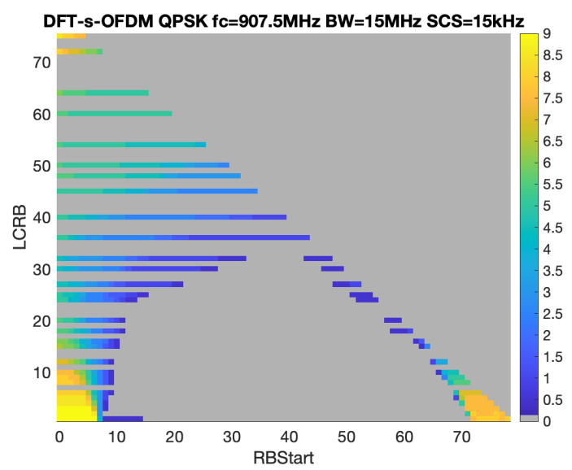

+-----------------------------------------------------------------+---+
| 3GPP TS 38.181 V18.6.0 (2025-06)                                |   |
+=================================================================+===+
| Technical Specification                                         |   |
+-----------------------------------------------------------------+---+
| 3rd Generation Partnership Project;                             |   |
|                                                                 |   |
| Technical Specification Group Radio Access Network;             |   |
|                                                                 |   |
| NR;                                                             |   |
|                                                                 |   |
| Satellite Access Node (SAN) conformance testing                 |   |
|                                                                 |   |
| (Release 18)                                                    |   |
+-----------------------------------------------------------------+---+
|                                                                 |   |
+-----------------------------------------------------------------+---+
|                                                                 |   |
+-----------------------------------------------------------------+---+
| The present document has been developed within the 3rd          |   |
| Generation Partnership Project (3GPP ^TM^) and may be further   |   |
| elaborated for the purposes of 3GPP.\                           |   |
| The present document has not been subject to any approval       |   |
| process by the 3GPP Organizational Partners and shall not be    |   |
| implemented.\                                                   |   |
| This Specification is provided for future development work      |   |
| within 3GPP only. The Organizational Partners accept no         |   |
| liability for any use of this Specification.\                   |   |
| Specifications and Reports for implementation of the 3GPP ^TM^  |   |
| system should be obtained via the 3GPP Organizational           |   |
| Partners\' Publications Offices.                                |   |
+-----------------------------------------------------------------+---+

+----------------------------------------------------------------------+
|                                                                      |
+======================================================================+
| > ***3GPP***                                                         |
| >                                                                    |
| > Postal address                                                     |
| >                                                                    |
| > 3GPP support office address                                        |
| >                                                                    |
| > 650 Route des Lucioles - Sophia Antipolis                          |
| >                                                                    |
| > Valbonne - FRANCE                                                  |
| >                                                                    |
| > Tel.: +33 4 92 94 42 00 Fax: +33 4 93 65 47 16                     |
| >                                                                    |
| > Internet                                                           |
| >                                                                    |
| > http://www.3gpp.org                                                |
+----------------------------------------------------------------------+
| ***Copyright Notification***                                         |
|                                                                      |
| No part may be reproduced except as authorized by written            |
| permission.\                                                         |
| The copyright and the foregoing restriction extend to reproduction   |
| in all media.                                                        |
|                                                                      |
| © 2025, 3GPP Organizational Partners (ARIB, ATIS, CCSA, ETSI, TSDSI, |
| TTA, TTC).                                                           |
|                                                                      |
| All rights reserved.                                                 |
|                                                                      |
| UMTS™ is a Trade Mark of ETSI registered for the benefit of its      |
| members                                                              |
|                                                                      |
| 3GPP™ is a Trade Mark of ETSI registered for the benefit of its      |
| Members and of the 3GPP Organizational Partners\                     |
| LTE™ is a Trade Mark of ETSI registered for the benefit of its       |
| Members and of the 3GPP Organizational Partners                      |
|                                                                      |
| GSM® and the GSM logo are registered and owned by the GSM            |
| Association                                                          |
+----------------------------------------------------------------------+

Contents {#contents .TT}
========

Foreword 29

1 Scope 31

2 References 31

3 Definitions of terms, symbols and abbreviations 32

3.1 Terms 32

3.2 Symbols 35

3.3 Abbreviations 36

4 General test conditions and declarations 37

4.1 Measurement uncertainties and test requirements 37

4.1.1 General 37

4.1.2 Acceptable uncertainty of Test System 39

4.1.2.1 General 39

4.1.2.2 Measurement of transmitter 39

4.1.2.3 Measurement of receiver 40

4.1.2.4 Measurement of performance requirements 42

4.1.3 Interpretation of measurement results 43

4.2 Requirement reference points 44

4.2.1 SAN type 1-H 44

4.2.2 *SAN type 1-O*, *SAN type 2-O* 44

4.3 Satellite Access Node classes 45

4.4 Regional requirements 45

4.5 SAN configurations 46

4.5.1 *SAN type 1-H* transmit configurations 46

4.5.2 *SAN type 1-H* receive configurations 46

4.5.3 *SAN type 1-O and SAN type 2-O* transmit configurations 47

4.5.4 *SAN type 1-O and SAN type 2-O* receive configurations 47

4.5.5 Power supply options 47

4.6 Manufacturer declarations 48

4.7 Test configurations 56

4.7.1 General 56

4.7.2 Test signal used to build Test Configurations 56

4.7.3 NRTC1: Contiguous spectrum operation 57

4.7.3.1 NRTC1 generation 57

4.7.3.2 NRTC1 power allocation 57

4.8 Applicability of requirements 58

4.8.1 General 58

4.8.2 Requirement set applicability 58

4.8.3 Applicability of test configurations for single-band operation 58

4.9 RF channels and test models 60

4.9.1 RF channels 60

4.9.2 Test models 60

4.9.2.1 General 60

4.9.2.2 FR1 test models 60

4.9.2.2.1 FR1 test model 1.1 (NR-SAN-FR1-TM1.1) 61

4.9.2.2.2 FR1 test model 1.2 (NR-SAN-FR1-TM1.2) 62

4.9.2.2.3 FR1 test model 2 (NR-SAN-FR1-TM2) 62

4.9.2.2.4 FR1 test model 3.1 (NR-SAN-FR1-TM3.1) 63

4.9.2.2.5 FR1 test model 3.2 (NR-SAN-FR1-TM3.2) 63

4.9.2.2.6 FR1 test model 3.3 (NR-SAN-FR1-TM3.3) 64

4.9.2.2.7 NB-IoT operation in NTN NR in-band test model (NR-N-TM) 65

4.9.2.3 Data content of Physical channels and Signals for NR-SAN-FR1-TM
65

4.9.2.3.1 PDCCH 65

4.9.2.3.2 PDSCH 66

4.9.2.4 FR2 test models 67

4.9.2.4.1 FR2 test model 1.1 (NR-SAN-FR2-TM1.1) 68

4.9.2.4.2 FR2 test model 2 (NR-SAN-FR2-TM2) 68

4.9.2.4.3 FR2 test model 3.1 (NR-SAN-FR2-TM3.1) 69

4.9.2.5 Data content of Physical channels and Signals for NR-SAN-FR2-TM
69

4.9.2.5.1 PDCCH 69

4.9.2.5.2 PDSCH 70

4.9.2.6 Data content of Physical channels and Signals for NR-N-TM 71

4.9.3 NB-IoT testing 71

4.10 Void 71

4.11 Reference coordinate system 71

4.12 Format and interpretation of tests 72

5 Operating bands and channel arrangement 73

6 Conducted transmitter characteristics 73

6.1 General 73

6.1.1 SAN type 1-H 73

6.2 Satellite Access Node output power 73

6.2.1 Definition and applicability 73

6.2.2 Minimum requirement 74

6.2.3 Test purpose 74

6.2.4 Method of test 74

6.2.4.1 Initial conditions 74

6.2.4.2 Procedure 74

6.2.5 Test requirement 75

6.3 Output power dynamics 75

6.3.1 General 75

6.3.2 RE power control dynamic range 75

6.3.2.1 Definition and applicability 75

6.3.2.2 Minimum requirement 75

6.3.2.3 Test purpose 75

6.3.3 Total power dynamic range 75

6.3.3.1 Definition and applicability 75

6.3.3.2 Minimum requirement 75

6.3.3.3 Test purpose 76

6.3.3.4 Method of test 76

6.3.3.4.1 Initial conditions 76

6.3.3.4.2 Procedure 76

6.3.3.5 Test requirements 76

6.3.4 NB-IoT RB power dynamic range for NB-IoT operation in NTN NR
in-band 77

6.3.4.1 Definition and applicability 77

6.3.4.2 Minimum requirement 77

6.3.4.3 Test purpose 77

6.3.4.4 Method of test 77

6.3.4.5 Test requirements 77

6.4 Transmit ON/OFF power 77

6.5 Transmitted signal quality 78

6.5.1 General 78

6.5.2 Frequency error 78

6.5.2.1 Definition and applicability 78

6.5.2.2 Minimum Requirement 78

6.5.2.3 Test purpose 78

6.5.2.4 Method of test 78

6.5.2.5 Test Requirements 78

6.5.3 Modulation quality 78

6.5.3.1 Definition and applicability 78

6.5.3.2 Minimum Requirement 78

6.5.3.3 Test purpose 78

6.5.3.4 Method of test 79

6.5.3.4.1 Initial conditions 79

6.5.3.4.2 Procedure 79

6.5.3.5 Test requirements 79

6.6 Unwanted emissions 80

6.6.1 General 80

6.6.2 Occupied bandwidth 81

6.6.2.1 Definition and applicability 81

6.6.2.2 Minimum requirements 81

6.6.2.3 Test purpose 81

6.6.2.4 Method of test 81

6.6.2.4.1 Initial conditions 81

6.6.2.4.2 Procedure 81

6.6.2.5 Test requirements 82

6.6.3 Adjacent Channel Leakage Power Ratio (ACLR) 82

6.6.3.1 Definition and applicability 82

6.6.3.2 Minimum requirement 82

6.6.3.3 Test purpose 82

6.6.3.4 Method of test 83

6.6.3.4.1 Initial conditions 83

6.6.3.4.2 Procedure 83

6.6.3.5 Test requirements 83

6.6.3.5.1 General requirements 83

6.6.3.5.2 Limits 83

6.6.4 Out-of-band emissions 84

6.6.4.1 Definition and applicability 84

6.6.4.2 Minimum requirement 84

6.6.4.3 Test purpose 85

6.6.4.4 Method of test 85

6.6.4.4.1 Initial conditions 85

6.6.4.4.2 Procedure 85

6.6.4.5 Test requirements 85

6.6.5 Transmitter spurious emissions 86

6.6.5.1 Definition and applicability 86

6.6.5.2 Minimum requirement 86

6.6.5.3 Test purpose 86

6.6.5.4 Method of test 86

6.6.5.4.1 Initial conditions 86

6.6.5.4.2 Procedure 87

6.6.5.5 Test requirements 87

6.6.5.5.1 Basic limits 87

6.7 Transmitter intermodulation 88

7 Conducted receiver characteristics 88

7.1 General 88

7.2 Reference sensitivity level 88

7.2.1 Definition and applicability 88

7.2.2 Minimum requirement 88

7.2.3 Test purpose 88

7.2.4 Method of test 88

7.2.4.1 Initial conditions 88

7.2.4.2 Procedure 89

7.2.5 Test requirements 89

7.3 Dynamic range 90

7.3.1 Definition and applicability 90

7.3.2 Minimum requirement 90

7.3.3 Test purpose 90

7.3.4 Method of test 90

7.3.4.1 Initial conditions 90

7.3.4.2 Procedure 90

7.3.5 Test requirements 91

7.4 In-band sensitivity and blocking 92

7.4.1 Adjacent Channel Selectivity (ACS) 92

7.4.1.1 Definition and applicability 92

7.4.1.2 Minimum requirement 92

7.4.1.3 Test purpose 92

7.4.1.4 Method of test 92

7.4.1.4.1 Initial conditions 92

7.4.1.4.2 Procedure 92

7.4.1.5 Test requirements 92

7.4.2 In-band blocking 93

7.5 Out-of-band blocking 93

7.5.1 Definition and applicability 93

7.5.2 Minimum requirement 93

7.5.3 Test purpose 94

7.5.4 Method of test 94

7.5.4.1 Initial conditions 94

7.5.4.2 Procedure 94

7.5.5 Test requirements 94

7.6 Receiver spurious emission 95

7.7 Receiver intermodulation 95

7.8 In-channel selectivity 95

7.8.1 Definition and applicability 95

7.8.2 Minimum requirement 95

7.8.3 Test purpose 95

7.8.4 Method of test 95

7.8.4.1 Initial conditions 95

7.8.4.2 Procedure 95

7.8.5 Test requirements 96

8 Conducted performance characteristics 98

8.1 General 98

8.1.1 Scope and definitions 98

8.1.2 Applicability rule 99

8.1.2.1 General 99

8.1.2.2 Applicability of PUSCH performance requirements 99

8.1.2.2.1 Applicability of requirements for different subcarrier
spacings 99

8.1.2.2.2 Applicability of requirements for different channel bandwidths
99

8.1.2.2.3 Applicability of requirements for different configurations 99

8.1.2.2.4 Applicability of PUSCH repetition type A requirements 99

8.1.2.3 Applicability of PUCCH performance requirements 99

8.1.2.3.1 Applicability of requirements for different formats 99

8.1.2.3.2 Applicability of requirements for different subcarrier
spacings 99

8.1.2.3.3 Applicability of requirements for different channel bandwidths
99

8.1.2.3.4 Applicability of requirements for different configurations 100

8.1.2.3.5 Applicability of requirements for multi-slot PUCCH 100

8.1.2.4 Applicability of PRACH performance requirements 100

8.1.2.4.1 Applicability of requirements for different formats 100

8.1.2.4.2 Applicability of requirements for different subcarrier
spacings 100

8.1.2.4.3 Applicability of requirements for different channel bandwidths
100

8.1.2.5 Applicability of performance requirements for PUSCH with DM-RS
bundling 100

8.1.2.5.1 Applicability of requirements for different subcarrier
spacings 100

8.1.2.5.2 Applicability of requirements for different receiver antenna
connectors 100

8.2 Performance requirements for PUSCH 101

8.2.1 Performance requirements for PUSCH with transform precoding
disabled 101

8.2.1.1 Definition and applicability 101

8.2.1.2 Minimum Requirement 101

8.2.1.3 Test Purpose 101

8.2.1.4 Method of test 101

8.2.1.4.1 Initial Conditions 101

8.2.1.4.2 Procedure 101

8.2.1.5 Test Requirement 102

8.2.2 Performance requirements for PUSCH with transform precoding
enabled 103

8.2.2.1 Definition and applicability 103

8.2.2.2 Minimum Requirement 103

8.2.2.3 Test Purpose 103

8.2.2.4 Method of test 103

8.2.2.4.1 Initial Conditions 103

8.2.2.4.2 Procedure 104

8.2.2.5 Test Requirement 104

8.2.3 Performance requirements for UL timing adjustment 106

8.2.3.1 Definition and applicability 106

8.2.3.2 Minimum Requirement 106

8.2.3.3 Test Purpose 106

8.2.3.4 Method of test 106

8.2.3.4.1 Initial Conditions 106

8.2.3.4.2 Procedure 106

8.2.3.5 Test Requirement for Normal Mode 107

8.2.4 Performance requirements for PUSCH repetition Type A 108

8.2.4.1 Definition and applicability 108

8.2.4.2 Minimum Requirement 108

8.2.4.3 Test Purpose 108

8.2.4.4 Method of test 108

8.2.4.4.1 Initial Conditions 108

8.2.4.4.2 Procedure 109

8.2.4.5 Test Requirement 109

8.2.5 Performance requirements for PUSCH with DMRS bundling 110

8.2.5.1 Definition and applicability 110

8.2.5.2 Minimum Requirement 110

8.2.5.3 Test Purpose 111

8.2.5.4 Method of test 111

8.2.5.4.1 Initial Conditions 111

8.2.5.4.2 Procedure 111

8.2.5.5 Test Requirement 112

8.3 Performance requirements for PUCCH 113

8.3.1 Performance requirements for PUCCH format 0 113

8.3.1.1 Definition and applicability 113

8.3.1.2 Minimum Requirement 114

8.3.1.3 Test purpose 114

8.3.1.4 Method of test 114

8.3.1.4.1 Initial conditions 114

8.3.1.4.2 Procedure 114

8.3.1.5 Test Requirement 115

8.3.2 Performance requirements for PUCCH format 1 115

8.3.2.1 NACK to ACK detection 115

8.3.2.1.1 Definition and applicability 115

8.3.2.1.2 Minimum Requirement 115

8.3.2.1.3 Test purpose 116

8.3.2.1.4 Method of test 116

8.3.2.1.4.1 Initial Conditions 116

8.3.2.1.4.2 Procedure 116

8.3.2.1.5 Test Requirement 117

8.3.2.2 ACK missed detection 117

8.3.2.2.1 Definition and applicability 117

8.3.2.2.2 Minimum Requirement 117

8.3.2.2.3 Test purpose 117

8.3.2.2.4 Method of test 117

8.3.2.2.4.1 Initial Conditions 117

8.3.2.2.4.2 Procedure 118

8.3.2.2.5 Test Requirement 118

8.3.3 Performance requirements for PUCCH format 2 119

8.3.3.1 ACK missed detection 119

8.3.3.1.1 Definition and applicability 119

8.3.3.1.2 Minimum requirements 119

8.3.3.1.3 Test purpose 119

8.3.3.1.4 Method of test 119

8.3.3.1.4.1 Initial Condition 119

8.3.3.1.4.2 Procedure 119

8.3.3.1.5 Test requirements 120

8.3.3.2 UCI BLER performance requirements 121

8.3.3.2.1 Definition and applicability 121

8.3.3.2.2 Minimum Requirement 121

8.3.3.2.3 Test purpose 121

8.3.3.2.4 Method of test 121

8.3.3.2.4.1 Initial Condition 121

8.3.3.2.4.2 Procedure 121

8.3.3.2.5 Test requirements 122

8.3.4 Performance requirements for PUCCH format 3 122

8.3.4.1 Definition and applicability 122

8.3.4.2 Minimum requirement 123

8.3.4.3 Test purpose 123

8.3.4.4 Method of test 123

8.3.4.4.1 Initial conditions 123

8.3.4.4.2 Procedure 123

8.3.4.5 Test requirement 124

8.3.5 Performance requirements for PUCCH format 4 124

8.3.5.1 Definition and applicability 124

8.3.5.2 Minimum requirement 124

8.3.5.3 Test purpose 124

8.3.5.4 Method of test 125

8.3.5.4.1 Initial conditions 125

8.3.5.4.2 Procedure 125

8.3.5.5 Test requirement 126

8.3.6 Performance requirements for multi-slot PUCCH 126

8.3.6.1 Performance requirements for multi-slot PUCCH format 1 126

8.3.6.1.1 NACK to ACK detection 126

8.3.6.1.1.1 Definition and applicability 126

8.3.6.1.1.2 Minimum Requirement 126

8.3.6.1.1.3 Test purpose 126

8.3.6.1.1.4 Method of test 127

8.3.6.1.1.4.1 Initial conditions 127

8.3.6.1.1.4.2 Procedure 127

8.3.6.1.1.5 Test Requirement 127

8.3.6.1.2 ACK missed detection 128

8.3.6.1.2.1 Definition and applicability 128

8.3.6.1.2.2 Minimum Requirement 128

8.3.6.1.2.3 Test purpose 128

8.3.6.1.2.4 Method of test 128

8.3.6.1.2.4.1 Initial conditions 128

8.3.6.1.2.4.2 Procedure 128

8.3.6.1.2.5 Test Requirement 129

8.4 Performance requirements for PRACH 130

8.4.1 PRACH false alarm probability and missed detection 130

8.4.1.1 Definition and applicability 130

8.4.1.2 Minimum requirement 130

8.4.1.3 Test purpose 130

8.4.1.4 Method of test 130

8.4.1.4.1 Initial conditions 130

8.4.1.4.2 Procedure 131

8.4.1.5 Test requirement for Normal Mode 132

9 Radiated transmitter characteristics 133

9.1 General 133

9.2 Radiated transmit power 133

9.2.1 Definition and applicability 133

9.2.2 Minimum requirement 133

9.2.3 Test purpose 133

9.2.4 Method of test 133

9.2.4.1 Initial conditions 133

9.2.4.2 Procedure 134

9.2.5 Test requirement 134

9.3 OTA SAN output power 134

9.3.1 Definition and applicability 134

9.3.2 Minimum requirement 134

9.3.3 Test purpose 135

9.3.4 Method of test 135

9.3.4.1 Initial conditions 135

9.3.4.2 Procedure 135

9.3.5 Test requirement 135

9.3.5.1 SAN type 1-O 135

9.3.5.2 SAN type 2-O 136

9.4 OTA output power dynamics 136

9.4.1 General 136

9.4.2 OTA RE power control dynamic range 136

9.4.2.1 Definition and applicability 136

9.4.2.2 Minimum requirement 136

9.4.2.3 Method of test 136

9.4.3 OTA total power dynamic range 136

9.4.3.1 Definition and applicability 136

9.4.3.2 Minimum requirement 136

9.4.3.3 Test purpose 137

9.4.3.4 Method of test 137

9.4.3.4.1 Initial conditions 137

9.4.3.4.2 Procedure 137

9.4.3.5 Test requirement 138

9.4.3.5.1 *SAN type 1-O* 138

9.4.3.5.2 *SAN type 2-O* 138

9.4.4 OTA NB-IoT RB power dynamic range for in-band operation 138

9.4.4.1 Definition and applicability 138

9.4.4.2 Minimum requirement 139

9.4.4.3 Test purpose 139

9.4.4.4 Method of test 139

9.4.4.5 Test requirements 139

9.4.4.5.1 SAN type 1-O 139

9.5 OTA transmit ON/OFF power 139

9.6 OTA transmitted signal quality 139

9.6.1 General 139

9.6.2 OTA frequency error 139

9.6.2.1 Definition and applicability 139

9.6.2.2 Minimum Requirement 139

9.6.2.3 Test purpose 140

9.6.2.4 Method of test 140

9.6.2.4.1 Initial conditions 140

9.6.2.5 Test Requirements 140

9.6.3 OTA modulation quality 140

9.6.3.1 Definition and applicability 140

9.6.3.2 Minimum Requirement 140

9.6.3.3 Test purpose 140

9.6.3.4 Method of test 140

9.6.3.4.1 Initial conditions 140

9.6.3.4.2 Procedure 141

9.6.3.5 Test requirements 142

9.6.3.5.1 *SAN type 1-O* 142

9.6.3.5.2 SAN type 2-O 143

9.7 OTA unwanted emissions 143

9.7.1 General 143

9.7.2 OTA occupied bandwidth 144

9.7.2.1 General 144

9.7.2.2 Minimum requirement 144

9.7.2.3 Test purpose 144

9.7.2.4 Method of test 144

9.7.2.4.1 Initial conditions 144

9.7.2.4.2 Procedure 144

9.7.2.5 Test requirement 145

9.7.3 OTA Adjacent Channel Leakage Power Ratio (ACLR) 146

9.7.3.1 Definition and applicability 146

9.7.3.2 Minimum requirement 146

9.7.3.3 Test purpose 146

9.7.3.4 Method of test 146

9.7.3.4.1 Initial conditions 146

9.7.3.4.2 Procedure 146

9.7.3.5 Test requirements 147

9.7.3.5.1 SAN type 1-O 147

9.7.3.5.2 SAN type 2-O 148

9.7.4 OTA out-of-band emissions 148

9.7.4.1 Definition and applicability 148

9.7.4.2 Minimum requirement 149

9.7.4.3 Test purpose 149

9.7.4.4 Method of test 149

9.7.4.4.1 Initial conditions 149

9.7.4.4.2 Procedure 149

9.7.4.5 Test requirements 150

9.7.5 OTA transmitter spurious emissions 150

9.7.5.1 General 150

9.7.5.2 General OTA transmitter spurious emissions requirements 150

9.7.5.2.1 Definition and applicability 150

9.7.5.2.2 Minimum requirement 151

9.7.5.2.3 Test purpose 151

9.7.5.2.4 Method of test 151

9.7.5.2.4.1 Initial conditions 151

9.7.5.2.4.2 Procedure 151

9.7.5.2.5 Test requirement 152

9.7.5.2.5.1 Test requirement for SAN type 1-O 152

9.7.5.2.5.2 Test requirement for *SAN type 2-O* 152

9.8 OTA transmitter intermodulation 153

10 Radiated receiver characteristic 153

10.1 General 153

10.2 OTA sensitivity 154

10.2.1 Definition and applicability 154

10.2.2 Minimum requirement 155

10.2.3 Test Purpose 155

10.2.4 Method of test 155

10.2.4.1 Initial conditions 155

10.2.4.2 Procedure 155

10.2.5 Test requirements 155

10.2.5.1 General 155

10.2.5.2 Test requirements for *SAN type 1-H* and *SAN type 1-O* 156

10.3 OTA reference sensitivity level 156

10.3.1 Definition and applicability 156

10.3.2 Minimum requirement 156

10.3.3 Test Purpose 156

10.3.4 Method of test 157

10.3.4.1 Initial conditions 157

10.3.4.2 Procedure 157

10.3.5 Test requirements 157

10.3.5.1 General 157

10.3.5.2 Test requirements for *SAN type 1-O* 157

10.3.5.3 Test requirements for *SAN type 2-O* 158

10.4 OTA dynamic range 159

10.4.1 Definition and applicability 159

10.4.2 Minimum requirement 159

10.4.3 Test purpose 159

10.4.4 Method of test 159

10.4.4.1 Initial conditions 159

10.4.4.2 Procedure 160

10.4.5 Test requirement 160

10.4.5.1 General 160

10.4.5.2 Test requirements for *SAN type 1-O* 160

10.5 OTA in-band selectivity and blocking 161

10.5.1 OTA adjacent channel selectivity 161

10.5.1.1 Definition and applicability 161

10.5.1.2 Minimum requirement 162

10.5.1.3 Test purpose 162

10.5.1.4 Method of test 162

10.5.1.4.1 Initial conditions 162

10.5.1.4.2 Procedure 162

10.5.1.5 Test requirement 163

10.5.1.5.1 General 163

10.5.1.5.2 Test requirements for *SAN type 1-O* 163

10.5.1.5.3 Test requirements for *SAN type 2-O* 163

10.5.2 OTA in-band blocking 164

10.6 OTA out-of-band blocking 164

10.6.1 Definition and applicability 164

10.6.2 Minimum requirement 164

10.6.3 Test purpose 165

10.6.4 Method of test 165

10.6.4.1 Initial conditions 165

10.6.4.2 Procedure 165

10.6.5 Test requirements for *SAN type 1-O* 166

10.6.6 Test requirements for *SAN type 2-O* 166

10.7 OTA receiver spurious emissions 167

10.8 OTA receiver intermodulation 167

10.9 OTA in-channel selectivity 167

10.9.1 Definition and applicability 167

10.9.2 Minimum requirement 167

10.9.3 Test purpose 167

10.9.4 Method of test 167

10.9.4.1 Initial conditions 167

10.9.4.2 Procedure 168

10.9.5 Test requirement 168

10.9.5.1 *SAN type 1-O* 168

10.9.5.2 *SAN type 2-O* 170

11 Radiated performance requirements 171

11.1 General 171

11.1.1 Scope and definitions 171

11.1.2 OTA demodulation branches 172

11.1.3 Applicability rule 172

11.1.3.1 General 172

11.1.3.2 Applicability of PUSCH performance requirements 172

11.1.3.2.1 Applicability of requirements for different subcarrier
spacings 172

11.1.3.2.2 Applicability of requirements for different channel
bandwidths 172

11.1.3.2.3 Applicability of requirements for different configurations
172

11.1.3.2.4 Applicability of PUSCH repetition type A requirements 172

11.1.3.3 Applicability of PUCCH performance requirements 173

11.1.3.3.1 Applicability of requirements for different formats 173

11.1.3.3.2 Applicability of requirements for different subcarrier
spacings 173

11.1.3.3.3 Applicability of requirements for different channel
bandwidths 173

11.1.3.3.4 Applicability of requirements for different configurations
173

11.1.3.3.5 Applicability of requirements for multi-slot PUCCH 173

11.1.3.4 Applicability of PRACH performance requirements 173

11.1.3.4.1 Applicability of requirements for different formats 173

11.1.3.4.2 Applicability of requirements for different subcarrier
spacings 173

11.1.3.4.3 Applicability of requirements for different channel
bandwidths 173

11.1.3.5 Applicability of performance requirements for PUSCH with DM-RS
bundling 174

11.1.3.5.1 Applicability of requirements for different subcarrier
spacings 174

11.1.3.5.2 Applicability of requirements for different receiver antenna
connectors 174

11.2 OTA performance requirements for PUSCH 174

11.2.1 Performance requirements for PUSCH with transform precoding
disabled 174

11.2.1.1 Definition and applicability 174

11.2.1.2 Minimum Requirement 174

11.2.1.3 Test Purpose 174

11.2.1.4 Method of test 174

11.2.1.4.1 Initial Conditions 174

11.2.1.4.2 Procedure 174

11.2.1.5 Test Requirement 176

11.2.1.5.1 Test requirement for *SAN type 1-O* 176

11.2.1.5.2 Test requirement for *SAN type 2-O* 177

11.2.1.6 Void 177

11.2.2 Performance requirements for PUSCH with transform precoding
enabled 178

11.2.2.1 Definition and applicability 178

11.2.2.2 Minimum Requirement 178

11.2.2.3 Test Purpose 178

11.2.2.4 Method of test 178

11.2.2.4.1 Initial Conditions 178

11.2.2.4.2 Procedure 178

11.2.2.5 Test Requirement 180

11.2.2.5.1 Test requirement for *SAN type 1-O* 180

11.2.2.5.2 Test requirement for *SAN type 2-O* 181

11.2.2.6 Void 181

11.2.3 Performance requirements for UL timing adjustment 181

11.2.3.1 Definition and applicability 181

11.2.3.2 Minimum Requirement 182

11.2.3.3 Test Purpose 182

11.2.3.4 Method of test 182

11.2.3.4.1 Initial Conditions 182

11.2.3.4.2 Procedure 182

11.2.3.5 Test Requirement 183

11.2.3.5.1 Test requirement for *SAN type 1-O* 183

11.2.4 Performance requirements for PUSCH repetition Type A 184

11.2.4.1 Definition and applicability 184

11.2.4.2 Minimum Requirement 184

11.2.4.3 Test Purpose 185

11.2.4.4 Method of test 185

11.2.4.4.1 Initial Conditions 185

11.2.4.4.2 Procedure 185

11.2.4.5 Test Requirement 186

11.2.4.5.1 Test requirement for *SAN type 1-O* 186

11.2.4.5.2 Test requirement for *SAN type 2-O* 187

11.2.4.6 Void 187

11.2.5 Performance requirements for PUSCH with DM-RS bundling 188

11.2.5.1 Definition and applicability 188

11.2.5.2 Minimum Requirement 188

11.2.5.3 Test purpose 188

11.2.5.4 Method of test 188

11.2.5.4.1 Initial conditions 188

11.2.5.4.2 Procedure 188

11.2.5.5 Test Requirement 189

11.2.5.5.1 Test requirement for *SAN type 1-O* 189

11.3 OTA performance requirements for PUCCH 190

11.3.1 Performance requirements for PUCCH format 0 190

11.3.1.1 Definition and applicability 190

11.3.1.2 Minimum Requirement 191

11.3.1.3 Test purpose 191

11.3.1.4 Method of test 191

11.3.1.4.1 Initial conditions 191

11.3.1.4.2 Procedure 191

11.3.1.5 Test Requirement 192

11.3.1.5.1 Test requirement for *SAN type 1-O* 192

11.3.1.5.2 Test requirement for *SAN type 2-O* 193

11.3.2 Performance requirements for PUCCH format 1 193

11.3.2.1 NACK to ACK detection 193

11.3.2.1.1 Definition and applicability 193

11.3.2.1.2 Minimum Requirement 193

11.3.2.1.3 Test purpose 193

11.3.2.1.4 Method of test 193

11.3.2.1.4.1 Initial Conditions 193

11.3.2.1.4.2 Procedure 194

11.3.2.1.5 Test Requirement 195

11.3.2.2 ACK missed detection 195

11.3.2.2.1 Definition and applicability 195

11.3.2.2.2 Minimum Requirement 196

11.3.2.2.3 Test purpose 196

11.3.2.2.4 Method of test 196

11.3.2.2.4.1 Initial Conditions 196

11.3.2.2.4.2 Procedure 196

11.3.2.2.5 Test Requirement 197

11.3.3 Performance requirements for PUCCH format 2 198

11.3.3.1 ACK missed detection performance requirements 198

11.3.3.1.1 Definition and applicability 198

11.3.3.1.2 Minimum Requirement 198

11.3.3.1.3 Test Purpose 198

11.3.3.1.4 Method of test 198

11.3.3.1.4.1 Initial conditions 198

11.3.3.1.4.2 Procedure 198

11.3.3.1.5 Test requirement 200

11.3.3.2 UCI BLER performance requirements 200

11.3.3.2.1 Definition and applicability 200

11.3.3.2.2 Minimum Requirement 200

11.3.3.2.3 Test Purpose 200

11.3.3.2.4 Method of test 201

11.3.3.2.4.1 Initial conditions 201

11.3.3.2.4.2 Procedure 201

11.3.3.2.5 Test requirement 202

11.3.4 Performance requirements for PUCCH format 3 203

11.3.4.1 Definition and applicability 203

11.3.4.2 Minimum requirement 203

11.3.4.3 Test purpose 203

11.3.4.4 Method of test 203

11.3.4.4.1 Initial conditions 203

11.3.4.4.2 Procedure 203

11.3.4.5 Test requirement 204

11.3.4.5.1 Test requirement for *SAN type 1-O* 204

11.3.4.5.2 Test requirement for *SAN type 2-O* 205

11.3.5 Performance requirements for PUCCH format 4 205

11.3.5.1 Definition and applicability 205

11.3.5.2 Minimum requirement 205

11.3.5.3 Test purpose 205

11.3.5.4 Method of test 205

11.3.5.4.1 Initial conditions 205

11.3.5.4.2 Procedure 206

11.3.5.5 Test requirement 207

11.3.5.5.1 Test requirement for *SAN type 1-O* 207

11.3.5.5.2 Test requirement for *SAN type 2-O* 207

11.3.6 Performance requirements for multi-slot PUCCH format 208

11.3.6.1 Performance requirements for multi-slot PUCCH format 1 208

11.3.6.1.1 NACK to ACK detection 208

11.3.6.1.1.1 Definition and applicability 208

11.3.6.1.1.2 Minimum Requirement 208

11.3.6.1.1.3 Test purpose 208

11.3.6.1.1.4 Method of test 208

11.3.6.1.1.4.1 Initial conditions 208

11.3.6.1.1.4.2 Procedure 208

11.3.6.1.1.5 Test Requirement 209

11.3.6.1.2 ACK missed detection 210

11.3.6.1.2.1 Definition and applicability 210

11.3.6.1.2.2 Minimum Requirement 210

11.3.6.1.2.3 Test purpose 210

11.3.6.1.2.4 Method of test 210

11.3.6.1.2.4.1 Initial Conditions 210

11.3.6.1.2.4.2 Procedure 210

11.3.6.1.2.5 Test Requirement 211

11.4 OTA performance requirements for PRACH 212

11.4.1 PRACH false alarm probability and missed detection 212

11.4.1.1 Definition and applicability 212

11.4.1.2 Minimum requirement 212

11.4.1.3 Test purpose 212

11.4.1.4 Method of test 213

11.4.1.4.1 Initial conditions 213

11.4.1.4.2 Procedure 213

11.4.1.5 Test requirement 214

11.4.1.5.1 Test requirement for SAN *type 1-O* 214

11.4.1.5.2 Test requirement for SAN *type 2-O* 215

Annex A (normative): Reference measurement channel 215

A.1 Fixed Reference Channels for RF Rx requirement (QPSK, R=1/3) 215

A.2 Fixed Reference Channels for dynamic range (16QAM, R=2/3) 217

A.3 Fixed Reference Channels for performance requirements (QPSK,
R=308/1024) 217

A.4 PRACH test preambles 220

A.5 Fixed Reference Channels for performance requirements (QPSK,
R=193/1024) 221

A.6 Fixed Reference Channels for performance requirements (16QAM,
R=434/1024) 222

Annex B (informative): Environmental requirements for the SAN equipment
223

B.1 General 223

B.2 Normal test environment 223

B.2.1 Normal test environment for SPRF 223

B.2.2 Normal test environment for SAN terrestrial equipment 223

B.3 Void 224

B.4 Vibration 224

B.5 Measurement of test environment 224

Annex C (informative): Test tolerances and derivation of test
requirements 224

C.1 Measurement of transmitter 225

C.2 Measurement of receiver 227

C.3 Measurement of performance requirements 228

Annex D (informative): Measurement system set-up 230

D.1 SAN type 1-H transmitter 230

D.1.1 SAN output power, output power dynamics, frequency error, EVM,
unwanted emissions for SAN type 1-H 230

D.1.2 Transmitter intermodulation for SAN type 1-H 231

D.1.3 Transmitter spurious emissions for SAN type 1-H 231

D.1.4 Time alignment error for *SAN type 1-H* 232

D.2 SAN type 1-H receiver 233

D.2.1 Reference sensitivity level for SAN type 1-H 233

D.2.2 Receiver dynamic range for SAN type 1-H 233

D.2.3 Receiver adjacent channel selectivity and narrowband blocking for
SAN type 1-H 234

D.2.4 Receiver spurious emissions 234

D.2.5 Receiver In-channel selectivity for SAN type 1-H 234

D.2.6 Receiver intermodulation for SAN type 1-H 234

D.3 *SAN type 1-H*, *SAN type 1-O* and *SAN type 2-O* transmitter 235

D.3.1 Radiated transmit power, output power, output power dynamics,
transmitted signal quality, OTA unwanted emissions, OTA transmitter
spurious emissions 235

D.4 *SAN type 1-H*, *SAN type 1-O* and *SAN type 2-O* receiver 235

D.4.1 OTA sensitivity and OTA reference sensitivity level 236

D.4.2 OTA dynamic range, OTA ACS, OTA ICS 236

D.4.3 OTA out-of-band blocking 237

D.5 Void 237

D.6 SAN type 1-H performance requirements 238

D.6.1 Performance requirements for PUSCH, single user PUCCH, PRACH on
single antenna port in multipath fading conditions 238

D.6.2 Performance requirements for PUSCH and PRACH in static conditions
239

D.6.3 Performance requirements for UL timing adjustment 240

D.7 SAN type 1-O and 2-O performance requirements 240

Annex E (normative): Characteristic of interfering signal 241

Annex F (normative): Void 242

Annex G (normative): Propagation conditions 242

G.1 Static propagation condition 242

G.2 Multi-path fading propagation conditions 242

G.2.1 Delay profiles 242

G.2.1.1 Delay profiles for FR1-NTN 243

G.2.1.2 Delay profiles for FR2-NTN 243

G.2.2 Combinations of channel model parameters 244

G.2.3 MIMO channel correlation matrices 244

G.2.3.1 MIMO correlation matrices using Uniform Linear Array 244

G.2.3.1.1 Definition of MIMO correlation matrices 244

G.2.3.1.2 MIMO correlation matrices at high, medium and low level 245

G.3 Moving propagation conditions 245

Annex H (normative): In-channel Tx test 246

H.1 General 246

H.2 Basic principles 246

H.2.1 Output signal of the TX under test 247

H.2.2 Ideal signal 247

H.2.3 Measurement results 247

H.2.4 Measurement points 248

H.3 Pre-FFT minimization process 248

H.4 Timing of the FFT window 249

H.5 Resource element TX power 250

H.6 Post-FFT equalisation 250

H.7 EVM 252

H.7.0 General 252

H.7.1 Averaged EVM (FDD) 252

Annex I (informative): Change history 253

Foreword
========

This Technical Specification has been produced by the 3rd Generation
Partnership Project (3GPP).

The contents of the present document are subject to continuing work
within the TSG and may change following formal TSG approval. Should the
TSG modify the contents of the present document, it will be re-released
by the TSG with an identifying change of release date and an increase in
version number as follows:

Version x.y.z

where:

x the first digit:

1 presented to TSG for information;

2 presented to TSG for approval;

3 or greater indicates TSG approved document under change control.

y the second digit is incremented for all changes of substance, i.e.
technical enhancements, corrections, updates, etc.

z the third digit is incremented when editorial only changes have been
incorporated in the document.

In the present document, modal verbs have the following meanings:

**shall** indicates a mandatory requirement to do something

**shall not** indicates an interdiction (prohibition) to do something

The constructions \"shall\" and \"shall not\" are confined to the
context of normative provisions, and do not appear in Technical Reports.

The constructions \"must\" and \"must not\" are not used as substitutes
for \"shall\" and \"shall not\". Their use is avoided insofar as
possible, and they are not used in a normative context except in a
direct citation from an external, referenced, non-3GPP document, or so
as to maintain continuity of style when extending or modifying the
provisions of such a referenced document.

**should** indicates a recommendation to do something

**should not** indicates a recommendation not to do something

**may** indicates permission to do something

**need not** indicates permission not to do something

The construction \"may not\" is ambiguous and is not used in normative
elements. The unambiguous constructions \"might not\" or \"shall not\"
are used instead, depending upon the meaning intended.

**can** indicates that something is possible

**cannot** indicates that something is impossible

The constructions \"can\" and \"cannot\" are not substitutes for \"may\"
and \"need not\".

**will** indicates that something is certain or expected to happen as a
result of action taken by an agency the behaviour of which is outside
the scope of the present document

**will not** indicates that something is certain or expected not to
happen as a result of action taken by an agency the behaviour of which
is outside the scope of the present document

**might** indicates a likelihood that something will happen as a result
of action taken by some agency the behaviour of which is outside the
scope of the present document

**might not** indicates a likelihood that something will not happen as a
result of action taken by some agency the behaviour of which is outside
the scope of the present document

In addition:

**is** (or any other verb in the indicative mood) indicates a statement
of fact

**is not** (or any other negative verb in the indicative mood) indicates
a statement of fact

The constructions \"is\" and \"is not\" do not indicate requirements.

1 Scope
=======

The present document specifies the Radio Frequency (RF) test methods and
conformance requirements for NR *Satellite Access Node (SAN) type 1-H*,
*SAN type 1-O* and *SAN type 2-O*. The document also specifies the RF
test methods and conformance requirements for NB-IoT operation in NTN NR
in-band SAN *type 1-H* and *SAN type 1-O*. These have been derived from
and are consistent with the conducted requirements for SAN type 1-H and
radiated requirement for *SAN type 1-H*, *SAN type 1-O* and *SAN type
2-O* in NR SAN specification defined in TS 38.108 \[2\].

2 References
============

The following documents contain provisions which, through reference in
this text, constitute provisions of the present document.

\- References are either specific (identified by date of publication,
edition number, version number, etc.) or non‑specific.

\- For a specific reference, subsequent revisions do not apply.

\- For a non-specific reference, the latest version applies. In the case
of a reference to a 3GPP document (including a GSM document), a
non-specific reference implicitly refers to the latest version of that
document *in the same Release as the present document*.

\[1\] 3GPP TR 21.905: \"Vocabulary for 3GPP Specifications\".

\[2\] 3GPP TS 38.108: "Satellite Access Node radio transmission and
reception"

\[3\] ITU-R Recommendation M.1545, \"Measurement uncertainty as it
applies to test limits for the terrestrial component of International
Mobile Telecommunications-2000\"

\[4\] ITU-R Recommendation SM.329: \"Unwanted emissions in the spurious
domain\"

\[5\] ITU-R Recommendation SM.328: \"Spectra and bandwidth of
emissions\"

\[6\] ITU-R Recommendation SM.1541-6: \"Unwanted emissions in the
out-of-band domain\".

\[7\] 3GPP TS 38.212: \"NR; Multiplexing and channel coding\"

\[8\] 3GPP TS 38.211: \"NR; Physical channels and modulation\"

\[9\] 3GPP TS 38.214: \"NR; Physical layer procedures for data\"

\[10\] ITU-T Recommendation O.150, \"Equipment for the measurement of
digital and analogue/digital parameters\"

\[11\] 3GPP TR 38.901: \"Study on channel model for frequencies from 0.5
to 100 GHz\"

\[12\] 3GPP TS 38.101-5: \"NR; User Equipment (UE) radio transmission
and reception; Part 5: Satellite access Radio Frequency (RF) and
performance requirements"

\[13\] 3GPP TR 37.941: \"Radio Frequency (RF) conformance testing
background for radiated Base Station (BS) requirements\"

\[14\] IEC 60 068-2-1 (2007): \"Environmental testing - Part 2: Tests.
Tests A: Cold\"

\[15\] IEC 60 068-2-2: (2007): \"Environmental testing - Part 2: Tests.
Tests B: Dry heat\"

\[16\] IEC 60 068-2-6: (2007): \"Environmental testing - Part 2: Tests -
Test Fc: Vibration (sinusoidal)\"

\[17\] 3GPP TR 38.811: \"Study on New Radio (NR) to support
non-terrestrial networks (Release 15)\"

\[18\] 3GPP TS 38.141-2: \"NR; Base Station (BS) conformance testing
Part 2: Radiated conformance testing\"

\[19\] IEC 60721-3-3: \"Classification of environmental conditions
--Part 3-3: Classification of groups of environmental parameters and
their severities -- Stationary use at weatherprotected locations\"

\[20\] IEC 60721-3-4: \"Classification of environmental conditions -
Part 3-4: Classification of groups of environmental parameters and their
severities - Stationary use at non-weatherprotected locations\"

\[21\] IEC 60721-1: \"Classification of environmental conditions Part 1:
Environmental parameters and their severities\"

\[22\] 3GPP TS 36.108: \"Evolved Universal Terrestrial Radio Access
(E-UTRA); Satellite Access Node radio transmission and reception\"

\[23\] 3GPP TS 36.181: \"Evolved Universal Terrestrial Radio Access
(E-UTRA); Satellite Access Node radio conformance testing\"

3 Definitions of terms, symbols and abbreviations
=================================================

3.1 Terms
---------

For the purposes of the present document, the terms given in
TR 21.905 \[1\] and the following apply. A term defined in the present
document takes precedence over the definition of the same term, if any,
in TR 21.905 \[1\].

**basic limit:** emissions limit relating to the power supplied by a
single transmitter to a single antenna transmission line in ITU-R SM.329
\[4\] used for the formulation of unwanted emission requirements for
FR1.

**beam:** beam (of the antenna) is the main lobe of the radiation
pattern of an *antenna array.*

NOTE: For certain *antenna array*, there may be more than one beam.

**beam centre direction:** direction equal to the geometric centre of
the half-power contour of the beam.

**beam direction pair:** data set consisting of the *beam centre
direction* and the related *beam peak direction.*

**beam peak direction:** direction where the maximum EIRP is found.

**beamwidth:** beam which has a half-power contour that is essentially
elliptical, the half-power beamwidths in the two pattern cuts that
respectively contain the major and minor axis of the ellipse.

**Channel edge:** lowest or highest frequency of the NR carrier,
separated by the *SAN channel bandwidth*.

**demodulation branch:** single input of the *SAN receiver* to the
demodulation algorithms.

**directional requirement: requirement which is applied in a specific
direction within the *OTA coverage range* for the Tx and when the AoA of
the incident wave of a received signal is within the *OTA REFSENS RoAoA*
or the *minSENS RoAoA* as appropriate for the receiver.**

**equivalent isotropic radiated power:** equivalent power radiated from
an isotropic directivity device producing the same field intensity at a
point of observation as the field intensity radiated in the direction of
the same point of observation by the discussed device.

NOTE: Isotropic directivity is equal in all directions (i.e. 0 dBi).

**equivalent isotropic sensitivity:** sensitivity for an isotropic
directivity device equivalent to the sensitivity of the discussed device
exposed to an incoming wave from a defined AoA.

NOTE 1: The sensitivity is the minimum received power level at which
specific requirement is met.

NOTE 2: Isotropic directivity is equal in all directions (i.e. 0 dBi).

**feeder link:** Wireless link between satellite-Gateway and satellite.

**Geostationary Earth Orbit:** Circular orbit at 35,786 km above the
Earth\'s equator and following the direction of the Earth\'s rotation.
An object in such an orbit has an orbital period equal to the Earth\'s
rotational period and thus appears motionless, at a fixed position in
the sky, to ground observers.

**Low Earth Orbit:** Orbit around the Earth with an altitude between 300
km, and 1500 km.

**Highest Carrier:** The carrier with the highest carrier frequency
transmitted/received in a specified frequency band.

**Lowest Carrier:** The carrier with the lowest carrier frequency
transmitted/received in a specified frequency band.

**maximum carrier output power:** mean power level measured per carrier
at the indicated interface, during the *transmitter ON period* in a
specified reference condition.

**maximum carrier TRP output power:** mean power level measured per RIB
during the *transmitter ON period* for a specific carrier in a specified
reference condition and corresponding to the declared *rated carrier TRP
output* power (P~rated,c,TRP~).

**maximum total output power:** mean power level measured within the
*operating band* at the indicated interface, during the *transmitter ON
period* in a specified reference condition.

**maximum total TRP output power:** mean power level measured per RIB
during the *transmitter ON period* in a specified reference condition
and corresponding to the declared *rated total TRP output* power
(P~rated,t,TRP~).

**measurement bandwidth:** RF bandwidth in which an emission level is
specified.

**minSENS:** the lowest declared EIS value for the OSDD\'s declared for
OTA sensitivity requirement**.**

**minSENS RoAoA:** The *reference RoAoA* associated with the OSDD with
the lowest declared EIS.

**minimum elevation angle:** Minimum angle under which the satellite can
be seen by a UE.

**necessary bandwidth: T**he width of the frequency band which is just
sufficient to ensure the transmission of information at the rate and
with the quality required under specified conditions.

**non-terrestrial networks:** Networks, or segments of networks, using
an airborne or space-borne vehicle to embark a transmission equipment
relay node or SAN.

**NB-IoT operation in NTN NR in-band:** NB-IoT is operating in-band when
it is located within a NR transmission bandwidth configuration plus 15
kHz at each edge but not within the NR minimum guard band GB~Channel~.

**NB-IoT operation in NTN NR guard band:** NB-IoT is operating in guard
band when it is located within a NR SAN channel bandwidth but is not
NB-IoT operation in NR in-band.

**operating band:** frequency range in which NR operates (paired or
unpaired), that is defined with a specific set of technical
requirements.

NOTE: The *operating band*(s) for a SAN is declared by the manufacturer
according to the designations in tables 5.2-1 and 5.2-2.

**OTA coverage range:** a common range of directions within which TX OTA
requirements that are neither specified in the *OTA peak directions
sets* nor as *TRP requirement* are intended to be met.

**OTA peak directions set:** set(s) of *beam peak directions* within
which certain TX OTA requirements are intended to be met, where all *OTA
peak directions set(s)* are subsets of the *OTA coverage range.*

NOTE: The *beam peak directions* are related to a corresponding
contiguous range or discrete list of *beam centre directions *by
the *beam direction pairs* included in the set.

**OTA REFSENS RoAoA:** the RoAoA determined by the contour defined by
the points at which the achieved EIS is 3dB higher than the achieved EIS
in the reference direction assuming that for any AoA, the receiver gain
is optimized for that AoA.

NOTE: This contour will be related to the average element/sub-array
radiation pattern 3dB beamwidth.

**OTA sensitivity directions declaration:** set of manufacturer
declarations comprising at least one set of declared minimum EIS values
(with *SAN channel bandwidth*), and related directions over which the
EIS applies.

NOTE: All the directions apply to all the EIS values in an OSDD.

**polarization match:** condition that exists when a plane wave,
incident upon an antenna from a given direction, has a polarization that
is the same as the receiving polarization of the antenna in that
direction.

**radiated interface boundary:** *operating band* specific radiated
requirements reference where the radiated requirements apply.

NOTE: For requirements based on EIRP/EIS, the *radiated interface
boundary* is associated to the far-field region.

**Radio Bandwidth:** **frequency difference between the upper edge of
the highest used carrier and the lower edge of the lowest used
carrier.**

**rated beam EIRP:** For a declared beam and *beam direction pair*, the
*rated beam EIRP* level is the maximum power that the SAN is declared to
radiate at the associated *beam peak direction* during the *transmitter
ON period.*

**rated carrier output power:** mean power level associated with a
particular carrier the manufacturer has declared to be available at the
indicated interface, during the *transmitter ON period* in a specified
reference condition.

**rated carrier TRP output power:** mean power level declared by the
manufacturer per carrier, for SAN operating in single carrier,
multi-carrier, or carrier aggregation configurations that the
manufacturer has declared to be available at the RIB during the
*transmitter ON period.*

**rated total output power:** mean power level associated with a
particular *operating band* the manufacturer has declared to be
available at the indicated interface, during the *transmitter ON period*
in a specified reference condition.

**rated total TRP output power:** mean power level declared by the
manufacturer, that the manufacturer has declared to be available at the
RIB during the *transmitter ON period.*

**reference beam direction pair: declared *beam direction pair*,
including reference *beam centre direction* and reference *beam peak
direction* where the reference *beam peak direction* is the direction
for the intended maximum EIRP within the *OTA peak directions set.***

**receiver target:** AoA in which reception is performed by SAN*.*

**receiver target redirection range:** union of all the *sensitivity
RoAoA* achievable through redirecting the *receiver target* related to
particular OSDD.

**receiver target reference direction: direction inside the *OTA
sensitivity directions declaration* declared by the manufacturer for
conformance testing. For an OSDD without *receiver target redirection
range*, this is a direction inside the *sensitivity RoAoA.***

**reference RoAoA:** the *sensitivity RoAoA* associated with the
*receiver target reference direction* for each OSDD.

**requirement set:** one of the NR SAN requirement\'s set*.*

**SAN channel bandwidth:** RF bandwidth supporting a single NR RF
carrier with the *transmission bandwidth* configured in the uplink or
downlink.

NOTE 1: The *SAN channel bandwidth* is measured in MHz and is used as a
reference for transmitter and receiver RF requirements.

NOTE 2: It is possible for the SAN to transmit to and/or receive from
one or more satellite UE bandwidth parts that are smaller than or equal
to the *SAN transmission bandwidth configuration*, in any part of the
*SAN transmission bandwidth configuration*.

**SAN receiver:** composite receiver function of a SAN receiving in an
*operating band.*

**SAN RF Bandwidth:** RF bandwidth in which a SAN transmits and/or
receives single or multiple carrier(s) within a supported *operating
band.*

NOTE: In single carrier operation, the *SAN RF Bandwidth* is equal to
the *SAN channel bandwidth*.

**SAN RF Bandwidth edge:** frequency of one of the edges of the *SAN RF
Bandwidth*.

**SAN transmission bandwidth configuration:** set of resource blocks
located within the *SAN channel bandwidth* which may be used for
transmitting or receiving by the SAN.

**SAN type 1-H:** Satellite Access Node operating at FR1-NTN with a
requirement set consisting of conducted requirements defined at
individual *TAB connectors* and OTA requirements defined at RIB.

**SAN type 1-O:** Satellite Access Node operating at FR1-NTN with a
requirement set consisting only of OTA requirements defined at the RIB.

**SAN type 2-O:** Satellite Access Node operating at FR2-NTN with a
requirement set consisting only of OTA requirements defined at the RIB.

**SAN transponder bandwidth: Total bandwidth of the carrier(s) in
operation by one SAN transponder.**

NOTE: When the SAN transponder operates one carrier only, the SAN
transponder bandwidth is equal to the SAN channel bandwidth of this
carrier.

**SAN transponder:** part of the SAN permitting to receive, channelize
and transmit signals within an allocated bandwidth.

**satellite:** A space-borne vehicle embarking a transparent payload, or
a regenerative payload telecommunication transmitter, placed into
Low-Earth Orbit (LEO) or Geostationary Earth Orbit (GEO).

**Satellite Access Node (SAN):** node providing NR user plane and
control plane protocol terminations towards NTN satellite capable UE,
and connected via the NG interface to the 5GC. It encompasses a
transparent payload on board a NTN platform, with satellite-gateway and
gNB functions.

**satellite-gateway:** An earth station or gateway is located at the
surface of Earth, and providing sufficient RF power and RF sensitivity
for accessing to the satellite.

**sensitivity RoAoA: RoAoA within the *OTA sensitivity directions
declaration*, within which the declared EIS(s) of an OSDD is intended to
be achieved at any** instance of time **for a specific SAN direction
setting.**

**TAB connector:** *transceiver array boundary* connector.

**total radiated power: is the total power radiated by the antenna.**

NOTE: The *total radiated power* is the power radiating in all direction
for two orthogonal polarizations. *Total radiated power* is defined in
both the near-field region and the far-field region.

**transceiver array boundary:** conducted interface between the
transceiver unit array and the composite antenna.

**transmission bandwidth:** RF Bandwidth of an instantaneous
transmission from a satellite UE or SAN, measured in resource block
units.

3.2 Symbols
-----------

For the purposes of the present document, the following symbols apply:

β Percentage of the mean transmitted power emitted outside the occupied
bandwidth on the assigned channel.

BeW~θ~ The beam width in θ

BeW~φ~ The beam width in ϕ

BeW~θ,REFSENS~ Beamwidth equivalent to the *OTA REFSENS RoAoA* in the
θ-axis in degrees. Applicable for FR1 only.

BeW~φ,REFSENS~ Beamwidth equivalent to the *OTA REFSENS RoAoA* in the
φ-axis in degrees. Applicable for FR1 only.

BW~Config~ *Transmission bandwidth configuration*, where BW~Config~ =
*N*~RB~ x SCS x 12.

BW~Contiguous~ Contiguous *transmission bandwidth*, i.e. *SAN channel
bandwidth* for single carrier.

BW~GB,low~ The minimum guard band defined in clause 5.3.3 for lowest
assigned component carrier.

BW~GB,high~ The minimum guard band defined in clause 5.3.3 for highest
assigned component carrier.

BW~SAN~ The *SAN transponder bandwidth*

**BW~SAN,RF~ SAN RF channel bandwidth in MHz**

∆f Separation between the *channel edge* frequency and the nominal -3 dB
point of the measuring filter closest to the carrier frequency.

ΔF~Global~ Global frequency raster granularity.

∆f~max~ f\_offset~max~ minus half of the bandwidth of the measuring
filter.

Δf~OOB~ Maximum offset of the out-of-band boundary from the uplink
*operating band* edge.

Δ~minSENS~ Difference between conducted reference sensitivity and
minSENS.

Δ~OTAREFSENS~ Difference between conducted reference sensitivity and OTA
REFSENS.

ΔF~Raster~ Channel raster granularity.

EIS~minSENS~ The EIS declared for the *minSENS RoAoA.*

EIS~REFSENS~ OTA REFSENS EIS value.

F~C~ *RF reference frequency* on the channel raster, given in table
5.4.2.2-1.

F~C,low~ The Fc of the *lowest carrier*, expressed in MHz.

F~C,high~ The Fc of the *highest carrier*, expressed in MHz.

F~DL,low~ The lowest frequency of the downlink *operating band.*

F~DL,high~ The highest frequency of the downlink *operating band.*

F~filter~ Filter centre frequency.

F~offset,high~ Frequency offset from F~C,high~ to the upper *SAN RF
Bandwidth edge.*

F~offset,low~ Frequency offset from F~C,low~ to the lower *SAN RF
Bandwidth edge.*

f\_offset Separation between the *channel edge* frequency and the centre
of the measuring.

f\_offset~max~ The offset to the frequency Δf~OBUE~ outside the downlink
*operating band.*

F~REF~ RF reference frequency.

F~REF-Offs~ Offset used for calculating F~REF.~

F~UL,low~ The lowest frequency of the uplink *operating band.*

F~UL,high~ The highest frequency of the uplink *operating band.*

GB~Channel~ Minimum guard band defined in clause 5.3.3.

Physical resource block number.

N~RB~ *Transmission bandwidth configuration*, expressed in resource
blocks.

N~REF~ NR Absolute Radio Frequency Channel Number (NR-ARFCN).

N~REF-Offs~ Offset used for calculating N~REF~ scaling per cell, as
calculated in clause 6.1.

P~EIRP,N~ EIRP level for channel N.

P~max,c,TABC~ The *maximum carrier output power per TAB connector.*

P~max,c**,**TRP~ *Maximum carrier TRP output power* measured at the
RIB(s), and corresponding to the declared *rated carrier TRP output
power* (**P~rated,c,TRP~**).

P~max,c,EIRP~ The maximum carrier EIRP when the SAN is configured at the
maximum rated carrier output TRP (P~rated,c,TRP~).

P~rated,c,sys~ P~rated,c,sys,GEO~ for SAN GEO class or
P~rated,c,sys,LEO~ for SAN LEO class.

P~rated,c,sys,GEO~ The sum of P~rated,c,TABC~ for all *TAB connectors*
for a single carrier of the SAN GEO class.

P~rated,c,sys,LEO~ The sum of P~rated,c,TABC~ for all *TAB connectors*
for a single carrier of the SAN LEO class.

P~rated,c,TABC~ P~rated,c,TABC,GEO~ for SAN GEO class or
P~rated,c,TABC,LEO~ for SAN LEO class.

P~rated,c,TABC,GEO~ The *rated carrier output power per TAB connector*
of the SAN GEO class*.*

P~rated,c,TABC,LEO~ The *rated carrier output power per TAB connector*
of the SAN LEO class*.*

**P~rated,c,TRP~** *Rated carrier TRP output power* declared per RIB.

P~rated,t,TABC~ The *rated total output power* declared at *TAB
connector*.

P~rated,t,TRP~ *Rated total TRP output power* declared per RIB.

P~rated,t,sys~ The sum of P~rated,t,TABC~ for all *TAB connectors.*

P~REFSENS~ Conducted Reference Sensitivity power level.

SAN~Channel~ *SAN channel bandwidth.*

SS~REF~ SS block reference frequency position.

TRP~Estimate~ Numerically approximated TRP

TT~OTA~ Test tolerance for OTA requirements

θ The angle in the reference coordinate system between the projection of
the x/y plane and the radiation vector defined between -90° and 90°. 0°
represents the y/z plane. The angle is aligned with the down-tilt angle

φ The angle in the reference coordinate system between the x-axis and
the projection of the radiation vector onto the x/y plane defined
between -180° and 180°

3.3 Abbreviations
-----------------

For the purposes of the present document, the abbreviations given in
TR 21.905 \[1\] and the following apply. An abbreviation defined in the
present document takes precedence over the definition of the same
abbreviation, if any, in TR 21.905 \[1\].

AA Antenna Array

AAS Active Antenna System

ACLR Adjacent Channel Leakage Ratio

ACS Adjacent Channel Selectivity

AoA Angle of Arrival

AWGN Additive White Gaussian Noise

BW Bandwidth

CA Carrier Aggregation

CATR Compact Antenna Test Range

CP-OFDM Cyclic Prefix-OFDM

CW Continuous Wave

DFT-s-OFDM Discrete Fourier Transform-spread-OFDM

DM-RS Demodulation Reference Signal

EIRP Equivalent Isotropic Radiated Power

EIS Equivalent Isotropic Sensitivity

EUT Equipment Under Test

EVM Error Vector Magnitude

FDD Frequency Division Duplex

FR Frequency Range

FRC Fixed Reference Channel

GEO Geostationary Earth Orbiting

GSCN Global Synchronization Channel Number

ICS In-Channel Selectivity

LEO Low Earth Orbiting

MCS Modulation and Coding Scheme

NB-IoT Narrowband -- Internet of Things

NR New Radio

NR-ARFCN NR Absolute Radio Frequency Channel Number

NTN Non-Terrestrial Network

OOB Out-of-band

OOBE Out-of-band Emissions

OSDD OTA Sensitivity Directions Declaration

OTA Over-The-Air

PRB Physical Resource Block

PT-RS Phase Tracking Reference Signal

QAM Quadrature Amplitude Modulation

RB Resource Block

RDN Radio Distribution Network

RE Resource Element

REFSENS Reference Sensitivity

RF Radio Frequency

RIB Radiated Interface Boundary

RMS Root Mean Square (value)

RoAoA Range of Angles of Arrival

RF Radio Frequency

RX Receiver

SAN Satellite Access Node

SCS Sub-Carrier Spacing

SSB Synchronization Signal Block

TAB Transceiver Array Boundary

TRP Total Radiated Power

TT Test Tolerance

TX Transmitter

4 General test conditions and declarations
==========================================

4.1 Measurement uncertainties and test requirements
---------------------------------------------------

### 4.1.1 General

The requirements of this clause apply to all applicable tests in TS
38.181(the present document), i.e. to all conducted tests defined in
FR1-NTN for *SAN type 1-H,* radiated tests defined in FR1-NTN for *SAN
type 1-H* and *SAN type 1-O, radiated tests defined in FR2*-NTN *for SAN
Type 2-O*. The frequency ranges FR1-NTN and FR2-NTN are defined in
clause 5.1 of TS 38.108 \[2\].

The minimum requirements are given in TS 38.108 \[2\]. Test Tolerances
for the conducted test requirements (TT) and test Tolerances for the
radiated test requirements (TT~OTA~) explicitly stated in the present
document are given in annex C of the present document.

The test tolerances for the radiated test requirements (TT~OTA~) for SAN
were reused from TR 37.941 \[13\]. Reuse of TR 37.941 \[13\] TT~OTA~
values for SAN LEO radiated conformance testing is subject to the
following conditions:

\- EUT suitability to fit OTA chambers considered in TR 37.941 \[13\],
and

\- Environmental test conditions assumed for BS testing in TR 37.941
\[13\].

Reuse of TR 37.941 \[13\] TT~OTA~ values for SAN GEO radiated
conformance testing may not be justified for some products due to too
large SAN GEO antenna array dimensions, and required OTA RF chamber
size.

Test Tolerances are individually calculated for each test. Test
Tolerances are used to relax the minimum requirements to create test
requirements.

When a test requirement differs from the corresponding minimum
requirement, then the Test Tolerance applied for the test is non-zero.
The Test Tolerance for the test and the explanation of how the minimum
requirement has been relaxed by the Test Tolerance are given in annex C.

The radiated requirements are classified according to spatial
characteristics as shown in table 4.1.1-1 and table 4.1.1-2.

Table 4.1.1-1: Overview of radiated Tx requirements

  Tx requirement                                                                                                                                     Classification        Coverage range            Number of                                                   
  -------------------------------------------------------------------------------------------------------------------------------------------------- --------------------- ------------------------- ------------------------- --------------------------------- ---------------------------------
                                                                                                                                                                           FR1-NTN                   FR2-NTN                   conformance directions            
  Radiated transmit power                                                                                                                            Directional           OTA peak directions set   OTA peak directions set   5                                 
  OTA Satellite Access Node output power                                                                                                             TRP                   N/A                       N/A                       See TS 38.141-2 \[18\], annex I   
  OTA output power dynamics                                                                                                                          Directional           OTA peak directions set   OTA peak directions set   1                                 
  OTA modulation quality                                                                                                                             Directional           OTA coverage range        OTA coverage range        5                                 
  OTA frequency error                                                                                                                                Directional           OTA coverage range        OTA coverage range        1                                 
  OTA occupied bandwidth                                                                                                                             Directional           OTA coverage range        OTA coverage range        1                                 
  OTA ACLR                                                                                                                                           TRP                   N/A                       N/A                       See TS 38.141-2 \[18\], annex I   
  OTA out-of-band emissions                                                                                                                          TRP                   N/A                       N/A                       See TS 38.141-2 \[18\], annex I   
  OTA transmitter spurious emission                                                                                                                  General requirement   TRP                       N/A                                                         See TS 38.141-2 \[18\], annex I
  NOTE: Directional requirement does not imply one compliance direction only. The directional requirement applies to a single direction at a time.                                                                                                               

Table 4.1.1-2: Overview of radiated Rx requirements

  Rx requirement                                                                                                                                     Classification        Applicability levels   Coverage range   Number of                                                        
  -------------------------------------------------------------------------------------------------------------------------------------------------- --------------------- ---------------------- ---------------- ------------------- ------------------- ------------------------ ---
                                                                                                                                                                           FR1-NTN                FR2-NTN          FR1-NTN             FR2-NTN             conformance directions   
  OTA sensitivity                                                                                                                                    Directional           Minimum EIS            N/A              OSDD                N/A                 5                        
  OTA reference sensitivity level                                                                                                                    Directional           OTA REFSENS            OTA REFSENS      OTA REFSENS RoAoA   OTA REFSENS RoAoA   5                        
  OTA Dynamic range                                                                                                                                  Directional           OTA REFSENS            N/A              OTA REFSENS RoAoA   N/A                 1                        
  OTA adjacent channel selectivity                                                                                                                   Directional           minSENS                OTA REFSENS      minSENS RoAoA       OTA REFSENS RoAoA   1                        
  OTA out-of-band blocking                                                                                                                           General requirement   Directional            minSENS          FR2-NTN             minSENS RoAoA       OTA REFSENS RoAoA        1
  OTA in-channel selectivity                                                                                                                         Directional           minSENS                FR2-NTN          minSENS RoAoA       OTA REFSENS RoAoA   1                        
  NOTE: Directional requirement does not imply one compliance direction only. The directional requirement applies to a single direction at a time.                                                                                                                                  

### 4.1.2 Acceptable uncertainty of Test System

#### 4.1.2.1 General

The maximum acceptable uncertainty of the Conducted Test System and OTA
Test System are specified below for each test defined explicitly in the
present specification, where appropriate. The maximum acceptable
uncertainty of the Test System for test requirements included by
reference is defined in the respective referred test specification.

The Test System shall enable the stimulus signals in the test case to be
adjusted to within the specified tolerance and the equipment under test
to be measured with an uncertainty not exceeding the specified values.
All tolerances and uncertainties are absolute values, and are valid for
a confidence level of 95 %, unless otherwise stated.

A confidence level of 95 % is the measurement uncertainty tolerance
interval for a specific measurement that contains 95 % of the
performance of a population of test equipment.

For conducted RF tests, it should be noted that the uncertainties in
clause 4.1.2 apply to the Test System operating into a nominal 50 ohm
load and do not include system effects due to mismatch between the EUT
and the Test System.

For details on measurement uncertainty budget calculation, measurement
methodology description (including calibration and measurement stage for
each test range), MU budget format and its contributions, refer to
TR 37.941 \[13\], where MU analyses for the BS radiated testing were
captured. The maximum OTA Test System uncertainty for FR1-NTN and
FR2-NTN OTA transmitter and receiver tests were reused from BS MU
budgets in TR 37.941 \[13\]. Reuse of TR 37.941 \[13\] MU values for SAN
LEO radiated conformance testing is subject to the following conditions:

\- EUT suitability to fit OTA chambers considered in TR 37.941 \[13\],
and

\- Environmental test conditions assumed for BS testing in TR 37.941
\[13\].

Reuse of TR 37.941 \[13\] TT~OTA~ values for SAN GEO radiated
conformance testing may not be justified for some products due to too
large SAN GEO antenna array dimensions, and required OTA RF chamber
size.

#### 4.1.2.2 Measurement of transmitter

The maximum conducted Test System uncertainty for conducted transmitter
tests minimum requirements is given in table 4.1.2.2-1. The maximum OTA
Test System uncertainty for OTA transmitter tests minimum requirements
is given in table 4.1.2.2-2 for FR1-NTN and in table 4.1.2.2-3 for
FR2-NTN.

Table 4.1.2.2-1: Maximum Test System uncertainty for conducted
transmitter tests

+----------------------+----------------------+----------------------+
| Clause               | Maximum Test System  | Derivation of Test   |
|                      | Uncertainty          | System Uncertainty   |
+----------------------+----------------------+----------------------+
| 6.2 SAN output power | ±0.7 dB, f ≤ 3 GHz   |                      |
+----------------------+----------------------+----------------------+
| 6.3 Output power     | ± 0.4 dB             |                      |
| dynamics             |                      |                      |
+----------------------+----------------------+----------------------+
| 6.5.2 Frequency      | ± 12 Hz              |                      |
| error                |                      |                      |
+----------------------+----------------------+----------------------+
| 6.5.3 EVM            | ± 1%                 |                      |
+----------------------+----------------------+----------------------+
| 6.6.2 Occupied       | 5 MHz, 10 MHz SAN    |                      |
| bandwidth            | Channel BW: ±100 kHz |                      |
|                      |                      |                      |
|                      | 15 MHz, 20 MHz SAN   |                      |
|                      | Channel BW: ±300 kHz |                      |
+----------------------+----------------------+----------------------+
| 6.6.3 Adjacent       | ACLR                 |                      |
| Channel Leakage      |                      |                      |
| power Ratio (ACLR)   | BW ≤ 20MHz: ±0.8 dB  |                      |
+----------------------+----------------------+----------------------+
| 6.6.4 Out-of-band    | ±1.5 dB, f ≤ 3 GHz   |                      |
| emissions            |                      |                      |
+----------------------+----------------------+----------------------+
| 6.6.5.5.1.1          | 9 kHz \< f ≤ 4 GHz:  |                      |
| Transmitter spurious | ±2.0 dB              |                      |
| emissions, Mandatory |                      |                      |
| Requirements         | 4 GHz \< f ≤ 15 GHz: |                      |
|                      | ±4.0 dB              |                      |
+----------------------+----------------------+----------------------+
| 6.6.5.5.1.2          | ±3.0 dB              |                      |
| Transmitter spurious |                      |                      |
| emissions,           |                      |                      |
| Protection of SAN    |                      |                      |
| receiver             |                      |                      |
+----------------------+----------------------+----------------------+

Table 4.1.2.2-2: Maximum OTA Test System uncertainty for FR1-NTN OTA
transmitter tests

+----------------------------------+----------------------------------+
| Clause                           | Maximum OTA Test System          |
|                                  | uncertainty                      |
+==================================+==================================+
| 9.2 Radiated transmit power      | Normal condition:                |
|                                  |                                  |
|                                  | ±1.1 dB, f ≤ 3 GHz               |
+----------------------------------+----------------------------------+
| 9.3 OTA base station output      | ±1.4 dB, f ≤ 3.0 GHz             |
| power                            |                                  |
+----------------------------------+----------------------------------+
| 9.4.3 OTA total power dynamic    | ±0.4 dB                          |
| range                            |                                  |
+----------------------------------+----------------------------------+
| 9.6.2 OTA frequency error        | ±12 Hz                           |
+----------------------------------+----------------------------------+
| 9.6.3 OTA modulation quality     | ±1 %                             |
+----------------------------------+----------------------------------+
| 9.7.2 OTA occupied bandwidth     | ±100 kHz, BWChannel 5 MHz, 10    |
|                                  | MHz                              |
|                                  |                                  |
|                                  | ±300 kHz, BWChannel 15 MHz, 20   |
|                                  | MHz                              |
+----------------------------------+----------------------------------+
| 9.7.3 OTA ACLR                   | f ≤ 3.0 GHz                      |
|                                  |                                  |
|                                  | ±1 dB, BW ≤ 20 MHz               |
+----------------------------------+----------------------------------+
| 9.7.4 OTA out-of-band emissions  | Absolute power ±1.8 dB, f ≤ 3.0  |
|                                  | GHz                              |
+----------------------------------+----------------------------------+
| 9.7.5.2 OTA transmitter spurious | ±2.3 dB, 30 MHz \< f ≤ 6 GHz     |
| emissions, mandatory             |                                  |
| requirements                     | ±4.2 dB, 6 GHz \< f ≤ 15 GHz     |
+----------------------------------+----------------------------------+
| NOTE: Test system uncertainty    |                                  |
| values are applicable for normal |                                  |
| condition unless otherwise       |                                  |
| stated.                          |                                  |
+----------------------------------+----------------------------------+

Table 4.1.2.2-3: Maximum OTA Test System uncertainty for FR2-NTN OTA
transmitter tests

+----------------------------------+----------------------------------+
| Clause                           | Maximum OTA Test System          |
|                                  | uncertainty                      |
+==================================+==================================+
| 9.2 Radiated transmit power      | Normal condition:                |
|                                  |                                  |
|                                  | \[±1.7\] dB, 17.3 GHz ≤ f ≤ 20.2 |
|                                  | GHz                              |
+----------------------------------+----------------------------------+
| 9.3 OTA base station output      | \[±2.1\] dB, 17.3 GHz ≤ f ≤ 20.2 |
| power                            | GHz                              |
+----------------------------------+----------------------------------+
| 9.4.3 OTA total power dynamic    | \[±0.4\] dB                      |
| range                            |                                  |
+----------------------------------+----------------------------------+
| 9.6.2 OTA frequency error        | \[±12\] Hz                       |
+----------------------------------+----------------------------------+
| 9.6.3 OTA modulation quality     | \[±1 %\]                         |
+----------------------------------+----------------------------------+
| 9.7.2 OTA occupied bandwidth     | 600 kHz                          |
+----------------------------------+----------------------------------+
| 9.7.3 OTA ACLR                   | \[±2.3\] dB, 17.3 GHz ≤ f ≤ 20.2 |
|                                  | GHz                              |
+----------------------------------+----------------------------------+
| 9.7.4 OTA out-of-band emissions  | Absolute power \[±2.7\] dB, 17.3 |
|                                  | GHz ≤ f ≤ 20.2 GHz               |
+----------------------------------+----------------------------------+
| 9.7.5.2 OTA transmitter spurious | ±2.3 dB, 30 MHz ≤ f ≤ 6 GHz      |
| emissions, mandatory             |                                  |
| requirements                     | ±2.7 dB, 6 GHz \< f ≤ 40 GHz     |
|                                  |                                  |
|                                  | ±5.0 dB, 40 GHz \< f ≤ 60 GHz    |
+----------------------------------+----------------------------------+
| NOTE: Test system uncertainty    |                                  |
| values are applicable for normal |                                  |
| condition unless otherwise       |                                  |
| stated.                          |                                  |
+----------------------------------+----------------------------------+

#### 4.1.2.3 Measurement of receiver

The maximum conducted Test System uncertainty for conducted receiver
tests minimum requirements are given in table 4.1.2.3-1.The maximum OTA
Test System uncertainty for OTA receiver tests minimum requirements are
given in table 4.1.2.3-2 for FR1-NTN and in table 4.1.2.3-3 for FR2-NTN.

Table 4.1.2.3-1: Maximum Test System Uncertainty for conducted receiver
tests

+----------------------+----------------------+----------------------+
| Clause               | Maximum Test System  | Derivation of Test   |
|                      | Uncertainty          | System Uncertainty   |
+----------------------+----------------------+----------------------+
| 7.2 Reference        | ±0.7 dB, f ≤ 3 GHz   |                      |
| sensitivity level    |                      |                      |
+----------------------+----------------------+----------------------+
| 7.3 Dynamic range    | ±0.3 dB              |                      |
+----------------------+----------------------+----------------------+
| 7.4.1 Adjacent       | ±1.4 dB, f ≤ 3 GHz   | Overall system       |
| channel selectivity  |                      | uncertainty          |
|                      |                      | comprises three      |
|                      |                      | quantities:          |
|                      |                      |                      |
|                      |                      | 1\. Wanted signal    |
|                      |                      | level error          |
|                      |                      |                      |
|                      |                      | 2\. Interferer       |
|                      |                      | signal level error   |
|                      |                      |                      |
|                      |                      | 3\. Additional       |
|                      |                      | impact of interferer |
|                      |                      | leakage              |
|                      |                      |                      |
|                      |                      | Items 1 and 2 are    |
|                      |                      | assumed to be        |
|                      |                      | uncorrelated so can  |
|                      |                      | be root sum squared  |
|                      |                      | to provide the ratio |
|                      |                      | error of the two     |
|                      |                      | signals. The         |
|                      |                      | interferer leakage   |
|                      |                      | effect is            |
|                      |                      | systematic, and is   |
|                      |                      | added                |
|                      |                      | arithmetically.      |
|                      |                      |                      |
|                      |                      | Test System          |
|                      |                      | uncertainty = SQRT   |
|                      |                      | (wan                 |
|                      |                      | ted\_level\_error^2^ |
|                      |                      | +                    |
|                      |                      | interfer             |
|                      |                      | er\_level\_error^2^) |
|                      |                      | + leakage effect.    |
|                      |                      |                      |
|                      |                      | f ≤ 3 GHz            |
|                      |                      |                      |
|                      |                      | Wanted signal level  |
|                      |                      | ±0.7 dB              |
|                      |                      |                      |
|                      |                      | Interferer signal    |
|                      |                      | level ±0.7 dB        |
|                      |                      |                      |
|                      |                      | f ≤ 6 GHz            |
|                      |                      |                      |
|                      |                      | Impact of interferer |
|                      |                      | leakage 0.4 dB       |
+----------------------+----------------------+----------------------+
| 7.5.5.1 Out-of-band  | f~wanted~ ≤ 3GHz     | Overall system       |
| blocking             |                      | uncertainty          |
|                      | 1MHz \<              | comprises three      |
|                      | f~interferer~ ≤ 3    | quantities:          |
|                      | GHz: ±1.3 dB         |                      |
|                      |                      | 1\. Wanted signal    |
|                      | 3 GHz \<             | level error          |
|                      | f~interferer~ ≤ 4.2  |                      |
|                      | GHz: ±1.5 dB         | 2\. Interferer       |
|                      |                      | signal level error   |
|                      | 4.2GHz \<            |                      |
|                      | f~interferer~ ≤      | 3\. Interferer       |
|                      | 12.75 GHz: ±3.2 dB   | broadband noise      |
|                      |                      |                      |
|                      |                      | Items 1 and 2 are    |
|                      |                      | assumed to be        |
|                      |                      | uncorrelated so can  |
|                      |                      | be root sum squared  |
|                      |                      | to provide the ratio |
|                      |                      | error of the two     |
|                      |                      | signals. The         |
|                      |                      | Interferer Broadband |
|                      |                      | noise effect is      |
|                      |                      | systematic, and is   |
|                      |                      | added                |
|                      |                      | arithmetically.      |
|                      |                      |                      |
|                      |                      | Test System          |
|                      |                      | uncertainty = SQRT   |
|                      |                      | (wan                 |
|                      |                      | ted\_level\_error^2^ |
|                      |                      | +                    |
|                      |                      | interfer             |
|                      |                      | er\_level\_error^2^) |
|                      |                      | + Broadband noise    |
|                      |                      | effect.              |
|                      |                      |                      |
|                      |                      | Out of band          |
|                      |                      | blocking, using CW   |
|                      |                      | interferer:          |
|                      |                      |                      |
|                      |                      | Wanted signal level: |
|                      |                      |                      |
|                      |                      | ±0.7 dB up to 3 GHz  |
|                      |                      |                      |
|                      |                      | Interferer signal    |
|                      |                      | level:               |
|                      |                      |                      |
|                      |                      | ±1.0 dB up to 3 GHz  |
|                      |                      |                      |
|                      |                      | Impact of interferer |
|                      |                      | Broadband noise 0.1  |
|                      |                      | dB                   |
+----------------------+----------------------+----------------------+
| 7.8 In-channel       | ±1.4 dB, f ≤ 3 GHz   |                      |
| selectivity          |                      |                      |
+----------------------+----------------------+----------------------+
| NOTE: Unless         |                      |                      |
| otherwise noted,     |                      |                      |
| only the Test System |                      |                      |
| stimulus error is    |                      |                      |
| considered here. The |                      |                      |
| effect of errors in  |                      |                      |
| the throughput       |                      |                      |
| measurements due to  |                      |                      |
| finite test duration |                      |                      |
| is not considered.   |                      |                      |
+----------------------+----------------------+----------------------+

Table 4.1.2.3-2: Maximum OTA Test System uncertainty for FR1-NTN OTA
receiver tests

+----------------------------------+----------------------------------+
| Clause                           | Maximum OTA Test System          |
|                                  | uncertainty                      |
+==================================+==================================+
| 10.2 OTA sensitivity             | ±1.3 dB, f ≤ 3 GHz               |
+----------------------------------+----------------------------------+
| 10.3 OTA reference sensitivity   | ±1.3 dB, f ≤ 3 GHz               |
| level                            |                                  |
+----------------------------------+----------------------------------+
| 10.4 OTA dynamic range           | ±0.3 dB                          |
+----------------------------------+----------------------------------+
| 10.5.1 OTA adjacent channel      | ±1.7 dB, f ≤ 3 GHz               |
| selectivity                      |                                  |
+----------------------------------+----------------------------------+
| 10.6 OTA out-of-band blocking    | f~wanted~ ≤ 3 GHz:               |
|                                  |                                  |
|                                  | ±2.0 dB, f~interferer~ ≤ 3 GHz   |
|                                  |                                  |
|                                  | ±2.1 dB, 3 GHz \< f~interferer~  |
|                                  | ≤ 6 GHz                          |
|                                  |                                  |
|                                  | ±3.5 dB, 6 GHz \< f~interferer~  |
|                                  | ≤ 12.75 GHz                      |
+----------------------------------+----------------------------------+
| 10.9 OTA in-channel selectivity  | ±1.7 dB, f ≤ 3 GHz               |
+----------------------------------+----------------------------------+
| NOTE: Test system uncertainty    |                                  |
| values are applicable for normal |                                  |
| condition unless otherwise       |                                  |
| stated.                          |                                  |
+----------------------------------+----------------------------------+

Table 4.1.2.3-3: Maximum OTA Test System uncertainty for FR2-NTN OTA
receiver tests

  Clause                                                                                              Maximum OTA Test System uncertainty
  --------------------------------------------------------------------------------------------------- --------------------------------------
  10.3 OTA reference sensitivity level                                                                \[±2.4\] dB, 27.5 GHz ≤ f ≤ 30.0 GHz
  10.5.1 OTA adjacent channel selectivity                                                             \[±3.4\] dB, 27.5 GHz ≤ f ≤ 30.0 GHz
  10.6 OTA out-of-band blocking                                                                       \[±3.6\] dB, 27.5 GHz ≤ f ≤ 30.0 GHz
  10.9 OTA in-channel selectivity                                                                     \[±3.4\] dB, 27.5 GHz ≤ f ≤ 30.0 GHz
  NOTE: Test system uncertainty values are applicable for normal condition unless otherwise stated.   

#### 4.1.2.4 Measurement of performance requirements

Table 4.1.2.4-1: Maximum Test System Uncertainty for FR1-NTN conducted
performance requirements

+----------------------+----------------------+----------------------+
| **Clause**           | **Maximum Test       | **Derivation of Test |
|                      | System Uncertainty** | System Uncertainty** |
+======================+======================+======================+
| 8 PUSCH, PUCCH,      | ± 0.6 dB             | Overall system       |
| PRACH with single    |                      | uncertainty for      |
| antenna port and     |                      | fading conditions    |
| fading channel       |                      | comprises two        |
|                      |                      | quantities:          |
|                      |                      |                      |
|                      |                      | 1\. Signal-to-noise  |
|                      |                      | ratio uncertainty    |
|                      |                      |                      |
|                      |                      | 2\. Fading profile   |
|                      |                      | power uncertainty    |
|                      |                      |                      |
|                      |                      | Items 1 and 2 are    |
|                      |                      | assumed to be        |
|                      |                      | uncorrelated so can  |
|                      |                      | be root sum squared: |
|                      |                      |                      |
|                      |                      | Test System          |
|                      |                      | uncertainty = \[SQRT |
|                      |                      | (Signal-to-noise     |
|                      |                      | ratio uncertainty    |
|                      |                      | ^2^ + Fading profile |
|                      |                      | power uncertainty    |
|                      |                      | ^2^)\]               |
|                      |                      |                      |
|                      |                      | Signal-to-noise      |
|                      |                      | ratio uncertainty    |
|                      |                      | ±0.3 dB              |
|                      |                      |                      |
|                      |                      | Fading profile power |
|                      |                      | uncertainty ±0.5 dB  |
+----------------------+----------------------+----------------------+
| 8 PRACH with single  | ± 0.3 dB             | Signal-to-noise      |
| antenna port and     |                      | ratio uncertainty    |
| AWGN                 |                      | ±0.3 dB              |
+----------------------+----------------------+----------------------+

**Table 4.1.2.4-2: Maximum Test System Uncertainty for FR1-NTN OTA
performance requirements**

+----------------------+----------------------+----------------------+
| Clause               | Maximum Test System  | Derivation of Test   |
|                      | Uncertainty          | System Uncertainty   |
+======================+======================+======================+
| 11 PUSCH, PUCCH,     | ± 0.6 dB             | Overall system       |
| PRACH with single    |                      | uncertainty for      |
| antenna port and     |                      | fading conditions    |
| fading channel       |                      | comprises two        |
|                      |                      | quantities:          |
|                      |                      |                      |
|                      |                      | 1\. Signal-to-noise  |
|                      |                      | ratio uncertainty    |
|                      |                      |                      |
|                      |                      | 2\. Fading profile   |
|                      |                      | power uncertainty    |
|                      |                      |                      |
|                      |                      | Items 1 and 2 are    |
|                      |                      | assumed to be        |
|                      |                      | uncorrelated so can  |
|                      |                      | be root sum squared: |
|                      |                      |                      |
|                      |                      | Test System          |
|                      |                      | uncertainty = \[SQRT |
|                      |                      | (Signal-to-noise     |
|                      |                      | ratio uncertainty    |
|                      |                      | ^2^ + Fading profile |
|                      |                      | power uncertainty    |
|                      |                      | ^2^)\]               |
|                      |                      |                      |
|                      |                      | Signal-to-noise      |
|                      |                      | ratio uncertainty    |
|                      |                      | ±0.3 dB              |
|                      |                      |                      |
|                      |                      | Fading profile power |
|                      |                      | uncertainty ±0.5 dB  |
+----------------------+----------------------+----------------------+
| 11 PRACH with single | ± 0.3 dB             | Signal-to-noise      |
| antenna port and     |                      | ratio uncertainty    |
| AWGN                 |                      | ±0.3 dB              |
+----------------------+----------------------+----------------------+

Table 4.1.2.4-3: Maximum Test System Uncertainty for FR2-NTN OTA
performance requirements

+----------------------+----------------------+----------------------+
| Clause               | Maximum Test System  | Derivation of Test   |
|                      | Uncertainty          | System Uncertainty   |
+======================+======================+======================+
| 11 PUSCH, PUCCH,     | ± 0.6 dB             | Overall system       |
| PRACH with single    |                      | uncertainty for      |
| antenna port and     |                      | fading conditions    |
| fading channel       |                      | comprises two        |
|                      |                      | quantities:          |
|                      |                      |                      |
|                      |                      | 1\. Signal-to-noise  |
|                      |                      | ratio uncertainty    |
|                      |                      |                      |
|                      |                      | 2\. Fading profile   |
|                      |                      | power uncertainty    |
|                      |                      |                      |
|                      |                      | Items 1 and 2 are    |
|                      |                      | assumed to be        |
|                      |                      | uncorrelated so can  |
|                      |                      | be root sum squared: |
|                      |                      |                      |
|                      |                      | Test System          |
|                      |                      | uncertainty = \[SQRT |
|                      |                      | (Signal-to-noise     |
|                      |                      | ratio uncertainty    |
|                      |                      | ^2^ + Fading profile |
|                      |                      | power uncertainty    |
|                      |                      | ^2^)\]               |
|                      |                      |                      |
|                      |                      | Signal-to-noise      |
|                      |                      | ratio uncertainty    |
|                      |                      | ±0.3 dB              |
|                      |                      |                      |
|                      |                      | Fading profile power |
|                      |                      | uncertainty ±0.5 dB  |
+----------------------+----------------------+----------------------+
| 11 PRACH with single | ± 0.3 dB             | Signal-to-noise      |
| antenna port and     |                      | ratio uncertainty    |
| AWGN                 |                      | ±0.3 dB              |
+----------------------+----------------------+----------------------+

### 4.1.3 Interpretation of measurement results

The measurement results returned by the Test System are compared -
without any modification - against the test requirements as defined by
the Shared Risk principle.

The Shared Risk principle is defined in Recommendation ITU-R M.1545
\[3\].

The actual measurement uncertainty of the Test System for the
measurement of each parameter shall be included in the test report.

The recorded value for the Test System uncertainty shall be, for each
measurement, equal to or lower than the appropriate figure in
clause 4.1.2 of the present document.

If the Test System for a test is known to have a measurement uncertainty
greater than that specified in clause 4.1.2, it is still permitted to
use this apparatus provided that an adjustment is made as follows.

Any additional uncertainty in the Test System over and above that
specified in clause 4.1.2 shall be used to tighten the test requirement,
making the test harder to pass. For some tests e.g. receiver tests, this
may require modification of stimulus signals. This procedure will ensure
that a Test System not compliant with clause 4.1.2 does not increase the
chance of passing a device under test where that device would otherwise
have failed the test if a Test System compliant with clause 4.1.2 had
been used.

4.2 Requirement reference points
--------------------------------

### 4.2.1 SAN type 1-H

For *SAN type 1-H*, the requirements are defined for two points of
reference, signified by radiated requirements and conducted
requirements.

{width="6.420833333333333in"
height="3.38125in"}

Figure 4.2.1-1: Radiated and conducted reference points for *SAN type
1-H*

Radiated characteristics are defined over the air (OTA), where the
radiated interface is referred to as the *Radiated Interface Boundary*
(RIB). Radiated requirements are also referred to as OTA requirements.
The (spatial) characteristics in which the OTA requirements apply are
detailed for each requirement.

Conducted characteristics are defined at individual or groups of *TAB
connectors* at the *transceiver array boundary*, which is the conducted
interface between the transceiver unit array and the composite antenna.

The transceiver unit array is part of the composite transceiver
functionality receiving and transmitting modulated signal to ensure
radio links with users.

The satellite payload is composed by a transceiver unit array and a
composite antenna array. The transceiver unit array contains an
implementation specific number of transmitter units and an
implementation specific number of receiver units.

The composite antenna contains a radio distribution network (RDN) and an
antenna array. The RDN is a linear passive network which distributes the
RF power generated by the transceiver unit array to the antenna array,
and/or distributes the radio signals collected by the antenna array to
the transceiver unit array, in an implementation specific way.

How a conducted requirement is applied to the *transceiver array
boundary* is detailed in the respective requirement clause.

### 4.2.2 *SAN type 1-O*, *SAN type 2-O*

For *SAN type 1-O and SAN type 2-O*, the radiated characteristics are
defined over the air (OTA), where the *operating band* specific radiated
interface is referred to as the *Radiated Interface Boundary* (RIB).
Radiated requirements are also referred to as OTA requirements. The
(spatial) characteristics in which the OTA requirements apply are
detailed for each requirement.

{width="5.991666666666666in"
height="3.38125in"}

Figure 4.2.2-1: Radiated reference points for *SAN type 1-O* and *SAN
type 2-O*

Transmitter units and receiver units may be combined into transceiver
units. The transmitter/receiver units have the ability to
transmit/receive parallel independent modulated symbol streams.

4.3 Satellite Access Node classes
---------------------------------

The requirements in this specification apply to Satellite Access Node
unless otherwise stated. The associated deployment scenarios are exactly
the same for SAN with and without connectors.

SAN classes are defined in Table 4.3-1.

Table 4.3-1 SAN classes

+-----------+-------------------------+
| SAN Class | Satellite constellation |
+===========+=========================+
| GEO class | GEO satellite           |
+-----------+-------------------------+
| LEO class | LEO 600 km satellite    |
|           |                         |
|           | LEO 1200 km satellite   |
+-----------+-------------------------+

4.4 Regional requirements
-------------------------

Some requirements in the present document may only apply in certain
regions either as optional requirements, or as mandatory requirements
set by local and regional regulation. It is normally not stated in the
3GPP specifications under what exact circumstances the regional
requirements apply, since this is defined by local or regional
regulation.

Table 4.4-1 lists all requirements in the present specification that may
be applied differently in different regions.

**T**able 4.4-1: List of regional requirements

+---------------+-------------------------+-------------------------+
| Clause number | Requirement             | Comments                |
+---------------+-------------------------+-------------------------+
| 5             | *Operating bands*       | Satellite *operating    |
|               |                         | bands* may be applied   |
|               |                         | regionally.             |
+---------------+-------------------------+-------------------------+
| 6.6.4,        | Out-of-band emissions,  | For n255 operation in   |
|               |                         | US, Limits in FCC Title |
| 9.7.4         | OTA out-of-band         | 47 apply.               |
|               | emissions               |                         |
+---------------+-------------------------+-------------------------+
| 6.6.5,        | Tx spurious emissions,  | For n255 operation in   |
|               |                         | US, Limits in FCC Title |
| 9.7.5         | OTA Tx spurious         | 47 apply.               |
|               | emissions               |                         |
+---------------+-------------------------+-------------------------+

4.5 SAN configurations
----------------------

### 4.5.1 *SAN type 1-H* transmit configurations

Unless otherwise stated, the conducted transmitter characteristics in
clause 6 are specified at the *transceiver array boundary* at the *TAB
connector(s)* with a full complement of transceiver units for the
configuration in normal operating conditions.

Figure 4.5.1-1: *SAN type 1-H* transmitter test ports

Unless otherwise stated, for the tests in clause 6 of the present
document, the requirement applies for each transmit *TAB connector.*

### 4.5.2 *SAN type 1-H* receive configurations

Unless otherwise stated, the conducted receiver characteristics in
clause 7 are specified at the *TAB connector* with a full complement of
transceiver units for the configuration in normal operating conditions.

Figure 4.5.2-1: Receiver test ports

For the tests in clause 7 of the present document, the requirement
applies at each receive *TAB connector*.

Conducted receive requirements are tested at the *TAB connector*, with
the remaining receiver units(s) disabled or their *TAB connector*(s)
being terminated.

### 4.5.3 *SAN type 1-O and SAN type 2-O* transmit configurations

Unless otherwise stated, the radiated transmitter characteristics in
clause 9 are specified at RIB, with a full complement of transceiver
units for the configuration in normal operating conditions.

{width="6.695833333333334in"
height="2.826388888888889in"}

Figure 4.5.3-1: *SAN type 1-O and SAN type 2-O t*ransmitter test
interfaces

### 4.5.4 *SAN type 1-O and SAN type 2-O* receive configurations

Unless otherwise stated, the radiated receiver characteristics in
clause 10 are specified at RIB, with a full complement of transceiver
units for the configuration in normal operating conditions.

{width="6.686805555555556in"
height="2.609027777777778in"}

Figure 4.5.4-1: *SAN type 1-O and SAN type 2-O* receiver test interfaces

### 4.5.5 Power supply options

\[If the SAN is supplied with a number of different power supply
configurations, it may not be necessary to test RF parameters for each
of the power supply options, provided that it can be demonstrated that
the range of conditions over which the equipment is tested is at least
as great as the range of conditions due to any of the power supply
configurations.\]

4.6 Manufacturer declarations 
-----------------------------

The following SAN declarations listed in table 4.6-1, when applicable to
the SAN under test, are required to be provided by the manufacturer for
the conducted requirements testing of the *SAN type 1-H*, and radiated
requirements testing of *SAN type 1-H,* *SAN type 1-O and SAN type 2-O*.

Table 4.6-1 Manufacturers declarations for *SAN type 1-H* conducted test
requirements, and for *SAN type 1-H, SAN type 1-O* and *SAN type 2-O*
radiated test requirements

+----------+----------+----------+----------+----------+----------+
| Dec      | Dec      | Des      | Appli    |          |          |
| laration | laration | cription | cability |          |          |
| id       |          |          |          |          |          |
| entifier |          |          | (Note 1) |          |          |
+==========+==========+==========+==========+==========+==========+
|          |          |          | SAN type | SAN type | SAN type |
|          |          |          | 1-H      | 1-O      | 2-O      |
|          |          |          |          |          |          |
|          |          |          | (Note 2) |          |          |
+----------+----------+----------+----------+----------+----------+
| D.1      | Co       | Location | x        | x        | x        |
|          | ordinate | of       |          |          |          |
|          | system   | coo      |          |          |          |
|          | r        | rdinated |          |          |          |
|          | eference | system   |          |          |          |
|          | point    | r        |          |          |          |
|          |          | eference |          |          |          |
|          |          | point in |          |          |          |
|          |          | r        |          |          |          |
|          |          | eference |          |          |          |
|          |          | to an    |          |          |          |
|          |          | iden     |          |          |          |
|          |          | tifiable |          |          |          |
|          |          | physical |          |          |          |
|          |          | feature  |          |          |          |
|          |          | of the   |          |          |          |
|          |          | SAN      |          |          |          |
|          |          | en       |          |          |          |
|          |          | closure. |          |          |          |
+----------+----------+----------+----------+----------+----------+
| D.2      | Co       | Ori      | x        | x        | x        |
|          | ordinate | entation |          |          |          |
|          | system   | of the   |          |          |          |
|          | ori      | co       |          |          |          |
|          | entation | ordinate |          |          |          |
|          |          | system   |          |          |          |
|          |          | in       |          |          |          |
|          |          | r        |          |          |          |
|          |          | eference |          |          |          |
|          |          | to an    |          |          |          |
|          |          | iden     |          |          |          |
|          |          | tifiable |          |          |          |
|          |          | physical |          |          |          |
|          |          | feature  |          |          |          |
|          |          | of the   |          |          |          |
|          |          | SAN      |          |          |          |
|          |          | en       |          |          |          |
|          |          | closure. |          |          |          |
+----------+----------+----------+----------+----------+----------+
| D.3      | Beam     | A unique | x        | x        | x        |
|          | id       | title to |          |          |          |
|          | entifier | identify |          |          |          |
|          |          | a beam,  |          |          |          |
|          |          | e.g. a,  |          |          |          |
|          |          | b, c or  |          |          |          |
|          |          | 1, 2, 3. |          |          |          |
|          |          | The      |          |          |          |
|          |          | vendor   |          |          |          |
|          |          | may      |          |          |          |
|          |          | declare  |          |          |          |
|          |          | any      |          |          |          |
|          |          | number   |          |          |          |
|          |          | of beams |          |          |          |
|          |          | with     |          |          |          |
|          |          | unique   |          |          |          |
|          |          | iden     |          |          |          |
|          |          | tifiers. |          |          |          |
|          |          | The      |          |          |          |
|          |          | minimum  |          |          |          |
|          |          | set to   |          |          |          |
|          |          | declare  |          |          |          |
|          |          | for      |          |          |          |
|          |          | conf     |          |          |          |
|          |          | ormance, |          |          |          |
|          |          | cor      |          |          |          |
|          |          | responds |          |          |          |
|          |          | to the   |          |          |          |
|          |          | beams at |          |          |          |
|          |          | the      |          |          |          |
|          |          | r        |          |          |          |
|          |          | eference |          |          |          |
|          |          | beam     |          |          |          |
|          |          | d        |          |          |          |
|          |          | irection |          |          |          |
|          |          | with the |          |          |          |
|          |          | highest  |          |          |          |
|          |          | intended |          |          |          |
|          |          | EIRP,    |          |          |          |
|          |          | and      |          |          |          |
|          |          | covering |          |          |          |
|          |          | the      |          |          |          |
|          |          | pr       |          |          |          |
|          |          | operties |          |          |          |
|          |          | listed   |          |          |          |
|          |          | below:   |          |          |          |
|          |          |          |          |          |          |
|          |          | 1\) A    |          |          |          |
|          |          | beam     |          |          |          |
|          |          | with the |          |          |          |
|          |          | n        |          |          |          |
|          |          | arrowest |          |          |          |
|          |          | intended |          |          |          |
|          |          | BeW~θ~   |          |          |          |
|          |          | and      |          |          |          |
|          |          | n        |          |          |          |
|          |          | arrowest |          |          |          |
|          |          | intended |          |          |          |
|          |          | BeW~ϕ~   |          |          |          |
|          |          | possible |          |          |          |
|          |          | when     |          |          |          |
|          |          | n        |          |          |          |
|          |          | arrowest |          |          |          |
|          |          | intended |          |          |          |
|          |          | BeW~θ~   |          |          |          |
|          |          | is used. |          |          |          |
|          |          |          |          |          |          |
|          |          | 2\) A    |          |          |          |
|          |          | beam     |          |          |          |
|          |          | with the |          |          |          |
|          |          | n        |          |          |          |
|          |          | arrowest |          |          |          |
|          |          | intended |          |          |          |
|          |          | BeW~ϕ~   |          |          |          |
|          |          | and      |          |          |          |
|          |          | n        |          |          |          |
|          |          | arrowest |          |          |          |
|          |          | intended |          |          |          |
|          |          | BeW~θ~   |          |          |          |
|          |          | possible |          |          |          |
|          |          | when     |          |          |          |
|          |          | n        |          |          |          |
|          |          | arrowest |          |          |          |
|          |          | intended |          |          |          |
|          |          | BeW~ϕ~   |          |          |          |
|          |          | is used. |          |          |          |
|          |          |          |          |          |          |
|          |          | 3\) A    |          |          |          |
|          |          | beam     |          |          |          |
|          |          | with the |          |          |          |
|          |          | widest   |          |          |          |
|          |          | intended |          |          |          |
|          |          | BeW~θ~   |          |          |          |
|          |          | and      |          |          |          |
|          |          | widest   |          |          |          |
|          |          | intended |          |          |          |
|          |          | BeW~ϕ~   |          |          |          |
|          |          | possible |          |          |          |
|          |          | when     |          |          |          |
|          |          | widest   |          |          |          |
|          |          | intended |          |          |          |
|          |          | BeW~θ~   |          |          |          |
|          |          | is used. |          |          |          |
|          |          |          |          |          |          |
|          |          | 4\) A    |          |          |          |
|          |          | beam     |          |          |          |
|          |          | with the |          |          |          |
|          |          | widest   |          |          |          |
|          |          | intended |          |          |          |
|          |          | BeW~ϕ~   |          |          |          |
|          |          | and      |          |          |          |
|          |          | widest   |          |          |          |
|          |          | intended |          |          |          |
|          |          | BeW~θ~   |          |          |          |
|          |          | possible |          |          |          |
|          |          | when     |          |          |          |
|          |          | widest   |          |          |          |
|          |          | intended |          |          |          |
|          |          | BeW~ϕ~   |          |          |          |
|          |          | is used. |          |          |          |
|          |          |          |          |          |          |
|          |          | 5\) A    |          |          |          |
|          |          | beam     |          |          |          |
|          |          | which    |          |          |          |
|          |          | provides |          |          |          |
|          |          | the      |          |          |          |
|          |          | highest  |          |          |          |
|          |          | intended |          |          |          |
|          |          | EIRP of  |          |          |          |
|          |          | all      |          |          |          |
|          |          | possible |          |          |          |
|          |          | beams.   |          |          |          |
|          |          |          |          |          |          |
|          |          | When     |          |          |          |
|          |          | s        |          |          |          |
|          |          | electing |          |          |          |
|          |          | the      |          |          |          |
|          |          | above    |          |          |          |
|          |          | five     |          |          |          |
|          |          | beam     |          |          |          |
|          |          | widths   |          |          |          |
|          |          | for      |          |          |          |
|          |          | decl     |          |          |          |
|          |          | aration, |          |          |          |
|          |          | all      |          |          |          |
|          |          | beams    |          |          |          |
|          |          | that the |          |          |          |
|          |          | SAN is   |          |          |          |
|          |          | intended |          |          |          |
|          |          | to       |          |          |          |
|          |          | produce  |          |          |          |
|          |          | shall be |          |          |          |
|          |          | con      |          |          |          |
|          |          | sidered, |          |          |          |
|          |          | i        |          |          |          |
|          |          | ncluding |          |          |          |
|          |          | beams    |          |          |          |
|          |          | that     |          |          |          |
|          |          | during   |          |          |          |
|          |          | o        |          |          |          |
|          |          | peration |          |          |          |
|          |          | may be   |          |          |          |
|          |          | id       |          |          |          |
|          |          | entified |          |          |          |
|          |          | by any   |          |          |          |
|          |          | kind of  |          |          |          |
|          |          | cell or  |          |          |          |
|          |          | UE       |          |          |          |
|          |          | specific |          |          |          |
|          |          | r        |          |          |          |
|          |          | eference |          |          |          |
|          |          | signals, |          |          |          |
|          |          | with the |          |          |          |
|          |          | e        |          |          |          |
|          |          | xception |          |          |          |
|          |          | of any   |          |          |          |
|          |          | type of  |          |          |          |
|          |          | beam     |          |          |          |
|          |          | that is  |          |          |          |
|          |          | created  |          |          |          |
|          |          | from a   |          |          |          |
|          |          | group of |          |          |          |
|          |          | tran     |          |          |          |
|          |          | smitters |          |          |          |
|          |          | that are |          |          |          |
|          |          | not all  |          |          |          |
|          |          | phase    |          |          |          |
|          |          | synch    |          |          |          |
|          |          | ronised. |          |          |          |
|          |          |          |          |          |          |
|          |          | (Note 3) |          |          |          |
+----------+----------+----------+----------+----------+----------+
| D.4      | *O       | List of  | c        | x        | x        |
|          | perating | NR       |          |          |          |
|          | bands*   | *o       |          |          |          |
|          | and      | perating |          |          |          |
|          | f        | band(s)* |          |          |          |
|          | requency | s        |          |          |          |
|          | ranges   | upported |          |          |          |
|          |          | by the   |          |          |          |
|          |          | SAN and  |          |          |          |
|          |          | if       |          |          |          |
|          |          | app      |          |          |          |
|          |          | licable, |          |          |          |
|          |          | f        |          |          |          |
|          |          | requency |          |          |          |
|          |          | range(s) |          |          |          |
|          |          | within   |          |          |          |
|          |          | the      |          |          |          |
|          |          | *o       |          |          |          |
|          |          | perating |          |          |          |
|          |          | band(s)* |          |          |          |
|          |          | that the |          |          |          |
|          |          | SAN can  |          |          |          |
|          |          | operate  |          |          |          |
|          |          | in.      |          |          |          |
|          |          |          |          |          |          |
|          |          | S        |          |          |          |
|          |          | upported |          |          |          |
|          |          | bands    |          |          |          |
|          |          | declared |          |          |          |
|          |          | for      |          |          |          |
|          |          | every    |          |          |          |
|          |          | beam for |          |          |          |
|          |          | *SAN     |          |          |          |
|          |          | type     |          |          |          |
|          |          | 1-O*     |          |          |          |
|          |          | (D.3),   |          |          |          |
|          |          | or every |          |          |          |
|          |          | *TAB     |          |          |          |
|          |          | co       |          |          |          |
|          |          | nnector* |          |          |          |
|          |          | for *SAN |          |          |          |
|          |          | type     |          |          |          |
|          |          | 1-H*.    |          |          |          |
|          |          |          |          |          |          |
|          |          | (Note 4) |          |          |          |
+----------+----------+----------+----------+----------+----------+
| D.5      | SAN      | Dec      | c        | x        | x        |
|          | requ     | laration |          |          |          |
|          | irements | of one   |          |          |          |
|          | set      | of the   |          |          |          |
|          |          | NR       |          |          |          |
|          |          | s        |          |          |          |
|          |          | atellite |          |          |          |
|          |          | access   |          |          |          |
|          |          | node     |          |          |          |
|          |          | *        |          |          |          |
|          |          | requirem |          |          |          |
|          |          | ent*\'*s |          |          |          |
|          |          | set* as  |          |          |          |
|          |          | defined  |          |          |          |
|          |          | for *SAN |          |          |          |
|          |          | type     |          |          |          |
|          |          | 1-H*, or |          |          |          |
|          |          | *SAN     |          |          |          |
|          |          | type     |          |          |          |
|          |          | 1-O*.    |          |          |          |
+----------+----------+----------+----------+----------+----------+
| D.6      | SAN      | Declared | c        | x        | x        |
|          | class    | as GEO   |          |          |          |
|          |          | SAN, or  |          |          |          |
|          |          | LEO SAN. |          |          |          |
+----------+----------+----------+----------+----------+----------+
| D.7      | SAN      | SAN      | c        | x        | x        |
|          | channel  | s        |          |          |          |
|          | band     | upported |          |          |          |
|          | width    | SCS and  |          |          |          |
|          | and SCS  | channel  |          |          |          |
|          | support  | b        |          |          |          |
|          |          | andwidth |          |          |          |
|          |          | per      |          |          |          |
|          |          | s        |          |          |          |
|          |          | upported |          |          |          |
|          |          | SCS.     |          |          |          |
|          |          | Declared |          |          |          |
|          |          | for each |          |          |          |
|          |          | beam for |          |          |          |
|          |          | *SAN     |          |          |          |
|          |          | type     |          |          |          |
|          |          | 1-O*     |          |          |          |
|          |          | (D.3) or |          |          |          |
|          |          | each     |          |          |          |
|          |          | *TAB     |          |          |          |
|          |          | co       |          |          |          |
|          |          | nnector* |          |          |          |
|          |          | for *SAN |          |          |          |
|          |          | type     |          |          |          |
|          |          | 1-H*,    |          |          |          |
|          |          | and each |          |          |          |
|          |          | *o       |          |          |          |
|          |          | perating |          |          |          |
|          |          | band*    |          |          |          |
|          |          | (D.4).   |          |          |          |
+----------+----------+----------+----------+----------+----------+
| D.8      | *OTA     | The beam | x        | x        | x        |
|          | peak     | d        |          |          |          |
|          | di       | irection |          |          |          |
|          | rections | pair,    |          |          |          |
|          | set*     | de       |          |          |          |
|          | r        | scribing |          |          |          |
|          | eference | the      |          |          |          |
|          | beam     | r        |          |          |          |
|          | d        | eference |          |          |          |
|          | irection | beam     |          |          |          |
|          | pair     | peak     |          |          |          |
|          |          | d        |          |          |          |
|          |          | irection |          |          |          |
|          |          | and the  |          |          |          |
|          |          | r        |          |          |          |
|          |          | eference |          |          |          |
|          |          | beam     |          |          |          |
|          |          | centre   |          |          |          |
|          |          | di       |          |          |          |
|          |          | rection. |          |          |          |
|          |          | Declared |          |          |          |
|          |          | for      |          |          |          |
|          |          | every    |          |          |          |
|          |          | beam     |          |          |          |
|          |          | (D.3).   |          |          |          |
+----------+----------+----------+----------+----------+----------+
| D.9      | OTA peak | The OTA  | x        | x        | x        |
|          | di       | peak     |          |          |          |
|          | rections | di       |          |          |          |
|          | set      | rections |          |          |          |
|          |          | set for  |          |          |          |
|          |          | each     |          |          |          |
|          |          | beam.    |          |          |          |
|          |          | Declared |          |          |          |
|          |          | for      |          |          |          |
|          |          | every    |          |          |          |
|          |          | beam     |          |          |          |
|          |          | (D.3).   |          |          |          |
+----------+----------+----------+----------+----------+----------+
| D.10     | *OTA     | The      | x        | x        | x        |
|          | peak     | *beam    |          |          |          |
|          | di       | d        |          |          |          |
|          | rections | irection |          |          |          |
|          | set*     | pair(s)* |          |          |          |
|          | maximum  | corre    |          |          |          |
|          | steering | sponding |          |          |          |
|          | dire     | to the   |          |          |          |
|          | ction(s) | f        |          |          |          |
|          |          | ollowing |          |          |          |
|          |          | points:  |          |          |          |
|          |          |          |          |          |          |
|          |          | 1\) The  |          |          |          |
|          |          | beam     |          |          |          |
|          |          | peak     |          |          |          |
|          |          | d        |          |          |          |
|          |          | irection |          |          |          |
|          |          | corre    |          |          |          |
|          |          | sponding |          |          |          |
|          |          | to the   |          |          |          |
|          |          | maximum  |          |          |          |
|          |          | steering |          |          |          |
|          |          | from the |          |          |          |
|          |          | r        |          |          |          |
|          |          | eference |          |          |          |
|          |          | beam     |          |          |          |
|          |          | centre   |          |          |          |
|          |          | d        |          |          |          |
|          |          | irection |          |          |          |
|          |          | in the   |          |          |          |
|          |          | positive |          |          |          |
|          |          | Φ        |          |          |          |
|          |          | di       |          |          |          |
|          |          | rection, |          |          |          |
|          |          | while    |          |          |          |
|          |          | the θ    |          |          |          |
|          |          | value    |          |          |          |
|          |          | being    |          |          |          |
|          |          | the      |          |          |          |
|          |          | closest  |          |          |          |
|          |          | possible |          |          |          |
|          |          | to the   |          |          |          |
|          |          | r        |          |          |          |
|          |          | eference |          |          |          |
|          |          | beam     |          |          |          |
|          |          | centre   |          |          |          |
|          |          | di       |          |          |          |
|          |          | rection. |          |          |          |
|          |          |          |          |          |          |
|          |          | 2\) The  |          |          |          |
|          |          | beam     |          |          |          |
|          |          | peak     |          |          |          |
|          |          | d        |          |          |          |
|          |          | irection |          |          |          |
|          |          | corre    |          |          |          |
|          |          | sponding |          |          |          |
|          |          | to the   |          |          |          |
|          |          | maximum  |          |          |          |
|          |          | steering |          |          |          |
|          |          | from the |          |          |          |
|          |          | r        |          |          |          |
|          |          | eference |          |          |          |
|          |          | beam     |          |          |          |
|          |          | centre   |          |          |          |
|          |          | d        |          |          |          |
|          |          | irection |          |          |          |
|          |          | in the   |          |          |          |
|          |          | negative |          |          |          |
|          |          | *Φ*      |          |          |          |
|          |          | di       |          |          |          |
|          |          | rection, |          |          |          |
|          |          | while    |          |          |          |
|          |          | the *θ   |          |          |          |
|          |          | value    |          |          |          |
|          |          | being    |          |          |          |
|          |          | the      |          |          |          |
|          |          | closest  |          |          |          |
|          |          | possible |          |          |          |
|          |          | to the*  |          |          |          |
|          |          | r        |          |          |          |
|          |          | eference |          |          |          |
|          |          | beam     |          |          |          |
|          |          | centre   |          |          |          |
|          |          | dire     |          |          |          |
|          |          | ction*.* |          |          |          |
|          |          |          |          |          |          |
|          |          | 3\) The  |          |          |          |
|          |          | beam     |          |          |          |
|          |          | peak     |          |          |          |
|          |          | d        |          |          |          |
|          |          | irection |          |          |          |
|          |          | corre    |          |          |          |
|          |          | sponding |          |          |          |
|          |          | to the   |          |          |          |
|          |          | maximum  |          |          |          |
|          |          | steering |          |          |          |
|          |          | from the |          |          |          |
|          |          | r        |          |          |          |
|          |          | eference |          |          |          |
|          |          | beam     |          |          |          |
|          |          | centre   |          |          |          |
|          |          | d        |          |          |          |
|          |          | irection |          |          |          |
|          |          | in the   |          |          |          |
|          |          | positive |          |          |          |
|          |          | *θ*      |          |          |          |
|          |          | di       |          |          |          |
|          |          | rection, |          |          |          |
|          |          | while    |          |          |          |
|          |          | the *Φ   |          |          |          |
|          |          | value    |          |          |          |
|          |          | being    |          |          |          |
|          |          | the      |          |          |          |
|          |          | closest  |          |          |          |
|          |          | possible |          |          |          |
|          |          | to the*  |          |          |          |
|          |          | r        |          |          |          |
|          |          | eference |          |          |          |
|          |          | beam     |          |          |          |
|          |          | centre   |          |          |          |
|          |          | di       |          |          |          |
|          |          | rection. |          |          |          |
|          |          |          |          |          |          |
|          |          | 4\) The  |          |          |          |
|          |          | beam     |          |          |          |
|          |          | peak     |          |          |          |
|          |          | d        |          |          |          |
|          |          | irection |          |          |          |
|          |          | corre    |          |          |          |
|          |          | sponding |          |          |          |
|          |          | to the   |          |          |          |
|          |          | maximum  |          |          |          |
|          |          | steering |          |          |          |
|          |          | from the |          |          |          |
|          |          | r        |          |          |          |
|          |          | eference |          |          |          |
|          |          | beam     |          |          |          |
|          |          | centre   |          |          |          |
|          |          | d        |          |          |          |
|          |          | irection |          |          |          |
|          |          | in the   |          |          |          |
|          |          | negative |          |          |          |
|          |          | *θ*      |          |          |          |
|          |          | di       |          |          |          |
|          |          | rection, |          |          |          |
|          |          | while    |          |          |          |
|          |          | the *Φ   |          |          |          |
|          |          | value    |          |          |          |
|          |          | being    |          |          |          |
|          |          | the      |          |          |          |
|          |          | closest  |          |          |          |
|          |          | possible |          |          |          |
|          |          | to the*  |          |          |          |
|          |          | r        |          |          |          |
|          |          | eference |          |          |          |
|          |          | beam     |          |          |          |
|          |          | centre   |          |          |          |
|          |          | dire     |          |          |          |
|          |          | ction*.* |          |          |          |
|          |          |          |          |          |          |
|          |          | The      |          |          |          |
|          |          | maximum  |          |          |          |
|          |          | steering |          |          |          |
|          |          | dire     |          |          |          |
|          |          | ction(s) |          |          |          |
|          |          | may      |          |          |          |
|          |          | coincide |          |          |          |
|          |          | with     |          |          |          |
|          |          | *the     |          |          |          |
|          |          | r        |          |          |          |
|          |          | eference |          |          |          |
|          |          | beam     |          |          |          |
|          |          | centre   |          |          |          |
|          |          | dir      |          |          |          |
|          |          | ection*. |          |          |          |
|          |          |          |          |          |          |
|          |          | Declared |          |          |          |
|          |          | for      |          |          |          |
|          |          | every    |          |          |          |
|          |          | beam     |          |          |          |
|          |          | (D.3).   |          |          |          |
+----------+----------+----------+----------+----------+----------+
| D.11     | Rated    | The      | x        | x        | x        |
|          | beam     | rated    |          |          |          |
|          | EIRP     | EIRP     |          |          |          |
|          | (        | level    |          |          |          |
|          | P~rated, | per      |          |          |          |
|          | c,EIRP~) | carrier  |          |          |          |
|          |          | (        |          |          |          |
|          |          | P~rated, |          |          |          |
|          |          | c,EIRP~) |          |          |          |
|          |          | at the   |          |          |          |
|          |          | *beam    |          |          |          |
|          |          | peak     |          |          |          |
|          |          | di       |          |          |          |
|          |          | rection* |          |          |          |
|          |          | as       |          |          |          |
|          |          | sociated |          |          |          |
|          |          | with a   |          |          |          |
|          |          | pa       |          |          |          |
|          |          | rticular |          |          |          |
|          |          | *beam    |          |          |          |
|          |          | d        |          |          |          |
|          |          | irection |          |          |          |
|          |          | pair*    |          |          |          |
|          |          | for each |          |          |          |
|          |          | of the   |          |          |          |
|          |          | declared |          |          |          |
|          |          | maximum  |          |          |          |
|          |          | steering |          |          |          |
|          |          | di       |          |          |          |
|          |          | rections |          |          |          |
|          |          | (D.10),  |          |          |          |
|          |          | as well  |          |          |          |
|          |          | as the   |          |          |          |
|          |          | r        |          |          |          |
|          |          | eference |          |          |          |
|          |          | *beam    |          |          |          |
|          |          | d        |          |          |          |
|          |          | irection |          |          |          |
|          |          | pair*    |          |          |          |
|          |          | (D.8).   |          |          |          |
|          |          | Declared |          |          |          |
|          |          | for      |          |          |          |
|          |          | every    |          |          |          |
|          |          | beam     |          |          |          |
|          |          | (D.3).   |          |          |          |
|          |          |          |          |          |          |
|          |          | (Note    |          |          |          |
|          |          | 11)      |          |          |          |
+----------+----------+----------+----------+----------+----------+
| D.12     | B        | The      | x        | x        | x        |
|          | eamwidth | *be      |          |          |          |
|          |          | amwidth* |          |          |          |
|          |          | for the  |          |          |          |
|          |          | r        |          |          |          |
|          |          | eference |          |          |          |
|          |          | *beam    |          |          |          |
|          |          | d        |          |          |          |
|          |          | irection |          |          |          |
|          |          | pair*    |          |          |          |
|          |          | and the  |          |          |          |
|          |          | four     |          |          |          |
|          |          | maximum  |          |          |          |
|          |          | steering |          |          |          |
|          |          | dir      |          |          |          |
|          |          | ections. |          |          |          |
|          |          | Declared |          |          |          |
|          |          | for      |          |          |          |
|          |          | every    |          |          |          |
|          |          | beam     |          |          |          |
|          |          | (D.3).   |          |          |          |
+----------+----------+----------+----------+----------+----------+
| D.13     | Eq       | List of  | x        | x        | x        |
|          | uivalent | beams    |          |          |          |
|          | beams    | which    |          |          |          |
|          |          | are      |          |          |          |
|          |          | declared |          |          |          |
|          |          | to be    |          |          |          |
|          |          | equ      |          |          |          |
|          |          | ivalent. |          |          |          |
|          |          |          |          |          |          |
|          |          | Eq       |          |          |          |
|          |          | uivalent |          |          |          |
|          |          | beams    |          |          |          |
|          |          | imply    |          |          |          |
|          |          | that the |          |          |          |
|          |          | beams    |          |          |          |
|          |          | are      |          |          |          |
|          |          | expected |          |          |          |
|          |          | to have  |          |          |          |
|          |          | i        |          |          |          |
|          |          | dentical |          |          |          |
|          |          | *OTA     |          |          |          |
|          |          | peak     |          |          |          |
|          |          | di       |          |          |          |
|          |          | rections |          |          |          |
|          |          | sets*    |          |          |          |
|          |          | and      |          |          |          |
|          |          | intended |          |          |          |
|          |          | to have  |          |          |          |
|          |          | i        |          |          |          |
|          |          | dentical |          |          |          |
|          |          | spatial  |          |          |          |
|          |          | pr       |          |          |          |
|          |          | operties |          |          |          |
|          |          | at all   |          |          |          |
|          |          | steering |          |          |          |
|          |          | di       |          |          |          |
|          |          | rections |          |          |          |
|          |          | within   |          |          |          |
|          |          | the *OTA |          |          |          |
|          |          | peak     |          |          |          |
|          |          | di       |          |          |          |
|          |          | rections |          |          |          |
|          |          | set*     |          |          |          |
|          |          | when     |          |          |          |
|          |          | p        |          |          |          |
|          |          | resented |          |          |          |
|          |          | with     |          |          |          |
|          |          | i        |          |          |          |
|          |          | dentical |          |          |          |
|          |          | signals. |          |          |          |
|          |          | All      |          |          |          |
|          |          | decl     |          |          |          |
|          |          | arations |          |          |          |
|          |          | (D.4 --  |          |          |          |
|          |          | D.12)    |          |          |          |
|          |          | made for |          |          |          |
|          |          | the      |          |          |          |
|          |          | beams    |          |          |          |
|          |          | are      |          |          |          |
|          |          | i        |          |          |          |
|          |          | dentical |          |          |          |
|          |          | and the  |          |          |          |
|          |          | tra      |          |          |          |
|          |          | nsmitter |          |          |          |
|          |          | unit*,*  |          |          |          |
|          |          | RDN and  |          |          |          |
|          |          | antenna  |          |          |          |
|          |          | array    |          |          |          |
|          |          | res      |          |          |          |
|          |          | ponsible |          |          |          |
|          |          | for      |          |          |          |
|          |          | ge       |          |          |          |
|          |          | nerating |          |          |          |
|          |          | the beam |          |          |          |
|          |          | are of   |          |          |          |
|          |          | i        |          |          |          |
|          |          | dentical |          |          |          |
|          |          | design.  |          |          |          |
+----------+----------+----------+----------+----------+----------+
| D.14     | Parallel | List of  | x        | x        | x        |
|          | beams    | beams    |          |          |          |
|          |          | which    |          |          |          |
|          |          | have     |          |          |          |
|          |          | been     |          |          |          |
|          |          | declared |          |          |          |
|          |          | eq       |          |          |          |
|          |          | uivalent |          |          |          |
|          |          | (D.13)   |          |          |          |
|          |          | and can  |          |          |          |
|          |          | be       |          |          |          |
|          |          | g        |          |          |          |
|          |          | enerated |          |          |          |
|          |          | in       |          |          |          |
|          |          | parallel |          |          |          |
|          |          | using    |          |          |          |
|          |          | ind      |          |          |          |
|          |          | ependent |          |          |          |
|          |          | RF power |          |          |          |
|          |          | re       |          |          |          |
|          |          | sources. |          |          |          |
|          |          |          |          |          |          |
|          |          | Ind      |          |          |          |
|          |          | ependent |          |          |          |
|          |          | power    |          |          |          |
|          |          | r        |          |          |          |
|          |          | esources |          |          |          |
|          |          | mean     |          |          |          |
|          |          | that the |          |          |          |
|          |          | beams    |          |          |          |
|          |          | are      |          |          |          |
|          |          | tra      |          |          |          |
|          |          | nsmitted |          |          |          |
|          |          | from     |          |          |          |
|          |          | mutually |          |          |          |
|          |          | e        |          |          |          |
|          |          | xclusive |          |          |          |
|          |          | tra      |          |          |          |
|          |          | nsmitter |          |          |          |
|          |          | units.   |          |          |          |
+----------+----------+----------+----------+----------+----------+
| D.15     | Number   | The      | n/a      | x        | x        |
|          | of       | number   |          |          |          |
|          | carriers | of       |          |          |          |
|          | at       | carriers |          |          |          |
|          | maximum  | per      |          |          |          |
|          | TRP      | o        |          |          |          |
|          |          | perating |          |          |          |
|          |          | band the |          |          |          |
|          |          | SAN is   |          |          |          |
|          |          | capable  |          |          |          |
|          |          | of       |          |          |          |
|          |          | ge       |          |          |          |
|          |          | nerating |          |          |          |
|          |          | at       |          |          |          |
|          |          | maximum  |          |          |          |
|          |          | TRP      |          |          |          |
|          |          | declared |          |          |          |
|          |          | for      |          |          |          |
|          |          | every    |          |          |          |
|          |          | beam     |          |          |          |
|          |          | (D.3).   |          |          |          |
+----------+----------+----------+----------+----------+----------+
| D.16     | Maximum  | Maximum  | c        | x        | x        |
|          | S        | *S       |          |          |          |
|          | atellite | atellite |          |          |          |
|          | Access   | Access   |          |          |          |
|          | Node RF  | Node RF  |          |          |          |
|          | B        | Ba       |          |          |          |
|          | andwidth | ndwidth* |          |          |          |
|          |          | in the   |          |          |          |
|          |          | *o       |          |          |          |
|          |          | perating |          |          |          |
|          |          | band*,   |          |          |          |
|          |          | declared |          |          |          |
|          |          | for each |          |          |          |
|          |          | s        |          |          |          |
|          |          | upported |          |          |          |
|          |          | o        |          |          |          |
|          |          | perating |          |          |          |
|          |          | band for |          |          |          |
|          |          | each     |          |          |          |
|          |          | beam for |          |          |          |
|          |          | SAN type |          |          |          |
|          |          | 1-O, or  |          |          |          |
|          |          | for each |          |          |          |
|          |          | TAB      |          |          |          |
|          |          | c        |          |          |          |
|          |          | onnector |          |          |          |
|          |          | for SAN  |          |          |          |
|          |          | type 1-H |          |          |          |
|          |          | (D.4).   |          |          |          |
|          |          |          |          |          |          |
|          |          | (Note    |          |          |          |
|          |          | 10)      |          |          |          |
+----------+----------+----------+----------+----------+----------+
| D.17     | Total RF | Total RF | c        | x        | x        |
|          | b        | b        |          |          |          |
|          | andwidth | andwidth |          |          |          |
|          | (        | BW~tot~  |          |          |          |
|          | BW~tot~) | of       |          |          |          |
|          |          | tra      |          |          |          |
|          |          | nsmitter |          |          |          |
|          |          | and      |          |          |          |
|          |          | r        |          |          |          |
|          |          | eceiver, |          |          |          |
|          |          | declared |          |          |          |
|          |          | per the  |          |          |          |
|          |          | band     |          |          |          |
|          |          | comb     |          |          |          |
|          |          | inations |          |          |          |
|          |          | (D.42).  |          |          |          |
+----------+----------+----------+----------+----------+----------+
| D.18     | Co       | Ability  | c        | x        | x        |
|          | ntiguous | of SAN   |          |          |          |
|          | spectrum | to       |          |          |          |
|          | o        | support  |          |          |          |
|          | peration | co       |          |          |          |
|          | support  | ntiguous |          |          |          |
|          |          | f        |          |          |          |
|          |          | requency |          |          |          |
|          |          | dist     |          |          |          |
|          |          | ribution |          |          |          |
|          |          | of       |          |          |          |
|          |          | carriers |          |          |          |
|          |          | when     |          |          |          |
|          |          | o        |          |          |          |
|          |          | perating |          |          |          |
|          |          | multi    |          |          |          |
|          |          | -carrier |          |          |          |
|          |          | in an    |          |          |          |
|          |          | o        |          |          |          |
|          |          | perating |          |          |          |
|          |          | band.    |          |          |          |
|          |          |          |          |          |          |
|          |          | Declared |          |          |          |
|          |          | for each |          |          |          |
|          |          | *sin     |          |          |          |
|          |          | gle-band |          |          |          |
|          |          | RIB* for |          |          |          |
|          |          | *SAN     |          |          |          |
|          |          | type     |          |          |          |
|          |          | 1-O* or  |          |          |          |
|          |          | each     |          |          |          |
|          |          | *sin     |          |          |          |
|          |          | gle-band |          |          |          |
|          |          | co       |          |          |          |
|          |          | nnector* |          |          |          |
|          |          | for *SAN |          |          |          |
|          |          | type     |          |          |          |
|          |          | 1-H*,    |          |          |          |
|          |          | for each |          |          |          |
|          |          | *o       |          |          |          |
|          |          | perating |          |          |          |
|          |          | band*.   |          |          |          |
+----------+----------+----------+----------+----------+----------+
| D.19     | OSDD     | A unique | x        | x        | n/a      |
|          | id       | id       |          |          |          |
|          | entifier | entifier |          |          |          |
|          |          | for the  |          |          |          |
|          |          | OSDD.    |          |          |          |
+----------+----------+----------+----------+----------+----------+
| D.20     | OSDD     | O        | x        | x        | n/a      |
|          | o        | perating |          |          |          |
|          | perating | band     |          |          |          |
|          | band     | s        |          |          |          |
|          | support  | upported |          |          |          |
|          |          | by the   |          |          |          |
|          |          | OSDD,    |          |          |          |
|          |          | declared |          |          |          |
|          |          | for      |          |          |          |
|          |          | every    |          |          |          |
|          |          | OSDD     |          |          |          |
|          |          | (D.19).  |          |          |          |
|          |          |          |          |          |          |
|          |          | (Note 5) |          |          |          |
+----------+----------+----------+----------+----------+----------+
| D.21     | OTA      | The SAN  | x        | x        | n/a      |
|          | sen      | s        |          |          |          |
|          | sitivity | upported |          |          |          |
|          | s        | SCS and  |          |          |          |
|          | upported | channel  |          |          |          |
|          | SAN      | b        |          |          |          |
|          | channel  | andwidth |          |          |          |
|          | b        | per      |          |          |          |
|          | andwidth | s        |          |          |          |
|          | and SCS  | upported |          |          |          |
|          |          | SCS by   |          |          |          |
|          |          | each     |          |          |          |
|          |          | OSDD.    |          |          |          |
+----------+----------+----------+----------+----------+----------+
| D.22     | Red      | Ability  | x        | x        | n/a      |
|          | irection | to       |          |          |          |
|          | of       | redirect |          |          |          |
|          | receiver | the      |          |          |          |
|          | target   | receiver |          |          |          |
|          | support  | target   |          |          |          |
|          |          | related  |          |          |          |
|          |          | to the   |          |          |          |
|          |          | OSDD.    |          |          |          |
+----------+----------+----------+----------+----------+----------+
| D.23     | Minimum  | The      | x        | x        | n/a      |
|          | EIS for  | minimum  |          |          |          |
|          | FR1      | EIS~     |          |          |          |
|          | (EIS~m   | minSENS~ |          |          |          |
|          | inSENS~) | req      |          |          |          |
|          |          | uirement |          |          |          |
|          |          | (i.e.    |          |          |          |
|          |          | maximum  |          |          |          |
|          |          | a        |          |          |          |
|          |          | llowable |          |          |          |
|          |          | EIS      |          |          |          |
|          |          | value)   |          |          |          |
|          |          | ap       |          |          |          |
|          |          | plicable |          |          |          |
|          |          | to all   |          |          |          |
|          |          | sen      |          |          |          |
|          |          | sitivity |          |          |          |
|          |          | RoAoA    |          |          |          |
|          |          | per      |          |          |          |
|          |          | OSDD.    |          |          |          |
|          |          |          |          |          |          |
|          |          | Declared |          |          |          |
|          |          | per NR   |          |          |          |
|          |          | s        |          |          |          |
|          |          | upported |          |          |          |
|          |          | channel  |          |          |          |
|          |          | BW for   |          |          |          |
|          |          | the OSDD |          |          |          |
|          |          | (D.19).  |          |          |          |
|          |          |          |          |          |          |
|          |          | The      |          |          |          |
|          |          | lowest   |          |          |          |
|          |          | EIS      |          |          |          |
|          |          | value    |          |          |          |
|          |          | for all  |          |          |          |
|          |          | the      |          |          |          |
|          |          | declared |          |          |          |
|          |          | OSDD\'s  |          |          |          |
|          |          | is       |          |          |          |
|          |          | called   |          |          |          |
|          |          | minSENS, |          |          |          |
|          |          | while    |          |          |          |
|          |          | its      |          |          |          |
|          |          | related  |          |          |          |
|          |          | range of |          |          |          |
|          |          | angles   |          |          |          |
|          |          | of       |          |          |          |
|          |          | arrival  |          |          |          |
|          |          | is       |          |          |          |
|          |          | called   |          |          |          |
|          |          | *minSENS |          |          |          |
|          |          | RoAoA*.  |          |          |          |
|          |          |          |          |          |          |
|          |          | (Note 6) |          |          |          |
+----------+----------+----------+----------+----------+----------+
| D.24     | Receiver | The      | x        | x        | n/a      |
|          | target   | sen      |          |          |          |
|          | r        | sitivity |          |          |          |
|          | eference | RoAoA    |          |          |          |
|          | d        | as       |          |          |          |
|          | irection | sociated |          |          |          |
|          | Sen      | with the |          |          |          |
|          | sitivity | receiver |          |          |          |
|          | Range of | target   |          |          |          |
|          | Angle of | r        |          |          |          |
|          | Arrival  | eference |          |          |          |
|          |          | d        |          |          |          |
|          |          | irection |          |          |          |
|          |          | (D.26)   |          |          |          |
|          |          | for each |          |          |          |
|          |          | OSDD.    |          |          |          |
+----------+----------+----------+----------+----------+----------+
| D.25     | Receiver | For each | x        | x        | n/a      |
|          | target   | OSDD the |          |          |          |
|          | red      | as       |          |          |          |
|          | irection | sociated |          |          |          |
|          | range    | union of |          |          |          |
|          |          | all the  |          |          |          |
|          |          | sen      |          |          |          |
|          |          | sitivity |          |          |          |
|          |          | RoAoA    |          |          |          |
|          |          | ac       |          |          |          |
|          |          | hievable |          |          |          |
|          |          | through  |          |          |          |
|          |          | red      |          |          |          |
|          |          | irecting |          |          |          |
|          |          | the      |          |          |          |
|          |          | receiver |          |          |          |
|          |          | target   |          |          |          |
|          |          | related  |          |          |          |
|          |          | to the   |          |          |          |
|          |          | OSDD.    |          |          |          |
+----------+----------+----------+----------+----------+----------+
| D.26     | Receiver | For each | x        | x        | n/a      |
|          | target   | OSDD an  |          |          |          |
|          | r        | as       |          |          |          |
|          | eference | sociated |          |          |          |
|          | d        | d        |          |          |          |
|          | irection | irection |          |          |          |
|          |          | inside   |          |          |          |
|          |          | the      |          |          |          |
|          |          | receiver |          |          |          |
|          |          | target   |          |          |          |
|          |          | red      |          |          |          |
|          |          | irection |          |          |          |
|          |          | range    |          |          |          |
|          |          | (D.25).  |          |          |          |
|          |          |          |          |          |          |
|          |          | (Note 7) |          |          |          |
+----------+----------+----------+----------+----------+----------+
| D.27     | Con      | For each | x        | x        | n/a      |
|          | formance | OSDD     |          |          |          |
|          | test     | that     |          |          |          |
|          | di       | includes |          |          |          |
|          | rections | a        |          |          |          |
|          | sen      | receiver |          |          |          |
|          | sitivity | target   |          |          |          |
|          | RoAoA    | red      |          |          |          |
|          |          | irection |          |          |          |
|          |          | range,   |          |          |          |
|          |          | four     |          |          |          |
|          |          | sen      |          |          |          |
|          |          | sitivity |          |          |          |
|          |          | RoAoA    |          |          |          |
|          |          | co       |          |          |          |
|          |          | mprising |          |          |          |
|          |          | the      |          |          |          |
|          |          | con      |          |          |          |
|          |          | formance |          |          |          |
|          |          | test     |          |          |          |
|          |          | di       |          |          |          |
|          |          | rections |          |          |          |
|          |          | (D.28).  |          |          |          |
+----------+----------+----------+----------+----------+----------+
| D.28     | Con      | For each | x        | x        | n/a      |
|          | formance | OSDD     |          |          |          |
|          | test     | four     |          |          |          |
|          | di       | con      |          |          |          |
|          | rections | formance |          |          |          |
|          |          | test     |          |          |          |
|          |          | dir      |          |          |          |
|          |          | ections. |          |          |          |
|          |          |          |          |          |          |
|          |          | If the   |          |          |          |
|          |          | OSDD     |          |          |          |
|          |          | includes |          |          |          |
|          |          | a        |          |          |          |
|          |          | receiver |          |          |          |
|          |          | target   |          |          |          |
|          |          | red      |          |          |          |
|          |          | irection |          |          |          |
|          |          | range    |          |          |          |
|          |          | the      |          |          |          |
|          |          | f        |          |          |          |
|          |          | ollowing |          |          |          |
|          |          | four     |          |          |          |
|          |          | di       |          |          |          |
|          |          | rections |          |          |          |
|          |          | shall be |          |          |          |
|          |          | d        |          |          |          |
|          |          | eclared: |          |          |          |
|          |          |          |          |          |          |
|          |          | 1\) The  |          |          |          |
|          |          | d        |          |          |          |
|          |          | irection |          |          |          |
|          |          | de       |          |          |          |
|          |          | termined |          |          |          |
|          |          | by the   |          |          |          |
|          |          | maximum  |          |          |          |
|          |          | φ value  |          |          |          |
|          |          | ac       |          |          |          |
|          |          | hievable |          |          |          |
|          |          | inside   |          |          |          |
|          |          | the      |          |          |          |
|          |          | receiver |          |          |          |
|          |          | target   |          |          |          |
|          |          | red      |          |          |          |
|          |          | irection |          |          |          |
|          |          | range,   |          |          |          |
|          |          | while θ  |          |          |          |
|          |          | value    |          |          |          |
|          |          | being    |          |          |          |
|          |          | the      |          |          |          |
|          |          | closest  |          |          |          |
|          |          | possible |          |          |          |
|          |          | to the   |          |          |          |
|          |          | receiver |          |          |          |
|          |          | target   |          |          |          |
|          |          | r        |          |          |          |
|          |          | eference |          |          |          |
|          |          | di       |          |          |          |
|          |          | rection. |          |          |          |
|          |          |          |          |          |          |
|          |          | 2\) The  |          |          |          |
|          |          | d        |          |          |          |
|          |          | irection |          |          |          |
|          |          | de       |          |          |          |
|          |          | termined |          |          |          |
|          |          | by the   |          |          |          |
|          |          | minimum  |          |          |          |
|          |          | φ value  |          |          |          |
|          |          | ac       |          |          |          |
|          |          | hievable |          |          |          |
|          |          | inside   |          |          |          |
|          |          | the      |          |          |          |
|          |          | receiver |          |          |          |
|          |          | target   |          |          |          |
|          |          | red      |          |          |          |
|          |          | irection |          |          |          |
|          |          | range,   |          |          |          |
|          |          | while θ  |          |          |          |
|          |          | value    |          |          |          |
|          |          | being    |          |          |          |
|          |          | the      |          |          |          |
|          |          | closest  |          |          |          |
|          |          | possible |          |          |          |
|          |          | to the   |          |          |          |
|          |          | receiver |          |          |          |
|          |          | target   |          |          |          |
|          |          | r        |          |          |          |
|          |          | eference |          |          |          |
|          |          | di       |          |          |          |
|          |          | rection. |          |          |          |
|          |          |          |          |          |          |
|          |          | 3\) The  |          |          |          |
|          |          | d        |          |          |          |
|          |          | irection |          |          |          |
|          |          | de       |          |          |          |
|          |          | termined |          |          |          |
|          |          | by the   |          |          |          |
|          |          | maximum  |          |          |          |
|          |          | θ value  |          |          |          |
|          |          | ac       |          |          |          |
|          |          | hievable |          |          |          |
|          |          | inside   |          |          |          |
|          |          | the      |          |          |          |
|          |          | receiver |          |          |          |
|          |          | target   |          |          |          |
|          |          | red      |          |          |          |
|          |          | irection |          |          |          |
|          |          | range,   |          |          |          |
|          |          | while φ  |          |          |          |
|          |          | value    |          |          |          |
|          |          | being    |          |          |          |
|          |          | the      |          |          |          |
|          |          | closest  |          |          |          |
|          |          | possible |          |          |          |
|          |          | to the   |          |          |          |
|          |          | receiver |          |          |          |
|          |          | target   |          |          |          |
|          |          | r        |          |          |          |
|          |          | eference |          |          |          |
|          |          | di       |          |          |          |
|          |          | rection. |          |          |          |
|          |          |          |          |          |          |
|          |          | 4\) The  |          |          |          |
|          |          | d        |          |          |          |
|          |          | irection |          |          |          |
|          |          | de       |          |          |          |
|          |          | termined |          |          |          |
|          |          | by the   |          |          |          |
|          |          | minimum  |          |          |          |
|          |          | θ value  |          |          |          |
|          |          | ac       |          |          |          |
|          |          | hievable |          |          |          |
|          |          | inside   |          |          |          |
|          |          | the      |          |          |          |
|          |          | receiver |          |          |          |
|          |          | target   |          |          |          |
|          |          | red      |          |          |          |
|          |          | irection |          |          |          |
|          |          | range,   |          |          |          |
|          |          | while φ  |          |          |          |
|          |          | value    |          |          |          |
|          |          | being    |          |          |          |
|          |          | the      |          |          |          |
|          |          | closest  |          |          |          |
|          |          | possible |          |          |          |
|          |          | to the   |          |          |          |
|          |          | receiver |          |          |          |
|          |          | target   |          |          |          |
|          |          | r        |          |          |          |
|          |          | eference |          |          |          |
|          |          | di       |          |          |          |
|          |          | rection. |          |          |          |
|          |          |          |          |          |          |
|          |          | If an    |          |          |          |
|          |          | OSDD     |          |          |          |
|          |          | does not |          |          |          |
|          |          | include  |          |          |          |
|          |          | a        |          |          |          |
|          |          | receiver |          |          |          |
|          |          | target   |          |          |          |
|          |          | red      |          |          |          |
|          |          | irection |          |          |          |
|          |          | range    |          |          |          |
|          |          | the      |          |          |          |
|          |          | f        |          |          |          |
|          |          | ollowing |          |          |          |
|          |          | 4        |          |          |          |
|          |          | di       |          |          |          |
|          |          | rections |          |          |          |
|          |          | shall be |          |          |          |
|          |          | d        |          |          |          |
|          |          | eclared: |          |          |          |
|          |          |          |          |          |          |
|          |          | 1\) The  |          |          |          |
|          |          | d        |          |          |          |
|          |          | irection |          |          |          |
|          |          | de       |          |          |          |
|          |          | termined |          |          |          |
|          |          | by the   |          |          |          |
|          |          | maximum  |          |          |          |
|          |          | φ value  |          |          |          |
|          |          | ac       |          |          |          |
|          |          | hievable |          |          |          |
|          |          | inside   |          |          |          |
|          |          | the      |          |          |          |
|          |          | sen      |          |          |          |
|          |          | sitivity |          |          |          |
|          |          | RoAoA,   |          |          |          |
|          |          | while θ  |          |          |          |
|          |          | value    |          |          |          |
|          |          | being    |          |          |          |
|          |          | the      |          |          |          |
|          |          | closest  |          |          |          |
|          |          | possible |          |          |          |
|          |          | to the   |          |          |          |
|          |          | receiver |          |          |          |
|          |          | target   |          |          |          |
|          |          | r        |          |          |          |
|          |          | eference |          |          |          |
|          |          | di       |          |          |          |
|          |          | rection. |          |          |          |
|          |          |          |          |          |          |
|          |          | 2\) The  |          |          |          |
|          |          | d        |          |          |          |
|          |          | irection |          |          |          |
|          |          | de       |          |          |          |
|          |          | termined |          |          |          |
|          |          | by the   |          |          |          |
|          |          | minimum  |          |          |          |
|          |          | φ value  |          |          |          |
|          |          | ac       |          |          |          |
|          |          | hievable |          |          |          |
|          |          | inside   |          |          |          |
|          |          | the      |          |          |          |
|          |          | sen      |          |          |          |
|          |          | sitivity |          |          |          |
|          |          | RoAoA,   |          |          |          |
|          |          | while θ  |          |          |          |
|          |          | value    |          |          |          |
|          |          | being    |          |          |          |
|          |          | the      |          |          |          |
|          |          | closest  |          |          |          |
|          |          | possible |          |          |          |
|          |          | to the   |          |          |          |
|          |          | receiver |          |          |          |
|          |          | target   |          |          |          |
|          |          | r        |          |          |          |
|          |          | eference |          |          |          |
|          |          | di       |          |          |          |
|          |          | rection. |          |          |          |
|          |          |          |          |          |          |
|          |          | 3\) The  |          |          |          |
|          |          | d        |          |          |          |
|          |          | irection |          |          |          |
|          |          | de       |          |          |          |
|          |          | termined |          |          |          |
|          |          | by the   |          |          |          |
|          |          | maximum  |          |          |          |
|          |          | θ value  |          |          |          |
|          |          | ac       |          |          |          |
|          |          | hievable |          |          |          |
|          |          | inside   |          |          |          |
|          |          | the      |          |          |          |
|          |          | sen      |          |          |          |
|          |          | sitivity |          |          |          |
|          |          | RoAoA,   |          |          |          |
|          |          | while φ  |          |          |          |
|          |          | value    |          |          |          |
|          |          | being    |          |          |          |
|          |          | the      |          |          |          |
|          |          | closest  |          |          |          |
|          |          | possible |          |          |          |
|          |          | to the   |          |          |          |
|          |          | receiver |          |          |          |
|          |          | target   |          |          |          |
|          |          | r        |          |          |          |
|          |          | eference |          |          |          |
|          |          | di       |          |          |          |
|          |          | rection. |          |          |          |
|          |          |          |          |          |          |
|          |          | 4\) The  |          |          |          |
|          |          | d        |          |          |          |
|          |          | irection |          |          |          |
|          |          | de       |          |          |          |
|          |          | termined |          |          |          |
|          |          | by the   |          |          |          |
|          |          | minimum  |          |          |          |
|          |          | θ value  |          |          |          |
|          |          | ac       |          |          |          |
|          |          | hievable |          |          |          |
|          |          | inside   |          |          |          |
|          |          | the      |          |          |          |
|          |          | sen      |          |          |          |
|          |          | sitivity |          |          |          |
|          |          | RoAoA,   |          |          |          |
|          |          | while φ  |          |          |          |
|          |          | value    |          |          |          |
|          |          | being    |          |          |          |
|          |          | the      |          |          |          |
|          |          | closest  |          |          |          |
|          |          | possible |          |          |          |
|          |          | to the   |          |          |          |
|          |          | receiver |          |          |          |
|          |          | target   |          |          |          |
|          |          | r        |          |          |          |
|          |          | eference |          |          |          |
|          |          | di       |          |          |          |
|          |          | rection. |          |          |          |
+----------+----------+----------+----------+----------+----------+
| D.29     | OTA      | Declared | x        | x        | x        |
|          | coverage | as a     |          |          |          |
|          | range    | single   |          |          |          |
|          |          | range of |          |          |          |
|          |          | di       |          |          |          |
|          |          | rections |          |          |          |
|          |          | within   |          |          |          |
|          |          | which    |          |          |          |
|          |          | selected |          |          |          |
|          |          | TX OTA   |          |          |          |
|          |          | requ     |          |          |          |
|          |          | irements |          |          |          |
|          |          | are      |          |          |          |
|          |          | intended |          |          |          |
|          |          | to be    |          |          |          |
|          |          | met.     |          |          |          |
|          |          |          |          |          |          |
|          |          | (Note 8) |          |          |          |
+----------+----------+----------+----------+----------+----------+
| D.30     | *OTA     | The      | x        | x        | x        |
|          | coverage | d        |          |          |          |
|          | range*   | irection |          |          |          |
|          | r        | de       |          |          |          |
|          | eference | scribing |          |          |          |
|          | d        | the      |          |          |          |
|          | irection | r        |          |          |          |
|          |          | eference |          |          |          |
|          |          | d        |          |          |          |
|          |          | irection |          |          |          |
|          |          | of the   |          |          |          |
|          |          | *OTA     |          |          |          |
|          |          | converge |          |          |          |
|          |          | range*   |          |          |          |
|          |          | (D.29).  |          |          |          |
|          |          |          |          |          |          |
|          |          | (Note 9) |          |          |          |
+----------+----------+----------+----------+----------+----------+
| D.31     | OTA      | The      | x        | x        | x        |
|          | coverage | di       |          |          |          |
|          | range    | rections |          |          |          |
|          | maximum  | corre    |          |          |          |
|          | di       | sponding |          |          |          |
|          | rections | to the   |          |          |          |
|          |          | f        |          |          |          |
|          |          | ollowing |          |          |          |
|          |          | points:  |          |          |          |
|          |          |          |          |          |          |
|          |          | 1\) The  |          |          |          |
|          |          | d        |          |          |          |
|          |          | irection |          |          |          |
|          |          | de       |          |          |          |
|          |          | termined |          |          |          |
|          |          | by the   |          |          |          |
|          |          | maximum  |          |          |          |
|          |          | φ value  |          |          |          |
|          |          | ac       |          |          |          |
|          |          | hievable |          |          |          |
|          |          | inside   |          |          |          |
|          |          | the *OTA |          |          |          |
|          |          | coverage |          |          |          |
|          |          | range*,  |          |          |          |
|          |          | while θ  |          |          |          |
|          |          | value    |          |          |          |
|          |          | being    |          |          |          |
|          |          | the      |          |          |          |
|          |          | closest  |          |          |          |
|          |          | possible |          |          |          |
|          |          | to the   |          |          |          |
|          |          | *OTA     |          |          |          |
|          |          | coverage |          |          |          |
|          |          | range*   |          |          |          |
|          |          | r        |          |          |          |
|          |          | eference |          |          |          |
|          |          | di       |          |          |          |
|          |          | rection. |          |          |          |
|          |          |          |          |          |          |
|          |          | 2\) The  |          |          |          |
|          |          | d        |          |          |          |
|          |          | irection |          |          |          |
|          |          | de       |          |          |          |
|          |          | termined |          |          |          |
|          |          | by the   |          |          |          |
|          |          | minimum  |          |          |          |
|          |          | φ value  |          |          |          |
|          |          | ac       |          |          |          |
|          |          | hievable |          |          |          |
|          |          | inside   |          |          |          |
|          |          | the *OTA |          |          |          |
|          |          | coverage |          |          |          |
|          |          | range*,  |          |          |          |
|          |          | while θ  |          |          |          |
|          |          | value    |          |          |          |
|          |          | being    |          |          |          |
|          |          | the      |          |          |          |
|          |          | closest  |          |          |          |
|          |          | possible |          |          |          |
|          |          | to the   |          |          |          |
|          |          | *OTA     |          |          |          |
|          |          | coverage |          |          |          |
|          |          | range*   |          |          |          |
|          |          | r        |          |          |          |
|          |          | eference |          |          |          |
|          |          | di       |          |          |          |
|          |          | rection. |          |          |          |
|          |          |          |          |          |          |
|          |          | 3\) The  |          |          |          |
|          |          | d        |          |          |          |
|          |          | irection |          |          |          |
|          |          | de       |          |          |          |
|          |          | termined |          |          |          |
|          |          | by the   |          |          |          |
|          |          | maximum  |          |          |          |
|          |          | θ value  |          |          |          |
|          |          | ac       |          |          |          |
|          |          | hievable |          |          |          |
|          |          | inside   |          |          |          |
|          |          | the *OTA |          |          |          |
|          |          | coverage |          |          |          |
|          |          | range*,  |          |          |          |
|          |          | while φ  |          |          |          |
|          |          | value    |          |          |          |
|          |          | being    |          |          |          |
|          |          | the      |          |          |          |
|          |          | closest  |          |          |          |
|          |          | possible |          |          |          |
|          |          | to the   |          |          |          |
|          |          | *OTA     |          |          |          |
|          |          | coverage |          |          |          |
|          |          | range*   |          |          |          |
|          |          | r        |          |          |          |
|          |          | eference |          |          |          |
|          |          | di       |          |          |          |
|          |          | rection. |          |          |          |
|          |          |          |          |          |          |
|          |          | 4\) The  |          |          |          |
|          |          | d        |          |          |          |
|          |          | irection |          |          |          |
|          |          | de       |          |          |          |
|          |          | termined |          |          |          |
|          |          | by the   |          |          |          |
|          |          | minimum  |          |          |          |
|          |          | θ value  |          |          |          |
|          |          | ac       |          |          |          |
|          |          | hievable |          |          |          |
|          |          | inside   |          |          |          |
|          |          | the OTA  |          |          |          |
|          |          | coverage |          |          |          |
|          |          | range,   |          |          |          |
|          |          | while φ  |          |          |          |
|          |          | value    |          |          |          |
|          |          | being    |          |          |          |
|          |          | the      |          |          |          |
|          |          | closest  |          |          |          |
|          |          | possible |          |          |          |
|          |          | to the   |          |          |          |
|          |          | OTA      |          |          |          |
|          |          | coverage |          |          |          |
|          |          | range    |          |          |          |
|          |          | r        |          |          |          |
|          |          | eference |          |          |          |
|          |          | di       |          |          |          |
|          |          | rection. |          |          |          |
+----------+----------+----------+----------+----------+----------+
| D.32     | The      | P~rate   | n/a      | x        | x        |
|          | rated    | d,c,TRP~ |          |          |          |
|          | carrier  | is       |          |          |          |
|          | OTA SAN  | declared |          |          |          |
|          | power,   | as TRP   |          |          |          |
|          | P~rate   | OTA      |          |          |          |
|          | d,c,TRP~ | power    |          |          |          |
|          |          | per      |          |          |          |
|          |          | carrier, |          |          |          |
|          |          | declared |          |          |          |
|          |          | per      |          |          |          |
|          |          | s        |          |          |          |
|          |          | upported |          |          |          |
|          |          | o        |          |          |          |
|          |          | perating |          |          |          |
|          |          | band.    |          |          |          |
|          |          |          |          |          |          |
|          |          | (Note    |          |          |          |
|          |          | 11)      |          |          |          |
+----------+----------+----------+----------+----------+----------+
| D.33     | Rated    | Rated    | n/a      | x        | x        |
|          | tra      | total    |          |          |          |
|          | nsmitter | radiated |          |          |          |
|          | TRP,     | output   |          |          |          |
|          | P~rate   | power*.* |          |          |          |
|          | d,t,TRP~ |          |          |          |          |
|          |          | Declared |          |          |          |
|          |          | per      |          |          |          |
|          |          | s        |          |          |          |
|          |          | upported |          |          |          |
|          |          | *o       |          |          |          |
|          |          | perating |          |          |          |
|          |          | band*.   |          |          |          |
|          |          |          |          |          |          |
|          |          | (Note    |          |          |          |
|          |          | 11)      |          |          |          |
+----------+----------+----------+----------+----------+----------+
| D.34     | Rated    | C        | c        | n/a      | n/a      |
|          | carrier  | onducted |          |          |          |
|          | output   | rated    |          |          |          |
|          | power    | carrier  |          |          |          |
|          | (        | output   |          |          |          |
|          | P~rated, | power,   |          |          |          |
|          | c,TABC~) | per      |          |          |          |
|          |          | *single  |          |          |          |
|          |          | band     |          |          |          |
|          |          | con      |          |          |          |
|          |          | nector.* |          |          |          |
|          |          |          |          |          |          |
|          |          | Declared |          |          |          |
|          |          | per      |          |          |          |
|          |          | s        |          |          |          |
|          |          | upported |          |          |          |
|          |          | *o       |          |          |          |
|          |          | perating |          |          |          |
|          |          | band*,   |          |          |          |
|          |          | per *TAB |          |          |          |
|          |          | co       |          |          |          |
|          |          | nnector* |          |          |          |
|          |          | for *SAN |          |          |          |
|          |          | type     |          |          |          |
|          |          | 1-H*.    |          |          |          |
|          |          |          |          |          |          |
|          |          | (Note    |          |          |          |
|          |          | 11)      |          |          |          |
+----------+----------+----------+----------+----------+----------+
| D.35     | Rated    | C        | c        | n/a      | n/a      |
|          | total    | onducted |          |          |          |
|          | output   | total    |          |          |          |
|          | power    | rated    |          |          |          |
|          | (        | output   |          |          |          |
|          | P~rated, | power*.* |          |          |          |
|          | t,TABC~) |          |          |          |          |
|          |          | Declared |          |          |          |
|          |          | per      |          |          |          |
|          |          | s        |          |          |          |
|          |          | upported |          |          |          |
|          |          | *o       |          |          |          |
|          |          | perating |          |          |          |
|          |          | band*,   |          |          |          |
|          |          | per *TAB |          |          |          |
|          |          | co       |          |          |          |
|          |          | nnector* |          |          |          |
|          |          | for *SAN |          |          |          |
|          |          | type     |          |          |          |
|          |          | 1-H.*    |          |          |          |
|          |          |          |          |          |          |
|          |          | (Note    |          |          |          |
|          |          | 11)      |          |          |          |
+----------+----------+----------+----------+----------+----------+
| D.36     | Single   | List of  | c        | n/a      | n/a      |
|          | band     | sin      |          |          |          |
|          | c        | gle-band |          |          |          |
|          | onnector | c        |          |          |          |
|          |          | onnector |          |          |          |
|          |          | for the  |          |          |          |
|          |          | s        |          |          |          |
|          |          | upported |          |          |          |
|          |          | o        |          |          |          |
|          |          | perating |          |          |          |
|          |          | bands    |          |          |          |
|          |          | (D.4).   |          |          |          |
+----------+----------+----------+----------+----------+----------+
| D.37     | Eq       | List of  | c        | n/a      | n/a      |
|          | uivalent | *TAB     |          |          |          |
|          | co       | co       |          |          |          |
|          | nnectors | nnector* |          |          |          |
|          |          | of *SAN  |          |          |          |
|          |          | type     |          |          |          |
|          |          | 1-H*,    |          |          |          |
|          |          | which    |          |          |          |
|          |          | have     |          |          |          |
|          |          | been     |          |          |          |
|          |          | declared |          |          |          |
|          |          | equ      |          |          |          |
|          |          | ivalent. |          |          |          |
|          |          |          |          |          |          |
|          |          | Eq       |          |          |          |
|          |          | uivalent |          |          |          |
|          |          | co       |          |          |          |
|          |          | nnectors |          |          |          |
|          |          | imply    |          |          |          |
|          |          | that the |          |          |          |
|          |          | *TAB     |          |          |          |
|          |          | co       |          |          |          |
|          |          | nnector* |          |          |          |
|          |          | of *SAN  |          |          |          |
|          |          | type     |          |          |          |
|          |          | 1-H*,    |          |          |          |
|          |          | are      |          |          |          |
|          |          | expected |          |          |          |
|          |          | to       |          |          |          |
|          |          | behave   |          |          |          |
|          |          | in the   |          |          |          |
|          |          | same way |          |          |          |
|          |          | when     |          |          |          |
|          |          | p        |          |          |          |
|          |          | resented |          |          |          |
|          |          | with     |          |          |          |
|          |          | i        |          |          |          |
|          |          | dentical |          |          |          |
|          |          | signals  |          |          |          |
|          |          | under    |          |          |          |
|          |          | the same |          |          |          |
|          |          | o        |          |          |          |
|          |          | perating |          |          |          |
|          |          | con      |          |          |          |
|          |          | ditions. |          |          |          |
|          |          | All      |          |          |          |
|          |          | decl     |          |          |          |
|          |          | arations |          |          |          |
|          |          | made for |          |          |          |
|          |          | the *TAB |          |          |          |
|          |          | co       |          |          |          |
|          |          | nnector* |          |          |          |
|          |          | of *SAN  |          |          |          |
|          |          | type     |          |          |          |
|          |          | 1-H* are |          |          |          |
|          |          | i        |          |          |          |
|          |          | dentical |          |          |          |
|          |          | and the  |          |          |          |
|          |          | tra      |          |          |          |
|          |          | nsmitter |          |          |          |
|          |          | unit     |          |          |          |
|          |          | and/or   |          |          |          |
|          |          | receiver |          |          |          |
|          |          | unit     |          |          |          |
|          |          | driving  |          |          |          |
|          |          | *TAB     |          |          |          |
|          |          | co       |          |          |          |
|          |          | nnector* |          |          |          |
|          |          | of *SAN  |          |          |          |
|          |          | type     |          |          |          |
|          |          | 1-H* are |          |          |          |
|          |          | of       |          |          |          |
|          |          | i        |          |          |          |
|          |          | dentical |          |          |          |
|          |          | design.  |          |          |          |
+----------+----------+----------+----------+----------+----------+
| D.38     | Sin      | List of  | n/a      | x        | x        |
|          | gle-band | sin      |          |          |          |
|          | RIB      | gle-band |          |          |          |
|          |          | RIB for  |          |          |          |
|          |          | the      |          |          |          |
|          |          | s        |          |          |          |
|          |          | upported |          |          |          |
|          |          | o        |          |          |          |
|          |          | perating |          |          |          |
|          |          | bands    |          |          |          |
|          |          | (D.4).   |          |          |          |
+----------+----------+----------+----------+----------+----------+
| D.39     | Single   | SAN      | c        | x        | x        |
|          | or       | ca       |          |          |          |
|          | multiple | pability |          |          |          |
|          | carrier  | to       |          |          |          |
|          |          | operate  |          |          |          |
|          |          | with a   |          |          |          |
|          |          | single   |          |          |          |
|          |          | carrier  |          |          |          |
|          |          | (only)   |          |          |          |
|          |          | or       |          |          |          |
|          |          | multiple |          |          |          |
|          |          | c        |          |          |          |
|          |          | arriers. |          |          |          |
|          |          | Declared |          |          |          |
|          |          | per      |          |          |          |
|          |          | s        |          |          |          |
|          |          | upported |          |          |          |
|          |          | *o       |          |          |          |
|          |          | perating |          |          |          |
|          |          | band*,   |          |          |          |
|          |          | per      |          |          |          |
|          |          | *RIB*    |          |          |          |
|          |          | for *SAN |          |          |          |
|          |          | type     |          |          |          |
|          |          | 1-O* or  |          |          |          |
|          |          | per *TAB |          |          |          |
|          |          | co       |          |          |          |
|          |          | nnector* |          |          |          |
|          |          | for *SAN |          |          |          |
|          |          | type     |          |          |          |
|          |          | 1-H*.    |          |          |          |
+----------+----------+----------+----------+----------+----------+
| D.40     | Maximum  | Maximum  | c        | x        | x        |
|          | number   | number   |          |          |          |
|          | of       | of       |          |          |          |
|          | s        | s        |          |          |          |
|          | upported | upported |          |          |          |
|          | carriers | c        |          |          |          |
|          | per      | arriers. |          |          |          |
|          | *o       | Declared |          |          |          |
|          | perating | per      |          |          |          |
|          | band*    | s        |          |          |          |
|          |          | upported |          |          |          |
|          |          | *o       |          |          |          |
|          |          | perating |          |          |          |
|          |          | band*,   |          |          |          |
|          |          | per      |          |          |          |
|          |          | *RIB*    |          |          |          |
|          |          | for *SAN |          |          |          |
|          |          | type     |          |          |          |
|          |          | 1-O* or  |          |          |          |
|          |          | per *TAB |          |          |          |
|          |          | co       |          |          |          |
|          |          | nnector* |          |          |          |
|          |          | for *SAN |          |          |          |
|          |          | type     |          |          |          |
|          |          | 1-H*.    |          |          |          |
|          |          |          |          |          |          |
|          |          | (Note    |          |          |          |
|          |          | 10)      |          |          |          |
+----------+----------+----------+----------+----------+----------+
| D.41     | Maximum  | Maximum  | c        | x        | x        |
|          | s        | s        |          |          |          |
|          | upported | upported |          |          |          |
|          | power    | power    |          |          |          |
|          | di       | di       |          |          |          |
|          | fference | fference |          |          |          |
|          | between  | between  |          |          |          |
|          | carriers | carriers |          |          |          |
|          |          | in each  |          |          |          |
|          |          | s        |          |          |          |
|          |          | upported |          |          |          |
|          |          | *o       |          |          |          |
|          |          | perating |          |          |          |
|          |          | band*.   |          |          |          |
|          |          | Declared |          |          |          |
|          |          | per      |          |          |          |
|          |          | *o       |          |          |          |
|          |          | perating |          |          |          |
|          |          | band*    |          |          |          |
|          |          | (D.4),   |          |          |          |
|          |          | per      |          |          |          |
|          |          | *RIB*    |          |          |          |
|          |          | for *SAN |          |          |          |
|          |          | type     |          |          |          |
|          |          | 1-O* or  |          |          |          |
|          |          | per *TAB |          |          |          |
|          |          | co       |          |          |          |
|          |          | nnector* |          |          |          |
|          |          | for *SAN |          |          |          |
|          |          | type     |          |          |          |
|          |          | 1-H*.    |          |          |          |
+----------+----------+----------+----------+----------+----------+
| D.42     | O        | List of  | c        | x        | x        |
|          | perating | *o       |          |          |          |
|          | band     | perating |          |          |          |
|          | com      | bands*   |          |          |          |
|          | bination | comb     |          |          |          |
|          | support  | inations |          |          |          |
|          |          | s        |          |          |          |
|          |          | upported |          |          |          |
|          |          | by       |          |          |          |
|          |          | *sin     |          |          |          |
|          |          | gle-band |          |          |          |
|          |          | RIB(s)*  |          |          |          |
|          |          | of *SAN  |          |          |          |
|          |          | type     |          |          |          |
|          |          | 1-O*, or |          |          |          |
|          |          | *sin     |          |          |          |
|          |          | gle-band |          |          |          |
|          |          | conne    |          |          |          |
|          |          | ctor*(s) |          |          |          |
|          |          | of *SAN  |          |          |          |
|          |          | type     |          |          |          |
|          |          | 1-H*.    |          |          |          |
+----------+----------+----------+----------+----------+----------+
| D.43     | OTA      | Range of | n/a      | x        | x        |
|          | REFSENS  | angles   |          |          |          |
|          | RoAoA    | of       |          |          |          |
|          |          | arrival  |          |          |          |
|          |          | as       |          |          |          |
|          |          | sociated |          |          |          |
|          |          | with the |          |          |          |
|          |          | OTA      |          |          |          |
|          |          | REFSENS. |          |          |          |
+----------+----------+----------+----------+----------+----------+
| D.44     | OTA      | R        | n/a      | x        | x        |
|          | REFSENS  | eference |          |          |          |
|          | receiver | d        |          |          |          |
|          | target   | irection |          |          |          |
|          | r        | inside   |          |          |          |
|          | eference | the OTA  |          |          |          |
|          | d        | REFSENS  |          |          |          |
|          | irection | RoAoA    |          |          |          |
|          |          | (D.43).  |          |          |          |
+----------+----------+----------+----------+----------+----------+
| D.45     | OTA      | The      | n/a      | x        | x        |
|          | REFSENS  | f        |          |          |          |
|          | con      | ollowing |          |          |          |
|          | formance | four OTA |          |          |          |
|          | test     | REFSENS  |          |          |          |
|          | di       | con      |          |          |          |
|          | rections | formance |          |          |          |
|          |          | test     |          |          |          |
|          |          | di       |          |          |          |
|          |          | rections |          |          |          |
|          |          | shall be |          |          |          |
|          |          | d        |          |          |          |
|          |          | eclared: |          |          |          |
|          |          |          |          |          |          |
|          |          | 1\) The  |          |          |          |
|          |          | d        |          |          |          |
|          |          | irection |          |          |          |
|          |          | de       |          |          |          |
|          |          | termined |          |          |          |
|          |          | by the   |          |          |          |
|          |          | maximum  |          |          |          |
|          |          | φ value  |          |          |          |
|          |          | ac       |          |          |          |
|          |          | hievable |          |          |          |
|          |          | inside   |          |          |          |
|          |          | the OTA  |          |          |          |
|          |          | REFSENS  |          |          |          |
|          |          | RoAoA,   |          |          |          |
|          |          | while θ  |          |          |          |
|          |          | value    |          |          |          |
|          |          | being    |          |          |          |
|          |          | the      |          |          |          |
|          |          | closest  |          |          |          |
|          |          | possible |          |          |          |
|          |          | to the   |          |          |          |
|          |          | OTA      |          |          |          |
|          |          | REFSENS  |          |          |          |
|          |          | receiver |          |          |          |
|          |          | target   |          |          |          |
|          |          | r        |          |          |          |
|          |          | eference |          |          |          |
|          |          | di       |          |          |          |
|          |          | rection. |          |          |          |
|          |          |          |          |          |          |
|          |          | 2\) The  |          |          |          |
|          |          | d        |          |          |          |
|          |          | irection |          |          |          |
|          |          | de       |          |          |          |
|          |          | termined |          |          |          |
|          |          | by the   |          |          |          |
|          |          | minimum  |          |          |          |
|          |          | φ value  |          |          |          |
|          |          | ac       |          |          |          |
|          |          | hievable |          |          |          |
|          |          | inside   |          |          |          |
|          |          | the OTA  |          |          |          |
|          |          | REFSENS  |          |          |          |
|          |          | RoAoA,   |          |          |          |
|          |          | while θ  |          |          |          |
|          |          | value    |          |          |          |
|          |          | being    |          |          |          |
|          |          | the      |          |          |          |
|          |          | closest  |          |          |          |
|          |          | possible |          |          |          |
|          |          | to the   |          |          |          |
|          |          | OTA      |          |          |          |
|          |          | REFSENS  |          |          |          |
|          |          | receiver |          |          |          |
|          |          | target   |          |          |          |
|          |          | r        |          |          |          |
|          |          | eference |          |          |          |
|          |          | di       |          |          |          |
|          |          | rection. |          |          |          |
|          |          |          |          |          |          |
|          |          | 3\) The  |          |          |          |
|          |          | d        |          |          |          |
|          |          | irection |          |          |          |
|          |          | de       |          |          |          |
|          |          | termined |          |          |          |
|          |          | by the   |          |          |          |
|          |          | maximum  |          |          |          |
|          |          | θ value  |          |          |          |
|          |          | ac       |          |          |          |
|          |          | hievable |          |          |          |
|          |          | inside   |          |          |          |
|          |          | the OTA  |          |          |          |
|          |          | REFSENS  |          |          |          |
|          |          | RoAoA,   |          |          |          |
|          |          | while φ  |          |          |          |
|          |          | value    |          |          |          |
|          |          | being    |          |          |          |
|          |          | the      |          |          |          |
|          |          | closest  |          |          |          |
|          |          | possible |          |          |          |
|          |          | to the   |          |          |          |
|          |          | OTA      |          |          |          |
|          |          | REFSENS  |          |          |          |
|          |          | receiver |          |          |          |
|          |          | target   |          |          |          |
|          |          | r        |          |          |          |
|          |          | eference |          |          |          |
|          |          | di       |          |          |          |
|          |          | rection. |          |          |          |
|          |          |          |          |          |          |
|          |          | 4\) The  |          |          |          |
|          |          | d        |          |          |          |
|          |          | irection |          |          |          |
|          |          | de       |          |          |          |
|          |          | termined |          |          |          |
|          |          | by the   |          |          |          |
|          |          | minimum  |          |          |          |
|          |          | θ value  |          |          |          |
|          |          | ac       |          |          |          |
|          |          | hievable |          |          |          |
|          |          | inside   |          |          |          |
|          |          | the OTA  |          |          |          |
|          |          | REFSENS  |          |          |          |
|          |          | RoAoA,   |          |          |          |
|          |          | while φ  |          |          |          |
|          |          | value    |          |          |          |
|          |          | being    |          |          |          |
|          |          | the      |          |          |          |
|          |          | closest  |          |          |          |
|          |          | possible |          |          |          |
|          |          | to the   |          |          |          |
|          |          | OTA      |          |          |          |
|          |          | REFSENS  |          |          |          |
|          |          | receiver |          |          |          |
|          |          | target   |          |          |          |
|          |          | r        |          |          |          |
|          |          | eference |          |          |          |
|          |          | di       |          |          |          |
|          |          | rection. |          |          |          |
+----------+----------+----------+----------+----------+----------+
| D.46     | Relation | If the   | n/a      | x        | x        |
|          | between  | rated    |          |          |          |
|          | s        | tra      |          |          |          |
|          | upported | nsmitter |          |          |          |
|          | maximum  | TRP and  |          |          |          |
|          | RF       | total    |          |          |          |
|          | ba       | number   |          |          |          |
|          | ndwidth, | of       |          |          |          |
|          | number   | s        |          |          |          |
|          | of       | upported |          |          |          |
|          | carriers | carriers |          |          |          |
|          | and      | are not  |          |          |          |
|          | Rated    | simult   |          |          |          |
|          | maximum  | aneously |          |          |          |
|          | TRP      | su       |          |          |          |
|          |          | pported, |          |          |          |
|          |          | the      |          |          |          |
|          |          | manu     |          |          |          |
|          |          | facturer |          |          |          |
|          |          | shall    |          |          |          |
|          |          | declare  |          |          |          |
|          |          | the      |          |          |          |
|          |          | f        |          |          |          |
|          |          | ollowing |          |          |          |
|          |          | ad       |          |          |          |
|          |          | ditional |          |          |          |
|          |          | par      |          |          |          |
|          |          | ameters: |          |          |          |
|          |          |          |          |          |          |
|          |          | \- The   |          |          |          |
|          |          | reduced  |          |          |          |
|          |          | number   |          |          |          |
|          |          | of       |          |          |          |
|          |          | s        |          |          |          |
|          |          | upported |          |          |          |
|          |          | carriers |          |          |          |
|          |          | at the   |          |          |          |
|          |          | rated    |          |          |          |
|          |          | tra      |          |          |          |
|          |          | nsmitter |          |          |          |
|          |          | TRP;     |          |          |          |
|          |          |          |          |          |          |
|          |          | \- The   |          |          |          |
|          |          | reduced  |          |          |          |
|          |          | total    |          |          |          |
|          |          | output   |          |          |          |
|          |          | power at |          |          |          |
|          |          | the      |          |          |          |
|          |          | maximum  |          |          |          |
|          |          | number   |          |          |          |
|          |          | of       |          |          |          |
|          |          | s        |          |          |          |
|          |          | upported |          |          |          |
|          |          | c        |          |          |          |
|          |          | arriers. |          |          |          |
+----------+----------+----------+----------+----------+----------+
| D.47     | Relation | If the   | c        | n/a      | n/a      |
|          | between  | rated    |          |          |          |
|          | s        | total    |          |          |          |
|          | upported | output   |          |          |          |
|          | maximum  | power    |          |          |          |
|          | RF       | and      |          |          |          |
|          | ba       | total    |          |          |          |
|          | ndwidth, | number   |          |          |          |
|          | number   | of       |          |          |          |
|          | of       | s        |          |          |          |
|          | carriers | upported |          |          |          |
|          | and      | carriers |          |          |          |
|          | Rated    | are not  |          |          |          |
|          | total    | simult   |          |          |          |
|          | output   | aneously |          |          |          |
|          | power    | su       |          |          |          |
|          |          | pported, |          |          |          |
|          |          | the      |          |          |          |
|          |          | manu     |          |          |          |
|          |          | facturer |          |          |          |
|          |          | shall    |          |          |          |
|          |          | declare  |          |          |          |
|          |          | the      |          |          |          |
|          |          | f        |          |          |          |
|          |          | ollowing |          |          |          |
|          |          | ad       |          |          |          |
|          |          | ditional |          |          |          |
|          |          | par      |          |          |          |
|          |          | ameters: |          |          |          |
|          |          |          |          |          |          |
|          |          | \- The   |          |          |          |
|          |          | reduced  |          |          |          |
|          |          | number   |          |          |          |
|          |          | of       |          |          |          |
|          |          | s        |          |          |          |
|          |          | upported |          |          |          |
|          |          | carriers |          |          |          |
|          |          | at the   |          |          |          |
|          |          | rated    |          |          |          |
|          |          | total    |          |          |          |
|          |          | output   |          |          |          |
|          |          | power;   |          |          |          |
|          |          |          |          |          |          |
|          |          | \- The   |          |          |          |
|          |          | reduced  |          |          |          |
|          |          | total    |          |          |          |
|          |          | output   |          |          |          |
|          |          | power at |          |          |          |
|          |          | the      |          |          |          |
|          |          | maximum  |          |          |          |
|          |          | number   |          |          |          |
|          |          | of       |          |          |          |
|          |          | s        |          |          |          |
|          |          | upported |          |          |          |
|          |          | c        |          |          |          |
|          |          | arriers. |          |          |          |
+----------+----------+----------+----------+----------+----------+
| D.48     | *TAB     | To       | c        | n/a      | n/a      |
|          | con      | reduce   |          |          |          |
|          | nectors* | test     |          |          |          |
|          | used for | com      |          |          |          |
|          | per      | plexity, |          |          |          |
|          | formance | dec      |          |          |          |
|          | req      | laration |          |          |          |
|          | uirement | of a     |          |          |          |
|          | testing  | repres   |          |          |          |
|          |          | entative |          |          |          |
|          |          | (sub)set |          |          |          |
|          |          | of *TAB  |          |          |          |
|          |          | con      |          |          |          |
|          |          | nectors* |          |          |          |
|          |          | to be    |          |          |          |
|          |          | used for |          |          |          |
|          |          | per      |          |          |          |
|          |          | formance |          |          |          |
|          |          | req      |          |          |          |
|          |          | uirement |          |          |          |
|          |          | test     |          |          |          |
|          |          | p        |          |          |          |
|          |          | urposes. |          |          |          |
|          |          | At least |          |          |          |
|          |          | one *TAB |          |          |          |
|          |          | co       |          |          |          |
|          |          | nnector* |          |          |          |
|          |          | mapped   |          |          |          |
|          |          | to each  |          |          |          |
|          |          | *demo    |          |          |          |
|          |          | dulation |          |          |          |
|          |          | branch*  |          |          |          |
|          |          | is       |          |          |          |
|          |          | d        |          |          |          |
|          |          | eclared. |          |          |          |
+----------+----------+----------+----------+----------+----------+
| D.49     | **P~ra   | The sum  | c        | n/a      | n/a      |
|          | ted,c,sy | of       |          |          |          |
|          | s,GEO~** | P~rated  |          |          |          |
|          |          | ,c,TABC~ |          |          |          |
|          |          | for all  |          |          |          |
|          |          | *TAB     |          |          |          |
|          |          | con      |          |          |          |
|          |          | nectors* |          |          |          |
|          |          | for a    |          |          |          |
|          |          | single   |          |          |          |
|          |          | carrier  |          |          |          |
|          |          | of the   |          |          |          |
|          |          | SAN GEO  |          |          |          |
|          |          | class.   |          |          |          |
+----------+----------+----------+----------+----------+----------+
| D.50     | **P~rat  | The      | c        | n/a      | n/a      |
|          | ed,c,TAB | *rated   |          |          |          |
|          | C,GEO~** | carrier  |          |          |          |
|          |          | output   |          |          |          |
|          |          | power    |          |          |          |
|          |          | per TAB  |          |          |          |
|          |          | co       |          |          |          |
|          |          | nnector* |          |          |          |
|          |          | of the   |          |          |          |
|          |          | SAN GEO  |          |          |          |
|          |          | class*.* |          |          |          |
+----------+----------+----------+----------+----------+----------+
| D.51     | **P~ra   | The sum  | c        | n/a      | n/a      |
|          | ted,c,sy | of       |          |          |          |
|          | s,LEO~** | P~rated  |          |          |          |
|          |          | ,c,TABC~ |          |          |          |
|          |          | for all  |          |          |          |
|          |          | *TAB     |          |          |          |
|          |          | con      |          |          |          |
|          |          | nectors* |          |          |          |
|          |          | for a    |          |          |          |
|          |          | single   |          |          |          |
|          |          | carrier  |          |          |          |
|          |          | of the   |          |          |          |
|          |          | SAN LEO  |          |          |          |
|          |          | class.   |          |          |          |
+----------+----------+----------+----------+----------+----------+
| D.52     | **P~rat  | The      | c        | n/a      | n/a      |
|          | ed,c,TAB | *rated   |          |          |          |
|          | C,LEO~** | carrier  |          |          |          |
|          |          | output   |          |          |          |
|          |          | power    |          |          |          |
|          |          | per TAB  |          |          |          |
|          |          | co       |          |          |          |
|          |          | nnector* |          |          |          |
|          |          | of the   |          |          |          |
|          |          | SAN LEO  |          |          |          |
|          |          | class*.* |          |          |          |
+----------+----------+----------+----------+----------+----------+
| D.53     | EIS      | The      | n/a      | n/a      | x        |
|          | REFSENS  | E        |          |          |          |
|          | for FR2  | IS~REFSE |          |          |          |
|          | (EI      | NS\_50M~ |          |          |          |
|          | S~REFSEN | level    |          |          |          |
|          | S\_50M~) | ap       |          |          |          |
|          |          | plicable |          |          |          |
|          |          | in the   |          |          |          |
|          |          | OTA      |          |          |          |
|          |          | REFSENS  |          |          |          |
|          |          | RoAoA,   |          |          |          |
|          |          | (used as |          |          |          |
|          |          | a basis  |          |          |          |
|          |          | for the  |          |          |          |
|          |          | de       |          |          |          |
|          |          | rivation |          |          |          |
|          |          | of the   |          |          |          |
|          |          | FR2      |          |          |          |
|          |          | EIS~     |          |          |          |
|          |          | REFSENS~ |          |          |          |
|          |          | for      |          |          |          |
|          |          | other    |          |          |          |
|          |          | channel  |          |          |          |
|          |          | ba       |          |          |          |
|          |          | ndwidths |          |          |          |
|          |          | s        |          |          |          |
|          |          | upported |          |          |          |
|          |          | by SAN). |          |          |          |
|          |          | (Note    |          |          |          |
|          |          | 12)      |          |          |          |
+----------+----------+----------+----------+----------+----------+
| D.54     | SAN test | Range of | x        | x        |          |
|          | con      | ba       |          |          |          |
|          | ditions: | rometric |          |          |          |
|          | Ba       | pressure |          |          |          |
|          | rometric | values   |          |          |          |
|          | pressure | for the  |          |          |          |
|          |          | S        |          |          |          |
|          |          | atellite |          |          |          |
|          |          | Payload  |          |          |          |
|          |          | RF       |          |          |          |
|          |          | (SPRF)   |          |          |          |
|          |          | testing. |          |          |          |
+----------+----------+----------+----------+----------+----------+
| D.55     | SAN test | Range of | x        | x        |          |
|          | con      | tem      |          |          |          |
|          | ditions: | perature |          |          |          |
|          | Tem      | values   |          |          |          |
|          | perature | for SPRF |          |          |          |
|          |          | testing. |          |          |          |
+----------+----------+----------+----------+----------+----------+
| D.56     | SAN test | Range of | x        | x        |          |
|          | con      | relative |          |          |          |
|          | ditions: | humidity |          |          |          |
|          | Relative | values   |          |          |          |
|          | humidity | for SPRF |          |          |          |
|          |          | testing. |          |          |          |
+----------+----------+----------+----------+----------+----------+
| D.57     | SAN test | Range of | x        | x        |          |
|          | con      | v        |          |          |          |
|          | ditions: | ibration |          |          |          |
|          | V        | values   |          |          |          |
|          | ibration | for SPRF |          |          |          |
|          |          | testing. |          |          |          |
+----------+----------+----------+----------+----------+----------+
| D.58     | SAN test | Ad       | x        | x        |          |
|          | con      | ditional |          |          |          |
|          | ditions: | (e.g.    |          |          |          |
|          | Ad       | m        |          |          |          |
|          | ditional | ission-s |          |          |          |
|          | co       | pecific) |          |          |          |
|          | nditions | co       |          |          |          |
|          |          | nditions |          |          |          |
|          |          | for the  |          |          |          |
|          |          | SPRF     |          |          |          |
|          |          | testing. |          |          |          |
+----------+----------+----------+----------+----------+----------+
| D.59     | SAN test | Manu     | x        | x        |          |
|          | con      | facturer |          |          |          |
|          | ditions: | dec      |          |          |          |
|          | power    | laration |          |          |          |
|          | supply   | related  |          |          |          |
|          |          | to the   |          |          |          |
|          |          | power    |          |          |          |
|          |          | supply.  |          |          |          |
+----------+----------+----------+----------+----------+----------+
| D.60     | NB-IoT   | Manu     | x        | x        |          |
|          | in-band  | facturer |          |          |          |
|          | o        | shall    |          |          |          |
|          | peration | declare  |          |          |          |
|          |          | the      |          |          |          |
|          |          | support  |          |          |          |
|          |          | of       |          |          |          |
|          |          | NB-IoT   |          |          |          |
|          |          | o        |          |          |          |
|          |          | peration |          |          |          |
|          |          | in NTN   |          |          |          |
|          |          | NR       |          |          |          |
|          |          | in-band  |          |          |          |
|          |          | and the  |          |          |          |
|          |          | number   |          |          |          |
|          |          | of       |          |          |          |
|          |          | s        |          |          |          |
|          |          | upported |          |          |          |
|          |          | NB-IoT   |          |          |          |
|          |          | carriers |          |          |          |
|          |          | in total |          |          |          |
|          |          | and for  |          |          |          |
|          |          | each     |          |          |          |
|          |          | s        |          |          |          |
|          |          | upported |          |          |          |
|          |          | band,    |          |          |          |
|          |          | f        |          |          |          |
|          |          | requency |          |          |          |
|          |          | range    |          |          |          |
|          |          | and      |          |          |          |
|          |          | channel  |          |          |          |
|          |          | ba       |          |          |          |
|          |          | ndwidth. |          |          |          |
+----------+----------+----------+----------+----------+----------+
| D.61     | NB-IoT   | If the   | x        | x        |          |
|          | sub      | SAN      |          |          |          |
|          | -carrier | supports |          |          |          |
|          | spacing  | NB-IoT   |          |          |          |
|          |          | o        |          |          |          |
|          |          | peration |          |          |          |
|          |          | in NTN   |          |          |          |
|          |          | NR       |          |          |          |
|          |          | in-band, |          |          |          |
|          |          | manu     |          |          |          |
|          |          | facturer |          |          |          |
|          |          | shall    |          |          |          |
|          |          | declare  |          |          |          |
|          |          | if it    |          |          |          |
|          |          | supports |          |          |          |
|          |          | 15 kHz   |          |          |          |
|          |          | sub      |          |          |          |
|          |          | -carrier |          |          |          |
|          |          | spacing, |          |          |          |
|          |          | 3.75 kHz |          |          |          |
|          |          | sub      |          |          |          |
|          |          | -carrier |          |          |          |
|          |          | spacing, |          |          |          |
|          |          | or both  |          |          |          |
|          |          | for      |          |          |          |
|          |          | NPUSCH.  |          |          |          |
+----------+----------+----------+----------+----------+----------+
| D.62     | NB-IoT   | If       | x        | x        |          |
|          | power    | manu     |          |          |          |
|          | dynamic  | facturer |          |          |          |
|          | range    | declares |          |          |          |
|          |          | support  |          |          |          |
|          |          | for      |          |          |          |
|          |          | NB-IoT   |          |          |          |
|          |          | o        |          |          |          |
|          |          | peration |          |          |          |
|          |          | in NTN   |          |          |          |
|          |          | NR       |          |          |          |
|          |          | in-band, |          |          |          |
|          |          | manu     |          |          |          |
|          |          | facturer |          |          |          |
|          |          | shall    |          |          |          |
|          |          | declare  |          |          |          |
|          |          | the      |          |          |          |
|          |          | maximum  |          |          |          |
|          |          | power    |          |          |          |
|          |          | dynamic  |          |          |          |
|          |          | range it |          |          |          |
|          |          | could    |          |          |          |
|          |          | support  |          |          |          |
|          |          | with a   |          |          |          |
|          |          | minimum  |          |          |          |
|          |          | of +6dB  |          |          |          |
|          |          | or +3dB  |          |          |          |
|          |          | as       |          |          |          |
|          |          | s        |          |          |          |
|          |          | pecified |          |          |          |
|          |          | in       |          |          |          |
|          |          | clau     |          |          |          |
|          |          | se 6.3.4 |          |          |          |
|          |          | of       |          |          |          |
|          |          | TS 38.1  |          |          |          |
|          |          | 08 \[2\] |          |          |          |
|          |          | (Note    |          |          |          |
|          |          | 13).     |          |          |          |
+----------+----------+----------+----------+----------+----------+
| D.100    | PUSCH    | Dec      | c        | x        | n/a      |
|          | mapping  | laration |          |          |          |
|          | type     | of the   |          |          |          |
|          |          | s        |          |          |          |
|          |          | upported |          |          |          |
|          |          | PUSCH    |          |          |          |
|          |          | mapping  |          |          |          |
|          |          | type as  |          |          |          |
|          |          | s        |          |          |          |
|          |          | pecified |          |          |          |
|          |          | in       |          |          |          |
|          |          | TS 38.21 |          |          |          |
|          |          | 1 \[8\], |          |          |          |
|          |          | i.e.,    |          |          |          |
|          |          | type A,  |          |          |          |
|          |          | type B   |          |          |          |
|          |          | or both. |          |          |          |
+----------+----------+----------+----------+----------+----------+
| D.101    | PUCCH    | Dec      | c        | x        | x        |
|          | format   | laration |          |          |          |
|          |          | of the   |          |          |          |
|          |          | s        |          |          |          |
|          |          | upported |          |          |          |
|          |          | PUCCH    |          |          |          |
|          |          | f        |          |          |          |
|          |          | ormat(s) |          |          |          |
|          |          | as       |          |          |          |
|          |          | s        |          |          |          |
|          |          | pecified |          |          |          |
|          |          | in       |          |          |          |
|          |          | TS 38.21 |          |          |          |
|          |          | 1 \[8\], |          |          |          |
|          |          | i.e.,    |          |          |          |
|          |          | format   |          |          |          |
|          |          | 0,       |          |          |          |
|          |          | format   |          |          |          |
|          |          | 1,       |          |          |          |
|          |          | format   |          |          |          |
|          |          | 2,       |          |          |          |
|          |          | format   |          |          |          |
|          |          | 3,       |          |          |          |
|          |          | format   |          |          |          |
|          |          | 4.       |          |          |          |
+----------+----------+----------+----------+----------+----------+
| D.102    | PRACH    | Dec      | c        | x        | x        |
|          | format   | laration |          |          |          |
|          | and SCS  | of the   |          |          |          |
|          |          | s        |          |          |          |
|          |          | upported |          |          |          |
|          |          | PRACH    |          |          |          |
|          |          | f        |          |          |          |
|          |          | ormat(s) |          |          |          |
|          |          | as       |          |          |          |
|          |          | s        |          |          |          |
|          |          | pecified |          |          |          |
|          |          | in       |          |          |          |
|          |          | TS 38.21 |          |          |          |
|          |          | 1 \[8\], |          |          |          |
|          |          | i.e.,    |          |          |          |
|          |          | format:  |          |          |          |
|          |          | 0, 2,    |          |          |          |
|          |          | B4, C2.  |          |          |          |
|          |          |          |          |          |          |
|          |          | Dec      |          |          |          |
|          |          | laration |          |          |          |
|          |          | of the   |          |          |          |
|          |          | s        |          |          |          |
|          |          | upported |          |          |          |
|          |          | SCS(s)   |          |          |          |
|          |          | per      |          |          |          |
|          |          | s        |          |          |          |
|          |          | upported |          |          |          |
|          |          | PRACH    |          |          |          |
|          |          | format   |          |          |          |
|          |          | with     |          |          |          |
|          |          | short    |          |          |          |
|          |          | s        |          |          |          |
|          |          | equence, |          |          |          |
|          |          | as       |          |          |          |
|          |          | s        |          |          |          |
|          |          | pecified |          |          |          |
|          |          | in       |          |          |          |
|          |          | TS 38.21 |          |          |          |
|          |          | 1 \[8\], |          |          |          |
|          |          | i.e., 15 |          |          |          |
|          |          | kHz, 30  |          |          |          |
|          |          | kHz or   |          |          |          |
|          |          | both.    |          |          |          |
+----------+----------+----------+----------+----------+----------+
| D.103    | Ad       | Dec      | c        | x        | x        |
|          | ditional | laration |          |          |          |
|          | DM-RS    | of the   |          |          |          |
|          | for      | s        |          |          |          |
|          | PUCCH    | upported |          |          |          |
|          | format 3 | ad       |          |          |          |
|          |          | ditional |          |          |          |
|          |          | DM-RS    |          |          |          |
|          |          | for      |          |          |          |
|          |          | PUCCH    |          |          |          |
|          |          | format   |          |          |          |
|          |          | 3:       |          |          |          |
|          |          | without  |          |          |          |
|          |          | ad       |          |          |          |
|          |          | ditional |          |          |          |
|          |          | DM-RS,   |          |          |          |
|          |          | with     |          |          |          |
|          |          | ad       |          |          |          |
|          |          | ditional |          |          |          |
|          |          | DM-RS or |          |          |          |
|          |          | both.    |          |          |          |
+----------+----------+----------+----------+----------+----------+
| D.104    | Ad       | Dec      | c        | x        | x        |
|          | ditional | laration |          |          |          |
|          | DM-RS    | of the   |          |          |          |
|          | for      | s        |          |          |          |
|          | PUCCH    | upported |          |          |          |
|          | format 4 | ad       |          |          |          |
|          |          | ditional |          |          |          |
|          |          | DM-RS    |          |          |          |
|          |          | for      |          |          |          |
|          |          | PUCCH    |          |          |          |
|          |          | format   |          |          |          |
|          |          | 4:       |          |          |          |
|          |          | without  |          |          |          |
|          |          | ad       |          |          |          |
|          |          | ditional |          |          |          |
|          |          | DM-RS,   |          |          |          |
|          |          | with     |          |          |          |
|          |          | ad       |          |          |          |
|          |          | ditional |          |          |          |
|          |          | DM-RS or |          |          |          |
|          |          | both.    |          |          |          |
+----------+----------+----------+----------+----------+----------+
| D.105    | PUCCH    | Dec      | c        | x        | n/a      |
|          | mu       | laration |          |          |          |
|          | lti-slot | of       |          |          |          |
|          |          | mu       |          |          |          |
|          |          | lti-slot |          |          |          |
|          |          | PUCCH    |          |          |          |
|          |          | support. |          |          |          |
+----------+----------+----------+----------+----------+----------+
| D.106    | MCS      | Dec      | c        | x        |          |
|          | index    | laration |          |          |          |
|          | table 3  | of       |          |          |          |
|          |          | support  |          |          |          |
|          |          | MCS      |          |          |          |
|          |          | index    |          |          |          |
|          |          | table 3  |          |          |          |
|          |          | as       |          |          |          |
|          |          |          |          |          |          |
|          |          | s        |          |          |          |
|          |          | pecified |          |          |          |
|          |          | in TS    |          |          |          |
|          |          | 38.214   |          |          |          |
|          |          | \[9\].   |          |          |          |
+----------+----------+----------+----------+----------+----------+
| D.107    | PUSCH    | Dec      | c        | x        |          |
|          | re       | laration |          |          |          |
|          | petition | of       |          |          |          |
|          | type A   | support  |          |          |          |
|          |          | PUSCH    |          |          |          |
|          |          | re       |          |          |          |
|          |          | petition |          |          |          |
|          |          | type A   |          |          |          |
+----------+----------+----------+----------+----------+----------+
| D.108    | PUSCH    | Dec      | c        | x        | n/a      |
|          | DM-RS    | laration |          |          |          |
|          | bundling | of       |          |          |          |
|          |          | s        |          |          |          |
|          |          | upported |          |          |          |
|          |          | SCS and  |          |          |          |
|          |          | FDD      |          |          |          |
|          |          | PUSCH    |          |          |          |
|          |          | DM-RS    |          |          |          |
|          |          | b        |          |          |          |
|          |          | undling, |          |          |          |
|          |          | i.e.,    |          |          |          |
|          |          | {15 kHz, |          |          |          |
|          |          | 30 kHz}  |          |          |          |
+----------+----------+----------+----------+----------+----------+
| NOTE 1:  |          |          |          |          |          |
| Manu     |          |          |          |          |          |
| facturer |          |          |          |          |          |
| decl     |          |          |          |          |          |
| arations |          |          |          |          |          |
| ap       |          |          |          |          |          |
| plicable |          |          |          |          |          |
| per SAN  |          |          |          |          |          |
| *req     |          |          |          |          |          |
| uirement |          |          |          |          |          |
| set*     |          |          |          |          |          |
| were     |          |          |          |          |          |
| marked   |          |          |          |          |          |
| as \"x\" |          |          |          |          |          |
| or       |          |          |          |          |          |
| \"c\".   |          |          |          |          |          |
| Manu     |          |          |          |          |          |
| facturer |          |          |          |          |          |
| decl     |          |          |          |          |          |
| arations |          |          |          |          |          |
| not      |          |          |          |          |          |
| ap       |          |          |          |          |          |
| plicable |          |          |          |          |          |
| per SAN  |          |          |          |          |          |
| *req     |          |          |          |          |          |
| uirement |          |          |          |          |          |
| set*     |          |          |          |          |          |
| were     |          |          |          |          |          |
| marked   |          |          |          |          |          |
| as       |          |          |          |          |          |
| \"n/a\". |          |          |          |          |          |
|          |          |          |          |          |          |
| NOTE 2:  |          |          |          |          |          |
| For *SAN |          |          |          |          |          |
| type     |          |          |          |          |          |
| 1-H*,    |          |          |          |          |          |
| the only |          |          |          |          |          |
| radiated |          |          |          |          |          |
| decl     |          |          |          |          |          |
| arations |          |          |          |          |          |
| are      |          |          |          |          |          |
| related  |          |          |          |          |          |
| to EIRP  |          |          |          |          |          |
| and EIS  |          |          |          |          |          |
| requi    |          |          |          |          |          |
| rements. |          |          |          |          |          |
| For      |          |          |          |          |          |
| decl     |          |          |          |          |          |
| arations |          |          |          |          |          |
| marked   |          |          |          |          |          |
| as       |          |          |          |          |          |
| \'c\',   |          |          |          |          |          |
| related  |          |          |          |          |          |
| c        |          |          |          |          |          |
| onducted |          |          |          |          |          |
| decl     |          |          |          |          |          |
| arations |          |          |          |          |          |
| apply,   |          |          |          |          |          |
| and for  |          |          |          |          |          |
| decl     |          |          |          |          |          |
| arations |          |          |          |          |          |
| marked   |          |          |          |          |          |
| as       |          |          |          |          |          |
| \'x\',   |          |          |          |          |          |
| related  |          |          |          |          |          |
| radiated |          |          |          |          |          |
| decl     |          |          |          |          |          |
| arations |          |          |          |          |          |
| apply.   |          |          |          |          |          |
|          |          |          |          |          |          |
| NOTE 3:  |          |          |          |          |          |
| D        |          |          |          |          |          |
| epending |          |          |          |          |          |
| on the   |          |          |          |          |          |
| ca       |          |          |          |          |          |
| pability |          |          |          |          |          |
| of the   |          |          |          |          |          |
| system   |          |          |          |          |          |
| some of  |          |          |          |          |          |
| these    |          |          |          |          |          |
| beams    |          |          |          |          |          |
| may be   |          |          |          |          |          |
| the      |          |          |          |          |          |
| same.    |          |          |          |          |          |
| For      |          |          |          |          |          |
| those    |          |          |          |          |          |
| same     |          |          |          |          |          |
| beams,   |          |          |          |          |          |
| testing  |          |          |          |          |          |
| is not   |          |          |          |          |          |
| r        |          |          |          |          |          |
| epeated. |          |          |          |          |          |
|          |          |          |          |          |          |
| NOTE 4:  |          |          |          |          |          |
| These    |          |          |          |          |          |
| *o       |          |          |          |          |          |
| perating |          |          |          |          |          |
| bands*   |          |          |          |          |          |
| are      |          |          |          |          |          |
| related  |          |          |          |          |          |
| to their |          |          |          |          |          |
| re       |          |          |          |          |          |
| spective |          |          |          |          |          |
| sin      |          |          |          |          |          |
| gle‑band |          |          |          |          |          |
| RIBs, or |          |          |          |          |          |
| sin      |          |          |          |          |          |
| gle-band |          |          |          |          |          |
| TAB      |          |          |          |          |          |
| con      |          |          |          |          |          |
| nectors. |          |          |          |          |          |
|          |          |          |          |          |          |
| NOTE 5:  |          |          |          |          |          |
| As each  |          |          |          |          |          |
| id       |          |          |          |          |          |
| entified |          |          |          |          |          |
| OSDD has |          |          |          |          |          |
| a        |          |          |          |          |          |
| declared |          |          |          |          |          |
| minimum  |          |          |          |          |          |
| EIS      |          |          |          |          |          |
| value    |          |          |          |          |          |
| (D.23),  |          |          |          |          |          |
| multiple |          |          |          |          |          |
| o        |          |          |          |          |          |
| perating |          |          |          |          |          |
| band can |          |          |          |          |          |
| only be  |          |          |          |          |          |
| declared |          |          |          |          |          |
| if they  |          |          |          |          |          |
| have the |          |          |          |          |          |
| same     |          |          |          |          |          |
| minimum  |          |          |          |          |          |
| EIS      |          |          |          |          |          |
| decl     |          |          |          |          |          |
| aration. |          |          |          |          |          |
|          |          |          |          |          |          |
| NOTE 6:  |          |          |          |          |          |
| If the   |          |          |          |          |          |
| *SAN     |          |          |          |          |          |
| type     |          |          |          |          |          |
| 1-H* or  |          |          |          |          |          |
| *SAN     |          |          |          |          |          |
| type     |          |          |          |          |          |
| 1-O* is  |          |          |          |          |          |
| not      |          |          |          |          |          |
| capable  |          |          |          |          |          |
| of       |          |          |          |          |          |
| red      |          |          |          |          |          |
| irecting |          |          |          |          |          |
| the      |          |          |          |          |          |
| receiver |          |          |          |          |          |
| target   |          |          |          |          |          |
| related  |          |          |          |          |          |
| to the   |          |          |          |          |          |
| OSDD     |          |          |          |          |          |
| then     |          |          |          |          |          |
| there is |          |          |          |          |          |
| only one |          |          |          |          |          |
| RoAoA    |          |          |          |          |          |
| ap       |          |          |          |          |          |
| plicable |          |          |          |          |          |
| to the   |          |          |          |          |          |
| OSDD.    |          |          |          |          |          |
|          |          |          |          |          |          |
| NOTE 7:  |          |          |          |          |          |
| For an   |          |          |          |          |          |
| OSDD     |          |          |          |          |          |
| without  |          |          |          |          |          |
| receiver |          |          |          |          |          |
| target   |          |          |          |          |          |
| red      |          |          |          |          |          |
| irection |          |          |          |          |          |
| range,   |          |          |          |          |          |
| this is  |          |          |          |          |          |
| a        |          |          |          |          |          |
| d        |          |          |          |          |          |
| irection |          |          |          |          |          |
| inside   |          |          |          |          |          |
| the      |          |          |          |          |          |
| sen      |          |          |          |          |          |
| sitivity |          |          |          |          |          |
| RoAoA.   |          |          |          |          |          |
|          |          |          |          |          |          |
| NOTE 8:  |          |          |          |          |          |
| *OTA     |          |          |          |          |          |
| coverage |          |          |          |          |          |
| range*   |          |          |          |          |          |
| is used  |          |          |          |          |          |
| for      |          |          |          |          |          |
| con      |          |          |          |          |          |
| formance |          |          |          |          |          |
| testing  |          |          |          |          |          |
| of such  |          |          |          |          |          |
| TX OTA   |          |          |          |          |          |
| requ     |          |          |          |          |          |
| irements |          |          |          |          |          |
| as       |          |          |          |          |          |
| occupied |          |          |          |          |          |
| ba       |          |          |          |          |          |
| ndwidth, |          |          |          |          |          |
| f        |          |          |          |          |          |
| requency |          |          |          |          |          |
| error or |          |          |          |          |          |
| EVM.     |          |          |          |          |          |
|          |          |          |          |          |          |
| NOTE 9:  |          |          |          |          |          |
| The *OTA |          |          |          |          |          |
| coverage |          |          |          |          |          |
| re       |          |          |          |          |          |
| ference* |          |          |          |          |          |
| d        |          |          |          |          |          |
| irection |          |          |          |          |          |
| may be   |          |          |          |          |          |
| the same |          |          |          |          |          |
| as the   |          |          |          |          |          |
| R        |          |          |          |          |          |
| eference |          |          |          |          |          |
| beam     |          |          |          |          |          |
| d        |          |          |          |          |          |
| irection |          |          |          |          |          |
| pair     |          |          |          |          |          |
| (D.8)    |          |          |          |          |          |
| but does |          |          |          |          |          |
| not have |          |          |          |          |          |
| to be.   |          |          |          |          |          |
|          |          |          |          |          |          |
| NOTE 10: |          |          |          |          |          |
| Pa       |          |          |          |          |          |
| rameters |          |          |          |          |          |
| for      |          |          |          |          |          |
| co       |          |          |          |          |          |
| ntiguous |          |          |          |          |          |
| spectrum |          |          |          |          |          |
| o        |          |          |          |          |          |
| peration |          |          |          |          |          |
| in the   |          |          |          |          |          |
| o        |          |          |          |          |          |
| perating |          |          |          |          |          |
| band are |          |          |          |          |          |
| assumed  |          |          |          |          |          |
| to be    |          |          |          |          |          |
| the same |          |          |          |          |          |
| unless   |          |          |          |          |          |
| they are |          |          |          |          |          |
| se       |          |          |          |          |          |
| parately |          |          |          |          |          |
| d        |          |          |          |          |          |
| eclared. |          |          |          |          |          |
| When     |          |          |          |          |          |
| se       |          |          |          |          |          |
| parately |          |          |          |          |          |
| d        |          |          |          |          |          |
| eclared, |          |          |          |          |          |
| they     |          |          |          |          |          |
| shall    |          |          |          |          |          |
| still    |          |          |          |          |          |
| use the  |          |          |          |          |          |
| same     |          |          |          |          |          |
| dec      |          |          |          |          |          |
| laration |          |          |          |          |          |
| ide      |          |          |          |          |          |
| ntifier. |          |          |          |          |          |
|          |          |          |          |          |          |
| NOTE 11: |          |          |          |          |          |
| If a SAN |          |          |          |          |          |
| is       |          |          |          |          |          |
| capable  |          |          |          |          |          |
| of 64QAM |          |          |          |          |          |
| DL       |          |          |          |          |          |
| o        |          |          |          |          |          |
| peration |          |          |          |          |          |
| then up  |          |          |          |          |          |
| to two   |          |          |          |          |          |
| rated    |          |          |          |          |          |
| output   |          |          |          |          |          |
| power    |          |          |          |          |          |
| decl     |          |          |          |          |          |
| arations |          |          |          |          |          |
| may be   |          |          |          |          |          |
| made.    |          |          |          |          |          |
| One      |          |          |          |          |          |
| dec      |          |          |          |          |          |
| laration |          |          |          |          |          |
| is       |          |          |          |          |          |
| ap       |          |          |          |          |          |
| plicable |          |          |          |          |          |
| when     |          |          |          |          |          |
| co       |          |          |          |          |          |
| nfigured |          |          |          |          |          |
| for      |          |          |          |          |          |
| 64QAM    |          |          |          |          |          |
| transm   |          |          |          |          |          |
| issions, |          |          |          |          |          |
| and the  |          |          |          |          |          |
| other    |          |          |          |          |          |
| dec      |          |          |          |          |          |
| laration |          |          |          |          |          |
| is       |          |          |          |          |          |
| ap       |          |          |          |          |          |
| plicable |          |          |          |          |          |
| when not |          |          |          |          |          |
| co       |          |          |          |          |          |
| nfigured |          |          |          |          |          |
| for      |          |          |          |          |          |
| 64QAM    |          |          |          |          |          |
| transm   |          |          |          |          |          |
| issions. |          |          |          |          |          |
|          |          |          |          |          |          |
| NOTE 12: |          |          |          |          |          |
| Although |          |          |          |          |          |
| E        |          |          |          |          |          |
| IS~REFSE |          |          |          |          |          |
| NS\_50M~ |          |          |          |          |          |
| level is |          |          |          |          |          |
| based on |          |          |          |          |          |
| a        |          |          |          |          |          |
| r        |          |          |          |          |          |
| eference |          |          |          |          |          |
| mea      |          |          |          |          |          |
| surement |          |          |          |          |          |
| channel  |          |          |          |          |          |
| with     |          |          |          |          |          |
| BW~      |          |          |          |          |          |
| Channel~ |          |          |          |          |          |
| = 50     |          |          |          |          |          |
| MHz, it  |          |          |          |          |          |
| does not |          |          |          |          |          |
| imply    |          |          |          |          |          |
| that SAN |          |          |          |          |          |
| has to   |          |          |          |          |          |
| support  |          |          |          |          |          |
| 50 MHz   |          |          |          |          |          |
| channel  |          |          |          |          |          |
| ba       |          |          |          |          |          |
| ndwidth. |          |          |          |          |          |
|          |          |          |          |          |          |
| NOTE 13: |          |          |          |          |          |
| This     |          |          |          |          |          |
| manu     |          |          |          |          |          |
| facturer |          |          |          |          |          |
| may      |          |          |          |          |          |
| declare  |          |          |          |          |          |
| two      |          |          |          |          |          |
| values,  |          |          |          |          |          |
| one with |          |          |          |          |          |
| a        |          |          |          |          |          |
| minimum  |          |          |          |          |          |
| of +6dB  |          |          |          |          |          |
| and the  |          |          |          |          |          |
| other    |          |          |          |          |          |
| with a   |          |          |          |          |          |
| minimum  |          |          |          |          |          |
| of +3dB. |          |          |          |          |          |
+----------+----------+----------+----------+----------+----------+

4.7 Test configurations
-----------------------

### 4.7.1 General

The test configurations shall be constructed using the methods defined
below, subject to the parameters declared by the manufacturer for the
supported RF configurations as listed in clause 4.6. The test
configurations to use for conformance testing are defined for each
supported RF configuration in clauses 4.8.3.

The applicable test models for generation of the carrier transmit test
signal are defined in clause 4.9.

NOTE: If required, carriers are shifted to align with the channel
raster.

### 4.7.2 Test signal used to build Test Configurations

The signal\'s channel bandwidth and subcarrier spacing used to build NR
Test Configurations shall be selected according to tables 4.7.2-1 and
4.7.2-2.

Table 4.7.2-1: Signal to be used to build NR TCs for *SAN type 1-H* and
*SAN type 1-O*

+----------------------+----------------------+----------------------+
| Operating Band       | F~DL\_high~ --       |                      |
| characteristics      | F~DL\_low~ \<100 MHz |                      |
+======================+======================+======================+
| TC signal            | BW~channel~          | 5 MHz (Note 1, Note  |
|                      |                      | 2)                   |
+----------------------+----------------------+----------------------+
| characteristics      | Subcarrier spacing   | Smallest supported   |
|                      |                      | subcarrier spacing   |
+----------------------+----------------------+----------------------+
| NOTE 1: If this      |                      |                      |
| channel bandwidth is |                      |                      |
| not supported, the   |                      |                      |
| narrowest supported  |                      |                      |
| channel bandwidth    |                      |                      |
| shall be used.       |                      |                      |
|                      |                      |                      |
| NOTE 2: For NRTC1,   |                      |                      |
| if NB-IoT is not     |                      |                      |
| supported, the       |                      |                      |
| signal\'s channel    |                      |                      |
| bandwidth shall be   |                      |                      |
| the narrowest        |                      |                      |
| supported one.       |                      |                      |
+----------------------+----------------------+----------------------+

Table 4.7.2-2: Signal to be used to build NR TCs for *SAN type 2-O*

+----------------------+----------------------+----------------------+
| Operating Band       | F~DL\_high~ --       |                      |
| characteristics      | F~DL\_low~ ≤ 3250    |                      |
|                      | MHz                  |                      |
+======================+======================+======================+
| TC signal            | BW~channel~          | 100 MHz (Note 1,     |
|                      |                      | Note 2)              |
+----------------------+----------------------+----------------------+
| characteristics      | Subcarrier spacing   | Smallest supported   |
|                      |                      | subcarrier spacing   |
+----------------------+----------------------+----------------------+
| NOTE 1: SAN vendor   |                      |                      |
| can decide to test   |                      |                      |
| with 50 MHz SAN      |                      |                      |
| *channel bandwidth*  |                      |                      |
| and smallest         |                      |                      |
| supported SCS        |                      |                      |
| declared per         |                      |                      |
| *operating band*     |                      |                      |
| (D.7) instead of 100 |                      |                      |
| MHz SAN *channel     |                      |                      |
| bandwidth* in        |                      |                      |
| certain regions,     |                      |                      |
| where spectrum       |                      |                      |
| allocation and       |                      |                      |
| regulation require   |                      |                      |
| testing with 50 MHz. |                      |                      |
|                      |                      |                      |
| NOTE 2: If this SAN  |                      |                      |
| *channel bandwidth*  |                      |                      |
| is not supported,    |                      |                      |
| the narrowest        |                      |                      |
| supported SAN        |                      |                      |
| *channel bandwidth*  |                      |                      |
| shall be used.       |                      |                      |
+----------------------+----------------------+----------------------+

### 4.7.3 NRTC1: Contiguous spectrum operation

The purpose of test configuration NRTC1 is to test all SAN requirements
excluding CA occupied bandwidth.

For NRTC1 used in receiver tests only the two outermost carriers within
each supported operating band need to be generated by the test
equipment;

#### 4.7.3.1 NRTC1 generation

NRTC1 shall be constructed on a per band basis using the following
method:

\- Declared maximum *SAN RF Bandwidth* supported for contiguous spectrum
operation (D.16) shall be used;

\- Select the carrier to be tested according to 4.7.2 and place it
adjacent to the lower SAN RF Bandwidth edge. Place same signal adjacent
to the upper SAN RF Bandwidth edge.

\- If NB-IoT operation in NTN NR in-band is supported, place the power
boosted NB-IoT RB at the lower outermost RB at the lower SAN RF
Bandwidth edge eligible for NB-IoT operation in NTN NR in-band according
to clause 5.7.3 of TS 36.108 \[22\] and the definition in clause 3.1. If
more than one NB-IoT carrier is supported with NB-IoT operation in NTN
NR in-band, place the power boosted NB-IoT RB at the upper outermost RB
at the upper SAN RF Bandwidth edge eligible for NB-IoT operation in NTN
NR in-band.

\- For transmitter tests, select as many carriers (according to 4.7.2)
that the SAN supports within an *operating band* and fit in the rest of
the declared maximum *SAN RF Bandwidth* (D.16). Place the carriers
adjacent to each other starting from the upper *SAN RF Bandwidth* edge.
The nominal channel spacing defined in TS 38.108 \[2\], clause 5.4.1
shall apply.

All configured component carriers are transmitted simultaneously in the
tests where the transmitter should be ON.

#### 4.7.3.2 NRTC1 power allocation

For conducted test:

Set the power spectral density of each carrier to the same level so that
the sum of the carrier powers equals the rated total output power
(P~rated,t,TABC~, D.35) according to the manufacturer\'s declaration in
clause 4.6.

For OTA test:

Set the number of carriers to the number of carriers at maximum TRP
(D.15).

For EIRP accuracy requirements set each beam to rated beam EIRP (D.11)
for the tested *beam direction pair*.

For all other requirements set the power of each carrier to the same
level so that the sum of the carrier powers equals the rated transmitter
TRP P~rated,t,TRP~ (D.33).

4.8 Applicability of requirements
---------------------------------

### 4.8.1 General

### 4.8.2 Requirement set applicability

In table 4.8.2-1, the requirement applicability for each *requirement
set* is defined. For each requirement, the applicable requirement clause
in the specification is identified. Requirements not included in a
*requirement set* is marked not applicable (NA).

Table 4.8.2-1: *Requirement set* applicability

  Requirement                                 Requirement set                    
  ------------------------------------------- ----------------- ---------------- ----------------
                                              *SAN type 1-H*    *SAN type 1-O*   *SAN type 2-O*
  Satellite Access Network output power       6.2                                
  Output power dynamics                       6.3                                
  Transmit ON/OFF power                       NA                                 
  Frequency error                             6.5.1                              
  Modulation quality                          6.5.2                              
  Time alignment error                        NA                                 
  Occupied bandwidth                          6.6.2                              
  ACLR                                        6.6.3                              
  Out-of-band emissions                       6.6.4                              
  Transmitter spurious emissions              6.6.5                              
  Transmitter intermodulation                 NA                NA               NA
  Reference sensitivity level                 7.2                                
  Dynamic range                               7.3                                
  ACS                                         7.4.1                              
  In-band blocking                            NA                                 
  Out-of-band blocking                        7.5                                
  Receiver spurious emissions                 NA                                 
  Receiver intermodulation                    NA                                 
  In-channel selectivity                      7.8                                
  Performance requirements                    8                                  
  Radiated transmit power                     9.2               9.2              9.2
  OTA Satellite Access Network output power                     9.3              9.3
  OTA output power dynamics                                     9.4              9.4
  OTA transmit ON/OFF power                                     NA               NA
  OTA frequency error                                           9.6.1            9.6.1
  OTA modulation quality                                        9.6.2            9.6.2
  OTA time alignment error                                      NA               NA
  OTA occupied bandwidth                                        9.7.2            9.7.2
  OTA ACLR                                    NA                9.7.3            9.7.3
  OTA out-of-band emission                                      9.7.4            9.7.4
  OTA transmitter spurious emission                             9.7.5            9.7.5
  OTA transmitter intermodulation                               NA               NA
  OTA sensitivity                             10.2              10.2             NA
  OTA reference sensitivity level                               10.3             10.3
  OTA dynamic range                                             10.4             NA
  OTA ACS                                                       10.5.1           10.5.1
  OTA in-band blocking                                          NA               NA
  OTA out-of-band blocking                    NA                10.6             10.6
  OTA receiver spurious emission                                NA               NA
  OTA receiver intermodulation                                  NA               NA
  OTA in-channel selectivity                                    10.9             10.9
  Radiated performance requirements                             11               11

### 4.8.3 Applicability of test configurations for single-band operation

The applicable test configurations are specified in the tables below for
each the supported RF configuration, which shall be declared according
to clause 4.6. The generation and power allocation for each test
configuration is defined in clause 4.7. This clause contains the test
configurations for a SAN capable of single carrier, multi-carrier
operation in contiguous spectrum in single band.

For a SAN declared to be capable of single carrier operation only
(D.39), a single carrier (SC) shall be used for testing.

For conducted test, for a SAN declared to support multi-carrier
operation in contiguous spectrum within a single band (D.39) with
*single band connector*, the test configurations in the second column of
table 4.8.3-1 shall be used for testing.

For OTA test, for a SAN declared to support multi-carrier operation in
contiguous spectrum within a single band (D.39) with *single band RIB*,
the test configurations in the second column of table 4.8.3-2 shall be
used for testing.

Unless otherwise stated, single carrier configuration (SC) tests shall
be performed using signal with narrowest supported channel bandwidth and
the smallest supported sub-carrier spacing.

Table 4.8.3-1: Test configurations for a *single-band connector*

+----------------------------------+----------------------------------+
| SAN test case                    | Contiguous spectrum capable SAN  |
+----------------------------------+----------------------------------+
| Base station output power        | NRTC1                            |
+----------------------------------+----------------------------------+
| RE Power control dynamic range   | Tested with Error Vector         |
|                                  | Magnitude                        |
+----------------------------------+----------------------------------+
| Total power dynamic range (Note  | SC                               |
| 2)                               |                                  |
+----------------------------------+----------------------------------+
| Frequency error                  | Tested with Error Vector         |
|                                  | Magnitude                        |
+----------------------------------+----------------------------------+
| Error Vector Magnitude (Note 2)  | NRTC1                            |
+----------------------------------+----------------------------------+
| Occupied bandwidth               | SC                               |
+----------------------------------+----------------------------------+
| Adjacent Channel Leakage power   | NRTC1                            |
| Ratio (ACLR)                     |                                  |
+----------------------------------+----------------------------------+
| Out-of-band emissions            | NRTC1, SC (Note 1)               |
+----------------------------------+----------------------------------+
| Transmitter spurious emissions   | NRTC1                            |
+----------------------------------+----------------------------------+
| Reference sensitivity level      | SC                               |
+----------------------------------+----------------------------------+
| Dynamic range                    | SC                               |
+----------------------------------+----------------------------------+
| Adjacent Channel Selectivity     | NRTC1                            |
| (ACS)                            |                                  |
+----------------------------------+----------------------------------+
| Out-of-band blocking             | NRTC1                            |
+----------------------------------+----------------------------------+
| In-channel selectivity           | SC                               |
+----------------------------------+----------------------------------+
| Note 1: OOBE SC shall be tested  |                                  |
| using the widest supported       |                                  |
| channel bandwidth and the        |                                  |
| highest supported sub-carrier    |                                  |
| spacing.                         |                                  |
|                                  |                                  |
| Note 2: There is no specific     |                                  |
| test for NB-IoT operation in NTN |                                  |
| NR in-band for these             |                                  |
| requirements, tests could be     |                                  |
| performed using NR signal only,  |                                  |
| without NB-IoT.                  |                                  |
+----------------------------------+----------------------------------+

Table 4.8.3-2: Test configurations for a *single-band RIB*

+----------------------------------+----------------------------------+
| SAN test case                    | Contiguous spectrum capable SAN  |
+==================================+==================================+
| Radiated transmit power          | NRTC1                            |
+----------------------------------+----------------------------------+
| OTA base station maximum output  | NRTC1                            |
| power                            |                                  |
+----------------------------------+----------------------------------+
| OTA RE Power control dynamic     | Tested with Error Vector         |
| range                            | Magnitude                        |
+----------------------------------+----------------------------------+
| OTA total power dynamic range    | SC                               |
| (Note 2)                         |                                  |
+----------------------------------+----------------------------------+
| OTA frequency error              | Tested with Error Vector         |
|                                  | Magnitude                        |
+----------------------------------+----------------------------------+
| OTA error Vector Magnitude (Note | NRTC1                            |
| 2)                               |                                  |
+----------------------------------+----------------------------------+
| OTA Occupied bandwidth           | SC                               |
+----------------------------------+----------------------------------+
| OTA ACLR                         | NRTC1                            |
+----------------------------------+----------------------------------+
| OTA out-of-band emissions        | NRTC1, SC (Note 1)               |
+----------------------------------+----------------------------------+
| OTA transmitter spurious         | NRTC1                            |
| emissions                        |                                  |
+----------------------------------+----------------------------------+
| OTA sensitivity                  | SC                               |
+----------------------------------+----------------------------------+
| OTA reference sensitivity level  | SC                               |
+----------------------------------+----------------------------------+
| OTA dynamic range                | SC                               |
+----------------------------------+----------------------------------+
| OTA adjacent channel selectivity | NRTC1                            |
+----------------------------------+----------------------------------+
| OTA out-of-band blocking         | NRTC1                            |
+----------------------------------+----------------------------------+
| OTA in-channel selectivity       | SC                               |
+----------------------------------+----------------------------------+
| Note 1: OOBE SC shall be tested  |                                  |
| using the widest supported       |                                  |
| channel bandwidth and the        |                                  |
| highest supported subcarrier     |                                  |
| spacing.                         |                                  |
|                                  |                                  |
| Note 2: There is no specific     |                                  |
| test for NB-IoT operation in NTN |                                  |
| NR in-band for these             |                                  |
| requirements, tests could be     |                                  |
| performed using NTN NR signal    |                                  |
| only, without NB-IoT.            |                                  |
+----------------------------------+----------------------------------+

4.9 RF channels and test models
-------------------------------

### 4.9.1 RF channels

For the single carrier testing many tests in this TS are performed with
appropriate frequencies in the bottom, middle and top channels of the
supported frequency range of the SAN. These are denoted as RF channels B
(bottom), M (middle) and T (top).

Unless otherwise stated, the test shall be performed with a single
carrier at each of the RF channels B, M and T.

Many tests in this TS are performed with the maximum SAN RF Bandwidth
located at the bottom, middle and top of the supported frequency range
in the operating band. These are denoted as B~RFBW~ (bottom), M~RFBW~
(middle) and T~RFBW~ (top).

Unless otherwise stated, the test shall be performed at B~RFBW~, M~RFBW~
and T~RFBW~ defined as following:

\- B~RFBW~: maximum SAN RF Bandwidth located at the bottom of the
supported frequency range in the operating band.

\- M~RFBW~: maximum SAN RF Bandwidth located in the middle of the
supported frequency range in the operating band.

\- T~RFBW~: maximum SAN RF Bandwidth located at the top of the supported
frequency range in the operating band.

When a test is performed by a test laboratory, the position of B, M and
T for single carrier, B~RFBW~, M~RFBW~ and T~RFBW~ for single band
operation shall be specified by the laboratory. The laboratory may
consult with operators, the manufacturer or other bodies.

### 4.9.2 Test models

#### 4.9.2.1 General

The following clauses will describe the NR SAN FR1 test models needed
for *SAN type 1-H* and *SAN type 1-O*.

#### 4.9.2.2 FR1 test models

The set-up of physical channels for transmitter tests shall be according
to one of the NR SAN FR1 test models (NR-SAN-FR1‑TM) below. A reference
to the applicable test model is made within each test.

The following general parameters are used by all NR SAN test models:

\- Duration is 1 radio frame (10 ms) for FDD

\- The slots are numbered 0 to 10×2^µ^ -- 1 where µ is the numerology
corresponding to the subcarrier spacing (15kHz, 30kHz, and 60kHz)

\- N~RB~ is the maximum transmission bandwidth configuration seen in
table 5.3.2-1 in TS 38.108 \[2\].

\- Normal CP

\- Virtual resource blocks of localized type

Common physical channel parameters for all NR SAN FR1 test models are
specified in the following tables: table 4.9.2.2-1 for PDCCH, table
4.9.2.2-2 and table 4.9.2.2-3 for PDSCH. Specific physical channel
parameters for NR SAN FR1 test models are described in clauses 4.9.2.2.1
to 4.9.2.2.6.

Table 4.9.2.2-1: Common physical channel parameters for PDCCH for *SAN
type 1-H* and *SAN type 1-O* test models

  Parameter                                          Value
  -------------------------------------------------- ------------
  \# of symbols used for control channel             2
  Starting symbol number for control channel         0
  \# of CCEs allocated to PDCCH                      1
  Starting RB location for PDCCH                     0
  \# of available REGs                               6
  Aggregation level                                  1
  \# of RBs not allocated for PDCCH in each symbol   N~RB~ -- 3
  Ratio of PDCCH EPRE to DM-RS EPRE                  0 dB
  Boosting level of control channel                  0 dB

Table 4.9.2.2-2: Common physical channel parameters for PDSCH for *SAN
type 1-H* and *SAN type 1-O* test models

  Parameter                                                  Value
  ---------------------------------------------------------- ----------------------
  Mapping type                                               PDSCH mapping type A
  *dmrs-TypeA-Position* for the first DM-RS symbol           pos2
  *dmrs-AdditionalPosition* for additional DM-RS symbol(s)   1
  *dmrs-Type* for comb pattern                               Configuration type 1
  *maxLength*                                                1
  Ratio of PDSCH EPRE to DM-RS EPRE                          0 dB

Table 4.9.2.2-3: Common physical channel parameters for PDSCH by RNTI
for *SAN type 1-H* and *SAN type 1-O* test models

  Parameter                           Value
  ----------------------------------- -------
  PDSCH $n_{\text{RNTI}} = 0$         
  Starting symbol                     0
  Ratio of PDSCH EPRE to PDCCH EPRE   0 dB
  PDSCH $n_{\text{RNTI}} = 1$         
  Starting symbol                     0
  Ratio of PDSCH EPRE to PDCCH EPRE   0 dB
  PDSCH $n_{\text{RNTI}} = 2$         
  Starting symbol                     2
  Ratio of PDSCH EPRE to PDCCH EPRE   0 dB
  Starting PRB location               0
  Number of PRBs                      3

##### 4.9.2.2.1 FR1 test model 1.1 (NR-SAN-FR1-TM1.1)

This model shall be used for tests on:

\- SAN output power

\- Unwanted emissions

\- Occupied bandwidth

\- ACLR

\- Operating band unwanted emissions

\- Transmitter spurious emissions

Common physical channel parameters are defined in clause 4.9.2.2.
Specific physical channel parameters for NR-SAN-FR1-TM1.1 are defined in
table 4.9.2.2.1-1.

Table 4.9.2.2.1-1: Specific physical channel parameters of
NR-SAN-FR1-TM1.1

  Parameter                                             Value
  ----------------------------------------------------- -----------
  \# of PRBs PDSCH $n_{\text{RNTI}} = 0$                N~RB~ - 3
  Modulation PDSCH $n_{\text{RNTI}} = 0$                QPSK
  Starting RB location of PDSCH $n_{\text{RNTI}} = 0$   3
  Modulation of PDSCH $n_{\text{RNTI}} = 2$             QPSK
  Starting RB location of PDSCH $n_{\text{RNTI}} = 2$   0

##### 4.9.2.2.2 FR1 test model 1.2 (NR-SAN-FR1-TM1.2)

This model shall be used for tests on:

\- Unwanted emissions

\- ACLR

\- Operating band unwanted emissions

Common physical channel parameters are defined in clause 4.9.2.2.
Specific physical channel parameters for NR-SAN-FR1-TM1.2 are defined in
table 4.9.2.2.2-1.

Table 4.9.2.2.2-1: Specific physical channel parameters of
NR-SAN-FR1-TM1.2

  Parameter                                             Value
  ----------------------------------------------------- --------------------------------------------------------------------------------------------------------------------------------------------------------------------------------------------------------------------------------------------------------------------------------------------------------------------------------------------------------------------------------------------------------------------------------------------------------------------------------------------------------------------------------
  Target percent of QPSK PDSCH PRBs boosted             *x*=40%
  \# of QPSK PDSCH RBGs which are boosted               $N_{\text{RBG}} = \min_{}\left( \left\lfloor \frac{x\left( N_{\text{RB}} - 3 \right)}{P} \right\rfloor,\frac{1}{2}\left( \left\lfloor \frac{N_{\text{RB}} - 3 + 3modP - P}{P} \right\rfloor - \left\lfloor \frac{N_{\text{RB}} - 3 + 3modP - P}{P} \right\rfloor\text{mod}2 \right) + 1 \right)$, where P is determined from table 5.1.2.2.1-1 from TS 38.214 \[9\], configuration 1 column using $N_{\text{BWP}}^{\text{size}} = N_{\text{RB}} - 3$ as the size of the bandwidth part and $N_{\text{BWP}}^{\text{start}} = 3$
  Locations of PDSCH RBGs which are boosted             $\left\lfloor \frac{N_{\text{RB}} - 3 + 3\text{mod}P}{P} \right\rfloor - 1$ and if $N_{\text{RBG}} > 1$, 1, 3, ...,$\ 2\left( N_{\text{RBG}} - 2 \right) + 1$
  Level of boosting (dB)                                3
  \# of QPSK PDSCH PRBs which are deboosted             $$N_{\text{RB}} - 3 - PN_{\text{RBG}}$$
  Locations of PDSCH RBGs which are deboosted           Starting at RB\#3 and excluding PRBs of RBGs which are boosted
  Level of deboosting (dB)                              $$10\log_{10}\frac{N_{\text{RB}} - {3 - 10}^{3/10}PN_{\text{RBG}}}{N_{\text{RB}} - 3 - PN_{\text{RBG}}}$$
  Modulation of PDSCH PRBs with $n_{\text{RNTI}} = 2$   QPSK

##### 4.9.2.2.3 FR1 test model 2 (NR-SAN-FR1-TM2)

This model shall be used for tests on:

\- Total power dynamic range (lower OFDM symbol TX power limit (OSTP) at
min power)

\- EVM of single 64QAM PRB allocation (at min power)

\- Frequency error (at min power)

Common physical channel parameters are defined in clause 4.9.2.2.
Specific physical channel parameters for NR-SAN-FR1-TM2 are defined in
table 4.9.2.2.3-1.

Table 4.9.2.2.3-1: Specific physical channel parameters of
NR-SAN-FR1-TM2

+----------------------------------+----------------------------------+
| Parameter                        | Value                            |
+==================================+==================================+
| \# of 64QAM PDSCH PRBs           | 1                                |
+----------------------------------+----------------------------------+
| Level of boosting (dB)           | 0                                |
+----------------------------------+----------------------------------+
| Location of 64QAM PRB            |   Slo                            |
|                                  | t     RB                         |
|                                  |                                n |
|                                  |   -------- --------              |
|                                  | -------------------------------- |
|                                  | ---------------- --------------- |
|                                  | -------------------------------- |
|                                  | -------------------------------- |
|                                  |   3*n*     0                     |
|                                  |                                  |
|                                  |                        $$n = 0,\ |
|                                  | ldots,\left\lceil \frac{10 \time |
|                                  | s 2^{\mu}}{3} \right\rceil - 1$$ |
|                                  |   3*n*+1   $$\lef                |
|                                  | t\lfloor \frac{N_{\text{RB}}}{2} |
|                                  |  \right\rfloor$$   $$n = 0,\ldot |
|                                  | s,\left\lceil \frac{10 \times 2^ |
|                                  | {\mu} - 1}{3} \right\rceil - 1$$ |
|                                  |   3*n*+2   $$N_{\                |
|                                  | text{RB}} - 1$$                  |
|                                  |                    $$n = 0,\ldot |
|                                  | s,\left\lceil \frac{10 \times 2^ |
|                                  | {\mu} - 2}{3} \right\rceil - 1$$ |
+----------------------------------+----------------------------------+
| \# of PDSCH PRBs which are not   | $$N_{\text{RB}} - 1$$            |
| allocated                        |                                  |
+----------------------------------+----------------------------------+

##### 4.9.2.2.4 FR1 test model 3.1 (NR-SAN-FR1-TM3.1)

This model shall be used for tests on:

\- Output power dynamics

\- Total power dynamic range (upper OFDM symbol TX power limit (OSTP) at
max power with all 64QAM PRBs allocated)

> \- Transmitted signal quality

\- Frequency error

\- EVM for 64QAM modulation (at max power)

NOTE: EVM shall be evaluated over PDSCH allocated PRBs with
$n_{\text{RNTI}} = 0$ and $n_{\text{RNTI}} = 2.$

Common physical channel parameters are defined in clause 4.9.2.2.
Physical channel parameters are defined in table 4.9.2.2.1-1 with all
QPSK PDSCH PRBs replaced by 64QAM PDSCH PRBs.

##### 4.9.2.2.5 FR1 test model 3.2 (NR-SAN-FR1-TM3.2)

This model shall be used for tests on:

\- Transmitted signal quality

\- Frequency error

\- EVM for 16QAM modulation

Common physical channel parameters are defined in clause 4.9.2.2.
Specific physical channel parameters for NR-SAN-FR1-TM3.2 are defined in
table 4.9.2.2.5-1.

Table 4.9.2.2.5-1: Specific physical channel parameters of
NR-SAN-FR1-TM3.2

  Parameter                                                                                           Value
  --------------------------------------------------------------------------------------------------- --------------------------------------------------------------------------------------------------------------------------------------------------------------------------------------------------------------------------------------------------------------------------------------------------------------------------------------------------------------------------------------------------------------------------------------------------------------------------------------------------------------------------------------------------------------------------------------------------------------------------------------------------------------------------------------------------------------------------------------------------------------------------------------------------------
  Target percent of 16QAM PDSCH PRBs deboosted                                                        *x* = 60%
  \# of 16QAM PDSCH RBGs within a slot for which EVM is measured                                      $N_{\text{RBG}} = \min_{}\left( \left\lfloor \frac{x\left( N_{\text{RB}} - 3 \right)}{P} \right\rfloor,\frac{1}{2}\left( \left\lfloor \frac{N_{\text{RB}} - 3}{P} \right\rfloor - \left\lfloor \frac{N_{\text{RB}} - 3}{P} \right\rfloor\text{mod}2 \right) + 1 \right)$$N_{\text{RBG}} = \min_{}\left( \left\lfloor \frac{x\left( N_{\text{RB}} - 3 \right)}{P} \right\rfloor,\frac{1}{2}\left( \left\lfloor \frac{N_{\text{RB}} - 3 + 3modP - P}{P} \right\rfloor - \left\lfloor \frac{N_{\text{RB}} - 3 + 3modP - P}{P} \right\rfloor\text{mod}2 \right) + 1 \right)$, where P is determined from table 5.1.2.2.1-1 from TS 38.214 \[9\], configuration 1 column using $N_{\text{BWP}}^{\text{size}} = N_{\text{RB}} - 3$ as the size of the bandwidth part and $N_{\text{BWP}}^{\text{start}} = 3$
  Locations of 16QAM RBGs which are deboosted                                                         $\left\lfloor \frac{N_{\text{RB}} - 3 + 3\text{mod}P}{P} \right\rfloor - 1$ and if $N_{\text{RBG}} > 1$, 1, 3, ...,$\ 2\left( N_{\text{RBG}} - 2 \right) + 1$
  Level of deboosting (dB)                                                                            -3
  \# of QPSK PDSCH PRBs within a slot for which EVM is not measured (used for power balancing only)   $$N_{\text{RB}} - 3 - PN_{\text{RBG}}$$
  Locations of PDSCH RBGs which are boosted                                                           Starting at RB\#3 and excluding PRBs of RBGs which are deboosted
  Level of boosting (dB)                                                                              $$10\log_{10}\frac{N_{\text{RB}} - 3 - 10^{- 3/10}PN_{\text{RBG}}}{N_{\text{RB}} - 3 - PN_{\text{RBG}}}$$
  Modulation of PDSCH PRBs with $n_{\text{RNTI}} = 2$ for which EVM is not measured                   QPSK

##### 4.9.2.2.6 FR1 test model 3.3 (NR-SAN-FR1-TM3.3)

This model shall be used for tests on:

\- Transmitted signal quality

\- Frequency error

\- EVM for QPSK modulation

Common physical channel parameters are defined in clause 4.9.2.2.
Specific physical channel parameters for NR-SAN-FR1-TM3.3 are defined in
table 4.9.2.2.6-1.

Table 4.9.2.2.6-1: Specific physical channel parameters of
NR-SAN-FR1-TM3.3

  Parameter                                                                                           Value
  --------------------------------------------------------------------------------------------------- --------------------------------------------------------------------------------------------------------------------------------------------------------------------------------------------------------------------------------------------------------------------------------------------------------------------------------------------------------------------------------------------------------------------------------------------------------------------------------------------------------------------------------
  Target percent of QPSK PDSCH PRBs deboosted                                                         *x* = 50 %
  \# of QPSK PDSCH RBGs within a slot for which EVM is measured                                       $N_{\text{RBG}} = \min_{}\left( \left\lfloor \frac{x\left( N_{\text{RB}} - 3 \right)}{P} \right\rfloor,\frac{1}{2}\left( \left\lfloor \frac{N_{\text{RB}} - 3 + 3modP - P}{P} \right\rfloor - \left\lfloor \frac{N_{\text{RB}} - 3 + 3modP - P}{P} \right\rfloor\text{mod}2 \right) + 1 \right)$, where P is determined from table 5.1.2.2.1-1 from TS 38.214 \[9\], configuration 1 column using $N_{\text{BWP}}^{\text{size}} = N_{\text{RB}} - 3$ as the size of the bandwidth part and $N_{\text{BWP}}^{\text{start}} = 3$
  Level of deboosting (dB)                                                                            -6
  Locations of QPSK RBGs which are deboosted                                                          $\left\lfloor \frac{N_{\text{RB}} - 3 + 3\text{mod}P}{P} \right\rfloor - 1$ and if $N_{\text{RBG}} > 1$, 1, 3, ...,$\ 2\left( N_{\text{RBG}} - 2 \right) + 1$
  Level of deboosting (dB)                                                                            -6
  \# of QPSK PDSCH PRBs within a slot for which EVM is not measured (used for power balancing only)   $$N_{\text{RB}} - 3 - PN_{\text{RBG}}$$
  Locations of QPSK RBGs for power balancing                                                          Starting at RB\#3 and excluding PRBs of RBGs which are deboosted
  Level of boosting (dB)                                                                              $$10\log_{10}\frac{N_{\text{RB}} - 3 - 10^{- \frac{6}{10}}PN_{\text{RBG}}}{N_{\text{RB}} - 3 - PN_{\text{RBG}}}$$
  Modulation of PDSCH PRBs with $n_{\text{RNTI}} = 2$ for which EVM is not measured                   QPSK

##### 4.9.2.2.7 NB-IoT operation in NTN NR in-band test model (NR-N-TM)

The NB-IoT operation in NTN NR in-band test shall be performed by
puncturing one NR RB at the eligible (according to clause 5.7.3 of
TS 36.108 \[22\] and the definition in clause 3.1) in-band position
closest to NR minimum guard band.

The set-up of physical channels for transmitter tests shall be according
to the FR1 test model 1.1 (NR-SAN-FR1-TM1.1) on all NR carriers and the
NB-IoT Test Model (N-TM) defined in TS 36.181 \[23\] on all NB-IoT
carriers.

The power for NR RE and NB-IoT RE is set by following procedures:

\- The average power per RE over all RBs (both NR and NB-IoT) is
calculated according to manufacturer\'s declared rated carrier output
power (P~rated,c,\ TABC~ in D.49. D.51);

$$\ \text{Average\ power\ per\ RE\ }(P_{\text{avg}})\  = \ \frac{P_{rated,c,TABC\ }}{N_{\text{RB}} \times N_{\text{SC}}^{\text{RB}}}\left\lbrack W \right\rbrack$$

\- The power of boosted NB-IoT RE (P~NB-IoT~) for the SAN is calculated
according to manufacturer\'s declared rated NB-IoT maximum power dynamic
range (X dB \>= 6 dB or 3 dB), with the power boosting only applies on
the N~NB\_IoT~ REs containing NB-IoT signal.

$$\ \text{Power\ of\ boosted\ NB-IoT\ RE\ }(P_{\text{NB-IoT}})\  = \text{\ }\text{P}_{\text{avg}}\text{*1}\text{0}^{(\text{X/10})}\ \left\lbrack W \right\rbrack$$

\- The remaining power is allocated to N~NR~ NR REs.

$$\ \text{Power\ of\ per\ NR\ RE\ } = \frac{\left( P_{\text{rated},c,\text{TABC}}{- P}_{\text{NB} - \text{IoT}} \times N_{\text{NB} - \text{IoT}} \right)}{N_{\text{NR}}}\ \left\lbrack W \right\rbrack$$

#### 4.9.2.3 Data content of Physical channels and Signals for NR-SAN-FR1-TM

Randomisation of the data content is obtained by utilizing a PN sequence
generator and the length-31 Gold sequence scrambling of TS 38.211 \[8\],
clause 5.2.1 which is invoked by all physical channels prior to
modulation and mapping to the RE grid.

Initialization of the scrambler and RE-mappers as defined in
TS 38.211 \[8\] use the following additional parameters:

\- $N_{\text{ID}}^{\text{cell}} = 1$ for the lowest configured carrier,
$N_{\text{ID}}^{\text{cell}} = 2\ $for the 2^nd^ lowest configured
carrier,..., $N_{\text{ID}}^{\text{cell}} = n$ for the n^th^ configured
carrier

\- Antenna ports starting with 2000 for PDCCH

\- *q* = 0 (single code word)

\- Rank 1, single layer

\- Antenna port starting with 1000 for PDSCH

##### 4.9.2.3.1 PDCCH

\- $N_{\text{symb}}^{\text{CORESET}} = \ 2$

\- PDCCH modulation to be QPSK as described in TS 38.211 \[8\],
clause 5.1.3

\- For each slot the required amount of bits for all PDCCHs is as
follows: 1(\# of PDCCH) \* 1(\# of CCE per PDCCH) \* 6(REG per CCE) \*
9(data RE per REG) \* 2(bits per RE) with these parameters according to
the NR-SAN-FR1-TM definitions in clause 4.9.2.2

\- Generate this amount of bits from the output of the PN23 sequence
generator \[10\]. The PN sequence generator is initialized with a
starting seed of \"all ones\" in the first allocated slot of each frame.
The PN sequence is continuous over the slot boundaries.

\- 1 CCE shall be according to TS 38.211 \[8\], clause 7.3.2 using
non-interleaved CCE-to-REG mapping. PDCCH occupies the first 2 symbols
for 6 resource-element groups, where a resource element group equals one
resource block during one OFDM symbol.

\- Perform PDCCH scrambling according to TS 38.211 \[8\], clause 7.3.2.3

\- $N_{\text{ID}} = N_{\text{ID}}^{\text{cell}}$ in DM-RS sequence
generation in TS 38.211 \[8\], clause 7.4.1.3

\- $n_{\text{RNTI}} = 0$ in scrambling sequence generation in
TS 38.211 \[8\], clause 7.3.2.3

\- Perform mapping to REs according to TS 38.211 \[8\], clause 7.3.2.5.

##### 4.9.2.3.2 PDSCH

\- Generate the required amount of bits from the output of the PN23
sequence generator \[10\]. The PN sequence generator is initialized with
a starting seed of \"all ones\" in the first allocated slot of each
frame. The PN sequence is continuous over the slot boundaries. For TMs
with multi-users, the PN sequence can be generated per user (*n*~RNTI~
).

\- NR-SAN-FR1-TMs utilize 1, 2 or 3 user PDSCH transmissions
distinguished by $n_{\text{RNTI}}$. For each NR-SAN-FR1-TM, PRBs are
mapped to user ($n_{\text{RNTI}}$) as follows:

Table 4.9.2.3.2-1: Mapping of PRBs to
{width="0.375in" height="0.25in"} for
NR-SAN-FR1-TM

+------------------+-------------------------------+-----------------+
| Test model       | {width="0.375in" |                 |
|                  | height="0.25in"}              |                 |
+==================+===============================+=================+
| NR-SAN-FR1-TM1.1 | 2 for PRBs located in         | 2               |
|                  | PRB\#0-2                      |                 |
|                  |                               |                 |
|                  | 0 for remaining PRBs          |                 |
+------------------+-------------------------------+-----------------+
| NR-SAN-FR1-TM1.2 | 0 for boosted PRBs            | 3               |
|                  |                               |                 |
|                  | 1 for de-boosted PRBs         |                 |
|                  |                               |                 |
|                  | 2 for PRBs located in         |                 |
|                  | PRB\#0-2                      |                 |
+------------------+-------------------------------+-----------------+
| NR-SAN-FR1-TM2   | 2 for all PRBs                | 1               |
+------------------+-------------------------------+-----------------+
| NR-SAN-FR1-TM3.1 | 2 for PRBs located in         | 2               |
|                  | PRB\#0-2                      |                 |
|                  |                               |                 |
|                  | 0 for remaining PRBs          |                 |
+------------------+-------------------------------+-----------------+
| NR-SAN-FR1-TM3.2 | 0 for QPSK PRBs               | 3               |
|                  |                               |                 |
|                  | 1 for 16QAM PRBs              |                 |
|                  |                               |                 |
|                  | 2 for PRBs located in         |                 |
|                  | PRB\#0-2                      |                 |
+------------------+-------------------------------+-----------------+
| NR-SAN-FR1-TM3.3 | 0 for QPSK PRBs for which EVM | 3               |
|                  | is not measured               |                 |
|                  |                               |                 |
|                  | 1 for QPSK PRBs for which EVM |                 |
|                  | is measured                   |                 |
|                  |                               |                 |
|                  | 2 for PRBs located in         |                 |
|                  | PRB\#0-2                      |                 |
+------------------+-------------------------------+-----------------+

\- Perform user specific scrambling according to TS 38.211 \[8\],
clause 7.3.1.1.

\- Perform modulation of the scrambled bits with the modulation scheme
defined for each user according to TS 38.211 \[8\], clause 7.3.1.1

\- $n_{\text{ID}} = N_{\text{ID}}^{\text{cell}}$

\- Perform mapping of the complex-valued symbols to layer according to
TS 38.211 \[8\], clause 7.3.1.3. Complex-valued modulation symbols for
codeword $q$ shall be mapped onto the layers , where $\upsilon$ is equal
to number of layers.

\- Perform PDSCH mapping according to TS 38.211 \[8\] using parameters
listed in table 4.9.2.2-2.

\- PDSCH resource allocation according to TS 38.214 \[9\] as following;

\- NR-SAN-FR1-TM1.1, NR-SAN-FR1-TM3.1: type 1 for PDSCH with *n*~RNTI~ =
0 and *n*~RNTI~ = 2,

\- NR-SAN-FR1-TM1.2, NR-SAN-FR1-TM3.2, NR-SAN-FR1-TM3.3: type 0 for
PDSCH with *n*~RNTI~ = 0 and *n*~RNTI~ = 1, type 1 for PDSCH with
*n*~RNTI~ = 2,

\- NR-SAN-FR1-TM2: type 1 for PDSCH with *n*~RNTI~ = 2.

\- DM-RS sequence generation according to TS 38.211 \[8\],
clause 7.4.1.1.1 where *l* is the OFDM symbol number within the slot
with the symbols indicated by table 4.9.2.2-2.

\- $N_{\text{ID}}^{n_{\text{SCID}}} = N_{\text{ID}}^{\text{cell}}$

\- $n_{\text{SCID}} = 0$

\- DM-RS mapping according to TS 38.211 \[8\], clause 7.4.1.1.2 using
parameters listed in table 4.9.2.2-2.

#### 4.9.2.4 FR2 test models

The set-up of physical channels for transmitter tests shall be according
to one of the NR SAN FR2 test models (NR-SAN-FR2‑TM) below. A reference
to the applicable test model is made within each test.

The following general parameters are used by all NR SAN test models:

\- Duration is 1 radio frame (10 ms) for FDD

\- The slots are numbered 0 to 10×2^µ^ -- 1 where µ is the numerology
corresponding to the subcarrier spacing (60kHz, and 120kHz)

\- N~RB~ is the maximum transmission bandwidth configuration seen in
table 5.3.2-2 in TS 38.108 \[2\].

\- Normal CP

\- Virtual resource blocks of localized type

Common physical channel parameters for all NR SAN FR2 test models are
specified in the following tables: table 4.9.2.4-1 for PDCCH, table
4.9.2.4-2 and table 4.9.2.4-3 for PDSCH. Specific physical channel
parameters for NR SAN FR2 test models are described in clauses 4.9.2.4.1
to 4.9.2.4.3.

Table 4.9.2.4-1: Common physical channel parameters for PDCCH for *SAN
type 2-O* test models

  Parameter                                          Value
  -------------------------------------------------- ------------
  \# of symbols used for control channel             2
  Starting symbol number for control channel         0
  \# of CCEs allocated to PDCCH                      1
  Starting RB location for PDCCH                     0
  \# of available REGs                               6
  Aggregation level                                  1
  \# of RBs not allocated for PDCCH in each symbol   N~RB~ -- 3
  Ratio of PDCCH EPRE to DM-RS EPRE                  0 dB
  Boosting level of control channel                  0 dB

Table 4.9.2.4-2: Common physical channel parameters for PDSCH for *SAN
type 2-O* test models

+----------------------------------+----------------------------------+
| Parameter                        | Value                            |
+==================================+==================================+
| mapping type                     | PDSCH mapping type A             |
+----------------------------------+----------------------------------+
| *dmrs-TypeA-Position* for the    | \'pos2\'                         |
| first DM-RS symbol               |                                  |
+----------------------------------+----------------------------------+
| *dmrs-AdditionalPosition* for    | 0                                |
| additional DM-RS symbol(s)       |                                  |
+----------------------------------+----------------------------------+
| *dmrs-Type* for comb pattern     | Configuration type 1             |
+----------------------------------+----------------------------------+
| maxLength                        | 1                                |
+----------------------------------+----------------------------------+
| Ratio of PDSCH EPRE to DM-RS     | 0 dB                             |
| EPRE                             |                                  |
+----------------------------------+----------------------------------+
| PTRS configuration and density   | L~PT-RS~ = 4                     |
|                                  |                                  |
|                                  | K~PT-RS~ = 2                     |
|                                  |                                  |
|                                  | $$k                              |
|                                  | _{\text{ref}}^{\text{RE}} = 00$$ |
+----------------------------------+----------------------------------+
| Ratio of PT-RS EPRE to DM-RS     | 0 dB                             |
| EPRE                             |                                  |
+----------------------------------+----------------------------------+

Table 4.9.2.4-3: Common physical channel parameters for PDSCH by RNTI
for *SAN type 2-O* test models

  Parameter                           Value
  ----------------------------------- -------
  PDSCH $n_{\text{RNTI}} = 0$         
  Starting symbol                     0
  Ratio of PDSCH EPRE to PDCCH EPRE   0 dB
  PDSCH $n_{\text{RNTI}} = 2$         
  Starting symbol                     2
  Ratio of PDSCH EPRE to PDCCH EPRE   0 dB
  Starting PRB location               0
  Number of PRBs                      3

##### 4.9.2.4.1 FR2 test model 1.1 (NR-SAN-FR2-TM1.1)

This model shall be used for tests on:

\- Radiated transmit power

\- SAN output power

\- Unwanted emissions

\- Occupied bandwidth

\- ACLR

\- Out-of-band emissions

\- Transmitter spurious emissions

Common physical channel parameters are defined in clause 4.9.2.4.
Specific physical channel parameters for NR-SAN-FR2-TM1.1 are defined in
table 4.9.2.4.1-1.

Table 4.9.2.4.1-1: Specific physical channel parameters of
NR-SAN-FR2-TM1.1

  Parameter                                             Value
  ----------------------------------------------------- -----------
  \# of PRBs PDSCH $n_{\text{RNTI}} = 0$                N~RB~ - 3
  Modulation PDSCH $n_{\text{RNTI}} = 0$                QPSK
  Starting RB location of PDSCH $n_{\text{RNTI}} = 0$   3
  Modulation of PDSCH $n_{\text{RNTI}} = 2$             QPSK
  Starting RB location of PDSCH $n_{\text{RNTI}} = 2$   0

##### 4.9.2.4.2 FR2 test model 2 (NR-SAN-FR2-TM2)

This model shall be used for tests on:

\- Total power dynamic range (lower OFDM symbol TX power limit (OSTP) at
min power)

\- EVM of single PRB allocation (at min power)

\- Frequency error (at min power)

Common physical channel parameters are defined in clause 4.9.2.4.
Specific physical channel parameters for NR-SAN-FR2-TM2 are defined in
table 4.9.2.4.2-1 for 64QAM. For 16QAM and QPSK, specific physical
channel parameters for NR-SAN-FR2-TM2 are defined in table 4.9.2.4.2-1
with 64QAM PDSCH PRB replaced with selected modulation order PDSCH PRB
according to the corresponding test procedure.

Table 4.9.2.4.2-1: Specific physical channel parameters of
NR-SAN-FR2-TM2

+----------------------------------+----------------------------------+
| Parameter                        | Value                            |
+==================================+==================================+
| \# of 64QAM PDSCH PRBs           | 1                                |
+----------------------------------+----------------------------------+
| Level of boosting (dB)           | 0                                |
+----------------------------------+----------------------------------+
| Location of 64QAM PRB            |   Slo                            |
|                                  | t     RB                         |
|                                  |                                n |
|                                  |   -------- --------              |
|                                  | -------------------------------- |
|                                  | ---------------- --------------- |
|                                  | -------------------------------- |
|                                  | -------------------------------- |
|                                  |   3*n*     0                     |
|                                  |                                  |
|                                  |                        $$n = 0,\ |
|                                  | ldots,\left\lceil \frac{10 \time |
|                                  | s 2^{\mu}}{3} \right\rceil - 1$$ |
|                                  |   3*n*+1   $$\lef                |
|                                  | t\lfloor \frac{N_{\text{RB}}}{2} |
|                                  |  \right\rfloor$$   $$n = 0,\ldot |
|                                  | s,\left\lceil \frac{10 \times 2^ |
|                                  | {\mu} - 1}{3} \right\rceil - 1$$ |
|                                  |   3*n*+2   $$N_{\                |
|                                  | text{RB}} - 1$$                  |
|                                  |                    $$n = 0,\ldot |
|                                  | s,\left\lceil \frac{10 \times 2^ |
|                                  | {\mu} - 2}{3} \right\rceil - 1$$ |
+----------------------------------+----------------------------------+
| \# of PDSCH PRBs which are not   | $$N_{\text{RB}} - 1$$            |
| allocated                        |                                  |
+----------------------------------+----------------------------------+

##### 4.9.2.4.3 FR2 test model 3.1 (NR-SAN-FR2-TM3.1)

This model shall be used for tests on:

\- Output power dynamics

\- Total power dynamic range (upper OFDM symbol TX power limit (OSTP) at
max power with all PRBs allocated)

\- Transmitted signal quality

\- Frequency error

\- EVM for modulation (at max power)

NOTE: EVM shall be evaluated over PDSCH allocated PRBs with
$n_{\text{RNTI}} = 0$ and $n_{\text{RNTI}} = 2.$

Common physical channel parameters are defined in clause 4.9.2.4.
Specific physical channel parameters for NR-SAN-FR2-TM3.1 are defined in
table 4.9.2.4.1-1 with all QPSK PDSCH PRBs replaced with selected
modulation order PDSCH PRBs according to the corresponding test
procedure.

#### 4.9.2.5 Data content of Physical channels and Signals for NR-SAN-FR2-TM

Randomisation of the data content is obtained by utilizing a PN sequence
generator and the length-31 Gold sequence scrambling of TS 38.211 \[8\],
clause 5.2.1 which is invoked by all physical channels prior to
modulation and mapping to the RE grid.

Initialization of the scrambler and RE-mappers as defined in
TS 38.211 \[8\] use the following additional parameters:

\- $N_{\text{ID}}^{\text{cell}} = 1$ for the lowest configured carrier,
$N_{\text{ID}}^{\text{cell}} = 2\ $for the 2^nd^ lowest configured
carrier,..., $N_{\text{ID}}^{\text{cell}} = n$ for the n^th^ configured
carrier

\- Antenna ports starting with 2000 for PDCCH

\- *q* = 0 (single code word)

\- Rank 1, single layer

\- Antenna port starting with 1000 for PDSCH

##### 4.9.2.5.1 PDCCH

\- $N_{\text{symb}}^{\text{CORESET}} = \ 2$

\- PDCCH modulation to be QPSK as described in TS 38.211 \[8\],
clause 5.1.3

\- For each slot the required amount of bits for all PDCCHs is as
follows: 1(\# of PDCCH) \* 1(\# of CCE per PDCCH) \* 6(REG per CCE) \*
9(data RE per REG) \* 2(bits per RE) with these parameters according to
the NR-SAN-FR2-TM definitions in clause 4.9.2.4

\- Generate this amount of bits from the output of the PN23 sequence
generator \[10\]. The PN sequence generator is initialized with a
starting seed of \"all ones\" in the first allocated slot of each frame.
The PN sequence is continuous over the slot boundaries.

\- 1 CCE shall be according to TS 38.211 \[8\], clause 7.3.2 using
non-interleaved CCE-to-REG mapping. PDCCH occupies the first 2 symbols
for 6 resource-element groups, where a resource element group equals one
resource block during one OFDM symbol.

\- Perform PDCCH scrambling according to TS 38.211 \[8\], clause 7.3.2.3

\- $N_{\text{ID}} = N_{\text{ID}}^{\text{cell}}$ in DM-RS sequence
generation in TS 38.211 \[8\], clause 7.4.1.3

\- $n_{\text{RNTI}} = 0$ in scrambling sequence generation in
TS 38.211 \[8\], clause 7.3.2.3

\- Perform mapping to REs according to TS 38.211 \[8\], clause 7.3.2.5.

##### 4.9.2.5.2 PDSCH

\- Generate the required amount of bits from the output of the PN23
sequence generator \[10\]. The PN sequence generator is initialized with
a starting seed of \"all ones\" in the first allocated slot of each
frame. The PN sequence is continuous over the slot boundaries. For TMs
with multi-users, the PN sequence can be generated per user (*n*~RNTI~
).

\- NR-SAN-FR2-TMs utilize 1 or 2 user PDSCH transmissions distinguished
by $n_{\text{RNTI}}$. For each NR-SAN-FR2-TM, PRBs are mapped to user
($n_{\text{RNTI}}$) as follows:

Table 4.9.2.5.2-1: Mapping of PRBs to
{width="0.375in" height="0.25in"} for
NR-SAN-FR2-TM

+------------------+-------------------------------+-----------------+
| Test model       | {width="0.375in" |                 |
|                  | height="0.25in"}              |                 |
+==================+===============================+=================+
| NR-SAN-FR2-TM1.1 | 2 for PRBs located in         | 2               |
|                  | PRB\#0-2                      |                 |
|                  |                               |                 |
|                  | 0 for remaining PRBs          |                 |
+------------------+-------------------------------+-----------------+
| NR-SAN-FR2-TM2   | 2 for all PRBs                | 1               |
+------------------+-------------------------------+-----------------+
| NR-SAN-FR2-TM3.1 | 2 for PRBs located in         | 2               |
|                  | PRB\#0-2                      |                 |
|                  |                               |                 |
|                  | 0 for remaining PRBs          |                 |
+------------------+-------------------------------+-----------------+

\- Perform user specific scrambling according to TS 38.211 \[8\],
clause 7.3.1.1.

\- Perform modulation of the scrambled bits with the modulation scheme
defined for each user according to TS 38.211 \[8\], clause 7.3.1.2

\- $n_{\text{ID}} = N_{\text{ID}}^{\text{cell}}$

\- Perform mapping of the complex-valued symbols to layer according to
TS 38.211 \[8\], clause 7.3.1.3. Complex-valued modulation symbols for
codeword $q$ shall be mapped onto the layers , where $\upsilon$ is equal
to number of layers.

\- Perform PDSCH mapping according to TS 38.211 \[8\] using parameters
listed in table 4.9.2.4-2.

\- PDSCH resource allocation according to TS 38.214 \[9\] as following;

\- NR-SAN-FR2-TM1.1, NR-SAN-FR2-TM3.1: type 1 for PDSCH with *n*~RNTI~ =
0, *n*~RNTI~ = 2

\- NR-SAN-FR2-TM2: type 1 for PDSCH with *n*~RNTI~ = 2

\- DM-RS sequence generation according to TS 38.211 \[8\],
clause 7.4.1.1.1 where *l* is the OFDM symbol number within the slot
with the symbols indicated by table 4.9.2.4-2.

\- $N_{\text{ID}}^{n_{\text{SCID}}} = N_{\text{ID}}^{\text{cell}}$

\- $n_{\text{SCID}} = 0$

\- DM-RS mapping according to TS 38.211 \[8\], clause 7.4.1.1.2 using
parameters listed in table 4.9.2.4-2.

\- For NR-SAN-FR2-TM PT-RS sequence generation according to
TS 38.211 \[8\], clause 7.4.1.2.1, with parameters listed in table
4.9.2.4-2.

\- For NR-SAN-FR2-TM PT-RS mapping according to TS 38.211 \[8\],
clause 7.4.1.2.2, with parameters listed in table 4.9.2.4-2.

#### 4.9.2.6 Data content of Physical channels and Signals for NR-N-TM

Detailed configuration for the transmitter characteristic tests are
defined in TS 36.181 \[23\].

### 4.9.3 NB-IoT testing

Unless otherwise stated, the NB-IoT operation in NTN NR in-band test
shall be performed by puncturing one NR RB at the eligible (according to
clause 5.7.3 of TS 36.108 \[22\] and the definition in clause 3.1)
in-band position closest to NR minimum guard band; those are denoted
L~NB-IoT~ (Left) and R~NB-IoT~ (Right).

Unless otherwise stated, the NB-IoT operation in NTN NR in-band receiver
tests shall be performed by using the tone located on the NB-IoT RB\'s
edge, which is closest to NR minimum guard band; those are denoted
B~NB-IoT~ for L~NB-IoT~ and T~NB-IoT~ for R~NB-IoT.~

Unless otherwise stated, a SAN declared to be capable of NB-IoT
operation in NTN NR in-band is only required to pass the transmitter
tests for NR with NB-IoT operation in NTN NR in-band; it is not required
to perform the transmitter tests again for NR only.

Unless otherwise stated, a SAN declared to be capable of NB-IoT
operation in NTN NR in-band is only required to pass the receiver tests
for NR with NB-IoT operation in NTN NR in-band; it is not required to
perform the receiver tests again for NR only.

NOTE: The SAN should be configured (RRC signalling) for the NB-IoT
E-UTRA *guardband* mode during the tests.

4.10 Void
---------

4.11 Reference coordinate system
--------------------------------

Radiated requirements are stated in terms of electromagnetic
characteristics (e.g. EIRP and EIS) at certain angles with respect to
the base station. To be able to declare radiated characteristics part of
radiated requirements a reference coordinate system is required. The
reference coordinate system is should be associated to an identifiable
physical feature on the base station enclosure. The location of the
origin and the orientation of the reference coordinate system are for
the base station manufacturer to declare.

The reference coordinate system is created of a Cartesian coordinate
system with rectangular axis (x***,*** y***,*** z) and spherical angles
(θ, φ) as showed in figure 4.11-1.

{width="3.933333333333333in"
height="4.066666666666666in"}

Figure 4.11-1: Reference coordinate system

φ*** ***is the angle in the x/y plane, between the x-axis and the
projection of the radiating vector onto the x/y plane and is defined
between -180° and +180°, inclusive. θ*** *** is the angle between the
projection of the vector in the x***/***y plane and the radiating vector
and is defined between -90° and +90°, inclusive. Note that θ is defined
as positive along the down-tilt angle.

4.12 Format and interpretation of tests
---------------------------------------

Each test has a standard format:

**X Title**

All tests are applicable to all equipment within the scope of the
present document, unless otherwise stated.

**X.1 Definition and applicability**

This clause gives the general definition of the parameter under
consideration and specifies whether the test is applicable to all
equipment or only to a certain subset. Required manufacturer
declarations may be included here.

**X.2 Minimum requirement**

This clause contains the reference to the clause to the 3GPP reference
(or core) specification which defines the minimum requirement.

**X.3 Test purpose**

This clause defines the purpose of the test.

**X.4 Method of test**

**X.4.1 General**

In some cases there are alternative test procedures or initial
conditions. In such cases, guidance for which initial conditions and
test procedures can be applied are stated here. In the case only one
test procedure is applicable, that is stated here.

**X.4.2 First test method**

**X.4.2.1 Initial conditions**

This clause defines the initial conditions for each test, including the
test environment, the RF channels to be tested and the basic measurement
set-up.

**X.4.2.2 Procedure**

This clause describes the steps necessary to perform the test and
provides further details of the test definition like domain (e.g.
frequency-span), range, weighting (e.g. bandwidth), and algorithms
(e.g. averaging). The procedure may comprise data processing of the
measurement result before comparison with the test requirement (e.g.
average result from several measurement positions).

**X.4.2a Alternative test method (if any)**

If there are alternative test methods, each is described with its
initial conditions and procedures.

**X.5 Test requirement**

This clause defines the pass/fail criteria for the equipment under test,
see clause 4.1.3 (Interpretation of measurement results). Test
requirements for every minimum requirement referred in clause X.2 are
listed here. Cases where minimum requirements do not apply need not be
mentioned.

5 Operating bands and channel arrangement
=========================================

For the NR and NB-IoT operation in NTN NR in-band operating bands
specification, their channel bandwidth configurations, channel spacing
and raster, as well as synchronization raster specification, refer to
TS 38.108 \[2\], clause 5 and its relevant clauses.

6 Conducted transmitter characteristics
=======================================

6.1 General
-----------

### 6.1.1 SAN type 1-H

General test conditions for conducted transmitter tests are given in
clause 4, including interpretation of measurement results and
configurations for testing. SAN configurations for the tests are defined
in clause 4.5.

If a number of *single-band connectors* have been declared equivalent
(D.37), only a representative one is necessary to be tested to
demonstrate conformance.

6.2 Satellite Access Node output power
--------------------------------------

### 6.2.1 Definition and applicability

The conducted SAN output power requirements are specified at
*single-band connector*.

The *rated carrier output power* of the *SAN type 1-H* shall be as
specified in table 6.2.1-1.

Table 6.2.1-1: *SAN type 1-H* rated output power limits for SAN classes

  SAN class                                                                                                                           P~rated,c,sys~ (NOTE)    P~rated,c,TABC~ (NOTE)
  ----------------------------------------------------------------------------------------------------------------------------------- ------------------------ -------------------------
  SAN GEO                                                                                                                             **P~rated,c,sys,GEO~**   **P~rated,c,TABC,GEO~**
  SAN LEO                                                                                                                             **P~rated,c,sys,LEO~**   **P~rated,c,TABC,LEO~**
  NOTE: P~rated,c,sys~ or P~rated,c,TABC~ of SAN shall be based on manufacturer declaration and comply with regulation requirement.                            

The output power limit for the respective SAN classes in table 6.2.1.-1
shall be compared to the rated output power and the declared SAN class.
It is not subject to testing.

### 6.2.2 Minimum requirement

The minimum requirement applies per *single-band connector* supporting
transmission in the *operating band*.

The minimum requirement for *SAN type 1-H* is defined in
TS 38.108 \[2\], clause 6.2.2.

### 6.2.3 Test purpose

The test purpose is to verify the accuracy of the *maximum carrier
output power* across the frequency range and under normal conditions.

### 6.2.4 Method of test

#### 6.2.4.1 Initial conditions

Test environment:

\- Normal, see annex B.2,

RF channels to be tested for single carrier: B, M and T; see
clause 4.9.1

*SAN RF Bandwidth* positions to be tested for multi-carrier:

\- B~RFBW~, M~RFBW~ and T~RFBW~ for *single-band connector(s)*, see
clause 4.9.1.

#### 6.2.4.2 Procedure

For *SAN type 1-H* where there may be multiple *TAB connectors*, they
may be tested one at a time or multiple *TAB connectors* may be tested
in parallel as shown in annex D.1.1. Whichever method is used the
procedure is repeated until all *TAB connectors* necessary to
demonstrate conformance have been tested.

1\) Connect the power measuring equipment to *single-band connector(s)*
under test as shown in annex D.1.1 for *SAN type 1-H*. All connectors
not under test shall be terminated.

2\) For single carrier set the connector under test to transmit
according to the applicable test configuration in clause 4.8 using the
corresponding test models or set of physical channels in clause 4.9.2 at
*rated carrier output power* P~rated,c,TABC~ for *SAN type 1-H* (D.34).

For a connector under test declared to be capable of multi-carrier
(D.39) set the connector under test to transmit on all carriers
configured using the applicable test configuration and corresponding
power setting specified in clauses 4.7 and 4.8 using the corresponding
test models or set of physical channels in clause 4.9.2.

3\) Measure the *maximum carrier output power* (P~max,c,TABC~ for *SAN
type 1-H*) for each carrier at each connector under test.

### 6.2.5 Test requirement

For each *single-band connector* under test, the power measured in
clause 6.2.4.2 in step 3 shall remain within the values provided in
table 6.2.5-1 for normal test environments, relative to the
manufacturer\'s declared P~rated,c,TABC~ for *SAN type 1-H* (D.34):

Table 6.2.5-1: Test requirement for conducted SAN output power

  **SAN type**     **Normal test environment**
  ---------------- -----------------------------
  *SAN type 1-H*   f ≤ 3 GHz: ± 2.7 dB

NOTE: For NB-IoT operation in NTN NR in-band, the NR carrier and NB-IoT
carrier shall be seen as a single carrier occupied NR channel bandwidth,
the output power over this carrier is shared between NR and NB-IoT. This
note shall apply for P~max,c,TABC~ and P~rated,c,TABC~.

6.3 Output power dynamics
-------------------------

### 6.3.1 General

The requirements in clause 6.3 apply during the *transmitter ON period*.
Transmit signal quality requirements (as specified in clause 6.5) shall
be maintained for the output power dynamics requirements of this clause.

### 6.3.2 RE power control dynamic range

#### 6.3.2.1 Definition and applicability

The RE power control dynamic range is the difference between the power
of an RE and the average RE power for a SAN at *maximum carrier output
power* (P~max,c,TABC~) for a specified reference condition.

#### 6.3.2.2 Minimum requirement

The minimum requirement applies per *single-band connector* in the
*operating band*.

The minimum requirement for *SAN type 1-H* is defined in
TS 38.108 \[2\], clause 6.3.2.2.

#### 6.3.2.3 Test purpose

No specific test or test requirements are defined for conducted RE power
control dynamic range. The Error Vector Magnitude (EVM) test, as
described in clause 6.5.4 provides sufficient test coverage for this
requirement.

### 6.3.3 Total power dynamic range

#### 6.3.3.1 Definition and applicability

The SAN total power dynamic range is the difference between the maximum
and the minimum transmit power of an OFDM symbol for a specified
reference condition.

NOTE: The upper limit of the total power dynamic range is the OFDM
symbol TX power (OSTP) for a SAN at maximum output power when
transmitting on all RBs. The lower limit of the total power dynamic
range is the average power for single RB transmission. The OFDM symbols
shall carry PDSCH and not contain PDCCH, RS, or SSB.

#### 6.3.3.2 Minimum requirement

The minimum requirement applies per *single-band connector*.

The minimum requirement for *SAN type 1-H* is in TS 38.108 \[2\],
clause 6.3.3.2.

#### 6.3.3.3 Test purpose

The test purpose is to verify that the total power dynamic range is
within the limits specified by the minimum requirement.

#### 6.3.3.4 Method of test

##### 6.3.3.4.1 Initial conditions

Test environment: Normal, see annex B.2.

RF channels to be tested: M; see clause 4.9.1.

Set the channel set-up of the connector under as shown in annex D.3 for
*SAN type 1-H*.

##### 6.3.3.4.2 Procedure

For *SAN type 1-H* where there may be multiple *TAB connectors*, they
may be tested one at a time or multiple *TAB connectors* may be tested
in parallel as shown in annex D.1.1. Whichever method is used the
procedure is repeated until all *TAB connectors* necessary to
demonstrate conformance have been tested.

1\) Connect the *single-band connector(s)* under test as shown in annex
D.1.1 for *SAN type 1-H*. All connectors not under test shall be
terminated.

2\) Set each connector under test to transmit according to the
applicable test configuration in clause 4.8 using the corresponding test
models in clause 4.9.2 at *rated carrier output power* P~rated,c,TABC~
for *SAN type 1-H* (D.34).

3\) For *SAN type 1-H*, set the SAN to transmit a signal according to:

\- NR-SAN-FR1-TM3.1 if 64QAM is supported by SAN without power back off,
or

\- NR-SAN-FR1-TM3.1 with all 64QAM PDSCH PRBs replaced by 16QAM PDSCH
PRBs if 64QAM is supported by SAN with power back off, or

\- NR-SAN-FR1-TM3.1 with all 64QAM PDSCH PRBs replaced by 16QAM PDSCH
PRBs if 64QAM is not supported by SAN but 16QAM is supported by SAN, or

\- NR-SAN-FR1-TM3.1 with all 64QAM PDSCH PRBs replaced by QPSK PDSCH
PRBs if 64QAM and 16QAM are both not supported by SAN.

4\) Measure the OFDM symbol TX power (OSTP) as defined in the annex H.

5\) For *SAN type 1-H*, set the SAN to transmit a signal according to:

\- NR-SAN-FR1-TM2 if 64QAM is supported by SAN, or

\- NR-SAN-FR1-TM2 with all 64QAM PDSCH PRBs replaced by 16QAM PDSCH PRBs
if 64QAM is not supported by SAN and 16QAM is supported;

\- NR-SAN-FR1-TM2 with all 64QAM PDSCH PRBs replaced by QPSK PDSCH PRBs
if 64QAM and 16QAM are both not supported;

6\) Measure the OFDM symbol TX power (OSTP) as defined in the annex H.

#### 6.3.3.5 Test requirements

The downlink (DL) total power dynamic range for each NR carrier shall be
larger than or equal to the level in table 6.3.4.5-1.

Table 6.3.3.5-1: SAN total power dynamic range

  SAN channel       Total power dynamic range (dB)                
  ----------------- -------------------------------- ------------ ------------
  bandwidth (MHz)   15 kHz SCS                       30 kHz SCS   60 kHz SCS
  5                 13.5                             10           N/A
  10                16.7                             13.4         10
  15                18.5                             15.3         12.1
  20                19.8                             16.6         13.4

NOTE: Additional test requirements for the EVM at the lower limit of the
dynamic range are defined in clause 6.5.4.

### 6.3.4 NB-IoT RB power dynamic range for NB-IoT operation in NTN NR in-band

#### 6.3.4.1 Definition and applicability

The NB-IoT RB power dynamic range (or NB-IoT power boosting) for NB-IoT
operation in NTN NR in-band is the difference between the average power
of NB-IoT REs (which occupy certain REs within a NR transmission
bandwidth configuration plus 15 kHz at each edge but not within the NR
minimum guard band GB~Channel~) and the average power over all REs (from
both NB-IoT and the NR carrier containing the NB-IoT REs).

#### 6.3.4.2 Minimum requirement

The minimum requirement applies per *single-band connector*, or per
*multi-band connector*.

The minimum requirement for *SAN type 1-H* is in TS 38.108 \[2\],
clause 6.3.4.2.

#### 6.3.4.3 Test purpose

The test purpose is to verify that the NB-IoT RB power dynamic range for
NB-IoT operation in NTN NR in-band is met as specified by the minimum
requirement.

#### 6.3.4.4 Method of test

Requirement is tested together with operating band unwanted emissions
test, as described in clause 6.6.4.

#### 6.3.4.5 Test requirements

NB-IoT RB power dynamic range for NB-IoT operation in NTN NR in-band
shall be larger than or equal to the level specified in Table 6.3.4.5-1
or the NB-IoT power dynamic range declared by the SAN manufacturer
(D63). This power dynamic range level is only required for one NB-IoT
RB.

Table 6.3.4.5-1: NB-IoT RB power dynamic range for NB-IoT operation in
NTN NR in-band

  SAN channel bandwidth (MHz)   NB-IoT RB frequency position                   NB-IoT RB power dynamic range (dB)
  ----------------------------- ---------------------------------------------- ------------------------------------
  5, 10                         Any                                            +5.6
  15                            Within center 77\*180kHz+15kHz at each edge    +5.6
                                Other                                          +2.6
  20                            Within center 102\*180kHz+15kHz at each edge   +5.6
                                Other                                          +2.6

6.4 Transmit ON/OFF power
-------------------------

The requirement is not applicable in this version of the specification.

6.5 Transmitted signal quality
------------------------------

### 6.5.1 General

The requirements in clause 6.5 apply during the *transmitter ON period*.

### 6.5.2 Frequency error

#### 6.5.2.1 Definition and applicability

Frequency error is the measure of the difference between the actual SAN
transmit frequency and the assigned frequency. The same source shall be
used for RF frequency and data clock generation.

It is not possible to verify by testing that the data clock is derived
from the same frequency source as used for RF generation. This may be
confirmed by the manufacturer\'s declaration.

For *SAN type 1-H* this requirement shall be applied at each *TAB
connector* supporting transmission in the *operating band.*

#### 6.5.2.2 Minimum Requirement

The minimum requirement is in TS 38.108 \[2\], clause 6.5.1.2.

#### 6.5.2.3 Test purpose

The test purpose is to verify that frequency error is within the limit
specified by the minimum requirement.

#### 6.5.2.4 Method of test

Requirement is tested together with modulation quality test, as
described in clause 6.5.3.

#### 6.5.2.5 Test Requirements

The modulated carrier frequency of each NR carrier configured by the SAN
shall be accurate to within 0.05 ppm + 12 Hz (tolerance) observed over 1
ms.

The frequency error requirement for NB-IoT is specified in
TS 36.181 \[23\] clause 6.5.2.5.

### 6.5.3 Modulation quality

#### 6.5.3.1 Definition and applicability

Modulation quality is defined by the difference between the measured
carrier signal and an ideal signal. Modulation quality can e.g. be
expressed as Error Vector Magnitude (EVM). The Error Vector Magnitude is
a measure of the difference between the ideal symbols and the measured
symbols after the equalization. This difference is called the error
vector.

For *SAN type 1-H* this requirement shall be applied at each *TAB
connector* supporting transmission in the *operating band.*

#### 6.5.3.2 Minimum Requirement

The minimum requirement is in TS 38.108 \[2\], clause 6.5.2.2.

#### 6.5.3.3 Test purpose

The test purpose is to verify that modulation quality is within the
limit specified by the minimum requirement.

#### 6.5.3.4 Method of test

##### 6.5.3.4.1 Initial conditions

Test environment: Normal; see annex B.2.

RF channels to be tested for single carrier: B, M and T; see
clause 4.9.1.

RF bandwidth positions to be tested for multi-carrier:

\- B~RFBW~, M~RFBW~ and T~RFBW~ in single-band operation, see
clause 4.9.1.

##### 6.5.3.4.2 Procedure

The minimum requirement is applied to all *TAB connectors*, they may be
tested one at a time or multiple *TAB connectors* may be tested in
parallel as shown in annex D.1.1 for *SAN type 1-H*. Whichever method is
used the procedure is repeated until all *TAB connectors* necessary to
demonstrate conformance have been tested.

1\) For a *TAB connector* declared to be capable of single carrier
operation only (D.39), set the *TAB connector* under test to transmit a
signal according to the applicable test configuration in clause 4.8
using the corresponding test models:

\- NR-SAN-FR1-TM3.1 if 64QAM is supported by SAN without power back off,
or

\- NR-SAN-FR1-TM3.1 at manufacturer\'s declared rated output power if
64QAM is supported by SAN with power back off, and NR-SAN-FR1-TM3.2 at
maximum power, or

\- NR-SAN-FR1-TM3.2 if highest modulation order supported by SAN is
16QAM, or

\- NR-SAN-FR1-TM3.3 if highest modulation order supported by SAN is
QPSK.

For *TAB connector* declared to be capable of multi-carrier operation,
set the *TAB connector* under test to transmit according to the
applicable test configuration and corresponding power setting specified
in clauses 4.7 and 4.8 using the corresponding test models on all
carriers configured:

\- NR-SAN-FR1-TM3.1 if 64QAM is supported by SAN without power back off,
or

\- NR-SAN-FR1-TM3.1 at manufacturer\'s declared rated output power if
64QAM is supported by SAN with power back off, and NR-SAN-FR1-TM3.2 at
maximum power, or

\- NR-SAN-FR1-TM3.2 if highest modulation order supported by SAN is
16QAM, or

\- NR-SAN-FR1-TM3.3 if highest modulation order supported by SAN is
QPSK.

For NR-SAN-FR1-TM3.1, power back-off shall be applied if it is declared.

2\) Measure the EVM and frequency error as defined in annex H.

#### 6.5.3.5 Test requirements

The EVM of each NR carrier for different modulation schemes on PDSCH
shall be less than the limits in table 6.5.3.5-1.

Table 6.5.3.5-1 EVM requirements for *SAN type 1-H carrier*

  Modulation scheme for PDSCH                    Required EVM
  ---------------------------------------------- --------------
  QPSK                                           18.5 %
  16QAM                                          13.5 %
  64QAM (NOTE)                                   9 %
  NOTE: EVM requirement for 64QAM is optional.   

EVM shall be evaluated for each NR carrier over all allocated resource
blocks and downlink slots. Different modulation schemes listed in table
6.5.3.5-1 shall be considered for rank 1.

For all bandwidths, the EVM measurement shall be performed for each NR
carrier over all allocated resource blocks and downlink slots within
10 ms measurement periods. The boundaries of the EVM measurement periods
need not be aligned with radio frame boundaries.

Table 6.5.3.5-2, 6.5.3.5-3, 6.5.3.5-4 below specify the EVM window
length (*W*) for normal CP for *SAN type 1-H*.

Table 6.5.3.5-2 EVM window length for normal CP for NR, FR1, 15 kHz SCS

  --------------------------------------------------------------------------------------------------------------------------------------------------------------------------------------------------------------------------------------------------------------------------------------------------------------------------------------------
  **Channel\                                                                                                                                                      **FFT size**   **CP length for symbols 1‑6 and 8-13 in FFT samples**   **EVM window length *W***   **Ratio of *W* to total CP length for symbols 1‑6 and 8-13 (Note) (%)**
  bandwidth (MHz)**                                                                                                                                                                                                                                                  
  --------------------------------------------------------------------------------------------------------------------------------------------------------------- -------------- ------------------------------------------------------- --------------------------- -------------------------------------------------------------------------
  5                                                                                                                                                               512            36                                                      14                          40

  10                                                                                                                                                              1024           72                                                      28                          40

  15                                                                                                                                                              1536           108                                                     44                          40

  20                                                                                                                                                              2048           144                                                     58                          40

  NOTE: These percentages are informative and apply to a slot\'s symbols 1 to 6 and 8 to 13. Symbols 0 and 7 have a longer CP and therefore a lower percentage.                                                                                                      
  --------------------------------------------------------------------------------------------------------------------------------------------------------------------------------------------------------------------------------------------------------------------------------------------------------------------------------------------

Table 6.5.3.5-3 EVM window length for normal CP for NR, FR1, 30 kHz SCS

  --------------------------------------------------------------------------------------------------------------------------------------------------------------------------------------------------------------------------------------------------------------------------------------------------------------
  **Channel\                                                                                                                                        **FFT size**   **CP length for symbols 1‑13 in FFT samples**   **EVM window length *W***   **Ratio of *W* to total CP length for symbols 1‑13 (Note) (%)**
  bandwidth (MHz)**                                                                                                                                                                                                                            
  ------------------------------------------------------------------------------------------------------------------------------------------------- -------------- ----------------------------------------------- --------------------------- -----------------------------------------------------------------
  5                                                                                                                                                 256            18                                              8                           40

  10                                                                                                                                                512            36                                              14                          40

  15                                                                                                                                                768            54                                              22                          40

  20                                                                                                                                                1024           72                                              28                          40

  NOTE: These percentages are informative and apply to a slot\'s symbols 1 through 13. Symbol 0 has a longer CP and therefore a lower percentage.                                                                                              
  --------------------------------------------------------------------------------------------------------------------------------------------------------------------------------------------------------------------------------------------------------------------------------------------------------------

Table 6.5.3.5-4 EVM window length for normal CP for NR, FR1, 60 kHz SCS

  -------------------------------------------------------------------------------------------------------------------------------------------------------------------------------------------------------------------------------------------------------------------------------------------------------------------------------------------------
  **Channel\                                                                                                                                                                                                             **FFT size**   **CP length in FFT samples**   **EVM window length *W***   **Ratio of *W* to total CP length (Note) (%)**
  bandwidth (MHz)**                                                                                                                                                                                                                                                                                
  ---------------------------------------------------------------------------------------------------------------------------------------------------------------------------------------------------------------------- -------------- ------------------------------ --------------------------- ------------------------------------------------
  10                                                                                                                                                                                                                     256            18                             8                           40

  15                                                                                                                                                                                                                     384            27                             11                          40

  20                                                                                                                                                                                                                     512            36                             14                          40

  NOTE: These percentages are informative and apply to all OFDM symbols within subframe except for symbol 0 of slot 0 and slot 2. Symbol 0 of slot 0 and slot 2 may have a longer CP and therefore a lower percentage.                                                                             
  -------------------------------------------------------------------------------------------------------------------------------------------------------------------------------------------------------------------------------------------------------------------------------------------------------------------------------------------------

The modulation quality requirements for NB-IoT are specified in
TS 36.181 \[23\] clause 6.5.3.5.

6.6 Unwanted emissions
----------------------

### 6.6.1 General

Unwanted emissions consist of out-of-band emissions and spurious
emissions according to ITU definitions \[4\]. In ITU terminology, out of
band emissions are unwanted emissions immediately outside the *SAN
channel bandwidth* resulting from the modulation process and
non-linearity in the transmitter but excluding spurious emissions.
Spurious emissions are emissions which are caused by unwanted
transmitter effects such as harmonics emission, parasitic emission,
intermodulation products and frequency conversion products, but exclude
out of band emissions.

The out-of-band emissions requirement for the SAN transmitter is
specified both in terms of Adjacent Channel Leakage power Ratio (ACLR)
and out-of-band emissions (OOBE). There is in addition a requirement for
occupied bandwidth.

Table 6.6.1-1: Void

For *SAN type 1-H* the unwanted emission requirements are applied to sum
of power over all *TAB connectors* for all the configurations supported
by the SAN, except for occupied bandwidth in subclause 6.6.2.

### 6.6.2 Occupied bandwidth

#### 6.6.2.1 Definition and applicability

The occupied bandwidth is the width of a frequency band such that, below
the lower and above the upper frequency limits, the mean powers emitted
are each equal to a specified percentage β/2 of the total mean
transmitted power. See also Recommendation ITU-R SM.328 \[5\].

The value of β/2 shall be taken as 0.5%.

The minimum requirement below may be applied regionally. There may also
be regional requirements to declare the occupied bandwidth according to
the definition in the present clause.

For SAN *type 1-H* this requirement shall be applied at each *TAB
connector* supporting transmission in the *operating band.*

#### 6.6.2.2 Minimum requirements

The minimum requirement for *SAN* *type 1-H* is defined in
TS 38.108 \[2\] clause 6.6.2.

#### 6.6.2.3 Test purpose

The test purpose is to verify that the emission at the *TAB connector*
does not occupy an excessive bandwidth for the service to be provided
and is, therefore, not likely to create interference to other users of
the spectrum beyond undue limits.

#### 6.6.2.4 Method of test

##### 6.6.2.4.1 Initial conditions

Test environment: Normal; see annex B.2.

RF channels to be tested for single carrier: M; see clause 4.9.1.

1\) Connect the measurement device to the *TAB connector* as shown in
annex D.1.1 for *SAN type 1-H*.

2\) For a SAN declared to be capable of single carrier operation (D.39),
start transmission according to the applicable test configuration in
clause 4.8 using the corresponding test model NR-SAN-FR1-TM1.1 at
manufacturer\'s declared *rated carrier output power per TAB connector*
(P~rated,c,TABC~, D.34).

\- For a SAN declared to be capable of NB-IoT operation in NTN NR
in-band (D.60), test shall be performed using NR-N-TM according to
clause 4.9.2.2.7.

##### 6.6.2.4.2 Procedure

1\) Measure the spectrum emission of the transmitted signal using at
least the number of measurement points, and across a span, as listed in
table 6.6.2.4.2-1. The selected resolution bandwidth (RBW) filter of the
analyser shall be 30 kHz or less.

Table 6.6.2.4.2-1: Span and number of measurement points for OBW
measurements

+--------------------------------------+-----------------------+-----+-----+-----+
| Bandwidth                            | SAN channel bandwidth |     |     |     |
|                                      |                       |     |     |     |
|                                      | BW~Channel~ (MHz)     |     |     |     |
+--------------------------------------+-----------------------+-----+-----+-----+
|                                      | 5                     | 10  | 15  | 20  |
+--------------------------------------+-----------------------+-----+-----+-----+
| Span (MHz)                           | 10                    | 20  | 30  | 40  |
+--------------------------------------+-----------------------+-----+-----+-----+
| Minimum number of measurement points | 400                   | 400 | 400 | 400 |
+--------------------------------------+-----------------------+-----+-----+-----+

NOTE: The detection mode of the spectrum analyzer will not have any
effect on the result if the statistical properties of the out-of-OBW
power are the same as those of the inside-OBW power. Both are expected
to have the Rayleigh distribution of the amplitude of Gaussian noise. In
any case where the statistics are not the same, though, the detection
mode must be power responding. The analyser may be set to respond to the
average of the power (root-mean-square of the voltage) across the
measurement cell.

2\) Compute the total of the power, P0, (in power units, not decibel
units) of all the measurement cells in the measurement span. Compute P1,
the power outside the occupied bandwidth on each side. P1 is half of the
total power outside the bandwidth. P1 is half of (100 % - (occupied
percentage)) of P0. For the occupied percentage of 99 %, P1 is 0.005
times P0.

3\) Determine the lowest frequency, f1, for which the sum of all power
in the measurement cells from the beginning of the span to f1 exceeds
P1.

4\) Determine the highest frequency, f2, for which the sum of all power
in the measurement cells from f2 to the end of the span exceeds P1.

5\) Compute the occupied bandwidth as f2 - f1.

#### 6.6.2.5 Test requirements

The occupied bandwidth for each carrier shall be less than the channel
bandwidth as defined in TS 38.108 \[2\], table 5.3.5-1 for *SAN type
1-H*.

### 6.6.3 Adjacent Channel Leakage Power Ratio (ACLR)

#### 6.6.3.1 Definition and applicability

Adjacent Channel Leakage power Ratio (ACLR) is the ratio of the filtered
mean power centred on the assigned channel frequency to the filtered
mean power centred on an adjacent channel frequency.

The requirements shall apply outside the Satellite Access Node RF
Bandwidth or Radio Bandwidth whatever the type of transmitter considered
(e.g. single carrier or multi-carrier) and for all transmission modes
foreseen by the manufacturer\'s specification.

The requirements shall also apply if the SAN supports NB-IoT operation
in NTN NR in-band.

#### 6.6.3.2 Minimum requirement

The minimum requirement applies per *single-band connector* supporting
transmission in the *operating band*.

The minimum requirement for *SAN type 1-H* is defined in
TS 38.108 \[2\], clause 6.6.3.4.

#### 6.6.3.3 Test purpose

To verify that the adjacent channel leakage power ratio requirement
shall be met as specified by the minimum requirement.

#### 6.6.3.4 Method of test

##### 6.6.3.4.1 Initial conditions

Test environment: Normal; see annex B.2.

RF channels to be tested for single carrier: B, M and T; see
clause 4.9.1.

*Satellite Access Node RF Bandwidth* positions to be tested for
multi-carrier:

\- B~RFBW~, M~RFBW~ and T~RFBW~ in single-band operation; see
clause 4.9.1.

##### 6.6.3.4.2 Procedure

For *SAN type 1-H* where there may be multiple *TAB connectors*, they
may be tested one at a time or multiple *TAB connectors* may be tested
in parallel as shown in annex D.1.1 for *SAN type 1-H*. Whichever method
is used the procedure is repeated until all *TAB connectors* necessary
to demonstrate conformance have been tested.

1\) Connect the *single-band connector* or *multi-band connector* under
test to measurement equipment as shown in annex D.1.1 for *SAN type
1-H*. All connectors not under test shall be terminated.

The measurement device characteristics shall be:

\- Measurement filter bandwidth: defined in clause 6.6.3.5.

\- Detection mode: true RMS voltage or true average power.

> 2\) For a connectors declared to be capable of single carrier
> operation only (D.39), set the representative connectors under test to
> transmit according to the applicable test configuration in clause 4.8
> using the corresponding test models NR-SAN-FR1‑TM 1.1 in clause 4.9.2
> at *rated carrier output power* P~rated,c,TABC~ for *SAN type 1-H*
> (D.34).

For a connector under test declared to be capable of multi-carrier
operation set the connector under test to transmit on all carriers
configured using the applicable test configuration and corresponding
power setting specified in clauses 4.7 and 4.8 using the corresponding
test models or set of physical channels in clause 4.9.2.

For a SAN declared to be capable of NB-IoT operation in NTN NR in-band
(D.60), test shall be performed using N-TM according to
clause 4.9.2.2.7.

3\) Measure ACLR for the frequency offsets both side of channel
frequency as specified in table 6.6.3.5.2‑1. In multiple carrier case
only offset frequencies below the lowest and above the highest carrier
frequency used shall be measured.

4\) Repeat the test with the channel set-up according to NR-SAN-FR1-TM
1.2 in clause 4.9.2.

#### 6.6.3.5 Test requirements

##### 6.6.3.5.1 General requirements

The ACLR requirements in clause 6.6.3.5.2 shall apply as described in
clauses 6.6.3.5.3 or 6.6.3.5.4.

##### 6.6.3.5.2 Limits

The ACLR is defined with a square filter of bandwidth equal to the
transmission bandwidth configuration of the transmitted signal
(BW~Config~) centred on the assigned channel frequency and a filter
centred on the adjacent channel frequency according to the tables below.

The ACLR shall be higher than the value specified in Table
6.6.3.5.2-1/2.

Table 6.6.3.5.2-1: SAN ACLR limit for GEO class

+-------------+-------------+-------------+-------------+------------+
| SAN channel | SAN         | Assumed     | Filter on   | ACLR limit |
| bandwidth   | adjacent    | adjacent    | the         |            |
| of          | channel     | channel     | adjacent    |            |
| low         | centre      | carrier     | channel     |            |
| est/highest | frequency   | (i          | frequency   |            |
| carrier     | offset      | nformative) | and         |            |
| transmitted | below the   |             | co          |            |
| BW~Channel~ | lowest or   |             | rresponding |            |
| (MHz)       | above the   |             | filter      |            |
|             | highest     |             | bandwidth   |            |
|             | carrier     |             |             |            |
|             | centre      |             |             |            |
|             | frequency   |             |             |            |
|             | transmitted |             |             |            |
+=============+=============+=============+=============+============+
| 5, 10, 15,  | BW~Channel~ | NR of same  | Square      | 13.2       |
| 20          |             | BW (NOTE 2) | (           |            |
|             |             |             | BW~Config~) |            |
|             |             |             | (NOTE 1)    |            |
+-------------+-------------+-------------+-------------+------------+
|             | 2 x         | NR of same  | Square      | 13.2       |
|             | BW~Channel~ | BW (NOTE 2) | (           |            |
|             |             |             | BW~Config~) |            |
|             |             |             | (NOTE 1)    |            |
+-------------+-------------+-------------+-------------+------------+
| NOTE 1:     |             |             |             |            |
| BW~Channel~ |             |             |             |            |
| and         |             |             |             |            |
| BW~Config~  |             |             |             |            |
| are the     |             |             |             |            |
| *SAN        |             |             |             |            |
| channel     |             |             |             |            |
| bandwidth*  |             |             |             |            |
| and         |             |             |             |            |
| *t          |             |             |             |            |
| ransmission |             |             |             |            |
| bandwidth   |             |             |             |            |
| con         |             |             |             |            |
| figuration* |             |             |             |            |
| of the      |             |             |             |            |
| *low        |             |             |             |            |
| est/highest |             |             |             |            |
| carrier*    |             |             |             |            |
| transmitted |             |             |             |            |
| on the      |             |             |             |            |
| assigned    |             |             |             |            |
| channel     |             |             |             |            |
| frequency.  |             |             |             |            |
|             |             |             |             |            |
| NOTE 2:     |             |             |             |            |
| With SCS    |             |             |             |            |
| that        |             |             |             |            |
| provides    |             |             |             |            |
| largest     |             |             |             |            |
| t           |             |             |             |            |
| ransmission |             |             |             |            |
| bandwidth   |             |             |             |            |
| co          |             |             |             |            |
| nfiguration |             |             |             |            |
| (B          |             |             |             |            |
| W~Config~). |             |             |             |            |
+-------------+-------------+-------------+-------------+------------+

Table 6.6.3.5.2-2: SAN ACLR limit for LEO class

+-------------+-------------+-------------+-------------+------------+
| SAN channel | SAN         | Assumed     | Filter on   | ACLR limit |
| bandwidth   | adjacent    | adjacent    | the         |            |
| of          | channel     | channel     | adjacent    |            |
| low         | centre      | carrier     | channel     |            |
| est/highest | frequency   | (i          | frequency   |            |
| carrier     | offset      | nformative) | and         |            |
| transmitted | below the   |             | co          |            |
| BW~Channel~ | lowest or   |             | rresponding |            |
| (MHz)       | above the   |             | filter      |            |
|             | highest     |             | bandwidth   |            |
|             | carrier     |             |             |            |
|             | centre      |             |             |            |
|             | frequency   |             |             |            |
|             | transmitted |             |             |            |
+=============+=============+=============+=============+============+
| 5, 10, 15,  | BW~Channel~ | NR of same  | Square      | 23.2       |
| 20          |             | BW (NOTE 2) | (           |            |
|             |             |             | BW~Config~) |            |
|             |             |             |             |            |
|             |             |             | (NOTE 1)    |            |
+-------------+-------------+-------------+-------------+------------+
|             | 2 x         | NR of same  | Square      | 23.2       |
|             | BW~Channel~ | BW (NOTE 2) | (           |            |
|             |             |             | BW~Config~) |            |
|             |             |             | (NOTE 1)    |            |
+-------------+-------------+-------------+-------------+------------+
| NOTE 1:     |             |             |             |            |
| BW~Channel~ |             |             |             |            |
| and         |             |             |             |            |
| BW~Config~  |             |             |             |            |
| are the     |             |             |             |            |
| *SAN        |             |             |             |            |
| channel     |             |             |             |            |
| bandwidth*  |             |             |             |            |
| and         |             |             |             |            |
| *t          |             |             |             |            |
| ransmission |             |             |             |            |
| bandwidth   |             |             |             |            |
| con         |             |             |             |            |
| figuration* |             |             |             |            |
| of the      |             |             |             |            |
| *low        |             |             |             |            |
| est/highest |             |             |             |            |
| carrier*    |             |             |             |            |
| transmitted |             |             |             |            |
| on the      |             |             |             |            |
| assigned    |             |             |             |            |
| channel     |             |             |             |            |
| frequency.  |             |             |             |            |
|             |             |             |             |            |
| NOTE 2:     |             |             |             |            |
| With SCS    |             |             |             |            |
| that        |             |             |             |            |
| provides    |             |             |             |            |
| largest     |             |             |             |            |
| t           |             |             |             |            |
| ransmission |             |             |             |            |
| bandwidth   |             |             |             |            |
| co          |             |             |             |            |
| nfiguration |             |             |             |            |
| (B          |             |             |             |            |
| W~Config~). |             |             |             |            |
+-------------+-------------+-------------+-------------+------------+

### 6.6.4 Out-of-band emissions

#### 6.6.4.1 Definition and applicability

Unless otherwise stated, the out-of-band emission (OOBE) limits for SAN
in FR1 are defined from BW~SAN~ channel edge up to frequencies separated
from the BW~SAN~ channel edge by 200% of the *necessary bandwidth, where
the necessary bandwidth is* BW~SAN~.

The requirements shall apply whatever the type of transmitter considered
and for all transmission modes foreseen by the manufacturer's
specification.

*Basic limits* are specified in the tables below, where:

\- ∆f is the separation between the BW~SAN~ *channel edge* frequency and
the nominal -3dB point of the measuring filter closest to the carrier
frequency.

\- f\_offset is the separation between the *channel edge* frequency and
the centre of the measuring filter.

\- $\Delta_{Sat\_ Class}\left\lbrack \text{dB} \right\rbrack$ is the
*SAN class parameter* in dB identified to characterize different SAN
classes.

The requirements shall also apply if the SAN supports NB-IoT operation
in NTN NR in-band.

#### 6.6.4.2 Minimum requirement

The minimum requirement applies per *single-band connector* supporting
transmission in the *operating band*.

The minimum requirement for *SAN type 1-H* is defined in
TS 38.108 \[2\], clause 6.6.4.2.

#### 6.6.4.3 Test purpose

This test measures the emissions close to the assigned channel bandwidth
of the wanted signal, while the transmitter is in operation.

#### 6.6.4.4 Method of test

##### 6.6.4.4.1 Initial conditions

Test environment: Normal; see annex B.2.

RF channels to be tested for single carrier: B, M and T; see
clause 4.9.1.

*SAN RF Bandwidth* positions to be tested for multi-carrier: B~RFBW~,
M~RFBW~ and T~RFBW~ in single-band operation; see clause 4.9.1.

##### 6.6.4.4.2 Procedure

For *SAN type 1-H* where there may be multiple *TAB connectors*, they
may be tested one at a time or multiple *TAB connectors* may be tested
in parallel as shown in annex D.1.1. Whichever method is used the
procedure is repeated until all *TAB connectors* necessary to
demonstrate conformance have been tested.

1\) Connect the *single-band connector* under test to measurement
equipment as shown in annex D.1.1. All connectors not under test shall
be terminated.

As a general rule, the resolution bandwidth of the measuring equipment
should be equal to the measurement bandwidth. However, to improve
measurement accuracy, sensitivity, efficiency and avoiding e.g. carrier
leakage, the resolution bandwidth may be smaller than the measurement
bandwidth. When the resolution bandwidth is smaller than the measurement
bandwidth, the result should be integrated over the measurement
bandwidth in order to obtain the equivalent noise bandwidth of the
measurement bandwidth.

The measurement device characteristics shall be: Detection mode: True
RMS.

The emission power should be averaged over an appropriate time duration
to ensure the measurement is within the measurement uncertainty in table
4.1.2.2-1.

2\) For a connectors declared to be capable of single carrier operation
only, set the representative connectors under test to transmit according
to the applicable test configuration in clause 4.8 at manufacturer\'s
declared *rated carrier output power per TAB connector*
(P~rated,c,TABC~, D.34). Channel set-up shall be according to
NR-SAN-FR1-TM 1.1.

For a connector under test declared to be capable of multi-carrier
operation set the connector under test to transmit on all carriers
configured using the applicable test configuration and corresponding
power setting specified in clauses 4.7 and 4.8 using the corresponding
test models or set of physical channels in clause 4.9.2.

For a SAN declared to be capable of NB-IoT operation in NTN NR in-band
(D.60), test shall be performed using NR-N-TM according to
clause 4.9.2.2.7.

3\) Step the centre frequency of the measurement filter in contiguous
steps and measure the emission within the specified frequency ranges
with the specified measurement bandwidth.

4\) Repeat the test for the remaining test cases, with the channel
set-up according to NR-SAN-FR1-TM 1.2.

#### 6.6.4.5 Test requirements

For SAN operating in bands defined in TS 38.108 \[2\] clause 5.2, the
out-of-band emissions (OOBE) requirements for GEO and LEO classes are
defined as described in table 6.6.4.5‑1, in line with Annex 5 of ITU
recommendation SM.1541-6 \[6\].

Table 6.6.4.5-1: SAN basic limits

+----------------+----------------+----------------+----------------+
| Frequency      | Frequency      | Basic limits   | Measurement    |
| offset of      | offset of      |                | bandwidth      |
| measurement    | measurement    | (dBm)          |                |
| filter ‑3dB    | filter centre  |                |                |
| point, ∆f      | frequency,     |                |                |
|                | f\_offset      |                |                |
+================+================+================+================+
| 0 MHz ≤ ∆f \<  | 0.002 MHz ≤    | $$\max\le      | 4 kHz          |
| 2× BW~SAN~     | f\_offset \<   | ft( SE\ limit, |                |
|                | 2× BW~SAN~ +   | \ P_{rated,t,s |                |
|                | 0.002 MHz      | ys}\ –\ 10log1 |                |
|                |                | 0(\text{BW}_{\ |                |
|                |                | text{SAN}})\ – |                |
|                |                | \ 24\text{\ \  |                |
|                |                | }–\ \Delta_{Sa |                |
|                |                | t\_ Class}\lef |                |
|                |                | t\lbrack \text |                |
|                |                | {dB} \right\rb |                |
|                |                | rack - 40 \tim |                |
|                |                | es log10\left( |                |
|                |                |  \frac{{\ f}_{ |                |
|                |                | \_ offset} - 0 |                |
|                |                | .002}{\text{BW |                |
|                |                | }_{\text{SAN}} |                |
|                |                | } \times 2 + 1 |                |
|                |                |  \right) \righ |                |
|                |                | t)\text{dBm}$$ |                |
+----------------+----------------+----------------+----------------+
| NOTE 1:        |                |                |                |
| BW~SAN~ is in  |                |                |                |
| the unit of    |                |                |                |
| MHz.           |                |                |                |
|                |                |                |                |
| NOTE 2: SE     |                |                |                |
| limit is       |                |                |                |
| spurious       |                |                |                |
| emission limit |                |                |                |
| specified in   |                |                |                |
| spurious       |                |                |                |
| emission       |                |                |                |
| clause 6.6.5.  |                |                |                |
|                |                |                |                |
| NOTE 3: PSD    |                |                |                |
| attenuation as |                |                |                |
| in ITU-R       |                |                |                |
| SM.1541-6      |                |                |                |
| \[6\], Annex 5 |                |                |                |
| OoB domain     |                |                |                |
| emission       |                |                |                |
| limits for     |                |                |                |
| space          |                |                |                |
| services.      |                |                |                |
|                |                |                |                |
| NOTE 4:        |                |                |                |
| $\De           |                |                |                |
| lta_{Sat\_ Cla |                |                |                |
| ss}\left\lbrac |                |                |                |
| k \text{dB} \r |                |                |                |
| ight\rbrack$=0 |                |                |                |
| dB for GEO     |                |                |                |
| class and      |                |                |                |
| $\De           |                |                |                |
| lta_{Sat\_ Cla |                |                |                |
| ss}\left\lbrac |                |                |                |
| k \text{dB} \r |                |                |                |
| ight\rbrack$=3 |                |                |                |
| dB for LEO     |                |                |                |
| class.         |                |                |                |
+----------------+----------------+----------------+----------------+

### 6.6.5 Transmitter spurious emissions

#### 6.6.5.1 Definition and applicability

The transmitter spurious emission limits shall apply from 30 MHz to 11
GHz, excluding the *SAN transponder bandwidth* BW~SAN~ and the frequency
range where the out-of-band emissions apply.

The lower limit and upper limit are as per ITU-R recommendation SM.329
\[4\], Table 1: For systems operating within 600 MHz and 5.2 GHz, the
lower limit is 30 MHz and the upper limit is the 5^th^ harmonic of the
higher frequency.

The lower limit of 30 MHz can be replaced as per ITU-R SM.329 \[4\]:
Systems having an integral antenna incorporating a waveguide section, or
with an antenna connection in such form, and of unperturbed length equal
to at least twice the cut-off wavelength, do not require spurious domain
emission measurements below 0.7 times the waveguide cut-off frequency.

The requirements shall apply whatever the type of transmitter considered
(e.g. single carrier or multi-carrier). It applies for all transmission
modes foreseen by the manufacturer\'s specification.

The requirements shall apply to SAN that support NR or NR with NB-IoT
operation in NR in-band.

Unless otherwise stated, all requirements are measured as mean power
(RMS).

#### 6.6.5.2 Minimum requirement

The minimum requirement applies per *single-band connector* supporting
transmission in the *operating band*.

The minimum requirement for *SAN type 1-H* is defined in Table
6.6.5.5.1.1-1.

#### 6.6.5.3 Test purpose

This test measures conducted spurious emissions while the transmitter is
in operation.

#### 6.6.5.4 Method of test

##### 6.6.5.4.1 Initial conditions

Test environment: Normal; see annex B.2.

RF channels to be tested for single carrier:

\- B when testing the spurious emissions below the lower frequency edge
of the *SAN transponder bandwidth* minus 2 times BW~SAN,~

\- T when testing the spurious emissions above the upper frequency edge
of the *SAN transponder bandwidth* plus 2 times BW~SAN~; see
clause 4.9.1.

*SAN RF Bandwidth* positions to be tested for multi-carrier:

\- B~RFBW~ when testing the spurious frequencies below the lower
frequency edge of the *SAN transponder bandwidth* minus 2 times BW~SAN~
; T~RFBW~ when testing the spurious frequencies above the upper
frequency edge of the *SAN transponder bandwidth* plus 2 times BW~SAN~
in single-band operation; see clause 4.9.1.

##### 6.6.5.4.2 Procedure

For *SAN type 1-H* where there may be multiple *TAB connectors*, they
may be tested one at a time or multiple *TAB connectors* may be tested
in parallel as shown in annex D.1.1. Whichever method is used the
procedure is repeated until all *TAB connectors* necessary to
demonstrate conformance have been tested.

1\) Connect the *single-band connector* under test to measurement
equipment as shown in annex D.1.1 for *SAN type 1-H*. All connectors not
under test shall be terminated with a matched load.

2\) Measurements shall use a measurement bandwidth in accordance to the
conditions in clause 6.6.5.5.

The measurement device characteristics shall be:

\- Detection mode: True RMS.

The emission power should be averaged over an appropriate time duration
to ensure the measurement is within the measurement uncertainty in Table
4.1.2.2-1.

3\) For a connectors declared to be capable of single carrier operation
only (D.39), set the representative connectors under test to transmit
according to the applicable test configuration in clause 4.8 at *rated
carrier output power* (P~rated,c,TABC~, D.34). Channel set-up shall be
according to NR-FR1-TM 1.1.

For a connector under test declared to be capable of multi-carrier
operation (D.39) set the connector under test to transmit on all
carriers configured using the applicable test configuration and
corresponding power setting specified in clauses 4.7 and 4.8 using the
corresponding test models or set of physical channels in clause 4.9.2.

For a SAN declared to be capable of NB-IoT operation in NTN NR in-band
(D.60), test shall be performed using NR-N-TM according to
clause 4.9.2.2.7.

4\) Measure the emission at the specified frequencies with specified
measurement bandwidth.

#### 6.6.5.5 Test requirements

##### 6.6.5.5.1 Basic limits

##### 6.6.5.5.1.1 Tx spurious emissions {#tx-spurious-emissions .H6}

The limits of Table 6.6.5.5.1.1-1 shall apply.

Table 6.6.5.5.1.1-1: General SAN transmitter spurious emission limits in
FR1

+-------------+-------------+-------------+-------------+-------------+
| Spurious    | **P~rat     | Basic limit | Measurement | Notes       |
| frequency   | ed,t,sys~** |             | bandwidth   |             |
| range       |             | (dBm)       |             |             |
|             | (dBm)       |             | (kHz)       |             |
+=============+=============+=============+=============+=============+
| 30 MHz --   | ≤ 47        | -13         | 4           | NOTE 1,     |
| 5^th^       |             |             |             | NOTE 2,     |
| harmonic of |             |             |             | NOTE 3      |
| the upper   |             |             |             |             |
| frequency   |             |             |             |             |
| edge of the |             |             |             |             |
| DL          |             |             |             |             |
| operating   |             |             |             |             |
| band        |             |             |             |             |
+-------------+-------------+-------------+-------------+-------------+
|             | \> 47       | P~r         |             |             |
|             |             | ated,t,sys~ |             |             |
|             |             | -- 60dB     |             |             |
+-------------+-------------+-------------+-------------+-------------+
| NOTE 1:     |             |             |             |             |
| *           |             |             |             |             |
| Measurement |             |             |             |             |
| bandwidth*s |             |             |             |             |
| as in ITU-R |             |             |             |             |
| SM.329      |             |             |             |             |
| \[4\],      |             |             |             |             |
| s4.1.       |             |             |             |             |
|             |             |             |             |             |
| NOTE 2:     |             |             |             |             |
| Upper       |             |             |             |             |
| frequency   |             |             |             |             |
| as in ITU-R |             |             |             |             |
| SM.329      |             |             |             |             |
| \[4\], s2.5 |             |             |             |             |
| table 1.    |             |             |             |             |
|             |             |             |             |             |
| NOTE 3: The |             |             |             |             |
| lower       |             |             |             |             |
| frequency   |             |             |             |             |
| limit is    |             |             |             |             |
| replaced by |             |             |             |             |
| 0.7 times   |             |             |             |             |
| the         |             |             |             |             |
| waveguide   |             |             |             |             |
| cut-off     |             |             |             |             |
| frequency,  |             |             |             |             |
| according   |             |             |             |             |
| to ITU-R    |             |             |             |             |
| SM.329      |             |             |             |             |
| \[4\], for  |             |             |             |             |
| systems     |             |             |             |             |
| having an   |             |             |             |             |
| integral    |             |             |             |             |
| antenna     |             |             |             |             |
| in          |             |             |             |             |
| corporating |             |             |             |             |
| a waveguide |             |             |             |             |
| section, or |             |             |             |             |
| with an     |             |             |             |             |
| antenna     |             |             |             |             |
| connection  |             |             |             |             |
| in such     |             |             |             |             |
| form, and   |             |             |             |             |
| of          |             |             |             |             |
| unperturbed |             |             |             |             |
| length      |             |             |             |             |
| equal to at |             |             |             |             |
| least twice |             |             |             |             |
| the         |             |             |             |             |
| cut-off.    |             |             |             |             |
+-------------+-------------+-------------+-------------+-------------+

6.7 Transmitter intermodulation
-------------------------------

The requirement is not applicable in this version of the specification.

7 Conducted receiver characteristics
====================================

7.1 General
-----------

Conducted receiver characteristics are specified at the *TAB connector*
for *SAN type 1-H*, with full complement of transceivers for the
configuration in normal operating condition.

Unless otherwise stated, the following arrangements apply for conducted
receiver characteristics requirements in clause 7:

\- Requirements shall be met for any transmitter setting.

\- The requirements shall be met with the transmitter unit(s) ON.

\- Throughput requirements do not assume HARQ retransmissions.

\- When SAN is configured to receive multiple carriers, all the
throughput requirements are applicable for each received carrier.

\- For ACS and blocking characteristics, the negative offsets of the
interfering signal apply relative to the lower *SAN RF Bandwidth* edge,
and the positive offsets of the interfering signal apply relative to the
upper *SAN RF Bandwidth* edge.

\- Requirements shall also apply for SAN supporting NB-IoT operation in
NTN NR in-band. The corresponding NB-IoT requirements are specified in
clause 7 of TS 36.181 \[23\].

NOTE: In normal operating condition the SAN is configured to transmit
and receive at the same time.

For *SAN type 1-H* if a number of *TAB connectors* have been declared
equivalent (D.37), only a representative one is necessary to demonstrate
conformance.

7.2 Reference sensitivity level
-------------------------------

### 7.2.1 Definition and applicability

The reference sensitivity power level P~REFSENS~ is the minimum mean
power received at the *TAB connector* for *SAN type 1-H* at which a
throughput requirement shall be met for a specified reference
measurement channel.

### 7.2.2 Minimum requirement

The minimum requirement for *SAN type 1-H* is in TS 38.108 \[2\],
clause 7.2.2.

### 7.2.3 Test purpose

To verify that for the *SAN type 1-H* receiver at the reference
sensitivity level the throughput requirement shall be met for a
specified reference measurement channel.

### 7.2.4 Method of test

#### 7.2.4.1 Initial conditions

Test environment:

\- Normal; see annex B.2.

RF channels to be tested for single carrier: B, M and T; see
clause 4.9.1.

#### 7.2.4.2 Procedure

The minimum requirement is applied to all connectors under test.

For *SAN type 1-H* the procedure is repeated until all *TAB connectors*
necessary to demonstrate conformance have been tested; see clause 7.1.

1\) Connect the connector under test to measurement equipment as shown
in annex D.2.1 for *SAN type 1-H*.

2\) Set the SAN to transmit a signal using the applicable test
configuration and corresponding power setting specified in clauses 4.7
and 4.8 using the corresponding test models or set of physical channels
in clause 4.9.2, for *SAN type 1-H* set the *TAB connector* to the
manufacturers declared *rated carrier output power* (P~rated,c,TABC~,
D.34).

3\) Start the signal generator for the wanted signal to transmit the
Fixed Reference Channels for reference sensitivity according to annex
A.1.

4\) Set the signal generator for the wanted signal power as specified in
clause 7.2.5.

5\) Measure the throughput according to annex A.1, as well as annex A.14
of TS 36.181 \[23\] for a SAN declared to be capable of NB-IoT operation
in NTN NR in-band (D.60).

### 7.2.5 Test requirements

The throughput shall be ≥ 95% of the maximum throughput of the reference
measurement channel as specified in annex A.1 with parameters specified
in table 7.2.5-1 and 7.2.5-2 for *SAN type 1-H* in all operating band in
FR1-NTN.

The reference sensitivity level requirements for NB-IoT are specified in
clause 7.2.5 of TS 36.181 \[23\].

Table 7.2.5-1: SAN GEO class reference sensitivity levels

+----------------+----------------+----------------+----------------+
| SAN channel    | Sub-carrier    | Reference      | Reference      |
| bandwidth      | spacing (kHz)  | measurement    | sensitivity    |
| (MHz)          |                | channel        | power level,   |
|                |                |                | P~REFSENS~     |
|                |                |                |                |
|                |                |                | (dBm)          |
+================+================+================+================+
| 5, 10, 15      | 15             | G-FR1-NTN-A1-1 | -98.6          |
|                |                | (Note 1)       |                |
+----------------+----------------+----------------+----------------+
|                |                | G              | -98.6 (Note 2) |
|                |                | -FR1-NTN-A1-10 |                |
|                |                | (Note 3)       |                |
+----------------+----------------+----------------+----------------+
| 10, 15         | 30             | G-FR1-NTN-A1-2 | -98.7          |
|                |                | (Note 1)       |                |
+----------------+----------------+----------------+----------------+
| 10, 15         | 60             | G-FR1-NTN-A1-3 | -95.8          |
|                |                | (Note 1)       |                |
+----------------+----------------+----------------+----------------+
| 20             | 15             | G-FR1-NTN-A1-4 | -92.2          |
|                |                | (Note 1)       |                |
+----------------+----------------+----------------+----------------+
|                |                | G              | -92.2 (Note 2) |
|                |                | -FR1-NTN-A1-11 |                |
|                |                | (Note 4)       |                |
+----------------+----------------+----------------+----------------+
| 20             | 30             | G-FR1-NTN-A1-5 | -92.5          |
|                |                | (Note 1)       |                |
+----------------+----------------+----------------+----------------+
| 20             | 60             | G-FR1-NTN-A1-6 | -92.6          |
|                |                | (Note 1)       |                |
+----------------+----------------+----------------+----------------+
| NOTE 1:        |                |                |                |
| P~REFSENS~ is  |                |                |                |
| the power      |                |                |                |
| level of a     |                |                |                |
| single         |                |                |                |
| instance of    |                |                |                |
| the reference  |                |                |                |
| measurement    |                |                |                |
| channel. This  |                |                |                |
| requirement    |                |                |                |
| shall be met   |                |                |                |
| for each       |                |                |                |
| consecutive    |                |                |                |
| application of |                |                |                |
| a single       |                |                |                |
| instance of    |                |                |                |
| the reference  |                |                |                |
| measurement    |                |                |                |
| channel mapped |                |                |                |
| to disjoint    |                |                |                |
| frequency      |                |                |                |
| ranges with a  |                |                |                |
| width          |                |                |                |
| corresponding  |                |                |                |
| to the number  |                |                |                |
| of resource    |                |                |                |
| blocks of the  |                |                |                |
| reference      |                |                |                |
| measurement    |                |                |                |
| channel each,  |                |                |                |
| except for one |                |                |                |
| instance that  |                |                |                |
| might overlap  |                |                |                |
| one other      |                |                |                |
| instance to    |                |                |                |
| cover the full |                |                |                |
| *SAN channel   |                |                |                |
| bandwidth*.    |                |                |                |
|                |                |                |                |
| NOTE 2: The    |                |                |                |
| requirements   |                |                |                |
| apply to SAN   |                |                |                |
| that supports  |                |                |                |
| NB-IoT         |                |                |                |
| operation in   |                |                |                |
| NTN NR         |                |                |                |
| in-band.       |                |                |                |
|                |                |                |                |
| NOTE 3:        |                |                |                |
| P~REFSENS~ is  |                |                |                |
| the power      |                |                |                |
| level of a     |                |                |                |
| single         |                |                |                |
| instance of    |                |                |                |
| the reference  |                |                |                |
| measurement    |                |                |                |
| channel. This  |                |                |                |
| requirement    |                |                |                |
| shall be met   |                |                |                |
| for a single   |                |                |                |
| instance of    |                |                |                |
| G              |                |                |                |
| -FR1-NTN-A1-10 |                |                |                |
| mapped to the  |                |                |                |
| 24 NR resource |                |                |                |
| blocks         |                |                |                |
| adjacent to    |                |                |                |
| the NB-IoT     |                |                |                |
| PRB, and for   |                |                |                |
| each           |                |                |                |
| consecutive    |                |                |                |
| application of |                |                |                |
| a single       |                |                |                |
| instance of    |                |                |                |
| G-FR1-NTN-A1-1 |                |                |                |
| mapped to      |                |                |                |
| disjoint       |                |                |                |
| frequency      |                |                |                |
| ranges with a  |                |                |                |
| width of 25    |                |                |                |
| resource       |                |                |                |
| blocks each.   |                |                |                |
|                |                |                |                |
| NOTE 4:        |                |                |                |
| P~REFSENS~ is  |                |                |                |
| the power      |                |                |                |
| level of a     |                |                |                |
| single         |                |                |                |
| instance of    |                |                |                |
| the reference  |                |                |                |
| measurement    |                |                |                |
| channel. This  |                |                |                |
| requirement    |                |                |                |
| shall be met   |                |                |                |
| for a single   |                |                |                |
| instance of    |                |                |                |
| G              |                |                |                |
| -FR1-NTN-A1-11 |                |                |                |
| mapped to the  |                |                |                |
| 105 NR         |                |                |                |
| resource       |                |                |                |
| blocks         |                |                |                |
| adjacent to    |                |                |                |
| the NB-IoT     |                |                |                |
| PRB, and for   |                |                |                |
| each           |                |                |                |
| consecutive    |                |                |                |
| application of |                |                |                |
| a single       |                |                |                |
| instance of    |                |                |                |
| G-FR1-NTN-A1-4 |                |                |                |
| mapped to      |                |                |                |
| disjoint       |                |                |                |
| frequency      |                |                |                |
| ranges with a  |                |                |                |
| width of 106   |                |                |                |
| resource       |                |                |                |
| blocks each.   |                |                |                |
+----------------+----------------+----------------+----------------+

Table 7.2.5-2: SAN LEO class reference sensitivity levels

+----------------+----------------+----------------+----------------+
| SAN channel    | Sub-carrier    | Reference      | Reference      |
| bandwidth      | spacing (kHz)  | measurement    | sensitivity    |
| (MHz)          |                | channel        | power level,   |
|                |                |                | P~REFSENS~     |
|                |                |                |                |
|                |                |                | (dBm)          |
+================+================+================+================+
| 5, 10, 15      | 15             | G-FR1-NTN-A1-1 | -101.7         |
|                |                | (Note 1)       |                |
+----------------+----------------+----------------+----------------+
|                |                | G              | -101.7 (Note   |
|                |                | -FR1-NTN-A1-10 | 2)             |
|                |                | (Note 3)       |                |
+----------------+----------------+----------------+----------------+
| 10, 15         | 30             | G-FR1-NTN-A1-2 | -101.8         |
|                |                | (Note 1)       |                |
+----------------+----------------+----------------+----------------+
| 10, 15         | 60             | G-FR1-NTN-A1-3 | -98.9          |
|                |                | (Note 1)       |                |
+----------------+----------------+----------------+----------------+
| 20             | 15             | G-FR1-NTN-A1-4 | -95.3          |
|                |                | (Note 1)       |                |
+----------------+----------------+----------------+----------------+
|                |                | G              | -95.3 (Note 2) |
|                |                | -FR1-NTN-A1-11 |                |
|                |                | (Note 4)       |                |
+----------------+----------------+----------------+----------------+
| 20             | 30             | G-FR1-NTN-A1-5 | -95.6          |
|                |                | (Note 1)       |                |
+----------------+----------------+----------------+----------------+
| 20             | 60             | G-FR1-NTN-A1-6 | -95.7          |
|                |                | (Note 1)       |                |
+----------------+----------------+----------------+----------------+
| NOTE 1:        |                |                |                |
| P~REFSENS~ is  |                |                |                |
| the power      |                |                |                |
| level of a     |                |                |                |
| single         |                |                |                |
| instance of    |                |                |                |
| the reference  |                |                |                |
| measurement    |                |                |                |
| channel. This  |                |                |                |
| requirement    |                |                |                |
| shall be met   |                |                |                |
| for each       |                |                |                |
| consecutive    |                |                |                |
| application of |                |                |                |
| a single       |                |                |                |
| instance of    |                |                |                |
| the reference  |                |                |                |
| measurement    |                |                |                |
| channel mapped |                |                |                |
| to disjoint    |                |                |                |
| frequency      |                |                |                |
| ranges with a  |                |                |                |
| width          |                |                |                |
| corresponding  |                |                |                |
| to the number  |                |                |                |
| of resource    |                |                |                |
| blocks of the  |                |                |                |
| reference      |                |                |                |
| measurement    |                |                |                |
| channel each,  |                |                |                |
| except for one |                |                |                |
| instance that  |                |                |                |
| might overlap  |                |                |                |
| one other      |                |                |                |
| instance to    |                |                |                |
| cover the full |                |                |                |
| *SAN channel   |                |                |                |
| bandwidth*.    |                |                |                |
|                |                |                |                |
| NOTE 2: The    |                |                |                |
| requirements   |                |                |                |
| apply to SAN   |                |                |                |
| that supports  |                |                |                |
| NB-IoT         |                |                |                |
| operation in   |                |                |                |
| NTN NR         |                |                |                |
| in-band.       |                |                |                |
|                |                |                |                |
| NOTE 3:        |                |                |                |
| P~REFSENS~ is  |                |                |                |
| the power      |                |                |                |
| level of a     |                |                |                |
| single         |                |                |                |
| instance of    |                |                |                |
| the reference  |                |                |                |
| measurement    |                |                |                |
| channel. This  |                |                |                |
| requirement    |                |                |                |
| shall be met   |                |                |                |
| for a single   |                |                |                |
| instance of    |                |                |                |
| G-FR1-A1-10    |                |                |                |
| mapped to the  |                |                |                |
| 24 NR resource |                |                |                |
| blocks         |                |                |                |
| adjacent to    |                |                |                |
| the NB-IoT     |                |                |                |
| PRB, and for   |                |                |                |
| each           |                |                |                |
| consecutive    |                |                |                |
| application of |                |                |                |
| a single       |                |                |                |
| instance of    |                |                |                |
| G-FR1-A1-1     |                |                |                |
| mapped to      |                |                |                |
| disjoint       |                |                |                |
| frequency      |                |                |                |
| ranges with a  |                |                |                |
| width of 25    |                |                |                |
| resource       |                |                |                |
| blocks each.   |                |                |                |
|                |                |                |                |
| NOTE 4:        |                |                |                |
| P~REFSENS~ is  |                |                |                |
| the power      |                |                |                |
| level of a     |                |                |                |
| single         |                |                |                |
| instance of    |                |                |                |
| the reference  |                |                |                |
| measurement    |                |                |                |
| channel. This  |                |                |                |
| requirement    |                |                |                |
| shall be met   |                |                |                |
| for a single   |                |                |                |
| instance of    |                |                |                |
| G-FR1-A1-11    |                |                |                |
| mapped to the  |                |                |                |
| 105 NR         |                |                |                |
| resource       |                |                |                |
| blocks         |                |                |                |
| adjacent to    |                |                |                |
| the NB-IoT     |                |                |                |
| PRB, and for   |                |                |                |
| each           |                |                |                |
| consecutive    |                |                |                |
| application of |                |                |                |
| a single       |                |                |                |
| instance of    |                |                |                |
| G-FR1-A1-4     |                |                |                |
| mapped to      |                |                |                |
| disjoint       |                |                |                |
| frequency      |                |                |                |
| ranges with a  |                |                |                |
| width of 106   |                |                |                |
| resource       |                |                |                |
| blocks each.   |                |                |                |
+----------------+----------------+----------------+----------------+

7.3 Dynamic range
-----------------

### 7.3.1 Definition and applicability

The dynamic range is specified as a measure of the capability of the
receiver to receive a wanted signal in the presence of an interfering
signal at the *TAB connector* for *SAN type 1-H* inside the received
*SAN channel bandwidth*. In this condition, a throughput requirement
shall be met for a specified reference measurement channel. The
interfering signal for the dynamic range requirement is an AWGN signal.

### 7.3.2 Minimum requirement

The minimum requirement for *SAN type 1-H* is in TS 38.108 \[2\],
clause 7.3.2.

### 7.3.3 Test purpose

To verify that the each *SAN type 1-H* *TAB connector* receiver dynamic
range, the relative throughput shall fulfil the specified limit.

### 7.3.4 Method of test

#### 7.3.4.1 Initial conditions

Test environment: Normal; see annex B.2.

RF channels to be tested for single carrier: M; see clause 4.9.1.

#### 7.3.4.2 Procedure

The minimum requirement is applied to all connectors under test.

For *SAN type 1-H* the procedure is repeated until all *TAB connectors*
necessary to demonstrate conformance have been tested; see clause 7.1.

1\) Connect the connector under test to measurement equipment as shown
in annex D.2.2 for *SAN type 1-H*.

2\) Set the signal generator for the wanted signal to transmit as
specified in table 7.3.5-1 according to the appropriate SAN class as
well as table 7.3.5-1a for a SAN declared to be capable of NB-IoT
operation in NTN in-band (D.60).

3\) Set the Signal generator for the AWGN interfering signal at the same
frequency as the wanted signal to transmit as specified in table 7.3.5-1
according to the appropriate SAN class as well as table 7.3.5-1a for a
SAN declared to be capable of NB-IoT operation in NTN NR in-band (D.60).

4\) Measure the throughput according to annex A.2 as well as annex A.15
of TS 36.181 \[23\] for a SAN declared to be capable of NB-IoT operation
in NTN NR in-band (D.60).

### 7.3.5 Test requirements

The throughput shall be ≥ 95% of the maximum throughput of the reference
measurement channel as specified in annex A.2 with parameters specified
in table 7.3.5-1 for SAN LEO class.

For NB-IoT operation in NTN NR in-band, the throughput shall be ≥ 95% of
the maximum throughput of the reference measurement channel as specified
in Annex A of TS 36.181 \[23\] with parameters specified in table
7.3.5-1a for SAN LEO class.

Table 7.3.5-1: SAN LEO class dynamic range

  SAN channel bandwidth (MHz)                                                                                                                                                                                                                                                                                                                                                                                                                                                                                   Subcarrier spacing (kHz)   Reference measurement channel   Wanted signal mean power (dBm)   Interfering signal mean power (dBm) / BW~Config~   Type of interfering signal
  ------------------------------------------------------------------------------------------------------------------------------------------------------------------------------------------------------------------------------------------------------------------------------------------------------------------------------------------------------------------------------------------------------------------------------------------------------------------------------------------------------------- -------------------------- ------------------------------- -------------------------------- -------------------------------------------------- ----------------------------
  5                                                                                                                                                                                                                                                                                                                                                                                                                                                                                                             15                         G-FR1-NTN-A2-1                  -76.1                            -88.2                                              AWGN
                                                                                                                                                                                                                                                                                                                                                                                                                                                                                                                30                         G-FR1-NTN-A2-2                  -76.8                                                                               
  10                                                                                                                                                                                                                                                                                                                                                                                                                                                                                                            15                         G-FR1-NTN-A2-1                  -76.1                            -85.0                                              AWGN
                                                                                                                                                                                                                                                                                                                                                                                                                                                                                                                30                         G-FR1-NTN-A2-2                  -76.8                                                                               
                                                                                                                                                                                                                                                                                                                                                                                                                                                                                                                60                         G-FR1-NTN-A2-3                  -73.8                                                                               
  15                                                                                                                                                                                                                                                                                                                                                                                                                                                                                                            15                         G-FR1-NTN-A2-1                  -76.1                            -83.2                                              AWGN
                                                                                                                                                                                                                                                                                                                                                                                                                                                                                                                30                         G-FR1-NTN-A2-2                  -76.8                                                                               
                                                                                                                                                                                                                                                                                                                                                                                                                                                                                                                60                         G-FR1-NTN-A2-3                  -73.8                                                                               
  20                                                                                                                                                                                                                                                                                                                                                                                                                                                                                                            15                         G-FR1-NTN-A2-4                  -69.9                            -81.9                                              AWGN
                                                                                                                                                                                                                                                                                                                                                                                                                                                                                                                30                         G-FR1-NTN-A2-5                  -69.9                                                                               
                                                                                                                                                                                                                                                                                                                                                                                                                                                                                                                60                         G-FR1-NTN-A2-6                  -70.2                                                                               
  NOTE: The wanted signal mean power is the power level of a single instance of the corresponding reference measurement channel. This requirement shall be met for each consecutive application of a single instance of the reference measurement channel mapped to disjoint frequency ranges with a width corresponding to the number of resource blocks of the reference measurement channel each, except for one instance that might overlap one other instance to cover the full *SAN channel bandwidth*.                                                                                                                                                  

Table 7.3.5-1a: SAN LEO class dynamic range for NB-IoT operation in NTN
NR in-band

  *SAN channel bandwidth* (MHz)   Reference measurement channel   Wanted signal mean power (dBm)   Interfering signal mean power (dBm) / BW~Config~   Type of interfering signal
  ------------------------------- ------------------------------- -------------------------------- -------------------------------------------------- ----------------------------
  5                               FRC A15-1 in                                                     -88.2                                              
  10                              Annex A.15 in                   -89.1                            -85.0                                              AWGN
  15                              TS 36.181 \[23\]                                                 -83.2                                              
  20                                                                                               -81.9                                              
  5                               FRC A15-2 in                                                     -82.5                                              
  10                              Annex A.15 in                   -95.0                            -79.3                                              AWGN
  15                              TS 36.181 \[23\]                                                 -77.5                                              
  20                                                                                               -76.2                                              

7.4 In-band sensitivity and blocking
------------------------------------

### 7.4.1 Adjacent Channel Selectivity (ACS)

#### 7.4.1.1 Definition and applicability

Adjacent channel selectivity (ACS) is a measure of the receiver\'s
ability to receive a wanted signal at its assigned channel frequency at
*TAB connector* for *SAN type 1-H* in the presence of an adjacent
channel signal with a specified centre frequency offset of the
interfering signal to the band edge of a victim system.

#### 7.4.1.2 Minimum requirement

The minimum requirement for *SAN type 1-H* is in TS 38.108 \[2\],
clause 7.4.1.2.

#### 7.4.1.3 Test purpose

The test purpose is to verify the ability of the SAN receiver filter to
suppress interfering signals in the channels adjacent to the wanted
channel.

#### 7.4.1.4 Method of test

##### 7.4.1.4.1 Initial conditions

Test environment: Normal; see annex B.2.

RF channels to be tested for single carrier (SC): M; see clause 4.9.1.

*SAN RF Bandwidth p*ositions to be tested for multi-carrier (MC):

\- M~RFBW~ for *single-band connector(s)*, see clause 4.9.1,

##### 7.4.1.4.2 Procedure

The minimum requirement is applied to all connectors under test.

For *SAN type 1-H* the procedure is repeated until all *TAB connectors*
necessary to demonstrate conformance have been tested; see clause 7.1.

1\) Connect the connector under test to measurement equipment as shown
in annex D.2.3 for *SAN type 1-H*.

2\) For FDD operation, set the SAN to transmit:

\- For single carrier operation set the connector under test to transmit
at manufacturers declared *rated carrier output power* (P~rated,c,TABC~,
D.34).

\- For a connector under test declared to be capable of multi-carrier
operation (D.39) set the connector under test to transmit on all
carriers configured using the applicable test configuration and
corresponding power setting specified in clauses 4.7 and 4.8 using the
corresponding test models or set of physical channels in clause 4.9.2

3\) Set the signal generator for the wanted signal to transmit as
specified in table 7.4.1.5-1.

4\) Set the signal generator for the interfering signal to transmit at
the frequency offset and as specified in table 7.4.1.5-1 and 7.4.1.5-2.

5\) Measure the throughput according to annex A.2, as well as annex A.14
of TS 36.181 \[23\] for a SAN declared to be capable of NB-IoT operation
in NTN NR in-band (D.60).

#### 7.4.1.5 Test requirements

The throughput shall be ≥ 95% of the maximum throughput of the reference
measurement channel.

For SAN, the wanted and the interfering signal coupled to the *SAN type
1-H* *TAB connector* are specified in table 7.4.1.5-1 and the frequency
offset between the wanted and interfering signal in table 7.4.1.5-2 for
ACS. The characteristics of the interfering signal is further specified
in annex E.

For SAN supporting NB-IoT operation in NTN NR in-band, the wanted and
the interfering signal coupled to the *SAN* *type 1-H* *antenna
connector* are specified in table 7.4.1.5-1 and the frequency offset
between the wanted and interfering signal in table 7.4.1.5-2 for ACS.
The reference measurement channel for the NB-IoT wanted signal is
identified in clause 7.2.5 of TS 36.181 \[23\]. The characteristics of
the interfering signal is further specified in annex E.

The ACS requirement is applicable outside the SAN RF Bandwidth or Radio
Bandwidth. The interfering signal offset is defined relative to the SAN
RF Bandwidth edges or Radio Bandwidth edges.

Conducted requirement is defined at the *TAB connector* for *SAN type
1-H.*

Table 7.4.1.5-1: Satellite Access Node ACS requirement

+----------------------+----------------------+----------------------+
| SAN channel          | Wanted signal mean   | Interfering signal   |
| bandwidth of the     | power (dBm)          | mean power (dBm)     |
| lowest/highest       |                      |                      |
| carrier received     |                      |                      |
| (MHz)                |                      |                      |
+======================+======================+======================+
| 5, 10, 15, 20\       | P~REFSENS~ + 6 dB    | GEO SAN class: -57   |
| (NOTE 1)             |                      |                      |
|                      | (NOTE 2)             | LEO SAN class: -60   |
+----------------------+----------------------+----------------------+
| NOTE 1: The SCS for  |                      |                      |
| the lowest/highest   |                      |                      |
| carrier received is  |                      |                      |
| the lowest SCS       |                      |                      |
| supported by the SAN |                      |                      |
| for that bandwidth.  |                      |                      |
|                      |                      |                      |
| NOTE 2: P~REFSENS~   |                      |                      |
| depends on the *SAN  |                      |                      |
| channel bandwidth*   |                      |                      |
| as specified in      |                      |                      |
| table 7.2.2-1 and    |                      |                      |
| 7.2.2-2 in TS 38.108 |                      |                      |
| \[2\]. For NB-IoT,   |                      |                      |
| P~REFSENS~ depends   |                      |                      |
| also on the          |                      |                      |
| *sub-carrier         |                      |                      |
| spacing* as          |                      |                      |
| specified in tables  |                      |                      |
| 7.2.2-3 and 7.2.2-4  |                      |                      |
| of TS 36.108 \[22\]. |                      |                      |
+----------------------+----------------------+----------------------+

Table 7.4.1.5-2: Satellite Access Node ACS interferer frequency offset
values

+----------------------+----------------------+----------------------+
| SAN channel          | Interfering signal   | Type of interfering  |
| bandwidth of the     | center frequency     | signal               |
| lowest/highest       | offset from the      |                      |
| carrier received     | lower/upper SAN RF   |                      |
| (MHz)                | Bandwidth edge (MHz) |                      |
+======================+======================+======================+
| 5                    | ±2.5025              | 5 MHz CP-OFDM NR     |
|                      |                      | signal               |
|                      |                      |                      |
|                      |                      | 15 kHz SCS, 25 RBs   |
+----------------------+----------------------+----------------------+
| 10                   | ±2.5075              |                      |
+----------------------+----------------------+----------------------+
| 15                   | ±2.5125              |                      |
+----------------------+----------------------+----------------------+
| 20                   | ±2.5025              |                      |
+----------------------+----------------------+----------------------+

### 7.4.2 In-band blocking

The requirement is not applicable in this version of the specification.

7.5 Out-of-band blocking
------------------------

### 7.5.1 Definition and applicability

The out-of-band blocking characteristics is a measure of the receiver
ability to receive a wanted signal at its assigned channel at the *TAB
connector* for *SAN type 1-H* in the presence of an unwanted interferer
out of the *operating band*, which is a CW signal for out-of-band
blocking.

### 7.5.2 Minimum requirement

The minimum requirements for *BS type 1-H* are defined in
TS 38.108 \[2\], clause 7.5.2.

### 7.5.3 Test purpose

To verify that for each *TAB connector* receiver dynamic range, the
relative throughput shall fulfil the specified limit.

### 7.5.4 Method of test

#### 7.5.4.1 Initial conditions

Test environment: Normal; see annex B.2.

RF channels to be tested for single carrier (SC): M; see clause 4.9.1.

*SAN RF bandwidth p*ositions to be tested for multi-carrier (MC):
M~RFBW~ for *single-band connector(s)*, see clause 4.9.1.

#### 7.5.4.2 Procedure

The minimum requirement is applied to all *TAB connectors* under test.
For *SAN type 1-H* the procedure is repeated until all *TAB connectors*
necessary to demonstrate conformance have been tested; see clause 7.1.

1\) Connect the connector under test to measurement equipment as shown
in annex D.2.3.

2\) For FDD operation, set the SAN to transmit a signal according to
clause 4.9.2, connector under test to transmit on all carriers
configured using the applicable test configuration and corresponding
power setting specified in clauses 4.7 and 4.8.

The transmitter may be turned OFF for the out-of-band blocker tests when
the frequency of the blocker is such that no IM2 or IM3 products fall
inside the bandwidth of the wanted signal.

3\) Set the signal generator for the wanted signal as defined in
clause 7.5.5 to transmit as specified in table 7.5.5-1.

4\) Set the signal generator for the interfering signal to transmit at
the frequency offset and as specified in table 7.5.5-1. The CW
interfering signal shall be swept with a step size of 1 MHz over than
range 1 MHz to (F~UL\_low~ - Δf~OOB~) MHz and (F~UL\_high~ + Δf~OOB~)
MHz to 12750 MHz.

5\) Measure the throughput according to annex A.1 as well as annex A.14
of TS 36.181 \[23\] for a SAN declared to be capable of NB-IoT operation
in NTN NR in-band (D.60).

### 7.5.5 Test requirements

The throughput shall be ≥ 95% of the maximum throughput of the reference
measurement channel, with a wanted and an interfering signal coupled to
*SAN type 1-H* *TAB connector* using the parameters in table 7.5.5-1.

The reference measurement channel for the wanted signal is identified in
clause 7.2.2 for each *SAN channel bandwidth* and further specified in
annex A.1.

For NB-IoT operation in NTN NR in-band, the throughput shall be ≥ 95% of
the maximum throughput of the reference measurement channel, with a
wanted and an interfering signal coupled to *SAN type 1-H* *TAB
connector* using the parameters in table 7.5.5.1-1. The reference
measurement channel for the NB-IoT wanted signal is identified in
clause 7.2.5 of TS 36.181 \[23\]. The characteristics of the interfering
signal is further specified in annex E.

The out-of-band blocking requirement apply from 1 MHz to F~UL,low~ -
Δf~OOB~ and from F~UL,high~ + Δf~OOB~ up to 12750 MHz, including the
downlink frequency range of the FDD *operating band* for SAN. The
Δf~OOB~ for *SAN type 1-H* is defined in table 7.5.5-2.

Minimum conducted requirement is defined at the *TAB connector* for *SAN
type 1-H.*

Table 7.5.5-1: Out-of-band blocking requirement for NR

+----------------------+----------------------+----------------------+
| Wanted signal mean   | Interfering signal   | Type of interfering  |
| power (dBm)          | mean power (dBm)     | signal               |
+----------------------+----------------------+----------------------+
| P~REFSENS~ + 6 dB\   | -44                  | CW carrier           |
| (NOTE 1)             |                      |                      |
+----------------------+----------------------+----------------------+
| NOTE 1: For SAN,     |                      |                      |
| P~REFSENS~ depends   |                      |                      |
| on the *SAN channel  |                      |                      |
| bandwidth*. For      |                      |                      |
| NB-IoT, P~REFSENS~   |                      |                      |
| depends also on the  |                      |                      |
| *sub- carrier        |                      |                      |
| spacing* as          |                      |                      |
| specified in tables  |                      |                      |
| 7.2.1-5, 7.2.1-5a    |                      |                      |
| and 7.2.1-5c of TS   |                      |                      |
| 36.108 \[21\].       |                      |                      |
|                      |                      |                      |
| NOTE 2: For NB-IoT,  |                      |                      |
| up to 24 exceptions  |                      |                      |
| are allowed for      |                      |                      |
| spurious response    |                      |                      |
| frequencies in each  |                      |                      |
| wanted signal        |                      |                      |
| frequency when       |                      |                      |
| measured using a     |                      |                      |
| 1MHz step size. For  |                      |                      |
| these exceptions the |                      |                      |
| above throughput     |                      |                      |
| requirement shall be |                      |                      |
| met when the         |                      |                      |
| blocking signal is   |                      |                      |
| set to a level of    |                      |                      |
| -46 dBm for 3.75 kHz |                      |                      |
| subcarrier spacing.  |                      |                      |
| In addition, each    |                      |                      |
| group of exceptions  |                      |                      |
| shall not exceed     |                      |                      |
| three contiguous     |                      |                      |
| measurements using a |                      |                      |
| 1MHz step size.      |                      |                      |
+----------------------+----------------------+----------------------+

Table 7.5.5-2: Δf~OOB~ offset for NR *operating bands*

  SAN type         *Operating band* characteristics     Δf~OOB~ (MHz)
  ---------------- ------------------------------------ ---------------
  *SAN type 1-H*   F~UL,high~ -- F~UL,low~ \< 100 MHz   20

7.6 Receiver spurious emission
------------------------------

The requirement is not applicable in this version of the specification.
*TAB connectors* shall always support both TX and RX.

7.7 Receiver intermodulation
----------------------------

The requirement is not applicable in this version of the specification.

7.8 In-channel selectivity
--------------------------

### 7.8.1 Definition and applicability

In-channel selectivity (ICS) is a measure of the receiver ability to
receive a wanted signal at its assigned resource block locations at the
*TAB connector* for *SAN type 1-H* in the presence of an interfering
signal received at a larger power spectral density. In this condition a
throughput requirement shall be met for a specified reference
measurement channel. The interfering signal shall be an NR signal which
is time aligned with the wanted signal.

### 7.8.2 Minimum requirement

The minimum requirements for *SAN type 1-H* are in TS 38.108 \[2\],
clause 7.8.2.

### 7.8.3 Test purpose

The purpose of this test is to verify the SAN receiver ability to
suppress the IQ leakage.

### 7.8.4 Method of test

#### 7.8.4.1 Initial conditions

Test environment: Normal; see annex B.2.

RF channels to be tested for single carrier: M; see clause 4.9.1.

#### 7.8.4.2 Procedure

The minimum requirement is applied to all connectors under test.

For *SAN type 1-H* the procedure is repeated until all *TAB connectors*
necessary to demonstrate conformance have been tested; see clause 7.1.

1\) Set the signal generator for the wanted signal to transmit as
specified from table 7.8.5-1 and 7.8.5-2 as well as table 7.8.5-1a and
7.8.5-2a for a SAN declared to be capable of NB-IoT operation in NTN NR
in-band (D.60).

2\) Set the signal generator for the interfering signal to transmit at
the frequency offset and as specified from table 7.8.5-1 and 7.8.5-2 as
well as table 7.8.5-2a and 7.8.5-2b for a SAN declared to be capable of
NB-IoT operation in NTN NR in-band (D.60).

3\) Measure the throughput according to annex A.1 as well as annex A.14
of TS 36.181 \[23\] for a SAN declared to be capable of NB-IoT operation
in NTN NR in-band (D.60).

### 7.8.5 Test requirements

For *SAN type 1-H*, the throughput shall be ≥ 95% of the maximum
throughput of the reference measurement channel as specified in annex
A.1 with parameters specified in table 7.8.5-1 for SAN GEO class, in
table 7.8.5-2 for SAN LEO class. The characteristics of the interfering
signal is further specified in annex E.

For NB-IoT operation in NTN NR in-band, the throughput shall be ≥ 95% of
the maximum throughput of the reference measurement channel as specified
in Annex A of TS 36.181 \[23\] with parameters specified in table
7.8.5-1a for SAN LEO class, in table 7.8.5-2a for SAN LEO class.

Table 7.8.5-1: SAN GEO class ICS requirement

+----------+----------+----------+----------+----------+----------+
| SAN      | Su       | R        | Wanted   | Int      | Type of  |
| channel  | bcarrier | eference | signal   | erfering | int      |
| b        | spacing  | mea      | mean     | signal   | erfering |
| andwidth | (kHz)    | surement | power    | mean     | signal   |
| (MHz)    |          | channel  | (dBm)    | power    |          |
|          |          |          |          | (dBm)    |          |
+==========+==========+==========+==========+==========+==========+
| 5        | 15       | G-FR1-   | -96.8    | -92.0    | DF       |
|          |          | NTN-A1-7 |          |          | T-s-OFDM |
|          |          |          |          |          | NR       |
|          |          |          |          |          | signal,  |
|          |          |          |          |          | 15 kHz   |
|          |          |          |          |          | SCS,     |
|          |          |          |          |          |          |
|          |          |          |          |          | 10 RBs   |
+----------+----------+----------+----------+----------+----------+
| 10,15,20 | 15       | G-FR1-   | -94.9    | -88.1    | DF       |
|          |          | NTN-A1-1 |          |          | T-s-OFDM |
|          |          |          |          |          | NR       |
|          |          |          |          |          | signal,  |
|          |          |          |          |          | 15 kHz   |
|          |          |          |          |          | SCS,     |
|          |          |          |          |          |          |
|          |          |          |          |          | 25 RBs   |
+----------+----------+----------+----------+----------+----------+
| 5        | 30       | G-FR1-   | -97.5    | -92.0    | DF       |
|          |          | NTN-A1-8 |          |          | T-s-OFDM |
|          |          |          |          |          | NR       |
|          |          |          |          |          | signal,  |
|          |          |          |          |          | 30 kHz   |
|          |          |          |          |          | SCS,     |
|          |          |          |          |          |          |
|          |          |          |          |          | 5 RBs    |
+----------+----------+----------+----------+----------+----------+
| 10,15,20 | 30       | G-FR1-   | -95      | -89.0    | DF       |
|          |          | NTN-A1-2 |          |          | T-s-OFDM |
|          |          |          |          |          | NR       |
|          |          |          |          |          | signal,  |
|          |          |          |          |          | 30 kHz   |
|          |          |          |          |          | SCS,     |
|          |          |          |          |          |          |
|          |          |          |          |          | 10 RBs   |
+----------+----------+----------+----------+----------+----------+
| 10,15,20 | 60       | G-FR1-   | -94.4    | -89.0    | DF       |
|          |          | NTN-A1-9 |          |          | T-s-OFDM |
|          |          |          |          |          | NR       |
|          |          |          |          |          | signal,  |
|          |          |          |          |          | 60 kHz   |
|          |          |          |          |          | SCS,     |
|          |          |          |          |          |          |
|          |          |          |          |          | 5 RBs    |
+----------+----------+----------+----------+----------+----------+
| NOTE:    |          |          |          |          |          |
| Wanted   |          |          |          |          |          |
| and      |          |          |          |          |          |
| int      |          |          |          |          |          |
| erfering |          |          |          |          |          |
| signal   |          |          |          |          |          |
| are      |          |          |          |          |          |
| placed   |          |          |          |          |          |
| ad       |          |          |          |          |          |
| jacently |          |          |          |          |          |
| around   |          |          |          |          |          |
| F~c,~    |          |          |          |          |          |
| where    |          |          |          |          |          |
| the F~c~ |          |          |          |          |          |
| is       |          |          |          |          |          |
| defined  |          |          |          |          |          |
| for *SAN |          |          |          |          |          |
| channel  |          |          |          |          |          |
| ba       |          |          |          |          |          |
| ndwidth* |          |          |          |          |          |
| of the   |          |          |          |          |          |
| wanted   |          |          |          |          |          |
| signal   |          |          |          |          |          |
| a        |          |          |          |          |          |
| ccording |          |          |          |          |          |
| to the   |          |          |          |          |          |
| table    |          |          |          |          |          |
| 5.       |          |          |          |          |          |
| 4.2.2-1. |          |          |          |          |          |
| The      |          |          |          |          |          |
| ag       |          |          |          |          |          |
| gregated |          |          |          |          |          |
| wanted   |          |          |          |          |          |
| and      |          |          |          |          |          |
| in       |          |          |          |          |          |
| terferer |          |          |          |          |          |
| signal   |          |          |          |          |          |
| shall be |          |          |          |          |          |
| centred  |          |          |          |          |          |
| in the   |          |          |          |          |          |
| *SAN     |          |          |          |          |          |
| channel  |          |          |          |          |          |
| ba       |          |          |          |          |          |
| ndwidth* |          |          |          |          |          |
| of the   |          |          |          |          |          |
| wanted   |          |          |          |          |          |
| signal.  |          |          |          |          |          |
+----------+----------+----------+----------+----------+----------+

Table 7.8.5-1a: Wide Area SAN GEO class ICS requirement for NB-IoT
operation in NTN NR in-band

+-------------+-------------+-------------+-------------+-------------+
| *SAN        | Reference   | Wanted      | Interfering | Type of     |
| channel     | measurement | signal mean | signal mean | interfering |
| bandwidth*  | channel     | power (dBm) | power (dBm) | signal      |
| (MHz)       |             |             | /           |             |
|             |             |             | BW~Config~  |             |
+=============+=============+=============+=============+=============+
| 5           | FRC A14-1   | -120.5      | -92.0       | DFT-s-OFDM  |
|             | in Annex    |             |             | NR signal,  |
|             | A.14 in     |             |             | 15 kHz SCS, |
|             | TS 36       |             |             |             |
|             | .181 \[23\] |             |             | 10 RBs      |
+-------------+-------------+-------------+-------------+-------------+
| 10, 15, 20  |             |             | -88.1       | DFT-s-OFDM  |
|             |             |             |             | NR signal,  |
|             |             |             |             | 15 kHz SCS, |
|             |             |             |             |             |
|             |             |             |             | 25 RBs      |
+-------------+-------------+-------------+-------------+-------------+
| 5           | FRC A14-2   | -126.5      | -92.0       | DFT-s-OFDM  |
|             | in Annex    |             |             | NR signal,  |
|             | A.14 in     |             |             | 15 kHz SCS, |
|             | TS 36       |             |             |             |
|             | .181 \[23\] |             |             | 10 RBs      |
+-------------+-------------+-------------+-------------+-------------+
| 10, 15, 20  |             |             | -88.1       | DFT-s-OFDM  |
|             |             |             |             | NR signal,  |
|             |             |             |             | 15 kHz SCS, |
|             |             |             |             |             |
|             |             |             |             | 25 RBs      |
+-------------+-------------+-------------+-------------+-------------+
| NOTE:       |             |             |             |             |
| Interfering |             |             |             |             |
| signal is   |             |             |             |             |
| placed in   |             |             |             |             |
| one side of |             |             |             |             |
| the F~c~,   |             |             |             |             |
| while the   |             |             |             |             |
| NB-IoT PRB  |             |             |             |             |
| is placed   |             |             |             |             |
| on the      |             |             |             |             |
| other side. |             |             |             |             |
| Both        |             |             |             |             |
| interfering |             |             |             |             |
| signal and  |             |             |             |             |
| NB-IoT PRB  |             |             |             |             |
| are placed  |             |             |             |             |
| at the      |             |             |             |             |
| middle of   |             |             |             |             |
| the         |             |             |             |             |
| available   |             |             |             |             |
| PRB         |             |             |             |             |
| locations.  |             |             |             |             |
| The wanted  |             |             |             |             |
| NB-IoT tone |             |             |             |             |
| is placed   |             |             |             |             |
| at the      |             |             |             |             |
| centre of   |             |             |             |             |
| this NB-IoT |             |             |             |             |
| PRB.        |             |             |             |             |
+-------------+-------------+-------------+-------------+-------------+

Table 7.8.5-2: SAN LEO class ICS requirement

+----------+----------+----------+----------+----------+----------+
| SAN      | Su       | R        | Wanted   | Int      | Type of  |
| channel  | bcarrier | eference | signal   | erfering | int      |
| b        | spacing  | mea      | mean     | signal   | erfering |
| andwidth | (kHz)    | surement | power    | mean     | signal   |
| (MHz)    |          | channel  | (dBm)    | power    |          |
|          |          |          |          | (dBm)    |          |
+==========+==========+==========+==========+==========+==========+
| 5        | 15       | G-FR1-   | -99.9    | -83.1    | DF       |
|          |          | NTN-A1-7 |          |          | T-s-OFDM |
|          |          |          |          |          | NR       |
|          |          |          |          |          | signal,  |
|          |          |          |          |          | 15 kHz   |
|          |          |          |          |          | SCS,     |
|          |          |          |          |          |          |
|          |          |          |          |          | 10 RBs   |
+----------+----------+----------+----------+----------+----------+
| 10,15,20 | 15       | G-FR1-   | -98      | -79.2    | DF       |
|          |          | NTN-A1-1 |          |          | T-s-OFDM |
|          |          |          |          |          | NR       |
|          |          |          |          |          | signal,  |
|          |          |          |          |          | 15 kHz   |
|          |          |          |          |          | SCS,     |
|          |          |          |          |          |          |
|          |          |          |          |          | 25 RBs   |
+----------+----------+----------+----------+----------+----------+
| 5        | 30       | G-FR1-   | -100.6   | -83.1    | DF       |
|          |          | NTN-A1-8 |          |          | T-s-OFDM |
|          |          |          |          |          | NR       |
|          |          |          |          |          | signal,  |
|          |          |          |          |          | 30 kHz   |
|          |          |          |          |          | SCS,     |
|          |          |          |          |          |          |
|          |          |          |          |          | 5 RBs    |
+----------+----------+----------+----------+----------+----------+
| 10,15,20 | 30       | G-FR1-   | -98.1    | -80.1    | DF       |
|          |          | NTN-A1-2 |          |          | T-s-OFDM |
|          |          |          |          |          | NR       |
|          |          |          |          |          | signal,  |
|          |          |          |          |          | 30 kHz   |
|          |          |          |          |          | SCS,     |
|          |          |          |          |          |          |
|          |          |          |          |          | 10 RBs   |
+----------+----------+----------+----------+----------+----------+
| 10,15,20 | 60       | G-FR1-   | -97.5    | -80.1    | DF       |
|          |          | NTN-A1-9 |          |          | T-s-OFDM |
|          |          |          |          |          | NR       |
|          |          |          |          |          | signal,  |
|          |          |          |          |          | 60 kHz   |
|          |          |          |          |          | SCS,     |
|          |          |          |          |          |          |
|          |          |          |          |          | 5 RBs    |
+----------+----------+----------+----------+----------+----------+
| NOTE:    |          |          |          |          |          |
| Wanted   |          |          |          |          |          |
| and      |          |          |          |          |          |
| int      |          |          |          |          |          |
| erfering |          |          |          |          |          |
| signal   |          |          |          |          |          |
| are      |          |          |          |          |          |
| placed   |          |          |          |          |          |
| ad       |          |          |          |          |          |
| jacently |          |          |          |          |          |
| around   |          |          |          |          |          |
| F~c,~    |          |          |          |          |          |
| where    |          |          |          |          |          |
| the F~c~ |          |          |          |          |          |
| is       |          |          |          |          |          |
| defined  |          |          |          |          |          |
| for *SAN |          |          |          |          |          |
| channel  |          |          |          |          |          |
| ba       |          |          |          |          |          |
| ndwidth* |          |          |          |          |          |
| of the   |          |          |          |          |          |
| wanted   |          |          |          |          |          |
| signal   |          |          |          |          |          |
| a        |          |          |          |          |          |
| ccording |          |          |          |          |          |
| to the   |          |          |          |          |          |
| table    |          |          |          |          |          |
| 5.       |          |          |          |          |          |
| 4.2.2-1. |          |          |          |          |          |
| The      |          |          |          |          |          |
| ag       |          |          |          |          |          |
| gregated |          |          |          |          |          |
| wanted   |          |          |          |          |          |
| and      |          |          |          |          |          |
| in       |          |          |          |          |          |
| terferer |          |          |          |          |          |
| signal   |          |          |          |          |          |
| shall be |          |          |          |          |          |
| centred  |          |          |          |          |          |
| in the   |          |          |          |          |          |
| *SAN     |          |          |          |          |          |
| channel  |          |          |          |          |          |
| ba       |          |          |          |          |          |
| ndwidth* |          |          |          |          |          |
| of the   |          |          |          |          |          |
| wanted   |          |          |          |          |          |
| signal.  |          |          |          |          |          |
+----------+----------+----------+----------+----------+----------+

Table 7.8.5-2a: SAN LEO class ICS requirement for NB-IoT operation in
NTN NR in-band

+-------------+-------------+-------------+-------------+-------------+
| SAN channel | Reference   | Wanted      | Interfering | Type of     |
| bandwidth   | measurement | signal mean | signal mean | interfering |
| (MHz)       | channel     | power (dBm) | power (dBm) | signal      |
+=============+=============+=============+=============+=============+
| 5           | FRC A14-1   | -123.6      | -83.1       | DFT-s-OFDM  |
|             | in Annex    |             |             | NR signal,  |
|             | A.14 in     |             |             | 15 kHz SCS, |
|             | TS 36       |             |             |             |
|             | .181 \[23\] |             |             | 10 RBs      |
+-------------+-------------+-------------+-------------+-------------+
| 10,15,20    |             |             | -79.2       | DFT-s-OFDM  |
|             |             |             |             | NR signal,  |
|             |             |             |             | 15 kHz SCS, |
|             |             |             |             |             |
|             |             |             |             | 25 RBs      |
+-------------+-------------+-------------+-------------+-------------+
| 5           | FRC A14-2   | -129.6      | -83.1       | DFT-s-OFDM  |
|             | in Annex    |             |             | NR signal,  |
|             | A.14 in     |             |             | 15 kHz SCS, |
|             | TS 36       |             |             |             |
|             | .181 \[23\] |             |             | 10 RBs      |
+-------------+-------------+-------------+-------------+-------------+
| 10,15,20    |             |             | -79.2       | DFT-s-OFDM  |
|             |             |             |             | NR signal,  |
|             |             |             |             | 15 kHz SCS, |
|             |             |             |             |             |
|             |             |             |             | 25 RBs      |
+-------------+-------------+-------------+-------------+-------------+
| NOTE:       |             |             |             |             |
| Wanted and  |             |             |             |             |
| interfering |             |             |             |             |
| signal are  |             |             |             |             |
| placed      |             |             |             |             |
| adjacently  |             |             |             |             |
| around Fc,  |             |             |             |             |
| where the   |             |             |             |             |
| Fc is       |             |             |             |             |
| defined for |             |             |             |             |
| SAN channel |             |             |             |             |
| bandwidth   |             |             |             |             |
| of the      |             |             |             |             |
| wanted      |             |             |             |             |
| signal      |             |             |             |             |
| according   |             |             |             |             |
| to the      |             |             |             |             |
| table       |             |             |             |             |
| 5.4.2.2-1.  |             |             |             |             |
| The         |             |             |             |             |
| aggregated  |             |             |             |             |
| wanted and  |             |             |             |             |
| interferer  |             |             |             |             |
| signal      |             |             |             |             |
| shall be    |             |             |             |             |
| centred in  |             |             |             |             |
| the SAN     |             |             |             |             |
| channel     |             |             |             |             |
| bandwidth   |             |             |             |             |
| of the      |             |             |             |             |
| wanted      |             |             |             |             |
| signal.     |             |             |             |             |
+-------------+-------------+-------------+-------------+-------------+

8 Conducted performance characteristics
=======================================

8.1 General
-----------

### 8.1.1 Scope and definitions

Conducted performance requirements specify the ability of the *SAN type
1-H* to correctly transmit and receive signals in various conditions and
configurations. Conducted performance requirements are specified at the
*TAB connector(s)* (for *SAN type 1-H*).

Conducted performance requirements for the SAN are specified for the
fixed reference channels defined in TS 38.108 \[2\] annex A and for the
propagation conditions defined in Recommendation ITU-R P.618
(*Propagation data and prediction methods required for the design of
Earth-space telecommunication systems*).

Unless stated otherwise, performance requirements apply for a single
carrier only. Performance requirements for a SAN supporting *carrier
aggregation* are defined in terms of single carrier requirements.

For FDD operation the requirements in clause 8 shall be met with the
transmitter units associated with *TAB connectors* (for *SAN type 1-H*)
in the *operating* *band* turned ON.

NOTE: In normal operating conditions, *TAB connectors* (for *SAN type
1-H*) in FDD operation are configured to transmit and receive at the
same time. The associated transmitter unit(s) may be OFF for some of the
tests.

The SNR used in this clause is specified based on a single carrier and
defined as:

> SNR = S / N

Where:

> *S* is the total signal power in the slot on a single on a single *TAB
> connector* (for *SAN type 1-H*).
>
> *N* is the noise density integrated in a bandwidth corresponding to
> the *transmission bandwidth* over the same duration where signal
> energy exists on a single *TAB connector* (for *SAN type 1-H)*.

### 8.1.2 Applicability rule

#### 8.1.2.1 General

Unless otherwise stated, for a SAN supporting different numbers of *TAB
connectors* (for *SAN type 1-H*) (see D.48 in table 4.6-1), the tests
with low MIMO correlation level shall apply only for the highest number
of supported connectors, and the specific connectors used for testing
are based on manufacturer declaration. If performance requirement is not
specified for the highest number of supported connectors, the tests
shall be done by using performance requirement for the closest number of
connectors lower than this highest number of supported connectors.

#### 8.1.2.2 Applicability of PUSCH performance requirements

##### 8.1.2.2.1 Applicability of requirements for different subcarrier spacings

Unless otherwise stated, PUSCH requirement tests shall apply only for
each subcarrier spacing declared to be supported (see D.7 in table
4.6-1).

##### 8.1.2.2.2 Applicability of requirements for different channel bandwidths

For each subcarrier spacing declared to be supported, the test
requirements for a specific channel bandwidth shall apply only if the
SAN supports it (see D.7 in table 4.6-1).

Unless otherwise stated, for each subcarrier spacing declared to be
supported, the tests shall be done only for the widest supported channel
bandwidth. If performance requirement is not specified for this widest
supported channel bandwidth, the tests shall be done by using
performance requirement for the closest channel bandwidth lower than
this widest supported bandwidth; the tested PRBs shall then be centered
in this widest supported channel bandwidth.

##### 8.1.2.2.3 Applicability of requirements for different configurations

Unless otherwise stated, PUSCH requirement tests shall apply only for
the mapping type declared to be supported (see D.100 in table 4.6-1). If
both mapping type A and type B are declared to be supported, the tests
shall be done for either type A or type B; the same chosen mapping type
shall then be used for all tests.

##### 8.1.2.2.4 Applicability of PUSCH repetition type A requirements

Unless otherwise stated, PUSCH repetition type A requirements shall
apply only for a SAN declaring support of low spectral efficiency MCS
index table 3 and PUSCH repetition type A (see D.106 and D.107 in table
4.6-1).

#### 8.1.2.3 Applicability of PUCCH performance requirements

##### 8.1.2.3.1 Applicability of requirements for different formats

Unless otherwise stated, PUCCH requirement tests shall apply only for
each PUCCH format declared to be supported (see D.101 in table 4.6-1).

##### 8.1.2.3.2 Applicability of requirements for different subcarrier spacings

Unless otherwise stated, PUCCH requirement tests shall apply only for
each subcarrier spacing declared to be supported (see D.7 in table
4.6-1).

##### 8.1.2.3.3 Applicability of requirements for different channel bandwidths

For each subcarrier spacing declared to be supported by the SAN, the
test requirements for a specific channel bandwidth shall apply only if
the SAN supports it (see D.7 in table 4.6-1).

Unless otherwise stated, for each subcarrier spacing declared to be
supported, the tests shall be done only for the widest supported channel
bandwidth. If performance requirement is not specified for this widest
supported channel bandwidth, the tests shall be done by using
performance requirement for the closest channel bandwidth lower than
this widest supported bandwidth; the tested PRBs shall then be centered
in this widest supported channel bandwidth.

##### 8.1.2.3.4 Applicability of requirements for different configurations

Unless otherwise stated, PUCCH format 3 requirement tests shall apply
only for the additional DM-RS configuration declared to be supported
(see D.103 in table 4.6-1). If both options (without and with additional
DM-RS) are declared to be supported, the tests shall be done for either
without or with additional DM-RS; the same chosen option shall then be
used for all tests.

Unless otherwise stated, PUCCH format 4 requirement tests shall apply
only for the additional DM-RS configuration declared to be supported
(see D.104 in table 4.6-1). If both options (without and with additional
DM-RS) are declared to be supported, the tests shall be done for either
without or with additional DM-RS; the same chosen option shall then be
used for all tests.

##### 8.1.2.3.5 Applicability of requirements for multi-slot PUCCH

Unless otherwise stated, multi-slot PUCCH requirement tests shall apply
only if the SAN supports it (see D.105 in table 4.6-1).

#### 8.1.2.4 Applicability of PRACH performance requirements 

##### 8.1.2.4.1 Applicability of requirements for different formats

Unless otherwise stated, PRACH requirement tests shall apply only for
each PRACH format declared to be supported (see D.102 in table 4.6-1).

##### 8.1.2.4.2 Applicability of requirements for different subcarrier spacings

Unless otherwise stated, for each PRACH format with short sequence
declared to be supported, for each FR, the tests shall apply only for
the smallest supported subcarrier spacing in the FR (see D.102 in table
4.6-1).

##### 8.1.2.4.3 Applicability of requirements for different channel bandwidths

Unless otherwise stated, for the subcarrier spacing to be tested, the
test requirements shall apply only for anyone channel bandwidth declared
to be supported (see D.7 in table 4.6-1).

#### 8.1.2.5 Applicability of performance requirements for PUSCH with DM-RS bundling

##### 8.1.2.5.1 Applicability of requirements for different subcarrier spacings

Unless otherwise stated, PUSCH with DM-RS bundling requirement tests
shall apply only for each subcarrier spacings

declared to be supported (see D.108 in table 4.6-1).

##### 8.1.2.5.2 Applicability of requirements for different receiver antenna connectors

Unless otherwise stated, for a SAN supporting different numbers of TAB
connectors (for SAN type 1-H) (see D.37 in table 4.6-1), the PUSCH with
DM-RS bundling performance tests with low MIMO correlation level shall
apply only for the highest numbers of supported connectors, and the
specific connectors used for testing are based on manufacturer
declaration.

8.2 Performance requirements for PUSCH
--------------------------------------

### 8.2.1 Performance requirements for PUSCH with transform precoding disabled

#### 8.2.1.1 Definition and applicability

The performance requirement of PUSCH is determined by a minimum required
throughput for a given SNR. The required throughput is expressed as a
fraction of maximum throughput for the FRCs listed in annex A. The
performance requirements assume HARQ re-transmissions.

Which specific test(s) are applicable to SAN is based on the test
applicability rules defined in clause 8.1.2.

#### 8.2.1.2 Minimum Requirement

The minimum requirement is in TS 38.108 \[2\] clause 8.2.1.

#### 8.2.1.3 Test Purpose

The test shall verify the receiver\'s ability to achieve throughput
under multipath fading propagation conditions for a given SNR.

#### 8.2.1.4 Method of test

##### 8.2.1.4.1 Initial Conditions

Test environment: Normal, see Annex B.2.

RF channels to be tested for single carrier: M; see clause 4.9.1.

##### 8.2.1.4.2 Procedure

1\) Connect the SAN tester generating the wanted signal, multipath
fading simulators and AWGN generators to all SAN TAB connectors for
diversity reception via a combining network as shown in annex D.6 for
SAN *type 1-H*.

2\) Adjust the AWGN generator, according to the channel bandwidth,
defined in table 8.2.1.4.2-1.

Table 8.2.1.4.2-1: AWGN power level at the SAN input

  -------------------------------------------------------------------------------------------------------------------------------------------------------------------------------------------------------------------------------------------------------------------------------------------------------------- ------------------------- ---------------------
  Sub-carrier spacing (kHz)                                                                                                                                                                                                                                                                                      Channel bandwidth (MHz)   AWGN power level
  15 kHz                                                                                                                                                                                                                                                                                                         5                         -86.5 dBm / 4.5MHz
  30 kHz                                                                                                                                                                                                                                                                                                         10                        -83.6 dBm / 8.64MHz
  NOTE: The AWGN power level contains an AWGN offset of 16dB by default. If needed for test purposes, the AWGN level can be reduced from the default by any value in the range 0dB to 16dB. Changing the AWGN level does not impact the validity of the test, as it reduces the effective base band SNR level.                             
  -------------------------------------------------------------------------------------------------------------------------------------------------------------------------------------------------------------------------------------------------------------------------------------------------------------- ------------------------- ---------------------

3\) The characteristics of the wanted signal shall be configured
according to the corresponding UL reference measurement channel defined
in annex A and the test parameters in table 8.2.1.4.2-2.

Table 8.2.1.4.2-2: Test parameters for testing PUSCH

  Parameter                                   Value                                       
  ------------------------------------------- ------------------------------------------- --------------------------------
  Transform precoding                         Disabled                                    
  HARQ                                        Maximum number of HARQ transmissions        4
                                              RV sequence                                 0, 2, 3, 1
  DM-RS                                       DM-RS configuration type                    1
                                              DM-RS duration                              single-symbol DM-RS
                                              Additional DM-RS position                   pos1
                                              Number of DM-RS CDM group(s) without data   2
                                              Ratio of PUSCH EPRE to DM-RS EPRE           -3 dB
                                              DM-RS port(s)                               {0}
                                              DM-RS sequence generation                   N~ID~^0^=0, n~SCID~ =0
  Time domain resource assignment             PUSCH mapping type                          A, B
                                              Start symbol                                0
                                              Allocation length                           14
  Frequency domain resource assignment        RB assignment                               Full applicable test bandwidth
                                              Frequency hopping                           Disabled
  Code block group based PUSCH transmission   Disabled                                    

4\) The multipath fading emulators shall be configured according to the
corresponding channel model defined in annex G.

5\) Adjust the equipment so that required SNR specified in table
8.2.1.5-1 to 8.2.1.5-4 is achieved at the SAN input.

6\) For each of the reference channels in table 8.2.1.5-1 to 8.2.1.5-4
applicable for the base station, measure the throughput.

#### 8.2.1.5 Test Requirement

The throughput measured according to clause 8.2.1.4.2 shall not be below
the limits for the SNR levels specified in table 8.2.1.5-1 to 8.2.1.5-4.

Table 8.2.1.5-1: Test requirements for PUSCH with 70% of maximum
throughput, Type A, 5 MHz channel bandwidth, 15 kHz SCS in FR1-NTN

+-------+-------+-------+-------+-------+-------+-------+------+
| N     | N     | C     | P     | Fra   | FRC\  | Addit | SNR  |
| umber | umber | yclic | ropag | ction | (     | ional |      |
| of TX | of RX | p     | ation | of    | annex | DM-RS | (dB) |
| ant   | ant   | refix | condi | ma    | A)    | pos   |      |
| ennas | ennas |       | tions | ximum |       | ition |      |
|       |       |       | and   | throu |       |       |      |
|       |       |       | c     | ghput |       |       |      |
|       |       |       | orrel |       |       |       |      |
|       |       |       | ation |       |       |       |      |
|       |       |       | m     |       |       |       |      |
|       |       |       | atrix |       |       |       |      |
|       |       |       | (     |       |       |       |      |
|       |       |       | annex |       |       |       |      |
|       |       |       | G)    |       |       |       |      |
+=======+=======+=======+=======+=======+=======+=======+======+
| 1     | 1     | N     | NTN-T | 70%   | G-FR  | pos1  | 3.8  |
|       |       | ormal | DLA10 |       | 1-NTN |       |      |
|       |       |       | 0-200 |       | -A3-1 |       |      |
|       |       |       | Low   |       |       |       |      |
+-------+-------+-------+-------+-------+-------+-------+------+
|       |       | N     | NTN   | 70%   | G-FR  | pos1  | 2.2  |
|       |       | ormal | -TDLC |       | 1-NTN |       |      |
|       |       |       | 5-200 |       | -A3-1 |       |      |
|       |       |       | Low   |       |       |       |      |
+-------+-------+-------+-------+-------+-------+-------+------+
|       | 2     | N     | NTN-T | 70%   | G-FR  | pos1  | -0.1 |
|       |       | ormal | DLA10 |       | 1-NTN |       |      |
|       |       |       | 0-200 |       | -A3-1 |       |      |
|       |       |       | Low   |       |       |       |      |
+-------+-------+-------+-------+-------+-------+-------+------+
|       |       | N     | NTN   | 70%   | G-FR  | pos1  | -0.6 |
|       |       | ormal | -TDLC |       | 1-NTN |       |      |
|       |       |       | 5-200 |       | -A3-1 |       |      |
|       |       |       | Low   |       |       |       |      |
+-------+-------+-------+-------+-------+-------+-------+------+

Table 8.2.1.5-2: Test requirements for PUSCH with 70% of maximum
throughput, Type B, 5 MHz channel bandwidth, 15 kHz SCS in FR1-NTN

+-------+-------+-------+-------+-------+-------+-------+------+
| N     | N     | C     | P     | Fra   | FRC\  | Addit | SNR  |
| umber | umber | yclic | ropag | ction | (     | ional |      |
| of TX | of RX | p     | ation | of    | annex | DM-RS | (dB) |
| ant   | ant   | refix | condi | ma    | A)    | pos   |      |
| ennas | ennas |       | tions | ximum |       | ition |      |
|       |       |       | and   | throu |       |       |      |
|       |       |       | c     | ghput |       |       |      |
|       |       |       | orrel |       |       |       |      |
|       |       |       | ation |       |       |       |      |
|       |       |       | m     |       |       |       |      |
|       |       |       | atrix |       |       |       |      |
|       |       |       | (     |       |       |       |      |
|       |       |       | annex |       |       |       |      |
|       |       |       | G)    |       |       |       |      |
+=======+=======+=======+=======+=======+=======+=======+======+
| 1     | 1     | N     | NTN-T | 70%   | G-FR  | pos1  | 3.9  |
|       |       | ormal | DLA10 |       | 1-NTN |       |      |
|       |       |       | 0-200 |       | -A3-1 |       |      |
|       |       |       | Low   |       |       |       |      |
+-------+-------+-------+-------+-------+-------+-------+------+
|       |       | N     | NTN   | 70%   | G-FR  | pos1  | 2.2  |
|       |       | ormal | -TDLC |       | 1-NTN |       |      |
|       |       |       | 5-200 |       | -A3-1 |       |      |
|       |       |       | Low   |       |       |       |      |
+-------+-------+-------+-------+-------+-------+-------+------+
|       | 2     | N     | NTN-T | 70%   | G-FR  | pos1  | 0.0  |
|       |       | ormal | DLA10 |       | 1-NTN |       |      |
|       |       |       | 0-200 |       | -A3-1 |       |      |
|       |       |       | Low   |       |       |       |      |
+-------+-------+-------+-------+-------+-------+-------+------+
|       |       | N     | NTN   | 70%   | G-FR  | pos1  | -0.6 |
|       |       | ormal | -TDLC |       | 1-NTN |       |      |
|       |       |       | 5-200 |       | -A3-1 |       |      |
|       |       |       | Low   |       |       |       |      |
+-------+-------+-------+-------+-------+-------+-------+------+

Table 8.2.1.5-3: Test requirements for PUSCH with 70% of maximum
throughput, Type A, 10 MHz channel bandwidth, 30 kHz SCS in FR1-NTN

+-------+-------+-------+-------+-------+-------+-------+------+
| N     | N     | C     | P     | Fra   | FRC\  | Addit | SNR  |
| umber | umber | yclic | ropag | ction | (     | ional |      |
| of TX | of RX | p     | ation | of    | annex | DM-RS | (dB) |
| ant   | ant   | refix | condi | ma    | A)    | pos   |      |
| ennas | ennas |       | tions | ximum |       | ition |      |
|       |       |       | and   | throu |       |       |      |
|       |       |       | c     | ghput |       |       |      |
|       |       |       | orrel |       |       |       |      |
|       |       |       | ation |       |       |       |      |
|       |       |       | m     |       |       |       |      |
|       |       |       | atrix |       |       |       |      |
|       |       |       | (     |       |       |       |      |
|       |       |       | annex |       |       |       |      |
|       |       |       | G)    |       |       |       |      |
+=======+=======+=======+=======+=======+=======+=======+======+
| 1     | 1     | N     | NTN-T | 70%   | G-FR  | pos1  | 3.5  |
|       |       | ormal | DLA10 |       | 1-NTN |       |      |
|       |       |       | 0-200 |       | -A3-2 |       |      |
|       |       |       | Low   |       |       |       |      |
+-------+-------+-------+-------+-------+-------+-------+------+
|       |       | N     | NTN   | 70%   | G-FR  | pos1  | 2.0  |
|       |       | ormal | -TDLC |       | 1-NTN |       |      |
|       |       |       | 5-200 |       | -A3-2 |       |      |
|       |       |       | Low   |       |       |       |      |
+-------+-------+-------+-------+-------+-------+-------+------+
|       | 2     | N     | NTN-T | 70%   | G-FR  | pos1  | -0.4 |
|       |       | ormal | DLA10 |       | 1-NTN |       |      |
|       |       |       | 0-200 |       | -A3-2 |       |      |
|       |       |       | Low   |       |       |       |      |
+-------+-------+-------+-------+-------+-------+-------+------+
|       |       | N     | NTN   | 70%   | G-FR  | pos1  | -0.8 |
|       |       | ormal | -TDLC |       | 1-NTN |       |      |
|       |       |       | 5-200 |       | -A3-2 |       |      |
|       |       |       | Low   |       |       |       |      |
+-------+-------+-------+-------+-------+-------+-------+------+

Table 8.2.1.5-4: Test requirements for PUSCH with 70% of maximum
throughput, Type B, 10 MHz channel bandwidth, 30 kHz SCS in FR1-NTN

+-------+-------+-------+-------+-------+-------+-------+------+
| N     | N     | C     | P     | Fra   | FRC\  | Addit | SNR  |
| umber | umber | yclic | ropag | ction | (     | ional |      |
| of TX | of RX | p     | ation | of    | annex | DM-RS | (dB) |
| ant   | ant   | refix | condi | ma    | A)    | pos   |      |
| ennas | ennas |       | tions | ximum |       | ition |      |
|       |       |       | and   | throu |       |       |      |
|       |       |       | c     | ghput |       |       |      |
|       |       |       | orrel |       |       |       |      |
|       |       |       | ation |       |       |       |      |
|       |       |       | m     |       |       |       |      |
|       |       |       | atrix |       |       |       |      |
|       |       |       | (     |       |       |       |      |
|       |       |       | annex |       |       |       |      |
|       |       |       | G)    |       |       |       |      |
+=======+=======+=======+=======+=======+=======+=======+======+
| 1     | 1     | N     | NTN-T | 70%   | G-FR  | pos1  | 3.5  |
|       |       | ormal | DLA10 |       | 1-NTN |       |      |
|       |       |       | 0-200 |       | -A3-2 |       |      |
|       |       |       | Low   |       |       |       |      |
+-------+-------+-------+-------+-------+-------+-------+------+
|       |       | N     | NTN   | 70%   | G-FR  | pos1  | 1.9  |
|       |       | ormal | -TDLC |       | 1-NTN |       |      |
|       |       |       | 5-200 |       | -A3-2 |       |      |
|       |       |       | Low   |       |       |       |      |
+-------+-------+-------+-------+-------+-------+-------+------+
|       | 2     | N     | NTN-T | 70%   | G-FR  | pos1  | -0.4 |
|       |       | ormal | DLA10 |       | 1-NTN |       |      |
|       |       |       | 0-200 |       | -A3-2 |       |      |
|       |       |       | Low   |       |       |       |      |
+-------+-------+-------+-------+-------+-------+-------+------+
|       |       | N     | NTN   | 70%   | G-FR  | pos1  | -0.8 |
|       |       | ormal | -TDLC |       | 1-NTN |       |      |
|       |       |       | 5-200 |       | -A3-2 |       |      |
|       |       |       | Low   |       |       |       |      |
+-------+-------+-------+-------+-------+-------+-------+------+

### 8.2.2 Performance requirements for PUSCH with transform precoding enabled

#### 8.2.2.1 Definition and applicability

The performance requirement of PUSCH is determined by a minimum required
throughput for a given SNR. The required throughput is expressed as a
fraction of maximum throughput for the FRCs listed in annex A. The
performance requirements assume HARQ re-transmissions.

Which specific test(s) are applicable to SAN is based on the test
applicability rules defined in clause 8.1.2.

#### 8.2.2.2 Minimum Requirement

The minimum requirement is in TS 38.108 \[2\] clause 8.2.2.

#### 8.2.2.3 Test Purpose

The test shall verify the receiver\'s ability to achieve throughput
under multipath fading propagation conditions for a given SNR.

#### 8.2.2.4 Method of test

##### 8.2.2.4.1 Initial Conditions

Test environment: Normal, see Annex B.2.

RF channels to be tested for single carrier: M; see clause 4.9.1.

##### 8.2.2.4.2 Procedure

1\) Connect the SAN tester generating the wanted signal, multipath
fading simulators and AWGN generators to all SAN TAB connectors for
diversity reception via a combining network as shown in annex D.6 for
SAN *type 1-H*.

2\) Adjust the AWGN generator, according to the SCS and channel
bandwidth, defined in table 8.2.2.4.2-1.

Table 8.2.2.4.2-1: AWGN power level at the SAN input

  -------------------------------------------------------------------------------------------------------------------------------------------------------------------------------------------------------------------------------------------------------------------------------------------------------------- ------------------------- ---------------------
  Sub-carrier spacing (kHz)                                                                                                                                                                                                                                                                                      Channel bandwidth (MHz)   AWGN power level
  15                                                                                                                                                                                                                                                                                                             5                         -86.5 dBm / 4.5MHz
  30                                                                                                                                                                                                                                                                                                             10                        -83.6 dBm / 8.64MHz
  NOTE: The AWGN power level contains an AWGN offset of 16dB by default. If needed for test purposes, the AWGN level can be reduced from the default by any value in the range 0dB to 16dB. Changing the AWGN level does not impact the validity of the test, as it reduces the effective base band SNR level.                             
  -------------------------------------------------------------------------------------------------------------------------------------------------------------------------------------------------------------------------------------------------------------------------------------------------------------- ------------------------- ---------------------

3\) The characteristics of the wanted signal shall be configured
according to the corresponding UL reference measurement channel defined
in annex A and the test parameters in table 8.2.2.4.2-2.

Table 8.2.2.4.2-2: Test parameters for testing PUSCH

+----------------------+----------------------+----------------------+
| Parameter            | Value                |                      |
+======================+======================+======================+
| Transform precoding  | Enabled              |                      |
+----------------------+----------------------+----------------------+
| HARQ                 | Maximum number of    | 4                    |
|                      | HARQ transmissions   |                      |
+----------------------+----------------------+----------------------+
|                      | RV sequence          | 0, 2, 3, 1           |
+----------------------+----------------------+----------------------+
| DM-RS                | DM-RS configuration  | 1                    |
|                      | type                 |                      |
+----------------------+----------------------+----------------------+
|                      | DM-RS duration       | single-symbol DM-RS  |
+----------------------+----------------------+----------------------+
|                      | Additional DM-RS     | pos1                 |
|                      | position             |                      |
+----------------------+----------------------+----------------------+
|                      | Number of DM-RS CDM  | 2                    |
|                      | group(s) without     |                      |
|                      | data                 |                      |
+----------------------+----------------------+----------------------+
|                      | Ratio of PUSCH EPRE  | -3 dB                |
|                      | to DM-RS EPRE        |                      |
+----------------------+----------------------+----------------------+
|                      | DM-RS port(s)        | 0                    |
+----------------------+----------------------+----------------------+
|                      | DM-RS sequence       | N~ID~^0^=0, group    |
|                      | generation           | hopping and sequence |
|                      |                      | hopping are disabled |
+----------------------+----------------------+----------------------+
| Time domain resource | PUSCH mapping type   | A, B                 |
| assignment           |                      |                      |
+----------------------+----------------------+----------------------+
|                      | Start symbol         | 0                    |
+----------------------+----------------------+----------------------+
|                      | Allocation length    | 14                   |
+----------------------+----------------------+----------------------+
| Frequency domain     | RB assignment        | 15 kHz SCS: 25 PRBs  |
| resource assignment  |                      | in the middle of the |
|                      |                      | test bandwidth       |
|                      |                      |                      |
|                      |                      | 30 kHz SCS: 24 PRBs  |
|                      |                      | in the middle of the |
|                      |                      | test bandwidth       |
+----------------------+----------------------+----------------------+
|                      | Frequency hopping    | Disabled             |
+----------------------+----------------------+----------------------+
| Code block group     | Disabled             |                      |
| based PUSCH          |                      |                      |
| transmission         |                      |                      |
+----------------------+----------------------+----------------------+

4\) The multipath fading emulators shall be configured according to the
corresponding channel model defined in annex G.

5\) Adjust the equipment so that required SNR specified in table
8.2.2.5-1 to 8.2.2.5-4 is achieved at the SAN input.

6\) For each of the reference channels in table 8.2.2.5-1 to 8.2.2.5-4
applicable for the base station, measure the throughput.

#### 8.2.2.5 Test Requirement

The throughput measured according to clause 8.2.2.4.2 shall not be below
the limits for the SNR levels specified in table 8.2.2.5-1 to 8.2.2.5-4.

Table 8.2.2.5-1: Test requirements for PUSCH with 70% of maximum
throughput, Type A, 5 MHz channel bandwidth, 15 kHz SCS in FR1-NTN

+-------+-------+-------+-------+-------+-------+-------+------+
| N     | N     | C     | P     | Fra   | FRC\  | Addit | SNR  |
| umber | umber | yclic | ropag | ction | (     | ional |      |
| of TX | of RX | p     | ation | of    | annex | DM-RS | (dB) |
| ant   | ant   | refix | condi | ma    | A)    | pos   |      |
| ennas | ennas |       | tions | ximum |       | ition |      |
|       |       |       | and   | throu |       |       |      |
|       |       |       | c     | ghput |       |       |      |
|       |       |       | orrel |       |       |       |      |
|       |       |       | ation |       |       |       |      |
|       |       |       | m     |       |       |       |      |
|       |       |       | atrix |       |       |       |      |
|       |       |       | (     |       |       |       |      |
|       |       |       | annex |       |       |       |      |
|       |       |       | G)    |       |       |       |      |
+=======+=======+=======+=======+=======+=======+=======+======+
| 1     | 1     | N     | NTN-T | 70%   | G-FR  | pos1  | 4.3  |
|       |       | ormal | DLA10 |       | 1-NTN |       |      |
|       |       |       | 0-200 |       | -A3-3 |       |      |
|       |       |       | Low   |       |       |       |      |
+-------+-------+-------+-------+-------+-------+-------+------+
|       |       | N     | NTN   | 70%   | G-FR  | pos1  | 2.2  |
|       |       | ormal | -TDLC |       | 1-NTN |       |      |
|       |       |       | 5-200 |       | -A3-3 |       |      |
|       |       |       | Low   |       |       |       |      |
+-------+-------+-------+-------+-------+-------+-------+------+
|       | 2     | N     | NTN-T | 70%   | G-FR  | pos1  | 0.1  |
|       |       | ormal | DLA10 |       | 1-NTN |       |      |
|       |       |       | 0-200 |       | -A3-3 |       |      |
|       |       |       | Low   |       |       |       |      |
+-------+-------+-------+-------+-------+-------+-------+------+
|       |       | N     | NTN   | 70%   | G-FR  | pos1  | -0.6 |
|       |       | ormal | -TDLC |       | 1-NTN |       |      |
|       |       |       | 5-200 |       | -A3-3 |       |      |
|       |       |       | Low   |       |       |       |      |
+-------+-------+-------+-------+-------+-------+-------+------+

Table 8.2.2.5-2: Test requirements for PUSCH with 70% of maximum
throughput, Type B, 5 MHz channel bandwidth, 15 kHz SCS in FR1-NTN

+-------+-------+-------+-------+-------+-------+-------+------+
| N     | N     | C     | P     | Fra   | FRC\  | Addit | SNR  |
| umber | umber | yclic | ropag | ction | (     | ional |      |
| of TX | of RX | p     | ation | of    | annex | DM-RS | (dB) |
| ant   | ant   | refix | condi | ma    | A)    | pos   |      |
| ennas | ennas |       | tions | ximum |       | ition |      |
|       |       |       | and   | throu |       |       |      |
|       |       |       | c     | ghput |       |       |      |
|       |       |       | orrel |       |       |       |      |
|       |       |       | ation |       |       |       |      |
|       |       |       | m     |       |       |       |      |
|       |       |       | atrix |       |       |       |      |
|       |       |       | (     |       |       |       |      |
|       |       |       | annex |       |       |       |      |
|       |       |       | G)    |       |       |       |      |
+=======+=======+=======+=======+=======+=======+=======+======+
| 1     | 1     | N     | NTN-T | 70%   | G-FR  | pos1  | 4.3  |
|       |       | ormal | DLA10 |       | 1-NTN |       |      |
|       |       |       | 0-200 |       | -A3-3 |       |      |
|       |       |       | Low   |       |       |       |      |
+-------+-------+-------+-------+-------+-------+-------+------+
|       |       | N     | NTN   | 70%   | G-FR  | pos1  | 2.2  |
|       |       | ormal | -TDLC |       | 1-NTN |       |      |
|       |       |       | 5-200 |       | -A3-3 |       |      |
|       |       |       | Low   |       |       |       |      |
+-------+-------+-------+-------+-------+-------+-------+------+
|       | 2     | N     | NTN-T | 70%   | G-FR  | pos1  | 0.1  |
|       |       | ormal | DLA10 |       | 1-NTN |       |      |
|       |       |       | 0-200 |       | -A3-3 |       |      |
|       |       |       | Low   |       |       |       |      |
+-------+-------+-------+-------+-------+-------+-------+------+
|       |       | N     | NTN   | 70%   | G-FR  | pos1  | -0.6 |
|       |       | ormal | -TDLC |       | 1-NTN |       |      |
|       |       |       | 5-200 |       | -A3-3 |       |      |
|       |       |       | Low   |       |       |       |      |
+-------+-------+-------+-------+-------+-------+-------+------+

Table 8.2.2.5-3: Test requirements for PUSCH with 70% of maximum
throughput, Type A, 10 MHz channel bandwidth, 30 kHz SCS in FR1-NTN

+-------+-------+-------+-------+-------+-------+-------+------+
| N     | N     | C     | P     | Fra   | FRC\  | Addit | SNR  |
| umber | umber | yclic | ropag | ction | (     | ional |      |
| of TX | of RX | p     | ation | of    | annex | DM-RS | (dB) |
| ant   | ant   | refix | condi | ma    | A)    | pos   |      |
| ennas | ennas |       | tions | ximum |       | ition |      |
|       |       |       | and   | throu |       |       |      |
|       |       |       | c     | ghput |       |       |      |
|       |       |       | orrel |       |       |       |      |
|       |       |       | ation |       |       |       |      |
|       |       |       | m     |       |       |       |      |
|       |       |       | atrix |       |       |       |      |
|       |       |       | (     |       |       |       |      |
|       |       |       | annex |       |       |       |      |
|       |       |       | G)    |       |       |       |      |
+=======+=======+=======+=======+=======+=======+=======+======+
| 1     | 1     | N     | NTN-T | 70%   | G-FR  | pos1  | 4.1  |
|       |       | ormal | DLA10 |       | 1-NTN |       |      |
|       |       |       | 0-200 |       | -A3-4 |       |      |
|       |       |       | Low   |       |       |       |      |
+-------+-------+-------+-------+-------+-------+-------+------+
|       |       | N     | NTN   | 70%   | G-FR  | pos1  | 1.9  |
|       |       | ormal | -TDLC |       | 1-NTN |       |      |
|       |       |       | 5-200 |       | -A3-4 |       |      |
|       |       |       | Low   |       |       |       |      |
+-------+-------+-------+-------+-------+-------+-------+------+
|       | 2     | N     | NTN-T | 70%   | G-FR  | pos1  | -0.1 |
|       |       | ormal | DLA10 |       | 1-NTN |       |      |
|       |       |       | 0-200 |       | -A3-4 |       |      |
|       |       |       | Low   |       |       |       |      |
+-------+-------+-------+-------+-------+-------+-------+------+
|       |       | N     | NTN   | 70%   | G-FR  | pos1  | -0.8 |
|       |       | ormal | -TDLC |       | 1-NTN |       |      |
|       |       |       | 5-200 |       | -A3-4 |       |      |
|       |       |       | Low   |       |       |       |      |
+-------+-------+-------+-------+-------+-------+-------+------+

Table 8.2.2.5-4: Test requirements for PUSCH with 70% of maximum
throughput, Type B, 10 MHz channel bandwidth, 30 kHz SCS in FR1-NTN

+-------+-------+-------+-------+-------+-------+-------+------+
| N     | N     | C     | P     | Fra   | FRC\  | Addit | SNR  |
| umber | umber | yclic | ropag | ction | (     | ional |      |
| of TX | of RX | p     | ation | of    | annex | DM-RS | (dB) |
| ant   | ant   | refix | condi | ma    | A)    | pos   |      |
| ennas | ennas |       | tions | ximum |       | ition |      |
|       |       |       | and   | throu |       |       |      |
|       |       |       | c     | ghput |       |       |      |
|       |       |       | orrel |       |       |       |      |
|       |       |       | ation |       |       |       |      |
|       |       |       | m     |       |       |       |      |
|       |       |       | atrix |       |       |       |      |
|       |       |       | (     |       |       |       |      |
|       |       |       | annex |       |       |       |      |
|       |       |       | G)    |       |       |       |      |
+=======+=======+=======+=======+=======+=======+=======+======+
| 1     | 1     | N     | NTN-T | 70%   | G-FR  | pos1  | 4.1  |
|       |       | ormal | DLA10 |       | 1-NTN |       |      |
|       |       |       | 0-200 |       | -A3-4 |       |      |
|       |       |       | Low   |       |       |       |      |
+-------+-------+-------+-------+-------+-------+-------+------+
|       |       | N     | NTN   | 70%   | G-FR  | pos1  | 1.9  |
|       |       | ormal | -TDLC |       | 1-NTN |       |      |
|       |       |       | 5-200 |       | -A3-4 |       |      |
|       |       |       | Low   |       |       |       |      |
+-------+-------+-------+-------+-------+-------+-------+------+
|       | 2     | N     | NTN-T | 70%   | G-FR  | pos1  | -0.1 |
|       |       | ormal | DLA10 |       | 1-NTN |       |      |
|       |       |       | 0-200 |       | -A3-4 |       |      |
|       |       |       | Low   |       |       |       |      |
+-------+-------+-------+-------+-------+-------+-------+------+
|       |       | N     | NTN   | 70%   | G-FR  | pos1  | -0.8 |
|       |       | ormal | -TDLC |       | 1-NTN |       |      |
|       |       |       | 5-200 |       | -A3-4 |       |      |
|       |       |       | Low   |       |       |       |      |
+-------+-------+-------+-------+-------+-------+-------+------+

### 8.2.3 Performance requirements for UL timing adjustment

#### 8.2.3.1 Definition and applicability

The performance requirement of UL timing adjustment is determined by a
minimum required throughput measured for the moving UE at given SNR. The
performance requirements assume HARQ retransmissions.

In the tests for UL timing adjustment, two signals are configured, one
being transmitted by a moving UE and the other being transmitted by a
stationary UE. The transmission of SRS from UE is optional. FRC
parameters in Table A.3-1 are applied for both UEs. The received power
for both UEs is the same. The resource blocks allocated for both UEs are
consecutive.

Which specific test(s) are applicable to SAN is based on the test
applicability rules defined in clause 8.1.2.

#### 8.2.3.2 Minimum Requirement

The minimum requirement is in TS 38.108 \[2\] clause 8.2.3.

#### 8.2.3.3 Test Purpose

The test shall verify the receiver\'s ability to achieve throughput
measured for the moving UE at given SNR under moving propagation
conditions.

#### 8.2.3.4 Method of test

##### 8.2.3.4.1 Initial Conditions

Test environment: Normal, see Annex B.2.

RF channels to be tested: M; see clause 4.9.1.

##### 8.2.3.4.2 Procedure

1\) Connect the SAN tester generating the wanted signal, multipath
fading simulators and AWGN generators to all SAN TAB connectors for
diversity reception via a combining network as shown in annex D.6 for
SAN *type 1-H*.

2\) Adjust the AWGN generator, according to combination of SCS and
channel bandwidth defined in table 8.2.3.4.2-1.

Table 8.2.3.4.2-1: AWGN power level at the SAN input

  Sub-carrier spacing (kHz)                                                                                                                                                                                                                                                                                      Channel bandwidth (MHz)   AWGN power level
  -------------------------------------------------------------------------------------------------------------------------------------------------------------------------------------------------------------------------------------------------------------------------------------------------------------- ------------------------- ---------------------
  15                                                                                                                                                                                                                                                                                                             5                         -86.5 dBm / 4.5MHz
  30                                                                                                                                                                                                                                                                                                             10                        -83.6 dBm / 8.64MHz
  NOTE: The AWGN power level contains an AWGN offset of 16dB by default. If needed for test purposes, the AWGN level can be reduced from the default by any value in the range 0dB to 16dB. Changing the AWGN level does not impact the validity of the test, as it reduces the effective base band SNR level.                             

3\) The characteristics of the wanted signals (transmitted by moving UE)
shall be configured according to the corresponding UL reference
measurement channel defined in annex A and the test parameters in Table
8.2.3.4.2-2.

Table 8.2.3.4.2-2 Test parameters for testing UL timing adjustment

+----------------------+----------------------+----------------------+
| Parameter            | Value                |                      |
+======================+======================+======================+
| Transform precoding  | Disabled             |                      |
+----------------------+----------------------+----------------------+
| HARQ                 | Maximum number of    | 4                    |
|                      | HARQ transmissions   |                      |
+----------------------+----------------------+----------------------+
|                      | RV sequence          | 0, 2, 3, 1           |
+----------------------+----------------------+----------------------+
| DM-RS                | DM-RS configuration  | 1                    |
|                      | type                 |                      |
+----------------------+----------------------+----------------------+
|                      | DM-RS duration       | single-symbol DM-RS  |
+----------------------+----------------------+----------------------+
|                      | Additional DM-RS     | Pos1                 |
|                      | position             |                      |
+----------------------+----------------------+----------------------+
|                      | Number of DM-RS CDM  | 2                    |
|                      | group(s) without     |                      |
|                      | data                 |                      |
+----------------------+----------------------+----------------------+
|                      | Ratio of PUSCH EPRE  | -3 dB                |
|                      | to DM-RS EPRE        |                      |
+----------------------+----------------------+----------------------+
|                      | DM-RS port(s)        | {0}                  |
+----------------------+----------------------+----------------------+
|                      | DM-RS sequence       | N~ID~^0^=0, n~SCID~  |
|                      | generation           | =0 for moving UE     |
|                      |                      |                      |
|                      |                      | N~ID~^0^=1, n~SCID~  |
|                      |                      | =1 for stationary UE |
+----------------------+----------------------+----------------------+
| Time domain resource | PUSCH mapping type   | A, B                 |
| assignment           |                      |                      |
+----------------------+----------------------+----------------------+
|                      | Allocation length    | 14                   |
+----------------------+----------------------+----------------------+
| Frequency domain     | RB assignment        | 5 MHz CBW/15kHz SCS: |
| resource assignment  |                      | 12 RB for each UE    |
|                      |                      |                      |
|                      |                      | 10MHz CBW/30kHz SCS: |
|                      |                      | 12 RB for each UE    |
+----------------------+----------------------+----------------------+
|                      | Starting PRB index   | Moving UE: 0         |
|                      |                      |                      |
|                      |                      | Stationary UE: 12    |
|                      |                      | for 5MHz CBW/15kHz   |
|                      |                      | SCS,                 |
|                      |                      |                      |
|                      |                      | 12 for 10MHz         |
|                      |                      | CBW/30kHz SCS        |
+----------------------+----------------------+----------------------+
|                      | Frequency hopping    | Disabled             |
+----------------------+----------------------+----------------------+
| SRS resource         | Slots in which       | For FDD: slot \#1 in |
| allocation           | sounding RS is       | radio frames         |
|                      | transmitted (Note2)  |                      |
+----------------------+----------------------+----------------------+
|                      | SRS resource         | 15 kHz SCS:          |
|                      | allocation           |                      |
|                      |                      | C~SRS~ =5, B~SRS~    |
|                      |                      | =0, for 20 RB        |
|                      |                      |                      |
|                      |                      | 30 kHz SCS:          |
|                      |                      |                      |
|                      |                      | C~SRS~ =5, B~SRS~    |
|                      |                      | =0, for 20 RB        |
+----------------------+----------------------+----------------------+
| NOTE 2: The          |                      |                      |
| transmission of SRS  |                      |                      |
| is optional. And the |                      |                      |
| transmission comb    |                      |                      |
| and SRS periodic are |                      |                      |
| configured as K~TC~  |                      |                      |
| = 2, and T~SRS~ = 10 |                      |                      |
| for 15 kHz SCS,      |                      |                      |
| T~SRS~ = 20 for 30   |                      |                      |
| kHz SCS              |                      |                      |
| respectively.        |                      |                      |
+----------------------+----------------------+----------------------+

4\) The multipath fading emulators shall be configured according to the
corresponding channel model defined in annex G.3.

5\) Adjust the equipment so that required SNR specified in Table
8.2.3.5-1 to Table 8.2.3.5-2 is achieved at the SAN input for normal
mode.

6\) For each of the reference channels in Table 8.2.3.5-1 to Table
8.2.3.5-2 applicable for the base station, measure the throughput for
normal mode.

#### 8.2.3.5 Test Requirement for Normal Mode

The throughput shall be ≥ 70% of the maximum throughput of the reference
measurement channel as specified in annex A for the moving UE at the SNR
given in table 8.2.3.5-1 for mapping type A and table 8.2.3.5-2 for
mapping type B respectively.

Table 8.2.3.5-1: Test requirements for UL timing adjustment with mapping
type A

+-------+-------+-------+-------+-------+-------+-------+-------+
| N     | N     | C     | Ch    | SCS   | M     | FRC\  | SNR   |
| umber | umber | yclic | annel | \[    | oving | (     |       |
| of TX | of RX | p     | Band  | kHz\] | p     | Annex | \     |
| ant   | ant   | refix | width |       | ropag | A)    | [dB\] |
| ennas | ennas |       | \[    |       | ation |       |       |
|       |       |       | MHz\] |       | condi |       |       |
|       |       |       |       |       | tions |       |       |
|       |       |       |       |       | and   |       |       |
|       |       |       |       |       | c     |       |       |
|       |       |       |       |       | orrel |       |       |
|       |       |       |       |       | ation |       |       |
|       |       |       |       |       | m     |       |       |
|       |       |       |       |       | atrix |       |       |
|       |       |       |       |       | (     |       |       |
|       |       |       |       |       | Annex |       |       |
|       |       |       |       |       | G)    |       |       |
+=======+=======+=======+=======+=======+=======+=======+=======+
| 1     | 1     | N     | 5     | 15    | Sce   | G-FR  | 4.7   |
|       |       | ormal |       |       | nario | 1-NTN |       |
|       |       |       |       |       | X     | -A3-5 |       |
+-------+-------+-------+-------+-------+-------+-------+-------+
|       |       |       | 10    | 30    | Sce   | G-FR  | 4.2   |
|       |       |       |       |       | nario | 1-NTN |       |
|       |       |       |       |       | X     | -A3-6 |       |
+-------+-------+-------+-------+-------+-------+-------+-------+
|       | 2     | N     | 5     | 15    | Sce   | G-FR  | 0.3   |
|       |       | ormal |       |       | nario | 1-NTN |       |
|       |       |       |       |       | X     | -A3-5 |       |
+-------+-------+-------+-------+-------+-------+-------+-------+
|       |       |       | 10    | 30    | Sce   | G-FR  | 0.1   |
|       |       |       |       |       | nario | 1-NTN |       |
|       |       |       |       |       | X     | -A3-6 |       |
+-------+-------+-------+-------+-------+-------+-------+-------+

Table 8.2.3.5-2: Test requirements for UL timing adjustment with mapping
type B

+-------+-------+-------+-------+-------+-------+-------+-------+
| N     | N     | C     | Ch    | SCS   | M     | FRC\  | SNR   |
| umber | umber | yclic | annel | \[    | oving | (     |       |
| of TX | of RX | p     | Band  | kHz\] | p     | Annex | \     |
| ant   | ant   | refix | width |       | ropag | A)    | [dB\] |
| ennas | ennas |       | \[    |       | ation |       |       |
|       |       |       | MHz\] |       | condi |       |       |
|       |       |       |       |       | tions |       |       |
|       |       |       |       |       | and   |       |       |
|       |       |       |       |       | c     |       |       |
|       |       |       |       |       | orrel |       |       |
|       |       |       |       |       | ation |       |       |
|       |       |       |       |       | m     |       |       |
|       |       |       |       |       | atrix |       |       |
|       |       |       |       |       | (     |       |       |
|       |       |       |       |       | Annex |       |       |
|       |       |       |       |       | G)    |       |       |
+=======+=======+=======+=======+=======+=======+=======+=======+
| 1     | 1     | N     | 5     | 15    | Sce   | G-FR  | 4.8   |
|       |       | ormal |       |       | nario | 1-NTN |       |
|       |       |       |       |       | X     | -A3-5 |       |
+-------+-------+-------+-------+-------+-------+-------+-------+
|       |       |       | 10    | 30    | Sce   | G-FR  | 4.2   |
|       |       |       |       |       | nario | 1-NTN |       |
|       |       |       |       |       | X     | -A3-6 |       |
+-------+-------+-------+-------+-------+-------+-------+-------+
|       | 2     | N     | 5     | 15    | Sce   | G-FR  | 0.3   |
|       |       | ormal |       |       | nario | 1-NTN |       |
|       |       |       |       |       | X     | -A3-5 |       |
+-------+-------+-------+-------+-------+-------+-------+-------+
|       |       |       | 10    | 30    | Sce   | G-FR  | 0.2   |
|       |       |       |       |       | nario | 1-NTN |       |
|       |       |       |       |       | X     | -A3-6 |       |
+-------+-------+-------+-------+-------+-------+-------+-------+

### 8.2.4 Performance requirements for PUSCH repetition Type A

#### 8.2.4.1 Definition and applicability

The performance requirement of PUSCH with slot aggregation factor
configured is determined by a minimum required throughput measured for a
given SNR. The required throughput is expressed as a fraction of maximum
throughput for the FRCs listed in annex A. The performance requirements
assume HARQ re-transmissions.

Which specific test(s) are applicable to SAN is based on the test
applicability rules defined in clause 8.1.2.

#### 8.2.4.2 Minimum Requirement

The minimum requirement is in TS 38.108 \[2\] clause 8.2.4.

#### 8.2.4.3 Test Purpose

The test shall verify the receiver\'s ability to achieve throughput
measured with PUSCH repetition Type A under multipath fading propagation
conditions for a given SNR.

#### 8.2.4.4 Method of test

##### 8.2.4.4.1 Initial Conditions

Test environment: Normal, see Annex B.2.

RF channels to be tested for single carrier: M; see clause 4.9.1.

##### 8.2.4.4.2 Procedure

1\) Connect the SAN tester generating the wanted signal, multipath
fading simulators and AWGN generators to all SAN TAB connectors for
diversity reception via a combining network as shown in annex D.6 for
*SAN type 1-H*.

2\) Adjust the AWGN generator, according to the channel bandwidth,
defined in table 8.2.4.4.2-1.

Table 8.2.4.4.2-1: AWGN power level at the SAN input

  -------------------------------------------------------------------------------------------------------------------------------------------------------------------------------------------------------------------------------------------------------------------------------------------------------------- ------------------------- ---------------------
  Sub-carrier spacing (kHz)                                                                                                                                                                                                                                                                                      Channel bandwidth (MHz)   AWGN power level
  15 kHz                                                                                                                                                                                                                                                                                                         5                         -86.5 dBm / 4.5MHz
  30 kHz                                                                                                                                                                                                                                                                                                         10                        -83.6 dBm / 8.64MHz
  NOTE: The AWGN power level contains an AWGN offset of 16dB by default. If needed for test purposes, the AWGN level can be reduced from the default by any value in the range 0dB to 16dB. Changing the AWGN level does not impact the validity of the test, as it reduces the effective base band SNR level.                             
  -------------------------------------------------------------------------------------------------------------------------------------------------------------------------------------------------------------------------------------------------------------------------------------------------------------- ------------------------- ---------------------

3\) The characteristics of the wanted signal shall be configured
according to the corresponding UL reference measurement channel defined
in annex A and the test parameters in table 8.2.4.4.2-2.

Table 8.2.4.4.2-2: Test parameters for testing PUSCH repetition Type A

  Parameter                                                                  Value                                       
  -------------------------------------------------------------------------- ------------------------------------------- --------------------------------
  Transform precoding                                                        Disabled                                    
  HARQ                                                                       Maximum number of HARQ transmissions        4
                                                                             RV sequence                                 0, 3, 0, 3 \[Note 1\]
  DM-RS                                                                      DM-RS configuration type                    1
                                                                             DM-RS duration                              single-symbol DM-RS
                                                                             Additional DM-RS position                   pos1
                                                                             Number of DM-RS CDM group(s) without data   2
                                                                             Ratio of PUSCH EPRE to DM-RS EPRE           -3 dB
                                                                             DM-RS port                                  0
                                                                             DM-RS sequence generation                   N~ID~^0^=0, n~SCID~ =0
  Time domain resource assignment                                            PUSCH mapping type                          A, B
                                                                             Start symbol                                0
                                                                             Allocation length                           14
                                                                             PUSCH aggregation factor                    n2
  Frequency domain resource assignment                                       RB assignment                               Full applicable test bandwidth
                                                                             Frequency hopping                           Disabled
  Code block group based PUSCH transmission                                  Disabled                                    
  Note 1: The effective RV sequence is {0, 2, 3, 1} with slot aggregation.                                               

4\) The multipath fading emulators shall be configured according to the
corresponding channel model defined in annex G.2.

5\) Adjust the equipment so that required SNR specified in table
8.2.4.5-1 to 8.2.4.5-4 is achieved at the SAN input.

6\) For each of the reference channels in table 8.2.4.5-1 to 8.2.4.5-4
applicable for the base station, measure the throughput.

#### 8.2.4.5 Test Requirement

The throughput measured according to clause 8.2.1.4.2 shall not be below
the limits for the SNR levels specified in table 8.2.4.5-1 to 8.2.4.5-4.

Table 8.2.4.5-1: Minimum requirements for PUSCH, Type A, 5 MHz channel
bandwidth, 15 kHz SCS in FR1-NTN

+-------+-------+-------+-------+-------+-------+-------+------+
| N     | N     | C     | P     | Fra   | FRC\  | Addit | SNR  |
| umber | umber | yclic | ropag | ction | (     | ional |      |
| of TX | of RX | p     | ation | of    | Annex | DM-RS | (dB) |
| ant   | ant   | refix | condi | ma    | A)    | pos   |      |
| ennas | ennas |       | tions | ximum |       | ition |      |
|       |       |       | and   | throu |       |       |      |
|       |       |       | c     | ghput |       |       |      |
|       |       |       | orrel |       |       |       |      |
|       |       |       | ation |       |       |       |      |
|       |       |       | m     |       |       |       |      |
|       |       |       | atrix |       |       |       |      |
|       |       |       | (     |       |       |       |      |
|       |       |       | Annex |       |       |       |      |
|       |       |       | G)    |       |       |       |      |
+=======+=======+=======+=======+=======+=======+=======+======+
| 1     | 1     | N     | NTN-T | 70%   | G-FR1 | pos1  | -4.5 |
|       |       | ormal | DLA10 |       | -NTN- |       |      |
|       |       |       | 0-200 |       | A3A-1 |       |      |
|       |       |       | Low   |       |       |       |      |
+-------+-------+-------+-------+-------+-------+-------+------+
|       | 2     | N     | NTN-T | 70%   | G-FR1 | pos1  | -7.9 |
|       |       | ormal | DLA10 |       | -NTN- |       |      |
|       |       |       | 0-200 |       | A3A-1 |       |      |
|       |       |       | Low   |       |       |       |      |
+-------+-------+-------+-------+-------+-------+-------+------+

Table 8.2.4.5-2: Minimum requirements for PUSCH, Type B, 5 MHz channel
bandwidth, 15 kHz SCS in FR1-NTN

+-------+-------+-------+-------+-------+-------+-------+------+
| N     | N     | C     | P     | Fra   | FRC\  | Addit | SNR  |
| umber | umber | yclic | ropag | ction | (     | ional |      |
| of TX | of RX | p     | ation | of    | Annex | DM-RS | (dB) |
| ant   | ant   | refix | condi | ma    | A)    | pos   |      |
| ennas | ennas |       | tions | ximum |       | ition |      |
|       |       |       | and   | throu |       |       |      |
|       |       |       | c     | ghput |       |       |      |
|       |       |       | orrel |       |       |       |      |
|       |       |       | ation |       |       |       |      |
|       |       |       | m     |       |       |       |      |
|       |       |       | atrix |       |       |       |      |
|       |       |       | (     |       |       |       |      |
|       |       |       | Annex |       |       |       |      |
|       |       |       | G)    |       |       |       |      |
+=======+=======+=======+=======+=======+=======+=======+======+
| 1     | 1     | N     | NTN-T | 70%   | G-FR1 | pos1  | -4.5 |
|       |       | ormal | DLA10 |       | -NTN- |       |      |
|       |       |       | 0-200 |       | A3A-1 |       |      |
|       |       |       | Low   |       |       |       |      |
+-------+-------+-------+-------+-------+-------+-------+------+
|       | 2     | N     | NTN-T | 70%   | G-FR1 | pos1  | -7.9 |
|       |       | ormal | DLA10 |       | -NTN- |       |      |
|       |       |       | 0-200 |       | A3A-1 |       |      |
|       |       |       | Low   |       |       |       |      |
+-------+-------+-------+-------+-------+-------+-------+------+

Table 8.2.4.5-3: Minimum requirements for PUSCH, Type A, 10 MHz channel
bandwidth, 30 kHz SCS in FR1-NTN

+-------+-------+-------+-------+-------+-------+-------+------+
| N     | N     | C     | P     | Fra   | FRC\  | Addit | SNR  |
| umber | umber | yclic | ropag | ction | (     | ional |      |
| of TX | of RX | p     | ation | of    | Annex | DM-RS | (dB) |
| ant   | ant   | refix | condi | ma    | A)    | pos   |      |
| ennas | ennas |       | tions | ximum |       | ition |      |
|       |       |       | and   | throu |       |       |      |
|       |       |       | c     | ghput |       |       |      |
|       |       |       | orrel |       |       |       |      |
|       |       |       | ation |       |       |       |      |
|       |       |       | m     |       |       |       |      |
|       |       |       | atrix |       |       |       |      |
|       |       |       | (     |       |       |       |      |
|       |       |       | Annex |       |       |       |      |
|       |       |       | G)    |       |       |       |      |
+=======+=======+=======+=======+=======+=======+=======+======+
| 1     | 1     | N     | NTN-T | 70%   | G     | pos1  | -4.5 |
|       |       | ormal | DLA10 |       | -FR1- |       |      |
|       |       |       | 0-200 |       | A3A-2 |       |      |
|       |       |       | Low   |       |       |       |      |
+-------+-------+-------+-------+-------+-------+-------+------+
|       | 2     | N     | NTN-T | 70%   | G     | pos1  | -7.9 |
|       |       | ormal | DLA10 |       | -FR1- |       |      |
|       |       |       | 0-200 |       | A3A-2 |       |      |
|       |       |       | Low   |       |       |       |      |
+-------+-------+-------+-------+-------+-------+-------+------+

Table 8.2.4.5-4: Minimum requirements for PUSCH, Type B, 10 MHz channel
bandwidth, 30 kHz SCS in FR1-NTN

+-------+-------+-------+-------+-------+-------+-------+------+
| N     | N     | C     | P     | Fra   | FRC\  | Addit | SNR  |
| umber | umber | yclic | ropag | ction | (     | ional |      |
| of TX | of RX | p     | ation | of    | Annex | DM-RS | (dB) |
| ant   | ant   | refix | condi | ma    | A)    | pos   |      |
| ennas | ennas |       | tions | ximum |       | ition |      |
|       |       |       | and   | throu |       |       |      |
|       |       |       | c     | ghput |       |       |      |
|       |       |       | orrel |       |       |       |      |
|       |       |       | ation |       |       |       |      |
|       |       |       | m     |       |       |       |      |
|       |       |       | atrix |       |       |       |      |
|       |       |       | (     |       |       |       |      |
|       |       |       | Annex |       |       |       |      |
|       |       |       | G)    |       |       |       |      |
+=======+=======+=======+=======+=======+=======+=======+======+
| 1     | 1     | N     | NTN-T | 70%   | G-FR1 | pos1  | -4.5 |
|       |       | ormal | DLA10 |       | -NTN- |       |      |
|       |       |       | 0-200 |       | A3A-2 |       |      |
|       |       |       | Low   |       |       |       |      |
+-------+-------+-------+-------+-------+-------+-------+------+
|       | 2     | N     | NTN-T | 70%   | G-FR1 | pos1  | -7.9 |
|       |       | ormal | DLA10 |       | -NTN- |       |      |
|       |       |       | 0-200 |       | A3A-2 |       |      |
|       |       |       | Low   |       |       |       |      |
+-------+-------+-------+-------+-------+-------+-------+------+

### 8.2.5 Performance requirements for PUSCH with DMRS bundling

#### 8.2.5.1 Definition and applicability

The performance requirement of PUSCH with DMRS bundling is determined by
a minimum required throughput for a given SNR. The required throughput
is expressed as a fraction of maximum throughput for the FRCs listed in
annex A. The performance requirements assume HARQ re-transmissions.

Which specific test(s) are applicable to SAN is based on the test
applicability rules defined in clause \[8.1.2.9\].

#### 8.2.5.2 Minimum Requirement

The minimum requirement is in TS 38.108 \[2\] clause \[8.2.5\].

#### 8.2.5.3 Test Purpose

The test shall verify the receiver\'s ability to achieve throughput
under multipath fading propagation conditions for a given SNR with DMRS
bundling.

#### 8.2.5.4 Method of test

##### 8.2.5.4.1 Initial Conditions

Test environment: Normal, see annex B.2.

RF channels to be tested for single carrier: M; see clause 4.9.1.

RF channels to be tested for carrier aggregation: M~BW\ Channel\ CA~;
see clause 4.9.1.

##### 8.2.5.4.2 Procedure

1\) Connect the SAN tester generating the wanted signal, multipath
fading simulators and AWGN generators to all SAN TAB connectors for
diversity reception via a combining network as shown in annex D.6 for
*SAN type 1-H*.

2\) Adjust the AWGN generator, according to the channel bandwidth,
defined in table 8.2.5.4.2-1.

Table 8.2.5.4.2-1: AWGN power level at the SAN input

  -------------------------------------------------------------------------------------------------------------------------------------------------------------------------------------------------------------------------------------------------------------------------------------------------------------- ------------------------- ---------------------
  Sub-carrier spacing (kHz)                                                                                                                                                                                                                                                                                      Channel bandwidth (MHz)   AWGN power level
  15kHz                                                                                                                                                                                                                                                                                                          5                         -86.5 dBm / 4.5MHz
  30kHz                                                                                                                                                                                                                                                                                                          10                        -83.6 dBm / 8.64MHz
  NOTE: The AWGN power level contains an AWGN offset of 16dB by default. If needed for test purposes, the AWGN level can be reduced from the default by any value in the range 0dB to 16dB. Changing the AWGN level does not impact the validity of the test, as it reduces the effective base band SNR level.                             
  -------------------------------------------------------------------------------------------------------------------------------------------------------------------------------------------------------------------------------------------------------------------------------------------------------------- ------------------------- ---------------------

3\) The characteristics of the wanted signal shall be configured
according to the corresponding UL reference measurement channel defined
in annex A and the test parameters in table 8.2.5.4.2-2.

Table 8.2.5.4.2-2: Test parameters for testing PUSCH with DMRS bundling

+----------------------+----------------------+----------------------+
| Parameter            | Value                |                      |
+======================+======================+======================+
| Transform precoding  | Disabled             |                      |
+----------------------+----------------------+----------------------+
| HARQ                 | Maximum number of    | 4                    |
|                      | HARQ transmissions   |                      |
+----------------------+----------------------+----------------------+
|                      | RV sequence (Note 1) | 0,0,0,0              |
+----------------------+----------------------+----------------------+
| DM-RS                | DM-RS configuration  | 1                    |
|                      | type                 |                      |
+----------------------+----------------------+----------------------+
|                      | DM-RS duration       | single-symbol DM-RS  |
+----------------------+----------------------+----------------------+
|                      | Additional DM-RS     | pos1                 |
|                      | position             |                      |
+----------------------+----------------------+----------------------+
|                      | Number of DM-RS CDM  | 2                    |
|                      | group(s) without     |                      |
|                      | data                 |                      |
+----------------------+----------------------+----------------------+
|                      | Ratio of PUSCH EPRE  | -3 dB                |
|                      | to DM-RS EPRE        |                      |
+----------------------+----------------------+----------------------+
|                      | DM-RS port(s)        | {0}                  |
+----------------------+----------------------+----------------------+
|                      | DM-RS sequence       | N~ID~^0^=0, n~SCID~  |
|                      | generation           | =0                   |
+----------------------+----------------------+----------------------+
| Time domain resource | PUSCH mapping type   | A, B                 |
| assignment           |                      |                      |
+----------------------+----------------------+----------------------+
|                      | Start symbol         | 0                    |
+----------------------+----------------------+----------------------+
|                      | Allocation length    | 14                   |
+----------------------+----------------------+----------------------+
|                      | PUSCH aggregation    | n4 for 15kHz SCS     |
|                      | factor               |                      |
|                      |                      | n8 for 30kHz SCS     |
+----------------------+----------------------+----------------------+
| pusch-Ti             | 4 for 15kHz SCS      |                      |
| meDomainWindowLength |                      |                      |
|                      | 8 for 30kHz SCS      |                      |
+----------------------+----------------------+----------------------+
| Frequency domain     | RB assignment        | 6 RBs in the middle  |
| resource assignment  |                      | of the channel       |
|                      |                      | bandwidth            |
+----------------------+----------------------+----------------------+
|                      | Frequency hopping    | Disabled             |
+----------------------+----------------------+----------------------+
| Code block group     | Disabled             |                      |
| based PUSCH          |                      |                      |
| transmission         |                      |                      |
+----------------------+----------------------+----------------------+
| NOTE 1: The          |                      |                      |
| effective RV         |                      |                      |
| sequence is {0, 2,   |                      |                      |
| 3, 1} with slot      |                      |                      |
| aggregation.         |                      |                      |
+----------------------+----------------------+----------------------+

4\) The multipath fading emulators shall be configured according to the
corresponding channel model defined in annex G.2.

5\) Adjust the equipment so that required SNR specified in table
8.2.5.5-1 to table 8.2.5.5-4 is achieved at the SAN input.

6\) For each of the reference channels in table 8.2.5.5-1 to table
8.2.5.5-4 applicable for the base station, measure the throughput.

#### 8.2.5.5 Test Requirement

The throughput measured according to clause 8.2.5.4.2 shall not be below
the limits for the SNR levels specified in table 8.2.5.5-1 to table
8.2.5.5-4.

Table 8.2.5.5-1: Test requirements for PUSCH with 70% of maximum
throughput, Type A, 5 MHz channel bandwidth, FR1-NTN, 15 kHz SCS

+-------+-------+-------+-------+-------+-------+-------+------+
| N     | N     | C     | P     | Fra   | FRC\  | Addit | SNR  |
| umber | umber | yclic | ropag | ction | (     | ional |      |
| of TX | of RX | p     | ation | of    | annex | DM-RS | (dB) |
| ant   | ant   | refix | condi | ma    | G)    | pos   |      |
| ennas | ennas |       | tions | ximum |       | ition |      |
|       |       |       | and   | throu |       |       |      |
|       |       |       | c     | ghput |       |       |      |
|       |       |       | orrel |       |       |       |      |
|       |       |       | ation |       |       |       |      |
|       |       |       | m     |       |       |       |      |
|       |       |       | atrix |       |       |       |      |
|       |       |       | (     |       |       |       |      |
|       |       |       | annex |       |       |       |      |
|       |       |       | G)    |       |       |       |      |
+=======+=======+=======+=======+=======+=======+=======+======+
| 1     | 1     | N     | NTN-T | 70 %  | G-FR  | pos1  | -0.1 |
|       |       | ormal | DLA10 |       | 1-NTN |       |      |
|       |       |       | 0-200 |       | -A3-7 |       |      |
|       |       |       | Low   |       |       |       |      |
+-------+-------+-------+-------+-------+-------+-------+------+
|       | 2     | N     | NTN-T | 70 %  | G-FR  | pos1  | -3.6 |
|       |       | ormal | DLA10 |       | 1-NTN |       |      |
|       |       |       | 0-200 |       | -A3-7 |       |      |
|       |       |       | Low   |       |       |       |      |
+-------+-------+-------+-------+-------+-------+-------+------+

Table 8.2.5.5-2: Test requirements for PUSCH with 70% of maximum
throughput, Type A, 10 MHz channel bandwidth, FR1-NTN, 30 kHz SCS

+-------+-------+-------+-------+-------+-------+-------+------+
| N     | N     | C     | P     | Fra   | FRC\  | Addit | SNR  |
| umber | umber | yclic | ropag | ction | (     | ional |      |
| of TX | of RX | p     | ation | of    | annex | DM-RS | (dB) |
| ant   | ant   | refix | condi | ma    | G)    | pos   |      |
| ennas | ennas |       | tions | ximum |       | ition |      |
|       |       |       | and   | throu |       |       |      |
|       |       |       | c     | ghput |       |       |      |
|       |       |       | orrel |       |       |       |      |
|       |       |       | ation |       |       |       |      |
|       |       |       | m     |       |       |       |      |
|       |       |       | atrix |       |       |       |      |
|       |       |       | (     |       |       |       |      |
|       |       |       | annex |       |       |       |      |
|       |       |       | G)    |       |       |       |      |
+=======+=======+=======+=======+=======+=======+=======+======+
| 1     | 1     | N     | NTN-T | 70 %  | G-FR  | pos1  | -2.9 |
|       |       | ormal | DLA10 |       | 1-NTN |       |      |
|       |       |       | 0-200 |       | -A3-8 |       |      |
|       |       |       | Low   |       |       |       |      |
+-------+-------+-------+-------+-------+-------+-------+------+
|       | 2     | N     | NTN-T | 70 %  | G-FR  | pos1  | -6.1 |
|       |       | ormal | DLA10 |       | 1-NTN |       |      |
|       |       |       | 0-200 |       | -A3-8 |       |      |
|       |       |       | Low   |       |       |       |      |
+-------+-------+-------+-------+-------+-------+-------+------+

Table 8.2.5.5-3: Test requirements for PUSCH with 70% of maximum
throughput, Type B, 5 MHz channel bandwidth, FR1-NTN, 15 kHz SCS

+-------+-------+-------+-------+-------+-------+-------+------+
| N     | N     | C     | P     | Fra   | FRC\  | Addit | SNR  |
| umber | umber | yclic | ropag | ction | (     | ional |      |
| of TX | of RX | p     | ation | of    | annex | DM-RS | (dB) |
| ant   | ant   | refix | condi | ma    | G)    | pos   |      |
| ennas | ennas |       | tions | ximum |       | ition |      |
|       |       |       | and   | throu |       |       |      |
|       |       |       | c     | ghput |       |       |      |
|       |       |       | orrel |       |       |       |      |
|       |       |       | ation |       |       |       |      |
|       |       |       | m     |       |       |       |      |
|       |       |       | atrix |       |       |       |      |
|       |       |       | (     |       |       |       |      |
|       |       |       | annex |       |       |       |      |
|       |       |       | G)    |       |       |       |      |
+=======+=======+=======+=======+=======+=======+=======+======+
| 1     | 1     | N     | NTN-T | 70 %  | G-FR  | pos1  | -0.0 |
|       |       | ormal | DLA10 |       | 1-NTN |       |      |
|       |       |       | 0-200 |       | -A3-7 |       |      |
|       |       |       | Low   |       |       |       |      |
+-------+-------+-------+-------+-------+-------+-------+------+
|       | 2     | N     | NTN-T | 70 %  | G-FR  | pos1  | -3.5 |
|       |       | ormal | DLA10 |       | 1-NTN |       |      |
|       |       |       | 0-200 |       | -A3-7 |       |      |
|       |       |       | Low   |       |       |       |      |
+-------+-------+-------+-------+-------+-------+-------+------+

Table 8.2.5.5-4: Test requirements for PUSCH with 70% of maximum
throughput, Type B, 10 MHz channel bandwidth, FR1-NTN, 30 kHz SCS

+-------+-------+-------+-------+-------+-------+-------+------+
| N     | N     | C     | P     | Fra   | FRC\  | Addit | SNR  |
| umber | umber | yclic | ropag | ction | (     | ional |      |
| of TX | of RX | p     | ation | of    | annex | DM-RS | (dB) |
| ant   | ant   | refix | condi | ma    | G)    | pos   |      |
| ennas | ennas |       | tions | ximum |       | ition |      |
|       |       |       | and   | throu |       |       |      |
|       |       |       | c     | ghput |       |       |      |
|       |       |       | orrel |       |       |       |      |
|       |       |       | ation |       |       |       |      |
|       |       |       | m     |       |       |       |      |
|       |       |       | atrix |       |       |       |      |
|       |       |       | (     |       |       |       |      |
|       |       |       | annex |       |       |       |      |
|       |       |       | G)    |       |       |       |      |
+=======+=======+=======+=======+=======+=======+=======+======+
| 1     | 1     | N     | NTN-T | 70 %  | G-FR  | pos1  | -2.8 |
|       |       | ormal | DLA10 |       | 1-NTN |       |      |
|       |       |       | 0-200 |       | -A3-8 |       |      |
|       |       |       | Low   |       |       |       |      |
+-------+-------+-------+-------+-------+-------+-------+------+
|       | 2     | N     | NTN-T | 70 %  | G-FR  | pos1  | -6.1 |
|       |       | ormal | DLA10 |       | 1-NTN |       |      |
|       |       |       | 0-200 |       | -A3-8 |       |      |
|       |       |       | Low   |       |       |       |      |
+-------+-------+-------+-------+-------+-------+-------+------+

8.3 Performance requirements for PUCCH
--------------------------------------

### 8.3.1 Performance requirements for PUCCH format 0

#### 8.3.1.1 Definition and applicability

The performance requirement of single user PUCCH format 0 for ACK missed
detection is determined by the two parameters: probability of false
detection of the ACK and the probability of detection of ACK. The
performance is measured by the required SNR at probability of detection
equal to 0.99. The probability of false detection of the ACK shall be
0.01 or less.

The probability of false detection of the ACK is defined as a
conditional probability of erroneous detection of the ACK when input is
only noise.

The probability of detection of ACK is defined as conditional
probability of detection of the ACK when the signal is present.

The transient period as specified in TS 38.101-5 \[12\] clause 6.3.3 is
not taken into account for performance requirement testing, where the RB
hopping is symmetric to the CC center, i.e. intra-slot frequency hopping
is enabled.

Which specific test(s) are applicable to SAN is based on the test
applicability rules defined in clause 8.1.2.

#### 8.3.1.2 Minimum Requirement

The minimum requirements are in TS 38.108 \[2\] clause 8.3.1 and 8.3.2.

#### 8.3.1.3 Test purpose

The test shall verify the receiver\'s ability to detect ACK under
multipath fading propagation conditions for a given SNR.

#### 8.3.1.4 Method of test

##### 8.3.1.4.1 Initial conditions

Test environment: Normal, see annex B.2.

RF channels to be tested for single carrier: M, see clause 4.9.1.

##### 8.3.1.4.2 Procedure

1\) Connect the SAN tester generating the wanted signal, multipath
fading simulators and AWGN generators to all SAN TAB connectors for
diversity reception via a combining network as shown in annex D.6 for
*SAN type 1-H*.

2\) Adjust the AWGN generator, according to the subcarrier spacing and
channel bandwidth defined in table 8.3.1.4.2-1.

Table 8.3.1.4.2-1: AWGN power level at the SAN input

  -------------------------------------------------------------------------------------------------------------------------------------------------------------------------------------------------------------------------------------------------------------------------------------------------------------- ----------------------------- ----------------------
  **Subcarrier spacing (kHz)**                                                                                                                                                                                                                                                                                   **Channel bandwidth (MHz)**   **AWGN power level**
  15                                                                                                                                                                                                                                                                                                             5                             -83.5 dBm / 4.5 MHz
  30                                                                                                                                                                                                                                                                                                             10                            -80.6 dBm / 8.64 MHz
  NOTE: The AWGN power level contains an AWGN offset of 16dB by default. If needed for test purposes, the AWGN level can be reduced from the default by any value in the range 0dB to 16dB. Changing the AWGN level does not impact the validity of the test, as it reduces the effective base band SNR level.                                 
  -------------------------------------------------------------------------------------------------------------------------------------------------------------------------------------------------------------------------------------------------------------------------------------------------------------- ----------------------------- ----------------------

3\) The characteristics of the wanted signal shall be configured
according to TS 38.211 \[8\] and the specific test parameters are
configured as mentioned in table 8.3.1.4.2-2:

Table 8.3.1.4.2-2: Test Parameters for PUCCH fromat 0

  **Parameter**                          **Test**
  -------------------------------------- ------------------------------------------------
  Number of UCI information bits         1
  Number of PRBs                         1
  First PRB prior to frequency hopping   0
  Intra-slot frequency hopping           Enabled
  First PRB after frequency hopping      The largest PRB index -- (Number of PRBs -- 1)
  Group and sequence hopping             neither
  Hopping ID                             0
  Initial cyclic shift                   0
  First symbol                           12
  Number of OFDM symbols                 2

4\) The multipath fading emulators shall be configured according to the
corresponding channel model defined in annex G.

5\) Adjust the equipment so that the SNR specified in table 8.3.1.5-1
and table 8.3.1.5-2 is achieved at the SAN input during the ACK
transmissions.

6\) The signal generator sends a test pattern with the pattern outlined
in figure 8.3.1.4.2-1. The following statistics are kept: the number of
ACKs detected in the idle periods and the number of missed ACKs.

Figure 8.3.1.4.2-1: Test signal pattern for single user PUCCH format 0
demodulation tests

#### 8.3.1.5 Test Requirement

The fraction of falsely detected ACKs shall be less than 1% and the
fraction of correctly detected ACKs shall be larger than 99% for the SNR
listed in table 8.3.1.5-1 and in table 8.3.1.5-2.

Table 8.3.1.5-1: Test requirements for PUCCH format 0, 5 MHz channel
bandwidth, 15 kHz SCS

+----------------+----------------+----------------+--------------+
| **Number**     | **Number of**  | **Propagation  | **SNR (dB)** |
| **of TX        | **RX           | conditions     |              |
| antennas**     | antennas**     | and**          |              |
|                |                | **correlation  |              |
|                |                | matrix**       |              |
|                |                |                |              |
|                |                | **(annex G)**  |              |
+================+================+================+==============+
| 1              | 1              | N              | 9.5          |
|                |                | TN-TDLA100-200 |              |
|                |                | Low            |              |
+----------------+----------------+----------------+--------------+
|                | 2              | N              | 3.9          |
|                |                | TN-TDLA100-200 |              |
|                |                | Low            |              |
+----------------+----------------+----------------+--------------+

Table 8.3.1.5-2: Test requirements for PUCCH format 0, 10 MHz channel
bandwidth, 30 kHz SCS

+----------------+----------------+----------------+--------------+
| **Number**     | **Number of**  | **Propagation  | **SNR (dB)** |
| **of TX        | **RX           | conditions     |              |
| antennas**     | antennas**     | and**          |              |
|                |                | **correlation  |              |
|                |                | matrix**       |              |
|                |                |                |              |
|                |                | **(annex G)**  |              |
+================+================+================+==============+
| 1              | 1              | N              | 11.7         |
|                |                | TN-TDLA100-200 |              |
|                |                | Low            |              |
+----------------+----------------+----------------+--------------+
|                | 2              | N              | 5.4          |
|                |                | TN-TDLA100-200 |              |
|                |                | Low            |              |
+----------------+----------------+----------------+--------------+

### 8.3.2 Performance requirements for PUCCH format 1

#### 8.3.2.1 NACK to ACK detection

##### 8.3.2.1.1 Definition and applicability

The performance requirement of PUCCH format 1 for NACK to ACK detection
is determined by the two parameters: probability of false detection of
the ACK and the NACK to ACK detection probability. The performance is
measured by the required SNR at probability of the NACK to ACK detection
equal to 0.1% or less. The probability of false detection of the ACK
shall be 0.01 or less.

The probability of false detection of the ACK is defined as a
conditional probability of erroneous detection of the ACK at particular
bit position when input is only noise. Each false bit detection is
counted as one error.

The NACK to ACK detection probability is the probability of detecting an
ACK bit when an NACK bit was sent on particular bit position. Each NACK
bit erroneously detected as ACK bit is counted as one error. Erroneously
detected NACK bits in the definition do not contain the NACK bits which
are mapped from DTX, i.e. NACK bits received when DTX is sent should not
be considered.

The transient period as specified in TS 38.101-5 \[12\] clause 6.3.3 is
not taken into account for performance requirement testing, where the RB
hopping is symmetric to the CC center, i.e. intra-slot frequency hopping
is enabled.

Which specific test(s) are applicable to SAN is based on the test
applicability rules defined in clause 8.1.2.

##### 8.3.2.1.2 Minimum Requirement

The minimum requirement is in TS 38.108 \[2\] clause 8.3.3.

##### 8.3.2.1.3 Test purpose

The test shall verify the receiver\'s ability not to falsely detect NACK
bits as ACK bits under multipath fading propagation conditions for a
given SNR.

##### 8.3.2.1.4 Method of test

###### 8.3.2.1.4.1 Initial Conditions

Test environment: Normal; see annex B.2.

RF channels to be tested for single carrier: M, see clause 4.9.1.

###### 8.3.2.1.4.2 Procedure

1\) Connect the SAN tester generating the wanted signal, multipath
fading simulators and AWGN generators to all SAN TAB connectors for
diversity reception via a combining network as shown in annex D.6 for
*SAN type 1-H*.

2\) Adjust the AWGN generator, according to the subcarrier spacing and
channel bandwidth defined in table 8.3.2.1.4.2-1.

Table 8.3.2.1.4.2-1: AWGN power level at the SAN input

  -------------------------------------------------------------------------------------------------------------------------------------------------------------------------------------------------------------------------------------------------------------------------------------------------------------- ----------------------------- ----------------------
  **Sub-carrier spacing (kHz)**                                                                                                                                                                                                                                                                                  **Channel bandwidth (MHz)**   **AWGN power level**
  15 kHz                                                                                                                                                                                                                                                                                                         5                             -83.5 dBm / 4.5 MHz
  30 kHz                                                                                                                                                                                                                                                                                                         10                            -80.6 dBm / 8.64 MHz
  NOTE: The AWGN power level contains an AWGN offset of 16dB by default. If needed for test purposes, the AWGN level can be reduced from the default by any value in the range 0dB to 16dB. Changing the AWGN level does not impact the validity of the test, as it reduces the effective base band SNR level.                                 
  -------------------------------------------------------------------------------------------------------------------------------------------------------------------------------------------------------------------------------------------------------------------------------------------------------------- ----------------------------- ----------------------

3\) The characteristics of the wanted signal shall be configured
according to TS 38.211 \[8\], and the specific test parameters are
configured as mentioned in table 8.3.2.1.4.2-2:

Table 8.3.2.1.4.2-2: Test parameters for PUCCH fromat 1

  -------------------------------------------------- ------------------------------------------
  **Parameter**                                      **Test**
  Number of information bits                         2
  Number of PRBs                                     1
  Number of symbols                                  14
  First PRB prior to frequency hopping               0
  Intra-slot frequency hopping                       enabled
  First PRB after frequency hopping                  The largest PRB index -- (nrofPRBs -- 1)
  Group and sequence hopping                         neither
  Hopping ID                                         0
  Initial cyclic shift                               0
  First symbol                                       0
  Index of orthogonal cover code (*timeDomainOCC*)   0
  -------------------------------------------------- ------------------------------------------

4\) The multipath fading emulators shall be configured according to the
corresponding channel model defined in annex G.

5\) Adjusting the equipment so that the SNR specified in table
8.3.2.1.5-1 and table 8.3.2.1.5-2 is achieved at the SAN input during
the transmissions.

6\) The signal generator sends random codeword from applicable codebook,
in regular time periods. The following statistics are kept: the number
of ACK bits detected in the idle periods and the number of NACK bits
detected as ACK.

##### 8.3.2.1.5 Test Requirement

The fraction of falsely detected ACK bits shall be less than 1% and the
fraction of NACK bits falsely detected as ACK shall be less than 0.1%
for the SNR listed in tables 8.3.2.1.5-1 and table 8.3.2.1.5-2.

Table 8.3.2.1.5-1: Test requirements for PUCCH format 1, 5 MHz channel
bandwidth, 15 kHz SCS

+-------------+-------------+-------------+-------------+-------------+
| **Number**  | **Number    | **Cyclic    | **          | **SNR       |
| **of TX     | of** **RX   | Prefix**    | Propagation | (dB)**      |
| antennas**  | antennas**  |             | conditions  |             |
|             |             |             | and**       |             |
|             |             |             | **          |             |
|             |             |             | correlation |             |
|             |             |             | matrix**    |             |
|             |             |             |             |             |
|             |             |             | **(annex    |             |
|             |             |             | G)**        |             |
+=============+=============+=============+=============+=============+
| 1           | 1           | Normal      | NTN-        | 2.8         |
|             |             |             | TDLA100-200 |             |
|             |             |             | Low         |             |
+-------------+-------------+-------------+-------------+-------------+
|             | 2           | Normal      | NTN-        | -3.5        |
|             |             |             | TDLA100-200 |             |
|             |             |             | Low         |             |
+-------------+-------------+-------------+-------------+-------------+

Table 8.3.2.1.5-2: Test requirements for PUCCH format 1, 10 MHz channel
bandwidth, 30 kHz SCS

+-------------+-------------+-------------+-------------+-------------+
| **Number**  | **Number    | **Cyclic    | **          | **SNR       |
| **of TX     | of** **RX   | Prefix**    | Propagation | (dB)**      |
| antennas**  | antennas**  |             | conditions  |             |
|             |             |             | and**       |             |
|             |             |             | **          |             |
|             |             |             | correlation |             |
|             |             |             | matrix**    |             |
|             |             |             |             |             |
|             |             |             | **(annex    |             |
|             |             |             | G)**        |             |
+=============+=============+=============+=============+=============+
| 1           | 1           | Normal      | NTN-        | 3.6         |
|             |             |             | TDLA100-200 |             |
|             |             |             | Low         |             |
+-------------+-------------+-------------+-------------+-------------+
|             | 2           | Normal      | NTN-        | -2.9        |
|             |             |             | TDLA100-200 |             |
|             |             |             | Low         |             |
+-------------+-------------+-------------+-------------+-------------+

#### 8.3.2.2 ACK missed detection

##### 8.3.2.2.1 Definition and applicability

The performance requirement of PUCCH format 1 for ACK missed detection
is determined by the two parameters: probability of false detection of
the ACK and the probability of detection of ACK. The performance is
measured by the required SNR at probability of detection equal to 0.99.
The probability of false detection of the ACK shall be 0.01 or less.

The probability of false detection of the ACK is defined as a
conditional probability of erroneous detection of the ACK when input is
only noise.

The probability of detection of ACK is defined as conditional
probability of detection of the ACK when the signal is present.

The transient period as specified in TS 38.101-5 \[12\] clause 6.3.3 is
not taken into account for performance requirement testing, where the RB
hopping is symmetric to the CC center, i.e. intra-slot frequency hopping
is enabled.

Which specific test(s) are applicable to SAN is based on the test
applicability rules defined in clause 8.1.2.

##### 8.3.2.2.2 Minimum Requirement

The minimum requirement is in TS 38.108 \[2\] clause 8.3.3.

##### 8.3.2.2.3 Test purpose

The test shall verify the receiver\'s ability to detect ACK bits under
multipath fading propagation conditions for a given SNR.

##### 8.3.2.2.4 Method of test

###### 8.3.2.2.4.1 Initial Conditions

Test environment: Normal; see annex B.2.

RF channels to be tested for single carrier: M, see clause 4.9.1.

###### 8.3.2.2.4.2 Procedure

1\) Connect the SAN tester generating the wanted signal, multipath
fading simulators and AWGN generators to all SAN TAB connectors for
diversity reception via a combining network as shown in annex D.6 for
*SAN type 1-H*.

2\) Adjust the AWGN generator, according to the subcarrier spacing and
channel bandwidth defined in table 8.3.2.2.4.2-1.

Table 8.3.2.2.4.2-1: AWGN power level at the SAN input

  -------------------------------------------------------------------------------------------------------------------------------------------------------------------------------------------------------------------------------------------------------------------------------------------------------------- ----------------------------- ----------------------
  **Sub-carrier spacing (kHz)**                                                                                                                                                                                                                                                                                  **Channel bandwidth (MHz)**   **AWGN power level**
  15 kHz                                                                                                                                                                                                                                                                                                         5                             -83.5 dBm / 4.5 MHz
  30 kHz                                                                                                                                                                                                                                                                                                         10                            -80.6 dBm / 8.64 MHz
  NOTE: The AWGN power level contains an AWGN offset of 16dB by default. If needed for test purposes, the AWGN level can be reduced from the default by any value in the range 0dB to 16dB. Changing the AWGN level does not impact the validity of the test, as it reduces the effective base band SNR level.                                 
  -------------------------------------------------------------------------------------------------------------------------------------------------------------------------------------------------------------------------------------------------------------------------------------------------------------- ----------------------------- ----------------------

3\) The characteristics of the wanted signal shall be configured
according to TS 38.211 \[8\], and the specific test parameters are
configured as mentioned in table 8.3.2.2.4.2-2:

Table 8.3.2.2.4.2-2: Test parameters for PUCCH fromat 1

  -------------------------------------------------- ------------------------------------------
  **Parameter**                                      **Test**
  Number of information bits                         2
  Number of PRBs                                     1
  Number of symbols                                  14
  First PRB prior to frequency hopping               0
  Intra-slot frequency hopping                       enabled
  First PRB after frequency hopping                  The largest PRB index -- (nrofPRBs -- 1)
  Group and sequence hopping                         neither
  Hopping ID                                         0
  Initial cyclic shift                               0
  First symbol                                       0
  Index of orthogonal cover code (*timeDomainOCC*)   0
  -------------------------------------------------- ------------------------------------------

4\) The multipath fading emulators shall be configured according to the
corresponding channel model defined in annex G.

5\) Adjusting the equipment so that the SNR specified in table
8.3.2.2.5-1 and table 8.3.2.2.5-2 is achieved at the SAN input during
the transmissions.

6\) The signal generator sends random codewords from applicable
codebook, in regular time periods. The following statistics are kept:
the number of ACK bits falsely detected in the idle periods and the
number of missed ACK bits. Each falsely detected ACK bit in the idle
periods is accounted as one error for the statistics of false ACK
detection, and each missed ACK bit is accounted as one error for the
statistics of missed ACK detection.

Note that the procedure described in this clause for ACK missed
detection has the same condition as that described in clause 8.3.2.1.4.2
for NACK to ACK detection. Both statistics are measured in the same
testing.

##### 8.3.2.2.5 Test Requirement

The fraction of falsely detected ACK bits shall be less than 1% and the
fraction of correctly detected ACK bits shall be larger than 99% for the
SNR listed in tables 8.3.2.2.5-1 and table 8.3.2.2.5-2.

Table 8.3.2.2.5-1: Test requirements for PUCCH format 1, 5 MHz channel
bandwidth, 15 kHz SCS

+-------------+-------------+-------------+-------------+-------------+
| **Number**  | **Number    | **Cyclic    | **          | **SNR       |
| **of TX     | of** **RX   | Prefix**    | Propagation | (dB)**      |
| antennas**  | antennas**  |             | conditions  |             |
|             |             |             | and**       |             |
|             |             |             | **          |             |
|             |             |             | correlation |             |
|             |             |             | matrix**    |             |
|             |             |             |             |             |
|             |             |             | **(annex    |             |
|             |             |             | G)**        |             |
+=============+=============+=============+=============+=============+
| 1           | 1           | Normal      | NTN-        | 2.1         |
|             |             |             | TDLA100-200 |             |
|             |             |             | Low         |             |
+-------------+-------------+-------------+-------------+-------------+
|             | 2           | Normal      | NTN-        | -4.0        |
|             |             |             | TDLA100-200 |             |
|             |             |             | Low         |             |
+-------------+-------------+-------------+-------------+-------------+

Table 8.3.2.2.5-2: Test requirements for PUCCH format 1, 10 MHz channel
bandwidth, 30 kHz SCS

+-------------+-------------+-------------+-------------+-------------+
| **Number**  | **Number    | **Cyclic    | **          | **SNR       |
| **of TX     | of** **RX   | Prefix**    | Propagation | (dB)**      |
| antennas**  | antennas**  |             | conditions  |             |
|             |             |             | and**       |             |
|             |             |             | **          |             |
|             |             |             | correlation |             |
|             |             |             | matrix**    |             |
|             |             |             |             |             |
|             |             |             | **(annex    |             |
|             |             |             | G)**        |             |
+=============+=============+=============+=============+=============+
| 1           | 1           | Normal      | NTN-        | 3.7         |
|             |             |             | TDLA100-200 |             |
|             |             |             | Low         |             |
+-------------+-------------+-------------+-------------+-------------+
|             | 2           | Normal      | NTN-        | -2.8        |
|             |             |             | TDLA100-200 |             |
|             |             |             | Low         |             |
+-------------+-------------+-------------+-------------+-------------+

### 8.3.3 Performance requirements for PUCCH format 2

#### 8.3.3.1 ACK missed detection

##### 8.3.3.1.1 Definition and applicability

The performance requirement of PUCCH format 2 for ACK missed detection
is determined by the two parameters: probability of false detection of
the ACK and the probability of detection of ACK. The performance is
measured by the required SNR at probability of detection equal to 0.99.
The probability of false detection of the ACK shall be 0.01 or less.

The probability of false detection of the ACK is defined as a
probability of erroneous detection of the ACK when input is only noise.

The probability of detection of ACK is defined as probability of
detection of the ACK when the signal is present.

Which specific test(s) are applicable to SAN is based on the test
applicability rules defined in clause 8.1.2.

##### 8.3.3.1.2 Minimum requirements

The minimum requirements are in TS 38.108 \[2\] clause 8.3.4.

##### 8.3.3.1.3 Test purpose

The test shall verify the receiver\'s ability to detect ACK bits under
multipath fading propagation conditions for a given SNR.

##### 8.3.3.1.4 Method of test

###### 8.3.3.1.4.1 Initial Condition

Test environment: Normal, see annex B.2.

RF channels to be tested for single carrier: M, see clause 4.9.1.

###### 8.3.3.1.4.2 Procedure

1\) Connect the SAN tester generating the wanted signal, multipath
fading simulators and AWGN generators to all SAN TAB connectors for
diversity reception via a combining network as shown in annex D.6 for
*SAN type 1-H*.

2\) Adjust the AWGN generator, according to the subcarrier spacing and
channel bandwidth defined in table 8.3.3.1.4.2-1.

Table 8.3.3.1.4.2-1: AWGN power level at the SAN input

  -------------------------------------------------------------------------------------------------------------------------------------------------------------------------------------------------------------------------------------------------------------------------------------------------------------- ----------------------------- ----------------------
  **Sub-carrier spacing (kHz)**                                                                                                                                                                                                                                                                                  **Channel bandwidth (MHz)**   **AWGN power level**
  15                                                                                                                                                                                                                                                                                                             5                             -83.5 dBm / 4.5 MHz
  30                                                                                                                                                                                                                                                                                                             10                            -80.6 dBm / 8.64 MHz
  NOTE: The AWGN power level contains an AWGN offset of 16dB by default. If needed for test purposes, the AWGN level can be reduced from the default by any value in the range 0dB to 16dB. Changing the AWGN level does not impact the validity of the test, as it reduces the effective base band SNR level.                                 
  -------------------------------------------------------------------------------------------------------------------------------------------------------------------------------------------------------------------------------------------------------------------------------------------------------------- ----------------------------- ----------------------

3\) The characteristics of the wanted signal shall be configured
according to TS 38.211 \[8\], and the specific test parameters are
configured as mentioned in table 8.3.3.1.4.2-2:

Table 8.3.3.1.4.2-2: Test parameters for PUCCH fromat 2

  -------------------------------------- --------------
  **Parameter**                          **Value**
  Modulation order                       QSPK
  First PRB prior to frequency hopping   0
  Intra-slot frequency hopping           N/A
  Number of PRBs                         4
  Number of symbols                      1
  The number of UCI information bits     4
  First symbol                           13
  DM-RS sequence generation              *N~ID~*^0^=0
  -------------------------------------- --------------

4\) The multipath fading emulators shall be configured according to the
corresponding channel model defined in annex G.

5\) Adjust the equipment so that the SNR specified in table 8.3.3.1.5-1
and table 8.3.3.1.5-2 is achieved at the SAN input during the UCI
transmissions.

6\) The signal generator sends a test pattern with the pattern outlined
in figure 8.3.3.1.4.2-1. The following statistics are kept: the number
of ACKs detected in the idle periods and the number of missed ACKs.

Figure 8.3.3.1.4.2-1: Test signal pattern for PUCCH format 2
demodulation tests

##### 8.3.3.1.5 Test requirements

The fraction of falsely detected ACKs shall be less than 1% and the
fraction of correctly detected ACKs shall be larger than 99% for the SNR
listed in table 8.3.3.1.5-1 and table 8.3.3.1.5-2.

Table 8.3.3.1.5-1: Test requirements for PUCCH format 2, 5 MHz channel
bandwidth, 15 kHz SCS

+-------------+-------------+-------------+-------------+-------------+
| **Number**  | **Number    | **Cyclic    | **          | **SNR       |
| **of TX     | of** **RX   | Prefix**    | Propagation | (dB)**      |
| antennas**  | antennas**  |             | conditions  |             |
|             |             |             | and**       |             |
|             |             |             | **          |             |
|             |             |             | correlation |             |
|             |             |             | matrix**    |             |
|             |             |             |             |             |
|             |             |             | **(annex    |             |
|             |             |             | G)**        |             |
+=============+=============+=============+=============+=============+
| 1           | 1           | Normal      | NTN-        | 15.2        |
|             |             |             | TDLA100-200 |             |
|             |             |             | Low         |             |
+-------------+-------------+-------------+-------------+-------------+
|             | 2           | Normal      | NTN-        | 5.3         |
|             |             |             | TDLA100-200 |             |
|             |             |             | Low         |             |
+-------------+-------------+-------------+-------------+-------------+

Table 8.3.3.1.5-2: Test requirements for PUCCH format 2, 10 MHz channel
bandwidth, 30 kHz SCS

+-------------+-------------+-------------+-------------+-------------+
| **Number**  | **Number    | **Cyclic    | **          | **SNR       |
| **of TX     | of** **RX   | Prefix**    | Propagation | (dB)**      |
| antennas**  | antennas**  |             | conditions  |             |
|             |             |             | and**       |             |
|             |             |             | **          |             |
|             |             |             | correlation |             |
|             |             |             | matrix**    |             |
|             |             |             |             |             |
|             |             |             | **(annex    |             |
|             |             |             | G)**        |             |
+=============+=============+=============+=============+=============+
| 1           | 1           | Normal      | NTN-        | 12.6        |
|             |             |             | TDLA100-200 |             |
|             |             |             | Low         |             |
+-------------+-------------+-------------+-------------+-------------+
|             | 2           | Normal      | NTN-        | 5.0         |
|             |             |             | TDLA100-200 |             |
|             |             |             | Low         |             |
+-------------+-------------+-------------+-------------+-------------+

#### 8.3.3.2 UCI BLER performance requirements

##### 8.3.3.2.1 Definition and applicability

The performance is measured by the required SNR at UCI block error
probability not exceeding 1%.

The UCI block error probability is defined as the probability of
incorrectly decoding the UCI information when the UCI information is
sent. The UCI information does not contain CSI part 2.

The transient period as specified in TS 38.101-5 \[12\] clause 6.3.3.1
is not taken into account for performance requirement testing, where the
RB hopping is symmetric to the CC center, i.e. intra-slot frequency
hopping is enabled.

Which specific test(s) are applicable to SAN is based on the test
applicability rules defined in clause 8.1.2.

##### 8.3.3.2.2 Minimum Requirement

The minimum requirement is TS 38.108 \[2\] clause 8.3.4.

##### 8.3.3.2.3 Test purpose

The test shall verify the receiver\'s ability to detect UCI under
multipath fading propagation conditions for a given SNR.

##### 8.3.3.2.4 Method of test

###### 8.3.3.2.4.1 Initial Condition

Test environment: Normal, see annex B.2.

RF channels to be tested for single carrier: M, see clause 4.9.1.

###### 8.3.3.2.4.2 Procedure

1\) Connect the SAN tester generating the wanted signal, multipath
fading simulators and AWGN generators to all SAN TAB connectors for
diversity reception via a combining network as shown in annex D.6 for
*SAN type 1-H*.

2\) Adjust the AWGN generator, according to the subcarrier spacing and
channel bandwidth defined in table 8.3.3.2.4.2-1.

Table 8.3.3.2.4.2-1: AWGN power level at the SAN input

  -------------------------------------------------------------------------------------------------------------------------------------------------------------------------------------------------------------------------------------------------------------------------------------------------------------- ----------------------------- ----------------------
  **Sub-carrier spacing (kHz)**                                                                                                                                                                                                                                                                                  **Channel bandwidth (MHz)**   **AWGN power level**
  15                                                                                                                                                                                                                                                                                                             5                             -83.5 dBm / 4.5 MHz
  30                                                                                                                                                                                                                                                                                                             10                            -80.6 dBm / 8.64 MHz
  NOTE: The AWGN power level contains an AWGN offset of 16dB by default. If needed for test purposes, the AWGN level can be reduced from the default by any value in the range 0dB to 16dB. Changing the AWGN level does not impact the validity of the test, as it reduces the effective base band SNR level.                                 
  -------------------------------------------------------------------------------------------------------------------------------------------------------------------------------------------------------------------------------------------------------------------------------------------------------------- ----------------------------- ----------------------

3\) The characteristics of the wanted signal shall be configured
according to TS 38.211 \[8\], and the specific test parameters are
configured as mentioned in table 8.3.3.2.4.2-2:

Table 8.3.3.2.4.2-2: Test parameters for PUCCH fromat 2

  -------------------------------------- ------------------------------------------------
  **Parameter**                          **Value**
  Modulation order                       QSPK
  First PRB prior to frequency hopping   0
  Intra-slot frequency hopping           enabled
  Frist PRB after frequency hopping      The largest PRB index -- (Number of PRBs -- 1)
  Number of PRBs                         9
  Number of symbols                      2
  The number of UCI information bits     22
  First symbol                           12
  DM-RS sequence generation              *N~ID~*^0^=0
  -------------------------------------- ------------------------------------------------

4\) The multipath fading emulators shall be configured according to the
corresponding channel model defined in annex G.

5\) Adjust the equipment so that the SNR specified in table 8.3.3.2.5-1
and table 8.3.3.2.5-2 is achieved at the SAN input during the UCI
transmissions.

6\) The signal generator sends a test pattern with the pattern outlined
in figure 8.3.3.2.4.2-1. The following statistics are kept: the number
of incorrectly decoded UCI.

Figure 8.3.3.2.4.2-1: Test signal pattern for PUCCH format 2
demodulation tests

##### 8.3.3.2.5 Test requirements

The fraction of incorrectly decoded UCI shall be less than 1% for the
SNR listed in table 8.3.3.2.5-1 and table 8.3.3.2.5-2.

Table 8.3.3.2.5-1: Test requirements for PUCCH format 2, 5 MHz channel
bandwidth, 15 kHz SCS

+-------------+-------------+-------------+-------------+-------------+
| **Number**  | **Number    | **Cyclic    | **          | **SNR       |
| **of TX     | of** **RX   | Prefix**    | Propagation | (dB)**      |
| antennas**  | antennas**  |             | conditions  |             |
|             |             |             | and**       |             |
|             |             |             | **          |             |
|             |             |             | correlation |             |
|             |             |             | matrix**    |             |
|             |             |             |             |             |
|             |             |             | **(annex    |             |
|             |             |             | G)**        |             |
+=============+=============+=============+=============+=============+
| 1           | 1           | Normal      | NTN-        | 6.9         |
|             |             |             | TDLA100-200 |             |
|             |             |             | Low         |             |
+-------------+-------------+-------------+-------------+-------------+
|             | 2           | Normal      | NTN-        | 1.4         |
|             |             |             | TDLA100-200 |             |
|             |             |             | Low         |             |
+-------------+-------------+-------------+-------------+-------------+

Table 8.3.3.2.5-2: Test requirements for PUCCH format 2, 10 MHz channel
bandwidth, 30 kHz SCS

+-------------+-------------+-------------+-------------+-------------+
| **Number**  | **Number    | **Cyclic    | **          | **SNR       |
| **of TX     | of** **RX   | Prefix**    | Propagation | (dB)**      |
| antennas**  | antennas**  |             | conditions  |             |
|             |             |             | and**       |             |
|             |             |             | **          |             |
|             |             |             | correlation |             |
|             |             |             | matrix**    |             |
|             |             |             |             |             |
|             |             |             | **(annex    |             |
|             |             |             | G)**        |             |
+=============+=============+=============+=============+=============+
| 1           | 1           | Normal      | NTN-        | 7.0         |
|             |             |             | TDLA100-200 |             |
|             |             |             | Low         |             |
+-------------+-------------+-------------+-------------+-------------+
|             | 2           | Normal      | NTN-        | 1.1         |
|             |             |             | TDLA100-200 |             |
|             |             |             | Low         |             |
+-------------+-------------+-------------+-------------+-------------+

### 8.3.4 Performance requirements for PUCCH format 3

#### 8.3.4.1 Definition and applicability

The performance is measured by the required SNR at UCI block error
probability not exceeding 1%.

The UCI block error probability is defined as the conditional
probability of incorrectly decoding the UCI information when the UCI
information is sent. The UCI information does not contain CSI part 2.

The transient period as specified in TS 38.101-5 \[12\] clause 6.3.3 is
not taken into account for performance requirement testing, where the RB
hopping is symmetric to the CC center, i.e. intra-slot frequency hopping
is enabled.

Which specific test(s) are applicable to SAN is based on the test
applicability rules defined in clause 8.1.2.

#### 8.3.4.2 Minimum requirement

The minimum requirement is in TS 38.108 \[2\] clause 8.3.5.

#### 8.3.4.3 Test purpose

The test shall verify the receiver\'s ability to detect UCI under
multipath fading propagation conditions for a given SNR.

#### 8.3.4.4 Method of test

##### 8.3.4.4.1 Initial conditions

Test environment: Normal; see annex B.2.

RF channels to be tested for single carrier: M, see clause 4.9.1.

##### 8.3.4.4.2 Procedure

1\) Connect the SAN tester generating the wanted signal, multipath
fading simulators and AWGN generators to all SAN TAB connectors for
diversity reception via a combining network as shown in annex D.6 for
*SAN type 1-H*.

2\) Adjust the AWGN generator, according to the subcarrier spacing and
channel bandwidth defined in table 8.3.4.4.2-1.

Table 8.3.4.4.2-1: AWGN power level at the SAN input

  -------------------------------------------------------------------------------------------------------------------------------------------------------------------------------------------------------------------------------------------------------------------------------------------------------------- ----------------------------- ----------------------
  **Sub-carrier spacing (kHz)**                                                                                                                                                                                                                                                                                  **Channel bandwidth (MHz)**   **AWGN power level**
  15                                                                                                                                                                                                                                                                                                             5                             -83.5 dBm / 4.5 MHz
  30                                                                                                                                                                                                                                                                                                             10                            -80.6 dBm / 8.64 MHz
  NOTE: The AWGN power level contains an AWGN offset of 16dB by default. If needed for test purposes, the AWGN level can be reduced from the default by any value in the range 0dB to 16dB. Changing the AWGN level does not impact the validity of the test, as it reduces the effective base band SNR level.                                 
  -------------------------------------------------------------------------------------------------------------------------------------------------------------------------------------------------------------------------------------------------------------------------------------------------------------- ----------------------------- ----------------------

3\) The characteristics of the wanted signal shall be configured
according to TS 38.211 \[8\]. The specific test parameters are
configured as mentioned in table 8.3.4.4.2-2:

Table 8.3.4.4.2-2: Test parameters for PUCCH format 3

  -------------------------------------- ------------------------------------------------
  **Parameter**                          **Value**
  Modulation order                       QPSK
  First PRB prior to frequency hopping   0
  Intra-slot frequency hopping           enabled
  First PRB after frequency hopping      The largest PRB index -- (Number of PRBs -- 1)
  Group and sequence hopping             neither
  Hopping ID                             0
  Number of PRBs                         1
  Number of symbols                      14
  The number of UCI information bits     16
  First symbol                           0
  -------------------------------------- ------------------------------------------------

4\) The multipath fading emulators shall be configured according to the
corresponding channel model defined in annex G.

5\) Adjust the equipment so that the SNR specified in table 8.3.4.5-1
and table 8.3.4.5-2 is achieved at the SAN input during the UCI
transmissions.

6\) The signal generator sends a test pattern with the pattern outlined
in figure 8.3.4.4.2-1. The following statistics are kept: the number of
incorrectly decoded UCI.

Figure 8.3.4.4.2-1: Test signal pattern for PUCCH format 3 demodulation
tests

#### 8.3.4.5 Test requirement

The fraction of incorrectly decoded UCI shall be less than 1% for the
SNR listed in table 8.3.4.5-1 and table 8.3.4.5-2.

Table 8.3.4.5-1: Test requirements for PUCCH format 3, 5 MHz channel
bandwidth, 15 kHz SCS

+----------+----------+----------+----------+----------+----------+
| Number   | Number   | Cyclic   | Pro      | Ad       | SNR (dB) |
| of       | of RX    | Prefix   | pagation | ditional |          |
|          |          |          | co       | DM-RS    |          |
| TX       | antennas |          | nditions | confi    |          |
| antennas |          |          | and      | guration |          |
|          |          |          |          |          |          |
|          |          |          | cor      |          |          |
|          |          |          | relation |          |          |
|          |          |          | matrix   |          |          |
|          |          |          | (Annex   |          |          |
|          |          |          | G)       |          |          |
+==========+==========+==========+==========+==========+==========+
| 1        | 1        | Normal   | NTN-TDL  | No       | 7.2      |
|          |          |          | A100-200 | ad       |          |
|          |          |          | Low      | ditional |          |
|          |          |          |          | DM-RS    |          |
+----------+----------+----------+----------+----------+----------+
|          |          |          |          | Ad       | 7.0      |
|          |          |          |          | ditional |          |
|          |          |          |          | DM-RS    |          |
+----------+----------+----------+----------+----------+----------+
|          | 2        | Normal   | NTN-TDL  | No       | 0.9      |
|          |          |          | A100-200 | ad       |          |
|          |          |          | Low      | ditional |          |
|          |          |          |          | DM-RS    |          |
+----------+----------+----------+----------+----------+----------+
|          |          |          |          | Ad       | 0.6      |
|          |          |          |          | ditional |          |
|          |          |          |          | DM-RS    |          |
+----------+----------+----------+----------+----------+----------+

Table 8.3.4.5-2: Test requirements for PUCCH format 3, 10 MHz channel
bandwidth, 30 kHz SCS

+----------+----------+----------+----------+----------+----------+
| Number   | Number   | Cyclic   | Pro      | Ad       | SNR (dB) |
| of       | of RX    | Prefix   | pagation | ditional |          |
|          |          |          | co       | DM-RS    |          |
| TX       | antennas |          | nditions | confi    |          |
| antennas |          |          | and      | guration |          |
|          |          |          |          |          |          |
|          |          |          | cor      |          |          |
|          |          |          | relation |          |          |
|          |          |          | matrix   |          |          |
|          |          |          | (Annex   |          |          |
|          |          |          | G)       |          |          |
+==========+==========+==========+==========+==========+==========+
| 1        | 1        | Normal   | NTN-TDL  | No       | 9.8      |
|          |          |          | A100-200 | ad       |          |
|          |          |          | Low      | ditional |          |
|          |          |          |          | DM-RS    |          |
+----------+----------+----------+----------+----------+----------+
|          |          |          |          | Ad       | 9.2      |
|          |          |          |          | ditional |          |
|          |          |          |          | DM-RS    |          |
+----------+----------+----------+----------+----------+----------+
|          | 2        | Normal   | NTN-TDL  | No       | 2.2      |
|          |          |          | A100-200 | ad       |          |
|          |          |          | Low      | ditional |          |
|          |          |          |          | DM-RS    |          |
+----------+----------+----------+----------+----------+----------+
|          |          |          |          | Ad       | 1.9      |
|          |          |          |          | ditional |          |
|          |          |          |          | DM-RS    |          |
+----------+----------+----------+----------+----------+----------+

### 8.3.5 Performance requirements for PUCCH format 4

#### 8.3.5.1 Definition and applicability

The performance is measured by the required SNR at UCI block error
probability not exceeding 1%.

The UCI block error probability is defined as the conditional
probability of incorrectly decoding the UCI information when the UCI
information is sent. The UCI information does not contain CSI part 2.

The transient period as specified in TS 38.101-5 \[12\] clause 6.3.3 is
not taken into account for performance requirement testing, where the RB
hopping is symmetric to the CC center, i.e. intra-slot frequency hopping
is enabled.

Which specific test(s) are applicable to SAN is based on the test
applicability rules defined in clause 8.1.2.

#### 8.3.5.2 Minimum requirement

The minimum requirement is in TS 38.108 \[2\] clause 8.3.6.

#### 8.3.5.3 Test purpose

The test shall verify the receiver\'s ability to detect UCI under
multipath fading propagation conditions for a given SNR.

#### 8.3.5.4 Method of test

##### 8.3.5.4.1 Initial conditions

Test environment: Normal; see annex B.2.

RF channels to be tested for single carrier: M, see clause 4.9.1.

##### 8.3.5.4.2 Procedure

1\) Connect the SAN tester generating the wanted signal, multipath
fading simulators and AWGN generators to all SAN TAB connectors for
diversity reception via a combining network as shown in annex D.6 for
*SAN type 1-H*.

2\) Adjust the AWGN generator, according to the subcarrier spacing and
channel bandwidth defined in table 8.3.5.4.2-1.

Table 8.3.5.4.2-1: AWGN power level at the SAN input

  -------------------------------------------------------------------------------------------------------------------------------------------------------------------------------------------------------------------------------------------------------------------------------------------------------------- ----------------------------- ----------------------
  **Sub-carrier spacing (kHz)**                                                                                                                                                                                                                                                                                  **Channel bandwidth (MHz)**   **AWGN power level**
  15                                                                                                                                                                                                                                                                                                             5                             -83.5 dBm / 4.5 MHz
  30                                                                                                                                                                                                                                                                                                             10                            -80.6 dBm / 8.64 MHz
  NOTE: The AWGN power level contains an AWGN offset of 16dB by default. If needed for test purposes, the AWGN level can be reduced from the default by any value in the range 0dB to 16dB. Changing the AWGN level does not impact the validity of the test, as it reduces the effective base band SNR level.                                 
  -------------------------------------------------------------------------------------------------------------------------------------------------------------------------------------------------------------------------------------------------------------------------------------------------------------- ----------------------------- ----------------------

3\) The characteristics of the wanted signal shall be configured
according to TS 38.211 \[8\]. The test parameters are configured as
mentioned in table 8.3.5.4.2-2:

Table 8.3.5.4.2-2: Test parameters for PUCCH format 4

  -------------------------------------- ------------------------------------------------
  **Parameter**                          **Value**
  Modulation order                       QPSK
  First PRB prior to frequency hopping   0
  Number of PRBs                         1
  Intra-slot frequency hopping           enabled
  First PRB after frequency hopping      The largest PRB index -- (Number of PRBs -- 1)
  Group and sequence hopping             neither
  Hopping ID                             0
  Number of symbols                      14
  The number of UCI information bits     22
  First symbol                           0
  Length of the orthogonal cover code    n2
  Index of the orthogonal cover code     n0
  -------------------------------------- ------------------------------------------------

4\) The multipath fading emulators shall be configured according to the
corresponding channel model defined in annex G.

5\) Adjust the equipment so that the SNR specified in table 8.3.5.5-1
and table 8.3.5.5-2 is achieved at the SAN input during the UCI
transmissions.

6\) The signal generator sends a test pattern with the pattern outlined
in figure 8.3.5.4.2-1. The following statistics are kept: the number of
incorrectly decoded UCI.

Figure 8.3.5.4.2-1: Test signal pattern for PUCCH format 4 demodulation
tests

#### 8.3.5.5 Test requirement

The fraction of incorrectly decoded UCI shall be less than 1% for the
SNR listed in table 8.3.5.5-1 and table 8.3.5.5-2.

Table 8.3.5.5-1: Test requirements for PUCCH format 4, 5 MHz channel
bandwidth, 15 kHz SCS

+----------+----------+----------+----------+----------+----------+
| Number   | Number   | Cyclic   | Pro      | Ad       | SNR (dB) |
| of       | of RX    | Prefix   | pagation | ditional |          |
|          |          |          | co       | DM-RS    |          |
| TX       | antennas |          | nditions | confi    |          |
| antennas |          |          | and      | guration |          |
|          |          |          |          |          |          |
|          |          |          | cor      |          |          |
|          |          |          | relation |          |          |
|          |          |          | matrix   |          |          |
|          |          |          | (Annex   |          |          |
|          |          |          | G)       |          |          |
+==========+==========+==========+==========+==========+==========+
| 1        | 1        | Normal   | NTN-TDL  | No       | 9.5      |
|          |          |          | A100-200 | ad       |          |
|          |          |          | Low      | ditional |          |
|          |          |          |          | DM-RS    |          |
+----------+----------+----------+----------+----------+----------+
|          |          |          |          | Ad       | 9.2      |
|          |          |          |          | ditional |          |
|          |          |          |          | DM-RS    |          |
+----------+----------+----------+----------+----------+----------+
|          | 2        | Normal   | NTN-TDL  | No       | 3.1      |
|          |          |          | A100-200 | ad       |          |
|          |          |          | Low      | ditional |          |
|          |          |          |          | DM-RS    |          |
+----------+----------+----------+----------+----------+----------+
|          |          |          |          | Ad       | 2.8      |
|          |          |          |          | ditional |          |
|          |          |          |          | DM-RS    |          |
+----------+----------+----------+----------+----------+----------+

Table 8.3.5.5-2: Test requirements for PUCCH format 4, 10 MHz channel
bandwidth, 30 kHz SCS

+----------+----------+----------+----------+----------+----------+
| Number   | Number   | Cyclic   | Pro      | Ad       | SNR (dB) |
| of       | of RX    | Prefix   | pagation | ditional |          |
|          |          |          | co       | DM-RS    |          |
| TX       | antennas |          | nditions | confi    |          |
| antennas |          |          | and      | guration |          |
|          |          |          |          |          |          |
|          |          |          | cor      |          |          |
|          |          |          | relation |          |          |
|          |          |          | matrix   |          |          |
|          |          |          | (Annex   |          |          |
|          |          |          | G)       |          |          |
+==========+==========+==========+==========+==========+==========+
| 1        | 1        | Normal   | NTN-TDL  | No       | 11.1     |
|          |          |          | A100-200 | ad       |          |
|          |          |          | Low      | ditional |          |
|          |          |          |          | DM-RS    |          |
+----------+----------+----------+----------+----------+----------+
|          |          |          |          | Ad       | 11.1     |
|          |          |          |          | ditional |          |
|          |          |          |          | DM-RS    |          |
+----------+----------+----------+----------+----------+----------+
|          | 2        | Normal   | NTN-TDL  | No       | 4.1      |
|          |          |          | A100-200 | ad       |          |
|          |          |          | Low      | ditional |          |
|          |          |          |          | DM-RS    |          |
+----------+----------+----------+----------+----------+----------+
|          |          |          |          | Ad       | 3.9      |
|          |          |          |          | ditional |          |
|          |          |          |          | DM-RS    |          |
+----------+----------+----------+----------+----------+----------+

### 8.3.6 Performance requirements for multi-slot PUCCH

#### 8.3.6.1 Performance requirements for multi-slot PUCCH format 1

##### 8.3.6.1.1 NACK to ACK detection

###### 8.3.6.1.1.1 Definition and applicability

The performance requirement of multi-slot PUCCH format 1 for NACK to ACK
detection is determined by the two parameters: probability of false
detection of the ACK and the NACK to ACK detection probability. The
performance is measured by the required SNR at probability of the NACK
to ACK detection equal to 0.1 % or less. The probability of false
detection of the ACK shall be 1 % or less.

The probability of false detection of the ACK is defined as a
conditional probability of erroneous detection of the ACK at particular
bit position when input is only noise. Each false bit detection is
counted as one error.

The NACK to ACK detection probability is the probability of detecting an
ACK bit when an NACK bit was sent on particular bit position. Each NACK
bit erroneously detected as ACK bit is counted as one error. Erroneously
detected NACK bits in the definition do not contain the NACK bits which
are mapped from DTX, i.e. NACK bits received when DTX is sent should not
be considered.

Which specific test(s) are applicable to SAN is based on the test
applicability rules defined in clause 8.1.2.

###### 8.3.6.1.1.2 Minimum Requirement

The minimum requirement is in TS 38.108 \[2\] clause 8.3.7.

###### 8.3.6.1.1.3 Test purpose

The test shall verify the receiver\'s ability not to falsely detect NACK
bits as ACK bits under multipath fading propagation conditions for a
given SNR.

###### 8.3.6.1.1.4 Method of test

####### 8.3.6.1.1.4.1 Initial conditions

Test environment: Normal; see annex B.2.

RF channels to be tested for single carrier: M, see clause 4.9.1.

####### 8.3.6.1.1.4.2 Procedure

1\) Connect the SAN tester generating the wanted signal, multipath
fading simulators and AWGN generators to all SAN TAB connectors for
diversity reception via a combining network as shown in annex D.6 for
*SAN type 1-H*.

2\) Adjust the AWGN generator, according to the combinations of SCS and
channel bandwidth defined in Table 8.3.6.1.1.4.2-1.

Table 8.3.6.1.1.4.2-1: AWGN power level at the SAN input

  -------------------------------------------------------------------------------------------------------------------------------------------------------------------------------------------------------------------------------------------------------------------------------------------------------------- ----------------------------- ----------------------
  **Sub-carrier spacing (kHz)**                                                                                                                                                                                                                                                                                  **Channel bandwidth (MHz)**   **AWGN power level**
  15                                                                                                                                                                                                                                                                                                             5                             -83.5 dBm / 4.5 MHz
  30                                                                                                                                                                                                                                                                                                             10                            -80.6 dBm / 8.64 MHz
  NOTE: The AWGN power level contains an AWGN offset of 16dB by default. If needed for test purposes, the AWGN level can be reduced from the default by any value in the range 0dB to 16dB. Changing the AWGN level does not impact the validity of the test, as it reduces the effective base band SNR level.                                 
  -------------------------------------------------------------------------------------------------------------------------------------------------------------------------------------------------------------------------------------------------------------------------------------------------------------- ----------------------------- ----------------------

3\) The characteristics of the wanted signal shall be configured
according to TS 38.211 \[8\], and the specific test parameters are
configured as mentioned in table 8.3.6.1.1.4.2-2:

Table 8.3.6.1.1.4.2-2: Test parameters for multi-slot PUCCH format 1

  -------------------------------------------------- ------------------------------------------
  **Parameter**                                      **Test**
  Number of information bits                         2
  Number of PRBs                                     1
  Number of symbols                                  14
  First PRB prior to frequency hopping               0
  Intra-slot frequency hopping                       disabled
  Inter-slot frequency hopping                       enabled
  First PRB after frequency hopping                  The largest PRB index -- (nrofPRBs -- 1)
  Group and sequence hopping                         neither
  Hopping ID                                         0
  Initial cyclic shift                               0
  First symbol                                       0
  Index of orthogonal cover code (*timeDomainOCC*)   0
  Number of slots for PUCCH repetition               2
  -------------------------------------------------- ------------------------------------------

4\) The multipath fading emulators shall be configured according to the
corresponding channel model defined in annex G.

5\) Adjusting the equipment so that the SNR specified in table
8.3.6.1.1.5-1 and table 8.3.6.1.1.5-2 is achieved at the SAN input
during the transmissions.

6\) The signal generator sends random codeword from applicable codebook,
in regular time periods. The following statistics are kept: the number
of ACK bits detected in the idle periods and the number of NACK bits
detected as ACK.

###### 8.3.6.1.1.5 Test Requirement

The fraction of falsely detected ACK bits shall be less than 1 % and the
fraction of NACK bits falsely detected as ACK shall be less than 0.1 %
for the SNR listed in table 8.3.6.1.1.5-1 and table 8.3.6.1.1.5-2.

Table 8.3.6.1.1.5-1: Test requirements for multi-slot PUCCH format 1, 5
MHz channel bandwidth, 15 kHz SCS

+-------------+-------------+-------------+-------------+-------------+
| **Number**  | **Number    | **Cyclic    | **          | **SNR       |
| **of TX     | of** **RX   | Prefix**    | Propagation | (dB)**      |
| antennas**  | antennas**  |             | conditions  |             |
|             |             |             | and**       |             |
|             |             |             | **          |             |
|             |             |             | correlation |             |
|             |             |             | matrix**    |             |
|             |             |             |             |             |
|             |             |             | **(annex    |             |
|             |             |             | G)**        |             |
+=============+=============+=============+=============+=============+
| 1           | 1           | Normal      | NTN-        | 1.2         |
|             |             |             | TDLA100-200 |             |
|             |             |             | Low         |             |
+-------------+-------------+-------------+-------------+-------------+
|             | 2           | Normal      | NTN-        | -6.0        |
|             |             |             | TDLA100-200 |             |
|             |             |             | Low         |             |
+-------------+-------------+-------------+-------------+-------------+

Table 8.3.6.1.1.5-2: Test requirements for multi-slot PUCCH format 1, 10
MHz channel bandwidth, 30 kHz SCS

+-------------+-------------+-------------+-------------+-------------+
| **Number**  | **Number    | **Cyclic    | **          | **SNR       |
| **of TX     | of** **RX   | Prefix**    | Propagation | (dB)**      |
| antennas**  | antennas**  |             | conditions  |             |
|             |             |             | and**       |             |
|             |             |             | **          |             |
|             |             |             | correlation |             |
|             |             |             | matrix**    |             |
|             |             |             |             |             |
|             |             |             | **(annex    |             |
|             |             |             | G)**        |             |
+=============+=============+=============+=============+=============+
| 1           | 1           | Normal      | NTN-        | 1.8         |
|             |             |             | TDLA100-200 |             |
|             |             |             | Low         |             |
+-------------+-------------+-------------+-------------+-------------+
|             | 2           | Normal      | NTN-        | -5.0        |
|             |             |             | TDLA100-200 |             |
|             |             |             | Low         |             |
+-------------+-------------+-------------+-------------+-------------+

##### 8.3.6.1.2 ACK missed detection

###### 8.3.6.1.2.1 Definition and applicability

The performance requirement of PUCCH format 1 for ACK missed detection
is determined by the two parameters: probability of false detection of
the ACK and the probability of detection of ACK. The performance is
measured by the required SNR at probability of detection equal to 0.99.
The probability of false detection of the ACK shall be 0.01 or less.

The probability of false detection of the ACK is defined as a
conditional probability of erroneous detection of the ACK when input is
only noise.

The probability of detection of ACK is defined as conditional
probability of detection of the ACK when the signal is present.

Which specific test(s) are applicable to SAN is based on the test
applicability rules defined in clause 8.1.2.

###### 8.3.6.1.2.2 Minimum Requirement

The minimum requirement is in TS 38.108 \[2\] clause 8.3.7.

###### 8.3.6.1.2.3 Test purpose

The test shall verify the receiver\'s ability to detect ACK bits under
multipath fading propagation conditions for a given SNR.

###### 8.3.6.1.2.4 Method of test

####### 8.3.6.1.2.4.1 Initial conditions

Test environment: Normal; see annex B.2.

RF channels to be tested for single carrier: M, see clause 4.9.1.

####### 8.3.6.1.2.4.2 Procedure

1\) Connect the SAN tester generating the wanted signal, multipath
fading simulators and AWGN generators to all SAN TAB connectors for
diversity reception via a combining network as shown in annex D.6 for
*SAN type 1-H* respectively.

2\) Adjust the AWGN generator, according to the combinations of SCS and
channel bandwidth defined in table 8.3.6.1.2.4.2-1.

Table 8.3.6.1.2.4.2-1: AWGN power level at the SAN input

  -------------------------------------------------------------------------------------------------------------------------------------------------------------------------------------------------------------------------------------------------------------------------------------------------------------- ----------------------------- ----------------------
  **Sub-carrier spacing (kHz)**                                                                                                                                                                                                                                                                                  **Channel bandwidth (MHz)**   **AWGN power level**
  15                                                                                                                                                                                                                                                                                                             5                             -83.5 dBm / 4.5 MHz
  30                                                                                                                                                                                                                                                                                                             10                            -80.6 dBm / 8.64 MHz
  NOTE: The AWGN power level contains an AWGN offset of 16dB by default. If needed for test purposes, the AWGN level can be reduced from the default by any value in the range 0dB to 16dB. Changing the AWGN level does not impact the validity of the test, as it reduces the effective base band SNR level.                                 
  -------------------------------------------------------------------------------------------------------------------------------------------------------------------------------------------------------------------------------------------------------------------------------------------------------------- ----------------------------- ----------------------

3\) The characteristics of the wanted signal shall be configured
according to TS 38.211 \[8\], and the specific test parameters are
configured as mentioned in table 8.3.6.1.2.4.2-2:

Table 8.3.6.1.2.4.2-2: Test parameters for multi-slot PUCCH format 1

  -------------------------------------------------- ------------------------------------------
  **Parameter**                                      **Test**
  Number of information bits                         2
  Number of PRBs                                     1
  Number of symbols                                  14
  First PRB prior to frequency hopping               0
  Intra-slot frequency hopping                       disabled
  Inter-slot frequency hopping                       enabled
  First PRB after frequency hopping                  The largest PRB index -- (nrofPRBs -- 1)
  Group and sequence hopping                         neither
  Hopping ID                                         0
  Initial cyclic shift                               0
  First symbol                                       0
  Index of orthogonal cover code (*timeDomainOCC*)   0
  Number of slots for PUCCH repetition               2
  -------------------------------------------------- ------------------------------------------

4\) The multipath fading emulators shall be configured according to the
corresponding channel model defined in annex G.

5\) Adjusting the equipment so that the SNR specified in table
8.3.6.1.2.5-1 and table 8.3.6.1.2.5-2 is achieved at the SAN input
during the transmissions.

6\) The signal generator sends random codewords from applicable
codebook, in regular time periods. The following statistics are kept:
the number of ACK bits falsely detected in the idle periods and the
number of missed ACK bits. Each falsely detected ACK bit in the idle
periods is accounted as one error for the statistics of false ACK
detection, and each missed ACK bit is accounted as one error for the
statistics of missed ACK detection.

Note that the procedure described in this clause for ACK missed
detection has the same condition as that described in
clause 8.3.6.1.1.4.2 for NACK to ACK detection. Both statistics are
measured in the same testing.

###### 8.3.6.1.2.5 Test Requirement

The fraction of falsely detected ACK bits shall be less than 1 % and the
fraction of correctly detected ACK bits shall be larger than 99 % for
the SNR listed in table 8.3.6.1.2.5-1 and table 8.3.6.1.2.5-2.

Table 8.3.6.1.2.5-1: Test requirements for multi-slot PUCCH format 1, 5
MHz channel bandwidth, 15 kHz SCS

+-------------+-------------+-------------+-------------+-------------+
| **Number**  | **Number    | **Cyclic    | **          | **SNR       |
| **of TX     | of** **RX   | Prefix**    | Propagation | (dB)**      |
| antennas**  | antennas**  |             | conditions  |             |
|             |             |             | and**       |             |
|             |             |             | **          |             |
|             |             |             | correlation |             |
|             |             |             | matrix**    |             |
|             |             |             |             |             |
|             |             |             | **(annex    |             |
|             |             |             | G)**        |             |
+=============+=============+=============+=============+=============+
| 1           | 1           | Normal      | NTN-        | -1.3        |
|             |             |             | TDLA100-200 |             |
|             |             |             | Low         |             |
+-------------+-------------+-------------+-------------+-------------+
|             | 2           | Normal      | NTN-        | -7.4        |
|             |             |             | TDLA100-200 |             |
|             |             |             | Low         |             |
+-------------+-------------+-------------+-------------+-------------+

Table 8.3.6.1.2.5-2: Test requirements for multi-slot PUCCH format 1, 10
MHz channel bandwidth, 30 kHz SCS

+-------------+-------------+-------------+-------------+-------------+
| **Number**  | **Number    | **Cyclic    | **          | **SNR       |
| **of TX     | of** **RX   | Prefix**    | Propagation | (dB)**      |
| antennas**  | antennas**  |             | conditions  |             |
|             |             |             | and**       |             |
|             |             |             | **          |             |
|             |             |             | correlation |             |
|             |             |             | matrix**    |             |
|             |             |             |             |             |
|             |             |             | **(annex    |             |
|             |             |             | G)**        |             |
+=============+=============+=============+=============+=============+
| 1           | 1           | Normal      | NTN-        | -0.6        |
|             |             |             | TDLA100-200 |             |
|             |             |             | Low         |             |
+-------------+-------------+-------------+-------------+-------------+
|             | 2           | Normal      | NTN-        | -7.0        |
|             |             |             | TDLA100-200 |             |
|             |             |             | Low         |             |
+-------------+-------------+-------------+-------------+-------------+

8.4 Performance requirements for PRACH
--------------------------------------

### 8.4.1 PRACH false alarm probability and missed detection

#### 8.4.1.1 Definition and applicability

The performance requirement of PRACH for preamble detection is
determined by the two parameters: total probability of false detection
of the preamble (Pfa) and the probability of detection of preamble (Pd).
The performance is measured by the required SNR at probability of
detection, Pd of 99%. Pfa shall be 0.1% or less.

Pfa is defined as a conditional total probability of erroneous detection
of the preamble (i.e., erroneous detection from any detector) when input
is only noise.

Pd is defined as conditional probability of detection of the preamble
when the signal is present. The erroneous detection consists of several
error cases -- detecting only different preamble(s) than the one that
was sent, not detecting any preamble at all, or detecting the correct
preamble but with the out-of-bounds timing estimation value.

For AWGN and NTN-TDLA100-200, a timing estimation error occurs if the
estimation error of the timing of the strongest path is larger than the
time error tolerance values given in table 8.4.1.1-1.

Table 8.4.1.1-1: Time error tolerance for AWGN and NTN-TDLA100-200

  ---------- ----------- ---------------------- -----------------
  PRACH      PRACH SCS   Time error tolerance   
  preamble   (kHz)       AWGN                   NTN-TDLA100-200
  0, 2       1.25        1.04 us                1.33 us
  B4, C2     15          0.52 us                0.81 us
             30          0.26 us                0.55 us
  ---------- ----------- ---------------------- -----------------

The test preambles for normal mode are listed in table A.4-1.

Which specific test(s) are applicable to SAN is based on the test
applicability rules defined in clause 8.1.2.

#### 8.4.1.2 Minimum requirement

The minimum requirement is in TS 38.108 \[2\] clause 8.4.1.2.

#### 8.4.1.3 Test purpose

The test shall verify the receiver\'s ability to detect PRACH preamble
under static conditions and multipath fading propagation conditions for
a given SNR.

#### 8.4.1.4 Method of test

##### 8.4.1.4.1 Initial conditions

Test environment: Normal, see Annex B.2.

RF channels to be tested: for single carrier: M; see clause 4.9.1.

##### 8.4.1.4.2 Procedure

1\) Connect the BS tester generating the wanted signal, multipath fading
simulators and AWGN generators to all SAN TAB connectors for diversity
reception via a combining network as shown in D.6 for *SAN* *type 1-H*.

2\) Adjust the AWGN generator, according to the SCS and channel
bandwidth.

Table 8.4.1.4.2-1: AWGN power level at the SAN input

  -------------------------------------------------------------------------------------------------------------------------------------------------------------------------------------------------------------------------------------------------------------------------------------------------------------- ------------------------- ---------------------
  Sub-carrier spacing (kHz)                                                                                                                                                                                                                                                                                      Channel bandwidth (MHz)   AWGN power level
  15                                                                                                                                                                                                                                                                                                             5                         -83.5 dBm / 4.5MHz
  30                                                                                                                                                                                                                                                                                                             10                        -80.6 dBm / 8.64MHz
  NOTE: The AWGN power level contains an AWGN offset of 16dB by default. If needed for test purposes, the AWGN level can be reduced from the default by any value in the range 0dB to 16dB. Changing the AWGN level does not impact the validity of the test, as it reduces the effective base band SNR level.                             
  -------------------------------------------------------------------------------------------------------------------------------------------------------------------------------------------------------------------------------------------------------------------------------------------------------------- ------------------------- ---------------------

3\) The characteristics of the wanted signal shall be configured
according to the corresponding UL reference measurement channel defined
in annex A and the test parameter *msg1-FrequencyStart* is set to 0.

4\) The multipath fading emulators shall be configured according to the
corresponding channel model defined in annex G.

5\) Adjust the frequency offset of the test signal according to table
8.4.1.5-1 or 8.4.1.5-2 or 8.4.1.5-3.

6\) Adjust the equipment so that the SNR specified in table 8.4.1.5-1 or
8.4.1.5-2 or 8.4.1.5-3 is achieved at the SAN input during the PRACH
preambles.

7\) The test signal generator sends a preamble, and the receiver tries
to detect the preamble. This pattern is repeated as illustrated in
figure 8.4.1.4.2-1. The preambles are sent with certain timing offsets
as described below. The following statistics are kept: the number of
preambles detected in the idle period and the number of missed
preambles.

Figure 8.4.1.4.2-1: PRACH preamble test pattern

The timing offset base value for PRACH preamble format 0 is set to 50%
of Ncs. This offset is increased within the loop, by adding in each step
a value of 0.1us, until the end of the tested range, which is 0.9us.
Then the loop is being reset and the timing offset is set again to 50%
of Ncs. The timing offset scheme for PRACH preamble format 0 and format
2 is presented in figure 8.4.1.4.2-2.

Figure 8.4.1.4.2-2: Timing offset scheme for PRACH preamble format 0 and
format 2

The timing offset base value for PRACH preamble format B4 and C2 is set
to 0. This offset is increased within the loop, by adding in each step a
value of 0.1us, until the end of the tested range, which is 0.8 us. Then
the loop is being reset and the timing offset is set again to 0. The
timing offset scheme for PRACH preamble format B4 and C2 is presented in
figure 8.4.1.4.2-3.

Figure 8.4.1.4.2-3: Timing offset scheme for PRACH preamble format B4
and C2

#### 8.4.1.5 Test requirement for Normal Mode

Pfa shall not exceed 0.1%. Pd shall not be below 99% for the SNRs in
tables 8.4.1.5-1 to 8.4.1.5-3.

Table 8.4.1.5-1: PRACH missed detection test requirements for Normal
Mode, 1.25 kHz SCS

+---------+---------+---------+---------+---------+---------+---------+
| Number  | Number  | Prop    | Time    | Fr      | SNR     |         |
| of TX   | of RX   | agation | error   | equency | (dB)    |         |
|         |         | con     | to      | offset  |         |         |
|         |         | ditions | lerance |         |         |         |
|         |         |         |         |         |         |         |
|         |         | and     |         |         |         |         |
|         |         | corr    |         |         |         |         |
|         |         | elation |         |         |         |         |
|         |         | matrix  |         |         |         |         |
|         |         | (annex  |         |         |         |         |
|         |         | G)      |         |         |         |         |
+=========+=========+=========+=========+=========+=========+=========+
| a       | a       |         |         |         | Burst   | Burst   |
| ntennas | ntennas |         |         |         | format  | format  |
|         |         |         |         |         | 0       | 2       |
+---------+---------+---------+---------+---------+---------+---------+
| 1       | 1       | AWGN    | 1.04 us | 0       | -11.7   | -17.1   |
+---------+---------+---------+---------+---------+---------+---------+
|         |         | N       | 1.33 us | 200 Hz  | 1.3     | -9.1    |
|         |         | TN-TDLA |         |         |         |         |
|         |         | 100-200 |         |         |         |         |
|         |         | Low     |         |         |         |         |
+---------+---------+---------+---------+---------+---------+---------+
|         | 2       | AWGN    | 1.04 us | 0       | -14.2   | -19.5   |
+---------+---------+---------+---------+---------+---------+---------+
|         |         | N       | 1.33 us | 200 Hz  | -6.2    | -14.3   |
|         |         | TN-TDLA |         |         |         |         |
|         |         | 100-200 |         |         |         |         |
|         |         | Low     |         |         |         |         |
+---------+---------+---------+---------+---------+---------+---------+

Table 8.4.1.5-2: PRACH missed detection test requirements for Normal
Mode, 15 kHz SCS

+---------+---------+---------+---------+---------+---------+---------+
| Number  | Number  | Prop    | Time    | Fr      | SNR     |         |
| of TX   | of RX   | agation | error   | equency | (dB)    |         |
|         |         | con     | to      | offset  |         |         |
|         |         | ditions | lerance |         |         |         |
|         |         |         |         |         |         |         |
|         |         | and     |         |         |         |         |
|         |         | corr    |         |         |         |         |
|         |         | elation |         |         |         |         |
|         |         | matrix  |         |         |         |         |
|         |         | (annex  |         |         |         |         |
|         |         | G)      |         |         |         |         |
+=========+=========+=========+=========+=========+=========+=========+
| a       | a       |         |         |         | Burst   | Burst   |
| ntennas | ntennas |         |         |         | format  | format  |
|         |         |         |         |         | B4      | C2      |
+---------+---------+---------+---------+---------+---------+---------+
| 1       | 1       | AWGN    | 0.52 us | 0       | -14.3   | -8.9    |
+---------+---------+---------+---------+---------+---------+---------+
|         |         | N       | 0.81 us | 200 Hz  | -2.1    | 2.5     |
|         |         | TN-TDLA |         |         |         |         |
|         |         | 100-200 |         |         |         |         |
|         |         | Low     |         |         |         |         |
+---------+---------+---------+---------+---------+---------+---------+
|         | 2       | AWGN    | 0.52 us | 0       | -16.5   | -12.2   |
+---------+---------+---------+---------+---------+---------+---------+
|         |         | N       | 0.81 us | 200 Hz  | -8.4    | -4.2    |
|         |         | TN-TDLA |         |         |         |         |
|         |         | 100-200 |         |         |         |         |
|         |         | Low     |         |         |         |         |
+---------+---------+---------+---------+---------+---------+---------+

Table 8.4.1.5-3: PRACH missed detection test requirements for Normal
Mode, 30 kHz SCS

+---------+---------+---------+---------+---------+---------+---------+
| Number  | Number  | Prop    | Time    | Fr      | SNR     |         |
| of TX   | of RX   | agation | error   | equency | (dB)    |         |
|         |         | con     | to      | offset  |         |         |
|         |         | ditions | lerance |         |         |         |
|         |         |         |         |         |         |         |
|         |         | and     |         |         |         |         |
|         |         | corr    |         |         |         |         |
|         |         | elation |         |         |         |         |
|         |         | matrix  |         |         |         |         |
|         |         | (annex  |         |         |         |         |
|         |         | G)      |         |         |         |         |
+=========+=========+=========+=========+=========+=========+=========+
| a       | a       |         |         |         | Burst   | Burst   |
| ntennas | ntennas |         |         |         | format  | format  |
|         |         |         |         |         | B4      | C2      |
+---------+---------+---------+---------+---------+---------+---------+
| 1       | 1       | AWGN    | 0.52 us | 0       | -14.1   | -8.9    |
+---------+---------+---------+---------+---------+---------+---------+
|         |         | N       | 0.81 us | 200 Hz  | -3.7    | 0.7     |
|         |         | TN-TDLA |         |         |         |         |
|         |         | 100-200 |         |         |         |         |
|         |         | Low     |         |         |         |         |
+---------+---------+---------+---------+---------+---------+---------+
|         | 2       | AWGN    | 0.52 us | 0       | -16.2   | -11.6   |
+---------+---------+---------+---------+---------+---------+---------+
|         |         | N       | 0.81 us | 200 Hz  | -9.4    | -5.2    |
|         |         | TN-TDLA |         |         |         |         |
|         |         | 100-200 |         |         |         |         |
|         |         | Low     |         |         |         |         |
+---------+---------+---------+---------+---------+---------+---------+

9 Radiated transmitter characteristics
======================================

9.1 General
-----------

General test conditions for transmitter tests are given in clause 4,
including interpretation of measurement results and configurations for
testing. SAN configurations for the tests are defined in clause 4.5.

If beams have been declared equivalent and parallel (D.13, D.14), only a
representative beam is necessary to be tested to demonstrate
conformance.

9.2 Radiated transmit power
---------------------------

### 9.2.1 Definition and applicability

Radiated transmit power is defined as the EIRP level for a declared beam
at a specific *beam peak direction*.

For each declared beam, the requirement is based on declarations given
in clause 4.6 for a beam identifier (D.3), *reference beam direction
pair* (D.8), *rated beam EIRP* (D.11) at the beam\'s reference direction
pair, *OTA peak directions set* (D.9), the *beam direction pairs* at the
maximum steering directions (D.10) and their associated *rated beam
EIRP* and *beam width(s)* for reference *beam direction pair* and
maximum steering directions (D.12).

For a declared beam identifier and *beam direction pair*, the *rated
beam EIRP* level is the maximum power that the SAN is declared to
radiate at the associated *beam peak direction.*

For each *beam peak direction* associated with a *beam direction pair*
within the *OTA peak directions set*, a specific *rated beam EIRP* level
may be claimed. Any claimed value shall be met within the accuracy
requirement as described below. *Rated beam EIRP* is only required to be
declared for the *beam direction pairs* subject to conformance testing
as detailed in clause 9.2.4.1.

NOTE 1: The *OTA peak directions set* for a beam is the complete
continuous or discrete set of all *beam direction* for which the EIRP
requirement is achieved for the beam.

NOTE 2: A beam direction pair consists of a beam centre direction and an
associated beam peak direction.

Radiated transmit power is directional requirement applicable to *SAN
type 1-H*, *SAN type 1-O* and *SAN type 2-O*.

### 9.2.2 Minimum requirement

Radiated transmit power minimum requirement for *SAN type 1-H* and *SAN
type 1-O* is defined in TS 38.108 \[2\], clause 9.2.2.

Radiated transmit power minimum requirement for *SAN type 2-O* is
defined in TS 38.108 \[2\], clause 9.2.3.

### 9.2.3 Test purpose

The test purpose is to verify the ability to accurately generate and
direct radiated power per beam, across the frequency range and under
normal conditions, for all declared beams of the *SAN type 1-H, SAN type
1-O and SAN type 2-O*.

### 9.2.4 Method of test

#### 9.2.4.1 Initial conditions

Test environment: Test to be performed on environment as declared by the
manufacturer.

Directions to be tested:

\- OTA peak directions set reference beam direction pair (D.8), and

\- OTA peak directions set maximum steering directions (D.10).

Beams to be tested: A representative number of beams shall be chosen to
demonstrate the SAN conformance to radiated power requirements.

#### 9.2.4.2 Procedure

The test procedure is as follows:

1\) Place the satellite on the positioner.

2\) Align the manufacturer declared coordinate system orientation (D.2)
of the satellite with the test system.

3\) Orient the positioner and satellite in order that the direction to
be tested aligns with the test antenna.

4\) Configure the *beam peak direction* of the satellite according to
the declared *beam direction pair*.

5\) Set the SAN to transmit according to the applicable test
configuration in clause 4.8 using the corresponding test model(s) in
clause 4.9.2.

For a SAN declared to be capable of multi-carrier operation use the
applicable test signal configuration and corresponding power setting
specified in clauses 4.7.2 and 4.8 using the corresponding test model(s)
in clause 4.9.2 on all carriers configured.

6\) Measure EIRP for any two orthogonal polarizations (denoted p1 and
p2) and calculate total radiated transmit power for particular *beam
direction pair* as EIRP = EIRP~p1~ + EIRP~p2~.

7\) Test steps 3 to 6 are repeated for all declared beams (D.3) and
their reference *beam direction pairs* and *maximum steering directions*
(D.8 and D.10).

For multi-band capable SAN and single band tests, repeat the steps above
per involved *operating band* where single band test configurations and
test models shall apply with no carriers activated in the other band.

### 9.2.5 Test requirement

For each declared conformance *beam direction pair*, the EIRP
measurement results in clause 9.2.4.2 shall remain within the values
provided in table 9.2.5-1, relative to the manufacturer\'s declared
rated beam EIRP (D.11) value:

Table 9.2.5-1: Test requirement for radiated transmit power

                               Normal test environment
  ---------------------------- ------------------------------------
  SAN type 1-H, SAN type 1-O   f ≤ 3 GHz: ± 3.3 dB
  *SAN type 2-O*               17.3 GHz \< f ≤ 20.2 GHz: ± 5.1 dB

NOTE: For NB-IoT operation in NTN NR in-band, the NR carrier and NB-IoT
carrier shall be seen as a single carrier occupied NR channel bandwidth,
the total radiated power is shared between NR and NB-IoT. This note
shall apply for P~max,c,TRP~ and P~rated,c,TRP~.

9.3 OTA SAN output power
------------------------

### 9.3.1 Definition and applicability

OTA SAN output power is declared as rated carrier TRP.

### 9.3.2 Minimum requirement

The minimum requirement for *SAN type 1-O* is specified in TS 38.108,
clause 9.3.

The minimum requirement for *SAN type 2-O* is specified in TS 38.108,
clause 9.3.

### 9.3.3 Test purpose

The test purpose is to measure the *maximum carrier TRP* (P~max,c,TRP~)
across the frequency range for all *RIBs*.

### 9.3.4 Method of test

#### 9.3.4.1 Initial conditions

Test environment: Test to be performed on environment as declared by the
manufacturer.

RF channels to be tested for single carrier: B, M, T; see clause 4.9.1.

*SAN RF Bandwidth* positions to be tested for multi-carrier:

\- B~RFBW~, M~RFBW~ and T~RFBW~ in single band operation; see
clause 4.9.1.

Beams to be tested:

As the requirement is TRP the beam pattern(s) may be set up to optimise
the TRP measurement procedure as long as the required TRP level is
achieved.

#### 9.3.4.2 Procedure

The following procedure for measuring TRP is based on the directional
power measurements.

1\) Place the satellite on the positioner.

2\) Align the manufacturer declared coordinate system orientation (D.2)
of the satellite with the test system.

3\) Configure the satellite such that the beam peak direction(s) applied
during the power measurement step 6 are consistent with the grid and
measurement approach for the TRP test.

4\) Set the SAN to transmit according to the applicable test
configuration in clause 4.8 using the corresponding test model(s) in
clause 4.9.2.

For a SAN declared to be capable of multi-carrier operation use the
applicable test signal configuration and corresponding power setting
specified in clauses 4.7.2 and 4.8 using the corresponding test model(s)
in clause 4.9.2 on all carriers configured.

5\) Orient the positioner and satellite in order that the direction to
be tested aligns with the test antenna such that measurements to
determine TRP can be performed.

6\) Measure the radiated power for any two orthogonal polarizations
(denoted p1 and p2) and calculate total radiated transmit power for
particular beam direction pair as EIRP = EIRPp1 + EIRPp2.

7\) Repeat step 6-7 for all directions in the appropriated TRP
measurement grid needed for full TRP estimation

8\) Calculate TRP using the EIRP measurements.

For single band tests, repeat the steps above per involved band where
single band test configurations and test models shall apply with no
carriers activated in the other band.

### 9.3.5 Test requirement

#### 9.3.5.1 SAN type 1-O

The final TRP measurement result in clause 9.3.4.2 shall remain:

\- within +3.4 dB and -3.4 dB of the manufacturer\'s declared *rated
carrier TRP* P~rated,c,TRP~ carrier frequency f ≤ 3.0 GHz;

NOTE: For NB-IoT operation in NTN NR in-band, the NR carrier and NB-IoT
carrier shall be seen as a single carrier occupied NR channel bandwidth,
the total radiated power is shared between NR and NB-IoT.

#### 9.3.5.2 SAN type 2-O

The final TRP measurement result in clause 9.3.4.2 shall remain:

\- within +5.1 dB and -5.1 dB of the manufacturer\'s declared *rated
carrier TRP* P~rated,c,TRP~ carrier frequency 17.3 GHz \< f ≤ 20.2 GHz;

9.4 OTA output power dynamics
-----------------------------

### 9.4.1 General

The requirements in clause 9.4 apply during the *transmitter ON period*.
Transmit signal quality (as specified in clause 9.6) shall be maintained
for the output power dynamics requirements.

The OTA output power requirements are single direction requirements and
apply to the beam peak directions over the OTA peak directions set.

### 9.4.2 OTA RE power control dynamic range

#### 9.4.2.1 Definition and applicability

The OTA RE power control dynamic range is the difference between the
power of an RE and the average RE power for a SAN at maximum output
power (P~max,c,EIRP~) for a specified reference condition.

This requirement shall apply at each RIB supporting transmission in the
*operating band*.

#### 9.4.2.2 Minimum requirement

The minimum requirement for *SAN type 1-O* is in TS 38.108 \[2\],
clause 9.4.2.2.

#### 9.4.2.3 Method of test

No specific test or test requirements are defined for RE power control
dynamic range. The Error Vector Magnitude test, as described in
clause 9.6 provides sufficient test coverage for this requirement.

### 9.4.3 OTA total power dynamic range

#### 9.4.3.1 Definition and applicability

The OTA total power dynamic range is the difference between the maximum
and the minimum transmit power of an OFDM symbol for a specified
reference condition.

This requirement shall apply at each RIB supporting transmission in the
*operating band*.

NOTE: The upper limit of the OTA total power dynamic range is the SAN
maximum carrier EIRP (P~max,c,EIRP~) when transmitting on all RBs. The
lower limit of the OTA total power dynamic range is the average EIRP for
single RB transmission in the same direction using the same beam. The
OFDM symbols shall carry PDSCH and not contain PDCCH, RS or SSB.

#### 9.4.3.2 Minimum requirement

The minimum requirement for *SAN type 1-O* is in TS 38.108 \[2\],
clause 9.4.3.2.

The minimum requirement for *SAN type 2-O* is in TS 38.108 \[2\],
clause 9.4.3.3.

#### 9.4.3.3 Test purpose

The test purpose is to verify that the total power dynamic range is
within the limits specified by the minimum requirement.

#### 9.4.3.4 Method of test

##### 9.4.3.4.1 Initial conditions

Test environment: Normal, see annex B.2.

RF channels to be tested for single carrier: M; see clause 4.9.1.

Beams to be tested: Declared beam with the highest intended EIRP for the
narrowest intended beam corresponding to the smallest BeWθ, or for the
narrowest intended beam corresponding to the smallest BeWϕ (D.3, D.11).

Directions to be tested: The OTA peak directions set reference beam
direction pair (D.8).

##### 9.4.3.4.2 Procedure

1\) Place the SAN at the positioner.

2\) Align the manufacturer declared coordinate system orientation (D.2)
of the SAN with the test system.

3\) Orient the positioner (and SAN) in order that the direction to be
tested aligns with the test antenna.

4\) Configure the beam peak direction of the SAN according to the
declared beam direction pair.

5\) For *SAN type 1-O*, set the SAN to transmit a signal according to
the applicable test configuration in clause 4.8 using the corresponding
test models:

\- NR-SAN-FR1-TM3.1 if 64QAM is supported by SAN without power back off,
or

\- NR-SAN-FR1-TM3.1 with all 64QAM PDSCH PRBs replaced by 16QAM PDSCH
PRBs if 64QAM is supported by SAN with power back off, or

\- NR-SAN-FR1-TM3.1 with all 64QAM PDSCH PRBs replaced by 16QAM PDSCH
PRBs if 64QAM is not supported by SAN but 16QAM is supported by SAN, or

\- NR-SAN-FR1-TM3.1 with all 64QAM PDSCH PRBs replaced by QPSK PDSCH
PRBs if 16QAM is not supported by SAN.

For *SAN type 2-O*, set the SAN to transmit a signal according to the
applicable test configuration in clause 4.8 using the corresponding test
models:

\- NR-SAN-FR2-TM3.1 with 64QAM signals if 64QAM is supported by SAN
without power back off;

\- NR-SAN-FR2-TM3.1 with highest modulation order supported without
power back off if 64QAM is not supported by SAN, or;

\- NR-SAN-FR2-TM3.1with highest modulation order supported without power
back off if 64QAM is supported by SAN with power back off;

6\) Measure the OFDM symbol TX power as defined in annex L by measuring
the EIRP for any two orthogonal polarizations (denoted p1 and p2) and
calculate total radiated transmit power for particular *beam direction
pair* as EIRP = EIRP~p1~ + EIRP~p2~.

7\) For *SAN type 1-O*, set the *SAN* to transmit a signal according to
the applicable test configuration in clause 4.8 using the corresponding
test models:

\- NR-SAN-FR1-TM2 if 64QAM is supported by SAN, or

\- NR-SAN-FR1-TM2 with all 64QAM PDSCH PRBs replaced by 16QAM PDSCH PRBs
if 64QAM is not supported by SAN and 16QAM is supported;

\- NR-SAN-FR1-TM2 with all 64QAM PDSCH PRBs replaced by QPSK PDSCH PRBs
if 64QAM and 16QAM are both not supported;

For SAN *type 2-O*, set the SAN to transmit a signal according to the
applicable test configuration in clause 4.8 using the corresponding test
models:

\- NR-SAN-FR2-TM2 if 64QAM is supported by SAN, or;

\- NR-SAN-FR2-TM2 with highest modulation order supported if 64QAM is
not supported by SAN;

8\) Measure the OFDM symbol TX power (OSTP) as defined in annex L by
measuring the EIRP for any two orthogonal polarizations (denoted p1 and
p2) and calculate total radiated transmit power for particular *beam
direction pair* as EIRP = EIRP~p1~ + EIRP~p2~.

The measured OFDM symbols shall not contain RS or SSB.

#### 9.4.3.5 Test requirement

##### 9.4.3.5.1 *SAN type 1-O*

The downlink (DL) total power dynamic range for each NR carrier shall be
larger than or equal to the level in table 6.4.3.5.1-1.

Table 9.4.3.5.1-1: Total power dynamic range

+-----------------------------+---------------------------+------------+------------+
| SAN channel bandwidth (MHz) | Total power dynamic range |            |            |
|                             |                           |            |            |
|                             | (dB)                      |            |            |
+=============================+===========================+============+============+
|                             | 15 kHz SCS                | 30 kHz SCS | 60 kHz SCS |
+-----------------------------+---------------------------+------------+------------+
| 5                           | 13.5                      | 10         | N/A        |
+-----------------------------+---------------------------+------------+------------+
| 10                          | 16.7                      | 13.4       | 10         |
+-----------------------------+---------------------------+------------+------------+
| 15                          | 18.5                      | 15.3       | 12.1       |
+-----------------------------+---------------------------+------------+------------+
| 20                          | 19.8                      | 16.6       | 13.4       |
+-----------------------------+---------------------------+------------+------------+

NOTE: Additional test requirements for the Error Vector Magnitude (EVM)
at the lower limit of the dynamic range are defined in clause 6.6.

##### 9.4.3.5.2 *SAN type 2-O*

OTA total power dynamic range minimum requirement for SAN *type 2-O* is
specified such as for each NR carrier it shall be larger than or equal
to the levels specified in table 9.4.3.5.2-1.

Table 9.4.3.5.2-1: Minimum requirement for SAN *type 2-O* total power
dynamic range

  ------- ------------------------------------ --------- --------- ---------
  SCS     50 MHz                               100 MHz   200 MHz   400 MHz
  (kHz)   OTA total power dynamic range (dB)                       
  60      17.7                                 20.8      23.8      N/A
  120     14.6                                 17.7      20.8      23.8
  ------- ------------------------------------ --------- --------- ---------

NOTE: Additional test requirements for the EVM at the lower limit of the
dynamic range are defined in clause 6.6.

### 9.4.4 OTA NB-IoT RB power dynamic range for in-band operation

#### 9.4.4.1 Definition and applicability

The OTA NB-IoT RB power dynamic range (or NB-IoT power boosting) for
in-band operation is the difference between the average power of NB-IoT
REs (which occupy certain REs within a NR transmission bandwidth
configuration plus 15 kHz at each edge but not within the NR minimum
guard band GB~Channel~) and the average power over all REs (from both
NB-IoT and the NR carrier containing the NB-IoT REs).

#### 9.4.4.2 Minimum requirement

The minimum requirement for *SAN supporting NB-IoT operation in NTN NR
in-band* is in TS 38.108 \[2\], clause 9.4.4.2.

#### 9.4.4.3 Test purpose

The test purpose is to verify that the NB-IoT RB power dynamic range for
NB-IoT operation in NTN NR in-band is met as specified by the minimum
requirement.

#### 9.4.4.4 Method of test

Requirement is tested together with operating band unwanted emissions
test, as described in clause 9.7.4.

#### 9.4.4.5 Test requirements

##### 9.4.4.5.1 SAN type 1-O

NB-IoT RB power dynamic range for NB-IoT operation in NTN NR in-band or
guard band shall be larger than or equal to the level specified in Table
9.4.4.5-1 or the NB-IoT power dynamic range declared by the SAN
manufacturer (D63). This power dynamic range level is only required for
one NB-IoT RB.

Table 9.4.4.5-1: NB-IoT RB power dynamic range for NB-IoT operation in
NTN NR in-band

  SAN channel bandwidth (MHz)   NB-IoT RB frequency position                   NB-IoT RB power dynamic range (dB)
  ----------------------------- ---------------------------------------------- ------------------------------------
  5, 10                         Any                                            +5.6
  15                            Within center 77\*180kHz+15kHz at each edge    +5.6
                                Other                                          +2.6
  20                            Within center 102\*180kHz+15kHz at each edge   +5.6
                                Other                                          +2.6

9.5 OTA transmit ON/OFF power
-----------------------------

The requirement is not applicable in this version of the specification.

9.6 OTA transmitted signal quality
----------------------------------

### 9.6.1 General

The requirements in clause 9.6 apply during the *transmitter ON period*.

### 9.6.2 OTA frequency error

#### 9.6.2.1 Definition and applicability

OTA frequency error is the measure of the difference between the actual
SAN transmit frequency and the assigned frequency. The same source shall
be used for RF frequency and data clock generation.

OTA frequency error requirement is defined as a directional requirement
at the RIB and shall be met within the OTA coverage range.

#### 9.6.2.2 Minimum Requirement

The minimum requirement for *SAN type 1-O* is in TS 38.108 \[2\],
clause 9.6.1.2.

The minimum requirement for *SAN type 2-O* is in TS 38.108 \[2\],
clause 9.6.1.3.

#### 9.6.2.3 Test purpose

The test purpose is to verify that OTA frequency error is within the
limit specified by the minimum requirement.

#### 9.6.2.4 Method of test

Requirement is tested together with OTA modulation quality test, as
described in clause 9.6.3.

##### 9.6.2.4.1 Initial conditions

Directions to be tested: OTA coverage range reference direction (D.30).

#### 9.6.2.5 Test Requirements

The modulated carrier frequency of each NR carrier configured by the SAN
shall be accurate to within 0.05 ppm + 12 Hz (tolerance) observed over 1
ms.

The frequency error requirement for NB-IoT is specified in
TS 36.181 \[23\] clause 9.6.2.5.

### 9.6.3 OTA modulation quality

#### 9.6.3.1 Definition and applicability

OTA modulation quality is defined by the difference between the measured
carrier signal and an ideal signal. Modulation quality can e.g. be
expressed as Error Vector Magnitude (EVM). The Error Vector Magnitude is
a measure of the difference between the ideal symbols and the measured
symbols after the equalization. This difference is called the error
vector.

OTA modulation quality requirement is defined as a directional
requirement at the RIB and shall be met within the *OTA coverage range*.

#### 9.6.3.2 Minimum Requirement

The minimum requirement for *SAN type 1-O*, is in TS 38.108 \[2\],
clause 9.6.2.2.

The minimum requirement for *SAN type 2-O*, is in TS 38.108 \[2\],
clause 9.6.2.3.

#### 9.6.3.3 Test purpose

The test purpose is to verify that OTA modulation quality is within the
limit specified by the minimum requirement.

#### 9.6.3.4 Method of test

##### 9.6.3.4.1 Initial conditions

Test environment: Normal; see annex B.2.

RF channels to be tested for single carrier:

\- B and T; see clause 4.9.1.

*SAN RF bandwidth* positions to be tested for multi-carrier:

\- B~RFBW~ and T~RFBW~ in single-band operation, see clause 4.9.1;

Directions to be tested:

\- The OTA coverage range reference direction (D.30).

\- The OTA coverage range maximum directions (D.31).

Polarizations to be tested: For dual polarized systems the requirement
shall be tested and met for both polarizations.

##### 9.6.3.4.2 Procedure

1\) Place the SAN at the positioner.

2\) Align the manufacturer declared coordinate system orientation (D.2)
of the SAN with the test system.

3\) Orient the positioner (and SAN) in order that the direction to be
tested aligns with the test antenna.

4\) Configure the beamforming settings of the SAN according to the
direction to be tested.

5\) Set the SAN to output according to the applicable test configuration
in clause 4.8 using the corresponding test models or set of physical
channels in clause 4.9.2.

For *SAN type 1-O* declared to be capable of single carrier operation
only, set the SAN to transmit a signal according to:

\- NR-SAN-FR1-TM3.1 if 64QAM is supported by SAN without power back off,
or

\- NR-SAN-FR1-TM3.1 at manufacturer\'s declared rated output power if
64QAM is supported by SAN with power back off, and NR-SAN-FR1-TM3.2 at
maximum power, or

\- NR-SAN-FR1-TM3.2 if highest modulation order supported by SAN is
16QAM, or

\- NR-SAN-FR1-TM3.3 if highest modulation order supported by SAN is
QPSK.

For *SAN type 1-O* declared to be capable of multi-carrier operation,
set the SAN to transmit according to the applicable test signal
configuration and corresponding power setting specified in clauses 4.7.2
and 4.8 using the corresponding test models on all carriers configured:

\- NR-SAN-FR1-TM3.1 if 64QAM is supported by SAN without power back off,
or

\- NR-SAN-FR1-TM3.1 at manufacturer\'s declared rated output power if
64QAM is supported by SAN with power back off, and NR-SAN-FR1-TM3.2 at
maximum power, or

\- NR-SAN-FR1-TM3.2 if highest modulation order supported by SAN is
16QAM, or

\- NR-SAN-FR1-TM3.3 if highest modulation order supported by SAN is
QPSK.

> For *SAN type 2-O* declared to be capable of single carrier operation
> only, set the SAN to transmit a signal according to the applicable
> test signal configuration and corresponding power setting specified in
> clause 4.7.2 and 4.8 using the corresponding test models on all
> carriers configured:

\- NR-SAN-FR2-TM3.1 with 64QAM signal if 64QAM is supported by SAN
without power back off, or

\- NR-SAN-FR2-TM3.1 with highest modulation order without power back off
if 64QAM is not supported by SAN, or

\- if 64 QAM is supported by SAN with power back off, NR-SAN-FR2-TM 3.1
with 64QAM at manufacturer\'s declared rated output power
(P~rated,c,EIRP~) and NR-SAN-FR2-TM3.1 with highest modulation order
supported at maximum power.

> For *SAN type 2-O* declared to be capable of multi-carrier operation,
> set the SAN to transmit according to:

\- NR-SAN-FR2-TM3.1 with 64QAM signal if 64QAM is supported by SAN
without power back off, or

\- NR-SAN-FR2-TM3.1 with highest modulation order supported without
power back off if 64QAM is not supported by SAN, or

\- if 64QAM is supported by SAN with power back off, NR-SAN-FR2-TM3.1
with 64QAM signal at manufacturer\'s declared rated output power
(P~rated,c,EIRP~) and NR-SAN-FR2-TM3.1 with highest supported modulation
order at maximum power.

For NR-SAN-FR1-TM3.1 and NR-SAN-FR2-TM3.1, power back-off shall be
applied if it is declared.

6\) For each carrier, measure the EVM and frequency error as defined in
annex H.

#### 9.6.3.5 Test requirements

##### 9.6.3.5.1 *SAN type 1-O*

For *SAN type 1-O*, the EVM of each NR carrier for different modulation
schemes on PDSCH shall be less than the limits in table 9.6.3.5.1-1 for
FR1-NTN.

Table 9.6.3.5.1-1: EVM requirements for *SAN type 1-O for FR1-NTN*

  **Modulation scheme for PDSCH**                **Required EVM**
  ---------------------------------------------- ------------------
  QPSK                                           18.5 %
  16QAM                                          13.5 %
  64QAM (NOTE)                                   9 %
  NOTE: EVM requirement for 64QAM is optional.   

EVM shall be evaluated for each NR carrier over all allocated resource
blocks and downlink slots. Different modulation schemes listed in table
9.6.3.5.1-1 shall be considered for rank 1.

For NR, for all bandwidths, the EVM measurement shall be performed for
each NR carrier over all allocated resource blocks and downlink slots
within 10 ms measurement periods. The boundaries of the EVM measurement
periods need not be aligned with radio frame boundaries.

Table 9.6.3.5.1-2, 9.6.3.5.1-3, 9.6.3.5.1-4 below specify the EVM window
length (*W*) for normal CP for *SAN type 1-O*.

Table 9.6.3.5.1-2: EVM window length for normal CP, FR1-NTN, 15 kHz SCS

  --------------------------------------------------------------------------------------------------------------------------------------------------------------------------------------------------------------------------------------------------------------------------------------------------------------------------------------------
  **Channel\                                                                                                                                                      **FFT size**   **CP length for symbols 1‑6 and 8-13 in FFT samples**   **EVM window length *W***   **Ratio of *W* to total CP length for symbols 1‑6 and 8-13 (Note) (%)**
  bandwidth (MHz)**                                                                                                                                                                                                                                                  
  --------------------------------------------------------------------------------------------------------------------------------------------------------------- -------------- ------------------------------------------------------- --------------------------- -------------------------------------------------------------------------
  5                                                                                                                                                               512            36                                                      14                          40

  10                                                                                                                                                              1024           72                                                      28                          40

  15                                                                                                                                                              1536           108                                                     44                          40

  20                                                                                                                                                              2048           144                                                     58                          40

  NOTE: These percentages are informative and apply to a slot\'s symbols 1 to 6 and 8 to 13. Symbols 0 and 7 have a longer CP and therefore a lower percentage.                                                                                                      
  --------------------------------------------------------------------------------------------------------------------------------------------------------------------------------------------------------------------------------------------------------------------------------------------------------------------------------------------

Table 9.6.3.5.1-3: EVM window length for normal CP, FR1-NTN, 30 kHz SCS

  --------------------------------------------------------------------------------------------------------------------------------------------------------------------------------------------------------------------------------------------------------------------------------------------------------------
  **Channel\                                                                                                                                        **FFT size**   **CP length for symbols 1‑13 in FFT samples**   **EVM window length *W***   **Ratio of *W* to total CP length for symbols 1‑13 (Note) (%)**
  bandwidth (MHz)**                                                                                                                                                                                                                            
  ------------------------------------------------------------------------------------------------------------------------------------------------- -------------- ----------------------------------------------- --------------------------- -----------------------------------------------------------------
  5                                                                                                                                                 256            18                                              8                           40

  10                                                                                                                                                512            36                                              14                          40

  15                                                                                                                                                768            54                                              22                          40

  20                                                                                                                                                1024           72                                              28                          40

  NOTE: These percentages are informative and apply to a slot\'s symbols 1 through 13. Symbol 0 has a longer CP and therefore a lower percentage.                                                                                              
  --------------------------------------------------------------------------------------------------------------------------------------------------------------------------------------------------------------------------------------------------------------------------------------------------------------

Table 9.6.3.5.1-4: EVM window length for normal CP for NR, FR1-NTN, 60
kHz SCS

  -------------------------------------------------------------------------------------------------------------------------------------------------------------------------------------------------------------------------------------------------------------------------------------------------------------------------------------------------
  **Channel\                                                                                                                                                                                                             **FFT size**   **CP length in FFT samples**   **EVM window length *W***   **Ratio of *W* to total CP length (Note) (%)**
  bandwidth (MHz)**                                                                                                                                                                                                                                                                                
  ---------------------------------------------------------------------------------------------------------------------------------------------------------------------------------------------------------------------- -------------- ------------------------------ --------------------------- ------------------------------------------------
  10                                                                                                                                                                                                                     256            18                             8                           40

  15                                                                                                                                                                                                                     384            27                             11                          40

  20                                                                                                                                                                                                                     512            36                             14                          40

  NOTE: These percentages are informative and apply to all OFDM symbols within subframe except for symbol 0 of slot 0 and slot 2. Symbol 0 of slot 0 and slot 2 may have a longer CP and therefore a lower percentage.                                                                             
  -------------------------------------------------------------------------------------------------------------------------------------------------------------------------------------------------------------------------------------------------------------------------------------------------------------------------------------------------

The modulation quality requirements for NB-IoT are specified in
TS 36.181 \[23\] clause 9.6.3.5.

##### 9.6.3.5.2 SAN type 2-O

For *SAN type 2-O*, the EVM of each NR carrier for different modulation
schemes on PDSCH shall be less than the limits in table 9.6.3.5.2-1 for
FR2-NTN.

Table 9.6.3.5.2-1: EVM requirements for *SAN type 2-O* for FR2-NTN

  Modulation scheme for PDSCH   Required EVM (%)
  ----------------------------- ------------------
  QPSK                          18.5
  16QAM                         13.5
  64QAM                         9

EVM requirements shall apply for each NR carrier over all allocated
resource blocks and downlink slots. PT-RS should be configured for
localized setting for every fourth symbol for every second RB. Different
modulation schemes listed in table 9.6.3.5.2-1 shall be considered for
rank 1.

For FR2-NTN, for all bandwidths, the EVM measurement shall be performed
for each NR carrier over all allocated resource blocks and downlink
slots within 10 ms measurement periods. The boundaries of the EVM
measurement periods need not be aligned with radio frame boundaries.

Table 9.6.3.5.2-2, 9.6.3.5.2-3, below specify the EVM window length
(*W*) for normal CP for *SAN type 2-O*.

Table 9.6.3.5.2-2: EVM window length for normal CP, FR2-NTN, 60 kHz SCS

+-------------+----------+-------------+-------------+-------------+
| Channel     | FFT size | Cyclic      | EVM window  | Ratio of    |
| bandwidth   |          | prefix      | length *W*  | *W* to      |
| (MHz)       |          | lengthin    |             | total CP    |
|             |          | FFT samples |             | length      |
|             |          |             |             | (Note)      |
|             |          |             |             |             |
|             |          |             |             | (%)         |
+=============+==========+=============+=============+=============+
| 50          | 1024     | 72          | 36          | 50          |
+-------------+----------+-------------+-------------+-------------+
| 100         | 2048     | 144         | 72          | 50          |
+-------------+----------+-------------+-------------+-------------+
| 200         | 4096     | 288         | 144         | 50          |
+-------------+----------+-------------+-------------+-------------+
| NOTE: These |          |             |             |             |
| percentages |          |             |             |             |
| are         |          |             |             |             |
| informative |          |             |             |             |
| and apply   |          |             |             |             |
| to all OFDM |          |             |             |             |
| symbols     |          |             |             |             |
| within      |          |             |             |             |
| subframe    |          |             |             |             |
| except for  |          |             |             |             |
| symbol 0 of |          |             |             |             |
| slot 0 and  |          |             |             |             |
| slot 2.     |          |             |             |             |
| Symbol 0 of |          |             |             |             |
| slot 0 and  |          |             |             |             |
| slot 2 may  |          |             |             |             |
| have a      |          |             |             |             |
| longer CP   |          |             |             |             |
| and         |          |             |             |             |
| therefore a |          |             |             |             |
| lower       |          |             |             |             |
| percentage. |          |             |             |             |
+-------------+----------+-------------+-------------+-------------+

Table 9.6.3.5.2-3: EVM window length for normal CP, FR2-NTN, 120 kHz SCS

+-------------+----------+-------------+-------------+-------------+
| Channel     | FFT size | Cyclic      | EVM window  | Ratio of    |
| bandwidth   |          | prefix      | length *W*  | *W* to      |
| (MHz)       |          | length in   |             | total CP    |
|             |          | FFT samples |             | length      |
|             |          |             |             | (Note)      |
|             |          |             |             |             |
|             |          |             |             | (%)         |
+=============+==========+=============+=============+=============+
| 50          | 512      | 36          | 18          | 50          |
+-------------+----------+-------------+-------------+-------------+
| 100         | 1024     | 72          | 36          | 50          |
+-------------+----------+-------------+-------------+-------------+
| 200         | 2048     | 144         | 72          | 50          |
+-------------+----------+-------------+-------------+-------------+
| 400         | 4096     | 288         | 144         | 50          |
+-------------+----------+-------------+-------------+-------------+
| NOTE: These |          |             |             |             |
| percentages |          |             |             |             |
| are         |          |             |             |             |
| informative |          |             |             |             |
| and apply   |          |             |             |             |
| to all OFDM |          |             |             |             |
| symbols     |          |             |             |             |
| within      |          |             |             |             |
| subframe    |          |             |             |             |
| except for  |          |             |             |             |
| symbol 0 of |          |             |             |             |
| slot 0 and  |          |             |             |             |
| slot 4.     |          |             |             |             |
| Symbol 0 of |          |             |             |             |
| slot 0 and  |          |             |             |             |
| slot 4 may  |          |             |             |             |
| have a      |          |             |             |             |
| longer CP   |          |             |             |             |
| and         |          |             |             |             |
| therefore a |          |             |             |             |
| lower       |          |             |             |             |
| percentage. |          |             |             |             |
+-------------+----------+-------------+-------------+-------------+

9.7 OTA unwanted emissions
--------------------------

### 9.7.1 General

Unwanted emissions consist of so-called out-of-band emissions and
spurious emissions according to ITU definitions ITU-R SM.329 \[4\]. In
ITU terminology, out of band emissions are unwanted emissions
immediately outside the *SAN channel bandwidth* resulting from the
modulation process and non-linearity in the transmitter but excluding
spurious emissions. Spurious emissions are emissions which are caused by
unwanted transmitter effects such as harmonics emission, parasitic
emission, intermodulation products and frequency conversion products,
but exclude out of band emissions.

The OTA out-of-band emissions requirement for the *SAN type 1-O and SAN
type 2-O* is specified both in terms of Adjacent Channel Leakage power
Ratio (ACLR) and out-of-band emissions (OOBE).

Table 9.7.1-1: Void

The unwanted emission requirements are applied per cell for all the
configurations. Requirements for OTA unwanted emissions are captured
using TRP, or *directional requirements* as described per requirement.

For the OTA TRP measurement procedures, refer to TS 38.141-2 \[18\],
annex I.

There is in addition a requirement for occupied bandwidth.

### 9.7.2 OTA occupied bandwidth

#### 9.7.2.1 General

The OTA occupied bandwidth is the width of a frequency band such that,
below the lower and above the upper frequency limits, the mean powers
emitted are each equal to a specified percentage β/2 of the total mean
transmitted power. See also recommendation ITU-R SM.328 \[5\].

The value of β/2 shall be taken as 0.5%.

The minimum requirement below may be applied regionally. There may also
be regional requirements to declare the OTA occupied bandwidth according
to the definition in the present clause.

The OTA occupied bandwidth is defined as a *directional requirement* and
shall be met in the manufacturer\'s declared *OTA coverage range* at the
RIB.

#### 9.7.2.2 Minimum requirement

The minimum requirement for both *SAN type 1-O* and *SAN type 2-O* is
defined in TS 38.108 \[2\], clause 9.7.2.2.

#### 9.7.2.3 Test purpose

The test purpose is to verify that the emission at the *RIB* does not
occupy an excessive bandwidth for the service to be provided and is,
therefore, not likely to create interference to other users of the
spectrum beyond undue limits.

#### 9.7.2.4 Method of test

##### 9.7.2.4.1 Initial conditions

Test environment: Normal, see annex B.2.

RF channels to be tested for single carrier: M; see clause 4.9.1.

Directions to be tested: OTA coverage range reference direction (D.30).

Beams to be tested: Declared beam with the highest intended EIRP for the
narrowest intended beam corresponding to the smallest BeWθ, or for the
narrowest intended beam corresponding to the smallest BeWϕ (D.3, D.11).

For SAN declared to be capable of single carrier operation, start
transmission according to the applicable test configuration in
clause 4.8 using the corresponding test model NR-SAN-FR1-TM1.1 for *SAN
type 1-O* or NR-SAN-FR2-TM1.1 for *SAN type 2-O* in clause 4.9.2 at
manufacturers declared rated carrier EIRP (P~rated,c,EIRP~, D.11).

For a SAN declared to be capable of NB-IoT operation in NTN NR in-band
(D.60), test shall be using NR-N-TM according to clause 4.9.2.2.7.

##### 9.7.2.4.2 Procedure

1\) Place the SAN at the positioner.

2\) Align the manufacturer declared coordinate system orientation (D.2)
of the SAN with the test system.

3\) Orient the positioner (and SAN) in order that the direction to be
tested aligns with the test antenna.

4\) Configure the beam peak direction of the SAN according to the
declared beam direction pair.

5\) Set the SAN to transmit signal.

6\) Measure the spectrum emission of the transmitted signal using at
least the number of measurement points, and across a span, as listed in
table 9.7.2.4.2-1 and 9.7.2.4.2-2. The selected resolution bandwidth
(RBW) filter of the analyser shall be 30 kHz or less.

NOTE: The detection mode of the spectrum analyzer will not have any
effect on the result if the statistical properties of the out-of-OBW
power are the same as those of the inside-OBW power. Both are expected
to have the Rayleigh distribution of the amplitude of Gaussian noise. In
any case where the statistics are not the same, though, the detection
mode is power responding. There are at least two ways to be power
responding. The spectrum analyser can be set to \"sample\" detection,
with its video bandwidth setting at least three times its RBW setting.
Or the analyser may be set to respond to the average of the power
(root-mean-square of the voltage) across the measurement cell.

Table 9.7.2.4.2-1: Span and number of measurement points for OBW
measurements for FR1-NTN

+--------------------------------------+-----------------------+-----+-----+-----+
| Bandwidth                            | SAN channel bandwidth |     |     |     |
|                                      |                       |     |     |     |
|                                      | BW~Channel~ (MHz)     |     |     |     |
+======================================+=======================+=====+=====+=====+
|                                      | 5                     | 10  | 15  | 20  |
+--------------------------------------+-----------------------+-----+-----+-----+
| Span (MHz)                           | 10                    | 20  | 30  | 40  |
+--------------------------------------+-----------------------+-----+-----+-----+
| Minimum number of measurement points | 400                   | 400 | 400 | 400 |
+--------------------------------------+-----------------------+-----+-----+-----+

Table 9.7.2.4.2-2: Span and number of measurement points for OBW
measurements for FR2-NTN

+--------------------------------------+-----------------------+-----+-----+-----+
| Bandwidth                            | SAN channel bandwidth |     |     |     |
|                                      |                       |     |     |     |
|                                      | BW~Channel~ (MHz)     |     |     |     |
+======================================+=======================+=====+=====+=====+
|                                      | 50                    | 100 | 200 | 400 |
+--------------------------------------+-----------------------+-----+-----+-----+
| Span (MHz)                           |                       |     |     |     |
+--------------------------------------+-----------------------+-----+-----+-----+
| Minimum number of measurement points |                       |     |     |     |
+--------------------------------------+-----------------------+-----+-----+-----+

7\) Compute the total of the EIRP, P0, (in power units, not decibel
units) of all the measurement cells in the measurement span. Compute P1,
the EIRP outside the occupied bandwidth on each side. P1 is half of the
total EIRP outside the bandwidth. P1 is half of (100 % - (occupied
percentage)) of P0. Measure the EIRP for any two orthogonal
polarizations (denoted p1 and p2) and calculate total radiated transmit
power for particular *beam direction pair* as EIRP = EIRP~p1~ +
EIRP~p2~.

8\) Determine the lowest frequency, f1, for which the sum of all EIRP in
the measurement cells from the beginning of the span to f1 exceeds P1.

9\) Determine the highest frequency, f2, for which the sum of all EIRP
in the measurement cells from the end of the span to f2 exceeds P1.

10\) Compute the OTA occupied bandwidth as f2 - f1.

#### 9.7.2.5 Test requirement

The OTA occupied bandwidth for each NR carrier shall be less than the
channel bandwidth as defined in TS 38.108 \[2\], table 5.3.5-1.

### 9.7.3 OTA Adjacent Channel Leakage Power Ratio (ACLR)

#### 9.7.3.1 Definition and applicability

OTA Adjacent Channel Leakage power Ratio (ACLR) is the ratio of the
filtered mean power centred on the assigned channel frequency to the
filtered mean power centred on an adjacent channel frequency. The
measured power is TRP.

The requirement shall be applied per RIB.

For a *RIB* operating in multi-carrier, the OTA ACLR requirements in
clause 9.7.3.2 apply to *SAN channel bandwidths* of the outermost
carrier.

The requirements shall also apply if the SAN supports NB-IoT operation
in NTN NR in-band.

#### 9.7.3.2 Minimum requirement

The minimum requirement for *SAN type 1-O* is in TS 38.108 \[2\],
clause 9.7.3.2.

The minimum requirement for *SAN type 2-O* is in TS 38.108 \[2\],
clause 9.7.3.3.

#### 9.7.3.3 Test purpose

To verify that the OTA adjacent channel leakage ratio requirement shall
be met as specified by the minimum requirement.

#### 9.7.3.4 Method of test

##### 9.7.3.4.1 Initial conditions

Test environment: normal; see annex B.2.

RF channels to be tested for single carrier: B and T; see clause 4.9.1.

*SAN RF bandwidth* positions to be tested for multi-carrier: B~RFBW~ and
T~RFBW~ in single-band operation, see clause 4.9.1.

Directions to be tested: As the requirement is TRP the beam pattern(s)
may be set up to optimise the TRP measurement procedure (see TS 38.141-2
\[18\], annex I) as long as the required TRP level is achieved.

##### 9.7.3.4.2 Procedure

The following procedure for measuring TRP is based on the directional
power measurements as described in TS 38.141-2 \[18\], annex I. An
alternative method to measure TRP is to use a characterized and
calibrated reverberation chamber if so follow steps 1, 3, 4, 6, 8, 9,
10, and 11.

1\) Place the SAN at the positioner.

2\) Align the manufacturer declared coordinate system orientation (D.2)
of the SAN with the test system.

3\) The measurement devices characteristics shall be:

\- Measurement filter bandwidth: defined in clause 9.7.3.5.

\- Detection mode: true RMS voltage or true power averaging.

\- The emission power should be averaged over an appropriate time
duration to ensure the measurement is within the measurement uncertainty
in table 4.1.2.2-2.

4\) For single carrier operation, set the SAN to transmit according to
the applicable test configuration in clause 4.8 using the corresponding
test model(s) in clause 4.9.2 at manufacturers declared *rated carrier
TRP output power* declared per RIB (P~rated,c,TRP~).

For SAN declared to be capable of multi-carrier operation use the
applicable test signal configuration and corresponding power setting
specified in clauses 4.7.2 and 4.8 using the corresponding test model(s)
in clause 4.9.2 on all carriers configured.

For a SAN declared to be capable of NB-IoT operation in NTN NR in-band
(D.60), test shall be performed using NR-N-TM according to
clause 4.9.2.2.7.

5\) Orient the positioner (and SAN) in order that the direction to be
tested aligns with the test antenna such that measurements to determine
TRP can be performed (see TS 38.141-2 \[18\], annex I).

6\) Measure the absolute power of the assigned channel frequency and the
(adjacent channel frequency).

7\) Repeat step 5-6 for all directions in the appropriated TRP
measurement grid needed for TRP~Estimate~ (see TS 38.141-2 \[18\], annex
I).

8\) Calculate TRP~Estimate~ for the absolute total radiated power of the
wanted channel and the adjacent channel using the measurements made in
Step 7.

9\) Calculate relative ACLR estimate.

NOTE 1: ACLR is calculated by the ratio of the absolute TRP of the
assigned channel frequency and the absolute TRP of the adjacent
frequency channel.

NOTE 2: For FR1-NTN the measurement uncertainty of the reverberation
chamber for the relative ACLR is higher than the measurement uncertainty
in clause 4.1.2 the test requirements in table 9.7.3.5.1-1 and
9.7.3.5.1-2 shall be tightened following the procedure in clause 4.1.3.

10\) Measure OTA ACLR for the frequency offsets both side of channel
frequency as specified in table 9.7.3.5.1-1 and 9.7.3.5.1-2 for *SAN
type 1-O or* tables 9.7.3.5.2-1 and 9.7.3.5.2-2 for *SAN type 2-O
respectively*. In multiple carrier case only offset frequencies below
the lowest and above the highest carrier frequency used shall be

11\) Repeat the test with the channel set-up using NR-SAN-FR1-TM1.2 for
*SAN type 1-O*.

#### 9.7.3.5 Test requirements

##### 9.7.3.5.1 SAN type 1-O

The OTA ACLR limit specified in table 9.7.3.5-1 for SAN GEO class and
9.7.3.5-2 for SAN LEO class shall apply.

Table 9.7.3.5.1-1: *SAN type 1-O* ACLR limit for GEO class

+-------------+-------------+-------------+-------------+------------+
| SAN channel | SAN         | Assumed     | Filter on   | ACLR limit |
| bandwidth   | adjacent    | adjacent    | the         |            |
| of          | channel     | channel     | adjacent    |            |
| low         | centre      | carrier     | channel     |            |
| est/highest | frequency   | (i          | frequency   |            |
| carrier     | offset      | nformative) | and         |            |
| transmitted | below the   |             | co          |            |
| BW~Channel~ | lowest or   |             | rresponding |            |
| (MHz)       | above the   |             | filter      |            |
|             | highest     |             | bandwidth   |            |
|             | carrier     |             |             |            |
|             | centre      |             |             |            |
|             | frequency   |             |             |            |
|             | transmitted |             |             |            |
+=============+=============+=============+=============+============+
| 5, 10, 15,  | BW~Channel~ | NR of same  | Square      | 13         |
| 20          |             | BW (NOTE 2) | (           |            |
|             |             |             | BW~Config~) |            |
|             |             |             | (NOTE 1)    |            |
+-------------+-------------+-------------+-------------+------------+
|             | 2 x         | NR of same  | Square      | 13         |
|             | BW~Channel~ | BW (NOTE 2) | (           |            |
|             |             |             | BW~Config~) |            |
|             |             |             | (NOTE 1)    |            |
+-------------+-------------+-------------+-------------+------------+
| NOTE 1:     |             |             |             |            |
| BW~Channel~ |             |             |             |            |
| and         |             |             |             |            |
| BW~Config~  |             |             |             |            |
| are the     |             |             |             |            |
| *SAN        |             |             |             |            |
| channel     |             |             |             |            |
| bandwidth*  |             |             |             |            |
| and         |             |             |             |            |
| *t          |             |             |             |            |
| ransmission |             |             |             |            |
| bandwidth   |             |             |             |            |
| con         |             |             |             |            |
| figuration* |             |             |             |            |
| of the      |             |             |             |            |
| *low        |             |             |             |            |
| est/highest |             |             |             |            |
| carrier*    |             |             |             |            |
| transmitted |             |             |             |            |
| on the      |             |             |             |            |
| assigned    |             |             |             |            |
| channel     |             |             |             |            |
| frequency.  |             |             |             |            |
|             |             |             |             |            |
| NOTE 2:     |             |             |             |            |
| With SCS    |             |             |             |            |
| that        |             |             |             |            |
| provides    |             |             |             |            |
| largest     |             |             |             |            |
| t           |             |             |             |            |
| ransmission |             |             |             |            |
| bandwidth   |             |             |             |            |
| co          |             |             |             |            |
| nfiguration |             |             |             |            |
| (B          |             |             |             |            |
| W~Config~). |             |             |             |            |
+-------------+-------------+-------------+-------------+------------+

Table 9.7.3.5.1-2: *SAN type 1-O* ACLR limit for LEO class

+-------------+-------------+-------------+-------------+------------+
| SAN channel | SAN         | Assumed     | Filter on   | ACLR limit |
| bandwidth   | adjacent    | adjacent    | the         |            |
| of          | channel     | channel     | adjacent    |            |
| low         | centre      | carrier     | channel     |            |
| est/highest | frequency   | (i          | frequency   |            |
| carrier     | offset      | nformative) | and         |            |
| transmitted | below the   |             | co          |            |
| BW~Channel~ | lowest or   |             | rresponding |            |
| (MHz)       | above the   |             | filter      |            |
|             | highest     |             | bandwidth   |            |
|             | carrier     |             |             |            |
|             | centre      |             |             |            |
|             | frequency   |             |             |            |
|             | transmitted |             |             |            |
+=============+=============+=============+=============+============+
| 5, 10, 15,  | BW~Channel~ | NR of same  | Square      | 23         |
| 20          |             | BW (NOTE 2) | (           |            |
|             |             |             | BW~Config~) |            |
|             |             |             |             |            |
|             |             |             | (NOTE 1)    |            |
+-------------+-------------+-------------+-------------+------------+
|             | 2 x         | NR of same  | Square      | 23         |
|             | BW~Channel~ | BW (NOTE 2) | (           |            |
|             |             |             | BW~Config~) |            |
|             |             |             | (NOTE 1)    |            |
+-------------+-------------+-------------+-------------+------------+
| NOTE 1:     |             |             |             |            |
| BW~Channel~ |             |             |             |            |
| and         |             |             |             |            |
| BW~Config~  |             |             |             |            |
| are the     |             |             |             |            |
| *SAN        |             |             |             |            |
| channel     |             |             |             |            |
| bandwidth*  |             |             |             |            |
| and         |             |             |             |            |
| *t          |             |             |             |            |
| ransmission |             |             |             |            |
| bandwidth   |             |             |             |            |
| con         |             |             |             |            |
| figuration* |             |             |             |            |
| of the      |             |             |             |            |
| *low        |             |             |             |            |
| est/highest |             |             |             |            |
| carrier*    |             |             |             |            |
| transmitted |             |             |             |            |
| on the      |             |             |             |            |
| assigned    |             |             |             |            |
| channel     |             |             |             |            |
| frequency.  |             |             |             |            |
|             |             |             |             |            |
| NOTE 2:     |             |             |             |            |
| With SCS    |             |             |             |            |
| that        |             |             |             |            |
| provides    |             |             |             |            |
| largest     |             |             |             |            |
| t           |             |             |             |            |
| ransmission |             |             |             |            |
| bandwidth   |             |             |             |            |
| co          |             |             |             |            |
| nfiguration |             |             |             |            |
| (B          |             |             |             |            |
| W~Config~). |             |             |             |            |
+-------------+-------------+-------------+-------------+------------+

##### 9.7.3.5.2 SAN type 2-O

The OTA ACLR limit specified in table 9.7.3.5.2-1 for SAN GEO class and
9.7.3.5.2-2 for SAN LEO class shall apply.

Table 9.7.3.5.2-1: *SAN type 2-O* ACLR limit for GEO class

+-------------+-------------+-------------+-------------+------------+
| SAN channel | SAN         | Assumed     | Filter on   | ACLR limit |
| bandwidth   | adjacent    | adjacent    | the         |            |
| of          | channel     | channel     | adjacent    | (dB)       |
| low         | centre      | carrier     | channel     |            |
| est/highest | frequency   |             | frequency   |            |
| carrier     | offset      |             | and         |            |
| transmitted | below the   |             | co          |            |
|             | lowest or   |             | rresponding |            |
| BW~Channel~ | above the   |             | filter      |            |
| (MHz)       | highest     |             | bandwidth   |            |
|             | carrier     |             |             |            |
|             | centre      |             |             |            |
|             | frequency   |             |             |            |
|             | transmitted |             |             |            |
+=============+=============+=============+=============+============+
| 50, 100,    | BW~Channel~ | NR of same  | Square      | 9.7        |
| 200, 400    |             | BW (Note 2) | (           |            |
|             |             |             | BW~Config~) |            |
+-------------+-------------+-------------+-------------+------------+
| NOTE 1:     |             |             |             |            |
| BW~Channel~ |             |             |             |            |
| and         |             |             |             |            |
| BW~Config~  |             |             |             |            |
| are the     |             |             |             |            |
| *SAN        |             |             |             |            |
| channel     |             |             |             |            |
| bandwidth*  |             |             |             |            |
| and         |             |             |             |            |
| *t          |             |             |             |            |
| ransmission |             |             |             |            |
| bandwidth   |             |             |             |            |
| con         |             |             |             |            |
| figuration* |             |             |             |            |
| of the      |             |             |             |            |
| *low        |             |             |             |            |
| est/highest |             |             |             |            |
| carrier*    |             |             |             |            |
| transmitted |             |             |             |            |
| on the      |             |             |             |            |
| assigned    |             |             |             |            |
| channel     |             |             |             |            |
| frequency.  |             |             |             |            |
|             |             |             |             |            |
| NOTE 2:     |             |             |             |            |
| With SCS    |             |             |             |            |
| that        |             |             |             |            |
| provides    |             |             |             |            |
| largest     |             |             |             |            |
| *t          |             |             |             |            |
| ransmission |             |             |             |            |
| bandwidth   |             |             |             |            |
| con         |             |             |             |            |
| figuration* |             |             |             |            |
| (B          |             |             |             |            |
| W~Config~). |             |             |             |            |
+-------------+-------------+-------------+-------------+------------+

Table 9.7.3.5.2-2: *SAN type 2-O* ACLR limit for LEO class

+-------------+-------------+-------------+-------------+------------+
| SAN channel | SAN         | Assumed     | Filter on   | ACLR limit |
| bandwidth   | adjacent    | adjacent    | the         |            |
| of          | channel     | channel     | adjacent    | (dB)       |
| low         | centre      | carrier     | channel     |            |
| est/highest | frequency   |             | frequency   |            |
| carrier     | offset      |             | and         |            |
| transmitted | below the   |             | co          |            |
|             | lowest or   |             | rresponding |            |
| BW~Channel~ | above the   |             | filter      |            |
| (MHz)       | highest     |             | bandwidth   |            |
|             | carrier     |             |             |            |
|             | centre      |             |             |            |
|             | frequency   |             |             |            |
|             | transmitted |             |             |            |
+=============+=============+=============+=============+============+
| 50, 100,    | BW~Channel~ | NR of same  | Square      | 9.7        |
| 200, 400    |             | BW (Note 2) | (           |            |
|             |             |             | BW~Config~) |            |
+-------------+-------------+-------------+-------------+------------+
| NOTE 1:     |             |             |             |            |
| BW~Channel~ |             |             |             |            |
| and         |             |             |             |            |
| BW~Config~  |             |             |             |            |
| are the     |             |             |             |            |
| *SAN        |             |             |             |            |
| channel     |             |             |             |            |
| bandwidth*  |             |             |             |            |
| and         |             |             |             |            |
| *t          |             |             |             |            |
| ransmission |             |             |             |            |
| bandwidth   |             |             |             |            |
| con         |             |             |             |            |
| figuration* |             |             |             |            |
| of the      |             |             |             |            |
| *low        |             |             |             |            |
| est/highest |             |             |             |            |
| carrier*    |             |             |             |            |
| transmitted |             |             |             |            |
| on the      |             |             |             |            |
| assigned    |             |             |             |            |
| channel     |             |             |             |            |
| frequency.  |             |             |             |            |
|             |             |             |             |            |
| NOTE 2:     |             |             |             |            |
| With SCS    |             |             |             |            |
| that        |             |             |             |            |
| provides    |             |             |             |            |
| largest     |             |             |             |            |
| *t          |             |             |             |            |
| ransmission |             |             |             |            |
| bandwidth   |             |             |             |            |
| con         |             |             |             |            |
| figuration* |             |             |             |            |
| (B          |             |             |             |            |
| W~Config~). |             |             |             |            |
+-------------+-------------+-------------+-------------+------------+

### 9.7.4 OTA out-of-band emissions

#### 9.7.4.1 Definition and applicability

The OTA limits for out-of-band emissions are specified as TRP per RIB
unless otherwise stated.

For a *RIB* operating in multi-carrier, the requirements apply to *SAN
channel bandwidths* of the outermost carrier.

The requirements shall also apply if the SAN supports NB-IoT operation
in NTN NR in-band.

#### 9.7.4.2 Minimum requirement

The minimum requirement for *SAN type 1-O* is defined in
TS 38.108 \[2\], clause 9.7.4.2.

The minimum requirement for *SAN type 2-O* is defined in
TS 38.108 \[2\], clause 9.7.4.3.

#### 9.7.4.3 Test purpose

This test measures the emissions of the SAN, close to the assigned
channel bandwidth of the wanted signal, while the SAN is in operation.

#### 9.7.4.4 Method of test

##### 9.7.4.4.1 Initial conditions

Test environment: normal; see annex B.2.

RF channels to be tested for single carrier: B, M and T; see
clause 4.9.1.

*SAN RF bandwidth* positions to be tested for multi-carrier: B~RFBW~,
M~RFBW~ and T~RFBW~ in single-band operation, see clause 4.9.1.

Directions to be tested: As the requirement is TRP the beam pattern(s)
may be set up to optimise the TRP measurement procedure (see TS 38.141-2
\[18\], annex I) as long as the required TRP level is achieved.

##### 9.7.4.4.2 Procedure

The following procedure for measuring TRP is based on the directional
power measurements as described in TS 38.141-2 \[18\], annex I. An
alternative method to measure TRP is to use a characterized and
calibrated reverberation chamber if so follow steps 1, 3, 4, 6.

1\) Place the SAN at the positioner.

2\) Align the manufacturer declared coordinate system orientation (D.2)
of the SAN with the test system.

3\) The measurement devices characteristics shall be:

\- Measurement filter bandwidth: as defined in clause 6.7.4.5.

\- Detection mode: true RMS voltage or true power averaging.

As a general rule, the resolution bandwidth of the measuring equipment
should be equal to the measurement bandwidth. However, to improve
measurement accuracy, sensitivity, efficiency and avoiding e.g. carrier
leakage, the resolution bandwidth may be smaller than the measurement
bandwidth. When the resolution bandwidth is smaller than the measurement
bandwidth, the result should be integrated over the measurement
bandwidth in order to obtain the equivalent noise bandwidth of the
measurement bandwidth.

The emission power should be averaged over an appropriate time duration
to ensure the measurement is within the measurement uncertainty in table
4.1.2.2-2.

4\) For single carrier operation, set the SAN to transmit according to
the applicable test configuration in clause 4.8 using the corresponding
test model(s) in clause \[4.9.2\] at manufacturers declared *rated
carrier TRP output power* declared per RIB (P~rated,c,TRP~).

For a SAN declared to be capable of multi-carrier operation, use the
applicable test signal configuration and corresponding power setting
specified in clause \[4.7.2\] and 4.8 using the corresponding test
model(s) in clause 4.9.2 on all carriers configured.

For a SAN declared to be capable of NB-IoT operation in NTN NR in-band
(D.60), test shall be performed using NR-N-TM according to
clause 4.9.2.2.7.

5\) Orient the positioner (and SAN) in order that the direction to be
tested aligns with the test antenna such that measurements to determine
TRP can be performed (see TS 38.141-2 \[18\], annex I).

6\) Sweep the centre frequency of the measurement filter in contiguous
steps and measure emission power within the specified frequency ranges
with the specified measurement bandwidth.

7\) Repeat step 5-6 for all directions in the appropriated TRP
measurement grid needed for TRP~Estimate~ (see TS 38.141-2 \[18\], annex
I).

8\) Calculate TRP~Estimate~ using the measurements made in step 6.

#### 9.7.4.5 Test requirements

The OTA out-of-band emissions requirement for *SAN type 1-O* shall not
exceed each applicable limit in 9.7.4.2 of TS 38.108\[2\].

The OTA out-of-band emissions requirement for *SAN type 2-O* shall not
exceed each applicable limit in 9.7.4.3 of TS 38.108 \[2\].

The requirements shall apply whatever the type of transmitter considered
and for all transmission modes foreseen by the manufacturer\'s
specification. For a *RIB* operating in multi-carrier, the requirements
apply to *SAN channel bandwidths* of the outermost carrier for the
frequency ranges defined in clause 6.6.4.1.

For a multi-carrier *single-band RIB* the definitions above apply to the
lower edge of the carrier transmitted at the lowest carrier frequency
and the upper edge of the carrier transmitted at the highest carrier
frequency within a specified frequency band.

### 9.7.5 OTA transmitter spurious emissions

#### 9.7.5.1 General

Unless otherwise stated, all requirements are measured as mean power.

The OTA transmitter spurious emission limits for FR1-NTN shall apply
from 30 MHz to the 5^th^ harmonic of the upper frequency edge of the DL
operating band, excluding the *SAN transponder bandwidth* BW~SAN~ and
the frequency range where the out-of-band emissions apply.

NOTE 1: The lower limit and upper limit are as per ITU-R recommendation
SM.329 \[4\], Table 1: For systems operating within 600 MHz and 5.2 GHz,
the lower limit is 30 MHz and the upper limit is the 5^th^ harmonic of
the higher frequency.

NOTE 2: The lower limit of 30 MHz can be replaced as per ITU-R
SM.329\[4\]: Systems having an integral antenna incorporating a
waveguide section, or with an antenna connection in such form, and of
unperturbed length equal to at least twice the cut-off wavelength, do
not require spurious domain emission measurements below 0.7 times the
waveguide cut-off frequency.

The OTA transmitter spurious emission limits for FR2-NTN shall apply
from 30 MHz to the 2^nd^ harmonic of the upper frequency edge of the DL
operating band, excluding the *SAN transponder bandwidth* BW~SAN~ and
the frequency range where the out-of-band emissions apply.

The requirements shall apply whatever the type of transmitter considered
(single carrier or multi-carrier). It applies for all transmission modes
foreseen by the manufacturer\'s specification.

#### 9.7.5.2 General OTA transmitter spurious emissions requirements

##### 9.7.5.2.1 Definition and applicability

The general OTA transmitter spurious emissions requirements are
specified as TRP per RIB, per cell, unless otherwise specified.

The requirements shall apply to SAN that support NR or NR with NB-IoT
operation in NTN NR in-band.

##### 9.7.5.2.2 Minimum requirement

The minimum requirement for *SAN type 1-O* is specified in
TS 38.108 \[2\], clause 9.7.5.2.2.

The minimum requirement for *SAN type 2-O* is specified in
TS 38.108 \[2\], clause 9.7.5.3.2.

##### 9.7.5.2.3 Test purpose

The test purpose is to verify if the radiated spurious emissions from
the SAN at the RIB are within the specified minimum requirements.

##### 9.7.5.2.4 Method of test

###### 9.7.5.2.4.1 Initial conditions

Test environment: Normal; see annex B.2.

For FR1-NTN:

\- B when testing from 30 MHz to the lower frequency edge of the *SAN
transponder bandwidth* minus 2 times BW~SAN~

\- T when testing from the upper frequency edge of the *SAN transponder
bandwidth* plus 2 times BW~SAN~ to 5^th^ harmonic

For FR2-NTN:

\- B when testing from 30 MHz to the lower frequency edge of the *SAN
transponder bandwidth* minus 2 times BW~SAN~

\- T when testing from upper frequency edge of the *SAN transponder
bandwidth* plus 2 times BW~SAN~ to 2^nd^ harmonic.

RF bandwidth positions to be tested in single-band multi-carrier
operation, see clause 4.9.1:

For FR1-NTN:

\- B~RFBW~ when testing from 30 MHz to the lower frequency edge of the
*SAN transponder bandwidth* minus 2 times BW~SAN~

\- T~RFBW~ when testing from the upper frequency edge of the *SAN
transponder bandwidth* plus 2 times BW~SAN~ to 5^th^ harmonic

For FR2-NTN:

\- B~RFBW~ when testing from 30 MHz to the lower frequency edge of the
*SAN transponder bandwidth* minus 2 times BW~SAN~

\- T~RFBW~ when testing from the upper frequency edge of the *SAN
transponder bandwidth* plus 2 times BW~SAN~ to 2^nd^ harmonic

Directions to be tested: As the requirement is TRP the beam pattern(s)
may be set up to optimise the TRP measurement procedure (see TS 38.141-2
\[18\], annex I).

###### 9.7.5.2.4.2 Procedure

The following procedure for measuring TRP is based on directional power
measurements as described in TS 38.141-2 \[18\], annex I. An alternative
method to measure TRP is to use a characterized and calibrated
reverberation chamber if so follow steps 1, 3, 4, 5, 7.

1\) Place the SAN at the positioner.

2\) Align the manufacturer declared coordinate system orientation (D.2)
of the SAN with the test system.

3\) Measurements shall use a measurement bandwidth in accordance to the
conditions in clause 9.7.5.2.5.

4\) The measurement device characteristics shall be:

\- Detection mode: True RMS.

\- The emission power should be averaged over an appropriate time
duration to ensure the measurement is within the measurement uncertainty
in Table 4.1.2.2-2 for FR1-NTN and Table 4.1.2.2-3 for FR2-NTN.

5\) Set the SAN to transmit:

\- For RIB declared to be capable of single carrier operation only, set
the RIB to transmit a signal according to the applicable test
configuration in clause 4.8 using the corresponding test model in
clause 4.9.2 (i.e. NR-SAN-FR1-TM1.1 for *SAN type 1-O and*
NR-SAN-FR2-TM1.1 for *SAN type 2-O*), at manufacturer\'s declared rated
output power P~rated,c,TRP~.

\- For a RIB declared to be capable of multi-carrier operation, set the
RIB to transmit according to the corresponding test model in
clause 4.9.2 on all carriers configured using the applicable test
configuration and corresponding power setting specified in clause 4.7.2
and 4.8.

\- For a SAN declared to be capable of NB-IoT operation in NTN NR
in-band (D.60), test shall be performed using NR-N-TM according to
clause 4.9.2.2.7.

6\) Orient the positioner (and SAN) in order that the direction to be
tested aligns with the test antenna such that measurements to determine
TRP can be performed (see TS 38.141-2 \[18\], annex I).

7\) Measure the emission at the specified frequencies with specified
measurement bandwidth.

8\) Repeat step 6-7 for all directions in the appropriated TRP
measurement grid needed for full TRP estimation (see TS 38.141-2 \[18\],
annex I).

NOTE 1: The TRP measurement grid may not be the same for all measurement
frequencies.

NOTE 2: The frequency sweep or the TRP measurement grid sweep may be
done in any order.

9\) Calculate TRP at each specified frequency using the directional
measurements.

##### 9.7.5.2.5 Test requirement

###### 9.7.5.2.5.1 Test requirement for SAN type 1-O

For a *SAN type 1-O*, the TRP of any spurious emission shall not exceed
the limits in table 9.7.5.2.5.1-1.

Table 9.7.5.2.5.1-1: General OTA SAN transmitter spurious emission
limits for *SAN type 1-O*

+-------------+-------------+-------------+-------------+-------------+
| **Spurious  | **P~rat     | **Test      | **          | **Notes**   |
| frequency   | ed,t,TRP~** | limit**     | Measurement |             |
| range**     |             |             | bandwidth** |             |
|             | **(dBm)**   | **(dBm)**   |             |             |
|             |             |             | **(kHz)**   |             |
+=============+=============+=============+=============+=============+
| 30 MHz --   | ≤ 47        | -13         | 4           | NOTE 1,     |
| 5^th^       |             |             |             | NOTE 2,     |
| harmonic of |             |             |             | NOTE 3      |
| the upper   |             |             |             |             |
| frequency   |             |             |             |             |
| edge of the |             |             |             |             |
| DL          |             |             |             |             |
| operating   |             |             |             |             |
| band        |             |             |             |             |
+-------------+-------------+-------------+-------------+-------------+
|             | \> 47       | P~r         |             |             |
|             |             | ated,t,TRP~ |             |             |
|             |             | -- 60dB     |             |             |
+-------------+-------------+-------------+-------------+-------------+
| NOTE 1:     |             |             |             |             |
| *           |             |             |             |             |
| Measurement |             |             |             |             |
| bandwidth*s |             |             |             |             |
| as in ITU-R |             |             |             |             |
| SM.329      |             |             |             |             |
| \[4\],      |             |             |             |             |
| s4.1.       |             |             |             |             |
|             |             |             |             |             |
| NOTE 2:     |             |             |             |             |
| Upper       |             |             |             |             |
| frequency   |             |             |             |             |
| as in ITU-R |             |             |             |             |
| SM.329      |             |             |             |             |
| \[4\], s2.5 |             |             |             |             |
| table 1.    |             |             |             |             |
|             |             |             |             |             |
| NOTE 3: The |             |             |             |             |
| lower       |             |             |             |             |
| frequency   |             |             |             |             |
| limit is    |             |             |             |             |
| replaced by |             |             |             |             |
| 0.7 times   |             |             |             |             |
| the         |             |             |             |             |
| waveguide   |             |             |             |             |
| cut-off     |             |             |             |             |
| frequency,  |             |             |             |             |
| according   |             |             |             |             |
| to ITU-R    |             |             |             |             |
| SM.329      |             |             |             |             |
| \[4\], for  |             |             |             |             |
| systems     |             |             |             |             |
| having an   |             |             |             |             |
| integral    |             |             |             |             |
| antenna     |             |             |             |             |
| in          |             |             |             |             |
| corporating |             |             |             |             |
| a waveguide |             |             |             |             |
| section, or |             |             |             |             |
| with an     |             |             |             |             |
| antenna     |             |             |             |             |
| connection  |             |             |             |             |
| in such     |             |             |             |             |
| form, and   |             |             |             |             |
| of          |             |             |             |             |
| unperturbed |             |             |             |             |
| length      |             |             |             |             |
| equal to at |             |             |             |             |
| least twice |             |             |             |             |
| the         |             |             |             |             |
| cut-off.    |             |             |             |             |
+-------------+-------------+-------------+-------------+-------------+

###### 9.7.5.2.5.2 Test requirement for *SAN type 2-O*

For a *SAN type 2-O*, the TRP of any spurious emission shall not exceed
the limits in table 9.7.5.2.5.2-1.

Table 9.7.5.2.5.2-1: General OTA SAN transmitter spurious emission
limits for *SAN Type 2-O*

+-------------+-------------+-------------+-------------+-------------+
| Spurious    | **P~rat     | Test limit  | Measurement | Notes       |
| frequency   | ed,t,TRP~** |             | bandwidth   |             |
| range       |             | (dBm)       |             |             |
|             | (dBm)       |             | (kHz)       |             |
+=============+=============+=============+=============+=============+
| 30 MHz --   | ≤ 47        | -13         | 4           | NOTE 1,     |
| 2^nd^       |             |             |             | NOTE 2,     |
| harmonic of |             |             |             | NOTE 3      |
| the upper   |             |             |             |             |
| frequency   |             |             |             |             |
| edge of the |             |             |             |             |
| DL          |             |             |             |             |
| operating   |             |             |             |             |
| band        |             |             |             |             |
+-------------+-------------+-------------+-------------+-------------+
|             | \> 47       | P~r         |             |             |
|             |             | ated,t,TRP~ |             |             |
|             |             | -- 60dB     |             |             |
+-------------+-------------+-------------+-------------+-------------+
| NOTE 1:     |             |             |             |             |
| *           |             |             |             |             |
| Measurement |             |             |             |             |
| bandwidth*s |             |             |             |             |
| as in ITU-R |             |             |             |             |
| SM.329      |             |             |             |             |
| \[4\],      |             |             |             |             |
| s4.1.       |             |             |             |             |
|             |             |             |             |             |
| NOTE 2:     |             |             |             |             |
| Upper       |             |             |             |             |
| frequency   |             |             |             |             |
| as in ITU-R |             |             |             |             |
| SM.329      |             |             |             |             |
| \[4\], s2.5 |             |             |             |             |
| table 1.    |             |             |             |             |
|             |             |             |             |             |
| NOTE 3: The |             |             |             |             |
| lower       |             |             |             |             |
| frequency   |             |             |             |             |
| limit is    |             |             |             |             |
| replaced by |             |             |             |             |
| 0.7 times   |             |             |             |             |
| the         |             |             |             |             |
| waveguide   |             |             |             |             |
| cut-off     |             |             |             |             |
| frequency,  |             |             |             |             |
| according   |             |             |             |             |
| to ITU-R    |             |             |             |             |
| SM.329      |             |             |             |             |
| \[4\], for  |             |             |             |             |
| systems     |             |             |             |             |
| having an   |             |             |             |             |
| integral    |             |             |             |             |
| antenna     |             |             |             |             |
| in          |             |             |             |             |
| corporating |             |             |             |             |
| a waveguide |             |             |             |             |
| section, or |             |             |             |             |
| with an     |             |             |             |             |
| antenna     |             |             |             |             |
| connection  |             |             |             |             |
| in such     |             |             |             |             |
| form, and   |             |             |             |             |
| of          |             |             |             |             |
| unperturbed |             |             |             |             |
| length      |             |             |             |             |
| equal to at |             |             |             |             |
| least twice |             |             |             |             |
| the         |             |             |             |             |
| cut-off.    |             |             |             |             |
+-------------+-------------+-------------+-------------+-------------+

9.8 OTA transmitter intermodulation
-----------------------------------

The requirement is not applicable in this version of the specification.

10 Radiated receiver characteristic
===================================

10.1 General
------------

General test conditions for receiver tests are given in clause 4,
including interpretation of measurement results and configurations for
testing. SAN configurations for the tests are defined in clause 4.5.

Radiated receiver characteristics are specified at RIB, with full
complement of transceivers for the configuration in normal operating
condition.

Unless otherwise stated, the following arrangements apply for the
radiated receiver characteristics requirements in clause 10:

\- Requirements shall be met for any transmitter setting.

\- The requirements shall be met with the transmitter unit(s) ON.

\- Throughput requirements defined for the radiated receiver
characteristics do not assume HARQ retransmissions.

\- When SAN is configured to receive multiple carriers, all the
throughput requirements are applicable for each received carrier.

\- For ACS and blocking characteristics, the negative offsets of the
interfering signal apply relative to the lower *SAN RF Bandwidth* edge,
and the positive offsets of the interfering signal apply relative to the
upper *SAN RF Bandwidth* edge.

\- Each requirement shall be met over the RoAoA specified.

\- Requirements shall also apply for SAN supporting NB-IoT operation in
NTN NR in-band. The corresponding NB-IoT requirements are specified in
clause 10 of TS 36.181 \[23\].

NOTE 1: In normal operating condition the SAN in FDD operation is
configured to transmit and receive at the same time.

For FR1-NTN requirements which are to be met over the *OTA REFSENS
RoAoA* absolute requirement values are offset by the following term:

Δ~OTAREFSENS~ = 44.1 - 10\*log~10~(BeW~θ,REFSENS\*~BeW~φ,REFSENS~) dB
for the reference direction

and

Δ~OTAREFSENS~ = 41.1 - 10\*log~10~(BeW~θ,REFSENS\*~BeW~φ,REFSENS~) dB
for all other directions

For requirements which are to be met over the *minSENS RoAoA* absolute
requirement values are offset by the following term:

Δ~minSENS~ = P~REFSENS~ -- EIS~minSENS~ (dB)

For FR2-NTN requirements which are to be met over the *OTA REFSENS
RoAoA* absolute requirement values are offset by the following term:

Δ~FR2\_REFSENS~ = -3 dB for the reference direction

and

Δ~FR2\_REFSENS~ = 0 dB for all other directions

10.2 OTA sensitivity
--------------------

### 10.2.1 Definition and applicability

The OTA sensitivity requirement is a *directional requirement* based
upon the declaration of one or more *OTA sensitivity direction
declarations* (OSDD), related to a *SAN type 1-H* and *SAN type 1-O*
receiver.

The *SAN type 1-H* and *SAN type 1-O* may optionally be capable of
redirecting/changing the *receiver target* by means of adjusting SAN
settings resulting in multiple *sensitivity RoAoA*. The *sensitivity
RoAoA* resulting from the current SAN settings is the active
*sensitivity RoAoA*.

If the SAN is capable of redirecting the *receiver target* related to
the OSDD then the OSDD shall include:

\- *SAN channel bandwidth* and declared minimum EIS level applicable to
any active *sensitivity RoAoA* inside the *receiver target redirection
range* in the OSDD.

\- A declared *receiver target redirection range*, describing all the
angles of arrival that can be addressed for the OSDD through alternative
settings in the SAN.

\- Five declared *sensitivity RoAoA* comprising the conformance testing
directions as detailed in TR 37. 941 \[13\].

> \- The *receiver target reference direction*.

NOTE 1: Some of the declared *sensitivity RoAoA* may coincide depending
on the redirection capability.

NOTE 2: In addition to the declared *sensitivity RoAoA*, several
*sensitivity RoAoA* may be implicitly defined by the *receiver target
redirection range* without being explicitly declared in the OSDD.

If the SAN is not capable of redirecting the *receiver target* related
to the OSDD, then the OSDD includes only:

\- The set(s) of RAT, *SAN channel bandwidth* and declared minimum EIS
level applicable to the *sensitivity RoAoA* in the OSDD.

\- One declared active *sensitivity RoAoA*.

\- The *receiver target reference direction*.

> NOTE 4: For SAN without target redirection capability, the declared
> (fixed) *sensitivity RoAoA* is always the active *sensitivity RoAoA*.

The OTA sensitivity EIS level declaration shall apply to each supported
polarization, under the assumption of *polarization match*.

### 10.2.2 Minimum requirement

For a received signal whose AoA of the incident wave is within the
active *sensitivity RoAoA* of an OSDD, the error rate criterion as
described in TS 38.108 \[2\] clause 10.2.2 shall be met when the level
of the arriving signal is equal to the minimum EIS level in the
respective declared set of EIS level and *SAN channel bandwidth*.

### 10.2.3 Test Purpose

The test purpose is to verify that the SAN can meet the throughput
requirement for a specified measurement channel at the EIS level and the
range of angles of arrival declared in the OSDD.

### 10.2.4 Method of test

#### 10.2.4.1 Initial conditions

Test environment: Normal, see annex B.2.

RF channels to be tested for single carrier: M; see clause 4.9.1.

Directions to be tested:

\- receiver target reference direction (D.26),

\- conformance test directions (D.28).

#### 10.2.4.2 Procedure

1\) Place the SAN with its manufacturer declared coordinate system
reference point in the same place as calibrated point in the test
system, as shown in annex D.4.1.

2\) Align the manufacturer declared coordinate system orientation of the
SAN with the test system.

3\) Align the SAN with the test antenna in the declared direction to be
tested.

4\) Ensure the polarization is accounted for such that all the power
from the test antenna is captured by the SAN under test.

5\) Configure the beam peak direction for the transmitter according to
the declared reference beam direction pair for the appropriate beam
identifier.

6\) For FDD operation, set the SAN to transmit beam(s) of the same
operational band as the OSDD being tested according to the appropriate
test configuration in clauses 4.7 and 4.8.

7\) Start the signal generator for the wanted signal to transmit:

\- The test signal as specified in clause 10.2.5.

8\) Set the test signal mean power so the calibrated radiated power at
the SAN Antenna Array coordinate system reference point is as specified
in clause 10.2.5.

9\) Measure the throughput according to annex A.1, as well as annex A.14
of TS 36.181 \[23\] for a SAN declared to be capable of NB-IoT operation
in NTN NR in-band (D.60) for each supported polarization.

10\) Repeat steps 3 to 9 for all OSDD(s) declared for the SAN (D.19),
and supported polarizations.

### 10.2.5 Test requirements

#### 10.2.5.1 General

The minimum EIS level is a declared figure (D.23) for each OSDD (D.19).
The test requirement is calculated from the declared value offset by the
EIS Test Tolerance specified in clause 4.1.

#### 10.2.5.2 Test requirements for *SAN type 1-H* and *SAN type 1-O*

For each measured carrier, the throughput measured in step 9 of
clause 10.2.4.2 shall be ≥ 95 % of the maximum throughput of the
reference measurement channel as specified in annex A.1 with parameters
specified in table 10.2.5.2-1.

Table 10.2.5.2-1: SAN GEO and LEO class EIS levels

+----------------+----------------+----------------+----------------+
| SAN channel    | Sub-carrier    | Reference      | OTA            |
| bandwidth      | spacing (kHz)  | measurement    | sensitivity    |
| (MHz)          |                | channel        | level, **EIS** |
|                |                |                | (dBm) (Note 2) |
+================+================+================+================+
| 5, 10, 15      | 15             | G-FR1-NTN-A1-1 | Declared       |
|                |                | (Note 1)       |                |
|                |                |                | minimum EIS    |
|                |                |                |                |
|                |                |                | \+ 1.3         |
+----------------+----------------+----------------+----------------+
|                |                | G              |                |
|                |                | -FR1-NTN-A1-10 |                |
|                |                | (Note 2, 3)    |                |
+----------------+----------------+----------------+----------------+
| 10, 15         | 30             | G-FR1-NTN-A1-2 |                |
|                |                | (Note 1)       |                |
+----------------+----------------+----------------+----------------+
| 10, 15         | 60             | G-FR1-NTN-A1-3 |                |
|                |                | (Note 1)       |                |
+----------------+----------------+----------------+----------------+
| 20             | 15             | G-FR1-NTN-A1-4 |                |
|                |                | (Note 1)       |                |
+----------------+----------------+----------------+----------------+
|                |                | G              |                |
|                |                | -FR1-NTN-A1-11 |                |
|                |                | (Note 2, 4)    |                |
+----------------+----------------+----------------+----------------+
| 20             | 30             | G-FR1-NTN-A1-5 |                |
|                |                | (Note 1)       |                |
+----------------+----------------+----------------+----------------+
| 20             | 60             | G-FR1-NTN-A1-6 |                |
|                |                | (Note 1)       |                |
+----------------+----------------+----------------+----------------+
| NOTE: EIS is   |                |                |                |
| the power      |                |                |                |
| level of a     |                |                |                |
| single         |                |                |                |
| instance of    |                |                |                |
| the reference  |                |                |                |
| measurement    |                |                |                |
| channel. This  |                |                |                |
| requirement    |                |                |                |
| shall be met   |                |                |                |
| for each       |                |                |                |
| consecutive    |                |                |                |
| application of |                |                |                |
| a single       |                |                |                |
| instance of    |                |                |                |
| the reference  |                |                |                |
| measurement    |                |                |                |
| channel mapped |                |                |                |
| to disjoint    |                |                |                |
| frequency      |                |                |                |
| ranges with a  |                |                |                |
| width          |                |                |                |
| corresponding  |                |                |                |
| to the number  |                |                |                |
| of resource    |                |                |                |
| blocks of the  |                |                |                |
| reference      |                |                |                |
| measurement    |                |                |                |
| channel each,  |                |                |                |
| except for one |                |                |                |
| instance that  |                |                |                |
| might overlap  |                |                |                |
| one other      |                |                |                |
| instance to    |                |                |                |
| cover the full |                |                |                |
| *SAN channel   |                |                |                |
| bandwidth*.    |                |                |                |
|                |                |                |                |
| NOTE 2: The    |                |                |                |
| requirements   |                |                |                |
| also apply to  |                |                |                |
| SAN that       |                |                |                |
| supports       |                |                |                |
| NB-IoT         |                |                |                |
| operation in   |                |                |                |
| NTN NR         |                |                |                |
| in-band.       |                |                |                |
|                |                |                |                |
| NOTE 3: EIS is |                |                |                |
| the power      |                |                |                |
| level of a     |                |                |                |
| single         |                |                |                |
| instance of    |                |                |                |
| the reference  |                |                |                |
| measurement    |                |                |                |
| channel. This  |                |                |                |
| requirement    |                |                |                |
| shall be met   |                |                |                |
| for a single   |                |                |                |
| instance of    |                |                |                |
| G              |                |                |                |
| -FR1-NTN-A1-10 |                |                |                |
| mapped to the  |                |                |                |
| 24 NR resource |                |                |                |
| blocks         |                |                |                |
| adjacent to    |                |                |                |
| the NB-IoT     |                |                |                |
| PRB, and for   |                |                |                |
| each           |                |                |                |
| consecutive    |                |                |                |
| application of |                |                |                |
| a single       |                |                |                |
| instance of    |                |                |                |
| G-FR1-NTN-A1-1 |                |                |                |
| mapped to      |                |                |                |
| disjoint       |                |                |                |
| frequency      |                |                |                |
| ranges with a  |                |                |                |
| width of 25    |                |                |                |
| resource       |                |                |                |
| blocks each.   |                |                |                |
|                |                |                |                |
| NOTE 4: EIS is |                |                |                |
| the power      |                |                |                |
| level of a     |                |                |                |
| single         |                |                |                |
| instance of    |                |                |                |
| the reference  |                |                |                |
| measurement    |                |                |                |
| channel. This  |                |                |                |
| requirement    |                |                |                |
| shall be met   |                |                |                |
| for a single   |                |                |                |
| instance of    |                |                |                |
| G              |                |                |                |
| -FR1-NTN-A1-11 |                |                |                |
| mapped to the  |                |                |                |
| 105 NR         |                |                |                |
| resource       |                |                |                |
| blocks         |                |                |                |
| adjacent to    |                |                |                |
| the NB-IoT     |                |                |                |
| PRB, and for   |                |                |                |
| each           |                |                |                |
| consecutive    |                |                |                |
| application of |                |                |                |
| a single       |                |                |                |
| instance of    |                |                |                |
| G-FR1-NTN-A1-4 |                |                |                |
| mapped to      |                |                |                |
| disjoint       |                |                |                |
| frequency      |                |                |                |
| ranges with a  |                |                |                |
| width of 106   |                |                |                |
| resource       |                |                |                |
| blocks each.   |                |                |                |
+----------------+----------------+----------------+----------------+

10.3 OTA reference sensitivity level
------------------------------------

### 10.3.1 Definition and applicability

The OTA REFSENS requirement is a *directional requirement* and is
intended to ensure the minimum OTA reference sensitivity level for a
declared *OTA REFSENS RoAoA*. The OTA reference sensitivity power level
EIS~REFSENS~ is the minimum mean power received at the RIB at which a
reference performance requirement shall be met for a specified reference
measurement channel.

The OTA REFSENS requirement shall apply to each supported polarization,
under the assumption of *polarization match*.

### 10.3.2 Minimum requirement

For SAN *type 1-O* the minimum requirement is in TS 38.108 \[2\],
clause 10.3.2.

For *SAN type 2-O* the minimum requirement is in TS 38.108 \[2\],
clause 10.3.3.

### 10.3.3 Test Purpose

The test purpose is to verify that the SAN receiver can meet the
throughput requirement for a specified measurement channel at the
EIS~REFSENS~ level and the range of angles of arrival within the *OTA
REFSENS RoAoA*.

### 10.3.4 Method of test

#### 10.3.4.1 Initial conditions

Test environment: Normal, see annex B.2.

RF channels to be tested for single carrier:

\- B, M and T; see clause 4.9.1.

Directions to be tested:

\- OTA REFSENS receiver target reference direction (D.44),

\- OTA REFSENS conformance test directions (D.45)

#### 10.3.4.2 Procedure

1\) Place the SAN with its manufacturer declared coordinate system
reference point in the same place as calibrated point in the test
system, as shown in annex D.4.1.

2\) Align the manufacturer declared coordinate system orientation of the
SAN with the test system.

3\) Align the SAN with the test antenna in the declared direction to be
tested.

4\) Ensure the polarization is accounted for such that all the power
from the test antenna is captured by the SAN under test.

5\) Configure the beam peak direction for the transmitter according to
the declared reference beam direction pair for the appropriate beam
identifier.

6\) Set the SAN to transmit beam(s) of the same operational band as the
*OTA REFSENS RoAoA* being tested according to the appropriate test
configuration in clauses 4.7 and 4.8.

7\) Start the signal generator for the wanted signal to transmit:

\- The test signal as specified in clause 10.3.5.

8\) Set the test signal mean power so the calibrated radiated power at
the SAN Antenna Array coordinate system reference point is as specified
in clause 10.3.5.

9\) Measure the throughput according to annex A.1 for each supported
polarization.

10\) For SAN type 1-O declared to be capable of NB-IoT operation in NTN
NR in-band (D.60), measure throughput according to annex A.14 of TS
36.181 \[23\].

11\) Repeat steps 3 to 9 for all OTA REFSENS conformance test directions
of the SAN (D.45) and supported polarizations.

### 10.3.5 Test requirements

#### 10.3.5.1 General

The EIS~REFSENS~ level is the conducted REFSENS requirement value offset
by Δ~OTAREFSENS~. The test requirement is calculated from the
EIS~REFSENS~ level offset by the EIS~REFSENS~ Test Tolerance specified
in clause 4.1.

#### 10.3.5.2 Test requirements for *SAN type 1-O*

For each measured carrier, the throughput measured in step 9 of
clause 10.3.4.2 shall be ≥ 95 % of the maximum throughput of the
reference measurement channel as specified in annex A.1 with parameters
specified in tables 10.3.5.2-1 and 10.3.5.2-2.

The reference sensitivity level requirements for NB-IoT are specified in
clause 10.3.2 of TS 36.181 \[23\].

Table 10.3.5-1: SAN GEO class reference sensitivity levels

+----------------+----------------+----------------+----------------+
| SAN channel    | Sub-carrier    | Reference      | OTA reference  |
| bandwidth      | spacing (kHz)  | measurement    | sensitivity    |
| (MHz)          |                | channel        | level,         |
|                |                |                | EIS~REFSENS~   |
|                |                |                |                |
|                |                |                | (dBm)          |
+================+================+================+================+
| 5, 10, 15      | 15             | G-FR1-NTN-A1-1 | -98.0 -        |
|                |                | (Note 1)       | Δ~OTAREFSENS~  |
+----------------+----------------+----------------+----------------+
|                |                | G              | -98.0 -        |
|                |                | -FR1-NTN-A1-10 | Δ~OTAREFSENS~  |
|                |                | (Note 3)       | (Note 2)       |
+----------------+----------------+----------------+----------------+
| 10, 15         | 30             | G-FR1-NTN-A1-2 | -98.1 -        |
|                |                | (Note 1)       | Δ~OTAREFSENS~  |
+----------------+----------------+----------------+----------------+
| 10, 15         | 60             | G-FR1-NTN-A1-3 | -95.2 -        |
|                |                | (Note 1)       | Δ~OTAREFSENS~  |
+----------------+----------------+----------------+----------------+
| 20             | 15             | G-FR1-NTN-A1-4 | -91.6 -        |
|                |                | (Note 1)       | Δ~OTAREFSENS~  |
+----------------+----------------+----------------+----------------+
|                |                | G              | -91.6 -        |
|                |                | -FR1-NTN-A1-11 | Δ~OTAREFSENS~  |
|                |                | (Note 4)       | (Note 2)       |
+----------------+----------------+----------------+----------------+
| 20             | 30             | G-FR1-NTN-A1-5 | -91.9 -        |
|                |                | (Note 1)       | Δ~OTAREFSENS~  |
+----------------+----------------+----------------+----------------+
| 20             | 60             | G-FR1-NTN-A1-6 | -92.0 -        |
|                |                | (Note 1)       | Δ~OTAREFSENS~  |
+----------------+----------------+----------------+----------------+
| NOTE 1:        |                |                |                |
| EIS~REFSENS~   |                |                |                |
| is the power   |                |                |                |
| level of a     |                |                |                |
| single         |                |                |                |
| instance of    |                |                |                |
| the reference  |                |                |                |
| measurement    |                |                |                |
| channel. This  |                |                |                |
| requirement    |                |                |                |
| shall be met   |                |                |                |
| for each       |                |                |                |
| consecutive    |                |                |                |
| application of |                |                |                |
| a single       |                |                |                |
| instance of    |                |                |                |
| the reference  |                |                |                |
| measurement    |                |                |                |
| channel mapped |                |                |                |
| to disjoint    |                |                |                |
| frequency      |                |                |                |
| ranges with a  |                |                |                |
| width          |                |                |                |
| corresponding  |                |                |                |
| to the number  |                |                |                |
| of resource    |                |                |                |
| blocks of the  |                |                |                |
| reference      |                |                |                |
| measurement    |                |                |                |
| channel each,  |                |                |                |
| except for one |                |                |                |
| instance that  |                |                |                |
| might overlap  |                |                |                |
| one other      |                |                |                |
| instance to    |                |                |                |
| cover the full |                |                |                |
| *SAN channel   |                |                |                |
| bandwidth*.    |                |                |                |
|                |                |                |                |
| NOTE 2: The    |                |                |                |
| requirements   |                |                |                |
| apply to SAN   |                |                |                |
| that supports  |                |                |                |
| NB-IoT         |                |                |                |
| operation in   |                |                |                |
| NTN NR         |                |                |                |
| in-band.       |                |                |                |
|                |                |                |                |
| NOTE 3:        |                |                |                |
| P~REFSENS~ is  |                |                |                |
| the power      |                |                |                |
| level of a     |                |                |                |
| single         |                |                |                |
| instance of    |                |                |                |
| the reference  |                |                |                |
| measurement    |                |                |                |
| channel. This  |                |                |                |
| requirement    |                |                |                |
| shall be met   |                |                |                |
| for a single   |                |                |                |
| instance of    |                |                |                |
| G              |                |                |                |
| -FR1-NTN-A1-10 |                |                |                |
| mapped to the  |                |                |                |
| 24 NR resource |                |                |                |
| blocks         |                |                |                |
| adjacent to    |                |                |                |
| the NB-IoT     |                |                |                |
| PRB, and for   |                |                |                |
| each           |                |                |                |
| consecutive    |                |                |                |
| application of |                |                |                |
| a single       |                |                |                |
| instance of    |                |                |                |
| G-FR1-NTN-A1-1 |                |                |                |
| mapped to      |                |                |                |
| disjoint       |                |                |                |
| frequency      |                |                |                |
| ranges with a  |                |                |                |
| width of 25    |                |                |                |
| resource       |                |                |                |
| blocks each.   |                |                |                |
|                |                |                |                |
| NOTE 4:        |                |                |                |
| P~REFSENS~ is  |                |                |                |
| the power      |                |                |                |
| level of a     |                |                |                |
| single         |                |                |                |
| instance of    |                |                |                |
| the reference  |                |                |                |
| measurement    |                |                |                |
| channel. This  |                |                |                |
| requirement    |                |                |                |
| shall be met   |                |                |                |
| for a single   |                |                |                |
| instance of    |                |                |                |
| G              |                |                |                |
| -FR1-NTN-A1-11 |                |                |                |
| mapped to the  |                |                |                |
| 105 NR         |                |                |                |
| resource       |                |                |                |
| blocks         |                |                |                |
| adjacent to    |                |                |                |
| the NB-IoT     |                |                |                |
| PRB, and for   |                |                |                |
| each           |                |                |                |
| consecutive    |                |                |                |
| application of |                |                |                |
| a single       |                |                |                |
| instance of    |                |                |                |
| G-FR1-NTN-A1-4 |                |                |                |
| mapped to      |                |                |                |
| disjoint       |                |                |                |
| frequency      |                |                |                |
| ranges with a  |                |                |                |
| width of 106   |                |                |                |
| resource       |                |                |                |
| blocks each.   |                |                |                |
+----------------+----------------+----------------+----------------+

Table 10.3.5-2: SAN LEO class reference sensitivity levels

+----------------+----------------+----------------+----------------+
| SAN channel    | Sub-carrier    | Reference      | OTA reference  |
| bandwidth      | spacing (kHz)  | measurement    | sensitivity    |
| (MHz)          |                | channel        | level,         |
|                |                |                | EIS~REFSENS~   |
|                |                |                |                |
|                |                |                | (dBm)          |
+================+================+================+================+
| 5, 10, 15      | 15             | G-FR1-NTN-A1-1 | -101.1 -       |
|                |                | (Note 1)       | Δ~OTAREFSENS~  |
+----------------+----------------+----------------+----------------+
|                |                | G              | -101.1 -       |
|                |                | -FR1-NTN-A1-10 | Δ~OTAREFSENS~  |
|                |                | (Note 3)       | (Note 2)       |
+----------------+----------------+----------------+----------------+
| 10, 15         | 30             | G-FR1-NTN-A1-2 | -101.2 -       |
|                |                | (Note 1)       | Δ~OTAREFSENS~  |
+----------------+----------------+----------------+----------------+
| 10, 15         | 60             | G-FR1-NTN-A1-3 | -98.3 -        |
|                |                | (Note 1)       | Δ~OTAREFSENS~  |
+----------------+----------------+----------------+----------------+
| 20             | 15             | G-FR1-NTN-A1-4 | -94.7 -        |
|                |                | (Note 1)       | Δ~OTAREFSENS~  |
+----------------+----------------+----------------+----------------+
|                |                | G              | -94.7 -        |
|                |                | -FR1-NTN-A1-11 | Δ~OTAREFSENS~  |
|                |                | (Note 4)       | (Note 2)       |
+----------------+----------------+----------------+----------------+
| 20             | 30             | G-FR1-NTN-A1-5 | -95.0 -        |
|                |                | (Note 1)       | Δ~OTAREFSENS~  |
+----------------+----------------+----------------+----------------+
| 20             | 60             | G-FR1-NTN-A1-6 | -95.1 -        |
|                |                | (Note 1)       | Δ~OTAREFSENS~  |
+----------------+----------------+----------------+----------------+
| NOTE 1:        |                |                |                |
| EIS~REFSENS~   |                |                |                |
| is the power   |                |                |                |
| level of a     |                |                |                |
| single         |                |                |                |
| instance of    |                |                |                |
| the reference  |                |                |                |
| measurement    |                |                |                |
| channel. This  |                |                |                |
| requirement    |                |                |                |
| shall be met   |                |                |                |
| for each       |                |                |                |
| consecutive    |                |                |                |
| application of |                |                |                |
| a single       |                |                |                |
| instance of    |                |                |                |
| the reference  |                |                |                |
| measurement    |                |                |                |
| channel mapped |                |                |                |
| to disjoint    |                |                |                |
| frequency      |                |                |                |
| ranges with a  |                |                |                |
| width          |                |                |                |
| corresponding  |                |                |                |
| to the number  |                |                |                |
| of resource    |                |                |                |
| blocks of the  |                |                |                |
| reference      |                |                |                |
| measurement    |                |                |                |
| channel each,  |                |                |                |
| except for one |                |                |                |
| instance that  |                |                |                |
| might overlap  |                |                |                |
| one other      |                |                |                |
| instance to    |                |                |                |
| cover the full |                |                |                |
| *SAN channel   |                |                |                |
| bandwidth*.    |                |                |                |
|                |                |                |                |
| NOTE 2: The    |                |                |                |
| requirements   |                |                |                |
| apply to SAN   |                |                |                |
| that supports  |                |                |                |
| NB-IoT         |                |                |                |
| operation in   |                |                |                |
| NTN NR         |                |                |                |
| in-band.       |                |                |                |
|                |                |                |                |
| NOTE 3:        |                |                |                |
| EIS~REFSENS~   |                |                |                |
| is the power   |                |                |                |
| level of a     |                |                |                |
| single         |                |                |                |
| instance of    |                |                |                |
| the reference  |                |                |                |
| measurement    |                |                |                |
| channel. This  |                |                |                |
| requirement    |                |                |                |
| shall be met   |                |                |                |
| for a single   |                |                |                |
| instance of    |                |                |                |
| G              |                |                |                |
| -FR1-NTN-A1-10 |                |                |                |
| mapped to the  |                |                |                |
| 24 NR resource |                |                |                |
| blocks         |                |                |                |
| adjacent to    |                |                |                |
| the NB-IoT     |                |                |                |
| PRB, and for   |                |                |                |
| each           |                |                |                |
| consecutive    |                |                |                |
| application of |                |                |                |
| a single       |                |                |                |
| instance of    |                |                |                |
| G-FR1-NTN-A1-1 |                |                |                |
| mapped to      |                |                |                |
| disjoint       |                |                |                |
| frequency      |                |                |                |
| ranges with a  |                |                |                |
| width of 25    |                |                |                |
| resource       |                |                |                |
| blocks each.   |                |                |                |
|                |                |                |                |
| NOTE 4:        |                |                |                |
| EIS~REFSENS~   |                |                |                |
| is the power   |                |                |                |
| level of a     |                |                |                |
| single         |                |                |                |
| instance of    |                |                |                |
| the reference  |                |                |                |
| measurement    |                |                |                |
| channel. This  |                |                |                |
| requirement    |                |                |                |
| shall be met   |                |                |                |
| for a single   |                |                |                |
| instance of    |                |                |                |
| G              |                |                |                |
| -FR1-NTN-A1-11 |                |                |                |
| mapped to the  |                |                |                |
| 105 NR         |                |                |                |
| resource       |                |                |                |
| blocks         |                |                |                |
| adjacent to    |                |                |                |
| the NB-IoT     |                |                |                |
| PRB, and for   |                |                |                |
| each           |                |                |                |
| consecutive    |                |                |                |
| application of |                |                |                |
| a single       |                |                |                |
| instance of    |                |                |                |
| G-FR1-NTN-A1-4 |                |                |                |
| mapped to      |                |                |                |
| disjoint       |                |                |                |
| frequency      |                |                |                |
| ranges with a  |                |                |                |
| width of 106   |                |                |                |
| resource       |                |                |                |
| blocks each.   |                |                |                |
+----------------+----------------+----------------+----------------+

#### 10.3.5.3 Test requirements for *SAN type 2-O*

The throughput shall be ≥ 95% of the maximum throughput of the reference
measurement channel as specified in the corresponding table and annex
A.1 when the OTA test signal is at the corresponding EIS~REFSENS~ level
and arrives from any direction within the *OTA REFSENS RoAoA*.

EIS~REFSENS~ levels are derived from a single declared basis level
EIS~REFSENS\_50M,~ which is based on a reference measurement channel
with 50 MHz *SAN channel bandwidth*. EIS~REFSENS\_50M~ itself is not a
requirement and although it is based on a reference measurement channel
with 50 MHz *SAN channel bandwidth* it does not imply that SAN has to
support 50 MHz *SAN channel bandwidth*.

For GEO class SAN, EIS~REFSENS\_50M~ is an integer value in the range
\[-140\] to \[-149\] dBm. The specific value is declared by the
manufacturer.

For LEO class SAN, EIS~REFSENS\_50M~ is an integer value in the range
\[-120\] to \[-129\] dBm. The specific value is declared by the
manufacturer.

Table 10.3.5.3-1: FR2-NTN OTA reference sensitivity requirement

+----------------+----------------+----------------+----------------+
| SAN channel    | Sub-carrier    | Reference      | OTA reference  |
| bandwidth      | spacing (kHz)  | measurement    | sensitivity    |
|                |                | channel        | level,         |
| (MHz)          |                |                | EIS~REFSENS~   |
|                |                |                | (dBm)          |
+================+================+================+================+
| 50, 100, 200   | 60             | G-FR2-NTN-A1-1 | EIS            |
|                |                |                | ~REFSENS\_50M~ |
|                |                |                | + 2.4 +        |
|                |                |                | Δ              |
|                |                |                | ~FR2\_REFSENS~ |
+----------------+----------------+----------------+----------------+
| 50             | 120            | G-FR2-NTN-A1-2 | EIS            |
|                |                |                | ~REFSENS\_50M~ |
|                |                |                | + 2.4+         |
|                |                |                | Δ              |
|                |                |                | ~FR2\_REFSENS~ |
+----------------+----------------+----------------+----------------+
| 100, 200, 400  | 120            | G-FR2-NTN-A1-3 | EIS            |
|                |                |                | ~REFSENS\_50M~ |
|                |                |                | + 3 + 2.4+     |
|                |                |                | Δ              |
|                |                |                | ~FR2\_REFSENS~ |
+----------------+----------------+----------------+----------------+
| NOTE 1:        |                |                |                |
| EIS~REFSENS~   |                |                |                |
| is the power   |                |                |                |
| level of a     |                |                |                |
| single         |                |                |                |
| instance of    |                |                |                |
| the reference  |                |                |                |
| measurement    |                |                |                |
| channel. This  |                |                |                |
| requirement    |                |                |                |
| shall be met   |                |                |                |
| for each       |                |                |                |
| consecutive    |                |                |                |
| application of |                |                |                |
| a single       |                |                |                |
| instance of    |                |                |                |
| the reference  |                |                |                |
| measurement    |                |                |                |
| channel mapped |                |                |                |
| to disjoint    |                |                |                |
| frequency      |                |                |                |
| ranges with a  |                |                |                |
| width          |                |                |                |
| corresponding  |                |                |                |
| to the number  |                |                |                |
| of resource    |                |                |                |
| blocks of the  |                |                |                |
| reference      |                |                |                |
| measurement    |                |                |                |
| channel each,  |                |                |                |
| except for one |                |                |                |
| instance that  |                |                |                |
| might overlap  |                |                |                |
| one other      |                |                |                |
| instance to    |                |                |                |
| cover the full |                |                |                |
| *SAN channel   |                |                |                |
| bandwidth*.    |                |                |                |
|                |                |                |                |
| NOTE 2: The    |                |                |                |
| declared       |                |                |                |
| EIS            |                |                |                |
| ~REFSENS\_50M~ |                |                |                |
| shall be       |                |                |                |
| within the     |                |                |                |
| range          |                |                |                |
| specified      |                |                |                |
| above.         |                |                |                |
+----------------+----------------+----------------+----------------+

10.4 OTA dynamic range
----------------------

### 10.4.1 Definition and applicability

The OTA dynamic range is a measure of the capability of the receiver
unit to receive a wanted signal in the presence of an interfering signal
inside the received *SAN channel bandwidth*.

The requirement shall apply at the RIB when the AoA of the incident wave
of a received signal and the interfering signal are from the same
direction and are within the *OTA REFSENS RoAoA.*

The wanted and interfering signals apply to each supported polarization,
under the assumption of *polarization match*.

### 10.4.2 Minimum requirement

For *SAN type 1-O*, the minimum requirement is in TS 38.108 \[2\],
clause 10.4.2.

### 10.4.3 Test purpose

The test purpose is to verify that at the SAN receiver dynamic range,
the relative throughput shall fulfil the specified limit.

### 10.4.4 Method of test

#### 10.4.4.1 Initial conditions

Test environment: Normal: see annex B.2.

RF channels to be tested for single carrier: M; see clause 4.9.1.

Directions to be tested: OTA REFSENS receiver target reference direction
(D.44).

#### 10.4.4.2 Procedure

1\) Place the SAN with its manufacturer declared coordinate system
reference point in the same place as calibrated point in the test
system, as shown in annex D.4.2.

2\) Align the manufacturer declared coordinate system orientation of the
SAN with the test system.

3\) Align the SAN with the test antenna in the declared direction to be
tested.

4\) Ensure the polarization is accounted for such that all the power
from the test antenna is captured by the SAN under test.

5\) Configure the beam peak direction for the transmitter according to
the declared reference beam direction pair for the appropriate beam
identifier.

6\) For FDD operation, set the SAN to transmit beam(s) of the same
operational band as the *OTA REFSENS RoAoA* being tested according to
the appropriate test configuration in clauses 4.7 and 4.8.

7\) Set the test signal mean power so that the calibrated radiated power
at the SAN Antenna Array coordinate system reference point is as
follows:

a\) Set the signal generator for the wanted signal to transmit as
specified in table 10.4.5.2-1 as well as table 10.4.5.2-1a for a SAN
declared to be capable of NB-IoT operation in NTN NR in-band (D.60).

b\) Set the signal generator for the AWGN interfering signal at the same
frequency as the wanted signal to transmit as specified in table
10.4.5.2-1 as well as table 10.4.5.2-1a for a SAN declared to be capable
of NB-IoT operation in NTN NR in-band (D.60).

8\) Measure the throughput according to annex A.2 as well as annex A.15
of TS 36.181 \[23\] for a SAN declared to be capable of NB-IoT operation
in NTN NR in-band (D.60) for each supported polarization.

### 10.4.5 Test requirement

#### 10.4.5.1 General

The test requirement is calculated from the OTA wanted signal mean power
level offset by the OTA dynamic range Test Tolerance specified in clause
4.1.

#### 10.4.5.2 Test requirements for *SAN type 1-O*

For each measured carrier, the throughput measured in step 6 of
clause 10.4.4.2 shall be ≥ 95 % of the maximum throughput of the
reference measurement channel as specified in annex A.2 with parameters
specified in tables 10.4.5.2-1.

Table 10.4.5.2-1: SAN LEO class dynamic range

  **SAN channel bandwidth (MHz)**                                                                                                                                                                                                                                                                                                                                                                                                                                                                               **Subcarrier spacing (kHz)**   **Reference measurement channel**   **Wanted signal mean power (dBm)**   **Interfering signal mean power (dBm) / BW~Config~**   **Type of interfering signal**
  ------------------------------------------------------------------------------------------------------------------------------------------------------------------------------------------------------------------------------------------------------------------------------------------------------------------------------------------------------------------------------------------------------------------------------------------------------------------------------------------------------------- ------------------------------ ----------------------------------- ------------------------------------ ------------------------------------------------------ --------------------------------
  5                                                                                                                                                                                                                                                                                                                                                                                                                                                                                                             15                             G-FR1-NTN-A2-1                      -76.1 - Δ~OTAREFSENS~                -88.2 - Δ~OTAREFSENS~                                  AWGN
                                                                                                                                                                                                                                                                                                                                                                                                                                                                                                                30                             G-FR1-NTN-A2-2                      -76.8 - Δ~OTAREFSENS~                                                                       
  10                                                                                                                                                                                                                                                                                                                                                                                                                                                                                                            15                             G-FR1-NTN-A2-1                      -76.1 - Δ~OTAREFSENS~                -85.0 - Δ~OTAREFSENS~                                  AWGN
                                                                                                                                                                                                                                                                                                                                                                                                                                                                                                                30                             G-FR1-NTN-A2-2                      -76.8 - Δ~OTAREFSENS~                                                                       
                                                                                                                                                                                                                                                                                                                                                                                                                                                                                                                60                             G-FR1-NTN-A2-3                      -73.8 - Δ~OTAREFSENS~                                                                       
  15                                                                                                                                                                                                                                                                                                                                                                                                                                                                                                            15                             G-FR1-NTN-A2-1                      -76.1 - Δ~OTAREFSENS~                -83.2 - Δ~OTAREFSENS~                                  AWGN
                                                                                                                                                                                                                                                                                                                                                                                                                                                                                                                30                             G-FR1-NTN-A2-2                      -76.8 - Δ~OTAREFSENS~                                                                       
                                                                                                                                                                                                                                                                                                                                                                                                                                                                                                                60                             G-FR1-NTN-A2-3                      -73.8 - Δ~OTAREFSENS~                                                                       
  20                                                                                                                                                                                                                                                                                                                                                                                                                                                                                                            15                             G-FR1-NTN-A2-4                      -69.9 - Δ~OTAREFSENS~                -81.9 - Δ~OTAREFSENS~                                  AWGN
                                                                                                                                                                                                                                                                                                                                                                                                                                                                                                                30                             G-FR1-NTN-A2-5                      -69.9 - Δ~OTAREFSENS~                                                                       
                                                                                                                                                                                                                                                                                                                                                                                                                                                                                                                60                             G-FR1-NTN-A2-6                      -70.2 - Δ~OTAREFSENS~                                                                       
  NOTE: The wanted signal mean power is the power level of a single instance of the corresponding reference measurement channel. This requirement shall be met for each consecutive application of a single instance of the reference measurement channel mapped to disjoint frequency ranges with a width corresponding to the number of resource blocks of the reference measurement channel each, except for one instance that might overlap one other instance to cover the full *SAN channel bandwidth*.                                                                                                                                                                  

Table 10.4.5.2-1a: SAN LEO class dynamic range for NB-IoT operation in
NTN NR in-band

+-------------+-------------+-------------+-------------+-------------+
| SAN channel | Reference   | Wanted      | Interfering | Type of     |
| bandwidth   | measurement | signal mean | signal mean | interfering |
| (MHz)       | channel     | power (dBm) | power (dBm) | signal      |
|             |             |             | /           |             |
|             |             |             | BW~Config~  |             |
+=============+=============+=============+=============+=============+
| 5           | FRC A15-1   | -89.1 -     | -88.2 -     | AWGN        |
|             | in          | Δ~          | Δ~          |             |
|             |             | OTAREFSENS~ | OTAREFSENS~ |             |
|             | Annex A.15  |             |             |             |
|             | in          |             |             |             |
|             |             |             |             |             |
|             | TS 36       |             |             |             |
|             | .181 \[23\] |             |             |             |
+-------------+-------------+-------------+-------------+-------------+
| 10          |             |             | -85.0 -     | AWGN        |
|             |             |             | Δ~          |             |
|             |             |             | OTAREFSENS~ |             |
+-------------+-------------+-------------+-------------+-------------+
| 15          |             |             | -83.2 -     | AWGN        |
|             |             |             | Δ~          |             |
|             |             |             | OTAREFSENS~ |             |
+-------------+-------------+-------------+-------------+-------------+
| 20          |             |             | -81.9 -     | AWGN        |
|             |             |             | Δ~          |             |
|             |             |             | OTAREFSENS~ |             |
+-------------+-------------+-------------+-------------+-------------+
| 5           | FRC A15-2   | -95.0 -     | -88.2 -     | AWGN        |
|             | in          | Δ~          | Δ~          |             |
|             |             | OTAREFSENS~ | OTAREFSENS~ |             |
|             | Annex A.15  |             |             |             |
|             | in          |             |             |             |
|             |             |             |             |             |
|             | TS 36       |             |             |             |
|             | .181 \[23\] |             |             |             |
+-------------+-------------+-------------+-------------+-------------+
| 10          |             |             | -85.0 -     | AWGN        |
|             |             |             | Δ~          |             |
|             |             |             | OTAREFSENS~ |             |
+-------------+-------------+-------------+-------------+-------------+
| 15          |             |             | -83.2 -     | AWGN        |
|             |             |             | Δ~          |             |
|             |             |             | OTAREFSENS~ |             |
+-------------+-------------+-------------+-------------+-------------+
| 20          |             |             | -81.9 -     | AWGN        |
|             |             |             | Δ~          |             |
|             |             |             | OTAREFSENS~ |             |
+-------------+-------------+-------------+-------------+-------------+
| NOTE: The   |             |             |             |             |
| wanted      |             |             |             |             |
| signal mean |             |             |             |             |
| power is    |             |             |             |             |
| the power   |             |             |             |             |
| level of a  |             |             |             |             |
| single      |             |             |             |             |
| instance of |             |             |             |             |
| the         |             |             |             |             |
| co          |             |             |             |             |
| rresponding |             |             |             |             |
| reference   |             |             |             |             |
| measurement |             |             |             |             |
| channel.    |             |             |             |             |
| This        |             |             |             |             |
| requirement |             |             |             |             |
| shall be    |             |             |             |             |
| met for     |             |             |             |             |
| each        |             |             |             |             |
| consecutive |             |             |             |             |
| application |             |             |             |             |
| of a single |             |             |             |             |
| instance of |             |             |             |             |
| the         |             |             |             |             |
| reference   |             |             |             |             |
| measurement |             |             |             |             |
| channel     |             |             |             |             |
| mapped to   |             |             |             |             |
| disjoint    |             |             |             |             |
| frequency   |             |             |             |             |
| ranges with |             |             |             |             |
| a width     |             |             |             |             |
| co          |             |             |             |             |
| rresponding |             |             |             |             |
| to the      |             |             |             |             |
| number of   |             |             |             |             |
| resource    |             |             |             |             |
| blocks of   |             |             |             |             |
| the         |             |             |             |             |
| reference   |             |             |             |             |
| measurement |             |             |             |             |
| channel     |             |             |             |             |
| each,       |             |             |             |             |
| except for  |             |             |             |             |
| one         |             |             |             |             |
| instance    |             |             |             |             |
| that might  |             |             |             |             |
| overlap one |             |             |             |             |
| other       |             |             |             |             |
| instance to |             |             |             |             |
| cover the   |             |             |             |             |
| full *SAN   |             |             |             |             |
| channel     |             |             |             |             |
| bandwidth*. |             |             |             |             |
+-------------+-------------+-------------+-------------+-------------+

10.5 OTA in-band selectivity and blocking
-----------------------------------------

### 10.5.1 OTA adjacent channel selectivity

#### 10.5.1.1 Definition and applicability

OTA Adjacent channel selectivity (ACS) is a measure of the receiver\'s
ability to receive an OTA wanted signal at its assigned channel
frequency in the presence of an OTA adjacent channel signal with a
specified centre frequency offset of the interfering signal to the band
edge of a victim system. The wanted and interfering signals apply to
each supported polarization, under the assumption of polarization match.

#### 10.5.1.2 Minimum requirement

For *SAN type 1-O*, the minimum requirement is in TS 38.108 \[2\],
clause 10.5.1.2.

For *SAN type 2-O*, the minimum requirement is in TS 38.108 \[2\],
clause 10.5.1.3.

#### 10.5.1.3 Test purpose

The test purpose is to verify the ability of the SAN receiver filter to
suppress interfering signals in the channels adjacent to the wanted
channel.

#### 10.5.1.4 Method of test

##### 10.5.1.4.1 Initial conditions

Test environment: Normal, see annex B.2.

RF channels to be tested for single carrier:

\- M; see clause 4.9.1.

*SAN RF Bandwidth* edge position to be tested for multi-carrier :

> \- M~RFBW~ in single-band operation, see clause 4.9.1;

Directions to be tested:

\- For SAN type 1-O, receiver target reference direction (D.26),

\- For SAN type 2-O, OTA REFSENS receiver target reference direction
(D.44),

##### 10.5.1.4.2 Procedure

1\) Place the SAN with its manufacturer declared coordinate system
reference point in the same place as calibrated point in the test
system, as shown in annex D.4.2.

2\) Align the manufacturer declared coordinate system orientation of the
SAN with the test system.

3\) Align the SAN with the test antenna in the declared direction to be
tested.

4\) Align the SAN so that the wanted signal and interferer signal is
*polarization matched* with the test antenna(s).

5\) Configure the beam peak direction for the transmitter according to
the declared reference beam direction pair for the appropriate beam
identifier.

6\) For FDD operation, set the SAN to transmit beam(s) of the same
operational band as the OSDD or *OTA REFSENS RoAoA* being tested
according to the appropriate test configuration in clauses 4.7 and 4.8.

7\) Set the test signal mean power so that the calibrated radiated power
at the SAN Antenna Array coordinate system reference point is as
follows:

a\) Set the signal generator for the wanted signal to transmit as
specified in table 10.5.1.5.2-1 for *SAN type 1-O* *and* table
10.5.1.5.3-1 for *SAN type 2-O.*

b\) Set the signal generator for the interfering signal at the adjacent
channel frequency of the wanted signal to transmit as specified in table
10.5.1.5.2-1 for *SAN type 1-O and* table 10.5.1.5.3-1 for *SAN type
2-O*.

8\) Measure throughput according to annex A.1 as well as annex A.14 of
TS 36.181 \[23\] for a SAN declared to be capable of NB-IoT operation in
NTN NR in-band (D.60) for each supported polarization, for multi-carrier
operation the throughput shall be measured for relevant carriers
specified by the test configuration specified in clauses 4.7.2 and 4.8.

#### 10.5.1.5 Test requirement

##### 10.5.1.5.1 General

The test requirement is calculated from the OTA wanted signal mean power
level offset by the OTA ACS Test Tolerance specified in clause 4.1.

##### 10.5.1.5.2 Test requirements for *SAN type 1-O*

The requirement shall apply at the RIB when the AoA of the incident wave
of a received signal and the interfering signal are from the same
direction, and the AoA of the incident wave of a received signal and the
interfering signal are within the *minSENS RoAoA*.

The wanted and interfering signals apply to each supported polarization,
under the assumption o*f polarization match*.

The throughput shall be ≥ 95% of the maximum throughput of the reference
measurement channel.

For FR1, the OTA wanted and the interfering signal are specified in
table 10.5.1.5.2-1 and table 10.5.1.5.2-2 for ACS. The reference
measurement channel for the OTA wanted signal is identified in
clause 10.5.1.2 and is further specified in annex A.1. The
characteristics of the interfering signal is further specified in
TS 38.108 \[2\] annex C.

For SAN supporting NB-IoT operation in NTN NR in-band, the wanted and
the interfering signal coupled to the *SAN* *type 1-H* *antenna
connector* are specified in table 10.5.1.5.2-1 and the frequency offset
between the wanted and interfering signal in table 10.5.1.5.2-2 for ACS.
The reference measurement channel for the NB-IoT wanted signal is
identified in clause 7.2.5 of TS 36.181 \[23\]. The characteristics of
the interfering signal is further specified in annex E.

The OTA ACS requirement is applicable outside the SAN RF Bandwidth or
Radio Bandwidth. The OTA interfering signal offset is defined relative
to the SAN RF Bandwidth edges or Radio Bandwidth edges.

Table 10.5.1.5.2-1: OTA ACS requirement for *SAN type 1-O*

+----------------------+----------------------+----------------------+
| SAN channel          | Wanted signal mean   | Interfering signal   |
| bandwidth of the     | power (dBm)          | mean power (dBm)     |
| lowest/highest       |                      |                      |
| carrier received     | (NOTE 2)             |                      |
| (MHz)                |                      |                      |
+======================+======================+======================+
| 5, 10, 15, 20        | EIS~minSENS~ + 6 dB  | LEO SAN class: -60   |
| (NOTE 1)             |                      | -- Δ~minSENS~        |
|                      |                      |                      |
|                      |                      | GEO SAN class: -57   |
|                      |                      | -- Δ~minSENS~        |
+----------------------+----------------------+----------------------+
| NOTE 1: The SCS for  |                      |                      |
| the *lowest/highest  |                      |                      |
| carrier* received is |                      |                      |
| the lowest SCS       |                      |                      |
| supported by the SAN |                      |                      |
| for that bandwidth   |                      |                      |
|                      |                      |                      |
| NOTE 2: EIS~minSENS~ |                      |                      |
| depends on the *SAN  |                      |                      |
| channel bandwidth*   |                      |                      |
+----------------------+----------------------+----------------------+

Table 10.5.1.5.2-2: OTA ACS interferer frequency offset for *SAN type
1-O*

+----------------------+----------------------+----------------------+
| SAN channel          | Interfering signal   | Type of interfering  |
| bandwidth of the     | centre frequency     | signal               |
| lowest/highest       | offset from the      |                      |
| carrier received     | lower/upper Base     |                      |
| (MHz)                | Station RF Bandwidth |                      |
|                      | edge or sub-block    |                      |
|                      | edge inside a        |                      |
|                      | sub-block gap (MHz)  |                      |
+======================+======================+======================+
| 5                    | ±2.5025              | 5 MHz CP-OFDM NR     |
|                      |                      | signal,              |
|                      |                      |                      |
|                      |                      | 15 kHz SCS, 25 RBs   |
+----------------------+----------------------+----------------------+
| 10                   | ±2.5075              |                      |
+----------------------+----------------------+----------------------+
| 15                   | ±2.5125              |                      |
+----------------------+----------------------+----------------------+
| 20                   | ±2.5025              |                      |
+----------------------+----------------------+----------------------+

##### 10.5.1.5.3 Test requirements for *SAN type 2-O*

The requirement shall apply at the RIB when the AoA of the incident wave
of a received signal and the interfering signal are from the same
direction and are within the *OTA REFSENS RoAoA.*

The wanted and interfering signals apply to each supported polarization,
under the assumption o*f polarization match*.

The throughput shall be ≥ 95% of the maximum throughput of the reference
measurement channel.

For FR2-NTN, the OTA wanted and the interfering signal are specified in
table 10.5.1.5.3-1 and table 10.5.1.5.3-2 for OTA ACS. The reference
measurement channel for the OTA wanted signal is further specified in
annex A.1. The characteristics of the interfering signal is further
specified in annex D.

The OTA ACS requirement is applicable outside the *SAN RF Bandwidth*.
The OTA interfering signal offset is defined relative to the SAN *RF
Bandwidth edges*.

For RIBs supporting operation in *non-contiguous spectrum* within any
*operating band*, the OTA ACS requirement shall apply in addition inside
any *sub-block gap*, in case the *sub-block gap* size is at least as
wide as the NR interfering signal in table 10.5.1.5.3-2. The OTA
interfering signal offset is defined relative to the *sub-block* edges
inside the *sub-block gap*.

Table 10.5.1.5.3-1: OTA ACS requirement for SAN *type 2-O*

+----------------------+----------------------+----------------------+
| *SAN channel         | Wanted signal mean   | Interfering signal   |
| bandwidth* of the    | power (dBm)          | mean power (dBm)     |
| *lowest/highest      |                      |                      |
| carrier* received    |                      |                      |
| (MHz)                |                      |                      |
+======================+======================+======================+
| 50, 100, 200, 400    | EIS~REFSENS~ + 6 dB  | SAN LEO              |
|                      | (Note 3)             | cla                  |
|                      |                      | ss,EIS~REFSENS\_50M~ |
|                      |                      | + 27.7+              |
|                      |                      | Δ~FR2\_REFSENS~      |
|                      |                      |                      |
|                      |                      | SAN GEO              |
|                      |                      | cla                  |
|                      |                      | ss,EIS~REFSENS\_50M~ |
|                      |                      | + 21.7 +             |
|                      |                      | Δ~FR2\_REFSENS~      |
+----------------------+----------------------+----------------------+
| NOTE 3: EIS~REFSENS~ |                      |                      |
| is given in          |                      |                      |
| TS38.108 \[2\],      |                      |                      |
| clause 10.3.3        |                      |                      |
+----------------------+----------------------+----------------------+

Table 10.5.1.5.3-2: OTA ACS interferer frequency offset for SAN *type
2-O*

  *SAN channel bandwidth* of the *lowest/highest carrier* received (MHz)   Interfering signal centre frequency offset from the lower/upper *SAN RF Bandwidth* *edge* or sub*-block edge* inside a *sub-block gap* (MHz)   Type of interfering signal
  ------------------------------------------------------------------------ ---------------------------------------------------------------------------------------------------------------------------------------------- ----------------------------
  50                                                                       ±24.29                                                                                                                                         
  100                                                                      ±24.31                                                                                                                                         50 MHz DFT-s-OFDM NR
  200                                                                      ±24.29                                                                                                                                         signal,60 kHz SCS, 64 RBs
  400                                                                      ±24.31                                                                                                                                         

### 10.5.2 OTA in-band blocking

The requirement is not applicable in this version of the specification.

10.6 OTA out-of-band blocking
-----------------------------

### 10.6.1 Definition and applicability

The OTA out-of-band blocking characteristics are a measure of the
receiver unit ability to receive a wanted signal at the *RIB* at its
assigned channel in the presence of an unwanted interferer.

For the general OTA out-of-band blocking the requirement applies to the
wanted signal for each supported polarization, under the assumption of
*polarization match.* The interferer shall be polarization matched for
in-band frequencies and the polarization maintained for out-of-band
frequencies.

### 10.6.2 Minimum requirement

The minimum requirement for *SAN type 1-O* is defined in
TS 38.108 \[2\], clause 10.6.2.

The minimum requirement for *SAN type 2-O* is defined in
TS 38.108 \[2\], clause 10.6.3.

### 10.6.3 Test purpose

The test stresses the ability of the receiver unit associated with the
*RIB* under test to withstand high-level interference from unwanted
signals at specified frequency bands, without undue degradation of its
sensitivity.

### 10.6.4 Method of test

#### 10.6.4.1 Initial conditions

Test environment: Normal; see annex B.2.

RF channels to be tested for single carrier (SC): M; see clause 4.9.1.

*SAN RF bandwidth* positions to be tested for multi-carrier (MC):
M~RFBW~ in *single-band RIB*, see clause 4.9.1.

Directions to be tested:

\- For *SAN type 1-O*, receiver target reference direction (D.26).

\- For SAN *type 2-O*, OTA REFSENS receiver target reference direction
(D.44).

#### 10.6.4.2 Procedure

1\) Place SAN and the test antenna(s) according to annex D.4.3.

2\) Align the SAN and test antenna(s) according to the directions to be
tested.

3\) Connect test antenna(s) to the measurement equipment as shown in
annex D.4.3.

4\) The test antenna(s) shall be dual (or single) polarized covering the
same frequency ranges as the SAN and the blocking frequencies. If the
test antenna does not cover both the wanted and interfering signal
frequencies, separate test antennas for the wanted and interfering
signal are required.

5\) The OTA blocking interferer is injected into the test antenna, with
the blocking interferer producing specified interferer field strength
level for each supported polarization. The interferer shall be
*polarization matched* in-band and the polarization maintained for
out-of-band frequencies.

6\) Generate the wanted signal in receiver target reference direction,
according to the applicable test configuration (see clause 4.8) using
applicable reference measurement channel to the RIB, according to annex
A.1.

7\) For FDD operation, configure the beam peak direction for the
transmitter units associated with the RIB under test according to the
declared reference beam direction pair for the appropriate beam
identifier with the carrier set-up and power allocation according to the
applicable test configuration(s) (see clause 4.8). The transmitter may
be turned OFF for the out-of-band blocker tests when the frequency of
the blocker is such that no IM2 or IM3 products fall inside the
bandwidth of the wanted signal.

8\) Adjust the signal generators to the type of interfering signals,
levels and the frequency offsets as specified for general test
requirements in table 10.6.5-1. The distance between the test object and
test antenna injecting the interferer signal is adjusted when necessary
to ensure specified interferer signal level to be received.

9\) The CW interfering signal shall be swept with a step size of 1 MHz
within the frequency range specified in clause 10.6.5.

10\) Measure the performance of the wanted signal at the receiver unit
associated with the RIB, as defined in the clause 10.6.5, for the
relevant carriers specified by the test configuration in clause 4.7 and
4.8.

11\) Repeat for all supported polarizations.

### 10.6.5 Test requirements for *SAN type 1-O*

The requirement shall apply at the RIB when the AoA of the incident wave
of the received signal and the interfering signal are from the same
direction and are within the *minSENS RoAoA*.

The wanted signal applies to each supported polarization, under the
assumption of *polarization match.*

For OTA wanted and OTA interfering signals provided at the RIB using the
parameters in table 10.6.5-1, the following requirements shall be met:

\- The throughput shall be ≥ 95% of the maximum throughput of the
reference measurement channel. The reference measurement channel for the
OTA wanted signal is identified in clause 10.3.2 for each *SAN channel
bandwidth* and further specified in annex A.1.

\- For NB-IoT operation in NR in-band, the throughput shall be ≥ 95% of
the maximum throughput of the reference measurement channel. The
reference measurement channel for the OTA NB-IoT wanted signal is
identified in clause 10.3.2 for each *SAN channel bandwidth* and further
specified in annex A.1.

For *SAN type 1-O* the OTA out-of-band blocking requirement apply from
30 MHz to F~UL,low~ - Δf~OOB~ and from F~UL,high~ + Δf~OOB~ up to 12750
MHz, including the downlink frequency range of the SAN *operating band*.
The Δf~OOB~ for *SAN type 1-O* is defined in table 10.6.5-2.

Table 10.6.5-1: OTA out-of-band blocking performance requirement

+----------------------+----------------------+----------------------+
| Wanted signal mean   | Interfering signal   | Type of interfering  |
| power (dBm)          | RMS field-strength   | signal               |
|                      | (V/m)                |                      |
+======================+======================+======================+
| EIS~minSENS~ + 6 dB  | 0.0029               | CW carrier           |
|                      |                      |                      |
| (NOTE 1)             | (NOTE 2)             |                      |
+----------------------+----------------------+----------------------+
| NOTE 1: EIS~minSENS~ |                      |                      |
| depends on the       |                      |                      |
| *channel bandwidth*  |                      |                      |
| as specified in      |                      |                      |
| clause 10.2.         |                      |                      |
|                      |                      |                      |
| NOTE 2: The RMS      |                      |                      |
| field-strength level |                      |                      |
| in V/m is related to |                      |                      |
| the interferer EIRP  |                      |                      |
| level at a distance  |                      |                      |
| described as , where |                      |                      |
| EIRP is in W and r   |                      |                      |
| is in m.             |                      |                      |
|                      |                      |                      |
| NOTE 3: For SAN      |                      |                      |
| supporting in-band   |                      |                      |
| NB-IoT operation, up |                      |                      |
| to 24 exceptions are |                      |                      |
| allowed for spurious |                      |                      |
| response frequencies |                      |                      |
| in each wanted       |                      |                      |
| signal frequency     |                      |                      |
| when measured using  |                      |                      |
| a 1MHz step size.    |                      |                      |
| For these exceptions |                      |                      |
| the above throughput |                      |                      |
| requirement shall be |                      |                      |
| met when the         |                      |                      |
| blocking signal is   |                      |                      |
| set to a level of    |                      |                      |
| 0.0103 V/m for 3.75  |                      |                      |
| kHz subcarrier       |                      |                      |
| spacing. In          |                      |                      |
| addition, each group |                      |                      |
| of exceptions shall  |                      |                      |
| not exceed three     |                      |                      |
| contiguous           |                      |                      |
| measurements using a |                      |                      |
| 1 MHz step size.     |                      |                      |
+----------------------+----------------------+----------------------+

Table 10.6.5-2: Δf~OOB~ offset for satellite *operating bands*

  SAN type         *Operating band* characteristics     Δf~OOB~ (MHz)
  ---------------- ------------------------------------ ---------------
  *SAN type 1-O*   F~UL,high~ -- F~UL,low~ \< 100 MHz   20

### 10.6.6 Test requirements for *SAN type 2-O*

The requirement shall apply at the RIB when the AoA of the incident wave
of the received signal and the interfering signal are from the same
direction and are within the *OTA REFSENS RoAoA*.

The wanted signal applies to each supported polarization, under the
assumption of *polarization match*. The interferer shall be
*polarization matched* in-band and the polarization maintained for
out-of-band frequencies.

For *SAN type 2-O* the OTA out-of-band blocking requirement apply from
30 MHz to F~UL,low~ --Δf~OOB~ and from F~UL,high~ +Δf~OOB~ up to 2^nd^
harmonic of the upper frequency edge of the *operating band*.The Δf~OOB~
for *SAN type 2-O* is defined in table 10.6.6-2.

For OTA wanted and OTA interfering signals provided at the RIB using the
parameters in table 10.6.6-1, the following requirements shall be met:

\- The throughput shall be ≥ 95% of the maximum throughput of the
reference measurement channel. The reference measurement channel for the
OTA wanted signal is identified in clause 10.3.3 for each *SAN channel
bandwidth* and further specified in annex A.1.

Table 10.6.6-1: OTA out-of-band blocking performance requirement

+----------------+----------------+----------------+----------------+
| Frequency      | Wanted signal  | Interferer RMS | Type of        |
| range of       | mean power     | field-strength | interfering    |
| interfering    |                |                | signal         |
| signal         | (dBm)          | (V/m)          |                |
|                |                |                |                |
| (MHz)          |                |                |                |
+================+================+================+================+
| 12750 to       | EIS~REFSENS~ + | 0.0029         | CW             |
| F~UL,low~      | 6 dB           |                |                |
| --Δf~OOB~      |                |                |                |
+----------------+----------------+----------------+----------------+
| F~UL,high~     | EIS~REFSENS~ + | 0.0029         | CW             |
| +Δf~OOB~ to    | 6 dB           |                |                |
| 2^nd^ harmonic |                |                |                |
| of the upper   |                |                |                |
| frequency edge |                |                |                |
| of the         |                |                |                |
| *operating     |                |                |                |
| band*          |                |                |                |
+----------------+----------------+----------------+----------------+

Table 10.6.6-2: Δf~OOB~ offset for satellite *operating bands*

  SAN type         *Operating band* characteristics     Δf~OOB~ (MHz)
  ---------------- ------------------------------------ ---------------
  *SAN type 2-O*   F~UL,high~ -- F~UL,low~ ≤ 4000 MHz   1500

10.7 OTA receiver spurious emissions
------------------------------------

The requirement is not applicable in this version of the specification.

10.8 OTA receiver intermodulation
---------------------------------

The requirement is not applicable in this version of the specification.

10.9 OTA in-channel selectivity
-------------------------------

### 10.9.1 Definition and applicability

In-channel selectivity (ICS) is a measure of the receiver ability to
receive a wanted signal at its assigned resource block locations in the
presence of an interfering signal received at a larger power spectral
density. In this condition a throughput requirement shall be met for a
specified reference measurement channel. The interfering signal shall be
an NR signal as specified in annex E and shall be time aligned with the
wanted signal.

### 10.9.2 Minimum requirement

The minimum requirement for *SAN type 1-O* is in TS 38.108 \[2\],
clause 10.9.2.

The minimum requirement for *SAN type 2-O* is in TS 38.108 \[2\],
clause 10.9.3.

### 10.9.3 Test purpose

The purpose of this test is to verify the SAN receiver ability to
suppress the IQ leakage.

### 10.9.4 Method of test

#### 10.9.4.1 Initial conditions

Test environment: Normal, see annex B.2.

RF channels to be tested for single carrier: M; see clause 4.9.1.

Directions to be tested:

\- For SAN type 1-O, receiver target reference direction (D.26),

\- For SAN type 2-O, OTA REFSENS receiver target reference direction
(D.44).

#### 10.9.4.2 Procedure

1\) Place the SAN with its manufacturer declared coordinate system
reference point in the same place as calibrated point in the test
system, as shown in annex D.4.2.

2\) Align the manufacturer declared coordinate system orientation of the
SAN with the test system.

3\) Align the SAN with the test antenna in the declared direction to be
tested.

4\) Align the SAN to that the wanted signal and interferer signal is
*polarization matched* with the test antenna(s).

5\) Configure the beam peak direction for the transmitter according to
the declared reference beam direction pair for the appropriate beam
identifier.

6\) For FDD operation, set the SAN to transmit beam(s) of the same
operational band as the *OTA REFSENS RoAoA* or OSDD being tested
according to the appropriate test configuration in clauses 4.7 and 4.8.

7\) Set the test signal mean power so the calibrated radiated power at
the SAN Antenna Array coordinate system reference point is as specified
as follows:

a\) Adjust the signal generator for the wanted signal as specified in:

For *SAN type 1-O*, table 10.9.5.1-1 for SAN GEO class, in table
10.9.5.1-2 for SAN LEO class on one side of the F~C~.

For *SAN type 1-O declared to be capable of NB-IoT operation in NTN NR
in-band (D.60)*, table 10.9.5.1-1a for SAN GEO class, in table
10.9.5.1-2a for SAN LEO class on one side of the F~C~.

For *SAN type 2-O*, table 10.9.5.2-1 on one side of the F~C~.

b\) Adjust the signal generator for the interfering signal as specified
in:

For *SAN type 1-O*, table 10.9.5.1-1 for SAN GEO class, in table
10.9.5.1-2 for SAN LEO class at opposite side of the F~C~ and adjacent
to the wanted signal.

For *SAN type 1-O declared to be capable of NB-IoT operation in NTN NR
in-band (D.60)*, table 10.9.5.1-1a for SAN GEO class, in table
10.9.5.1-2a for SAN LEO class at opposite side of the F~C~ and adjacent
to the wanted signal.

For *SAN type 2-O*, table 10.9.5.2-1 at opposite side of the F~C~ and
adjacent to the wanted signal~.~

8\) Measure throughput according to annex A.1 as well as annex A.14 of
TS 36.181 \[23\] for a SAN declared to be capable of NB-IoT operation in
NTN NR in-band (D.60) for each supported polarization.

9\) Repeat the measurement with the wanted signal on the other side of
the F~C~, and the interfering signal at opposite side of the F~C~ and
adjacent to the wanted signal.

10\) Repeat for all the specified measurement directions and supported
polarizations.

### 10.9.5 Test requirement

#### 10.9.5.1 *SAN type 1-O*

The requirement shall apply at the RIB when the AoA of the incident wave
of the received signal and the interfering signal are the same direction
and are within the *minSENS RoAoA*

The wanted and interfering signals applies to each supported
polarization, under the assumption of *polarization match.*

For a wanted and an interfering signal coupled to the RIB, the following
requirements shall be met:

\- For *SAN type 1-O*, the throughput shall be ≥ 95% of the maximum
throughput of the reference measurement channel as specified in annex
A.1 with parameters specified in table 10.9.5.1-1 for SAN GEO class, in
table 10.9.5.1-2 for SAN LEO class.

\- For SAN *type 1-O* supporting NB-IoT operation in NTN NR in-band, the
throughput shall be ≥ 95% of the maximum throughput of the reference
measurement channel as specified in annex A of TS 36.181 \[23\] with
parameters specified in table 10.9.5.1-1a for SAN GEO class, in table
10.9.5.1-2a for SAN LEO class.

Table 10.9.5.1-1: SAN GEO class ICS requirement

+----------+----------+----------+----------+----------+----------+
| SAN      | Su       | R        | Wanted   | Int      | Type of  |
| channel  | bcarrier | eference | signal   | erfering | int      |
| b        | spacing  | mea      | mean     | signal   | erfering |
| andwidth | (kHz)    | surement | power    | mean     | signal   |
| (MHz)    |          | channel  | (dBm)    | power    |          |
|          |          |          |          | (dBm)    |          |
+==========+==========+==========+==========+==========+==========+
| 5        | 15       | G-FR1-   | -96.5 -  | -92.0 -  | DF       |
|          |          | NTN-A1-7 | Δ~       | Δ~       | T-s-OFDM |
|          |          |          | minSENS~ | minSENS~ | NR       |
|          |          |          |          |          | signal,  |
|          |          |          |          |          | 15 kHz   |
|          |          |          |          |          | SCS,     |
|          |          |          |          |          |          |
|          |          |          |          |          | 10 RBs   |
+----------+----------+----------+----------+----------+----------+
| 10,15,20 | 15       | G-FR1-   | -94.6 -  | -88.1 -  | DF       |
|          |          | NTN-A1-1 | Δ~       | Δ~       | T-s-OFDM |
|          |          |          | minSENS~ | minSENS~ | NR       |
|          |          |          |          |          | signal,  |
|          |          |          |          |          | 15 kHz   |
|          |          |          |          |          | SCS,     |
|          |          |          |          |          |          |
|          |          |          |          |          | 25 RBs   |
+----------+----------+----------+----------+----------+----------+
| 5        | 30       | G-FR1-   | -97.2 -  | -92.0 -  | DF       |
|          |          | NTN-A1-8 | Δ~       | Δ~       | T-s-OFDM |
|          |          |          | minSENS~ | minSENS~ | NR       |
|          |          |          |          |          | signal,  |
|          |          |          |          |          | 30 kHz   |
|          |          |          |          |          | SCS,     |
|          |          |          |          |          |          |
|          |          |          |          |          | 5 RBs    |
+----------+----------+----------+----------+----------+----------+
| 10,15,20 | 30       | G-FR1-   | -94.7 -  | -89.0 -  | DF       |
|          |          | NTN-A1-2 | Δ~       | Δ~       | T-s-OFDM |
|          |          |          | minSENS~ | minSENS~ | NR       |
|          |          |          |          |          | signal,  |
|          |          |          |          |          | 30 kHz   |
|          |          |          |          |          | SCS,     |
|          |          |          |          |          |          |
|          |          |          |          |          | 10 RBs   |
+----------+----------+----------+----------+----------+----------+
| 10,15,20 | 60       | G-FR1-   | -94.1 -  | -89.0 -  | DF       |
|          |          | NTN-A1-9 | Δ~       | Δ~       | T-s-OFDM |
|          |          |          | minSENS~ | minSENS~ | NR       |
|          |          |          |          |          | signal,  |
|          |          |          |          |          | 60 kHz   |
|          |          |          |          |          | SCS,     |
|          |          |          |          |          |          |
|          |          |          |          |          | 5 RBs    |
+----------+----------+----------+----------+----------+----------+
| NOTE:    |          |          |          |          |          |
| Wanted   |          |          |          |          |          |
| and      |          |          |          |          |          |
| int      |          |          |          |          |          |
| erfering |          |          |          |          |          |
| signal   |          |          |          |          |          |
| are      |          |          |          |          |          |
| placed   |          |          |          |          |          |
| ad       |          |          |          |          |          |
| jacently |          |          |          |          |          |
| around   |          |          |          |          |          |
| F~c,~    |          |          |          |          |          |
| where    |          |          |          |          |          |
| the F~c~ |          |          |          |          |          |
| is       |          |          |          |          |          |
| defined  |          |          |          |          |          |
| for *SAN |          |          |          |          |          |
| channel  |          |          |          |          |          |
| ba       |          |          |          |          |          |
| ndwidth* |          |          |          |          |          |
| of the   |          |          |          |          |          |
| wanted   |          |          |          |          |          |
| signal   |          |          |          |          |          |
| a        |          |          |          |          |          |
| ccording |          |          |          |          |          |
| to the   |          |          |          |          |          |
| table    |          |          |          |          |          |
| 5.       |          |          |          |          |          |
| 4.2.2-1. |          |          |          |          |          |
| The      |          |          |          |          |          |
| ag       |          |          |          |          |          |
| gregated |          |          |          |          |          |
| wanted   |          |          |          |          |          |
| and      |          |          |          |          |          |
| in       |          |          |          |          |          |
| terferer |          |          |          |          |          |
| signal   |          |          |          |          |          |
| shall be |          |          |          |          |          |
| centred  |          |          |          |          |          |
| in the   |          |          |          |          |          |
| *SAN     |          |          |          |          |          |
| channel  |          |          |          |          |          |
| ba       |          |          |          |          |          |
| ndwidth* |          |          |          |          |          |
| of the   |          |          |          |          |          |
| wanted   |          |          |          |          |          |
| signal.  |          |          |          |          |          |
+----------+----------+----------+----------+----------+----------+

Table 10.9.5.1-1a: SAN GEO class ICS requirement for NB-IoT operation in
NR in-band

+----------+----------+----------+----------+----------+----------+
| SAN      | Su       | R        | Wanted   | Int      | Type of  |
| channel  | bcarrier | eference | signal   | erfering | int      |
| b        | spacing  | mea      | mean     | signal   | erfering |
| andwidth | (kHz)    | surement | power    | mean     | signal   |
| (MHz)    |          | channel  | (dBm)    | power    |          |
|          |          |          |          | (dBm)    |          |
+==========+==========+==========+==========+==========+==========+
| 5        | 15       | FRC      | -120.5 - | -92.0 -  | DF       |
|          |          | A14-1 in | Δ~       | Δ~       | T-s-OFDM |
|          |          | Annex    | minSENS~ | minSENS~ | NR       |
|          |          | A.14 in  |          |          | signal,  |
|          |          | TS 36.18 |          |          | 15 kHz   |
|          |          | 1 \[23\] |          |          | SCS,     |
|          |          |          |          |          |          |
|          |          |          |          |          | 10 RBs   |
+----------+----------+----------+----------+----------+----------+
| 10,15,20 |          |          |          | -88.1 -  | DF       |
|          |          |          |          | Δ~       | T-s-OFDM |
|          |          |          |          | minSENS~ | NR       |
|          |          |          |          |          | signal,  |
|          |          |          |          |          | 15 kHz   |
|          |          |          |          |          | SCS,     |
|          |          |          |          |          |          |
|          |          |          |          |          | 25 RBs   |
+----------+----------+----------+----------+----------+----------+
| 5        | 15       | FRC      | -126.5 - | -92.0 -  | DF       |
|          |          | A14-2 in | Δ~       | Δ~       | T-s-OFDM |
|          |          | Annex    | minSENS~ | minSENS~ | NR       |
|          |          | A.14 in  |          |          | signal,  |
|          |          | TS 36.18 |          |          | 15 kHz   |
|          |          | 1 \[23\] |          |          | SCS,     |
|          |          |          |          |          |          |
|          |          |          |          |          | 10 RBs   |
+----------+----------+----------+----------+----------+----------+
| 10,15,20 |          |          |          | -88.1 -  | DF       |
|          |          |          |          | Δ~       | T-s-OFDM |
|          |          |          |          | minSENS~ | NR       |
|          |          |          |          |          | signal,  |
|          |          |          |          |          | 15 kHz   |
|          |          |          |          |          | SCS,     |
|          |          |          |          |          |          |
|          |          |          |          |          | 25 RBs   |
+----------+----------+----------+----------+----------+----------+
| > NOTE:  |          |          |          |          |          |
| > Int    |          |          |          |          |          |
| erfering |          |          |          |          |          |
| > signal |          |          |          |          |          |
| > is     |          |          |          |          |          |
| > placed |          |          |          |          |          |
| > in one |          |          |          |          |          |
| > side   |          |          |          |          |          |
| > of the |          |          |          |          |          |
| > F~c~,  |          |          |          |          |          |
| > while  |          |          |          |          |          |
| > the    |          |          |          |          |          |
| > NB-IoT |          |          |          |          |          |
| > PRB is |          |          |          |          |          |
| > placed |          |          |          |          |          |
| > on the |          |          |          |          |          |
| > other  |          |          |          |          |          |
| > side.  |          |          |          |          |          |
| > Both   |          |          |          |          |          |
| > int    |          |          |          |          |          |
| erfering |          |          |          |          |          |
| > signal |          |          |          |          |          |
| > and    |          |          |          |          |          |
| > NB-IoT |          |          |          |          |          |
| > PRB    |          |          |          |          |          |
| > are    |          |          |          |          |          |
| > placed |          |          |          |          |          |
| > at the |          |          |          |          |          |
| > middle |          |          |          |          |          |
| > of the |          |          |          |          |          |
| > a      |          |          |          |          |          |
| vailable |          |          |          |          |          |
| > PRB    |          |          |          |          |          |
| > lo     |          |          |          |          |          |
| cations. |          |          |          |          |          |
| > The    |          |          |          |          |          |
| > wanted |          |          |          |          |          |
| > NB-IoT |          |          |          |          |          |
| > tone   |          |          |          |          |          |
| > is     |          |          |          |          |          |
| > placed |          |          |          |          |          |
| > at the |          |          |          |          |          |
| > centre |          |          |          |          |          |
| > of     |          |          |          |          |          |
| > this   |          |          |          |          |          |
| > NB-IoT |          |          |          |          |          |
| > PRB.   |          |          |          |          |          |
+----------+----------+----------+----------+----------+----------+

Table 10.9.5.1-2: SAN LEO class ICS requirement

+----------+----------+----------+----------+----------+----------+
| SAN      | Su       | R        | Wanted   | Int      | Type of  |
| channel  | bcarrier | eference | signal   | erfering | int      |
| b        | spacing  | mea      | mean     | signal   | erfering |
| andwidth | (kHz)    | surement | power    | mean     | signal   |
| (MHz)    |          | channel  | (dBm)    | power    |          |
|          |          |          |          | (dBm)    |          |
+==========+==========+==========+==========+==========+==========+
| 5        | 15       | G-FR1-   | -99.6 -  | -83.1 -  | DF       |
|          |          | NTN-A1-7 | Δ~       | Δ~       | T-s-OFDM |
|          |          |          | minSENS~ | minSENS~ | NR       |
|          |          |          |          |          | signal,  |
|          |          |          |          |          | 15 kHz   |
|          |          |          |          |          | SCS,     |
|          |          |          |          |          |          |
|          |          |          |          |          | 10 RBs   |
+----------+----------+----------+----------+----------+----------+
| 10,15,20 | 15       | G-FR1-   | -97.7 -  | -79.2 -  | DF       |
|          |          | NTN-A1-1 | Δ~       | Δ~       | T-s-OFDM |
|          |          |          | minSENS~ | minSENS~ | NR       |
|          |          |          |          |          | signal,  |
|          |          |          |          |          | 15 kHz   |
|          |          |          |          |          | SCS,     |
|          |          |          |          |          |          |
|          |          |          |          |          | 25 RBs   |
+----------+----------+----------+----------+----------+----------+
| 5        | 30       | G-FR1-   | -100.3 - | -83.1 -  | DF       |
|          |          | NTN-A1-8 | Δ~       | Δ~       | T-s-OFDM |
|          |          |          | minSENS~ | minSENS~ | NR       |
|          |          |          |          |          | signal,  |
|          |          |          |          |          | 30 kHz   |
|          |          |          |          |          | SCS,     |
|          |          |          |          |          |          |
|          |          |          |          |          | 5 RBs    |
+----------+----------+----------+----------+----------+----------+
| 10,15,20 | 30       | G-FR1-   | -97.8 -  | -80.1 -  | DF       |
|          |          | NTN-A1-2 | Δ~       | Δ~       | T-s-OFDM |
|          |          |          | minSENS~ | minSENS~ | NR       |
|          |          |          |          |          | signal,  |
|          |          |          |          |          | 30 kHz   |
|          |          |          |          |          | SCS,     |
|          |          |          |          |          |          |
|          |          |          |          |          | 10 RBs   |
+----------+----------+----------+----------+----------+----------+
| 10,15,20 | 60       | G-FR1-   | -97.2 -  | -80.1 -  | DF       |
|          |          | NTN-A1-9 | Δ~       | Δ~       | T-s-OFDM |
|          |          |          | minSENS~ | minSENS~ | NR       |
|          |          |          |          |          | signal,  |
|          |          |          |          |          | 60 kHz   |
|          |          |          |          |          | SCS,     |
|          |          |          |          |          |          |
|          |          |          |          |          | 5 RBs    |
+----------+----------+----------+----------+----------+----------+
| NOTE:    |          |          |          |          |          |
| Wanted   |          |          |          |          |          |
| and      |          |          |          |          |          |
| int      |          |          |          |          |          |
| erfering |          |          |          |          |          |
| signal   |          |          |          |          |          |
| are      |          |          |          |          |          |
| placed   |          |          |          |          |          |
| ad       |          |          |          |          |          |
| jacently |          |          |          |          |          |
| around   |          |          |          |          |          |
| F~c,~    |          |          |          |          |          |
| where    |          |          |          |          |          |
| the F~c~ |          |          |          |          |          |
| is       |          |          |          |          |          |
| defined  |          |          |          |          |          |
| for *SAN |          |          |          |          |          |
| channel  |          |          |          |          |          |
| ba       |          |          |          |          |          |
| ndwidth* |          |          |          |          |          |
| of the   |          |          |          |          |          |
| wanted   |          |          |          |          |          |
| signal   |          |          |          |          |          |
| a        |          |          |          |          |          |
| ccording |          |          |          |          |          |
| to the   |          |          |          |          |          |
| table    |          |          |          |          |          |
| 5.       |          |          |          |          |          |
| 4.2.2-1. |          |          |          |          |          |
| The      |          |          |          |          |          |
| ag       |          |          |          |          |          |
| gregated |          |          |          |          |          |
| wanted   |          |          |          |          |          |
| and      |          |          |          |          |          |
| in       |          |          |          |          |          |
| terferer |          |          |          |          |          |
| signal   |          |          |          |          |          |
| shall be |          |          |          |          |          |
| centred  |          |          |          |          |          |
| in the   |          |          |          |          |          |
| *SAN     |          |          |          |          |          |
| channel  |          |          |          |          |          |
| ba       |          |          |          |          |          |
| ndwidth* |          |          |          |          |          |
| of the   |          |          |          |          |          |
| wanted   |          |          |          |          |          |
| signal.  |          |          |          |          |          |
+----------+----------+----------+----------+----------+----------+

Table 10.9.5.1-2a: SAN LEO class ICS requirement for NB-IoT operation in
NR in-band

+----------+----------+----------+----------+----------+----------+
| SAN      | Su       | R        | Wanted   | Int      | Type of  |
| channel  | bcarrier | eference | signal   | erfering | int      |
| b        | spacing  | mea      | mean     | signal   | erfering |
| andwidth | (kHz)    | surement | power    | mean     | signal   |
| (MHz)    |          | channel  | (dBm)    | power    |          |
|          |          |          |          | (dBm)    |          |
+==========+==========+==========+==========+==========+==========+
| 5        | 15       | FRC      | -123.6 - | -83.1 -  | DF       |
|          |          | A14-1 in | Δ~       | Δ~       | T-s-OFDM |
|          |          | Annex    | minSENS~ | minSENS~ | NR       |
|          |          | A.14 in  |          |          | signal,  |
|          |          | TS 36.18 |          |          | 15 kHz   |
|          |          | 1 \[23\] |          |          | SCS,     |
|          |          |          |          |          |          |
|          |          |          |          |          | 10 RBs   |
+----------+----------+----------+----------+----------+----------+
| 10,15,20 |          |          |          | -79.2 -  | DF       |
|          |          |          |          | Δ~       | T-s-OFDM |
|          |          |          |          | minSENS~ | NR       |
|          |          |          |          |          | signal,  |
|          |          |          |          |          | 15 kHz   |
|          |          |          |          |          | SCS,     |
|          |          |          |          |          |          |
|          |          |          |          |          | 25 RBs   |
+----------+----------+----------+----------+----------+----------+
| 5        | 15       | FRC      | -129.6 - | -83.1 -  | DF       |
|          |          | A14-2 in | Δ~       | Δ~       | T-s-OFDM |
|          |          | Annex    | minSENS~ | minSENS~ | NR       |
|          |          | A.14 in  |          |          | signal,  |
|          |          | TS 36.18 |          |          | 15 kHz   |
|          |          | 1 \[23\] |          |          | SCS,     |
|          |          |          |          |          |          |
|          |          |          |          |          | 10 RBs   |
+----------+----------+----------+----------+----------+----------+
| 10,15,20 |          |          |          | -79.2 -  | DF       |
|          |          |          |          | Δ~       | T-s-OFDM |
|          |          |          |          | minSENS~ | NR       |
|          |          |          |          |          | signal,  |
|          |          |          |          |          | 15 kHz   |
|          |          |          |          |          | SCS,     |
|          |          |          |          |          |          |
|          |          |          |          |          | 25 RBs   |
+----------+----------+----------+----------+----------+----------+
| > NOTE:  |          |          |          |          |          |
| > Int    |          |          |          |          |          |
| erfering |          |          |          |          |          |
| > signal |          |          |          |          |          |
| > is     |          |          |          |          |          |
| > placed |          |          |          |          |          |
| > in one |          |          |          |          |          |
| > side   |          |          |          |          |          |
| > of the |          |          |          |          |          |
| > F~c~,  |          |          |          |          |          |
| > while  |          |          |          |          |          |
| > the    |          |          |          |          |          |
| > NB-IoT |          |          |          |          |          |
| > PRB is |          |          |          |          |          |
| > placed |          |          |          |          |          |
| > on the |          |          |          |          |          |
| > other  |          |          |          |          |          |
| > side.  |          |          |          |          |          |
| > Both   |          |          |          |          |          |
| > int    |          |          |          |          |          |
| erfering |          |          |          |          |          |
| > signal |          |          |          |          |          |
| > and    |          |          |          |          |          |
| > NB-IoT |          |          |          |          |          |
| > PRB    |          |          |          |          |          |
| > are    |          |          |          |          |          |
| > placed |          |          |          |          |          |
| > at the |          |          |          |          |          |
| > middle |          |          |          |          |          |
| > of the |          |          |          |          |          |
| > a      |          |          |          |          |          |
| vailable |          |          |          |          |          |
| > PRB    |          |          |          |          |          |
| > lo     |          |          |          |          |          |
| cations. |          |          |          |          |          |
| > The    |          |          |          |          |          |
| > wanted |          |          |          |          |          |
| > NB-IoT |          |          |          |          |          |
| > tone   |          |          |          |          |          |
| > is     |          |          |          |          |          |
| > placed |          |          |          |          |          |
| > at the |          |          |          |          |          |
| > centre |          |          |          |          |          |
| > of     |          |          |          |          |          |
| > this   |          |          |          |          |          |
| > NB-IoT |          |          |          |          |          |
| > PRB.   |          |          |          |          |          |
+----------+----------+----------+----------+----------+----------+

#### 10.9.5.2 *SAN type 2-O*

The requirement shall apply at the RIB when the AoA of the incident wave
of the received signal and the interfering signal are from the same
direction and are within the *OTA REFSENS RoAoA.*

The wanted and interfering signals applies to each supported
polarization, under the assumption of *polarization match.*

For SAN *type 2-O*, the throughput shall be ≥ 95% of the maximum
throughput of the reference measurement channel as specified in annex
A.1 with parameters specified in table 10.9.5.2-1.

Table 10.9.5.2-1: OTA in-channel selectivity requirement for SAN *type
2-O*

+----------+----------+----------+----------+----------+----------+
| *SAN     | Su       | R        | Wanted   | Int      | Type of  |
| channel  | bcarrier | eference | signal   | erfering | int      |
| ba       | spacing  | mea      | mean     | signal   | erfering |
| ndwidth* | (kHz)    | surement | power    | mean     | signal   |
| (MHz)    |          | channel  | (dBm)    | power    |          |
|          |          |          |          | (dBm)    |          |
|          |          |          | (Note 2) |          |          |
|          |          |          |          | (Note 2) |          |
+==========+==========+==========+==========+==========+==========+
| 50       | 60       | G-FR2-   | **EIS~RE | E        | DF       |
|          |          | NTN-A1-4 | FSENS\_5 | IS~REFSE | T-s-OFDM |
|          |          |          | 0M\ ~**+ | NS\_50M~ | NR       |
|          |          |          | Δ~FR2\_  | + 10 +   | signal,  |
|          |          |          | REFSENS~ | Δ~FR2\_  | 60 kHz   |
|          |          |          |          | REFSENS~ | SCS,\    |
|          |          |          |          |          | 32 RB    |
+----------+----------+----------+----------+----------+----------+
| 100,200  | 60       | G-FR2-   | **E      | E        | DF       |
|          |          | NTN-A1-1 | IS~REFSE | IS~REFSE | T-s-OFDM |
|          |          |          | NS\_50M~ | NS\_50M~ | NR       |
|          |          |          | + 3** +  | **+ 13** | signal,  |
|          |          |          | Δ~FR2\_  | +        | 60 kHz   |
|          |          |          | REFSENS~ | Δ~FR2\_  | SCS,\    |
|          |          |          |          | REFSENS~ | 64 RB    |
+----------+----------+----------+----------+----------+----------+
| 50       | 120      | G-FR2-   | **EIS~RE | E        | DF       |
|          |          | NTN-A1-5 | FSENS\_5 | IS~REFSE | T-s-OFDM |
|          |          |          | 0M\ ~**+ | NS\_50M~ | NR       |
|          |          |          | Δ~FR2\_  | + 10 +   | signal,  |
|          |          |          | REFSENS~ | Δ~FR2\_  | 120 kHz  |
|          |          |          |          | REFSENS~ | SCS,\    |
|          |          |          |          |          | 16 RB    |
+----------+----------+----------+----------+----------+----------+
| 100      | 120      | G-FR2-   | **E      | E        | DF       |
| ,200,400 |          | NTN-A1-2 | IS~REFSE | IS~REFSE | T-s-OFDM |
|          |          |          | NS\_50M~ | NS\_50M~ | NR       |
|          |          |          | + 3** +  | **+ 13** | signal,  |
|          |          |          | Δ~FR2\_  | +        | 120 kHz  |
|          |          |          | REFSENS~ | Δ~FR2\_  | SCS,\    |
|          |          |          |          | REFSENS~ | 32 RB    |
+----------+----------+----------+----------+----------+----------+
| NOTE 1:  |          |          |          |          |          |
| Wanted   |          |          |          |          |          |
| and      |          |          |          |          |          |
| int      |          |          |          |          |          |
| erfering |          |          |          |          |          |
| signal   |          |          |          |          |          |
| are      |          |          |          |          |          |
| placed   |          |          |          |          |          |
| ad       |          |          |          |          |          |
| jacently |          |          |          |          |          |
| around   |          |          |          |          |          |
| F~c~,    |          |          |          |          |          |
| where    |          |          |          |          |          |
| the F~c~ |          |          |          |          |          |
| is       |          |          |          |          |          |
| defined  |          |          |          |          |          |
| for *SAN |          |          |          |          |          |
| channel  |          |          |          |          |          |
| ba       |          |          |          |          |          |
| ndwidth* |          |          |          |          |          |
| of the   |          |          |          |          |          |
| wanted   |          |          |          |          |          |
| signal   |          |          |          |          |          |
| a        |          |          |          |          |          |
| ccording |          |          |          |          |          |
| to the   |          |          |          |          |          |
| table    |          |          |          |          |          |
| 5.       |          |          |          |          |          |
| 4.2.2-1. |          |          |          |          |          |
| The      |          |          |          |          |          |
| ag       |          |          |          |          |          |
| gregated |          |          |          |          |          |
| wanted   |          |          |          |          |          |
| and      |          |          |          |          |          |
| in       |          |          |          |          |          |
| terferer |          |          |          |          |          |
| signal   |          |          |          |          |          |
| shall be |          |          |          |          |          |
| centred  |          |          |          |          |          |
| in the   |          |          |          |          |          |
| *SAN     |          |          |          |          |          |
| channel  |          |          |          |          |          |
| ba       |          |          |          |          |          |
| ndwidth* |          |          |          |          |          |
| of the   |          |          |          |          |          |
| wanted   |          |          |          |          |          |
| signal.  |          |          |          |          |          |
|          |          |          |          |          |          |
| NOTE 2:  |          |          |          |          |          |
| E        |          |          |          |          |          |
| IS~REFSE |          |          |          |          |          |
| NS\_50M~ |          |          |          |          |          |
| is       |          |          |          |          |          |
| defined  |          |          |          |          |          |
| in       |          |          |          |          |          |
| TS38.10  |          |          |          |          |          |
| 8 \[2\], |          |          |          |          |          |
| clause   |          |          |          |          |          |
| 10.3.3.  |          |          |          |          |          |
+----------+----------+----------+----------+----------+----------+

11 Radiated performance requirements
====================================

11.1 General
------------

### 11.1.1 Scope and definitions

Radiated performance requirements specify the ability of the *SAN type
1-O or SAN type 2-O* to correctly transmit and receive radiated signals
in various conditions and configurations. Radiated performance
requirements are specified at the RIB.

Radiated performance requirements for the SAN are specified for the
fixed reference channels defined in TS 38.108 \[2\] annex A and for the
propagation conditions defined in Recommendation ITU-R P.618
(*Propagation data and prediction methods required for the design of
Earth-space telecommunication systems*). The requirements only apply to
those FRCs that are supported by the SAN.

The radiated performance requirements for *SAN type 1-O and for SAN type
2-O* are limited to two OTA *demodulation branches* as described in
clause 11.1.2. Conformance requirements can only be tested for 1 or 2
*demodulation branches* depending on the number of polarizations
supported by the SAN, with the required SNR applied separately per
polarization.

Unless stated otherwise, radiated performance requirements apply for a
single carrier only. Radiated performance requirements for a SAN
supporting carrier aggregation are defined in terms of single carrier
requirements.

For *SAN type 1-O* in FDD operation the requirements in clause 8 shall
be met with the transmitter units associated with the RIB in the
*operating* *band* turned ON.

> NOTE 1: *SAN type 1-O* in normal operating conditions in FDD operation
> is configured to transmit and receive at the same time. The
> transmitter unit(s) associated with the RIB may be OFF for some of the
> tests.

In tests performed with signal generators a synchronization signal may
be provided from the SAN to the signal generator, to enable correct
timing of the wanted signal.

Whenever the \"RX antennas\" term is used for the radiated performance
requirements description, it shall refer to the *demodulation branches*
(i.e. not physical antennas of the antenna array).

The SNR used in this clause is specified based on a single carrier and
defined as:

> SNR = S / N

Where:

> *S* is the total signal power in a slot on a RIB.
>
> *N* is the noise density integrated in a bandwidth corresponding to
> the *transmission bandwidth* over the duration where signal energy
> exists on a RIB.

### 11.1.2 OTA demodulation branches

Radiated performance requirements are only specified for up to 2
*demodulation branches*.

If the *SAN type 1-O or the SAN type 2-O* uses polarization diversity
and has the ability to maintain isolation between the signals for each
of the *demodulation branches*, then radiated performance requirements
can be tested for up to two *demodulation branches* (i.e. 1RX or 2RX
test setups). When tested for two *demodulation branches*, each
demodulation branch maps to one polarization.

If the *SAN type 1-O or the SAN type 2-O* does not use polarization
diversity then radiated performance requirements can only be tested for
a single *demodulation branch* (i.e. 1RX test setup).

### 11.1.3 Applicability rule

#### 11.1.3.1 General

Unless otherwise stated, for a SAN declared to support more than 2
demodulation branches (for *SAN type 1-O and SAN type 2-O*), the
performance requirement tests for 2 demodulation branches shall apply,
and the mapping between connectors and demodulation branches is up to
SAN implementation.

The tests requiring more than \[20\] dB SNR level are set to N/A in the
test requirements.

#### 11.1.3.2 Applicability of PUSCH performance requirements

##### 11.1.3.2.1 Applicability of requirements for different subcarrier spacings

Unless otherwise stated, PUSCH requirement tests shall apply only for
each subcarrier spacing declared to be supported (see D.7 in table
4.6-1).

##### 11.1.3.2.2 Applicability of requirements for different channel bandwidths

For each subcarrier spacing declared to be supported, the test
requirements for a specific channel bandwidth shall apply only if the
SAN supports it (see D.7 in table 4.6-1).

Unless otherwise stated, for each subcarrier spacing declared to be
supported, the tests shall be done only for the widest supported channel
bandwidth. If performance requirement is not specified for this widest
supported channel bandwidth, the tests shall be done by using
performance requirement for the closest channel bandwidth lower than
this widest supported bandwidth; the tested PRBs shall then be centered
in this widest supported channel bandwidth.

##### 11.1.3.2.3 Applicability of requirements for different configurations

Unless otherwise stated, for *SAN type 1-O*, PUSCH requirement tests
shall apply only for the mapping type declared to be supported (see
D.100 in table 4.6-1). If both mapping type A and type B are declared to
be supported, the tests shall be done for either type A or type B; the
same chosen mapping type shall then be used for all tests.

##### 11.1.3.2.4 Applicability of PUSCH repetition type A requirements

Unless otherwise stated, PUSCH repetition type A requirements shall
apply only for a SAN type *1-O* declaring support of low spectral
efficiency MCS index table 3 and PUSCH repetition type A (see D.106 and
D.107 in table 4.6-1).

#### 11.1.3.3 Applicability of PUCCH performance requirements

##### 11.1.3.3.1 Applicability of requirements for different formats

Unless otherwise stated, PUCCH requirement tests shall apply only for
each PUCCH format declared to be supported (see D.101 in table 4.6-1).

##### 11.1.3.3.2 Applicability of requirements for different subcarrier spacings

Unless otherwise stated, PUCCH requirement tests shall apply only for
each subcarrier spacing declared to be supported (see D.7 in table
4.6-1).

##### 11.1.3.3.3 Applicability of requirements for different channel bandwidths

For each subcarrier spacing declared to be supported by the SAN, the
test requirements for a specific channel bandwidth shall apply only if
the SAN supports it (see D.7 in table 4.6-1).

Unless otherwise stated, for each subcarrier spacing declared to be
supported, the tests shall be done only for the widest supported channel
bandwidth. If performance requirement is not specified for this widest
supported channel bandwidth, the tests shall be done by using
performance requirement for the closest channel bandwidth lower than
this widest supported bandwidth; the tested PRBs shall then be centered
in this widest supported channel bandwidth.

##### 11.1.3.3.4 Applicability of requirements for different configurations

Unless otherwise stated, PUCCH format 3 requirement tests shall apply
only for the additional DM-RS configuration declared to be supported
(see D.103 in table 4.6-1). If both options (without and with additional
DM-RS) are declared to be supported, the tests shall be done for either
without or with additional DM-RS; the same chosen option shall then be
used for all tests.

Unless otherwise stated, PUCCH format 4 requirement tests shall apply
only for the additional DM-RS configuration declared to be supported
(see D.104 in table 4.6-1). If both options (without and with additional
DM-RS) are declared to be supported, the tests shall be done for either
without or with additional DM-RS; the same chosen option shall then be
used for all tests.

##### 11.1.3.3.5 Applicability of requirements for multi-slot PUCCH

Unless otherwise stated, multi-slot PUCCH requirement tests shall apply
only if the SAN supports it (see D.105 in table 4.6-1).

#### 11.1.3.4 Applicability of PRACH performance requirements

##### 11.1.3.4.1 Applicability of requirements for different formats

Unless otherwise stated, PRACH requirement tests shall apply only for
each PRACH format declared to be supported (see D.102 in table 4.6-1).

##### 11.1.3.4.2 Applicability of requirements for different subcarrier spacings

Unless otherwise stated, for each PRACH format with short sequence
declared to be supported, for each FR, the tests shall apply only for
the smallest supported subcarrier spacing in the FR (see D.102 in table
4.6-1).

##### 11.1.3.4.3 Applicability of requirements for different channel bandwidths

Unless otherwise stated, for the subcarrier spacing to be tested, the
test requirements shall apply only for anyone channel bandwidth declared
to be supported (see D.7 in table 4.6-1).

#### 11.1.3.5 Applicability of performance requirements for PUSCH with DM-RS bundling

##### 11.1.3.5.1 Applicability of requirements for different subcarrier spacings

Unless otherwise stated, PUSCH with DM-RS bundling requirement tests
shall apply only for each subcarrier spacings

declared to be supported (see D.108 in table 4.6-1).

##### 11.1.3.5.2 Applicability of requirements for different receiver antenna connectors

Unless otherwise stated, for a SAN supporting different numbers of TAB
connectors (for SAN type 1-O) (see D.37 in table 4.6-1), the PUSCH with
DM-RS bundling performance tests with low MIMO correlation level shall
apply only for the highest numbers of supported connectors, and the
specific connectors used for testing are based on manufacturer
declaration.

11.2 OTA performance requirements for PUSCH
-------------------------------------------

### 11.2.1 Performance requirements for PUSCH with transform precoding disabled

#### 11.2.1.1 Definition and applicability

The performance requirement of PUSCH is determined by a minimum required
throughput for a given SNR. The required throughput is expressed as a
fraction of maximum throughput for the FRCs listed in annex A. The
performance requirements assume HARQ re-transmissions.

Which specific test(s) are applicable to SAN is based on the test
applicability rules defined in clause 11.1.3.

#### 11.2.1.2 Minimum Requirement

For *SAN type 1-O*, the minimum requirement is in TS 38.108 \[2\]
clause 11.2.1.1.

For *SAN type 2-O*, the minimum requirement is in TS 38.108 \[2\],
clause 11.2.2.1.

#### 11.2.1.3 Test Purpose

The test shall verify the receiver\'s ability to achieve throughput
under multipath fading propagation conditions for a given SNR.

#### 11.2.1.4 Method of test

##### 11.2.1.4.1 Initial Conditions

Test environment: Normal, see annex B.2.

RF channels to be tested for single carrier: M; see clause 4.9.1.

Direction to be tested: OTA REFSENS *receiver target reference
direction* (see D.44 in table 4.6-1).

##### 11.2.1.4.2 Procedure

> 1\) Place the SAN with its manufacturer declared coordinate system
> reference point in the same place as calibrated point in the test
> system, as shown in annex D.7.
>
> 2\) Align the manufacturer declared coordinate system orientation of
> the SAN with the test system.
>
> 3\) Set the SAN in the declared direction to be tested.
>
> 4\) Connect the SAN tester generating the wanted signal, multipath
> fading simulators and AWGN generators to a test antenna via a
> combining network in OTA test setup, as shown in annex D.7. Each of
> the demodulation branch signals should be transmitted on one
> polarization of the test antenna(s).
>
> 5\) The characteristics of the wanted signal shall be configured
> according to the corresponding UL reference measurement channel
> defined in annex A, and according to additional test parameters listed
> in table 11.2.1.4.2-1.

Table 11.2.1.4.2-1: Test parameters for testing PUSCH

  **Parameter**                               **Value**                                                                    
  ------------------------------------------- ------------------------------------------- -------------------------------- ----------
  Transform precoding                         SAN type 1-O                                SAN type 2-O                     
  HARQ                                        Maximum number of HARQ transmissions        4                                
                                              RV sequence                                 0, 2, 3, 1                       
  DM-RS                                       DM-RS configuration type                    1                                
                                              DM-RS duration                              single-symbol DM-RS              
                                              Additional DM-RS position                   pos1                             
                                              Number of DM-RS CDM group(s) without data   2                                
                                              Ratio of PUSCH EPRE to DM-RS EPRE           -3 dB                            
                                              DM-RS port                                  {0}                              
                                              DM-RS sequence generation                   N~ID~^0^=0, n~SCID~ =0           
  Time domain resource assignment             PUSCH mapping type                          A, B                             B
                                              Start symbol                                0                                
                                              Allocation length                           14                               10
  Frequency domain resource assignment        RB assignment                               Full applicable test bandwidth   
                                              Frequency hopping                           Disabled                         
  Code block group based PUSCH transmission   Disabled                                                                     
  Frequency domain resource assignment        RB assignment                               N.A.                             Disabled
                                              Frequency hopping                           N.A.                             Disabled

> 6\) The multipath fading emulators shall be configured according to
> the corresponding channel model defined in annex G.
>
> 7\) Adjust the test signal mean power so the calibrated radiated SNR
> value at the SAN receiver is as specified in clause 11.2.1.5 and
> clause 11.2.1.6 for *SAN type 1-O and SAN type 2-O respectively*, and
> that the SNR at the SAN receiver is not impacted by the noise floor.
>
> The power level for the transmission may be set such that the AWGN
> level at the RIB is equal to the AWGN level in table 11.2.1.4.2-2.

Table 11.2.1.4.2-2: AWGN power level at the SAN input

+----------------+----------------+----------------+----------------+
| SAN type       | Sub-carrier    | Channel        | AWGN power     |
|                | spacing (kHz)  | bandwidth      | level          |
|                |                | (MHz)          |                |
+----------------+----------------+----------------+----------------+
| 1-O            | 15             | 5              | -86.5 -        |
|                |                |                | Δ~OTAREFSENS~  |
| (Note 2)       |                |                | dBm / 4.5 MHz  |
+----------------+----------------+----------------+----------------+
|                | 30             | 10             | -83.6 -        |
|                |                |                | Δ~OTAREFSENS~  |
|                |                |                | dBm / 8.64 MHz |
+----------------+----------------+----------------+----------------+
| 2-O (Note 5)   | 120            | 50             | EIS            |
|                |                |                | ~REFSENS\_50M~ |
|                |                |                | +              |
|                |                |                | Δ              |
|                |                |                | ~FR2\_REFSENS~ |
|                |                |                | + 15 dBm /     |
|                |                |                | 46.08 MHz      |
+----------------+----------------+----------------+----------------+
| NOTE 1:        |                |                |                |
| Δ~OTAREFSENS~  |                |                |                |
| as declared in |                |                |                |
| D.43 in table  |                |                |                |
| 4.6-1 and      |                |                |                |
| clause 10.1    |                |                |                |
|                |                |                |                |
| NOTE 2: The    |                |                |                |
| AWGN power     |                |                |                |
| level contains |                |                |                |
| an AWGN offset |                |                |                |
| of 16dB by     |                |                |                |
| default. If    |                |                |                |
| needed for     |                |                |                |
| test purposes, |                |                |                |
| the AWGN level |                |                |                |
| can be reduced |                |                |                |
| from the       |                |                |                |
| default by any |                |                |                |
| value in the   |                |                |                |
| range 0dB to   |                |                |                |
| 16dB. Changing |                |                |                |
| the AWGN level |                |                |                |
| does not       |                |                |                |
| impact the     |                |                |                |
| validity of    |                |                |                |
| the test, as   |                |                |                |
| it reduces the |                |                |                |
| effective base |                |                |                |
| band SNR       |                |                |                |
| level.         |                |                |                |
|                |                |                |                |
| NOTE 3:        |                |                |                |
| Δ              |                |                |                |
| ~FR2\_REFSENS~ |                |                |                |
| = -3 dB as     |                |                |                |
| described in   |                |                |                |
| clause 10.1,   |                |                |                |
| since the OTA  |                |                |                |
| REFSENS        |                |                |                |
| reference      |                |                |                |
| direction (as  |                |                |                |
| declared in    |                |                |                |
| D.43 in table  |                |                |                |
| 4.6-1) is used |                |                |                |
| for testing.   |                |                |                |
|                |                |                |                |
| NOTE 4:        |                |                |                |
| EIS            |                |                |                |
| ~REFSENS\_50M~ |                |                |                |
| as declared in |                |                |                |
| D.53 in table  |                |                |                |
| 4.6-1.         |                |                |                |
|                |                |                |                |
| NOTE 5: The    |                |                |                |
| AWGN power     |                |                |                |
| level contains |                |                |                |
| an AWGN offset |                |                |                |
| of 15dB by     |                |                |                |
| default. If    |                |                |                |
| needed for     |                |                |                |
| test purposes, |                |                |                |
| the AWGN level |                |                |                |
| can be reduced |                |                |                |
| from the       |                |                |                |
| default by any |                |                |                |
| value in the   |                |                |                |
| range 0dB to   |                |                |                |
| 15dB. Changing |                |                |                |
| the AWGN level |                |                |                |
| does not       |                |                |                |
| impact the     |                |                |                |
| validity of    |                |                |                |
| the test, as   |                |                |                |
| it reduces the |                |                |                |
| effective base |                |                |                |
| band SNR       |                |                |                |
| level.         |                |                |                |
+----------------+----------------+----------------+----------------+

> 8\) For reference channels applicable to the SAN, measure the
> throughput.

#### 11.2.1.5 Test Requirement

##### 11.2.1.5.1 Test requirement for *SAN type 1-O*

The throughput measured according to clause 11.2.1.4.2 shall not be
below the limits for the SNR levels specified in table 11.2.1.5.1-1 to
11.2.1.5.1-4.

Table 11.2.1.5.1-1: Test requirements for PUSCH with 70% of maximum
throughput, Type A, 5 MHz channel bandwidth, 15 kHz SCS in FR1-NTN

+-------+-------+-------+-------+-------+-------+-------+------+
| N     | N     | C     | P     | Fra   | FRC\  | Addit | SNR  |
| umber | umber | yclic | ropag | ction | (     | ional |      |
| of TX | of    | p     | ation | of    | annex | DM-RS | (dB) |
| ant   | de    | refix | condi | ma    | A)    | pos   |      |
| ennas | modul |       | tions | ximum |       | ition |      |
|       | ation |       | and   | throu |       |       |      |
|       | bra   |       | c     | ghput |       |       |      |
|       | nches |       | orrel |       |       |       |      |
|       |       |       | ation |       |       |       |      |
|       |       |       | m     |       |       |       |      |
|       |       |       | atrix |       |       |       |      |
|       |       |       | (     |       |       |       |      |
|       |       |       | Annex |       |       |       |      |
|       |       |       | G)    |       |       |       |      |
+=======+=======+=======+=======+=======+=======+=======+======+
| 1     | 1     | N     | NTN-T | 70 %  | G-FR  | pos1  | 3.8  |
|       |       | ormal | DLA10 |       | 1-NTN |       |      |
|       |       |       | 0-200 |       | -A3-1 |       |      |
|       |       |       | Low   |       |       |       |      |
+-------+-------+-------+-------+-------+-------+-------+------+
|       |       | N     | NTN   | 70 %  | G-FR  | pos1  | 2.2  |
|       |       | ormal | -TDLC |       | 1-NTN |       |      |
|       |       |       | 5-200 |       | -A3-1 |       |      |
|       |       |       | Low   |       |       |       |      |
+-------+-------+-------+-------+-------+-------+-------+------+
|       | 2     | N     | NTN-T | 70 %  | G-FR  | pos1  | -0.1 |
|       |       | ormal | DLA10 |       | 1-NTN |       |      |
|       |       |       | 0-200 |       | -A3-1 |       |      |
|       |       |       | Low   |       |       |       |      |
+-------+-------+-------+-------+-------+-------+-------+------+
|       |       | N     | NTN   | 70%   | G-FR  | pos1  | -0.6 |
|       |       | ormal | -TDLC |       | 1-NTN |       |      |
|       |       |       | 5-200 |       | -A3-1 |       |      |
|       |       |       | Low   |       |       |       |      |
+-------+-------+-------+-------+-------+-------+-------+------+

Table 11.2.1.5.1-2: Test requirements for PUSCH with 70% of maximum
throughput, Type A, 10 MHz channel bandwidth, 30 kHz SCS in FR1-NTN

+-------+-------+-------+-------+-------+-------+-------+------+
| N     | N     | C     | P     | Fra   | FRC\  | Addit | SNR  |
| umber | umber | yclic | ropag | ction | (     | ional |      |
| of TX | of    | p     | ation | of    | annex | DM-RS | (dB) |
| ant   | de    | refix | condi | ma    | A)    | pos   |      |
| ennas | modul |       | tions | ximum |       | ition |      |
|       | ation |       | and   | throu |       |       |      |
|       | bra   |       | c     | ghput |       |       |      |
|       | nches |       | orrel |       |       |       |      |
|       |       |       | ation |       |       |       |      |
|       |       |       | m     |       |       |       |      |
|       |       |       | atrix |       |       |       |      |
|       |       |       | (     |       |       |       |      |
|       |       |       | Annex |       |       |       |      |
|       |       |       | G)    |       |       |       |      |
+=======+=======+=======+=======+=======+=======+=======+======+
| 1     | 1     | N     | NTN-T | 70 %  | G-FR  | pos1  | 3.5  |
|       |       | ormal | DLA10 |       | 1-NTN |       |      |
|       |       |       | 0-200 |       | -A3-2 |       |      |
|       |       |       | Low   |       |       |       |      |
+-------+-------+-------+-------+-------+-------+-------+------+
|       |       | N     | NTN   | 70 %  | G-FR  | pos1  | 2.0  |
|       |       | ormal | -TDLC |       | 1-NTN |       |      |
|       |       |       | 5-200 |       | -A3-2 |       |      |
|       |       |       | Low   |       |       |       |      |
+-------+-------+-------+-------+-------+-------+-------+------+
|       | 2     | N     | NTN-T | 70 %  | G-FR  | pos1  | -0.4 |
|       |       | ormal | DLA10 |       | 1-NTN |       |      |
|       |       |       | 0-200 |       | -A3-2 |       |      |
|       |       |       | Low   |       |       |       |      |
+-------+-------+-------+-------+-------+-------+-------+------+
|       |       | N     | NTN   | 70%   | G-FR  | pos1  | -0.8 |
|       |       | ormal | -TDLC |       | 1-NTN |       |      |
|       |       |       | 5-200 |       | -A3-2 |       |      |
|       |       |       | Low   |       |       |       |      |
+-------+-------+-------+-------+-------+-------+-------+------+

Table 11.2.1.5.1-3: Test requirements for PUSCH with 70% of maximum
throughput, Type B, 5 MHz channel bandwidth, 15 kHz SCS in FR1-NTN

+-------+-------+-------+-------+-------+-------+-------+------+
| N     | N     | C     | P     | Fra   | FRC\  | Addit | SNR  |
| umber | umber | yclic | ropag | ction | (     | ional |      |
| of TX | of    | p     | ation | of    | annex | DM-RS | (dB) |
| ant   | de    | refix | condi | ma    | A)    | pos   |      |
| ennas | modul |       | tions | ximum |       | ition |      |
|       | ation |       | and   | throu |       |       |      |
|       | bra   |       | c     | ghput |       |       |      |
|       | nches |       | orrel |       |       |       |      |
|       |       |       | ation |       |       |       |      |
|       |       |       | m     |       |       |       |      |
|       |       |       | atrix |       |       |       |      |
|       |       |       | (     |       |       |       |      |
|       |       |       | Annex |       |       |       |      |
|       |       |       | G)    |       |       |       |      |
+=======+=======+=======+=======+=======+=======+=======+======+
| 1     | 1     | N     | NTN-T | 70 %  | G-FR  | pos1  | 3.9  |
|       |       | ormal | DLA10 |       | 1-NTN |       |      |
|       |       |       | 0-200 |       | -A3-1 |       |      |
|       |       |       | Low   |       |       |       |      |
+-------+-------+-------+-------+-------+-------+-------+------+
|       |       | N     | NTN   | 70 %  | G-FR  | pos1  | 2.2  |
|       |       | ormal | -TDLC |       | 1-NTN |       |      |
|       |       |       | 5-200 |       | -A3-1 |       |      |
|       |       |       | Low   |       |       |       |      |
+-------+-------+-------+-------+-------+-------+-------+------+
|       | 2     | N     | NTN-T | 70 %  | G-FR  | pos1  | 0.0  |
|       |       | ormal | DLA10 |       | 1-NTN |       |      |
|       |       |       | 0-200 |       | -A3-1 |       |      |
|       |       |       | Low   |       |       |       |      |
+-------+-------+-------+-------+-------+-------+-------+------+
|       |       | N     | NTN   | 70%   | G-FR  | pos1  | -0.6 |
|       |       | ormal | -TDLC |       | 1-NTN |       |      |
|       |       |       | 5-200 |       | -A3-1 |       |      |
|       |       |       | Low   |       |       |       |      |
+-------+-------+-------+-------+-------+-------+-------+------+

Table 11.2.1.5.1-4: Test requirements for PUSCH with 70% of maximum
throughput, Type B, 10 MHz channel bandwidth, 30 kHz SCS in FR1-NTN

+-------+-------+-------+-------+-------+-------+-------+------+
| N     | N     | C     | P     | Fra   | FRC\  | Addit | SNR  |
| umber | umber | yclic | ropag | ction | (     | ional |      |
| of TX | of    | p     | ation | of    | annex | DM-RS | (dB) |
| ant   | de    | refix | condi | ma    | A)    | pos   |      |
| ennas | modul |       | tions | ximum |       | ition |      |
|       | ation |       | and   | throu |       |       |      |
|       | bra   |       | c     | ghput |       |       |      |
|       | nches |       | orrel |       |       |       |      |
|       |       |       | ation |       |       |       |      |
|       |       |       | m     |       |       |       |      |
|       |       |       | atrix |       |       |       |      |
|       |       |       | (     |       |       |       |      |
|       |       |       | Annex |       |       |       |      |
|       |       |       | G)    |       |       |       |      |
+=======+=======+=======+=======+=======+=======+=======+======+
| 1     | 1     | N     | NTN-T | 70 %  | G-FR  | pos1  | 3.5  |
|       |       | ormal | DLA10 |       | 1-NTN |       |      |
|       |       |       | 0-200 |       | -A3-2 |       |      |
|       |       |       | Low   |       |       |       |      |
+-------+-------+-------+-------+-------+-------+-------+------+
|       |       | N     | NTN   | 70 %  | G-FR  | pos1  | 1.9  |
|       |       | ormal | -TDLC |       | 1-NTN |       |      |
|       |       |       | 5-200 |       | -A3-2 |       |      |
|       |       |       | Low   |       |       |       |      |
+-------+-------+-------+-------+-------+-------+-------+------+
|       | 2     | N     | NTN-T | 70 %  | G-FR  | pos1  | -0.4 |
|       |       | ormal | DLA10 |       | 1-NTN |       |      |
|       |       |       | 0-200 |       | -A3-2 |       |      |
|       |       |       | Low   |       |       |       |      |
+-------+-------+-------+-------+-------+-------+-------+------+
|       |       | N     | NTN   | 70%   | G-FR  | pos1  | -0.8 |
|       |       | ormal | -TDLC |       | 1-NTN |       |      |
|       |       |       | 5-200 |       | -A3-2 |       |      |
|       |       |       | Low   |       |       |       |      |
+-------+-------+-------+-------+-------+-------+-------+------+

##### 11.2.1.5.2 Test requirement for *SAN type 2-O*

The throughput measured according to clause 11.2.1.4.2 shall not be
below the limits for the SNR levels specified in table 11.2.1.5.2-1.

Table 11.2.1.5.2-1: Test requirements for PUSCH with 70% of maximum
throughput, 50 MHz Channel Bandwidth, 120 kHz SCS in FR2-NTN

+-------+-------+-------+-------+-------+-------+-------+------+
| N     | N     | C     | P     | Fra   | FRC\  | Addit | SNR  |
| umber | umber | yclic | ropag | ction | (     | ional |      |
| of TX | of    | p     | ation | of    | annex | DM-RS | (dB) |
| ant   | de    | refix | condi | ma    | A)    | pos   |      |
| ennas | modul |       | tions | ximum |       | ition |      |
|       | ation |       | and   | throu |       |       |      |
|       | bra   |       | c     | ghput |       |       |      |
|       | nches |       | orrel |       |       |       |      |
|       |       |       | ation |       |       |       |      |
|       |       |       | m     |       |       |       |      |
|       |       |       | atrix |       |       |       |      |
|       |       |       | (     |       |       |       |      |
|       |       |       | Annex |       |       |       |      |
|       |       |       | G)    |       |       |       |      |
+=======+=======+=======+=======+=======+=======+=======+======+
| 1     | 1     | N     | NTN-  | 70 %  | G-FR  | pos1  | 0.6  |
|       |       | ormal | TDLC5 |       | 2-NTN |       |      |
|       |       |       | -1200 |       | -A5-1 |       |      |
|       |       |       | Low   |       |       |       |      |
+-------+-------+-------+-------+-------+-------+-------+------+

#### 11.2.1.6 Void

### 11.2.2 Performance requirements for PUSCH with transform precoding enabled

#### 11.2.2.1 Definition and applicability

The performance requirement of PUSCH is determined by a minimum required
throughput for a given SNR. The required throughput is expressed as a
fraction of maximum throughput for the FRCs listed in annex A. The
performance requirements assume HARQ re-transmissions.

Which specific test(s) are applicable to SAN is based on the test
applicability rules defined in clause 11.1.3.

#### 11.2.2.2 Minimum Requirement

For *SAN type 1-O*, the minimum requirement is in TS 38.108 \[2\]
clause 11.2.1.2.

For *SAN type 2-O*, the minimum requirement is in TS 38.108 \[2\]
clause 11.2.2.2.

#### 11.2.2.3 Test Purpose

The test shall verify the receiver\'s ability to achieve throughput
under multipath fading propagation conditions for a given SNR.

#### 11.2.2.4 Method of test

##### 11.2.2.4.1 Initial Conditions

Test environment: Normal, see annex B.2.

RF channels to be tested for single carrier: M; see clause 4.9.1.

Direction to be tested: OTA REFSENS *receiver target reference
direction* (see D.44 in table 4.6-1).

##### 11.2.2.4.2 Procedure

> 1\) Place the SAN with its manufacturer declared coordinate system
> reference point in the same place as calibrated point in the test
> system, as shown in annex D.7.
>
> 2\) Align the manufacturer declared coordinate system orientation of
> the SAN with the test system.
>
> 3\) Set the SAN in the declared direction to be tested.
>
> 4\) Connect the SAN tester generating the wanted signal, multipath
> fading simulators and AWGN generators to a test antenna via a
> combining network in OTA test setup, as shown in annex D.7. Each of
> the demodulation branch signals should be transmitted on one
> polarization of the test antenna(s).
>
> 5\) The characteristics of the wanted signal shall be configured
> according to the corresponding UL reference measurement channel
> defined in annex A, and according to additional test parameters listed
> in table 11.2.2.4.2-1.

Table 11.2.2.4.2-1: Test parameters for testing PUSCH

  Parameter                                   Value                                                                                                     
  ------------------------------------------- ------------------------------------------- ------------------------------------------------------------- ---------------------------------------------
                                              SAN type 1-O                                SAN type 2-O                                                  
  Transform precoding                         Enabled                                                                                                   
  HARQ                                        Maximum number of HARQ transmissions        4                                                             
                                              RV sequence                                 0, 2, 3, 1                                                    
  DM-RS                                       DM-RS configuration type                    1                                                             
                                              DM-RS duration                              single-symbol DM-RS                                           
                                              Additional DM-RS position                   pos1                                                          
                                              Number of DM-RS CDM group(s) without data   2                                                             
                                              Ratio of PUSCH EPRE to DM-RS EPRE           -3 dB                                                         
                                              DM-RS port                                  {0}                                                           
                                              DM-RS sequence generation                   N~ID~^0^=0, group hopping and sequence hopping are disabled   
  Time domain resource assignment             PUSCH mapping type                          A, B                                                          B
                                              Start symbol                                0                                                             
                                              Allocation length                           14                                                            10
  Frequency domain resource assignment        RB assignment                               Full applicable test bandwidth                                30 PRBs in the middle of the test bandwidth
                                              Frequency hopping                           Disabled                                                      
  Code block group based PUSCH transmission   Disabled                                                                                                  
  PTRS configuration                          Frequency density (*K~PT-RS~*)              N.A.                                                          Disabled
                                              Time density (*L~PT-RS~*)                   N.A.                                                          Disabled

> 6\) The multipath fading emulators shall be configured according to
> the corresponding channel model defined in annex G.
>
> 7\) Adjust the test signal mean power so the calibrated radiated SNR
> value at the SAN receiver is as specified in clause 11.2.2.5 and
> clause 11.2.2.6 for *SAN type 1-O and SAN type 1-O respectively,* and
> that the SNR at the SAN receiver is not impacted by the noise floor.
>
> The power level for the transmission may be set such that the AWGN
> level at the RIB is equal to the AWGN level in table 11.2.2.4.2-2.

Table 11.2.2.4.2-2: AWGN power level at the SAN input

+----------------+----------------+----------------+----------------+
| SAN type       | Sub-carrier    | Channel        | AWGN power     |
|                | spacing (kHz)  | bandwidth      | level          |
|                |                | (MHz)          |                |
+----------------+----------------+----------------+----------------+
| *1-O*          | 15             | 5              | -86.5 -        |
|                |                |                | Δ~OTAREFSENS~  |
| (Note 2)       |                |                | dBm / 4.5 MHz  |
+----------------+----------------+----------------+----------------+
|                | 30             | 10             | -83.6 -        |
|                |                |                | Δ~OTAREFSENS~  |
|                |                |                | dBm / 8.64 MHz |
+----------------+----------------+----------------+----------------+
| *2-O*          | 120            | 50             | EIS            |
|                |                |                | ~REFSENS\_50M~ |
| (Note 5)       |                |                | +              |
|                |                |                | Δ              |
|                |                |                | ~FR2\_REFSENS~ |
|                |                |                | + 15 dBm /     |
|                |                |                | 46.08 MHz      |
+----------------+----------------+----------------+----------------+
| NOTE 1:        |                |                |                |
| Δ~OTAREFSENS~  |                |                |                |
| as declared in |                |                |                |
| D.43 in table  |                |                |                |
| 4.6-1 and      |                |                |                |
| clause 10.1.   |                |                |                |
|                |                |                |                |
| NOTE 2: The    |                |                |                |
| AWGN power     |                |                |                |
| level contains |                |                |                |
| an AWGN offset |                |                |                |
| of 16dB by     |                |                |                |
| default. If    |                |                |                |
| needed for     |                |                |                |
| test purposes, |                |                |                |
| the AWGN level |                |                |                |
| can be reduced |                |                |                |
| from the       |                |                |                |
| default by any |                |                |                |
| value in the   |                |                |                |
| range 0dB to   |                |                |                |
| 16dB. Changing |                |                |                |
| the AWGN level |                |                |                |
| does not       |                |                |                |
| impact the     |                |                |                |
| validity of    |                |                |                |
| the test, as   |                |                |                |
| it reduces the |                |                |                |
| effective base |                |                |                |
| band SNR       |                |                |                |
| level.         |                |                |                |
|                |                |                |                |
| NOTE 3:        |                |                |                |
| Δ              |                |                |                |
| ~FR2\_REFSENS~ |                |                |                |
| = -3 dB as     |                |                |                |
| described in   |                |                |                |
| clause 10.1,   |                |                |                |
| since the OTA  |                |                |                |
| REFSENS        |                |                |                |
| reference      |                |                |                |
| direction (as  |                |                |                |
| declared in    |                |                |                |
| D.43 in table  |                |                |                |
| 4.6-1) is used |                |                |                |
| for testing.   |                |                |                |
|                |                |                |                |
| NOTE 4:        |                |                |                |
| EIS            |                |                |                |
| ~REFSENS\_50M~ |                |                |                |
| as declared in |                |                |                |
| D.53 in table  |                |                |                |
| 4.6-1.         |                |                |                |
|                |                |                |                |
| NOTE 5: The    |                |                |                |
| AWGN power     |                |                |                |
| level contains |                |                |                |
| an AWGN offset |                |                |                |
| of 15dB by     |                |                |                |
| default. If    |                |                |                |
| needed for     |                |                |                |
| test purposes, |                |                |                |
| the AWGN level |                |                |                |
| can be reduced |                |                |                |
| from the       |                |                |                |
| default by any |                |                |                |
| value in the   |                |                |                |
| range 0dB to   |                |                |                |
| 15dB. Changing |                |                |                |
| the AWGN level |                |                |                |
| does not       |                |                |                |
| impact the     |                |                |                |
| validity of    |                |                |                |
| the test, as   |                |                |                |
| it reduces the |                |                |                |
| effective base |                |                |                |
| band SNR       |                |                |                |
| level.         |                |                |                |
+----------------+----------------+----------------+----------------+

> 8\) For reference channels applicable to the SAN, measure the
> throughput.

#### 11.2.2.5 Test Requirement

##### 11.2.2.5.1 Test requirement for *SAN type 1-O*

The throughput measured according to clause 11.2.2.4.2 shall not be
below the limits for the SNR levels specified in table 11.2.2.5.1-1 to
11.2.2.5.1-4.

Table 11.2.2.5.1-1: Test requirements for PUSCH with 70% of maximum
throughput, PUSCH mapping Type A, 5 MHz channel bandwidth, 15 kHz SCS in
FR1-NTN

+-------+-------+-------+-------+-------+-------+-------+------+
| N     | N     | C     | P     | Fra   | FRC\  | Addit | SNR  |
| umber | umber | yclic | ropag | ction | (     | ional |      |
| of TX | of    | p     | ation | of    | annex | DM-RS | (dB) |
| ant   | de    | refix | condi | ma    | A)    | pos   |      |
| ennas | modul |       | tions | ximum |       | ition |      |
|       | ation |       | and   | throu |       |       |      |
|       | bra   |       | c     | ghput |       |       |      |
|       | nches |       | orrel |       |       |       |      |
|       |       |       | ation |       |       |       |      |
|       |       |       | m     |       |       |       |      |
|       |       |       | atrix |       |       |       |      |
|       |       |       | (     |       |       |       |      |
|       |       |       | Annex |       |       |       |      |
|       |       |       | G)    |       |       |       |      |
+=======+=======+=======+=======+=======+=======+=======+======+
| 1     | 1     | N     | NTN-T | 70 %  | G-FR  | pos1  | 4.3  |
|       |       | ormal | DLA10 |       | 1-NTN |       |      |
|       |       |       | 0-200 |       | -A3-3 |       |      |
|       |       |       | Low   |       |       |       |      |
+-------+-------+-------+-------+-------+-------+-------+------+
|       |       | N     | NTN   | 70 %  | G-FR  | pos1  | 2.2  |
|       |       | ormal | -TDLC |       | 1-NTN |       |      |
|       |       |       | 5-200 |       | -A3-3 |       |      |
|       |       |       | Low   |       |       |       |      |
+-------+-------+-------+-------+-------+-------+-------+------+
|       | 2     | N     | NTN-T | 70 %  | G-FR  | pos1  | 0.1  |
|       |       | ormal | DLA10 |       | 1-NTN |       |      |
|       |       |       | 0-200 |       | -A3-3 |       |      |
|       |       |       | Low   |       |       |       |      |
+-------+-------+-------+-------+-------+-------+-------+------+
|       |       | N     | NTN   | 70%   | G-FR  | pos1  | -0.6 |
|       |       | ormal | -TDLC |       | 1-NTN |       |      |
|       |       |       | 5-200 |       | -A3-3 |       |      |
|       |       |       | Low   |       |       |       |      |
+-------+-------+-------+-------+-------+-------+-------+------+

Table 11.2.2.5.1-2: Test requirements for PUSCH with 70% of maximum
throughput, PUSCH mapping Type A, 10 MHz channel bandwidth, 30 kHz SCS
in FR1-NTN

+-------+-------+-------+-------+-------+-------+-------+------+
| N     | N     | C     | P     | Fra   | FRC\  | Addit | SNR  |
| umber | umber | yclic | ropag | ction | (     | ional |      |
| of TX | of    | p     | ation | of    | annex | DM-RS | (dB) |
| ant   | de    | refix | condi | ma    | A)    | pos   |      |
| ennas | modul |       | tions | ximum |       | ition |      |
|       | ation |       | and   | throu |       |       |      |
|       | bra   |       | c     | ghput |       |       |      |
|       | nches |       | orrel |       |       |       |      |
|       |       |       | ation |       |       |       |      |
|       |       |       | m     |       |       |       |      |
|       |       |       | atrix |       |       |       |      |
|       |       |       | (     |       |       |       |      |
|       |       |       | Annex |       |       |       |      |
|       |       |       | G)    |       |       |       |      |
+=======+=======+=======+=======+=======+=======+=======+======+
| 1     | 1     | N     | NTN-T | 70 %  | G-FR  | pos1  | 4.1  |
|       |       | ormal | DLA10 |       | 1-NTN |       |      |
|       |       |       | 0-200 |       | -A3-4 |       |      |
|       |       |       | Low   |       |       |       |      |
+-------+-------+-------+-------+-------+-------+-------+------+
|       |       | N     | NTN   | 70 %  | G-FR  | pos1  | 1.9  |
|       |       | ormal | -TDLC |       | 1-NTN |       |      |
|       |       |       | 5-200 |       | -A3-4 |       |      |
|       |       |       | Low   |       |       |       |      |
+-------+-------+-------+-------+-------+-------+-------+------+
|       | 2     | N     | NTN-T | 70 %  | G-FR  | pos1  | -0.1 |
|       |       | ormal | DLA10 |       | 1-NTN |       |      |
|       |       |       | 0-200 |       | -A3-4 |       |      |
|       |       |       | Low   |       |       |       |      |
+-------+-------+-------+-------+-------+-------+-------+------+
|       |       | N     | NTN   | 70%   | G-FR  | pos1  | -0.8 |
|       |       | ormal | -TDLC |       | 1-NTN |       |      |
|       |       |       | 5-200 |       | -A3-4 |       |      |
|       |       |       | Low   |       |       |       |      |
+-------+-------+-------+-------+-------+-------+-------+------+

Table 11.2.2.5.1-3: Test requirements for PUSCH with 70% of maximum
throughput, PUSCH mapping Type B, 5 MHz channel bandwidth, 15 kHz SCS in
FR1-NTN

+-------+-------+-------+-------+-------+-------+-------+------+
| N     | N     | C     | P     | Fra   | FRC\  | Addit | SNR  |
| umber | umber | yclic | ropag | ction | (     | ional |      |
| of TX | of    | p     | ation | of    | annex | DM-RS | (dB) |
| ant   | de    | refix | condi | ma    | A)    | pos   |      |
| ennas | modul |       | tions | ximum |       | ition |      |
|       | ation |       | and   | throu |       |       |      |
|       | bra   |       | c     | ghput |       |       |      |
|       | nches |       | orrel |       |       |       |      |
|       |       |       | ation |       |       |       |      |
|       |       |       | m     |       |       |       |      |
|       |       |       | atrix |       |       |       |      |
|       |       |       | (     |       |       |       |      |
|       |       |       | Annex |       |       |       |      |
|       |       |       | G)    |       |       |       |      |
+=======+=======+=======+=======+=======+=======+=======+======+
| 1     | 1     | N     | NTN-T | 70 %  | G-FR  | pos1  | 4.3  |
|       |       | ormal | DLA10 |       | 1-NTN |       |      |
|       |       |       | 0-200 |       | -A3-3 |       |      |
|       |       |       | Low   |       |       |       |      |
+-------+-------+-------+-------+-------+-------+-------+------+
|       |       | N     | NTN   | 70 %  | G-FR  | pos1  | 2.2  |
|       |       | ormal | -TDLC |       | 1-NTN |       |      |
|       |       |       | 5-200 |       | -A3-3 |       |      |
|       |       |       | Low   |       |       |       |      |
+-------+-------+-------+-------+-------+-------+-------+------+
|       | 2     | N     | NTN-T | 70 %  | G-FR  | pos1  | 0.1  |
|       |       | ormal | DLA10 |       | 1-NTN |       |      |
|       |       |       | 0-200 |       | -A3-3 |       |      |
|       |       |       | Low   |       |       |       |      |
+-------+-------+-------+-------+-------+-------+-------+------+
|       |       | N     | NTN   | 70%   | G-FR  | pos1  | -0.6 |
|       |       | ormal | -TDLC |       | 1-NTN |       |      |
|       |       |       | 5-200 |       | -A3-3 |       |      |
|       |       |       | Low   |       |       |       |      |
+-------+-------+-------+-------+-------+-------+-------+------+

Table 11.2.2.5.1-4: Test requirements for PUSCH with 70% of maximum
throughput, PUSCH mapping Type B, 10 MHz channel bandwidth, 30 kHz SCS
in FR1-NTN

+-------+-------+-------+-------+-------+-------+-------+------+
| N     | N     | C     | P     | Fra   | FRC\  | Addit | SNR  |
| umber | umber | yclic | ropag | ction | (     | ional |      |
| of TX | of    | p     | ation | of    | annex | DM-RS | (dB) |
| ant   | de    | refix | condi | ma    | A)    | pos   |      |
| ennas | modul |       | tions | ximum |       | ition |      |
|       | ation |       | and   | throu |       |       |      |
|       | bra   |       | c     | ghput |       |       |      |
|       | nches |       | orrel |       |       |       |      |
|       |       |       | ation |       |       |       |      |
|       |       |       | m     |       |       |       |      |
|       |       |       | atrix |       |       |       |      |
|       |       |       | (     |       |       |       |      |
|       |       |       | Annex |       |       |       |      |
|       |       |       | G)    |       |       |       |      |
+=======+=======+=======+=======+=======+=======+=======+======+
| 1     | 1     | N     | NTN-T | 70 %  | G-FR  | pos1  | 4.1  |
|       |       | ormal | DLA10 |       | 1-NTN |       |      |
|       |       |       | 0-200 |       | -A3-4 |       |      |
|       |       |       | Low   |       |       |       |      |
+-------+-------+-------+-------+-------+-------+-------+------+
|       |       | N     | NTN   | 70 %  | G-FR  | pos1  | 1.9  |
|       |       | ormal | -TDLC |       | 1-NTN |       |      |
|       |       |       | 5-200 |       | -A3-4 |       |      |
|       |       |       | Low   |       |       |       |      |
+-------+-------+-------+-------+-------+-------+-------+------+
|       | 2     | N     | NTN-T | 70 %  | G-FR  | pos1  | -0.1 |
|       |       | ormal | DLA10 |       | 1-NTN |       |      |
|       |       |       | 0-200 |       | -A3-4 |       |      |
|       |       |       | Low   |       |       |       |      |
+-------+-------+-------+-------+-------+-------+-------+------+
|       |       | N     | NTN   | 70%   | G-FR  | pos1  | -0.8 |
|       |       | ormal | -TDLC |       | 1-NTN |       |      |
|       |       |       | 5-200 |       | -A3-4 |       |      |
|       |       |       | Low   |       |       |       |      |
+-------+-------+-------+-------+-------+-------+-------+------+

##### 11.2.2.5.2 Test requirement for *SAN type 2-O*

The throughput measured according to clause 11.2.2.4.2 shall not be
below the limits for the SNR levels specified in table 11.2.2.5.2-1.

Table 11.2.2.5.2-1: Test requirements for PUSCH with 70% of maximum
throughput, PUSCH mapping Type B, 50 MHz channel bandwidth, 120 kHz SCS
in FR2-NTN

+-------+-------+-------+-------+-------+-------+-------+------+
| N     | N     | C     | P     | Fra   | FRC\  | Addit | SNR  |
| umber | umber | yclic | ropag | ction | (     | ional |      |
| of TX | of    | p     | ation | of    | annex | DM-RS | (dB) |
| ant   | de    | refix | condi | ma    | A)    | pos   |      |
| ennas | modul |       | tions | ximum |       | ition |      |
|       | ation |       | and   | throu |       |       |      |
|       | bra   |       | c     | ghput |       |       |      |
|       | nches |       | orrel |       |       |       |      |
|       |       |       | ation |       |       |       |      |
|       |       |       | m     |       |       |       |      |
|       |       |       | atrix |       |       |       |      |
|       |       |       | (     |       |       |       |      |
|       |       |       | Annex |       |       |       |      |
|       |       |       | G)    |       |       |       |      |
+=======+=======+=======+=======+=======+=======+=======+======+
| 1     | 1     | N     | NTN-  | 70 %  | G-FR  | pos1  | 0.7  |
|       |       | ormal | TDLC5 |       | 2-NTN |       |      |
|       |       |       | -1200 |       | -A5-2 |       |      |
|       |       |       | Low   |       |       |       |      |
+-------+-------+-------+-------+-------+-------+-------+------+
|       | 2     | N     | NTN-  | 70 %  | G-FR  | pos1  | -2.6 |
|       |       | ormal | TDLC5 |       | 2-NTN |       |      |
|       |       |       | -1200 |       | -A5-2 |       |      |
|       |       |       | Low   |       |       |       |      |
+-------+-------+-------+-------+-------+-------+-------+------+

#### 11.2.2.6 Void

### 11.2.3 Performance requirements for UL timing adjustment

#### 11.2.3.1 Definition and applicability

The performance requirement of UL timing adjustment is determined by a
minimum required throughput measured for the moving UE at given SNR. The
performance requirements assume HARQ retransmissions.

In the tests for UL timing adjustment, two signals are configured, one
being transmitted by a moving UE and the other being transmitted by a
stationary UE. The transmission of SRS from UE is optional. FRC
parameters in Table A.3-3 are applied for both UEs. The received power
for both UEs is the same. The resource blocks allocated for both UEs are
consecutive.

Which specific test(s) are applicable to SAN is based on the test
applicability rules defined in clause 11.1.3.

#### 11.2.3.2 Minimum Requirement

For *SAN type 1-O*, the minimum requirement is in TS 38.108 \[2\]
clause 11.2.1.3.

#### 11.2.3.3 Test Purpose

The test shall verify the receiver\'s ability to achieve throughput
measured for the moving UE at given SNR under moving propagation
conditions.

#### 11.2.3.4 Method of test

##### 11.2.3.4.1 Initial Conditions

Test environment: Normal, see annex B.2.

RF channels to be tested: M; see clause 4.9.1.

Direction to be tested: OTA REFSENS *receiver target reference
direction* (see D.44 in table 4.6-1).

##### 11.2.3.4.2 Procedure

> 1\) Place the SAN with its manufacturer declared coordinate system
> reference point in the same place as calibrated point in the test
> system, as shown in annex D.7.
>
> 2\) Align the manufacturer declared coordinate system orientation of
> the SAN with the test system.
>
> 3\) Set the SAN in the declared direction to be tested.
>
> 4\) Connect the SAN tester generating the wanted signal, multipath
> fading simulators and AWGN generators to a test antenna via a
> combining network in OTA test setup, as shown in annex D.7. Each of
> the demodulation branch signals should be transmitted on one
> polarization of the test antenna(s).
>
> 5\) The characteristics of the wanted signal shall be configured
> according to the corresponding UL reference measurement channel
> defined in annex A, and according to additional test parameters listed
> in table 11.2.3.4.2-1.

Table 11.2.3.4.2-1 Test parameters for testing UL timing adjustment for
*SAN type 1-O*

+----------------------+----------------------+----------------------+
| **Parameter**        | **Value**            |                      |
+======================+======================+======================+
| Transform precoding  | Disabled             |                      |
+----------------------+----------------------+----------------------+
| HARQ                 | Maximum number of    | 4                    |
|                      | HARQ transmissions   |                      |
+----------------------+----------------------+----------------------+
|                      | RV sequence          | 0, 2, 3, 1           |
+----------------------+----------------------+----------------------+
| DM-RS                | DM-RS configuration  | 1                    |
|                      | type                 |                      |
+----------------------+----------------------+----------------------+
|                      | DM-RS duration       | single-symbol DM-RS  |
+----------------------+----------------------+----------------------+
|                      | Additional DM-RS     | pos2                 |
|                      | position             |                      |
+----------------------+----------------------+----------------------+
|                      | Number of DM-RS CDM  | 2                    |
|                      | group(s) without     |                      |
|                      | data                 |                      |
+----------------------+----------------------+----------------------+
|                      | Ratio of PUSCH EPRE  | -3 dB                |
|                      | to DM-RS EPRE        |                      |
+----------------------+----------------------+----------------------+
|                      | DM-RS port           | {0}                  |
+----------------------+----------------------+----------------------+
|                      | DM-RS sequence       | N~ID~^0^=0, n~SCID~  |
|                      | generation           | =0 for moving UE     |
|                      |                      |                      |
|                      |                      | N~ID~^0^=1, n~SCID~  |
|                      |                      | =1 for stationary UE |
+----------------------+----------------------+----------------------+
| Time domain resource | PUSCH mapping type   | A, B                 |
| assignment           |                      |                      |
+----------------------+----------------------+----------------------+
|                      | Start symbol         | 0                    |
+----------------------+----------------------+----------------------+
|                      | Allocation length    | 14                   |
+----------------------+----------------------+----------------------+
| Frequency domain     | RB assignment        | 12 RB for each UE    |
| resource             |                      |                      |
|                      |                      |                      |
| assignment           |                      |                      |
+----------------------+----------------------+----------------------+
|                      | Starting PRB index   | Moving UE: 0\        |
|                      |                      | Stationary UE: 12    |
+----------------------+----------------------+----------------------+
|                      | Frequency hopping    | Disabled             |
+----------------------+----------------------+----------------------+
| SRS resource         | Slots in which       | slot \#1 in radio    |
| allocation           | sounding RS is       | frames               |
|                      | transmitted (Note 1) |                      |
+----------------------+----------------------+----------------------+
|                      | SRS resource         | C~SRS~ = 5, B~SRS~   |
|                      | allocation           | =0, for 20 RB        |
+----------------------+----------------------+----------------------+
| Code block group     | Disabled             |                      |
| based PUSCH          |                      |                      |
| transmission         |                      |                      |
+----------------------+----------------------+----------------------+
| NOTE 1. The          |                      |                      |
| transmission of SRS  |                      |                      |
| is optional. The     |                      |                      |
| transmission comb is |                      |                      |
| configured as K~TC~  |                      |                      |
| = 2. The SRS         |                      |                      |
| periodic is          |                      |                      |
| configured as T~SRS~ |                      |                      |
| = 10 for 15kHz SCS   |                      |                      |
| and 20 for 30kHz SCS |                      |                      |
| respectively.        |                      |                      |
+----------------------+----------------------+----------------------+

> 6\) The multipath fading emulators shall be configured according to
> the corresponding channel model defined in annex G. Unless stated
> otherwise, the MIMO correlation matrices for the gNB are defined in
> annex G for low correlation.
>
> 7\) Adjust the test signal mean power so the calibrated radiated SNR
> value at the SAN receiver is as specified in clause 11.2.3.5 and that
> the SNR at the SAN receiver is not impacted by the noise floor.
>
> The power level for the transmission may be set such that the AWGN
> level at the RIB is equal to the AWGN level in table 11.2.3.4.2-2.

Table 11.2.3.4.2-2: AWGN power level at the SAN input

+----------------------+----------------------+----------------------+
| Sub-carrier spacing  | Channel bandwidth    | AWGN power level     |
| (kHz)                | (MHz)                |                      |
+----------------------+----------------------+----------------------+
| 15                   | 5                    | -86.5 -              |
|                      |                      | Δ~OTAREFSENS~ dBm /  |
|                      |                      | 4.5MHz               |
+----------------------+----------------------+----------------------+
| 30                   | 10                   | -83.6 -              |
|                      |                      | Δ~OTAREFSENS~ dBm /  |
|                      |                      | 8.64MHz              |
+----------------------+----------------------+----------------------+
| NOTE 1:              |                      |                      |
| Δ~OTAREFSENS~ as     |                      |                      |
| declared in D.43 in  |                      |                      |
| table 4.6-1 and      |                      |                      |
| clause 10.1.         |                      |                      |
|                      |                      |                      |
| \[NOTE 2: The AWGN   |                      |                      |
| power level contains |                      |                      |
| an AWGN offset of    |                      |                      |
| 16dB by default. If  |                      |                      |
| needed for test      |                      |                      |
| purposes, the AWGN   |                      |                      |
| level can be reduced |                      |                      |
| from the default by  |                      |                      |
| any value in the     |                      |                      |
| range 0dB to 16dB.   |                      |                      |
| Changing the AWGN    |                      |                      |
| level does not       |                      |                      |
| impact the validity  |                      |                      |
| of the test, as it   |                      |                      |
| reduces the          |                      |                      |
| effective base band  |                      |                      |
| SNR level.\]         |                      |                      |
+----------------------+----------------------+----------------------+

> 8\) For reference channels applicable to the SAN, measure the
> throughput.

#### 11.2.3.5 Test Requirement

##### 11.2.3.5.1 Test requirement for *SAN type 1-O*

The throughput measured according to clause 11.2.3.4.2 shall not be
below the limits for the SNR levels specified in table 11.2.3.5.1-1 to
11.2.3.5.1-4.

Table 11.2.3.5.1-1: Test requirements for UL timing adjustment with 70%
of maximum throughput, PUSCH mapping Type A, 5 MHz channel bandwidth, 15
kHz SCS in FR1-NTN

+-------+-------+-------+-------+-------+-------+-------+------+
| N     | N     | C     | P     | Fra   | FRC\  | Addit | SNR  |
| umber | umber | yclic | ropag | ction | (     | ional |      |
| of TX | of    | p     | ation | of    | annex | DM-RS | (dB) |
| ant   | de    | refix | condi | ma    | A)    | pos   |      |
| ennas | modul |       | tions | ximum |       | ition |      |
|       | ation |       | and   | throu |       |       |      |
|       | bra   |       | c     | ghput |       |       |      |
|       | nches |       | orrel |       |       |       |      |
|       |       |       | ation |       |       |       |      |
|       |       |       | m     |       |       |       |      |
|       |       |       | atrix |       |       |       |      |
|       |       |       | (     |       |       |       |      |
|       |       |       | Annex |       |       |       |      |
|       |       |       | G)    |       |       |       |      |
+=======+=======+=======+=======+=======+=======+=======+======+
| 1     | 1     | N     | Sce   | 70 %  | G-FR  | pos1  | 4.7  |
|       |       | ormal | nario |       | 1-NTN |       |      |
|       |       |       | X     |       | -A3-5 |       |      |
+-------+-------+-------+-------+-------+-------+-------+------+
|       | 2     | N     | Sce   | 70 %  | G-FR  | pos1  | 0.3  |
|       |       | ormal | nario |       | 1-NTN |       |      |
|       |       |       | X     |       | -A3-5 |       |      |
+-------+-------+-------+-------+-------+-------+-------+------+

Table 11.2.3.5.1-2: Test requirements for UL timing adjustment with 70%
of maximum throughput, PUSCH mapping Type A, 10 MHz channel bandwidth,
30 kHz SCS in FR1-NTN

+-------+-------+-------+-------+-------+-------+-------+------+
| N     | N     | C     | P     | Fra   | FRC\  | Addit | SNR  |
| umber | umber | yclic | ropag | ction | (     | ional |      |
| of TX | of    | p     | ation | of    | annex | DM-RS | (dB) |
| ant   | de    | refix | condi | ma    | A)    | pos   |      |
| ennas | modul |       | tions | ximum |       | ition |      |
|       | ation |       | and   | throu |       |       |      |
|       | bra   |       | c     | ghput |       |       |      |
|       | nches |       | orrel |       |       |       |      |
|       |       |       | ation |       |       |       |      |
|       |       |       | m     |       |       |       |      |
|       |       |       | atrix |       |       |       |      |
|       |       |       | (     |       |       |       |      |
|       |       |       | Annex |       |       |       |      |
|       |       |       | G)    |       |       |       |      |
+=======+=======+=======+=======+=======+=======+=======+======+
| 1     | 1     | N     | Sce   | 70 %  | G-FR  | pos1  | 4.2  |
|       |       | ormal | nario |       | 1-NTN |       |      |
|       |       |       | X     |       | -A3-6 |       |      |
+-------+-------+-------+-------+-------+-------+-------+------+
|       | 2     | N     | Sce   | 70 %  | G-FR  | pos1  | 0.1  |
|       |       | ormal | nario |       | 1-NTN |       |      |
|       |       |       | X     |       | -A3-6 |       |      |
+-------+-------+-------+-------+-------+-------+-------+------+

Table 11.2.3.5.1-3: Test requirements for UL timing adjustment with 70%
of maximum throughput, PUSCH mapping Type B, 5 MHz channel bandwidth, 15
kHz SCS in FR1-NTN

+-------+-------+-------+-------+-------+-------+-------+------+
| N     | N     | C     | P     | Fra   | FRC\  | Addit | SNR  |
| umber | umber | yclic | ropag | ction | (     | ional |      |
| of TX | of    | p     | ation | of    | annex | DM-RS | (dB) |
| ant   | de    | refix | condi | ma    | A)    | pos   |      |
| ennas | modul |       | tions | ximum |       | ition |      |
|       | ation |       | and   | throu |       |       |      |
|       | bra   |       | c     | ghput |       |       |      |
|       | nches |       | orrel |       |       |       |      |
|       |       |       | ation |       |       |       |      |
|       |       |       | m     |       |       |       |      |
|       |       |       | atrix |       |       |       |      |
|       |       |       | (     |       |       |       |      |
|       |       |       | Annex |       |       |       |      |
|       |       |       | G)    |       |       |       |      |
+=======+=======+=======+=======+=======+=======+=======+======+
| 1     | 1     | N     | Sce   | 70 %  | G-FR  | pos1  | 4.8  |
|       |       | ormal | nario |       | 1-NTN |       |      |
|       |       |       | X     |       | -A3-5 |       |      |
+-------+-------+-------+-------+-------+-------+-------+------+
|       | 2     | N     | Sce   | 70 %  | G-FR  | pos1  | 0.3  |
|       |       | ormal | nario |       | 1-NTN |       |      |
|       |       |       | X     |       | -A3-5 |       |      |
+-------+-------+-------+-------+-------+-------+-------+------+

Table 11.2.3.5.1-4: Test requirements for UL timing adjustment with 70%
of maximum throughput, PUSCH mapping Type B, 10 MHz channel bandwidth,
30 kHz SCS in FR1-NTN

+-------+-------+-------+-------+-------+-------+-------+-------+
| **N   | **N   | **C   | **P   | **Fra | *     | **    | **    |
| umber | umber | yclic | ropag | ction | *FRC\ | Addit | SNR** |
| of TX | of    | pre   | ation | of    | (     | ional |       |
| anten | de    | fix** | condi | ma    | annex | DM-RS | **(   |
| nas** | modul |       | tions | ximum | A)**  | posit | dB)** |
|       | ation |       | and   | th    |       | ion** |       |
|       | branc |       | c     | rough |       |       |       |
|       | hes** |       | orrel | put** |       |       |       |
|       |       |       | ation |       |       |       |       |
|       |       |       | m     |       |       |       |       |
|       |       |       | atrix |       |       |       |       |
|       |       |       | (     |       |       |       |       |
|       |       |       | Annex |       |       |       |       |
|       |       |       | G)**  |       |       |       |       |
+=======+=======+=======+=======+=======+=======+=======+=======+
| 1     | 1     | N     | Sce   | 70 %  | G-FR  | pos1  | 4.2   |
|       |       | ormal | nario |       | 1-NTN |       |       |
|       |       |       | X     |       | -A3-6 |       |       |
+-------+-------+-------+-------+-------+-------+-------+-------+
|       | 2     | N     | Sce   | 70 %  | G-FR  | pos1  | 0.2   |
|       |       | ormal | nario |       | 1-NTN |       |       |
|       |       |       | X     |       | -A3-6 |       |       |
+-------+-------+-------+-------+-------+-------+-------+-------+

### 11.2.4 Performance requirements for PUSCH repetition Type A

#### 11.2.4.1 Definition and applicability

The performance requirement of PUSCH with slot aggregation factor
configured is determined by a maximum target BLER for a given SNR. The
required BLER is defined as the probability of incorrectly decoding the
PUSCH information when the PUSCH information is sent for the FRCs listed
in annex A. The performance requirements assume HARQ re-transmissions.

Which specific test(s) are applicable to SAN is based on the test
applicability rules defined in clause 11.1.3.

#### 11.2.4.2 Minimum Requirement

For *SAN type 1-O*, the minimum requirement is in TS 38.108 \[2\] clause
11.2.1.4.

For *SAN type 2-O*, the minimum requirement is in TS 38. 108 \[2\]
clause 11.2.2.3.

#### 11.2.4.3 Test Purpose

The test shall verify the receiver\'s ability to achieve 1% BLER with
PUSCH repetition Type A under multipath fading propagation conditions
for a given SNR.

#### 11.2.4.4 Method of test

##### 11.2.4.4.1 Initial Conditions

Test environment: Normal, see annex B.2.

RF channels to be tested for single carrier: M; see clause 4.9.1.

Direction to be tested: OTA REFSENS *receiver target reference
direction* (see D.44 in table 4.6-1).

##### 11.2.4.4.2 Procedure

> 1\) Place the SAN with its manufacturer declared coordinate system
> reference point in the same place as calibrated point in the test
> system, as shown in annex D.7.
>
> 2\) Align the manufacturer declared coordinate system orientation of
> the SAN with the test system.
>
> 3\) Set the SAN in the declared direction to be tested.
>
> 4\) Connect the SAN tester generating the wanted signal, multipath
> fading simulators and AWGN generators to a test antenna via a
> combining network in OTA test setup, as shown in annex D.7. Each of
> the demodulation branch signals should be transmitted on one
> polarization of the test antenna(s).
>
> 5\) The characteristics of the wanted signal shall be configured
> according to the corresponding UL reference measurement channel
> defined in annex A, and according to additional test parameters listed
> in table 11.2.4.4.2-1.

Table 11.2.4.4.2-1: Test parameters for testing PUSCH repetition Type A

+------------------+------------------+------------------+----------+
| Parameter        | Value            |                  |          |
+==================+==================+==================+==========+
|                  | SAN Type 1-O     | SAN Type 2-O     |          |
+------------------+------------------+------------------+----------+
| Transform        | Disabled         |                  |          |
| precoding        |                  |                  |          |
+------------------+------------------+------------------+----------+
| HARQ             | Maximum number   | 4                |          |
|                  | of HARQ          |                  |          |
|                  | transmissions    |                  |          |
+------------------+------------------+------------------+----------+
|                  | RV sequence      | 0, 3, 0, 3       |          |
|                  |                  | \[Note 1\]       |          |
+------------------+------------------+------------------+----------+
| DM-RS            | DM-RS            | 1                |          |
|                  | configuration    |                  |          |
|                  | type             |                  |          |
+------------------+------------------+------------------+----------+
|                  | DM-RS duration   | single-symbol    |          |
|                  |                  | DM-RS            |          |
+------------------+------------------+------------------+----------+
|                  | Additional DM-RS | pos1             |          |
|                  | position         |                  |          |
+------------------+------------------+------------------+----------+
|                  | Number of DM-RS  | 2                |          |
|                  | CDM group(s)     |                  |          |
|                  | without data     |                  |          |
+------------------+------------------+------------------+----------+
|                  | Ratio of PUSCH   | -3 dB            |          |
|                  | EPRE to DM-RS    |                  |          |
|                  | EPRE             |                  |          |
+------------------+------------------+------------------+----------+
|                  | DM-RS port       | {0}              |          |
+------------------+------------------+------------------+----------+
|                  | DM-RS sequence   | N~ID~^0^=0,      |          |
|                  | generation       | n~SCID~ =0       |          |
+------------------+------------------+------------------+----------+
| Time domain      | PUSCH mapping    | A, B             | B        |
|                  | type             |                  |          |
| resource         |                  |                  |          |
|                  |                  |                  |          |
| assignment       |                  |                  |          |
+------------------+------------------+------------------+----------+
|                  | Start symbol     | 0                |          |
+------------------+------------------+------------------+----------+
|                  | Allocation       | 14               | 10       |
|                  | length           |                  |          |
+------------------+------------------+------------------+----------+
|                  | PUSCH            | n2               |          |
|                  | aggregation      |                  |          |
|                  | factor           |                  |          |
+------------------+------------------+------------------+----------+
| Frequency domain | RB assignment    | Full applicable  |          |
| resource         |                  | test bandwidth   |          |
| assignment       |                  |                  |          |
+------------------+------------------+------------------+----------+
|                  | Frequency        | Disabled         |          |
|                  | hopping          |                  |          |
+------------------+------------------+------------------+----------+
| Code block group | Disabled         |                  |          |
| based PUSCH      |                  |                  |          |
| transmission     |                  |                  |          |
+------------------+------------------+------------------+----------+
| PTRS             | Frequency        | N.A.             | Disabled |
| configuration    | density          |                  |          |
|                  | (*K~PT-RS~*)     |                  |          |
+------------------+------------------+------------------+----------+
|                  | Time density     | N.A.             | Disabled |
|                  | (*L~PT-RS~*)     |                  |          |
+------------------+------------------+------------------+----------+
| Note 1: The      |                  |                  |          |
| effective RV     |                  |                  |          |
| sequence is {0,  |                  |                  |          |
| 2, 3, 1} with    |                  |                  |          |
| slot             |                  |                  |          |
| aggregation.     |                  |                  |          |
+------------------+------------------+------------------+----------+

> 6\) The multipath fading emulators shall be configured according to
> the corresponding channel model defined in annex G.
>
> 7\) Adjust the test signal mean power so the calibrated radiated SNR
> value at the SAN receiver is as specified in clause 11.2.4.5 and
> clause 11.2.4.6 for *SAN type 1-O and SAN type 2-O respectively*, and
> that the SNR at the SAN receiver is not impacted by the noise floor.
>
> The power level for the transmission may be set such that the AWGN
> level at the RIB is equal to the AWGN level in table 11.2.4.4.2-2.

Table 11.2.4.4.2-2: AWGN power level at the SAN input

+----------------+----------------+----------------+----------------+
| SAN type       | Sub-carrier    | Channel        | AWGN power     |
|                | spacing (kHz)  | bandwidth      | level          |
|                |                | (MHz)          |                |
+----------------+----------------+----------------+----------------+
| *1-O* (NOTE 2) | 15             | 5              | -86.5 -        |
|                |                |                | Δ~OTAREFSENS~  |
|                |                |                | dBm / 4.5 MHz  |
+----------------+----------------+----------------+----------------+
|                | 30             | 10             | -83.6 -        |
|                |                |                | Δ~OTAREFSENS~  |
|                |                |                | dBm / 8.64 MHz |
+----------------+----------------+----------------+----------------+
| *2-O* (NOTE 5) | 120            | 50             | EIS            |
|                |                |                | ~REFSENS\_50M~ |
|                |                |                | +              |
|                |                |                | Δ              |
|                |                |                | ~FR2\_REFSENS~ |
|                |                |                | + 15 dBm /     |
|                |                |                | 46.08 MHz      |
+----------------+----------------+----------------+----------------+
| NOTE 1:        |                |                |                |
| Δ~OTAREFSENS~  |                |                |                |
| as declared in |                |                |                |
| D.43 in table  |                |                |                |
| 4.6-1 and      |                |                |                |
| clause 10.1.   |                |                |                |
|                |                |                |                |
| NOTE 2: The    |                |                |                |
| AWGN power     |                |                |                |
| level contains |                |                |                |
| an AWGN offset |                |                |                |
| of 16dB by     |                |                |                |
| default. If    |                |                |                |
| needed for     |                |                |                |
| test purposes, |                |                |                |
| the AWGN level |                |                |                |
| can be reduced |                |                |                |
| from the       |                |                |                |
| default by any |                |                |                |
| value in the   |                |                |                |
| range 0dB to   |                |                |                |
| 16dB. Changing |                |                |                |
| the AWGN level |                |                |                |
| does not       |                |                |                |
| impact the     |                |                |                |
| validity of    |                |                |                |
| the test, as   |                |                |                |
| it reduces the |                |                |                |
| effective base |                |                |                |
| band SNR       |                |                |                |
| level.         |                |                |                |
|                |                |                |                |
| NOTE 3:        |                |                |                |
| Δ              |                |                |                |
| ~FR2\_REFSENS~ |                |                |                |
| = -3 dB as     |                |                |                |
| described in   |                |                |                |
| clause 10.1,   |                |                |                |
| since the OTA  |                |                |                |
| REFSENS        |                |                |                |
| reference      |                |                |                |
| direction (as  |                |                |                |
| declared in    |                |                |                |
| D.43 in table  |                |                |                |
| 4.6-1) is used |                |                |                |
| for testing.   |                |                |                |
|                |                |                |                |
| NOTE 4:        |                |                |                |
| EIS            |                |                |                |
| ~REFSENS\_50M~ |                |                |                |
| as declared in |                |                |                |
| D.53 in table  |                |                |                |
| 4.6-1.         |                |                |                |
|                |                |                |                |
| NOTE 5: The    |                |                |                |
| AWGN power     |                |                |                |
| level contains |                |                |                |
| an AWGN offset |                |                |                |
| of 15dB by     |                |                |                |
| default. If    |                |                |                |
| needed for     |                |                |                |
| test purposes, |                |                |                |
| the AWGN level |                |                |                |
| can be reduced |                |                |                |
| from the       |                |                |                |
| default by any |                |                |                |
| value in the   |                |                |                |
| range 0dB to   |                |                |                |
| 15dB. Changing |                |                |                |
| the AWGN level |                |                |                |
| does not       |                |                |                |
| impact the     |                |                |                |
| validity of    |                |                |                |
| the test, as   |                |                |                |
| it reduces the |                |                |                |
| effective base |                |                |                |
| band SNR       |                |                |                |
| level.         |                |                |                |
+----------------+----------------+----------------+----------------+

> 8\) For reference channels applicable to the SAN, measure the
> throughput.

#### 11.2.4.5 Test Requirement

##### 11.2.4.5.1 Test requirement for *SAN type 1-O*

The BLER measured according to clause 11.2.4.4.2 shall not be above the
limits for the SNR levels specified in table 11.2.4.5.1-1 to
11.2.4.5.1-4.

Table 11.2.4.5.1-1: Test requirements for PUSCH repetition TypeA, PUSCH
mapping Type A, 5 MHz channel bandwidth, 15 kHz SCS in FR1-NTN

+-------+-------+-------+-------+-------+-------+-------+------+
| N     | N     | C     | P     | T     | FRC\  | Addit | SNR  |
| umber | umber | yclic | ropag | arget | (     | ional |      |
| of TX | of    | p     | ation | BLER  | Annex | DM-RS | (dB) |
| ant   | de    | refix | condi |       | A)    | pos   |      |
| ennas | modul |       | tions |       |       | ition |      |
|       | ation |       | and   |       |       |       |      |
|       | bra   |       | c     |       |       |       |      |
|       | nches |       | orrel |       |       |       |      |
|       |       |       | ation |       |       |       |      |
|       |       |       | m     |       |       |       |      |
|       |       |       | atrix |       |       |       |      |
|       |       |       | (     |       |       |       |      |
|       |       |       | Annex |       |       |       |      |
|       |       |       | G)    |       |       |       |      |
+=======+=======+=======+=======+=======+=======+=======+======+
| 1     | 1     | N     | NTN-T | 1%    | G-FR1 | pos1  | -4.5 |
|       |       | ormal | DLA10 | (Note | -NTN- |       |      |
|       |       |       | 0-200 | 1)    | A3A-1 |       |      |
|       |       |       | Low   |       |       |       |      |
+-------+-------+-------+-------+-------+-------+-------+------+
|       | 2     | N     | NTN-T | 1%    | G-FR1 | pos1  | -7.9 |
|       |       | ormal | DLA10 | (Note | -NTN- |       |      |
|       |       |       | 0-200 | 1)    | A3A-1 |       |      |
|       |       |       | Low   |       |       |       |      |
+-------+-------+-------+-------+-------+-------+-------+------+
| Note  |       |       |       |       |       |       |      |
| 1:    |       |       |       |       |       |       |      |
| BLER  |       |       |       |       |       |       |      |
| is    |       |       |       |       |       |       |      |
| de    |       |       |       |       |       |       |      |
| fined |       |       |       |       |       |       |      |
| as    |       |       |       |       |       |       |      |
| res   |       |       |       |       |       |       |      |
| idual |       |       |       |       |       |       |      |
| BLER; |       |       |       |       |       |       |      |
| i.e., |       |       |       |       |       |       |      |
| ratio |       |       |       |       |       |       |      |
| of    |       |       |       |       |       |       |      |
| i     |       |       |       |       |       |       |      |
| ncorr |       |       |       |       |       |       |      |
| ectly |       |       |       |       |       |       |      |
| rec   |       |       |       |       |       |       |      |
| eived |       |       |       |       |       |       |      |
| tran  |       |       |       |       |       |       |      |
| sport |       |       |       |       |       |       |      |
| b     |       |       |       |       |       |       |      |
| locks |       |       |       |       |       |       |      |
| /     |       |       |       |       |       |       |      |
| sent  |       |       |       |       |       |       |      |
| tran  |       |       |       |       |       |       |      |
| sport |       |       |       |       |       |       |      |
| bl    |       |       |       |       |       |       |      |
| ocks, |       |       |       |       |       |       |      |
| ind   |       |       |       |       |       |       |      |
| epend |       |       |       |       |       |       |      |
| ently |       |       |       |       |       |       |      |
| of    |       |       |       |       |       |       |      |
| the   |       |       |       |       |       |       |      |
| n     |       |       |       |       |       |       |      |
| umber |       |       |       |       |       |       |      |
| HARQ  |       |       |       |       |       |       |      |
| trans |       |       |       |       |       |       |      |
| missi |       |       |       |       |       |       |      |
| on(s) |       |       |       |       |       |       |      |
| for   |       |       |       |       |       |       |      |
| each  |       |       |       |       |       |       |      |
| tran  |       |       |       |       |       |       |      |
| sport |       |       |       |       |       |       |      |
| b     |       |       |       |       |       |       |      |
| lock. |       |       |       |       |       |       |      |
+-------+-------+-------+-------+-------+-------+-------+------+

Table 11.2.4.5.1-2: Test requirements for PUSCH, PUSCH mapping Type A,
10 MHz channel bandwidth, 30 kHz SCS in FR1-NTN

+-------+-------+-------+-------+-------+-------+-------+------+
| N     | N     | C     | P     | T     | FRC\  | Addit | SNR  |
| umber | umber | yclic | ropag | arget | (     | ional |      |
| of TX | of    | p     | ation | BLER  | Annex | DM-RS | (dB) |
| ant   | de    | refix | condi |       | A)    | pos   |      |
| ennas | modul |       | tions |       |       | ition |      |
|       | ation |       | and   |       |       |       |      |
|       | bra   |       | c     |       |       |       |      |
|       | nches |       | orrel |       |       |       |      |
|       |       |       | ation |       |       |       |      |
|       |       |       | m     |       |       |       |      |
|       |       |       | atrix |       |       |       |      |
|       |       |       | (     |       |       |       |      |
|       |       |       | Annex |       |       |       |      |
|       |       |       | G)    |       |       |       |      |
+=======+=======+=======+=======+=======+=======+=======+======+
| 1     | 1     | N     | NTN-T | 1%    | G-FR1 | pos1  | -4.5 |
|       |       | ormal | DLA10 | (Note | -NTN- |       |      |
|       |       |       | 0-200 | 1)    | A3A-2 |       |      |
|       |       |       | Low   |       |       |       |      |
+-------+-------+-------+-------+-------+-------+-------+------+
|       | 2     | N     | NTN-T | 1%    | G-FR1 | pos1  | -7.9 |
|       |       | ormal | DLA10 | (Note | -NTN- |       |      |
|       |       |       | 0-200 | 1)    | A3A-2 |       |      |
|       |       |       | Low   |       |       |       |      |
+-------+-------+-------+-------+-------+-------+-------+------+
| Note  |       |       |       |       |       |       |      |
| 1:    |       |       |       |       |       |       |      |
| BLER  |       |       |       |       |       |       |      |
| is    |       |       |       |       |       |       |      |
| de    |       |       |       |       |       |       |      |
| fined |       |       |       |       |       |       |      |
| as    |       |       |       |       |       |       |      |
| res   |       |       |       |       |       |       |      |
| idual |       |       |       |       |       |       |      |
| BLER; |       |       |       |       |       |       |      |
| i.e., |       |       |       |       |       |       |      |
| ratio |       |       |       |       |       |       |      |
| of    |       |       |       |       |       |       |      |
| i     |       |       |       |       |       |       |      |
| ncorr |       |       |       |       |       |       |      |
| ectly |       |       |       |       |       |       |      |
| rec   |       |       |       |       |       |       |      |
| eived |       |       |       |       |       |       |      |
| tran  |       |       |       |       |       |       |      |
| sport |       |       |       |       |       |       |      |
| b     |       |       |       |       |       |       |      |
| locks |       |       |       |       |       |       |      |
| /     |       |       |       |       |       |       |      |
| sent  |       |       |       |       |       |       |      |
| tran  |       |       |       |       |       |       |      |
| sport |       |       |       |       |       |       |      |
| bl    |       |       |       |       |       |       |      |
| ocks, |       |       |       |       |       |       |      |
| ind   |       |       |       |       |       |       |      |
| epend |       |       |       |       |       |       |      |
| ently |       |       |       |       |       |       |      |
| of    |       |       |       |       |       |       |      |
| the   |       |       |       |       |       |       |      |
| n     |       |       |       |       |       |       |      |
| umber |       |       |       |       |       |       |      |
| HARQ  |       |       |       |       |       |       |      |
| trans |       |       |       |       |       |       |      |
| missi |       |       |       |       |       |       |      |
| on(s) |       |       |       |       |       |       |      |
| for   |       |       |       |       |       |       |      |
| each  |       |       |       |       |       |       |      |
| tran  |       |       |       |       |       |       |      |
| sport |       |       |       |       |       |       |      |
| b     |       |       |       |       |       |       |      |
| lock. |       |       |       |       |       |       |      |
+-------+-------+-------+-------+-------+-------+-------+------+

Table 11.2.4.5.1-3: Test requirements for PUSCH, PUSCH mapping Type B, 5
MHz channel bandwidth, 15 kHz SCS in FR1-NTN

+-------+-------+-------+-------+-------+-------+-------+------+
| N     | N     | C     | P     | T     | FRC\  | Addit | SNR  |
| umber | umber | yclic | ropag | arget | (     | ional |      |
| of TX | of    | p     | ation | BLER  | Annex | DM-RS | (dB) |
| ant   | de    | refix | condi |       | A)    | pos   |      |
| ennas | modul |       | tions |       |       | ition |      |
|       | ation |       | and   |       |       |       |      |
|       | bra   |       | c     |       |       |       |      |
|       | nches |       | orrel |       |       |       |      |
|       |       |       | ation |       |       |       |      |
|       |       |       | m     |       |       |       |      |
|       |       |       | atrix |       |       |       |      |
|       |       |       | (     |       |       |       |      |
|       |       |       | Annex |       |       |       |      |
|       |       |       | G)    |       |       |       |      |
+=======+=======+=======+=======+=======+=======+=======+======+
| 1     | 1     | N     | NTN-T | 1%    | G-FR1 | pos1  | -4.5 |
|       |       | ormal | DLA10 | (Note | -NTN- |       |      |
|       |       |       | 0-200 | 1)    | A3A-1 |       |      |
|       |       |       | Low   |       |       |       |      |
+-------+-------+-------+-------+-------+-------+-------+------+
|       | 2     | N     | NTN-T | 1%    | G-FR1 | pos1  | -7.9 |
|       |       | ormal | DLA10 | (Note | -NTN- |       |      |
|       |       |       | 0-200 | 1)    | A3A-1 |       |      |
|       |       |       | Low   |       |       |       |      |
+-------+-------+-------+-------+-------+-------+-------+------+
| Note  |       |       |       |       |       |       |      |
| 1:    |       |       |       |       |       |       |      |
| BLER  |       |       |       |       |       |       |      |
| is    |       |       |       |       |       |       |      |
| de    |       |       |       |       |       |       |      |
| fined |       |       |       |       |       |       |      |
| as    |       |       |       |       |       |       |      |
| res   |       |       |       |       |       |       |      |
| idual |       |       |       |       |       |       |      |
| BLER; |       |       |       |       |       |       |      |
| i.e., |       |       |       |       |       |       |      |
| ratio |       |       |       |       |       |       |      |
| of    |       |       |       |       |       |       |      |
| i     |       |       |       |       |       |       |      |
| ncorr |       |       |       |       |       |       |      |
| ectly |       |       |       |       |       |       |      |
| rec   |       |       |       |       |       |       |      |
| eived |       |       |       |       |       |       |      |
| tran  |       |       |       |       |       |       |      |
| sport |       |       |       |       |       |       |      |
| b     |       |       |       |       |       |       |      |
| locks |       |       |       |       |       |       |      |
| /     |       |       |       |       |       |       |      |
| sent  |       |       |       |       |       |       |      |
| tran  |       |       |       |       |       |       |      |
| sport |       |       |       |       |       |       |      |
| bl    |       |       |       |       |       |       |      |
| ocks, |       |       |       |       |       |       |      |
| ind   |       |       |       |       |       |       |      |
| epend |       |       |       |       |       |       |      |
| ently |       |       |       |       |       |       |      |
| of    |       |       |       |       |       |       |      |
| the   |       |       |       |       |       |       |      |
| n     |       |       |       |       |       |       |      |
| umber |       |       |       |       |       |       |      |
| HARQ  |       |       |       |       |       |       |      |
| trans |       |       |       |       |       |       |      |
| missi |       |       |       |       |       |       |      |
| on(s) |       |       |       |       |       |       |      |
| for   |       |       |       |       |       |       |      |
| each  |       |       |       |       |       |       |      |
| tran  |       |       |       |       |       |       |      |
| sport |       |       |       |       |       |       |      |
| b     |       |       |       |       |       |       |      |
| lock. |       |       |       |       |       |       |      |
+-------+-------+-------+-------+-------+-------+-------+------+

Table 11.2.4.5.1-4: Test requirements for PUSCH, PUSCH mapping Type B,
10 MHz channel bandwidth, 30 kHz SCS in FR1-NTN

+-------+-------+-------+-------+-------+-------+-------+------+
| N     | N     | C     | P     | T     | FRC\  | Addit | SNR  |
| umber | umber | yclic | ropag | arget | (     | ional |      |
| of TX | of    | p     | ation | BLER  | Annex | DM-RS | (dB) |
| ant   | de    | refix | condi |       | A)    | pos   |      |
| ennas | modul |       | tions |       |       | ition |      |
|       | ation |       | and   |       |       |       |      |
|       | bra   |       | c     |       |       |       |      |
|       | nches |       | orrel |       |       |       |      |
|       |       |       | ation |       |       |       |      |
|       |       |       | m     |       |       |       |      |
|       |       |       | atrix |       |       |       |      |
|       |       |       | (     |       |       |       |      |
|       |       |       | Annex |       |       |       |      |
|       |       |       | G)    |       |       |       |      |
+=======+=======+=======+=======+=======+=======+=======+======+
| 1     | 1     | N     | NTN-T | 1%    | G-FR1 | pos1  | -4.5 |
|       |       | ormal | DLA10 | (Note | -NTN- |       |      |
|       |       |       | 0-200 | 1)    | A3A-2 |       |      |
|       |       |       | Low   |       |       |       |      |
+-------+-------+-------+-------+-------+-------+-------+------+
|       | 2     | N     | NTN-T | 1%    | G-FR1 | pos1  | -7.9 |
|       |       | ormal | DLA10 | (Note | -NTN- |       |      |
|       |       |       | 0-200 | 1)    | A3A-2 |       |      |
|       |       |       | Low   |       |       |       |      |
+-------+-------+-------+-------+-------+-------+-------+------+
| Note  |       |       |       |       |       |       |      |
| 1:    |       |       |       |       |       |       |      |
| BLER  |       |       |       |       |       |       |      |
| is    |       |       |       |       |       |       |      |
| de    |       |       |       |       |       |       |      |
| fined |       |       |       |       |       |       |      |
| as    |       |       |       |       |       |       |      |
| res   |       |       |       |       |       |       |      |
| idual |       |       |       |       |       |       |      |
| BLER; |       |       |       |       |       |       |      |
| i.e., |       |       |       |       |       |       |      |
| ratio |       |       |       |       |       |       |      |
| of    |       |       |       |       |       |       |      |
| i     |       |       |       |       |       |       |      |
| ncorr |       |       |       |       |       |       |      |
| ectly |       |       |       |       |       |       |      |
| rec   |       |       |       |       |       |       |      |
| eived |       |       |       |       |       |       |      |
| tran  |       |       |       |       |       |       |      |
| sport |       |       |       |       |       |       |      |
| b     |       |       |       |       |       |       |      |
| locks |       |       |       |       |       |       |      |
| /     |       |       |       |       |       |       |      |
| sent  |       |       |       |       |       |       |      |
| tran  |       |       |       |       |       |       |      |
| sport |       |       |       |       |       |       |      |
| bl    |       |       |       |       |       |       |      |
| ocks, |       |       |       |       |       |       |      |
| ind   |       |       |       |       |       |       |      |
| epend |       |       |       |       |       |       |      |
| ently |       |       |       |       |       |       |      |
| of    |       |       |       |       |       |       |      |
| the   |       |       |       |       |       |       |      |
| n     |       |       |       |       |       |       |      |
| umber |       |       |       |       |       |       |      |
| HARQ  |       |       |       |       |       |       |      |
| trans |       |       |       |       |       |       |      |
| missi |       |       |       |       |       |       |      |
| on(s) |       |       |       |       |       |       |      |
| for   |       |       |       |       |       |       |      |
| each  |       |       |       |       |       |       |      |
| tran  |       |       |       |       |       |       |      |
| sport |       |       |       |       |       |       |      |
| b     |       |       |       |       |       |       |      |
| lock. |       |       |       |       |       |       |      |
+-------+-------+-------+-------+-------+-------+-------+------+

##### 11.2.4.5.2 Test requirement for *SAN type 2-O*

The BLER measured according to clause 11.2.4.4.2 shall not be above the
limits for the SNR levels specified in table 11.2.4.5.2-1.

Table 11.2.4.5.2-1: Test requirements for PUSCH repetition TypeA, PUSCH
mapping Type B, 50 MHz channel bandwidth, 120 kHz SCS in FR2-NTN

+-------+-------+-------+-------+-------+-------+-------+-------+
| N     | N     | C     | P     | T     | FRC\  | Addit | SNR   |
| umber | umber | yclic | ropag | arget | (     | ional |       |
| of TX | of    | p     | ation | BLER  | Annex | DM-RS | (dB)  |
| ant   | de    | refix | condi |       | A)    | pos   |       |
| ennas | modul |       | tions |       |       | ition |       |
|       | ation |       | and   |       |       |       |       |
|       | bra   |       | c     |       |       |       |       |
|       | nches |       | orrel |       |       |       |       |
|       |       |       | ation |       |       |       |       |
|       |       |       | m     |       |       |       |       |
|       |       |       | atrix |       |       |       |       |
|       |       |       | (     |       |       |       |       |
|       |       |       | Annex |       |       |       |       |
|       |       |       | G)    |       |       |       |       |
+=======+=======+=======+=======+=======+=======+=======+=======+
| 1     | 1     | N     | NTN-  | 1%    | G-FR2 | pos1  | -8.0  |
|       |       | ormal | TDLC5 | (Note | -NTN- |       |       |
|       |       |       | -1200 | 1)    | A3A-1 |       |       |
|       |       |       | Low   |       |       |       |       |
+-------+-------+-------+-------+-------+-------+-------+-------+
|       | 2     | N     | NTN-  | 1%    | G-FR2 | pos1  | -11.4 |
|       |       | ormal | TDLC5 | (Note | -NTN- |       |       |
|       |       |       | -1200 | 1)    | A3A-1 |       |       |
|       |       |       | Low   |       |       |       |       |
+-------+-------+-------+-------+-------+-------+-------+-------+
| Note  |       |       |       |       |       |       |       |
| 1:    |       |       |       |       |       |       |       |
| BLER  |       |       |       |       |       |       |       |
| is    |       |       |       |       |       |       |       |
| de    |       |       |       |       |       |       |       |
| fined |       |       |       |       |       |       |       |
| as    |       |       |       |       |       |       |       |
| res   |       |       |       |       |       |       |       |
| idual |       |       |       |       |       |       |       |
| BLER; |       |       |       |       |       |       |       |
| i.e., |       |       |       |       |       |       |       |
| ratio |       |       |       |       |       |       |       |
| of    |       |       |       |       |       |       |       |
| i     |       |       |       |       |       |       |       |
| ncorr |       |       |       |       |       |       |       |
| ectly |       |       |       |       |       |       |       |
| rec   |       |       |       |       |       |       |       |
| eived |       |       |       |       |       |       |       |
| tran  |       |       |       |       |       |       |       |
| sport |       |       |       |       |       |       |       |
| b     |       |       |       |       |       |       |       |
| locks |       |       |       |       |       |       |       |
| /     |       |       |       |       |       |       |       |
| sent  |       |       |       |       |       |       |       |
| tran  |       |       |       |       |       |       |       |
| sport |       |       |       |       |       |       |       |
| bl    |       |       |       |       |       |       |       |
| ocks, |       |       |       |       |       |       |       |
| ind   |       |       |       |       |       |       |       |
| epend |       |       |       |       |       |       |       |
| ently |       |       |       |       |       |       |       |
| of    |       |       |       |       |       |       |       |
| the   |       |       |       |       |       |       |       |
| n     |       |       |       |       |       |       |       |
| umber |       |       |       |       |       |       |       |
| HARQ  |       |       |       |       |       |       |       |
| trans |       |       |       |       |       |       |       |
| missi |       |       |       |       |       |       |       |
| on(s) |       |       |       |       |       |       |       |
| for   |       |       |       |       |       |       |       |
| each  |       |       |       |       |       |       |       |
| tran  |       |       |       |       |       |       |       |
| sport |       |       |       |       |       |       |       |
| b     |       |       |       |       |       |       |       |
| lock. |       |       |       |       |       |       |       |
+-------+-------+-------+-------+-------+-------+-------+-------+

#### 11.2.4.6 Void

### 11.2.5 Performance requirements for PUSCH with DM-RS bundling

#### 11.2.5.1 Definition and applicability

The performance requirement of PUSCH with DM-RS bundling is determined
by a minimum required throughput for a given SNR. The required
throughput is expressed as a fraction of maximum throughput for the FRCs
listed in annex A. The performance requirements assume HARQ
re-transmissions.

Which specific test(s) are applicable to SAN is based on the test
applicability rules defined in clause 11.1.3.

#### 11.2.5.2 Minimum Requirement

For *SAN type 1-O*, the minimum requirement is in TS 38.108 \[2\],
clause 11.2.2.5.

#### 11.2.5.3 Test purpose

The test shall verify the receiver\'s ability to achieve throughput
under multipath fading propagation conditions for a given SNR with DM-RS
bundling.

#### 11.2.5.4 Method of test

##### 11.2.5.4.1 Initial conditions

Test environment: Normal, see annex B.2.

RF channels to be tested for single carrier: M, see clause 4.9.1.

Direction to be tested: OTA REFSENS *receiver target reference
direction* (see D.44 in table 4.6-1).

##### 11.2.5.4.2 Procedure

1\) Place the SAN with its manufacturer declared coordinate system
reference point in the same place as calibrated point in the test
system, as shown in annex D.7.

2\) Align the manufacturer declared coordinate system orientation of the
SAN with the test system.

3\) Set the SAN in the declared direction to be tested.

4\) Connect the SAN tester generating the wanted signal, multipath
fading simulators and AWGN generators to a test antenna via a combining
network in OTA test setup, as shown in annex E.3. Each of the
demodulation branch signals should be transmitted on one polarization of
the test antenna(s).

5\) The characteristics of the wanted signal shall be configured
according to the corresponding UL reference measurement channel defined
in annex A, and according to additional test parameters listed in table
11.2.5.4.2-1.

Table 11.2.5.4.2-1: Test parameters for testing PUSCH

+----------------------+----------------------+----------------------+
| Parameter            | Value                |                      |
+======================+======================+======================+
| Transform precoding  | Disabled             |                      |
+----------------------+----------------------+----------------------+
| HARQ                 | Maximum number of    | 4                    |
|                      | HARQ transmissions   |                      |
+----------------------+----------------------+----------------------+
|                      | RV sequence (Note 1) | 0,0,0,0              |
+----------------------+----------------------+----------------------+
| DM-RS                | DM-RS configuration  | 1                    |
|                      | type                 |                      |
+----------------------+----------------------+----------------------+
|                      | DM-RS duration       | single-symbol DM-RS  |
+----------------------+----------------------+----------------------+
|                      | Additional DM-RS     | pos1                 |
|                      | position             |                      |
+----------------------+----------------------+----------------------+
|                      | Number of DM-RS CDM  | 2                    |
|                      | group(s) without     |                      |
|                      | data                 |                      |
+----------------------+----------------------+----------------------+
|                      | Ratio of PUSCH EPRE  | -3 dB                |
|                      | to DM-RS EPRE        |                      |
+----------------------+----------------------+----------------------+
|                      | DM-RS port(s)        | {0}                  |
+----------------------+----------------------+----------------------+
|                      | DM-RS sequence       | N~ID~^0^=0, n~SCID~  |
|                      | generation           | =0                   |
+----------------------+----------------------+----------------------+
| Time domain resource | PUSCH mapping type   | A, B                 |
| assignment           |                      |                      |
+----------------------+----------------------+----------------------+
|                      | Start symbol         | 0                    |
+----------------------+----------------------+----------------------+
|                      | Allocation length    | 14                   |
+----------------------+----------------------+----------------------+
|                      | PUSCH aggregation    | n4 for 15kHz SCS     |
|                      | factor               |                      |
|                      |                      | n8 for 30kHz SCS     |
+----------------------+----------------------+----------------------+
| pusch-Ti             | 4 for 15kHz SCS      |                      |
| meDomainWindowLength |                      |                      |
|                      | 8 for 30kHz SCS      |                      |
+----------------------+----------------------+----------------------+
| Frequency domain     | RB assignment        | 6 RBs in the middle  |
| resource assignment  |                      | of the channel       |
|                      |                      | bandwidth            |
+----------------------+----------------------+----------------------+
|                      | Frequency hopping    | Disabled             |
+----------------------+----------------------+----------------------+
| Code block group     | Disabled             |                      |
| based PUSCH          |                      |                      |
| transmission         |                      |                      |
+----------------------+----------------------+----------------------+
| SAN type             | 1-O                  |                      |
+----------------------+----------------------+----------------------+
| NOTE 1: The          |                      |                      |
| effective RV         |                      |                      |
| sequence is {0, 2,   |                      |                      |
| 3, 1} with slot      |                      |                      |
| aggregation.         |                      |                      |
+----------------------+----------------------+----------------------+

6\) The multipath fading emulators shall be configured according to the
corresponding channel model defined in annex J.

7\) Adjust the test signal mean power so the calibrated radiated SNR
value at the SAN receiver is as specified in clause 11.2.5.5.1 for *SAN
type 1-O*, and that the SNR at the SAN receiver is not impacted by the
noise floor.

The power level for the transmission may be set such that the AWGN level
at the RIB is equal to the AWGN level in table 11.2.5.4.2-2.

Table 11.2.5.4.2-2: AWGN power level at the SAN input

+----------------+----------------+----------------+----------------+
| SAN Type       | Sub-carrier    | Channel        | AWGN power     |
|                | spacing (kHz)  | bandwidth      | level          |
|                |                | (MHz)          |                |
+----------------+----------------+----------------+----------------+
| 1-O (NOTE 2)   | 15             | 5              | -86.5 -        |
|                |                |                | ΔOTAREFSENS    |
|                |                |                | dBm / 4.5 MHz  |
+----------------+----------------+----------------+----------------+
|                | **30**         | **10**         | **-83.6 -      |
|                |                |                | ΔOTAREFSENS    |
|                |                |                | dBm / 8.64     |
|                |                |                | MHz**          |
+----------------+----------------+----------------+----------------+
| NOTE 1:        |                |                |                |
| Δ~OTAREFSENS~  |                |                |                |
| as declared in |                |                |                |
| D.43 in table  |                |                |                |
| 4.6-1 and      |                |                |                |
| clause 7.1.    |                |                |                |
|                |                |                |                |
| NOTE 2: The    |                |                |                |
| AWGN power     |                |                |                |
| level contains |                |                |                |
| an AWGN offset |                |                |                |
| of 15dB by     |                |                |                |
| default. If    |                |                |                |
| needed for     |                |                |                |
| test purposes, |                |                |                |
| the AWGN level |                |                |                |
| can be reduced |                |                |                |
| from the       |                |                |                |
| default by any |                |                |                |
| value in the   |                |                |                |
| range 0dB to   |                |                |                |
| 15dB. Changing |                |                |                |
| the AWGN level |                |                |                |
| does not       |                |                |                |
| impact the     |                |                |                |
| validity of    |                |                |                |
| the test, as   |                |                |                |
| it reduces the |                |                |                |
| effective base |                |                |                |
| band SNR       |                |                |                |
| level.         |                |                |                |
+----------------+----------------+----------------+----------------+

8\) For reference channels applicable to the SAN, measure the
throughput.

#### 11.2.5.5 Test Requirement

##### 11.2.5.5.1 Test requirement for *SAN type 1-O*

The throughput measured according to clause 11.2.5.4.2 shall not be
below the limits for the SNR levels specified in table 11.2.5.5.1-1 \~
11.2.5.5.1.4.

Table 11.2.5.5.1-1: Test requirements for PUSCH with 70% of maximum
throughput, Type A, 5 MHz channel bandwidth, FR1-NTN, 15 kHz SCS

+-------+-------+-------+-------+-------+-------+-------+------+
| N     | N     | C     | P     | Fra   | FRC\  | Addit | SNR  |
| umber | umber | yclic | ropag | ction | (     | ional |      |
| of TX | of    | p     | ation | of    | annex | DM-RS | (dB) |
| ant   | de    | refix | condi | ma    | G)    | pos   |      |
| ennas | modul |       | tions | ximum |       | ition |      |
|       | ation |       | and   | throu |       |       |      |
|       | bra   |       | c     | ghput |       |       |      |
|       | nches |       | orrel |       |       |       |      |
|       |       |       | ation |       |       |       |      |
|       |       |       | m     |       |       |       |      |
|       |       |       | atrix |       |       |       |      |
|       |       |       | (     |       |       |       |      |
|       |       |       | annex |       |       |       |      |
|       |       |       | G)    |       |       |       |      |
+=======+=======+=======+=======+=======+=======+=======+======+
| 1     | 1     | N     | NTN-T | 70 %  | G-FR  | pos1  | -0.1 |
|       |       | ormal | DLA10 |       | 1-NTN |       |      |
|       |       |       | 0-200 |       | -A3-7 |       |      |
|       |       |       | Low   |       |       |       |      |
+-------+-------+-------+-------+-------+-------+-------+------+
|       | 2     | N     | NTN-T | 70 %  | G-FR  | pos1  | -3.6 |
|       |       | ormal | DLA10 |       | 1-NTN |       |      |
|       |       |       | 0-200 |       | -A3-7 |       |      |
|       |       |       | Low   |       |       |       |      |
+-------+-------+-------+-------+-------+-------+-------+------+

Table 11.2.5.5.1-2: Test requirements for PUSCH with 70% of maximum
throughput, Type A, 10 MHz channel bandwidth, FR1-NTN, 30 kHz SCS

+-------+-------+-------+-------+-------+-------+-------+------+
| N     | N     | C     | P     | Fra   | FRC\  | Addit | SNR  |
| umber | umber | yclic | ropag | ction | (     | ional |      |
| of TX | of    | p     | ation | of    | annex | DM-RS | (dB) |
| ant   | de    | refix | condi | ma    | G)    | pos   |      |
| ennas | modul |       | tions | ximum |       | ition |      |
|       | ation |       | and   | throu |       |       |      |
|       | bra   |       | c     | ghput |       |       |      |
|       | nches |       | orrel |       |       |       |      |
|       |       |       | ation |       |       |       |      |
|       |       |       | m     |       |       |       |      |
|       |       |       | atrix |       |       |       |      |
|       |       |       | (     |       |       |       |      |
|       |       |       | annex |       |       |       |      |
|       |       |       | G)    |       |       |       |      |
+=======+=======+=======+=======+=======+=======+=======+======+
| 1     | 1     | N     | NTN-T | 70 %  | G-FR  | pos1  | -2.9 |
|       |       | ormal | DLA10 |       | 1-NTN |       |      |
|       |       |       | 0-200 |       | -A3-8 |       |      |
|       |       |       | Low   |       |       |       |      |
+-------+-------+-------+-------+-------+-------+-------+------+
|       | 2     | N     | NTN-T | 70 %  | G-FR  | pos1  | -6.1 |
|       |       | ormal | DLA10 |       | 1-NTN |       |      |
|       |       |       | 0-200 |       | -A3-8 |       |      |
|       |       |       | Low   |       |       |       |      |
+-------+-------+-------+-------+-------+-------+-------+------+

Table 11.2.5.5.1-3: Test requirements for PUSCH with 70% of maximum
throughput, Type B, 5 MHz channel bandwidth, FR1-NTN, 15 kHz SCS

+-------+-------+-------+-------+-------+-------+-------+------+
| N     | N     | C     | P     | Fra   | FRC\  | Addit | SNR  |
| umber | umber | yclic | ropag | ction | (     | ional |      |
| of TX | of    | p     | ation | of    | annex | DM-RS | (dB) |
| ant   | de    | refix | condi | ma    | G)    | pos   |      |
| ennas | modul |       | tions | ximum |       | ition |      |
|       | ation |       | and   | throu |       |       |      |
|       | bra   |       | c     | ghput |       |       |      |
|       | nches |       | orrel |       |       |       |      |
|       |       |       | ation |       |       |       |      |
|       |       |       | m     |       |       |       |      |
|       |       |       | atrix |       |       |       |      |
|       |       |       | (     |       |       |       |      |
|       |       |       | annex |       |       |       |      |
|       |       |       | G)    |       |       |       |      |
+=======+=======+=======+=======+=======+=======+=======+======+
| 1     | 1     | N     | NTN-T | 70 %  | G-FR  | pos1  | -0.0 |
|       |       | ormal | DLA10 |       | 1-NTN |       |      |
|       |       |       | 0-200 |       | -A3-7 |       |      |
|       |       |       | Low   |       |       |       |      |
+-------+-------+-------+-------+-------+-------+-------+------+
|       | 2     | N     | NTN-T | 70 %  | G-FR  | pos1  | -3.5 |
|       |       | ormal | DLA10 |       | 1-NTN |       |      |
|       |       |       | 0-200 |       | -A3-7 |       |      |
|       |       |       | Low   |       |       |       |      |
+-------+-------+-------+-------+-------+-------+-------+------+

Table 11.2.5.5.1-4: Test requirements for PUSCH with 70% of maximum
throughput, Type B, 10 MHz channel bandwidth, FR1-NTN, 30 kHz SCS

+-------+-------+-------+-------+-------+-------+-------+------+
| N     | N     | C     | P     | Fra   | FRC\  | Addit | SNR  |
| umber | umber | yclic | ropag | ction | (     | ional |      |
| of TX | of    | p     | ation | of    | annex | DM-RS | (dB) |
| ant   | de    | refix | condi | ma    | G)    | pos   |      |
| ennas | modul |       | tions | ximum |       | ition |      |
|       | ation |       | and   | throu |       |       |      |
|       | bra   |       | c     | ghput |       |       |      |
|       | nches |       | orrel |       |       |       |      |
|       |       |       | ation |       |       |       |      |
|       |       |       | m     |       |       |       |      |
|       |       |       | atrix |       |       |       |      |
|       |       |       | (     |       |       |       |      |
|       |       |       | annex |       |       |       |      |
|       |       |       | G)    |       |       |       |      |
+=======+=======+=======+=======+=======+=======+=======+======+
| 1     | 1     | N     | NTN-T | 70 %  | G-FR  | pos1  | -2.8 |
|       |       | ormal | DLA10 |       | 1-NTN |       |      |
|       |       |       | 0-200 |       | -A3-8 |       |      |
|       |       |       | Low   |       |       |       |      |
+-------+-------+-------+-------+-------+-------+-------+------+
|       | 2     | N     | NTN-T | 70 %  | G-FR  | pos1  | -6.1 |
|       |       | ormal | DLA10 |       | 1-NTN |       |      |
|       |       |       | 0-200 |       | -A3-8 |       |      |
|       |       |       | Low   |       |       |       |      |
+-------+-------+-------+-------+-------+-------+-------+------+

11.3 OTA performance requirements for PUCCH
-------------------------------------------

### 11.3.1 Performance requirements for PUCCH format 0

#### 11.3.1.1 Definition and applicability

The performance requirement of single user PUCCH format 0 for ACK missed
detection is determined by the two parameters: probability of false
detection of the ACK and the probability of detection of ACK. The
performance is measured by the required SNR at probability of detection
equal to 0.99. The probability of false detection of the ACK shall be
0.01 or less.

The probability of false detection of the ACK is defined as a
conditional probability of erroneous detection of the ACK when input is
only noise.

The probability of detection of ACK is defined as conditional
probability of detection of the ACK when the signal is present.

The transient period as specified in TS 38.101-5 \[12\] clause 6.3.3 is
not taken into account for performance requirement testing, where the RB
hopping is symmetric to the CC center, i.e., intra-slot frequency
hopping is enabled.

Which specific test(s) are applicable to SAN is based on the test
applicability rules defined in clause 11.1.3.

#### 11.3.1.2 Minimum Requirement

For *SAN type 1-O*, the minimum requirements are in TS 38.108 \[2\]
clause 11.3.1.1 and 11.3.1.2.

For *SAN type 2-O*, the minimum requirements are in TS 38.108 \[2\]
clause \[11.3.2.1 and 11.3.2.2.

#### 11.3.1.3 Test purpose

The test shall verify the receiver\'s ability to detect ACK under
multipath fading propagation conditions for a given SNR.

#### 11.3.1.4 Method of test

##### 11.3.1.4.1 Initial conditions

Test environment: Normal, see Annex B.2.

RF channels to be tested: single carrier M; see clause 4.9.1.

Direction to be tested: OTA REFSENS *receiver target reference
direction* (see D.44 in table 4.6-1).

##### 11.3.1.4.2 Procedure

1\) Place the SAN with its manufacturer declared coordinate system
reference point in the same place as calibrated point in the test
system, as shown in annex D.7.

2\) Align the manufacturer declared coordinate system orientation of the
SAN with the test system.

3\) Set the SAN in the declared direction to be tested.

4\) Connect the SAN tester generating the wanted signal, multipath
fading simulators and AWGN generators to a test antenna via a combining
network in OTA test setup, as shown in annex D.7. Each of the
demodulation branch signals should be transmitted on one polarization of
the test antenna(s).

5\) The characteristics of the wanted signal shall be configured
according to TS 38.211 \[8\] and according to additional test parameters
listed in table 11.3.1.4.2-1.

**Table 11.3.1.4.2-1: Test parameters**

  **Parameter**                          **SAN type 1-O**   **SAN type 2-O**
  -------------------------------------- ------------------ ------------------
  number of UCI information bits         1                  
  Number of PRBS                         1                  
  First PRB prior to frequency hopping   0                  
  Intra-slot frequency hopping           Enabled            
  First PRB after frequency hopping      N/A                
  Group and sequence hopping             neither            
  Hopping ID                             0                  
  Initial cyclic shift                   0                  
  First symbol                           12 for 2 symbols   

6\) The multipath fading emulators shall be configured according to the
corresponding channel model defined in annex G.2.

7\) Adjust the test signal mean power so the calibrated radiated SNR
value at the SAN receiver is as specified in clause 11.3.1.5.1 and
11.3.1.5.2 for *SAN type 1-O* and *SAN type 2-O* respectively, and that
the SNR at the SAN receiver is not impacted by the noise floor.

The power level for the transmission may be set such that the AWGN level
at the RIB is equal to the AWGN level quoted in table 11.3.1.4.2-2.

Table 11.3.1.4.2-2: AWGN power level at the SAN input

+----------------+----------------+----------------+----------------+
| SAN type       | Sub-carrier    | Channel        | AWGN power     |
|                | spacing (kHz)  | bandwidth      | level          |
|                |                | (MHz)          |                |
+----------------+----------------+----------------+----------------+
| SAN type 1-O   | 15             | 5              | -86.5 -        |
| (Note 2)       |                |                | Δ~OTAREFSENS~  |
|                |                |                | dBm / 4.5 MHz  |
+----------------+----------------+----------------+----------------+
|                | 30             | 10             | -83.6 -        |
|                |                |                | Δ~OTAREFSENS~  |
|                |                |                | dBm / 8.64 MHz |
+----------------+----------------+----------------+----------------+
| SAN type 2-O   | 120            | 50             | EIS            |
| (Note 5)       |                |                | ~REFSENS\_50M~ |
|                |                |                | +              |
|                |                |                | Δ              |
|                |                |                | ~FR2\_REFSENS~ |
|                |                |                | + 15 dBm /     |
|                |                |                | 46.08 MHz      |
+----------------+----------------+----------------+----------------+
| NOTE 1:        |                |                |                |
| Δ~OTAREFSENS~  |                |                |                |
| as declared in |                |                |                |
| D.43 in table  |                |                |                |
| 4.6-1 and      |                |                |                |
| clause 10.1.   |                |                |                |
|                |                |                |                |
| NOTE 2: The    |                |                |                |
| AWGN power     |                |                |                |
| level contains |                |                |                |
| an AWGN offset |                |                |                |
| of 16dB by     |                |                |                |
| default. If    |                |                |                |
| needed for     |                |                |                |
| test purposes, |                |                |                |
| the AWGN level |                |                |                |
| can be reduced |                |                |                |
| from the       |                |                |                |
| default by any |                |                |                |
| value in the   |                |                |                |
| range 0dB to   |                |                |                |
| 16dB. Changing |                |                |                |
| the AWGN level |                |                |                |
| does not       |                |                |                |
| impact the     |                |                |                |
| validity of    |                |                |                |
| the test, as   |                |                |                |
| it reduces the |                |                |                |
| effective base |                |                |                |
| band SNR       |                |                |                |
| level.         |                |                |                |
|                |                |                |                |
| NOTE 3:        |                |                |                |
| Δ              |                |                |                |
| ~FR2\_REFSENS~ |                |                |                |
| = -3 dB as     |                |                |                |
| described in   |                |                |                |
| clause 10.1,   |                |                |                |
| since the OTA  |                |                |                |
| REFSENS        |                |                |                |
| reference      |                |                |                |
| direction (as  |                |                |                |
| declared in    |                |                |                |
| D.43 in table  |                |                |                |
| 4.6-1) is used |                |                |                |
| for testing.   |                |                |                |
|                |                |                |                |
| NOTE 4:        |                |                |                |
| EIS            |                |                |                |
| ~REFSENS\_50M~ |                |                |                |
| as declared in |                |                |                |
| D.53 in table  |                |                |                |
| 4.6-1.         |                |                |                |
|                |                |                |                |
| NOTE 5: The    |                |                |                |
| AWGN power     |                |                |                |
| level contains |                |                |                |
| an AWGN offset |                |                |                |
| of 15dB by     |                |                |                |
| default. If    |                |                |                |
| needed for     |                |                |                |
| test purposes, |                |                |                |
| the AWGN level |                |                |                |
| can be reduced |                |                |                |
| from the       |                |                |                |
| default by any |                |                |                |
| value in the   |                |                |                |
| range 0dB to   |                |                |                |
| 15dB. Changing |                |                |                |
| the AWGN level |                |                |                |
| does not       |                |                |                |
| impact the     |                |                |                |
| validity of    |                |                |                |
| the test, as   |                |                |                |
| it reduces the |                |                |                |
| effective base |                |                |                |
| band SNR       |                |                |                |
| level.         |                |                |                |
+----------------+----------------+----------------+----------------+

8\) The signal generator sends a test pattern with the pattern outlined
in figure 11.3.1.4.2-1. The following statistics are kept: the number of
ACKs detected in the idle periods and the number of missed ACKs.

Figure 11.3.1.4.2-1: Test signal pattern for single user PUCCH format 0
demodulation tests

#### 11.3.1.5 Test Requirement

##### 11.3.1.5.1 Test requirement for *SAN type 1-O*

The fraction of falsely detected ACKs shall be less than 1% and the
fraction of correctly detected ACKs shall be larger than 99% for the SNR
listed in table 11.3.1.5.1-1 and in table 11.3.1.5.1-2.

Table 11.3.1.5.1-1: Required SNR for PUCCH format 0, 15 kHz SCS and 5MHz
channel bandwidth

+-------------+--------------------+--------------------+----------+
| Number of   | Number of          | Propagation        | SNR (dB) |
|             | demodulation       | conditions and     |          |
| TX antennas | branches           |                    |          |
|             |                    | correlation matrix |          |
|             |                    | (Annex G)          |          |
+=============+====================+====================+==========+
| 1           | 1                  | NTN-TDLA100-200    | 9.5      |
|             |                    | Low                |          |
+-------------+--------------------+--------------------+----------+
|             | 2                  | NTN-TDLA100-200    | 3.9      |
|             |                    | Low                |          |
+-------------+--------------------+--------------------+----------+

Table 11.3.1.5.1-2: Required SNR for PUCCH format 0, 30 kHz SCS and
10MHz channel bandwidth

+-------------+--------------------+--------------------+----------+
| Number of   | Number of          | Propagation        | SNR (dB) |
|             | demodulation       | conditions and     |          |
| TX antennas | branches           |                    |          |
|             |                    | correlation matrix |          |
|             |                    | (Annex G)          |          |
+=============+====================+====================+==========+
| 1           | 1                  | NTN-TDLA100-200    | 11.7     |
|             |                    | Low                |          |
+-------------+--------------------+--------------------+----------+
|             | 2                  | NTN-TDLA100-200    | 5.4      |
|             |                    | Low                |          |
+-------------+--------------------+--------------------+----------+

##### 11.3.1.5.2 Test requirement for *SAN type 2-O*

The fraction of falsely detected ACKs shall be less than 1% and the
fraction of correctly detected ACKs shall be larger than 99% for the SNR
listed in table 11.3.1.5.2-1.

Table 11.3.1.5.2-1: Required SNR for PUCCH format 0, 120 kHz SCS and
50MHz channel bandwidth

+-------------+-------------+-------------+-------------+----------+
| Number of   | Number of   | Propagation | Number of   | SNR (dB) |
|             | d           | conditions  | OFDM        |          |
| TX antennas | emodulation | and         | symbols     |          |
|             | branches    |             |             |          |
|             |             | correlation |             |          |
|             |             | matrix      |             |          |
|             |             | (Annex G)   |             |          |
+=============+=============+=============+=============+==========+
| 1           | 1           | NTN         | 2           | 6.9      |
|             |             | -TDLC5-1200 |             |          |
|             |             | Low         |             |          |
+-------------+-------------+-------------+-------------+----------+
|             | 2           | NTN         | 2           | 1.9      |
|             |             | -TDLC5-1200 |             |          |
|             |             | Low         |             |          |
+-------------+-------------+-------------+-------------+----------+

### 11.3.2 Performance requirements for PUCCH format 1

#### 11.3.2.1 NACK to ACK detection

##### 11.3.2.1.1 Definition and applicability

The performance requirement of PUCCH format 1 for NACK to ACK detection
is determined by the two parameters: probability of false detection of
the ACK and the NACK to ACK detection probability. The performance is
measured by the required SNR at probability of the NACK to ACK detection
equal to 0.1% or less. The probability of false detection of the ACK
shall be 0.01 or less.

The probability of false detection of the ACK is defined as a
conditional probability of erroneous detection of the ACK at particular
bit position when input is only noise. Each false bit detection is
counted as one error.

The NACK to ACK detection probability is the probability of detecting an
ACK bit when a NACK bit was sent on particular bit position. Each NACK
bit erroneously detected as ACK bit is counted as one error. Erroneously
detected NACK bits in the definition do not contain the NACK bits which
are mapped from DTX, i.e., NACK bits received when DTX is sent should
not be considered.

The transient period as specified in TS 38.101-5 \[12\] clause 6.3.3 is
not taken into account for performance requirement testing, where the RB
hopping is symmetric to the CC center, i.e., intra-slot frequency
hopping is enabled.

Which specific test(s) are applicable to SAN is based on the test
applicability rules defined in clause 11.1.3.

##### 11.3.2.1.2 Minimum Requirement

For SAN type 1-O, the minimum requirement is in TS 38.108 \[2\],
clause 11.3.1.3.

For SAN type 2-O, the minimum requirement is in TS 38.108 \[2\],
clause 11.3.2.3.

##### 11.3.2.1.3 Test purpose

The test shall verify the receiver\'s ability not to falsely detect NACK
bits as ACK bits under multipath fading propagation conditions for a
given SNR.

##### 11.3.2.1.4 Method of test

###### 11.3.2.1.4.1 Initial Conditions

Test environment: Normal, see Annex B.2.

RF channels to be tested for single carrier: M; see clause 4.9.1

Direction to be tested: OTA REFSENS receiver target reference direction
(see D.44 in table 4.6-1).

###### 11.3.2.1.4.2 Procedure

1\) Place the SAN with its manufacturer declared coordinate system
reference point in the same place as calibrated point in the test
system, as shown in annex D.7.

2\) Align the manufacturer declared coordinate system orientation of the
SAN with the test system.

3\) Set the SAN in the declared direction to be tested.

4\) Connect the SAN tester generating the wanted signal, multipath
fading simulators and AWGN generators to a test antenna via a combining
network in OTA test setup, as shown in annex D.7. Each of the
demodulation branch signals should be transmitted on one polarization of
the test antenna(s).

5\) The characteristics of the wanted signal shall be configured
according to TS 38.211 \[8\], and according to additional test
parameters listed in table 11.3.2.1.4.2-1.

**Table 11.3.2.1.4.2-1: Test parameters**

  **Parameter**                                      **Test**                                       
  -------------------------------------------------- ---------------------------------------------- ------------------
                                                     **SAN type 1-O**                               **SAN type 2-O**
  Number of information bits                         2                                              
  Number of PRBs                                     1                                              
  Number of symbols                                  14                                             
  First PRB prior to frequency hopping               0                                              
  Intra-slot frequency hopping                       enabled                                        
  First PRB after frequency hopping                  The largest PRB index - (Number of PRBs - 1)   
  Group and sequence hopping                         neither                                        
  Hopping ID                                         0                                              
  Initial cyclic shift                               0                                              
  First symbol                                       0                                              
  Index of orthogonal cover code (*timeDomainOCC*)   0                                              

6\) The multipath fading emulators shall be configured according to the
corresponding channel model defined in annex G.2.

7\) Adjust the test signal mean power so the calibrated radiated SNR
value at the SAN receiver is as specified in clause 11.3.2.1.5.1 and
11.3.2.1.5.2 for SAN type 1-O and SAN type 2-O respectively, and that
the SNR at the SAN receiver is not impacted by the noise floor.

The power level for the transmission may be set such that the AWGN level
at the RIB is equal to the AWGN level in table 11.3.2.1.4.2-2.

Table 11.3.2.1.4.2-2: AWGN power level at the SAN input

+----------------+----------------+----------------+----------------+
| SAN type       | Subcarrier     | Channel        | AWGN power     |
|                | spacing (kHz)  | bandwidth      | level          |
|                |                | (MHz)          |                |
+----------------+----------------+----------------+----------------+
| SAN type 1-O   | 15 kHz         | 5              | -86.5 -        |
| (Note 2)       |                |                | Δ~OTAREFSENS~  |
|                |                |                | dBm / 4.5 MHz  |
+----------------+----------------+----------------+----------------+
|                | 30 kHz         | 10             | -83.6 --       |
|                |                |                | Δ~OTAREFSENS~  |
|                |                |                | dBm / 8.64 MHz |
+----------------+----------------+----------------+----------------+
| SAN type 2-O   | 120            | 50             | EIS            |
| (Note 5)       |                |                | ~REFSENS\_50M~ |
|                |                |                | +              |
|                |                |                | Δ              |
|                |                |                | ~FR2\_REFSENS~ |
|                |                |                | + 15 dBm /     |
|                |                |                | 46.08 MHz      |
+----------------+----------------+----------------+----------------+
| NOTE 1:        |                |                |                |
| Δ~OTAREFSENS~  |                |                |                |
| as declared in |                |                |                |
| D.43 in table  |                |                |                |
| 4.6-1 and      |                |                |                |
| clause 10.1.   |                |                |                |
|                |                |                |                |
| NOTE 2: The    |                |                |                |
| AWGN power     |                |                |                |
| level contains |                |                |                |
| an AWGN offset |                |                |                |
| of 16dB by     |                |                |                |
| default. If    |                |                |                |
| needed for     |                |                |                |
| test purposes, |                |                |                |
| the AWGN level |                |                |                |
| can be reduced |                |                |                |
| from the       |                |                |                |
| default by any |                |                |                |
| value in the   |                |                |                |
| range 0dB to   |                |                |                |
| 16dB. Changing |                |                |                |
| the AWGN level |                |                |                |
| does not       |                |                |                |
| impact the     |                |                |                |
| validity of    |                |                |                |
| the test, as   |                |                |                |
| it reduces the |                |                |                |
| effective base |                |                |                |
| band SNR       |                |                |                |
| level.         |                |                |                |
|                |                |                |                |
| NOTE 3:        |                |                |                |
| Δ              |                |                |                |
| ~FR2\_REFSENS~ |                |                |                |
| = -3 dB as     |                |                |                |
| described in   |                |                |                |
| clause 10.1,   |                |                |                |
| since the OTA  |                |                |                |
| REFSENS        |                |                |                |
| reference      |                |                |                |
| direction (as  |                |                |                |
| declared in    |                |                |                |
| D.43 in table  |                |                |                |
| 4.6-1) is used |                |                |                |
| for testing.   |                |                |                |
|                |                |                |                |
| NOTE 4:        |                |                |                |
| EIS            |                |                |                |
| ~REFSENS\_50M~ |                |                |                |
| as declared in |                |                |                |
| D.53 in table  |                |                |                |
| 4.6-1.         |                |                |                |
|                |                |                |                |
| NOTE 5: The    |                |                |                |
| AWGN power     |                |                |                |
| level contains |                |                |                |
| an AWGN offset |                |                |                |
| of 15dB by     |                |                |                |
| default. If    |                |                |                |
| needed for     |                |                |                |
| test purposes, |                |                |                |
| the AWGN level |                |                |                |
| can be reduced |                |                |                |
| from the       |                |                |                |
| default by any |                |                |                |
| value in the   |                |                |                |
| range 0dB to   |                |                |                |
| 15dB. Changing |                |                |                |
| the AWGN level |                |                |                |
| does not       |                |                |                |
| impact the     |                |                |                |
| validity of    |                |                |                |
| the test, as   |                |                |                |
| it reduces the |                |                |                |
| effective base |                |                |                |
| band SNR       |                |                |                |
| level.         |                |                |                |
+----------------+----------------+----------------+----------------+

8\) The signal generator sends random codeword from applicable codebook,
in regular time periods. The following statistics are kept: the number
of ACK bits detected in the idle periods and the number of NACK bits
detected as ACK.

##### 11.3.2.1.5 Test Requirement

##### 11.3.2.1.5.1 Test Requirement for *SAN type 1-O* {#test-requirement-for-san-type-1-o-7 .H6}

The fraction of falsely detected ACK bits shall be less than 1 % and the
fraction of NACK bits falsely detected as ACK shall be less than 0.1 %
for the SNR listed in tables 11.3.2.1.5.1-1 and table 11.3.2.1.5.1-2.

Table 11.3.2.1.5.1-1: Required SNR for PUCCH format 1 with 15 kHz SCS
5MHz channel bandwidth

+-------------+-------------+-------------+-------------+----------+
| Number of   | Number of   | Cyclis      | Propagation | SNR (dB) |
|             | d           | Prefix      | conditions  |          |
| TX antennas | emodulation |             | and         |          |
|             | branches    |             |             |          |
|             |             |             | correlation |          |
|             |             |             | matrix      |          |
|             |             |             | (Annex X)   |          |
+=============+=============+=============+=============+==========+
| 1           | 1           | Normal      | NTN-        | 2.8      |
|             |             |             | TDLA100-200 |          |
|             |             |             | Low         |          |
+-------------+-------------+-------------+-------------+----------+
|             | 2           | Normal      | NTN-        | -3.5     |
|             |             |             | TDLA100-200 |          |
|             |             |             | Low         |          |
+-------------+-------------+-------------+-------------+----------+

Table 11.3.2.1.5.1-2: Required SNR for PUCCH format 1 with 30 kHz SCS
10MHz channel bandwidth

+-------------+-------------+-------------+-------------+----------+
| Number of   | Number of   | Cyclis      | Propagation | SNR (dB) |
|             | d           | Prefix      | conditions  |          |
| TX antennas | emodulation |             | and         |          |
|             | branches    |             |             |          |
|             |             |             | correlation |          |
|             |             |             | matrix      |          |
|             |             |             | (Annex X)   |          |
+=============+=============+=============+=============+==========+
| 1           | 1           | Normal      | NTN-        | 3.6      |
|             |             |             | TDLA100-200 |          |
|             |             |             | Low         |          |
+-------------+-------------+-------------+-------------+----------+
|             | 2           | Normal      | NTN-        | -2.9     |
|             |             |             | TDLA100-200 |          |
|             |             |             | Low         |          |
+-------------+-------------+-------------+-------------+----------+

##### 11.3.2.1.5.2 Test Requirement for *SAN type 2-O* {#test-requirement-for-san-type-2-o-5 .H6}

The fraction of falsely detected ACK bits shall be less than 1 % and the
fraction of NACK bits falsely detected as ACK shall be less than 0.1 %
for the SNR listed in tables 11.3.2.1.5.2-1.

Table 11.3.2.1.5.2-1: Required SNR for PUCCH format 1 with 120 kHz SCS
50MHz channel bandwidth

+-------------+-------------+-------------+-------------+----------+
| Number of   | Number of   | Cyclis      | Propagation | SNR (dB) |
|             | d           | Prefix      | conditions  |          |
| TX antennas | emodulation |             | and         |          |
|             | branches    |             |             |          |
|             |             |             | correlation |          |
|             |             |             | matrix      |          |
|             |             |             | (Annex G)   |          |
+=============+=============+=============+=============+==========+
| 1           | 1           | Normal      | NTN         | 0.4      |
|             |             |             | -TDLC5-1200 |          |
|             |             |             | Low         |          |
+-------------+-------------+-------------+-------------+----------+
|             | 2           | Normal      | NTN         | -4.7     |
|             |             |             | -TDLC5-1200 |          |
|             |             |             | Low         |          |
+-------------+-------------+-------------+-------------+----------+

#### 11.3.2.2 ACK missed detection

##### 11.3.2.2.1 Definition and applicability

The performance requirement of PUCCH format 1 for ACK missed detection
is determined by the two parameters: probability of false detection of
the ACK and the probability of detection of ACK. The performance is
measured by the required SNR at probability of detection equal to 0.99.
The probability of false detection of the ACK shall be 0.01 or less.

The probability of false detection of the ACK is defined as a
conditional probability of erroneous detection of the ACK when input is
only noise.

The probability of detection of ACK is defined as conditional
probability of detection of the ACK when the signal is present.

The transient period as specified in TS 38.101-5 \[12\] clause 6.3.3 is
not taken into account for performance requirement testing, where the RB
hopping is symmetric to the CC center, i.e., intra-slot frequency
hopping is enabled.

Which specific test(s) are applicable to SAN is based on the test
applicability rules defined in clause 11.1.3.

##### 11.3.2.2.2 Minimum Requirement

For SAN type 1-O, the minimum requirement is in TS 38.108 \[2\],
clause 11.3.1.3.

For SAN type 2-O, the minimum requirement is in TS 38.108 \[2\],
clause \[11.3.2.3\].

##### 11.3.2.2.3 Test purpose

The test shall verify the receiver\'s ability to detect ACK bits under
multipath fading propagation conditions for a given SNR.

##### 11.3.2.2.4 Method of test

###### 11.3.2.2.4.1 Initial Conditions

Test environment: Normal, see Annex B.2.

RF channels to be tested for single carrier: M; see clause 4.9.1

Direction to be tested: OTA REFSENS receiver target reference direction
(see D.44 in table 4.6-1).

###### 11.3.2.2.4.2 Procedure

1\) Place the SAN with its manufacturer declared coordinate system
reference point in the same place as calibrated point in the test
system, as shown in annex D.7.

2\) Align the manufacturer declared coordinate system orientation of the
SAN with the test system.

3\) Set the SAN in the declared direction to be tested.

4\) Connect the SAN tester generating the wanted signal, multipath
fading simulators and AWGN generators to a test antenna via a combining
network in OTA test setup, as shown in annex D.7. Each of the
demodulation branch signals should be transmitted on one polarization of
the test antenna(s).

5\) The characteristics of the wanted signal shall be configured
according to TS 38.211 \[8\], and according to additional test
parameters listed in table 11.3.2.2.4.2-1.

**Table 11.3.2.2.4.2-1: Test Parameters**

  -------------------------------------------------- ------------------------------------------ ------------------
  **Parameter**                                      **Value**                                  
                                                     **SAN type 1-O**                           **SAN type 2-O**
  Number of information bits                         2                                          
  Number of PRBs                                     1                                          
  Number of symbols                                  14                                         
  First PRB prior to frequency hopping               0                                          
  Intra-slot frequency hopping                       enabled                                    
  First PRB after frequency hopping                  The largest PRB index -- (nrofPRBS -- 1)   
  Group and sequence hopping                         neither                                    
  Hopping ID                                         0                                          
  Initial cyclic shift                               0                                          
  First symbol                                       0                                          
  Index of orthogonal cover code (*timeDomainOCC*)   0                                          
  -------------------------------------------------- ------------------------------------------ ------------------

6\) The multipath fading emulators shall be configured according to the
corresponding channel model defined in annex G.2.

7\) Adjust the test signal mean power so the calibrated radiated SNR
value at the SAN receiver is as specified in clause 11.3.2.2.5.1 and
11.3.2.2.5.2 for SAN type 1-O and SAN type 2-O respectively, and that
the SNR at the SAN receiver is not impacted by the noise floor.

The power level for the transmission may be set such that the AWGN level
at the RIB is equal to the AWGN level in table 11.3.2.2.4.2-2.

Table 11.3.2.2.4.2-2: AWGN power level at the SAN input

+----------------+----------------+----------------+----------------+
| SAN type       | Subcarrier     | Channel        | AWGN power     |
|                | spacing (kHz)  | bandwidth      | level          |
|                |                | (MHz)          |                |
+----------------+----------------+----------------+----------------+
| SAN type 1-O   | 15 kHz         | 5              | -86.5 --       |
| (Note 2)       |                |                | Δ~OTAREFSENS~  |
|                |                |                | dBm / 4.5 MHz  |
+----------------+----------------+----------------+----------------+
|                | 30 kHz         | 10             | -83.6 --       |
|                |                |                | Δ~OTAREFSENS~  |
|                |                |                | dBm / 8.64 MHz |
+----------------+----------------+----------------+----------------+
| SAN type 2-O   | 120            | 50             | EIS            |
| (Note 5)       |                |                | ~REFSENS\_50M~ |
|                |                |                | +              |
|                |                |                | Δ              |
|                |                |                | ~FR2\_REFSENS~ |
|                |                |                | + 15 dBm /     |
|                |                |                | 46.08 MHz      |
+----------------+----------------+----------------+----------------+
| NOTE 1:        |                |                |                |
| Δ~OTAREFSENS~  |                |                |                |
| as declared in |                |                |                |
| D.43 in table  |                |                |                |
| 4.6-1 and      |                |                |                |
| clause 10.1.   |                |                |                |
|                |                |                |                |
| NOTE 2: The    |                |                |                |
| AWGN power     |                |                |                |
| level contains |                |                |                |
| an AWGN offset |                |                |                |
| of 16dB by     |                |                |                |
| default. If    |                |                |                |
| needed for     |                |                |                |
| test purposes, |                |                |                |
| the AWGN level |                |                |                |
| can be reduced |                |                |                |
| from the       |                |                |                |
| default by any |                |                |                |
| value in the   |                |                |                |
| range 0dB to   |                |                |                |
| 16dB. Changing |                |                |                |
| the AWGN level |                |                |                |
| does not       |                |                |                |
| impact the     |                |                |                |
| validity of    |                |                |                |
| the test, as   |                |                |                |
| it reduces the |                |                |                |
| effective base |                |                |                |
| band SNR       |                |                |                |
| level.         |                |                |                |
|                |                |                |                |
| NOTE 3:        |                |                |                |
| Δ              |                |                |                |
| ~FR2\_REFSENS~ |                |                |                |
| = -3 dB as     |                |                |                |
| described in   |                |                |                |
| clause 10.1,   |                |                |                |
| since the OTA  |                |                |                |
| REFSENS        |                |                |                |
| reference      |                |                |                |
| direction (as  |                |                |                |
| declared in    |                |                |                |
| D.54 in table  |                |                |                |
| 4.6-1) is used |                |                |                |
| for testing.   |                |                |                |
|                |                |                |                |
| NOTE 4:        |                |                |                |
| EIS            |                |                |                |
| ~REFSENS\_50M~ |                |                |                |
| as declared in |                |                |                |
| D.xx in table  |                |                |                |
| 4.6-1.         |                |                |                |
|                |                |                |                |
| NOTE 5: The    |                |                |                |
| AWGN power     |                |                |                |
| level contains |                |                |                |
| an AWGN offset |                |                |                |
| of 15dB by     |                |                |                |
| default. If    |                |                |                |
| needed for     |                |                |                |
| test purposes, |                |                |                |
| the AWGN level |                |                |                |
| can be reduced |                |                |                |
| from the       |                |                |                |
| default by any |                |                |                |
| value in the   |                |                |                |
| range 0dB to   |                |                |                |
| 15dB. Changing |                |                |                |
| the AWGN level |                |                |                |
| does not       |                |                |                |
| impact the     |                |                |                |
| validity of    |                |                |                |
| the test, as   |                |                |                |
| it reduces the |                |                |                |
| effective base |                |                |                |
| band SNR       |                |                |                |
| level.         |                |                |                |
+----------------+----------------+----------------+----------------+

8\) The signal generator sends random codewords from applicable
codebook, in regular time periods. The following statistics are kept:
the number of ACK bits falsely detected in the idle periods and the
number of missed ACK bits. Each falsely detected ACK bit in the idle
periods is accounted as one error for the statistics of false ACK
detection, and each missed ACK bit is accounted as one error for the
statistics of missed ACK detection.

Note that the procedure described in this clause for ACK missed
detection has the same condition as that described in
clause 11.3.2.1.4.2 for NACK to ACK detection. Both statistics are
measured in the same testing.

##### 11.3.2.2.5 Test Requirement

##### 11.3.2.2.5.1 Test Requirement for SAN type 1-O {#test-requirement-for-san-type-1-o-8 .H6}

The fraction of falsely detected ACK bits shall be less than 1% and the
fraction of correctly detected ACK bits shall be larger than 99% for the
SNR listed in tables 11.3.2.2.5-1 and table 11.3.2.2.5-2.

Table 11.3.2.2.5.1-1: Required SNR for PUCCH format 1 with 15 kHz SCS
5MHz channel bandwidth

+-------------+-------------+-------------+-------------+----------+
| Number of   | Number of   | Cyclic      | Propagation | SNR (dB) |
|             | d           | Prefix      | conditions  |          |
| TX antennas | emodulation |             | and         |          |
|             | branches    |             |             |          |
|             |             |             | correlation |          |
|             |             |             | matrix      |          |
|             |             |             | (Annex G)   |          |
+=============+=============+=============+=============+==========+
| 1           | 1           | Normal      | NTN-        | 2.1      |
|             |             |             | TDLA100-200 |          |
|             |             |             | Low         |          |
+-------------+-------------+-------------+-------------+----------+
|             | 2           | Normal      | NTN-        | -4.0     |
|             |             |             | TDLA100-200 |          |
|             |             |             | Low         |          |
+-------------+-------------+-------------+-------------+----------+

Table 11.3.2.2.5.1-2: Required SNR for PUCCH format 1 with 30 kHz SCS
10MHz channel bandwidth

+-------------+-------------+-------------+-------------+----------+
| Number of   | Number of   | Cyclic      | Propagation | SNR (dB) |
|             | d           | Prefix      | conditions  |          |
| TX antennas | emodulation |             | and         |          |
|             | branches    |             |             |          |
|             |             |             | correlation |          |
|             |             |             | matrix      |          |
|             |             |             | (Annex G)   |          |
+=============+=============+=============+=============+==========+
| 1           | 1           | Normal      | NTN-        | 3.7      |
|             |             |             | TDLA100-200 |          |
|             |             |             | Low         |          |
+-------------+-------------+-------------+-------------+----------+
|             | 2           | Normal      | NTN-        | -2.8     |
|             |             |             | TDLA100-200 |          |
|             |             |             | Low         |          |
+-------------+-------------+-------------+-------------+----------+

##### 11.3.2.2.5.2 Test Requirement for SAN type 2-O {#test-requirement-for-san-type-2-o-6 .H6}

The fraction of falsely detected ACK bits shall be less than 1% and the
fraction of correctly detected ACK bits shall be larger than 99% for the
SNR listed in tables 11.3.2.2.5.2-1.

Table 11.3.2.2.5.2-1: Required SNR for PUCCH format 1 with 120 kHz SCS
50MHz channel bandwidth

+-------------+-------------+-------------+-------------+----------+
| Number of   | Number of   | Cyclis      | Propagation | SNR (dB) |
|             | d           | Prefix      | conditions  |          |
| TX antennas | emodulation |             | and         |          |
|             | branches    |             |             |          |
|             |             |             | correlation |          |
|             |             |             | matrix      |          |
|             |             |             | (Annex G)   |          |
+=============+=============+=============+=============+==========+
| 1           | 1           | Normal      | NTN         | -0.8     |
|             |             |             | -TDLC5-1200 |          |
|             |             |             | Low         |          |
+-------------+-------------+-------------+-------------+----------+
|             | 2           | Normal      | NTN         | -5.3     |
|             |             |             | -TDLC5-1200 |          |
|             |             |             | Low         |          |
+-------------+-------------+-------------+-------------+----------+

### 11.3.3 Performance requirements for PUCCH format 2

#### 11.3.3.1 ACK missed detection performance requirements

##### 11.3.3.1.1 Definition and applicability

The performance requirement of PUCCH format 2 for ACK missed detection
is determined by the two parameters: probability of false detection of
the ACK and the probability of detection of ACK on the wanted signal.
The performance is measured by the required SNR at probability of
detection equal to 0.99. The probability of false detection of the ACK
shall be 0.01 or less.

The probability of false detection of the ACK is defined as a
probability of erroneous detection of the ACK when input is only noise.

The probability of detection of ACK is defined as probability of
detection of the ACK when the signal is present.

Which specific test(s) are applicable to SAN is based on the test
applicability rules defined in clause 11.1.3.

The transient period as specified in TS 38.101-5 \[12\] clause 6.3.3 is
not taken into account for performance requirement testing, where the RB
hopping is symmetric to the CC center, i.e., intra-slot frequency
hopping is enabled.

##### 11.3.3.1.2 Minimum Requirement

For *SAN type 1-O*, the minimum requirement is in TS 38.108 \[2\]
clause 11.3.1.4.

For *SAN type 2-O*, the minimum requirement is in TS 38.108 \[2\]
clause 11.3.2.4.

##### 11.3.3.1.3 Test Purpose

The test shall verify the receiver\'s ability to detect ACK bits under
multipath fading propagation conditions for a given SNR.

##### 11.3.3.1.4 Method of test

###### 11.3.3.1.4.1 Initial conditions

Test environment: Normal, see Annex B.2.

RF channels to be tested for single carrier; M; see clause 4.9.1.

Direction to be tested: OTA REFSENS *receiver target reference
direction* (see D.44 in table.4.6-1).

###### 11.3.3.1.4.2 Procedure

1\) Place the SAN with its manufacturer declared coordinate system
reference point in the same place as calibrated point in the test
system, as shown in annex D.7.

2\) Align the manufacturer declared coordinate system orientation of the
SAN with the test system.

3\) Set the SAN in the declared direction to be tested.

4\) Connect the SAN tester generating the wanted signal, multipath
fading simulators and AWGN generators to a test antenna via a combining
network in OTA test setup, as shown in annex D.7. Each of the
demodulation branch signals should be transmitted one polarization of
the test antenna(s).

5\) The characteristics of the wanted signal shall be configured
according to TS 38.211 \[8\], and according to additional test
parameters listed in table 11.3.3.1.4.2-1.

**Table 11.3.3.1.4.2-1: Test parameters**

  -------------------------------------- -------------------------------------------- ------------------
  **Parameter**                          **Value**                                    
                                         **SAN type 1-O**                             **SAN type 2-O**
  Modulation order                       QPSK                                         
  First PRB prior to frequency hopping   0                                            
  Intra-slot frequency hopping           N/A                                          
  First PRB after frequency hopping      The largest PRB index - (Number of PRBs-1)   
  Number of PRBs                         4                                            
  Number of symbols                      1                                            
  The number of UCI information bits     4                                            
  First symbol                           13                                           
  DM-RS sequence generation              *N~ID~*^0^=0                                 
  -------------------------------------- -------------------------------------------- ------------------

6\) The multipath fading emulators shall be configured according to the
corresponding channel model defined in annex G.2.

7\) Adjust the test signal mean power so the calibrated radiated SNR
value at the SAN receiver is as specified in clause 11.3.3.1.5.1 and
11.3.3.1.5.2 for *SAN type 1-O* and *SAN type 2-O* respectively, and
that the SNR at the SAN receiver is not impacted by the noise floor.

The power level for the transmission may be set such that the AWGN level
at the RIB is equal to the AWGN level in table 11.3.3.1.4.2-2.

Table 11.3.3.1.4.2-2: AWGN power level at the SAN input

+----------------+----------------+----------------+----------------+
| SAN type       | Sub-carrier    | Channel        | AWGN power     |
|                | spacing        | bandwidth      | level          |
|                |                |                |                |
|                | (kHz)          | (MHz)          |                |
+----------------+----------------+----------------+----------------+
| SAN type 1-O   | 15 kHz         | 5              | -86.5 -        |
| (Note 2)       |                |                | Δ~OTAREFSENS~  |
|                |                |                | dBm / 4.5 MHz  |
+----------------+----------------+----------------+----------------+
|                | 30 kHz         | 10             | -83.6 -        |
|                |                |                | Δ~OTAREFSENS~  |
|                |                |                | dBm / 8.64 MHz |
+----------------+----------------+----------------+----------------+
| SAN type 2-O   | 120 kHz        | 50             | EIS            |
| (Note 5)       |                |                | ~REFSENS\_50M~ |
|                |                |                | +              |
|                |                |                | Δ              |
|                |                |                | ~FR2\_REFSENS~ |
|                |                |                | + 15 dBm /     |
|                |                |                | 46.08 MHz      |
+----------------+----------------+----------------+----------------+
| NOTE 1:        |                |                |                |
| Δ~OTAREFSENS~  |                |                |                |
| as declared in |                |                |                |
| D.43 in table  |                |                |                |
| 4.6-1 and      |                |                |                |
| clause 10.1.   |                |                |                |
|                |                |                |                |
| NOTE 2: The    |                |                |                |
| AWGN power     |                |                |                |
| level contains |                |                |                |
| an AWGN offset |                |                |                |
| of 16dB by     |                |                |                |
| default. If    |                |                |                |
| needed for     |                |                |                |
| test purposes, |                |                |                |
| the AWGN level |                |                |                |
| can be reduced |                |                |                |
| from the       |                |                |                |
| default by any |                |                |                |
| value in the   |                |                |                |
| range 0dB to   |                |                |                |
| 16dB. Changing |                |                |                |
| the AWGN level |                |                |                |
| does not       |                |                |                |
| impact the     |                |                |                |
| validity of    |                |                |                |
| the test, as   |                |                |                |
| it reduces the |                |                |                |
| effective base |                |                |                |
| band SNR       |                |                |                |
| level.         |                |                |                |
|                |                |                |                |
| NOTE 3:        |                |                |                |
| Δ              |                |                |                |
| ~FR2\_REFSENS~ |                |                |                |
| = -3 dB as     |                |                |                |
| described in   |                |                |                |
| clause 10.1,   |                |                |                |
| since the OTA  |                |                |                |
| REFSENS        |                |                |                |
| reference      |                |                |                |
| direction (as  |                |                |                |
| declared in    |                |                |                |
| D.43 in table  |                |                |                |
| 4.6-1) is used |                |                |                |
| for testing.   |                |                |                |
|                |                |                |                |
| NOTE 4:        |                |                |                |
| EIS            |                |                |                |
| ~REFSENS\_50M~ |                |                |                |
| as declared in |                |                |                |
| D.53 in table  |                |                |                |
| 4.6-1.         |                |                |                |
|                |                |                |                |
| NOTE 5: The    |                |                |                |
| AWGN power     |                |                |                |
| level contains |                |                |                |
| an AWGN offset |                |                |                |
| of 15dB by     |                |                |                |
| default. If    |                |                |                |
| needed for     |                |                |                |
| test purposes, |                |                |                |
| the AWGN level |                |                |                |
| can be reduced |                |                |                |
| from the       |                |                |                |
| default by any |                |                |                |
| value in the   |                |                |                |
| range 0dB to   |                |                |                |
| 15dB. Changing |                |                |                |
| the AWGN level |                |                |                |
| does not       |                |                |                |
| impact the     |                |                |                |
| validity of    |                |                |                |
| the test, as   |                |                |                |
| it reduces the |                |                |                |
| effective base |                |                |                |
| band SNR       |                |                |                |
| level.         |                |                |                |
+----------------+----------------+----------------+----------------+

8\) The signal generator sends a test pattern with pattern outlined in
figure 11.3.3.1.4.2-1. The following statistics are kept: the number of
ACK bits detected in the idle periods and the number of missed ACKs.

Figure 11.3.3.1.4.2-1: Test signal pattern for PUCCH format 2
demodulation tests

##### 11.3.3.1.5 Test requirement

##### 11.3.3.1.5.1 Requirements for SAN type 1-O {#requirements-for-san-type-1-o .H6}

The fraction of falsely detected ACKs shall be less than 1% and the
fraction of correctly detected ACKs shall be larger than 99% for the SNR
listed in table 11.3.3.1.5.1-1 and table 11.3.3.1.5.1-2.

Table 11.3.3.1.5.1-1: Required SNR for PUCCH format 2 with 15 kHz SCS
5MHz channel bandwidth

+-------------+-------------+-------------+-------------+----------+
| Number of   | Number of   | Cyclic      | Propagation | SNR (dB) |
|             | d           | Prefix      | conditions  |          |
| TX antennas | emodulation |             | and         |          |
|             | branches    |             |             |          |
|             |             |             | correlation |          |
|             |             |             | matrix      |          |
|             |             |             | (Annex G)   |          |
+=============+=============+=============+=============+==========+
| 1           | 1           | Normal      | NTN-        | 15.2     |
|             |             |             | TDLA100-200 |          |
|             |             |             | Low         |          |
+-------------+-------------+-------------+-------------+----------+
|             | 2           | Normal      | NTN-        | 5.3      |
|             |             |             | TDLA100-200 |          |
|             |             |             | Low         |          |
+-------------+-------------+-------------+-------------+----------+

Table 11.3.3.1.5.1-2: Required SNR for PUCCH format 2 with 30 kHz SCS
10MHz channel bandwidth

+-------------+-------------+-------------+-------------+----------+
| Number of   | Number of   | Cyclic      | Propagation | SNR (dB) |
|             | d           | Prefix      | conditions  |          |
| TX antennas | emodulation |             | and         |          |
|             | branches    |             |             |          |
|             |             |             | correlation |          |
|             |             |             | matrix      |          |
|             |             |             | (Annex G)   |          |
+=============+=============+=============+=============+==========+
| 1           | 1           | Normal      | NTN-        | 12.6     |
|             |             |             | TDLA100-200 |          |
|             |             |             | Low         |          |
+-------------+-------------+-------------+-------------+----------+
|             | 2           | Normal      | NTN-        | 5.0      |
|             |             |             | TDLA100-200 |          |
|             |             |             | Low         |          |
+-------------+-------------+-------------+-------------+----------+

##### 11.3.3.1.5.2 Requirements for SAN type 2-O {#requirements-for-san-type-2-o .H6}

The fraction of falsely detected ACKs shall be less than 1% and the
fraction of correctly detected ACKs shall be larger than 99% for the SNR
listed in table 11.3.3.1.5.2-1.

Table 11.3.3.1.5.2-1: Required SNR for PUCCH format 2 with 120 kHz SCS
50MHz channel bandwidth

+-------------+-------------+-------------+-------------+----------+
| Number of   | Number of   | Cyclis      | Propagation | SNR (dB) |
|             | d           | Prefix      | conditions  |          |
| TX antennas | emodulation |             | and         |          |
|             | branches    |             |             |          |
|             |             |             | correlation |          |
|             |             |             | matrix      |          |
|             |             |             | (Annex G)   |          |
+=============+=============+=============+=============+==========+
| 1           | 1           | Normal      | NTN         | 5.6      |
|             |             |             | -TDLC5-1200 |          |
|             |             |             | Low         |          |
+-------------+-------------+-------------+-------------+----------+
|             | 2           | Normal      | NTN         | 0.9      |
|             |             |             | -TDLC5-1200 |          |
|             |             |             | Low         |          |
+-------------+-------------+-------------+-------------+----------+

#### 11.3.3.2 UCI BLER performance requirements

##### 11.3.3.2.1 Definition and applicability

The UCI block error probability is defined as the probability of
incorrectly decoding the UCI information when the UCI information is
sent. The UCI information does not contain CSI part 1 and part 2.

Which specific test(s) are applicable to SAN is based on the test
applicability rules defined in clause 11.1.3.

The transient period as specified in TS 38.101-5 \[12\] clause 6.3.3 is
not taken into account for performance requirement testing, where the RB
hopping is symmetric to the CC center, i.e., intra-slot frequency
hopping is enabled.

##### 11.3.3.2.2 Minimum Requirement

For *SAN type 1-O*, the minimum requirement is in TS 38.108 \[2\]
clause 11.3.1.4.

For *SAN type 2-O*, the minimum requirement is in TS 38.108 \[2\]
clause \[11.3.2.4\].

##### 11.3.3.2.3 Test Purpose

The test shall verify the receiver\'s ability to detect UCI under
multipath fading propagation conditions for a given SNR.

##### 11.3.3.2.4 Method of test

###### 11.3.3.2.4.1 Initial conditions

Test environment: Normal, see Annex B.2.

RF channels to be tested for single carrier: M; see clause 4.9.1

Direction to be tested: OTA REFSENS *receiver target reference
direction* (see D.44 in table 4.6-1).

###### 11.3.3.2.4.2 Procedure

1\) Place the SAN with its manufacturer declared coordinate system
reference point in the same place as calibrated point in the test
system, as shown in annex D.7.

2\) Align the manufacturer declared coordinate system orientation of the
SAN with the test system.

3\) Set the SAN in the declared direction to be tested.

4\) Connect the SAN tester generating the wanted signal, multipath
fading simulators and AWGN generators to a test antenna via a combining
network in OTA test setup, as shown in annex D.7. Each of the
demodulation branches signals should be transmitted on each polarization
of the test antenna(s).

5\) The characteristics of the wanted signal shall be configured
according to TS 38.211 \[8\], and according to additional test
parameters listed in table 11.3.3.2.4.2-1.

Table 11.3.3.2.4.2-1: Test parameters

  -------------------------------------- -------------------------------------------- --------------
  Parameter                              Value                                        
                                         SAN type 1-O                                 SAN type 2-O
  Modulation order                       QPSK                                         
  First PRB prior to frequency hopping   0                                            
  Intra-slot frequency hopping           enabled                                      
  First PRB after frequency hopping      The largest PRB index - (Number of PRBs-1)   
  Number of PRBs                         9                                            
  Number of symbols                      2                                            
  The number of UCI information bits     22                                           
  First symbol                           12                                           
  DM-RS sequence generation              *N~ID~*^0^=0                                 
  -------------------------------------- -------------------------------------------- --------------

6\) The multipath fading emulators shall be configured according to the
corresponding channel model defined in annex G.2.

7\) Adjust the test signal mean power so the calibrated radiated SNR
value at the SAN receiver is as specified in clause 11.3.3.2.5.1 and
11.3.3.2.5.2 for *SAN type 1-O* and *SAN type 2-O* respectively, and
that the SNR at the SAN receiver is not impacted by the noise floor.

The power level for the transmission may be set such that the AWGN level
at the RIB is equal to the AWGN level in table 11.3.3.2.4.2-2.

Table 11.3.3.2.4.2-2: AWGN power level at the SAN input

+----------------+----------------+----------------+----------------+
| SAN type       | Sub-carrier    | Channel        | AWGN power     |
|                | spacing        | bandwidth      | level          |
|                |                |                |                |
|                | (kHz)          | (MHz)          |                |
+----------------+----------------+----------------+----------------+
| SAN type 1-O   | 15 kHz         | 5              | -86.5 -        |
| (Note 2)       |                |                | Δ~OTAREFSENS~  |
|                |                |                | dBm / 4.5 MHz  |
+----------------+----------------+----------------+----------------+
|                | 30 kHz         | 10             | -83.6 -        |
|                |                |                | Δ~OTAREFSENS~  |
|                |                |                | dBm / 8.64 MHz |
+----------------+----------------+----------------+----------------+
| SAN type 2-O   | 120            | 50             | EIS            |
| (Note 5)       |                |                | ~REFSENS\_50M~ |
|                |                |                | +              |
|                |                |                | Δ              |
|                |                |                | ~FR2\_REFSENS~ |
|                |                |                | + 15 dBm /     |
|                |                |                | 46.08 MHz      |
+----------------+----------------+----------------+----------------+
| NOTE 1:        |                |                |                |
| Δ~OTAREFSENS~  |                |                |                |
| as declared in |                |                |                |
| D.43 in table  |                |                |                |
| 4.6-1 and      |                |                |                |
| clause 10.1.   |                |                |                |
|                |                |                |                |
| NOTE 2: The    |                |                |                |
| AWGN power     |                |                |                |
| level contains |                |                |                |
| an AWGN offset |                |                |                |
| of 16dB by     |                |                |                |
| default. If    |                |                |                |
| needed for     |                |                |                |
| test purposes, |                |                |                |
| the AWGN level |                |                |                |
| can be reduced |                |                |                |
| from the       |                |                |                |
| default by any |                |                |                |
| value in the   |                |                |                |
| range 0dB to   |                |                |                |
| 16dB. Changing |                |                |                |
| the AWGN level |                |                |                |
| does not       |                |                |                |
| impact the     |                |                |                |
| validity of    |                |                |                |
| the test, as   |                |                |                |
| it reduces the |                |                |                |
| effective base |                |                |                |
| band SNR       |                |                |                |
| level.         |                |                |                |
|                |                |                |                |
| NOTE 3:        |                |                |                |
| Δ              |                |                |                |
| ~FR2\_REFSENS~ |                |                |                |
| = -3 dB as     |                |                |                |
| described in   |                |                |                |
| clause 10.1,   |                |                |                |
| since the OTA  |                |                |                |
| REFSENS        |                |                |                |
| reference      |                |                |                |
| direction (as  |                |                |                |
| declared in    |                |                |                |
| D.54 in table  |                |                |                |
| 4.6-1) is used |                |                |                |
| for testing.   |                |                |                |
|                |                |                |                |
| NOTE 4:        |                |                |                |
| EIS            |                |                |                |
| ~REFSENS\_50M~ |                |                |                |
| as declared in |                |                |                |
| D.xx in table  |                |                |                |
| 4.6-1.         |                |                |                |
|                |                |                |                |
| NOTE 5: The    |                |                |                |
| AWGN power     |                |                |                |
| level contains |                |                |                |
| an AWGN offset |                |                |                |
| of 15dB by     |                |                |                |
| default. If    |                |                |                |
| needed for     |                |                |                |
| test purposes, |                |                |                |
| the AWGN level |                |                |                |
| can be reduced |                |                |                |
| from the       |                |                |                |
| default by any |                |                |                |
| value in the   |                |                |                |
| range 0dB to   |                |                |                |
| 15dB. Changing |                |                |                |
| the AWGN level |                |                |                |
| does not       |                |                |                |
| impact the     |                |                |                |
| validity of    |                |                |                |
| the test, as   |                |                |                |
| it reduces the |                |                |                |
| effective base |                |                |                |
| band SNR       |                |                |                |
| level.         |                |                |                |
+----------------+----------------+----------------+----------------+

8\) The signal generator sends a test pattern with the pattern outlined
in figure 11.3.3.2.4.2-1. The following statistics are kept: the number
of incorrectly decoded UCI.

Figure 11.3.3.2.4.2-1: Test signal pattern for PUCCH format 2
demodulation tests

##### 11.3.3.2.5 Test requirement

##### 11.3.3.2.5.1 Requirements for SAN type 1-O {#requirements-for-san-type-1-o-1 .H6}

The fraction of incorrectly decoded UCI shall be less than 1% for the
SNR listed in table 11.3.3.2.5.1-1 and table 11.3.3.2.5.1-2.

Table 11.3.3.2.5.1-1: Required SNR for PUCCH format 2 with 15 kHz SCS
5MHz channel bandwidth

+-------------+-------------+-------------+-------------+----------+
| Number of   | Number of   | Cyclic      | Propagation | SNR (dB) |
|             | d           | Prefix      | conditions  |          |
| TX antennas | emodulation |             | and         |          |
|             | branches    |             |             |          |
|             |             |             | correlation |          |
|             |             |             | matrix      |          |
|             |             |             | (Annex G)   |          |
+=============+=============+=============+=============+==========+
| 1           | 1           | Normal      | NTN-        | 6.9      |
|             |             |             | TDLA100-200 |          |
|             |             |             | Low         |          |
+-------------+-------------+-------------+-------------+----------+
|             | 2           | Normal      | NTN-        | 1.4      |
|             |             |             | TDLA100-200 |          |
|             |             |             | Low         |          |
+-------------+-------------+-------------+-------------+----------+

Table 11.3.3.2.5.1-2: Required SNR for PUCCH format 2 with 30 kHz SCS
10MHz channel bandwidth

+-------------+-------------+-------------+-------------+----------+
| Number of   | Number of   | Cyclis      | Propagation | SNR (dB) |
|             | d           | Prefix      | conditions  |          |
| TX antennas | emodulation |             | and         |          |
|             | branches    |             |             |          |
|             |             |             | correlation |          |
|             |             |             | matrix      |          |
|             |             |             | (Annex G)   |          |
+=============+=============+=============+=============+==========+
| 1           | 1           | Normal      | NTN-        | 7.0      |
|             |             |             | TDLA100-200 |          |
|             |             |             | Low         |          |
+-------------+-------------+-------------+-------------+----------+
|             | 2           | Normal      | NTN-        | 1.1      |
|             |             |             | TDLA100-200 |          |
|             |             |             | Low         |          |
+-------------+-------------+-------------+-------------+----------+

##### 11.3.3.2.5.2 Requirements for SAN type 2-O {#requirements-for-san-type-2-o-1 .H6}

The fraction of incorrectly decoded UCI shall be less than 1% for the
SNR listed in table 11.3.3.2.5.2-1.

Table 11.3.3.2.5.2-1: Required SNR for PUCCH format 2 with 120 kHz SCS
50MHz channel bandwidth

+-------------+-------------+-------------+-------------+----------+
| Number of   | Number of   | Cyclis      | Propagation | SNR (dB) |
|             | d           | Prefix      | conditions  |          |
| TX antennas | emodulation |             | and         |          |
|             | branches    |             |             |          |
|             |             |             | correlation |          |
|             |             |             | matrix      |          |
|             |             |             | (Annex G)   |          |
+=============+=============+=============+=============+==========+
| 1           | 1           | Normal      | NTN         | 4.8      |
|             |             |             | -TDLC5-1200 |          |
|             |             |             | Low         |          |
+-------------+-------------+-------------+-------------+----------+
|             | 2           | Normal      | NTN         | -1.0     |
|             |             |             | -TDLC5-1200 |          |
|             |             |             | Low         |          |
+-------------+-------------+-------------+-------------+----------+

### 11.3.4 Performance requirements for PUCCH format 3

#### 11.3.4.1 Definition and applicability

The performance is measured by the required SNR at UCI block error
probability not exceeding 1%.

The UCI block error probability is defined as the conditional
probability of incorrectly decoding the UCI information when the UCI
information is sent. The UCI information does not contain CSI part 1 and
part 2.

The transient period as specified in TS 38.101-5 \[12\] clause 6.3.3 is
not taken into account for performance requirement testing, where the RB
hopping is symmetric to the CC center, i.e. intra-slot frequency hopping
is enabled.

Which specific test(s) are applicable to SAN is based on the test
applicability rules defined in clause 11.1.3.

#### 11.3.4.2 Minimum requirement

For *SAN type 1-O*, the minimum requirement is in TS 38.108 \[2\],
clause 11.3.1.5.

For *SAN type 2-O*, the minimum requirement is in TS 38.108 \[2\],
clause 11.3.2.5.

#### 11.3.4.3 Test purpose

The test shall verify the receiver\'s ability to detect UCI under
multipath fading propagation conditions for a given SNR.

#### 11.3.4.4 Method of test

##### 11.3.4.4.1 Initial conditions

Test environment: Normal, see Annex B.2.

RF channels to be tested for single carrier: M; see clause 4.9.1

Direction to be tested:

\- OTA REFSENS *receiver target reference direction* (see D.44 in table
4.6-1).

##### 11.3.4.4.2 Procedure

1\) Place the SAN with its manufacturer declared coordinate system
reference point in the same place as calibrated point in the test
system, as shown in annex D.7.

2\) Align the manufacturer declared coordinate system orientation of the
SAN with the test system.

3\) Set the SAN in the declared direction to be tested.

4\) Connect the SAN tester generating the wanted signal, multipath
fading simulators and AWGN generators to a test antenna via a combining
network in OTA test setup, as shown in annex D.7. Each of the
demodulation branch signals should be transmitted on one polarization of
the test antenna(s).

5\) The characteristics of the wanted signal shall be configured
according to TS 38.211 \[8\], and according to additional test
parameters listed in table 11.3.4.4.2-1.

Table 11.3.4.4.2-1: Test parameters

  -------------------------------------- ------------------------------------------------ ------------------
  Parameter                              Test                                             
                                         **SAN type 1-O**                                 **SAN type 2-O**
  Modulation order                       QPSK                                             
  First PRB prior to frequency hopping   0                                                
  Intra-slot frequency hopping           enabled                                          
  First PRB after frequency hopping      The largest PRB index -- (Number of PRBs -- 1)   
  Group and sequence hopping             neither                                          
  Hopping ID                             0                                                
  Number of PRBs                         1                                                
  Number of symbols                      14                                               
  The number of UCI information bits     16                                               
  First symbol                           0                                                
  -------------------------------------- ------------------------------------------------ ------------------

6\) The multipath fading emulators shall be configured according to the
corresponding channel model defined in annex G.2.

7\) Adjust the test signal mean power so the calibrated radiated SNR
value at the SAN receiver is as specified in clause 11.3.4.5.1 and
11.3.4.5.2 for *SAN type 1-O* and *SAN type 2-O* respectively, and the
SNR at the SAN receiver is not impacted by the noise floor.

The power level for the transmission may be set such that the AWGN level
at the RIB is equal to the AWGN level in table 11.3.4.4.2-2.

Table 11.3.4.4.2-2: AWGN power level at the SAN input

+----------------+----------------+----------------+----------------+
| SAN type       | Subcarrier     | Channel        | AWGN power     |
|                | spacing        | bandwidth      | level          |
|                |                | (MHz)          |                |
|                | (kHz)          |                |                |
+----------------+----------------+----------------+----------------+
| SAN type 1-O   | 15             | 5              | -86.5 -        |
| (Note 2)       |                |                | Δ~OTAREFSENS~  |
|                |                |                | dBm / 4.5MHz   |
+----------------+----------------+----------------+----------------+
|                | 30             | 10             | -83.6 -        |
|                |                |                | Δ~OTAREFSENS~  |
|                |                |                | dBm / 8.64MHz  |
+----------------+----------------+----------------+----------------+
| SAN type 2-O   | 120            | 50             | EIS            |
| (Note 5)       |                |                | ~REFSENS\_50M~ |
|                |                |                | +              |
|                |                |                | Δ              |
|                |                |                | ~FR2\_REFSENS~ |
|                |                |                | + 15 dBm /     |
|                |                |                | 46.08 MHz      |
+----------------+----------------+----------------+----------------+
| NOTE 1:        |                |                |                |
| Δ~OTAREFSENS~  |                |                |                |
| as declared in |                |                |                |
| D.43 in table  |                |                |                |
| 4.6-1 and      |                |                |                |
| clause 10.1.   |                |                |                |
|                |                |                |                |
| NOTE 2: The    |                |                |                |
| AWGN power     |                |                |                |
| level contains |                |                |                |
| an AWGN offset |                |                |                |
| of 16dB by     |                |                |                |
| default. If    |                |                |                |
| needed for     |                |                |                |
| test purposes, |                |                |                |
| the AWGN level |                |                |                |
| can be reduced |                |                |                |
| from the       |                |                |                |
| default by any |                |                |                |
| value in the   |                |                |                |
| range 0dB to   |                |                |                |
| 16dB. Changing |                |                |                |
| the AWGN level |                |                |                |
| does not       |                |                |                |
| impact the     |                |                |                |
| validity of    |                |                |                |
| the test, as   |                |                |                |
| it reduces the |                |                |                |
| effective base |                |                |                |
| band SNR       |                |                |                |
| level.         |                |                |                |
|                |                |                |                |
| NOTE 3:        |                |                |                |
| Δ              |                |                |                |
| ~FR2\_REFSENS~ |                |                |                |
| = -3 dB as     |                |                |                |
| described in   |                |                |                |
| clause 10.1,   |                |                |                |
| since the OTA  |                |                |                |
| REFSENS        |                |                |                |
| reference      |                |                |                |
| direction (as  |                |                |                |
| declared in    |                |                |                |
| D.43 in table  |                |                |                |
| 4.6-1) is used |                |                |                |
| for testing.   |                |                |                |
|                |                |                |                |
| NOTE 4:        |                |                |                |
| EIS            |                |                |                |
| ~REFSENS\_50M~ |                |                |                |
| as declared in |                |                |                |
| D.53 in table  |                |                |                |
| 4.6-1.         |                |                |                |
|                |                |                |                |
| NOTE 5: The    |                |                |                |
| AWGN power     |                |                |                |
| level contains |                |                |                |
| an AWGN offset |                |                |                |
| of 15dB by     |                |                |                |
| default. If    |                |                |                |
| needed for     |                |                |                |
| test purposes, |                |                |                |
| the AWGN level |                |                |                |
| can be reduced |                |                |                |
| from the       |                |                |                |
| default by any |                |                |                |
| value in the   |                |                |                |
| range 0dB to   |                |                |                |
| 15dB. Changing |                |                |                |
| the AWGN level |                |                |                |
| does not       |                |                |                |
| impact the     |                |                |                |
| validity of    |                |                |                |
| the test, as   |                |                |                |
| it reduces the |                |                |                |
| effective base |                |                |                |
| band SNR       |                |                |                |
| level.         |                |                |                |
+----------------+----------------+----------------+----------------+

#### 11.3.4.5 Test requirement

##### 11.3.4.5.1 Test requirement for *SAN type 1-O*

The fraction of incorrectly decoded UCI shall be less than 1% for the
SNR listed in table 11.3.4.5.1-1 and table 11.3.4.5.1-2.

Table 11.3.4.5.1-1: Required SNR for PUCCH format 3 with 15 kHz SCS 5MHz
channel bandwidth

+----------+----------+----------+----------+----------+----------+
| Number   | Number   | Cyclic   | Pro      | Ad       | SNR (dB) |
| of       | of       | Prefix   | pagation | ditional |          |
|          | demo     |          | co       | DM-RS    |          |
| TX       | dulation |          | nditions | confi    |          |
| antennas | branches |          | and      | guration |          |
|          |          |          |          |          |          |
|          |          |          | cor      |          |          |
|          |          |          | relation |          |          |
|          |          |          | matrix   |          |          |
|          |          |          | (Annex   |          |          |
|          |          |          | G)       |          |          |
+==========+==========+==========+==========+==========+==========+
| 1        | 1        | Normal   | NTN-TDL  | No       | 7.2      |
|          |          |          | A100-200 | ad       |          |
|          |          |          | Low      | ditional |          |
|          |          |          |          | DM-RS    |          |
+----------+----------+----------+----------+----------+----------+
|          |          |          |          | Ad       | 7.0      |
|          |          |          |          | ditional |          |
|          |          |          |          | DM-RS    |          |
+----------+----------+----------+----------+----------+----------+
|          | 2        | Normal   | NTN-TDL  | No       | 0.9      |
|          |          |          | A100-200 | ad       |          |
|          |          |          | Low      | ditional |          |
|          |          |          |          | DM-RS    |          |
+----------+----------+----------+----------+----------+----------+
|          |          |          |          | Ad       | 0.6      |
|          |          |          |          | ditional |          |
|          |          |          |          | DM-RS    |          |
+----------+----------+----------+----------+----------+----------+

Table 11.3.4.5.1-2: Required SNR for PUCCH format 3 with 30 kHz SCS
10MHz channel bandwidth

+----------+----------+----------+----------+----------+----------+
| Number   | Number   | Cyclic   | Pro      | Ad       | SNR (dB) |
| of       | of       | Prefix   | pagation | ditional |          |
|          | demo     |          | co       | DM-RS    |          |
| TX       | dulation |          | nditions | confi    |          |
| antennas | branches |          | and      | guration |          |
|          |          |          |          |          |          |
|          |          |          | cor      |          |          |
|          |          |          | relation |          |          |
|          |          |          | matrix   |          |          |
|          |          |          | (Annex   |          |          |
|          |          |          | G)       |          |          |
+==========+==========+==========+==========+==========+==========+
| 1        | 1        | Normal   | NTN-TDL  | No       | 9.8      |
|          |          |          | A100-200 | ad       |          |
|          |          |          | Low      | ditional |          |
|          |          |          |          | DM-RS    |          |
+----------+----------+----------+----------+----------+----------+
|          |          |          |          | Ad       | 9.2      |
|          |          |          |          | ditional |          |
|          |          |          |          | DM-RS    |          |
+----------+----------+----------+----------+----------+----------+
|          | 2        | Normal   | NTN-TDL  | No       | 2.2      |
|          |          |          | A100-200 | ad       |          |
|          |          |          | Low      | ditional |          |
|          |          |          |          | DM-RS    |          |
+----------+----------+----------+----------+----------+----------+
|          |          |          |          | Ad       | 1.9      |
|          |          |          |          | ditional |          |
|          |          |          |          | DM-RS    |          |
+----------+----------+----------+----------+----------+----------+

##### 11.3.4.5.2 Test requirement for *SAN type 2-O*

The fraction of incorrectly decoded UCI shall be less than 1% for the
SNR listed in table 11.3.4.5.2-1.

Table 11.3.4.5.2-1: Required SNR for PUCCH format 3 with 120 kHz SCS
50MHz channel bandwidth

+----------+----------+----------+----------+----------+----------+
| Number   | Number   | Cyclic   | Pro      | Ad       | SNR (dB) |
| of       | of       | Prefix   | pagation | ditional |          |
|          | demo     |          | co       | DM-RS    |          |
| TX       | dulation |          | nditions | confi    |          |
| antennas | branches |          | and      | guration |          |
|          |          |          |          |          |          |
|          |          |          | cor      |          |          |
|          |          |          | relation |          |          |
|          |          |          | matrix   |          |          |
|          |          |          | (Annex   |          |          |
|          |          |          | G)       |          |          |
+==========+==========+==========+==========+==========+==========+
| 1        | 1        | Normal   | NTN-TD   | No       | 2.9      |
|          |          |          | LC5-1200 | ad       |          |
|          |          |          | Low      | ditional |          |
|          |          |          |          | DM-RS    |          |
+----------+----------+----------+----------+----------+----------+
|          |          |          |          | Ad       | 2.3      |
|          |          |          |          | ditional |          |
|          |          |          |          | DM-RS    |          |
+----------+----------+----------+----------+----------+----------+
|          | 2        | Normal   | NTN-TD   | No       | -1.3     |
|          |          |          | LC5-1200 | ad       |          |
|          |          |          | Low      | ditional |          |
|          |          |          |          | DM-RS    |          |
+----------+----------+----------+----------+----------+----------+
|          |          |          |          | Ad       | -1.9     |
|          |          |          |          | ditional |          |
|          |          |          |          | DM-RS    |          |
+----------+----------+----------+----------+----------+----------+

### 11.3.5 Performance requirements for PUCCH format 4

#### 11.3.5.1 Definition and applicability

The performance is measured by the required SNR at UCI block error
probability not exceeding 1%.

The UCI block error probability is defined as the conditional
probability of incorrectly decoding the UCI information when the UCI
information is sent. The UCI information does not contain CSI part 1 and
part 2.

The transient period as specified in TS 38.101-5 \[12\] clause 6.3.3 is
not taken into account for performance requirement testing, where the RB
hopping is symmetric to the CC center, i.e., intra-slot frequency
hopping is enabled.

Which specific test(s) are applicable to SAN is based on the test
applicability rules defined in clause 11.1.3.

#### 11.3.5.2 Minimum requirement

For *SAN type 1-O*, the minimum requirement is in TS 38.108 \[2\],
clause 11.3.1.6.

For *SAN type 2-O*, the minimum requirement is in TS 38.108 \[2\],
clause 11.3.2.6.

#### 11.3.5.3 Test purpose

The test shall verify the receiver\'s ability to detect UCI under
multipath fading propagation conditions for a given SNR.

#### 11.3.5.4 Method of test

##### 11.3.5.4.1 Initial conditions

Test environment: Normal, see Annex B.2.

RF channels to be tested for single carrier: M; see clause 4.9.1

Direction to be tested:

\- OTA REFSENS *receiver target reference direction* (see D.44 in table
4.6-1).

##### 11.3.5.4.2 Procedure

1\) Place the SAN with its manufacturer declared coordinate system
reference point in the same place as calibrated point in the test
system, as shown in annex D.7.

2\) Align the manufacturer declared coordinate system orientation of the
SAN with the test system.

3\) Set the SAN in the declared direction to be tested.

4\) Connect the SAN tester generating the wanted signal, multipath
fading simulators and AWGN generators to a test antenna via a combining
network in OTA test setup, as shown in annex D.7. Each of the
demodulation branch signals should be transmitted on one polarization of
the test antenna(s).

5\) The characteristics of the wanted signal shall be configured
according to TS 38.211 \[8\], and according to additional test
parameters listed in table 11.3.4.4.2-1.

Table 11.3.5.4.2-1: Test parameters

  -------------------------------------- ---------------------------------------------- --------------
  Parameter                              Value                                          
                                         SAN type 1-O                                   SAN type 2-O
  Modulation order                       QPSK                                           
  First PRB prior to frequency hopping   0                                              
  Number of PRBS                         1                                              
  Intra-slot frequency hopping           enabled                                        
  First PRB after frequency hopping      The largest PRB index - (Number of PRBS - 1)   
  Group and sequence hopping             neither                                        
  Hopping ID                             0                                              
  Number of symbols                      14                                             
  The number of UCI information bits     22                                             
  First symbol                           0                                              
  Length of the orthogonal cover code    n2                                             
  Index of the orthogonal cover code     n0                                             
  -------------------------------------- ---------------------------------------------- --------------

6\) The multipath fading emulators shall be configured according to the
corresponding channel model defined in annex G.2.

7\) Adjust the test signal mean power so the calibrated radiated SNR
value at the SAN receiver is as specified in clause 11.3.5.5.1 and
11.3.5.5.2 for *SAN type 1-O* and *SAN type 2-O* respectively, and that
the SNR at the SAN receiver is not impacted by the noise floor.

The power level for the transmission may be set such that the AWGN level
at the RIB is equal to the AWGN level in table 11.3.5.4.2-2.

Table 11.3.5.4.2-2: AWGN power level at the SAN input

+----------------+----------------+----------------+----------------+
| SAN type       | Subcarrier     | Channel        | AWGN power     |
|                | spacing        | bandwidth      | level          |
|                |                | (MHz)          |                |
|                | (kHz)          |                |                |
+----------------+----------------+----------------+----------------+
| SAN type 1-O   | 15             | 5              | -86.5 -        |
| (Note 2)       |                |                | Δ~OTAREFSENS~  |
|                |                |                | dBm / 4.5MHz   |
+----------------+----------------+----------------+----------------+
|                | 30             | 10             | -83.6 -        |
|                |                |                | Δ~OTAREFSENS~  |
|                |                |                | dBm / 8.64MHz  |
+----------------+----------------+----------------+----------------+
| SAN type 2-O   | 120            | 50             | EIS            |
| (Note 5)       |                |                | ~REFSENS\_50M~ |
|                |                |                | +              |
|                |                |                | Δ              |
|                |                |                | ~FR2\_REFSENS~ |
|                |                |                | + 15 dBm /     |
|                |                |                | 46.08 MHz      |
+----------------+----------------+----------------+----------------+
| NOTE 1:        |                |                |                |
| Δ~OTAREFSENS~  |                |                |                |
| as declared in |                |                |                |
| D.43 in table  |                |                |                |
| 4.6-1 and      |                |                |                |
| clause 10.1.   |                |                |                |
|                |                |                |                |
| NOTE 2: The    |                |                |                |
| AWGN power     |                |                |                |
| level contains |                |                |                |
| an AWGN offset |                |                |                |
| of 16dB by     |                |                |                |
| default. If    |                |                |                |
| needed for     |                |                |                |
| test purposes, |                |                |                |
| the AWGN level |                |                |                |
| can be reduced |                |                |                |
| from the       |                |                |                |
| default by any |                |                |                |
| value in the   |                |                |                |
| range 0dB to   |                |                |                |
| 16dB. Changing |                |                |                |
| the AWGN level |                |                |                |
| does not       |                |                |                |
| impact the     |                |                |                |
| validity of    |                |                |                |
| the test, as   |                |                |                |
| it reduces the |                |                |                |
| effective base |                |                |                |
| band SNR       |                |                |                |
| level.         |                |                |                |
|                |                |                |                |
| NOTE 3:        |                |                |                |
| Δ              |                |                |                |
| ~FR2\_REFSENS~ |                |                |                |
| = -3 dB as     |                |                |                |
| described in   |                |                |                |
| clause 10.1,   |                |                |                |
| since the OTA  |                |                |                |
| REFSENS        |                |                |                |
| reference      |                |                |                |
| direction (as  |                |                |                |
| declared in    |                |                |                |
| D.43 in table  |                |                |                |
| 4.6-1) is used |                |                |                |
| for testing.   |                |                |                |
|                |                |                |                |
| NOTE 4:        |                |                |                |
| EIS            |                |                |                |
| ~REFSENS\_50M~ |                |                |                |
| as declared in |                |                |                |
| D.53 in table  |                |                |                |
| 4.6-1.         |                |                |                |
|                |                |                |                |
| NOTE 5: The    |                |                |                |
| AWGN power     |                |                |                |
| level contains |                |                |                |
| an AWGN offset |                |                |                |
| of 15dB by     |                |                |                |
| default. If    |                |                |                |
| needed for     |                |                |                |
| test purposes, |                |                |                |
| the AWGN level |                |                |                |
| can be reduced |                |                |                |
| from the       |                |                |                |
| default by any |                |                |                |
| value in the   |                |                |                |
| range 0dB to   |                |                |                |
| 15dB. Changing |                |                |                |
| the AWGN level |                |                |                |
| does not       |                |                |                |
| impact the     |                |                |                |
| validity of    |                |                |                |
| the test, as   |                |                |                |
| it reduces the |                |                |                |
| effective base |                |                |                |
| band SNR       |                |                |                |
| level.         |                |                |                |
+----------------+----------------+----------------+----------------+

#### 11.3.5.5 Test requirement

##### 11.3.5.5.1 Test requirement for *SAN type 1-O*

The fraction of incorrectly decoded UCI shall be less than 1% for the
SNR listed in table 11.3.5.5.1-1 and table 11.3.5.5.1-2.

Table 11.3.5.5.1-1: Required SNR for PUCCH format 4 with 15 kHz SCS 5MHz
channel bandwidth

+----------+----------+----------+----------+----------+----------+
| Number   | Number   | Cyclic   | Pro      | Ad       | SNR (dB) |
| of       | of       | Prefix   | pagation | ditional |          |
|          | demo     |          | co       | DM-RS    |          |
| TX       | dulation |          | nditions | confi    |          |
| antennas | branches |          | and      | guration |          |
|          |          |          |          |          |          |
|          |          |          | cor      |          |          |
|          |          |          | relation |          |          |
|          |          |          | matrix   |          |          |
|          |          |          | (Annex   |          |          |
|          |          |          | G)       |          |          |
+==========+==========+==========+==========+==========+==========+
| 1        | 1        | Normal   | NTN-TDL  | No       | 9.5      |
|          |          |          | A100-200 | ad       |          |
|          |          |          | Low      | ditional |          |
|          |          |          |          | DM-RS    |          |
+----------+----------+----------+----------+----------+----------+
|          |          |          |          | Ad       | 9.2      |
|          |          |          |          | ditional |          |
|          |          |          |          | DM-RS    |          |
+----------+----------+----------+----------+----------+----------+
|          | 2        | Normal   | NTN-TDL  | No       | 3.1      |
|          |          |          | A100-200 | ad       |          |
|          |          |          | Low      | ditional |          |
|          |          |          |          | DM-RS    |          |
+----------+----------+----------+----------+----------+----------+
|          |          |          |          | Ad       | 2.8      |
|          |          |          |          | ditional |          |
|          |          |          |          | DM-RS    |          |
+----------+----------+----------+----------+----------+----------+

Table 11.3.5.5.1-2: Required SNR for PUCCH format 4 with 30 kHz SCS
10MHz channel bandwidth

+----------+----------+----------+----------+----------+----------+
| Number   | Number   | Cyclic   | Pro      | Ad       | SNR (dB) |
| of       | of       | Prefix   | pagation | ditional |          |
|          | demo     |          | co       | DM-RS    |          |
| TX       | dulation |          | nditions | confi    |          |
| antennas | branches |          | and      | guration |          |
|          |          |          |          |          |          |
|          |          |          | cor      |          |          |
|          |          |          | relation |          |          |
|          |          |          | matrix   |          |          |
|          |          |          | (Annex   |          |          |
|          |          |          | G)       |          |          |
+==========+==========+==========+==========+==========+==========+
| 1        | 1        | Normal   | NTN-TDL  | No       | 11.1     |
|          |          |          | A100-200 | ad       |          |
|          |          |          | Low      | ditional |          |
|          |          |          |          | DM-RS    |          |
+----------+----------+----------+----------+----------+----------+
|          |          |          |          | Ad       | 11.1     |
|          |          |          |          | ditional |          |
|          |          |          |          | DM-RS    |          |
+----------+----------+----------+----------+----------+----------+
|          | 2        | Normal   | NTN-TDL  | No       | 4.1      |
|          |          |          | A100-200 | ad       |          |
|          |          |          | Low      | ditional |          |
|          |          |          |          | DM-RS    |          |
+----------+----------+----------+----------+----------+----------+
|          |          |          |          | Ad       | 3.9      |
|          |          |          |          | ditional |          |
|          |          |          |          | DM-RS    |          |
+----------+----------+----------+----------+----------+----------+

##### 11.3.5.5.2 Test requirement for *SAN type 2-O*

The fraction of incorrectly decoded UCI shall be less than 1% for the
SNR listed in table 11.3.5.5.2-1.

Table 11.3.5.5.2-1: Required SNR for PUCCH format 4 with 120 kHz SCS
50MHz channel bandwidth

+----------+----------+----------+----------+----------+----------+
| Number   | Number   | Cyclic   | Pro      | Ad       | SNR (dB) |
| of       | of       | Prefix   | pagation | ditional |          |
|          | demo     |          | co       | DM-RS    |          |
| TX       | dulation |          | nditions | confi    |          |
| antennas | branches |          | and      | guration |          |
|          |          |          |          |          |          |
|          |          |          | cor      |          |          |
|          |          |          | relation |          |          |
|          |          |          | matrix   |          |          |
|          |          |          | (Annex   |          |          |
|          |          |          | G)       |          |          |
+==========+==========+==========+==========+==========+==========+
| 1        | 1        | Normal   | NTN-TD   | No       | 4.7      |
|          |          |          | LC5-1200 | ad       |          |
|          |          |          | Low      | ditional |          |
|          |          |          |          | DM-RS    |          |
+----------+----------+----------+----------+----------+----------+
|          |          |          |          | Ad       | 6.4      |
|          |          |          |          | ditional |          |
|          |          |          |          | DM-RS    |          |
+----------+----------+----------+----------+----------+----------+
|          | 2        | Normal   | NTN-TD   | No       | 0.4      |
|          |          |          | LC5-1200 | ad       |          |
|          |          |          | Low      | ditional |          |
|          |          |          |          | DM-RS    |          |
+----------+----------+----------+----------+----------+----------+
|          |          |          |          | Ad       | 0.0      |
|          |          |          |          | ditional |          |
|          |          |          |          | DM-RS    |          |
+----------+----------+----------+----------+----------+----------+

### 11.3.6 Performance requirements for multi-slot PUCCH format

#### 11.3.6.1 Performance requirements for multi-slot PUCCH format 1

##### 11.3.6.1.1 NACK to ACK detection

###### 11.3.6.1.1.1 Definition and applicability

The performance requirement of PUCCH format 1 for NACK to ACK detection
is determined by the two parameters: probability of false detection of
the ACK and the NACK to ACK detection probability. The performance is
measured by the required SNR at probability of the NACK to ACK detection
equal to 0.1% or less. The probability of false detection of the ACK
shall be 0.01 or less.

The probability of false detection of the ACK is defined as a
conditional probability of erroneous detection of the ACK at particular
bit position when input is only noise. Each false bit detection is
counted as one error.

The NACK to ACK detection probability is the probability of detecting an
ACK bit when an NACK bit was sent on particular bit position. Each NACK
bit erroneously detected as ACK bit is counted as one error. Erroneously
detected NACK bits in the definition do not contain the NACK bits which
are mapped from DTX, i.e. NACK bits received when DTX is sent should not
be considered.

Which specific test(s) are applicable to SAN is based on the test
applicability rules defined in clause 11.1.3.

###### 11.3.6.1.1.2 Minimum Requirement

For *SAN type 1-O*, the minimum requirement is in TS 38.108 \[2\],
clause 11.3.1.7.

###### 11.3.6.1.1.3 Test purpose

The test shall verify the receiver\'s ability not to falsely detect NACK
bits as ACK bits under multipath fading propagation conditions for a
given SNR.

###### 11.3.6.1.1.4 Method of test

####### 11.3.6.1.1.4.1 Initial conditions

Test environment: Normal; see annex B.2.

RF channels to be tested for single carrier: M; see clause 4.9.1

Direction to be tested: OTA REFSENS *receiver target reference
direction* (D.44).

####### 11.3.6.1.1.4.2 Procedure

1\) Place the SAN with its manufacturer declared coordinate system
reference point in the same place as calibrated point in the test
system, as shown in annex D.7.

2\) Align the manufacturer declared coordinate system orientation of the
SAN with the test system.

3\) Set the SAN in the declared direction to be tested.

4\) Connect the SAN tester generating the wanted signal, multipath
fading simulators and AWGN generators to a test antenna via a combining
network in OTA test setup, as shown in annex D.7. Each of the
demodulation branch signals should be transmitted on one polarization of
the test antenna(s).

5\) The characteristics of the wanted signal shall be configured
according to TS 38.211 \[8\], and according to additional test
parameters listed in table 11.3.6.1.1.4.2-1.

Table 11.3.6.1.1.4.2-1: Test Parameters for multi-slot PUCCH format 1

  Parameter                                          Test
  -------------------------------------------------- -----------------------------------------
  Number of information bits                         2
  Number of PRBs                                     1
  Number of symbols                                  14
  First PRB prior to frequency hopping               0
  Intra-slot frequency hopping                       disabled
  Inter-slot frequency hopping                       enabled
  First PRB after frequency hopping                  The largest PRB index - (nrofPRBs -- 1)
  Group and sequence hopping                         neither
  Hopping ID                                         0
  Initial cyclic shift                               0
  First symbol                                       0
  Index of orthogonal cover code (*timeDomainOCC*)   0
  Number of slots for PUCCH repetition               2

6\) The multipath fading emulators shall be configured according to the
corresponding channel model defined in annex G.2.

7\) Adjust the test signal mean power so the calibrated radiated SNR
value at the SAN receiver is as specified in clause 11.3.6.1.1.5.1 for
*SAN type 1-O*, and that the SNR at the SAN receiver is not impacted by
the noise floor.

The power level for the transmission may be set such that the AWGN level
at the RIB is equal to the AWGN level in table 11.3.6.1.1.4.2-2

Table 11.3.6.1.1.4.2-2: AWGN power level at the SAN input

+----------------+----------------+----------------+----------------+
| SAN type       | Subcarrier     | Channel        | AWGN power     |
|                | spacing        | bandwidth      | level          |
|                |                | (MHz)          |                |
|                | (kHz)          |                |                |
+----------------+----------------+----------------+----------------+
| SAN type 1-O   | 15             | 5              | -86.5 -        |
|                |                |                | Δ~OTAREFSENS~  |
|                |                |                | dBm / 4.5MHz   |
+----------------+----------------+----------------+----------------+
|                | 30             | 10             | -83.6 -        |
|                |                |                | Δ~OTAREFSENS~  |
|                |                |                | dBm / 8.64MHz  |
+----------------+----------------+----------------+----------------+
| NOTE 1:        |                |                |                |
| Δ~OTAREFSENS~  |                |                |                |
| as declared in |                |                |                |
| D.43 in table  |                |                |                |
| 4.6-1 and      |                |                |                |
| clause 10.1.   |                |                |                |
+----------------+----------------+----------------+----------------+

8\) The signal generator sends random codeword from applicable codebook,
in regular time periods. The following statistics are kept: the number
of ACK bits detected in the idle periods and the number of NACK bits
detected as ACK.

###### 11.3.6.1.1.5 Test Requirement

##### 11.3.6.1.1.5.1 Test Requirement for *SAN type 1-O* {#test-requirement-for-san-type-1-o-11 .H6}

The fraction of falsely detected ACK bits shall be less than 1% and the
fraction of NACK bits falsely detected as ACK shall be less than 0.1%
for the SNR listed in table 11.3.6.1.1.5.1-1 and 11.3.6.1.1.5.1-2.

Table 11.3.6.1.1.5-1: Minimum requirements for multi-slot PUCCH format 1
with 15kHz SCS 5MHz channel bandwidth

  Number of TX   Number of demodulation branches   Cyclic Prefix   Propagation conditions and correlation matrix   SNR (dB)
  -------------- --------------------------------- --------------- ----------------------------------------------- ----------
  antennas                                                         (Annex G)                                       
  1              1                                 Normal          NTN-TDLA100-200 Low                             1.2
                 2                                 Normal          NTN-TDLA100-200 Low                             -6.0

Table 11.3.6.1.1.5-2: Minimum requirements for multi-slot PUCCH format 1
with 30kHz SCS 10MHz channel bandwidth

  Number of TX   Number of demodulation branches   Cyclic Prefix   Propagation conditions and correlation matrix   SNR (dB)
  -------------- --------------------------------- --------------- ----------------------------------------------- ----------
  antennas                                                         (Annex G)                                       
  1              1                                 Normal          NTN-TDLA100-200 Low                             1.8
                 2                                 Normal          NTN-TDLA100-200 Low                             -5.0

##### 11.3.6.1.2 ACK missed detection

###### 11.3.6.1.2.1 Definition and applicability

The performance requirement of PUCCH format 1 for ACK missed detection
is determined by the two parameters: probability of false detection of
the ACK and the probability of detection of ACK. The performance is
measured by the required SNR at probability of detection equal to 0.99.
The probability of false detection of the ACK shall be 0.01 or less.

The probability of false detection of the ACK is defined as a
conditional probability of erroneous detection of the ACK when input is
only noise.

The probability of detection of ACK is defined as conditional
probability of detection of the ACK when the signal is present.

###### 11.3.6.1.2.2 Minimum Requirement

For *SAN type 1-O*, the minimum requirement is in TS 38.108 \[2\],
clause 11.3.1.7.

###### 11.3.6.1.2.3 Test purpose

The test shall verify the receiver\'s ability to detect ACK bits under
multipath fading propagation conditions for a given SNR.

###### 11.3.6.1.2.4 Method of test

####### 11.3.6.1.2.4.1 Initial Conditions

Test environment: Normal; see annex B.2.

RF channels to be tested for single carrier (SC): M; see clause 4.9.1

Direction to be tested: OTA REFSENS *receiver target reference
direction* (D.44).

####### 11.3.6.1.2.4.2 Procedure

1\) Place the SAN with its manufacturer declared coordinate system
reference point in the same place as calibrated point in the test
system, as shown in annex D.7.

2\) Align the manufacturer declared coordinate system orientation of the
SAN with the test system.

3\) Set the SAN in the declared direction to be tested.

4\) Connect the SAN tester generating the wanted signal, multipath
fading simulators and AWGN generators to a test antenna via a combining
network in OTA test setup, as shown in annex D.7. Each of the
demodulation branch signals should be transmitted on one polarization of
the test antenna(s).

5\) The characteristics of the wanted signal shall be configured
according to TS 38.211 \[8\], and according to additional test
parameters listed in table 11.3.6.1.2.4.2-1.

Table 11.3.6.1.2.4.2-1: Test Parameters for multi-slot PUCCH format 1

  Parameter                                          Value
  -------------------------------------------------- -----------------------------------------
  Number of information bits                         2
  Number of PRBs                                     1
  Number of symbols                                  14
  First PRB prior to frequency hopping               0
  Intra-slot frequency hopping                       disabled
  Inter-slot frequency hopping                       enabled
  First PRB after frequency hopping                  The largest PRB index - (nrofPRBs -- 1)
  Group and sequence hopping                         neither
  Hopping ID                                         0
  Initial cyclic shift                               0
  First symbol                                       0
  Index of orthogonal cover code (*timeDomainOCC*)   0
  Number of slots for PUCCH repetition               2

6\) The multipath fading emulators shall be configured according to the
corresponding channel model defined in annex G,2.

7\) Adjust the test signal mean power so the calibrated radiated SNR
value at the SAN receiver is as specified in clause 11.3.6.1.2.5.1 for
*SAN type 1-O*, and that the SNR at the SAN receiver is not impacted by
the noise floor.

The power level for the transmission may be set such that the AWGN level
at the RIB is equal to the AWGN level in table 11.3.6.1.2.4.2-2.

Table 11.3.6.1.2.4.2-2: AWGN power level at the SAN input

+----------------+----------------+----------------+----------------+
| SAN type       | Subcarrier     | Channel        | AWGN power     |
|                | spacing        | bandwidth      | level          |
|                |                | (MHz)          |                |
|                | (kHz)          |                |                |
+----------------+----------------+----------------+----------------+
| SAN type 1-O   | 15             | 5              | -86.5 -        |
|                |                |                | Δ~OTAREFSENS~  |
|                |                |                | dBm / 4.5MHz   |
+----------------+----------------+----------------+----------------+
|                | 30             | 10             | -83.6 -        |
|                |                |                | Δ~OTAREFSENS~  |
|                |                |                | dBm / 8.64MHz  |
+----------------+----------------+----------------+----------------+
| NOTE 1:        |                |                |                |
| Δ~OTAREFSENS~  |                |                |                |
| as declared in |                |                |                |
| D.43 in table  |                |                |                |
| 4.6-1 and      |                |                |                |
| clause 10.1.   |                |                |                |
+----------------+----------------+----------------+----------------+

8\) The signal generator sends a test pattern with the pattern outlined
in figure 11.3.6.1.2.4.2-1. The following statistics are kept: the
number of ACKs detected in the idle periods and the number of missed
ACKs.

Figure 11.3.6.1.2.4.2-1: Test signal pattern for PUCCH format 1
demodulation tests

###### 11.3.6.1.2.5 Test Requirement

##### 11.3.6.1.2.5.1 Test Requirement for SAN type 1-O {#test-requirement-for-san-type-1-o-12 .H6}

The fraction of falsely detected ACK bits shall be less than 1% and the
fraction of correctly detected ACK bits shall be larger than 99% for the
SNR listed in table 11.3.6.1.2.5.1-1 and 11.3.6.1.2.5.1-2.

Table 11.3.6.1.2.5-1: Minimum requirements for multi-slot PUCCH format 1
with 15kHz SCS 5MHz channel bandwidth

  Number of TX   Number of demodulation branches   Cyclic Prefix   Propagation conditions and correlation matrix   SNR (dB)
  -------------- --------------------------------- --------------- ----------------------------------------------- ----------
  antennas                                                         (Annex G)                                       
  1              1                                 Normal          NTN-TDLA100-200 Low                             -1.3
                 2                                 Normal          NTN-TDLA100-200 Low                             -7.4

Table 11.3.6.1.2.5-2: Minimum requirements for multi-slot PUCCH format 1
with 30kHz SCS 10MHz channel bandwidth

  Number of TX   Number of demodulation branches   Cyclic Prefix   Propagation conditions and correlation matrix   SNR (dB)
  -------------- --------------------------------- --------------- ----------------------------------------------- ----------
  antennas                                                         (Annex G)                                       
  1              1                                 Normal          NTN-TDLA100-200 Low                             -0.6
                 2                                 Normal          NTN-TDLA100-200 Low                             -7.0

11.4 OTA performance requirements for PRACH
-------------------------------------------

### 11.4.1 PRACH false alarm probability and missed detection

#### 11.4.1.1 Definition and applicability

The performance requirement of PRACH for preamble detection is
determined by the two parameters: total probability of false detection
of the preamble (Pfa) and the probability of detection of preamble (Pd).
The performance is measured by the required SNR at probability of
detection, Pd of 99%. Pfa shall be 0.1% or less.

Pfa is defined as a conditional total probability of erroneous detection
of the preamble (i.e. erroneous detection from any detector) when input
is only noise.

Pd is defined as conditional probability of detection of the preamble
when the signal is present. The erroneous detection consists of several
error cases -- detecting only different preamble(s) than the one that
was sent, not detecting any preamble at all, or detecting the correct
preamble but with the out-of-bounds timing estimation value. For AWGN,
NTN-TDLA100-200, and NTN-TDLC5-1200, a timing estimation error occurs if
the estimation error of the timing of the strongest path is larger than
the time error tolerance values given in table 11.4.1.1-1.

Table 11.4.1.1-1: Time error tolerance for AWGN, NTN-TDLA100-200, and
NTN-TDLC5-1200

  PRACH      PRACH SCS   Time error tolerance                     
  ---------- ----------- ---------------------- ----------------- ----------------
  preamble   (kHz)       AWGN                   NTN-TDLA100-200   NTN-TDLC5-1200
  0          1.25        1.04 us                1.324 us          N/A
  2          1.25        1.04 us                1.324 us          N/A
  B4, C2     15          0.52 us                0.804 us          N/A
             30          0.26 us                0.544 us          N/A
             120         N/A                    N/A               0.13 us

The test preambles are listed in table A.4. Which specific test(s) are
applicable to SAN is based on the test applicability rules defined in
clause 11.1.3.

#### 11.4.1.2 Minimum requirement

For *SAN type 1-O*, the minimum requirement is in TS 38.108 \[2\]
clause 11.4.1.1 and 11.4.1.2.

For *SAN type 2-O*, the minimum requirement is in TS 38.108 \[2\]
clause 11.4.2.1 and 11.4.2.2.

#### 11.4.1.3 Test purpose

The test shall verify the receiver\'s ability to detect PRACH preamble
under static conditions and multipath fading propagation conditions for
a given SNR.

#### 11.4.1.4 Method of test

##### 11.4.1.4.1 Initial conditions

Test environment: Normal, see clause B.2.

RF channels to be tested for single carrier: M, see clause 4.9.1.

Direction to be tested: OTA REFSENS *receiver target reference
direction* (see D.44 in table 4.6-1).

##### 11.4.1.4.2 Procedure

1\) Place the SAN with its manufacturer declared coordinate system
reference point in the same place as calibrated point in the test
system, as shown in annex D.7.

2\) Align the manufacturer declared coordinate system orientation of the
SAN with the test system.

3\) Set the SAN in the declared direction to be tested.

4\) Connect the SAN tester generating the wanted signal, multipath
fading simulators and AWGN generators to a test antenna via a combining
network in OTA test setup, as shown in annex D.7. Each of the
demodulation branch signals should be transmitted on one polarization of
the test antenna(s).

5\) The characteristics of the wanted signal shall be configured
according to the corresponding UL reference measurement channel defined
in annex A and the test parameter *msg1-FrequencyStart* is set to 0.

6\) The multipath fading emulators shall be configured according to the
corresponding channel model defined in annex G.

7\) Adjust the AWGN generator, according to the SCS and channel
bandwidth. The power level for the transmission may be set such that the
AWGN level at the RIB is equal to the AWGN level in table 11.4.1.4.2-1.

Table 11.4.1.4.2-1: AWGN power level at the SAN input

+----------------+----------------+----------------+----------------+
| SAN type       | Sub-carrier    | Channel        | AWGN power     |
|                | spacing (kHz)  | bandwidth      | level          |
|                |                | (MHz)          |                |
+----------------+----------------+----------------+----------------+
| SAN type 1-O   | 15             | 5              | -83.5 -        |
| (Note 2)       |                |                | Δ~OTAREFSENS~  |
|                |                |                | dBm / 4.5MHz   |
+----------------+----------------+----------------+----------------+
|                | 30             | 10             | -80.6 -        |
|                |                |                | Δ~OTAREFSENS~  |
|                |                |                | dBm / 8.64MHz  |
+----------------+----------------+----------------+----------------+
| SAN type 2-O   | 120            | 50             | EIS            |
| (Note 5)       |                |                | ~REFSENS\_50M~ |
|                |                |                | +              |
|                |                |                | Δ              |
|                |                |                | ~FR2\_REFSENS~ |
|                |                |                | + 15 dBm /     |
|                |                |                | 46.08 MHz      |
+----------------+----------------+----------------+----------------+
| NOTE 1:        |                |                |                |
| Δ~OTAREFSENS~  |                |                |                |
| as declared in |                |                |                |
| D.43 in table  |                |                |                |
| 4.6-1 and      |                |                |                |
| clause 10.1.   |                |                |                |
|                |                |                |                |
| NOTE 2: The    |                |                |                |
| AWGN power     |                |                |                |
| level contains |                |                |                |
| an AWGN offset |                |                |                |
| of 16dB by     |                |                |                |
| default. If    |                |                |                |
| needed for     |                |                |                |
| test purposes, |                |                |                |
| the AWGN level |                |                |                |
| can be reduced |                |                |                |
| from the       |                |                |                |
| default by any |                |                |                |
| value in the   |                |                |                |
| range 0dB to   |                |                |                |
| 16dB. Changing |                |                |                |
| the AWGN level |                |                |                |
| does not       |                |                |                |
| impact the     |                |                |                |
| validity of    |                |                |                |
| the test, as   |                |                |                |
| it reduces the |                |                |                |
| effective base |                |                |                |
| band SNR       |                |                |                |
| level.         |                |                |                |
|                |                |                |                |
| NNOTE 3:       |                |                |                |
| Δ              |                |                |                |
| ~FR2\_REFSENS~ |                |                |                |
| = -3 dB as     |                |                |                |
| described in   |                |                |                |
| clause 10.1,   |                |                |                |
| since the OTA  |                |                |                |
| REFSENS        |                |                |                |
| receiver       |                |                |                |
| target         |                |                |                |
| reference      |                |                |                |
| direction (as  |                |                |                |
| declared in    |                |                |                |
| D.43 in table  |                |                |                |
| 4.6-1) is used |                |                |                |
| for testing.   |                |                |                |
|                |                |                |                |
| NOTE 4:        |                |                |                |
| EIS            |                |                |                |
| ~REFSENS\_50M~ |                |                |                |
| as declared in |                |                |                |
| D.53 in table  |                |                |                |
| 4.6-1.         |                |                |                |
|                |                |                |                |
| NOTE 5: The    |                |                |                |
| AWGN power     |                |                |                |
| level contains |                |                |                |
| an AWGN offset |                |                |                |
| of 15dB by     |                |                |                |
| default. If    |                |                |                |
| needed for     |                |                |                |
| test purposes, |                |                |                |
| the AWGN level |                |                |                |
| can be reduced |                |                |                |
| from the       |                |                |                |
| default by any |                |                |                |
| value in the   |                |                |                |
| range 0dB to   |                |                |                |
| 15dB. Changing |                |                |                |
| the AWGN level |                |                |                |
| does not       |                |                |                |
| impact the     |                |                |                |
| validity of    |                |                |                |
| the test, as   |                |                |                |
| it reduces the |                |                |                |
| effective base |                |                |                |
| band SNR       |                |                |                |
| level.         |                |                |                |
+----------------+----------------+----------------+----------------+

8\) Adjust the frequency offset of the test signal according to table
11.4.1.5.1-1 or 11.4.1.5.1-2 or 11.4.1.5.1-3 or 11.4.1.5.2-1.

9\) Adjust the equipment so that the SNR specified in table 11.4.1.5.1-1
or 11.4.1.5.1-2 or 11.4.1.5.1-3 or 11.4.1.5.2-1is achieved at the SAN
input during the PRACH preambles.

10\) The test signal generator sends a preamble and the receiver tries
to detect the preamble. This pattern is repeated as illustrated in
figure 11.4.1.4.2-1. The preambles are sent with certain timing offsets
as described below. The following statistics are kept: the number of
preambles detected in the idle period and the number of missed
preambles.

Figure 11.4.1.4.2-1: PRACH preamble test pattern

Unless otherwise stated, the timing offset base value for PRACH preamble
format 0 and 2 is set to 50% of Ncs. This offset is increased within the
loop, by adding in each step a value of 0.1us, until the end of the
tested range, which is 0.9us. Then the loop is being reset and the
timing offset is set again to 50% of Ncs. The timing offset scheme for
PRACH preamble format 0 and 2 is presented in Figure 11.4.1.4.2-2.

Figure 11.4.1.4.2-2: Timing offset scheme for PRACH preamble format 0
and 2

Unless otherwise stated, the timing offset base value for PRACH preamble
format B4 and C2 is set to 0. This offset is increased within the loop,
by adding in each step a value of 0.1us, until the end of the tested
range, which is 0.8us. Then the loop is being reset and the timing
offset is set again to 0. The timing offset scheme for PRACH preamble
format B4 and C2 is presented in Figure 11.4.1.4.2-3.

Figure 11.4.1.4.2-3: Timing offset scheme for PRACH preamble format B4
and C2

#### 11.4.1.5 Test requirement

##### 11.4.1.5.1 Test requirement for SAN *type 1-O*

Pfa shall not exceed 0.1%. Pd shall not be below 99% for the SNRs in
tables 11.4.1.5.1-1 to 11.4.1.5.1-3.

Table 11.4.1.5.1-1: PRACH missed detection test requirements, 1.25 kHz
SCS

  Number of TX antennas   Number of demodulation branches   Propagation conditions and correlation matrix (annex G)   Frequency offset   SNR (dB)         
  ----------------------- --------------------------------- --------------------------------------------------------- ------------------ ---------------- ----------------
                                                                                                                                         Burst format 0   Burst format 2
  1                       1                                 AWGN                                                      0                  -11.7            -17.1
                                                            NTN-TDLA100-200 Low                                       200 Hz             1.3              -9.1
                          2                                 AWGN                                                      0                  -14.2            -19.5
                                                            NTN-TDLA100-200 Low                                       200 Hz             -6.2             -14.3

Table 11.4.1.5.1-2: PRACH missed detection test requirements, 15 kHz SCS

  **Number of TX** **antennas**   **Number of demodulation** **branches**   **Propagation conditions and** **correlation matrix (annex G)**   **Frequency offset**   **SNR (dB)**          
  ------------------------------- ----------------------------------------- ----------------------------------------------------------------- ---------------------- --------------------- ---------------------
                                                                                                                                                                     **Burst format B4**   **Burst format C2**
  1                               1                                         AWGN                                                              0                      -14.3                 -8.9
                                                                            NTN-TDLA100-200 Low                                               200 Hz                 -2.1                  2.5
                                  2                                         AWGN                                                              0                      -16.5                 -12.2
                                                                            NTN-TDLA100-200 Low                                               200 Hz                 -8.4                  -4.2

Table 11.4.1.5.1-3: PRACH missed detection test requirements, 30 kHz SCS

  Number of TX antennas   Number of demodulation branches   Propagation conditions and correlation matrix (annex G)   Frequency offset   SNR (dB)          
  ----------------------- --------------------------------- --------------------------------------------------------- ------------------ ----------------- -----------------
                                                                                                                                         Burst format B4   Burst format C2
  1                       1                                 AWGN                                                      0                  -14.1             -8.9
                                                            NTN-TDLA100-200 Low                                       200 Hz             -3.7              0.7
                          2                                 AWGN                                                      0                  -16.2             -11.6
                                                            NTN-TDLA100-200 Low                                       200 Hz             -9.4              -5.2

##### 11.4.1.5.2 Test requirement for SAN *type 2-O*

Pfa shall not exceed 0.1%. Pd shall not be below 99% for the SNRs in
table 11.4.1.5.2-1.

Table 11.4.1.5.2-1: PRACH missed detection test requirements, 120 kHz
SCS

  **Number of TX** **antennas**   **Number of demodulation** **branches**   **Propagation conditions and** **correlation matrix (annex G)**   **Frequency offset**   **SNR (dB)**          
  ------------------------------- ----------------------------------------- ----------------------------------------------------------------- ---------------------- --------------------- ---------------------
                                                                                                                                                                     **Burst format B4**   **Burst format C2**
  1                               1                                         NTN-TDLC5-1200 Low                                                3000 Hz                -6.1                  -2.7
                                  2                                         NTN-TDLC5-1200 Low                                                3000 Hz                -11.3                 -8.0

######## Annex A (normative): Reference measurement channel

A.1 Fixed Reference Channels for RF Rx requirement (QPSK, R=1/3)
================================================================

The parameters for the reference measurement channels are specified in
table A.1-1 for FR1-NTN reference sensitivity level, ACS, out-of-band
blocking, in-channel selectivity, OTA sensitivity, OTA reference
sensitivity level, OTA ACS, OTA out-of-band blocking and OTA in-channel
selectivity.

The reference measurement channels for the dynamic range requirement are
captured in annex A.2.

FR2-NTN parameters for the reference measurement channels are specified
in table A.1-2.

**Table A.1-1: Fixed Reference Channels for SAN Rx requirements,
FR1-NTN**

<table>
<thead>
<tr class="header">
<th>Reference channel</th>
<th>G-FR1-NTN-A1-1</th>
<th>G-FR1-NTN-A1-2</th>
<th>G-FR1-NTN-A1-3</th>
<th>G-FR1-NTN-A1-4</th>
<th>G-FR1-NTN-A1-5</th>
<th>G-FR1-NTN-A1-6</th>
<th>G-FR1-NTN-A1-7</th>
<th>G-FR1-NTN-A1-8</th>
<th>G-FR1-NTN-A1-9</th>
<th>G-FR1-NTN-A1-10</th>
<th>G-FR1-NTN-A1-11</th>
</tr>
</thead>
<tbody>
<tr class="odd">
<td>Subcarrier spacing (kHz)</td>
<td>15</td>
<td>30</td>
<td>60</td>
<td>15</td>
<td>30</td>
<td>60</td>
<td>15</td>
<td>30</td>
<td>60</td>
<td>15</td>
<td>15</td>
</tr>
<tr class="even">
<td>Allocated resource blocks</td>
<td>25</td>
<td>11</td>
<td>11</td>
<td>106</td>
<td>51</td>
<td>24</td>
<td>15</td>
<td>6</td>
<td>6</td>
<td>24</td>
<td>105</td>
</tr>
<tr class="odd">
<td>CP-OFDM Symbols per slot (Note 1)</td>
<td>12</td>
<td>12</td>
<td>12</td>
<td>12</td>
<td>12</td>
<td>12</td>
<td>12</td>
<td>12</td>
<td>12</td>
<td>12</td>
<td>12</td>
</tr>
<tr class="even">
<td>Modulation</td>
<td>QPSK</td>
<td>QPSK</td>
<td>QPSK</td>
<td>QPSK</td>
<td>QPSK</td>
<td>QPSK</td>
<td>QPSK</td>
<td>QPSK</td>
<td>QPSK</td>
<td>QPSK</td>
<td>QPSK</td>
</tr>
<tr class="odd">
<td>Code rate (Note 2)</td>
<td>1/3</td>
<td>1/3</td>
<td>1/3</td>
<td>1/3</td>
<td>1/3</td>
<td>1/3</td>
<td>1/3</td>
<td>1/3</td>
<td>1/3</td>
<td>1/3</td>
<td>1/3</td>
</tr>
<tr class="even">
<td>Payload size (bits)</td>
<td>2152</td>
<td>984</td>
<td>984</td>
<td>9224</td>
<td>4352</td>
<td>2088</td>
<td>1320</td>
<td>528</td>
<td>528</td>
<td>2088</td>
<td>8968</td>
</tr>
<tr class="odd">
<td>Transport block CRC (bits)</td>
<td>16</td>
<td>16</td>
<td>16</td>
<td>24</td>
<td>24</td>
<td>16</td>
<td>16</td>
<td>16</td>
<td>16</td>
<td>16</td>
<td>24</td>
</tr>
<tr class="even">
<td>Code block CRC size (bits)</td>
<td>-</td>
<td>-</td>
<td>-</td>
<td>24</td>
<td>-</td>
<td>-</td>
<td>-</td>
<td>-</td>
<td>-</td>
<td>-</td>
<td>24</td>
</tr>
<tr class="odd">
<td>Number of code blocks – C</td>
<td>1</td>
<td>1</td>
<td>1</td>
<td>2</td>
<td>1</td>
<td>1</td>
<td>1</td>
<td>1</td>
<td>1</td>
<td>1</td>
<td>2</td>
</tr>
<tr class="even">
<td>Code block size including CRC (bits) (Note 3)</td>
<td>2168</td>
<td>1000</td>
<td>1000</td>
<td>4648</td>
<td>4376</td>
<td>2104</td>
<td>1336</td>
<td>544</td>
<td>544</td>
<td>2104</td>
<td>4520</td>
</tr>
<tr class="odd">
<td>Total number of bits per slot</td>
<td>7200</td>
<td>3168</td>
<td>3168</td>
<td>30528</td>
<td>14688</td>
<td>6912</td>
<td>4320</td>
<td>1728</td>
<td>1728</td>
<td>6912</td>
<td>30240</td>
</tr>
<tr class="even">
<td>Total symbols per slot</td>
<td>3600</td>
<td>1584</td>
<td>1584</td>
<td>15264</td>
<td>7344</td>
<td>3456</td>
<td>2160</td>
<td>864</td>
<td>864</td>
<td>3456</td>
<td>15120</td>
</tr>
<tr class="odd">
<td>
NOTE 1: <em>UL-DMRS-config-type</em> = 1 with <em>UL-DMRS-max-len</em> = 1, <em>UL-DMRS-add-pos</em> = 1 with <em>l0</em>= 2, <em>l</em> = 11 as per table 6.4.1.1.3-3 of TS 38.211 [5].

NOTE 2: MCS index 4 and target coding rate = 308/1024 are adopted to calculate payload size for receiver sensitivity and in-channel selectivity.

NOTE 3: Code block size including CRC (bits) equals to <em>K'</em> in clause 5.2.2 of TS 38.212 [7].
</td>
<td></td>
<td></td>
<td></td>
<td></td>
<td></td>
<td></td>
<td></td>
<td></td>
<td></td>
<td></td>
<td></td>
</tr>
</tbody>
</table>

Table A.1-2: Fixed Reference Channels for SAN Rx requirements, FR2-NTN

+----------------+----------------+----------------+----------------+
| Reference      | G-FR2-NTN-A1-1 | G-FR2-NTN-A1-2 | G-FR2-NTN-A1-3 |
| channel        |                |                |                |
+================+================+================+================+
| Subcarrier     | 60             | 120            | 120            |
| spacing (kHz)  |                |                |                |
+----------------+----------------+----------------+----------------+
| Allocated      | 66             | 32             | 66             |
| resource       |                |                |                |
| blocks         |                |                |                |
+----------------+----------------+----------------+----------------+
| CP-OFDM        | 12             | 12             | 12             |
| Symbols per    |                |                |                |
| slot (Note 1)  |                |                |                |
+----------------+----------------+----------------+----------------+
| Modulation     | QPSK           | QPSK           | QPSK           |
+----------------+----------------+----------------+----------------+
| Code rate      | 1/3            | 1/3            | 1/3            |
| (Note 2)       |                |                |                |
+----------------+----------------+----------------+----------------+
| Payload size   | 5632           | 2792           | 5632           |
| (bits)         |                |                |                |
+----------------+----------------+----------------+----------------+
| Transport      | 24             | 16             | 24             |
| block CRC      |                |                |                |
| (bits)         |                |                |                |
+----------------+----------------+----------------+----------------+
| Code block CRC | \-             | \-             | \-             |
| size (bits)    |                |                |                |
+----------------+----------------+----------------+----------------+
| Number of code | 1              | 1              | 1              |
| blocks - C     |                |                |                |
+----------------+----------------+----------------+----------------+
| Code block     | 5656           | 2808           | 5656           |
| size including |                |                |                |
| CRC (bits)     |                |                |                |
| (Note 3)       |                |                |                |
+----------------+----------------+----------------+----------------+
| Total number   | 19008          | 9216           | 19008          |
| of bits per    |                |                |                |
| slot           |                |                |                |
+----------------+----------------+----------------+----------------+
| Total symbols  | 9504           | 4608           | 9504           |
| per slot       |                |                |                |
+----------------+----------------+----------------+----------------+
| NOTE 1: DM-RS  |                |                |                |
| configuration  |                |                |                |
| type = 1 with  |                |                |                |
| DM-RS duration |                |                |                |
| =              |                |                |                |
| single-symbol  |                |                |                |
| DM-RS,         |                |                |                |
| additional     |                |                |                |
| DM-RS position |                |                |                |
| = pos1 with    |                |                |                |
| *l~0~* = 2,    |                |                |                |
| *l* = 11 as    |                |                |                |
| per table      |                |                |                |
| 6.4.1.1.3-3 of |                |                |                |
| TS 38.211      |                |                |                |
| \[8\].         |                |                |                |
|                |                |                |                |
| NOTE 2: MCS    |                |                |                |
| index 4 and    |                |                |                |
| target coding  |                |                |                |
| rate =         |                |                |                |
| 308/1024 are   |                |                |                |
| adopted to     |                |                |                |
| calculate      |                |                |                |
| payload size.  |                |                |                |
|                |                |                |                |
| NOTE 3: Code   |                |                |                |
| block size     |                |                |                |
| including CRC  |                |                |                |
| (bits) equals  |                |                |                |
| to *K\'* in    |                |                |                |
| clause 5.2.2   |                |                |                |
| of TS 38.212   |                |                |                |
| \[7\].         |                |                |                |
+----------------+----------------+----------------+----------------+

A.2 Fixed Reference Channels for dynamic range (16QAM, R=2/3)
=============================================================

The parameters for the reference measurement channels are specified in
table A.2-1 for FR1-NTN dynamic range and OTA dynamic range.

Table A.2-1: Fixed Reference Channels for dynamic range and OTA dynamic
range, FR1-NTN

+---------+---------+---------+---------+---------+---------+---------+
| Re      | G-FR1-N | G-FR1-N | G-FR1-N | G-FR1-N | G-FR1-N | G-FR1-N |
| ference | TN-A2-1 | TN-A2-2 | TN-A2-3 | TN-A2-4 | TN-A2-5 | TN-A2-6 |
| channel |         |         |         |         |         |         |
+=========+=========+=========+=========+=========+=========+=========+
| Sub     | 15      | 30      | 60      | 15      | 30      | 60      |
| carrier |         |         |         |         |         |         |
| spacing |         |         |         |         |         |         |
| (kHz)   |         |         |         |         |         |         |
+---------+---------+---------+---------+---------+---------+---------+
| Al      | 25      | 11      | 11      | 106     | 51      | 24      |
| located |         |         |         |         |         |         |
| r       |         |         |         |         |         |         |
| esource |         |         |         |         |         |         |
| blocks  |         |         |         |         |         |         |
+---------+---------+---------+---------+---------+---------+---------+
| CP-OFDM | 12      | 12      | 12      | 12      | 12      | 12      |
| Symbols |         |         |         |         |         |         |
| per     |         |         |         |         |         |         |
| slot    |         |         |         |         |         |         |
| (Note   |         |         |         |         |         |         |
| 1)      |         |         |         |         |         |         |
+---------+---------+---------+---------+---------+---------+---------+
| Mod     | 16QAM   | 16QAM   | 16QAM   | 16QAM   | 16QAM   | 16QAM   |
| ulation |         |         |         |         |         |         |
+---------+---------+---------+---------+---------+---------+---------+
| Code    | 2/3     | 2/3     | 2/3     | 2/3     | 2/3     | 2/3     |
| rate    |         |         |         |         |         |         |
| (Note   |         |         |         |         |         |         |
| 2)      |         |         |         |         |         |         |
+---------+---------+---------+---------+---------+---------+---------+
| Payload | 9224    | 4032    | 4032    | 38936   | 18960   | 8968    |
| size    |         |         |         |         |         |         |
| (bits)  |         |         |         |         |         |         |
+---------+---------+---------+---------+---------+---------+---------+
| Tr      | 24      | 24      | 24      | 24      | 24      | 24      |
| ansport |         |         |         |         |         |         |
| block   |         |         |         |         |         |         |
| CRC     |         |         |         |         |         |         |
| (bits)  |         |         |         |         |         |         |
+---------+---------+---------+---------+---------+---------+---------+
| Code    | 24      | \-      | \-      | 24      | 24      | 24      |
| block   |         |         |         |         |         |         |
| CRC     |         |         |         |         |         |         |
| size    |         |         |         |         |         |         |
| (bits)  |         |         |         |         |         |         |
+---------+---------+---------+---------+---------+---------+---------+
| Number  | 2       | 1       | 1       | 5       | 3       | 2       |
| of code |         |         |         |         |         |         |
| blocks  |         |         |         |         |         |         |
| -- C    |         |         |         |         |         |         |
+---------+---------+---------+---------+---------+---------+---------+
| Code    | 4648    | 4056    | 4056    | 7816    | 6352    | 4520    |
| block   |         |         |         |         |         |         |
| size    |         |         |         |         |         |         |
| in      |         |         |         |         |         |         |
| cluding |         |         |         |         |         |         |
| CRC     |         |         |         |         |         |         |
| (bits)  |         |         |         |         |         |         |
| (Note   |         |         |         |         |         |         |
| 3)      |         |         |         |         |         |         |
+---------+---------+---------+---------+---------+---------+---------+
| Total   | 14400   | 6336    | 6336    | 61056   | 29376   | 13824   |
| number  |         |         |         |         |         |         |
| of bits |         |         |         |         |         |         |
| per     |         |         |         |         |         |         |
| slot    |         |         |         |         |         |         |
+---------+---------+---------+---------+---------+---------+---------+
| Total   | 3600    | 1584    | 1584    | 15264   | 7344    | 3456    |
| symbols |         |         |         |         |         |         |
| per     |         |         |         |         |         |         |
| slot    |         |         |         |         |         |         |
+---------+---------+---------+---------+---------+---------+---------+
| NOTE 1: |         |         |         |         |         |         |
| DM-RS   |         |         |         |         |         |         |
| config  |         |         |         |         |         |         |
| uration |         |         |         |         |         |         |
| type =  |         |         |         |         |         |         |
| 1 with  |         |         |         |         |         |         |
| DM-RS   |         |         |         |         |         |         |
| d       |         |         |         |         |         |         |
| uration |         |         |         |         |         |         |
| =       |         |         |         |         |         |         |
| single  |         |         |         |         |         |         |
| -symbol |         |         |         |         |         |         |
| DM-RS,  |         |         |         |         |         |         |
| add     |         |         |         |         |         |         |
| itional |         |         |         |         |         |         |
| DM-RS   |         |         |         |         |         |         |
| p       |         |         |         |         |         |         |
| osition |         |         |         |         |         |         |
| = pos1  |         |         |         |         |         |         |
| with    |         |         |         |         |         |         |
| *l~0~*= |         |         |         |         |         |         |
| 2, *l*  |         |         |         |         |         |         |
| = 11 as |         |         |         |         |         |         |
| per     |         |         |         |         |         |         |
| table   |         |         |         |         |         |         |
| 6.4.    |         |         |         |         |         |         |
| 1.1.3-3 |         |         |         |         |         |         |
| of TS   |         |         |         |         |         |         |
| 38.211  |         |         |         |         |         |         |
| \[5\].  |         |         |         |         |         |         |
|         |         |         |         |         |         |         |
| NOTE 2: |         |         |         |         |         |         |
| MCS     |         |         |         |         |         |         |
| index   |         |         |         |         |         |         |
| 16 and  |         |         |         |         |         |         |
| target  |         |         |         |         |         |         |
| coding  |         |         |         |         |         |         |
| rate =  |         |         |         |         |         |         |
| 6       |         |         |         |         |         |         |
| 58/1024 |         |         |         |         |         |         |
| are     |         |         |         |         |         |         |
| adopted |         |         |         |         |         |         |
| to      |         |         |         |         |         |         |
| ca      |         |         |         |         |         |         |
| lculate |         |         |         |         |         |         |
| payload |         |         |         |         |         |         |
| size.   |         |         |         |         |         |         |
|         |         |         |         |         |         |         |
| NOTE 3: |         |         |         |         |         |         |
| Code    |         |         |         |         |         |         |
| block   |         |         |         |         |         |         |
| size    |         |         |         |         |         |         |
| in      |         |         |         |         |         |         |
| cluding |         |         |         |         |         |         |
| CRC     |         |         |         |         |         |         |
| (bits)  |         |         |         |         |         |         |
| equals  |         |         |         |         |         |         |
| to      |         |         |         |         |         |         |
| *K\'*   |         |         |         |         |         |         |
| in      |         |         |         |         |         |         |
| clause  |         |         |         |         |         |         |
| 5.2.2   |         |         |         |         |         |         |
| of TS   |         |         |         |         |         |         |
| 38.212  |         |         |         |         |         |         |
| \[7\].  |         |         |         |         |         |         |
+---------+---------+---------+---------+---------+---------+---------+

A.3 Fixed Reference Channels for performance requirements (QPSK, R=308/1024)
============================================================================

The parameters for the reference measurement channels are specified in
table A.3-1 to table A.3-3 for FR1-NTN PUSCH performance requirements:

\- FRC parameters are specified in table A.3-1 for FR1-NTN PUSCH with
transform precoding disabled, additional DM-RS position = pos1 and 1
transmission layer.

\- FRC parameters are specified in table A.3-2 for FR1-NTN PUSCH with
transform precoding enabled, additional DM-RS position = pos1 and 1
transmission layer.

\- FRC parameters are specified in table A.3-3 for FR1-NTN PUSCH with
transform precoding disabled, additional DM-RS position = pos1 and 1
transmission layer.

\- FRC parameters are specified in table A.3-4 for FR1-NTN PUSCH with
transform precoding disabled, additional DM-RS position = pos1 and 1
transmission layer.

Table A.3-1: FRC parameters for FR1-NTN PUSCH performance requirements,
transform precoding disabled, additional DM-RS position = pos1 and 1
transmission layer (QPSK, R=308/1024)

+----------------------------------+----------------+----------------+
| Reference channel                | G-FR1-NTN-A3-1 | G-FR1-NTN-A3-2 |
+==================================+================+================+
| Subcarrier spacing (kHz)         | 15             | 30             |
+----------------------------------+----------------+----------------+
| Allocated resource blocks        | 25             | 24             |
+----------------------------------+----------------+----------------+
| CP-OFDM Symbols per slot (Note   | 12             | 12             |
| 1)                               |                |                |
+----------------------------------+----------------+----------------+
| MCS table                        | 64QAM          | 64QAM          |
+----------------------------------+----------------+----------------+
| Modulation                       | QPSK           | QPSK           |
+----------------------------------+----------------+----------------+
| Code rate (Note 2)               | 308/1024       | 308/1024       |
+----------------------------------+----------------+----------------+
| Payload size (bits)              | 2152           | 2088           |
+----------------------------------+----------------+----------------+
| Transport block CRC (bits)       | 16             | 16             |
+----------------------------------+----------------+----------------+
| Code block CRC size (bits)       | \-             | \-             |
+----------------------------------+----------------+----------------+
| Number of code blocks - C        | 1              | 1              |
+----------------------------------+----------------+----------------+
| Code block size including CRC    | 2168           | 2104           |
| (bits) (Note 2)                  |                |                |
+----------------------------------+----------------+----------------+
| Total number of bits per slot    | 7200           | 6912           |
+----------------------------------+----------------+----------------+
| Total symbols per slot           | 3600           | 3456           |
+----------------------------------+----------------+----------------+
| NOTE 1: DM-RS configuration type |                |                |
| = 1 with DM-RS duration =        |                |                |
| single-symbol DM-RS and the      |                |                |
| number of DM-RS CDM groups       |                |                |
| without data is 2, Additional    |                |                |
| DM-RS position = pos1, and l~0~= |                |                |
| 2 and I=11 for PUSCH mapping     |                |                |
| type A, l~0~ = 0 and l = 10 for  |                |                |
| PUSCH mapping type B as per      |                |                |
| table 6.4.1.1.3-3 of             |                |                |
| TS 38.211 \[8\].                 |                |                |
|                                  |                |                |
| NOTE 2: Code block size          |                |                |
| including CRC (bits) equals to   |                |                |
| *K\'* in clause 5.2.2 of         |                |                |
| TS 38.212 \[7\].                 |                |                |
+----------------------------------+----------------+----------------+

Table A.3-2: FRC parameters for FR1-NTN PUSCH performance requirements,
transform precoding enabled, additional DM-RS position = pos1 and 1
transmission layer (QPSK, R=308/1024)

+----------------------------------+----------------+----------------+
| Reference channel                | G-FR1-NTN-A3-3 | G-FR1-NTN-A3-4 |
+==================================+================+================+
| Subcarrier spacing (kHz)         | 15             | 30             |
+----------------------------------+----------------+----------------+
| Allocated resource blocks        | 25             | 24             |
+----------------------------------+----------------+----------------+
| MCS table                        | 64QAM          | 64QAM          |
+----------------------------------+----------------+----------------+
| CP-OFDM Symbols per slot (Note   | 12             | 12             |
| 1)                               |                |                |
+----------------------------------+----------------+----------------+
| Modulation                       | QPSK           | QPSK           |
+----------------------------------+----------------+----------------+
| Code rate (Note 2)               | 308/1024       | 308/1024       |
+----------------------------------+----------------+----------------+
| Payload size (bits)              | 2152           | 2088           |
+----------------------------------+----------------+----------------+
| Transport block CRC (bits)       | 16             | 16             |
+----------------------------------+----------------+----------------+
| Code block CRC size (bits)       | \-             | \-             |
+----------------------------------+----------------+----------------+
| Number of code blocks - C        | 1              | 1              |
+----------------------------------+----------------+----------------+
| Code block size including CRC    | 2168           | 2104           |
| (bits) (Note 2)                  |                |                |
+----------------------------------+----------------+----------------+
| Total number of bits per slot    | 7200           | 6912           |
+----------------------------------+----------------+----------------+
| Total symbols per slot           | 3600           | 3456           |
+----------------------------------+----------------+----------------+
| NOTE 1: DM-RS configuration type |                |                |
| = 1 with DM-RS duration =        |                |                |
| single-symbol DM-RS and the      |                |                |
| number of DM-RS CDM groups       |                |                |
| without data is 2, Additional    |                |                |
| DM-RS position = pos1, and l~0~= |                |                |
| 2 and I=11 for PUSCH mapping     |                |                |
| type A, l~0~ = 0 and l = 10 for  |                |                |
| PUSCH mapping type B as per      |                |                |
| table 6.4.1.1.3-3 of             |                |                |
| TS 38.211 \[8\].                 |                |                |
|                                  |                |                |
| NOTE 2: Code block size          |                |                |
| including CRC (bits) equals to   |                |                |
| *K\'* in clause 5.2.2 of         |                |                |
| TS 38.212 \[7\].                 |                |                |
+----------------------------------+----------------+----------------+

Table A.3-3: FRC parameters for FR1-NTN PUSCH performance requirements,
transform precoding disabled, additional DM-RS position = pos1 and 1
transmission layer (QPSK, R=308/1024)

+----------------------------------+----------------+----------------+
| Reference channel                | G-FR1-NTN-A3-5 | G-FR1-NTN-A3-6 |
+==================================+================+================+
| Subcarrier spacing (kHz)         | 15             | 30             |
+----------------------------------+----------------+----------------+
| Allocated resource blocks        | 12             | 12             |
+----------------------------------+----------------+----------------+
| CP-OFDM Symbols per slot (Note   | 12             | 12             |
| 1)                               |                |                |
+----------------------------------+----------------+----------------+
| MCS table                        | 64QAM          | 64QAM          |
+----------------------------------+----------------+----------------+
| Modulation                       | QPSK           | QPSK           |
+----------------------------------+----------------+----------------+
| Code rate (Note 2)               | 308/1024       | 308/1024       |
+----------------------------------+----------------+----------------+
| Payload size (bits)              | 1032           | 1032           |
+----------------------------------+----------------+----------------+
| Transport block CRC (bits)       | 16             | 16             |
+----------------------------------+----------------+----------------+
| Code block CRC size (bits)       | \-             | \-             |
+----------------------------------+----------------+----------------+
| Number of code blocks - C        | 1              | 1              |
+----------------------------------+----------------+----------------+
| Code block size including CRC    | 1048           | 1048           |
| (bits) (Note 2)                  |                |                |
+----------------------------------+----------------+----------------+
| Total number of bits per slot    | 3456           | 3456           |
+----------------------------------+----------------+----------------+
| Total symbols per slot           | 1728           | 1728           |
+----------------------------------+----------------+----------------+
| NOTE 1: DM-RS configuration type |                |                |
| = 1 with DM-RS duration =        |                |                |
| single-symbol DM-RS and the      |                |                |
| number of DM-RS CDM groups       |                |                |
| without data is 2, Additional    |                |                |
| DM-RS position = pos1, and l~0~= |                |                |
| 2 and I=11 for PUSCH mapping     |                |                |
| type A, l~0~ = 0 and l = 10 for  |                |                |
| PUSCH mapping type B as per      |                |                |
| table 6.4.1.1.3-3 of             |                |                |
| TS 38.211 \[8\].                 |                |                |
|                                  |                |                |
| NOTE 2: Code block size          |                |                |
| including CRC (bits) equals to   |                |                |
| *K\'* in clause 5.2.2 of         |                |                |
| TS 38.212 \[7\].                 |                |                |
+----------------------------------+----------------+----------------+

Table A.3-4: FRC parameters for FR1-NTN PUSCH performance requirements,
transform precoding disabled, additional DM-RS position = pos1 and 1
transmission layer (QPSK, R=308/1024)

+----------------------------------+----------------+----------------+
| Reference channel                | G-FR1-NTN-A3-7 | G-FR1-NTN-A3-8 |
+==================================+================+================+
| Subcarrier spacing (kHz)         | 15             | 30             |
+----------------------------------+----------------+----------------+
| Allocated resource blocks        | 6              | 6              |
+----------------------------------+----------------+----------------+
| CP-OFDM Symbols per slot (Note   | 12             | 12             |
| 1)                               |                |                |
+----------------------------------+----------------+----------------+
| MCS table                        | 64QAM          | 64QAM          |
+----------------------------------+----------------+----------------+
| Modulation                       | QPSK           | QPSK           |
+----------------------------------+----------------+----------------+
| Code rate (Note 2)               | 308/1024       | 308/1024       |
+----------------------------------+----------------+----------------+
| Payload size (bits)              | 528            | 528            |
+----------------------------------+----------------+----------------+
| Transport block CRC (bits)       | 16             | 16             |
+----------------------------------+----------------+----------------+
| Code block CRC size (bits)       | \-             | \-             |
+----------------------------------+----------------+----------------+
| Number of code blocks - C        | 1              | 1              |
+----------------------------------+----------------+----------------+
| Code block size including CRC    | 544            | 544            |
| (bits) (Note 2)                  |                |                |
+----------------------------------+----------------+----------------+
| Total number of bits per slot    | 1728           | 1728           |
+----------------------------------+----------------+----------------+
| Total symbols per slot           | 864            | 864            |
+----------------------------------+----------------+----------------+
| NOTE 1: DM-RS configuration type |                |                |
| = 1 with DM-RS duration =        |                |                |
| single-symbol DM-RS and the      |                |                |
| number of DM-RS CDM groups       |                |                |
| without data is 2, Additional    |                |                |
| DM-RS position = pos1, and l~0~= |                |                |
| 2 and l = 11 for PUSCH mapping   |                |                |
| type A and l~0~= 0 and l = 10    |                |                |
| for PUSCH mapping type B, as per |                |                |
| table 6.4.1.1.3-3 of             |                |                |
| TS 38.211 \[8\].                 |                |                |
|                                  |                |                |
| NOTE 2: Code block size          |                |                |
| including CRC (bits) equals to   |                |                |
| *K\'* in clause 5.2.2 of         |                |                |
| TS 38.212 \[7\].                 |                |                |
+----------------------------------+----------------+----------------+

A.3A Fixed Reference Channels for performance requirements (QPSK,
R=99/1024)

The parameters for the reference measurement channel are specified in
table A.3A-1 for FR1-NTN PUSCH performance requirements:

\- FRC parameters are specified in table A.3A-1 for FR1-NTN PUSCH with
transform precoding disabled, additional DM-RS position = pos1 and 1
transmission layer.

The parameters for the reference measurement channel are specified in
table A.3A-2 for FR2-NTN PUSCH performance requirements:

\- FRC parameters are specified in table A.3A-2 for FR2-NTN PUSCH with
transform precoding disabled, additional DM-RS position = pos1 and 1
transmission layer.

Table A.3A-1: FRC parameters for FR1-NTN PUSCH performance requirements,
transform precoding disabled, additional DM-RS position = pos1 and 1
transmission layer (QPSK, R=99/1024)

+--------------------------------+-----------------+-----------------+
| Reference channel              | G-FR1-NTN-A3A-1 | G-FR1-NTN-A3A-2 |
+================================+=================+=================+
| Subcarrier spacing (kHz)       | 15              | 30              |
+--------------------------------+-----------------+-----------------+
| Allocated resource blocks      | 25              | 24              |
+--------------------------------+-----------------+-----------------+
| CP-OFDM Symbols per slot (Note | 12              | 12              |
| 1)                             |                 |                 |
+--------------------------------+-----------------+-----------------+
| MCS table                      | 64QAMLowSE      | 64QAMLowSE      |
+--------------------------------+-----------------+-----------------+
| Modulation                     | QPSK            | QPSK            |
+--------------------------------+-----------------+-----------------+
| Code rate (Note 2)             | 99/1024         | 99/1024         |
+--------------------------------+-----------------+-----------------+
| Payload size (bits)            | 704             | 672             |
+--------------------------------+-----------------+-----------------+
| Transport block CRC (bits)     | 16              | 16              |
+--------------------------------+-----------------+-----------------+
| Code block CRC size (bits)     | \-              | \-              |
+--------------------------------+-----------------+-----------------+
| Number of code blocks - C      | 1               | 1               |
+--------------------------------+-----------------+-----------------+
| Code block size including CRC  | 720             | 688             |
| (bits) (Note 2)                |                 |                 |
+--------------------------------+-----------------+-----------------+
| Total number of bits per slot  | 7200            | 6912            |
+--------------------------------+-----------------+-----------------+
| Total symbols per slot         | 3600            | 3456            |
+--------------------------------+-----------------+-----------------+
| NOTE 1: DM-RS configuration    |                 |                 |
| type = 1 with DM-RS duration = |                 |                 |
| single-symbol DM-RS and the    |                 |                 |
| number of DM-RS CDM groups     |                 |                 |
| without data is 2, Additional  |                 |                 |
| DM-RS position = pos1, and     |                 |                 |
| l~0~= 2 and l= 11 for PUSCH    |                 |                 |
| mapping type A, and l~0~= 0    |                 |                 |
| and l= 10 for PUSCH type B, as |                 |                 |
| per table 6.4.1.1.3-3 of       |                 |                 |
| TS 38.211 \[8\].               |                 |                 |
|                                |                 |                 |
| NOTE 2: Code block size        |                 |                 |
| including CRC (bits) equals to |                 |                 |
| *K\'* in clause 5.2.2 of       |                 |                 |
| TS 38.212 \[7\].               |                 |                 |
+--------------------------------+-----------------+-----------------+

Table A.3A-2: FRC parameters for FR2-NTN PUSCH performance requirements,
transform precoding disabled, additional DM-RS position = pos1 and 1
transmission layer (QPSK, R=99/1024)

+---------------------------------------------------+-----------------+
| Reference channel                                 | G-FR2-NTN-A3A-1 |
+===================================================+=================+
| Subcarrier spacing (kHz)                          | 120             |
+---------------------------------------------------+-----------------+
| Allocated resource blocks                         | 32              |
+---------------------------------------------------+-----------------+
| CP-OFDM Symbols per slot (Note 1)                 | 8               |
+---------------------------------------------------+-----------------+
| MCS table                                         | 64QAMLowSE      |
+---------------------------------------------------+-----------------+
| Modulation                                        | QPSK            |
+---------------------------------------------------+-----------------+
| Code rate (Note 2)                                | 99/1024         |
+---------------------------------------------------+-----------------+
| Payload size (bits)                               | 608             |
+---------------------------------------------------+-----------------+
| Transport block CRC (bits)                        | 16              |
+---------------------------------------------------+-----------------+
| Code block CRC size (bits)                        | \-              |
+---------------------------------------------------+-----------------+
| Number of code blocks - C                         | 1               |
+---------------------------------------------------+-----------------+
| Code block size including CRC (bits) (Note 2)     | 624             |
+---------------------------------------------------+-----------------+
| Total number of bits per slot                     | 6144            |
+---------------------------------------------------+-----------------+
| Total symbols per slot                            | 3072            |
+---------------------------------------------------+-----------------+
| NOTE 1: DM-RS configuration type = 1 with DM-RS   |                 |
| duration = single-symbol DM-RS and the number of  |                 |
| DM-RS CDM groups without data is 2, Additional    |                 |
| DM-RS position = pos1, and l~0~= 0 and l = 8 for  |                 |
| PUSCH mapping type B, as per table 6.4.1.1.3-3 of |                 |
| TS 38.211 \[8\].                                  |                 |
|                                                   |                 |
| NOTE 2: Code block size including CRC (bits)      |                 |
| equals to *K\'* in clause 5.2.2 of                |                 |
| TS 38.212 \[7\].                                  |                 |
+---------------------------------------------------+-----------------+

A.4 PRACH test preambles
========================

Table A.4-1 Test preambles in FR1-NTN

  Burst format   SCS (kHz)   Ncs   Logical sequence index   v
  -------------- ----------- ----- ------------------------ ----
  0              1.25        13    22                       32
  2              1.25        13    22                       32
  B4, C2         15          23    0                        0
                 30          46    0                        0

Table A.4-2 Test preambles in FR2-NTN

  Burst format   SCS (kHz)   Ncs   Logical sequence index   v
  -------------- ----------- ----- ------------------------ ---
  B4, C2         120         69    0                        0

A.5 Fixed Reference Channels for performance requirements (QPSK, R=193/1024)
============================================================================

The parameters for the reference measurement channels are specified in
table A.5-1 to table A.5-2 for FR2-NTN PUSCH performance requirements:

\- FRC parameters are specified in table A.5-1 for FR2-NTN PUSCH with
transform precoding disabled, additional DM-RS position = pos1 and 1
transmission layer.

\- FRC parameters are specified in table A.5-2 for FR2-NTN PUSCH with
transform precoding enabled, additional DM-RS position = pos1 and 1
transmission layer.

Table A.5-1: FRC parameters for FR2-NTN PUSCH performance requirements,
transform precoding disabled, additional DM-RS position = pos1 and 1
transmission layer (QPSK, R=193/1024)

+----------------------------------------------------+----------------+
| Reference channel                                  | G-FR2-NTN-A5-1 |
+====================================================+================+
| Subcarrier spacing (kHz)                           | 120            |
+----------------------------------------------------+----------------+
| Allocated resource blocks                          | 32             |
+----------------------------------------------------+----------------+
| CP-OFDM Symbols per slot (Note 1)                  | 8              |
+----------------------------------------------------+----------------+
| MCS table                                          | 64QAM          |
+----------------------------------------------------+----------------+
| Modulation                                         | QPSK           |
+----------------------------------------------------+----------------+
| Code rate (Note 2)                                 | 193/1024       |
+----------------------------------------------------+----------------+
| Payload size (bits)                                | 1160           |
+----------------------------------------------------+----------------+
| Transport block CRC (bits)                         | 16             |
+----------------------------------------------------+----------------+
| Code block CRC size (bits)                         | \-             |
+----------------------------------------------------+----------------+
| Number of code blocks - C                          | 1              |
+----------------------------------------------------+----------------+
| Code block size including CRC (bits) (Note 2)      | 1176           |
+----------------------------------------------------+----------------+
| Total number of bits per slot                      | 6144           |
+----------------------------------------------------+----------------+
| Total symbols per slot                             | 3072           |
+----------------------------------------------------+----------------+
| NOTE 1: DM-RS configuration type = 1 with DM-RS    |                |
| duration = single-symbol DM-RS and the number of   |                |
| DM-RS CDM groups without data is 2, Additional     |                |
| DM-RS position = pos1, and l~0~= 0 and l = 8 for   |                |
| PUSCH mapping type B, as per table 6.4.1.1.3-3 of  |                |
| TS 38.211 \[8\].                                   |                |
|                                                    |                |
| NOTE 2: Code block size including CRC (bits)       |                |
| equals to *K\'* in clause 5.2.2 of                 |                |
| TS 38.212 \[7\].                                   |                |
+----------------------------------------------------+----------------+

Table A.5-2: FRC parameters for FR2-NTN PUSCH performance requirements,
transform precoding enabled, additional DM-RS position = pos1 and 1
transmission layer (QPSK, R=193/1024)

+----------------------------------------------------+----------------+
| Reference channel                                  | G-FR2-NTN-A5-2 |
+====================================================+================+
| Subcarrier spacing (kHz)                           | 120            |
+----------------------------------------------------+----------------+
| Allocated resource blocks                          | 30             |
+----------------------------------------------------+----------------+
| DFT-s-OFDM Symbols per slot (Note 1)               | 8              |
+----------------------------------------------------+----------------+
| MCS table                                          | 64QAM          |
+----------------------------------------------------+----------------+
| Modulation                                         | QPSK           |
+----------------------------------------------------+----------------+
| Code rate (Note 2)                                 | 193/1024       |
+----------------------------------------------------+----------------+
| Payload size (bits)                                | 1128           |
+----------------------------------------------------+----------------+
| Transport block CRC (bits)                         | 16             |
+----------------------------------------------------+----------------+
| Code block CRC size (bits)                         | \-             |
+----------------------------------------------------+----------------+
| Number of code blocks - C                          | 1              |
+----------------------------------------------------+----------------+
| Code block size including CRC (bits) (Note 2)      | 1144           |
+----------------------------------------------------+----------------+
| Total number of bits per slot                      | 5760           |
+----------------------------------------------------+----------------+
| Total symbols per slot                             | 2880           |
+----------------------------------------------------+----------------+
| NOTE 1: DM-RS configuration type = 1 with DM-RS    |                |
| duration = single-symbol DM-RS and the number of   |                |
| DM-RS CDM groups without data is 2, Additional     |                |
| DM-RS position = pos1, and l~0~= 0 and l = 8 for   |                |
| PUSCH mapping type B, as per table 6.4.1.1.3-3 of  |                |
| TS 38.211 \[8\].                                   |                |
|                                                    |                |
| NOTE 2: Code block size including CRC (bits)       |                |
| equals to *K\'* in clause 5.2.2 of                 |                |
| TS 38.212 \[7\].                                   |                |
+----------------------------------------------------+----------------+

A.6 Fixed Reference Channels for performance requirements (16QAM, R=434/1024)
=============================================================================

The parameters for the reference measurement channels are specified in
table A.6-1 for FR2-NTN PUSCH performance requirements:

\- FRC parameters are specified in table A.6-1 for FR2-NTN PUSCH with
transform precoding disabled, additional DM-RS position = pos1 and 1
transmission layer.

Table A.6-1: FRC parameters for FR2-NTN PUSCH performance requirements,
transform precoding disabled, additional DM-RS position = pos1 and 1
transmission layer (16QAM, R=434/1024)

+----------------------------------------------------+----------------+
| Reference channel                                  | G-FR2-NTN-A6-1 |
+====================================================+================+
| Subcarrier spacing (kHz)                           | 120            |
+----------------------------------------------------+----------------+
| Allocated resource blocks                          | 32             |
+----------------------------------------------------+----------------+
| CP-OFDM Symbols per slot (Note 1)                  | 8              |
+----------------------------------------------------+----------------+
| MCS table                                          | 64QAM          |
+----------------------------------------------------+----------------+
| Modulation                                         | 16QAM          |
+----------------------------------------------------+----------------+
| Code rate (Note 2)                                 | 434/1024       |
+----------------------------------------------------+----------------+
| Payload size (bits)                                | 5248           |
+----------------------------------------------------+----------------+
| Transport block CRC (bits)                         | 24             |
+----------------------------------------------------+----------------+
| Code block CRC size (bits)                         | \-             |
+----------------------------------------------------+----------------+
| Number of code blocks - C                          | 1              |
+----------------------------------------------------+----------------+
| Code block size including CRC (bits) (Note 2)      | 5272           |
+----------------------------------------------------+----------------+
| Total number of bits per slot                      | 12288          |
+----------------------------------------------------+----------------+
| Total symbols per slot                             | 3072           |
+----------------------------------------------------+----------------+
| NOTE 1: DM-RS configuration type = 1 with DM-RS    |                |
| duration = single-symbol DM-RS and the number of   |                |
| DM-RS CDM groups without data is 2, Additional     |                |
| DM-RS position = pos1, and l~0~= 0 and l = 8 for   |                |
| PUSCH mapping type B, as per table 6.4.1.1.3-3 of  |                |
| TS 38.211 \[8\].                                   |                |
|                                                    |                |
| NOTE 2: Code block size including CRC (bits)       |                |
| equals to *K\'* in clause 5.2.2 of                 |                |
| TS 38.212 \[7\].                                   |                |
+----------------------------------------------------+----------------+

######## Annex B (informative): Environmental requirements for the SAN equipment

B.1 General
===========

For each test in the present document, the environmental conditions
under which the SAN is to be tested are defined.

For OTA requirements where it is not possible to environmentally control
the entire calibrated OTA chamber either localised control of the SAN
hardware or alternative OTA measurements which are then related to the
original specification are acceptable, see annex B.6.

SAN involves two categories of equipment, differentiated by the
operation environment:

\- Equipment deployed in space as part of Satellite Payload RF (SPRF)

\- Equipment deployed on the ground (SAN terrestrial equipment).

B.2 Normal test environment
===========================

B.2.1 Normal test environment for SPRF
--------------------------------------

When a normal test environment is specified for a test, the SPRF shall
be tested within the minimum and maximum limits of the conditions stated
in table B.2.1-1.

Additional environmental parameters specific to space operation might be
considered and included in test report.

Table B.2.1.-1: Limits of conditions for normal test environment for
SPRF

  --------------------------------------------------------------------------------------------------------------------- ---------------------------------------------------
  Condition                                                                                                             SAN declarations listed in Table 4.6-1
  Barometric pressure                                                                                                   Range of values as declared in D.54
  Temperature                                                                                                           Range of values as declared in D.55
  Relative humidity                                                                                                     Range of values as declared in D.56
  Power supply                                                                                                          Nominal, as declared by the manufacturer in D.59.
  Vibration                                                                                                             As declared by manufacturer in D.57.
  Other additional parameters                                                                                           As declared by manufacturer in D58.
  NOTE: Space operation conditions are defined outside 3GPP and are depending on characteristics of each application.   
  --------------------------------------------------------------------------------------------------------------------- ---------------------------------------------------

B.2.2 Normal test environment for SAN terrestrial equipment
-----------------------------------------------------------

When a normal test environment is specified for a test, the SAN
terrestrial equipment shall be tested within the minimum and maximum
limits of the conditions stated in table B.2.2-1.

Table B.2.2.-1: Limits of conditions for normal test environment for SAN
terrestrial equipment

  --------------------- ------------------------------------------ ---------
  Condition             Minimum                                    Maximum
  Barometric pressure   86 kPa                                     106 kPa
  Temperature           15 °C                                      30 °C
  Relative humidity     20 %                                       85 %
  Power supply          Nominal, as declared by the manufacturer   
  Vibration             Negligible                                 
  --------------------- ------------------------------------------ ---------

The ranges of barometric pressure, temperature and humidity represent
the maximum variation expected in the uncontrolled environment of a test
laboratory. If it is not possible to maintain these parameters within
the specified limits, the actual values shall be recorded in the test
report.

B.3 Void
========

B.4 Vibration
=============

When vibration conditions are specified for a test, the test shall be
performed while the equipment is subjected to a vibration sequence as
defined by the manufacturer\'s declaration for the equipment under test.

For SPRF this shall use the environment test equipment and methods
including the required environmental phenomena into the equipment,
conforming to the test procedures specific to space equipment, as
declared by the manufacturer.For SAN terrestrial equipment this shall
use the environmental test equipment and methods of inducing the
required environmental phenomena in to the equipment, conforming to the
test procedure of IEC 60 068-2-6 \[16\]. Other environmental conditions
shall be within the ranges specified in annex B.2. It is allowed to
exclude from this test condition the equipment which is difficult to
include due to size limitations. Such exclusion shall be recorded in the
test report.

NOTE: The higher levels of vibration may induce undue physical stress in
to equipment after a prolonged series of tests. The testing body should
only vibrate the equipment during the RF measurement process.

B.5 Measurement of test environment
===================================

The measurement accuracy of the test environments defined in annex B
shall be:

Pressure: ±5 kPa

Temperature: ±2 degrees

Relative humidity: ±5 %

DC voltage: ±1.0 %

AC voltage: ±1.5 %

Vibration: 10 %

Vibration frequency: 0.1 Hz

The above values shall apply unless the test environment is otherwise
controlled and the specification for the control of the test environment
specifies the uncertainty for the parameter.

######## Annex C (informative): Test tolerances and derivation of test requirements

The test requirements explicitly defined in this specification have been
calculated by relaxing the minimum requirements of the core
specification TS 38.108 \[2\] using the test tolerances (TT) defined
here. When the TT value is zero, the test requirement will be the same
as the minimum requirement. When the TT value is non-zero, the test
requirements will differ from the minimum requirements, and the formula
used for this relaxation is given in the following tables.

The TT~OTA~ values are derived from OTA Test System uncertainties,
regulatory requirements and criticality to system performance. As a
result, the TT~OTA~ values may sometimes be set to zero.

The TT~OTA~ values should not be modified for any reason e.g. to take
account of commonly known OTA Test System errors (such as mismatch,
cable loss, etc.).

Note that a formula for applying TT~OTA~ values is provided for all OTA
tests, even those with a test tolerance of zero. This is necessary in
the case where the OTA Test System uncertainty is greater than that
allowed in clause 4.1.2. In this event, the excess error can be
subtracted from the defined TT~OTA~ value in order to generate the
correct tightened test requirements as defined in this annex.

C.1 Measurement of transmitter
==============================

Table C.1-1: Derivation of test requirements for conducted transmitter
tests

+----------------+----------------+----------------+----------------+
| Test           | Minimum        | Test           | Test           |
|                | requirement in | Tolerance\     | requirement in |
|                | T              | (TT)           | the present    |
|                | S 38.108 \[2\] |                | document       |
+----------------+----------------+----------------+----------------+
| 6.2 SAN output | clause 6.2     | 0.7 dB         | Formula:       |
| power          |                |                |                |
|                |                |                | Upper limit +  |
|                |                |                | TT, Lower      |
|                |                |                | limit - TT     |
+----------------+----------------+----------------+----------------+
| 6.3 Output     | clause 6.3     | 0.4 dB         | Formula:       |
| power dynamics |                |                |                |
|                |                |                | Total power    |
|                |                |                | dynamic range  |
|                |                |                | -- TT (dB)     |
+----------------+----------------+----------------+----------------+
| 6.5.1          | clause 6.5.1   | 12 Hz          | Formula:       |
| Frequency      |                |                |                |
| error          |                |                | Frequency      |
|                |                |                | Error limit +  |
|                |                |                | TT             |
+----------------+----------------+----------------+----------------+
| 6.5.2          | clause 6.5.2   | 1%             | Formula:       |
| Modulation     |                |                |                |
| quality (EVM)  |                |                | EVM limit + TT |
+----------------+----------------+----------------+----------------+
| 6.6.2 Occupied | clause 6.6.2   | 0 Hz           | Formula:       |
| bandwidth      |                |                |                |
|                |                |                | Minimum        |
|                |                |                | Requirement +  |
|                |                |                | TT             |
+----------------+----------------+----------------+----------------+
| 6.6.3 Adjacent | clause 6.6.3   | ACLR:          | Formula:       |
| Channel        |                |                |                |
| Leakage Power  |                | BW ≤ 20MHz:    | ACLR Minimum   |
| Ratio (ACLR)   |                |                | Requirement -  |
|                |                | 0.8dB          | TT             |
+----------------+----------------+----------------+----------------+
| 6.6.4          | clause 6.6.4   | 0dB            | Formula:       |
| Out-of-band    |                |                |                |
| emissions      |                |                | Minimum        |
|                |                |                | Requirement +  |
|                |                |                | TT             |
+----------------+----------------+----------------+----------------+
| 6.6.5          | clause 6.6.5   | 0dB            | Formula:       |
| Transmitter    |                |                |                |
| spurious       |                |                | Minimum        |
| emissions      |                |                | Requirement +  |
|                |                |                | TT             |
+----------------+----------------+----------------+----------------+
| NOTE 1: TT     |                |                |                |
| values are     |                |                |                |
| applicable for |                |                |                |
| normal         |                |                |                |
| condition      |                |                |                |
| unless         |                |                |                |
| otherwise      |                |                |                |
| stated.        |                |                |                |
+----------------+----------------+----------------+----------------+

Table C.1-2: Derivation of test requirements for FR1-NTN OTA transmitter
tests

+----------------+----------------+----------------+----------------+
| Test           | Minimum        | Test           | Test           |
|                | requirement in | Tolerance\     | requirement in |
|                | T              | (TT~OTA~)      | the present    |
|                | S 38.108 \[2\] |                | document       |
+----------------+----------------+----------------+----------------+
| 9.2 Radiated   | clause 9.2     | 1.1 dB         | Formula:       |
| transmit power |                |                |                |
|                |                |                | Upper limit +  |
|                |                |                | TT, Lower      |
|                |                |                | limit -- TT    |
+----------------+----------------+----------------+----------------+
| 9.3 OTA SAN    | clause 9.3     | 1.4 dB         | Formula:       |
| output power   |                |                |                |
|                |                |                | Upper limit +  |
|                |                |                | TT, Lower      |
|                |                |                | limit -- TT    |
+----------------+----------------+----------------+----------------+
| 9.4 OTA output | clause 9.4     | 0.4 dB         | Formula:       |
| power dynamics |                |                |                |
|                |                |                | Total power    |
|                |                |                | dynamic range  |
|                |                |                | -- TT          |
+----------------+----------------+----------------+----------------+
| 9.6.1 OTA      | clause 9.6.1   | 12 Hz          | Formula:       |
| frequency      |                |                |                |
| Error          |                |                | Frequency      |
|                |                |                | Error limit +  |
|                |                |                | TT             |
+----------------+----------------+----------------+----------------+
| 9.6.2 OTA      | clause 9.6.2   | 1%             | Formula:       |
| Modulation     |                |                |                |
| quality (EVM)  |                |                | EVM limit + TT |
+----------------+----------------+----------------+----------------+
| 9.7.2 OTA      | clause 9.7.2   | 0 Hz           | Formula:       |
| occupied       |                |                |                |
| bandwidth      |                |                | Minimum        |
|                |                |                | Requirement +  |
|                |                |                | TT             |
+----------------+----------------+----------------+----------------+
| 9.7.3 OTA      | clause 9.7.3   | Relative:1 dB  | Formula:       |
| Adjacent       |                |                |                |
| Channel        |                |                | Relative limit |
| Leakage Power  |                |                | - TT           |
| Ratio (ACLR)   |                |                |                |
+----------------+----------------+----------------+----------------+
| 9.7.4 OTA      | clause 9.7.4   | 0 dB           | Formula:       |
| out-of-band    |                |                |                |
| emissions      |                |                | Minimum        |
|                |                |                | Requirement +  |
|                |                |                | TT             |
+----------------+----------------+----------------+----------------+
| 9.7.5.2        | cl             | 0 dB           | Formula:       |
| General        | ause 9.7.5.2.2 |                |                |
| transmitter    |                |                | Minimum        |
| spurious       |                |                | Requirement +  |
| emissions      |                |                | TT             |
+----------------+----------------+----------------+----------------+
| NOTE: TT       |                |                |                |
| values are     |                |                |                |
| applicable for |                |                |                |
| normal         |                |                |                |
| condition      |                |                |                |
| unless         |                |                |                |
| otherwise      |                |                |                |
| stated.        |                |                |                |
+----------------+----------------+----------------+----------------+

Table C.1-3: Derivation of test requirements for FR2-NTN OTA transmitter
tests

+----------------+----------------+----------------+----------------+
| Test           | Minimum        | Test           | Test           |
|                | requirement in | Tolerance\     | requirement in |
|                | T              | (TT~OTA~)      | the present    |
|                | S 38.108 \[2\] |                | document       |
+----------------+----------------+----------------+----------------+
| 9.2 Radiated   | clause 9.2     | Normal         | Formula:       |
| transmit power |                | conditions:    |                |
|                |                |                | Upper limit +  |
|                |                | 1.7 dB         | TT, Lower      |
|                |                |                | limit -- TT    |
|                |                | Extreme        |                |
|                |                | conditions:    |                |
|                |                |                |                |
|                |                | 3.1 dB         |                |
+----------------+----------------+----------------+----------------+
| 9.3 OTA SAN    | clause 9.3     | 2.1 dB         | Formula:       |
| output power   |                |                |                |
|                |                |                | Upper limit +  |
|                |                |                | TT, Lower      |
|                |                |                | limit -- TT    |
+----------------+----------------+----------------+----------------+
| 9.4 OTA output | clause 9.4     | 0.4 dB         | Formula:       |
| power dynamics |                |                |                |
|                |                |                | Total power    |
|                |                |                | dynamic range  |
|                |                |                | -- TT          |
+----------------+----------------+----------------+----------------+
| 9.6.1 OTA      | clause 9.6.1   | 12 Hz          | Formula:       |
| frequency      |                |                |                |
| Error          |                |                | Frequency      |
|                |                |                | Error limit +  |
|                |                |                | TT             |
+----------------+----------------+----------------+----------------+
| 9.6.2 OTA      | clause 9.6.2   | 1%             | Formula:       |
| Modulation     |                |                |                |
| quality (EVM)  |                |                | EVM limit + TT |
+----------------+----------------+----------------+----------------+
| 9.7.2 OTA      | clause 9.7.2   | 0 Hz           | Formula:       |
| occupied       |                |                |                |
| bandwidth      |                |                | Minimum        |
|                |                |                | Requirement +  |
|                |                |                | TT             |
+----------------+----------------+----------------+----------------+
| 9.7.3 OTA      | clause 9.7.3   | Relative:2.3   | Formula:       |
| Adjacent       |                | dB             |                |
| Channel        |                |                | Relative limit |
| Leakage Power  |                |                | - TT           |
| Ratio (ACLR)   |                |                |                |
+----------------+----------------+----------------+----------------+
| 9.7.4 OTA      | clause 9.7.4   | 0 dB           | Formula:       |
| out-of-band    |                |                |                |
| emissions      |                |                | Minimum        |
|                |                |                | Requirement +  |
|                |                |                | TT             |
+----------------+----------------+----------------+----------------+
| 9.7.5.2        | cl             | 0 dB           | Formula:       |
| General        | ause 9.7.5.2.2 |                |                |
| transmitter    |                |                | Minimum        |
| spurious       |                |                | Requirement +  |
| emissions      |                |                | TT             |
+----------------+----------------+----------------+----------------+
| NOTE: TT       |                |                |                |
| values are     |                |                |                |
| applicable for |                |                |                |
| normal         |                |                |                |
| condition      |                |                |                |
| unless         |                |                |                |
| otherwise      |                |                |                |
| stated.        |                |                |                |
+----------------+----------------+----------------+----------------+

C.2 Measurement of receiver
===========================

Table C.2-1: Derivation of test requirements for conducted receiver
tests

+----------------+----------------+----------------+----------------+
| Test           | Minimum        | Test Tolerance | Test           |
|                | requirement in |                | requirement in |
|                | T              | (TT)           | the present    |
|                | S 38.108 \[2\] |                | document       |
+----------------+----------------+----------------+----------------+
| 7.2 Reference  | clause 7.2     | 0.7 dB         | Formula:       |
| sensitivity    |                |                | Reference      |
| level          |                |                | sensitivity    |
|                |                |                | power level +  |
|                |                |                | TT             |
+----------------+----------------+----------------+----------------+
| 7.3 Dynamic    | clause 7.3     | 0.3 dB         | Formula:       |
| range          |                |                | Wanted signal  |
|                |                |                | power + TT     |
+----------------+----------------+----------------+----------------+
| 7.4 In-band    | clause 7.4     | 0dB            | Formula:       |
| selectivity    |                |                | Wanted signal  |
| and blocking   |                |                | power + TT     |
+----------------+----------------+----------------+----------------+
| 7.5            | clause 7.5     | 0dB            | Formula:       |
| Out-of-band    |                |                | Wanted signal  |
| blocking       |                |                | power + TT     |
+----------------+----------------+----------------+----------------+
| 7.8 In-channel | clause 7.8     | 1.4 dB         | Formula:       |
| selectivity    |                |                | Wanted signal  |
|                |                |                | power + TT     |
+----------------+----------------+----------------+----------------+
| NOTE: TT       |                |                |                |
| values are     |                |                |                |
| applicable for |                |                |                |
| normal         |                |                |                |
| condition      |                |                |                |
| unless         |                |                |                |
| otherwise      |                |                |                |
| stated.        |                |                |                |
+----------------+----------------+----------------+----------------+

Table C.2-2: Derivation of test requirements for FR1-NTN OTA receiver
tests

+----------------+----------------+----------------+----------------+
| Test           | Minimum        | Test Tolerance | Test           |
|                | requirement in |                | requirement in |
|                | T              | (TT~OTA~)      | the present    |
|                | S 38.108 \[2\] |                | document       |
+----------------+----------------+----------------+----------------+
| 10.2 OTA       | clause 10.2    | 1.3 dB         | Formula:       |
| sensitivity    |                |                |                |
|                |                |                | Declared       |
|                |                |                | Minimum EIS +  |
|                |                |                | TT             |
+----------------+----------------+----------------+----------------+
| 10.3 OTA       | clause 10.3    | 1.3 dB         | Formula:       |
| reference      |                |                |                |
| sensitivity    |                |                | EIS~REFSENS~ + |
| level          |                |                | TT             |
+----------------+----------------+----------------+----------------+
| 10.4 OTA       | clause 10.4    | 0.3 dB         | Formula:       |
| dynamic range  |                |                |                |
|                |                |                | Wanted signal  |
|                |                |                | power + TT     |
|                |                |                |                |
|                |                |                | Interferer     |
|                |                |                | signal power   |
|                |                |                | unchanged.     |
+----------------+----------------+----------------+----------------+
| 10.5.1 OTA     | clause 10.5.1  | 0 dB           | Formula:       |
| adjacent       |                |                |                |
| channel        |                |                | Wanted signal  |
| selectivity    |                |                | power + TT     |
|                |                |                |                |
|                |                |                | Interferer     |
|                |                |                | signal power   |
|                |                |                | unchanged.     |
+----------------+----------------+----------------+----------------+
| 10.6 OTA       | clause 10.6    | 0 dB           | Formula:       |
| out-of-band    |                |                |                |
| blocking       |                |                | Wanted signal  |
|                |                |                | power + TT     |
+----------------+----------------+----------------+----------------+
| 10.9 OTA       | clause 10.9    | 1.7 dB         | Formula:       |
| in-channel     |                |                |                |
| selectivity    |                |                | Wanted signal  |
|                |                |                | power + TT     |
|                |                |                |                |
|                |                |                | Interferer     |
|                |                |                | signal power   |
|                |                |                | unchanged      |
+----------------+----------------+----------------+----------------+
| NOTE: TT       |                |                |                |
| values are     |                |                |                |
| applicable for |                |                |                |
| normal         |                |                |                |
| condition      |                |                |                |
| unless         |                |                |                |
| otherwise      |                |                |                |
| stated.        |                |                |                |
+----------------+----------------+----------------+----------------+

Table C.2-3: Derivation of test requirements for FR2-NTN OTA receiver
tests

+----------------+----------------+----------------+----------------+
| Test           | Minimum        | Test Tolerance | Test           |
|                | requirement in |                | requirement in |
|                | T              | (TT~OTA~)      | the present    |
|                | S 38.108 \[2\] |                | document       |
+----------------+----------------+----------------+----------------+
| 10.3 OTA       | clause 10.3    | 2.4 dB         | Formula:       |
| reference      |                |                |                |
| sensitivity    |                |                | EIS~REFSENS~ + |
| level          |                |                | TT             |
+----------------+----------------+----------------+----------------+
| 10.5.1 OTA     | clause 10.5.1  | 0 dB           | Formula:       |
| adjacent       |                |                |                |
| channel        |                |                | Wanted signal  |
| selectivity    |                |                | power + TT     |
|                |                |                |                |
|                |                |                | Interferer     |
|                |                |                | signal power   |
|                |                |                | unchanged.     |
+----------------+----------------+----------------+----------------+
| 10.6 OTA       | clause 10.6    | 0 dB           | Formula:       |
| out-of-band    |                |                |                |
| blocking       |                |                | Wanted signal  |
|                |                |                | power + TT     |
+----------------+----------------+----------------+----------------+
| 10.9 OTA       | clause 10.9    | 3.4 dB         | Formula:       |
| in-channel     |                |                |                |
| selectivity    |                |                | Wanted signal  |
|                |                |                | power + TT     |
|                |                |                |                |
|                |                |                | Interferer     |
|                |                |                | signal power   |
|                |                |                | unchanged      |
+----------------+----------------+----------------+----------------+
| NOTE: TT       |                |                |                |
| values are     |                |                |                |
| applicable for |                |                |                |
| normal         |                |                |                |
| condition      |                |                |                |
| unless         |                |                |                |
| otherwise      |                |                |                |
| stated.        |                |                |                |
+----------------+----------------+----------------+----------------+

C.3 Measurement of performance requirements
===========================================

Table C.3-1: Derivation of Test Requirements (Performance tests)

+----------------+----------------+----------------+----------------+
| Test           | Minimum        | Test           | Test           |
|                | Requirement in | Tolerance\     | requirement in |
|                | T              | (TT)           | the present    |
|                | S 38.108 \[2\] |                | document       |
+----------------+----------------+----------------+----------------+
| 8.2.1          | SNRs as        | \[0.6\] dB for | Formula: SNR + |
| Performance    | specified      | 1Tx cases      | TT             |
| requirements   |                |                |                |
| for PUSCH with |                |                | T-put limit    |
| transform      |                |                | unchanged      |
| precoding      |                |                |                |
| disabled       |                |                |                |
+----------------+----------------+----------------+----------------+
| 8.2.2          | SNRs as        | \[0.6\] dB     | Formula: SNR + |
| Performance    | specified      |                | TT             |
| requirements   |                |                |                |
| for PUSCH with |                |                | T-put limit    |
| transform      |                |                | unchanged      |
| precoding      |                |                |                |
| enabled        |                |                |                |
+----------------+----------------+----------------+----------------+
| 8.2.3          | SNRs as        | \[0.3\] dB for | Formula: SNR + |
| Performance    | specified      | AWGN           | TT             |
| requirements   |                |                |                |
| for UL timing  |                |                | T-put limit    |
| adjustment     |                |                | unchanged      |
+----------------+----------------+----------------+----------------+
| 8.2.4          | SNRs as        | \[0.6\] dB     | Formula: SNR + |
| Performance    | specified      |                | TT             |
| requirements   |                |                |                |
| for PUSCH      |                |                | T-put limit    |
| repetition     |                |                | unchanged      |
| Type A         |                |                |                |
+----------------+----------------+----------------+----------------+
| 8.2.5          | SNRs as        | \[0.6\] dB     | Formula: SNR + |
| Performance    | specified      |                | TT             |
| requirements   |                |                |                |
| for PUSCH with |                |                | T-put limit    |
| DM-RS bundling |                |                | unchanged      |
+----------------+----------------+----------------+----------------+
| 8.3.1          | SNRs as        | \[0.6\] dB     | Formula: SNR + |
| Performance    | specified      |                | TT             |
| requirements   |                |                |                |
| for PUCCH      |                |                | False ACK      |
| format 0       |                |                | limit          |
|                |                |                | unchanged      |
|                |                |                |                |
|                |                |                | Correct ACK    |
|                |                |                | limit          |
|                |                |                | unchanged      |
+----------------+----------------+----------------+----------------+
| 8.3.2          | SNRs as        | \[0.6\] dB     | Formula: SNR + |
| Performance    | specified      |                | TT             |
| requirements   |                |                |                |
| for PUCCH      |                |                | False ACK      |
| format 1       |                |                | limit          |
|                |                |                | unchanged      |
|                |                |                |                |
|                |                |                | False NACK     |
|                |                |                | limit          |
|                |                |                | unchanged      |
|                |                |                |                |
|                |                |                | Correct ACK    |
|                |                |                | limit          |
|                |                |                | unchanged      |
+----------------+----------------+----------------+----------------+
| 8.3.3          | SNRs as        | \[0.6\] dB     | Formula: SNR + |
| Performance    | specified      |                | TT             |
| requirements   |                |                |                |
| for PUCCH      |                |                | False ACK      |
| format 2       |                |                | limit          |
|                |                |                | unchanged      |
|                |                |                |                |
|                |                |                | Correct ACK    |
|                |                |                | limit          |
|                |                |                | unchanged      |
|                |                |                |                |
|                |                |                | UCI BLER limit |
|                |                |                | unchanged      |
+----------------+----------------+----------------+----------------+
| 8.3.4          | SNRs as        | \[0.6\] dB     | Formula: SNR + |
| Performance    | specified      |                | TT             |
| requirements   |                |                |                |
| for PUCCH      |                |                | UCI BLER limit |
| format 3       |                |                | unchanged      |
+----------------+----------------+----------------+----------------+
| 8.3.5          | SNRs as        | \[0.6\] dB     | Formula: SNR + |
| Performance    | specified      |                | TT             |
| requirements   |                |                |                |
| for PUCCH      |                |                | UCI BLER limit |
| format 4       |                |                | unchanged      |
+----------------+----------------+----------------+----------------+
| 8.4.1 PRACH    | SNRs as        | \[0.6\] dB for | Formula: SNR + |
| false alarm    | specified      | fading cases   | TT             |
| probability    |                |                |                |
| and missed     |                | \[0.3\] dB for | PRACH false    |
| detection      |                | AWGN cases     | detection      |
|                |                |                | limit          |
|                |                |                | unchanged      |
|                |                |                |                |
|                |                |                | PRACH          |
|                |                |                | detection      |
|                |                |                | limit          |
|                |                |                | unchanged      |
+----------------+----------------+----------------+----------------+

Table C.3-2: Derivation of test requirements (FR1-NTN OTA performance
tests)

+----------------+----------------+----------------+----------------+
| Test           | Minimum        | Test           | Test           |
|                | Requirement in | Tolerance\     | requirement in |
|                | T              | (TT~OTA~)      | the present    |
|                | S 38.108 \[2\] |                | document       |
+----------------+----------------+----------------+----------------+
| 11.2.1         | See            | \[0.6\] dB     | Formula: SNR + |
| Performance    | c              |                | TT~OTA~        |
| requirements   | lause 11.2.1.1 |                |                |
| for PUSCH with |                |                | T-put limit    |
| transform      |                |                | unchanged      |
| precoding      |                |                |                |
| disabled       |                |                |                |
+----------------+----------------+----------------+----------------+
| 11.2.2         | See            | \[0.6\] dB     | Formula: SNR + |
| Performance    | c              |                | TT~OTA~        |
| requirements   | lause 11.2.1.2 |                |                |
| for PUSCH with |                |                | T-put limit    |
| transform      |                |                | unchanged      |
| precoding      |                |                |                |
| enabled        |                |                |                |
+----------------+----------------+----------------+----------------+
| 11.2.3         | See            | \[0.3\] dB for | Formula: SNR + |
| Performance    | c              | AWGN cases     | TT~OTA~        |
| requirements   | lause 11.2.1.3 |                |                |
| for UL timing  |                |                | T-put limit    |
| adjustment     |                |                | unchanged      |
+----------------+----------------+----------------+----------------+
| 11.2.4         | See clause     | \[0.6\] dB     | Formula: SNR + |
| Performance    | 11.2.1.4       |                | TT~OTA~        |
| requirements   |                |                |                |
| for PUSCH      |                |                | BLER limit     |
| repetition     |                |                | unchanged      |
| Type A         |                |                |                |
+----------------+----------------+----------------+----------------+
| 11.2.5         | See clause     | \[0.6\] dB     | Formula: SNR + |
| Performance    | 11.2.1.5       |                | TT~OTA~        |
| requirements   |                |                |                |
| for PUSCH with |                |                | BLER limit     |
| DM-RS bundling |                |                | unchanged      |
+----------------+----------------+----------------+----------------+
| 11.3.1         | See            | \[0.6\] dB     | Formula: SNR + |
| Performance    | c              |                | TT~OTA~        |
| requirements   | lause 11.3.1.1 |                |                |
| for PUCCH      |                |                | False ACK      |
| format 0       |                |                | limit          |
|                |                |                | unchanged      |
|                |                |                |                |
|                |                |                | Correct ACK    |
|                |                |                | limit          |
|                |                |                | unchanged      |
+----------------+----------------+----------------+----------------+
| 11.3.2         | See            | \[0.6\] dB     | Formula: SNR + |
| Performance    | c              |                | TT~OTA~        |
| requirements   | lause 11.3.1.3 |                |                |
| for PUCCH      |                |                | False ACK      |
| format 1       |                |                | limit          |
|                |                |                | unchanged      |
|                |                |                |                |
|                |                |                | False NACK     |
|                |                |                | limit          |
|                |                |                | unchanged      |
|                |                |                |                |
|                |                |                | Correct ACK    |
|                |                |                | limit          |
|                |                |                | unchanged      |
+----------------+----------------+----------------+----------------+
| 11.3.3         | See            | \[0.6\] dB     | Formula: SNR + |
| Performance    | c              |                | TT~OTA~        |
| requirements   | lause 11.3.1.4 |                |                |
| for PUCCH      |                |                | False ACK      |
| format 2       |                |                | limit          |
|                |                |                | unchanged      |
|                |                |                |                |
|                |                |                | Correct ACK    |
|                |                |                | limit          |
|                |                |                | unchanged      |
|                |                |                |                |
|                |                |                | UCI BLER limit |
|                |                |                | unchanged      |
+----------------+----------------+----------------+----------------+
| 11.3.4         | See            | \[0.6\] dB     | Formula: SNR + |
| Performance    | c              |                | TT~OTA~        |
| requirements   | lause 11.3.1.5 |                |                |
| for PUCCH      |                |                | UCI BLER limit |
| format 3       |                |                | unchanged      |
+----------------+----------------+----------------+----------------+
| 11.3.5         | See            | \[0.6\] dB     | Formula: SNR + |
| Performance    | c              |                | TT~OTA~        |
| requirements   | lause 11.3.1.6 |                |                |
| for PUCCH      |                |                | UCI BLER limit |
| format 4       |                |                | unchanged      |
+----------------+----------------+----------------+----------------+
| 11.4.1 PRACH   | See            | \[0.6\] dB for | Formula: SNR + |
| false alarm    | clause 11.4.1  | fading cases   | TT~OTA~        |
| probability    |                |                |                |
| and missed     |                | \[0.3\] dB for | PRACH False    |
| detection      |                | AWGN cases     | detection      |
|                |                |                | limit          |
|                |                |                | unchanged      |
|                |                |                |                |
|                |                |                | PRACH          |
|                |                |                | detection      |
|                |                |                | limit          |
|                |                |                | unchanged      |
+----------------+----------------+----------------+----------------+
| NOTE: TT       |                |                |                |
| values are     |                |                |                |
| applicable for |                |                |                |
| normal         |                |                |                |
| condition      |                |                |                |
| unless         |                |                |                |
| otherwise      |                |                |                |
| stated.        |                |                |                |
+----------------+----------------+----------------+----------------+

Table C.3-3: Derivation of test requirements (FR2-NTN OTA performance
tests)

+----------------+----------------+----------------+----------------+
| Test           | Minimum        | Test           | Test           |
|                | Requirement in | Tolerance\     | requirement in |
|                | T              | (TT~OTA~)      | the present    |
|                | S 38.108 \[2\] |                | document       |
+----------------+----------------+----------------+----------------+
| 11.2.1         | See            | \[0.6\] dB     | Formula: SNR + |
| Performance    | c              |                | TT~OTA~        |
| requirements   | lause 11.2.1.1 |                |                |
| for PUSCH with |                |                | T-put limit    |
| transform      |                |                | unchanged      |
| precoding      |                |                |                |
| disabled       |                |                |                |
+----------------+----------------+----------------+----------------+
| 11.2.2         | See            | \[0.6\] dB     | Formula: SNR + |
| Performance    | c              |                | TT~OTA~        |
| requirements   | lause 11.2.1.2 |                |                |
| for PUSCH with |                |                | T-put limit    |
| transform      |                |                | unchanged      |
| precoding      |                |                |                |
| enabled        |                |                |                |
+----------------+----------------+----------------+----------------+
| 11.2.3         | See            | \[0.3\] dB for | Formula: SNR + |
| Performance    | c              | AWGN cases     | TT~OTA~        |
| requirements   | lause 11.2.1.3 |                |                |
| for UL timing  |                |                | T-put limit    |
| adjustment     |                |                | unchanged      |
+----------------+----------------+----------------+----------------+
| 11.2.4         | See clause     | \[0.6\] dB     | Formula: SNR + |
| Performance    | 11.2.1.4       |                | TT~OTA~        |
| requirements   |                |                |                |
| for PUSCH      |                |                | BLER limit     |
| repetition     |                |                | unchanged      |
| Type A         |                |                |                |
+----------------+----------------+----------------+----------------+
| 11.3.1         | See            | \[0.6\] dB     | Formula: SNR + |
| Performance    | c              |                | TT~OTA~        |
| requirements   | lause 11.3.1.1 |                |                |
| for PUCCH      |                |                | False ACK      |
| format 0       |                |                | limit          |
|                |                |                | unchanged      |
|                |                |                |                |
|                |                |                | Correct ACK    |
|                |                |                | limit          |
|                |                |                | unchanged      |
+----------------+----------------+----------------+----------------+
| 11.3.2         | See            | \[0.6\] dB     | Formula: SNR + |
| Performance    | c              |                | TT~OTA~        |
| requirements   | lause 11.3.1.3 |                |                |
| for PUCCH      |                |                | False ACK      |
| format 1       |                |                | limit          |
|                |                |                | unchanged      |
|                |                |                |                |
|                |                |                | False NACK     |
|                |                |                | limit          |
|                |                |                | unchanged      |
|                |                |                |                |
|                |                |                | Correct ACK    |
|                |                |                | limit          |
|                |                |                | unchanged      |
+----------------+----------------+----------------+----------------+
| 11.3.3         | See            | \[0.6\] dB     | Formula: SNR + |
| Performance    | c              |                | TT~OTA~        |
| requirements   | lause 11.3.1.4 |                |                |
| for PUCCH      |                |                | False ACK      |
| format 2       |                |                | limit          |
|                |                |                | unchanged      |
|                |                |                |                |
|                |                |                | Correct ACK    |
|                |                |                | limit          |
|                |                |                | unchanged      |
|                |                |                |                |
|                |                |                | UCI BLER limit |
|                |                |                | unchanged      |
+----------------+----------------+----------------+----------------+
| 11.3.4         | See            | \[0.6\] dB     | Formula: SNR + |
| Performance    | c              |                | TT~OTA~        |
| requirements   | lause 11.3.1.5 |                |                |
| for PUCCH      |                |                | UCI BLER limit |
| format 3       |                |                | unchanged      |
+----------------+----------------+----------------+----------------+
| 11.3.5         | See            | \[0.6\] dB     | Formula: SNR + |
| Performance    | c              |                | TT~OTA~        |
| requirements   | lause 11.3.1.6 |                |                |
| for PUCCH      |                |                | UCI BLER limit |
| format 4       |                |                | unchanged      |
+----------------+----------------+----------------+----------------+
| 11.4.1 PRACH   | See            | \[0.6\] dB for | Formula: SNR + |
| false alarm    | clause 11.4.1  | fading cases   | TT~OTA~        |
| probability    |                |                |                |
| and missed     |                | \[0.3\] dB for | PRACH False    |
| detection      |                | AWGN cases     | detection      |
|                |                |                | limit          |
|                |                |                | unchanged      |
|                |                |                |                |
|                |                |                | PRACH          |
|                |                |                | detection      |
|                |                |                | limit          |
|                |                |                | unchanged      |
+----------------+----------------+----------------+----------------+
| NOTE: TT       |                |                |                |
| values are     |                |                |                |
| applicable for |                |                |                |
| normal         |                |                |                |
| condition      |                |                |                |
| unless         |                |                |                |
| otherwise      |                |                |                |
| stated.        |                |                |                |
+----------------+----------------+----------------+----------------+

######## Annex D (informative): Measurement system set-up

D.1 SAN type 1-H transmitter
============================

D.1.1 SAN output power, output power dynamics, frequency error, EVM, unwanted emissions for SAN type 1-H
--------------------------------------------------------------------------------------------------------

*TAB connectors* may be connected to the measurement equipment
singularly and tested one at a time (figure D.1.1-1), or may be tested
simultaneously in groups (figure D.1.1-2) where the group size may range
from two to all the *TAB connectors* which are subject to particular
transmitter test in this test setup.

In all cases the measurement is per *TAB connector* but the measurement
may be done in parallel.

Figure D.1.1-1: Measuring system set-up for *SAN type 1-H* output power,
output power dynamics, frequency error, EVM, unwanted emissions for a
single *TAB connector*

Figure D.1.1-2: Measuring system set-up for *SAN type 1-H* output power,
output power dynamics, frequency error, EVM, unwanted emissions for
multiple *TAB connectors*

D.1.2 Transmitter intermodulation for SAN type 1-H
--------------------------------------------------

The requirement and the measuring system set-up are not applicable in
this version of the specification.

D.1.3 Transmitter spurious emissions for SAN type 1-H
-----------------------------------------------------

*TAB connectors* may be connected to the measurement equipment
singularly and tested one at a time (figure D.1.3-1), or may be tested
simultaneously in groups (figure D.1.3-2) where the group size may range
from two to all the *TAB connectors* which are subject to transmitter
spurious emissions test.

In all cases the measurement is per *TAB connector* but the measurement
may be done in parallel.

Figure D.1.3-1: Measuring system set-up for transmitter spurious
emissions for a single *TAB connector*

Figure D.1.3-2: Measuring system set-up for transmitter spurious
emissions for multiple *TAB connectors* in parallel test

D.1.4 Time alignment error for *SAN type 1-H*
---------------------------------------------

The requirement and the measuring system set-up are not applicable in
this version of the specification.

D.2 SAN type 1-H receiver
=========================

D.2.1 Reference sensitivity level for SAN type 1-H
--------------------------------------------------

Figure D.2.1-1: Measuring system set-up for *SAN type 1-H* reference
sensitivity level test

D.2.2 Receiver dynamic range for SAN type 1-H
---------------------------------------------

Figure D.2.2-1: Measuring system set-up for *SAN type 1-H* dynamic range
test

D.2.3 Receiver adjacent channel selectivity and narrowband blocking for SAN type 1-H
------------------------------------------------------------------------------------

Figure D.2.3-1: Measuring system set-up for *SAN type 1-H* adjacent
channel selectivity\
and narrowband blocking test

D.2.4 Receiver spurious emissions
---------------------------------

The requirement and the measuring system set-up are not applicable in
this version of the specification.

D.2.5 Receiver In-channel selectivity for SAN type 1-H
------------------------------------------------------

Figure D.2.5-1: Measuring system set-up for *SAN type 1-H* in-channel
selectivity test

D.2.6 Receiver intermodulation for SAN type 1-H
-----------------------------------------------

The requirement and the measuring system set-up are not applicable in
this version of the specification.

D.3 *SAN type 1-H*, *SAN type 1-O* and *SAN type 2-O* transmitter
=================================================================

The OTA chamber configuration shown in this section is intended to be
generic and may represent any suitable OTA chamber (e.g. far field
anechoic chamber, Compact Antenna Test Range (CATR), near field chamber,
Reverberation chamber).

The link between the satellite and the Gateway is made in conducted
mode. The Gateway equipment (modems, RF chain, commands, telemetries,
etc.) may be partially or completely located outside the chamber.

D.3.1 Radiated transmit power, output power, output power dynamics, transmitted signal quality, OTA unwanted emissions, OTA transmitter spurious emissions
----------------------------------------------------------------------------------------------------------------------------------------------------------

{width="6.530555555555556in"
height="3.582076771653543in"}

Figure D.3.1-1: Measurement set up for radiated transmit power, OTA
output power dynamics and OTA transmitted signal quality

D.4 *SAN type 1-H*, *SAN type 1-O* and *SAN type 2-O* receiver
==============================================================

The OTA chamber configurations shown in this section are intended to be
generic and may represent any suitable OTA chamber (e.g. Far field
anechoic chamber, Compact Antenna Test Range (CATR), Near field
chamber).

The link between the satellite and the Gateway is made in conducted
mode. The Gateway equipment (modems, RF chain, commands, telemetries,
etc.) may be partially or completely located outside the chamber.

D.4.1 OTA sensitivity and OTA reference sensitivity level
---------------------------------------------------------

{width="6.530555555555556in"
height="3.368490813648294in"}

Figure D.4.1-1: Measurement set up for OTA sensitivity and OTA reference
sensitivity level

D.4.2 OTA dynamic range, OTA ACS, OTA ICS
-----------------------------------------

{width="6.5295734908136485in"
height="3.3055555555555554in"}

**Figure D.4.2-1: Measurement set up for OTA dynamic range, OTA ACS, OTA
ICS**

D.4.3 OTA out-of-band blocking
------------------------------

{width="6.530555555555556in"
height="3.269831583552056in"}

**Figure D.4.3-1: Measurement set up for general OTA out-of-band
blocking**

D.5 Void
========

D.6 SAN type 1-H performance requirements
=========================================

D.6.1 Performance requirements for PUSCH, single user PUCCH, PRACH on single antenna port in multipath fading conditions 
------------------------------------------------------------------------------------------------------------------------

Figure D.6.1-1: Functional set-up for performance requirements for
PUSCH, single user PUCCH, PRACH on single antenna port in multipath
fading conditions for SAN with 1Rx

Figure D.6.1-2: Functional set-up for performance requirements for
PUSCH, single user PUCCH, PRACH on single antenna port in multipath
fading conditions for SAN with Rx diversity (2 Rx case shown)

NOTE 1: The HARQ Feedback could be done as an RF feedback or as a
digital feedback. The HARQ Feedback should be error free.

D.6.2 Performance requirements for PUSCH and PRACH in static conditions
-----------------------------------------------------------------------

Figure D.6.2-1: Functional set-up for performance requirements for PUSCH
and PRACH in static conditions for SAN with 1Rx case shown

Figure D.6.2-2: Functional set-up for performance requirements for PUSCH
and PRACH in static conditions for SAN with Rx diversity (2 Rx case
shown)

D.6.3 Performance requirements for UL timing adjustment
-------------------------------------------------------

Figure D.6.3-1: Functional set-up for performance requirement for UL
timing adjustment

NOTE: The HARQ feedback and TA commands could be done as an RF feedback
or as a digital feedback. The HARQ feedback and TA commands should be
error free.

D.7 SAN type 1-O and 2-O performance requirements
=================================================

{width="6.459027777777778in" height="1.98125in"}

Figure D.7-1: Measurement set up for single TX, single demodulation
branch radiated performance requirements

{width="6.444444444444445in"
height="1.979861111111111in"}

Figure D.7-2: Measurement set up for single TX, dual polarization
radiated performance requirements

{width="6.504166666666666in"
height="2.2708333333333335in"}

Figure D.7-3: Measurement set up for UL timing adjustment, single TX,
dual polarization radiated performance requirements

The OTA chambers shown in figures D.7-1, D.7-2, D.7-3 and D.7-4 are
intended to be generic and can be replaced with any suitable OTA chamber
(e.g. far field anechoic chamber, CATR, etc.). The PA(s) depicted in
figures D.7-1, D.7-2, and D.7-3 is optional. Fading channel emulators
are included when needed according to the requirement description.

NOTE: The HARQ Feedback (only for PUSCH) could be done as an RF feedback
or as a digital feedback. The HARQ Feedback should be error free.

######## Annex E (normative): Characteristic of interfering signal

The interfering signal shall be a PUSCH or PDSCH containing data and
DMRS symbols. Normal cyclic prefix is used. The data content shall be
uncorrelated to the wanted signal and modulated according to clause 6 of
TS 38.211 \[8\]. Mapping of PUSCH or PDSCH modulation to receiver
requirement are specified in table E-1.

Table E-1: Modulation of the interfering signal

+----------------------------------+------------+--------------------+---------+
| Receiver requirement             | Modulation | Interfering signal | Clauses |
+----------------------------------+------------+--------------------+---------+
| In-channel selectivity           | 16QAM      | PUSCH              | 7.8     |
|                                  |            |                    |         |
| OTA in-channel selectivity       |            |                    | 10.9    |
+----------------------------------+------------+--------------------+---------+
| Adjacent channel selectivity     | QPSK       | PDSCH              | 7.4.1   |
|                                  |            |                    |         |
| OTA adjacent channel selectivity |            |                    | 10.5.1  |
+----------------------------------+------------+--------------------+---------+

######## Annex F (normative): Void

######## Annex G (normative): Propagation conditions

G.1 Static propagation condition
================================

The propagation for the static performance measurement is an Additive
White Gaussian Noise (AWGN) environment. No fading or multi-paths exist
for this propagation model.

G.2 Multi-path fading propagation conditions
============================================

The multipath propagation conditions consist of several parts:

\- A delay profile in the form of a \"tapped delay-line\", characterized
by a number of taps at fixed positions on a sampling grid. The profile
can be further characterized by the r.m.s. delay spread and the maximum
delay spanned by the taps.

\- A combination of channel model parameters that include the Delay
profile and the Doppler spectrum that is characterized by a classical
spectrum shape and a maximum Doppler frequency.

G.2.1 Delay profiles
--------------------

The delay profiles are simplified from the TR 38.811 \[17\] TDL models.
The simplification steps are shown below for information. These steps
are only used when new delay profiles are created. Otherwise, the delay
profiles specified in G.2.1.1 can be used as such.

\- Step 1: Use the original TDL model from TR 38.811 \[17\].

\- Step 2: Re-order the taps in ascending delays

\- Step 3: Perform delay scaling according to the procedure described in
clause 7.7.2 in TR 38.901 \[11\].

\- Step 4: Apply the quantization to the delay resolution 5 ns. This is
done simply by rounding the tap delays to the nearest multiple of the
delay resolution.

\- Step 5: If multiple Rayleigh taps are rounded to the same delay bin,
merge them by calculating their linear power sum.

\- Step 6: If there is a LOS path in the model, the power for all paths
could be slightly adjusted to keep the RMS delay spread is close to
target delay spread and mean power is 0dB.

\- Step 7: Round the amplitudes of taps to one decimal (e.g. -8.78 dB
-8.8 dB)

\- Step 8: If the delay spread has slightly changed due to the tap
merge, adjust the final delay spread by increasing or decreasing the
power of the last tap so that the delay spread is corrected.

\- Step 9: Re-normalize the highest Rayleigh tap to 0 dB when there is
no LOS path in the model.

Note 1: Some values of the delay profile created by the simplification
steps may differ from the values in tables G.2.1.1-2, G.2.1.1-3 and
G.2.1.2-2 for the corresponding model.

Note 2: For Step 5 and Step 6, the power values are expressed in the
linear domain using 6 digits of precision. The operations are in the
linear domain.

### G.2.1.1 Delay profiles for FR1-NTN

The delay profiles for FR1-NTN are selected to be representative of NLOS
and LOS scenarios. The resulting model parameters are specified in
G.2.1.1-1 and the tapped delay line models are specified in tables
G.2.1.1-2 and table G.2.1.1-3.

Table G.2.1.1-1: Delay profiles for SAN channel models

+-------------+-------------+-------------+-------------+-------------+
| Model       | Number of\  | Delay       | Maximum     | Delay       |
|             | channel     | spread      | excess tap  | resolution  |
|             | taps        |             | delay       |             |
|             |             | (r.m.s.)    | (span)      |             |
+=============+=============+=============+=============+=============+
| NTN-TDLA100 | 3           | 100 ns      | 285 ns      | 5 ns        |
+-------------+-------------+-------------+-------------+-------------+
| NTN-TDLC5   | 2           | 5 ns        | 60 ns       | 5 ns        |
+-------------+-------------+-------------+-------------+-------------+

Table G.2.1.1-2: NTN-TDLA100 (DS = 100 ns)

  Tap \#   Delay (ns)   Power (dB)   Fading distribution
  -------- ------------ ------------ ---------------------
  1        0            0            Rayleigh
  2        110          -4.7         
  3        285          -6.5         

Table G.2.1.1-3: NTN-TDLC5 (DS = 5 ns)

  Tap \#                                                                                                        Delay (ns)   Power (dB)   Fading distribution
  ------------------------------------------------------------------------------------------------------------- ------------ ------------ ---------------------
  1                                                                                                             0            -0.6         LOS path
                                                                                                                0            -8.9         Rayleigh
  2                                                                                                             60           -21.5        Rayleigh
  NOTE: The first tap follows a Rician distribution with a K-factor of K~1~ = 8.05 dB and a mean power of 0dB                             

### G.2.1.2 Delay profiles for FR2-NTN

The delay profiles for FR2-NTN are selected to be representative of LOS
scenarios. The resulting model parameters are specified in G.2.1.2-1 and
the tapped delay line models are specified in tables G.2.1.2-2.

Table G.2.1.2-1: Delay profiles for SAN channel models

+-----------+-------------+-------------+-------------+-------------+
| Model     | Number of\  | Delay       | Maximum     | Delay       |
|           | channel     | spread      | excess tap  | resolution  |
|           | taps        |             | delay       |             |
|           |             | (r.m.s.)    | (span)      |             |
+===========+=============+=============+=============+=============+
| NTN-TDLC5 | 2           | 5 ns        | 60 ns       | 5 ns        |
+-----------+-------------+-------------+-------------+-------------+

Table G.2.1.2-2: NTN-TDLC5 (DS = 5 ns)

  Tap \#                                                                                                        Delay (ns)   Power (dB)   Fading distribution
  ------------------------------------------------------------------------------------------------------------- ------------ ------------ ---------------------
  1                                                                                                             0            -0.6         LOS path
                                                                                                                0            -8.9         Rayleigh
  2                                                                                                             60           -21.5        Rayleigh
  NOTE: The first tap follows a Rician distribution with a K-factor of K~1~ = 8.05 dB and a mean power of 0dB                             

G.2.2 Combinations of channel model parameters
----------------------------------------------

The propagation conditions used for the performance measurements in
multi-path fading environment are indicated as a combination of a
channel model name and a maximum Doppler frequency, i.e.,
NTN-TDLA\<DS\>-\<Doppler\> or NTN-TDLC\<DS\>-\<Doppler\> where
\'\<DS\>\' indicates the desired delay spread and \'\<Doppler\>\'
indicates the maximum Doppler frequency (Hz).

Table G.2.2-1 show the propagation conditions that are used for the
performance measurements in multi-path fading environment for low,
medium and high Doppler frequencies for FR1-NTN.

Table G.2.2-2 show the propagation conditions that are used for the
performance measurements in multi-path fading environment for low,
medium and high Doppler frequencies for FR2-NTN.

Table G.2.2-1: Channel model parameters for FR1-NTN

  Combination name   Model         Maximum Doppler frequency
  ------------------ ------------- ---------------------------
  NTN-TDLA100-200    NTN-TDLA100   200 Hz
  NTN-TDLC5-200      NTN-TDLC5     200 Hz

Table G.2.2-2: Channel model parameters for FR2-NTN

  Combination name   Model       Maximum Doppler frequency
  ------------------ ----------- ---------------------------
  NTN-TDLC5-1200     NTN-TDLC5   1200 Hz

G.2.3 MIMO channel correlation matrices
---------------------------------------

The MIMO channel correlation matrices defined in annex G.2.3 apply for
the antenna configuration using uniform linear arrays at both SAN and UE
and for the antenna configuration using cross polarized antennas.

### G.2.3.1 MIMO correlation matrices using Uniform Linear Array

The MIMO channel correlation matrices defined in annex G.2.3.1 apply for
the antenna configuration using uniform linear array (ULA) at both SAN
and UE.

#### G.2.3.1.1 Definition of MIMO correlation matrices

Table G.2.3.1.1-1 defines the correlation matrix for the SAN.

Table G.2.3.1.1-1: SAN correlation matrix

                 gNB correlation
  -------------- ---------------------------------------------------------------------------------------
  One antenna    {width="0.6083333333333333in" height="0.29583333333333334in"}
  Two antennas   {width="1.2in" height="0.5041666666666667in"}

Table G.2.3.1.1-2 defines the correlation matrix for the UE:

Table G.2.3.1.1-2: UE correlation matrix

                   One antenna
  ---------------- -----------------------------------------------------------------------
  UE correlation   {width="0.5in" height="0.2222222222222222in"}

Table G.2.3.1.1-3 defines the channel spatial correlation
matrix{width="0.2916666666666667in"
height="0.2916666666666667in"}. The parameters, *α* and *β* in table
G.2.3.1.1-3 defines the spatial correlation between the antennas at the
SAN and UE respectively.

Table G.2.3.1.1-3: {width="0.2916666666666667in"
height="0.2916666666666667in"}correlation matrices

  1x1 case   $$R_{\text{spat}} = R_{\text{SAN}} = 1$$
  ---------- ------------------------------------------------------
  1x2 case   $$R_{\text{spat}} = R_{\text{SAN}} = \begin{bmatrix}
             1 & \alpha \\
             \alpha^{*} & 1 \\
             \end{bmatrix}$$

For cases with more antennas at either SAN or UE or both, the channel
spatial correlation matrix can still be expressed as the Kronecker
product of $R_{\text{UE}}$ and $R_{\text{SAN}}\ $according to
${R_{\text{spat}} = \ R_{\text{UE}} \otimes R}_{\text{SAN}}$.

#### G.2.3.1.2 MIMO correlation matrices at high, medium and low level

The α and β for different correlation types are given in table
G.2.3.1.2-1.

Table G.2.3.1.2-1: Correlation for high, medium and low level

  Low correlation   Medium correlation   High correlation               
  ----------------- -------------------- ------------------ ----- ----- -----
  α                 β                    α                  β     α     β
  0                 0                    0.9                0.3   0.9   0.9

The correlation matrices for high, medium and low correlation are
defined in table G.2.3.1.2-2, G.2.3.1.2-3 and G.2.3.1.2-4 as below.

Table G.2.3.1.2-2: MIMO correlation matrices for high correlation

  1x1 case   $$R_{\text{high}} = \text{I}_{1}$$
  ---------- -----------------------------------------------------------------------
  1x2 case   {width="1.0in" height="0.4236111111111111in"}

Table G.2.3.1.2-3: MIMO correlation matrices for medium correlation

  1x1 case   N/A
  ---------- -----
  1x2 case   N/A

Table G.2.3.1.2-4: MIMO correlation matrices for low correlation

  1x1 case   $$R_{\text{low}} = \text{I}_{1}$$
  ---------- -----------------------------------
  1x2 case   

In table G.2.3.1.2-4,
{width="0.2222222222222222in"
height="0.2222222222222222in"} is a
{width="0.4236111111111111in"
height="0.2222222222222222in"} identity matrix.

NOTE: For completeness, the correlation matrices were defined for high,
medium and low correlation but performance requirements exist only for
low correlation.

G.3 Moving propagation conditions
=================================

Figure G.3-1 illustrate the moving propagation conditions for the test
of the UL timing adjustment performance. The time difference between the
reference timing and the first tap is according to Equation (G.3-1). The
timing difference between moving UE and stationary UE is equal to Δτ -
(*T~A~* −31)×16×64*T~c~* for 15kHz SCS and Δτ - (*T~A~* −31)×16×32*T~c~*
for 30kHz SCS. The relative timing among all taps is fixed. The
parameters for the moving propagation conditions are shown in Table
G.3-1.

Figure G.3-1: Moving propagation conditions

(G.3-1)

Table G.3-1: Parameters for UL timing adjustment

+---------------+----------------------------+
| Parameter     | Scenario X                 |
+===============+============================+
| Channel model | Stationary UE: AWGN        |
|               |                            |
|               | Moving UE: NTN-TDLA100-200 |
+---------------+----------------------------+
| UE speed      | 120 km/h                   |
+---------------+----------------------------+
| CP length     | Normal                     |
+---------------+----------------------------+
| A             | 15 kHz: 10 μs              |
|               |                            |
|               | 30 kHz: 5 μs               |
+---------------+----------------------------+
| ∆ω            | 15 kHz: 0.04 s^-1^         |
|               |                            |
|               | 30 kHz: 0.08 s^-1^         |
+---------------+----------------------------+

######## Annex H (normative): In-channel Tx test

H.1 General
===========

The in-channel TX test enables the measurement of all relevant
parameters that describe the in-channel quality of the output signal of
the TX under test in a single measurement process.

The parameters describing the in-channel quality of a transmitter,
however, are not necessarily independent. The algorithm chosen for
description inside this annex places particular emphasis on the
exclusion of all interdependencies among the parameters.

H.2 Basic principles
====================

The process is based on the comparison of the actual output signal of
the TX under test, received by an ideal receiver, with an ideal signal,
that is generated by the measuring equipment and represents an ideal
error free received signal. All signals are represented as equivalent
(generally complex) baseband signals.

The description below uses numbers and illustrations as examples only.
These numbers are taken from a FDD frame structure with normal CP
length, 30 kHz SCS and a transmission bandwidth configuration of 100 MHz
(*N*~RB~ = 273). The application of the text below, however, is not
restricted to this parameter set.

H.2.1 Output signal of the TX under test
----------------------------------------

The output signal of the TX under test is acquired by the measuring
equipment and stored for further processsing. It is sampled at a
sampling rate which is the product of the SCS and the *FFT size*, and it
is named $z\left( \upsilon \right)$. The *FFT size* is determined by the
transmission bandwidth in table 6.5.3.5-2 for 15 kHz SCS, table
6.5.3.5-3 for 30 kHz SCS and table 6.5.3.5-4 for 60 kHz SCS. In the time
domain, it comprises at least 10 ms. It is modelled as a signal with the
following parameters:

\- demodulated data content,

\- carrier frequency,

\- amplitude and phase for each subcarrier.

For the example in the annex, the *FFT size* is 4096 based on table
6.5.3.5-3. The sampling rate of 122.88 Msps is the product of the *FFT
size* and SCS.

H.2.2 Ideal signal
------------------

Two types of ideal signals are defined:

The first ideal signal $i_{1}\left( \upsilon \right)$ is constructed by
the measuring equipment according to the relevant TX specifications,
using the following parameters:

\- demodulated data content,

\- nominal carrier frequency,

\- nominal amplitude and phase for each subcarrier.

It is represented as a sequence of samples at the sampling rate
determined from annex H.2.1 in the time domain. The structure of the
signal is described in the test models.

The second ideal signal $i_{2}\left( \upsilon \right)$ is constructed by
the measuring equipment according to the relevant TX specifications,
using the following parameters:

\- nominal demodulation reference signals (all other modulation symbols
are set to 0 V),

\- nominal carrier frequency,

\- nominal amplitude and phase for each applicable subcarrier,

\- nominal timing.

It is represented as a sequence of samples at the sampling rate
determined from annex H.2.1 in the time domain.

H.2.3 Measurement results
-------------------------

The measurement results, achieved by the in-channel TX test are the
following:

\- Carrier frequency error

\- EVM

\- Resource element TX power

\- OFDM symbol TX power (OSTP)

Other side results are: residual amplitude- and phase response of the TX
chain after equalisation.

H.2.4 Measurement points
------------------------

The resource element TX power is measured after the FFT box as described
in figure H.2.4-1. The EVM shall be measured at the point after the FFT
and a zero-forcing (ZF) equalizer in the receiver, as depicted for FR1
in figure H.2.4-1. The FFT window of *FFT size* samples out of (*FFT
size* + cyclic prefix length) samples in the time domain is selected in
the \"Remove CP\" box. The *FFT size* and the cyclic prefix length are
obtained from table 6.5.3.5-2 for 15 kHz SCS, table 6.5.3.5-3 for 30 kHz
SCS and table 6.5.3.5-4 for 60 kHz SCS.

In one subframe, there are two symbols with the length of the cyclic
prefix larger than the values listed in tables 6.5.3.5-2, 6.5.3.5-3 and
6.5.3.5-4. Table H.2.4-1 lists the slot number and the symbol number and
the formula how to compute the length of cyclic prefix for those two
symbols according to the sampling rate.

Table H.2.4-1: Slot number and symbol number identifying the longer CP
length for normal CP

  --------------------------------------------------------------------------------------------------------
  SCS (kHz)   \# slots in subframe   Symbol \# and slot \# with longer CP   Longer CP length
  ----------- ---------------------- -------------------------------------- ------------------------------
  15          1                      (symbol 0, slot 0)\                    CP length + *FFT size* / 128
                                     (symbol 7, slot 0)                     

  30          2                      (symbol 0, slot 0)\                    CP length + *FFT size* / 64
                                     (symbol 0, slot 1)                     

  60          4                      (symbol 0, slot 0)\                    CP length + *FFT size* / 32
                                     (symbol 0, slot 2)                     
  --------------------------------------------------------------------------------------------------------

For the example used in the annex, the \"Remove CP\" box selects 4096
samples out of 4384 samples. Symbol 0 has 64 more samples in the cyclic
prefix than the other 13 symbols in the slot (the longer CP length =
352).

Figure H.2.4-1: Reference point for FR1 EVM measurements

H.3 Pre-FFT minimization process
================================

Sample Timing, Carrier Frequency in $z\left( \upsilon \right)$ are
varied in order to minimise the difference between
$z\left( \upsilon \right)$ and $i_{1}\left( \upsilon \right)$, after the
amplitude ratio of $z\left( \upsilon \right)$ and
$i_{1}\left( \upsilon \right)$ has been scaled. Best fit (minimum
difference) is achieved when the RMS difference value between
$z\left( \upsilon \right)$ and $i_{1}\left( \upsilon \right)$ is an
absolute minimum.

The carrier frequency variation is the measurement result: carrier
frequency error.

From the acquired samples, one value of carrier frequency error can be
derived.

Note 1: The minimisation process, to derive the RF error can be
supported by post-FFT operations. However the minimisation process
defined in the pre-FFT domain comprises all acquired samples (i.e. it
does not exclude the samples inbetween the FFT widths and it does not
exclude the bandwidth outside the transmission bandwidth configuration).

Note 2: The algorithm would allow to derive carrier frequency error and
sample frequency error of the TX under test separately. However there
are no requirements for sample frequeny error. Hence the algorithm
models the RF and the sample frequency commonly (not independently). It
returns one error and does not distinuish between both.

After this process, the samples $z\left( \upsilon \right)$ are called
$z^{0}\left( \upsilon \right)$.

H.4 Timing of the FFT window
============================

The FFT window length is *FFT size* samples per OFDM symbol. For FDD,
there are $14N_{\text{dl}}$ FFTs performed where $N_{\text{dl}}$ is the
number of slots in a 10 ms measurement interval, and the number of
symbols in a slot for normal CP is 14.

The position in time for the FFT shall be determined.

For the example used in the annex, the FFT window length is 4096 samples
per OFDM symbol. 280 FFTs (i.e. 1,146,880 samples) cover less than the
acquired number of samples (i.e. 1,228,800 samples in 10 ms).

In an ideal signal, the FFT may start at any instant within the cyclic
prefix without causing an error. The TX filter, however, reduces the
window. The EVM requirements shall be met within a window *W* \< CP.
There are three different instants for FFT:

\- Centre of the reduced window, called $\mathrm{\Delta}\widetilde{c}$,

\- $\mathrm{\Delta}c - W/2$, and

\- $\mathrm{\Delta}c + W/2$.

The value of EVM window length *W* is obtained from tables 6.5.3.5-2 for
15 kHz SCS, 6.5.3.5-3 for 30 kHz SCS and 6.5.3.5-4 for 60 kHz SCS and
the transmission bandwidth.

The SAN shall transmit a signal according to the test models intended
for EVM. The demodulation reference signal of the second ideal signal
shall be used to find the centre of the FFT window.

The timing of the measured signal is determined in the pre-FFT domain as
follows, using $z^{0}\left( \upsilon \right)$ and
$i_{2}\left( \upsilon \right)$:

1\. The measured signal is delay spread by the TX filter. Hence the
distinct borders between the OFDM symbols and between data and CP are
also spread and the timing is not obvious.

2\. In the ideal signal $i_{2}\left( \upsilon \right)$, the timing is
known.

Correlation between bullet (1) and (2) will result in a correlation
peak. The meaning of the correlation peak is approximately the \"impulse
response\" of the TX filter.

3\. The meaning of \"impulse response\" assumes that the autocorrelation
of the ideal signal $i_{2}\left( \upsilon \right)$ is a Dirac peak and
that the correlation between the ideal signal
$i_{2}\left( \upsilon \right)$ and the data in the measured signal is 0.
The correlation peak, (the highest, or in case of more than one highest,
the earliest) indicates the timing in the measured signal.

The number of samples used for FFT is reduced compared to
$z^{0}\left( \upsilon \right)$. This subset of samples is called
$z'\left( \upsilon \right)$.

From the acquired samples one timing can be derived.

The timing of the centre $\mathrm{\Delta}\widetilde{c}$ is determined
according to the cyclic prefix length of the OFDM symbols. For normal
CP, there are two values for $\mathrm{\Delta}\widetilde{c}$ in a 1 ms
period:

\- $\mathrm{\Delta}\widetilde{c}$ = length of cylic prefix / 2,

\- $\mathrm{\Delta}\widetilde{c}$ = Longer CP length - length of cylic
prefix / 2,

Where the length of cyclic prefix is obtained from table 6.5.3.5-2 for
15 kHz SCS, table 6.5.3.5-3 for 30 kHz SCS and table 6.5.3.5-4 for 60
kHz SCS, and the longer CP length is obtained from table H.2.4-1.

As per the example values:

\- $\mathrm{\Delta}\widetilde{c}$ = 144 within the CP of length 288 for
OFDM symbols 1 to 13 of a slot,

\- $\mathrm{\Delta}\widetilde{c}$ = 208= 352 - 144) within the CP of
length 352 for OFDM symbol 0 of a slot.

H.5 Resource element TX power
=============================

Perform FFT on $z'\left( \nu \right)$ with the FFT window timing
$\mathrm{\Delta}\widetilde{c}$. The result is called
$Z'\left( t,f \right)$. The RE TX power (RETP) is then defined as:

$$\text{RETP} = \left| Z'\left( t,f \right) \right|^{2}\text{SCS}$$

Where SCS is the subcarrier spacing in Hz.

From RETP the OFDM Symbol TX power (OSTP) is derived as follows:

$$\text{OSTP} = \frac{1}{N_{\text{sym}}}\sum_{}^{}\text{RETP}$$

Where the summation accumulates $N_{\text{RB}}N_{\text{sc}}^{\text{RB}}$
RETP values of all *N~sym~* OFDM symbols that carry PDSCH and not
containing PDCCH, RS or SSB within a slot.

From the acquired samples, $N_{\text{dl}}$ values for each OSTP can be
obtained and averaged where $N_{\text{dl}}$ is the number of slots in a
10 ms measurement interval for FDD.

For the example used in the annex, $N_{\text{dl}} = 20$ and
$N_{\text{RB}} = 273$.

H.6 Post-FFT equalisation
=========================

Perform$14N_{\text{dl}}$ FFTs on $z'\left( \nu \right)$, one for each
OFDM symbol within 10 ms measurement interval with the FFT window timing
to produce an array of samples, $14N_{\text{dl}}$ in the time axis *t*
by *FFT size* in the frequency axis *f*.

For the example in the annex, 280 FFTs are performed on
$z'\left( \nu \right)$. The result is an array of samples, 280 in the
time axis by 4096 in the frequency axis.

The equalizer coefficients $\widetilde{a}\left( f \right)$ and
$\widetilde{\varphi}\left( f \right)\ $are determined as follows:

1\. Calculate the complex ratios (amplitude and phase) of the post-FFT
acquired signal $Z'\left( t,f \right)\ $and the post-FFT ideal signal
$I_{2}\left( t,f \right)$ for each demodulation reference signal, over
10 ms measurement interval. This process creates a set of complex
ratios:

$$a\left( t,f \right)e^{\text{jφ}\left( t,f \right)} = \frac{Z'\left( t,f \right)}{I_{2}\left( t,f \right)}$$

2\. Perform time averaging at each demodulation reference signal
subcarrier of the complex ratios, the time-averaging length is 10 ms
measurement interval. Prior to the averaging of the phases
$\text{\ φ}\left( t_{i},f \right)$ an unwrap operation must be performed
according to the following definition:

\- The unwrap operation corrects the radian phase angles of
$\text{\ φ}\left( t_{i},f \right)$ by adding multiples of 2 \* π when
absolute phase jumps between consecutive time instances $t_{i}$ are
greater than or equal to the jump tolerance of π radians.

\- This process creates an average amplitude and phase for each
demodulation reference signal subcarrier (i.e. every second subcarrier).

$$a\left( f \right) = \frac{\sum_{i = 1}^{N}{a\left( t_{i},f \right)}}{N}$$

> and

$$\varphi\left( f \right) = \frac{\sum_{i = 1}^{N}{\varphi\left( t_{i},f \right)}}{N}$$

> Where *N* is the number of demodulation reference signals time-domain
> locations $t_{i}$ from $Z'\left( t,f \right)$ for each demodulation
> reference signal subcarrier *f*.

3\. The equalizer coefficients for amplitude and phase
$\widehat{a}\left( f \right)$ and $\widehat{\varphi}\left( f \right)$ at
the demodulation reference signal subcarriers are obtained by computing
the moving average in the frequency domain of the time-averaged
demodulation reference signal subcarriers. The moving average window
size is 19 and averaging is over the DM-RS subcarriers in the allocated
RBs. For DM-RS subcarriers at or near the edge of the channel, or when
the number of available DM-RS subcarriers within a set of contiguously
allocated RBs is smaller than the moving average window size, the window
size is reduced accordingly as per figure H.6-1.

4\. Perform linear interpolation from the equalizer coefficients
$\widehat{a}\left( f \right)$ and $\widehat{\varphi}\left( f \right)$ to
compute coefficients$\widetilde{\text{\ a}}\left( f \right)$,
$\widetilde{\varphi}\left( f \right)$ for each subcarrier.

Figure H.6-1: Reference subcarrier smoothing in the frequency domain

H.7 EVM
=======

H.7.0 General
-------------

For EVM create two sets of $Z_{\text{eq}}'\left( t,f \right)$, according
to the timing $\left( \mathrm{\Delta}c - W/2 \right)$ and
$\left( \mathrm{\Delta}c + W/2 \right)$, using the equalizer
coefficients from H.6.

The equivalent ideal samples are calculated from
$i_{1}\left( \upsilon \right)$ (annex H.2.2) and are called
$I\left( t,f \right)$.

The EVM is the difference between the ideal signal and the equalized
measured signal.

$$\text{EVM} = \sqrt{\frac{\sum_{\text{tϵT}}^{}{\sum_{\text{fϵF}\left( i \right)}^{}\left| Z_{\text{eq}}'\left( t,f \right) - I\left( t,f \right) \right|^{2}}}{\sum_{\text{tϵT}}^{}{\sum_{\text{fϵF}\left( i \right)}^{}\left| I\left( t,f \right) \right|^{2}}}}$$

Where:

\- T is the set of symbols with the considered modulation scheme being
active within the slot,

\- $F\left( t \right)$ is the set of subcarriers within the resource
blocks with the considered modulation scheme being active in symbol *t*,

\- $I\left( t,f \right)$ *is* the ideal signal reconstructed by the
measurement equipment in accordance with relevant test models,

\- $Z_{\text{eq}}'\left( t,f \right)$ is the equalized signal under
test.

NOTE: Although the basic unit of measurement is one slot, the equalizer
is calculated over the entire 10 ms measurement interval to reduce the
impact of noise in the reference signals.

H.7.1 Averaged EVM (FDD)
------------------------

EVM is averaged over all allocated downlink resource blocks with the
considered modulation scheme in the frequency domain, and a minimum of
$N_{\text{dl}}$ slots where $N_{\text{dl}}$ is the number of slots in a
10 ms measurement interval. The averaging in the time domain equals the
$N_{\text{dl}}$ slot duration of the 10 ms measurement interval from the
equalizer estimation step.

${\overline{\text{EVM}}}_{\text{frame}} = \sqrt{\frac{1}{\sum_{i = 1}^{N_{\text{dl}}}N_{i}}\sum_{i = 1}^{N_{\text{dl}}}{\sum_{j = 1}^{N_{i}}\text{EVM}_{i,j}^{2}}}$

*Where* $N_{i}$ is the number of resource blocks with the considered
modulation scheme in slot *i*.

The EVM requirements shall be tested against the maximum of the RMS
average at the window *W* extremities of the EVM measurements:

Thus ${\overline{\text{EVM}}}_{\text{frame,l}}$ is calculated using
$\widetilde{t} = \mathrm{\Delta}{\widetilde{t}}_{l}$ in the expressions
above and ${\overline{\text{EVM}}}_{\text{frame,h}}$ is calculated using
$\widetilde{t} = \mathrm{\Delta}{\widetilde{t}}_{h}$ in the
${\overline{\text{EVM}}}_{\text{frame}}$ calculation where (*l* and *h*,
low and high; where low is the timing
$\left( \mathrm{\Delta}c - W/2 \right)$ and high is the timing
$\left( \mathrm{\Delta}c + W/2 \right)$).

Thus:

$\overline{\text{EVM}} = \max_{}\left( {\overline{\text{EVM}}}_{\text{frame,l}},{\overline{\text{EVM}}}_{\text{frame,h}} \right)$

The resulting $\overline{\text{EVM}}$ is compared against the limit.

######## Annex I (informative): Change history

+--------+--------+--------+----+-----+-----+--------+--------+
| Change |        |        |    |     |     |        |        |
| h      |        |        |    |     |     |        |        |
| istory |        |        |    |     |     |        |        |
+--------+--------+--------+----+-----+-----+--------+--------+
| Date   | M      | TDoc   | CR | Rev | Cat | Sub    | New    |
|        | eeting |        |    |     |     | ject/C | v      |
|        |        |        |    |     |     | omment | ersion |
+--------+--------+--------+----+-----+-----+--------+--------+
| 2      | RAN4\  | R4-2   |    |     |     | S      | 0.0.1  |
| 022-05 | #103-e | 208251 |    |     |     | pecifi |        |
|        |        |        |    |     |     | cation |        |
|        |        |        |    |     |     | Sk     |        |
|        |        |        |    |     |     | eleton |        |
+--------+--------+--------+----+-----+-----+--------+--------+
| 2      | RAN4\  | R4-2   |    |     |     | Agreed | 0.1.0  |
| 022-08 | #104-e | 211688 |    |     |     | Text   |        |
|        |        |        |    |     |     | Pr     |        |
|        |        |        |    |     |     | oposal |        |
|        |        |        |    |     |     | in     |        |
|        |        |        |    |     |     | RAN4   |        |
|        |        |        |    |     |     | \#     |        |
|        |        |        |    |     |     | 104-e: |        |
|        |        |        |    |     |     |        |        |
|        |        |        |    |     |     | **R    |        |
|        |        |        |    |     |     | 4-2214 |        |
|        |        |        |    |     |     | 833**, |        |
|        |        |        |    |     |     | "TP    |        |
|        |        |        |    |     |     | for TS |        |
|        |        |        |    |     |     | 38.181 |        |
|        |        |        |    |     |     | --     |        |
|        |        |        |    |     |     | Clause |        |
|        |        |        |    |     |     | 6.6.3  |        |
|        |        |        |    |     |     | ACLR"  |        |
|        |        |        |    |     |     |        |        |
|        |        |        |    |     |     | **R    |        |
|        |        |        |    |     |     | 4-2214 |        |
|        |        |        |    |     |     | 834**, |        |
|        |        |        |    |     |     | "TP    |        |
|        |        |        |    |     |     | for TS |        |
|        |        |        |    |     |     | 38.181 |        |
|        |        |        |    |     |     | --     |        |
|        |        |        |    |     |     | Clause |        |
|        |        |        |    |     |     | 6.5.3  |        |
|        |        |        |    |     |     | EVM"   |        |
+--------+--------+--------+----+-----+-----+--------+--------+
| 2      | RAN    | R4-2   |    |     |     | **R    | 0.2.0  |
| 022-10 | 4\#104 | 215802 |    |     |     | 4-2215 |        |
|        | -bis-e |        |    |     |     | 339**, |        |
|        |        |        |    |     |     | "TP    |        |
|        |        |        |    |     |     | for TS |        |
|        |        |        |    |     |     | 38.181 |        |
|        |        |        |    |     |     | -      |        |
|        |        |        |    |     |     | Clause |        |
|        |        |        |    |     |     | 6.5.3  |        |
|        |        |        |    |     |     | EVM"   |        |
|        |        |        |    |     |     |        |        |
|        |        |        |    |     |     | **R    |        |
|        |        |        |    |     |     | 4-2215 |        |
|        |        |        |    |     |     | 397**, |        |
|        |        |        |    |     |     | "TP    |        |
|        |        |        |    |     |     | for TS |        |
|        |        |        |    |     |     | 3      |        |
|        |        |        |    |     |     | 8.181: |        |
|        |        |        |    |     |     | Clause |        |
|        |        |        |    |     |     | 1      |        |
|        |        |        |    |     |     | Scope, |        |
|        |        |        |    |     |     | Clause |        |
|        |        |        |    |     |     | 2      |        |
|        |        |        |    |     |     | Refe   |        |
|        |        |        |    |     |     | rences |        |
|        |        |        |    |     |     | and    |        |
|        |        |        |    |     |     | Clause |        |
|        |        |        |    |     |     | 3      |        |
|        |        |        |    |     |     | Defi   |        |
|        |        |        |    |     |     | nition |        |
|        |        |        |    |     |     | of     |        |
|        |        |        |    |     |     | terms, |        |
|        |        |        |    |     |     | s      |        |
|        |        |        |    |     |     | ymbols |        |
|        |        |        |    |     |     | and    |        |
|        |        |        |    |     |     | ab     |        |
|        |        |        |    |     |     | brevia |        |
|        |        |        |    |     |     | tions" |        |
|        |        |        |    |     |     |        |        |
|        |        |        |    |     |     | **R    |        |
|        |        |        |    |     |     | 4-2215 |        |
|        |        |        |    |     |     | 399**, |        |
|        |        |        |    |     |     | "TP    |        |
|        |        |        |    |     |     | for TS |        |
|        |        |        |    |     |     | 3      |        |
|        |        |        |    |     |     | 8.181: |        |
|        |        |        |    |     |     | Clause |        |
|        |        |        |    |     |     | 4.6    |        |
|        |        |        |    |     |     | Manufa |        |
|        |        |        |    |     |     | cturer |        |
|        |        |        |    |     |     | d      |        |
|        |        |        |    |     |     | eclara |        |
|        |        |        |    |     |     | tions" |        |
|        |        |        |    |     |     |        |        |
|        |        |        |    |     |     | **R    |        |
|        |        |        |    |     |     | 4-2215 |        |
|        |        |        |    |     |     | 401**, |        |
|        |        |        |    |     |     | "TP    |        |
|        |        |        |    |     |     | for TS |        |
|        |        |        |    |     |     | 3      |        |
|        |        |        |    |     |     | 8.181: |        |
|        |        |        |    |     |     | Clause |        |
|        |        |        |    |     |     | 4.9 RF |        |
|        |        |        |    |     |     | ch     |        |
|        |        |        |    |     |     | annels |        |
|        |        |        |    |     |     | and    |        |
|        |        |        |    |     |     | test   |        |
|        |        |        |    |     |     | m      |        |
|        |        |        |    |     |     | odels" |        |
|        |        |        |    |     |     |        |        |
|        |        |        |    |     |     | **R    |        |
|        |        |        |    |     |     | 4-2215 |        |
|        |        |        |    |     |     | 402**, |        |
|        |        |        |    |     |     | "TP    |        |
|        |        |        |    |     |     | for TS |        |
|        |        |        |    |     |     | 3      |        |
|        |        |        |    |     |     | 8.181: |        |
|        |        |        |    |     |     | Clause |        |
|        |        |        |    |     |     | 6.1    |        |
|        |        |        |    |     |     | G      |        |
|        |        |        |    |     |     | eneral |        |
|        |        |        |    |     |     | and    |        |
|        |        |        |    |     |     | Clause |        |
|        |        |        |    |     |     | 6.2    |        |
|        |        |        |    |     |     | Sat    |        |
|        |        |        |    |     |     | ellite |        |
|        |        |        |    |     |     | Access |        |
|        |        |        |    |     |     | Node   |        |
|        |        |        |    |     |     | output |        |
|        |        |        |    |     |     | power" |        |
|        |        |        |    |     |     |        |        |
|        |        |        |    |     |     | **R    |        |
|        |        |        |    |     |     | 4-2215 |        |
|        |        |        |    |     |     | 403**, |        |
|        |        |        |    |     |     | "TP    |        |
|        |        |        |    |     |     | for TS |        |
|        |        |        |    |     |     | 3      |        |
|        |        |        |    |     |     | 8.181: |        |
|        |        |        |    |     |     | Clause |        |
|        |        |        |    |     |     | 7.1    |        |
|        |        |        |    |     |     | G      |        |
|        |        |        |    |     |     | eneral |        |
|        |        |        |    |     |     | and    |        |
|        |        |        |    |     |     | Clause |        |
|        |        |        |    |     |     | 7.2    |        |
|        |        |        |    |     |     | Ref    |        |
|        |        |        |    |     |     | erence |        |
|        |        |        |    |     |     | sensi  |        |
|        |        |        |    |     |     | tivity |        |
|        |        |        |    |     |     | level" |        |
|        |        |        |    |     |     |        |        |
|        |        |        |    |     |     | **R    |        |
|        |        |        |    |     |     | 4-2215 |        |
|        |        |        |    |     |     | 404**, |        |
|        |        |        |    |     |     | "TP    |        |
|        |        |        |    |     |     | for TS |        |
|        |        |        |    |     |     | 3      |        |
|        |        |        |    |     |     | 8.181: |        |
|        |        |        |    |     |     | Clause |        |
|        |        |        |    |     |     | 9.1    |        |
|        |        |        |    |     |     | Ge     |        |
|        |        |        |    |     |     | neral" |        |
|        |        |        |    |     |     |        |        |
|        |        |        |    |     |     | **R    |        |
|        |        |        |    |     |     | 4-2215 |        |
|        |        |        |    |     |     | 405**, |        |
|        |        |        |    |     |     | "TP    |        |
|        |        |        |    |     |     | for TS |        |
|        |        |        |    |     |     | 3      |        |
|        |        |        |    |     |     | 8.181: |        |
|        |        |        |    |     |     | Clause |        |
|        |        |        |    |     |     | 10.1   |        |
|        |        |        |    |     |     | G      |        |
|        |        |        |    |     |     | eneral |        |
|        |        |        |    |     |     | and    |        |
|        |        |        |    |     |     | Clause |        |
|        |        |        |    |     |     | 10.2   |        |
|        |        |        |    |     |     | OTA    |        |
|        |        |        |    |     |     | sensit |        |
|        |        |        |    |     |     | ivity" |        |
|        |        |        |    |     |     |        |        |
|        |        |        |    |     |     | **R    |        |
|        |        |        |    |     |     | 4-2215 |        |
|        |        |        |    |     |     | 406**, |        |
|        |        |        |    |     |     | "TP    |        |
|        |        |        |    |     |     | for TS |        |
|        |        |        |    |     |     | 3      |        |
|        |        |        |    |     |     | 8.181: |        |
|        |        |        |    |     |     | A.1    |        |
|        |        |        |    |     |     | FRCs   |        |
|        |        |        |    |     |     | for RF |        |
|        |        |        |    |     |     | Rx     |        |
|        |        |        |    |     |     | requi  |        |
|        |        |        |    |     |     | rement |        |
|        |        |        |    |     |     | (QPSK, |        |
|        |        |        |    |     |     | R=1/3) |        |
|        |        |        |    |     |     | and    |        |
|        |        |        |    |     |     | A.2    |        |
|        |        |        |    |     |     | FRCs   |        |
|        |        |        |    |     |     | for    |        |
|        |        |        |    |     |     | d      |        |
|        |        |        |    |     |     | ynamic |        |
|        |        |        |    |     |     | range  |        |
|        |        |        |    |     |     | (      |        |
|        |        |        |    |     |     | 16QAM, |        |
|        |        |        |    |     |     | R      |        |
|        |        |        |    |     |     | =2/3)" |        |
|        |        |        |    |     |     |        |        |
|        |        |        |    |     |     | **R    |        |
|        |        |        |    |     |     | 4-2215 |        |
|        |        |        |    |     |     | 408**, |        |
|        |        |        |    |     |     | "TP    |        |
|        |        |        |    |     |     | for TS |        |
|        |        |        |    |     |     | 3      |        |
|        |        |        |    |     |     | 8.181: |        |
|        |        |        |    |     |     | Annex  |        |
|        |        |        |    |     |     | H      |        |
|        |        |        |    |     |     | In-c   |        |
|        |        |        |    |     |     | hannel |        |
|        |        |        |    |     |     | Tx     |        |
|        |        |        |    |     |     | test"  |        |
|        |        |        |    |     |     |        |        |
|        |        |        |    |     |     | **R    |        |
|        |        |        |    |     |     | 4-2215 |        |
|        |        |        |    |     |     | 409**, |        |
|        |        |        |    |     |     | "TP    |        |
|        |        |        |    |     |     | for TS |        |
|        |        |        |    |     |     | 3      |        |
|        |        |        |    |     |     | 8.181: |        |
|        |        |        |    |     |     | Annex  |        |
|        |        |        |    |     |     | I      |        |
|        |        |        |    |     |     | Trans  |        |
|        |        |        |    |     |     | mitter |        |
|        |        |        |    |     |     | s      |        |
|        |        |        |    |     |     | patial |        |
|        |        |        |    |     |     | emi    |        |
|        |        |        |    |     |     | ssions |        |
|        |        |        |    |     |     | declar |        |
|        |        |        |    |     |     | ation" |        |
|        |        |        |    |     |     |        |        |
|        |        |        |    |     |     | **R    |        |
|        |        |        |    |     |     | 4-2215 |        |
|        |        |        |    |     |     | 410**, |        |
|        |        |        |    |     |     | "TP    |        |
|        |        |        |    |     |     | for TS |        |
|        |        |        |    |     |     | 3      |        |
|        |        |        |    |     |     | 8.181: |        |
|        |        |        |    |     |     | Annex  |        |
|        |        |        |    |     |     | K      |        |
|        |        |        |    |     |     | Mea    |        |
|        |        |        |    |     |     | suring |        |
|        |        |        |    |     |     | noise  |        |
|        |        |        |    |     |     | close  |        |
|        |        |        |    |     |     | to the |        |
|        |        |        |    |     |     | noise- |        |
|        |        |        |    |     |     | floor" |        |
|        |        |        |    |     |     |        |        |
|        |        |        |    |     |     | **R    |        |
|        |        |        |    |     |     | 4-2216 |        |
|        |        |        |    |     |     | 489,** |        |
|        |        |        |    |     |     | "TS    |        |
|        |        |        |    |     |     | 3      |        |
|        |        |        |    |     |     | 8.181: |        |
|        |        |        |    |     |     | TP on  |        |
|        |        |        |    |     |     | clause |        |
|        |        |        |    |     |     | 5"     |        |
|        |        |        |    |     |     |        |        |
|        |        |        |    |     |     | **R    |        |
|        |        |        |    |     |     | 4-2216 |        |
|        |        |        |    |     |     | 563**, |        |
|        |        |        |    |     |     | "TP    |        |
|        |        |        |    |     |     | for TS |        |
|        |        |        |    |     |     | 3      |        |
|        |        |        |    |     |     | 8.181: |        |
|        |        |        |    |     |     | S      |        |
|        |        |        |    |     |     | ection |        |
|        |        |        |    |     |     | 7.6    |        |
|        |        |        |    |     |     | \~7.8" |        |
|        |        |        |    |     |     |        |        |
|        |        |        |    |     |     | **R    |        |
|        |        |        |    |     |     | 4-2216 |        |
|        |        |        |    |     |     | 565**, |        |
|        |        |        |    |     |     | "TP    |        |
|        |        |        |    |     |     | for TS |        |
|        |        |        |    |     |     | 3      |        |
|        |        |        |    |     |     | 8.181: |        |
|        |        |        |    |     |     | S      |        |
|        |        |        |    |     |     | ection |        |
|        |        |        |    |     |     | 10.4"  |        |
|        |        |        |    |     |     |        |        |
|        |        |        |    |     |     | **R    |        |
|        |        |        |    |     |     | 4-2216 |        |
|        |        |        |    |     |     | 566**, |        |
|        |        |        |    |     |     | "TP    |        |
|        |        |        |    |     |     | for TS |        |
|        |        |        |    |     |     | 3      |        |
|        |        |        |    |     |     | 8.181: |        |
|        |        |        |    |     |     | S      |        |
|        |        |        |    |     |     | ection |        |
|        |        |        |    |     |     | 10.7\  |        |
|        |        |        |    |     |     | ~10.9" |        |
|        |        |        |    |     |     |        |        |
|        |        |        |    |     |     | **R    |        |
|        |        |        |    |     |     | 4-2217 |        |
|        |        |        |    |     |     | 321**, |        |
|        |        |        |    |     |     | "TP    |        |
|        |        |        |    |     |     | for TS |        |
|        |        |        |    |     |     | 38.181 |        |
|        |        |        |    |     |     | -      |        |
|        |        |        |    |     |     | Clause |        |
|        |        |        |    |     |     | 6.6.5  |        |
|        |        |        |    |     |     | Sp     |        |
|        |        |        |    |     |     | urious |        |
|        |        |        |    |     |     | Emis   |        |
|        |        |        |    |     |     | sions" |        |
|        |        |        |    |     |     |        |        |
|        |        |        |    |     |     | **R    |        |
|        |        |        |    |     |     | 4-2217 |        |
|        |        |        |    |     |     | 322**, |        |
|        |        |        |    |     |     | "TP    |        |
|        |        |        |    |     |     | for TS |        |
|        |        |        |    |     |     | 38.181 |        |
|        |        |        |    |     |     | -      |        |
|        |        |        |    |     |     | Annex  |        |
|        |        |        |    |     |     | D"     |        |
|        |        |        |    |     |     |        |        |
|        |        |        |    |     |     | **R    |        |
|        |        |        |    |     |     | 4-2217 |        |
|        |        |        |    |     |     | 323**, |        |
|        |        |        |    |     |     | "TP    |        |
|        |        |        |    |     |     | for TS |        |
|        |        |        |    |     |     | 3      |        |
|        |        |        |    |     |     | 8.181: |        |
|        |        |        |    |     |     | Clause |        |
|        |        |        |    |     |     | 4.1    |        |
|        |        |        |    |     |     | Measu  |        |
|        |        |        |    |     |     | rement |        |
|        |        |        |    |     |     | u      |        |
|        |        |        |    |     |     | ncerta |        |
|        |        |        |    |     |     | inties |        |
|        |        |        |    |     |     | and    |        |
|        |        |        |    |     |     | test   |        |
|        |        |        |    |     |     | r      |        |
|        |        |        |    |     |     | equire |        |
|        |        |        |    |     |     | ments" |        |
|        |        |        |    |     |     |        |        |
|        |        |        |    |     |     | **R    |        |
|        |        |        |    |     |     | 4-2217 |        |
|        |        |        |    |     |     | 324**, |        |
|        |        |        |    |     |     | "TP    |        |
|        |        |        |    |     |     | for TS |        |
|        |        |        |    |     |     | 3      |        |
|        |        |        |    |     |     | 8.181: |        |
|        |        |        |    |     |     | Annex  |        |
|        |        |        |    |     |     | F      |        |
|        |        |        |    |     |     | Calibr |        |
|        |        |        |    |     |     | ation" |        |
|        |        |        |    |     |     |        |        |
|        |        |        |    |     |     | **R    |        |
|        |        |        |    |     |     | 4-2217 |        |
|        |        |        |    |     |     | 325**, |        |
|        |        |        |    |     |     | "TP to |        |
|        |        |        |    |     |     | TS     |        |
|        |        |        |    |     |     | 38.181 |        |
|        |        |        |    |     |     | --     |        |
|        |        |        |    |     |     | C      |        |
|        |        |        |    |     |     | lauses |        |
|        |        |        |    |     |     | 4.10   |        |
|        |        |        |    |     |     | and    |        |
|        |        |        |    |     |     | 4.11"  |        |
|        |        |        |    |     |     |        |        |
|        |        |        |    |     |     | **R    |        |
|        |        |        |    |     |     | 4-2217 |        |
|        |        |        |    |     |     | 326**, |        |
|        |        |        |    |     |     | "TP to |        |
|        |        |        |    |     |     | TS     |        |
|        |        |        |    |     |     | 38.181 |        |
|        |        |        |    |     |     | --     |        |
|        |        |        |    |     |     | Clause |        |
|        |        |        |    |     |     | 7.4    |        |
|        |        |        |    |     |     | I      |        |
|        |        |        |    |     |     | n-band |        |
|        |        |        |    |     |     | selec  |        |
|        |        |        |    |     |     | tivity |        |
|        |        |        |    |     |     | and    |        |
|        |        |        |    |     |     | blo    |        |
|        |        |        |    |     |     | cking" |        |
|        |        |        |    |     |     |        |        |
|        |        |        |    |     |     | **R    |        |
|        |        |        |    |     |     | 4-2217 |        |
|        |        |        |    |     |     | 333,** |        |
|        |        |        |    |     |     | "TP    |        |
|        |        |        |    |     |     | for TS |        |
|        |        |        |    |     |     | 3      |        |
|        |        |        |    |     |     | 8.181: |        |
|        |        |        |    |     |     | S      |        |
|        |        |        |    |     |     | ection |        |
|        |        |        |    |     |     | 6.3"   |        |
|        |        |        |    |     |     |        |        |
|        |        |        |    |     |     | **R    |        |
|        |        |        |    |     |     | 4-2217 |        |
|        |        |        |    |     |     | 334**, |        |
|        |        |        |    |     |     | "TP    |        |
|        |        |        |    |     |     | for TS |        |
|        |        |        |    |     |     | 3      |        |
|        |        |        |    |     |     | 8.181: |        |
|        |        |        |    |     |     | S      |        |
|        |        |        |    |     |     | ection |        |
|        |        |        |    |     |     | 7.3"   |        |
|        |        |        |    |     |     |        |        |
|        |        |        |    |     |     | **R    |        |
|        |        |        |    |     |     | 4-2217 |        |
|        |        |        |    |     |     | 335**, |        |
|        |        |        |    |     |     | "TP    |        |
|        |        |        |    |     |     | for TS |        |
|        |        |        |    |     |     | 3      |        |
|        |        |        |    |     |     | 8.181: |        |
|        |        |        |    |     |     | S      |        |
|        |        |        |    |     |     | ection |        |
|        |        |        |    |     |     | 9.4"   |        |
|        |        |        |    |     |     |        |        |
|        |        |        |    |     |     | **R    |        |
|        |        |        |    |     |     | 4-2217 |        |
|        |        |        |    |     |     | 336**, |        |
|        |        |        |    |     |     | "TP to |        |
|        |        |        |    |     |     | TS     |        |
|        |        |        |    |     |     | 3      |        |
|        |        |        |    |     |     | 8.181: |        |
|        |        |        |    |     |     | G      |        |
|        |        |        |    |     |     | eneral |        |
|        |        |        |    |     |     | test   |        |
|        |        |        |    |     |     | cond   |        |
|        |        |        |    |     |     | itions |        |
|        |        |        |    |     |     | and    |        |
|        |        |        |    |     |     | declar |        |
|        |        |        |    |     |     | ations |        |
|        |        |        |    |     |     | (4.2 - |        |
|        |        |        |    |     |     | 4.5)"  |        |
|        |        |        |    |     |     |        |        |
|        |        |        |    |     |     | **R    |        |
|        |        |        |    |     |     | 4-2217 |        |
|        |        |        |    |     |     | 337**, |        |
|        |        |        |    |     |     | "TP to |        |
|        |        |        |    |     |     | TS     |        |
|        |        |        |    |     |     | 3      |        |
|        |        |        |    |     |     | 8.181: |        |
|        |        |        |    |     |     | oc     |        |
|        |        |        |    |     |     | cupied |        |
|        |        |        |    |     |     | ban    |        |
|        |        |        |    |     |     | dwidth |        |
|        |        |        |    |     |     | (      |        |
|        |        |        |    |     |     | 6.6.1, |        |
|        |        |        |    |     |     | 6      |        |
|        |        |        |    |     |     | .6.2)" |        |
|        |        |        |    |     |     |        |        |
|        |        |        |    |     |     | **R    |        |
|        |        |        |    |     |     | 4-2217 |        |
|        |        |        |    |     |     | 338**, |        |
|        |        |        |    |     |     | "TP to |        |
|        |        |        |    |     |     | TS     |        |
|        |        |        |    |     |     | 3      |        |
|        |        |        |    |     |     | 8.181: |        |
|        |        |        |    |     |     | Ope    |        |
|        |        |        |    |     |     | rating |        |
|        |        |        |    |     |     | band   |        |
|        |        |        |    |     |     | un     |        |
|        |        |        |    |     |     | wanted |        |
|        |        |        |    |     |     | emi    |        |
|        |        |        |    |     |     | ssions |        |
|        |        |        |    |     |     | (6     |        |
|        |        |        |    |     |     | .6.4)" |        |
|        |        |        |    |     |     |        |        |
|        |        |        |    |     |     | **R    |        |
|        |        |        |    |     |     | 4-2217 |        |
|        |        |        |    |     |     | 339**, |        |
|        |        |        |    |     |     | "TP to |        |
|        |        |        |    |     |     | TS     |        |
|        |        |        |    |     |     | 3      |        |
|        |        |        |    |     |     | 8.181: |        |
|        |        |        |    |     |     | Out-o  |        |
|        |        |        |    |     |     | f-band |        |
|        |        |        |    |     |     | bl     |        |
|        |        |        |    |     |     | ocking |        |
|        |        |        |    |     |     | (      |        |
|        |        |        |    |     |     | 7.5)". |        |
|        |        |        |    |     |     |        |        |
|        |        |        |    |     |     | **R    |        |
|        |        |        |    |     |     | 4-2217 |        |
|        |        |        |    |     |     | 340**, |        |
|        |        |        |    |     |     | "TP to |        |
|        |        |        |    |     |     | TS     |        |
|        |        |        |    |     |     | 3      |        |
|        |        |        |    |     |     | 8.181: |        |
|        |        |        |    |     |     | OTA    |        |
|        |        |        |    |     |     | oc     |        |
|        |        |        |    |     |     | cupied |        |
|        |        |        |    |     |     | ban    |        |
|        |        |        |    |     |     | dwidth |        |
|        |        |        |    |     |     | (      |        |
|        |        |        |    |     |     | 9.7.1, |        |
|        |        |        |    |     |     | 9      |        |
|        |        |        |    |     |     | .7.2)" |        |
|        |        |        |    |     |     |        |        |
|        |        |        |    |     |     | **R    |        |
|        |        |        |    |     |     | 4-2217 |        |
|        |        |        |    |     |     | 341,** |        |
|        |        |        |    |     |     | "TP to |        |
|        |        |        |    |     |     | TS     |        |
|        |        |        |    |     |     | 3      |        |
|        |        |        |    |     |     | 8.181: |        |
|        |        |        |    |     |     | OTA    |        |
|        |        |        |    |     |     | ACLR   |        |
|        |        |        |    |     |     | (9     |        |
|        |        |        |    |     |     | .7.3)" |        |
|        |        |        |    |     |     |        |        |
|        |        |        |    |     |     | **R    |        |
|        |        |        |    |     |     | 4-2217 |        |
|        |        |        |    |     |     | 342**, |        |
|        |        |        |    |     |     | "TP to |        |
|        |        |        |    |     |     | TS     |        |
|        |        |        |    |     |     | 3      |        |
|        |        |        |    |     |     | 8.181: |        |
|        |        |        |    |     |     | OTA    |        |
|        |        |        |    |     |     | OBUE   |        |
|        |        |        |    |     |     | (9     |        |
|        |        |        |    |     |     | .7.4)" |        |
|        |        |        |    |     |     |        |        |
|        |        |        |    |     |     | **R    |        |
|        |        |        |    |     |     | 4-2217 |        |
|        |        |        |    |     |     | 343**, |        |
|        |        |        |    |     |     | "TP to |        |
|        |        |        |    |     |     | TS     |        |
|        |        |        |    |     |     | 3      |        |
|        |        |        |    |     |     | 8.181: |        |
|        |        |        |    |     |     | OTA    |        |
|        |        |        |    |     |     | out-o  |        |
|        |        |        |    |     |     | f-band |        |
|        |        |        |    |     |     | bl     |        |
|        |        |        |    |     |     | ocking |        |
|        |        |        |    |     |     | (      |        |
|        |        |        |    |     |     | 10.6)" |        |
|        |        |        |    |     |     |        |        |
|        |        |        |    |     |     | **R    |        |
|        |        |        |    |     |     | 4-2217 |        |
|        |        |        |    |     |     | 503**, |        |
|        |        |        |    |     |     | "TP    |        |
|        |        |        |    |     |     | for TS |        |
|        |        |        |    |     |     | 3      |        |
|        |        |        |    |     |     | 8.181: |        |
|        |        |        |    |     |     | Clause |        |
|        |        |        |    |     |     | 4.7    |        |
|        |        |        |    |     |     | Test   |        |
|        |        |        |    |     |     | co     |        |
|        |        |        |    |     |     | nfigur |        |
|        |        |        |    |     |     | ations |        |
|        |        |        |    |     |     | and    |        |
|        |        |        |    |     |     | Clause |        |
|        |        |        |    |     |     | 4.8    |        |
|        |        |        |    |     |     | A      |        |
|        |        |        |    |     |     | pplica |        |
|        |        |        |    |     |     | bility |        |
|        |        |        |    |     |     | of     |        |
|        |        |        |    |     |     | r      |        |
|        |        |        |    |     |     | equire |        |
|        |        |        |    |     |     | ments" |        |
|        |        |        |    |     |     |        |        |
|        |        |        |    |     |     | **R    |        |
|        |        |        |    |     |     | 4-2217 |        |
|        |        |        |    |     |     | 508**, |        |
|        |        |        |    |     |     | "TP to |        |
|        |        |        |    |     |     | TS     |        |
|        |        |        |    |     |     | 38.181 |        |
|        |        |        |    |     |     | --     |        |
|        |        |        |    |     |     | Clause |        |
|        |        |        |    |     |     | 10.5   |        |
|        |        |        |    |     |     | I      |        |
|        |        |        |    |     |     | n-band |        |
|        |        |        |    |     |     | selec  |        |
|        |        |        |    |     |     | tivity |        |
|        |        |        |    |     |     | and    |        |
|        |        |        |    |     |     | blo    |        |
|        |        |        |    |     |     | cking" |        |
|        |        |        |    |     |     |        |        |
|        |        |        |    |     |     | **R    |        |
|        |        |        |    |     |     | 4-2217 |        |
|        |        |        |    |     |     | 350**, |        |
|        |        |        |    |     |     | "pCR   |        |
|        |        |        |    |     |     | on FRC |        |
|        |        |        |    |     |     | of NTN |        |
|        |        |        |    |     |     | SAN    |        |
|        |        |        |    |     |     | perfo  |        |
|        |        |        |    |     |     | rmance |        |
|        |        |        |    |     |     | requir |        |
|        |        |        |    |     |     | ements |        |
|        |        |        |    |     |     | (TS3   |        |
|        |        |        |    |     |     | 8.181, |        |
|        |        |        |    |     |     | Re     |        |
|        |        |        |    |     |     | l-17)" |        |
|        |        |        |    |     |     |        |        |
|        |        |        |    |     |     | **R    |        |
|        |        |        |    |     |     | 4-2217 |        |
|        |        |        |    |     |     | 354**, |        |
|        |        |        |    |     |     | "pCR   |        |
|        |        |        |    |     |     | on NTN |        |
|        |        |        |    |     |     | SAN    |        |
|        |        |        |    |     |     | PUSCH  |        |
|        |        |        |    |     |     | perfo  |        |
|        |        |        |    |     |     | rmance |        |
|        |        |        |    |     |     | requir |        |
|        |        |        |    |     |     | ements |        |
|        |        |        |    |     |     | (TS3   |        |
|        |        |        |    |     |     | 8.181, |        |
|        |        |        |    |     |     | Re     |        |
|        |        |        |    |     |     | l-17)" |        |
|        |        |        |    |     |     |        |        |
|        |        |        |    |     |     | **R    |        |
|        |        |        |    |     |     | 4-2217 |        |
|        |        |        |    |     |     | 357**, |        |
|        |        |        |    |     |     | "pCR   |        |
|        |        |        |    |     |     | on SAN |        |
|        |        |        |    |     |     | PUCCH  |        |
|        |        |        |    |     |     | ra     |        |
|        |        |        |    |     |     | diated |        |
|        |        |        |    |     |     | perfo  |        |
|        |        |        |    |     |     | rmance |        |
|        |        |        |    |     |     | requir |        |
|        |        |        |    |     |     | ements |        |
|        |        |        |    |     |     | (TS3   |        |
|        |        |        |    |     |     | 8.181, |        |
|        |        |        |    |     |     | Re     |        |
|        |        |        |    |     |     | l-17)" |        |
|        |        |        |    |     |     |        |        |
|        |        |        |    |     |     | **R    |        |
|        |        |        |    |     |     | 4-2217 |        |
|        |        |        |    |     |     | 358**, |        |
|        |        |        |    |     |     | "pCR   |        |
|        |        |        |    |     |     | on NTN |        |
|        |        |        |    |     |     | SAN    |        |
|        |        |        |    |     |     | PUCCH  |        |
|        |        |        |    |     |     | perfo  |        |
|        |        |        |    |     |     | rmance |        |
|        |        |        |    |     |     | requir |        |
|        |        |        |    |     |     | ements |        |
|        |        |        |    |     |     | (TS3   |        |
|        |        |        |    |     |     | 8.181, |        |
|        |        |        |    |     |     | Rel    |        |
|        |        |        |    |     |     | -17)". |        |
|        |        |        |    |     |     |        |        |
|        |        |        |    |     |     | **R    |        |
|        |        |        |    |     |     | 4-2217 |        |
|        |        |        |    |     |     | 359**, |        |
|        |        |        |    |     |     | "pCR   |        |
|        |        |        |    |     |     | on SAN |        |
|        |        |        |    |     |     | PRACH  |        |
|        |        |        |    |     |     | ra     |        |
|        |        |        |    |     |     | diated |        |
|        |        |        |    |     |     | perfo  |        |
|        |        |        |    |     |     | rmance |        |
|        |        |        |    |     |     | requir |        |
|        |        |        |    |     |     | ements |        |
|        |        |        |    |     |     | (TS3   |        |
|        |        |        |    |     |     | 8.181, |        |
|        |        |        |    |     |     | Re     |        |
|        |        |        |    |     |     | l-17)" |        |
|        |        |        |    |     |     |        |        |
|        |        |        |    |     |     | **R    |        |
|        |        |        |    |     |     | 4-2217 |        |
|        |        |        |    |     |     | 361**, |        |
|        |        |        |    |     |     | "pCR   |        |
|        |        |        |    |     |     | on NTN |        |
|        |        |        |    |     |     | SAN    |        |
|        |        |        |    |     |     | PRACH  |        |
|        |        |        |    |     |     | perfo  |        |
|        |        |        |    |     |     | rmance |        |
|        |        |        |    |     |     | requir |        |
|        |        |        |    |     |     | ements |        |
|        |        |        |    |     |     | (TS3   |        |
|        |        |        |    |     |     | 8.181, |        |
|        |        |        |    |     |     | Re     |        |
|        |        |        |    |     |     | l-17)" |        |
+--------+--------+--------+----+-----+-----+--------+--------+
| 2      | RAN    | R4-2   |    |     |     | **R    | 0.3.0  |
| 022-11 | 4\#105 | 218455 |    |     |     | 4-2219 |        |
|        |        |        |    |     |     | 833**, |        |
|        |        |        |    |     |     | "TP to |        |
|        |        |        |    |     |     | TS     |        |
|        |        |        |    |     |     | 3      |        |
|        |        |        |    |     |     | 8.181: |        |
|        |        |        |    |     |     | Clause |        |
|        |        |        |    |     |     | 10.3   |        |
|        |        |        |    |     |     | OTA    |        |
|        |        |        |    |     |     | Ref    |        |
|        |        |        |    |     |     | erence |        |
|        |        |        |    |     |     | sensit |        |
|        |        |        |    |     |     | ivity" |        |
|        |        |        |    |     |     |        |        |
|        |        |        |    |     |     | **R    |        |
|        |        |        |    |     |     | 4-2219 |        |
|        |        |        |    |     |     | 835**, |        |
|        |        |        |    |     |     | "TS    |        |
|        |        |        |    |     |     | 3      |        |
|        |        |        |    |     |     | 8.181: |        |
|        |        |        |    |     |     | TP on  |        |
|        |        |        |    |     |     | Annex  |        |
|        |        |        |    |     |     | C"     |        |
|        |        |        |    |     |     |        |        |
|        |        |        |    |     |     | **R    |        |
|        |        |        |    |     |     | 4-2220 |        |
|        |        |        |    |     |     | 230**, |        |
|        |        |        |    |     |     | "TP    |        |
|        |        |        |    |     |     | for TS |        |
|        |        |        |    |     |     | 38.181 |        |
|        |        |        |    |     |     | -      |        |
|        |        |        |    |     |     | Annex  |        |
|        |        |        |    |     |     | D      |        |
|        |        |        |    |     |     | Up     |        |
|        |        |        |    |     |     | dates" |        |
|        |        |        |    |     |     |        |        |
|        |        |        |    |     |     | **R    |        |
|        |        |        |    |     |     | 4-2220 |        |
|        |        |        |    |     |     | 231**, |        |
|        |        |        |    |     |     | "TP    |        |
|        |        |        |    |     |     | for TS |        |
|        |        |        |    |     |     | 3      |        |
|        |        |        |    |     |     | 8.181: |        |
|        |        |        |    |     |     | TP on  |        |
|        |        |        |    |     |     | Annex  |        |
|        |        |        |    |     |     | B"     |        |
|        |        |        |    |     |     |        |        |
|        |        |        |    |     |     | **R    |        |
|        |        |        |    |     |     | 4-2220 |        |
|        |        |        |    |     |     | 232**, |        |
|        |        |        |    |     |     | "TP to |        |
|        |        |        |    |     |     | TS     |        |
|        |        |        |    |     |     | 3      |        |
|        |        |        |    |     |     | 8.181: |        |
|        |        |        |    |     |     | Annex  |        |
|        |        |        |    |     |     | E"     |        |
|        |        |        |    |     |     |        |        |
|        |        |        |    |     |     | **R    |        |
|        |        |        |    |     |     | 4-2220 |        |
|        |        |        |    |     |     | 234**, |        |
|        |        |        |    |     |     | "TP    |        |
|        |        |        |    |     |     | for TS |        |
|        |        |        |    |     |     | 38.181 |        |
|        |        |        |    |     |     | -      |        |
|        |        |        |    |     |     | Clause |        |
|        |        |        |    |     |     | 6.5    |        |
|        |        |        |    |     |     | Trans  |        |
|        |        |        |    |     |     | mitted |        |
|        |        |        |    |     |     | signal |        |
|        |        |        |    |     |     | qu     |        |
|        |        |        |    |     |     | ality" |        |
|        |        |        |    |     |     |        |        |
|        |        |        |    |     |     | **R    |        |
|        |        |        |    |     |     | 4-2220 |        |
|        |        |        |    |     |     | 235**, |        |
|        |        |        |    |     |     | "TP    |        |
|        |        |        |    |     |     | for TS |        |
|        |        |        |    |     |     | 3      |        |
|        |        |        |    |     |     | 8.181: |        |
|        |        |        |    |     |     | Remove |        |
|        |        |        |    |     |     | co-lo  |        |
|        |        |        |    |     |     | cation |        |
|        |        |        |    |     |     | requi  |        |
|        |        |        |    |     |     | rement |        |
|        |        |        |    |     |     | r      |        |
|        |        |        |    |     |     | elated |        |
|        |        |        |    |     |     | co     |        |
|        |        |        |    |     |     | ntent" |        |
|        |        |        |    |     |     |        |        |
|        |        |        |    |     |     | **R    |        |
|        |        |        |    |     |     | 4-2220 |        |
|        |        |        |    |     |     | 236**, |        |
|        |        |        |    |     |     | "TP    |        |
|        |        |        |    |     |     | for TS |        |
|        |        |        |    |     |     | 38.181 |        |
|        |        |        |    |     |     | -      |        |
|        |        |        |    |     |     | Clause |        |
|        |        |        |    |     |     | 9.6    |        |
|        |        |        |    |     |     | OTA    |        |
|        |        |        |    |     |     | trans  |        |
|        |        |        |    |     |     | mitted |        |
|        |        |        |    |     |     | signal |        |
|        |        |        |    |     |     | qu     |        |
|        |        |        |    |     |     | ality" |        |
|        |        |        |    |     |     |        |        |
|        |        |        |    |     |     | **R    |        |
|        |        |        |    |     |     | 4-2220 |        |
|        |        |        |    |     |     | 237**, |        |
|        |        |        |    |     |     | "TP    |        |
|        |        |        |    |     |     | for TS |        |
|        |        |        |    |     |     | 38.181 |        |
|        |        |        |    |     |     | -      |        |
|        |        |        |    |     |     | Clause |        |
|        |        |        |    |     |     | 9.7.5  |        |
|        |        |        |    |     |     | OTA    |        |
|        |        |        |    |     |     | trans  |        |
|        |        |        |    |     |     | mitter |        |
|        |        |        |    |     |     | sp     |        |
|        |        |        |    |     |     | urious |        |
|        |        |        |    |     |     | emis   |        |
|        |        |        |    |     |     | sions" |        |
|        |        |        |    |     |     |        |        |
|        |        |        |    |     |     | **R    |        |
|        |        |        |    |     |     | 4-2220 |        |
|        |        |        |    |     |     | 238**, |        |
|        |        |        |    |     |     | "TP    |        |
|        |        |        |    |     |     | for TS |        |
|        |        |        |    |     |     | 38.181 |        |
|        |        |        |    |     |     | -      |        |
|        |        |        |    |     |     | C      |        |
|        |        |        |    |     |     | lauses |        |
|        |        |        |    |     |     | 9.2    |        |
|        |        |        |    |     |     | Ra     |        |
|        |        |        |    |     |     | diated |        |
|        |        |        |    |     |     | tr     |        |
|        |        |        |    |     |     | ansmit |        |
|        |        |        |    |     |     | power  |        |
|        |        |        |    |     |     | and    |        |
|        |        |        |    |     |     | 9.3    |        |
|        |        |        |    |     |     | OTA    |        |
|        |        |        |    |     |     | SAN    |        |
|        |        |        |    |     |     | output |        |
|        |        |        |    |     |     | power" |        |
|        |        |        |    |     |     |        |        |
|        |        |        |    |     |     | **R    |        |
|        |        |        |    |     |     | 4-2220 |        |
|        |        |        |    |     |     | 290**, |        |
|        |        |        |    |     |     | "TP    |        |
|        |        |        |    |     |     | for TS |        |
|        |        |        |    |     |     | 3      |        |
|        |        |        |    |     |     | 8.181: |        |
|        |        |        |    |     |     | Clause |        |
|        |        |        |    |     |     | 4.1.2  |        |
|        |        |        |    |     |     | Acce   |        |
|        |        |        |    |     |     | ptable |        |
|        |        |        |    |     |     | uncer  |        |
|        |        |        |    |     |     | tainty |        |
|        |        |        |    |     |     | of     |        |
|        |        |        |    |     |     | Test   |        |
|        |        |        |    |     |     | S      |        |
|        |        |        |    |     |     | ystem" |        |
|        |        |        |    |     |     |        |        |
|        |        |        |    |     |     | **R    |        |
|        |        |        |    |     |     | 4-2220 |        |
|        |        |        |    |     |     | 292**, |        |
|        |        |        |    |     |     | "TP    |        |
|        |        |        |    |     |     | for TS |        |
|        |        |        |    |     |     | 38.181 |        |
|        |        |        |    |     |     | -- DUT |        |
|        |        |        |    |     |     | size   |        |
|        |        |        |    |     |     | for    |        |
|        |        |        |    |     |     | appl   |        |
|        |        |        |    |     |     | icable |        |
|        |        |        |    |     |     | MU     |        |
|        |        |        |    |     |     | v      |        |
|        |        |        |    |     |     | alues" |        |
|        |        |        |    |     |     |        |        |
|        |        |        |    |     |     | **R    |        |
|        |        |        |    |     |     | 4-2220 |        |
|        |        |        |    |     |     | 293**, |        |
|        |        |        |    |     |     | "TP to |        |
|        |        |        |    |     |     | TS     |        |
|        |        |        |    |     |     | 3      |        |
|        |        |        |    |     |     | 8.181: |        |
|        |        |        |    |     |     | Annex  |        |
|        |        |        |    |     |     | J"     |        |
|        |        |        |    |     |     |        |        |
|        |        |        |    |     |     | **R    |        |
|        |        |        |    |     |     | 4-2220 |        |
|        |        |        |    |     |     | 305**, |        |
|        |        |        |    |     |     | "TP    |        |
|        |        |        |    |     |     | for TS |        |
|        |        |        |    |     |     | 38.181 |        |
|        |        |        |    |     |     | --     |        |
|        |        |        |    |     |     | Corre  |        |
|        |        |        |    |     |     | ctions |        |
|        |        |        |    |     |     | to     |        |
|        |        |        |    |     |     | Clause |        |
|        |        |        |    |     |     | 6.6    |        |
|        |        |        |    |     |     | Un     |        |
|        |        |        |    |     |     | wanted |        |
|        |        |        |    |     |     | emis   |        |
|        |        |        |    |     |     | sions" |        |
|        |        |        |    |     |     |        |        |
|        |        |        |    |     |     | **R    |        |
|        |        |        |    |     |     | 4-2220 |        |
|        |        |        |    |     |     | 306**, |        |
|        |        |        |    |     |     | "TP    |        |
|        |        |        |    |     |     | for TS |        |
|        |        |        |    |     |     | 38.181 |        |
|        |        |        |    |     |     | -      |        |
|        |        |        |    |     |     | Corre  |        |
|        |        |        |    |     |     | ctions |        |
|        |        |        |    |     |     | to     |        |
|        |        |        |    |     |     | Clause |        |
|        |        |        |    |     |     | 9.7    |        |
|        |        |        |    |     |     | OTA    |        |
|        |        |        |    |     |     | un     |        |
|        |        |        |    |     |     | wanted |        |
|        |        |        |    |     |     | emis   |        |
|        |        |        |    |     |     | sions" |        |
|        |        |        |    |     |     |        |        |
|        |        |        |    |     |     | **R    |        |
|        |        |        |    |     |     | 4-2219 |        |
|        |        |        |    |     |     | 665**, |        |
|        |        |        |    |     |     | "pCR   |        |
|        |        |        |    |     |     | on FRC |        |
|        |        |        |    |     |     | of NTN |        |
|        |        |        |    |     |     | SAN    |        |
|        |        |        |    |     |     | perfo  |        |
|        |        |        |    |     |     | rmance |        |
|        |        |        |    |     |     | requir |        |
|        |        |        |    |     |     | ements |        |
|        |        |        |    |     |     | (TS3   |        |
|        |        |        |    |     |     | 8.181, |        |
|        |        |        |    |     |     | Re     |        |
|        |        |        |    |     |     | l-17)" |        |
|        |        |        |    |     |     |        |        |
|        |        |        |    |     |     | **R    |        |
|        |        |        |    |     |     | 4-2220 |        |
|        |        |        |    |     |     | 162**, |        |
|        |        |        |    |     |     | "TP    |        |
|        |        |        |    |     |     | for TS |        |
|        |        |        |    |     |     | 38.181 |        |
|        |        |        |    |     |     | -      |        |
|        |        |        |    |     |     | C      |        |
|        |        |        |    |     |     | lauses |        |
|        |        |        |    |     |     | 8.1    |        |
|        |        |        |    |     |     | and    |        |
|        |        |        |    |     |     | 11.1   |        |
|        |        |        |    |     |     | G      |        |
|        |        |        |    |     |     | eneral |        |
|        |        |        |    |     |     | perfo  |        |
|        |        |        |    |     |     | rmance |        |
|        |        |        |    |     |     | parts" |        |
|        |        |        |    |     |     |        |        |
|        |        |        |    |     |     | **R    |        |
|        |        |        |    |     |     | 4-2220 |        |
|        |        |        |    |     |     | 165**, |        |
|        |        |        |    |     |     | "pCR   |        |
|        |        |        |    |     |     | on SAN |        |
|        |        |        |    |     |     | PUSCH  |        |
|        |        |        |    |     |     | con    |        |
|        |        |        |    |     |     | ducted |        |
|        |        |        |    |     |     | perfo  |        |
|        |        |        |    |     |     | rmance |        |
|        |        |        |    |     |     | requir |        |
|        |        |        |    |     |     | ements |        |
|        |        |        |    |     |     | (TR3   |        |
|        |        |        |    |     |     | 8.181, |        |
|        |        |        |    |     |     | Re     |        |
|        |        |        |    |     |     | l-17)" |        |
|        |        |        |    |     |     |        |        |
|        |        |        |    |     |     | **R    |        |
|        |        |        |    |     |     | 4-2220 |        |
|        |        |        |    |     |     | 167**, |        |
|        |        |        |    |     |     | "pCR   |        |
|        |        |        |    |     |     | on NTN |        |
|        |        |        |    |     |     | SAN    |        |
|        |        |        |    |     |     | PUSCH  |        |
|        |        |        |    |     |     | perfo  |        |
|        |        |        |    |     |     | rmance |        |
|        |        |        |    |     |     | requir |        |
|        |        |        |    |     |     | ements |        |
|        |        |        |    |     |     | (TS3   |        |
|        |        |        |    |     |     | 8.181, |        |
|        |        |        |    |     |     | Re     |        |
|        |        |        |    |     |     | l-17)" |        |
|        |        |        |    |     |     |        |        |
|        |        |        |    |     |     | **R    |        |
|        |        |        |    |     |     | 4-2220 |        |
|        |        |        |    |     |     | 169**, |        |
|        |        |        |    |     |     | "pCR   |        |
|        |        |        |    |     |     | on SAN |        |
|        |        |        |    |     |     | PUCCH  |        |
|        |        |        |    |     |     | ra     |        |
|        |        |        |    |     |     | diated |        |
|        |        |        |    |     |     | perfo  |        |
|        |        |        |    |     |     | rmance |        |
|        |        |        |    |     |     | requir |        |
|        |        |        |    |     |     | ements |        |
|        |        |        |    |     |     | (TR3   |        |
|        |        |        |    |     |     | 8.181, |        |
|        |        |        |    |     |     | Re     |        |
|        |        |        |    |     |     | l-17)" |        |
|        |        |        |    |     |     |        |        |
|        |        |        |    |     |     | **R    |        |
|        |        |        |    |     |     | 4-2220 |        |
|        |        |        |    |     |     | 170**, |        |
|        |        |        |    |     |     | "pCR   |        |
|        |        |        |    |     |     | on NTN |        |
|        |        |        |    |     |     | SAN    |        |
|        |        |        |    |     |     | PUCCH  |        |
|        |        |        |    |     |     | perfo  |        |
|        |        |        |    |     |     | rmance |        |
|        |        |        |    |     |     | requir |        |
|        |        |        |    |     |     | ements |        |
|        |        |        |    |     |     | (TS3   |        |
|        |        |        |    |     |     | 8.181, |        |
|        |        |        |    |     |     | Re     |        |
|        |        |        |    |     |     | l-17)" |        |
|        |        |        |    |     |     |        |        |
|        |        |        |    |     |     | **R    |        |
|        |        |        |    |     |     | 4-2220 |        |
|        |        |        |    |     |     | 171**, |        |
|        |        |        |    |     |     | "pCR   |        |
|        |        |        |    |     |     | on SAN |        |
|        |        |        |    |     |     | PRACH  |        |
|        |        |        |    |     |     | ra     |        |
|        |        |        |    |     |     | diated |        |
|        |        |        |    |     |     | perfo  |        |
|        |        |        |    |     |     | rmance |        |
|        |        |        |    |     |     | requir |        |
|        |        |        |    |     |     | ements |        |
|        |        |        |    |     |     | (TR3   |        |
|        |        |        |    |     |     | 8.181, |        |
|        |        |        |    |     |     | Re     |        |
|        |        |        |    |     |     | l-17)" |        |
|        |        |        |    |     |     |        |        |
|        |        |        |    |     |     | **R    |        |
|        |        |        |    |     |     | 4-2220 |        |
|        |        |        |    |     |     | 173**, |        |
|        |        |        |    |     |     | "pCR   |        |
|        |        |        |    |     |     | on NTN |        |
|        |        |        |    |     |     | SAN    |        |
|        |        |        |    |     |     | PRACH  |        |
|        |        |        |    |     |     | perfo  |        |
|        |        |        |    |     |     | rmance |        |
|        |        |        |    |     |     | requir |        |
|        |        |        |    |     |     | ements |        |
|        |        |        |    |     |     | (TS3   |        |
|        |        |        |    |     |     | 8.181, |        |
|        |        |        |    |     |     | Re     |        |
|        |        |        |    |     |     | l-17)" |        |
+--------+--------+--------+----+-----+-----+--------+--------+
| 2      | RAN    | RP-    |    |     |     | Pre    | 1.0.0  |
| 022-12 | \#98-e | 222880 |    |     |     | sented |        |
|        |        |        |    |     |     | to TSG |        |
|        |        |        |    |     |     | RAN    |        |
|        |        |        |    |     |     | for    |        |
|        |        |        |    |     |     | ap     |        |
|        |        |        |    |     |     | proval |        |
|        |        |        |    |     |     | (s     |        |
|        |        |        |    |     |     | pecifi |        |
|        |        |        |    |     |     | cation |        |
|        |        |        |    |     |     | v      |        |
|        |        |        |    |     |     | 1.0.0) |        |
+--------+--------+--------+----+-----+-----+--------+--------+

+-------+-------+-------+-------+-------+-------+-------+-------+
| **C   |       |       |       |       |       |       |       |
| hange |       |       |       |       |       |       |       |
| hist  |       |       |       |       |       |       |       |
| ory** |       |       |       |       |       |       |       |
+=======+=======+=======+=======+=======+=======+=======+=======+
| **D   | *     | **T   | *     | **    | **    | **Su  | **New |
| ate** | *Meet | Doc** | *CR** | Rev** | Cat** | bject | vers  |
|       | ing** |       |       |       |       | /Comm | ion** |
|       |       |       |       |       |       | ent** |       |
+-------+-------+-------+-------+-------+-------+-------+-------+
| 20    | RAN\  |       |       |       |       | MCC - | 1.0.1 |
| 22-12 | #98-e |       |       |       |       | Edit  |       |
|       |       |       |       |       |       | orial |       |
|       |       |       |       |       |       | ch    |       |
|       |       |       |       |       |       | anges |       |
+-------+-------+-------+-------+-------+-------+-------+-------+
| 20    | RAN4  | R4-23 |       |       |       | **R4- | 1.0.2 |
| 23-03 | \#106 | 00604 |       |       |       | 23029 |       |
|       |       |       |       |       |       | 37**, |       |
|       |       |       |       |       |       | \"TP  |       |
|       |       |       |       |       |       | for   |       |
|       |       |       |       |       |       | TS    |       |
|       |       |       |       |       |       | 38    |       |
|       |       |       |       |       |       | .181: |       |
|       |       |       |       |       |       | On    |       |
|       |       |       |       |       |       | ge    |       |
|       |       |       |       |       |       | neral |       |
|       |       |       |       |       |       | and   |       |
|       |       |       |       |       |       | annex |       |
|       |       |       |       |       |       | parts |       |
|       |       |       |       |       |       | for   |       |
|       |       |       |       |       |       | RF\"  |       |
|       |       |       |       |       |       |       |       |
|       |       |       |       |       |       | **R4- |       |
|       |       |       |       |       |       | 23005 |       |
|       |       |       |       |       |       | 71**, |       |
|       |       |       |       |       |       | \"TP  |       |
|       |       |       |       |       |       | for   |       |
|       |       |       |       |       |       | TS    |       |
|       |       |       |       |       |       | 38    |       |
|       |       |       |       |       |       | .181: |       |
|       |       |       |       |       |       | On    |       |
|       |       |       |       |       |       | cond  |       |
|       |       |       |       |       |       | ucted |       |
|       |       |       |       |       |       | t     |       |
|       |       |       |       |       |       | ransm |       |
|       |       |       |       |       |       | itter |       |
|       |       |       |       |       |       | and   |       |
|       |       |       |       |       |       | rec   |       |
|       |       |       |       |       |       | eiver |       |
|       |       |       |       |       |       | chara |       |
|       |       |       |       |       |       | cteri |       |
|       |       |       |       |       |       | stics |       |
|       |       |       |       |       |       | in    |       |
|       |       |       |       |       |       | c     |       |
|       |       |       |       |       |       | lause |       |
|       |       |       |       |       |       | 6 and |       |
|       |       |       |       |       |       | 7\"   |       |
|       |       |       |       |       |       |       |       |
|       |       |       |       |       |       | **R4- |       |
|       |       |       |       |       |       | 23005 |       |
|       |       |       |       |       |       | 72**, |       |
|       |       |       |       |       |       | \"TP  |       |
|       |       |       |       |       |       | for   |       |
|       |       |       |       |       |       | TS    |       |
|       |       |       |       |       |       | 38    |       |
|       |       |       |       |       |       | .181: |       |
|       |       |       |       |       |       | On    |       |
|       |       |       |       |       |       | rad   |       |
|       |       |       |       |       |       | iated |       |
|       |       |       |       |       |       | t     |       |
|       |       |       |       |       |       | ransm |       |
|       |       |       |       |       |       | itter |       |
|       |       |       |       |       |       | and   |       |
|       |       |       |       |       |       | rec   |       |
|       |       |       |       |       |       | eiver |       |
|       |       |       |       |       |       | chara |       |
|       |       |       |       |       |       | cteri |       |
|       |       |       |       |       |       | stics |       |
|       |       |       |       |       |       | in    |       |
|       |       |       |       |       |       | c     |       |
|       |       |       |       |       |       | lause |       |
|       |       |       |       |       |       | 9 and |       |
|       |       |       |       |       |       | 10\"  |       |
|       |       |       |       |       |       |       |       |
|       |       |       |       |       |       | **R4- |       |
|       |       |       |       |       |       | 23029 |       |
|       |       |       |       |       |       | 38**, |       |
|       |       |       |       |       |       | \"TP  |       |
|       |       |       |       |       |       | to TS |       |
|       |       |       |       |       |       | 38    |       |
|       |       |       |       |       |       | .181: |       |
|       |       |       |       |       |       | Mul   |       |
|       |       |       |       |       |       | tiple |       |
|       |       |       |       |       |       | c     |       |
|       |       |       |       |       |       | orrec |       |
|       |       |       |       |       |       | tions |       |
|       |       |       |       |       |       | (test |       |
|       |       |       |       |       |       | req   |       |
|       |       |       |       |       |       | uirem |       |
|       |       |       |       |       |       | ents, |       |
|       |       |       |       |       |       | dec   |       |
|       |       |       |       |       |       | larat |       |
|       |       |       |       |       |       | ions, |       |
|       |       |       |       |       |       | annex |       |
|       |       |       |       |       |       | es)\" |       |
|       |       |       |       |       |       |       |       |
|       |       |       |       |       |       | **R4- |       |
|       |       |       |       |       |       | 23028 |       |
|       |       |       |       |       |       | 67**, |       |
|       |       |       |       |       |       | \"TP  |       |
|       |       |       |       |       |       | for   |       |
|       |       |       |       |       |       | TS    |       |
|       |       |       |       |       |       | 3     |       |
|       |       |       |       |       |       | 8.181 |       |
|       |       |       |       |       |       | -     |       |
|       |       |       |       |       |       | C     |       |
|       |       |       |       |       |       | lause |       |
|       |       |       |       |       |       | 4.1   |       |
|       |       |       |       |       |       | M     |       |
|       |       |       |       |       |       | easur |       |
|       |       |       |       |       |       | ement |       |
|       |       |       |       |       |       | unc   |       |
|       |       |       |       |       |       | ertai |       |
|       |       |       |       |       |       | nties |       |
|       |       |       |       |       |       | and   |       |
|       |       |       |       |       |       | test  |       |
|       |       |       |       |       |       | requ  |       |
|       |       |       |       |       |       | ireme |       |
|       |       |       |       |       |       | nts\" |       |
|       |       |       |       |       |       |       |       |
|       |       |       |       |       |       | **R4- |       |
|       |       |       |       |       |       | 23028 |       |
|       |       |       |       |       |       | 45**, |       |
|       |       |       |       |       |       | \"pCR |       |
|       |       |       |       |       |       | on    |       |
|       |       |       |       |       |       | NTN   |       |
|       |       |       |       |       |       | SAN   |       |
|       |       |       |       |       |       | p     |       |
|       |       |       |       |       |       | erfor |       |
|       |       |       |       |       |       | mance |       |
|       |       |       |       |       |       | re    |       |
|       |       |       |       |       |       | quire |       |
|       |       |       |       |       |       | ments |       |
|       |       |       |       |       |       | (TS38 |       |
|       |       |       |       |       |       | .181, |       |
|       |       |       |       |       |       | Rel-  |       |
|       |       |       |       |       |       | 17)\" |       |
+-------+-------+-------+-------+-------+-------+-------+-------+
| 20    | RA    | RP-2  |       |       |       | Pres  | 2.0.0 |
| 23-03 | N\#99 | 30423 |       |       |       | ented |       |
|       |       |       |       |       |       | to    |       |
|       |       |       |       |       |       | TSG   |       |
|       |       |       |       |       |       | RAN   |       |
|       |       |       |       |       |       | for   |       |
|       |       |       |       |       |       | app   |       |
|       |       |       |       |       |       | roval |       |
|       |       |       |       |       |       | (spe  |       |
|       |       |       |       |       |       | cific |       |
|       |       |       |       |       |       | ation |       |
|       |       |       |       |       |       | v2    |       |
|       |       |       |       |       |       | .0.0) |       |
+-------+-------+-------+-------+-------+-------+-------+-------+

  -------------------- ------------- ----------- -------- --------- --------- --------------------------------------------------------------------------------------- -----------------
  **Change history**                                                                                                                                                  
  **Date**             **Meeting**   **TDoc**    **CR**   **Rev**   **Cat**   **Subject/Comment**                                                                     **New version**
  2023-03              RAN\#99                                                Approved by plenary -- Rel-17 spec under change control                                 17.0.0
  2023-06              RAN\#100      RP-231344   0003     1         F         Corrections to SAN TS 38.181                                                            17.1.0
  2023-09              RAN\#101      RP-232494   0004               F         CR for TS 38.181, Correction on antenna connector                                       17.2.0
  2023-09              RAN\#101      RP-232494   0005     1         F         CR for TS 38.181, Correction on out-of-band emissions                                   17.2.0
  2023-09              RAN\#101      RP-232494   0006     1         F         CR to 38.181: Out-of-band emissions requirements                                        17.2.0
  2023-09              RAN\#101      RP-232494   0007     1         F         CR to 38.181: Applicaiton of unwanted emissions requirements                            17.2.0
  2023-09              RAN\#101      RP-232494   0008               F         CR to 38.181: Characteristic of interfering signal                                      17.2.0
  2023-09              RAN\#101      RP-232494   0010               F         \[NR\_NTN\_solutions-Perf\] CR on NTN SAN performance requirements (TS38.181, Rel-17)   17.2.0
  2023-12              RAN\#102      RP-233349   0011     1         F         CR for TS 38.181, Correction on out-of-band emissions                                   17.3.0
  -------------------- ------------- ----------- -------- --------- --------- --------------------------------------------------------------------------------------- -----------------

  -------------------- ------------- ----------- -------- --------- --------- ------------------------------------------------------------------------------------------------------------------------ -----------------
  **Change history**                                                                                                                                                                                   
  **Date**             **Meeting**   **TDoc**    **CR**   **Rev**   **Cat**   **Subject/Comment**                                                                                                      **New version**
  2023-12              RAN\#102      RP-233366   0012     1         B         CR for TS 38.181, On introduction of the satellite L-/S-band                                                             18.0.0
  2024-03              RAN\#103      RP-240570   0014               A         (NR\_NTN\_solutions-Perf) CR for TS 38.181, Correction on general SAN transmitter spurious emission limits in FR1        18.1.0
  2024-06              RAN\#104      RP-241387   0018               A         CR for 38.181 on FR1 PUCCH demodualtion requirements                                                                     18.2.0
  2024-06              RAN\#104      RP-241429   0019     1         B         NTN enhancement - Running CR to TS 38.181                                                                                18.2.0
  2024-06              RAN\#104      RP-241387   0021               A         (NR\_NTN\_solutions-Perf) CR to 38.181: Correction on FRCs in conducted demod requirement                                18.2.0
  2024-06              RAN\#104      RP-241429   0022     2         F         CR to TS 38.181: Band-agnostic OBUE requirement                                                                          18.2.0
  2024-06              RAN\#104      RP-241387   0024               A         CR to TS 38.181: Corrections for non-regenerative payload and gateway                                                    18.2.0
  2024-06              RAN\#104      RP-241387   0026               A         CR to TS 38.181: test condition corrections                                                                              18.2.0
  2024-06              RAN\#104      RP-241387   0028               A         CR to TS 38.181: Correction for OTA ICS test setup                                                                       18.2.0
  2024-06              RAN\#104      RP-241387   0030               A         CR to TS 38.181: removal of \[\] for MU/TT values                                                                        18.2.0
  2024-06              RAN\#104      RP-241429   0031               B         Big CR for 38.181 on NR NTN enhancement SAN demodualtion requirements                                                    18.2.0
  2024-09              RAN\#105      RP-242179   0032     1         F         (NR\_NTN\_enh-Perf) CR on PUSCH demodulation requirements for 38.181                                                     18.3.0
  2024-09              RAN\#105      RP-242179   0034               F         (NR\_NTN\_enh-Perf)CR for TS 38.181, Correction on general SAN transmitter spurious emission limits for SAN type 2-O     18.3.0
  2024-09              RAN\#105      RP-242182   0036               A         CR for 38.181 on Demod FR1-NTN manufactory declaration, applicability rule, FRC alignments and propogation corrections   18.3.0
  2024-09              RAN\#105      RP-242181   0038               A         NR\_NTN\_solutions-Core) CR for 38.181 on RF FR1-NTN FRC alignments                                                      18.3.0
  2024-09              RAN\#105      RP-242177   0039               F         (NR\_NTN\_enh-Core) CR to 38.181 correction on FRC and naming alignment                                                  18.3.0
  2024-09              RAN\#105      RP-242179   0040     1         F         (NR\_NTN\_enh-Perf) CR to 38.181 correction on FRC and naming alignment                                                  18.3.0
  2024-09              RAN\#105      RP-242179   0042     1         F         CR on NTN OTA performance requirements for PUCCH                                                                         18.3.0
  2024-09              RAN\#105      RP-242179   0043     1         F         CR on performance requirements for PUSCH in TS 38181                                                                     18.3.0
  2024-12              RAN\#106      RP-243059   0048     1         A         CR for TS 38.181, Correction on NTN SAN requirement reference points                                                     18.4.0
  2024-12              RAN\#106      RP-243056   0049     1         F         (NR\_NTN\_enh-Core) CR for TS 38.181, Correction on OTA out-of-band blocking requirement for SAN type 2-O                18.4.0
  2024-12              RAN\#106      RP-243057   0050               F         (NR\_NTN\_enh-Perf) CR for TS 38.181, On Performance requirements for PRACH for Ka-band NTN                              18.4.0
  2024-12              RAN\#106      RP-243057   0051     2         F         CR on performance requirements for PUSCH in TS 38.181                                                                    18.4.0
  2024-12              RAN\#106      RP-243057   0052     1         F         CR for 38.181 on FR2-NTN PUCCH demodulation requirements                                                                 18.4.0
  2025-03              RAN\#107      RP-250593   0054               A         ( NR\_NTN\_solutions-Core) CR to 38.181 Correct FRC naming for ICS requirement                                           18.5.0
  2025-03              RAN\#107      RP-250611   0056     1         B         (TEI18) CR to 38.181 NB-IoT inband operation with NR NTN \[NTNNBIoT\_inbandNTNNR\]                                       18.5.0
  2025-03              RAN\#107      RP-250606   0057               F         CR for 38.181 on FR2-NTN PUSCH demodulation requirements                                                                 18.5.0
  2025-03              RAN\#107      RP-250609   0060               F         (NR\_NTN\_solutions) Correction of reference to Suspended version of ITU-R SM.329 Recommendation                         18.5.0
  2025-03              RAN\#107      RP-250606   0062     1         F         Correction CR on SAN performance requirements in TS 38.181                                                               18.5.0
  2025-06              RAN\#108      RP-250930   0064     1         F         (NR\_NTN\_enh-Perf) CR to TS 38.181 on corrections of notes in tables                                                    18.6.0
  -------------------- ------------- ----------- -------- --------- --------- ------------------------------------------------------------------------------------------------------------------------ -----------------
